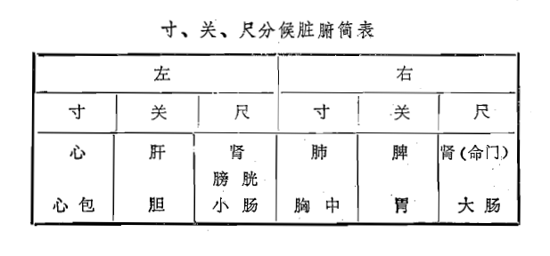
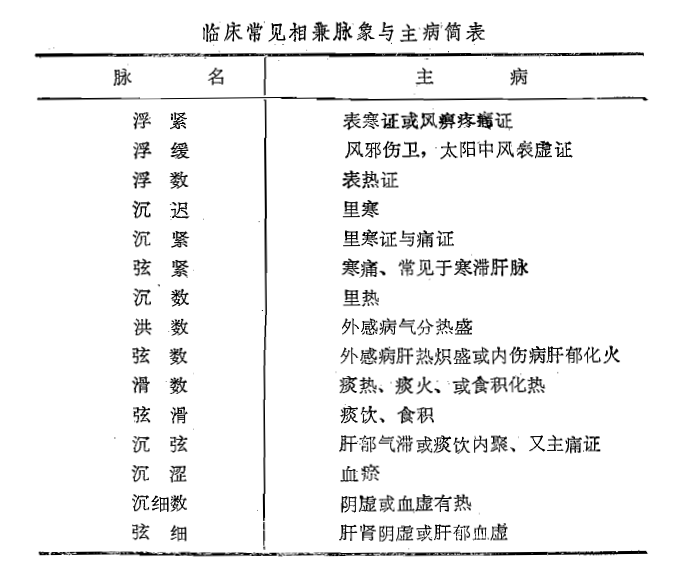

# 第五章  诊法

[TOC]

[自学时数]    30 学时

[面授时数]    8 学时

[目的要求]
1. 系统掌握望诊、闻诊、问诊和切诊的内容及其原理。
2. 了解“四诊合参”（即四诊并用）的重要意义。
3. 掌握得神、失神、假神的特征及其临床意义。
4. 掌握常色和病色的特征及其临床意义。
5. 掌握舌诊的原理、方法、正常舌象，异常舌象的特征和临床意义。
6. 熟悉望目、望斑疹白㾦、望络脉（小儿指纹）、望排泄物和分泌物的临床意义。
7. 了解望形体、姿态、头面、五官、身躯、四肢和皮肤等的基本内容。
8. 掌握呼吸、语言、咳嗽、呕吐、嗳气等声音高低、强弱、清浊等变化的临床意义。
9. 熟悉病体、口气、汗、痰、二便等的异常气味的临床意义。
10. 熟悉问诊的目的和意义。
11. 掌握问诊的方法、内容及注意事项。
12. 熟悉问现在症的基本内容和询问方法。
13. 掌握问现在症中各种常见症状的临床表现和意义。
14. 了解脉象形成的原理和脉诊的临床意义。
15. 熟悉切脉的部位、方法和注意事项。
16. 掌握正常脉象的特点及其生理变异。
17. 掌握二十八种病脉的形态及其主病。
18. 掌握相兼脉象的临床意义。
19. 熟悉脉症的顺逆与从舍。
20. 熟悉按诊的一般内容。

诊法，是通过望、闻、问、切四种诊察和搜集病情资料的方法。诊法主要是望、闻、问、切四法，又称四诊。

人体是一个有机的统一整体，通过经络系统等，使局部的病变可以反映到全身，内部的病变可以反映到体表。即所谓：“有诸内者，必形诸外”。所以，通过病人外在的全身的异常表现，可以推知在内的，或某一局部的病变。正如朱震亨所说：“欲知其内者，当以观乎外；诊于外者，斯以知其内”（《丹溪心法·能合色脉可以万全》）。望、闻、问、切四种诊察方法，是从不同方面搜集病情资料的主要手段，缺一不可，必须将此四者结合起来应用，即“四诊合参”，才能在全面了解病情的基础上进行准确的辨证。强调四诊中任何一、二诊，而忽视其他诊法，都是片面的。

## 第一节  望诊

望诊，是医生对病人的神、色、形态及其分泌物、排泄物等的观察，从而获取病情资料的一种诊察方法。

### 一、望神

神，一指人的精神，二指脏腑气血盛衰显现于外的各种征象。但无论是精神活动之神，还是脏腑气血征象之神，都是以人体元气为物质基础的，是元气盛衰的反映，所以神的变化对于判断疾病轻重，预后善恶，有着十分重要的意义。《素问·移精变气论》说：“得神者昌，失神者亡”，足见望神的重要性了。

望神主要观察病人的精神情况，神志是否清楚，反映是否灵活。而望神中的重点是观察病人的眼神。由于“五脏六腑之精气皆上注于目”，同时，“神藏于心，外候在目”。所以，刘完素说：“眼者，身之鉴”（《病机气宜保命集·原道论》）。即眼目，是人身的一面镜子。从眼神的变化，可察知人体精气盛衰存亡情况。

病人神的情况大致有三种：①得神：病人两目灵活，神志清楚，言语清亮等为有神，即得神。得神为正气未大伤，脏气未大衰，病虽重，预后多善。②失神：病人两目呆滞，晦暗无光，神志不清，言语无伦等为失神。失神表示病人正气大伤，脏气衰竭，为病情危重，预后多恶。③假神：久病而重危的病人，突然精神转佳，言语不休，索饮索食，呼吸平匀，如同常人，这种假象，称为假神。这是阴阳离绝，行将死亡时出现的假象，俗称“回光反照”或“残灯复明"。当重危病人出现假神时，经过短暂时间即告死亡。

望神对于癫、狂、癇的病人，则应另当别论。

### 二、望面

望面色，是指观察面部的颜色和光泽，即色泽，又称气色、神色。由于“十二经脉，三百六十五络，其血气皆上注于面而走空窍”（《灵枢·邪气脏腑病形》），所以，面部的色泽，反映了脏腑经络气血盛衰。

中国人正常面色是微黄红润，但由于禀赋有异，方域有别，及季节、气候、职业的不同，面色也略有正常范围内的差异，或偏于黑或偏于白，只要色现明润，即为正常之面色。

一般来说，面色明润光泽，是气血未衰，主病势轻浅，其病易愈；面色晦暗枯槁而无润泽之象，是气血已伤，主病势深重，其病难愈。

#### （一）面部五色与五脏

按五行学说，青属肝、属木，赤属心、属火，黄属脾、属土，白属肺、属金，黑属肾、属水。这是五色分别反映五脏的病变的一般规律，临床上又不能拘守于此，要灵活掌握，四诊合参，方可确定病属何脏何腑。关于五脏、五色在面部分布位置（可参阅《诊法·中药·方剂口诀》有关部分）及其在诊察疾病上的指导意义，近代中医临床上重视与应用不够，应该深入挖掘，细心观察，以便丰富中医诊断学的内容，提高诊断的准确性。

#### （二）五色主病

1、青色

主寒主痛、主瘀血惊风。青为寒凝气滞，经脉瘀阻。寒性收引，寒邪中络，则络脉拘急，气血运行不畅，则或气滞或血瘀，故使面现青色。如阴寒内盛，心腹疼痛，可见面色青白；心主血，心阳虚不能温血行血，可见面口发青；小儿壮热，而面口青紫，多为惊风先兆，等等。脾病见青色，病多难治（木克土）。

2、赤色

主热。热盛则脉络气血充盈，故面色红赤。实证面赤，证发即现，且满面红赤；虚证面赤，多在久病之后，且多见于两颧。久病、重病面色苍白而时现红赤如妆者，多为戴阳证，为虚阳上越之征。肺病见赤色，病难治（火克金）。

3、黄色

主虚主湿。黄为脾虚、湿郁的征象。面色淡黄枯槁，为萎黄，多因脾胃气虚，营血不能上荣于面所致。面目身俱黄，为黄疸，黄而鲜明如橘子色者，为阳黄，多因湿热；黄而晦暗如烟薰者，为阴黄，多为寒湿所致。黄而略带瘀色，为蓄血发黄。

4、白色

主虚主寒，主亡血脱气。白为气血不能上荣所致。或阳虚不能温血行血；或久病气血两亏；或亡血气脱；或阴寒过盛之剧痛，或恶寒战慄等，一切使气血不能荣于颜面之证，均可导致面现白色。

5、黑色

主肾虚、水饮，主虚寒、疼痛。黑属肾水之色，多为阳虚阴寒亢盛之征。阳虚寒盛，证见寒证、痛证，气凝血滞，则面见黑色。肾主水，肾阳虚则不能化气行水，为水饮停聚，常见目眶黑色。若黑而枯焦，形体瘦削，为阴虚内热，肾精不足。

应当指出，所谓五色，并非指生活中其正之颜色，而是多属略似之色，临床经历一多，自然易于分晓。根据五行学说，面部之五色与五脏相生者为顺，与五脏者相克者为逆。如肾病面见黄色为土克水，为病难愈；若见青色，为水生木，为病易治。肺病，面见黑色者，金生水，主病易愈；若见红赤，火克金，为病难愈。诸如此类，临床当灵活运用，综合分析。

### 三、望目

望目，主要是观察眼目外部形态各部分颜色及瞳仁大小等。因为“五脏六腑之精气皆上注目而为之精”（《灵枢·大惑论》）。同时，肝开窍于目，并且五脏病变在眼目中又各有相应的反映部位，所以，察目也是望诊的主要内容。

#### （一）外部形态变化

1、目窠肿

目窠即眼睑。目窠肿胀，为水肿。目窠红肿者为脾热，肿势急。目窠肿而缓慢，且无胀满感者，为脾虚。

2、目窠内陷

即眼窝深陷，为津液不足，精气已衰。两目上视、斜视、直视，多为肝风内动，或动风先兆，小儿见此，即发惊风抽搐。小儿睡眼露睛，多属脾虚。

#### （二）目睛的变化

1、全目红赤涩痛

红赤涩痛为火证，急发者为实火，缓起者为阴虚火旺。翳障胬肉，有虚有实，虚者肾气不足，实者邪火有余。

2、目睛局部变化

两眦（眼球之两眼角部位）红赤，多属湿热。两眦淡白，多为气血两虚。白睛黄染，见于黄疸。瞳仁散大，为肾精不足或将竭；瞳仁固定，为精绝神亡。瞳仁缩小，为肾经有热。

### 四、望舌

望舌，又称舌诊，是望诊的重要内容，也是中医辨证的重要依据。所谓舌诊，即观察舌象（包括舌形、舌质、舌苔）的变化。由于心开窍于舌，又为脾之外候；五脏六腑之经脉又直接或间接地与舌相通，所以，舌象的变化与脏腑，经络病证直接相关。一般来说，舌苔反映人体气（主要指胃气）的变化，舌质反映血的变化，所以有“气病观苔，血病观质”之论。若由舌苔变化发展到舌质变化，是疾病向深重方向发展的征象。

舌面划分为四部分，并反映各部分所属的脏腑（或三焦）的病变（图45）。舌尖属心肺（上焦)，舌中属脾胃（中焦），舌根属肾（下焦），舌两边属肝胆（舌诊的五脏分属部位，在舌诊形成和发展过程中，略有出入，但舌尖属心肺，舌中属脾胃，舌根属肾是一致的）。

#### （一）舌苔

舌苔是胃气所生。常人仅有一层薄白苔，干湿适中。察苔，主要是察苔色、苔质两方面。

1、苔色

苔色主要有四种：白、黄、灰、黑。苔色的变化，主要反映病邪深浅（表、里）及病邪性质（指寒、热）。在外感疾病中，苔色由白而黄，而灰而黑，又是病邪由表及里，逐渐深入的反映。

（1）白苔  多主表证、寒证。薄白苔本为正常舌苔，但在感受外邪时，则表现邪犹在表，尚未传里。舌质淡而苔白，为里寒证。若舌上白苔满布，如白粉堆积，抚之不燥，为积粉苔，常见于瘟疫，为外感秽浊之气，毒热内盛所致。亦见于内痈。

（2）黄苔  主里证、热证。一般来说，黄色之深浅，表示热邪之轻重，焦黄则热结。舌苔由白转黄，为外邪由表入里化热。由于黄苔主里、主热，因此黄苔又常与红、绛舌质主热并见。苔黄滑润兼见舌淡胖嫩者，多为阳虚水湿不化。苔黄滑腻，为内有湿热。

（3）灰苔  主里证，见于里热证或寒湿证。灰色即浅黑色，灰苔和黑苔常同时并见，也可与黄苔并见。灰苔滑润，为寒邪内阻，或痰饮内停。灰苔干燥多为热盛津伤，或阴虚火旺。

（4）黑苔  主里证，主热极或寒盛。黑苔多由灰苔或焦黄苔发展而来，常见于疾病的严重阶段。黑苔燥裂，甚则苔生芒刺，多为热极津枯。黑苔滑润，多为阳虚寒盛。

2、苔质

苔质是指舌苔的厚薄、润燥，腐腻、剥脱、有根无根。

（1）厚薄  反映病邪轻重及病情进退。薄苔多为疾病初起，病邪在表，病情较轻；厚苔多为病邪在里，病情较重，或内有食饮痰湿积滞。舌苔由薄转厚，表示病邪由表入里，病情由轻转重，为病进；舌苔由厚转薄，是邪气由里出表，病情由重转轻，为病退。

（2）润燥  正常舌苔是滋润的，为津液正常上承之象。舌苔的润燥，反映津液的盈亏。苔燥，甚则粗糙起刺，为津液亏耗，或阳虚不能化津上承；舌苔滑湿，多为水湿内停。

（3）腐腻  腐是苔如腐渣，揩之即去，是胃中浊腐之气上升；腻是粘腻，舌面多有盖一层粘液，腻苔剥之不去，是阴邪阻遏阳气，多为痰饮湿浊食积。

（4）剥脱  指舌苔消失。若舌苔突然退去而不再复生，舌面光洁如镜，即为光剥舌，又称“镜面舌”，系胃之气阴大伤所致。若舌苔局部脱落，剥脱处光滑无苔，称为花剥舌，也属胃之气阴两伤之征。若花剥舌而有腻苔，为痰浊不化，正气已伤。舌心无苔是阴虚、血虚或胃气已伤所致。总之，舌苔无论全部或局部剥脱，都是正气损伤之候。

（5）有根无根  有根是指舌苔刮之不去，舌苔与舌体如同一体，称为有根苔，又叫真苔。无根是指舌苔如同涂于舌上，刮之即去，称为无根苔，又称假苔。舌苔有根表示有胃气，主实证、热证；无根表示胃气已衰，主虚证、寒证。

总之，舌苔厚薄，辨邪气深浅；润燥，辨津液存亡；腐腻，辨脾胃湿浊；舌苔有无，辨胃气盛衰；舌苔真假，辨胃气有无、病证虚实。

#### （二）舌质

察舌质（即舌体)，包括察舌质颜色和舌体形态。正常舌质呈淡红色而润泽，舌体柔软灵活。

1、颜色

疾病时舌质颜色的异常改变常见有淡白舌、红舌、绛舌、紫舌等，其主病意义简述如下：

（1）淡白舌  舌色较正常浅淡，为阳虚、气血不足，不能温养于舌所致，见于阳虚寒证及血虚病证。

（2）红色  舌色深于正常，因热盛而气血充溢所致，见于里实热证，也见于阴虚内热证。

（3）绛舌  舌色深红，见于温病热入营血阶段；内伤杂病，则见于久病、重病之阴虚火旺。

（4）紫舌  舌色暗红呈紫色。绛紫而干，为邪热亢盛，阴津耗伤，气血郁滞之征。淡紫或青紫而湿润，为阴寒内盛，血脉瘀滞。舌上有紫色斑点，称为瘀斑、瘀点，多为血瘀之证。

2、形态

观察舌体形态，主要是观察舌体胖瘦老嫩，有无裂纹齿痕，以及舌体运动状态等。舌体润泽为荣，是津液充盛；舌体干瘪为枯，是津液不足。舌体纹理细腻，浮胖娇嫩为嫩，多主虚证、寒证。舌体运动状态，主要有强硬、痿软、颤动、吐弄、歪斜、短缩等。

（1）胖大舌  舌体胖大。舌体胖大而嫩，舌质色淡，为多属脾肾阳虚，水湿不化；舌体胖大，肿胀满口，舌质色红，多属心脾热盛，气血壅滞。舌体胖大青紫，多见于中毒。

（2）瘦薄舌  舌体瘦瘪，是阴血不足，不能充养舌体，瘦薄色淡，为气血两虚；瘦薄而干，舌质红绛，为阴虚火旺，或津液耗伤。

（3）裂纹舌  舌上可见有明显裂纹，多为津血亏损，舌体失于滋润（个别常人亦可见有裂纹舌）。舌质红绛而有裂纹，多为热盛津伤；舌质淡白而有裂纹，则为血虚。

（4）齿痕  舌体边侧，印有牙齿痕迹，多因舌体胖大被牙齿压迫所致。所以，齿痕舌常与胖大舌并见，多属脾虚。若兼见舌质淡白湿润，为脾虚寒湿壅盛。

（5）舌强  是舌体强硬，不能屈伸转动。见于温病，为热入心包，痰浊内阻，或壮热伤阴；见于内伤杂病，则多为中风征兆。

（6）舌痿  舌体痿弱无力，多属气血津液大亏，筋脉失养。久病舌淡而痿，是气血两亏；舌绛而痿，是阴津亏极。新病舌质干红而痿，为热盛伤阴。

（7）舌颤  是舌体颤动，不由自主。久病舌颤，为气血两虚，或肝风内动。外感热病，多为热极生风。

（8）吐舌  弄舌  舌伸长，吐出口外，为吐舌。舌时而伸出口外，立即收回，如此反复，或舌舔口唇，为弄舌。两者均属心脾有热。吐舌可见于疫毒攻心，或正气已绝。弄舌，多为动风先兆，或小儿脾燥。

（9）歪舌  舌体向一侧偏斜。多为中风，或中风先兆。

（10）缩舌  舌体收缩，不能伸展。舌体缩短，多为重危病候。舌淡湿润而缩，多为寒凝筋脉。舌质红干短缩，为热病伤津。舌胖而短缩，是痰湿内阻。凡舌体短缩强硬，均属危候。

临床上，舌苔、舌质、舌体的异常变化，常相兼出现，所以应综合分析。舌诊是中医诊法中十分重要之一法，从舌诊上，基本反映了脏腑气血盛衰、病位深浅、病邪性质（寒热、虚实）及病情进退等几个方面。察舌时还应注意光线及食物药物对舌苔颜色的影响。另外，用口呼吸者，舌苔也燥，应当注意。

### 五、望形体姿态

望形体姿态，是观察病人形体方面的变化，如壮弱、胖瘦及畸形等，以及姿态活动异常，如安静与躁动、肢体驰缓与拘挛抽搐等，这些对某些疾病的诊断有其特殊意义。

#### （一）形体

一般来说，形体的强弱与脏腑气血盛衰是一致的。脏腑气血充盛，则形体即健壮；反之则形体衰弱。

形体肥胖，肤白无华，是形盛气虚，多为阳气不足之证。骨细胸小，面黄肤燥，多为阴血不足。有所谓“肥人多痰，瘦人多火”，即指肥人多为阳虚湿盛，瘦人多阴虚火旺。鸡胸龟背，则为先天不足。又如腰不能转动，多为肾病；膝不能屈伸，为筋病。中医学认为，形体为元气所充。正常形体应是“形气相得”，即形与气平衡协调。无论是形盛于气，还是气盛于形，都是不符合“形气相得”的原则，因而都不是健壮的形体。至于“形气相失”，那更是有病难治。

#### （二）姿态

望姿态，主要是观察病人的动作姿势和体位有无异常变化。

病人异常的动作姿势和体位，往往是某些疾病的反映。如阳主动，火主动，因此，躁动、多言、仰面伸足、不欲衣被的病人多为阳证、热证；而安卧不语（或踡缩喜卧）者，多属阴证、寒证。若不能安卧，端坐呼吸、张口抬肩，多为痰浊壅肺；指趾颤动，常为动风发痉先兆；手足痿软无力，多属痿证；一侧肢体、手足麻木不遂，常为中风偏瘫；项背强直，角弓反张，四肢抽搐，则为痉病。因此，观察病人的姿势体位，对某些疾病的诊断确有一定意义。

### 六、望排泄物

望排泄物，就是观察病人的痰，二便、呕吐物及妇女经、带等的色、质、量方面的变化，及其在辨证中的意义。

#### （一）痰

白痰清稀，多为寒证，其中量多易咯，为湿痰；白痰及黄痰粘稠，为热证，其中量少难咯，为燥痰。咳黄痰，在外感疾病中，常表示热在气分。咯吐腥臭脓血，常为肺痈证。痰中带血，或咯出鲜血，多为热伤肺络。剧咳而伤及肺络，也可见痰中带血。

#### （二）呕吐物

呕吐涎沫，为寒证。呕吐食物无酸臭味者，为胃寒；有腐败酸臭味者，多为胃热，或饮食伤胃（宿食）。呕吐黄水而苦，多属肝胆有热。吐血或鲜或暗，多为肝胆火盛犯胃，热伤胃络。观察呕吐物时，应区别服药后之呕吐物必带有药物之颜色。

#### （三）二便、经带

详见本章第三节问诊。

### 七、望头、髮、五窍

#### （一）头与髮

头为诸阳经所会之处（直接或间接），脑为髓之海，肾生髓。髮为血之余，又为肾气所充养（肾其华在髮）。所以，头与诸阳经及肾的气化，以及血的关系密切。

1、头

在成人主要观察头是否有振摇的现象，头摇动不能自主，则为风证。在小儿则主要是观察囟门凸凹、大小、闭合的迟早。小儿囟门高凸（又称囟填），多为实证、热证，亦见于寒证。囟门下陷（又称囟陷），多为虚证，见于久病之后，或因泻痢，或因多尿，或先天元气不足，津液不足，其气下陷，不能上充于脑髓。小儿年龄增长而囟门不合或宽大者（又称解颅），多为肾气不足。

2、髮

主要观察髮的枯润与颜色。头髮稀疏枯黄，或小儿头髮枯黄逆立，为精血不足。突然片状脱髮为血虚受风。青年脱髮，或为肾虚，或为血热。青年白髮，无其他病候，为禀赋所致。

#### （二）五窍

1、耳

耳为肾之窍，并属少阳经，为宗筋所聚之处。常人的耳廓色呈红润。耳廓干枯焦黑，是肾精衰竭。耳根凉，耳背有红络，多为麻疹先兆。耳流脓水，多为肝胆湿热。

2、鼻

鼻为肺窍，阳明胃经所过之处，为呼吸通道。望鼻，主要是望鼻外形和鼻分泌物。鼻流清涕，多为外感风寒；鼻流浊涕，多为外感风热；鼻流浊涕日久不止，而有腥臭味者，是为鼻渊，多因外邪化热，或胆经郁热；鼻头红赤，年久不愈，为酒糟鼻，多属肺胃蕴热；鼻翼煽动，伴有高热者，多为外感之肺热壅盛，亦见于肺肾精气衰竭而出现之喘息。

3、口

主要观察唇、齿、咽喉。口为脾之窍，唇为脾之华，脾胃相表里。所以口唇主要反映脾胃病变。口唇淡白为血虚；青紫为痛为寒、为血瘀；深红为热在营血；深红干焦，为热盛伤津；口角流涎，多为脾虚湿盛，或胃热、虫积；口唇糜烂，是脾胃积热；口歪为中风；撮口抽搐，为肝风内动，或脾虚生风；人中满，唇翻，是脾阳绝；人中短缩，是脾阴绝。

4、齿、龈

齿为骨之余，肾主骨，胃经行于齿龈中，所以齿与龈的改变可以反映出肾与胃的改变。齿燥为胃热伤津；牙齿松动、齿根外露，多为肾虚，或虚火上炎；睡中咬牙或齘齿，常见于胃热，或虫积；牙龈红肿，或红肿出血，是胃火；牙龈出血而不见红肿，为气虚，或虚火伤络。

5、咽喉

咽喉为肺胃道路，且诸经所系，但主要反映肺胃肾三经之病。咽喉红肿而暗，为肺胃积热；红肿溃烂，上有红白腐点，为肺胃热毒；淡红不肿，经久不愈，为虚火上炎；鲜红略暗，为阴虚火旺；咽喉间出现白膜，刮之可去，而不立即复生的，是胃热；若刮之不去，重刮出血，随即复生，多为白喉。

6、目

详见本章第一节望目。

### 八、望皮肤

望皮肤，主要是观察皮肤颜色及形态变化。如全身皮肤发黄，为黄疸；肢体、颜面、或全身浮肿，为水肿等。本节重点介绍斑疹、白㾦、痈疽疔疖所引起的皮肤颜色和形态改变。

#### （一）斑疹

斑疹是某些病证在皮表的反映。常见于外感热病，少数亦见于内伤杂病。斑，为成片，或红或紫，平布于皮里，摸之不碍手。疹，呈红点，小如粟粒，高出皮肤，摸之碍手（少数并不高出皮肤，摸之也不碍手）。斑疹见于外感病，多是邪热郁于肺胃，内迫营血而致。斑疹的色泽，以红活润泽为顺。深红如鸡冠色，多为热毒炽盛；紫暗为热毒伤阴；淡红或淡紫，为气血不足，阳气式微。斑疹形态，以分布均匀，疏密适中为顺。稀疏松浮，为病邪轻浅；稠密紧束，压之色不退，为热毒深重；疹点疏密不匀，或见而即失，多为正气不足，邪气内陷之重证。

内伤杂病见斑疹，一般多为血热；若斑色紫暗，斑片较大，时有时无，多为气虚不能摄血，血不循经之瘀血。

#### （二）白㾦

白㾦是一种大如栗粒，高出皮肤，透明的小泡疹。多出现于颈项及胸部，偶见于四肢，惟不见于面部。多因湿郁肌表，汗出不彻所致。其中，晶莹饱满者为顺；枯白无泽，浆水不饱满者为逆。顺者，为湿邪外达；逆者，为津液枯竭。

#### （三）痈疽疔疖

痈疽疔疖，属于外科病证。痈：范围较大，红肿热痛，根盘明显者为痈，属阳证。疽：漫肿无头，部位较深，常不高出皮肤，局部肤色不变者为疽，属阴证。疔：发病范围小，初起如粟粒大小，根脚坚硬，或麻或木或痒，顶部白色而痛者为疔。疖：发于浅表，形圆，红肿热痛，化脓即软，为疖。

### 九、望小儿指纹

望指纹，是指观察浮现于食指掌侧的脉络，是手太阴肺经分支循行部位。和诊寸口脉有相似的临床意义。适于三岁以下小儿。

指纹分风、气、命（又称寅、卯、辰）三关。食指第一节为风关，第二节为气关，第三节为命关。（图46）

#### （一）望指纹方法

医生用左手食、拇指捏住小儿食指末端，以右手拇指在小儿食指掌侧，从指端向根部推几次，用力要适中，使指纹更为显现，便于观察。

#### （二）指纹主病

1、颜色

小儿正常指纹，色呈浅红，只见于风关之内，隐隐可见，但不浮露。鲜红者，主外感风寒；色紫红为内热；色紫黑者，病多危重。色淡为虚；色暗推之滞而不散者，为实证。色青主惊风疼痛。

2、延伸部位

正常指纹止于风关。疾病时指纹未出风关者，病势轻浅；指纹透至气关者，为病势深入，病情加重；指纹达于命关者，病势深重；指纹延伸至指甲端者，称透关射甲，病情多危笃难治。

3、浮沉

浮，指指纹浮露外现明显，主病在表；沉，指指纹深藏但可见，主病在里。

小儿指纹诊法在临床应用时，应四诊合参，不可单据此法。

## 第二节  闻诊

闻诊，包括听声音，嗅气味。听声音主要是听病人语言有无伦次，及语言、气息声音的高低、强弱等，以及呃逆、嗳气声。嗅气味，是嗅病人口气、嗳气及排出物气味。

### 一、听声音

#### （一）语言

1、声音强弱

病人语言声音有力，多为热证、实证，而正气不衰；声音低微无力，多为寒证、虚证。言语发声困难，或发不出声音，为音哑或失音。音哑或失音，有外感内伤和虚实之分。外感多见于外感风寒、风热之证，病多属实、属热；内伤疾病则多见于肺肾阴虚，津液不能上承所致，为病多日久不愈，病属虚证。

2、语言有无伦次

心主神，语言为神志活动表现形式，因此语言为心所主。语言的正常与否，反映了神志——心的功能正常与否。病人语言不乱，同于常人，说明神志正常，心气未伤，预后多良。否则，神志不清，语无伦次，语声有力，为谵语，多见于热证，热扰心神，属实证；神志不清，语言重复，时断时续，语声低微无力，是“郑声”，为邪伤心气，心不藏神之虚证。另外，语无伦次，还见于癫证或狂证，临床上不难区别。

#### （二）气息

1、气息强弱

气息即指病人之呼吸。气息微弱，是病人呼吸微弱无力，又称气微、息微，多见于虚证；气息有力，是呼吸气粗有力，多见于实证、热证。

2、喘哮

喘是病人呼吸困难，张口抬肩，不能平卧。气息声粗者属实证，气息声微者属虚。哮是病人呼吸困难而喉间有哮鸣声（水鸡声），多见于痰饮壅肺之证。临床上常常哮喘并见，如痰饮壅肺，阻塞气道，肺气不畅，必致病人呼吸迫促，张口抬肩而为喘，同时兼见喉间有水鸡声，而为哮，因此哮喘并见。

3、短气

短气是气息短，或气短而次数增加，常有气息不能接续之感，故又称少气，多见于虚证。

4、叹息

叹息又称“太息”，即“出长气”，多见于情志抑郁，肝气不疏之证。

哮喘虽发于肺，但其病源却可能在肺，也可能在心、肝、脾、肾四脏。如脾肾阳虚，不能温化水湿，水湿上犯于肺，即可发为哮喘。又肺主气，肾纳气，肾虚不能纳气，则气逆而上，也能气逆作喘。所以，《素问·经脉别论》有“喘出于肾”、“喘出肝”、“喘出于肺”之论。

短气，也不独为肺病，心虚、脾虚、肾虚皆可出现短气。因此，临证时当溯本求源，标本分明。

#### （三）咳嗽

咳嗽在闻诊方面主要包括咳嗽声音的强（有力）和弱（无力）、有无特殊咳声、咳声的连续程度，及问诊方面的有痰无痰、痰多痰少、咳痰难易、痰质稀稠、痰的颜色和有无带血等情况。

咳声有力属实，咳声低微无力属虚。小儿见咳嗽呈阵发而连续，咳嗽时气急满面涨红，咳嗽终止时的吸气声鹭鸶叫，为顿咳（百日咳）。小儿咳声如犬吠，应注意是否为白喉。干咳无痰，或痰少、粘稠不易咯出，为肺热肺燥，津液不足。痰多、清稀、色白，多为寒湿水饮伤肺。痰黄为肺热。痰中带血多为热伤肺络，或咳伤肺络，亦见于气虚不能摄血等。

咳嗽一症，也当如哮喘一样，当辨其病源在何脏，不能只局限于肺。

#### （四）呃逆、嗳气

呃逆、嗳气均为胃气上逆所致，但所主病证不同。呃逆，《内经》称“哕”，后世医家有称“呃逆”等。一般呃逆无何意义，但久病重病，处于衰竭状态的病人，若见呃逆，多为病情危笃难愈之征。嗳气，又称噫气，见于饭后，又无特殊气味者，不属病态。病态之嗳气，多见于饭后一段时间之后。若嗳出酸败之气味者，多为宿食伤及脾胃；若嗳气无特殊气味者，多为肝胃不和，或胃虚气逆。

### 一、听声音

#### （一）语言

1、声音强弱

病人语言声音有力，多为热证、实证，而正气不衰；声音低微无力，多为寒证、虚证。言语发声困难，或发不出声音，为音哑或失音。音哑或失音，有外感内伤和虚实之分。外感多见于外感风寒、风热之证，病多属实、属热；内伤疾病则多见于肺肾阴虚，津液不能上承所致，为病多日久不愈，病属虚证。

2、语言有无伦次

心主神，语言为神志活动表现形式，因此语言为心所主。语言的正常与否，反映了神志——心的功能正常与否。病人语言不乱，同于常人，说明神志正常，心气未伤，预后多良。否则，神志不清，语无伦次，语声有力，为谵语，多见于热证，热扰心神，属实证；神志不清，语言重复，时断时续，语声低微无力，是“郑声”，为邪伤心气，心不藏神之虚证。另外，语无伦次，还见于癫证或狂证，临床上不难区别。

#### （二）气息

1、气息强弱

气息即指病人之呼吸。气息微弱，是病人呼吸微弱无力，又称气微、息微，多见于虚证；气息有力，是呼吸气粗有力，多见于实证、热证。

2、喘哮

喘是病人呼吸困难，张口抬肩，不能平卧。气息声粗者属实证，气息声微者属虚。哮是病人呼吸困难而喉间有哮鸣声（水鸡声），多见于痰饮壅肺之证。临床上常常哮喘并见，如痰饮壅肺，阻塞气道，肺气不畅，必致病人呼吸迫促，张口抬肩而为喘，同时兼见喉间有水鸡声，而为哮，因此哮喘并见。

3、短气

短气是气息短，或气短而次数增加，常有气息不能接续之感，故又称少气，多见于虚证。

4、叹息

叹息又称“太息”，即“出长气”，多见于情志抑郁，肝气不疏之证。

哮喘虽发于肺，但其病源却可能在肺，也可能在心、肝、脾、肾四脏。如脾肾阳虚，不能温化水湿，水湿上犯于肺，即可发为哮喘。又肺主气，肾纳气，肾虚不能纳气，则气逆而上，也能气逆作喘。所以，《素问·经脉别论》有“喘出于肾”、“喘出肝”、“喘出于肺”之论。

短气，也不独为肺病，心虚、脾虚、肾虚皆可出现短气。因此，临证时当溯本求源，标本分明。

#### （三）咳嗽

咳嗽在闻诊方面主要包括咳嗽声音的强（有力）和弱（无力）、有无特殊咳声、咳声的连续程度，及问诊方面的有痰无痰、痰多痰少、咳痰难易、痰质稀稠、痰的颜色和有无带血等情况。

咳声有力属实，咳声低微无力属虚。小儿见咳嗽呈阵发而连续，咳嗽时气急满面涨红，咳嗽终止时的吸气声鹭鸶叫，为顿咳（百日咳）。小儿咳声如犬吠，应注意是否为白喉。干咳无痰，或痰少、粘稠不易咯出，为肺热肺燥，津液不足。痰多、清稀、色白，多为寒湿水饮伤肺。痰黄为肺热。痰中带血多为热伤肺络，或咳伤肺络，亦见于气虚不能摄血等。

咳嗽一症，也当如哮喘一样，当辨其病源在何脏，不能只局限于肺。

#### （四）呃逆、嗳气

呃逆、嗳气均为胃气上逆所致，但所主病证不同。呃逆，《内经》称“哕”，后世医家有称“呃逆”等。一般呃逆无何意义，但久病重病，处于衰竭状态的病人，若见呃逆，多为病情危笃难愈之征。嗳气，又称噫气，见于饭后，又无特殊气味者，不属病态。病态之嗳气，多见于饭后一段时间之后。若嗳出酸败之气味者，多为宿食伤及脾胃；若嗳气无特殊气味者，多为肝胃不和，或胃虚气逆。

## 第三节  问诊

问诊，就是询问病情，询问与病情有关的情况的诊察方法。问诊在诊法中占有极为重要的地位。诸如病人体质、禀赋、发病时间、发病原因、发病经过，及既往曾经患何病（既往病史），起居环境、五味偏嗜等与疾病有关的情况，只能通过问诊才能了解。这些有关病情资料也是其它诊法（望、闻、切）所难以获得的。因此，历代医家都把问诊放在第一位。《内经》就很重视问诊，并批评一些医生不进行问诊，只靠脉诊看病，故弄玄虚，是医生四大过失之一。如《素问·征四失论》说：“诊病不问其始，忧患饮食之失节，起居之过度，或伤于毒，不先言此，卒持寸口，何病能中，妄言作名，为粗所穷，此治之四失也”。明·张景岳很重视问诊在临证中的地位，他把问诊内容概括为“十问”，并指出：“十问者，乃诊治之要领，临证之首务也。明此十问则六变具存而万病形情俱在吾目中矣”（《景岳全书·传忠录》）。明·李中梓则指明应“先问后诊"（《诊家正眼·先问明然后诊脉》），清·陈修园强调“问证是医家第一要事”（《医学实在易·问证》）。因此，任何只重脉诊，以脉定病的做法都是片面的。

问诊，应首先询问病人最感痛苦的症状，即主要病痛。有时病人罗列一大堆病痛，自己分不清哪一病痛突出。此时，医生应结合已掌握的病情资料，对比分析，然后找出病人主要症状，再围绕与这一主症相关的脏腑、经络、气血津液等方面进行有目的询问，方能在纷乱的病症中，不被困扰。

在完成围绕主症的问诊之后，再以比较重要的症状为基础，进行询问。这样，还可发现不被病人重视、但可能是病人关键性的证候。就是说，既要抓住重点，又要了解一般。不抓住重点，就抓不住疾病的辨证关键，会造成辨证时无所适从；不了解一般，又会遗漏病情。

问诊的对象是患者本人或其陪诊者，医生问诊时要注意提醒患者围绕主证回答，患者有时在回答医生问话时，漫无边际，这时医生应抓住辨证要点、用通俗的语言询问，即围绕与本病有关的主要方面询问，以免患者“离题”太远。

由于疾病多种多样，病情千变万化，同时，疾病又有内、外、妇、儿、骨伤等不同，所以，问诊内容涉及范围十分广泛，而且每一科有每一科问诊的特点，每一证候又有自己的问诊重点，因此，问诊的内容难以用文字来全面概括。本节介绍的问诊内容是依据明·张景岳“十问歌”为基础，编写而成，做为临证问诊的纲领，临证时应结合各科及病证特点灵活运用。

### 一、问一般情况

#### （一）问姓名、性别、年龄、民族、籍贯、婚姻、职业等

性别。有些疾病只见于或多见于女性，有些疾病则只见于或多见于男性。由于男女生理上的差异，经、带、胎、产诸证只见于女性；情志方面疾病，多见于女性。遗精、阳痿等病只见于男性；肾虚证、肝阳（火）上亢等证则多见于男性。所以，男女性别不同，发病病种有异。

年龄。有些疾病具有年龄特点，某些只见于或多见于小儿，而不见或少见于成年人。

职业。职业和工作环境的不同，对疾病发生有一定影响。职业和疾病的关系，除有职业病外，由于职业不同，带来了工作环境上的不同，对人体产生不同的影响。如渔民、矿工等，长期在潮湿环境工作，易感受寒湿邪气。另外，体力劳动者和脑力劳动者，在体质上有一定差异，而患病之后病证虚实趋向也有一定差别。如体力劳动者，其病多实；脑力劳动者，其病多虚。又如某些难产多见于静坐性（脑力）工作者，而少见于体力劳动者。中医认为体力劳动者，气血多流畅；静坐性工作者，气血易郁滞。所以二者在难产发生率上有区别。

其他，如籍贯、生活习惯等都与某些疾病发生有一定关系。《素问·异法方宜论》指出：“东方之域”，“鱼盐之地，海滨傍水，其民食鱼而嗜咸"，“鱼者使人热中，盐者胜血”，“其病皆为痈疡”；“西方者，金玉之域，沙石之处”，“其民华食而脂肥，故邪不能伤其形体，其病生于内”；“北方者”，“其民乐野处而乳食，脏寒生满病”；“南方者”，“其地下，水土弱，雾露之所聚也，其民嗜酸而食胕”，“其病挛痹”；“中央者，其地平以湿”，“其民食杂而不劳，故其病多痿厥寒热”。这里讲的就是居住地的地理气候条件不同，饮食生活习惯不同，对疾病的发生所产生的影响。

所以，对一般情况的问诊也不应忽视。

#### （二）问个人生活习惯和生活状况

个人的起居习惯，饮食偏嗜，学习、工作、家庭环境的逆顺，对某些疾病有直接影响。如平素喜暖怕冷者，多为阴气偏盛体质，其病则易于偏虚偏寒；平素喜凉怕热，多为阳盛体质，其病则易于偏实、偏热。素喜酒茶者，病多痰湿。平素体弱，气血不充，病多属虚；素体壮盛，气血充实，病多属实。某些疾病，如情志疾病，即与生活环境的不良影响，心情苦闷有关。明·李梴《医学入门》说：“当问所处顺否，所处顺则性情和而气血易调；所处逆，则气血怫郁”。这些都是问诊时应注意的内容。

#### （三）问过去病史

病人过去所患疾病，往往与当前病证有因果关系，或属旧病复发。因此，对当前疾病的诊断极有参考意义。

#### （四）问起病时间、状况与就医情况（现病史）

问起病时间与当时发病情况，是指目前疾病。因为病人不可能患病后马上就医，同时也不可能始终就诊于一位医生，所以应问起病时病情，了解起病时间。病程较长者，即久病，多虚；病程短者，即新病，多实。同时可以了解判断病情演变趋势及病证全过程，病情由轻而重，还是由重而轻；病证始终居守一脏一经，还是及于他脏他经；温病由卫入气，还是由营转气等。

通过问现病史，还可以了解病人就医情况。如曾诊断为何证，用何药治疗，效果如何，这些情况对目前的辨证施治有借鉴之义。因为有些疑难病证，很难一次确诊，如果了解前医辨证施治情况，即可借鉴而少走弯路。

### 二、问现在病情

现在病情，是问诊的重要内容，也是辨证的主要依据之一。现据后人修订的张介宾“十问”歌所述及的内容为主，分述如下：

#### （一）问寒热

寒、热是疾病主要证候之一，大多数疾病均有寒热表现，因此是问诊的重要内容。寒、热为阴阳盛衰的表现。如《素问·阴阳应象大论》说：“阳胜则热，阴盛则寒”。寒、包括身寒、手足逆冷，及病人自觉怕冷即恶风恶寒；热、包括身热、手足心热（五心烦热）及病人自觉发热、怕热即恶热。寒、热在临床上可表现为“但寒不热”、“但热不寒”及寒热并见等。同时，寒、热又有内外真假之分（见“八纲辨证”）、以及内伤外感之别。

1、但寒不热

但寒不热，指病人只出现身寒，恶风恶寒之证，而无发热恶寒现象，多为阳虚阴盛的虚寒证，证属内伤，或外感伤寒寒邪直中三阴。这一类病证的恶寒，可因增加衣被而略有缓解。另外，温病汗出之后，而见身凉，脉静（平和）者，为邪气已去，病证向愈之象。无论伤寒、温病，大汗出之后，见身凉，手足凉，脉微细欲绝者，为阳气竭绝，病情危笃之象，多属不救。

2、但热不寒

但热不寒，是指病人身热恶热而不恶寒；自觉发热；或只见五心烦热等。发热原因很多，总可分为外感与内伤两大类。外感发热，一般发病急，热势高，且初起多见发热恶寒之表证，在表邪入里后，即表现为但热不寒；内伤发热，一般发病缓慢，热势不高，且初起无发热恶寒兼见之表证存在。

壮热：即大热、盛热，手按病人肌肤而有烫手的感觉，且久按热感不减，多兼见口渴面赤气粗等称为壮热。外感病壮热，见于伤寒为风寒之邪入里化热，如阳明经证和腑证；见于温病为热邪内传气分、血分等，如风温，热邪犯肺；湿温、暑温邪在气分；及温病热入营血。内伤壮热，见于宿食所伤，为夜间热甚。壮热之症为里热实证，为正盛邪实，邪正剧争的表现。

潮热：是发热之微甚作止均有定时，有如潮水之来，一日一发，多发于午后。若日发二次以上者，即非潮热。潮热有外感内伤之分，虚实之别。外感为实，内伤多虚。外感：伤寒阳明腑实证，为日晡潮热，兼见腹满痛拒按，大便燥结，手足汗出，舌苔黄燥等燥热内结之证；温病热入营血发热夜甚及温病后期余邪伏于阴分之夜热早凉。温病湿温证，为午后潮热（午后热甚），但身热不扬，初按肌肤不觉甚热，久按则灼手，是热为湿邪阻遏，难以透达于外所致，多兼见胸闷呃恶，身重便溏，苔腻以及暑热伤气等。内伤潮热，多见于气虚、阴虚、虚损证（肝、肺、肾阴虚等）、血虚、血瘀，气郁等。内伤潮热，有时有热自骨发之感（骨蒸潮热）。内伤以阴虚，气虚为多见。阴虚者多伴有五心烦热、盗汗、颧赤、舌红少津等；气虚者如脾胃气虚下陷的发热，肾气虚不能引火归元的发热，则潮热见于清晨，伴有自汗，或动则汗出，少气，乏力，面色㿠白等症状，且遇劳则甚。清·张石顽等还指出内伤之痰饮、宿食皆可出现潮热症状。内伤潮热，病势缓，热势不甚而病程长。

发热一症，在外感则多为热高而病程短；在内伤则多为热势不高而病程长，即长期发热，且时发时止。内伤之长期发热多见于前述之阴虚潮热和气虚发热。

五心发热：指手足心及心胸中烦热。见于阴虚劳损者，五心烦热，午后热甚，多伴有盗汗，口咽干燥等；见于血虚者，午后热甚，劳则尤重，多伴有神疲乏力，心悸等；见于温热病失治，余热未清而伏于阴分者，兼见夜热早凉，热退无汗，能食而瘦；见于火郁者，为气机不利，或寒邪束闭，而阳热郁伏所致。前者多兼见胸闷不舒，烦躁易怒，口苦等肝郁火热之症；后者见于外感寒邪，不难区别。火郁之五心烦热属实证。

3、恶寒发热

恶寒（恶风）发热是恶风寒与发热同时兼见。多见于外感，为外感表证的特点，是表阳与外邪相争的反映。仅就恶寒来说，内伤之恶寒，病势缓而长，得暖则减，且不兼见全身发热（不包括真寒假热）；外感之恶寒，病势急，病程短，得暖不减，重者多伴有寒战，恶寒之后旋即发热。外感病包括伤寒与温病，二者初起均有恶寒发热之表证。但伤寒表证之恶寒，时间长，恶寒也重，且多无汗；温病系外感温热之邪，其表证恶寒轻而短暂，旋即发热不恶寒而恶热，且伴有不同程度的口渴自汗等症状。伤寒厥阴病的寒热胜负，是邪正斗争孰胜孰负的反映。寒多热少为正负邪胜，为病进；热多寒少为正胜邪负，为病退。总之，恶寒发热是外感表证的根据。若内伤病而见发热恶寒，则或为内伤兼外感，或为阴胜格阳于外而发热，即真寒假热。

4、寒热往来

寒热往来是恶寒与发热交替而作，即寒去则热来，热去则寒至，作无定时。为邪在半表半里之征，为邪正相争于半表半里，邪正相持，邪不能入里，正也不能抗邪外出的病理反映。寒热往来见于伤寒邪在少阳；温病邪在少阴，或邪伏膜原，如伏暑、暑温、湿温、温疫。疟疾也有寒热往来，但休作有时，一日一发，或二、三日一发。

#### （二）问汗

问汗是问病人有汗无汗，以及汗出时间、汗出多少、汗出部位，及汗出时伴有的症状等。汗为阴血津液所化。汗出机理有二：一者因为阳热之气有向上、向外的特性，所以，在阳热亢盛时，即可蒸化阴津外越而为汗，即阴随阳走；一者因卫阳不足，卫外不固，而使阴津外越而为汗，或阴虚不能敛阳，或阴盛格阳，阳气外越，津随阳去为汗。

人在炎暑之际，皮腠疏松，同时由于阳热亢盛外发；或劳作，阳气受到扰动而外发，均能迫津外泄而汗出；人在寒凉之时，皮腠固闭，阳气内藏，因而无汗，或少汗，均属正常生理状态。

但在疾病过程中，有汗无汗都是两种不同的病变机制的反映。在外感伤寒病中，有汗为表虚（中风），或为正气祛邪外出之象；无汗为表实（伤寒）。在温病无汗为温病初起，邪闭卫阳之表实证；温病邪入营血而无汗，是热灼营血，津液不足，不能作汗。温病有汗，又有大汗、脱汗、战汗等。在内伤杂病，当汗而无汗，见于内燥伤阴，阴津不足之证；有汗，又有自汗（指醒时有汗）、盗汗等不同。内伤自汗，多为气虚、阳虚，肌表不固；盗汗多为阴虚内热。

1、自汗

自汗，是指不因劳动、天热、厚衣等因素而经常汗自出，称为自汗。原则上自汗应包括盗汗、大汗、战汗、头汗、手足汗、半身汗等内伤或外感所引起的汗自出在内。就是说，自汗包括的范围比较广泛，凡不因劳动、天热、厚衣、热饮食而引起的汗自出，均属自汗。但由于盗汗、大汗、战汗、头汗、手足汗、半身汗，各有其特殊的病证涵义，所以临床上一般多单称，而不混称为自汗。临床上习称之自汗，多指全身性、汗量不多者而言。这里所要讲的自汗，即属于这一方面。自汗在外感则见于伤寒病之中风；温病之风温（热）壅肺、暑伤津气、温热郁遏等。自汗在内伤则多见于气虚、阳虚之证，为卫阳不固，阴津不能内守而外达。气虚自汗，自汗常作，动则益甚，多兼见少气懒言、面色无华、怠惰嗜卧等症状。阳虚自汗，多兼见形寒肢冷、腹胀纳呆、便溏，或完谷不化、面色青白等寒象，阳虚自汗，又称为冷汗，多为脾肾阳衰。

2、盗汗

盗汗，又称“寝汗”，即睡而汗出，醒来即止。盗汗多属阴虚，阴虚则阳亢，阳亢则化热逼津外出而为汗。临床上多见于心肾阴虚之证。（详见脏腑辨证)。

3、大汗

大汗，即大量汗出，多见于外感，并兼见壮热、大渴等症。如伤寒之阳明经证及温病热邪入于气分。以及外感内伤之大汗出不止，最后导致亡阴亡阳之脱汗，又称绝汗，常表现为大汗淋漓、汗出如珠，或汗出如油等，为阴阳离决之危证，多属难救。

4、战汗

战汗，是战慄之后而汗出。战汗，一般只见于外感伤寒与温病之中。为邪正剧争，病变发展趋势的转折点。战汗之后，身凉脉静，诸证悉除，为正气胜邪，邪随汗出，病即先愈；若战汗之后身寒肢厥，脉微欲绝，神志不清，为正不胜邪、阳气已脱之危重证，亦有战汗之后，身热不除脉仍盛大有力，为正气尚盛，仍可再汗而解。

5、头汗

头汗，系指汗出仅限于头面部，而他处无汗。头汗一见于温病湿热郁蒸于上；一见于大病之后，或老年人气喘而头额汗出，多为气虚气不上奉于头，津液不固而汗出头面。若重病期间，突然头汗大出，多为虚阳上越欲脱之危象。

6、半身汗出

半身汗出，是汗出或身之左侧或身之右侧，或上半身或下半身。半身汗出，无论外感内伤均可出现。其病因，或气血亏虚，或痰湿痹阻经络，或营卫不调，导致半身腠理开合失司而为汗出或偏于左、右，或偏于上、下。壮年、老年之人汗出偏左或偏右，应防中风。

7、手足心汗

手足心汗，汗出少量者，或青少年汗足，无其他伴有症状者，不属病态；但若手足心汗过多，并伴有某些全身症状者，即属病态。临床上手足心汗常见于脾胃湿热、脾胃气虚、脾胃阴虚、心脾血亏等。

#### （三）问疼痛

疼痛是临床常见症状之一，多种病证均可出现疼痛。由于产生疼痛的病因、病机不同，因而疼痛的性质、发作的时间、持续的时间，以及疼痛部位等均有差别。无论是外感、内伤，跌打堕仆，无论是虚实、寒热，产生疼痛的病机均为脏腑、经络气机不利，即所谓“不通则痛”。

由于人体的各个部位总是与一定的脏腑经络相联系，所以分辨疼痛的部位，对于了解病变所在的脏腑经络就有一定的意义。

1、头痛

头痛古有真头痛、脑痛、首风、头风、脑风等名称。但真头痛、脑痛，又多指能致人于死命的重危病证，如《灵枢·厥病》说：“真头痛，头痛甚，脑尽痛，手足寒至节，死不治”。《中藏经》说：“病脑痛，其脉缓而大者，死”。脑为髓之海，十二经脉和奇经八脉又直接或间接地联系于头面。因此，人体脏腑经络、气血津液等病变，都可能反映于头，而引起头痛症状的发生。所以，头痛一症涉及的病因、病证也比较广泛，外感、内伤、跌仆打损所发生的各种虚实病变，都会导致气血闭阻郁滞，或气血亏虚，气虚则不能行血，血虚则不能载气，而使气机不畅，产生头痛。

外感头痛，以风寒、风热、风湿头痛为多见。风寒头痛，则或痛连项背，或有紧束感，恶寒发热，骨节痠痛，口不渴，舌苔薄白等；风热头痛，则头胀而痛，发热重，或微恶风寒，口干口渴，舌苔薄黄等；风湿头痛，头重而痛，首如裹，身热不场，头昏胸闷，口粘苔腻等。

内伤头痛：以肝阳（火）头痛、气（阳）虚头痛、血虚（阴虚）头痛为多见。肝阳头痛，头晕头胀而痛，烦躁易怒，或口苦咽干耳鸣，或胁胀胁痛等；气虚头痛，头痛绵绵，气短乏力，自汗恶风恶寒，食少纳呆，或遇劳则剧；阳虚头痛，头痛绵绵，恶寒，遇冷则剧，肢冷便溏等；血瘀头痛，痛如针刺，痛而不移，舌质紫黯，或有瘀斑；血虚头痛，头痛隐隐，面色无华，口唇淡白，心悸健忘失眠等；阴虚头痛，头空而痛，头晕耳鸣，腰膝酸软，遗精带下，舌红等；痰浊头痛，头痛昏蒙而重，胸脘痞闷，呕吐痰涎，肢体困重等。

在外感，根据头痛部位不同，又有三阳头痛及厥阴头痛之分。太阳头痛，痛在脑后，连及项背；阳明头痛，痛在前额及眉棱骨；少阳头痛，痛在两侧；厥阴头痛，痛在巅顶（在内伤则十二经脉、奇经八脉皆可有头痛）。

一般新病头痛，多外感，久病头痛，多内伤；痛无休止多外感，时痛时止多内伤；剧烈头痛多外感，痛势绵绵多内伤。痛在上午多为气虚，痛在下午多为血虚；痛在白昼多为阳虚，痛在夜间多为阴虚。

又有偏头痛一症，古称偏头风，属头痛之一，但又和一般头痛有别。其头痛偏于一侧（左、右），痛久不愈，反复发作，主要见于肝阳、肝火、瘀血、痰饮等证。

2、胸痛

胸部属上焦，为心肺所居之处，所以胸痛常是上焦心肺病变的反映。临床上，胸痛往往又与胁痛、背痛并见，但以胸痛为主者，仍以胸痛而论。胸痛有时又称心痛，真心痛。

胸痛可见于心气虚、心阳虚、痰浊阻遏心阳、心血瘀阻、痰热壅肺、肺燥伤阴、痰浊阻肺、风寒袭肺、肺痈等病证。一般胸痛而伴有心悸息短、自汗、嗜卧懒言者，多为心气不足；胸痛并连及肩背，形寒肢冷，面色青白，自汗者，为心阳虚；发作时胸痛剧烈，有如针刺，冷汗淋漓，舌质暗红，或有瘀斑，为心血瘀阻；胸痛而咯吐腥臭脓血者，为肺痈；胸痛而咳吐粘稠黄痰或咳吐暗红血痰，为痰热壅肺；胸痛为隐隐作痛，伴有潮热盗汗，痰中带血，或痰少而粘，咽干咽痛，舌质红，为肺阴虚（多伴有肾阴虚）；胸痛痞闷，咳痰多而清稀，或痰多而粘稠，气短气喘，不能平卧，为痰浊阻肺；胸痛彻背而伴有心悸胸闷，或有喘息气短，呕吐痰涎，舌苔湿腻，为痰浊阻遏心阳；风寒袭肺，是外感风寒之邪，肺失宣畅，发为咳逆，多为咳痰清白而频，伴有发热恶寒等表证症状。风寒袭肺之咳嗽胸痛，表现为咳则胸痛，不咳不痛。若风寒袭肺，入里化热，则因肺热或痰热壅肺作咳而胸痛，前已述及。

外感内伤均可导致胸痛，而某些内伤胸痛正是外感之后而形成，即由外感转化为内伤，因此，外感内伤是既有区别，又有联系。

3、胁痛

胁为肝胆二经分布的部位。所以，胁痛，多与肝胆二经及其所属脏腑有关。如肝气不疏，肝火郁滞，肝胆湿热，血瘀气滞以及悬饮等病变，都可引起胁痛。

由于足太阴脾与肝经交会于期门穴，与胆经交会于日月穴；同时，脾之大络大包布于胸胁，所以脾脏、脾经病也可出现胁痛胁胀症状。

4、胃脘痛

胃脘痛是上腹部至心窝部疼痛，也称胃痛。胃脘痛，前人所称心腹痛、心痛、心下痛等，多包括胃脘痛在内。胃脘痛，常见于肝气（火）犯胃所导致的气滞、血瘀、郁火作痛；脾胃虚寒作痛；饮食积滞作痛，或因外寒犯胃、饮食生冷所致胃寒作痛。临床上当从兼症予以辨别。

5、腹痛

腹痛是泛指脐部及脐以下腹部作痛。根据疼痛部位不同，又有当脐痛、脐腹痛，痛在脐下腹部称小腹痛，痛在小腹（脐下部）两侧称少腹痛。而脐以上疼痛，则称为大腹痛，大腹痛实包括胃脘痛在内。多种原因，如外感、内伤、饮食虫积等都可发生腹痛。同时，妇女的经带胎产疾患也可产生腹痛症状。腹痛多与胃肠、膀胱、肝胆病有关。可见于寒积肠胃、肠胃热结、肠胃湿热、肝胆湿热、寒滞肝脉、肠胃虚寒、水饮内停、膀胱湿热，以及宿食不化、虫积、气滞血瘀等证。

一般上腹痛多属脾胃与肝胆，脐腹痛多属于胃肠，小腹、少腹痛多病在大小肠、膀胱。走窜疼痛，痛无定处，病多为气；痛有定处，病多属血。痛而喜热，口不渴，多属寒；痛而喜凉口渴，多属热。痛而拒按属实，痛而喜按属虚；痛势急剧多实，痛势绵绵多虚。

6、腰痛

腰为肾之府，所以腰痛一症多与肾病有关，如肾气虚、肾阳虚、肾阴虚，均有腰痛产生。风寒湿邪闭阻经脉，可使经脉气血不畅而腰痛，属痹证范围，但有寒痹、热痹、湿痹等之分。腰部扭打跌仆而痛，多为瘀血腰痛。肾病腰痛多为内伤属虚；痹证腰痛及外伤腰痛多为实证。

7、四肢痛

四肢痛，即痛在关节、肌肉，多因风寒湿邪闭阻经脉，使气血瘀滞所致。也见于肝脾肾三脏气血虚衰而致关节肌肉痠痛乏力。因此，四肢关节肌肉痛也有虚实之分，即风寒湿为病多实，肝脾肾为病多虚。

#### （四）问饮食

问饮食主要包括有无口干口渴、饮水多少、凉饮热饮及食欲情况。饮食情况主要反映胃气盛衰，津液盈亏。

1、口渴与饮水

口干口渴，渴欲饮水，或欲冷饮，多为热盛伤阴，津液不足。口干口渴，渴欲热饮，饮而不多，或渴而不欲饮，若小便不利者，为水饮内停，不能化津上承；若小便自利者，多为温病热入营血，阴血蒸化上潮；故渴而不欲饮。身无大热，而大渴引饮，同时尿多者，为消渴。口不渴，为津液未伤，多见于寒证。

2、食欲

了解患者食欲状况，进食多少，对于判断胃气盛衰以及疾病的预后转归，有较重要的临床意义。

食欲减退或不欲食，胃纳呆滞，多是脾胃气化失常的表现。若食少见于久病，兼有面色萎黄、形瘦、倦怠等症者，属脾胃虚弱；而食少伴有胸闷、腹胀、肢体困重、舌苔厚腻者，则多是脾湿不运。

厌恶食物或恶闻食臭，即为厌食，又称“恶食”，多见于伤食。妇女怀孕，亦可有厌食的反应，多因妊娠后冲脉之气上逆，胃失和降所致。厌油腻厚味，多见于肝胆脾胃湿热的病证。

食欲过于旺盛，食后不久即感饥饿者，为消谷善饥，往往身体反见消瘦，这是胃火炽盛，腐熟太过所致。如《灵枢·师传》所说：“胃中热则消谷，令人悬心善饥”。

有饥饿感，但不想吃，或进食不多者，称为饥不欲食。多因胃阴不足，虚火上扰所致。易饥多食，但大便溏泻，消化不好，属胃强脾弱。

有嗜食生米、泥土等异物，尤多见于小儿，往往是虫积的征象。妇女妊娠偏嗜某种食物，一般不属病态。

疾病过程中，食量渐增，表示胃气渐复；食量渐减，常是脾胃气衰的表现。若久病之人，本不能食，但突然反而暴食，这是中焦脾胃之气将绝的征象，称为“除中”，也是“回光返照”的一种表现。

3、口味

指病人自觉口中气味异常与否。口苦口干，多为肝胆热盛；口甜为脾热；口中有酸腐气味，多为胃有宿食化热；口淡乏味，即食而不知味，多为脾虚不运，胃气虚衰；口中泛酸〈吞酸吐酸〉，多为肝火犯胃，或为宿食，或因胃寒（泛酸一症，寒热均有，不独为热）。

#### （五）问二便

1、大便

主要问大便形态、颜色、气味、有无脓血、便中是否带血、及血的颜色新旧、排便次数、便量多少、排便时感觉、有无大便失禁等。

大便干燥：正常大便成型而软，每日一次。大便干燥，排出困难，便次减少，甚至三、四日一便，称为便秘，多见于热盛伤阴，肠道津亏；久病、产后及老年人之便秘，多为气虚传送无力，或血虚、阴虚燥结，或气阴两虚；阳虚寒盛，阴寒固结于肠腑，滞而不行，称为冷秘；忧愁思虑，肝气郁滞，疏泄无力，遂使大肠传送失司而为便结，称气秘。总之，大便秘结有寒热虚实之分，不外热盛、寒盛、气虚、气滞、血虚、阴虚等。某些医家又以有热无热，将便秘分为阳结、阴结两类。便秘是有便而秘（闭），而无便之秘（闭），并伴有剧烈的腹胀、腹痛、呕吐等，属于“关格”范围，不属便秘。

大便稀溏：排出大便稀溏而不成型，或为水样，或夹杂未消化的水谷，便次增加，称泄泻。脾主运化水谷，胃主腐熟水谷，小肠主分清泌浊，大肠主传导糟粕。所以，大便泄泻不论是什么原因引起，最终总属脾胃、小肠、大肠的病变。泄泻清稀或稍稀，无特殊气味，腹痛肠鸣，素有怕冷，手足凉之症，为脾肾阳虚之寒泄（肾阳不足、命门火衰之五更泄，属脾肾阳虚证之内。）；若泄泻清稀、腹痛肠鸣而兼见寒热头痛，肢体痠痛等表证者，为外感风寒，或寒湿之邪，也属寒泄。腹痛即泻，泻出黄色稀便而臭秽，泻时肛门灼热，口渴饮冷，小便短赤，为肠胃湿热泄泻；若在盛夏感受暑湿邪气，则泄泻如水，烦渴尿赤，自汗，为暑湿泄泻。二者均属热泻。饮食所伤，腹胀腹痛，泻下稀便臭秽如腐败鸡蛋气味，泻后腹胀腹痛即减，为宿食泄泻。泄泻时作时止，完谷不化，饮食不思，食后痞满，面色萎黄，神疲乏力，为脾胃气虚泄泻。每于神情紧张或发怒即腹痛腹泻者，为肝气乘脾。

便脓血：便下呈稀糊样，或红或白，或红白相杂，并伴有腹痛、便频、里急后重等是痢疾。兼有发热恶寒，肛门灼热，小便短赤，口渴心烦，或呃噁胸闷者，为湿热痢；若下利白多赤少，清稀，腹痛隐隐，喜热喜按，口不渴者，为寒湿痢；一方一家相互传染，病情险急，利下鲜紫脓血，壮热口渴，头痛烦躁，甚则神昏谵语痉厥，是疫毒痢；或湿热痢，或疫毒痢而至饮食不入，恶心呕吐，是胃气已绝，毒气上冲，是噤口痢；下利时发时止，日久不愈，恶寒，倦怠嗜卧，脉虚无力，是休息痢。

痢疾：大抵身热者重，不能食者重，下利纯脓血无便者重、下利纯血者重。

便血：便下鲜血，或血色紫暗，或为黑便，称为便血。一般便下鲜血，而不与粪混杂者，无论在便前便后，多为大肠或肛门病出血。血色紫暗并与粪便混杂，或为黑便，多为胃、小肠血。又有血在便前而下为近血，血在便后而下为远血之说，临床当灵活掌握。便血鲜红，或先血后便，口苦苔黄，多为湿热下注大肠，伤及阴络；下血紫暗，或呈黑便，或先便后血，面色无华，气短懒言，倦怠乏力，为脾胃气虚不能摄血；便后鲜血滴滴，多为肛门病出血，如肛裂、痔疮等。

大便失禁：大便无力控制，或便而不觉称大便失禁，又称大便滑脱、滑泄。本症多见于久痢，或泄泻日久而气虚下陷诸证，以及各种原因的神志不清病人。

2、小便

主要询问小便的有无、次数、颜色、量之多少、清浊、小便时有无涩滞及尿痛等。小便为津液所化生。肺为水之上源，且有通调水道之作用；脾主运化水湿；肾主水液转输，并司二便；膀胱为贮藏尿液的器官，并其下口与尿道相连。所以，小便正常与否直接反映了肺、脾、肾、膀胱等脏腑气化盛衰。

尿量过多，其病在肾，多属虚寒，也常见于消渴证。小便短少，既可由于热盛津伤，或汗、吐、下太过损伤津液，以致化源不足所致；也常见于肺、脾、肾功能失常，气化不利，水湿内停的病证。小便不畅，点滴而出为癃；小便不通，点滴不出的为闭，一般统称为“癃闭”。癃闭因湿热下注，或瘀血、结石阻塞的，多属实证；若因肾阳不足，不能气化，或肾阴亏损，津液内虚的，多属虚证。

小便次数增多，为小便频数，短赤而急迫的，多属下焦湿热，量多而色清的，多属下焦虚寒，肾气不固，膀胱失约；尿频而涩少，常是阴虚内热。小便数而大便硬，多是脾约病。小便次数减少，除属津液亏耗，化源不足外，还常见于气化不利，水湿内停的病证。

小便时尿道疼痛，并常伴有急迫、艰涩、灼热等感觉的，多是湿热下注的淋证；小便后自觉空痛，多属肾气虚衰；尿后余沥不尽，多属肾气不固。不自主的排尿，或不能控制的尿滴沥，称为“尿失禁”，多属肾气不固；若伴见神志昏迷则多是危重证候。睡中不自主排尿，是为遗尿，多属肾气不足的虚证。

尿血，尿呈淡红色、鲜红色等为尿血。尿血与血淋有别，尿血一般无痛，或有轻度胀痛；血淋则小便淋漓涩痛难忍。尿血一症，多见于膀胱湿热、肝胆湿热下注、心移热于小肠、肾阴亏损及脾肾气虚等证。

#### （六）问睡眠

问病人睡眠情况，主要问有无失眠，或多睡情况。老年人睡眠时间较青少年相对少些，青少年睡眠时间较老年人相对多些，都属正常范围。失眠是指睡眠时间过少，或不能入睡，或睡而易醒。而多睡是指睡眠时间过多，有的甚至在白天稍一安静即不自主地入睡。

关于睡眠的生理，张景岳在总结了《内经》有关论述的基础上指出：“凡人之寤寐，由于卫气。卫气者昼行于阳，则动而为寤；夜行于阴，则静而为寐”（《类经·疾病类》）。是说卫气白天行阳经及六腑，则阳气盛阴气虚，阳主动，故白日不寐；夜间卫气行于阴经及五脏，则阴气盛阳气虚，阴主静，故夜则能寐。即《灵枢·口问》所说：“阳气尽，阴气盛则目瞑；阴气尽而阳气盛，则寤矣”。所以，任何原因所引起的卫气入阳而不能入阴，就会产生阳盛阴虚而不寐（失眠），卫气入阴而不能入阳，就会产生阴盛阳虚而多寐（多睡），即阴阳不能正常交济，就会寤寐失常。

1、失眠

失眠，又称不寐、不得眠。失眠是阳不入阴而阳盛阴虚。具体病证主要有心肾阴虚，心火炽盛的心烦不寐；心脾两虚，血不养心的心悸怔忡而不寐；肝血虚的惊悸不寐；以及痰火、宿食而引起的不寐等。尽管许多原因和病证都会引起不寐，但最终总与心神不安有关。

2、多睡

多睡，或称嗜睡、多寐等，为阴不出阳之阴盛阳虚所致。多睡常由心脾肾三脏气虚阳虚所致。如头目昏沉而多睡，常见于痰湿阻遏，清阳不升之证；神疲欲寐，闭眼即睡，呼之即醒，或似睡非睡，多属心肾阳虚之证；怠惰乏力，食后即睡，多属脾气虚之证。多睡见于外感急性热证，多属邪入心包，热盛神昏，为昏睡。实质上昏睡是与一般多睡有区别的，因此一般嗜睡多不称昏睡。

#### （七）问经带胎产

女性有月经、带下、妊娠、产育等生理特点。凡女性病人就诊，即使对一般疾病也当了解上述几方面的情况，尤其是月经和带下更为重要。

1、月经

主要询问月经的周期，行经的天数、经量、经色、经质及其兼证。必要时须询问末次月经的日期，以及初潮或停经的年龄。

经期：月经周期一般为28天左右，行经在3～4天，少数为5～6天。若周期提前八、九天以上者，为月经先期，多因邪热迫血妄行，或因气虚不能摄血，血行无制；属于肝郁或瘀血的亦较多见。若周期错后八、九天以上者，为月经后期，多因寒凝气滞，血不畅行；或因血少，任脉不充；也常见于痰阻或气滞血瘀。若经期错乱，或前或后，经行无定期，多因肝气郁滞，或因脾肾虚损，也有因瘀血积滞所致。还有极少数妇女终身不见月经，但也能正常妊娠生育的，称为“暗经”，属于生理上的异常，不作病论。

经量：由于个体素质、年龄的不同，在正常情况下，经量有相对的多或少的差异，均为生理范围。若经量超过了生理范围，称为月经过多（经血大下不止者又称崩漏），多因血热、冲任受损，或气虚不能摄血所致。若经来少于正常量，称为月经过少，多因血虚生化不足，或因寒凝、血瘀、痰湿阻滞等，若停经超过三个月，而又未妊娠者，称为闭经，多因生化不足，气虚血少，或血瘀不通，或血寒凝滞等。但也有因生活环境的改变而停经的，若无明显病状者不属病态。

色质：正常月经色正红，质地不稀不稠，亦不夹杂血块。若经色淡红质稀，多为血少不荣，属虚证；若经色深红质稠，属血热内炽，为实证。若经色紫暗有块，乃寒凝血滞；暗红有块，则为血瘀。

行经腹痛：行经时腰腹作痛，甚至剧痛不能忍受，并随月经周期持续发作，称为痛经。经前或经期小腹胀痛者，多属气滞血瘀；小腹冷痛，遇暖则缓者，多属寒凝；行经或经后小腹隐痛、腰痠痛者，乃气血亏虚，胞脉失养所致。

2、带下

正常情况下，妇女阴道内应有少量乳白色、无臭的分泌物，有濡润阴道壁的作用。若分泌过多或缠绵不绝，即为带下。其中色白、量多淋漓者，为白带；白带中混有血液，赤白分明的，为赤白带；带下淡红粘稠，似血非血，称为赤带；其色淡黄，粘稠臭秽，是为黄带。临床以白带、黄带较为多见。

问带下，应注意了解量的多少，色质和气味等。若带下量多色白，清稀如涕，多属脾虚湿注；带下色黄，粘稠臭秽，或伴有外阴瘙痒疼痛，多属湿热下注；带下色赤，淋漓不断，微有臭味，多属肝经郁热；带下晦暗，质稀薄而多，腰腹酸冷，多属肾虚。总之，凡带下色白而清稀的，多属虚证寒证；色黄或赤，稠粘臭秽的，多为实证热证。

3、胎产

妊娠期间呕吐为恶阻；妊娠腹痛腰痛及下墜感，要防堕胎；妊娠浮肿为子肿；妊娠抽搐为子癎；妊娠下血为胎漏；以及产后恶露等，均须详问。

#### （八）问小儿

问小儿病情比较困难。有的本人叙述不清，有的不能自述，所以主要依靠询问亲属。

问小儿病，除一般问诊的有关内容外，还要询问出生前后（包括孕育期和产乳期）的情况，是否患过麻疹、水痘，有无高烧、惊厥史，曾作过那些预防接种，有无与传染病者接触，采用什么喂养方法，走路、学语迟早，以及父母健康情况，有无足以遗传的疾病，小儿常接触的人有无特殊的疾患等等。

关于发病的原因，如有无受惊、着凉、伤食等，都须根据病情逐一细问。

## 第四节  切诊

切诊，包括脉诊和按诊两部分。切诊是医生以手指对一定部位的动脉和体表进行触、摸、按、压，以了解病情的诊察方法。

### 一、脉诊

脉诊，是医生用手指末节指腹触按病人一定部位的动脉（如人迎脉、寸口脉、趺阳脉）脉情形态等的变化，从而达到了解病人内在病变的诊察方法。脉情形态等的变化，称为脉象。脉诊在中国具有悠久地发展历史，受到历代医家的广泛重视，并积累了丰富的理论和经验，是中医诊断学的一大特点。

血脉分布运行于人体周身，内养于脏腑，外濡于筋骨、肌肉及各器官孔窍。同时，脉中之血又与五脏有直接联系，如心主血、心生血、脾统血、肝藏血等。所以，血脉运行的正常与否直接反映了脏腑及周身各部的生理病理状态。即脉象是人体健康和疾病的反映。有些疾病在临床证状尚未出现之前，脉象就已经发生改变。临床实践证实，疾病的表、里、虚、实、寒、热等不同的病理变化，都可在脉象上出现相应地变化。因此，脉诊是一种有理论和实践依据的可靠的诊法之一。

#### （一）脉诊的部位

脉诊的部位，随所选择的脉诊方法不同而异。脉诊方法大体有三种：遍诊法、三部诊法、寸口诊法。遍诊法是同时诊察头、手、足三处一定的动脉的脉象；三部诊法是同时候人迎，寸口、趺阳三部动脉；寸口诊法是独候寸口动脉。遍诊法、三部诊法现已很少采用，广泛应用的是“寸口”诊法。

寸口又称气口、脉口，位于掌后高骨侧，触之有脉跳动处即是。寸口脉之所以能反映全身病变，是因为寸口是全身血脉汇合之处，寸口属手太阴肺经，而身之血脉又聚汇于肺（“肺朝百脉”）；手太阴肺经起始于中焦，中焦为脾胃所居之地，脾胃是全身气血生化之源。所以，诊寸口脉可得知五脏六腑及气血等病变情况。

寸口脉分为三部，掌后高骨处为关，关前为寸，关后为尺，左右两手共六部。（图47）

关于寸关尺三部分候脏腑的问题，历代医家颇多异论，但基本精神是一致的。近世通行的分配方法是：左手寸、关、尺分候心（心包）、肝（胆）、肾（膀胱、小肠）；右手寸、关、尺分候肺（胸中）、脾（胃）、肾（命门、大肠）。这种分配方法体现了“上（寸）以候上（上焦），中（关）以候中（中焦），下（尺）以候下（下焦）”的原则。

#### （二）诊脉的方法

诊脉时，病人取坐位或仰卧位，手臂与其心脏近于同一水平上，手掌向上，手臂自然平放。对成人患者用三指定位法，即医生先用中指按于高骨处定关部，然后食指按于关前定寸部，无名指按于关后定尺部。三指应呈弓形自然斜按于同一水平，以三指末节指腹接触脉体。三指疏密，应视病人高矮做适当调整，一般三指微有间隙即可。小儿寸口脉较短，不能容纳三指，可用“一指定三关法”，不细分三部。三岁以下小儿，用望指纹代切脉。

诊脉时的指力。诊脉时根据医生指力大小分为浮取、中取、沉取，又称举、寻、按。手指轻按于脉体上，称浮取，又称“举”；中等用力，按至肌肉，为中取，又称“寻”；用力较重、按至筋骨，为沉取，又称“按”。寸、关、尺三部，每部有浮、中、沉三候，共九候，故也称“三部九候”。

诊脉时，医生与病人应注意的问题。环境要安静，患者应休息片刻方可诊脉。至于诊脉的时间历代医家提倡以清晨，未进饮食之前为好，但现今难以做到。什么时间均可，但仍以上午，或距离饭后较远的时间为好。诊脉时，医生必须心神专一，认真仔细体察脉象。同时，医生呼吸应均匀，方能定病人一息的至数。诊脉的时间不应少于三分钟，有的脉象不易辨别，时间应稍加延长。

#### （三）正常脉象

正常脉象，又称平脉、常脉。平脉的至数是一息（一呼一吸）脉来四至，脉象和缓有力均匀，寸、关、尺三部和浮、中、沉九候均有脉。平脉的三个主要特点是：有胃、有神、有根，即胃、神、根。有胃（胃气），是指脉来去从容节律均匀；有神，是指脉象和缓有力；有根，是指尺部沉取仍有从容和缓应指有力之象。在临床上，脉象有无“胃、神、根”是判断正气盛衰、预后吉凶的主要依据。

脉象和人体内外环境的关系十分密切，这不仅表现在疾病状态下脉象的变化，而且在生理情况下，脉象也会因人的年龄、性别、体质、精神状态等不同，而有一定程度的生理性差别。年龄越小，脉律越快。青壮年体强而脉搏有力；老年人体弱而脉搏较弱；成年女性较成年男性脉搏濡弱而略快。身材高大的人，脉的显现部位较长；矮小的人，脉的显现部位较短。瘦人脉象多稍浮；胖人脉象多偏沉。另外，重体力劳动、剧烈运动，长途步行、饮酒、饱餐、情绪激动时，脉搏多快而有力；饥饿时脉搏较弱。正常人的脉象还可因季节气候的影响发生变化。如，春季脉稍弦，夏季脉稍洪，秋季脉稍浮，冬季脉稍沉。这些脉象的变化，均属“平脉”，应注意与病脉鉴别。

有的人脉搏不见于寸口部，而从尺部斜向手背，名为“斜飞脉”，还有人脉搏显现于手背，名为“反关脉”，均是现代解剖学桡动脉位置生理上的异常所致，不属病脉。

#### （四）  病脉与主病

在病理状态下，由于人体脏腑、经络、气血发生改变，因而使脉象也随之而发生相应的变化，即称为病脉。通过脉诊，可以了解病变的部位和性质，为辨证论治提供依据。因此，脉诊在临床上具有重要的意义。

关于脉象的种类，历来说法不尽相同。近世多分为二十八种。现介绍如下。

1、浮脉

脉象：轻取即得，重按稍弱。特点是脉搏显现部位表浅。

主病：一般主表证。为外邪袭表，正气趋向于表而抗邪之象。浮而有力为表实，浮而无力为表虚。若久病虚衰而脉浮大无力，则属阳气虚浮外越之危重证，而非表证。

2、沉脉（附伏脉）

脉象：轻取不显，重按始得。特点是脉象显现部位深。

主病：里证。邪郁在里，气血内闭，则沉而有力，为里实证。若阳气虚，鼓动无力，则沉而无力，为里虚证。

伏脉：比沉脉显现部位更深，重按推筋着骨始得。见于实证为邪气内闭，见于虚证为阳气衰微。

3、迟脉（附缓脉）

脉象：脉来迟慢，一息不足四至（每分钟少于六十次）。

主病：寒证。为寒凝血脉，阳气阻遏而难以鼓动血行之象。有力为冷积实证，无力为阳虚内寒证。

缓脉：脉来虽一息四至，但来去之势有缓慢之感。若脉来和缓从容，是为常脉，不属病脉。若脉来缓怠无力，即属病脉，多见于气虚鼓动无力，或湿邪阻滞，气血困阻之证。

4、数脉（附疾脉）

脉象：脉来快速，一息五至以上（每分钟超过九十次）。

主病：热证。为热邪鼓动气血，运行加速之象。有力为实热，无力为虚热。

疾脉：脉来急疾，一息七至以上。见于真阴耗竭，孤阳无制之危重证。

5、虚脉

脉象：三部脉举之无力，按之空虚。为无力脉的总称。

主病：虚证。多为气血两虚。气血不足，气无力推动血行，则脉来无力，血不足而脉中空，故按之空虚。

6、实脉

脉象：三部脉举按皆有力。为有力脉象的总称。

主病：实证。邪实而正气不虚，邪正相争，故脉应指有力。

7、滑脉（附动脉）

脉象：往来流利，应指圆滑。

主病：痰饮、食积、实热。为实邪内壅，气血涌越之象。妇女妊娠期气血充盛调和，亦见滑脉。

动脉：脉短如豆，厥厥动摇，滑数有力。主痛、主惊。痛则气血不通，惊则气血逆乱，故脉来躁动而厥厥如豆。

8、涩脉

脉象：往来艰涩，迟滞不畅，如轻刀刮竹。

主病：涩而无力为精伤、血少；涩而有力为气滞、血瘀。精亏血少，血脉难行，故脉来艰涩。气滞血瘀，脉道不利，故亦见涩脉。

9、洪脉（附大脉）

脉象：脉来如波涛汹涌，来盛去衰。特点是脉阔大，充实有力且波动大，来势较去势有力。

主病：邪热盛。为里热充斥，鼓动气血，气血涌盛之象。若外感热病伤阴，孤阳无制而外浮，也可见洪脉，但按之空虚无力。

洪脉以波动大，轻按即得，而与浮脉相似。但其脉阔大，重按不减，因此与浮脉有别。

大脉：脉行大于常脉，但无汹涌之势。若大而有力，为实热证。大而无力，为阳气虚浮不能内守之象。辨邪正的盛衰，区别在于大脉的有力、无力。

10、细脉（又称小脉）

脉象：脉细如线，软弱无力，但应指明显。特点是脉形窄，且波动小。

主病：诸虚劳损，以阴虚、血虚为主。又主湿。阴血不足，脉道不充盈，故脉细如线。湿邪阻压，脉道变窄、故脉亦细。

11、弱脉

脉象：脉来应指无力而沉细。特点是脉搏软弱无力。

主病：主气血两虚诸证。气虚则鼓动无力，血虚则脉道不充，故脉见沉细无力之象。

12、微脉

脉象：极细极弱，似有似无，按之欲绝。

主病：多为阳气衰微之重证。阳气衰微，鼓动无力，故脉微欲绝。

13、濡脉

脉象：浮而细软，轻取可得，按之反不明显。

主病：主虚。又主湿。虚证见濡脉。是因气血不足，而致脉来浮细无力。湿邪弥漫，则脉象偏浮；湿阻气机，阻压脉道，则脉来细软，故濡脉又主湿。

14、弦脉（附革脉、牢脉）

脉象：端直以长，如按琴弦。

主病：主肝胆病，诸痛，痰饮。肝胆气滞，肝失其柔，经脉劲急，如弦之绷直，故见弦脉。因痛而筋脉拘急，其脉亦弦。痰饮阻滞气机，脉象多弦与滑并见。

革脉：脉来弦急中空，如按鼓皮。多见于失血、失精、半产、崩漏等病证。为精血内亏，气无所附而浮越于外之象。

牢脉：沉取始得，实大弦长，牢坚不移。多见于癥瘕、痞块等病证。为里实积聚，气血内阻之象。

15、紧脉

脉象：脉来绷急，如牵绳转索，应指紧张有力。

主病：主寒、痛、宿食。因寒、因痛则经脉收引拘急而绷紧，故脉见紧象。宿食阻滞气血，经脉紧急，亦可见紧脉。

16、芤脉（附散脉）

脉象：浮大中空，如按葱管。

主病：主失血、大汗阴津骤伤。为阴亏于内，阴不敛阳，阳浮于外之象。

散脉：浮散无根，飘浮不定，稍按则无。见于正气耗散，脏腑精气将绝之危重证候。

17、促脉

脉象：脉来急数，时而一止，止无定数。

主病：主阳盛热实，血瘀、气滞、痰饮、宿食停滞。阳盛热实，气血运行加速，故脉来急数，但阴不和阳，血行不续，故时而一止。促而有力为实。若促而无力，多属虚脱之象。

18、结脉

脉象：脉来缓慢，时有一止，止无定数。

主病：主阴盛气结，寒痰，瘀血。阴盛或寒痰，瘀血内结，气机不畅，经脉阻滞，故见脉来缓慢而时有一止之象。

19、代脉

脉象：脉来缓弱而时止，良久复动，止有定数。

主病：主脏气衰微，亦主风证、痛证、惊恐、跌扑损伤。脏气衰微，气血不续，故见代脉。若见于风、痛、惊、跌扑等证，则是因气机不畅而致气血不续。

促脉急数而止无定数；结脉缓慢而止无定数；代脉缓弱而止有定数。三者当详加鉴别。

20、长脉

脉象：首尾端直，超过本位，如循长竿。即指下感觉脉来超过寸、关、尺三部。

主病：主热证。热邪炽盛，鼓动气血，阳热有余，故脉长而超过本位。

21、短脉

脉象：首尾俱短，不及本位、寸部、尺部沉下，不易触知。

主病：短而无力主气虚，短而有力主气滞。气虚则鼓动无力，故脉短而无力。气滞则血行受阻，故脉来短而有力。

上述脉象共三十种，因大脉常与洪脉并称为“洪大”；小脉即细脉，故除此二者外，共为二十八脉。

#### （五）相兼脉与主病

引起疾病的原因是多方面的，疾病的表现和变化也是错综复杂的。因此，临床常见的脉象往往是两种或两种以上单一脉象的综合，即由两个以上单一脉组成的复合脉。这种脉象称为“相兼脉”，又称“复合脉”。如濡脉、促脉、等均属相兼脉。

只要不是完全相反的两种或几种单一脉（如浮脉与沉脉，迟脉与数脉等），都可能同时出现，组成相兼脉。如浮紧、沉迟、沉细数等。

相兼脉的主病，一般来说是等于组成该相兼脉各单一脉主病的总合。如沉迟脉，沉脉主里证，迟脉主寒证，沉迟脉即主里寒证。余可类推。兹将临床常见相兼脉与主病列表举例如下：

臨床常見相兼脈象與主病簡表

| 脈名   |      | 主病                           |
| ------ | ---- | ------------------------------ |
| 浮　緊 |      | 表寒症或風痹疼x症              |
| 浮　緩 |      | 風邪傷衛，太陽中風表虛症       |
| 浮　數 |      | 表熱症                         |
| 沉　遲 |      | 裏寒                           |
| 沉　緊 |      | 裏寒症與痛症                   |
| 沉　數 |      | 裏熱                           |
| 弦　緊 |      | 寒痛、常見於寒滯肝脈           |
| 洪　數 |      | 外感病氣分熱盛                 |
| 弦　數 |      | 外感病肝熱熾盛或内傷病肝鬱化火 |
| 滑　數 |      | 痰熱、痰火或食積化熱           |
| 弦　滑 |      | 痰飲、食積                     |
| 沉　弦 |      | 肝鬱氣滯或痰飲内聚、又主痛症   |
| 沉　澀 |      | 血瘀                           |

#### （六）脉与证的顺逆、从合

脉与证的关系十分密切，所谓脉与证的顺逆，是指二者相应与不相应，相应者为顺，不相应者为逆。依此可做为辨别疾病的顺逆的参考。一般来说，病属有余之证，脉见洪、数、实者，为脉证相应，为顺证，表示邪实正盛，正气抗邪有力；若反见沉、细、微脉，是为脉证相反，为逆证，说明邪盛正衰，易致邪气内陷。若久病脉来沉、微、细、弱者为顺，说明正复邪去，疾病有好转之象；若新病脉见沉、细、微、弱，说明正气已衰；久病脉见浮、洪、数、实，则表明正衰邪进，均属逆证。

既然脉与证有相应与不相应的情况，其中必有一真一假，故临床中应仔细辨别其真假，以决定从舍。或舍证从脉，或舍脉从证。如：腹胀满而脉弱，说明是脾胃气虚而气滞于中，胀满是假实，而脉弱是真虚之象，应舍证从脉。再如：温病中津气大伤，一派虚象而脉来浮洪，说明是阳气浮越之象，脉虽洪而按之必空软无力，证之虚是真，脉之洪是假，应舍脉从证。

脉有从舍，说明脉象只是病变临床表现的一个方面，因而不能把脉诊做为唯一的诊断依据，必须四诊合参，才能做出正确诊断。

### 二、按诊

#### （一）按肌表

初按皮肤热重，久按则热转轻的，是热在表；若久按其热更甚，热从内向外蒸发的，是热在里；手心热，或肌肤热而无蒸腾之感的，属虚劳发热。按之皮肤或手足发凉，属阳衰虚寒证。

按之皮肤潮润的，为有汗，干燥的，为无汗。按之皮肤滑润的，多属津液未伤；枯燥或甲错的，多属津液已伤，或有瘀血。重手按之肌肤不能即起，凹陷成坑的，是水肿；按之举手而起的，是气肿。

在外科方面，触按肌肤，可辨别证候的阴阳和脓成与未成。如疮疡按之肿硬而不热，根盘平塌而漫肿的，多属阴证。按之高肿烙手，根盘紧束的，多属阳证。按之固定，坚硬而热或热不甚，为脓未成。按之边硬顶软而有波动感，热甚的，为脓已成。

还有诊“尺肤”法，对温病诊断有一定意义。尺肤，是指从肘部内侧至掌后横纹处的皮肤。尺肤热甚，多见于外感温热邪气的表热证。

#### （二）按手足

手足俱冷的，多属阳衰虚寒，或阳盛格阴；手足俱热的，多属热邪炽盛，或阴盛格阳。手心热甚，多为内伤阴虚火旺；手背热甚，多为外感病。

#### （三）按脘腹

1、按脘部

脘部，即胸骨以下部位，又称“心下“。心下按之硬而痛的，是结胸，属实；心下满，但按之濡软而不痛的，多是痞证，属虚。心下坚硬，大如盘，边如旋杯，为水饮内停。

2、按腹部

腹痛喜按属虚；拒按属实。

腹满，叩之如鼓，小便自利者，属气胀；按之如囊裹水，小便不利者，是水臌。

腹内有肿块，按之坚硬，推之不移且疼有定处的，为癥为积，多属血瘀；肿块时聚时散，或按之无形，痛无定处的，为瘕为聚，多属气滞。若腹痛绕脐，左下腹部按之有块累累，当考虑燥屎。腹有结聚，按之硬，且可移动聚散的，可见于虫积。

右侧少腹部按之疼痛，尤以重按后突然放手而疼痛更为剧烈（现代医学称反跳痛），多是肠痈。

##  复习思考题
1. 望诊主要包括几个方面？“神”在望诊中有何意义？
2. 舌诊为什么可以了解内在病变？
3. 舌质、舌苔的变化有何临床意义？
4. 舌质、舌苔在外感病中的临床意义有何区别?
5. 察小儿指纹有何临床意义？
6. 问诊的主要内容是什么？
7. 哪些主要疾病可以出现潮热？如何区别外感与内伤之恶寒？如何鉴别外感与内伤之发热？
8. 汗出（正常的和病态的）的机理是什么？
9. 何谓脉象？何谓“胃、神、根”？胃神根在临床上有什么意义？
10. 简述病脉与主病。

答：
1. 望診
2. 舌診
3. 舌苔
4. 舌質
5. 小兒
6. 問診
7. 哪些
8. 汗出
9. 脈象
10. 病脈

