# 第六章 辨证

[TOC]

[自学时数]    12 学时

[面授时数]    4 学时

[目的要求]
1. 熟悉八纲辨证的基本概念。
2. 掌握表里、寒热、虚实、阴阳的证候和特征。
3. 熟悉寒热真假、虚实真假的概念和特征。
4. 了解八纲证候之间的“相兼”、“夹杂”与“转化”关系。
5. 掌握气虚、气陷、气滞、气逆的概念，临床表现，证候分析。
6. 掌握血虚、血瘀、血热、血寒的概念，临床表现，证候分析。
7. 掌握气滞血瘀、气血两虚、气不摄血、气随血脱的概念，临床表现，证候分析。
8. 掌握津液不足和水肿、痰饮等水液停聚的概念，临床表现，证候分析。
9. 熟悉脏腑辨证概念、基本方法及其运用范围。
10. 掌握各脏腑常见病证的临床表现和证候分析。
11. 熟悉脏腑兼证的机理和临床表现。
12. 了解六经辨证的概念。
13. 掌握每一经病的主要脉症。
14. 了解六经病的传变。
15. 了解卫气营血辨证的概念。
16. 掌握卫分证、气分证、营分证、血分证的主要脉证。
17. 了解三焦辨证的概念。
18. 了解上焦证、中焦证、下焦证的主要脉证和证候分析。
19. 了解经络辨证的临床意义。
20. 掌握十二经脉和奇经八脉的病证特点。

辨证是中医临床医学的关键，辨证正确才能制订出符合病证实际的治法，从而恰当地选方用药。

证，是证候的简称，它不同于病变所反映出的个别外在现象——症状，而是综合分析了各种症状和体征，对疾病发展过程中某一阶段的病因、病位、病性，邪正关系等方面情况的病理概括。辨证，是以阴阳五行、脏象、经络、病因病机等理论为依据，对四诊所收集的症状体征等资料，加以综合分析而做出诊断的过程。

辨证与论治，是在疾病的诊断与治疗中相互联系，密不可分的两个阶段。辨证是论治的前提和依据，治疗效果是检验辨证正确与否的客观标准。在临床中，只有在正确地辨证的基础上进行相应的治疗，才能收到满意的疗效。

中医学在长期的临床实践中总结归纳出多种辨证方法，如：八纲辨证、病因辨证、脏腑辨证、气血津液辨证、六经辨证、卫气营血辨证、三焦辨证、经络辨证等。这些辨证方法，虽各有特点，对各类不同疾病的诊断各有侧重，但在临床运用中又相互联系，相互补充，从而构成完整的辨证体系，有效地指导着临床实践。

## 第一节  八纲辨证

八纲辨证，就是通过四诊所获得的临床资料为依据，对病变的部位、性质、正邪关系等情况进行综合分析，将其归纳为阴、阳、表、里、寒、热、虚、实八类证候的一种辨证方法，是各种辨证的总纲。

疾病的表现尽管极其复杂，但基本上都可用八纲加以归纳。就病位的浅深而言，不在表，就在里；就疾病的性质而言，不是热证，便是寒证；就邪正的关系而言，邪气盛的为实证，正气衰的为虚证；而从总的方面划分疾病的类别，又不外阳证与阴证两大类。因此，八纲辨证就是把人体的证候分为表证与里证、寒证与热证、虚证与实证、阳证与阴证四对纲领，用以指导临床治疗的。在八纲中，其它六纲又可以用阴阳两纲加以概括，即表、热、实证为阳证；里、寒、虚证为阴证。所以，阴阳又是八纲中的总纲。

八纲从不同的方面反映了病变过程中的八类证候，但在临床中它们之间又是相互联系而不可分割的。如辨别表里必须与寒热、虚实相联系，辨别寒热又必与虚实、表里相联系，辨别虚实又必须与表里寒热相联系。此外，还有八纲之间相互交织的错综复杂情况，如表里错杂、寒热错杂、虚实错杂等；而且在一定条件下，证候性质可以发生转化，如表里转化、寒热转化、虚实转化等；在某些情况下，还可能出现证候中真假互见的现象，如寒热真假、虚实真假等。因此，掌握八纲辨证，既要熟悉八纲各自的证候特点，又要注意它们之间的相互关系，只有全面分析，才能对病证做出正确的辨识和诊断。

### 一、八纲辨证的基本内容

#### 1. 表里辨证

表里是辨别疾病病变部位的。表指经络、肌表部位，里指脏腑、筋骨、气血等。表证多见于外感病初期，病变在皮毛、肌腠，部位表浅。临床表现：发热、恶寒、或恶风、头痛、身痛、肢痛、无汗、或有汗、鼻塞、舌苔薄白、脉浮等。

里证是与表证相对而言，病在脏腑、气血、骨髓等。除了表证而外的一切证候，均属里证。外感内伤均可产生里证。里证产生，在外感，或为表邪入里，或为外邪直中于里；在内伤，或为情志、饮食、劳倦所伤，或为外感病虽愈，而气血已伤所致。里证临床表现极为广泛而复杂，依其寒热虚实之不同而各异。

#### 2. 寒热辨证

寒证，在外感，为感受寒邪，寒邪或中于表，或中于里，在内伤，为阳虚阴寒内盛。其临床表现，又有表寒、里寒之别。

热证是阳热偏盛的证候，或阳热绝对偏盛，或相对偏盛（阴虚导致阳热偏盛之内热）。热证的临床表现有表热、里热之分，表热多见于外感，里热则外感、内伤俱见。

#### 3. 虚实辨证

虚实辨证，主要是辨邪正盛衰。虚证是正气不足（包括阴、阳、气、血等）所出现的证候，临床表现：或发热恶寒，自汗，脉浮等（表虚）；或久病，少气懒言，食少纳呆，倦怠乏力，面色㿠白等（里虚）。

实证是邪气盛，或正气不虚而正邪抗争的表现。如发热，脘腹胀痛拒按；大便干结，小便不利；或壮热，神昏谵语，或烦躁等；或发热恶寒，无汗身痛，脉浮等。

#### 4. 阴阳辨证

阴阳二证是八纲辨证的总纲。表、实、热证属阳证，里、虚、寒证属阴证。但临床上，阳证习惯上指实热证，阴证习惯上指虚寒证。故临床表现：阳证可见发热口渴，语声粗壮，面赤气粗，便秘溲赤，甚或烦躁谵语，舌红苔燥，脉象浮、洪、滑、数、有力等。阴证则语声低微，面色晦暗，目光无神，怠惰懒言，身冷畏寒，近衣喜温，口不渴，尿清长，便溏，舌淡苔白滑，脉沉等。

以上八纲辨证的基本内容，以表格形式举例介绍，便于学习和鉴别比较。

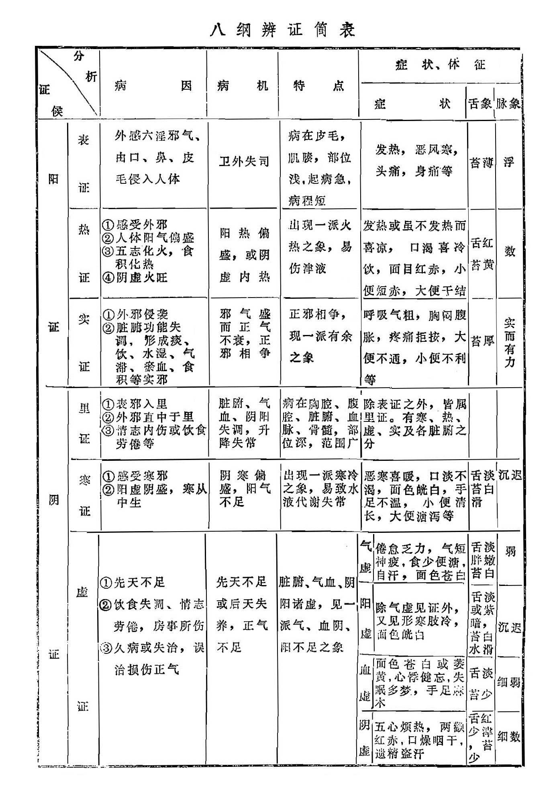

|      |      | 病因                                                         | 病机                           | 特点                                             |      | 症状                                                         | 舌象                 | 脉象     |
| ---- | ---- | ------------------------------------------------------------ | ------------------------------ | ------------------------------------------------ | ---- | ------------------------------------------------------------ | -------------------- | -------- |
| 阳证 | 表证 | 外感六淫邪气、 由口、鼻、皮毛侵入人体                        | 卫外失司                       | 病在皮毛，肌腠，部位浅，起病急，病程短           |      | 发热，恶风寒，头痛，身痛等                                   | 苔薄                 | 浮       |
| 阳证 | 热证 | ①感受外邪②人体阳气偏盛③五志化火，食积化热④阴虚火旺           | 阳热偏盛，或阴虚内热           | 出现一派火热之象，易伤津液                       |      | 发热或虽不发热而喜凉，口渴喜冷饮，面目红赤，小便短赤，大便干结 | 舌红苔黄             | 数       |
| 阳证 | 实证 | ①外邪侵袭②脏腑功能失调，形成痰、饮、水湿、气滞、瘀血、食积等实邪 | 邪气盛而正气不衰，正邪相争     | 正邪相争，现一派有余之象                         |      | 呼吸气粗，胸闷腹胀，疼痛拒按，大便不通，小便不利等           | 苔厚                 | 实而有力 |
| 阴证 | 里证 | ①表邪入里②外邪直中于里③情志内伤或饮食劳倦等                  | 脏腑、气血、阴阳失调，升降失常 | 病在胸腔、腹腔、脏腑、血脉、骨髓，部位深，范围广 |      | 除表证之外，皆属里证。有寒、热、虚、实及各脏腑之分           |                      |          |
| 阴证 | 寒证 | ①感受寒邪②阳虚阴盛，寒从中生                                 | 阴寒偏盛，阳气不足             | 出现一派寒冷之象，易致水液代谢失常               |      | 恶寒喜暖，口淡不渴，面色胱白，手足不温，小便清长，大便溏泻等 | 舌淡苔白滑           | 沉迟     |
| 阴证 | 虚证 | ①先天不足②饮食失调、情志劳倦，房事所伤③久病或失治，误治损伤正气 | 先天不足或后天失养，正气不足   | 脏腑、气血、阴阳诸虚，见一派气、血阴、阳不足之象 | 气虚 | 倦怠乏力，气短神疲，食少便溏，自汗，面色苍白                 | 舌淡胖嫩苔白         | 弱       |
| 阴证 | 虚证 | 同上                                                         | 同上                           | 同上                                             | 阳虚 | 除气虚见证外，又见形寒肢冷，面色咣白                         | 舌淡或紫暗，苔白水滑 | 沉迟     |
| 阴证 | 虚证 | 同上                                                         | 同上                           | 同上                                             | 血虚 | 面色苍白或萎黄，心悸健忘，失眠多梦,手足麻木                  | 舌淡苔少             | 细弱     |
| 阴证 | 虚证 | 同上                                                         | 同上                           | 同上                                             | 阴虚 | 五心烦热，两颧红赤，口燥咽干，遗精盗汗                       | 舌红少津，苔少       | 细数     |

### 二、八纲之间的相互关系

病变是错综复杂的，八纲所属的证候，在临床中往往不是单独存在，而是相兼出现。在临床中，必须把八纲相互联系进行辨证，才能全面地分析病变的部位、性质、正邪关系。此外，八纲之间又可以出现相互错杂和相互转化，在某些情况下，还可以出现证候中真假互见的现象。兹将八纲之间这四种关系以及亡阴亡阳列表简述如下。

#### 1. 相互联系

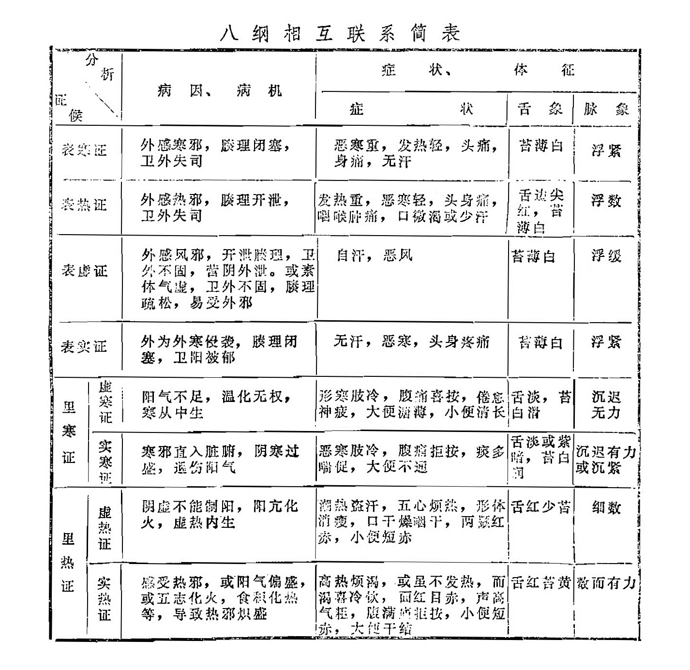

|        |        | 病因、病机                                                   | 症状                                                         | 舌象               | 脉象           |
| ------ | ------ | ------------------------------------------------------------ | ------------------------------------------------------------ | ------------------ | -------------- |
| 表寒证 |        | 外感寒邪，腠理闭塞，卫外失司                                 | 恶寒重，发热轻，头痛，身痛，无汗                             | 苔薄白             | 浮紧           |
| 表热证 |        | 外感热邪，腠理开泄，卫外失司                                 | 发热重，恶寒轻，头身痛，咽喉肿痛，口微渴或少汗               | 舌边尖红，苔薄白   | 浮数           |
| 表虚证 |        | 外感风邪，开泄腠理，卫外不固，营阴外泄。或素体气虚，卫外不固，腠理疏松，易受外邪 | 自汗，恶风                                                   | 苔薄白             | 浮缓           |
| 表实证 |        | 外为外寒侵袭，腠理闭塞，卫阳被郁                             | 无汗，恶寒，头身疼痛                                         | 苔薄白             | 浮紧           |
| 里寒证 | 虚寒证 | 阳气不足，温化无权，寒从中生                                 | 形寒肢冷，腹痛喜按，倦怠神疲，大便溏薄，小便清长             | 舌淡，苔白滑       | 沉迟无力       |
| 里寒证 | 实寒证 | 寒邪直入脏腑，阴寒过盛，退伤阳气                             | 恶寒肢冷，腹痛拒按，痰多喘促，大便不通                       | 舌淡或紫暗，苔白润 | 沉迟有力或沉紧 |
| 里热证 | 虚热证 | 阴虚不能制阳，阳亢化火，虚热内生                             | 潮热盗汗，五心烦热，形体消瘦，口干燥咽干，两颧红赤，小便短赤 | 舌红少苔           | 细数           |
| 里热证 | 实热证 | 感受热邪，或阳气偏盛，或五志化火，食积化热等，导致热邪炽盛   | 高热烦渴，或虽不发热，而渴喜冷饮，面红目赤，声高气粗，胆满痛拒按，小便短赤，大便干结 | 舌红苔黄           | 数而有力       |

#### 2. 相互错杂

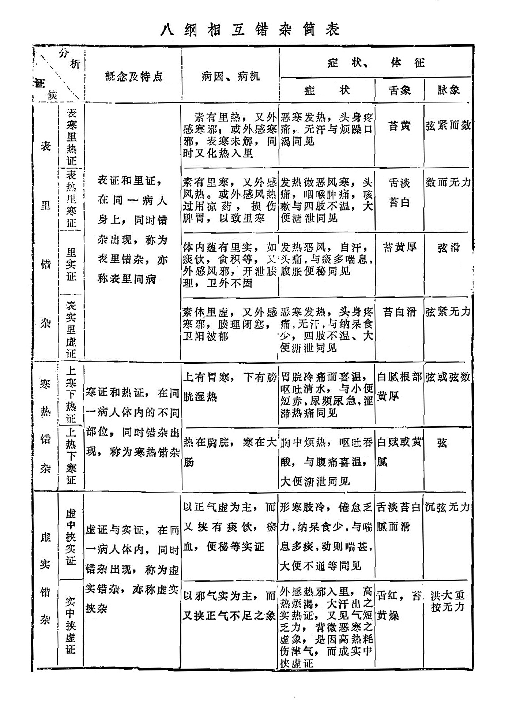

|          |            | 概念及特点                                                   | 病因病机                                                     | 症状                                                         | 舌象           | 脉象         |
| -------- | ---------- | ------------------------------------------------------------ | ------------------------------------------------------------ | ------------------------------------------------------------ | -------------- | ------------ |
| 表里错杂 | 表寒里热证 | 表证和里证在同一病人身上，同时错杂出现，称为表里错杂，亦称表里同病 | 素有里热，又外感寒邪；或外感寒邪，表寒未解，同时又化热入里   | 恶寒发热，头身疼痛，无汗与烦躁口渴同见                       | 苔黄           | 弦紧而数     |
| 表里错杂 | 表热里寒证 | 同上                                                         | 素有里寒，又外感风热。或外感风热过用凉药，损伤脾胃，以致里寒 | 发热微恶风寒，头痛，咽喉肿痛，咳嗽与四肢不温，大便溏泄同见   | 舌淡苔白       | 数而无力     |
| 表里错杂 | 里实证     | 同上                                                         | 体内蕴有里实，如痰饮，食积等，又外感风邪，开泄腠理，卫外不固 | 发热恶风，自汗，头痛，与痰多喘息，腹胀便秘同见。             | 苔黄厚         | 弦滑         |
| 表里错杂 | 表实里虚证 | 同上                                                         | 素体里虚，又外感寒邪，腠理闭塞，卫阳被郁                     | 恶寒发热，头身疼痛，无汗，与纳呆食少，四肢不温、大便溏泄同见 | 苔白滑         | 弦紧无力     |
| 寒热错杂 | 上寒下热证 | 寒证和热证，在同一病人体内的不同部位，同时错杂出现，称为寒热错杂 | 上有胃寒，下有膀胱湿热                                       | 胃脘冷痛而喜温，呕吐清水，与小便短赤，尿频尿急，涩滞热痛同见 | 白腻根部黄厚   | 弦或弦数     |
| 寒热错杂 | 上热下寒证 | 同上                                                         | 热在胸脘，寒在大肠                                           | 胸中烦热，呕吐吞酸，与腹痛喜温，大便溏泄同见                 | 白腻或黄腻     | 弦           |
| 虚实错杂 | 虚中挟实证 | 虚证与实证，在同一病人体内，同时错杂出现，称为虚实错杂，亦称虚实夹杂 | 以正气虚为主，而又夹有痰饮，淤血，便秘等实证                 | 形寒肢冷，倦怠乏力，纳呆食少，与喘息多痰，动则喘甚，大便不通等同见 | 舌淡苔白腻而滑 | 沉弦无力     |
| 虚实错杂 | 实中挟虚证 | 同上                                                         | 以邪气实为主，而有挟正气不足之象                             | 外感邪热入里，高热烦渴，大汗出之实热证，又见气短乏力，背微恶寒之虚像，是因高热耗伤津气，而成实中挟虚证 | 舌红，苔黄燥   | 洪大重按无力 |

#### 3. 相互转化

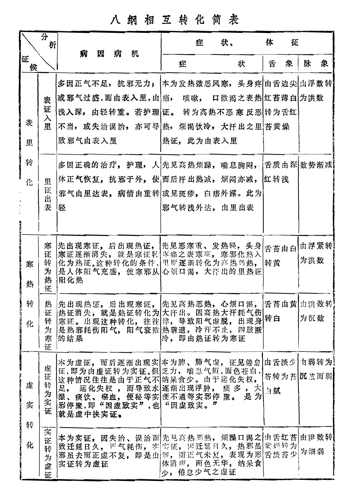

|          |              | 病因病机                                                     | 症状                                                         | 舌象                           | 脉象             |
| -------- | ------------ | ------------------------------------------------------------ | ------------------------------------------------------------ | ------------------------------ | ---------------- |
| 表里转化 | 表证入里     | 多因正气不足，抗邪无力；或邪气过盛，而由表入里，由浅入深，由轻转重。若护理不当，或失治误治，亦可导致邪气由表入里 | 本为发热微恶风寒，头身疼痛，咳嗽，口微渴之表热证。转为高热不恶寒反恶热，烦渴饮冷，大汗出之里热证，此为由表入里 | 由舌边尖红苔薄白转为舌红苔黄燥 | 由浮数转为洪数   |
| 表里转化 | 里证出表     | 多因正确的治疗，护理，人体正气恢复，抗邪于外，使邪气由里达表，病情由重转轻 | 先见高热烦躁，喘息胸闷，而后汗出热减，烦闷亦减,或见斑疹，白㾦外露。此为邪气转浅外达，由里出表 | 舌质由深红转浅                 | 数势渐减         |
| 寒热转化 | 寒证转为热证 | 先出现寒证，后出现热证，寒证逐渐消失，就是寒证转化为热征。这种转化的条件，是人体阳气充盛，使寒邪从阳化热 | 先见恶寒重、发热轻，头身疼痛之表寒证，寒邪化热入里则逐渐转化为高热恶热，心烦口渴，大汗岀的里热证 | 舌苔由白转黄                   | 由浮紧转为洪数   |
| 寒热转化 | 热证转为寒证 | 先出现热证，后出现寒证，热证消失，就是热证转化为寒证。出现这种转化，往往是热邪耗伤阳气，阳气衰败的结果 | 先见高热恶热，心烦口渴，大汗出。因高热大汗耗气伤津，导致阳气虚脱，出现身热骤退，冷汗不止，四肢厥冷，即由热证转为寒证 | 舌苔由黄转白                   | 由洪数转为沉数   |
| 虚实转化 | 虚证转为实证 | 本为虚证，而后逐渐出现实证，即为由虚证转为实证。但这种情况往往是由于正气不足，运化失权，而导致水湿、痰饮、瘀血，便秘等实邪停聚，即“因虚致实”，也就是虚中挟实证。 | 本为脾、肺气虚，证见倦怠乏力，喘息气短，面色苍白，纳呆食少。由于运化失权，逐渐出现浮肿，痰多，大便不通等实邪停聚。是为“因虚致实。” | 由舌淡少苔转为苔白腻           | 由弱转为沉弦而弱 |
| 虚实转化 | 实证转为虚证 | 本为实证，因失治、误治而致迁延日久，正气耗伤，实邪虽去而正虚不复，即是由实证转为虚证 | 先见高热恶热，烦躁口渴之实证，因迁延日久，热邪虽解，面正气未复，表现为形体消瘦，面色无华，纳呆食少，倦怠少气之虚证 | 由舌红苔黄燥转为舌淡苔少       | 由洪数转为细弱   |
|          |              |                                                              |                                                              |                                |                  |

#### 4. 证候真假

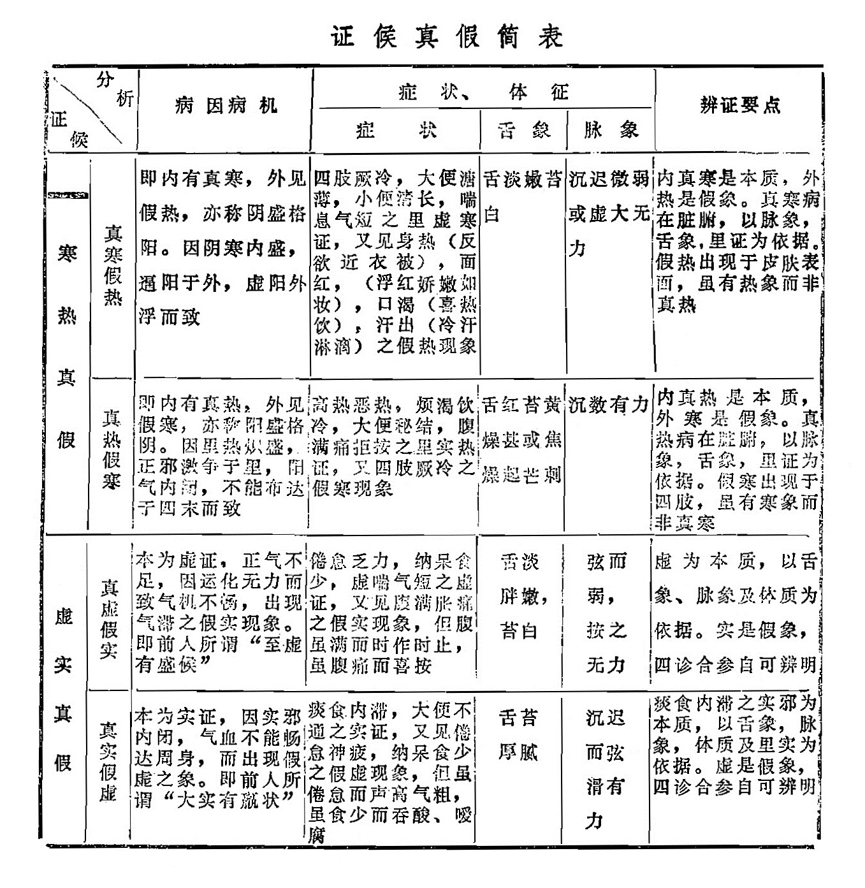

|          |          | 病因病机                                                     | 症状                                                         | 舌象                     | 脉象               | 辨证要点                                                     |
| -------- | -------- | ------------------------------------------------------------ | ------------------------------------------------------------ | ------------------------ | ------------------ | ------------------------------------------------------------ |
| 寒热真假 | 真寒假热 | 即内有真寒，外见假热，亦称阴盛格阳。因阴寒内盛，逼阳于外，虚阳外浮而致 | 四肢厥冷，大便溏薄，小便清长，喘息气短之里虚寒证，又见身热（反欲近衣被），面红，（浮红娇嫩如妆），口渴（喜热饮），汗出（冷汗淋漓）之假热现象 | 舌淡嫩苔白               | 沉迟微弱或虚大无力 | 内真寒是本质，外热是假象。真寒病在脏腑，以脉象，舌象，里证为依据。假热出现于皮肤表面，虽有热象而非真热 |
| 寒热真假 | 真热假寒 | 即内有真热，外见假寒，亦称阳盛格阴。因里热炽盛，正邪激争于里，阳气内闭，不能布达于四末而致 | 高热恶热，烦渴饮冷，大便秘结，腹满痛拒按之里实热证，又四肢厥冷之假寒现象 | 舌紅苔黄燥甚或焦燥起芒刺 | 沉数有力           | 内真热是本质，外寒是假象。真热病在脏腑，以脉象，舌象，里证为依据。假寒出现于四肢， 虽有寒象而非真寒 |
| 虚实真假 | 真虚假实 | 本为虚证，正气不足，因运化无力而致气机不畅，出现气滞之假实现象。即前人所谓“至虚有盛候” | 倦怠乏力，纳呆食少，虚喘气短之虚证，又见腹满胀痛之假实现象，但腹虽满而时作时止,虽腹痛而喜按 | 舌淡胖嫩，苔白           | 弦而弱，按之无力   | 虚为本质，以舌象、脉象及休质为依据。实是假象，四诊合参自可辨明 |
| 虚实真假 | 真实假虚 | 本为实证，因实邪内闭，气血不能畅达周身，而出现假虚之象。即前人所谓“大实有羸状” | 痰食内滞，大便不通之实证，又见倦怠神疲，纳呆食少之假虚现象，但虽倦怠而声高气粗，虽食少而吞酸、嗳腐 | 舌苔厚腻                 | 沉迟而弦滑有力     | 痰食内滞之实邪为本质，以舌象，脉象，体质及里实为依据。虚是假象，四诊合参自可辨明 |

#### 5. 亡阴与亡阳

亡阴，是指阴液耗损欲竭。亡阳，是指阳气耗散欲脱。二者大多出现在急性病中，均属危重证候，兹列表简介如下。

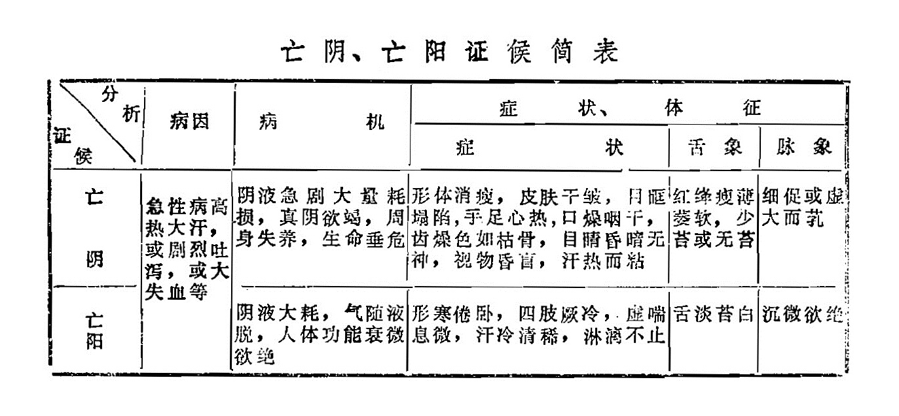

|      | 病因                                   | 病机                                           | 症状                                                         | 舌象                     | 脉象           |
| ---- | -------------------------------------- | ---------------------------------------------- | ------------------------------------------------------------ | ------------------------ | -------------- |
| 亡阴 | 急性病高热大汗，或剧烈吐泻，或大失血等 | 阴液急剧大量耗损，真阴欲竭，周身失养，生命垂危 | 形体消瘦，皮肤干皱，目眶塌陷，手足心热，口燥咽干，齿燥色如枯骨，目睛昏暗无神，视物昏盲，汗热而粘 | 红绛瘦薄萎软，少苔或无苔 | 细促或虚大而芤 |
| 亡阳 | 同上                                   | 阴液大耗，气随液脱，人体功能衰微欲绝           | 形寒倦卧，四肢厥冷，虚喘息微，汗冷清稀，淋漓不止             | 舌淡苔白                 | 沉微欲绝       |

由于人体阴阳是相互依存的，阴竭则阳无所附而浮散；阳亡则阴无所固而随脱。所以，在临床上亡阴与亡阳之出现虽有先后主次之分，但最终必相互影响，一亡俱亡，从而导致生命的终结。

## 第二节  气血津液辨证

气血津液辨证，就是分析气、血、津液各方面的病理变化，从而辨识其所反映的不同证候的一种辨证方法。

气血津液病变与脏腑病变密切相关，二者常常相互影响，互为因果。气血津液辨证是对脏俯病变中气血津液失常的某些共同病理特征的概况，因而，掌握这一辨证，可为学习脏腑辨证奠定基础。

气血津液辨证包括气病的辨证、血病的辨证、气血同病辨证，与津液病的辨证。现分列简表如下：

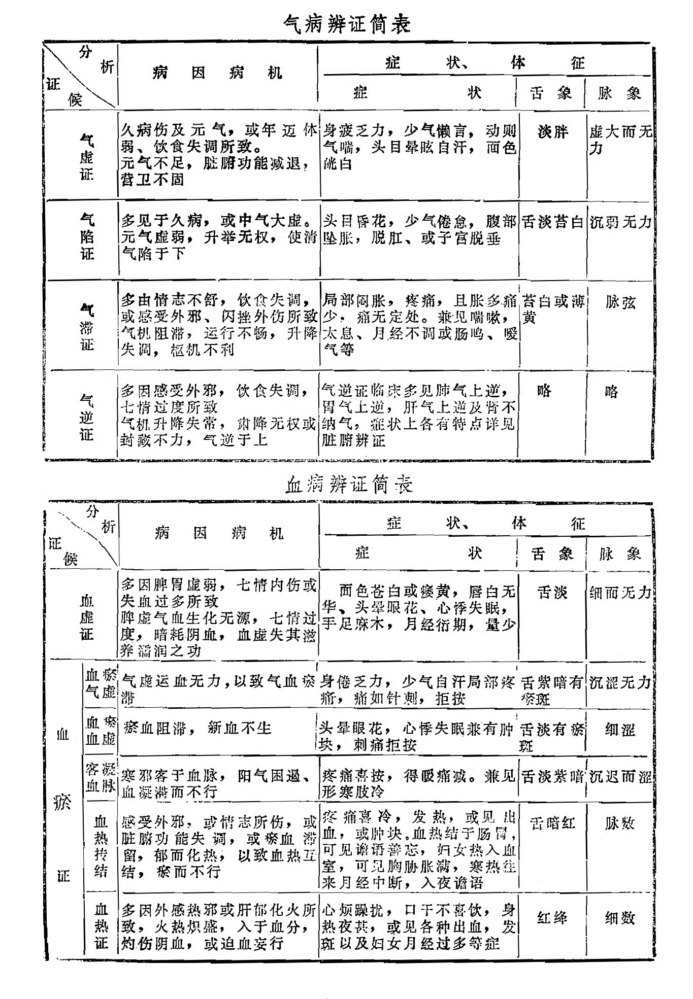

气病辨证简表

|        | 病因病机                                                     | 症状                                                         | 舌象       | 脉象       |
| ------ | ------------------------------------------------------------ | ------------------------------------------------------------ | ---------- | ---------- |
| 气虚证 | 久病伤及元气，或年迈体弱、饮食失调所致。元气不足，脏腑功能减退，营卫不固 | 身疲乏力，少气懒言，动则气喘，头目晕眩自汗，面色㿠白         | 淡胖       | 虚大而无力 |
| 气陷证 | 多见于久病，或中气大虚，元气虚弱，升举无权，使清气陷于下     | 头目昏花，少气倦怠，腹部坠胀，脱肛、或子宫脱垂               | 舌淡苔白   | 沉弱无力   |
| 气滞证 | 多由情志不舒，饮食失调，或感受外邪、闪挫外伤所致气机阻滞，运行不畅，升降失调，枢机不利 | 局部闷胀，疼痛，且胀多痛少，痛无定处。兼见喘嗽，太息、月经不调或肠鸣、嗳气等 | 苔白或薄黄 | 脉弦       |
| 气逆证 | 多因感受外邪，饮食失调，七情过度所致 气机升降失常，肃降无权或封藏不力，气逆于上 | 气逆证临床多见肺气上逆，胃气上逆，肝气上逆及肾不纳气，症状上各有特点详见脏腑辨证 | 略         | 略         |

血病辨证简表

|        |          | 病因病机                                                     | 症状                                                         | 舌象         | 脉象     |
| ------ | -------- | ------------------------------------------------------------ | ------------------------------------------------------------ | ------------ | -------- |
| 血虚证 |          | 多因脾胃虚弱，七情内伤或失血过多所致 脾虚气血生化无源，七情过度，暗耗阴血，血虚失其滋养濡润之功 | 面色苍白或痿黄，唇白无华、头晕眼花、心悸失眠，手足庥木，月经衍期，量少 | 舌淡         | 细而无力 |
| 血瘀证 | 血瘀气虚 | 气虚运血无力，以致气血淤滞                                   | 身倦乏力，少气自汗局部疼痛，痛如针剌，拒按                   | 舌紫暗有瘀斑 | 沉涩无力 |
| 血瘀证 | 血瘀血虚 | 瘀血阻滞，新血不生                                           | 头晕眼花，心悸失眠兼有肿块，刺痛拒按                         | 舌淡有瘀斑   | 细涩     |
| 血瘀证 | 客凝血脉 | 寒邪客于血脉，阳气困遏、血凝滞而不行                         | 疼痛喜按，得暖痛减。兼见形寒肢冷                             | 舌淡紫暗     | 沉迟而涩 |
| 血瘀证 | 血热抟结 | 感受外邪，或情志所伤，或脏腑功能失调，或瘀血滞留，郁而化热，以致血热互结，瘀而不行 | 疼痛喜冷，发热，或见出血，或肿块。血热结于肠胃，可见谵语善忘，妇女热入血室，可见胸胁胀满，寒热往来月经中断，入夜谵语 | 舌暗红       | 脉数     |
| 血瘀证 | 血热证   | 多因外感热邪或肝郁化火所致，火热炽盛，入于血分，灼伤阴血，或迫血妄行 | 心烦躁扰，口干不喜饮，身热夜甚，或见各种出血，发斑以及妇女月经过多等症 | 红绛         | 细数     |

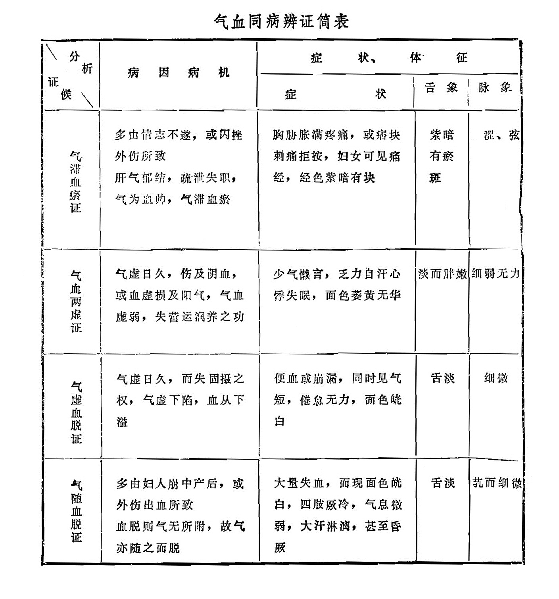

|            | 病因病机                                                     | 症状                                                         | 舌象       | 脉象     |
| ---------- | ------------------------------------------------------------ | ------------------------------------------------------------ | ---------- | -------- |
| 气滞血瘀证 | 多由情志不遂，或闪挫外伤所致 肝气郁结，疏泄失职，气为血帅，气滞血瘀 | 胸胁胀满疼痛，或痞块刺痛拒按，妇女可见痛经，经色紫暗有块     | 紫暗有瘀斑 | 涩、弦   |
| 气血两虚证 | 气虚日久，伤及阴血，或血虚损及阳气，气血虚弱，失营运润养之功 | 少气懒言，乏力自汗心悸失眠，面色萎黄无华                     | 淡而胖嫩   | 细弱无力 |
| 气虚血脱证 | 气虚日久，而失固摄之权，气虚下陷，血从下溢                   | 便血或崩漏，同时见气短，倦怠无力，面色㿠白                   | 舌淡       | 细微     |
| 气随血脱证 | 多由妇人崩中产后，或外伤出血所致 血脱则气无所附，故气亦随之而脱 | 大量失血，而现面色㿠白，四肢厥冷，气息微弱，大汗淋漓，甚至昏厥 | 舌淡       | 芤而细微 |

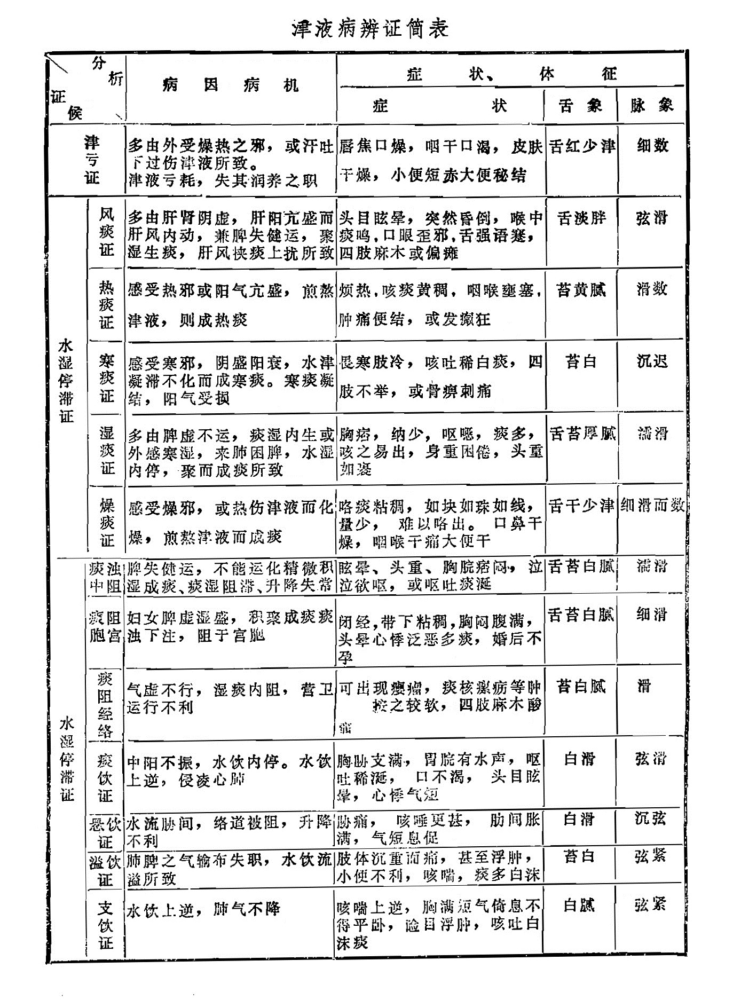

|            |          | 病因病机                                                     | 症状                                                         | 舌象     | 脉象     |
| ---------- | -------- | ------------------------------------------------------------ | ------------------------------------------------------------ | -------- | -------- |
| 津亏证     |          | 多由外受燥热之邪，或汗吐下过伤津液所致。 津液亏耗，失其润养之职 | 唇焦口燥，咽干口渴，皮肤干燥，小便短赤大便秘结               | 舌红少津 | 细数     |
| 水湿停滞证 | 风痰证   | 多由肝肾阴虚，肝阳亢盛而肝风内动，兼脾失健运，聚湿生痰，肝风挟痰上扰所致 | 头目眩晕，突然昏倒，喉中痰鸣，口眼歪邪，舌强语蹇，四肢麻木或偏瘫 | 舌淡胖   | 弦滑     |
| 水湿停滞证 | 热痰证   | 感受热邪或阳气亢盛，煎熬津液，则成热痰                       | 烦热、咳痰黄稠，咽喉壅塞，肿痛便结，或发癫狂                 | 苔黄腻   | 滑数     |
| 水湿停滞证 | 寒痰证   | 感受寒邪，阴盛阳衰，水津凝滞不化而成寒痰。寒痰凝结，阳气受损 | 畏寒肢冷，咳吐稀白痰，四肢不举，或骨痹刺痛                   | 苔白     | 沉迟     |
| 水湿停滞证 | 湿痰证   | 多由脾虚不运，痰湿内生或外感寒湿，来肺困脾，水湿内停，聚而成痰所致 | 胸痞，纳少，呕噁，痰多，咳之易出，身重困倦，头重如裹         | 舌苔厚腻 | 濡滑     |
| 水湿停滞证 | 燥痰证   | 感受燥邪，或热伤津液而化燥，煎熬津液而成痰                   | 咯痰粘稠，如块如珠如线，量少，难以咯出。口鼻干燥，咽喉干痛大便干 | 舌干少津 | 细滑而数 |
| 水湿停滞证 | 痰浊中阻 | 脾失健运，不能运化精微积湿成痰、痰湿阻滞、升降失常           | 眩晕、头重、胸脘痞闷，泣泣欲呕，或呕吐痰涎                   | 舌苔白腻 | 濡滑     |
| 水湿停滞证 | 痰阻胞宫 | 妇女脾虚湿盛，积聚成痰痰浊下注，阻于宫胞                     | 闭经，带下粘稠，胸闷腹满，头晕心悸泛恶多痰，婚后不孕         | 舌苔白腻 | 细滑     |
| 水湿停滞证 | 痰阻经络 | 气虚不行，湿痰内阻，营卫运行不利                             | 可出现瘿瘤，痰核瘰疬等肿块，按之较软，四肢麻木酸痛           | 苔白腻   | 滑       |
| 水湿停滞证 | 痰饮证   | 中阳不振，水饮内停。水饮上逆，侵凌心肺                       | 胸胁支满，胃脘有水声，呕吐稀涎，口不渴，头目眩晕，心悸气短   | 白滑     | 弦滑     |
| 水湿停滞证 | 悬饮证   | 水流胁间，络道被阻，升降不利                                 | 胁痛，咳唾更甚，肋间胀满，气短息促                           | 白滑     | 沉弦     |
| 水湿停滞证 | 溢饮证   | 肺脾之气输布失职，水饮流溢所致                               | 肢体沉重而痛，甚至浮肿，小便不利，咳喘，痰多白沫             | 苔白     | 弦紧     |
| 水湿停滞证 | 支饮证   | 水饮上逆，肺气不降                                           | 咳喘上逆，胸满短气倚息不得平卧，睑目浮肿，咳吐白沫痰         | 白腻     | 弦紧     |

## 第三节  脏腑辨证

脏腑辨证主要是以脏象学说为基础，将四诊所获得的症状和体征进行综合分析，从而对病变所在的脏腑部位及其性质、正邪盛衰做出诊断的一种辨证方法。

脏腑是人体的重要组成部分，是生命活动的中心各种原因导致的病变，实际上都是脏腑功能失调的反映。由于各个脏腑的生理功能不同，所以它们在病变过程中所反映出来的症状和体征也各不相同。根据各脏腑的生理功能，结合病因病机来判断其病理变化，这就是脏腑辨证的方法和理论依据。中医学的辨证方法尽管多种多样，而且各具特长，但各种辨证方法最终都要落实到脏腑部位上。所以说，脏腑辨证是中医学辨证体系中的重要组成部分，其详细内容，将在《金匮要略讲解》及内科等教材中讲述。

脏腑辨证包括脏病辨证、腑病辨证及脏腑兼证辨证。本节将心、肺、脾、肝、肾脏病以及腑病的辨证列表作介绍。至于脏腑兼病辨证，因已在“脏腑之间的相互关系”中谈及，本节不再赘述。

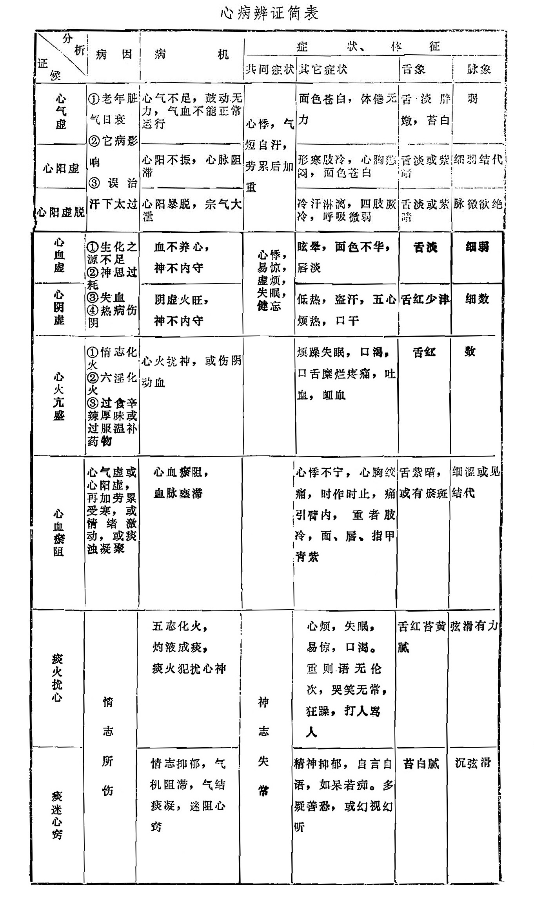

 **心病辨证简表** 

| 证候     | 病因                                                      | 病机                                   | 共同症状                     | 其它症状                                                     | 舌象             | 脉象         |
| -------- | --------------------------------------------------------- | -------------------------------------- | ---------------------------- | ------------------------------------------------------------ | ---------------- | ------------ |
| 心气虚   | ①老年脏气日衰 ②它病影响 ③误治汗下太过             | 心气不足，鼓动无力，气血不能正常运行   | 心悸，气短自汗，劳累后加重   | 面色苍白，体倦无力                                           | 舌淡胖嫩，苔白   | 弱           |
| 心阳虚   | 同上                                                      | 心阳不振，心脉阻滞                     | 同上                         | 形寒肢冷，心胸憋闷，面色苍白                                 | 舌淡或紫暗       | 细弱结代     |
| 心阳虚脱 | 同上                                                      | 心阳暴脱，宗气大泄                     | 同上                         | 冷汗淋漓，四肢厥冷，呼吸微弱                                 | 舌淡或紫暗       | 脉微欲绝     |
| 心血虚   | ①生化之源不足 ②神思过耗 ③失血 ④热病伤阴       | 血不养心，神不内守                     | 心悸，易惊，虚烦，失眠，健忘 | 眩晕，面色不华,唇淡                                          | 舌淡             | 细弱         |
| 心阴虚   | 同上                                                      | 阴虚火旺，神不内守                     | 同上                         | 低热，盗汗，五心烦热，口干                                   | 舌红少津         | 细数         |
| 心火亢盛 | ①情志化火 ②六淫化火 ③过食辛辣厚味或过服温补药物 | 心火扰神，或伤阴动血                   |                              | 烦躁失眠，口渴，口舌糜烂疼痛，吐血，衄血                     | 舌红             | 数           |
| 心血瘀阻 | 心气虚或心阳虚，再加劳累受寒，或情绪激动，或痰浊凝聚      | 心血瘀阻，血脉壅滞                     |                              | 心悸不宁，心胸绞痛，时作时止，痛引臂内，重者肢冷，面、唇、指甲青紫 | 舌紫暗，或有瘀斑 | 细涩或见结代 |
| 痰火扰心 | 情志所伤                                                  | 五志化火，灼液成痰，痰火犯扰心神       | 神志失常                     | 心烦，失眠，易惊，口渴。重则语无伦次，哭笑无常，狂躁，打人骂人 | 舌红苔黄腻       | 弦滑有力     |
| 痰迷心窍 | 同上                                                      | 情志抑郁，气机阻滯，气结痰凝，迷阻心窍 | 同上                         | 精神抑郁，自言自语，如呆若痴。多疑善恐，或幻视幻听           | 苔白腻           | 沉弦滑       |

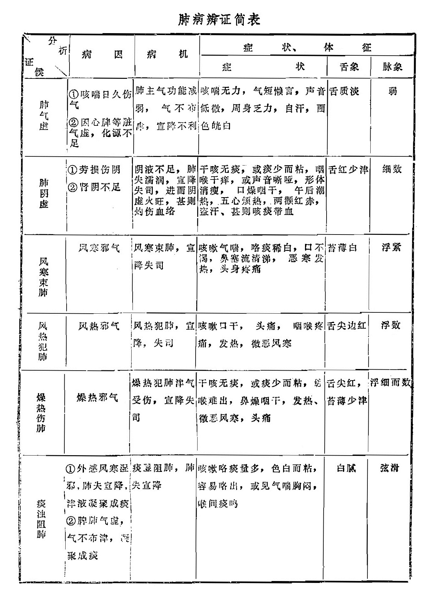

 **肺病辨证简表** 

| 证候     | 病因                                                         | 病机                                                     | 症状                                                         | 舌象             | 脉象     |
| -------- | ------------------------------------------------------------ | -------------------------------------------------------- | ------------------------------------------------------------ | ---------------- | -------- |
| 肺气虚   | ①咳喘日久伤气 ②因心脾等脏气虚，化源不足                  | 肺主气功能减弱，气不布津，宣降不利                       | 咳喘无力，气短懒言，声音低微，周身乏力，自汗，面色㿠白       | 舌质淡           | 弱       |
| 肺阴虚   | ①劳损伤阴 ②肾阴不足                                      | 阴液不足，肺失濡润，宣降失司，进而阴虚火旺，甚则灼伤血络 | 干咳无痰，或痰少而粘，咽喉干痒，或声音嘶哑，形体消瘦，口燥咽干,午后潮热，五心烦热，两颧红赤，盗汗、甚则咳痰带血 | 舌红少津         | 细数     |
| 风寒束肺 | 风寒邪气                                                     | 风寒束肺，宣降失司                                       | 咳嗽气喘，咯痰稀白，口不渴，鼻塞流清涕，恶寒发热，头身疼痛   | 苔薄白           | 浮紧     |
| 风热犯肺 | 风热邪气                                                     | 风热犯肺，宣降，失司                                     | 咳嗽口干，头痛，咽喉疼痛，发热，微恶风寒                     | 舌尖边红         | 浮数     |
| 燥热伤肺 | 燥热邪气                                                     | 燥热犯肺津气受伤，宣降失司                               | 干咳无痰，或痰少而粘，缠喉难出，鼻燥咽干，发热、微恶风寒，头痛 | 舌尖红，苔薄少津 | 浮细而数 |
| 痰浊阻肺 | ①外感风寒湿邪，肺失宣降，津液凝聚成痰 ②脾肺气虚，气不布津，凝聚成痰 | 痰湿阻肺，肺失宣降                                       | 咳嗽咯痰量多，色白而粘，容易咯出，或见气喘胸闷，喉间痰鸣     | 白腻             | 弦滑     |

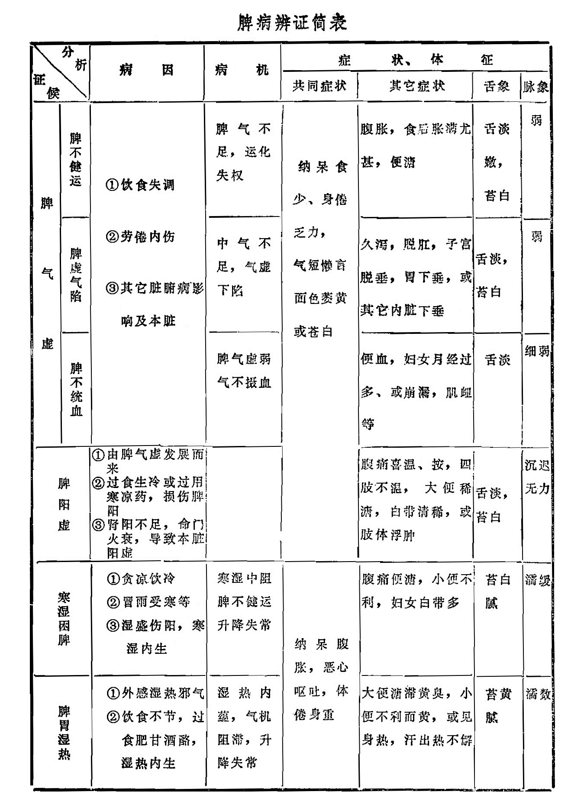

 **脾病辨证简表** 

| 证候     | 证候     | 病因                                                         | 病机                         | 共同症状                                     | 其它症状                                               | 舌象         | 脉象     |
| -------- | -------- | ------------------------------------------------------------ | ---------------------------- | -------------------------------------------- | ------------------------------------------------------ | ------------ | -------- |
| 脾气虚   | 脾不健运 | ①饮食失调 ②劳倦内伤 ③其它脏腑病影响及本脏            | 脾气不足，运化失权           | 纳呆食少、身倦乏力，气短懒言，面色萎黄或苍白 | 腹胀，食后胀满尤甚，便溏                               | 舌淡嫩，苔白 | 弱       |
| 脾气虚   | 脾虚气陷 | 同上                                                         | 中气不足，气虚下陷           | 同上                                         | 久泻，脱肛，子宫脱垂，胃下垂，或其它内脏下垂           | 舌淡,苔白    | 弱       |
| 脾气虚   | 脾不统血 | 同上                                                         | 脾气虚弱气不摄血             | 同上                                         | 便血，妇女月经过多、或崩漏，肌衄等                     | 舌淡         | 细弱     |
| 脾阳虚   |          | ①由脾气虚发展而来 ②过食生冷或过用寒凉药，损伤脾阳 ③肾阳不足，命门火衰，导致本脏阳虚 |                              | 同上                                         | 腹痛喜温、按，四肢不温，大便稀溏，白带清稀，或肢体浮肿 | 舌淡，苔白   | 沉迟无力 |
| 寒湿困脾 |          | ①贪凉饮冷 ②冒雨受寒等 ③湿盛伤阳，寒湿内生            | 寒湿中阻脾不健运升降失常     | 纳呆腹胀，恶心呕吐，体倦身重                 | 腹痛便溏，小便不利，妇女白带多                         | 苔白腻       | 濡缓     |
| 脾胃湿热 |          | ①外感湿热邪气 ②饮食不节，过食肥甘酒酪，湿热内生          | 湿热内蕴，气机阻滞，升降失常 | 同上                                         | 大便溏滞黄臭，小便不利而黄，或见身热，汗出热不解       | 苔黄腻       | 濡数     |

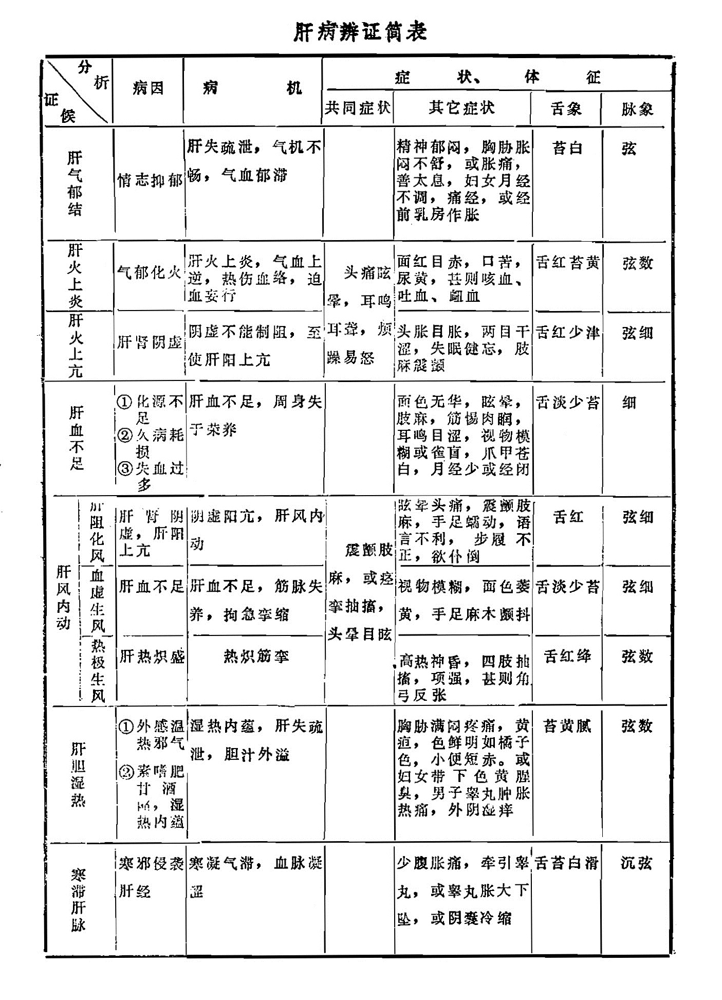

 **肝病辨证简表** 

| 证候     | 证候     | 病因                                       | 病机                                   | 共同症状                       | 其他症状                                                     | 舌象     | 脉象 |
| -------- | -------- | ------------------------------------------ | -------------------------------------- | ------------------------------ | ------------------------------------------------------------ | -------- | ---- |
| 肝气郁结 |          | 情志抑郁                                   | 肝失疏泄，气机不畅，气血郁滞           |                                | 精神郁闷，胸胁胀闷不舒，或胀痛，善太息，妇女月经不调，痛经，或经前乳房作胀 | 苔白     | 弦   |
| 肝火上炎 |          | 气郁化火                                   | 肝火上炎，气血上逆，热伤血络，迫血妄行 | 头痛眩晕，耳鸣耳聋，烦躁易怒   | 面红目赤，口苦，尿黄，甚则咳血、吐血、衄血                   | 舌红苔黄 | 弦数 |
| 肝火上亢 |          | 肝肾阴虚                                   | 阴虚不能制阻，至使肝阳上亢             | 同上                           | 头胀目胀，两目干涩，失眠健忘，肢麻震颤                       | 舌红少津 | 弦细 |
| 肝血不足 |          | ①化源不足 ②久病耗损 ③失血过多      | 肝血不足，周身失于荣养                 |                                | 面色无华，眩晕，肢麻，筋惕肉𥆧，耳鸣目涩，视物模糊或雀盲，爪甲苍白，月经少或经闭 | 舌淡少苔 | 细   |
| 肝风内动 | 肝阻化风 | 肝肾阴虚，肝阳上亢                         | 阳虚阳亢，肝风内动                     | 震颤肢麻，或痉挛抽搐，头晕目眩 | 眩晕头痛，震颤肢麻，手足蠕动，语言不利，步履不正，欲仆倒     | 舌红     | 弦细 |
| 肝风内动 | 血虚生风 | 肝血不足                                   | 肝血不足，筋脉失养，拘急挛缩           | 同上                           | 视物模糊，面色萎黄，手足麻木颤抖                             | 舌淡少苔 | 弦细 |
| 肝风内动 | 热极生风 | 肝热炽盛                                   | 热炽筋挛                               | 同上                           | 高热神昏，四肢抽搐，项强，甚则角弓反张                       | 舌红绛   | 弦数 |
| 肝胆湿热 |          | ①外感温热邪气 ②素嗜肥甘酒酪，湿热内蕴 | 湿热内蕴，肝失疏泄，胆汁外溢           |                                | 胸胁满闷疼痛，黄疸，色鲜明如橘子色，小便短赤。或妇女带下色黄腥臭，男子睾丸肿胀热痛，外阴湿痒 | 苔黄腻   | 弦数 |
| 寒滞肝脉 |          | 寒邪侵袭肝经                               | 寒凝气滞，血脉凝涩                     |                                | 少腹胀痛，牵引睾丸，或睾丸胀大下坠，或阴囊冷缩               | 舌苔白滑 | 沉弦 |

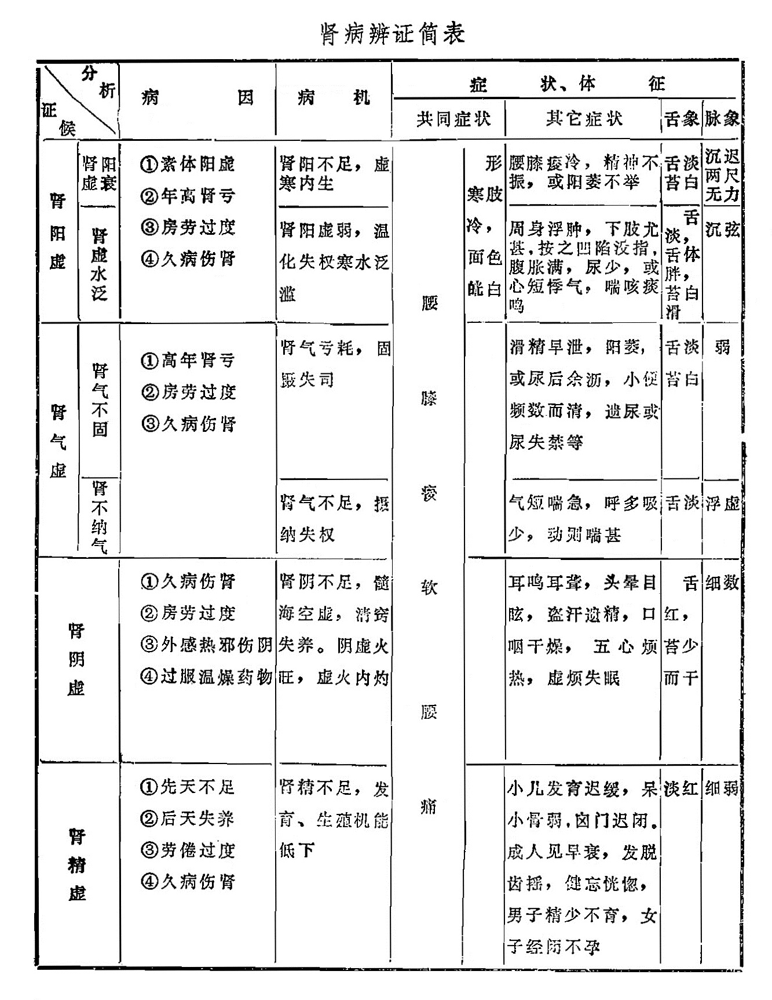

 **肾病辨证简表** 

| 证候   | 证候     | 病因                                                        | 病机                                             | 共同症状     | 共同症状           | 其它症状                                                     | 舌象                | 脉象         |
| ------ | -------- | ----------------------------------------------------------- | ------------------------------------------------ | ------------ | ------------------ | ------------------------------------------------------------ | ------------------- | ------------ |
| 肾阳虚 | 肾阳虚衰 | ①素体阳虚 ②年高肾亏 ③房劳过度 ④久病伤肾         | 肾阳不足，虚寒内生                               | 腰膝痠软腰痛 | 形寒肢冷，面色㿠白 | 腰膝痠冷，精神不振，或阳萎不举                               | 舌淡苔白            | 沉迟两尺无力 |
| 肾阳虚 | 肾虚水泛 | 同上                                                        | 肾阳虚弱，温化失权寒水泛滥                       | 同上         | 同上               | 周身浮肿，下肢尤甚，按之凹陷没指，腹胀满，尿少，或心悸短气，喘咳痰鸣 | 舌淡，舌体胖,苔白滑 | 沉弦         |
| 肾气虚 | 肾气不固 | ①高年肾亏 ②房劳过度 ③久病伤肾                       | 肾气亏耗，固摄失司                               | 同上         |                    | 滑精早泄，阳萎，或尿后余沥，小便频数而清，遗尿或尿失禁等     | 舌淡苔白            | 弱           |
| 肾气虚 | 肾不纳气 | 同上                                                        | 肾气不足，摂纳失权                               | 同上         |                    | 气短喘急，呼多吸少，动则喘甚                                 | 舌淡                | 浮虚         |
| 肾阴虚 |          | ①久病伤肾 ②房劳过度 ③外感热邪伤阴 ④过服温燥药物 | 肾阴不足，髓海空虚，清窍失养。阴虚火旺，虚火内灼 | 同上         |                    | 耳鸣耳聋，头晕目眩，盗汗遗精，口咽干燥，五心烦热，虚烦失眠   | 舌红，苔少而干      | 细数         |
| 肾精虚 |          | ①先天不足 ②后天失养 ③劳倦过度 ④久病伤肾         | 肾精不足，发育、生殖机能低下                     | 同上         |                    | 小儿发育迟缓，呆小骨弱，囟门迟闭。成人见早衰，发脱 齿摇，健忘恍惚，男子精少不育，女子经闭不孕 | 淡红                | 细弱         |

注：原书肾虚水泛的其它症状（或心短悸气）应为（心悸短气）

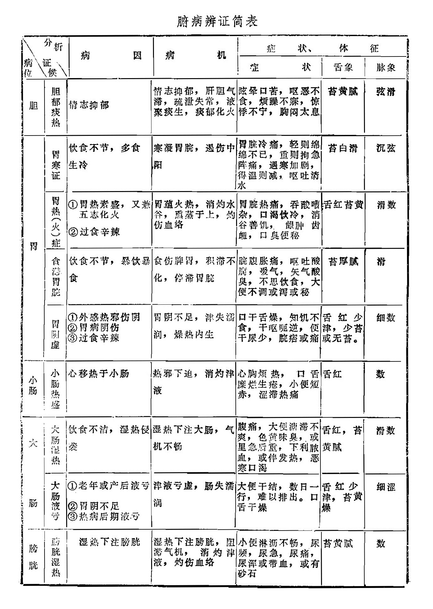

 **腑病辨证简表** 

| 病位 | 证候        | 病因                                            | 病机                                             | 症状                                                         | 舌象                   | 脉象 |
| ---- | ----------- | ----------------------------------------------- | ------------------------------------------------ | ------------------------------------------------------------ | ---------------------- | ---- |
| 胆   | 胆郁痰热    | 情志抑郁                                        | 情志抑郁，肝胆气滞，疏泄失常，液聚痰生，痰郁化火 | 眩晕口苦，呕恶不食，烦躁不寐，惊悸不宁，胸闷太息             | 苔黄腻                 | 弦滑 |
| 胃   | 胃寒证      | 饮食不节，多食生冷                              | 寒凝胃脘，遏伤中阳                               | 胃脘冷痛，轻则绵绵不已，重则拘急阵痛，遇寒加剧，得温则减，呕吐清水 | 苔白滑                 | 沉弦 |
| 胃   | 胃热（火)症 | ①胃热素盛，又兼五志化火 ②过食辛辣           | 胃蕴火热，消灼水谷，熏蒸于上，灼伤血络           | 胃脘热痛，吞酸嘈杂，口渴饮冷，消谷善饥，龈肿齿 衄，口臭便秘 | 舌红苔黄               | 滑数 |
| 胃   | 食滞胃脘    | 饮食不节，暴饮暴食                              | 食伤脾胃，积滞不化，停滞胃脘                     | 脘腹胀痛，呕吐酸腐，嗳气，矢气酸臭，不思饮食，大便不调或泻或秘 | 苔厚腻                 | 滑   |
| 胃   | 胃阴虚      | ①外感热邪伤阴 ②胃病阴伤 ③过食辛辣       | 胃阴不足，津失濡润，燥热内生                     | 口干舌燥，知饥不食，干呕呃逆，便干尿少，脘痞或痛             | 舌红少津，少苔或无苔。 | 细数 |
| 小肠 | 小肠热盛    | 心移热于小肠                                    | 热邪下迫，消灼津液                               | 心胸烦热，口舌糜烂生疮，小便短赤，涩滞热痛                   | 舌红                   | 数   |
| 大肠 | 大肠湿热    | 饮食不洁，湿热侵袭                              | 湿热下注大肠，气机不畅                           | 腹痛，大便溏滞不爽，色黄味臭，或里急后重，下利脓血，或伴发热，恶寒口渴 | 舌红，苔黄腻           | 滑数 |
| 大肠 | 大肠液亏    | ①老年或产后液亏 ②胃阴不足 ③热病后期液亏 | 津液亏虚，肠失濡润                               | 大便干结，数日一行，难以排出。口舌干燥                       | 舌红少津，苔黄燥       | 细涩 |
| 膀胱 | 膀胱湿热    | 湿热下注膀胱                                    | 湿热下注膀胱，阻滞气机，消灼津液，灼伤血络       | 小便淋沥不畅，尿频，尿急，尿痛，尿浑或带血，或有砂石         | 苔黄腻                 | 数   |

##  第四节  六经辨证

六经辨证，是用于外感风寒之邪在发病过程中的辨证分类方法。是伤寒病的辨证纲领。它按照伤寒病的发生发展规律及其发展过程中各阶段的病变特点，将其分为六类病证，并以阴阳为纲，将其概括为三阳、三阴两大类别。具体地说，六经病证是太阳病、阳明病、少阳病，太阴病、少阴病、厥阴病的总称。它可以概括为三阳病和三阴病两大类。太阳病、阳明病、少阳病为三阳病；太阴病、少阴病、厥阴病为三阴病。三阳病证以六腑病变为基础，三阴病证以五脏病变为基础。所以说，六经辨证实际上是以六经统括其所络属的脏腑，因而它基本上概括了脏腑十二经病证，并以此来标示它们之间的传变规律。

六经病证从病变部位来划分，太阳病主表，阳明病主里，少阳病主半表半里，而三阴病统属于里。从病变的性质与邪正关系分，三阳病多热证、实证；三阴病多寒证、虚证。从传变规律来看，一般是由三阳传入三阴，由表入里，深入发展。

六经病证既可以单独出现，也可以两经或三经病证合并出现，又可以由这一经传变为另一经病。其中，两经或三经的病证同时出现的叫“合病”。一经病证未罢，另一经证候又见，两经交并为病，有先后次第之不同的叫“并病”。由这一经传变为另一经病的叫做“传经”。

六经病证的治疗原则，概括地说三阳病重在祛邪，三阴病重在扶正。

因为六经辨证的内容将在《伤寒论讲解》中详细讲述，本节列表概括介绍如下：

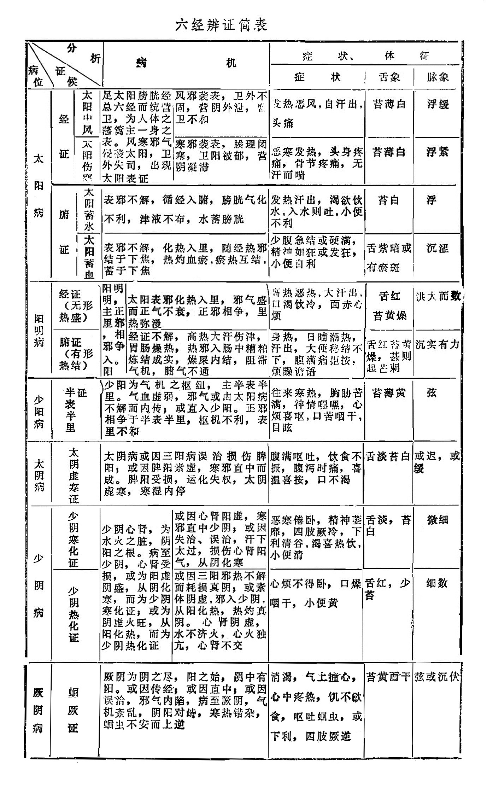

 **六经辨证简表** 

| 病位   | 证候             | 证候     | 病机                                                         | 病机                                                         | 症状                                                         | 舌象                   | 脉象       |
| ------ | ---------------- | -------- | ------------------------------------------------------------ | ------------------------------------------------------------ | ------------------------------------------------------------ | ---------------------- | ---------- |
| 太阳病 | 经证             | 太阳中风 | 足太阳膀胱经总六经而统营卫，为人体之藩篱主一身之表。风寒邪气侵袭太阳，卫外失司，出现太阳表证 | 风邪袭表，卫外不固，营阴外泄，营卫不和                       | 发热恶风，自汗出，头痛                                       | 苔薄白                 | 浮缓       |
| 太阳病 | 经证             | 太阳伤寒 | 同上                                                         | 寒邪袭表，腠理闭塞，卫阳被郁，营阴凝滞                       | 恶寒发热，头身疼痛，骨节疼痛，无汗而喘                       | 苔薄白                 | 浮紧       |
| 太阳病 | 腑证             | 太阳蓄水 | 表邪不解，循经入腑，膀胱气化不利，津液不布，水蓄膀胱         |                                                              | 发热汗出，渴欲饮水，入水则吐，小便不利                       | 苔白                   | 浮         |
| 太阳病 | 腑证             | 太阳蓄血 | 表邪不解，化热入里，随经热邪结于下焦，热灼血瘀，瘀热互结，蓄于下焦 |                                                              | 少腹急结或硬满，精神如狂或发狂,小便自利                      | 舌紫暗或有瘀斑         | 沉涩       |
| 阳明病 | 经证（无形热盛） |          | 阳明主里，邪入阳明，正邪相争                                 | 太阳表邪化热入里，邪气盛而正气不衰，正邪相争，里热弥漫       | 高热恶热，大汗出，口渴饮冷，面赤心烦                         | 舌红苔黄燥             | 洪大而数   |
| 阳明病 | 腑证（有形热结） |          | 同上                                                         | 经证不解，高热大汗伤津，胃肠燥热，热邪入肠中糟粕炼结成实，燥屎内结，阻滞气机，腑气不通 | 身热，日晡潮热，汗出，大便秘结不下，腹满痛拒按，烦躁谵语     | 舌红苔黄燥，甚则起芒刺 | 沉实有力   |
| 少阳病 | 半表半里证       |          | 少阳为气机之枢纽，主半表半里。气血虚弱，邪气或由太阳病不解而内传；或直入少阳。正邪相争于半表半里，枢机不利，表里不和 |                                                              | 往来寒热，胸胁苦满，神情嘿嘿，心烦喜呕，口苦咽干，目眩       | 苔薄黄                 | 弦         |
| 太阴病 | 太阴虚寒证       |          | 太阴病或因三阳病误治损伤脾阳,或因脾阳素虚，寒邪直中而成。脾阳受损，运化失权，太阴虚寒，寒湿内停 |                                                              | 腹满呕吐，饮食不振，腹泻时痛，喜温喜按，口不渴               | 舌淡苔白               | 或迟，或缓 |
| 少阴病 | 少阴寒化证       |          | 少阴心肾，为水火之脏，阴阳之根。病至少阴，心肾受损，或为阳虚阴盛，从阴化寒，而为少阴寒化证；或为阴虚火旺，从阳化热，而为少阴热化证 | 或因心肾阳虚，寒邪直中少阴；或因失治、误治，汗下太过，损伤心肾阳气，从阴化寒 | 恶寒倦卧，精神萎靡，四肢厥冷，下利清谷，渴喜热饮，小便清     | 舌淡，苔白             | 微细       |
| 少阴病 | 少阴热化证       |          | 同上                                                         | 或因三阳邪热不解而耗损真阴；或素体阴虚，邪入少阴，从阳化热，热灼真阴。心肾阴虚，水不济火，心火独亢，心肾不交 | 心烦不得卧，口燥咽干，小便黄                                 | 舌红，少苔             | 细数       |
| 厥阴病 | 蛔厥证           |          | 厥阴为阴之尽，阳之始，阴中有阳。或因传经；或因直中；或因误治，邪气内陷，病至厥阴，气机紊乱，阴阳对峙，寒热错杂，蛔虫不安而上逆 |                                                              | 消渴，气上撞心，心中疼热，饥不欲食，呕吐蛔虫，或下利，四肢厥逆 | 苔黄而干               | 弦或沉伏   |

## 第五节  卫气营血辨证

卫气营血辨证，是外感温热病的一种辨证方法。是在伤寒六经辨证基础上发展起来的。它按照温热邪气侵袭人体致病的发展规律及其发展过程中各阶段的病变特点，将其分为四类病证，并依此来标示它们之间的传变规律。卫分证与气分证是功能障碍的病变；营分证与血分证是物质损伤的病变。而卫气与营血之间，又有浅深轻重的区别。卫分证主表，它是温热邪气袭表，导致卫外功能障碍的病变，其病变部位在肺与皮毛。邪气进一步发展，则入气分，导致脏腑功能障碍。一般来说，这一阶段邪气盛而正气不衰，正邪相争激烈，呈现一派里热炽盛的特点。气分证由于邪气侵袭的部位不同，可出现胸膈、肺、胃、大、小肠、肝、胆等脏腑的证候。若湿热邪气深入营血，或心包，消灼血中津液，则为营分证。若湿热邪气深入心、肝、肾，损伤肝血肾精，耗血动血，则为血分证。“分”即分界之意，其引申意为“阶段”。也就是说，卫气营血“四分”，实际上就代表了温热病的浅深轻重四个不同阶段。

关于温热病的传变规律，就一般情况而言，是沿卫→气→营→血的顺序渐次深入。但由于邪气的种类与感邪轻重程度的差别，以及患者体质的不同等因素，临床中亦有病变初起即不经卫分而迳见气分证或营分证者；还有卫分证与气分证同时出现的“卫气同病”；或气分证与营分证、血分证同时出现的“气营两燔、气血两燔”证；又有卫分证不经气分而直入营分的“逆传心包”证等。

温热病的特点就是热邪伤津，所以治疗上始终要以泄热保津为重点。卫分、气分重在清泄热邪，泄热即可以保津；营分、血分在清热凉血的同时，又要养阴生津。

因为卫气营血辨证的内容将在《温病条辨讲解》中详细讲述，本节仅列简表概括介绍如下：

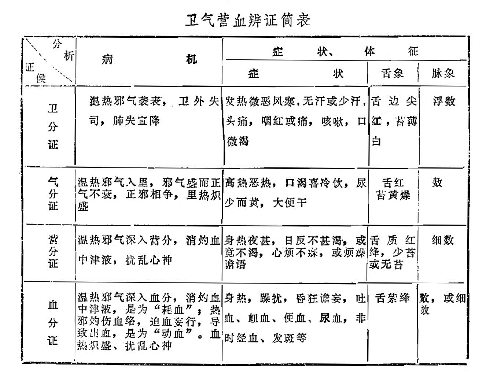

 **卫气营血辨证简表** 

| 证候   | 病机                                                         | 症状                                                         | 舌象                 | 脉象       |
| ------ | ------------------------------------------------------------ | ------------------------------------------------------------ | -------------------- | ---------- |
| 卫分证 | 温热邪气袭表，卫外失司，肺失宣降                             | 发热微恶风寒，无汗或少汗，头痛，咽红或痛，咳嗽，口微渴       | 舌边尖红，苔薄白     | 浮数       |
| 气分证 | 温热邪气入里，邪气盛而正气不衰，正邪相争，里热炽盛           | 高热恶热，口渴喜冷饮，尿少而黄，大便干                       | 舌红苔黄燥           | 数         |
| 营分证 | 温热邪气深入营分，消灼血中津液，扰乱心神                     | 身热夜甚，日反不甚渴，或竟不渴，心烦不寐，或烦躁谵语         | 舌质红绛，少苔或无苔 | 细数       |
| 血分证 | 温热邪气深入血分，消灼血中津液，是为“耗血”；热邪灼伤血络，迫血妄行，导致出血，是为“动血”。血热炽盛、扰乱心神 | 身热，躁扰，昏狂谵妄，吐血、衄血、便血、尿血，非时经血、发斑等 | 舌紫绛               | 数，或细数 |

## 第六节  三焦辨证

三焦辨证，也是温病的辨证方法之一。凡外感温热邪气而致病，以发热和热邪伤阴化燥为主要临床特点的病变，称为温病。三焦辨证，就是把温热病分为上焦温病、中焦温病、下焦温病三类病证，并以此来标示它们之间的传变规律。上焦温病，包括肺、心、心包的病变；中焦温病，包括脾、胃、大肠的病变，下焦温病，包括肝、肾、膀胱的病变。

温病的三焦传变规律，一般是始于上焦，传变中焦，终于下焦。因为三焦辨证与卫气营血辨证都是温病的辨证方法，且二者最终都要落实在脏腑上的，所以二者之间有着密切的联系。也可以说，三焦辨证中包含了卫气营血辨证的内容；而卫气营血辨证中也同样包含着三焦所属的脏腑。不过二者又各有所长，其特点就在于：卫气营血辨证主要是划分温病浅深轻重的四个阶段；而三焦辨证则着重在划分温病侵袭人体的三大部位。由此可见，二者之间既有联系，又有区别，结合运用，才能使温病的辨证更为全面。

温热病的治疗原则已在卫气营血辨证中谈过。湿热病的特点是热蕴湿中，湿阻气机，所以其治疗主要在于祛湿清热，宣畅气机。

因为三焦辨证的内容也将在《温病条辨讲解》中详细讲述，本节仅将三焦温热病与湿热病列简表概括介绍如下：

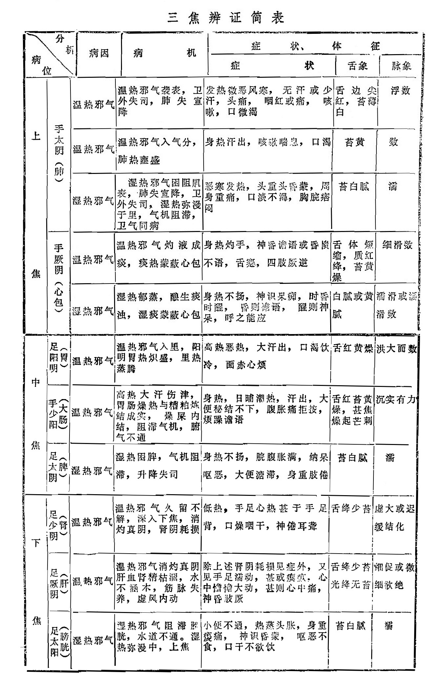

 **三焦辨证简表** 

| 病位 | 病位           | 病因     | 病机                                                         | 症状                                                         | 舌象                     | 脉象           |
| ---- | -------------- | -------- | ------------------------------------------------------------ | ------------------------------------------------------------ | ------------------------ | -------------- |
| 上焦 | 手太阴（肺）   | 温热邪气 | 温热邪气袭表，卫外失司，肺失宣降                             | 发热微恶风寒，无汗或少汗，头痛，咽红或痛，咳嗽，口微渴       | 舌边尖红，苔薄白         | 浮数           |
| 上焦 | 手太阴（肺）   | 温热邪气 | 温热邪气入气分，肺热壅盛                                     | 身热汗出，咳嗽喘息，口渴                                     | 苔黄                     | 数             |
| 上焦 | 手太阴（肺）   | 湿热邪气 | 湿热邪气困阻肌表，肺失宣降，卫外失司，湿热弥漫于里，气机阻滞，卫气同病 | 恶寒发热，头重头昏蒙，周身重痛，口淡不渴，胸脘痞闷           | 苔白腻                   | 濡             |
| 上焦 | 手厥阴（心包） | 温热邪气 | 温热邪气灼液成痰，痰热蒙蔽心包                               | 身热灼手，神昏谵语或昏愦不语，舌蹇，四肢厥逆                 | 舌体短缩，质红绛，苔黄燥 | 细滑数         |
| 上焦 | 手厥阴（心包） | 湿热邪气 | 湿热郁蒸，酿生痰浊，湿痰蒙蔽心包                             | 身热不扬，神识呆痴，时昏时醒，昏则谵语，醒则神呆，呼之能应   | 白腻或黄腻               | 濡滑或濡滑数   |
| 中焦 | 足阳明（胃）   | 温热邪气 | 温热邪气入里，阳明胃热炽盛，里热蒸腾                         | 高热恶热，大汗出，口渴饮冷，面赤心烦                         | 舌红黄燥                 | 洪大而数       |
| 中焦 | 手阳明（大肠)  | 温热邪气 | 高热大汗伤津，胃肠燥热与糟粕炼结成实，燥屎内结，阻滞气机，腑气不通 | 身热，日晡潮热，汗出，大便秘结不下，腹胀痛拒按，烦躁谵语     | 舌红苔黄燥，甚焦燥起芒刺 | 沉实有力       |
| 中焦 | 足太阴（脾)    | 湿热邪气 | 湿热困脾，气机阻滞，升降失司                                 | 身热不扬，脘腹胀满，纳呆呕恶，大便溏滞，身重肢倦             | 苔白腻                   | 濡             |
| 下焦 | 足少阴（肾)    | 温热邪气 | 温热邪气久留不解，深入下焦，消灼真阴，肾阴耗损               | 低热，手足心热甚于手足背，口燥咽干，神倦耳聋                 | 舌绛少苔                 | 虚大或迟缓结化 |
| 下焦 | 足厥阴（肝)    | 温热邪气 | 温热邪气消灼真阴肝血肾精枯涸，水不涵木，筋脉失养，虚风内动   | 除上述肾阴耗损见症外，又见手足濡动，甚或瘈疭，心中憺憺大动，甚则心中痛，神昏肢厥 | 舌绛少苔 光绛无苔    | 细促或微细欲绝 |
| 下焦 | 足太阳（膀胱） | 湿热邪气 | 湿热邪气阻滞膀胱，水道不通。湿热弥漫中，上焦                 | 小便不通，热蒸头胀，身重痠痛，神识昏蒙，呕恶不食，口干不欲饮 | 苔白腻                   | 濡             |

## 第七节  经络辨证

经络辨证已在第三章“经络”中详为述及，这里只简单说明关于经络辨证和伤寒六经辨证的关系问题，二者是既有联系，又有区别的。六经辨证中有些内容与经络辨证是一致的，如六经辨证中也有脏腑和经络病证的内容。但是，正如卫气营血辨证、三焦辨证一样，经络辨证和六经辨证方法，是有其一定特异性的辨证方法。卫气营血与三焦辨证，主要适用于温病辨证。而脏腑辨证等，就不能完全代替卫气营血与三焦辨证。同样道理，六经辨证主要适用于伤寒病的辨证，而不适用于一般内伤杂病的辨证。至于治伤寒病的方子，可以用于治疗内伤杂病，那是另一回事，这不是本书要讨论的内容。经络辨证方法，是广泛适用于外感和内伤杂病的一种辨证方法，但又不能完全代替六经辨证及其他辨证方法。

## 复习思考题
1. 什么是证？什么是辨证？辨证方法有几种？
2. 八纲辨证和其他辨证方法有什么关系？
3. 八纲辨证、脏腑辨证、气血津液辨证的基本内容是什么？
4. 表证入里与里证出表的机理是什么？
5. 真假寒热虚实的辨证要点是什么？
6. 六经辨证、卫气营血辨证、三焦辨证主要适用于哪类疾病的辨证？

答：
1. 辨證
1. 八綱辨證
1. 辨證
1. 表裡
1. 寒熱虛實
1. 辨證

