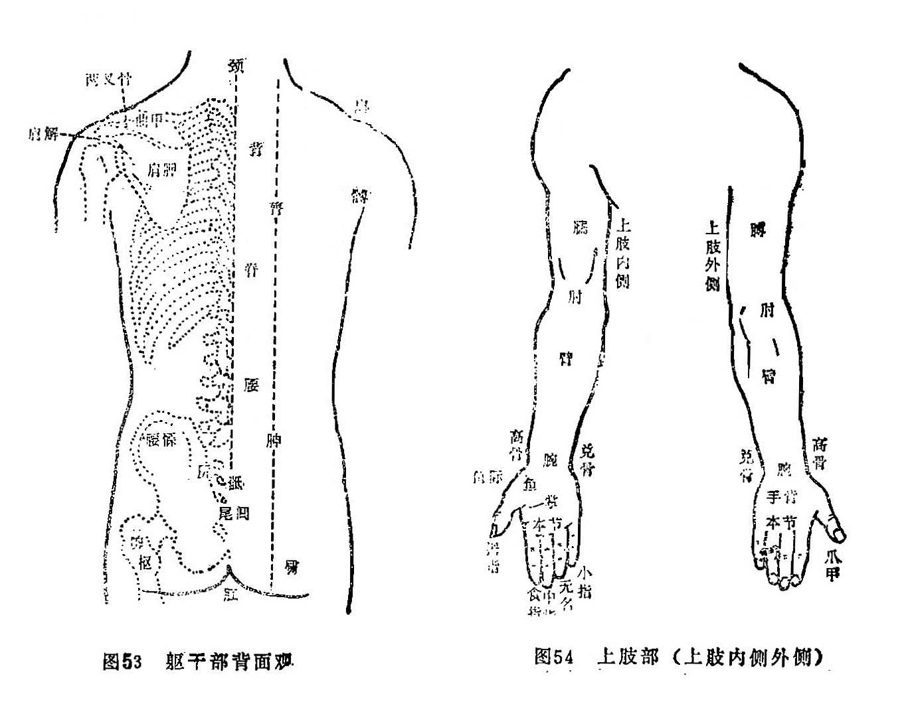

# 附：形体骨骼

[TOC]

形体、骨骼是中医解剖学中的一部分。“形体”主要是叙述体表各部形态和部位名称，以及体表器官的结构；“骨骼”是叙述全身骨骼组成、部位、骨骼之间的连属关系等。形体、骨骼学是脏象、经络学说，以及临床各科的基础之一。

我国远在秦汉以前，对人体解剖就有相当水平地研究。如《内经》一书中，就有大量文字记录了秦汉以前的人体解剖学成就，如对五脏六腑、脉管、骨骼，以及脑、髓、筋、肌肉等形态描述。其中有些与现代解剖学一致，或十分接近。以后，历代医家对解剖学又不断地有所研究，并取得了一定的成果。但是，由于长期的封建主义礼教的束缚，同时，中医学整体观念的“以外知内”思想，决定了简单的基本的解剖学知识，就已能满足中医基本理论与临床应用的需要；因此，医学家们注重的是如何从“外象”，判断“内在”的病变。这种种原因，使中医学在解剖学方面，没有在原有比较领先的水平上，进一步深入发展下去。

由于中医学注重从“外象”以知内，以及经络学、针灸学发展的需要，促使中医学比较侧重于人体骨骼及体表部位、形态特点的研究，所以，中医学在人体骨骼、体表形态方面，反而有比较细致的观察，并有具体命名。根据上述特点，所以本章暂时称之为“形体、骨骼”。

“形体骨骼”也是中医基础理论组成部分，它广泛地应用于中医理论与临床各科之中。如诊法，就要描述某部位的具体变化；经络循行、腧穴定位等，都必须应用骨骼及体表分部名称加以说明。临床各科也是如此，譬如内、外、妇、儿、伤科疾病都离不开具体症状发生部位的描述。如内科水肿之阳水先肿自目睑，儿科的解颅、白喉、目睑、颅、喉指的是什么部位？外科疮疡发生于何部位？都要有部位的记述。妇科的痛经，腰痛，小腹痛，具体都指的是人体哪一部位？骨伤科之骨折、脱臼发生在什么部位，这一部位叫什么，以及这一部位的内在脏腑是什么？不清楚就无法确切判断伤损有无可能涉及内脏的情况。同时，也违背了中医“以外知内”的原则。

同时，中医的经典著作及历代医著，都涉及大量的脏腑形体骨骼方面的论述，而且对同一部位，同一骨骼，历代又有不同的称呼；因而我们要学习先人的理论与临床经验，不了解“脏腑形体骨骼”，就无法接受他们精粹的学术思想和临床经验。但是长期以来，这一门基础知识一直处于被忽视的地位，为了扭转和纠正这一缺陷，我们特在书末附上“形体骨骼”一节，对这方面知识作一简要介绍。

形体骨骼，在《内经》中已有大量记叙，后世医家又根据实际需要，如随着骨伤科学，法医学等的发展，使形体骨骼方面的内容得到了进一步的充实和完善。有必要说明的是，由于中医是从体表去分析骨骼的，所以常将一骨分为几部分，并分别命名。现简要分为：头面颈项、躯干、四肢三部介绍如下。

## 一、头面颈项部

### （一） 前、侧面观（见图48、49）

1

头：又称首，颈项以上部位均属头部。

颠：又称颠顶、头顶，为头的上部中央最高处。其内中之头骨又称颠顶骨、顶骨。

囟（xìn信）：位于顶之前，又称囟门，今称前囟。婴儿时由于额骨与顶骨未闭合而形成。正常时微陷软而跳动之处即是。

髮际：就是头髮的边缘，额上髮际称前髮际，项后髮际称后发际。

额：又称颡（sǎng嗓）、额颅。位于前发际下，两眉之上部分，额部之骨骼称额骨。

额角：额的左右两侧隆起部分，左侧为左额角，右侧为右额角。系额骨在前发际下两侧凸起所形成。额骨的前发际下，正中部分，又称凌云骨。

颜：又称庭、天庭，指额部中央部位。一说指左右眉目之间。

阙（quē 缺）：两眉之间，及其略上之额部的一部分通称阙。两眉之间称阙中，又称印堂、眉心。阙中略上部分，又称阙上。

鼻：又称明堂，两侧鼻翼称方上。

頞（è扼）：又名下极，俗称山根，即鼻根部，位于两目之间，鼻柱之上凹陷处，形如马鞍。

王宫：俗称鼻柱，位于鼻根之下，鼻尖之上。一说王宫称下极。（《灵枢·五色篇》：“王宫位于下极。”）

明堂：又称鼻隼（sǔn损）、面王，俗称鼻头。鼻也通称明堂（见前）。

水沟：即鼻下上唇正中之沟，又称人中。

吻：口之周围部分称吻，但通常以两口角部称吻。

承浆：下唇之下，颏之上中央凹陷处。

颏 （kē科）：又名地阁，俗称下巴。位于承浆之下，颊车前部分，相当今称之下颌骨体部位。

颔（hàn汉）：颏之下，结喉之上，及两侧空软处。即今称之下腭底与甲状软骨之间的部位。

颈：头与胸（胸骨体上缘）之间。

结喉：即今甲状软骨前上方之隆起处。

睛明骨：眼窝周围的骨骼称睛明骨，由额骨和䪼骨构成。

眉棱骨：今称眉弓，系睛明骨的目上部分，即额骨之眶上缘弓形凸起部分。

眉本：俗称眉头，即眉毛内侧端部位。

眼睑：又名目胞，目窠、目裹、目睑，俗称眼胞、眼皮，分为上下脸。

目上纲、目下纲：又称上弦、下弦。今称睑缘。

目睛（眼球）各部名称：瞳神，今称瞳孔，瞳神外之棕黑色部分称黑睛；黑晴外围之白色部分称白睛。

目系：又名目本，是目睛与脑相连系的脉络组织。

目内眥（zì自）：又名大眥，即内眼角。

目外眥：又名小眥、目锐眥，即外眼角。

䪼（zhuō拙）：目之下，颧之上，即相当于今称之上颌骨和额骨构成眼眶的部位，构成眶部之骨，称䪼骨，也是睛明骨之一部（目下部分）。

颧：又称頄（qiú求），眼眶下外侧之高骨部位，内为颧骨所在。

关：耳前凸起部位，即今之颧弓部位。

颊：耳前、颧下部位。

顑：（kǎn砍）：俗名腮，系口旁、颊前肉之空软处。

颐：（yí宜）：口角后、腮下部位。

颞颥（niè rú聂如）：俗名太阳，位于眉棱骨外侧、颧弓上方。

曲隅：又名曲角、曲周，俗名鬓角，为额角外下方、耳前发际弯曲下垂部位。

蔽：俗名耳门，今称耳屏。

颌：又名辅车，即下颌骨支，为下颌骨耳下部位。

曲颊：即下颌角部，又名颊车。

牙床：即牙车，因其屈曲向前，故名。俗称下巴骨。

舌本：即舌根。

上腭：口内，与上牙床相连之上部，与今称之上腭，名位均同。

会厌：即今会厌软骨。

嗌：指咽，一指喉。

咽：食管上口。

喉：又名肺系，即喉咙，颈部气管的通称。

颃颡（háng sǎng杭嗓）：咽喉上端，相当于鼻咽部。

耳廓：为外耳道以外的全部耳壳的统称。

兑（锐）髮：指耳前方之髮角。

### （二） 背面观（见图50）

枕骨：脑后中央隆起之骨（今称枕外隆凸）。

玉枕骨：枕外隆凸两侧高起之骨。

完骨：耳后之高骨，又称寿台骨，今称乳突。

柱骨：又称天柱骨、玉柱骨，即今之颈椎骨最下面三节的统称。

复骨：即颈椎之上四节，因其覆盖于筋肉之内，外不可触及，故名。

项：指枕骨至大椎之间的部位。

## 二、躯干部

### （一）  前、侧面观（见图51、52）

胸：缺盆以下、腹部以上，两乳之间的部位。

膺（yīng英）：胸前两傍肌肉隆起处，相当于胸大肌的部位。

膻中：胸部两乳之中间部位。

𩩲骬（hé、yú合于）：又名鸠尾、蔽心骨，即胸骨下端，今称胸骨剑突。

腹：胸以下、横骨以上部位均称腹，其中脐以上称大腹，脐以下称小腹。小腹中，脐直下部位又称小腹，脐下两傍称少腹。

神阙：即脐。

丹田：脐下三寸左右的部位。

横骨：今称耻骨。

曲骨：横骨中央部，今称耻骨联合。

鼠蹊（xī夕）：即今称之腹股沟部。

毛际：阴毛部上缘。

阴门：女性外生殖器，已婚女性又称产门。今称阴裂，一般指阴道。

廷孔：女性尿道外口。

阴囊：阴茎后侧，内包睾丸者即是。

篡（cuàn串）：又名下极、屏翳、指前后二阴之间，即会阴部。

缺盆：今称锁骨上窝，在颈之下、巨骨上凹陷处。

锁子骨：又称巨骨，今称锁骨，即横于胸膺部上缘和肩端之骨，又名缺盆骨。锁子骨之肩侧端又称䯏骨。

两叉骨：肩胛骨和巨骨相接部，相当于今称之肩锁关节部。

髃（yú于）骨：又称肩端骨，系肩胛骨与锁子骨（巨骨）在肩端结合部。今称肩胛岗肩峰端。简称髃，俗称肩头。（部位名与骨名有别）。

腋：即腋窝。

胁：腋下至肋骨尽处的部位统称胁。一说又名胠。胁部的数条横骨名肋骨。

季胁：是胁部最下缘近腰侧的部位。其内有两条浮游的肋骨，名季肋、软肋、橛（jué决）肋，今称浮肋者即是。

䏚（miǎo秒）：季胁下无肋骨的空软处。

###  （二）背面观（见图53）

背：躯干后面统称背。

脊骨：即脊椎骨，又名膂骨， 中胎骨，由胸大椎（第一胸椎）算起，至第四骶椎棘突，共二十一节。

腰：躯干背面两侧，肋骨和髋骨之间之空软处统称腰。

膂（lǚ旅）：脊柱两侧纵行隆起之肌肉。相当于今之骶棘肌分布处。

胂（shēn申）：腰下两旁至髀骨上之间的肌肉。

髋骨：又名髂骨、腰坚骨、腰髁（䯊）骨。一说腰髁骨系腰部下端两侧凸起之骨，相当于今称之髂后上棘。

尻：尾骶骨的统称，即十七椎至第二十一椎。

骶：即尻骨最末节，即尾骨，又名尾骶、尾闾、穷骨、撅骨。

肛：即肛门，又名魄门，为大肠下口。

肩解：即肩端骨缝，由肩胛骨（髃骨部分）、锁子骨、臑骨（肱骨）组成，今称肩关节。

曲甲：肩胛骨上部之横行凸起，即今称之肩胛岗。

肩胛：即今称肩胛骨。

## 三、四肢部（见图54、55、56）

### （一）上肢（见图54）

膊：肩解至肘之间的外侧，即上臂外侧称膊。又，上臂统称膊。上臂又称肱。

肱骨：膊内之骨，又名臑骨、膊骨。

臑（nào闹）：上臂内侧。

肘：膊臂相连之关节部，即肘关节部。

臂：肘至腕之间，今称前臂。

臂骨：臂内之骨，有二，拇指侧者叫臂上骨，又称臂骨；小指侧者叫臂下骨，又称捭骨。

高骨：即臂上骨下端外侧凸起部，脉位称关。

兑（锐）骨：即臂下骨下端向外凸起部。

腕：臂掌连接处，即今之腕关节部。

掌：腕与五指之间的部位之内侧，其中心称掌心，掌内之骨称掌骨。

鱼、鱼际：与拇指相连之掌面，有一肌肉丰厚之处，名鱼，鱼与手背皮肤明显之分界线，名鱼际。

五指：大指即拇指；次指即食指；将指即中指；无名指即第四指；小指即第五指。

爪甲：即指甲。

本节：手、足指（趾）掌关节部之圆形凸起。

虎口：拇指与食指连接的部位。

### （二） 下肢（见图55、56）

楗骨：指股骨，或指髂骨，坐骨。

髀（bì闭）：大腿上端部位。

髀骨：即大腿骨，今称股骨。

髀枢：今称髋关节外侧部位，又称髀厌，髀机。

髀关：与髀枢相对之（股）内侧，当鼠蹊中央之下为髀关。

髀阳：大腿外侧。

股阴：大腿内侧。

股：即俗称大腿。

鱼腹：大腿内侧形如鱼腹处，相当今称之内收肌群处。

伏兔：大腿前面肌肉纵行隆起处（股四头肌），形如兔之伏卧，故名。

膝：又称骸（hái孩）关，即今称之膝关节部位。

膑：膝前之圆形骨，又称膝盖骨、𩓹骨，今称膑骨。

腘：与膝相对之后面的凹窝，即腘窝。

辅骨：组成小腿之内，外辅骨，总称辅骨。其中内辅骨又称胫骨、䯒（háng杭）骨，外辅骨即今称之腓骨。由于小腿以胫骨为主，所以小腿又称胫或䯒。

臁肕：胫骨前凸起之棱，今称胫骨前嵴。

腨（zhuān专）：又写作𨄔，又名腓肠，今称腓肠肌部位。

踠：胫、足相连接处，今称踝关节。

踝：小腿下端两侧隆起之圆骨，内侧称内踝，外侧称外踝。

绝骨：外踝上三寸许之外辅骨凹陷处。

跗：即足背，又名趺或足趺。

然骨：内踝前下方隆起之大骨，今称舟骨。

核骨：足大趾后内侧凸起之圆骨。

京骨：足小趾本节后外侧凸起之圆骨。

踵：即足跟。内中之骨称跟骨。