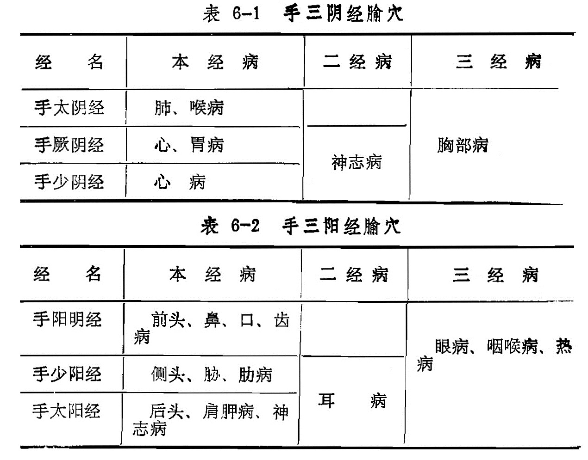
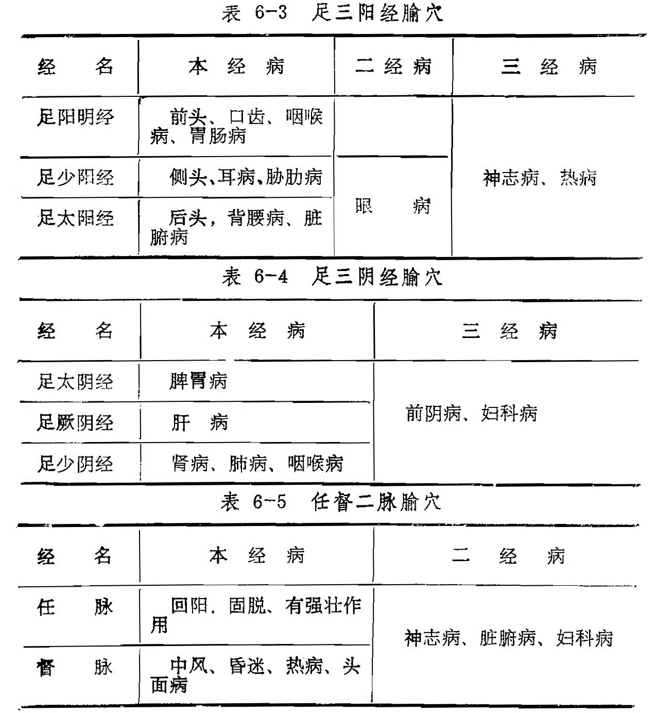
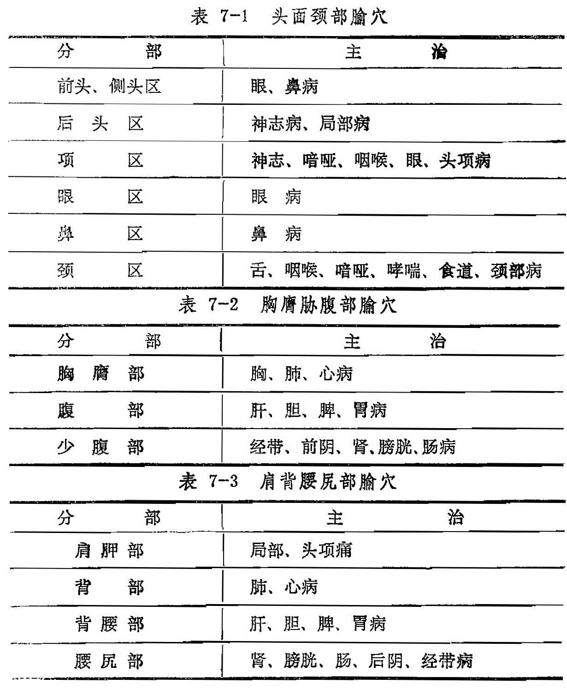

# 第二章 腧穴总论

[TOC]

经络和腧穴是针灸治疗的基础。从经络和腧穴的发展过程来看，腧穴的临床应用是经络学说形成的主要依据，而经络学说的形成又指导着穴位的临床应用。腧穴是针灸施术的部位，在临床上要正确运用针灸治疗疾病，必须掌握好腧穴的属经、定位、主治等基本知识。

## 第一节  腧穴的概念和命名

〔自学时数〕   1 学时

〔目的要求〕
1. 了解腧穴的概念。
2. 了解腧穴的命名。

### 一、腧穴的概念

腧穴是人体脏腑经络气血输注于体表的部位，是脉气所发的空隙，又是针灸治病的施术点。腧穴，历代还有很多名称，《内经》称“节”、“会”、“气穴”、“气府”、“骨空”等；《甲乙经》称“孔穴”；《太平圣惠方》称“穴道”，还有称作“穴位”等。“腧”、“输”、“俞”三个字相通，音义均同，应用时又各有所指，“腧穴”是指穴的统称；“输穴”是指井、荥、输、经、合五输穴中的第三个穴位；“俞穴”是指五脏六腑的背俞穴而言。

《素问·气府论》中解释腧穴是“脉气所发”。《灵枢·九针十二原》说：“节之交，三百六十五会，……神气之所游行出入也，非皮肉筋骨也”。《灵枢·小针解》说：“节之交，三百六十五者，络脉之渗灌诸节者也”。说明穴位不是孤立于体表的点，而是与脏腑器官有一定的内在联系，互相输通的一些特定部位。针灸刺激通过腧穴、经络的作用，能够调动人体内在的抗病能力，调节机体的虚实状态，以达到防治疾病的目的。所以说穴位既是疾病的反应点，诊断点，又是治疗的刺激点。

### 二、腧穴的命名

腧穴各有一定的部位和命名。《素问·阴阳应象大论》说：“气穴所发，各有处名”。腧穴的名称都有一定的意义，《千金翼》说：“凡诸孔穴，名不徒设，皆有深意”。理解了腧穴命名的含义，可便于记忆和临床选用。腧穴主要以其功能，象征意义命名的。古人以水流来譬喻人体运行血气的经脉，以山陵来譬喻筋肉骨节，再结合腧穴的主治功能加以命名，也有利用自然界现成名词的。兹将周身腧穴的命名归纳择要分类说明如下：

（一）自然类

1、以天文学上日月星辰而命名，如：日月、土星、璇玑、华盖、太乙、太白、天枢。

2、以地理名称结合腧穴的形象而命名，可分以下几类：

（1）以山、陵、丘、墟来比喻腧穴的形象，如：承山、大陵、梁丘、商丘、丘墟等。

（2）以谿溪、谷、沟、渎来比喻腧穴的形象，如：后溪、阳溪、合谷、陷谷、水沟、支沟、四渎、中渎等。

（3）以海、泽、泉、渠、渊来比喻腧穴的流注形象，如：少海、小海、尺泽、曲泽、曲池、阳池、曲泉、涌泉、经渠、太渊、清冷渊等。

（4）以街、道、冲、处、市、廊来比喻腧穴的通路或处所，如：气街、水道、关冲、五处、风市、步廊等。

（二）物象类

1、以动物名称来比喻某些腧穴的形态，如：鱼际、鸠尾、伏兔、鹤顶、犊鼻等。

2、以植物名称来比喻某些腧穴的形态，如：攒竹、禾髎等。

3、以建筑物之类来形容某些腧穴的形态，如：天井、玉堂、巨阙、内关、曲垣、库房、府舍、天窗、地仓、梁门、紫宫、内庭、气户等。

4、以什物之类来形容某些腧穴的象形或会意，如：大杼、地机、颊车、阳辅、缺盆、天鼎、悬钟等。

〈三）人体类

1、以人体解剖部位来命名，此类腧穴可分以下两大类：

（1）以大体解剖名称来命名，如：腕骨、完骨、大椎、曲骨、京骨、巨骨等。

（2）以内脏解剖名称来命名，如：心俞、膈俞、肝俞、肺俞、脾俞、胃俞、肾俞、胆俞、膀胱俞、大肠俞、小肠俞等。

2、以人体生理功能来命名，此类腧穴可分以下两大类：

（1）以一般生理功能来命名，如：承浆、承泣、听会、劳宫、廉泉、关元等。

（2）以气血脏腑功能来命名，如：气海、血海、神堂、魄户、魂门、意舍、志室等。

3、以治疗作用来命名，如：光明、水分、通天、迎香、交信、归来、筋缩等。

4、以人体部位和经脉分属阴阳来命名，可分以下三类：

（1）以内外分阴阳来命名，如：阳陵泉（外）、阴陵泉（内）等。

（2）以腹背分阴阳来命名，如：阴都（腹）、阳纲（背）等。

（3）以经脉交会分阴阳来命名，如：三阴交（阴经）、三阳络（阳经）等。

### 复习思考题
1. 什么是腧穴？腧穴在历代有哪些名称？
2. 腧穴的命名分几类？简要举例说明。
3. 腧穴命名有何重要意义？

答：

1. 腧穴
2. 分類
3. 意義

## 第二节  腧穴的分类

〔自学时数〕    2 学时

〔目的要求〕
  		熟悉腧穴的分类。

分布在人体的腧穴很多，经过历代医家用“分部”或“分经”的方法，进行多次整理，现在大体上可分为经穴、奇穴、阿是穴三类，兹分述如下：

### 一、经穴

凡归属于十二经脉与任、督二脉的腧穴，称为“十四经穴”，简称“经穴”。经穴都分布在十四经脉线上，十二经脉的腧穴均为左右对称的双穴；任、督二脉的腧穴，均为单穴。经穴具有主治本经病证的共同作用，同时还能反映十四经及其所属脏腑的病证。经穴的数目，经历了一个由少到多的过程。从《内经》经文来看，虽有三百六十五穴之说，而实际去其重复，仅约有一百六十穴左右，之后《甲乙经》用分经分布方法详载穴名、定位，共得三百四十九穴，继之《千金翼方》所载与《甲乙经》相同。《铜人腧穴针灸图经》与《十四经发挥》等书所记，已达三百五十四穴，而后《针灸大成》有三百五十九穴，《针灸逢源》的经穴总数达三百六十一穴，现代学术界一般均以三百六十一穴为准。

### 二、奇穴

奇穴又称经外奇穴，是指没有归属于十四经的腧穴，但有固定的名称和位置。这类腧穴多数对某些病证有特殊疗效，如百劳穴治疗瘰疬，四缝穴治疗小儿疳积等，也可作为经穴的补充。

奇穴的分布虽然比较分散，有的在十四经循行路线上，如印堂、阑尾、胆囊等；有的不在十四经循行路线上，但与经络系统有密切联系，如太阳穴与三焦经相关，鼻通与胃经相关等；有的奇穴并不指某一个部位，是由多个穴位组成，如十宣、八邪、八风、夹脊穴等；有些虽名为奇穴，其实就是由经穴组成的，如胞门、子户，实际就是水道穴；《针灸聚英》以胆俞、膈俞四穴为四花穴，以心俞二穴为灸痨穴。

历代文献有关奇穴的记载很多，如《千金方》记载有奇穴一百八十七个之多。《奇效良方》列奇穴二十六穴，《针灸大成》列三十五穴，《类经图翼》列八十四穴，《针灸集成》汇集了一百四十四穴。

### 三、阿是穴

“阿，”呼喊声。因按压痛处病人会“阿”的一声．故名“阿是”。阿是穴首见于《千金方》：“人有病痛，即令捏其上，若里当之处，不问孔穴，即得便快或痛，即云‘阿是’。灸刺皆验”。阿是穴因没有固定的部位，故又叫“不定穴”、“天应穴”。《内经》所说的“以痛为腧”，即是阿是穴的最早应用。《灵枢·五邪》说：“以手疾按之，快然乃刺之”。《素问·缪刺论》说：“疾按之应手如痛，刺之”。《素问·骨空论》说：“切之坚痛，如筋者灸之”。说明或痛、或快、或有特殊感应之处，都有阿是之意。

### 复习思考题
1. 腧穴分几类？各有什么特点？
2. 试述阿是穴命名的由来。

答：
1. 分類
2. 阿是

## 第三节  腧穴的功能

〔自学时数〕    2 学时

〔面授时数〕    1 学时

〔目的要求〕
  		掌握腧穴的功能

腧穴的功能有三：一是输注气血，二是反应病痛，三是防治疾病。

### 一、输注气血

经络为运行气血，协调阴阳，而穴位是气血所输注的特殊部位。《灵枢·九针十二原》说：“所言节者，神气之所游行出入也”。《灵枢·平人绝谷》说：“神者，水谷之精气也”。《灵枢·营卫生会》又说：“营卫者，精气也，血者，神气也”。由此可见，营卫血气是水谷精微所化生，它又是转化为神气的物质基础。《素问·气穴论》指出：“分肉之间，溪谷之会，以行营卫，以会大气”。高士宗《素问直解》注：“溪谷之会，内外相通，内通经脉，以行营卫，外通皮毛，以会大气，大气宗气也”。以上说明，腧穴不仅是营卫之气运行转输出入的部位，同时又是与宗气相会的处所。《灵枢·小针解》又说：“节之交，三百六十五会者，络脉之渗灌诸节者也”。这说明腧穴乃经脉与络脉相互贯通的枢纽，经脉中的气血，通过腧穴灌注于络脉，渗透到四肢百骸全身各部，腧穴的所在，也就是营卫之气会集的所在。

### 二、反应病痛

经络腧穴与脏腑息息相关。腧穴作为人身体表的一个部位，它与机体的内脏、组织器官有着密切的联系，所以疾病发生时，相应的腧穴上就有异常反应，这种反应的出现，对疾病的诊断和治疗有着重要的意义。经络瘀滞，气血运行不畅，会造成相关部位的疼痛肿胀；经络中气血郁积而化热，可出现红、肿、热、痛等；阳气不足，可出现局部发凉或全身怕冷等；阴血不足可出现“五心烦热”等。穴位是外邪侵袭人体的门户，《素问·风论》说：“风中五脏六腑之俞，亦为脏腑之风，各入其门户，所中则为偏风。风气循风府而上，则为脑风”。风寒湿邪，可由穴位部乘虚而入，深入脏腑而致病。脏腑、经络的病症，有时又常常通过穴位部的异常变化而反映出来，可出现压痛、酸楚、硬结、隆起、寒热、郁血、松陷及麻木等现象。如肺脏病症常可在中府、肺俞、膏肓俞等穴出现压痛。还如胃及十二指肠溃疡时，大多数患者在足三里穴可有过敏压痛，并在第五至第八胸椎附近处，可触摸到软性异物感。在肺俞穴触到异物时，多显示肺部疾患。

### 三、防治疾病

腧穴不仅是气血输注、邪气所客的处所，同时又是针灸防治疾病的部位。腧穴防治疾病的道理，在于接受适当的刺激后可以调整经络气血，达到扶正祛邪的目的。腧穴，是经络传导的感应，调整虚实的部位；经络则是腧穴治疗的基础。人的卫气是抵抗外邪侵袭的屏障，如果卫气不足，邪气就会乘虚而入发生病变；病时所出现的各种反应，也是卫气与邪气抗争的表现。所以临床常据此而循经取穴，按经论治。针刺穴位时所出现的“得气”和“行气”现象，是经络感传功能的具体表现，针灸推拿等治疗病症，就是通过腧穴来调气，以补虚泻实，扶正祛邪。应该说明的是：谷气、营气、卫气都是人体的正气，其分布部位大体上由深到浅；针刺首先接触到卫气，其次是营气，再次是谷气，到达谷气则出现应有的感应。这就是《灵枢·官针》所说的：“始刺浅之，以逐邪气而来血气；后刺深之，以攻阴气之邪；最后刺极深之，以下谷气”。从而治疗有关脏器的病症。

### 复习思考题
1. 腧穴的主要功能是什么？
2. 腧穴为什么能反应病痛？
3. 腧穴为什么能防治疾病？

答：
1. 分類
2. 阿是

## 第四节  腧穴的作用

〔自学时数〕    2 学时

〔目的要求〕
  		掌握腧穴的治疗作用。

腧穴与脏腑、经络气血有密切的联系，其作用特点为：近治作用、远治作用、特殊作用。

### 一、近治作用

腧穴的近治作用，是一切腧穴（包括十四经穴、奇穴、阿是穴）主治作用所具有的共同特点。一般腧穴均能治疗该穴所在部位及邻近组织、器官的病证。例如眼区的睛明、承泣、四白、球后诸穴，均能治疗眼病；耳区的耳门、听宫、听会、翳风诸穴，均能治疗耳病；胃部的中脘、建里、梁门诸穴；均能治疗胃病：膝关节部的犊鼻、鹤顶、阳陵泉诸穴，均能治疗膝关节疾病等。由于腧穴都具有这种作用，所以也称作腧穴的普遍性作用。

### 二、远治作用

腧穴的远治作用，是十四经腧穴主治作用的基本规律。在十四经腧穴中，尤其是十二经脉在四肢肘膝关节以下的腧穴，不仅能治疗局部病症，还可以治疗本经循行所及的远隔部位的组织、器官、脏腑的病症，有的甚至具有全身性作用。如合谷穴，不仅能治疗上肢病症，还能治疗颈部和头面部病症，同时还能治疗外感病的发热；足三里穴不但能治疗下肢病症，而且可以调整消化系统功能，甚至对人体防卫、免疫反应方面都具有很大作用。腧穴的这种远治作用，根据各经联系之脏腑组织不同而异，是腧穴特异性的具体表现，是前人对体表与内脏相关的重要发现。

### 三、特殊作用

腧穴的特殊作用是，针刺某些腧穴，对机体的不同状态，可起着双重的良性调整作用。例如泄泻时，针刺天枢穴能止泻；便秘时，针刺天枢穴又能通便。心动过速时，针刺内关穴能减慢心率；心动过缓时，针刺内关穴又可使之恢复正常。此外，还具有相对的特异性，如大椎能退热，至阴能矫正胎位，神门穴能安神，水沟穴可苏厥醒神等。

### 〔临床应用〕

理解腧穴的作用，是学习的重点内容之一。掌握本节内容，为学好腧穴各论打下基础，便于在临床治疗中灵活运用。如下牙痛，根据腧穴的近治作用，选颊车穴，因颊车穴位于下牙的局部可以治下牙痛（近治）；又可选合谷穴，因穴属大肠经，循行于下齿，是“经脉所通，主治所及”之处（远治）。牙痛又兼发烧，可取大椎穴，有泻热的功能，是取其特殊作用。治疗其他病症选穴时同样也是这一道理。

### 复习思考题
1. 腧穴的治疗作用有哪些？
2. 举例说明腧穴的特殊作用是什么？

答：
1. 分類
2. 阿是

## 第五节  十四经穴主治规律

〔自学时数〕    2 学时

〔面授时数〕    1 学时

〔目的要求〕
  		熟悉腧穴的主治规律。

每个腧穴都有其主治规律，可从腧穴的分经和分部两个方面去归纳。

### 一、腧穴的分经主治规律

十四经腧穴的分经主治，说的是既能主治本经的病证，又能主治两经相同的病证，或主治三经相同的病证。各经腧穴主治的异同分经，如表6：

### 二、腧穴的分布主治范围

十四经腧穴的分布主治，各有其特点。如头、面、颈项部的腧穴，除个别能治全身性疾病或四肢疾病外，绝大多数均治局部病证；胸腹部的腧穴，大多可治脏腑及急性疾患，背腰部的腧穴，除少数能治下肢疾病外，大多数可治局部病证、脏腑和慢性病；少腹部腧穴，除能主治脏腑疾病外，还能治疗全身性疾患；四肢都肘膝以上的腧穴，以治局部病证为主；肘膝以下至腕踝部的腧穴，除治疗局部病证外，还能治脏腑疾患；腕踝以下的腧穴，除能治疗局部病证外，还能治头面、五官病证，以及发热、神志病等全身性疾病。各部腧穴的主治规律归纳如表7：

表7-1  头面颈部腧穴

| 分　　部     | 主　　治                           |
| :----------- | :--------------------------------- |
| 前头、侧头区 | 眼、鼻病                           |
| 后头区       | 神志病、局部病                     |
| 项区         | 神志、喑哑、咽喉、眼、头项病       |
| 眼区         | 眼病                               |
| 鼻区         | 鼻病                               |
| 颈区         | 舌、咽喉、喑哑、哮喘、食道、颈部病 |

表7-2  胸膺胁腹部腧穴

| 分　　部 | 主　　治                       |
| :----------- | :--------------------------- |
| 胸膺部 | 胸、肺、心病               |
| 腹部   | 肝、胆、脾、胃病           |
| 少腹部 | 经带、前阴、肾、膀胱、肠病 |

表7-3  肩背腰尻部腧穴

| 分　　部 | 主　　治                       |
| :----------- | :-------------------------- |
| 肩胛部 | 局部、头项痛               |
| 背部   | 肺、心病                   |
| 背腰部 | 肝、胆、脾、胃病           |
| 腰尻部 | 肾、膀胱、肠、后阴、经带病 |

表7-4  腋胁侧腹部腧穴

| 分　　部 | 主　　治                       |
| :----------- | :----------------- |
| 胸胁部 | 肝、胆病、局部病 |
| 侧腹部 | 脾、胃病、经带病 |

表7-5  上肢内侧部腧穴

| 分　　部 | 主　　治                       |
| :----------- | :------------------------ |
| 上臂内侧部 | 肘臂内侧部               |
| 下臂内侧部 | 胸、肺、心、咽喉、神志病 |
| 掌指内侧部 | 神志病、发热病           |

表7-6  上肢外侧部腧穴

| 分　　部 | 主　　治                       |
| :----------- | :---------------------------------------------------- |
| 上臂外侧部 | 肩臂肘外侧病                                         |
| 下臂外侧部 | 神志病、头、眼、鼻、口、齿、咽喉、胁肋、肩胛、发热病 |
| 掌指外侧部 | 咽喉、发热病                                         |

表7-7  下肢后面部腧穴

| 分　　部 | 主　　治                       |
| :----------- | :----------------------------- |
| 大腿后面   | 臀股部病                       |
| 小腿后面   | 腰背后阴病                     |
| 跟后足外侧 | 头项、背腰、眼、神志病、发热病 |

表7-8  下肢前面部腧穴

| 分　　部 | 主　　治                       |
| :----------- | :---------------------------------------- |
| 大腿前面 | 腿膝部病                                 |
| 小腿前面 | 胃肠病                                   |
| 足跗前面 | 前头、口、齿、咽喉、胃肠、神志病、发热病 |

表7-9  下肢内侧部腧穴

| 分　　部 | 主　　治                       |
| :----------- | :-------------------------------------------- |
| 大腿内侧 | 经带、小溲病、前阴病                         |
| 小腿内侧 | 经带、脾胃病、前阴病、小溲病                 |
| 足内侧   | 经带、脾胃、肝病、前阴病、肾病、肺病、咽喉病 |

表7-10  下肢外侧部腧穴

| 分　　部 | 主　　治                       |
| :----------- | :--------------------------- |
| 大腿外侧 | 腰尻、膝股关节病           |
| 小腿外侧 | 胸胁、颈、项、眼、侧头部病 |
| 足外侧   | 侧头、眼、耳、胁肋、发热病 |

### 〔临床应用〕

针灸治病，必须确切掌握腧穴的主治规律。但是由于腧穴多，主治范围广，要全面一一了解和掌握，是有一定困难的。总的来说，可分为两方面：四肢的手足三阴、三阳经腧穴，以经脉循行通路作为主治的指导原则，可治疗局部病、邻近病、脏腑器官病症，以及表里经的病证。在头身的腧穴，以腧穴所在部位及邻近部位作为主治指导原则，即治疗局部病和邻近组织器官的疾病。掌握了这个规律后，再熟悉某些腧穴特点，就能较快地掌握腧穴的主治规律。

### 复习思考题
1. 怎样掌握腧穴的主治规律？
2. 试述手足三阴经、三阳经的主治规律？

答：
1. 分類
2. 阿是

## 第六节  穴性归类

〔自学时数〕    2 学时

〔目的要求〕
  		熟悉常用腧穴的性能。

药有药性，穴有穴性。掌握了药性，可据此处方遣药；同样，掌握了穴性，在随症取穴时，就有了依据。本节将常用的主要腧穴，依其性能，大致分为四十二类，可供针灸临床辨证施治、立法选穴的参考。

1. 补气穴：
气海、气海俞、中脘．关元、足三里、三阴交。
2. 理气穴：
膻中、内关、气海、太冲、行间、大陵。
3. 补血穴：
脾俞、膈俞、章门、三阴交、阴陵泉、足三里。
4. 通脉穴：
太渊、内关、神门、心俞、厥阴俞、膈俞、血海、三阴交、足三里。
5. 止血穴：
（1）止鼻衄：上星、膈俞、尺泽、禾髎、血见愁（上星与囟会之间）。
（2）止咳嗽唾血：承山、孔最、膈俞、二白。
（3）肠风下血：长强、承山、二白。
（4）经漏：交信、合阳、冲门、气冲。
6. 散瘀穴：
（1）急性腰扭伤：委中（刺血）。
（2）胸中瘀血：足三里。
（3）胁肋扭伤：大包、阳陵泉。
（4）腕关节扭伤：阳池、大陵。
（5）肩臂扭伤：肩井、曲池。
（6）踝关节扭伤：丘墟、昆仑。
（7）膝关节扭伤：膝眼、阳陵泉。
7. 通经穴：
天枢、水道、归来、血海、水泉、地机、太冲。
8. 催产穴：
合谷、三阴交、至阴、独阴、昆仑。
9. 通乳穴：
乳根、膻中、少泽、足三里。
10. 止呕穴：
内关、足三里、天枢、中脘、公孙、中魁、膻中、劳宫、三阴交。
11. 催吐穴：
内关、中脘。
12. 止泻穴：
天枢、大肠俞、足三里、大横、曲泽、委中、内庭。
13. 通便穴：
天枢、大肠俞、足三里、丰隆、支沟、阳陵泉、照海、大敦、内庭。
14. 生津止渴穴：
金津玉液、海泉、液门、照海、三阴交、然谷、太溪、胃管下俞。
15. 发汗穴：
合谷、复溜、大杼、大都、经渠。
16. 止汗穴：
阴郄、后溪、合谷。
17. 利尿穴：
中枢、膀胱俞、三焦俞、阴陵泉、三阴交、关元、肾俞、水分、气海、列缺、兑端。
18. 止咳穴：
列缺、太渊、尺泽、肺俞、天突。
19. 定喘穴：
列缺、四缝、定喘、喘息、膻中、肺俞、璇玑、气海、膏肓。
20. 祛痰穴：
丰隆、中脘、内关、巨阙、脾俞、列缺、肺俞、上脘、天突。
21. 消食穴：
足三里、公孙、脾俞、璇玑、中脘、天枢、合谷。
22. 消散穴：
（1）瘰疬：天井、少海、肘尖、臂臑、五里、建里。
（2）乳蛾：合谷、少商、中商、老商、照海。
23. 解毒穴：
灵台、合谷、委中、百劳。
24. 消炎穴：
（1）扁桃体炎：少商、合谷、天突。
（2）急性中耳炎：耳门、听会、听宫、翳风、中清、外关、阳陵泉、丘墟。
（3）风湿性关节炎：肩髃、曲池、合谷、环跳、阳陵泉、绝骨、风市、足三里、膝眼、肾俞、腰阳关、腰眼。
（4）急性单纯性阑尾炎：上巨虚、足三里、阑尾穴、天枢、曲池。
25. 清热穴：
大椎、曲池、合谷、陶道、陷谷、内庭、血海、肺俞、劳宫、少商、商阳、中冲、少府、少冲、鱼际、二间、前谷、液门、解溪、行间、大都、然谷、侠溪、通谷。
26. 祛寒穴：
神阙、中极、命门、中脘、温溜、地机、阴陵泉、气海、关元、章门、隐白、列缺、膻中。
27. 舒筋穴：
（1）上肢：肩髃、曲池、合谷、阳陵泉、筋缩、颈臂。
（2）下肢：环跳、阳陵泉、绝骨、筋缩。
28. 抗疟穴：
大椎、陶道、崇骨、至阳、间使、后溪、肝俞、胆俞、复溜、合谷、足三里。
29. 壮阳穴：
命门、肾俞、精宫，关元、气海、关元俞、神阙、中极。
30. 温中回阳穴：
气海、关元、神阙（皆灸），足三里、内关、百会（皆针）。
31. 祛黄穴：
至阳、腕骨、阳纲、胆俞、日月、阳陵泉、后溪、阴陵泉、脾俞、劳宫、涌泉、中脘、三阴交。
32. 祛风穴：
风池、风府、百会、风门、曲池、昆仑。
33. 升血压穴：
内关、患门。
34. 降血压穴：
血海、足三里、曲池、少海、太冲、涌泉。
35. 醒脑穴：
水沟、百会、十宣、十二井穴、劳宫、涌泉、四神聪。
36. 镇静穴：
百会、定神、四神聪、腰奇、间使、后溪、丰隆、涌泉、太冲、印堂、神庭。
37. 镇痉穴：
百会、大椎、印堂、后溪、曲池、阳陵泉、承山、太冲、昆仑、筋缩、水沟、攒竹、风府、合谷。
38. 安神穴：
百会、神门、内关、心俞、三阴交、太溪、安眠。
39. 开窍发音穴：
哑门、廉泉、颊车、通里、天突。
40. 抗痨穴：
中府、肺俞、膏肓、魄户、百劳、结核穴、足三里、四花、患门、大椎。
41. 提托穴：
提托穴、子宫穴、会阴（均针），气海、百会（均灸）。
42. 止痛穴：
（1）头痛：太阳、风池、印堂、列缺、头维、攒竹。
（2）牙痛：颊车、合谷、内庭、下关、承浆、太溪、尺泽。
（3）喉痛：少商、商阳、合谷、天突、照海。
（4）项痛：列缺、后溪、天柱、大椎、落枕、昆仑、风池、大杼。
（5）胸痛：内关、郄门、膻中、丰隆。
（6）心绞痛：大陵、内关、神门、郄门、心俞、巨阙。
（7）胃痛：中脘、内关、足三里、内庭、公孙。
（8）腹痛：中腕、气海、足三里、三阴交、天枢。
（9）胁肋痛：支沟、期门、日月、太冲、阳陵泉、丘墟、章门。
（10）腰背痛：后溪、膈俞、命门、肾俞、委中、昆仑、大椎、肝俞。
（11）腰尻痛：十七椎下，次髎、秩边。
（12）手背痛：合谷、后溪、八邪。
（13）肘关节痛：曲池、手三里、天井、少海、阳溪、养老、外关。
（14）腕关节痛：阳溪、阳池、阳谷。
（15）肩关节痛：肩髃、肩髎、臑俞、肩内陵、巨骨、肩贞。
（16）髋关节痛：环跳、承扶、环中、秩边、居髎。
（17）膝关节痛：膝眼、鹤顶、膝中、阳陵泉、秩边、承山。
（18）下肢痿痹痛：髀关、伏兔、四强、足三里、绝骨。
（19）踝关节痛：解溪、昆仑、商丘、丘墟。
（20）足趾肿痛：太冲、足临泣、八风。
（21）痛经：中极、气海、三阴交。

### 〔临床应用〕

临床治病，除了认证确切之外，掌握处方规律，也是一个主要课题。处方用药，要了解药性；处方配穴，也宜了解各穴的性能。如外感风寒出现头项强痛、恶寒、脉浮紧的见症，需要发汗解表，中药用麻黄汤，针灸可取风池、大椎、合谷、复溜。再如阳明腑证出现痞满燥实坚的见症，需要攻下通便，中药可用承气汤，针灸可取天枢、丰隆、支沟、大敦、阴陵泉。中药配方有汗、吐、下、消、和、清、温、补八法，针灸配方同样也有汗、吐、下、消、和、清、温、补的八种治疗作用。所以掌握了穴性，在临床上方能按治法组方选穴。

### 复习思考题
1. 针灸临床为什么要掌握腧穴性能？
2. 从腧穴性能上看，哪些腧穴既能发汗又能止汗；既能通便又能止泻；既能活血又能止血？
3. 通过学习本节后，你认为掌握腧穴性能的大致归类，对于立法选穴有无帮助？

答：
1. 分類
2. 阿是

## 第七节  腧穴的定位

〔自学时数〕    2 学时

〔面授时数〕    1 学时

〔目的要求〕
  		掌握腧穴的定位方法。

腧穴的定位，习惯叫取穴。取穴正确与否，直接影响治疗效果。现在临床常用的腧穴定位法可分为骨度分寸法、自然标志取穴法、手指同身寸取穴法、简便取穴法四种。

### 一、骨度分寸法

骨度分寸法，古称“骨度法”，始见于《灵枢·骨度》篇。它是将人体的各个部位分别规定出折算长度，作为量取腧穴的标准。不论男女、老少、高矮、胖瘦的人，均可按着这个标准测量。人体各部常用骨度分寸法如图1、表8：

圖1：常用骨度分寸示意圖

表8：常用骨度分寸表

  	附注：根据《灵枢·骨度》篇记载：发以下至颐长一尺，两颧之间相去七寸，结喉以下至缺盆中长四寸，足长一尺二寸等。现代临床折量，多以自然标志取穴，或以手指同身寸代之。

### 二、自然标志取穴法

根据人体自然标志而定取腧穴。可分为固定标志和活动标志两类：

1．固定标志：指不受人体活动影响而固定不移的标志。如五官、毛发、爪甲、乳头、脐窝以及骨节凸起和凹陷、肌肉隆起等部位作为取穴标志而言。如鼻尖取素髎，两眉间取印堂，两乳间取膻中，脐中取神阙，腓骨小头前下缘取阳陵泉，第七颈椎棘突下取大椎。此外，可依肩胛岗平第三胸椎棘突、肩胛骨下角平第七胸椎棘突、髂嵴平第四腰椎棘突为标志，取背腰部腧穴。

2．活动标志：指必须采用相应的动作姿势才能出现的标志。例如取耳门、听宫、听会等穴，应张口；取下关，应闭口。取曲池，应屈肘于横纹头处取之；取养老穴时，正坐屈肘，掌心向胸，当尺骨茎突之桡侧骨缝中是穴；取后溪穴时，要握拳于横纹头等。

### 三、手指同身寸取穴法

以患者的手指为标准，来定取腧穴的方法。人的手指长度和宽度与其它部位有着一定的比例，所以用患者本人的手指来测量定穴，或权衡患者高矮胖瘦的情况，以医者的手指来测定穴位。临床常用的有以下三种：

1．中指同身寸：是以患者的中指中节屈曲时内侧两端纹头之间作为1寸（如图2），适用于四肢部取穴的直寸和背部取穴的横寸取穴。

2．拇指同身寸：是以患者拇指指关节的横度作为1寸（如图）,也适用于四肢部的直寸取穴。

3．横指同身寸：又名“一夫法”，是令患者将食指、中指、无名指和小指并拢，以中指中节横纹处为准，二指横量作1.5寸，四指横量作为3寸（如图2），此法多用于下肢、下腹部和背部的横寸。

### 四、简便取穴法

是临床上常用的一种简便易行的取穴方法。如垂手中指端处取风市，两手虎口交叉取列缺，两耳尖直上取百会，垂臂屈肘合腋于肘尖着点处取章门等。

### 〔临床应用〕

在临床上要获得正确的腧穴定位，须明确取穴法。金·窦汉卿《标幽赋》曾说：“取五穴用一穴而必端，取三经用一经而可正”。明确指出取穴时必须力求审慎。

本节介绍的各种取穴法，必须牢牢掌握，各穴适合哪种取穴法，就应用哪种取穴法，要点是取穴准确，才能发挥腧穴的应有作用。

### 复习思考题
1. 常用取穴方法有几种？临床上以哪一种最为常用？
2. 何谓骨度分寸法？并举出常用骨度的分寸。
3. 何謂中指同身寸？何謂拇指同身寸？何謂一夫法？它們如何應用？

答：
1. 分類
2. 阿是

## 第八节  特定穴

〔自学时数〕    2 学时

〔目的要求〕
  		熟悉各类特定穴的意义。

特定穴是指十四经中具有特殊治疗作用并有特定名称的一些腧穴。包括在四肢肘膝以下的五输穴、原穴、络穴、郄穴、八脉交会穴、下合穴;在胸腹、背腰部的背俞穴、募穴;在四肢躯干部的八会穴以及全身经脉的交会穴。

### 一、五输穴

五输穴即十二经脉分布在肘、膝关节以下的井、荥、输、经、合，简称“五输”。其分布次序是根据标本根结的理论，从四肢末端向肘膝方向排列的。《灵枢·九针十二原》:“以上下所出为井、所溜为荥、所注为输、所行为经、所入为合”。古代医学家把经气在经脉中运行的情况，比作自然界的水流，以说明经气的出入和经过部位的深浅及其不同作用。如经气所出，象水的源头，称为“井”，经气所溜，象刚出的泉水微流，称为“荥”；经气所注，象水流由浅入深，称为“输”;经气所行，象水流在通畅的河中流过，称为“经”；最后经气充盛，由此深入，进而汇合于脏腑，恰象百川汇合入海，称为“合”。

### 二、原穴、络穴

原穴、络穴绝大部分位于四肢腕踝关节附近。“原”即本源、原气之意。原穴是脏腑原气经过和留止的部位。某一脏腑经脉也与该经所隶属的原穴有密切联系。因此，脏腑的病变，往往反应于十二原穴。十二经脉在四肢各有一个原穴，又名“十二原”。在六阳经，原穴单独存在，排列在输穴之后，六阴经则以输为原。“络”即联络之意，络脉从经脉分出的部位各有一个腧穴叫作络穴。络穴具有联络表里两经的作用。十二经各有一个络穴，加之任脉络穴鸠尾位于腹，督脉络穴长强位于尾骶部，脾之大络大包穴位于胸胁，共十五穴，故称“十五络穴”.

### 三、俞穴、募穴

俞穴、募穴均分布于躯干部，与脏腑有密切联系。俞穴是脏腑经气输注于背腰部的腧穴，募穴是脏腑经气汇聚于胸腹部的腧穴。

### 四、八脉交会穴

八脉交会穴均分布于四肢腕踝关节的上下。它是指奇经八脉与十二经脉之气相交会的八个腧穴，故称“八脉交会穴”。

### 五、八会穴

“会”即聚会之意。八会穴即脏、腑、气、血、筋、脉、骨、髓的精气聚会的八个腧穴，故称八会穴。分布于躯干部和四肢部。

### 六、郄穴

“郄”有空隙之意。郄穴是各经经气深集的部位。十二经脉及阴阳跷、阴阳维脉各有一个郄穴，共十六个郄穴。多分布于四肢肘、膝关节以下。

### 七、下合穴

下合穴是指手足三阳六腑之气下合于足三阳经的六个腧穴，故称下合穴。主要分布于下肢膝关节附近。

### 八、交会穴

交会穴是指两经以上的经脉相交或会合处的腧穴，多分布于头面、躯干部位。

### 〔临床应用〕

特定穴的作用，在针灸治疗上占有相当重要的位置，它不但能治疗所属的经脉、脏腑病，还有特殊治疗意义。特定穴可分为十种，每种特定穴都有它独特的治疗作用，在临床上根据不同的病症，就可选取不同的特定穴进行治疗。一种病症也可选用两种或两种以上的特定穴进行配伍治疗。特定穴的分布，在四肢肘膝以下的有五输穴、原穴、络穴、郄穴、八脉交会穴、下合穴；在背部有俞穴，在胸腹部有募穴；在躯千与四肢部有八会穴，在全身的有交会六。掌握特定穴的分布，则便于临床应用。

### 复习思考题
1. 什么叫特定穴？特定穴有哪几种？
2. 什么叫五穴输穴？试述其含义。
3. 什么叫原穴、络穴、郄穴、俞穴、募穴、八会穴、八脉交会穴、下合穴?都分布在人体哪些部位？

答：
1. 分類
2. 阿是

## 第九节  古代体表部位名称解释

〔自学时数〕    2 学时

〔目的要求〕
  		了解古代体表部位名称。

在学习腧穴时，要了解古代体表部位的名称。因为古代体表部位的名称，有的和现代解剖部位的名称相同，有的和现代解剖部位的名称不同，而有些腧穴是用古代体表部位名称，所以要把腧穴定位取得准确，首先要了解古代体表部位的名称。兹将各部古代体表部位名称解释如下，对于理解腧穴部位、经脉所过以及阅读中医古籍，很有帮助。

**首**  又称头。指人体颈项以上的部位。手足三阳经经脉、手少阴心经、足厥阴肝经、任脉、督脉、冲脉、阳维脉、阴、阳跷脉等，均上行至头。

**颠**  或作巅。一名颠顶，俗称头顶。为头顶中央之最高处。足太阳膀胱经，足厥阴肝经，督脉均上行至巅。

**顖** [xin 信]  同囟。顶巅前为囟。即现代解剂学上的前囟。婴儿额骨与左右顶骨未闭合时，称作囟门。可触及动脉搏动。已合，称囟骨。督脉所过。 

**发际**  头发之边缘。前额处的称前发际，后项部的称后发际，是定取头部腧穴的重要标志。足阳明胃经、足少阳胆经、足太阳膀胱经、阳维脉、阳跷脉等，均过发际。

**额**  或作额。与现代解剖学同。一名额颅。在发下眉上之处。足阳明胃经、足太阳膀胱经、足厥阴肝经、督脉、阳跷脉、阳维脉等，均行经额。

**额角**  又称头角，简称角。即前发际在左右两端弯曲下垂所呈的角度。足阳明胃经、足少阳胆经、手少阳三焦经等，均行经额角。

**颜**  又称庭、天庭。即额部中央。一说指左右眉目之间，一说指面部前中央。为督脉所过处。

**阙**  [que  缺]  又称阙中，一名印堂，俗称眉心。即两眉之间。阙之上称阙上。督脉所过。

**眉棱骨**  现称眉弓。相当于额骨构成眼眶的部分。为足太阳膀胱经等所过。奇穴鱼腰即位于眉弓中点。

**眉本**  与眉梢对举，俗称眉头。即眉毛之内侧端。足太阳膀胱经所过。

**目胞**  一名目窠，一名裹，俗称眼胞，现称眼睑。上面称上眼睑，下面称下眼睑。

**目纲**  纲，或作网，又称眼弦，现称脸缘。即眼睑边缘生毛处。上面称目上纲(网)，或上弦，即上睑缘，下面称目下纲(网)，或下弦，即下睑缘。足太阳、足阳明的经筋分别与目上纲、目下纲相联系。

**目内眦**  [zi 自]  又称大眦，即内眼角。足太阳膀胱经、足阳明胃经、手太阳小肠经的支脉，阴、阳跷脉，均经过目内眦。

**目锐眦**  又称小眦、目外眦，即外眼角。足少阳胆经、手太阳小肠经、手少阳三焦经等，经过目锐眦。

**頞**  [e  扼]  又名下极，俗称鼻梁、山根，现称鼻根。即两目之间，鼻柱之上凹陷处。足阳明胃经之所起。

**王宫**  又称明堂骨，俗称鼻柱，即鼻根之下，鼻尖之上。一说指鼻根部。督脉所过。

**明堂**  即鼻。一说指鼻尖。手阳明大肠经、足阳明胃经、手太阳小肠经、督脉等所过。鼻之下方两孔称鼻孔，鼻孔之上称方上,现称鼻翼。

**䪼** [zhuo 拙]  指眶下缘的骨。相当于现代解剖学上的上颌骨和颧骨构成眼眶的部分。手太阳小肠经、手少阳三焦经、足少阳胆经行于䪼。

**頄**  [qiu  求]  亦称颧，即颧骨，为眼眶外下侧之高骨，或指頄内鼻旁间的部位。手太阳小肠经、足阳明胃经、任脉、跷脉等，上行至頄。

**颊**  耳的前方，颧骨的下方。手、足阳明经，手太阳小肠经、手少阳三焦经、足厥阴肝经等行于颊。

**顑**  [kan  砍]  俗称腮。口旁颊前肉之空软处。相当于口腔粘膜的外壁。

**巨分**  现称鼻唇沟。指由鼻翼外缘向口角外侧伸延的皮肤皱纹沟。为手、足阳明经所过。迎香穴位于鼻唇沟中。

**颃颡**  [hang  sang  杭嗓 ]   指上腭与鼻相通的部位，相当于鼻咽部。足厥阴肝经、冲脉等行经颃颡。

**水沟**  亦称人中。鼻下唇上中央之凹陷处。督脉行经。手阳明大肠经交于人中。

**承浆** 唇下颏上中央凹陷处。任脉所当处，足阳明胃经交于承浆。

**颏**  [ ke  科 ] 又称地阁，俗称下巴，现称下颌骨体。任脉等所过。

**吻**  指口唇。一说指两口角。手阳明大肠经、足阳明胃经、足厥阴肝经、任脉、督脉、冲脉等所过。

**颐**  [yi 宜]  口角外下方，腮部前方。足阳明胃经等所过。

**颞颥** [nie ru 聂如]  俗称太阳，现称翼点。眉弓外侧，颧骨弓上方，为手、足少阳经等所过。

**曲隅** 又名曲角、曲周，俗称鬓角。位于额角外下方，耳前上方的发际呈弯曲下垂的部分。为手、足少阳经等所过。

**蔽**  俗称耳门，现称耳屏。

**耳缺**  即耳屏上切迹。

**颌** 又称辅车。即下领骨支，为下颌骨的耳下部分。足阳明胃经等所过。

**曲牙**  即下牙床。因其弯曲向前，故名。手少阳经筋、手太阳经筋上行曲牙。

**曲颊**  指下颌角部。足阳明胃经所过。

**颊车**  指下颌骨。足阳明胃经、足少阳胆经等行于颊车。

**舌本**  即舌根。足太阴脾经、足少阴肾经、任脉等连系舌本。

**会厌**  即会厌软骨。复盖在喉的上端。

**嗌**  一指食管上口(咽腔)，一指喉咙。手太阴肺经、任脉、冲脉、阴跷脉上行于咽。足太阴脾经、手少阴心经、阴维脉沿行于咽的两旁。足阳明胃经、足少阴肾经、任脉循行于喉咙。足厥阴肝经循行于喉咙之后。

**颔**  [han  汉]  颏下结喉上,两侧肉之空软处。即下颌底与甲状软骨之间。足阳明胃经、任脉等所过。

**结喉**  又称喉结。与现代解剖学同名。即甲状软骨前上方隆起处。任脉所过，足阳明胃经在结喉两旁。

**颈**  头下肩上部位的统称。或指舌骨至胸骨体上缘的部位。手、足阳明经、手少阴心经、手太阳小肠经、足少阴肾经、手、足少阳经、足厥阴肝经、任脉、阴维脉、阴跷脉等行经颈部。

**项**  肩上头下之后部，即从枕骨到大椎之间。手、足少阳经，足太阳膀胱经、督脉、阳维脉、阳跷脉等行经项部。

**枕骨**  与现代解剖学同名。指后头中央隆起之骨。俗称后山骨。为足太阳膀胱经、足少阳胆经、督脉等所过。

**玉枕骨**  枕骨两旁高起之骨，现称枕骨上项线。足太阳膀胱经、足少阳胆经等所过。

**耳廓**  或作耳郭，俗称耳朵。为外耳道以外全部耳壳的统称。足太阳经支脉、手、足少阳经、手太阳经等行经耳廓。

**完骨**  又称寿台骨。指耳后之高骨，现称乳突。手少阳三焦经、足少阳胆经等经过完骨。

**柱骨**  为颈椎的统称。又称天柱骨。手阳明大肠经上出于柱骨之会上。督脉所过。

**缺盆**  指锁骨上窝。足阳明胃经、足少阳胆经、手阳明大肠经、手太阳小肠经、手少阳三焦经、阴跷脉等均行经缺盆。

**巨骨**  又称缺盆骨，现称锁骨。

**两叉骨**  指肩胛骨与锁骨相接之处，相当于肩锁关节部。古书称巨骨穴在两叉骨间。

**髃  yu 于J 骨**   简称髃，又名[肩髃、肩端骨，俗称肩头。相当于肩胛冈之肩峰突。手阳明大肠经等行髃骨前缘。

**肩解**  指肩端之骨节解处，现称肩关节。手太阳小肠经出行肩解。

**肩**  与现代解剖学同名。颈项之下，左右两侧对称，是上肢和躯干的连属处。足少阳胆经、手阳明大肠经、手太阳小肠经、手少阳三焦经、阳维脉、阳跷脉等所过。

**胸**  缺盆下、腹之上的部位。十二经脉除膀胱经外，均行经前胸部。

**膺**  [yinq  英]。胸前两旁肌肉隆起处，相当于胸大肌处。手太阴肺经、足阳明胃经、足太阴脾经等所过。

**膻中**  两乳之间的部位。手少阳三焦经、任脉等所过。

**𩩲骭**  [ he  yu  合于 ]  又称鸠尾、蔽骨。胸骨下端蔽心之骨。现称胸骨剑突。任脉所过。

**腋**  肩下胁上之陷窝。手太阴肺经、手少阴心经、手厥阴心包经、足少阳胆经等行于腋。

**胁**  腋下到肋骨尽处之统称。手厥阴心包经、足厥阴肝经、足少阳胆经等行于胁。

**胠**  [ qu 区 ]   腋下胁上，是胁肋的总称。

**季胁**  又称季肋、软肋、橛 [ jue 决] 肋。即胁下软肋的部分。足少阳胆经、带脉行过季胁。

**曲甲**  肩胛骨上1/3弯曲突出之处。现称肩胛冈。手太阳小肠经、手少阳三焦经等行经曲甲。古书称曲垣穴在曲甲陷者中。

**肩胛**  肩下背侧成片之骨，现称肩胛骨。手太阳小肠经等所过。

**肩膊**  又名  骨攵 [ ba 拔 ] ，指两肩及肩之偏后部分。一说为肩胛骨的别称。足太阳膀胱经循肩膊内侧，阳跷脉循肩膊外侧。

**腹**  与现代解剖学同名。胸以下、脐以上称上腹，脐以下称少腹或小腹。一说脐下称小腹，脐下两旁称少腹。足阳明胃经、足太阴脾经、足少阴肾经、足厥阴肝经、冲脉、任脉等行于腹。

**䏚**  [ miao 秒 ] 季胁下无肋骨之空软处。相当于腹部九分法之腰部。足少阳经筋“上乘䏚季胁”。

**神阙**  即肚脐。任脉贯穿脐中央，冲脉并足少阴肾经挟行脐之两旁。

**丹田**  指脐下三寸左右的部位，是男子精室、女子胞宫所在处。任脉等所过。

**横骨**  指两股之间横起之骨。相当于现代解剖学上的耻骨。足厥阴肝经、任脉等所过。

**曲骨**  位于横骨的中央部，现称耻骨联合。任脉等所过。

**鼠蹊** [ xi 夕 ] 即腹股沟部。气冲穴在鼠蹊部。

**气街**  指腹股沟股动脉处。足阳明胃经入气街中。

**毛际**  指下腹部阴毛的边际。足少阳胆经、足厥阴肝经、任脉等经过毛际。

**廷孔**  或作庭扎。指阴道。《素问●骨空论》:“督脉者，起于少腹以下骨中央，女子入系廷孔。”

**篡**  [ cuan 窜 ]  又名下极、屏翳，指前后二阴之间，即会阴部。督、任二脉均出于篡。

**二阴**  即前阴和后阴的统称。前阴又称下阴，是男、女外生殖器及尿道的总称。后阴即肛门部。任脉、足厥阴肝经、督脉、足太阳膀胱经等，分别行经前、后二阴。

**下极** 指两阴之间，即会阴部。-说指鼻根、肛门。

**背**  躯干之后统称为背。手太阳小肠经、手少阳三焦经、足少阳胆经、足太阳膀胱经、督脉等皆行于背。

**脊骨**  指脊椎骨(脊柱)。又名膂骨、中 月吕 骨，俗名脊梁骨。中医指的脊，多从第一胸椎棘突开始，向下数至第四骶椎棘突，共二十一节。足太阳膀胱经挟脊两旁循行，足少阴肾经贯脊，冲、任二脉分支及督脉行于脊骨。

**膂**   [  lu旅  ]又称膂筋。指脊柱两旁的肌肉，约当骶棘肌分布处。足太阳膀胱经循于膂。

**腰**  背部十二肋以下，髂嵴以上软组织部分。足太阳膀胱经、督脉、带脉等行于腰部。

**胂**  [shen申]泛指脊柱两侧的肌群，或指髂嵴以下的肌肉部分。

**腰髁**   指腰部两旁凸起之骨，与今之髂后上棘似。古书称上醪穴在第一空腰髁下一寸。

**尻**  [kao考]尾骶骨部分结称。为足太阳膀院经、督脉等所过。

**骶端**  又称低、尾低、尾间、穷骨、撅骨。指尻骨的末节，即尾骨。督脉行经。古书称长强穴位于骶端。

**臀**  指低骨部两旁隆起之臀大肌部分。足太阳膀胱经贯臀。

**膊**  又称胳膊。指肩膀以下手腕以上的部分。一说指上臂外侧面。手三阳经行于膊的外侧，手三阴经行于膊的内侧。

**臑**  [nao闹]指肩至肘内侧靠近腋部隆起的肌肉，即肱二头肌部。一说为上臂的统称。共屈侧称臑内，伸侧称臑外。

**肘**  即肘关节。指上臂和前臂相接的部分。其内侧面为肘窝，外侧为时尖。是手三阴经、手三阳经行过之处。

**臂**  指肘以下腕以上部分。现称前臂，或包括上臂。手三阴、三阳经所过。

**辅骨**  在上肢，指桡骨。亦称上骨。手阳明大肠经、手太阴肺经所过。在下肢指膝两侧之骨。内侧的名内辅，即股骨下端的内侧髁与胫骨上端的内侧髁组成的骨突。外侧的名外辅，即股骨外侧髁与胫骨外侧髁组成的骨突。或指腓骨，又称外辅骨。足少阳胆经下外辅骨之前。

**腕**  指前臂下端与手掌相连接的可以活动的部分。为手三阴经、手三阳经所过。

**手表**  即手背。手少阳三焦经循于手表。

**兑骨**  又称锐骨。小指侧臂骨下端之高骨，相当于尺骨茎突。一说指豆骨。手少阴心经抵掌后锐骨之端。

**高骨**  体表高突之骨的通称。或指大指侧臂骨下端的高尺骨，相当于桡骨茎突。

**寸口**   两手桡侧掌横纹后，桡动脉搏动处。手太阴肺经入寸口。

**掌**   俗称手心。指、腕之间内侧面。手厥阴心包经入掌中。

**鱼**  大指后侧隆起之肉。其外方赤白肉分界处叫鱼际。亦有称拇指侧为大鱼，小指侧为小鱼。手太阴肺经循鱼际。

**大指** (趾)  指、趾，古通。即拇指(足趾)。手太阴肺经出大指之端，足太阴牌经、足厥阴肝经起于大趾。

**大指**(趾)**次指**(趾)   即第二指(趾)。在手亦称食指。为手阳明大肠经和手太阴肺经、足阳明胃经所起、止处。

**将指**  即第三指。俗称中指。手厥阴心包经出中指之端。

**小指**(趾)**次指**(趾)   即第四指(趾)。手少阳三焦经和手厥阴心包经、足少阳胆经所起、止处。

**爪甲**  即指(趾)甲。十二经脉皆起、止于爪甲侧旁。

**楗骨**  指股骨。又名髀骨，俗称大腿骨。一-说指髂骨，一说指坐骨。

**髀**  [ bi 闭 ]  一说指股之上端，一说为下肢膝上部分的通称。

**髀骨**  指膝上之大骨，今称股骨。

**髀枢**  指髋关节部。又名髀厌、机。或指股部外侧最上方，股骨向外上方显著隆起的股骨大转子。足太阳膀胱经、足少阳胆经所过。

**髀关**  大腿前上端交纹处。即股四头肌之上端。足阳明胃经下髀关。

**髀阳**  指大腿外侧部。足少阳胆经循髀阳。

**股阴**  指大腿内侧部。足厥阴肝经循股阴。

**股**  膝以上通称股。俗称大腿。足三阴、三阳经均行经股部。

**鱼腹股**  大腿内侧，其形如鱼腹处。即内收肌群处。足太阴脾经所过。古书称箕门穴在鱼腹上越两筋间。

**伏兔**  大腿前隆起的股四头肌，形如兔伏，故名。足阳明经抵伏兔。

**腘** 膝部后面，腿部弯曲时形成凹窝，并呈现横缝(纹)，分别称腘窝和窝横纹。足太阳膀胱经等所过。

**膝**  大腿与小腿之交接关节处。其关节称膝解，又名骸[ hai 孩] 关。今称膝关节。足阳明胃经、足太阴脾经、足少阴肾经等所过。

**膑**  膝前的圆形骨。亦称膝盖骨。今称髌骨。

**䯒** [ hang 杭] 即胫骨。一说指胫骨之下端。足阳明胃经、足太阴脾经等所过。

**腨**  [ zhuan 专 ]  又称腓肠，俗称小腿肚。今称腓肠肌。足太阳膀胱经、足少阴肾经等所过。

**踠**  胫下尽处之曲节，今称踝关节。

**踝**  [ huai 怀 ]  足上胫下隆起之骨。内侧称内踝，为胫骨之下端;外侧称外踝，是腓骨之下端。足太阴脾经、足厥阴肝经、足少阴肾经、足太阳膀胱经、足少阳胆经、冲脉、跷脉等所过。

**然骨**  内踝下前方隆起之大骨。今称舟骨。足少阴肾经出然骨之下。

**绝骨**  外踝之上3寸许，腓骨凹陷的部位。悬钟穴所在。

**跗**  又称趺或足趺，即足背。足阳明胃经、足少阳胆经、足厥阴肝经等所过。

**覈** [ he 合 ] 骨    又写作核骨。足第一跖趾关节内侧的圆形突起。足太阴脾经所过。

**京骨**  足小趾本节后外侧突起的半圆骨。即第五跖趾关节外侧的圆形突起。足太阳膀胱经所过。

**三毛**  足大趾爪甲后方有毫毛处。又称丛毛、聚毛。为足厥阴肝经、足少阳胆经所起、止处。

**踵**  即足跟部。足太阳、足少阴、足太阴之筋结于踵。

**赤白肉际**  指手(足)的掌(跖)面与背面肤色明显差别的分界处。掌侧皮色较浅，称白肉；背侧肤色较深，称赤肉；两者交接之处称赤白肉际。

**歧骨**  泛指两骨连接成角之处。如锁骨肩峰端与肩胛冈肩峰之连接处，第一、二掌骨连接处，胸骨下端与左右肋软骨结合处等。

**本节**  即指掌指关节或跖趾关节的圆形突起。共前方称本节前，后方称本节后。

### 〔临床应用〕

学习本节，可了解人体各部位的体表解剖名称，主要知道古代解剖名词与现代解剖名词的异同以及其确切的部位。既可帮助正确取穴，又为阅读古医书创造条件。

### 复习思考题
1. 对天庭、阙中、明堂、蔽、嗌、髃、胠篡、尻、䯒等名称如何解释？
2. 髀枢、髀骨、辅骨、胫骨、绝骨各指何部位？

答：
1. 分類
2. 阿是
