## 第二节 奇经八脉 任、督脉腧穴及冲、带、阴维、阳维、阴跷、阳跷

〔自学时数〕    10 学时

〔面授时数〕    4 学时

〔目的要求〕
1. 学习本节内容时，参阅《针灸甲乙经》、《铜人腧穴针灸图经》，以及《针灸解剖学图谱》以了解腧穴的概貌。
2. 掌握任、督二脉的循行、主病规律。
3. 掌握任、督二脉腧穴的定位、主治与操作方法。
4. 在入体上绘出任、督二脉的体表循行路线，点出重点腧穴的位置。
5. 熟读背诵任、督二脉腧穴分寸歌诀。
6. 了解冲、带、阳跷、阴跷、阳维、阳维的循行及功能。

### 一、任脉（24穴）

#### （一）分布联系

分布径路：从会阴部起始，沿腹和胸部的正中上行，至咽喉，和冲脉会合，再向上到颌部，环绕口唇，沿面颊到达眼下部中央。它的分支与冲脉同起于胞中，向后与督脉、足少阴之脉相并，贯串脊柱里面。

联络器官：胞，口唇，眼。

本经腧穴：
十三任脉走胸腹，直线上行居正中。
**会阴**两阴中间取，**曲骨**耻骨联合从。
**中极关元石门**穴，每穴相距一寸均。
**气海**脐下一寸半，脐下一寸**阴交**明。
肚脐中央名**神阙**、**水分下脘建里**匀。
**中脘上脘**皆一寸，**巨阙**脘上一寸连。
**鸠尾**蔽骨下五分，**中庭**膻下寸六凭。
**膻中**正在两乳间，**玉堂紫宫华盖**穴。
相距一肋**璇玑**存，胸骨上缘取**天突**。
颌下结上寻**廉泉**，**承浆**唇下宛宛中。

图126 任脈循行示意圖

  	图解：任脉者，①起于中极之下，以上毛际，循腹里，上关元，至咽喉，②上循脊里，为经络之海，③其浮而外者，循腹（右）上行，会于咽喉，别而络唇口，④连上颐，循面，入目（《灵枢·骨空论》、《灵枢·五音五味》）。

#### （二）本经证候

任为诸阴之海，主胞胎，是男子藏精气，女子维系胞胎的所在，故称生气之原。任脉主病有疝气，白带，月经不调，小便不利，遗尿，遗精，阴中痛。正如经文所述：任脉为病，男子内结七疝，女子带下瘕聚（《素问·骨空论》）。

#### （三）腧穴分述

##### 会阴

〔定位〕截石位，在会阴部正中，男子当肛门与阴囊之间，女子当肛门与大阴唇后联合之间（图127）。

〔解剖〕在球海绵体中央，会阴浅、深横肌中，布有会阴动、静脉分支；布有会阴神经分支。

〔功能〕调经强肾，苏厥回阳，清利湿热。

〔主治〕二便不利，痔疮，月经不调，遗精，癫狂，惊痫，溺水窒息，阴痒、阴部汗湿，脱肛，阴挺。

〔刺灸〕直刺0.5〜1寸。可灸。

〔讲述〕见于《甲乙》。别称屏翳、金门、海底。聚结相合之处曰会，穴在两阴之间，为任、督、冲三脉的起点，三脉皆属阴，会聚阴部，因名。《大成》：治阴汗，阴头痛，阴冲诸病，前后相引痛，不得大小便，男子阴寒冲心，窍中热，皮肤痛，谷道搔痒，久痔相通，女子经水不通，卒死者。临床常配肾俞治遗精，配蠡沟治阴痒，配气海、归来治阴挺，配中极、三阴交治阴门红肿痛，配人中治溺死。刺时注意消毒，以防感染。

##### 曲骨

〔定位〕在前正中线上，脐下5寸，耻骨联合上缘中点处（图128）。

〔解剖〕在腹白线上，有腹壁下动脉及闭孔动脉的分支；布有髂腹下神经分支。

〔功能〕温补肾阳，调经止带。

〔主治〕遗精，阳萎，带下，尿闭，疝气，少腹胀满，月经不调，痛经。

〔刺灸〕直刺1〜1.5寸。可灸。

〔讲述〕见于《甲乙》。别称尿胞、屈骨、回骨。曲有弯屈之意，骨指骨骼，穴当横骨之上，毛际之中，横骨（耻骨）弯曲，穴当其上部，因名。穴下近膀胱，故刺时须先排尿。《素问·刺禁论》，刺少腹，中膀胱，溺出令人少腹满。《甲乙》：治膀胱胀，小便难，水胀满，出少，胞转不得溺。临床常配肾俞、中极、三阴交治小便不利；配关元、归来治阳萎，遗精；配大敦治痛经；配中极、三阴交治遗尿，尿频；配血海、风市治外阴湿痒。

##### 中极

〔定位〕在前正中线上，脐下4寸，耻骨联合上缘上1寸（图128）。

〔解剖〕在腹白线上，布有腹壁浅动、静脉，腹壁下动、静脉分支；布有髂腹下神经前皮支。

〔功能〕补肾气，利膀胱，清湿热。

〔主治〕遗精，阳萎，遗尿，尿闭，疝气，月经不调，崩漏帯下，阴挺，不孕、产后恶露不止，胞衣不下，阴痒。

〔刺灸〕直剌1〜1.5寸，孕妇不宜针，针前排尿。可灸。

〔讲述〕见于《甲乙》。别称气原、膀胱募。中指中央，尽端为极，穴属任脉，行腹正中线，至此极点，因名。穴属膀胱腹募，又系足三阴、任脉之所会。主治膀胱、尿道、生殖和少腹诸疾，可改善膀胱功能的失常。临床根据膀胱不约为遗溺的病理反应，配太溪、肾俞温补肾阳，固约膀胱治肾阳不振，膀胱虚寒之遗溺；配气海、合谷、太溪补肾益气，约胞止溺，治肾气不足，膀胱约束无权之小便失禁和遗尿；配百会、合谷、足三里、列缺补益肺气，升阳举陷治肺脾气虚，约束无力之遗尿不禁。又根据膀胱不利为癃的病理反应，配尺泽清肺热，利水道以通癃闭；配足三里、合谷益气行水治气虚下陷，升运无力之癃闭；配关元、太溪、肾俞温补肾阳，化气行水治命火不足，气化无力之癃闭；配阴陵泉，泻中极清热通利治热壅膀胱，水热互结之癃闭。又膀胱本腑湿热蕴结，或它脏积热移于膀胱而致淋症，针刺中极，针略下斜刺，务使针感达于尿道，可收利尿通淋之效。凡见血淋加通里，石淋加阴陵泉，劳淋加太溪、肾俞，气淋加气海。再据任脉起于中极之下，以上毛际，循腹里，上关元，而前阴为宗筋所聚，故中极可用治男女生殖系统疾患。配三阴交治男子阳萎，妇女带下。凡带下脾虚湿盛加阴陵泉、行间，湿热下注的配阴陵泉，湿注下焦之白带配带脉、肾俞、太溪。用治经闭配肾俞、三阴交，用治恶露不止配阴交、石门。

##### 关元

〔定位〕在前正中线上，脐下3寸（图128）。

〔解剖〕在腹白线上，布有腹壁浅动、静脉分支，腹壁下动、静脉分支；布有第12肋间神经前皮支的内侧支。

〔功能〕补肾培元，温阳固脱。

〔主治〕遗精，遗尿，月经不调，痛经，经闭，带下，崩漏，虚劳羸瘦，中风脱症。

〔刺灸〕直刺1〜2寸，针前排尿，孕妇慎用。可灸。

〔讲述〕出《灵枢·寒热》。别称下纪、三结交、次门、丹田、小肠募。关指闭藏，元指元气，穴属任脉，位居脐下3寸，适当丹田处，是处为人之根源，男子以藏精，女子主月事，最生养子息，合和阴阳门户，因名。根据命门为元气之根，脾胃赖以温养的生理过程，配阴陵泉、肾俞、脾俞益脾阳，治命门火衰，胃关不固之泄泻；配中脘温健脾胃，治虚寒泄泻；凡水泄加水分、天枢温化水湿。又据脾气虚则气上逆，胃气虚则气不摄纳的机理，配太溪、膈俞、足三里治虚呃；凡中阳不振，胃失和降加中脘、公孙和胃降逆；若元气衰微，气不固摄加气海，补合谷、足三里扶持元气，培元固脱。再据真火式微，胃不消谷，配足三里，灸中脘益火健中。无阳则阴无以化，则水液停积，溺不出则发癃闭，水泛滥则发水肿者，皆可配肾俞、复溜温补肾阳，化气行水；若脾肾阳虚加太溪、阴陵泉，脾阳不振加水分、中极。本穴当人身上下四旁之中，乃男子藏精、女子蓄血之处，故用治阳萎可配太溪、肾俞补肾壮阳；配带脉、肾俞温肾培先，固本止带；加太溪、三阴交温宫补虚治带下。若男子真阳虚，精血亏，精子少者，可补关元，加肾俞、太溪能补肾填精，加三阴交益精血。用治经闭，可泻关元，加三阴交、间使行气逐瘀，通经行血。用治产后腹痛，可配三阴交活血化瘀；气痛加气海、太冲，血瘀加归来、血海。关元系人之丹田，乃元阴元阳交关之处，具有壮阳固脱之力，常配肾俞、太溪治虚劳，再灸关元，补合谷、足三里及气海以益气回阳固脱；若心悸加神门；中暑阴损及阳加补合谷、复溜。

##### 石门

〔定位〕在前正中线上，脐下2寸（图128）。

〔解剖〕在腹白线上，深部为小肠，布有腹壁浅动、静脉分支，腹壁下动、静脉分支；布有第11肋间神经前皮支的内侧支。

〔功能〕补肾培元，清热利湿。

〔主治〕腹胀，泻利，绕脐疼痛，疝气，水肿，小便不利，遗精，阳萎，经闭，带下，崩漏，产后恶露不止。

〔刺灸〕直刺1～2寸，可炎，孕妇禁针灸。

〔讲述〕见于《甲乙》。别称利机、精露、丹田、命门、三焦募。不通为石，古说误针此穴可令人终身不孕，犹如石门不开，闭门不受，因名。穴属三焦募。除有行水消肿之力外，还可调经止带。《甲乙》：治脐下疝绕脐痛，奔豚气上。《大成》：治小便不利，泄利不禁，小腹绞痛，奔豚抢心，卒疝绕脐，气淋血淋，以及产后恶露不止，结成块，崩中漏下。临床常配中极、归来治疝气；配三阴交、血海治痛经，月经不调；配关元、三阴交、归来、合谷治经闭。配三焦俞、阴陵泉治尿闭，配天枢、肾俞、下巨虚治肠鸣洞泄。《甲乙》：女子禁不可刺灸，不幸使人绝子。近年研究证明，常针灸此穴，可使子宫位置发生改变，减少受孕机会，非绝子不孕。

##### 气海

〔定位〕在前正中线上，脐下1.5寸（图128）。

〔解剖〕在腹白线上，深部为小肠，有腹壁浅动、静脉分支，腹壁下动、静脉分支；布有第11肋间神经前皮支的内侧支。

〔功能〕利下焦，补元气，行气散滞。

〔主治〕绕脐腹痛，遗尿，遗精，疝气，泻利，虚喘，崩漏，月经不调，阴挺，产后恶露不止，不孕，中风脱症。

〔刺灸〕直刺1〜2寸。可灸。

〔讲述〕见于《甲乙》。别称脖胦、下肓、丹田。穴居脐下，是处为先天充气聚会之处，为男子生气之海，主一身气疾，因名。本穴为元气之海，生气之源，刺灸既能增强元气，又能调摄、疏利下焦气机，兼可改善心、肺、脾、肾脏气虚疲惫，主治元气亏损之疾。如配太渊、璇玑、肺俞补益肺气，治肺气亏虚之喘促；配太白、脾俞、肺俞补益脾肺，治肺脾气虚之喘促；配太溪、肾俞补肾纳气，治肾不纳气之喘促；凡喘促，肺肾俱衰，心阳衰竭，可急补气海，配关元、合谷扶元救脱，加神门、太渊益心气。用治中气不足，气虚下陷，属胃下垂者加百会、足三里、胃上穴补中益气。配维胞、归来治阴挺，配长强、二白治脱肛。用治元气衰之虚呃可配合谷、足三里、膈俞。老年气虚，无力排尿者，可配三阴交。气虚血不得摄所致漏血不止，可配关元、三阴交、大敦、隐白，以益气摄血；配三阴交益气渗湿固精，治白浊、遗精。

##### 阴交

〔定位〕在前正中线上，脐下1寸（图128）。

〔解剖〕在腹白线上，深部为小肠，有腹壁浅动、静脉分支，腹壁下动、静脉分支；布有第10肋间神经前皮支的内侧支。

〔功能〕温下元，调经血。

〔主治〕腹胀，水肿，疝气，经闭，崩漏，带下，阴痒，恶露不止。

〔刺灸〕直刺1～2寸。可灸。

〔讲述〕见于《甲乙》。别称少关、横户。交指会所，穴居脉下，为任脉经穴，任为阴经，腹亦属阴，是穴又系任、冲、少阴的会所，三脉皆属阴，因名。本穴除主疝痛，水肿之疾外，还可用治崩、带、阴痒、不孕之疾。临床常配水分、水道、足三里治腹满虚胀，水肿。配照海、曲泉治疝痛引小腹，配天枢治腹胀，配三阴交、气海治崩漏，配带脉、三阴交治带下，配蠡沟治阴痒。配石关治不孕，古有“无子搜阴交石关之乡”之说，二穴相配可温补下焦，培养真元，调和冲任。

##### 神阙

〔定位〕脐窝正中（图128）。

〔解剖〕在脐窝正中，深层为小肠，有腹壁下动、静脉；布有第10肋间神经前皮支的内侧支。

〔功能〕培元固本，回阳救脱，和胃理肠。

〔主治〕腹痛肠鸣，水肿臌胀，泡利脱肛，中风脱症，小便不禁。

〔刺灸〕禁针，隔盐灸5〜15壮，严禁起泡，以防感染。

〔讲述〕见于《外台》。别称脐中、气舍、气合。变化莫测为神，阙指要处，穴当脐孔，是处胎生之时，连系脐带，以供胎之营养，故又名命蒂；名之神阙，乃因胎儿赖此宫阙输送营养，灌注全身，随使胎体遂渐发育，变化莫测，因名。本穴除治中风脱症、厥逆之疾外，还可用治腹泻、绞痛、脱肛等症。一般不针，可纳炒盐，外敷姜片灸之。根据阴难急复，阳当速回的原则，灸神阙，配人中、百会、关元、合谷、足三里治脱症。配水分、阴陵泉治肠鸣水泄，配长强、气海治脱肛；配关元、脾俞，治脾阳不振，阴寒内积之腹痛；配大敦温肝散寒，治厥阴失疏之少腹拘急冷痛。用治霍乱吐泻，可灸神阙，补关元、合谷温阳益气，以防虚脱；凡脘闷痞塞加天枢、中脘振奋中阳。用治泄泻，常配天枢、水分、足三里、上巨虚。本穴因不易消毒，易发感染，故禁针，灸亦应防止感染。

##### 水分

〔定位〕在前正中线上，脐上1寸（图129）。

〔解剖〕在腹白线上，深层为小肠，有腹下动、静脉；布有第8、9肋间神经前皮支的内侧支。

〔功能〕和中理气，分利水湿。

〔主治〕腹胀肠鸣，水肿臌胀，小便不通，反胃吐食，小儿陷囟，腰脊强急。

〔刺灸〕直刺1～2寸。可灸。

〔讲述〕见于《甲乙》。别称中守、分水。水指水液，别出为分，穴在下脘下1寸，适当小肠下口，至此而泌别清浊，水液入于膀胱，渣滓归入大肠，针此能利水，分别清浊，因名。本穴除主腹胀水肿之疾外，还可用治肠鸣泄泻之疾。临床常配三里、阴交、水道、阴陵泉通利水道，消肿除胀；所谓“阴陵水分，去水肿之脐盈”，“水病之疾最难熬，腹满虚胀不肯消，先灸水分并水道，后针三里及阴交”。按水肿病因很多，但不外脾胃阳衰，脾不运化，肾不分利，水液内郁而不泄等，治当健脾温肾，宣泄水液，通利水道为主法，上述配方，恰中病情，故能收效。

##### 下脘

〔定位〕在前正中线上，脐上2寸（图129）。

〔解剖〕在腹白线上，深部为横结肠，有腹壁上、下动、静脉交界处的分支；布有第8肋间神经前皮支的内侧支。

〔功能〕和中理气，温中化湿。

〔主治〕腹痛肠鸣，饮食不化，呕吐反胃，脾胃虚弱。

〔刺灸〕直刺1～2寸。可灸。

〔讲述〕见于《甲乙》。别称下管、幽门。下与上相对，脘同管，穴在脐上2寸，适当胃的下口处，因名。穴属脾会，故除主胃腑疾病外，偏重治疗小肠、脾不运化之疾。从《甲乙》、《千金》、《外台》、《铜人》等书所载下脘的主治为"食饮不化，入腹还出”及“六腑气寒，谷不转化”等来看，说明本穴有健脾利湿，促进小肠吸收，兼能散祛肠腑瘀滞之效。本穴所以有此功能，是因脾恶湿，脾喜升，六腑气寒，脾不运化，必然影响小肠泌别清浊的功能而致泄利腹内肠鸣；若运化失常，气阻不畅必生食滞闭阻之疾，针灸下脘可达温中化湿，消积化滞之效。临床常配足三里治饮食不化，配足三里、膈俞、中脘、脾俞治翻胃，配中脘、足三里、胃俞、四缝治消化不良，配内关、中脘治呕吐，配天枢、陷谷治肠鸣腹胀，配天枢、上巨虚通腑气治便秘，配公孙消食导滞，配大横、四缝通肠驱蛔。

##### 建里

〔定位〕在前正中线上，脐上3寸（图129）。

〔解剖〕在腹白线上，深部为横结肠，有腹壁上，下动、静脉交界处的分支；布有第8肋间神经前皮支的内侧支。

〔功能〕调健脾胃，消积化滞。

〔主治〕胃痛，呕吐，腹胀肠鸣，水肿，食欲不振。

〔刺灸〕直刺～2寸。可灸。

〔讲述〕见于《甲乙》。建指置，里有居处之意，本穴正置胃腑，有调建脾胃之力，因名。临床常配水分治肚腹肿胀；配内关、胃俞治胃病；配内关治胸中苦闷；配足三里治慢性泄泻，消化不良、能健中宫，和脾胃，调升降，理气机，化积滞。

##### 中脘

〔定位〕在前正中线上，脐上4寸（图129）。

〔解剖〕在腹白线上，深部为胃幽门部，有腹壁上动、静脉；布有第7、8肋间神经前皮支的内侧支。

〔功能〕补中气，理中焦，化滞和中。

〔主治〕胃疾，腹胀肠鸣，呕吐泄泻，痢疾，黄疸，积滞。

〔刺灸〕直刺1～2寸。可灸。

〔讲述〕见于《甲乙》。别称上纪、胃脘、太仓、胃管。中指中部，脘同管，穴属胃募，位居心蔽骨与脐连线的正中，内部适当胃的中部，因名。本穴为胃之募，腑之会，又系手太阴、少阳、足阳明、任脉之会所，故可用治一切腑病（胃、胆、胰腺、大小肠），尤以胃的疾患为先，有疏利中焦气机，补中气，疏理中气之效。这是因为手太阴脉“还循胃口”，足阳明脉“下膈属胃络脾”，手太阳脉“抵胃属小肠”，足太阴脉“属脾络胃"；加之胃与脾、心、肺、肝、胆、大小肠相互影响，互为因果所决定的。临床配足三里用治一切胃疾，能升清降浊，消胀满，促运化，止疼痛。配公孙、天枢治胃肠疾患，配天枢、上巨虚治痢疾，配章门治胃胀，配承满治胁下坚满，配肓俞、期门治心下大坚，配天枢、内关治霍乱吐泻，配腕骨治黄疸，配阳陵泉、四缝穴治胆道蛔虫症，配气海、膻中治翻胃吐食。

近代研究证明，针刺中脘可使健康人的胃蠕动增强，表现为幽门立即开放，胃下缘轻度升高，尤可使空肠粘膜皱襞增深、增密，空肠动力增强，上段尤为明显，从而说明中脘确有健脾胃、助消化的功效。

##### 上脘

〔定位〕在前正中线上，脐上5寸（图129）。

〔解剖〕在腹白线上，深部为肝下缘及胃幽门部，有腹壁上动、静脉分支；布有第7肋间神经前皮支的内侧支。

〔功能〕和中降逆，利膈化痰。

〔主治〕胃痛，呃逆，反胃，呕吐，癫狂，咳嗽痰多，黄疸。

〔刺灸〕直刺1～1.5寸。可灸。

〔讲述〕于《甲乙》。别称上管。上与下相对，脘同管，位居心蔽骨下3寸，适当胃的上部，因名，本穴属胃络脾，并为足阳明、手太阳、任脉之会所。《甲乙》：邪在胃脘，在上脘则抑而下之。说明本穴有和中降逆的功能；加之足阳明经别上通于心，而穴位近心募，胃与心有直接联系，故本穴除用治胃疾外，还可用于心痛、狂痫、郁症，有宁心利膈之效。因而有“九种心痛及脾痛，上脘穴肉用神针”之说。《纲目》：卒心痛不可忍，刺上脘8分，先补后泻。《百症赋》：发狂奔走，上脘同起于神门。指出它能清胃热，除痰涎，开心窍，宁神志，临床常配足三里、内关和胃止痛，凡伤食所致加公孙，点刺四缝以消滞止痛；因寒作痛除灸上脘外，还可加针中脘以温胃止痛。治疗呃逆常配膈俞、内庭降逆止呃，因气加太冲，因食加公孙，久呃阳虚加灸气海、足三里，以固摄元气而止呃。用治反胃常配神阙、足三里，火衰加关元益火生土。用治郁症配内关宽胸理气，行间清肝和胃，丰隆和中祛痰。用治狂症常配神门、丰隆、间使、行间清胃火，泻肝火，宁心神，涤痰涎。用治痫症常配丰隆涤痰，后溪止痫，内关宁心。

上、中、下三脘穴针刺的深度：上脘《甲乙》说：“刺入8分”，《铜人》等皆从之。中脘《甲乙》说：“刺入2分，灸7状”，《铜人》增加深度为“刺入8分”。下脘《甲乙》说：“刺入1寸”，《铜人》说：“针8分”。总之古代针刺三脘深度不过寸，今时有针深达2寸者，这可根据腹肌厚薄而定。虽然俗有“腹深如井”之说，惟上脘深部有胃，其上为肝下缘；中脘深层为胃府，适当幽门部；下院深层有腹壁上动脉，深部有横结肠，所以针刺不宜过深，特别禁刺到脏器，万不可认为“腹深如井”而无限度的深刺。

##### 巨阙

〔定位〕在前正中线上，脐上6寸（图129）。

〔解剖〕在腹白线上，深层为肝脏，有腹壁上动、静脉分支；布有第7肋间神经前皮支的内侧支。

〔功能〕和中降逆，宁心安神。

〔主治〕心胸痛，反胃，吞酸，哮喘，呕吐，癫狂，痫症，心悸。

〔刺灸〕向下斜刺0.5～1寸，可灸。

〔讲述〕见于《甲乙》。别称心募。巨指大，有重要的含意；阙指要处。穴属心募，主治发狂惊悸，恍惚不知人及一切神不守舍之疾，因名。本穴除主胃疾、呃逆外，还可用治心痛、烦心、惊悸、诸痫等症，这是因为穴系心募之故。临床常配心俞、内关治心痛，心悸；配膻中治膈痛，蓄饮；配期门治胸痛，咳逆。穴近胆囊配阳陵泉、太冲、四缝治胆道蛔虫症。配心俞、天井治恍惚，心悸不安；配内关、膻中治心绞痛。刺本穴宜向下斜刺，不可过深，避免刺中肝脏。

##### 鸠尾

〔定位〕在前正中线上，剑突下方，脐上7寸，去蔽骨下5分（图129）。

〔解剖〕在腹白线上，腹直肌起始部，深部为肝脏，有腹壁上动、静脉分支；布有第6肋间神经前皮支的内侧支。

〔功能〕和中降逆，清热化痰。

〔主治〕心胸痛，反胃，癫狂，痫症，心悸心烦，咳嗽气喘。

〔刺灸〕向下斜刺0.5～1寸。可灸。

〔讲述〕出《灵枢·九针十二原》。别称尾翳、𩩲𩨗、心厌、神府。鸠指布谷鸟，人之左右两胁似鸟翼，剑突象鸟尾，本穴正当剑突下方，内有胃府，胃为藏谷之所，因名。穴属任脉之络穴，本穴除主胃、膈疾外，主要用于痫疾。《图翼》：治心惊悸，神气耗散，癫痫狂病。临床常配后溪、涌泉治五痫；配神门、后溪治痫发抽搐；因食发痫加中脘，因气发痫加太冲，因痰发痫加丰隆，夜发如申脉，昼发加照海。剌本穴应以蔽骨下5分为准，因胸骨剑突因人而异，长短不一，故不必泥于脐上7寸。针刺方向应向下斜刺，防止伤及肝脏及心脏。

##### 中庭

〔定位〕在前正中线上，平第5肋间隙（图130）。

〔解剖〕在胸骨体和剑突连接处，胸廓（乳房）内动、静脉的前穿支；布有第5肋间神经前皮支的内侧支。

〔功能〕宽胸理气，降逆止呕。

〔主治〕胸胁胀满，呕吐反胃，饮食不下，噎膈。

〔刺灸〕平刺0.3～0.5寸。可灸。

〔讲述〕见于《甲乙》。别称龙颔。居处为庭，庭又有前的含意；中指中部。穴当膻中之下，内有心脏，心有庭殿之称，因名。《甲乙》：治胸胁支满，膈塞，饮食不下，呕吐，食复出。有宽胸利膈功能。临床常配内关治呕吐，配膈俞治噎膈，配天突治咽喉梗塞。针刺宜向下沿皮刺。《总录》：胸前诸穴不可伤，伤及令人闷倒。

##### 膻中

〔定位〕在前正中线上，两乳头之间，平第4肋间隙（图130）。

〔解剖〕在胸骨体上，有胸部（乳房）内动、静脉的前穿支；布有第4肋间神经前皮支的内侧支。

〔功能〕利上焦，宽胸膈，降气通络。

〔主治〕气喘，噎膈，胸痛，乳汁少，心悸，心烦，咳嗽。

〔刺灸〕平刺0.3～0.5寸。可灸。

〔讲述〕出《灵枢·经脉》。别称元儿、胸堂、气儿、元见、上气海。膻指空腔，中指中部，穴在玉堂之下，适当两乳中间的胸腔中部，加之膻中为心之外围，代心布令，因名。穴属心包募，是宗气的聚会所；又系任脉、足太阴、足少阴、手太阴、手少阴经之交会穴。故凡情志失和，气机失畅，外邪侵袭，肺气壅滞，痰气交阻，闭塞气道，以及心血瘀阻，心络挛急，气滞不行，乳络不畅所引起的心、肺、胸、膈、乳部病证，刺灸能通畅上焦之气机，使达通络，理气散瘀。根据肺主气，司呼吸，哮、喘、咳均系气机升降出入失常所致，可配丰隆涤痰，列缺宣肺，天突利气止咳；因寒可灸膻中、中脘；虚喘不足，加灸气海、太溪、关元扶元救脱，镇摄肾气；刺神门益气复脉。用治胸痛，因气滞加太冲，血瘀加三阴交，胸阳不畅加间使，痰壅加丰隆。用治乳汁不足，可向两侧乳房方向沿皮横刺；气郁加间使、少泽；乳房胀闷加内庭、曲池；气血不足，生化无源加足三里、三阴交。配天宗治乳痈，配心俞、内关治心痛，配中脘、气海治呕吐。总之，一切气病皆可选用，“或针气，膻中一穴分明记”，但以上焦气机不畅为主，所以说“上焦者，……其治在膻中”。

##### 玉堂

〔定位〕在前正中线上，平第3肋间隙（图130）。

〔解剖〕在胸骨体中点，有胸廓（乳房）内动、静脉的前穿支；布有第3肋间神经前皮支的内侧支。

〔功能〕宽胸理气，止咳利咽。

〔主治〕咳嗽，气喘，胸痛，呕吐寒痰，喉痹咽塞。

〔刺灸〕平刺0.3～0.5.寸。可炎。

〔讲述〕见于《甲乙》。别称玉英。居处为堂，玉指肺，穴居胸部，主治肺疾，因名。《甲乙》：治胸中满不得息，胁痛，骨疼，喘逆上气，呕吐烦心。临床常配巨阙、郄门治胸痛；配天突、廉泉治喉痹，咽塞；配膻中、尺泽、列缺治咳喘；配幽门治呕吐心烦。

##### 紫宫

〔定位〕在胸骨正中线上，平第2肋间隙（图130）。

〔解剖〕在胸骨体上，布有胸廓（乳房）内动、静脉的前穿支；布有第2肋间神经前皮支的内侧支。

〔功能〕宽胸止咳，清肺利咽。

〔主治〕咳嗽，气喘，胸痛，喉痹，咽塞，吐血。

〔刺灸〕平刺0.3〜0.5寸。可灸。

〔讲述〕见于《甲乙》。紫为赤色，与绛同义；中央为宫。昔有心脏为“绛宫"，又紫为离九，离为心火，可见紫宫实指心主；因穴近心脏，加之任脉至此，正内合于心，心为血之主宰，因名。本穴除主咳嗽、胸痛外，还可用于心烦、卒痛之疾。《甲乙》：主胸胁支满，痹痛骨痛，饮食不下，呕逆，气上烦心。临床配天突、风门、肺俞治咳喘；配廉泉、天突治喉痹咽塞，配心俞、内关治心烦，卒痛。

##### 华盖

〔定位〕在前正中线上，胸骨角的中点，平第1肋间隙（图130）。

〔解剖〕在胸骨角上，有胸廓（乳房）内动、静脉的前穿支；布有第1肋间神经前皮支的内侧支。

〔功能〕宽胸理气，清肺化痰。

〔主治〕气喘，咳嗽，胸痛，胁肋痛，喉痹。

〔刺灸〕平刺0.3〜0.5寸。可灸。

〔讲述〕见于《甲乙》。华，指美丽，实有荣养之义；盖，指伞，有覆护之意。肺为五脏六腑之华盖，本穴主治肺疾，针此有宣肺理气之效。实有保护肺脏之作用，而肺叶覆盖于心上，形似华丽之伞，因名。临床常配支沟治胸胁满痛，配尺泽、肺俞治咳喘，配少商治喉痛。

##### 璇玑

〔定位〕前正中线上，胸骨柄中央（图130）。

〔解剖〕在胸骨柄上，有胸廓内动、静脉的前穿支；布有锁骨上神经前支。

〔功能〕利肺清咽，宽胸理气。

〔主治〕咳嗽，喉痹，气喘，咽痛。

〔刺灸〕平刺0.3〜0.5寸。可灸。

〔讲述〕见于《甲乙》。璇指转，玑指动，当人吞咽之时，喉骨环圆转动，穴当其处，主治咽喉诸疾，因名。《甲乙》：治胸满痛，喉痹咽肿，水浆不下。《大成》：治喉痹咽痛，水浆不下，胃中有积。临床常配少商、天突治咽痛喉肿，配内关、蠡沟治脏躁咽塞不利，配足三里治胃中宿食，配气海治气喘。

##### 天突

〔定位〕胸骨上窝正中（图131）。

〔解剖〕在左右胸锁乳突肌之间，深层左右为胸骨舌骨甲状肌，皮下有颈静脉弓，甲状腺下动脉分支，深层为气管，再向下，在胸骨柄后方为无名静脉及主动脉弓；布有锁骨上神经前支。

〔功能〕宽胸理气，通利气道，降痰宣肺。

〔主治〕气喘，咳嗽，暴瘖，咽喉肿痛，呕逆，瘿瘤，梅核气。

〔刺灸〕先直刺0.2寸，然后将针尖转向下方，紧靠胸骨后方刺入0.5〜1.0寸。可灸。

〔讲述〕出《灵枢·本输》。别称玉户、天瞿。天，指上突，指结喉突起，又指烟囱。因穴当结喉上，主治咽喉疾病，因名。由于咽喉连于肺胃，喉为呼吸之门，肺气不宣，气道不利，痰气交阻所引起的咳、喘、气逆之疾外，因咽主通利水谷，为胃之系，故可用治食道疾患如痉挛、呃逆，吞咽困难。用治咳喘，能降痰浊，利气道，因寒所致配灸中府、膻中，因热配内庭、尺泽，咳甚配列缺，化火配行间。但虚喘，肾不纳气，不宣刺本穴，泻之伤气。用治脏躁、梅核气可配廉泉散瘀，太冲疏肝，膻中顺气；兼纳呆脘闷加中脘、公孙。配少商治咽肿痛；配通里治暴瘖不能言；配内关、中脘能利膈和中，解除食道之梗阻；配气舍可消瘿散结。

刺本穴应先直刺0.2寸，然后将针尖转向下方，紧靠胸骨后方刺入，针在胸骨柄后缘和气管前缘，不可向后下方深剌，更禁向左右两侧深刺，针刺不宜过深，不宜捻转过多，因深刺易伤及主动脉和无名动脉，左右偏刺易伤及肺尖或锁骨下动脉。《铜人图经》说：针宜直下，不得低手，低手伤五脏气，令人寿短。治疗瘿瘤，特别是血瘿，忌用粗针深刺，以防出血。

##### 廉泉

〔定位〕结喉上方，当舌骨的下缘凹陷处取之；或医者以拇指关节横纹对准下颏，当拇指尖到达处是穴（图132）。

〔解剖〕在甲状软骨和舌骨之间，深部为会厌，下方为喉门，有甲状舌骨肌、舌肌，有颈前浅静脉，甲状腺上动、静脉；布有颈皮神经，深层有舌下神经分支。

〔功能〕通调舌络，清利咽喉。

〔主治〕舌下肿痛，舌缓流涎，中风舌强不语，暴喑，乳蛾，咽食困难，舌肌萎缩。

〔刺灸〕向舌根斜刺0.5～0.8寸。可灸。

〔讲述〕出《灵枢·热病》。别称本池、舌本。舌为廉、廉又指棱角状；液为泉。因穴上部有结喉，形似棱角，內当舌下，主治舌咽疾患，因名。穴属任脉、阴维之会。心气通于舌，舌为心之苗，故凡温邪上攻，损伤舌络，心脾积热，熏壅舌本，心火上炎，上扰舌络所致之舌疮、重舌、木舌、弄舌以及舌强、舌喑可审因配本穴通调舌络，消散壅滞。如心火上炎配通里；心脾蕴热配三阴交，点刺金津、玉液出血；痰盛加丰隆，胃热加内庭，肺热加尺泽，阴虚咽痛加太溪、复溜，暴瘖初发有外感者加尺泽、外关，点剌少商出血。因寒客于会厌配肺俞、天突、列缺、风门；久瘖加尺泽、复溜、少商清热养阴，润肺益音。舌肌麻痹加补通里，心脾不足加神门、三阴交，气血亏少加三阴交、合谷，肾经亏损加肾俞、太溪、复溜，肝气郁结加间使、太冲，喑哑失语配哑门。

##### 承浆

〔定位〕颏唇沟正中凹陷处（图131）。

〔解剖〕在口轮匝肌和颏肌之间，有下唇动、静脉分支；布有面神经及颊神经分支。

〔功能〕祛风通络，通调任督。

〔主治〕口眼㖞斜，面肿，龈肿，齿痛，项强，流涎，癫狂。

〔刺灸〕向上斜刺0.3～0.5寸。可灸。

〔讲述〕见于《甲乙》，别称下唇、天池、鬼市、悬浆、垂浆。承指受，浆指口液，穴当下唇正中，口涎流出，此处承受，因名。穴属手足阳明、任督脉之会所，故对头、面、口、齿诸疾常被取用。如配颊车、地仓、合谷治口㖞，配廉泉治流涎，配颊车、合谷治牙痛；配风府治头痛项强，前后不能俯仰。配印堂治头痛项强，配人中、太冲、中冲治癫狂，配廉泉、人中、哑门、合谷治癔病失语。

#### （四）本经小结

1．本经起于小腹部中极穴的下面，经脉走行方向是由下而上，沿腹和胸部的正中线直上，抵达咽喉，再上至颊部，经过面部进入眼目。与督脉有腹背关系，全经计有24个经穴，体表起于会阴，止于承浆。本经取穴要点，应掌握耻骨联合、脐孔、胸剑联合、胸骨上窝、颏唇沟等体表解剖标志。如腹部经穴皆在腹中线上，按骨度折寸比量，上、下腹计14穴，除气海穴在脐下1.5寸外，其它经穴均相距1寸。胸部经穴，都在胸骨中钱上，多按肋间隙定位。如中庭在胸剑联合的中点，膻中在两乳之间，天突在胸骨上窝正中。其它会阴在两阴之间，廉泉在结喉上方，承浆在颏唇沟中。

2．本经生理功能与病理反应，应注意它是奇经八脉中的一条重要经脉，起于胞中，循行腹胸正中，和足三阴经交会于中极、关元，和阴维交会于天突、廉泉，和冲脉交会于阴交，加之手足三阴各经相互衔接，互通经气，故任脉能总调人身阴气而称之为"阴脉之海”，为妇人生养之本。本经发病，在女子为带下瘕聚，在男子多发内结七疝。任脉所属经穴，主要用治肝肾、脾胃、心肺、咽喉及其有关的脏腑病。脐以下诸穴多主治下焦病，其中会阴主前后阴病，曲骨、中极主膀胱及生殖病，关元、气海偏重治疗肝肾脾及妇科疾病，神阙、关元既疗下焦虚寒，腰痛腹泻，又有回阳救逆的功效，可用于各种虚脱急救，还有保健强身的作用。上腹部诸穴，多主中焦病症，中脘治一切胃疾有和而消的功能；上脘主胃及神志病，有抑而降之的功效；下脘主胃脾小肠疾患，有散而祛之的功效。水分、气海主腹胀水肿，鸠尾善治痫和呃逆。胸部诸穴善治上焦疾病，如心胸满闷、咳嗽气喘等症，其中膻中善疗乳疾，天突平喘利膈，廉泉治吞咽诸疾，承浆疗口㖞流涎。

任脉中属特定穴有中极为膀胱募，关元为小肠寡，石门为三焦募，中脘为胃募、腑会，巨阙为心募，鸠尾为任脉络穴，膻中为心包募穴、气会，各具特殊功效。

3．针刺胸腹部的腧穴，应避免误伤内脏，针刺下腹腧穴时，针前要排尿，孕妇腹部穴禁用，神阙禁针，多用隔盐灸。针刺膻中一般不用电针，防止电流通过心脏，造成心脏停搏。天突应沿胸骨与气管之间刺入，不宜深刺，更不宜向左右刺，以防伤及锁骨下动脉及肺尖。

#### 复习思考题
1. 三脘穴在主治功能有哪些异同？
2. 针刺天突穴应注意什么？
3. 膻中、气海、中脘主治功能有哪些不同？
4. 怎样针刺膻中穴？
5. 廉泉与天突在主治功能上有何不同？
6. 在人体上点出本经腧穴的位置。

答：
1. 分類
2. 阿是

### 二、督脉（28穴）

#### （一）分布联系

分布径路：从会阴起始，沿脊柱里面上行，直到顶后风府穴，进入颅内，联系于脑，再回出来上行到头顶，沿着前额正中到达鼻柱下方。它的第一条分支，与冲脉、任脉同起于胞中，出来到会阴部，在尾骨端与足少阴从大腿内侧来的主干以及和足太阳的脉气会合，一起贯串脊柱里面，出来归属于肾脏；第二支脉，从小腹内部直上贯串肚脐，向上连贯心脏，到咽喉与任脉、冲脉会合，向上到下颌部，环绕口唇，联系两眼下部的中央。它的第三条支脉，与足太阳同起于内眼角，并上行到前额，在头顶左右相交，进入联络于脑，再回出来，沿着肩胛骨内，脊柱两旁，到达腰部，进入脊柱两旁的肌肉，联络肾脏。

联系器官：胞，肾，脊髓，脑，眼，鼻，口唇。

本经腧穴：
十四督脉行脊梁，尾闾骨端是**长强**。
二十一椎为**腰俞**，十六**阳关**细推详。
**命门**十四三**悬枢**，十一椎下**脊中**藏。
**中枢**十椎九**筋缩**，七椎之下乃**至阳**。
六**灵**五**神**三**身柱**，**陶道**一椎之下襄。
**大椎**正在一椎上，诸阳会此仔细详。
**哑门**入发五分是，**风府**一寸宛中当。
府上寸半寻**脑户**，**强间**户上寸半量。
**后顶**再上一寸半，**百会**七寸顶中央。
**前顶**囟会俱寸五，**上星**入发一寸量。
**神庭**五分入发际，**素髎**鼻尖准头乡。
**人中**鼻下上唇陷，**兑端**唇上尖端藏。
**龈交**上齿龈缝里，经行背头居中行。

图133 督脉循行示意圖

  	图解：督脉者，①起于少腹以下骨中央，其络循阴器，合篡（会阴部）后，别绕臀至少阴，与巨阳（足太阳）中结者合。②少阴上股内后廉，贯脊属肾，③与太阳起于目内眦，上额，交巅上，入络脑，还出别下项，循肩膊内，侠脊抵腰中，入循膂，络肾……，④其少腹直上者，贯脐中央，上贯心，入喉，上颈，环唇，上系两目之下中央。⑤起于下极之俞，并于脊里，上至风府，入于脑，⑥上巅，循额，至鼻柱（《素问·骨空论》）、（《难经》）。

#### （二）本经证候

督总诸阳，为阳脉之海，行于脊柱里，上行入脑，与髓相关，故称“元神之府"。它的生病：外邪入侵，多形成实症，可见角弓反张，脊柱强直，头巅剧痛，大人癫病，小儿风痫。由于督脉统领全身阳经脉气，其病多阳虚不足，可见形寒怯冷，腰脊酸痛无力，甚则伛偻，仰俯不能。若阳气失于升举，可见头脑掉摇，下元失温，在男子则阳萎不举，在女子则病经水淋漓。由于督脉联系前后二阴，其病可发癃痔，遗溺，嗌干。

#### （三）腧穴分述

##### 长强

〔定位〕在尾骨尖端下方的凹陷中（图134）。

〔解剖〕在肛尾膈中，有肛门动、静脉分支，棘间静脉丛之延续部；布有尾神经及肛门神经。

〔功能〕通任督，调肠腑，利湿热。

〔主治〕泄泻，便血，痔疮，脱肛，便秘，腰脊痛，尾骶部疼痛，痫症。

〔刺灸〕紧靠尾骨前面斜刺0.5～1寸，不得刺穿直肠，防止感染。可灸。

〔讲述〕出《灵枢·经脉》。别称气之阴郄、龟尾、尾闾、上天梯。循环无端谓长，健运不息为强，人体脊柱从颈到尾端，能自由转动弯曲，为荷重之主力，加之督脉之络，夹脊，上项，散头上，其分布路线长而作用强，穴居尾闾，联接任脉，循环不止，因名。穴属督络，为足少阴、少阳所结之会。除主脊强，头重高摇以及痫狂外，主要用治肛肠疾患。《大成》：主治肠风下血，久痔痿，腰脊痛，狂病，大小便难，头重，洞泄，五淋。临床常配承山治大小便难，配小肠俞治淋癃，配大敦治小肠气痛，配百会、大肠俞治脱肛，配后溪、大椎、腰奇、长强刺血治痫症。

##### 腰俞

〔定位〕当骶管裂孔处（图135）。

〔解剖〕在骶后韧带，腰背筋膜中，有骶中动、静脉后支，棘间静脉丛；布有尾神经分支。

〔功能〕培补下焦，清热利湿。

〔主治〕月经不调，腰脊强痛，痔疾，痫症，下肢痿痹。

〔刺灸〕向上斜刺0.5～1寸。可灸。

〔讲述〕出《素问·缪刺论》。别称背解、腰户、腰柱。腰指腰部，俞指脉气转输之处，穴当腰眼处，《素问·缪刺论》：腰尻之解，是腰俞。腰尻指骶骨，解指骶管裂孔，本穴主治腰骶疾患，因名。《甲乙》：主治腰以下至足，清不仁。不可以坐起，尻不举，乳子下赤白。临床常配委中治腰背强痛，配环跳治冷风冷痹，配百会、大肠俞、承山治脱肛。

##### 腰阳关

〔定位〕第4腰椎棘突下（图135）。

〔解剖〕在腰背筋膜，棘上韧带及棘间韧带中，有腰动脉后支，棘间皮下静脉丛；布有腰神经后支的内侧支。

〔功能〕壮腰补肾，疏利关节。

〔主治〕腰骶痛，下肢痿痹，月经不调，遗精，阳萎。

〔刺灸〕直刺0.5～1寸。可灸。

〔讲述〕出《素问·气府论》。本穴适当关元俞上方，又相当腹部关元穴之上部，两旁有大肠俞，是元阳交会之处，加之穴属督脉，位居腰部，脉气通于大肠俞，为督脉与大肠交会所，因名。主要用于腰骶痛以及阳萎、月经不调诸疾。临床常配肾俞、环跳、委中、足三里治腰腿疼痛，下肢痿痹；配关元、次髎、三阴交治阳痿，遗精，月经不调和带下。

##### 命门

〔定位〕第2腰椎棘突下（图136、137）。

〔解剖〕在腰背筋膜，棘上韧带及棘间韧带中，有腰动脉后支及棘间皮下静脉丛；布有腰神经后支内侧支。

〔功能〕培元固本，强健腰膝。

〔主治〕脊强，腰痛，痛经，带下，阳萎，遗精，遗尿，泄泻，痢疾，神经衰弱，水肿。

〔刺灸〕直刺0.5～1寸。可灸。

〔讲述〕见于《甲乙》。别称属累、精宫、竹杖。穴当两肾俞的中间，横通少阴之气，为肾气之行所，是人体生命重要的门户，因名。由于命门乃“生命之根”、“主命之门”，是生气之源，精神之所舍，元气之所系，男子以藏精，女子以系胞，为脏腑之本，十二经之根，三焦气化之源，其真气通于肾，故凡胞宫、阴器、腰骶之疾均可取之。命门火衰则阳痿不举，可配肾俞、太溪补肾培元：少腹空虚，拘急凉痛，可配气海益气培元。命门火衰致使膀胱气化无权所致癃闭，可配补太溪、肾俞温肾阳，化气行水。命门火衰所致膀胱失约之遗尿，可配中极、气海、太溪，尿频可配肾俞加灸，补气海补益肾气，束约水液。若命门火衰，膀胱气化失常，水液停蓄，泛滥横溢所致水肿，可配肾俞、太溪、中极、水分温肾利水。如因命火式微，火不生土所致泄泻，可配肾俞、太溪温阳益脾，加脾俞、关元壮火逐冷以止泻。女子以系胞，火衰胞宫失养，则发病带下、不孕之疾，常配肾俞、太溪温肾培元，固本止带；配归来、三阴交、维胞治阴挺；配太溪、三阴交温宫补虚，加关元、石门逐寒湿，益胞宫，血旺宫暖，易受精而成胎。在男子以藏精，若真阳不足，精血虚少，乃致精液稀薄，可配三阴交、太溪、肾俞补真阳，益精血，则阳气充沛，精血旺盛。“腰者，肾之府，转摇不能，肾将惫矣”之腰痛，可配肾俞壮腰，三阴交益肾以止腰痛；凡见少腹拘急，小便不利可加复溜；凡扭伤筋脉，气滞血瘀可加龈交刺血；劳损不足可配气海俞益虚损；寒湿盛加灸肾俞、阴陵泉以散湿逐寒。刺本穴，不宜用粗针深刺，凡阴虚火旺和血虚发烧者不宜常灸，常灸可助火上炎。

##### 悬枢

〔定位〕在第1腰椎棘突下（图137）。

〔解剖〕在腰背筋膜，棘上韧带及棘间韧带中，有腰动脉后支及棘间皮下静脉丛；布有腰神经后支内侧支。

〔功能〕温肾健脾，强健腰膝。

〔主治〕脾胃虚弱，胃痛，泄泻，脱肛，腰脊强痛。

〔刺灸〕直刺0.5～1寸。可灸。

〔讲述〕见于《甲乙》。悬有系的含意，通上连下为枢。本穴两旁为三焦俞，是三焦运上运下的枢纽，因名。《甲乙》：治水谷不化，下利，腹中留积。临床常配天枢、中脘治食积腹胀，配足三里、天枢治消化不良，配内关、足三里治胃痛，配肾俞、委中治腰痛，配脊中、中枢、大椎治腰骶痛。

##### 脊中

〔定位〕在第11胸椎棘突下（图137）。

〔解剖〕在腰筋膜，棘上韧带及棘间韧带中，有第11肋间动脉后支，棘间皮下静脉丛；布有第11胸神经后支内侧支。

〔功能〕温肾健脾，强健腰膝。

〔主治〕腰脊强痛，腹泻，黄疸，痔疮，癫痫，脱肛。

〔刺灸〕向上斜刺0.5～1寸。可灸。

〔讲述〕出《素问·骨空论》。别称脊俞、神宗。胸腰骶共21椎，此穴在11椎下，适当脊柱全数的中部，因名。《甲乙》：治黄疸，腹满不能食；腰脊强，不得俯仰。临床常配足三里、中脘、建里治食少腹满，配命门治下肢瘫软，配涌泉治风痫，配气海、长强治脱肛。

##### 中枢

〔定位〕在第10胸椎棘突下（图137）。

〔解剖〕在腰背筋膜，棘上韧带及棘间韧带中，有第10肋间动脉后支，棘间皮下静脉丛；布有第10胸神经后支之内侧支。

〔功能〕强腰补肾，和胃止痛。

〔主治〕腰痛，脊强，胃痛，饮食不振，腹满。

〔刺灸〕向上斜刺0.5～1寸。可灸。

〔讲述〕出《素问·气府论》。中指中间，中部；枢有转动之意，本穴适当脊柱中部，为躯体转动之枢纽，因名。除主腰痛，不得俯仰外，还可用治胃痛不食，身黄腹满之疾。《千金》：四肢寒热，腰痛不得俯仰，身黄腹痛，食呕舌直。《图翼》：此穴能退热，进饮食。临床常配脊中、命门治下肢瘫软，配足三里治胃痛不食。

##### 筋缩

〔定位〕在第9胸椎棘突下（图137）。

〔解剖〕在腰背筋膜，棘上韧带及棘间韧带中，有第9肋间动脉后支，棘间皮下静脉丛；布有第9胸神经后支内侧支。

〔功能〕镇惊熄风，通络止痉。

〔主治〕癫痫，脊强，胃痛，四肢不收，筋挛拘急。

〔刺灸〕向上斜刺0.5～1寸。可灸。

〔讲述〕见于《甲乙》。别称筋束。缩指搐，穴在肝俞中间，肝属木，在体主筋，本穴主治抽搐、痉挛等筋脉、肌肉挛缩诸疾，因名。《甲乙》：治小儿惊痫，加瘈疭，脊急强，目转上插。《大成》：治癫疾狂走，脊急强，目转反戴，上视，目瞪，痫病多言，心痛。临床常配鸠尾、后溪、印堂治癫痫；配水道治脊强；配曲骨、阴谷、行间治惊痫狂走癫疾；配矢突治小儿顿咳，吼闭；配中脘、足三里治胃挛痛。

##### 至阳

〔定位〕在第7胸椎棘突下（图137、138）。

〔解剖〕在腰背筋膜，棘上韧带与棘间韧带中，有第7肋间动脉后支，棘间皮下静脉丛；布有第7胸神经后支内侧支。

腹中积上下行。《大成》：治腰脊强不得屈伸，积气上下行。

〔功能〕健脾调中，化湿祛黄。

〔主治〕胸脊痛，脊强，黄疸，胁肋疼痛，四肢重痛。

〔刺灸〕向上斜刺0.5～1寸。可灸。

〔讲述〕见于《甲乙》。别称肺底。至有极的含意，穴属督脉，位于背部，适当7椎之下，督为阳经，背亦属阳，七为阳数，因名。《素问·刺热篇》：主肾热。《甲乙》用治寒热懈懒。《金鉴》用治身面俱黄，胸胁支满，喘促不宁。临床常配阳陵泉、日月治胁肋痛，配胆俞、筋缩、阳陵泉治胆道蛔虫症；配肝俞、胆俞、阳陵泉、腕骨治黄疸。本穴所以能祛黄，是因此穴有健脾之力，脾健湿化则黄可退，所以有“黄疸至阳便能离”之说。

##### 灵台

〔定位〕第6胸椎棘突下（图137）。

〔解剖〕在腰背筋膜，棘上韧带及棘间韧带中，有第6肋间动脉后支，棘间皮下静脉丛；布有第6胸神经后支内侧支。

〔功能〕宣肺通络，清热解毒。

〔主治〕咳嗽，气喘，脊痛项强，疔疮。

〔刺灸〕向上斜刺0.5～1寸。可灸。

〔讲述〕出《素问·气府论》。灵指心灵，台指居处，因穴近心脏，主治心神疾患，因名。它的主治，诸书少载，因其禁针，惟《素问·刺热》主治脾热。《大成》灸治气喘不能卧。《图翼》谓：今俗以灸气喘不能卧，及风冷久嗽，穴到便愈。临床常配合谷、委中治疔疮，丹毒。

##### 神道

〔定位〕在第5胸椎棘突下（图137）。

〔解剖〕在腰背筋膜，棘上韧带和棘间韧带中，有第5肋间动脉后支，棘间皮下静脉丛；布有第5胸神经后支内侧支。

〔功能〕镇惊宁神，通经止痛。

〔主治〕心痛，惊悸，怔忡，失眠健忘，脊背强痛，咳嗽，肋间神经痛。

〔刺灸〕向上斜刺0.5～1寸，可灸。

〔讲述〕见于《甲乙》。别称藏俞。神指心神，通路为道，本穴位于心俞之正中，作用与心俞相关，因名。《大成》：治恍惚悲愁，健忘惊悸。临床常配心俞治风痫，配印堂、合谷、太冲镇惊止抽；配神门、膏肓治惊悸健忘；配神门、三阴交治失眠。

##### 身柱

〔定位〕在第3胸椎棘突下（图137）。

〔解剖〕在腰背筋膜，棘上韧带及棘间韧带中，有第3肋间动脉后支，棘间皮下静脉丛；布有第3胸神经后支内侧支。

〔功能〕宣肺止咳，宁心安神。

〔主治〕咳嗽，气喘、癫痫，脊背强痛，失眠，心悸，癔病。惊风。

〔刺灸〕向上斜刺0.5～1寸。可灸。

〔讲述〕见于《甲乙》。别称尘气。支持为柱，柱又有直的含意。因穴在肺俞正中，适当两肩胛的中央，为肩胛荷重的撑柱；加之本穴承神道之道，循督直上而行，功同抵柱，因名。除主胸中热，咳嗽痰喘外，主要用治癫疾，狂走，以及反张脊强痛。临床常配肺俞、列缺治咳喘；配神门、本神、行间治癫、狂、痫、疟；配膻中平喘止咳。

##### 陶道

〔定位〕在第1胸椎棘突下（图137）。

〔解剖〕在腰背筋膜，棘上韧带及棘间韧带中，有第1肋间动脉后支，棘间皮下静脉丛；布有第1胸神经后支的内侧支。

〔功能〕解表退热，镇惊安神。

〔主治〕脊强，头痛，疟疾，热病，癫狂，角弓反张。

〔刺灸〕向上斜刺0.5～1寸。可灸。

〔讲述〕见于《甲乙》。陶指陶灶，又有乐的含意，本穴通行阳气，有如陶灶的通路；又主治郁闷不畅，恍惚不乐，因名。《甲乙》：主头重目瞑，凄厥，寒热汗不出。《大成》：治痎疟寒热，洒渐脊强，烦满，汗不出，头重，目瞑，瘈疭，恍惚不乐。《图翼》：退骨蒸之热。临床常配心俞、神门治恍惚不乐，神志不安。配肺俞治发热，配后溪、身柱、风门治头项、脊背疼痛，配大椎、间使、曲池治疟疾，配大椎、阴郄治阴虚发热。

##### 大椎

〔定位〕在第7颈椎棘突下（图137、138）。

〔解剖〕在腰背筋膜，棘突上韧带及棘间韧带中，有颈横动脉分支，棘间皮下静脉丛；布有第8颈神经后支内侧支。

〔功能〕疏风解表，清热通阳。

〔主治〕头痛项强，热病，疟疾，感冒，咳嗽，气喘，癫痫骨蒸潮热。

〔刺灸〕向上斜刺0.5～1寸。可灸。

〔讲述〕出《素问·气府论》。别称百劳、上杼。大有高起、升始之意，穴在第1胸椎之上，因是处脊柱较其它脊骨稍大高起，因名。穴属手足三阳、督脉之会所。由于督统诸阳、统摄全身阳气，而太阳主开，少阳主枢，阳明立里，故大椎可用治外感表症所引起的头痛项强，发热恶寒等症。《伤寒论》：太阳与少阳并病，头项强痛，或眩冒，时如结胸，心下痞硬者，当刺大椎第一间。临床用治外感风寒可配风门、列缺，热甚可配外关，表虚卫气不固可配补合谷以益气固表，肺热咳嗽配列缺、肺俞宣肺止咳，喘加天突，痰多加丰隆，热甚生风加人中、合谷、太冲醒神熄风解痉。用治疟疾可配间使、后溪，热甚加外关、内庭、痰多加丰隆、中脘，烦乱加曲泽点刺出血以清心除烦，寒甚加太溪、复溜，因劳所致加足三里以扶正。

##### 哑门

〔定位〕在后发际正中，入发际5分凹陷中（图139）。

〔解剖〕在项韧带和项肌中，深部为弓间韧带和脊髓，有枕动、静脉分支及棘间静脉丛；布有第三颈神经和枕大神经支。

〔功能〕疏风通络，开窍醒脑。

〔主治〕暴瘖，中风，舌强不语，癫狂，痫症，后头痛，项强，鼻衄。

〔刺灸〕向下颌方向缓慢刺入0.5～1寸，行针时不宜大幅度捻转、提插。禁灸。

〔讲述〕出《素问·气穴论》。别称舌厌、舌横。哑指失语，昔时认为误灸此穴，令人喑哑不能言，而针此穴主治舌缓，口不能言，是治哑之关键“门”，因名。《甲乙》：治项强，舌缓，喑不能言。临床常配涌泉治中风失音，不语；配廉泉、听宫、翳风、合谷治聋哑；配人中、百会、合谷治癔病性失语。本穴适当第1与第2颈椎之间，它的深部有脊椎骨内为靠近延髓的下缘与脑脊髓的上部，《甲乙》说：刺入四分，《铜人》说：针入二分。今时临床剌本穴，要慎重，手法要熟练，必须缓慢进针，针尖向口的方向刺入，一般针下感到有两层阻力：第一阻力是项韧带，当阻力过后出现空松感，此时针已进入椎骨内的硬膜外腔；如再深刺，则可达到柔软的阻力，证明针尖已刺到硬脊膜，约刺1～1.5寸左右，到此切切不宜再深刺，同时针尖不宜朝上刺，以免伤及延髓。如深刺，病人即出现闪电样针感，以及惊跳、慌恐、昏倒，不省人事；醒后如出现头昏、头痛时，注意是否蛛网膜出血所造成，应适当处理。

##### 风府

〔定位〕后发际正中直上1寸，两斜方肌之间的凹陷中（图139）。

〔解剖〕在项韧带，项肌中，深部为环枕后膜和小脑延髓池，有枕动、静脉分支及棘间静脉丛；布有第3颈神经及枕大神经支。

〔功能〕清热散风，通关开窍。

〔主治〕头痛，项强，眩晕，鼻衄，咽喉肿痛，中风不语，半身不遂，癫狂。

〔刺灸〕伏案正坐，使头微向前倾，项肌放松，向下颌方向缓慢刺入0.5～1寸。

〔讲述〕出《灵枢·本输》。别称舌本、惺惺、鬼枕。风指病邪，府有聚合之意。风为阳邪，其性轻扬，头顶之上惟风可到，本穴在项后发际，大筋间宛宛中，为足太阳、阳维、督脉之会，主治一切风邪为患，因名。《甲乙》：主头痛项急，不得倾倒，目眩，鼻不得喘息，舌急难言。狂易，多言不休，及狂走，欲自杀，及目妄见。暴喑不能言，喉嗌痛。说明本穴对头痛，失音，舌急难言，中风失音，以及癫痫有效。临床常配百会、太冲治头痛；配哑门治中风舌缓，暴音不语；配承浆治头项强痛，前后不能俯仰：配人中、太冲治惊风，配本神、身柱治痫症；配神门、上脘治癫狂。穴近哑门，下有生命中枢，《甲乙》说：刺入4分，留3呼。现在一般认为不超过1寸为宜。刺时针须向下方斜刺，不可向上深刺，免伤延髓。

##### 脑户

〔定位〕风府穴直上1.5寸，约当枕骨粗隆上缘（图139）。

〔解剖〕在左右枕骨肌之间，有左右枕动、静脉的分支，深层常有导血管；布有枕大神经分支。

〔功能〕散风清热，开窍镇痉。

〔主治〕癫痫，喑不能言，头痛头晕，颈顶强痛。

〔刺灸〕平刺0.5～0.8寸。可灸。

〔讲述〕出《素问·刺禁论》。别称会颅、合颅。出入通气之处为户，脑之门户指枕骨大孔部，是穴适当枕外粗隆，枕骨大孔上方，因名。穴属足太阳之会所，主要用于头痛，癫疾，喑不能言。临床常配通天、列缺治头重痛，配行间治头晕，配风府治颈项强痛，配人中、廉泉治喑不能言。

##### 强间

〔定位〕在脑户直上1.5寸，当风府穴与百会穴之中点（图139）。

〔解剖〕在浅筋膜，帽状腱膜中，有左右枕动、静脉吻合网；布有枕大神经分支。

〔功能〕清头散风，镇静安神。

〔主治〕头痛，项强，目眩，癫狂痫症，失眠。

〔刺灸〕平刺0.5～0.8寸。可灸。

〔讲述〕见于《甲乙》。别称大羽。强有硬、急的含意，间指处所。本穴主治头项强痛，因名。《外台》：治头痛如针刺，不可以动，项如拔，不可左右顾。临床常配丰隆治头痛，配百会、承光治烦心，透刺脑户治行走蹒跚。穴当头颅顶之缝合部，针刺宜沿皮向上下刺，不可直刺深刺。

##### 后顶

〔定位〕强间穴上1.5寸（图139）。

〔解剖〕在浅筋膜，帽状腱膜中，有左右枕动、静脉吻合网，布有枕大神经分支。

〔功能〕清头散风，镇静安神。

〔主治〕头痛，目眩，癫狂，痫症，失眠。

〔刺灸〕平刺0.5～0.8寸。可灸。

〔讲述〕见于《甲乙》。别称交冲。后与前相对，顶指头之最高中央处，是穴适当头顶之上，百会之后，因名。《甲乙》：治风眩目眩，颅上痛，癫疾瘈疭，狂走，颈项痛。临床常配百会、合谷治头项痛；配液门、阳辅治癫痫；配涌泉治头风眩晕。

##### 百会

〔定位〕后发际正中直上7寸，当两耳尖直上，头顶正中（图139）。

〔解剖〕在帽状腱膜中，有左右颞浅动、静脉及左右枕动、静脉吻合网；布有枕大神经及额神经分支。

〔功能〕开窍醒脑，回阳固脱。

〔主治〕头痛，目眩，鼻塞，耳鸣，中风，失语，脱肛，阴挺，久泄久痢。

〔刺灸〕平刺0.5～0.8寸，可灸。

〔讲述〕见于《甲乙》。别称巅上、泥丸宫、天满、维会。百形容多，会指聚会，头为诸阳之会，穴居巅顶正中，为三阳五会之所，因名。根据高颠之上，惟风可到，伤于风者，上先受之的病理反应，配风府可疏风散寒，治风寒头痛；配合谷可疏散风热，治风热头痛；凡热甚加曲池降火，挟湿加阴陵泉调中散湿。根据气血上奉于脑的机理，若肝亢头痛可配太冲，丘墟清泻肝火，加行间、风池熄风止痛；若清阳不升所致气虚头痛，可配合谷、足三里补中益气；心脾不足，气血不能上奉之头痛，可配神门，三阴交补益心脾；若痰浊上扰，清阳不得舒展之头痛，可配丰隆、阴陵泉化湿祛痰。凡头痛偏于后部，连及后顶加风府、后顶、后溪、昆仑；偏于侧部，连及于耳加风池、丘墟；顶痛连及目系加太冲。根据肝脉上循颠顶，会于督脉，凡肝亢出现风眩者，配太冲、风池平肝潜阳，行间、丘墟清肝泻火；凡水亏加复溜以育阴。由于髓海不足，则脑转耳鸣所致眩晕，配肾俞、太溪补益肾精。根据百会能升清阳，苏厥逆的功效，凡中风闭证可配涌泉、丰隆、风池熄风宣窍，豁痰醒神；脱症配关元、气海、合谷益气回阳固脱。凡风阳挟痰，下窜经络症见半身不遂，舌强言蹇，口眼㖞斜者，配太冲平肝，丰隆涤痰，复溜益水，廉泉开舌窍，天突通络降痰。预防中风可配太冲、三阴交、足三里。由于清阳不升则窍闭所致厥症者，凡气厥加关元、气海、合谷回阳益气，补神门以苏厥；肝亢血厥配三阴交、涌泉、间使理气活血，宣窍醒神；血虚厥逆，配合谷、三阴交益气血，升清阳。本穴能升举，凡下陷之疾，一般可配合谷、足三里；久泻，虚秘加天枢、大肠俞、上巨虚；遗尿、虚证癃闭加中极、膀胱俞；脱肛加二白、长强；阴挺加维胞、归来；胃下加胃上、气海。近年用治小儿舞蹈病，配大椎、风池、合谷、太冲、印堂。用治鼻炎配上星，迎香；凡肺气虚加太渊、肺俞补肺固表；风寒者加列缺，风热者加合谷。总之，刺百会治头痛偏前者，可向颈部沿皮刺，痛偏后可向项部沿皮刺。属实邪用泻法，属虚邪用补法。而肝亢等不宜补、灸，过多补、灸，清阳因火而动，易发生头昏脑胀。

##### 前顶

〔定位〕百会穴前1.5寸（图139）。

〔解剖〕在帽状腱膜中，有左右颞浅动、静脉吻合网；布有额神经分支和枕大神经分支。

〔功能〕清头散风。

〔主治〕癫痫，头晕，目眩，头顶痛，鼻渊。

〔刺灸〕平刺0.5～0.8寸。可灸

〔讲述〕见于《甲乙》。前与后相对，顶指头之最高中央处，穴当头顶之上，百会之前，因名。《甲乙》：治风眩目瞑，恶风寒，面赤肿。临床常配上星治前头痛；配风池、百会、申脉、太冲治头晕目眩；配后顶、颔厌治风眩、偏头痛；配人中治面肿虚浮；配长强、瘈脉治小儿惊痫。

##### 囟会

〔定位〕在前发际正中直上2寸（图139）。

〔解剖〕在帽状腱膜中，有左右颞浅动、静脉吻合网；布有额神经分支。

〔功能〕清头散风。

〔主治〕头痛，目眩，鼻渊，小儿惊痫。

〔刺灸〕平刺0.5～0.8寸，小儿囟门未合不宜针刺。

〔讲述〕出《灵枢·热病》。别称鬼门、囟上、顶门，囟门。囟指巅顶前之头骨，会有合的含意。婴儿脑髓未充之时，头骨不合，即长则闭，穴当其处，因名。《甲乙》：主癫疾呕沫，暂起僵仆，恶见风寒，面赤肿，小儿惊痫，不得息。临床常配百会治头昏，多睡；配百会、人中治中风不语；配玉枕治头风；配本神、天柱治小儿惊痫；配上星治鼻衄。

##### 上星

〔定位〕前发际正中直上1寸（图139）。

〔解剖〕在左右额肌交界处，有颈动、静脉分支，颞浅动、静脉分支；布有额神经的分支。

〔功能〕清头散风。

〔主治〕头痛，目痛，鼻渊，鼻衄，热病，疟疾，癫狂。

〔刺灸〕平刺0.5～0.8寸，小儿前囟未闭者禁针。禁灸。

〔讲述〕见于《甲乙》。别称鬼堂、明堂、神堂。高处为上，星指穴言。昔有鼻通天气，目似日月之说，因本穴主治鼻塞不通，目眩睛痛之疾，因名。《大成》：治鼻中息肉，鼻塞头痛；目眩，目睛痛，不能远视。临床常配迎香、合谷治鼻病；配风池、天柱治头痛，头眩；配禾髎治衄血；配太冲治头目痛；配大椎治鼻中息肉。透百会治动脉硬化，配人中、风池治脑血栓形成。

##### 神庭

〔定位〕前发际正中直上5分（图139）。

〔解剖〕在左右额肌的交界处，有额动、静脉分支；布有额神经分支。

〔功能〕清头散风，镇静安神。

〔主治〕癫痫，惊悸，失眠，头痛，眩晕，鼻渊。

〔刺灸〕平剌0.5～0.8寸，或点刺出血，可灸。

〔讲述〕见于《甲乙》。别称发际。神指思维，居处为庭。脑为元神（思维）之府，穴当天庭之上，为神之居处，因名。穴属足太阳、阳明之会。《甲乙》：治头脑中寒，鼻衄，目泣出。寒热头痛，喘喝，目不能视。《大成》：治登高而歌，弃衣而走，角弓反张，吐舌，癫疾，风痫，目上视不识人。临床常配上星、太阳、睛明治头痛，目疾；配人中治中风不语；配印堂、神门治失眠；配人中、合谷、太冲治小儿惊风；配素髎、涌泉治风痫；配印堂治产后血晕，头风眩晕；配兑端、承浆治癫疾吐沫。

##### 素髎

〔定位〕在鼻尖正中（图140）。

〔解剖〕在鼻尖软骨中，有面动、静脉鼻背支；布有筛前神经鼻外支。

〔功能〕清热开窍。

〔主治〕昏厥，鼻塞，鼻衄，酒皶鼻，新生儿窒息。

〔刺灸〕向上斜刺0.3～0.5寸，或点刺出血，不灸。

〔讲述〕见于《甲乙》。别称面王、面正、鼻准、准头。洁白为素；髎指骨孔，又泛指穴位。肺开窍于鼻，肺应白色，穴当鼻尖，因名，本穴除用治鼻病外，还有苏厥之效。《甲乙》：主治鼽衄，涕出，中有悬痈，宿肉，窒洞不通，不知香臭。临床常配迎香、合谷治鼻衄，鼻疮，嗅觉失灵；配十宣、涌泉治昏厥；配内关、百会治低血压。刺素髎能增强呼吸功能及升血压。

##### 人中

〔定位〕在人中沟中央的上1/3与下2/3交界处（图141）。

〔解剖〕在口轮匝肌中，有上唇动、静脉；布有眶下神经支及面神经颊支。

〔功能〕清热开窍，回阳救逆。

〔主治〕癫狂，痫症，小儿惊风，昏迷，牙关紧闭，口眼㖞斜，面肿，腰脊强痛。

〔刺灸〕向上斜刺0.3～0.5寸。

〔讲述〕见于《甲乙》。别称鬼宫、水沟。鼻主天气（呼吸），口主地气（纳食），穴在鼻口之间，因名。穴属手足阳明之会。除主局部疾患外，主要用治中风，晕厥，惊痫以及脊强等症。“督脉为病，脊强反折”。配太冲、合谷、神门清心熄风，治邪壅经络，症见项背强急，角弓反张，牙关紧闭，口噤齘齿之痉病。配大椎、风池、后溪、攒竹治痫症，痰盛加丰隆，抽搐加太冲、合谷，昏迷加神门，百会；配大陵、丰隆治狂乱，心神不安加间使；配间使、丰隆、神门治癫症；配太冲、神门治邪传心包之急惊风。配合谷、大陵、曲泽有清热凉血解毒之效，治气营两燔之热症。配天柱、攒竹、太冲、合谷、百会治舞蹈症；配太冲、丰隆、合谷．涌泉治中风闭症。《玉龙歌》：“脊背强痛泻人中，挫闪腰痠亦可攻”，还可治腰痛，用治风水面肿，可配前顶。

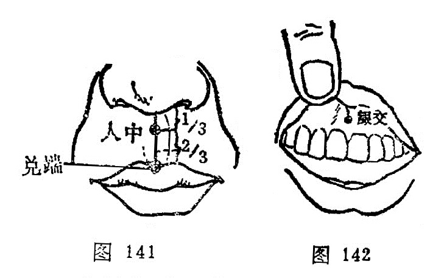

##### 兑端

〔定位〕上唇尖端，当人中沟下端与口唇连接处（图141）。

〔解剖〕在口轮匝肌中，有上唇动、静脉；布有面神经颊支及眶下神经分支。

〔功能〕清热，定惊，止痛。

〔主治〕癫狂，口㖞唇动，齿龈肿痛，鼻中癔肉，遗尿尿闭。

〔刺灸〕向上斜刺0.2～0.5寸，或点刺出血。禁灸。

〔讲述〕见于《甲乙》。兑指口，与锐意通；端有尖的含意。穴当上唇尖端，因名。除主局部口㖞唇动外，还可用于小便赤涩，舌干消渴，以及癫疾吐沫。临床常配本神治癫疾吐沫；配小海治小便赤涩；配目窗、正营、耳门治唇吻强，上齿龋痛。

##### 龈交

〔定位〕在上唇内，上唇系带与齿龈连接处（图142）。

〔解剖〕有上唇系带，上唇动、静脉；布有上颌内槽神经分支。

〔功能〕清热，开窍，醒神。

〔主治〕癫狂，齿龈肿痛，口㖞口噤，唇吻强急，扭闪腰痛。

〔刺灸〕向上斜刺0.2～0.3寸，或点刺出血。禁灸。

〔讲述〕见于《甲乙》。别称齘交。龈指齿龈，交有会合之意，穴当上齿龈缝中，是处为任、督二脉和上齿龈与上唇相交会处，因名。《甲乙》：治目痛不明，齿间出血，齿床落痛，口不可开引鼻中。临床常用治酒皶鼻点刺出血，治腰扭伤亦效。还可用于鼻痔，配合谷可治牙龈肿痛。

#### （四）本经小结

1．本经体表起于长强，止于龈交，经脉走行方向是从下而上行脊柱内部，经脊正中，上项，达巅，至前额、鼻柱，止于上齿龈缝中，与任脉有腹背关系，全经计有28个经穴。本经取穴要点是，应根据尾骶骨、脊椎棘突间、发际、人中沟，以及齿龈等解剖标志。腰背部腧穴，均在各脊柱棘突之间，腰阳关穴在第4腰椎棘突下，平髂嵴；至阳在第7胸椎棘突下，平肩胛骨下角；身柱在第3胸椎棘突下，平肩胛岗高点连线。其余经穴可按椎数定位取穴。头部经穴可按前后发际折量为12寸，用骨度折量法取穴。面部素髎在鼻尖中央。

2．本经生理功能与病理反应，应注意它是奇经八脉中的一个主要经脉，起于少腹下的会阴部，循脊柱中央上行，抵风府，入脑以会诸阳，达巅，沿头额下额至鼻柱，止于龈交。由于它联系手足三阳经，全身阳经之经气皆交会于大椎，故素有“为阳脉的都纲”和“阳脉之海”之称。故本经腧穴主要用于急救，热病，神志病，脊柱强痛以及肛肠等疾患。如人中、素髎、百会可用治急救，有清神志疏厥逆、开关窍的作用，凡一切猝然昏倒，不省人事者皆可取用。大椎、陶道、至阳可治各种热病及午后潮热诸疾；人中、哑门，风府用治癫狂；百会、长强可止痫发；腰俞、腰阳关、中枢、身柱、人中有壮腰补肾，疏利关节之效，可用治脊柱强痛，扭伤腰痛之疾。其它肛肠疾患可刺长强；脱肛，阴挺可取百会固摄。总之，命门以下的腧穴主二便和生殖器病，筋缩以下主胃病，大椎以下疗肺疾，哑门、风府主喉、舌疾，神庭以下主头部病，龈交主口齿病。

3．刺长强须沿尾骨前缘向上呈45度角斜刺，避免刺到直肠。脊柱棘突之间各穴，因颈椎和腰椎棘突比较平直，可以平刺；胸椎棘突伸向下方，应向上斜刺，一般深度在0.5～1寸之间，不可过深，防伤脊髓，引起瘫痪。哑门、风府不可向上方斜刺，以免误刺入枕骨大孔，损伤延髓，应向下方缓慢刺入。

#### 复习思考题
1. 督脉是怎样在体表循行的？
2. 督脉的症候是什么？
3. 针刺哑门、风府应注意什么？
4. 怎样取百会，它有哪些功能？
5. 怎样取刺大椎，它有哪些功能？
6. 怎样刺人中，它有哪些功能？
7. 胸、腰椎棘突上下分布有哪些经穴？

答：
1. 分類
2. 阿是

### 三、冲脉

#### （一）循行路线

〔原文〕
《素问·骨空论》：“冲脉者，起于气街(1);并少阴之经(2)。挟脐上行，至胸中而散。”《灵枢·五音五味》：“冲脉任脉，皆起于胞中(3)，上循背里(4)，为经络之海，其浮而外者，循腹上行，会于咽喉，别而络唇口。”

〔注释〕
(1)气街：部位名，即气冲穴所在地
(2)并少阴之经：少阴指足少阴。
(3)胞中：是指子宫。
(4)背里：背是指脊字而言。

〔语译〕
1．起于小腹内，下出于会阴部，2．向上行于脊柱之内，3．其外行者经气冲与足少阴交会，沿着腹部两侧，4．上达咽喉，5．环绕口唇（图143）。

圖143 衝脈循行示意圖

#### （二）病候举要

胸腹气逆而拘急。

#### （三）交会腧穴

会阴、阴交（任脉）、气冲（足阳明经）、横骨、大赫、气穴、四海、中注、肓俞、商曲、石关、阴都、通谷、幽门（均属足少阴肾经），共十四穴。

#### （四）功能

冲脉的“冲”字，含有要冲、要道的意思。冲脉贯串全身，为总领诸经气血的要冲，能调节十二经气血，故有“十二经之海”、“五脏六腑之海”和“血海”之称。其脉气在头部灌注诸阳，在下肢渗入三阴，能容纳来自十二经脉五脏六腑的气血，成为十二经脉、五脏六腑之海。冲脉起于胞中，又称“血海”，说明冲脉与妊娠胎育密切相关。

#### （五）主治

气急，胸腹痛，气上冲心，胸脘满闷，结胸，反胃，酒积，食积，肠鸣，水气，泄泻，噎膈，胁胀，脐腹痛，肠风便血，疟疾，月经失调，不孕，漏胎，胎衣不下，血崩昏迷等。

### 四、带脉

#### （一）循行路线

〔原文〕
《灵枢·经别》：“足少阴之正(1)至胸中，别走太阳而合，上至肾，当十四椎(2)，出属带脉。”《难经二十八难》：“带脉者，起于季胁(3)，回身一周。”

〔注释〕
(1)足少阴之正：指足少阴经别。
(2)十四椎：指督脉的命门穴处。
(3)季胁：指腋中线第11肋端的章门穴。

〔语译〕
1．起于季肋部的下面，斜向下行到带脉、五枢、维道，2．横行绕身一周（图144）。

圖144 帶脈循行示意圖

#### （二）病候举要

腹满胀痛，腰部觉冷如坐于水中。

#### （三）交会腧穴

带脉、五枢、维道（均属足少阳胆经)，共三穴。

#### （四）功能

带脉的“带”字，含有腰带的意思。因带脉横行于腰腹之间，统束全身直行的经脉，状如束带，故称带脉，能“约束诸经”。足部的阴阳经脉都受带脉的约束。由于带脉出自督脉，行于腰腹，腰腹部是冲、任、督三脉脉气所发之处，所以带脉与冲、任、督三脉的关系最为密切。

#### （五）主治

痿证，月经不调，赤白带下，腰腹胀满，中风手足不举，绕脐痛，阴股痛，胁肋痛等。

### 五、阴维脉

#### （一）循行路线

〔原文〕
《素问·刺腰痛论》：“刺飞扬之脉，在内踝上五寸(1)，少阴之前，与阴维之会。”《难经·二十八难》：“阴维，起于诸阴之交(2)也”。

〔注释〕
(1)内踝上5寸：此指筑宾穴所在，为阴维之郄。
(2)诸阴之交：指阴维脉所交会的胸腹部各穴。张注：“诸阴皆交于胸”，胸字应作腹。

〔语译〕
1．起于小腿内侧，2．沿大腿内侧上行到腹部，3．与足太阴经相合，4．过胸部，5．与任脉会于颈部（图145）。

圖145 陰維脈循行示意圖

#### （二）病候举要

心痛，忧郁。

#### （三）交会腧穴

筑宾（足少阴经）、府舍、大横、腹哀（足太阴经）、期门（足厥阴经）、天突、廉泉（任脉)，共七穴。

#### （四）功能

维脉的“维”字，含有维系、维络的意思。阴维脉有维系、联络全身阴经的作用。阴维脉维络诸阴经，交会于天突、廉泉。在正常情况下，阴阳经脉互相维系，对气血盛衰起调节溢蓄的作用，而不参于环流。如果功能失常，则出现有关的疾病。

#### （五）主治

心痛，胃痛，胸腹痛等里证，以及中满，心胸痞胀，肠鸣泄泻，脱肛，食难下膈，腹中积块坚横，胁肋攻撑疼痛，妇女胁痛，结胸里急，伤寒，疟疾等。

### 六、阳维脉

#### （一）循行路线

〔原文〕
《素问·刺腰痛论》：“阳维之脉，脉与太阳合腨下间，去地一尺所(1)。”《难经·二十八难》：“阳维起于诸阳会(2)也。”

〔注释〕
(1)一尺所：指离地1尺许，当阳交穴所在，为阳维之郄。
(2)诸阳会：指阳维所交会的头肩部各穴，包括手足太阳经及督脉。

〔语译〕
1．起于足跟外侧，2．向上经过外踝，3．沿足少阳经上行髋关节部，4．经胁肋后侧，5．从腋后上肩，6．至前额，下再到项后，合于督脉（图146）。

圖146 陽維脈循行示意圖

#### （二）病候举要

恶寒发热，腰痛。

#### （三）交会腧穴

金门（足太阳经）、阳交（足少阳经）、臑俞（手太阳经）、天髎（手少阳经）、肩井（足少阳经）、头维（足阳明经）、本神、阳白、头临泣、目窗、正营、承灵、脑空、风池（足少阳经）、风府、哑门（督脉)，共十六穴。

#### （四）功能

维脉的“维”字，含有维系、维络的意思。阳维有维系、联络全身阳经的作用。阳维脉维络诸阳经，交会督脉的风府、哑门。在正常情况下，阴阳经脉互相维系，对气血盛衰起调节溢蓄的作用，而不参于环流。如果功能失调，则出现有关的病证。

#### （五）主治

发冷，发热，外感热病等表症，以及肢节肿痛，膝部有冷感，四肢不遂，头风，背骻内外骨筋疼痛，头项疼痛，眉棱骨痛，手足热，发麻，盗汗，破伤风，脚跟痛，眼目赤痛，伤寒自汗，表热不解等。

### 七、阴跷脉

#### （一）循行路线

〔原文〕
《灵枢·脉度》：“（阴）跷脉者，少阴之别，起于然骨(1)之后，上内踝之上，直上循阴股，入阴，上循胸里，入缺盆上，出人迎之前，入頄(2)，属目内眦，合于太阳，阳跷而上行。”《难经·二十八难》：“阴跷脉者，亦起于跟中，循内踝上行，至咽喉，交贯冲脉。”

〔注释〕
(1)然骨，指足内侧高骨，即舟骨粗隆，下方为然谷穴。
(2)頄：指鼻旁。音求。

〔语译〕
1．起于足舟骨的后方，2．上行内踝的上面，3．直上沿大腿内侧，4．经过阴部，5．向上沿胸部内侧，6．进入锁骨上窝，7．上经人迎的前面，8．过颧部，9．到目内眦，与足太阳经和阳跷脉相会合（图147）。

圖147 陰蹺脈循行示意圖

#### （二）病候举例

多眠，癃闭。

#### （三）交会腧穴

照海、交信（足少阴经）、睛明（足太阳经)，共三穴。

#### （四）功能

跷脉的“跷”字，有举足行高和健步的含意。阴跷脉从下肢内侧上行头面，具有交通一身阴阳之气，调节肢体运动的功能，故能使下肢灵活跷捷。卫气的运行主要是通过阴阳跷脉而散布全身，卫气行于阴则阴跷盛，主目闭而欲睡。说明跷脉的功能关系到人的活动与睡眠。

#### （五）主治

阴跷脉气失调，出现肢体的外侧肌肉弛缓而内侧拘急，这说明与下肢运动功能有关系。咽喉气塞，小便淋沥，膀胱气痛，肠鸣，肠风下血，黄疸，吐泻，反胃，大便艰难，难产昏迷，腹中积块，胸膈嗳气，梅核气等。

### 八、阳跷脉

#### （一）循行路线

〔原文〕
《灵枢·寒热病》：“足太阳有通项入于脑者，正属目本(1)，名曰眼系(2)。……在项中两筋间，入脑乃别阴跷、阳跷，阴阳相交……交于目锐（应作内）眦。”《难经·二十八难》：“阳跷脉者，起于跟中，循外踝上行，入风池。”

〔注释〕
(1)目本：意指眼的根部。
(2)眼系：即目系，指眼与脑的连系。

〔语译〕
1．起于足跟外侧，2．经外踝上行腓骨后缘，沿股部外侧和胁后上肩，过颈部上挟口角，进入目内眦，与阴跷脉会合，再沿足太阳经上额，3．与足少阳经合于风池（图148）。

圖148 陽蹺脈循行示意圖

#### （二）病候举例

目痛从内眦始，不眠。

#### （三）交会腧穴

申脉、仆参、跗阳（足太阳经）、居髎（足少阳经）、臑俞（手太阳经）、肩髃、巨骨（手阳明经）、地仓、巨髎、承泣（足阳明经）、睛明（足太阳经）、风池（足少阳胆经），共十二穴。

#### （四）功能

跷脉的“跷”字，有举足行高和健步的含义。因跷脉从下肢外侧上头面，具有交通一身阴阳，调节肢体运动的功能，故能使下肢灵活跷捷。卫气的运行主要是通过阴阳跷脉而散布全身。卫气行于阳，阳跷盛，主目张不欲睡。说明跷脉的功能关系到人的活动与睡眠。

#### （五）主治

阳跷脉气失调，会出现肢体内侧肌肉弛缓而外侧拘急，说明与下肢运动有密切关系。腰背强直，腿肿，恶风，自汗，头痛，雷头风，目赤痛，眉棱骨痛，手足麻痹，拘急，厥逆，耳鸣、鼻衄，癫痫，骨节疼痛，遍身肿，满头出汗等。

### 〔临床应用〕

奇经八脉，也是经络学说中的重要组成部分，内容比较复杂。奇经八脉中的任、督二脉分布着本经所属的腧穴，而不依附于他经。但是，任、督二脉的腧穴所主治的范围，是属子任、督二脉所统属的那些经络的合并病症，所以主治范围是很广泛的。而奇经八脉中的其它六条虽然没有本脉所隶属的腧穴，却可选取其他各条经脉的交会穴来治疗。

奇经八脉的生理功能，主要是对十二经脉的气血运行起着溢蓄调节作用。当十二经脉气血充盈时，则流注于奇经八脉，蓄以备用；当十二经脉气血不足时，则奇经八脉再把气血还流到十二经脉中去，溢注以补充。其中任脉调节诸阴经脉；督脉调节诸阳经脉；冲脉为“十二经之海”，具涵蓄十二经脉气血的作用；带脉有约束诸经的功能；阴维脉与六阴经相联系会合任脉，主一身之里；阳维脉与六阳经相联系，会合于督脉，主一身之表。它们分别调节六阴经和六阳经的经气，以维持阴阳经之间的协调和平衡。阴跷脉和阳跷脉分别起于足跟内、外上侧，伴随少阴、太阳上行，并分别交会于目内眦，共同调节肢体的运动和眼睑的开合功能。所以说奇经八脉对十二经脉的组合而起到统率和主导、沟通和联络作用。因此，掌握奇经八脉的理论对指导临床是有重要意义的。

### 复习思考题
1. 什么叫奇经八脉？奇经八脉有什么特点？它有哪些主要的生理功能？
2. 试述阴维脉和阳维脉的起止位置、循行部位、主治病候。
3. 试述阴跷脉和阳跷脉的起止位置、循行部位、主治病候。
4. 试述冲脉和带脉的起止位置、循行部位、主治病候。
5. 冲脉、带脉各有哪些穴位？
6. 阴维脉、阳维脉、阴跷脉、阳跷脉各有哪些腧穴？

答：
1. 分類
2. 阿是

## 第三节 十五络脉

〔自学时数〕    2 学时

〔目的要求〕
  了解十五络脉的循行分布、别走经脉和病候。

### 一、手太阴肺经别络——列缺

〔原文〕
《灵枢·经脉》：“手太阴之别(1)，名曰列缺。起于腕上分间(2)，并太阴之经(3)，直入掌中，散入于鱼际(4)。其病实则手锐(5)掌热；虚则欠㰦(6)，小便遗数(7)。取之去腕半寸(8)。别走阳明也。”（图149）。

〔注解〕
(1)别：即络脉。从本经分出的络脉，由此走向相表里的经脉。
(2)分间：是指近骨的分肉之间，当桡骨茎突后方。
(3)并：指与经脉并列而行。
(4)鱼际：是指手鱼际部的边缘。
(5)手锐：即手的锐骨部，也就是掌后小指侧的高骨。
(6)欠㰦：音呿，张口的样子，欠是阿欠。
(7)遗数：遗，小便不禁；数，次数多。遗数就是小便频数。
(8)半寸：应作寸半。

〔语译〕
手太阴经的别行络脉，穴名列缺，起于腕后桡侧的筋骨缝中，与手太阴本经并行，直入手掌中，散布于大鱼际部。它的病变，实证为手部腕侧锐骨和掌中发热；虚证为呵欠频作，小便失禁或频数，可取此穴治疗。穴在距腕一寸半处，别行于手阳明大肠经。

图149 手太阴肺经别络——列缺
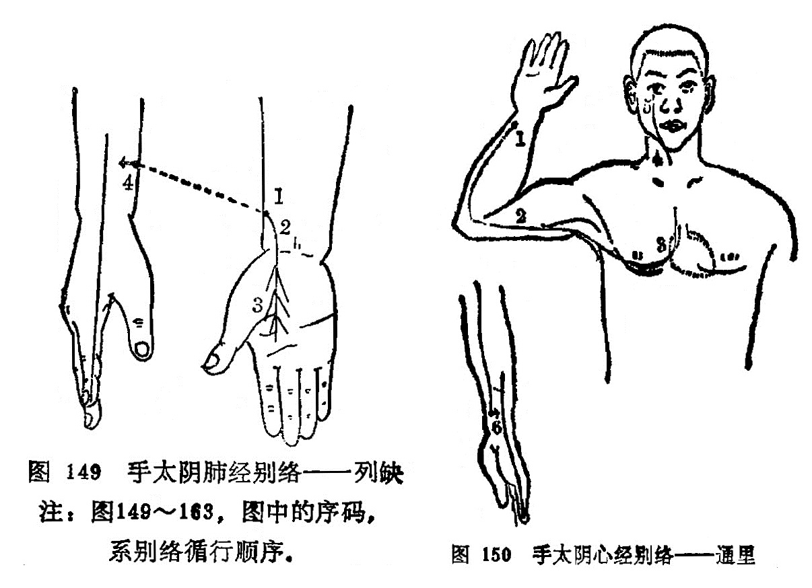
  	注：图149～163，图中的序码，系别络循行顺序。

### 二、手少阴心经别络——通里

〔原文〕
《灵枢·经脉》：“手少阴之别，名曰通里(1)。去腕一寸半，别而上行，循经入于心中，系舌本，属目系。其实则支膈(2)，虚则不能言。取之掌后一寸，别走太阳也”（图150）。

〔注解〕
(1)通里：心经络穴。原文为去腕一寸五分，应为去腕——寸，尺侧腕屈肌腱桡侧的凹陷中。
(2)支膈：是指胸膈间有支撑不舒的感觉。

〔语译〕
手少阴经的别行络脉，穴名通里，距腕一寸，别而上行，沿着手少阴本经入于心中，系于舌根，会属于目系。它的病变，实证为胸中支满阻隔，虚证为不能言语，可取此穴治疗。通里别行于手太阳经。

图150 手少阴心经别络——通里

### 三、手厥阴心包经别络——内关

〔原文〕
《灵枢·经脉》：“手心主之别，名曰内关(1)。去腕二寸，出于两筋之间，循经以上，系于心包络。心系实则心痛，虚则为头强(2)。取之两筋间也”（图151）。

〔注解〕
(1)内关：心包经穴位，腕后2寸，两筋间。
(2)头强：《甲乙经》作“心烦”。

〔语译〕
手厥阴经的别行络脉，穴名内关，在距腕二寸的两筋间，别行手少阳经。它沿着手厥阴本经上系于心包，联络于心系。它的病变，实证为心痛，虚证为心烦，可取此穴治疗。

图151 手厥阴心包经别络——内关
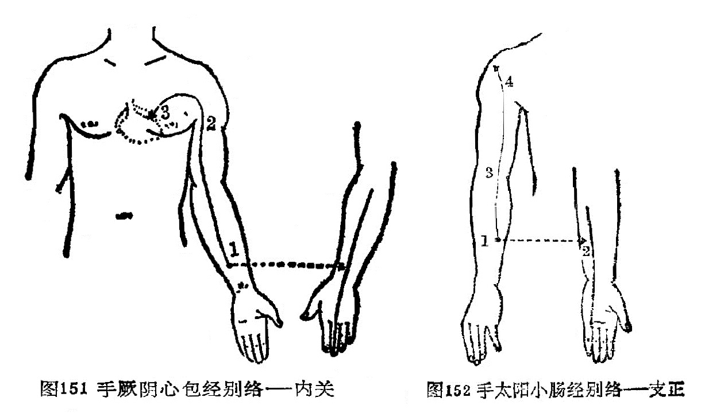

### 四、手太阳小肠经别络——支正

〔原文〕
《灵枢·经脉》：“手太阳之别，名曰支正(1)。上腕五寸，内注少阴；其别者，上走肘，络肩髃(2)。实则节弛肘废(3)；虚则生肬(4),小者如指痂疥。取之所别也”（图152）。

〔注解〕
(1)支正：小肠之络穴。在阳谷穴与小海穴连线上，阳谷穴上五寸。
(2)肩髃：穴名，属手阳明大肠经，三角肌上部，肩端两骨间。这里是指它的部位而言。
(3)节弛肘废：指肩肘部关节松弛痿废不用。
(4)肬：音由，与疣通，就是赘肉。
(5)痂疥：此指疣之多生如指痂疥之状。

〔语译〕
手太阳经的别行络脉，穴名支正，在腕上五寸，向内注于手少阴经。它的别出分支，上行肘部，络于肩髃穴。它的病变，实证为骨节弛缓，肘部不能活动；虚证为皮肤上生赘疣，小的象手指上的痂疥，可取此穴治疗。

图152 手太阳小肠经别络——支正

### 五、手阳明大肠经别络——偏历

〔原文〕
《灵枢·经脉》：“手阳明之别，名曰偏历(1)。去腕三寸，别入太阴，其别者，上循臂，乘肩髃，上曲颊(2)偏齿(3)；其别者，入耳，合于宗脉(4)。实则龋聋(5)；虚则齿寒痹隔(6)。取之所别也。”（图153）。

〔注解〕
(1)偏历：大肠经络穴，在阳溪穴与曲池穴连线上，阳溪穴上3寸处。
(2)曲颊：当下颌角处，曲如环形故名。
(3)偏齿：偏络于牙齿。
(4)宗脉：就是主脉、大脉。
(5)龋：龋齿，即蛀牙。
(6)痹隔：痹是闭塞不通，痹隔是形容膈间闭塞不畅的症状。

〔语译〕
手阳明经的别行络脉，穴名偏历，距腕三寸，别行于手太阴经。它的别出分支，向上沿臂部，经肩髃穴上行至下颌角处，遍布于齿中，再别出分支，上行入耳中，合于该部所聚的主脉。它的病变，实证为龋齿、耳聋；虚证为牙齿寒冷酸楚，内闭阻隔，可取此穴治疗。

图153 手阳明大肠经别络——偏历

### 六、手少阳三焦经别络——外关

〔原文〕
《灵柩·经脉》：“手少阳之别，名曰外关(1)。去腕二寸，外绕臂，注胸中，合心主(2)。病实则肘挛(3)；虚则不收。取之所别也”（图154）。

〔注解〕
(1)外关：手少阳三焦经络穴，位于腕背横纹上2寸，尺桡骨之间。
(2)合心主：此脉与心包经相汇合。
(3)肘挛：肘部引掣拘挛。

〔语译〕
手少阳经的别行络脉，穴名外关，距腕二寸，向外绕行臂部，上行注于胸中，别行合于手厥阴经。它的病变，实证为肘部拘挛，虚证为肘部弛缓不收，可取此穴治疗。

图154 手少阳三焦经别络——外关
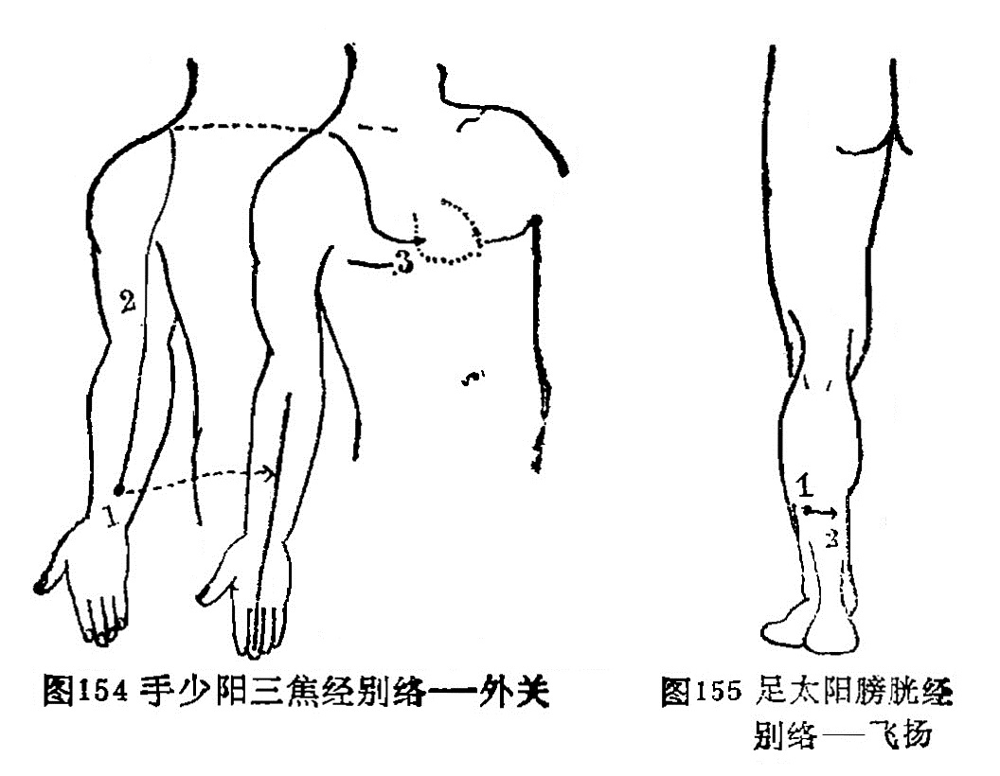

### 七、足太阳膀胱经别络——飞扬

〔原文〕
《灵枢·经脉》：“足太阳之别，名曰飞扬(1)。去踝七寸，别走少阴。实则鼽窒(2)，头背痛；虚则鼽衄。取之所别也”（图155）。

〔注解〕
(1)飞扬：膀胱经之络穴，位于外踝上7寸，当腓骨后缘处。
(2)鼽窒：鼻流清涕，窒塞不通气。

〔语译〕
足太阳经的别行络脉，穴名飞扬，距外踝七寸，别行于足少阴经。它的病变，实证为鼻塞流涕，头背部疼痛，虚证为流涕出血，可取此穴治疗。

图155 足太阳膀胱经别络——飞扬

### 八、足少阳胆经别络——光明

〔原文〕
《灵枢·经脉》：“足少阳之别，名曰光明(1)，去踝五寸，别走厥阴，下络足跗。实则厥，虚刚痿躄(2)，坐不能起。取之所别也”（图156）。

〔注解〕
(1)光明：胆经之络穴，位于外踝上5寸，腓骨前缘。
(2)痿躄：痿，是痿软无力，躄，是足不能动。痿躄，就是下肢痿软无力，足不能行走。

〔语译〕
足少阳胆经的别行络脉，穴名光明，距外踝五寸，别行于足厥阴经，向下络于足背。它的病变，实证为足胫厥冷，虚证为足软无力不能行走，坐而不能起立，可取此穴治疗。

图156 足少阳胆经别络——光明

### 九、足阳明胃经别络——丰隆

〔原文〕
《灵枢·经脉》：“足阳明之别，名曰丰隆(1)”。去踝八寸，别走太阴；其别者，循胫骨外廉，上络头项，合诸经之气(2)，下络喉嗌。其病气逆则喉痹瘁瘖(3)。实则狂巅，虚则足不收、胫枯(4)。取之所别也”(图157)。

〔注解〕
(1)丰隆：胃经之络穴，位于外踝上8寸，条口穴外l寸许。

(2)合诸经之气：与该处其它经脉之气相会合。

(3)瘁瘖：是指突然失音不能言语。

(4)足不收、胫枯：足不收是弛缓松软无力；胫枯是胫部肌肉萎缩，气血亏虚所致。

〔语译〕
足阳明经的别行络脉，穴名丰隆，距外踝八寸，别行于足太阴经。它的别出分支，沿胫骨外缘上行络于头项部，会合各经之气，向下络于咽喉。它的病变是气上逆则患喉痹，突然失音不能言语。实证为狂癫之疾，虚证为足缓不收，胫部肌肉萎缩，可取此穴治疗。

图157 足阳明胃经别络——丰隆
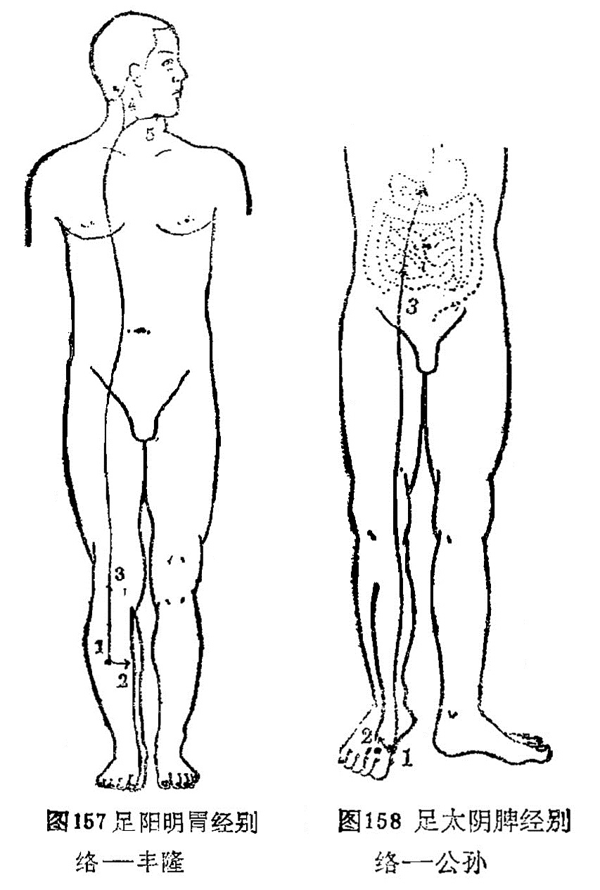 

### 十、足太阴脾经别络——公孙

〔原文〕
《灵枢·经脉》：“足太阴之别名曰公孙(1)。去本节(2)之后一寸，别走阳明，其别者，入络肠胃，厥气上逆则霍乱(3)，实则肠(4)中切痛；虚则鼓胀。取之所别也”（图158）。

〔注解〕
(1)公孙：脾经之络穴，位于第一跖骨基底部前缘赤白肉际处。
(2)本节：指第一趾跖关节。
(3)霍乱：病名。发作时上吐下泻挥霍撩乱，故称霍撩乱。

〔语译〕
足太阴经别行络脉，穴名公孙，在足大趾本节后一寸，别行于足阳明经。它的别行分支，入腹络于肠胃。其气上逆则为霍乱，实证为肠中剧痛，虚证为臌胀之疾，可取此穴治疗。

图158 足太阴脾经别络——公孙

### 十一、足少阴肾经别络——大钟

〔原文〕
《灵枢·经脉》：“足少阴之别，名曰大钟(1)。当踝后绕跟，别走太阳；其别者，并经上走于心包下，外贯腰脊。其病气逆则烦闷，实则闭癃(2)，虚则腰痛。取之所别者也”（图159)。

〔注解〕
(1)大钟：肾经之络穴，太溪穴下5分稍后，跟腱内缘。
(2)闭癃：闭是大便闭结，癃是小便不通。

〔语译〕
足少阴经的别行络脉，穴名大钟，在内踝后面，绕过足跟而别行于足太阳经。它的别出分支，与足少阴本经并行向上而至心包下，向外贯穿腰脊。它的病变，气上逆则为烦闷，实证为大小便不通，虚证为腰痛，可取此穴治疗。

图159 足少阴肾经别络——大钟
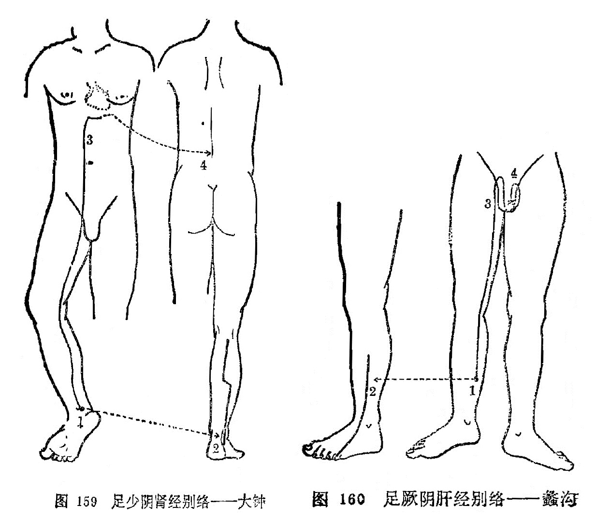

### 十二、足厥阴肝经别络——蠡沟

〔原文〕
《灵枢·经脉》：“足厥阴之别，名曰蠡沟(1)。去内踝五寸，别走少阳，其别者，经胫上睾，结于茎。其病气逆则睾肿卒疝。实则挺长(2)，虚则暴痒。取之所别也”(图160)。

〔注解〕(1)蠡沟：肝经之络穴，位于内踝上5寸，胫骨内侧面的中央处。
(2)挺长：是指阴茎勃起。

〔语译〕
足厥阴经的别行络脉，穴名蠡沟，距内踝五寸，别行于足少阳经。它的别出分支，经过胫部上至睾丸，终结于阴茎。它的病变，气上逆则睾丸肿大，突患疝气。实证为阴茎挺长，虚证为阴部暴痒，可取此穴治疗（图160）。

图160 足厥阴肝经别络——蠡沟

### 十三、任脉别络——尾翳

〔原文〕
《灵枢·经脉》：“任脉之别，名曰尾翳(1)。下鸠尾，散于腹。实则腹皮痛，虚则痒搔。取之所别也”(图161)。

〔注解〕
(1)尾翳：即鸠尾穴，任脉之络穴，剑突下5分取之。

〔语译〕
任脉的别行络脉，穴名尾翳，在剑突下面，散布于腹中。它的病变，实证为腹部皮肤疼痛，虚证为腹部皮肤搔痒，可取此穴治疗。

图161 任脉别络——尾翳
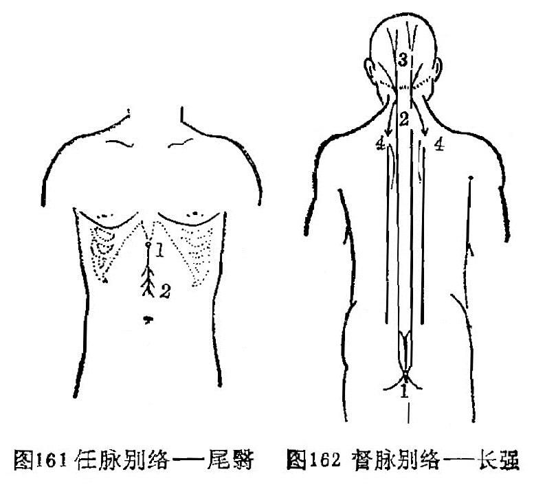

### 十四、督脉别络——长强

〔原文〕
《灵枢·经脉》：“督脉之别，名曰长强(1)。挟膂上项，散头上，下当肩胛左右，别走太阳，入贯膂。实则脊强，虚则头重，高摇之，挟脊之有过者(2)。取之所别也”（图162）。

〔注解〕
(1)长强：督脉之络穴，位于尾骨尖下5分处。
(2)挟脊过之者；过，在这里是指发生病有变。也就是指挟脊之脉发生变化而引起的疾病。

〔语译〕
督脉的别行络脉，穴名长强，依着脊骨上行项部，散布于头上，再向下到两肩胛之间分左右别行于足太阳经，入而贯穿于脊骨中。它的病变，实证为脊柱强直而难于俯仰，虚证为头重难支而从身体的高处摇摆不定，此皆挟脊之脉有病，可取此穴治疗（图162）。

图162 督脉别络——长强

### 十五、脾之大络——大包

〔原文〕
《灵枢·经脉》：“脾之大络，名曰大包(1)。出渊液下三寸，布胸胁。实则身尽痛，虚则百节尽皆纵。此脉若罗络之血者，皆取之脾之大络脉也”（图l63）。

〔注解〕
(1)大包：脾经穴位，位于腋中线平第六肋间隙中。

〔语译〕
脾的大络，穴名大包，在渊液穴下三寸，散布于胸胁部。它的病变，实证为全身皆痛，虚证为周身骨节都松弛无力。此一络脉象网络样绕络全身，如见血瘀，可取此穴治疗。

图163 脾之大络——大包

### 〔临床应用〕

十五络脉是经脉中分出的大的络脉，它对周身络脉起统属作用，其它络脉和孙络，都是十五络脉的支蔓。络脉分布躯体，主要在体表。《灵枢·经脉》指出：“经脉十二者，伏行于分肉之间，深而不见，……诸经之浮而常见者，皆络脉也。”又如“经脉为里，支而横者为络，络之别者为孙络”。由此可见，络脉分布人体的体表，属经脉在体表的联属部分；每条络脉均从本经络穴分出，通向与其表里的经脉，阴经别络于阳经，阳经别络于阴经。任脉别络散布于胸腹，以沟通腹部的经气；督脉别络散布于头，别走足太阳膀胱经，以沟通背部的经气；脾之大络散布于胸胁。通过十五络脉把经脉和全身络脉联系在一起，是达到濡润筋骨，疏利关节，调和阴阳作用的重要组织。与此同时，它发挥了天然屏障的作用，是承担抗御病邪，传递病变的通路。因此，当络脉有病时，均可取有关的络穴进行治疗。是指导临床治疗的重要内容。

### 复习思考题

1. 何谓络脉？络脉有哪几种？
2. 试述十五别络的名称、循行分右、别走经脉、病候。
3. 络脉有哪些生理功能？

答：

1. 分類
2. 阿是

## 第四节 经外奇穴

〔自学时数〕    2 学时

〔面授时数〕    1 学时

〔目的要求〕

1. 学习本节内容时，参阅有关经外奇穴书刊，以了解各奇穴定位。
2. 掌握常用奇穴的定位，主治功能。
3. 在人体上点出常用奇穴的位置。

经外奇穴，泛指十四经以外的穴位。由于有些奇穴，居位奇，取法奇，疗效奇，又不在正经线之内，故称之为经外奇穴。它的特点是有固定位置和名称，但多分散于全身，无系统、规律可循。目前针灸专籍收集奇穴少则20余个，多达1500余个。据1984年世界卫生组织亚太区在日本召开的经外奇穴标准化工作组会议规定，整理出31个奇穴，并按头颈，胸腹，背腰，上肢，下肢，由上而下进行分述。据此结合我国针灸临床实践，本书选常用40个奇穴，分头颈，项背腰，胸腹，四肢四个部分进行排列叙述，以供参考。

### 一、头颈部（14穴）

#### 四神聪

〔定位〕在百会穴前后左右各1寸处（图164）。

〔解剖〕在帽状腱膜中，有枕动、静脉，颞浅动、静脉顶支和眶上动、静脉的吻合网；布有枕大神经，耳颞神经及眶上神经分支。

〔功能〕安神，聪脑。

〔主治〕头痛，眩晕，失眠，健忘，癫痫，大脑发育不全。

〔刺灸〕向前或向后平刺0.5～0.8寸，可灸。

〔讲述〕见于《圣惠方》。别称神聪。前后左右为四方，因穴在头顶百会四周，脑为元神之府，因名。《圣惠方》用治头风目眩，狂乱风痫。《银海精微》：治眼疾，偏正头痛。《资生》配涌泉、强间治风痫。临床配百会、哑门治大脑发育不全；配神门治失眠，癫痫。

#### 印堂

〔定位〕在两眉头连线的中点（图165）。

〔解剖〕在掣眉间肌中，两侧有额内动、静脉分支；布有来自三叉神经的滑车上神经。

〔功能〕清热散风，镇静安神。

〔主治〕头痛头重，鼻衄鼻渊，小儿惊风，产后血晕，失眠，三叉神经痛。

〔刺灸〕向下平刺0.3～0.5寸，或用三棱针点刺出血，可灸。

〔讲述〕出《素问·刺疟论》。别称曲眉。定名见于《玉龙歌》：“头风呕吐眼昏花，穴取神庭治不差，孩子惊风皆可治，印堂刺入艾还加”。印指印染，居处为堂，古人常于两眉点染红点，以示貌美，穴当其处，因名。刺本穴，须提捏局部皮肤刺之。配迎香治鼻病；配内关治呕吐；配人中治惊风。

#### 鱼腰

〔定位〕在眉弓中心处（图165）。

〔解剖〕在眼轮匝肌中，有额动、静脉外侧支；布有眶上神经，面神经的分支。

〔功能〕清头明目。

〔主治〕眉棱骨痛，眼睑瞤动，眼睑下垂，目翳，目赤肿痛。

〔刺灸〕平刺0.3～0.5寸，禁灸。

〔讲述〕见于《玉龙经》。鱼指眉弓，中部为腰，人之眉毛状似鱼形，其穴适当中部，因名。取本穴应使目直视，当瞳孔直上方，眉弓中心处取之。本穴主要用治目疾。《奇效良方》：治眼睑垂帘，翳膜。一般沿眉弓向两旁斜刺0.5寸，不宜重泻，出现痠胀即止。临床常配太阳治目赤肿痛；配攒竹、合谷治眼睑瞤动，眉棱骨痛。

#### 太阳

〔定位〕眉外梢与目外眦之间向后约1寸处凹陷中（图166）。

〔解剖〕在颞筋膜及颞肌中，有颞浅动、静脉；布有三叉神经第2、3分支，面神经颞支。

〔功能〕清头明目。

〔主治〕头痛，目疾，口眼㖞斜，牙痛，三叉神经痛。

〔刺灸〕直刺或斜刺0.3～0.5寸，或用三棱针点剌出血。

〔讲述〕见于《圣惠方》。别称前关。功能祛风。治赤眼头痛，目眩，目涩。宜刺出血，加拔火罐效甚。

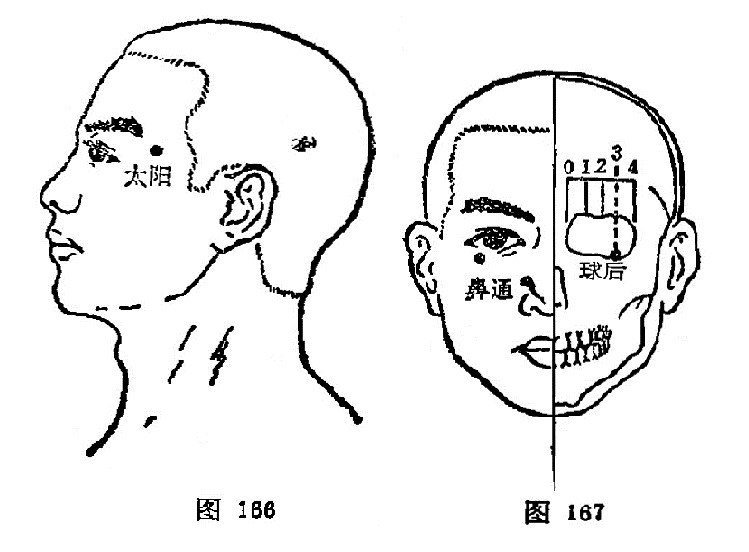

#### 球后

〔定位〕眶下缘外1/4与内3/4交界处（图167）。

〔解剖〕在眼轮匝肌中，深部为眼肌，浅层有面动、静脉；布有面神经颧支和眶下神经，结状神经结和视神经，深层有眼神经。

〔功能〕活血，明目。

〔主治〕目疾。

〔刺灸〕轻压眼球向上，针沿眼眶下缘缓慢直刺0.5～0.8寸，不提插捻转，禁灸。

〔讲述〕新订穴，见《眼科针灸疗法》。多用治视神经炎，视神经萎缩，青光眼，早期白内障，近视等，配光明、风池、肝俞效果尤佳。

#### 鼻通

〔定位〕鼻唇沟上端尽处（图167）。

〔解剖〕在上唇方肌中，有面动、静脉分支；布有筛前神经，眶下神经分支及滑车下神经。

〔功能〕清热散风，宣通鼻窍。

〔主治〕鼻渊，鼻塞，鼻部疮疖。

〔刺灸〕向内上方斜刺0.3～0.5寸，可灸。

〔讲述〕新订穴，见《针灸学》。别称上迎香。《银海精微》：久流冷泪，灸上迎香二穴。《千金》用治久流冷泪，灸上迎香配天府、肝俞尤效。《银海精微》：配鱼尾、睛明、攒竹、太阳治久流冷泪。近年配合谷治鼻炎，鼻塞，鼻部疮疖。

#### 金津、玉液

〔定位〕舌系带两侧静脉上，左称金津，右称玉液（图168）。

〔解剖〕有舌下静脉；布有舌下神经，舌神经。

〔功能〕清热开窍，止渴止呕。

〔主治〕口疮，舌强，舌肿，消渴，呕吐。

〔刺灸〕点刺出血，禁灸。

〔讲述〕见于《千金》。《大成》定名。主治重舌，舌炎之疾，还可用治呕吐，消渴。《千金》：治舌卒肿，刺舌下两边大脉出血。取刺本穴宜张口卷舌向上，舌系带两旁静脉上，左称金津，右称玉液，一般宜点刺出血。素有出血病者禁用。

#### 夹承浆

〔定位〕承浆穴旁开1寸处，左右共二穴（图169）。

〔解剖〕在口轮匝肌中，有面动脉分支；布有三叉神经第三分支（颏神经）。

〔功能〕祛风通络。

〔主治〕面部疾病。

〔刺灸〕斜刺或平刺0.5～1寸，不灸。

〔讲述〕见于《千金》。夹有旁边的含意，是穴在承浆两边旁开1寸处，因名。主治马黄急疫。近用治面疾，如面瘫，面肌痉挛，三叉神经痛，以及齿龈溃烂等，常配合谷、内庭取效。

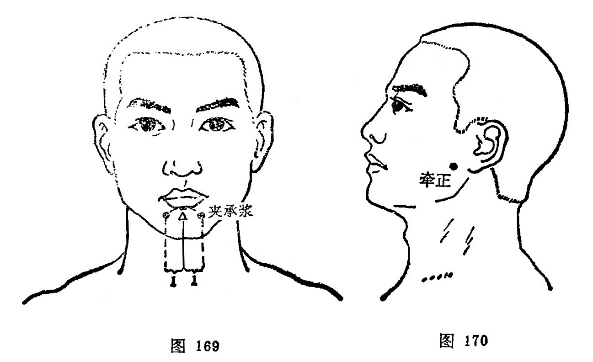

#### 牵正

〔定位〕耳垂前0.5～1寸处（图170）。

〔解剖〕在咬肌中，皮下有腮腺，有咬肌动、静脉分支；布有面神经分支。

〔功能〕祛风通络。

〔主治〕口眼㖞斜，咬肌痉挛，口腔溃疡，下牙痛。

〔刺灸）斜刺或平刺0.5～1寸，可灸。

〔讲述〕新订穴，见《常用新医疗法手册》。本穴能纠正口㖞，使之周正，因名。临床主要用治面瘫，可祛风通络，纠正口㖞。

#### 翳明

〔定位〕约在翳风穴后1寸（图171）。

〔解剖〕在胸锁乳突肌上，有耳后动、静脉；布有耳大神经和枕小神经。

〔功能〕明目聪耳。

〔主治〕目疾。

〔刺灸〕直刺0.5～1寸，可灸。

〔讲述〕新订穴，见《中华医学杂志》。穴在翳风之后，有明目之力，因名。取刺本穴，宜正坐，头略前倾。临床可用于近视，常配光明、肝俞治雀目。还可用于头痛，眩晕，耳鸣，失眠等症。

#### 安眠

〔定位〕约当翳风与风池穴连线的中点（图172）。

〔解剖〕在胸锁乳突肌和头夹肌中，有枕动、静脉；布有耳大神经和枕小神经。

〔功能〕镇静安眠。

〔主治〕失眠。

〔刺灸〕直刺0.5～0.8寸，可灸。

〔讲述〕新订穴。因有安眠作用而得名。配神门治梦魇不安；配后溪治癫狂；配印堂治眩晕。

#### 上廉泉

〔定位〕廉泉穴与下颏之间取穴（图173）。

〔解剖〕在下颌舌骨肌，颏舌骨肌，舌肌中，有舌动、静脉；布有颈皮神经，面神经颈支和舌下神经。

〔功能〕利舌本，开窍闭。

〔主治〕舌疾。

〔刺灸〕向舌根部斜刺0.8～1.2寸，不灸。

〔讲述〕新订穴。与廉泉作用同而位置偏上，因名。主要用治舌疾。起哑门治舌强不语，配内关、合谷治舌肌麻痹、萎缩；配少商治咽喉疼痛；配天突、内关治吞咽困难。

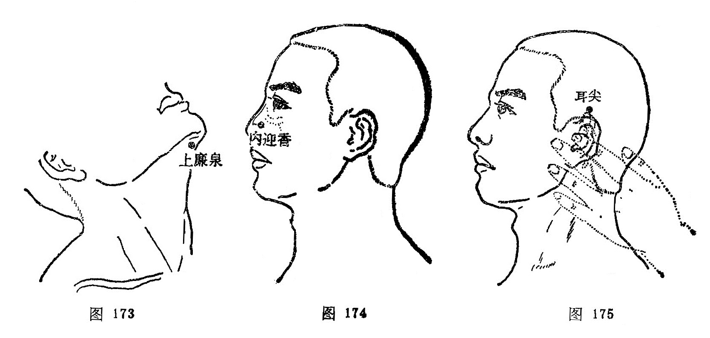

#### 内迎香

〔定位〕鼻孔中，外侧鼻粘膜上（图174）。

〔解剖〕在鼻腔底部粘膜上，有面动、静脉的鼻背支，布有筛前神经的鼻外支。

〔功能〕清热散风，宣通鼻窍。

〔主治〕目热暴赤，鼻痒，不闻香臭。

〔刺灸〕点刺出血。

〔讲述〕见于《肘后》。《玉龙经》定名。内指鼻内，针此能恢复嗅觉，重新迎来香气，因名。《儒门事亲》：治目热暴赤，疼痛不止。《玉龙歌》：“心血炎上两眼红，好将芦叶搐鼻中，若还血出真为美，目内清凉显妙功。”临床常配合谷取效。患出血病者禁针。

#### 耳尖

〔定位〕在耳尖上，卷耳取尖上（图175）。

〔解剖〕有耳后动、静脉；布有耳颞神经。

〔功能〕清热散风，活血明目。

〔主治〕目疾。

〔刺灸〕直刺0.1～0.2寸，或用三棱针点刺出血，可灸。

〔讲述〕见于《针灸大成》。穴在耳尖处，因名。用治目赤沙眼，眼生翳膜，以及喉痹刺出血。

### 二、项背腰部（8穴）

#### 百劳

〔定位〕大椎穴上2寸，旁开1寸（图176）。

〔解剖〕在斜方肌，头夹肌中，有枕动、静脉和椎动、静脉；布有枕大神经，枕小神经分支。

〔功能〕理虚损，补肺气。

〔主治〕虚劳之疾。

〔刺灸〕直刺0.5～0.8寸，可灸。

〔讲述〕见于《资生》。百有多的含意，劳同痨，言其治疗多种痨症，因名。它的定位，《集成》：大椎向发际二寸点记，将其二寸中摺，墨记，横布于先点上，左右两端尽处是。本穴主要用治虚劳之疾，特别对肺痨，有理虚损，补肺虚之效。

#### 定喘

〔定位〕大椎穴旁开0.5寸（图177）。

〔解剖〕在斜方肌，菱形肌，头夹肌，最长肌中，有颈横动脉和颈深动脉分支；布有第7、8颈神经后支。

〔功能〕宣肺定喘。

〔主治〕咳嗽，哮喘，落枕，荨麻疹。

〔刺灸〕直刺0.5～0.8寸，可灸。

〔讲述〕新订穴，见《中国针灸学》。定有平息之意，喘指喘息，针本穴能宣肺平喘，因名。临床配丰隆、天突平喘取效；配血海、曲池治荨麻疹。

#### 崇骨

〔定位〕第6颈椎棘突下（图177）。

〔解剖〕在腰背筋膜，棘上韧带中，有棘间皮下静脉丛；布有第7颈神经后支。

〔功能〕清热散风。

〔主治〕颈项强痛，疟疾，以及感冒，咳嗽，气喘。

〔刺灸〕向上斜刺0.5～1寸，可灸。

〔讲述〕见于《千金》。高大为崇，因在大椎上，正当第6、7颈椎棘突之间，因名。本穴除用治气喘，咳嗽，痨瘵外，还用于癫痫，疟疾。《千金》：治羊痫之为病，喜扬目吐舌，灸大椎上。

#### 夹脊

〔定位〕第1胸椎至第5腰椎，各椎棘突下旁开0.5寸，每侧十七穴，左右共三十四穴（图178）。

〔解剖〕在横突间的韧带和肌肉中。因穴位置不同，涉及的肌肉也不同。一般分三层；浅层为斜方肌，背阔肌和菱形肌，中层有上、下锯肌，深层有骶棘肌和横突棘突间的短肌。每穴都有相应椎骨下方发出的脊神经后支及其伴行的动脉和静脉丛分布。

〔功能〕调理脏腑，通利关节。

〔主治〕脊柱疾患及相应脏腑诸疾。

〔刺灸〕直刺0.5～1寸，或用梅花针叩剌，可灸。

〔讲述〕见于《肘后》。又称华佗夹脊。《后汉书·华佗传》：有人病脚躄不能行，佗切脉，便使解衣，点背数十处，相去一寸或五分，从邪不相当。言灸此各七壮，灸创愈即行也。后灸愈，灸处夹脊一寸上下，行端直均匀如引绳。《肘后》定位去脊各1寸。今时于脊柱棘突间两侧，背正中线外侧0.5寸为准。中、上胸部的夹脊穴适用于心肺及上肢病症；下胸部夹脊穴治疗胃肠疾患；腰部夹脊穴治疗腰、腹及下肢病症。

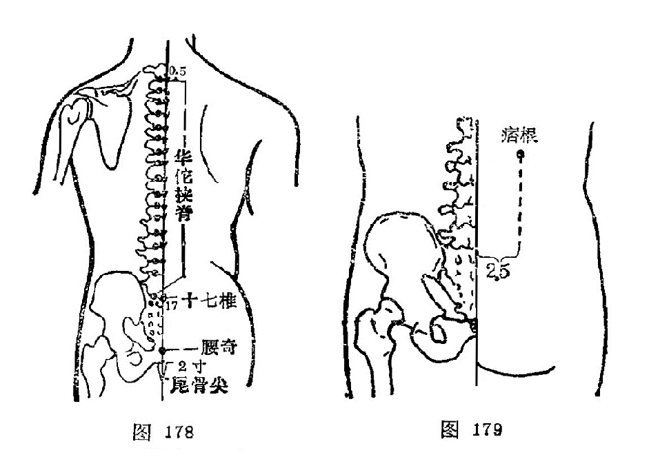

#### 痞根

〔定位〕第一腰椎下旁开3.5寸（图179）。

〔解剖〕在背阔肌，髂肋肌处，有第1腰动、静脉背侧支；布有第12胸神经后支外侧支，深层为第1腰神经后支。

〔功能〕调气化瘀。

〔主治〕肝脾肿大，腹中痞块。

〔刺灸〕直刺0.5～1寸，可灸。

〔讲述〕见于《医学入门》。积块称痞，是穴主治痞块、痞满之疾，针此可使痞积消散，因名。除主痞块外，还可用于瘰疬，灸之亦效。

#### 腰眼

〔定位〕第4腰椎棘突下旁开3.8寸（图180）。

〔解剖〕在背阔肌，髂肋肌处，有第4腰动、静脉背侧支；布有第3腰神经后支。

〔功能〕壮腰补肾。

〔主治〕腰痛，肾下垂，月经不调，赤白带下。

〔刺灸〕直刺0.5～1寸，可灸。

〔讲述〕见于《肘后》。别称鬼眼。穴当腰部两侧凹陷之处，该处状似眼状，因名。除主腰痛外，还可用治月经不调之疾，有补肾壮腰之效。

#### 十七椎

〔定位〕第5腰椎棘突下（图178）。

〔解剖〕在腰背筋膜，棘上韧带及棘间韧带中，有腰动脉后支，棘间皮下静脉丛；布有腰神经后支内侧支。

〔功能〕通经散寒。

〔主治〕腰痛，痛经，下肢瘫，崩漏。

〔刺灸〕向上斜刺1～1.5寸，可灸。

〔讲述〕见于《千金翼》。因穴在第17椎棘突下方凹陷处，因名。取此穴可先定腰阳关，再向下取其外侧凹陷处是穴。用治腰痛、痛经等。

#### 腰奇

〔定位〕尾骨尖直上2寸（图178）。

〔解剖〕当棘上韧带处，有第2、3骶动、静脉；布有2、3骶神经后支。

〔功能〕宁神通络。

〔主治〕癫痫，痔疮，便秘。

〔刺灸〕向上平刺1～1.5寸，可灸。

〔讲述〕新订穴，见《中医杂志》。穴当腰部，疗痫有奇效，因名。刺本穴宜向上平刺，深达1.5寸，使局部产生胀重感为佳。

### 三、胸腹部（5穴）

#### 脐中四边

〔定位〕脐中央的上下左右各开1寸，共四穴（图181）。

〔功能〕温中，利湿，止泻。

〔主治〕泄泻，下痢，腹痛。

〔刺灸〕直刺0.5～0.8寸，可灸。

〔讲述〕见于《千金》。穴当神阙上下左右4方各1寸，因名。主要用治水泄。

#### 胃上

〔定位〕在脐上2寸，旁开4寸处（图182）。

〔解剖〕在腹外斜肌，腹内斜肌及腹横肌处，有腹壁浅静脉；布有第9、10肋间神经外侧支。

〔功能〕健脾胃，固中气，升下陷。

〔主治〕胃下垂，纳呆，腹胀。

〔刺灸〕向脐中或天枢穴方向斜刺1～3寸，可灸。

〔讲述〕新订穴。穴在上腹，适当胃部，刺之能使下垂之胃上升，因名。除主胃下垂外，还可用于胃痛，纳呆，腹胀之疾。

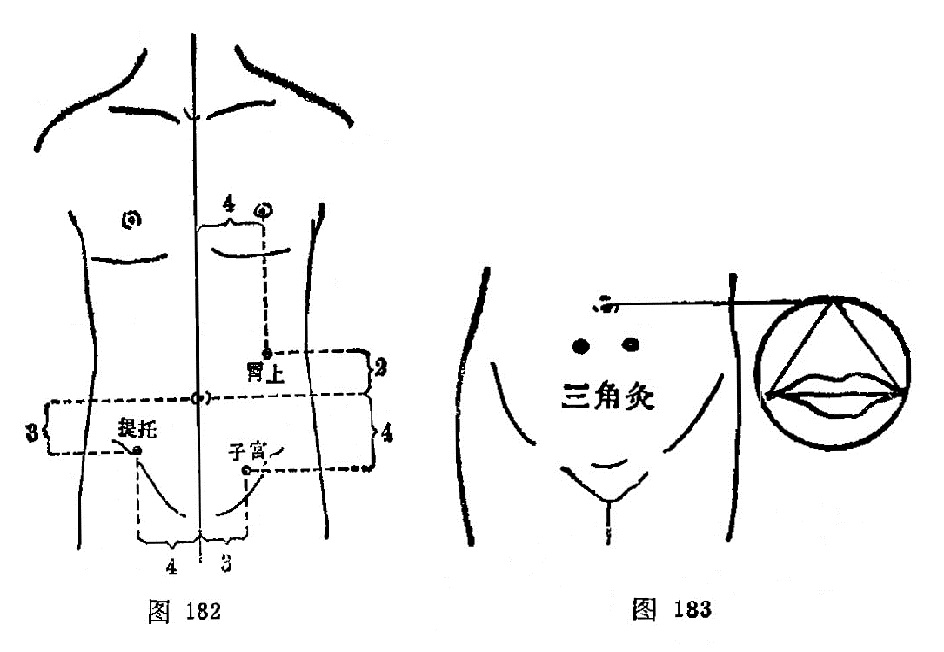

#### 三角灸

〔定位〕以患者两口角之间的长度为一边，作等边三角形，将顶角置于脐中心，底边呈水平线，两底角处是穴（图183）。

〔解剖〕在腹直肌中，有腹壁下动、静脉肌支；布有第10肋间神经。

〔功能〕温通血脉，散寒止痛。

〔主治〕疝气，奔豚，腹痛。

〔刺灸〕艾炷灸5～7壮。

〔讲述〕见于《针灸集成》。临床多用灸法治疗疝气，奔豚，有温通血脉，散寒止痛之效。

#### 提托

〔定位〕关元穴旁开4寸（图182）。

〔解剖〕当腹内外斜肌及腹横肌部，有旋髂浅动、静脉；布有髂腹下神经。

〔功能〕升提下陷。

〔主治〕阴挺，疝气，下腹痛。

〔刺灸〕直刺0.8～1.2寸，可灸。

〔讲述〕新订穴。刺此能升提下垂之脏器，因名。本穴对下垂的子宫有升提上托之力，还可用治肾下垂。

#### 子宫

〔定位〕中极穴旁开3寸处（图182）。

〔解剖〕在腹内、外斜肌处，有腹壁浅动、静脉；布有髂腹下神经。

〔功能〕升提下陷，固经止带。

〔主治〕阴挺，月经不调，痛经，带下，不孕。

〔刺灸〕直刺0.8～1.2寸，可灸。

〔讲述〕见于《医学纲目》。以主治胞宫之疾，因名。除用治阴挺有升提固脱之力外，还可用于痛经，带下。

### 四、四肢部（13穴）

#### 十宣

〔定位〕在手十指尖端，距指甲0.1寸，左右共十穴（图184）。

〔解剖〕有指掌侧固有动、静脉形成的动，静脉网；布有指掌侧固有神经和丰富的痛觉感受器。

〔功能〕泄热醒神。

〔主治〕高热，昏迷，惊痫，癫痫，癔病。

〔刺灸〕浅刺0.1～0.2寸，或点刺出血。

〔讲述〕见于《千金》，《奇效良方》始定名。别称鬼城。十，指手十指端；宣，指宣散。以能宣散风热之邪，因名。临床宜点刺出血。

#### 四缝

〔定位〕第2、3、4、5指掌面，近端指骨关节横纹中点，左右共八穴（图185）。

〔解剖〕入皮后有指纤维鞘，指滑液鞘，屈指伸肌腱，深部为指关节腔，有指掌侧固有动、静脉的分支，布有指掌侧固有神经。

〔功能〕消积，驱蛔。

〔主治〕疳积，消化不良，百日咳。

〔刺灸〕点刺挤出少许黄白色液体。

〔讲述〕见于《奇效良方》。穴当掌面食、中、环、小四指第1、2指关节横纹缝隙中点，因名。《奇效良方》：治小儿猢狲劳症。主要用治小儿消化不良引起的消瘦、纳呆、腹泻、腹胀之疳积，虫痛，刺之挤出黄色液体，有消积驱蛔之力。

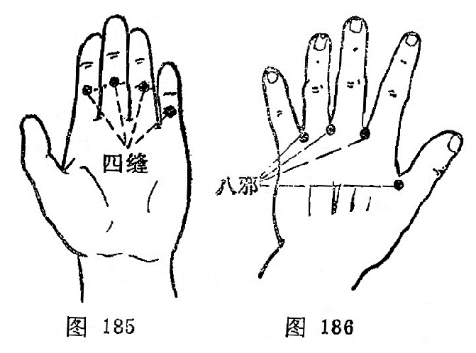

#### 八邪

〔定位〕手背各指缝中的赤白肉际处，左右共八穴（图186）。

〔解剖〕当骨间肌处，有手背静脉网，掌背动脉；布有尺桡神经的手背支。

〔功能〕清热，解毒，止痛。

〔主治〕烦热，头痛，目痛，牙痛，手背痛麻，毒蛇咬伤。

〔刺灸〕斜刺0.5～0.8寸，或点刺出血，可灸。

〔讲述〕出《素问·刺疟论》。别称八关，《大成》又称大都、上都、中都、下都。八，指每手4穴，邪，指病邪，因名。用治手背痛麻可向上斜刺，其它热病可刺出血。

#### 二白

〔定位〕在掌后横纹上4寸，两穴对并，一穴在筋中间，一穴在大筋外（图187）。

〔解剖〕有指浅层肌，桡动、静脉和骨间掌侧动、静脉；布有臂内侧皮神经，前臂外侧皮神经，正中神经和桡神经。

〔功能〕止痛，升陷。

〔主治〕久痔，脱肛，前臂痛，胸胁痛。

〔刺灸〕直刺0.5～0.8寸，可灸。

〔讲述〕见于《玉龙经》。配长强治脱肛；配承山治久痔有效。

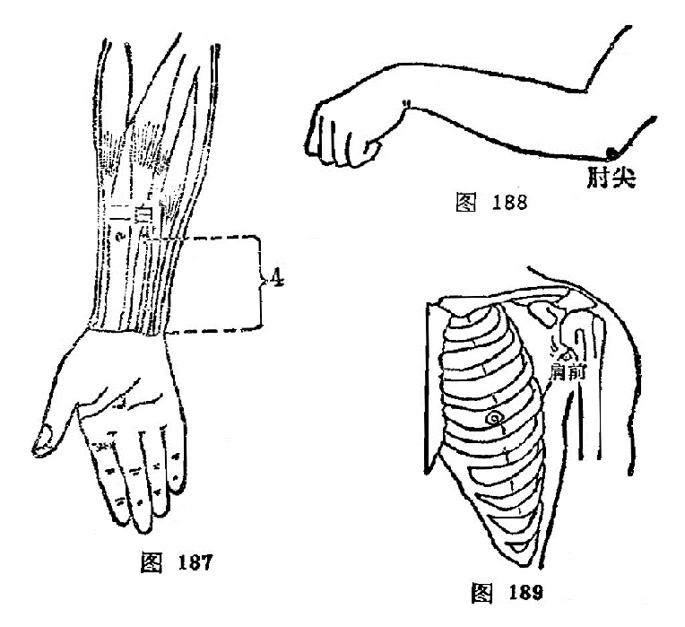

#### 肘尖

〔定位〕屈肘，当尺骨鹰嘴的尖端（图188）。

〔解剖〕有浅筋膜，肘关节动、静脉网；布有前臂背侧皮神经。

〔功能〕清热化痰，消肿解毒。

〔主治〕瘰疬，痈疔恶疮。

〔刺灸〕艾炷灸7～15壮。

〔讲述〕见于《千金》。肘指肘部，尖指尖端，以穴当尺骨鹰嘴突起之尖端，因名。主要灸治瘰疬。

#### 肩前

〔定位〕腋前竖起纹头上1寸（图189）。

〔解剖〕在三角肌中，有胸肩峰动、静脉，旋肱前后动、静脉；布有锁骨上神经后支，深部为腋神经。

〔功能〕通经，活络。

〔主治〕肩臂痛，肩周炎。

〔刺灸〕直刺1～1.5寸，可灸。

〔讲述〕新订穴。别称肩内陵。以穴适当肩部的前面腋皱襞顶端与肩髃穴连线的中点，因名。主要用治肩痛不举，以及肩关节疾患。

#### 百虫窝

〔定位〕血海穴上1寸；或膑骨上缘上3寸处（图190）。

〔解剖〕在股内侧肌中，有股动、静脉；布有股神经前皮支，深层有股神经肌支。

〔功能〕凉血解毒，祛湿散风。

〔主治〕风湿痒疹，下部生疮。

〔刺灸〕直刺1～1.5寸，可灸。

〔讲述〕见于《大成》。别称血郄。以主治皮肤瘙痒，状似百虫爬出，骚扰全身，因名。除主治蛔虫症，皮肤瘙痒外，还可用于下部生疮，阴囊风疮，有祛湿、散风、止痒之效。

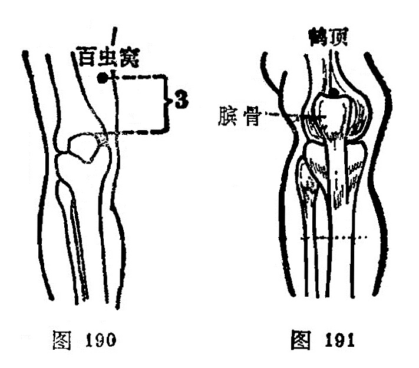

#### 鹤顶

〔定位〕髌骨上缘正中凹陷中（图191）。

〔解剖〕在髌骨上缘股四头肌腱中，有膝关节动脉网；布有股神经前皮支及肌支。

〔功能〕通利关节，活络止痛。

〔主治〕膝痛，足胫无力，下肢瘫痪。

〔刺灸〕直剌0.5～0.8寸，可灸。

〔讲述〕见于《医学纲目》。别称：膝顶。穴当膝盖骨尖上，是处形似鹤顶，因名。除主膝关节痛、麻外，还可用治鹤膝风以及两足瘫痪，脚气等症。

#### 胆囊穴

〔定位〕阳陵泉穴下约1寸之压痛点处取穴（图192）。

〔解剖〕在腓骨长肌与趾长伸肌处，有胫前动、静脉分支；布有腓肠外侧皮神经，腓浅神经。

〔功能〕清热利胆，通络排石。

〔主治〕胆囊、胆道疾患。

〔刺灸〕直刺1～1.5寸，可灸。

〔讲述〕新订穴，见《中华外科杂志》。刺此穴对胆囊有一定影响，因名。除主胆囊炎，胆石症，胆道蛔虫症之外，还可用于下肢痿痹之疾。

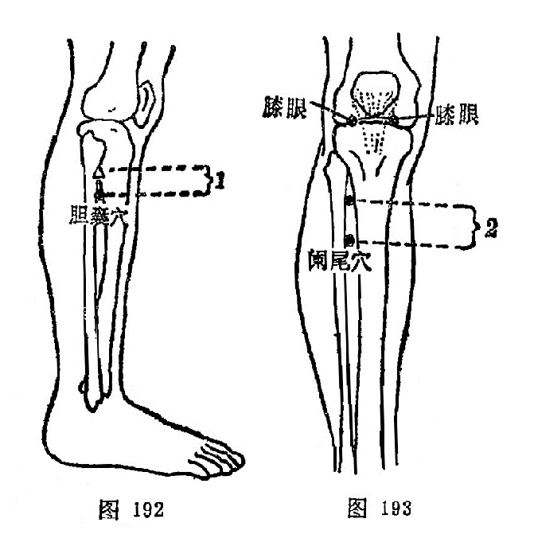

#### 膝眼

〔定位〕髌骨尖两侧凹陷中（图193）。

〔解剖〕在髌韧带两侧，有膝关节动、静脉网；布有隐神经分支，股外侧皮神经分支，深层有胫腓总神经分支。

〔功能〕通利关节。

〔主治〕膝关节疾患。

〔刺灸〕向膝中斜刺0.5～1寸，可灸。

〔讲述〕见于《千金》。别称膝目、鬼眼。膝指膝关节，眼指膝两侧的凹窝，是处形似眼状，穴当其处，因名。除主治膝红肿痛外，还可用于脚气。针时应严密消毒，向膝中十字韧带处斜刺0.5～1寸，或透刺到对侧膝眼，使局部产生痠麻胀感有效。

#### 阑尾穴

〔定位〕足三里穴下约2寸，压痛点处取穴（图193）。

〔解剖〕在胫骨前肌，趾长伸肌中，有胫前动、静脉；布有腓肠外侧皮神经，腓深神经。

〔功能〕清热化瘀，通调肠腑。

〔主治〕大肠痈（阑尾炎）。

〔刺灸〕直刺1～1.5寸，可灸。

〔讲述〕新订穴。因主治阑尾炎而得名。一般大肠痈患者可在此穴处找到明显的压痛点，针刺以强刺留针，可止痛散瘀。

#### 八风

〔定位〕足背，五趾的各趾缝赤白肉际处，左右共八穴（图194）。

〔解剖〕在趾骨小头间前跖骨间肌中，有趾背动、静脉；布有腓浅、深神经。

〔功能〕清热，解毒，止痛。

〔主治〕脚气，趾痛，牙痛，头痛，毒蛇咬伤。

〔刺灸〕斜刺0.5～0.8寸，或点刺出血。

〔讲述〕出《素问·刺疟论》。《千金》称八冲，《集成》称阴独八穴。穴在双足五趾缝间，风指病邪，因名。主治脚气，趾痛。根据病上取下之理，还可用治牙痛，头痛。

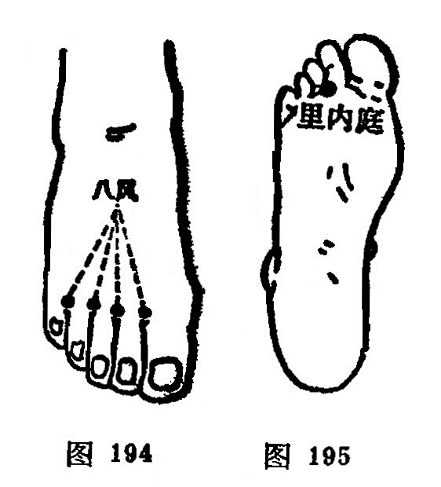

#### 里内庭

〔定位〕足底，第2、3趾间，与内庭穴相对处（图195）。

〔解剖〕深层有来自胫前动脉的足底弓；布有第2足底跟侧总神经。

〔功能〕镇静，止痛。

〔主治〕足趾疼痛，惊风，癫痫，胃痛。

〔刺灸〕直刺0.3～0.5寸，可灸。

〔讲述〕见于《千金翼》。以与内庭相对，位居足底内侧，因名。除主五趾痛、麻外，还可用于惊风，癫痫。

### 复习思考题

1. 何谓经外奇穴？
2. 本节收经外奇穴40个。试述太阳、球后、牵正、翳明、安眠、定喘、夹脊、腰奇、提托、子宫、十宣、鹤顶、阑尾穴等的取穴法，它们有哪些功能？

答：

1. 分類
2. 阿是

