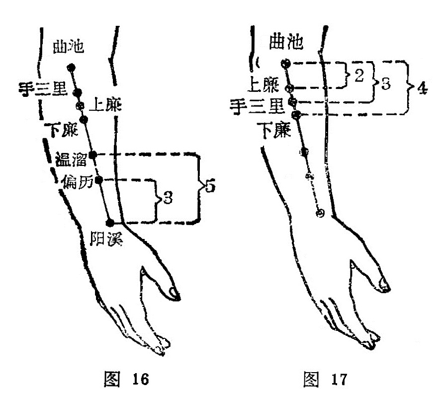
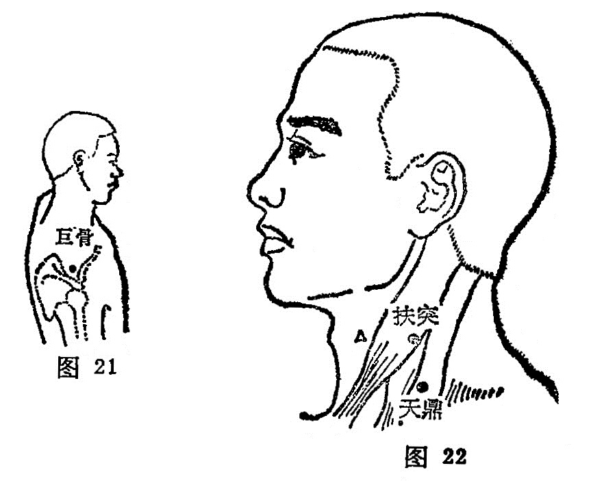
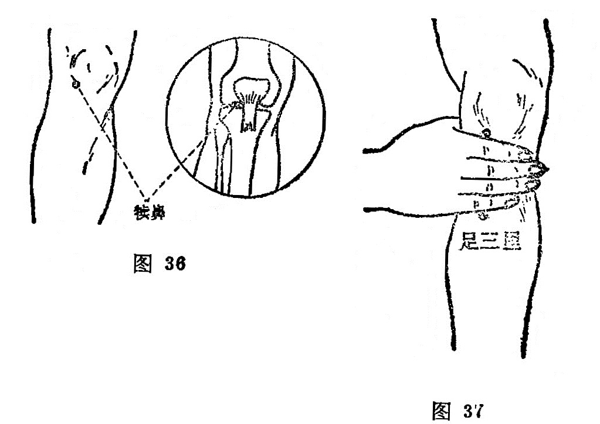
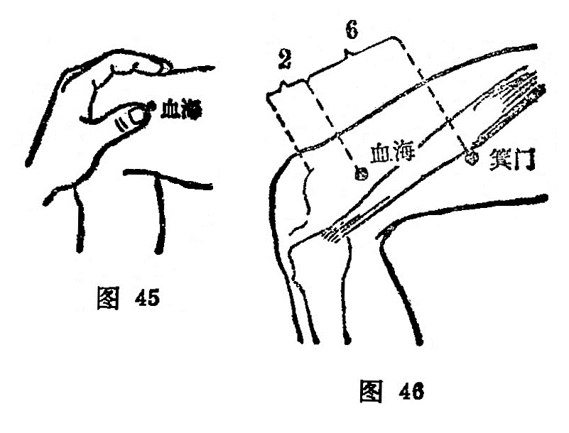

# 第三章 腧穴各论

[TOC]

## 第一节  十二经腧穴

〔自学时数〕    24 学时 

〔面授时数〕    10 学时 

〔目的要求〕
1. 学习本节内容时，参阅《针灸甲乙经》、《铜人腧穴针灸图经》、 以及《针灸解剖学图谱》，以了解腧穴的概况。
2. 掌握十二经脉的循行、主病规律及其络属关系。
3. 掌握十二经腧穴的定位，主治与操作方法。
4. 在人体上绘出十二经脉的体表循行路线，点出重点腧穴的位置。
5. 熟读背诵十二经腧穴分寸歌。

### 一、手太阴肺经（11穴）

#### （一）分布络属

分布径路：从胃部（中焦）开始，向下联络大肠，回上来沿着胃上口，穿过膈肌，入属肺脏，从肺系（气管、喉咙）横向侧胸上部浅出体表，走向腋部，沿上肢内侧前边，到手掌大鱼际边缘，沿拇指桡侧到指端。

它的一条分支，从腕后桡骨茎突的上方分出，沿掌背侧走向食指桡侧端，交给手阳明大肠经（图3）。

络属脏腑：属肺，络大肠。

经过器官：肺系（气管），喉咙。

本经腧穴：
一手太阴是肺经，臂内拇侧上下循。
**中府**乳上数三肋，**云门**锁骨窝里寻，
二穴相差隔一肋，距腹中线六寸平。
**天府**腋下三寸取，**侠白**肘上五寸擒。
**尺泽**肘中大筋外，**孔最**腕上七寸凭。
**列缺**交叉食指尽，**经渠**寸口动脉行。
**太渊**掌后纹头是，**鱼际**节后散脉荥。
**少商**穴在大指内，去指甲角一分明。

圖3：手太阴肺經循行示意圖

  	图解：肺手太阴之脉：①起于中焦，②下络大肠，③环循胃口，上膈， ④属肺，⑤从肺系横出腋下，⑥下循臑内，行少阴、心主之前，⑦下肘中，循臂内上骨下廉，入寸口，⑧上鱼，循鱼际，出大指之端。其支者，⑨从腕后直出次指内廉，出其端（《灵枢·经脉》）。

#### （二）本经证候

经证：胸内满闷，缺盆中痛，肩背痛而发冷，上肢内侧前缘痛而发冷，手掌心灼热（均属本经病症），发热，汗出（属全身经病）。

脏证：咳嗽，气喘，呼吸短促，肺胀满（均属肺病），心烦（心病），小便黄赤、频数而量少（肾病），大便遗泄（大肠病）。正如经文所述：肺手太阴之脉，是动则病肺胀满，膨膨而喘咳， 缺盆中痛，甚则交两手而瞀，此为臂厥。是主肺所生病者，咳，上气喘喝，烦心胸满，臑臂内前廉痛厥，掌中热。气盛有余，则肩背痛风，寒汗出中风 ，小便数而欠。气虚则肩背痛寒，少气不足以息，溺色变（《灵枢·经脉》）。

#### （三）腧穴分述

##### 中 府

〔定位〕任脉旁开6寸，平第一肋间隙中（图4）。

〔解剖〕当胸大肌，胸小肌处，深部为第一肋间内外肌；上外侧有腋动静脉，胸肩峰动静脉；布有锁骨上神经中间支，胸前神经的分支及第一肋间神经外侧皮支。

〔功能〕清宣肺气，养阴补脾。

〔主治〕咳嗽，哮喘，胸痛，烦满，腹胀，纳呆，以及肩背酸痛，肺风面肿。

〔刺灸〕针尖向下斜剌，或向外斜刺0. 5〜0. 8寸，不可向内侧深刺，可灸。

图4：

〔讲述〕出《素问·离合真邪论》。别称膺中外俞、肺募、府中俞。中指中气，聚处为府，在此是指经气聚集之处，因穴属肺募， 为手足太阴脉气之会，是中气府聚之所，故名。取本穴时，应请患者正坐，将右臂向前平伸，或手叉腰时，锁骨外端下缘即呈现 一三角形凹陷，其凹陷处是云门；再从云门直下1.6寸（即下一 肋）即为中府穴。本穴恰当乳头外开2寸，直上，内与华盖相平， 距任脉6寸。本穴具有宣肺理气之效，为治肺、心疾患常用穴之—。所以《灵枢·五邪》指出：邪在肺，则病皮肤痛，寒热，上气喘，汗出，咳动肩背。它所以能治邪在肺，乃因穴下与肺脏接近， 为肺之经气聚集之处，刺灸能疏理肺气。如配风门宣肺止咳，疏风散寒治外感风寒束表，肺失宣降之咳嗽；配风门、尺泽用泻法疏风清热，能治风热犯表，肺失宣畅之风热咳嗽；配复溜用补法生津润肺治燥热伤肺之干咳；配意舍降逆气治胸满哽噎；配太渊润肺止血治咳血；配中脘、丰隆降气化痰治实喘；配天突、内关 利气平端治心悸喘息。由于本穴为脾经会所，脾能行水而主四肢，故能治头面及四肢浮肿，以及纳呆、腹胀之疾。

针刺本穴，应斜向外下方刺，一般宜用指切押手，针尖沿爪甲边缘缓慢剌入，不可直深刺，免伤肺脏，伤肺即令人鼻塞喘息咳逆。所以《素问·刺禁论》指出：剌膺中陷中，肺为喘逆仰息，慎之！

##### 云 门

〔定位〕任脉旁开6寸，锁骨下缘处取穴（图4）。

〔解剖〕有胸大肌，皮下有头静脉，深部有胸肩峰动脉分布，布有胸前神经的分支，臂丛外侧束及锁骨上神经。

〔功能〕调理肺气，止咳镇痛。

〔主治〕咳嗽，气喘，胸中烦满热痛，肩臂不举，麻木，疼痛。

〔刺灸〕向外斜刺0.5〜0.8寸，可灸。

〔讲述〕出《素问·水热穴论》。人之气血，始于手太阴，出于云门；归于足厥阴，入于期门。肺气在人体中，犹如云雾，首出其门而得名。本穴与中府仅相隔一肋，故能治本经之气喘，咳嗽之疾，但无募穴之特殊性。由于针刺本穴，其得气能沿经传达到上肢远端，故常作为治疗肩臂内侧疼痛，以及上肢麻木等症的主要经穴。《甲乙》：主治肩痛不可举，引缺盆痛。《铜人》：治肩痛不得举臂。穴下有肺脏，不宜直、深刺，可观身体胖瘦，剌0.5〜 0.8寸，或斜刺为宜，过深伤肺，令人逆息，喘逆仰息。

##### 天 府

〔定位〕垂臂，在上臂内侧，腋前皱襞上端，向外方的水平线下3寸，肱二头肌外缘（图5）。

〔解剖〕穴在肱二头肌外侧沟中，布有腋窝动静脉，肌皮神经及臂外侧皮神经。

〔功能〕宣通肺气，清热散结。

〔主治〕气喘，鼻衄，喉肿，瘿气，臂痛。

〔刺灸〕直刺0.5〜1寸，可灸。

〔讲述〕出《灵枢·本输》。本穴上接云门，能宣通肺气，且取本穴，应以上膊挨近鼻尖处；鼻为肺窍，外通天气，故名。本穴除主肺疾之咳喘，以及沿经之肩臂痛麻外，还可用于鼻衄，瘿气，具有止血、凉血，调气散结之效。临床常配臑会、气舍治瘿气，咽肿，配合谷治鼻中衄血。另外还可用治紫、白癜风，目眩，远视。

图5：

##### 侠 白

〔定位〕天府穴下1寸，尺泽上5寸（图5）。

〔解剖〕在肱二头肌桡侧；有头静脉,肱动脉分支,布有臂外侧皮神经及肌皮神经。

〔功能〕调肺气，止疼痛。

〔主治〕咳嗽，心痛，上臂内侧痛。

〔刺灸〕直刺0.5〜1寸，可灸。

〔讲述〕侠白一名夹白，侠同挟，有保护之意。因穴在上臂内 侧，适当肺脏的两旁、肺应白色，穴挟其旁，因名。取本穴应请 患者手臂垂直，掌心向前，从腋前横纹头到肘横纹划成三个等分， 上1/3处（即腋下3寸）取天府，天府下1寸取侠白，二穴均在肱 二头肌的挠侧沟中。侠白除具有宣通肺气之效外，又主上臂内侧疼 痛、麻木。由于穴系手太阴肺经之经别，散于胸中，故用于胸中烦满，心悸，心痛诸疾，有理气止痛之效。《甲乙》：主治心痛，咳干 呕满。《大成》：主心痛短气，干呕逆烦满。临床常配心俞、内关， 膈俞能增强疗效。另外点刺出血（局部）加灸治赤白汗斑。

##### 尺 泽

〔定位〕仰掌，肘部微屈，在肘横纹中，肱二头肌腱的桡侧缘， 当侠白下5寸处（图5、6）。

〔解剖〕在肱二头肌腱的桡侧,肱桡肌起始部；有头静脉,挠返动静脉分支；布有前臂外侧皮神经,桡神经本干。

〔功能〕清泄肺热，肃降和中。

〔主治〕咳嗽，哮喘，胸满，咯血，潮势、咽痛，肘挛痛，吐泻。   

〔刺灸〕直剌0.5〜1寸；或点刺出血，可灸。

图6

〔讲述〕尺泽别名鬼受。古代以前臂部称尺，《灵枢·骨度》将从腕至肘定为一尺，本穴为肺之合，阴经之合属水，水当润泽，穴处低凹如沼泽，因名。取本穴有三法：一是屈肘、拱手，于大肠经曲池内一寸横纹端取之；二是屈肘仰掌，在肘横纹中央，大筋（肱二头肌腱）外侧凹陷中取之；三是伸臂使肘静脉暴露，于该穴处点刺出血。穴属肺经脉气之所入，为本经合水穴，具有清肺热，泻肺火，降逆气，止咳喘之功效。故可用治咳逆上气，唾血以及咳唾脓血，肺积息贲，临床可配鱼际能增强疗效。其次用治局部肘痛筋挛，手臂拘挛急，具有舒筋活络，止痛缓急之效。近代又用治吐泻症，点刺出血可止吐泻，有和中止痛之效。《资生》:尺泽主呕泄上下出。本穴《金鉴》认为禁灸；《素问·刺禁论》认为剌肘中内陷，气归之，为不屈伸。这里的气指恶气，病患，实际是刺本穴应避开动脉，以免出血。

##### 孔 最

〔定位〕在尺泽和太渊连线上，腕横纹上7寸处（图7）。 

〔解剖〕在肱桡肌内缘,针尖可达到旋前圆肌下端。浅层有头静脉和前臂外侧皮神经；深层有桡神经浅支和桡动静脉。

〔功能〕润肺止血，解表清热。

〔主治〕咳嗽，气喘，咯血，咽痛，失音，热病汗不出，肘臂痛。

〔刺灸〕点刺1〜1. 5寸，可灸。

图7：

〔讲述〕见于《甲乙》。孔，指通；最，有第一的含意。本穴主治热病汗不出，针之能宣通肺气，开泄腠理，犹如通中发汗，最为第一，因名。取本穴应微屈肘，使掌心向上，先于肘弯大筋外侧点尺泽，再于腕横纹头处定太渊，于尺泽与太渊连线距腕7寸处定孔最，适当桡骨尺侧边，故伸肘手虎口向上握拳时，此处凹陷最为明显，且有压痛是穴。穴属肺郄，是肺经气血深集之处，具有清热解表，宣肺平喘，降气止血之功效。如《外台》：治热病汗不出；《玉龙经》：治太阴热病无汗;《大成》：治吐血，失音，咽肿头痛。为增强疗效，临床常配合谷治高热无汗，可降热解表；配肺俞、风门、大椎治咳喘，能宣肺止嗽定喘；配少商点刺出血治咽肿喉痹，能清咽止痛。日本泽田氏谓本穴灸之能治肛痔。

##### 列缺

〔定位〕桡骨茎突上方，腕横纹上1.5寸，或两手虎口交叉， —手食指按在挠骨茎突上，指尖下凹陷是穴（图8）。

图8

〔解剖〕针经肱桡肌腱与外展拇长肌腱之间,到达旋前方肌桡侧缘。浅层有头静脉的属支和桡神经浅支；深层有桡动静脉分支。

〔功能〕宣肺疏风，通调任脉。

〔主治〕头痛，项强，咳喘，瘾疹，咽肿痛，口眼㖞斜，腕痛无力，遗溺，溺血阴中痛。

〔刺灸〕向肘部斜刺0. 5〜0. 7寸，可灸。

〔讲述〕别称童玄。列，指分解，别行，与裂义通；缺，指器破缺口之意。因穴位于手腕侧，当桡骨突起的分裂缺口处，是手太阴之别络，经脉从此别行，斜走食指内侧，因名。本穴为本经 之络，又是八脉交会之一，通于任脉，临床应用范围较广，故后人将它列人四总穴之内、具有宣肺疏风，清热解表，通经活络、调理任脉的功效。《千金》：配后溪、少泽、前谷治疟寒热。《资生》：配完骨治口面㖞。《玉龙赋》：配太渊治咳嗽风痰。除此之外，“头项寻列缺”，多用治头项疾患，善疗偏正头痛。因穴属本经络穴，联系表里两经，肺脉由此别走手阳明；阳明大肠经从手走头，上达颈项，口齿，故头项寻列缺，体现了表里同治的规律；加之肺脉由此内通任脉，所谓列缺任脉行肺系，而任与督脉相会于头顶，头项强痛一般由外感引起，《伤寒论》说：外邪伤入，先伤皮毛。而肺主气，外合皮毛，针肺之络，可宣通肺气，疏泄风邪，故主一切头项疾患，所以《甲乙》指出：热病，先手臂瘈疭，唇口紧，鼻张，目下，汗出，列缺主之。本穴临床又可用治遗尿症，因肺之别络，别走大肠，又为肺、任内连之处；肺主气，为水之上源，大肠系津液之府，任脉为诸阴之统汇，故当肺气不足，导致膀胱失职，刺列缺能开泻肺气而止遗溺，临床采用埋针方法，可增强疗效。列缺内通任脉，任起胞中，还可用于前阴诸疾，如溺血，小便热，阴茎痛，妇人血气不和，胎衣不下等。近代研究证明，刺之能使尿中排碘量降低，使甲状腺中碘～131～的半衰期有所延长。

##### 经 渠

〔定位〕在胞横纹上1寸，当桡骨茎突内缘与桡动脉之间凹陷处（图9） 。

图9

〔解剖〕在桡侧腕屈肌腱与拇长展肌腱之间,在桡动静脉桡侧；深层有旋前方肌；布有前臂外侧皮神经和桡神经浅支的混合支。

〔功能〕宣肺平喘，清热止痛。

〔主治〕咳嗽，咽肿痛，腕痛。

〔刺灸〕避开动脉，直刺0. 2〜0.3寸，禁灸。

〔讲述〕出《灵枢·本输》。经，指通路；渠，为水道。穴当寸口，为肺经所行之经穴，是肺经经气经过的冲渠要道，因名。本穴适当桡骨茎突的最高点的掌面内侧缘骨边，相当诊脉的寸、关、尺三部脉中的关部，有动脉应手处是穴。针刺时应避开动脉。简易取法是虎口交叉，食指尖附着点为列缺；于食指爪甲根下取经渠。本穴多用于本经所发生的咳逆，喘息，喉痹，咽肿之疾。《甲乙》：治胸中膨膨然，甚则交两手而瞀，暴痹喘逆。《千金》：治咳逆上气，喘，掌中热，臂内廉痛。这是本“经主喘咳寒热"的法则， 刺之能收宣肺清热，恢复肃降，下气平喘的功效。

##### 太渊

〔定位〕掌后腕横纹桡侧端，挠动的桡侧凹陷中（图10）。

〔解剖〕在桡侧腕屈肌之外侧，拇长展肌腱之内侧；有桡动静脉；布有前臂外侧皮神经和桡神经浅支的混合支。

〔功能〕宣肺止咳，通脉理盛。

〔主治〕咳嗽，气喘，咯 血，呕血，喉干咽痛，胸痛，无脉症，腕臂痛。

〔刺灸〕避开挠动脉，直 刺0.2〜0. 3寸，可灸。

图10

〔讲述〕出《灵枢·本 输》。别称太泉、鬼心。渊、泉，字义同；太，有大、甚之意。深处为渊，穴当寸口，是肺经脉气最旺盛之处，为脉之大会所，因名。它的定位，诸书记载在掌后拇指侧横纹头，大筋内侧凹陷中。人体腕横纹一般有二条，也有三条的。本穴应在掌后第一横纹头处，于大多角骨的桡侧，适当切脉之寸部。穴属俞土，又系原穴，为肺经脉气聚会之所，肺属金，穴属土，土为金之母，故本穴为肺经之母穴，凡一切肺虚引起的气 短，咳喘，补之能宣通肺气，益气补虚。临床常配列缺治胸痛； 配尺泽治肘痛；配鱼际治咽干；配列缺、鱼际治咳喘，配内关、四缝治百日咳。近年常用太渊治疗无脉症，配心俞、厥阴俞、内关有一定疗效。研究表明，肺有辅助心脏主宰人体血液循环的作用，肺气流经，经气归于肺，肺朝百脉，“肺代心主而行营卫，故治节由之”（王冰语）。此外，针刺本穴能减低吸气或呼气阶段的气道阻力。

##### 鱼际

〔定位〕第一掌骨中点，赤白肉际处（图10）。

〔解剖〕针尖穿过拇短展肌，到达拇指掌肌中。有前臂外侧皮神经和正中神经的分支。

〔功能〕清热平喘，开音利咽。

〔主治〕咳嗽，咯血，喉痛，咽干，失音，不语，小儿疳积，乳痈。

〔刺灸〕直刺0.5〜0.8寸，可灸。

〔讲述〕出《灵枢·本输》。因位于大指本节后，当似鱼腹的白肉际，即手鱼的边缘而得名。它的定位《甲乙》、《千金》、《铜人》皆记述在大指本节后侧散脉中。《神应经》、《大成》记述在大指本节后白肉际。由于该部鱼腹白肉际较宽大，散脉亦很广，故不易定位。现今多定在掌指关节后方，靠掌面骨边，适当第一掌骨中部取之。
 本穴为肺之荥火穴，治疗肺脏有关阳热疾患，具着宣肺清热的功 效。用治咽痛，可取32号细毫针，针双侧鱼际，给予轻微捻转，使之产生酸麻，约1分钟，即行卧针，有清咽止痛之力。是处毛细血管丰富，易出血肿胀，故刺后应轻揉按局部，以免疼痛出血。 本穴一般禁灸，惟牙痛可灸，牙痛在左灸右，在右灸左。

##### 少商

〔定位〕拇指挠侧，距指甲角0.1寸（图11）。

〔解剖〕针尖可刺达皮下组织中。有桡神经，正中神经的分支和指端动脉网。

〔功能〕宣肺利咽，泄热醒神。

〔主治〕喉肿，中风，中暑，昏厥，发热，癫狂、癔病。

〔刺灸〕向腕平刺0. 1〜0. 2寸，或点刺出血，此穴一般不灸。

图11

〔讲述〕出《灵枢·本输》。别称鬼信。少，有小的含意，又有初始之意；商，是五音之一，肺属金，其音商，而穴为肺生井，是脉气初始之处，因名。由于诸井皆有开窍泄热，苏厥醒神，利咽消肿之效，故可用于中风，晕厥。《验方新编》：中风昏倒，不省人事，用锋利碎磁片刺少商出血，一般常配人中、足三里效果更佳。由于手太阴之脉行肺系，故凡阴虚火旺所引起的咽干疼痛，乳蛾喉痹，能立见清咽止痛之效。《图翼》载：唐刺史成君绰忽项肿如升，喉闭水粒不下，甄权以三棱针刺之，微出血立愈。现今研究，刺少商，能使一氧化碳中毒的动物苏醒时间缩短，呼吸功能增强，血中一氧化碳含量下降，从而证明本穴具有开窍醒神的功效。

#### （四）本经小结

1．肺经起自中焦胃口，经脉走行方向是从胸走手，与手阳明大肠互为表里。全经计有11个经穴；体表起于中府，止于少商，募在中府，络在列缺，郄会孔最。本经取穴要点，应注意骨边、 筋边以及沟中（肌肉凹陷处）。骨边：取孔最应在桡骨尺侧边取之，于挠骨茎突高点掌面骨边取经渠。筋边：于肱二头肌腱的挠侧，肘横纹上定尺泽。沟中：于肱二头肌的挠侧沟中取天府与侠白。其次要注意肘横纹与腕横纹，肘部在肱二头肌腱桡侧缘与肘横纹交点定尺泽；腕后第一横纹头，桡动脉挠侧取太渊。尺泽太渊连线上取孔最、经渠。少商用于放血，故应使患者握拳，伸大指，术者紧握患者大指、采用点刺，以减少疼痛。

2．本经生理功能与病理反应，应注意属肺络大肠，系于喉咙，通过膈肌，故能外养皮毛，内荣肠胃，且开窍于鼻；由于肺属金，通于秋气，其生理特点是多气少血，寅时气血最为旺盛，外邪袭之，可发生胸、咽喉、气管、鼻部和肺脏疾患。根据经脉所过主治所在的规律，本经11个经穴，均有宣肺解表、止咳平喘的功能。凡胸满喘咳取尺泽，外感咳嗽取列缺，气逆喘咳取中府，痰多咳嗽刺太渊，咳嗽少痰取鱼际。凡咯血取尺泽，肺热咯血取鱼际，鼻血取天府。凡咽喉肿痛取少商，咽喉干痛取鱼际。凡胸痛取太渊、中府，胸中热取中府、云门，胸满恶寒取中府、经渠。辨证选穴，疗效显著。

3．中府、云门深部有肺脏故不可深刺，免伤肺脏，造成气胸。尺泽、太渊在关节及动脉处，一般不宜用直接灸。少商用治实热症宜点刺出血，不宜留针。

#### 复习思考题

1. 手太阴肺经的循行路线及其络属是什么？
2. 怎样取天府、侠白、尺泽、孔最、太渊、鱼际穴？
3. 针刺中府、云门、太渊、经渠要注意什么？
4. 怎样刺少商、鱼际穴？
5. 列缺有哪些主要功能？为什么能治头项诸疾？
6. 本经腧穴主治功能有哪些规律？

答：
1. 分類
2. 阿是

### 二、手阳明大肠经（20穴）

#### （一）分布络属

分布径路：本经承受太阴肺经的支脉，从食指的桡侧端起始（商阳），沿着食指的挠侧缘，向上经过第一、第二掌骨之间，进入拇长伸肌腱和拇短伸肌腱时中间，沿上肢外侧的前缘，到肩关节前上缘，向后到第七颈椎棘突下，再向前下行到锁骨上窝， 深入体腔，联络肺脏，向下穿过膈肌，入属大肠。

它的上行一支，从锁骨上窝分出，上行颈部，贯串面颊，进入下齿中，再回出来挟口两旁，在人中沟处左右交会，左边的经脉交叉到右边去，右边的经脉交叉到左边来，然后上行挟着鼻孔 到鼻翼两旁（迎香)，再上行交会定用明胃经（图12）。

络属脏腑:属大肠，络肺。  

经过器官：口，下齿，鼻。

本经腧穴：
二手阳明属大肠，臂前外侧须审量。
**商阳**食指内侧取，**二间**握拳节前方。
**三间**握拳节后取，**合谷**虎口歧骨间。
**阳溪**腕上两筋内，**偏历**腕上三寸量。
**温溜**腕后上五寸，池前四寸**下廉**乡。
池下三寸**上廉**穴，**三里**池下二寸逢。
**曲池**屈肘纹头尽，**肘髎**大骨外廉旁。
肘上三寸寻**五里**，**臂臑**三角肌下方。
**肩髃**肩峰举臂取，**巨骨**肩尖骨陷藏。
**天鼎**扶下一寸取，**扶突**鼎上结喉旁。
**禾髎**水沟旁半寸，鼻旁五分是**迎香**。

图12 手阳明大肠經循行示意圖

  	图解：大肠手阳明之脉，①起于大指次指之端，循指上廉，出合谷两骨之间，②上入两筋之中，循臂上廉，入肘外廉，③上臑外前廉，上肩，出髃骨之前廉，④上出于柱骨之会上，⑤下入缺盆，⑥络肺，下膈，⑦属大肠。
  	其支者，⑧从缺盆上颈、贯颊，⑨入下齿中，还出挟口，交人中——左之右，右之左，⑩上挟鼻孔（《灵枢·经脉》）。

#### （二）本经证候：

经证：目黄，口干，鼻流清涕，出鼻血，齿痛，颈肿，喉咙痛，肩臂前加疼痛，食指不能运用，经脉分布处出现灼热肿胀，或僵冷（均属本经病）。  

腑证：可见肠中切痛，便秘，泄泻，下血，脱肛，飧泄怯冷诸疾。正如经文所述：是动则病齿痛颈肿。是主津液所生病者，目黄口干，鼽衄，喉痹，肩前臑痛，大指次指痛不用。气有余则当脉所过者热肿，虚则寒慄不复（《灵枢·经脉》）。

#### （三）腧穴分述

##### 商 阳

〔定位〕食指桡侧指甲角旁约0.1寸（图13）。

〔解剖〕有指端动脉网，以及从正中神经来的指掌侧固有神经。

〔功能〕开窍醒神，泄热消肿。

〔主治〕齿痛，颔肿，咽嘴肿痛，热病，昏迷，手指麻木。

〔刺灸〕浅刺0.1寸，或点剌血，可灸。

〔讲述〕出《灵枢·本输》。别称绝阳。商，发金音，手阳明大肠与肺相表里，属金属阳，大肠属手阳明，因名。穴属井金穴，根据“病在脏取之井”的法则，刺之有开窍醒神，解表退热之效。适用于中风，中暑，喉痹，癫狂以及齿痛，颔肿，喘满等症。《外台》载：治气满胸中，喘息支胁，耳鸣，下齿痛，䪼肿，喉痹。《铜人》：治口干颐颔肿。《金鉴》：主初中风跌倒，卒暴昏沉，痰盛不省人事，牙关紧闭，药水不下。临床常配少商治中风昏沉，因肺井少商，五行属木，大肠井穴商阳，五行属金，二穴配伍，相互为用，加之少商属阴性柔，商阳属阳性刚，刚柔相济，阴阳协调，疗效益彰；大肠为腑属表，故商阳侧重于清；肺为脏属里、故少商侧重于解，二穴合用，一清一解，可增强热退烧，散邪解表效力，终达表里双解的目的。 

##### 二 间

〔定位〕微握拳，当食指桡侧第一掌指关节前凹陷中（图13）。

〔解剖〕有屈指深浅肌腱；有来自桡动脉的指背及掌侧动静脉；分布着挠神经的指背侧神经及正中神经的指掌侧固有神经。

〔功能〕清热散风，消肿止痛。

〔主治〕齿痛，咽喉肿痛，鼻衄，目疾，热病。

〔刺灸〕直刺0.2〜0.3寸，可灸。

〔讲述〕出《灵枢·本输》。别称间谷。间，有居处之意，因穴位于手次指二节与三节的中间，且为本经第二个经穴，因名。本穴除用于咽喉肿痛，牙齿疼痛外，还可用于目疾，鼻衄以及肩背 疼痛诸疾。《通玄》:主目昏不见，《玉龙》：牙疼阵阵苦相煎，穴在二间要得传。《天星》：牙痛头痛兼喉痹，先刺二间后三里。近代常配合谷、少商治喉痹；配迎香、风府治鼻衄。本穴所以能治目疾，乃因目之能视，有赖脏腑之精气，若脏腑虚损，为风邪痰热所袭，气传于肝，上冲于目，则视物盲盲，本穴系大肠荥水穴及子穴，根据实泻其子的原则，故刺牢穴有散邪热，除痰热之效。

##### 三  间

〔定位〕微握拳，当第二掌指关节后凹陷中（图13）。

〔解剖〕有第一骨间背侧肌，深层为拇内收肌横头；有手背静脉网，指掌侧固有动脉；布有桡神经浅支。

〔功能〕清热，散风，行气。

〔主治〕齿痛，目痛，咽喉肿痛，多寐，腹满肠鸣，指掌关节 肿痛。

〔刺灸〕直刺0. 5〜0.8寸，可灸。

〔讲述〕出《灵枢·本输》。别称少谷。穴义同二间。本穴为本经俞木穴，除主治齿痛，目赤，咽痛外，还可用于腹满肠鸣，有行气之效。《甲乙》：多卧善唾，腹满肠鸣。《千金翼》：喉痹肿如哽，齿龋痛恶清，多卧善唾，腹满肠鸣。《图翼》：肠鸣洞泄，《纲目》：大便不通并伤寒水结，取三间沿皮向下至合谷，三补三泻，候腹中通出针，承山七分泻之。由此可见，三间长于本经所发生的肠鸣亢进，急性下泄之疾；为加强疗效，临床配伍天枢、足三里疏通腑气，疗效更捷。另外，还可用于局部手指拘急，握拳不开，手背红肿，宜用长针深透后谿有效。这是因为三间、后溪皆为俞木，二穴相合，俞木合力，不仅能通腑行气，清泻大肠，且可通调督脉，达到活络止痛之效。

##### 合 谷

〔定位〕在手背第一、二掌骨之间，近第二掌骨桡侧缘的中点；或以拇指指关节横纹正对虎口边，拇指按下当拇指尖处（图14）。

〔解剖〕在第一骨间背侧肌中，深层为拇内收肌横头，有手背静脉网，近侧正当桡动脉穿向手掌处；布有桡神经浅支的掌背侧神经，深部为正中神经的指掌侧固有神经。

〔功能〕疏风解表，通络镇痛。

〔主治〕头痛，齿痛，鼻衄，目赤肿痛，面肿，口眼㖞斜，腮肿， 热病无汗，多汗，腹痛，经闭，滞产，风疹，痢疾，以及小儿惊风。  

〔刺灸〕直刺0.5〜1.0寸，可灸。

〔讲述〕出《灵枢·本输》。别称虎口。肉之大会为谷，二处相连为合，又有交结、集会之意，因穴处适当大，次指相合处，是 处形似深谷，因名。本穴为大肠经所过之原穴，后世总结为四总穴之一。由于原穴与三焦关系密切， 它导源于脐下肾间动气，关 系人体的气化功能，是増强整体功能的要穴，所以合谷具备多种 项能，有疏风解表，清热宣肺，行气开窍，通降肠腑，镇静安神， 以及通经活络之效。其所以能治面口五官之疾，乃因大肠经的支脉，从缺盆分出，上走颈，过颊，入下齿龈，又回出绕口唇，从 人中处交叉，夹行鼻孔两侧；它的筋经，起于次指之端，结于腕，沿前臂、肘外，臑部，上达头面，可见本穴主要经过面口各部， 所以才有“面口合谷收”临床名言。加之本是动及所生病，主要 是齿痛，颈肿，目黄，口干，鼽衄，喉痹，而合谷是本经原穴，原主本经诸疾。为加强疗效，凡头风，头痛，牙痛配三间；目赤酸内迎香出血；耳聋配临泣、金门；鼻塞鼻痔配太冲；鼻衄配天府； 咽肿配少商；感冒配风池、列缺、外关；上肢不遂配曲池。本穴 配太冲名四关穴，具有镇静，搜风，行瘀，通络之效。由于阳明常多气多血，手足阳明会于迎香，所以气血不足，经闭不通，补大肠原穴合谷能使气血旺盛则经闭自通。《甲乙》说：难产补合谷， 泻三阴交。这是因为任脉起于胞中，气血不足，经气闭塞，而肺 与大肠相表里，肺脉起于中焦任脉之中脘；大肠会于任脉之承浆， 故取大肠之原穴，能通畅任脉，旺盛气血。但对于孕妇，禁刺合谷，免损胎气。

本穴针刺反应较强，一般稍稍捻转，即可产生酸胀，并向上下扩散。所以对初次受针及虚弱者，宜轻针浅刺，达到酸胀即止，留针不宜过长，以免发生晕针。对实症，体壮采用泻法，刺激较强，易产生局部甚至两手沉重，指掌握物无力，以及局部肿胀疼痛等，应针后轻揉，以宣散气血，减少疼痛，出血肿胀。

##### 阳 溪

〔定位〕腕背桡侧，当拇指翘起时，穴在拇短伸肌腱与拇长伸肌腱之间的凹陷中（图15）。

〔解剖〕在拇短伸肌腱与拇长伸肌腱之间；有头静脉，桡动脉本干及其腕背支；布有桡神经浅支，前臂外侧皮神经。

〔功能〕清热散风。

〔主治〕头痛，齿痛，目赤，耳聋，寒热，疟疾，癫狂，腕痛。

〔刺灸〕直刺0.5〜0.8寸，可灸。

〔讲述〕出《灵枢·本输》。别称中魁。溪，原为谿，肉之小会为谿。穴属手阳明，位于手掌外侧两筋凹陷处，该处形似小谿，因名。本穴为本经之经穴，除主实痛，目赤，耳聋，齿痛，腕痛诸疾外，还可配天容治胸满不得息；配肩髃可消瘾风之热；配二间治牙齿肿痛、咽痹。近世常配天突、间使治食道痉挛和咽喉气梗；配解谿能止惊悸怔忡，此乃因手足阳明之热得泄，经气通畅、肠胃安宁，故热退惊止，怔忡得除。

##### 偏 历

〔定位〕在阳溪与曲池逢线上，距阳溪上3寸（图16）。

〔解剖〕在桡侧腕伸肌腱与拇长展肌之间，有头静脉，布有挠神经浅支，前臂外侧皮神经。

〔功能〕清热宣肺，通调水道。

〔主治〕目赤，耳鸣，鼻衄，喉痛，水肿，肩臂肘腕痛。

〔刺炎〕直刺或斜刺0.3〜0. 8寸，可灸。

〔讲述〕出《灵枢·经脉》。两旁臼偏，经过为历，因大肠经脉出此络，经历手臂，别走太阴，因名。穴属络穴，联系表里两经，故主两经所发病变。临床常原络伍用，如《金鉴》：肺经里之原穴 太渊，大肠表之络穴偏历，二穴应刺之症，即胸胀溏泻，小便频 数，洒洒恶寒，翕翕发热，咳嗽喘饱，气短，皮肤肩背缺盆麻木疼 ，痛皆肺大肠经病也。由于别络，上循臂，乘肩髃，上曲颊，偏齿， 又入耳，合于宗脉，故本经络穴主治耳聋，齿痛，口僻，目视？？，鼻鼽衄血诸疾。此外，还可用于水肿，鼓胀，小便不利，刺之 有利尿消肿之效。这是因为肺为水之上源，大肠是主液所生病， 故用补法，可借以宣肺，发汗，宣化水运，再配水分，阴陵泉可增强利尿行水之效。

##### 温 溜

〔定位〕在阳溪与曲池连线上，距阳溪上5寸（图16）。

〔解剖〕在桡侧伸腕短肌，与外展拇长肌之间，有桡动脉肌支，头静脉，布有前臂背侧皮神经和桡神经深支。

〔功能〕清热解毒，调理肠胃。

〔主治〕头痛，面肿，口舌咽喉肿痛肩臂痛，肠鸣腹痛，疔疮。

〔刺灸〕直刺0.5〜0. 8寸，可灸。

〔讲述〕见于《甲乙》。别称逆注、蛇头，又称温留、池头。温有和暖的含意；溜，有止的意思。因穴属大肠之郄，是气血深聚之处，因名。本穴除有清宣肺气，用治头痛，面肿，口舌咽喉肿 痛之疾外，还可用于肠鸣而痛，伤寒哕逆，膈中气闭等症。本穴 属深郄，郄在临床上主要用于本经急症，痛症；腹痛，肠僻皆大肠腑病，故刺郄穴，可达调理肠腑，行气止痛之效；如配足三里、 上巨虚，更增疗效。

##### 下 廉

〔定位〕在阳溪与曲池连线上，距曲池下4寸（图17）。

〔解剖〕有桡侧腕短伸肌，桡侧腕长伸肌，深层为旋后肌，有挠动脉分支；布有前臂背侧皮神经及挠神经深支。

〔功能〕通经络，调腑气，利关节。

〔主治〕头风，眩晕，目痛，肘臂痛，食物不化，腹痛。

〔刺灸〕直刺0.5〜0.8寸，可灸。

〔讲述〕见于《甲乙》，在辅骨下。别称手下廉。下指下方，与 上相对；廉，形如菱角之状，又指边侧，因本穴在曲池下四寸， 屈肘握拳，是处肌肉隆起，形如菱状，穴当菱状边侧，因名。本 穴除主肩痛，手臂麻木，半身不遂外，还可用于飧泄，狂走。临 床常配足临泣、少泽治乳痈；配丘墟治胸胁满引腹：配五处、神 庭治头风；配委中治风湿痹痛，可通腑气，而利关节。

##### 上廉 

〔定位〕在阳溪与曲池连线上，距曲池下3寸。（图17）。

〔解剖〕同下廉。

〔讲能〕通经络，调腑气，利关节。

〔主治〕肩臂疼痛，麻木，半身不遂，腹痛肠鸣。

〔刺灸〕直刺0.5〜0.8寸，可灸。

〔讲述〕见于《甲乙》，在三里下一寸。上指上方，与下相对，廉形如菱角之状，又指边侧，因穴在下廉上一寸，屈肘握拳，是处肌肉隆起，形如菱状，穴当菱状边侧，因名。此穴除主上肢不遂，手臂麻木，肩臂疼痛外，还可用于肠鸣走痛，大肠气滞，可调腑气，除瘀滞。

##### 手三里

〔定位〕在阳溪与曲池连线上，距曲池二寸（图17）。

〔解剖〕同下廉。

〔功能〕消肿止痛，调理肠胃。

〔主治〕齿痛，颊肿，上肢不遂，肩臂疼痛，肘挛不伸，瞋痛，吐泻。

〔刺灸〕直刺0.5〜0. 8寸，可灸。

〔讲述〕见于《甲乙》，在曲池下二寸，按之肉起兑肉之端。里，有邑、居之意，穴距肘髎三寸，正居大脉之处，因名。本穴除主上肢不遂，肩膊疼痛外，还可用于食癖气块，腹瞋时寒，以及齿痛，颔肿，瘰疬，失音。临床常配足三里治胃肠病，配中渚治喉痹不能言：配金门、申脉治头风目眩项强；配少海治两臂顽麻；配肩髃治肩背痛。《通玄》说：肩背患，责肘前之三里。这是因为大肠经脉，经过肘外侧，再从上臂外侧前缘，上至肩部，到脊柱骨之上，与诸阳经会于大椎。另外，手三里为大胲经从腕到肘一段经穴——偏历、温溜、下廉、上廉最后一穴，脉气由此贯通到肘外侧而进入曲池，它承前启后，故功效可远达颈项肩背，不论疼痛麻木皆可刺之。 

##### 曲 池

〔定位〕屈肘，拱手，在肘横纹桡侧端凹陷处（图18）。

〔解剖〕在肱桡肌桡侧，桡侧腕伸长肌起始部到肱肌下端；有桡返动脉分支，布有前臂背侧皮神经，内侧深层为桡神经本干。

〔功能〕疏风清热，调和营卫。

〔主治〕热病，咽喉疼痛，皮肤病，风疹，癣疥，瘰疬，上肢瘫痪，癲狂，腹痛，吐泻，肘臂痛，肝亢。

〔刺灸〕直刺1〜1.5寸，可灸。

〔讲述〕出《灵枢·本输》。别称鬼臣，又名阳泽。曲同屈，浅者为池，穴在肘外辅骨肘骨之中，当屈曲之时，穴处有凹，形似浅池，因名。穴为大肠脉气之所入，为合土穴，具有疏风解表，清热退烧，调和营卫，通经活络，利水除湿之功效，所以马丹阳将它列为十二穴之一。它所以能降热，是因为大肠经与肌肤关系密切，当外邪侵入，出现发热，取之可散风热，所谓“病在阳之阳者，刺阳之合”（《灵枢·寿夭刚柔》）。由于大肠为金腑，曲池为合土，土能生金，故穴为本经之母，根据"虚补其母”的法则，故凡举身不遂，补之可达益其不足，收到扶补正气之效。所以上肢偏瘫以曲池为至，下肢以阳陵泉为主，正如《百症赋》说“阳陵远达于曲池”。由于肺主皮毛，阳明主肌肉，故凡皮肤疾患一一瘾疹、痒痛 无不与此有关；加之阳明是多血多气之经，土穴又与胃经有关，胃为气血之海，所以针曲池不但有清肺热，通达肌肤，遍及全身之力，且有凉血润燥之功，故能除"遍身风癣癞”。至于主治肩痹诸疾，是因风寒湿邪，袭于筋脉，造成气血郁滞，致使筋脉关节失去活动能力，针刺局部曲池可疏通经络，调和气血，则络通筋舒。一般病在初起时，可先刺健侧，后针患侧，其效更捷。为加强疗效，临床常配天髎治肩重痛不举；配人中治两肘拘挛；配尺泽治鹤膝风，配少泽治瘈疭癫疾；配鱼际治呕血；配三里、复溜治发热；配合谷、三里治余热不尽。现今常配肩髃，合谷治上肢瘫，疼痛；配合谷、外关治感冒发热；配足三里、人迎治眩晕，配血海治皮肤瘙痒。

##### 肘 髎

〔定位〕屈肘，在曲池穴外上方1寸，肱骨边缘处（图19）。

〔解剖〕在肱桡肌的起始部，肱三头肌外缘，有桡侧副动脉，前臂背侧皮神经，深层为桡神经本干。

〔功能〕疏筋利节。

〔主治〕肩臂肘痛，上肢麻木拘急。

〔刺灸〕直刺0.5〜1寸，可灸。

〔讲述〕见于《甲乙》，在肘大骨外廉陷者中。别称肘尖。肘指肘尖，髎指骨之郄，因穴位于肘部骨失之处，因名。本穴主治肘臂疼痛，拘挛，麻木，针之能疏筋利节。《大成》：治臂痛不举，屈伸挛急，麻木不仁。针刺除直刺外，也可斜刺，从肘外略向上方斜刺，使之产生麻胀感。

##### 手五里

〔定位〕在曲池与肩髃连线上，距曲池上3寸（图19）。

〔解剖〕在肱桡肌起始部，肱三头肌前缘，深层为挠侧副动脉，布有前臂背侧皮神经，深层为桡神经。

〔功能〕通经，散瘀，止痛。

〔主治〕肘臂挛痛，瘰疬。

〔刺灸〕避开动脉直刺0.5〜1寸，可灸。

〔讲述〕出《灵枢·本 输》。别称大禁。里有邑、居 的意思，因穴在天府下5寸，三里上5寸，古时以一寸为
 一里，因名。本穴主治时臂疼痛麻木，刺之有疏筋利节之功效。还可用于痎疟、颈疬。《图翼》载：风劳惊恐，吐血咳嗽， 嗜卧、肘臂疼痛难动，腹满气逆，寒热瘰疬，目视𥆨𥆨，痎疟 《甲乙》：禁不可刺，多主张灸，左取右，右取左。因该处有桡侧 ，副动脉，避开动脉直刺。

##### 臂 臑

〔定位〕在曲池与肩髃连线上，距曲池上7寸，当三角肌下端 （图 18）。

〔解剖〕在三角肌下端，肱二头肌外侧头的前缘，有旋后动脉的分支及肱深动脉，布有前臂背侧皮神经，深层有桡神经本干。

〔功能〕疏筋活络，清热明目。

〔主治〕肩臂痛，瘰疬，目疾。

〔刺灸〕直刺或向上斜刺0. 5〜1.5寸，可灸。

〔讲述〕见于《甲乙》。别称头冲、颈冲、臂脑。臑，指上臂内侧。据《正字通》载：自肩到腕为臂，自肩到肘为臑。因本穴位于臂三角肌下方偏内侧，主治肩关节疾病，故名。《甲乙》：治寒热项疬，适肩臂痛不可举。这是因为本穴为手阳明大肠经、手太阳小肠经、足太阳膀胱经和阳维之会所，刺之能疏筋止痛，行气散瘀。临床常配曲池治瘰疬；配光明治目疾；配合谷、膻中治癫痫。

##### 肩 髃

〔定位〕三角肌上部中央，肩峰与肱骨大结节之间，当上臂外展至水平位时，出现两个凹陷，在前方的凹陷处（图
 20）。

〔解剖〕浅层有锁骨上神经，深层有旋后动静脉及腋神经的分支。

〔功能〕祛风热，通经络，利关节。 

〔主治〕肩背、手臂痛，上肢不遂，瘰疬，风热瘾疹，肝阳上亢。

〔刺灸〕直刺或斜刺0.5〜1寸，可灸。  

〔讲述〕出《灵枢·经脉》。别称髃骨、中肩井、扁骨、扁尖。肩指肩部，髃指肩胛骨。因穴位肩上髃骨处，为手阳明大肠和阳 跷脉之会，主治肩关节诸疾，因名。《玉龙经》：治中风半身不遂， 手臂挛急，筋骨酸痛，风热瘾疹。《玉龙歌》：肩端红肿痛难当，寒湿 相争气血旺，若问肩髃明补泻，答君多灸自安康。临床配曲池、阳陵泉、昆仑治肢节烦痛，牵引腰脚痛；配阳溪治瘾风之热；配条口治肩疼；配阳陵泉、曲池、绝骨治偏瘫，一般弛缓不遂，施 用补法，可补虚壮筋；强直不遂，施用泻法，可活络舒筋。

##### 巨 骨

〔定位〕正坐垂肩，在锁骨肩峰端与肩胂冈之间凹陷中（图21）。

〔解剖〕在斜方肌与冈上肌中，深层有肩胛上动静脉，布有锁骨上神经后支，副神经分支，深层为肩胛上神经。

〔功能〕散瘀，止痛。

〔主治〕肩痛，手臂不得屈伸，瘰疬，瘿气。

〔刺灸）直刺0. 5〜0. 8寸，可灸。

〔讲述〕出《素问·气府论》》巨指大，巨骨即锁骨。本穴正当锁骨外端，人之锁骨虽然不大，但位居肩端，当人荷重之时，此骨支持重力，以维护胸腔脏器不受压迫，故不言锁而名为巨骨 。穴属手阳明大肠和阳蹻脉之会所，除用于肩痛，手臂不得屈伸，有舒筋利节之效外，还可用于瘰疬，瘿气，有消瘿散结之力。临床常配前谷治臂不举；配绝骨治头项强痛。《素注》： 禁针，针则倒悬，一食倾，乃得下针，针4分，泻之勿补，针出始得正卧。

##### 天 鼎

〔定位〕在锁骨上窝上， 扶突下1寸，胸锁乳突肌后 缘（图22）。

〔解剖〕浅层为颈阔肌，深层为中斜角肌起点；有颈外浅动脉；深层内侧有颈升动脉，布有耳大神经，枕小神经，副神经，深层有膈神经。

〔功能〕理气开瘀，清咽 利膈。

〔主治〕暴喑气哽，咽喉肿痛，瘰疬，气瘿。

〔刺灸〕直刺0. 3〜0.5 寸，可灸。

〔讲述〕见于《甲乙》。别称天顶。天，指高处；鼎，其形上有两耳，下有三足，人之颈后正中大椎处有一突起，形似一足，是处两旁各有颈肌突起，形成三足之势，头圆在上象天，因名。取本穴，应正坐，微仰头，于扶突下一寸，当胸锁乳头肌后缘取之。《甲乙》：治暴喑气哽，喉痹咽痛，不得气，食饮不下。临床常配间使治失音，配气舍、膈俞治喉痹哽噎；配天突、太溪治咽喉肿痛，配廉泉治音哑。这些配穴多着眼于局部邻近与远导相结合，体现了循经与局部取穴的规律。因间使为心包经金穴，太溪为肾经原穴；心包代心用事，舌为心之苗，肾脉沿喉咙，挟舌根，因而音不能言，咽中如哽，刺配间使、太溪可恢复发音，消除病患。

##### 扶 突

〔定位〕喉结旁开三寸，当胸锁乳肌的胸骨头与锁骨头之间（图 23）。

〔解剖〕有颈阔肌，胸锁乳突肌，颈外动脉分支，布有耳神经，颈皮神经，枕小神经及副神经。

〔功能〕宣肺气，利咽喉。

〔主治〕咳喘，咽痛，暴喑气哽，瘰疬，气瘿。

〔刺灸〕直刺0.5〜0.8寸，可灸。

〔讲述〕出《灵枢·本输》。别称水穴。高起之处为突，此指喉结，扶约当今4横指，等于同身寸3寸，因本穴位于喉结突起，旁开一扶3寸，因名。《甲乙》：主治咳逆上气，咽喉呜喝喘息。《大成》：治咳嗽多唾，上气咽引喘息，喉如水中鸡声，暴喑气哽。临床常配廉泉治暴喑气梗；配大钟、窍阴治舌本出血；配天突治喘息痰鸣作水鸡声，这是因为肺系急而不舒，肺之关门不利，刺此可缓解肺系之挛急，消除气逆，则关门得利，痰浊降而气喘平，清肃之气得行则语出。

##### 禾髎

〔定位〕水沟旁开0.5寸（图24）。

〔解剖〕在上唇方肌止端，有面动静脉的上唇支，布有三叉神经第二支之下支，与面神经的吻合支。

〔功能〕祛风，开窍。

〔主治〕鼻塞，不闻香臭，鼻衄，口噤不开。 

〔刺灸〕直刺或斜刺0.2〜0.5寸，可灸。

〔讲述〕见于《甲乙》。别称长频、长颊、长巅。禾指粮，其穴在鼻孔之下，口唇之上，人中之旁，取其鼻欲嗅，口食谷，穴当其际；因名。本穴主要用于局部之鼻窒，口僻，不闻香臭，有祛风、开窍之力。《甲乙》：治鼻窒，口僻，清涕出，不可止，鼻衄有痈。《大成》：主尸厥及口不可开，鼻疮息肉，鼻塞不闻香臭，鼻衄不止。临床常配地仓、颊车治口㖞；配合谷、印堂、上星治鼻衄、鼻窒。

##### 迎香

〔定位〕鼻翼旁0.5寸，鼻唇沟中（图24）。

〔解剖〕有上唇方肌，面动静脉及眶下动静脉分支，布有面神经与眶下神经吻合丛。

〔功能〕散风清热，宣通鼻窍。

〔主治〕鼻塞，鼻衄，口角㖞斜，鼻渊不闻香臭，面痒，面痛。

〔刺灸〕斜刺或平刺0.3〜0.5寸，禁灸。

〔讲述〕见于《甲乙》。又称冲阳。迎，指接；香，指气味。穴属大肠，与肺相表里，肺开窍于鼻，穴当鼻旁，主治鼻塞不通，不闻香嗅，针此可宣通闭塞，恢复嗅觉，使能迎接气味，因名。《甲乙》：治鼻鼽不利，窒洞气塞，㖞僻多涕，鼽衄有痈。《金鉴》：治鼻塞不闻香臭，浮肿风动，面痒状如虫行。本穴为手阳明大肠经和足阳明胃经之会所，又位于鼻旁，鼻为肺窍，肺司呼吸，鼻是呼吸之门户，所以当风寒袭肺，肺气失宣则津液凝滞，就会出现鼻腔闭塞，不闻香臭，针此可宣通肺气，恢复嗅觉。临床常配印堂治鼻渊；又配合谷治面痒肿，口㖞，鼻不闻香臭。这是因为迎香为大肠止点，位于鼻旁，有宣肺气，通鼻窍，散风邪，清火热之力，合谷为本经之原穴，善治本经诸疾，二穴相伍，一上一下，通经接气，开窍启闭之力更彰。另外还可用治目赤肿痛之疾，《玉龙赋》：搐迎香于鼻内，消眼热之红。这指的是内迎香，用长三棱针刺入鼻内，搐刺放血，对由心火上炎所引起的眼目红肿，可达“若将毒血搐出后，目内清凉始见功”（《玉龙歌》）。

#### （四）本经小结

1．本经受手太阴之交，经脉走行方向是从手走头，与手太阴肺经相表里，全经计有20个经穴，体表起于商阳，止于逆香，络在偏历，郄会温溜。本经取穴要点是，应掌握第二掌指关节前后、掌骨间、筋骨间、屈肘纹头、胸锁乳突肌与喉结以及三角肌等解剖标志。如于第二掌指关节前后取二间、三间；在第一、二掌骨间，第二掌骨中点取合谷；腕部拇伸长、短肌腱之间取阳溪；屈肘桡侧横纹头取曲池；颈部与喉结平齐，在胸锁乳突肌之间取扶突；于三角肌前下缘与肱骨的交点处取臂臑；于肩峰前缘直下骨下陷当患者手臂平举，肩端大骨下缘即现一凹陷，于陷处取 肩髃。

2．本经生理功能与病理反应，应注意属大肠络肺，通过横膈，经锁骨上窝，达颈项。由于大肠属金，合于秋气，其生理特点是多气多血，卯时气血最旺。外邪侵入，经气有所变动，壅滞不通，可发生循行所到之处——下齿疼痛，颈部肿大，肩背账痛，大指次指痛不用；凡实邪为患侧见齿衄，耳聋，属虚则见牙齿发冷，胸膈闭塞，故本经腧穴主要用于头面、肠胃，以及神志、皮肤等病变。如手三里、上廉、下廉、二间、三间、阳溪、温溜多用于胃腹作胀，恶心呕吐，腹泻肠鸣；商阳、迎香、偏历能宣肺解表，多用于喘息，气满胸中，咳嗽短气；合谷用于一切面部疾患；温溜能止衄血；迎香可治面痒，鼻塞不通；臂臑用治目疾；阳溪可治癫、狂、痫；曲池善止癫狂善惊，又主一切皮肤瘙痒，疥疮及发热疾患。

3．刺合谷透劳宫要使手指呈半握拳状，取2寸长毫针，针尖向小指侧缓慢进针，以防伤动脉，引起血肿；一般刺1.5寸即可产生向上放散性针感，可上达肘臂，下达指端。巨骨不可深刺，防伤肺脏，造成气胸。扶突、天鼎位于颈部，要缓慢进针，避开动脉，以免刺破颈动脉。

#### 复习思考题
1. 手阳明大肠经脉的循行路线及络属是什么？
2. 本经臑穴主治功能有哪些规律？
3. 怎样取天鼎、扶突；针刺要注意什么？
4. 怎样取本经上肢穴位，应掌握哪些定位标志？
5. 怎样取合谷、曲池，这几穴有哪些主要功能？

答：
1. 分類
2. 阿是

### 三、足阳明胃经（45穴）

#### （一）分布络属

分布径路：本经受手阳明大肠经的支脉，起于鼻翼旁，上行在鼻根部左右侧交会，到内眼角与足太阳经相交，向下沿鼻柱外侧，进入上齿中；回出来挟口两旁，环绕口唇，在颏唇沟承浆穴处左右相交，退回来沿颌关节，经过足少阳经的上关穴（客主人），沿着鬓发边际，到额前（神庭）。

它的下行支脉，从大迎穴前方，向下经过人迎，沿喉咙，进入锁骨上窝，深入体腔，穿过膈肌，归属胃腑，联络脾脏。

它的外行经脉，从锁骨（缺盆）上窝向下，经乳头，向下挟脐二寸，到腹股沟的气街处。

它的内行经脉，从胃下口幽门部起，向下沿腹腔内，到腹股沟气街处和外行经脉相合，二支脉由此相会，再下行至髀关，直下伏兔部达胫骨前外缘，到足背上，进入足中趾外侧。

它的胫部支脉，从膝下三寸（足三里）处分出，进入足中趾外侧。

它的足跗部支脉，从跗上（冲阳）分出，进入足大趾内侧端 ，（隐白）与足太阴脾经相接。

络属脏腑：属胃，络脾。

经过器官：鼻、眼、口、上齿、乳房。

本经腧穴：
三足阳明是胃经，起于头面向下行。
**承泣**眼眶边缘下，**四白**目下一寸匀，
**巨髎**鼻旁直瞳子，**地仓**吻旁四分寻。
**大迎**颌前寸三陷，**颊车**耳下曲颊临。
**下关**耳前扪动脉，**头维**四五旁神庭。
**人迎**结喉旁寸五，**水突**迎下大筋凭。
直下**气舍**平天突，**缺盆**锁骨窝里寻。
**气户**锁下一肋上，相去中行四寸正。
**库房屋翳膺窗**接，都隔一肋**乳中**停。
**乳根**乳下一肋处，胸部诸穴君须明。
**不容**巨阙旁二寸，其下**承满**与**梁门**。
**关门太乙滑肉门**，**天枢**脐旁二寸平。
**外陵大巨水道**穴，**归来气冲**曲骨邻。
诸穴相隔皆一寸，但距中行二寸程。
**髀关**膝上尺二寸，**伏兔**膝上六寸呈。
**阴市**膝上方三寸，**梁丘**膝上二寸平。
膑下陷中是**犊鼻**，膝下三寸**三里**迎。
再下六寸**上巨虚**，膝下八寸**条口**行。
再下一寸**下巨虚**，踝上八寸**丰隆**盈。
**解溪**跗上系鞋处，**冲阳**跗上五寸明。
**陷谷**庭后二寸取，次趾外侧是**内庭**。
**历兑**次趾外甲角，四十五穴须记清。

  	图解：胃足阳明之脉，①起于鼻，交頞中，旁纳太阳之脉，②下循鼻外、入上齿中，还出挟口，环唇，下交承浆，③却循颐后下廉，出大迎，循颊车，上耳前，过客主人，④循发际，至额颅。其支者，⑤从大迎前下人迎，循喉咙，入缺盆，下膈，⑥属胃，⑦络脾。其直者，⑧以缺盆下乳内廉，下挟脐，入气街中。其支者，⑨起于胃口，下循腹里，下至气衔中而合，⑩以下髀关、抵伏兔，下膝膑中，⑪下循胫外廉，下足跗，入中趾内间。其支者，⑫下膝三寸而别，下入中趾外间。其支者，⑬别跗上，入大趾间，出其端（《灵枢·经脉》）。

#### （二）本经证候

经证：颜面发黑，鼻流清涕，出鼻血，口角歪斜，口唇发疹，颈部肿胀，喉痛，腹水，胸腹部灼热或怕冷，膝部肿痛，沿胸、乳房、腹股沟、大腿前侧、胫骨外缘、足背部疼痛，足中趾不能运用（均属本经病）。

腑证：消谷而容易饥饿，或纳呆而腹胀（本腑病）：以及癫狂，惊悸（脑、心病)，常常呻昤，呵欠（肾病）。正如经文所述：胃足阳明之脉：“是动则洒洒振寒，善伸数欠颜黑，病至，恶人与火，闻木音则惕然而惊，心欲动，独闭户牖而处，甚则欲上高而歌，弃衣而走，贲响腹胀，是为骭厥。是主血所生病者，狂疟温淫汗出，鼽衄，口㖞唇胗，颈肿喉痹，大腹水肿，膝嫔肿痛，循膺、乳、气街、股、伏兔、膝外廉、足跗上皆痛，中指不用。气盛则身以前皆热，其有余于胃，则消谷善饥，溺色黄。气不足则身以前皆寒慄，胃中寒则胀满（《灵枢·经脉》）。

#### （三）腧穴分述

##### 承 泣

〔定位〕目正视，瞳孔直下，当眶下缘与眼球之间（图26）。

〔解剖〕在眶下缘上方，眼轮匝肌中，深层眶内有眼球下直肌，下斜肌；有眶下动脉分支，静脉属支及眼球、静脉分支；布有上颌神经，眶下神经支，动眼神经支之肌支，及面神经颧支。

〔功能〕散风泻火，疏邪明目。

〔主治〕目赤肿痛，迎风流泪，夜盲，口眼㖞斜，眼睑瞤动。

〔剌灸〕押手固定眼球，沿眶下缘直刺压入0. 3〜0. 7寸，不宜大幅度捻转，禁灸。

〔讲述〕见于《甲乙》。别称鼷穴、面髎，又称溪穴，目下。承，有接受的含意；泣，指哭出的泪水。当人泣时，此处承受泪水，针此泪有收受之所，因名。穴属足阳明；阳跷、任脉之所会， 是治疗目疾的要穴。《甲乙》、《千金》皆治目不明，泪出，目眩瞀，瞳子痒，远视䀮䀮，昏夜无见，目瞤动与项口参相引，㖞僻口不能言。《铜人》：治冷泪眼眦赤痛。《大成》：治目翳绿色，从下侵上者，自阳明来也。临床常配肝俞、瞳子髎治目昏暗；配睛明、风池、太冲治青光眼；配睛明、足三里、肝俞、肾俞治视神经萎缩。穴近眼球，不宜灸治，《外台》禁灸。

##### 四白

〔定位〕目正视，瞳孔直下，当眶下孔凹陷中（图26）。

〔解剖〕穴在眶下孔处，当眼轮匝肌和上唇方肌之间，有面动静脉分支，眶下动静脉；布有眶下神经及面神经颧支。

〔功能〕祛风，明目。 

〔主治〕目赤痛痒，头面疼痛，口眼㖞斜，眼睑瞤动，眩晕。

〔刺灸〕直剌0. 2〜0. 3寸，禁灸。

〔讲述〕见于《甲乙》。别称面鼽骨空。四，有广阔之意；光明为白。穴在目下，针之能使目力光明四射，因名。本穴主要用于 目疾。《大成》：治目赤痛，僻泪不明，目痒，目肤翳，口眼㖞斜， 不能言。《铜人》：治眼生白翳，微风，目瞤动不息。临床常配合谷治口眼㖞斜，眼睑瞤动；配涌泉、大杼治头痛目眩。一般直刺或向上斜刺3〜5分，亦可透向睛明。本穴皮下血管丰富，针刺时要轻刺、出针后轻揉，以免出血。

##### 巨髎

〔定位〕目正视，瞳孔直下，与鼻翼下缘平齐（图26）。

〔解剖〕有上唇方肌，深层为犬齿肌，有面动静脉及眶下动静脉会合支；布有眶下神经及面神经颊支。

〔功能〕袪风，活络。

〔主治〕口眼㖞斜，眼睑瞤动，鼻衄，齿痛，唇颊肿。

〔刺灸〕直刺0.3〜0.5寸，可灸。

〔讲述〕见于《甲乙》。巨，有大的含意；髎，指骨之郄即凹陷处。因穴在颜面颧骨最高突起下馅处，因名。穴为阳跷、手足阳明之会，主治面部疾患。《铜人》：风寒鼻塞，䪼上肿雍痛，瘈疭口㖞。临床常配合谷治面瘫；配天窗治颊肿痛；配下关、合谷治上牙痛，有散风活络，止痛消肿之效。

##### 地仓

〔定位〕口角旁0.4寸（图26）。

〔解剖〕在口轮匝肌中，深层为颊肌，有面动静脉；布有面神经颊支，眶下神经分支，深层为颊神经末支。

〔功能〕祛风邪，利机关，通气滞。

〔主治〕口㖞，唇胗，流涎，眼睑瞤动，面痛。

〔刺灸〕直刺0.2寸，或向颊车方向平刺0.5〜1寸。

〔讲述〕见于《甲乙》别称会维、胃维。藏谷之器为仓，古称地食人以五味，食则用口，贮入胃中，犹如仓库，穴位于口吻之旁，因名。穴属手足阳明和阳跷之会，主要用治口歪斜，唇缓不收，局部取穴，可调和气血，疏通经脉。一般轻症㖞左治右，㖞右治左，针感通上达下向旁放散，针后用隔姜灸3〜5壮；较重症可先用轻微的雀啄术针健侧，病侧可透刺颊车，所谓“口眼㖞斜最可嗟，地仓妙穴连颊车，㖞左泻右依师正，㖞右泻左莫斜”。临床常配人中、合谷、颊车治口眼歪斜；配承浆、合谷治流涎。

##### 大迎

〔定位〕在下颌角前下1.3寸，适当咬肌附着部的前缘，下颌 骨上；当闭口鼓气时，即出现一沟形凹陷的尽端处（图27）。

〔解剖〕在咬肌停止部的前缘，前方有面动静脉；布有面神经的下颌缘支及三叉神经第三支的颊神经。

〔功能〕疏风清热，消肿止痛。

〔主治〕口眼㖞斜，面肌瞤动，口噤不开，颊肿，齿痛，瘰疬。

〔刺灸〕避开动脉，直刺0.2〜0.3寸，或斜刺0.3〜0.5寸，可灸。

〔讲述〕出《素问·气穴论》。别称髓孔。迎，有合的含意。因胃经从承泣、头维发起，至此处相迎，合折一起向下到人迎加乏穴适当大迎骨，因名。《甲乙》：治下牙痛，口不收，舌不能 言，不得嚼。《大成》治口噤开，唇吻瞤动，颊肿牙痛，瘰疬口㖞，齿龋痛。临床配下关治牙关紧闭，配颊车治口眼㖞斜，配臂臑、五里治颈瘰；配颧髎急目眩、牙痛。穴为胃与大肠之会所，胃经起于鼻梁凹陷部，旁纳太阳之脉，复下而循鼻外入上齿龈内，回岀来环绕口唇，交叉于唇下沟的承浆穴，再退回沿腮下后方出大迎穴，由此沿颊车上行至额颅，根据经脉所过，主治所在的原则，故本穴主治局部的口噤不开，口眼㖞斜，唇吻瞤动，以及牙痛，颊肿等。

##### 颊车

〔定位〕下颌角前上方一横指凹陷中，咀嚼时咬肌的隆起处 （图27）。

〔解剖〕在咬肌中，有咬肌动静脉；布有三叉神经第三支的咬肌神经，及由颈丛来的耳大神经。

〔功能〕开关活络，疏风止痛。   

〔主治〕口眼㖞斜，颊肿，齿痛，口噤不语，中风痰壅，痄腮。

〔刺灸〕直刺0. 3〜0.5 寸，或向地仓方向斜刺，平刺0.5〜1.2 寸，可灸。

〔讲述〕出《素问·气府论》。别称牙车、曲牙、鬼府、机关。面两侧称颊，下颌骨古称颊车骨，该骨总载诸齿，能咀食物，如车轮转动，穴当其处，因名。本穴主要用治肩部疼痛，口噤，颊 肿等。临床常配颧髎治口僻痛，恶风寒不可以咀；配人中、百会、承浆、合谷治中风口噤不开；配内庭清泻胃火，治胃火牙痛；配太溪滋阴补肾，治肾虚牙痛；配翳风、合谷清泻郁热，消散壅滞治痄腮。

##### 下关

〔定位〕颧弓与下颌切迹之间的凹陷中，合口有孔，张口即闭（图28）。

〔解剖〕皮下有腮腺，深层有咬肌，有面横动静脉，最深层为下颌动静脉；布有下颌神经耳颞神经支，最深层为下颌神经，面神经颧支。

〔功能〕清热疏风，通关利窍。

〔主治〕齿痛，口噤，聤耳，耳鸣，耳聋，口眼㖞斜，下颌关节痛。    

〔刺灸〕直刺0.5〜0.7寸，可灸。

〔讲述〕出《灵枢·本输》。下指下方，与上相对；关指活动。因穴在下颌与上颌联合交关的下方，因名。穴是足阳明、少阳之会，多用治局部齿痛，口噤，下颌关节痛。临床常配大迎、翳风、完骨治牙齿龋痛；配合谷治牙痛；配外关治耳病；配颊车、翳风治咬肌痉挛。一般宜直刺0，5〜0.7寸，如治面痛可略向下刺入1.5寸，使麻胀达下齿槽。治口噤不开，可向前后刺1寸左右。治上齿痛刺向地仓，治下牙痛刺向颊车，治耳病斜向后刺1.5寸。

##### 头维

〔定位〕额角发际直上0.5寸（图28）。

〔解剖〕在颞肌上缘，帽状腱膜中，有颞浅动静脉的额支；布有耳颞神经支，上颌神经、颧颞神经及面神经颞支。

〔功能〕祛风泄火，清头明目。

〔主治〕眼痛，头痛，目眩，迎风流泪，面瘫。

〔刺灸〕平刺0.5〜1寸，不宜灸。

〔讲述〕见于《甲乙》。別称颡大。头指头部，维指角隅，穴当额角发际，为足阳明脉气所发，因名。本穴除主治头痛、目眩诸疾外，还可用治喘逆，烦满等症。《甲乙》：主寒热头痛如破，目痛如脱，喘逆，烦满，呕吐，流汗难言。《大成》：主目瞷，目风泪出，偏风，视物不明。配百会、太阳、率谷、合谷治偏头痛；配风池、角孙、睛明治目赤肿痛，视物不清；配大陵治头痛如破，目痛如脱；配晴明、临泣、风池治迎风流泪；配攒竹治目睑瞤动。

本穴属足少阳、阳明之会所，胃经支脉还系自系，深人目内；胆经别支系目系，合少阳于外眦，故头维善治头痛，目疾。

##### 人 迎

〔定位〕喉结旁开1.5寸，颈总动脉前缘取穴（图29）。

〔解剖〕在颈阔肌、胸锁乳突肌前缘，有甲状腺上动脉，约当颈内、外动脉分歧处，颈前浅动脉，外为颈内动脉；布有颈皮神经，面神经颈支，深层颈动脉球，最深层为交感神经干，外侧有舌下神经支及迷走神经。

〔功能〕理气，开瘀，通脉。

〔主治〕胸闷喘息，咽喉肿痛，头痛，瘰疬，气癭，肝阳上亢、发音困难。

〔刺灸〕避开动脉，直刺0. 3〜0.4寸，禁灸。

〔讲述〕出《灵枢·本 输》。别称天五会，五会。迎指动，穴当喉结旁，动脉应手处，乃三部九候中的人候，故名。本穴为足阳明、少阳之会所，主治局部咽喉肿痛，以及气喘，气瘿，瘰疬。临 床常配少商、合谷治咽喉肿痛；配天突治喘逆；配内关治心悸；配太冲、曲池治肝亢（高血压）。近代研究证明，针刺有明显的降压作用；配太渊治无脉症。

##### 水 突

〔定位〕人迎与气舍连线中点，当胸锁乳突肌前缘（图29）。

〔解剖〕有颈阔肌，胸锁乳突肌与肩胛舌骨肌上腹的交叉处；外侧为颈总动脉；布有颈皮神经，深层为交感神经发出的心上神经及交感干。

〔功能〕平喘利咽，散瘀消瘿。

〔主治〕咽喉肿痛，咳喘，气瘿。

〔刺灸〕直刺0. 3〜0. 5寸，可灸。

〔讲述〕见于《甲乙》。别称水门。水，指浆液；突，有能、接的含意。本穴主治水饮上呛，咳逆上气，因名。《甲乙》：主咳逆； 上气，:咽喉痛肿，呼吸短气，喘息不通。临床常配气舍治咽肿；配风门、百会、气户治顿咳；配少商、气舍治咽肿；配天突治瘿气。

##### 气 舍

〔定位〕人迎穴直下，锁骨内侧上缘，当胸锁乳突肌的胸骨 头与锁骨头之间（图29）。 

〔解剖〕在颈阔肌、胸锁乳突肌的胸骨头与锁骨头之间；有颈前浅静脉，深部为颈总动脉，布有锁骨上神经前支，舌下神经肌支。

〔功能〕调气，化瘀、散结。

〔主治〕喘息，呃逆，咽喉肿痛，气瘿、瘰疬，颈项强痛。

〔刺灸〕直刺0.3〜0.5寸，可灸。

〔讲述〕见于《甲乙》。气，指空中大气；舍，指居处。穴近气管，呼吸之气流经此处，因名。本穴主治咽痛喉肿，气逆呃逆，瘿瘤瘰疬。临床常配扶突、水突治瘿瘤；配天突治咽下困难；配气户、膈俞治呃逆；配魄户治咳逆上气。

##### 缺盆

〔定位〕锁骨上窝中央，任脉旁开4寸（图30）。

〔解剖〕有颈阔肌，肩胛舌骨肌之中间腱；上方有颈横动脉，内侧有锁骨下动脉；布有锁骨上神经中支，深层正当臂丛的锁骨上部。

〔功能〕宣肺调气，清热散结。

〔主治〕咳嗽，气喘，咽喉肿痛，缺盆中痛，瘰疬。

〔刺灸〕直刺或斜刺0.3〜0.5 寸，穴下为肺尖，禁深刺、捣刺。

〔讲述〕出《灵枢· 经脉》。别称天盖。缺，指破，有不完整的含意；凹陷深处为盆。穴当锁骨上窝，是处形如破盆状，穴当其中，因名。穴下深部有肺尖，《甲乙》谓刺太深令人逆息。故不可深刺，禁用提捣术，免伤肺脏，造成气逆。本穴主要用于咳喘。临床常配膻中、巨阙治咳嗽；配食窦、少海、商阳治胸水；配肺俞治喘咳。《素问·水热论》：大杼、膺窗、缺盆、背俞，此八者，以泻胸中之热。《图翼》：孕妇禁针。

#####  气户

〔定位〕锁骨下缘，任脉旁开4寸（图31）。

〔解剖〕在锁骨下方胸大肌起始部，深层有锁骨下肌；有胸肩峰动静脉分支；布有锁骨上神经，胸前神经分支。

〔功能〕调肺气，止喘咳。

〔主治〕气喘，咳嗽，胸胁胀满，呃逆，胁肋痛。    

〔刺灸〕斜刺0.5〜0.7寸，可灸。

〔讲述〕见于《甲乙》。气，指胸 中肺气；出入之处为户。鼻为肺窍，口为胃窍、是穴主治咳逆上气，喘不得卧，肺气不利等，因名。《甲乙》：治胸胁支满，喘满上气，呼吸肩息，不知食味。临床常配气海治噎膈；配华盖治胁肋痛，配气户、云门、天府、神门治喘逆上气，呼吸肩息，不知食味；配华盖、膻中、肺俞、尽泽、列缺治胸脚疼痛，咳嗽喘息。

#####  库房

〔定位〕第一肋间隙，任脉旁开4寸（图31）。

〔解剖〕在胸大肌起始部，深层上方有锁骨下肌；胸肩峰动静脉之支；布有锁骨上神经，胸前神经分支。

〔功能〕理气宽胸，止咳化痰。  

〔主治〕胸胁胀痛，咳嗽气逆。

〔刺灸〕向内斜刺0.5〜0.8寸，可灸。

〔讲述〕见于《甲乙》。库，指府库；房有住舍之意。因本穴主治胸胁支满，咳逆上气，犹气舍于胸中，针此可使气散结开，因名。《甲乙》：治胸胁支满，咳逆上气，呼吸多喘，浊沫脓血。临床常配中府、周荣、尺泽宣肺平喘治咳逆上气，呼吸多唾浊沫脓血。配肺俞、膻中、天突、尺泽宣肺利气治胸痛，咳嗽，吐脓血；配少泽、心俞治咳嗽；配乳根、肩井、曲泽治乳痈初发。

##### 屋翳

〔定位〕第二肋间隙，任脉旁开4寸（图31）。

〔解剖〕有胸大肌、胸小肌，深层为第二肋间内外肌，有胸肩峰动静脉及胸外侧动静脉之支；布有胸前神经的胸大肌肌支。

〔功能〕止咳平喘，舒筋活络。

〔主治〕胸胁支满，咳嗽气喘，唾脓血痰，身肿，乳痈，瘈疭。

〔刺灸〕斜刺0.5〜0.7寸，可灸。

〔讲述〕见于《甲乙》。屋，指盖；翳，指鸡尾大扇。此穴上有库房之房，下有膺窗之窗，穴下内藏肺脏，情同屋盖于府上，以覆蔽肺脏，因名。本穴主治气喘咳嗽，胸胁胀痛。临床常配大椎、肺俞、膻中、尺泽宣肺平喘，治咳嗽喘息；配郄门宽胸散部，治胸痛。

##### 膺窗

〔定位〕第三肋间，任脉旁开4寸（图31）。

〔解剖〕有胸大肌，深层为第三肋间内、外肌；有胸外侧动静脉；布有胸前神经分支。

〔功能〕止咳平喘，调气开郁。

〔主治〕咳嗽气喘，胸胁胀满，乳痈初起。

〔刺灸〕斜刺0.5〜0.7寸，可灸。

〔讲述〕见于《甲乙》。膺，指胸；窗，指空孔，有通气透光之意。因穴在胸部，主治胸满气塞，胁痛胀满，针此结散郁开，犹如室之有窗，气通光透，因名。临床常配太冲治唇肿；配乳根、神阙、冲门治乳痈。

##### 乳中

〔定位〕乳头中央（图31）。

〔解剖〕有胸大肌，深层为第四肋间内、外肌；有外侧动静脉支；第四肋间神经外侧支前皮支。

〔讲述〕见于《甲乙》。乳，指乳磨，中，指中央，因名。《圣济》：穴当乳中是《甲乙》：禁不可刺灸，灸刺之不幸生蚀疮，疮中有脓血清汁者可治，疮中有息肉蚀疮者死。《铜人》、《资生》均说微刺三分禁灸。现今多不刺灸，仅作为胸腹腧穴的定位、取穴标志。

##### 乳根

〔定位〕仰卧，第五肋间隙，乳头直下取穴（图31）。

〔解剖〕胸大肌下部，深层有第五肋间内、外肌；有肋间动脉，胸壁浅静脉；第五肋间神经外侧支的内侧皮支，深层为肋间神经干。

〔功能〕宣肺，利气，通乳。

〔主治〕胸痛，咳嗽，气喘，乳痈，乳汁少。

〔刺灸〕斜刺0.5〜0.8寸，可灸。

〔讲述〕见于《甲乙》。乳指乳房，根指基底部，穴在乳根部，因名。主治乳痈，乳少等乳部疾患。临床常配肓门散郁痛治乳房痛；配膻中、合谷、少泽开郁散结治产后乳汁不足；配俞府治哮喘痰嗽；配内关宽胸利气治心前区疼痛。本穴下内部右有肝上部，左侧内部为肺下部，故刺不可深，灸不宜多。

##### 不容

〔定位〕脐上6寸，巨阙旁开2寸（图32）。

〔解剖〕在腹直肌及其鞘处，深层为腹横肌；有第七肋间动静脉之支及腹壁上动静脉；布有第七肋间神经分支。

〔功能〕理气调中，和胃进食。

〔主治〕脘腹胀满，呕吐不食，胃痛纳呆。  

〔刺灸〕直刺0.5〜0.8寸，可灸。

〔讲述〕见于《甲乙》。 不，有否定的含意；容，有纳受的含意。穴属胃经，适当胃脘处，不容是形容水谷至此已满，再不能受纳水谷，而针此可使水谷消化，使之容纳，因名。本穴主治腹胀脘痛，呕吐不食等。临床常配中脘、内关、足三里、公孙治胃皖痛胀；配期门治心切痛噫酸；配上脘、大陵治呕血；配天枢、夹脊七、八、九、十椎灸之治小儿夜盲症。

据《甲乙》：“不容去任脉三寸”。今根据《素问·气府论》王冰注以及《千金》、《外台》、《铜人》、《圣济》，改为二寸。肝脾肿大者，禁深刺。

##### 承 满

〔定位〕脐上5寸（上脘），旁开2寸（图32）。

〔解剖〕当腹直肌及其鞘处，深层为腹横肌；有腹壁上动静脉，第七肋间动静脉之支；布有第七肋间神经分支。

〔功能〕理气，和胃，止呕。

〔主治〕胃痛，下痢，肠鸣腹胀，呕吐，纳呆，吐血。

〔刺灸〕直刺0.7〜1寸，可灸。

〔讲述〕见于《甲乙》。承指受，满指盛。因穴在不容之下，言承水谷已满，因名。主治胃疾胀满，不食。《甲乙》：治肠鸣相逐，不可倾倒。《千金》：治腹中雷鸣相逐，痢下，主胁下坚满痛。《大成》：治腹鸣腹胀，上气喘逆，食饮不下。临床常配中脘、胃俞、合谷、太冲治胃痛，腹胀；配乳根治膈气上逆。

##### 梁 门

〔定位〕脐上4寸（中脘），旁开2寸（图32）。

〔解剖〕当腹直肌及其鞘处，深层为腹横肌；有第十肋间动静脉之支，有腹壁上动静脉；布有第八肋间神经分支。

〔功能〕消积滞，健脾胃。

〔主治〕胃痛，呕吐，纳呆，乏力，便溏。

〔刺灸〕直刺0.5〜1寸，可灸。

〔讲述〕见于《甲乙》。心积为伏梁，本穴主治积气结痛，胸胁积气的伏梁症，针之能散结开郁，实有破梁开门之力，因名。临床常配幽门、后溪治咯血；配足三里、公孙、内关治胃痛，消化不良；配气海、上巨虚治肠胃积热；配章门、肝俞、痞根治痞积。

##### 关门

〔定位〕脐上3寸（建里），旁开2寸（图32）。

〔解剖〕当腹直肌及其鞘处；有第八肋间动静脉之支及腹壁上动静脉；布有第八肋间神经分支。

〔功能〕健脾和胃，通利水道。

〔主治〕腹痛，腹胀，肠鸣，泄泻，纳呆，小便不利，遗尿，水肿。

〔刺灸〕直刺0.8〜1.2寸，可灸。

〔讲述〕见于《甲乙》。关指闭门不纳，主治不思饮食，犹于闭门不受，因名。《甲乙》：治腹胀善满，积气，身肿。《外台》：治遗溺，腹胀善满，积气身肿。临床常配中脘、足三里治腹胀纳少；配委中、神门治遗溺；配三阴交、水道、关元治奔豚。

##### 太乙

〔定位〕膝上2寸（下脘），旁开2寸（图32）。

〔解剖〕同关门穴。

〔功能〕健脾和胃，祛痰镇惊。

〔主治〕胃痛，腹痛，泄泻，不思饮食，心不宁，癫狂。

〔刺灸〕直刺0.7〜1寸，可灸。   

〔讲述〕见于《甲乙》。太有重要的含意，乙同一。昔有宇宙万物赖一以生之说，人生后全赖脾胃以养先天，本穴属胃经，主纳少不食，针之可调健脾胃，使之受纳，以养百骸，因名。除用治脾胃疾病外，还可用于狂癫。《甲乙》、《外台》、《铜人》皆治狂癫， 狂走，心烦吐舌。临床常配百会、心俞、神门、大陵治癫痫；配滑肉门治狂癫吐舌。

##### 滑肉门

〔定位〕脐上1寸（水分），旁开2寸（图32）。

〔解剖〕当腹直肌及其鞘处；有第九肋间动静脉之支及腹壁下动静脉；有第九肋闯神经之支。

〔功能〕和胃，止呕，镇惊。

〔主治〕胃痛，呕吐，癫狂，吐舌，重舌。

〔刺灸〕直刺0.8〜1寸，可灸。

〔讲述〕见于《甲乙》。滑有灵活光滑的含意。人体肠、舌皆为、灵活，滑利之肉，本穴主治吐舌，舌强以及腹部疾患，因名。《外台》：主治狂癫疾，吐舌。《大成》：治癲狂，呕逆，吐舌，舌强。临床常配内关、足三里治胃痛、呕吐；配天枢、下巨虚治泄痢，配少海、温溜治舌强、吐舌。

##### 天枢

〔定位〕脐中（神阙）旁开2寸（图32）。

〔解剖〕当腹直肌及其鞘处；有第十肋间动静脉之支及腹壁下动静脉；布有第十肋间神经分支。

〔功能〕调肠腑，理气滞。

〔主治〕绕脐腹痛，腹胀肠鸣，泄泻，便秘，痢疾，月经不调，癥瘕。

〔刺灸〕直刺0.8〜1寸，可灸。

〔讲述〕见于《甲乙》。又称长谷。枢指枢纽，穴当脐旁，昔时依脐分上下，脐下应地，脐上应天，穴当脐旁，有干旋上下，分清理浊，职司升降之力，为中焦气化出入的枢纽，因名。本穴为大肠募穴，大肠者传导之官，变化出焉，故主治肠胃诸疾，兼治月经不调，女子癥瘕，血结成块，漏下赤白。临床常配历兑，内庭治食不化，不嗜食，挟脐急痛；配支沟治呕吐，霍乱；配中脘、气海治腹胀；配中脘、太溪治腹水；配上巨虚治肠痈；配梁门、中脘、足三里治胃下垂。灸天枢，泻上巨虚，能温化寒湿，通肠，止痢；补天枢、上巨虚、足三里，能补虚温中涩肠止痢。配水泉治月经不调；配阴交、三阴交治痛经。蛔虫痛可泻天枢、太冲、四缝、百虫窝，有驱蛔止痛之效。

##### 外陵

〔定位〕脐下1寸（阴交），旁开2寸（图32）。

〔解剖〕在腹直肌及其鞘处；有第十肋间动静脉之支及腹壁下动静脉；布有第十肋间神经。

〔功能〕调理肠胃，通经止痛。

〔主治〕腹痛，疝气，月经不调，痛经。

〔刺灸〕直刺0.8〜1.2寸，可灸。

〔讲述〕见于《甲乙》。旁者为外，突起之处为陵。本穴位于腹部正中线之旁，适当腹部隆起的外侧，因名。主要用治胃肠疾患，还可治月经疾病。临床常配三阴交、太冲治疝痛；配天枢治腹中痛；配天枢、上巨虚治肠痈；配关元、三阴交治痛经。

##### 大巨

〔定位〕脐下2寸（石门），旁开2寸（图32）。

〔解剖〕当腹直肌及其鞘处；有11肋间动静脉之支，外侧为腹壁下动静脉；布有11肋间神经。

〔功能〕益气，安神，固精。

〔主治〕不寐，遗精，早泄，少腹胀，厥疝，尿闭。

〔刺灸〕直刺0.5〜1寸。

〔讲述〕见于《甲乙》。别称腋门。巨有大的含意，因穴处适当 腹部隆起最高最大之处，因名。除用于胃肠疾患外，还可用治疝气，遗精，早泄。《甲乙》：治偏枯，四肢不用，善惊。《大成》：治小腹胀满，烦满，小便难，㿉疝偏枯，四肢不收，惊悸不眠。临床常配天枢、三阴交治腹痛；配地机治疝气，配关元治遗精，早泄。

##### 水道

〔定位〕脐下3寸（关元)，旁开2寸（图32）。

〔解剖〕当腹直肌及其鞘处；有第11肋间动静脉之支，外侧为腹壁下动静脉；布有第12肋间神经。

〔功能〕清湿热，利膀胱，通水道。

〔主治〕腹胀，尿闭，月经痛，不孕。

〔刺灸〕直刺0.8〜1.2寸，可灸。

〔讲述〕见于《甲乙》。水指水液，道指通路。本穴内部适当膀胱，为水液的通路，主治膀胱热结，小便不通，或膀胱虚寒，痛引阴中，针之能通调水道，使水液渗注膀胱，因名。临床常配水分、足三里、三阴交治腹水；配中极、三阴交、阴陵泉治尿闭，淋痛。本穴《甲乙》、《千金》、《铜人》、《发挥》、《大成》、《金鉴》均定“在大巨下三寸”（实为天枢穴）；《聚英》作“大巨下二寸”；《图翼》、《循经考穴》、《逢源》均定在“大巨下一寸”。现今均从“大巨下一寸”。

##### 归来

〔定位〕脐下4寸（中极），旁开2寸（图32）。

〔解剖〕在腹直肌外缘，有腹内斜肌，腹横肌腱膜，外侧有腹壁下动静脉；布有髂腹下神经。

〔功能〕温经祛寒，益气固脱。

〔主治〕腹痛，癥瘕，疝气，茎中痛，阴丸上缩，阴冷痛，阴挺，白带，月经不调。

〔刺灸〕直刺0.8〜1.2寸，可灸。

〔讲述〕见于《甲乙》。别称溪穴。还者为归，返者为来，本穴，主治阴丸上缩，入腹引痛，子宫脱垂诸疾，针此可使气血旺盛，下垂之疾，复归原处，因名。临床常配太冲散瘀行气，治疝气偏坠；配大敦、三阴交温散寒湿，治偏坠水肾；配中极、三阴交行血散瘀，治月经不调；配太溪、蠡沟清热止痒，治阴痒；配维胞、三阴交、气海固摄胞宫，治阴挺。本穴《甲乙》、《千金》、《铜人》等均作“水道下2寸”。

##### 气冲

〔定位〕仰卧，于天枢穴下5寸、曲骨穴旁开2寸处（图32）。

〔解剖〕腹外斜肌腱膜，腹内斜肌和腹横肌下部；有腹壁浅动静脉之支，外侧有腹壁下动静脉；布有髂股沟神经。

〔功能〕润宗筋，理下元，散厥气。

〔主治〕奔豚腹痛，肠鸣，疝气偏坠，阴肿，阳萎，茎痛，不孕，月经不调。

〔刺灸〕直剌0.5〜1寸，可灸。

〔讲述〕见于《甲乙》。别称气街。冲有动的含意，穴在气街处，适当冲脉的起始部，手触可感到经气冲动，且主治疝气奔豚，又主气上冲攻心，因名。本穴属足阳明，为冲脉的起点；冲脉循行，由此与足少阴肾脉相并，走脐孔的两旁，直向上行，至胸中而散，故本穴主奔豚腹痛，疝气，以及妇人经病胎产病。临床常配大敦治疝气；配中极、三阴交治尿道痛；配然谷、四满、章门治石水；配冲门治带下产崩。穴处有腹壁下动静脉，《素问·禁刺》 谓刺气街中脉，血不出为肿。《甲乙》谓灸之不幸，使人不得息。《铜人》谓炷如大麦，禁不可针。刺时须避开动脉为宜。

##### 髀关

〔定位〕髂前上棘与髌骨外缘连线上，平臀沟处（图33）。

〔解剖〕当缝匠肌和阔筋膜之间；深层有旋股外侧动、静脉之支；布有股外侧皮神经。

〔功能〕健腰膝，通经络。

〔主治〕下肢痿痹，股痛，屈伸不利。

〔刺灸〕直刺1〜2寸，可灸。

〔讲述〕出《素问·气府论》。通内达外之处为关，又有转动之意；股骨称髀，穴近股骨上端关节处，因名。取本穴，应请患者仰卧，从气冲穴至伏兔穴作一连线，按取大转子的前下方，在直线上，正当会阴穴平线处取之。本穴主治下肢疼痛、麻木，不得屈伸。临床常配承扶、委中治股关节痛；配环跳、承扶、风市、足三里治下肢麻痹，瘫痪。

##### 伏兔

〔定位〕在髂前上棘与髌骨外缘的连线上，髌骨上缘上6寸处；或以医者一手腕横纹对准髌骨上缘，伏掌，当中指尖到达处是穴（图34、35）。

〔解剖〕在股直肌肌腹中；有旋股外侧动静脉之支；布有股前皮神经，股外侧皮神经。

〔功能〕状腰膝，通经络。

〔主治〕腰跨疼痛，腿膝寒冷，麻痹，脚气。

〔刺灸〕直剌1〜1.5寸，可灸。 

〔讲述〕出《灵枢·寒热》。别称外勾。卧者为伏，穴处有股四头肌隆起，形似兔伏，穴正当其处，因名。本穴主要用治下肢痹痛，麻木不仁，屈伸不利等。临床常配环跳治下肢痹痛，配环跳；肾俞、委中、阳陵泉、三阴交治下肢麻痹，瘫痪。《千金》：凡脚气初得脚弱，使速灸之……初灸风市，次灸伏兔，次灸犊鼻，次灸两膝眼，次灸三里，次灸上廉，次灸下廉，次灸绝骨。 

##### 阴市

〔定位〕髌骨外上缘上3寸，当髂前上棘与髌骨外上缘的连线上取穴（图35）。

〔解剖〕在股直肌和股外侧肌之间；有旋股外侧动脉降支；布有股前皮神经，股外侧皮神经。

〔功能〕温下焦，强腰膝，散寒湿。

〔主治〕膝冷无力，腹胀，疝气，水肿，消渴，下肢不遂。

〔刺灸〕直刺1〜1.2寸，可灸。  

〔讲述〕见于《甲乙》。别称阴鼎。阴指内侧，集结之处为市，穴在大腿内侧，主治寒疝，膝冷如冰，针之能散寒温经，因名。《铜人》：治腰脚如冷水，膝寒，痿痹不仁，不屈伸；膝以下伏兔上寒。临床常配太冲、关元、肝俞治寒疝腹痛；配阳关治两腿如冰；配风市治腿脚无力；配少海治心痛手颤。

##### 梁丘

〔定位〕在髌骨外上缘上2寸凹陷处，当髂前上棘与桡骨外上缘之连线上取穴（图35）。   

〔解剖〕同阴市。

〔功能〕通经利节，和胃止痛。

〔主治〕膝肿痛，下肢不遂，胃痛，乳痈。 

〔刺灸〕直刺0.5〜1寸可灸。

〔讲述〕见于《甲乙》。高处为梁，陵起为丘，穴在膝盖上方，犹郎山梁之上，因名。穴属本经之郄，是气血聚会处，善止胃痛，故多用治胃脘痛，呕吐本腑诸疾，可振奋胃阳，兼主下肢关节疼痛。《甲乙》：主大惊乳痈，胫苕苕痹，膝不能屈伸，不可以行。临床常配中脘、内关治胃胀痛；配内外膝眼、阳陵泉治膝关节痛；配曲泉、阳关治筋挛，膝不得屈伸，不可以行。

##### 犊鼻

〔定位〕屈膝，髌骨下缘，髌韧带外侧凹陷中（图36）。

〔解剖〕内侧为髌韧带；有膝关节动静脉网；布有腓肠外侧皮神经及腓总神经关节支。

〔功能〕通经，散寒，止痛。

〔主治〕膝关节痛，屈伸不利，脚气。

〔刺灸〕针尖略向内侧斜制0. 7〜1寸，可灸。

〔讲述〕出《灵枢·本 输》，犊指小牛，凹陷之处为 鼻，穴当膝髌骨外膝眼处，是处凹陷形同犊鼻，因名。本穴主治膝痛，麻木，屈伸不利。临床常配梁丘、膝眼、委中治膝痛。《素问·刺禁论》：刺膝髌出液，为跛。《铜人》：先以洗熨即微刺之愈。《千金》：凡犊鼻肿可灸不可刺，若其上坚勿攻，攻之即死，刺本穴，局部及针具要严密消毒，以防刺入关节腔，发生感染。

##### 足三里

〔定位〕犊鼻穴下3寸处，当胫骨前嵴外1横指；或犊鼻下四横指处，屈膝或平卧取穴（图37）。

〔解剖〕在胫骨前肌，外侧伸趾长肌之间；有胫前动静脉；有腓肠外侧皮神经及隐神经的皮支，深层为腓深神经。

〔功能〕调理脾胃，扶正培元，通经活络。

〔主治〕胃痛，呕吐，腹胀，噎膈，泄泻，痢疾，肠鸣，衝积，便秘，下肢 疼痛，虚劳羸瘦。

〔刺灸〕直刺1〜1.5寸，可灸。

〔讲述〕出《灵·本输》。别称下陵、鬼邪。里，有邑、居及集会、通达之意，又引伸为寸；三，指膝下三寸。

穴在膝下三寸，是胃气之大会所，因名。穴属本经合穴，阳经之合属土，胃亦属土，故穴为土中之土穴，又系胃之下合穴，有统治一切胃肠消化系统疾病的功效，所以马丹阳归纳在十二穴之内，又为四总穴之一：“肚腹三里留”。凡属脾胃失调，运化失职，刺灸皆有卓效。《灵枢·邪气脏腑病形》：胃病者，……取之足三里。本穴所以能治胃病，由于胃经循行于胸腹深部的脉气是属胃络脾，而肚腹之疾，一般都与脾胃有关，刺灸三里能和中调胃，而降上逆之气，中州调，受纳有权，故言三里统治脾胃疾病。近年在X光下观察，针刺三里，可使胃肠蠕动增强，分泌增多，说明三里能调整胃肠活动功能，具有健脾强胃的作用。据此，凡属胃寒，肠鸣下泄的脾虚症，宜针后加灸，有散寒化湿，补中健脾，温运脾阳之效。《灵枢·五乱》：气在肠胃者，取之足太阴阳明，不下者取足三里。

由于刺灸足三里能健脾强胃，生化气血，补益强壮，故又可用治瘦弱虚损之疾，如华佗用治五劳羸瘦，七伤虚乏。《通玄指要》：三里却五劳之羸瘦。《医说》记有：“若要安，三里莫要干” 的保健灸法。

本穴能补益中气，故又有回阳固脱之效，因此前人把它列为回阳九针穴之一。凡久病元气衰微，急症阳气暴脱，灸之皆效。刺灸本穴还能宣通气机，导气下行，故又可用治气膨之疾。凡七情郁结，气机闭塞，升降失常者，针泻可收宽中开郁之效。临床常配行间治胃痛胁胀满；配太白、章门治腹胀呕泄，食不化；配行间、曲泉治腹胀满；配上巨虚治肠中雷鸣，气上冲胸，喘不能立；配水分、阴交治蛊胀；配中脘治胃停宿食；配气海治五淋；配公孙清胃降逆，治宿食积滞；配百会、长强升阳陷，治脱肛；配归来、百会治阴挺。近代配下巨虚、阳陵泉治胰腺炎；配合谷、天枢治消化不良；配合谷、中脘、天枢、大肠俞、次髎治急性肠梗阻；配风池、太冲、人迎治高血压；配中脘、印堂治低血压；配大椎、肝俞、膈俞治贫血虚弱。

##### 上巨虚

〔定位〕犊鼻穴下6寸，当足三里与下巨虚连线的中点处（图38）。

〔解剖〕在胫骨前肌上；有胫前动静脉；布有腓肠外侧皮神经及隐神经的皮支，深层正当腓深神经。

〔功能〕调和脾胃，通腑化滞。

〔主治〕腹痛，腹胀，肠鸣，痢疾，泄泻，便秘，肠痈，下肢不遂。

〔刺灸〕直刺0.5〜1.2寸 ，可灸。

〔讲述〕串《灵枢·本输》。巨指大，空缺凹陷之处为虚。本穴牵少腿外侧，大空隙（条口）之上，昔以大为上胃，因名。穴属足阳明与大肠下合穴，主治肠胃诸疾。《灵枢·邪气脏腑病形》：治大肠病者，肠中切痛而鸣濯濯，冬日重感于寒则泄，当脐而痛。《甲乙》：治大肠有热，肠侠脐痛，食不化，飧泄，大肠痈。临床常配天枢治腹泻；配曲池、公孙、内关治痢疾。配中脘、四缝能消食导滞，治饮食停滞之泄泻症；配阴陵泉能清利湿热，治湿热蕴结的泄泻；配天枢、阴陵泉、水分、神阙能温散寒湿，治寒泄；配关元、肾俞、脾俞能温补命火，益脾止泻，治肾泄；配太冲能疏肝理气，治气滞泄泻；配阑尾、天枢、三阴交能通肠泄热，祛瘀散结，治肠痈。

##### 条口

〔定位〕犊鼻下8寸，当犊鼻与下巨虚的连线上取穴（图38）。

〔解剖〕同上巨虚。

〔功能〕理气舒筋。

〔主治〕下肢痿痹冷痛，脘腹疼痛，转筋，跗肿，足缓不收、肩背痛。

〔刺灸〕直刺0.5〜1.2寸。

〔讲述〕见于《甲乙》。狭长为条，出入经过之处似口，取本穴须请患者正坐，足跟着地，足尖向上翘起，是穴处肌肉凹陷，出现一条口形状，穴当其处，因名。本穴除主脘腹疼痛外，主要用治下肢痛、痿、麻木、挛急，有活络舒筋之效。《甲乙》：主治胫痛，足缓，失履，湿痹，足下垂，不能久立。临床常配悬钟能舒筋活络，治足步难移；配绝骨、冲阳能强筋壮骨，治足缓难行；配承山能解筋急挛痛，治下肢腨肠痉挛拘急；条口透承山，配肩髃，肩髎能通经活络止痛，治肩凝症。

在采用透承山时，可用3寸毫针，行二度停针法，采取约90°角直刺法朝承山方向刺入，一般针感可放散到脚跗及趾端，再进针寸余，针感由腿肚透过踝关节放散到脚心及趾端。在治疗肩部疼痛时，于行气过程中，令患者活动肩肘，可增强疗效。针感好的不宜用大幅度旋转、提插，留针时间不宜过长，一般以5〜10 分钟为宜，出针后做好后揉法，以减轻局部沉重感。

##### 下巨虚

〔定位〕犊鼻下9寸，条口下1寸，当犊鼻与解谿的连线上取穴（图38）。

〔解剖〕在胫骨前肌与伸趾长肌之间，深层为伸姆长肌；有胫前动静脉；布有腓浅神经分支，深层为腓深神经。

〔功能〕调肠腑，理气滞。

〔主治〕小腹痛，泻痢脓恤，腰脊痛引睾丸，乳痈，下肢痿痹。  

〔刺灸〕直刺0.5〜1寸，可灸。   

〔讲述〕出《灵枢·本输》。巨指大，空缺凹陷之处为虚，此穴在小腿外侧，大空隙（条口）之下，是小肠下合穴，昔以下为小，因名。该穴主治小肠诸疾。《灵枢·邪气脏腑病形》：治小肠病者，小腹痛，腰脊控睾而痛。《甲乙》：治少腹痛，泄出糜。另外还可用于乳痈，胫肿，足跗不收，足跟痛等。《外台》：治女子乳痈，惊痹，胫肿，足跗不收，足跟痛。临床常配幽门、太白调整肠胃，治泄利；配悬钟清胃热，治不嗜食；配丘墟、侠溪散瘀止痛，治胸胁满引腹；配三里、侠溪、梁丘散瘀消肿，治乳痈；配少泽、乳根通乳，治乳少。

##### 丰隆

〔定位〕在条口后方一横指，外踝上8寸处取穴。约当犊鼻与解溪的中点处（图38）。

〔解剖〕在伸趾长肌外侧和腓骨短肌之间；有胫前动脉，布有腓浅神经。

〔功能〕祛痰，平喘，通便，镇静。

〔主治〕痰多，哮喘，咳嗽，咽痛，便秘，狂痫，下肢痿痹。

〔刺灸〕直刺0.5〜1.2寸，可灸。

〔讲述〕出《灵·经脉》。丰有满的含意，隆指盛言。足阳明为多气多血之经，为谷气隆盛之脉，本穴属络穴，从此别走太阴，《太素》注有：足阳明谷气隆盛，至此处丰益出于大络，加之穴处肌肉丰满隆盛，与条口不同，因名。本穴除用治下肢痿痹，疼痛诸疾外，主要用于痰喘，癫狂，便秘之疾。《灵枢·经脉》：治气逆则喉痹瘁瘖，实则癫狂，虚则足不收，胫枯，取之所别。《大成》：治厥逆，大小便难，怠惰，腿膝酸，屈伸难，胸痛如刺。《玉龙歌》：多痰宜向丰隆寻。《肘后》：哮喘发来寝不得，丰隆刺入三分深。本穴能祛痰平喘，是因丰隆胃络，别走太阴，能沟通脾胃二经；脾能散精，又归于肺，胃之大络贯腹络肺，肺脉还循胃口，上膈属肺，可见胃络联系脾、肺、胃，故凡痰生于脾而聚于胃，贮于肺所引起的疾患，刺胃之络，能清胃热、涤痰浊，使达气行津布，中土得运，痰湿自化，所以能化浊降逆通便。临床常配脾俞健脾化痰，治湿聚生痰之疾；配百会、脾俞健脾化痰熄风，治痰浊眩晕；配风池、百会、太冲、内庭能清泄痰火，治痰郁化火之头痛，眩晕；配中脘和胃降逆治胃痛；配内关温中和胃止呕吐；配外关泄三焦之热可通便;配神门、太冲熄风定痫，治痫疾；配神门、中脘、人中、合谷、太冲疏肝，化痰，开窍，行郁，治癫狂；配廉泉清降痰火，宣畅舌络，治失瘖。本穴所治多属实症，故宜泻法直刺，针感易沿经至足背；略向上刺，不断捻转行针，针感可循经至髀关，天枢穴处，少数可循感到缺盆，上项到头维穴处。

##### 解溪

〔定位〕足背踝关节横纹中点，即拇长伸肌腱与趾长伸肌腱之间（图39）。

〔解剖〕在拇长伸肌腱与趾长伸肌腱之间；有胫前动静脉；浅部为腓浅神经，深部为腓深神经。

〔功能〕清胃降逆，健脾化湿。

〔主治〕头痛，眩晕，颜面浮肿，面赤，目赤，腹胀，便秘，癫狂，胃热谵语，下肢痿痹，足踝关节痛。

〔刺灸〕直刺0.5〜0.7寸，可灸。

〔讲述〕出《灵枢·本输》。别称鞋带。溪，原作谿，陷处为谿、解有开放之意。因穴在足背跗骨两筋之间陷中，适当束缚鞋带之处，因名。本穴除治下肢痿痹，足跗疼痛外，主要用于头痛，巨眩，癫狂，便秘之疾。穴属经火，为胃经之母穴，根据虚补其母的法则，用补法，可收益火生土，健强胃之效；施用泻法，对胃热实邪所引起的头痛，癫狂，便秘，可退阳明之实热，达到热退则气不升，火不布，神可安，风可熄的作用。临床常配商丘、丘墟治足踝痛；配条口、丘墟、太白治膝股痛，胻痠转筋；配合谷治头痛，眉棱骨痛；配尺泽、廉泉、少商清利咽喉，治咽痛；配尺泽、复溜滋阴降火，治声音嘶哑；配丘墟、翳风清热散结，治痄腮。配合谷、太冲、攒竹、下关、颊车治头面痛；配禾髎治酒渣鼻；配丰隆、神门、大陵清火涤痰宁神，治狂症。

##### 冲阳

〔定位〕在解溪下方，足背最高点，动脉应手处，当第二、三跖骨与楔状骨间陷处（图39）。

〔解剖〕有足背动、静脉及足背静脉网；分布着腓浅神经的足背内侧皮神经，深层为腓深神经。

〔功能〕健脾，化湿，安神。

〔主治〕胃痛，腹胀，纳呆，面肿，口眼㖞斜，齿痛，足踝肿痛，狂 痫。

〔刺灸〕避开动脉，直刺0.3〜0.5寸，可灸。

〔讲述〕出《灵枢·本输》。别称趺阳、会原、会涌。冲指动，穴属足阳明胃经，正当足背冲阳脉处，胃经至此，冲出本经，因名。本穴昔时认为是察候胃气强弱、存亡的主要脉候之一。《素问·三部九候论》王注：候胃气者，当取足跗之上，冲阳之分，穴中脉动乃应手也。冲阳脉微，则知胃气将绝，多属虚症；若内盛实症，若内盛实症，久狂高歌，则趺阳脉必跳动加强，可用微针刺之出血，有清胃热，镇静，消除恶血内留之效。《素问·刺疟论》：足阳明之疟，令人先寒洒淅，洒淅寒甚，久乃热，热去汗出，喜见日月光火气，乃快然，刺足阳明跗上。据此，本穴多用于胃热所致脘痛胀满，久狂登高而歌之疾。临床常配丰隆、神门、后溪清胃热，祛痰浊，治狂妄；配陷谷、然谷、中封治足跗肿；配条口、绝骨、肩井治足痿难行；配仆参、飞阳治足痿履不收；配中脘、足三里治胃痛。本穴系本经原穴，《金鉴》谓：胃经表之原穴冲阳，脾经里之络穴公孙，二穴应刺之证即：项强、胸膺、胯、股、胫胻、足跗疼痛，发狂妄言高歌，弃衣而走，恶烟火，闻木音即惊，皆胃脾经病也。刺此穴勿过出血，所谓刺跗上，中大脉，血出不止死，慎之。

##### 陷谷

〔定位〕足二趾外方，本节后陷中，即二、三跖骨结合部之前凹陷中（图39）。

〔解剖〕在趾长伸肌腱外侧；有足背动静脉及足背静脉网；有来自腓浅神经的足背内侧皮神经，深层为腓深神经。

〔功能〕健脾利湿，疏通经络。

〔主治〕面目浮肿，胸胁支满，水肿，肠鸣腹痛。

〔刺灸〕直刺0.3〜0.5寸，可灸。 

〔讲述〕出《灵枢·本输》。凹者为陷，陷又有中的含意。本穴正当足大趾次趾之间凹陷处，主治腹满善噫，谷气下陷，因名。穴属输木，故用泻法能平木培土。所谓胃脉弦者泻此，木平而胃气自盛。《甲乙》：治水中留饮，胸胁支满，面肿目壅肿。《千金》：治腹大满善噫。《金鉴》：治面目浮肿及氺病善噫，疝气少腹痛，肠鸣腹痛，疟疾振寒无汗，胃脉得弦。故凡脾胃功能失调所致腹泻肠鸣，水肿留饮，目面浮肿，针灸陷谷，有健脾利湿，消除腹胀之力。临床常配下脘治腹胀肠鸣；配期门治产后喜噫；配悬钟治腹满；配天枢治腹痛。 

##### 内庭

〔定位〕足背二、三趾间缝纹端（图39）。

〔解剖〕有足背静脉网；当足背内侧皮神经及第二支分出趾背神经分歧处。

〔功能〕清降胃火，通涤腑气。

〔主治〕齿痛，口㖞，咽痛，喉痹，鼻衄，泄痢，便秘，热病， 足背肿痛。  

〔刺灸〕直刺0.3〜0.5寸。

〔讲述〕出《灵枢·本输》。本穴位于历兑之后；兑为口、为门 （《易经》），历兑为大门，此穴为庭门，因名。穴属胃经所溜荥水穴，具有清降胃火，宣泄阳明之效。故凡胃火炽盛、以及阳明炽热循经上扰头面、咽喉、口齿之疾，刺泻能降胃火，散邪热；补之能振奋胃阳。《甲乙》：治四肢厥逆，手足闷者，使人久持之，厥热，胫痛，腹胀，皮痛，善伸数欠，恶心与木音，下齿痛。《千金》：主食不化，不嗜食，挟脐急。《天星十二穴》：能治四肢厥，喜静恶闻声，瘾疹咽喉痛，数欠及牙痛，疟疾不思食，耳鸣针便清。因胃经循行自头至足，下循鼻外，入上齿龈内；其支者沿喉咙入缺盆，下膈膜，入属胃腑，故凡胃火上炽，阳明积热，上攻咽喉，齿痛咽肿喉痛者，针泻内庭，上病下取，可清热开郁，导火下行而获止痛消肿之效。临床常配合谷治胃火齿痛；配复溜治阴虚齿痛。配合谷、三阴交清胃凉血，治龈肿口臭；配外关、公孙降火平呃，治热呃；配中脘、三里降逆止呕，治胃热呕吐；配支沟、上巨虚泻火通便，治便秘；配神门清心泻火宁心，治癫乱。配内关、曲池治腹痛泄泻；配太溪、仆参治足痠麻木。

##### 厉兑

〔定位〕第二趾外侧趾甲角旁约0.1寸（图39）。 

〔解剖〕有趾背动脉形成的动脉网；布有腓浅神经的趾背神经。

〔功能〕清胃安神，苏厥醒神。

〔主治〕面肿，口㖞，齿痛，鼻衄，胸满，心烦，热病，癫狂，梦魇不安。   

〔刺法〕直刺0.1寸，或点刺出血，可炎。

〔讲述〕出《灵枢·本输》。厉，有危、病意，兑，为口，为门。胃为水谷之海，食则用口，本穴主治口噤、口㖞以及胃肠疾患，因名。《玉龙》：治尸厥，口噤，腹胀，水肿，面肿，喉痹，牙疼。《大成》：治口噤气绝，状如中恶，心腹胀满。本穴能治尸厥，口噤，是因根据“病在脏者，取之井”的法则，刺乏有苏厥，醒神，恢复知觉之力。另外，由于胃经属土，而厉兑属金，土能生金， 故穴为胃经之子，凡胃中实热所致齿痛，鼻衄，心腹胀痛，热盛发狂，梦魇不安，诸般阳热怫郁，痰火壅盛之疾，刺用泻法，有清胃热，通郁滞；导火下行之效。临床常配内关治胃痛；配百会、人中、中冲治中风；中暑，晕厥不省人事；配隐白治梦魇不安；配大敦治喜寐；配漏谷治心腹胀满。

#### （四）本经小结

1．本经受手阳明大肠之交，经脉走行方向是从头走足，与足太阴脾经为表里，全经计有45个经穴，体表起于承泣，止于厉兑，络在丰隆，郄会梁丘。本经取穴要点，应注意瞳孔的直线，口角，下颌角，鬓角，觀弓，胸锁乳突肌，喉结，肋间隙，髂前上棘，顧骨外缘、外膝眼，胫骨前骼，外踝高点，以及第二跖关节等标志。取面部经穴，要端坐正视，面微上仰，在曈孔正中与口角直下连线上取承泣、四白、巨髎、地仓，于下颌角前一横指取颊车，颧弓下方取下关，鬓角上0.5寸取头维。

颈部4穴，平喉结旁，动脉应手处；胸锁乳突肌的前缘取人迎；水突在人迎与气舍之向；气舍在锁骨上缘，与水突，人迎相对，所以点穴时要先取人迎，后取气舍，然后在二穴之间取水突；在气舍之旁，锁骨上缘，下与乳头相对，取缺盆穴。

胸部6穴，应取仰卧位，均在肋间隙中，任脉旁开4寸处取之。

腹部12穴，应取仰卧位，先取任脉巨阙，旁开2寸点不容， 其他腧穴上下相距各1寸，均在任脉旁开2寸处。

大腿部有4穴，应屈膝正坐，四穴均在髂前上棘与髌骨外上缘的连线上。小腿有6穴，在髌骨外侧凹陷中（即外膝眼）取犊鼻；从犊鼻到外踝上缘是1尺6寸，于犊鼻下3寸，腔骨前嵴外侧一横指处取三里；于犊鼻下6寸取上巨虚，8寸点条口，条口外1横指取丰隆，条口下1寸取下巨虚。

足背有5穴，取穴时应将足伸直放平，于外踝尖平齐，足背两筋间取解溪；于解溪下约1.3寸，动脉应手处取冲阳；于第二与第三跖趾关节前取内庭，后取陷谷，于足二趾外侧爪甲角根部取厉兑。

2．本经生理功能与病理反应，应注意属胃络脾，并与心、大肠、小肠以及鼻，口，齿和体表的乳部、气街相联系。它的功能是受纳水谷，为脏腑之海；脏腑赖胃气的供养，故本经多气多血， 气血旺于辰时。它内以候胃，外以候肌，病邪侵其经脉，其表现有外经病的发烧，面赤，汗出，神昏谵语，疟疾，以及目痛、鼻干衄血、唇口生疮，喉痛等等；内腑症多为腹胀，消谷善肌，癫狂，水肿，卧不安，溺色赤黄。所属经穴功能，除有调理脾胃之外，主要用于胃肠病。如胃合三里能通降腑气，治一切胃肠疾患；大肠合于上巨虚，大肠募穴天枢均主大肠疾患；小肠合于下巨虚能治小肠疾患。用治神志、癫狂，有丰隆涤痰，太乙止癫，滑肉门止吐弄舌，冲阳止狂善惊，解谿治癫悲善泣；梦魇不安取厉兑，口噤取地仓，颊车。用于血病如衄血取厉兑，癥瘕血块取天枢，产妇血晕取三里，下利脓血取上巨虚。用于头面疾病，如目不明、泪出取承泣、四白，目赤取足三里，偏头痛取头维，口㖞取地仓、颊车，咽痛取人迎、内庭，牙痛取颊车、下关、内庭。理肺气治，咳逆上气取人迎、气舍、库房、屋翳、水突；消水肿取大巨、水道；疟病寒热取内庭、厉兑，痢疾取天枢、上巨虚、内庭。

3．面部血管丰富，进退针要慢，防止出血，引起血肿。颈部深层有动脉，不可深刺，要避开动脉。胸部内藏心、肺，应浅刺，或沿皮平刺，严防伤及心、肺。腹部要消毒严密，进针须缓慢，达一定深度时，要少提插，免伤腹腔器官。面部、关节部位各穴，不宜用灸，避免引起瘢痕，有碍美观和关节活动功能。

#### 复习思考题

1. 足阳明胃经的循行及其络属是什么？
2. 本经腧穴主治功能有哪些规律？
3. 取头面部穴要掌握哪些定位标志？
4. 腹部经穴距任脉旁开多少？各穴上下之间距离是多少寸？
5. 刺人迎要注意什么？
6. 怎样取下肢小腿部的经穴？

答：
1. 分類
2. 阿是

### 四、足太阴脾经（21）穴

#### （一）分布络属

分布径路：受足阳明胃经支脉，经脉走行方向是从足走腹，起于足大趾内侧端（隐白），沿着足跖内侧缘，向上到内踝前边，沿胫骨内缘，交叉到足厥阴的前面，上行经过膝关节和大腿的内侧，进入腹部，归属于脾，联络胃府，向上穿过膈肌，沿着食道的两旁，通连到舌根部，散布在舌下。

它的支脉，再从胃中出来，向上通过横膈，脉气流注入心中，与手少阴心经相接。

络属脏腑：属脾，络胃。

经过器官：舌，咽（食道），联系心脏。

本经腧穴：
四脾原属足太阴，下肢内侧向上循。
**隐白**大趾内甲角，**大都**节前陷中藏。
**太白**核骨白肉际，节后一寸**公孙**明。
**商丘**踝前陷中找，踝上三寸**三阴交**。
踝上六寸**漏谷**悬，膝下五寸**地机**朝。
膝内辅下**阴陵泉**，**血海**膝膑上内廉。
**箕门**血海上六寸，**冲门**平曲三寸五。
**府舍**横下四五分，横下寸三取**腹结**。
天枢旁二**大横**藏，适当脐旁四寸详。
**腹哀**建里旁四寸，中庭旁六**食窦**全。
**天溪胸乡周荣**穴，每隔一肋陷中湮。
**大包**腋下方六寸，上直渊液三寸悬。

圖40 足太陰脾經循行示意圖

  	图解：脾足太阴之脉：①起于大趾之端，循趾内侧白肉际，过核骨后，上内踝前廉，②上腨内，循胫骨内，交出厥阴之前，③上膝股内前廉，④入腹，⑤属脾，⑥络胃，⑦上膈，⑧挟咽，⑨连舌本，散舌下，其支者，⑩复从胃别，上膈，注心中（《灵枢·经脉》）。

#### （二）本经证候

经证：舌根痛、僵硬，大腿及膝关节内侧肿胀、发冷，足大趾不能运用（均属本经病）。

脏证：不欲食，嗳气，腹胀，痞块，身体沉重，大便溏泄，水肿，黄疸（均属本脏病）。呕吐、胃痛（胃病）。心烦，心下痛，失眠（心病）。正如经文所述：是动则病舌本强，食则呕，胃脘痛，腹胀善噫，得后与气，则快然如衰，身体皆重。是主脾所生病者，舌本痛，体不能动摇，食不下，烦心，心下急痛，溏瘕泄，水闭，黄疸，不能卧，强立，股膝内肿，厥，足大指不用（《灵枢·经脉》）。

#### （三）腧穴分述

##### 隐白

〔定位〕拇趾内侧爪甲角旁约0.1寸（图41）。

〔解剖〕有趾背动脉；布有腓浅神经的趾背神经，深层为胫神经的足底内侧神经。

〔功能〕健脾，统血，宁神。

〔主治〕腹胀，呕噁，泄泻，便血，崩漏，癫狂，梦魇，尸厥。

〔刺灸〕浅刺0.1寸，或用三棱针点刺出血。可灸。

〔讲述〕出《灵·本输》。别称鬼垒。隐有藏的含意，穴在足大趾内侧端，是处皮肤常隐而皮色白，因名。穴属井木，有健脾统血，宁血止惊之效，多用治崩漏，狂惊。一般多灸隐白，使脾气健运，统血有权则血归经，经漏可止。《甲乙》：治烦心善悲，腹胀逆息，中闷呕吐，不欲饮食，尸厥死不知人，脉动如故。《铜人》：疗妇人月事过时不止。《保命集》：治血不止，鼻衄，大小便皆血，血崩。临床常配行间止血崩；配关元治经漏；配人中治失血昏迷。由于穴属井木，木能胜土，土不足则木气更胜，则惊狂瘈疭必作，刺隐白可上泻有余，收到清火消痰，安神定志之效，故可用于尸厥不 知人，梦魇不安症。临床常配厉兑治梦魇不安，配百会治尸厥。本穴系十三鬼穴之一，统治一切癫狂之疾。

##### 大都

〔定位〕拇趾内侧，第一跖趾关节前缘赤白肉际处（图41）。

〔解剖〕在外展外 𧉯肌止点，有足底内侧动脉分支；布有足底内侧神经的趾底固有神经。

〔功能〕调健脾胃，泻热和中。

〔主治〕腹胀，胃痛，食不化，便秘，热病无汗，体重肢肿，心烦，不得卧。

〔刺灸〕直刺0.3～0.5寸，可灸。

〔讲述〕出《灵枢·本输》。大，有开始之意；都，指盛言。穴当足大趾本节前内侧陷中，是处皮肤丰隆，因名。穴属所溜之荥穴，阴荥属火，是脾经之母穴，故补之能益火生土，调建中州，统治一切脾虚之疾。《灵枢·厥病》：治厥心痛甚，胃心痛也，取之大都太白。《甲乙》：胃心痛也，大都主之。《肘后》：火乱下利不止者，灸足大趾本节内侧赤白肉际，左右各灸七壮，名大都。若因脾虚无力充养肌肉所致腰腿疼痛，麻木不仁，日久肌肉萎缩，刺灸大都能健脾益气，促进营血通畅，从而麻木之疾可除。临床常配太白治胃心痛；配横骨治气滞腰痛；配环跳治腰腿痛；配经渠治热病不汗出。

##### 太白

〔定位〕在第一跖趾关节后缘，赤白肉际处（图41）。

〔解剖〕在外展𧉯肌中，有足背动、静脉分支，足底内侧动脉分支；布有隐神经与腓浅神经吻合支。

〔功能〕健脾，和中，整肠。

〔主治〕胸胁腹胀，肠鸣，泄泻，痢疾，便秘，呕恶不食，体重节痛。

〔刺灸〕直刺0.3～0.5寸，可灸。

〔讲述〕出《灵枢·本输》。太有明显之意，穴属足太阴，位于足内侧跖骨下陷中，是处皮肤较足底特白，望其色而名为太白。穴属俞土，为本经之母穴，故凡脾胃衰弱，刺灸有健脾、和中、整肠之效。《素·刺法论》：土欲发郁，亦须待时当刺足太阴之俞。《甲乙》：治热病，满闷不得卧，胸胁胀，肠鸣切痛，身重骨痿不相知。本穴主治脾胃之疾，是因脾之俞土，为本经之母，又系本经原穴，故凡脾虚所致腹满肠鸣，阴气上冲，心胃作痛，恶心泄泻，在病灶远隔的太白针灸，可导阴气下降，且可健脾胃，调整脾胃。临床常配丰隆治身重倦怠，面黄舌强而痛，腹满时时作痛，或吐或泻，善饥而不欲食；配公孙治食不化，鼓胀腹满痛；配陷谷、大肠俞治肠痈痛；配中渚治大便难。

##### 公孙

〔定位〕第一跖骨底的前缘，赤白肉际处（图41）。

〔解剖〕在外展𧉯肌中，有跗内侧动脉及足背静脉网，在隐神经及腓浅神经处。

〔功能〕理脾胃，调冲脉。

〔主治〕心胸胃痛，呕吐，食不化，腹痛泄泻，痢疾，逆气里急。

〔刺灸〕直刺0.5～0.8寸，可灸。

〔讲述〕出《灵枢·经脉》。公，有本原之意，孙者支系。穴属脾络，以其正脉为公为本，支络为系为孙，因名。穴属本经络穴，又系八脉交会通于冲脉，故有理脾胃，调冲脉之效。《甲乙》：治实则肠中切痛，厥，头面肿起，烦心，狂，多饮；虚则鼓胀，腹中气大满，热病不嗜卧，霍乱。《八法歌》：九种心痛涎闷，结胸翻胃难停，酒食积聚胃肠鸣，水食气疾膈病，脐痛腹疼胁胀，肠风疟疾心疼，胞衣不下血迷心，泄泻公孙立应。临床常配内关治心胸疾；配内庭、历兑治久疟不食；配脐中四边穴治腹泻；配章门治腹胀。配三里、阴陵泉、曲泽、委中放血，祛湿化浊，治霍乱吐泻；配天枢、中脘、艾灸神阙，温阳散寒，治寒霍乱。总之，脾经从公孙别出，走入足阳明经，加之公孙通于冲脉，而冲脉起于气街，并少阴之经挟脐上行，至胸中而散，当冲脉之气失调，逆气而里急，冲逆攻痛，刺灸公孙，可收降逆平冲之效。

##### 商丘

〔定位〕内踝前下方凹陷中（图41）。

〔解剖〕有跗内侧动脉，大隐静脉；布有隐神经及腓浅神经分支。

〔功能〕健脾利湿，活络止痛。

〔主治〕腹胀，肠鸣，泄泻，便秘，黄疸，食不化，踝部痛肿。

〔刺灸〕直刺0.3～0.5寸，可灸。

〔讲述〕出《灵枢·本输》。商，五音之一，金音；陵起为丘。穴在内踝下微前陷中，是处形似丘陵，穴属脾经，经金，因名。本穴除主局部脚背痛、麻之疾外，主要用于脾胃之疾。《千金》：治反胃，食即吐，心下有寒痛，小腹坚痛下行阴中，筋挛，膝不得屈伸，不可以行，偏风痹，脚不得履地。《神农经》：治脾虚，腹胀，胃脘痛。本穴治足背肿胀，疼痛，筋挛脚疼，是因脾经脉气从足大趾尖起，上行至足内踝前下方之商丘，且兼脾为湿土，又主四肢，故凡风寒湿热滞留经脉引起疼肿之疾，刺灸商丘可清热化湿，消肿止痛。本穴治脾胃疾病，是因穴属经金，系本经之子穴，根据实泻其子的原则，凡脾失健运，不能运化，所致腹胀，肿痛，以及黄疸之疾，皆可泻之，所以《大成》说：脾实商丘泻之。

##### 三阴交

〔定位〕内踝上3寸，胫骨内侧面后缘取穴；或当内踝尖上四横指处（图42、43）。

〔解剖〕在胫骨后缘和比目鱼肌之间，深层有胫后动、静脉；布有小腿内侧皮神经，深层后方有胫神经。

〔功能〕调脾胃，益肝肾。

〔主治〕脾胃虚弱，腹胀肠鸣，完谷不化，月经不调，带下不孕，阴挺滞产，产后血晕，恶露不行，遗精阳萎，疝气遗尿，小便不利，失眠心悸。

〔刺灸〕直刺0.5～1寸，可灸。

〔讲述〕见于《甲乙》。别称承命、太阴。会处为交，《针灸问对》谓足之三阴，从足走腹，太阴脾经循内踝上直行，厥阴循内踝交入太阴后，少阴肾经循内踝后交出太阴之前。此处为足三阴脉交会所，因名。本穴除主治腹胀肠鸣，大便溏泄脾胃疾患外，主要用于经、带、不孕、难产之疾。《千金》：治女人漏下赤白，血崩，难产，月水不禁，横生胎动、妇人下血泄痢，赤白漏下。《外台》：主虚则腹满，肠鸣溏泄，食饮不化，脾胃肌肉痛。临床常配归来、太冲治疝气偏坠；配关元治夜尿；配血海、气海治月经不调、痛经；配中脘、气海治月经过多；配关元治经后腹痛；配阴陵泉治飧泄；配气海治白浊、遗精；配神门治失眠；配合谷能催产。《铜人》谓妊娠不可刺。

##### 漏谷

〔定位〕内踝尖上6寸，胫骨后缘，当阴陵泉和三阴交的连线上（图43）。

〔解剖〕在胫骨后缘和比目鱼肌之间，深层有趾长肌；有大隐静脉，深层有胫后动静脉；有小腿内侧皮神经，深层后方有胫神经。

〔功能〕健脾，渗湿，利水。

〔主治〕水肿，小便不利，腹胀，疝气偏坠，腿膝厥冷，麻木不仁，足踝肿痛。

〔刺灸〕直刺0.5～1寸，可灸。

〔讲述〕见于《甲乙》。别称太阴经。渗出为漏，因本穴主治湿痹不能行，以及小便不利，刺此能渗湿利尿，因名。如《甲乙》：治腹中热，若寒，腹鸣，强欠，时内痛，心悲气逆，腹满，少腹胀急，小便不利，厥气上头巅。《大成》：治膝痹足不能行。临床常配太冲治小便不利；配会阴治腹寒冷气；配曲泉治血瘕；配梁丘、血海、足三里、三阴交治膝腿麻痹不仁。

##### 地机

〔定位〕阴陵泉下3寸，当阴陵泉与三阴交的连线上取穴（图43）。

〔解剖〕在胫骨后缘与比目鱼肌之间，前方有大隐静脉，及膝最上动脉，深层有胫后动静脉；布有小腿内侧皮神经，深层后方有胫神经。

〔功能〕和脾理血，调燮胞宫。

〔主治〕月经不调，痛经，遗精，腹胀，纳呆，水肿，小便不利。

〔刺灸〕直刺0.5～1寸，可灸。

〔讲述〕见于《甲乙》。别称脾舍，地箕。地，指土，在此引伸为脾土；机，有变化之意。本穴主治妇人月事改常，精血不足，生殖不能，刺此可使气血充盛，生殖畅旺，犹如大地得正气，化生万物一样，因名。《铜人》：治女子血瘕，丈夫溏泄，腹胁气胀，水肿。《大成》：治精不足，女子癥瘕。《百症赋》：抑又论妇人经事改常，自有地机、血海。本穴能治月经不调，是因地机为脾之郄，脾主统血，刺灸脾郄，可以引血归脾，补脾摄血，而收调气养血之功。

##### 阴陵泉

〔定位〕胫骨内侧髁下缘凹陷中（图44）。

![]（../../gmzyjc-md/ok/105.1zjs/img/图44.jpg)

〔解剖〕在比目鱼肌起点上方，前方有大隐静脉，膝最上动脉，深层有胫后动，静脉；布有小腿内侧皮神经本干，最深层有胫神经。

〔功能〕健脾利水，通利三焦。

〔主治〕腹胀，水肿，小便不利，失禁，黄疸，膝肿。

〔刺灸〕直刺0.5～1.2寸，可灸。

〔讲述〕出《灵枢·热病》。别称阴之陵泉、阴陵。突起为陵，穴属合水，位居膝下内侧，又为脾经腧穴，脾为阴中之阴，膝高突起似陵，水出于泉，因名。本穴除主腹胀，泄泻以及膝痛之疾外，主要用于水肿，小便不利，有通利三焦，开通水道之效。《千金》：主心下满寒中小便不利，洞泄不化。《金鉴》：治胁腹胀满，阴痛，足膝红肿，小便不通。《玉龙歌》：膝盖红肿鹤膝风，阳陵二穴亦堪攻，阴陵针透尤收效，红肿全消见异功。《百症赋》：阴陵水分去水肿之脐盈。本穴所以能通利三焦，是因穴属脾经合穴，阴合属水，与水经的肾和膀胱有密切联系，故能宣泄水液，通利小便。临床常配水道通淋利小便。配水分、中极、足三里、三阴交治癃闭，腹水；配涌泉治小肠连脐痛；配关元治气癃尿黄；配隐白治胸中热，暴泄；配承山治心胸满不思食；透刺阳陵泉治膝肿鹤膝风。

##### 血海

〔定位〕屈膝，在髌骨内上缘上2寸，当股四头肌内侧头的隆起处；或患者屈膝，医者以手掌按在髌骨上，第二至五指向上伸直，拇指约呈45°斜置，拇指尖下是穴（图45、46）。

〔解剖〕在股内侧肌下端，有股动、静脉肌支；布有股前皮神经及股神经支。

〔功能〕理血调经，散风祛湿。

〔主治〕月经不调，痛经，经闭，崩漏，湿疮，瘾疥瘙痒。

〔刺灸〕直刺0.7～1.2寸，可灸。

〔讲述〕见于《甲乙》。别称百虫窠。归聚之处为海，本穴主治血分疾病，有引血归脾之效，犹如江河下百川入归诸海之意，因名。《甲乙》：治妇人漏下，若血闭不通，逆气胀。《聚英》：治气逆腹胀，女子下恶血，月事不调。《金鉴》：治女子崩中漏下，月信不调，带下，及男子肾脏风，两腿疮痒湿痛。临床常配地机治经事改常；配冲门治痃癖；配气海、归来调气活血止痛，治气滯血瘀痛经；配灸归来温经行瘀，治寒凝血瘀痛经；配灸气海、三阴交补气温阳，洽气虚痛经；配灸隐白、神门益心脾摄血，治崩漏；配气海、中极治五淋；配阴陵泉、三阴交清利湿热，治臁疮；配曲池养血祛风，治皮肤瘙痒。

##### 箕门

〔定位）在血海上6寸，缝匠肌内侧取穴（图46）。

〔解剖〕在缝匠肌内缘，深层有内收肌；有大隐静脉，深层外方有股动、静脉；布有股前皮神经，深层有隐神经。

〔功能〕利水通淋。

〔主治〕小便不利，遗溺，腹股肿痛。

〔刺灸〕避开动脉，直刺0.5～1寸，可灸。

〔讲述〕见于《甲乙》。箕指二展其足，穴在大腿内侧，取此穴必须屈膝展足，两腿分开，因名。本穴除用于腹股肿痛外，又主小便不通，淋浊遗溺症。《外台》：治淋遗溺，鼠鼷肿痛，小便难。《大成》：治淋，小便不通，遗溺鼠鼷肿痛。临床常配然谷、行间治淋症；配合阳、三阴交治带下。本穴深处有股动脉，忌深刺。《素问》谓刺阴股中大脉，血出不止死，慎之。

##### 冲门

〔定位〕平耻骨联合上缘中点（曲骨）旁开3.5寸，动脉外侧取穴（图47）。

〔解剖〕在腹股沟韧带中点之外侧，腹内斜肌之下部，内侧为股动、静脉，当股神经经过处。

〔功能〕理下焦，调血脉。

〔主治〕腹痛，奔豚气，疝气，小便不利，带下，胎产诸疾。

〔刺灸〕避开动脉，直刺0.5～1寸，可灸。

〔讲述〕见于《甲乙》。别称慈宫。冲指动，穴居横骨两端的纹中动脉处，是气冲的部位，为胃气冲过脾经之处，因名。穴属足太阴、足厥阴、阳维之会所，除主腹痛，疝气，小便不通之疾外，主要用于带下产崩，有理下焦，调血脉之效。《甲乙》：主寒气腹满，癃，淫泺，身热，腹中积聚疼痛，阴疝。《大成》：治妇人难乳，妊娠子气冲心，不得息。临床常配阴郄治疝气；配大敦治淋症；配气冲治带下产崩；配中极、三阴交治尿闭；配中脘、气海、三阴交治阴挺。本穴《甲乙》、《外台》、《金鉴》皆定在“各去腹中行三寸五分”；《发挥》、《铜人》、《大全》、《大成》、《入门》定在“各去腹中行四寸五分”；惟《针方六集》定在去腹中行四寸。今从《甲乙》。

##### 府舍

〔定位〕在冲门外上方0.7寸，任脉旁开4寸处（图47）。

〔解剖〕在腹股沟韧带上方外侧，腹外斜肌腱膜及腹内斜肌下部，深层为腹横肌下部；有腹壁浅动、静脉，肋间动、静脉；布有髂腹股沟神经。

〔功能〕通腑散结。

〔主治〕腹痛，疝气，积聚。

〔刺灸〕直刺0.5～1寸，可灸。

〔讲述〕见于《甲乙》。舍指住，是穴为足太阴、阴维、厥阴之住会所，此三经从此上下入腹络胸，结心肺，因名。本穴主要用治腹痛，疝气，痞块之疾，有调下焦，散结聚之效。《外台》：治疝瘕，髀中急痛，循胁上下抢心，腹痛积聚，厥逆霍乱。临床常配大敦治疝气；配气海、三阴交治阴挺；配天枢．足三里治腹满积聚。

##### 腹结

〔定位〕在大横穴下1.3寸，任脉旁开4寸（图47）。

〔解剖〕有腹内外斜肌及腹横肌；布有第11肋间动、静脉和肋间神经。

〔功能〕行气血，调肠腑。

〔主治〕绕脐腹痛，疝气，泄痢。

〔刺灸〕直刺0.7～1.2寸，可灸。

〔讲述〕见于《甲乙》。别称腹屈、肠结、肠窟。腹，指腹部；结，有聚的含意，本穴主治绕脐作痛，气结胸腹，因名。本穴主要用治腹痛，泄痢，疝痛之疾。《千金》：治绕脐痛抢心。《铜人》：治绕脐痛，上冲抢心，腹寒泄痢，咳逆。临床常配天枢调肠胃，止泻痢；配行间舒肝气，治胁痛抢心。

##### 大横

〔定位〕在神阙（任脉）旁开4寸处（图47）。

〔解剖〕在腹内外斜肌及腹横肌部；有第10肋间动、静脉及第10肋间神经。

〔功能〕通腑气，调肠腑。

〔主治〕泄泻，痢疾，便秘，腹痛。

〔刺灸〕直刺0.7～1寸，可灸。

〔讲述〕见于《甲乙》。别称肾气。平者为横，穴当脐孔横平旁开4寸，内有横结肠，主治大肠疾患，因名。本穴主要用治泄泻，痢疾，腹痛之疾，还可用于四肢困倦，多寒悲恐。《甲乙》：治大风逆气，多寒善悲。《千金》：治惊恐，心悸少力，又主小腹热，欲走，太息，四肢不可举动，多汗洞痢。临床常配天枢、中脘、关元、足三里通调肠府，治腹痛泄利；配阳陵泉通府治便秘。配四缝治虫痛；配人中、合谷治脏燥。由于足太阴之脉上膈挟咽，故能降气止咳，加之脾主四肢，故灸之能治四肢困倦，而脾阳振则寒去腹泻自除，津液行则大便燥结自解。

按此穴定位有三说：一说脐旁3.5寸，一说脐旁4.5寸，一说平脐旁开4寸。此可能从脐正中量则为4寸或4.5寸，从脐孔旁侧量则为3.5寸的差异，今从《针方六集》平脐旁开4寸。

##### 腹哀

〔定位〕在脐上3寸，建里（任脉）旁开4寸处（图47）。

〔解剖〕在腹内外斜肌及腹横肌部，有第八肋间动、静脉及第八肋间神经。

〔功能〕调理肠胃。

〔主治〕腹痛肠鸣，完谷不化，便秘，痢疾。

〔刺灸〕直刺0.7～1寸，可灸。

〔讲述〕见于《甲乙》。哀有鸣和爱的含意，穴当腹部，主治腹痛肠鸣，犹如腹部发出哀鸣之状，且腹裹肠胃，须加爱护，因名。本穴为足太阴、阴维之会，属纯阴，故凡阴气结，寒湿滞留所致腹痛下痢，完谷不化，肠鸣漉漉等，刺灸能调理肠胃，温散寒湿。《甲乙》：治便脓血，寒中食不化，腹中痛，绕脐痛，抢心，膝寒，注痢。临床常配中脘、足三里治腹痛肠鸣；配太白治食不化。

##### 食窦

〔定位〕在中庭（任脉）旁开6寸，第五肋间隙处（图48）。

〔解剖〕在第五肋间隙前锯肌中，深层有肋间内外肌；有胸外侧动脉，肠腹壁静脉；布有第五肋间神经外侧皮支。

〔功能〕宽胸利膈，行气通乳。

〔主治〕胸胁支满，反胃，噫气，乳少。

〔刺灸〕平刺或斜刺0.5～0.8寸，可灸。

〔讲述〕见于《甲乙》。别称命关。孔道为窦，本穴主治胸胁支满，膈中雷鸣，察察隐隐，常有水声，似有水谷从此通过，针此有利食物运化、输布之功，故名。《千金》：治膈中雷鸣，察察隐隐，常有水声。《铜人》：胸胁满痛，膈间雷鸣。临床常配膈俞、郄门、阳陵泉治胸胁满痛；配膈俞降逆散结治呃逆；配三里调脾胃，通腑气，治腹痛肠鸣。本穴为足太阴脉气所发，《甲乙》说：仰而取之。从《千金》始，《铜人》、《发挥》、《大成》、《图翼》、《金鉴》皆言举臂取之。《扁鹄心书》说：能接脾脏真气，治三十六种脾病；凡诸脾病困难，尚有一毫真气，灸此二、三百壮，能保固不死，一切大病属脾者皆治之。

##### 天溪

〔定位〕膻中（任脉）旁开6寸，第4肋间隙中（图48）。

〔解剖〕在胸大肌外下缘，前锯肌中，深层有肋间内外肌，有胸外侧动、静脉之支，胸腹壁动、静脉，布有第四肋间神经。

〔功能〕宽胸，通乳。

〔主治〕胸痛，咳嗽，乳痈，乳汁少。

〔刺灸〕平刺或斜刺0.5～0.8寸，可灸。

〔讲述〕见于《甲乙》。天指上部，小水流出日溪。穴当乳旁外侧，主治乳少，乳痈诸疾，针此则乳汁涌出，犹如天然之溪流，因名。本穴除主胸中满痛，咳逆上气外，主要用于乳少，乳肿，有散瘀通乳之效。临床常配少泽治乳汁不足；配丰隆平喘止咳。

##### 胸乡

〔定位〕玉堂（任脉）旁开6寸，第三肋间隙中（图48）。

〔解剖〕在胸大肌，胸小肌外缘，有前锯肌，下层有肋间内外肌，有胸外侧动、静脉及第三肋间动静脉；布有第三肋间神经。

〔功能〕宽胸利膈。

〔主治〕胸胁胀满，胸引背痛，不得卧。

〔刺灸〕平刺或斜刺0.3～0.6寸，可灸。

〔讲述〕见于《甲乙》。居处为乡，又有广阔之意。穴当胸侧，主治胸胁胀满，气郁膹实，针泻可使气行郁散，复其清旷之旧，因名。《甲乙》：治胸胁支满，却引背痛，卧不得转侧。《大成》：主胸胁支满，却引胸背痛，不得卧，转侧难。临床常配支沟通调三焦，开郁散结，治胸胁胀痛；配心俞、厥阴俞、内关通络散结，治心痛胸闷，痛引肩背。

##### 周荣

〔定位〕紫宫（任脉）旁开6寸，第二肋间隙中（图48）。

〔解剖〕在胸大肌中，下层为胸小肌，第二肋间内外肌；有胸外侧动、静脉，第二肋间动静脉；布有胸前神经肌支，第二肋间神经。

〔功能〕宽胸利气。

〔主治〕胸胁胀满，咳嗽，气喘。

〔刺灸〕平刺或斜刺0.3～0.5寸，可灸。

〔讲述〕见于《甲乙》。别称周营。周指全身，滋养为荣，又有细小之意。穴属脾经，脾主四肢、肌肉，且有统血散精之力，加之经气至此渐成细流，由此散布各处，以养周身，因名。本穴除主胸胁支满外，主要用于饮食不下，咳唾陈脓血。《甲乙》：治胸胁支满，不得俯仰，饮食不下，咳唾陈脓。临床常配天突、尺泽、膻中宣肺平喘，治咳喘；配大肠俞调腑气，治食不下，喜饮；配支沟理三焦，散瘀结，治胸胁痛。

##### 大包

〔定位〕侧卧举臂，在腋下6寸，腋中线上，第6肋间隙中（图49）。

〔解剖〕有前锯肌，胸背动、静脉及第6肋间动、静脉，布有第6肋间神经，当胸长神经直系的末端。

〔功能〕统诸络，束筋骨，利胸膈。

〔主治〕胸胁痛，气喘，全身疼痛，四肢无力。

〔刺灸〕平刺或斜刺0.5～0.8寸，可灸。

〔讲述〕出《灵枢·经脉》。大有广阔之意；总统、概括为包。因穴为脾经大络，总统阴阳诸经，由此灌溉五脏四肢，因名。本穴除主全身络脉疾病外，主要用于胸胁痛。《灵枢·经脉》：治实则心尽痛，虚则百节皆纵，此脉若罗络之血者，皆取之脾之大络脉也。《大成》：治胸胁中痛，喘气，实则身尽痛泻之，虚则百节皆纵补之。临床配郄门治心尽痛；配期门、肝俞治胸胁痛。取本穴应侧卧举臂，以腋窝和第11肋骨端的直线作为12寸，当此中点，距乳头线旁4寸，于腋中线上取之，适当第6肋间隙中，恰在渊液下3寸。穴内部有肺下部，禁深刺。

#### （四）本经小结

1．本经受足阳明胃经之交，经脉走行方向是从足走腹（胸),与足阳明胃经为表里，全经计有21个经穴，体表起于隐白，止于大包，络在公孙，郄会地机。本经取穴要点是，足部下肢应掌握第一跖趾关节前后，胫骨内侧后缘，以及股内侧肌等解剖标志。如足部有4穴（隐白、大都、太白、公孙)，于足拇趾爪甲根部内侧去爪甲角1分许取隐白，于拇趾本节（第一跖趾关节）前，骨边赤白肉际取大都，本节后取太白，并于本节（太白）后1寸取公孙。正如歌诀说：隐白大趾内甲角，大都节前陷中藏，太白核骨白肉际，节后1寸公孙明。

腿部有6穴（三阴交、漏谷、地机、阴陵泉、血海、箕门)，先于内辅骨（胫骨内侧后缘）下陷中定阴陵泉，由此直下至内踝尖，骨度分寸为13寸，于内踝上3寸，胫骨内侧后缘取三阴交，再直上3寸取漏谷，于阴陵泉直下3寸取地机。正如歌诀说：踝上三寸三阴交，踝上六寸漏谷悬，陵下三寸地机朝。血海在髌骨内上缘上2寸，简易点穴是：请患者正坐垂足，医者以右手掌按在左膝盖上，掌心正对膝盖顶端，将食中等指按在膝上面，拇指按于膝盖内侧上方，当拇指尖到处，适当肌腹隆起的高点处取之。由血海直上6寸，当股内侧肌隆起的尾端处点箕门。

腹部5穴（冲门、府舍、腹结、大横、腹哀），除冲门横平曲骨旁开3.5寸外，余皆距任脉4寸。胸部5穴〈食窦、天溪、胸乡、周荣、大包），除大包于腋下6寸，在腋中线上，当第6肋间隙处定穴外，余4穴皆距任脉中线6寸，于肋间隙中取之。

2．本经生理功能与病理变化，应注意属脾络胃，注心中，上膈，通连舌根，布于舌下。本经多气少血，已时气血最盛；经气正常能输布精微，濡养本经及所属脏腑，组织器官及体表部位，以维持其生理功能。若外邪侵袭，或自身机能障碍，经症可见头重，体重，身热，倦怠，以及颌、颊部疼痛，舌运动不灵活，或四肢肌肉病削，下肢内侧痛、麻，腿足浮肿等。内脏可见脘痛，便泄或完谷不化，肠鸣呕逆，纳少或发痞块，黄疸或腹满肿胀，小便不利等。

本经腧穴主治重点，均可用于脾经病，也可用于与脾经有密切联系的胃、心、肺、肾以及脾不统血等疾病。其中隐白治腹满，暴泄，血崩，以及梦魇，癫狂；大都治热病无汗；太白治腹胀，胃痛，泄泻；公孙治心胸胃痛，呕吐，泄痢以及心烦，头眠，发狂妄言。商丘健脾利湿能退黄疸；三阴交健脾益肾疏肝，主治飧泄肠鸣，经带胎产，以及失眠，遗尿和梦遗失精；地机促进生殖，利小便治水肿；阴陵泉健脾利水，通利下焦；血海理血调经，祛风散湿。腹部经穴主治脾胃疾患如腹胀，腹痛，便秘，泻痢等。大包治全身疼痛（实症），四肢无力（虚症）。

总之，凡脾胃病可隐白、太白、公孙、商丘、三阴交，阴陵泉；心神病有三阴交、公孙、隐白；血分病可选隐白治月经过多，太白治便血，公孙治肠风下血，血海主崩漏，三阴交治赤白带下。以部位分之，下肢经穴以治胃肠疾患为主，其次为前阴及妇科疾患，腹部主胃肠疾患，胸部经穴主治咳喘胸痛之疾。

3．本经从食窦至大包诸穴，深部为心肺，不宜深直刺，腹部腹结、大横诸穴，深部为肠管，行提插等手法时不宜过深、过强，以免造成肠穿孔。

#### 复习思考题

1. 试述足太阴脾经的循行路线。
2. 绘出足太阴脾经体表循行路线。
3. 熟读背诵脾经分寸歌诀。
4. 试述大都、太白、公孙的定位及其关系。
5. 试述阴陵泉与地机的定位及其关系。
6. 试述三阴交的功能与临床应用。
7. 脾经腹部有几穴，各距多少寸？
8. 怎样定血海穴，箕门距血海多少寸？
9. 试述脾经胸部各穴定位及其相互关系。
10. 试述大包的定位及其主治功能。

答：
1. 分類
2. 阿是

### 五、手少阴心经（9穴）

#### （一）分布络属

分布径路：受脾经之支脉，起于心中，出属心系（心与其它．脏器相联系的部位），向下穿过膈肌，联络小肠。

它的支脉，从心系向上，沿着食道上端的两旁，连系于目系（眼球联系于脑的部位）。

它的直行主干，从心系上行于肺脏，再向下浅出腋下，沿上肢内侧后缘，到手掌后豆骨处，进入掌中，沿着小指的桡侧，出小指桡侧端（少冲），与手太阳小肠经相接（图50）。

络属脏腑：属心，络小肠。

经过器官：心系，咽（食道），目系，肺脏。

本经腧穴：
五是心经手少阴，**极泉**腋窝动脉牵。
**青灵**肘上三寸觅，**少海**肘后五分连。
**灵道**掌后一寸半，**通里**腕后一寸间。
**阴郄**去腕五分是，**神门**锐骨端内缘。
**少府**小指本节后，**少冲**小指内侧边。

图50 手少阴心經循行示意圖

  	图解：心手少阴之脉，①起于心中，出属心系，②下膈，络小肠，其支者，③从心系上挟咽。其直者，④复从心系却上肺，下出腋下，⑤循臑内后廉，行手太阴、心主之后，⑥下肘内，循臂内后廉，抵掌后锐骨之端，⑦入掌内后廉，循小指之内出其端（《灵枢·经脉》）。

#### （二）本经证候

经证：目黄，胁痛，上肢内侧后缘疼痛，发冷，手掌热而痛（属本经病）。

脏证：心痛，咽喉干燥，口渴（属本脏病）。正如经文所说：是动则病嗌干心痛，渴而欲饮，是为臂厥，掌中热痛（《灵枢·经脉》）。

#### （三）腧穴分述

##### 极泉

〔定位〕上臂外展，在腋窝正中，当腋动脉内侧取之（图51）。

〔解剖〕在胸大肌的外下缘，深层为喙肱肌，外侧为腋动脉；布有尺神经，正中神经，前臂内侧皮神经及臂内侧皮神经。

〔功能〕疏筋活血。

〔主治〕心痛，胁痛，咽干，烦渴，腋臭，瘰疬，肘臂冷痛，上肢不遂。

〔刺灸〕上肢外展，避开腋动脉向上斜刺0.3～0.5寸，可灸。

〔讲述〕见于《甲乙》。别称臂内。尽处为极，水之高而有源者为泉，泉又有凹陷之意。心主血脉，似水之流，穴当心经最高极点之处，又深藏腋下凹处，为极上之泉，因名。本穴除主肘臂冷痛，上肢不遂外，还可用于心痛，胁痛。《外台》：治心腹痛，干呕，哕，是动则病嗌干，心痛渴而欲饮，为臂厥。是主心所生病者，目黄胁痛，腰臂内后廉痛，掌中热痛。《大成》：主臂肘厥寒，四肢不收，心痛干呕，烦渴，目黄，胁满痛，悲愁不乐。临床常配侠白治心痛，干呕烦满；配阴交、漏谷治胸痹，配灵道治悒悒寡欢；配外关、阳陵泉治胁肋痛。刺此穴应将手平举，上肢外展，腋下多汗，应严密消毒，避开腋下动脉，向上斜刺。

##### 青灵

〔定位〕举臂，在少海与极泉的连线上．距少海上3寸，肱二头肌的尺侧缘（图51）。

〔解剖〕在肱二头肌内侧沟中，有肱三头肌，有肱动脉，贵要静脉，尺侧上副动脉；布有前臂内侧皮神经，臂内侧皮神经，尺神经。

〔功能〕散风止痛。

〔主治〕目黄，头痛，胸痛，肩臂痛，振寒。

〔刺灸〕直刺0.3～0.5寸，可灸。

〔讲述〕见于《圣惠》。别称青灵泉。青主痛症，效验为灵。因本穴主治肩臂不举，疼痛不能带衣，以及头痛、胁痛，灸此有止痛之效，因名。《圣惠》：治肩不举，不能带衣。《大成》：治目黄头痛，振寒胁痛，肩臂不举，不能带衣。临床常配曲池治肩臂疼痛；配光明治目疾。

##### 少海

〔定位〕屈肘，在肘窝横纹尺侧端与肱骨内上髁之间凹陷中（图51）。

〔解剖〕有旋前圆肌，肱肌，有贵要静脉，尺侧上下副动脉，尺侧返动脉；布有前臂内侧皮神经，外前方为正中神经。

〔功能〕宁心安神，舒络止痛。

〔主治〕心痛，臂麻，手颤，手挛，瘰疬，癫狂，失眠，腋胁痛。

〔刺灸〕直刺0.5～0.7寸，可灸。

〔讲述〕见于《甲乙》。别称曲节。少指手少阴，汇合之处为海，心主血脉，似水之流，且兼穴为本经阴合水穴，因名。本穴除主手臂麻木外，还可用治心痛，失眠，以及腋下瘰疬，癫狂之疾。《千金》：治手臂挛，腋下瘰疬，漏臂疼痛，风痹瘙漏，伸屈不得。《铜人》：治发狂，呕吐涎沫。临床常配后溪治手颤；配间使、神门治发狂；配阴市治心痛手颤；配手三里治两臂顽麻；配风池、后溪治头痛；配天井治瘰疬。本穴能治瘰疬，是因穴为合水，心属火，主一身之血脉，瘰疬多因虚损，水亏火炽，肝郁血热而生，故泻少海可收益水泻火，清热凉血之功，治腋下瘰疬有效。

##### 灵道

〔定位〕仰掌，在尺侧腕屈肌腱之桡侧，腕横纹上1寸五分处（图52）。

〔解剖〕在尺侧腕屈肌腱与屈指浅肌之间，深层为屈指深肌，有尺动脉；布有前臂内侧皮神经，尺侧为尺神经。

〔功能〕宁心，安神，止抽。

〔主治〕心悸，怔忡，心痛，悲恐，善笑，瘈疭，暴瘖，腕臂拘急。

〔刺灸〕直刺0.3～0.5寸，可灸。

〔讲述〕见于《甲乙》。道指通路，神明为灵，穴属心经之所行，是心灵出入的道路，主治神志疾患，因名。《甲乙》：治心如悬，舌卷不能言，善笑。《千金》：主心痛，悲恐，相引瘈疭。《外台》：主臂肘挛，暴瘖不能言。临床常配内关治胸痹心痛，配天突治暴瘖不能言。本穴能开音治暴瘖，是因心经火盛血壅，上冲舌本所致，由于心开窍于舌，故刺灵道能开郁泻火，以达开瘖之效。

##### 通里

〔定位〕在尺侧腕屈肌腱的桡缘，腕横纹上1寸处（图52）。

〔解剖〕在尺侧腕屈肌腱与指浅屈肌之间，深层为指深屈肌，有尺动脉通过；布有前臂内侧皮神经，尺侧为尺神经。

〔功能〕活络开音，养血安神。

〔主治〕暴喑，舌强不语，咽喉肿痛，心悸，怔忡，目眩，腕臂痛。

〔刺灸〕直刺0.3～0.5寸，可灸。

〔讲述〕出《灵枢·经脉》。别称通理。经过为通，脉气所聚为里，是处为手少阴之别络，从此别走手太阳小肠，经气由此通达表里二经，且兼小肠为受盛之官，化物出焉，若井里然，因名。本穴除有宁血安神作用，用于心悸、怔忡之疾外，主要治疗咽喉肿痛，暴喑舌强不语。《灵枢·经脉》：治实则支膈，虚则不能言。《大成》：治暴喑不言，目痛心悸，实则支满膈肿，泻之；虚则不能言，补之。本穴能开喑，是因舌为心之苗，心病则舌不能转，而心气通于舌，手少阴之别络系舌本，故凡风邪乘虚而入，引动痰湿，闭阻舌络，舌肌活动不灵，出现中风舌强语蹇，泻通里，配廉泉，点刺金津、玉液出血，再配丰隆祛痰，风府通络，可收祛风除痰，通畅舌络之效。如系风阳内动，上扰清窍，挟痰走窜经络，造成舌强语蹇，泻通里，兼刺哑门、廉泉，配太冲、丰隆、风池能平肝阳，熄肝风，收通畅舌络之效。如系热病上攻于脑，损伤舌络所致舌喑不语，泻通里，兼刺廉泉、哑门，点刺金津、玉液出血，能清宣舌络，以利舌窍。如热病阴虚所致舌肌麻痹失语，补通里，兼刺廉泉，补太溪，能益舌络，滋肾水而生液。如系阴血不足，舌肌失养所致舌喑，可补通里，兼刺三阴交、廉泉，能补心血以养舌络。凡癔病失语，以及弄舌者，泻通里，配廉泉；因气滞加内关理气解郁，因痰火加丰隆、内庭清降痰火。其它舌疮泻通里能清心火，配内庭对心火炽盛，舌体糜烂者有效。小儿木舌，泻通里能清心火，疏舌络，再配廉泉、金津、玉液出血，可收清热解毒之效。

##### 阴郄

〔定位〕在尺侧腕屈肌腱的桡侧缘，腕横纹上0.5寸处（图52）。

〔解剖〕同通里穴。

〔功能〕滋养阴血，固表安神。

〔主治〕骨蒸盗汗，吐衄血，心痛惊恐。

〔刺灸〕直刺0.3～0.5寸，可灸。

〔讲述〕见于《甲乙》。别称少阴郄。郄有孔、空之意，是气血聚会的深隙处，穴属手少阴之郄，因名阴郄。本穴除用治心悸，惊恐，心痛之疾外，主要用于骨蒸盗汗，吐衄血诸疾。《玉龙经》：治失音难言，衄血，盔汗，小儿骨蒸。《标幽赋》：泻阴郄止盗汗，治小儿骨蒸。本穴所以能止盗汗，是因心藏神，汗为心液，骨蒸盗汗多为阴亏火旺，血液外泄所致，故泻心之郄，目的在于收敛浮阳，固摄心液，而达止汗之功效。临床常配曲泽、大陵治心痛；配后溪止盗汗；配二间治寒慄恶寒。配百劳、肺俞治咳血，阴虚发烧，夜间盗汗；配定喘治喘息。

##### 神门

〔定位〕在尺侧腕屈肌腱的桡侧缘，腕横纹上取穴（图52）。

〔解剖〕同通里穴。

〔功能〕宁心安神，宽胸理气。

〔主治〕失眠，健忘，惊悸，怔忡，癫痫，痴呆，心痛，心烦，头晕，目眩。

〔刺灸〕直刺0.3～0.5寸，可灸。

〔讲述〕出自《素问·气交变大论》。别称锐骨之端、手少阴、兑骨、兑冲、中郄、锐中。出入之处为门，穴属少阴，位于少府之下，以示心气出入的门户，针此可开心气而散郁结，因名。穴属俞土，《素问·咳论》：治脏者，治其俞。故神门主心之脏病、经病与心有关的脏器病变，主治范围较广，但多用于恐悸，失眠，健忘，以及狂、痫、癫、癔，刺之可收宁心安神之效。临床常配三阴交益心脾，养心血，安神志，治心脾血亏之失眠；配复溜用补法，能益肾水，上济于心，治阴虚火旺之失眠；配心俞、大陵补心宁神，治心胆气虚之失眠；配三里、四缝穴能消积安神，治胃气不和之失眠；配丰隆、内庭能清降痰火，治宿滞痰火之失眠。另外，配上脘治发狂奔走；配后溪、鸠尾治痫风；配合谷治喉痹心烦，配阳谷治笑若狂，配大陵、鱼际治心痹悲恐；配少商、涌泉、心俞治痴呆；配蠡沟、巨阙治惊悸少气；配人中治癔病抽搐。

##### 少府

〔定位〕手掌第四、五掌骨之间。在仰掌屈指时，当小指尖所指处，横与劳宫穴相平（图53）。

〔解剖〕在第四，五掌骨间，有第四蚓状肌，屈指深浅肌腱，深部为骨间肌，有指掌侧总动静脉，为第四指掌侧总神经分布处。

〔功能〕清心导火，行气活血。

〔主治〕心悸，心痛，掌中热，小指挛痛，悲笑，惊恐，阴痒，阴痛，阴挺，小便不利。

〔刺灸〕直刺0.3～0.5寸，可灸。

〔讲述〕见于《甲乙》。聚处为府，本穴属手少阴心经，为经气所聚之处，因名。本穴除治小指拘挛，掌中热之疾外，还可用治心悸，心痛。《玉龙经》：治虚悲忧，少气，心痛，实癫痫谵语，臂痛，背疽初发。《金鉴》：治咳疟久不愈，臂酸，肘腋挛急，胸中痛，及妇人阴挺、阴痒、阴痛，男子遗尿、偏坠。临床常配内关、心俞治心悸；配三里治小便不利：配关元、足三里治尿闭；配蠡沟治咽中有气如息肉状；配三阴交、关元治遗尿；配关元、会阴治阴部湿疹瘙痒。本穴属荥火，功同神门，刺之能开通心气。且心之经脉，下络小肠，故刺之能导火下行，通利小溲，对湿热引起的尿闭、阴痒皆可刺之。

##### 少冲

〔定位〕小指桡侧去指甲角旁约0.1寸处（图53）。

〔解剖〕有指掌侧固有动、静脉所形成的动、静脉网；布有指掌侧固有神经。

〔功能〕开窍苏厥，泻热醒神。

〔主治〕心悸，心痛，胸胁痛，癫狂，目赤肿痛，热病，中风，昏厥。

〔刺灸〕斜刺0.1寸，或用三棱针点刺出血。

〔讲述〕见于《甲乙》。别称经始。少指小；冲有动意，又有在前意。穴属手少阴，经脉之气从此冲出小指，为心经最前的经穴，因名。穴属井木，除用治心悸，心痛之疾外，长于治疗五痫，悲惊，狂癫以及热病昏厥。《玉龙经》：治五痫，心痛，热病，胸满气急，手挛臂痛，掌热，虚悲惊，实喜笑。《金鉴》：治心虚脑寒，怔忡癫狂。临床常配合谷、太冲、人中治小儿惊风；配风府、十宣、合谷治中风昏迷；配曲池治发烧；配行间治阴臊臭；配大钟治口中热。

#### （四）本经小结

1．本经受足太阴脾经之交，经脉走行方向是从胸走手，与小肠经相表里。全经计有9个经穴，体表起于极泉，止于少冲，络在通里，郄会阴郄。本经取穴要点，应掌握指甲根、掌指关节、尺侧腕屈肌腱，以及肘横纹、肱二头肌的尺侧缘等体表标志。如屈肘在肘窝横纹尺侧端与肱骨内上髁之间取少海。灵道、通里、阴郄、神门皆在尺侧腕屈肌腱的桡侧缘；其中灵道距腕横纹上1.5寸，通里为1寸，阴郄为0.5寸，神门恰在腕横纹头上。小指甲根的桡侧取少冲，于掌指关节后方，适当4、5掌骨之间取少府。屈肘尺侧横纹头上取少海，肱二头肌腱的尺侧缘取青灵。

2．本经生理功能与病理反应，应注意属心络小肠，即起于心中，属心系，络小肠，挟咽（食道)，系目系，上肺。它的功能是为心脏输送气血，即“诸血者，皆属于心”。而更重要的是下络小肠，小肠吸收精微，上输于心，才能使肝受血而能视，足受血而能步，掌受血而能握，指受血而能摄，且系舌本，心气通于舌则能知五味。本经少血多气，午时气血最旺。各穴均主神志，心脏疾患；其中原穴神门偏于宁心安神，这是因为本经起心中，属心系，心为神之居所，血之主，脉之宗，故凡失眠、健忘之疾皆可取之。络穴通里长于开喑，这是因为心开窍于舌，其别络，经筋上系于舌，加之脾脉散舌下，络穴能使血气上通于舌，奉养舌本，故可用于暴喑失语，悲恐难言。郄穴阴郄专功止衄止汗，多用于盗汗骨蒸，吐衄血。其它如少海治臂麻，手颤，瘰疬；灵道用于悲恐善笑；少府能清心泻热治阴痛，阴痒；少冲开窍泻热治中风昏迷。

3．取腋下极泉须平臂向上，上肢外展，要避开腋下动脉，向上斜刺，免伤动脉出血，肿痛。少海、阴郄、神门，少府位于肘、腕、指掌关节活动处，不宜过多用直接灸，避免造成瘢痕，影响关节活动功能。

#### 复习思考题
1. 试述手少阴心经的体表起止经穴及其循行规律。
2. 熟读背诵心经分寸歌诀。
3. 试述通里、阴郄、神门的定位及其特性和主治功能的异同。

答：
1. 分類
2. 阿是

### 六、手太阳小肠经（19穴）

#### （一）分布络属

分布径路：受心经的支脉，从手小指尺侧端（少泽）起始，沿手掌尺侧缘，上行到腕部，出尺骨茎突，向上沿着尺骨下缘，到肘部尺骨鹰嘴和肱骨内上髁的中间，再向上沿着上臂外侧后面，出行到肩关节后面、绕行肩胛部，交会于督脉的大椎，再向前进入缺盆，深入体腔，联络心脏，沿着食道，穿过膈肌，到达胃部，下行归属于小肠。

它的上行支脉，从缺盆出来，沿着颈部浅行，上达面颊，至外眼角后，退回来进入耳中（听宫）。

另从面颊部分出一支，上行目眶下，抵于鼻旁，至目内眦（睛明），与足太阳膀胱经相接，然后斜行络于颧骨部（图54）。

络属脏腑：属小肠，络心。

经过器官：咽（食道），眼，耳，鼻，联络胃。

本经腧穴：
六小肠经手太阳，臂外后缘尺侧详。
**少泽**小指外甲角，**前谷**泽后节前扬。
**后溪**握拳节后取，**腕骨**腕前骨陷当。
**阳谷**锐骨下陷讨，**养老**转手髁空藏。
**支正**腕后上五寸，**小海**肘后两骨乡。
**肩贞**腋缝上一寸，再上寸半**臑俞**量。
**天宗**神道旁六寸，**秉风**胛上骨边求。
**曲垣**平乘内寸五，陶道旁三**外俞**张。
大椎旁二**肩中俞**，**天窗**扶后大筋厢。
**天容**耳下曲颊后，**颧髎**面鸠下廉乡。
**听宫**二穴归何处，耳小瓣前陷中央。

图54 手太陽小腸經循行示意圖

  	图解：小肠手太阳之脉，①起于小指之端，循手外侧，上腕，出踝中，②直上循臂骨下廉，出肘内侧两骨之间，③上循臑外后廉，出肩解，④绕肩胛，交肩上，⑤入缺盆，⑥络心，循咽下膈，⑦抵胃，⑧属小肠。其支者，⑨从缺盆循颈，⑩上颊，至目锐眦。⑪却人耳中，其支者，⑫别颊上颛，抵鼻，至目内眦（《灵枢·经脉》）。

#### （二）本经证候

经证：耳聋，目黄，喉痛，颌肿，颊部肿胀而疼痛，肩、上

腑证：少腹胀痛，臂、肘、前臂经脉分布处疼痛（均属本经病）。

腑证：少腹胀痛，痛连腰部，少腹痛引睾丸，大便泄泻，便闭，或痛有燥屎。正如经文所述：小肠手太阳之脉，是动则病嗌痛，颌肿，不可以顾，肩似拔，臑似折。是主液所生病者，耳聋，目黄，颊肿，颈、颌、肩、臑、肘、臂外后廉痛（《灵枢·经脉》）。

#### （三）腧穴分述

##### 少泽

〔定位〕小指尺侧指甲角旁约0.1寸处（图55）。

〔解剖〕有指掌侧固有动、静脉，指背动脉形成的动、静脉网；布有指背神经和指掌侧固有神经。

〔功能〕开窍泄热，利咽通乳。

〔主治〕热病，头痛，无汗，昏厥，乳痈，乳汁少，咽痛，小指麻木。

〔刺灸〕斜刺0.1寸，或用三棱针点刺出血，可灸。

〔讲述〕出《灵枢·本输》。别称小吉。少指手太阳小肠经，小肠之脉主液，穴在小指，为小肠经井穴，井当润泽，经气始出，因名。该穴为十二井穴之一，除主热病，昏厥，咽喉肿痛外，还有通乳，增加乳汁之效。《甲乙》：主振寒，小指不用，寒热汗不出，头痛，喉痹，舌卷。《玉龙经》：治项急，咳嗽，喉痹，舌疮，目赤，妇人无乳并乳痈。《图翼》：疗妇人无乳，先泻后补。临床常配肩井、委中治乳痈；配肝俞治目翳昏花；配肺俞、膻中止哮喘；配鱼际、列缺治咳嗽；配液门、手三里治上肢痛麻；配劳宫治心痛翻胃；配合谷、三阴交、血海能通调乳腺，促使乳汁的分泌；配间使、膻中能行气通乳；配脾俞能补脾胃，使生化有源，治气血不足，不能生乳汁之疾。凡气机不畅，乳房胀硬而痛，乳汁不行者配期门、间使解郁理气，而乳汁通畅；凡阳明热盛，乳房肿痛，配曲池、内庭退热消肿，则乳汁可行。本穴所以能治乳疾，是因小肠与心有表里关系，心经支脉，上入腋，交太阴，挟乳里，结胸中；加之心主血脉，乳汁源于气血而化生，刺少泽能调心气，通血脉，终收通乳及增加乳汁的功效。治乳病宜用毫针向上横刺1分。用补法患者可觉乳房胀满或欲行乳汁；用泻法可觉乳房有舒畅感。治昏厥、发烧，可点刺出血。

##### 前谷

〔定位〕握拳，第五掌指关节前，尺侧横纹头赤白肉际处（图56）。

〔解剖〕有指背动、静脉，指背神经，指掌侧固有神经。

〔功能〕清热，通经。

〔主治〕热病汗不出，疟疾，癫狂痫，头痛，目痛，耳鸣，咽肿，手指麻木。

〔刺灸〕直刺0.2～0.3寸，可灸。

〔讲述〕出《灵枢·本输》。前与后相对，穴属小肠经荥水，位于小指本节前外侧陷处，恰与后溪相对，因名。本穴除治疗咽肿，乳少等外，因系荥水，以其水能克火，荥主身热，故刺用泻法可收清热泻火之效，多用于热病汗不出，疟疾等症。《甲乙》：治咳而胸满，头项痛，咽肿不可咽，热病汗不出，狂互引癫疾。《大成》：治热病汗不出，痎疟癫疾，耳鸣，颈项肿，喉痹，妇人产后无乳。临床常配合谷、曲池、外关治手痛，前臂麻木；配照海、中封治咽肿不可咽；配委中治尿赤难；配束骨治目中白翳；配后谿治耳鸣；配风池、神道、合谷治痎疟；配阳溪治肘挛。

##### 后溪

〔定位〕握拳，第五掌指关节后，尺侧横纹头赤白肉际处（图56）。

〔解剖〕在小指展肌起点外缘，有指背侧动静脉，手背静脉网；布有尺神经之手背支。

〔功能〕散风舒筋，通督止痫。

〔主治〕头项颈肩疼痛，耳聋，鼻衄，咽痛，疟疾，癫狂痫癔，肘臂手指拘急疼痛，盗汗。

〔刺灸〕直刺0.5～0.8寸，可灸。

〔讲述〕出自《灵枢·本输》中。后与前相对；溪，原作谿，陷处为谿。穴属小肠经俞木穴，位于小指本节后横纹头处，较前谷高起，有小肉之会，因名。根据荥俞治外经的原则，后溪主治耳、目、颈项、肩胛、肘臂、腕及手指经脉所过处痛、麻。由于后溪为八脉交会穴之一，通于督脉，督脉贯脊，入络于脑；督之为病，脊强反折，故后溪又主头项强痛，颈项强直之疼病，狂痫，脏燥等症。临床常配环跳治腿痛；配阴郄治盗汗；配三里、曲池治臂痛，配风池、百会、太阳治头痛眩晕。凡后头痛，下连项部之太阳头痛，可配天柱、大抒通宣太阳经气，驱邪止痛，偏热用泻法，风寒加灸天柱。本穴所以能治头项痛，是因小肠经一条分支，循项与胱胱经相合；膀胱从巅顶经过颈项，故刺后溪以安然。另外后溪与督脉直接相连，督脉行于头项，故风寒湿热致使血行郁滞之头痛项强，不能回顾，取后溪有疏通经络，止痛散风之效。配大椎、间使宣阳疏表，祛邪止疟；凡热多寒少加泻内庭、合谷；但寒不热加补太溪，灸大椎。本穴所以能止疟，是因穴属俞木，小肠经属火，阳经之俞属木，穴为本经之母穴，刺用泻法，可收清热解表，故能截疟。配鸠尾、神门止痫定惊；凡脊强而厥加大椎、腰奇宣通督脉。本穴所以能止痫、狂，是因痫、狂多由痰、火，肝风上扰，或因惊、恐致使神不守舍，后溪为俞木穴，小肠属火，取泻后溪可减弱木盛，通经祛邪，舒筋清脑，熄风止痫，正所谓“发癫狂兮，凭后溪而疗理”。后溪用于落枕，凡左右不能转侧，取刺能宣畅太阳经脉之壅滞。

#####  腕骨

〔定位〕在手掌尺侧腕前方，第五掌骨基底与三角骨之间的凹陷处（图56）。

〔解剖〕在外展小指肌起点外缘，有腕背侧动脉，手背静脉网；布有尺神经之手背支。

〔功能〕舒筋活络，祛湿退黄。

〔主治〕头痛，项强，肩臂疼痛，麻木，腕痛，指挛，黄疸，热病。

〔刺灸〕直刺0.3～0.5寸，可灸。

〔讲述〕出《灵枢·本输》。穴属手太阳小肠经所过之原穴，位于手外侧腕前起骨下陷处，因名。本穴除主头痛，项强，腕痛，麻木外，因系原穴，刺之能清湿热，故可用治黄疸。《甲乙》：主偏枯，臂腕发痛，肢屈不得伸，又风头痛，涕出，肩臂颈痛，项急，烦满，惊，五指掣不可屈伸。《玉龙经》治热病无汗，偏枯，臂痛，失饥伤饱，浑身黄肿。临床常配阳谷治颈项强，脾寒热；配曲池、阳谷治臂腕急，腕外侧痛，脱如拔；配中渚治五指掣不屈伸；配通里主颧颌耳肿，苦寒热，肩臑肘臂内外侧痛不能转动，腰痛似折。这是因为小肠脉循行经过之处原因。配中脘治脾虚发黄，所谓黄疸亦须寻腕骨，金针必定夺中脘。

##### 阳谷

〔定位〕在腕横纹尺侧端，当尺骨茎突与三角骨之间凹陷处（图56）。

〔解剖〕在尺侧腕伸肌腱的尺侧缘，有腕背侧动脉；布有尺神经的手背支。

〔功能〕舒筋脉，清热毒。

〔主治〕颈颌肿，头痛，目眩，手腕痛，热病无汗，癫狂，瘈疭，舌强，痔漏，阳萎。

〔刺灸〕直刺0.3～0.5寸，可灸。

〔讲述〕出《灵枢·本输》。穴属手太阳小肠经火穴，位于腕背凹陷处，以腕背为阳，凹陷似谷，因名。本穴除主头、面、口、齿、颈、颊病外，还有清郁热以熄风，利湿热治痔漏，并治阳萎之功效。《甲乙》：治颌肿，风眩，惊，手腕骨，瘈疭，头眩目痛。《玉龙经》：治癫狂乱语，耳聋，齿痛，目眩，红肿内障。临床常配筑宾、通谷治狂癫疾；配下关，阳溪，液门、关冲治耳聋鸣，配太冲、昆仑治目急痛赤肿；配侠溪治颌肿口噤；配支沟治胁痛。

##### 养老

〔定位〕掌心朝胸，在尺骨茎突的高点处，凹陷骨缝中取穴（图57）。

〔解剖〕在尺侧腕伸肌腱和小指固有伸肌腱之间；有前臂骨间背侧动、静脉的末支；布有前臂背侧皮神经和尺神经手背支吻合支。

〔功能〕舒筋，明目。

〔主治〕视弱，肩背肘臂酸痛，无力。

〔刺灸〕直刺或斜刺0.5～0.8寸，可灸。

〔讲述〕见于《甲乙》。养有益的含意，本穴主治目视不明，耳闭不闻，肩欲折，臂如拔，手不能自上下，针此能舒筋明目，有益老人之健康，因名。《甲乙》：治肩痛欲折，臑如拔，手不能自上下。《大成》：治肩臂酸痛，肩欲折，臂如拔，手不能自上下，目视不明。临床常配天柱治目觉䀮䀮，配外关，阳池治腕下垂和疼痛；配肩贞治肩凝；配合谷、曲差治目视不明；配内关、膈俞治呃逆。因穴属手太阳之郄，为气血深聚之处，刺之能止疼痛，舒筋脉。由于小肠之脉至目锐眦，而心与小肠相表里，故凡心火上炎，剌小肠之郄可导火下行，泻除湿热，故能明目。

##### 支正

〔定位〕在腕上5寸，当阳谷与小海的连线上取穴（图58）。

〔解剖〕在尺侧腕伸肌的尺侧缘，有前臂骨间背侧动、静脉的末支；布有前臂内侧皮神经分支，深层挠侧有前臂间背侧神经。

〔功能〕解表，清热，宁神。

〔主治〕头痛，热病，目眩，癫狂，惊恐，心痛，消渴，以及肘臂手指挛痛，皮肤赘疣。

〔刺灸〕直刺或斜刺0.3～0.5寸，可灸。

〔讲述〕出《灵枢·经脉》。支，指离开；正，指正经。穴属本经之络，别走少阴，且心为五脏六腑之大主，经脉由此离开，络入心经，因名。本穴除主肘臂，手指挛痛，麻木外，还可用于心痛，消渴，多惊，善忘。《灵枢·经脉》：治实则节弛肘废，虚则生疣，小者如指，痂疥。《大成》：治风虚，惊恐悲愁，癫狂，五劳，四肢虚弱，肘臂挛难屈伸，手不握，十指尽痛。临床常配曲池治肘臂手指痛、麻，不能握物；配三焦俞治目眩头痛；配飞阳治目眩；配心原神门治饮水即消，背腹引腰作痛，眩晕仆倒，上咳吐，下泄气，热而心烦，好笑善恐，多惊。

##### 小海

〔定位〕屈肘，当尺骨鹰嘴与肱骨内上髁之间取穴（图58）。

〔解剖〕在尺侧腕屈肌腱的起始部，有尺上下副动、静脉及尺返动、静脉；布有前臂内侧皮神经，尺神经本干。

〔功能〕祛风，通经，活络。

〔主治〕颊肿颈痛，痫证，头痛，肩臂外后侧痛，耳鸣，耳聋。

〔刺灸〕直刺0.3～0.5寸，可灸。

〔讲述〕出《灵枢·本输》。小指小肠经，汇合之处为海。因穴属小肠经之所入，小肠为受盛之官，直趋于下，与胃相连，胃为水谷之海，故将小肠之合，名为小海。本穴主要用于经脉所过部位及器官的病症，如肩、背、肘、颈的疼痛和耳、目、颧、颊等疾患，还可用于瘈疭狂走，痫发羊鸣之疾。《甲乙》：主疟、背膂振寒，项痛引肘腋，腰痛引少腹，四肢不举。《千金》：主癫疾，羊痫吐舌，羊鸣戾颈。《外台》：主寒热齿痛，目眩头痛，项痛引肘、腋，腰痛引小腹中，四肢不举。《聚英》：治颈、颌、肩、臑、肘，臂外后廉痛。临床常配神门、灵道治臂麻疼痛；配支正、阳谷、腕骨治尺神经麻痹；配大陵、神门、心俞治癫狂痫；配听宫治耳聋；配合谷治齿痛，颌肿。本穴所以能治项引肘痛，四肢不举，是因小肠经的分布自手至头，经过肩胛，颈项，面颊以及目、耳、鼻、颧骨处，故效。另外，小海属土，为本经之子穴，泻之有清热消肿，散瘀止痛之效，故可用于耳聋，齿痛，项肿颌肿之疾。

##### 肩贞

〔定位〕在肩关节后下方，上臂内收时，在腋后纹头上1寸处（图59）。

〔解剖〕在三角肌后缘，下层是大圆肌，有旋肩胛动、静脉；布有腋神经分支，最深部上方为桡神经。

〔功能〕祛风止痛，舒利关节。

〔主治〕肩胛痛，手臂痛麻不举，耳鸣耳聋，项疬。

〔刺灸〕直刺0.5～1寸，可灸。

〔讲述〕出《素问·气穴论》。贞指正，与邪相反；肩指肩部。穴在肩部，主治肩部疾患，针此能驱邪气，扶正气，使疾去肩端得以端正，因名。本穴除主肩疼，麻木不举外，还可用于耳鸣，项疬。《甲乙》：治寒热项疬，适耳无闻，引缺盆肩中热痛，麻痹不举。临床常配肩髃、天宗治肩痛，配完骨治耳鸣无闻。

##### 臑俞

〔定位〕上臂内收，从肩贞直上，肩胛冈下缘取穴（图59）。

〔解剖〕在三角肌后部，深层为冈下肌；有旋肱后动、静脉，深层为肩胛上动、静脉；布有臂外侧皮神经，腋神经，深层为肩胛上神经。

〔功能〕散风，舒筋，止痛。

〔主治〕肩臂酸痛无力，肩肿，颈项瘰疬。

〔刺灸〕直刺0.6～1寸，可灸。

〔讲述〕见于《甲乙》。肱骨上端为臑，是穴在肩端后，大骨下肩上廉陷中，因名。穴属阳维、阳跷手少阳三脉之会，是治疗中风，肩背酸麻及半身不遂的要穴，有舒筋，祛风，止痛之力。如《甲乙》：治寒热肩肿引胛肿痛，肩臂酸。《外台》：治寒热，项疬肿。肩痛不可举臂。临床常配后溪、肩井治肩痛；配曲池治上肢不遂。

##### 天宗

〔定位〕在肩胛冈下窝的中央，约在肩胛冈下缘与肩胛下角之间的上1/3折点处取之（图60）。

〔解剖〕在冈下窝中央，冈下肌中，有旋肩胛动、静脉肌交；布有肩胛上神经。

〔功能〕疏风，活络，止痛。

〔主治〕肩胛痛，肘臂外后侧痛，上肢不举。

〔刺灸〕直刺或斜刺0.8～1寸。可灸。

〔讲述〕见于《甲乙》。上部为天，遵守之意为宗；宗又有中心之意。因穴在肩胛冈下窝中央，主治肘臂痛麻，上肢不遂，宗此针之而愈，因名。《甲乙》：治肩胛痛，颊颌肿。临床常配肩髃治肩痛；配曲池治肘臂不举；配膻中治乳房肿痛。

##### 秉风

〔定位〕在肩胛冈上窝中点，当天宗直上，举臂有凹陷处（图60）。

〔解剖〕表层为斜方肌，再下为冈上肌，有肩胛上动、静脉；布有锁骨上神经和副神经，深层为肩胛上神经。

〔功能〕舒筋，散风，止痛。

〔主治〕肩风，痛麻不举。

〔刺灸〕直刺0.5～0.7寸。可灸。

〔讲述〕见于《甲乙》。别称肩解。遵守之意为秉，风指病邪，本穴主治肩风痛不举，以及诸风痹痛，遵此针之风邪可除，因名。本穴系手阳明、太阳、手足少阳之会，《甲乙》、《外台》、《铜人》、《大成》均治肩痛不能举。临床常配天宗、后溪治肩背痛；配天容治肩痛不可举。

##### 曲垣

〔定位〕在肩胛冈上窝内侧凹陷中，约当臑俞与第二胸椎棘突连线的中点取穴（图60）。

〔解剖〕在斜方肌和冈上肌中；有颈横动、静脉降支，深层为肩胛上动、静脉肌支；布有第二胸神经后支外侧皮支，副神经，深层为肩胛上神经肌支。

〔功能〕舒筋，散风。

〔主治〕肩胛部拘急疼痛。

〔刺灸〕斜刺0.3～0.5寸。可灸.

〔讲述〕见于《甲乙》。曲同屈，有弯的含意；垣指垣墙。穴当肩胛冈隆起处，是处弯曲如墙垣样，主治肩胛周痹，因名。《甲乙》：治肩胛周痹。《大成》：主肩痹热痛，气注肩胛，拘急痛闷。临床常配天宗、后溪、昆仑治肩背痛。

##### 肩外俞

〔定位〕在第一胸椎棘突下（陶道)，旁开3寸处（图61）。

〔解剖〕表层为斜方肌，深层为肩胛提肌和小菱形肌；有颈横动、静脉；布有第一胸神经后支内侧皮支，肩胛背神经和副神经。

〔功能〕舒筋，散风。

〔主治〕肩背酸痛，颈项强急，肘臂痛。

〔刺灸〕斜刺0.3～0.5寸。可灸。

〔讲述〕见于《甲乙》。本穴位于肩中俞偏外方，主治肩胛外部疼痛，因名。《甲乙》：治肩背酸痛，颈项强急。《大成》：治肩胛痛，周痹寒至肘。配天宗治肩痛；配曲池治肩肘痛不举。

##### 肩中俞

〔定位〕在第七颈椎棘突下（大椎），旁开2寸，即肩井与大椎连线的中点处（图61）。

〔解剖〕表层为斜方肌，深层为肩胛提肌，有颈横动、静脉；布有第一胸神经后支内侧皮支，肩胛背神经和副神经。

〔功能〕疏风，宣肺，止咳。

〔主治〕咳嗽，气喘，肩背疼痛，目疾。

〔刺灸〕斜刺0.3～0.5寸。可灸。

〔讲述〕见于《甲乙》。本穴在肩井与大椎连线中间，主治肩胛，内脏器官疾患，因名。《甲乙》：治寒热疬，目不明，咳上气，呕血。《大成》：治咳嗽，上气唾血，寒热，目视不明。临床常配大椎、肩井、支沟治肩背疼痛。

##### 天窗

〔定位〕平甲状软骨（喉结），在胸锁乳突肌后缘取穴，当扶．突后上方0.5寸处取之（图62）。

〔解剖〕在斜方肌前缘，肩胛提肌后缘，深部有头夹肌；有耳后动、静及枕动、静脉之支；布有颈皮神经，正当耳大神经丛的发出部及枕小神经处。

〔功能〕清热开窍。

〔主治〕耳鸣，耳聋，咽喉肿痛，颈瘿，颊肿，暴喑。

〔刺灸〕直刺0.3～0.8寸。可灸。

〔讲述〕出《灵枢·本输》。别称窗笼。天指头言，窗指头的孔窍，穴近天容，主治耳病，因名。《甲乙》：治颊肿痛。《外台》：治耳聋不闻，颊痛肿，喉痛。临床常配合谷、少商治咽痛；配外关治耳鸣聋无所闻；配臑俞治瘿气；配间使、通谷治暴瘖不能言。

##### 天容

〔定位〕在下颌角后，当胸锁乳突肌前缘取穴（图62）。

〔解剖〕在下颌角后方，胸锁乳突肌停止部的前缘，二腹肌后腹的下缘；前为颈外浅静脉，颈内动、静脉；布有耳大神经的前支，面神经的颈支及副神经，其深层为交感神经干的颈上神经节。

〔功能〕聪耳利咽。

〔主治〕耳聋耳鸣，咽痛喉痹，梅核气，呕逆，颊肿。

〔刺灸〕直刺0.5～0.8寸。可灸。

〔讲述〕出《灵枢·本输》。天指头，容指面容、容颜，因穴适当佩带耳环之处，主治耳聋、耳鸣，因名。《甲乙》：治头项痛肿不能言，耳聋，嘈嘈无所闻。《大成》：治喉痹寒热，咽中如梗，颈瘿项痛，不可回顾，不能言，耳聋耳鸣。临床常配合谷、少商治咽痛；配翳风、听会治疗耳聋。

 颧髎

〔定位〕正坐平视，在目外眦直下，颧骨下缘凹陷中（图62）。

〔解剖〕在咬肌的起始部，颧肌中，有面横动、静脉分支；布有面神经及眶下神经。

〔功能〕祛风消肿。

〔主治〕口眼㖞斜，眼睑瞤动，齿痛，颊肿，目赤，颧赤，唇肿。

〔刺灸〕直刺0.3～0.5寸。可灸。

〔讲述〕见于《甲乙》。别称鼽骨下、兑骨。颧，指面部颧骨；髎，指骨之郄。穴在面部颧骨下髎郄处，主治口僻，面赤，因名。《甲乙》：治䪼肿痛，目赤黄。《大成》：治口㖞，目黄，面赤，眼瞤动不止，䪼肿齿痛。临床常配太阳、攒竹、下关、地仓、颊车治口眼㖞斜，眼睑瞤动；配二间治牙痛；配大迎治目瞤动；配头维治风泣出，目眶烂。

##### 听宫

〔定位〕在耳屏与下颌关节之间，张口呈凹陷处（图62）。

〔解剖〕有颞浅动、静脉的耳前支，布有面神经及三叉神经第三支耳颞神经。

〔功能〕开窍聪耳。

〔主治〕耳鸣，耳聋，聤耳，失音，癫疾，齿痛，下颌关节肿痛。

〔刺灸〕直刺0.5～1寸。可灸。

〔讲述〕出《灵枢·刺节真邪》。别称多所闻、耳中、窗笼。宫指要处，穴当耳屏前方，主治耳聋，耳鸣，针之可恢复听力，因名。穴属手足少阳、手太阳之会所。《甲乙》：治耳聋填填如无闻，脓脓䏆䏆若蝉咽。《大成》：治聤耳，耳聋如物填塞无闻。临床常配耳门、翳风、中渚治耳鸣、聋；配合谷、翳风治外患脓耳。本穴所以能治耳鸣聋，是因手太阳经入耳中，手足少阳均入耳，出走耳前，穴属三脉之会，加之小肠与心为表里，气血实则耳聪目明，气血虚则耳鸣目眩，刺此能通络，益聪，以利耳之闻声。

#### （四）本经小结

1．小肠经受手少阴之交，起于小指外侧的少泽穴，经脉走行方向是从手走头，与手少阴心经为表里，全经计有19个经穴，体表起于少泽，止于听宫，络在支正，郄会养老。本经取穴要点是，应掌握指甲根，第5掌指关节前后，三角骨前后，尺骨掌侧缘，肩胛冈中点和两端，以及喉结，胸锁乳突肌和下颌角等体表标志。

手部有5穴，取正坐式，将肘尖着桌上，手臂上举，掌心向内，先于小指外侧爪甲根去甲角1分许取少泽；然后握掌，于小指（第5掌骨关节）本节前纹头上赤白肉际陷中取前谷，节后掌横纹头取后溪；再从后溪向上移行至三角骨前取腕骨，后取阳谷。肘臂有3穴，先以手掌心向上，用另一手指尖按压腕后髁骨上部，然后将下手掌转向面部，指尖按处出现骨间之凹陷取养老；支正在腕后5寸，适当尺骨掌侧边缘，再屈肘向头，从肘尖内两骨之凹陷中，以指按压痠麻应于小指取小海。肩胛有7穴，先正坐垂手，于腋缝尖端上1寸陷中取肩贞，肩贞直上，肩髎后，大骨下凹陷中取臑俞；天宗在肩胛骨之中央部，约与肩贞，臑俞成三角形处；于天宗直上，肩胛骨上缘凹陷处取秉风，秉风向内约1.5寸，肩中央曲胛陷中取曲垣；从陶道外开3寸取肩外俞，大椎外开2寸取肩中俞。颈部2穴，平喉结，于胸锁乳突肌的后缘取天窗；平颌角，于胸锁乳突肌的前緣取天容，二穴相距约1寸。面部2穴，从外眦角直下，颧骨下陷中点颧髎；于耳珠前凹陷中部点听宫，所谓“听宫二穴归何处，耳尖瓣前陷中央”。

2．本经生理功能和病理反应，应注意属小肠络心，以及循咽，抵胃，体表出肩解，绕肩胛，交肩上，与足太阳经的附分、大杼交会，与督脉的大椎会合，另外却入耳中，从而决定本经腧穴能治所过之处的疾患。由于小肠与心经为表里，其生理功能特点是多血少气，未时气血最盛，本经腧穴以治头、项、眼、耳、咽喉疾病为主。还治疗经脉循行部位的病变。其中少泽用治热病、昏厥、乳少；前谷治热病疟疾；后溪用洽狂、痫、头项疼痛，还可用于寒热往来，手指挛急；腕骨治头项强痛，目疾，黄疸；阳谷治痄腮颌肿、热病；养老治肩肘臂背疼痛，并有明目之效；小海治狂痫。肩部经穴疗肘臂背疼痛，均有祛风之力。天窗用治耳鸣聋；颧髎用治齿痛、口㖞、眼瞤动；听宫善治耳聋如填塞，蝉鸣有声之疾。

3．手部前谷、后溪、腕骨、阳谷、颧髎、听宫不宜用直接灸，以防发生灸疮，造成瘢痕，影响关节活动和面部美观。肩贞、臑俞不宜向胸侧深刺，曲垣宜向锁骨上窝上方刺，不宜向胸部深刺；肩中俞，肩外俞应慎勿深刺，以免损伤肺脏，引起气胸。

#### 复习思考题
1. 试述手太阳小肠经的循行径路。
2. 在人体上绘出小肠经的循行路线。
3. 针刺少泽为什么能治缺乳？
4. 怎样取前谷与后溪，各有何功能？
5. 怎样取肩贞、臑俞、天宗、秉风、曲垣？
6. 听宫为什么能治耳聋？

答：
1. 分類
2. 阿是

### 七、足太阳膀胱经（67穴）

#### （一）分布络属 

分布径路：受小肠经之交，从鼻根部内眼角起始，向上到达额部，在头顶部左右相交。

它的分支，从头顶到耳上角部。

它的主干，从头顶部向下进人颅腔，联络脑，回出来左右分开下行到项部，沿肩胛内侧，脊柱两旁，到达腰部，进入脊柱两旁的肌肉，深入体腔，联络肾脏，归属膀胱。

外行的一支，从腰中继续沿着脊柱两旁下行，贯串臀部、进入腘窝中。

它的另一条支脉，自项向下，从肩膊内左右分开下行，穿过 肩胛骨内缘，向下经过股骨大转子部，沿着髋关节外侧，大腿后侧下行、同前面的支脉在腘窝中相合，然后下行穿过腓肠肌，出走于外踝的后面，沿足跖外侧缘，到足小趾外侧端，交给足少阴肾经。

本经脉气，从委中合入于膀胱，又从委阳合入于三焦。

本经背部经脉，其脉气按相应脊椎的背腧穴和督脉相通，并深入体腔，通连体腔内的各脏腑器官。

络属脏腑：属膀胱，络肾。

经过器官：眼，鼻，联系脑及体腔内其它脏腑。 

本经腧穴：
七足太阳膀胱经，目内眦角是**睛明**。
眉头陷中**攒竹**取，**眉冲**直上旁神庭。
**曲差**庭旁一寸半，**五处**直后上星平。
**承光通天络却**穴，后行俱是寸半程。
**玉枕**脑户旁寸三，人发三寸枕骨凭。
**天柱**哑门旁寸三，再下脊旁寸半循。
第一**大杼**二**风门**，三椎**肺俞**四**厥阴**。
**心**五**督**六**膈俞**七，九**肝**十**胆**仔细寻。
十一**脾俞**十二**胃**，十三**三焦**十四**肾**。
**气海**十五**大肠**六，七八**关元小肠**分。
十九**膀胱**廿**中膂**，二十一椎**白环**生。
**上次中下**四**髎**穴，荐骨两旁骨陷盈。
尾骨之旁**会阳**穴，第二侧线再细详。
以下挟脊旁三寸，二三**附分魄户**当。
四椎**膏肓神堂**五，六七**譩譆膈关**藏。
第九**魂门阳纲**十，十一**意舍**二**胃仓**。
十三**肓门**十四**志**，十九**胞肓**廿**秩边**。 
**承扶**臀下横纹取，**殷门**扶下六寸当。
**委阳**腘窝沿外侧，**浮郄**委阳一寸上。 
**委中**腘窝纹中处，纹下二寸寻**合阳**。
**承筋**合下腓肠中，**承山**腨下分肉藏。 
**飞扬**外踝上七寸，**跗阳**踝上三寸量。
**昆仑**外踝骨后陷，**仆参**跟下骨陷方。
踝下五分**申脉**是，墟后申前**金门**乡。
大骨外侧寻**京骨**，小趾本节**束骨**良。
**通谷**节前陷中取，**至阴**小趾爪甲边。 
六十七穴分三段，头背下肢次第找。

图63 足太阳膀胱經循行示意圖

  	图解：膀胱足太阳之脉，①起于目内眦，上额，交巅。其支者，②从巅至耳上角，其直者，③从巅入络脑， ④还出别下项，⑤循肩膊内，挟 脊抵腰中，入循膂，⑥络肾，⑦属膀胱。其支者， ⑧从腰中下挟脊，贯臀，入腘中 。其支者，⑨从膊内左右别下，贯胛，挟脊内， ⑩过髀枢，⑪循髀外从后廉下合胭中，⑫以下贯腨内，出外踝之后，⑬循京骨，至小趾外侧（《灵枢·经脉》）。

#### （二）本经证候 

经证：头顶痛，眼痛，目黄，流泪，鼻流清涕，出鼻血，痔疾，沿项、背、腰、大腿后侧、腘窝、腓肠肌及脚疼痛，足趾不 能运用（均属本经病），疟疾（全身性经病）。

腑证：癫狂（属脑，心病）。正如经文所述：是动则病冲头痛,，目似脱，项似拔，脊痛腰似折，髀不可以曲，腘如结、腨如裂， 是为踝厥。是主筋所生病者，痔疟狂癫疾，头囟项痛，目黄泪出鼽衄。项背腰尻腘腨皆痛，小趾不用（《灵枢·经脉》）。

#### （三）腧穴分述

##### 睛明

〔定位〕目内眦旁0.1寸处（图64）。

〔解剖〕在眶内缘，睑内侧韧带中，深部为眼内直肌；有内眦动静脉和滑车上下动、静脉，深层上方有眼动静脉本干；有滑车上下神经，深层为眼神经分支，上方为鼻睫神经。

〔功能〕祛风明目。

〔主治〕目赤肿痛，迎风流泪，眦痒，夜盲，色盲，青盲。 

〔刺灸〕嘱病人闭目，医者左手固定眼球，右手刺手用压入式进针，紧靠眶缘直刺0.3〜0.5寸，不宜作大幅度提插、捻转。禁灸。

〔讲述〕见于《甲乙》。别称目内眦、泪孔、泪空。睛指目，即泪珠；明指照。穴在目内眦，主治两目红肿，怕日羞明，一切目疾，针此有明目之效，因名。《甲乙》：治目不明，恶风，百泪出, 僧寒，目痛目眩，内眦赤痛，目𥆨𥆨无所见，眦痒痛，淫肤白翳。《铜人》：治攀睛翳膜覆曈、恶风泪出；目内眦痒痛，小儿雀目，疳眼，大人气眼冷泪，瞳百视物不明，大眦胬肉侵睛。临床常配合谷，点刺太阳出血，清热祛风，泄热解毒，治天行赤眼；配合谷、神门祛风清心治翼状胬肉。配足三里、阴陵泉清湿热，治湿热引起者；配攒竹、瞳子髎舒筋活络，调节眼肌功能，治外斜视；配合谷、太冲治内斜视。凡目系弛缓、脾虚约束失职之斜视，加补合谷、足三里补中益气。配攒竹、太阳、球后治泪囊炎，心火盛加神门，风火盛风池、外关。配行间治气滞雀目；配内关治暴盲。穴属手太阳、足太阳、足阳明、阴跷、阳跷之会，是经气会聚之所，加之睛明位于目内眦，而内眦属血轮，内应于心，心主血脉，五行配火，心气和则火宁内潜，心气盛则火炎浮动，上炎逆行，脉络壅阻，郁于内眦，迫及气轮、风轮、水轮所生目疾，刺此穴泻之能清热明目，散瘀退翳，用补法能益虚明目，故可治一切目疾。

##### 攒竹

〔定位〕在眉毛内侧端，眶上切迹处取穴（图64）。

〔解剖〕有额肌及皱眉肌；当额动静脉处；为额神经内侧支处。

〔功能〕清热明目。

〔主治〕头痛、目眩、眉棱骨痛，视物不明，目赤肿痛，迎风、 流泪，近视，眼睑腘动，面瘫。

〔刺灸〕向下或向外平剌0.3〜0.5寸。禁灸。

〔讲述〕见于《甲乙》。别称眉头、员柱、始光、夜光、明光、光明。攒指聚，竹指眉毛，本穴位于眉头，人之眉毛常聚结直立似竹叶，因名。本穴除主治目内眦、眼睑以及前额疾患外、还可用治癲狂，瘈疭。《甲乙》：治头风痛；眉头痛，颊中痛，目系急， 目上插，瘈疭，小儿痫发。《大成》：治目䀮䀮，视物不利，眼中赤 痛及睑瞤，不得卧，尸厥癫邪，神狂，风眩，嚏。临床常配阳白、太阳、丝竹空治眼睑下垂，凡风热上攻，眼睑腠理疏豁加泻合谷、 风池；血不上荣，眼筋元力补合谷、三阴交、血海；脾虚不荣、胞睑弛缓加补三阴交、足三里；外伤损睑加补阳白、太阳以益胞 脸。用泻法配阳白、丝竹空祛邪解痉治限险瞤动，痉挛：凡风邪外 束加合谷、风池疏风祛热；气血不足加补合谷、三阴交以益其虚。用泻法斜向鱼腰刺入，配阳白、头维、太阳治眶上痛；阳明热盛 加合谷、内庭；痰火上扰加内庭、丰隆；热盛风动加太冲、风池；肝火上攻加行间、内庭；风热外袭加曲池、外关；肝阴不足加 太溪、复溜；胆火上攻加丘墟、风池。取刺本穴，凡治上眼睑， 眼眶疾患，宜手捏起眉端肌皮，从眉端沿皮向鱼腰、鱼尾方向横 刺；治疗目疾宜从眉头沿皮向睛明、目内眦角方向斜刺；治疗热 邪上攻的目疾，可点刺出血以消散郁热。

##### 眉冲

〔定位〕眉头直上，入发际0.5寸，当神庭（督脉）与曲差之涧取穴（图64）。

〔解剖〕有额肌，当额动、静脉处；有额神经内侧支。

〔功能〕通窍，醒神，祛风。

〔主治〕头痛，眩晕，鼻塞，痫症。

〔刺灸〕平刺0.3〜0.5寸。禁灸。

〔讲述〕见于《脉经》。别称小竹。眉，《说文》谓目上毛；冲，指动言。人的眼眉活动时，额部肌肉可冲到此穴处，因名。该穴 除主治头痛，鼻塞，还可用治痫症。《千金》：寸口脉紧，若头痛， 是伤寒，针眉冲。《大成》：治五痫，头痛，鼻塞。凡外感风邪，上扰清窍，针此能祛风通窍。临床配上星治鼻塞头痛，配后溪治痫症。 

##### 曲差

〔定位〕在神庭旁1.5寸，入发际0.5寸处（图64）。

〔解剖〕有额肌，当额动静脉处，布有额神经外侧支。

〔功能〕祛风，明目。

〔主治〕前头痛，目视不明，鼻塞，鼽衄。

〔刺灸〕向前平刺0.3～0.5寸。可灸。

〔讲述〕见于《甲乙》。别称鼻冲。曲指弯曲，差指错出，经脉 会于神庭，至此形成弯曲，因名。本穴主治前头痛以及鼻塞不通。《甲乙》：主头痛身热，鼻塞，喘息不利，烦满汗不世。《大成》:治鼽衄，鼻塞，鼻疮，头顶痛。临床常配上星治脑漏；配心俞治心中烦满，汗不出；配灸神庭治久风、卒风、缓急诸风。

##### 五处

〔定位〕在曲差直上，入发际1寸，上星旁开1.5.寸处（图65）。

〔解剖〕同曲差。

〔功能〕祛风，通窍，止抽。

〔主治〕头风痛，目眩，癫痫、脊强反折、瘈疭。

〔刺灸〕平刺0.3〜0.5寸。可灸。

〔讲述〕见于《甲乙》。别称巨处。五指五分，处指停止。因本穴相距曲差五分，加之膀胱经从睛明至此计五穴，因 名。本穴除主头痛、目眩外，还可用治癫痫，瘈疭。《甲乙》：治痉，脊强反折，瘈疭，头重。《铜人》：治目不明，头风目眩、癡疭；目戴上，不识人。临床常配百会治头痛；配身柱、昆仑治 强反折，瘈疭癫疾；配下廉、神庭治头风。

##### 承光

〔定位〕在五处后1.5寸，即五处与通天之间取穴（图65）。

〔解剖〕在帽状腱膜中，有额动静脉，布有额神经外侧支和枕大神经会合支。

〔功能〕清头明目。 

〔主治〕头痛，目眩，呕吐，烦心，青盲。

〔刺灸〕平刺0.3〜0.5寸。可灸。

〔讲法〕见于《甲乙》。承指承受，光指明，本穴主治目疾，针 此能除去目疾，重新承受光明，因名。《甲乙》：治热病汗不出， 而苦呕烦心，青盲，远视不明。《大成》：治风眩头痛，呕吐心烦，鼻塞不闻香臭，口㖞，鼻多清涕，目生血翳。临床常配行间、光明治目疾；配大都治呕吐；配解溪治风眩，头痛，呕吐心烦。

##### 通天

〔定位〕承光后1.5寸，即入发4寸，督脉旁开1.5寸处（图65）。

〔解剖〕有帽状腱膜；颞浅动、静脉和枕动、静脉的吻合网；布有枕大神经分支。

〔功能〕利鼻止痛。

〔主治〕头痛，头重，眩晕，鼻塞，鼽衄，鼻渊，鼻痔。

〔剌灸〕平刺0.3〜0.5寸。可灸。

〔讲述〕见于《甲乙》。别称天臼、天白、天伯。通有达的含 鼻气通于天，本穴主治肺气不利，鼻塞鼽衄，不闻香臭，针此能宣通肺气，使鼻利气通，因名。《甲乙》：治鼻塞鼽衄，喘息不 得通。《大成》：治鼻衄，鼻疝，鼻窒，鼻多清涕，头眩，尸厥，喘息， 瘿瘤。临床常配百会、风池、太阳治头痛；配印堂、上星、迎 香、合谷治鼻疾；配络却主暂起僵仆；配上星治鼻渊鼻塞，息肉 鼻痔，左鼻灸右，右鼻灸左。

##### 络却

〔定位〕通光后1.5寸，督脉旁开1.5寸处取穴（图65）。

〔解剖〕在枕肌停止处，有枕动、静脉分支，布有枕大神经分支。

〔功能〕清头，明目，镇静。

〔主治〕眩晕，青盲网障，目赤血络，癲狂，痫症，项肿，瘿瘤。

〔刺灸〕平刺0.3〜0.5寸。可灸。 

〔讲述〕见于《甲乙》。别称强阳、脑盖、络郄。络，指细小的脉络；却，指退言。目白珠外侧有红肉，结于大眼角为络，由于足太阳之脉，起于目内眦，针此可使目赤血络消退，因名。本穴除主目疾外，还可用治癫狂，瘈疭。《甲乙》：治癫疾僵仆，目妄见，恍惚不乐，狂走瘈疭。《大成》：治头眩耳鸣，狂走瘈疭，恍惚不休，腹胀，青盲内障，目无所见。临床常配睛明治目疾；配听会、身柱治狂起瘈疭，恍惚不乐。

##### 玉枕

〔定位〕脑户（枕外粗隆上缘）旁开1.3寸处（图66）。

〔解剖〕局部有枕肌，枕动、静脉，布有枕大神经分支。

〔功能〕清头目，开鼻窍。

〔主治〕头痛，恶风，鼻塞，目眩。

〔刺灸〕平刺0.3〜0.5寸。可灸。

〔讲述〕见于《甲乙》，玉，指肺；金，又有坚、贵之意；枕，指枕骨。穴当枕骨坚节两旁，主治头痛，鼻塞不通，肺窍石利，因名。《甲乙》：治头项痛，恶言，汗不出，凄厥恶寒。《大成》：治目痛如脱，不能远视，内连系急，头风痛，不可忍，鼻塞不闻，临床常配百会、风池、合谷治头痛；配睛明、太阳、太冲治目赤肿痛；配迎香、合谷治鼻塞不通。考本穴定位，《甲乙》定在络却后七分，侠脑户旁一寸三分，起肉枕骨，入发际三寸。《千金》又言在络却后七分半，侠脑户旁一寸三分，起肉枕骨下，入发际三寸。《铜人》定在络却后一寸五分，侠脑户旁一寸三分，起肉枕骨入发际上三寸。众说不一。现取此穴，从督脉脑户旁开1.3寸为准。

##### 天柱

〔定位〕哑门（督脉)旁开1.3寸，当斜方肌外缘取穴（图66）。 

〔解剖〕在斜方肌起始部，深层为头半棘肌，有枕动、静脉干，布有枕大神经干。

〔功能〕疏风，解表，止痛。

〔主治〕头痛项强，眩晕，鼻塞，咽痛，热病，狂痫。

〔剌灸〕直刺0.5〜0.7寸，不宜向内上方深刺。可灸。

〔讲述〕出《灵枢·本输》。天指头言，大椎以上至头为柱骨（颈推），穴在柱骨上端，支持头颅，意示擎天之柱，因名。本穴主要 用治外感发热，项强恶风，以及头晕目眩，狂痫等症。《灵枢·热病》治暴挛痫眩，足不任身。《甲乙》:主眩，头痛重，目如脱，项似拔，狂见鬼，目上反，项直不可以顾，暴挛足不任身，痛欲折，癫疾互引，咽肿难言，目𥆨𥆨赤痛，热病汗不出。临床常配风池治发热无汗；配昆仑治目眩，目欲脱；配大抒治厥逆，头重眩仆；配后溪、绝骨治落枕；配养老治目疾；配束骨治项强多恶风。本穴所以能发汗退热，是因邪犯太阳，伤其肌表，刺此能驱风寒，疏表邪，本穴所以能治头眩目昏，是因目是宗脉之所聚，上液之道，精气不灌则目无所见，剌此能培本扶元，促进精气上灌于目，以增强视觉，达到明目之效。

##### 大杼

〔定位〕在第一胸椎棘突下（陶道)旁开1.5寸处（图67）。

〔解剖〕有斜方肌，菱形肌，上后锯肌，最深层为最长肌，布有第一肋间动、静脉背侧支，分布着第一胸神经后支内侧皮支，深层为第一胸神经后支外侧支。

〔功能〕疏风清热，坚筋益骨。

〔主治〕咳嗽，发热，鼻塞，头痛，项强，脊强骨痛。

〔剌灸〕斜刺0.5〜0.8寸。可灸。

〔讲述〕出《灵枢·海论》。别称大腧、杼骨。杼指轴言，骨在人身，外有皮肉血脉维护，犹如杼轴之状，穴属骨会，因名。《难 经》骨会大杼。本穴主要用治腰背脊强，项强痛，不可俯仰，筋挛瘈疭，以及感冒头痛，身热咳嗽诸疾，有强筋壮骨，清热解表之效。本穴所以能治骨病，正如滑伯仁所说：骨者髓所养，髓自脑下注人大杼，渗入脊心，下贯尾骶，渗诸骨节，故骨之气，皆会于此。本穴所以能退热，是因穴系足太阳膀胱、手太阳小肠、手少阳三焦和足少阳胆经的会所，太阳主开，少阳主枢，督统诸阳，故凡外感伤表，入侵少阳，侵袭督脉，束于肺卫，刺此能祛邪解表。正如《素问·水热论》所述：大杼以泄胸中之热也，临床常配天柱治外感发热咳嗽；配夹脊、委中治项背筋急、腰痛；配曲泉治风痹痿厥；配间使治疟疾；配肺俞治结胸；配大椎、身柱、筋缩 治风湿脊柱痛；配绝骨治骨瘘，软骨病。凡肾精亏损，下肢痿软 刺大杼，配髓之会绝骨，肾之原太溪，肝之母曲泉，肾之母复溜，可达壮骨补髓之功效。凡上肢不遂，痿软可配天柱、曲池、肩髃。合谷健筋补虚。凡软骨病可配三阴交、足三里、肝俞、肾俞以及 夹脊穴，能补髓、壮骨、益脾、养血，补肾填精。刺大杼治上肢 痿弱，可向外斜刺，使针感沿手太阳或少阳经放散；治下肢、腰 脊病时，可向下方刺，使针感沿足太阳膀胱经放散；治脊柱病宜 向脊柱方向刺入。

##### 风门

〔定位〕在第二胸椎棘突下，督脉旁开1.5寸处（图67）。

〔解剖〕有斜方肌，菱形肌，上后锯肌，深层为最长肌，有第二肋间动、静脉背侧支的内侧支，布有第二胸神经后支，内侧皮支，深层为后支外侧支。

〔功能〕祛风，清热，解表。

〔主治〕咳嗽，发热、头痛，恶风寒，项强，胸背痛，胸中热。

〔刺灸〕斜刺0.5〜0.8寸。可灸。

〔讲述〕见于《甲乙》。别称热府。风为阳邪，出入之处为门，穴居项背，属膀胱，膀膀主一身之表，是处为风邪入之门户，主治外感风邪之疾，刺此能发汗解表，因名。《甲乙》：治风眩头痛，鼻不利、时嚏，清涕自出。《铜人》：治伤寒项强，目瞑多嚏，鼻鼽出清涕，风劳呕逆上气，胸背痛，喘卧不安，《金鉴》：治腠理不密，易感风寒，咳嗽吐痰，咯血鼻衄，及一切鼻中诸疾。临床常配大椎、肺俞宣肺解表，治外感发热、咳嗽；配大椎、列缺疏风散寒，治风寒感冒；配大椎、合谷清热解表，治风热感冒；

配曲泽、内庭清暑解表，治暑湿感冒；凡项背强几几加大杼通畅督脉。配天宗治肩背痛；配照海、三阴交、血海治荨麻疹；配五处治时嚏不已；配大椎、合谷，针后加拔火罐治流感；配肺俞、孔最治胸痛，咳血。因穴为足太阳膀胱与督脉之会所，太阳主开， 司一身之表，督统诸阳经，故凡外邪束于太阳，侵袭督脉所致之疾，针本穴皆效。《素问·生气通天论》：阳气固，虽有贼邪，弗能 害也。常灸本穴能益阳固卫，增强卫外功能，可达预防感冒的功效。

##### 肺俞

〔定位〕在第三胸椎棘突下，身柱（督脉）旁开1.5寸处取（图67）。

〔解剖〕有斜方肌，菱形肌，深层为最长肌，第三肋间动、静脉背侧支的内侧支；布有第三胸神经后支内侧皮支，深层为第三胸神经后支外侧支。

〔功能〕宣肺，平喘，利气。

〔主治〕咳嗽，气喘，胸满，骨蒸，潮热，盗汗。

〔刺灸〕斜刺0.5〜0.8寸。可灸。

〔讲述〕出《灵枢·背输》。穴近肺部，位于第三胸椎之旁，昔时认为肺附着于第三椎，为肺气转输之处，主治邪在肺，肺寒热，针此能宣肺，复其清肃之能，因名。《甲乙》：治肺寒热，呼吸不得卧，上气呕沫，喘，气相迫逐，胸满胁膺急，息难。《金鉴》：治内伤外感，咳嗽吐血，肺痨肺痈。临床常配风门、列缺疏风散寒，治外感咳嗽；配大椎、外关治风热咳嗽，凡痰多加丰隆祛痰；配复溜、尺泽养阴清肺，治热灼伤阴咳嗽；配丰隆、阴陵泉祛湿化 痰，治痰湿阻肺咳嗽；配太冲、尺泽平肝泻火，治肝火犯肺咳嗽； 配风门灸之能温肺散寒，宣肺平喘，治宿哮沉痰；配天突、丰隆宣肺利气，治哮喘发作；配太渊、太白培土生金，治肺气虚弱之 喘息；配气海、神门、太溪益肾气，使肺能纳气治肺肾虚喘；配膏盲、足三里能恢复体力，增强抗力，特别用隔蒜灸可治肺痨。《素问·刺禁论》：刺中肺，三日死，其动为咳。因穴在背部，内有肺体，俗称“背薄如饼”，故不可深刺，免伤肺脏，造成气胸。

据近代研究证明，针刺可使通气量、肺活量及耗氧量增加， 表明针刺后增加呼吸功能和代谢机能，对支气管哮喘发作期，能减低吸气或呼气阶段的气道阻力，使之下降。

##### 厥阴俞

〔定位〕在第四胸椎棘突下，旁开1.5寸处（图67）。

〔解剖〕有斜方肌，菱形肌，深层为最长肌；有第四肋间动、静脉背侧支的内侧支，布有第四胸神经后支内侧皮支，深层为第四胸神经后支外侧支。

〔功能〕宽胸，宁心，安神。

〔主治〕心痛，心悸，胸闷，呕吐，咳嗽。

〔刺灸〕斜刺0.5〜0.8寸。可灸。

〔讲述〕见于《千金》。别称阙俞、厥俞。厥阴指心包，是处为 手厥阴心包脉气转输之处，因名。《千金》：用治胸膈中气。《铜人》：主逆气，呕吐，心痛，留结胸中烦闷。临床常配心俞、内关治胸痹；配神门、临泣治心痛；配膈俞、阴郄治心悸；配少府、通里治心悸，心动过速。    

据近代研究证明，刺本穴能调整心率，减少绌脉，对减轻心脏负担，提高心脏收缩能力，改善心脏功能，有一定作用。

##### 心俞

〔定位〕第五胸椎棘突下，神道（督脉)旁开1.5寸处（图67）。

〔解剖〕有斜方肌，菱形肌，深层为最长肌；有第五肋间动、静脉背侧支的内侧支，布有第五胸神经后支内侧皮支，深层为第五胸神经后支外侧支。

〔功能〕通心络，安心神，疏心气，养心血，壮心阳。

〔主治〕癲狂，痫症，惊悸，心痛，心悸，失眠健忘，心烦，盗汗。 

〔刺灸〕斜剌0.5〜0.8寸。可灸

〔讲述〕出《灵枢·背输》。穴近心脏，位于第五胸椎之旁，昔时称心附着于脊之第五椎，是心脏脉气转输之处，主治心疾，因名。穴近心脏，心主血脉，心阳虚衰和心阴不足所引起的疾病，刺灸本穴，可收通心络、安心神、疏心气、养心血、壮心阳之效。如配内关理气通络，治心绞痛；凡瘀血脉濇，舌紫加膈俞利心气，行瘀血；凡心前区痛闷加厥阴俞、神门温心阳，益心气；凡肢冷、唇绀，冷汗出加气海、关元温阳救逆，益气复脉。剌心俞治心悸 能宁心安神；凡血虚加三阴交以养血；日久加神门以镇静；挟痰热 上扰加丰隆祛痰；水气凌心，水饮内停加阴陵泉、关元、太溪通 阳行水；凡阴亏火旺加复溜以滋阴。配肾俞治腰脊虚乏之梦遗；配神道治风痫；配天井、陶道治悲愁恍惚；配大杼治胸中郁郁；配列缺、神门、少海治健忘少记；配百会、气冲、上星治脏燥。

近代研究证明，刺心俞能减慢心率，使振幅增强，提高心脏收缩能力，增强其分钟输出量，从而有益于心脏和整体机能。

#####  督俞

〔定位〕第六胸椎棘突下旁开1.5寸处（图67）。

〔解剖〕有斜方肌，背阔肌腱及最长肌，有第六肋间动、静脉背侧支的内侧支，颈横动脉降支，布有肩胛背神经，第六胸神经后支内侧皮支，深层为后支，外侧支。

〔功能〕宽胸，利气，降逆。

〔主治〕胸满，心痛，呃逆，腹胀，肠鸣。

〔刺灸〕斜刺0.5〜0.8寸。可灸。

〔证述〕见于《圣惠方》。别称高益。督指督脉，本穴与督脉相应，为督脉经气转输之处，因名。穴与督通，督起于少腹与任脉相通，故主治腹痛、气逆、肠鸣之疾。临床常配心俞、内关治心区闷痛；配大肠俞治气逆肠鸣。

##### 膈俞

〔定位〕第七胸椎棘突下，至阳（督脉）旁开1.5寸处（图67）。

〔解剖〕在斜方肌下缘，有背阔肌，最长肌，第七肋间动、静脉背侧支的内侧支，布有第七胸神经后支内侧皮支，深层为后支外侧支。

〔功能〕理血，宽中，和胃。

〔主治〕呕吐，呃逆，饮食不下，血虚，吐衄血以及一切血症。

〔刺灸〕斜刺0.5〜0.8寸。宜灸。

〔讲述〕出《灵枢·背输》。穴近膈膜，主治呃逆、打呃之疾，因名。穴属血会，位近膈肌，故丰血症和呃逆之疾。《甲乙》：治食不下，呕吐多涎。《外台》：治心痛如锥刀刺，气结；呕吐逆不得下食，今日食，明日呕者。《图翼》：此血会也。诸血病者皆宜灸之。如吐血、衄血不已，虚损昏晕，血热妄行，心肺二经呕血，脏毒便血不止。《金鉴》：治胸胁疼痛，兼灸痠疟痃癖，更治一切失血症。临床常配章门、中脘治吐食；配通谷治腹胀；配通谷治结积留饮；配肝俞治癫疾；配命门、太溪治痎疟；配历兑治食道麻痹；配膏肓治反胃及一切血症；配足三里、中脘温胃降逆，治寒呃；配内庭、足三里清胃逆降，治热呃；配中脘、太冲疏肝理气，治实呃。配期门疏肝通络，治肝郁胁痛；配肝俞、肺俞清肝益肺，治肝亢之咳血；配肺俞、复溜滋阴养肺，治阴虚咳血；配内庭、心俞清胃泻心火，治胃热呕血；配脾俞、胃俞补脾益胃，治脾不统血之失血。本穴所以能治血症，是因穴属血会，又是太阳脉气所生，太阳多血，血乃水之象，故曰血会。而血者心所主，肝所藏，膈俞在七椎下，上有心俞，下有肝俞，是处属血之会所，正如陈修园所说：诸经之血皆从膈膜而上下，又心主血，肝存血，心位膈上，肝位膈下，交通于膈膜，故血会于膈俞。针灸本穴，能通畅血脉，増强肝之受血，促进造血机能，故能治疗血症。

近代研究证明，刺本穴能改善膈肌运动幅度，提高部分慢性 气管炎的动脉血氧饱和度。

##### 肝俞

〔定位〕第九胸椎棘突下，筋缩（督脉）旁开1.5寸处（图67）。

〔解剖〕在背阔肌，最长肌和髂肋肌之间，有第九肋间动、静脉背侧支的内侧支；布有第九胸神经后支内侧皮支，深层为后支外侧支。

〔功能〕疏肝，利胆，明目。

〔主治〕黄疸，胁痛，吐血，衄血，目赤目眩，夜盲，癫狂、痫症，脊背痛。

〔刺灸〕斜刺0.5〜0.8寸。宜灸。

〔讲述〕出《灵枢·背输》。穴近肝脏，位于第九胸椎之旁， 昔称肝着于脊之第九椎，为肝脉之气转输之处，因名。主治肝脏 疾患，有疏肝理气之效。《甲乙》：治肝胀者，胁下满而痛，引少腹。《千金》：治患眼喑如雀目，肝气，腹胀，食不化。《大成》：治多怒，黄疸，引两胁痛。《金鉴》：治左胁积聚疼痛，气短不语。 临床常配太冲治肝胀。配阴陵泉、间使疏肝理气，化湿益脾，治 气滞湿阻之肝病；配脾俞疏肝健脾，治肝郁脾虚之肝病；配胃俞 疏肝和胃，治肝胃石和；配胆俞、阳陵泉泻肝利胆，治肝胆湿热；配膈俞、三阴交补养肝血，治肝血不足；配复溜、三阴交滋阴养肝，治肝阴不足之疾。根据肝气通于目，肝和则目能辨五色，肝受血而能视，肝脉上连于目系的生理功能，刺肝俞，配复溜、曲泉、太溪则滋补肝肾治夜盲、青盲；配太冲能疏肝理气，治暴怒伤肝，肝气上逆所致之暴盲。根据肝为罢极之本，在体为筋，司周身筋骨关节的屈伸运动，故刺肝俞可治筋骨关节诸疾。如配 背俞、太溪补肝肾，益精血，以健筋骨；配肾俞、绝骨、阳陵泉补肝肾，壮筋骨，可周治瘘症及腰脊痠软。

肝宜疏泄条达，不可郁滞，故肝病多实，且木郁达之，其性易郁结，易阳亢，易化火，易生风，故一般宜用泻法，不宜艾灸。加之肝阴易虚，故多采用肝肾并治，常配肾俞、太溪以益肾补肝。肝阳易亢，常见眩晕，头痛，耳鸣，多配泻肝之子穴行间以清降肝火。本脏病变，又可配原穴太冲以调肝气，改善肝之功能；配 募穴期门以增加疏肝理气、活血化瘀之力；或配合穴曲泉以增强补养肝血之功效。

刺此穴可沿背向上或向下横刺1.2寸，针感上可达心俞、肺俞，下可达胃俞、肾俞处，不可直深刺，《素问·刺禁论》指出：刺中肝，五日死，其动为语。凡肝癌、肝肿大的病人，刺右肝俞，过深可伤及肝脏。

##### 胆俞

〔定位〕第十胸椎棘突下，脊中（督脉）旁开1.5寸处（图67）。

〔解剖〕在背阔肌，最长肌和髂肋肌之间，有第十肋间动、静脉背侧支的内侧支，布有第十胸神经后侧支内侧皮支，深层为后支外侧支。

〔功能〕清肝利疸，理气清热。

〔主治〕黄疸口苦，胸肋痛，饮食不下。

〔刺灸〕斜刺0.5〜0.8寸。宜灸。

〔讲述〕出《素问·奇病论》。穴近胆府，为胆府经气转输之处，主治口苦，黄疸，胁痛之疾，有疏肝利疸之效，因名。《素问·奇病论》：治黄疸，气上溢，而口为之苦。《甲乙》：治胸满，呕无所出，口苦舌干，饮食不下。《铜人》：治心腹胀满，呕则食无所出，口苦舌干，咽中食，食不下，目黄，胸胁不能转侧。临床常配肝俞、至阳、足三里、太冲治黄疸；配太冲、阳陵泉治虫痛；配阳纲治目黄；配章门治胁痛。

近代研究证明，针刺本穴可使胆道压力下降，同时又可激活网状内皮系统吞噬功能的效应，可提高机体的防卫机能。

##### 脾俞

〔定位〕第十一胸椎棘突下，旁开1.5寸处（图67）。

〔解剖〕在背阔肌，最长肌和髂肋肌之间，第十一肋间动、静脉背侧支的内侧支，布有第十一胸神经后支内侧皮支，深层为后支外侧支。

〔功能〕健脾，和胃，化湿。

〔主治〕腹胀，呕吐，泄泻，完谷不化，黄疸，水肿，痢疾。

〔刺灸〕斜刺0. 5〜0.8寸。宜灸。

〔讲述〕出《灵枢·背输》。穴近脾脏，位于第十一胸椎之旁，昔称脾附着于脊之第十一椎，为脾脉经气转输之处，主治脾病，有健脾和胃之功效，因名。脾主运化，故易致虚，而脾虚多责于湿困，食滞，劳倦，水犯，木乘，火衰，胃虚所致。临床根据脾虚湿聚，痰浊上扰清窍则清不升，浊不降所致头痛，眩晕可配丰隆、阴陵泉健脾祛湿，化痰降浊治头痛，眩晕；配胃俞、足三里健脾益胃，治气血亏虚之头痛，眩晕；配心俞益心脾，治髓海不足之眩晕。根据脾阳虚衰，上不能输精以养肺，下不能助肾以利水的功能，配关元，泻阴陵泉温阳益脾，化气行水治痰饮；配太白、足三里健脾止泻；配关元、太白温运中阳而止泻，配关元、太溪、肾俞补命火以益脾土而止泻；配太冲、肝俞抑脾扶土而止泻。根据水肿病，水唯畏土，其制在脾的法则，补脾命，配阴陵泉、中极温补脾阳，可化气行水以消水肿；配关元、太溪、命门温补脾 阳以利水消肿；配胃俞、足三里、阴陵泉健脾益胃以利湿消肿。根据脾虚湿困，胆汁外溢，配阳陵泉、阴陵泉可温化寒湿，疏肝利胆治黄疸；配阴陵泉、太冲健脾柔肝，渗湿和中治黄疸胁下疼痛。根据脾胃受湿，湿困乏力，怠惰嗜卧，灸脾俞，配泻阴陵泉温阳健脾除湿，治身重嗜卧多寐。

##### 胃俞

〔定位〕第十二胸椎棘突下，旁开1.5寸处（图67）。

〔解剖〕在腰背筋膜，最长肌和髂肋肌之间，有肋下动、静脉背侧支的内侧支，布有第十二胸神经后支内侧皮支，深层为后支外侧支。

〔功能〕健脾，和胃，降逆。

〔主治〕胃脘痛，腹胀，翻胃，胸胁痛，呕吐，完谷不化， 肠鸣。

〔刺灸〕斜刺0. 5〜0. 8寸。宜灸。

〔讲述〕见于《甲乙》。穴近胃腑，为胃脉经气转输之处，主治胃腑诸疾，因名。胃为水谷之海，主受纳，东垣谓内伤脾胃，百病丛生。刺灸胃俞有健脾和胃，降逆之效。如胃失和降，运化无权之胃痛，可补胃俞，配脾俞，泻中皖、足三里培土健中而痛止；泻胃俞、中脘、太冲疏肝理气治肝气失调，横逆犯胃之胃痛。胃气虚则胃下，可灸胃俞，配脾俞健壮脾胃治胃下垂。反胃配中脘、足三里温中和胃。凡命火不足，胃阳虚乏加命门壮真火，培脾土。根据胃主受纳，如食阻肠胃，传化失常引起食滞泄泻，可泻胃俞，配天枢、足三里，点刺四缝能消食导滞而止泻；如系脾胃气虚，水谷不化之脾虚泻，补胃俞，配脾俞、大肠俞能健运脾胃，涩肠止泻。根据胃不和则卧不安的病理变化，凡脘闷嗳气，夜寐不安之失眠，泻胃俞，配丰隆、中脘能消滞和中，兼取神门以清心宁神。

近代研究证明，针刺可使胃蠕动増强，排出增加，幽门开放，从而调整胃的运动机能，胃酸及胃蛋白酶的作用。

##### 三焦俞

〔定位〕第一腰椎棘突下，悬枢（督脉）旁开1.5寸处（图67）。

〔解剖〕在腰背筋膜，最长肌和髂肋肌之间，第一腰动、静脉背侧支的内侧支，布有第十胸神经后支外侧皮支末端，深层为第一腰神经后支外侧支。

〔功能〕调三焦，利水道。

〔主治〕腹胀，肠鸣，水谷不化，呕吐，泄泻，痢疾，水肿，腰背强痛。

〔刺灸〕斜刺0.5〜0.8寸。宜灸。

〔讲述〕见于《甲乙》。穴与三焦相应，是三焦脉气转输之处，因名。《甲乙》：主头痛，食不下，肠鸣，腹胀，欲呕，时泄。《千金》：治转胞小便不得。《铜人》：治肠鸣腹胀，水谷不化，腹中痛欲泄注，目眩头痛，吐逆，饮食不下，肩背拘急，腰脊强不得俯仰。由于三焦能通调水道，水之运行赖阳火助行，本穴统管三焦之火，故配肾俞助命火，配水分、水道增强利水之力，可治水肿；配脾俞、中脘能治消化不良；配小肠俞、意舍、肓门治肠鸣，腹胀泄泻。

##### 肾俞

〔定位〕在第二腰椎棘突下，命门（督脉）旁幵1.5.寸处（图67）。 

〔解剖〕在腰背筋膜，最长肌和髂肋肌之间，有第二腰动、静脉背侧支的内侧支，布有第一腰神经的后支外侧支，深层为腰丛。

〔功能〕调补肾气，通利腰脊。

〔主治〕腰痛，阳萎，遗精，遗尿，月经不调，白带，耳聋、耳鸣，小便不利，水肿，肾泄，虚喘。

〔刺灸〕直刺0.5〜0.8寸。宜灸。

〔讲述〕出《灵枢·背输》。穴处与肾相应，为肾脉经气转输之处，因名。肾为先天之本，为生殖生育之源，男子以藏精，女子以系胞，故肾病多虚，喜补其不足，恶伐其有余，又宜固藏，不宜泄露，与胎、产、经、带诸疾有关；加之肾津上出舌下，开窍于耳，故肾精亏则髓海不足，易引起脊、髓、脑、齿、耳、目以及腰部病变，均属本穴主治范围。临床根据腰为肾府，补肾俞，配太溪、三阴交可益肾壮腰治肾虚腰痛；配关元、太溪能温补肾阳，强腰益髓，治阳虚腰痛。如外受风寒，气血涩滞所致腰痛，泻肾俞，加拔火罐通经活络，驱邪散滞以止痛。如受雨淋湿，腰重如带铜钱之肾着，可灸肾俞，配大肠俞、气海俞温散寒湿则湿去痛止。如外伤闪挫，损伤筋脉加龈交、承山、委中出血能法瘀 散滞而止痛。凡下元虚冷所致阳萎，补肾俞，配关元、太溪能益肾气使肾能作强。如精关不固，补太溪；相火妄动，封藏失职、补复溜；心肾不交泻心俞治遗精。根据肾与膀胱相表里，膀胱虚寒，不能约束水液则遗尿，可配中极、太溪温肾阳，固膀胱。补肾俞、气海，泻中极能通利小便治癃闭。如气虚下陷，升运无力之 遗尿或癃闭，配补合谷、气海、百会升清阳，益肾气，约膀胱。凡肾阳虚衰，男子消渴，小便反多，以饮一斗，小便一斗，可补肾俞、关元、气海滋阴以恋阳。妇人带下，下元亏损、带脉失约，任脉不固补肾俞，配命门、太溪能补肾培元，固约任带以止带下。肾虚无力固胞，可补肾俞，配气海、太溪补肾固胞治阴挺，凡中气不足，可加百会、合谷升提举陷。凡肾衰。冲任不固，胎失所养养可补肾俞，配太溪、复溜能补肾固胎，治胎动不安或滑胎；血虚加血海，气虚加足三里以益气血。另外还配关元、三阴交治白浊；配章门治寒中洞泄不化；配命门治老人尿多。

近代研究证明，可使肾脏泌尿功能明显增强，酚磺酞（p.s.p)的排出量比针前明显增多，尿中红、白细胞和蛋白也减少，血压下降，尿量增加，浮肿减轻，肾小球滤过率明显降低。

##### 气海俞 

〔定位〕第三腰椎棘突下，督脉旁开1.5寸处（图67）。

〔解剖〕在腰背筋膜，最长肌和髂肋肌之间，有第二腰椎动、静脉背侧支的内侧支，布有第二腰神经后支外侧支。

〔功能〕调气血，健腰脊。

〔主治〕腰痛，腿膝不利，痔漏，痛经。

〔刺灸〕直刺0.5〜1寸。宜灸。

〔供述〕见于《圣惠方》。本穴与腹部任脉气海穴相对，为阳气转输之处，有助肾纳气之效，因名。本穴多用治腰痛，痔漏。《大成》：主腰痛痔漏病。临床配下髎治痔痛；配关元、三阴交治崩漏。

##### 大肠俞

〔定位〕第四腰椎棘突下，腰阳关（督脉）旁开1.5寸处（图67）。

〔解剖〕在腰背筋膜，最长肌和髂肋肌之间，有第四腰动、静脉背侧支的内侧支，布有第三腰神经后支，深层为腰丛。

〔功能〕调肠腑，利腰脊。

〔主治〕腰痛，腹胀，肠鸣，泄泻，便秘，腰痛。

〔刺灸〕直刺0.8〜1.2寸。宜灸。

〔讲述〕见于《甲乙》。穴近大肠，为大肠经气转输之处，主治大肠疾患，因名。《千金》：治腹中雷鸣，肠僻泄利，食不能化，小腹绞痛，腰脊强痛。《金鉴》：治腰脊疼痛，大小便不通，及泄泻痢疾。根据大肠系传导之官，变化出焉的生理功能，故凡食滞泄泻，泻大肠俞，配天枢、足三里，或上巨虚、中脘能消食导滞则泻止；配阴陵泉、天枢能清利湿热，治湿热泻；配天枢、灸神阙、水分温化寒湿治寒泻；配关元、脾俞，温补脾胃，治阳虚下泻，或寒湿利；配脾俞、足三里、百会治气虚下陷，久泄脱肛之疾。配命门、脾俞温补脾土，泻天枢、阴陵泉清泻大肠，治休息痢；配内关、公孙和胃降逆，加中脘、上巨虚通肠祛浊，治噤口痢。泻大肠俞通肠行滞，凡便秘加内庭、合谷，支沟清热通便，治燥热內结乏便秘；配泻天枢、太冲、上巨虚治气阻不畅之便秘，配上巨虚、合谷、天枢，益气通便治气虚不运之便秘。总之，补大肠俞不易滞塞，可用治本腑虚症，泻之疏通大肠，助其传导之功能。一穴双重功效，全赖手法之补泻。

##### 关元俞

〔定位〕第五腰椎棘突下，督脉旁开1.5寸处（图67）。

〔解剖〕有骶棘肌，有腰最下动，静脉后支的内侧支，布有第五腰神经后支。

〔功能〕壮腰培元，通利小便。

〔主治〕腰痛，腹胀，泄泻，小便不利，消渴。

〔刺灸〕直刺0.8〜1寸。宣灸。

〔讲述〕见于《圣惠方》。本穴与腹部关元穴相对，是阳气交关之处，主治虚损之疾，有固护元阳之力，因名。《大成》：治胎风劳腰痛，泄利，虚胀，小便难，妇人瘕聚诸疾。临床常配肾俞、委中治腰痛；配肾俞、关元、中极、三阴交治痛经；配膀胱俞治风劳腰痛；配秩边、环跳、承扶、委中、承山治腰膝冷痛。

##### 小肠俞

〔定位〕在第一骶后孔，督脉旁开1.5寸处，当髂后上棘内缘与骶骨间的凹陷中（图67）。

〔解剖〕在骶棘肌起始部和臀大肌起始部之间，有骶外侧动、静脉后支的外侧支，布有第一骶神经后支外侧支及第五腰神经后支。

〔功能〕通调肠腑，清热利湿。

〔主治〕小腹胀痛，痢疾，遗精，遗尿，尿血，白带，腰腿痛，痔疾。

〔刺灸〕直刺 0.8〜1寸。可灸。

〔讲述〕见于《甲乙》。穴与小肠相应，为小肠脉气转输之处，主治小肠疾患，因名。《甲乙》：治小腹痛，控丸引腰脊疼痛，上冲心，腰脊强，溺黄赤，口干。《大成》：治膀胱，三焦津液少，大小肠寒热，小便赤不利，淋沥遗溺，小腹胀满、疗痛，泄利脓血，五色赤痢，下重，肿痛，五痔，头痛，虚乏消渴，口干不可忍，妇人带下。临床常配大肠俞、足三里治便秘，腹泻；配关元、中极、三阴交治尿闭，遗尿，尿浊，尿赤，茎中痛。

##### 膀胱俞

〔定位〕在第二骶后孔，当髂后上棘内缘下与骶骨间的凹陷中（图67）。

〔解剖〕在骶棘肌起始部和臀大肌起始部之间，有骶外侧动、静脉后支的外侧支，布有第一，二骶神经后支外侧支，并有交通支与第一骶神经交通。

〔功能〕利膀胱，强腰脊。

〔主治〕癃闭，遗尿，泄泻，便秘，腰脊强痛。

〔刺灸〕直刺0.5〜1寸。可灸。

〔讲述〕见于《甲乙》。穴近膀胱，为膀胱脉气转输之处，因名。膀胱为州都之官，藏津液，主持水液的代谢，凡寒热诸邪，致使膀胱气化失职，则水液排除障碍必生小便不利、癃闭，失禁之疾，刺膀胱俞可利膀胱，强腰脊，以复气化之功能。临床常配小肠俞、白环俞、阳纲、完骨治小便赤黄；配箕门、通里、大敦、太冲、委中、神门治遗尿；配肾俞、阳陵泉、三阴交治尿道痛；配肾俞、曲泉、三阴交洽前列腺炎。

##### 中膂俞

〔定位〕在第三骶后孔，督脉旁开1.5寸处（图67）。

〔解剖〕有臀大肌，深层为骶结节韧带起始部，当骶外侧动、静脉后支的外侧支，臀下动、静脉上支；布有第一、二、三、四骶神经后支外侧支，第五腰神经后支。

〔功能〕强腰脊，利肠腑。

〔主治〕腰脊强痛，痢疾，疝气，下消。

〔刺灸〕直刺0.8〜1寸。可灸。

〔讲述〕见子《甲乙》。别称中膂、中膂内俞。中指中间，膂; 指脊夹骨两边劲起之肉，穴当其处，因名。它除主治腰脊强痛外， 还可用于痢疾，下消之疾。《甲乙》：治腰痛不可以俯仰。《大成》：治肾虚消渴，肠冷赤白痢，疝痛。临床常配承山、委中治腰脊痛；配合谷、足三里治痢疾；配譩譆、膈俞治腹胀。

##### 白环俞

〔定位〕在第四骶后孔，督脉旁开1.5寸处（图67）。

〔解剖〕在臀大肌，骶结节韧带下内缘；有臀下动、静脉，深部为阴部内动、静脉，布有臀下皮神经，其深层为阴部神经。

〔功能〕利湿热，健腰膝。

〔主治〕白带，月经不调，疝痛，遗尿，痔疾，腰骻冷痛。

〔刺灸〕直刺0.8〜1寸。可灸。

〔讲述〕见于《甲乙》。环指金玉贵重品，又有旋转之意，本 穴与脐相对，为人体命脉之根蒂，因名。该穴除主腰脊痛，还可用治白带，月经不调等症。《千金》：治腰背不健，筋挛痹缩。《图翼》：治梦遗白浊，肾虚腰痛，赤带泻之，白带补之，月经不调 亦补之。临床常配肾俞、关元、三阴交治遗精，崩漏，带下；配心俞治遗精，白浊，梦交。

#####  上髎

〔定位〕在髂后上棘和督脉之间，即第一概后孔中取穴（图68）。 

〔解剖〕在骶棘肌起始部及臀大肌起始部，当骶外侧动、静脉后支处；布有第一骶神经后支。

〔功能〕健腰膝，调下焦。

〔主治〕腰舐痛，膝软，二便不利，月经不调，赤白带下，阴挺。

〔刺灸〕直刺0.8〜1寸。可灸。

〔讲述〕出《素问·骨空论》。髎指骨之孔，穴在第一骶后孔处，因名。穴属足太阳、少阳之络，主要用于腰骶疼痛，还可用于经带诸疾。临床常配环跳、阳陵泉治偏风，下肢瘫；配关元治阳萎；配中极、三阴交治月经不调。

##### 次髎

〔定位〕在骶骨角后上方凹陷处，即第二骶后孔中取穴（图68）。

〔解剖〕在臀大肌起始部，当骶外侧动、静脉后支，布有第二骶神经后支。

〔功能〕健腰膝，调下焦。

〔主治〕腰骶痛，下肢痿痹，二便不利，痛经，月经不调，赤白带下。

〔刺灸〕直刺0.8〜1寸。可灸。

〔讲述〕出《素问·骨空论》。穴在第二骶后孔处，因名。穴属足太阳所结，针刺针感可放散到前阴、肛门、少腹，以及盆腔部，故多用治盆腔疾患。临床常配合谷、足三里益中气，固脱止溺； 配关元、肾俞温肾约胞，治命火不足之遗尿；配气海、肾俞益气固肾，束约膀胱治肾气不固之遗尿；配合谷、足三里益气行水，治癃闭；配中极、膀胱俞、阳陵泉分利湿热，治热结癃闭；配关元、太溪温补肾阳，治肾阳不足之癃闭。用治脱肛，會配百会升提直肠，固摄肛门；用治滞产常配合谷，泻三阴交能补气行血，缩宫催产。

##### 中髎

〔定位〕在第三骶后孔中取穴（图68）。

〔解剖〕在臀大肌起始部，有骶外侧动、静脉后支，布有第三骶神经后支。

〔功能〕健腰膝，调下焦。

〔主治〕腰骶痛，二便不利，月经不调，赤白带下。

〔刺灸〕直刺0. 8〜1寸。可灸。

〔讲述〕出《素问·骨空论》。不上不下为中，穴当第三觝后孔处，因名。穴属太阳、厥阴、少阳三脉左右交结之处，除主腰骶，盆腔诸疾外，还可用治便秘，飧泄，腹胀，下利之疾。《大成》：治大小便不利，腹胀不利，大便难，小便淋漓，飧泄，妇人绝子带下，月事不调。临床常配大肠俞、天枢、足三里治腹胀下利；配支沟治便秘；配足三里、天枢、肾俞治飧泄；配中极治月事不调。

##### 下髎

〔定位〕在第四骶后孔中取穴（图68）。

〔解剖〕）在臀大肌起始部，有骶外侧动、静脉后支，布有第四骶神经后支。

〔功能〕健腰膝，调下焦。

〔主治〕腰骶痛，小腹痛，肠鸣，二便不利。

〔刺灸〕直刺0.8〜1寸。可灸。

〔讲述〕出《素问·骨空论》。穴在第四骶后孔，为骶区最下方，因名。该穴为足太阳、厥阴、少阳三脉左右交结于中，除用于腰骶痛外，主要用治肠鸣澼泄，以及经带、肛门疾患。临床常配天枢、大肠俞洽肠鸣澼泄；配丰隆、支沟治便秘；配长强、承山治便血及肛门病；配三阴交、中极治痛经，白带过多。

上、次、中、下髎，统称八髎、针刺八髎穴，宜垂直进针，一般皆可刺入骶后孔中，如不熊刺中，可将针略退出些，再同四周探寻；刺入后局部痠胀，并向周围感传，深度一般1〜2寸不等，针感可向前阴，适用治疗泌尿、生殖疾患；针感到肛门，适用治肛门疾患。但不宜过深刺、穿过骶后孔、以免伤及膀胱和肠部。

八髎均主治局部及盆腔内脏器疾患，《素问·骨空论》：腰痛不可以转摇，急引晓卵，刺八髎与痛上。《千金》：大小便不解灸八髎，上次主妇女带下，腰腿疼痛，中、下主大小便疾患。

##### 会阳

〔定位〕在尾骨下端，督脉旁开0.5寸处，膝臀位取穴（图67）。

〔解剖〕有臀大肌，臀下动、静脉分支，布有尾神经，深部有阴部神经干。

〔功能〕调下焦，理肛疾。

〔主治〕下元亏虚，阳萎，带下，痔疾，便血，泄泻，痢疾。

〔剌灸〕直刺0.8〜1寸。宜灸。

〔讲述〕见于《甲乙》。别称利机。会有合的含意，穴属膀胱，位居督脉，是督脉经气所生，二脉皆属阳，因名。本穴主要用治：肠澼、便血，以及带下、阳萎之疾。临床常配承山治痔疮便血；配长强治阴部瘙痒；配复溜、束骨治肠澼。

##### 承扶

〔定位〕在臀横纹正中（图69）。

〔解剖〕在臀大肌下缘，有坐骨神经伴行的动、静脉；布有股后皮神经，深部为坐骨神经干。

〔功能〕舒筋节，调肛肠。

〔主治〕腰脊臀股疼痛，痔疾，泄泻，便难，小便不利。

〔刺灸〕直刺0.8〜2 寸。可灸。

〔讲述〕见于《甲乙》。别称肉郄、阴关。承指受，扶指支持，穴当大腿根部，承受支持人体重力，因名。本穴主要用治下肢疼痛、麻木，兼可用治痔痛，便秘。临床常配肾俞、风市、阳陵泉治下肢疼痛、麻木。

##### 殷门

〔定位〕当承扶与委中的连线上，承扶下6寸处（图69）。

〔解剖〕在半腱肌，股二头肌之间，外侧为股深动、静脉第三穿支，布有股后皮神经，深层正当坐骨神经干。

〔功能〕健腰腿，除瘀滞。

〔主治〕腰脊、腿股疼痛。

〔刺灸〕直刺0.8〜1.5寸。可灸。

〔讲述〕见于《甲乙》。殷有深厚、正中的含意，穴当下肢后面正中，是处肌肉丰厚，适当委中、承扶之正中间，因名。本穴。主要用治腰脊、下肢疼痛，麻木之疾。《甲乙》：主腰痛得俯不能仰，仰则痛，得之举重，恶血归之。临床常配肾俞、委阳治腰痛，不可俯仰；配4〜5夹脊穴治腰间盘突出症。本穴直刺1〜3寸，可发生电麻感，上至脊，下至足，效果良好。

##### 浮郄

〔定位〕微屈膝，在腘窝上方，股二头肌腱内侧，委阳上1寸处（图69）。

〔解剖〕在股二头肌腱内侧，有膝上外侧动、静脉；布有股后皮神经，正当腓总神经处。

〔功能〕清热，舒筋。

〔主治〕臀股麻木，腘筋挛急，肠结便秘。

〔刺灸〕直刺0.5〜1寸。可灸。

〔讲述〕见于《甲乙》。浮指浅表，郄指空隙，穴属膀胱，为阳经表浮之郄，因名。《大成》：治霍乱转筋，小肠热，大肠结，胫外筋急，髀枢不仁，小便热，大便坚。临床常配承山治小腿挛急。

##### 委阳

〔定位〕腘窝横纹外侧端，股二头肌腱内缘，屈膝取穴（图69）。

〔解剖〕在股二头肌腱内侧，有膝上外侧动、静脉；布有股后皮神经，正当腓总神经处。

〔功能〕通三焦，疏水道，初膀胱。

〔主治〕小腹胀，小便不利，腰脊强痛，腿足拘挛疼痛，痿厥不仁。

〔刺灸〕直刺0.5〜1寸。可灸。

〔讲述〕出《灵遍·本输》。委指屈，穴属膀胱，位于委中外侧，外为阳，因名。本穴除治腰脊强痛外，主要用治小便不利，以及癃闭、遗溺之疾。《甲乙》：治胸满膨膨然，实则癃闭，腋下肿，虚则遗溺。临床常配志室、中髎治小便淋沥；配中髎、中极治遗尿；配天池治腋下肿；配膀胱愈、中极、三阴交治乳糜尿；配委中治筋急身热；配殷门治腰痛得俯不得仰。

##### 委中

〔定位〕承山上8寸，在腘窝横纹中央，于股二头肌腱与半腱肌腱的中间，俯卧取穴（图70）。

〔解剖〕在腘正中，有腘筋膜，皮下有股腘静脉，深层内侧为腘静脉，最深层为腘动脉，布有股后皮神经及胫神经。

〔功能〕凉血泻热，舒筋活络。

〔主治〕腰背膝痛，腘筋拘急，下肢痿痹，半身不遂，腹痛，吐泻，丹毒，疔疮。

〔刺灸〕直刺0.5〜1寸，或用三棱针点刺出血。禁灸。

〔讲述〕出自《灵枢·本输》。别称腘中、郄中、血郄、腿凹。委指屈，穴在腘窝中央正中，取此穴须腘膝弯曲，委而取之，因名，穴属膀胱所入为合，又为血郄，临床除治腰脊强痛外，又可用于霍乱吐泻、疔疮发背等症。用于吐泻腹痛，可于委中浅表浮脉刺血，可达凉血泻血之效。临床常配中脘、天枢、内关止吐泻；配中脘、内关、公孙畅中宣壅，开窍逐邪。凡腰痛因寒引起配灸肾俞；因湿热配膀胱俞利湿止痛；配龈交点刺委中出血治跌仆闪挫痛；配命门、肾俞、志室治肾亏腰痛，所以临床上有"腰背委中求”的名句。本穴所以能治腰痛，是因膀胱经脉自腰背面来的两条支脉皆下行会于腘中，《灵枢·终始》：“病在腰者，取之腘”。由于穴属血郄，刺出血，多用治瘀症、实症；若体虚，精血不足, 贫血，孕妇，易于出血者慎用，所谓“刺郄中大脉，令人仆脱色”，《素问·刺腰痛》：足太阳脉，令人腰痛引项脊尻背如垂状，刺其郄中，太阳正经出血，舂无见血。指明因经脉阻滞，上下不畅所致腰痛牵引项脊尻背不适，如负重物，凡瘀滞实症，可刺郄中出血，通畅经脉，散滞止痛。

##### 附分

〔定位〕在第二胸椎棘突下，旁开3寸，于肩胛骨脊柱缘取穴 （图71）。

〔解剖〕在肩胛骨内缘，有斜方肌，菱形肌，深层有髂肋肌；有颈横动脉降支，第二肋间动静脉后支，布有第二胸神经后支外侧皮支，深层为肩胛背神经，最深层为第二肋间神经干。

〔功能〕祛风散寒，舒筋活络。

〔主治〕肩背拘急，颈项强痛，肘臂麻木不仁。

〔刺灸〕斜刺0.5〜0.8寸。可灸。

〔讲述〕见于《甲乙》。附指旁；分有离开、别行的含意。本经从大杼分出，从此下行，因名。穴属手足太阳之会所，主要用治肩背、颈项痛麻。《大成》：治肘不仁，肩背拘急，风冷客于腠理，颈痛不得回顾。临床常配大椎、肩髃、天宗治肩背拘急痛。

##### 魄户

〔定位〕在第三胸椎棘突下，身柱（督脉)旁开3寸，于肩胛骨脊往缘取穴（图71）。

〔解剖〕在肩胛岗内侧端，有斜方肌，菱形肌，深层为髂肋肌，布有第三肋间动脉背侧支，颈横动脉降支；布有第二，三胸神经后支外侧皮支，深层为肩胛背神经，最深层为第三肋间神经干。

〔功能〕止咳，平喘，利肺。

〔主治〕肺痨，咳嗽，气喘，项强，肩背痛。

〔刺灸〕斜刺.0.5〜0.8寸6可灸。

〔讲述〕见于《甲乙》。穴在肺俞之旁，肺藏魄，主治肺疾，因名。《千金》：治肺寒热、咳嗽不得卧、咳逆上气。针此能宣肺平喘。临床常配气舍，譩譆治咳逆、配中府治咳逆上气，配膏盲治肺痨。

##### 膏盲俞

〔定位〕在第四胸椎棘突下，督脉旁开3寸，于肩胛骨脊柱缘取穴（图71）。

〔解剖〕在肩胛岗内端，有斜方肌，菱形肌，深层为髂肋肌，有第四肋间动脉背侧支及颈横动脉降支，布有第三、四胸神经后支外侧支，深层为肩胛背神经，最深层为第四肋间神经干。

〔功能〕补虚损，理肺气。

〔主治〕肺痨，咳嗽，气喘，咯血，贫血，盗汗，健忘，遗精，虚损不足。

〔刺灸〕斜刺0.5〜0.8寸。可灸。 

〔讲述〕出《灵枢·九针十二原》。本穴主治久病虚损，且穴与厥阴俞相平，心膈之间名之膏肓，因名。《图翼》：治百病，无所不疗，虚羸瘦损，五劳七伤，诸病梦遗失精，上气咳逆。临床常配百劳治劳伤；配魄户治肺痨；配天突治哮喘；配足三里治骨蒸劳热。本穴所以能治虚劳，是因穴居魄门、神堂之间，由于肺主气，心主血，本穴为心肺气血存在、交换的枢纽，加之足太阳膀胱经主一身之表，故膏肓能宁心安神，益气补虚。如配足三里培土生金，更能增强补虚抗痨之效。

近代研究证明，针刺可使血红蛋白增加，红细胞数上升，提前纠正贫血状态的效应。

古籍载本穴灸多则千壮，但须灸足三里引火下行，以免虚火上泛，上焦作热。

##### 神堂

〔定位〕在第五胸椎棘突下，神道（督脉）旁开3寸，于肩胛骨脊柱缘取穴（图71）。

〔解剖〕在肩胛骨内缘，有斜方肌，菱形肌，深层为髂肋肌，布有第五肋间动、静脉背侧支及颈横动脉降支；为第四、五胸神经后支外侧支，深层为肩胛背神经，最深层有第五肋间神经干。

〔功能〕宽胸，理气，宁心。

〔主治〕心悸，心痛，气喘，胸满。

〔刺灸〕斜刺0.5〜0.8寸。可灸。

〔讲述〕见于《甲乙》。居室为堂，穴在心俞之旁，心藏神， 因名。临床常配心俞、内关治心悸、心痛；配中府治善噎。

##### 譩譆

〔定位〕在第六胸椎棘突下，灵台（督脉)旁开3寸，于肩胛脊柱缘取穴（图71）。

〔解剖〕在斜方肌外缘，有髂肋肌，有第六肋间动、静脉背侧支，布有第五、六胸神经后支外侧支，深层为第六肋间神经干。

〔功能〕止咳，平喘，清热。

〔主治〕咳嗽，气喘，肩背痛，热病，温疟，鼻衄，目眩。

〔刺灸〕斜刺0.5〜0.8寸。可灸。

〔讲述〕出《灵枢·骨空论》。别称五胠俞。叹气声为譆，在取该穴时，令病人呼譩譆之声，因名。《素问·骨空论》:治大风汗出，眇络季胁，引少腹而痛胀。临床常配肺俞、膻中、内关治脚痛引背；配支正、小海治风疟；配神门治喘逆；配三里治腹满。

##### 膈关

〔定位〕在第七胸椎棘突下，至阳（督脉）旁开3寸，于肩胛骨脊柱缘取穴（图71）。

〔解剖〕有背阔肌，髂肋肌，有第七肋间动、静脉背侧支；为第六、七胸神经后支外侧支，深层为第七肋间神经干。

〔功能〕宽胸，利气，降逆。

〔主治〕呕吐哕证，血证，呃逆，胸中噎闷。

〔刺炎〕斜刺0.5〜0.8寸。宜灸。

〔讲述〕见于《甲乙》。要处为关，穴在膈俞之旁，主治呃逆, 膈膜诸疾，针此能降逆，利气，宽胸，为治膈病之关键穴，因名本穴能助膈俞之功效。临床还可配大椎、肩髎、天宗治肩背痛、背强；配足三里降逆气，止呃逆。

##### 魂门

〔定位〕在第九胸椎棘突下，筋缩（督脉）旁开3寸处（图71）。

〔解剖〕有背阔肌，髂肋肌，第九肋间动、静脉背侧支，布有第八、九胸神经后支外侧支，深层为第九肋间神经干。

〔功能）舒肝利胆，开胃进食。

〔主治〕肝病呕恶不食，食则不化，胸胁胀满，呕吐，泄泻。

〔刺灸〕斜刺0. 5〜0.8寸。宜灸。

〔讲述〕见于《甲乙》。门指出人之处，穴在肝俞之旁，肝藏魂，主治肝病，胁痛胀满，针之有理气舒肝之效，因名。本穴能助肝俞之效能。临床常配肝俞、阳陵泉、支沟治胁痛；配心俞、内关治胸背连心痛；配胃俞治胃冷，食而难化；配阳关治呕吐不食，多涎。

##### 阳纲

〔定位〕在第十胸椎棘突下，中枢（督脉）旁开3寸处（图71）。

〔解剖〕有背阔肌，髂肋肌，第十肋间动、静脉背侧支，布有第九、十胸神经后支外侧支，深层为第十肋间神经干。

〔功能〕利肝胆，清湿热。

〔主治〕胆肝病，肠鸣，腹胀，泄泻，黄疸，消渴。

〔刺灸〕斜刺0.5〜0.8寸。宜灸。

〔讲述〕见于《甲乙》。六腑为阳，统领为纲，穴属膀胱经，位居胆俞旁，适当胃俞、三焦俞、大肠俞、小肠俞、膀胱俞之上，为诸阳之总纲，因名。本穴可助胆俞之清热利胆之功效。临床常配至阳，肝俞，大椎治身热目黄；配魂门、巨阙、大赫治虫痛。

##### 意舍

〔定位〕在第十一胸椎棘突下，脊中（督脉）旁开3寸处（图71）。

〔解剖〕有背阔肌，髂肋肌，有第十一肋间动、静脉背侧支，布第十、十一胸神经后支外侧支，深层为第十一肋间神经干。

〔功能〕补脾培土，行湿化浊。

〔主治〕呕吐，纳呆，腹胀，肠鸣，泄泻。

〔刺灸〕斜刺0.5〜0.8寸。可灸。

〔讲述〕见于《甲乙》。住处为舍，穴在脾俞之旁，脾藏意，主治脾病，因名。该穴有助脾俞之功效。临床常配脾俞、足三里；治呕吐，纳呆；配中府治胸闷噎塞；配脾俞、胃俞、肾俞、足三里、太溪治消渴。

##### 胃仓

〔定位〕在第十二胸椎棘突下，督脉旁开3寸处（图71）。

〔解剖〕有背阔肌，髂肋肌，有肋下动、静脉背侧支，布有第十二、十三胸神经后支外侧支，深层为第十二肋间神经干。

〔功能〕理气和胃。

〔主治〕腹胀，胃痛，水肿，疳积。

〔刺灸〕斜刺0.5〜0.8寸。可灸。

〔讲述〕见于《甲乙》。仓有藏纳之意，穴在胃俞之旁，胃为仓廪之官，因名。本穴有助胃俞之功效。临床常配脾俞、胃俞、足三里、内关治脘胀痛满；配意舍、膈关治饮食不下；配石门、水分、四满治水肿。

##### 肓门

〔定位〕在第一腰椎棘突下，悬枢（督脉）旁开3寸处（图71）。

〔解剖〕有背阔肌，髂肋肌，有第一腰动、静脉背侧支，布有第十二胸神经后支外侧支，深层为第一腰神经后支。

〔功能〕活血，散瘀，行滞。

〔主治〕上腹痛，痞块，乳疾，便秘。

〔刺灸〕直刺0. 5〜1寸。可灸。

〔讲述〕见于《甲乙》。出入之处为门，穴在三焦俞之旁，内连三焦，上有膏肓，前有肓俞，此穴犹肓穴之门户，因名。《甲乙》：用治妇人乳疾，《千金》：主心下大坚。临床常配肾俞、关元、次髎、三阴交治癃闭或尿失禁。 

##### 志室

〔定位〕在第二腰椎棘突下，命门（督脉）旁开3寸处（图71）。

〔解剖〕有背阔肌，髂肋肌，第二腰动、静脉背侧支；为第十二胸神经后支外侧支，及第一腰神经后支外侧分支处。

〔功能〕补肾壮腰，增髓益精。

〔主治〕腰脊痛，失精，梦遗，记忆减退，月经不调。

〔刺灸〕直刺0. 5〜1寸。宜灸。

〔讲述〕见于《甲乙》。别称精宫。藏者为室，穴在肾俞之旁，肾藏志，主治肾虚、失精、梦遗、记忆力减退等症，针此能壮肾益精添髓，因名。本穴有助肾俞穴之功效。临床常配肾俞、关元、三阴交治阳萎、遗精；配委中治肾虚腰痛；配关元、三阴交治痛经。

##### 胞盲

〔定位〕在第二骶后孔，督脉旁开3寸处（图71）。

〔解剖〕有臀大肌，臀中肌，臀小肌，正当臀上动、静脉处。布有臀上皮神经，深层为臀上神经。

〔功能〕通二便，利腰脊。

〔主治〕癃闭，大便难，腹胀，肠鸣，腰脊痛。

〔刺灸〕直刺0.8〜1.2寸。可灸。

〔讲逑〕见于《甲乙》。胞指膀胱，肓指维系膀胱之膜，穴当 膀胱俞之旁，胞膜着于腰下19椎旁，因名。本穴能助膀胱俞行水通利小便之效，多用于癃闭下肿，不得小便。临床常配膀胱俞、三阴交治癃闭，或失禁；配秩边治癃闭水肿，不得小便。

#####  秩边

〔定位〕在第四骶椎棘突下（觝管裂孔）旁开3寸处（图71）。

〔解剖〕有臀大肌，在梨状肌下缘，正当臀下动、静脉处；布有臀下神经及股后皮神经，外侧为坐骨神经。

〔功能〕通经止痛，强健腰膝。

〔主治〕腰骶痛，下肢痿痹，二便不利，阴痛，痔疾。

〔刺灸〕直刺1〜2寸。可灸。

〔讲述〕见于《甲乙》。秩指序，边有旁、远之意。膀胱背部诸穴依次排列，秩序并然，而该穴正当背侧最下边，因名。本穴主要用治腰痛骶寒，俯仰困难，并可用治五痔肿痛之疾。临床常配阳陵泉、昆仑治腿痛；配承山、长强治痔痛。

##### 合阳

〔定位〕委中直下2寸，腓肠肌二头之间（图72）。

〔解剖〕在腓肠肌二头之间，有小隐静脉，深层为腘动、静脉，布有腓肠内侧皮神经，深层为胫神经。

〔功能〕调下焦，健腰腿。

〔主治〕腰脊痛，下肢痠痛，下肢痿痹，阴阜肿痛，崩漏。

〔刺灸〕直刺0.7〜1.2寸。可灸。

〔讲述〕见于《甲乙》。会处为合，穴属膀胱，位于合穴之下，加之膀胱经脉从腰中下行夹脊贯臀入腘中，另支循髀外后廉下合入腘中，会于委中、本穴在其下方，因名。本穴除主治腰 脊痛、下肢疼痛、麻木外，还可用治疝气、崩漏、带下等症。临床常配肾俞、次髎、关元、三阴交治阳萎；配交信治漏血；配三阴交、中极治痛经。

##### 承筋

〔定位〕当合阳与承山之间，于腓肠肌两肌腹中央取穴（图72）。

〔解剖〕在腓肠肌两肌腹之间，有小隐静脉，深层为胫后动、静脉，布有腓肠内侧皮神经，深层为胫神经。

〔功能〕健腰膝，理肛疾。 

〔主治〕小腿痛，腰背拘急，痔疾，霍乱转筋。

〔刺灸〕直刺0.5〜1寸。可灸。

〔讲述〕见于《甲乙》。别称直肠、喘肠。承指受，筋指腨肠肌，穴当腨肠中，因名。本穴用治霍乱转筋，小腿麻痹不仁、还可用治痔痛，便秘之疾。临床常配委中、三阴交治下肢麻痹不仁；配大肠俞、支沟治便秘；配束骨、长强治痔痛。

##### 承山

〔定位〕在腓肠肌肌腹下，伸小腿时，当腓肠肌下出现人字纹处（图73）。

〔解剖〕在腓肠肌二肌腹交界下端，有小隐静脉，深层为胫后动、静脉；布有腓肠内侧皮神经，深层为胫神经。

〔功能〕舒筋脉，理肛疾。

〔主治〕腰背痛，腿痛转筋，痔疾，便秘，脚气。

〔刺灸〕直刺0.5〜1.5寸。可灸。

〔讲述〕见于《甲乙》。别称鱼腹、肉柱。穴当腨肠下，是处形若山谷之隆起，因名。本穴除治腰背腿足拘挛，寒湿脚足肿痛外，还可用治痔疾，便秘，便血，以 及霍乱转筋之疾。《天星》： 善治腰疼痛，痔疾大便难，脚气并膝肿，辗转战痛痠，霍乱转筋急。临床常配肾俞、委中治腰脊背痛；配长强治肠风下血；配二白、百会治脱肛、痔痛；配中封治霍乱转筋，配太溪治便秘。本穴所以能治便秘、肛疾，是因足太阳的支脉，从腰下贯脊入腘中，加之经别自下腿后侧上行，入于肛门，所谓“九般痔漏最伤人，必须承山效若神”。

##### 飞阳

〔定位〕在承山穴外下方，昆仑上7寸处（图72）。

〔解剖〕有腓肠肌及比目鱼肌，布有腓肠外侧皮神经。

〔功能〕舒筋脉，清头目，止狂乱。

〔主治〕头痛，目眩，鼽衄，外感发热，癫狂，腰痛，脚软无力。

〔刺灸〕直刺0.5〜1寸。可灸。

〔讲述〕出《灵枢·根结》。别称厥阳、飞阳。迅速为飞，穴属本经之络，经气从此迅速别走少阴，因名。本穴除主腨腿、足趾不能屈伸外，还可用治癫狂恍惚之疾。临床常配太乙、滑肉门治癫狂吐舌；配秩边、承山治腿痛；配支正治目眩。《金鉴》：肾经里之原穴太溪，膀胱表之络穴飞阳，二穴应刺之证，即：下腹少腹脊背疼痛，大便结燥，脐下气逆上冲，口喝吐血，两足寒冷， 皆肾、膀胱经病也。 

##### 跗阳

〔定位〕昆仑穴直上3寸处（图72）。

〔解剖〕在腓骨后方，跟腱外前缘，深层为𧿹长屈肌，有小隐静脉，深层为腓动脉末支，当腓肠神经分布处。

〔功能〕利腰腿，清头目。

〔主治〕头重，头痛，下肢瘫痪，腰腿痛，踝部肿痛。

〔刺灸〕直刺0.5〜4寸。可灸。

〔讲述〕见于《甲乙》。别称附阳、外踝上、付阳。附有从属 之意，足太阳之络别走少阴，阳气将尽，从此阳经已络于阴脉，实有附属之阳气，故在飞阳络穴之下，设一附阳。穴属阳跷之郄， 除主腰痛，风痹不仁外，还可用治头重、额痛。临床常配风市、委中、行间治腰腿痛；配天井治瘈z疭。

##### 昆仑

〔定位〕在跟腱与外踝之间凹陷处（图74）。

〔解剖〕在腓骨长短肌腱后缘，有小隐静脉及外踝后动静脉，分布着腓肠神经。

〔功能〕清头明目，利腰催产。

〔主治〕头痛，项强，目眩，腰痛，足跟痛，滞产。

〔刺灸〕直刺.0.5〜1寸。可灸。

〔讲述〕出《灵枢·本输》。别称外踝后、上昆仑。穴在外踝后方，以昆仑来形容外踝之高，穴在其下，因名。针泻本天能通畅太阳经气，可清降郁热，治疗头痛，项强之疾；补之能舒筋活络，壮筋补虚 治疗下肢疼痛、麻木之疾。临床常配天柱疏风清热，治疗头痛连项下；配后溪宣通手足太阳经气，治项痛左右不能回顾，所谓“项痛不可以俛仰，刺足太阳，不可以顾，刺手太阳。”配颊车治牙痛；配环跳、委中治腰痛；配丘墟、血海、商左治下肢足踝麻木；配百会、申脉、合谷、风池治癫痫头痛；配绝骨、丘墟治足跟痛；配太溪、承山舒畅经筋治足下垂。本穴所以能治腰、腿、腨、足跟疼痛、麻木，是因太阳膀胱经，从腰中分出二支，一支挟脊柱，穿过臀部，直入膝中，另支挟脊柱下行，过髀枢，沿大腿外侧后缘，向下与前支合手膝中，再下行过腓肠、足跟，出外缘后方，至小趾外侧端，故腰尻、腘腨、足脚之疾皆属本经所，主病，刺灸昆仑可收舒筋止痛、缓解挛急之效。

本穴《甲乙》：女子孕难，苦胞不出，昆仑主之。《大成》：妇刺之落胎，主妇人孕难，胞衣不出。因此，孕妇禁针。

##### 仆参

〔定位〕在外踝后下方，昆仑直下，当跟骨凹陷处，赤白肉际（图74）。

〔解剖〕有腓动、静脉的跟骨外侧支及腓肠神经跟骨外侧支。 

〔功能〕舒筋壮骨。

〔主治〕下肢痿弱，足跟痛，腿痛转筋，脚气膝肿，癫痫。

〔刺灸〕直刺0.3〜0.5寸。可灸。

〔讲述〕见于《甲乙》。别称安邪。仆指从，参指拜，穴当足跟骨下陷中，昔行参拜时，常行屈膝礼，其穴适当屈膝礼手到处、加之本穴主治腰痛不举，足跟痛痿，以及腿痛、转筋，身体挛曲，形同行屈膝礼，因名。穴属足太阳、阳跷之会所。《甲乙》：腰痛不可举，足跟中踝后痛，脚痿，癫疾，僵仆，转筋。临床常配承山、太溪、昆仑治足跟痛，配金门治小儿痫，配窍阴、至阴、解溪、丘墟治转筋。

##### 申脉

〔定位〕在外踝下缘凹陷中（图74）。

〔解剖〕有外踝动脉网，当腓神经分布处。

〔功能〕宁神，舒筋。

〔主治〕癫狂，痫症，头痛，眩晕，腰痛不伸，䯒冷不立。 

〔刺灸〕直刺0.2〜0.3寸。可灸。

〔讲述〕见于《甲乙》。别称阳陵、鬼路。申同伸，脉指筋肉，是穴主治腿脚拘挛，膝腰疼痛，针之可使血脉通畅，筋脉得伸，因名。本穴除主腰腿痛，膝难伸屈，足不能举外，由于穴属八脉交会，通于阳跷、督脉，故可用治痫症，所谓"痫疾昼发灸阳跷”。临床常配风府、百会、心俞、后溪治癫痫，配风池、翳风、中渚、太冲治耳性眩晕，配太冲治腰痛不能举，配金门治头风，配太溪、昆仑治足肿。

##### 金门

〔定位〕外踝前缘直下，骰骨下方凹陷处（图74）。

〔解剖〕在腓骨长肌腱与小趾外展肌之间，有足底外侧动、静脉；布有足背外侧皮神经，深层为足底外侧神经。

〔功能〕开窍醒神，舒筋止痛。

〔主治）癫痫，小儿惊风，腰痛，下肢痹痛，外踝痛。

〔刺灸〕直刺0.3〜0.5寸。可灸。

〔讲述〕见于《甲乙》。别称关梁、梁关。贵重为金，金又有要给的含意，穴属本经之郄，为本经要穴，有似金玉之贵重，因名。本穴主治下肢痹痛外，还可用治癫痫、疟疾、昏厥之疾。临床常配申脉治头风痛，配手三里、申脉治头风目眩项强，配临泣、合谷治耳聋，配丘墟治寒疝痛，配仆参治癫痫，配承山、绝骨治小腿痠痛。

##### 京骨

〔定位〕足跗外侧，第五跖骨粗隆下。赤白肉际处（图74）。

〔解剖〕在小趾外展肌下方，有足底外侧动、静脉；布有足背外侧皮神经，深层为足底外侧神经。

〔功能〕清头明目，舒筋利节。

〔主治〕癫痫，头痛，项强，目翳，腰腿痛。

〔刺灸〕宜刺0.3〜0.5寸。可灸。

〔讲述〕出《灵枢·本输》。京有高大的含意，足外侧犬骨昔称京骨，穴在大骨之下，因名。穴为本经所过之原穴，除主腰腿疼痛外，因系原穴，凡本经诸疾皆可选用。临床常配昆仑、然骨治发狂。配中封、绝骨治痿厥，身体不仁，手足偏小。配肾俞、然骨治足寒，配承山治脚挛，配前谷治目生白翳。配大钟为原络配穴，可用治目泪出，头顶痛，少腹疼痛，以及尿闭、血尿之疾。配玉枕治头痛如破。

##### 束骨

〔定位〕在足跗外侧，第五跖骨小头后下方，赤白肉际处（图74）。

〔解剖〕在小趾外展肌下方，有第四趾跖侧总动、静脉，在第四趾跖侧总神经及足背外侧皮神经分布处。

〔功能〕祛风热，利项背。

〔主治〕癫狂，头痛，项强，目眩，腰背及下肢痛。

〔刺灸〕直刺0.3〜0.5寸。可灸。

〔讲述〕出《灵枢·本输》。别称刺骨。缚捆为束，足小趾本节后力束骨，是处骨形缚捆如束，穴当其处，因名。穴属足太阳之输，根据输主体重节痛的规律，本穴主治本经经过的头痛，项急，目昏，脚如结，腨如裂，腰背痛如折，髀不可以曲；还可用治利、泄、痔、疟、狂癫以及痈疽之疾。临床常配天柱治头痛、项强，配飞阳、承筋治腰痛如折，配大肠俞、天枢治利、泄。

##### 足通谷

〔定位〕在第五跖趾关节前下方凹陷中，赤白肉际处（图74）。

〔解剖〕有趾跖侧动、静脉，布有趾跖侧固有神经及足背外侧皮神经。

〔功能〕清头明目，利水通溲。

〔主治〕头顶痛，项强，目眩，留饮。

〔刺灸〕直剌0.2〜0.3寸。可灸。

〔讲述〕出《灵枢·本输》。经过为通，谷指凹处，穴当足小趾外侧本节前陷中，为本经荥水穴，是脉气通过之处，因名。本穴主治头痛、项强。配天柱、大杼治头顶痛，配绝骨、窍阴治口中苦味，配大肠俞、束骨治肠澼，疝气痛。另外，还可用治结积、留饮。《铜人》：结聚，留饮，胸满食不消，刺之能健中宫，行水道，利膀胱则留饮可除。

##### 至阴

〔定位〕在足小趾外侧趾甲角旁约0.1寸处（图74）。

〔解剖〕有趾背动脉及趾跖侧固有动脉形成的动脉网；布有趾跖侧固有神经及足背外侧皮神经。

〔功能〕上清头目，下调胎产。

〔主治〕头痛，鼻塞，鼻衄，目痛，足下热，胎位不正，难产，胞衣不下。

〔刺灸〕浅刺0.1〜0.2寸。宜灸。 

〔讲述〕出《灵枢·本输》。至有尽、到的含义，足太阳膀胱经气由此输入少阴，因名。本穴为阴井，除主头痛、鼻衄、项强、目翳诸疾外，还可用治滞产，兼能矫正胎位。临床常配太阳、列缺治偏头痛，配风池、天柱、太阳治头项痛，配风池、瞳子髎、攒竹治目疾。《肘后歌》：面目之疾针至阴。用于难产，胞衣不下, 多用灸法。近年灸至阴矫正胎位，疗效显著，一般采用温和灸15分钟左右即可。此乃因穴属膀胱井穴，太阳膀胱经上起面部，经身体背侧，脊柱两旁下腰骶，直到足小趾外侧，当至阴得到刺灸之后，能使之产生相应的生理器官兴奋活动，尤其是子宫本身的活动，从而影响胎儿的活动，达到矫正胎位的目的。特别是妊妇腹壁紧张度适中者效果良好。

#### （四）本经小结

1．膀胱经受手太阳小肠之交，经脉走行方向是从头走足，体表起于睛明，止于至阴，络在飞阳，郄会金门。本经取穴要点是， 必须注意目内眦，眉头，发际，脊椎棘突，臀纹沟，大腿后正中 线，膝腘横纹，腓肠肌，外踝，跖趾关节等以及骶孔解剖标志， 如头面的睛明在目内眦处，眉头取攒竹。前后发际一尺二寸折算有眉冲、曲差、承光、通天、络却、玉枕、天柱等穴。腰背经穴，均在上下脊椎觫突之词，旁开1.5寸取第一侧线经穴，如大杼、风门等；旁开3寸取第二侧线经穴，如附分、魄户等。大腿于臀纹沟中点取承扶，承扶下6寸，大腿后正中线上取殷门，腘窝横 纹中点取委中；小腿部的合阳、承筋、承山皆以腓肠肌为准。外 踝尖与跟腱后缘之间取昆仑，下缘下0.5分处取申脉，昆仑直上3寸取附阳，第五跖趾关节前取通谷，后取束骨。于骶骨后孔取上、次、中、下髎。

2．本经生理功能与病理反应，应注意属膀胱络肾，以及起于目内眦，经头顶，耳上角，通脑，傍脊，抵腰，沿腰外侧经腘窝， 腨肠，足小趾外端，与心、脑、舌、目、耳、鼻相关连，其生理 特点是常多血少气；申时气血最旺，加之太阳主表，为一身之外 藩，总六经而统荣卫；外邪袭人，先伤于表，其腑为州都，人体赖津液、气化以维持水液的排泄，故膀胱启闭失常则生病。综上所述，本经睛明治目疾，攒竹治肩棱骨痛，通天治鼻疾头痛，天 柱在治头痛、项强、鼻塞。总之，头项部腧穴，主治头、项、目、鼻疾患，神志病。 

第1〜7胸椎两侧线腧穴，侧重治疗心、肺、胸疾患；其中大 杼又主骨病，膈俞理血疾。9〜13椎两侧线腧穴，侧重治疗肝、胆、脾、胃疾患。14〜21椎两侧线腧穴，侧重治疗局部、肠、肾、膀胱、前阴、妇科疾患。

承扶治腰、骶、臀、股部痛；委中（合）治腰背、膝痛、吐泻；承筋、承山治痔疾、转筋；飞阳（络）治外感发热、头痛、 鼽衄；昆仑（经）治头痛，项强，难产；申脉治癫狂痫，头痛；金门（郄）治惊风，踝痛；京骨（原）治癫痫，目翳，头痛；束 骨（输）治癫痫，头痛，腰背及下肢痛；足通谷（荥）治头顶痛， 项强，留饮；至阴（井）上治头痛，下调胎产。

委阳位于膝腘，主治小便不利，腹痛。这是因:“三焦为决渎 之官”；“下焦如渎”是指下焦主分清浊、排泄废物说的。下焦将糟粕传到大肠，将水液归于膀胱，有赖于肾与膀胱的气化作用，委阳属足太阳膀胱经，是三焦的“下合”穴，有治疗三焦、膀胱腑病的作用，故能利尿而治腹痛。

本经主筋所生病，是足太阳阳气化生精微，内可以养神，通 利水道；外可以柔筋，以健步履。若本经经气失调，阳气衰微， 太阳寒水为病，筋失所养，则下肢乃至脊背出现疼痛、麻木、运 动障碍。《灵枢·经脉》说：“是动则病冲头痛，目似脱，项如拔， 脊痛，腰似折，髀不可以曲，腘如结，腨如裂，是为踝厥"，即是此意。

3．取睛明穴时，嘱患者正坐，用押手固定眼球，用压入进针 法直刺0.3〜0.5寸，不宜使用提插捻转，以免损伤血管引起出血。如出血，可先用冷敷止血，后用热敷消散瘀血。背部经穴不可深刺，一般可斜刺0.5〜0.7寸。可根据各部解剖特点，肌肉厚薄，应向下方斜刺或向脊旁斜刺；腰椎可向外侧偏斜刺，以免伤及肾脏。八髎一般可刺入1〜2寸，过深可穿过骶后孔，伤及膀胱。

#### 复习思考题
1. 试述足太阳膀胱经的经脉循行。
2. 绘出足太阳膀胱经的体表循行路线。
3. 本经头部有哪些经穴，与督脉的关系怎样？
4. 怎样取睛明，如何操作？
5. 怎样取委中穴，有哪些功能？
6. 以昆仑穴为基点，可取哪些经穴？
7. 怎样取八髎穴，都有哪些作用？
8. 腰部膀胱第一侧线有几穴，笫二侧线有几穴？
9. 五脏背俞各有哪些主要功能？

答：
1. 分類
2. 阿是

### 八、足少阴肾经（27穴）

#### （一）分布络属

分布径路：受膀胱经之交，从足小趾下端起始，斜行走向足底心涌泉，出行到足舟骨粗隆的下面，沿着内踝的后边，分出进入脚跟中，向上到腓肠肌内，上行沿腘窝内缘和大腿内侧后缘， 贯穿脊柱里面，归属肾经，联络膀胱。

它的主干，从肾出来，向上穿过肝和膈肌，进入肺，沿着喉咙，到舌根两旁。

它的支脉，从肺出来，联络心，脉气注入于胸中，交给手厥阴心包经。

络属脏腑：属肾，络膀胱。

经过器官：舌，喉咙，联系肝、肺、心、脊髓。

本经腧穴：
八足少阴肾经属，内侧后缘足走腹。
足心凹陷是**涌泉**，大骨之下取**然谷**。
**太溪**内踝后陷中，**照海**踝下四分逐。
**水泉**跟下内侧边，**大钟**溪泉踵筋间。
**复溜**踝上二寸取，**交信**溜前五分详。
踝上五寸寻**筑宾**，**阴谷**膝内两筋安。
上从中行开半寸，**横骨**平取曲骨边。
**大赫气穴**并**四满**，**中注肓俞**亦相连，
**商曲**又凭下脘取，**石关阴都通谷**言。
**幽门**适当巨阙侧，诸穴相距一寸间。
再从中行开二寸，六穴均在肋间藏。
**步廊**却近中庭穴，**神封灵墟神藏**兼。
**彧中俞府**平璇玑，相隔一肋仔细研。

图75 足少阴腎經循行示意圖

  	图解：肾足少阴之脉，①起于小趾之下，斜走向足心，出于然谷下，②循内踝之后，别入跟中，③以上腨内，出腘内廉，④上股内后廉，⑤贯脊，⑥属肾，⑦络膀胱。其直者，⑧从肾上贯肝膈，入肺中，⑨循喉咙，挟舌本，其支者，⑩从肺出络心，注胸中（《灵枢·经脉》)。

#### （二）本经症候 

经证：舌干，咽喉干燥，肿痛，脊柱、大腿内侧后缘疼痛。怕冷，肌肉萎缩，足底灼热而疼痛。

脏证：嗜睡，惊恐，黄疸，目花，面色发黑（均属本脏病)，饥饿不欲食，嘈杂（属脾胃病）,腹泻（属肠病)，心烦，心痛(属 心病），咳嗽，吐血，气急，气逆(属肺病）。正如经文所述：是动则病饥不欲食，面如漆柴，咳唾则有血，喝喝而喘，坐而欲起，目䀮䀮如无所见，心如悬若饥状，气不足则善恐，心惕惕如人将捕之，是为骨厥。是主肾所生病者，口热舌干，咽肿上气，嗌干及痛，烦心，心痛，黄疸，肠澼，脊股内后廉痛，痿厥嗜卧，足下热而痛（《灵枢·经脉》）。

#### （三）腧穴分述

##### 涌泉

〔定位〕踡足时，在足心前1/3的凹陷处（图76）。

〔解剖〕在足第二、三跖骨间，跖腱膜中，内有屈趾短肌腱，屈趾长肌腱，第二蚓状肌，深层为骨间肌，足底动脉弓；布有足底内侧皮神经。

〔功能〕开窍，苏厥，泄热，降逆。

〔主治〕晕厥，目眩，失眠，失音，中风，癫痫，癔病，小儿惊风，头顶痛，足心热痛。

〔刺灸〕直刺0.3〜0.5寸。可灸。

〔讲述〕出《灵枢·本输》。别称地冲。出处为涌，又形容小水从下而上；水自地出为泉。穴属肾经，昔有以足象地，穴居足心，为肾之井，是脉气出所，因名。本穴的功能，根据 “实泻其子”和“病在脏取之井”的法则，多用治厥、闭、痫、狂以及头痛、眩晕、脏燥诸疾。临床常配太冲、风池、百会治头痛、眩晕，肝亢，有引火下行以潜其阳之力；凡阴虚者加复溜育阴潜阳。配人中，百会开窍醒神，治中风卒倒；凡阳闭加丰隆豁痰，太冲平肝；阴闭可灸百会。配人中、曲泽、委中出血能清暑热，开窍闭治暑厥； 凡因气者加内关理气开窍，血厥加三阴交理气活血，痰厥加天突降痰开窍；配神门、合谷、丰隆清心窍，涤痰治癫狂发作；配人中、后溪开窍定痫治五痫；配太冲、公孙平降逆冲治奔豚气。《素问·刺禁论》：刺足少阴脉，重虚出血，为舌难以言。因足底血管丰富，若以粗针，易于出血，使肾气更虚，而肾脉上循喉咙，挟舌本，故肾气虚可发生舌难言，所以说“涌泉刺深杀人”，“令人百神俱散”。现今以毫针治实证，不会发生意外。

##### 然谷

〔定位〕在足舟骨粗隆前下缘凹陷处（图77）。

〔解剖〕有𧿹趾外展肌，有跖内侧动脉及跗内侧动脉分支；布有小腿内侧皮神经及足底内侧神经。

〔功能〕退肾热，疏厥气，理下焦。

〔主治〕月经不调，阴痒，阴挺，遗精，咳血，潮热，消渴，心悸，善恐，惊病。

〔刺灸〕直刺0.5〜0.8寸。可灸。

〔讲述〕出《灵枢·本输》。别称龙渊、龙泉、然骨。舟骨粗隆昔称然谷，穴在粗隆前下方凹陷处，因名。穴属少阴所溜荥火穴，本穴除主肾虚不足所致的潮热、消渴、咳血、心悸外，还可用治经带、阴痒诸疾。《甲乙》：治心如悬，忘而乱，心惕惕恐。阴暴出，经水漏。临床常配太溪治热病烦心，配蠡沟治阴痒，配维胞治阴挺，配神门治心惕不安，配复溜治流涎，配太溪治咽痛不能言。

##### 太溪

〔定位〕内踝与跟腱之间凹陷中，平内踝尖取穴（图77）。

〔解剖〕有胫后动、静脉；布有小腿内侧皮神经，当胫神经通过处。

〔功能〕滋阴补肾，调理任冲。

〔主治〕头痛，咽痛，眩晕，失眠，齿痛，耳聋，咳血，气喘，消渴，月经不调，遗精，阳萎，小便频数，腰脊痛，内踝肿痛。

〔刺灸〕直刺0.5〜0.8寸。可灸。

〔讲述〕出《灵枢·本输》。别称吕细。太指甚，小水为溪，肾井出于涌泉，通过然谷，聚流成溪，并由此会注百川入海，因名。穴属输、原，主治肾病和肾有关的脏腑病变。临床常配太冲、风池、百会滋阴潜阳，镇肝熄风，治肾水亏虚，风阳上扰之头痛、眩晕症；配复溜、关元滋补肾阴，治肾阴不足，髓海空虚之眩晕症；配三阴交、听宫补益精血，肾气通于耳，宣通耳窍，治肾虚耳鸣。肾之津液出于舌下，配廉泉治舌音不能言和流涎；配颊车、下关治牙痛，这是因为肾主骨，齿为骨之余，当肾阴不足，虚阳上亢时，就会发生齿痛，齿脆不坚，刺补肾之原穴可益背固齿；配复溜、气海、太渊补肾纳气治肾不纳气；配肾俞、气海补益肾气，束约膀胱治遗尿；配三阴交、命门、肾俞滋肾培元，固约任带治带下；配少商治咽干；配列缺、太渊治咯血；配昆仑治下肢痹痛；配风池、木冲治耳性眩晕；配志室治肾虚腰痛。

##### 大钟

〔定位〕太溪后下0. 5寸，在跟腱内缘取穴（图77）。

〔解剖〕有胫后动脉的跟内侧支；布有小腿内侧皮神经，胫神经的跟骨内侧神经。

〔功能〕强腰壮骨，清肺安神。

〔主治〕腰脊强痛，气喘，咳血，痴呆，嗜卧，月经不调。

〔刺灸〕直刺0.3〜0.5寸。可灸。

〔讲述〕出《灵枢·经脉》。大指盛；钟指重，同踵，又指足跟。肾主骨，人之能立，全赖跟骨支持，穴当其处，示其责任之重大，因名。穴属少阴之络，除主腰脊、足跟肿痛外，还可用治咳、喘、惊恐之疾。临床常配肾俞治腰痛，配太溪治足跟痛，配郄门治惊恐不安，配然谷、心俞治咳唾血，配石关治便秘，配水道治癃闭，配神门、太溪治心悸、失眠，配通里治懒言嗜卧。

##### 水泉

〔定位〕太溪穴直下1寸，当跟骨结节之内侧前上部凹陷处（图77）。

〔解剖〕在跟腱附着部内侧，有胫后动、静的跟内侧支；布有小腿内侧皮神经，胫神经的跟骨内侧神经。

〔功能〕调经血，利小便。

〔主治〕月经不调，痛经，血滞经闭，阴挺，小便不利，眼目昏花。

〔刺灸〕直刺0.3〜0.5寸。可灸。

〔讲述〕见于《甲乙》。肾属水脏，泉水多从郄出，故本经郄穴，以水泉名之。本穴除主水肿，小便不利外、主要用治月经病及目疾。《甲乙》：治月经不来而多闭，心下痛，目𥆨𥆨不可远视。《大成》：治目𥆨𥆨不能远视，女子月事不来，来即心闷，阴挺出，小便淋漓。临床常配天枢治月潮违限，配关元、中髎治痛经，配归来、维胞治阴挺，配阴陵泉能利尿治水肿，配光明滋水以养目，治目𥆨𥆨不能远视。

##### 照海

〔定位〕内踝下缘凹陷处；或两脚心相对，当内踝下呈凹陷处是穴（图78）。

〔解剖〕在𧿹趾外展肌止点，后方有胫后动，静脉，布有小腿内侧皮神经，深部为胫神经本干。

〔功能〕滋阴补肾，利咽明目。

〔主治〕咽干，嗜卧，惊恐不宁，梅核气，暴喑，痫症，失眠，目赤肿痛，月经不调，赤白带下，阴挺，阴痒，癃闭。

〔刺灸〕直刺0.5〜0.8 寸。可灸。

〔讲述〕见于《甲乙》。别称阴跷。照者光明所及，海指百川之会，本穴主治目疾之广似海，加之足少阴肾气至此会聚，因名。穴属阴跷脉所生，为八脉交会穴之一。临床用于经带之疾。由于肾之阴液，上养咽喉，开窍于舌，故凡肾水不足，虚火上炎，补本穴能益水泄火，使达清咽利膈之效。水亏肝旺，目失滋养则视力减退，刺此能滋水益肝以养目。穴系阴跷所生，故妇科之经带、阴挺，刺此能补肾阴，滋肾水，调经带；又凡痫症夜发者，刺此能止。临床常配列缺治咽痛，配归来、关元治阴挺，配蠡沟治阴痒，配大敦疗疝痛，配支沟通便秘，配内关治胸胁痛，配列缺治肺系病。

##### 复溜

〔定位〕太溪穴直上2寸。跟腱前缘取穴（图79）。

〔解剖〕在比目鱼肌下端移行于跟腱处之内侧，前方有胫后动、静脉；布有腓肠内侧皮神经和小腿内侧皮神经，深层为胫神经。

〔功能〕清热利尿，滋阴补肾。

〔主治〕水肿，泄泻，腹鸣，腹胀，足痿，自汗，盗汗，热病汗不出。

〔刺灸〕直刺0.5〜1寸。可灸。

〔讲述〕出《灵枢·本输》。别称伏白、外命。重返为复，肾脉至太溪回转之后，复直流向上，故名。穴属经金穴，为本经之母穴；由于肾为水火之脏，故凡肾阴不足，出现水不涵木，肝阳上亢，以及水不上承，心肾不交，子盗母气，肺阴耗伤，补其母能滋肾水、益肝木、调心肾。临床常根据肾气通于耳，配太溪、耳门、三阴交补益精血，治肾虚耳鸣聋；根据肾脉挟舌本，上系于舌，络于横骨，终于会厌，配通里、太渊治音哑不能言；根据金水相生的法则，配肺俞、太渊滋补肺肾，治燥热伤津之咳嗽；根据下消宜滋其肾的法则，配太溪、太渊治下消；根据肾水不足，不能上济于心，心火扰动，迫液外泄，配阴郄清泻心火，配复溜滋补肾水治盗汗；根据髓海不足则脑转耳鸣，配肾俞、太溪补肾益脑治眩晕，凡肝亢加太冲平肝阳，头风加风池以熄风；根据脑为髓海，资生于肾，震伤易见痛、眩、耳鸣、失眠、心悸、健忘、善恐等，可配太溪、肾俞补肾健脑，配神门、心俞交通心肾。

##### 交信

〔定位〕在太溪上2寸。复溜前0.5寸，胫骨内侧后缘（图79）。

〔解剖〕在趾长屈肌中，深层为胫后动、静脉，布有小腿内侧皮神经，深层为胫神经本干。

〔功能〕益肾，调经。

〔主治〕月经不调，崩漏，阴挺，阴痒，疝气，睾丸肿痛，膝股内廉痛。

〔刺灸〕直刺0.7〜1寸。可灸。

〔讲述〕见于《甲乙》。别称内踝上。会处为交，守时为信，穴属肾脉，从此交会到脾经三阴交，主治月经诸疾，昔称月经为信，按时而至，因名。穴属阴跷之郄，《难经》：阴跷为病，阳缓而阴急。故主阴气偏胜，前阴及少腹诸疾。如二便不通，月经不调，崩漏带下，以及阴挺、少腹疝痛等。临床常配关元、归来治阴挺、配太冲、阴陵泉治崩漏，配中极、道治癃闭，配复溜、肾俞、 三阴交治经闭、月经不调；配会阳治漏血。

##### 筑宾

〔定位〕在太溪穴上5寸，太溪与阴谷的连线上，约当腓肠肌内侧肌腹下端取穴（图79）。

〔解剖〕在腓肠肌内侧肌腹下方移行于跟腱处，下方为比目鱼肌，深层有胫后动、静脉；布有腓肠内侧皮神经和小腿内侧皮神经，深层有胫神经本干。

〔功能〕解痉，安神。

〔主治〕癫狂，呕吐涎沫，重舌，疝痛，足胫痛。

〔刺灸〕直刺1〜1.5寸。可灸。

〔讲述〕见于《甲乙》。别称筑宾。筑指杵，宾指住，足少阴肾脉之气，从此注入腨肠之间，使人两腿倍增气力，因名。穴为肾与阴维脉之会所，为阴维之郄；由于阴维起于诸阴之交而主一身之里，故本穴主治呕涎沫，以及胃心胸腹诸疾。加之阴维之脉，随少阴入少腹，故又主疝痛及足腨疼痛，以及狂言善恐之肝气横逆诸疾，这是因为阴维会于足厥阴期门，故刺之可平肝之横逆。临床常配少海治呕吐涎沫，配环跳、风市、委中、足三里、昆仑治腿软，配复溜、三阴交、肾俞治水肿，配阳谷、通谷治狂癫。

##### 阴谷

〔定位〕当腘窝内侧，与委中相平，在半腱肌腱与半膜肌腱之间，屈膝取穴（图80）。

〔解剖〕在半腱肌和半膜肌腱之间，有膝上内侧动、静脉；布有股内侧皮神经。

〔功能〕益元壮肾。

〔主治〕阳萎，疝痛，崩漏，月经不调，小便不利，阴中痛，膝股内侧痛。

〔刺灸〕直刺0.8〜1寸。可灸。

〔讲述〕出《灵枢·本输》。深处为谷，穴属肾经，肾为阴脏，位居下肢后侧腘内凹陷处，因名。穴属合水，临床常配肾俞、关元、三阴交治阳萎不举，配水道、阴陵泉治小便不通，配蠡沟治阴痒，配然谷、复溜治流涎，配膝眼、鹤顶治膝肿痛，配中极，复溜治小便赤痛，配水道治水肿。

##### 横骨

〔定位〕脐下5寸（耻骨联合上际)，当曲骨穴（任脉）旁开0.5寸处（图81）。

〔解剖〕有腹内外斜肌腱膜，腹横肌腱膜及腹直肌，有腹壁下静脉及阴部外动脉；布有髂腹下神经的分支。

〔功能〕益肾气，利膀胱。

〔主洽〕小便不利，遗尿，阳萎，遗精，阴部痛，疝气，少腹胀痛。

〔刺灸〕直刺0.8〜1寸。可灸。

〔讲述〕见于《甲乙》。别称下极、屈骨端。平者为横，耻骨昔称横骨，穴当曲骨 穴旁开横平5分，因名。穴属少阴、冲脉之会，刺灸不仅能利膀胱，宣通气化，且可益肾气，鼓舞下焦，疏通小便。《甲乙》：治少腹痛，溺难，阴下纵。《千金》：主脱肛。《大成》：治五淋，小便不通。临床常配肓俞治五淋；配大都治气滞，腰痛不能立；配肾俞、关元、三阴交治月经不调；配中极、三阴交治尿闭、遗尿。

#####  大赫

〔定位〕脐下4寸,旁开0.5寸处（图81）。 

〔解剖〕在腹内外斜肌腱膜，腹横肌腱膜及腹直肌中，有腹壁下动、静脉的肌支，第12肋间神经及髂腹下神经的分支。

〔功能〕益肾气，理下焦。

〔主治〕遗精，阳萎，阴茎痛，阴挺，带下。

〔刺灸〕直刺 0.8〜1.2寸。可灸。

〔讲述〕见于《甲乙》。别称阴维、阴关。赫有显耀之意，穴属肾经，内临子宫，妇人妊娠之后，此处突起显而易见，因名。穴属冲脉、足少阴之会。《甲乙》：用治男子精溢，阴上缩，女子赤淫。临床常配然谷治精溢阴萎，配中封治萎厥；配肾俞、关元、三阴交、行间治阴萎缩痛、少腹胀痛。

##### 气穴

〔定位〕在脐下3寸，关元（任脉）旁开0.5寸处（图81）。

〔解剖〕同大赫。

〔功能〕益元气，调经带。

〔主治〕经闭，月经不调，崩漏，白带，不孕，阳萎，小便不利。

〔刺灸〕直刺0.8〜1.2寸。可灸。

〔讲述〕见于《甲乙》。别称胞门、子户。肾主纳气，气出丹田，本穴适当关元之旁，因名。穴属足少阴和冲脉之会，《甲乙》：用治月水不通，奔豚，上下引腰脊痛。《大成》：治奔脉，气上下引腰脊痛，泄利不止，目赤痛内眦始，妇人月事不调。临床常配肾俞、气海、三阴交、商丘治月经不调、不孕症；配天枢、三阴交治奔豚。

##### 四满

〔定位〕脐下2寸，石门（任脉）旁开0. 5寸处（图81）。

〔解剖〕在腹内外斜肌腱膜，腹横肌腱膜及腹直肌中，有腹壁上动脉的肌支；布有第11肋间神经。

〔功能〕消瘀，通经，利水。

〔主治〕水肿，疝气，癥瘕，腹痛，泄泻，经闭，不孕，遗精。

〔刺灸〕直刺 0.8〜1.2寸。宜灸。

〔讲述〕见于《甲乙》。别称髓府、髓中。四有广阔之意，满指盛，穴下适当大小肠，膀胱，精室间，主治积聚疝瘕，胞中有血，振寒大腹石水，肠澼泄切痛四种肠腹满滞之疾，因名。临床常配膈俞、三焦俞、痞根、三阴交治积聚肿块，配然谷治大腹石水；配石门治脏有恶血、内逆满痛；配天枢、大肠俞治肠澼切痛；配膈俞、肝俞、三阴交、隐白、关元治崩漏下血。

##### 中注

〔定位〕脐下1寸，阴交（任脉）旁开0.5寸处（图81）。

〔解剖〕肌肉，血管同大赫穴。布有第10肋间神经。

〔功能〕调经，通便，理肠。

〔主治〕月经不调，腹痛，便秘。

〔刺灸〕直刺0.8～1.2寸。可灸。

〔讲述〕见于《甲乙》。注有入的含意，穴当阴交之旁，为肾气集中之处，肾与冲脉并行腹中阴交穴处，交注入胞中，因名。本穴除用治腹痛、便秘外，还可用治月经不调之疾。临床常配天枢、支沟、丰隆通便，配关元、次髎、三阴交治月经调。

#####  肓俞

〔定位〕在神阙（任脉）旁开0.5寸处（图81）。

〔解剖〕同中注穴。

〔功能〕利下焦，调冲脉。

〔主治〕胃脘冷痛，腹痛，腹胀，呕吐，便秘，寒疝痛。

〔刺灸〕直刺 0.8〜,1.2寸。可灸。

〔讲述〕见于《甲乙》。肓指盲膜，因肾脉由此深入盲膜，因名。穴属冲脉、足少阴之会。《甲乙》：治大肠寒中，大便干，腹中切痛。《大成》:治腹切痛，寒疝，大便燥，腹满响响然不便，心下有寒。临床常配中脘、期门治心下大坚，配横骨治五淋，配天枢、大肠俞、足三里治腹胀痛。

##### 商曲

〔定位〕脐上2寸，下脘（任脉）旁开0.5寸处（图81）。

〔解剖〕在腹直肌内缘，有腹壁上下动、静脉分支；布有第9肋间神经。

〔功能〕调理胃肠。

〔主治〕胃痛，腹痛，腹鸣，便秘，腹中积聚，食纳不佳。

〔刺灸〕直刺 0.8〜1.2寸。可灸。

〔讲述〕见于《甲乙》。别称高曲。商发金音，曲指弯曲，穴当腹部，内应大肠横曲之处，因名。穴属冲脉、足少阴之会。《甲乙》：治腹中积聚，时切痛。《大成》：主腹痛，腹中积聚，时切痛，肠中痛，不嗜食。临床常配中脘、天枢、足三里治腹痛溏泄，配丰隆治便秘。

##### 石关

〔定位〕脐上3寸，建里（任脉）旁开0.5寸处（图81）。

〔解剖〕在腹直肌内缘，有腹壁上动、静脉分支；布有第9肋间神经。

〔功能〕调肠胃，理下焦。

〔主治〕腹痛，胃痛，呕吐，便秘，不孕。

〔刺灸〕直刺0.5〜0.8寸。可灸。

〔讲述〕见于《甲乙》。别称石阙。不通为石，因本穴主治大便闭塞，气结肠满，妇人不孕，内有积血之疾，因名。《甲乙》：治妇人子脏中有恶血，内逆满痛。《大成》：治哕噫呕逆，腹痛气淋, 小便黄，大便不通，心下坚满。临床常配阴交治不孕；配膈俞、中脘、足三里治食后呕吐，心下坚满；配膀胱俞治腹痛，大便秘。

##### 阴都

〔定位〕脐上4寸，中脘（任脉）旁开0.5寸处（图81）。

〔解剖〕在腹直肌内缘，有腹壁上动、静脉分支；布有第8肋间神经。

〔功能〕调肠胃，理气滞。

〔主治〕胃痛，腹胀，肠鸣，便秘，妇人不孕。

〔刺灸〕直刺0.5〜0.8寸。可灸。

〔讲述〕见于《甲乙》。别称食宫、石宫、通关。居会之处为都，穴属肾经，是足少阴与冲脉之会所，为阴气之所聚，因名。本穴除主腹痛、肠鸣、便秘之疾外，还可用治妇人无子，藏有恶血。临床常配天枢、支沟治便秘，配章门、足三里治腹胀胁痛，配巨阙治心中烦满，配大椎、间使、陶道治疟疾。

##### 腹通谷

〔定位〕脐上5寸，上脘（任脉）旁开0.5寸处（图81）。

〔解剖〕同阴都。

〔功能〕理中焦，和脾胃。

〔主治〕腹痛，腹胀，呕吐，脾胃虚弱，心痛，心悸，胸痛。

〔刺灸〕直刺0.5〜0.8寸。可灸。

〔讲述〕见于《甲乙》。通有通达、经过之意，肾脉、冲脉从本穴通过，上胸而散，因名。《千金》：治心痛，恶气上，胁急痛； 结积留饮，澼囊胸满，饮食不消，心中溃溃数欠，癫心下悸，咽中澹澹恐。临床常配上脘、足三里治消化不食，配章门治善恐； 配不容、中脘、足三里治胃痛，呕吐不食；配膈俞治呃逆。

##### 幽门

〔定位〕在脐上6寸，巨阙（任脉）旁开0.5寸处（图81）。

〔解剖〕肌肉，血管同阴都，布有第7肋间神经。

〔功能〕降逆和胃。

〔主治〕腹痛，腹胀，呕吐哕，厌食，便血，心烦，胸胁痛。

〔刺灸〕直刺0.5〜0.8寸。可灸。

〔讲述〕见于《甲乙》。别称上门。胃之下口为幽门，穴当其处，肾经之气，深入通过幽门，上达于胸，因名。本穴与胃脘相关，故主胃病，厌食之疾。《甲乙》：治胸胁背相引痛，心下溷溷，呕吐多唾，饮食不下。临床常配玉堂治烦心呕哕，配内关、中脘、足三里治胃痛，配腹结治妊娠呕吐。总之，凡气逆上冲，呕吐吞酸，吐涎沫，及心下烦闷者，刺之皆效。所以《百症赋》谓"烦心呕吐，幽门开彻玉堂明"。

肾经上腹诸穴当左为肝左叶，右为肝右叶，故刺不宜过深，免伤肝脏。

##### 步廊

〔定位〕在第五肋间隙，中庭（任脉）旁开2寸处（图82）。

〔解剖〕在第五肋间隙，胸大肌起始部，肋间外韧带及肋间内肌，有第五肋间动、静脉；布有第五肋间神经皮支，深部为第五肋间神经。

〔功能〕宽胸利气。

〔主治〕咳嗽，气喘，胸胁支满，呕吐不食。

〔刺灸〕斜刺或平刺 0.5〜0.8寸。

〔讲述〕见于《甲乙》。别称步郎。步指慢；廊有绕回、两边之意。穴平中庭，犹正堂两侧之房廊，而肾经脉气至此，慢步绕回，由此上胸，因名。《甲乙》：治胸胁支满，膈逆不通，呼吸少气，喘息不得举臂。临床常配膈俞、三阳络、郄门治胸满胁痛，配心俞、内关治心悸不安。穴内右方当肺下部及肝上部，左方当心脏，故禁深刺，免伤心肺。

##### 神封

〔定位〕在第四肋间隙中，膻中（任脉）旁开2寸处（图82）。

〔解剖〕在第四肋间隙，胸大肌中，有肋间外韧带及肋间肌，有第四肋间动、静脉；布有第四肋间神经皮支，深部为第四肋间神经。

〔功能〕宽胸，利气，通乳。

〔主治〕咳嗽，气喘，胸肋支满，呕吐，不嗜食，乳痈。

〔刺灸〕斜刺或平刺0.5〜0.8寸。可灸。

〔讲述〕见于《甲乙》。封指界，又有上的含意，昔有“上为封”之说，穴当胸侧，横平膻中，膻中为心主之宫域，此为宫域之疆界，为神机封藏之处，因名。本穴功同膻中，临床常配支沟治肋痛；配膻中、少泽通乳治乳痈，乳汁不足；配膻中，丰隆平喘逆；配内关、神门；治心悸不安；配膺窗治乳痈寒热。

##### 灵墟

〔定位〕在第三肋间隙，任脉旁开2寸处取穴（图82）。

〔解剖〕在第三肋间隙，胸大肌中，肋间外韧带，肋间肌，第三肋间动、静脉；布有第三肋间神经皮支，深层当第三肋间神经。

〔功能〕宽胸，利气，通乳。

〔主治〕咳嗽，气喘，痰多，胸胁支满，呕吐，乳痈。

〔刺灸〕斜刺或平刺0.5〜0.8寸。可灸。

〔讲述〕见于《甲乙》。别称灵墙。灵指神，墟指上，穴当胸侧，是处犹如丘墟陵起，内应心脏，心主神明，因名。《甲乙》：治胸胁支满，痛引膺，不得息，闷乱烦满，不得饮食。临床常配肺俞、膏肓、外关、足临泣治胸满痛，配内关、中脘治呕吐不食。

##### 神藏

〔定位〕在第二肋间隙，任脉旁开2寸处取穴（图82）。

〔解剖〕在第二肋间隙，胸大肌中，肋间外韧带，肋间肌，第二肋间动、静脉；布有第二肋间神经皮支，深层正当第二肋闻神经。

〔功能〕宽胸，利气。

〔主治〕喘满咳逆，胸痛，心烦，心痛，呕吐，不嗜食。

〔刺灸〕斜刺或平刺 0.5〜0.8寸。可灸。

〔讲述〕见于《甲乙》。穴近心脏，横平紫宫，又在灵墟之上，为神志内守安居之处，因名。《甲乙》：治胸满咳逆，喘不得息，呕吐，烦满不得饮食。临床常配风门、肺俞、尺泽治咳喘；配神藏、璇玑治胸满项强。

##### 彧中

〔定位〕在第一肋间隙，华盖(任脉）旁开2寸处取穴（图82）。

〔解剖〕在第一肋间隙，胸大肌中，有肋间外韧带及肌间肌，有第一肋间动、静脉；布有第一肋间神经皮支，深层为第一肋间神经，皮下有锁骨上神经前支。

〔功能〕止咳，平喘，祛痰。

〔主治〕咳嗽，气喘，痰壅，胸胁胀满，不嗜食。

〔刺灸〕针刺或平刺 0.5〜0.8寸。可灸。

〔讲述〕见于《甲乙》。别称或中。彧指郁，有繁华茂盛之意，穴近心脏，横平华盖，下有神藏，肾经脉气至此，内郁神明之脏，因名。《甲乙》：治咳逆上气，涎出多唾喘悸，坐卧不安之疾。临床常配肺俞、膏肓、膻中治咳嗽喘息，配内关治心悸不安，配云门治胸痛。

##### 俞府

〔定位〕在锁骨下缘，璇玑（任脉）旁开2寸处取穴（图82）。

〔解剖〕在锁骨胸骨端与第一肋中间，胸大肌中，有胸内动、静脉的穿支；布有锁骨上神经的前支。

〔功能〕利气，止咳，平喘。

〔主治〕咳嗽，气喘，胸痛，呕吐，不嗜食。

〔刺灸〕斜刺或平刺 0.5〜0.8寸。可灸。

〔讲述〕见于《甲乙》。别称输府。俞指募，府指库，肾经脉气，从足至胸，会聚此处，因名。本穴主要用治咳逆上气、喘不得息、哮吼、胸痛之疾。临床常配风门、肺俞、膏肓、膻中治咳逆气喘，配膻中、丰隆祛痰平喘。

#### （四）本经小结

1．本经受足太阳膀胱之交，经脉走行方向是从足走胸，与足太阳膀胱为表里，全经计有27个经穴，体表起于涌泉，止于俞府，络在大钟，郄会水泉。本经取穴要点是，应注意足心、内踝、跟腱、半腱肌腱、半膜肌腱，以及脐、肋骨和任脉腧穴。如于足底前1/3凹陷处取涌泉，内踝与跟腱之间取太溪，内踝缘下4分取照海，跟腱前缘，太溪下5分取大钟。膝腘内侧，半膜与半腱肌腱之间取阴谷。腹部各穴，各距任脉中行旁开5分，上下相距1寸；下腹横骨穴与曲骨平，大赫平中极，气穴平关元，四满平石门，中注平阴交，肓俞平神阙；上腹5穴，其中商曲平下脘，石关平建里，阴都平中脘，通谷平上脘，幽门平巨阙。胸部各穴，均在任脉旁开2寸，上下相隔1肋，第五肋间取步廊，依次取神封、灵墟、神藏、彧中、俞府。

2．本经生理功能与病理反应，应注意属肾络膀胱，交会于任脉的中极、关元，其支上行于肝，过膈，进入肺脏，沿喉咙上挟舌根；其分支从肺，联络心脏，注入胸中与手厥阴相接。它的生理特点是常少血多气，酉时气血最旺。由于肾为作强之官，技巧出焉，主骨、荣发、开窍于二阴，加之是先天之本，藏精，生髓，通于脑，为生殖发育之源；又主纳气，行水液，为元阴元阳之脏，故本经腧穴，主治肾不纳气，肾气不固，肾虚水泛，以及阴虚火旺之疾。如涌泉用治阴虡火旺之咽痛、晕厥、头顶痛；然谷治月经不调、遗精、阳萎肾虚不固之疾；太溪治眩晕，不寐，咽干齿痛，肾虚喘息之疾，照海通于阴蹻，主治失音，癫痫夜发；复溜治水肿，肠鸣，肾泄；交信为阴蹻之郄，用治月经不调，睾丸肿痛；筑宾为阴维之郄，用治癫狂，疝痛；阴谷疗阳萎，崩漏；气穴益气调经，治小便不利，带下赤白；腹通谷健脾和胃，治饮食不消，呕吐不食；俞府止咳平喘，治胸痛。

3．胸部各穴宜斜刺或平刺，不可深刺，防伤内脏。

#### 复习思考题
1. 试述足少阴肾经的循行经路。
2. 绘出足少阴肾经的体表起止及循行经路。
3. 确定涌泉、太溪、复溜、阴谷、气穴，腹通谷、俞府的位置，说明其主治功能。
4. 根据太溪还可取哪些经穴？
5. 肾经下腹经穴与任脉经穴有哪些关系？
6. 肾经上腹经穴与任脉经穴有哪些关系？

答：
1. 分類
2. 阿是

### 九、手厥阴心包经（9穴）

#### （一）分布络属

分布径路：受足少阴之交，从胸中起，出来归属于心包络，向下穿过膈肌，经历而联络胸部（上焦）、上腹（中焦）、下腹（下焦）三焦。

它的外行支脉，沿胸浅出胁肋部当腋下3寸处，向下走到腋窝下，沿上肢内侧，行于手太阴、少阴二经之中间，进入手掌中，沿中指桡侧，出中指之端。

它的分支，从手掌中央分出，沿无名指出指端，交给手少阳三焦经。

络属脏腑：属心包，络三焦。

本经腧穴：
九心包络手厥阴，前正中线诸穴匀。
**天池**乳旁四肋取，**天泉**腋下二寸循。
**曲泽**肘内横纹上，**郄门**去腕五寸凭。
**间使**腕后方三寸，**内关**掌后二寸停。
掌后横纹**大棱**在，尺桡骨间陷中扪。
**劳宫**屈指掌心取，中指末端**中冲**生。

图83 手厥阴心包经循行示意图

  	图解：心主手厥阴经之脉，①起于胸中，属出心包络，下膈，②历经三焦。其支者，③循胸出胁，下腋3寸，上抵腋下，④循臑内，行太阴、少阴之间，⑤入肘中，下臂行两筋之间，⑥入掌中，循中指出其端。其支者，⑦别掌中，循小指次指出其端（《灵枢·经脉》）。

#### （二）本经证侯

经证：目黄，胸胁胀满，腋肿，臂和肘部拘孪，手掌灼热。脏证：心烦，心痛，心悸，喜笑不休，面赤。正如经文所述：是动则病手心热，臂肘挛急，腋肿，甚则胸胁支满，心中憺憺大动，面赤目黄，喜笑不休。是主脉所生病者，烦心，心痛，掌中热（《灵枢·经脉》）。

#### （三）腧穴分述

##### 天池

〔定位〕在乳头外侧1寸，第四肋间隙取之（图84）。

〔解剖〕在胸大肌外下部，胸小肌下部起端，深层为第四肋间内外肌，有胸腹壁静脉，胸外侧动、静脉分支，布有胸前神经肌支及第四肋间神经。

〔功能〕消热除烦，散瘀通乳。

〔主治〕胸满，胁痛，咳嗽，气喘，痰多，腋肿，瘰疬，乳病。

〔刺灸〕斜刺0.3～0.5寸，不可深剌。可灸。

〔讲述〕出《灵枢·本输》。别称天会。上部为天，储水之处为池，穴当乳旁，乳峰似山巅，有乳涌出，状若天池因名。穴属手厥阴，足少阳之会，《甲乙》：治寒热胸满，头痛，腋下肿，上气，胸中有声，喉中鸣。《十金翼》：主颈漏。临床常配支沟治胸胁痛；配膻中、乳根、少泽治乳病，配委阳治肿；配心俞、内关、厥阴俞治胸痛，心烦和心痛。穴当胸侧，内容心肺，宜斜平浅刺，不可直深刺，《素问·刺禁论》：刺腋下胁回内陷令人咳。

##### 天泉

〔定位〕腋前纹头下2寸，当肱二头肌的长，短头之间，伸臂仰掌取之（图85）。

〔解剖〕在肱二头肌的长、短头之间，有肱动静脉肌支，为臂内侧皮神经及肌皮神经分布处。

〔功能〕宽胸理气，疏通经络。

〔主治〕胸胁胀满，心痛，咳嗽，臂内侧疼痛。

〔刺灸〕直刺0.5～1寸。可灸。

〔讲述〕见于《甲乙》。别称天温。上部为天，水之出处为泉，此穴上接天池，位于臂部上端，脉气从此流行，因名。本穴除主臂部内侧疼痛外，还可用治胸胁支满、咳逆心痛之疾。《铜人》：主心痛，胸胁支满，咳逆，鹰臂胛间臂内廉痛。《六集》：治咳逆心胸烦满，胁下支痛，臂内廉痛，肘中挛急。临床常配腕骨治肩臂痛，配中府治胸满咳逆。惟《甲乙》主石水，足不收，痛不可以行。

##### 曲泽

〔定位〕仰掌，肘部微屈，在肘横紋上肱二头肌腱的尺侧缘取穴（图86）。

〔解剖〕在肱二头肌腱尺侧，当肱动、静脉处；布有前臂内侧皮神经及正中神经本干。

〔功能〕清热镇痉，降逆止呕。

〔主治〕心痛，心悸，胃痛，呕吐，身热，烦渴，肘中痛，上肢颤动，转筋。

〔刺灸〕直刺0.8～1寸，或用三棱针点刺出血。可灸。

〔讲述〕出《灵枢·本输》。曲有弯曲之意，水之所归为泽，穴属合水，正当肘内，微曲其肘始得其穴，因名。本穴除主肘痛、挛、拘急，可疏筋脉外，主要用治心胸痛、心悸烦、吐泻烦渴之疾，有通心络，除烦热，降逆止呕之效。《甲乙》：治心澹澹然善惊，身热，烦心，口干，手清，逆气，呕血时瘈，善摇头，颜青，汗出不过肩，伤寒温病。《六集》：治九种心痛及风冷臂痛肘痛。临床常配内关、间使、少府治心胸疾患，配少商治血虚口渴，配章门治口干，配鱼际、神门治呕血。配委中点剌出血治吐泻心烦，中暑高热。

##### 郄门

〔定位〕在腕横纹上5寸，当曲泽与大陵连线上，于掌长肌腱和桡侧腕屈肌腱之间（图87） 。

〔解剖〕在桡侧腕屈肌腱和掌长肌腱之间，有屈指浅肌，深部为屈指深肌，有前臂正中动、静脉，深层为前臂掌侧骨间动、静脉，布有前臂内侧皮神经，下为正中神经，深层有前臂掌侧骨神经。

〔功能〕宁心理气，宽胸止血。

〔主治〕心痛，心悸，衄血，呕血，疔疮，癫疾。

〔刺灸〕直刺0.5-1寸。可灸。

〔讲述〕见于《甲乙》。别称掌后。手厥阴之郄，位于前臂两筋间，犹如门户，因名。郄是气血深聚之处，诸郄均有止痛之力；心包为心之外围，代心用事，心主血脉，故心包之郝又有止血之效。《外台》：治心痛，衄哕，呕血，惊恐畏人，神气不足。《大成》：治呕血，衄血，心痛呕哕。临床常配内关、曲泽治胸心痛，配三阳络、曲池治呕血；配大陵治咳血，呕血。

##### 间使

〔定位〕在腕横纹上3 寸，掌长肌腱和挠侧腕屈肌腱之间（图87）。

〔解剖〕在桡侧腕屈肌腱与掌长肌腱之间，有屈指浅肌，深层为屈指深肌；有前臂正中动、静脉，深层为前臂掌侧动、静脉；布有前臂内侧皮神经，前臂外侧皮神经，共下为正中神经掌皮支，最深层为前臂掌侧骨间神经。

〔功能〕宁心安神，和胃祛痰。

〔主治〕癫狂，痫证，脏躁，郁证，心痛，心悸，胃痛，呕吐，烦躁，疟疾，肘挛，臂痛。

〔刺灸〕直刺0.5-1 寸。可灸。

〔讲述〕出《灵·本输》。别称鬼营。间，有当中、间隙之意；使，有传递的含意。穴属心包，为心之臣使，穴居两筋之间，为本经之行所，经气从此传递，因名。本穴除主心痛、胃痛、疟疾外，还可用治癫狂、痫癔等神志病。《甲乙》：治热病烦心，善呕，胸中澹澹，卒心中痛，善悲而惊狂。《千金》：治狂邪发无常，狂言妄语。《金鉴》：治脾寒证，九种心痛，脾痛，疟疾口渴及瘰病久不愈。临床常配内关、心俞治胸心痛，配人中治邪癫，配后溪、合谷治卒狂，配大椎、风池治疟疾，配心俞、膻中治心悸不宁。

##### 内关

〔定位〕在腕横纹上2 寸，掌长肌腱和桡侧腕屈肌腱之间；或腕横纹上三横指处（图88） 。

〔解剖〕同间使穴。

〔功能〕宁心安神，理气止痛。

〔主治〕心痛，心悸，胸胁痛，胃痛，呕吐，呃逆，癫狂，痫证，郁证，不寐，中风，热病，月经不调，产后血晕，肘臂掌痛。

〔刺灸〕直刺0.5-1寸。可灸。

〔讲述〕出《灵枢·经脉》。穴属心包经，位于前臂内侧，适当关脉后方，又因此穴为心主别络，由此通达表里二经，因名。穴属心包络穴，别走手少阳，又为八脉交会穴之一，通于阴维，故主治功能较广，“胸胁内关谋”，为五总穴之一。主治胃、心、心包以及情志失和，气机阻滞所致的脏腑、器官、肢体诸疾。尤对实中满的实证刺之有宽胸利膈之效。临床常配太冲、期门、中脘疏肝和胃，理气降逆，治胁痛腑胀；配行间、上脘清泻肝火，和胃调中，治气郁化火，胃失和降之疾；配心俞、神门理气通络，补益心气，治心脉痹阻，心络挛急之绞痛；配三阴交、合谷化瘀通络，益气行血治心痛；配关元、神门、合谷温阳救逆，益气复脉，治阳虚心脉痹阻，心络挛急之心痛；配心俞、太冲、复溜育阴潜阳，通畅心络，治气阴两虚之心痛。所以《灵枢·经脉》说：手心主之别，名曰内关。心系实则心痛。加之内关通于阴维，阴维系于足太阴、少阴和厥阴经，并会于任脉，阴维为病苦心痛。《素问·脏气法时论》也说：心病者，胸中痛，胁支满，胁下痛，膺背肩胛间痛，两臂内痛。近代研究证明“海特资氏过敏区”，恰当手少阴心经和手厥阴心包经的循行径路，因而本穴有通畅心络，理气行血之效。由于包络系心之外膜，络为膜外气血通行之处，心主血脉，又主神明，外邪袭之，心包代其受损，故内关又可用于神志病。临床常配太冲、神门安心神，疏肝气，治悲伤欲哭之脏躁；配丰隆、神门宁心神，逐痰涎，治癔病狂躁。除此之外，凡食滞呕吐，配公孙、中脘化滞和胃，止呕，配丰隆、公孙、中院化痰降逆止呕，配太冲、公孙疏肝和胃，降逆止呕。凡暑热感受秽浊，干扰胃腑，浊气上逆作呕者，配金津、玉液、曲泽出血可清暑热、止呕吐。

近代研究证明，刺内关可使胰腺炎患者的血清淀粉酶迅速下降，并对心率有调节作用。

##### 大陵

〔定位〕腕横纹正中，掌长肌腱与桡侧腕屈肌腱之间（图89）。

〔解剖〕在掌长肌腱和挠侧腕屈肌腱之间，有屈拇长肌和屈指深肌腱；有腕掌侧动、静脉网；布有前臂内侧皮神经，正中神经掌皮支，深层为正中神经本干。

〔功能〕宁心安神，宽胸和胃。

〔主治〕惊悸，癫狂，心痛，心悸，胸、胃、胁痛，舌疮口臭。

〔刺灸〕直刺 0.3-0.5 寸。可灸。

〔讲述〕出《灵枢·本输》。别称心主、鬼心。崇高为大，高起为陵，穴在掌后大指根部，两骨结合点的陵下，因名。本穴为本经脉气所注俞土穴，六阴经俞原合一，故又系本经之原穴，心包属火，俞土为其子穴，故凡心经实热症，泻此穴可清心热，散邪火，宁心神。《大成》：心包经实症，大陵泻之。凡癫狂、惊悸、舌疮皆可选用。临床常配太冲、丰隆、内庭疏肝气，降痰浊，治气郁痰结之癫狂；配神门止惊安神，丰隆清降痰火，治心悸不安；凡心血郁阻所致，加膻中、心俞通络祛郁，则悸自止；因肾阴不足，水不济火，心火内动，上扰心神者，加复溜滋阴清火，则心悸自安；凡心血不足所致者，加三阴交、心俞益气补血，则悸可除。其它舌疮口臭可配通里、内关、劳宫上泻其有余，这是因为心气通于舌，舌系心之苗，舌疮无不与心火有关。所以《玉龙赋》说：“劳宫、大陵，可疗心闷疮痍。”《玉龙歌》说：“口臭之疾最可憎，劳心只为苦多情，大陵穴内人中泻，心得清凉气自平。”

##### 劳宫

〔定位〕掌心横纹中，当第三掌骨的桡侧，屈指握拳时中指尖所点到处（图89）。

〔解剖〕在第二、三掌骨间，下为掌腱膜，第二蚓状肌及屈指浅、深肌腱，深层为内收拇肌横头的起端，有骨间肌，指掌侧总动脉，为正中神经的第2指掌侧总神经分布处。

〔功能〕清心泻热，醒神止抽。

〔主治〕中风昏迷，心痛，中暑，口疮，口臭，癫狂痫，鹅掌风。

〔刺灸〕直刺0.3-0.5寸。可灸。

〔讲述〕出《灵枢·本输》。别称五里、掌中、鬼窟。劳指动；宫有要所、中央的含意。穴当掌中，手掌为操劳的要所，因名。穴属心包荥火穴，是火经中之火穴，根据荥主身热，故凡心热所致之口疮、掌热、癫狂诸疾，刺泻荥火，有清热泻火之力。所以《素问·刺法论》指出：火欲发郁，亦须待时，君火相火，同刺包络之荥。临床常配少泽、三间、太冲治口热，口干，口中烂；配大陵治喜笑不止；配人中、百会、合谷治癫狂；配人中、神门、合谷治癔病。

本穴定位，古说不一：有云在中、无名指二掌骨之间；有云屈中指取之；有云屈无名指取之；又有云屈中指、无名指两指间取之。实际上人之手指长短不一，握拳后中、无名指屈后所着处则不同，故应以第二、三掌骨之间，靠近第三掌骨桡侧处取之。

##### 中冲

〔定位〕在手中指尖端中央，去爪甲如韭叶陷中（图89）。

〔解剖〕有指掌侧固有动、静脉所形成的动、静脉网，为正中神经之指掌侧固有神经分布处。

〔功能〕开窍醒神，清心泻热。

〔主治〕中风，中暑，昏厥，惊风，热病，心痛，舌强肿痛，失语，谵语妄言。

〔刺灸〕浅刺0.1寸，或用三棱针点刺出血。

〔讲述〕出《灵枢·本输》。中指中指，又指正中；冲有动的含意。人体井穴皆位于指趾侧面，惟心包井穴位于中指尖端正中，心脉从中指直而冲出，因名。病在脏取之井，诸井皆有开窍泻热之力；加之心包代心用事，心主神明，故刺中冲对卒然昏倒，不省人事诸疾，可收益心气，醒神志之效。临床常配人中、内关、百会苏厥醒神，通关开窍，恢复神志。《玉龙歌》：“中风之症症非轻，中冲二穴可安宁，先补后泻如无应，再刺人中立便轻。”其它配廉泉治舌下肿痛；配命门治身热如火，头痛如破；配商阳治耳聋时不闻音。

本穴定位，有说在手中指之端，有说在手中指廉。今据《甲乙》，定在手中指之端。

####  （四）本经小结

1．本经受足少阴之交，经脉走行方向是从胸走手，与手少阳三焦为表里，全经计有9穴，体表起于天池，止于中冲，络在内关，郄会郄门。本经取穴要点是，应掌握乳头、肱二头肌肌腹、肌腱、掌长肌腱与桡侧腕屈肌腱，以及掌指关节、中指端等体表标志。如胸侧乳头外开1寸取天池。肱二头肌腱尺侧缘，肘横纹上取曲泽。前臂郄门、间使、内关、大陵均在掌长肌腱与桡侧肌腱之间取之：腕横纹上5寸取郄门，3寸取间使，2寸取内关，腕横纹中取大陵。手掌于第三掌指关节后桡侧缘取劳官，中指端取中冲。

2．本经生理功能与病理反应，应注意属心包，络三焦，与胸、胁、腋下、上肢等体表部有直接联系。由于心包代心用事，此经多血少气，戍时气血最旺。外邪侵入，经气失常，外经可见沿经所过处的病变，心包络是心脏护卫，有保护心脏，代心受邪的作用，故外邪侵心，首犯心包。其临床表现，主要是心神功能异常，如中风，热病，可有神昏、高热、谵语等症的发生。由于心主血脉，其华在面，其使在目，所以当心包火邪炽盛时，就会发生面赤，目黄。由于心主血脉，心包是心脏之包膜，其上附有络脉，故心包亦主“脉所生病"，其临床表现主要是心痛，心烦，心悸，掌中热等症候。据此病机，本经所属9穴，主治胸、心、胃、神志精神病为主，还可用于热病、脉病，以及经脉所过部位的病证。如天池治胸闷，胁痛，腋肿；曲泽疗热病，胃心痛，呕吐；郄门止心痛，心悸，呕血；间使疗癫，狂，痫，疟疾，心悸，时挛；内关主胸胁诸疾以及心痛，心悸不安，郁证；大陵疗心痛，呕吐，惊悸，癫，狂，痫，癔；劳宫清暑热，疗口疮，心痛；中冲开窍闭，醒神泻热治中风，昏厥，心痛；失语之疾。

3．本经内关、间使、郄门等穴，针刺时如出现触电样麻胀向中指端放散时，不要再加强刺激，避免刺激太强，伤及正中神经。

#### 复习思考题
1. 试述手厥阴心包经的经脉循行。
2. 绘出手厥阴心包经的体表循行路线。
3. 天池穴怎样定位？针刺时要注意什么？
4. 郄门、间使、内关、大陵穴怎样定位？各距多少寸？
5. 怎样取劳宫穴？它有哪些作用？
6. 郄门、间使、内关，大陵的功能有哪些异同？
7. 中冲临床主要用于哪些疾病？

答：
1. 分類
2. 阿是

### 十、手少阳三焦经（23穴）

#### （一）分布络属

分布径路：受手厥阴心包经之交，起于手无名指尺侧端，出第四、五掌骨之间，沿手背到腕部，上行尺、桡骨之间，通过肘尖，沿上臂外侧，向上到肩部，在第7颈椎棘突下左右相交，出足少阳的后面，向前进入锁骨上窝，分布在胸内膻中部，散布联络心包，穿过膈肌，归属上、中、下三焦。

它的上行一支，从膻中部向上浅出锁骨上窝，上行到项部，联系耳后边，再直向上行出耳上角，然后屈曲向下到达面颊部，直到眼下。

它的另一支脉，从耳后边进入耳中，出来行走于耳前，经过上关穴前面，在面颊部和前面那条支脉相交，到达外眼角，交给足少阳胆经（图90）。

络属脏腑：属三焦，络心包。

经过器官：耳，眼。

本经腧穴：
十手少阳属三焦，后正中线头侧绕。
**关冲**无名指甲外，**液门**节前指缝邀。
**中渚**液门上一寸，**阳池**腕表横纹中。
腕后二寸取**外关**，**支沟**腕后三寸安。
**会宗**沟外横一寸，**三阳络**在四寸间。
肘前五寸称**四渎**，肘后一寸**天井**酌。
肘上二寸**清冷渊**，渊臑之间取**消泺**。
**臑会**肩端下三寸，**肩髃**后一**肩髎**藏。
**天髎**肩井后寸陷，**天牖**颈肌后下扪。
耳垂后陷**翳风**讨，**瘈脉**耳后青络找。
**颅息**亦在青络上，**角孙**耳上发际标。
**耳门**耳前缺陷处，**和髎**耳前锐发交。
欲知**丝竹空**何在，眼眶外缘上眉梢。

图90 手少阳三焦经循行示意图

  	图解：三焦手少阳之脉，①起于小指次指之端，上出两指之间，循手表腕，②出臂外两骨之间，上贯肘，③循臑外；④上肩而交出足少阳之后，⑥入缺盆，布膻中，⑥散络心包，下膈，⑦遍属三焦。其支者，⑧从膻中上出缺盆，⑨上项，⑩系耳后，直上出耳上角，⑪以屈下颊至䪼。其支者，⑫从耳后入耳中，出走耳前，过客主人前，交颊至目锐眦（《灵枢·经脉》）。

#### （二）本经证候

经证：耳聋，外眼角痛，喉咙肿痛，颊部、耳后、肩、上臂、肘、前臂经脉分布处疼痛，无名指不能运用（均属本经病），出汗（属全身性经病）。

腑证：腹胀，小便不通，尿频尿急，水肿或遗尿。正如经文所述：是动则病耳聋，浑浑焞焞，嗌肿喉痹。是主气所生病者，汗出，目锐眦痛，颊肿，耳后肩臑肘臂外皆痛，小指次指不用（《灵枢·经脉》）。

#### （三）腧穴分述：

##### 关冲

〔定位〕第4指尺侧指甲角旁约0.1寸（图91）。

〔解剖〕有指掌侧固有动、静脉形成的动、静脉网；布有来自尺神经的指掌侧固有神经。

〔功能〕开窍泄热，消肿利舌。

〔主治〕头痛，目赤，喉痹，舌强，热病，心烦。

〔刺灸〕浅刺0.1寸，或用三棱针点刺出血。可灸。

〔讲述〕出《灵枢·本输》。出入之处为关，冲有动的含意。少阳为三阳之枢纽，经气出于此，且在少冲、中冲之间，因名。穴属阳井金穴，刺之能开窍泄热，清解三焦热邪的功效。《玉龙歌》：“三焦热气壅上焦，口苦舌干岂易调，针刺关冲出毒血，口生津液病俱消。”临床常配天柱、商阳、液门治热病汗不出，配窍阴、少泽治喉痹舌卷口干，配哑门治舌缓不语，配颊车、翳风、合谷治咽干和痄腮，配人中、内关、合谷治晕厥，中暑。《金鉴》：初中风跌倒，卒晕昏沉，痰盛不省人事，牙关紧闭，药水不下，急以三棱针刺中冲、少商、商阳、关冲、少泽，使气血流通，实起死回生急救之妙诀也。另外配尺泽、三里、太白、中脘治霍乱吐泄。

##### 液门

〔定位〕在四、五指指缝间，指掌关节前凹陷中（图91）。

〔解剖〕有来自尺动脉的指背动脉；布有来自尺神经的手背支。

〔功能〕清头明目，消肿止痛。

〔主治〕头痛，目赤，耳鸣，耳聋，齿齦肿痛，喉痹，疟疾，手臂痛。

〔刺灸〕直刺0.3～0.5寸。可灸。

〔讲述〕出《灵枢·本输》。别称腋门、掖门。液指水之精，出入之处为门，本穴为三焦经荥水穴；荥指小水，脉气由此始发，因名。根据荥主身热，故刺用泻法，能清头目，利三焦。《甲乙》：治疟，项痛，因忽暴逆，风寒热。《金鉴》：治咽喉外肿，牙龈痛，手臂红肿，耳暴聋，不得眠，此皆三焦壅热所致。临床常配鱼际治喉痛；配陶道治疟疾；配听宫、耳门治耳鸣聋；配中渚、通里治热病，头痛，面热，无汗；配中渚治手臂红肿。《金针梅花诗钞》：疟疾久不愈，于发作前食顷深针液门三寸，透过中渚与少府，直抵阳池，得气后静以久留，约当发作过乃去针，针之无不愈。可供参考。

##### 中渚

〔定位〕在手背第四、五掌骨间，当液门后1寸，握拳取穴（图91）。

〔解剖〕有第四骨间肌；皮下有手背静脉网及第四掌背动脉；布有来自尺神经的手背支。

〔功能〕聪耳明目，清热止痛。

〔主治〕头痛，目赤，耳聋，喉痹，热病，手背肘臂疫痛，手指不能屈伸。

〔刺灸〕直刺0.3～0.5 寸。可灸。

〔讲述〕出《灵枢·本输》。中指中间，储水的小洲为渚，穴属三焦所注之输，位居手掌两骨之间，脉气至此，其势较缓，若江中有渚，因名。穴属俞木，系本经之母穴，根据荥输治外经的原则，故凡三焦热邪循经上扰所引起的眼、耳、咽、喉、头部以及手、肘、臂、项之疾，刺后能舒筋活络，清三焦之郁热，泻上壅之邪火。临床常配太冲、丘墟清泻肝胆之火，宣通耳窍治肝胆之火上扰，蒙闭耳窍之鸣聋；配丰隆、内庭清降痰火，宣通耳窍，治痰火上扰，壅阻清窍之气闭耳鸣聋；配外关、翳风、曲池、合谷治热蕴三焦所致耳底疮。本穴所以主治耳疾，是因乎少阳之脉，其支者，从耳后入耳中，出走耳前的原故。配患侧太阳、风池能宣通少阳，通络止痛治少阳头痛，此乃因少阳痛在侧头，连及于耳。总之，穴属俞木，为经之母穴，故施用补法有补木益火，通调三焦元气之作用；用泻法可收泻木降火之效。故凡三焦相火上扰所致之疾皆可选用。另外三焦为阳气之父，有导引元气出纳，运化于全身的功能，凡因气机失调，经络气阻所致的沿经疼痛，刺之能疏通气机，止痛消肿。

##### 阳池

〔定位〕在腕背横纹上，指总伸肌腱尺侧凹陷中（图91）。

〔解剖〕在伸指总肌腱和小指固有肌腱之间，皮下有腕背静脉网、第四掌背动脉；布有尺神经手背支及前臂背侧皮神经末支。

〔功能〕清热散风，舒筋活络。

〔主治〕肩臂腕痛，耳聋，疟疾，消渴。

〔刺灸〕直刺0.3～0.5寸。可灸。

〔讲述〕出《灵枢·本输》。 别称别阳。陷者为池，穴当腕背，有凹似池，三焦为阳府，因名。穴属本原，除主腕、肩、臂痛外，还可用于耳聋，疟疾，消渴之疾。《甲乙》：治肩痛不能自举，汗不出，颈痛。《大成》：治消渴口干，烦闷，寒热疟。临床常配阳溪治腕关节痛，腕下垂。配合谷、尺泽、曲池、中渚治手臂拘挛、疼痛，两手筋紧不开，这是因为三焦经脉，自手走头，经脉所过之处痛麻，刺之有止痛消肿之效。配风门、天柱、大椎治寒热头痛；配脾俞、肾俞、三阴交、照海治消渴；配膏育、百劳、足三里、关元治虚劳；配中脘、足三里、气海治脘腹胀满；配耳门、翳风的耳鸣聋，这是因为三焦之原，有理上中下三焦气机的作用，特别对相火有余，干扰清窍所生的头目眩晕，喉痹咽干，耳聋耳鸣，泻之有效。《十二经治症主客原络诀》中说：“三焦之疾耳中聋，喉痹咽干目肿红，耳后肘疼并出汗，脊间心后痛相从，肩背风生连臂肘，大便坚闭及遗癃，前病治之何穴愈，阳池内关法理同。”日本·泽田健氏常灸左阳池治疗子宫曲屈有效，可作临床参考。

##### 外关

〔定位〕腕背横纹上2寸，桡骨与尺骨之间处（图92）。

〔解剖〕在尺、桡骨之间，指总伸肌与拇长伸肌之间，深层有臂骨间背侧动脉和掌侧动、静脉；布有前臂背侧皮神经，深层有前臂骨间背侧神经及掌侧神经。

〔功能〕清热消肿，通经，止痛。

〔主治〕热病，头痛，颊肿，耳鸣，耳聋，目赤肿痛，肩、背、胁痛，肘臂屈伸不利、麻木，以及产后血晕，胞衣不下诸疾。

〔刺灸〕直刺0.5～1寸。可灸。

〔讲述〕出《灵枢·经脉》。外指阳侧，穴属手少阳三焦之别络，别走心主厥阴，又与内关相对，因名。穴属别络，又系八脉交会穴之一，通于阳维脉。《甲乙》：治口僻禁，肘中濯濯，臂内廉痛不可及头，耳炖炖无所闻。《铜人》：治肘臂不得屈伸，五指尽痛，不能握物，耳聋无所闻。临床常配会宗治耳浑浑焞焞无所闻，透内关治胁肋痛，配足临泣治手足少阳经所过部位及其所属絡脏腑病症，所谓“临泣外关分主客”。配大椎、曲池、合谷治感冒发烧，属风寒加列缺，风热加尺泽。配肩髃、曲池、手三里、合谷治上肢瘫瘓。由于穴属阳维，分布肩背腰腿等处，对肌肉痹痛有卓效。临床配照海可治腹部剧痛，胞衣难下之慢产，这是因为外关络穴，补之能充实三焦之原气，增强体力，以盛妊妇之气而催产；由于照海与阴跻相通，主治子宫疾患，刺之能缓解胸腹疼痛，二穴合用，相得益彰。

##### 支沟

〔定位〕阳池穴上3寸，尺、桡骨之间，或腕横纹上四横指处（图92、93）。

〔解剖〕在指总伸肌与拇长伸肌之间，屈肘俯掌时则在指总伸肌之桡侧，深层有前臂骨间背侧动脉及掌侧动、静脉；有前臂背侧皮神经，深层有前臂骨间背侧神经。

〔功能〕疏利三焦，聪耳利胁。

〔主治〕暴暗，耳鸣；耳聋，肩背痠痛，便秘，热病，胁肋痛，瘰病。

〔刺灸〕直刺0.8～1.2寸。可灸。

〔讲述〕出《灵枢·本输》。别称飞虎。支与肢通，狭窄为沟，穴处正当上肢两筋两骨狭窄之间，为脉气经过之处，因名。本穴主要用治三焦相火炽盛诸疾。《金鉴》：治卒心痛，三焦相火炽盛及大便不通，胁肋疼痛，妇人产后血晕，不省人事。临床常配阳陵泉治胁痛；配大横、丰隆、照海治便秘，燥热内结加内庭、上巨虚，津液亏损加复溜、三阴交，气机郁滯加太冲。支沟透间使，配太冲用泻法，治气郁化火所致之胁肋掣痛。本穴所以能治胁肋痛，是因三焦与心包相表里，刺之可间接通调胁络，达到理气止痛之效。

##### 会宗

〔定位〕在阳池穴上3寸，支沟穴的尺侧，当尺骨桡侧缘，支沟旁开0.5寸处（图94）。

〔解剖〕在小指固有伸肌和尺侧腕伸肌之间，有前臂骨间背侧动、静脉；布有前臂背侧皮神经，深层有前臂骨间背侧神经和骨间掌侧神经。

〔功能〕清热解郁，疏通经气。

〔主治〕耳聋，痫证，上肢肌肤痛。

〔刺灸〕直刺0.5～1寸。可灸。

〔讲述〕见于《甲乙》。聚合为会，宗有结意，穴当支沟、三阳络之间斜外方，三焦经气由支沟深聚此处，然后方能转入三阳络，因名。穴属手少阳之郄，主治耳聋，羊痫，肌肉痛。临床常配翳风、耳门治耳聋，配百会、四神聪、巨阙治癫痫，配曲池、合谷治上肢疼痛和瘫痪。

此穴定位，《铜人》、《发挥》、《大成》皆定在“腕后三寸，空中一寸”，《金鉴》亦云“从支沟外开一寸，会宗穴也”，惟《六集》定在“腕后三寸，如外五分"，今从此说。实际取此穴，应以横平支沟，当尺骨桡侧缘取之，不必分5分或1寸。

##### 三阳络

〔定位〕在阳池穴上4寸，尺、桡骨之间取穴（图94）。

〔解剖〕在指总伸肌与拇长展肌起端之间，有前臂骨间背侧动、静脉；布有前臂背侧皮神经，深层为前臂骨间背侧神经。

〔功能〕宣通气血，开窍镇痛。

〔主治〕暴喑，耳聋，手臂痛，齿痛。

〔刺灸〕直刺0.5～1寸。可灸。

〔讲述〕见于《甲乙》。别称通间、通门、过门。穴属手少阳三焦经，其经气在太阳、阳明之间通行，三经皆属阳，因名。本穴《甲乙》、《外台》皆治嗜卧，身体不能动摇。后世《铜人》、《大成》、《图翼》除记《甲乙》、《铜人》主治外，又治耳聋，暴瘖不能言。临床常配耳门、听宫治耳聋，配合谷治齿痛，配廉泉治失语，配中渚、合谷治手臂痛。《甲乙》、《铜人》皆禁刺，可灸。

##### 四渎

〔定位〕肘尖下方5寸，尺、桡骨之间取之（图94）。

〔解剖〕在指总伸肌腱和尺侧腕伸肌之间，深层有前臂骨间背侧动、静脉；布有前臂背侧皮神经，深层有臂骨间背侧神经。

〔功能〕清咽利耳。

〔主治〕暴喑，耳聋，齿痛，咽干如梗，前臂痛。

〔刺灸〕直刺0.5～1寸。可灸。

〔讲述〕见于《甲乙》。沟渠为渎，穴在两骨之间凹陷处，经气从此通过，形似水渎，昔以江、淮、河、汉四水为渎，而三焦为决渎之官，水道出焉，故在三阳络之下，设一穴，名为四读。《甲乙》：治卒气聋，齿痛。《千金》治呼吸气短，咽中如息肉状。临床常配廉泉治失音，配天牖治耳暴聋，配液门治呼吸气短。

##### 天井

〔定位〕在尺骨鹰嘴后上方1寸，屈肘呈凹陷处取之（图95）。

〔解剖〕有肱二头肌腱，肘关节动、静脉网；布有前臂侧皮神经和桡神经肌支。

〔功能〕清化痰热，疏经利节。

〔主治〕偏头痛，胁肋、颈项、肩背痛，耳聋，瘰疬，癫痫，咳喘短气。

〔刺灸〕直刺0.5～1寸。可灸。 

〔讲述〕出《灵枢·本输》。上部为天，凹陷为井，穴当肘尖上1寸，两筋间陷中，状若高山之天池；但三焦为决渎之官，不言池，而名为天井。穴属合土，为本经之子穴，本穴除主手臂麻木不仁外，主要用治三焦经之实症，以及耳聋、瘰疬、癫痫之疾。《甲乙》：治肘痛引肩不可屈伸，振寒热，颈项肩背痛，臂痿痹不仁，癫疾吐舌沫出，羊鸣戾颈。《金鉴》：治瘰疬瘾疹。《图翼》：泻一切瘰疬。临床常配曲池治肘关节痛麻，屈伸不利；配支沟治胸胁痛；配心俞、神道治悲愁恍惚，悲伤不乐。配后溪、巨阙治痛风，配少海治瘰疬。本穴所以能治瘰疬，是因瘰疬多生于耳前后、颈项间，"以及胸前腋下，今取少海、天井乃循经远刺以治本，且少海为心之合水穴，刺之能益水泻火，清热凉血以消除瘰疬；同时心经从心系上行于肺，横出腋下，上循臂内侧，下贯肘中，故最适用于胸侧、腋下之瘰疬。天井亦属合土穴，系本经之子穴，三焦经循耳下缺盆、肩上、胁下等处，故凡三焦气机不宣，肝胆火郁，痰湿流窜经络，气液蕴结不化所生瘰疬，泻天井能疏泄三焦气滯，调和经络，疏通气血，使三焦决渎有权，则升降正常，水道通畅，痰湿得以内化则核消退，所以说可泻一切瘰疬。取天井治瘰疬，昔时多主张灸疗，且左病灸右，右病灸左。《玉龙歌》：“天井二穴多着艾，纵生瘰疬灸皆安。”

##### 清冷渊

〔定位〕天井上1寸，屈肘取穴（图96）。

〔解剖〕在肱三头肌下部，有中侧副动、静脉末支；布有臂背侧皮神经，桡神经肌支。

〔功能〕清热泄火，通经止痛。

〔主治〕头痛，目赤痛，目黄，肩背不举。

〔刺灸〕直刺0.5～1寸。可灸。

〔讲述〕出《甲乙》。别称清冷泉。清冷有寒凉之意，这里的渊指宗，有尊守之意，因本穴能泻三焦之大热，故名。《甲乙》：治头痛振寒，肩不可举，不能带衣。《大成》：治肩痹痛，臂臑不能举，不能带衣。临床常配少海、曲池治肘痛，配肩髃、曲池、巨骨治肩臂痛麻，不可举。配攒竹、睛明治目赤肿痛，这是因为手少阳三焦经的循行是自手至头，绕颊部至眼眶之下，另支相交于颊部至眼外角，故凡三焦大热，上扰清窍所致目赤肿痛，循经远刺本穴，能疏泄三焦之气机，使上下通调，消除火郁于上，而达治愈之目的。

##### 消泺

〔定位〕在尺骨鹰嘴与肩髎的连线上，当臑会与清冷渊中点取穴（图96）。

〔解剖〕在肱三头肌肌腹的中间，有中侧副动、静脉；布有臂背侧皮神经及桡神经。

〔功能〕清热止痛，疏筋活络。

〔主治〕头痛，颈项强痛，臂痛，齿痛。

〔刺灸〕直刺0.8～1.2寸。可灸。

〔讲述〕见于《甲乙》。消有退的含意，泺指水泊。消泺为水退成低凹处，其穴适当上臂内旋时，是处有凹陷，又有清热作用，因名。《甲乙》：治头痛项背急。《大成》：治风痹，颈项急，肿痛寒热，头痛，癫疾。临床常配风池、天柱治颈项强急，配大椎、肩中俞治肩臂痛，配窍阴治项痛。

##### 臑会

〔定位〕在尺骨鹰嘴与肩髎的连线上，肩髎直下3寸，三角肌后缘取穴（图96）。

〔解剖〕在肱三头肌长头与外侧头之间，有中侧副动、静脉；布有臂背侧皮神经，桡神经肌支，深层为桡神经。

〔功能〕清热利节，通经散郁。

〔主治〕瘿气，瘰疬，目疾，肩臂痛。

〔刺灸〕直刺0.5～1 寸。可灸。

〔讲述〕见于《甲乙》。别称臑髎、臑交。臑指上臂，穴当臂臑之侧，臑俞之下，为手少阳三焦与阳维之会所，因名。本穴除主肩臂痛外，主要用于瘿气，瘰疬。《甲乙》：治腠理气，瘿。《外台》：治项瘿气瘤，臂痛气肿，腠理气。《大成》：治臂痠痛无力，痛不能举，寒热，肩肿引胛中痛，项癭气瘤。临床常配肩髃、肩贞、肩髎治肩痛不举，配曲池、后溪治臂痛顽麻。

##### 肩髎

〔定位〕肩峰后下方，上臂外展平举，肩髃后1寸凹陷中（图96）。

〔解剖〕在三角肌中，有旋肱后动脉；布有腋神经的肌支。

〔功能〕祛风湿，通经络。

〔主治〕臂痛，肩重不能举。

〔刺灸〕直刺0.5～1寸。可灸。

〔讲述〕见于《甲乙》。髎指骨之隙，穴当肩端肩关节髎隙间处，为三焦经在肩部最末一穴，因名。《甲乙》：治肩重不举，臂痛。临床常配肩髃、臑俞、曲池、后溪治肩臂痛，顽麻，不能举；配天宗、阳谷治臂痛，有通经活络、祛风湿、止疼痛之效。

##### 天髎

〔定位〕肩井下1寸，当肩胛骨上角处取穴（图97）。

〔解剖〕有斜方肌，岗上肌，有颈横动脉降支，深层为肩胛上动脉肌支；布有第l胸神经后支外侧皮支，副神经，深层为肩胛上神经肌支。

〔功能〕祛风湿，通经络。

〔主治〕肩肘痛，颈项强痛，胸中烦满。

〔刺灸〕直刺0.5～0.8寸。可灸。

〔讲述〕见于《甲乙》。上部为天，骨隙称膠，穴当肩胛岗上凹陷中，因名。本穴除治肩肘痛外，还可用于颈项强痛，胸中烦满。《甲乙》：治身热汗不出，胸中热满。《大成》：治胸中烦闷，肩臂痠痛，缺盆中痛，汗不出，胸中烦满，颈项急，寒热，这是因为穴系手少阳、足少阳以及阳维之会。临床常配天宗、肩髃、曲池治肩臂痛。

##### 天牖

〔定位〕乳突后下方，胸锁乳突肌后缘，平下颌角，约当天容与天柱之间（图98）。

〔解剖〕在胸锁乳突肌后缘，有枕动脉的肌支，耳后动、静脉及颈后浅静脉；布有枕小神经本干，深层为副神经。颈神经。

〔功能〕清头明目，活络利耳。

〔主治〕头晕，头痛，面肿，目昏，暴聋，瘰疬，项强。 

〔刺灸〕直刺0.5～1寸。

〔讲述〕出《灵枢·本输》。天，指上、头言；牖，指户，有头窍之意。”因穴在上部，主治头窍诸疾，因名。《灵枢·寒热病》：治暴聋气蒙，耳目不明。《大成》：治暴聋气，目不明，耳不聪，夜梦颠倒，面青黄无颜色，头风面肿，项强不得回顾，目中痛。临床常配太冲、听会治耳聋，配四渎治暴聋，配风池、昆仑治风眩头痛，配廉泉、合谷治喉痛，配心俞治目泣出。《铜人》：不宜补，不宜灸，灸即令人面肿眼合。

##### 翳风

〔定位〕耳垂后方，下颌角与乳突之间凹陷中取穴（图98）。

〔解剖〕有耳后动、静脉，颈外浅静脉；布有耳大神经，深部为面神经干从颅神经穿出处。

〔功能〕散风活络，聪耳启闭。

〔主治〕耳鸣，耳聋，口眼㖞斜，牙关紧闭，颊肿，瘰疬。

〔刺灸〕直刺0.8～1.2寸。可灸。

〔讲述〕见于《甲乙》。别称耳后陷中。翳指羽扇，风属声，人耳形似羽扇，是穴适当耳后下方陷中，主治耳鸣，因名。本穴除主耳疾外，还可用于口噤、颊肿、瘰疬等。《甲乙》：治痓，不能言，口僻不正，失欠，口噤不开。《大成》：治耳鸣耳聋；口眼㖞斜，脱颌颊肿，口噤不开，不能言，口吃，牙车急，小儿喜欠。穴属手少阳三焦与足少阳胆经之会所，二脉皆走于耳而为听，故临床配行间清泻肝火，宣通耳窍，治肝郁化火，上扰清窍之耳鸣聋；配内庭、丰隆清降痰火，直通耳窍，治痰火上扰清窍所致之耳鸣聋；配外关、合谷流风清热，清宣耳窍，治风热上扰清窍所致之耳鸣聋。配丘墟、外关能宣通少阳之郁结，有解表清热消肿之力， 治痄腮：配内庭、足三里、商阳出血，泄血清热，消肿散结，治胃热壅盛所致之痄腮肿痛；若热邪波及厥阴， 引起睾丸肿痛，加三阴交疏泄厥阴经气。用治齿痛常配合谷、内庭清降胃火，宣泻阳明，属虚火上炎引起者，配复溜、太溪滋阴补肾，导火下行而痛止。配太冲、丰隆平降肝火，祛痰降浊，治肝郁化火，挟痰上窜之眩晕、呕吐、耳鸣；配丰隆、脾俞、中脘祛湿化痰，治痰湿中阻，清阳不升之眩晕耳鸣。其它口噤配合谷，脓耳配合谷、耳门，面瘫配地仓、颊车、下关、四白、合谷。

针刺本穴，斜向下关方向剌入，针感可走向耳部或舌部，对耳、舌、下颌疾患效果好。向大迎方向刺入，针感可走向曲颊、下齿，对曲颊、下齿疾患效果好。向鼻尖方向刺入，针感可走向咽、喉，对治疗腮、喉疾患效果好。

针刺时，宜张口取穴，留针时须请患者不要张闭口，以免发生弯、折针。昔时多请患者“针灸俱令人咬钱，令口开”。由于本穴局部血管丰富，针刺容易引起内出血或外出血，故出针宜慢， 要急闭其孔，揉按，以减少出血或皮下血肿。《圣济总录》：耳后宛处不可伤，伤即令人口颊㖞斜。故不宜用粗针强刺，免伤面神经，造成创伤筋脉，发生面瘫。

##### 瘈脉

〔定位〕在乳突中央，当翳风与角孙沿耳廓连线的下1/3折点处取穴（图98）。

〔解剖〕在耳后肌上，有耳后动、静脉；布有耳大神经耳后支。

〔功能〕清热，解痉，通窍。

〔主治〕头痛，耳鸣，耳聋，癫痫，瘈疭，呕吐，泄痢。

〔刺灸〕平刺0.3～0.5寸，或点刺出血。可灸。

〔讲述〕见于《甲乙》。别称资脉、索脉。瘈指痫，脉指血络，穴当耳后青筋络脉处，主治小儿惊痫瘈疚，因名。《甲乙》：治小儿痫痉，呕吐泄注，惊恐失精，瞻视不明，眵䁾。《铜人》：治头风耳鸣，小儿惊痫瘈疭。临床常配合谷、太冲镇静止抽，治小儿惊痫。配听会、翳风治耳鸣、耳聋，配头维、风池治偏头痛，配完骨治头风耳后痛。古书皆言刺出血，如豆汁，不宜多出。《图翼》云禁灸。 

##### 颅息

〔定位〕耳后，当翳风与角孙沿耳廓连线的上1/3折点处取穴（图98）。

〔解剖〕有耳后动、静脉；布有耳大神经和枕小神经的会合支。

〔功能〕通窍熄风，镇惊止痫。

〔主治〕头痛，耳痛，耳鸣，小儿惊痫，呕吐。

〔刺灸〕平刺0.3～0.5寸。可灸。

〔讲述〕见于《甲乙》。别称颅顖。颅，指头言；息，指喘息，又有休止之意。本穴主治头痛，身热喘息，针之喘平痛止，因名。《大成》：治耳鸣痛，喘息，小儿呕吐涎沫，瘈疭发痫，胸胁相引，身热头痛不得卧，耳肿及脓汁。《图翼》：治耳鸣喘息，小儿呕吐， 瘈疭惊恐发痫，身热头痛不得卧，聤耳肿流脓汁。临床常配太阳治头痛，配内关治瘈疭，配中渚、耳门治耳鸣聋。

##### 角孙

〔定位〕折耳，当耳尖的发际处（图98）。

〔解剖〕有耳上肌，颞浅动、静脉前支；布有耳颞神经分支。

〔功能〕清热散风，消肿止痛。

〔主治〕耳部肿痛，目赤肿痛，目翳，齿痛，唇燥，项强，头痛。

〔刺灸〕平刺0.3～0.5寸。可灸。

〔讲述〕出《灵枢.寒热病》。 边侧为角，孙指小络，古有鼻为祖，耳为孙之说，穴当耳角边直上的小络脉处，因名。穴属手足少阳、手阳明之会所。主要用治头、耳、齿痛。《大成》：治目生翳膜，齿龈肿，唇吻强，牙齿不能嚼物，龋齿，头项强。《图翼》：治目生膜翳，齿龈肿不能嚼，唇吻燥，颈项强；一云堪治耳齿之病。临床常配小海治龈痛，配颊车治牙齿不能嚼，配翳风、耳门、风池治耳痛，配睛明、肝俞治目疾。

##### 耳门

〔定位〕耳屏上切迹前方，下颌骨髁状突后缘凹陷中，张口取穴（图99）。

〔解剖〕有颞浅动、静脉耳前支；布有耳颞神经，面神经分支。

〔功能〕通气机，开耳窍，疏邪热。

〔主治〕耳聋，耳鸣，聤耳，齿痛，颈颔痛，唇吻强。

〔刺灸〕直刺0.5～1寸。

〔讲述〕见于《甲乙》。别称小耳、耳前。穴当耳前、耳珠上方切迹凹陷处，主治耳部疾患，有耳之门户之意，因名。《甲乙》：治耳聋鸣，头颔痛。《铜人》：治耳有脓汁出，生疮膣耳，鸣耳如躁声，重听无所闻，齿齲。临床常配翳风、合谷治耳脓汁，配三里治耳鸣腰痛，配中渚、外关治耳鸣聋，配丝竹空治牙痛。《甲乙》：耳中有脓，禁不可灸。

##### 和髎

〔定位〕在耳门前上方，平耳廓根前，鬓发后缘，当颞浅动脉后缘取穴（图99）。

〔解剖〕在颞肌上，有颞浅动、静脉；布有耳颞神经分支，面神经颞支。

〔功能〕祛风活络，消肿止痛。

〔主治〕头重痛，耳鸣，牙关拘急，口㖞，颔肿，鼻准肿痛。

〔刺灸〕避开动脉斜刺0. 1～0.3寸。可灸。

〔讲述〕见于《甲乙》，别称锐发下。和有正常的含意，古有鼻和能知香臭，口和则能别五味，耳和则能听五音，目和则能视五色。本穴适当耳部，针后可通气机，利耳窍，使听觉正常，因名。穴属手是少阳、手太阳之会所。主治耳疾外，还可用治头、齿、鼻、口以及颈颔疾患。《甲乙》：治头重颔痛，“引耳中，憹憹嘈嘈。《大成》：治头重痛，牙车引急，颈颔肿，耳中䏆䏆，鼻涕，面㖞。临床常配翳风、太溪治耳鸣，配风池、太阳治偏头痛。配地仓、颊车治口㖞。

##### 丝竹空

〔定位〕在眉毛外端凹陷处取穴（图99）。

〔解剖〕有眼轮匝肌，颞浅动、静脉额支；布有面神经颧支及耳颞神经分支。

〔功能〕散风止痛，清头明目。

〔主治〕头痛，目眩，目赤痛，眼睑瞤动，齿痛，癫痫。

〔刺灸〕平刺0.5～1寸。

〔讲述〕见于《甲乙》。别称眉后、巨髎、目髎。细小称丝，空指小窍，穴近眉梢陷处，此处眉头状若丝状，是穴又为手足少阳脉气所发，因名。本穴除主目疾外，还可用治头痛，狂乱之疾。《甲乙》：治痉，反目憎风，眩，头痛，小儿脐风，目上插。《铜人》：治目眩头痛，目赤视物䀮䀮，风痫，目戴上，不识人，眼睫毛倒，发狂吐诞沫，发即无时。临床常配耳门治牙痛，配攒竹、四白、地仓治面瘫，配风池、睛明治目疾，配人中、百会、合谷治癫痫，配通谷治风痫癫疾，涎沫狂烦满，透率谷治偏正头痛。《玉龙歌》：“偏正头风痛难医，丝竹金针亦可施，沿皮向后透率谷，一针两穴世间稀。”这是因为穴在眉外端，是穴系手足少阳三焦经、足少阳胆经脉气相交衔接处，对实邪引起的头目疼痛难忍，刺之均有特殊疗效。属实热邪可用微针放血。

####  （四）本经小结

1．本经受心包经之交，经脉走行方向是从手走头，与心包经相表里，全经计有23个经穴，体表起于关冲，止于丝竹空，络在外关，郄会会宗。本经取穴要点是，应掌握第四、五掌指关节，指总伸肌腱、尺骨、桡骨、尺骨鹰嘴、肩峰、下颌角，以及胸锁乳突肌、耳廓等体表标志。如液门在第四、五掌指关节前，后为中渚，阳池在腕背指总伸肌腱的尺侧，外关、支沟：三阳络、四渎在尺桡两骨之间；天井于尺骨鹰嘴上1寸陷中取之，肩髎在肩峰后下际，天井与肩髎连线之间取清冷渊、消泺、臑会三穴。胸锁乳突肌后缘取天牖，恰平下颌角。耳后经穴先于耳翼下定翳风，再于耳翼上取角孙，然后沿耳翼后的弧形线下1/3处定瘈脉，上1/3处定颅息。

2．本经生理功能和病理变化，应注意属三焦，络心包，与耳、目、无名指、上肢外面中行，以及肩、颈、缺盆、膻中、颈、偏头、颊、䪼（zhuō，出页）直接联系。它的功能是上、中、下三焦各生理功能的总和，因三焦即人体三元之气，运行脏腑空处，上焦心肺，中焦脾胃，下焦肝肾膀胱及大小肠居之，其气总行脏腑，营卫经络，内外上下左右各处，故三焦通则各体调和。本经少血多气，亥时气血最旺。本经手肘腧穴，主头耳目喉以及发热病，如关冲治热病头痛，喉痹；液门（荥）治头痛，目赤，疟疾；中渚（输）治头痛，耳聋；阳池（原）治腕肘肩臂痛，以及疟疾，黄疸；外关（络）疗外感热病；支沟（经）通便泻热。肘肩部穴多用于局部病变，颈、侧头穴多主头、耳及面部疾患，耳、眼部穴主治耳、目、口、齿之疾。 

3．治热病，刺关冲宜出血，天牖、翳风针刺不宜过强，耳门要张口取穴，避开耳前动脉。

#### 复习思考题
1. 试述手少阳三焦经的经脉循行。
2. 绘出手少阳三焦经的体表循行路线。
3. 怎样定液门与中渚的位置？
4. 上肢阳池至四渎计有几穴？各距多少寸？
5. 怎样取翳风瘈脉、颅息、角孙四穴？
6. 中渚、阳池、外关，支沟各有哪些功能？主要用治何病？

答：
1. 分類
2. 阿是

### 十一、足少阳胆经（44穴）

#### （一）分布络属

分布径路：受手少阳三焦经之交，从外眼角起始，向上到达头角部，再向下到耳后，沿着头颈，行走在手少阳经的前面，到肩上在第7颈椎棘突下左右相交，退回来向前进入锁骨上窝。

它的支脉，从耳后进入耳中，出耳前，到外眼角的后面。

它的又一支脉，从外眼角发出，向下到足阳明的大迎穴附近，和手少阳经分布在面颊部支脉相合并，一起达眼下；下边经过下颌角部，下行到颈部，和主干在锁骨上窝部会合后，进入体腔，贯穿膈肌，联络肝，归属于胆，沿着胁肋的里边，浅出腹股沟中央的气街部，绕过阴毛边际，横向进入股骨大转子部。

外行主干，从锁骨上窝部下行到腋窝下，沿着胸侧，经过浮肋，下行和前面的支脉在股骨大转子部合并，再向下沿着大腿外侧、膝关节外缘，行走在腓骨之前面，直下到腓骨下端浅出外踝的前面，沿着足背，进入足第4趾外侧趾縫到末端。

它的分支，从足背上分出，进入足大趾趾缝，沿第1、第2跖骨之间，出足大趾外侧端。回过来贯串爪甲，分布在足大趾背上的丛毛部，交于足厥阴肝经（图100）。

本经脉气从阳陵泉穴处合入于胆腑。

络属脏腑：属胆，络肝。

经过器官：眼，耳。

本经腧穴：
十一胆经足少阳，从头走足行身旁。
外眦五分**瞳子髎**，**听会**耳前珠陷详。 
**上关**上行一寸是，内斜曲角**颌厌**当。
**悬颅悬厘**近头维，相距半寸君勿忘。
**曲鬓**耳前发际标，入发寸半**率谷**交。
**天冲**率后斜五分，**浮白**率下一寸绕。
**窍阴**穴在枕骨上，**完骨**耳后发际好。
**本神**神庭三寸旁，**阳白**眉上一寸量。
入发五分**头临泣**，庭维之间取之良。
**目窗正营**及**承灵**，相距寸半**脑空**招。
**风池**耳后发际陷，颅底筋外有陷凹。
**肩井**缺盆上寸半，**渊液**腋下三寸从。
**辄筋**腋前横一寸，**日月**乳下三肋逢。
**京门**十二肋骨端，**带脉**章下一寸八。
**五枢**带下三寸取，枢下五分**维道**见。
**居髎**维后斜三寸，**环跳**髀枢陷中间。
**风市**垂手中指处，**中渎**膝上五寸陈。
**阳关**陵上膝髌外，腓骨头前**阳陵泉**。
**阳交**外踝上七寸，**外丘**踝上七寸云。
二穴相平堪比较，丘前交后距五分。
**光明**踝五阳辅四，踝上三寸**悬钟**寻。
踝前陷中**丘墟**闻，**临泣**四趾本节扪。
临下五分**地五会**，本节之前**侠溪**匀。
四趾外端**足窍阴**，四十四穴仔细吟。

图100 足少阳胆经循行示意图

  	图解：胆足少阳之脉，①起于目锐眦，上抵头角，下耳后，②循颈，行手少阳之前，至肩上，却交出手少阳之后，入缺盆。其支者，③从耳后入耳中，出走耳前，至目锐眦后，其支者， ④别锐眦，下大迎， 合于手少阳抵于䪼（zhuō，出页），⑤下行颊车，下颈，合缺盆。⑥以下胸中，贯膈，⑦络肝，⑧属胆，⑨循胁里，出气街，绕毛际， 横入髀厌中；其直者， ⑩从缺盆下腋，循胸，过季胁，⑪下合髀厌中⑫以下循髀阳，出膝外廉，⑬下外辅骨之前，直下抵绝骨之端，下出外踝之前， ⑭循足跗，上入小趾次趾之间，其支者，⑮别跗上，入大趾之间，循大趾歧骨内出其端，还贯爪甲，出三毛（《灵枢·经脉》）。胆合入于阳陵泉（《灵枢·邪气脏腑病形》)。

#### （二）本经证候

经证：头痛，外眼角痛，颌部痛，锁骨上窝肿痛，腋下肿，瘰疬，沿胸、肋、股骨大转子部，膝关节外侧，小腿外侧，外踝前，以及经脉所过处的关节疼痛，足4趾不能运用，足外侧灼热（均属本经病），出汗，怕冷，疟疾（全身性经病）。

腑证：口苦，叹气，面色灰暗，皮肤干燥，（本腑病）。正如经文所述：是动则口苦，善太息，心胁痛不能转侧，甚则面微有尘，体无膏泽，足外反热，是为阳厥。是主骨所生病者，头痛颌痛，目锐眦痛，缺盆中肿痛，腋下肿，马刀侠癭，汗出振寒，疟，胸胁髀膝外至胫绝骨外踝前及诸节皆痛，小趾次趾不用（《灵枢·经脉》）。

#### （三）腧穴分述

##### 瞳子膠

〔定位〕目外眦外侧，眶骨外侧缘凹陷中取穴（图101）。

〔解剖〕有眼轮匝肌，深层为颞肌，当颧眶动、静脉分布处，布省颧面神经和颧颞神经，面神经的额颞支。

〔功能〕疏散风热，明目止痛。

〔主治〕头痛，目赤，目痛，目翳，迎风流泪，视力减退，内障。

〔刺灸〕向后平刺0.3～0.5寸。

〔讲述〕见于《甲乙》。别称目外眦、目瞳子、后曲、前溪。髎指骨之郄，穴当瞳子外方陷中，瞳子属肾，肾主骨，因名。穴属手太阳、手足少阳之会。主治目疾。《铜人》：主治青盲无所见，远视䀮䀮，目中肤翳，白膜，头痛，目外眦赤痛。临床常配攒竹、四白治目赤肿痛，配阳白、肝俞治目翳多眵，配睛明、养老、足三里治夜盲，配睛明、合谷治屈光不正，配丘墟治目中翳膜，配少泽治妇人乳肿，配攒竹、风池、阳辅治头痛，配风池、头维、悬颅、中渚治偏头痛。 

##### 听会

〔定位〕耳屏间切迹前，听宫下方，下颌骨髁状突后缘，张口有空处（图101）。

〔解剖〕有颞浅动脉耳前支，深部为颈外动脉及面后静脉，布有耳大神经，皮下为面神经。

〔功能〕益聪利耳，通经活络。

〔主治〕耳鸣，耳聋，齿痛，口㖞，腮肿，下颌脱臼，头痛，面痛。

〔刺灸〕张口直刺0.5～1寸。可灸。

〔讲述〕见干《甲乙》。别称耳门、听呵。会有聚的含意，耳主听觉，穴当耳前，主治耳聋气闭，针此可使听觉得以会聚，因名。本穴除主耳疾外，还可用于齿痛、口㖞之疾。《甲乙》：言治，其目泣出，头不痛者。聋，耳中颠飕风，颠飕者，若风。《千金翼》：治耳中如蝉鸣，牙车急及脱臼。《大成》：治耳鸣耳聋，牙车脱臼，牙车急不得嚼物，齿痛恶寒，狂走瘈疭，恍惚不乐，中风口蜗斜，手足不遂。用泻法，能消散郁热，清宣耳窍，治实热性耳鸣聋。临床配丘墟、太冲能清泻肝胆之火，治肝胆之火循经上扰所致之失聪；配内庭、丰隆清降痰火，治蕴痰化火上扰壅阻清窍之耳鸣聋；配外关、合谷疏风清热，清宣耳窍，治外感风热之耳鸣聋，配神庭、风池、内关、合谷治耳原性眩晕；配翳风、颊车、地仓、上关、下关治中风口眼㖞斜。 

##### 上关

〔定位〕在耳前颧骨弓上缘，当下关（胃经）上方取穴（图101）。

〔解剖〕在颞肌中，有颧眶动，静脉；布有面神经的颧眶支及三叉神经小分支。

〔功能〕开关启闭，清热安神。

〔主治〕偏头痛，耳聋，耳鸣，口噤，齿痛，口眼㖞斜，惊痫， 瘈疭。

〔刺灸〕直刺0.5～0.8寸。可灸。

〔讲述〕出《灵枢·本输》。别称客主人。上与下相对，关指机关，穴当耳前颧弓的上方，与下关相对称，因名。穴属手少阳、足阳明之会。除主齿痛外，还可用治耳、口之疾。《甲乙》：主治瘈疭，口沫出，青盲，䑊目，恶风寒，耳痛聋鸣，上齿龋痛，恶寒。《铜人》：治唇吻强，耳聋瘈疭口沫出，目眩牙车不开，口噤嚼食鸣， 偏风口眼㖞斜，耳中状如蝉声。临床常配下关治偏风口目㖞，配偏历治䑊目䀮䀮，配风池、太阳、合谷治头痛，配下关、颊车、合谷治牙痛。本穴不宜用粗针深刺，因穴下有三叉神经的分支。《甲乙》：刺太深，令人耳无闻。《素问·刺禁》刺客主人，内陷中脉，为内漏为聋。 

##### 颔厌

〔定位〕在鬓发中，当头维与曲鬓连线的上1/4与下3/4交界处（图102）。

〔解剖〕在颞肌中，有颞浅动、静脉额支；布有耳颞神经颞支。

〔功能〕清热止痛，散风止抽。

〔主治〕偏头痛，眩晕，目外眦痛，齿痛，耳鸣，惊痫。

〔刺灸〕向后平刺0.3～0.5寸。可灸。

〔讲述〕见于《甲乙》，耳前角上。頷，为点头；厌，有烦及抑制之意。本穴主治头、项强痛以及不能转动点头，因名。穴属手少阳、足阳明之会。《甲乙》：用治善嚏，头痛身热，目痛无所见，偏头痛引外眦面急。《铜人》：治头风眩，目无所见，偏头痛引目外眦急，耳鸣多嚏，颈项痛。临床常配太阳、风池、列缺治偏头痛。

##### 悬颅

〔定位〕在头维、曲鬓之间，沿鬓发弧形连线的中点取穴（图102）。

〔解剖〕同颔厌。

〔功能〕清热止痛，散风消肿

〔主治〕偏头痛，面肿，目外眦痛，齿痛，瘈疭。

〔刺灸〕向后平刺0.5～.0.8寸。可灸。

〔讲述〕出《灵枢·寒热病》。悬指挂，颅指头，本穴主治头晕、旋转，以及风痉、瘈疭诸疾，而穴位于头颅两侧，上不及前发际，下不及耳根，如悬挂在其处，因名。穴属手足少阳、阳明之会。《铜人》：用治热痛烦满汗不出，头偏痛，引目外眦赤痛，身热齿痛，面肤赤痛。临床常配頷厌治偏头痛，配风池、太阳、外关治肝风上扰之头痛、目眩。

##### 悬厘

〔定位〕在鬓角上际，头维至曲鬓弧形连线的下1/4与上3/4交界处（图102）。

〔解剖〕同颔厌。

〔功能〕清热止痛， 散风消肿。

〔主治〕偏头痛，面肿，目外眦痛，齿痛，耳鸣。

〔刺灸〕向后平刺0.5～0.8寸。可灸。

〔讲述〕见于《甲乙》。别称耳前角下。悬指挂，厘有正的含意，针本穴能正头痛，止眩晕，因名。穴属手足少阳、阳明之会。《甲乙》：治热病，偏头痛，引目外眦。《铜人》：治热病汗不出，头偏痛，心烦不欲食，目锐眦赤痛。临床常配风池、太阳、外关治偏头痛；配攒竹，四白、合谷治面目红肿，内热心烦；配人中、迎香、下关、合谷治面瘫、面痛。刺不可过深，《甲乙》：刺入3分，过深令人耳无闻。

临床取颔厌、悬颅、悬厘时，应先定曲鬓，再定头维，将两者之距离沿发际连成弧形线，于连线上1/4与下3/4的交界处取颔厌，于连线中点取悬颅，于连线下1/4与上3/4交界处取悬厘。正如《经穴篡要》：此三穴诸书未言寸法，欲求此穴则先定头维与曲鬓穴，而后得之，即以绳当头维、曲鬓穴截断之后，以其绳折之，第一折处为颔厌，第二折处是悬颅，第三折处是悬厘。

##### 曲鬓

〔定位〕耳前鬓发后缘直上，平角孙处（图102）。

〔解剖〕同颔厌。

〔功能〕止痛消肿，祛风开噤。

〔主治〕头痛连齿，颊頷肿，口噤，暴喑，目赤肿痛，项强不得顾。

〔刺灸〕向后平刺0.5～0.8寸。可灸。

〔讲述〕见于《甲乙》。 别称曲发。曲指弯曲，鬓指鬓发，穴在耳前鬓发角弯曲处，本经经气从此上行弯曲，方达率谷，因名。穴属足太阳、少阳之会。《甲乙》：治颈颔支满，痛引牙齿，口噤不开，急痛不能言。《铜人》：治颊颔肿，引牙车不得平，急痛口噤不能言。临床常配翳风、听宫治耳鸣聋，配风池、太阳治偏头痛，配肝俞、攒竹治目疾。

##### 率谷

〔定位〕耳尖直上，入发际1.5寸（图103）。

〔解剖〕在颞肌中，有颞动、静脉顶支；布有颞神经和枕大神经会合处。

〔功能〕平肝利胆，清热熄风。

〔主治〕偏头痛，目痛，小儿急慢惊风，烦满呕吐。

〔刺灸〕平刺0.5～1寸。可灸。

〔讲述〕见于《甲乙》。别称蟀谷、耳尖、率骨。率有循的含意，两山之间为谷，取本穴多用指循按耳上入发际1.5寸的顶骨、颞骨，以及蝶骨大翼三骨交接之凹陷处，因名。穴属足太阳、少阳之会。主要用治偏头痛。《甲乙》：治醉酒风热，发两角眩痛，不能饮食，烦满呕吐。《图翼》：治脑病，两头角痛，胃膈寒疾，烦滴呕吐，酒后皮风肤肿。临床常配风池、中渚、太阳、足临泣治偏头痛，配耳门、中渚治耳鸣聋。

##### 天冲

〔定位〕耳廓根后上方，入发际2寸，率谷后约0.5寸（图103）。

〔解剖〕有耳后动、静脉；布有耳大神经分支。

〔功能〕祛风定惊。

〔主治〕头痛，齿龈肿痛，惊恐，癫痫，瘿气。

〔刺灸〕平刺0.5～1寸。可灸。

〔讲述〕见于《甲乙》。天指头，冲指动，因本穴主治头痛风病，反张悲哭，状与天相冲，因名。穴属足太阳、少阳之会。《千金》：治头痛，癫疾玄引数惊悸。《大成》：治癫疾风痉，牙龈肿，善惊恐，头痛。临床常配风池、太阳、角孙、头维治头痛、癫痫。配天冲、大横治反张悲哭，配风池、百会、神庭、听宫、合谷治眩晕。

##### 浮白

〔定位〕耳后乳突后上方，当天冲与完骨弧形连线的上1/3折点处（图103）。 

〔解剖〕有耳后动、静脉分支；布有耳大神经之分支。

〔功能〕祛风解表，行瘀理气。

〔主治〕头项强痛，寒热咳逆，耳鸣耳聋，目痛，瘿气。

〔刺灸〕平刺0.5～0.8寸。可灸。

〔讲述〕出《素问·气穴论》。浅表为浮，白色应肺，本穴主治肺疾寒热，针之有宣肺解表之效，因名。穴属足太阳、少阳之会。《铜人》：治寒热喉痹，咳逆痰沫，胸中满不得喘息，耳鸣嘈嘈无所闻，颈项痈肿及瘿气，肩臂不举。临床常配风池、太阳、外关治偏头痛，配完骨治齿牙齲痛。本穴所以能治癭气，是因穴属胆经，为足太阳膀胱会所，经脉又循颈，至肩，走入锁骨上窝，而膀胱又行于颈项之后，故刺此则能消除项肿瘿气。

##### 头窍阴

〔定位〕乳突根部，当天冲至完骨沿乳突所连弧形下1/3的折点处（图103）。

〔解剖〕有耳后动、静脉之支；布有耳大神经和枕小神经会合支。

〔功能〕清热散风，通关开窍。

〔主治〕头项痛，眩晕，胸胁痛，口苦，耳聋，耳痛。

〔刺灸〕平刺0.5～0.8寸。可灸。

〔讲述〕见于《甲乙》。别称枕骨。窍指孔空，《内经》载：肝开窍于目，肾开窍于耳，心开窍于舌，肺开窍于鼻，脾开窍于口，此五脏诸窍，皆属阴；本穴主治目疾、耳聋、舌强、鼻塞、咳逆、口中恶苦诸阴窍疾患，因名。穴属足少阳、太阳之会。《大成》：治目痛，头项颔痛引耳嘈嘈，耳鸣无所闻。舌本出血，舌强胁痛，咳逆喉痹，口中恶苦。临床常配翳风、听会治耳鸣聋，配强间治头痛如锥刺不可动，配迎香、合谷治鼻塞不通，配廉泉、合谷治舌强，配天突、合谷治咳逆喉痹。

##### 完骨

〔定位〕颞骨乳突后下方凹陷处（图103）。

〔解剖〕在胸锁乳突肌附着部上方，有耳后动、静脉之支；布有枕小神经本干。

〔功能〕祛风清热，止痛明目。

〔主治〕头痛，眩晕，不寐，颈项强痛，颊肿齿痛，口㖞，耳聋，耳痛，疟疾。

〔刺灸〕向下斜刺0.5～0.8寸。可灸。

〔讲述〕出《灵枢.本输》。别称枕骨。穴当耳后完骨处，因名。穴属足太阳、少阳之会。《铜人》：治头痛烦心癫疾，头面虚肿，齿龋偏风，口眼㖞斜，颈项痛，不得回顾，小便赤黄，喉痹颊肿。临床常配风池治癫疾僵仆，狂疟；配天牖、前谷治喉痹颈项肿，不可俛仰，颊肿引耳后；配巨髎治头面浮肿；配天柱、后溪、绝骨治颈项痛，落枕。配太阳、攒竹，肝俞治目疾，配白环俞、小肠俞、膀胱俞治小便赤黄。 

##### 本神

〔定位〕前发际内0.5寸，神庭旁开3寸（图104）。

〔解剖〕在额肌中，有额浅动、静脉额支，额动，静脉外侧支，当额神经外侧支处。

〔功能〕清热止痛，镇静安神。

〔主治〕头痛，目眩，颈项强痛，癫痫，小儿惊风，半身不遂。

〔刺灸〕平刺0.5～0. 8寸。可灸。

〔讲述〕见于《甲乙》。别称直耳。本有宗的含意，穴当神庭旁3寸，主治惊痫癫疾，神不守舍，针之可达镇静安神之效，因名。穴属少阳、阳维之会。《大成》：治惊痫吐涎沫，颈項强急痛，目眩，胸相引不得转侧，痫疾呕吐涎沫，偏风。临床常配心俞、大陵、合谷治癫痫，配百会、人中、十宣治中风不省人事，配神庭、攒竹、合谷治前头痛。

##### 阳白

〔定位〕前额，眉毛中点上1寸处（图104）。

〔解剖〕在额肌中，有额动、静脉外侧支；布有额神经外侧支。

〔功能〕祛风泻火，利胆明目。

〔主治〕前额头痛，目眩， 目痛，雀目，眩晕，眼睑瞤动。

〔刺灸〕平刺0.5～0.8寸。可灸。

〔讲述〕见于《甲乙》。别称扬白。光明之意为白，穴属胆经，为足少阳、阳维之会，主治目不能视，昏夜无所见，以及目瞳痛痒，远视视弱，针之可使眼目重见光明，因名。《千金》：治目瞳子痛痒，远视䀮䀮，昏夜无所见。临床常配肝俞、肾俞、风池、睛明治目疾，配窍阴、玉枕、脑户治眼球疼痛，配攒竹、翳风、地仓、颊车、合谷治面瘫。

##### 头临泣

〔定位〕阳白直上，入发际0.5寸（图104、105）。 

〔解剖〕在额肌中，有额动、静脉；布有额神经内外支会合支。

〔功能〕泻热祛风，清脑明目。

〔主治〕头痛，目眩，目翳，流泪。

〔刺灸〕平刺0.5～0.8寸。可灸。

〔讲述〕见于《甲乙》。 临，指居高视下之意；泣，指泪水。穴当头部目之上方，居高临下，当人泣时，痠楚临其穴处，上液之道开则泣下，因名。本穴为足少阳、足太阳膀胱和阳维脉之会。长于治目、鼻之疾。《甲乙》：治颊清，不能视，口沫泣出，两目眉头痛。《通玄）：治眵䁾冷泪临泣尤佳。《拦江赋》：眼目之症诸疾苦，更须临泣用针担。临床常配攒竹、瞳子髎、合谷治目翳流泪，配肝俞、头维治目泣出，配肝俞治白翳。配头维、丝竹空、攒竹治口眼歪斜，前额肌麻痹；配中渚治目眩。

##### 目窗

〔定位〕头临泣后1寸，当头临泣与风池的连线上取之（图105）。

〔解剖〕在帽状腱膜中，有颞浅动、静脉额支；布有额神经内外侧会合支。

〔功能〕祛风消肿，清头明目。

〔主治〕头痛，目眩，目赤肿痛，青盲，远视，近视，面浮肿，小儿惊痫。

〔刺灸〕平刺0.5～0.8寸。可灸。

〔讲述〕见于《甲乙》。别称至营。窗指头之孔窍，人之二目犹室之有窗以通明，因本穴主治目赤，青盲无所见，以及白膜盖瞳子诸疾因名。《甲乙》：治青盲，目瞑，远视䀮䀮；目中淫肤，白膜覆盖瞳子。穴属足少阳、阳维之会。临床常配风池、攒竹、瞳子髎治目疾，配攒竹、络却、大陵治目赤痛，配陷谷治头目浮肿。 

##### 正营

〔定位〕目窗后1寸，在头临泣与风池的连线上取穴（图105）。

〔解剖〕在帽状腱膜中，有颞浅动、静脉顶支和枕动、静脉吻合网；布有额神经和枕大神经的会合支。

〔功能〕疏风，活络，止痛。

〔住治〕偏头痛，目眩，齿痛，唇吻强急。

〔刺灸〕平刺0.5～0.8寸。可灸。

〔讲述〕见于《甲乙》。正，有遇、恰巧之意；营，有布、集之意。穴属胆经，又为阳维之脉所布处，恰与胆经相遇、结集，因名。《甲乙》用治上齿齲痛，恶风寒。《大成》：治目眩瞑，头项偏痛，牙齿痛，唇吻急强，齿齲痛。临床常配风池、率谷、外关治偏头痛，配印堂、风池、合谷、曲池治眩晕。

##### 承灵

〔定位〕在正营后1.5 寸，当头临泣与风池的连线上取穴（图：105）。

〔解剖〕在帽状腱膜中，有枕动、静脉分支；布有枕大神经之分支。

〔功能〕清热散风。

〔主治〕头痛，鼽衄，鼻塞，鼻渊，鼻窒，目痛。

〔刺灸〕平刺0.5～0.8寸。可灸。

〔讲述〕见于《甲乙）。承指受，灵指神志，穴当头顶，头为元神之府，本穴乃承受神明而主治头部疾病，因名。《甲乙》：治脑风头痛，恶见风寒，鼽衄鼻窒，喘息不通。穴属足少阳、阳维之会。临床常配太冲、百会治头项痛，配风池、迎香、合谷治鼻衄窒息不通。

##### 脑空

〔定位〕风池直上1.5寸，当枕骨粗隆之外侧（图105）。

〔解剖〕在枕肌中，有枕动，静脉分支；布有枕大神经之支。

〔功能〕祛风，开窍。

〔主治〕头痛，眩晕，项强，目痛，耳鸣，痫证。

〔刺灸〕平刺0.5～0.8寸。 可灸。

〔讲述〕见于《甲乙》。别称颞颥。空指孔，有凹陷之意，穴当脑户之旁，挟玉枕骨下外陷中，因名。穴属足少阳、阳维之会。《甲乙》：治头痛身热，引两颔急，脑风目瞑，头痛，风眩目痛。《金鉴》：治偏正头痛，目眩。临床常配窍阴治鼻痛，鼻瘤。配风池、昆仑治后头痛，配束骨治癫疾，头痛。《铜人》：魏公苦患头风，发即心闷乱目眩，华陀当针而愈。

##### 风池

〔定位〕项后，当胸锁乳突肌与斜方肌上端之间的凹陷中，横平风府穴（106）。

〔解剖〕在胸锁乳突肌和斜方肌上端之间，深层为头夹肌，有枕动、静脉分支；布有枕小神经之支。

〔功能〕祛风解表，清头明目。

〔主治〕头项强痛，眩晕，目赤痛，鼻渊，气闭耳聋，中风，热病，感冒。

〔刺灸〕向鼻尖方向刺0.5～0.8寸。可灸。

〔讲述〕出《灵枢·热病》。别称热府。风指病邪，池有浅的含意，穴属足少阳、三焦、阳维之会，为风邪易侵之所，主治风邪为患，为搜风之要穴，因名。考高巅之上，惟风可到，伤于风，上先受之，而肝亢、痰浊，风挟其邪亦易上扰清窍，引起头、脑、目、耳病，加之阳维脉维络诸阳，并会于督脉，与足太阳、足少阳经依附更为密切，因此，手足少阳、阳维之会风池，可治一切风邪为患。临床常配合谷、外关疏散风热，可止风挟热邪之头痛；配百会、列缺疏散风寒，可止风挟寒邪之头痛；配阴陵泉祛风胜湿，可止风挟湿邪之头痛；配太冲、复溜能镇肝熄风，可治肝亢之头痛；配丰隆、阴陵泉健脾祛痰，可治痰浊上扰之头痛；配太阳、丘墟清宣少阳，可治胆火上扰之偏头痛。用治眩晕可配太冲、丘墟泻肝火，潜阳熄风；配太冲、复溜镇肝熄风治水不涵木，肝阳偏亢之眩晕；配神门、三阴交补益心脾，治心虚血少之眩晕；配丰隆、内庭清降痰火，治痰郁化火之眩晕；配阴陵泉、丰隆健脾祛痰，治痰湿上蒙清窍之眩晕；配肾俞、太溪补益肾精，治髓海不足之眩晕症。用治目疾、赤痛可配睛明、太阳（出血），凡风热加刺合谷。青盲可配光明、行间清肝利胆，治肝胆风热所致之青盲；配丘墟、行间平肝潜阳，治肝亢所致之青盲；配曲泉、复溜养肝明目，治肝阴不足所致之青盲。用治失眠，可配神门、三阴交补益心脾，治心脾血亏之失眠；配神门、复溜滋阴降火，交通心肾，治心肾不交之失眠；配丰隆、内庭清降痰火，治痰火上扰之失眠。顽固性失眠，可行皮下埋针法。用治痫症，可配神门、丰隆、太冲熄风定痫，豁痰宣窍。治癔病可配天柱、大椎、印堂，凡失明可配光明清脑明目。

刺本穴可向鼻尖方向刺，不可向内上方刺入过深，深刺伤及延髓，发生内出血，可导致生命中枢瘫痪而死亡。《素问·刺禁论》：刺头中脑户，入脑立死。

##### 肩井

〔定位〕在肩上，当大椎（督脉）与肩峰连线的中点处（图107）。

〔解剖〕有斜方肌，深层为肩胛提肌与冈上肌，有颈横动、静脉分支；布有锁骨上神经后支，副神经和肩胛背神经下支。

〔功能〕通经理气，豁痰开郁。

〔主治〕头项强痛，肩背痛，手臂不举，乳痈，乳汁不下，滞产，中风、疔疮。 

〔刺灸〕直刺0.5～0.8寸，切忌深刺，捣刺。可灸。

〔讲述〕见于，《甲乙》。别称髆井。凹陷深处为井，穴在肩上陷中，适当缺盆上，大骨前，因名。穴属足少阳、阳维之会。《甲乙》治肩背痹痛，臂不举，寒热凄索。《大成》：治中风，气塞涎上不语，气逆，妇人难产，堕胎后手足厥逆。临床常配天宗、肩髃治肩背痛，配曲池、下廉治手臂冷痛。配乳根、足三里治乳汁不下，乳痈；配曲池、大迎治瘰疬。《图翼》：孕妇禁针。《席弘赋》：若针肩井须三里，不刺之时气未调。这是因为本穴连入五脏气，若刺深则令人闷倒不识人（《铜人》），易发生晕针。

##### 渊腋

〔定位〕侧卧，在腋中线上，第四肋间隙，举臂取之（图108）。

〔解剖〕有前锯肌和肋间内外肌，有胸腹壁静脉，胸外侧动静脉及第四肋间动静脉；布有第四肋间神经外侧皮支，胸长神经之支。

〔功能〕理气行瘀。

〔主治〕胸满，腋肿，腋臭，胁痛，臂痛不举。

〔刺灸〕斜刺或平刺0.5～0.8寸。可灸。

〔讲述〕出《灵枢·经别》。别称泉腋、渊液。渊有深的含意，因穴深藏在腋窝之下，为足少阳脉气所发，因名。本穴除主胸满，臂无力不举外，还可用于腋下马刀疡。《图翼》：主治，寒热，马刀疡，胸满无力，臂不举。临床常配辄筋、居髎、至阴治胁痛，配章门、支沟治马刀肿瘿。刺本穴不可直深刺，免伤内脏。《素问·刺禁论》：刺腋下胁间内陷，令人咳。

##### 辄筋

〔定位〕渊腋前1寸，第4肋间隙，侧卧取穴（图108）。

〔解剖〕在胸大肌外缘，有前锯肌，肋间内外肌，有胸外侧动、静脉；布有第4肋间神经外侧皮支。

〔功能〕理气平喘，活血止痛。

〔主治〕胸满，胁痛，气喘，腋肿，肩臂痛。

〔刺灸〕斜刺0.5～0.8寸。可灸。

〔讲述〕见于《甲乙》。辄为不动貌，又指车前，因穴主治四肢不收，胸满喘息，加之穴在肋间，肋骨排列有如辄迹，因名。穴属足太阳、少阳之会。《铜人》：治胸中暴满不得卧，喘息。《大成》：治胸中暴满不得卧，太息善悲，小腹热，欲走，多唾，言语不正，四肢不收，呕吐宿食，吞酸。临床常配内关、中脘、脾俞、胃俞治宿食吞酸，呕吐；配膻中、期门、支沟、肝俞治胁痛。

##### 日月

〔定位〕乳头下方，第7肋间隙取之（图109）。

〔解剖〕有肋间内外肌，肋下缘有腹外斜肌腱膜，腹内斜肌，腹横肌，有肋间动、静脉；布有第八肋间神经。

〔功能〕开郁止痛，降逆利胆。

〔主治〕胁肋疼痛，胀满，呕吐，吞酸，呃逆，黄疸。

〔刺灸〕斜刺0.5～0.8 寸。可灸。

〔讲述〕见于《甲乙》。别称神光、胆募。穴属胆募，胆主决断，决断务求其明，明字从日、月，因名。穴属胆募，又为足太阴、少阳之会。《甲乙》：治太息善悲，少腹有热欲走。《千金》：治呕吐宿食吞酸。临床常配期门、阳陵泉、肝俞、行间治胁痛，黄疸；配内关治呃逆；配大横治少腹热欲走，太息。刺本穴宜斜或平刺，不可深直刺，免伤内脏。

##### 京门

〔定位〕侧卧，于侧腹部，当12肋骨游离端下际取穴（图110）。

〔解剖〕有腹内外斜肌及腹横肌，有第十一肋间动、静脉；布有第十一肋间神经。

〔功能〕益肾，利水。

〔主治〕腹胀，肠鸣，泄泻，腰痛，小便不利。

〔刺灸〕斜刺0.5～0.8寸。可灸。

〔讲述〕见于《甲乙》。 别称气府、气俞、肾募。京指都，又指发源之地，出入之处为门，穴属肾募，肾为人体元气之本源，而本穴主治水道不利，为水液之门户，因名。《甲乙》：治溢饮，水道不通，溺黄，小腹痛，里急肿，洞泄，体痛引背。由于肾为水火之脏，肾气盛则水液排泄正常，反之肾气郁滞，影响肝木疏泄，则病腹胀，肠鸣，泄泻；水液排出障碍则病水肿，小便不利，刺肾募可益肾，利水。临床常配关元，复溜治水肿；配照海治尿黄水道不通；配蠡沟、中封治小腹肿；配天枢、阴陵泉治腹胀，泄泻；配肾俞、委中、三阴交治肾虚腰痛。刺本穴不可过深，免伤内脏。

##### 带脉

〔定位〕侧卧，第11肋骨游离端直下（京门）与脐相平处取穴；或腋窝中点直下与脐相平处（图110、111）。

〔解剖〕有腹内外斜肌及腹横肌，有第12肋间动静脉；布有第12肋间神经。

〔功能〕调理经带。

〔主治〕月经不调，赤白带下，疝气，腰胁痛，经闭腹痛。

〔刺灸〕直刺0.5～0.8寸。 可灸。

〔讲述〕出《灵枢·癫狂》。穴属胆经，位居季胁，为带脉经气所过处，因名。本穴除主经、带之疾外，还可用治癫疾、瘈疭、疝气。《甲乙》：治妇人少腹坚痛，月水不通。《大成》：治腰腹纵，溶溶如囊水之状，妇人小腹痛，里急后重，瘈疭，月事不调，赤白带下。《金鉴》：治疝气，偏坠木肾及妇人赤白带下。临床常配地机、漏谷治赤白带下；配血海治月经不调；配侠谿治小腹坚痛、月水不通； 配三阴交、关元、归来治阴挺。

##### 五枢

〔定位〕仰卧，髂前上棘前0.5寸，平脐下3寸（关元）处（图112）。

〔解剖〕有腹内外斜肌及腹横肌，有旋髂浅深动、静脉；布有髂腹下神经。

〔功能〕调理经带。

〔主治〕小腹痛，月经不调，赤白带下，阴挺，腰胯痛。

〔刺灸〕直刺0.5～0.8寸。可灸。

〔讲述〕见于《甲乙》。通上转下为枢，穴属胆经，适当髋部转枢之处，约距京门斜下5寸，下临维道5分，因名。穴为足少阳、带脉之会。《甲乙》：治男子阴疝，两丸上入小腹痛。妇人下赤白，里急瘈疭。《大成》：治男子寒疝，阴卵上入小腹痛，妇人赤白带下，里急瘈疭。临床常配大敦治疝痛，配关元、百会、归来治阴挺，配三阴交、次髎治带下。

##### 维道

〔定位〕在五枢前下0.5寸处（图112）。

〔解剖〕有腹内外斜肌和腹横肌，有旋髂浅深动、静脉；布有髂腹股沟神经。

〔功能〕调理任、冲、带脉。

〔主治〕少腹痛，腰胯痛，阴挺，疝气，带下，月经不调。

〔刺灸〕向前下方斜刺0.8～1.5寸。可灸。

〔讲述〕见于《甲乙》。别称外枢。联接为维，又有系的含意；道指通路。穴属胆经，为带脉之会所，因名。本穴除主带下、阴挺之疾外，还可用治三焦不调，水肿不食。《甲乙》：治咳逆不止，三焦有水气，不能食。《铜人》：治呕逆不止，三焦不调，水肿，不嗜食。临床常配肾俞、关元、三阴交治月经不调，带下；配归来、三阴交治阴挺；配大敦、三阴交治疝气。

##### 居髎

〔定位〕在髂前上棘与股骨大转子之最高点的连线中点处，侧卧取穴（图112）。

〔解剖〕有臀中肌、臀小肌，有臀上动、静脉下支；布有臀上皮神经及臀上神经。

〔功能〕强腰膝，通经络。

〔主治〕腰腿痹痛，瘫痪，足痿，疝气。

〔刺灸〕直刺或斜刺1.5～2寸。可灸。

〔讲述〕见于《甲乙》。居指蹲坐，髎指骨隙，穴当髋关节部，蹲坐， 是处显现凹陷空隙，以其居而成髎，因名。穴属阳跷、足少阳之会。主治腰胯疼痛，瘫疾足痿。《铜人》：治腰引少腹痛。临床常配环跳、风市、关元俞治腰胯痛；配环跳、委中治下肢痛痹；配环跳、风市、阳陵泉治下肢瘫瘓。

##### 环跳

〔定位〕股骨大转子与骶管裂孔连线的外1/3折点处，侧卧屈股取穴；或微屈掌，小指掌关节按在股骨大转子顶端，下按，当拇指尖到达处是穴（图113、114）。

〔解剖〕在臀大肌，梨状肌下缘，内侧为臀下动、静脉；布有臀下皮神经，臀下神经，深部正当坐骨神经。

〔功能〕祛风湿，利腰腿。

〔主治〕下肢风湿痹痛，瘫痪，腰胯痛，膝胫痛。

〔刺灸〕直刺1.5～2.5寸。可灸。

〔讲述〕见于《甲乙》。别称髀厌、髀枢。穴当髀枢，人患腿部风痹则不能伸屈跳跃，针此疾去，可使其跳跃，如常；加之取该穴时，必须伸下腿，屈上腿，旋转髀枢，形似跳跃，始得其穴，因名。穴属足少阳、太阳二脉之会所。本穴主要用治风湿痹痛，下肢瘫痪，胫痛不可屈伸，痹不仁。《天星》：环跳在髀枢，侧卧屈足取，折腰莫能顾，冷风并湿痹，腿胯连腨痛，转折重欷歔，若人针灸后，顷刻病消除。治下肢痛，痿症。临床可根据疼痛部位，选配风市、阳陵泉、丘墟以循足少阳经痛；配殷门、委中、昆仑以循足太阳经痛。若因肝气郁结，气滞经脉，加行间以行气散滞；血络瘀滞加三阴交、血海以行血散瘀；气血不足加合谷、三阴交补气益血。若风盛加曲池、阴陵泉以祛风散湿；脾虚加足三里、脾俞健脾逐湿；肝肾亏虚，筋脉失养，加肾俞、太溪补益肝肾；湿热交结加阴陵泉、合谷、三阴交清利湿热；寒盛加补关元俞、肾俞温补肾阳，扶正驱寒。

髀枢处肌肉丰满，进针浅深，因人而异。但以“惟视病之浮沉，而为刺之深浅”，达到“谷气至而止”；又此处肌肉丰厚，下肢易移动，故多发生弯针、折针。

##### 风市

〔定位〕大腿外侧中线上，距膝上7寸，直立垂手时，中指尖着处是穴（图115）。

〔解剖〕在阔筋膜下，股外侧肌中，旋股外侧动、静脉肌支；布有股外侧皮神经，股神经肌支。

〔功能〕祛风湿，疏经络。

〔主治〕半身不遂，下肢痿痹，麻木，遍身瘙痒。

〔刺灸〕直刺1～1.5寸。可灸。

〔讲述〕见于《肘后》。别称垂手。市有集结之意，因本穴主治因风气集结而致风痹不仁，偏风半身不遂等，本穴是祛风的要所，因名。临床用治下肢疼痛，痛在髋股可配环跳，膝股痛配腰阳关、阳陵泉，气血瘀滑加三阴交、血海，因气血两亏可补合谷、三阴交益气养血，因湿热阻络可配阴陵泉、足三里清利湿热。用治下肢麻木，凡股部沿足少阳配环跳、膝阳关、阳陵泉，股外侧麻木加刺局部穴，使之出血，以行血散瘀。如因气血不足加合谷补气，血海养血；气滞血瘀加间使、血海行气散瘀。用治下肢痿症，可选配阳陵泉、绝骨、足三里、三阴交、环跳祛邪扶正，壮筋补虚；如因津液不足，筋失所养者，加尺泽、内庭清热，补复溜以养阴；如湿热浸淫，筋脉弛缓加阴陵泉以祛湿，刺曲池以清利湿热；如脾虚湿盛加阴陵泉、足三里、太白、脾俞健脾利湿；气血不足加合谷、三阴交补益气血。用治瘙痒可配外关、曲池清热散风，血海、三阴交养血除风止痒。。

##### 中渎

〔定位〕当风市直下2寸；或大腿外侧；腘横纹上5寸，当股外侧肌与股二头肌之间取穴（图116）。

〔解剖〕同风市。

〔功能〕祛风活络。

〔主治〕腿膝痠痛，半身不遂，筋痹不仁。

〔刺灸〕直刺1～1.5寸。可灸。

〔讲述〕见于《甲乙》。狭窄的水道为渎，本穴上有风市，下有阳关，本穴居中，当脉气通过时，好象水行于沟读之中，因名。本穴主要用治下肢筋痹不仁。《甲乙》：治寒气在分肉间，痛上下，筋痹不仁。《大成》：治寒气客于分肉间，攻痛上下，筋痹不仁。临床常配环跳、阳陵泉、委中、足三里治下肢不遂，痿痹不仁。

##### 膝阳关

〔定位〕阳陵泉上3寸，股骨外上髁的上方凹陷处（图116）。

〔解剖〕在髂胫束后方，股二头肌腱前方，有膝上外侧动、静脉；布有股外侧皮神经末支。

〔功能〕疏筋脉，利关节。

〔主治〕膝髌肿痛，腘筋挛急，小腿麻木。

〔刺灸〕直刺0.8～1寸。可用艾卷灸。

〔讲述〕见于《甲乙》。别称寒府、关阳、关陵。穴属胆经，位于阳陵泉上3寸，适当膝关节外侧陷中，以外为阳，因名。《甲乙》：用治膝外廉痛，不可屈伸，胫痹不仁。《千金》：主筋挛，膝不得屈伸。临床常配环跳、承筋治胫痹不仁；配梁丘、足三里、膝眼、鹤顶治膝关节痛。 

##### 阳陵泉

〔定位〕腓骨小头前下方凹陷处（图116）。

〔解剖〕在腓骨长短肌中，有膝下外侧动、静脉；当腓总神经分为腓浅神经及腓深神经处。

〔功能〕清肝利胆，舒筋活络。

〔主治〕半身不遂，下肢痿痹，膝肿痛，麻木，脚气，胆腑病，胁痛，口苦，呕吐，黄疸。

〔刺灸〕直刺或斜向下刺1～1.5 寸。可灸。

〔讲述〕出《灵枢·邪气藏府病形》。别称阳之陵泉、阳陵。阳指外侧，高起为陵，穴属胆经合穴，位于膝下外侧，昔有膝下为陵之说，因名。穴属筋会，为筋气聚会之处，是治疗下肢筋病要穴，有舒筋壮筋之效。临床用治痿症，凡热伤肺阴，筋失所养可配尺泽、内庭、复溜清肺润燥，养阴荣筋，以壮筋脉；因气血不足加合谷、三阴交补益气血，以养筋脉；因湿热侵淫，可泻内庭、阴陵泉清利湿热，以利筋脉；因肝肾亏虚，可补复溜、曲泉、太溪补益肝肾，以滋筋脉；因肝热筋痿，可配合谷、太冲清肝热，以舒筋脉；因脾热肉痿加内庭、合谷清热益胃，以舒筋祛邪。用治半身不遂可配曲池。用治舞蹈病可配合谷、太冲熄风舒筋。用治截瘫，凡气血两亏加三阴交、合谷补益气血；脾肾阳虚加命门、肾俞、脾俞温补脾肾，健壮筋脉。以上皆是根据“筋会阳陵”而取穴的。

由于胆附于肝，内藏清汁，加之肝胆为表里，故湿热蕴结，脾阳不运，以及肝郁气滞，皆可影响胆府功能，出现胁痛、口苦、黄疽之疾。临床可根据“合治内府”，“邪在腑，取之合”的法则，刺阳陵能改善胆腑功能，通畅胆腑。如用治肝胆引起的胁肋痛，因血瘀停积加三阴交以行血散瘀；因气滞加间使、三阴交理气行血；肝郁加太冲、期门疏肝解郁；发热口苦胁痛可配太冲、内庭清肝利胆。用治黄疸，属湿重于热配中极、阴陵泉利湿化浊；热重于湿配行间、阴陵泉、内庭清热利湿；脾阳不振，湿邪内阻可配阴陵泉、脾俞、足三里温化寒湿。凡虫痛绞痛、窜痛甚者，配上脘、筋缩疏肝理气止痛；痛缓泻足三里、百虫窝，点刺四缝以驱虫。配至阳、太冲、肝俞、胆俞清肝利胆，疏肝理气，治黄疸结石胁痛；凡热甚加行间、足三里、章门泻肝胆之火以利胆。

近代研究证明，针刺本穴能增强胆囊运动和排空能力，此种作用，在出现针感即开始，在起针10分钟后更为明显。

##### 阳交

〔定位〕外踝高点上7寸，腓骨后缘，当外踝与阳陵泉之间（图117）。

〔解剖〕在腓骨长肌附着部，有腓动、静脉分支；布有腓肠外侧皮神经。

〔功能〕疏肝利胆，定惊安神。

〔主治〕胸胁胀满，面肿，下肢痿痹，癫狂惊痫，膝股痛。

〔刺灸〕直刺0.5～0.8寸。可灸。

〔讲述〕见于《甲乙》。别称别阳、足髎。交指会，穴属足少阳、阳维之会，又系阳维之郄，因名。本穴除主足胫痿痹、惊狂胸满外，还可用治喉痹心悸。《甲乙》：治寒热，癫疾，惊狂， 瘖不能言，髀胫不收。《千金》：治喉痹，胸满。临床常配太冲治胸胁胀满；配悬钟、梁丘、犊鼻、足三里治膝胫痛；配解溪治惊悸、怔忡，有清热宁神之效。

##### 外丘

〔定位〕外踝上7寸，腓骨前缘取穴，与阳交相平（图117）。

〔解剖〕在腓骨长肌和趾总伸肌之间，深层为腓骨短肌，有胫前动、静脉肌支；布有腓浅神经。

〔功能〕清肝解毒，通经活络。

〔主治〕胸胁支满，颈项强痛，皮肤痛痒，下肢痿痹，狂犬病，恶寒，发热。

〔刺灸〕直刺0.5～0.8寸。可灸。

〔讲述〕见于《甲乙》。陵起为丘，穴当腿外侧肌肉隆起处，因名。穴属足少阳之郄，除主足胫痿痹，惊狂胸满外还可用治脱肛、犬伤等。《甲乙》：治胸胁支满，头痛，项内寒，肤痛痿痹。《大成》：治胸胀满，肤痛痿痹，颈项痛，恶风寒，猁犬伤毒不出，发寒热，癫疾，小儿龟胸。临床常配风池、风门、肩井治颈项强痛；配肝俞、胆俞、太冲治胸胁胀病；配二白治脱肛。这是因为胆经有一经筋，起于足小趾侧的次趾，上行结于外踝，上沿胫骨外缘，结于膝外緣，由此分出，别起于外辅骨，上达髀部，结于尻部。说明胆之经筋结于尻部，故刺胆之郄可直接影响到肛门，因而有“外丘收乎大肠”之说。

##### 光明

〔定位〕外踝上5寸，腓骨前缘，趾长伸肌和腓骨短肌之间取穴（图117）。

〔解剖〕在趾长伸肌和腓骨短肌之间，有胫前动、静脉分支；布有腓浅神经。

〔功能〕通络明目。

〔主治〕目痛，夜盲，乳胀痛，膝痛，下肢痿痹。

〔刺灸〕直刺0.5～0.8寸。可灸。

〔讲述〕出《灵枢·经脉》。穴属胆络，别走厥阴肝经，肝开窍于目；杨上善说：“光明即眼也，少阳厥阴主眼，故少阳络得其名也。”本穴主治目昏不明，眼痒目痛，针之可使之重见光明，因名。本穴除主目疾外，还可用治下肢痿痹。《灵枢·经脉》：治实则厥，虚则痿蹙，坐不能起。《甲乙》：治身体不仁，手足偏小。《素问·骨空论》：主淫泺，胫痠，不能久立，治少阳之络。后世多用治目疾，配地五会治眼痒眼疼，配风池、睛明、合谷治青肓，这是因为肝开窍于目，肝火上冲则目赤，风胜则作痒，故刺胆络， 佐用地五会对风热上攻目疾，采用泻法，可引火下降，消除痒痛。由于穴属胆络，故配太冲又可治疗头痛、颊肿、胁肋疼痛，以及妇人少腹胞中疼痛、大便秘、小便淋等。

##### 阳辅

〔定位〕外踝上4寸，腓骨前缘凹陷处（图117）。

〔解剖〕同光明。

〔功能〕清肝利胆，行气开郁。

〔主治〕偏头痛，目外眦痛，腋下肿痛，瘰疬，胸、胁、下肢外侧痛，浮肿，疟疾。

〔刺灸〕直刺0.5～0.8寸。可灸。

〔讲述〕出《灵枢·本输》。别称分肉、绝骨之端。外为阳，昔称腓骨为外辅骨，穴当腓骨前缘（即辅骨前），因名。本穴除治风痹不仁外，还可用治腋肿马刀疡，以及头痛、肝亢、喉痹之疾。临床常配绝骨、行间治两足麻木；配阳关治风痹不仁；配丘墟、足临泣治腋下肿。灸阳辅可引火下行，熄风平肝之亢，治头痛。

##### 悬钟

〔定位〕外踝上3寸，当腓骨前缘与腓骨短肌肌腹之间凹陷处；外踝尖上四横指处（图117、 118）。

〔解剖〕在腓骨短肌与趾长伸肌分歧处，有胫前动、静脉分支；布有腓浅神经。

〔功能〕通经活络，坚筋壮骨。

〔主治〕颈项强痛，半身不遂，足胫挛痛，脚气，胸腹胀满，胁痛。

〔刺灸〕直刺0.5～0.8寸。可灸。

〔讲述〕见于《甲乙》。别称绝骨。悬指挂，穴当足外踝上3寸，昔时常有小儿于此处悬带响铃似钟，因名。穴为髓会，配骨之会大杼能充养骨骼治疗髓虚不足所致之骨痿，腰痠胫软，以及下肢痿软、软骨病等，有壮骨补髓之效。由于肾主骨、藏精、生髓，故凡肾精亏损，可配肾俞、太溪益肾精，佐用大杼壮骨补髓治痿症；如病在上肢加曲池以通经脉；若肾阴虚，精液枯可加补复溜滋肾阴，肾俞益骨髓，太溪益肾阴；若肾阴不足，肝失所养，筋骨受损，则筋痿弛纵不收，可补曲泉养肝益筋，肾俞、太溪填精补髓，加三阴交益脾养血；若痿症软骨出现内翻足者，可加刺补申脉、昆仑、丘墟以健筋脉，兼泻内侧照海、太溪、三阴交以解除内侧经筋之拘急；足外翻，系属足外侧经筋拘急或内侧弛缓所致，可用上穴，但补泻相反进行治疗即可。

由于穴属“足三阳大络”，足三阳经脉皆循行于颈项部，故对颈项部不能左右回顾之项强痛，刺之可通络止痛，再配风池宣畅少阳之壅滞，可立止疼痛。由于脑为髓之海，髓之会在绝骨，故对髓海不足所引起的头痛、眩晕、健忘、耳鸣之疾，刺之可收益髓健脑之效。

##### 丘墟

〔定位〕外踝前下方，当趾长伸肌腱的外侧凹陷中取穴（图119）。

〔解剖〕在趾短伸肌起点，有外踝前动、静脉分支；布有足背中间皮神经分支及腓浅神经分支。

〔功能〕理气开郁，消肿止痛。

〔主治〕胸满胁痛，头颈项痛，下肢痿痹，中风偏瘫，胆腑疾病，疟疾，眼病，以及踝关节扭伤。

〔刺灸〕直刺0.5～1寸。可灸。

〔讲述〕出《灵枢·本输》。 高处为丘，大丘为墟，穴当足外踝前下方凹陷处，以踝高似丘似墟，因名。穴属本经之原，故可治本腑病变，以及经脉所过处的疾患。由于胆者肝之腑，其脉络肝，与肝相表里，故凡湿热蕴结，入侵肝胆，胆汁外溢所致胁痛、口苦、黄疸之胆囊炎或胆石症，可配日月、期门、肝俞、胆俞、中脘、阳陵泉清肝利胆。由于肝气郁结，郁而化火，上扰清空所致头痛，可配行间、百会清泻肝火；如痛在侧头，连及耳者配风池、太阳清宣少阳以止痛；若郁怒伤肝，风阳上扰所致头痛眩晕，可配丘墟、太冲、风池泻肝胆之热以熄风潜阳。由于暴怒伤肝，上扰蒙闭清窍所致耳鸣，可配行间、翳风清郁热，宣耳窍；因痰火上扰，壅阻耳窍可配丰隆清降痰火，宣通耳窍。配中诸治胁痛， 配金门治转筋，配解溪、商丘、昆仑治足踝痛。明·高武用丘墟治疟，“此疾总取丘墟穴，叮咛医者识此文”，乃属经验之谈。

##### 足临泣

〔定位〕第四、五跖骨结合部的前方凹陷处，当小趾伸肌腱的外侧（图119）。

〔解剖〕有足背静脉网，第4趾背侧动、静脉；布有足背中间皮神经。

〔功能〕舒肝利胆，聪耳明目。 

〔主治〕头痛，眩晕，目外眦痛，乳痈，瘰疬，胁肋满痛，疟疾，足跗肿痛，月经不调。

〔刺灸〕直刺0.5～0.8寸。可灸。

〔讲述〕出《灵枢·本输》。泣指泪水，穴属本经所注之输，足少阳经起于目外眦，其经气下注入本穴，穴临足部，气通于目，为治疗目外眦红肿、泪出等目疾之要穴，因名。本穴主治除治目疾外，因临泣系八脉交会穴之一，通于带脉，故还可用治妇人月事不利，乳痈，气喘，胸胁疼痛无定处，以及耳、头、项、喉、齿诸疾。临床常配肝俞、期门、外关治两胁疼痛，配中诸、风池、太阳治偏头痛，配乳根、肩井治乳痈，配中极、三阴交治月经不调，配太冲、合谷、迎香治赤眼，配金门、合谷治耳聋，配颊车、合谷治牙风面肿。

##### 地五会

〔定位〕第四、五跖骨间，当小趾伸肌腱的内侧缘取穴（图119）。

〔解剖〕有足背静脉网，第4趾背侧动、静脉；布有足背中间皮神经。

〔功能〕舒筋利节，消肿止痛。

〔主治〕目赤痒痛，耳鸣耳聋，胸满胁痛，乳痈，腋肿，足跗肿痛。

〔刺灸〕直刺或斜刺0.5～0.8寸。《甲乙》：不可灸。

〔讲述〕见于，《甲乙》。地指足言，五为地数，昔有足方平正象地之说，本穴主治足背红肿，五趾不能着地，针之肿消病除，五趾着地，站立平稳，因名。临床常配昆仑、金门治足趾痛；配足临泣、丘墟治腋下肿痛；配膻中、乳根、足临泣治乳肿痛；配光明治眼痒眼痛；配足三里治耳内蝉鸣，腰欲折。

##### 侠溪

〔定位〕在四、五趾缝间，当趾蹼缘的上方纹头处（图119）。

〔解剖〕有趾背侧动、静脉；布有足背中间皮神经之趾背侧神经。

〔功能〕清头明目，消肿止痛。

〔主治〕头痛，眩晕，耳鸣，耳聋，胆病发热，胸胁支满，乳痈初起，足跗肿痛。

〔刺灸〕直刺或斜刺0.3～0.5寸。可灸。

〔讲述〕出《灵枢·本输》。别称夹溪。侠同夹，小水为溪，穴属胆经荥水穴，适当足四、五趾趾縫间，是处狭窄，因名。《甲乙》：治头眩，两颔痛，热病，疟疾，目外眦赤痛，目痒，泣出，耳鸣，聋，胸胁支满，痛无常处，膝外廉痛。临床常配翳风、外关治耳鸣、聋，配章门、支沟治胸胁满痛，配阳辅、太冲治腋下肿马刀瘿；配合谷治颌肿口禁。

##### 足窍阴

〔定位〕第四趾外侧趾甲角旁约0.1寸处（图119）。

〔解剖〕有趾背侧动、静脉和趾跖动脉形成的动脉网；布有趾背侧神经。

〔功能〕开窍泻热，聪利耳目。

〔主治〕头痛目眩，目赤肿痛，心烦口苦，耳聋耳鸣，喉痹舌强，胸胁痛，多梦，热病。

〔刺灸〕直刺0.1～0.2寸。可灸。

〔讲述〕出《灵枢：本输》。窍指孔空，《内经》：肝开窍于目，肾开窍于耳，心开窍于舌，肺开窍于鼻，脾开窍于口，此五脏清窍皆属阴，其功能主治与头窍阴相同，但位于足部，加之足三阳经从头走足， 其末穴皆取阴象，以示阳经终尽，阴经将起，故名。穴属井金，功同头窍阴，惟独有宁心安神之功，对夜梦不宁，心气不足，刺足少阳井穴，虚补其母，再配质兑、隐白同功协力，收效更速。《甲乙》：主动益烦心。《大成》：治魇梦。

#### （四）本经小结

1．胆经受三焦经的支脉，经脉走行方向是从头走足，与肝经为表里，全经计有44个经穴。体表起于瞳子髎，止于足窍阴，募在日月，络在光明，郄会外丘。本经取穴要点，应注意目外眦、耳、乳突、颧弓、发际、肋骨、乳头、脐、股骨大转子、髂前上棘、下肢外侧后中线、腓骨外踝、跖趾关节等体表标志。如目外眦外5分取瞳子髎，耳屏下切迹前取听会，颧弓上缘取上关。于头维至曲鬓沿发际弧形连线上1/4与下3/4交界处取颔厌，弧形连线的中点取悬颅，弧形连线上1/4与上3/4交界处取悬厘。于乳突后上方取头窍阴，后下方凹陷中取完骨。胸胁部，于腋中线上，第四肋间隙取渊腋，前1寸取辄筋，乳头下3肋取日月，12肋端取京门，11肋直下平脐取带脉。于股骨大转子与骶管裂孔连线外1/3处取环跳。外踝上7寸，腓骨后缘取阳交，前缘取外丘。外踝前下方凹陷中取丘墟，足四趾关节前取侠溪，关节后取地五会。

2．本经生理功能与病理反应，应注意属胆络肝，经膈贯心，并与眼、耳、咽、乳、阴器直接关联。它的生理特点是中精之腑。本经多气少血，子时气血最旺。其它主病有头痛，目疾，胸胁痛，耳疾，还可用治经脉所过部位的病变。如瞳子髎治目疾，头痛；听会治耳聋，耳鸣；颌厌、率谷治偏头痛；完骨治头痛，耳痛；阳白治面瘫，目疾，前额痛；头临泣治目疾，鼻塞，头痛；风池治感冒，热病，头痛，鼻渊，颈项强痛；肩井治乳痈，中风，滞产，肩背痛；日月治黄疸，胁痛，呃逆；京门治腰胁痛，肾泻，小便不利；带脉治腰胁痛，经带为病；环跳治腰胯腿痛，下肢不遂；风市治下肢痿痹，瘾疹搔痒；膝阳关治膝关节肿痛；阳陵泉治胆腑病，胁肋痛，筋急，下肢不遂；外丘治惊狂胸满，脱肛，犬伤；光明主目疾，乳病；阳辅治腋肿，瘰疬，疟疾；悬钟治颈项强痛，下肢不遂；丘墟治胸胁痛，踝关节扭伤；足临泣治眩晕，乳疾；侠溪治热病，耳疾；窍阴治心烦，多梦。

3．本经风池要掌握进针方向与深度，不可直深刺，免伤延髓。肩井、渊腋、辄筋、日月、京门针刺不可直深刺，免伤及内脏。

#### 复习思考题
1. 试述胆经起止与循行径路及其络属关系。
2. 怎样取头、足临泣，它的功能有哪些异同？
3. 怎样取头、足窍阴，它的功能有哪些异同？
4. 足少阳胆经前侧头部有哪些穴？怎样定位？
5. 日月、京门、带脉各有哪些特性？怎样定位？
6. 怎样取风池、肩井、环跳，各有哪些主要功能？
7. 阳陵泉、悬钟有那些特性？怎样定位？
8. 足少阳胆经耳后有哪些穴？怎样定位？
9. 足少阳胆经外踝上7寸之间有几穴？怎样定位？

答：
1. 分類
2. 阿是

### 十二、足厥阴肝经（14穴）

#### （一）分布络属

分布径路：受胆经之交，起于足大趾背上丛毛边际，向上沿足背到内踝前1寸处，在向上沿胫骨内缘，于内踝上8寸处交叉到足太阴后面。沿膝关节和大腿内侧，进入阴毛中，环绕阴器，到达小腹，挟胃两旁向上穿过膈肌，分布在胁肋部，沿喉咙的后边，向上进入咽峡，连接眼球后通入颅腔（目系），再出来向上到额部与督脉交会在头顶部。

它的支脉，从眼球后通入颅腔（目系）里出来，向下到面颊的里边，环绕在口唇的里边。

另条支脉，从肝分出，贯串膈肌，脉气向上注入肺（交给手太阴肺经）。

络属脏腑：属肝，络胆，联系胃、肺。

经过器官：生殖器，喉咙，颏颡（咽峡部），目系，颊里，唇内。

本经腧穴：
十二肝经足厥阴，前内侧线穴细分。
**大敦**𧿹指外上取，**行间**大次趾缝间。
**太冲**本节后寸半，踝前一寸**中封**停。
踝上五寸**蠡沟**是，**中都**踝上七寸循。
**膝关**犊鼻下二寸，**曲泉**曲膝尽横纹。
**阴包**膝上方四寸，**五里**股内动脉存。
**阴廉**恰在鼠溪下，**急脉**阴旁二五真。
十一肋端**章门**是，乳下二肋寻**期门**。

图120 足厥阴肝经循行示意图

  	图解：肝足厥阴之脉，①起于大趾丛毛之际，上循足跗上廉，②去内踝一寸，上踝8寸，交出太阴之后③上腘内廉，循股阴。④入毛中，环阴器，抵小腹，⑤挟胃，⑥属肝，⑦絡胆，⑧上贯膈，布胁肋，循喉咙之后，⑨上入颃颡，连目系，⑩上出额，与督脉会于巅。其支者，⑪从目系下颊里，环唇内，其支者，⑫复从肝别，贯膈，上注肺（《灵枢·经脉》）。

#### （二）本经证候

经证：男子疝气，女子小腹肿，喉咙干，胸满，腰痛不能俯仰（均属本经症）。

脏证：面色灰暗（本经病），呃逆（胃病），腹泻（肠病），遗尿，尿潴留（膀胱病）。正如经文所说：是动则病腰痛不可以俯仰，丈夫㿉疝，，妇人少腹肿，甚则嗌干，面尘脱色，是主肝所生病，胸满呃逆飧泄，狐疝遗溺闭癃（《灵枢·经脉》）。

#### （三）腧穴分述 

##### 大敦

〔定位〕𧿹趾外侧趾甲角旁约0.1寸处（图121）。

〔解剖〕有足趾背动、静脉；布有腓深神经的趾背神经。

〔功能〕理气调血，泄热解痉。

〔主治〕疝气，阴缩，阴部肿痛，经闭，崩漏，阴挺，癫痫。

〔刺灸〕浅刺0. 1～0.2寸，或用三棱针点刺出血。

〔讲述〕出《灵枢·本输》。 别称水泉。敦有厚、聚的含意，穴当足大趾，肉起如敦状之三毛处，肝为木脏，主春主生，因名。穴属井木，专主厥阴风木之病，以及经脉所过阴器、小腹之疾。《大成》：治五淋，卒疝，七疝，小便数遗不禁，阴头中痛，汗出，阴上入小腹，阴偏大，腹脐中痛，悒悒不乐，病左取右，病右取左，腹胀肿病，小腹痛，中热喜寐，尸厥状如死人，妇人血崩不止，阴挺出，阴中痛。临床常配期门治坚痃疝气，配关元治疝发气上攻心，配照海治寒疝，配长强治小肠气痛，配隐白、归来治崩漏，配气海、百会治阴挺，配人中、百会、中冲、厉兑治晕厥。本穴所以能治疝气，是因疝为厥阴病变，而肝脉自足上行， 沿大腿内侧向上，相交环绕阴器，然后再至少腹，故本经受邪，血凝气滞，肝不条达，则病疝痛偏坠。大敦为肝经脉气所发，疏肝理气作用最强，灸之能立止疼痛。

##### 行间

〔定位〕第一、二趾间的缝纹端（图121）。

〔解剖〕有足背静脉网，第一跖背动、静脉，为腓深神经的跖背神经分为趾背神经的分岐处。

〔功能〕疏气滞，泻肝火。

〔主治〕胁痛腹滿，呃逆，头痛，目眩，目赤肿痛，急惊风，口眼㖞斜，癃闭，淋症，遗尿，疝气，痛经，白带，痫风，失眠。

〔刺灸〕直刺或斜刺0.5～0.8寸。 可灸。

〔讲述〕出《灵枢·本输》。经过为行，穴属荥火，位于足大趾、次趾之间，因名。肝为木脏，病多属实，其症多见肝火、阳亢、肝风以及郁结为病；行间属本经之子穴，它的作用，根据“实泻其子”的法则，刺泻有清泄肝火、疏肝利胆、熄风潜阳之效。所以《图翼》说：泻行间火面热自清，木气自下。临床常配丘墟、率谷治肝火上升，清窍受扰之头痛；配复溜治水亏木盛，肝亢上扰之头痛；配百会治巅顶痛。总之凡足厥阴、足少阳经之头痛皆可选用。这是因为肝脉连目系上走巅顶，胆脉上抵头角下耳后的原故。配翳风、听会治情志郁结化火，上扰清窍之耳鸣聋；配丘墟，阳陵泉治肝胆火郁，上扰清空之耳鸣聋。配合谷、丰隆治阳亢风动，气血上逆，清窍闭塞之中风闭症；如头晕痛加百会熄风潜阳，水不涵木加复溜，舌强音蹇加廉泉，喉间痰鸣加天突。配神门、丰隆、内关、大椎治癫狂；配尺泽、肺俞治肝火犯肺，气逆呛咳， 咳引胁痛；配尺泽、神门治肝火犯肺，灼伤肺络之咳血；配内庭治肝火犯胃，胃络受灼之吐血；配丘墟、孔最、三阴交治木火上扰，鼻络受灼之鼻衄；配期门治胁痛；配涌泉治肾消；配睛明治夜盲。

##### 太冲

〔定位〕足背第一、二跖骨结合部之前凹陷中取穴（图121）。

〔解剖〕在𧿹长伸肌腱外缘，有足背静脉网，第一跖背侧动脉；布有腓深神经的跖背侧神经。

〔功能〕平肝镇惊，泄热理血。

〔主治〕头痛，眩晕，惊风，癫狂，痫症，疝气，癃闭，崩漏，胁痛，呃逆，目赤痛，咽痛嗌干。

〔刺灸〕直刺0.5～0.8寸。 可灸。

〔讲述〕出《灵枢·本输》。 太，指大；冲，有动，前，上的含意。穴在足上，大趾次趾歧骨间，兼之穴近冲阳，是处血气冲盛，因名。穴属俞土，阴经以俞代原，它的主治，根据“病在阴之阴者，刺阴之荥输”，以及“治脏者，治其俞”的法则，主肝之脏病、经病，以及气化病和肝有关的脏腑器官病。用治本脏病，常配阴陵泉、间使疏肝益脾行湿，治气滞湿阻之胁痛；配三阴交、肝俞、膈俞理气行血，治气滞血瘀之胁痛；配中脘、内关、足三里疏肝和肾，治脾胃不和之胁痛；配丘墟、胆俞、阳陵泉治肝胆郁热之胁痛；配至阳、阳陵泉、阴陵泉、腕骨治湿热蕴结之胁痛、黄疸，这是因为肝居胁下，其经脉布于胁肋的缘故。用治本经症，可配气海、归来疏肝理气治气疝；凡气虚加合谷、足三里益气补中升固；配大敦、中极、急脉温经散寒，疏肝理气治寒疝；配气海、急脉治狐疝，凡气滞加合谷、百会疏肝理气，益气升固，寒盛加灸以温肝散寒；配中极、阴陵泉、三阴交，阴囊点刺有疏泻湿热，利水消肿之功治水疝，这是因阴器、小腹、少腹皆肝脉所循行、经过之处。用治器官病，常配肝俞、三阴交养肝益目，治肝血不足之目疾；配风池、复溜滋阴清肝明目，治阴虚肝旺之目疾；配太冲、睛明清肝明目，治肝火上炎；凡风热上攻加合谷、太阳，肝胆风热加丘墟、风池，怒气伤肝上逆加内关，这是因“目者肝之官也”，“肝气通于目，肝和则目能辨五色”，刺灸上穴，能使肝受血而能视，肝得养以明目。根据“诸风掉眩，皆属于肝”，刺太冲可平肝、熄风、潜阳、清热，治头痛、眩晕肝亢之病。临床常配风池、丘墟清肝泻火，熄风潜阳，治肝亢眩晕（高血压）；肾阴不足配复溜；肝肾大亏，风阳翕张配复溜、三阴交育阴潜阳；阳亢风动，风火相煽配风池、丘墟清肝火，潜肝阳，此皆本肝为风木之脏，主升主动，易炎易亢之故。根据“诸风掉眩，皆属于肝”，以及肝在体为筋，司全身筋骨关节伸屈的生理病理机制，常配合谷清热熄风解痉，治肝阳化风之痉症，惊风，舞蹈病，以及面肌痉挛，手指、下肢、眼球震颤，如系肝风甚加泻风池、丘墟，肾阴虚加复溜、三阴交，肝血虚加三阴交，痰火盛加丰隆，脾虚加灸关元、神阙治慢惊风。用治痫症可配神门安神，丰隆涤痰。总之，用太冲治肝实症，宜用泻法，使木郁达之，治一切有余之疾。临床根据“太冲绝，死不治”，故“睹其应，而知五脏之害”，故诊此可推断脏腑病情的虚实，盛者为实，陷者为虚。

近人报导，刺太冲配足三里有利胆作用；胆道造瘘患者，胆计流量从针刺后15分钟明显增加，且能缓解胆道口括约肌的痉挛。

##### 中封

〔定位〕内踝前1寸，在商丘上方，胫骨前肌腱内缘跷足有陷处（图121）。

〔解剖〕在舟状骨结节上方，胫骨前肌腱内侧，有足背静脉网；布有足背内侧皮神经的分支及小腿内侧皮神经。

〔功能〕清肝胆，利下焦，舒筋脉。

〔主治〕疝气，阴痛，遗精，淋症，黄疸，胸腹胀满，内踝肿痛。

〔刺灸〕直刺0.5～0.8寸。可灸。

〔讲述〕出《灵枢·本输》。别称悬泉。关闭为封，穴在踝前陷中，是处有两大筋封闭，因名。《金鉴》：治梦泄遗精，阴缩，五淋，不得尿，鼓胀，瘿气。临床常配行间治振寒溲白尿难痛，配五里治身黄时有微热，配内庭治小腹胀满痛，配肝俞、胆俞治肝病，配阳辅治眩晕。配太冲、足三里治行步艰难，故有“行步艰难疾转加，太冲二穴效堪夸，更针三里中封穴，去病如同用手抓”之说。这是因为行步艰难，多系血凝气滯，形成屈伸不利之伤筋病，筋为肝主，肝藏血，血养筋脉，太冲、中封均系肝经俞穴，而太冲位于足背，中封位于踝前内侧，刺灸直接作用于局部，可疏通筋脉，加之三里为胃之合，具有清热、祛湿、消肿之力，三穴相配，其效更彰。

##### 蠡沟

〔定位〕内踝上5寸，胫骨内侧面的中央（图122）。

〔解剖〕在胫骨内侧面下1/3处，后方为大隐静脉；布有隐神经的前支。

〔功能〕疏肝理气，调经活络。

〔主治〕小便不利，遗溺，睾丸肿痛，阴挺阴痒，月经不调，赤白带下，疝气，足胫痿痹。 

〔刺灸〕平刺0.5～0.8寸。 可灸。

〔讲述〕出《灵枢·经脉》。别称交仪。蠡为盛水之瓢，又腨指齿木小虫；沟有狭小之意。本穴适当腨肿鱼腹之处，当该部肌肉隆起之时是处狭小如沟，似虫啮木而成之孔郄，因名。穴属肝经之络穴。《灵枢·经脉》：其病气道则睾肿，卒疝，实则挺长（阳亢），虚则暴痒，取之所别也。指出本穴主治阴部病证。临床常配曲泉、太冲治疝气痛；配三阴交、交信治月经不调，赤白带下；配三阴交、中极治阴痒。

##### 中都

〔定位〕内踝上7寸，胫骨内侧面中央（图122）。

〔解剖〕在胫骨内侧面中部，有大隐静脉；布有隐神经的中支。

〔功能〕调肝理血。

〔主治〕胁痛，腹痛，泄泻，疝气，崩漏，恶露不尽。

〔刺灸〕平刺0.5～0.8寸。可灸。 

〔讲述〕见于《甲乙》。别称中都。都有聚结之意，穴当小腿前内侧中间沟中，适当小腿的中部，因名。穴属本经之郄，具有止痛之力，故用治疝痛、痛经。《大成》：治肠澼，㿉疝，小腹痛不能行立，胫寒，妇人崩中，产后恶露不绝。临床常配关元、大敦、太冲治疝气；配三阴交、关元治痛经；配交信、地机治月经不调；配隐白治崩漏。

##### 膝关

〔定位〕屈膝，在胫骨内踝后下方，当阴陵泉穴后1寸处取穴（图122）。

〔解剖〕在胫骨内侧后下方，腓肠肌内侧头的上部，深部有胫后动脉；布有腓肠内侧皮神经，深层为胫神经。

〔功能〕散寒除湿，通经利节。

〔主治〕膝髌肿痛，历节风痛，寒湿走注。

〔刺灸〕直刺0.8～1.2 寸。可灸。

〔讲述〕见于《甲乙》。别称膝开。关指关节，穴当犊鼻下2寸陷中，主治风痹膝痛的膝关节疾患，因名。《甲乙》：治膝内廉痛引膑，不可屈伸，连腹，引咽喉痛。《大成》： 治风痹，膝内廉痛，引膑，不可屈伸，咽喉中痛。临床常配委中、阴市、足三里治两膝红肿疼痛。取本穴宜屈膝，在膝下2寸，阴陵泉后1寸处之沟中。本穴定位有三：一在犊鼻下3寸；二在犊鼻下2寸傍陷中；三与犊鼻平，相去2寸等。现今依《甲乙》如〔定位〕所述。

##### 曲泉

〔定位〕屈膝，当膝内侧纹头上方凹陷中（图123）。

〔解剖〕在胫骨内侧髁后缘，半膜肌，半腱肌止点前上方，缝匠肌后缘，前方有大隐静脉，膝最上动脉；布有隐神经。

〔功能〕清热利湿，调理下焦。

〔主治〕阴挺，阴痒，阴痛，小便不利，小腹痛，目疾，遗精，阳痿，疝气，月经不调，痛经，白带，膝膑肿痛。

〔刺灸〕直刺1～1.5寸。可灸。

〔讲述〕出《灵枢·本输》。曲同屈，穴居膝内辅骨下，取本穴须屈曲其膝，是处凹陷，加之阴合属水，因名。《金鉴》：治㿉疝，阴股痛，男子失精，膝胫冷痛及女子阴挺出，少腹疼痛，阴痒血瘕。临床常配百会升阳，气海调气，三阴交理下焦，治阴挺。配血海、蠡沟治阴痒。配关元、太冲、三阴交治疝痛，阴茎痛。配大杼治风痹痿厥。配照海、阴交治七疝，小腹痛。

##### 阴包

〔定位〕股骨内上髁上4寸，缝匠肌后缘（图123）。

〔解剖〕在股内侧肌与缝匠肌之间，内收长肌中点，深层为内收短肌，有股动、静脉，旋股内侧动脉浅支；布有股前皮神经，闭孔神经浅、深支。

〔功能〕调经血，理下焦。

〔主治〕腰尻腹痛，遗溺，小便不利，月经不调。

〔刺灸〕直刺0.8～1寸。可灸。

〔讲述〕见于《甲乙》。别称阴胞。内侧为阴；包有藏的含意，又与胞、脬同意。因肝脉行脾、肾二经之中间，二经皆属阴，穴居股内廉两筋间，故名。《大成》：治腰尻引少腹痛，小便难，遗溺，妇人月经不调。临床常配中极、水道、阴陵泉治小便不利，配列缺治遗溺，配关元、三阴交治月经不调。

##### 足五里

〔定位〕气冲穴下3寸，当长收肌外缘（图124）。

〔解剖〕在耻骨结节下方，内收长肌的中点，其下为内收短肌，有股内侧动脉浅支；布有闭孔神经的浅支和深支。

〔功能〕利下焦，清湿热。

〔主治〕小腹胀满，小便不利。

〔刺灸〕直刺1～2寸。可灸。

〔讲述〕见于《甲乙》。里有邑、居之意，穴当箕门上5寸，正居大脉中央，因名。《甲乙》：主少腹中满，热闭不得溺。临床常配血海、蠡沟治阴痒，配水道治小便不通。

##### 阴廉

〔定位〕曲骨旁开2寸，气冲穴直下2寸，当内收长肌外缘（图124）。

〔解剖〕有内收长肌和内收短肌，有旋股内侧动、静脉的分支；布有股内侧皮神经分支，深层为闭孔神经的浅支和深支。

〔功能〕调经血，理下焦。

〔主治〕月经不调，带下，小腹痛，下肢挛急。

〔刺灸〕直刺0.8～1寸。可灸。

〔讲述〕见于《甲乙》。内侧为阴，边缘为廉，穴居股内侧外边，因名。《甲乙》：治妇人绝产，若未曾生产之不孕症。现今多治局部病痛。临床常配箕门治股内侧痛，配关元、归来、三阴交治月经不调。

##### 急脉

〔定位〕在气冲穴外下方，耻骨联合下缘中点旁开2.5寸，在阴毛中（图124）。

〔解剖〕在耻骨结节外下方，为提睾肌（男）或子宫圆韧带（女）的通过处，有阴部外动、静脉的分支及腹壁下动、静脉的耻骨支，外方有股静脉；布有髂腹股沟神经，深层为闭孔神经的分支。

〔功能〕疏肝，理气，止痛。

〔主治〕少腹痛，疝气，阴挺，外阴痛痒。

〔刺灸〕避开动脉，直刺0.5～0.8寸。可灸。

〔讲述〕出《素问·气府》。冲动为急，穴居阴旁动脉处，以手按之冲动甚急，因名。《素问·气府》王注：主病疝，少腹痛。《千金》：主妇人胞下垂注，阴下脱。临床常配足三里、血海治股内侧肿痛，配大敦、水分治阴囊水肿。

##### 章门

〔定位〕侧腹部，第11浮肋端下际，举臂取之（图125）。

〔解剖〕有腹内外斜肌及腹横肌，有第10肋间动脉；稍下方有第10肋间神经。

〔功能〕疏肝健脾，调气活血。

〔主治〕胁痛，腹胀，肠鸣，泄泻，呕吐，黄疸，痞块，小儿疳积。

〔刺灸〕斜刺0.5～0.8寸。可灸。

〔讲述〕见于《甲乙》。别称季肋端、长平、胁髎。章有明的含意，穴属肝经，肝主春，主生，主明，且为脏气之会，分列左右两胁，称之为门，因名。由于该穴系脾之募，脏之会，故主治肝、胆、脾、胃以及胁胁和胁下疾患。临床根据穴居胁肋，主治所在，常灸章门治痞块；配左痞根、幽门、阿是穴治疟母，有截疟消痞之效。《景岳全书》：主“疟病痞成难消”。配内关、期门疏肝理气，通络止痛，治胁肋痛；血瘀甚者加膈俞、三阴交活血散瘀；配阳陵泉、行间清热利胆，治肝胆湿热所致之疾。

##### 期门

〔定位〕乳头直下，第6肋间隙（图125）。

〔解剖〕在第6、7肋间内端，有腹内外斜肌及腹横肌，有第6肋间动、静脉；布有第6肋间神经。

〔功能〕疏肝理脾，调气活血。

〔主治〕胸胁胀满疼痛，呕逆吞酸，胁下积聚，奔豚喘咳，疟疾。

〔刺灸〕斜刺0.5～0.8寸。可灸。

〔讲述〕见于《伤寒论》。别称肝募。期指一周，人体十二经气血始于云门，终于期门，周而复始，因名。穴属肝募，又为足太阴、厥阴、阴维之会，主治肝、胆、胁肋、胸膈、脾胃等疾患。临床用治胁痛，常配间使能疏肝理气，通络止痛，治情志失测，气阻胁络所致者；配三阴交能疏肝理气，活血散瘀，治肝郁血滞，阻滞胁络之疾；配丰隆、阴陵泉能化瘀祛浊，治痰饮流注，胁络阻滞之胁痛；配膻中、内关治胸满痛；配中腕、内关、足三里治呕吐；配大敦治坚痃疝气。临床根据《问对》“肝之募也，伤寒过经不解刺之，使其不再传也；妇人经脉不调，热入血室刺之，以其肝藏血也；胸满腹胀，胁下肥气，凡是木郁诸疾莫不刺之，以其肝主病也"，说明了期门的主要作用。查刺期门治伤寒病，《伤寒论》曾经提出五条，这五条包括：肝乘脾、肝乘肺、误汗、热入血室，以及配巨阙治少阴尸厥等症。肝乘脾曰纵，肝乘肺曰横，刺期门用泻法，意在泻肝之实。误汗伤津，热结谵语，泻期门意在清肝之热。热入血室，刺期门意在泻瘀通结，清除血室之瘀热。

期门、章门右侧有肝脏，左下方有脾，均不可向上直深刺，可根据病人肌肉厚薄，以押手缓慢刺入，达到“候气为先，得气为度”即可。

####  （四）本经小结

1．本经受足少阳胆经之交，经脉走行方向是从足走腹，与足少阳胆经相表里，全经计有14个经穴，体表起于大敦，止于期门，络在蠡沟，郄会中都。本经取穴要点是，应注意第一跖趾关节，内踝、胫骨内侧面、屈膝横纹头，以及乳头、肋骨等解剖标志。如大敦在足大趾外侧趾甲角旁0.1寸处；于第一、二跖趾关节前方取行间，后方取太冲。在内踝前，胫骨前肌腱内缘取中封；在内踝上5寸，胫骨内侧面的中点取蠡沟。在膝腘内侧纹头前上方，屈膝取曲泉，11肋端下际取章门，乳头直下，第6肋间隙取期门。

2．本经生理功能与病理反应，应注意属肝络胆，并于肺、胃、肾、脑直接联系。它的功能是藏血，主谋虑，性喜疏泄、条达，恶抑郁、壅滞，可协助脾胃气机之升降，以保持脾胃的正常运化功能。它在体主筋，其华在爪，开窍于目，环绕阴器，本经常少气多血，气血旺于丑时。本经腧穴主病以头目、胸胁、疝气、前阴、胃肠、肝胆，以及妇科疾患为主。其中大敦治前阴，疝气，崩漏病；行间治肝火升腾引起的头痛，目赤及茎中痛；太冲治胁痛，腹胀，呕逆，惊风抽搐；中封治阴睾茎痛，淋证，以及踝肿痛；中都用治崩漏下血，腹痛泄泻；曲泉疗前阴诸疾；脾募章门主肝脾为患，以及腰胁痛，泄泻，腹胀，肠鸣；肝募期门疗胸胁痛，呕逆吞酸，热入血室。

3．右期门、章门不宜深刺，免伤内脏，造成内出血。

#### 复习思考题
1. 试述足阙阴肝经的经脉循行。
2. 绘出足厥阴肝经的体表循行经路。
3. 怎样取太冲，它有哪些功能？
4. 怎样取章门与期门，各有哪些主要功能？
5. 怎样取曲泉，它与阴谷在定位上有何不同？
6. 肝经内踝上5寸、7寸是什么穴？各有哪些功能？
7. 阴包、五里、阴廉、急脉怎样定位？

答：
1. 分類
2. 阿是
