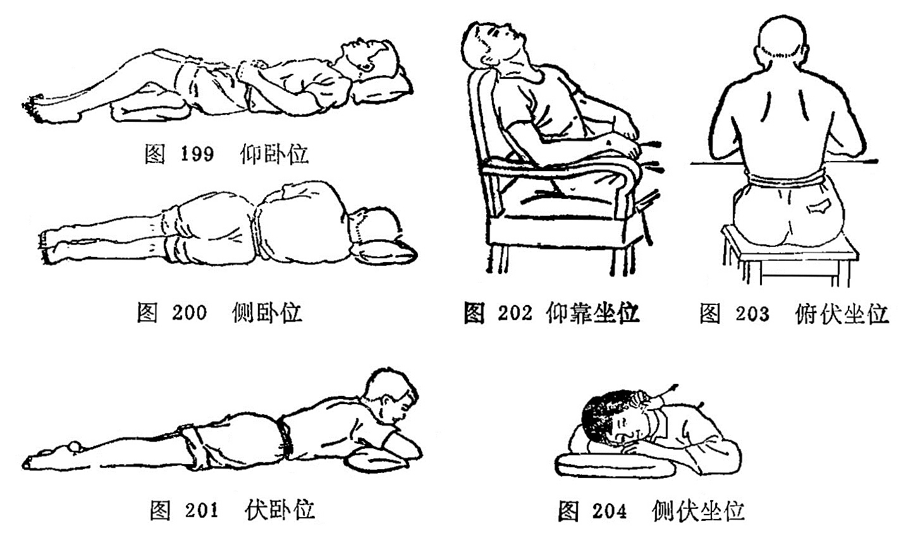
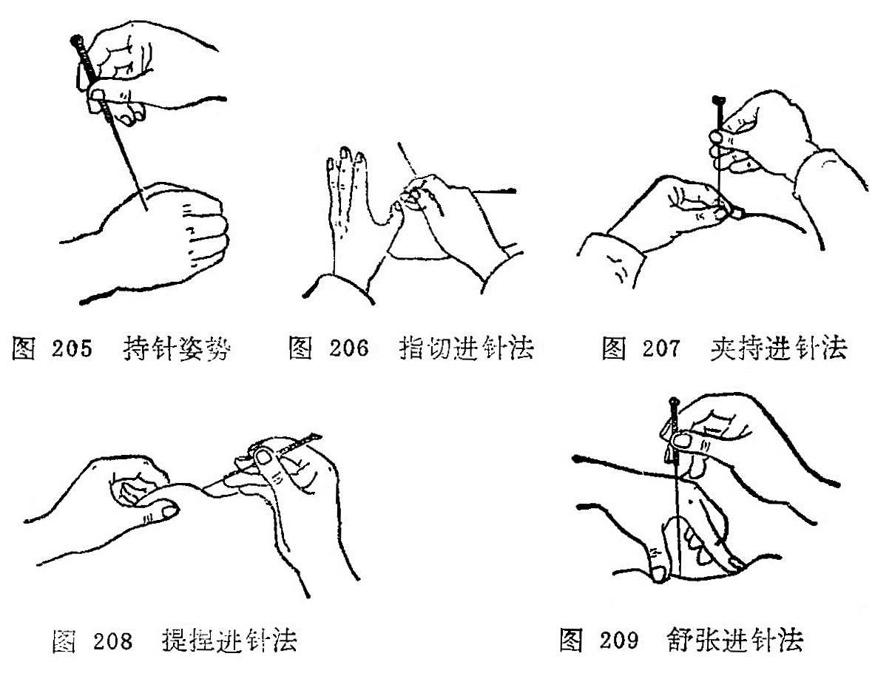
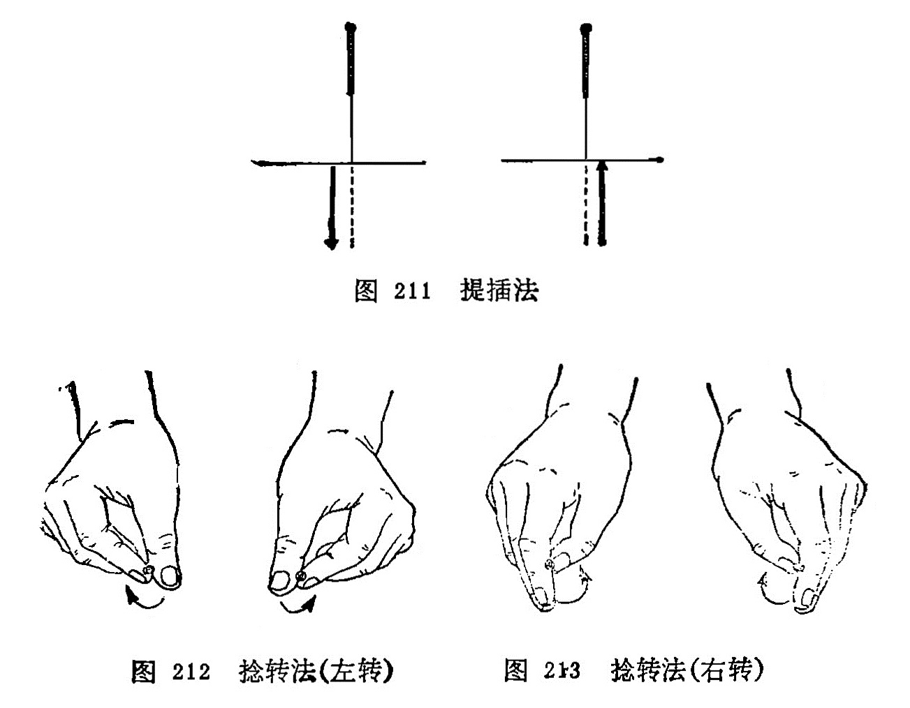
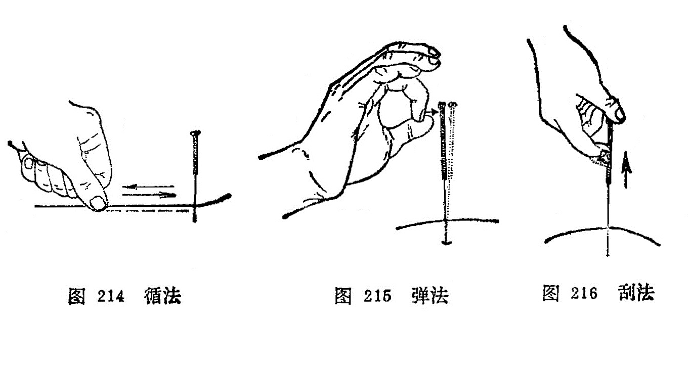
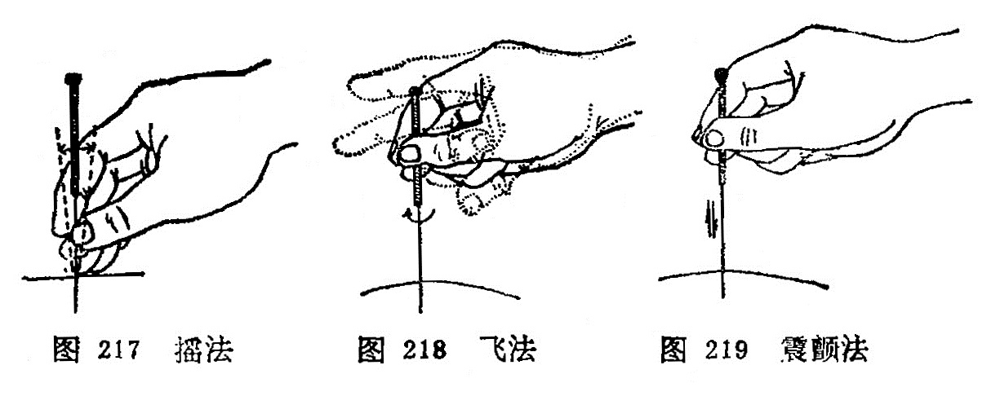
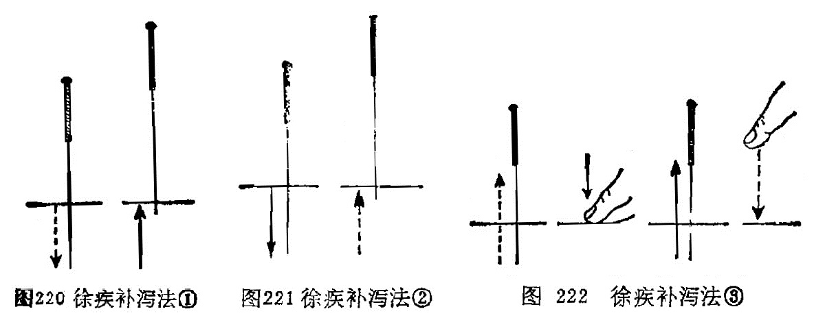

# 中篇 针灸术

针法和灸法，是针灸临床治疗中所必须掌握的基本技能，在针灸医学中占有极重要的地位。历代针灸医家，对此曾积累了极为丰富的实践经验和理论基础。针法和灸法的种类很多，本篇介绍常用的针灸法，包括毫针、灸法（附：拔罐法）、三棱针、皮肤针、皮内针、火针、水针、埋线、耳针、头针以及针刺麻醉等。 

# 第一章 毫针

[TOC]

〔自学时数〕    8 学时

〔面授时数〕    2 学时

〔目的要求〕
1. 了解九针的名称、形状及用途。
2. 了解毫针的构造和规格。
3. 掌握针刺前的准备。
4. 掌握毫针的刺法，包括进针、留针、出针等全部操作，并重点掌 握捻转、提插、疾徐等补泻手法。
5. 熟悉进针的角度、深度和得气的意义。
6. 熟悉候气、催气，行针等操作方法。
7. 掌握针刺异常情况的预防和处理。
8. 熟悉针刺注意事项。

## 第一节 毫针的基本知识

近代的毫针，是从古代的九针基础上发展而来。不仅制针的质料有金、银、不锈钢等不同，而且制针的工艺和形状亦有很大 改进。现将九针及近代毫针分述如下：

### 一、九针

从砭石发展到九针，这时才有正式的针法，在《灵枢·官针》篇中说："九针之宜，各有所为，长短大小，各有所施。”说明九种不同形状的针具各有不同的用途，在针灸医学发展上起了很大作用（图196）。

图196 古代九針圖

**（1）镵针**

形状：长一寸六分，形似箭头，头大末锐，当末端一分处收小，形成尖端，后人有称为"箭头针”。近人在此基础上发展为皮肤针。

用途：浅刺皮肤而不能深入，用于浅刺皮肤泻血，治头身热症等。

**（2）圆针**

形状：长一寸六分，针身圆柱形，针头卵圆，后人有称为“圆头针”。

用途：揩摩体表，治分肉间气滞，不伤肌肉。为按摩用具。

**（3）鍉针**

形状：长三寸半，针头如黍粟形，圆而微尖，近人有称为 "推针”。

用途：按压经脉，不能深入（按脉勿陷）为按压穴位的用具。	

**（4）锋针**
形状：长一寸六分，针身圆柱形，针尖锋利，呈三棱锥形，后人称为三棱针。

用途：用于泻血，治疗痈肿、热病。

**（5）铍针**	

形状：长四寸，宽二分半。形如剑，后人有称为剑头针。

用途：痈肿外症割治用。

**（6）圆利针**

形状：长一寸六分，末端尖锐，中部略膨大，针身反细小圆而且利。

用途：痈肿、痹证的深刺。

**（7）毫针**

形状：长一寸六分或三寸六分，针身细如毫（豪）毛。

用途：通调经络，治寒热、痛痹等。

**（8）长针**

形状：长七寸，针身细长而尖部锋利。后人称为环跳针，近人又称为芒针。

用途：深刺，治“深邪远痹”。

**（9）大针**

形状：长四寸，针身粗圆。

用途：泻水，“取大气之不能过于关节者”，治关节积液，后人有作火针用，治瘰疬、乳痈等症。

### 二、毫针的构造、规格和保藏

#### （一）毫针的构造和规格

1．毫针的构造：毫针是针刺治病的主要针具，临床上应用最广。制针的原料以不锈钢为主，但也有金、银或合金制成的。

毫针的构造可分为五个部分（图197）。

图197 毫针的构造

（1）针尖：针的尖端锋锐部分称针尖，亦名针芒。其状似松针，是接触腧穴刺入机体的前锋。

（2）针身：针尖与针根之间称为针身。针身宜光滑挺直，富有弹性。

（3）针根：针身与针柄连接处称为针根。

（4）针柄：手持处称针柄。是以铜丝或铝丝将针的一端呈螺旋形的紧密缠绕而成，是持针着力部分。

（5）针尾：针柄的末端称针尾。一般是用铜丝或铝丝横行缠绕呈圆筒状，是温针装置艾绒的部分。

2．毫针的规格：主要是指针身的粗细和长短。目前所用毫针的长短、粗细规格分别如表9、10。

表9、毫针的长短规格

| **寸** | 0.5  | 1    | 1.5  | 2    | 2.5  | 3    | 3.5  | 4    | 4.5  | 5    |
| ------ | ---- | ---- | ---- | ---- | ---- | ---- | ---- | ---- | ---- | ---- |
| 毫米   | 15   | 25   | 40   | 50   | 65   | 75   | 90   | 100  | 115  | 125  |

表10、毫针的粗细规格

| 号数         | 26   | 27   | 28   | 29   | 30   | 31   | 32   | 33   | 34   | 35   |
| ------------ | ---- | ---- | ---- | ---- | ---- | ---- | ---- | ---- | ---- | ---- |
| 直径（毫米） | 0.45 | 0.42 | 0.38 | 0.34 | 0.32 | 0.30 | 0.28 | 0.26 | 0.23 | 0.22 |

临床上以28〜30号粗细和1〜3寸长者最为常用。短针多用于耳穴及体穴浅刺，长针多用于肌肉丰厚部位腧穴的深刺。

3．毫针的修藏：毫针的修藏是指对针具的维修和保藏。保藏针具，是为防止针尖受损、针身弯曲或生锈、污染等。藏针的器具有针盒、针管和藏针夹等。使用针盒藏针时，在盒内多垫几层消毒纱布，将消毒后的针具，根据毫针的长短分别置于盒内， 再用消毒纱布敷盖，以免污染，然后将针盒盖好备用。使用藏针夹藏针时，针夹两侧要放有硬纸板（防止针身弯曲），夹内放多层消毒纱布，放入消毒后的针具，然后合上针夹备用。使用针管藏针时，针管的一端放入干棉球（以防针尖损坏钩曲），然后将针置入，盖好备用。

针是治病的工具，在使用过程中，应随时注意针尖是否有钩曲或过钝，针身是否有弯曲等。若针身弯曲，针尖过钝或有钩曲，不仅直接影响进针，而且使病人感到刺痛，影响治疗效果。
因此对针具应随时检查，经常维修，现将针具的检修方法介绍如下：

（1）针身的检修：检修时应注意针身有无锈蚀，急弯或一般弯曲。若一般弯曲可用手指或竹板夹住针身，将针身捋直。若属急弯，针身有锈蚀，一般剔之不用，以免折针。同时也应检查针 柄与针身是否衔接牢固，形成一体，如针身与针柄接触不牢，则不宜应用。

（2）针尖检修：检修时应注意针尖有无钩曲，针尖钝和针尖偏斜。若针尖不正、有钩、过钝时，可用细砂纸或细磨石磨好， 使针尖正直光滑，圆而不钝，利而不锐，过锐则易弯成钩，过钝则易痛，应磨成如松针形为宜。

### 〔临床应用〕

近代的毫针就是在九针的基础上发展起来的，不论是从结构上，规格上渐趋精巧，便于临床应用。了解毫针的结构和规格之后，一方面便于毫针的检查，另一方面便于临床选用不同规格的 毫针，选针适当，便于不同穴位的针刺，才能提高疗效，防止意外事故的发生。毫针的修藏，主要是延长针具的使用寿命和防止针刺的疼痛以及意外事故的发生有一定作用。

### 复习思考题
1. 针的名称和用途是什么？
2. 针的构造、规格是什么?哪些规格的针临床治疗时最常用？
3. 针如何维修和保藏？

答：
1. 分類
2. 阿是

## 第二节 针刺练习

针刺练习，主要是对指力和手法的锻炼。为了达到针刺的治疗目的，不使病人增加痛苦，就要熟练掌握进针和进行各种手法的操作。由于毫针针身细软，要把毫针刺入肌肤内，没有一定的指力是不行的。指力只有通过练习才能掌握，所以练习指力是初学针刺者的重要基本技能训练。指力是进针顺利，减轻疼痛，提高疗效的基本保证。对初学者在临床操作之前，首先要有练习指力的过程。

### 1．纸垫练针法：

用松软的纸张，折迭成长约8厘米，宽约5厘米，厚约2〜3厘米的纸块，用线如“井”字形扎紧，做成纸垫，练针时左手执纸垫，右手拇、食、中三指持针柄，如持笔状 地持1. 0〜1. 5寸毫针，使针尖垂直地抵在纸块上，然后右手拇指与食中指前后交替地捻动针柄，并逐渐加一定的压力，待针穿透纸垫后另换一处，反复练习。纸垫练习主要是锻炼指力和捻转的基本手法（图198）。

### 2．棉团练针法：

用布将棉花包裹，用线封口扎紧，做成直径 约6〜7厘米的棉团，练针方法同纸垫练针法，所不同的是棉团松软，可以做提插、捻转等多种基本手法的练习（图198）。

在进行练针时，要做到捻转的角度大小，捻转的速度，可以随意掌握，来去的角度力求一致，快慢均匀。在这一过程中也可配合上下提插的练习，一般总的要求是提插幅度，上下一致，捻转角度来去一致，频率的快慢一致，达到得心应手，运用自如。但纸垫或棉花团与人体有一定的差异，为了体验不同的针刺手法所产生的不同作用，最好在自己身上进行练针，以便临床针刺施术时，心中有数，提高针刺手法水平。

### 〔临床应用〕

针刺练习是掌握针刺技术的基本功之一。练针就是练习指力，所谓指力包括手指的力量和手腕力量的两个方面，握针靠手指的力量，进针靠手腕的力量，手指和手腕这两个力量要配合好，才能把又细又软的毫针刺入穴位内，进针即顺利又能减少疼痛，操作灵活自如。所以初学者在针刺之前，必须加强指力的锻炼，刻苦练习指力，才有针刺的基本功。练针除了练指力外，还要练习进针的角度和深度，才能掌握针刺治疗时的要求，既能提高治疗效果，又能防止意外事故的发生，所以练针是初学者不可缺少的基本功。

### 复习思考题
1. 练针的意义及目的何在？
2. 样进行针剌练习？

答：
1. 分類
2. 阿是

## 第三节 针刺前的准备

### 一、选择针具

对针具的选择，现在多选用不锈钢所制针具，因不锈钢不仅能防腐蚀、能耐热，而且具有一定的硬度、弹性和韧性。金质和银质的针，弹性较差，价格昂贵，故临床较少应用。从质优的毫 针中应选择针柄无松动，针身挺直光滑，坚韧而富有弹性，针尖圆而不钝，利而不锐，呈松针形者为好。如针身有缺损和伤痕者，应剔出不用，以免在针刺施术过程中，给病人造成不必要的 痛苦。

在选择针具时，除应注意上述事项外，在临床上还应根据病人的性别、年龄的长幼、形体的胖瘦、体质的强弱、病情的虚实、病变部的表里深浅和所取穴位的具体部位，选择长短、粗细适宜的针具。《灵枢·官针》说：“九针之宜，各有所为，长短大小，各有所施也”。如男性，体壮、形肥、病变部位较深者，可选稍粗、稍长的毫针。反之若女性、体弱、形瘦，而病变部位较浅者，就应选用较短、较细的毫针。至于根据腧穴所在具体部位迸行选针时，一般是皮薄肉少之处和针刺较浅的腧穴，选择针具宜短而针身宜细；皮肤厚肌肉多而针刺宜深的腧穴，宜选用针身稍长和稍粗的毫针。在临床选针的长短时，除刺入的深度外，针身还应露出皮肤表面3〜5分为宜。 

### 二、解释工作

在临床上医生给初诊病人针刺时，应耐心的向病人解释针刺的一般常识，减少病人对针刺的恐惧心里，从而取得病人的积极配合，以便更好的发挥针刺的治疗作用，并可避免针刺异常情况的发生。

### 三、选择体位

为了使病人适应针灸施术，针刺前应根据所选的腧穴，指导病人选择适当的体位。病人体位选择是否得当，对腧穴的正确定位，针刺的施术操作，持久的留针，以及防止晕针、滞针、弯针，折针等；都有很大影响，如病重体弱或精神紧张的病人，采用坐位，易使病人产生疲劳，往往易发生晕针。又如体位选择不当，在针刺施术时或在留针过程中，病人常因移动体位而造成弯针、滯针甚至发生折针事故。因此说选择体位具有重要意义。

#### （一）选择体位的一般原则
1. 选择体位应该是以医生能正确取穴，操作方便，患者体位舒适，并能持久为原则。	
2. 在可能条件下，一种体位能暴露出针灸处方所列的腧穴。
3. 一般可采取卧位，尤其是精神不好，或精神过度紧张，体质虚弱的患者最好采取卧位，防止晕针或其他事故。
4. 在比较冷的条件下，应采取少暴露皮肤面上的穴位，以防受凉或感冒。

#### （二）临床常用体位
临床常用体位一般以卧位和有倚靠的坐位为主，分述如下：
1. 仰卧位：适用于取头、面、胸、腹部腧穴，和上、下肢的部分腧穴（图199）。
2. 侧卧位：适用于取身体侧面少阳经腧穴和上、下肢的部分腧穴（图200）。
3. 伏卧位：适用于取头、项、脊背、腰尻部腧穴和下肢后面的腧穴(图201）。
4. 仰靠坐位：适用于取前头、颜面和颈前等部位的腧穴(图 202）。 
5. 俯伏坐位：适用于取后头和项、背部腧穴（图203）。
6. 侧伏坐位：适用于取头部一侧、面颊及耳前后部位的腧穴（图204）。

总之，患者的体位一定要舒适，取穴准确，医生针灸操作方便可即。

### 四、消 毒

针刺前的消毒工作，包括针具消毒，医者手指消毒，腧穴部位消毒。消毒的方法，可根据具体条件选用以下方法。

#### （一）针具消毒

可根据具体条件选用下列消毒方法：

1．压消毒法：将针具修好后，用纱布包好，放在针盒内，置于高压消毒锅内，一般需要在15磅气压，温度应达120℃，消毒时间应为15分钟以上，即达到消毒的目的。

2．沸消毒法：将针具修检好后用纱布包好，放置在清水锅内，待水沸腾后，再煮15分钟即可。为了提高沸点，应在水中加入重碳酸钠，使之成为2%的溶液，可以提高水的沸点达120℃， 并且有减低沸水对针具的腐蚀作用。

3．物消毒：将修好的针具置于75%酒精溶液内，浸泡30分钟即可达到消毒要求。亦可用0.1%的新洁尔灭浸泡并加防腐剂 0.5%浓度的亚硝酸钠，浸泡30分钟即可达到消毒作用。取出后用消毒纱布擦干，放在消毒的针盒内备用。还可用2%来苏溶液或1:1000的升汞溶液浸泡1〜2小时后应用。对某些传染性疾患者，应做到一针一穴，一次性使用。

总之，不管哪种消毒方法，只要达到消毒要求即可。

#### （二）医者手指消毒

在施术前，医者先用肥皂水将手洗刷干净，待干后再用75%酒精棉球擦拭即可。施术时医者应尽量避免手指直接接触针体，如必须接触针体时，可用消毒干棉球作间隔物，以保持针身无菌，以免感染。

#### （三）施术部位消毒

在患者需要针刺的腧穴部位消毒时， 可用75%酒精棉球拭擦即可。在拭擦时应由腧穴部位的中心向四周绕圈拭擦。或先用2%碘酒棉球拭擦，然后再用75%酒精棉球涂擦脱碘消毒，当穴位消毒后，切忌接触污物，以免重新污染。

### 五、医者的态度

医者的态度是整个治疗工作中的关键问题，首先要有急病人之所急，痛病人之所痛这种感情，全心全意为患者服务，只有医生关心病人，病人才能相信医生，这种医患合作，有利于病人战胜疾病的信心。这就要求医生要有严肃的态度，精神要集中，专心一意的为患者治疗，尽到医生的职责。《灵枢·九针十二原》："祖守形，上守神”。在患者方面也必须树立针灸治疗的信心，对疾病要有战胜的决心，这要医生帮助树立。只有调动医生、患者两个方面的积极性，才能收到满意的治疗效果。

### 〔临床应用〕

临床上应用的针具，都应选择优质的针，而劣质的针具应剔除不用。在选择毫针的粗细、长短时，要根据患者的性别、年龄、形体、体质、虚实、表里来进行选择。凡是体质壮实，肌肉丰满，实热证选择粗针长针；凡体质虚弱，肌肉瘠薄，虚寒证选择细针短针。否则就会影响针灸的治疗效果。消毒也是针刺治疗中很重要的环节，针具和腧穴部位消毒要彻底就会防止感染，有 利于患者身体健康。体位的选择要根据疾病的诊断、处方中的腧穴来选择，选择的体位应该是以医者能正确取穴，操作方便；患者又感到舒适持久为原则，以免引起疼痛或弯针、断针等异常情况的出现。

### 复习思考题
1. 针刺前要做哪些准备工作？
2. 用高压气锅消毒针具需要多大压力?多高温度？多长时间？
3. 煮沸消毒针具，应煮沸多长时间?为了提高沸点，应采取什么措施？
4. 针刺消毒包括哪些方面?常用的消毒方法是什么？
5. 常用的针灸体位有几种?各适用于针灸哪些穴位？

答：
1. 分類
2. 阿是

## 第四节 毫针刺法

毫针刺法有着很高的技术要求和严格的操作规程，医生必须掌握从进针到出针这一系列的操作技术。

### 一、进 针

把针刺入皮肤内就是进针。进针是针刺操作的基本手法。在进行针刺操作时，一般均须双手协作，互相配合，才能把针迅速刺入皮肤。正如《流注指微论》中指出:“针入贵速，即入徐进"。持针施术的手称"刺手”；按压穴位局部，帮助施术的手称为“押手”。《针经指南·标幽赋》指出：“左手重而多按，欲令气散；右手轻而徐入，不痛之因”。刺手就是拿针的手，一般习惯都称右手为刺手（图205）。持针的方法是根据治疗的需要来决定的，常用持针方法有以下四种：

1．执笔式持针法：一般用右手拇食指挟持针柄，中指抵住针身，进针时帮助着力，防止针身弯曲，使着力点集中到针尖上进行针刺。

2．拇食指持针法：右手拇食二指持住针柄，进行针刺。

3．拇中指持针法：右手拇中二指持住针柄，进行针刺。

4．拇食，中指持针法：右手拇中二指持住针柄，食指放在针尾上，稍再力下压，帮助进行针刺。

剌手的作用：是掌握针具，进针时运用指力，使针尖迅速刺透皮肤，掌握进针的角度、方向、深度、刺激的强度，便于对身体不同部位腧穴的针刺，行针时进行适当的捻转、提插等手法进行施术。

押手就是辅助施术的手，一般习惯都称左手为押手，是根据腧穴的位置和用针的长短而定。临床常用的进针方法有以下四种：

1．指切进针法：又称爪切进针法，用左手拇指或食指端切按在腧穴位置的旁边，右手持针，紧靠左手指甲面将针刺入腧穴。此法多用于短针的进针。如针刺睛明、球后、内关、足三里等腧穴（图206）。

2．夹持进针法：或称骈指进针法，即用左手拇食二指持捏消毒干棉球，夹住针体下端，将针尖固定在所刺腧穴的皮肤表面位置，右手捻动针柄，将针刺入腧穴。此法是双手配合，适用于长针的进针。如针刺环跳、秩边、殷门等腧穴（图207）。

临床上也有采用插刺进针的，即单用右手拇、食二指夹持消毒干棉球，夹住针身下端，使针尖露出2〜3分，对准腧穴位置，将针迅速刺入腧穴，然后将针捻转刺入一定深度，并根据需要选  用适当押手配合行针。

3．提捏进针法：用左手拇、食二指将针刺腧穴部位的皮肤捏起，右手持针，从捏起的上端将针刺入。此法主要用于皮肉浅薄部位的腧穴进针，如印堂、阳白、水沟、地仓等腧穴（图208）。

4．舒张进针法：用左手拇、食二指将针刺腧穴部位的皮肤向两侧撑开，使皮肤绷紧，右手持针，使针从左手拇、食二指的中间刺入。此法主要用于皮肤松弛部位的腧穴，如中脘、关元、 归来、四满等腧穴(图209）。

押手的作用：正如《难经·七十六难》指出：“知为针者信其左，不知为针者信其右”。这说明在针刺时不能单靠右手，左手帮助进针时起着很重要作用。其作用一般可分为以下四种：

1．可以固定穴位，使进针时不移动位置，准确刺入腧穴， 避开脏器器官和血管。

2．可以帮助进针时的指力，使针不致于弯曲。

3．可以减少进针时的疼痛，压则气散，不伤营卫，缓解肌肉紧张。正如《标幽赋》中记载：“左手重而多按，欲令气散；右手轻而徐入，不痛之因”。这是窦汉卿总结前人的经验，直到今天，仍为针灸临床广泛采用。

4．可以加强针刺的作用，提高治疗效果。即“欲气上行，按之在后，欲气下行，按之在前”，可使针感按临床治疗的要求去传导，趋向病所。

除上述的进针方法外，还有采用针管进针的，即备好玻璃或专属制成的针管，针管长度要比毫针短2—3分，以便露出针柄，针管的直径以能顺利通过针尾为宜，进针时左手持针管，将针裝入管内，针尖与针管下端平齐，置于应刺的腧穴上，针管上端露出针柄2〜3分，用右手食指叩打针尾或用中指弹击针尾，即可使针刺入，然后退出针管，再运用行针手法进行操作。

### 二、针刺的角度和深度

在针刺操作过程中，掌握正确的针刺角度、方向和深度，是增强针感，提高疗效，防止意外事故发生的重要环节，腧穴定位的正确，不应仅限于体表的位置，还必须与正确的进针角度、方向、深度等有机的结合起来，才能充分发挥其应有效应。临床上同一腧穴，由于针刺的角度、方向、深度不同，所产生针感的强弱、感传的方向和治疗效果常有明显的差异。正确掌握针刺角度、方向和深度，要根据施术腧穴所在的具体位置，病人体质，病情需要和针刺手法等实际情况，灵活掌握，现分述如下：

#### （一）针刺角度

针刺的角度是指进针时针身与皮肤表面所构成的夹角。它是根据腧穴所在的位置和医者针刺时所要达到的目的结合而定。一般分为直刺、斜刺、平刺三种(图210）。

1．直刺：即针身与皮肤表面呈90°角垂直刺入。此法适用于肌肉丰厚处的腧穴或腹部的腧穴，如臀部、腹部及四肢等部位的腧穴。

2．斜刺：即针身与皮肤表面呈45°角倾斜刺入。此法适用于肌肉较薄处或内有重要脏器的部位，如胸、背、骨间隙等部位的腧穴。

3．平刺：又称“横刺、沿皮刺"即针身与皮肤表面呈15°角沿皮刺入。此法适用于肌肉特别浅薄处，如头、胸部位的腧穴，有时在透穴刺法时也用这类针刺角度。

#### （二）针刺深度
针刺深度是指针身刺入皮肉内的深度而言。一般以既有针感又不伤及重要脏器为原则。《素问·刺要论》指出：“病有沉浮，刺有深浅，各至其理，无过其道”。每个腧穴的针刺深度，在腧穴各论中已有详述，在此仅根据下列情况，作原则的介绍。

1．年龄：年老体弱及小儿娇嫩之体，宜浅刺；中青年身体强壮，气血旺盛者，宜深刺。如《灵枢·逆顺肥瘦》：“婴儿，瘦人，浅而疾之，壮士肥人，深而留之”。

2．体形：体壮的胖人，肌肉丰盛者，针刺应深些；体形瘦小，肌肉不那么丰满者，针刺应浅些。如《素问·三部九候论》 说：“必先度其形之肥瘦，以调其气之虚实”。

3．部位：头面及胸背部和皮薄肉少处的腧穴，宜浅刺；四肢及臀、腹部和肌肉丰满处的腧穴，宜深刺，《针灸聚英·附辨》：“若肌肉厚实处则可深，浅层则宜浅”。

4．病情：病在表、阳证、新病者针刺应浅些；病在里、阴证、久病者针刺应深些。如《素问·刺要论》说：“病有沉浮，刺有浅深”。

综上所述，针刺的角度和深度之间，有着相辅相成的密切关系，一般来讲，深刺多用直刺，浅刺多用斜刺或平刺。尤其对天突、哑门、风府、风池以及眼区、胸背部腧穴和重要脏器如心、肝、肺等部位的腧穴，要掌握好针刺的角度和深度。至于不同季节、对针刺深浅也有影响，也应予以重视。

### 三、行针与得气

行针亦称运针，是指将针刺入腧穴后，为了使之得气，激发针感以及进行补泻而施行的各种针刺手法。得气又称针感，是指针刺入穴位后所产生的经气感应。当这种经气感应产生时，患者感到针下出现相应的痠、麻、胀、重感，或抽搐，有的也出现温热、凉爽、烧灼、触电样感，在针刺的局部或从针下向远端放散。医者则有针下沉紧、沉涩、沉重感觉，如同磁铁吸引针一样。所以《标幽赋》说道：“气之至也，如鱼吞钩饵之沉浮”。又说“沉涩紧而已至”。说明医者有沉紧、沉涩、沉重感觉，即是得气。起到疏通经气、调和气血的作用。如果针刺不得气，患者则没有什么感觉，而医者感到针下虚滑，如同针刺豆腐一样的感觉。《标幽赋》描写道：“轻滑慢而未来”，“气未至也，如闲处幽堂之深邃”。说明针与“经气”没有沟通。

从针刺治病和针刺麻醉以及经络感传研究的实践证明，针感的有无及强弱，直接关系到治疗效果的好坏。因此，古今医家都很重视针刺的得气，《灵枢·九针十二原》指出：“为刺之要，气至而有效。效之信，若风之吹云，明乎若见苍天”，《金针赋》说：“气速至而效速，气迟至而不治”。这都说明得气与否，是治疗成败的关键。一般来说，得气迅速，疗效就好；得气迟缓，疗效就差，如不得气，则可能无效。因此，在针刺过程中，如果得气较慢，甚至不得气，就要分祈不得气的原因。或因取穴定位不准确，手法运用不当；或因针刺角度有误，深浅失度。对此就应重新调整腧穴的针刺部位、角度、深度，运用必要的针刺手法，这样再次行针时，一般即可得气。如果患者病久体虚，正气虚惫，以致经气不足；或因其他病理因素，感觉迟钝、丧失而不易得气时，可采用行针催气，或留针候气，或用温针，或加艾灸，以助经气的来复，而促使得气，或因治疗而随着疾病转愈，而经气逐渐得到恢复，针刺时则迅速得气。若用上法而仍不得气者，多为脏腑经络之气虚衰已极。正如《针灸大成·经络迎随设为问答》中说：“只以得气为度，如此而终不至者，不可治也”。对此，当考虑配合或改用其他治疗方法。	

现将临床常用的行针基本手法和辅助手法介绍如下：

（一）行针基本手法
行针基本手法，是针刺基本动作，常用的有提插法和捻转法两种。	

1．提插法：是将针刺入腧穴的一定深度后，使针在穴内进行上、下进退的操作方法。使针从浅层向下刺入深层为插；由深层向上退到浅层为提（图211）。提插的幅度大、频率快、操作时间长，则刺激量大；提插幅度小、频率慢，操作时间短，则剌激量小。应根据病人的体质、病情和腧穴的部位以及医者所要达到的目的而灵活掌握。但不能提插幅度过大，使深部组织受损害， 以提插幅度3〜5分深为宜。

2．捻转法：是将针刺入腧穴的一定深度后，将针左右来回旋转捻动的操作方法（图212、213）。捻转的角度大，频率快， 操作时间长，则刺激量大；捻转的角度小，频率慢，操作时间短， 则刺激量小。应根据病人的体质、病情和腧穴的部位特征以及医者所要达到的目的而灵活运用。但捻转角度不要超过360°，更不能向一个方向捻转，即顺时针或逆时针捻转180°为宜。否则针身缠绕肌纤维而发生疼痛。

以上两种基本手法，既可单独使用，也可互相配合应用，在临床上必须根据病人的具体情況，灵活掌握，才能发挥其应有作用。

(二)行针辅助手法
是进行针刺时，用以辅助行针的操作方法。常用的有以下几种：	

1．循法：是以左手或右手于所针刺腧穴的周围或沿经脉的循行部位轻轻地循按的方法（图214）。此法在未得气时用之，可以通气活血，有行气、催气之功。

2．弹法：是将针刺入腧穴的一定深度后，以手指轻弹针柄，使针体微微震动，以加强针感（图215）。《针灸问对》说：“如气不行，将针轻轻弹之，使气速行，……故曰弹以催气“。

3．刮法：是将针刺入腧穴的一定深度后，用拇指或食指的指腹抵住针尾，以拇指、食指或中指爪甲，由下而上的频频刮动针柄的方法（图216）。此法在不得气时，用之可激发经气，促使得气或者加强针感和促使针感的扩散。

4．摇法：是将针入腧穴的一定深度后，手持针柄进行摇动，可以行气（图217）。若直立针身而摇，可以加强针感；卧倒针身而摇，往往可以促使针感向一定方向传导。

5．飞法：是将针刺入腧穴的一定深度后，以捻转为主，一般将针先作较大幅度的捻转，然后松手，拇、食指张开，一捻一放，反复数次，如飞鸟展翅之状，可以使针感增强（图218）。《医学入门》说：“以大指、次（食）指捻针，连搓三下，如手颤之状，谓之飞。”

6．震颤法：是将针刺入腧穴的一定深度后，右手以拇、食、 冲三指挟持针柄，用小幅度、快频率的提插捻转动作，使针身产生轻微的震颤，以增强针感（图219）。

### 四、针刺补泻

针刺补泻，是根据《灵枢·经脉》：“盛则泻之，虚则补之， 寒则留之，陷下则灸之”的理论确定的两种不同的治疗原则和方法，是针刺治疗当中很重要的一个环节，针刺的补泻就是通过补泻手法来实现的。《千金方》说：“凡用针之法，以补泻为先”。《灵枢·九针十二原》说“虚实之要，九针最妙，补泻之时，以针为之。”补泻是毫针刺法的核心内容。	

补法：凡是能鼓舞人体正气，使低下的功能恢复旺盛的方法。泻法：凡是能疏泄病邪，使亢进的机能恢复正常的方法。针刺补泻都是通过针刺腧穴，激发经气来调节脏腑功能，促进阴阳平衡而恢复健康。

所谓经气，即经络之气。《灵枢·终始》说："凡刺之道，气调而止。”可见针刺治病，关键在于调气。	

大量临床实践和科学实验证明，针刺补泻效果的产生，主要取决于以下三个方面的因素：

#### （一）机体状态

人体在不同的病理状态下，针刺可产生不同的调节作用，即补泻效果。如当机体处于虚脱状态时，针刺可起到回阳固脱的作用；当机体处于实、热、闭证的情况下，针刺又可以起到泄热启闭的作用。如胃肠痉挛疼痛时，针刺可起到止痉而使疼痛缓解；胃肠蠕动缓慢而呈弛缓时，针刺可以增强胃肠蠕动而使其功能恢复正常。内因是事物发展变化的根据，针刺时 机体的状态是产生针刺补泻效应的主要因素。当然，针刺对机体的这种调节作用，又和机体正气的盛衰有着密切的关系。如机体正气旺盛，经气易于激发，针刺调节作用就显著；如果机体正气不足，经气不易激发，则针刺调节作用就较差。所以《灵枢·终始》说：“谷气至者，已补而实，已泻而虚。”

#### （二）腧穴特性

腧穴的功能不仅具有它的普遍性，而且有些腧穴具有相对的特异性。有些腧穴适宜于补虚，如足三里、关元等具有强壮作用，多用于补虚；而有些腧穴适宜于泻实，如少商、十宣等，具有泻邪作用，多用于泻实。

#### （三）针刺手法

针刺手法是促进人体内在因素转化的条件是实现补虚泻实的重要环节。为了达到补泻的目的，进针以后，往往需要配合运用一定的手法。古代医家在长期的医疗实践中，创造和总结了很多针刺补泻手法。现将临床主要的几种针刺补泻手法介绍如下：

##### 1．提插补泻：

将针刺入穴位得气后，以提插时，针尖上下用力轻重和快慢，时间长短来进行补泻的一种方法。

补法：针刺得气后，先浅后深，重插轻提，提插的幅度小， 频率慢，操作时间短者。	

泻法：针刺得气后，先深后浅，轻插重提，提插的幅度大， 频率快，操作时间长者。

##### 2．捻转补泻：

将针刺入穴位得气后，以针身左右旋转进行补泻的一种方法。

补法：针下得气后，捻转角度小，用力轻，频率慢，操作时间短者。

泻法：针下得气后，捻转角度大，用力重，频率快，操作时间长者。

此外，也有以左转时角度大，用力重者为补；右转时角度大，用力重者为泻。

##### 3．疾徐补泻：

将针刺人穴位得气后，以进出针的快慢（疾徐）为基础的一种补泻方法。

补法：进针时徐徐刺入，少捻转，疾速出针者。

泻法：进针时疾速刺入，多捻转，徐徐出针者（图220、221、222）。

##### 4．开阖补泻：

是根据出针后，揉按针孔与否，依针孔的开闭为补泻的方法。

补法：出针后迅速揉按针孔。

泻法：出针时摇大针孔而不立即揉按。

##### 5．迎随补泻：

必须分辨经脉循行的顺逆与针刺的进针方向进行补泻的一种方法。

补法：进针时针尖随着经脉循行方向，顺经而刺。

泻法:进针时针尖逆着经脉循行方向，逆经而刺。

##### 6．呼吸补泻：

以进针、出针的时间，结合病人的呼吸分补泻的一种方法。

补法：当患者在呼气时将针刺入，吸气时出针。

泻法：当患者在吸气时将针刺入，呼气时出针。

##### 7．平补平泻：

进针得气后均匀地提插、捻转后即可出针。

以上各种手法，临床上可以相互配合使用。此外还有如下的复式手法：

##### 1．烧山火：

有补的作用，用于治疗寒证、虚钲、阴证。《针灸大成》：“烧山火能除寒，三进一退热涌涌，鼻吸气一口呵五口。"又说：“烧山之火能除寒，一退三飞病自安，始是五分终一寸，三番出入慢提看。”

操作：将针刺入应刺深度的上1/3 (天部)，得气后行捻转补法，再将针刺入腧穴中1/3 (人部），得气后行捻转补法，然后将针刺入腧穴下1/3 (地部），得气后行捻转补法，即慢慢地将针提到上1/3，如此反复操作3次，即将针紧按至地部留针。在操作过程中，或配合呼吸补泻法中的补法，即为烧山火法（图223）。

##### 2．透天凉：

有泻的作用，用于治疗热证、实证、阳证。《针灸大成》：“透天凉能除热，三退一进冷冰冰，口吸气一口，鼻出五口”。

操作：将针刺入腧穴应刺深度的下1/3 (地部)，得气后行转泻法，再将针紧提至中1/3 (人部），得气后行捻转泻法，然后将针提至上1/3 (天部），得气后行捻转泻法，将针缓慢地按至下1/3，如此反复操作3次，将针紧提至上1/3即可留针。在操作过程中，或配合呼吸补泻法中的泻法，即为透天凉法（图224）。

##### 3．阳中隐阴：

有先补后泻作用，用于治疗先寒后热，虚中夹实。《针灸大成》：“阳中隐阴，能治先寒后热，浅而深”。"阳中有个阴，先寒后热人，五分阳九数，一寸六阴行。”

操作：将针进入天部浅层，向左捻转九次，然后插入地部深层，向右捻针六次，提回天部浅层，以便重复操作如前。

##### 4．阴中隐阳：

有先泻后补作用，用于治疗先热后寒，实中夹虚。《针灸大成》：“阴中隐阳，能治先热后寒，深而浅。”

操作：将针进入地部深层，将针向右捻针六次，然后将针提至天部浅层，又向左捻九次，亦将针插入地部，以便重复操作。

### 五、留针与出针

#### （一）留针
将针刺入腧穴行针施术后，使针留置在穴内， 以加强针感和针的持续作用，或者便于行针施术。留针与否和留针时间长短，应根据病情而定。一般的病症，针刺得气后，补泻操作完毕即可出针，或酌情留针10〜20分钟，留针期间每隔几分钟要行针1次。但对一些特殊病症，如急性腰痛、破伤风、角弓反张、寒性、顽固性疼痛或痉挛性病症，可适当延长留针时间， 有时留针可达数小时，以便在留针过程中作间歇性行针，以增强巩固疗效。若不得气时，留针还能起到候气作用。

#### （二）出针
在行针施术或留针后即可出针。出针时，左手持消毒棉球按住针孔周围皮肤，右手持针柄轻捻轻提，边捻边退到皮下，然后将针起出，并用消毒棉球按压针孔，防止出血。若用疾徐、开阖补泻时，则应按各自的操作要求，将针起出。《流注指微论》说：“出针贵缓，急则多伤。”但要保持针孔清洁，防止感染。出针后病人应休息片刻方可活动，医者应检查针数，防止遗漏。

### 〔临床应用〕	

针刺效果的优劣，决定于针刺手法，因此临床必须掌握：

#### 1．针刺角度与深度：

根据全身不同部位的腧穴，病情需要以及患者的年龄、体形、体质等具体情况来决定针刺的角度和深度，以便达到治疗目的又不损伤脏器为原则。《素问·刺要论》说：“病有浮沉，刺有浅深。”《素问·调经论》又说：“病在脉调之血；病在血调之络；病在气调之卫；病在肉调之分肉；病在筋调之筋；病在骨调之骨。”指出邪气侵入机体后的病位不同，针刺治疗就应该有深有浅。欲使针感传入病区，就必须掌握针刺的角度和方向，只有针刺角度和深度适宜，才能达到预期的治疗效果。

#### 2．得气：

针刺之法，不论是补是泻，其关键是一个“气”字，气至而有效。在针刺当中怎样得气?首先就要明确诊断，确定属经。因经脉本身有“经脉所过，主治所在”的功能，同时又有所属脏腑和症候，所以临床必须运用以症定经，以经治病，只有把属经搞清楚，才能选穴准确，不失其经，才能激发失调的经气，使经气进入病所。其次是分清虚实，适当刺激。得气的快慢、强弱、除手法因素外，也取决于机体的强弱，疾病的虚实。针刺要根据不同体质，不同疾病，使刺激量与病、体相适应，才能激发经气，收到“气至而有效”的目的。

怎样控制针感?临床实践证明，针感的传导，有呈带状、有呈片状、有“专经”传、有伞状传，有的麻，有的木等。如果任其自然传导，就不能达到“气速效速”的目的。这就必须研究怎样控制针感，一般可按下述方法控制：

**（1）深度适当，方向准确**：根据穴位不同，采用适宜深度，以引起针感，《内经》说：“已入分肉之间，则谷气出”。掌握深度后，还要注意针刺方向，欲使针感传入病区，就必须使针刺方向斜向病所，达到“气至而有效”的效果。

**（2）阻滞封闭，接经通气**：针感多呈双向性传导，但欲使针感传入病所，可采用按截封闭法，即“欲气上行，按之在后，欲气下行，按之在前"。用关闭法，指力要强，刺手和押手配合要好，即可达到预期的目的。另外，还可以用接经通气的方法，它分首尾相接、沿经针刺，使经气通达全经。

**（3）循经揉按，趋向病所**：适用针下仅局部有针感，不向远处扩散，可通过沿经揉按、叩击，以帮助经气运行，使之趋向病所。

这都是保证针刺得气的关键，只有得气才能发挥针治作用。得气既可激发又可控制，得气的物质基础，可能是机体多种组织如血管、筋肉、神经、元神等功能参与下实现的。

#### 3．针刺补泻：

针刺的效果是通过补泻手法来实现的，而手法则是把穴位和疾病有机的联系起来。譬如说针刺合谷治疗牙痛，合谷是一个穴位，牙痛是一个病症，那么合谷穴怎么能治疗牙痛呢？只能用手法来实现，用补法还是用泻法。补泻手法在机体上是怎样起到治疗作用的呢？这是因为经脉在机体分布循行是有规律的，穴位在经脉线上是固定不变的，是气血集聚的部位。而针刺手法则是通过医生的操作，根据患者的机能状态，虚补实泻，因此手法是可变的。针刺效果就在于使不变的穴位，通过可变的手法（补或泻），来激发经气，活跃气血运行，从而达到调节机体的阴阳平衡，起到治疗疾病，预防疾病，强壮身体的作用。

**补法要领**：先进针提插到天部，留针不动以候气，然后分天、人、地三部提插捻转，每部行九阳数（提插9次，捻转9次)，然后插针到天部，行随济卧针，留针5〜10分钟，为1次操作法；如不出现热感，可同上反复进行2〜3次；最后由上向下刮针9次，留针10呼，以消散针感，快出针，扪闭穴孔。《难经》说:“当补之时，从卫取气”，就是说针刺时先浅后深，向深部要快速重插，捻转指力要轻，顺着经气循行方向刺入，这样使针具占据了容纳经气的空隙，使经气受到“压力”，则必然使经气运行加快、活跃，温度亦随之上升，主观产生热感，达到热补的目的。

**泻法要领**：先进针提插3次到地部，留针不动以候气，然后分地、人、天三部提插捻转，每部行六阴数（提插6次，捻转6次）。然后提到天部，行迎夺卧针，留针5〜10分钟，为1次操作法；如不出现凉感，可同上反复进行2〜3次；最后由下向上刮针6次，留针10呼，以消散针感，慢提针，不闭穴孔。《难经》说：“当泻之时，从营置气”，就是说针刺时先深后浅，向浅部要快速猛提，捻转指力要重，逆着经脉方向刺入，这样必然使穴处造成一个空间，则可容纳更多的经气，使经气本身“膨胀"，结果经气则不活跃，温度亦随之下降，主观产生凉感，达到凉泻的目的。

除上述手法之外，在操作上要把揣、爪、搓、弹、摇、扪、循、捻等方法灵活的结合起来应用，是可以控制针感性质的。如要使麻感变成痠感，在操作上，押手要重按，提插幅度要小，速度要快，捻转角度要大；要使痠变成麻感，在操作上，押手要轻，提插幅度要大，速度要快，捻转角度要小。因痠和麻感分别是烧山火、透天凉的基础针感，痠感加上烧山火的手法操作即产生热感；麻感加上透天凉手法操作即产生凉感。这些操作方法，必须反复练习，因人而施，才能运用自如，提高针刺疗效。

### 复习思考题
1. 何谓刺手和押手？各有何作用？
2. 常用的进针方法有哪几种？如何应用？
3. 针刺得气的临床意义是什么？
4. 何谓行针、得气、催气、候气？
5. 行针基本手法和辅助手法有哪几种？
6. 不得气的原因有哪些？对于不得气者应如何催气？
7. 何谓补泻手法？常用的补泻手法有哪些？它们的操作方法如何？
8. 何谓烧山火、透天凉针法？它们的操作方法如何？
8. 何谓”阳中隐阴、阴中隐阳”针法？它们的操作方法如何？

答：
1. 分類
2. 阿是

## 第五节 异常情况的处理及预防

针刺异常情况，是指在针刺过程中发生的特殊现象，如晕针、滞针、弯针、断针、创伤性气胸、血肿等。针刺治病虽然比较安全，但如操作不慎，疏忽大意，或犯刺禁，或针刺手法不当，或对人体解剖部位缺乏全面的了解，有时也会发生一些不应有的异常情况。如果一旦发生异常情况，医者一定要沉着、冷静，并要及时处理，一般不会造成严重后果。否则将会给患者带来不必要的痛苦，甚则危及生命。现将常见的针刺异常情况分述如下：

### 一、晕针

晕针是针刺过程中病人发生的晕厥现象。

原因：患者在施针时，精神过度紧张，体质虚弱，过度劳累，饥饿，大汗出，大泻后，大失血之后，体位不适以及医生在针刺时手法过重，而至针刺时或留针过程中而发此症。

症状：患者在针刺过程中，突然出现精神疲倦，头目眩晕， 面色苍白，心慌气短，恶心欲吐，冷汗出，四肢厥冷，血压下降，脉象沉细或沉伏。严重者出现神志昏迷，卒然仆倒，唇甲青紫，二便失禁，脉微细欲绝。	

处理：要立即停止针刺，并将已刺之针全部起出，使患者平卧，头部稍低，解开衣扣，并注意保暖，轻者静卧片刻，给以热茶或糖水饮之，即可恢复正常。重者在上述处理基础上，可刺水沟、素髎、内关、足三里、涌泉等穴，亦可灸百会、关元、气海等穴，即可恢复正常。若仍不省人事，呼吸微弱，脉细弱者，可考虑配合其他治疗或采用急救措施。

预防：根据晕针的原因予以预防。对于初次接受针刺治疗或精神过度紧张，身体虚弱者，应先做好解释工作，消除对针刺的顾虑，尽量采取卧位，取穴不宜多，手法不宜过重。对于饥饿、 疲劳、大渴时，应待进食、休息、饮水后再予针刺；医生在针刺过程中，要精神专一，随时注意观察病人的神色，询问病人的感觉，一旦有不适等晕针先兆，要及早采取处理措施，防患于未然。

### 二、滞针

滞针是指在行针时或留针后医者感觉针下涩滞，捻转、提插、出针均感困难而病人则感觉疼痛时，称为滞针。

原因：患者精神紧张，当针刺入穴位后，病人局部肌肉强烈收缩；或行针手法不当，向单一方向捻转，以致肌肉组织缠绕针体，或者病人施针后移动体位等而造成滞针。

现象：针在体内捻转不动，提插出针均困难，若强捻转或提插时，则病人感到剧痛。

处理：若患者精神紧张，局部肌肉强烈收缩时，嘱患者消除紧张状态，使局部肌肉松弛；因单向捻转而滞针者，则须反向捻转，使针松解而出；因肌肉一时性痉挛，可留针一段时间，然后 再行捻转出针，也可按揉局部，或在附近加刺一针，以宣散气血，缓解痉挛，随之将针取出；因体位移动引起的滞针，要恢复原来的体位，将针取出。

预防：对精神紧张者，应先做好解释工作，消除紧张和顾虑，行针时捻转角度不宜过大，更不能向单向连续捻转，针刺前要选好体位。

### 三、弯针

弯针是指进针时或将针刺入穴位后，针身在体内形成弯曲，称为弯针。	

原因：医者进针手法不熟练，用力过猛，或针下碰到坚硬组织，或在留针时因体位不适，或受到某种意外刺激而改变体位，或针柄受到外物碰压，以及滞针未得到及时正确处理，均可造成弯针。

现象：针体弯曲，针柄改变了进针时刺入的方向和角度，提插、捻转及出针时均感到困难，患者感觉疼痛。

处理：出现弯针后，即不得再行提插、捻转等手法。如针身轻度弯曲，可按一般起针方法将针慢慢退出；若针身弯度过大，应注意弯针的方向，顺着弯曲方向将针退出；若患者体位改变，则应使患者慢慢恢复原来体位，局部肌肉放松后，再将针缓缓起出。切忌强行拔针，以免将针断入体内。

预防：医者行针手法要熟练，指力要均匀；并要避免进针过速、过猛，选择适当体位，在留针过程中，嘱患者不要随意更动体位；针柄不得受外物碰撞和压迫；如有滞针时应及时处理。

### 四、 折针

折针也称断针，是指针体折断在人体内。

原因：针具质量欠佳，针身和针根剥蚀损伤，针前失于检查，行针时强力提插、捻转，致使肌肉强烈收缩；或体位改变，外物碰压针柄处；或滞针、弯针未能及时正确处理，并强力拔针；或 应用电针时突然加大电流强度等原因，均可导致折针。

现象：针身折断，残端留在体内，其残端可能露出皮肤面或者残端完全陷入皮肤之下。

处理：医者态度必须镇静，并嘱患者切勿更动原有体位，以防残端向肌肉深部陷入。若残端针体尚有部分露出皮肤外时，可用镊子钳出；若残端与皮肤相平或稍凹陷于体内者，可用左手拇、 食二指垂直向下挤压针孔两旁，使残端露出体外，右手持镊子将针取出；若残端完全深入皮下或肌肉深层时，应在X线下定位取出。

预防：必须认真仔细检查针具，对不符合要求的针具要剔除不用，避免过猛、过强的行针。在行针或留针时，应嘱患者不要随意更换体位。针刺时更不宜将针身全部刺入腧穴，应留部分针 身在体外，以便针根折断时取出。在进针或行针过程中，如发现弯针时，应立即出针，切不可强行刺入或行针。对于滞针、弯针应及时妥善处理，不可强行拔针。应用电针时，输出旋钮应该先置于“0"位，逐渐加大强度，切忌突然加大电流强度。

### 五、 血肿

血肿是指针刺部位出现的皮下出血而引起的肿痛，称为血肿。

原因：针尖弯曲带钩，使皮肉受损或刺伤血管所致。

现象：出针后，针刺部位肿胀疼痛或继则皮肤呈现青紫色。

处理：若微量皮下出血而局部呈小块出血时,一般不必处理可自行消退。若局部肿胀疼痛较剧，青紫面积大而且影响到活动功能时，可先作冷敷止血后，再作热敷或在局部轻轻揉按，以促使局部瘀血消散吸收。

预防：仔细检查针具，熟悉解剖部位，避开血管针刺，出针时立即用消毒干棉球揉按压迫针孔。

### 六、刺伤脏器

#### 1．创伤性气胸：

胸背部及锁骨上窝、胸骨切迹上缘的腧穴针刺过深，会刺伤肺脏，使空气进入胸膜腔，发生创伤性气胸。此时患者突然感到胸痛、胸闷、心慌、呼吸不畅；严重者则有呼吸困难、心跳加快、紫绀、出汗、虚脱、血压下降等休克现象。检査患者时，叩诊呈过度反响，肺泡呼吸音明显降低或消失；严重者可发现气管向健侧移位，X线胸透检查。可进一步诊断，并观察气体多少和肺组织的受压情况。有的病例，针刺当时并无明显异常现象，隔几小时后，才逐渐出现胸痛、呼吸困难等症状，应注意观察。

为防止气胸的发生，医者针刺时精力必须集中，选好适当体位，根据病人体形的胖瘦，掌握进针的深度，提插幅度不要过大，胸背部的腧穴可采用斜刺、横刺，留针时间不宜过长一般少量的气体能自行吸收，如有咳嗽等症状，应予对症处理。但必须严密观察，如发现呼吸困难、紫绀、休克等现象。应立即抢救，如胸腔穿刺抽气减压、输氧、抗休克等。

#### 2．刺伤心、肝、脾、肾等内脏：

在心、肝、脾、肾等内脏相应的部位针刺过深，也会引起严重的后果。特别是对心脏扩大，或肝脾肿大的患者，尤须注意。

刺伤肝脾引起出血时，病人可有肝区或脾区疼痛，有时可向背部放散；如果出血不止，刺激腹膜时，可伴有腹痛、腹肌紧张，有腹部压痛及反跳痛等症状。刺伤肾脏时，有腰痛，肾区压痛及叩击痛，并有血尿出现；出血严重时并发生血压下降以致休克等全身症状。

损伤内脏，轻者卧床休息，一般能自愈，如果有出血征象时，应加强观察，注意病情及血压变化，用止血药或局部作冷敷止血。严重的损伤并有休克出现时，必须迅速急救处理。

其他脏器，如胆、膀胱、肠胃等在某些病态的情况下，如胆囊肿大、尿潴留、肠粘连时，也有刺伤的可能，都应予注意。

#### 3．刺伤脑、脊髓：

在项部正中的哑门、风府穴以及两旁的风池穴，颈1〜2夹脊等穴进行针刺时，如果角度、方向、深度不适当，可以误伤延脑，引起严重后果。在背部正中线第一腰椎以上棘突间的穴位上针刺过深，可以刺中脊髓，出现触电样感觉向肢端放射，刺激过量也会发生后遗症。针刺这些部位的腧穴时，必须抱着高度负责的态度，随时注意针刺感应，切忌提插乱捣。如果刺伤血管，则可引起出血或血肿压迫症状。轻症注意观察，安静休息，渐能恢复，如针刺后出现头痛、恶心、呕吐等现象，甚则神志昏迷者，应及时抢救。

#### 4．刺伤神经干：

针刺在神经干和神经根部位的腧穴，出现电击样的放射感觉后，如再反复针刺，有可能损伤神经组织。由于神经损伤的程度不同，可引起受损神经的感觉或运动等功能障碍，某些病例还可出现灼性疼痛以及反射性肌肉痉挛或挛缩等现象。

### 〔临床应用〕

用针灸治疗疾病时，必须掌握针刺异常情况的原因、现象、处理、预防，这对防止针刺异常情况的发生是有重要意义的。医生如果能掌握针灸操作要领，在针刺操作过程中精神集中，认真负责，针刺异常情况是不会出现的。一旦发生异常情况，医生一定要沉着冷静，不惊慌就能及时妥善处理，否则将会给患者带来不必要的痛苦，甚则危及生命。

晕针就是在针刺过程中所发生的一种昏厥现象。一旦发生晕针要及时处理，不能拖延时间。晕针虽然无不良后果，但患者清醒后，一定要解释清楚产生晕针的原因。树立针灸治疗的信心。

滞针与弯针的产生，主要是没有掌握针刺要领，手法不熟练或体位选择不当造成的。所以初学者，一定要掌握针灸要领，加强针法练习。并要根据针刺腧穴选择好体位，滞针、弯针是可以避免的。

创伤性气胸的发生，主要是对人体解剖部位不熟悉，没有按划定的方向、角度、深度进行针刺造成的。所以要求针灸医生一定要掌握腧穴的局部解剖，操作要领，选择好体位和针具，根据患者的具体情况，针刺深度要适宜，异常情况是可以避免的。

### 复习思考题
1. 常见的针刺异常情况有哪些？它们的临床表现和处理方法如何？
2. 试述晕针的原因，临床表现，处理方法和预防措施。
3. 怎样预防滞针和弯针？
4. 怎样预防折针？
5. 创伤性气胸发生的原因，临床表现及预防是什么？
6. 在什么情况下容易刺伤神经干？

答：
1. 分類
2. 阿是

## 第六节 针刺的注意事项

在针刺过程中，为了防止针刺异常情况的发生，充分发挥针的治疗作用，还应注意以下几个方面：

1．凡过于饥饿，过于疲劳，或精神过度紧张的患者，暂不预针刺。年老体弱刺激量不宜过强，并应采取卧位。

2．对妇女怀孕三个月以下者，下腹部禁针；三个月以上者， 上下腹部以及一些能引起子宫收缩的腧穴如合谷、三阴交、昆仑、至阴等均不宜针刺 ，月经期最好不针刺，但月经不正常为了调经，经期也可以针刺。

3．小儿囟门未合时，头顶部腧穴不宜针刺，又因小儿不能配合，故不宜留针。	

4．针刺胸背部腧穴，针刺不宜过深，严防发生创伤性气胸等事故，对于脊髓、内脏和大血管附近的腧穴应注意针刺的角度、方向、深度。《素问·刺禁论》指出：“脏有要害，不可不察”。《素问·诊要经终论》也说：“凡刺胸腹者，必避五脏”。

5．对皮肤有感染、溃疡、瘢痕或肿瘤的局部穴位不宜针刺。

6．患者有出血性倾向的疾病，不宜针刺，如血友病、血小板减少症等。

7．对尿潴留患者，在针刺少腹部腧穴时，也应掌握适当的针刺方向、角度、深度等，以免误伤膀胱等器官出现意外的事故。

8．针刺眼区和项部的风池、风府、哑门等穴以及脊椎部的腧穴，要掌握一定的角度，更不宜大幅度提插、捻转和长时间的留针，以免伤及重要组织器官，产生严重的不良后果。

### 〔临床应用〕

针灸治疗疾病，具有安全、疗效可靠、副作用小等优点，但临床上必须掌握针刺注意事项。因为针刺注意事项把针刺时可能发生的针刺事故的主要内容总结出来，是针灸前辈的经验总结， 在针灸临床治疗中必须遵循的。例如孕妇，因胎儿随月分增加而增长，所以腹部腧穴不宜针刺；有些腧穴对子宫作用比较强，如合谷配三阴交，有使胎儿“应针而下”的说法，故孕妇不宜针刺。

### 复习思考题
1. 针刺注意事项包括哪些内容？
2. 妇女怀孕四个月以上，为什么全腹及腰骶部禁针？
3. 针刺眼区腧穴应注意什么？
4. 在什么情况下应慎针和忌针？

答：
1. 分類
2. 阿是
