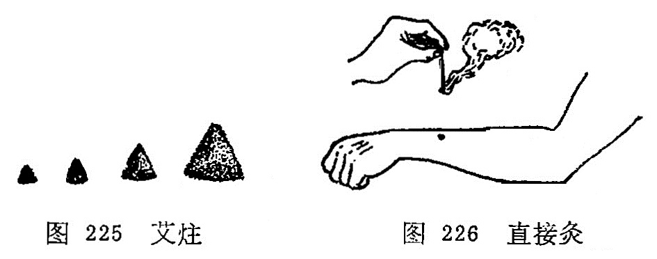
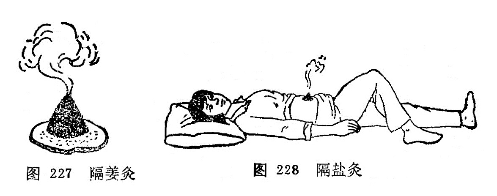
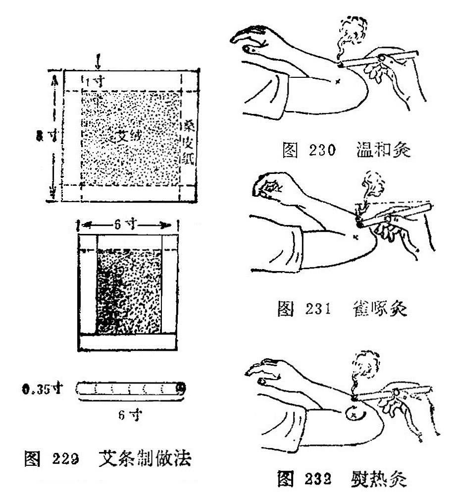
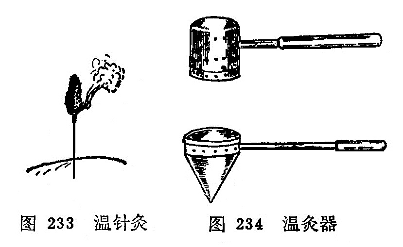
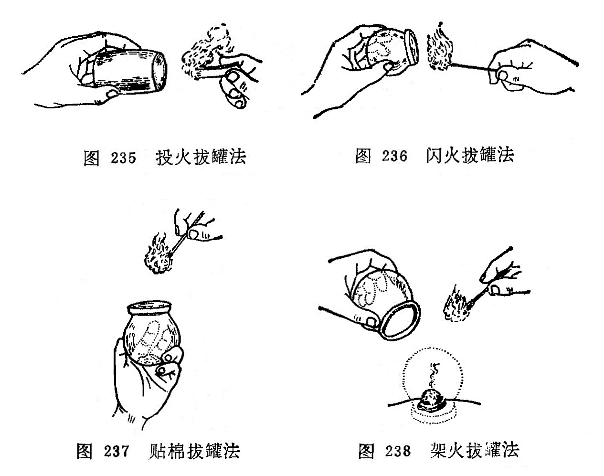

# 第二章 灸法 附:拔火罐疗法

[TOC]

〔自学时数〕    2 学时

〔面授时数〕    1 学时

〔目的要求〕
1. 了解艾叶的功能及艾绒的制法。
2. 掌握艾炷灸、艾条灸、温针灸、温灸器灸，天灸、灯草灸，太乙神针、雷火神针的操作方法，适应范围和注意事项。
3. 掌握灸法的作用。
4. 熟悉施灸的程序及灸法的禁忌证。
5. 掌握拔火罐的操作方法，适应范围和注意事项。

灸法是借灸火的热力，给人体以温热性刺激，通试经络腧穴的作用，以达到治病防病的一种方法。《灵枢·官能》说：“针所不为，灸之所宜。”《医学入门》说："药之不及，针之不到，必须灸之。”这说明它能治疗针刺效果较差的某些症，或结合针法应用，更能提高疗效，所以是针灸疗法中的一个重要组成部分。

## 第一节 灸用材料

施灸的原料很多，古今均以艾为主。艾为多年生草本，是菊科植物、叶似菊，表面深绿色，背面灰色有茸毛，性温芳香，五月采集，叶入药用。我国遍地皆产，以湖北蕲州产的艾为佳，叶厚而绒多，称为蕲艾。现将艾叶的功能及艾绒的制法分述如下：

艾叶的功能：在《名医别录》中记载：“艾叶苦，微温，无毒，主灸百病。”《本草从新》中说：“艾叶苦辛，生温，熟热，纯阳之性，能回垂绝之阳，通十二经，走三阴，理气血，逐寒湿，暖子宫，止诸血，温中开郁，调经安胎，……以之灸火，能透诸经，而除百病。”说明艾叶作为施灸材料，具有芳香开窍，通经活络，祛除寒湿，消肿散结，回阳救逆等作用。

艾绒的制法：在毎年三月至五月间采集新鲜肥厚的艾叶曝晒干燥后，放入石臼中捣碎，筛去杂梗和泥砂。再晒再捣再筛，如此反复多次，即成淡黄色洁净软如棉的艾绒；或者利用机械反复 压榨，使艾叶细碎，筛去杂质即成。艾叶以陈久易燃者为佳，故制成后应贮藏一定时期，才能用于临床。

### 〔临床应用〕

施灸的热源，自古至今是以艾绒为主的。因为艾绒具有易燃而不焰，又不易熄灭，火力温和，其热力能透组织深部的特性，患者亦少有痛苦的特点。为什么要用陈久的艾绒进行施灸呢？因 陈艾绒燃烧缓慢，火力温和，烟少，燃烧后艾灰不易脱落等。而新艾含挥发油多，燃烧快，火力强，烟雾大，艾灰易脱落灼伤皮肤。故《孟子·离娄》说：“七年之病，求三年之艾”

艾绒必须保存在通风干燥的容器内，防止发霉，一但发霉就失去艾绒的特性。因艾绒除含氮有机物，碳氢化合物，灰之外，还含有挥发油、苦艾醇、苦艾酮，维生素甲、乙、丙、丁，腺素， 胆素等，有兴奋中枢神经的作用。如果艾绒的这些成分被破坏，再用施灸，疗效就会降低，所以艾绒一定要保藏好，才能更好的发挥艾绒的作用。	

### 复习思考题
1. 艾叶有什么功能？
2. 施灸时为什么选陈艾？
3. 艾绒有哪些优点？

答：
1. 分類
2. 阿是

## 第二节 灸法的分类及其操作

灸法治疗疾病，已有悠久的历史。先是单纯的艾灸，后来衍化为多种灸法。大体上可分为艾炷灸、艾条灸、温针灸、温灸器灸和药物灸（药物发泡法）等几类。各类灸法如表11。

表11、灸法分類

### 一、艾炷灸

艾炷灸包括直接灸和间接灸，是灸法的主体。古代的灸法多指直接灸，间接灸是后来发展起来的一种疗法。

艾炷是将纯艾绒用手指搓捏成圆锥体。又称艾团、艾丸、艾圆等。艾炷分为大、中、小三种类型。小艾炷是把艾绒搓紧，捻成麦粒状或上尖下大的圆锥体；中艾炷是搓成象半个黄豆粒或半个杏核大的上尖下大的锥体；大艾炷是搓成蚕豆大者的上尖下大的圆锥体（图225）。

一般规定炷底直径为0.8厘米，高1厘米，重量为0.1克， 燃烧时间为3〜5分钟。这是为了科学研究和临床准确而设的。施灸多少？以“壮”计数，壮，是以青壮年为标准的意思。燃烧一枚艾炷即为一壮。施灸的壮数是因人、因病、因穴而异，少则一壮，多则数百壮，一般灸3〜7壮即可。

#### （一）直接灸

是将艾炷直接放在皮肤上施灸（图226）。可分为瘢痕灸和无瘢痕灸。

##### 1．瘢痕灸：

又称化脓灸、着肤灸、打脓灸。施灸前用大蒜捣汁，涂敷施灸部位以增加粘附和刺激作用，然后放置中艾炷施灸、 每壮艾炷必须燃尽，除去灰烬后，方可继续加炷施灸，一般施灸5〜10壮。因施灸时艾火烧灼皮肤疼痛较剧，可用手在施灸部位周围轻轻拍打，借以缓解疼痛。在正常情况下，灸后一周左右施灸部位化脓形成灸疮，5〜6周左右灸疮自行痊愈，结痂脱落，留下瘢痕。临床上用于慢性、顽固性病症。如哮喘、肺痨、瘰疬、慢性胃肠病等证。

##### 2．无瘢痕灸：

又称非化脓灸。将施灸部位涂敷凡士林油，以增加粘附作用，再放上艾炷点燃，当艾炷燃剩2/5左右，患者感到烫时即用镊子将艾炷夹去，更换艾炷再灸，连续灸3〜7壮。以局部皮肤充血、红晕为度。因灸后不化脓，也不留有瘢痕，易为患者所接受。本法适用于虚寒性疾病，小儿各种虚弱病证。如腹痛、 腹泻、胃脘痛、腰痛、阳萎、痛经等症。

#### （二）间接灸
又称隔物灸、间隔灸。在施灸时于皮肤和艾炷之间垫上不同的药物，称为间接灸。由于间隔的药物不同，可分为隔姜灸、隔蒜灸、隔盐灸、隔饼灸等。

1．隔姜灸：皮肤和艾炷之间隔上姜片，即为隔姜灸。

用鲜姜切成直径大约2—3厘米，厚约0.2〜0.3厘米的薄片，片上用针刺数孔，置于施术部位或腧穴上，再将大艾炷放在姜片上点燃施灸（图227），当艾炷燃尽，再移炷施灸，灸3〜7壮，以局部皮肤红润不起泡、患者有舒适感为度。适用于虚寒证。呕吐、腹痛、腹泻、遗精、风寒痹痛如等。

2．隔蒜灸：皮肤和艾炷之间隔上蒜片，即为隔蒜灸。

用独头大蒜切成约0.2〜0.3厘米厚的薄片，片上用针刺数孔，施灸法同隔姜灸。适用于外科痈疽疮毒，肺痨、瘰疬、腹中积块等。

3．隔盐灸：皮肤和艾炷之间隔上细盐即为隔盐灸。

用于脐窝部施灸。将纯净细盐填敷于脐孔，将脐孔填平，或于盐上再置一薄片姜，上置大艾炷施灸（图228）。待患者感到灼痛时则换艾炷再灸，连续施灸，至证候改善为止。适用于中风脱证, 急性腹痛，吐泻，痢疾，四肢厥冷等证。

4．隔饼灸：皮肤和艾炷之间隔上药饼，即为隔饼灸。根据病情需要，所选用的药饼不同，有不同的名称。

（1）附子饼灸：皮肤和艾炷之间隔上附子饼，即为附子饼灸。

将附子压成粉末，以黄酒调和做成直径约3厘米、厚约0.2～0.3厘米的附子饼，饼上以针刺数孔，放置施术部位或腧穴上，上置大艾炷施灸，灸数壮，以患者有温热舒适感为度。适用于各种阳虚证。如外科中的疮毒窦道盲管，久不收口，或既不消散又不化脓的阴性虚性外证等，有祛腐生肌作用；还可用于命门火衰而致的阳萎、早泄，有温肾壮阳作用。

（2）豆豉饼灸：皮肤和艾炷之间隔上豆豉饼，即为豆豉饼灸。

将豆豉压成粉末，用黄酒调和，制成疮口大的饼，厚约0.2～0.3厘米，饼上用针刺数孔，置于疮面上，上置大艾炷施灸，以患者感到温热舒适为度。适用于外科的痈疽发背，溃后久不收口，疮色黑暗者，每日灸1次，直到疮口愈合为止，有散泄毒邪的作用。

（3）胡椒饼灸：皮肤和艾炷之间隔上胡椒饼，即为胡椒饼灸。

将白胡椒压成粉末，用水调面粉作饼，厚约0.2厘米，中央按成凹陷，内置入丁香散（丁香、肉桂、麝香)上置大艾炷灸之，使患者感到温热为宜。适用于风湿痹痛及局部麻木不仁等病。有温经散寒，通经止痛作用。

（4）黄蜡灸：据《医宗金鉴》记载: "黄蜡灸法，可治痈疽发背，恶疮顽疮。先以湿面随肿根作圈，高寸余，实贴皮上，如井口形，圈内铺蜡屑三、四分厚，次以铜漏杓盛桑木炭火，悬蜡上烘之，令蜡溶化至沸，再添蜡屑，随溶随添，以井满为度。皮不痛者毒浅，灸至觉痛为度；皮痛者毒深，灸至不痛为度。然后去火杓，即喷冷水少许于蜡上，俟冷起蜡，蜡底之色青黑，此毒出之征也。如慢肿无头者，以湿纸试之，于先干处灸之，初起者一、二次即消，已成者二、三次即溃。疮久溃不敛，四围顽硬者，即于疮口上灸之，蜡从口入，愈深愈妙，其顽腐瘀脓尽化，收敛甚速。”

（5）硫磺灸：据《东医宝鉴》记载，此法可治诸疮久不瘥，变成瘘管者。方法是：取硫磺一块，如疮口大小，安置疮上，另取少许硫磺，于火上烧之，用叉尖挑起，点硫磺令著，如此三、五遍，以脓水干瘥为度。因硫磺性温有毒，有温阳杀虫之效，所以用之灸治瘘管，可收良效。

### 二、艾卷灸

包括艾条灸、太乙针灸和雷火针灸。

#### （一）艾条灸

是取纯艾绒24克，平铺在26厘米长，20厘米宽、质地柔软疏松而又坚韧的桑皮纸上，将其卷成直径约1. 5厘米的圆柱形，越紧越好，用胶水或浆糊封口而成(图229)。也有在每条艾绒中掺入肉桂、干姜、丁香、独活、细辛、白芷、雄黄、 苍术、没药、乳香、川椒各等分的细末6克，则成为药条。施灸的方法分温和灸、雀啄灸、熨热灸三种方法。

1．温和灸：将艾条的一端点燃，对准施灸部位，约距2〜3厘米左右进行熏烤（图230）,使患者局部有温热感而无灼痛，一般每处灸3〜5分钟，至皮肤稍起红晕为度。对于昏厥、局部知觉减退的患者和小儿，医者可将食、中二指，置于施灸部位两侧， 这样可以通过医者手指的感觉来测知患者局部受热程度，以便随时调节施灸距离，掌握施灸时间，防止烫伤。适用于风寒湿痹等证。

2．雀啄灸：将艾条的一端燃着，与施灸部位的皮肤并不固定在一定距离，而是象雀啄食一样，一上一下活动施灸（图231）。 适用于小儿疾病、胎位不正、无乳等证。

3．熨热灸：将艾条燃着的一端，与施灸部位的皮肤约距离3厘米左右，如熨衣服一样，来回旋转移动进行施灸（图232）。适用于面积较大的风湿痛、软组织损伤等。

#### （二）太乙针灸

是以纯艾绒和太乙针灸处方中的药物制成。

制针法：人参125克、穿山甲250克、山羊血90克、千年健500克、钻地风300克、肉桂500克、小茴香500克、苍术500克、甘草1000克、防风2000克、麝香少许，共为细末，取药末24克掺入艾绒内，平铺在40厘米见方的桑皮纸上，紧卷成爆竹状，外用鸡蛋清封固，阴干后备用。

用法：施灸时，将太乙针的一端烧着，用布七层包裹其烧着的一端，立即紧按于应灸的腧穴或患处，进行灸熨，针冷再燃再灸熨，如此反复灸熨7〜10次为度。适用于风寒湿痹，顽麻、痿弱无力、半身不遂等以及腹痛，泻泄。 

#### （三）雷火针灸

其制作方法与太乙针基本相同，惟药物处方有异。

制针法：用纯净的艾绒150克；沉香、木香、乳香、茵陈、羌活、干姜、穿山甲各9克，共为细末，麝香少许。取棉皮纸二方，一方平置桌上，一方双折重复于上，然后将药料与艾绒和匀，铺于纸上，卷成爆竹状，外涂鸡蛋清，以桑皮纸厚糊六、七层，阴干勿令泄气。

用法：取两支，先燃一支，将烧红的一端紧裹于数层布中，按于应灸的部位或穴上，如雀啄样随按随提。待针热消失后，即另换一支，反复施灸，使热感及药气透入组织，直至灸处红润为止。适用于筋骨疼痛，经络不通，沉寒积冷等证。

### 三、温针灸

温针灸又称针上加灸、传热灸、烧针尾。是针刺与艾灸结合使用的一种方法。适用于既需留针， 又需施灸的疾病。操作方法是，针刺得气后，并给予适当补泻手法而留针时，将纯净艾绒捏裹在针柄上，或用艾条一段长约2厘米左右，插在针柄上，点燃施灸（图233）。待艾绒或艾条烧完后除去灰烬，将针取出。本法适应证比较广，如虚寒性病症，腰脊、关节、肢体冷痛，胃腹冷痛，经闭，痛经等。

### 四、温灸器灸

温灸器灸，又称灸疗器灸、温筒灸。是一种用特制的金属温灸器而施灸的方法。

器具：温灸器的样式有多种，一般是用金属片特制成的，分内外两层，都有数十小孔，内层装艾绒，外层是保护层。市场有出售（图234）。

操作方法：使用温灸器时，先将艾草或加参药末放入小筒内燃着后，将温灸器扣盖好，然后在拟灸的腧穴部位上来回熨烫，使局部发红为度。有调和气血、温中散寒的作用。适用于妇人小儿及惧怕灸者，可用于治疗寒性腰痛、腹痛、关节痛等。

### 五、药物灸

药物灸，又称天灸、自灸。近代又称为发泡疗法。是用对皮肤有刺激性药物敷贴于穴位或患部，使局部充血、起泡有如灸疮，故称药物灸。如毛莨灸、斑蝥灸、白芥子灸、蒜泥灸、蓖麻子灸等，介绍如下：

#### （一）毛莨灸

毛茛灸是将草乌头的嫩苗，采取其叶子揉烂，敷贴于皮肤。初感局部热辣、充血，轻时即发生水泡。一般3〜4 天后自行愈合。愈合后局部呈现色素沉着，逐渐消退。敷贴在内关、大椎穴时，可治疗疟疾，寒痹可贴于局部。

#### （二）斑蝥灸

斑蝥是一种甲虫，含斑蝥素，对皮肤有较强的刺激作用。用时研成末，用甘油调和敷贴于皮肤，发泡作用很强， 用于治疗面瘫、癣等。

#### （三）白芥子灸

白芥子含挥发油，对皮肤有刺激作用。用时研末水调，发泡效果显著，用于治疗关节疼痛等。或调和其它药物，如白芥子50克，延胡索50克，细辛、甘遂各25克，共为细末，加麝香少许，调匀，调敷肺俞、膏肓、百劳等穴治疗哮喘。

#### （四）蒜泥灸

大蒜含精油，对皮肤有刺激作用。用时把大蒜捣成泥，敷贴皮肤能起泡。如贴鱼际穴处，使之发泡，可治疗喉痹；贴合谷穴处发泡，可治疗扁桃腺炎等。

#### （五）蓖麻子灸

把篦麻子去外壳，捣烂如泥备用。敷贴于百会穴治疗子宫脱垂、脱肛，敷贴于涌泉穴处治疗滞产等。

### 六 灯草灸

灯草灸又称灯火灸。用灯心草一根，以麻油浸之，燃着后，于应灸的腧穴上爆之。功能疏风解表，行气化痰，清神止搐。多用于治疗小儿脐风，痄腮和胃痛，腹痛，痧胀等症。

### 〔临床应用〕

应用灸法治疗疾病，必须掌握各类灸法的操作及运用。如瘢痕灸，在操作时为什么要用蒜汁贴艾炷？主要原因是大蒜内含精油，对皮肤有刺激作用，有发泡和消毒作用，减少感染机会。瘢痕灸已达到三度烧伤，灸后要保护局部清洁，以防感染，灸后要贴上淡水膏（樟丹50克，麻油300克熬膏备用），再用消毒敷料保护。化脓期每天要多换几次淡水膏，防止脓汁排泄不畅。由于本法灸后成三度烧伤，患者极为痛苦，要用此法治疗时，必须征得患者的同意，否则中途不合作，造成失败。瘢痕灸虽然疼痛，却属于良性刺激，能改善体质，增强抗病能力，从而达到防病治病的目的。

非瘢痕灸在操作时为什么要用凡士林油贴艾炷？这是因为非瘢痕灸不须烧伤，只要达到皮肤红润为度，凡士林油没有发泡作用，故用之。在操作时一定不要烧伤皮肤，特别是面部，否则影响美观。

间接灸，必须根据不同的病证选择不同的隔物，在操作中，只更换艾炷不更换隔物，将预定施灸的壮数灸完为止。

温针灸，在操作时一定要把艾炷或艾条的一段在针柄固定牢，并嘱病人不要变动体位，防止燃着的艾炷或艾段脱落，烧伤皮肤或衣物。为了防止烧伤，也可用5厘米的正方形的硬纸片，纸片中间扎一孔套在针体上，覆盖在穴位的皮肤上，起到保护作用。

药物灸，一定要掌握药物的剂量，用量过大后引起中毒，或者给患者造成不应有的痛苦。

### 复习思考题
1. 何谓艾灸疗法？主要分哪些类别？
2. 概述艾炷灸、艾卷灸的操作方法及其适应证。
3. 何谓温针疗法？其操作方法怎样？
4. 常用的间接灸法有哪些？
5. 常用的药物灸法有哪些？
6. 艾炷分几种？标准艾炷是指什么说的？ 

答：
1. 分類
2. 阿是

## 第三节 灸法的作用

灸法是一种温热刺激，对虚寒证效果好。《灵枢·官能》说：“阴阳皆虚，火自当之；……经陷下者，火自当之；结络坚紧，火所治之。”《灵枢·经脉》又说：“陷下则灸之。”《灵枢·禁服》又说：陷下者，脉血结于中>，中有著血，血寒，故宜灸之”。说明灸法能治疗很多疾病，其作用如下：

1．艾灸有温补中气、回阳固脱的作用，故用治疗久泄，久痢，遗尿，崩漏，脱肛，阴挺及寒厥等。

2．艾灸有温经通络、祛湿散寒的作用，故用治疗风、寒、湿邪为患的病证及气血虚弱引起的眩晕，乳少，闭经等。

3．艾灸有行气活血、消瘀散结的作用，用于治疗乳痈初起，瘰疬、 疖肿未化脓者，也有一定疗效。

4．预防疾病，保健强身，常灸大椎、关元、气海、足三里等 腧穴，能鼓舞人体正气，增强抗病能力。《千金方》说：“凡宦游吴蜀，体上常须三两处灸之，勿令疮暂瘥，则瘴疠、温疟、毒气不能着人。”《扁鹊心书》说：“人于无病时，常灸关元、气海、命门、 中脘，虽未得长生，亦可保百余年寿矣。”

5．隔姜灸有解表散寒、温中止呕的作用，可用于外感表证及虚寒性呕吐、泄泻、腹痛、痹证等。

6．隔蒜灸有清热、解毒、杀虫的作用，可用于疖肿疮疡，毒虫咬伤，对哮喘，脐风，肺痨，瘰疬等也有一定的疗效。

7．隔盐灸有温中散寒、扶阳固脱的作用，可用于虚寒性呕吐、 泄泻、腹痛、虚脱，产后血晕等。

8．附子饼灸有温肾壮阳的作用，可用于命门火衰而致的遗精、阳萎、早泄或疮疡久溃不敛等。	

### 〔临床应用〕

在临床上应用灸法治病，要掌握灸法的作用，根据灸法的不同作用，采用不同的灸疗方法，才能有效的治疗各种不同的疾病。 如隔姜灸、隔蒜灸、隔盐灸、附子饼灸各有不同作用及适应证。但灸法治病也不是万能的，只有对证才能取效。

### 复习思考题
1. 灸法有哪些作用？
2. 隔姜灸、隔蒜灸的作用及适应证有什么不同？
3. 隔盐灸、附子饼灸的适应证各有什么区别？	

答：
1. 分類
2. 阿是

## 第四节 灸法的注意事项

### 一、点穴与体位

施灸时，取穴的正确与否将直接影响灸法的治疗效果。所以在施灸前必须选好体位，再进行取穴。《千金方》：“凡点灸法，皆须平直，四体毋使倾侧。灸时孔穴不正，无益于事，徒破皮肉耳。若坐点则坐灸之，卧点则卧灸之，立点则立灸之，反此亦不得其穴矣。”《明堂灸经》：“须得身体平直，勿令蜷缩，坐点勿令俯仰，立点勿令倾侧。”说明施灸时不但要取穴准确，还须嘱咐患者不可移动体位。因为体位的变换，可以使腧穴因骨骼、肌肉的牵拉而改变位置，必然会影响取穴的准确性。此外，还须注意的是体位必须平直，将拟施灸的腧穴暴露出来并使腧穴面朝上，以防艾炷安放不平正，燃烧时火力不能集中，热力不能深透肌肤，而致减低疗效；同时也可防止施灸时艾炷滚下，烫伤皮肤，给病人造成不必要的痛苦。

### 二、施灸的程序

施灸的程序是先灸上部，后灸下部；先灸背部，后灸腹部；先灸头身，后灸四肢。《千金翼方》说：“凡灸法先发于上，后发于下；先发于阳，后发于阴。”《明堂灸经》说：“先灸上，后灸下；先灸少，后灸多。”灸的顺序虽说如此，但还须结合病情来考虑，因病制宜，灵活掌握，不可拘泥。	

### 三、施灸剂量的大小

直接灸，是以小艾炷或中艾炷为主；间接灸，是以中艾炷或大艾炷为主。而且要依患者的体质、病情、部位来考虑灸量的大小。《医宗金鉴》说：“凡灸诸病，必火足气到，始能求愈。然头与四肢皮肉浅薄，若并灸之，恐肌骨气血难堪，必分日灸之，或隔日灸之，艾炷宜小，壮数宜少。有病必当灸巨阙、鸠尾者，必不可过三壮，艾炷如小麦，恐火气伤心也。背腰以下皮肉深厚，艾炷宜大，壮数宜多，使火气到，始能去痼冷之疾也。”《千金方》说： “头面目咽，灸之最欲生少；手臂四肢，灸之须小熟，亦不宜多； 胸背腹灸之尤宜大熟，其腰脊欲须少生。”《外台秘要》说：“凡灸有生熟，侯人盛衰及老小也。衰老者少灸，盛壮强实者多灸。”所谓“生”是指少灸；"熟”是指多灸。上述记载是说明施灸的标准。一般的说，凡是新病、体质强壮的艾炷宜大，壮数宜多；久病、体质虚弱者艾炷宜小，壮数宜少。从部位来说，胸部不宜用大艾炷；四肢末端，皮肉浅薄处不可多灸；腹背部及肌肉丰厚处则可多灸。妇女儿童，艾炷宜小，壮年则可大。古代文献中有灸百壮 者，都是指多次灸治的累积数。其它灸法的施灸量，可参考艾炷灸法。艾条法、温灸器灸一般以时间计算。太乙针、雷火针则以熨灸的次数计算。

### 四、灸疮的处理

在施灸过程中，因施灸过量，时间过长，局部出现水泡，不要擦破，可任其自然吸收；如果出现较大水泡，可用消毒针具刺破水泡，放出液体，再涂以龙胆紫；化脓灸者，灸疮化脓期间， 一个月内勿做重体力劳动，疮面局部勿用手搔。为了保护痂皮， 要防止摩擦，疮面宜保持清洁，以防感染，可敷贴淡水膏，根据脓汁分泌的多少，毎日换药1〜2次，用消毒敷料复盖。

### 五、灸法的禁忌

1.病情的禁忌：由于灸法属于温热刺激，而热能伤阴，故阴虚阳亢和邪热内炽的病症皆不可灸。如阴虚痨瘵，咯血吐血， 心悸怔忡，多梦遗尿，中风闭证，高热神昏等。如热病而误用灸法，致损阴血，助益有余之阳；甚则火毒内攻而成坏病。

2.部位禁忌：凡颜面、眼区、重要脏器、血管浅在部位、筋腱所在部位，以及妇女妊娠期的少腹部、腰尻部、乳头、阴部事、 均不宜施灸。

3.穴位的禁忌：头维、人迎、哑门、睛明、攒竹等穴，均不宜灸。但据《针灸大成》记载有45穴、《针灸集成》试载有53穴禁 灸。古人所记，仅供参考。	

### 六、灸法的补泻

灸法同刺法一样，也有补泻的区分。《灵枢·背俞》：“以火补者，毋吹其火，须自灭也；以火泻者，疾吹其火，传其艾，须其火灭也。”朱丹溪解释说：“灸法有补泻火，若补火，艾灭至肉；若泻火，不要至肉，便扫除之，用口吹之，风主散故也。”《针灸大成》也说：“以火补者，毋吹其火，待自灭，即按其穴；以火泻者，速吹其火，开其穴也。”这说明补法的施灸，须艾火自灭，使火力缓缓透入深层，故能补虚扶羸，温阳起陷；泻法的施灸，须用口吹，使火速燃，不燃至皮肉即便扫除，力促而短，目的在于起消散作用。

### 〔临床应用〕	

在施灸时一定要熟悉施灸的注意事项，才能提高灸治的疗效， 防止灸疮的发生（化脓灸除外）。因此，施灸的体位要舒适、持久，操作时的穴位要平稳，这样就能达到取穴准确、平稳，防止艾炷脱落。施灸程序是使施炎埘不遗漏灸点。施灸剂量的大小，是灸法治疗中很重要的环节，如果灸量不够，达不到治疗效果，如果 旅灸量过大，又会发生灸疮或坏病。所以要根据病情、体质、年 龄、部位给以拾当的施灸量，中病即止。灸法的禁忌.，古代文献记载颇多，有些有一定道理，有些是不必要的。应从临床实际出发，不可拘泥。	

### 复习思考题
1. 施灸的程序是什么?
2. 灸法的禁忌证是什么？
3. 灸疮如何处理？
4. 《灵枢·背俞》篇中是怎样谈灸法的补泻的？
5. 灸法能否用于治疗实证、热证?为什么？试谈谈你的看法？

答：
1. 分類
2. 阿是

## 〔附〕拔罐法

拔罐法是以罐为工具，利用燃烧热力排除罐内空气，造成负压，使罐吸附于腧穴或应施术的部位，产生温热刺激并造成皮肤充血、瘀血现象的一种疗法。最早见于《肘后方》，以牛角制罐， 作外科吸脓血之用，故又称角法和吸筒法。随着医疗实践的不断发展，罐的质料大为改进，使用方法有所发展，治疗范围有所扩大，不仅用于外科，也用于内科的一部分病证。拔罐法常和针灸疗法配合使用，其作用与灸法有相似之处。

### 1．罐的种类：

罐的种类很多，临床常用的有以下几种：

（1）竹罐：用直径3〜5厘米坚固无损的竹子，制成6〜10厘米长的腰鼓形的圆筒，一端留节做底，另一端做罐口，打磨光滑平正。它的优点是取材容易，经济易制，轻巧，不易摔碎。缺点容易燥裂、漏气、吸附力不大。

（2）陶罐：是由陶土烧制而成，有大有小，罐口平正光滑，肚大而圆，口、底较小，其状如腰鼓。它的优点是吸着力大，缺点是质量易摔碎、损坏。

（3）玻璃罐：形如球状，罐口平滑而宽，有大、中、小三种 不同型号。它的优点是质地透明，使用时可以窥测罐内皮肤的充血、瘀血程度，便于随时掌握情况，缺点是容易摔碎、损坏。

（4）抽气罐：用青、链霉素药瓶，将瓶底切去磨平，切口须光洁，瓶口的橡皮塞须保留完整，便于拔气时用。近年已发展成电动抽气吸罐。

### 2．操作方法：

拔罐的操作方法分以下几种：

（1）火罐的操作法：用燃烧时火焰的热力排除罐内空气，使罐内呈负压，将罐吸着在皮肤上。有以下几种方法：

投火法：将小纸条点燃后、投入罐内，然后速将罐罩在施术部位（图235)。此法适用于侧面横拔，否则，会因燃烧物落下而烧伤皮肤。

闪火法：用镊子或止血钳子挟住酒精棉球，点燃后在火罐内壁中段绕1〜3圈后，迅速退出，然后将罐罩在施术部位（图236)。此法比较安全，不受体位限制，是较常用的拔罐方法。	

贴棉法：用一平方厘米的棉花片，不要太厚，略浸95%酒精，贴在罐内壁的上、中段，以火柴点燃，罩在施术部位上(图237)。此法多用横位拔罐。

架火法：用2〜3平方厘米不易燃烧的块状物作支架，上置95%的酒锖棉球，点燃后把罐罩上。此法去罩罐要准确，不要碰掉燃烧的棉球，以防烧伤皮肤，适用用于平卧位（图238)。

（2）水罐操作方法：一般用于竹罐。先将竹罐放在锅内加水煮沸，用镊子倒挟竹罐的底端，甩去罐内的沸水，并用折迭的冷毛巾紧扪罐口。乘热按在施术部位，即能吸住。适用任何部位的拔罐。

### 3．各种拔罐法的运用：

（1）单罐：用于较小范围病变或压痛点。可按病变的或压痛的范围大小，选用适当口径的火罐。如胃病可在中院穴拔罐，岗上肌肌腱炎在肩髃穴处拔罐等。

（2）多罐：用于病变范围比较广泛的疾病。可按病变部位的解剖形态等情况，酌量吸拔数个乃至十数个。如某一肌束劳损时可按肌束的位置成行排列吸拔多个罐，称为排罐法。治疗某些内脏或器官的瘀血时，可按脏器的解剖部位的范围在相应的体表部位纵横并列吸拔几个罐子。

（3）闪罐：罐子拔上后，立即起下，如此反复多次地拔住起下，起下拔住，至皮肤潮红为止，多用于局部皮肤麻木、疼痛或功能减退等疾患，如面瘫等。

（4）留罐：拔罐后，留置一定的时间，一般留置5〜15分钟。罐大吸着力强的应当减少留罐时间，肌肤薄处留罐时间不宜过长，以免损伤皮肤。

（5）推罐：又称走罐、飞罐。一般用于面积较大、肌肉丰厚的部位，如腰背、大腿等。选用口径较大的罐子，罐口要求平滑，最好用玻璃罐，先在罐口涂一些滑润油脂将罐子吸上后，以双手握住罐底，即后边着力，前边略起来,慢慢向前推动，这样在皮肤表面上下或左右来回推拉移动数次，至皮肤潮红为度 （图239）。

（6）药罐：常用的药罐有两种：煮药罐：将配制成的药物装入布袋内，扎紧袋口，放入清水煮沸至适当浓度，再把竹罐投入药液内煮15分钟。使用时，按水罐法吸拔在应拔的部位上，多用于风湿痛等病。

常用药物处方：麻黄、蕲艾、羌活、活独、防风、秦艽、木瓜、川椒、生乌头、蔓陀罗花、刘寄奴、乳香、没药各6克。

贮药罐：在抽气罐内事先盛贮药液（约为罐子的2/3～1/2)。常用的药液为辣椒水、两面针酊、生姜汁、风湿酒等。然后按抽气 罐操作法，抽去空气，使罐吸在皮肤上。也有在玻璃罐内盛贮 1/3〜1/4的药液，然后用火罐法吸拔在皮肤上。常用于风湿痛，哮喘，咳嗽，感冒，溃疡病，慢性胃炎，消化不良，牛皮癣等。

（7）针罐：先在一定部位施行针刺，待达到一定的刺激量后，将针留在原处，并以针刺处为中心，拔上火罐。如果与药罐结合，称为针药罐，多用于风湿病。	

（8）剌血（刺络）拔罐：用三棱针、粗毫针、皮肤针等，先按病变部位的大小和出血要求，按刺血法刺破出血，然后拔上火罐，可以加强刺血法的效果。适用各种急性、慢性软组织损伤， 神经性皮炎，皮肤瘙痒，丹毒，神经衰弱， 胃肠神经官能症等。

### 4．适应范围：

拔罐法有温经通络、祛湿逐寒、行气活血、消肿止痛的作用。临床多用于以下几个方面：	

风湿痹痛：如肩痛、背痛、腰腿痛、落枕等。均可在痛处拔 罐。	

胃肠疾病：胃痛，腹痛，呕吐，腹泻等。可在腹部及背部拔罐。

肺部疾病：如哮喘，咳嗽等。可在背部拔罐。

刺络拔罐：适用于急性扭伤有瘀血者，疮疡和部分皮肤病，如丹毒，神经性皮炎等。可在患处拔罐。

### 5．注意事项

（1）患者要取舒适体位，应根据不同部位，选择不同口径的火罐，注意选择肌肉丰满，富有弹性，没有毛发和骨骼凸凹的部位，防止罐脱落。	

（2）皮肤有溃疡、过敏、水肿及大血管部位，不宜拔罐；孕妇的腹部和腰骶部，也不宜拔罐。

（3）有自发性出血和损伤后出血不止的患者，不宜使用拔罐法。

（4）起罐时手法要轻巧而缓慢，以一手抵住罐边皮肤，按压—下，使气漏入，罐子即能脱下，不可硬拉或旋动。	

（5）拔火罐时应注意勿灼伤或烫伤皮肤。如出现烫伤、水泡，小的可不必处理，任其自然吸收；如水泡较大或皮肤有破损， 先用消毒针具刺破氷泡，或用注射器抽出水液，然后涂龙胆紫 并以纱布包數，防止感染。

### 〔临床应用〕

拔罐法是一种物理疗法，是使罐内空气因热而膨胀逸出，当罐口紧贴皮肤时，罐内温度下降，空气稀薄而产生负压，吸力增强，皮肤因被吸吮而高起，毛细血管扩张，局部充血，通过机体 的调整功能。以疏通气血，宣泄风寒湿邪，从而直接改善局部状态，而达到治病目的。

拔罐应根据不同部位，选用大小合适的罐。应用投火法拔罐时，火焰须旺，动作要快，使罐口向上倾斜，避免火原落下烫伤皮肤。应用闪火法时，棉花棒蘸95%酒精不要过多，以防酒精滴 下烧伤皮肤。用贴棉法时，须防止燃着棉花脱下。用架火法时， 扣罩要准确，不要把燃着火架撞翻。用煮水罐时，应甩去罐中的沸水、以免烫伤病人的皮肤。

拔罐时，体位不要变动，防止罐脱落；经拔罐后，局部有瘀血未消退时，不要在原处拔罐。

### 复习思考題
1. 什么叫拔罐疗法？常用的火罐有哪几种？
2. 闪火法、投火法拔罐如何操作？
3. 拔罐法的适应范围是什么？
4. 试述拔罐法的注意事项。
5. 拔罐疗法为什么能治病？

答：
1. 分類
2. 阿是

