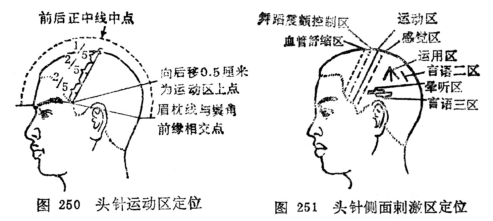

# 第三章 其他针法

[TOC]

## 第一节 三棱针

〔自学时数〕    1 学时

〔目的要求〕
  	掌握三棱针的操作方法，适应范围和注意事项。

三棱针是由古代九针中的锋针发展而来的，古称锋针。针长约2寸，是一种针柄粗而圆、针身呈三棱形、针尖锋利的针具（图240）。一般应用于刺络放血。《素问·针解》说:“菀陈则除之者，出恶血也。”《灵枢·官针》也说：“络刺者，刺小络之血脉也。”络脉壅滞、血瘀不通的疾病，在人体特定部位的浅表血管， 放出少量血液，达到治疗目的。

### 一、操作方法

右手拇、食两指持住针柄，中指扶住针尖部，露出针尖1〜2分许，以控制针刺深浅度，针刺时左手捏住指（趾）部，或夹持、舒张皮肤，右手持三棱针针刺（图241）。常用的刺法有下列几种：

1．缓刺：适用于肘窝、胭窝浅静脉放血。如曲泽、委中等穴，先用橡皮带在应刺穴位上端束扎，医者用右手持三棱针对准穴位或静脉胬起处，刺入1〜2分，然后将针退出，待黑色血出尽变为红赤色，可将橡皮带解开，用消毒棉球揉按针孔。

2．点刺：又称速刺。适用于四肢末梢穴位或表浅静脉浅刺放血。用左手拇指、食指和中指捏紧应刺的部位或腧穴、右手持三棱针迅速刺入1〜2分，立即退针，然后用手挤压局部，使之出血。

3．挑刺：又称挑针疗法。适用于腧穴或反应点的挑刺。是以左手按压施术部位的两侧，使皮肤固定，右手持针，将腧穴或反应点的表皮挑破，深入皮内，将针身倾斜并轻轻地提起，挑断部分纤维组织，然后局部消毒，覆盖敷料。

4．散刺：又称围刺。适用于病灶周围，如癣、丹毒等。在病灶周围用三棱针由外向内点刺数针，然后用两手轻轻挤压或者用火罐吸拔，使恶血出尽，以消肿痛（图242）。

### 二、适用范围

三棱针是在放血泻络时使用，故有活血消肿，开窍泄热，通经活络的作用，适用实证和热证。现就临床常见病症及其放血部位介绍如表12。

表12、常见病症放血部位表

| 病症     | 放血部位                    | 刺法       | 备注            |
| :------- | :-------------------------- | ---------- | --------------- |
| 发热     | 大椎、十宣、委中、 曲泽     | 点刺       |                 |
| 中暑     | 水沟、十宣、委中            | 点刺       |                 |
| 吐泻     | 十二井、曲泽、委中          | 点刺       |                 |
| 中风闭症 | 十二井、水沟                | 点刺       |                 |
| 头痛     | 太阳、印堂                  | 点刺       |                 |
| 疟疾     | 大椎、陶道、后溪            | 点刺       |                 |
| 腰痛     | 委中                        | 缓刺       |                 |
| 热痹     | 委中、曲泽                  | 缓刺       |                 |
| 肢端麻木 | 十宣                        | 点刺       |                 |
| 丹毒     | 局部及周围、尺泽、 委中     | 散剌、缓刺 | 尺泽、 委中缓刺 |
| 风癣     | 耳后静脉、局部              | 点刺、散剌 | 局部散刺        |
| 酒皶鼻   | 素髎及两侧变赤处、尺泽      | 散剌、缓刺 | 尺泽缓刺        |
| 湿疹     | 委中                        | 缓刺       |                 |
| 痔疮     | 上唇内侧、及与上齿龈交界处  | 挑刺       | 挑粟粒样小疙瘩  |
| 急惊风   | 攒竹、水沟、十宣、 督脉沿线 | 点刺       |                 |
| 疳积     | 四缝                        | 点刺       |                 |
| 暴发火眼 | 耳尖                        | 点刺       |                 |
| 喉痹     | 少商、商阳                  | 点刺       |                 |
| 口疮     | 患处周围                    | 散剌       |                 |
| 发际疮   | 背部小红疙瘩、委中          | 点刺、缓刺 | 委中缓刺        |

### 三、注意事项

1．注意无菌操作，以防感染。

2．点刺放血时，宜轻、宣浅、宜快，出血不宜过多。勿刺伤深部动静脉。

3．气血两亏的虚证及常有自发性出血或损伤后出血不止的患者，不宜使用。	

### 〔临床应用〕

使用三棱针进行治疗时，首先要对针刺部位进行严密消毒， 并要检査针具是否锋利，刺入1〜2分深，以出血为度。出血时不要按其针孔，任其血流，最初是紫色，待变鲜红色为度，一般不要超过10毫升。最后用干棉球揉按擦净针孔即可。根据不同病症可采用缓刺、点刺、挑刺、散刺等方法进行放血。

### 复习思考题
1. 三棱针有几种操作方法？如何进行操作？
2. 三棱针的适应范围是什么？
3. 应用三棱针时应注意什么？ 

答：
1. 分類
2. 阿是

## 第二节 皮肤针

〔自学时数〕    1 学时

〔目的要求〕
  	掌握皮肤针的操作方法，适应范围和注意事项

皮肤针又名梅花针、七星针、是用5或7枚不锈钢针，集束固定在针柄的一端而成，用它在一定部位皮肤上进行叩打，以疏通经络，调节脏腑之气，而治疗疾病。《灵枢•官针》：“半刺者， 浅内而疾发针，无针伤肉，如拔毛状。”“扬刺者，正内一，傍内四而浮之，以治寒气之博大者也。” “毛刺者，剌浮痹皮肤也。”皮肤针是半剌、扬刺、毛刺等针法的发展。 

### 一、操作方法

针具和施术部位常规消毒，针具可在75%酒精中浸泡30分钟。用右手握针柄，以无名指、小指将针柄末端固定于小鱼际处，一般针柄末端露出手掌后2～3厘米，以拇、中二指夹持针柄，食指置于针柄中段上面（图243）。用腕力进行弹刺，使针尖垂直叩打在皮肤上，并立即弹起，反复进行。

叩刺分轻刺、重刺和中等刺激法三种：

轻刺激：叩刺时用力小，针尖接触皮肤时间越短越好，使局部皮肤潮红、充血即可。

重刺激：叩刺时用力稍大，针尖接触皮肤时间稍长，使叩刺的部位皮肤微出血为度。

中等刺激：叩刺时用力介于轻刺激，重刺激之间，使叩剌部位皮肤呈潮红，有丘疹，但不出血为度。

### 二、刺激部位

皮肤针的刺激部位比较广泛，大体可分为三类：

1．常规刺激部位：一般均以背部脊柱侧为主，并按不同疾病配用其他相应部位。

2．局部刺激部位：在病区及四周有关炎位进行叩刺，或环形叩刺。

3．重点刺激部位：在脊柱两侧异常反应点（敏感点、条索状物、结节等）进行反复重点叩刺。

### 三、适应范围

一般疾病均可应用。在临床多用于不寐，头痛，胸胁痛，班秃，高血压，神经性皮炎，近视，口眼㖞斜等。

1．不寐：重点叩刺脊柱两侧，心俞、肝俞及手少阴心经、手厥阴心包经。失眠，多梦，心悸加风池、三阴交穴或其附近的 敏感部位。	

2．头痛、偏头痛：重点叩刺后项部、头部。头痛可取后头、 项部以及疼痛部位和远端有关经脉循行线上的敏感部位；偏头痛可取后项部，痛侧头部和有关经脉循行的敏感部位。

3．胸痛、胁痛：重点叩刺第1～12胸椎两侧，特别是膈俞、 肝俞处。胸痛可按疼痛部位及其上下沿肋骨走行叩刺；胁痛除上述重点部位外，可配合支沟、太冲穴。

4．斑秃：重点叩刺后项、脱发区、腰、骶部、太渊、内关， 阳性物处。兼头痛、口干，心烦加刺胸椎8〜10两侧及风池。心悸多梦，失眠加刺胸椎5〜7两侧及神门、大椎。

5．高血压：重点叩刺后项部、腰骶部，以及阳性物处、风池、曲池、足三里。

6．神经性皮炎：重点叩刺后项部，骶部和患部、阳性物处。

7．近视：重点叩刺后项部、眼区、颞部。在叩打时可在太阳、攒竹、四白、风池多叩刺几针。	

8．口眼㖞斜：重点叩刺颜面局部，以攒竹、瞳子髎、地仓、颊车部为主，并配合合谷或敏感点。

9．痛经：重点叩刺腰骶两侧和任脉、肾经循行位。重点叩刺气海、关元，配合用肝俞、三阴交。

10．瘰疬：重点叩刺部位为第5〜10胸椎两侧，并配合在瘰疬周围重刺。

### 四、注意事项

1．针尖要平齐、无钩，叩刺时针尖必须垂直而下、以减少疼痛。针柄与针头联结处必须牢固，以防叩刺时滑动。

2．针具及叩刺部位的皮肤应消毒，叩刺后的局部皮肤，如有出血者，应进行清洁及消毒，以防感染。

3．局部皮肤有外伤及溃疡者，不宜使用皮肤针叩刺。

4．应用皮肤针治疗时，出现晕针现象，处理同体针。

### 〔临床应用〕

皮肤针治疗疾病，虽然不限于腧穴，也不是单纯“以痛为腧”。而是祖国医学整体观作为理论依据的。《素问•皮部论》指出：“凡十二经络脉者，皮之部也。是故百病之始生也，必先于皮毛。”说明十二皮部同十二经脉、十二脏腑有密切关系。应用皮肤针叩击皮部，可疏通经络脏腑之气，从而起到调整机体的作用。

皮肤针在操作时，持针不要过紧或过松，如果握针太紧会使腕关节肌肉紧张，影响操作；如果握针太松，会使针身左右摆动， 造成疼痛或出血。叩打皮肤针时速度要均匀，防止快慢不一，用力不匀地乱刺。针尖起落要垂真，即将针垂直刺下，垂直提起，如此反复操作。针刺部位要准确，按预定应刺部位下针，针与针之间的距离要相等，一般针距在1～1.5厘米左右。

叩刺的部位：脊柱两侧，由上而下，左右各打三行，椎体叩剌棘突间；头部呈网状叩刺；胸部沿肋缘叩刺；腹部按“井”字叩刺；四肢按三阴三阳经脉进行叩刺；各关节、口、眼、耳按耳环形叩刺。

叩刺的强度，要根据患者体质、年龄、病情以及叩击部位的不同，而分为轻刺激、中刺激、重刺激三种强度，临床时选择应用。

### 复匀思考题
1. 皮肤针如何操作？能治疗哪些疾病？
2. 使用皮肤针治病时应注意什么？
3. 皮肤针为什么能治病？
4. 皮肤针的刺激部位大体可分几类？

答：
1. 分類
2. 阿是

## 第三节 皮内针

〔自学时数〕    1 学时

〔目的要求〕	
  	掌握皮内针的操作方法，适应范围和注意事项。

皮内针是以特制的小型针具固定腧穴的皮下或皮内，进行时间较长埋藏，达到防治疾病一种方法。

### 一、皮内针具

皮内针是用30～32号不锈钢丝制成图钉型和麦粒型两种不同形状的针具（图244）。由于较长时间留针，所以又称埋针。

1．图钉型皮内针：又称掀针型皮内针。针身长约0.2〜0.3厘米，针柄呈环形，针身与针柄呈垂直状。

2．麦粒型皮内针：又称颗粒型皮内针。一般针身长约1〜1.5厘米，针柄形似麦粒，针身与针柄呈一直线。

### 二、操作方法

1．图钉型皮内针：多用于面部和耳部腧穴埋针。局部常规消毒后，用小镊子夹住针柄，针尖对准选定的腧穴，轻轻垂直刺入，使环状的针柄平整的留在皮肤上，然后以小方形胶布贴敷固定。

2．麦粒型皮内针：可用于人体大部分腧穴。用左手拇、食二指按压腧穴的上下皮肤，固定穴位，右手用小镊子夹住针柄， 对准穴位沿皮刺入0.5〜1.0厘米左右，针柄留于皮肤外，用胶布将留于皮肤外的针身和针柄固定，再用较大的方形胶布把埋入皮肤内的针身和皮肤外部分覆盖上，以防止针具因活动而退出和汗水浸入针孔，发生感染。

埋针时间的长短，要根据病情而定。一般以2〜3天为宜，秋冬季节可埋6〜7天，暑热天埋针不宜超过2天，以防止感染。埋针期间，每隔4小时左右，用手按压埋针处1〜2分钟，以加强剌激，增强疗效。

### 三、适应范围

埋针多用于顽固性疼痛疾病，久治不愈的慢性病症。如头痛胃脘痛，胆结石，胆绞痛，哮喘，不寐，高血压，面肌痉挛，遗尿，月经不调，痛经，痹症等。

### 四、注意事项

1．不要在关节处埋针，以免活动时产生疼痛或折针。

2．皮肤有化脓性炎症或破溃处，不宜埋针。

3．埋针期间，注意清洁，避免针孔处着水。暑热天出汗较多，埋针时间不宜过长，以防感染。

4．埋针后，患者感觉疼痛，或防碍肢体活动时，应将针取，重新埋置。

### 〔临床应用〕

皮内针是从九针中的毫针演变而成，本于《素问•离合真邪论》：“静以久留”的刺法。选穴时，一定要选择易固定而又不妨碍肢体活动的部位，更不应该在关节部位埋针。用胶布固定时，一定要用小块胶布固定针柄，再用适当的大块胶布固定埋针部位，以防针具因活动而退出。若进针时，皮下出血，该处就不宜留针，防止因针继续刺激该处，造成出血不止或血肿。埋针时或埋针后患者出现疼痛，或防碍肢体活动时，应将针改变针刺方向重埋或另选其它腧穴再埋。

### 复习思考题
1. 皮内针有几种？如何操作？	
2. 皮内针的适应范围是什么？
3. 应用皮内针时应注意什么？	

答：
1. 分類
2. 阿是

## 第四节 火针

〔自学时数〕    1 学时

〔目的要求〕
  	掌握火针的操作方法，适应范围和注意事项。

火针是用特制的粗针，烧红后刺入一定部位或腧穴以治疗疾病的一种方法。《灵枢•官针》说：“焠刺者，刺燔针取痹也。”明•吴鹤皋说：“焠针者，用火先赤其针而后刺，此治寒痹之在骨也”。《千金方》说：“外疖痈疽，针惟令极熟。”火针不但能治疗痹证及疮疖，痈疽，也可治疗各科中的一些病症。

### 一、针具

火针的针体较粗，多用不锈钢制成。针柄多用竹或骨质包裹，以避免烫手。也有应用特制的针具，如弹簧式火针、三头火针以及用钨合金所制的火针等。弹簧式火针进针迅速并易于掌握针刺深度，三头火针常用于对体表痣、疣的治疗（图245）。钨合金制成的火针，在炽热时弹性好，便于临床应用。

### 二、操作方法

1．选穴与消毒：火针选穴与毫针选穴的基本规律相同，根据病症不同而辨证取穴。先用碘酒消毒局部，后用酒精棉球脱碘。

2．烧针方法：《针灸大成•火针》说：“灯上烧，令通红，用方有功。若不红，不能去病，反损于人。”目前临床多用酒精灯烧针、必须把针烧红，才能使用。近年电火针也有应用。

3．针刺与深度：针刺时，用烧红的针具，迅速刺入选定穴位内，即迅速拔出。关于针刺的深度要根据病情、体质、年龄和针刺部位而定。四肢、腰腹针刺稍深，可刺2〜5分；胸背部穴位针刺宜浅，可刺1〜2分。外科疾患如痈疽、瘰疬、血丝虫病象皮腿等可深刺些，风湿痛、顽癣、肌肤冷麻等可浅刺些，顽癣亦可用三头火针浅刺。

### 三、适应范围

火针具有温经通络，祛风散寒，化腐软坚的作用。主要用痹证，胃下垂，胃脘痛，泄泻 ，阳萎，瘰疬，风疹，月经不调，痛经，小儿疳积，顽癣，肌鞘囊肿， 血丝虫病象皮腿，痈疽，扁平疣，痣等。

### 四、注意事项

1．使用火针时，必须细心慎重，动作敏捷、准确。

2．使用火针时要避开血管、肌腱、神经干及内脏器官。面部除治疣和痣外，不用火针。

3．火针刺激强烈，体质虚弱者及孕妇慎用或不用。

4．发热的病症，不宜用火针治疗。

5．施行火针后，要保护针孔，不能搔抓和洗浴，以防感染。深刺后，要用消毒纱布敷贴，用胶布固定1〜2天，以保护针孔，防止感染。	

### 〔临床应用〕

应用火针治疗疾病时，手法一定要熟练，动作要敏捷，准确掌握进针的深度、角度、方向，才能达到应刺的深度和部位。一般针具的针身长3〜4寸，也有1〜1.5寸的，直径为0.5〜1毫米，针柄一般用竹子或骨质制成，可免烫手。治疗顽癣时，可用三头火针，针刺要浅，针距要均匀而疏松，可免发生刺脱皮肤等。

### 复习思考题

1. 火针操作有几种方法？如何应用？
2. 火针的适应范围是什么？
3. 应用火针治疗时应注意什么？

答：．
1. 分類
2. 阿是

## 第五节 电针

〔自学时数〕    2 学时

〔目的要求〕
  	掌握电针的操作方法，适应范围和注意事项。

电针是在针上通以微量电流，用以防治疾病的一种方法。广泛应用于临床及针刺麻醉。

### 一、电针器的选择

电针器的种类很多，目前较常见的有蜂鸣式电针器，电子管电针器，半导体电针器等多种。它采用振荡发生器，输出接近人体生物电的低频脉冲电流，即可作为电针，又可用点状电极或板状电极直接放在穴位或患部进行治疗。电针器以具有剌激量大，安全，可用干电池，不受电源限制，耗电量少，体积又少，携带方便，耐震，无噪声者为佳。

### 二、操作方法

毫针刺入腧穴得气并施行补泻手法，把电针器上的输出电位器调至“0”值，将一对输出导钱分别接在两根针的针柄上，然后打开电源开关，选择需要的波型和频率，逐渐调高输出电流至所需的电流量，使患者出现能耐受的痠麻感。电针治疗中，人体经过多次刺激后，会产生适应性，剌激感由强变弱。此时，应加大刺激量或改变频率，以保持恒定作用。每次通电时间，一般为10〜20分钟。治疗完毕，把电位调到“0”值，关闭电源，然后撤去导线，退出毫针。

### 三、脉冲电流的作用和电针的适应证

1．脉冲电流的作用：人体组织是由水分、无机盐和带电生物胶体组成的复杂的电解质电导体。当一种波型、频率不断变换 的脉冲电流作用人体时，组织中的离子会发生定向运动，消除细胞膜极化状态，使离子浓度和分布发生显著变化，从而影响人体组织功能。离子浓度和分布的改变，是脉冲电流治疗作用最基本 的电生理基础。低频脉冲电流通过毫针刺激腧穴，具有调整人体功能，加强止痛、镇静，促进气血循环，调整肌张力等作用。

低频脉冲电流的波形、频率不同，其作用亦不同。频率有每分钟几十次至每秒钟几百次不等。频率快的叫密波（或叫高频)， 一般在50〜100次/秒，频率慢的叫疏波（或叫低频），一般是 2〜5次/秒。有的电针器有连续波（亦叫可调波），可用频率旋扭任意选择疏密波形。有的电针器分别装置密波、疏波、疏密波、 断续波等数种波形，临床使用时应根据病情选择适当波形，可以 提高疗效。

密波：能降低神经应激功能。先对感觉神经起抑制作用，接 着对运动神经也产生抑制作用。常用于止痛、镇静，缓解肌肉和血管痉挛，针刺麻醉等。	

疏波：其刺激作用较强，能引起肌肉收缩，提高肌肉韧带的张力。对感觉和运动神经的抑制发生较迟。常用于治疗瘘症，各 种肌肉、关节、韧带、肌腱的损伤等。

疏密波：是疏波、密波自动交替出现的一种波形。疏密交替持续的时间约备1.5秒，能克服单一波形易产生适应的缺点。动力作用较大，治疗时兴奋效应占优势。能促进代谢，促进气血循环，改善组织营养，消除炎性水肿。常用于止痛，治疗扭挫伤，关节周围炎，气血运行障碍，坐骨神经痛，面瘫，肌无力，局部冻伤等。

断续波：是有节律的时断、时续自动出现的一种疏波。断时，在1.5秒时间内无脉冲电输出，续时，是密波连续工作1. 5秒 。断续波形，机体不易产生适应，其动力作用颇強。能提高肌肉组织的兴奋性，对橫纹肌有良好的刺激收縮作用。常用于治疗痿症，瘫痪，也可用作电肌体操训练。

锯齿波：是脉冲波幅按锯齿形自动改变的起伏波，每分钟16〜20次或20〜25次，其频率接近人体的呼吸规律，故可用于 刺激膈神经（相当于天鼎穴部)作人工电动呼吸，抢救呼吸衰竭 (心脏尚有微弱跳动者） 故又称呼吸波。并有提高神经肌肉兴奋性，调整经络功能，改善气血循环等作用。	

2．电针的适应证：凡毫针治疗有效的病症，均可适用，治疗范围较广。临床常用于各种痛症，痹证，痿证，胃肠道疾病， 癫狂，神经衰弱，脑血管意外后遗症，脊髓灰质炎后遗症，肌肉韧带、关节的损伤性疾病等，也可用于针刺麻醉。

### 四、注意事项

1．在治疗前，检查电针器输出电流是否正常。治疗后应 输出调节电钮等全部退至“0"值，随后关闭电源。

2．电针刺激量较大，需要防止晕针。调节电流时应逐渐从小到大，不能突然增强，防止引起肌肉强烈收缩，造成弯针、断 针。

3．有心脏病者，在应用电针时应严加注意，避免电流回路经过心脏；在邻近延髓、脊髓等部位用电针时，电流的强度要小些，切不可作强电刺激，以免意外。孕妇慎用。	

4．毫针的针柄如经过温针火烧后，表面氧化不导电，不宜使用；若使用，输出线应夹持在针身上。

5．如果电流输出时断时缓，可能是导线接触不良，所以检查修理后再使用。

### 〔临床应用〕	

电针机的种类很多，因电源不同而分直流电针机和交流电针机；又可根据构造和性能不同而有低频震荡电针机、髙频震荡电针机、感应断续脉冲电针机、蜂鸣式电针机、电子管电针机，半导体电针机等等，各有其不同特点。一般都是要求输出电压（峰值）在40〜80伏之间，输出电流小于1毫安。

临床使用电针机时，首先检查电针机的输出电位器是否在“0”值，导线有无折断，一切正常，才能打开电源，选好波型和频率，进行应用。在使用电针机时，如果出现两侧对称穴位的感觉不一样，一侧感觉过强，这时可以将左右输岀电极对换。对换后，如果原感觉强的变弱，而弱的变强，则这种现象是由于电针机输出电流的性能所致。如果无变化，这说明是由于针刺在不同的解剖部位而引起。

使用电针器能代替医者长时间的持续运针，节省人力，又较客观的控制刺激量，便于掌握刺激强度。

### 复习思考题
1. 电针器的操作方法是什么？
2. 电针器的适应证是什么？
3. 使用电针器时应注意什么？
4. 电针器的波型有哪几种？各有什么治疗作用？临床上如何选择？

答：
1. 分類
2. 阿是

## 第六节 水针

〔自学时数〕    2 学时

〔目的要求〕
1. 掌握水针的操作方法，适应范围和注意事项。
2. 熟悉埋线的操作方法，适应范围和注意事项。

水针又称穴位注射。是将药液注入穴位内，通过针刺和药液对穴位的刺激及药理作用，从而调整机体的功能，改善病理状态，是近代发展起来的针法。

### 一、用具及常用药物

1．用具：根据使用药物的剂量大小及针刺部位的深浅选用不同的注射器及针头。常用的注射器为1毫升、2毫升、5毫升、10毫升、20毫升；常用针永头5〜6½号普通注射针头，齿科用5号长针头，深部穴位可用9号长针头。

2．常用药物：凡是可供肌肉的药物，都是供水针用。

常用的中药注射液有当归、,红花、复方当归、板蓝根、徐长卿、灯盏花、补骨脂、柴胡、鱼腥草，复方当归、川芎、威灵仙等；西药有：25%硫酸镁，维生素B1、 B12，维生素C、K，0.25〜2%盐酸普鲁卡因，阿托品，利血平，麻黄素，抗生素，胎盘组织液，生理盐水，5〜10%葡萄糖注射液等。

### 二、操作方法

1．注射部位：是根据辨证施治，选取相应的腧穴，或压痛点或反应物（呈结带，条索状等）作为注射部位。

2．注射方法：先选择适宜的消毒注射器和针头，抽好药液，把注射部位常规消毒，将针头按穴位所规定的方向和深度刺入穴位内，然后缓慢推入或上下提插，使穴位“得气"后，如回抽无血， 即可将药液注入。

一般疾病用中等速度推入药液；慢性病、体弱患者用轻刺激，将药液缓慢推入 ；急性病、体强者用强刺激，快速将药物推入。如注射药液量多时，可将注射针由深逐步提到浅层，边退针边推药，或将针更换几个方向注射药液，把药液推光。

3．注射剂量：水针注射的药液剂量决定于注射部位及药物性质和浓度。一般成人，中药制剂、维生素类每个穴1次可注射1〜2毫升；抗菌素类药物，每次可按原药剂量的1/5〜1/2注射；5〜10%葡萄糖液，每次可注射5〜20毫升。注射部位，一般四肢、臀部肌肉较丰厚，注射量可多些；头、面、耳部皮肉较薄， 注射量每穴不超过0.1〜0.5毫升药液。

4．注射疗程：每日或隔日注射1次，反应强烈者亦可隔2〜3日1次，穴位可左右交替使用。10次为一疗程，每一疗程后，休息一周再继续下一疗程。

### 三、适应范围

凡是针灸的适应证，大部分都可以用水针治疗。多用于咳嗽、 哮喘、痹证，痿证、腰腿痛、胃脘痛、神经痛、扭挫伤等。

### 四、注意事项

1．水针注射时应注意药物的性能、药理作用、剂量、禁忌、 副作用和过敏反应。凡是能引起过敏反应的药物（青霉素等），必须先作皮试。副作用强的药物应慎用。

2．一般药液不宜注射到关节腔，脊髓腔和血管内。这些药液误入关节腔可引起关节红肿、发热、疼痛等反应；误入脊髓腔，有掼害脊髓的可能。

3．在主要神经干通过的穴位作水针注射时，应避开神经干， 或浅刺以不达到神经干所在的深度为宜。若针尖触及神经干，患者有触电感，要稍退针、然后注入药液，以免损伤神经组织。

4．水针注射躯干部位的腧穴，不能过深，防止刺伤内脏。孕妇的下腹部、腰骶部及合谷、三阴交等穴，一般不宜作水针治疗， 以防引起流产。

5．严格遵守无菌操作，防止感染，最好一穴一换针头。

### [附]埋线

埋线是将铬制羊肠线埋植在穴位内，利用羊肠线对穴位的持续性刺激作用，从而治疗疾病的一种方法。

1．器材和穴位：

（1）器材：皮肤消毒用品、洞巾、0〜1号的羊肠线、皮肤缝合针或12号的腰椎穿刺针（将针芯前端磨平)、持针器、剪刀、镊子、注射器、0.5〜1%普鲁卡因、敷料等。

（2）穴位：多选用肌肉比较丰满部位的穴位，以背部及腹部穴位最常用。选穴原则与针刺方法相同，但取穴要精简，如哮喘取肺俞、膻中；胃病取胃俞、脾俞、中脘等。每次埋线1〜8穴，可间隔2〜4周治疗1次。

2．操作方法：

（1）穿刺针埋线法：选准穴位，常规消毒局部皮肤,用0.5〜1%普鲁卡因在穴上作皮肤内局麻，镊取按所需要的长度(1〜2公分）一段的羊肠线，放置在腰椎穿刺针的针管内的前段，后接针芯。左手拇、食指绷紧或捏起进针部位皮肤，右手持针，刺入皮肤内，然后将针送至所需要的深度，出现针感后，边推针芯，边退针管，将羊肠线埋植在穴位的皮下组织或肌肉层，再将针孔涂以碘酒，敷盖上消毒纱布，用胶布固定。

（2）三角缝针埋线法：选定穴位后，用龙胆紫作进针标记，常规消毒局部皮肤，在穴位两侧1〜1.5厘米处作皮内局麻。用持针器夹住带羊肠线的皮肤缝针，从局麻点刺入皮下组织与肌层之间或肌层内穿过穴位，从对侧麻醉点穿出。捏起两针孔之间的皮肤，将两端线头紧贴皮肤剪断，放松皮肤，轻轻揉按局部，使羊肠线完全埋入皮下组织。用碘酒消毒针孔，敷盖上消毒纱布，用胶布固定。

（3）切开埋线法：在选定的穴位上用0.5%盐酸普鲁卡因作浸润麻醉，用刀尖刺开皮肤（0.5〜1.0厘米)，先将血管钳探到穴位深处，经过浅筋膜达肌层探找敏感点按摩数秒钟，休息1〜2分钟。然后用0.5〜1.0厘米长的羊肠线4〜5根埋于肌层内。羊肠线不能埋在脂肪层或过浅，以防止不易吸收或感染。切口处用丝线缝合，盖上消毒纱布，5〜7天后拆去丝线。

3．适应范围：用于多种疾病，如哮喘，咳嗽，鼻渊，胃脘痛，腹泻，遗尿，面瘫，癫痫，腰腿痛，痿证，脊髓灰质炎后遗症、神经官能症，半身不遂。

4．注意事项

（1）严格无菌操作，术后不要污染针孔，线头不得露出皮肤外，否则不能吸收，并容易感染。

（2）操作宜轻巧，用力均匀，针透过皮肤时，不能用力过猛，避免折针。

（3）神经干及大血管分布的表浅部位，避免埋线，以防损伤；胸背部埋线不宜过深，以防损伤内脏。

（4）局部感染或溃疡者、发热期间、肺结核活动期、严重心脏病或孕妇均不宜作埋线疗法。

（5）注意术后反应，有异常现象或发现感染化脓，应及时处理。

### 〔临床应用〕

水针的作用主要有以下几方面：

1．针剌腧穴的作用：经络学说认为，经络是气血运行的通路，内联脏腑，外络肢节，便气血循行畅通无阻，充分发挥其营内卫外作用，从而使脏腑组织间保持平衡，内外协调，保证人体健康。而腧穴是分布经络线上，位于体表呈点状，是脉气注输的部位， 这就构成腧穴对人体有三种主要功能，即刺激点、传导点、反应点。踰穴与经脉和脏腑相通，针刺腧穴可调整经络与脏腑功能，而治疗疾病的。

2．药物的刺激作用：穴位注射后，药物在穴位处滞留或存留时间较长，故可增强与延续穴位的治疗效能，并使之沿经络循行，以疏通经气，直达病所，发挥治疗作用。

3．药物的治疗作用：各种药物都有其本身的治疗作用，注入机体后能发挥其调动人体的抗病能力。 

埋线疗法操作简便易行。应用的羊肠线是一种异体蛋白，对人体有一定刺激作用。由于人体对羊肠线吸收慢，是一种慢性的良性刺激，从而达到治疗疾病的目的。施术后患肢局部温度会升高，可持续3〜7天。少数病人可有全身反应，即埋线后4〜24小时内体温上升，一般约在38℃左右，局部无感染现象，持线2〜4天后体温恢复正常。

因个体差异，对有异常反应的患者，如对羊肠线过敏，治疗后出现局部红肿、瘙痒、发热等反应，甚至切口处脂肪液化，羊肠线溢出，应适当作抗过敏处理。

### 复习思考题
1. 水针怎样操作？
2. 水针的适应范围是什么？
3. 水针治疗时注意事项是什么？
4. 埋线疗法有哪几种方法？怎样操作？
5. 埋线疗法适用哪些病证？
6. 埋线疗法的注意事项是什么？

答：
1. 分類
2. 阿是

## 第七节 耳针

〔自学时数〕    2 学时 

〔面授时数〕    1 学时

〔目的要求〕
1. 掌握耳针的操作方法，适应范围和注意事项。
2. 掌握耳穴的分布规律及常用耳穴。

耳针是在耳廓穴位用针刺等刺激防治疾病的一种方法。它具有操作简便、适应证广、副作用少等特点。并可用于外科手术麻醉，对诊断疾病也有一定的参考意义。

我国用耳穴诊治疾病，已有悠久的历史。《黄帝内经》中有关耳穴记载达三十余处。《灵枢•厥病》说：“厥头痛，头痛甚，耳前后脉涌有热，泻出其血，后取足少阳。”《灵枢•口问》又说：“耳为宗脉之所聚。”《灵枢•邪气脏腑病形》又说：“十二经脉，三百六十五络，其血气皆上于头面而走空窍。……其别气走于耳而为听，” 这都说明耳与全身经脉有密切关系。汉•张仲景说：“救卒中而目闭者，捣韭汁灌之于耳”。指出耳有开窍醒神的作用。唐•孙思邈在《千金方》中说：“耳中孔上横梁（是指耳轮脚），针灸之，治马黄黄疸，寒暑疫毒，”说明耳穴可以治疗传染病。明•杨继洲在《针灸大成》中说：“艾灸耳尖，治目生翳，”说明耳穴能治眼病。到目前为止，应用耳针可以治疗疾病已达150多种。

### 一、耳廓表面解剖

耳廓主要是由弹性纤维软骨、软骨膜、韧带及覆盖在最外层的皮下组织和皮肤所构成。在皮下有丰富的神经、血管和淋巴分布。耳廓分前面和背后，耳廓前面为凹面，耳廓后面为凸面。其耳廓表面解剖如下:
1. 耳轮：耳廓最外圈的卷曲部分。
2. 耳轮脚：耳轮深入到耳腔内的横行突起部分。
3. 耳轮结节：耳轮后上方稍突起处。
4. 耳轮尾：耳轮末端与耳垂的交界处。
5. 对耳轮：在耳轮的内侧，与耳轮相对的隆起部，其上方有两分叉，向上分叉的一支称对耳轮上脚，向下分叉的一支称对耳轮下脚。
6. 三角窝：对耳轮上脚、下脚之间的三角形凹窝。
7. 耳舟：耳轮与对耳轮之间的凹沟，又称舟状窝。
8. 耳屏：耳廓前面的瓣状突起，又称为耳珠。
9. 屏上切迹：耳屏上缘与耳轮脚之间的凹陷。
10. 对耳屏：对耳轮下方与耳屏相对的隆起部。
11. 屏间切迹：耳屏与对耳屏之间的凹陷。
12. 屏轮切迹：对耳屏与对耳轮之间的稍凹陷处。
13. 耳垂：耳廓下部无软骨之皮垂。
14. 耳甲艇：耳轮脚以上的耳腔部分，又称耳甲窝。
15. 耳甲腔：耳轮脚以下的耳腔部分。
16. 外耳道开口：在耳甲腔内，为耳屏所遮盖着的孔窍（图246）。

图246 耳廓體表解剖

### 二、耳与经络脏腑的关系

祖国医学认为，人体虽然分脏腑、九窍、百骸等，但它们都是有机整体的部分，同时每一个局部又是一个小整体。耳并不单纯是一个孤立的听觉器官，它和经络、脏腑有着密切关系。《阴阳十一脉灸经》中，提到了与上肢、眼、颊、咽喉相连系的“耳脉”。《灵枢•经脉》中有六条阳经的经脉循行分别到耳中和耳的周围，到耳中的有手太阳、阳明经和手足少阳经四条经脉；到耳周围的有足阳明和足太阳经。六阴经的经脉循行虽然不直接入耳，但其经別的循行到达颈项附近后，再合入阳经而上行，因此也和耳有一定的联系。所以《灵枢•邪气脏腑病形》说：“十二经脉，三百六十五络，其血气皆上于面而走空窍。其精阳气上走于目而为睛。其别气走于耳而为听”。另外《灵枢•经筋》和《奇经八脉考》中也指出耳与经筋、奇经八脉都有一定的关系。耳不但和经络有关系，并且通过经络与脏腑也有着密切的关系。《素问•金匮真言论》说：“南方赤色，入通于心，开窍于耳，藏精于心”。《灵枢•脉度》说：“肾气通于耳，肾和则耳能闻五音矣”。《难经•四十难》说：“肺主声，令耳闻声。”《证治准绳》有：“肺气虚则少气，……是以耳聋” 的记载，可见耳与脏腑在生理、病理方面也是息息相关的。

### 三、耳穴的分布 

当人体的脏腑或躯体有病时，往往会在耳部的一定部位出现某些病理反应，如压痛、导电性能改变、变形、变色、结节、脱屑等。针刺这些部位时可以防治疾病，这些部位就是耳穴。

耳穴在耳廓的分布有一定的规律，与身体各部相应的穴位在耳廓的分布象一个倒置的胎儿。一般来说，与头面相应的穴位在耳垂；与上肢相应的穴位在耳舟；与躯干和下肢相应的穴位在对耳轮及对耳轮上、下脚；与内脏相应的穴位多集中在耳甲艇和耳甲腔，其分布如图247。

图247 耳穴形象分佈示意圖

### 四、常用耳穴的定位和主治

耳穴来源于实践。据不完全统计，在耳廓已发现200多个耳穴，现将临床常用耳穴在耳廓上的定位（图248）和主治介绍如表13。

图248 常用耳穴分佈示意圖

表13 常用耳穴定位和主治表

### 五、耳针的应用

#### （一）选穴处方原则

1．辨证选穴：根据中医的脏腑、经络学说，辨证选耳穴。如皮肤病，按肺主皮毛的理论，选用肺；眼病，根据肝开窍于目， 或肝主目或肾主水的理论，选用肝穴和肾穴等。

2．对症选穴：根据现代医学的生理、病理知识，对症选穴。 如月经不调选取内分泌（屏间）；胃痛选取交感（下脚端）；输液反应选取肾上腺（下屏尖）等。

3．按病选穴：根据病变部位，在耳廓上取相应部位选穴。知胃病选取胃穴；眼病取目1、目2；腹泻选大肠、小肠；肩痛选肩等。

4．经验选穴：根据临床经验选取有效穴。目赤肿痛取耳尖， 高血压取降压沟等。

以上可以单独使用，亦可两种或两种以上方法配合使用，力求少而精，一般每次应用2〜3穴左右。多用同侧，亦可取对侧或双侧。

5．常见病症选穴处方举例：
（1）感冒：肺、内鼻、下屏尖。
（2）中暑：心、枕、脑。
（3）咳嗽：支气管、肺、神门。
（4）哮喘：平喘、肺、下脚端、下屏尖。
（5）眩晕：肾、神门、内耳。
（6）胃痛：胃、神门、脑、下脚端。
（7）月经不调：子宫、卵巢、屏尖。
（8）痛经：子宫、肾、屏间、下脚端。
（9）急惊风：心、神门、缘中、下脚端。
（10）遗尿：肾、膀胱、缘中、脑。
（11）扭伤：相应部位、神门、脑。
（12）输液反应：平喘、下屏尖。
（13）便秘：大肠、直肠下段、下脚端。
（14）腹泻：大肠、小肠、下脚端、脾。
（15）目赤肿痛：眼、肝、耳尖。
（16）中耳炎：肾、内耳、屏间、枕。
（17）引产、催产：子宫、膀胱、屏间、脑、腰椎。
（18）产后宫缩痛：子宫、神门、脑、屏间。
（19）电光性眼炎：肾、肝、眼、神门。
（20）晕车、晕船：脑、缘中、枕、胃。
（21）蛇丹：相应部位、肺、肝、下屏尖、屏间。

#### （二）操作方法

1．寻找反应点：根据病情需要确定处方后，除按耳穴的位置选穴外，还应结合寻找反应点进行针刺，有助于提高疗效。寻找方法有三种：①肉眼观察法；直接观察耳廓的形态，色泽等方面的病理性改变。如硬结、丘疹、凹陷、水泡、鱗片、色素沉着等。这些反应点可作为探查耳穴的参考。②压痛点探查法：用探棒或火柴棒头以均匀的压力，在与疾病相应的耳区周围逐渐向中间顺序探查。当压及反应点时，患者会有呼痛，或皱眉、躲闪等反应。但在探压时用力要均匀，时间要相等，并应事先告诉患者仔细体会各点的压痛程度，找出压痛最明显的反应点。③电测定法：当有疾病时，多数患者相应耳穴的电阻下降。这些电阻下降的穴位，皮肤导电量必然增高，故又称良导点。这种良导点，就可作为耳针治疗的刺激点。探测时，患者一手握电极，医者手执 探测头，在患者的耳廓上进行探查，当电棒触及敏感点（良导点） 时、如电阻低的耳穴，可以通过指示信号，音响或仪表等反映出来。这种电测定法和压痛法比较，具有操作简便、准确性较高等优点。

2．消毒：使用耳针必须严格消毒。耳穴皮肤先用2%碘酒消毒，再用75%酒精脱碘。如果消毒不严格，感染后容易引起耳软骨膜炎。

3．针刺：根据需要选用0.5寸短柄毫针或用特定之图钉型揿针，亦可用水针和电针。毫针进针时以左手固定耳廓，右手进针。进针深度以穿破软骨但不透过对侧皮肤为度。穴位注射不透过软骨，药液注射在软骨与皮肤之间。揿针、电针、水针的具体操作方法见本章第三、五、六节。其它还有用铁砂、磁石、菜籽等作压迫刺激的。

针刺后、多数患者局部有疼痛或热胀感，少数有痠、重感，甚至有特殊的凉、麻、热等感觉沿着经络路线放射传导。一般有这些感觉的疔效较好。

4．留针：毫针一般留针20〜30分钟，慢性病、疼痛性病可留针1〜2小时或更长。留针期间可间歇捻针，以加强刺激。也可应用耳针埋针法。	

5．出针：出针后用消毒干棉球压迫针孔，防止出血。必要时再涂以75%酒精或2%碘酒以防感染。

6．疗程：一般每天1次或隔日1次，连续10次为一疗程，然后休息5〜7天，再开始下一疗程。	

### 六、注意事项

1．对初诊患者，在针刺前必须说明耳针疗法的特点，针刺耳穴后的反应，使患者有充分的思想准备，才能配合治疗。

2．严密消毒，预防感染。耳廓冻伤和有炎症的部位禁针。若见针孔发红，患者觉耳廓胀痛，可能有轻度感染，应及早用2%碘酒涂擦或者口服消炎药物。

3．有习惯性流产史的孕妇应禁针。对年老体弱的高血压、动脉硬化患者，针刺前后应适当休息，针刺手法要轻，留针时间要短，以防意外。

4．耳针亦可发生晕针，须注意预防，如发生晕针要及时处理。

5．对扭伤及肢体活动障碍的患者，进针后待耳廓充血发热， 宜嘱患者适当活动患部，或在患部按摩、加灸等，可增强疗效。

### 〔临床应用〕

耳针疗法操作简便，适应症广，疗效迅速，选穴是治疗的关键。选穴不能只限于耳穴分布图或模型上所标出的位置生搬硬套，必须结合直观检查法、压痛检查法或电测定法等选定反应点。特别压痛捡查法，是目前临床常用的探寻方法。少数人耳廓上一时测不到压痛点，可用手按压一下该区而后再测，或在对侧耳廓的反应区探找，如仍无痛点反应，可休息片刻再测，如再探查不到可按对症选穴处理。亦可应用耳穴探测仪进行探测。

耳针除了用针刺外，还可用压丸法（铁砂、王不留行籽、磁珠等），在耳廓的反应点上，把铁砂等用胶布固定，可随时压迫， 使之产生刺激而达到治疗作用。

### 复习思考题
1. 什么叫耳针？它的主要适应症有哪些？
2. 耳廓表面的各部名称是什么？
3. 什么叫耳穴？耳穴的分布规律是什么？
4. 耳穴的处方原则是什么？
5. 怎样测定耳穴？
6. 耳针应该怎样操作？
7. 耳针的注意事项是什么？	
8. 试述神门、脑、下脚端、下屏尖、屏间、胃、耳中的位置及主治。

答：
1. 分類
2. 阿是

## 第八节 头针

〔自学时数〕    2 学时

〔目的要求〕
  	掌握头针的操作方法及注意事项。

根据祖国医学“头为诸阳之会”，“诸经皆归于脑”，以及手、足三阳经都会于巅顶的理论，针刺头部腧穴可起通经活络、调节经气的作用。头针是针刺与现代医学大脑皮层的功能定位理论相结合的一种疗法。

### 一、刺激区的定位和主治作用

为了便于刺激区的定位，在头部设有两条标准定位线。

前后正中线：是从两眉间中点至枕外粗隆尖端下缘经过头顶正中的连线（图249）。

眉枕线：是从眉中点上缘和枕外粗隆尖端的头侧面连线（图249）。

#### （一）运动区（图250)

定位：上点在前后正中线中点往后0.5厘米处，下点在眉枕线和鬓角发际前缘相交处。如果鬓角不明显，可以从颧弓中点向上引垂直线，此线与眉枕线交叉处向前移0.5厘米为运动区下点。上下两点连线即为运动区。运动区又可分为上、中、下三部。

1. 上部：是运动区的上1/5，为下肢、躯干运动区。
2. 中部：是运动区的中2/5，为上肢运动区。
3. 下部：是运动区的下2/5，为面运动区（语言一区）。

主治：
1. 上部：对侧下肢、躯干部瘫痪。
2. 中部：对侧上肢瘫痪。
3. 下部：对侧中枢性面神经瘫痪，运动性失语（部分或完全丧失语言能力，但基本保持理解语言的能力），流涎，发音障碍。

#### （二）感觉区（图250）

定位：在运动区向后移1.5厘米的平行线，即是感觉区。感觉区可分为上、中、下三部。

1. 上部：是感觉区的上1/5，为下肢、头、躯干感觉区。
2. 中部：是感觉区的中2/5，为上肢感觉区。
3. 下部：是感觉区的下2/5，为面部感觉区。

主治：
1. 上部：对侧腰腿痛、麻木、感觉异常，后头、颈项部疼痛，头晕，耳鸣。
2. 中部：对侧上肢疼痛、麻木、感觉异常等。
3. 下部：对侧面部麻木、偏头痛、颞合关节炎等。

#### （三）	舞蹈震颤控制区（图251）

定位：在运动区向前移，1.5厘米的平行线。

主治：舞蹈病，震颤麻痹，震颤麻痹综合征。

#### （四）	晕听区（图251）

定位：从耳尖直上1. 5厘米处、向前及向后各引2厘米的水平线。

主治：眩晕，耳鸣，听力下降。

#### （五）言语二区（图251）

定位：从顶骨结节后下方2厘米处引一平行于前后正中线的直线，向下取3厘米长直线。	

主治：命名性失语（又称健忘性失语，病人称呼“名称”能力障碍，如病人不会叫“椅”，只说是“坐的”；其他人叫椅时，他能听懂）。	

#### （六）言语三区（图251）	

定位：晕听区中点向后引4厘米长的水平线。

主治：磁觉性失语（病人理解言语能力障碍，常答非所问）。

#### （七）运用区（图251）

定位：从顶骨结节起分别引一垂线和与该线夹角为40度的前后两线，长度均为3厘米。

主治：失用症（又称运动不能症，患者肌力、肌张力及基本运动正常，但存在技巧能力障碍）。

#### （八）足运感区（图252）

定位：在前后正中线的中点旁开左右各1厘米，向后引3厘米长，平行于正中线。

主治：对侧下肢瘫痪、疼痛、麻木，急性腰扭伤，夜尿，皮层性多尿；子宫下垂等。

#### （九）视区（图253）

定位：在前后正中线的后点旁开1厘米处的枕外粗隆水平线上，向上引平行于前后正中线的4厘米长的直线。

主治：皮层性视力障碍。

#### （十）平衡区（图253)

定位：在前后正中线的后点旁开3.5厘米处的枕外粗隆水平线上，向下引平行于前后正中线的4厘米长直线。

主治：小脑疾病引起的共济失调，平衡障碍，头晕，脑干功能障碍引起的肢休麻木瘫痪等。

#### （十—）胃区（图254）

定位：从瞳孔直上发际处为起点，向上引平行于前后正中线2厘米长直线。

主治：胃炎、胃溃疡等引起的胃痛，上腹部不适等。

#### （十二）胸腔区（图254）

定位：在胃区与前后正中线之间，发际上下各引2厘米长直线。

主治：支气管哮喘，胸部不适，胸痛，胸闷，心悸，冠状动脉供血不足等。

#### （十三）生殖区（图254）

定位：从额角处向上引平行于前后正中线的2厘米长直线。

主治：功能性子宫出血，盆腔炎，子宫脱垂，白带多等。

选穴方法：单侧肢体疾病，选用对侧刺激区；两侧肢体疾病，选用双侧刺激区；内脏全身疾病或不易区别左右的疾病，可双侧取穴。一般根据疾病选用相应的刺激区，并可选用有关刺激区配合治疗。

### 二、操作方法

1．体位：明确诊断，选定刺激区让患者采取坐位或卧位，以医者操作方便，有利于捻针为准。分开头发，常规消毒。

2．针具：选择26〜28号、长1.5〜2. 5寸长的不锈钢毫针。

3．进针：针与头皮呈30度左右夹角，用夹持进针法将针刺 入帽状腱膜下，或者是刺入皮下或肌层，达到该区的长度，然后、运针。

4．运针：头针的运针只捻转不提插。医者肩、肘、瞬关节、 拇指固定，食指半屈曲状，用拇指第一节的掌侧面与食指第一节的桡侧面捏住针柄，然后以食指指掌关节不断曲伸，使针体回来快速旋转200次/分左右，每次左右旋转各两转左右。捻转持续约0.5〜1分钟，然后留针5〜10分钟，捻转两次，即可出针。捻转时或留针时，家属协助患者（或患者自己）活动肢体，加强患肢功能锻炼，有助于提高疗效。一般3〜5分钟刺激后，部分患者在病变部位（患肢或内脏，个别患者在健侧）会出现热、麻、胀、凉、抽动等感应，这样疗效较好。也可用电针代替手捻进行治疗（图255）。

5．出针：出针时要用消毒干棉球压迫针孔，以防出血。如有出血或皮下血肿，应轻度压迫按摩，血肿可自行吸收，无需特殊处理。

6．疗程：每日或隔日1次，一般10〜15次为一疗程。体息 5〜7天，再作下一疗程的治疗。

### 三、适应范围

头针主要适用于脑源性疾患，如瘫痪、麻木、失语、眩晕、 耳鸣、舞蹈病等。此外，也可治疗腰腿痛、夜尿、三叉神经痛， 肩周炎、各种神经痛等。头针在治疗的基础上又创造了头针麻醉。 已经应用于外科的多种手术。

### 四、注意事项

1．对脑溢血患者，要待病情及血压稳定方可进行头针治疗。

2．凡患者并发有高热、心力衰竭等，不宜立即采用头针治疗。

3．头部长有头发，因此必须做到严密消毒，以防感染。

4．由于头针刺激较强，刺激时间较长，医者要注意观察患者表情，以防晕针。

5．头皮血管丰富，容易出血，起针时要用消毒干棉球压迫针孔，以防出血。

### 〔临床应用〕

头针重点要掌握各刺激区的位置、主治和操作方法。采用头针治病时，在治疗前必须有明确的定位诊断，为选刺激区提供依据，否则就不能收到良好的效果。而刺激区要按规定的方法选取， 这就应注意前发际、鬓角是否清楚，如果有脱发，鬓角和前发际不清，取刺激区就有困难。如鬓角不清，运动区的下点就无法确定，这时就要找解剖标志，可从颧骨弓中点向上引垂线，此线与眉枕线的交叉点向前移0.5厘米处就是运动区的下点；如果前发际不清，取胸腔区、胃区、生殖区就有困难，所以前发际不清者就可以在两眉之间的中点向上量5厘米处为一点，引垂直前后正中线的一条直线，即为前发际。在刺激区的主治中提到的运动性失语，是指患者部分或完全丧失言语能力，但基本保留着理解言 语的能力；命名性失语是指病人称呼“名称”能力障碍，如病人不会叫“铅笔”，而只能说是“写字用的”，别人说铅笔时他也懂得；感觉性失语，是指患者理解语真能力障碍，往往答非所问。失用症又称“运用不能症”，患者肌力、肌张力及基本运动正常，但存在技巧能力障碍，如患者不能解扣、不能写字等。

头针操作，捻针是很重要的一环。在捻针时要求固定、快速，持续捻转。

头针刺激这有的比较长，一根针很难贯通。可将刺激分成几份，每份针刺一针。如运动区就分成三份，运动区上1/5针刺一针 ，中2/5针剌一针，下2/5针刺一针。

### 复习思考题？
1. 什么叫头针疗法？它的主要适应证是什么？
2. 试述头针的操作方法。
3. 运动区、感觉区、足运感区、平衡区、晕听区的定位和主治？

答：
1. 分類
2. 阿是