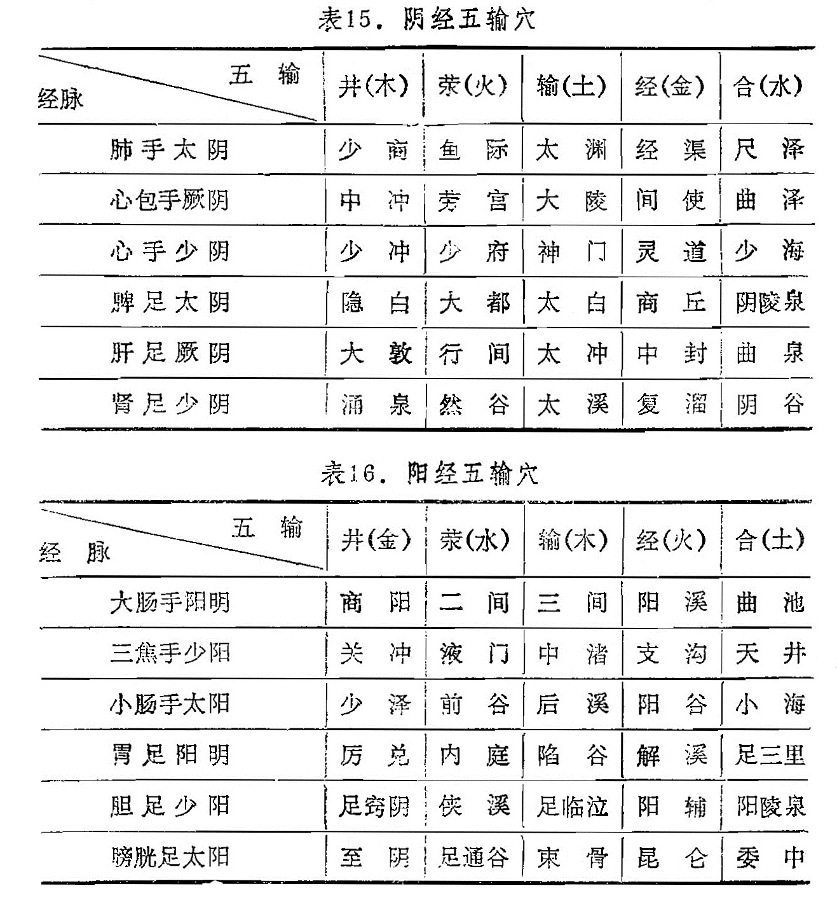
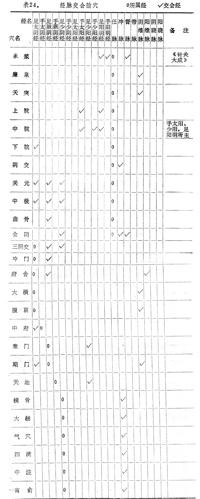
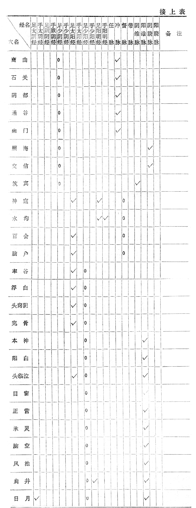
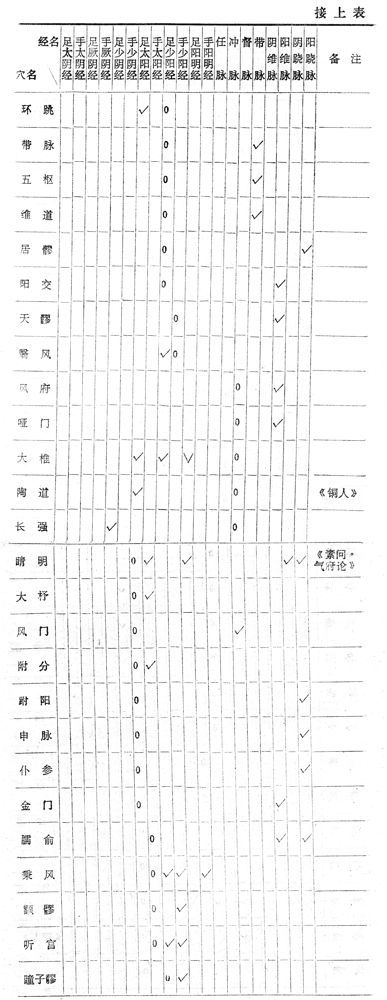
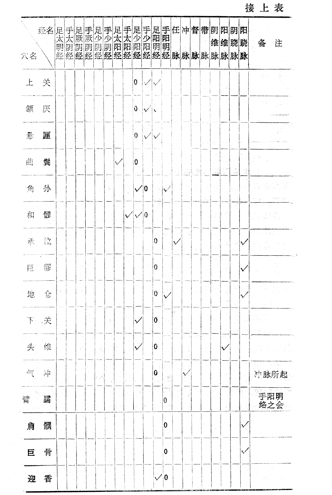
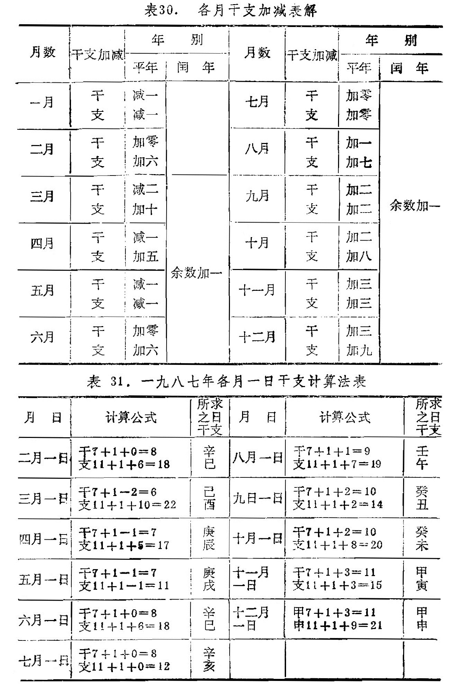
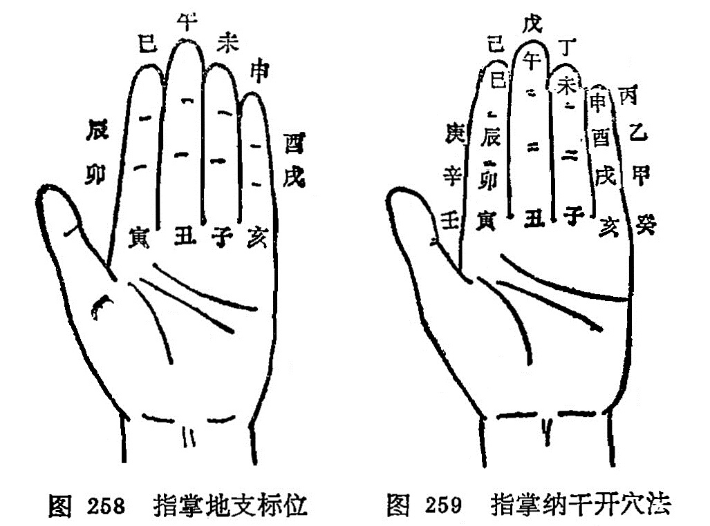

# 下篇 治疗

本篇分总论和各论两个部分。总论主要介绍针灸治病原理、针灸准则、八法在针灸临床上的运用、辨证与针灸、特定穴的应用，针灸配方与选穴等。各论介绍常见病证的辨证施治。

# 第一章 治疗总论

[TOC]

针灸治疗疾病，尽管与内服药物治疗有所不同，除了切实掌握经络、腧穴和刺灸等内容外，同样必须根据中医基础理论，进行辨证施治，才能正确的运用针灸治疗疾病。疾病的发生和发展，临床证候的表现虽然错综复杂，但究其原因则不外乎脏腑、经络功能的失调。针灸治病，就是根据脏腑、经络学说，运用四诊、八纲的辨证方法，将临床各种不同的证候加以分析归纳，明确疾病的部位是在经在脏、在表在里；疾病的属性是寒是热、属虚属实；以及病情的标本缓急。在此基础上根据辨证，进行相应的配穴处方，依方施术，或针或灸，或针灸并用；或补或泻，或补泻兼施。以通其经脉，调其气血，使阴阳归于平衡，脏腑功能趋于和调，达到防治疾病的目的。

## 笫一节 针灸治病原理

〔自学时数〕    1 学时

〔目的要求〕
  	掌握针灸治病的原理是调节阴阳和扶正祛邪。

针灸治病的原理，主要说的是针灸具有调整的作用，其特点是一种整体性、双向性和良性的调整作用。不论机体功能是亢进还是低下，这种作用均可分别使之趋于正常。由于针灸对机体的各个系统、各个器官的功能几乎都能发挥这种多方面、多环节、多种水平及多种途径的调整作用，所以针灸对正常生理功能无干扰，用以治病一般无不良反应。

经络运行气血与营卫，内通脏腑，外络肢节，网络全身，成为完整的统一体。在正常情况下，机体保持着阴阳相对平衡的状态，如果一旦遭受某种因素而致破坏时，阴阳便失去了平衡，于是就发生疾病，便会出现偏虚、偏实、偏寒、偏热等证候。同时，当邪气侵害人体，正气为了保卫机体，就形成了正邪相争的局面，出现了虚证和实证，即《素问·通评虚实论》所说的：“邪气胜则实，精气夺则虚”。正邪斗争的结果出现，正胜则病退，邪胜则病进，针灸所以能治疗疾病，就在于针灸具有调节阴阳和扶正祛邪两大作用的结果。

调节阴阳：阴和阳是说明人体各部分对立统一的关系。它的涵义，有的是代表机体组织，有的是概括功能活动。例如人体的皮肉筋骨和表里脏腑的区别，全身经络的分布，气血营卫的运行，寒热虚实的偏胜，以及外感六淫与内伤七情的性质等，都可以运用阴阳学说来阐明这些内容及其之间的相互关系。人体在正常情况下，各种组织、脏器的功能活动，都保持着有机协调；也就是保持着阴阳的相对平衡状态。这种正常的协调关系，如因某种因素而遭到破坏时，阴阳就会失去相对的平衡，人体也就发生疾病。在临床上所见到的各种疾病，无论是由于寒盛，或由于热盛，或因表虚，或因里实，或经络气滞、或脏腑不和等，都是由于阴阳的偏盛偏衰所致。针灸治疗，就要决定切合病情的处方配穴及采用各种相应的操作手法，以调整阴阳的偏盛使其重归协调。《灵枢·根结》说：“用针之要，在于知调阴与阳，调阴与阳，精气乃光，合形与气，使神内藏”。说明调和阴阳是针灸治疗疾病的基本原理。

扶正法邪：正是代表机体的调节、防御和适应机能；邪是代表一切阻碍机体正常发展和导致疾病的因素。具体来说，正气就是人体中的各种精粹之气，包括精、神、气、血、营、卫、津、液等；邪气就是发生或侵袭人体的有害物质和各种不利影响，如外感六淫、内伤七情以及痰、瘀、滞、水、饮等。人体在正气旺盛时，生理情况正常，调节机能健全，脏腑平和，经络通畅，身体就能保持建康的状态。而当病邪发生或侵袭人体的时候，正气为了保卫机体的正常发展就与病邪形成斗争的局面，这个正邪相争的情况，也就是疾病的发生和发展的过程，正气胜邪则病退，邪气胜正则病进。因此，扶正祛邪既是治疗疾病的方法，也是治疗疾病的基本原理。针灸临床采用扶正和祛邪的方法，增强人体的抗病能力以祛除病邪，达到治愈疾病的目的。

从调节阴阳和扶正祛邪的关系来看，则是互相为用的。《素问·疟疾》说：“因而调之，真气得安，邪气乃亡”。说明通过调节阴阳而达到扶正祛邪的目的。相反，在《灵枢·刺节真邪》中说：“泻其有余，补其不足，阴阳平复，用针若此，疾于解惑”。这又说明是通过扶正除邪而达到调节阴阳的目的。

### 〔临床应用〕

针灸治病的原理是调节阴阳和扶正祛邪。当机体发生病变时，用针或灸刺激机体，而使特定的病理变化总是向着有利于机体的方向发生转化，即双向调节作用。也就是说，既能调阴亦能凋阳；既能扶正又能祛邪。实践证明，针灸疗法就具有这种调整作用，如针灸既能发汗，又能止汗；既能增快心率，又能减慢心率；既能升高血压，又能降低血压；既能通便，又能止泻；既能治疗失眠亦可治疗多眠等。针灸调整作用的特点是整体性、双向性和良性的调整作用。就是说，不论机体功能是亢进的或是低下的，也不论是邪气实，还是正气虚，针灸的调整作用均可分别使之趋于正常。由于针灸对于机体的各个系统、各个器官的功能，均能挥这种多方面、多环节、多种水平，以及多种途径的调整作用，所以针灸既对正常生理功能无干扰，治病一般又无不良反应。

### 复习思考題
1. 针灸为什么能治病？
2. 你对针灸治病原理有哪些体会？

答：．
1. 分類
2. 阿是

## 第二节  针灸治则

〔自学时数〕    1 学时

〔目的要求〕
  	掌握针灸治疗的基本准则。

针灸治疗，总的来说不外补泻两端。补泻是依据辨证，常用的是八纲辨证，八纲中的阴阳是表里、虚实、寒热的概括。阴证多为里、虚、寒；阳证多属表、实、热。表里是指受邪部位的深浅，如病在经络为表，病在脏腑为里。虚实是指正气与邪气强弱而言，是决定针与灸、补与泻的关键。寒热是指疾病的属性，寒证多见肢冷、便溏、喜热；热证则见面赤、喜凉、恶热等现象。

临床上运用针刺和艾灸，是根据病证的性质来决定的。关于针灸对疾病的治疗原则，在《灵枢·九针十二原》说：“凡用针者，虚则实之，满则泄之，宛陈则除之，邪胜则虚之”。《灵枢·经脉》说：“盛则泻之，虚则补之，热则疾之，寒则留之，陷下则灸之，不盛不虚以经取之”。据此归纳起来，有补法、泻法、平补平泻三种。

### 补法：

是根据“虚则补之”的原则确立的治疗方法。虚是指正气（气血）不足而言，多由身体素虚，或久病所致，临床多表现为衰弱的证象，如身倦懒言，面色无华等虚弱症状。阳虚、气虚的可用艾灸以振奋人体的气化功能，起到补益的扶正作用；偏于阴虚的，宜用补法调之。“陷下则灸之”，是针对脏腑经络之气虚弱，失去固摄之权，如阳气暴脱，汗出不止，肢冷脉微，气息奄奄，以及脱肛、子宫下垂等症，其治疗均当艾灸，尤其阳气暴脱者，如肢冷脉微，气息微弱，须用大艾炷过灸，以升举下陷之气，扶阳固脱。针与灸各有其适应症，应因症制宜，分别应用。“寒者温之”，是指疾病的性质属寒，由于肌体的阳气偏虚，不能抗御寒邪，以致形寒肢冷，腹痛便溏，冷痛等。施用灸法，以温通经络，激发阳气，助阳以散寒邪。“寒者留之”，是指阳气偏虚，寒邪较盛，脏腑经络之气凝滞，其证多见恶寒喜热，或痹痛怕冷，胃肠虚寒，消化不良，治疗必须深刺久留针，以激发其经气，使阳气来复，散其寒邪。

### 泻法：

泻法是根据《灵枢》“满则泄之”、“盛则泻之”的原则确立的治疗方法。满、盛是指病邪方盛满实的时候，概括有阴阳的实证，以及躯体某些部位的红肿疼痛等证，针刺治疗时，必须用泻法或放血。“热则疾之”，是指邪热较盛的热性病，如外感风寒，腠理闭塞，卫气不得宣散，以致发热不解，治疗宜疾刺疾出针，或放血，以祛邪热。“宛陈则除之”，多指经络之瘀滞，或邪入血分的一些疾患，如扭闪或因气滞血瘀而出现的肿痛，以及邪入于营分的闭厥等证，宜用三棱针刺十二井穴出血，以祛瘀、定痛、解毒、泻热，达到通调经气的作用。

### 平补平泻法：

平补平泻法是用于临床证象“不盛不虚”，即虚实不明显的疾病，只取其相关的经穴，这是临床常用的一种治疗方法。

### 〔临床应用〕

即正气不足则表现为虚证，治疗宜用补法：邪气亢盛则表现为实证，治疗宜用泻法；虚实难辨或虚实夹杂的，宜用平补平泻，虚寒或下陷则用灸法，依此采用针灸方法进行治疗，才能取得治疗效果。

### 复习思考題
1. 针刺准则是什么？怎样理解？
2. 灸法准则是什么？怎样理解？
3. “寒者温之”与“寒则留之”有什么不同？
4. 平补平泻法在临床上怎样应用？

答：
1. 分類
2. 阿是

## 第三节  八法在针灸临床上的运用

〔自学时数〕    2 学时

〔面授时数〕    1 学时

〔目的要求〕
  	掌握八法在针灸临床上的应用

八法就是指汗、吐、下、和、温、清、消、补。在针灸临床应用时，必须运用八纲辨证，辨清疾病的阴阳、表里、寒热、虚实之所属，并且选穴准确、手法恰当，才能正确运用八法。现将八法分述如下：

### 一、汗法

汗法即解表法，病邪在肌表，应用汗法进行解表；针刺穴位，达到开泄腠理、发汗祛邪，治疗表症的方法。《素问·阴阳应象大论》说：“其郁邪者，溃形以汗；其在皮者，汗而发之”；“体若燔炭，汗出而散”。

1．发散风寒：取风池、大椎、身柱、风门、合谷、外关，用烧山火手法，使其产生热感而发汗，主治感冒，头痛，恶寒，发热无汗，脉浮紧的表寒证。鼻塞流涕者，加迎香列缺，用平补平泻法，以祛风开窍。

2．清泄表热：取大椎、陶道、身柱、肺俞，用梅花针叩打出血，列缺、合谷用透天凉法，使其产生凉感而发汗，主治感冒发热，咳嗽痰喘，脉浮有力的表热症。神昏不安者，加少商、商阳中冲点刺出血，以开窍、泄热、醒神。

禁忌：大吐、大泻、大失血之后以及体虚者，慎用汗法。

### 二、吐法

吐法即涌吐、催吐法。病邪在上焦胸膈间，胸腹胀满，痰阻宿食者，应用催吐急救。《素问·阴阳应象大论》说：“其高者因而越之”。张景岳解释说：“越，发阳也，升散也，涌吐也”。运用针灸进行催吐，排出有害物质，以减少毒物的吸收，缓解病情，减轻症状。

1．涌吐风痰：取天突，用押手的食指按压天突穴，刺手持针刺入穴内，激起内部反射作用，上涌作呕，即可将痰涌出，主治中风闭证和小儿惊风所致痰阻咽喉。如遇有不能吐出的险症，可加内关，以加强催吐作用。

2．通结催吐：取中脘、幽门，用押手的食指按压穴位，持手持针剌人穴位内，使针感向上传导，反复操作几次，激起内部反射作用，上涌作呕，急速将针拔出，可将胃部难以消化的食物呕吐而出，主治食物中毒或宿食停滞，壅塞胃脘，欲吐不出的险证。

禁忌：年老体虚，妊娠期，产后，大失血后，严重的心脏病者，禁用吐法。

### 三、下法

下法即泻下法。病邪在中焦，腹中胀满的，应用泻法攻下。《素问·阴阳应象大论》说：“中满者泻之于内”。针灸穴位，达到泻热导滞，通便泄火，推陈致新。

1．泻热通便：取大肠俞、天枢、足三里、丰隆，用凉泻手法，使其产生凉感泻下，主治胃肠积热，腹痛拒按，大便秘结，脉数有力的实热证。对阴虚便秘者，取支沟透间使，用泻法；照海、三阴交用补法，以达养阴清热，润肠通便。

2．清肠导滞：取中脘、天枢、气海、曲池、足三里，用凉泻手法，使其产生凉感通便，主治湿热阻滞，腹痛便秘，下痢赤白，里急后重，脉滑数的湿热证。对小儿痞块，取中脘、建里用平补平泻手法，四缝穴点刺出黄色液体，以达健睥助运，消积化滞。

禁忌：下法易伤正气，中病即止。对表邪未解，妊娠，产后大失血，禁用下法；年老体弱者，也要慎用或攻补兼施。

### 四、和法

和法即和解法。本法既能和里，又能解表。和里是不让病邪再侵入于内，解表是使病邪外出，有安内攮外的含义。病邪在半表半里或阴阳偏盛偏衰的，应用和法。《素问·至真要大论》说：“察阴阳所在而调之，以平为期”。《灵枢·经脉》说：“和气之分，必通阴阳”。针灸穴位后，可达到调和机体的生理、病理机能上的偏盛偏哀，扶正祛邪。

1．和解少阳：取大椎、陶道、身柱、外关透内关，用阳中引阴的方法，使其先热后凉。主治外病，邪传半表半里，出现寒热往来，胸胁苦满，口苦咽干，目眩，心烦喜呕等半表半里的少阳证及疟疾。如疟疾在发作前2小时内，针大椎、陶道，有扶正截疟的作用。

2．疏肝理气：取神封、膻中、膈俞、肝俞，用平补平泻法；支沟、阳陵泉用泻法，留针20～30分钟，主治肝气郁结的胸胁胀满。如肝阳上亢的头痛、眩晕、失眠，加百会、神门、三阴交平补平泻法，有平肝潜阳，养阴安神作用。肝气郁滞引起的疝气、偏坠、睾丸抽痛，加大敦、照海、中都，用平补平泻法，有疏经活血，行气止痛的作用。

3．调和肝脾：取肝俞、脾俞、太冲、三阴交，用平补平泻法，主治肝脾失调，肝胃不和及肝气郁结而引起的月经不调等。如痛经加归来、中极，用平补平泻法，留针20～30分钟，有疏肝理气，活血止痛作用。

禁忌：凡表邪未解或邪热传里的，均不能用和法。

### 五、温法

温法即温里法。机体感受寒邪或形体虚寒的应用温法，以温经散寒。《素问·阴阳应象大论》说：“寒者热之，清者温之”。针灸穴位后，可达消除沉寒阴冷，补益阳气。

1．温中散寒：取三脘、梁门、足三里或膈俞、肝俞、脾俞、胃俞，用热补手法或针上加灸，使其产生热感，主治胃脘隐痛，消化不良，脉沉缓的虚寒证。

2．温肾壮阳：取肾俞、关元俞、次膠，用热补手法，使腰部产生热感，主治腰痛腿软，脉沉细的虚寒证。如腰背痛；不能转侧，加秩边、委中，用热补手法，以达散寒镇痛作用。

3．温经通络：上肢取肩髃、曲池、外关、合谷；下肢取秩边、环跳、阳陵泉、足三里、绝骨、申脉，用热补手法或针上加灸，使其产生热感，主治瘫痪、痿软，风寒湿痹证，以达祛寒镇痛，舒筋利节的作用。

4．温阳救逆：取脾俞、肾俞、天枢、关元、神阙、足三里、三阴交、曲池、外关，用热补手法或针上加灸，主治虚寒腹痛，泄泻，四肢厥冷。以达回阳救逆，温中散寒而止痛。

禁忌：凡实证、热证、阴虚血少及血热妄行者，禁用温法。

### 六、清法

清法即清热之法。病邪化热，耗伤津液，用清法来清热养阴。《素问·至真要大论》说：“温者清之”。《灵枢·经脉》说：“热则疾之”。针灸穴位后，可达清热降火，养阴除烦，清热止渴。

1．清热开窍：取百会、人中、承浆、十宣（点刺出血），主治中风闭证，中风昏迷，小儿惊厥，热极神昏，癫痫，脏躁等证。如狂证、脏躁，因痰迷心窍，精神失常，哭笑打骂，不识亲疏时，取内关、合谷用泻法、人中、承浆、百会、上脘、中脘、丰隆、太冲用凉泻法，使其产生凉感，用以熄风降痰，清热开窍。

2．清热养阴：取尺泽、委中，用三棱点刺出血，排出血中之毒热，主治霍乱腹痛，上吐下泻之急症。如呕吐不止，取内关、天枢、足三里，用泻法，以清热止呕。如阴虚发热，取三阴交、照海用泻法，以清热养阴。

3．清热解毒：取风池、大椎、翳风、合谷，用凉泻手法，使其产生凉感；少商、商阳，点刺出血，主治腮腺炎，咽喉肿痛；口唇生疮等邪毒积热症。如痤疮，取大椎、心俞、膈俞、脾俞、肝俞，用泻法或刺之出血，有清热凉血，解毒的作用。禁忌：凡体质虚弱，大便溏泻的虚寒证，禁用清法。

### 七、补法

补法即补益法。凡是形体衰弱或气血不足的，应用补法来益气养血。《灵怄·经脉》说：“虚则补之”。针灸穴位，可扶正祛邪，补益人体阴阳气血和脏腑虚损，达到增强机体抵御病邪的能力，消涂虚弱证候的作用。

1．培元固本：取中脘、列缺、太渊、足三里、照海、用补法；大椎、百劳、肺俞、心俞、脾俞、肾俞、针后加灸，使其产生热感，主治喘咳气短，消化不良，自汗盗汗等。如阳萎、遗精、遗尿，取肾俞、关元俞、膀胱俞、关元、三阴交，用热补法或针上加灸，以补肾益精，固本壮阳。

2．补中益气：取中脘、关元、天枢、腰俞、长强，用热补手法或针上加灸，主治久泻不止，脱肛不收，腹痛喜按，脉迟无力，舌质淡，苔薄白的脾胃虚寒证。如五更泄泻，加脾俞、胃俞、关元俞，用热补手法或针上加灸，以温肾暖脾，涩肠固脱。

3．补血固崩：取关元、归来、血海、三阴交、隐白、膈俞、脾俞，用补法。主治经行不止，脉细无力，冲任不固的虚寒证。如血崩不止，神昏不语，面白，脉微欲绝的脱症，取隐白、人中、行间，平补平泻，大敦针后加灸，以回阳固脱，补气摄血。

禁忌：实证，邪气未尽不能用补法；虚中挟实者，不能单用补法。

### 八、消法

消法即消散法。气血积聚或痰湿疑滞的，应用消法，软坚磨积。《素问·至真要大论》说：“坚者削之……结者散之”。《素问·阴阳应象大论》说：“其实者，散而泻之”。针灸穴位，可消积化滞，破瘀散结。

1．破淤活血：取风池、角孙、攒竹、太阳，用热补手法，使热感传到眼底，能化散玻璃体内的瘀血，并使瘀血吸收，主治视网膜出血、暴盲、青盲等眼病。身体虚弱，反复出血，加大椎、肝俞、肾俞，用热补手法，使其产生热感，以调肝补肾，益气养．血，清头明目。

2．消坚散结：取阿是穴，用三棱针点刺，挤出胶化液体，主治腱鞘囊肿。局部周围用提插法，主治瘿气（甲状腺肿）。取肩井、臂臑，用平补平泻法，主治瘰疬。如瘰疬坚硬者，可用围刺法，针尖向核围刺，以活血散瘀，散结消核。

3．消食导滞：取上脘、足三里、四缝、商丘，用泻法，主治小儿疳积、食积等症。如食积，腹部胀痛拒按，嗳气腐臭，不思饮食，取足三里、胃俞、大肠俞、天枢，用平补平泻法，以消食导滞，消痞散积。

禁忌：消法是临床上常用的一种针法，没有特殊禁忌，但对体质特别虚弱者应慎用。

### 〔临床应用〕

八法，即以中药方剂的作用，归纳为汗、吐、下、和、温、清、补、消八种方法。在针灸临床上通过针灸和穴位的配伍，同样也可达到八法的作用。既可单独运用，亦可随病情变化而互相配合使用，灵活掌握。

### 复习思考題
1. 汗法、下法、清法各取哪些穴位？用什么手法？
2. 下法和消法有什么区别？

答：．
1. 分類
2. 阿是

## 第四节 辨证立法

〔自学时数〕    2 学时

〔面授时数〕    1 学时

〔目的要求〕
  	掌握在针灸中运用八纲、脏腑经络等辨证方法。

### 一、八纲辨证与针灸

八纲是祖国医学的主要辨证法则，无论病变发生于任何脏腑经络，都离不开阴阳、表里、虚实、寒热的范围。也就是把复杂的病情，概括为八个具有普遍性的证候类型，来说明病变的部位，病情的轻重，疾病属性的一种辨证方法。针灸疗法的应用，采用针刺、艾灸，宜补，宜泻等，无不是在八纲辨证的指导下进行的。

1．证分阴阳，统领六要：每个证都分阴阳，在八纲辨证中，阴阳是辨证的总纲，是表里、寒热、虚实的综合。一切疾病的病理变化都可归纳为阴阳偏盛偏衰两大类。阴，包括里、虚、寒、是指不及的、抑制的、衰退的、寒性的临床表现，如颜面苍白，暗淡，恶寒，不渴，懒言，声音低微，大便溏、小便清长，脉沉细微弱，舌质淡，舌苔白，取穴应以任脉经穴为主，手法应以多灸少针，久留针，慢出针，以温阳散寒。阳，包括表、实、热，是指太过的、兴奋的、亢进的、热性的临床表现，如颜面潮红、有光，发热，烦热，烦渴，呼吸迫促，声音洪亮，大便秘结，小便短赤，脉洪大滑数，舌质红，舌苔黄，取穴应以督脉经穴为主，手法应以针不灸，或少灸，速进针，急出针，以泄阳经之邪热。这是阴阳的基本分类，在这个基础上，还必须结合表里、虚实、寒热等纲进行具体分析，才能全面的掌握疾病的性质。

2．病有表里，刺分浅深：表里是鉴别疾病病位的内外、深浅和病势趋向的一种辨证方法。表，是指人体的浅表部位，病变在皮肤、肌肉、经络等。疾病反映于体表的证候称作表证，凡外感六淫之邪，首先侵犯皮肤，经络而出现发热，恶寒，头痛，身痛，四肢酸痛，有汗或无汗，鼻塞，脉浮或浮数，舌质淡，苔薄白，取阳经、肺经穴位为主，手法应以浅刺疾出，不留针。里，是指位深在内的一类证候，凡表邪未解，内传脏腑或因七情、劳倦、饮食等所伤，病自内发而伤及脏腑皆属于里，反映于脏的证候称作里证，如高热神昏，烦躁口渴，腹痛恶心，小便赤，大便秘或泄泻，脉沉或沉数，舌苔黄，取阳经及十二井穴（多为阳经井穴），手法应以深刺，以泻阳经之热而开窍。

3．病有寒热，刺分留疾：这是鉴别疾病性质的两个纲领。寒证，是感受寒邪或机体活动功能衰退所表现的征象，如怕冷喜暖，口不渴或渴喜热饮，腹痛使溏，小便清长，面色苍白，手足不温，脉象沉迟或沉细，舌质淡，舌苔白滑，多取任脉、督脉、肾经、脾经穴位为主，手法以温针久留、重灸，以温经散寒，回阳助气。热证，是感受热邪或机体的功能亢进所表现的征象，如高热烦渴，喜冷饮，面目红赤，潮热盗汗，腹胀满痛，大便秘结，小使短赤，脉数或洪数，舌质红，苔黄而干燥，多取督脉、大肠、胃经等经脉的腧穴，手法以重刺疾出，一般禁灸，以清泄阳经的邪热。

4．病有虚实，刺分补泻：这是鉴别人体正气强弱和邪气盛衰的两个纲领。虚证，是指正气不足的证候，多见于慢性病。凡是机体抵抗力下降，生理机能衰退或衰竭而出现的病理状态，如饮食失调，造成后天失养；七情劳倦，内伤脏腑气血；房室过度，损伤肾气；久病以及误治、失治损伤正气所致。主要症状是精神萎靡，少气懒言，形体消瘦，自汗盗汗，心悸气短，大便溏薄，小便频数或不禁，脉象细弱，舌质淡，少苔，取穴应以任脉、督脉、脾经、肾经为主，手法以多灸少针，轻刺为补，阴虚一般不灸，阳虚多灸、重灸。实证，是指邪气亢盛的证候，多见于急性病。凡是机体反应强，组织器官功能亢进的病理状态，是外邪侵入机体或者由内脏功能失调，代谢障碍，以致痰饮、水湿、气滞血瘀等病理产物停留在机体所致。主要症状是精神烦躁，声高气粗，胸腹胀满，疼痛拒按，身痛高热，大便秘结或里急后重，小便不通或淋沥涩痛，脉数有力，舌质红，舌苔黄腻，取穴应以督脉、胃经、三焦经、大肠经穴为主，手法以重刺泻法，实证禁灸，寒证宜灸，以达到泻实的目的。

由于临床的病变并非都按八纲截然划分，常有表里兼病，虚实互见，寒热夹杂，因而针灸补泻也必须根据具体证候灵活运用。才能达到正确的诊断，合理的治疗。

兹将八纲辨证与针灸列表如14：

### 二、脏腑经络辨证与针灸

#### （一）肺

肺居胸中，司呼吸，主一身之气，外合于皮毛，上与喉鼻相通，为清肃之脏。外邪侵入皮毛口鼻，多传人肺脏。肺主治节，朝百脉，与五脏六腑关系最为密切，故肺病日久可以影响其它脏腑，而其它脏腑病变亦可影响于肺，其中以脾肺兼病与肺肾兼病为多见。其经脉下络大肠，与大肠为表里。

##### 脏病证治

1．风寒袭肺：风寒袭肺，肺气失宣。证见恶寒发热，头痛，身痛，无汗，鼻塞流涕，咳嗽而痰稀薄，口不渴，舌质淡，苔薄白，脉浮紧。治疗宜取手太阴、阳明经穴为主，针用泻法，并可灸，以疏风散寒，宣肺化痰而止咳。

2．热邪伤肺：热邪伤肺，肺失清肃。证见身热口渴，咳嗽、痰色黄粘，喘促气粗，胸闷烦躁，鼻衄，咽喉肿痛，舌红而干，苔黄，脉数。治疗宜取手太阴、手阳明经穴为主，针用泻法，或用三棱针点刺出血，以疏风清热，宣肺止咳化痰。

3．痰浊阻肺：痰浊阻肺，肺失清肃。证见咳嗽痰稠，咯出不爽，喉中痰鸣，胸胁支满而痛，张口抬肩，不能平卧，恶心纳呆，舌质淡，苔黄腻或白腻，脉滑。治疗宜取手太阴与足阳明经穴为主，针用泻法，并可施灸，以宣肺化痰，痰浊可除。

4．肺气不足；劳伤过度，肺气不足。证见喘息气短，言语无力，咳声低微，自汗恶风，身倦少言，面色㿠白，舌淡苔薄白，脉象虚弱。治疗宜取肺俞、脾俞与手、足太阴经穴为主，针用补法兼灸，以恢复肺脾功能，补益肺气。

5．肺阴亏损：由肺阴不足而致虚热内生。证见干咳少痰，咳唾不爽，咽干口燥，痰中带血，午后潮热，两颧泛红，骨蒸盗汗，手足心热，舌质红，脉细数。治疗宜取手太阴经穴和背部俞穴为主，针用补法或平补平泻，不灸，以达补益肺阴，虚热乃解。

##### 经脉证治

1．风寒湿邪痹阻经脉：证见肩背痛，臑臂部内侧前廉痠重疼痛。治疗宜取肺经及其邻近部位的经穴，针用泻法或用艾灸，以达疏通经络之气。

2．邪热壅滞经脉，随经上冲：证见咽喉红肿疼痛，鼻衄者，治疗宜取手太阴、阳明经穴为主，针用泻法或点刺出血，以达清泻邪热。

#### （二）大肠

  大肠居腹，为传导之官，职司传导糟粕，并使之变化成形，并排出体外，若大肠传导变化功能失常则导致病变。因大肠经脉络于肺，并与脾、胃关系最为密切。因此大肠病变，在腑有寒热虚实之异，在经多属实证。

##### 腑病证治

1．大肠寒证．多因外受寒邪或内伤生冷，而致传导失常。证见腹痛肠鸣，大便泄泻，或兼有恶寒发热，舌苔白滑，脉象沉迟。治疗宜取手阳明的募穴及下合穴为主，针灸并用，以达散寒止泻。

2．大肠热证：多因邪热侵于大肠，气血壅滞所致。证见肛门热痛，大便臭秽异常，便下鲜血或下痢赤白，小便短赤，身热口渴。如热结而为肠痈，则腹痛拒按，腿屈不能伸，舌苔白，脉多滑数。治疗宜取手阳明的募穴、下合穴及手、足阳明经穴为主，针用泻法，不灸，使邪热外泄。

3．大肠虚证：多因久痢不止，或下痢久延。证见大便不禁，肛门滑脱，精神倦怠，面色萎黄，舌淡苔薄，脉象细弱。治疗宜取足太阴、阳明及任脉经穴为主，针用补法，重灸，以达补虚，恢复大肠功能。

4．大肠实证：多因积滞内停，邪壅大肠所致。证见大便秘结，或下痢不爽，里急后重，腹痛拒按，舌苔垢膩，脉象滑数。治疗宜取手、足阳明经穴为主，针用泻法，不灸，以疏导大肠积滞。

##### 经脉证治

1．风寒湿邪痹阻经脉为患：证见肩前腰痛，大指次指痛而不能运用。治疗宜取手阳明经穴为主，针用泻法，或用灸法，以散邪通络。

2．大肠经之热邪，循经上扰：证见龈肿齿痛，喉痹，鼻衄，颈肿口臭，舌红苔黄，脉象洪滑而数。治疗宜取手、足阳明经穴为主，针用泻法，或点刺出血，以清泻其邪热。

#### （三）胃 

 胃与脾同居腹中，两者以膜相联，其脉与脾相联络而为表里，在体为肉，开窍于口。胃在膈下，上接食道，下通小肠，胃主纳谷，为“水谷之海”。胃是六腑之一，是化物器官，饮食通过胃之液化作用，化生精微，以滋养五脏，因此，五脏六腑得以发挥其功能。胃气主降，以下行为顺。因此，胃腑发生病变有虚实寒热之异，在经脉多属实证。

##### 腑病证治

1．胃虚证：胃病日久，胃气虚惫。证见胃脘隐隐作痛，痛而喜按，有时噯气，气馁少力，面色少华，舌淡红，脉缓软而弱。治疗宜取足阳明的俞、募及足阳明经穴为主，针用补法，多灸，以补益胃气，温胃化谷。

2．胃实证：包括两种情况，一系胃火炽甚，证见消谷善饥，口渴欲饮；二系食滞留阻，证见胃腑胀闷，甚则疼痛拒按，舌红苔黄，脉象滑实。治疗宜取足阳明经穴和足阳明的募穴为主，针用泻法，以泻阳明之热，疏导食滞。

3．胃寒证：多因胃阳不足，寒邪偏盛。证见胃脘胀痛，时时泛吐清水，喜热饮，寒甚则有四肢厥冷，呕吐呃逆，舌苔白滑，脉象沉迟或弦紧。治疗宜取足阳明、太阴、手厥阴经腧穴及其俞、募穴为主，针用平补平泻，多灸，以调节腑气，温经散寒。

4．胃热证：多因胃阴不足，热邪偏盛。证见善饥嘈杂，身热，口干喜冷饮；热邪导致胃气上逆，则食入即吐；胃火下移大肠，消烁津液，则大便燥结，苔黄厚而燥，脉象洪大有力。治疗宜取手、足阳明经穴为主，针用泻法，不灸，以泻阳明之邪热。

##### 经脉证治

1．风寒湿邪痹阻经脉：证见膝髌肿痛，下肢前缘痠重冷痛。治疗宜取足阳明经穴为主，针用泻法加灸，以疏通经络，温经散寒。

2．胃经蕴热，随本经上扰：证见口渴，唇胗颈肿，喉痹，齿痛龈肿，甚则腐烂出血，苔黄，脉象洪数。治疗宜取手、足阳明经穴为主，针用泻法，不灸，以清泻阳明之蕴热。

#### （四）脾

  脾胃对饮食有受纳、腐熟、消化、吸收及输布的功能，为气血生化之源，五脏六腑、四肢百骸皆以受养，故为后天之本。其脉络胃，与胃为表里。脾主中洲，司运化，输布水谷精微，升清降浊，为生化之源。又具有益气、统血、主肌肉、四肢等生理功能。因此脾的病变在脏有寒热虚实之异，在经多属实证。

##### 脏病证治

1．脾虚证：脾失健运．水饮内停。证见面色萎黄，少气懒言，食欲不振，肌肉消瘦，腹满便溏，四肢不温，足跗浮肿，舌淡苔白，脉象濡弱或沉缓。治疗宜取足太阴的募、俞与足太阴、阴明经穴为主，针用补法，熏灸。

2．脾实证：饮食停滞，中焦受阻。证见大腹胀满，或疼痛拒按，若湿热蕴蒸，证见肤黄溺赤；湿阻而脾气不运，证见脘闷而腹满，大、小便不利。治疗宜取足太阴、阳明经穴为主，针用泻法，以升清降浊，理气化湿。

3．脾寒证：脾阳衰微，水湿不化，以致阴寒盛者；或由于过食生冷，造成脾阳不振者。在证候上都有可能为腹痛隐隐，泄泻绵绵，甚至完谷不化，小便清长，四肢清冷，舌淡苔白，脉象沉迟。治疗宜取足太阴的募、俞与足太阴、阳明经穴为主，针用补法，重灸，以健脾利湿，温运脾阳。

4．脾热证：脾为湿土，如受邪热，则多为湿热交蒸。证见脘痞不舒。身重困倦，口腻而粘，不思饮食；亦有口腻泛甜，泛浊唾涎沫，小便短少而黄，苔黄腻、脉濡数。治疗宜取足太阴、阳明经穴为主，针用泻法，不灸，以达清热利湿。

##### 经脉证治

1．脾经蕴热，随经上扰：证见舌本强痛，嗳气呕吐，胃脘痛，腹胀、身重，或有溏泻，黄疸等。治疗宜取足太阴、阳明经穴为主，针用泻法，不灸，以清泄脾经蕴热。

2．风寒湿邪痹阻经脉：证见下肢前缘痠重冷痛，足大趾运动障碍等。治疗宜取本经及其邻近经穴为主，针用泻法，或用艾灸，以疏通经络，温经散寒。

#### （五）心

  心居胸中，心包为其宫城，其脉络小肠，而为表里，在体为脉，开窍于舌。心主血脉，又主神明。前者是指推动血液循环的心脏功能而言，后者是指统管整个思维活动的功能而言。由于它在生理上具有主血脉和主宰神明的功能，故当外感六淫或内伤七情而致心神失常，都可引起心的病变，其病变可分为虚证、实证，在经脉病多属实证。

##### 脏病证治

1．心虚证：包括心阳不足、心阴亏虚两个方面。

（1）心阳不足：多因思虑过度，劳伤心神，造成心气不足，损及心阳所致。证见嗜卧，心悸不宁，有恐惧感，兼有气短、气喘，甚至口唇、指甲青紫，舌质淡或夹有瘀点、瘀斑，脉微弱兼有歇止。治疗宜取本脏俞、募和手少阴、任脉经穴为主，针用补法兼灸，以达补益心阳，温经通脉。

（2）心阴亏虚：多因心血亏耗，心阴受损所致。证见心悸不宁，胸闷气短，虚烦不安，少寐多梦，掌心发热，健忘、盗汗，舌质淡红或舌尖干赤少苔，脉象细数。治疗宜取背俞与手足少阴、厥阴经穴为主，针用补法，不灸，以滋补心肾之阴，使心肾相交，冰火相济，心阴得复。

2．心实证：包括心火上炎和痰火蒙蔽神明两方面。

（1）心火上炎：多因诸经有热，心火上炎。证见心烦口渴，口舌生疮，木舌，重舌，小便短赤，甚则吐血、衄血，舌赤苔黄。治疗宜取手少阴、厥阴、太阳经穴为主，配以手阳明经穴为辅，针用泻法，不灸，以泻诸经之热。

（2）痰火蒙蔽神明：多因外感邪热内蕴或五志化火过极，导致痰火蒙蔽神明。证见神昏谵语，惊狂，不寐，壮热面赤，舌赤或干裂，苔黄，脉滑洪数。治疗宜取手少阴，厥阴经穴为主。甚者并用手足阳明、督脉及十二井穴，针用泻法，或三棱针点刺出血，以泻诸经之热，经气得通，痰火得泻。

##### 经脉证治

1．风寒湿邪外袭痹阻经脉：证见肩背痛，臑臂内后廉痛，经脉循行的部位有痠重感。治疗宜取手少阴、太阳经穴为主，针用泻法或灸，以达疏散外邪，温通经脉之气。

2．心经邪热随经上扰：证见嗌干目黄，口舌糜烂，重舌，木舌，疮疡等。治疗宜取手少阴、厥阴、太阳经穴为主，针用泻法域三棱针点刺出血，不灸，以泻心与小肠经之热邪。

#### （六）小肠 

 小肠居于腹中，上接幽门，与胃相通，下接阑门，与大肠相连，其脉络于心而为表里。小肠为受盛之官，职司分清浊，主化物。因此其病理变化主要是分别清浊功能失常，肠中水液不能泌渗吸收，以致水谷不分，清浊混淆。其病在腑有寒热之别，在经络多属实证。

##### 腑病证治

1．小肠寒证：多由饮食生冷，伤及中阳所致。证见肠鸣腹泻，腹痛喜按，小便短少，苔白，脉沉迟。治疗宜取本腑俞、募及下合穴为主，兼取足阳明穴为辅，针用补法加灸，以温运肠胃。

2．小肠热证：多由心火下移所致。证见小便热赤或涩痛，甚则溺血，心烦口渴，或口舌生疮，舌尖赤，苔黄，脉数。治疗宜取手少阴、太阳经腧穴及其募穴，下合穴为主，针用泻法，不灸，以泻诸经之邪热。

##### 经脉证治

1．风寒湿邪痹阻经咏：证见颈、项、肩、臑、臂、肘外后廉痛。治疗宣取本经及其邻近部位的经穴，针用泻法并灸，以琉通经络，温经散寒。

2．邪热壅滞经脉，循经上扰：证见颊肿，耳鸣，耳聋，目黄。治疗宜取手少阴、太阳经穴为主，针用泻法，或三棱针点刺出血，以清泻邪热。

#### （七）肾

  肾位于腰部，左右各一，肾主水，藏精，主骨生髓，其脉络膀胱，而为表里。肾又为命门火所寄，故称水火之脏，为先天之本。当外感病邪或房室过度时均可引起肾脏发生病变，其病变可分为阴虚和阳虚，经脉病多为实证。

##### 脏病证治

1．肾阴虚证：多由久病之后，真阴耗伤所致。证见形体虚弱，头昏耳鸣，少寐健忘，腰腿痠软，多梦遗精，口干咽燥，有时潮热，或咳嗽，痰中带血，舌红少苔，脉细数。治疗宜取足太阳、足少阴经穴为主，兼取手太阴、少阴经穴为辅，针用补法，不灸，以补肾扶元，滋阴降火。

2．肾阳虚证：可分为肾阳不足、肾不纳气、阳虚水泛。

（1）肾阳不足：多由肾气素亏，或劳损过度，久病失养所致。证见阳萎早泄，溲多遗溺，腰脊痠楚，足膝无力，头昏耳鸣，面色白而畏寒，舌质淡，脉弱。治疗宜取本脏募、俞及任、督、足少阴经腧穴为主，针用补法，重灸为主，使经气振奋，恢复肾阳，固摄精气。

（2）肾不纳气：多由劳伤肾气，或久病气虚，肾失摄纳之权。证见气短喘逆，呼吸不续，动则尤甚，自汗懒言，头晕畏寒，两足逆冷，舌淡，脉弱或浮而无力。治疗宜取本脏募、俞及任、督、足少阴经腧穴为主，针用补法并加灸，以温补肾阳，纳气归肾。

（3）阳虚水泛：多由禀赋素虚，久病失调所致。证见周身浮肿，肤冷，下肢尤甚，按之陷而不起，腹部胀满，大便泄泻，舌苔润滑，脉沉迟无力。治疗宜取背俞及任、督、足少阴、太阴经腧穴为主，针用补法，重灸，以温补肾阳，化气行水，益火之源，以消阴霾。

##### 经脉证治

风寒湿邪痹阻经脉：证见下肢内侧后廉痠重。冷痛或痿弱，足不任地。治疗宜取本经和邻近经脉腧穴为主，针用泻法或施灸，以疏通经络，温经散寒。

#### （八）膀胱

  膀胱居于少腹，其脉络于肾而为表里。膀胱为洲都之官，以藏津液，主气化行水，职司小便。故其病理变化，主要为膀胱的启闭失常。在腑有虚寒和实热之分，在经脉病为实证。

##### 腑病证治

1．膀胱虚寒证：多由下焦虚寒，脬气不固所致。证见小便频数或遗尿，少腹冷痛，喜温喜按，舌淡苔白，脉象沉迟。治疗宜取本腑俞、募及任脉、足少阴经腧穴为主，针用补法，加灸，以温暖下元，益气散寒，振奋膀胱约束机能。

2．膀胱实热证：多由湿热内蕴，气机阻滞所致。证见小便短涩不利，黄赤混浊，甚或闭而不通，或淋漓不畅，兼夹脓血砂石，茎中热痛，少腹急胀，舌赤苔黄，脉多数实。治疗宜取本腑俞、募及任脉、足三阴经腧穴为主，针用泻法，不灸，以疏诸经之气，使气化畅利，湿热下行，则诸证自除。

##### 经脉证治

风寒湿邪侵袭痹阻经脉：证见项、背、腰、尻、腘、腨、脚痠重冷痛。治疗宜取本经及其邻近部位的经穴，针用泻法，并加施灸，以疏通经络，温经散寒。

#### （九）心包 

 心包居胸中，位处心之外围，为心之宫城，有护卫心脏的作用。其脉历络三焦而为表里。故凡病邪内传于心，诸如温邪逆传，痰火内闭等，多是心包代其受邪。由于心包代心行令，为神明出入之窍，在主宰思维活动的生理功能方而与心是一致的，因此，邪入心包，其病理变化亦主要是表现在神志方面，故临床以神昏谵语或癫狂躁扰等神志失常为其主证。心包的脏腑证治与心病相同，不予重述。

##### 经脉证治

若外感风寒湿邪，伤其经脉：证见心胸疼痛并牵引腋下，心烦，腋肿以及其经脉循行部位疼痛、麻木、痿痹不同，手掌发热等症。治宜取本经腧穴为主，针用泻法，或针灸并用。以疏通经络，温经散寒。

#### （十）三焦

  三焦是上、中、下三焦的总称，其脉络心包而为表里。三焦为六腑之一，职司一身之气化。凡人体内脏的功能活动，诸如气血津液的运行布化，水谷的消化吸收，水分的代谢等，都赖其气化作用而维持正常活动。三焦气化功能，实际是概括了人体上、中下三个部分所属脏器的整个气化作用。故当其发生病变，影响的范围也就必然比较广泛。就其病理机制而言，关键在于气化功能失司，水道通调不利，以致水湿潴留体内，泛滥为患，故临床上以肌肤肿胀，气逆，腹满，小便不利等为主证。

由于三焦联系脏腑，所以其病变又每与肺、脾、肾、膀胱等脏器有着密切的关系。例如三焦气化失司，可影响到肺气的宣降；又如三焦不利，可导致脾胃的升降失常；三焦化气行水功能失职，亦能使肾和膀胱温化水液的功能受到影响。三焦病变可分为虚证和实证，经脉病多属实证。

##### 腑病证治

1．三焦虚证：多因肾气不足而导致三焦气化不行，水湿内停。证见肌肤肿胀，腹中胀满，气逆肤冷或遗尿，小便不禁，苔多白滑，脉沉细或沉弱。治疗宜取本腑俞、募及下合穴为主，兼取任脉等经腧穴，针用补法，并灸，以温补肾阳，助命门相火，使气化水行。

2．三焦实证：多由湿热蕴结于里，而致三焦化气行水的职能失常，水液潴留体内所引起。证见身热气逆，肌肤肿胀，小便不通，舌红苔黄，脉滑数。治疗宜取其俞、募、下合穴及足三阴经腧穴为主，针用泻法，不灸，以疏通经气，湿邪外泄，而化气行水的功能得以恢复正常。

##### 经脉证治

1．风寒湿邪痹阻经脉：证见肩、臑、肘、臂外侧痠胀冷痛。治疗宜取三焦经及邻近经腧穴为主，针用泻法，可灸，以疏通经络，温经散寒。

2．因外感风热或内热循经上冲，或七情抑郁而致经气痹阻：证见耳聋，耳鸣，目锐眦痛，颊肿，喉痹，腋肿，瘰疬，胁痛，身热口渴，舌红苔薄。治疗宜取手、足少阳经腧穴为主，针用泻法，剌出血，不灸，以疏导经气，清泻邪热。

#### （十一）肝

  肝居胁下，主筋，藏血，开窍于目，其脉络胆而为表里，上连目系，交于巅，其性刚强，喜条达而恶抑郁，凡精神情志之调节，与肝有密切关系。肝为风木之脏，内寄相火，故其病变机转一般较为复杂，但主要亦不外肝气郁结，肝火亢盛，肝阳上扰以及肝风内动等。肝气郁结，多由七情内伤所致，因肝喜条达而恶抑郁，恼怒太过，则木失条达，疏泄无权，以致气机郁结；肝郁太过，气郁化火则形成肝火亢盛；肝体阴而用阳，如肝阴不足则肝阳势必上扰而为本虚标实之候；肝阳亢盛太过则引动肝风，煽动相火，以致内风扰动。

此外，由于肝开窍于目，又主一身之筋，所以目疾与筋病又每与肝脏有关；又由于肝为藏血之赃，所以妇女经漏等病，亦与肝有着一定的关联。

肝脏病变以其性质可分为肝实证和肝虚证，经脉病多为实证。

##### 脏病证治

1．肝实证包括肝气郁结，肝火亢盛，肝风内动等。

（1）肝气郁结：多因情志抑郁所致。证见胁肋疼痛或走窜不定，胸闷不舒，气逆千呕或呕吐酸水，或腹痛泄泻，舌红苔薄，脉弦。治疗宜取本经腧穴为主，兼取足少阳、太阴、阳明经腧穴，针宜平补平泻，以通经气而疏肝木，兼以调和脾胃。

（2）肝火亢盛：多因气郁化火所致。证见头目胀痛，或巅顶痛，眩晕，目赤肿痛，心烦不寐，舌红苔黄，脉弦有力。治疗宜取本经腧穴为主，针用泻法，不灸，以泻肝经之火。

（3）肝风内动：多由肝肾阴虚，阴虚阳亢引动肝风，煽动相火，导致内风扰动。证见猝然昏倒，不省人事，四肢抽搐，角弓反张或口㖞，半身不遂，语言蹇涩，苔膩，脉弦。治疗宜取足厥阴、督脉及十二井穴为主，针用泻法，或用三棱针点剌出血，以醒脑开窍，平熄肝风。

2．肝虚证：主要是指肝阴亏虚，多由肝阴不足，虚阳上扰所致。证见头目昏眩，两目干涩或雀目，耳呜（声音低弱，按之即减轻)，肢体麻木或震颤瞤动，或出现烘热，咽干，少寐多梦，舌红少津，脉弦细或弦数等证。治疗宜取足厥阴、少阴经腧穴为主，针用平补平泻，只针不灸，以滋补肝肾之阴，而潜纳虚阳。

##### 经脉证治

肝之经脉环阴器抵小腹，如寒凝经络，出现疝痛为患。证见睾丸偏坠胀痛，牵引少腹疼痛，舌苔白滑，脉多沉弦而迟。治疗宜取本经及任脉腧穴为主，针用泻法，并加灸，以达温通经气，疏散寒邪。

#### （十二）胆 

 胆属六腹之一，内藏精汁，以助胃之消化。与传化之腑有异，故又称“奇恒之府”。胆附于肝而为表里，在生理上关系密切，在病理上互相影响。例如肝郁可引起胆汁疏泄不畅，而胆汁瘀结亦可导致肝失条达。又由于胆主决断，其性刚强，故胆气虚弱之体，必见胆怯之象。胆腑病变有虚实之分，经脉病变多属实证。

##### 腑病证治

1．胆实证：多由胆火亢盛所致。证见头痛目赤，口苦，胁痛，耳聋，耳鸣，呕吐苦水，舌红起刺，脉多弦数。治疗宜取足少阳、厥阴经腧穴为主，针用泻法，不灸，以疏通经络，清泻胆火。

2．胆虚证：多由气血不足，胆气虚弱所致。证见胆怯，易惊善恐，或夜寐不安，视物模糊，舌质淡苔白，脉象多细弱。治疗宜取本腑背俞及足少阳经腧穴为主，针用补法。加灸，以温经壮胆。

##### 经脉证治

1．胆腑之邪热随经上扰，阻滞经气：证见胁痛，耳聋，口苦，善太息。治疗宜取本经及足厥阴经腧穴为主，针用泻法，不灸，或三棱针点刺出血，以疏导经气，清泻邪热。

2．因风寒湿邪阻滞经络：证见髀，股外至胫、绝骨、外踝前及诸节皆痛，小趾次趾不用。治疗宜取本经及邻近经腧穴为主，针用泻法，加灸，以温通经络。

### 〔临床应用〕

八纲辨证对针灸的辨证论治有着特殊意义，决定各种病证宜针宜灸，或补或泻，全赖八纲辨证为指导。先说阴阳，阴盛而阳虚，先补其阳，后泻其阴以和之；阴虚而阳盛，先补其阴，后泻其阳以和之。一般来说，阳证多为实热，宜针宜泻，浅刺而不留针，出针宜快，或多针少灸；阴证多为虚寒，宜灸宜补，深刺并适当留针，出针宜缓，或多灸少针。再说表里，是指疾病的内外、病势的深浅和病情的轻重而言的。表证宜浅刺疾出；里证宜深刺久留；皮内宜浅刺，筋骨宜深刺。再说虚实，是指正气和邪气的强弱、消长而言。虚证宜补宜灸或多灸少针；实证宜针宜泻或多针少灸。后说寒热，是指疾病的属性而言。寒证宜留针多灸；热证宜浅刺疾出，不灸或刺络放血。对于寒热错杂证，应辨清其寒热的真假，采用相应的手法治疗。人体一切机能活动，都离不开脏腑经络。尽管疾病变化多端，但究其实质总不外乎脏腑、经络的病机反映。由于各个脏腑、经络的生理功能不同，因此，其病理变化所反映的证候亦各具有一定的规律性。临床上掌握了这些发病规律，进行分析、归纳，判断其病机，明确病位及其性质，就有利于正确施治。所以喻嘉言曾强调指出：“医者不明脏腑经络，开口动手便错”。这正说明了医生临床辨证施治，必须以脏腑、经络的理论为指导，尤其对针灸治疗的运用，更有重要意义。因此介绍了十二脏腑、十二经脉的主要发病机制与治疗原则，以及分经取穴的方法，对于指导针灸临床具有重要意义。

### 复习思考题
1. 针灸辨证的待点是什么？
2. 针灸在临床上如何具体运用八纲辨证？
3. 五脏中各脏病变分哪几种类型？各在哪些经脉上选穴治疗？
4. 六腑中各腑病变分哪几种类型？各在哪些经脉上选穴治疗？
5. 风寒袭肺和风热伤肺两证有何不同？如何施治？
6. 胃虚证和胃寒证在施治上有何不同？
7. 肾阴虚和肾阳虚的临床表现有哪些不同？怎样施治？ 
8. 肝气郁结和肝阴亏虚两证在治疗上有何不同？

答：．
1. 分類
2. 阿是

## 第五节 特定穴的应用

〔自学时数〕    4 学时

〔面授时数〕    1 学时

〔目的要求〕
  	掌握特定穴的临床应用。

特定穴，是指十四经中具有某种特殊治疗作用的腧穴。由于这类腧穴的分布和作用不同，故各有不同含义的名称，这在经络腧穴总论中已作介绍。在此仅对其应用方法分述如下：

### 一、五输穴的应用

五输穴即井、荥、输、经、合等穴，是十二经脉分布于肘膝以下五个特定穴，简称五输穴。这类腧穴，每经5穴，十二经共有60个穴。这是古人将经脉之气流注运行的情况用自然界水流的动向作比喻，说明经气由小到大，由浅入深。经气在运行过程中所经过部位的深浅不同，其作用也有区别。《灵枢·九针十二原》说：“所出为井，所溜为荥，所注为俞，所行为经，所入为合”。十二经脉所属五输、五行见表15、16。

五输穴是十二经脉气出入之所，因此具有主治五脏六腑经脉病变的作用。《灵枢·顺气一日分四时》说：“病在脏者，取之井；病变于色者，取之荥；病时间时甚者，取之输；病变于音者，取之经；经满而血者，病生胃及以饮食不节得病者，取之于合”。这是对五输穴运用的一种方法，指出疾病发生在五脏时，可取井穴；疾病变化显现于面色时，可取荥穴；病情时轻时重时，可取输穴；疾病影响音声发生变化时，可取经穴；若经脉满盛，病在胃腑及饮食所伤而得的，可取合穴。《难经·六十八难》说：“井主心下满，荥主身热，输主体重节痛，经主喘咳寒热，合主逆气而泄”。这是五输穴在临床上运用的又一方法。

由于春夏阳气在上，人体之气行于浅表，刺宜较浅；秋冬阳气在下，人体之气潜伏于里，刺宜较深。而五输穴的分布，是井、荥所在部位的肌肉较浅薄，经合所在部位的肌肉较深厚，故亦可春夏取井、荥，秋冬取经、合等穴。

五输穴是人体十二经脉、十五络脉之气上下出入之所，因此，各脏腑经络有病，都可用五输穴。也可按五脏、五输与五行的关系来应用，提出了“虚者补其母，实者泻其子”的运用方法。如肝在五行属木，肝经的实证，可取肝经五输穴中属火的荥穴行间，因为木生火，火为木之子，取行间即所谓“实则泻其子”；若肝经虚证，可取肝经五输穴中属水的合穴曲泉，因水生木，水为木之母，取曲泉即所谓“虚者补其母”。各五输穴在临床应用时，以此类推，详见表17。

### 二、原穴、络穴的应用

原穴：原穴在六阳经中，排列在五输穴的“输穴”之后，而六阴经则以“输穴”为原穴。原穴是脏腑的原气输注经过留止的部位，原穴与三焦有密切关系，三焦是原气的别使，它导源于脐下肾间动气，而输布全身，和调内外，宣上导下，关系着整个人体的气化功能，特别是对促进五脏六腑的生理话动有一定的意义。针刺原穴能通达三焦原气，调整内脏功能，所以《灵枢》对原穴的主治作用指出：“凡此十二原者，主治五脏六腑之有疾者也”，这充分说明原穴对治疗内脏病有重要作用。十二经各有一原穴，均分布在四肢腕踝关节附近。

络穴：络穴是络脉由经脉别出部位的腧穴，也是表里两经联络之处。除在十二经中各有一个络穴外，还有任、督二脉的络穴和脾之大络。合计为十五络穴。络穴和络脉有密切关系，络脉在表里经之间有相互联络的作用，因此，络穴的主治特点，在于治疗表里两经的有关病证。如足太阴经络穴公孙，不仅主治脾病，也能治疗胃病。至于长强、鸠尾、大包则治疗患部及内脏病为主。

原穴、络穴可以单独应用，亦可配合应用，如配合应用、称为原络配穴法，又称主客配穴法。它是根据脏腑经络先病、后病为依据。运用时一般是先病脏腑为主，取其经的原穴，后病脏腑为客，取其经的络穴。如肺经（里）先病，大肠经（表）后病，则取手太阴原穴太渊为主，手阳明络穴偏历为客；反之，大肠经先病，肺经后病，则取手阳明原穴合谷为主，手太阴络穴列缺为客。本法属表里配穴法的一种。现将原穴、络穴见表18。

### 三、俞、募穴的应用

俞穴是脏腑之气输注于背部的腧穴。募穴是五脏六腑之气汇集在胸腹部的腧穴。俞为阳，均分布在背部的膀胱经内，为阴经行于阳的重要位置。募为阴，均分布在胸腹部，是阳病行阴的处所，每一脏腑均有各自所属的俞穴和募穴（见表19）。俞、募穴与脏腑有密切关系，脏腑发生病变时，每在所属的俞、募穴上出现反应，表现压痛或敏感等。因此，某一脏腑有病，可以用其所属之俞穴和募穴治疗。如《素问·奇病论》说：“口苦者，……此人者，数谋虑不决，故胆虚，气上溢，而口为之苦。治之以胆募、俞。”即对俞、募穴的具体应用。再如胃病取胃俞和中脘，膀胱病取膀胱俞和中极等。俞、募穴也可单独使用，五脏有病，多取背部的俞穴，六腑有病，多取胸腹部的募穴，这就是《难经》所说：“阴病引阳，阳病引阴”的涵义。如肺经病变，出现咳嗽，多痰，胸闷等证状，可针刺背部的肺俞；如胃病疼痛，呕吐，可针刺胃的募穴中脘。

另外，背部的五脏俞穴，还可以治疗与五脏有关器官的病证，如肝开窍于目，刺肝俞可治疗目疾；肾开窍于耳，刺肾俞可以治疗耳聋、耳鸣等。

### 四、八脉交会穴的应用

奇经八脉与十二正经脉气相通的八个腧穴，称为八脉交会穴。均分布在肘膝以下。

奇经八脉与十二正经的八穴相互交会的关系是：公孙通过足太阴脾经入腹会于关元，与冲脉相通；内关通过手厥阴心包经起于胸中，与阴维脉相通；外关通过手少阳三焦经上肩循天髎，与阳维脉相通；临泣通过足少阳胆经过季胁，与带脉相通；申脉通过足太阳膀胱经，与阳跷脉相通；后溪通过手太阳小肠经交肩会于大椎，与督脉相通；照海通过足少阴肾经循阴股入腹达胸，与阴跷脉相通；列缺通过手太阴肺经循喉咙，与任脉相通。

由于奇经与正经的经气以八穴相会通，所以此八穴既能治疗奇经病，又能治正经病。如公孙通冲脉，故公孙既能治足太阴脾经病，又能治冲脉病；内关通阴维脉，故内关既能治手厥阴心包经病，又能治阴维脉病。余以此类推。

同时也可根据两脉相合的腧穴，互相配合应用，如公孙通冲脉，内关通阴维脉，二穴相配合可以治疗胃、心、胸部的病症；后溪通冲脉，申脉通于阳跷脉，二穴相配合，可以治疗目锐眦、颈项、耳、肩部的疾患。这些属于上，下配穴法范畴。具体配合应用治疗部位，详见表20。

八脉交会穴的临床应用甚为广泛，李梴《医学入门》说：“八法者，奇经八穴为要，乃十二经之大会也”，又说：“周身三百六十穴统于手足六十六穴，六十六穴又统于八穴”，充分说明八穴之精义所在，它是特定穴中的重要组成部分。

### 五、八会穴的应用

八会穴是指脏、腑、气、血、筋、脉、骨、髓等精气所会聚的腧穴。八会穴首载于《难经·四十五难》：“腑会太仓（中脘），脏会季胁（章门），筋会阳陵泉，髓会绝骨，血会膈俞，骨会大杼，脉会太渊，气会三焦外一筋直两乳内（膻中）也。”

八会穴与其所属的八种脏器组织的生理功能有着密切关系，因此在临床应用时，每穴均治疗有关的组织、脏腑的病症。如筋病，取筋之会穴阳陵泉，因其位于膝下，膝为筋之府；脉病，取脉之会穴太渊，因其为手太阴经之原，居于寸口，为脉之大会；髓病，取髓之会穴绝骨，因其属于胆经，胆主骨所生病，骨生髓之故；脏病，取脏之会穴章门，因五脏皆禀于脾，为脾之募穴；腑病，取腑之会穴中脘，因六腑皆禀于胃，为胃之募穴；气病，取气之会穴膻中，因其为宗气之所聚，为心包之募穴；血病，取血之会穴膈俞，因其位于心肝俞穴之间，心主血，肝藏血之故；骨病；取骨之会穴大杼，因其近于椎骨（柱骨之根）之故。另外《难经·四十五难》又说：“热病在内者，取其会之气穴也”，说明八会穴还能治某些热性病。八会穴如表21。

表21．八会穴
| 八　会 | 穴　名 | 经　　　属 |
| ------ | ------ | ---------- |
| 脏　会 | 章　门 | 脾经　募穴 |
| 腑　会 | 中　脘 | 胃经　募穴 |
| 气　会 | 膻　中 | 心包经募穴 |
| 血　会 | 膈　腧 | 膀胱经腧穴 |
| 筋　会 | 阳陵泉 | 胆经　合穴 |
| 脉　会 | 太　渊 | 肺经　输穴 |
| 骨　会 | 大　杼 | 膀胱经腧穴 |
| 髓　会 | 绝　骨 | 胆经　腧穴 |

### 六、郄穴的应用

郄穴是各经经气所深聚的部位，大多分布在四肢肘膝以下。十二经脉各有一个郄穴，奇经的阴维脉、阳维脉、阴跷脉、阳跷脉也各有一个郄穴，总称十六郄穴。见表22。

表22．十六郄穴

| 阴经         | 郄穴 | 阳经         | 郄穴 |
| :----------- | ---- | :----------- | ---- |
| 手太阴肺经   | 孔最 | 手阳明大肠经 | 温溜 |
| 手厥阴心包经 | 郄门 | 手少阳三焦经 | 会宗 |
| 手少阴心经   | 阴郄 | 手太阳小肠经 | 养老 |
| 足太阴脾经   | 地机 | 足阳明胃经   | 梁丘 |
| 足厥阴肝经   | 中渚 | 足少阳胆经   | 外丘 |
| 足少阴肾经   | 水泉 | 足太阳膀胱经 | 金门 |
| 阴维脉       | 筑宾 | 阳维脉       | 阳交 |
| 阴跷脉       | 交信 | 阳跷脉       | 跗阳 |

临床上郄穴用于治疗本经循行部位及所属脏腑的急性病证。阴经郄穴多治血证，如孔最治咳血，中渚治崩漏等；阳经郄穴多治急性疼痛，如颈项痛取外丘，胃脘疼痛取梁丘等。此外，当某脏腑有病变时，又可按压郄穴进行检查，可作协助诊断之用。

### 七、下合穴的应用

下合穴是指六腑经脉下合于足三阳经的腧穴。它是根据《灵枢·邪气脏腑病形》：“合治内府”的理论提出来的。即指“胃合入于足三里，大肠合入于巨虚上廉，小肠合入于巨虚下廉，三焦合入于委阳，膀胱合入于委中央，胆合入于阳陵泉”，见表23。

手三阳经的大肠、小肠、三焦在上肢的五输穴中皆有其合穴，而以上六穴皆在下肢，为了区别，故以下合穴命名。其理论根据在《灵枢·本输》：“六腑皆出足之三阳，上合于手者也”。因“大肠、小肠皆属于胃”，所以，大肠、小肠的下合穴在胃经上；《甲乙经》指出：“委阳，三焦下辅俞也，……此足太阳之别络也”。膀胱主藏津液，三焦主水液代谢，故三焦与膀胱关系密切，因此，三焦的下合穴在膀胱经上；胃、胆、膀胱三经的合穴，本在下肢，因此，以上六穴称为六腑下合穴。

下合穴是治疗六腑病候的主要穴位，所以《灵枢·邪气脏腑病形》有“合治府病”，《素问·咳论》有“治府者治其合”之说。例如足三里治疗胃脘痛；下巨虚治疗泄泻：上巨虚治疗肠痈、痢疾；阳陵泉治疗蛔厥；委中、委阳治疗三焦气化失常而引起的癃闭，遗尿等，都为临床所习用的穴位。

### 八、交会穴的应用

交会穴是指两经或两经以上经脉交叉、会合部位的腧穴。其中主要的一经，即腧穴所归属的一经称为本经，相交会的经称为他经。交会穴不但能治本经的疾病，还能兼治所交会经脉的疾病。如关元、中极是任脉的经穴，又与足三阴经相交会，既可治任脉的疾病又可治足三阴经的疾病；大椎是督脉的经穴，又与手足三阳经相交会，它既可治疗督脉的疾病，又可治疗诸阳经的全身性疾病；三阴交是足太阴经的穴位，又与足少阴肾经和足厥阴肝经的经脉相交会，不仅可以治疗脾经的病症，也可治疗足厥阴肝经、足少阴肾经的病症。今据《甲乙经》所载会穴，列表24如下。

列表24 交会穴

### 〔临床应用〕

特定穴是具有特殊治疗作用并有特定称号的腧穴。临床要根据患者病情，结合特定穴的功能主治特点，选用不同的特定穴进行治疗，均可收到良好的治疗效果。例如五输穴，可以治疗全身性疾病。《难经·六十八难》说：“井主心下满，荥主身热，输主体重节痛，经主喘咳寒热，合主逆气而泄。”这是对五输穴临床应用的概括。原穴和络穴，均分布在四肢腕踝关节附近。原穴在临床上可以治疗各自脏、腑病变；络穴在临床上具有主治表里两经有关病证的作用。两者既可单独使用，也可配合使用，配合使用可以治疗脏腑病和表里两经有关病证。俞、募穴的应用，俞穴和募穴与各自所属的脏、腑有密切关系，在临床上用于治疗脏、腑病以及与脏腑有关的疾病。八脉交会穴既能治疗奇经的病证，也能治疗正经的病证。这八个腧穴位于上肢四个穴。位于下肢四个穴，运用时上下肢各取一穴，组成四对，所以又称上下配穴法，用以治疗有关病证。八会穴是指脏、腑、气、血、筋、脉、骨、髓等精气所会聚的腧穴，如果这八种生理组织中的一种发生病变，则取有关的会穴进行治疗，如脏有病，取章门，筋有病，取阳陵泉等。郄穴是经气所深聚的部位，临床用这十六个郄穴分别治疗有关的急性病证，如咳血取孔最，胃脘痛取梁丘等。下合穴是治疗六腑病候的主要穴位，故有“合治府病”之说。交会穴是指几条经脉和这个腧穴交会，亦能治疗这几条经脉的病证。如大椎为督脉与手足三阳经交会穴，能治疗诸阳经病证。三阴交是脾经与肝、肾两经的交会穴，能治疗脾、肝、肾三经的病证。综上所述，特定穴在临床上是比较常用的，应用也是比较广泛的，所以，掌握特定穴的理论，对指导临床治疗有重要意义。

### 复习思考题
1. 何谓五输穴？分别指出十二经脉的五输穴。
2. 十二经脉五输穴的五行属性如何？试述阴经和阳经五输穴的五行属性不同之理。
3. 五输穴在主治病证方面有何特点？
4. 何谓原穴？十二经原穴各是什么？
5. 为什么原穴治疗脏腑病有重要作用？
6. 什么叫络穴？十五络穴在分布上有何特点？
7. 临床上怎样运用原穴和络穴治疗疾病？
8. 试述十二脏腑俞、募穴的分布特点和临床运用？
9. 俞、募穴治病的机理何在？
10. 郄穴有什么意义？郄穴常用来治疗哪些病症？请写出各经郄穴的名称。
11. 试述八会穴的含义、名称及其在临床上应用的特点。
12. 八脉交会穴各通何经？可配合治疗哪些部位的疾病？
13. 怎样理解八脉交会穴？
14. 什么叫交会穴？有何临床意义？

答：．
1. 分類
2. 阿是

## 第六节 配方与选穴

〔自学时数〕    8 学时

〔面授时数〕    3 学时

〔目的要求〕
1. 掌握针灸配方的原则及常用配方方法。
2. 熟悉针灸配方时应注意的问题。
3. 了解针灸配方的种类。

针灸治病，是通过针刺、艾灸某些腧穴来完成的。因此，腧穴的选用，配方的组成与疗效有密切关系。配方是根据中医基础理论，在辨证施治原则指导下，结合腧穴的功能、特性，从全身的腧穴中选出一些对这种病证有效的腧穴，组成配方，进行针刺或艾灸，做到有方有法，灵活多变。腧穴的组织配伍，亦有君、臣、佐、使等穴的主次之异。从临床的需要出发，可选一种或二种选穴方法组成配方，也可多种方法结合起来使用，这些都是根据患者实际情况决定的。如《素问·异法方宜论》说：“杂合以治，各得其所宜”。这里重点介绍配方种类、配方原则、常用配方方法、配方时应注意的问题等。

### 一、配方种类

临床时，通过正确的诊断，决定治疗应该用针刺或艾灸，或针灸并用，采取哪些穴位，何种手法及留针时间等方法，都属配方种类的范畴。简述如下：

1．大方：大方的特点是取穴多，用针粗，手法重，留针时间长，多用于实证，如中风、高热、痉病等。

2．小方：小方的特点是取穴少，用针细，手法轻，留针时间短，多用于轻症或体弱患者，如新病、轻症、虚体等。

3．缓方：缓方的特点是取穴少，手法轻，留针时间短，间隔日期长，多用于慢性而轻微的患者。

4．急方：急方的特点是手法重，取穴扼要，立时见效，多用于急性病，如厥症、惊搐、癫痫。

5．奇方：奇方的特点是只取一穴，手法较重，留针较久。取其简捷了当，解除疾苦。如牙痛针下关穴立刻止痛，癲痫针人中当即止抽。

6．偶方：偶方的特点是每穴必须左右同用，即病侧与健并行刺灸，如瘫痪、风痹等症。

7．复方：复方的特点是取穴法中的近取和远取同时并用，或俞、募配穴和上下配穴等同时并用，适用于比较复杂或比较顽固难治的疾病。如腰腿痛取次髎和委中等。

### 二、配方原则

针灸配方主要是以脏腑经络学说为依据，腧穴的选取，可分为近部取穴、远部取穴和对证取穴，这三种取穴方法既可单独使用，也可结合使用。分别介绍如下：

#### （一）近部取穴法

是指在病痛的局部和邻近部位取穴。有祛除局部邪气，疏通患部经脉，消瘀止痛的作用。多用于局部的症状和比较显著的部位。例如红肿疼痛、麻木等，对急、慢性疾病都可应用。此种取穴法，临床上多用于治疗器官、经脉、经筋、四肢、关节等部位的病痛。如眼病取睛明，面瘫取颊车、地仓，鼻病取迎香，胃痛取中脘、梁门，膝肿取犊鼻、阳陵泉，耳病取听会、翳风等，皆属于近部取穴，应用比较广泛。历代医家积累了丰富的经验。如《灵枢·厥病》说：“头痛，……有所击堕，恶血在于内；若肉伤，痛未巳，可则刺，不可远取也。”“耳鸣，取耳前动脉。”《百症赋》说：“悬颅、颔厌之中，偏头痛止。”这都是近部取穴的范例。

#### （二）远部取穴法

是指在距离病痛较远的部粒取穴。有疏通经脉气血，调和脏腑阴阳的作用。是根据十二经脉的标本，脏腑的属络，五官的联系，取用四肢肘膝以下的经穴为主进行治疗。

1．本经取穴：选用本经远的腧穴。

（1）内脏有病，选用内脏所属经脉的腧穴。例如：咳嗽、喘息，选用肺经的列缺、尺泽、太渊等；胃脘疼痛，选用胃经的足三里，上巨虚等。

（2）五官或其它器官有病，可选用与此器官相通经脉的腧穴。例如耳病选用足临泣、中渚，外关等；眼病选用光明、液门等。

（3）某些部位有病，可取与此部位相通经脉的腧穴。如腰痛取委中；肩痛、项强取后溪，中渚。

2．表里经取穴：有些疾病不但可选用本经腧穴，也可选用相表里经的腧穴，就是某一阳经有病，取其互为表里的阴经腧穴；某一阴经有病，取其互为表里的阳经腧穴。如胃痛取脾经公孙，遗尿取肾经太溪。

3．同名经取穴：选用同名经的腧穴。如牙痛取手阳明经合谷及足阳明经内庭；眼病取手少阳经养老及足少阳经光明；胁痛取手少阳经支沟及足少阳经足临泣等。

4．上下取穴：即上病取下，下病取上。同名经取穴实际上就是上下取穴的一种。如牙痛，取上肢的合谷，下肢的内庭；神志病取上肢的合谷，下肢的太冲等。除此之外，《肘后歌》记载的“头面之疾针至阴，腿脚有病风府寻”，也属此类。

以上都是远部取穴处方的具体应用。在这方面，历代医家给我们积累了丰富的经验，如《四总穴歌》指出：“肚腹三里留，腰背委中求，头项寻列缺，面口合谷收。”《灵枢·终始》篇所说的：“病在上者，下取之；病在下者，高取之；病在头者，取之足；病在腰者取之腘。”都属于本法的范畴，直到今天还指导着针灸临床的实践。

#### （三）随证取穴法

随证取穴，亦名对证取穴，或称辨证取穴。是根据中医理论和腧穴主治功能而提出的，它与近部取穴、远部取穴有所不同。近部取穴和远部取穴都是以患部与取穴位置的距离为依据，而对证取穴则是针对全身性的某些疾病，结合腧穴的特殊作用而设的一种取穴方法。例如，外感发热身痛，可取大椎、合谷、曲池，以清热解表；身体虚损，可取关元、气海、足三里、三阴交，以补虚益损；昏迷急救，取人中、素髎、内关，以醒神开窍；脱肛、阴挺，取百会，以升提下陷之气；阴虚发热、盗汗、取阴郄、复溜，以滋阴清热而止汗等。《难经·四十五难》说：“腑会太仓，脏会季胁，筋会阳陵，髓会绝骨，血会膈俞，骨会大杼，脉会太渊，气会膻中”，都属于随证取穴的范畴，而为临床所常用。

以上三种取穴方法，在临床上既可单独选取，亦可相互配合应用。如《灵枢·四时气》说：“腹中常鸣，气上冲胸，喘不能久立，邪在大肠，刺肓之原、巨虚上廉、三里”。这组处方里，既有近部取穴（肓之原指气海），又有远部取穴和随证取穴（上巨虚、足三里），这是近部、远部和随证取穴较为典型的处方。

### 三、配方方法

配方方法是在经穴主治纲要和配穴原则的基础上，根据各种病证的治疗需要，将主治相同或相近的腧穴同时配合应用，以发挥其协同作用，相得益彰，因此，配方在针灸处方中占重要位置。历来配方方法很多，现将常用的几种配穴方法介绍如下：

#### （一）前后配穴法  

亦名腹背阴阳配穴法。前指胸腹，为阴，后指脊背，为阳。本法是以前后部位所在的腧穴配伍成处方的方法。《灵枢·官针》所指“偶刺”以及“俞募”等配穴法均属于本法的范畴。可用于头部、胸背部、腰部及四肢部。如头部：人中配风府治卒中，风府配迎香治鼻衄，天柱配迎香治鼻塞，哑门配廉泉治喑哑，风池配太阳治头风痛等。胸背部：膻中配膈俞治胸膈气闷，巨阙配心俞治心胸痛等。腹腰部：关元配命门治遗精、阳萎，水道、归来配八髎治妇女月经不调，中脘、建里配脾俞、胃俞治胃脘痛等。四肢部：三间配后溪治五指麻木，内关配外关治胸胁胀痛，曲池配少海治肘关节痛，髀关配承扶治股关节痛，曲泉配膝阳关治膝关节痛，然谷配金门治足掌顽麻，丘墟配照海治踝关节扭伤疼痛等。

#### （二）上下配穴法 

上是指上肢和腰部以上，下是指下肢和腰部以下。上下配穴法应用最广，可以只用上部或下部腧穴，亦可上部腧穴与下部腧穴同时用之。上病取下法：即上部发生病变用下部的腧穴治疗。如正头痛取解溪，偏头痛取侠溪，头项痛取昆仑，头顶痛取涌泉，目病取足临泣、光明，耳病取侠溪、金门，鼻病取京骨、内庭，口病取内庭、太溪、太冲，腹病取足三里、内庭，腰背痛取委中、昆仑等。下病取上法：即下部发生病变用上部的腧穴治疗。如脱肛取百会，鼻塞、鼻衄取上星、通天，手指麻木或不能动作取肩髃，膝关节风痹取环跳、上髎，下肢瘫取腰阳关、次髎等。上下并用取穴法：即上部腧穴与下部腧穴同时取用治疗疾病。如胃病，上肢取内关，下肢取足三里；咽喉痛、牙痛。上肢取合谷，下肢取内庭；脱肛、内痔取百会、长强；闪挫腰痛取人中、长强等。这种配穴方法，古今临床均采用。如《百症赋》说：“强间丰隆之际，头痛难禁，……观其雀目肝气，睛明行间而细推”。近代的针麻配穴亦多采用木法。如胃部分切除术的体针麻醉，上肢取内关，下肢取足三里或公孙相配。又如甲状腺摘除术的唇针麻醉，上唇取人中，下唇取承浆相配，均属于上下配穴的范围。

#### （三）左右配穴法 

 这是以经络循行交叉的特点为配穴依据的，即左病取右，右病取左，在《内经》称为“巨刺”与“缪刺”。此法多用于头面部疾病，例如左侧面瘫取右侧的合谷，右侧面瘫取左侧的合谷；左侧头角疼痛取右侧的阳陵泉、侠溪。又因为经络的分布是对称的，所以临床对于内脏病证的取穴，一般均可左右同用，以加强其协调作用。如胃病取双侧的胃俞、足三里，腰痛取双侧的委中、承山等。此外，还有健侧与患侧腧穴交替选用，如偏瘫、痹证等交替应用腧穴，也有一定的效果。

#### （四）表里配穴法  

本法是以脏腑、经络的阴阳、表里配合关系为配穴依据。即某一脏腑、经脉有病变，可在其相表里经的腧穴组成处方进行治疗。阴经的病变，可同时在其相表里的阳经取穴；阳经的病变，可同时在其相表里的阴经取穴。在临床上既可单取其表经腧穴，也可单取里经腧穴，或表里配合均可。《灵枢·厥病》说：“厥心痛，与背相控，善瘈，如从触其心，伛偻者，肾心痛也，先取京骨、昆仑”。这是里病取表经腧穴。该篇又说：“厥心痛，腹胀、胸满，心尤痛甚，胃心痛也，取之大都、太白”。这是表病取里经腧穴。《灵枢·五邪》说：“邪在肾，则病骨痛、阴痹。阴痹者，按之而不得，腹胀腰痛，大便难，肩背颈项痛，时眩，取之涌泉、昆仑。”这是表里经配合应用。在临床上表里相配应用最多。如肺经与大肠经相表里，取合谷配太渊，可治肺脏疾患；心经与小肠经相表里，取神门配后溪，对癲、狂、痫均有镇静作用；脾经与胃经相表里，取足三里配公孙，可治疗肠胃病。其余诸经相配，皆同此类。另外，特定穴中的原络配穴法，也是本法在临床上的具体应用。

#### （五）本经配穴法 

 是某一脏腑经脉发生病变时，即选该脏腑经脉的腧穴配成处方。五脏六腑有病，选取其所属脏腑经脉的腧穴进行治疗。如肺病：咳嗽、咯血，既可取局部腧穴肺募中府，也可选取本经的尺泽、太渊诸穴；心病：心悸、怔忡、失眠、癫痫，可取神门、通里、灵道诸穴；脾病：泄泻、下痢、腹痛、腹胀，可取公孙、大横、腹哀、三阴交诸穴；肾病：遗精、遗尿、阳萎、水肿，可取复溜、照海、太溪、然谷诸穴；肝病：胁痛，黄疸、疝气，可取太冲、行间、大敦、期门、章门诸穴；心包病：心痛、心烦、吐血、胀闷、消化不良、呃逆、反胃、噎膈，可取足三里、上巨墟、内庭、梁门诸穴：膀胱病：遗尿、小便不通，可取膀胱俞、肾俞、气海俞、关元俞诸穴；胆病；胁肋痛、黄疸、胆结石，可取日月、京门、渊腋、阳陵泉、丘墟诸穴；三焦病：胁肋疼痛、瘿瘤，可取外关、支沟、天井诸穴；大肠病：肠鸣、腹痛、小便不利，可取曲池、温溜、下廉、合谷、上巨虚诸穴；小肠病：少腹痛、小便不利，可取少泽、后溪、小海诸穴；任脉病：七疝、白带、癥瘕，可取曲骨、中极、关元、气海诸穴；督脉病：脊强、反折，可取大椎、腰阳关、筋缩、命门诸穴。五官有病，可选用与该器官相通经脉的腧穴。如耳病选足临泣、中渚、外关等，眼病可取光明、侠溪，鼻病可取合谷、迎香等。某部位有病，可取与此部位相通经脉的腧穴。如腰痛取委中，项强、肩痛取后溪，腹痛取足三里。

#### （六）远近配穴法 

 是指在病所局部、邻近处和病变部位的远隔处选取有关腧穴相配。是配穴原则中的近部与远部选穴配合使用的方法。如胃病取中脘、胃俞等穴是近取法；取内关、足三里、公孙等穴是远取法。亦可将远、近两者配合起来应用，但处方必须以切合病情，分别主次，简繁得当为原则，切忌杂乱无章，无的放矢。如病在前额，可近取印堂、阳白，远取合谷、内庭；病在颞部，可近取太阳、率谷，远取中渚、足临泣；病在后头，可近取风池、天柱，远取后溪、束骨；病在头顶，可近取百会，远取太冲；病在眼部，可近取睛明、承泣、风池，远取合谷：病在鼻部，可近取印堂、迎香，远取合谷；病在口齿部，可近取颊车、下关、地仓，远取合谷；病在耳部，可近取翳风、听宫、听会，远取中渚，外关；病在舌，可近取廉泉，远取劳宫：病在咽喉，可近取天容，远取合谷；病在肺，可近取肺俞、膻中、天突，远取列缺、尺泽；病在心，可近取心俞、厥阴俞、膻中，远取内关、神门、间使、郄门；病在胃，可近取胃俞、中脘，远取内关、足三里；病在肝，可近取肝俞，远取太冲；病在胆，可近取胆俞，远取阳陵泉；病在肠，可近取大肠俞、小肠俞，天枢，远取上巨虚、下巨虚、足三里：病在肾，可近取肾俞、志室，远取太溪；病社膀胱，可近取次髎、中极，远取三阴交；病在前阴，可近取中极、关元，远取三阴交；病在肛门，可近取长强、秩边，远取承山：病在上肢，可近取肩髃、曲池、合谷，远取夹脊（颈5～胸1）；病在下肢，可近取环跳、委中、阳陵泉、悬钟，远取夹脊（腰3～骶1）

#### （七）脏象配穴法 

 本法是根据脏腑经络学说与脏象学说及其生理、病理关系进行配穴的方法。因肝藏血，开窍于目，若肝血不足，视物昏糊者，可取肝俞、行间以针刺补法或重灸；反之，肝火上炎，目赤肿痛者，可取肝俞、光明以针刺泻法或点刺出血。又如心主血，开窍于舌，若心火上炎，舌部生疮者，可取心俞、少府针刺之。脾主肌肉，开窍于口，若脾虚湿困，消化不良，口淡无味者，可取脾俞，公孙针灸之。肺主皮毛，开窍于鼻，若外感风寒，鼻塞，无汗者，可取肺俞、列缺针灸之。肾藏精，开窍于耳，若肾虚所致耳鸣，耳聋者，可取肾俞、大溪针灸之。

#### （八）对症配穴法 

 即根据疾病过程中出现的症状选配穴位。如咳嗽取肺俞、太渊，痰多取丰隆、脾俞，气喘取膻中，喘息、咳血取鱼际、尺泽，崩漏取隐白（灸）、三阴交，白带取带脉、白环俞，痛经取气海、血海、三阴交、次髎，遗精取气海、三阴交、肾俞、志室，滑精取关元、精宫、肾俞、会阴，阳痿取关元、足三里、命门、肾俞、三阴交，心悸取内关、神门，流诞取承浆、颊车、合谷，昏迷取人中、十宣、涌泉，发热取大椎、曲池、合谷，皮肤搔痒取曲池、血海、三阴交，音哑取扶突、间使、合谷，阳脱灸百会、神阙，针足三里，多汗取合谷、复溜，盗汗取后溪，失眠取神门、三阴交、太溪，多梦取心俞、神门、太冲，牙关紧闭取下关、颊车、合谷，舌肌麻痹取哑门、廉泉、合谷，喉梗塞取天突、扶突、合谷，心痛取膻中、内关，噎取天突、内关，胸闷取中脘、内关，恶心呕吐取内关、足三里，呃逆取膈俞、内关、劳宫，腹胀取天枢、气海、内关、足三里，胁肋痛取支沟，飧泄取足三里、公孙，尿闭取三阴交、阴陵泉，尿失禁取曲骨、三阴交，便秘取天枢、支沟，脱肛取长强、承山，腓肠肌痉挛取承山，虚弱灸关元、足三里。

#### （九）辨证配穴法

  本法是根据疾病发生的病因、病机进行辨证配穴的方法。如外邪犯表，肺失宣降，取风池、风门、列缺、曲池、合谷，以宣肺解表；肝郁气滯，取肝俞、章门、行间、支沟、阳陵泉，以疏肝理气；肝胆郁热，取肝俞、行间，大敦、阳陵泉、丘墟、足临泣、至阳、以清泄肝胆；心神不守，取心俞、神门、少府、郄门、三阴交、间使，以养心安神；脾胃虚寒，取脾俞、胃俞、中脘、天枢、足三里，以温中健脾；中气不足，脾虚下陷，取脾俞、中脘、足三里、膻中、气海、百会，以补中益气；肾阳亏虚，取肾俞、志室、命门、关元、气海、然谷，以温补肾阳；湿热积滞大肠之下痢，取天枢、上巨虚、足三里、关元、中膂俞、会阳，以清肠止痢；热结下焦之淋症，取小肠俞、太溪、小海、阴陵泉、京骨，以泄热通淋；心肾不交，取心俞、肾俞、照海、太溪、神门、通里，以交通心肾；肝阳上亢，取风池、阳陵泉、三阴交、太冲、太溪，以平肝潜阳；血虚头痛，取上星、血海、足三里、三阴交，以养血止痛：血枯经闭，取肝俞、脾俞、肾俞、膈俞、关元、足三里、三阴交，以补气养血；胃热乳痈、取膺窗、下巨虚、丰隆、温溜，以清热散结。

#### （十）按时选穴配方法

此法包括流注与灵龟二法。

### 子午流注开穴针法

它是以十二经脉肘膝以下的六十六个经穴为基础，根据出井、溜荥、注输、行经、人合的气血流注、盛衰开阖的道理，配合阴阳、五行、天干、地支等逐日按时开穴的一种针刺取穴配方法。

子午流注选穴配方针法作为“因时制宜”的法则，注重和强调择时与选穴两个方面。人在自然环境中，外界的温热寒凉与朝夕光热的强弱对人体的气血流注有着不同的影响，而人体对其影响则相应地产生了“节奏反应”的生理现象，择时就是依据气血流注的盛衰时间为主体，选穴则优选十二经疗效最佳的五输穴，二者结合，就是子午流注选穴配方针法的中心内容。

#### 子午流注的意义

子午是指时间而言，它是地支中的第一和第七数。子为夜半，午为日中，是阴阳对立的两个名词，是古代人们用来记述年、月、日、时的符号。子为阳之始，午为阴之始。如以一年为例，子是十一月，午为五月，冬至在十一月，夏至在五月（农历）；以气候言之，子时寒，午时热，再以一天言之。子为夜半的23～1点，午为日中的11～13点，可见子午含有阳极生阴，阴极生阳的意义，说明了子午是阴阳转化的起点与界线。

流注二字，流指水流，注指注输，在这里是将人体的气血循环比做水流，以井，荥、输（原）、经、合来作比喻，指出水之发出为井，渐成细流为荥，所注为输，所行为经，然后汇合入于泽海，用来表示脉气的流注过程。

子午流注是将机体的气血循行，周流出入，比拟水流，或从子到午，或从午到子，随着时间先后的不同，阴阳各经气血的盛衰，也有固定的时间，气血迎时而至为盛，气血过时而去为衰，泻则乘其盛，补则随其去，逢时为开，过时为阖，定时开穴，以调和阴阳，纠正机体的偏盛偏衰来治疗疾病。可见子午流注是在人与自然的理论指导下，逐渐演变所创立起来的具有独特意义的一种针刺取穴法。

#### 子午流注的起源与发展

子午流注，历史悠久，源远流长，其理论体系溯源于《内经》。如《素问·六微旨大论》说：“天气始于甲，地气始于子，子甲相合，命曰岁立，谨候其时，气可与期”。《素问·六节脏象论》说“天以六六为节，地以九九制会，天有十日，日六竟而周甲，甲六复而终岁，三百六十五日法也”。《灵枢·卫气行》说:“岁有十二月，日有十二辰，子午为经，卯酉为纬”。《灵枢·经别》说“人之合于天道也，内有五脏，以应……五时……。”《素问·宝命全形论》也说：“人以天地之气生，四时之法成。”这是古代人们仰观天象，俯窥地理所体认出来的。用子午十二地支来代表，划分一年四季寒暑和一天昼夜的不同，从而认识到人体五脏与自然相适应，这就为子午流注按时分配脏腑的规律提供了条件。由于宇宙、环境有规律的变化，而人体气血流注也有一定的规律性，所谓“各有其时，更始更终，无有休止”，因而《素问·八正神明论》指出“凡刺之法，必候日月星辰，四时八正之气，气定乃刺之”，“先知日之寒温，月之虚盛，以候气之浮沉而调之于身”。说明按时针灸是从日、月运行节律与人体气血运行盛衰来立说的。由此可见古时在治疗时，重视日时寒暖和脉气盛衰，这就为子午流注针法提供了理论基础。

继《内经》之后，又有《难经》、《针灸甲乙经》、《子午流注针经》诸书，均对井、荥、输（原）经、合流注有所论述。特别是《难经》六十四、六十五难明确指出五输分属五行，对其意义等都作了分析说明，并对十天干的运用作了概括性的阐述。晋·皇甫士安在他撰著的《针灸甲乙经》中又将心经五俞穴补上，始成66个五俞穴，这为子午流注针法的临床应用，提供了依据。

宋金时代，由于干支学说盛行，对医学有着一定的影响，因而研究子午流注的医家，更是盛极一时，著述颇多。如南唐·何若愚运用子午流注针法，按时开穴，以补生数写成数的河图、生成数，以及“五门十变”之说为基石，撰写了《子午流注针经》三卷；窦汉卿提倡八法流注，按时治疗，著有《标幽赋》、《通玄指要赋》，对气血流注，时穴开阖的重要性也都作了扼要的叙述。如他指出“一日取六十六穴之法，方见幽微；一时取一十二经之原，始知要妙。……推于十干十变，知孔穴之开阖；论其五行五脏，察日时之旺衰。”这些都为子午流注纳干法开穴奠定了基础。

明代针灸著述更多，诸家对流注针法的研究也很重视。其中李梴、徐凤、杨继洲、高武等人，都对子午流注针法的运用和机理作了发挥性的闸述。如高武所论“十二经病井荥输经合补虚泻实”法，又为子午流注纳支法的取穴开创先例。特别是徐凤著《针灸大全》记载了子午流注逐日按时定穴歌十首，这给运用子午流注针法的开穴提供了一个简明的方法，后世应用流注针法，均以此为依据。

由于子午流注针法的取穴，较难于一般取穴法，加之后人缺乏研究，更因清代轻视针灸，认为“针刺，艾条究非奉君之所宜”，针灸学术每况日下，流注针法无人应用，致使这一古法频于失传。

解放后，在中医政策感召下，老一辈中医发奋图强，曾有四川吴棹仙、江苏承淡安等先后发表有关著述，从而使流注针法得以继承下来。

#### 子午流注针法的组成

子午流注针法，是由天干、地支，阴阳、五行、脏腑、经络以及肘膝以下的五输穴联合组成的一种逐日按时开穴针法。所以要运用它，心须掌握这些内容，这是推算本法的必要条件。现分述如下：

1．干支配合六十环周的计算法：

干指天干，支指地支，它是古代用来记述年、月、日、时的符号，所以它等于1、2、3、4、5、6、7、8、9、10个数。如《素问·六微旨大论》指出：“天气始于甲，地气始于子，子甲相合，命曰岁立，谨候其时，气可与期”。这是运用干支来计算年、月、日、时以便了解六气的变化。

天干是甲、乙、丙、丁、戊、己、庚、辛、壬、癸；地支是子、丑、寅、卯、辰、巳、午、未、申、酉、戌、亥。天干起于甲，地支起于子，二者配合起来就成了甲子、乙丑、丙寅、丁卯……。如表25。

表25．干支配合六十环周表

| 1.甲子  | 2.乙丑  | 3.丙寅  | 4.丁卯  | 5.戊辰  | 6.己巳  | 7.庚午  | 8.辛未  |
| ------- | ------- | ------- | ------- | ------- | ------- | ------- | ------- |
| 9.壬申  | 10.癸酉 | 11.甲戌 | 12.乙亥 | 13.丙子 | 14.丁丑 | 15.戊寅 | 16.己卯 |
| 17.庚辰 | 18.辛己 | 19.壬午 | 20.癸未 | 21.甲申 | 22.乙酉 | 23.丙戌 | 24.丁亥 |
| 25.戊子 | 26.己丑 | 27.庚寅 | 28.辛卯 | 29.壬辰 | 30.癸巳 | 31.甲午 | 32.乙未 |
| 33.丙申 | 34.丁酉 | 35.戊戌 | 36.己亥 | 37.庚子 | 38.辛丑 | 39.壬寅 | 40.癸卯 |
| 41.甲辰 | 42.乙巳 | 43.丙午 | 44.丁未 | 45.戊申 | 46.己酉 | 47.庚戌 | 48.辛亥 |
| 49.壬子 | 50.癸丑 | 51.甲寅 | 52.乙卯 | 53.丙辰 | 54.丁巳 | 55.戊午 | 56.己未 |
| 57.庚申 | 58.辛酉 | 69.壬戌 | 60.癸亥 |         |         |         |         |

| 1.甲子  | 2.乙丑  | 3.丙寅  | 4.丁卯  | 5.戊辰  | 6.己巳  |
| ------- | ------- | ------- | ------- | ------- | ------- |
| 7.庚午  | 8.辛未  | 9.壬申  | 10.癸酉 | 11.甲戌 | 12.乙亥 |
| 13.丙子 | 14.丁丑 | 15.戊寅 | 16.己卯 | 17.庚辰 | 18.辛己 |
| 19.壬午 | 20.癸未 | 21.甲申 | 22.乙酉 | 23.丙戌 | 24.丁亥 |
| 25.戊子 | 26.己丑 | 27.庚寅 | 28.辛卯 | 29.壬辰 | 30.癸巳 |
| 31.甲午 | 32.乙未 | 33.丙申 | 34.丁酉 | 35.戊戌 | 36.己亥 |
| 37.庚子 | 38.辛丑 | 39.壬寅 | 40.癸卯 | 41.甲辰 | 42.乙巳 |
| 43.丙午 | 44.丁未 | 45.戊申 | 46.己酉 | 47.庚戌 | 48.辛亥 |
| 49.壬子 | 50.癸丑 | 51.甲寅 | 52.乙卯 | 53.丙辰 | 54.丁巳 |
| 55.戊午 | 56.己未 | 57.庚申 | 58.辛酉 | 69.壬戌 | 60.癸亥 |

| 1.甲子  | 2.乙丑  | 3.丙寅  | 4.丁卯  | 5.戊辰  | 6.己巳  | 7.庚午  | 8.辛未  | 9.壬申  | 10.癸酉 | 11.甲戌 | 12.乙亥 |
| ------- | ------- | ------- | ------- | ------- | ------- | ------- | ------- | ------- | ------- | ------- | ------- |
| 13.丙子 | 14.丁丑 | 15.戊寅 | 16.己卯 | 17.庚辰 | 18.辛己 | 19.壬午 | 20.癸未 | 21.甲申 | 22.乙酉 | 23.丙戌 | 24.丁亥 |
| 25.戊子 | 26.己丑 | 27.庚寅 | 28.辛卯 | 29.壬辰 | 30.癸巳 | 31.甲午 | 32.乙未 | 33.丙申 | 34.丁酉 | 35.戊戌 | 36.己亥 |
| 37.庚子 | 38.辛丑 | 39.壬寅 | 40.癸卯 | 41.甲辰 | 42.乙巳 | 43.丙午 | 44.丁未 | 45.戊申 | 46.己酉 | 47.庚戌 | 48.辛亥 |
| 49.壬子 | 50.癸丑 | 51.甲寅 | 52.乙卯 | 53.丙辰 | 54.丁巳 | 55.戊午 | 56.己未 | 57.庚申 | 58.辛酉 | 69.壬戌 | 60.癸亥 |

由于天干起于甲而终于癸，计有十数；地支起于子而终于亥，计有十二数，到轮回第一个干支——甲子，需要天干轮六次，地支轮五次，即天干10×6=60，地支12×5=60，这就是六十环周法。它是计算年、月、时干支的基础。

2．干支分配阴阳法：

天干、地支原系代表年、月、日、时的符号，日时有单双，干支亦分阴阳；它的分法是根据自然次序之数来决定的，也就是数的1、3、5、7、9、11奇数为阳，2、4、6、8、10、12偶数为阴，同时在配合上又是阴与阳相配，阳与阳和相合。如表26。

从上表可以看出，干、支的1、3、5、7、9、11奇数。代表着甲、丙、戊、庚、壬五阳干，子、寅、辰、午、申、戌六阳支；2、4、6、8、10、12偶数，代表着乙、丁、己、辛、癸五阴干、丑、卯、巳、未、酉、亥六阴支。运用子午流注针法，就是在阳日阳时开阳经之穴，阴日阴时开阴经之穴，所以要牢记天干、地支的阴阳干支，以利推算。

3．干支分配五行法；

了解干支分配阴阳之后，又应了解干支配属五行、四季。五行是指金、木、水、火、土，四季是指春、夏（长夏）、秋、冬。它们的分配是：甲、乙、寅、卯属木为春；丙，丁、巳、午属火为夏；戊、己、辰、戌、丑、未属土为长夏；庚、辛、申、酉属金为秋；壬、癸、子、亥属水为冬。一般宜牢记“东方甲乙寅卯木，南方丙丁巳午火，西方庚辛申酉金，北方壬癸亥子水，辰戌丑未旺四季，戊己中央皆属土”。为便于参考。列表27：

4．时间与时辰的分配：

一天有二十四小时，古人用十二个地支时辰来代表。24:12，得出一个地支时辰代表两个小时，它的分配是：夜间占四个时辰计八小时，黎明占两个时辰计四小时，白昼占五个时辰计十小时，黄昏占一个时辰计二小时，一般宜牢记子为夜半的23～1点，午为日中的11～13点，日出卯时为5～7点，日落酉时为17～19点，即可迅速推出。现附表28。

上述时间，是以当地时间为准，因为各个地区相距有差异。1884年国际会议划分时区的办法，规定每隔经度15°算一个时区。全球分24个时区，把通过英国伦敦格林威治天文台原址那条经线定为0度经线，作为0度中央经线，从西经7.5度至东经5.7度为中时区，向东划分十二个时区，向西划分十二时区。

地理经度和时间关系，因地球每24小时自转一周（360度）则每小时自转360÷24=15度，每经度一度时刻差为60÷15=4分钟。作为地区时差计算基础。

我国北京时间是全国统一的标准时，使全国人民能正常地进行生产、工作、学习和生活，是非常必要的。但作为时空影响人体的自然变化，又应当以北京时间为基础，按照时区加以运算。例如：北京约位于东经116度，哈尔滨是东经126度，则两地时差为（126一116）×4=40分钟。成都位于东经104度，（116一104）×4=48分钟。

5．年月日时干支的计算法：

子午流注针法的开穴，在于择时，因此首先要将患者来诊的年、月、日、时的干支找出，然后再逐日按时开穴，这就需要掌握年干支、月干支、日干支、时干支。特别是日、时干支更为重要。

（1）年干支的计算法：

推算年干支，只要掌握六十环周法，按其次序顺推即得。如1983年为癸亥年，癸亥下一个干支是甲子，则知1984年为甲子年，余皆类推。

如果不知道当年的年干支，也不知道过去任何一年的干支，可采用：

当年年数减三，再从余数中除去干支60周转数，就是所求的年干支的代数。

如求1984（年）-3=1981，以1981÷60（干支周转数）=33，余1，按六十环周顺推，一就是甲子，可见1984年为甲子年，这个计算法适用于公元4年以后的任何一年。

（2）月干支的计算法：

推算一年中的每月月干支，以农历计算，每年的十一月都是“子月”，五月都是“午月”，而一月都是“寅月”，这是永远不变的，至于把天干加上，使它成为干支，则应从寅月开始，一般宜牢记下歌，即可迅速的推出，歌诀是：甲己之年丙作首，乙庚之岁戊为头，丙辛之岁庚寅上，丁壬壬寅顺行流，若言戊癸何方起，甲寅之上去寻求。按：歌诀的第一句是说，逢甲年、己年，它的一月月干支都起于丙寅，丁卯即为二月的月干支，余皆类推。附表29如下。

（3）日干支的计算法：

推算出年、月干支之后，就要推算出日干支，推算日干支是比较繁琐的。因农历的大小月和闰月不固定，所以，在月上起日就不容易了。而阳历则不同。它除了每四年有一次闰二月外，每年的大小月都是固定不变的，所以利用阳历计算农历日干支，就方便得多。

此法是利用元旦干支的代数，用它作为基础，加上所求的日数，然后再按各月或加或减，再除去干支的周转数，所余之数即为所求之日干支代数，这是平年日干支的计算法。

逢闰年，因二月多一天，所以在用上法计算时，从三月份起，应在所求出的代数上再加一，即为闰年所求日干支的代数，至于各月或加或减，宜牢记下面一首歌，并附表，见表30。

一五双减一，二六加零六，

三减二加十，四减一加五，

七零九加二，八加一七走，

十上加二八，冬三腊三九，

闰从三月起，余数均加一。

例如，1987年元旦是庚戌，庚的代数为7，戌的代数为11，欲求1987年各月一日的日干支，即可按上述方法计算，所得之结果如表31。

按：表中第一格之月日，乃指所求之月日，计算公式中的第一数为该年元旦干支的代数，第二数为所求之日数，第三数为逐月加减数。第四数为所求之日干支的代数。

这是平年日干支的计算法，不论求哪月哪日，只要按上法计算，都可以迅速求出所需的日干支。

至于闰年的计算法，因二月为二十九天，故从三月份起，在应用上法时，在所求出的干支代数上再加一，即为所求日干支的代数。如《1988年为闰年》它的元旦干支为“乙卯”日，乙的代数为2，卯的代数为4，欲求该年各月一日的干支，按上法计算，所得之结果，如表32。

表32．一九八八年各月一日干支计算表

| 月日     | 计算公式                            | 所求之日干支 | 月日       | 计算公式                           | 所求之日干支 |
| -------- | ----------------------------------- | ------------ | ---------- | ---------------------------------- | ------------ |
| 二月一日 | 干2+1+0=3 支4+1+6=11           | 丙戌         | 八月一日   | 干2+1+1=4+1=5 支4+1+7=12+1=13 | 戊子         |
| 三月一日 | 干2+1-2=1+1=2 支4+1+10=15+1=16 | 乙卯         | 九月一日   | 干2+1+2=5+1=6 支4+1+2=7+1=8   | 己未         |
| 四月一日 | 干2+1-1=2+1=3 支4+1+5=10+1=11  | 丙戌         | 十月一日   | 干2+1+2=5+1=6 支4+1+8=13+1=14 | 己丑         |
| 五月一日 | 干2+1-1=2+1=3 支4+1-1=4+1=5    | 丙辰         | 十一月一日 | 干2+1+3=6+1=7 支4+1+3=8+1=9   | 庚申         |
| 六月一日 | 干2+1+0=3+1=4 支4+1+6=11+1=12  | 丁亥         | 十二月一日 | 干2+1+3=6+1=7 支4+1+9=14+1=15 | 庚寅         |
| 七月一日 | 干2+1+0=3+1=4 支4+1+0=5+1=6    | 丁巳         |            |                                    |              |

按：表中第一格中的日月，乃指所求之日月，计算公式中的第一数为该年元旦干支的代数，第二数为所求之日数，第三数为逐月加减数，从三月份起第五数为闰年加一数，第六数为所求日干支代数。

上述计算日干支法，只要掌握该年的基数（即元旦干支的代数），和逐月干支加减的口诀，就可以求出所需的日干支，这就需要首先掌握元旦干支，欲求以后各年的元旦干支，只要握平年元旦到下一年的元旦，干支数只差五天。而闰年则差六天，就是从上年元旦下一个干支数五个干支，即为平年下年元旦的干支，顺数六个干支，即为闰年下年元旦的干支。

例如，1987年元旦干支是庚戌，因系平年，应加五个干支，即为乙卯，则知1988年元旦干支“乙卯”日，又如1988年元旦干支是“乙卯“，因系闰年，应加六个干支，即为辛酉，则知1989年元旦干支为“辛酉”日，余皆类推。

这是因为阳历是以地球绕太阳运动为根据的历法。地球绕太阳公转一周，需时三百六十五天五小时四十八分四十六秒，所以每年元旦到次年元旦，相差仅有五天，余下五小时四十分四十六秒，积四年成一天，所以闰年二月份多一天，故闰年元旦到次年元旦，干支相差六天，这就是平年差5天，闰年差6天的缘故。

至于求何年为闰年，最简单的方法，是用四去除公元数，凡除尽者为闰年，除不尽者为平年，即可掌握何年为闰年。但需注意，每百年停闰，每四百年又不停闰。如公元2100、2200、2300等年度停闰，计算时应注意，以免错误。一般宜牢记：

四除年数尽为闰，除不尽者不闰年，

百年整数停一闰，四百除尽仍为闰，

若逢年支申子辰，便是闰年二（月）多一。

为便于参考，现将今后六十年的元旦干支。列表33如下。

（4）时干支的计算法：

计算出什么年、月、日干支之后，就要计算出什么时干支，才能完全掌年、月、日、时的干支，同时子午流注、灵龟八法都从日干支、时干支上开穴，因此这些计算法，必须熟记，才能运用自如。

至于日上起时，因一天起于夜半的子时，故计算时，亦从子时起，然后顺排下去即知一天的时辰干支。它的计算，首先要牢记下面一首歌：

甲己还生甲，乙庚丙作初，

丙辛生戊子，丁壬庚子头，

戊癸起壬子，周而复始求。

所谓“甲己还生甲”，是指甲、己二日，一天夜半的子时都起于“甲子”，以下就是乙丑、丙寅、丁卯……。因为由甲到戊是五天整六十个时辰，恰为一周，戊的下边就己，也就是再周的开始，

所以仍是“甲子”，余皆类推。附表34如下：

6．天干与经络脏腑的配合：

子午流注针法，在逐日按时，循经取穴的应用方面，主要以干支来作为经穴和日时的代名词、所以要掌握天干与脏腑、经络的配合，这就是昔称的“十二经纳天干法，至于它们的配属，可牢记下面一首歌，为便于参考，并附表35如下。

表35．十二经纳天干表

甲胆乙肝丙小肠，丁心戊胃己脾乡，

庚属大肠辛属肺，壬属膀胱癸肾脏，

三焦阳腑须归丙，包络从阴丁火旁，

阳干宜纳阳之俯，脏配阴干理自当。

表35．十二经纳天干表

| 十干   | 甲   | 乙   | 丙             | 丁           | 戊   | 己   | 庚   | 辛   | 壬   | 癸   |
| ------ | ---- | ---- | -------------- | ------------ | ---- | ---- | ---- | ---- | ---- | ---- |
| 十二经 | 胆   | 肝   | 小肠 三焦 | 心 心包 | 胃   | 脾   | 大肠 | 肺   | 膀胱 | 肾   |

7．地支与脏腑经络的配合：

子午流注针法的开穴，分有纳干法、纳支法两种。纳支法又称为广义的流注法，它专以一天中的十二地支时辰为主，不问哪天何干，亦不问哪一个时辰是属于何干，而以十二时辰配十二经来取穴，所以《针灸大成·手足阴阳流注论》中引歧伯曰：“经脉者，行血气，通阴阳，以荣于身者也。其始从中焦，注手太阴、阳明……，其气常以平旦为纪”。这说明十二经的气血，从中焦开始，上注于肺经，经过大肠，……终于肝经，再返回肺经，周而复始地自然通行着。这个流行顺序以一天来说，是从寅时起，经过卯、辰、巳、午……止于丑时，再周而复始。

气血按十二经的循行是永远不变的，而一天干地支的循行也是固定的。由于肺朝百脉，为十二经通行的起点，地支的寅也是一天的开始，因此《针灸大成》载有下记一首歌；为使于参考，并附表36如下：

表36．十二经分配地支表

| 十二支 | 子   | 丑   | 寅   | 卯   | 辰   | 巳   | 午   | 未   | 申   | 酉   | 戌   | 亥   |
| ------ | ---- | ---- | ---- | ---- | ---- | ---- | ---- | ---- | ---- | ---- | ---- | ---- |
| 十二经 | 胆   | 肝   | 肺   | 大肠 | 胃   | 脾   | 心   | 小肠 | 膀胱 | 肾   | 心包 | 三焦 |

肺寅大卯胃辰宫，脾巳心午小未中。

申膀酉肾心包戌，亥焦子胆丑肝通。

8．子午流注针法所用之经穴——五输穴：

五输穴，是指十二经分布在肘膝以下的井、荥、输（原）、经、合穴而言，这些腧穴，出自《灵枢》九针十二原、本输、根结各篇。这些腧穴不但是经气出入、气血周流、阴阳交会之处，也是治疗内外各种疾病的有效针灸部位。子午流注针法开穴，就是运用五输穴，配合天干、地支，根据气血流注的盛衰来按时开穴治疗。现将十二经的五输穴与五行关系等列表37如下以供参考。

#### 子午流注针法的临床运用：

“子午流注选穴配方针法”的运用，可分为三种：一为按天干开穴，次为按地支开穴，再次为养子开穴。前者称为纳干法，次者称为纳支法，再次为养子时刻经穴法。

##### 1．纳支开穴法的运用：

纳支法是一种广义的取穴法，它比纳干法推算简易。此法是以一天的十二时辰为主，不论每一个时辰配合什么天干，也不论时辰所属的阴阳，而仅按着一天中的时辰顺序，去配合十二经的气血流注，用井荥输经合的五行关系，通过补母泻子的方法达到治疗的目的，它的具体运用，可分如下两种：

（1）补母泻子取穴：

它是根据脏腑配合时辰，结合各经症状的虚实，通过十二经的井荥输经合的五行关系，按着“虚则补其母，实则泻其子”的原则，来取穴治疗的。

如以肺经为例，肺实，症见咳嗽、胸痛、肺胀喘满、脉来洪大者，即可在寅时取肺经合穴尺泽泻之，这是因为气血寅时注入肺经，此时肺气方盛，肺属金，金能生水，本经合穴尺泽属水，为本经子穴，所以当肺实在寅时泻其合水尺泽，此属迎而夺之，实则泻其子的法则，其它各经实证，皆依此类推。

若属肺虚之疾，症见咳嗽气喘、惧寒怕冷、面色苍白、气弱脉微者，按补母泻子法治疗，即可在卯时，开取肺经的输土穴太渊补之。因气血卯时始流过肺经，此时肺气方衰，肺属金，土能生金，本经输穴太渊属土，为本经的母穴，所以当肺虚在卯时补其输土穴太渊，此属随而济之，虚补其母的法则。其它各经虚证，皆依此类推。

若遇补泻时间已过，或不虚不实的症状，亦可取与本经同一性质的经穴——本穴、原穴。如肺经疾患，可取经渠；大肠经疾患，可取合谷；胃经疾患，可取足三里等等，为便于参考，附表38。如下：

（2）按时循经取穴：

它是以一天分为十二时辰，一个时辰分配一经，即寅属肺，卯属大肠，辰属胃，巳属脾，午属心……。当某经发生疾患，即于某时采取某经的经穴治疗。如肺经有病则在寅时取肺经的经穴治疗，胃经有病则在辰时取胃经的经穴治疗，余皆类推。

##### 2．纳干开穴法的运用：

此法为临床常用的一种子午流注开穴法，运用此法，首先要将患者来诊的年、月、日、时干支推算出来（可按上述方法推算之），然后结合人体十二经脉的流行和井荥输（原）经合的五行相生规律而顺次开穴，也就是说，此法是按时开穴，时上有穴，穴上有时，所以《医学入门》指出：“ **按日起时，循经寻穴，时上有穴，穴上有时。** ”至于该法的具体运用，必须掌握以下几点规律：

（1）按时开穴：

按时开穴，主要是根据年、月、日、时的干支顺次取穴，它的规律是阳日阳时开阳经之穴，阴日阴时开阴经之血，是本着阳进阴退①的规律，不断地推演循环的，这是开取井穴的方法，如表39：

①“阳进阴退”：是指天干为阳主进，地支为阴主退而言，它是推算次日的干支开取井穴时辰的方法。如甲日甲戌时开取胆井穴窍阴，要推算乙日开井穴的时间，根据阳进阴退原则，则天干从甲进一数为乙，地支从戌退一数为酉，则知次日（乙日）开井穴大敦应在“乙酉”时，余皆类推。

从上表可看出，按时推算“阳进阴退”的原则。

日天干属阳主进，故由甲进乙，由乙进丙，由丙进丁……此为阳进；时支属阴主退，故由戌退酉，由酉退申，由申退未……此为阴退。由此可见，按时开穴皆本“阳进阴退”的规律，此为推算十二井穴按时开穴的方法，临床必须掌握。

至于癸日肾经井穴涌泉，则不按“阴退”的原则，在癸丑时开穴，而应在癸亥时开井穴涌泉，这是因流注从甲日起开穴，前后经过九天，而每日值一经，每经值日十一时，十日共一百二十时，但十日仅值一百十一时，相差十时，就是说，每天不是阳交于阴，就是阴交于阳，当每交一次，即差一时，最后交到癸日，就空下十个时辰，因此癸日肾经井穴的开穴时间不能起于癸丑，应提前十个时辰在癸亥时开井穴涌泉，否则就影响流注一周与再周的循环。

（2）循经开穴：

子午流注的开穴，除本“阳进阴退”的原则开取井穴之外，并根据时干配合脏腑阴阳，依照井荥输（原）经合五行相生的顺序来开取五输各穴，就是说上法是每日开井穴的方法，而要推算一天中的时干开穴，就要本着阳日阳时开阳经之穴，阴日阴时开阴经之穴和五输五行相生①的规律顺序开穴，如甲日胆经主气，到甲戌时开取胆经井穴窍阴之后．再按阳日阳时开阳经之穴及五输五行规律开穴，例如甲戌时下一个阳时，当在乙日丙子时开取小肠经荥穴前谷，因为十天干的甲，在脏为木，属阳，其井穴为窍阴，阳井属金，其脏为木，以金能生水，故下一个阳时是丙子，当开小肠经荥水穴前谷，丙子下一个阳时就是戊寅时，戊为阳土属胃，当开胃经输木陷谷，同开丘墟，为返本还原②，戊寅下一个阳时为庚辰。当开大肠经经穴阳溪，庚辰下一阳时，就是壬午，壬为阳水属膀胱，当开膀胱经合穴委中，壬午下一个阳时又转回到甲申，与第一个时辰甲戌同起于甲，此为“日干重见”③。这是因为天干有十数，地支有十二数，因此十天干配合每日十二时辰中，起于甲必重见于甲，起于乙，必重见于乙，其它丙、丁、戊、己、庚、辛、壬、癸无不如此。凡遇到重见日，五输穴开过，此时可按阳经气纳三焦④，以及他生我的原则，来开三焦经的五输穴，如甲日五输开过之后，在重见甲申时，则应开三焦经荥水穴液门，详见表40：

注①“五输五行相生”：即指“经生经”“穴生穴”，即每一天开取井穴之后，欲知以后时辰应开之穴，即可按照“经生经”“穴生穴”的原则来推演，如甲日甲戌时开井穴后，根据经生经穴生穴的原则，则知甲为阳木，下一个阳时为乙日的丙子，丙为阳火属小肠，这就充分体现了经生经的原则，而上时所开之穴属金，由于金能生水，故在丙子时当开小肠经荥水穴前谷，此又充分体现了穴生穴的规律，余皆类推，所以牢记经生经、穴生穴，就不难推算出一天应开的经穴。

注②“返本还原”：是指阳经开输穴的同时，必须同开原穴而言，其中本是指本日的值日经，原指值日经的原穴，因为“原”穴是十二经出入的门户，故逢输必开原穴。

一般开原穴的时辰，是在开井穴以后的四个时辰,如以胆经为例,在甲戌时开井穴窍阴，到第二天乙日的戊寅时开其原穴丘墟，从戌到寅，正隔四个时辰八小时，所以宜牢记阳经原穴皆在开井之后的四个时辰开穴。阴经无原，以输代之。

注③“日干重见”：是说凡开三焦经、心包经的腧穴,都在日干重见时开穴,也就是在主经开井穴之后的第十个时辰开取三焦、心包经的腧穴,所以掌握这些规律,就不会将三焦，心包经的腧穴开错。

注④“气纳三焦”：是指凡阳经开过五输穴之后，由于三焦为阳气之父，诸阳气皆归于三焦的原则，再按“他生我”的规律(他指三焦经腧穴，我指值日经)，开取三焦经的腧穴。如以胆经为例，当甲戌(开井金窍阴)，丙子(开荣水前谷)、戊寅(开输木陷谷)、庚辰(开经火阳溪)、壬午(开合土委中)，到甲申时，五输已流过之后，则纳入三焦，根据“他生我”的原则，当开三焦经的荣水穴液门，此即为气纳三焦，余皆类推。

又如，乙日肝经主气，在乙酉时开取肝经井穴大敦。乙为阴，再按阴日阴时开阴经之穴，则知乙酉下一个阴时为丁亥。丁为阴属心，当开心经荥穴少府，再下则为己丑，己为阴土属脾，当开脾经俞穴太白。再下即为辛卯，辛为阴金属肺，当开肺经经穴经渠。再下即为癸巳，癸属阴水为肾，当开肾经合穴阴谷。再下则为乙未，与第一个时辰乙酉同起于乙。此为“日干重见“。当五输开过之后，阴经则归入心包络①，再按我生他的原则，此时当开心包络荥水穴劳宫。详见表41：

注①“归入心包络”：是指凡阴经开过五输穴之后,由于包络为阴血之母，诸阴血皆归于包络的原则，再按“我生他”的规律（我指值日经，他指包络五输穴），开取心包络的腧穴。如以肝经为例，当乙西（开井木大敦）、丁亥（开荣水少府）、已丑（腧开土太白）、辛卯（开经金经渠）、癸巳（开合水阴谷），到乙未时，五输已经流过之后，则纳入包络，根据“我主他”的原则，当心包经的荥水劳宫，此即为血归包络，余皆类推。

关于子午流注逐日按时开穴的规律，昔贤论述很多。但临床一般多采用徐凤《针灸大全》所记载的《子午流注逐日按时定穴歌》，歌诀是：甲日戌时胆窍阴，丙子时中前谷荥，戊寅陷谷阳明输，返本丘墟木在寅，庚辰经注阳溪穴，壬午膀胱委中寻，甲申时纳三焦水，荥合天干取液门。见表42。

乙日酉时肝大敦，丁亥时荥少府心，己丑太白太冲穴，辛卯经渠是肺经，癸巳肾宫阴谷合，乙未劳宫火穴荥。见表43。

丙日申时少泽当，戊戌内庭治胀康，庚子时在三间输，本原腕骨可祛黄，壬寅经火昆仑上，甲辰阳陵泉合长，丙午时受三焦木，中渚之中仔细详。见表44。

丁日未时心少冲，己酉大都脾土逢，辛亥太渊神门穴，癸丑复溜肾水通，乙卯肝经曲泉合，丁巳包络大陵中。见表45。

戊日午时厉兑先，庚申荥穴二间迁，壬戌膀胱寻束骨，冲阳土穴必还原，甲子胆经阳辅是，丙寅小海穴安然，戊辰气纳三焦脉，经穴支沟刺必痊。见表46。

己日巳时隐白始，辛未时中鱼际取，癸酉太溪太白原，乙亥中封内踝比，丁丑时合少海心，己卯间使包络止。见表47。

庚日辰时商阳居，壬午膀胱通谷之，甲申临泣为输木，合谷金原返本归，丙戌小肠阳谷火，戊子时居三里宜，庚寅气纳三焦合，天井之中不用疑。见表48。

辛日卯时少商木，癸巳然谷何须忖，乙未太冲原太渊，丁酉心经灵道引，己亥脾合阴陵泉，辛丑曲泽包络准。见表49。

壬日寅时起至阴，甲辰胆脉侠溪荥，丙午小肠后溪输，返求京骨本原寻，三焦丙午阳池穴，返本还原似的亲，戊申时注解溪胃，大肠庚戌曲池真，壬子气纳三焦寄，井穴关冲一片金，关冲属金壬属水，子母相生思义深。见表50。

癸日亥时井涌泉,乙丑行间穴必然，丁卯输穴神门是，本寻肾水太溪原，包络大陵原并过，己巳商丘内踝边，辛未肺经合尺泽，癸酉中冲包络连，子午截时安定穴，留传后学莫忘言。见表51。

（3）转盘计算法：

子午流注计算盘，是由三个大小不同的盘构成的（图256、257）。

注：使用此转盘，应按顺时针方向转，不要逆转，以免错误。

 

第一盘1——0是代表阳历日数。（包括1、11、21、31四天，包括2、12、22三天），余可类推。

第二盘1——12是代表阳历月数。其旁甲、乙、丙、丁……是代表日干。在第二盘的边缘附地支对时表。

第三盘。第一、二两圈是子午流注穴位，第三圈是时辰，第四圈是日干。它的使用方法如下：

A、先将第一盘“1”对准第二盘本年元旦的日干，例如：1983年元旦是“己”那么“1”就应对着“己”这一格。

B、计算时，先找日、后找月，从月旁找日干，从日干找某时应开某穴。例如推算1960年1月7日未时应开何穴，应先在第一盘找到7日这一格在同格第二盘上找一月，一月旁日干是甲，然后将第一盘（主穴）“H”缝转到甲日，按十二地支子、丑、寅、卯、辰、巳、午、未、申、西、戌、亥的顺序，找到甲日辛未时尺泽穴（主），同时在对面己日“H”缝中出现辛未时鱼际穴（客穴）。若“主日”穴不开，可用“客日”开穴，若主客两日皆无所开之穴，可采用闭变开穴。

C、以上的推算指平年，若逢闰年推算时，1、2两月同上，3～12月须将第一表移前一格，如1980年是闰年，元旦日是癸，推算3～12月的日干，应从癸移至下格甲，然后按上法推算。

D、推算下一年元旦干支，只要推算出本年12月31日的日干，就可以知道下一年元旦干支。例如1983年12月31日是“癸”，“癸”下为“甲”即是1984年元旦日干，依此类推。

（4）指掌推算法：

指掌推算法，就是根据上面所讲的规律，并把这些规律标在指掌上进行推算取穴。该法方便，可减少查表的麻烦，但也必须牢记推算日、时干支口诀以及《子午流注逐日按时定穴歌》，才能运用自如，它的具体推算：

A、地支指掌标位：就是将十二地支标记在指掌上，以利推算。一般将子时标定在环指第一节，丑定位于中指第一节，寅定位于食指第一节。见图258。

B、元旦干支指掌标位：根据前面推算元旦干支法，找出所求的元旦干支，将支定位在指上，再将干加在支的前面，则成元旦干支指位。

如求1983年元旦干支是“己丑”，即先将支（丑）定位，再将“己“加在（丑）支的前面，就成为“己丑”。

C、日干支指掌标位：根据前面各月地支加减口诀，加上所求日数，其合数除掉地支周转数，再从元旦地支标起，即可得出应求的日地支数，再将上述口诀所得日干加在日地支上面即得。

如已知1983年元旦日干支是“己丑”，求该年三月十日的干支，即可从指掌上找出“丑”位，配以天干的己，成为“己丑”，根据三月份地支应加十数，即所求日数10+10=20，再除去地支12周转数=8.8数就是指掌应进数，就是从元旦支位向前数8位，则落在“酉”位上，酉就是所求10日的日支，再将6+10-2=14,除掉10进位得4为丁，将丁加在酉位上即成丁酉，丁酉就是所求3月10日的日干支。

又如，已知1983年元旦日干支是“己丑“求该年五月十日的干支，即可从指掌上找出“丑”位，配以天干的己，成为“己丑”，根据五月份地支应减一，即所求日数10-1=9。9数就是指掌应进数，就是从元旦支位向前数9位，则落在“戌”位上，戌就是所求十日的日支。然后再将6+10-1=15，除掉10进位得5为戌，将戊加在戌位上，即成戊戌，戊戌就是所求五月十日的日干支。

D、时干支指掌标位：由于一天起时，古代均从夜半子时算起，推算时首先牢记前面的“甲己还生甲，乙庚丙作初，丙辛生戊子。丁壬庚子头，戊癸起壬子，周而复始求”的口诀。就是逢甲、己日，它的夜半子时都起于“甲子”，顺次为乙丑、丙寅……。逢乙、庚日，它的夜半子时都起于“丙子”，顺次为丁丑、戊寅……。它是根据一昼夜有十二时辰，五日为一花甲环周，第六日出现重时，即甲与己，乙与庚……

指掌推算即先标定“子”位，再根据口诀规律，把它加在子的前面，然后按天干顺推即得。

如逢甲日，求当日12点（午时）即从甲子标起，向前数到午为庚，则成庚午时。

如求丙日夜半亥时，根据口诀丙日子时起戊子，从戊向前就顺推到亥为己，则成己亥时。

E、指掌纳干开穴法：先在指掌上，将十干的甲配在十二地支的戌位上，然后按十干退位的方法就是由戌退酉，由酉退申……将乙配在酉上，丙配在申上……就成了甲日甲戌时开胆经井穴，乙酉时开肝经井穴……仅在壬寅时开膀胱井之后，相隔十时的癸亥时开肾经井穴。详见图259。

当得出开井穴之后，即可按着《子午流注逐日按时定穴歌》开出所需的经穴。

##### 3．临床运用的灵活性：

子午流注针法，在床运用方面，虽然有上述的规律，但决不能离开证状，不分病情，死板固定的某时即取某穴治疗，而要在逐日按时开穴的基础上，根据病情证状，结合腧穴主治功能，灵活地运用，只有这样才能更好地发挥流注针法的效能，兹将有关问题，简述如下，以供参考。

①合日互用，增加开穴：

合日互用又叫“夫妻互用”。《医学入门》中指出：“阳日阳时已过，阴日阴时已过，遇有急病奈何？曰：夫妻、母子互用，必适其病为贵耳。妻闭则针其夫，夫闭则针其妻，子闭针其母，母闭针其子，必穴与病相宜，乃可针也。”因为日随干支周转，五日为一周，十日为再周，一日有十二时，十日计有一百二十时，而流注针法仅用六十个喻穴，120比60，每一天仅有六个时辰有穴可开，余下的时辰则无穴可开，为扩大流注针法的范围，遇有急病，即可按着天干逢五相合的原则，所谓甲与已相合，乙与庚合，丙与辛合，丁与壬合，戊与癸合的化生规律，就可以在甲日的阴时开取己日的经穴，反之，己曰的阳时，亦可开取甲日的经穴。例如，甲日乙亥时，无穴可开，如遇病情适取中封，即可借取己日乙亥时的中封穴，反之己日乙时无穴可开，如遇病情适取行间，即可借取甲日乙丑时的行间穴，余皆类推，此即为合日互用，从而扩大了流注取穴的范围。详见表52、54、55、56、57：

纳干法，通过合日互用，从而增加了开穴时辰。尚余12个时辰无穴可开，这就叫闭穴，这些闭穴，还可根据五行化生的规律，掌握井经荥合输纳零的法则（即1、4、2、5、3、0规律）逢甲寅开侠溪，逢甲午开临泣，逢己巳开太冲，逢丙辰开后溪，逢己未开商丘，逢庚午开阳溪，逢辛已开经渠，逢辛酋开尺泽，逢壬辰开昆仑，逢壬申开委中，逢癸卯开然谷，逢癸未开太溪（《简明针灸学》）。为便于参考，现将1、4、2、5、3、0规律列表53如下：

按：一四二五三〇规律是依据干支六十、五日环周，归纳为六甲、六乙、六丙、六丁、六戊、六己、六庚、六辛、六壬、六癸的六十个时辰，以十二经纳天干的原则，配合值日经流注的五腧开穴，形成井、经、荥、合、输、纳的顺序，演成一四二五三〇规律，补充了徐氏子午流注空白的十二个开穴，如甲寅（侠溪）、甲午（临泣）、乙巳（太冲）、丙辰（后溪）、己未（商丘）、庚午（阳溪）、辛巳（经渠）、辛酉（尺泽）、壬辰（昆仑）、壬申（委中）、癸卯（然谷）、癸未（太溪）。使每日每时均有开穴，扩大了徐氏子午流注的开穴范围。因将五腧穴编成井一、荥二、输三、经四、合五、纳〇为代号，所以称一四二五三〇规律。

②按时开穴，配穴治疗：

按时开穴，配穴治疗，就是在气血流注、按时开穴的基础上，棖据病情，酌情选配其它与病情相适应的腧穴进行治疗之。这样不但不影响流注针法的规律，反而增加治疗效果。它的选配原则，皆可先取流注开穴，后配局部，循经以及经验证明有效的腧穴针治之。例如：牙痛病人，适逢戊日庚日来诊，即可先开二间，再配颊车治疗之。又如耳部疾靄，适逢丁日丙午时来诊，即可先开中渚，再配翳风，其效迅速。

③根据病情，定时治疗：

病有虚实缓急，而俞穴又有其治疗之范围。如遇慢性疾病，按时开穴的腧穴，又与病情不相适应，此时为提高疗效，在不影响病情的原则下，可采用“定时治疗”的方法，选择流注经穴与病情相适的时间进行治疗之。例如：慢性胃病，即可约定在辛日戊子时针治，以提高其疗效。所以李梴在《医学入门》中提出：“燕避戊己，蝠伏庚申，物性且然，况人身一小天地乎？故缓病必俟开阖，犹瘟疫必依运气；急病不拘开阖，犹杂病舍天时而从人之病也。”说明人与自然相应，除了急性病不能等待腧穴开阖的时刻外，一般慢性疾病，即可根据病情，候经穴正开的时刻进行治疗，效果良好。由此可见，根据病情，定时治疗，早为古人所重视。

④“表里互用”、“原络配合”：

脏腑原有表里之分，在生理上表里两经的经脉可以互通，而在疾病过程中，又可以互传病邪和互相影响。根据此理，针灸配穴，亦可表里通用，互相配合，如脾与胃为表里，当脾失健运，则胃气不和，在洽疗上即可脾经的太白，亦可配胃经的三里。又如肺经有病，在开合水尺泽的同时根据表里通用的原则，亦可配大肠经的荥穴二间，余皆类推。

原络配合，是指在应开各经原穴的同时，再配以互为表里经的络穴而言。原穴是经气输注入经络的穴位。故曰：“所过为原”，它的运用不受五行生克的限制，凡五脏六腑有疾皆可取之。如《灵枢·九针十二原》中指出：“凡此十二原者，主治五脏六腑之有疾者也。”络穴是经脉别出之外，所谓“支而横出”，“别走邻经”，也是终脉与经气聚合的部位。在流注针法应用原络穴时，就是在开原穴的同时，配以相为表里经的络穴进行治疗。如乙日戊寅时取胆经原穴丘墟，即可配肝经络穴蠡沟；又如丁日庚子时取小肠经原穴腕骨，即可配心经络穴通里，这样按时开原，配以络穴，就会提高疗效。

⑤根据病情，适当刺激：

流注针法，虽然根据气血盛衰的周期性去逐日按时开穴针治，以调和气血，补虚泻实，纠正阴阳的盛衰，使之平衡，为提高疗效给予适当的手法，适合病倩的需要亦为重要。

由于流注针法，注重气血盛衰开阖，所以在手法上，除采用捻转、提插外，主要采用迎随补泻最为适宣。因这种补泻法，是建筑在十二经脉气血流注的基础之上的，故运用得当，可以调整气血的盛衰，提高针疗效。

##### 4．养子开穴法的运用：

养子开穴法，即养子时刻注穴法。这种开穴方法，也是本《内》、《难》有关天人相应、气血流注、五俞五行等理论，根据日时，经气往来，逢时开穴治疗，所以本法寓“生物节律”于其中，示“时间治疗”之规范。由干本法一时辰开5穴，每日各时辰均有开穴，日日相连，循环不息，故其开穴较纳干、纳支法更为广泛。加之除纳穴外，时干相同则开穴一致，故易于掌握和运用。此法首见南唐·何若愚《子午流注针经》一书中。其中“养子”即指五行母子相生，“时刻”即十二时辰与百刻，“注穴”即本时所开之穴。如《流注指微赋》养子时刻注穴下，闰明广注说“养子时刻注穴者，谓逐时干旺气注藏府井荣之法也，每一时辰相生养子五度，各注井荣俞经合五穴，昼夜十二时，气血行过六干俞穴也。”说明此法的应用，以时干为主，每一时辰2小时相生养子五度，各注井荥俞经合五穴，每穴约占1.666刻（五分之一时辰），合现代时间24分钟开一个五俞穴，每一时辰开一经，每日十二时合开60穴为百刻，正如明．李梴所说“人每日一身周流六十六穴，每时周流五穴（除六原穴，乃过经之所）”。元·窦汉卿在《标幽赋》中也说“一日取六十六穴之法，方见幽微。”这都是养子时刻注穴法的运用。掌握本法必须注意逐日按时开穴，这里的“逐日”是指每天所属日干的本日。“按时”是指每个时辰，以2小时计算，合120分钟。每2小时开五穴，合每24分钟开一穴。开第一个井穴，自1分钟至24分钟，开第二个荥穴，自24分钟至48分钟，开第三个输穴，自48分钟至72分钟；开第四个经穴，自72分至96分钟；开第五个合穴，自96分钟至120分钟。以上一个时辰开穴完毕，接着第二个时辰开始，一日十二个时辰开穴完毕，接着第二天开穴，如此十日为一周期。

至于本法的具体运用，明·高武著有“六十六穴阴阳二经相合相生养子流注歌”。歌诀是：

甲时窍阴前陷谷，丘墟阳溪委中续，己合隐白鱼际连，太溪中封少海属。甲与己合，己合甲。

甲胆窍阴，咳逆弗能息，转筋耳不闻，心烦并舌强，穴在窍阴分。小肠前谷，热病汗不出，痰疟及强癫，白翳生于目，刺其前谷痊。胃陷谷，面目浮虚肿，身心怯振寒，须针陷谷穴，休作等闲看。丘墟痿厥身难转，髀枢痛不甦，䯒痠并脚痹，当下刺丘墟。大肠阳溪，狂言如见鬼，热病厥烦心，齿痛并疮疥，阳溪可下针。膀胱委中，腰肿不能举，髀枢脚痹风，委中神应穴，针下便亨通。

乙时大敦少府始，太白经渠阴谷止，庚合商阳与通谷，临泣合阳合三里。乙与庚合，庚合乙。

乙肝大敦，卒疝小便数，亡阳汗似淋，血崩脐腹痛，须向大敦针。心少府，水气胸中满，多惊恐惧人，肘挛并掌热，少府效如神。脾太白，烦心连脐胀，呕吐及便脓，霍乱脐中痛，神针太白攻。肺经渠，膨膨而喘嗽，胸中痛急挛，暴痹足心热，经渠刺得安。肾阴谷，脐腹连阴痛，崩中漏下深，连针阴谷穴，一诀值千金。

丙时少泽内庭三，腕骨昆仑阳陵泉，辛合少商然谷穴，太冲灵道阴陵泉。丙与辛合、辛合丙。

丙小肠少泽，云翳覆瞳子，口干舌强时，寒疟汗不出，少泽莫迟疑。胃内庭，四肢厥逆冷，胸烦肚腹瞋，齿龋咽中痛，当针足内庭。大肠三间，肠鸣并洞泄，寒疟及唇焦，三间针入后，沉疴立便消。腕骨，迎风流冷泪，瘫痪及黄躯，腕骨神针刺，千金价不如。膀胱昆仑，脚腕痛如裂，腰尻疼莫住，昆仑如刺毕，即便免呻吟。胆阳陵泉，冷痹身麻木，偏身筋骨疼，阳陵神妙穴，随手便安宁。

丁时少冲大都先，太渊复溜并曲泉，壬合至阴夹后溪，京骨解溪曲池边，丁与壬合，壬合丁。

丁心少冲，少阴多恐惊，冷痰潮腹心，乍寒并乍热，宜向少冲针。脾大都，伤寒汗不出，手足厥而虚，肿满并烦呕，大都针便除。肺太渊，缺盆中引痛，喘息病难蠲，心痛掌中热，须当针太渊。肾复溜，五淋下水气，赤白黑黄青，腹胀肿水蛊，宜于复溜针。肝曲泉，血瘕并癃闭，筋挛痛日深，咽喉脐腹胀，应验曲泉针。

戊时厉兑二束骨，冲阳阳辅小海入，癸合涌泉行间滨，神门商丘兼尺泽。戊与癸合，癸合戊。

戊胃厉兑，寒热无心食，恶风多恐惊，胃家诺孔穴，厉兑最精英。大肠二间，喉闭牙齿痛，心惊鼻衄腥，囗㖞连颔肿，二间剌安宁。膀胱束骨，腰背腨如结，风寒目眩眬，要痊如此疾，束骨穴中穷。冲阳，腹脐如结硬，口眼忽㖞斜，狂病弃衣走，冲阳穴内佳。胆阳辅，节痛无常处，诸风痹莫伸，胆经虽六穴，阳辅效如神。小肠小海，头项痛难忍，腹脐疼莫禁，若还逢此疾，小海便宜针。

己合甲，己隐白，足疼并暴泄，月事过其时，隐白脾家井，详经可刺之。肺鱼际，衄血喉中燥，头疼舌上黄，伤寒汗不出，鱼际一针廉。肾太溪，溺黄并尿血，咳嗽齿牙难，痃癖诸湿痹，太溪针便安。肝中封，绕脐腹走疼，身体及顽麻，疝引腰间痛，中封刺可瘥。心少海，目眩连头痛，发强呕吐涎，四肢不能举，少海刺安然。

庚合乙，庚大肠商阳，耳聋并齿痛，寒热往来攻，痰疟及中满，商阳刺便通。膀胱通谷，积结留诸饮，䀮䀮目不明，头风并项痛，通谷可回生。胆临泣，妇人月事闭，气喘不能行，囱骨合巅痛，须针临泣安。合谷，热病连牙痛，伤寒汗过期，目疼风口噤，合谷穴中推。小肠阳谷，耳鸣颊颔肿，胁痛发在阳，阳谷迎经剌，如神助吉祥。胃三里，四体诸虚损，五劳共七伤，䯒痠连膝肿，三里刺安康。

辛合丙，辛肺少商，膨膨腹胀满，咳逆共喉风，五脏诸家热，少商针有功。肾然谷，妇人长不孕，男子久遗精，洞泄并消渴，连针然谷荥。肝太冲，小便淋沥数，心胀步难行，女子崩中漏，太冲须细看。心灵道，卒中不能语，心疼及恐悲，问云何所治，灵道穴偏奇。脾阴陵泉，腹中寒积冷，膈下满吞酸，疝癖多寒热，阴陵刺即安。

壬合丁，壬膀胱至阴，心烦足下热，小便更遗精，谁知至阴穴，能教死复生。胆侠溪，耳聋颊颔肿，走注痛无常，胸胁连肢满，侠溪可料量。小肠后溪，癫痫并项强，目赤翳还生，一刺后溪穴，神功妙不轻。京骨，髀枢足䯒痛，腰背苦难禁，只可刺京骨，休于别处寻。胃解溪，膝旁连䯒骨，霍乱共头风，一刺解溪穴，狂癫亦有功。大肠曲池，半身麻不遂，两臂痛难支，汗后多余热，宜针手曲池。

癸合戊，癸肾涌泉，胸中藏结热，偏体复黄痿，诸厥并无子，涌泉当夺魁。肝行间，厥逆四肢冷，膝头肿莫当，遗尿并目疾，行间要消详。心神门，咽干不嗜食，心痛及狂悲，痴呆兼呕血，神门刺莫违。脾商丘，身寒苦太息，痔病共脾虚，但见如斯证，商丘刺便除。肺尺泽，手臂拘挛急，四肢暴肿时，口干劳咳嗽，尺泽善扶持。

每遇阳干合，刺三焦．遇阴干合，刺心包络。阳干关冲液门静，中诸阳池支沟并。阴干中冲劳宫前，大陵间使曲泽并。阳干，三焦关冲，目中生翳膜，舌上发焦干，霍乱心胸噎，关冲刺即安。液门，手臂痛寒厥，妄言惊悸昏，偏头疼目眩，当以液门论。中渚，热病时无汗，咽喉肿有疮，如逢肩背重，中诸刺安康。阳池，手腕难持物，如因打损伤，阳池针刺后，疼痛应时康。支沟，胁疼牵筋痛，伤风哑痹喉，明医须识此，疾早刺支沟。天井，瘰疬并风疹，上气痛冲心，瘈疭兼惊悸，当于天井寻。

阴干，包络中冲，一身如火热，满腹痛连心，医法当遵治，中冲急下针。劳宫，衄血并黄疸，胃翻心痛攻，大便兼尿血，急急刺劳宫。大陵，善笑还悲泣，狂言病莫禁，心胸如热闷，当下大陵针。间使，呕吐卒心痛，心悬悬若饥，失心语不出，间使实能医。曲泽，逆气身潮热，烦心唇口干，同君何以治，曲泽下针安。

根据上述歌诀，说明养子法的开穴规律，是先开与本时辰时干相应经脉的井穴，然后按着“阳时开阳经之穴，阴时开阴经之穴”以及“经生经”、“穴生穴”的原则，开本时辰的其它四穴，这样就形成了每时辰相生五经，流注五穴。

例如：甲日，当甲子时开取与本时辰时干相应经脉的井穴；甲为阳木，内应胆腑，故甲子时窍阴当开，然后按着“阳时开阳经穴，阴时开阴经穴”以及“经生经”、“穴生穴”的原则，开取与本时辰的荥俞经合四穴，这样每时辰相生五经，流注五穴。如甲日，在甲子（1～24分）时气血流注于胆，胆井窍阴应时而开，由于胆井属金，必生阳荥水，而胆木必生火，故从24～48流入小肠荥水穴前谷；小肠丙火，必生俞土之胃，故从48～72分流注胃经俞土穴陷谷（过丘墟）；胃为戊土，必生经金之大肠，故从72～96分流入大肠经金阳溪穴；大肠属庚金，必生合水之膀胱，故从96～120分流入膀胱合水委中穴当开，此为甲日甲子一时辰相生养子五度所开五俞五穴法。甲子下一个时辰为乙丑，其开穴规律同上，其它丙寅、丁卯……，皆依此类推。

由于天干有十数，地支有十二数，在干支配合上，就产生了起于甲必重见于甲，起于乙必重见于乙，其它丁、戊、己、庚、辛、壬、癸皆同。凡遇到阳干重见时，阳干则纳入三焦，阴干重见则归入包络；纳入三焦经则开本经之五俞关冲、液门、中渚（阳池）、支沟、天井等穴。归入包络则开本经之五俞中冲、劳宫、大陵、间使、曲泽等穴。开穴详见表58—67。

### 灵龟八法

灵龟八法又称奇经纳甲法。它是运用古代哲学的八卦九宫学说，结合人体奇经八脉气血的会台，取其与奇经八脉相通的八个经穴，按照日时干支的推演数字变化，采用相加、相除的方法，作出按时取穴的一种针刺法。此法包含着天人相应之说，阴阳消长之理，五行生克之变，气血流注之机，这种方法是在金·窦汉卿《针经指南》中所运用的八脉八穴基础上发展起来的。到宋、元干支盛行时，才配以八卦九宫；明·徐风《针灸大全》才提出灵龟八法这一名词。后来明·杨继洲《针灸大成》中指出：“八法神针妙，飞腾法最奇，砭针行内外，水火就中推，上下交经走，疾如应手驱，往来依进退，补泻逐迎随。用似船推舵，应如弩发机，气聚逢时散，身疼指下移，这般玄妙诀，料得少人知。”这种方法和子午流注针法相辅相成、并用不悖。兹将灵龟八法的八脉、八穴和八卦干支等，分述如下。

#### 灵龟八法的组成

##### 1．九宫八卦：

八卦是古人取阴阳之象，结合自然界的天、地、火、水、风、雷、山、泽作成的。即：乾为天作☰形，坤为地作☷形，坎为水作☵形，离为火作☲形，巽为风作☴形，震为雷作☳形，艮为山作☶形，兑为泽作☱形。把八卦的名称和图象结合四方，即成九宫。由于八卦各有方位，配合九宫，根据戴九履一、左三右七、二四为肩、八六为足、五十居中的九宫数字。（见《窦文真公八法流注》）每宫再配上一条奇经及其配属的穴位，就成为：坎一联申脉。照海坤二五，震三属外关，巽四临泣数，乾六是公孙，兑七后溪府，艮八系内关，离九列缺主（见《窦文真公八法流注》）此八穴的代表数字，在灵龟八法的推算中占有极为重要的地位。

##### 2．八脉交会：

八脉指任、督、冲、带、阴维、阳维、阴跷、阳跷；交指交通；会指会合。它具有统帅和调整十二经脉气血的作用，而十二经脉本身又有上下循行，交错相会的特性，所以在四肢部位的十二经上有八个经穴相通为八脉。即：小肠经后溪通于督脉，肺经列缺通于任脉，脾经公孙通于冲脉，胆经临泣通于带脉，肾经照海通于阴跷，膀胱经申脉通于阳跷，心包经内关通于阴维，三焦经外关通于阳维。另外这八个经穴彼此之间又有着密切的联系和沟通。如公孙与内关相通，合于心、胃、胸：后溪与申脉相通合于目内眦、颈项、耳、肩膊、小肠、膀胱；临泣与外关相通合于目锐眦、耳后、颈项、肩；列缺与照海相通合于肺系、咽喉、胸膈等。这样就使八脉八穴分为四组，相互结合，有着一致的主治范围，如内关配公孙治胸、心、胃部之疾……，并将其相互结合称之为“父母”、“夫妻”、“男女”、“主客”。为便于参考，列表68（47）,附歌如下：

表68（47）．八穴八脉交会表

| 八穴名称       | 相互关系   | 交通八脉       | 会合部位                           |
| -------------- | ---------- | -------------- | ---------------------------------- |
| 公孙 内关 | 父 母 | 冲脉 阴维 | 心、胸、胃                         |
| 后溪 申脉 | 夫 妻 | 督脉 阳跷 | 目内眦、颈项、耳、肩膊、小肠、膀胱 |
| 临泣 外关 | 男 女 | 带脉 阳维 | 目锐眦、耳后、颊、颈肩             |
| 列缺 照海 | 主 客 | 任脉 阴跷 | 肺系、咽喉、胸膈                   |

八脉交会歌诀

公孙冲脉胃心胸，内关阴维下总同；

临泣胆经连带脉，阳维目锐外关逢；

后溪督脉内眦颈，申脉阳跷络亦通；

列缺任脉行肺系，阴跷照海膈喉咙。

##### 3．八法逐日干支代数；

灵龟八法的组成除八脉、八穴、八卦外，尚有日时的干支数字作为八法取穴的依据。干文代数字的由来，是根据五行生成数和干支顺序的阴阳定出的，它是演算灵龟八法穴位的基本数字。宜牢记下记歌诀，并附表解如表69（48）。

表69（48）

| 代数 | 10             | 9          | 8          | 7              |
| ---- | -------------- | ---------- | ---------- | -------------- |
| 天干 | 甲 巳     | 乙 庚 | 丁 壬 | 戊丙 癸辛 |
| 地支 | 辰戌 丑未 | 申 酉 | 寅 卯 | 巳亥 午子 |
| 五行 | 土             | 金         | 木         | 火             |

甲乙辰戌丑未十，乙庚申酉九为期，

丁壬寅卯八成数，戊癸巳午七相宜，

丙辛亥子亦七数，逐日干支即得知。

##### 4．八法临时干支代数：

每日时辰的干支，亦各有一个代数，这个代数与逐日干支的代数有着同样的意义，是推演八法须掌握的内容。宜牢记下记歌诀，列表70（49），以利推算。

表70（49）．八法临时干支代数表

| 代数           | 9              | 8              | 7              | 6              | 5              | 4          |
| -------------- | -------------- | -------------- | -------------- | -------------- | -------------- | ---------- |
| 天干 地支 | 甲己 子午 | 乙庚 丑未 | 丙辛 寅申 | 丁壬 卯酉 | 戊癸 辰戍 |  巳亥 |

甲己子午九宜用，乙庚丑未八无疑，

丙辛寅申七作数，丁壬卯酉六须知，

戊癸辰戍各有五，巳亥单加四共齐，

阳日除九阴除六，不及另余穴下推。

#### 灵龟八法的运用：

##### 1．开穴法：

运用灵龟八法，是将日、时的干支数字，共同加起来，得出四个数字的和数，然后按照阳日用九除，阴日用六除的公式，去除干支的和数，再将它的余数，求得八卦所分配的某穴的数字，就是当时应开的腧穴。它的公式是：（日干+日支+时干+时支）+6（阴）或9（阳）=商（余数)。

如欲求甲子日的子、丑等时所开穴位，首先要从甲日子时上起出时干；甲日子时按五虎建元（日上起时干）推算，则仍起于“甲子”，再按六十花甲子的排列，第二个时辰就是“乙丑”。

八法逐日干支代数，甲为十，子为七；八法临时干支代数，甲为九，子亦为九。四数相加的总和为三十五，由于天干的甲属阳，故用九除，所剩的余数是八，八为内关穴所应，所以我们知道甲子日的甲子时内关穴当开。

即日乙丑时的代数是十六，加上逐日甲子的代数十七，合为三十三数，由于天干的甲属阳，故仍用九除，所剩的余数是六，六为公孙穴的代数，所以甲子日乙丑时公孙穴当开。

如欲求乙丑日子、丑时应开之穴，乙日的子时是超于“丙子”。日干乙的代数为九，日支丑的代数为十，时干丙的代数为七，时支子的代数为九，四数相加的合数为三十五。由干乙日属阴，所以要被六除，结果余五，五属照海，则知乙丑日丙子时照海穴应开。而乙丑日丁丑时是，日干乙代数是九，日支丑是十，时干丁的代数是六，时支丑是八，四数相加的合数为三十三，由于乙日属阴，所以要被六除，结果余三，三属外关，则知乙丑日丁丑时外关穴应开。另外，凡除尽不余，遇到这种情况，阳日作九计箅，应开的是列缺；阴日则作六计算，应开的穴是公孙。

以上仅是根据公式计算按时所开的经穴方法，临床运用时还有父母、夫妻、男女、主客等的配用关系，就是公孙配内关，临泣配外关，后溪配申脉，列缺配照海，这样共同应用，即可提高疗效。

为便于掌握和运用灵龟八法开穴，兹绘龟灵八法逐日按时开穴环周盘，以便临床应用。（图260、图261）

（1）第一图中数字是代表八穴的穴名，即：1、申脉，2、照海，3、外关，4、临泣，5、照海，6、公孙，7、后溪，8、内关，9、列缺。

（2）第二图是八穴与八卦、九宫的关系，每穴各有代表性的数字，上边是十二时辰配合二十四小时。

（3）在制做时，第一图应较第二图小一圈。将图一斜线处剪掉，使成空缺，复于第二图上，露出第一图的干支名称，如须查对开穴时间，将第二图的当天干支名称对准第一图的空缺。

##### 2．定时取穴、配合治疗：

就是根据病情选取与病情适应的八法开穴的穴位，再配以适当的经穴进行治疗。例如：头面之疾可选后溪、列缺、临泣、照海适应证的开穴时间；胃心胸诸疾可选公孙、内关适应证的开穴时间进行治疗。本法适用于慢性疾病，故称定时取穴，配穴治疗。

##### 3．按时取穴，配合病穴：

就是根据患者来诊时间所开的八法穴，再配合与疾病相适应的穴位进行治疗，即先开内关，以扶正驱邪，消除病痛，例如厥心痛，适逢丙申日己丑时，即先开公孙、内关，再取厥阴俞、巨厥。再如蛔厥，时逢壬午时，即先开内关、公孙，再配中脘、肝俞、胆俞。

##### 4．流注、八法联合应用：

子午流注法，灵龟八法，二者皆以“时穴“为主，所以二者都是建立在人与自然按着气血流注盛衰的规律进行选穴的。同时二者所用的经穴为人体重要腧穴，正如明·李梴所说：“周身三百六十穴，统于手足六十六穴，六十六穴又统于八穴”，说明五输八法穴的重要意义。这二者联合应用，可先开八法穴，再配纳干按时取穴；先开八法穴，再配纳支取穴：先根据病情，预定八法开穴时间再配纳干定时取穴。由此可见，运用时穴法，必须审慎辨证，根据病情适当配穴，才能更好地发挥时穴的疗效。

### 附：飞腾八法

飞腾八法也是以八脉八穴为基础，按时开穴的一种方法。它的运用和灵龟八法略有不同。本法不论日干支和时干支，均以天干为主，不用零余方法。其运用方法·应牢记飞腾八法歌，并列表71（50说明。

表71（50．八穴八卦天干配合表

| 壬甲         | 丙           | 戊   | 庚   | 辛   | 乙癸 | 己   | 丁   |
| ------------ | ------------ | ---- | ---- | ---- | ---- | ---- | ---- |
| 公孙 乾 | 内关 艮 | 临泣 | 外关 | 后溪 | 申脉 | 列缺 | 照海 |

**飞腾八法歌**

壬甲公孙即是乾，丙居艮上内关然，

戊为临泣生坎水，庚属外关震相连，

辛上后溪装巽卦，乙癸申脉到坤传，

己土列缺南离上，丁居照海兑金全。

例如：本日天干是甲或是己，按“五虎建元“法推算，即是“甲己之日起丙寅”。丙寅应取内关穴，因丙配艮卦内关（其它如丙申、丙戊、丙辰、丙午皆同）。他如戊辰时取临泣，己巳时取列等，均同此例。

### 四、配方时应注意的问题

针灸临床虽用一个腧穴配方，但由于针灸的补泻，施术的先后，腧穴的加减，针刺的浅深，针刺的留针等不同，所产生的效果也有所不同，这是配方时应注意的问题。

1．选穴配方与补泻手法：针灸的治疗效果，除腧穴的因素外，与手法有密切关系。因此，在处方时应注重针灸的补泻手法，否则就不会取得预期的效果。补与泻是针灸施治的基本法则，其操作方法和作用彼此相反。对此《灵枢·终始》说：“凡刺之道，气调而止，补阴泻阳，音气益彰，耳目聪明。反此者，血气不行。”又说：“阴盛而阳虚先补其阳，后泻其阴而和之；阴虚而阳盛，先补其阴，后泻其阳而和之。”因此，处方时应注明是补是泻及补泻的先后。如处方是合谷与复溜，由于补泻方法不同，可能收到不同效果，补复溜泻合谷则可止汗，补合谷泻复溜则可发汗；处方是三阴交与合谷，补合谷泻三阴交则有行气活血，通经化瘀之效，用以治疗血滞经闭，可能坠胎而列为孕妇之禁忌；反之，若泻合谷补三阴交，则有理气养血固经之效，能治疗月经过多或崩漏之疾。

2．选穴次序与针刺先后：针刺的先后与疗效也有密切关系。如《灵枢·五色》说：“病先于内者，先治其阴，后治其阳，反者益甚；其病生于阳者，先治其外，后治其内，反者益甚。”《灵枢·周痹》也说：“痛从上下者，先剌其下以过之，后刺其上以脱之，痛从下上者，先刺其上以过之，后刺其下以脱之”。针灸一般施术是先上后下，先阴后阳。如治疗急性胃痛，一般应按内关、中脘、足三里的顺序数果好。但在特殊情况下．就应根据病情而定先后，如治面肌痉挛，就应按阳陵泉、地仓及面部的起跳动的顺序针刺，否则有害无益。

3．选穴主次与处方关系：一个针灸处方中应有主穴，有配穴。主穴是直接治疗疾病的腧穴，是每次须使用的腧穴，配穴是根据症状加减或配合主穴起作用。一般来说，处方中的主穴不变，随着病情变化而加减腧穴。如曲池为主穴，配肩髃合用治疗上肢之痿证与痹证，有通经活络等作用；而配大推穴以阳治阳，有清热作用；配血海可清血分之热而治过瘾疹等皮肤病。又如合谷穴为手阳明大肠经之原穴，能升能降，能开能宣，为治气分的主穴，若配曲池，均属阳明，有清热散风，活血解肌等作用，有治上焦病的妙方；配三阴交可理气调经，为治妇科病之要法；配太冲可搜风理痹，行瘀通经，开窍醒神，具有斩将夺关之力，故称之为四关；配复溜可解表、固表、止汗、发汗，有调和营卫之功。腧穴在不同机体状态下，可发挥不同的作用。如足三里配阳陵泉，可治下肢痹证和痿证，又可治肝胃不和之腹痛。

4．针刺深浅与处方关系：针刺的深浅，与处方的作用有密切关系，如临床上用同一处方，由于刺的深浅不同，其疗效有显著差别。《灵枢·卫气失常》说：“夫病变化，浮沉深浅，不可胜穷，名在其处，病间者浅之，甚者深之”。《灵枢·官针》说：“疾浅针深，内伤良肉，皮肤为痈；疾深针浅，病气不泻，支为大脓”。因此根据处方施治时，一方面要考虑针刺深浅不同所产生的不同效果，而另一方面还必须因病、因时、因人的不同而灵活施术。《灵枢·终始》说：“春气在毫毛，夏气在皮肤，秋气在分肉，冬气在筋骨，刺此病者，各以其时为齐。故刺肥人者，以秋冬之齐；刺瘦人者．以春夏之齐”，这是在临床上必须掌握的。

### 〔临床应用〕

针灸治病，必先辨证，才能论治。而论治的关键之一则是配方取穴，因此，在针灸临床中，一定要掌握针灸配方与选穴的理论和基本方法，来指导临床实践，提高治疗效果。首先要掌握配方原则，即局部取穴、远部取穴、随证取穴等。根据这个原则就便于配穴处方，配方是将主治相同或相似的腧穴同时配合应用，以发挥其协同作用，使其相得益彰，因此配方在针灸处方中占有重要的位置。配穴的方法很多，根据疾病的具体情况来选择不同的配方，才能达到治愈疾病的目的。每种配穴法都可以单独应用，亦可把几种配穴方法配合使用。例如本经配穴法，肺病出现咳嗽、咯血，即可取本经的局部穴肺募中府，远部取本经的尺泽、太渊诸穴来治疗。也可结合其它配穴方法来应用，如前后配穴，配与治肺病有关的腧穴肺俞，就又构成俞募配穴法来治疗肺系疾病。这使初学者有法可循，有方可考。

### 复习思考题
1. 针灸配方的种类大约有多少？并指出其名称。
2. 针灸配方的原则是什么？并举例说明。
3. 针灸常用的配穴方法有几种？举例说明。
4. 针灸配方时应注意的问题是什么？

答：．
1. 分類
2. 阿是

## 第七节 症状治疗取穴

〔自学时数〕    2 学时

〔面授时数〕    1 学时

〔目的要求〕
1. 明确对症状治疗的意义。
2. 熟悉治疗各部位症状的取穴特点。
3. 掌握常见症状的处方。

症状是疾病的反映，又称征候、病候，一般是指患者自身觉察到的各种异常感觉，或由医生根据四诊所得的患者病理变化的外部表现。针对病因进行治疗，固然可使症状缓解，然而针对症状进行治疗，同样也有助于疾病的治愈。有些症状在临床中的严重性往往超过它的原发疾病，如不及时处理，就可能造成不良的后果。疾病的变化多端，在不同的情况下或不同的阶段中，表现的症状各有不同，因而熟练掌握对不同症状的治疗，更便于立法处方，提高疗效。现将古今针灸名家的经验，分类归纳如下，对临证很有裨益。

### 一、内科症状

#### （一）全身症状

**1、寒热**：依据“寒者热之”，治疗寒症多以任脉腧穴为主，配以足少阴、太阴经腧穴，温针久留，以温里散寒，回阳助气。依据“热者清之”，治疗热症多以督脉腧穴为主，配以手、足阳明经腧穴，重刺疾出，以泻阳邪。

发热：针大椎、曲池、合谷、风门、肺俞、大杼。

伤寒大热不止：针曲池、绝骨、陷谷，或针二间、内庭、前谷、通谷、液门、侠溪。

伤寒热退后再热：针风门、合谷、行间、绝骨。

发热恶寒：针列缺、风门、合谷、风池。

伤寒手足厥冷：针灸大都。

骨寒髓冷：灵道针灸之。

体温过低：灸气海、神厥、大椎、膏肓、足三里。

疟热多寒少，针灸间使、足三里。

疟寒多热少：灸复溜、大椎。

久疟不愈：针灸公孙、内庭、厉兑。

**2、津液**：津液的生成、输布和排泄的过程，是各脏腑协同完成的治疗津液症状，多以脾、肾经的腧穴为主，伴虚寒者常配任脉腧穴，并施以灸法，以调节体液的代谢平衡。

多汗：先泻合谷，次补复溜。

大汗不止，体温低：灸神阙。

盗汗：针阴郄、五里、间使、中极、气海。

虚损盗汗：针百劳、肺俞。

少汗：先补合谷，次泻复溜。

痰饮：必取丰隆、中脘。

胸中痰饮，吐逆不食：针巨阙，足三里。

溢饮：灸中脘。

痰饮久患不愈：灸膏肓。

三焦停水，气攻不食：取维道、中封、胃俞、肾俞。

颜面浮肿：针水沟、支沟、液门、解溪、公孙。

四肢、面目浮肿：针照海、人中、合谷、足三里、绝骨、曲池、中脘、脾俞、胃俞、三阴交。

下肢浮肿：针三焦俞、肾俞、足三里、下巨虚、阴陵泉、三阴交、复溜、灸水分、气海。

水肿盈脐：灸水分、阴陵泉。

全身浮肿：灸水分、气海。

浑身卒肿，面浮大：针曲池、合谷、足三里、内庭、行间、三阴交，灸内踝下白肉际。

浮肿膨胀：针灸脾俞、胃俞、大肠俞、小肠俞、膀胱俞、水分、中脘、足三里。

**3、神**：作为生命活动表现的神，是通过意识状态、语言呼吸、形体动作、反应能力等方面表现出来的。神的病症多因七情为患或久病所致，牵及心、肝、脾、肺、肾各脏，其中与心关系最为密切。治疗时除选用相应经脉的腧穴外，还可取督、任脉腧穴，以镇静安神，宁心益智。

神疲乏力：针灸曲池、足三里、阳辅，或灸大椎、身柱、膻中、大包、气海。

懒言嗜卧：针通里、大钟。

喜静恶闻声：针内庭。

精神萎靡：灸关元、膏肓俞。

少气：针灸间使、神门、大陵、少冲、足三里。

羸瘦：针灸足三里、膏肓俞。

健忘：针灸神门、心俞、列缺、中脘、足三里、少海、百会。

嗜眠：实症针水沟、风池、合谷、关冲、足三里、丰隆；虚症针曲池、内关、足三里，灸百会、大椎、膻中。

不寐：针灸印堂、神门、曲池、三阴交、照海、涌泉。

多梦：针灸心俞、神门、内庭、足窍阴、太冲。

梦魇不安：针厉兑、隐白。

痴呆：灸神门、中冲、鸠尾、百会、后溪、大钟。

妄言妄笑：针神门、内关、鸠尾、丰隆。

癫痫：昼发灸申脉，夜发灸照海。均灸百会、风池。

癫狂：针丰隆、期门、温溜、通谷、筑宾、阳谷、后溪、阴谷、涌泉，再灸间使或天枢。狂者多取阳经穴，癫者多取阴经穴。

晕厥：针人中、合谷、足三里、中冲。

虚脱：针灸人中、素髎、神阙、关元、涌泉、足三里。

#### （二）头项症状

**1、头**：头部症状除参考全身症状外，应取相应经的有关腧穴，额部多取足阳明，颞部多取手、足少阳，枕部多取手、足太阳，顶部多取督脉及足厥阴。

正头痛：针百会、上星、神庭、太阳、合谷。

偏头痛：针太阳、头维、曲鬓，配外关、阳辅。

前额痛：针上星、印堂，配合谷、列缺、足三里、内庭。

巅顶痛：针前顶、百会、后顶，配太冲、三阴交。

后头痛：针后顶、风池、天柱，配腕骨、昆仑。

头项俱痛：针百会、后顶、合谷。

**2、面**：十二经脉之气皆上于面，多种疾病均可在面部有所表现。治疗多以局部取穴为主，配肘膝以下的特定穴。

面肿：见本节津液颜面浮肿。

面痛：额部痛针攒竹、阳白、头维、率谷、后溪；上颌痛针四白、颧髎、上关、迎香，合谷；下颌痛针承浆、颊车、下关、翳风、内庭。

面上虫行：针迎香。

口眼㖞斜：针灸听会、颊车、地仓、翳风、下关。

颊肿：针颊车、合谷。

头腮面颊红：针通里。

**3、目**：依症状而言，目疾兼表证者取手、足太阳经穴；兼口苦、咽干、耳痛者取手、足少阳经穴；兼口渴、便秘者取手、足阳明经穴；角膜混浊、弱视者取足少阴经穴。

目痛：针风府、风池、通里、合谷、申脉、照海、大敦、窍阴、至阴，或针睛明、合谷、清冷渊。

目痒痛：针光明、地五会。

目暴赤肿痛：针睛明、合谷、太阳（刺出血）、上星、地五会。

目肿痛睛欲出：八关（即十指间歧缝处）各刺出血。

羞明：针攒竹、睛明、太阳、合谷、光明、太溪、二间。

目赤肿翳羞明：针上星、百会、攒竹、丝竹空、睛明，瞳子髎、太阳、合谷，内迎香刺出血。

白睛溢血：急性者，针睛明、上星、太阳（刺出血）、合谷、足临泣（刺出血）；慢性者，针睛明、合谷、大陵、肝俞、行间。

诸障翳：睛明、四白、太阳、百会、商阳、厉兑刺出血，灸合谷、足三里、命门、光明、肝俞。

赤翳：针攒竹、后溪、液门。

胬肉攀请：针少泽、肝俞，或睛明、风池、期门、太阳刺出血。

暴盲：攒竹、太阳、前顶、上星、内迎香俱刺出血。

青盲：灸巨髎，针肝俞、命门、商阳。

色盲：针睛明、攒竹、瞳子髎、风池、四白、光明、行间。

雀目：针睛明、行间，或神庭、上星、前顶，百会、睛明均刺出血，或灸肝俞、照海。

近视：针承泣、睛明、风池、翳明、合谷、足三里。

目昏暗：灸足三里，针承泣、肝俞、瞳子髎。

迎风冷泪：针头临泣、合谷、灸大、小骨空；或针睛明、攒竹、风池、肝俞、肾俞。

迎风热泪：针睛明、攒竹、合谷、阳白、太冲。

目眦急痛：针三间。

**4、耳**：耳区为少阳部位，故耳的症状常取手、足少阳经穴，以近部取穴为主。至于虚症，还应配足少阴经穴，这是因为肾开窍于耳的缘故。

耳痛：针耳门、听会、翳风、完骨、颊车、合谷、足三里。

耳鸣：针听会、翳风、命门、阳溪、太冲，肾虚者针肾俞、足三里、地五会。

重听：针耳门、听宫、听会、翳风。

耳聋：针中渚、外关、禾髎、听会、听宫、合谷、商阳、中冲。

暴聋：针天扁、四渎。

耳内流脓：针耳门、翳风、合谷。

**5、鼻**：督脉与手、足阳明经均通于鼻，故鼻疾常取此三经腧穴。

鼻塞、不闻香臭：针迎香、上星、合谷，不愈则灸人中、百劳、风府、前谷。

流涕：灸上星，针人中、风府，不愈再针百会、风池、风门、大椎，久病流涕不禁者灸百会。

鼻衄：灸囟会、上星、大椎，或以三棱针于气冲出血，再针合谷、内庭、足三里、照海。

鼻中息肉：针风池、风府、禾髎、迎香。

**6、口**：手、足阳明、足厥阴经都环绕口唇，故口唇症状常取这三条经脉的腧穴配以局部腧穴。

口干：针尺泽、曲泽、大陵、三间、少商、商阳。

口渴：针人中、承浆、金津、玉液、曲池、劳宫、太冲、行间、然谷、隐白。

口臭：针水沟、大陵。

口疮：针承浆、合谷、人中、长强，或针太冲、劳宫，又刺金津、玉液出血。

口噤：针颊车，针灸支沟、外关、列缺、厉兑。

口㖞：针地仑、颊车。

唇肿：针迎香。

流涎：针地仑、颊车、中脘、幽门、大陵、下巨虚、然谷。

唇动如虫行：针灸人中。

**7、舌**：舌尖属心，凡舌尖红肿等症，除取阳明经穴以泻热外常配手厥阴经穴；舌根属肾，凡舌根发干、发热者常取手、足少阴经穴；舌体属睥，凡舌体病症常取足太阴及足阳明经穴。

舌肿：廉泉、金津、玉液均以三棱针刺出血，针天突、少商、然谷、风府。

舌卷：针液门、二间。

舌缓：针风府、太渊、内庭、合谷、冲阳、三阴交。

舌纵：灸阳谷。

舌强：针哑门、廉泉、合谷、通里、中冲、然谷、三阴交。

舌疮：针风府、廉泉、合谷、劳宫、或刺金津、玉液、少商、中冲出血。

舌缓不语：针哑门、关冲。

舌强不语：针通里。

**8、齿**：足阳明经入于上齿，手阳明经入于下齿，治疗齿的症状常按这种关系取穴。又因肾主骨，而齿为骨之余，经久不愈的齿痛，也常配足少阴经穴。

上齿痛：针下关、太阳、合谷、内庭、禾髎。

下齿痛：针承浆、合谷、颊车。

**9、咽喉**：通过咽喉的经脉较多，治疗时除取位于患处的任脉穴外，常根据其症状辨识有关病经。凡急性疾患以咽喉红肿热痛为主者，取手、足阳明经穴；凡口苦咽干、咽痛而牵及耳部者，取手、足少阳经穴；凡颊部、颈部两侧肿痛且累及咽喉者，取手太阳经穴；凡慢性疾患而致咽喉干涩不适，红而不肿或肿而不红者，取手、足少阴经穴。

咽喉肿痛：少商、合谷、金津、玉液刺出血。

咽喉急痛：针风池、大椎、曲池、合谷、三间、液门、少商。

慢性咽痛：针廉泉、天突、合谷、三间、大陵、然谷、太溪。

喉痛：针液门、鱼际、风府。

喉中如梗：针太冲、膻中、丰隆、鱼际、神门。

暴暗：针神门、廉泉、通里。

嘶哑、失音：针哑门、廉泉、合谷、灵道、间使、支沟、涌泉。

**10、颈项**：治疗颈项症状，在局部取穴的同时，多配合手、足三阳经在肘膝以下的腧穴。

项痛：针灸风池、天柱、大椎、后溪、悬钟、昆仑、申脉。

项强：针承浆、风府。

颈肿：针合谷、曲池。

颈项强痛：针阿是、风池、完骨、大杼、后溪、悬钟。

项强反折：针合谷、承浆、风府。

项强恶风：针束骨、天柱。

#### （三）胸胁症状

**1、胸**：心、肺藏于胸中，胸部症状主要是心、肺病变的反应。对于肺疾，凡新病且有表证者，重点取阳经穴；凡病不久，且无表证者，应阴、阳经并取；凡久病体虚者，应重点取阴经穴。对于心疾，急性者首取手厥阴经穴；伴虚寒者，配督、任脉及有强壮作用的腧穴，以升益阳气；伴心肾不足者，配手、足少阴经穴，以补益心肾。

缺盆痛：针灸太渊、商阳、足临泣。

胸满：针经渠、阳溪、三间、后溪、间使、阳陵泉、足三里、足临泣。

胸痞满：针灸涌泉、太溪、中冲、大陵、隐白、太白、少冲、神门。

胸满噎塞：针中府、意舍。

胸满食不下：针阴陵泉、承山。

咳嗽：针灸列缺、经渠、尺泽、足三里、昆仑、肺俞。

咳嗽有痰：针灸天突、肺俞、丰隆。

咳嗽上气，多吐冷痰：灸肺俞。

咳喘不得卧：针云门、太渊。

久患咳嗽，夜不得卧：灸膏肓俞、肺俞。

喘满痰实：针太溪、丰隆。

哮喘：灸肺俞、天突、膻中、璇玑、俞府、乳根、气海。

喘急：灸肺俞、天突、足三里。

心悸：针灸风池、神道、巨阙、大陵、神门、通里、足三里。

心中懊憹：针神门、阳溪、腕骨、少商、解溪、公孙、太白、至阴。

心中痛：针内关。

卒心痛：针灸然谷、上脘、气海、涌泉、间使、支沟、足三里、大敦、独阴。

心痛引背：针京骨、昆仑，不已再针然谷、委阳。

心胸痛：针灸曲泽、内关、大陵。

呃逆：针膈俞、中脘、内关、足三里。

**2、胁**：肝、胆居于胁下，所属经脉或“布胁肋”或“循胁里”、“过季胁”。另外，手厥阴经“出胁”，脾之大络“布胸胁”，故治疗胁肋部症状当以上述四经的腧穴为主。

胁痛：针灸足窍阴、大敦、行间。

胁满：针灸章门、阳谷、腕骨、支沟、膈俞、申脉。

胁肋痛：针支沟、外关、曲池。

胸胁支满：针章门、公孙、足三里、太冲、三阴交。

腋肿：针委阳、天池。

腋窝痛：针极泉、肩贞、少海、内关、阳辅、丘墟。

#### （四）腹部症状

**1、上腹部**：脾、胃、肝、胆位于上腹部，其所属经脉及任脉循行于此处，该部症状多为睥胃疾患所致，治疗多以胃、脾、任脉经穴及俞、募穴为主。

恶心，呕吐：针中脘、内关、胃俞、足三里。

吞酸：针风池、大杼、肝俞、期门、下巨虚、太冲。

胃胀、嗳气：针灸巨阙、中脘，期门、合谷、足三里、内庭。

干呕无度，肢厥脉绝：尺泽、大陵灸3壮，乳下1寸灸30壮，间使灸3壮。

食欲不振：针灸中脘、脾俞、足三里、然谷、或然谷刺出血。

胃冷食不化：针灸魂门、胃俞、足三里、下脘。

胃痛：针灸中脘、内关、足三里、胃俞。

善食易饥：针内庭、三阴交、脾俞、胃俞。

反胃：灸膏肓俞、膻中、足三里、肩井。

朝食暮吐：灸心俞、膈俞、膻中、巨阙、中脘。

吐血：针中脘、气海、气冲、合谷、鱼际、足三里，灸乳根、膻中、大陵。

**2、下腹部**：该部主要表现为肠道症状。《灵枢•本输》篇说：“大肠、小肠皆属于胃”，是说胃的功能直接关系着整个消化系统，因此，凡是消化系统病症，首先应考虑取足阳明经穴，再根据症状配用它经穴。

腹痛：针内关、支沟、照海、巨阙、足三里。

脐腹痛：针灸天枢、公孙、三阴交、足三里。

小腹痛：针灸下廉、复溜、中封、大敦、关元、肾俞。

腹胀：针灸中脘、气海、足三里、内庭、三阴交、公孙。

腹中肠鸣：针灸陷谷、内庭、合谷。

肠鸣泄泻：灸水分、天枢、神阙。

脐中痛溏泄：灸神阙。

#### （五）背腰症状

**1、肩背部**：肩胛处为手三阳经所过，治疗其症状多取手三阳经穴；脊膂处为督脉、足太阳所过，治疗其症状多取此二经穴。

肩胛痛：针灸肩井、肩中俞、肩外俞、秉风、天宗、支沟、后溪、腕骨。

肩背痛：针手三里、中渚。

脊强：针水道、筋缩。

脊膂强痛：针人中、委中。

肩膊烦痛：针肩髃、肩井、曲池。

膂疼：针身柱。

背连腰痛：针白环俞、委中。

脊反折：针哑门、风府。

**2、腰骶部**：该部为督脉及足太阳所过，治疗其症状常以上述经穴为主，其中委中穴应用最广，正如《四总穴歌》所说：腰背委中求。

腰痛：针灸肾俞、太冲、承山、委中。

肾虚腰痛：灸肾俞，针委中。

腰脊痛闪：针人中、委中。

腰强痛：针命门、昆仑、志室、行间、复溜。

腰如坐水中：灸阳辅。

腰屈不能伸：委中刺之出血。

腰痛不得俯仰：针人中、环跳、委中。

腰尻痛：针昆仑。

#### （六）四肢症状

**1、上肢部**：手三阴、手三阳经行于手臂的内、外侧，治疗上肢症状基本采用此六经腧穴，其特点是以近部取穴为主，手三阳经穴应用较多。

肩臂痛：针灸曲池、肩髃、巨骨、清冷渊、关冲。

臂寒：灸尺泽，神门。

臂酸挛：针灸肘髎、尺泽。

手臂冷痛：灸肩井、曲池、下廉。

肘臂腕痛：针前谷、液门、中渚。

腕痛：灸阳溪、曲池、腕骨。

手指拘急：针灸曲池、合谷、阳谷、后溪。

五指痛：针灸阳池、外关、合谷。

上肢麻、痛、瘫：针灸肩髃、曲池、手三里、外关、合谷、大椎。

**2、下肢部**：足三阴、足三阳经行于下肢的内、外侧，治疗该部症状，以近部取穴为主，配以循经取穴，其中足三阳经穴应用较多。

髀枢痛：针环跳、阳陵泉、丘墟。

髀胫急痛：针风市、中渎、阳关、悬钟。

髀痛胫酸：针阳陵泉、悬钟、中封、足临泣、足三里、阳辅。

股膝内痛：针委中、足三里、三阴交。

腿膝酸痛：针环跳、足三里、阳陵泉、丘墟。

两膝红肿痛：针灸膝关、委中、阳辅、三阴交、复溜、冲阳、然谷、申脉、行间、脾俞。

腿转筋：针承山、昆仑、阳陵泉。

足踝痛：针灸丘墟、昆仑。

足心痛：针昆仑。

足寒如冰；灸肾俞。

下肢麻、痛、瘫：针灸环跳、风市、阳陵泉、足三里、悬钟、解溪、昆仑。

#### （七）二阴症状

**1、前阴**：该处主要表现为泌尿、生殖疾病的症状，治疗偏重于取足三阴经穴，若属虚寒，可配任脉腧穴施以灸法。

小便频数：灸肾俞、关元。

小便黄赤：针三阴交、太溪、肾俞、气海。

小便疼痛：针膀胱俞、中极、阴陵泉、行间、太溪。

小便不通：针中极、三焦俞、膀胱俞、次髎、气海、三阴交。

小便失禁：针灸关元。

遗精：针灸肾俞，针命门、志室、气海、中极、关元、三阴交。

精浊自流：灸中极、关元、三阴交、肾俞。

白浊：针灸肾俞、关元、三阴交。

阳萎：针灸肾俞、气海、关元、足三里、阴陵泉、八髎、百会。

阴举不衰：针曲骨、少府、三阴交、照海、蠡沟。

阴茎痛：针灸阴陵泉、曲泉、行间、太冲、阴谷、肾俞、中极、三阴交、大敦、太溪。

阴肿：针灸曲泉、太溪、大敦、肾俞、三阴交。

阴缩：灸大敦、关元，针中封。

睾丸肿痛：针八髎、气海、关元、中极、归来、足三里、三阴交、膀胱俞。

卒疝睾肿暴痛：针蠡沟、大敦、阴市、照海、下巨虚、小肠俞，或灸关元、大敦。

诸疝上冲气欲绝：灸独阴。

**2、后阴**：泻、痢、便秘、便血，症在后阴，病在肠胃，故治疗以足阳明、太阴及任脉腧穴为主，并配以胃、大肠、小肠的俞、募穴。

腹泻：针灸水分、天枢、气海、大肠俞、足三里、三阴交。

暴泄：针灸隐白。

霍乱暴泄：针大都、昆仑、期门、阴陵泉、中脘。

大便不禁：灸大肠俞、关元。

大便秘结：针大肠俞、天枢、支沟、上巨虚。

大便下血：针灸承山、解溪、太白、带脉。

下痢赤白：针灸合谷、天枢、上巨虚。

里急后重：针灸下脘、天枢、照海。

脱肛：针灸大肠俞、百会、长强、肩井、合谷、气冲。

### 二、妇科症状

妇科病症主要与任、冲二脉有关，治疗应从调其二脉入手，任脉自有专穴，冲脉则合于足少阴，所以多取任脉、足少阴经穴。另外，妇科疾病多属血分，故常配足厥阴、足太阴经穴。

经行后期：针气海、气穴、三阴交。

经行先期：针关元、血海。

经行先后无定期：针关元、三阴交。

崩漏：针气海、大敦、阴谷、太冲、然谷、三阴交、中极，灸隐白。

经闭：针脾俞、肾俞、气海、关元、中极、合谷、足三里、血海、三阴交。

经行腹痛：针灸关元、三阴交、次髎。

白带：针带脉、气海、三阴交。

妊娠呕吐：针风池、中脘、建里、内关、足三里。

妊娠肿胀：针脾俞、三焦俞、支沟、足三里、阴陵泉、复溜。

子痫：钎百会、印堂、人中、风府、风池、合谷、内关、足三里、三阴交、行间，久留针。

胎位不正：灸至阴。

滞产：针合谷、三阴交、至阴、独阴。

胞衣不下：针中极、气冲、肩井、合谷、三阴交、昆仑、照海，灸隐白、至阴。

产后腹痛：针腰阳关、中极、水道、归来、三阴交，灸关元。

阴挺：针灸百会、气海、大赫、维道、太冲、照海。

乳汁不行：针乳根、膻中、少泽。

不孕：针灸关元、三阴交、石关、中极、商丘、涌泉、筑宾。

### 三、儿科症状

儿科病症多因外感或内伤饮食所致，其在表者，可按表证论治；病在里者，可取手、足阳明和手、足太阴四经的腧穴为主。

吐乳：灸中庭，针合谷、内关、足三里、中脘。

小儿腹泻：针中脘、天枢、气海、关元、足三里，灸中脘、神阙。

疳积：挑刺四缝。

夜啼：灸百会，刺人中。

急惊：针人中、印堂、十宣、合谷、太冲。

慢惊：针灸脾俞、胃俞、肝俞、肾俞、气海、足三里、太冲、百会、印堂、筋缩。

遗尿：灸气海、大敦。

顿咳：针风池、大椎、风门、肺俞、天突、膏肓俞、曲池、合谷。

痄腮：针颊车、翳风、外关、合谷、少商。

小儿痿证：病在上肢，针灸颈部夹脊穴、臑俞、肩髃、曲池、手三里、合谷；病在下肢，针灸腰阳关、八髎、环跳、殷门、伏兔、足三里、阳陵泉、悬钟、申脉。

### 四、外科症状

治疗外科病症，多取邻近穴及与该部位有经络联系的远道穴。

疔肿在面部：针灸合谷、足三里、神门。

疔肿在手部：灸曲池。

疔肿在背部：针灸肩井、足三里、委中、足临泣、行间、通里、少海、太冲，灸骑竹马穴。

臁疮：针血海。

乳房肿痛：针足临泣。

乳房红肿：针膺窗、乳根、下巨虚、复溜、太冲。

肠痈腹痛：针上巨虚、天枢、地机、阑尾。

瘰疬：针肩井、曲池、天井、三阳络、阳陵泉。

瘿气：针气舍、间使、太冲、太溪、臑会。

脱发：针阿是穴、百会、风池、膈俞、足三里、三阴交。

腰部疱疹：取患部邻近的穴位及身柱、合谷、曲池、血海、三阴交。

皮肤风疹：针血海、三阴交、曲池、合谷，或针大肠俞。

### 〔临床应用〕

在诊治疾病的过程中，精确的辨证是采取“有的放矢”治疗措施的前题，而这样的辨证，又只有通过对症状的全面分析、准确判断才能获得。深藏于体内的各种病机变化，总是通过症状表现出来，要辨证，首先要具有对症状进行分析的能力，不具备这种能力，进行辨证是难以想象的。

比较而言，症状为标，病因为本；病邪为标，正气为本。本是主要方面，故有“治病必求于本”的原则。但是，在临床上要灵活掌握，所以又有“急则治其标，缓则治其本”的原则。标与本在病机上往往是相互夹杂的，因此，必须依据标本证候的缓急，来决定施治的先后步骤。当症状急重时，可先治其症状，后治其病因。例如，某些病因引起的昏迷、抽搐、剧痛、二便不通筹症状，均应尽快消除其症状，然后再治其病因。当病情复杂时，可先抓住主要病症加以治疗。如妇女闭经引起的病症，要先治闭经，经血一调，其它病症就好调治或不治自愈。针灸治病，要善于掌握局部与整体的关系，既重视病因的治疗，又重视症状的治疗，将两者有机地结合起来，则有利于疗效的提高。如对脾虚泄泻的治疗，既取天枢、足三里止泻以治标，又取三阴交、脾俞补脾以治本。不能只注重对症状的治疗，而忽视对病因的治疗，只有从辨证论治的整体观念出发，选配穴位，进行治疗，才能避免头痛医头、脚痛医脚的片面性。

历代医家在长期的针灸实践中已经积累了丰富的经验，如《八脉交会八穴歌》、《八会穴歌》及《四总穴歌》等歌诀，均是对症治疗的经验总结。纵观症状分类的针灸治疗，可以看出，古今针灸名家在对症治疗的过程中，充分体现了八纲、脏腑、经络、三焦辨证及近部、远部、对症选穴的原则，对我们的临床实践有重要的指导意义。

### 复习思考题
1. 对症状进行治疗有何意义？如何理解对症治疗与病因治疗的关系？
2. 治疗胸部病症应如何取穴？
3. 治疗腰骶部病症应以哪经腧穴为主？为什么？

答：．
1. 分類
2. 阿是

