# 第十一章 运气学说

[TOC]

〔自学时数〕    20 学时

〔面授时数〕    4 学时

〔目的要求〕
1. 了解运气学说的基本概念。
2. 熟悉运气学说运气学说的基本内容、计算方法。
3. 掌握运气学说在医学上的应用，特别是在临床辨证上的应用。

运气是五运六气的简称。运气学说是我国古代探讨天时气象运动变化规律及其对人体发病影响的一种学说。天时与气象变化本来存在一定的联系，而两者对人体和其它生物的影响也是客观存在的。运气学说从宇宙节律来探讨气候变化，不仅有着深刻的天文学背景，同时在气象、历法、物候等方面都有一定的客观依据。它以作为自然法则的阴阳五行为核心，在整体恒动观的思想指导下，系统地总结和分析了以六十年为周期的气候运动变化规律。其基本内容，是以五运、六气、三阴三阳等为理论基础，以天干地支作为演绎工具，用以推测各年气候变化和疾病流行情况，指导临床辨证论治。

“五运”是代表五行之气的木、火、土、金、水，分别配以天干，用来推测每年岁运和各个季节的气候变化。“六气”是属于三阴三阳之气的风、火、暑、湿、燥、寒，分别配以地支，用来推测每年岁气和各个季节的气候变化。五运六气两者结合起来，反映了每年气候变化空间因素和地面因素相互作用的关系，所以有“运气合治”之说。天干地支不仅作为纪时、纪日、纪月、纪年的符号，并分别代表阴阳五行气运，以及物候方面的记录。

《内经》的七篇大论（《天元纪大论》、《五运行大论》、《六微旨大论》、《气交变大论》、《五常政大论》、《六元正纪大论》、《至真要大论》），系统地总结和分析了五运六气的运动变化规律，以及对宇宙万物，特别是对人类的影响，是学习、研究运气的重要篇章。本章原文的选辑，以运气七篇的概论《天元纪大论》作为基本內容，并增选了一部分其它篇章原文，重点介绍运气学说的基本内容和一般运用规律，为进一步研究《内经》运气打下基础。其中凡已在前面节选的有关运气原文，本章不予重复，学习时请结合参考。

## 一、运气学说的基本概念

### （一）掌握运气规律的重要性

**先立其年，以明其气（1），金木水火土运行之数（2），寒暑燥湿风火临御之化（3），则天道可见，民病可调，阴阳卷舒，近而无惑（4）。**

《素问•六元正纪大论》

[讲解]

本文论述五运六气运动变化规律的重要意义。

（1）“先立其年”，谓首先确定当年的年份，即纪年的干支。“以明其气”，即根据当年年份去探讨气候运动变化规律。要运用五运六气的计算方法去推测当年气候变化和发病情况，首先应确立纪年的干支，因为天干代表五运，地支代表六气，分属气候变化的空间因素和地面因素，所以要先定出年份，然后才能知道当年气候变化。

（2）“金木水火土”代表风、火、湿、燥、寒五行之气，称为五运。“数”，作规律解。全句意为五行之气的运动变化是有规律的，如春风、夏火、长夏湿、秋燥、冬寒之类，反映了常年气候运动变化的规律。

（3）“寒暑燥湿风火”是气候变化中的六种要素，分布于整个空间，如张介宾说：“六气之在天，即为天之气，六气之在地，即为地之气。”“临”，即降临。“御”，即驾御。“化”，指生化。“寒暑燥湿风火临御之化”，是说六气的运动变化，有司天之气的上临，有在泉之气的下御，有守位之主气，有加临的客气。六气相互联系，相互作用而生化不息。如张志聪注：“临御之化者，六气有司天之上临，有在泉之下御，有四时之主气，有加临之客气。”即属于此种情况。

（4）“天道”，即自然规律。“民气”，指人体机能活动。“卷舒”，收束舒张，指阴阳的消长变化。“近而无惑”，即近而不远，毫无疑惑的意思，掌握了上述运气规律之后，自然界的运动规律就可以了解，人体的机能活动就可以调整，对阴阳盛衰的变化，可以由近及远而不致迷惑。如汪机在《运气易览》序中说：“谈运气者，当知天道有是理，不当曰理必如是也。……自余有知以来，常以五六之义，逐气推测，则彼此盈虚，十应八九，即有少不相符者，正属井蛙之见，而见有未至耳，岂天道果不足凭耶？今有昧者，初不知常变之道，盛衰之理，孰者为方，孰者为园，孰者为相胜反旺，主客承制之位，固每凿经文，以害经意，徒欲以有限之年辰，概无穷之天道，隐微幽显，诚非易事，管测求全，陋亦甚矣！……故善察运气者，必当顺天以察运，因变以求气，……随其机而应其用，其有不合于道者，未之有也。戴人曰：'病如不是当年气，看与何年运气同，便向某年求治法，方知都在至真中。’此言虽未尽善，其亦庶几得运气之意矣。”

### （二）五运六气的周期运动规律

**天以六为节，地以五为制（1），周天气者，六期为一备（2）；终地纪者，五岁为一周（3）。君火以明，相火以位（4）。五六相合而七百二十气为一纪，凡三十岁；千四百四十气，凡六十岁，而为一周，不及太过，斯皆见矣（5）。**

《素问•天元纪大论》

[讲解]

本文论述五运六气的周期运动规律。

（1）“节”，在天文学上是分段的意思。“制”，限定的意思。“天以六为节”，谓天气是按三阴三阳划分，即厥阴风木，少阴君火，少阳相火，太阴湿土，阳明燥金，太阳寒水。这六种气候变化要素，属于在天的阴阳之气，如论中所说：“寒暑燥湿风火，天之阴阳也，三阴三阳上奉之”。故云“天以六为节”。“地以五为制”，谓地气是按五行方位划分，即东方生风，南方生热，中央生湿，西方生燥，北方生寒。这五方的气流运动，属于在地的阴阳之气，对生物的生长发育起着重要作用。故云：地以五为制。”王冰注：“六节，谓六气之分。五制，谓五位之分”，“天有六气，地有五位，天以六气临地，地以五位承天”，天气地气要相互影响，相互作用，才会产生运动变化，即论中所说：“动静相召，上下相临，阴阳相错，而变由生也。”

（2）“周”，循环运转的意思。“天气”，指风、火、暑、湿、燥、寒六气。“备”，行尽一周的意思。“朞”，指一年周期。周天气者，六朞为一备，是说天之六气循环一周，需要六年的时间，这是针对司天的客气来讲的。六气司天，反映各个年度的不同气候变化，以六年为一周期，按三阴三阳次序运行，即厥阴风木（一阴），少阴君火（二阴），太阴湿土（三阴），少阳相火（一阳），阳明燥金（二阳），太阳寒水（三阳），随纪年地支而变化，与分主一年的“主气”有所不同。

（3）“地纪”，指木、火、土、金、水五运之气的运动规律。“周”，义同上述。“终地纪者，五岁为一周”，是说地之五运循环一周，需要五年的时间，这是针对中运之气来讲的。统主一岁的五运之气，反映各个年度的不同气候变化，以五年为一周期，按五行相生次序运行，如甲己年为土运所统，乙庚年为金运所统，丙辛年为水运所统，丁壬年为木运所统，戊癸年为火运所统，随纪年天干而变化，与分主一年的“主运”有所不同。

（4）“君火”，即起主导作用的火。“相火”，即协助君火发挥作用的火。“明”、即光明，喻火气主令的正常作用。“位”，即位置。六气中为什么有少阴君火和少阳相火主令，即火与暑各占四个节气？因为全年气候变化过程中，天气较热的时间特别长，所以有前后二火主令，这也符合实际情况。正如张介宾所注：“六气之序，君火在前，相火在后，前者肇物之主，后者成物之实，而三百六十日中，前后二火所主者，止四五六七月，共一百二十日，以成一岁化育之功，此君相二火之为用也。”君火在前，相火在后，亦犹如人体内心火居上，相火居下，君相二火相互配合，才能温养全身，推动脏腑功能，维持整个人体正常生命活动，所以张介宾又说：“……是以君火居上，为日之明，以昭天道，故于人也属心，而神明生焉。相火居下，为源泉之温；以生养万物，故于人也属肾，而元阳蓄焉。”明确上述道理，“君火以明，相火以位”的含义便易理解了。如《素问•五常政大论》说：“火曰升明”，是说火气的正常性能，是发光而有上升之势，能促进气化平衡发展，生物繁荣茂盛。由于君火统帅着相火，因此，只有君火的作用正常，相火才能发挥正常作用。

（5）“五”，指木、火、土、金、水五运。“六”，指风、火、暑、燥、湿、寒六气。五运以十天干为代表，六气以十二地支为代表。五六相合，即五运六气相合，天干地支相配，计三十年中共有七百二十个节气，称为一纪。如张志聪注：“十五日为一气，五运六气相合而主岁，一岁凡二十四气，计七百二十气为一纪。”为什么要五六相合？由于地之五运，五年轮转一周，一年二十四个节气，五年计一百二十个节气。司天之六气，六年轮转一周，计一百四十四个节气，两者相通的最小公倍数是七百二十个节气，合三十年称为一纪。两个三十年，共一千四百四十个节气，为六十年甲子一周，即天干与地支相配纪年，从甲子开始，经过六十年就成为甲子一周。在六十年大周期中，由于各年度的气候变化不尽相同，如果能掌握五运六气的变化规律，就可用它来推测气候太过和不及的情况，为临床诊断和治疗疾病提供参考。

### （三）气运的多少盛衰及其变化规律

**何谓气有多少，形有盛衰？鬼臾区曰：阴阳之气各有多少，故曰三阴三阳也（1）。形有盛衰，谓五行之治，各有太过不及也（2）。故其始也，有余而往，不足随之。不足而往，有余从之，知迎知随，气可与期（3）。**

《素问•天元纪大论》

[讲解]

本文论述气有多少，形有盛衰的基本原理，以及气候运动变化的规律。

（1）“气有多少”，是指阴阳之气各有多少。由于阴阳之气有多有少，因此有三阴三阳之分，即一阴为厥阴，二阴为少阴，三阴为太阴；一阳为少阳，二阳为阳明，三阳为太阳。三阴三阳的划分，在天文学上是根据不同时空条件来决定的，所以在四时阴阳消长变化中，阴阳之气的多与少，可以通过日影长度数值的测定而求得一定的数据，如张介宾说：“凡此六气之次，即因天之序也，则气之旺者为盛，气之退者为虚。然此盛衰之时，由于日光之移。日光移而后位次定，圣人察之者，但南面而待之，则其时更气移，皆于日光而见之矣。”

（2）“形有盛衰”，是指五行各有盛衰。“治”，指当旺、主令之时。“五行之治”，谓木、火、土、金、水五行运气分别主治五时或各个年度。五行运气在运动过程中，各有太过和不及，这是常有的情况。所谓太过，即运气盛而有余；所谓不及，即运气衰而不足。如《素问六节脏象论》说“五运之始，如环无端，其太过不及何如？岐伯曰：五气更立（更迭主时），各有所胜，盛虚之变，此其常也。”如五运逢阳干年（甲、丙、戊、庚、壬）为太过，主运气有余；逢阴干年（乙、丁、己、辛、癸）为不及，主运气不足。

（3）此句说明气候运动变化的规律。“迎”，往也；“随”，来也。自然气候变化虽然在总体上要力图维持平衡，但在运动变化过程中常常是不平衡的，始终不断地向着自己的对立面转化，如四时寒暑的交替，就是最明显的例证。所以常年气候的盛衰变化，如果开始是太过的，随之而来便是不及；开始是不及的，随之而来的便是太过。这种变化产生的原因，主要在于阴阳二气的对立运动，如张志聪注云：“始者，谓天干始于甲，地支始于子。如甲年之土运太过，则乙年之金运不足随之？子年少阴有余，则丑年之太阴不足随之，所谓有余而往，不足随之也。如乙年之金运不足，则丙年之水运有余随之；丑年之太阴不足。则寅年之少阳有余从之，所谓不足而往，有馀从之也。”张氏以运气的盛衰变化来说明这一问题，实质上反映了阴阳二气运动变化的消长规律。又注：“知岁运之往来，则太过不及之气，可与之相期而定矣。”说明只要掌握运气的基本规律，对自然气候的盛衰变化，一般是可以预知的。

### （四）运气相合的基本原理

**帝曰：上下相召奈何（1）？鬼臾区曰：寒暑燥湿风火，天之阴阳也，三阴三阳上奉之（2），木火土金水，地之阴阳也，生长化收藏下应之（3）。天以阳生阴长，地以阳杀阴藏。天有阴阳，地亦有阴阳。……故阳中有阴，阴中有阳⑷。所以欲知天地之阴阳者，应天之气，动而不息，故五岁而右迁；应地之气，静而守位，故六期而坏会（5），动静相召，上下相临，阴阳相错，而变由生也（6）。**

《素问•天元纪大论》

[讲解]

本文从天地之气相互感召来阐明运气相合的基本原理。

（1）“上下”，这里指天地。“相召”，即相互感召。运气学说，是以阴阳五行作为中心思想来阐明气候运动变化规律的。本论中指出：“五运阴阳者，天地之道也”。五行和阴阳都是自然界的根本法则。而自然气候的运动变化，又是空间因素和地面因素相互作用的结果，亦即天气与地气相互作用的结果。所以本文首先提出上下相召，紧接着就应用阴阳五行来概括和说明它的运动变化规律。

（2）寒、暑、燥、湿、风、火，是天的阴阳之气，它与三阴三阳相应，故以厥阴配风，少阴配热，太阴配湿，少阳配火，阳明配燥，太阳配寒。所谓“上奉”，即向上承奉，也是上应的意思。亦如本论所说：“厥阴之上，风气主之；少阴之上，热气主之；太阴之上，湿气主之；少阳之上，相火主之；阳明之上，燥气主之，太阳之上，寒气主之。”以上六种气候变化要素，主要反映了天气的阴阳变化，所以把它归属于天气的范畴。

（3）木、火、土、金、水五运，代表地的阴阳之气，它与地面的生长化收藏现象相应，即是木应生，火应长，土应化，金应收，水应藏。为什么与之相应？这是五行气运作用于生物的结果。比如春天风木主令，生物就呈现欣欣向荣的现象，故曰生；夏天火热主令，生物就呈现繁荣茂盛，故曰长；长夏湿土主令，増强了万物的生化作用，故曰化；秋天燥金主令，生物就呈现结实收敛的现象，故曰收；冬天寒水主令，生物就呈现潜伏闭藏的现象，故曰藏。以上在各个时令出现不同的物候变化，正是生物适应自然气候变化的表现，所谓生长化收藏下应之。

（4）“天”，指上半年主令的天气。“地”，指下半年主令的地气。“天以阳生阴长”，是说上半年天气温热时，多数生物就表现为生长；下半年大气寒凉时，多数生物就表现为收藏。可见天气的阴阳主生主长，地气的阴阳主杀主藏。如张志聪注：“天有阴阳，地亦有阴阳”，“阳中有阴，阴中有阳”，主要说明五运与六气虽然分别代表天气和地气，但不能把天气看做是绝对的阳气，地气看做是绝对的阴气，而是天气地气里面都有阴阳之气的存在。为什么呢？因为天气要下降于地，地气要上腾于天，所以天气也包含着阴气，地气也包含着阳气，正如张介宾所注：“天本阳也，然阳中有阴，地本阴也，然阴中有阳，此阴阳互藏之道。”惟阳中有阴，故天气得以下降；阴中有阳，故地气得以上升，此即上下相召之本。”懂得这个道理，才对五运六气中阴阳互根互用有一定的认识。

（5）“应天之气”，指与天之六气相对应的五运之气。“动而不息”，谓属于地气的五运之气，本来是处于比较静止的状态，由于它上应天气，取得天阳之气帮助，所以便运动不止。“五岁”，指五年一周的岁运。“右迁”，谓自东向西运转。“五岁而右迁”，指五运之气向西运转，以五年为一周期，这是针对“中运”来说的。如张志聪注，“五岁而右迁者，自甲而乙，乙而丙，丙而丁，丁而戊，五运之气已终，而复起五运也。”“应地之气”，指与地之五运相对应的六气，即风，寒、暑、湿、燥、火。“静而守位”，谓属于天气的六气，本来是处于运动状态，由于它下应地气，受到阴气的制约，所以处于比较静止的地位了。“六期”，指六个一年周期。“环会”，谓循环一周而会合。“六期而环会”，谓六气运行，经过六年才循环一周，这是针对“客气”来说的。

（6）此说明运气相互作用的基本原理。“动”，是阳的特性，本属天气所主；“静”，是阴的特性，本属地气所主。由于天地之气相互作用，五运上应天气，六气下应地气，所以天地动静之气相互感召，相互影响。上，指天气；下，指地气。天气下降于地，地气上升于天，所以天地上下之气相互作用，相互结合。亦即“五运”与“六气”彼此相应，相互影响。阴，指五运；阳，指六气。阴阳相错，即五运和六气彼此交错，亦即天地阴阳之气交相作用。总的来说，有了处于对立状态的天地阴阳二气相互作用，才会产生运动、变化。这一认识反映了自然界气候运动变化的基本要素，也是运气学说为之立论的主要法则。

### （五）十干统运

**甲己之岁，土运统之；乙庚之岁，金运统之；丙辛之岁，水运统之；丁壬之岁，木运统之；戊癸之岁，火运统之。**

《素问•天元纪大论》

[讲解]

本文中所说的“甲己”、“乙庚”、“丙辛”、“丁壬”、“戊癸”等，统称“天干”。其次序是甲、乙、丙、丁、戊、己、庚、辛、壬、癸，共十个，所以天干又称“十干”或“十天干”。运气学说以天干作为符号并把它与五行、五方、年度联系起来，以甲乙代表东方木，以丙丁代表南方火，以戊己代表中央土，以庚辛代表西方金，以壬癸代表北方水，以之作为代号来观察分析总结和具体计算各个年度的气候变化。这就是王冰注中所谓的：“太始天地初分之时，阴阳析位之际，天分五气，地列五行，五行定位，布政于四方，五气分流，散支于十干。”

天干的五行属性及其具体运用，有如下几个方面的内容：

其一，由于五行有其固有的方位，而天干又分别代表五方，因此十天干也有其固有的五行属性，即甲乙属木，丙丁属火，戊己属土，庚辛属金，壬癸属水。

其二，由于自然界变化常常是错综复杂的，在五方之中的若干自然现象，又可以根据五行特性再加归类，例如天空中出现青色气体的属于木；出现红色气体的属于火，出现黄色气体的属于土，出现白色气体的属于金，出现黑色气体的属于水。这就是说，五行之中还可以再分五行。

其三，由于天干代表着一般的五行属性，同时也代表着特殊五行属性，而天干又可用以代表各个年度作为纪年的符号，因此各个年度的气候变化，自然就可以根据其年干来对各个年度的气候变化进行测算。

其四，各个年度的特殊气候变化，一般说不外偏盛和偏衰或太过与不及两个方面，因此在天干的运用中，又可以根据天干的阴阳，即十天干中的单数为阳干，双数为阴干，以阳干代表太过，阴干代表不及，来表示各个年度气候变化的盛和衰或太过和不及。

这就是天干在实际运用方面的一些具体内容。于此可见，这些内容并不是随意规定的，而是根据实际情况定出来的。东南西北中五方就是五方，青红黄白黑五色就是五色。东方属木，作为代表符号的甲乙自然就属于木。青色属木，只要有青色出现，与它有关的天干自然也就属木。前者运气学说叫作“天干配五行”，后者叫作“天干化五运”。不论是“天干配五行”，还是“天干化五运”都是根据客观存在的物候现象而非其它。

“甲己之岁，土运统之；……”一节，是自然界气候变化中的一个特殊情况。“甲己之岁”，即在年干上逢甲逢己之年。六十年甲子中，年干上逢甲逄己之年共十二年，即：甲子年、甲戌年、甲申年、甲午年、甲辰年、甲寅年、己巳年、己卯年、己丑年、己亥年、己酉年、己未年。“土运统之”，即这十二年在五运中属土运主事，在气候变化上，湿的特点比较明显。

“乙庚之岁”，即在年干上逢乙逢庚之年，六十年甲子中，年干上逢乙逢庚之年共十二年，即：乙丑年、乙亥年、乙酉年、乙未年、乙巳年、乙卯年、庚午年、庚辰年、庚寅年、庚子年、庚戌年、庚申年。“金运统之”，即这十二年在五运中属金运主事，在气候变化上以燥的特点比较明显。

“丙辛之岁”，即在年干上逢丙逢辛之岁，六十年甲子中，年干逢丙逢辛之年共十二年，即：丙寅年、丙子年、丙戌年、丙申年、丙午年、丙辰年、辛未年、辛巳年、辛卯年、辛丑年、辛亥年、辛酉年。“水运统之”，即这十二年在五运中属水运主事，在气候变化上以寒的特点比较明显。

“丁壬之岁”，即在年干上逢丁逢壬之年。六十年甲子中年干逢丁逢壬之年共十二年，即：丁卯年、丁丑年、丁亥年、丁酉年，丁未年、丁巳年、壬申年、壬午年、壬辰年、壬寅年、壬子年、壬戌年。“木运统之”，即这十二年在五运中属木运主事，在气候变化上，风的特点比较明显。

“戊癸之岁”，即在年干上逢戊逢癸之岁。六十年甲子中，年干上逢戊逢癸之年共十二年，即戊辰年、戊寅年、戊子年、戊戌年、戊申年、戊午年、癸酉年、癸未年、癸巳年、癸卯年、癸丑年、癸亥年。“火运统之”，即这十二年在五运中属火运主事，在气候变化上，火的特点比较明显。

前面已述天干的五行属性为：甲属于木，己属土，乙属于木，庚属于金，丙属于火，辛属于金，丁属于火，壬属于水，戊属于土，癸属于水。为什么在这里甲己成了土，乙庚成了金，丙辛成了水，丁壬成了木，戊癸成了火呢？这是因为古代望气家在甲和己的位置上看到了黄色的气体，在乙和庚的位置上看到了白色的气体，在丙和辛的位置上看到了黑色的气体，在丁和壬的位置上看到了青色的气体，在戊和癸的位置上看到了红色的气体，而黄、白、黑、青、红五色又各有它的五行属性：黄属土，白属金，黑属水，青属木，红属火。因此，就成了“甲己化土”，“乙庚化金”，“丙辛化水”，“丁壬化木”，“戊癸化火”。这也就是我们前面所说过的“天干化五运”。所谓“化”，也就是各个不同方位之间所出现的一种特殊的变化。

王冰注本指出：“黄气横于甲己，白气横于乙庚，黑气横于丙辛，青气横于丁壬，赤气横于戊癸，故甲己应土运，乙庚应金运，丙辛应水运，丁壬应木运，戊癸应火运。大抵圣人望气以书天册，贤者谨奉以纪天元。”这里就是说在各个不同方位之间所见到的各种不同颜色的气。所说的“圣人望气以书天册”，“天册”就是记录自然气候变化现象的本册，亦即上述这些现象和规定都是古人在“观天”过程中，根据客观现象的实际情况加以记录。所说的“贤者谨奉以纪天元”，即我们根据这些客观存在的现象就可以总结出自然气候变化的规律，明确地说明了上述这些规律的提出，完全是来自实际的观察和认真的总结而来。为了便于使读者容易了解，兹将六十年甲子天干化五运情况示意如图。

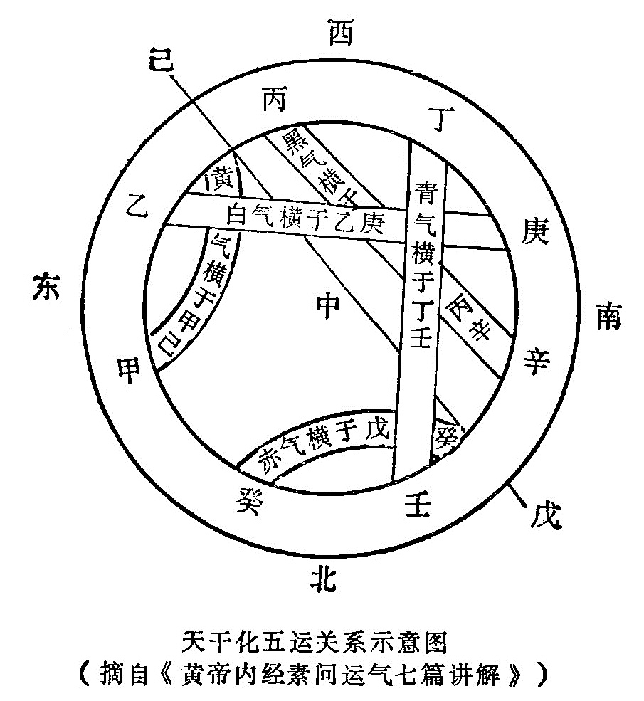

天干化五运关系示意图（摘自《黄帝内经素问运气七篇讲解》）

### （六）干支结合纪年的重要意义

**天气始于甲，地气始于子⑴，子甲相合，命曰岁立。谨候其时，气可与期（2）。**

《素问•六微旨大论》

[讲解]

本文论述干支结合纪年，确立岁气的重要意义。

（1）甲，居十干（甲、乙，丙、丁、戊、己、庚，辛、壬、癸）之首。十干又名天干，最早是用来纪日的，它代表天阳之气的演进次序，故天气始于甲。子，居十二支（子、丑、寅、卯、辰、巳、午、未、申，酉、戌、亥）之首。十二支又名地支，最早是用来纪月的，它代表地阴之气的演进次序，故云地气始于子。

（2）天干与地支相配合，天干在上，地支在下，一上一下，相互组合，叫做甲子。十天干和十二地支，按上列顺序依次配合，天干轮周六次，地支轮周五次，共同组成六十甲子。用甲子纪日，则六十日一轮周。用甲子纪年，则六十年一轮周。所谓“子甲相合，名曰岁立”，即是以甲子纪年确立岁气，推求各个年度的气候变化，例如根据纪年的天干，便知当年统主一岁的五运之气，根据纪年的地支，便知当年司天的六气。“谨候其时，气可与期”。候，测定。时，指六气交司时刻。气，指六气。期，推求之意。就是说，岁气确立以后，根据各年度六气的交司时刻，就可推求当年六气的运转情况了，即下文所说：“甲子之岁，初之气，天数（指六气的交司时刻）始于水下一刻（指铜壶的水贮满至第一条横线处开始下滴，水面微低于第一条横线的一刹那间。这是古代计时的一种方法），终于八十七刻半”等等。

### （七）五天之气的划分

**丹天之气经于牛女戊分，黅天之气经于心尾己分，苍天之气经于危室柳鬼，素天之气经于亢氐昴毕，玄天之气经于张翼娄胃。所谓戊己分者，奎壁角轸，则天地之门户也。夫候之所始，道之所生，不可不通也。**

《素问•五运行大论》

[讲解]

本文论述五天之气在星空的划分，是十干化运的天象依据。

十干统运的五行配属，是根据天象变化来确定的，并有着实测基础。文中所说牛、女、尾、危、室、柳、鬼、亢、氐、昴、毕、张、翼、娄、胃、奎、壁、角、轸、心等二十个星，加上房、箕、斗、虚、觜、参、井、星等八星，合称“二十八宿”，是位于黄道（太阳运行的轨道）上的恒星，分布在东西南北四周，最早人们常利用它来辨别方位和时令季节，同时也把它作为辨别日月五星运动位置的星空标志。古人为了便于观察星空，常把二十八宿作为划分天区的主体（即根据二十八宿星距之间的赤经线，将天空划分为二十八个区域），并参照恒星的排列和形状，用各种动物名称来命名这些星座，如将二十八宿中的东方七宿命名青龙，南方七宿命名朱雀等等。但是，关于五天之气的说法，有两种不同的解释，一是认为古人在测天时，看见天空有五色云气，分别横亘在二十八宿的位置，所以有丹（红色）天，黅（jin今，即黄色）天，苍（青色）天，素（白色）天，玄（黑色）天之说。这是否出自古代望气家之说不得而知。如果按经文作成图式，人们固然可以清楚看到五气经天的二十八宿方位，并可计算出它的周天度数（即：东方苍龙七宿——角、亢、氐、房、心、尾、箕，凡七十度。计：角十二度，亢九度，氐十五度，房五度，心五度，尾十八度，箕十一度。南方朱雀七宿——井、鬼、柳、星、张、翼、轸，凡一百一十二度。计：井三十三度，鬼四度，柳十五度，星七度，张十八度，翼十八度，轸十七度。西方白虎七宿——奎、娄、胃、昴、毕、觜、参，凡八十度。计：奎十六度，娄十二度，胃十四度，昴十一度，毕十六度，觜二度，参九度。北方玄武七宿——斗、牛、女、虚、危、室、壁，凡九十八度。计：斗二十六度，牛八度，女十二度，虚十度，危十七度，室十六度，壁九度。共合周天三百六十度。）以及四方干支所在的位置。桓五气经天是怎么一回事？人们却很难理解。另一说法是根据我国北宋时期的天文学家沈括的解释，即《梦溪笔谈》所载：“《黄帝素问》有五运六气，所谓五运者，甲己为土运，乙庚为金运，丙辛为水运，丁壬为木运，戊癸为火运。然甲己所以为土，戊癸所以为火，多不知其因。予按《素问•五运行大论》黄帝问五运之所始，岐伯引《太始天元册文》曰：‘始于戊己之分，所谓戊己分者，奎壁角轸则天地之门户也。’王冰注引《遁甲》六戊为天门，六己为地户。天门在戌亥之间，奎壁之分；地户在辰巳之间，角轸之分。凡阴阳皆始于辰，五运起于角轸者，亦始于辰也。甲己之岁，戊己黅天之气经于角轸，故为土运；乙庚之岁，庚辛素天之气经于角轸，故为金运，庚辛辰巳也；丙辛之岁，壬癸玄天之气经于角轸，故为水运，壬辰癸巳也；丁壬之岁，甲乙苍天之气经过角轸，故为木运，甲辰乙巳也；戊癸之岁，丙丁丹天之气经于角轸，故为火运，丙辰丁巳也。《素问》曰：‘始于奎壁角轸，则天地之门户也。’凡运临角轸，则气在奎壁以应之，气与运常同天地之门户，故曰：土位之下，风气承之，甲己之岁，戊己土临角轸，则甲乙木在奎壁；曰金位之下，火气承之者，乙庚之岁，庚辛金临角轸，则丙丁火在奎壁；曰水位之下，土气承之者，丙辛之岁，壬癸水临角轸，则戊己土在奎壁；曰风位之下，金气承之者，丁壬之岁，甲乙木临角轸，则庚辛金在奎壁；曰相火之下，水气承之者，戊癸之岁，丙丁火临角轸，则壬癸水在奎壁。古今言《素问》者皆莫能喻，故具论如此。”

说明十干统运中的五天之气是建立在天文基础上的。

天门，地户的含义是什么？

它是根据太阳在天体的位置以及时令气候的变化来命名的。张介宾在《内经图翼》中曾作解释说：“予尝考周天七政躔度，则春分二月中，日躔壁初，以次而南，三月入奎、娄，四月入胃、昂、毕，五月入觜参，六月入井、鬼，七月入柳、星、张。秋分八月中，日躔翼末，以交于轸，循次而北，九月入角、亢，十月入氐，房、心，十一月入尾、箕，十二月入斗、牛，正月入女、虚、危，至二月复交于春分而入奎、壁矣。是日之长也，时之暖也，万物之生发也，皆从奎壁始，从角轸始。故曰春分司启，秋分司闭。夫既司启闭，要非门户而何。自奎、壁而南，日就阳道，故曰天门I角、轸而北，日就阴道，故曰地户。”

这是说太阳的周年视运动位于奎、壁二宿时，正当由春入夏；位于角、轸二宿时，正当由秋入冬。夏为阳中之阳，冬为阴中之阴，故称奎壁（戊分）、角轸（己分）为天门地户。

此外，关于十干化运的问题，后世还有根据月建以立五运的，这与《内经》所论不同，不予赘述。

### （八）五运主岁的太过不及

**主岁何如⑴？岐伯曰：气有余，则制己所胜而侮所不胜（2）；其不及，则己所不胜侮而乘之，己所胜轻而侮之（3）；侮反受邪，侮而受邪，寡于畏也（4）。**

《素问•五运行大论》

[讲解]

本文论述五运主岁的太过不及及其乘侮关系。

（1）“主岁”，指值年岁运，亦称中运。以五年为一周期，统主一岁的五运之气。如甲己年为湿土用事，统主一年岁气；乙庚年为燥金用事，统主一年岁气等等。五运各有所主之岁，并有阳年阴年之分，因此五运之气常会出现太过或不及。

（2）“气有余”，指值年岁运之气太过。凡年干属阳均为岁运太过之年。十干中，甲、丙、戊、庚、壬属阳，如逢甲年，便是土运太过；逢丙年，便是水运太过；逢戊年，便是火运太过；岁运之气太过，从自然气候变化来说，是种平衡失调的现象，因为五行气运是一个整体系统，某一方的偏盛，必然导致另一方的偏衰，比如木运太过之年，风气偏盛，由于风速的増强，势必导致湿度降低，空气干燥度也相应受到影响，正如张介宾注云：“假令木气有余，则制己所胜而土受其克，湿化乃衰；侮所不胜，则金反受木之侮，而风化大行也。”人体五脏与四时五气相通相应，如果在上述气候变化影响下，自身适应能力或抗病能力减弱，就会受到风邪的侵袭而发生疾病。当其肝木受病之后，肝气有余，势必使脾土过度受克，同时也可因肝气升发太过，影响肺金之气的清肃下降，因此可以出现眩晕、胁痛、食少、腹泻、呕吐等症。如《素问•气交变大论》所说：“岁木太过，风气流行，脾土受邪。民病飧泄食减，体重烦冤，肠鸣腹支满。甚则忽忽善怒，眩冒巅疾。……反胁痛而吐甚。”此即所谓“气有余，则制己所胜而侮所不胜”的意思。

（3）“气不及”，指值年岁运之气不足。凡年干属阴均为岁运不足之年。十干中，乙、丁、己、辛、癸属阴，如逢乙年，便是金运不及；逢丁年，便是木运不及；逢己年，便是土运不及；逢辛年，便是水运不及；逢癸年，便是火运不及。岁运之气不及，也是气候平衡失调的一种现象，因为五运之气某一方的偏衰，必然导致另一方的偏盛，比如木运不及之年，风气偏衰，风速过分减弱，势必导致燥气偏盛，湿度也相应受到影响，张介宾注云：
“木气不足，则己所不胜者，乘虚来侮，而金令大行；己所胜者，因弱相轻，而土邪反甚也。”就人体来说，凡是反常的气候变化，同样会影响到脏气的正常活动，如果不能自我调节，也会导致疾病的发生。当肝木之气升发不足，肺金肃降之气必然太过，同时由于肝气疏泄失职，又会导致脾气壅滞而影响肝木，因此可以出现胁痛、少腹痛、咳嗽、肠鸣、腹泻等症。如《素问•气交变大论》说：“岁木不及，燥乃大行……民病中清，胠胁痛，少腹痛，肠鸣溏泄，……咳而鼽”等症（中清即中气虚寒）。此所谓“其不及，则己所不胜侮而乘之，己所胜轻而侮之”的意思。

（4）“侮”，欺侮，恃强凌弱的意思。“侮反受邪”，即恃强凌弱，肆意侵犯别人的，自己也会受到邪气的侵袭，如张志聪注：“此言乘侮而反受其复也。如岁木不及，则所不胜之金气侮而乘之，而金反自虚其位矣。至秋令之时，金气虚而反受木之子气来复，则火热烁金，所谓侮反受邪也。”为什么出现“侮而受邪”的情况？经文指出“寡于畏也”。“寡”，缺少的意思。畏，指正常的克制。意即出现上述情况，是因为五行气运之间缺少正常的制约关系所致。如张志聪注：“侮而受邪，因木气不及，而金气又能制木，寡于畏之故也。”可见五行气运之所以能维持相对平衡，主要在于相互制约，有了正常的制约关系，偏衰者就会得到扶持，偏盛者就会受到抑制，这就是“制则生化”的道理。

### （九）五运主治四时

**愿闻五运之主时也何如⑴？鬼臾区曰：五气运行，各终朞日，非独主时也（2）。**

《素问•天元纪大论》

[讲解]

本文论述五运主时的问题。

（1）“主时”，指主管一年中的各个时令季节。木、火、土、金、水五运之气，既可统主一岁之气，即分别主治各个年度的气候变化，也可主治一年中各个时令的气候变化，故此提出五运主治四时是怎么一回事的问题。

（2）五气，指风、火、燥、湿、寒。朞，指一年周期。期日，即一年周期的三百六十五日。“五气运行，各终朞日”，有两种不同的解释：一是指以一年为周期的五运，即木、火、土、金、水五运，亦即风、火、湿、燥、寒五气分别主治一年中各个时令季节的气候变化，从大寒日起，每运各主七十三日零五刻，与春风、夏火、长夏湿、秋燥、冬寒的气候变化基本上是一致的，正如《素问•六节脏象论》所说：“五运相袭，而皆治之，终期之日，周而复始，时立气布，如环无端。”联系上文的提问来看，这也是回答“五运主时”的问题。故吴崑注曰：“五气各主七十二日，合成三百六十日，是为各终朞日。”吴注所说的三百六十日，是根据另一种历算方法来讲的，于义亦不悖。二是指以五年为周期的五运，即各个年度的特殊气候变化，如张介宾注：“如甲己之岁，土运统之之类是也，非独主四时而已。”联系下文“非独主时也”来看，张注的解释也合乎文理。但结合上文“五运之主时也何如”的提问，似乎所答非所问了。

### （十）地支配三阴三阳六气及其标本关系

**帝曰：其于三阴三阳，合之奈何？鬼臾区曰：子午之岁，上见少阴；丑未之岁，上见太阴；寅申之岁，上见少阳；卯酉之岁，上见阳明；辰戌之岁，上见太阳；巳亥之岁，上见厥阴。少阴所谓标也，厥阴所谓终也（1）。厥阴之上，风气主之；少阴之上，热气主之；太阴之上，湿气主之；少阳之上，相火主之；阳明之上；燥气主之；太阳之上，寒气主之。所谓本也，是谓六元（2）。**

《素问•天元纪大论》

[讲解]

本文论述地支配三阴三阳六气的具体内容及其标本关系。

（1）本节主要讲地支配三阴三阳六气。这里所说的子午。丑未、寅申、卯酉、辰戌、巳亥等，统称“地支”。其次序是子、丑、寅、卯、辰、巳、午、未、申、酉、戌、亥，共十二个，所以又称十二支或十二地支。运气学说以地支作为符号并把它与三阴三阳、年度直接联系起来，以子午代表少阴，以丑未代表太阴，以寅申代表少阳，以卯酉代表阳明，以辰戌代表太阳，以巳亥代表厥阴。这里所说的“上”就是指当年的司天之气。这里所说的“标”，有两个含义：其一，指标志或符号，即运气学说以三阴三阳为符号来标志地支所属年份气候变化的特点。这也就是前面原文中所说的：“寒暑燥湿风火，天之阴阳也，三阴三阳上奉之。”后面《六微旨大论》中所说的“气之标也。”其二，指标首，亦即气候变化的起首或开始。这里所说的“终”字，有终末之义，亦即气候变化的末尾。故“标”字在这里应作标首解。张介宾注“少阴所谓标也，厥阴所谓终也”一句云：“标，首也；终，尽也。六十年阴阳之序，始于子午，故少阴为标，尽于巳亥，故厥阴为终。”

（2）此一节文字紧承上节，“上”此处作“司天”解。“厥阴之上，风气主之”一语，联系上节三阴三阳所配年支的规律，即凡属年支上逢巳逢亥之年，即属于厥阴风气司天，亦即凡属年支上逢巳逢亥之年，这一年的气候变化以风为特点，与风的变化密切相关。根据这个测算方法，六十年中各个年份的气候变化特点大致情况是：逢巳逢亥之年共十年，即己已，乙亥、辛巳、丁亥、癸巳、己亥、乙巳、辛亥、丁巳、癸亥。这十年中气候变化已如上述与风的变化密切相关。逢子逢午之年共十年，即甲子、庚午、丙子、壬午、戊子、甲午、庚子、丙午、壬子、戊午。这十年中气候变化与热的变化密切相关。逢丑逢未之年共十年，即：乙丑、辛未、丁丑、癸未、己丑、乙未、辛丑、丁未、癸丑、己未。这十年中气候变化与湿密切相关。逢寅逢申之年共十年，即：丙寅、壬申、戊寅、甲申、庚寅、丙申、壬寅、戊申、甲寅、庚申等十年。这十年中气候变化与火密切相关。逢卯逢酉之年共十年，即：丁卯、癸酉、己卯、乙酉、辛卯、丁酉、癸卯、己酉、乙卯、辛酉。这十年中气候变化与燥密切相关。逢辰逢戌之年共十年，即：戊辰、甲戌、庚辰、丙戌、壬辰、戊戌、甲辰、庚戍、丙辰、壬戌。这十年中气候变化与寒密切相关。加以归纳即：子午少阴君火，丑未太阴湿土，寅申少阳相火，卯酉阳明燥金，辰戌太阳寒水，巳亥厥阴风木。这也就是地支配三阴三阳六气。在这种配合中，年支是代表各个年份的符号，三阴三阳是代表气候变化的符号。它们的物质基础是气候本身。因此，原文在介绍了三阴三阳配六气后明确提出：“所谓本也。”本，就是风寒暑湿燥火六气。自然界的一切生命现象都是在自然界正常的气候变化的基础上产生的，没有自然界的正常气候变化，便没有生命。因此，自然气候也就成为自然界中生命的源泉，因此，六气也叫“六元”。这就是原文中所说的：“所谓本也，是谓六元。”这里所说的“本”，指本质，也可以解释为生命之本。“元”，同源。此处指生命现象的根源。原文明确地指出了风寒暑湿燥火六气在自然生命现象中的本源地位。

关于地支配三阴三阳六气，通过本文所述，明确了下面两个问题。其一，六十年一个大周期中，各个年度的气候变化情况是按一阴（厥阴）、二阴（少阴）、三阴（太阴）、一阳（少阳）、二阳（阳明）、三阳（太阳）的顺序进行，今年是一阴司天，明年一定是二阴司天，后年一定是三阴司天，依次轮转，如环无端。

这也就是原文中所说的“子午之岁，上见少阴；丑未之岁，上见太阴；寅申之岁，上见少阳；卯酉之岁，上见阳明；辰戌之岁，上见太阳；巳亥之岁，上见厥阴。少阴所谓标卑，厥阴所谓终也。”其二，六气之中，风、湿、燥、寒均各居其一，惟火热分为二，少阴少阳均主火热，但明确指出了“少阴为标”，即少阴为首，亦即其余的五气均系在少阴主持下进行，这是前述“君火以明，相火以位”的提法在运气测算中的具体运用。

还需要解释一个问题，这就是地支配五行的问题。地支配五行，一般情况是：寅卯属木，巳午属火，申酉属金，亥子属水，辰戌丑未属土。但是，为什么在地支配三阴三阳六气中却变成了子午少阴君火，丑未太阴湿土，寅申少阳相火，卯酉阳明燥金，辰戌太阳寒水，巳亥厥阴风木，与地支的一般五行属性完全不同呢？要回答这个问题，必须弄清有关六气的正对化问题。十二地支，如同十天干一样，古人也把它作为一个符号代表自然界中的方位，即以寅卯代表东方，巳午代表南方，申酉代表西方，亥子代表北方，辰戌丑未代表中央。以五行归类之，则寅卯属木，巳午属火，申酉属金，亥子属水，辰戌丑未属土。但是古人认为气候变化的规律，其运行方向总是向它的相对的方向运行。《六元正纪大论》说：“春气西行，夏气北行，秋气东行，冬气南行，故春气始于下，秋气始于上，夏气始于中，冬气始于标。春气始于左，秋气始于右，冬气始于后，夏气始于前，此四时正化之常。”明确指出了气候变化的运行规律，总是向它的相反方向运行，巡回运转，动而不已。由于如此，所以寅位虽然在东方属木，但是它必然要向西方属金的申位转化，午位虽然在南方属火，但是它必然要向北方属水的子位转化。这种现象后世就叫它“正对化”。张介宾在所著《类经图翼•正化对化图说》中说：“六气分上下左右而行天令，十二支分节令时日而司地化，然以六气而加于十二支则有正化对化之不同，如厥阴之所以司于巳亥者，以厥阴属木，木生于亥，故正化于亥，对化于巳也；少阴所以司于子午者，以少阴为君火，当正南离位，故正化于午，对化于子也；太阴所以司于丑未者，以太阴属土居中，王于西南未官，故正化于未，对化于丑也；少阴属相火，位卑于君，火生于寅，故正化于寅，对化于申也；阳明所以司于卯酉者，以阳明属金，酉为西方金位，故正化于酉，对化于卯也；太阳所以司于辰戌者，太阳属水，辰戌属土，然水行土中而戍居西北，为水渐王之乡，是以洪范五行，以戌属水，故正化于戌，对化于辰也。一曰正司化令之实，对司化令之虚，一曰正化从本生数，对化从标成数，皆以言阴阳之衰盛，合于十二辰以为动静消息者也。”张氏介绍的资料，说明了十二地支的五行属性为什么有两种不同的认识，解释了十二地支在配三阴三阳六气方面，其五行属性不同于一般的理由。为了便于读者了解，兹将《类经图翼》中所附六气正对化图加字转录示意于下：

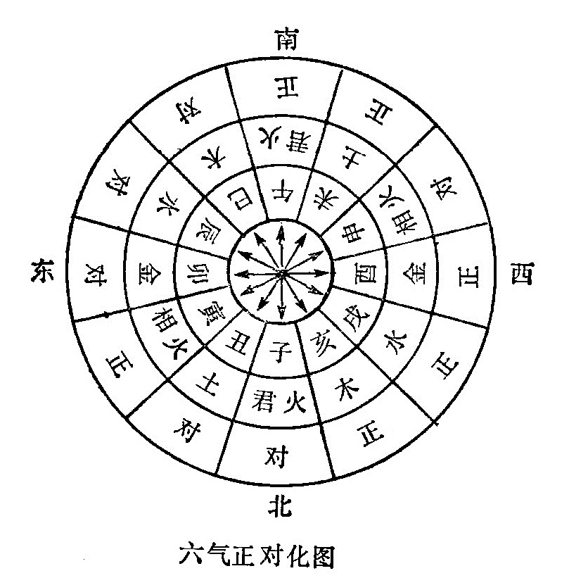

六气正对化图

### （十一）三阴三阳配六气及标本中气之间的关系

**帝曰：愿闻天道六六之节盛衰何也⑴？岐伯曰：上下有位，左右有纪。故少阳之右，阳明治之；太阳治之；太阳之右，厥阴治之；厥阴之右，少阴治之；少阴之右，太阴治之；太阴之右，少阳治之。此所谓气之标，盖南面而待也（2）。故曰：因天之序，盛衰之时，移光定位，正立而待之。此之谓也（3）。少阳之上，火气治之，中见厥阴；阳明之上，燥气治之，中见太阴；太阳之上，寒气治之，中见少阴；厥阴之上，风气治之，中见少阳；**
**少阴之上，热气治之，中见太阳；太阴之上，湿气治之，中见阳明⑷。所谓本也，本之下，中之见也，见之下，** **气之标也，本标不同，气应异象（5）。**

《素问•六微旨大论》

[讲解]

“天道六六之节”一语，首先见于《素问•六节藏象论》。原文云：“天以六六之节，以成一岁。”因此多数注家均根据《素问•六节脏象论》的一段原文“天有十日，日六竟而周甲，甲六复而终岁，三百六十日法也。”来加以解释，认为“六六”就是指六个甲子，即六个六十天，六六三百六十天为一年。这个解释我们认为并不确切。因为，第一，《内经》中对于一年的时间，是采用三百六十五天来计算的，并不是按一年为三百六十天计算的。以五运而言，主运分五步，分司一年中的五个运季，每步所主时间为七十三天零五刻，则每年为三百六十五天多一点；从六气而言，主气分六步，把一年二十四节气分属于六步之中，从每年大寒日开始计算，十五天多一点为一个节气，四个节气为一步，每一步为六十天又八十七刻半，六步为一年，如此则每年也是三百六十五天多一点。就是在《素问•六节脏象论》一篇中，也是首先提出了“三百六十五日而成岁”。文中首先提出了“天为阳，地为阴；日为阳，月为阴；行有分纪，周有道理，日行一度，月行十三度有奇焉，故大小月三百六十五日而成岁，积气余而盈闰矣。”然后才提出：“天有十日，日六竟而周甲，甲六复而终岁，三百六十日法也。”从这一段原文中可以明显看出，《内经》对于一年的时间计算，是采用了三百六十五日，即一回归年的日数。之所以在后面又提出三百六十天的问题，只不过以此说明当时还有三百六十日为一年的历法。文中提此的原因只不过以此说明《内经》对一年时间的计算方法上与三百六十日历法有区别。因此这里的“六六”，根本不是指六六三百六十天的问题。第二，《六节脏象论》中，对于“六六”一词，已经作了比较明确的解释，原文云：“夫六六之节，九九制会者，所以正天之度，气之数也。天度者，所以制日月之行也；气数者，所以纪化生之用也。”这里所说的“天之度”、“气之数”，就是指日月运行与气候变化的规律。因此，这里所谓“六六”，很明显地就是指观测自然气候变化的一种方法，根本不是只谈什么六六三百六十天的问题。

我们的意见，所谓“六六之节”，一个“六”字，应该是指风、热、火、湿、燥、寒六气；一个“六”字，应该是指三阴三阳（厥阴、少阴、太阴、少阳、阳明、太阳）。“节”，有节令、节段、节制之义。因此，“天道六六之节”一语直译之，也就是说一年中的风、热、火、湿、燥、寒等自然界气候变化情况，可以根据阴阳多少的特点而用三阴三阳区分为六个节令或六个节段。我们的根据：其一，《素问•天元纪大论》中明确指出：“寒暑燥湿风，天之阴阳也，三阴三阳上奉之。”“在天为气”，王冰注曰：“气谓风热燥湿寒。”这就是说，六气的变化情况可以用三阴三阳来加以归属和测算。其二，本篇对“帝曰，愿闻天道六六之节盛衰何也”问话的回答完全是以三阴三阳的概念来作回答。整个运气学说中，在分析风、热、火、湿、燥、寒等六气变化时，也无一处不是以三阴三阳来立论的，毫无例外，根本不涉及什么六六三百六十日的问题。因此，我们认为所谓“六六之节”，实际上也就是以三阴三阳来归属和测算六气的一种方法。这就是“天以六六之节”一语的含义。

（2）前已述及“六六”中一个“六”字是指三阴三阳，即阴和阳都可以根据其阴阳之气的多少而各再分为三。阴可以再分为一阴（厥阴）、二阴（少阴）、三阴（太阴）；阳可以再分为一阳（少阳）、二阳（阳明）、三阳（太阳）。按照阴阳学说，阴阳之间总是消长进退，循环运转，阳极阴生，阴极阳生，由阳入阴，由阴出阳。因此，三阴三阳的运转总是按一阳（少阳）→二阳（阳明）→三阳（太阳）→一阴（厥阴）→二阴（少阴）→三阴（太阴）→一阳（少阳）这样的次序进行，如此周而复始，如环无端。它们在一年之中各有一定位置，按照一定规律进行运转。这也就是原文所谓的：“上下有位，左右有纪。”其在运转次序先后上总是按照上述次序来进行，由阳入阴，由阴出阳。这也就是原文所谓“少阳之右，阳明治之；阳明之右，太阳治之；太阳之右，厥阴治之；厥阴之右，少阴治之；少阴之右，太阴治之；太阴之右，少阳治之。”“因天之序，盛衰之时也。”不过，以上所述三阴三阳的位置及其运转次序的确定，是有条件的，即一定是面向南面的条件下进行观测。这也就是原文所谓的“南面而待”。兹将上述三阴三阳的位置及其运转情况，示意如下图：

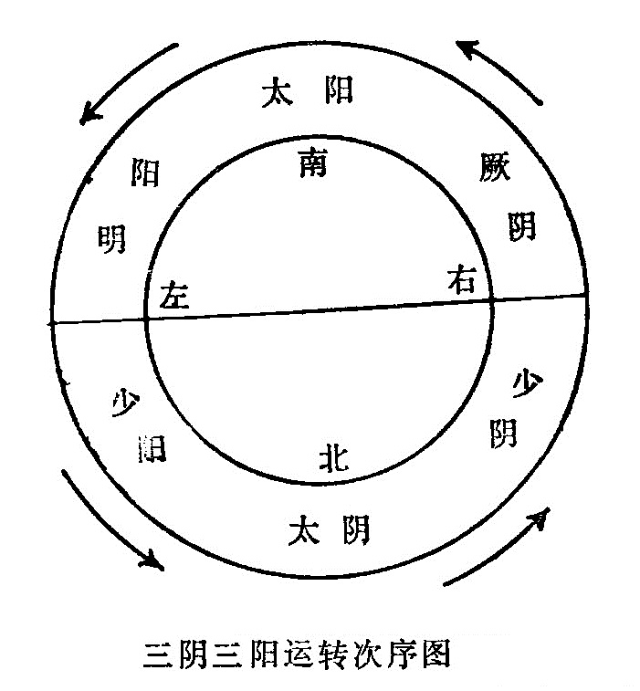

三阴三阳运转次序图

（3）“光”，日光也。“位”，位次也。六气的变化与日光对地面的照射密切相关。因此，通过观察日光照射地面物体
的投影移动变化情况，就可以反映六气的进退盛衰情况。这也就是说，前述的三阴三阳位置及其运转次序并不是主观臆测的，而完全是根据日光在地面上的投影的移动变化情况实测得出的，即张氏所谓的“其时更气移，皆视日光而见之矣”。

移光定位，古人是用圭表来进行实测的。圭表是我国最古老、最简单的天文观测仪器之一。表，是垂直立于地平面的一根竹竿或石柱。圭，是正南正北方向水平位置带有刻度的尺，日中时用来度量表影的长度。圭和表互相垂直，就组成了圭表。一般在日中时量度太阳光照射标杆所成影长，从这个影子的长短周期性变化，可以测定一个回归年的日数和一年的各个季节。这就是圭表的应用。

“移光定位，正立而待”，运用圭表进行实测，不但说明了我国古代学者的聪明智慧，也同时说明了：运气学说的基本内容，都是古人在认真观察自然变化的基础上的实际测定，不是主观臆测，更不是随意编造。

（4）所谓“标”，就是标识或标志。所谓“本”，就是本气。所谓“中气”，就是“中见之气”，也就是在本气之中可以见到的气。标本中气之间，三阴三阳为标。这是因为三阴三阳本身只是作为一个标识或标志，分列以之代表六气。厥阴代表风，少阴代表热，太阴代表湿，少阳代表火，阳明代表燥，太阳代表寒。六气为本。这是因为风、热、火、湿、燥、寒本身才是六气变化的本气。风就是风，热就是热，火就是火，湿就是湿，燥就是燥，寒就是寒。中气为与本气相关或相反的气。少阳火的中气为厥阴风，阳明燥的中气为太阴湿，太阳寒的中气为少阴热。反之也是一样，厥阴风的中气为少阳火，少阴热的中气为太阳寒，太阴湿的中气为阳明燥。这就是原文所谓的：“少阳之上，火气治之，中见厥阴；阳明之上，燥气治之，中见太阴；太阳之上，寒气治之，中见少阴；厥阴之上，风气治之，中见少阳；少阴之上，热气治之，中见太阳；太阴之上，湿气治之，中见阳明。”为什么本气之中又可以出现与之相关或相反的中见之气呢？原因之一是：六气变化到了一定限度，常可向相反方面转化，例如，热可以向寒方面转化，寒也可以向热的方面转化，所以“少阴之上，热气治之，中见太阳”，“太阳之上，寒气治之，中见少阴”。湿，可以向燥方面转化，燥也可以向湿方面转化，所以“太阴之上，湿气治之，中见阳明”，“阳明之上，燥气治之，中见太阴”。风，可以转化为热，火借风威；火，可以转化为风，热极生风。所以“厥阴之上，风气治之，中见少阳”，“少阳之上，火气治之，中见厥阴。”原因之二是：六气本身也有个盛衰和有余不及的问题。热气有余是热，热气不及便是寒；寒气有余是寒，寒气不及便是热；燥气有余是燥，燥气不及便是湿；湿气有余是湿，湿气不及便是燥。总的来说，标本中气问题，从阴阳概念来说，就是阴阳之间不但要注意到阴阳本身的特点，还要注意到它们之间的相互转化；从表里概念来说，要注意到表里本身的特点，还要注意到它们之间的相互出入，可以由表入里，也可以由里达表，这也就是一般所说的：太阳与少阴为表里，阳明与太阴为表里，少阳与厥阴为表里。一句话，不管是推测气候变化还是分析疾病转变，都要从整体恒动的观点来加以认识。这就是标本中气提法的实质所在。

（5）《素问•天元纪大论》谓：“所谓本也，是谓六元。”张隐庵亦注：“风寒暑湿燥火，天之阴阳也，三阴三阳上奉之，故以天气为本而在上。”六元就是六气。这就是说，由于六气是本，居于根本地位，所以六气在上。“中之见也”，就是中见之气，前已述及，中见之气是在本气的基础上提出的，所以位列本气之下，因此原文谓“本之下，中之见也。”“气之标也”，标是标识或标志，是代表本气的符号，所以列位最下，因此原文谓“见之下，气之标也。”这种以三阴三阳配六气的方法是根据什么呢？是根据六气本身客观的相应表现制定的，因此原文谓：“本标不同，气应异象。”

（摘自《黄帝内经素问运气七篇讲解》）

### （十二）六气主时

**愿闻地理之应六节气位何如（1）？岐伯曰：显明之右，君火之位也（2）；君火之右，退行一步，相火治之（3），复行一步，土气治之；复行一步，金气治之（4）；复行一步，水气治之；复行一步，木气治之；复行一步，君火治之（5）。**

《素问•六微旨大论》

[讲解]

本文论述六气主时的位置。

（1）“地理”，指与四时之气相应的地理位置。因为四时之气的位置，是和地的方隅相配的，如十二月的斗建（斗柄指向），也在十二支所在的位置，所以说地理与六节气位相应。另一说，“地理，指大地的物化情况。”（《黄帝内经素问运气七篇讲解》）可并参。“六节”，指三阴三阳。“气”，指风、火、燥、暑、湿、寒六气。“位”，指三阴三阳六气所在位置。“地理之应六节气位”，是说把地的四方作为六等分，以应六气主时的位置。这与五方之应五时五气颇相似。另一解释说明地上的生物在每年不同季节气候的影响下，也有与之相应的物候现象出现，这与上说并不矛盾，也易使人理解。

（2）“显明”，即显著、光明。这是针对太阳运动位置来说的。早上的太阳，在东方卯正之位升起，天地普照光明。所谓天地平分之处，即每年的春分节，这时白昼时间，将逐渐增长，气温将逐渐増高，也是阳气上升的表现，故称为显明。“之右”，指由东向南运转，即面向南方所见到的位置。由春分至立夏为期六十天内，是少阴君火主令的季节，故说“显明之右，君火之位也。”

（3）“君火之右”的“右”方，也是指面向南方的位置，“退行一步”，指向右行一步。为什么称为“退行”？这是
针对主气与客气不同的运转方向和顺序来说的，客气按三阴三阳次序运行，由君火而湿土，而相火；主气则由君火而相火，而湿土。张介宾注：“退行一步，谓退于君火之右也。”

（4）“复行一步”，即又行一步的意思。从少阳相火之位再行一步，便是太阴湿土主令。张介宾注：“复行一步，谓于相火之右，又行一步也。此自未中以至酉中，步居西南，为天之左间，主四之气，乃大暑后六十日有奇，湿土治令之位也。”从太阴湿土之位再行一步，便是阳明燥金主令。张介宾注，“此于土气之右，又行一步。自酉中以至亥中，步居西北，为地之右间，主五之气，乃秋分后六十日有奇，燥金治令之位也。”

（5）从阳明燥金之位，再行一步，便是阳寒水主令。张介宾注：“此于金气之右，又行一步。自亥中以至丑中，步居正北，位当在泉，主终之气，乃小雪后六十日有奇，寒水之治令也。”从太阳寒水之位，复行一步，便是厥阴风木主令。张介宾注：“此于水气之右，又行一步。自丑中叫至卯中，步居东北，为地之左间，主初之气，乃大寒后六十日有奇，风木治令之位也。”从厥阴风木之位，再行一步，便是少阴君火主令。张介宾注：“此自木气之末，复行于显明之右，君火之位，是为主气六步之一周也。”张氏根据六气主令的时序，以及十二月的斗建位置，说明一年主气的运动变化，反映了常年气候运动的一般规律。掌握这一规律，对于推测常年气候变化和疾病流行的大致情况，以及指导诊断治疗都具有重要意义。

### （十三）六气的常变

**帝曰：其有至而至，有至而不至，有至而太过，何也（1）？岐伯曰：至而至者和，至而不至，来气不及也，未至而至，来气有余也（2）。帝曰：至而不至，未至而至，何如？岐伯曰：应则顺，否则逆，逆则变生，变生则病（3）。帝曰：善。请言其应。岐伯曰：物，生其应也，气，脉其应也⑷。**

《素问•六微旨大论》

[讲解]

本文论述六气的常变以及是否与之相应的情况。

（1）“其”，指六气。“至而至”，前“至”指时至，后“至”指气至。全句意为六气有的及时而至，即本气所主的季节到来之时，就出现相应的气候变化，如春温、夏热、秋凉、冬寒之类。不过在实际观察时，必须按六气所主的具体时间考察气候变化，以下均仿此。“至而不至”，指本气所主的季节已经到来，而相应的气候未至，如春应温而气寒，夏应热而气温，秋应凉而气热，冬应寒而气不寒等。”“至而太过”，即相应季节的气候超过常度。如春气过温，夏气过热，秋气过凉，冬气过寒等。按下文内容，还应包括时未至而气先至的情况，即时节未到，而主时之气已先至，如春未至而气温，夏未至而气热，秋未至而气凉，冬未至而气寒等，也属至而太过。以上提出的三种不同情况，是剖析气候正常与否的关键。

（2）“和”，即和平之气，指正常气候变化。“来气”，指当时到来的气候。上文意为应时而至的是和平之气，属于正常气候变化。时至而本气未至，如应温不温，应热不热，应凉不凉，应寒不寒等，是来气不及的表现，属于反常气候变化。时未至而本气先至，如春未至而气温，夏未至而气热，秋未至而气凉，冬未至而气寒等，是来气太过的表现，也属于反常气候变化。

（3）“应”，指气候变化与季节相应。“顺”，谓正常。“逆”，谓反常。上文意为气候与季节相应则属于正常，否则就
属于反常。与季节不相应的反常气候会引起灾变，不利于万物的生长发育，所以导致疾病的产生。张介宾注云：“当期为应，愆期为否，应则顺而生化之气正，否则逆而胜复之气生，天地变生则万物亦病矣。”

（4）“物”“生”，指万物的生长过程，如春生，夏长，秋收，冬藏等皆是。气候变化的正常与否，直接关系到万物的生长发育变化，所以万物在四时气候变化的影响下，必然出现与之相应的现象，无论正常与反常，都要从物候变化反映出来，所谓“物生其应也”。就人体来说，脉象与四时之气的变化也是相应的，如春脉微弦，夏脉微洪，秋脉微毛，冬脉微石之类皆属正常现象。反之，春无弦象，夏无洪象，秋无毛象，冬无石象，则属于反常了。马莳注云：“物生其应，气脉其应者，复说应则顺之义也。即《六元正纪大论》所谓厥阴所至为风生之类，是物生之类，厥阴之至，其肝弦之类，是气脉之应也。”

## 二、运气学说的基本内容及计算方法

### （一）干支甲子

#### 1、干支的含义

干支是天干地支的简称。天干始于甲，地支始于子，干支相合，故名甲子。

天干共有十个数目字，即甲、乙、丙、丁、戊、己、庚、辛、壬、癸，所以又叫十天干，最早是用来纪日的。地支共有十二个数目字，即子、丑、寅、卯、辰、巳、午、未、申、酉、戌、亥，最早是用来纪月的。《汉书•律历志》记载：“大桡始作甲子以名日，谓之干；作子丑以名月，谓之枝”。所以干支含有幹枝的意思，犹如草木，有干有枝。

从干支的次序和命名来看，它既是古代计算年、月、日、时和标志方位的符号，又是反映万物生、长、衰、老变化的物候记录。因为天日的演进源于太阳的运动，太阳运动是有规律的，一日之内，有昼夜阴阳的消长变化；一年之内，有四时阴阳的消长变化。无论昼夜或四时的阴阳变化，都以太阳为主体，它是天阳之气运动的核心，它的光能和热能为地球上一切生命活动提供了生存条件。所以干支虽然作为纪年、纪月、纪日、纪时的符号，但它具有天文、历法、物候、气象方面的特殊意义。

十二支建月是从寅始，而不是从子始，其原因何在？《类经图翼》说：“盖以建子之月，阳气虽始于黄钟（古代用以测验气候的律管。《礼•月令》注：“黄钟者律之始，九寸，仲冬气主，则黄钟之律应。”）然犹潜伏地下，未见发生之功，及其历丑转寅，三阳（自子至寅）始备，于是和风至而万物生，荫芽动而蛰藏振，遍满寰区，无非生意，故阳虽始于子，而春必起于寅。是以寅卯辰为春，巳午未为夏，申酉戌为秋，亥子丑为冬，而各分其孟仲季焉。”建子之月，是在上年的十一月，到了冬至一阳初生，万物才孕育生机，故十二支从子始，但从一年来看，春季是从立春开始，这时斗柄指向寅位，故十二支的月建是从寅始，所谓“斗柄指寅，天下皆春。”

#### 2、干支的阴阳属性

干支阴阳属性的划分，不是绝对而是相对的。总的来说，天干属阳，地支属阴。但在天干地支中，又可再分阴阳。天干中，甲、丙、戊、庚、壬属阳，乙、丁、己、辛、癸属阴。地支中，子、寅、辰、午、申、戌属阳。丑、卯、巳、未、酉、亥属阴。这样区分阴阳的理由在哪里呢？主要有两种不同的看法：

第一种：是根据干支的先后次序分阴阳，如甲与乙，甲在乙先为阳，乙在甲后为阴；丙与丁，丙在丁先为阳，丁在丙后为阴。地支的子与丑，子在丑先为阳，丑在子后为阴；寅与卯，寅在卯先为阳，卯在寅后为阴。如刘完素在《伤寒直格》中所说的：“凡先言者为刚为阳，后言者为柔为阴也。”

第二种：是根据奇偶的数字次序区分阴阳：如甲、丙、戊、庚、壬为一、三、五、七、九的奇数属阳；乙、丁、己、辛、癸为二、四、六、八、十的偶数属阴。正如张介宾在《类经图翼》中说：“阳数奇而属天，阴数偶而属地。……天数五，一三五七九是也；地数五，二四六八十是也。”

把两种说法进行比较，当然以后者为优，因为一切数字皆不出奇偶两数，故有阴阳之分。阴阳的先后，又是以河图、洛书（古代数学模式）之数为依据，更符合阴阳的本来意义

#### 3、干支的五行属性

十干中，甲乙属木，丙丁属火，戊己属土，庚辛属金，壬癸属水。

十二支中，寅卯属木，巳午属火，辰未戌丑属土，申酉属金，亥子属水。

这样配属的理由在哪里？十干配属五行有两个含义：

首先，根据五时、五方与五气的关系来确定的，如春季的基本气流方向是东方，东风到来的气候特征是温和之气，所以东方甲乙属木；夏季的基本气流方向是南方，南风到来的气候特征是炎热之气，所以南方丙丁属火，……。《素问入式论奥》说：“是以东方甲乙、南方丙丁、西方庚辛，北方壬癸，中央戊己，五行之位也。”

其次，根据常年气候运动规律，五行相生次序来配属的，如春季气候温和，草木生发，与之相对应的关系是木；夏季气候炎热，万物生长，与之相对应的关系是火，由于夏在春后，故称之为木生火。又如长夏气候潮湿，万物生长繁盛，与之相对应的关系是土，由于长夏在夏后，故称之为火生土。秋季气候清凉，草木凋零，与之相对应的关系是金，由于秋在长夏之后，故称之为土生金。冬季气候寒冷，万物闭藏，与之相对应的关系是水，由于冬在秋后，故称之为金生水。冬之后又是春，故称之为水生木。《素问•六节脏象论》说：“五运相袭，而皆治之，终朞之曰，周而复始，时立气布，如环无端。”说明一年中五气的运行，依次推移，各有所主的时令季节，要到年终之日，再从头开始。一年分立四时，四时分布节气，如圆环之无端绪而循环不息。一年中春风、夏火、长夏湿、秋燥、冬寒的递变，对自然界生物的生长发育有利，符合生长化收藏的发展过程，所以它有相互资生和促进的意义。

十二支配属于五行与十干具有相似的意义。如寅、卯月是春季的正、二月，位于东方，此时正是春天风气主令的季节，所以寅卯在五打属木。巳、午月是夏季的四、五月，位于南方，此时正季夏天热气主令季节的，以所巳午在五行属火。申、酉月是秋是的七、八月，位于西方，此时正是秋天燥气主令的季节，所以申酉在五行中属金。亥、子月是冬季的十、十一月，位于北方，此时正是冬天寒气主令的季节，所以亥子在五行中属水。辰、未、戌、丑月分居春夏秋冬四季之末，是中央湿土之气寄王的月份，代表四时湿气的存在，所以辰未戌丑在五行中属土。土属中央，其气行四隅，故《素问•太阴阳明论》说：“脾者，土也，治中央，常以四时长四脏，各以十八日寄治。”即是在春夏秋冬四立（立春、立夏、立秋、立冬）前的十八天为寄旺的时候。而四立的节气，又分属于辰（三月）、未（六月）、戌（九月）、丑（十二月）四月。

#### 4、干支结合纪年。

天干和地支配合，天干在上，地支在下，按照干支排列的次序，依次相合，天干往复轮周六次，地支往复轮周五次，于是构成六十甲子。这就是《素问•六微旨大论》所说：“天气始于甲，地气始于子，子甲相合，命曰岁立，谨候其时，气可与期。”即是说，推算天气从十干的甲开始，推算地气从地支的子开始。把天干和地支配合起来，一直到天干末尾的癸和地支末尾的亥相配合，便组成了六十甲子。六十甲子的周期建立以后，推算岁气的方法也随之确立，这样就可用它来定时候气了。六十甲子，参见下表：

干支甲子表

| 甲子 | 乙丑 | 丙寅 | 丁卯 | 戊辰 | 己巳 | 庚午 | 辛未 | 壬申 | 癸酉 |
| ---- | ---- | ---- | ---- | ---- | ---- | ---- | ---- | ---- | ---- |
| 甲戌 | 乙亥 | 丙子 | 丁丑 | 戊寅 | 己卯 | 庚辰 | 辛巳 | 壬午 | 癸未 |
| 甲申 | 乙酉 | 丙戌 | 丁亥 | 戊子 | 己丑 | 庚寅 | 辛卯 | 壬辰 | 癸巳 |
| 甲午 | 乙未 | 丙申 | 丁酉 | 戊戌 | 己亥 | 庚子 | 辛丑 | 壬寅 | 癸卯 |
| 甲辰 | 乙巳 | 丙午 | 丁未 | 戊申 | 己酉 | 庚戌 | 辛亥 | 壬子 | 癸丑 |
| 甲寅 | 乙卯 | 丙辰 | 丁巳 | 戊午 | 己未 | 庚申 | 辛酉 | 壬戌 | 癸亥 |

天干与地支为什么要相互配合呢？天干和地支的配合，一方面是用它来纪年，另一方面是用它来推演六十年中的气候变化。天干代表各年的运，所谓“天干统运”；地支代表各年的气，所谓“地支主气”。把运和气两者结合起来，才能分析和推演出各年气候的大概变化。所以《素问•天元纪大论》说：“天以六为节，地以五为制，周天气者，六期为一备；终地纪者，五岁为一周。五六相合，而七百二十气为一纪，凡三十岁。千四百四十气，凡六十岁，而为一周。不及太过，斯皆见矣。”王冰注曰：“六节谓六气之分。五制谓五位之分，位应一岁，气统一年，故五岁为一周，六年为一备，备谓备历天气，周谓周行地位。”

由于“五六相合”，组成六十甲子，计三十年中共有七百二十个节气（一个节气十五日，一年二十四节气），称为“一纪”；再加上后三十年的七百二十个节气，共得千四百四十个节气，就成为六十年的气候变化大周期。甲子中的天干，主管五运的盛衰，甲子中的地支，主管六气的变化，因此，各年气候的太过和不及，都可通过推演运算了解到一般情况。这就是干支甲子的意义所在。

### （二）五运

五运，指五行之气的运动，包括一年五个季节气候变化的运动规律，和统主一岁的五种气象的运动规律。前者叫“五运主时”，后者叫“五运主岁”。为了概括和说明五气（风、火、湿、燥、寒）的基本性质及其运动规律，故分別以木运、火运、土运、金运、水运相称。同时又根据五行属性配以天干，所以张介宾说：“五行之应天干，是为五运。”

五运有主运、客运、大运的区分。主运以一年为一周期，主一年四季的正常气候变化；客运也是以一年为一周期，主一年四季的异常气候变化；大运以五年为一周期，通主五年内每一年的气候变化。但是推演运算的方法各不相同，下面分别说明。

#### 1、大运

以五年为一周期，统主一岁的五运之气，叫做大运，又称中运。五运之气，配以天干，每两干统主一运，用以说明全年气候的变化，所以又叫做“十干统运。”

十干统运是：逢甲己年为湿土用事，统主一年运气；乙庚年为燥金用事，统主一年运气；丙辛年为寒水用事，统主一年运气；丁壬年为风木用事，统主一年运气；戊癸年为炎火用事，统主一年运气。五年一轮转，周而复始，照此轮周十二次，即为六十年的大周期。这是运气学说作为探讨气象变化规律的一种方法。如《素问•天元纪大论》说：“甲己之岁，土运统之；乙庚之岁，金运统之；丙辛之岁，水运统之；丁壬之岁，木运统之；戊癸之岁，火运统之。”

为什么称为中运？

是说五运之气经常处于天气和地气之间，故称中运。天气和地气上下相交之处，所谓“气交之分”，相当于大气的底层，是人类生活在大自然中的位置。《素问•六微旨大论》说：“上下之位，气交之中，人之居也。”

由于在上的天气和在下的地气不断进行上升下降的运动，当天气不足时，地气则随之上升；地气不足时，天气则随之下降。但是运气居天地之中，气交之分，无论上升下降的气流，都必须通过这一中间地带，所以天气下降时，居中的运气必先之而降；地气上升时，居中的运气必先之而升。《素问•六元正纪大论》说：“天气不足，地气随之，地气不足，天气随之，运居其中而常先也。”这里的“天”和“地”应当包括空间因素和地面因素，正由于这两种因素相互作用，导致了各种天气现象的发生。

为什么十干统运的五行配属又有所不同呢？

因为十干统运的五行配属是根据天象变化，即星辰之间的变化来确定的，故与按五行方位配属的十干有所不同。这在《素问•五运行大论》中有明确的记载：“《太始天元册文》，丹天之气，经于牛女戊分；黅天之气，经于心尾已分；苍天之气，经于危室柳鬼；素天之气，经于亢氐昴毕；玄天之气，经于张翼娄胃。所谓戊已分者，奎壁角轸，则天地之门户也。夫候之所始，道之所生，不可不通也。”

这说明十干统运的五行配属，是根据天象变化来确定的，有着实测基础。

#### 2、主运

主运，即五运之气分主一年五个季节的正常气候，历年不变，周而复始。它和四季的意义相似，春季为木运，夏季为火运，长夏为土运，秋季为金运，冬季为水运。用以说明常年气候变化的常律。

主运每年从木运开始，按照五行相生的次序运行，直至水运为止。每运主七十三日零五刻，一年共得三百六十五日零二十五刻，正合日行周天之数。

列图如下：

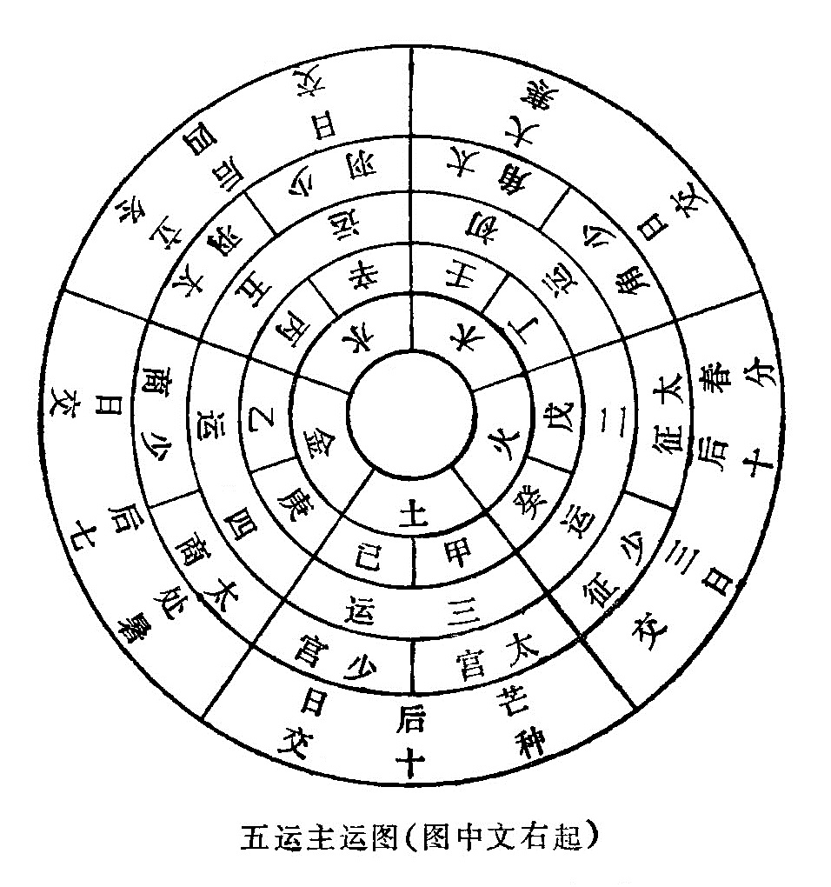

初运的木运是从什么时候开始的？初运木运是从大寒节当日开始（具体时间要根据年支的阴阳属性来定，见后五运各年交司时刻表），至春分后十三日交火运（二运）；芒种后十日交土运（三运）；处暑后七日交金运（四运）；立冬后四日交水运（终运）。五行气运就是这样相互沿袭，分主一年五季的气候，年年如是，终而复始，成为常年气候运动变化的一般规律，所以《素问•六节脏象论》说：“五运相袭，而皆治之，终朞之日，周而复始，时立气布，如环无端，候亦同法。”

五运之气虽然分主各个季节，但因统主一年的岁运不同，对各个季节的气候变化必然产生一定的影响，因此五运之气就有太过不及之分。太过，是运气的偏盛；不及，是运气的偏衰。如果既非太过，又非不及，那就属于完全正常的平气了。为了进一步分析主运五季太过不及的变化，采用了“五音建运”以反映五行气运的规律；“太少相生”以反映阴阳互根的变化；“五步推移”以反映不同岁运的影响。兹就上述推算方法，分别进行说明：

1）五音建运

五音，即宫、商、角、徵、羽。这是古代的音阶，又分别属于牙、舌、喉、齿、唇部发出的声音。《乐书》引刘歆云：“宫者，中也，为四音之纲，其声重厚；商者，章也，其声敏疾；角者，触也，其声圆长，经贯清浊；徵者，祉也，事也，其声抇抑递续；羽者，宇也物也，其声低平掩映，自高而下。”

为什么要用五音建运呢？

这与古代采用律管飞灰测候时令有关。五音清、浊、髙、下、长、短的变化，是随着五个季节不同的气运而发生的，所以古有“五音为五行之音”的说法。唐•徐坚在所著《晋书》中说：“角，触也，象诸阳气触动而生；征，止也，言物盛则止；商，强也，谓金性之坚强；羽，舒也，阳气将复，万物孳育而舒生；宫，中也，中和之道，无往而不理。”为此把五音分别建立在五运之中，即角为木音，建于木运；征为火音，建于火运；宫为土音，建于土运；商为金音，建于金运；羽为水音，建于水运。再根据五音的太少，即年干的阴阳，去推求五运太过不及的情况。

五音是与五行之气有一定的联系。用它来建运，无非把五音作为符号，以便区分太少，说明五行气运的太过与不及，其音义大略如此。兹列表于下：

主运运序配音表

| 运序 | 初   | 二   | 三   | 四   | 终   |
| ---- | ---- | ---- | ---- | ---- | ---- |
| 主运 | 木   | 火   | 土   | 金   | 水   |
| 五音 | 角   | 征   | 宫   | 商   | 羽   |
| 季令 | 春   | 夏   | 长夏 | 秋   | 冬   |

2）“太”，即太过，有余；“少”，即不及，不足。这里的太过不及，是用运气的阴阳来说明的，阳为太过，阴为不及。所以太属阳，少属阴。阴与阳本来是相互资生、促进的，所谓“阴以阳生，阳以阴生”，因此太少相生，即是阴阳相生的意思。

由于十干主运要区分阴阳，所以五音建运也有阴阳的区分。十干中以甲、丙、戊、庚、壬为阳，乙、丁、己、辛、癸为阴，凡阳干均属太，阴干均属少。把五音建于五运之上，再根据十干的阴阳来区分五音的太少，这样就能进一步说明运气的太过与不及。例如：甲己为土运，配以宫音，而甲为阳土，则属太宫；乙为阴土，则属少宫。乙庚为金运，配以商音，而庚为阳金，则属太商；乙为阴金，则属少商。丙辛为水运，配以羽音，而丙为阳水，则属太羽；辛为阴水，则属少羽。丁壬为木运，配以角音，而壬为阳木，则属太角；丁为阴木，则属少角。戊癸为火运，配以征音，而戊为阳火，则属太征；癸为阴火，则属少征。这是所谓“五音别太少。”

五音的太少又怎样相生的呢？五运通常是按五行相生次序运行的，既然把五音建于五运之中，五音必然随着五运的顺序而相生。所谓相生，就是相互资生促进，这是指自然气候变化中的一种规律。但五音的太少相生，是反映五行阴阳之气的相互资生。例如。甲己均为土运主治之年，但甲为阳土，所生是阴金之乙，此即太宫生少商；阴金之乙，所生是阳水之丙，此即少商生太羽；阳水之丙，所生是阴木之丁，此即太羽生少角；阴木之丁，所生是阳火之戊，此即少角生太征；阳火之戊，所生是阴土之己，此即太征生少宫。又己为阴土，所生是阳金之庚，此即少宫生太商；阴水之辛，所生是阳木之壬，此即少羽生太角；阳木之壬，所生是阴火之癸，此即太角生少征；阴火之癸，所生是阳土之甲，此即少征生太宫。这就是五音的太少相生。

太少反复相生，阴阳相互作用，于是有正常的运动变化，这是符合自然规律的。

五音建运太少相生表

| 年干     | 甲   | 乙   | 丙   | 丁   | 戊   | 己   | 庚   | 辛   | 壬   | 癸   |
| -------- | ---- | ---- | ---- | ---- | ---- | ---- | ---- | ---- | ---- | ---- |
| 属性     | 阳土 | 阴金 | 阳水 | 阴木 | 阳火 | 阴土 | 阳金 | 阴水 | 阳木 | 阴火 |
| 五音     | 宫   | 商   | 羽   | 角   | 征   | 宫   | 商   | 羽   | 角   | 征   |
| 太少相生 | 太   | 少   | 太   | 少   | 太   | 少   | 太   | 少   | 太   | 少   |

3）一年中，木运、火运、土运、金运、水运分主五个季节，始于木而终于水，历年不变，周而复始，这是主运的特点。但是它在一定程度上要受大运的影响和支配，因此，每年的初运是太角还是少角？就要根据当年年干的阴阳属性来决定，这样才能对五运各自的太过不及作出分析，所以要采用五步推运的方法。例如：年干是甲，甲为阳土，中运属太宫。即从太宫土运本身依次上推，直至初运的角为止，便可见到生太宫的是少征，生少征的是太角。因而甲年主运的初运便是起于太角。太少相生，太角生少征（二运），少征生太宫（三运），太宫生少商（四运），少商生太羽，是为终运。

己年为阴土，中运属少宫。即从少宫土运本身依次上推至初运的角，便可见到生少宫的是太征，生太征的是少角。因而己年主运的初运便是起于少角。太少相生，少角生太征（二运），太征生少宫（三运），少宫生太商（四运），太商生少羽，是为终运。

乙年为阴金，中运属少商。即从少商金运本身依次上推至初运的角，便可见到生少商的是太宫，生太宫的是少征，生少征的是太角。因而乙年主运的初运便是起于太角。太少相生，则太角生少征（二运），少征生太宫（三运），太宫生少商（四运），少商生太羽，是为终运。

庚年为阳金，中运属太商。即从太商金运本身依次上推至初运的角，便可见到生太商的是少宫，生少宫的是太征，生太征的是少角。因而庚年主运的初运便是起于少角。太少相生，则少角生太征（二运），太征生少宫（三运），少宫生太商（四运），太商生少羽，是为终运。

丙年为阳水，中运属太羽。即从太羽水运本身依次上推至初运的角，便可见到生太羽的是少商，生少商的是太宫，生太宫的是少征，生少征的太角。因而庚年主运的初运便是起于太角。太少相生，则太角生少征（二运），少征生太宫（三运），太宫生少商（四运），少商生太羽，是为终运。

辛年为阴水，中运属少羽。即从少羽水运本身依次上推至初运的角，便可见到生少羽的是太商，生太商的是少宫，生少宫的是太征，生太征的是少角。因而辛年主运的初运便是起于少角。太少相生，则少角生太征（二运），太征生少宫（三运），少宫生太商（四运）。太商生少羽，是为终运。

丁年为阴木，中运属少角。初运即从少角本身起算，太少相生，则少角生太征（二运），太征生少宫（三运），少宫生太商（四运），太商生少羽，是为终运。

壬年为阳木，中运属太角。初运即从太角本身起算，太少相生，则太角生少征（二运），少征生太宫（三运），太宫生少商（四运），少商生太羽，是为终运。

戊年为阳火，中运属太征。从太征火运上推一步，便是少角。因而戊年主运的初运便是起于少角。太少相生，则少角生太征（二运），太征生少宫（三运），少宫生太商（四运），太商生少羽，是为终运。

癸年为阴火，中运属少征。从少征火运上推一步，便是太角。因而戊年主运的初运便是起于太角。太少相生，则太角生少征（二运），少征生太宫（三运），太宫生少商（四运），少商生太羽，是为终运。

可见五运之气，总是以年干阴阳来区分太少，然后逐步上推至角，再从角而推至羽，这样就可分析各运之气的阴阳盛衰了。

4）各年五运交司时刻

申、子、辰年

初运：大寒日寅初初刻起。

二运：春分后第十三日寅正一刻起。

三运：芒种后第十日卯初二刻起。

四运：处暑后第七日卯正三刻起。

五运：立冬后第四日辰初四刻起。

巳、酉、丑年

初运：大寒日巳初初刻起。

二运：春分后第十三日巳正一刻起。

三运：芒种后第十日午初二刻起。

四运：处暑后第七日午正三刻起。

五运：立冬后第四日未初四刻起。

寅、午、戌年

初运：大寒日申初初刻起。

二运：春分后第十三日申正一刻起。

三运：芒种后第十日酉初二刻起。

四运：处暑后第七日酉正三刻起。

五运：立冬后第四日戌初四刻起。

亥、卯、未年

初运：大寒日亥初初刻起。

二运：春分后第十三日亥正一刻起。

三运：芒种后第十一日子初二刻起。

四运：处暑后第七日子正三刻起。

五运：立冬后第四日丑初四刻起。

（《类经图翼》）

兹将五运主运，列表于下：

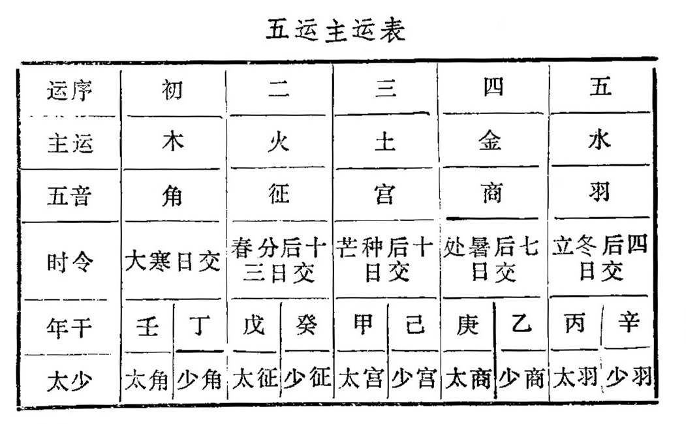

#### 3、客运

客运，指每年五个季节的异常气候变化，因其每岁有变更，如客之往来，故称之为“客运”。

为什么每年客运所主的气候都有变更呢？因为每年五季的气候在一定程度上要受统主一年的中运之气的影响，所以客运与历年不变的主运不同，它要随着每年的中运而变化。具体来讲，客运是以每年的中运为初运，循着五行太少相生的次序，分作五步，运行于主运之上，每步仍为七十三日零五刻，逐步运行，十年一轮周，终而复始。例如：

甲己年为土运所统，甲为阳土，运属太宫。因此，逢甲年便以太宫阳土为初运，按五行太少相生次序，则少商阴金为二运，太羽阳水为三运，少角阴木为四运，太征阳火为终运。逢己年为阴土，便以少宫阴土为初运，太商阳金为二运，少羽阴水为三运，太角阳木为四运，少征阴火为终运。其余按此类推。可见它与主运每年始于角而终于羽是不相同的。兹列表如下：

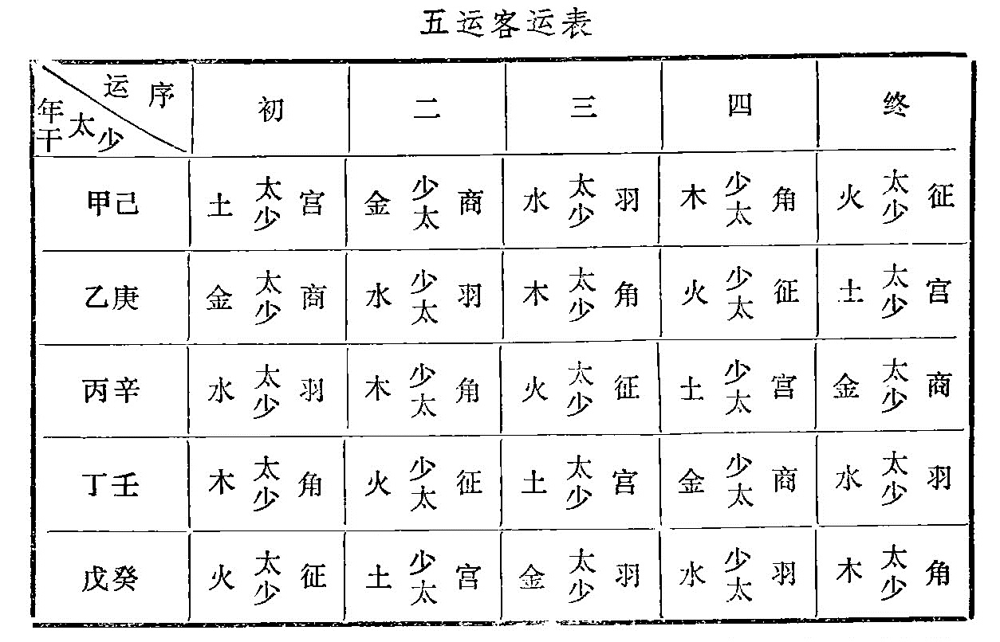

客运定局的程式，在《素问•六元正纪大论》也有记载，如：

壬年：太角（初正）、少征、太宫、少商、太羽（终）；

戊年：太征、少宫、太商、少羽（终）、少角（初）；

甲年：太宫、少商、太羽（终）、太角（初）、少征；

庚年：太商、少羽（终）、少角（初）、太征、少宫；

丙年：太羽（终）、太角（初）、少征、太宫、少商；

丁年：少角（初正）、太征、少宫、太商、少羽（终）；

癸年：少征、太宫、少商、太羽（终）、太角（初）；

己年：少宫、太商、少羽（终）、少角（初）、太征；

乙年：少商、太羽（终）、太角（初）、少征、太宫；

辛年：少羽（终）、少角（初）、太征、少宫、太商。

程式中所注的“初”，指每年主运的初运，“终”，指每年主运的终运，“正”指当年主运和客运的五步太少相生是一致的。壬年的初运是太角，丁年的初运是少角，主客运同步，故称为“正”。

总的说来，大运（中运）、主运、客运各有特点，大运是推算六十年的气象变化，以及一年之中气候变化的太过不及；主运是推算一年五个季节的正常气候变化；客运是推算六十年中每年五个季节的异常气候变化。但都要利用天干的阴阳五行属性进行推演，例如阴阳干互为起运，太少相生，五行顺序，五步推移等，都是相同的。不同的是，大运从土起算，主运从木起算，客运则不固定，随大运而转移。主运年年始于角，终于羽，居恒不变，而客运则以本年的大运为初运，十年周遍十干，终而复始。三者的推算方法虽然不同，但都是为了探索和说明自然气候变化的不同规律。

#### 4、五运三纪

无论任何一个周期的气候变化，有正常就有反常，有偏盛就有偏衰，因此五运之气可分为太过、不及、平气三种不同情况，所以称为“五运三纪。”

所谓太过，是指运气偏盛而有余；不及，指运气偏衰而不足；平气，即正常之气，既非偏盛，又非偏衰。尽管气候变化万千,总不外乎这三种情况。所以《素问•五常政大论》称之为“三气之纪”，用以概括自然气候变化中的几种规律，正如高士栻所说：“木、火、土、金、水，有平气，有不及之气，有太过之气，皆其常也。天气制于上，运气主于中，百物生化，五虫孕育，有盛有衰，是其政也。”为此，《内经》在《素问•气交变大论》、《素问•五常政大论》诸篇，都分别进行了系统的论述，如何区别运气的太过、不及与平气？主要根据年干的阴阳属性以及年干和年支的关系来确定。凡年干属阳（甲、丙、戊、庚、壬），均主岁运太过；年干属阴（乙、丁、己、辛、癸），均主岁运不及。例如：甲己年为土运统治岁气，甲为阳干，是为土运太过之年，在六十年的周期中，凡六甲年（甲子、甲戌、甲申、甲午、甲辰、甲寅）主运，均为湿土用事，可以出现雨湿之气流行，土气独旺的局面。己为阴干，是为土运不及之年，在六十年的周期中，凡六己年（己巳、己卯、己丑、己亥、己酉、己未）主运，均为岁土不及，可以出现湿土之气不行，风气旺盛的局面。

平气又是怎样产生的？它是根据年干和年支的关系来确定的。在岁运不及的年份，如果年干能得到年支的帮助，便由不及而变为平气，所谓“运不及而得助”，这是形成平气的一种原因。例如癸巳年的年干属于火运不及，但能得到年支巳火的相助，而癸巳年的火运则为平气了。在岁运太过的年份，如果年干受到年支司天之气的制约，所谓“运太过而被抑”，便由太过而变为平气，这是形成平气的另一种原因。例如戊辰年的年干属于火运太过，但是受到辰年太阳寒水司天之气的制约，而戊辰的火运则为平气了。

此外，还有每年初运交接的第一天（大寒节），如果当年的年干与月干、日干或时干相合，也可称为平气，这就是所谓的“干德符”，即年干与月干、或日干、时干符合相济的意思。

总之，阴阳五行的气运在一定程度上都是以维持某种相对平衡为主要法则，它的相生相制，说明自然气候本身具有一种调节机制，使亢盛的将被削弱，弱小的会得到加强，旧的平衡被破坏，新的平衡又建立，大气中各种物理过程，都要服从这一规律，正如《素问•气交变大论》所说：“五运之政，犹权衡也，高者抑之，下者举之，化者应之，变者复之，此生长化收藏之理，气之常也，失常则天地四塞矣。”

《内经》对大气运动的这一认识，在今天也是有意义的。（三）六气

六气，即风、火、暑、湿、燥、寒六种不同的气候特征。五运和六气都要分主一年各个季节、气候的变化，不同的是，五运代表空间因素，它与天体的运转直接有关。气候变化本身是多种因素相互作用的结果，其中太阳辐射、下垫面状况、大气环流，人类活动都是影响气候变化的主要因素，而五运六气正是力图把这些影响气候变化的重要因素联系起来，去探索各种气候变化的运动规律。

每年的六气，分主气、客气、主客加临三种情况，主气用以测常，客气用以测变，主客加临，即是把主气和客气的关系结合起来，进一步分析气候的变化及其影响。推求的方法，是以六气配合十二地支，再根据纪年地支与六气的关系来进行推衍分析。

#### 1、十二支与六气

干支运用到运气学说中，天干主要是配合五运来运用，地支主要是配合六气来运用，即所谓“天干取运，地支取气。”

十二支配合六气，不能离开三阴三阳，正如《素问•五运行大论》所说：

“子午之上，少阴主之；丑未之上，太阴主之；寅申之上，少阳主之；卯酉之上，阳明主之；辰戌之上，太阳主之；巳亥之上，厥阴主之。”

上，即指在上的天气，亦即司天之气所在的位置。如子、午年，则为少阴君火之气主司天之位；丑、未年，则为太阴湿土之气主司天之位；卯、酉年，则为阳明燥金之气主司天之位；辰、戌年，则为太阳寒水之气主司天之位；巳、亥年，则为厥阴风木之气主司天之位。它与前面十二支按五行方位配属是不同的。如下表：

| 厥阴风木 | 少阴君火 | 少阳相火 | 太阴湿土 | 阳明燥金 | 太阳寒水 |
| -------- | -------- | -------- | -------- | -------- | -------- |
| 巳亥     | 子午     | 寅申     | 丑未     | 卯酉     | 辰戌     |

为什么六气要这样配合十二支呢？这包含有天地阴阳二气相互作用的道理在内，即《素问•天元纪大论》所说：“动静相召，上下相临，阴阳相错，而变由生也。”天属阳，主动；地属阴，主静。动静相召，就是天气感召地气，地气感召天气的意思。上面的天气下临于地，下面的地气上临于天，这叫做上下相临。天地阴阳二气相互交错，相互作用，必然就会引起一系列的变化。但阴阳两个方面有主有从，因此王冰在《玄珠密语》中提出正对化之说，刘温舒根据王冰的论述并作解释说：

“六气分上下左右而行天令，十二支分节令时日而司地化。上下相召，而寒、暑、燥、湿、风、火与四时之气不同者，盖相临不一而使然也。六气司于十二支者，有正对之化也。然厥阴所以司于巳亥者，何也？谓厥阴木也，木生于亥，故正化于亥，对化于巳也。虽有卯为正木之分，乃阳明燥金对化也，所以从生而顺于巳也。少阴所以司于子午者，何也？谓少阴为君火尊位，所以正得南方离位，故正化于午，对化于子也。太阴所以司于丑未者，何也？谓太阴为土，土属中宫，寄于坤位西南，居未分也，故正化于未，对化于丑也。少阳所以司于寅申者，何也？谓少阳相火，位卑于君火也，虽有午位，君火居之，火生于寅，故正化于寅，对化于申也。阳明所以司于卯酉者，何也？谓阳明为金，酉为西方，西方属金，故正化于酉，对化于卯也。太阳所以司于辰戌者，何也？谓太阳为水，虽有子位，以居君火对化，水乃伏土中，即六戊天门戌是也，六己地户辰是也，故水虽土用，正化于戌，对化于辰也。此天之阴阳合地之十二支，动而不息者也。”（《素问入式论奥》）

可见构成十二支正化对化的条件，一是与所在位置有关，二是与所主时令有关，但都含有阴阳五行相生的意义。

#### 2、主气

主气，是主治一年六个季节的正常气候变化，故称为主时之气。因其居恒不变，静而守位，故又称为地气。

主气分主一年二十四节气，分为六步，每步主四个节气，计时六十天八十七刻半，初气始于厥阴风木，终于太阳寒水，按五行相生次序运行，年年不变。六气主时，是从上年的十二月中的大寒起算，经过立春、雨水、惊蛰，到二月中旬的春分前夕，属厥阴风木当令。此时斗建从丑中到卯中，正当阳气向上升发的季节，为一年春季之始，故以厥阴风木为初气。从二月中旬的春分起算，经过清明、谷雨、立夏，到四月中旬的小满前夕，属少阴君火当令，此时斗建从卯中到巳中，正是阳气逐渐旺盛的季节，又为一年夏季之始，故以少阴君火为二气。从四月中旬的小满起算，经过芒种、夏至、小暑到六月中旬的大暑前夕，属少阳相火当令，此时斗建从巳中到未中，正是暑气流行的季节，君相同气相随，故以少阳相火为三气。从六月中旬的大暑起算，经过立秋、处暑，白露到八月中旬的秋分前夕，属太阴湿土当令，此时斗建从未中到酉中，正是湿气最盛的季节，虽然新秋初到，炎暑渐消，但湿土郁蒸之气仍在，故以太阴湿土为四气。从八月中旬的秋分起算，经过寒露、霜降、立冬，到十月中旬的小雪前夕，属阳明燥金主令，此时斗建从酉到亥中，正是燥气最盛的季节，燥为清凉而又干燥之气，故以阳明燥金为五气。从十月中旬的小雪起算，经过大雪、冬至、小寒到十二月中旬的大寒，属太阳寒水当令，此时斗建从亥到丑中，正是寒气最盛的季节，天气至此，行遍一周，故以太阳寒水为终气。时序气候的变迁，反映了五行相生的规律，正如《素问•六微旨大论》说：“愿闻地理之应六节气位何如？曰：显明之右，君火之位也。君火之右，退行一步，相火治之；复行一步，土气治之；复行一步，金气治之；复行一步，水气治之；复行一步，木气治之；复行一步，君火治之。”

六气之间具有相互承制、约束的关系。这种承制、约束的关系，对气候变化起到一种自然调节的作用。《素问•六微旨大论》说：“相火之下，水气承之；水位之下，土气承之；土位之下，风气承之；风位之下，金气承之；金位之下，火气承之；君火之下，阴精承之。”“下”，指下承之气，因位居本气之后，所以称下。“承”，即随即，指接着而来的制约之气。六气之间要相互制约，才能防止太过不及，保持相对平衡，所以任何一气的下面，都有相应的制约之气。当某一气出现亢盛的时候，随即就有另一气去制约它。否则六气失去自然调节，就会产生很大的破坏作用，给生物界带来严重威胁，故《素问•六微旨大论》说：“亢则害，承乃制，制则生化，外列盛衰，害则败乱，生化大病。”兹列图如下：

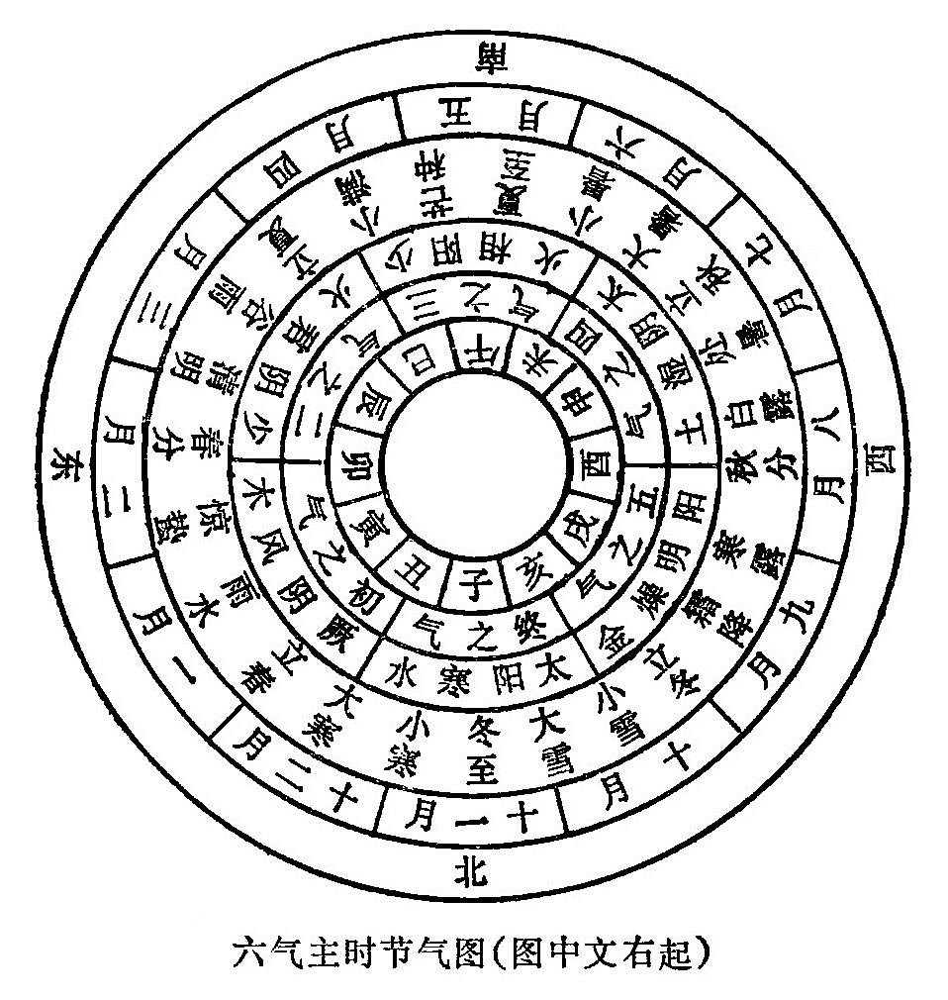

#### 3、客气

客气，即是在天的三阴三阳之气，因其运动不息，年年有变，与固定的主气不同，犹如客之往来，故称为客气。

客气的运行也分六步，以阴阳先后为次序，即先三阴，后三阳。三阴以厥阴为一阴，少阴为二阴，太阴为三阴；三阳以少阳为一阳，阳明为二阳，太阳为三阳。两者结合起来，其次序为：一厥阴，二少阴，三太阴，四少阳，五阳明，六太阳。厥阴主风木之气，少阴主君火之气，太阴主湿土之气，少阳主相火之气，太阳主寒水之气。客气虽然和主气同样是分六步运行，但次序则完全不同，并且随着年支的变化而变化。《素问•六微旨大论》说：“上下有位，左右有纪。故少阳之右，阳明治之；阳明之右，太阳治之；太阳之右，厥阴治之；厥阴之右，少阴治之；少阴之右，太阴治之；太阴之右，少阳治之。此谓气之标，盖南面而待之也，故曰：因天之序，盛衰之时，移光定位，正立而待之，此之谓也。”

“上下有位”，是指司天在上，在泉居下的位置。上下确定以后，司天和在泉的左右间气也随之而定。根据六步客气在天的位置“面南而待之”，即可发现少阳的右面是阳明管理的；阳明的右面是太阳管理的……，这是客气与三阴三阳的同步规律。但六气为本，三阴三阳为标，风、寒、暑、湿、燥、火是六气的物质基础，三阴三阳只不过是六气的标象。这些都是根据天气变化的次序，时令盛衰的不同，而且通过观测日影以后才确定的位置，所谓“移光定位，正立而待之”。

客气的三阴三阳分布于上下左右，互为司天，互为在泉，互为间气，构成了以六年为一周期的气候变化，随着年支的演变，每年客气的盛衰均有所不同。推算客气，首先要确定司天和在泉，司天，在泉的左右，即为间气。下面分别予以说明。

##### 1）司天在泉

司天，就是主管天令的意思。通俗地讲，就是当令的气候。这是三阴三阳为客气时所表现的天气变化。在泉，即在下的地气，就是与司天相对之气，它是地气在不同的岁运影响下所产生的不同气候。司天象征在上，主上半年的气运；在泉象征在下，主下半年的气运。如子午年是少阴君火司天，则阳明燥金在泉；丑未年是太阴湿土司天，则太阳寒水在泉；寅申年是少阳相火司天，则厥阴风木在泉；卯酉年是阳明燥金司天，则少阴君火在泉；辰戌年是太阳寒水司天，则太阴湿土在泉；巳亥年是厥阴风木司天，则少阳相火在泉。《素问•六元正纪大论》说：“岁半以前，天气主之，岁半以后，地气主之。”即是说，上半年的客气，称为司天；下半年的客气，称为在泉。司天和在泉，就是值年客气的统称。

六步客气在天的位置是：司天在上，在泉在下，司天、在泉的左右，即间气所在的位置。所谓上，是指正南方位；所谓下，是指正北方位。司天的位置在正南方主气的三之气上，在泉的位置在正北方主气的终之气上。《内经》常用“上”字来代表司天，“下”字代表在泉，左右代表间气。如《素问•五运行大论》说：“天地者，万物之上下；左右者，阴阳之道路。所谓上下者，岁上下见阴阳之所在也。左右者，诸上见厥阴，左少阴，右太阳。见少阴，左太阴，右厥阴。见太阴，左少阳，右少阴。见少阳，左阳明，右太阴。见阳明，左太阳，右少阳。见太阳，左厥阴，右阳明。所谓面北而命其位，言其见也。”

这里的上下，就是指司天、在泉。司天在上，在泉在下，万物化生于其间，故天地为万物的上下。这里的左右，就是指间气。间气是用来纪步的，故左右为阴阳的道路。所谓上下，也即是该年司天在泉位置的阴阳。如子午年少阴司天在上，相对地阳明在泉在下；丑未年太阴司天在上，相对地太阳在泉在下。这里“上见”，是指司天。左右，是指司天的左右间气。故厥阴司天，则左见少阴，右见太阳；少阴君火司天，则左见太阴，右见厥阴。其余均可按此类推。为什么说这里所说的左右是指面向北方时所见的位置呢？因为司天的位置在正南方，面对着的是正北方在泉的位置，“面北而命其位”，是说明司天所定的左右是面向北方时所定的左右，它与在泉面向南方所定的左右相反。《素问•五运行大论》又说：

“何谓下？曰：厥阴在上，则少阳在下，左阳明，右太阴。少阴在上，则阳明在下，左太阳，右少阳。太阴在上，则太阳在下，左厥阴，右阳明。少阳在上，则厥阴在下，左少阴，右太阳。阳明在上，则少阴在下，左太阴，右厥阴。太阳在上，则太阴在下，左少阳，右少阴。所谓面南而命其位，言其见也。”

这里的“下”，是指在泉。这里的“左右”，是指在泉的左右。如己亥年厥阴风木司天在上，在下的在泉之气便是少阳，少阳在泉的左间是阳明，右间是太阴。其余均可按此类推。这里所说的左右，是指面向南方时所见的位置，它和司天面向北方所定的左右恰恰相反。

六气的运转，是按纪年的年支顺序进行的，六年一轮周，每一年都有值年的司天、在泉和间气。司天之气，自上而右转，下降于地；在泉之气，自下而左转，上升于天。左右旋转一周，于是回归原来的位置，故《素问•五运行大论》说：“动静何如？曰：上者右行，下者左行，左右周天，余而复会也。”

客气是按阴阳的先后与阴阳之气的多少为序的，即先三阴，后三阳（厥阴、少阴、太阴；少阳、阳明、太阳）所以值年的司天和在泉，总是阴阳相对。阴阳之气的多少相对，如一阴司天，则一阳在泉，二阴司天，则二阳在泉，三阴司天，则三阳在泉。反之，三阳也是如此。

客气六步，除司天和在泉外，其余四步称为间气，分别位于司天、在泉的左右。由于司天在泉的南北方位不同，司天和在泉的左间和右间便恰恰处于相反的位置。按客气与主气的相应位置来看，主气的三之气上是客气的司天，主气的四之气上，便是司天的左间；主气的二之气上，便是司天的右间；主气的终之气上是客气的在泉，主气的初之气上，便是在泉的左间；主气的五之气上，便是在泉的右间。四步间气，随着司天在泉而转移，它包含有阴阳升降的意义在内。每年六气的变化，司天之气起着决定性的作用；如《素问•至真要大论》说：“厥阴司天，其化以风；少阴司天，其化以热；太阴司天，其化以湿；少阳司天，其化以火；阳明司天，其化以燥；太阳司天，其化以寒。”

这就是客气司天的气化规律。兹列司天在泉左右间气图如下：

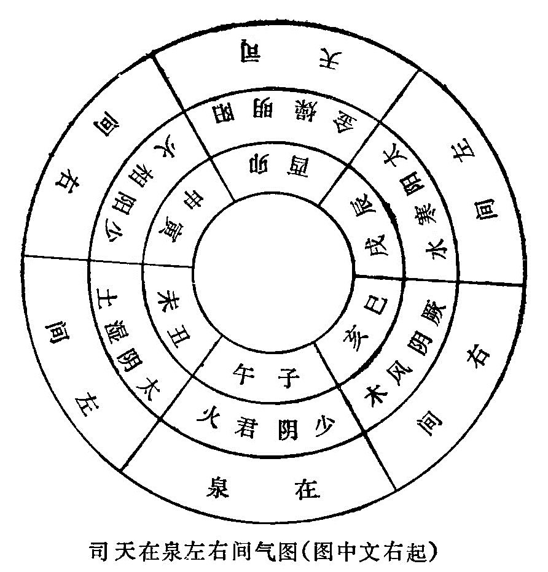

此外，客气司天还可能出现以下两种情况：

第一种：客气的胜复变化。胜，指偏胜之气；复，指报复之气。前者是气的主动抑制作用，后者是气的被动反抗作用。客气的胜复，是说客气有所胜则有所复。“有胜即有复”，这是气候变化在异常情况的一般规律，也是气候变化的一种自然调节作用。一年中，若上半年发生某种太过的胜气，下半年即有与之相反的复气发生，如上半年热气偏胜，下半年即有寒气来复。上半年是司天主政，下半年是在泉主政，这实际上是司天之气有胜，则在泉之气有复。当然，胜复之气并非每年都有。胜复的变化，不仅六气存在，五运也有类似情况。五运中，若有某运偏胜，即有另一运以报复之，如木运不及，金气胜木，木郁化火，火则克金而为复。不过六气和五运的胜复有所不同，六气之复，是所郁之本气复发；五运之复，是为子复母仇。

第二种客气的不迁正，不退位。“不迁正，不退位”，这是《素问》遗篇《刺法论》中提出的。所谓“不迁正”，就是值年的司天之气不能应时而至，原因多由前一司天之气太过，以致影响值年司天之气，因此气候失常，即《本病论》所说：“司天不得其迁者，即前司天以过交司之日，即遇司天太过有余日也，即仍旧治天数，新司天未得迁正也。”

所谓“不退位”，就是主司天之气过时而不退，继续行令，以致该气延长，气候不符合常律。即《本病论》所说：“所谓不退者，即天数未终，即天数有余，名曰复布政，故名曰再治天也，即天令如故而不退位也。”

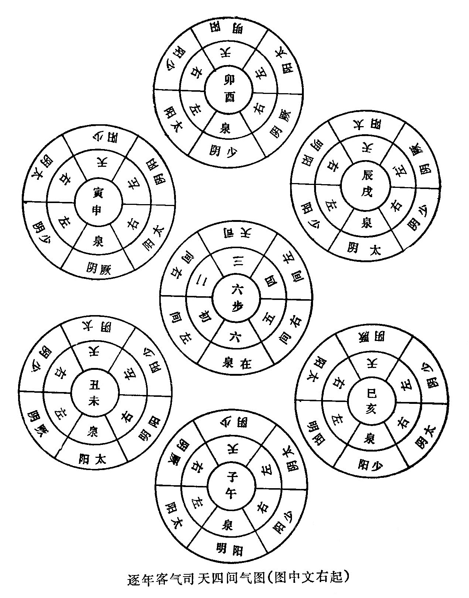

例如子午年少阴君火司天，如果火热之气太过，留而不去，至次年的气候变化仍然出现少阴君火之气的特点，这就是少阴君火不退位，相应地就会影响左右间气的升降，形成“升不前，降不下”，因此破坏了客气的正常规律。由此可知，“不退位”即司天之气的“至而不去”，“不迁正”，即司天之气的“至而不至”，都是客气司天气候的异常现象。

##### 2）客主加临

什么叫客主加临？就是将每年轮值的客气加在固定的主气之上，便称客主加临。临，是会合的意思。客气是“动而不息”，属于天气；主气是“静而守位”，属于地气。把客气和主气结合起来，主要是便于分析它们之间的关系，借以推测各该年四时气候的变化。《素问•五运行大论》说：“上下相遘，寒暑相临”。这里的“上”即指客气；“下”即指主气。上下相遘，即司天在泉之客气与主时之气相互交遘。这里的寒暑是泛指六气。寒暑相遘，即是指客气的司天、在泉、左右间加临于主气之上。根据主客之气是否相得，或顺或逆，便可分析其变化。正如《普济方·五运六气图》说：“以客加主，而推其变。”所谓客主加临，即是将司天的客气加在主气三气之上，在泉之气加在主气的终之气上，其余四个间气，自然以次相加。例如：

子午年少阴君火司天，阳明燥金在泉。主气的初气是厥阴风木，客气的初气则为太阳寒水。主气的二气是少阴君火，客气的二气则为厥阴风木。主气的三气是少阳相火，客气的三气则为少阴君火。主气的四气为太阴湿土，客气的四气亦为太阴湿土。主气的五气是阳明燥金，客气的五气则为少阳相火。主气的六气是太阳寒水，客气的六气则为阳明燥金。

丑未年太阴湿土司天，太阳寒水在泉。主气的初气是厥阴风木，客气的初气亦为厥阴风木。主气的二气是少阴君火，客气亦为少阴君火。主气的三气是少阳相火，客气的三气则为太阴湿土。主气的四气是太阴湿土，客气的四气则为少阳相火。主气的五气是阳明燥金，客气的五气亦为阳明燥金。主气的六气是太阳寒水，客气的六气亦为太阳寒水。其余均可按此类推。兹列图如下：

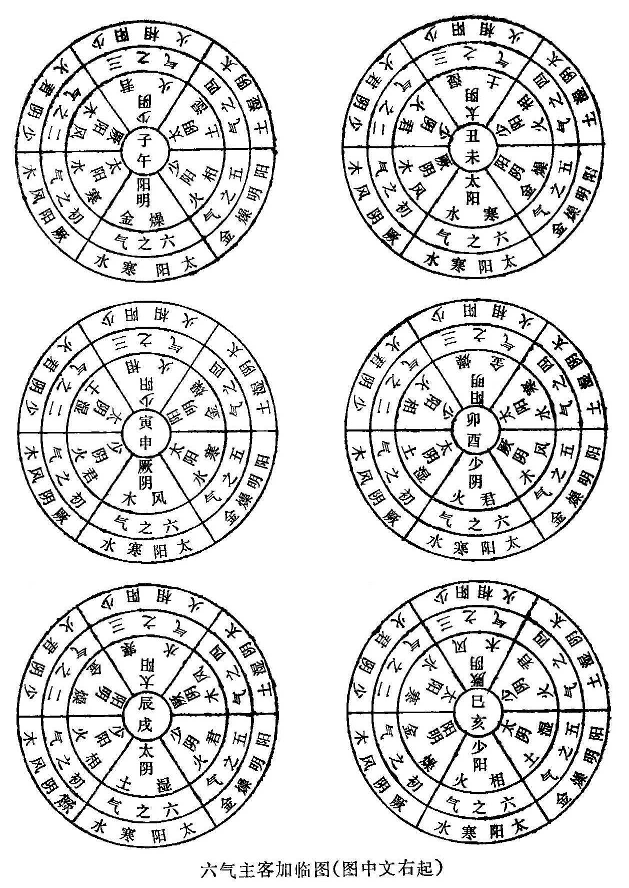

客主加临，即是把天气和地气结合起来分析四时气候的变化。客主加临有两种情况：①主客之气是否相得。将客气加于主气之上，凡客主之气相生，或客主同气，便为相得；如果主客相克，或主气克客气，便为不相得。相得者，主气候正常，人体不易发生疾病；不相得，则气候反常，容易引起疾病的产生。正如《素问•五运行大论》说：“气相得则和，不相得则病。”就是针对主气与客气的这种关系来讲的。②主客之气的顺逆。客气加于主气之上，又有顺和逆的不同情况，凡主客相生，或客气胜（克）主气，则为顺，反之则为逆。所以说：“主胜逆，客胜从”。从，即是顺的意思。为什么客气制胜主气是正常的呢？因为主气主常令，是固定不变的，客气轮流值年，为时是短暂的。如果主气制胜客气，则客气便不能司令，所以为逆；相反，客气制胜主气，但为时短暂，对主气影响不甚，所以是正常的。此外，还有另一种情况，即是客气少阴君火加于主气少阳相火之上的时候，由于两者都属火，用生克关系无法解释，只好根据君火相火之间的主从关系来加以区别。君火为主，相火为从，因此把君火加于相火之上称为顺，相火加于君火之上称为逆。即所谓“君位臣则顺，臣位君则逆”。

### （四）运气同化

运、气同化，就是五运与六气的同类化合。运与气在六十年变化中，除互为生克，互为消长外，还有二十多年的同化关系。为什么产生这样的关系？因为运与气在遇到彼此性质相同的情况下，往往容易联系在一起，产生同一性质的变化。正如《素问•六元正纪大论》说：“愿闻同化何如？岐伯曰：风温春化同，热臐昏火夏化同，胜与复同，燥清烟露秋化同，云雨昏瞑长夏化同，寒气霜雪冰冬化同。此天地五运六气之化，更用盛衰之常也。”

时令季节和气候变化是有密切联系的，就一般情况而言，有什么季节到来，便有什么样的气候出现，所以风温之气与春天的木运同化，炎热之气与夏天的火运同化等等。这就是一年中上下左右，主客运气相互化合的原因。但相合有多有少，如果以多合多，则盛者愈盛；以少合少，则衰者愈衰。由于运与气的相合有多有少，所以就产生了盛衰互用的规律。

运同司天之气与在泉之气化合，由于运有太过不及，气有司天在泉的不同，因而便有天符、岁会、同天符、同岁会、太乙天符五种不同年份，兹分别叙述如下：

#### 1、天符

天符，即中运之气与司天之气相应而符合。就是说，中运值年的天干与客气司天的地支，彼此的五行属性相同，便称为天符。如《天元纪大论》说：“应天为天符”，即是岁气应司天便是天符的意思。在六十年中，符合“天符”的年份有十二年，如《素问•六微旨大论》说：“土运之岁，上见太阴；火运之岁，上见少阳、少阴；金运之岁，上见阳明；木运之岁，上见厥阴；水运之岁，上见太阳。奈何？曰：天之会也，故《天元玉册》曰天符。”

所谓“上见”，是指司天。“土运之岁，上见太阴”，即己丑、己未年。己为土运，丑未是太阴湿土司天，土与湿同化，故此二年称为天符。“火运之岁，上见少阳、少阴”，即戊寅、戊申、戊子、戊午年。戊为火运，寅申为少阳相火司天，子午为少阴君火司天，火与暑热同化，故此四年为天符。“木运之岁，上见厥阴”，即丁巳，丁亥年。丁为木运，巳亥是厥阴风木司天，风与木同化，故此二年为天符。“水运之岁，上见太阳”，即丙辰、丙戌年。丙为水运，辰戌是太阳寒水司天，水与寒同化，故此二年为天符。“金运之岁，上见阳明”，即乙卯、乙酉年。乙为金运，卯酉为阳明燥金司天，燥与金化同，故此二年为天符。图示如下：

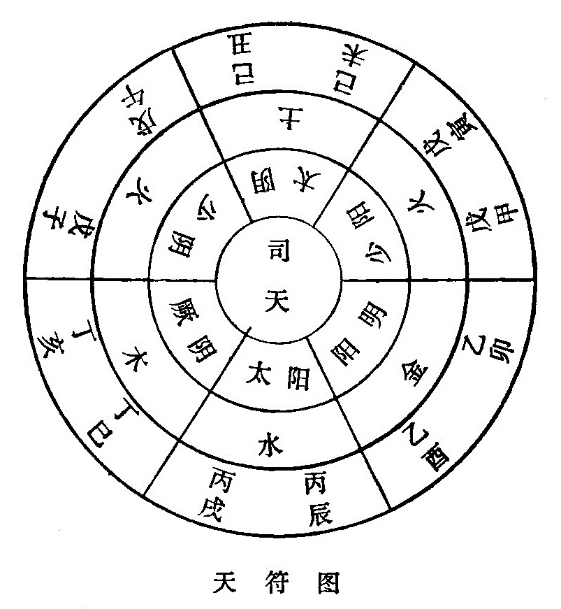

以上己丑、己未、戊寅、戊申、戊子、戊午、乙卯、乙酉、丁巳、丁亥、丙辰、丙戌十二年都是中运与司天之气相会合同化，故均属“天符”。

#### 2、岁会

岁会，是岁运与年支的五行属性相合，同时又得五方之正位，便称为岁会。《素问•六微旨大论》说：“木运临卯，火运临午，土运临四季，金运临酉，水运临子，所谓岁会，气之平也。”所谓“临”，就是本运加临本气。如丁卯年，丁为木运，卯在东方属木的正位，故称“丁运临卯”。戊午年，戊为火运，午在南方属火的正位，故称“火运临午”。甲辰、甲戌、己丑、己未四年，甲己均属土运，而辰戌丑未都是分布在寄旺之位，即四季之末，故称“土运临四季”。乙酉年，乙为金运，酉在西方属金的正位，故称“金运临酉”。丙子年，丙为水运，子在北方属水的正位，故称“水运临子”。凡此丁卯、戊午、甲辰、甲戌、己丑、己未、乙酉、丙子八年都是本运临本气，本气上承本运，所以称为“岁会”。即《天元纪大论》所说的：“承岁为岁值”。值，即是会遇的意思。以上所列举的丁卯、戊午、乙酉、丙子四年，支运相合，又居于子午卯酉经纬线的正方，即四方地支的正位，故又称为“四直承岁”。而其它年份，虽然也有岁运与相合的（如壬寅、庚申、癸巳、辛亥年），因其不居正位，故不称为“岁会”，但也可以“类岁会”相称。图式如下：

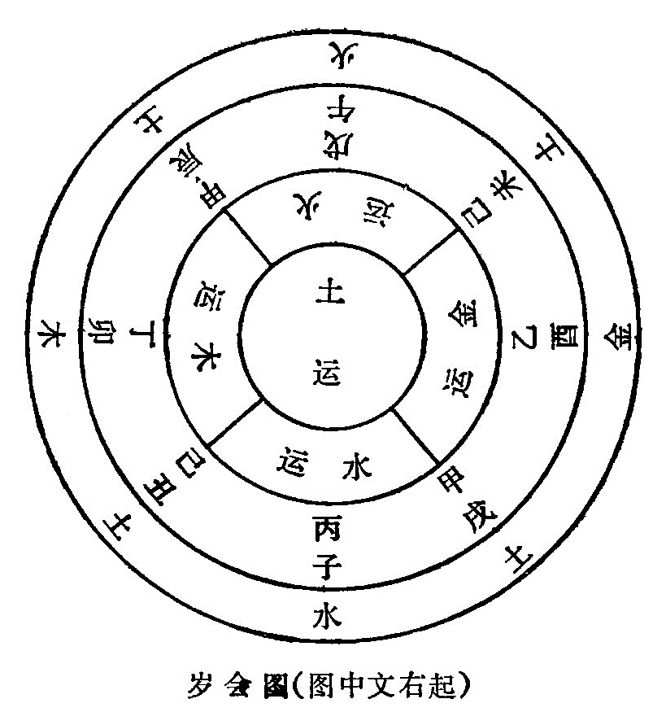

#### 3、同天符

凡逢阳年，太过的中运之气，与客气在泉相合而同化的，就叫“同天符”。为什么这样称呼？因为太过的中运之气不是与客气的司天之气相合，而是与客气的在泉之气相合，但客气的司天在泉，均属于天气范畴（与主气相对而言），故虽不是“天符”，但与“天符”有相同之处，故称为“同天符”。《素问•六元正纪大论》说：“太过而同地化者三，……甲辰，甲戌太宫，下加太阴。壬寅，壬申太角，下加厥阴。庚子，庚午太商，下加阳明。如是者三，加者何谓？曰：太过而加同天符。”这是说，在六十年中，岁运太过而与客气在泉之气相合的有三，即甲辰、甲戌，壬寅、壬申、庚子，庚午年份。甲辰、甲戌年，甲为阳土太宫，属土运太过，而客气的在泉之气是太阴湿土，以在上之运加于在下的在泉，于是土湿相合而同化。壬寅、壬申年，壬为阳木太角，是木运太过，而客气的在泉之气是厥阴风木，以壬木下加于在泉的厥阴风木，故风木相合而同化。庚子、庚午年，庚为阳金太商，属金运太过，而客气的在泉之气是阳明燥金，以庚金下加于在泉的阳明燥金，故金燥相合而同化。以上甲辰、甲戌、壬寅、壬申、庚子、庚午六年，都是太过的中运与在泉之气相同，所以称为“同天符”。图示如下：

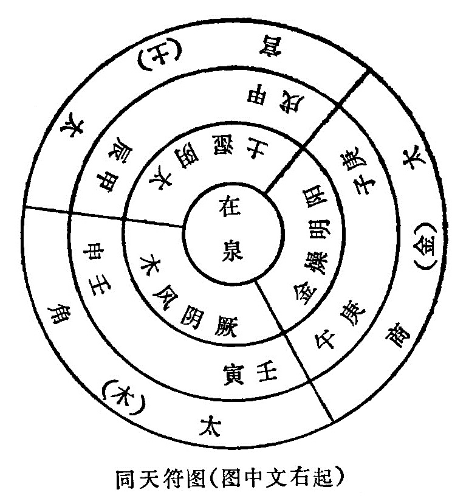

#### 4、同岁会

凡逢阴年，不及的中运之气与在泉之气相合而同化的，叫做“同岁会”。本来是中运之气与年支之气相合才能称做“岁会”，现在仅取年支所主的在泉之气相合，也是大同而小异，所以称为“同岁会”。如《素问•六元正纪大论》说：“不及而同地化者三，癸巳、癸亥少征，下加少阳。辛丑、辛未少羽，下加太阳。癸卯、癸酉少征，下加少阴。如是者三，不及而加，同岁会也。”

在六十年中，“同岁会”共有六年，即辛未、辛丑、癸卯、癸酉、癸巳、癸亥。其中癸卯、癸酉、癸巳、癸亥是阴年，中运为火运不及，属少征，巳、亥是少阳相火在泉，卯、酉是少阴君火在泉，均属火运不及，故中运与在泉相合而同化。辛丑、辛未年，中运为水运不及，属少羽；丑、未是太阳寒水在泉，均属水运不及，故中运与在泉相合而同化。由此可知，不及的中运之气与在泉之气相同，都叫“同岁会”。

列图如下：

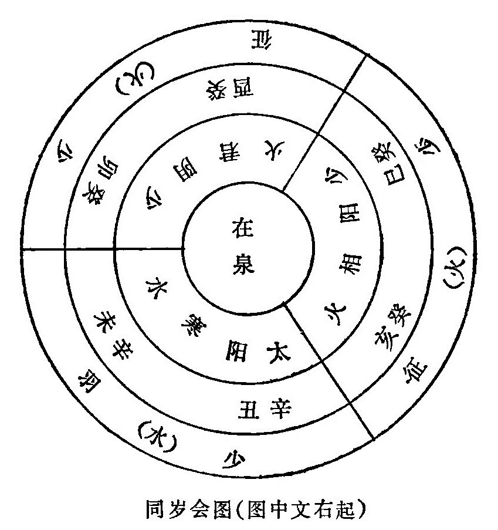

#### 5、太乙天符

既是天符，又是岁会，叫做“太乙天符”。如《素问•六微旨大论》说：“天符岁会何如？曰：太乙天符之会也。”在六十年中，戊午、乙酉、己丑、己未四年，均属太乙天符。太乙天符的含义，就是司天之气、中运之气、岁支之气三者会合主令，即《天元纪大论》所说的“三合为治”。例如：戊午年，戊为火运，午为少阴君火司天，这既是中运与司天同气的“天符”，又是中运与岁支同气居于南方正位的“岁会”。乙酉年，乙为金运，酉为阳明燥金司天，既是中运与司天同气，又是中运与岁支同居西方正位。己丑、己未年，己为土运，丑未为太阴湿土司天，既是中运与司天同气，又是中运与岁支同居土位。以上四年，均为司天、中运、岁支三气会合的年份，这是难得而可贵的，所以尊称为“太乙天符。”

图示如下：

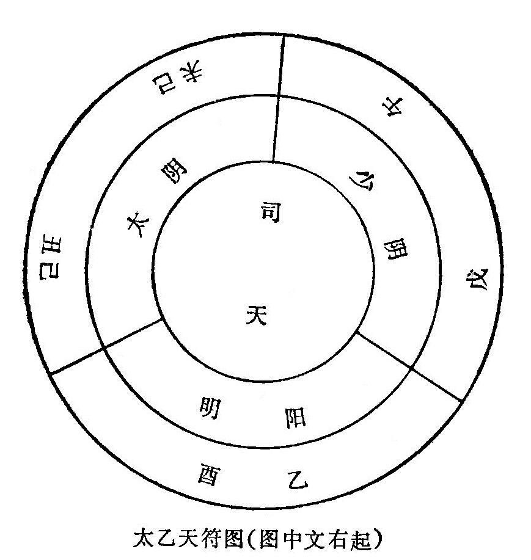

运与气的同化关系，虽有天符、岁会、同天符、同岁会、太乙天符的不同，都是用以说明运与气相合的年份，便于进一步分析气象的常变。运气相合，彼此虽然没有克复，使气象变化处于比较稳定的状态，但却因此而形成气候比较单纯，一气偏胜独治，这样就容易给人体和其它生物界带来一定的损害，正如《运气论奥》说：“一岁之中，有此上中下三气，各行其令，而气偶符会而同者，则通其化。虽无复之变，则有中病徐暴之异。”《素问•六微旨大论》也指出：“天符为执法，岁会为行令，太乙天符为贵人。曰：邪之中也奈何？岐伯曰：中执法者，其病速而危；中行令者，其病徐而持，中贵人者，其病暴而死。”一年之中，岁运、司天、在泉三气是各行其令的，一旦自然会合，贯通在岁气之中，形成了比较强大而单纯的气候变化，所以《内经》分别以“执法”、“行令”、“贵人”来形容它的力量和作用。执法位于上，故为“天符”邪气所伤，则发病迅速而严重；行令位于下，故为“岁会”邪气所伤，则病势徐缓而持久；贵人统乎上下，故为“太乙天符”邪气所伤，则病势急剧而有死亡的危险。在六十年中，计有天符十二年，岁会八年，太乙天符四年，同天符，同岁会各六年，共三十六年，除去重复的十年外，只有二十六年，《素问•六元正纪大论》所谓“二十四岁”，是未将“岁会”的不同年份（即不与天符，同天符相同的丁卯、丙子年）计算在内的缘故。

## 三、运气学说在医学上的应用

在医学上应用运气学说，主要用它来推测每年气候变化和疾病流行的情况。但各年气候变化有常有变，因此运和气又有主客之分，即一般与特殊的区别。下面分别予以说明：

### （一）推测每年气候变化和疾病流行的一般情况

运气学说中的主运、主气，是用来推测每年气候变化和疾病流行的一般情况。主运分五运，主治一年五时的正常气候。初运木运，从每年大寒节至春分节前，是气候由寒转温的季节，相当于春季，为风气主令。此时阳气升发，人体肝气与之相应。如果肝肾阴虚的人，往往肝阳易动，甚至化火生风，出现头痛、眩晕、中风等一类的疾病。从流行病学来看，本季节主要以风邪致病为多见，外感急性热病的风温，也常在本季节发生。二运火运，从每年清明节至芒种节前，是气候由温转热的季节，相当于夏季，为火气主令。此时阳气盛长，人体心气与之相应。如果心肾阴虚的人，易致心火亢盛，引起心烦、口渴、小便短赤，甚至火热迫血妄行，发生吐血、衄血等疾病。从流行病学来看，本季节主要以火邪致病为多见，外感温热病中的疫病，也多在本季发生。三运土运，从每年夏至节至处暑节前，是雨量多而地湿上蒸的季节，正当夏秋之间，为湿气主令。此时湿度较大，人体脾气与之相应。如果脾运不健的人，易致湿邪困脾，引起头重、身重、大便溏泄、脘腹满闷、四肢困倦等症。从流行病学来看，本季节主要以湿邪致病为多见，外感温热病中的湿温，也多在本季节发生。四运金运，从每年白露节至立冬节前，是气候凉爽而干燥的季节，相当于秋季，为燥气主令。此时阳气内敛，人体肺气与之相应。如果肺肾阴虚的人，易致肺燥津伤，引起咽干、鼻燥，胸满胁痛、咳血便秘等症。从流行病学来看，本季节主要以燥邪致病为多见，外感温热病中的秋燥，也常在本季节发生。五运水运，从每年立冬节至大寒节前，是气候较为寒冷的季节，相当于冬季，为寒气主令。此时阳气内藏，人体肾气与之相应。如果肾阳不足的人，易受寒邪侵袭，引起恶寒、发热，头痛、身重，咳嗽、气喘等症。从流行病学来看，本季节主要以寒邪致病为多见，外感热病中的风寒重症，也常在本季节发生。掌握上述时令季节气候变化和发病情况，在诊断和治疗上都具有重要指导意义。

主气和主运的意义基本相同，也是指每年各个季节气候的正常变化。主令分六步，一步主四个节气，初之气为厥阴风木，从每年大寒节至春分节，相当于十二月中到二月中，为风气主令，是肝病、风病发病较多的季节。二之气为少阴君火，从每年春分节至小满节，相当于二月中到四月中，为火气主令，是心病、火病发病较多的季节。三之气为少阳相火，从每年小满节至大暑节，相当于四月中到六月中，为暑气主令，君相同气相随，也是心病、暑病发病较多的季节。四之气为太阴湿土，从每年大暑节至秋分，相当于六月中到八月中，为湿气主令，是脾病、湿病发病较多的季节。五之气为阳明燥金，从每年秋分节至小雪节，相当于八月中到十月中，为燥气主令，是肺病、燥病发病较多的季节。终之气为太阳寒水，从每年的小雪节至大寒节，相当于十月中到十二月中，为寒气主令，是肾病、寒病发病较多的季节。

可见主运与主气所主的时令季节，气候变化，以及与人体五脏的关系，疾病发生的情况等均大体相同，它反映了常年气候运动变化的一般规律，也是中医六淫病因学说的重要组成部分，历来为医家所重视。

### （二）推测每年气候变化和疾病流行的特殊情况

任何事物的运动变化，都有它的一般规律和特殊规律，自然气候也是如此。运气学说中的大运、客运、客气，均是用来反映各年气候变化特殊规律的。

值年的大运，反映着各个年度气候的特殊变化。甲己年属土运主事，则全年气候偏湿，乙庚年属金运主事，则全年气候偏燥；丙辛年属水运，则全年气候偏寒；丁壬年属木运主事，则全年气候偏风；戊癸年属火运主事，则全年气候偏热。但是，各年大运又有太过不及之分（即阴年阳年以及岁气到来的早迟）。太过之年，不仅主岁主气偏盛，还要影响到它所胜之气。例如木运太过，风气流行，常可影响湿度的变化。在人体则表现为肝气太盛，升发太过，疏泄失常，并进而影响脾气的运化，引起一系列的肝脾的病变。正如《素问•气交变大论》中所说：“岁木太过，风气流行，脾土受邪，民病飧泄，食减，体重，烦冤肠鸣，腹支满……甚则忽忽善怒，眩冒颠疾……反胁痛而吐甚。”这是岁木太过的发病情况，其它年份的岁气太过，均相类似，在病因、病位、病机、病证方面虽然有所不同，但发病规律大体一致。不及之年，不仅主岁之气偏衰，反而相胜之气流行，这对人体同样产生相应的影响。如人体则表现为肝失疏泄，燥气偏盛，肺金受病，亦如《素问•气交变大论》中所说：“岁木不及，燥乃大行，……民病中清，胠胁痛，少腹痛，肠鸣溏泄……病寒热……咳而鼽。”

岁运不及的发病情况，除了导致胜气的妄行以外，还会出现制止胜气的复气，所谓有胜必有复。岁运太过，同样可以出现复气，如《素问•五常政大论》说：“微者复微，甚者复甚，气之常也。”这是五行亢害承制的规律所决定的。所以不论岁运是太过还是不及，一般均应考虑到本气、胜气、复气三个方面。运气除了太过不及之外，还有属于平气之年。平气是怎样产生的？一般是根据岁运与司天的五行生克关系来确定的。如岁运太过之年，受到司天之气的克制，岁运不及之年，受到司天之气资助，便成为没有太过不及的平和之气了。平气之年（六十年中计有：丁卯、乙酉、丁亥、己丑、癸巳、辛亥、乙卯、己未等九年），气候比较正常，一般变化不大，其影响也相对较小。

客运，是指每年五个季节气候的异常变化，虽然它也分五时和按五行相生顺序运行，但以当年大运为初运，随各个年度的气候变化而有所不同。所以它可反映五运主时的特殊规律。例如客运主时是火，则本季节的气候便偏热，客运主时是湿，则本季节的气候便偏湿。偏热的气候，必然对心有所影响；偏湿的气候，必然对脾有所影响。

客气，是指各年气候的异常变化，它不仅主管各个季节，而且兼管全年。所以可从值年司天在泉之气推测各年气候变化和疾病流行的特殊情况。一般来说，司天之气主管上半年，在泉之气主管下半年。如子午年少阴君火司天，则上半年气候偏热，多见热病，火热过胜则伤克肺金，因此容易引起肺脏的病变。《素问•至真要大论》说：“少阴司天，热淫所胜，怫热至，火行其政，民病胸中烦热，嗌干，右胠痛，皮肤痛，寒热咳喘，……唾血血泄，鼽衄嚏呕，……病本于肺，”少阴君火主上半年的气候变化，因本气过胜，所以发病规律按五行相克次序，是以肺金发病为主，但也可波及心肝两脏，这是上半年的发病情况。在泉胜气发病，就是在泉之气的本气过胜所引起的疾病。如子午年少阴君火司天，下半年则为阳明在泉的燥气所主，燥气太胜则克伤肝木，故以肝病为多见。《素问•至真要大论》说：“岁阳明在泉，燥淫所胜，则霿（音蒙晦也）露清暝，民病喜呕，呕有苦，善太息，心胁痛不能反侧，甚则嗌干面尘，身无膏泽，足外反热。”

阴阳燥气主下半年的气候变化，因本气过胜，所以发病规律，按五行相克次序，是以肝木发病为主，但也有波及肺胆两脏的。这是下半年的发病情况。其余各年司天在泉发病均可参考之。但应注意的是，值年司天之气又可影响全年气候变化，起着“主岁者纪岁”的作用。这是什么原因呢？因为天地之气是要相互作用、相互影响的，所谓“天气不足，地气随之，地气不足，天气从之……上胜则天气降而下，下胜则地气迁而上。”（《素问·六元正纪大论》）尽管如此，但天气是起主导作用的，所以司天可以主管全年气候变化，但也不排除在泉之气的影响。同时，还要看到司天在泉之间，还存在着五行相胜的关系，彼此之间的相互制约，也可起到一定的作用。

### （三）运气发病的治疗原则

五运六气的变化总不外阴阳盛衰往复，五行生克制化，这些早已被《内经》作为宇宙自然法则，推广到中医学的各个领域。所以从运气发病的治疗来看，仍然是以调整阴阳，纠正人体阴阳偏盛偏衰，并结合五行生克制化规律，补虚泻实，调整各脏之间的关系，使之恢复协调平衡为主要目的。亦即《素问•至真要大论》所说：“谨察阴阳所在而调之，以平为期”，“必先五胜（五脏之气偏胜），疏其气血，令其调达，而致和平”的意思。当然要达到上述目的，除了在诊断上“审察病机，无失气宜”以外，临床具体应用，还应结合有关治疗法则，进行辨证论治，才能收到应有的效果。如本篇所指出的：“必伏其所主，而先其所因。”即必须制伏疾病之本，先治其发生疾病的原因，但并不排除“急则治标”的原则。故下文接着说：“从内之外者,调其内；从外之内者，治其外；从内之外而盛于外者，先调其内而后治其外；从外之内而盛于内者，先治其外而后调其内；中外不相及，则治主病。”因为在疾病过程中，“所主”、“所因”是本，是矛盾的主要方面，抓住疾病的本质，其它问题就迎刃而解了。但有时“标病”也可居于主导地位，所以又有“急则治标”之法。又如《素问•至真要大论》说：“逆者正治，从者反治，从多从少，观其事也。”此亦为临床常用治法。所谓“逆者正治”，就是逆其病情而治，亦即正治法。“从者反治”就是从其病情而治，也即反治法。如张介宾说：“以寒治热，以热治寒，逆其病者，谓之正治。以寒治寒，以热治热，从其病者，谓之反治。”为什么采取“热因热用，寒因寒用，通因通用，塞因塞用”等反治法呢？这是针对假热、假寒、假实、假虚来说的。所以仍然要治病求本，才能辨明真伪，不为假象所惑。至于从治药物的或多或少，还要根据具体病情来决定，所谓“从多从少，观其事也。”总的来说，运气发病的治法，一方面是根据外因的性质及病情特点，另方面是掌握药物的性能和气味，其基本原则，仍然不能离开辨证论治。《素问•至真要大论》说：“风淫于内，治以辛凉；热淫于内，治以苦温；湿淫于内，治以苦热；火淫于内，治以咸冷；燥淫于内，治以苦温；寒淫于内，治以甘热。”指出了治疗六淫致病的基本方法。但是临床应用，还必从具体病情出发，所谓“寒者热之，热者寒之，温者清之，清者温之，散者收之，抑者散之，燥者润之，急者缓之，坚者软之，脆者坚之，衰者补之，强者泻之，各安其气，必清必静，则病气衰去，归其所宗，此治之大体也。”（《素问•至真要大论》）由于运气致病也有其复杂性，不仅与发病因素有关，也与患者的体质、环境条件、治疗经过等都有密切关系，所以必须结合四诊八纲，才能全面把握病情，拟定正确的治疗方案。

## 小结

本章从基本概念、基本内容及计算方法、在医学上的应用等三个方面选材，介绍运气学说的有关知识，是运气学说最基本、最实用的内容。

运气学说是中医理论体系的组成部分，是“天人相应”理论的延伸，运气学说研究的关键在于“时”与“气”相应与不相应，即时节的周期变化（常）与自然气候的周期变化（变）二者是否相应，是运气学说的核心内容。

所以，学习运气学说，主要是在了解基本概念、基本内容及计算方法的基础上，掌握它在医学上的实际运用，如运用主运、主气推测每年气候变化与疾病流行的一般情况；如运用大运、客运、客气推测每年气候变化与疾病流行的特殊情况。然而，疾病发生由诸多因素所决定，所以，要从病人和病证的实际情况出发加以综合分析，才能拟出正确的辨证论治和理法方药的治疗方案。

## 复习思考题
1. 什么叫运气学说？它的基本内容是什么？
2. 简述运气学说在医学上的主要应用。

