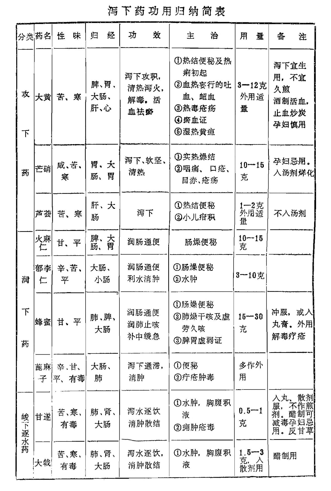
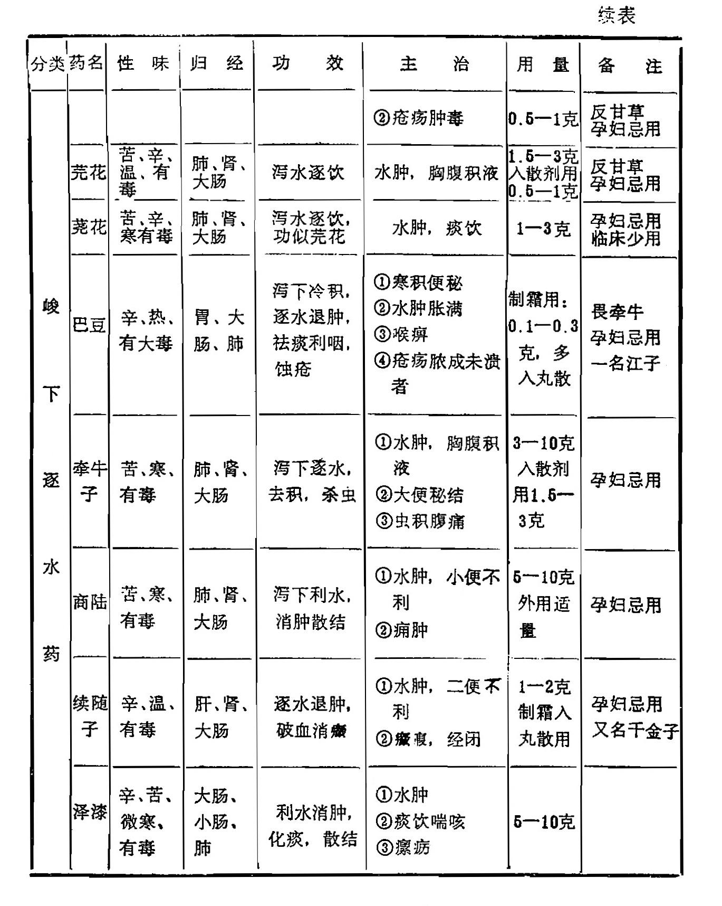

# 第二章 泻下药

[TOC]

〔自学时数〕    8 学时

〔面授时数〕    2 学时

〔目的要求〕
1. 了解泻下药的含义、功效、分类。
2. 熟悉泻下药的共同功用。
3. 熟悉攻下药、润下药、峻下逐水药的主要适应证。
4. 掌握攻下药、润下药、峻下逐水药中常用药（大黄 芒硝 火麻仁 郁李仁 甘遂 巴豆）的功效、临证应用，并比较其异同。
5. 熟悉泻下攻积、泄热通肠、软坚泻下、温下寒积、润下通便、峻下泻水、泻水涤饮的概念。
6. 在自学本章全部内容的基础上，重点掌握小结内容。

凡能引起腹泻或滑利大肠、促使排除肠内积滞和体内积水为主要作用的药物，统称为泻下药。

泻下药适用于里实证，其主要功用大致可分为三点：

1、通利大便，以清除肠道内的宿食燥屎及有害物质，使从大便排出。

2、清热泻火，使体内热毒通过泻下而得到缓解。

3、逐水消肿，使水湿之邪从二便排出，以达到祛除停饮，消退水肿的目的。

根据泻下作用不同，可分为攻下药、润下药和峻下逐水药三类。

使用泻下药应注意，里实兼有表邪者，当先解表而后攻里，必要时攻下药与解表药同用，表里双解，以免表邪内陷；里实而正虚者，应与补益药同用，攻补兼施，使攻邪而不伤正。攻下药与峻下逐水药作用较猛，后者尤为峻烈，奏效迅速，但易伤正气，宜于邪实而正气不虚之证。对久病正虚，年老体弱以及妇女胎前产后，月经期等均应慎用或忌用。

## 第一节 攻下药

本类药具有较强的泻下作用，性味多属苦寒，既能泻下通便，又能清热泻火，适用于肠道积滞，大便不通所引起的各种里实证，尤以实热积滞，燥屎坚结者最为适宜；对于血热上攻所致的头痛头晕，目赤肿痛及吐血衄血等证，无论有无便秘，均可用其导热下行，这就是“上病下取”的治法；痢疾初起，里急后重，泻而不畅者，亦可用此类药，以起到“通因通用”的作用。目前还常用攻下药配清热解毒、活血化瘀等药物，根据“通因通用“、“通则不痛”等原理，治疗多种急腹证，均取得较好效果。

### 大黄

〔原文〕**大苦大寒。入足太阴，**<small>脾。</small>**手足阳明、厥阴**<small>大肠、胃、心包、肝。</small>**血分。其性浮而不沉，其用走而不守。若酒浸，亦能引至至高之分。**<small>仲景太阴门调胃承气汤，大黄注曰酒浸；阳明门大承气汤，大黄注曰酒洗；少阳阳明小承气汤，大黄不用酒制，皆有分别。东垣曰：邪气在上，非酒不至。 若用生者，则遗至高之邪热，病愈后，或目赤喉痹头痛，膈上热疾生也。</small>**用以荡涤肠胃，下燥结而除瘀热。治伤寒时疾，发热谵语，**<small>大肠有燥粪，故谵语，宜下之。谵，音占。</small>**温热瘴疟**(1)**，下痢赤白，腹痛里急，黄疸水肿，癥瘕积聚**(2)，<small>积久成形谓之积，属阴；聚散无常谓之聚，属阳。积多是血，或食或痰，聚多是气。</small>**留饮**(3)**宿食**(4)**，心腹痞满，二便不通，**<small>皆土郁夺之。</small>**吐血衄血，血闭血枯，损伤积血，一切实热，血中伏火。行水除痰，蚀脓消肿，能推陈致新，然伤元气而耗阴血。**<small>下多亡阴。</small>**若病在气分，胃虚血弱人禁用。**<small>病在气分而用之，是为诛伐无过。东垣曰：能推陈致新，如定祸乱以致太平，所以有将军之号。时珍曰：仲景泻心汤，治心气不足，吐衄血者，用大黄、黄连、黄芩，乃泻心包、肝、脾、胃四经血中之伏火也。又治心下痞满，按之软者，用大黄黄连泻心汤，亦泻脾胃之湿热，非泻心也。病发于阴而反下之，则痞满。乃寒伤营血，邪结上焦。胃之上脘当心，故曰泻心。经曰：太阴所至，为痞满。又曰：浊气在上，则生䐜胀是已。病发于阳而反下之，则结胸，乃热邪陷入血分，亦在上脘。故大陷胸汤、丸皆用大黄，亦泻脾胃血分之邪，而降其浊气也。若结胸在气分，只用小陷胸汤；痞满在气分，只用半夏泻心汤。或问心气不足而吐衄，何以不补心而反泻心！丹溪曰：少阴不足，亢阳无辅，致阴血妄行，故用大黄泻其亢甚之火。又心本不足，肝肺各受火邪而病作，故用黄芩救肺，黄连救肝。肺者阴之主，肝者心之母，血之合也。肺肝火退，则血归经而自安矣。寇宗奭曰：以苦泄其热，就以苦补其心，盖一举而两得之。李士材曰：古人用大黄，治虚劳吐衄，意甚深微。盖浊阴不降，则清阳不生，瘀血不去，则新血不生也。</small>**川产锦纹者良。有酒浸酒蒸，生熟之不同，生用更峻。黄芩为使。**<small>欲取通利者，不得骤进谷食，大黄得谷食，便不能通利耳。《夷坚志》：汤火伤者，捣生大黄醋调敷，止痛无瘢。</small>

【讲解】（1）瘴疟：指感受山岚瘴毒而发的一种危重疟疾。（2）癥瘕积聚：癥瘕和积聚，都是腹内积块，或胀或痛的病证。 癥、积是有块状物可扪到，有形而固定不移，痛有定处；瘕、聚无形，聚散无常，推之游移不定，痛无定处。（3）留饮：痰饮的一种。因饮邪日久不化，留而不去，故名。（4）宿食：指饮食停积于肠胃的一种病证。

**大黄以清泻为主要功效。具有泻下攻积，清热泻火，解毒及活血祛瘀作用。**为蓼科多年生草本植物掌叶大黄，唐古特大黄或南大黄的根状茎。掌叶大黄和唐古特大黄，又称北大黄，主产于青海、甘肃等地；南大黄主产于四川、湖北、云南、贵州。

大黄别名众多。如就其性而言，因能推陈出新，有锐不可当之势，古人誉为“将军”。四川南大黄产量较大，为通用之品，故又称川军。从其状而言，断面棕黄红色，有类白色菱形的网状纹理，排列整齐，极似缎面的织锦者，称锦纹大黄，或简称锦纹。此种药材主产于青海，品质优良，奉为道地药材。

本品苦寒沉降。入脾、胃、大肠，心及肝经。力猛善行，能直达下焦，荡涤肠胃积滞，清泻血分实热，并借其入血降泄之力，又有活血逐瘀之功，故为攻积泻火逐瘀之要药。凡大便燥结，积滞泻痢，湿热黄疸，水肿；热病便秘、高热神昏；热毒炽盛的吐血衄血，热毒疮痈，以及血滞经闭，癥瘕积聚，跌打损伤，瘀阻疼痛等证，本品均能治之。然其药性峻烈，易伤正气，如非实证，不可轻用。孕妇或经期、产后、哺乳期均慎用。

【临证应用】大黄苦寒泄热，以治热结便秘最为适宜。温热病热结便秘，高热不退，神昏谵语，常用大黄通腑泄热。据病情不同，配用芒硝、枳实、厚朴等，如大承气汤，小承气汤即是代表方剂。近代用于热性疾病后期的治疗中，以“釜底抽薪”之法达到急下存阴之效，排除燥屎，而致热尽身凉。中西医结合治疗肠梗阻，肠粘连等，运用复方大承气汤，也取得了较好疗效。大黄配附子、人参等温里祛寒药，又可治脾阳不足，寒积便秘，如温脾汤。此外，痢疾初起，里急后重，腹痛泻而不爽者，可用大黄通便，配黄连、木香、芍药等伍用，此即“通因通用”之法。

《内经》曰：病在上，取之下。凡血热妄行之吐血衄血，火热上炎的目赤咽痛，牙痛，可以大黄苦寒降泄上炎之火，常配黄连、黄芩等同用，如泻心汤。热毒痈肿，丹毒烫伤，可以内服，亦可外敷。如治肠痈的大黄牡丹汤，即以大黄配芒硝、丹皮、桃仁等同用。亦可研末外敷消肿止痛。

大黄用于瘀血阻滞的病证，无论新瘀宿瘀，均可获效。治产后腹痛，腹中有瘀血者，配桃仁、䗪虫，如下瘀血汤；血瘀经闭，配当归、红花、益母草；跌打损伤，瘀阻作痛，配桃仁、红花。近代研究，对胃及十二指肠溃疡出血，疗效甚佳。

此外，大黄治湿热黄疸，配茵陈、栀子，如茵陈蒿汤；治湿热淋浊，配木通、车前子、栀子等用之，如八正散。

【用量用法】3-12克，煎服。一般分生用、制用、炒用的不同。生大黄泻下力较强，欲攻下宜用生者。入汤剂宜后下，或开水泡服，若久煎则泻下成分破坏，作用减弱。酒制大黄，又称酒军、熟军，系生大黄用黄酒拌蒸，使泻下清热之力缓和，然活血作用较好，瘀血证及不宜攻下者适用。大黄炒炭，多用于出血证。外用适量。

### 朴硝 芒硝 元明粉

〔原文〕**辛能润燥，咸能软坚，苦能下泄，大寒能除热。朴硝酷涩性急，芒硝经炼稍缓。能荡涤三焦，肠胃实热，推陈致新。**<small>按致新则泻亦有补，与大黄同。盖邪气不除，则正气不能复也。</small>**治阳强**(1)**之病，伤寒**<small>经曰：人之伤于寒也，必病热。盖寒郁而为热也。</small>**疫痢**(2)**，积聚结癖**(3)**，留血停痰，黄疸淋闭**(4)**，瘰疬**(5)**疮肿，目赤障翳。通经堕胎。**<small>丰城尉家有猫，子死腹中，啼叫欲绝。医以硝灌之，死子即下。后有一牛，亦用此法得活。本用治人，治畜亦验。《经疏》曰：硝者，消也。五金八石，皆能消之，况脏腑之积聚乎？其直往无前之性，所谓无坚不破，无热不荡者也。病非热邪深固闭结不通，不可轻投，恐误伐下焦真阴故也。成无己曰：热淫于内，治以咸寒。气坚者，以咸软之；热盛者，以寒消之。故仲景大陷胸汤、大承气汤、调胃承气汤，皆用芒硝以软坚去实热。结不至坚者，不可用也。佐之以苦，故用大黄相须为使。许誉卿曰：芒硝消散，破结软坚；大黄推荡，走而不守。故二药相须，同为峻下之剂。王好古曰：本草言芒硝堕胎，然妊娠伤寒可下者，兼用大黄以润燥，软坚泻热，而母子相安。经曰有故无殒亦无殒也，此之谓欤。谓药自病当之，故母与胎俱无患也。</small>**硝能柔五金，化七十二种石为水。生于卤地，刮取煎炼，在底者为朴硝，在上有芒者为芒硝，有牙者为马牙硝。置风日中，消尽水气，轻白如粉，为风化硝。大黄为使。**<small>《本经》、《别录》朴硝、硝石虽分二种，而气味主治略同。后人辨论纷然，究无定指。时珍曰：朴硝下降，属水性寒；硝石为造炮，焰硝上升，属火性温。昂按：世人用硝，从未有取其上升而温者，李氏之说恐非确论。</small>

 **(元明粉） 辛甘而冷，去胃中之实热，荡肠中之宿垢。润燥破结，消肿明目。**<small>血热去，则肿消而目明。昂按：泻痢不止，用大黄、元明粉以推荡之，而泻痢反止。盖宿垢不净，疾终不除，经所谓通因通用也。</small>**朴硝煎化，同莱菔煮，再用甘草煎，入罐火煅，以去其咸寒之性，阴中有阳，性稍和缓，大抵用代朴硝。若胃虚无实者禁用。俱忌苦参。**

【讲解】 (1)阳强：此指火热强盛的病证。(2)疫痢：指痢疾有较强传染性者，类似现代医学之中毒性痢疾。(3)积聚结癖：指腹内结块，隐匿于两胁之间。(4)淋闭：淋指小便时点滴而下，闭指尿闭不出。此指小便急迫、涩痛、排尿困难，甚或点滴不出的病证。(5)瘰疬：又名老鼠疮。病发于颈项和耳前后者，亦名疬子颈。另外，腋下及鼠蹊部亦多发病。

**朴硝、芒硝、元明粉以润泻为主要功效，具有泻热导滞，润燥软坚作用。**芒硝为含硫酸钠的天然矿物经精制而成的结晶体。取天然产品用热水溶解、过滤，冷却析出的结晶，通称朴硝或皮硝；再取萝卜切片，置锅内加水与朴硝共煮，滤去萝卜及杂质，将滤液冷却，结成白色细芒状结晶，即芒硝；芒硝经风化而成粉者，名风化硝；将芒硝同甘草煎炼，析出的晶块，经风化后成为白色粉末为玄明粉，又叫元明粉。

本品咸苦性寒。入胃、大肠经。咸能软坚，苦则泄降，寒可胜热。故能荡涤肠胃实热而除燥，以治实热积滞，大便燥结，谵语发狂等证。但本品泻热推荡之力颇猛，若病非实热燥结者，切勿妄投。故成无己说：结不至坚者，不可用也。孕妇忌用。此外，外敷痈肿疮毒，目赤咽痛，口疮等证，有清热消肿之功。

【临证应用】本品能泻热通便，润燥软坚，用于肠胃实热积滞，大便燥结不通。常与大黄相须为用，以增强泻下热结的作用，如调胃承气汤。用于咽喉肿烂，口疮，可与冰片、硼砂配伍，如冰硼散。若治目赤肿痛，可用元明粉适量置豆腐上蒸化，取汁点眼。治乳痈和哺乳期妇女断奶，可用芒硝外敷，以消肿块，并能回乳。此外，还有利胆作用，用于现代医学的胆囊炎、胆结石，常与郁金、枳壳、木香、川楝子等疏肝理气药同用。

本品因加工不同，而有朴硝、芒硝、元明粉之分，三者功用大致相同，但朴硝杂质较多，多作外用；芒硝质较纯，常作内服；元明粉质最精纯，并已脱水，成白色粉末，便于制散剂用，多作口腔病、眼病外用药。

【用量用法】10—15克，入药汁溶化后服。外用适量。

### 芦荟

〔原文〕**大苦大寒。功专清热杀虫，凉肝明目，镇心除烦。治小儿惊痫五疳敷齿䘌湿癣，**<small>甘草末和敷。</small>**吹鼻杀脑疳⑴、除鼻痒。小儿脾胃虚寒作泻者勿服。出波斯国，木脂也。味苦色绿者真。**

【讲解】 (1)脑疳，疳疾的一种，指患儿头部生疮，或毛髪焦枯等局部病征。

**芦荟以泻下为主要功效，并能清肝杀虫。**为百合科多年生常绿肉质植物库拉索芦荟及好望角芦荟的汁液经浓缩的干燥物。研末，或作丸剂用。

本品极苦寒。入肝、大肠经。为苦寒泻下的润剂，又善清泄肝火，并能杀虫疗疳。常用于热结便秘，尤以肝经实热，目赤头胀兼便秘之证最为适宜。又用于小儿虫积疳热。惟气味恶浊，且有刺激性，量大易败胃，故脾胃虚寒，食少便溏者及孕妇忌用。

【临证应用】芦荟治便秘以热结便秘为宜。对兼见烦躁失眠者，常与安神之朱砂同用，如更衣丸。若与清肝火的龙胆草、栀子、青黛等配伍，如当归龙荟丸，可治大便秘結，头晕头痛，烦躁易怒，惊痫等肝经实热之证。与补气、健脾、驱虫的药物配伍，如肥儿丸，治疗虫积腹痛、面色萎黄、消瘦的小儿疳积证；此外，亦可外用治疗癣疮，取其杀虫之功。

【用量用法】 1-2克，宜入丸散，不作汤剂。外用适量，研敷患处。

## 第二节 润下药

本类药多为植物种子或种仁，含丰富油脂，能润燥滑肠，使大便软化而易于排出。适用于年老体弱，久病产后等所致的血虚、阴虚肠燥便秘者。使用润下药时，应根据病情配伍其它药，以增强疗效。如热盛津伤的便秘，可配伍养阴药；血虚者，配补血药；气滞者，配行气药等等。

### 大麻仁

〔原文〕**甘平滑利，脾胃大肠之药。缓脾润燥，治阳明病胃热汗多而便难。**<small>三者皆燥也，汗出愈多，则津枯而大便愈燥。仲景治脾约有麻仁丸。成无己曰：脾欲缓，急食甘以缓之。麻仁之甘，以缓脾润燥。张子和曰：诸燥皆三阳病。</small>**破积血，利小便，通乳催生。又木穀也，亦能治风。极难去壳，帛裹置沸汤，待冷，悬井中一夜，晒干，就新瓦上挼去壳，捣用。畏茯苓、白薇、牡蛎。**

【讲解】**大麻仁以润下为主要功效，有润燥滑肠，通便的作用。**大麻仁，即火麻仁。为桑科一年生植物大麻的成熟果实。拣去杂质及残留外壳，取净仁，打碎用。

本品味甘性平，质润多脂。入脾、胃、大肠经。功能润滑肠道，为常用的润下通便药。常用于津枯肠燥，便秘之证。因兼有补益作用，故对老人体虚津枯及妇人血虚肠燥便秘，用之最为相宜。

【临证应用】用于老人，产妇及体弱肠燥便秘者，可与当归、地黄、杏仁等养血滋阴润燥之品同用，如益血润肠丸。若热邪伤阴，肠胃燥热，大便秘结或痔疮便秘，以及习惯性便秘等，可与大黄、枳实、厚朴、白芍、杏仁等同用，如麻子仁丸。

【用量用法】10-20克，煎服或入丸、散用。

### 郁李仁

〔原文〕**辛苦而甘，入脾经气分。性降，下气行水，破血润燥。治水肿癃急(1)，大肠气滞，关格(2)不通。用酒能入胆，治悸，目张不眠。**<small>一妇因大恐而病，愈后目张不瞑。钱乙曰：目系内连肝胆，恐则气结，胆横不下。郁李润能散结，随酒入胆，结去胆下，而目瞑矣。</small>**然治标之剂，多服渗人津液。去皮、尖，蜜浸、研。**

【讲解】 (1)癃急：是指小便频数，点滴而下。(2)关格：指大小便不通。大便不通曰内关；小便不通曰外格；二便均不通曰关格。 

**郁李仁质润多脂，功专润肠通便。**为蔷薇科落叶灌木欧李或郁李的成熟种子。去壳取仁，捣碎用。

本品辛苦性平。入大、小肠经。辛开苦降，甘润滑利，善导大、小肠的秘结，通利周身之水气，为宣散行气，除胀消积之品，但无滋养补虚之功。主治气滞肠燥，大便不通，以及水肿腹满，脚气浮肿兼小便不利之证，但服后令人津液耗损，燥结愈甚。故实证宜之，虚证慎用。孕妇忌服。

【临证应用】郁李仁润肠通便，功效类似麻仁而较强，常与杏仁、柏子仁、桃仁等同用，如五仁丸，以治肠燥便秘之证。用于浮肿脚气，可与大腹皮、薏苡仁、赤小豆等同用，以利水消肿。

【用量用法】5~10克，煎服。

### 海松子

〔原文〕**甘温。润肺温胃，散水除风。治咳嗽**<small>松子一两，胡桃二两，炼蜜和服，治肺燥咳嗽。</small>**虚秘。**<small>同柏子仁、麻仁，溶蜡为丸，名三仁丸。</small>**出辽东、云南。松须五鬣。**

【讲解】**海松子功专润肺滑肠。**为松科常绿乔木红松的种子，又名松子、松子仁。多产于东北、云南等地。

本品味甘性温，质润。入肺、大肠经。具有润肺滑肠之功。与柏子仁有相同功效，而滋润过之。然柏子仁能养心安神，此则以润滑为主，故多用于燥咳咯血，肠燥便秘，以及头目眩晕等证。

【临证应用】治肺燥咳嗽，常与胡桃仁同用。若配大麻仁、柏子仁等，可治老人虚秘。

【用量用法】5-10克，煎服，或入膏、丸用。

### 蜂蜜

〔原文〕**草木精英，合露气以酿成。生性凉，能清热；熟性温，能补中。甘而和，故解毒；柔而滑，故润燥。甘缓可以去急，故止心腹肌肉疮疡诸痛；甘缓可以和中，故能调营卫，通三焦，除众病，和百药，**<small>故丸药多用之。</small>**而与甘草同功。止嗽治痢，**<small>解毒润肠，最治痢疾，姜汁和服甚佳。</small>**明目悦颜。同薤白捣，涂烫火伤，煎炼成胶，通大便秘。**<small>乘热纳谷道中，名蜜煎导。</small>**然能滑肠，泄泻与中满者忌用。以白如膏者良。**<small>汪颖曰：蜜以花为主，闽广蜜热，川蜜温，西蜜凉。安宣州有黄连蜜，味小苦，点目热良。西京有梨花蜜，色白如脂。</small>**用银石器，每蜜一斤，入水四两，桑火慢熬，掠出浮沫，至滴水成珠用。忌葱、鲜萵苣同食。**<small>昂按：生葱同蜜食杀人，而萵苣蜜渍点茶者颇多，未见作害，岂醃过则无患乎？抑药忌亦有不尽然者乎？</small>

**黄蜡，甘温。止痛生肌，疗下痢，**<small>蜜质柔性润，故滑肠胃；蜡质坚性涩，故止泻痢。</small>**续绝伤。**<small>按：蜜、蜡皆蜂所酿成，而蜜味至甘，蜡味至淡。故今人言无味者，谓之嚼蜡。</small>

【讲解】**蜂蜜善能润肺滑肠，并可缓急止痛。**为蜂蜜科昆虫中华蜜蜂或意大利蜂在蜂巢内酿成的蜜糖。又名白蜜。原蜜加水稀释、煮沸，滤去杂质，再浓缩后药用。

本品味甘质润，生则性凉，熟则偏温。入肺、脾、大肠经。功能滑肠通便，润燥止咳。甘则补中缓急止痛，并能解毒。常用于肠燥便秘，肺燥干咳，胃脘疼痛，以及疮疡烫伤等证。本品虽有补益之功，但属润滑之品，多食能助湿，令人中满，且可滑肠，故有湿热痰滞，胸闷不舒及脾虚便溏者均不宜用。

【临证应用】蜂蜜用于肠燥便秘，除润肠外且能补益，故尤适用于体虚津亏之便秘，可单用30克，每天清晨空腹冲服。或微火炼浓，制成栓剂，纳入肛门内，如仲景蜜煎导法。用于肺虚久咳不止，或肺燥干咳、咽干等，可单用，每次一汤匙，每日两次，开水冲服。因其有润肺止咳作用，故止咳药常用蜜炙，以加强疗效。治脘腹疼痛，常与甘草同用。与乌头配伍，如大乌头煎，以止寒疝腹痛，手足厥冷之证，既能缓急止痛，又能解乌头毒。

【用量用法】15-30克，冲服，或入丸，膏剂。外用适量。

### 蓖麻子

〔原文〕**辛甘有毒。性善收，亦善走，能开通诸窍经络。治偏风不遂，㖞斜**<small>捣饼左贴右，右贴左，即止。</small>**口噤，鼻窒耳聋，**<small>捣烂绵裹，塞耳塞鼻。</small>**喉痹舌胀；**<small>油作纸烧烟熏。</small>**能利水气，治水癥浮肿；**<small>研服，当下青黄水，壮人只可五粒。</small>**能出有形滞物，治针刺入肉，**<small>捣敷伤处，频看，刺出即去药，恐努出好肉。</small>**竹木骨鲠，**<small>蓖麻子一两，凝水石二两，研匀，以一捻置舌根，噙咽，自然不见。</small>**胞胎不下。**<small>蓖麻一粒，巴豆一粒，麝香一分，贴脐中并足心，胎下即去之。若子肠挺出者，捣膏涂顶心，即收。</small>**能追脓拔毒，敷瘰疬恶疮，外用屡奏奇功。**<small>鹈鹕油，能引药气入内；蓖麻油，能拔病气出外，故诸膏多用之。</small>**然有热毒，气味颇近巴豆，内服不可轻率。**<small>去皮，黄连水浸，每晨用清水吞一粒至三四粒，治大风疥癞。</small>**形如牛蜱，黄褐有斑。盐水煮，去皮研，或用油。忌铁。**<small>食蓖麻，一生不得食炒豆，犯之胀死。</small>

【讲解】**蓖麻子为消肿拔毒，泻下通滞之品。**为大戟科一年生草本植物蓖麻的种子。外种皮平滑，有光泽，显淡红棕色相间的斑纹，气微弱，味油腻性。敲碎种子外壳，拣取种仁用。

本品味甘辛，性平，有毒。归大肠、肺经。具有消肿拔毒之功，可治痈疽肿毒，瘰疬喉痹，疥癣癞疮等证；又可泻下通滞，疗水肿腹满，大便燥结。《本草求真》云：性味颇类巴豆，既有收引拔毒之能，复有开窍通利之功。

【临征应用】蓖麻子去壳，和少量食盐、稀饭捣匀外敷，治疔疮脓肿。配蛤粉等分，研膏外涂，治汤火伤。配松香等药，拔毒疗疮，如千捶膏。蓖麻子尚有通络除痹的作用，故又可用治口眼㖞斜，以仁捣烂，右斜贴左，左斜贴右。若取蓖麻子油15-30毫升服之，可起泻下作用，排出稀便。

此外，据报道，用蓖麻子仁捣烂做成膏剂，贴百会穴，可治现代医学的胃下垂及子宫下垂等证。

【用量用法】外用适量。很少内服。

## 第三节 峻下逐水药

本类药均有毒，药性猛烈，能引起剧烈腹痛，有强烈的泻下作用，能使体内大量水分从肠道排出，部分药物还兼有利尿作用，适用于胸腹积水，水肿痰饮等证。

本类药物有毒而力峻，对体质虚弱者及孕妇应慎用或忌用。另外，在使用时必须注意炮制、剂量、用法及禁忌，以确保用药安全。

### 甘遂

〔原文〕**苦寒有毒，能泻肾经及隧道水湿，直达水气所结之处，以攻决为用，为下水之圣药。**<small>仲景大陷胸汤用之。</small>**主十二种水，大腹肿满，**<small>名水臌。喻嘉言曰：肾为水穀之海，五脏六腑之源。脾不能散胃之水精于肺，而病于中；肺不能通胃之水道于膀胱，而病于上；肾不能司胃之关，时其输泄，而病于下。以致积水浸淫，无所底止。肾者，胃之关也。前阴利水，后阴利穀。王好古曰：水者，脾、肺、肾三经所主。有五脏六腑、十二经之部分，上头面，中四肢，下腰脚，外皮肤，中肌肉，内筋骨。脉有尺寸之殊，浮沉之别，不可轻泻，当知病在何经何脏，方可用之。按水肿有痰裹、食积、瘀血，致清不升浊不降而成者；有湿热相生，隧道阻塞而成者；有燥热冲击，秘结不通而成者，证属有余；有服寒凉伤饮食，中气虚衰而成者，有大病后正气衰惫而成者，有小便不通，水液妄行，脾莫能制而成者，证属不足。宜分别治之，然其源多由中气不足而起。丹溪曰：水病当以健脾为主，使脾实而气运，则水自行。宜参、苓为君，视所挟证加减，苟徒用利水药，多致不救。</small>**瘕疝积聚，留饮宿食，痰迷癫痫。虚者忌用。皮赤肉白，根作连珠，重实者良。面裹煨熟用。**<small>或用甘草、荠苨汁浸三日，其水如墨，以清为度，再面裹煨。</small>**瓜蒂为使，恶远志，反甘草。**<small>仲景治心下留饮，与甘草同用，取其相反以立功也。有治水肿及肿毒者，以甘遂末敷肿处，浓煎甘草汤服之，其肿立消。二物相反，感应如此。</small>

【讲解】**甘遂为泻水逐饮之峻药。**为大戟科多年生草本植物甘遂的块根。根呈连珠状纺锤形，外表棕褐色，除去外皮为白色。晒干，醋制过用。

本品味苦性寒，有毒。入肺、肾、大肠经。泄降除热，性善走泄下行，为泻水逐饮之峻药。甘遂既可用于痰饮内停，胸腹积水，又可用于水溢肌表之肿胀。外用还有消肿散结之功，可治一切肿毒之证。此外，取其驱逐痰涎之功，可治风痰癫痫。

【临证应用】甘遂泻水之力颇峻，服后可致连续泻下，使潴留之水饮排出体外。治身面浮肿，大腹肿满，及胸胁积液，可单味应用，或配大黄、芒硝，如大陷胸汤；亦可配大戟、芫花等同用，并常以大枣煎汤送服，以保护脾胃，减少反应，如十枣汤。现有用甘遂配大黄、厚朴、桃仁等同用，如甘遂通结汤，治疗现代医学之重证肠梗阻、肠腔积液较多者，有一定疗效。

本品研末水调外敷，可治痈肿疮毒。但因毒性较大，无论内服、外用、均宜审慎，故虚弱者及孕妇忌用。

甘遂生用泻下力强，毒性也大，只可外用。经醋制后，毒性和泻下作用都相应减少，方可内服。因其有效成分不溶于水，宜入丸、散剂，不作煎剂。本药反甘草。

【用量用法】0.5—1克，入丸散剂，不作煎剂。《备要》言面裹煨熟用，传统有用面皮包裹，置火中煨至面皮焦黑为度的制法，借以减缓毒性。现多加麦麸同炒至焦黄色，去麸切片入药，称煨甘遂，但仍以醋拌炒为常用。外用适量。

### 大戟

〔原文〕**苦寒有毒。能泻脏腑水湿，行血发汗，利大小便。治十二种水(1)，腹满急痛，积聚癥瘕，颈腋痈肿，风毒脚肿。通经堕胎。误服损真气。**<small>时珍曰：痰涎为物，随气升降，无处不到。入心则迷，成癫痫；入肺则塞窍，为咳喘背冷；入肝则胁痛干呕，寒热往来；入经络则麻痹疼痛；入筋骨则牵引隐痛；入皮肉则瘰疬痈肿。陈无择并以控涎丹主之，殊有奇效。此乃治痰之本。痰之本，水也，湿也。得气与火，则结为痰。大戟能泄脏腑水湿。甘遂能行经络水湿，白芥子能散皮里膜外痰气，惟善用者能收奇功也。又曰：钱仲阳谓肾为真水，有补无泻。复云痘证变黑归肾者，用百祥膏下之，非泻肾也。泻其腑，则脏自不实。腑者，膀胱也。百祥为大戟一味，能行膀胱之水故也。窃谓非独泻腑，乃肾邪实而泻肝也。实则泻其子，大戟浸水青绿，肝胆之色也。痘证毒盛火炽，则水益涸，风挟火势，则土受亏，故津液内竭，不能化脓，而成黑陷之证。泻其风火之毒，所以救肾扶脾也。昂按：泻心乃所以补心，泻肾即所以救肾，邪热退，则真阴复矣。《机要》用大戟一两，枣三枚，同煮焙干，去戟，用枣丸服，名枣变百祥丸。</small>**杭产紫者为上，北产白者伤上。浆水煮，去骨用。得大枣则不损脾。畏菖蒲，反甘草。**

【讲解】 (1)十二种水：是指十二脏腑之水，即多种水病。《金匮要略》分为风水、皮水、正水、石水、黄汗五水。又：五脏证候分“五水”，但临床上一般分为“阴水”、“阳水”两大类。

**大戟以泻水逐饮为主要功效。**为大戟科多年生草本植物大戟，或茜草科多年生草本植物红芽大戟的根。前者又称京大戟，后者则又称红大戟。《备要》中所载的为京大戟，但目前使用最广的为红芽大戟。醋制过用。

本品苦寒有毒。入肺、肾、大肠。性善行而下泄，故能通利二便。其泻水逐饮之功，与甘遂相似，可用于水肿胀满，胸腹积水等证，并可攻毒消肿，用治疮疡肿毒。本品系逐水峻剂，易损真气。

【临证应用】大戟逐水作用与甘遂相似，而力稍逊。用于重证的水肿胀满，胸腹积水，可单用，或与甘遂、芫花同用，如十枣汤、舟车丸。治痰饮停滞胸膈所致的胸满胁痛，可与甘遂、白芥子同用以祛痰逐饮，如控涎丹。

借本品消肿散结之功，可治热毒痈肿，多作外敷。

此外，京大戟与红大戟虽俱有泻水作用，然京大戟的泻下作用比红大戟强。一般泻水逐饮常用京大戟，而消肿解毒多用红大戟。

【用量用法】1.5—8克；散剂每次0.5—1克。须醋煮或醋炒以减毒。孕妇忌用，体弱者慎用。反甘草。

### 芫花

〔原文〕**苦寒有毒，去水饮痰癖**(1)**，疗五水**(2)**在五脏，皮肤胀满，喘急，痛引胸胁，咳嗽瘴疟。**<small>五水者，风水、皮水、正水、石水、黄汗也。水积胸中，坚满如石，名石水；汗如柏汁，名黄汗。久不愈，必致痈脓。时珍曰：仲景治伤寒太阳证，表未解，心下有水而咳，干呕发热，或喘或利者，小青龙汤主之；表已解，有时头痛，汗出恶寒，心下有水，干呕，痛引两胁，或喘或嗽者，十枣汤主之。盖青龙散表邪，使水从汗出，《内经》所谓开鬼门也；十枣逐里邪，使水从二便出，《内经》所谓洁净府，去陈莝法也。十枣汤：芫花、甘遂、大戟等分，枣十枚。</small>**叶似柳，二月开花紫碧色，叶生花落。陈久者良。醋煮过，水浸曝用。根疗疥，可毒鱼。反甘草。**<small>斗讼者，取叶擦皮肤，辄作赤肿，假伤以诬人。</small>

【讲解】 (1)痰癖：病名。指水饮久停为痰，流移胁肋之间，以致时有胁痛的病证。(2)五水：一般为皮水、风水、正水、石水、黄汗。这里指的是按五脏证候而分的心水、肝水、肺水、脾水、肾水。

**芫花泻水逐饮，尤善于泻身半以上胸胁之水。**为瑞香科落叶灌木植物芫花的花蕾。叶似柳对生，呈椭圆形或长椭圆形，花先叶而开，淡紫色。醋炒用。

本品苦辛气温，有毒。入肺、肾、大肠经。苦泄逐水，辛宣祛痰，泻水逐饮之功与甘遂、大戟相似，但花性轻扬，故以泻身半以上胸胁之水为专长，多用于痰饮喘咳，痛引胸胁，及腹水胀满之证。

【临证应用】芫花用于身面浮肿，大腹水肿，胸胁积液，常与甘遂、大戟等合用；研末外敷有杀虫疗疮作用，可治头疮疥癣。以其毒大性猛，非元气充实者不可轻用。

此外，芫花根也可入药，可治水肿痈肿。其性亦毒，故《备要》书言可毒鱼。

【用量用法】1.5—3克；入丸散剂，每次0.5—1克。切勿过剂，用时须以醋煮或醋炒，以减低毒性。宜以陈久者用之。孕妇忌服。反甘草。

### 荛花

〔原文〕**辛散结，苦泄热。行水捷药，主治略同芫花。**

【讲解】**荛花功用与芫花相同。**为瑞香科植物荛花的花蕾。醋炒用。

本品苦辛而温，有毒。入肺、肾、大肠经。以其辛散、苦泄，能泻水，破积聚。故主治水肿痰饮，咳逆上气等证。荛花来源亦为瑞香科植物，功效和主治二药基本相同，现临床主要用芫花，本品较少应用。

【用量用法】1一3克，煎汤或入丸剂。孕妇忌用。

### 巴豆

〔原文〕**辛热有大毒。生猛而熟少缓。可升可降，能止能行，开窍宣滞，去脏腑沉寒，最为斩关夺门之将。破痰癖血瘕**⑴**，气痞食积，生冷硬物所伤，大腹水肿，泻痢惊痫，口㖞**(2)**耳聋，牙痛喉痹(3)。**<small>缠喉急痹，缓治则死。用解毒丸：雄黄一两，郁金一钱，巴豆十四粒去皮油，为丸。每服五分，津咽下。雄黄破结气，郁金散恶血，巴豆下稠涎。然系厉剂，不可轻用。或用纸捻蘸巴豆油燃火刺喉，或捣巴豆绵裹，随左右纳鼻中，吐出恶涎紫血即宽。鼻虽小、生疮无碍。</small>**其毒性又能解毒杀虫，疗疮疡蛇蝎诸毒。峻用大可劫病，微用亦可和中，通经烂胎。**<small>巴豆禀火烈之气，烂人肌肉。试以少许擦皮肤，即发一泡，况肠胃耶，不可轻用。王好古曰：去心皮膜油生用，为急治水穀道路之剂。炒去烟令紫黑用，为缓治消坚磨积之剂。可以通肠，可以止泻，世所不知也。时珍曰：一妇年六十余，溏泻五载，犯生冷、油腻肉食即作痛，服升涩药，泻反甚，脉沉而滑，此乃脾胃久伤，积冷凝滞，法当以热下之。用蜡匮巴豆丸五十粒，服二日，不利而愈。自是每用治泻痢，愈者近百人。</small>**一名刚子。**<small>雷𢽾曰：紧小色黄者为巴，三棱色黑者为豆，小而两头尖者为刚子。刚子杀人。时珍曰：此说殊乖，盖紧小者为雌，有棱及两头尖者是雄，雄者更峻耳。用之得宜，皆有功力。不去膜则伤胃，不去心则作呕，藏器法连白膜服。</small>**或用壳、用仁、用油，生用、炒用、醋煮烧存性用。研去油，名巴豆霜。芫花为使，畏大黄、黄连、凉水。**<small>中其毒者，以此解之，或黑豆、绿豆汁亦佳。</small>**得火良。**

**巴豆油，作纸捻燃火，吹息，或薰鼻或刺喉，能行恶涎恶血，治中风中恶(4)，痰厥(5)气厥(6)，喉痹不通，一切急病，**<small>大黄、巴豆，同为峻下之剂，但大黄性寒，腑病多热者宜之；巴豆性热，脏病多寒者宜之。故仲景治伤寒传里多热者，多用大黄；东垣治五积属脏者，多用巴豆。与大黄同服，反不泻人。</small>

【讲解】 (1)血瘕：属于妇女癥瘕一类疾病，少腹有积气或包块疼痛。(2)口㖞：指口角歪斜的证状。(3)喉痹：病名。为咽喉肿痛病证的统称。痹，闭塞不通之意。是咽喉局部气血瘀滞痹阻的病理变化。凡咽喉肿痛诸病，感到阻塞。不利，吞咽不顺，甚至吞咽难下的，均属喉痹范围。(4)中恶：病名。古人指中邪恶不正之气及怪异鬼祟而病者。(5)痰厥：厥证之一。指因痰盛气闭而引起的昏厥。(6)气厥：指因气机逆乱而引起的昏厥。

**巴豆辛热大毒，为热性峻泻药，善泻下冷积，逐水退肿，祛痰利咽。**为大戟科乔木植物巴豆的成熟种子。别名江子、刚子。用仁或制霜用。巴豆仁，是将巴豆用粘稠米汤或面汤浸拌，置日光下曝晒或烘裂，去皮，取净仁，炒至焦黑用；巴豆霜，是取净巴豆仁碾碎，用多层吸油纸包裹加热微烘，压榨去油后碾细，过筛。

本品味辛、性热，有大毒。入胃、大肠、肺经。味辛可散结聚之邪；性热可祛寒凝之积，能荡涤肠胃沉寒痼冷、宿食积滞，为热性峻泻药。推荡脏腑，开通闭塞，故前人喻其有“斩关夺门之功”。适用于寒积腹痛，大便秘结，而病情急剧，气血未衰者。取巴豆之强烈泻下作用，以消腹水，用于大腹水肿者。巴豆祛痰作用甚强，能祛除痰涎，以利呼吸，用于喉痹，痰涎壅塞气道，呼吸急促，甚至窒息欲死者。此外，巴豆局部外用，可促使痈肿溃破及蚀疮，治痈肿脓成未溃及疥癣恶疮等证。

巴豆壳为巴豆的种皮，性同巴豆，而力稍缓，亦可入药。

巴豆油为巴豆种仁中所含脂肪油，性同巴豆，然泻下力尤为峻猛，口服半滴到一滴，1—2小时即能多次发生大量水泻。尚可用治中风痰厥，气厥中恶，喉痹及一切急证，咽喉不通，牙关紧闭。《本草纲目》云：以研烂巴豆绵纸包，压取油作捻，点灯吹灭，熏鼻中，或用热烟刺入鼻内，即时出涎或恶血便苏。但能导致严重的口腔刺激证状及胃肠炎，引起口腔粘膜烧灼感，乃至起泡糜烂，及峻泻，并伴有剧烈腹痛。

本品得热则助泻，得冷则泻止，如服后欲泻不泻者，可进热粥以助药力。若泻下不止，速进冷粥或冷开水以解药效；中毒而腹痛大泻不止者，急用黄连或绿豆煎汤以解之。

【临证应用】巴豆配大黄、干姜，如三物备急丸，用治冷食积滞、腹痛便秘之证。巴豆霜与绛矾配伍，名含巴绛矾丸，治疗晚期血吸虫病的腹水证。巴豆配伍桔梗、贝母，用于肺痈，咳嗽胸痛、痰多腥臭之证。若配伍乳香、没药等制成膏药外贴患处，可用于疮疡脓成而未溃者。

此外，以巴豆霜与神曲、胆南星、朱砂同用，即万应保赤散，治小儿乳食停积，痰多惊悸，胃呆腹痛，大便酸臭等证。

【用量用法】大多制成巴豆霜用，以减低毒性。内服0.1—0.3克，不入煎剂，多配入丸、散剂用。巴豆毒性较大，泻下峻猛，故体虚者及孕妇均当忌用。畏牵牛。

### 牵牛子

〔原文〕**辛热有毒，属火善走。入肺经，泻气分之湿热，**<small>肺主气，火能平金而泻肺。</small>**能达右肾命门，走精隧，通下焦郁遏，及大肠风秘**(1)**气秘**(2)，**利大小便，逐水消痰，杀虫堕胎。治水肿喘满，痃癖**(3)**气块。若湿热在血分，胃弱气虚人禁用**<small>东垣曰：牵牛苦寒误矣。其味辛辣，久嚼猛烈雄壮，所谓苦寒安在哉，乃泻气之药，比诸辛药泄气尤甚。若湿从下受，下焦主血，血中之湿，宜苦寒之味，而反用辛热之药，泄上焦之气，是血病泻气，使气血俱损也，王好古曰：以气药引，则入气；以大黄引，则入血。时珍曰：一妇肠结，年几六十，服养血润燥药，则泥结，服硝黄药，则若罔知，如此三十余年。其人体肥膏梁而多郁，日吐酸痰乃宽。此乃三焦气滞，有升无降，津液皆化为痰，不能下润肠腑，非血燥也。润剂留滞，硝黄入血，不能入气，故无效。用牵牛为末，皂角膏丸，才服便通。外甥素多酒色病，二便不通，胀痛呻呤七昼夜，用通利药不效。予言此乃湿热之邪在精道，隧路壅塞，病在二阴之间，故前阻小便，后阻大便，病不在大肠膀胱也。用楝实、茴香、穿山甲诸药，倍牵牛，三服而平。东垣补下焦阳虚，天真丹用牵牛盐水炒黑，佐沉香、杜仲、肉桂、破故纸诸药，深得补泻兼施之妙，</small>**有黑白二种，黑者**<small>亦名黑丑。</small>**力速。取子淘去浮者，舂去皮用。得木香、干姜良。**<small>此药汉前未入本草，故仲景方中无此。《別录》始载之，宋后始多用者。</small>

【讲解】 (1)风秘：由于风搏肺脏，传于大肠，津液干燥所致的大便秘结。(2)气秘：因气滞或气虚所致的便秘，这里指前者。(3)痃癖：古病名。与积聚相类，是脐腹部或胁腹部患有癖块的泛称。

**牵牛子功能泻下逐水，去积杀虫。**为旋花科一年生攀缘草本植物裂叶牵牛或圆叶牵牛的成熟种子。有黑白两种，表面灰黑色者称黑丑，淡黄色者为白丑。同等入药，两种混合使用，名二丑。生用或炒用。

本品苦寒，有毒。性降下行，通泻之力甚强。归肺、肾、大肠经。入肺可祛痰逐饮，入肠可泻下通便，入肾可行水利尿。适用于水肿胀满，湿热积滞，二便不利等证，兼能杀虫，以治虫积腹痛。然其泻力甚强，若非体壮邪实者，不可轻用。

【临证应用】牵牛子泻水利尿，使水湿从二便排除，其逐水力虽较甘遂、大戟、芫花稍缓，但仍属峻下之品，水肿痰饮，正气未衰者适宜，可单用或入复方应用。如《千金方》单用牵牛为末服，治水肿尿涩；《儒门事亲》禹功散，以本品配茴香，治诸水饮病。借本品苦寒泻下之功，治湿热积滞之便秘甚效。如《简易方》以牵牛研末，姜汤送服，治大便不通；《本草衍义》以此配桃仁，研末，蜜丸服，治大肠便秘。

此外，牵牛尚有驱杀蛔虫的作用，并可借其泻下作用排除虫体，常配槟榔同用，如牛榔丸，治蛔虫腹痛。

【用量用法】3—10克，打碎煎服；入散剂1.5—3克。生用力猛，炒后辛毒走泄之性略减，利水通便作用缓和。孕妇及体虚者忌用。

### 商陆

〔原文〕**苦寒有毒，**<small>诸家辛酸，时珍苦寒。</small>**沉阴下行，与大戟、甘遂同功。疗水肿胀满，**<small>肿属脾，胀属肝。肿则阳气犹行，如单胀而不肿者名臌胀，为木横克土，难治。肿胀朝宽暮急为血虚；朝暮俱急，为气血两虚。肿胀由心腹而散四肢者吉；由四肢而入心腹者危。男自下而上，女自上而下，皆难治。</small>**瘕疝痈肿，喉痹不通，**<small>薄切醋炒，涂喉中良。</small>**湿热之病。泻蛊毒，敷恶疮，堕胎孕，令人见鬼神。取花白者良。**<small>赤者伤人，只堪贴脐，入麝三分捣贴，小便利则肿消。</small>**黑豆汤浸蒸用。得蒜良。**

【讲解】**商陆功专泻下逐水。**为商陆科多年生草本植物商陆的根。切片、晒干，醋制用。

本品味苦性寒，有毒。入肺、肾、大肠三经。苦寒沉降，其性下行，既能峻泻通便，又可降泄利尿。适用于水肿胀满，二便不通的实证。逐水消肿之力逊于甘遂、大戟、芫花，但亦有毒，内服用量过大，亦可引起中毒。外用还有解毒消肿之效。 

【临证应用】商陆用于水肿胀满，小便不利，可配槟榔、椒目、茯苓等利水行气药同用，如疏凿饮子。古方有用商陆煮粥，或与鲤鱼一起煮食治水肿的方法。外敷疮痈更少应用。

【用量用法】5—10克，煎服。内服须经醋制，以减其毒性。外用适量。体虚及孕妇忌用。

### 续随子

〔原文〕**辛温有毒，行水破血。治癥瘕痰饮，冷气胀满，蛊毒鬼疰**(1)**。利大小肠，下恶滞物，涂疥癣疮。**<small>玉枢丹用之，治百病多效。《经疏》曰：乃以毒治毒之功。</small>**去壳，取色白者压去油用。**<small>时珍曰：续随子、大戟、泽漆、甘遂，茎叶相似，主疗亦相似，长于利水，用之得法，皆要药也。</small>

[讲解]  (1)鬼疰：即痨瘵。是指具有传染性的慢性消耗性疾病。如现代医学之结核病。

**续随子以逐水退肿为主要功效。**为大戟科二年生草本植物续随子的成熟种子。又名千金子。用时去壳取仁，碾碎，置蒸器内蒸透，用吸油纸包裹压去油，即成续随子霜。

本品味辛性温，有毒。入肝、肾、大肠经。其泻下逐水作用甚为峻烈，且能利尿，宜于水肿腹满，二便不利之实证。本品能破瘀血，消癥瘕，通月经，用于癥瘕经闭，瘀滞之证。此外，外用可治顽癣，赘疣以及毒蛇咬伤。

【临证应用】续随子用于水肿腹胀可单用，或配大黄末，酒水为丸服，可泻下逐水以消水肿。《圣济总录》续随子丸，以本品配轻粉、青黛为末，糯米饮粘合为丸，用治癥瘕。治瘀滞经闭，可与其他活血调经药同用。外用敷治顽癣、疥疮。

【用量用法】1—2克，制霜入丸散用。外用适量。体虚者及孕妇忌用。

### 泽漆

〔原文〕**辛苦微寒。消痰退热，止嗽杀虫，利大小肠。治大腹水肿，益丈夫阴气。生平泽，叶圆黄绿，颇似猫睛，一名猫儿眼睛草，茎中有白汁粘人。**<small>时珍曰：《别录》云是大戟苗，非也。功相类耳。</small>

【讲解】**泽漆利水消肿，功类大戟。**为大戟科二年生草本植物泽漆的全草。山沟、路边、湿地皆可生长，叶倒卵形，色黄绿，颇似猫睛，故又名猫儿眼睛草。茎中有白汁可粘人。晒干，生用。

本品辛苦微寒有毒。入大肠、小肠、肺经。功能利水消肿，清肺化痰，止咳平喘，兼能杀虫。主治水肿胀满，痰饮咳喘及瘰疬等证。至于益丈夫阴气之说，当是《本草述》所言，水者，阴气也，邪水之阴，非真阴也。行水之品岂有不伤阴者？故体虚者慎用。

【临证应用】泽漆苦寒泄降，利水消肿作用较强，主治四肢面目浮肿或大腹水肿。可配白术、茯苓、泽泻等健脾利水药同用。与半夏、紫菀、桂枝等同用，如泽漆汤，治痰饮咳喘。借其化痰散结之功，用于瘰疬结核亦效，常以之熬膏，内服外用治颈淋巴结核，效果良好。现有以之配黄药子等治淋巴肉瘤者，供参考。

【用量用法】5—10克。制膏可供内服或外用。

## 小结

本章药物分攻下药、润下药、峻下逐水药三类。

攻下药，作用较猛，能起荡涤肠胃的作用，适用于正气不虚的里实证，若邪实正虚者，当与补益药配伍而攻补兼施为宜。

其中大黄，苦寒攻下，具有泻热通便，泻火解毒，凉血祛瘀之功，凡肠胃实热，血分热毒所致之证皆可应用。芒硝咸寒，有润燥软坚作用，能使肠中燥屎软化，而易于排出。若与大黄同用，则泻下之力更强。芦荟除有通便泻下作用外，还能清肝杀虫。凡肝经实火伴大便秘结，或小儿虫疳，目赤头痛皆可应用。

润下药作用和缓，以润肠缓下为主，适用于体虚肠燥便秘者。火麻仁、郁李仁都是植物种仁，含丰富油脂，可润燥滑肠。两者比较，火麻仁润下缓，兼能滋养补虚，多用于虚证；郁李仁润下力较强，兼能利水消肿，用于实证为宜。蜂蜜可以润肠通便，润肺止咳，滋养补虚，既可应用于肠燥便秘，还能用于虚证的补益和虚劳咳嗽等证。

峻下逐水药作用较猛，并有毒性，服后能引起剧烈腹泻，排出大量水分，应用于水肿胀满，痰饮积聚等重证、实证。甘遂、大戟、芫花三药毒性猛烈，通利二便的作用基本相同，治水肿胀满、痰饮等实证可暂用，不能久服。牵牛子不仅逐水，还能驱虫，消除宿食停滞。商陆功用与甘遂、大戟、芫花相同，唯力稍逊。巴豆性味辛热，专攻下寒积，逐水消肿，非冷积、大腹水肿之实证，不得轻用，只入丸散，不入煎剂。荛花功同芫花，临床少用。续随子功效与巴豆相似，而力稍逊，以制霜用多。泽漆逐水消肿，药力最缓，兼能散结，可治瘰疬。

## 复习思考题
1. 试述泻下药的定义、功效、适应证和注意事项。
2. 攻下药、润下药，峻下逐水药的性能各有何特点？
3. 阐明大黄、芒硝、甘遂、巴豆的功效和适应证。
4. 分析比较大黄与芒硝、火麻仁与郁李仁、大戟与牵牛子的相同点和不同点。
5. 应用大黄、芒硝、甘遂、大戟、巴豆时必须注意哪些问题？

答：

泻下药功用归纳简表

