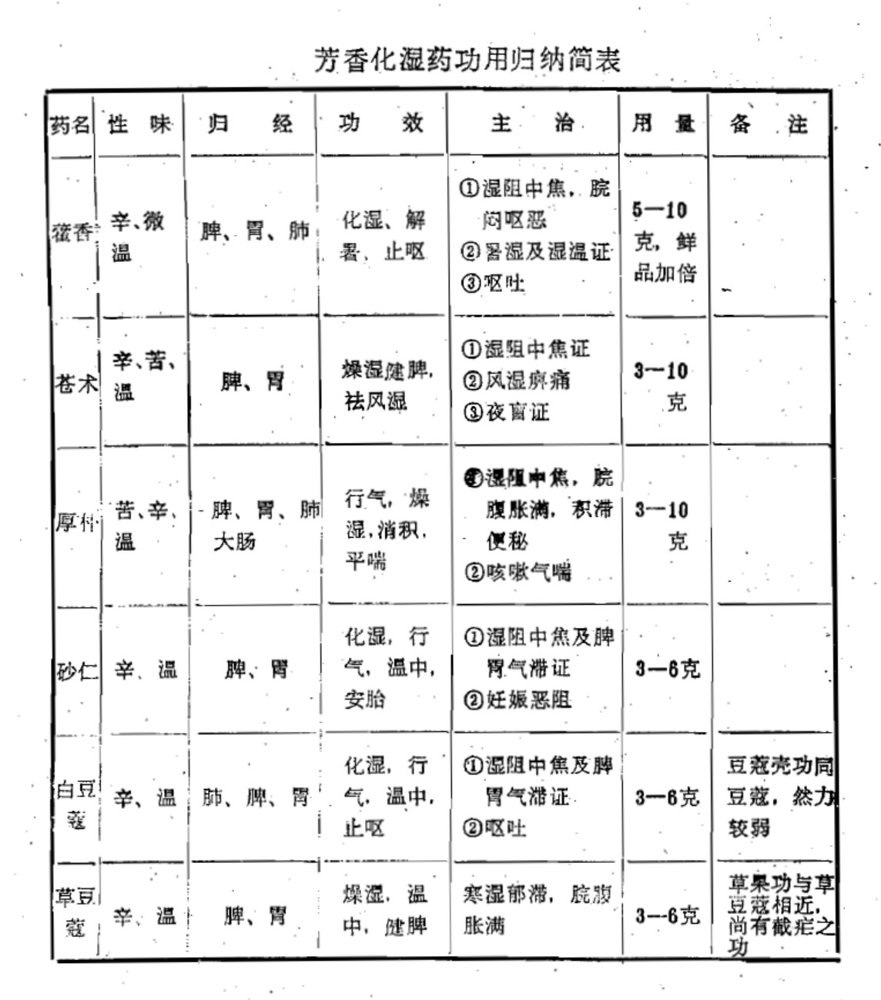

# 第四章 芳香化湿药

[TOC]

〔自学时数〕    4 学时

〔面授时数〕    1 学时

〔目的要求〕
1. 了解芳香化湿药含义、功效、主要适用症。
2. 熟悉芳香化湿药与健脾、和胃、温里、清热、理气、行水、燥湿、渗湿等药配伍应用的理论依据（联系中医基本理论）。
3. 掌握芳香化湿药中常用药（苍术 厚朴 藿香 砂仁 白豆蔻）的功效、临证应用，并比较其异同。
4. 熟悉化湿、燥湿概念之不同。
5. 在自学本章全部内容的基础上，重点掌握小结内容。

凡具有芳香辟浊，化湿醒脾作用的药物，称为芳香化湿药。

芳香化湿药，味多辛苦，性偏温燥，既可化中焦脾胃之湿，又可疏畅气机，健脾和胃，适用于脾为湿困，运化失职所致的脘腹胀满，呕恶泛酸，食少体倦，大便稀溏，口淡不渴，舌苔白腻，脉濡缓等证。又因暑多夹湿，故暑湿、湿温等证，亦可选用本类药物。

临床应用时，应根据不同证候作适当配伍。如脾胃虚弱者，配补脾健胃药；寒湿中阻者，配温里药；湿热壅滞者，配清热燥湿药；根据湿性粘滞，易于阻滞气机的特点及“治湿不利小便，非其治也”的原则，还常与行气药和利水渗湿药同用。

本类药物性多温燥，易伤阴耗气，阴虚、血虚、气虚者慎用。

此外，芳香化湿药多含挥发油，易于挥发，入煎剂时不宜久煎，要后下，以免损失药力，降低疗效。

## 藿香

〔原文〕 **辛甘微温。入手足太阴**。<small>肺、脾。</small>**快气和中，开胃止呕**，<small>胃弱、胃热而呕者忌用。</small>**去恶气，进饮食。治霍乱吐泻，心腹绞痛，肺虚有寒，上焦壅热**。<small>能理脾肺之气。古方有藿香正气散，正气通畅，则邪逆自除。</small>**出交广，方茎有节，叶微似茄叶。古惟用叶，今枝茎亦用之，因叶多伪也**。

【讲解】 **藿香功能芳香化湿，解暑止呕**。为唇形科多年生草本植物广藿香或藿香的地上部份。广藿香的老茎略呈四方柱形，四角钝圆，叶片呈灰绿色或黄绿色，多皱折或破碎，两面均密生毛茸，质柔而厚；藿香的茎呈四方柱形，四角有棱背，叶多已脱落，剩余的叶灰绿色，皱折或破碎，两面微具毛。广藿香主产于广东省，藿香又名土藿香，全国大部分地区均产。生用或鲜用。亦有单用其梗或叶者。

本品味辛，性微温。入脾、胃、肺经。辛散发表而不峻烈，微温化湿而不燥热，既能解表邪，又可化内湿。其气芳香，为芳香化湿、和中止呕之要药。用于湿阻中焦，中气不运，膀胱胀满，食欲不振，恶心呕吐。对于寒湿、湿热、脾胃虚弱等原因所致的呕吐，均有和中止呕之效，尤其是湿浊中阻，苔垢浊腻的呕吐，更为必选之品。

藿香性温而不燥，化浊而又能发表。暑常挟湿，故暑月外感风寒，内伤生冷而致恶寒发热，头痛脘痞，呕恶泄泻者，也为常用之药。《本草正义》赞其为“善理中州湿浊痰涎，为醒脾开胃，振动清阳妙品”。

【临证应用】藿香用治湿阻中焦，中气不运所致之证，常与苍术、厚朴、半夏、陈皮等同用，以化湿调中，如不换金正气散。治暑月外感风寒，内伤生冷所致之证，常与紫苏、半夏、厚朴等同用，以发表解暑，和中化湿，如藿香正气散。湿温证初起，湿热并重者，多与清热去湿药滑石、黄芩、茵陈蒿等同用，如甘露消毒丹。用于寒湿内阻，脘痞呕吐之证，单用即有效，若配伍半夏，则止呕效果更好，如藿香半夏汤。若与苏梗、香附、砂仁等行气安胎药同用，亦可用于妊娠呕吐；与清热的黄连、竹茹等配伍，可治呕吐由湿热所致者。若脾胃虚弱者，须配党参、白术等同用。此外，本品与猪胆汁为丸服，还可用于鼻渊，鼻流浊涕之证，如藿胆丸。

藿香和紫苏均有发表和中作用，但藿香长于醒脾化湿，紫苏长于发汗解表。

藿香和香薷均可发表解暑，但藿香化湿和中，醒脾开胃作用较佳；香薷发汗之力较胜，并能利水。

【用量用法】5—15克，鲜品加倍，煎服。藿香叶偏于发表，藿香梗偏于和中。鲜藿香解暑化湿力尤强。均不宜久煎。阴虚火旺者不宜应用。

## 苍术

〔原文〕**甘温辛烈。燥胃强脾，发汗除湿，能升发胃中阳气**， <small>东垣曰： 雄壮上行，能除湿，下安太阴，使邪气不传入脾。</small>**止吐泻，逐痰水**，<small>许叔微云：苍术能治水饮之澼囊，盖燥脾以去湿，崇土以填脾。日用苍术一斤，大枣五十枚，去皮捣，麻油半两，水二盏研，滤汁和丸，名神术丸。丹溪曰：实脾土，燥脾湿，洵是治痰之本。</small>**消肿满，辟恶气**， <small>辟一切岚瘴邪恶鬼气。暑湿月，焚之佳。《夷坚志》曰：有士人游西湖，遇一女子，明睸动人，重币求之不得。 又五年重寻旧游，怅然空反。忽遇女子，士欣然并行，寓旅馆留半岁，将议偕逝，女曰：向自君去，忆念苦甚，惑疾而亡，今非人也。但君浸阴气深，当暴泻，宜服平胃散以补安精血。士惊惋曰：药味皆平，何得取效？女曰：中有苍术除邪气，乃为上品也。</small>**散风寒湿，为治痿要药。**<small>阳明虚则宗筋纵驰，带脉不引故痿蹷。苍术阳明经药。经曰：治痿独取阳明。合黄柏为二妙散，加牛膝名三妙散。</small>**又能总解痰、火、气、血、湿、食六郁 ,** <small>丹溪曰：诸郁皆因传化失常，气不得升降。病在中焦，将欲升之，必先降之；将欲降之，必先升之。越鞠丸用苍术、香附。苍术能径入诸经，疏泄阳明之湿，通行敛涩，香附乃阴中快气之药，一升一降，故郁散而平。</small>**及脾湿下流，肠风带浊**。<small>带浊赤者湿伤血分，从心小肠来；白者湿伤气分，从肺大肠来。并有寒热二证，亦有因痰而带浊者，宜二陈加二术升柴。</small>**燥结多汗气者忌用**。<small>南阳文氏值乱逃往壶山，腹饥，因有人教以饵术，遂不饥。数十年后归家，颜色更少，气力转健。术一名山精，一名山姜。《导仙录》曰：子欲长生，当服山精，子欲轻翔，当服山姜。昂按：苍术善发汗，安能长远服食，文氏《仙录》之说，要亦方书夸张之言也。</small>**出茅山， 坚小有朱砂点者良。糯米泔浸焙干，同芝麻炒，以制其燥。**

**二术皆防风、地榆为使，主治略同，第有止汗发汗之异。古文本草不分苍白，陶隐君**<small>即弘景。</small>**言有两种，始各施用**。<small>生用或炒用。</small>

【讲解】 **苍术外可祛风湿之邪，内可化脾胃之湿，为治湿要药**。为菊科多年生草本植物茅苍术（南苍术）和北苍术的根茎。茅苍术产于江苏、湖北、河南等地，以江苏茅山一带产者质量最优，《本草正》说：茅山者，其质坚小，其味甘醇，补益功多，大胜他术。其形态特点：横断面灰白色，散布多数橙黄色斑点，即所谓硃砂点。本品温燥辛烈，用时都以水或米泔水浸泡后切片入药。古时也有与芝麻同炒用者，以减其燥烈之弊。

本品苦温性燥，辛香主散，内可化脾胃之湿而健运中焦，外可散风寒湿邪而透表发汗，故为燥湿健脾、祛风除湿要药。凡湿浊困脾，脾失健运的脘痞呕恶，腹痛泄泻，湿痰留饮，水肿胀满等证，及外感寒湿，头痛身重，肢节痠痛，寒热无汗，风湿痹痛均用本药。总之，湿邪为病，不论上下表里，皆可随证配用。但由于本品性偏温燥，而易于伤阴，故阴虚内热，汗多者不宜用。

苍术与白术来源于同一科属的植物，古时二者通用，后始分为两种。

【临证应用】苍术气香，实为健脾燥湿之要药。湿阻中焦，脘腹胀满，大便泄泻者，本品配厚朴、陈皮、甘草，即平胃散，以除湿散满。用于风湿痹证，尤以湿邪偏胜而见肢节肌肉痠重肿痛者，常配防己、薏苡仁等，以加强祛湿作用。如痹证湿热偏胜，关节肿痛而红，可配黄柏，即二妙散；若再加牛膝，成三妙散；复加薏苡仁为四妙散。皆可治湿热下注，足膝肿痛、痿软无力之证。因本品兼能发汗，配羌活、防风、细辛等亦适用于外感表证，肢体痠痛较重者。

此外，历代本草记载，苍术还能治夜盲症，有明目作用，早在《太平圣惠方》中，即用苍术为主，治青盲雀目。近来多与猪肝或羊肝配伍应用，治疗夜盲及现代医学之角膜软化证。

【用量用法】 3—10克，煎服。祛风胜湿宜生用，燥湿健脾宜炒用。多以麦麸拌炒，以缓其辛散之性，增强化湿和胃作用。

## 厚朴

〔原文〕 **苦降能泻实满，辛温能散湿满**。<small>王好古曰：《别录》言厚朴温中益气，消痰下气。果泄气乎？益气乎？盖与枳实、大黄同用，则泻实满，所谓消痰下气是也。与橘皮、苍术同用，则除湿满，所谓温中益气是也。与解利药同用，则治伤寒头痛；与泻利药同用，则厚肠胃。大抵味苦性温，用苦则泻，用温则补也。同大黄、枳实，即承气汤；同橘皮、苍术，即平胃散。按胀满证多不同， 清补贵得其宜。气虚宜补气，血虚宜补血，食积宜消导，痰滞宜行痰，挟热宜清热，湿盛宜利湿，寒郁者散寒，怒郁者行气，蓄血者消瘀，不宜专用行散药。亦有服参、芪而胀反甚者，以挟食、挟血、挟热、挟寒，不可概作脾虚气弱治也。</small>**入足太阴、阳明**，<small>脾、胃。</small>**平胃调中**，<small>佐苍术为平胃散，平湿土之太过，以致于中和。</small>**消痰化食，厚肠胃，行结水，破宿血，杀脏虫。治反胃呕逆，喘咳泻痢，冷痛霍乱。误服脱人元气，孕妇忌之。榛树皮也，肉厚紫润者良。去粗皮，姜汁炙，或醋炒用。干姜为使，恶泽泻、硝石，忌豆，犯之动气。**

【讲解】厚朴善除肠胃之气滞，而燥脾家之湿浊。为木兰科植物厚朴或凹叶厚朴的树皮或根皮。主产于四川、湖北、浙江、贵州等地。四川产者佳，故有川朴之名。皮粗肉细，内色深紫，油性大，香气浓，嚼无残渣，称为紫油厚朴。浸泡去粗皮切丝生用，或与生姜共制，切片用，为姜厚朴。

本品味苦辛，性温，其气芳香。入脾、胃、肺、大肠经。味辛能行气而消胀，味苦能下气以平喘，气香能化湿以散满，性温能散寒以止痛。善除肠胃之气滞，而燥脾家之湿浊，为燥湿、行气、导滞常用药。既能下有形之积（食、湿、痰），又能散无形之滞（气、寒）。故凡食积停留，气滞不通，脘腹胀痛，大便秘结，或湿滞中焦而致胸腹胀满，呕吐泻痢，以及痰饮阻肺，肺气不降之咳喘等证，均为常用之品。 惟性偏温燥，行气力强，故内热津枯，脾胃气虚者慎用。

花功用相同，而性稍和缓。

【临证应用】 厚朴为消胀除满之要药。凡湿阻、食积、气滞所致的脘腹胀满之证，均为适用。若湿阻中焦，常与苍术、陈皮同用，如平胃散，以燥湿运脾；食积便秘，可配大黄、枳实，如小承气汤，以消积导滞；寒气阻滞，则多与干姜、木香、陈皮等同用，如厚朴温中汤，以温中行气散满。至于虚寒胀满，应与人参、甘草、生姜等配伍，以补气温中而除胀满，如厚朴生姜甘草半夏人参汤。 此外，治湿痰壅肺，咳嗽气喘痰多者，常与杏仁或麻黄等配伍，如桂枝加厚朴杏仁汤，或厚朴麻黄汤，以降气平喘。

厚朴花，为厚朴的花蕾。性味功效与厚朴相同，而性较和缓，多用于湿浊、气滞之轻证。

【用量用法】3—10 克，煎服。

## 砂仁

〔原文〕 **辛温香窜。补肺益肾，和胃醒脾，快气调中，通行结滞。治腹痛痞胀**，<small>痞滞，有伤寒下早，里虚邪入而痞者，有食壅痰塞而痞者，有脾虚气弱而痞者， 须分虚实治之，不宜专用利气药，恐变为鼓胀。鼓胀内胀而外有形， 痞胀惟觉痞闷而已，皆太阴为病也。</small>**噎膈呕吐，上气咳嗽，赤白泻利**，<small>湿热积滞，客于大肠，砂仁亦入大、小肠经。</small>**霍乱转筋， 奔豚崩带。祛痰逐冷，消食醒酒，止痛安胎**，<small>气行则痛止，气顺则胎安。</small>**散咽喉口齿浮热， 化铜铁骨鲠**。<small>王好古曰：得檀香、豆蔻入肺，得人参、益智入脾，得黄柏、茯苓入肾， 得赤石脂入大小肠。《医通》曰：辛能润肾燥，引诸药归宿丹田，地黄用之拌蒸，亦取其能达下也。《经疏》曰：肾虚气不归元，用为向导， 殆胜桂、附热药为害。</small>**出岭南，研用**。

【讲解】**砂仁善能化湿行气，温脾止泻**。为姜科多年生草本植物阳春砂、海南砂或缩砂的干燥果实。生用，打碎入药。阳春砂产于我国广东阳春、信宜等县；海南砂主产于我国广东、海南岛及湛江地区；缩砂产于越南、泰国、缅甸、印度尼西亚等地。

砂仁味辛，性温。入脾、胃经。本品辛散温通，芳香化湿，为化湿行气，温脾止泻，安胎常用之药。具有性温而不燥烈，行气而不破气，调中而不伤中的优点。故常用于湿阻中焦，脾胃气滞及脾胃虚寒所致诸证。并能醒脾开胃，调气和中，行郁消滞，降胃阴而下食，达脾阳而化榖，吐泻用之皆良，咳嗽痰饮用之皆妙。

砂仁安胎之效在于理气，故气滞胎动不安者，疗效较佳。

《玉楸药解》云：清升浊降，全赖中气，中气非旺，则枢轴不转，脾陷胃逆。凡水胀肿满，痰饮咳嗽，噎膈泄利，霍乱转筋，胎坠肛脱，谷宿水停，泄哕吞酸诸证，皆升降反常，清陷浊逆故也。泄之则益损其虚，补之则益增其满，清之则滋其下寒，温之则生其上热。唯以养中之味，而加和中之品，调其滞气，使枢机回旋运动，则升降复职，清浊复位，然后于补中扶土之内，温升其肝脾，清降其肺胃，无有忧矣。和中之品，莫如砂仁，冲和调达，不伤正气，调醒脾胃之上品也。

【临证应用】砂仁用于脾胃湿阻及气滞所致脘腹胀痛，不思饮食，呕吐，泄泻等证。如湿阻者，可配厚朴、苍术、白豆蔻等以增化湿行气之效。食积气滞者，常与木香、枳实等同用，如香砂枳术丸，以增行气消痞之功。若脾虚气滞者，则配党参、白术等同用，如香砂六君子丸，以增益气健脾之力。用于寒湿泻痢，可单用研末冲服，或配干姜、附子等温里药。用于妊娠恶阻，胎动不安，则多与白术、苏梗等配伍。

【用量用法】 3—6 克，煎服。入汤剂宜后下。

## 白豆蔻

〔原文〕 **辛热。流行三焦，温暖脾胃**，<small>三焦利，脾胃运，则诸证自平矣。</small>**而为肺家本药**。<small>肺主气。</small>**散滞气，消酒积，除寒燥湿，化食宽膨。治脾虚疟疾，感寒腹痛， 吐逆反胃**，<small>肺胃火盛及气虚者禁用。</small>**白睛翳膜**，<small> 白睛属肺，能散肺滞。</small>**太阳经目眦红筋**。<small>太阳脉起目眦。</small>**番舶者良，研细用**。

【讲解】**白豆蔻功能化湿行气**。为姜科多年生草本植物白豆蔻的干燥成熟果实。去皮或连皮打碎，生用。主产于越南、泰国等地。我国广西、云南亦有栽培。

本品味辛，性温。入肺、脾、胃经。其气清芳，上行于肺以宣肺理气，中入脾胃以化湿温中，为化湿行气，温中止呕要药。凡上、中二焦的一切寒湿气滞诸证，如胸闷不畅，脘腹胀满疼痛，不思饮食，呕吐呃逆等证，皆可应用。至于治白睛翳膜，目眦红筋者，亦以散滞气之功，但临床很少应用。

【临证应用】白豆蔻用于湿阻脾胃，胸脘痞满，常与藿香、厚朴、陈皮等同用，以增化湿、行气、散满之功；用于湿温病初起，胸闷不饥，舌苔浊腻，湿邪偏重者，常配苡仁、杏仁、通草、滑石等，如黄芩滑石汤，以增清热化湿之效。用于呕吐，呃逆，噫气等证，本品温中下气而止呕，以胃寒气逆者适宜，可单用为末服，或配藿香、半夏等，如白豆蔻汤。若脾胃虚寒者，可与党参、半夏、生姜等同用。

白豆蔻与砂仁，性味相同，功亦类似，均为化湿醒脾，行气宽中之要药。但白豆蔻芳香之气清，温燥之性较弱，主入上中二焦，多用于湿阻中满，胃寒呕吐，并治湿温初起；砂仁芳香之气浊，温燥之性较强，主入中下二焦，多用于脾寒泄泻，又可治胎动不安。

【用量用法】3—6 克，宜研末入丸散剂，入汤煎宜后下。本品为辛燥助热耗气之品，故火升作呕、热证及气虚诸证均不宜用。

## 草豆蔻

[原文] **辛热香散。暖胃健脾，破气开郁，燥湿祛寒， 除痰化食。治瘴疠寒疟**，<small>佐常山能截疟，或与知母同用，取其一阴一阳，治寒热瘴疟。盖草果治太阴独胜之寒，知母治阳明独胜之火。</small>**寒客胃痛**， <small>散滞气， 利膈痰。因滞因寒者多效。</small>**霍乱泻痢，噎膈反胃，痞满吐酸，痰饮积聚。解口臭气，酒毒鱼肉毒。**<small>故食料用之。</small>**过剂助脾热， 耗气损目。闽产名草蔻，如龙眼而微长，皮黄白薄而棱峭，仁如砂仁，而辛香气和；滇广所产名草果，如诃子， 皮黑厚而棱密，子粗而辛臭，虽是一物，微有不同。面裹煨熟，取仁用。忌铁。**

【讲解】**草豆蔻功能燥湿，温中行气。**为姜科多年生草本植物草豆蔻的干燥近成熟的种子。蒴果圆球形，外被粗毛，熟时黄色。种子呈圆球或椭圆形，表面灰棕色，被一层白色透明的假种皮，背稍隆起，气芳香，味辛辣。去壳取仁，生用，打碎入药。主产于广西、广东等地。

本品辛温芳香，且气清爽。入脾、胃经。燥湿行气，温中止呕的作用类似白豆蔻，而其温燥之性尤过之。用于寒湿阻滞脾胃，脘腹胀满疼痛及呕吐泄泻等证，尤于脾胃虚寒，胃疼呕吐之证，用之最宜。借其辛温芳香之气，又能除口臭气，解酒及鱼蟹毒。

【临证应用】 草豆蔻用于中寒脘腹冷痛，呕吐泄泻之证，湿邪偏盛者，可配厚朴、苍术、半夏等；寒甚者，可配肉桂、干姜。若脾胃虚弱不思饮食，呕吐胀满者，可配白术、生姜、甘草等药。

【用量用法】3—6 克，入汤剂宜后下。

## 附：草果

草果为姜科多年生草本植物草果的干燥成熟果实，表面灰棕至红棕色，有显著纵沟及棱线，种子破碎时发出特异的臭气，味辛辣。炒至焦黄色并微鼓起，捣碎取仁用，或将净草果仁姜汁微炒用。主产于云南、广西、贵州等地。

草果味辛性温。入脾、胃经。本品辛温燥烈而气臭浊，善化脾胃湿邪，多用于寒湿阻滞脾胃，脘腹胀满，疼痛吐泻等证，可与厚朴、苍术等伍用。本品燥湿，散寒，又能除痰截疟，治寒湿郁伏于脾胃之疟疾及山岚瘴气，秽浊湿邪所致的瘴疟，用之颇为适宜。与常山、知母等同用，功效更佳。李时珍云：草果与知母同用，治瘴疟寒热，取其一阴一阳无偏性之害，盖草果治太阴独胜之寒，知母治阳明独胜之火也。

【用量用法】 同草豆蔻。此三药皆温燥伤阴，故阴虚之体，非其所宜。

## 小结

芳香化湿药是一类具有芳香辟浊、化湿醒脾、开胃和中作用的药物。其中藿香气味辛香，功能化湿解暑，疏散表邪，为暑令常用之品，对湿困脾胃，暑湿中阻等证，皆有疗效。

苍术、厚朴均具芳香燥散之性，苍术辛香燥烈之性尤强，外可祛风湿，内可燥脾湿，凡湿邪为病，不论上下表里，皆可随证选用；厚朴苦温燥散，长于燥湿散满，行气导滞，为痰湿食滞，寒凝气阻所致诸证的常用之品。厚朴花功同厚朴，而力稍逊。

砂仁、蔻仁，性味、功用相近，常用于脘腹胀痛，呕恶泄泻等证，然白豆蔻芳香气清，功偏中上二焦，多用于湿浊阻胃之呕吐；砂仁芳香气浊，功偏中下二焦，多用于寒湿气滞的泄泻等证。砂仁壳、豆蔻壳性味功效与砂仁、豆蔻相同，但温性略减，力较薄弱。

草豆蔻与草果，温燥之性较大，均以燥湿祛寒为主要功用，然前者善于温胃以止呕，后者善于祛痰以截疟。

芳香化湿药功用归纳简表

| 药名   | 性味       | 归经             | 功效                   | 主治                                              |       用量       | 备注                             |
| ------ | ---------- | :--------------- | :--------------------- | :------------------------------------------------ | :--------------: | :------------------------------- |
| 藿香   | 辛、微温   | 脾、胃、肺       | 化湿、解暑，止呕       | ①湿阻中焦，脘闷呕恶 ②暑湿及湿温证 ③呕吐 | 5-10克，鲜品加倍 |                                  |
| 苍术   | 辛、苦、温 | 脾、胃           | 燥湿健脾，祛风湿       | ①湿阻中焦证 ②风湿痹痛 ③夜盲症           |      3-10克      |                                  |
| 厚朴   | 苦、辛、温 | 脾、胃、肺、大肠 | 行气，燥湿，消积，平喘 | ①湿阻中焦，脘腹胀满，积滞便秘 ②咳嗽气喘      |      3-10克      |                                  |
| 砂仁   | 辛、温     | 脾、胃           | 化湿，行气，温中，安胎 | ①湿阻中焦及脾胃气滞证 ②妊娠恶阻              |      3-6克       |                                  |
| 白豆蔻 | 辛、温     | 肺、脾、胃       | 化湿，行气，温中，止呕 | ①湿阻中焦及脾胃气滞证 ②呕吐                  |      3-6克       | 豆蔻壳功同豆蔻，然力较弱         |
| 草豆蔻 | 辛、温     | 脾、胃           | 燥湿，温中，健脾       | 寒湿郁滞，脘腹胀满                                |      3-6克       | 草果功与草豆蔻相近，尚有截疟之功 |

## 复习思考题
1. 试述芳香化湿药的共性及其应用范围。
2. 分析比较藿香与紫苏、苍术与厚朴、砂仁与白豆蔻的功效和临床应用。

答：

