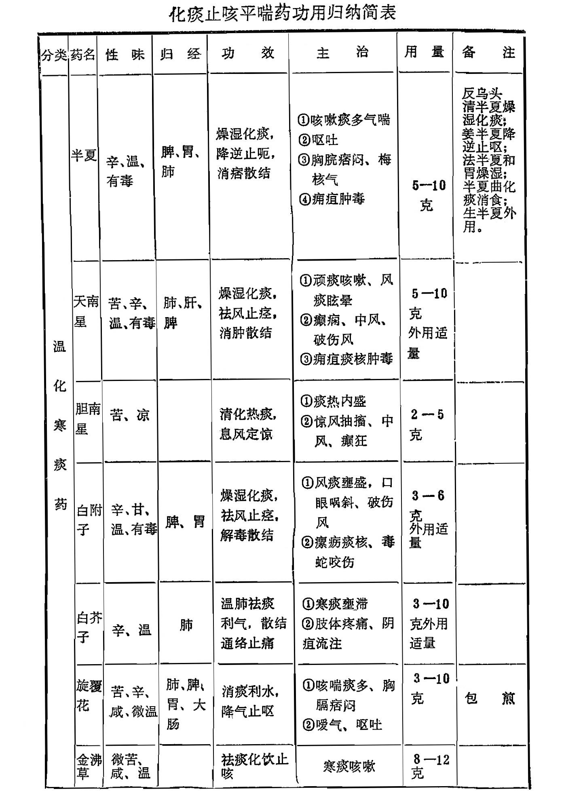
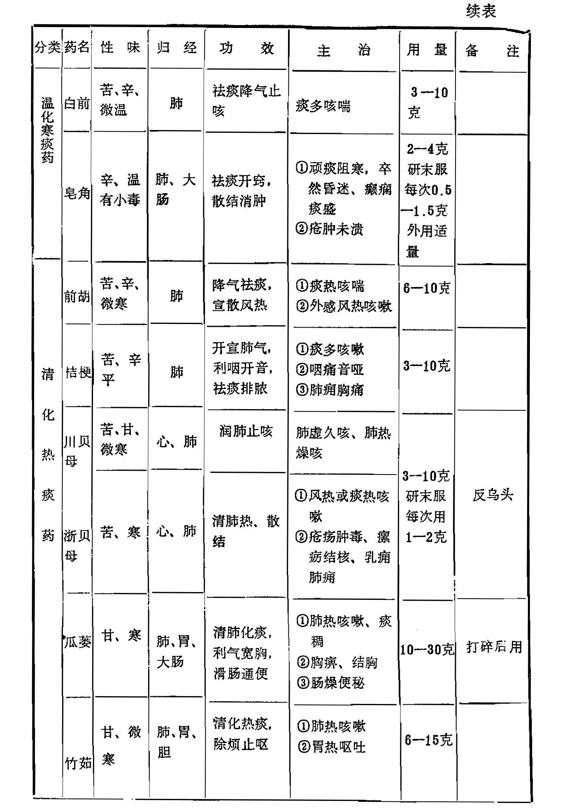
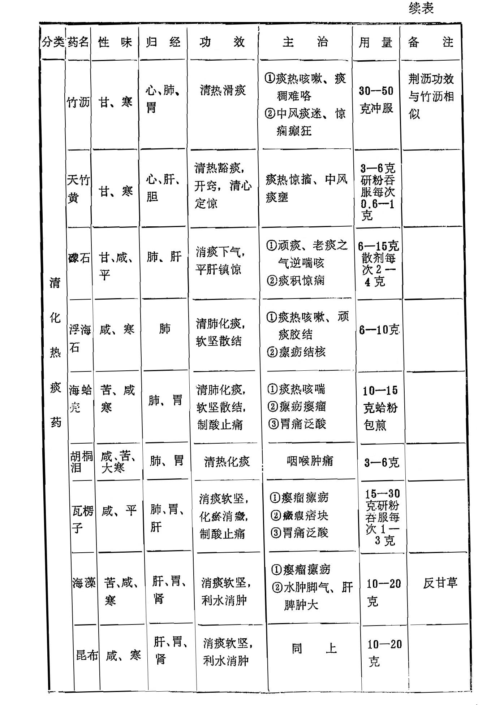
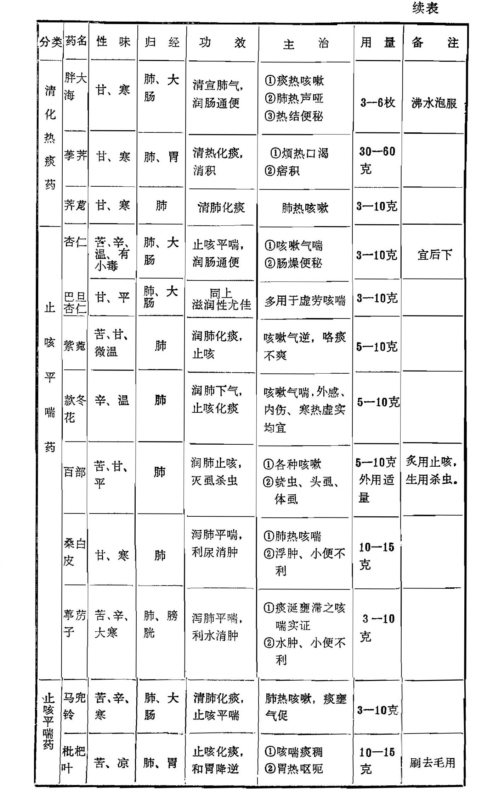

# 第十六章 化痰止咳平喘药

[TOC]

〔自学时数〕    12 学时

〔面授时数〕    4 学时

〔目的要求〕
1. 了解化痰止咳平喘药的分类、常用药（半夏 瓜蒌 天南星 桔梗 旋复花 贝母 竹茹 礞石 杏仁 百部 葶苈子 桑白皮）。
2. 熟悉化痰止咳平喘药与解表、清热、温里、补气、散寒、宣肺等药配伍应用的理论依据（联系中医基本理论)。
3. 掌握温化寒痰药中常用药的功效、临证应用，并比较其异同。
4. 掌握清化热痰药中常用药的功效、临证应用，并比较其异同。
5. 掌握止咳平喘药中常用药的功效、临证应用，并比较其异同。
6. 熟悉燥湿化痰、清热化痰、祛风痰、坠痰、软坚散结、泻肺、润肺等概念。
7. 联系麻黄、细辛、陈皮、枳实、莱菔子等具有化痰止咳平喘作用的药物，了解本章以外的化痰止咳平喘药，扩大知识面。
8. 了解半夏、南星的炮炙，旋复花、皂荚、竹沥的用法。
9. 在自学本章全部内容的基础上，重点掌握小结内容。

凡能祛痰或消除痰涎，主要用于痰多咳嗽、咯痰不爽的药物，称为化痰药；能够减轻或制止咳嗽、平定气喘，主要用于咳喘病证的药物，称为止咳平喘药。咳嗽与痰在病机上密切相关，临床上常同时兼见，一般咳喘每多挟痰，而痰多亦每致咳喘，所以在治疗时化痰药与止咳平喘药常相互配用，并且化痰药大都有止咳平喘之功，止咳平喘药多兼有化痰之能。为了便于临床应用起见，本章将两类药合并介绍，总称为化痰止咳平喘药。

化痰药主要用于有形之痰多咳嗽、咯痰困难或痰饮气喘等证。中医理论又认为：瘿瘤瘰疬、阴疽流注以及癫痫惊厥眩晕等证，是由无形之痰所引起，故亦常选用适当的化痰药来治疗。止咳平喘药主要用于内伤或外感所引起的咳嗽和喘息。

凡外感或内伤，均能引起痰多与喘息咳嗽，因而在治疗时应仔细分辩病因，进行适当的配伍。例如，有外感者，配合解表药同用；兼有里热者，配清热药；兼有寒证者，配温里药；虚痨咳喘者，配补益药。此外，如瘿瘤瘰疬者，配软坚散结药；阴疽流注者，配散寒通滞药；癫痫惊厥者，配安神药或平肝息风药。

咳嗽且咯血者，不宜用辛温燥烈的化痰药，否则有促进出血之虞。麻疹初期，虽有咳嗽症状，一般以清宣肺气为主，不宜用温性和带有收敛性的止咳药，以免助热或遏伏疹毒而使疹透不畅。

根据化痰止咳平喘各药的不同性能，本章分为温化寒痰药、清化热痰药和止咳平喘药三类。

## 第一节 温化寒痰药

凡药性温燥，具有温肺燥湿化痰功效的药物，称为温化寒痰药。

本节药适用于寒痰、湿痰所致的咳嗽气喘，痰多稀薄以及痰湿阻于经络所致的肢节痠痛、阴疽流注、瘰疬诸证。亦常与温散寒湿药物配伍，以增加疗效。

本节药物作用比较強烈，凡属阴虚燥咳、痰热咳嗽或有咳血病史者，均应慎用或禁用。

### 半夏

**〔原文〕辛温有毒。体滑性燥，能走能散， 能燥能润，和胃健脾**，<small>去湿。</small>**补肝**<small>辛散。</small>**润肾，除湿化痰，发表开郁，下逆气，止烦呕，发音声，利水道**，<small>燥去湿，故利水；辛通气，能化液，故润燥。朱丹溪谓二陈汤能使大便润而小便长。</small>**救暴卒**。<small>(1)葛生曰：凡遇五绝之，用半夏末吹入鼻中即活，盖取其能作嚏也。五绝，谓缢死、溺死、压死、魇死、产死也。</small>**治咳逆头眩**。<small>火炎痰升则眩。</small>**痰厥头痛**（2），**眉棱骨痛**，<small>风热与痰。</small>**咽痛**，<small>成无己曰：半夏辛散，行水气而润肾燥。又局方半硫丸， 治老人虚秘，皆取其润滑也。俗以半夏、南星为性燥，误矣。湿去则土燥， 痰涎不生，非二物之性燥也。古方用治咽痛喉痹吐血下血，非禁剂也。二物亦能散血，故破伤扑打皆主之。惟阴虚劳损，则非湿热之邪，而用利窍行湿之药， 是重竭其津液、医之罪也，岂药之咎哉！《甲乙经》用治不眠，是果性燥者乎？半夏、硫黄等分，生姜糊丸，名半疏丸。胸胀，仲景小陷胸汤用之。</small> **伤寒寒热**，<small>故小柴胡汤用之。</small>**痰疟**（3）**不眠**。<small>《素问》曰：胃不和，则卧不安。半夏能和胃气而通阴阳。《灵枢》曰：阳气满，不 得入于阴，阴气虚，故目不得暝，饮以半夏荡，阴阳既通，其卧立安。又有 喘嗽不得眠者，左不得眠，属肝胀，宜清肝，右不得眠，属肺胀，宜清肺。</small> **反胃吐食**。<small>痰膈。</small>**散痞除瘿**⑷，<small>瘿多属痰。</small>**消肿止汗**，<small>胜湿。</small>**孕妇忌之**。<small>王好古曰：肾主五液，化为五湿。本经为唾，入肝为泪，入心为汗，入肺为涕，入脾为痰。痰者因咳而动，脾之湿也。半夏泄痰之标，不能治痰之本，治本者，治肾也。咳无形，痰有形，无形则润，有形则燥，所以为流脾湿而润肾燥之剂也。俗以半夏为肺药，非也。止呕为足阳明，除痰为足太阴。柴胡为之使，故柴胡汤用之。虽云止呕，亦助柴芩，主寒热往来，是又为足少阳也，时珍：脾无湿不生痰，故脾为生痰之源，肺为贮痰之器。按有声无痰曰咳，盖伤于肺气，有痰无声曰嗽，盖动于脾湿也，有声有痰曰咳嗽。或因火、因风、因寒、因湿、因虚劳、因食积，宜分证论治。大法治嗽，当从治痰为先，而治痰又以顺气为主，宜以半夏、南星燥其湿，枳壳，橘红利其气，肺虚加温敛之味，肺热加凉泻之剂。赵继宗曰：二陈治痰，世医执之，内有半夏，其性燥烈。若风赛湿食诸痰则相宜，至于劳痰失血诸痰，用之反能燥血液而加病。按古有三禁:血家汗家渴家忌之，然亦间有用之者。俗以半夏专为除痰，而半夏之功用，不复见如于世矣。小柴胡汤、半夏泻心汤，皆用半夏，岂为除痰乎？火结为痰，气顺则火降而痰消。</small>**圆白而大，陈久良矣，浸七日，逐日换水沥去涎，切片，姜汁拌**。<small>性畏生姜，用之以制其毒，得姜而功愈彰。</small> **柴胡、射干为使，畏生姜、秦芄、龟甲、雄黄。忌羊肉、海藻、饴糖。恶皂角，反乌头**。<small>合陈皮、茯苓、甘草，名二陈汤，为治痰之总剂，寒痰佐以干姜、芥子；热痰佐以黄芩、栝楼；湿痰佐以苍术、茯苓；风痰佐以南星、前胡；痞痰佐以枳实、白术，更看痰之所在，加导引药。惟燥痰非半夏所司也。</small>**韩飞霞造曲十法**（5）。<small> 一姜汁浸造，名生姜曲，治浅近诸疾；一矾水煮透，兼姜糊造，名矾曲，巩最能却水，治清水痰；一煮皂角汁，炼膏，和半夏末为曲，或加南星，或加麝香，名皂角曲，治风痰，开经络；一用白芥子等分，或三分之一竹沥和成，略加曲糊，名竹沥曲，治皮里膜外结核隐显之痰；一麻油浸半夏三五日， 炒干为末，曲糊造成，油以润燥，名麻油曲，治虚热劳咳之痰；一用腊月黄牛胆汁，略加熟蜜和造，名牛胆曲，治癫痫病风痰；一用香附、苍术、抚芎等 分，熬膏和半夏末作曲，名开郁曲，治郁痰；一用芒硝居半夏十分之三，煮透为末，煎大黄膏和成，名硝黄曲，治中风卒厥伤寒宜下由于痰者；一用海粉一两、雄黄一两、半夏二两，为末炼蜜和造，名海粉曲，治积痰沉痼；一用黄牛肉煎汁炼膏，即霞天膏，和半夏末为曲，名霞天曲，治沉疴痼痰，功效最烈。以上并照造曲法，草盒七日，待生黄衣，晒干，悬挂风处，愈久愈良。半夏治法不一，有法半夏，姜半夏诸名。此治湿痰主药。</small>

【讲解】（1)暴卒:急病可发生突然死亡。(2)痰厥头痛：由痰浊上逆所致的头痛。多见头痛如裂、眩晕、心神不安、泛吐痰涎等状。（3）痰疟:是疟疾的一种。多指宿疾兼有痰郁者。以寒热交作、头痛、呕吐痰为主证，重者可出现昏迷抽搐，类似现在的脑型疟疾。（4)瘿：俗称大脖子。即甲状腺肿大一类疾患。（5）韩飞霞造曲十法：韩飞霞即韩？，明代医学家。据考，半夏曲始创于韩氏，系以半夏为主，根据不同病征的需要，辅以每种不同的药物而制成的多种药曲，统名名之半夏曲。今之半夏曲，各地配方和制法也稍有差异，但总不外化湿健脾，和胃止呕，导滞开郁，消食止泻等功效。

**半夏燥湿化痰，和胃降逆，为脾胃二经要药。**为天南星科多年生草本植物半夏的块茎。块茎呈类球形或扁圆形外表类白色， 以粒大色白陈久者为佳。

本品辛温，功善化痰止呕，为脾胃二经之要药。盖脾喜燥而恶湿，又为生痰之源，脾湿不化，则聚而为痰，痰湿犯肺则咳嗽痰多。半夏温燥，为脾所喜，敌为燥湿化痰之主药，凡痰饮湿邪为患，皆可用之。

胃为受纳之器，以降为顺，以升为逆。若痰湿停蓄于胃，则胃气不和，势必上逆而为呕，为哕，为呃逆，为噫气。半夏燥湿化痰，痰湿去，则呕止胃和，故又为降逆止呕之良药，且不只用于痰湿呕恶，其他呕吐也常配用。

半夏味辛能散，并有散结消痞的作用，可用于胸脘痞满，瘰疬瘿瘤等证。	

此外，历代本草有半夏“堕胎”之记载，但《金匮》干姜人参半夏丸用治妊振呕吐均未见不良反应，后世亦常用半夏治妊娠呕吐， 故“堕胎”之说，似属不妄。

【临证应用】半夏为治湿痰要药，常与陈皮、茯苓、甘草同用，即二陈汤，是治痰要方。若兼寒象，痰多清稀者，可配干姜、细辛等温化痰饮药；兼热象、痰稠色黄者，配黄芩、竹茹等清热化痰药；痰浊上扰头痛、眩晕，常与白术、天麻等同用，名半夏白术天麻汤。然温燥之品最易伤阴，阴虚肺热、燥痰咯血者忌用。

半夏化痰止呕，恰当配伍可用于多种呕吐，但以寒饮湿浊引起的呕吐最为适宜。如胃寒呕吐，配干姜、吴茱萸；胃热呕吐配黄连、竹茹；胃虚呕吐，配人参、白蜜等等。

本品有良好的化痰消痞散结之功，用于痰热互结所致的胸脘痞满，可配清热化痰宽胸药黄连、瓜蒌同用，如小陷胸汤；咽中如有物阻的梅核气，可配厚朴、苏叶、茯苓等同用，如半夏厚朴汤; 治瘿瘤瘰疬痰核则与昆布、海藻、贝母等软坚散结药伍用。

此外，《备要》言能治不眠，是取其燥湿和胃之功，与和胃安神的秫米配伍，可用于胃不和而卧不安的失眠证，如半夏秫米汤。

生半夏外用还有消肿止痛的作用，研末或鲜半夏捣烂外敷， 可治疮疡肿毒。旧时用其研末吹鼻，引涎以治晕厥、小儿惊风或喉痹肿痛，故《备要》言能救暴卒。

半夏有毒，除外用用生以外，内服一般都须炮制。炮制方法甚多，因此饮片名称亦多，如法半夏、清半夏、姜半夏、半夏曲 等。制法虽有不同，皆不外用姜汁、白矶或二者同用。清半夏长于燥湿化痰，姜半夏偏于降逆止呕，法半夏善能和胃燥湿，半夏曲功专化痰消食。现多用姜汁、白矾加工炮制的制半夏。

生半夏有毒，食后对局部有强烈的毒性作用，可使舌、咽、口腔产生麻木，肿痛，流涎，张口困难；严重者，可窒息。

【用量用法】 5—10克，煎服或入丸散。内服多须炮制。 外用适量，研末调敷，生用。以陈久者为佳。反乌头。

### 天南星

**〔原文〕味辛而苦，能治风散血**，<small> 《是斋方》: 南星、防风等分为末，名玉真散，治破伤风，刀伤扑伤如神。破伤风者，药敷疮口，温酒调下二钱。打伤至死，童便调灌二钱，连进三服必活。</small>**气温而燥，能胜湿除痰；性紧而毒，能攻积拔毒。补肝风虚**，<small>凡味辛而散者，皆能补肝，木喜条达故也。</small>**为肝脾脉三经之要药。治惊痫风眩**， <small>朱丹溪曰：无痰不作眩。</small>**身强口噤， 喉痹舌疮，结核疝瘕，痈毒疥癣，蛇虫蛟毒**。<small>调末箍之。</small>**破结下气，利水堕胎，性更烈于半夏**。<small>与半夏皆燥而毒，故堕胎。半夏辛而能守，南星辛而不守，然古安胎方中，亦有用半夏者。</small>**阴虚燥痰禁用。根似半夏而大，形如虎掌，故一名虎掌。以矾汤或皂角汁浸三昼夜曝用；或酒浸一宿蒸，竹刀切开，至不麻为止；或姜渣黄泥和包煨熟用。造曲法与半夏同。造胆星法：腊月取黄牛胆汁，和南星末纳入胆中，风干，年久者弥佳。畏附子、干姜、防风**。<small>得防风则不麻，火炮则毒性缓；得牛胆则本燥， 且胆有益肝胆之功。此治风痰主药。</small>

【讲解】**天南星燥湿化痰，祛风解痉，专走经络，为开涤风痰之专药**。为天南星科多年生草本植物天南星，东北天南星或异叶天南星的干燥块茎。原名“虎掌”，《新修本草》谓：“其根四畔有圆牙，看如虎掌，故有此名。”

本品辛苦温燥。入肺、肝、脾经。“治痰功同半夏”，其燥烈 之性更甚于半夏，故以燥湿祛痰而著称。也善治脾肺湿痰，咳嗽痰多，胸膈满闷之怔。其辛开走窜之力更强，且入肝经，故又走经络、祛风痰而解痉，对风痰阻于经络所致的中风、口噤、半身不遂、口眼歪斜及破伤风都有较好的疗效。所以古有“诸风口噤宜用南星”之说。

生南星辛窜善散，既能祛风燥湿，又能散血消肿，故可外用治痈肿瘰疬等。

本品燥烈有毒，能伤阴堕胎，凡热极生风、血虚生风，以及阴虚燥痰和孕妇均忌用。

【临证应用】天南星以治湿痰、顽痰为主，咳嗽痰多稀薄、胸闷苔腻者，常配半夏、陈皮、茯苓、枳实等同用，如导痰汤。若属热咳，质黄而稠，须配黄芩、半戛等清热化痰之品，如小黄丸。对于风痰眩晕、癲痫，多与半夏、天麻等息风止痉药同用，如玉壶丸；治风痰留滞经络引起的手足麻木、半身不遂、口眼㖞斜等证，配半夏、白附子等，如青州白丸子；破伤风常配防风、天麻等伍用，如玉真散。生南星虽可外用治痈疽疮肿，但临床少用。近年来，发现天南星还有抗肿瘤作用，试用于子宫颈癌。	

本品系有毒之药，内服均须经过炮制，先与白矾水浸泡，再与生姜共煮，切片晒干，即为制南星。此外，还有以牛（或猪、 羊）胆汁浸制而成的称胆南星。其性味苦凉，有清化热痰、息风定惊之功，适用于痰热神昏、惊风抽搐及中风、癫痫等证。用量 2 —5 克。

天南星与半夏都有燥湿化痰之功，同为化痰要药。但天南星走经络，偏于祛风痰而解痉；半夏入脾胃，重在化湿痰，尤能止呕。

【用量用法】 5—10克，煎服。生多外用，外用适量。

### 白附子

**〔原文〕辛甘有毒，大热纯阳。阳明经药，能引药势上行，治面上百病**。<small>阳明之脉营于面，白附能去头游风，作面脂，消斑疵。</small>**补肝虚，祛风痰。治心痛血痹，诸风冷气，中风失音，阴下湿痒。根如草乌之小者，长寸许，皱纹有节。炮用**。<small>陶弘景日：此药之绝，无复真者。今惟凉州生。</small>

【讲解】**白附子燥烈有毒，为祛风痰要药**。为天南星科多年生草本植物独角莲的茎块（禹白附)。用硫黄熏1—2次，晒干用；或用白矾、生姜制后，切片用。少数地区使用的白附子为毛茛科草本植物黄花乌头的块根(关白附)。

白附子味辛甘，性温，有毒。入脾、胃经。燥烈有毒，功似南星，为祛风痰要药。有逐寒湿而化痰，祛风邪而止痛止痉之功，以治风痰诸证。且其辛幸温升散、性善上行，故能治头面之疾，用于中风痰壅、口眼㖞斜、破伤风以及偏头痛等证。但本品燥烈太甚，最能伤阴，故阴虚阳亢之头痛、中风眩晕等均不宜便用。此外， 白附子还有解毒散结之功，可用于毒蛇咬伤及瘰疬痰核。

白附子因其品种不同，故作用有别。禹白附在临床多用于风痰阻络所致的中风、眩晕、破伤风等证；关白附毒性较大，主用于风寒湿邪所致的头面诸疾。

白附子与善于“温肾达下”的川附子系属两物，一主祛风、一主温里，作用大异，应用时应注意区别。	

【临证应用】白附子用于中风口眼㖞斜，常与全蝎、僵蚕 、同用，如牵正散；治破伤风、口噤痉挛，可配天南星、防风，天麻等药，如玉真散；用于风邪或寒湿所致的偏头痛，可与白芷、 川芎等同用，有较好的止痛作用。治蛇虫咬伤及瘰疬等证，可单用外敷，也可与其他解毒散结药配合内服。此外，对阴囊湿疹、皮肤瘙痒，可与黄柏、白蒺藜、黄蔑等分为末调服，或研末调敷，也可煎汤熏洗。

【用量用法】 3 — 6克，煎服。外用适量。生品一般不作内服。孕妇忌服。

### 白芥子

**〔原文〕辛温入肺。通行经络，温中开胃， 发汗散寒，利气豁痰，消肿止痛**。<small>痰行则肿消，气行则痛止。为末醋调敷，消痈肿。</small>**治咳嗽反胃，痹木脚气、筋骨诸病**。<small>痰阻气滞。</small>**久嗽肺虚人禁用**。<small>朱丹溪日：痰在胁下及皮里
膜外，非此不能达行。古方控涎丹用之，正此义。韩懋三子养亲汤，白芥子主痰，下气宽中；紫苏子主气，定喘止嗽；莱菔子主食，开痞降气，各微炒研，看病所主为君，治老人痰嗽喘满懒食。</small>**北产者良。煎汤不可过熟，熟则力减**。

**芥菜子豁痰利气，主治略同。**

【讲解】**白芥子功专温肺祛痰，又善通络止痛**。为十字花科一年或二年生草本植物白芥的种子。主产安徽、河南等地，其他各地亦有栽培。晒干，生用或炒用。

本品辛温、气锐、专入肺经。性善走散，功能温宣肺气，以化寒湿凝聚之痰，而有豁痰利气之效；且能透达经络，善搜胁下及皮里膜外、筋骨间凝集之寒痰。故凡痰阻气滞、咳逆胁痛，或痰湿阻滞经络，肢体关节疼痛等证，皆可应用。

此外，借其辛散走窜之力、温散寒凝之功，又能散结消肿， 治阴疽漫肿之证疗效亦佳。然辛温走散力强，易助火耗阴，故肺虚久嗽及阴虚火旺者，均应忌用。

【临证应用】白芥子功能温肺祛痰，治寒痰壅肺，痰多清稀；咳嗽气喘，胸胁胀满等证，常与苏子、莱菔子同用，如三子养亲 汤；如属痰饮停滞、胸满胁痛、气逆喘咳者，可与甘遂、大戟等峻下逐水药同用，以祛痰逐饮，如控涎丹。若痰滞经绝，肢体关节疼痛，可与桂心、没药、木香、木鳖子等共为细末，温汤送服， 如白芥子散。治痰湿流注，阴疽肿毒等证，可配鹿角胶、肉桂、 熟地、麻黄等，如阳和汤，共奏温阳通滞，消痰散结之功。亦可与葱白捣敷患处。

【用量用法】 3 —10克，煎服。外用适量，研末调敷。但外敷易致起泡，皮肤过敏者忌用。

附:   **介菜子**  为十字花科植物芥菜的种子。性味功用均与白芥子相似。

### 旋覆花

**〔原文〕咸能软坚，苦辛能下气行水，温能通血脉。入肺、大肠经。消痰结坚痞，唾如胶漆， 噫气**（1）**不除**，<small>噫，于介切，俗作嗳，胸中气不畅，故暧以通之，属不足。亦有挟痰挟火者，属有余。仲景治汗吐下后，痞硬噫气，有旋覆代赭汤（2）</small>，**大肠水肿，去头目风。然走散之药，冷利、大肠虚者慎用。类金钱菊，去皮带蕊壳蒸用，根能续筋**。<small>筋断者，捣汁滴伤处，用敷其上，半月不开，筋自续矣。</small>

【讲解】（1）噎气：即嗳气，由胃上逆发出沉长的声音。（2）旋覆代赭汤：原作“代赭旋覆汤”，据赵本《伤寒论》改。

旋覆花善能消痰行水、降逆止噫。为菊科多年生草本植物旋覆花的头状花序。夏秋两季花蕾开放时采收，晒干生用或蜜炙用。

本品味辛苦且咸，入肺可宣肺下气以消痰行水；性温入胃可以化痰湿以降逆止噫。故痰壅气逆，肺失肃降之痰多喘咳及痰湿内停；脾胃升降失常的呕吐噫气、心下痞满等证皆常用之。前 人所谓： “诸花皆升，旋覆独降”，意即在此。虽为择逆、止咳喘、 止噫气之品，实有消痰行水之效。然性偏温散，阴虚劳嗽、胃热呕吐以及脾胄虚弱，大便泄泻者均不宜用

此外，《本章衍义》说本品还有“行痰水、去头目风”之效。

 【临证应用】  旋覆花消痞行水，多用于喘咳痰多等症，常与半夏、杏仁等配伍。用于胸痞噫气、呕吐、呕逆之由于脾胃气虚，或痰湿上逆者，常与代赭石、人参、半夏、生姜等同用，如旋覆代赭汤。近单亦用其治神经性呕吐、呃逆等证。

【用量用法】3 —10克。因旋覆花毛序较多，宜布包后入煎剂，以免刺激咽喉发痒作咳。

附：**金沸草**系菊科植物旋覆花的地上部分。故又名旋覆梗。味微苦咸，性温。功专化痰止咳。治寒痰咳喘，常与细辛、半夏等同用，如金沸草散。用量8—12克，煎服。

### 白前

**〔原文〕辛苦微寒。长于降气下痰止嗽。治肺气壅实，胸膈逆满。虚者禁用。似牛膝粗长直易断者，白前也；短小柔软能弯者，白薇也** 。<small>近道多有，形色颇同，以此别之。</small>**去头须，甘草水浸一伏时**。<small>即一昼夜。</small> **焙用。忌羊肉**。

【讲解】**白前善能祛痰、降气、止咳，寒热咳嗽皆可用**。为萝摩科多年生草本植物柳叶白前和芫花叶白前的根茎及根。生用或蜜炙用。白前与白薇为同属植物，药用部分均为根及根茎，容易混淆。两者区别在于：白前根及根茎弯曲扭转而成团状，根茎呈管状，故有鹅管白前之名；白薇根呈细长圆柱形，丛生于根茎上，形如马尾，长约10-20厘米，似龙胆草，故又有龙胆白薇之名。

本品苦辛偏温，入肺经。既可以辛宣肺气以祛痰，又能苦降肺气以止咳平喘。凡肺气壅实，痰多咳嗽，胸膈逆满者，不论寒热，均可使用。但肺虚者禁用。	

【临证应用】白前微温而不燥热，性质平和，长于祛痰、 降气，凡肺气壅实，痰多咳嗽，咯痰不爽，气逆喘促之证，寒热均可应用。偏寒者，与紫菀、半夏等伍用；偏热煮，与桑白皮、地骨皮等酤用。外感咳嗽又可与荆芥、桔梗等配伍。然生白前苦泄辛散，下气力强，肺虚咳嗽不宜服用。炙后性较和缓，且具润肺之功 ， 故多用炙者。	

【用量用法】 3—10克，煎服。	

### 皂角 肥皂荚

**〔原文〕辛咸性燥，气浮而散。入肺、大肠经。金胜木、燥胜风，故兼入肝。搜风泻热。吹之导之，则通上下关窍，而涌吐痰涎。搐鼻立作喷嚏，治中风口噤，胸痹喉痹**。 <small>凡中风不省人事，口噤不能进药，急提头发，手掐人中，用皂角末或半夏末吹入鼻中，有嚏者生，无嚏者为肺气已绝，死。或用稀涎散吐之：皂角末一两、白矾五钱，每用一钱，温水调灌，或加藜芦、少麝，鹅翎探喉，令微吐稀涎，再用药治。年老气虚人忌用。</small> **服之则除湿去垢**，<small>最去油腻，乱人肠胃。</small>**消痰破坚**。<small>取中段，汤泡服，治老人风秘。</small>**杀虫下胎。治风湿风癩、痰喘肿满、坚癥囊结**。<small>厥肝脉络阴器，寒客肝经，则为囊结。</small>**涂之则散肿消毒，煎膏贴一切痹痛。合苍术焚之，辟瘟疫湿气，一种小如猪牙，一种长而枯燥，一种肥厚多脂。 多脂者良。去粗皮、子弦，或蜜炙、酥炙，绞汁烧灰用。柏实为使。恶麦冬。畏人参、苦参**。<small>性能消铁。 不结荚者，凿树一孔，入铁封之，则结荚矣。缒碾见之，久则成孔。故此木不能烧爨（1）。</small>

**皂角子：通大便燥结，煅存性用**。 <small>汪机曰：其性得湿则滑。李时珍曰：亦辛以润之之义，非得湿则滑也。</small>

**(肥皂荚）辛温。除风湿，去垢腻**。 故澡身盥面用之。疗无名肿毒有奇功。 不拘奇疡恶毒，用生肥皂去子弦及筋捣 烂，？醋和敷立愈，不愈再敷奇验。此方书未载，若贫人僻地仓卒无药者， 用之甚便，故特著之。《集成》：生肥皂火煅存性，生油腻粉调敷诸恶疮。

【讲解】（1 )爨：（cuan窜）烧火做饭之意。

**皂角豁痰开窍，为强有力的祛痰药**。为豆科植物皂荚树的果实，故又名皂荚。形扁长者，称大皂荚；其小型果实，呈圆柱形而略扁曲者，称猪牙皂。同等入药。切片（不去种子）生用。

本品味辛性温，有小毒。入肺、大肠经。辛散温通，走窜力强，入鼻则嚏，入喉则吐，服之能豁痰导滞，袪湿除垢，通利关窍，所以有祛痰开窍之功。适用于顽痰壅盛，胶固难咯，胸闷咳喘，大便秘结之证。若痰壅气闭，神昏不醒或中风噤者，又可应用它通关开窍以起急救之效。外敷又有散结消肿作用。但药性强烈，在应用时，中病即止，不可过剂，剂量过大可引起呕吐及腹泻。故孕妇、气虚阴亏者及有咯血倾向者均不宜用。

肥皂荚同科植物肥皂荚的果实，性味功效与皂角相同，同等入药，无其差异。

【临证应用】皂角为强有力的祛痰药，用于顽痰阻塞、胸闷咳喘、咯痰不爽者，单用为末，蜜丸，枣汤送服。或用焦皂荚为末，开水冲服。近年用本品配伍猪胆汁、拳参或麻黄等治慢性气管炎，咳喘胸闷、痰粘不易咯出者，有较好的疗效。治卒然昏倒，不省人事，痰阻窍闭者，以之与细辛配伍，共为细末，吹鼻取嚏，如通关散；治中风牙关紧闭，痰涎壅盛者，可与明矾同用， 研末，温水频灌，取吐，如稀涎散。大便燥结不通，单用皂荚， 煅存性，研末服，亦能奏效。外用熬膏涂敷，治疮肿未溃者，亦有效。

【用量用法】 2 —4克，煎服，或入丸、散服。如焙焦存性，研末吞服，每次0.5—1.5克。内服宜焙焦用。外用适量。

附：**皂荚子**肥皂荚的黑色种子，辛温润滑，能利大肠燥结， 主用于肠燥便秘。用量3—10克，煎服。

## 第二节 清化热痰药

凡药性寒凉，具有清肺化痰功效的药物，称为清化热痰药。

本节药物运用于热痰郁肺所致的咳嗽，痰粘黄稠，以及由痰热引起的癫痫，惊厥，瘿瘤、瘰疬等证，治癲痫、惊厥时须配清热镇痉药；治疗瘿瘤、瘰疬时常配软坚散结的药物。但脾胃虚寒及寒痰、湿痰者，均不宜用。

### 前胡

**〔原文〕辛以畅肺解风寒，甘以悦脾**（1）**理胸腹**，**苦泻厥阴**<small>肝</small>**之热**，**寒散太阳** <small>膀胱</small>**之邪**。<small>微寒，一云微温。</small>**性阴而降，功专下气，气下则火降而痰消**。<small>气有余便是火，火则生痰。</small>**能降实热，治痰热哮端，咳嗽呕逆，痞膈霍乱，小儿疳气，有推陈致新之绩，明目安胎。无外感者忌用**。<small>按柴胡、前胡，均是风药，但柴胡性升，前胡性降为不同。肝胆经风痰，非前胡不能除。</small>**皮白肉黑，味甘气香者良。半夏为使。恶皂角。忌火**。

【讲解】（1)悦脾:振奋脾气之意。

**前胡以降气祛痰、宣散风热为特点**。为伞形科多年生草本植物白花前胡和紫花前胡的根。根圆色黑褐，易折断，断面黄白色， 软而气香。取根洗净晒干，切片生用。

本品苦辛微寒。辛散苦降，性较平和。主归肺经。功能祛痰以除肺气之壅塞，降气可制肺气之上逆，微寒又可清热，并兼宣散肺经风热之功，且有宣不过散，降不过下的特点。故凡肺气不降，痰热咳嗽，以及风热郁肺，咳逆喘满之证，均可应用。对咳喘痰多兼表证者，尤为适宜。

《备要》言治呕逆，痞膈霍乱，小儿疳气，明目安胎等，皆取其辛散去邪而安正，然上述之证，临床较少应用。

【临征应用】前胡用于肺气不降的咳嗽、痰稠，常配贝母、 杏仁、桑白皮等同用；治外感咳嗽，尤以风热郁肺所致者最佳， 常配薄荷、牛蒡子、桔梗等同用，效果颇为明显，然本品泄热又有宣发之性，阴虚久咳，寒饮咳喘均不宜用。

前胡、柴胡，素有“二胡”之称，皆能发散风热，并常相须为用。但前胡归肺主降，以降气消痰为主要功效；柴胡入肝胆，主升，能升发肝经阳气，以泄半表半里之邪，正如《本草逢原》所说：“按二胡通为风药，但柴胡主升，前胡主降，有不同耳。

【用量用法】 6—10克，煎服。

### 桔梗

**〔原文〕苦辛而平。色白属金，入肺**气分。 **泻热，兼入手少阴心、足阳明胃经。升提气血，表散寒邪，清利头目咽喉，开胸膈滞气。凡痰壅喘促，鼻塞**<small>肺气不利。</small>**目赤，喉痹咽痛**，<small>两少阴火。</small>**齿痛**<small>阳明风热。</small>**口疮，肺痈干咳**，火郁在肺。**胸膈刺痛**，<small>火郁上焦。</small>**下痢腹痛，腹满肠鸣**，<small>肺火郁于大肠。</small>**并宜苦梗以开之。为诸药舟楫**（1），**载之上浮，能引苦泄峻下之剂，至于至高之分成功**。<small>既上行，而又能下气，何也？肺主气，肺金清，浊气自下行耳。</small>**养血排脓，补内漏**(2)。<small>故治肺痈。李时珍曰：枳桔汤治胸中痞满不通，取其通肺利膈下气也。甘桔汤通治咽喉口舌诸病，取其苦辛散寒，甘平除热也。宋仁宗加荆芥、防风、连翘，遂名如圣汤。王好古加味甘桔汤，失音加诃子，声不出加半夏，上气加陈皮，涎嗽加知母、贝母，咳渴加五味，酒毒加葛根，少气加人参，呕加半夏、生姜，
吐脓血加紫苑，肺痿加阿胶，胸膈不利加枳壳，痞满加枳实，目赤加栀子、大黄，面肿加茯苓，腹痛加黄芪，发斑加荆防，疫毒加牛蒡、大黄，不得眠加栀子。昂按：观海藏所加，则用药乏大概，亦可识矣。</small>**去浮皮，泔浸微炒用。畏龙胆、白芨。忌猪肉**。

【讲解】（1）楫（ji）划船的工具。（2〉内漏：指外伤引起的内出血。

**桔梗以开宣肺气为主要功效，并能袪痰排脓**。为桔梗科多年生草本埴物桔梗的根。因其味苦；又称苦桔梗、苦梗，主产于江苏、安徽，故有南桔梗之称。

本品辛散苦泄，性平入肺，善能宣通上焦，以开提肺气为主要功效。其性升浮上行，而利胸膈咽喉，且有良好的祛痰作用， 凡外邪犯肺，痰壅喘促，鼻塞咽痛及胸满气逆等证，不论寒热均为主治。由于本品能开泄肺气，又善祛痰，可促使肺中痰浊脓血 排出体外，故肺痈咳吐脓血之证也常用之。

此外，桔梗因轻浮上升，素有“舟楫之剂”，可载药上行，直达病所，故在应用上焦药中多用。然此虽为上升之剂，但升中有降。肺与大肠相表里，肺气通畅，则肠胃之气疏利；肺为水之上源，肺气宣通，则启闭开癃，故又可用其治痢疾，里急后重，小便不利。此即《内经》所谓“病在下，取之上”的用药方法。

【临证应用】桔梗治咳嗽痰多，不论肺寒、肺热，皆可应用。治风寒咳嗽，配杏仁、苏叶等，如杏苏散；风热咳嗽配桑叶、 菊花、杏仁等，如桑菊饮；咽痛音哑常与薄荷、牛蒡子、蝉蜕配伍。治肺痈胸痛咳吐脓血，借其祛痰排脓之效，配甘草，如桔梗汤。因本品开泄宣散，故阴虚久嗽及有咳血倾向者均不宜用。

【用量用法】3—10克，煎服。桔梗也有炒用者，以缓和辛散作用及对胃肠的刺激。

### 贝母

**〔原文〕微寒，苦泻心火，辛散肺郁**。<small>入肺经气分，心火降则肺气宁，诗曰：言采其蝱。蝱即贝母也，取其解郁。</small>**润心肺，清虚痰。治虚劳烦热，咳嗽上气，吐血咯血， 肺痿肺痈，喉痹**<small>君相之火。</small>**目眩**，<small>火热上攻。</small>**淋沥**<small>小肠邪热。心与小肠相表里，肺为气化之源。</small>**癭瘤**，<small>化痰。</small>**乳闭产难。功专散结除热，敷恶疮**，<small> 唐时有人膊上生疮如人面，能饮酒食物，亦无他苦，遍投诸药悉受之，至贝母，疮乃颦眉，灌之数日，成痂而愈。</small>**敛疮口**。 <small>火降邪散，疮口自敛，非贝母性收敛也。俗以半夏燥毒，代以贝母， 不知贝母寒润，主肺家燥痰；半夏温燥，主脾家湿痰，设或误用，贻误匪浅。 故凡风寒湿食诸痰，贝母非所宜也，宜用半夏、南星。</small> **川产开瓣者良，独颗无瓣者不堪用。去心，糯米拌炒黄捣用。厚朴、白薇为使。畏秦艽，反乌头**。<small>象贝母治时感风寒。土贝母治外科痰毒。此治燥痰主药。</small>

【讲解】母贝有川贝母和浙贝母两种。**川贝母润肺化痰功胜，浙贝母开泄散结力强**。川贝母为百合科多年生草本植物川贝母，暗紫贝母和甘肃贝母及棱砂贝母的地下鳞茎。主产于四川、 云南、甘肃等地，均系野生。浙贝母为百合科多年生草本植物浙贝母的地下鳞茎。原产浙江象山县，故又称象贝母，现主产于杭州、宁波等地。均为人工栽培。皆生用。

品性味苦寒，归心、肺经。均具化痰止咳，清热散结之功， 能治痰热咳嗽，但川贝母微寒而甘，滋润性强，长于润肺化痰， 多用于肺热燥咳，肺虚劳嗽，吐血咯血，肺痿肺痈等证；浙贝母苦寒降泄，清火散结之功较强，多用于外感风热，痰火郁结之咳嗽及瘰疬、痈肿疮毒等证。总之，川贝母多用于内伤虚证；浙贝母多用于外感实证。

【临证应用】川贝与浙贝都能清肺化痰而止咳，均可用于痰热咳嗽，常与知母同用，即二母散（丸）。如肺虚久咳，痰少咽燥，多用川贝润肺，配沙参、麦冬、天冬等养阴清肺之品；若外感风热或痰火郁结的咳嗽，多用浙贝母，配桑叶、杏仁、牛蒡子等宣泄祛痰药同用。

川贝、浙贝都能清热散结：浙贝作用尤强。故洽瘰疬常用此与元参、牡蛎等配伍，如消瘰丸；治疮痈、乳痈，常与蒲公英、 连翘、天花粉等配伍；治肺痈又可与鱼腥草、芦根、薏苡仁等配用。

近年来又以浙贝酤夏枯草、海藻、.昆布，莪术等用于治疗甲状腺瘤，有一定效果。

综上所述，无论川贝、浙贝，都可治热痰、燥痰之证。寒痰，湿痰则非所宜。

另外，尚有土贝母，与川、浙贝并非一类。不能化痰止咳， 而以清热解毒为其功效，多用于外科疮痈等证。绝不可互相代用。

贝母与半夏均为止咳化痰常用药，可用于咳嗽痰多之证。然寒热润燥不同。半夏辛温性燥，主治脾肺湿痰；贝母苦寒质润，主治肺热燥咳及阴伤咳嗽。故半夏适于寒痰、湿痰；贝母适于热痰、燥痰。一燥一润，各展其长。 

【用量用法】3—10克，煎服。研末冲服，每次1—2克，反乌头。

### 瓜蒌

〔**原文〕甘补肺**，<small>本草苦。</small>**寒润下。能清上焦之火，使痰气下降，为治嗽要药**。<small>肺受火逼，失下降之令，故生痰作嗽。</small>**又能荡涤胸中郁热垢腻，生津止渴**，<small>朱丹溪曰：消渴神药。清咽利肠，通大便。清斋方：焙研酒调或米饮下，治小便不通。</small>**通乳消肿。治结胸**(1)**胸痹**，(2)<small>仲景小陷胸汤用之。又云：少阳证口渴者，小柴胡汤，以此易半夏。</small>**酒黄**（3）**热痢，二便不通。炒香酒服，止一切血**。<small>寒降火。</small>**泻者忌用。 实圆长如熟柿，子扁多脂。去油用。枸杞为使。 畏牛膝、干漆，恶干姜，反乌头**。

【讲解】结胸：结胸是水热结于胸中，而出现心下痛、按之硬满的病证。（2)胸痹：指胸膺部窒塞疼痛为主的病证。 （3）酒黄：多因饮酒过度，湿热郁蒸，胆热液泄所致身目发黄， 腹满不欲食的证候。	

瓜蒌古名栝蒌，分全瓜蒌、瓜蒌皮、瓜蒌仁。**瓜蒌皮清肺化痰，利气宽胸；瓜蒌仁润肺化痰、滑肠通便；全瓜蒌兼具两者之功**。瓜蒌为葫芦科多年生草质藤本植物栝蒌的成熟果实。将整个干燥瓜蒌果实入药，名全瓜蒌；如分开入药，果壳称瓜蒌皮；种子名瓜蒌仁。

瓜蒌性味甘寒，质润而滑。入肺、胃、大肠经。功以清润为主 ，肺得清润则痰热自化，故能清热化痰，以治痰热内结之咳喘； 胃得清润，则中焦痰滞自消，故能宽中散结，以治痰滞胸膈之胸痹、结胸；大肠得其清润，则便秘自通，故又有滑肠通便之效， 以治肠燥津枯之便秘，以及热痢后重。因其可散结消痈，还可用于乳痈等。

【临证应用】瓜蒌善于清肺润燥、稀释稠痰，故肺热咳嗽、 痰稠不易咯出者多用，常配知母、川贝等合用；若痰热内结、咳痰黄稠、胸闷便秘者，可配黄芩、胆南星、枳实等药，如清气化 痰丸。 	

治胸痹、结胸证，瓜蒌是常用之品，如《金匮要略》栝蒌薤白半夏汤，以栝蒌配半夏、薤白等治胸痹不得卧；《伤寒论》小陷胸汤，以本品配黄连、半夏治小结胸证。近年来在古人经验的 基础上，瓜蒌用治冠心病，取得一定效果。

用于肠燥便秘及热痢后重，前者配火麻仁、郁李仁等润下药同用；后者配黄连、木香等药。	

此外，全瓜蒌与蒲公英、乳香、没药等同用，还可用于乳痈初起，红肿疼痛。

总之，瓜蒌作用广泛，对上述多种病证效均良好。然寒滑之品，脾胃虚弱、呕吐便溏者忌服。反乌头。

【用量用法】全瓜蒌10—30克； 瓜蒌皮6 — 12克；瓜蒌仁10—15克。仁可生用或炒用，大多认为生用气味悍劣,易致呕吐； 炒后性缓，可免此弊。另有瓜蒌霜，系仁捣烂，用吸油纸包裹， 反复压榨至油尽者入药，经此炮炙油质大减，滑泄之性缓和。

### 竹茹

**〔原文〕甘而微寒。开胃土之郁，清肺金之燥，凉血除热。治上焦烦热**，<small>皮入肺，主上焦。温胆汤用之。</small>**温气寒热，噎膈呕啘**，<small>胃热。</small>**吐血衄血**，<small>清肺凉胃。齿血 不止，浸醋含之。</small>**肺痿惊痫**，<small>散肝火。</small>**崩中胎动**。<small>凉胎气。</small>

【讲解】**竹茹甘微寒，为治胃热呕吐之良药**。为禾本科青秆竹和淡竹秆的中间层，即去掉绿叶层后所刮下的纤维。生用或姜汁炒用。

竹茹味甘，性微寒。入肺、胃、胆经。既能清肺化痰，又善清胃止呕，故凡肺热咳嗽，痰多黄稠，胃热呕哕以及痰火内扰，心烦不安之证，皆常用之。兼可凉血以治吐血、衄血、崩漏，并治胎动不安。

【临证应用】竹茹用于痰热咳嗽，常与黄芩、瓜蒌同用。若与陈皮、茯苓、半夏、枳实等同用，如温胆汤，治疗胆**火挟痰**， 犯肺扰心所致的胸闷痰多、心烦失眠、惊悸等证。竹茹若与黄连同用，益増清胃热、止呕吐作用，可治胃热呕吐，再加上陈皮、 半夏，即黄连橘皮竹茹半夏汤，以治痰热互结，烦闷呕逆之证； 若与益气和胃之陈皮、生姜、人参等同用，可治胃虚有热而呕吐者。若与凉血药配伍，亦可用于血热出血。

【用量用法】 6—15克，煎服。生用清热除烦、化痰作用 较好；姜汁炒可减少寒性，加强止呕作用。

###  竹沥

**〔原文〕甘寒而滑。消风降火，润燥行痰， 养血益阴**，<small>竹之有沥，犹人之有血也，故能补阴清火。</small>**利窍明目。 治中风口噤痰迷，大热风痉癫狂，烦闷**，<small>《产乳方》：妊 娠苦烦名子烦，竹沥不限多少细服，梅师加茯苓煎。</small>**消渴，血虚自汗。然寒胃滑肠，有寒湿者勿服**。<small>《经疏》日：中风要药。 凡中风未有不因阴虚火旺，痰热壅结所致。如果外来风邪，安得复用此寒滑之药治之哉？朱丹溪曰：痰在经络四肢、皮里膜外者，非此不能达行。又 曰：味甘性缓，能除阴虚之有大热者，寒而能补，胎后不碍虚，胎前不损子，世入因本草大寒二字，弃而不用，然人食笋，至老未有因寒而病者。 沥，即笋之液也，又假火而成，何寒如此之甚耶？治法曰：竹沥和米煮粥，治反胃。</small> **竹类甚多，淡竹肉薄，节间有粉，多汁而甘，最良；蓳竹坚而节促，皮白如霜：苦竹本粗叶大，笋味苦。入药惟此三种，功用略同，竹茹即刮取青皮，竹沥如取荆沥法。姜汁为使**。<small>姜能除痰，且济其寒。</small>**笋尖发痘疮**。<small>本草未载。昂按：笋蕨多食，皆能燥血，故笋有刮肠篦之名，惟同肉煮食，则无害也。</small>

【讲解】**竹沥甘寒滑润，善于透达经络之痰**。为禾本科淡竹和青秆竹等新鲜竹秆经火烤所沥出的液汁。原药生用。

竹沥味甘，性寒。入心、肺、胃经。甘寒滑润，功类竹茹，但清化热痰作用优于竹茹，并善于透达经络之痰。除用于痰热咳嗽外，凡中风不语、昏迷、癫痫、惊厥等痰涎壅盛者，均可使用。 痰留经络，肢体麻木、拘急之证，亦可使用。然性寒伤胃滑肠，故寒嗽便溏者忌用。

【临证应用】竹沥用于中风痰迷、惊痫癲狂，可单用或配姜汁同用饮服。若与清肺化痰的贝母等同用，可治肺热痰壅，咳逆胸闷。近年考治乙脑、流胸之高热、痰迷、呕吐，用竹沥频饮， 获得较好疗效。至于治消渴、血虚自汗等证，现不见用。

【用量用法】30—50克，冲服。

### 荆沥	

**〔原文〕 甘平。除风热，化痰涎，开经络， 行血气。治中风失音，惊痫痰迷，眩晕烦闷，消渴热痢，为去风化痰妙药。气虚食少者忌之**。<small>《延年秘录》曰：热多用竹沥，寒多用荆沥。朱丹溪曰：虚痰用竹沥，实痰用荆沥， 并宜姜汁助送，则不凝滞。</small>

**牡荆俗名黄荆。截取尺余，架砖上，中间火炙， 两头承取汁用**。

【讲解】**荆沥甘平，化痰涎，行气血**。为马鞭草科植物牡荆的茎汁，又叫牡荆沥。将新鲜荆木截成尺余长之小段，两端架于砖上，其下以火烧之，则茎汁从两端妨出，以器取之。

荆沥味甘，性平。入心、肺经。具除风热、化痰涎、通经络、 行气血之功。治中口噤、痰热惊痫、头晕自眩、喉痹、热痢、 火眼等证。

【临证应用】 荊沥配伍竹沥，开水冲服，治高热痉挛、痰鸣气急之证。

【用量用法】 30—60克，冲服。

### 天竺黄

**〔原文〕甘而微寒。凉心经，去风热，里窍豁痰，镇肝明目。功同竹沥，而性和缓，无寒滑之患。治大人中风不语，小儿客杵惊痫为尤宜。出南海，大竹之津气结成。**<small>即竹内黄粉。</small>**片片如竹节者真**。

**【讲解】天竹黄功能清热化痰，以凉心定惊为主要作用。**为禾本科植物青皮竹等杆内的分泌液，经干燥凝结而成的块状物, 别名竹黄。生用。产于云南、广东、广西等地。

天竺黄味甘，性寒。入心、肝、胆经。善清心、肝之热，心凉则惊自止，肝热清则风自息，并能豁痰利窍，故为清化热痰， 清心定惊之佳品。凡热病神昏，中风不语，小儿惊风抽搐等证， 属于痰热者，均可应用。惟性较缓和，而以定惊为其所长。所以 小儿惊痫方中每多用之。	

【临证应用】天竺黄用于小儿惊风，痰壅抽搐，常与清化热痰、定惊息风药胆南星、朱砂、僵蚕等同用。若用于小儿夜啼， 可与蝉衣、郁金等同用。

天竺黄与竹沥功效相近，均能清热化痰定惊，但天竺黄微寒性缓，长于定惊，多用于小儿惊风；竹沥大寒性滑，善能滑痰利窍，通经透络，多用于中风痰迷。

【用量用法】3—6克，煎服。研粉吞服，每次0.6—1克。

### 礞石

**〔原文〕甘咸有毒，体重沉坠。色青入肝，制以硝石，能平肝下气，为治惊利痰之圣药**。<small>吐痰在水上，以石末掺之，痰即随下，王隐君有礞石滚痰丸，能治百病，礞石、焰硝各二两，煅研水飞净一两，大黄酒蒸八两，黄芩酒洗八两，沉香五钱，为末水丸，量虚实服。李时珍曰：风木太过，来制脾土，气不运化，积滞生痰，壅塞上中二焦，变生诸证。礞石重坠，硝性疏决，使痰积通利，诸证自除。</small>**气弱脾虚者禁用。坚细青黑，中有白星点。硝石礞石等分，打碎拌匀，入坩锅煅至硝尽，石色如金为度，如无金星者不入药。研末水飞，去硝毒用。**

【讲解】**礞石善能下气消痰，并能平肝镇惊**。为硅酸盐类矿石。药材分青礞石与金礞石两种，青礞石为绿泥石片岩，应用较广；金艨石为云母片岩。我国凡有云母矿山处均产，但以四川产者为佳。采后击碎，与火硝共煅至礞石呈金黄色时为止。用水飞去其硝毒，阴干入药用。

本品甘咸性平，入肝、肺经。质重沉降，镇坠下行，而有下气消痰、平肝镇惊之功。《婴孩宝鉴》称“礞石乃治惊利痰之圣药”。故多用于顽痰、老痰、浓稠胶结、气逆喘咳实证及惊风癫痫发狂等证。惟重坠下泄之力较强，故只宜于痰积实证。若气虚脾弱或小儿慢惊风及孕妇等均当忌用。

【临证应用】礞石用于顽痰内结喘逆不得平卧，大便秘结或痰积惊痫，烦躁狂乱等证，常与大黄、黄芩、沉香等配伍，如礞石滚痰丸；若痰热壅塞而引起的惊风抽搐，《婴孩宝鉴》以煅朦石一味为末，每次2—4克，薄荷煎汤加白蜜冲服。

【用量用法】 6—15克，煎服。入煎剂需布包，入丸、散剂每次2 — 4克。

### 浮海石

**〔原文〕咸润下，寒降火。色白体轻。入肺，清其上源**。<small>肺为水之上源。</small>**止渴止嗽，通淋软坚。除上焦痰热，消癭瘤结核**。<small>顽痰所结，咸能软坚。俞琰《席上腐谈》 曰：肝属木，当浮而反沉；肺属金，当沉而反浮何也？从肝实而肺虚也。故石入水则沉，而南海有浮水之石；木入水则浮，而南海有沉水之香。虚实之反如此。</small>**水沫曰久结成。海中味咸者更良**。

【讲解】**浮海石咸寒质轻，善能清肺化痰**。浮海石药材有两类，（1)胞孔科动物脊突苔虫的干燥骨骼，为珊瑚样的不规则块状物，又名石花。（2)火山喷出的岩浆形成多孔状石块，又名浮海石。
石花分布于我国南方沿海各地，浮石主产于广东沿海，两者均体轻，人水不沉。全年可采，以夏季为多，自海中捞出，用清水洗净，晒干，打碎生用。

本品味咸性寒。主入肺经。质轻上浮，清肺化痰是其所长， 主治肺热咳嗽，咳痰稠粘。咸能软坚散结，以治瘰疬痰核，但力较弱。肺为水之上源，肺气清肃，则水道通利，浮石入肺除热， 清其上源，故又有通淋之功，以治砂淋、石淋、血淋、尿道涩痛之证。上下所治虽有不同，但总不外清肃肺热之功。

【临证应用】浮海石用于痰热喘咳，顽痰胶结，常与海蛤壳配伍；若肺热久咳，痰黄带血，可配青黛、白芨、三七等止血药， 共为细末冲服。治瘰疬痰核，单用力弱，多与牡蛎、浙贝母、夏枯草等同用。治淋病，可单用研末，甘草汤送服。

【用量用法】 6—10克，煎服。宜入丸、散剂用。

### 海蛤壳

**〔原文〕蛤蜊壳煅为粉，与牡蛎同功**。<small>王海藏曰：肾经血分药。宋徽宗宠妃，病痰嗽，面肿不寐，李防御治之，三日不效，当诛，李技穷忧泣，忽闻市上卖嗽药，一文一贴，吃了今夜得睡，色淡碧，李市之，恐药猛悍，先自试，觉无害，共并三贴为一以进。妃服之，是夕寝安嗽止，面肿亦消。帝大悦，赐直万金。李不知其方，惧得罪，伺得市人，重价求之，乃蚌壳研粉，少加青黛也，以淡齑水，加麻油数滴，调服。 《圣惠方》:由蚬壳研粉，米饮调，治咳嗽不止。</small>

**蛤肉咸冷。止渴解酒**。<small>牡蛎、蛤唎、海蛤、文蛤，并出大海，大抵海物咸寒，功用略同。江湖蛤蚌，无咸水浸漬，伹能清热利湿，不能软坚。</small>

**文蛤：背有花纹。兼能除烦渴，利小便。**

【讲解】**海蛤壳功用与浮海石相似，亦是以清肺化痰为其主要功效**。海蛤壳为帘蛤科动物青蛤等几种海蛤的贝壳。同种动物文蛤的贝壳，亦等周使用。研碎生用或煅用。煅蛤壳研至极碎成粉末状称为蛤粉。	

本品苦咸性寒。入肺、胃经。苦寒入肺，能清泄肺热而化稠痰，用于肺热痰稠、胸痛咳喘；咸能软坚两有消瘿散结之功，故对于瘿瘤瘰疬、痰核等证，亦常应用；并兼利尿以治浮肿、小便不利，然效力较小。煅用又能制酸、敛疮，可用于胃痛泛酸及疮溃不敛，烫伤，湿疹等，但海蛤壳总以清肺化痰为主，凡肺虚有寒，中阳不足，皆非所宜。肉可作食品，一般不作药用。

【临证应用】海蛤壳用于肺热痰稠，咳嗽气喘，常与浮海石有相须为用，以加强疗效。若痰热积结胸痛，则常与清肺化痰， 宽胸散结之瓜蒌同用，如海蛤丸。用于瘿瘤瘰疬，可与昆布、海藻、瓦楞子等合用，如含化丸。用于湿热水肿、小便不利，可与木通、滑石、猪苓等利尿药同用，如海蛤汤。煅后研末油调外用， 有生肌敛疮之功。又有牡蛎相同的制酸止痛作用，研末冲服，治胃痛泛酸有效。	

【用量用法】10—I5克。蛤粉宜包煎。多入丸、散剂。外用适量。清肺软坚宣生用，制酸、外敷宜煅用。

### 瓦楞子

**〔原文〕甘咸。消血块，散痰积**。<small>煅红醋淬三次，为末，醋膏丸，治一切气血癥瘕。</small>

【讲解】**瓦楞子功能消瘀化痰，散结止痛**。为蚶科动物魁蚶、泥蚶或毛蚶的贝壳。剔去肉，洗净入药，打碎生用或煅用。

本品味咸性平。入肺、胃、肝经。具有化坚痰、消瘀血，软坚散结止痛之功。故凡癭瘤瘰疬，癥瘕痞积，老痰坚积以及胃痛泛酸等证，皆可用之。

【临证应用】瓦楞子具消痰软坚之功，治癭瘤瘰疬、痰核等证，常与海藻、昆布等同用，如含化丸。并能化瘀血，可与行气活血，散结消痞药莪术、三棱、鳖甲等同用，以治癥瘕痞块之证。近年用本品治肝脾肿大以及胃痛吐酸等证，效果良好。

【用量用法】10—30克，煎服。研末冲服，每次1 一3 克。消痰散结宜生用，制酸止痛宜煅用。

### 海藻

**〔原文〕咸润下而软坚，寒行水以泄热。故消瘿瘤结核阴㿉**(1)**之坚聚**，<small>腹痛曰疝：丸痛曰㿉，音颓。</small> **痰饮脚气水肿之湿热，消宿食，治五膈。出东海有大叶马尾二种，亦作海菜食，洗去咸水用**。<small>昂按：其用在咸，似不宜过洗。</small>**反甘草**。<small>东垣治瘰疬马刀，海藻甘草并用，盖激之以溃坚也。</small>

**海带，下水消癭，功同海藻。似海藻而粗，柔弱而长**。

【讲解】（1）阴㿉：病名。指双侧睾丸肿大。

**海藻功能消痰软坚。善治瘿瘤、瘰病**。为马尾藻科植物海蒿子和羊栖菜的全草。前者习称“大叶海藻"，后者称“小叶海藻”。采收后用淡水洗净，晒干入药。

本品味苦咸，性寒。入肝、胃、肾三经。咸能软坚消痰。苦寒能清热泻火，故有消痰软坚、清热利水之功，主治痰火郁结所致的瘿瘤、瘰疬结核，睾丸肿痛，及痰饮水肿、脚气等证。所谓消宿食、治五膈，皆取其化痰散结的作用。

【临证应用】海藻多用于痰火郁结的瘿瘤、瘰癒，可与昆布、土贝母等伍用，如消癭汤。因其性偏苦降，能软坚散结，亦可用于睾丸肿痛或肝脾肿大等证。

《备要》言反甘草，是沿袭历代本草所载，古今均有海藻甘草同用未见不良反应的例案。一九七七年版药典亦未注明二药不宜同用。但“十八反”尚在研究之中，仍以慎用为宜。

【用量用法】10—20克，煎服。反甘草。

附：海带性味功效与海藻相同，以治瘿瘤之证，但药用海藻、昆布为主，海带主作食品。

### 昆布

**〔原文〕功同海藻而少滑。性雄，治水肿癭瘤，阴溃膈噎。	出登莱者搓如绳索，出闽越者大叶如菜，洗去咸味用。**
【讲解】 **昆布有消痰软坚散结之功，主治与海藻同**。为海藻科植物海带或翅藻科楦物昆布的叶状体。从海中捞出，漂净，切丝晒干备用。主产辽宁、山东（即《备要》言出登莱者)及福建沿海(即《备要》言出闽越者)。

本品性味咸寒。有与海藻相似的消痰、软坚散结之功，亦能治水肿、瘿瘤、阴㿉及噎膈。

昆布、海藻二药作用无明显差异，《备要》言昆布较海藻性雄而少滑利，不足为信。

【临证应用】昆布主用于瘿瘤、瘰疬，为治瘿之主药。常配海藻等同用，如昆布丸。因其性滑润下，亦可利水消肿，治水肿胀满，但脾胃虚寒者当忌用。	

【用量用法】10—20克，煎服。

###  胖大海

**〔原文〕味甘微涩、平微凉，润肺化痰止嗽，治嗽痰肺热**。<small>一名大洞子，一名安南子。</small>

【讲解】**胖大海具有清热润肺、利咽通便之功**。为梧桐科落叶乔木植物胖大海的成熟种子。于夏初由开裂的果实上采取成熟种子。晒干，生用。 

本品味甘性寒。入肺、大肠经。善能清宣肺气，以治肺气郁闭、痰热咳嗽及肺热声哑之证；肺与大肠相表里，本品既能清肺热又能润肠燥，故对热结肠燥便秘，亦有较好疗效。

【临证应用】胖大海用于干咳失音，咽喉燥痛，多单用泡水代茶服；亦可与桔梗、蝉蜕、甘草等同用。用于热结便秘以致大便出血、头痛目赤等。亦可单用泡服，若重证尚须配伍适宜的清热泻下药。

【用量用法】 3—6枚，沸水泡服或煎服。

### 荸荠

**〔原文〕甘微寒滑。益气安中，开胃消食**， <small>饭后宜食之。</small>**除胸中实热，治五种噎膈**，<small>五膈：忧膈、恚 隔、气膈、热膈、寒膈。噎亦五种：气噎、食噎、劳噎、忧噎、思噎。</small>**消渴黄疸，血证蛊毒**。<small>末服，辟蛊。</small>**能毁铜**。<small>汪机曰：食铜钱，食之则钱化。可见为消坚削积之物，故能开五膈，消宿食，治误吞铜也。</small>

【讲解】**荸芥有清热化痰消积之功。**为莎草科多年生水生草本植物荸荠的球茎。凫芘之名，出于《尔雅》，乌芋之名，出于《广雅》，地栗之名，出于《通志》。以上之名，部分地区尚还匀用。主鲜用，捣汁服。

荸荠味甘，性寒。入肺、胃经。能清肺胃之热，而有化痰消积之功。治温病消渴、黄疸、血淋、便血、痞积、目赤、咽喉肿 痛等证。《本草求真》曰：“其效若是之多，盖以味甘性寒，则在于胸实热可除，而诸实胀满可消；力善下行，而诸血痢血毒可祛”。

【临征应用】荸荠用于温热病烦热口渴，常配梨汁、鲜苇根汁、麦冬汁、藕汁等，如五汁饮。治湿热黄疸，小便不利，可煎汤代茶常用。治痞积，也可单用，每日服之，有助消痞散积。

【用量用法】30—60克。煎汤或捣汁服。

### 荠苨

**〔原文〕寒利肺，甘解毒**。<small> 能解百药及蛇蛊毒， 在诸药中，毒皆自解。</small>**和中止嗽，治消渴强中**，<small>渴证下消， 茎长兴盛，不交精出，名强中。消渴之后，发为痈疽。</small>**痈肿疔毒**。**如人参而体虚无心，似桔梗而味甘不苦**。<small>奸贾多用以乱人参。李时珍曰：荠苨即甜桔梗。</small>

【讲解】**荠苨是清肺、化痰、解毒之品**。为桔梗科多年生草本植物荠苨的根。其根形似人参而体虚中空，故有荠苨乱人参之弊。而苗似桔梗，但味甘不苦，故时珍又谓其甜桔梗。

本品气味甘寒。入肺经。功以清热、化痰解毒为主，可用于燥咳喉痛，疔疮肿毒等证。《备要》言治消渴、强中亦是取其解热之功。

【临证应用】荠苨甘寒入肺，可清肺热，化燥痰，治肺热咳嗽及消渴。古时曾一度将荠苨与桔梗混用， 实际桔梗、荠苨二物，性味、功效各有不同，现代有治急慢性支气管炎，用荠苨鲜根30克，枇杷叶15克，水煎服。《千金翼方》治痈肿疔疮用生荠苨根一合，去渣涂。诸家本草皆言荠苨解毒甚好，古有用其解钩吻毒者(《金匮要略》)。今浙江等地用其解山木鳖中毒均效。

荠常临床应用不多，正如时珍曰:“荠苨寒而利肺，甘而解毒，乃良品也，而世不知用，惜哉！”	

【用量用法】	3 —10克，煎服。外用适量，研末调敷。

### 胡桐泪

**〔原文〕苦能杀虫，咸能入骨软坚，大寒能除热。治咽喉热痛**，<small>磨扫取涎。</small>**齿䘌风疳，瘰疬结核**。<small>苏颂曰：古方稀用，今口齿家，多用为要药。</small>**出凉肃。乃胡桐脂，入土得斥卤之气结成，如小石片，木泪状如膏油**。

【讲解】**胡桐泪功专清热化痰软坚**。为杨柳科乔木植物胡杨(又名胡桐）的树脂，在土中留存多年而成。生用。胡桐分布于内蒙古西部、甘肃、青海、新疆等地。

本品味咸苦，性大寒。入肺、胃经。具有清热、化痰、软坚之功，可治咽喉肿痛、齿痛、牙宣、牙疳、骨槽风、瘰疬等证。

【临证应用】胡桐泪配伍硼砂、生矾、胆星，共为末，姜汤调服，治咽喉急胀，肿结不通。胡桐泪入麝香掺敷，治湿热牙疼，喜吹风。胡桐泪研末外贴齿缝，治齿缝突发出血不止。

【用量用法】3 — 6克，煎服或煎水含漱或研末敷。

## 第三节 止咳平喘药

凡能止咳嗽、降气平喘的药物，称止咳平喘药。

本节药物运用于多种咳喘的病证，但咳喘之证，较为复杂。 有干咳无痰者，有咳吐清痰或稠痰者，有外感咳逆者，有虚劳咳喘者，寒热不一，虚实各异。应用时必选用适宜的药物，并作恰当的配伍，一般不单用止咳平喘药。

止咳平喘药，分别具有宣肺、润肺、降气等不同作用，应用时应加以区別。

### 杏仁

**〔原文〕辛苦甘温而利。泻肺解肌**，<small>能发汗。</small>**除风散寒，降气行痰，润燥消积**。<small>索面豆粉，近之则烂。</small> **通大肠气秘，治时行头痛，上焦风燥，咳逆上行**，<small> 杏仁炒研，蜜合为丸含咽。</small>**烦热喘促。有小毒，能杀虫治疮，制狗毒，**<small>可毒狗，消狗肉积。</small>**锡毒。肺虚而咳者禁用**。<small>李东垣曰：杏仁下喘治气，桃仁疗狂治血，俱治大便秘，当分气血：昼便难属阳气，夜便难属阴血。妇人便秘，不可过泄。脉浮属气，用杏仁、陈皮；脉沉属血，用桃仁、陈皮。肺与大肠相表里，贲门上主往来，魄门下主收闭，为气之通道，故并用陈皮佐之。贲门，胃之上口。魄门，即肛门。杏仁、紫菀，并能解肺郁、利小便。</small>**去皮尖炒研，发散连皮尖研。双仁者杀人。得火良。恶黄芪、黄芩、葛根**。

### 巴旦杏仁

**(巴旦杏仁）甘平。止咳下气，消心腹逆闷， 形扁皮白，尖弯如鹦哥者真。功专润肺**。

【讲解】**杏仁苦泄降气，功专平喘止咳，为治咳喘要药**。杏仁为蔷薇科落叶乔木植物山杏、辽杏、西伯利亚杏及杏的成熟种子。杏仁有甜、苦之分，栽培杏所产者甜的较多，野生的一般均为苦的。从原植物来看，辽杏、西伯利亚杏及野生的山杏的杏仁为苦杏仁，而杏及山杏的栽培种的杏仁，甜的较多，但也有苦的。原药用沸水泡片刻，搓去皮尖，捣碎用。

杏仁味苦辛，性温，有小毒。入肺、大肠经。味苦入肺，能降肺气；味辛疏散，又善宣肺除痰，痰消气宣，则咳喘自平，故有宣肺化痰，止咳定喘之功，为治咳喘证之专药，因而各种喘咳证，杏仁无不相宜。有热者配以清热药，有寒者配以温化药，兼表证者配以解表药，唯虚咳之证，不宜应用。本品含油质润，作用于大肠而又有滑肠通便之效，凡肠燥便秘之证，皆可应用。正如《本草求真》所言：“杏仁，既有发散风寒之能，复有下气除喘之力，缘辛则散邪，苦则下气，润则通秘，温则宣滞行痰。杏仁气味俱备，故凡肺经感受风寒，而见喘嗽咳逆，胸满便秘，烦热头痛，与夫狗毒，锡毒等证，无不可以调治。”

【临证应用】杏仁用于咳嗽气喘可随配伍不同而用于多种咳喘证。风寒感冒，咳嗽气喘，可与苏叶、半夏、陈皮等同用， 如杏苏散；治风热咳嗽，常与桑叶、菊花等配伍，如桑菊饮；燥热咳嗽，则与沙参、贝母、桑叶等同用，如桑杏汤；肺热咳嗽， 多与麻黄、石膏等配伍，如麻杏石甘汤。用于肠燥便秘，多与火麻仁，当归、枳壳等润滑行气之品，以治老人或产后血虚肠燥便 秘之证，如润肠丸。	

巴旦杏仁，形扁而大，味甜不苦，故又名甜杏仁。味甘性平， 功效与苦杏仁近似，而滋润之性较佳，故多用于虚劳咳嗽气喘之证，肠燥便秘亦最适宜。

两种杏仁不仅性味不同，应用亦有差别。苦杏仁苦辛宣肺， 性属疏泄，多用于外感肺实之咳喘；甜杏仁甘平润肺，性属滋养， 多用于肺虚劳嗽。但其润肠通便之功是相同的。

【用量用法】 3—10克，煎服。有小毒，勿过量，婴儿慎用。

### 紫菀

**〔原文〕辛温润肺，苦温下气。补虚调中，消痰止渴。治寒热结气，咳逆上气，咳吐脓血**，<small>专治血痰，为血劳圣药。</small>**肺经虚热，小儿惊痫**。<small>亦虚而有热。</small>**能开喉痹取恶涎、然辛散性滑，不宜多用独用**。<small>《本草汇》曰：苦能达下，辛能益金，故吐血保肺，收为上剂。虽入至高善于达下，使气化于州都，小便自利，人所不知。李士材曰：辛而不燥，润而不寒，补而不滞，诚金玉君子，非多用独用，不能速效。州都，膀胱也。</small>**根作节，紫色润软者良**。<small>人多以车前、旋覆根伪之，误服误人。</small>**去头须，蜜水浸，焙用。款冬为使。恶天雄、瞿麦、藁本、远志。畏茵陈。白者名女菀**。<small>李时珍曰：紫入血分、白入气分。</small>

【讲解】**紫菀为化痰止咳之要药**。为菊科多年生草本植物紫菀的根及根茎。《备要》谓：“根作节，紫色润软者良。”指干燥根茎节丛虽须根，细长而柔软，不易折断，外面色紫，有细纵皱。 秋季采收，晒干切段。生用或蜜炙用。	

本品苦甘，微温。入肺经。苦温下气而不燥，甘温润肺而不腻，性质和平，为下气化痰止咳良药。对咳嗽之证，不论寒热，外感、内伤，只要咳嗽有痰，咯吐不畅者，无论新久，皆可配伍应用。如《本章正义》“紫菀柔润有余，虽曰苦辛而温，非燥烈可比，专能开肺郁，定喘降逆，宣通窒滞。兼疏肺家气血，凡风寒外束，肺气壅塞，咳呛不爽，喘促哮吼及气火燔灼，郁为肺痈，咳吐脓血，痰臭腥秽诸证，无不治之。”然本品究属苦温乏味，阴虚火旺或有实热之燥咳、咯血等证，非有适宜配伍，不得运用。喉痹痰多亦可配用。

【临证应用】紫菀亦可用于多种咳嗽，如外感风寒、痰多咳嗽，可配荆芥、白前、陈皮等；肺虚久咳咯血，可配阿胶、知母、川贝等伍用，如紫菀汤。

【用量用法】5—10克，煎服。生紫菀多用于痰嗽实证，蜜炙后加强润肺之力，故久咳虚嗽者宜之。

### 款冬花

**〔原文〕辛温纯阳。泻热润肺，消痰除烦，定惊明目。治咳逆上气，喘渴**<small>肺虚挟火。</small>**喉痹，肺痿肺痈，咳吐脓血，为治嗽要药**。<small>烧烟以筒吸之亦良。百合、 款冬等分蜜丸，名百花膏，治咳嗽痰血。凡阴虚劳嗽，通用款冬、紫菀、百部、百合、沙参、生地、麦冬、五味、知、柏、芩、芍，如内热骨蒸，加丹皮，地骨，若嗽而复泻者，为肺移热于大肠，脏腑俱病；嗽而发热不止者，为阴虚火炎，皆难治。</small>**寒热虚实，皆可施用**。<small>《本草汇》曰： 隆冬独秀，先春开放。得肾之体，先肝之用，故为温肺理嗽之最。大抵咳必因寒，寒为冬气，入肺为逆。款冬非肺家专药，乃使肺邪从肾顺流而出。肺恶寒。郭佩兰著《本草汇》，</small> **十一二月开花如黄菊，微见花未舒者良**。<small>生河北、关中，世多以枇杷蕊伪之。</small>**拣净花，甘草水浸一宿，曝用。得紫菀良。杏仁为使。恶皂荚、硝石、玄参。畏黄芪、贝母、连翘、麻黄、青葙、辛夷**。<small>虽畏贝母，得之反良。</small>

【讲解】**款冬花为润肺止咳之良药**。为菊料多年生草本植物款冬的花蕾。冬季采收，干燥花蕾呈黄棕色。生用或蜜炙用。

本品气味辛温，归肺经。有温而不热，辛而不燥的特点，为润肺止咳之良药。凡一切咳嗽，不论外感、内伤、寒热、虚实皆可应用。尤以寒邪束肺之咳喘及肺虚久咳最为适宜。所谓能治喉痹、肺痿、肺痈、咳吐脓血者，亦是取其润肺化痰作用。

本品主肺病，未见定惊明目之功。

【临证应用】款冬花为治嗽要药，可用于多种咳嗽，临床随其证候表现配伍他药同用。功效与紫菀相似，并常与紫菀相须为用，以增强治喘咳之效。本品辛温，所以肺寒痰多的喘咳尤为多用，可配麻黄、细辛等辛温之品；若偏于热者，配知母、贝母、 桑白皮等，如款冬花汤；若劳嗽痰中带血又可配百合、紫菀、贝母等用。

款冬花与紫菀二者性皆和平，作用亦相似，都能润肺化痰， 止咳，寒热虚实各种咳嗽皆可配伍应用。然紫菀功偏袪痰；冬花主在止咳，二药相须为用，可增强疗效。

【用量用法】 5—10克，煎服。外感咳嗽宜生用，内伤咳嗽宜炙用，蜜炙后可增加润肺止咳的疗效。

### 百部

**〔原文〕甘苦微温。能润肺，治肺热咳嗽**。<small>苦能泻热，</small> **有小毒，杀蚘、蛲、蝇、虱，一切树木蛀虫**。<small>触烟即死。</small>**治骨蒸传尸，疳积疥癣**。<small>皆有虫。李时珍曰：百部亦天冬之类，故皆治肺而杀虫。但天冬寒，热嗽宜之，百部温，寒嗽宜之。</small>**根多成百故多。取肥实者，竹刀劈去心皮，酒浸焙用**。

【讲解】**百部功专润肺止咳，又善杀虫灭虱**。为百部料多年生草本植物直立百部、蔓生百部，或对叶百部的干燥块根。李时珍曰：其根多者百十连属，故以名之。取肥实者，入沸水烫至无白心，晒干切段。生用或蜜炙用。	

本品味甘苦质润，性平。归肺经。功专润肺止咳，杀虫灭虱。故用治多种咳嗽，无论新久，寒热咳嗽，以及百日咳等证，皆有疗效，尤宜于肺虚劳嗽与久咳之证。还能杀蛲虫、灭虱，对于蛲虫病及人体的头虱、体虱等，都有较强的杀灭力，此外，还可用无小儿疳积有虫，皮癣疥疮等证。

【临证应用】百部甘润苦降，性平不燥，为治咳嗽常用药。 治伤风咳嗽，可与荆芥、桔梗、紫菀同用，如止嗽散；治肺痨咳嗽，与麦冬、生地、山药配伍；治百日咳，多与沙参、川贝、白前等配用。

用治蛲虫病，可每日用生百部30克，煎取浓汁30毫升，每晚保留灌肠，连用五天，为一疗程。本品制成20%的醇浸液或50%水煎剂涂搽，对人的头虱、体虱及虱卵均有杀灭作用。

【用量用法】 5—10克，煎服。外用适量。生用杀虫灭虱力强，炙用润肺止咳效佳。

### 桑白皮

**〔原文〕甘辛而寒。泻肺火**，<small>罗谦甫曰：是泻肺中火邪，非泻肺气也。火与元气不两立，火去则气得安矣。故《本经》文云益气。 李东垣曰：甘固元气之不足而补虚，辛泻肺气之有余而止嗽。然性不纯良， 不宜多用。钱乙泻白散：桑皮、地骨各一两，甘草五钱，每服二钱，入粳米百粒煎。李时珍曰：桑皮、地骨，皆能泻火从小便出，甘草泻火缓中，粳米清肺养血，乃泻肺诸方之准绳也，一妇鼻久不闻香臭，后因他疾，缪仲醇为处方，每服桑皮至七八钱，服久则鼻塞忽通。</small> **利二便，散瘀血，下气行水，止嗽清痰**。<small>《发明》曰：肺中有火，则生痰而作嗽，除水气正所以泻火邪，实则泻其子也，火退气宁，则补益在其中矣。《十剂》曰: 燥可去湿，桑白皮、赤小豆之类是也。</small>**治肺热喘满，唾血热渴， 水肿胪胀。肺气虚及风寒作嗽者慎用。为线可缝金疮，刮去外皮取白用**。<small>如恐其泻气，用蜜灸之。</small>**续断、桂心为使。忌铁**。

【讲解】**桑白皮泻肺平喘，行水消肿**。为桑科小乔木桑树除去栓皮的根皮。洗净晒干，切段，生用或蜜炙用。

秦白皮味甘，性寒，入肺经。甘寒性降，功专泻肺火以平喘， 行水饮以消肿。故凡肺热咳喘，痰多咳血，以及肺气壅实的痰饮水肿。胸胁胀满，小便不利等证，皆常用之。古代用其作线，以缝金疮外伤。	

【临证应用】桑白皮用于肺热喘咳，常与地骨皮、甘草同用，如泻白散；与茯苓皮、生姜皮、大腹皮、陈皮等配伍，即五皮饮，是治疗水肿、小便不利之常用方剂。此外，近代研究本品还有降压作用，可用治高血病。

【用量用法】10—15克，煎服。行水宜生用，平喘止咳可炙用。

### 葶苈子⑴

**〔原文〕辛苦大寒，属火性急。大能下气， 行膀胱水。肺中水气膹急**⑵**者**，**非此不能除。破积聚？结，伏留热气，消肿除痰，止嗽平喘，水湿泛滥，为肿胀，为痰嗽，为喘满。通经利便。久服令人虚**。<small>《十剂》曰：泄可去闭，葶苈、大黄之属是也，大黄泄阴分血闭， 葶苈泄阳分气闭，气味俱厚，不减大黄。然有甜苦二种，甜者性缓，苦者性急，泄肺而伤胃，宜大枣辅之。仲景有葶苈大枣泻肺汤，治肺气喘急不得卧。 昂按：辅以大枣，补土所以制水。</small>**子如黍米，微长色黄。合糟米微炒，去米用。得酒良。榆皮为使**。

【讲解】⑴子：原无，据《本草纲目》补。⑵膹急： 胸中满闷喘促。

**葶苈子为泻肺利水要药**。为十字花科草本植物播娘蒿（南葶苈子，又名甜葶苈)和独行菜(北葶苈子，又名苦葶苈）的成熟种子。 果实成熟时，割取全株；干燥，搓下种子。种子，南葶苈长圆形而扁，黄棕色味淡；北葶苈形如瓜子，而扁，色相同，味苦，略大些。生用或微炒，捣碎用。

本品苦降辛散，其性寒凉，性偏沉降。入肺、膀胱经，能泻肺而降气，行水而消痰，气降则平喘，水行则痰消。故有泻肺、平喘、祛痰之效。因痰饮壅滞，肺气不降，咳嗽气喘之证均为主 治。肺为水之上源，肺气壅实，则膀胱气化不利，用葶苈子泻肺气之闭塞，肺气通则水通利，故又有利水消肿之功，可以治二便不 利，胸腹积水实证。正如李时珍所谓：“肺中水气膹郁满急者，非此不能除。”

【临证应用】葶苈子常配大枣同用，治痰涎壅滞，咳嗽喘促的实证，如葶苈大枣泻肺汤。再加苏子、桑白皮等药加强平喘功效，现常用于渗出性胸膜炎，胸腔积液。对水肿实证，胸腹积水，二便不利，常配防己、椒目、大黄等药，以利二便，消水肿， 如己椒苈黄丸。

近年来以本品研末服，或配附子、黄芪等应用，对肺心病、 心力衰竭、水肿喘满确有良效。但本品泄利伤正，体虚者须配补益药同用。

【用量用法】 3—10克，煎服或入丸、散。

### 马兜铃

**〔原文〕体轻而虚，熟则四开象肺，故入肺。寒能清肺热，苦辛能降肺气**。<small>李时珍曰：钱乙补肺阿胶汤用之，非取其补肺，取其清热降气，则肺自安也。其中阿胶、糯米，乃补肺之正药。昂按：清热降气，泻之即所以补之。若专一于补，适以助火而益嗽也。</small>**治痰嗽喘促，血痔**（1）**瘘疮，大肠经热**，<small>瘘，漏也，音闾，亦音漏。痔属大肠，大肠与肺为表里，肺移热于大肠，故脑风痔瘘，清脏热则腑热茚清矣。《千余》单服治水肿，以能泻肺行水也。</small>**亦可 吐蛊**。<small>汤剂中用之，多作吐。</small>**蔓生，实如铃，去筋膜，取子用**。	

【讲解】 (1)血痔：肛门生痔，有小肉突起，伴有出血、 疼痛等证。

**马兜铃清肃之中又有开泄之功，以清肺降气，止咳平喘为主要功效**。为马兜铃科多宇生落叶藤本植物北马兜铃和马兜铃的果实。此果体轻而虚，状如马项之铃，熟则开裂为六瓣。汪昂在总义中曰：“药之为物，各有形性气质，其入诸经，有固形而相类者， ……。”马兜铃果寒其形象肺，而入肺，即是此意。秋季果实由绿变黄时采摘，晒干，生用或蜜炙用。	

本品苦辛而寒，入肺与大肠。辛寒散肺热，苦寒降肺气，故能清肺降气，止咳平喘。治一切肺热咳嗽痰喘。肺与大肠相表里， 肺热清，则肠热亦清，故又可治痔疮肿痛。

马兜铃气味秽浊，生用易使人恶心、呕吐，古用其涌吐，现多蜜制后入药，缓和其副作用。	

【临证应用】马兜铃主用于肺热咳嗽痰喘，常配桑白皮、 黄芩、枇杷叶等同用。如久咳不止，肺有虚热，可配麦冬、沙参等同用，以养阴清肺止咳。如痰中带血，可与阿胶、白芨同用。

痔疮肿痛、出血亦可配伍清热凉血解毒药用。

【用量用法】 3 —10克，煎服。剂量过大，易致呕吐。孕妇、虚寒咳喘及脾弱便溏者忌思。	

### 枇杷叶

**〔原文〕苦平。清肺和胃而降气，气下则火降痰消**。<small>气有余便是火，火则生痰。</small>**治热咳呕逆口渴**。<small>李时珍 曰：火降痰顺，则逆者不逆，呕者不呕，咳者不咳，渴者不渴矣。一妇肺热久嗽，身如火炙，肌瘦将成劳，以枇杷叶、款冬花、紫菀、杏仁、桑皮、木通等分，大黄减半，蜜丸樱桃大，食后夜卧，各含化一丸，未终剂而愈。</small>**叶湿重一两，干重三钱为气足。拭净毛**，<small>毛射肺令人咳。</small> **治胃病姜汁炙，治肺病蜜炙**。

【讲解】**枇杷叶性偏寒降，以清肺止咳，和胃降逆为其主要功效**。为蔷薇科常绿小乔木植物枇杷的叶。叶片刷去背面的毛绒，洗净晒干、切碎生用，或蜜炙用。

枇杷叶味苦，性偏凉。入肺、胃经。苦寒善降，以苦凉为用， 清降为功，入肺则上清肺热，肃降肺气以化痰止咳，凡风热燥火等所致的咳嗽之证，皆可应用。入胃则中清胃热，和胃降气以止呕哕，用于胃热口渴、呕哕等证。寒嗽及胃寒呕哕不宜用。

【临证应用】枇杷叶对风热燥火之咳，皆常应用，如治风热咳嗽，可与前胡、桑叶同用。治燥热咳喘，可与沙参、桑白皮等同用。用于胃热口渴、呕吐之证，可与竹茹、芦根、麦冬等同用。 若胃气上逆、恶心呕哕，由痰湿引起者，也可与燥湿化痰的半夏、 陈皮、生姜等同用。

【用量用法】10 —45克，鲜用可加倍，煎服。止咳宜炙用、 止呕宜生用。

## 小结

本类药物根据其性味与功效的不同，分为温化寒痰、清化热痰和止咳平喘三种：

一、温化寒痰药：本类药性多温燥，主要用于寒痰、湿痰所致之证。但临床应用也各有不同，其中半夏、 南星性均燥烈有毒， 都能燥湿化痰，外敷均有消肿止痛之功，然半夏长于祛脾胃之湿痰，又为降逆止呕之要药，可消痞散结；南星善祛经络之风痰， 并能解痉，南星用胆汁制后为胆南星，性凉而无燥烈伤阴之弊，功能清热化痰，息风定惊，可治痰热惊风抽搐之证。白附子亦为燥烈有毒之品，性偏升散，善祛风痰，为治风痰弓引起头面诸证的常 用药。白芥子辛温气锐，其性走散，既能祛寒痰壅滞于肺络，以治肺寒咳喘，又能祛寒饮留滞于胸膈，以治胸满胁痛，并搜皮里膜外筋骨间凝聚之痰，以治流注阴疽等证。旋覆花降气消痰，又善止噫，既治咳喘痰多，又治呕吐噫气；金佛草与旋覆花近似， 袪痰化饮作用略强。白前袪痰止咳，并能降气，专治肺气壅实， 痰多咳喘之证。皂荚有较強的袪痰作用，又有开窍之功，用于卒然昏厥，不省人事以及癫痫痰盛，外用有散结消肿之功，治疮肿未溃者。 

二、清化热痰药：此类药偏寒凉，主用于热痰或阴虚燥咳， 以及由痰热所引起的癫狂惊癣、瘿瘤、瘰疬等证。其中前胡清热化痰之中善能宣散风热，故为外感咳嗽所常用。桔梗长于宣通上焦，开提肺气，有良好的宣肺祛痰、排脓消痈之功，故多用于外邪犯肺，肺气不宣之咳嗽、咯痰不利、咽痛、音哑以及肺痛咳吐脓血等证。贝母为清热润肺化痰之佳品，主治痰热咳嗽、阴虚燥咳、劳嗽咯血等证，并兼能散结消肿，故常用于痈肿瘰疬之证， 贝母又有川贝、浙贝之分，川贝长于润肺化痰，宜于阴虚肺燥之虚证；浙贝偏于清热化痰，散结力强，宜于风热或痰火郁结之实证；土贝母为另一类植物，只用于外料疮疡肿毒。瓜蒌性偏寒滑， 清润之力较大，除清热化痰外，又长于宽胸散结、润肠通便，故多用于痰热咳嗽、胸痹、结胸、肠便秘之证，临床应用又有皮、仁及全用之分。瓜蒌皮偏于清热化痰，宽胸利气；瓜蒌仁偏于润肺化痰，润肠通便；全瓜蒌则兼皮、仁的功效。竹茹善于清胃止呕；竹沥性较寒滑，善透经络之痰，以治痰阻经络，中风口噤诸证。天竹黄善于清心定惊，并能豁痰开窍，然性较缓和，故小儿惊痫方中多用之。礞石长于堕痰镇惊，主用于惊痫癫狂、顽痰内结之证。浮海石、海蛤壳、海藻、昆布均以化痰软坚为主要功效，但浮海石、海蛤壳多用于痰热咳嗽、咯痰不利之证；海藻、 昆布主用于瘿瘤瘰疬、肝脾肿大。瓦愣子专消顽痰坚结，又善制酸止痛。胖大海有清宣肺气之功，多用于肺热声哑、痰热咳嗽，既可入复方应用，又能单用代茶，还有清肠通便之效。荸荠有清热化痰消积之功。荠苨为清肺、化痰、解毒之品。	

三、止咳平喘药：本类药除止咳外，还能平喘，用治咳嗽喘息之证，临床上可根据病情选择使用。其中杏仁又有苦甜之分， 苦杏仁苦温润肺，止咳平喘之中兼有宣散之功，故常用于外邪犯肺，肺气不降之喘咳痰多之证；甜杏仁甘平润肺，多用于肺虚劳嗽，但润肠通便之功，两者是相同的。紫苑、款冬花、百部均为润而不燥之品，都能润肺止咳，无论新久寒热虚实咳嗽皆可应用， 然紫菀化痰力胜，冬花、百部止咳功强，且百部又能杀虫灭虱。 桑白皮性寒而沉降，消肿力强，能行水而消痰，利水而消肿；此外，近代研究尚有一定的降压作用，可用于治高血压病。葶苈子寒降之性较大，长于泻肺行水，祛痰定喘，宜于痰饮喘咳，水肿胀满之实证。马兜铃止咳平喘之中善能清肺降气，宜用于肺热咳喘。枇杷叶化痰止咳之中又长于降逆止呕，以治气逆呕哕之证。	

化痰止咳平喘藥功用歸納簡表

## 复习思考题

1. 试述化痰止咳平喘药的定义，怎样掌握运用化痰止咳平喘药？
2. 根据化痰平喘药的各自效用特点可分为几类，各适用于哪些证候？
3. 分析比较下列药组的效用异同：
半夏与南星 桔梗与前胡 贝母与瓜蒌 桑白皮与葶苈子 紫菀与款冬 白附子与白芥子
4. 闡明下列藥物的效用要點：
皂莢、旋覆花、白前、天竹黃、礞石、百部、馬兜鈴、枇杷葉、瓦楞子。

