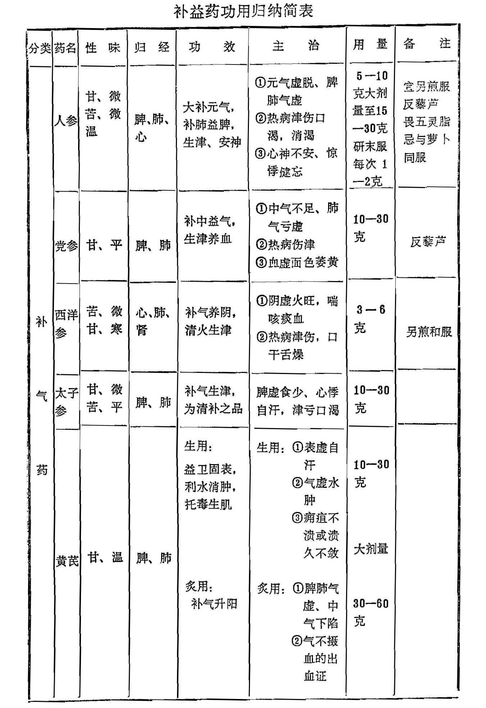
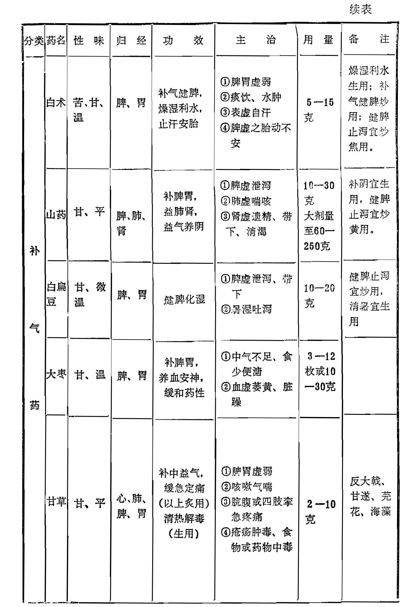
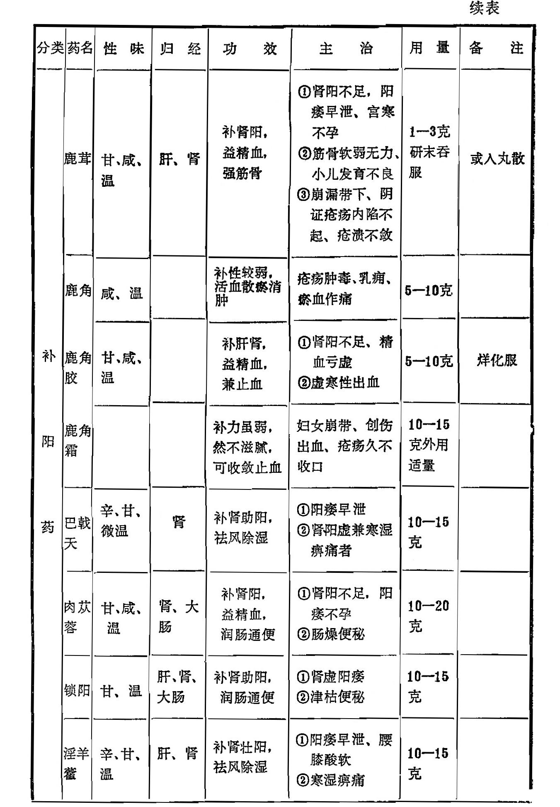
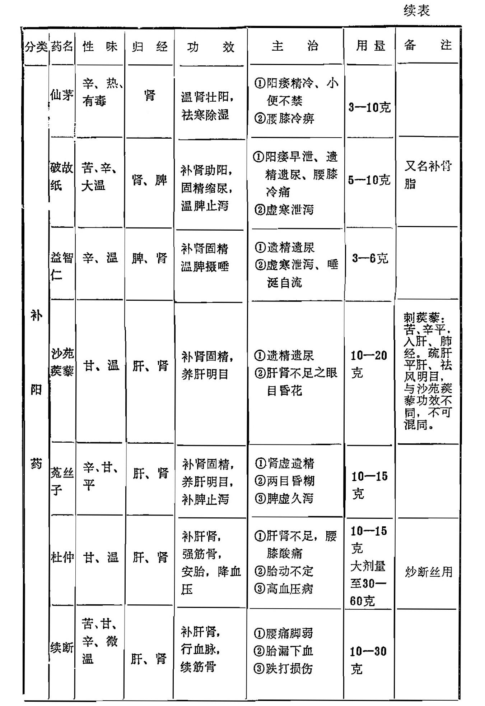
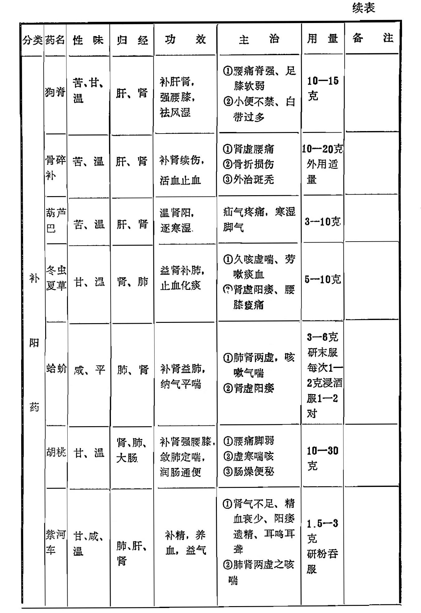
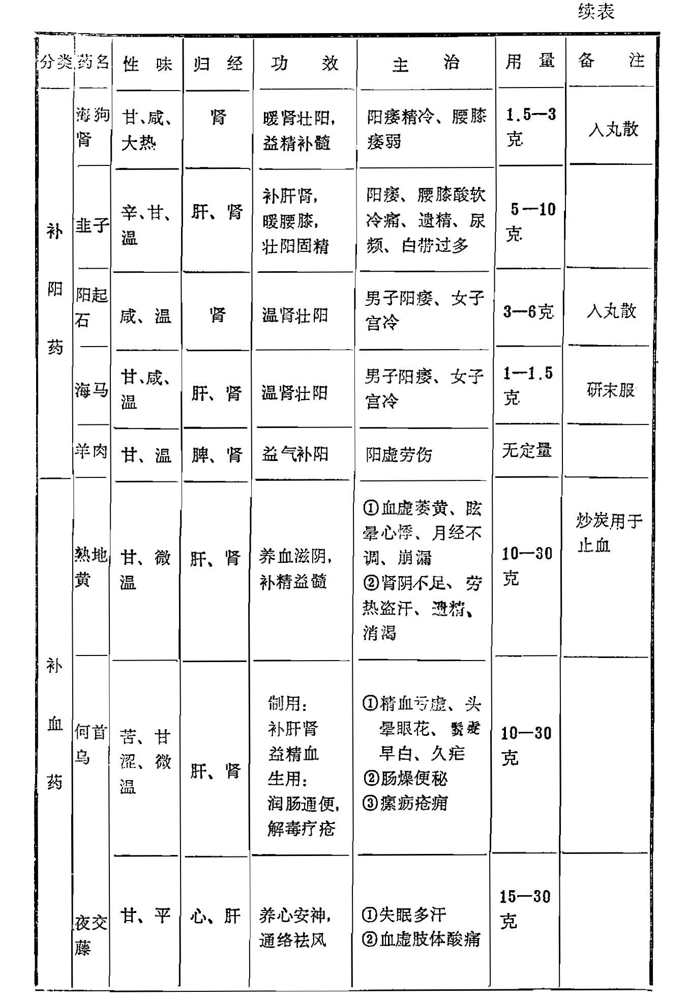
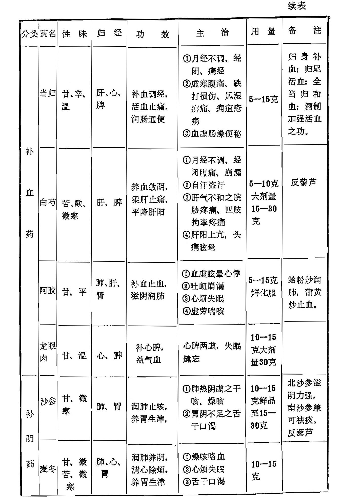
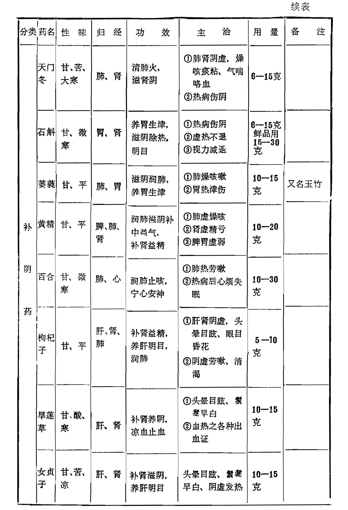
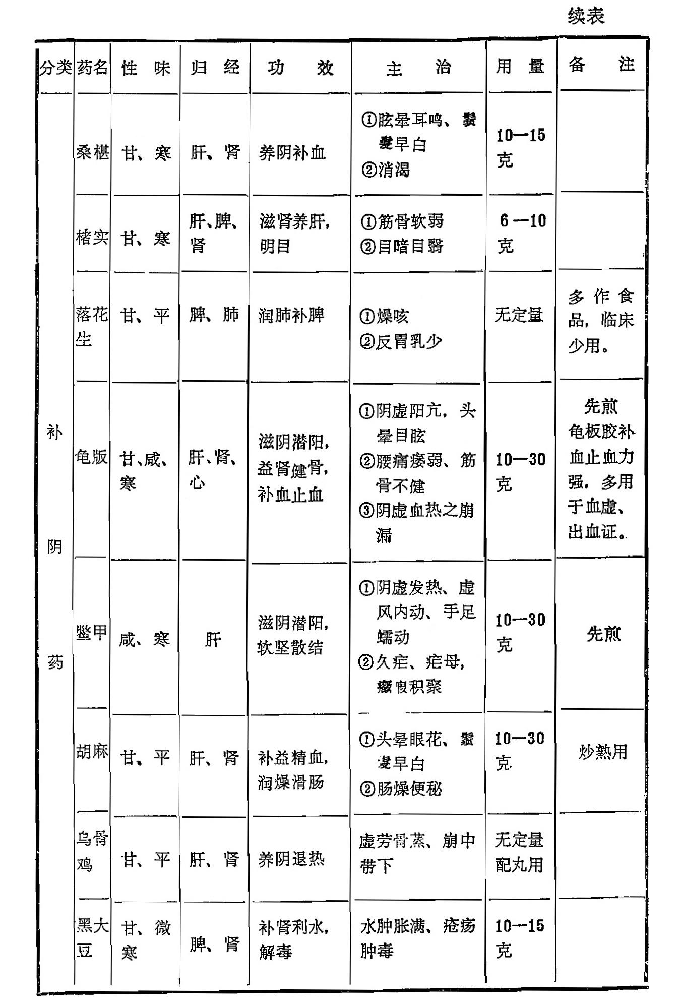

# 第十七章 补益药

[TOC]

〔自学时数〕    16 学时

〔面授时数〕    4 学时

〔目的要求〕
1. 了解补益药的概念、分类。
2. 熟悉补气药的适用证。
3. 掌握补气药中常用药的功效、临证应用，并比较其异同。
4. 熟悉补阳药的适用证。
5. 掌握补阳药中常用药的功效、临证应用，并比较其异同。
6. 熟悉补血药的适用证。
7. 掌握补血药中常用药的功效、临证应用，并比较其异同。
8. 熟悉补阴药的适用证。
9. 掌握补阴药中常用药的功效、临证应用，并比较其异同。
10. 熟悉补气、升阳、固表、托疮、柔肝、补血、补阴、养阴、滋阴、壮阳、补肾等概念。
11. 熟悉补元气、补心气、补脾气、补肺气、补肺阴、补心阴、补胃阴、补肝阴、补肾阴的概念。
12. 在自学本章全部内容的基础上，重点掌握小结内容。

凡能补虚扶弱，增强体质，用以提高机体的抗病能力，消除虚弱证候的药物，称为补益药，亦称补虚药或补养药。

补益药主要用于各种虚证。如病后正气虚弱，或邪盛正衰，病后正气不足而余邪未尽之证，用补益药后，均可起到辅助正气、消除虚弱证候，或扶正以达到祛邪的目的。所谓虚证，一般可分为气虚、血虚、阴虚、阳虚四种类型。补益药也根据其功效和应用范围的不同，可分为补气药、补阳药、补血药、补阴药四类。临床用药时，应该根据虚证的不同类型而选用其相适应的补虚药，如气虚证则用补气药，阳虚证则用补阳药，血虚证则用补血药，阴虚证则用补阴药。

由于人体的气血阴阳有着相互依存、相互转化的关系，气为血之帅，血为气之母，阴阳互根，阳生阴长，所以在虚损不足的情况下，也常互相影响。阳虚者多兼有气虚，而气虚者易导致阳虚，气虚和阳虚表示机体活动能力的衰退。阴虚每兼血虚，血虚也可导致阴虚，血虚和阴虚表示体内精血津液的损耗。因此，补气药和助阳药，养血药和滋阴药，经常配伍同用。某些补气药还兼有温补助阳的作用，而补血药往往兼有滋阴的功能，所以，临床上遇到阳虚证，在用助阳药的同时往往兼有补气的作用。遇到阴虚证用滋阴药时，也往往兼有养血之功。对于气血两亏、阴阳俱虚之证，又当根据病情，采用气血两补或阴阳兼顾之法。

对于实邪未尽的病证，补益药应予慎用，以防“闭门留寇"，使病邪留阻体内，加重病情。但对虚中挟实的病证，在祛邪的同时，可适当选用补益药，以起到扶正祛邪的作用。在用这些药时应处理好扶正与祛邪的关系，分清主次，恰当地与解表、清热、泻下等祛邪药物配合。

补益药为正气虚弱而设，凡身体健康，脏腑功能活动正常，不须使用本类药物。若使用不当，往往有害而无益，脏腑正常功能受到扰乱，反可导致阴阳失调。

补益药若须久服，而又属滋味浓厚之品者，一般名作丸（片）或滋膏剂。作煎剂时宜久煎。在服用补益药时必须注意保护脾胃，适当配伍健脾理气之品，若虚不受补，阻碍中焦运化，则药物难于奏效，影响疗效。

## 第一节 补气药

凡具有补气功能，治疗或改善气虚证的药物，称补气药。

气虚是指机体活动能力的不足。补气药能增强机体活动能力，尤其是脾、肺、心的功能，所以最适用于脾肺及心气虚的病证。脾为后天之本，生化之源，脾气虚则倦怠无力，食欲不振，脘腹虚胀，大便溏泄，脱肛，浮肿，或造血功能不足以及血失统摄等；肺主一身之气，肺气虚则少气懒言，动作喘乏，易出虚汗；心气虚则心悸失眠，虚弱无力，脉微。凡呈现以上证状者，都可用补气药来治疗。

临床应用补气药，应根据不同的气虚证分别选用适当的补气药。兼有阳虚或阴虚者，可与补阳药或补阴药同用；由于气为血帅，气旺可以生血，气能统摄血液，因此，临床上为了补血、止血，有时还要着重使用补气药。尤其是大失血时，可根据“有形之血不能速生，无形之气所当急固”、“血脱益气”的原则，急用补气药以固脱。

服用补气药如产生气滞，出现胸闷腹胀、食欲不振等证，可适当配伍理气药。

### 人参 人参芦

【原文】 **生甘苦微凉**，<small>甘补阳，微苦微寒，又能补阴。</small>**熟甘温。大补肺中元气**, <small>李东垣曰：肺主气，肺气旺，则四脏之气皆旺，精自生而形自盛。《十剂》曰补可去弱，入参羊肉之属是也。人参补气，羊肉补形。</small>**泻火**, <small>得升麻补上焦，泻肺火；得茯苓补下焦，泻肾火，得麦冬泻火而生脉；得黄芪、甘草，乃甘温退大热。李东垣曰：参芪甘草，泻火之圣药，合用名黄芪汤。按烦劳则虚而生热，得甘溫以益元气，而邪热自退，故亦谓之泻。</small> **益土**，<small>健脾。</small>**生金**，<small> 补肺。</small>**明目**， **开心益智，添精神， 定惊悸**，<small> 邪火退，正气旺，则心肝宁而惊悸定。</small>**除烦渴**， <small>泻火故除烦，生津故止渴。</small>**通血脉**，<small>气行则血行。贺汝瞻曰：生脉散用之者，以其通经活血，则脉自生也。古方解散药、行表药多用之，皆取其通经而走表也。</small>**破坚积**， <small>气运则积化。</small>**消痰水**，<small>气旺则痰行水消。</small>**治虚劳内伤**，<small>伤于七情六欲，饮食作劳为内伤，伤于风寒暑湿为外感。如内伤发热，时热时止，外感发热，热甚无休；内伤恶寒，得暖便解，外感恶寒絮火不除；内伤头痛，乍痛乍歇，外感头痛，连痛无停；内伤则手心热，外感则手背热；内伤则口淡无味，外感则鼻塞不通；内伤则气口脉盛，多属不足，宜温、宜补、宜和；外感则人迎脉盛，多属有余，宜汗、宜吐、宜下。盖左人迎主表，右气口主里也。昂按：东垣辨内伤外感最详，恐人以治外感者治内伤也。今人缘东垣之言，凡外伤风寒发热咳嗽者，概不轻易表散，每用润肺退热药，间附秦艽、苏梗、柴胡、前胡一二味，而羌活、防风等绝不敢用。不思秦艽阳明药，柴胡少阳药，于太阳有何涉乎？以致风邪久郁，嗽热不止，变成虚损，杀人多矣。此又以内伤治外感之误也，附此正之。</small>**发热自汗**， <small>自汗属阳虚，盗汗属阴虚，亦有过服参芪而汗反盛者，阳盛阴虚，阳愈补而阴愈亏也。又宜清热养血，而汗自止。</small>**多梦纷纭，呕哕反胃，虚咳喘促**，<small>《蒙筌》曰：歌有肺热还伤肺之句，惟言寒热，不辨虚实。若肺中实热者忌之，虚热者服之何害？又曰：诸痛无补法，不用参芪。若久病虚痛，何尝忌此耶。</small>**疟痢滑泻**，<small>始痢宜下，久痢宜补，治疟意同。朱丹溪曰：叶先生患痢，后甚逼迫，正合承气证。予曰：气口脉虚，形虽实而面黄白，必过饱伤胃。与参术陈芍十余贴，三日后胃气稍充，再与承气汤二贴而安。又曰：补未至而下，则病者不能当；补已至而弗下，则药反添病。匪急匪徐，其间间不容发。噫，微哉！昂按：此先补后下法之变者也，非胸有定见者，不可轻用，然后学亦宜知之。大承气汤，大黄、芒硝、枳实、厚朴。</small>**淋沥胀满**， <small>《发明》曰：胸胁逆满，由中气不足作胀者宜补之，而胀自除，经所谓塞因塞用也。俗医泥千作饱不敢用，不知少服反滋壅闭，多服则宣通，补之正所以导之也。皇甫嵩著《本草发明》。</small>**中暑、中风及一切血证**。<small>李东垣曰：古人治大吐血，脉芤洪者，并用人参，脱血者先益其气。 盖血不自生，须得生阳气之药乃生，阳生则阴长之义也。若单用补血药，血无由而生矣。凡虚劳吐血，能受补者易治，不能受补者难治。</small>

 **黄润紧实，似人形者良。去芦用。补剂用熟，泻火用生。炼膏服，能回元气于无何有之乡**。<small>有火者天冬膏兑服。</small>**参生时背阳向阴，不喜风日。宜焙用，忌铁。茯苓为使，畏五灵脂，恶皂荚、黑豆、紫石英、人溲、咸卤。反藜芦。**言闻曰：东垣理脾胃泻阴火，交泰丸内用人参、皂荚，是恶而不恶也；古方疗月闭，四物汤加人参、五灵脂，是畏而不畏也；又疗痰在胸膈，人参藜芦同用，而取其涌越，是激其怒性也。非洞奥达权者不能知。

 **人参芦：能涌吐痰涎，体虚人用之，以代瓜蒂。**<small>朱丹溪曰：人参入手太阴，补阳中之阴，芦反能泻太阴之阳，亦犹麻黄根苗不同。痰在上膈在经络，非吐不可，吐中就有发散之义。一妇性躁味厚，暑日因怒而病呃，作则举身跳动，昏不知人。其人形气俱实，乃痰因怒郁，气不得降，非吐不可。以参芦半两，逆流水煎服，吐顽痰数碗，大汗昏睡而安。</small>**参条、参须主治同， 功缓**。<small>人参向以上党为贵，今则以吉林野参为上，其次则吉林种参，高丽参皆功倍党参。</small>

【讲解】

 **人参功能大补元气，补脾益肺，生津止渴，安神益智，为治虚劳内伤第一要药**。为五加科多年生草本植物人参的根。根据生长情况，本品又分野生和栽培二种，前者称“野山参”，后者则称“园参”。主产于我国东北各省，尤以吉林长白山区产量最高，质量最佳，因而称“吉林参”。由于加工方法不同，而有生晒参、红参、白参、条参、参鬚等规格。人参一般在栽培六、七年后，在秋季茎叶将枯萎时采挖，去芦头，洗净晒干，此称生晒参；经沸水浸烫后，浸糖汁中，取出晒干，称白参或糖参；蒸熟晒干或烘干，称红参；支根为条参； 细根称参鬚。野山参亦可按上述方法加工。

本品甘微苦温，归肺、脾、心经。功能大补元气。

脾为生化之源，肺主一身之气，脾肺气足，则一身之气皆旺。人参补脾益气，故为大补元气之药。 至于生津止渴、安神益智之功，其因亦在于补气，前者是阳生阴长的道理，后者为元气充足的效果。故人参既可用于久病气虚之证，又可用于虚脱急证，而为补虚救危之要药。如气虚不足之证，不论脾胃虚弱，肺气不足，心神不安的神倦，多梦，食少，泄泻，气短喘促，以及热病伤津或消渴病等一切气血津液不足之证，效皆良好。尤其对大出血或大吐泻、元气衰弱而见虚脱者，更为要品。

【临证应用】   人参大补元气，可用以挽救虚脱危证。如古方独参汤，单用一味人参，治卒然虚脱及大出血后虚极欲脱，脉微欲绝之证；若气脱兼见汗出肢冷之亡阳现象，还可与附子同用，即人参附子汤。近年来制成注射剂或浸剂，治心源性休克，或其他气脱垂危之证的急救。

人参可鼓舞脾胃之气，若脾气不足，生化无权，而出现倦怠无力、食欲不振、呕吐泄泻等证，如四君子汤，即人参与茯苓、白术、甘草组成，为补脾益气的基础方，再加当归、熟地等药，气血双补、如八珍汤、人参养荣汤。若肺虚气喘，又多配蛤蚧、胡桃等补肺之品。久咳肺虚，气息虚弱及热伤津液，口渴汗多，还可用人参配麦冬、五味子，即生脉散。对于消渴证，多与天花粉、山药、生地黄等同用。人参能益心气、安心神，对惊悸、失眠、健忘、眩晕、耳鸣等属于气虚血亏者均适用，如天王补心丹、人参归脾丸等均有养血安神之功。此外，本品还能与祛邪药并用，以扶正而祛邪，用于正虚邪实，或邪气未尽而正气已衰的证候。如与紫苏、前胡等配伍的参苏饮治虚人感冒；与大黄、芒硝等配伍的黄龙汤，治邪实正虚的燥热便秘等。

生晒参、红参、白参等作用也有所不同：生晒参性较平和，不温不燥，适用于气阴不足者。白参力弱，一般脾肺气虚证或气阴不足证多用。红参性偏于温，气弱阳虚者适用。条参、参鬚仅得参之余气，药力较上述诸类参均弱，须峻补而恐不受者多用之，危笃之证断不可倚仗。

总之，人参功专补气，为补气第一要药，善治气虚诸证，特别是气虚欲脱的危重病证，尤为必用之品。然用之不当，亦可致害。如病人平素身体壮实，病时又无虚象者，不必使用。如证见阴虚阳亢、潮热骨蒸、肺热咳血、痰壅气急、肝阳上亢、头眩目赤，及一切火郁内实之证，均应忌用。服本品时，一般不同服萝卜，以免影响疗效。本品反藜芦。传统认为人参畏五灵脂，而在临床运用及药理实验均未发现两者同用后有不良反应，故《药典》并未注明人参与五灵脂不宜同用。

人参芦，即人参根部顶端的根茎部分，功能涌吐、升提。过去主要用于体虚者之痰饮病证，以代替瓜蒂。有催吐作用，且有毒。现均不常用。

【用量用法】    5-10克。一般不与他药同煎，而是文火另煎后，将参汁兑入其他药煎就的汤内饮用。若研末吞服，每次1-2 克，日2-3次。如用于救急，量需较大，至15-30 克，煎汁分次灌服。

### 党参

【原文】  **甘平。补中益气，和脾胃，除烦渴。中气微虚，用以调补，甚为平妥。今分西党、南党二种**。

【讲解】  **党参功专补中益气，并能生津养血**。为桔梗科多年生草本植物党参或川党参的根。党参药材由于产地不同，有西党、东党、潞党等三种。西党主产陕西、甘肃；东党主产东北等地；潞党主产山西，多为栽培品。野生于山西五台山等地者称野台党。晒干、切片或切段，生用或炒用。

本品甘平和缓，入脾、肺二经。为常用补中益气药，善能补脾养胃、健运中气，具有补脾不燥，养胃不腻的优点。既有补益脾肺之力，又有益气生血之功。故凡气虚神疲、食少倦怠、肺气不足、气短咳喘，以及血虚津伤等脾胃虚弱、气血两亏之证，用之最宜。正如《本草正义》云：党参力能补脾养胃，润肺生津，健运中气，本与人参不甚相远。其尤可贵者，则健脾运而不燥，滋胃阴而不湿，润肺而不犯寒凉，养血而不偏滋腻，鼓舞清阳，振动中气，而无刚燥之弊。本品补气作用与人参相似，一般补气血、健脾胃、扶正祛邪的方剂中，多以党参代替人参，惟补力薄弱缓慢，因此重证急证仍以人参为宜。

【临证应用】    党参用于中气不足，多与白术、茯苓、甘草同用；治肺气亏虚，气短喘咳、言语无力、声音低弱等证，常与黄芪、五味子等同用，以增强疗效。治热伤气津，气短口渴，可与麦冬、五味子同用，以增益气生津之功。治血虚萎黄，头晕心慌，常与熟地、当归等药同用。

【用量用法） 10-30 克，煎服。反藜芦，不可同用。

### 西洋参

【原文】  **味苦甘凉。味厚气薄，补肺降火，生津液，除烦倦，虚而有火者相宜。出大西洋佛兰西，一名佛兰参。**<small>补性轻，降性重。</small>

【讲解】 **西洋参以补气养阴，清热生津为主要功效，阴虚火旺者最为适宜。**为五加科多年生草本植物西洋参的根。别名花旗参。主产于美国、加拿大和法国。原支湿润切片，晒干，生用。 

本品味苦、微甘，性寒。入心、肺、肾经。甘能补，苦主降，寒清热，能补气养阴，而善清肺火。适用于阴虚火旺、肺失清肃的喘咳痰血之证，借其补气养阴之功，可具有良好的生津止渴作用。对津液不足的口干舌燥及温热病气阴两伤，烦倦口渴等证皆常应用。惟本品性寒，能伤阳助湿，故中阳衰微而有寒湿者忌用。反藜芦。

【临证应用】    西洋参虽与人参有同样的补气作用，但因性寒滋润，以阴虚火旺为宜。故常用于阴虚火旺的咳嗽气喘，痰中带血之证，多与麦冬、知母、阿胶等养阴清肺化痰药同用。对一般的津液不足，口干舌燥者，单用水煎或含化即可生效。若热病见烦倦口渴，舌红少津，脉细数者，可配鲜生地、鲜石斛、麦冬等养阴清热药同用。本品与龙眼肉蒸服，能清肠止血，以治肠热便血。 

【用量用法】 3-6克，另煎和服。

### 太子参

【原文】  **形细如参条，而补性不下大参，气味功用，均同人参**。

【讲解】 **太子参功专补气生津，为清补之品**。为石竹科多年生草本植物异叶假繁缕的根。又名孩儿参。原药洗净晒干，生用。

本品味甘微苦，性平。入脾、肺经。功能补脾益气，生津止渴，为清补之品，有类似人参的益气生津和补益脾胃的作用。但药力薄弱，须大剂量连续服用，方能取得较好的疗效。且偏于补益气阴，对气虚而兼阴亏证者尤为相宜。

【临证应用】    太子参用于脾胃虚弱，食少体倦，可与黄芪、白术、白扁豆等同用。治肺气不足，汗多气短，咳喘之证，可与山药、五味子、麦冬等配伍。亦可用于热病后低热不退，或小儿夏季热等而见气阴两伤者，可配知母、地骨皮、青蒿、麦冬等同用。

【用量用法】 10—30 克，煎服。

### 黄芪

【原文】   **甘温。生用固表，无汗能发，有汗能止，**<small>朱丹溪曰：黄芪大补，阳虚自汗，若表虚有邪，汗不出者，服此又能自汗。朱震亨，号丹溪，著《本草补遗》。</small>**温分肉，实腠里，泻阴火(1)， 解肌热。炙用补中，益元气，温三焦，壮脾胃。**<small>脾胃一虚，土不能生金，则肺气先绝，脾胃缓和则肺气旺而肌表固实，补中即所以固表也。</small>**生血生肌**，<small>气能生血，血充则肉长。经曰：血生肉。</small>**排脓内托(2)， 疮痈圣药。**<small>毒气化则成脓，补气故能内托。痈疽不能成脓者，死不治，毒气盛而元气衰也。痘证亦然。</small>**痘证不起， 阳虚无热者宜之。**<small>新安汪机治痘证虚寒不起，用四君子汤加黄苠、紫草多效。间有枯萎而死者，自咎用药之不精，思之至忘寝食。忽悟曰：白术燥湿，茯苓渗水，宜痘浆之不行也。乃减去二味，加官桂、糯米以助其力，因名保元汤。人参、白术、茯苓、甘草，名四君子汤。王好古曰：黄芪实卫气，是表药；益脾胃，是中州药；治伤寒尺脉不至，补肾元，是里药。甄权谓其补肾者，气为水母也。《日华》谓其止崩带者，气盛则无陷下之忧也。《蒙荃》曰：补气药多，补血药亦从而补气；补血药多，补气药亦从而补血。益气汤虽加当归，因势寡，功被参芪所据；补血汤数倍于当归，亦从当归所引而补血。黄芪一两，当归二钱，名补血汤。气药多而云补血者，气能生血，又有当归为引也。表旺者不宜用，阴虚者宜少用，恐升气于表，而里愈虚矣。汪机，号石山，著《本草会辑》。王好古，号海藏，著《汤液本草》。甄权，著《药性论》。陈日华，著《大明木草》。陈嘉谟，著《本草蒙荃》。</small>**为补药之长，故名耆**。<small>俗作芪。</small>**皮黄肉白，坚实者良。入补中药槌扁，蜜炙；达表生用**。<small>或曰：补肾及治崩带淋浊，宜盐水浸炒。昂按：此说非也。前证用黄芪，非欲抑黄芪使入肾也，取其补中升气，则肾受荫，而带浊崩淋自止，即日华所谓气盛自无陷下之忧也。有上病而下取，有下病而上取，补彼经而益及此经者，此类是也。</small>**茯苓为使。恶龟甲、白鲜皮。畏防风**。<small>李东垣曰：黄芪得防风，其功益大，乃相畏而更以相使也。李东垣著《用药法籇》。</small>

【讲解】  (1) 泻阴火：阴火指肝肾的虚火。泻阴火即能除肝肾虚热。(2) 内托：用内服药治疗疮疡的三大治法之一。即运用补益气血的药物，扶助正气，托毒外出，以免毒邪内陷的方法。

</small>**黄芪生用固表止汗、利水退肿、托疮生肌，炙用益气生血、升阳举陷，为补气要药**。为豆科多年生草本植物黄芪和内蒙黄芪的根。本品药材品种繁多，形态不一，以柔软，根皮黄色，心黄白，折断面呈纤维状，味甜、肥壮丰满者为佳。生用或蜜炙用。

芪，本作“耆”。李时珍曰：耆，长也。黄芪色黄，为补药之长，故而得名。

本品甘温，归脾、肺经。补脾益气之中，并能升举阳气，且能外达肌表，固护卫阳，故有补气升阳、益卫固表的作用；藉补气之力还可生血；鼓舞正气可以托毒生肌；温运阳气可以利水消肿。故凡属脾肺不足、气虚衰弱、自汗盗汗、疮痈内陷、小便不利、皮肤水肿及血虚津亏等证，皆有良效。

唯本品功偏温补，易于助火、恋邪，故凡外有表邪，内有积滞、气郁湿阻、热毒疮疡以及阴虚等证，皆不宜用。

【临证应用】  黄芪为补气要药，治疗病后气虚体弱，常与人参配伍，加强补气作用。若脾气虚弱，食少便溏，又可配白术等以补气健脾。如配当归，能补气生血，可治气虚血亏。又因其具有升阳作用，可用于中气下陷的久泻脱肛、子宫下垂，如补中益气汤即黄芪配伍党参、升麻、柴胡等补气升阳药。如气虚不能摄血而致便血、崩漏等出血证，可配当归、人参伍用。用于表虚不固的自汗，配防风、白术，以补益卫外之阳气，即玉屏风散；配麻黄根、浮小麦、牡蛎为固表敛汗之剂，即牡蛎散。用黄芪托毒生肌，治疗气血不足，疮痈内陷，或痈疽不溃及溃后久不收口者，配人参、当归、桂心等以生肌敛疮，如托毒黄芪汤。对于气虚失运，水湿停聚的面目四肢浮肿、小便不利，多配茯苓、白术等同用，如防己黄芪汤、防己茯苓汤等可收补气利水之功。

此外，本品配当归、川芎、桃仁、红花等活血祛瘀药，可用于气虚血滞引起的肢体麻木、关节痹痛或半身不遂等证，如补阳还五汤。治气虚津亏的消渴证，则多与生地、麦冬、天花粉等养阴生津药同用，黄芪可益气生津。

【用量用法】   10—30 克，大剂量可用30一60 克，煎服。生用，偏于走表，故固表止汗、利水消肿、托疮生肌多生用，炙黄芪偏于走里，故补气升阳多炙用。

`电子版注：1、原书“以补益口外之阳气”有误，改为“以补益卫外之阳气”，电子版已改`

### 白术

【原文】   **苦燥湿**，<small>经曰：脾苦湿，急食苦以燥之。</small>**甘补脾，温和中。在血补血，在气补气。**<small>同血药则补血，同气药则补气。</small>**无汗能发，有汗能止**。<small>湿从汗出，湿去汗止。止汗同芪芍之类，发汗加辛散之味。</small>**燥湿则能利小便，生津液**，<small>既燥湿而又生津何也？汪机曰：脾恶湿，湿胜则气不得施化，津何由生？用白术以除其湿，则气得周流，而津液生矣。</small>**止泄泻**，<small> 凡水泻湿也， 腹痛肠鸣而泻火也。水火相激则肠鸣。痛甚而泻，泻而痛减者食也；完谷不化，气虚也；在伤寒下利，则为邪热不杀谷也。久泻名脾泄，肾虚而命火衰，不能生土也。有积痰壅滞，肺气不能下降，大肠虚而作泻者宜豁痰；有伤风泄泻者宜散风；如脾虚湿泻者宜白术。 凡治泻，丸散优于汤剂。</small>**消痰水肿满，黄疸湿痹；补脾则能进饮食，祛劳倦**，<small>脾主四肢，虚则倦怠。</small>**止肌热**，<small>脾主肌肉。</small>**化癥癖**；<small> 同枳实则消痞，一消一补，名枳术丸。荷叶烧饭为丸，脾运则积化也。</small>**和中则能巳呕吐， 定痛安胎**。<small>同黄芩则安胎。黄芩除胃热，白术补脾，亦除胃热，和腰脐间血。盖胎气系于脾，脾虚则蒂无所附，故易落。和腰跻间血者，湿除则血气流行也。</small>**血燥无湿者禁用。能生脓作痛，溃疡忌之**。<small>补气故也，凡胀满者忌用。白术闭气，然亦有塞因塞用者。</small>**肥白者出浙地，名云头术。燥白者出宣歙，名狗头术，差胜于浙。用糯米泔浸**，<small>借谷气以和脾。</small>**陈壁土炒**，<small>藉土气以助脾。</small>**或蜜水炒，人乳拌用**。<small>润以制其燥。《千金方》曰：有人病牙齿长出口，艰于饮食者，名髓溢，单用白术愈。</small>

【讲解】   **白术以健脾燥湿为主要功效，是培补脾胃之要药**。为菊科多年生草本植物白术的根茎。主要产于浙江、湖北、江西等，浙江于潜地区的野生者称“于术”，气极清香，向为珍品。但今几乎绝见。生用，炒用或炒焦用。

本品甘苦性温，甘温可补中，味苦可燥湿，气味芳香，专入脾胃中焦，故有补气健脾，燥湿利水，止汗安胎之功，尤为培补脾胃之要药。但补气作用较弱，则燥湿之性颇强，温补脾阳更为适宜。如脾阳不振，运化失职，水湿不化而成的痞满、泄泻、痰饮、水肿等证都可应用。脾虚气弱之肌表不固自汗、妊娠足肿、胎动不安，也可通过补脾而徐以治疗。然本品性偏温燥，能耗伤阴液，只宜于中焦有湿之证，如属阴虚内热、口唇干燥、津液不足者不得使用。

本品性燥，用时经水或米泔水浸软切片入药，生用燥湿利水之力较强。炒用又有麸炒、土炒，炒焦之不同。麸炒，即同麸皮拌炒至淡黄色，又称炙白术，借麸入中焦，功偏健脾和胃；土炒，即用伏龙肝细粉炒至外面挂有土色时取出，借土气助脾，增强健脾止泻之力。白术炒焦，称焦白术，减其燥性，具有助消化开胃之功。

【临证应用】白术为补气健脾的要药。临床广泛应用。治脾胃虚弱，脘腹胀满，食欲不振，泄泻等，常与人参、茯苓、炙甘草同用，如四君子汤，补中益气汤，理中汤等补脾益气方中皆用之。脾胃虚而有积滞，脘腹痞满，用白术配枳实，即枳术丸，以攻补兼施。治中阳不足、水湿停运而导致的水肿痰饮，白术亦为良药。常配茯苓皮、大腹皮、陈皮等治水肿、妊娠足肿。配桂枝、茯苓等又治痰饮。既能补益脾阳，又可燥湿利水。

此外，本品尚可配黄芪等药以固表止汗；配黄芩以清热安胎，治胎动不安而有内热者。若兼气滞而胸腹胀满者，可与苏梗、砂仁、香附等理气药同用。若胎元不固，腰痠腹痛者，多与杜仲、川断、阿胶等同用，以增强固冲任以保胎作用。

【用量用法】 5-15 克，煎服。燥湿利水宜生用，补气健脾宜炒用, 健脾止泻宜炒焦用。

### 山药

【原文】 **色白入肺，味甘归脾，入脾肺二经。补其不足， 清其虚热**，<small> 阴不足则内热，补阴故能清热。</small>**固肠胃，润皮毛， 化痰涎，止泻痢**。<small>渗湿故化痰止泻。《百一方》：山药半生半炒，米饮下，治噤口痢。</small>**肺为肾母， 故又益肾强阴，治虚损劳伤，**<small>王履云：八味丸用之以强阴。</small>**脾为心子，故又益心气**，<small>子能令母实。</small>**治健忘遗精**。<small>昂按：山药性涩，故治遗精泄泻，而诸家俱未言涩。</small>**生捣敷痈疮， 消肿硬**。<small>山药能消热肿，盖补其气，则邪滞自行。朱丹溪曰：补阳气生者，能消肿硬是也。</small>**色白而坚者入药**。

【讲解】   **山药既补脾气，又益脾阴，并补肺肾，且兼涩性**。为薯蓣科多年生蔓生草本植物薯蓣的块根。产于河南怀庆（新乡地区）者为佳，称为怀山药。霜降后采挖，洗净刮去粗皮，晒干或烘干，为毛山药；选粗大的毛山药，用清水浸软，搓揉成圆柱状，晒干、磨光，为光山药。以质坚实，粉性足，色洁白者为佳。切片，生用或炒用。

本品味甘性平。入脾、肺、肾三经。作用和缓，不寒不燥，既能补气，又能养阴，补而不滞，养阴不腻，为平补脾胃常用之品，故无论脾阳虚或脾阴虚，皆可应用。又能补益肺肾，并兼涩性，故又有益肺止咳、固肾涩精之功。对脾虚泄泻，肺虚喘咳，肾虚遗精，带下，尿频以及消渴等证，均有良效。本品性较和平，用量宜大，少则不易见功，惟脾虚湿盛，中满而有积滞者不宜应用。

【临证应用】 山药善能补脾，且性涩而止泻，用于脾虚食少、泄泻，常与人参、白术、茯苓等同用，如参苓白术散。本品既补肺气，又益肺阴，对肺虚久咳或虚喘之证，可单用，或与麦冬、五味子等配伍。治肾虚遗精常与熟地、山萸肉等同用，如六味地黄丸。若与益智仁、乌药同用，即缩泉丸，可治肾虚尿频遗尿。治妇女带下，湿热所致者，多与车前子、黄柏等配伍，如易黄汤。肾虚不固者，多配伍熟地、山萸肉、菟丝子、五味子等补肾收敛药。山药亦为治消渴要药，可大盘(250克）煮食或煎汤代茶，也可配黄芪、葛根、知母、天花粉等，如玉液汤。

【 用量用法】10 —30 克，煎服。大量60-250 克。补阴宜生用，健脾止泻宜炒黄用。

### 白扁豆

【原文】   **甘温， 色白微黄， 脾之谷也。调脾暖胃，通利三焦，降浊升清，消暑除湿**，<small>能消脾胃之暑。</small>**止渴止泻， 专治中宫之病**。<small>土强湿去，正气自旺，</small>**解酒毒、河豚毒**。<small>《备急方》：新汲水调末服，能解砒毒。</small>**多食壅气。子粗圆色白者入药。连皮炒研用，亦有浸去皮及生用者**。<small>熟用补脾，生用清肺。</small>

【讲解】  **白扁豆功专健脾化湿，兼能消暑**。为豆科一年生缠绕草本植物扁豆的种子。生用或炒用。亦有除去种皮后晒干入药者。种皮即扁豆衣，亦入药用。

本品味甘、性微温。入脾、胃经。甘温补脾而不滋腻，芳香化湿而不燥烈，故为健脾化湿之良药，兼能消暑。故凡脾虚有湿之泄泻或妇女带下以及暑湿吐泻等，皆常用之。对病后初进补剂，用本品亦较适宜，因能调养正气而无壅滞之弊。

【临证应用】白扁豆用于脾虚有湿、体倦乏力、食少便溏或泄泻以及妇女带下等证，多与白术、山药、茯苓等健脾药同用，如参苓白术散；亦可单用炒研为末，每服10 克，治赤白带下。用于夏伤暑湿的吐泻腹痛之证，可单用，水煎服，或与香薷、厚朴等祛暑化湿药配伍，如香薷饮。此外本品用于洒精、鱼蟹、河豚鱼等中毒引起的吐泻腹痛，可单用生研为末，每次10 克，凉开水送服。

【用量用法】   10-20克，煎服。治暑湿、解毒宜生用，健脾止泻宜炒用。

**附：** **扁豆衣**     功效与扁豆相同，但药力较差，多用于暑湿吐泻及脚气浮肿等证。用量5-10 克。

### 甘草

【原文】**味甘。生用气平，补脾胃不足而泻心火**；<small>火急甚着、必以此缓之。</small>**炙用气温，补三焦元气而散表寒。入和剂则补益，入汗剂则解肌**，<small>解退肌表之热。</small>**入凉剂则泻邪热**，<small>白虎汤、泻心汤之类。</small>**入峻剂则缓正气**，<small>姜附加之，恐其僭上，硝黄加之，恐其峻下，皆缓之之意。</small>**入润剂则养阴血**，<small>炙甘草汤之类。</small>**能协和诸药，使之不争。生肌止痛**，<small>土主肌肉，甘能缓痛。</small>**通行十二经，解百药毒**，<small>凡解毒药，并须冷饮，热则不效。小儿初生，拭去口中恶血，绵渍汁令咂之，能解胎毒。</small>**故有国老之称。中满证忌之**。<small>甘令人满，亦有生用为泻者，以其能引诸药至于满所。经云：以甘补之，以甘泻之是已。故《别录》甄权并云除满，脾健运则满除也。仲景治痞满，有甘草泻心汤，又甘草得茯苓，则不资满，而反泻满。陶弘景著《名医别录》，发明药性。</small>**大而结者良。补中炙用，泻火生用，达茎中**<small>肾茎。</small>**用梢**。<small>梢止茎中痛，淋浊证用之。</small>**白术、苦参、干漆为使。恶远志。反大戟、芫花、甘遂、海藻，然亦有并用者**。<small>胡洽治痰癖，十枣汤加甘草，东垣治结实，与海藻同用，丹溪治劳瘵，莲心饮与芫花同行。非妙达精微者，不知此理。十枣汤：芫花、甘遂、大戟等分，枣十枚，仲景治伤寒表巳解，心下有水气，喘咳之剂。李时珍曰：甘草外赤中黄，色兼坤离，味浓气薄，资全土德，协和群品。有元老之功，普治百邪，得主道之化，赞帝力而人不知，参神功而巳不与，可谓药中之良相也。昂按：甘草之功用如是，故仲景有甘草汤、甘草芍药汤、甘草茯芩汤、炙甘草汤，以及桂枝、麻黄、葛根、青龙、理中、四君、调胃、建中、柴胡、白虎等汤，无不重用甘草，赞助成功。即如后人益气补中、泻火解毒诸剂，皆倚甘草为君，必须重用，方能建效，此古法也。奈何时师每用甘草，不过二三分而止，不知始自何人，相习成风，牢不可破，殊属可笑。附记于此，以正其失。</small>

【讲解】**甘草具有补气、缓急、泻火解毒、调和药性等作用，应用极为广泛**。为豆科多年生草本植物甘草的根及根茎。生用或蜜炙用。

本品味甘性平，蜜炙用性微温，归心、肺、脾、胃经。甘温能补脾益气，润肺止咳，治脾胃虚弱，肺虚咳喘等证；生用则性凉，能清热解毒而生肌，治疮疡肿毒，并治咽喉肿痛；其甘缓之性，又能缓急止痛，治脘腹、四肢挛急作痛。此外，调和诸药，同热药用之可缓其热，同寒药用之可缓其寒，能使补而不致于骤，泻而不致于速。是一味既重要又普通的药物，应用极为广泛，故有通行十二经之称，还善解百药毒，有安国定邦之功，故有国老之称。如甄权云：诸药中甘草为君，治七十二种乳石毒，解一千二百般草木毒，调和众药有功，故有国老之号。然甘缓助湿壅气，令人中满，故湿盛而胸腹胀满及呕吐者忌服。

【临证应用】甘草在众多方剂中经常使用，不仅作为辅助之用，本身也确具一定的功效。如洽脾胃虚弱，气短乏力，食少便溏，多配伍人参、白术、茯苓等，如四君子汤。以本品补心气，振心阳，常用的炙甘草汤，即以炙甘草为主，配阿胶、生地、麦冬、桂枝等，治脉结代，心动悸之证。甘草在治疗咳嗽、喘息方面多与他药配成复方，如与麻黄、杏仁配伍治风寒喘咳的三拗汤，与麻黄、石膏、杏仁配伍的治肺有郁热喘咳的麻杏石甘汤。其他止嗽方中亦多用之。

脘腹或四肢挛急作痛，用甘草甘以缓之，与芍药配伍，即芍药甘草汤，是缓急止痛常用之方。

甘草对于疮疡肿毒，内服、外用均可，如配桔梗即甘草桔梗汤，祛痰利咽，治咽痛；配银花，即银花甘草汤治痈肿发热。至于食物、药物、农药中毒，甘草都有一定的解毒作用，轻者可单用煎汤服；或与绿豆同用，以增强解毒之效。

此外，本品之缓和药性，调和百药的功效较为突出。如与附子、干姜同用，能缓和附子、干姜辛温燥烈之性，以防伤阴，与石膏、知母同用，能缓和石膏、知母之寒，以防伤胃，与大黄、芒硝同用，能缓和大黄、芒硝的泻下作用，使泻而不速；与人参、白术、熟地、当归等补药同用，能缓和补力，使作用缓慢而持久；与半夏、干姜、黄连、黄芩等热药寒药等同用，又能起协调作用。

药用之甘草梢即甘草根的末梢部分或细根。主治湿热下注膀胱的茎中疼痛，如导赤散即生甘草梢与生地、木通、竹叶组成，以治小便短赤，尿道刺痛之证。

【用量用法】2-10克，煎服。清火解毒宜生用，补中缓急宜炙用。传统认为本品反大戟、芫花、海藻、甘遂，古今虽也有同用之例，但仍在探讨之中，不能轻易妄用。近年来研究报道，甘草长期大剂量单独服用会引起水肿、血压升高等现象，应予以注意。

### 大枣

【原文】    **甘温。脾经血分药。补中益气、滋脾土、润心肺、调营卫、缓阴血、生津液、悦颜色、通九窍、助十二经、和百药。伤寒及补剂加用之，以发脾胃升腾之气**。**多食损齿**，<small>齿属肾，土克水。</small>**中满证忌之**。<small>甘令人满。大建中汤心下痞者，减饴，枣与甘草同例。成无己曰：仲景治奔豚用大枣者，滋脾土以平肾气也。治水饮胁痛，有十枣汤，益脾土以胜妄水也。</small>**北产肥润者良**。<small>昂按：金华南枣，更胜于北，徽宁所产，亦有佳者。杀乌附毒。忌葱鱼同食。</small>

【讲解】 **大枣功专补脾益气，养血安神，井能缓和药性**。为鼠李科落叶灌木或小乔木植物枣树的成熟果实，又名红枣。主产于河南、河北、山东、陕西等省。秋季果实成熟时采收，晒干，生用。

本品味甘，性温。入脾、胃经。甘润性缓，既能补脾生血，又可益气生津，并能养心安神。故常用于中气不足，脾胃虚弱，以及血虚萎黄，妇女脏躁等证。此外，常配伍峻烈药同用，既可缓和诸药峻烈之性，使攻邪不至于伤正，又可补养脾胃，防止攻逐太过之弊。但甘温滋润之品易助湿生热，令人中满，故湿盛脘腹胀满、食积、虫积、龋齿作痛，以及痰热咳嗽等，均应忌用。

【 临证应用】 大枣用于脾胃虚弱体倦乏力、食少便溏，常与党参、白术等补气药同用，以增加疗效。治血虚萎黄，多与熟地、当归等补血药同用。妇女脏躁，多与甘草、小麦同用，如甘麦大枣汤。若与酸枣仁、远志等同用，可治虚烦失眠。近年单用本品，大剂量(250 克一500 克）煎汤内服，治血小板减少证及过敏性紫癜，均取得较好的疗效。本品与葶苈子配伍，即葶苈大枣泻肺汤，能泻肺平喘而不伤肺气，与大戟、甘遂、芫花同用，即十枣汤，能逐水祛痰而不伤脾胃;本品又常与生姜配伍，生姜得大枣，可缓和辛辣之性，大枣得生姜，可防止气壅致胀之偏，二者配合，取辛甘发散之力，以调和营卫，既能防止汗多伤营，又能增加食欲，促进药力的吸收，以提高滋补效能。

【用量用法】3-12枚，或10-30克，煎服。用于丸剂当去皮核捣烂，剂量随方配用。

## 第二节 补阳药

凡能补助人体阳气，治疗阳虚证的药物，称为补阳药，又称助阳药。

阳虚证包括心阳虚、脾阳虚、肾阳虚等。肾为元阳所在，对人体脏腑有温煦生化的作用，为先天之本，所以阳虚诸证往往与肾阳虚有十分密切的关系。补阳药也大多是补肾阳的药物，因此本节着重介绍补助肾阳之品。至于振心阳、温脾阳的药物大多在洞里药等章节中叙述。

肾藏精，主骨，所以补阳药除壮肾阳外，还具有补精髓，强筋骨的作用。故除用于肾阳虚的主要证状，如畏寒肢冷，腰膝酸软或冷痛，阳痿早泄，宫寒不孕，白带清稀，夜尿增多，舌淡脉沉等证外，又可用于精髓不足的头晕耳鸣，不孕不育，或筋骨不健的痿软无力，小儿行迟，齿迟等病证。此外，由于肾阳衰微，不能温运脾胃引起的泄泻；肾主纳气，为气，之根，肾阳不足，摄纳无权，引起的喘促，均可使用。故有些补肾阳药又可用于脾肾两虚的泄泻和肺肾两虚的气喘。

补阳药性多温燥，易伤阴助火，故阴虚火旺者不宜使用。

### 鹿茸

【原文】 **甘温**<small>一云咸热。</small>**纯阳，生精补髓，养血助阳， 强筋健骨。治腰肾虚冷**，<small>《百一方》： 鹿角屑熬黄为末，酒服，主腰脊虚冷剌痛，</small>**四肢酸痛，头眩眼黑，崩带遗精，一切虚损劳伤，惟脉沉细相火衰者宜之，鹿角初生，长二三寸，分歧如鞍，红如玛瑙，破之如朽木者良。**<small>太嫩者，血气未足，无力。</small>**酥涂微炙用**，<small>不酥涂则伤茸，</small>**或酒炙。不可嗅之，有虫恐入鼻颡**。<small>猎人得鹿，絷之取茸，然后毙鹿，以血未散故也。最难得不破未出血者。沈存中《笔谈》云：凡含血之物，血易长，筋次之，骨最难长。故人二十岁，骨髓方坚。麋鹿角无两月长至二十余斤，凡骨之长，无速于此，草木亦不及之。头为诸阳之会，钟于茸角，岂与凡血比哉！鹿阳兽，喜居山；麋阴兽，喜居泽。麋似鹿，色青而大，皆性淫，一牡辄交十牝。麋补阴，鹿补阳，故冬至麋角解，夏至鹿角解也。麋、鹿茸角，罕能分别。雷敩曰：鹿角胜麋角。孟诜、苏恭、苏颂并云麋茸麋胶胜于鹿。李时珍曰：鹿补右肾精气，麋补左肾血液。</small>

**鹿角，咸温。生用则散热，行血，消肿**，<small>醋磨，涂肿毒；为末酒服，治所伤。《医余》曰：有臁疮赤肿而痛，用黄连凉药久不愈者，却当用温药，如鹿角灰、发灰、乳香之类，此阴阳寒暑往来之理也。</small>**辟邪，治梦与鬼交**。<small>酒服一撮，鬼精即出，能逐阳中邪气恶血。</small>**炼霜熬膏，则专于滋补**。<small>李时珍曰：鹿乃仙兽，纯阳多寿，能通督脉，又食良草，故其角肉食之，有益无损。鹿一名斑龙，西蜀道士尝贷斑龙丸，歌曰：尾闾不禁沧海竭，九转灵丹都漫说，惟有斑龙顶上珠，能补玉堂门下穴。盖用鹿茸与胶霜也。</small>**造胶霜法：取新角寸截，河水浸七日，刮净，桑火煮七日，入醋少许，取角捣成霜用。其汁加无灰酒熬成膏用，畏大黄**。<small>鹿䘒，鹿相交之精也，设法取之，大补虚劳。</small>

【讲解】   **鹿茸善能补肾阳，益精血，井能强筋健骨**。为鹿科动物梅花鹿或马鹿的尚末骨化而带毛的幼角。夏秋两季雄鹿长出的新角尚末骨化时，将锯下，或用刀砍下，前者称锯茸，后者称为砍茸。商品又分花鹿茸（黄毛茸）和马鹿茸（青毛茸）二种。花鹿茸以粗大，顶端丰满，质嫩，毛细，皮色红棕，油润光亮者为佳。马鹿茸以茸体饱满，体轻，下部无棱绒，断面蜂窝状，组织致密，米黄色者为佳。用时撩去毛，刮净，黄酒浸润，切片，烘干入药，或取干燥鹿茸片，碾成细末用。

本品味甘咸，性温。可峻补肝肾。肾藏精主骨，肝藏血主筋，故为补肝肾、益精血、强筋骨之良药，并能补督脉而固冲任。故凡肾阳不足，精血亏虚以及冲任不固之证，皆可应用，疗效较佳。此外，对阴疽溃久脓清不敛者，亦有温补内托之功。但性温补阳，对阴虚阳亢，血分有热者，均应忌用。

【临证应用】 鹿茸用于肾阳不足，精血亏虚之畏寒肢冷，阳痿滑精，遗尿尿频，腰膝痠痛及宫冷不孕等证，可单用研末每次0.6—1 克，淫羊藿煎汤送服；也可配人参、熟地、枸杞子等补气养血益精药同用，以增强疗效，如参茸固本丸。治妇女阴虚血少，冲任不固，崩漏带下，可与阿胶、乌贼骨等同用，如鹿茸散。用于精亏血虚，腰膝痠痛，筋骨无力，精神疲倦或小儿发育不良，骨软行迟，囟门不合等证，多与熟地、山萸肉、山药、五加皮等同用，如加味地黄丸。用于疮疡久溃不敛，阴疽内陷不起等证，可配黄芪、当归等补气益血之品，以内托敛疮。近亦有用治心脏衰弱、心悸怔忡而见肾虚证者。

鹿茸温补肾阳虽与附、桂相似，但附、桂辛热刚燥，作用较速，补阳而善祛阴寒；鹿茸甘温柔润，作用较缓，补阳兼能生精。虽三药都能治肾阳不足之证，但附、桂只适用于肾阳衰微而不宜于精髓不足，鹿茸则皆可应用。

【用量用法】     1—3克，研细末，分三次服。 多入丸、散用。

 **附：鹿角**    为各种雄鹿巳成长骨化的角。味咸性温，入肝、肾经。功能补肾助阳，强筋健骨，可作鹿茸之代用品，但药力薄弱。主活血散淤消肿，可治疮疡肿毒，乳痈肿痛，内服或外敷均可。用量5一10 克，水煎或研末服。外用适量，磨汁涂或研末敷。以虚寒证为宜。

 **鹿角胶**    鹿角煎熬浓缩而成的胶状物。味甘咸，性温，入肝、肾经。功能补肝肾，益精血，功效虽不如鹿茸之峻，但较鹿角佳，并有良好的止血作用。适用于肾阳不足，精血亏虚，体弱消瘦及吐、衄、崩漏之偏于虚寒者，以及阴疽内陷等证。用量5一10 克，用开水或黄酒加温烊化服。

**鹿角霜**     系鹿角熬胶后所存的残渣。功用同鹿角，而力更弱，但不滋腻，且有收敛作用，具涩精、止血、敛疮之功。内服可治崩漏，带下，遗精；外用能止创伤出血及疮溃久不愈合之证。用量10一15 克，煎服。外用适量。

**麋茸**   **麋角**     功用与鹿相仿，而温性差减。

麋茸为鹿科动物麋鹿的未骨化的带有茸毛的幼角，麋角系已骨化的老角。

本品功效与鹿茸和鹿角相同，主治亦无差异。《本草求真》谓麋、鹿虽分有二，然总不外填精补髓，强健筋骨，长养气血而为补肝肾要药也。

用量用法亦与鹿茸、鹿角同。

### 巴戟天

【原文】   **甘辛微温，入肾经血分。强阴益精，治五劳七伤。辛温散风湿，治风气脚气水肿。根如连珠，击破中紫而鲜洁者伪也；中虽紫，微有白糁粉色、商理小暗者真也。蜀产佳**。<small>山葎根似巴戟，但色白，人或醋煮以乱之。</small>**去心，酒浸焙用。覆盆子为使。恶丹参**。

【讲解】  **巴戟天功专温补肾阳，兼能祛风除湿。**为茜草科多年牛藤本植物巴戟天的根。根呈弯曲扁圆柱形，表面灰黄色，皮部呈鲜明淡紫色。以条大、肥壮、肉厚、色紫者为佳。主产于广东、广西、福建、四川等地。除去木质心，晒干切片生用或盐水炒用。

本品味辛甘性温。甘能补，辛温能散，专人肾经，故主温补肾阳，强壮筋骨，兼能祛风除湿。用于阳痿，尿 频，宫冷不孕，月经不调，少腹冷痛，及肾阳不足兼有风湿之腰膝疼痛或软弱无力。本品性较柔润，具有温而不燥，补而不滞之长，对肾虚而兼风湿之腰膝痹痛者，颇为合适。温肾壮阳之品，只宜于虚寒之证，如阴虚阳亢则非所宜。

【临证应用】巴戟天用于阳痿，不孕，可与人参、山药、覆盆子等同用。遗尿，小便不禁者，多与益智仁、桑螵蛸、菟丝子等配伍。若与高良姜、肉桂、吴茱萸等同用，则治月经不调，少腹冷痛。用于肾阳不足兼有风湿之腰膝疼痛，软弱无力，则多与卑薢、杜仲、牛膝、川断等同用，如金刚丸。

【用量用法】 10-15克，煎服。

### 肉苁蓉

【原文】 **甘酸咸温，入肾经血分。补命门相火，滋润五脏，益髓强筋，治五劳七伤，绝阳不兴，绝阴不产，腰膝冷痛，崩带遗精。峻补精血。**<small>李时珍曰：补而不峻，故有苁蓉之号。</small>**骤用恐妨心，滑大便。长大如臂，重至斤许，有松子鳞甲者良。酒浸一宿，刷去浮甲，劈玻，除去筋膜，酒蒸半日，又酥炙用。忌铁**。<small>苏恭曰：今日所用，多草苁蓉，功力稍劣。 </small>

【讲解】**肉苁蓉长于补阳，又善益阴，为阴阳平补之品**。为列当科一年生寄生草本植物肉苁蓉的带鳞叶的肉质茎。又名大芸。呈圆柱形而稍扁，长10一30厘米，表面灰棕色或褐色，密被肥厚的肉质鳞片，呈覆瓦状排列，即书中所说的“有松子鳞甲”，肉质而带有油性，气香而微甜。主产于内蒙古、甘肃、新疆等地。春秋两季均可采收，春采后晒干为甜苁蓉，秋采入盐水中浸渍后为咸苁蓉，用时漂去盐渍，名淡苁蓉；用酒蒸制为酒苁蓉，晒干切片入药。

本品味甘咸，性温。入肾、大肠经。味甘能补，性温助阳，咸可入肾，为补肾壮阳要药，并能补益精血。以治五劳七伤，腰膝冷痛，崩带遗精。一般补阳药多燥，滋阴药多腻。惟苁蓉甘温质润，具有温而不燥，滋而不腻，既可补阳，又可益阴，补而不峻，药力较为缓和的特点，故有“从容”之称。本品质较油润，又有较好的润肠通便作用。但肾火旺盛，脾虚泄泻及实热便秘者均不宜用。

【临证应用】肉苁蓉用于肾虚精亏，肾阳不足之阳痿、早泄、遗精等，常与熟地、菟丝子、五味子等同用，如肉苁蓉丸。治妇女精血亏虚的不孕证，则与鹿角胶、当归、熟地、紫河车等补益精血药同用，以加强疗效。治腰膝冷痛、筋骨无力，可配巴戟天、杜仲、卑薢等，如金刚丸。苁蓉用于润肠通便，则宜大剂量15 一30克，煎汤服，或配火麻仁、沉香，即苁蓉润肠丸。治老人、体虚者肠燥津液枯之大便秘结，对习惯性便秘单用亦有良效。

【用量用法】10-20克，煎服。

### 锁阳

【原文】 **甘温补阴，益精兴阳， 润燥养筋**。<small>强筋故能兴阳。</small>**治痿弱，滑大便**。<small>便燥者啖之，可代苁蓉，煮粥弥佳。</small>**鳞甲栉比(1）, 状类男阳。酥炙**。

【讲解】 (1) 栉比：象梳子齿那样密密排着。

**锁阳功同苁蓉，补益肝肾，润肠通便。性较温燥，助阳之力较大，其润肠之功不及苁蓉**。为锁阳科肉质寄生植物锁阳的肉质茎。主产于内蒙古、甘肃、青海、新疆等省区。切片，生用。

本品味甘性温，入肝，肾，大肠经。功同苁蓉，能补肾壮阳，益精养血，润肠通便，可代苁蓉治肾阳不足，精血亏虚引起的阳痿、不孕。惟性较温燥，虽亦能兴阳益精，但不如苁蓉常用。其润肠之功，亦逊于苁蓉。

以本品能补肾润燥，养筋起痿，故对于肝肾不足，筋骨痿弱，行步艰难之证，用之较多。然肾虚火旺者不宜用。

【临证应用】锁阳用于阳萎、不孕，常与巴戟天、菟丝子、拘杞子等同用。治腰膝冷痛、筋骨痿弱无力，则多与熟地、牛膝、虎骨、龟版等养阴补血、强筋骨药同用，如虎潜丸。现临床用于各种瘫痪，如外周驰绶性瘫痪，周围神经炎，脊髓神经根炎，小儿麻痹后遗证等。治肠燥便秘，可与火麻仁、柏子仁、郁李仁等同用。

【用量用法】10-15 克，煎服。

### 淫羊藿

【原文】 **辛香甘温，入肝肾。补命门**， <small>李时珍曰：手足阳明三焦命门药。</small>**益精气， 坚筋骨， 利小便。治绝阳不兴，绝阴不产，冷风劳气，四肢不仁**。<small>手足麻木。</small>**北部有羊，一日百合，食此藿所致，故名。去枝，羊脂拌炒。山药为使。得酒良。**

【讲解】**淫羊藿以温肾壮阳为其主要功效，并兼能祛风除湿**。为小蘖科多年生草本植物淫羊藿和箭叶淫羊藿，或心叶淫羊藿的全草。别名仙灵脾，产于陕西、四川、山西等地。生用或酥炒用。

本品味辛甘，性温。入肝、肾经。甘温能温肾壮阳，辛温可祛风除湿，所以既能内壮肾阳而强筋健骨，又能散风湿而通痹止痛。对肾阳不足，男子阳痿，女子宫冷，以及风寒痹痛之证，应用较多，效亦较好。但性较燥烈，易伤阴助火，故阴虚火旺、阳事易举者忌用。

【临证应用】 淫羊藿专补肾壮阳，用于肾阳虚衰引起的阳痿不举，腰膝无力，小便不禁及妇女不孕等证，可单用酒浸服，或配熟地、枸杞子、仙茅等补肾壮阳药同用，以加强疗效。用于风寒湿痹或肢体麻木，可配威灵仙、桂心等药同用。近年多用妇女更年期高血压及小儿麻痹后遗证，前者多与仙茅、巴戟天、黄柏、知母等同用，如二仙汤。后者多与桑寄生、黄芪、川牛膝等配伍，疗效满意。

【用量用法】10-15 克，煎服，也可浸酒，熬膏，或入丸散服。

### 仙茅

【原文】**辛热，有小毒。助命火，益阳道，明耳目，补虚劳。治失溺无子，心腹冷气不能食**，<small>温胃。</small>**腰脚冷痹不能行**。<small>暖筋骨。</small>**相火盛者忌服。叶如茅而略阔，根如小指，黄白多涎。竹刀去皮切，糯米泔浸，去赤汁，出毒用。忌铁**。<small> 唐婆罗门始进此方，当时盛传，服之多效。照前制，阴干，蜜丸，酒服，禁牛乳牛肉。许真君书曰: "甘能养肉，辛能养节，苦能养气，咸能养骨，酸能养筋，滑能养肤。和苦酒服之必效也”。</small>

【讲解】  **仙茅辛热性猛，为温补肾阳之专药**。为石蒜科多年生草本植物仙茅的根茎。其根茎延长，可达30 厘米，圆柱状，肉质外皮褐色，其叶3-6 片根出，狭披针形，长10一25厘米，绿白色，米泔水浸泡切片生用。

本品辛热性猛，有毒。入肾经。为温补肾阳专药。能补命门而兴阳道，除寒湿而暖腰膝，故多用于肾虚阳痿无子，火衰精寒，小便不禁，以及腰膝冷痹等证。《本草求真》说：此与附、桂、硫黄、胡巴、破故纸、淫羊藿、蛇床子、远志同为一例，但附子则能以除火衰寒厥，肉桂则能以通血分寒滞，胡巴则能以除火衰寒疝，淫羊藿则能以理火衰肾泻，远志则能以除火衰怔忡，虽其所补则同，而效各有攸建，未可云其补火，而不分其主治于其中也。本品虽能壮阳，是治阳痿有效之品，但辛热有毒，只宜暂用，不可久服。若阴虚火盛或肾火易动者，更不可用。

【临证应用】   仙茅用于阳痿精冷，小便不禁，常同淫羊藿、菟丝子、五味子伍用，以收补肾固涩之功。本品又可温补脾阳，治疗纳呆腹泻，心腹冷痛等证，常与补骨脂、肉豆蔻、白术等伍用。治疗肾阳不足、筋骨不健之腰膝冷痛，寒湿痹痛，拘挛等证可与淫羊藿、杜仲、桑寄生及巴戟天、独活、川芎等伍用。

【用量用法】  3-10 克。水煎服。

### 菟丝子

【原文】**甘辛和平，凝正阳之气，入足三阴**，<small>脾、肝、肾。</small>**强阴益精。温而不燥，不助相火。治五劳七伤，精寒淋沥，口苦燥渴**。<small>脾虚肾燥而生内热，菟丝益阴清热。</small>**祛风明目，补卫气，助筋脉，益气力，肥健人。**<small>补肝肾之效。《老学庵笔记》予族弟少服菟丝子，凡数年，饮食倍常，血气充盛，忽因浴见背肿，随视随长，乃大疽也。适值金银花开，饮至数斤，肿遂消。菟丝过服，尚能作疽，以此知金石药不可不戒。昂按：此人或感他毒，未可尽归咎于菟丝也。</small>**无根，蔓延草上，子黄如黍粒。得酒良。淘去泥沙，酒浸一宿，曝干捣末。山药为使。**

【讲解】**菟丝子既能补阳，又能益阴，为平补肝肾之良药**。为旋花科一年生寄生性蔓草菟丝子或大菟丝子的成熟种子。生用，或煮熟捣烂作饼用。

菟丝子味辛甘，性平，质润。入肝、肾经。不温不燥，也不滋腻，既能补阳又能益阴。虽阳虚、阴虚都可应用，但仍偏于补阳，多用于肾阳不足之证；且能固精缩尿，以治滑精，小便频数，白带过多等。又有补肝明目作用，治疗视力减退，目暗，目眩等。并能补脾止泻，用于脾虚便溏或泄泻。还可用于肝肾虚弱、胎元不固，以及阴亏消渴等证。应用较广，但各有所宜，正如《本草汇言》云：＂菟丝子，补肾养肝，温脾助胃之药也。但补而不峻，温而不燥，故入肾经。虚可以补、实可以利、寒可以温、热可以凉、温可以燥、燥可以润。非若黄柏、知母，苦寒而不温，有泻肾经之气；非若肉桂、益智，辛热而不凉，有动肾经之温者比也。”

【临证应用】菟丝子用于肾虚阳萎，滑精，早泄，小便频数及肾虚腰痛，白带过多等证，常与枸杞子、覆盆子、五味子等配伍，如五子衍宗丸。治肾虚腰痛则多与杜仲、补骨脂等配伍，若与山药、莲子、茯苓等配伍，可治遗精带下或尿有余沥等，如茯菟丹。用于肝肾不足，目暗不明，可与地黄、车前子配伍，如驻景丸。至于用治脾虚泄泻，则多配黄芪、党参、白术、山药等益气健脾药同用，增强止泻之功。与续断、桑寄生、阿胶等配伍，即寿胎丸，治胎漏下血，胎动不安。

【用量用法】10—15克，煎服。本品仍偏补阳，故阴虚火旺，大便燥结，小便短赤者亦不宜服。

### 蒺藜子 

【原文】**苦温补肾，辛温泻肺气而散肝风，益精明目**。<small>肝以散为补，凡补肝药，皆能明目。</small>**治虚劳腰痛，遗精带下，咳逆肺痿，乳闭癥瘕，痔漏阴㿉**。<small>音颓。</small>**肾肝肺三经之病，催生堕胎**。<small>剌蒺藜主恶血，故能破癥下胎。</small>

**沙苑蒺藜   绿色似肾**。  <small>故补肾。</small>**炒用**。<small>亦可代茶。</small>

**剌蒺藜   三角有刺。去剌，酒拌蒸**。<small>风家宜刺蒺藜，补肾则沙苑者为优。</small>**余功略同**。<small>《瑞竹堂方》：齿牙打动者，蒺藜根烧灰敷之。</small>

【讲解】   **蒺藜子有二种：一为沙苑蒺藜，专补肝肾，固精缩尿，一为刺蒺藜，功能疏肝开郁，祛风明目**。一补一散，差异较大，切不可混。沙苑子，为豆科一年生草本植物扁茎黄芪的成熟种子。呈肾状形而稍扁，表面灰褐色或绿褐色光滑，别名沙苑子、潼蒺藜。刺蒺藜为蒺藜科一年生或多年生草本植物蒺藜的果实，又名白蒺藜。果实由五个小果聚合而成，小果表面呈绿色或灰白色，背部隆起，有许多网纹及小刺，并有一对长剌和短剌。全国各地均产。生用或盐水炒用。

 沙苑蒺藜甘温，性涩。入肝、肾经。功专补肾，固精缩尿，并能明目，用于肾虚腰痛，阳萎遗精，遗尿尿频，白带过多。还能用于肝肾不足之目暗不明，头昏目花。温补固涩之品，阴虚火旺及小便不利者忌用。

刺蒺藜苦辛，性平。辛能发散，苦能降泄，入肝、肺经。能升能降，能疏能补，功能平肝疏肝，祛风明目。适用于肝阳或风邪所致的头痛眩晕，目赤多泪，风疹瘙痒以及肝气郁结之胸胁胀满，乳闭不通等证。至于书载治咳逆肺痿、乳闭癥瘕，难产等，有破癥下胎作用，现临床少用。

【临证应用】沙苑蒺藜之功效与菟丝子相近，主治病证亦相类似，也是一味平补肝肾之药。主治肾虚腰痛，可单用或配杜仲、补骨脂等。若与煅龙骨、莲须、芡实等固肾涩精药同用，可治遗精，滑精，小便不禁，白带过多等，如金锁固精丸。与滋补肝肾药熟地、枸杞子、菊花、菟丝子等同用，治肝肾亏虚之头昏目花之证，有良效。

刺蒺藜用于肝阳上亢的头痛眩晕，常与钩藤、珍珠母、天麻等同用。若系风邪所致者，则多与桑叶、菊花、决明子等配伍，如白蒺藜散，益增祛风热明目之功，以治风热上袭之目赤多泪之证。借其祛风之功，以起止痒之效，与蝉蜕、荆芥等同用，可治风疹瘙痒。肝气郁结之胸胁不舒、乳汁不下，可与疏肝理气药柴胡、香附、郁金、穿山甲等同用。

以上二药系两种植物，形态不同，作用有别。但沙苑蒺藜，在古代文献中也有称为白蒺藜的,如《本草衍义》上说：蒺藜有两种，一是杜蒺藜，即今之道旁布地而生者，开小黄花，结芒刺；一是白蒺藜，出同州牧马处，于如羊内肾，大如黍粒，补肾药，今人多用，风家多用刺蒺藜也。这里所说的白蒺藜，即现在的沙苑蒺藜。因此，宋、明文献中记载的一些补肾药方中所用的白蒺藜，其实是沙苑蒺藜，而不是刺蒺藜。

二药虽同治目疾，但功效不同，主治有别。刺蒺藜善于散风热，故宜于风热所致的目赤多泪， 而沙苑蒺藜长于补肝肾，故适宜于肝肾不足的目暗不明，刺蒺藜无补益作用，宜加区别。

【用量用法】沙苑蒺藜10-20 克；刺蒺藜6-15 克，煎服。

### 破故纸

【原文】  **辛苦大温。入心包、命门，补相火以通君火，暧丹田，壮元阳，缩小便**。<small>亦治遗尿。</small>**治五劳七伤**，<small>五脏之劳，七情之伤，</small>**腰膝冷痛， 肾冷精流，肾虚泄泻**，<small>肾虚则命门火衰，不能熏蒸脾胃，脾胃虚寒，迟于运化，致饮食减少，腹胀肠鸣，呕涎泄泻，如鼎釜之下无火，物终不熟，故补命门相火，即所以补脾。破故纸四两，五味三两，肉蔻二两，吴茱一两，姜煮枣丸，名四神丸，治五更肾泻，</small>**妇人血气**，<small>妇人之血脱气陷，亦犹男子之肾冷精流。</small>**堕胎。出南番者色赤，岭南者绿。酒浸蒸用，亦有童便乳浸，盐水炒者。得胡桃、胡麻良。恶甘草**。<small>唐郑相国方：破故纸十两，酒浸蒸为末，胡桃肉二十两，去皮烂研，蜜和，每日酒调一匙，或水调服。白飞霞曰：破故纸属火，坚固元阳，胡桃属水，润燥养血，有水火相生之妙。忌芸苔、羊血。加杜仲，名青娥丸。芸苔，油莱也。</small>

【讲解】 **破故纸既能补肾壮阳，又可温脾止泻，且兼收敛固涩之性，为治脾肾阳虚及下元不固之要药**。为豆科一年生草本植物补骨脂的果实，又名补骨脂。果实略似肾形，表面黑棕色，果皮薄与种皮不易分离。种仁一枚，淡棕色，富含油脂。以粒大、色黑、饱满、坚实者佳。主产于四川、河南、陕西、安徽等地。生用或盐水炒用。

本品味苦辛，性大温。入肾，脾经。以气为用，为补肾壮阳之要药。 能壮阳以化阴寒，补肾以固下元，补命门火以温脾止泻，补肾气以纳气平喘。故凡肾阳不足，下元不固，脾肾阳虚之证，故皆为常用之品。惟性温燥，易伤阴液，故阴虚有火及大便燥结者忌用。

【临证应用】  补骨脂可用于肾虚阳痿，腰痛膝软。治阳萎可配菟丝子、胡桃、沉香等，如补骨脂丸。治腰膝冷痛或酸软无力，多与杜仲、胡桃等同用，如青娥丸。治肾气虚冷，小便无度，可配茴香用，如破故纸丸。治脾肾阳虚，五更泄泻，配肉豆蔻、五味子、吴茱萸，如四神丸。若与胡桃、蜂蜜等同用，可治虚寒喘咳。

【用量用法】   5-15 克，煎服，或入丸，散。

`电子版注：1、原文有“肾虚池泻”字样，应为“肾虚泄泻”，电子版已改`

### 益智仁

【原文】 **辛热。本脾药，兼入心肾，主君相二火。补心气、命门、三焦之不足**，<small>心为脾母，补火故能生土。</small>**能涩精固气**，<small>本草未载。</small>**又能开发郁结，使气宣通**，<small>味辛能散。</small>**温中进食，摄涎唾**，<small>胃冷则涎涌。</small>**缩小便**。<small>肾与膀胱相表里，益智辛温固肾。盐水炒，同乌药等分，酒煮，山药糊丸，名缩泉丸，盐汤下。</small>**治呕吐泄泻，客寒犯胃，冷气腹痛，崩带泄精**。<small>涩精固气，因热而崩浊者禁用。</small>**出岭南， 形如枣核，用仁**。

【讲解】  **益智仁功能温脾摄涎，暖肾缩尿。主治脾肾虚寒之证**。为姜科多年生草本植物益智仁的成熟果实。主产于广东及广西、云南、福建等地。夏季果实由绿色转红色时采收，晒干。砂炒后去壳取仁，盐水微炒用。

本品味辛性温，气香而涩。入脾、心、肾经。既能温脾散寒，开胃摄唾，以治脾胃受寒，腹痛吐泻，食少，多唾；又能益火暖肾，固精缩尿，以治肾气虚寒，遗精，遗尿，尿有余沥，夜尿增多等证。

其所治涎多自流，是脾虚不能摄涎所致，必无口干口苦的现象。其所治遗尿尿频，是肾虚不能固摄所致，并无尿痛尿急之证。《本草求真》谓：“此虽类于缩砂密，同为温胃，但缩砂密多有快滞之功，此则只有逐冷之力，不可不分别而审用耳“。然温燥之品，易于伤阴动火，故阴虚火旺及证属温热者忌用。

【临证应用】   益智仁用于脾肾虚寒，腹痛吐泻，多配党参、白术、干姜等同用，以增温脾散寒之功。用于中气虚寒，食少，唾液自流，常与党参、白术、陈皮等补脾健胃药同用，以增开胃摄唾之效。若与山药、乌药配伍，治肾气虚寒，遗精，遗尿，小便频数等证，如缩泉丸，增强固肾、缩尿作用。

【用量用法】   3—6 克，煎服。

### 续断

【原文】 **苦温补肾，辛温补肝。能宣通血脉而理筋骨。主伤中，补不足**，<small>《经疏》云：味甘使然。暖子官，缩小便，破瘀血。治腰痛胎漏，怀妊沥血。</small>**崩带遗精；肠风血痢**，<small>《 是斋方》：平胃散一两，川续断二钱半，每服二钱，米饮下。治时痢亦验。</small>**痈痔肿毒。又主金疮折跌**，<small>以功命名。</small>**止痛生肌。女科外科，需为上剂。川产良。状如鸡脚，皮黄皱节节断者真。去向里硬筋，酒浸用。地黄为使。**

【讲解】    **续断具有补肝肾，行血脉，续筋骨之效**。为山萝卜科多年生草本植物续断或川续断的根。传统以产于四川者良。故多有川断之名。本品以身干、体肥、性濡、筋少、气微香者为 佳。可生用，酒炒或盐水炒用。

本品苦、甘、辛而微温。入肝、肾经。苦泄，辛行，温通，甘补，故有补益肝肾、通利血脉、续骨疗伤之功。具有补而不滞，行而不泻，温而不燥的特点。适用于肝肾不足之腰膝酸痛，崩漏胎动，及筋骨损伤等证，为女科、外科多用之品。

【临证应用】    续断补肝肾，兼通血脉，活络止痛，可治肝肾不足的腰膝酸痛，常配杜仲、牛膝等同用，如续断丸。对于肝肾亏虚，崩漏，月经过多，常配熟地、黄芪等同用。本品用于安胎止漏，常配桑寄生、菟丝子、阿胶等同用，如寿胎丸，现常用治习惯性流产。借续断行血脉、续筋骨以消肿、止痛、生肌之效，治跌仆损伤，筋断骨折，常配乳香、没药、自然铜、地鳖虫、血竭等同用，如接骨散。可内服又可外敷。生用偏于补肝肾，强筋骨；炒用辛散之性较缓，而补力加强，功偏固冲任、止崩带。炒炭止血安胎较好；盐水拌炒更能益肾坚骨；酒炒善续筋骨、调血脉，外伤科多用。

【用量用法】  10一30 克，煎服。外用适量。

### 杜仲

【原文】   **甘温能补，微辛能润。色紫入肝经气分，润肝燥，补肝虚。子能令母实，故兼补肾。肝充则筋健， 肾充则骨强， 能使筋骨相著**。<small>皮中有丝，有筋骨相著之象。</small>**治腰膝痠痛**，<small> 经曰：腰者肾之府，转移不能，肾将惫矣。膝者筋之府，屈伸不能，筋将惫矣。一少年新娶，得脚软病，且痛甚，作脚气治不效。孙林曰：此肾虚也。用杜仲一两，半酒半水煎服，六日痊愈。按腰痛不已者，属肾虚；痛有定处，属死血；往来走痛，属痰；腰冷身重，遇寒即发，属寒湿；或痛或止，属湿热。而其原多本于肾虚，以腰者肾之府也。</small>**阴下湿痒，小便余沥，胎漏**，<small>怀孕沥血。</small>**胎坠**。<small>惯坠胎者，受孕一两月， 用杜仲八两，糯米煎汤浸透， 炒断丝，续断二两，酒浸，山药六两，为糊丸，或枣肉为丸，米饮下。二药大补肾气，托住胎元，则胎不坠。</small>**出汉中，厚润者良。去粗皮剉，或酥炙、酒炙、蜜炙、盐水炒、姜汁炒，断丝用。恶玄参。**

【讲解】 **杜仲功专补益肝肾，强壮筋骨，并能安胎**。

为杜仲科落叶乔木植物杜仲的树皮。树皮厚薄不一，以皮厚而大，糙皮刮净，外面黄棕色，内面黑褐色而光，折断时白丝多者为佳。主产于四川、云南、贵州、湖北等地。生用或盐水炒断丝用。

杜仲味甘，性温。入肝、肾经。功能补益肝肾，肝主筋，肾主骨，肝充则筋健，肾充则骨强，故为治肝肾不足，腰膝酸痛，筋骨无力之要药。肝肾充实则胎元可固，所以又有安胎之功，可治肾虚腰酸，胎动不安及习惯性流产。对阳痿早泄及尿有余沥等也常应用，因由于肾虚阳衰所致。惟温补之品，阴虚火旺者不宜用。

【临证应用】   杜仲用于肝肾不足，腰膝酸痛，萎软无力等证，常与补骨脂、胡桃仁等同用，如青娥丸，以补肝肾，强筋骨。治肝肾虚寒，阳痿，尿频等证，可配山茱萸、免丝子、补骨脂等温补固涩之品。因肝肾亏虚而导致胎元不固者，本品可补肝肾以安胎，用于胎动不安或习惯性流产，可单用或与川断为末，枣肉为丸，如杜仲丸。此外，若与白芍、石决明、夏枯草、黄芩等药同用，治疗肝阳上亢，头目眩晕。近代临床证实，本品降血压作用颇佳，治高血压而有肾虚见证者，最为适宜.

【用量用法】10-15克。大量可用至30一60克，煎服。炒用疗效较生用为佳。

### 狗脊

【原文】 **苦坚肾，甘益血**，<small>能强汗。</small>**温养气。治失溺不节**，<small>肾虚。</small>**脚弱腰痛，寒湿周痹**(1)。 <small> 经曰：内不在脏腑，而外未发千皮，独居分肉之间，真气不能周，命曰周痹。</small>**除风虚、强机关、利俛仰**(2) 。<small>滋肾、益肝，则骨健而筋强，</small>**有黄毛如狗形，故曰金毛狗脊。去毛切，酒拌蒸。萆薢为使。熬膏良。**

【讲解】 (1) 周痹：痹证的一种。因风寒湿邪侵入血脉肌肉所致的以周身疼痛为主的痹证。(2) 俛：同俯。

  **狗脊补肝肾、强筋骨、祛风湿**。为蚌壳蕨科多年生草本植物，金毛狗脊的根状茎。该植物叶柄基部和根状茎上均密被金黄色绒毛，有光泽，似黄狗毛，故名金毛狗脊。用时去毛、酒浸一日，砂烫切片用。

本品味苦甘，性温。能补能行，入肝、肾经。功能补肝肾、强腰脊、坚筋骨、利俯仰，兼温散风寒，故对肾虚或风寒湿邪引起的腰痛脚弱，风湿痹痛最为适用。

【临证应用】    狗脊配杜仲、续断、牛膝等补肝肾、强筋骨之品，可治肾虚腰痛，脊强不能俯仰，足膝软弱。若与桂枝、桑枝、牛膝等同用，以治肝肾亏虚，兼感风寒湿邪引起的腰膝疼痛，如狗脊饮。借其温补固摄之力，也可用治肾虚不固的小便不禁及妇女白带过多。但肾虚有热、小便不利或短涩黄赤，口苦舌干者忌服。

此外，狗脊根上茸毛亦可供药用，外伤出血适量敷之，有止血生肌之效。

【用量用法】 10—15 克，煎服。

`电子版注：1、原书“同时去毛、酒浸一日”有误，改为“用时去毛、酒浸一日”，电子版已改`

### 骨碎补

  【原文】 **苦温补肾，故治耳呜**，<small>耳鸣必由肾虚。</small>**及肾虚久泻。**<small>研末，入猪肾煨熟。空心食之。肾主二便，久泻多属肾虚，不可专责脾胃也。</small>**肾主骨，故治折伤**，<small>以功命名，粥和敷伤处。经曰：肾者胃之关也。前阴利水，后阴利榖。</small>**牙痛**。<small>炒黑为末，擦牙，咽下亦良。</small>**又入厥阴**，<small>心包、肝。</small>**能破血止血**。<small>入血行伤，故治折伤。粥和末裹伤处。</small>**根似姜而扁长，去毛用，或蜜拌蒸**。

【讲解】   **骨碎补功能补肾、活血、续伤，为伤科常用药**。为水龙骨科多年生附生蕨类植物檞蕨的根茎。根茎形状似姜，密被棕黄色鳞片，若猴毛状，故又名：“猴姜”，“毛姜”。因十二属相猴为地支申位，故又称“申姜“。入药需除去鳞片，洗净砂烫切片用。

本品味苦性温。入肝、肾二经。能补肾、活血、止血、续伤。治肾虚久泻、耳鸣、牙痛，及跌仆闪挫，筋骨折伤。

【临证应用】   骨碎补苦温性降，能补肾而收浮阳，肾虚阳浮的耳鸣、牙痛多配熟地、山萸肉等补肾药同用。治肾虚腰痛、久泻多配补骨脂、牛膝等同用。因其活血、止血、疗伤的功效，常配自然铜、没药等治筋断骨折、淤血肿痛之证，如骨碎补散．亦可单用浸酒服或研末外敷。浸洒外擦可治斑秃。

现有报导，用骨碎补15 克，水煎分三次服，每日一剂，对链霉素中毒所致的头痛、头晕、口唇舌尖麻木等证状疗效较好，对耳鸣、耳聋的控制也有一定效果。亦可作预防链霉素中霉使用。

【用量用法】  10一20 克，煎汤或入丸散。外用适量，研末敷，也可浸洒，擦患处。

### 胡芦巴

【原文】   **苦温纯阳，入右肾命门。暖丹田、壮元阳，治肾脏虚冷，阳气不能归元，**<small>同附子、硫黄。</small>**瘕疝冷气**，<small>同茴香、巴戟、川乌、川楝、吴茱萸。</small>**寒湿脚气。出岭南番舶者良，云是番莱菔子。酒浸曝，或蒸或炒。**

【讲解】    **胡芦巴性较温热，具温肾、散寒、止痛之功。**为豆科一年生草本植物胡芦巴的成熟种子。现在主要由人工栽培；主产于安徽、四川、河南等地。生用，炒用，或盐水炒用。

本品味苦性温，入肝、肾经。有温肾阳、逐寒湿之效，适用于肾阳不足而有寒湿之证。并有止痛作用，善治疝气偏坠，少腹冷痛之证，对寒湿脚气肿痛亦有效。惟本品性热，阴虚阳亢、肾火易动者启用。

【临证应用】    胡芦巴用于肾脏虚冷、寒疝偏坠、少腹连睾丸作痛等证，常与吴茱萸、川楝子、川乌等同用，如胡芦巴丸；治寒湿脚气、足膝冷痛无力，可配补骨脂、木瓜等用。

【用量用法】3-10 克，煎服或入丸散。

### 冬虫夏草

【原文】 **甘平。保肺益肾，止血化痰，已劳嗽。四川嘉定府所产者最佳。冬在土中，形如老蚕，有毛能动，至夏则毛出土上，连年俱化为草，若不取，至冬则复化为虫。**

【讲解】   **冬虫夏草善能补肺益肾**。为麦角菌科植物冬虫夏草菌的子座及其寄生蝙蝠蛾科昆虫绿蝙蝠蛾幼虫的尸体。冬季菌丝侵入蛰居于土中的蝙蝠蛾幼虫体内，使体内充满菌丝而死亡，夏季长出子座，出自寄主幼虫的头部，单生，细长如棒球棍状，露出地面，形如草，故名冬虫夏草。主产于四川、青海等地。夏至前采挖，去净泥土，晒干或烘干。生用。

本品味甘性温，入肺、肾二经。既能养肺阴，又能补肾阳，为平补阴阳之品。故凡阴虚阳衰之虚劳嗽血，阳痿，遗精等证，均可应用。并与鸡、鸭、猪肉等炖食，有补虚作用。惟药力缓和，须长期服用，方能取效。

【临证应用】  冬虫夏草为补肺阴之佳品，且兼能止血化痰。用于肺阴虚、劳嗽咳血，常与沙参、阿胶、川贝等养阴清肺、止血化痰药同用，以加强疗效。治阳痿遗精，腰膝酸痛，多与杜仲、淫羊藿、仙茅等补肾阴药同用，亦可单用浸酒服。病后体虚不复或畏寒自汗之阳虚之体，本品可作食养疗法，有补虚之功。

【用量用法】   5 一10 克，煎汤或浸酒服。

### 蛤蚧

【原文】 **咸平。补肺润肾，益精助阳，治渴通淋，定喘止嗽，肺痿咯血，气虚血竭者宜之**。<small>能补肺，益水源。李时珍曰：补肺止渴，功同人参；益气扶羸，功同羊肉。《经疏》曰：咳嗽由风寒外邪者不宜用。</small>**出广南。首如蟾蜍， 背绿色，斑点如锦纹。雄为蛤**， <small>鸣声亦然，因声而名。</small>**皮粗口大，身小尾粗；雌为蚧，皮细口尖，身大尾小。雌雄相呼，屡日乃交，两两相抱，捕者擘之，虽死不开，房术用之甚效。不论牝牡者，只可入杂药。口含少许，奔走不喘者真。药力在尾**，<small>见人捕之，辄自啮断其尾，尾不全者不效。</small>**凡使去头足**。<small>雷斅曰：其毒在眼，用须去眼。</small>**洗去鳞内不净及肉毛，酥炙或蜜炙或酒浸焙用。**

【讲解】**蛤蚧功专补肺肾，尤善纳肾气**。为壁虎科动物蛤蚧除去内脏的全体。形似壁虎而大，全长20余厘米。头部较大，呈三角形；眼大、突出；口中有许多小齿。全身生密鳞，雄性有股孔20余枚，左右相连，雌性无，其他均相似。体背紫灰色，有砖红色及蓝灰色斑点；腹面近白色，散有粉红色斑点。尾易断，能再生。以体大、肥壮、尾全、不破碎者为佳。主产于广西，云南、贵州、广东等地亦有分布。常在夏季捕捉，剖开除去内脏，拭去血液，切开眼睛放出汁液，用竹片将其四肢、头、腹撑开，并用白纸将尾固定于竹片上，以防脱落（无尾者拣去不用）。用时去头足和鳞片，切小方块，黄酒浸渍后微火焙干。若单用其尾者，称为“蛤蚧尾”。研粉用或浸酒饮服。

本品味咸性平，入肺、肾经。长于补肺益肾，尤能摄纳肾气， 有较好的定喘止咳作用，故为治肺肾虚喘之要药。因有助肾阳、益精血的作用，所以亦可用于肾阳不足，精血亏虚的阳痿证。习惯认为蛤蚧尾药力较佳，故无尾者不用。惟喘咳由于风寒外邪或实热者忌用。

【临证应用】蛤蚧用于肺虚咳嗽、肾虚喘乏、虚劳喘咳等，多配人参、杏仁、甘草等同用，如人参甘蚧散。用于肾虚阳痿，可单用浸酒服，也可与鹿茸、淫羊藿等补肾助阳药同用，以加强疗效。

【用量用法】3-6 克，煎服。但多研末用，每次1-2克。浸酒饮用1-2 对。

### 胡桃

【原文】   **味甘气热，皮涩**，<small>皮敛肺定喘，固肾涩精，今药中罕用。昂谓若用之，当胜金樱、莲须也。</small>**肉润， 皮汁青黑，属水入肾，通命门，利三焦，温肺润肠，补气养血。佐补骨脂，一木一火, 大补下焦**。<small>胡桃属木，破故纸属火，有木火相生之妙。古云：黄柏无知母，破故纸无胡桃，犹水母之无虾也。 李时珍曰：三焦者，元气之别使，命门者，三焦之本原。命门指所居之府而言，为藏精系胞之物；三焦指所治之部而名，为出纳腐熟之司，一为体，一为用也。其体非脂非肉，白膜裹之，所在脊骨第七节两肾中央，系著于脊，下通二肾，上通心肺贯脑，生命之原，相火之主，精气之府，人物皆有之，生人生物，皆由此出。《内经》所谓七节之旁，中有小心是也。《难经》误以右肾为命门，高阳生承谬譔《脉诀》，至朱肱、陈言、戴起宗始辟之。夫肾命相通，藏精而恶燥，胡桃颊类其状，汁青黑，故入北方，佐破故纸润燥而调血，使精气内充，血脉通利，诸疾自除矣。男女交媾，皆禀此命火而结胎，人之穷通寿天，皆根于此。</small>**三焦通利，故上而虚寒喘嗽**， <small>能温肺化痰。洪迈有痰疾，晚对上谕以胡桃三枚，姜三片，卧时嚼服，既饮汤，复嚼姜桃如前数，静卧必愈。迈如旨服旦而痰消嗽止。洪辑幼子病痰喘，梦观音令服人参胡桃汤，服之而愈。明日剥去皮，喘复作，仍连皮用，信宿而疗，盖皮能敛肺也。胡桃、葱白、姜、茶等分捣煎，能发汗散寒。</small>**下而腰脚虚痛**，<small>能补肾。</small>**内而心腹诸痛，外而疮肿诸毒，**能调中和营。**皆可治也。然动风痰，助肾火**，<small>连皮同烧酒细嚼三枚，能久战。</small>**有痰火积热者少服，油者有毒， 故杀虫治疮。壳外青皮压油，乌髭发。润燥养血去皮用，敛涩连皮用。**

【讲解】    **胡桃甘温而涩，功能补肾敛肺**。为胡桃科落叶乔木植物胡桃果实的核仁。除去肉质果皮，晒干敲破，取种仁。生用或炒用。

本品味甘性湿，质润。入肾、肺、大肠经。具有补肾助阳、强腰膝的作用。治肾虚腰痛脚弱，腰间重坠，起坐困难等证。又善于补肾温肺而定喘咳，用于虚寒喘咳或肺虚久咳不止。但性较缓和，多作为辅助药。以其质较油润，有润燥滑肠之功，适用于老人或病后津液不足之便秘。但痰热实喘及肠滑便溏者忌用。

【临证应用】    胡桃用于肾虚腰痛脚弱，常与杜仲、补骨脂同用，如青娥丸。治虚寒喘咳，多配人参、白蜜等同用，如人参胡桃仁汤。治肠燥便泌，可单独服，或与火麻仁、肉苁蓉、当归等润肠药同用。

【用量用法】    10-30 克，煎服。定喘止咳宜连皮用，润肠通便宜去皮用。

### 紫河车

【原文】   **甘咸性湿。本人之血气所生，故能大补气血，治一切虚劳损极**，<small>虚损：一损肺，皮搞毛落；二损心，血脉衰少；三损脾，肌肉消脱；四损肝，筋缓不收；五损肾，骨痿不起。六极：曰气极、血极、筋极、肌极、骨极、精极，</small>**恍惚失志癫痫。以初胎及无病妇人者良，有胎毒者害人**。<small>以银器插入。焙干，不黑则无毒。</small>**长流水洗极净，酒蒸焙干研末，或煮烂捣碎入药**。<small>如新瓦炙者，反损去精汁。</small>**亦可调和煮食**。<small>李时珍曰：崔行功《小儿方》云：胞衣宜藏天德月德吉方，深埋紧筑，若为猎狗食，令儿癫狂；蝼蚁食，令儿疮痒；鸟雀食，令儿恶死；弃火中，令儿疮烂。近社庙井灶街巷，皆有所忌。此亦铜山西崩，洛钟东应，自然之理。今人以之炮炙入药，虽曰以人补人，然食其同类，独不犯崔氏之戒乎？以故本集如天灵盖等，概不入录。</small>

【讲解】  **紫河车为补肺肾、益清之品，善治一切虚损劳伤之证**。为人之胎盘。又名胎盘、人胞、胞衣。将健康产妇娩出的新鲜胎盘剪去跻带，洗净附着的血液，反复浸漂；置砂锅内煮至漂浮水面为度；撑开烘干，或研制为粉用。亦可鲜用。

本品味甘咸，性温。入肺、肝、肾经。以肺主气，肝藏血，肾藏精，紫河车性温而不燥，功可大补气血而益精，故用于肾气不足，精血衰少所致的不孕或阳痿，遗精，腰酸，头晕，耳鸣，以及气血亏虚，消瘦乏力，面色萎黄，产后乳少等证。对肺肾虚损之气喘，在其尚不发作时服用，可以培本，减少发作。

此外，还可用于气血亏虚，癫痫久发不止，也属其补益气血的功效。

【临证应用】  紫河车用于久病体虚或体质虚弱，气血不足，肾精虚亏等证，不论单用或复方应用，均有较好的疗效。如配伍党参、黄芪、熟地、当归，以益气养血；配伍熟地、龟板、黄柏，治肺肾两虚兼阴虚内热的气喘，如河车大造丸。

现临床上主要用其为强壮药，以增强人体抵抗力，治疗肺结核，神经衰弱，贫血，支气管哮喘等慢性疾病，但须较长时间服用方能见效。

【用量用法】   1.5-3 克，研末装胶囊吞服，一日二、三次，重证用量加倍，也可入丸散。如用鲜胎盘，每次半个到一个，水煮服食。

### 海狗肾

【原文】  **甘咸大热，补肾助阳， 治虚损劳伤，阳痿精冷。功近苁蓉、锁阳。出西番，今东海亦有之，似狗而鱼尾。置器中长年湿润，腊月浸水不冻，置睡犬旁，犬惊跳者为真**，<small>或曰：连脐取下故名脐；或曰乃腽肭兽之跻也。昂按：两名不类，恐一是海鱼之肾，一是山兽之跻也。《纲目》以此条入兽部。</small>

【讲解】   **海狗肾咸热，长于补肾壮阳**。为海狗科动物海狗或海豹科动物海豹的雄性生殖器。又名“腽肭脐”。该动物生活于寒带或温带海洋中，分布北太平洋，偶见于我国的黄海及东海。生用或酒炙脆研末用。

本品味甘咸，性大热。主入肾经。具补肾壮阳、益精生髓之功，为补肾壮阳较强的药物。专治阳痿精衰，腰膝痿弱等证。《本草纲目》谓：《和剂局方》治诸虚损，有腽肭脐丸，今之滋补药中多用之。精不足者，补之以味也。大抵与苁蓉、锁阳之功相近。

【临证应用】   海狗肾用于肾阳不足，阳痿精冷，可单用浸酒服，或与肉苁蓉、淫羊藿、菟丝子等配用。亦可与人参、鹿茸等为丸服。

【用量用法】  1.5-3克，煎服。或入丸散。也可浸酒服。

### 韭菜 韭子

【原文】   **辛温微酸，肝之菜也。入血分而行气， 归心益胃，助肾补阳**，<small>一名土钟乳，言温补也。</small>**除胃热，充肺气，散瘀血，逐停痰。治吐衄损伤，一切血病**， <small>捣汁童便和服。</small>**噎膈反胃**，<small>能消瘀血停痰在胃口，致反胃及胃脘痛。朱丹溪曰：有食热物及郁怒，致死血留胃口作痛者，宜加韭汁，桔梗入药，开提气血；有肾气上攻，致心痛者，宜韭汁和五芩散为丸，空心茴香汤下；治反胃宜用牛乳加韭汁、姜汁，细细溫服。盖韭汁散淤，姜汁下气消痰和胃，牛乳解热润燥补虚也。《单方总录》曰：食不得入，是有火也；食久反出，是无火也；治法虽有寒热虚实之别，要以安其胃气为本，使阴阳升降平均，呕逆自顺而愈矣。</small>**解药毒食毒，狂犬蛇虫毒。多食昏神。忌蜜、牛肉**。<small>昂按：今人多以韭炒牛肉，其味甚佳，未见作害。经曰：毒药攻邪，五榖为养，五畜为益，五菜为充，五果为助。气味合而服之，以补精益气。五菜：韭、薤、葱、葵、藿也；五果，桃、李、枣、杏、栗也。</small>

 **韭子，辛甘而温。补肝肾，助命门，暖腰膝。治筋痿遗尿，泄精溺血， 白带白淫**。<small>经曰：足厥阴病则遗尿，思想无穷，入房太甚，发为筋痿及白淫。韭子同龙骨、桑螵蛸，能治诸病，以其入厥阴补肝肾命门。命门者，藏精之府也。</small>**蒸爆炒研用。烧烟熏牙虫**。

【讲解】 **韭菜功能温中、行气、活血；韭子功专暖肾壮阳固精**。韭菜为百合科植物韭的叶，多作食菜用。韭子即韭的种子，主要作药用。

韭子味辛甘，性温。人旰、肾经。长于暧肾、壮阳围精，为治肾虚阳痿、精关不固、遗精滑精常用之品。韭菜可温中行气，以治院腹冷痛，泻痢食少等证，但临床罕见应用。

【临证应用】韭子用于肝肾不足的阳痿，腰膝痠软冷痛等证，多配伍补肾助阳药同用。治肾气不固的遗精，尿频，白带等，可单用，然多与补骨脂、益智仁、菟丝子等温肾固涩之品同用，以加强疗效。

【用量用法】5-10克，煎服，或入丸散服。

### 阳起石

【原文】  **咸温。补右肾命门，治阳痿精乏，子宫虚冷，腰膝冷痹，水肿癥瘕**。<small>寇宗奭曰：凡石药冷热皆有毒，宜酌用。按经曰：石药发癫，芳草发狂，芳草之气美、石药之气悍。工者相遇，恐内伤脾。</small>**出齐州阳起山，云母根也，虽大雪遍境， 此山独无。以云头雨脚鹭鸶毛色白滋润者良**。<small>真者难得。</small>**火煅醋淬七次，研粉，水飞用，亦有用烧酒、樟脑升炼取粉者。桑螵蛸为使。恶泽泻、菌桂。畏菟丝子。忌羊血。**

【讲解】阳起石功专温肾壮阳**。为硅酸盐类矿物阳起石或阳起石石棉的矿石。主产于湖北、河南、山东等省。全年可采，去净泥土杂质，火煅黄酒淬之，研细用。

本品味咸，性温。入肾经。为补肾壮阳之品，对于肾阳不足之阳痿早泄，宫寒不孕，以及下焦虚寒，腰膝冷痛等证，皆可应用。惟性慓悍，非虚寒证者不宜用，且不宜单用久服。

【临证应用】阳起石用于阳痿早泄，宫寒不孕之证，多与菟丝子、韭子、肉苁蓉配用，亦可单用为末服。与鹿茸为丸，治妇入宫冷不孕，如阳起石丸。

【用量用法】3—6 克，人丸、散。

### 海马

【原文】   **甘温。暖水脏，壮阳道，消癥块。治疔疮肿毒，妇人难产，及血气痛。 **

 **海龙，功同海马，而力能倍之**。

【讲解】  **海马以温肾助阳为主要功效，兼有消瘀化癥之功**。海马为海龙科动物海马及剌海马除去外部黑灰色皮膜及内脏的干燥全体。晒干或烘干，切块使用。

海龙为海龙科动物刀海龙的全体。产地、采集、加工等，同于海马。性味、功用与海马相似，但效力稍强。用量同海马。

本品味甘咸，性温。入肝、肾经。可补肾助阳、消瘀化癥。适用于肾阳不足的腰膝痠软、阳痿等证，以及癥瘕积块，跌打损伤等。

【临证应用】  海马治肾虚腰痠、阳痿等证，可与菟丝子、补骨脂、肉苁蓉、淫羊藿等配伍，制丸散剂服用。治癥瘕积块等证，可配穿山甲、地鳖虫等药，也制丸应用。

【用量用法】   研末服，每次1 一1.5 克，或入丸、散剂内；也可取适量浸酒，随量服用。一般不入汤剂。

### 羊肉

【原文】  **甘热属火。补虚劳，益气血，壮阳道， 开胃健力， 通气发疮**。<small>张仲景治虚羸蓐劳，有当归羊肉汤。《十剂》曰：补可去弱，人参、羊肉之属是也。李东垣曰：人参补气，羊肉补形。凡味同羊肉者，皆补血虚，阳生则阴长也。</small>**青羊肝苦寒**。<small>苏颂曰温。</small>**色青、补肝而明目**。<small>肝以泻为补，羊肝丸治目疾加黄连。</small>**胆苦寒。点风泪眼，赤障白翳**。<small>腊月入蜜胆中·, 纸套笼住，悬檐下，待霜出扫去点眼。又入蜜胆中蒸之侯干，研为膏每含少许或点之，名二百味草花膏，以羊食百草、蜂采百花也。李时珍曰：肝开窍于目，胆汁减则目暗，目者肝之外候，胆之精华也，故诸胆皆治目病。 </small>

 **羊胫骨入肾而补骨，烧灰擦牙良**。<small>李时珍曰：羊胫骨灰可以磨镜，羊头骨可以消铁，误吞铜钱者胫骨三钱米饮下。</small>

 **羊血解金、银、丹石、砒、硫一切诸毒。**

 **羊乳甘温。补肺肾虚，润胃脘、大肠之燥。治反胃消渴，口疮舌肿**, <small>含漱。</small>**蜘蛛咬伤**。<small>有浑身生丝者饮之。</small>**肉、肝，青羖羊良；胆，青羯羊良；乳，白羜羊良。骨煅用。反半夏、菖蒲。忌铜器**。<small>牡羊曰羖、曰羝，去势曰羯；子曰羔，羔五月曰羜。</small>

【讲解】  **羊肉为补虚暖中之品。**为牛科动物山羊或绵羊的肉。

本品味甘，性温，入脾、肾二经。功能益气补虚、温中暖下。主治虚劳羸瘦、腰膝痠软、产后虚冷、腹痛、寒疝、中虚反胃等。然本品性较温热，故素有痰火、宿热者均不宜用。

【临证应用】    羊肉治产后腹中疼痛及腹痛寒疝、虚劳不足之证，配当归、生姜同用，即当归生姜羊肉汤；治胃寒下痢，《外台》用羊肉一片，茛菪子末一两，和以绵裹纳下部。治虚羸之人、崩中下血，《千金方》以肥羊肉三斤，干姜、当归各三两，生地黄二斤，切为细末，煮食。

【用量用法】     煮食或煎汤服。

 **附：羊肝**    苦甘、凉。入肝经。功能补肝、益血、明目。治肝血虚亏、目暗昏花、雀目、青盲、翳障。

 **羊胆**功同羊肝，主以清火明目，适用于肝热目疾之证。

 **羊乳**温润补虚，主治虚劳羸弱，消渴等证。

## 第三节 补血药

补血药又叫养血药，就是能治疗血虚证的药物。

血虚证的主要证状有：面色萎黄,头晕目花、心慌心悸，失眠健忘，以及妇女月经后期，量少色淡，甚至经闭等。凡呈现上述证状者，都可用补血药物来治疗。

补血药物味多属甘，甘则能补。因“心主血”，“肝藏血”，“脾统血”，故补血药大多归心、肝、脾三经。

血虚与阴虚在病机上互为因果，血虚往往能导致阴虚，如血虚兼有阴虚者，当与补阴药同用。而在补血药中，部分药兼有补阴之功，也可作补阴药使用。补血药又常与补气药同用，以“气能生血”，可增强补血的功效。

补血药性多滋腻，妨碍消化，故凡湿阻中满、食少便溏者不宜使用；脾胃虚弱者，当配伍健脾助消化药同用，使补而不滞，以免影响中焦运化的功能。

### 熟地黄

〔原文〕**甘而微温。入手足少阴厥阴经。滋肾水，补真阴，填骨髓，生精血，聪耳明目，**<small>耳为肾窍，目为肝窍，目得血而能视，耳得血而能聪。</small>**黑髮乌髭。治劳伤风痹，胎产百病，为补血之上剂。**<small>朱丹溪曰：产前当清热养血为主，产后宜大补气血为主，虽有杂证，从末治之。昂按：丹溪产后大补气血一语，诚至当不易之论，后人不善用之，多有风寒未解，瘀血未尽，妄施峻补，反致大害者，不可不察。王硕曰：男子多阴虚，宜熟地；女子多血热，宜生地。</small>**以好酒拌砂仁末，浸蒸晒九次用。**<small>地黄性寒，得酒与火与日则温；性泥，得砂仁则和气，且能引入丹田。六味丸用之为君，尺脉弱者加桂附，所谓益火之原，以消阴翳也；尺脉旺者加知柏，所谓壮水之主，以制阳光也。</small>

【讲解】**熟地黄功专养血滋阴、补精益髓。**为玄参科多年生草本植物地黄的根，经加工炮制而成。通常以黄酒为辅料，反复蒸晒，至内外色黑，呈滋润光泽，柔软粘腻，切片用。

本品甘温味厚，质润多液，主入肝、肾二经。既能补血，又能滋阴，且能生精益髓，为补益肝肾之要药。常用于肾阴不足、心肝血虚诸证，如腰痠脚弱、羸瘦遗精、妇人崩漏、耳鸣目眩、鬚髮早白等证。然本品性较粘腻，易助湿碍胃，处方时每与砂仁同用以减其腻性，故原文有砂仁末拌地黄蒸用之说。

【临证应用】熟地为补血要药，常用于血虚证及妇女月经不调、崩漏等证，如四物汤，即以熟地黄配当归、川芎、白芍，为补血调经的基本方剂，治疗上述病证都可在此方基础上加减。本品滋阴作用亦很明显，治疗肾阴不足、潮热遗精、消渴等，常与山药、山茱萸等伍用，如六味地黄丸，为补阴的主方。其他如腰痠脚软、头晕眼花、耳鸣耳聋、鬚髮早白等精血亏虚之证，均可用本品补精益髓。

然本品性质粘腻，较干地黄尤甚，有碍消化，故凡气滞痰多、脘腹胀痛、食少便溏者忌服。

鲜地黄、干地黄、熟地黄，本为一物，由于加工炮制方法不同，性能功效遂有差异。鲜地黄苦重于甘，以清热凉血、生津为主；干地黄甘大于苦，清热力缓，滋阴养血力著；熟地黄性偏甘温，滋阴补血效佳。临床运用时，根据其功效特点，适用于不同病证。

【用量用法】10一30克，煎服。为防止其滋腻之弊，宜与健胃药陈皮，砂仁等同用。

### 何首乌

〔原文〕**苦坚肾，温补肝，甘益血，涩收敛精气。添精益髓，养血祛风，**治风先治血，血活则风散。**强筋骨，马髭发，**故名首乌。**令人有子，为滋补良药。气血太和，则劳瘦风虚，崩带疮痔，瘰疬痈肿诸病自已。**营血调则痈肿消。赤者外科呼为疮帚。**止恶疟。**益阴补肝，疟疾要药，而本草不言治疟。李时珍曰：不寒不燥，功在地黄、天冬诸药之上。**有赤白二种，夜则藤交，一名交藤，有阴阳交合之象。赤雄入血分，白雌入气分，以大如拳五瓣者良。三百年者大如栲栳(1)，服之成地仙。凡使赤白各半泔浸，竹刀刮皮切片，用黑豆与首乌拌匀，铺柳甑(2)，入砂锅，九蒸九晒用。茯苓为使。忌诸血、无鳞鱼、莱菔、葱、蒜、铁器。**唐时有何首乌者，祖名能嗣，父名延秀。能嗣五十八，尚无妻子，服此药七日，而思人道，娶妻连生数子；延秀服之，寿百六十岁；首乌又服之，寿百三十岁，发犹乌黑。李翱为立《何首乌传》，然流传虽久，服者尚少。明嘉靖初，方士邵应节进七宝美髯丹，世宗服之，连生皇子，遂盛行于世。方用赤白首乌各一斤，黑豆拌，九蒸晒；茯苓半斤，乳拌；当归、枸杞、菟丝各半斤，俱酒浸；牛膝半斤，酒浸，同首乌第七次蒸至第九次；破故纸四两，黑芝麻炒。蜜丸，并忌铁器。昂按：地黄、何首乌，皆君药也，故六味丸以地黄为君，七宝丹以何首乌为君，各有配合，未可同类而共施也。即有加减，当各依本方随病而施损益。今人多以何首乌加入地黄丸中，合二方而为一方，是一药二君，安所适从乎？失制方之本义也。

【讲解】（1）栲栳：音kao  lao，用柳条或竹蔑编成的芭斗之类的盛物器具。（2）甑：古代做饭用的一种陶器。

**生何首乌能解毒疗疮，润肠通便；制首乌可补肝肾、益精血、乌鬚发**。为蓼科多年生草本植物何首乌的块根。挖出其根，洗净切片，晒干，称生首乌；若以黑豆汁拌蒸，晒后变为黑色，称制首乌。炮制忌铁器。

《备要》言何首乌有赤白二种，赤首乌即本品；所谓白首乌，为萝摩科植物牛皮消的块根，有些地区也作何首乌用，其实两者性味、功效不同，应分别使用。

本品苦涩微温，制熟味甘主补，入肝、肾二经。能补肝肾、益精血，因髮为血之余，肾之所荣，故又能乌鬚髮，并兼收敛精气之效。凡肝肾不足，精血亏虚，腰膝无力，鬚髮早白等证，用之皆能有效。由于性质温和，不寒不燥，补而不腻，对于虚不受补之患者尤为相宜。故李时珍称之为滋补良药。生用补益之力较弱，且无收敛之性，但可润肠通便、解毒消痈，鲜品解毒润肠功效较生者更佳，但临床较少使用。

【临证应用】制首乌其功专补，对精血亏虚、头晕眼花、鬚髮早白、腰痠脚软、遗精、崩漏等证均常应用，如七宝美髯丹、首乌延寿丹等均以本品为主药，配当归、枸杞子．菟丝子、女贞子、旱莲草等以乌鬚髮、壮筋骨、固精气。据现代研究，本品有降胆固醇、抗动脉硬化的作用，临床用于高血压，动脉硬化等心血管疾病。

何首乌生用，可祛风解毒，用于血虚风疹，皮肤瘙痒。如何首乌散，以何首乌配荆芥、防风、金银花、连翘、苍术，白鲜皮、苦参、木通、甘草、灯心草成方，用治皮肤病及荨麻疹均有效。本品还可与薄荷、苦参煎汤外洗，治遍身痒痛。此外，以之配夏枯草、贝母、昆布，可治瘰疬结核。对于老人与体虚者之便秘，又可以生首乌单用煎汤内服，或配肉苁蓉、火麻仁等同用，以奏通便之效。

本品尚有截疟之功，古方何人饮以其配人参等治久疟不止。

首乌功用类同熟地，治肝肾精血不足之证，二者常相须为用。但熟地味厚滋腻，滋阴作用较强，肝肾阴虚及多种血虚证常用；何首乌性质温和，不寒不燥，长于入肝养血，益肾精，补而不腻，可常用而无不良反应。

【用量用法】10一30克。补益精血用制首乌；解毒润肠截疟用生首乌。

**附：夜交藤**  系何首乌的藤，故又名首乌藤。味甘性平，归心、肝经。功能养心安神、养血通络，主治失眠、多梦易惊、血虚肢体痠痛及皮肤疮疹瘙痒等证。

### 当归

〔原文〕**甘温和血，辛温散内寒，苦温助心散寒。**诸血属心，凡通脉者，必先补心，当归苦温助心。**入心肝脾，**心生血，肝藏血，脾统血。**为血中之气药。治虚劳寒热，咳逆上气，**血和则气降。**温疟，**厥阴肝邪。**澼痢，**便血曰澼。**头痛腰痛，心腹诸痛，**散寒和气。**风痉无汗，**痉音擎，上声。身强项直，角弓反张曰痉，无汗为刚痉，有汗为柔痉，当归辛散风，温和血。产后亦有发痉者，以脱血无以养筋也，宜十全大补汤。**痿痹癥瘕，**筋骨缓纵，足不在地曰痿；风寒湿客于肌肉血脉曰痹；血凝气聚，按之坚硬曰癥；虽坚硬而聚散无常曰瘕，尚未至癥也。**痈疽疮疡，冲脉为病，气逆里急；带脉为病，腹痛腰溶溶（1）如坐水中**，冲脉起于肾下，出于气街，挟脐上行，至胸中，上頏顙，渗诸阳，灌诸经，下行入足，渗三阴，灌诸络，为十二经脉之海，主血；带脉横围于腰如束带，总约诸脉。**及妇人诸不足，一切血证，阴虚而阳无所附者。润肠胃，泽皮肤，养血生肌**，血旺则肉长。**排脓止痛**。血和则痛止。**然滑大肠，泻者忌用**。当归为君，芍药为臣，地黄为佐，芎藭为使，名四物汤，治血之总剂。血虚佐以人参、黄芪；血热佐以条芩、栀、连；血积佐以大黄、牵牛。昂按：血属阴，四物能养阴，阴得其养，则血自生，非四物能生血也。若气虚血弱之人，当用人参，取阳旺生阴血之义。多有过服四物阴滞之药，而反致害者。**使气血各有所归，故名**。血滞能通，血虚能补，血枯能润，血乱能抚。盖其辛温能行气分，使气调而血和也。李东垣曰：头止血而上行，身养血而中守，尾破血而下流，全活血而不走。雷斅、王海藏并曰：头破血。李时珍曰：治上用头，治中用身，治下用尾，通治全用。一定之理也。**川产力刚善攻，秦产力柔善补。以秦产头圆尾多、肥润气香者良，名马尾当归。尾粗坚枯者，名馋头当归，只宜发散用。治血酒制，有痰姜制**。昂按：当归非治痰药，以制亦臆说耳。**畏菖蒲、海藻、生姜，恶湿面。**

【讲解】（1）溶溶：形容水波之荡漾。此处形容病人无力之状态。

**当归补血活血、调经止痛，兼能润肠通便**。为伞形科植物当归的根。产甘肃岷县者习称秦当归，品质最优，奉为道地药材；产四川者称川当归，次之。本品以根粗大、断面黄白色、气味浓厚者为佳品。切片生用，或酒拌、酒炒用。

当归干燥全根可分为头、身、尾三部分，只用根的头部入药者称当归头，仅用主根部分入药者称为当归身，单用支根部入药者称为当归尾，混同入药则为全当归。《本草纲目》曰：……以秦归头圆，尾多色紫，气香肥润者名马尾归，最胜他处；头大尾粗，色白坚枯者为馋头归，止宜入发散药尔。〈过去市场上分马尾归、油归等规格，现只分等级。）

本品辛甘而温，甘补辛散，苦泄温通，既能补血，又能活血，入心、肝、脾三经。心主血、肝藏血、脾统血，故能主治一切血证，为血病要药。《本草图解》云：气血昏乱，服之能定，能领诸血各归其所当之经，故名当归。善有调经之功，尤为妇科所重视，故凡月经不调、经闭、痛经、胎产诸证，不论血虚、血瘀、血寒、气滞等，皆常应用。外伤科也借其散瘀消肿、排脓止痛之功，以治疮痈损伤、瘀血肿痛等证。

当归甘温而润，辛香善走，兼有行气止痛、润肠通便之功，适用于血瘀气滞诸证和头痛、腰痛、风湿痹痛及肠燥便秘等证。

总之，凡属血虚血滞所引起的一切病证，均可应用，尤以血分有寒者更为适宜。但本品行则有余，守则不足，如无瘀滞之腹痛及崩漏经多之证须慎用。湿阻中满，大便溏泻者亦不宜用。

【临证应用】当归为良好的补血药，适用于血虚诸证，常配白芍、熟地、川芎组成四物汤以补血调经。若系气血两虚，可与黄芪同用，即当归补血汤。用于妇科调经方面，也多以四物汤为基础方剂，随证加减变化，以治月经不调，经行腹痛，经闭不通等证。如属气滞血瘀者，可配行气活血药；偏寒者配温里药；偏热者配凉血药等。

本品用于瘀血所致疼痛及跌打损伤、痈肿、痹痛等，配活血化瘀药或祛风湿药，都有良好疗效。如活络效灵丹，即以本品配丹参、没药、乳香等，治肢体瘀血作痛；复元活血汤以本品配伍大黄、桃仁、红花等治跌打损伤，瘀血肿痛；蠲痹汤以本品配伍羌活、桂枝、秦艽等祛风湿药，治关节痹痛或肌肤麻木等；用于痈肿疮疡，又可配金银花、赤芍、炮山甲等同用，如仙方活命饮。血虚疼痛亦可使用，如《金匮要略》当归生姜羊肉汤及当归建中汤等治虚寒腹痛。

此外，当归辛润，配火麻仁、肉苁蓉等，可润肠通便，治久病年老体弱及产妇血虚便秘。现又常与川芎、桃仁、红花、丹参等配伍，治冠心病心绞痛、血栓闭塞性脉管炎等病证。

李东垣说：头止血而上行，身养血而中守，尾破血而下流，全活血而统治。历代医家都认为补血用当归身，破血用当归尾，和血用全当归。而现在多全当归酒炒入药。归得酒之辛散则活血力大增，活血化瘀之效更佳。

【用量用法】5—15克，煎服。补血润肠生用，通经活血酒炒。

### 白芍药 赤芍药

〔原文〕**苦酸微寒。入肝脾血分，为手阴**<small>肺、脾</small>**行经药。泻肝火，**<small>酸敛肝，肝以敛为泻，以散为补。</small>**安脾肺，固腠理，**<small>肺主皮毛，脾主肌肉，肝木不克土，则脾安；土旺能生金，则肺安，脾和肺安，则腠理固矣。</small>**和血脉，收阴气，敛逆气**，<small>酸主收敛。</small>**散恶血，利小便，**<small>敛阴生津，小便自利，非通行之谓也。</small>**缓中止痛，**<small>李东垣曰：经曰损其肝者缓其中，即调血也。</small>**益气除烦，敛汗安胎，补劳退热。治泻痢后重，**<small>能除胃中湿热。</small>**脾虚腹痛，**<small>泻痢俱太阴病，不可缺此，寒泻冷痛忌用。虞天民曰：白芍不惟治血虚，大能行气，古方治腹痛，用白芍四钱，甘草二钱，名芍药甘草汤。盖腹痛因营气不从，逆于肉里，白芍能行营气，甘草能敛逆气；又痛为肝木克脾土，白芍能伐肝故也。天民又曰：白芍止治血虚腹痛，余不治，以其酸寒收敛，无温散之功也。</small>**心痞胁痛，**<small>胁者，肝胆二经往来之道，其火上冲，则胃脘痛，横行则两胁痛。白芍能理中泻肝。</small>**肺胀（1）喘噫，**<small>嗳同。</small>**痈肿疝瘕。其收降之体，又能入血海，**<small>冲脉为血海，男女皆有之。</small>**而至厥阴，**<small>肝经。</small>**治鼻衄、**<small>鼻血曰衄，音女六切。</small>**目涩，肝血不足、**<small>退火益阴，肝血自足。</small>**妇人胎产，及一切血病。又曰产后忌用。**<small>朱丹溪曰：以其酸寒伐生发之气也，必不得已，酒炒用之可耳。李时珍曰：产后肝血已虚，不可更泻也。寇氏曰：减芍药以避中寒。微寒如芍药，古人犹谆谆告戒，况大苦大寒，可肆行而莫之忌耶！同白术补脾，同参芪补气，同归地补血，用芎䓖泻肝、同甘草止腹痛，同黄连止泻痢，同防风发痘证，同姜枣温经散湿。</small>

**赤芍药，主治略同，尤能泻肝火，散恶血，治腹痛坚积，血痹疝瘕，**<small>邪聚外肾为疝，腹内为瘕。</small>**经闭肠风，痈肿目赤。**<small>皆散泻之功。</small>**白补而收，赤散而泻；白益脾，能于土中泻木，赤散邪，能行血中之滞。产后俱忌用。赤白各随花色。单瓣者入药，酒炒用，**<small>制其寒。</small>**妇人血分醋炒，下痢后重不炒。恶芒硝、石斛。畏鳖甲、小蓟。反藜芦。**

【讲解】（1）肺胀：古病名。属咳喘之类的病证。

**芍药有赤、白之分。白芍以养血敛阴柔肝为主，赤芍以泻火凉血消瘀为主。**白芍为毛莨科多年生草本植物芍药的根。多系栽培品。有生用、炒用或酒炒用。

本品苦酸微寒，入肝、脾血分。酸主收敛，苦寒泄热，而有养血敛阴、柔肝止痛、平肝之功，为治诸痛证之良药。凡血虚之月经不调、痛经及营阴不固之自汗、盗汗、肝郁不舒或肝脾不和之胸胁脘腹胀满作痛，四肢挛急疼痛，以及肝阴不足，肝阳上亢之头痛、眩晕等证，皆常应用。

赤芍为同属植物毛果赤芍、卵叶芍药或芍药的根，多为野生品。其性苦寒，也入肝经血分，以清热凉血，祛瘀止痛为主要功效。故凡一切血热、血瘀之证，皆可用之。然血虚无瘀，月经过多及孕妇忌用。

古代赤芍、白芍不分，统称芍药，但临床运用却早有区别，《本草纲目》曰：白芍药益脾，能于土中泻木；赤芍药散邪，能行血中之滞。《注解伤寒论》谓：芍药，白补而赤泻，白收而赤散也。总之，白芍酸敛，长于养血敛阴柔肝；赤芍苦泄，长于泄热凉血散瘀。补血、养血及调经止痛方中，多用白芍；清热凉血及活血消肿剂中，则常用赤芍。

【临证应用】白芍养血调经，血虚诸证及妇科疾病常用。如补血基本方四物汤，即由白芍配熟地、当归、川芎组成。治经行腹痛，若加香附、延胡索则止痛效果更好；治崩漏不止，加阿胶、艾炭等则止血更佳。对营卫不和，表虚自汗，可用白芍敛阴止汗，配桂枝、甘草同用；阴虚阳浮之盗汗，还可加牡蛎、龙骨等伍用。

治肝气不舒、胁肋脘腹疼痛，多以白芍养血柔肝，如逍遥散，即以本品配柴胡、当归等；肝血不足，拘挛疼痛，用芍药甘草汤缓急止痛，疗效亦良。再加饴糖、桂枝等药，组成小建中汤则温中补虚，缓急止痛，效更良好。肝阳上亢而头痛、眩晕者，可以白芍平肝抑阳，配代赭石、牛膝等，如镇肝息风汤。

此外，下痢腹痛、里急后重之证，治疗每以生白芍与木香、槟榔、黄连等同用，如芍药汤，取其缓急止痛，兼有清热和营的作用。

白芍生用性较寒凉，养血柔肝滋阴之力较强，肝血、肝阴不足而肝阳偏亢者用之相宜；炒后寒性已缓，长于养血。黄酒拌炒，称酒白芍，既可减少寒性，又可缓其酸收，而有活血之功，取其补中有行之意，血虚兼瘀或兼寒者选之较宜。妇人血分病又可以醋炒，能入肝而柔肝止痛补肝止血。

赤芍适用于温热病热入营血，发热、发斑，及血热妄行的吐血、衄血等证，如犀角地黄汤即以本品配犀角、生地、丹皮。治血滞经闭、跌打损伤，及痈肿、目赤肿痛等证，又可配活血祛瘀或清热解毒药同用。

【用量用法】5—15克，赤白相同，煎服。反藜芦。

### 阿胶

〔原文〕**甘平。清肺养肝，滋肾益气，**<small>肺主气，肾纳气。</small>**和血补阴，**<small>肝主血，血属阴。</small>**除风化痰，润燥定喘，利大小肠。治虚劳咳嗽，肺痿吐脓，吐血衄血，血淋血痔，肠风下痢，**<small>伤寒伏热成痢者，必用之，妊娠血痢尤甚。</small>**腰痠骨痛，血痛血枯，经水不调，崩带胎动。**<small>或妊娠下血，酒煎服。</small>**痈疽肿毒，及一切风病泻者忌用。**<small>大抵补血与液，为肺大肠要药。寇宗奭曰：驴皮煎胶，取其发散皮肤之外，用乌者，取其属水以制热则生风之义，故又治风也。陈自明曰：补虚用牛皮胶，去风用驴皮胶。杨士瀛曰：小儿惊风后，瞳人不正者，以阿胶倍人参服最良。阿胶育神，人参益气也。按阿井乃济水伏流，其性趋下，用搅浊水则清，故治瘀浊及逆上之痰也。</small>**用黑驴皮阿井水煎成，**<small>苏颂曰：《本经》阿胶亦用牛皮，现二胶可通用。牛皮胶制作不精，故不堪用。</small>**以黑光带绿色，夏月不软者真。锉炒成珠，或面炒、蛤粉炒、**<small>去痰。</small>**蒲黄炒，**<small>止血。</small>**酒化水化，童便和用。得火良。山药为使，畏大黄。**

【讲解】**阿胶善能补血止血，又可滋阴养肺。**为马科动物驴的皮，经漂泡去毛后熬制而成的胶块。呈整齐长方形块状，表面乌黑有光泽，对光透视略透明。古时以山东省东阿县用阿井水煎炼而成得名。现各地大多都有生产，而以山东、浙江、江苏等地产量较多。原药块用，烊化冲服，或将胶块打碎，用蛤粉或蒲黄粉炒成阿胶珠用。

本品甘平质粘，归肺、肝、肾经。入肝以补血，入肺肾以滋阴，故有补肝血、滋肾阴、润肺燥之功，而为补血养阴良药。借其滋补粘腻之性，善能凝固血络，而有显著的止血之效。故凡血虚阴亏，虚烦失眠及一切失血之证，皆视为要药，对虚劳咳血，或阴虚燥咳尤为合适。但性质粘腻，有碍消化，故脾胃虚弱，不思饮食，以及呕吐泄泻者均应忌用。

【临证应用】阿胶有良好的补血作用，用于血虚眩晕、心悸等证，可与党参、当归、白芍等补气养血药同用。用于吐血、咯血，常与白芨、麦冬、生地等配伍；治妇女崩漏、月经过多、妊娠下血或小产后下血不止等，又常与艾叶炭、生地、白芍等同用，如胶艾汤，以止血安胎；若大便下血属虚寒者，又可配附子、灶心土、地黄等同用，如黄土汤。治阴虚心悸、失眠等证，可与黄连、白芍、鸡子黄等同用，如黄连阿胶汤，为治热病伤阴，心烦失眠的有效方剂。本品既能滋肺阴，又善润肺燥，并能止血，可用于肺虚火盛，喘咳痰少或痰中带血之证，常与杏仁、马兜铃、牛蒡子等同用，如补肺阿胶汤；若燥热伤肺，干咳无痰、鼻燥咽干者，可与生石膏、杏仁、桑叶、麦冬等同用，如清燥救肺汤。

【用量用法】5—15克，入汤剂用开水或黄酒烊化冲服。止血宜蒲黄炒，以增强止血作用；润肺宜蛤粉炒，以加强清润之功。

### 黄明胶

〔原文〕**甘平。功与阿胶相近，亦可代用。同葱白煮粥，通大便。**<small>李时珍曰：真阿胶难得，牛皮胶亦可权用，其性味皆平补，宜于虚热之人。张仲景治泻痢，阿胶与黄胶黄蜡并用。陈藏器曰：诸胶皆能疗风补虚止泄，驴皮主风为最。经验方云：痈疽初起，酒顿黄明胶四两服尽，毒不内攻。唐氏方：加穿山甲四片，烧存性用。昂谓此方若验，胜于服蜡矾丸也。</small>

【讲解】**黄明胶功效与阿胶相似。**为牛科动物牛的皮所熬的胶。甘平入肺、大肠经，其功效与阿胶相似，然补血作用不如阿胶。主治亦相同，有代阿胶者。用量用法亦同。

### 龙眼肉

〔原文〕**甘温归脾，益脾长智，**<small>一名益智。</small>**养心补血，**<small>心为脾母。</small>**故归脾汤用之。治思虑劳伤心脾，及肠风下血。**<small>心生血，脾统血，思虑过多，则心脾伤而血耗，致有健忘怔忡惊悸诸病。归脾汤能引血归脾而生补之。肠风亦由血不归脾而妄行。</small>

【讲解】**龙眼肉补益心脾以养营血，而有良好的安神作用。**为无患科常绿乔木龙眼树的成熟果肉。生用。

本品味甘性温，质润，入心、脾经。能补益心脾，滋养营血，既不滋腻，又不壅气，故为滋补良药，常用于思虑过度，劳伤心脾引起的心脾两虚，惊悸、怔忡、健忘、失眠等证。对气血不足之证，亦常应用。《本草求真》曰：多有似于大枣，但此甘味更重，润气尤多，于补气之中又更有补血之力……非若大枣力专补脾，气味虽甘，其性稍燥，而无甘润和柔，以至于极之妙也。

【临证应用】龙眼肉配黄芪、人参、当归、酸枣仁等补气养血安神药，如归脾汤，治心脾血虚之证，效颇良；单用一、二两，治神经性心悸也有较好的疗效；与大枣煎汤服，可治老弱病后气血不足之证。

【用量用法】10—15克，大剂量至30克，煎汤、熬膏、浸酒或入丸剂。

## 第四节 补阴药

补阴药又称养阴药，是一类养阴生津，能治疗阴虚证的药物。

阴虚证包括肾阴虚、肺阴虚、胃阴虚、肝阴虚等。其主要证状是：肾阴虚多见腰膝痠痛，手足心热或潮热盗汗、遗精等证；肺阴虚多见干咳少痰、咯血、虚热、口干舌燥等证；胃阴虚多见唇红、舌绛、苔剥，津少口渴，或不知饥饿，或胃中嘈杂，呕哕，或大便燥结等证；肝阴虚多见两目干涩，视力减退，头晕眼花等证。

补阴药性味多属甘寒，质多柔润，除补阴外，还有生津、增液、润燥等功效。故凡见上述诸证，均可选用适当的补阴药来治疗。

在使用补阴药时，如热病伤阴而热邪未尽者，应与清热药同用；阴虚而内热者，当配清虚热药；阴虚阳亢者，当与潜阳药同用；阴虚兼血虚者，当与补血药同用；若阴虚而又兼气虚者，则补阴与补阳药同用。

补阴药大多甘寒滋腻，故凡见脾肾阳虚，痰湿内阻，胸闷食少，腹胀便溏者均不宜用。

### 沙参

〔原文〕**甘苦微寒，味淡体轻。专补肺气，清肺养肝，兼益脾肾，**<small>脾为肺母，肾为肺子。</small>**久嗽肺痿，金受火克者宜之，寒客肺中作嗽者勿服。**<small>人参补五脏之阳，沙参补五脏之阴，肺热者用之，以代人参。</small>**似人参而体轻松，白实者良。生沙地者长大，生黄土者瘦小。畏防己，反藜芦。**<small>北地真者难得。郑奠一曰：能疗胸痹心腹痛，邪热结，去皮肤游风疥癣恶疮，疝气崩带。沙参分南北两种，北者良，南者功用相同而力稍缓。</small>

【讲解】**沙参功能养肺阴、清肺热、养胃阴、生胃津。**有南、北沙参两种，南沙参为桔梗科植物轮叶沙参和杏叶沙参、阔叶沙参的根，主产于安徽、四川、江苏等地；北沙参为伞形科植物珊瑚菜的根，主产于山东、河北、辽宁等地。晒干，切片或切段生用。

本品味甘性微寒，甘以养阴，寒以清热，甘寒相合，为养阴清热之佳品。入肺、胃二经。功能清肺热、养肺阴、润肺燥，兼益肺气，故适用于肺燥干咳，尤以肺阴虚者最为合适。又能养胃阴、生胃津，对热病伤阴、胃燥咽干口渴等证亦常配用。

【临证应用】沙参治阴虚肺燥咳嗽：常配麦冬、玉竹、桑叶等同用，如沙参麦冬汤。治热病伤津，胃阴不足，舌干口渴之证，多配麦冬、生地、玉竹等同用，如益胃汤。热病伤津较重而咽干、口渴、舌红少津者，用鲜品更佳，可与鲜生地、鲜石斛同用。

南、北沙参虽都有清养肺胃之功，但北沙参养阴润肺之力较强，南沙参清肺较胜，兼有祛痰之功。

【用量用法】10—15克，鲜品15—30克，煎服。虚寒证忌服。反藜芦。

### 麦门冬

〔原文〕**甘微苦寒。清心润肺，**<small>李东垣曰：入手太阴气分。</small>**强阴益精，泻热除烦，**<small>微寒能泻肺火，火退则金清，金旺则水生，阴得水养，则火降心宁而精益。</small>**消痰止嗽，**<small>午前嗽多属胃火，宜芩、连、栀、柏、知母、石膏；午后嗽及日轻夜重，多属阴虚，宜五味、麦冬、知母、四物。</small>**行水生津。**<small>肺清则水道下行，故治浮肿；火降则肾气上腾，故又治消渴。</small>**治呕吐、**<small>胃火上冲则呕，宜麦冬。又有因寒因食因痰因虚之不同。</small>**痿蹶**（1），<small>手足缓纵曰痿蹶。阳明湿热上蒸于肺，故肺热叶焦，发为痿蹶。《经疏》曰：麦冬足阳明胃经之正药。</small>**客热虚劳，脉绝短气，**<small>同人参、五味，名生脉散。盖心主脉，肺朝百脉，补肺清心，则气充而脉复。又有脉绝将死者，服此能复生之。夏月灰旺灼金，服之尤宜。李东垣曰：人参甘寒，泻火热而益元气；麦冬苦寒，滋燥金而清水源；五味酸温，泻丙火而补庚金，益五脏之气也。丙火小肠，庚金大肠，并主津液。</small>**肺痿吐脓，血热妄行，经枯乳闭。明目悦颜。**<small>益水清火。</small>**但性寒而泄，气弱胃寒人禁用。肥大者良。去心用。入滋补药酒浸。**<small>制其寒。</small>**地黄、车前为使。恶款冬花、苦参、青葙、木耳。**

【讲解】（1）蹶：音jué，颠仆，跌倒。

**麦门冬清养肺胃之阴，清心以除烦热之要品。**为百合科多年生草本植物沿阶草或大叶麦冬须根上的小块根。采挖后洗净，除去须根，晒干生用。简称麦冬。入药一般以肥壮多肉、粗大盈寸者为佳。《备要》言去心用，旧时皆抽去心，言心能令人烦，现多不去心。

本品甘寒质润，长于滋燥泽枯，入肺、心、胃三经。功能清养肺胃之阴以生津润燥，且可清心以除烦热。常用于虚劳咳血，口渴心烦以及肠燥便秘等证。至《备要》言治呕吐、痿蹶、肺痿吐脓、血热妄行、经枯乳闭及能明目悦颜，皆取其清热滋阴之效。惟性寒而润，故虚寒泄泻，外感咳嗽及痰饮喘咳均不宜用。

【临证应用】麦冬适用于肺阴不足而有燥热之证，常配杏仁、生石膏、桑叶等，如清燥救肺汤，治干咳气逆，咽喉干燥；更常与天冬相须为用，以治阴虚劳热咯血，如二冬膏，即天冬、麦冬等分，加蜂蜜收膏。

胃阴不足，舌干口渴者，麦冬配沙参、生地、玉竹同用，如益胃汤，以养阴生津止渴。心烦失眠，或温病热入营分，烦躁不安，本品与生地、黄连等伍用，如清营汤。此外，肠燥便秘者，也可配生地、元参等同用，如增液汤。

【用量用法】10—15克，煎服。

### 天门冬

〔原文〕**甘苦大寒。入手太阴**<small>肺</small>**气分，清金降火，益水之上源；**<small>肺为肾母。</small>**下通足少阴肾，**<small>苦能坚肾，寒能去肾家湿热，故亦治骨痿。</small>**滋肾润燥，止渴消痰，**<small>《蒙筌》曰：肾主津液，燥则凝而为痰，得润剂则痰化，所谓治痰之本也。</small>**泽肌肤，利二便。治肺痿肺痈，**<small>肺痿者，感于风寒咳嗽，短气鼻塞胸胀，久而成痿，有寒痿热痿二证；肺痈者，热毒蕴结，咳吐脓血，胸中隐痛。痿重而痈稍轻，治痿宜养血补气，保肺清火；治痈宜泻热豁痰，开提升散。痈为邪实，痿为正虚，不可误治。</small>**吐脓吐血，**<small>苦泄血滞，甘益元气，寒止血妄行。</small>**痰嗽喘促，消渴嗌干**（1），<small>烦渴引饮，多食善饥为消渴，由火盛津枯。</small>**足下热痛，虚劳骨蒸，阴虚有火之证。然性冷利，胃虚无热及泻者忌用。取肥大明亮者，去心皮酒蒸。地黄、贝母为使。恶鲤鱼。二冬熬膏并良。**<small>天冬滋阴助元消肾痰，麦冬清心降火止肺咳。</small>

【讲解】（1）嗌干：指咽喉干燥。

**天门冬功能清肺火、滋肾阴。**为百合科多年生草本植物天门冬的块根。简称天冬。秋季采挖，除去鬚根，沸水煮过，去皮，切段干燥入药。药材以肥满致密、色黄白、半透明者为佳。

本品甘苦大寒，苦寒清热，甘寒滋润，入肺、肾经。故能清肺热、滋肾阴，善治肺肾阴虚有热之证。主治肺热阴伤之燥咳，咯血，阴虚内热，津伤烦渴，肠燥便秘等证。然寒性较甚，脾胃虚寒，食少便溏者忌服。

【临证应用】天门冬清肺润燥止咳，常用于燥咳、咯血，且多与麦冬同用，如二冬膏。对阴虚内热，舌干口渴，津伤消渴，配生地、人参，可益气养阴，如三才汤。肠燥便秘可与当归、苁蓉等润肠药同用。

天冬与麦冬习惯上合称二冬，皆能滋阴润燥，且二者常相须为用，增强疗效。然天冬大寒，清火润燥之力较麦冬强，重在滋肺肾之阴；麦冬微寒，药力较天冬弱，重在润肺、益胃、清心。麦冬腻滞性亦较天冬小。

【用量用法】6—15克，煎服。

### 石斛

〔原文〕**甘淡入脾，而除虚热；咸平入肾，而涩元气，益精，强阴，暖水脏，平胃气，补虚劳，壮筋骨。疗风痹脚弱，发热自汗，梦遗滑精，囊湿余沥。**<small>雷斅曰：石斛镇髓。昂按：石斛石生之草，体瘦无汁，味淡难出，置之煎剂，猝难见功，必须熬膏，用之为良。</small>**光泽如金钗，股短而中实，生石上者良，名金钗石斛。长而虚者名水斛，不堪用。去头根，酒浸用。恶巴豆。畏僵蚕。细锉水浸，熬膏更良。**

【讲解】**石斛功专养胃阴，清虚热。**为兰科多年生常绿草本植物金钗石斛及同属多种植物茎。夏秋采收，晒干，切段用为干石斛。可栽于沙石内，随用随取，为鲜石斛。

石斛品种繁多，如以茎圆外皮铁绿色者为“铁皮石斛”，药效甚佳；有茎扁外皮黄绿色者，称“金钗石斛”，故《备要》言光泽如金钗，股短而中实者良；有产于安徽霍山者，名“霍石斛”，滋阴生津作用亦较好。

本品甘而微寒。入胃、肾二经。以养胃阴，清虚热为主要功效，主治热病伤津，口干燥渴及病后虚热不退等证。此外，借其补养之功，尚有明目，强腰膝的作用，可用于骨痿痹弱，囊湿精少，小便余沥等证。

【临证应用】石斛功效重在养胃阴，多用于热病津伤及热病后期，阴虚津亏，余热未清，舌绛少津，夜热早凉等证，用鲜石斛配鲜生地、麦冬、花粉等养阴生津之品，治热病津伤烦渴，如清热保津法附方。若病后胃阴不足，舌干口渴，常与麦冬、沙参、玉竹等药同用。

本品补肾明目，用于肾阴亏损、视力减退，可配菊花、菟丝子、枸杞子等。如石斛夜光丸。

【用量用法】干品6—15克；鲜用15—30克。入汤剂宜先煎。

本品甘寒养阴，但亦能恋邪助湿，故温热证，尚未化燥者不宜早用，湿温病尤当忌用。

### 萎蕤

〔原文**〕甘平。补中益气，润心肺，悦颜色，除烦渴。治风淫湿毒，目痛眦烂，**<small>风湿。</small>**寒热痁疟，**<small>痁，诗廉切，亦疟也。</small>**中风暴热，不能动摇，头痛腰痛，**<small>凡头痛不止者属外感，宜发散；乍痛乍止者属内伤，宜补虚。又有偏头痛者，左属风与血虚，右属痰热与气虚。腰痛亦有肾虚、气滞、痰积、血瘀、风寒、湿热之不同，凡挟虚挟风湿者，宜蒌蕤。</small>**茎寒（1）自汗。一切不足之证，用代参芪，不寒不燥，大有殊功。**<small>昂按：萎蕤温润甘平，中和之品，若蜜制作丸，服之数斤，自有殊功，与服何首乌、地黄者，同一理也。若仅加数分于煎剂，以为可代参芪，则失之远矣。大抵此药性缓，久服方能见功，而所主者，多风湿虚劳之缓证，故臞仙以之服食，南阳用治风湿，《千金》、《外台》亦间用之，未尝恃之为重剂也。若急虚之证，必须参芪，方能复脉回阳，斯时即用萎蕤斤许，亦不敌参芪数分也。时医因李时珍有可代参芪之语，凡遇虚证，辄加用之，曾何益于病者之分毫哉！拙著方解，欲采蒌蕤古方可以入补剂者，终不可得，则古人之罕用，亦可见矣。</small>**似黄精而差小，黄白多须。**<small>二药功用相近，而萎蕤更胜。</small>**竹刀刮去皮节，蜜水或酒浸蒸用。畏碱卤。**<small>陶弘景曰：《本经》有女萎无萎蕤；《别录》有萎蕤无女萎，功用正同，疑名异尔。玉竹、黄精用以调脾肺最为合宜，皆润不助湿，燥不碍肺。</small>

【讲解】（1）茎寒：又称“阴头寒”、“阴冷”，指男子前阴自觉寒冷之证。

**萎蕤善养肺胃之阴，且有补而不腻的特点。**为百合科多年生草本植物玉竹的根茎。故又名玉竹。采挖后除去须根，晒干，切段生用或蜜炙用。

本品味甘多液，质柔而润，长于养阴，且补而不腻，有清养而不恋邪的特点。入肺、胃经。养肺胃之阴，治肺胃燥热之证，如肺燥干咳痰稠，胃热伤津烦渴，以及素体阴虚而感受外邪发热咳嗽等证皆可应用。

至《备要》云治风淫湿毒，目痛眥烂，及可代参、芪等语，均与临床应用不能吻合。正如黄宫绣所云：但此气平力薄，既与人参力厚不若，复与地黄味浓不合，即使用至斤许，未有奇功，较之人参补元，地黄之滋阴，不啻天渊矣。……况书载云祛风除湿，不无疏泄于补，更云不及。

【临证应用】玉竹治肺胃阴伤，燥热干咳，舌干津少，常配麦冬、沙参、生地等同用；对虚人感冒风热，而发热咳嗽，咽痛口渴者，则多配薄荷、豆豉、白薇等同用，以滋阴解表，如加减萎蕤汤。

此外，本品性虽和平，然毕竟为滋阴润燥之品，脾虚而有痰湿者不宜服。

【用量用法】10—15克。清热养阴多生用，滋补多制用。制后滋补之功似与黄精相同，用于病后气阴两虚或诸虚劳损更妙。

### 黄精

〔原文〕**甘平。补中益气，安五脏，益脾胃，润心肺，填精髓，助筋骨，除风湿，下三虫。以其得坤土之精粹，久服不饥。**<small>气满则不饥。脂川有人虐使婢，婢逃入山，拔草根食之甚美，久食不饥。夜宿树下，见草动，疑为虎，上树避之，及晓而下，凌空若飞鸟。家人采薪见之，告其主，设网捕不得。或曰：此岂有仙骨，不过服食灵药耳。遂设酒馔于路，果来食之，食讫，遂不能去。擒而询之，指所食之草，乃黄精也。</small>**俗名山生姜，九蒸九晒用。**<small>仙家以为芝草之类，服之长生。</small>

【讲解】**黄精既能补气，又能养阴，兼能益精。**为百合科多年生草本植物黄精以及同属若干种植物的根。挖根晒干，切片入药为生黄精。古代医家认为黄精生用刺激咽喉，多经蒸制后入药，尤以九蒸九晒后呈黄黑色者为佳。

本品性味甘平，质润，人肺、脾、肾经。功能补脾益气，润肺滋阴，为治脾肺气阴两伤之要药，兼可补肾益精。《备要》云“以其得坤土之精粹。久服不饥”及逃婢之说，系神话其说。

【临证应用】黄精用于肺虚燥咳，可单用熬膏服，或配沙参、知母、贝母等养阴清肺药同用。用于脾胃气虚、食少神疲、脉虚软者，配党参、白术、茯苓等健脾补气药；若脾胃阴虚，囗干食少、便秘者，配沙参、麦冬、生地等益气养阴之品。尤对温热病后期邪热已去，而气阴未复的患者，最为适宜。治肾虚精亏所致的腰痠、头晕等证，又可配以枸杞子、熟地等伍用。

本品甘平而作用缓慢，可作久服滋补之品。但性稍滋腻，易助湿邪，故脾虚有湿，咳嗽痰多及中寒便溏者均不宜用。

【用量用法】10—20克，煎服。

### 百合

〔原文〕**甘平。润肺宁心，清热止嗽，益气调中，止涕泪，**<small>涕泪，肺肝热也。经曰：肺为涕，肝为泪，心为汗，脾为涎，肾为唾。</small>**利二便。治浮肿胪胀，痞满寒热，疮肿乳痈，伤寒百合病。**<small>行住坐卧不安，如有鬼神状。苏颂曰：病名百合，而用百合治之，不识其义。李士材曰：亦清心安神之效耳。朱二允曰：久嗽之人，肺气必虚，虚则宜敛。百合之甘敛，胜于五味之酸收。</small>**花白者入药。**

【讲解】**百合功专润肺止咳，清心安神。**为百合科多年生草本植物百合和细叶百合的肉质鳞茎。剥取鳞茎，沸水烫或蒸后晒干入药。生用或炙用。

本品味甘微寒，甘润能补，寒能清热。入心、肺经。故有润肺止咳、清心安神之功。治肺燥干咳，劳嗽咯血，以及热病后期，虚烦惊悸，失眠多梦，精神不安等症最为适宜。

【临证应用】百合治肺热久咳，痰中带血，与款冬花同用，如百花膏。若与生地、玄参、贝母等滋阴润肺药同用，如百合固金汤，治劳热咳嗽，咽痛咯血。用于虚烦惊悸、失眠多梦，若与知母或地黄配伍，如百合知母汤、百合地黄汤，治病后余热未清而见上述证状者。

【用量用法】10—30克，煎服。清心宜生用，润肺宜炙用。

### 枸杞子 枸杞叶

〔原文〕**甘平。**<small>本草苦寒。</small>**润肺清肝，滋肾益气，生精助阳，补虚劳，强筋骨，**<small>肝主筋，肾主骨。</small>**去风明目，**<small>目为肝窍，瞳子属肾。</small>**利大小肠。治嗌干消渴。**<small>昂按：古谚有云：出家千里，勿食枸杞。其色赤属火，能补精壮阳，然气味甘寒而性润，仍是补水之药，所以能滋肾益肝明目，而治消渴也。</small>**南方树高数尺，北方并是大树，以甘州所产红润少核者良。酒浸捣用。根名地骨皮。**<small>见下。</small>

**枸杞叶：名天精草，苦甘而凉，清上焦心肺客热。代茶止消渴。**<small>李时珍曰：皆三焦气分之药。</small>

【讲解】**枸杞甘润，为滋补肝肾而明目之要药。**为茄科落叶灌木植物宁夏枸杞和枸杞的成熟果实。主产于宁夏、甘肃等地，以产于宁夏者质最优，称宁枸杞。生用，也可熟食浸酒服用。

本品味甘性平。入肝、肾、肺经。既能补肾以生精，又能养肝血以明目，无论肾阴虚或肾阳不足，以及精亏血虚之证，皆可应用。枸杞叶临床很少应用。

【临证应用】枸杞子治肝肾阴虚之头晕目眩、视力减退，常与地黄、菊花等同用，如杞菊地黄丸。治肝肾阴虚之腰膝痠软、遗精，可与黄精同用，如枸杞丸。若配麦门冬、知母、贝母等药物，可用于阴虚劳嗽，有滋阴润肺化痰之功。单用本品蒸熟嚼食，每次10克，一日2—3次，以治消渴。

枸杞子与菟丝子、潼蒺藜同为平补阴阳之品，功效相似，但菟丝子、潼蒺藜助阳之功胜于养阴；枸杞子养阴之功胜于助阳，且能补血，补益作用亦较菟丝子、潼蒺藜为佳。

【用量用法】5—10克。以其滋阴润燥，脾虚便溏者不宜服。

### 旱莲草

〔原文〕**甘咸，汁黑。补肾止血，黑发乌髭。**<small>《千金》曰：当及时多收，其效甚速。《经疏》曰：性凉不益脾胃。故《千金方》金陵煎丸，用姜汁和剂。</small>**苗如旋覆，实似莲房，断之有汁，须臾而黑。熬膏良。**

【讲解】**旱莲草功能补肾益阴、凉血止血。**为菊科一年生草本植物鳢肠的全草。又名鳢肠草、金陵草。揉搓其茎叶有黑色汁液流出，故又名墨旱莲。晒干切断，生用。

本品味甘酸，性寒。甘主补，酸能敛，寒清热，入肝、肾经。既能滋肾养阴，又善养肝凉血，有良好的止血作用。用于肝肾阴虚之头晕目眩，须发早白，以及阴虚血热之各种出血之证，如吐衄尿血、便血、崩漏等，内服、外用均颇有效。惟脾胃虚寒，大便泄泻者不宜服。

【临证应用】旱莲草用于肝肾阴虚之头晕目眩、须发早白，多与女贞子同用，如二至丸。用于阴虚血热之吐血、衄血、尿血、便血及崩漏等。以本品性寒凉，既可滋阴，又能凉血，而有较好的止血作用。单用捣汁服即可有效，也可与其他凉血止血药同用，以增强疗效。如治尿血，可与车前草同用；治便血，可与地榆、槐角同用；治崩漏，可与仙鹤草、阿胶等伍用。以本品捣烂外敷还可止外伤出血。此外捣烂外擦手足，可防治水田性皮炎，效亦良好。

【用量用法】10—15克，鲜者加倍，煎服。外用适量。

### 女贞子

〔原文〕**甘苦而平，少阴之精，隆冬不凋。益肝肾，安五脏，强腰膝，明耳目，乌髭发，补风虚，除百病。**<small>女贞酒蒸，晒干二十两，桑椹干十两，旱莲草十两，蜜丸，治虚损百病。如四月，即捣桑椹汁；七月，即捣旱莲草汁，和药不必用蜜。李时珍曰：女贞上品妙药，古方罕用何哉？</small>**女贞冬青，本草作二种，实一物也。冬至采隹，酒蒸用。**<small>近人放蜡虫于此树。</small>

【讲解】**女贞子滋养肝肾之阴，有乌髪明目之效。**为木樨科常绿乔木植物女贞的成熟果实。蒸熟，晒干用。

本品味甘苦，性凉。入肝、肾经。功能补肾益肝，是清补之品，为治肝肾阴虚之头晕耳鸣、双目昏糊、腰膝痠软、须发早白及骨蒸劳热等证的常用药。

冬青子为冬青科植物冬青的果实，果实虽相似，实是两种植物，功效亦有差别，本品功能祛风、补虚，用治风湿痹痛，不能相混。

【临证应用】女贞子用于肝肾阴虚之头昏目眩、腰膝痠软、须发早白，常与旱莲草、桑椹配伍。阴虚发热，多配地骨皮、牡丹皮、生地等养阴退虚热药同用。若与熟地、菟丝子、枸杞子等补肝肾明目药同用，可治肝肾阴虚之视力减退、目暗不明。本品性较平和，作用缓慢，久服始能见效。

女贞子补阴之功，不如熟地，但补而不腻，补中兼清，是其特点。其滋养肝肾的功效，又与枸杞子、桑椹子相近似，但枸杞子能平补阴阳，用治肝肾不足，不论阴虚阳虚都适用；桑椹既补肝肾之阴，又能补血；女贞子只能补阴，不能助阳，并无补血作用，偏治肝肾阴虚之证，这是三药的主要差别。

【用量用法】10—15克，煎服。虽补而不腻，但性质偏凉，多用易伤脾阳，故脾胃虚寒泄泻及阳虚者忌用。

### 桑椹

〔原文〕**甘凉。色黑入肾而补水，利五脏关节，安魂镇神，聪耳明目，生津止渴，**<small>炼膏，治服金石药热渴。</small>**利水消肿，解酒乌髭。晒干为末，蜜丸良。取极熟者，滤汁熬膏，入蜜炼稠，点汤和酒并妙。入烧酒经年愈佳。**<small>每日汤点服，亦治瘰病，名文武膏，以椹名文武实也。</small>

【讲解】**桑椹功能滋阴补血，生津润肠。**为桑科落叶乔木桑树的成熟果穗。生用，或加蜜熬膏用。

本品味甘、性寒。入心、肝、肾经。有养阴补血之效，为清补滋养肝肾之药，故凡阴亏血虚之眩晕、目暗、耳鸣、失眠、须发早白等证，均可应用。能生津止渴，对津伤口渴或消渴，以及血虚津少之肠燥便秘，亦有疗效。近用以治贫血、神经衰弱，糖尿病及阴虚型高血压等也获得较好的效果。

【临证应用】桑堪单用水煎过滤取汁加蜂蜜熬膏服，或用干品研末蜜丸服或与何首乌、女贞子、旱莲草等滋补药同用，而有滋阴补血之功，用于阴血不足、眩晕、失眠和须发早白，与麦冬、生地、天花粉等同用能滋阴、生津止渴，以治消渴之证。配伍生首乌、黑脂麻、火麻仁等药，有滋阴养血润肠之功，用于阴亏血虚的肠燥便秘。

【用量用法】10—15克。桑椹膏15—30克，温开水冲服。脾胃虚寒作泻者忌用。

### 楮实

〔原文〕**甘寒。助阳气，起阴痿，补虚劳，壮筋骨，明目充肌。**<small>李时珍曰：《别录》、《大明》皆云楮实大补益，而《修真秘书》又云：久服令人骨痿。《济生秘览》治骨鲠用楮实煎汤，岂非软骨之征乎？《本草发明》甚言其功，今补药中罕用，乃未之察耳。</small>**取子浸去浮者，酒蒸用。**

**楮皮善行水，治水肿气满。**<small>皮可为纸，楮汁和白芨飞面，调糊接纸，永不解脱。</small>

【讲解】**褚实功能滋肾清肝明目。**为桑科植物构树的果实。投水浮者去之，即去掉浮水面的未成熟者，然后晒干酒浸蒸焙令干用。

楮实味甘，性寒。入肝、脾、肾经。肝主筋，肾主骨，肝又开窍于目，本品滋肾养肝、明目。故可用于肝肾不足，筋骨软弱，腰膝痠困，目暗目翳以及水肿等证。

【临证应用】楮实用于阴虚咳血，骨蒸盗汗，眼目昏花等证，常与枸杞子同用。治水气膨胀，配茯苓为丸服。

【用量用法】6—10克。煎服或人丸、散。

**附：楮皮**即构树的韧皮部。味甘，性平。有顺气利水之功，治疗气满水肿者。近代报导，用本品配伍鱼腥草等药，治疗慢性气管炎。

### 落花生

〔原文〕**辛能润肺，香能舒脾。果中佳品，出闽广。藤生，花落地而结实，故名。**<small>按：落花生本草未收，本无当医药之用，然能益脾润肺，实佳果也。因世人谤之者多，附见于此，明其有利无害也。</small>**炒食。**

【讲解】**落花生润肺补脾。**为豆科一年生草本植物落花生的种子，俗称"花生米”，入药生用。

本品味甘性平。入脾、肺经，功专润肺补脾。治燥咳、反胃、脚气及乳妇奶少等证。《本草求真》云：盖此气味虽纯，既不等于胡桃肉之热，复不类乌芋、菱角之凉，食则清香可爱，适口助茗，最为得宜。第此体润质滑，施于体燥坚实则可；施于体寒湿滞，中气不运，恣啖不休，保无害脾滑肠之弊乎？仍当从其体气以为辨别，则得之矣。

【临证应用】治燥咳、百日咳等，可与冰糖煎汤调服；用治脚气可与赤小豆、红枣煮汤常服；治乳汁少可与猪蹄炖服。近年用花生衣（花生种皮）治泞各种出血症，止血效果较为满意，尤其对血友病、原发性及继发性血小板减少性紫癜的止血效果更为明显。此外，尚可治疗慢性气管炎，单用煎汤加冰糖服有良效。

【用量用法】无定量，多作食品，或煎服或生研冲服。

### 龟版

〔原文〕**甘平至阴，属金与水，补心益肾，滋阴资智。**<small>性灵故资智，通心益肾以滋阴。</small>**治阴血不足，劳热骨蒸，腰脚痠痛，久泻久痢，**<small>能益大肠。</small>**久嗽痎疟，**<small>老疟也。或经数年，中有痞块，名疟母。</small>**癥瘕崩漏，五痔难产，**<small>为末酒服，或加芎归煅发，</small>**阴虚血弱之证。**<small>益阴清热，故治之。李时珍曰：龟鹿者皆灵而寿，龟首常藏向腹，能通任脉，故取其甲，以补精、补肾、补血，以养阴也；鹿首常还向尾，能通督脉，故取其角，以补命补精补气，以养阳也。昂按：本草有鹿胶而不及龟胶，然板不如胶，诚良药也，合鹿胶，一阴一阳，名龟鹿二仙膏。</small>**大者良，上下甲皆可用。酥炙或酒炙、醋炙、猪脂炙、煅灰用。洗净槌碎，水浸三曰用，桑柴熬膏良。**<small>自死败龟尤良，得阴气更全也。</small>**恶人参。**

**龟尿：走窃透骨，染须发，治哑聋。**<small>以镜照之，龟见其影，则淫发而尿出，或以猪棕毛刺其鼻，尿亦出。</small>

【讲解】**龟版善能滋阴潜阳，益肾健骨，补血。**为龟科动物乌龟的腹甲，背甲一般不用，多以砂炒炮用，或醋炙用。

本品甘咸性寒，入肝、肾、心经。甘咸入肾，能滋阴补肾，质重能潜敛浮阳，并能清心降火。肾阴足则虚阳下潜，心火降则虚热自清。故凡肾阴不足之骨蒸劳热、盗汗，阴虚阳亢之眩晕耳鸣，阴虚风动之手足瘛疭等证，皆为常用之品。益肾又能健骨，对肾阴亏虚之腰脚软弱、筋骨不健以及小儿行迟、囟门不合等证，尤为适用。本品还有益血补心的功效，用于心虚惊悸、失眠、健忘。此外，龟版益肾阴而通任脉，性平而偏凉，有止血功效，所以又可用于阴虚血热之崩漏、月经过多之证。

用龟版熬煮成的固体胶块，为龟版胶，性味功效与龟版相同，但滋阴、补血、止血之功更强。正如《本草正》所述：龟版胶，功用亦同龟版，而性味浓厚，尤属纯阴，能退孤阳。为治阴虚劳热、阴火上炎、吐血衄血、肺热咳喘、消渴烦扰、热汗惊悸、谵妄狂躁之要药。

龟尿临证极少应用。

【临证应用】龟版用手肝阳上亢，头晕目眩，常与生地、石决明、菊花等同用。若配伍阿胶、生地、牡蛎、鳖甲等药，能治热病伤阴，虚风内动，头晕目眩，心烦作恶，甚则痉厥等证，如三甲复脉汤。治阴虚火旺、骨蒸劳热、咳嗽咯血、盗汗遗精等证，可与熟地、知母、黄柏同用，如大补阴丸。若与熟地、黄柏、虎骨等药配伍，可治肾虚筋骨痿弱无力，如虎潜丸。用于心虚惊悸、失眠健忘等证，则与龙骨、菖蒲、远志等镇心安神药同用，如孔圣枕中丹。此外，阴虚血热之崩漏，亦常配用本品。

龟版与鹿茸都有益肾健骨之功，可治筋骨痿软之证。但龟版益肾阴而通任脉，能滋阴潜阳，补血止血，治阴虚发热、血热崩漏等证；鹿茸则壮肾阳而补督脉，温肾助阳，生精益髓，治阳虚畏寒、虚寒崩漏之证。一为补阴，一为助阳，作用不同，不可相混。若阴阳两虚者，又可配合使用。

【用量用法】10—30克，入汤剂宜先煎。生龟版偏清虚热，炙龟版偏滋阴潜阳。本品为咸寒之品，只适宜于阴虚有热之证，故脾胃虚寒者忌用。又古籍记载，本品能软坚去瘀治难产，故孕妇慎用。

### 鳖甲

〔原文〕**咸平属阴，色青入肝，治劳瘦骨蒸，往来寒热，温疟疟母，**<small>疟必暑邪，类多阴虚之人，疟久不愈，元气虚羸，邪陷中焦，则结为疟母。鳖甲能益阴除热而散结，故为治疟要药。</small>**腰痛胁坚，血瘕痔核，**<small>咸能软坚。</small>**经阻产难，肠痈疮肿，惊痫斑痘，厥阴血分之病。**<small>李时珍曰：介虫阴类，故皆补阴，或曰：本物属金与土，故入脾肺而治诸病。</small>**色绿九肋，重七两者为上。醋炙，若治劳，童便炙，亦可熬膏。**

**鳖肉：凉血补阴，亦治疟痢。**<small>煮作羹食，加生姜、沙糖，不用盐酱，名鳖糖汤。</small>**恶矾石，忌苋菜、鸡子。**<small>鳖色青，故走肝益肾而退热；龟色黑，故通心入肾而滋阴，阴性虽同，所用略别。</small>

**鳖胆，味辣，可代椒解腥。**

【讲解】**鳖甲既能滋阴潜阳，又能软坚散结。**为鳖科动物鳖的背甲。多以砂炒炮用，或醋炙用。

本品味咸性寒，主入肝经。有滋阴、潜阳、退虚热之功，以治阴虚发热、骨蒸盜汗及阴虚阳亢动风之证。其滋阴作用不及龟板，但清热作用较龟板强。

鳖甲有通血脉、散结消癥之功，以治久疟疟母，肝脾肿大，腹中瘀块及妇女血瘀闭经等证。

鳖肉甘平，入肝。具有滋阴凉血之功，治骨蒸劳热、久疟久痢、崩漏带下等。煮食或入丸剂用。

鳖胆，《本草纲目》云：鳖胆味辣，破入汤中可代椒而辟腥气。

【临证应用】鳖甲配伍牡蛎、生地、阿胶等，可滋阴潜阳，治热病后期，阴伤虚风内动，脉沉数，舌干齿黑，手指蠕动，甚则痉厥等证，如二甲复脉汤。若与青蒿、生地、丹皮、知母等同用，如青蒿鳖甲汤，治热病伤阴而致夜热早凉、形瘦脉数、舌红少苔；与银柴胡、地骨皮、青蒿、知母等清退虚热药同用，如清骨散，治骨蒸劳热。鳖甲与柴胡、䗪虫、丹皮等同用，治久疟、疟母致肝脾肿大、胁肋疼痛，如鳖甲煎丸；若与大黄、琥珀组成鳖甲丸，可治经闭、癥瘕。

【用量用法】10—30克，先煎。滋阴潜阳宜生用，软坚散结宜醋炙用。脾胃虚寒、食少便溏及孕妇均忌服。

### 胡麻

〔原文〕**甘平。补肺气，益肝肾，润五脏，填精髓，坚筋骨，明耳目，耐饥渴，**<small>可以辟谷，但滑肠，与白术并用为胜。</small>**乌髭鬚，利大小肠，遂风湿气，**<small>刘河间曰：麻木谷而治风。又曰：治风先治血，血活则风散。胡麻入肝益血，故风药中不可缺也。郑奠一用鳖虱胡麻，佐苦参、蒺藜，治大疯疥癞，屡有愈者。</small>**凉血解毒，生嚼敷小儿头疮。**

**麻油 滑胎疗疮，熬膏多用之。**<small>凉血解毒，止痛生肌。</small>**皮肉俱黑者良。**入肾。**栗色者名鳖虱胡麻更佳，九蒸九晒，可以服食。**<small>陶弘景曰：八穀之中，惟此为良。昂按：若云自大宛来，则非八穀之麻明矣。又按：月令仲秋之月，天子以犬尝麻，则其为八穀之麻又可见矣。种出大宛之说，何以称焉？岂白者产中原，黑者产大宛乎？</small>

【讲解】**胡麻补益精血、润燥滑肠。**为胡麻科一年生草本植物脂麻的成熟种子，即黑脂麻，又名巨胜子，均出自《本经》。种子富油性，搾出的油，即麻油。另有鳖虱胡麻，为亚麻的种子。但胡麻子、巨胜子、亚麻子、鳖虱胡麻常混淆不清，商品亦不统一，有以亚麻称胡麻的，如《植物名实图考》为山西胡麻，《中国药物志》为胡脂麻，《昆明民间常用草药》为胡麻，《博济方》称亚麻子为胡麻子。有的以茺蔚子为巨胜子，鳖虱胡麻为胡麻子等。《本草纲目》云：今市肆间因茎分方圆之说，遂以茺蔚子伪为巨胜，以黄麻子及大藜子（亚麻子）伪为胡麻，误而又误矣。茺蔚子长一分许有三棱；黄麻子黑如细韭子，味苦；大藜子状如鳖虱及酸枣核仁，味辛甘，并无脂油，不可不辨。即黑脂麻，胡麻、巨胜子为一类；亚麻子、鳖虱胡麻为一类；茺蔚子系益母草种子，应分别使用。

本品味甘性平，入肝、肾经。能养肝血、滋肾阴、润燥滑肠，用于肝肾阴血不足引起的头晕目眩、须发早白、耳鸣肢麻，以及肠燥便秘等证，有良好的疗效。然性滑利，故大便溏泻者不宜服。

【临证应用】胡麻用于肝肾亏损，头晕目眩、须发早白等证，常与桑叶同用，如桑麻丸。也可与枣肉及蜂蜜为丸服。治肠燥便秘多与当归、肉苁蓉、火麻仁等养血润肠药同用。

【用量用法】10—30克，宜炒熟用。

### 乌骨鸡

〔原文〕**甘平。鸡属木，而骨黑者属水，得水木之精气，故能益肝肾，退热补虚。治虚劳消渴，下痢噤口，**<small>煮汁益胃。</small>**带下崩中，肝肾血分之病。鬼击卒死者，用其血涂心下效。**<small>《暌单志》：夏侯弘捉得一小鬼，问所持何物？曰：杀人以此矛戟中心腹者，无不辄死。弘曰：治此有方否？鬼曰：以乌鸡血敷之即瘥。</small>**骨肉俱黑者良，舌黑者骨肉俱黑。男用雌，女用雄。**<small>女科有乌鸡丸，治百病。</small>

【讲解】**乌骨鸡为养阴退热佳品。**为雉科动物乌骨鸡的肉或除去内脏的全体。

本品性味甘平，入肝、肾经。功能养阴退热，有良好的补益之效。可用治虚劳骨蒸羸瘦、消渴、脾虚滑泄、崩中带下等证。《本草经疏》：乌骨鸡补血益阴，则虚劳羸弱可除，阴回热去，则津液自生，渴自止矣。阴平阳秘，表里固密，邪恶之气不得入。心腹和而痛自止。益阴，则冲、任、带三脉俱旺，故能除崩中带下一切虚损诸疾也。

【临证应用】用乌骨鸡配人参、黄芪、柴胡、当归、熟地、白芍、五味子等，制丸内服，可治虚劳消瘦、四肢倦怠、五心烦热、潮热盗汗等证。如《杏苑生春》乌鸡丸。

《本草纲目》记载，用鸟骨母鸡一只，洗净；复以豆蔻一两，草果两枚，烧存性，掺入鸡腹内，扎定煮熟，空腹食之，治脾虚滑泄。

又如《袖珍方》乌鸡煎丸：当归、黄芪、生熟地、人参、茯苓等共为细末，用鸡汁打糊为丸，治妇人虚劳血气、赤白带下。

【用量用法】内服多煮食，或研末入丸、散剂。

### 黑大豆

〔原文〕**甘寒色黑，属水似肾，肾之穀也。**<small>豆有五色，各入五脏。</small>**故能补肾，镇心，**<small>肾水足则心火宁。</small>**明目，**<small>肾水足则目明。</small>**利水下气，**<small>古方治水肿，每单用，或加他药。</small>**散热祛风，**<small>炒热酒沃，饮其汁，治产后中风危笃及妊娠腰痛，兼能发表。《千金》曰：一以去风，一以消血结。</small>**活血，**<small>《产书》曰：熬令烟绝，酒淋服，下产后余血。</small>**解毒，**<small>苏颂曰：古称大豆解百药毒，试之不然，又加甘草，其验乃奇。</small>**消肿止痛。捣涂一切肿毒；煮食稀痘疮。紧小者良。**<small>小者名马料豆，每晨盐水吞，或盐水煮食，补肾。</small>**畏五参、龙胆、猪肉。忌厚朴。**<small>犯之动气。</small>**得前胡、杏仁、牡蛎、石蜜、诸胆汁良。**

【讲解】**黑大豆补肾、利水、解毒。**为豆科植物大豆的黑色种子。

本品味甘性微寒，入脾、肾经。功能益肾利水、解毒消肿。适用于水肿胀满、脚气、黄疸，以及疮疡肿毒等证；且善解诸药毒。

【临证应用】黑大豆有益肾之功，常与天花粉配伍，以治肾虚消渴；单用煮汁服，可治水肿、小便不利和脚气肿痛。外敷治丹毒、烫火伤有效。与甘草同用，解诸药毒效更好。

【用量用法】10—15克，煎煮服。外用适量。

## 小结

一、补气药

本类药物性味多属甘平（微温），均能补脾益气，多用于脾肺气虚之证。

人参为补气主药，独能大补元气，以治虚脱危急之证。并能生津止渴，安神益智，故凡暴脱虚喘、脾胃虚弱、惊悸健忘、消渴、阳痿及一切气血津亏之证，皆可使用。人参主要分红参、生晒参、白参三种，红参性偏温热，补气温阳之力较强，脾胃阳衰者宜之。生晒参效同红参，惟性趋平和。白参力薄，一般虚证宜之。党参甘平，功近人参，虽可代人参用，但药力薄弱缓慢，多用于一般补益剂中，若治虚脱重证、急证，知以人参为宜。西洋参除有补气作用外，且有养阴、清火生津之效能，多用于热病气阴两伤者。太子参为清补之品，有类似人参的益气生津作用，唯补力比党参又差。

黄芪甘温，生用偏于固表止汗、利水消肿、托疮生肌，多用于表虚自汗、气虚水肿及痈疽不溃或久溃不敛之证，为外科良药。炙用善于补中益气、升举清阳，又能生血，可治中气不足、清气下陷及气不摄血等证，又为气虚血亏之要药。

白术、山药均能补脾益气，常同用于脾虚泄泻之证，但白术性较温燥，能补脾阳，燥湿利水，兼能固表止汗。除治脾虚泄泻外，还常用于痰饮、水肿及表虚自汗等证。山药甘平质润，不寒不燥，既能补气养阴，又能补益肺肾，且兼涩性。除治脾虚泄泻外，尚可用于肺虚喘咳、肾虚遗精、带下以及消渴等证。

白扁豆甘补不腻、温化不燥，为补脾化湿之佳品，并有消暑作用。对于脾虚湿盛之证，最为适合。暑湿泄泻，亦有良效。扁豆衣功同扁豆，而力略逊，然无壅滞之弊，适用于脾虚泄泻、浮肿。扁豆花消暑化湿，多用于夏伤暑湿之证。

甘草生用性凉，长于清热解毒，为外科所常用。炙用甘温质润，能补脾益气、润肺止咳、缓急止痛。生用、炙用，均能缓和药性、解百药毒。大枣甘温补中，益气调营，养血安神。

二、补阳药

本类药物性多温热，具有补肾壮阳作用，多用于肾阳不足诸证。

鹿茸为峻补肾阳之品，并能益精血、强筋骨，故凡肾阳不足、精血亏虚之证，均可应用，疗效颇佳。鹿角补性较弱，但能活血消肿，以治疮疡肿毒、乳痈肿痛为长。鹿角胶温补精血，虽不如鹿茸之峻，然能止血，可治虚寒崩漏。鹿角霜补阳力薄，但不滋腻，且有收敛止血作用。麋茸、麋角功同鹿茸、鹿角。

巴戟天、淫羊藿、仙茅均能壮肾阳、强筋骨、祛风湿，主治肾阳不足、阳痿、早泄、腰膝无力、风寒湿痹等证。巴戟天性较缓和，以补肾壮阳为主，其补肾之力次于苁蓉，壮阳之力弱于淫羊藿，又无苁蓉之润性，而强壮筋骨之作用较胜。淫羊藿壮阳、温燥之性较强，并善走散，以祛风寒湿邪。仙茅性犹猛烈，一般不作补药常服。

肉苁蓉、锁阳均能补肾助阳、益精、润肠，以治阳痿不孕，腰膝软弱无力，肠燥便秘等证。然苁蓉温而不燥、补而不峻，壮阳兼能补阴，益精可以生血。锁阳性较温燥，壮阳之功较苁蓉为强，润肠作用则逊于苁蓉。

补骨脂补肾壮阳，兼能温脾止泻，以治阳痿遗精、腰膝冷痛、遗尿尿频及脾肾阳虚泄泻之证。益智仁既能补肾缩尿，又能温脾摄唾，对肾虚遗尿尿频、脾虚唾涎自流等证，均有一定疗效。补骨脂补肾壮阳胜于温脾，益智仁温脾散寒胜于暖肾。

菟丝子、沙苑子皆为平补肝肾之品，有补肾涩精、养肝明目之功，以治肝肾亏虚、梦遗滑精、尿频遗尿、两目昏暗等证。唯菟丝子补肾助阳之力较沙苑子为胜，并能温脾止泻；而沙苑子固精止遗之力较菟丝子为强，也能明目。

杜仲、续断均能补肝肾、固冲任以安胎，常同用于腰膝痠痛、胎动不安等证。然杜仲补益之力较胜，且能强筋骨、降血压，故尤宜于肾虚腰痛、筋骨无力，并治高血压病；续断善能利血脉、续筋骨，故多用于筋骨折伤以及崩漏之证。狗脊亦能补肝肾、强腰膝，并有祛风湿、利关节作用，用治肝肾不足，兼有风湿之腰脊痠痛最为适宜。

骨碎补补肾之中又善于续骨疗伤，为治骨折筋伤之常用药。胡芦巴温肾之中又长于散寒止痛，为治寒疝少腹冷痛之主药。韭子除有补肝肾、暖腰膝之功外，且能壮阳、固精。阳起石主在温肾壮阳，以治阳痿早泄、宫冷不孕，但性慓悍，不宜单用久服。

冬虫夏草既能补肾阳，又可益肺阴，多用于虚劳咯血之证。蛤蚧、胡桃肉均能补益肺肾，尤长于纳气平喘，善治肺肾虚之喘咳，但蛤蚧兼能温肾助阳，以治肾虚阳痿之证；而胡桃质润；兼有润肠之功，可治肠燥便秘之证。紫河车温而不燥，性较平和，既能补益精血，又能益气助阳，故凡气血精亏及肺肾虚喘等证，皆可应用。海狗肾为补肾壮阳之品，有壮肾阳、益精髓之效，常单味应用，亦可配伍补肾药同用。海马能温肾壮阳。羊肉益气助阳，阳虚能壮，劳伤可补。

三、补血药

本类药物均具有补血作用，以治血虚之证。

熟地既能养血滋阴，又能益精补髓，为滋补肝肾要药，故凡肾阴不足、肝血亏虚之证，用之均有良效，但性粘腻，能助湿呆胃，故常与行气开胃之砂仁同用。何首乌制用功近熟地而力稍逊，但滋而不腻、温而不燥，并有涩精作用，此均为熟地所不及；生用补益力弱，且无涩敛之功，而有通便作用。

当归善能补血调经，活血止痛，兼能行气，为妇科要药，对妇女月经不调、痛经、经闭以及胎前产后诸证，不论血虚、血瘀、血寒、血热以及气滞等均为主药，又常用于痈肿、扑损、痹痛，并能润肠，血虚便秘更佳。白芍长于养血敛阴，缓急止痛，平抑肝阳，主用于血虚、肝郁所致的月经不调、痛经、胸胁腹痛、四肢挛急以及血虚阴亏、肝阳上升之头痛眩晕等证。当归补血性偏于温，血虚有寒者效强；白芍补血偏于凉，血虚有热者功良。当归还能活血行气；白芍又可敛阴柔肝。当归能润肠；白芍缓挛急。二药均能止痛，但止痛作用不同。

阿胶补血养阴、滋肺润燥，并善止血，故凡血虚阴亏、肺虚燥咳及一切出血证，均有良效。龙眼肉为滋补佳品，既能补脾气，又能养心血，且善安神，主用于心脾两虚、气血不足之失眠健忘、惊悸怔忡等证。

四、补阴药

本类药物多属甘寒滋润之品，均具有滋阴清热、生津润燥的作用，主用于阴虚火旺诸证。

沙参既能养阴清肺，又可益胃生津，常用于肺热燥咳或劳嗽咳血以及热病伤津，口干舌燥等证。北沙参养阴润肺之力较强，南沙参能祛痰，鲜用清热生津作用更佳。

麦门冬、天门冬均能养阴清热、润燥生津，但麦门冬微寒，除清肺润燥外，又善能养胃生津，兼入心经以清心除烦，故肺胃津伤阴亏及心烦、心悸等证多用之；而天门冬大寒，清肺润燥，兼入肾经以滋肾阴，故肺肾阴虚多用之。

石斛、玉竹均以滋养胃阴为主，多用于胃阴不足，津伤口渴等证，但石斛性善清养，清虚热之功为胜，鲜用清热生津之力尤大；玉竹性较滋润，兼能润肺止咳。黄精补脾润肺，质较滋腻，补阴之功居多，故脾虚有湿者忌用。百合长于润肺止咳，兼能清心安神。

枸杞子、旱莲草、女贞子均为滋补肝肾之药，皆可用治肝肾阴虚之证、枸杞子为平朴肝肾要药，既能滋肾之阴，又能补肾之阳，并能养肝明目，无论肾阴亏虚或肾阳不足及精亏血虚之证，均可应用。旱莲草性酸寒而入肝，善能凉血止血，以治阴虚血热之证。女贞子专以养肝肾为用，补中兼清。桑椹滋阴补血，凡阴血亏虚，眩晕失眠及津少消渴等证均可用之。楮实能滋肾、清肝、明目，临床少用。落花生功主润肺补脾，但一般不作药用。

龟板、鳖甲性味功效相似，均为滋阴潜阳之要药，常用于阴虚阳亢之证，但龟板滋阴力强，并有健骨之能，又有补血之功；鳖甲退虚热功胜，又能软坚散结，以治肝脾肿大、腹中瘀块及妇女血瘀经闭等证。

黑脂麻补益精血，用于精血不足的鬚髪早白、头晕眼花，可以蒸熟或炒香研末服用，也可配成复方应用，且本品油润多脂，能养血润燥、滑肠通便。黑大豆补肾利水，可治阴虚血亏及水肿之证。乌骨鸡养阴退热，有良好的补益功效。

补益药功用归纳简表

## 复习思考题

1. 你对补益药有何认识。
2. 根据补益各药的效用特点共分为几类？各适用于哪些证候？
3. 人参、黄芪、党参的效用各怎样？如何应用，有何差别？
4. 分析比较下列药组功效和应用的异同：白术与山药  淫羊藿与肉苁蓉  杜仲与续断  补骨脂与益智仁  菟丝子与沙苑蒺藜  当归与白芍  熟地与何首乌  阿胶与枸杞子  天冬与麦冬  龟版与鳖甲
5. 白术与苍术、白芍与赤芍的功用有何不同？
6. 试述甘草、鹿茸、冬虫夏草、蛤蚧、紫河车、沙参、石斛、玉竹、旱莲草、女贞子的功效和主治要点。
7. 鹿茸、冬虫夏草、蛤蚧、紫河车四药怎样使用？
