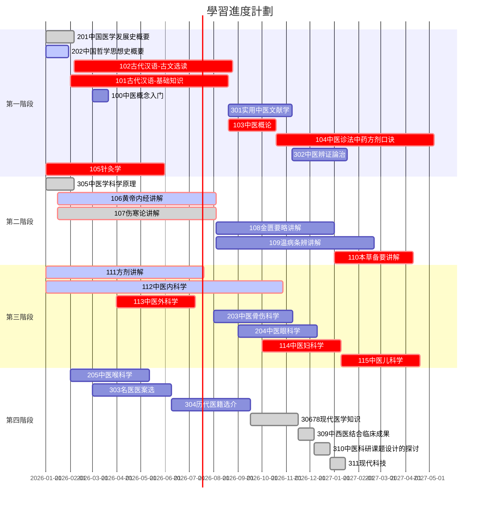

# 光明中醫函授教材

GMZYhsjc

## 簡介

本倉庫用於本人**==自學==**中醫的學習記錄，文件内容可能含有本人自己的**==修改==**，僅供參考。

其他中醫愛好者建議參看`Yuanshi`原始文件内的原版教材掃描件和[光明中醫函授大學](https://www.gmzyjc.com)的教材電子化版倉庫[gmzyjc-md](https://github.com/Franklyzzm/gmzyjc-md)。

光明中医教材在建校之初是28门课，后来加入了《方剂讲解》课程，变成29门，又因为《现代医学》课程包括3门西医课，所以也可以说是31门课程。

現在網校新增小白入門：100《中医概念入门》。

| 序号 | 课程名称                                                     | 學時 |
| ---- | ------------------------------------------------------------ | ---- |
| 1    | 中国医学发展史概要                                           | 36   |
| 2    | 中国哲学思想史概要                                           | 30   |
| 3    | 古代汉语-古文选读                                            | 200  |
| 4    | 古代汉语-基础知识                                            | 200  |
| 5    | 实用中医文献学                                               | 80   |
| 6    | 中医药学概论                                                 | 60   |
| 7    | 中医诊法中药方剂口诀                                         | 200  |
| 8    | 中医临证程序与临床辩证思维方法                               | 70   |
| ---- | -------------------------------                              |      |
| 9    | 中医学科学原理                                               | 36   |
| 10   | **黄帝内经讲解**                                             | 200  |
| 11   | **伤寒论讲解**                                               | 200  |
| 12   | 金匮要略讲解                                                 | 150  |
| 13   | 温病条辨讲解                                                 | 200  |
| 14   | **本草备要讲解**                                             | 100  |
| ---- | -------------------------------                              |      |
| 15   | 中医内科学                                                   | 300  |
| 16   | 中医外科学                                                   | 100  |
| 17   | 中医骨伤科学                                                 | 100  |
| 18   | 中医眼科学                                                   | 100  |
| 19   | 中医妇科学                                                   | 100  |
| 20   | 中医儿科学                                                   | 100  |
| ---- | -------------------------------                              |      |
| 21   | 针灸学                                                       | 150  |
| 22   | 中医喉科学                                                   | 100  |
| 29   | 方剂讲解（后期补充）                                         | 200  |
| 23   | 名医医案选读                                                 | 100  |
| 24   | 现代医学知识（*西医内科学基础*、*人体解剖学*、*人体生理学*） | 150  |
| 25   | 中国历代医籍选介                                             | 100  |
| 26   | 中西医结合临床成果                                           | 20   |
| 27   | 中医科研课题设计的探讨                                       | 20   |
| 28   | 现代科技                                                     | 20   |
|      | **合计31门（序号24包含3门课）36本**                          |      |

## 課程設置

函大开始的时候将课程按重要程度分为考试课、考察课和自修课。考试课要求最高，考察课其次，自修课自学不考。

其中考试课包括14门：**《古代汉语》**、**《古文选读》**、**《中医诊法中药方剂口诀》**、**《中医药学概论》**、**《黄帝内经讲解》**、**《伤寒论讲解》**、**《金匮要略讲解》**、**《温病条辨讲解》**、**《本草备要讲解》**、**《针灸学》**、**《中医内科学》**、**《中医外科学》**、**《中医妇科学》**、**《中医儿科学》**

考查课包括5门：201《中国医学发展史概要》、202《中国哲学思想史概要》、203《中医骨伤科学》、204《中医眼科学》、205《中医喉科学》

自修课11门：《实用中医文献学》、《中医辨證論治(临证程序与临床辨证思维方法)》、《中医学科学原理》、《名医医案选》、《历代医籍选介》、《现代科技》、《中医科研课题设计的探讨》、《*人体生理学*》、《*人体解剖学*》、《*西医内科学*》、《中西医结合临床成果》。

后来根据实践，调整了课程安排，并加入了**《方剂讲解》**课程。

重点课程变成15门：101《古代汉语》、102《古文选读》、103《口诀》、104《中医药学概论》、110《本草备要讲解》、111《方剂讲解》、105《针灸学》、106《黄帝内经讲解》、107《伤寒论讲解》、108《金匮要略讲解》、109《温病条辨讲解》、112《中医内科学》、113《中医外科学》、114《中医妇科学》、115《中医儿科学》。

其中《古代汉语》主要是打下古文基础，为以后阅读更多的古代医籍做准备。《口诀》是整个中医诊治内容的浓缩版，能背诵口诀是合格中医的基本功。

| 100  | 医概念入门                               |      |
| ---- | ---------------------------------------- | ---- |
| 101  | 古代汉语-基础知识                        | 200  |
| 102  | 古代汉语-古文选读                        | 200  |
| 103  | 中医药学概论                             | 60   |
| 104  | 中医诊法中药方剂口诀                     | 200  |
| 105  | 针灸学                                   | 150  |
| 106  | **黄帝内经讲解**                         | 200  |
| 107  | **伤寒论讲解**                           | 200  |
| 108  | 金匮要略讲解                             | 150  |
| 109  | 温病条辨讲解                             | 200  |
| 110  | 本草备要讲解                             | 100  |
| 111  | 方剂讲解（后期补充）                     | 200  |
| 112  | 中医内科学                               | 300  |
| 113  | 中医外科学                               | 100  |
| 114  | 中医妇科学                               | 100  |
| 115  | 中医儿科学                               | 100  |
| ---  | -----------------                        |      |
| 201  | 中国医学发展史概要                       | 36   |
| 202  | 中国哲学思想史概要                       | 30   |
| 203  | 中医骨伤科学                             | 100  |
| 204  | 中医眼科学                               | 100  |
| 205  | 中医喉科学                               | 100  |
| ---  | -----------------                        |      |
| 301  | 实用中医文献学                           | 80   |
| 302  | 中医辨證論治(临证程序与临床辨证思维方法) | 70   |
| 303  | 名医医案选读                             | 100  |
| 304  | 中国历代医籍选介                         | 100  |
| 305  | 中医学科学原理                           | 36   |
| 306  | 现代医学知识（人体解剖学）               | 50   |
| 307  | 现代医学知识（人体生理学）               | 50   |
| 308  | 现代医学知识（西医内科学基础）           | 50   |
| 309  | 中西医结合临床成果                       | 20   |
| 310  | 中医科研课题设计的探讨                   | 20   |
| 311  | 现代科技                                 | 20   |

## 學習順序

<!--program subject course class-->

分爲四個階段：

第一階段：基礎

1. 中醫概念入門（看完一遍20220702，）
2. 中醫概論
3. 中醫診法中藥方劑口訣 及 淺釋
4. 古代漢語
5. 針灸學
6. 

第二階段：經典

第三階段：分類

第四階段：醫案

## 光明中醫 函授教材 導言

中醫教育學，是一門古老而嶄新的科學。中醫教育的歷史，若從師徒授受和毉籍編纂算起，已有兩千餘年。近代史上的中醫教育，首推一八八五年浙江陳虬創立的利濟醫學堂。新中國誕生不久，創辦了北京、上海、廣州和成都四所中醫學院，從而揭開了當代中醫教育的序幕，至現在，全國已發展到二十三所。但是，如果把我國中醫教育的實踐經驗加以分析、研究、總結和提煉、升華卷，揭示它的規律，使之成爲一門專門的學科——中醫教育學的話，那麽，它還處在再創階段。這就是説，中醫教育及其規律存在的歷史是悠久的，但論述中醫教育及其規律的學科卻是嶄新的。因此，中醫教育工作需要進行探索和研究。

在探索和創建適合我國國情的中醫教育的時候，我們必須植根於我們民族文化的肥沃土壤之中，充分重視中醫典籍在培育和造就歷代醫家中偉大作用。事實上，在長期的歷史發展中，逐漸形成了具有中華民族特色的中醫理論體系，它既有豐富臨床經驗，又有高深的理論基礎。歷代醫家就是把這些醫學道理傳授給他們的弟子，其中部分人經過刻苦自學和臨床實踐，成爲醫術高超的醫學家，這是我國歷代醫學家成才之路，亦是中醫教育史上培養人才的寶貴經驗。這就是我們民族中醫教育事業的光輝歷史。

在新的歷史時期，作爲中醫教育工作來説，既要給學生打好傳統醫學的基本功，又要使他們掌握一些新興的科學知識。使繼承與發展得到統一。根據這種認識，我們十分認真地研究和設計了光明中醫函授大學的教學計劃、教材内容、教學方法與教學手段。歸結起來即是：注重打好中醫基本功，注意提高中醫基本理論水平和培養臨床診治技能，著力培養辨證論治的思維方法，竭誠發揮中醫在防病治病中的特長。並在這個基礎上，擴大學員知識面。我們把這些要求與思想，全面體現在本校的教材建設中。其目的是使中醫人才的知識結構更加合理，以便能擔負起繼承和發揚祖國醫學防病治病的光榮任務。

在回顧中華民族醫學教育歷史，展望現代醫學教育的發展趨勢以及總結三十多年正反兩方面經驗的基礎上，我們認爲，要培養出適合四化需要的合格中醫人才，對中醫教育的課程設置和教材内容，就要進行必要的改革，建立起為新形勢下所需要的中醫教材。我們正在朝這一方向努力。在認真研究高等中醫院校教材和廣汎徵詢中醫專家、學者和醫務人員意見的基礎上，新編了這套較爲完整的中醫教材，定名為《高等中醫函授教材》（包括了二十九門課程），教材的編寫人員，由本校選聘知名教授、學者和學有專長者擔任，編寫時，我們力求各門教材要有鮮明的針對性，在内容上富有實用性，在文字表達上深入淺出、簡明易懂，以便利于自學或函授。此外，我們還將根據需要，選編一些輔導材料，以幫助學員（讀者）理解教材内容，更好地擷取中醫知識。

由於教材編寫時間倉促，由竭力於繼承和創新，不足之處在所難免，敬希學員和廣大讀者惠贈寶貴意見，以便在再版時修訂。

光明中醫函授大學教育研究室

一九八五年五月二十日

## 參考書

黃帝內經·素問

黃帝內經·靈樞

難經

神農本草經

鍼灸甲乙經

針灸大成

脈經

傷寒論

金匱要略

