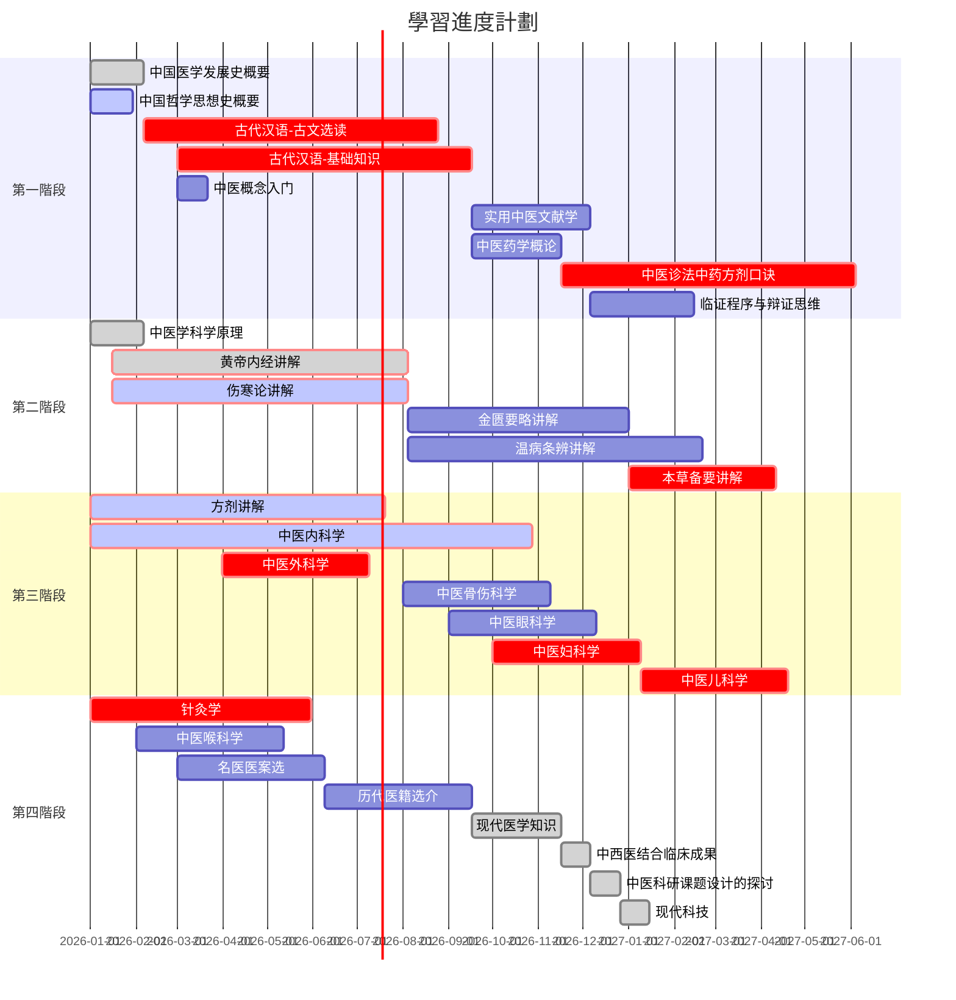

# 光明中醫函授教材

GMZYhsjc

## 簡介

本倉庫用於本人**==自學==**中醫的學習記錄，文件内容可能含有本人自己的**==修改==**，僅供參考。

其他中醫愛好者建議參看`Yuanshi`原始文件内的原版教材掃描件和[光明中醫函授大學](https://www.gmzyjc.com)的教材電子化版倉庫[gmzyjc-md](https://github.com/Franklyzzm/gmzyjc-md)。

光明中医教材在建校之初是28门课，后来加入了《方剂讲解》课程，变成29门，又因为《现代医学》课程包括3门西医课，所以也可以说是31门课程。

現在網校新增小白入門：《中医概念入门》。

| 序号   | 课程名称                              | 學時  |
| ---- | --------------------------------- | --- |
| 1    | 中国医学发展史概要                         | 36  |
| 2    | 中国哲学思想史概要                         | 30  |
| 3    | 古代汉语-古文选读                         | 200 |
| 4    | 古代汉语-基础知识                         | 200 |
| 5    | 实用中医文献学                           | 80  |
| 6    | 中医药学概论                            | 60  |
| 7    | 中医诊法中药方剂口诀                        | 200 |
| 8    | 中医临证程序与临床辩证思维方法                   | 70  |
| ---- | -------------------------------   |     |
| 9    | 中医学科学原理                           | 36  |
| 10   | 黄帝内经讲解                            | 200 |
| 11   | 伤寒论讲解                             | 200 |
| 12   | 金匮要略讲解                            | 150 |
| 13   | 温病条辨讲解                            | 200 |
| 14   | 本草备要讲解                            | 100 |
| ---- | -------------------------------   |     |
| 15   | 中医内科学                             | 300 |
| 16   | 中医外科学                             | 100 |
| 17   | 中医骨伤科学                            | 100 |
| 18   | 中医眼科学                             | 100 |
| 19   | 中医妇科学                             | 100 |
| 20   | 中医儿科学                             | 100 |
| ---- | -------------------------------   |     |
| 21   | 针灸学                               | 150 |
| 22   | 中医喉科学                             | 100 |
| 29   | 方剂讲解（后期补充）                        | 200 |
| 23   | 名医医案选读                            | 100 |
| 24   | 现代医学知识（*西医内科学基础*、*人体解剖学*、*人体生理学*） | 150 |
| 25   | 中国历代医籍选介                          | 100 |
| 26   | 中西医结合临床成果                         | 20  |
| 27   | 中医科研课题设计的探讨                       | 20  |
| 28   | 现代科技                              | 20  |
|      | 合计31门（序号24包含3门课）36本               |     |

## 課程設置

函大开始的时候将课程按重要程度分为考试课、考察课和自修课。考试课要求最高，考察课其次，自修课自学不考。

其中考试课包括14门：**《古代汉语》**、**《古文选读》**、**《中医诊法中药方剂口诀》**、**《中医药学概论》**、**《黄帝内经讲解》**、**《伤寒论讲解》**、**《金匮要略讲解》**、**《温病条辨讲解》**、**《本草备要讲解》**、**《针灸学》**、**《中医内科学》**、**《中医外科学》**、**《中医妇科学》**、**《中医儿科学》**

考查课包括5门：《中国医学发展史概要》、《中国哲学思想史概要》、《中医喉科学》、《中医眼科学》、《中医骨伤科学》

自修课11门：《实用中医文献学》、《临证程序与辩证思维》、《中医学科学原理》、《名医医案选》、《历代医籍选介》、《现代科技》、《中医科研课题设计的探讨》、《*人体生理学*》、《*人体解剖学*》、《*西医内科学*》、《中西医结合临床成果》。

后来根据实践，调整了课程安排，并加入了**《方剂讲解》**课程。

重点课程变成15门：《古文选读》、《古代汉语》、《口诀》、《中医药学概论》、《本草备要讲解》、《方剂讲解》、《黄帝内经讲解》、《伤寒论讲解》、《金匮要略讲解》、《温病条辨讲解》、《中医内科学》、《中医外科学》、《中医妇科学》、《中医儿科学》、《针灸学》。

其中《古代汉语》主要是打下古文基础，为以后阅读更多的古代医籍做准备。《口诀》是整个中医诊治内容的浓缩版，能背诵口诀是合格中医的基本功。

## 學習順序

<!--program subject course class-->

分爲四個階段：

第一階段：基礎

1. 中醫概念入門（看完一遍20220702，）
2. 中醫藥學概論
3. 中醫針法珍法中藥方劑口訣 及 淺釋
4. 古代漢語
5. 

第二階段：經典

第三階段：分類

第四階段：醫案

