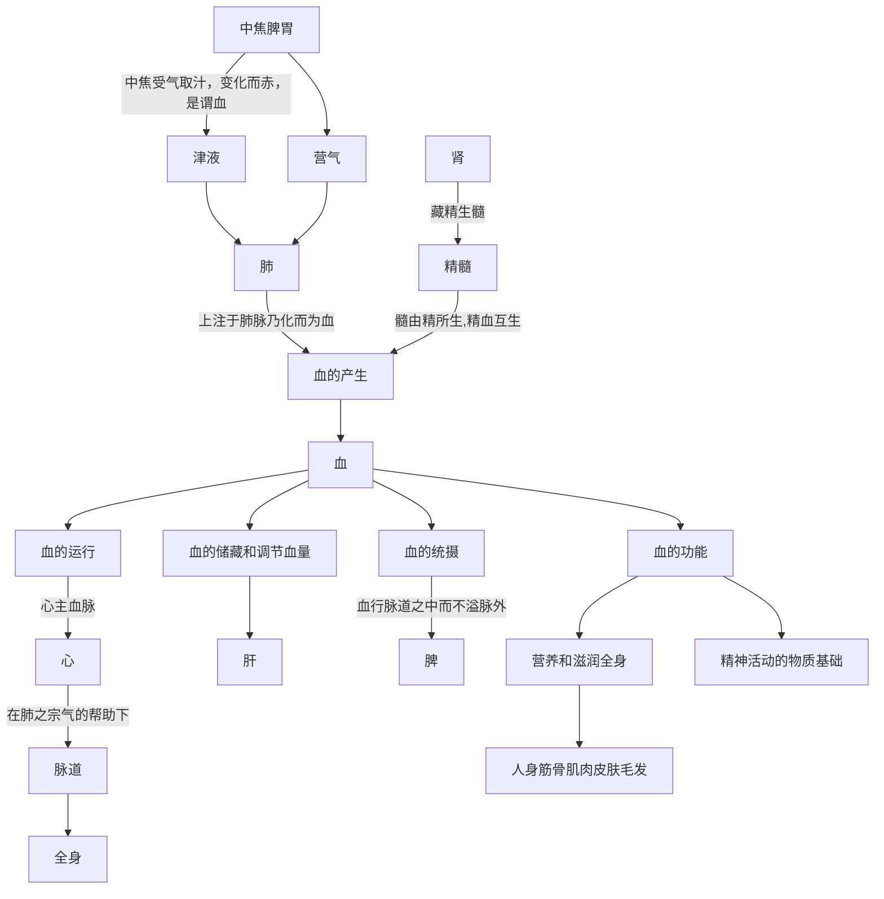

# 第三章 人体基本概念

**目錄**

[TOC]

## 3.1、人体基本概念及运转机制

前面天地自然章节提到自然界有两大平衡需要重点关注，即日地平衡和天地平衡。日地平衡是能量与物质的平衡，即太阳能量与自然界物质形成的适度配合状态。天地平衡是气态物质与固液态物质的适度配合状态。

而人体需要维持相对恒定的体温，形成适宜的体内环境，也有这两类平衡，其原理与自然界很相似，所以称人体是一个小自然。 

人体的阴与阳，大多情况下是指物质与能量。人体阴阳平衡就是人体的能量与物质像自然界的阳光与水土一样，处于一种合适的配合状态。

> “**阳**”，指物质的**能量**。阳可以把物质转化为精微之气，以促进万物的生长；转化为动力，以促进人体的生命活动，所以称为“阳化气”；“**阴**”，指**有形可见的物质**（如精、血、津液等），它可以充养形体组织，有促进万物成长壮大的作用，所以又称为“阴成形”。
>
> 《黄帝内经讲解-阴阳的性质和作用》

又因阴阳术语在中医学中广泛应用，所以阴阳也可指人体的其它方面，需要具体情况具体分析。比如阴阳有时用来代表内外部位、气态物质与固液态物质、功能的低沉或亢奋、干扰平衡的因素性质等等。

在进一步介绍人体机制之前，因中医有一些专用名词，初学者不一定了解，所以需要先对这些名称做一个初步介绍。

### 1、基本概念

#### 1.1、形

肉眼可见的人体组织器官都属于形，包括皮、肉、筋、骨、脏腑器官等，对应自然界的土壤。

#### 1.2、津、液、痰、饮

人体内的水，中医称为津液，对应自然界的水。

干净的水进入体内，与营养物质混合，滋润各个脏腑组织，然后携带代谢废物，主要以小便的形式，辅以汗液等形式排出体外。

其中清稀的为津，粘稠的为液。

津流动性强，偏表，布散于体表皮肤、肌肉和孔窍，并能渗注于血脉，起滋润作用。

液流动性小，偏里，灌注于骨节、脏腑、脑、髓等组织，起濡养作用

该有的水不够，为虚，称为津液虚。

不该有的水聚集，为实，叫痰饮。一般将稠厚的叫痰，清稀的叫饮。

#### 1.3、血与淤血

血是水与营养物质混合形成的赤色液态物质，在心肺的共同作用下，在血管中通行全身，具有濡养全身脏腑组织的功能，也对应自然界的水。

血为气之母，血能滋养气。

该有的血不够，为虚，称为血虚。

血的瘀滞，为实，称为淤血。

淤血与上面提到的痰饮即是身体机能不正常后的病理产物，又会直接或间接的影响脏腑组织的功能，成为新的病因。

#### 1.4、元气

元气是人体的的初始能量，对应于自然界的阳光。正像阳光的作用是给自然界的土壤、水、空气提供能量一样，人体的元气给形、津液、血、气态物质提供能量，形成合适的人体内环境，各个器官才能完成各自的生命活动

> 元气，又称“原气”、“真气”。是人体诸气中最基本，最重要的气，是人体生命活动的原动力。元气来源于肾，为先天之精所化，又赖后天水谷精气的滋养和补充。
>
> 《中医药学概论-藏象-气》

> **阳气者若天与日，失其所则折寿而不彰，故天运当以日光明。是故阳因而上，卫外者也。**
>
> ——《素问•生气通天论》
>
> *由于生命活动的存在，不能一时一刻离开阳气，故后世医家把肾中阳气视为“立命之本”，称之为真阳，真火。可见阳气代表着人体具有阳性特征的精微物质，及其产生的热能和动力。它的物质基础是精，它的属性是火，来源于先天，但要靠后天的补充和营养。《内经》作者在此以天空和太阳的关系作比喻，形象地说明人体阳气的重要性。因为自然界的运动，万物的生长，都离不开太阳，它的光和热，为地球上一切生命活动提供了生存的条件。*
>
> 《黄帝内经讲解-阴阳学说-（十六）阳气的重要性》

#### 1.5、天气、地气

人体的固、液态物质为地气，包括形、津液、血等。人体中的气态物质为天气，包含自然空气以及血、津液蒸化而成的气态物质等。

津液、血由液态转化为气态物质，就成为天气的一部分。空气溶于津液、血中就成为地气的一部分。这就是人体中的天地平衡。

人体中全身各处都有天气、地气存在，但因两者特性的不同，可以分出多种天地关系。天气倾向于向外、向上，地气倾向于向内、向下，从此角度对人体进行划分的话，人体的肌表、四肢等形体属天，五脏六腑属地；上窍属天，下窍属地；上半身属天，下半身属地；三焦中的上焦属天，中下焦属地；脏腑对比的话，腑属天，脏属地。

> **阳者，天气也，主外；阴者，地气也，主内。故阳道实，阴道虚。**
>
> ——《素问•太阴阳明论》

这里的属天指的是相对而言，气态物质的比例高一些或者作用强一些。属地则相反。这种方式定义的几种天地，相互之间都有类似自然界气交之地的交互形式，包括物质交互和能量交互等。比如脏腑之间，腑包括胃、大小肠、胆、膀胱等，都是空腔器官，属天，里面有较多气态物质；脏包括肝、心、脾、肺、肾，为实体器官，属地，相对而言气态物质比较少，固液态物质比较多。脏腑之间互为表里，有频繁的物质或能量的交互。

**一般我们谈气这个名词，如果不特殊说明，指的是气态物质，也就是天气**。在中医中，气态物质的作用非常大，其范畴远远超出现代医学研究的范畴。气虚就是气态物质不足，会影响人的很多功能。

> 黄帝曰：余闻天为阳，地为阴，日为阳，月为阴，其合之于人，奈何？
> 岐伯曰：***腰以上为天*，腰以下为地**，
>
> ——《黄帝内经•灵枢•阴阳系日月第四十一》

> 夫言人之阴阳，则**外为阳，内为阴**。言人身之阴阳，则背为阳，腹为阴。言人身之藏府中阴阳，则藏者为阴，府者为阳。肝心脾肺肾五藏皆为阴，胆、胃、大肠、小肠、膀胱、三焦六府皆为阳。所以欲知阴中之阴，阳中之阳者何也？为冬病在阴，夏病在阳，春病在阴，秋病在阳，皆视其所在，为施针石也。故背为阳，阳中之阳，心也；背为阳，阳中之阴，肺也；腹为阴，阴中之阴，肾也；腹为阴，阴中之阳，肝也；腹为阴，阴中之至阴，脾也。**此皆阴阳表里内外雌雄相输应**也，故以**应天之阴阳也**。
>
> ——《黄帝内经•素问•金匮真言论》

> **清阳出上窍，浊阴出下窍；清阳发腠理，浊阴走五藏；清阳实四肢，浊阴归六府。**
>
> ——《黄帝内经•素问•阴阳应象大论》

> 岐伯对曰：脑、髓、骨、脉、胆、女子胞，此六者，**地气之所生也。皆脏于阴而象于地，故藏而不泻**，名曰奇恒之府。
>
> 夫胃、大肠、小肠、三焦、膀胱，此五者天气之所生也，**其气象天**，故泻而不藏。此**受五藏浊气**，名曰传化之府，此不能久留，输泻者也。
>
> ——《黄帝内经•素问•五藏别论篇第十一》

> **上焦如雾**，中焦如沤，下焦如渎。
>
> ——《黄帝内经•灵枢•营卫生会》

> 何谓气？岐伯曰：**上焦开发，宣五谷味**，熏肤，充身，泽毛，若**雾露之溉**，是谓气。
>
> ——《黄帝内经•灵枢•决气》

> 饮入于胃，**游溢精气，上输于脾**，**脾气散精，上归于肺**，通调水道，下输膀胱。水精四布，五经并行。合于四时五藏阴阳，揆度以为常也。
>
> ——《黄帝内经•素问•经脉别论》

> 阳的**化气过程**，即是把体内有形之质，化为无形之气，或转化为能量，如“**精化为气**”，“**水化为气**”等等，都依赖于阳的气化作用；阴的**成形过程**，即是把外界的物质，合成自身的形质，如精血的生成，形体的发育等等，都要依靠阴的成形作用。
>
> 《黄帝内经讲解-阴阳学说-（十二）阴阳的性质和作用》

#### 1.6、精

人体的元气与自然界阳光相对应，都是初始能量。但是阳光来自于太阳物质的核聚变反应，而人体的元气来自于哪里呢？中医认为人体的元气来源于精。

在我们教材的定义中，广义的精，泛指一切精微物质，包括气、血、津液及水谷精微，存在于全身各处。

狭义的精指一种比血更精华的物质，可以理解为血的提炼浓缩品，以肾藏的精为主、脏腑、全身皆有。这里主要指狭义的精。

精可以与能量(元气)进行相互转化。在需要能量的时候精转化为能量（精化气），也可以在能量充足的时候，把能量存储起来（气化精）。所以精类似现代能源的概念。

> 肾中之精，对各个脏腑的功能活动起着极其重要的作用。中医学认为：精气之间是可以而且能够相互转化的，故有“精可化气”、“气可生精”的说法，其中，肾精与肾气之间亦可相互转化，故中医古籍中，“肾气”与“肾精”常可互称。
>
> 《中医药学概论-肾、膀胱》

另外精血同源，二者是可以互相转化，精可以稀释为血，血可以浓缩为精。所以在血不足的时候，精可以转化为血作为补充。

> 肾藏五脏六腑之精及生殖之精，主骨生髓精髓互生，精血同源，故**精能生血，血可化精**，二者相互资生。
>
> 《中医妇科学》

> 肝藏血，肾藏精，精血之间相互滋生、相互转化，故有“肝肾同源，乙癸同治”之说。
>
> 《中医药学概论-肝与肾的关系》

由此可见，精是非常重要的，其既可以补阴又可以补阳。因为精大量藏于肾，所以精充足与否主要看肾精是否充足。若肾精充足，则可以补人一身的元气和阴血，使各个脏腑的阴阳都不虚，人就不容易衰老。因此《内经》以肾精的充足与否作为年轻与衰老的标志。

> 肾中所藏之精，为人生命之源，对人体的生长发育与生殖，起着极为重要的作用。
>
> > 《素问•上古天真论》说：“女子七岁，**肾气盛**，齿更髮长；二七而天癸至，任脉通，太冲脉盛，月事以时下，故有子；三七，**肾气平均**，故真牙生而长极；四七，筋骨坚，髮长极，身体盛壮；五七，阳明脉衰，面始焦，髮始堕；六七，三阳脉衰于上，面皆焦，髮始白；七七，任脉虚，太冲脉衰少，天癸竭，地道不通，故形坏而无子也。丈夫八岁，**肾气实**，髮长齿更，二八，**肾气盛**，天癸至，精气溢泻，阴阳和，故能有子；三八，**肾气平均**，筋骨劲强，故真牙生而长极；四八，筋骨隆盛，肌肉满壮；五八，**肾气衰**，髮堕齿槁；六八，阳气衰竭于上，面焦，髮鬓颁白；七八，肝气衰，筋不能动，天癸竭，**精少**，肾脏衰，形体皆极；八八、则齿髮去”。
>
> 此段论述，指出了人体的生、长、壮、老、已的自然规律，与**肾中精气的盛衰**密切相关。
>
> 《中医药学概论-肾、膀胱》

除了转化元气和阴血的功能外，精的其它功能还包括：

- 主导人的生长发育，精不足小儿五迟，青春期发育不良。
- 主导人的生殖功能，决定能否有子。
- 精可以生髓，包括骨髓、脊髓和脑髓（髓由精而生，由液作为补充）

#### 1.7、神

神是人体的管理者，可以调动气、血、津液等资源完成各种功能，对人体的各种平衡起到控制、管理作用。神主要藏于心，五脏皆有。

> 心在人体诸脏腑中居于首要的地位，对各个脏腑的功能活动起到统领与调节的作用。《灵枢•邪客》说：“心者，五脏六腑之大主，精神之所舍”。《素问•灵兰秘典论》说：“心者，君主之官也，神明出焉。……故主明则下安，……主不明则十二官危”。都突出强调了心在脏腑中的统帅作用。
>
> 《中医药学概论-心、小肠》

#### 1.8、腠理

腠理是肌表、肌肉、脏腑之间的间隙和纹理。因中医非常关注气态物质，所以腠理这种能流通气态物质的组织间隙对中医有重要作用。

> **腠者，是三焦通会元真之处，为血气所注；理者，是皮肤脏腑之文理也。**...
>
> 所谓腠理，腠，是三焦交通融会元真的地方，又是血气所灌注的处所；理，是皮肤肌肉的纹理。总之，腠理是营卫气血交会出入的门户，又是抗御外邪的屏障。
>
> 《金匮要略讲解》 

### 2、运转机制概述

#### 2.1、基本原理

人体的要素包括精、神、气、血、津液、元气等，这些要素是如何配合形成适宜的体内环境呢？这个问题是中医的核心问题，也是学习中医的几大难点之一。

人体像一个温室花园，其保持温度的原理和北方家庭用暖气片进行烧水取暖有相似之处，我们将两者进行对比讲解。

为了容易理解，我们按照最简单的暖气的原理进行说明。假如有一个30平米的房间，在北方的冬天，房间想维持在22度左右的适宜温度。经过计算，需要一组暖气片来取暖，暖气片里的水是80公斤。然后用炉火给暖气片里的水加热。炉火用的是相当于60千瓦功率的煤气灶，由煤气罐中的液化气做燃料。有一个控制系统用来根据室温调节炉火的大小，以保证室温不会偏差太大。

这个例子中有几个指标需要平衡，缺一不可。

1、根据房间的面积，暖气需要提供一定范围内的热量。此热量过高则房间过热，过低则房间过冷。

2、根据所需的热量，暖气里的水量需要在一定范围之内。过少、过多都不能提供所需的热量。

3、炉火的大小需要在一定范围之内，过小则不能将水加热，过大则容易把水烧干。

4、煤气罐中的液化气要足够，否则不能提供足够的火量。

5、控制系统的控制能力要正常，在火量调节方面不能出现大的偏差。

人体这个房间要维持相对恒定的温度，维持体温就需要热量，热量由气、血、津液带来，其中血和津液相当于上面例子中的水，气相当于水蒸汽和被加热后房间空气。气、血、津液的热量由元气给予，元气相当于上面例子中的炉火，是原动力。元气由精产生，精相当于上面例子中的液化气，是人体的能源。神则类似控制器，起到管理调节作用。

阴指固液气三态的**物质**，特别是津液、血这类液体。阳指**能量**，这里指元气。阴虚主要指血、津液的量低于正常范围，对应暖气里的水量不足。水量不足而火量不变的话，容易烧干，也就是阴虚火旺。这种情况会有一系列表现可供判断，比如从舌像上看，舌色暗红呈紫色等等。更多诊断方法可参考教材《概论-诊断》内容。调理方法是加水补阴了。

阳虚就是元气的量低于正常范围，对应暖气例子里的炉火不足。火不足，则水烧不热，所以屋子寒凉。其表现有怕冷，舌色淡白等。调理方法是调大阀门，让火旺起来，就是补阳了。

如果阴阳都不足，对应暖气的水和火的量都不足，则需阴阳双补。

几种要素中，气与血是营养身体的直接因素。血是营养身体器官的特别重要的液态物质。气是推动人体各项功能的直接动力。元气与气态物质的关系就像蒸汽机，火作用于水而产生蒸汽，火虽然是原动力，但是最终起直接作用的是蒸汽。人体元气虽然是原动力，但是对组织器官起直接作用的还是气态物质。所以元气能量之阳与物质之阴适度配合产生足够的气血，进而形成适宜的体内环境。

由此可知，气、血、阴、阳的不足是中医虚证的主要原因，其中气、血虚为轻，阴、阳虚为重，对应则有补气、补血、补阴、补阳的方剂。

> 补益的方法很多，在临证应用时主要针对气、血、阴、阳之虚而为补气、补血、气血两补、补阴、补阳等法。
>
> 《方剂讲解-补益剂》

因为气血比较有代表性，所以**气血充足通常标志精、神、元气、津液等其它要素也充足**。反之若气血不足，则需详细查找原因，看哪个要素出问题导致了气血不足。

人体任何部位都涉及到能量与固、液、气三态的相互作用与转化，所以这是中医理论中人体平衡的基本原理。

以上是各要素配合的基本原理，若进一步细化的话，需要参照天地自然章节的内容。所以我们先回顾一下自然界的平衡过程。 

自然界以土壤、水、空气、阳光为四大平衡指标。其中以阳光的多少最为多变，阳光的多少形成三阴三阳。阳光能量传递给地气和天气，天气获得能量后，气温在一个范围内波动，形成六气风热暑湿燥寒。地气获得能量后，温度波动，形成五运木火土金水。天气地气升浮降沉，云升雨降，形成气交之地的自然界。

人体也是如此，人体的元气作为初始能量，通过三焦和经络散布全身。全身根据元气分布多少形成三阴三阳六个区域。人体内地气也分五运木、火、土、金、水；天气分六气风、热、暑、湿、燥、寒。正常情况下，人体的天气地气各自都是平衡无偏的。 

如果人体天气地气受某些因素影响，比如内伤七情、外感六淫等等，则可能失衡。对于这种失衡的描述方式，如果是天气，则有中风、伤寒、中暑等，若有两种以上天气失衡，则有风湿、寒湿、风寒、湿热、暑湿等等描述方法。如果是地气，则有金气太过、火气过旺、水气不足等等描述方法。 

人体内到脏腑、外到皮肉筋骨，全身各处都要求精、神、元气、天气、地气都有合适的度，才能形成适宜的体内环境，各种器官组织才能正常工作。**这些要素即是中医所说的正气**。人体正气足代表各要素充足且配合协调，所以维持人体环境平衡、抵御失衡的能力强。邪气一词则包括所有破坏平衡的要素，包括不该有的气态物质、痰饮瘀血等液态物质、不正常的固态物质、过度的能量以及各种毒素等等。正气与邪气的关系其实就是维持平衡与破坏平衡的关系。正气的力量大于邪气的力量，人就能保持健康；反之则发病，甚至死亡。

#### 2.2、资源运转

人体各处都需要气血，而这些资源是由饮食以及呼吸的空气转化而来，转化过程中任何一个环节出错，都会导致正气不足，进而引发疾病。因此必须熟悉这些资源的产生、传递过程。

首先，按照资源的传递过程划分，人体可以划分为两大部分：资源使用者和资源生产者

所谓资源使用者，指的是**四肢、头部、感官、皮、肉、筋、骨等部位，简称为形体**。这些部位本身不产生资源，主要是使用资源来完成人体运动、思维、感受等功能。

所谓资源生产者，指的是胸腹腔内的脏、腑。脏、腑的主要功能是产生和存储资源，供给形体来使用。当然脏腑本身也消耗资源。

如下图所示：

饮食、空气进入脏腑处理后，产生能量和物资，供给形体，用来进行各种生命活动。这是人体资源的大致流转过程。

下面分别说明。

##### 2.2.1、脏腑

脏腑负责资源的处理与存储，其中脏与腑的功能可以进行一个大致的区分。

腑主导饮食的消化，从饮食中提炼出营养物质、水分、能源等，剩余的残渣排除体外。这个过程，中医称为“化物”，类似炼油厂从石油中提炼出各种有用的物质，剩余的沥青还可以用来铺设公路。内经说“腑化物而不藏”。

> 李东垣说：“元气之充足，皆由脾胃之气无所伤，而后能滋养元气。若胃气之本弱，饮食自倍，则脾胃之气即伤，而元气亦不能充。”（《脾胃论》）

而脏则对腑提取出的精华物质进行存储、处理和分配，使其能正确的输送到全身。脏存储精华物质的功能，中医称为“藏精”，内经说“脏藏精气而不泄”。

> **五脏的主要功能是藏精气**，而六腑则主要是传化水谷，排出糟粕。五脏的功能特点是“藏而不泻”，故“满而不实”；六腑的功能特点是“传化物而不藏”，故“实而不满”。此处**“满”是指精气而言**，“实”是指水谷而论。
>
> 《中医药学概论-藏象-五脏六腑》

脏腑对比而言，腑的气态物质多，而脏的固液态物质多，所以两者之间，腑为天，脏为地。

##### 2.2.2、形体

形体也包括固液态物质和气态物质，也有自身的天地划分。固液态物质包括皮、肉、筋、骨、脉、髓、血、津液等等。气态物质则包括自然空气、血和水的蒸汽等等，这些气态物质用宗气、营气、卫气、脏腑之气等名词描述，详细见后面章节。

在中医理论中，液态物质由气态物质统帅，即血、水等液态物质的运行由气态物质推动和维护，称为“气为血之帅”。所以形体健康以气的正常运行为主要因素。慢性疾病往往是以气的失常为先导，逐渐波及液态的津液和血，再延伸至固态的形体组织。

> “故治病以理气为先，而用药以通络为主。盖人之经络不通，则转输不捷，药不能尽其功。
>
> 韦协梦《医论三十篇》

另外，因液态物质与气态物质可以互相转化，所以血也是气的一个来源，称为“血为气之母”。人在意外大量失血的时候，气也跟随减少，需要补血兼补气。

##### 2.2.3、通道

脏腑与形体之间的资源交互要有通道。元气、血、津液、气态物质各有其通道。

津液以三焦为通道，所以三焦称为水道。血以血管为通道，所以血管也可以叫血脉。气态物质以经络为通道，所以经络也可以叫气脉。

元气以三焦为通道，所以三焦也是元气通道。另外，元气是能量，作用于血、津液、气态物质，所以也可以说各种通道都携带了元气。

各种通道中，以经络通道为最重要，这是因为经络中运行的气态物质有统帅作用，可以带动血、津液的通畅。所以广义的经络系统包含了前面的三焦、血脉等通道。

##### 2.2.4、小结

从部位角度看，脏腑与形体是人体比较大的一对阴阳关系。脏腑为阴，形体为阳。

脏腑为阴，负责将外界的饮食、空气转化为精气血并存储，像地，以五行划分，即木、火、土、金、水；其中脏为阴中之阴，腑为阴中之阳。因脏腑以固液态物质为根本，所以阴中之阴的脏为主。

形体为阳，接受脏腑传输来的各种资源，进行使用消耗，像天，以六气划分，即厥阴风木、少阳相火、少阴君火、太阴湿土、阳明燥金、太阳寒水。其中气态物质为阳中之阳，津血皮肉筋骨为阳中之阴。因形体以气态物质为主导，所以以阳中之阳的气态物质为主导，即经络通畅为关键。

光明教材的《中医药学概论》第二章为藏象，第三章为经络，就体现了这两者的重要性。脏腑为形体的根本，两者之间就像树根与枝干的关系。如果脏腑健康，形体有问题，病情相对轻。如果脏腑有问题，即便形体看似健康，病情也相对重。

#### 2.3、小节

中医的核心原理即“辩证论治”与“整体观”，两者分别对应本节的两项内容。

“基本原理”中谈到各大要素配合形成适宜体内环境。若这些要素失衡，则不能形成适宜体内环境，即为“证”。证包括虚、实两大类，该有的要素不足即为虚，干扰平衡的因素即为实。分析具体失衡情况，并给出对应调节方法，即为“辩证论治”。

“资源运转”中谈到的内在脏腑产生要素供给外在形体，因此在调理身体、治疗疾病的时候，需要考虑这种因果关系，不能只着眼于一处的病证，需要整体考虑要素的产生与传递关系，寻找真正的根源问题，即为“整体观”。

### 3、小結

人体作为一个小自然，与大自然对比理解的话。

大自然的日地平衡，即能量与物质的平衡关系。此平衡在人体为人体元气能量与人体物质的平衡，对于维持人体温度至关重要。

大自然的天地平衡，即气态物质与固液态物质的平衡。此平衡在人为人体气态物质与固液态物质的平衡，即气与血、津液的关系，对于人体行使各种生理功能至关重要。

另外，人体小自然还有内在脏腑产生资源与外在形体消耗资源的平衡，此关系代表了人体的总体健康程度。

以上几种主要平衡关系，中医皆用阴阳概念来表达，如不能清晰理解其内在机理，则容易产生各种误解。

本篇内容只为让大家对人体中医机理有宏观理解，下面要对精、气、神、血、津液等几种资源的产生与流转做更详细的叙述。

### 题目

1. 人体维持正常的体内环境，需要形、津液、 __ __ 、气态物质、元气、精、神等要素互相配合，协同工作才能完成。

2. 脏腑提供了维持体内环境的要素，其中 __ __ 负责从饮食中提取精华，排除糟粕； __ __ 负责对精华物质进行存储、处理和分配。

答：

1. 氣血、
2. 六腑，五臟

## 3.2、津液

### 1、津液的代谢过程

关于津液在人体的代谢过程，中医主要依据《内经》、《难经》等经典中的相关论述。光明教材已经整理出了津液流转的大致过程，如下图所示：

#### 1.1、津液代谢图

绿色的线为清，黑色的线为浊。虚线代表循环使用的水。

#### 1.2、水的吸收过程

水入胃后，通过脾气的转输，分别归藏五脏，变化而为五脏各自所主的水液。

> 五液来源于水谷，通过脾气的转输，分别归藏五脏，变化而为五脏各自所主的水液，濡润相关的空窍，是谓五脏化液。
>
> 《黄帝内经讲解-藏象学说-五脏与五液的关系》

未被胃吸收的水液进入小肠，小肠中偏清的部分也通过脾上升到肺。偏浊的部分进入回肠、大肠，在此有一部分进入膀胱，剩余的随大便排出体外。

#### 1.3、水的循环过程

脾将水液以气雾的状态上升到肺。肺为水之上源，类似一栋大楼的水塔，负责水的分配。此处的水偏清的部分通过肺的**宣发**作用，到达皮毛。这种宣发作用似乎是以气态的形式进行。偏浊的部分通过三焦散布到全身，此过程称为**肃降**。

三焦为水液通道，类似大楼里的水管和水蒸气的通道。

形体中的津液代谢后的形成浊水，浊水归于肾。肾类似废水处理厂，对浊水进行过滤，过滤后的浊水进入膀胱；过滤后的清水通过三焦水道又回到肺，通过肺进行再次分配。

膀胱中的水在阳气作用下还进行一次清浊分离，清者上升到肺，浊者成为小便排出。

> 膀胱贮留的水液，在肾阳的气化作用下，其清者上升于肺，复经肺之宣发，参与全身的水液代谢。其浊者，又在肾阳的气化作用下，变化为尿，排出体外。故膀胱所藏水液复归于肺与排出体外，都是肾阳气化作用的具体表现，所以说“气化则能出焉”。
>
> 《黄帝内经讲解-藏象学说-十二脏的生理功能及其相互关系》

#### 1.4、资料

> 饮入于胃，经过胃“游溢精气”，上输于脾；
>
> 脾主运化，为胃行其津液，上输于肺；
>
> 肺为水之上源，通调水道，津液通过肺的宣发与肃降，敷布体表，输精于皮毛，**同时下输于膀胱**，
>
> 再经肾的蒸腾化气，使清升浊降，**清者布散全身**，浊者化为尿液，排出体外，
>
> 从而，完成水液在体内的代谢。
>
> 《中医药学概论-藏象-津液》

> 为水液运行之道路 《素问·灵兰秘典论》说：“三焦者，决渎之官，水道出焉”。决，疏通之意；渎，沟渠。决渎，即疏通沟渠。这就是说，**三焦有疏通沟渠、运行水液的作用，是水液运行的道路**。若三焦功能正常，则水道通利，水液的运行正常，若三焦不利，则水道不通，水邪泛滥，则可出现肿胀等证。
>
> 《中医药学概论-藏象-三焦》

> 水有清浊，清者上升，浊者下降。清中有浊，浊中有清。
>
> **上升于肺之水，为清**。
>
> ​	清中之清者，由**肺输至皮毛**；
>
> ​	清中之浊者，从**三焦决渎下行以达于肾**。
>
> ​	**归肾之水液为浊。**
>
> ​	浊中之浊者，由**膀胱排出体外**；
>
> ​	浊中之清者，再经**三焦上升至肺**、**复由肺化水下降至肾**，**如此循环**，以维持人体水液代谢的平衡。
>
> 水液的升清降浊，需赖肾阳的气化作用才能进行，膀胱排泄无用水液的作用也需赖肾阳的气化作用。如果肾阳气化失司，水液升降失常，膀胱开合不利，必然导致水液代谢调节障碍。如肾中阳气不足，气化功能失常，可引起小便不利，水液流于四肢、皮肤肌肉为肿，溢于心肺为心悸喘急，甚则引起小便闭结，点滴不通，临床都以温肾扶阳为其施治大法。
>
> 《黄帝内经讲解-藏象学说-肾为水脏、主津液代谢》

> **中焦亦并胃中，出上焦之后，此所受气者，泌糟粕，蒸津液，化其精微，上注于肺脉，乃化而为血，以奉生身，莫贵于此，故独得行于经隧，命曰营气。**
>
> **中焦**受纳水谷，并对水谷进行消化，泌别糟粕，**蒸化津液**，化生精微，**向上转输于肺脉**。水谷所化生的**精微与津液**相和合，乃化生为血液。
>
> **下焦者，别回肠，注于膀胱而渗入焉。故水谷者，常并居者胃中，成糟粕，而俱下于大肠，而成下焦，渗而俱下，济泌别汁，循下焦而渗入膀胱焉。**
>
> 回肠，包括小肠的下端和大肠的上端，在脐部向左回曲环绕，象树叶一样重迭而下，回行环绕，有十六个弯曲。从部位言，下焦指胃下口以下，包括大小肠、肝、肾、膀胱等。从功能言，水谷受盛于中焦胃，然后转输下焦小肠，进一步消化吸收，糟粕别行于回肠，然后排出体外，**水液也在回肠别渗于膀胱**。
>
> 其次，水液代谢的平衡，虽然必须赖肺、脾、肾、胃、大小肠、膀胱等许多脏腑共同发挥输布，调节水液的功能才能完成，但**必须以三焦为通道**，才能进行。
>
> 《黄帝内经讲解-藏象学说-三焦的部位和功用》

> 饮食五味都从口入，通过胃、脾、大小肠的作用，其所化生的水谷精微，分别注入五脏四海，以营养全身。而其中的**津液以不同的形式，沿不同的道路布散全身**。如本篇起首说：“水谷入于口，输于肠胃，其液别为五。”意谓水谷入于口而转输到肠胃，所化生的津液分为五种，上走泪道者为“泣”，走廉泉者为“唾”，走腠理者为“汗”，下走膀胱者为“尿”，内走骨空者为“髓”。
>
> 三焦是输出布散水谷精气的通道，所以也是水液运行的通道。在**三焦的气化作用下，津液输布充养全身脏腑组织，亦可从腠理排出体外而为汗，从膀胱排出体外而为尿**，故**三焦有水道之称**，
>
> 《黄帝内经讲解-藏象学说-津液的生成和功用》

> **饮入于胃**，游溢精气，**上输于脾**，脾气散精，**上归于肺**，**通调水道**，**下输膀胱**。水精四布，五经并行。合于四时五藏阴阳，揆度以为常也。
>
> 肺朝百脉，水精布散，参与代谢，最终**回流到肺的为清中之浊**。然后依靠肺气的肃降作用，**向下输送到膀胱**。再经肾中阳气的蒸化，清浊分离，**浊中之清者复归于肺**，然后输注全身。**浊中之浊者变为尿液**，排出体外。所以**水液的输布虽然是一个几乎所有脏腑都参与**的复杂过程，但与肺、脾、肾三脏的关系尤为密切。
>
> 《黄帝内经讲解-藏象学说-食物精微的输布》

### 2、津液的分类

#### 2.1、泣（泪）

津液上走泪道者为“泣”

五藏化液，肝为泪

目得肝血的濡养，而能视物，肝血中的津液满溢，则双目润泽。如情志失常，肝气上逆，迫液外泄而为泪，所以泪为肝液所化。

#### 2.2、涕

五藏化液，肺为涕

鼻为呼吸出入之门户，所以鼻为肺之窍，肺的津液上出于鼻为涕，以润鼻窍。

#### 2.3、涎

涎为口中津液，其中较清稀的为涎。脾开窍于口，脾为胃行其津液，胃中津液，赖脾气的升清作用，才能上出于口，润泽口腔，所以可以认为涎为脾液。

五藏化液，脾为涎

#### 2.4、唾

“唾”，是口液中较稠厚的部分。肾藏精，主水液，肾脉循喉咙，挟舌本，舌下廉泉、玉英两穴，为液出之通道。所以肾液可循肾脉上注于舌下，出廉泉、玉英而为唾，润泽口舌。

水谷所化津液走廉泉者为“唾”

五藏化液，肾为唾

#### 2.5、汗

心主血，汗为血液所化。津液从中焦进入肺脉，与营气化合，通过心脏的化赤作用，变化为血，汗未出时为津液，储于血中，既出于皮肤则为汗。心主血脉，汗为血之余，所以可以认为汗为心液所化

水谷所化津液走腠理者为“汗”

五藏化液，心为汗

#### 2.6、尿

水谷所化津液下走膀胱者为“尿”

> 水液的升清降浊，需赖肾阳的气化作用才能进行，膀胱排泄无用水液的作用也需赖肾阳的气化作用。如果肾阳气化失司，水液升降失常，膀胱开合不利，必然导致水液代谢调节障碍。如**肾中阳气不足，气化功能失常，可引起小便不利，水液流于四肢、皮肤肌肉为肿**，溢于心肺为心悸喘急，甚则引起小便闭结，点滴不通，临床都以温肾扶阳为其施治大法。
>
> 《黄帝内经讲解-藏象-肾为水脏、主津液代谢》

#### 2.7、髓

水谷所化津液内走骨空者为“髓”，含骨髓、脊髓和脑髓。

髓由精所生，液为补充。

> 津与液都属正常的水液，都由水谷精微所化，故常津液并称。津液散布于体表，能温润肌肤；布散于体内，能灌溉脏腑；渗注于空窍，能润泽目、耳、口鼻；浸润于骨节，使关节滑利；流注于骨髓，能补益脑髓，渗灌于血脉，能补充血液。但津与液两者在性质上、分布部位和作用上有所区别，津清稀，流行于表，以温润肌肤。液浓稠，流而不行，故主里，以润泽空窍，滑利关节，补益脑髓。正如张景岳所说：“津液本为同类，然亦有阴阳之分。盖津者，液之清者也；液者，津之浊者也。津为汗而走腠理，故属阳；液注骨补脑*髓*，故属阴。”

#### 2.8、小结

泣、涕、涎、唾、尿、汗是津液的外在表现，因此中医通过观察这些物质的状态来判断人体内部津液的状态。若这类体液偏粘稠混浊则代表体内对应部位的津液偏热，若偏稀薄清冷则代表偏寒。

> 水液浑浊，皆属于热。诸病水液，澄彻清冷，皆属于寒。
>
> ——《素问•至真要大论》

比如有口粘腻、尿液混浊、鼻涕混浊等情况，皆可以考虑有热，反之考虑有寒。

> **五藏化液，心为汗，肺为涕，肝为泪，脾为涎，肾为唾，是谓五液。**
>
> ——《素问•宣明五气篇》
>
> **〔讲解〕**
>
> 本文从五脏化生五液的角度，论述了五脏与五液的关系，为临床诊断治疗五液异常，提供了理论依据。
>
> （1）五液来源于水谷，通过脾气的转输，分别归藏五脏，变化而为五脏各自所主的水液，濡润相关的空窍，是谓五脏化液。高士宗注：“化液者，水谷入口，津液各走其道，五脏受水谷之精，淖注于窍，化而为液也。”
>
> （2）心主血，汗为血液所化。津液从中焦进入肺脉，与营气化合，通过心脏的化赤作用，变化为血，汗未出时为津液，储于血中，既出于皮肤则为汗。心主血脉，汗为血之余，所以可以认为汗为心液所化。
>
> （3）肺司呼吸，鼻为呼吸出入之门户，所以鼻为肺之窍，肺的津液上出于鼻为涕，以润鼻窍。
>
> （4）肝藏血，开窍于目。目得肝血的濡养，而能视物，肝血中的津液满溢，则双目润泽。如情志失常，肝气上逆，迫液外泄而为泪，所以泪为肝液所化。
>
> （5）涎为口中津液，其中较清稀的为涎。脾开窍于口，脾为胃行其津液，胃中津液，赖脾气的升清作用，才能上出于口，润泽口腔，所以可以认为涎为脾液。
>
> （6）“唾”，是口液中较稠厚的部分。肾藏精，主水液，肾脉循喉咙，挟舌本，舌下廉泉、玉英两穴，为液出之通道。所以肾液可循肾脉上注于舌下，出廉泉、玉英而为唾，润泽口舌。上述的就是五脏化生五液的情况。
>
> **〔临证意义〕**
>
> 五液为五脏精液所化，所以五液的异常表现，常可反映有关脏器的病变。如心阳不足，失于敛摄，心液不藏，多见自汗；心之阴血不足，血不养心，神气浮越，心液外泄而盗汗，所以汗证应注意从心进行辨证施治。
>
> 临床多涕，大多与肺失宣降有关。如肺热壅盛，薰蒸于鼻，则肺液上攻，涕出浓稠。风寒外束，肺气不宣而上逆，肺液外泄、涕出清稀，所以多涕之证应注意从肺进行辨证施治。
>
> 肝为风脏，肝气虚不固，风寒之邪内侵，肝经风邪上逆，肝液随之外泄，则多泪。肝血不足，血中津液不能上濡双目，则目涩，所以多泪目涩之症应注意从肝辨证施治。
>
> 口中多涎，大多与脾有关，但有虚实寒热之分。脾热上蒸，则口舌生疮而多涎，属脾液外泄之实证。如因脾阳虚寒，失于固摄，脾液上出于口而清稀者，又属虚证，所以口中多涎之证应注意从脾辨证。
>
> 口中多唾，大多与肾有关，也有虚实之分。如肾气虚弱，肾液不固而上溢，则口中多唾。肾阴不足，虚火上炎，迫液外泄，则唾亦多，所以多唾之证应注意从肾辨证施治。
>
> 《黄帝内经讲解-藏象学说-五脏与五液的关系》

> 运化水湿，是指脾对水液的转输与布散具有重要的作用。脾不仅营运水谷之精微，同时又运化水湿，促进水液的环流与排泄，以保持人体内水液代谢的平衡。因而，脾运化水湿的功能健全，则水湿不易在体内滞留，若脾失健运，则水湿潴留，产生湿痰、水饮等疾患。
>
> 《中医药学概论-藏象-脾、胃》

### 3、小結

本篇主要介绍中医理论中人体水液的运转过程。

水液是人体的重要组成部分，对于维持人体正常生理功能有重要意义，必须正常运转。如果其运转环节中任意节点出现问题，都可能引起对应的病证。

比如脾胃负责将饮入的水蒸腾运化出去，如果胃或者脾的功能减弱，则运水能力不够，可能使水液滞留于胃部附近，变成痰饮，出现口该渴不渴、甚至背寒如掌大的症状，需要用苓桂术甘汤等方剂进行健脾化水的治疗。

再如肺负责将水宣发到肌表，肃降于全身，如果这些功能出现问题，可导致咳、喘的症状。肺气不宣则喘，不降则咳，需要具体情况具体分析，有麻黄汤、小青龙汤、麻杏石甘汤等方剂可供选择。

再如肾负责净水、运水功能。如果肾阳不足，此功能受损，水在胃、头、肌肉、腿等部位停蓄，造成胃脘部悸动、头眩、身上肌肉跳动、站立不稳、小便不正常、肢体浮肿等症状，可以用真武汤。

再如膀胱有蒸发水液上升的功能，如果受到干扰，此功能失常，可使膀胱水液停留，人出现异常的渴，喝水不解渴，且小便不正常的症状，可以使用五苓散、猪苓汤等方剂。

> **若脉浮，小便不利，微热，消渴者，五苓散主之。**...
>
> “小便不利”、“消渴”，则是...膀胱气化不利之证。...水邪内蓄，则小便不利；津液不能输布上承，则见口渴，口渴思饮，而饮又不解渴，便名以“消渴”。
>
> 《伤寒论讲解-71条》

水液代谢涉及的病证非常多，需要系统学习，仔细辩证治疗。

水液代谢的问题如长期不能解决，就会引起各种各样的其它病证，甚至危及心、脑、肺、肾等重要器官，形成严重疾病。而理解水液病证的诊断与治疗方法，需要熟悉水液的运转原理，这就是中医基础理论对中医诊治方法的指导作用。

### 4、疑问

#### 4.1、脾的位置？脾切除人依然能活？

现在解剖学的脾是西医传入之后，将解剖学发现的一个器官与传统中医中脾的名称对应的。从功能看，脾的功能是从胃中吸收营养，并将营养传递给其他器官。**解剖学发现的脾不能完全和传统中医的脾对应**。

有学者研究传统中医的脾可能包含现在解剖发现的脾脏和胰脏。

#### 4.2、三焦的位置？

三焦的位置目前还有争议，比较倾向于三焦作为胸腹腔的合称。

> 目前，对于三焦形态上的不同意见，尚未统一，还需作进一步的学术探讨。
>
> 《中医药学概论-藏象-三焦》

> 自《内经》以来，历代对三焦的形态、部位及功能**多有争议**。对三焦的解剖形态的认识，历史上有“有名无形”和“有名有形”之争。但从《内经》的论述来看，三焦属六腑之一，是分布于胸腹腔的一个大腑。如《素问•六节脏象论》说：“脾、胃、大肠、小肠、三焦、膀胱者，仓廪之本，营之居也，名曰器，能化糟粕，转味而入出者也。”李士材注：“器者，譬诸盛物之器也，胃受五谷，名之曰入，脾与大小肠三焦膀胱，皆主出也。”三焦与脾、胃、大小肠、膀胱并称为器，所以三焦应当也是有形的脏器。《灵枢•经脉》说：“三焦，手少阳之脉，起于小指次指之端，上出两指之间，循手表腕，出臂外两骨之间，上贯肘，循臑外，上肩而交出足少阳之后，入缺盆，布膻中，散络心包，下膈，循属三焦。”又“心主，手厥阴心包络之脉，起于胸中，出属心包络，下膈、历络三焦。”三焦手少阳之脉，由肩部向前入缺盆，布于膻中，散络心包，贯穿膈肌，依次联属上、中、下三焦。手厥阴心包经起于胸中，出属心包络，向下横穿膈肌，也依次联络上、中、下三焦，可见**三焦是一分布于横膈上下的有形大腑，而且经手少阳与手厥阴之脉与心包相连属，正如张景岳所说：“三焦者，确有一腑，盖脏腑之外，躯壳之内，包罗诸脏，一腔之大腑也。”**
>
> 就部位而言，三焦为一腔有形的大腑。上焦“出于胃上口，并咽以上贯膈而布胸中”，是指胃上口以上的胸中部分，心与肺居其中。中焦在膈下胃腑所在部位，脾与胃居于内。下焦在中焦以下，容纳肝、肾、大小肠、膀胱诸脏器。心肺受上焦所宣布的元气，才能宣发输布水谷精微，脾胃受中焦元气，才能腐熟运化水谷，蒸化气血津液。肾、大小肠、膀胱赖下焦元气的气化作用，才能灌渗水液，泌别清浊，外泄二便。其次，水液代谢的平衡，虽然必须赖肺、脾、肾、胃、大小肠、膀胱等许多脏腑共同发挥输布，调节水液的功能才能完成，但必须以三焦为通道，才能进行。综上所述可见，三焦是一个有形的大腑，分别容纳五脏六腑，三焦功能协同所容纳脏腑共同完成一定的机能活动，三焦的功能与其受纳脏腑的功能关系密切，不可分割。《医学入门》指出：“心肺若无上焦，何以宗主营卫，脾胃若无中焦，何以熟腐水谷，肝肾若无下焦，何以疏决津液。
>
> 《黄帝内经讲解-藏象学说-三焦的部位和功能》

### 题目

1. 请根据**津液代谢图**回答本问题：
   水饮到达胃后，水中之清在 __ __ 的作用下，上升到肺，清中之清通过肺的宣发作用到达 __ __ ，清中之浊通过肺的肃降作用，由 __ __ 水道到达全身。
2. 身体使用后的水为浊，浊水回归到肾，经过肾的过滤，浊中之清通过三焦水道上到肺，重新循环。浊中之浊，由 __ __ 排出体外。
3. 膀胱接收到的浊水，再经 __ __ 中阳气的蒸化，清浊分离，**浊中之清者复归于 __ __ **，然后输注全身。**浊中之浊者变为尿液**，排出体外。

答：

1. 脾，皮毛，三焦
2. 膀胱
3. 腎，肺

## 3.3、血

血是在心肺的共同作用下，形成的具有濡养全身脏腑组织作用的赤色液态物质。其生成与功能概括为下图：

### 1、生成与变化

关于血的生成，宏观上来说，是人的脾胃从饮食中吸收的精华物质与津液相合，形成了血。

> 血液主要来源于水谷精微，而水谷精微的化生，有赖于脾胃的运化，所以说脾胃为气血生化之源。《灵枢•决气》说：“**中焦受气取汁，变化而赤，是谓血**”。就是说**中焦脾胃**所化生的精微物质是生成血的基本物质。
>
> 《中医药学概论-藏象-血的生成》

更具体而言，内经提到水谷精微以气态的形式注入肺脉而化生为血。

> 中焦亦并胃中，出上焦之后，此所受气者，泌糟粕，蒸津液，化其精微，上注于肺脉乃化而为血，以奉生身，莫贵于此，故独得行于经隧，命曰营气。
>
> ——《灵枢•营卫生会》

> 营气者，泌其津液，注之于脉，化以为血。
>
> ——《灵枢•邪客》

此外，精血互转，所以精也可以转化为血。

> 此外，**精与血之间存在着相互滋生与转化的关系**。血能生精养精，精能化血生血。精藏于肾，血藏于肝，若肝血充盛，则肾有所藏，精有所资；若肾精充盈，则肝有所养，血有所充。正如张志聪在《侣山堂类辨》中说：“肾为水脏，主藏精而化血”。
>
> 《中医药学概论-藏象-血的生成》

### 2、运行与功能

血运行于脉道之中，这里的脉相当于现代的血管。

> 脉是血液运行的通道，所以有约束营血，使之行于一定的通道而不致外溢的作用。
>
> 《黄帝内经讲解-精、气、津、液、血、脉的生成和功用》

血的运行以心为基本动力、肺为辅助动力。

> **心**主血脉，心气**推动血的运行**；**肺**朝百脉，循行周身的血都要汇聚于肺，**通过肺气宣降，敷布全身**；
>
> ...若心气虚，血行无力，可见血瘀；肺气虚，可出现气血两虚及血瘀；
>
> 《中医药学概论-藏象-血的生成》

> 中医学认为，血的运行依赖于气的推动。**心气推动，是血运行的基本动力，而心气又有赖于肺气的敷布**。正如《医学真传》所说：“气非血不和，血非气不运”。
>
> 《中医药学概论-藏象-肺、大肠》

> 肺主气，为相傅之官。**肺主宣降，而朝百脉，其宗气贯心脉，具有促进心运行血液的作用**，是血液正常运行的必要条件。
>
> 《黄帝内经讲解-藏象学说- 十二脏的生理功能及其相互关系》

在心肺动力的基础上，肝主血量的调节。睡眠和休息的时候，肌体需要的血液少，血液更多的存储于肝脏。白天和运动时，血液更多分布于肌体。这种分布的调节由肝主导，称为肝藏血。

> 肝脏能贮藏人体大量的血液，并通过肝气的调节，供给各个器官组织的需要，当人**入睡**的时候，血液随道肝气趋于平静**回流**到肝脏，使分布在其他方面的血液相对减少，当人**醒觉和运动**的时候，血液随着肝气的**布散**，运行于经脉之中，使需要的部分得到补充。...
>
> 《黄帝内经讲解-藏象学说- 肝主藏血》

脾气可以约束血在脉道中运行而不溢出脉外，称为脾统血。

> **脾**气统血，**使血行脉道之中而不溢脉外**。...脾失统摄，可出现吐血、衄血、便血等血不归经的证候。
>
> 《中医药学概论-藏象-血的生成》

所以，在心、肺、肝、脾四脏的作用下，血可以顺利的由脏腑传输到形体。

血液到达形体后，即可营养皮、肉、脉、筋、骨等组织器官。因这些组织器官皆由血转化而成，所以皮肉筋骨等形体也属于“血类”。

> “夫血者，**水谷之精微，得命门真火蒸化，以生长肌肉皮毛者**也。凡人身筋骨肌肉皮肤毛发有形者，皆**血类**也。
>
> 《黄帝内经讲解-人与自然- 精、气、津、液、血、脉的生成和功用》

血具体形成哪种组织又与脏气强弱有关，具体见后面五脏之气部分。

血是精神活动的物质基础，血的失衡，包括血虚、血热、血瘀等，可以造成精神失常。

> 此外，**血是人体精神活动**的主要物质基础。《灵枢•本神》说：“心藏脉，脉舍神。肝藏血，血舍魂”。都说明血与精神活动密切相关。故若血虚、血热或血瘀，均可出现不同程度的精神情志失常的病变。轻则失眠多梦，烦躁，重则神志恍忽，惊悸不安，或谵语、狂妄、昏迷不语。
>
> 《中医药学概论-藏象-血的功能》

> 全身脏腑组织赖心血濡养而维持其正常机能，同时又主神明，为精神思维活动的中枢，所以五脏六腑在心的协调下，才能维持正常的生理活动，假如邪气入侵心脏，就会损伤心脏，以至神气耗散，人即死亡。
>
> 《中医药学概论-藏象-心为五脏六腑之大王》

血为气之母，血中也包含能够产生气的物质，能随时补充气。  

> 血为气之母，是说气必须依附于血而存在，气需血的滋养。
>
> 《中医药学概论-气血津液的相互关系》

### 题目

1. 血的产生：
   水谷精微注入 __ __ 脉而化生为血， __ __ 血互转也可以产生血。
2. 血的运行以 __ __ 为基本动力、 __ __ 为辅助动力。 __ __ 主血量的调节。 __ __ 主约束血在脉道中运行而不溢出脉外。

答：

1. 肺，精
2. 心，肺，肝，脾

## 3.4、元气

### 1、人体的元气

#### 1.1、什么是元气

元气，元为起始，气为能量。元气就是人体的起始能量，其对人体的作用，相当于阳光对自然界的作用。

> 真气，即元气。是人体生命活动的原动力，是维持生命活动的最基本物质。
>
> 《黄帝内经讲解-藏象学说-真气的生成和输布》

> **阳气者若天与日，失其所则折寿而不彰，故天运当以日光明。是故阳因而上，卫外者也。**
>
> ——《素问•生气通天论》

人体的元气有很多别称，比如原气、真气等。

> 元气，又称“原气”、“真气”。是人体诸气中最基本，最重要的气，是人体生命活动的原动力。...元气具有激发和推动脏腑组织功能活动的作用。因而，元气充沛，则脏腑功能旺盛，身体就强健而少病；若元气不足，则脏腑功能低下，身体虚弱而多病。
>
> 《中医药学概论-藏象-气》

名词“阳气”，别称“真阳、真火”，这个词有时和“元气”是通用的，有时则是指被人体中被加热后的气态物质。

> 经络协调阴阳，如经络中的**阳气（包括卫气、原气）**不足，就会出现局部发凉或全身畏寒的症状，即所谓阳虚则寒。

元气提供能量供人体维持正常的体温，以及让各个脏腑组织能够进行正常的生命活动。人体失去元气，就进入死亡状态。

> 故诊病决死生者，不视病之轻重，而视元气之存亡，则百不失一矣。”...
>
> 人之死，大约因元气存亡而决。
>
> 《黄帝内经讲解-藏象学说-真气的生成和输布》

> 由于生命活动的存在，不能一时一刻离开阳气，故后世医家把肾中阳气视为“立命之本”，称之为真阳，真火。可见阳气代表着人体具有阳性特征的精微物质，及其产生的热能和动力。它的物质基础是精，它的属性是火，来源于先天，但要靠后天的补充和营养。
>
> 《内经》作者在此以天空和太阳的关系作比喻，形象地说明人体阳气的重要性。因为自然界的运动，万物的生长，都离不开太阳，它的光和热，为地球上一切生命活动提供了生存的条件。
>
> 阳气为生命之本，是人体生理机能和代谢活动的动力。因此，无论局部或整体的阳气不足，都会相应地出现生理机能、代谢活动障碍或衰退的病变，如张景岳在《真阴论》指出：“如火亏于下，则阳衰于上，或为神气之昏沉，或为动履之困倦。
>
> 《黄帝内经讲解-阴阳五行学说-阳气的重要性》

元气与人体的固液气态物质形成一对平衡关系，元气既不能过多也不能过少，应在一个合理范围内波动。

#### 1.2、元气是如何生成的

元气由精转化而成。精为能源，元气为能量。精遍布全身，主要的精藏于五脏，尤其以肾为仓库。所以元气的产生也对应于精的分布，全身都可以产生，五脏产生的最重要，五脏中又尤其以肾为最多。

>  原气根源于肾中，禀受于父母的先天之精，由肾中的精气所化生。
>
>  《黄帝内经讲解-藏象学说-真气的生成和输布》

> 元气寓居肾脏，由肾总司。元气与水液在三焦中的输布运化，必须依靠脏气的推动。
>
> 《黄帝内经讲解-藏象- 三焦的部位和功用》

> 元气来源于肾，为先天之精所化，又赖后天水谷精气的滋养和补充。故《灵枢·刺节真邪》说：“真气者，所受于天，与谷气并而充身者也”。
>
> 《中医药学概论-藏象-气》

> 所谓真气，是由先天之精气，与后天水谷之精气合并化生而成的...
>
> 指五脏所藏的真气。虽然**真气根源于肾中的先天之精，但又依赖胃中后天水谷精气的滋养**。真气具有推动与温煦的功能，能温煦和激发各个脏腑的生理活动。从这个意义上说胃气的状况，集中反映了五脏真气的情况，人有胃气，则肝就能得到真气的滋养，维持肝的生理功能。
>
> 《黄帝内经讲解-藏象-真气的生成和输布》

#### 1.3、肾中元气如何传输到脏腑、全身

肾中元气做为最主要的元气提供者，其元气是通过三焦传输到其它脏腑和全身的。

> 三焦的功能有二。一为人体元气通行之通道。《难经•三十八难》指出，三焦“主持诸气”，《六十六难》亦说：“三焦者，**原气之别使也，主通利三气，经历于五脏六腑**。”原气，又名元气，通过三焦输布五脏六腑，激发，推动各脏腑组织的功能，因此三焦有总司人体气化的作用。
>
> 《黄帝内经讲解-藏象-三焦的部位和功用》

《难经》指出，三焦是元气的别使。元气进入三焦，在上焦传输给心肺，中焦传输给脾胃，下焦传输给肾、大小肠、膀胱。如此，各脏腑才能有足够的能量来完成各自工作。

> **心肺**受上焦所宣布的元气，才能**宣发输布水谷精微**，
>
> **脾胃**受中焦元气，才能**腐熟运化水谷，蒸化气血津液**。
>
> **肾、大小肠、膀胱**赖下焦元气的气化作用，才能灌**渗水液，泌别清浊，外泄二便**。
>
> 《黄帝内经讲解-藏象-三焦的部位和功用》

> 藏真散于肝，肝藏筋膜之气也……藏真通于心，心藏血脉之气也……藏真濡于脾，脾藏肌肉之气也……藏真高于肺，以行营卫阴阳也……藏真下于肾，肾藏骨髓之气也。
>
> ——《素问•平人气象论》

元气作用于脏腑、经络，产生脏腑之气和经络之气。脏腑经络的气态物质在获得元气的能量后，在全身流转，能带动能量到达全身。所以说元气与谷气并而充身。

> **真气者，所受于天，与谷气并而充身也。**
>
> ——《灵枢•刺节真邪》

> 人体之气，除以上四种外，还有“脏腑之气”、“经络之气”等。这些气均为元气所派生，元气分布于某一脏腑或某一经络，即成为某一脏腑或某一经络之气。它是构成各脏腑、经络的基本物质，又是推动和维持各脏腑经络进行生理活动的物质基础。
>
> 《中医药学概论-藏象-气》

> 诸十二经脉者，皆系于生气之原。所谓生气之原者，谓十二经之根本也，谓肾间动气也。此五脏六腑之本，十二经脉之根，呼吸之门，三焦之原。一名守邪之神。故气者，人之根本也，根绝则茎叶枯矣。寸口脉平而死者，生气独绝于内也。
>
> ——《难经•八难》

> 元气通过三焦分布全身，内而脏腑，外而肤腠，无处不达。
>
> 《中医药学概论-藏象-气》

三焦是元气通道，总管人体的气化功能。（三焦即是**元气通道**也是**水液通道**）

> 三焦的功能有二。一为人体元气通行之通道。《难经•三十八难》指出，三焦“主持诸气”，《六十六难》亦说：“三焦者，**原气之别使也，主通利三气，经历于五脏六腑**。”原气，又名元气，通过三焦输布五脏六腑，激发，推动各脏腑组织的功能，因此三焦有总司人体气化的作用。
>
> 《黄帝内经讲解-藏象-三焦的部位和功用》

#### 1.4、元气的失衡

肾中元气补充脏腑及形体的元气，其释放的量应在平衡范围之内，不多不少；其分配应该上、下、里、外均衡。

如果释放过少，则脏腑、形体的元气皆不够，会出现整体阳虚的情况，表现为畏寒怕冷、肢体不温等情况，用补阳类方剂增加阳气的释放。

如果释放过多则脏腑、形体的元气过量，会形成各种实热证，用清热泄火类方剂恢复平衡。

如果元气未能正确分配，则一部分区域为热证，一部分区域为寒证。从里外角度看，常见里热外寒或者里寒外热。从上下角度看，因热性上升，寒性下降，所以常见上热下寒，少见上寒下热。

造成寒热错杂的原因很多，比如寒邪闭表、气郁、肾虚元气不藏、中焦淤堵、寒邪格阳、相火妄动等等，中医中的乌梅丸、黄连汤、干姜黄连黄芩人参汤、麻黄升麻汤、大青龙汤、引火汤、四逆汤、白通汤、白通加猪胆汁汤、通脉四逆汤、通脉四逆加猪胆汤、四逆散、知柏地黄丸、大补阴丸、封髓丹等等方剂各有治疗侧重点，以后学习遇到对应方剂的时候应系统整理。

中医方剂虽多，但都是针对人体运转不同环节的失衡而制定的。熟悉中医理论，即可将方剂与理论衔接，运用自如。反之，如果不熟悉理论，只靠机械背诵症状与方剂的关系，则知其然而不知其所以然，难以变通，中医难以发扬光大。

当然，如果津液未能正常分配，也可以形成阴虚的热证或者阴实的寒证等等，此情况不属于元气的问题，此处不细谈。

#### 1.5、元气波动与分布差异

自然界阳气在不同的时间有强弱的波动，在不同的地域有强弱的差异。人体的元气也是如此。

从时间角度看，人体元气的量在正常范围内波动。一年周期内，春夏的时候元气增加，秋冬的时候元气量减少；日周期内，白天元气增加，夜晚减少；运动时，元气增加，休息时减少。

从空间角度看，人体不同区域的元气分布有差异。按照这种差异，人体可以划分为三阴三阳六大区域。

一阴为厥阴，二阴为少阴，三阴为太阴，一阳为少阳、二阳为阳明、三阳为太阳。

> **阴阳之气各有多少，故曰三阴三阳也。**
>
> ——《素问•天元纪大论》

每一个区域都包含对应的脏腑和相应经络的管理范围。下面分别说明：

##### 太阳之气

以太阳为例：太阳区域包括手太阳小肠经、小肠腑、足太阳膀胱经、膀胱腑。太阳区域能量的合适与否（不能过多或过少）影响两个经络通道及其附近部位的健康程度，也影响小肠腑和膀胱腑的功能正常与否。

其它五个区域也是类似的道理。

> 太阳是指手、足太阳经、腑及其生理功能而言。太阳病则主要包括外邪侵袭肌表，太阳之气受伤，营卫失和，以及太阳经、腑受邪而发生的病证。太阳病和足太阳经、腑关系犹切。
>
> 足太阳膀胱经脉，起于目内眦，上额，交巅，络脑，下项，挟脊抵腰，络肾属膀胱，有一支脉从背、腰，经髋，沿大腿外侧后方下行，终于足小趾外侧，下接足少阴肾。其脉上连风府与督脉交会，下络腰肾与少阴相通，籍助督肾阳气支持而主一身之表。
>
> 《伤寒论讲解-辨太阳病脉证并治上第五-概说》

> **伤寒一日，巨阳受之，故头项痛腰脊强。**
>
> ——《素问•热论》

> 人身经络，三阳为表，三阴为里。太阳为六经之长，统摄阳分，主一身之表，故为人身之藩蓠。邪气入侵机体，必首先犯于皮毛，太阳首当其冲。太阳之脉上入巅，下项行腰脊。风寒外束，太阳经脉运行受阻，营卫不和，经气不利，故见头项痛，腰脊牵强不舒等症。
>
> 《黄帝内经讲解-第七章病证学说-二、伤寒类-证候》

##### 阳明之气

阳明包括足阳明胃和手阳明大肠，以及相应的经络

> 阳明是阳气昌盛的意思。.....
>
> 阳明包括足阳明胃和手阳明大肠，代表着特定的脏腑经络。
>
> 《伤寒论讲解-辨阳明病脉证并治第八》

> **二曰阳明受之，阳明主肉，其脉侠鼻络于目，故身热目疼而鼻干，不得卧也。**
>
> ——《素问•热论》

> 阳明为二阳，故邪在太阳不解，传入阳明。阳明主肌肉，为多气多血之经，故邪入阳明，正邪相争剧烈，身热尤甚。张仲景据此认为，病邪侵袭阳明，多从燥化，故谓“胃家实”，以胃肠燥热实为其特点。身热是阳明病证的主要症状，《内经》在六经病症中唯独提到阳明病有身热一症，从而突出了阳明病的这一特点。如张景岳说：“伤寒多发热，而独此云身热者，盖阳明主肌肉，身热尤甚也。”阳明之脉挟鼻而络于目，邪在阳明，上干目鼻，则鼻干而目疼。“胃不和则卧不安”，邪热在胃，上扰神明，故不得卧。
>
> 《黄帝内经讲解-第七章病证学说-二、伤寒类-证候》

##### 少阳之气

少阳包括手少阳三焦与足少阳胆，以及相应的经络

> 少阳包括手少阳三焦与足少阳胆之经腑.....由于少阳之阳气为人体初生之阳，其气较为弱小，故少阳亦称嫩阳、幼阳、稚阳，其抗邪之力也远较太阳与阳明为弱，若少阳抗邪不力，则邪气就有可能内陷太阴。
>
> 《伤寒论讲解-辨少阳病脉证并治第九》

> **三日少阳受之，少阳主胆，其脉循胁络于耳，故胸胁痛而耳聋。**
>
> ——《素问•热论》

> 少阳胆经起于目锐毗，绕耳前后，至肩下循胁里络肝属胆。
>
> 《黄帝内经讲解-第七章病证学说-二、伤寒类-证候》

##### 太阴之气

太阴包括手太阴肺与足太阴脾，以及相应的经络。

> 太阴包括手太阴肺与足太阴脾，太阴病则以足太阴脾病为主。
>
> 《伤寒论讲解-辨太阴病脉证并治第十》

> **四日太阴受之，太阴脉布胃中络于嗌，故腹满而嗌干。**
>
> ——《素问•热论》

> .....足太阴脾经起于足大趾之端，上膝股入腹，属脾络胃，上挟咽连舌本，散舌下。
>
> 《黄帝内经讲解-第七章病证学说-二、伤寒类-证候》

##### 少阴之气

少阴包括手少阴心及足少阴肾，以及相应经络。

> 少阴包括手少阴心及其经脉和足少阴肾及其经脉。少阴病也就是心肾的病患。手少阴心和足少阴肾分别与手太阳小肠、足大阳膀胱相表里。
>
> 《伤寒论讲解-辨少阴病脉证并治第十一》

> **五日少阴受之。少阴脉贯肾络于肺，系舌本，故口燥舌干而渴。**
>
> ——《素问•热论》

> 足少阴肾脉，起于足小趾之下，斜趋足心，循内踝上股，贯脊属肾，上贯肝膈，入肺中，循喉咙，挟舌本。
>
> 《黄帝内经讲解-第七章病证学说-二、伤寒类-证候》

##### 厥阴之气

厥阴包括足厥阴肝和手厥阴心包，以及对应的经络。

> 厥阴，包括足厥阴肝和手厥阴心包，它们分别与足少阳胆和手少阳三焦为表里。肝藏血，主疏泄，性喜条达。心包为臣使之官，代心而行令。
>
> 《伤寒论讲解-辨厥阴病脉证并治第十二》

> **六曰厥阴受之，厥阴脉循阴器而络于肝，故烦满而囊缩。**
>
> ——《素问•热论》

> 厥阴肝脉循阴股，过阴器，抵少腹，上贯膈布胁肋。
>
> 《黄帝内经讲解-第七章病证学说-二、伤寒类-证候》

### 2、其它（探讨）

#### 2.1、元气是否是气态物质？

元气是人体的初始动力，是能量来源。自然界的初始动力来自光照，烧水过程的初始动力来自木材燃烧的火焰。所以不同事物的初始动力的形式有所不同，共同特点是都能提供能量。人体的能量按照现代科学的研究是来自有机物的化学能。中医中的元气是人体的起始能量，其形式是到底气态、电、热辐射或者其它某种未知的能量形式还不确定。很多中医认为元气就是一种气态物质，除了行于三焦外，也行于经络，但是此处为了体现其初始能量的独特特性，将其单独介绍。

> 阳气代表着人体具有阳性特征的**精微物质**，及其**产生的热能和动力**。它的物质基础是精，它的属性是火，来源于先天，但要靠后天的补充和营养。
>
> 《黄帝内经讲解-阴阳五行学说-阳气的重要性》

#### 2.2、气血在身体中的分配

 气态物质与血的分配按照三阴三阳区域进行配置，按照内经所说：

太阳多血少气，少阴少血多气

阳明多气多血，少阳少血多气，

厥阴多血少气，太阴多气少血

> **夫人之常数，太阳常多血少气，少阴常少血多气。阳明常多气多血，少阳常少血多气，厥阴常多血少气。太阴常多气少血，此天之常数。**
>
> ——《素问•血气形志篇》
>
> 正如张介宾所说：“其所以然者，太阳少阴，一表一里，同属于寒水，故阴多阳少；少阳厥阴，一表一里，同属于相火，故阳多阴少，阳明太阴，一表一里，同属于湿土，而为水谷之海，故阴阳俱多。”即杨上善所说：“手足少阴太阳多血少气，以阴多阳少也。手足厥阴少阳多气少血，以阳多阴少也。手足太阴阳明多血气，以阴阳俱多谷气也。此又授人血气多少之常数也”。《内经》中有关气血多少的记载，可见于《灵枢•五音五味》、《灵枢•九针论》等篇，但与《素问》所记不同，多数注家认为《灵枢》有误。...
>
> 凡疮疡发生在手足太阳经脉循行的部位，由于该经具有多血少气的特点，除可兼见恶寒发热；头痛项强、关节重痛等全身症状外，局部症状往往反映出营血凝滞，毒难外达的特点（如皮色紫暗，根足散漫，疮口难敛，病程较长等），故治疗大法，应注意活血、补托。凡疮疡发生在手足阳明经脉循行的部位，由于该经具有多血多气的特点，除可见心烦口渴，呕吐不食等全身症状外，局部症状往往反映出热毒壅盛，易溃易敛的特点，故治疗大法，宜行气、活血、泻热、攻坚。凡疮疡发生于手足少阳经脉循行的部位，由于该经具有多气少血的特点，除可兼见寒热往来，口苦、咽干、目眩等全身症状外，局部症状往往反映出郁滞较甚，收敛较难的特点，故治疗大法应注意行气、滋养。可见掌握阴阳经气血多少的特点，对于指导临床辨证施治，具有实践意义。...
>
> 《黄帝内经讲解-阴阳五行学说-三阴三阳气血多少的常数》

#### 2.3、三阴三阳的开阖问题

中医中对于开阖枢的问题解释还不够清晰，大体上指人体精、气、血等要素在人体的升降出入流转过程中，三阴三阳各自起到特殊作用。这里引教材中的相关叙述供参考。

> “太阳为开”，是指太阳为三阳之表，敷布阳气于全身，主司人体卫外功能，所以叫做“开”，
>
> “阳明为阖”，是指阳明为三阳之里，主受纳腐熟水谷；化生精微以入于脉，所以叫做“阖”；
>
> “少阳主枢”，少阳为三阳之半表半里，是阳气出入的枢纽，三焦门户之所在，所以叫做“枢”。...
>
> “太阴为开”，是指太阴为三阴之表，输布水谷精气于全身，以充养四肢，所以叫做“开”；
>
> “厥阴为阖”，是指厥阴为三阴之里、贮藏血液以制约风阳，所以叫做“阖”；
>
> “少阴为枢”，是指少阴居太阴，厥阴之间，为人身阴阳之本，主管开阖之权，所以叫做“枢”。
>
> 正如吴崑所说：“太阴居中，敷布阴气为之开；厥阴谓之尽阴，受纳绝阴之气谓之阖；少阴为肾，精气充满，则脾职其升，肝职其阖，肾气不充，则开阖失常，是少阴为枢轴也。”
>
> 张介宾也说：“太阴为开，居阴分之表也；厥阴为阖，居阴分之里也；少阴为枢，居阴分之中也。开者主出，阖者主入，枢者主出入之间。”张注虽从表里而言，其实也以脏气功能为本。
>
> 《黄帝内经讲解-阴阳五行学说-三阴三阳的离合关系》

##### 	开阖病理

> 例如邪犯太阳之表，太阳之气不能主“开”，卫外功能失常，或腠理闭阻而无汗，或腠理空疏而汗出，都是开之不及或开之太过的表现。故仲景以麻黄、桂枝两方立法，恢复太阳主开的作用。其它兼证、变证等病，皆由太阳初病失治所致。
>
> 如果邪传阳明、阳明之气不能主“阖”，或热蒸于外而汗出，或热聚于内而便结，都是当阖不合，或阖而太过的表现。故仲景以白虎、承气两方立法，恢复阳明主阖的作用。其它兼证，变证等病，多由阳明初病失治所致。
>
> 如果邪传少阳半表半里，少阳之气不能主“枢”，邪气既不能还出太阳之表，亦不能内入阳明之里，介于太阳、阳明之间，出现口苦、咽干、目眩等症，汗吐下法在所禁用，故仲景以小柴胡汤和解少阳之邪，恢复少阳主枢的作用。其它兼证，变证等病，多由少阳失治、枢机不利所致。...
>
> 三阴经在病理情况下，也常表现为开阖枢正常作用的失常。
>
> 例如阴寒之邪侵犯太阴，太阴之气不能主“开”，脾阳失运，升降失调，出现腹满吐利等证，这是脾气不能散精归肺，营养全身，开之不及的表现，故仲景以四逆辈（指理中汤，四逆汤之类）立法，复太阴主开的作用。其它兼证、变证，多由太阴误治所引起。
>
> 如果邪犯少阴，少阴之气不能主“枢”，水火共济失调，或从阳化而为热，或从阴化而为寒，出现“下利清谷”，手足厥逆”，或“心中烦，不得眠”等证，皆为少阴不能主枢的表现。故仲景以四逆、黄连阿胶两方立法以救其偏，恢复少阴主枢的作用。其它兼证、变证，多由少阴阳虚或阴虚所引起。
>
> 如果邪犯厥阴，厥阴之气不能主“阖”，则相火不藏。相火不藏，则上盛而为热，下虚而为寒，因此厥阴病多见上热下寒、寒热错杂的证候。由于寒热失调，阴阳之气不相顺接，又可伴见厥热胜复（厥冷与发热交替出现）的现象，凡此皆是厥阴不能主阖的表现。故仲景以乌梅丸立法，寒热并调，酸苦辛热合用，恢复厥阴主阖的作用。其它兼证，变证，多由厥阴之偏寒、偏热所致。
>
> 《黄帝内经讲解-阴阳五行学说-三阴三阳的离合关系》

### 题目

1. 元气是人体的原动力，其由 __ __ 转化而来，分布于全身。脏、腑、全身皆有元气，五脏较多，其中尤以 __ __ 脏最多，是元气的大本营。
2. 人体三阴三阴代表人体阳气与阴气的不同比例，其分布是有规律的。比如太阳区域指的是手太阳 __ __ 腑和足太阳 __ __ 腑，及其各自的经络。

答：

1. 精，腎
2. 小腸，膀胱

## 3.5、人体的天气和地气

前面的津液、血、元气是分别叙述，如果将这几种要素整合起来形成人体的平衡的内环境，就形成了人体的天地。

人之饮食入口、吸气入鼻，饮食为自然界地气，吸入的空气为自然界天气，所以人以自然界的天地之气而生。饮食、空气进入人体以后，经过处理成为人体的天气、地气。人体的天、地之气也像自然界一样相互转化，也就是气态物质与固、液态物质会发生频繁的转化。

> “人以天地之气生，四时之法成。”
>
> 《黄帝内经讲解-天地形气的相互关系及其作用》

> **天食人以五气，地食人以五味。五气入鼻，藏于心肺，上使五色修明，音声能彰。五味入口，藏于肠胃，味有所藏，以养五气，气和而生，津液相成，神乃自生。**
>
> ——《素问•六节藏象论》

> **阳者，天气也，主外；阴者，地气也，主内。故阳道实，阴道虚。**
>
> ——《素问•太阴阳明论》

下面分别介绍人体的天气和地气。

### 1、人体天气

人体的天气指的是人体中的气态物质，以空气、水蒸汽和气雾状营养物质的形态，存在于经络、腠理以及各种空腔器官、孔窍等处。从功能上主要分为以下几种：营气、卫气、宗气、脏腑之气。

#### 1.1、营气

营气是中焦脾胃消化的水谷之气中的精纯部分，其功能是营养全身，内含脏腑，外括形体。

> **中焦亦并胃中，出上焦之后，此所受气者，泌糟粕，蒸津液，化其精微，上注于肺脉，乃化而为血，以奉生身，莫贵于此，故独得行于经隧，命曰营气。**
>
> 《黄帝内经讲解-藏象-三焦的部位和功用》

##### 循行

从中焦注入手太阴肺脉，然后按照十二经顺序依次流转，一日夜行五十周。

> 营气则沿十二经脉循行次序运行，所不同的是，营卫的循行，在《内经》和历代注家中，**某些方面说法颇不一致，尚有待今后进一步研究解决**。
>
> 《黄帝内经讲解-人与自然-营卫运行的昼夜节律》

##### 与血的关系

营气是气态物质，血是液态物质。营气循行于经络之中，与血关系密切。营气注入脉中，就成为血的组成部分。反之，若不注入脉，则是气态物质。所以可以把**营气理解为气态的血，血理解为液态的营气**。

血循行于血管脉道中，营气循行于经络中，两者不可混为一谈。

> **营者，水谷之精气也，和调于五藏，洒陈于六府，乃能入于脉也。故循脉上下，贯五藏，络六府也。**...
>
> 营气清柔，所以能**灌注于血脉**之中，成为**血液的组成部分**，循着经脉，贯通五脏，联络六腑，运行全身，发挥其营养作用。..
>
> **营气者，泌其津液，注之于脉，化以为血，以荣四末，内注五藏六府，以应刻数焉。**...
>
> 营气柔和，循行于经脉之中，**与津液相和合，化生为血液**。营气与血，同行脉中，营气为血的组成部分，**血液由营气和合津液**变化而成，**营气与血，可分而不可离**，故常“营血”并称。...
>
> **营气之道。内谷为宝。谷入于胃，乃传之肺，流溢于中，布散于外。精专者，行于经隧，常营无已，终而复始，是谓天地之纪。**...
>
> 就营气的生成而言，营气是水谷精气所化生的营养物质，源于脾胃。中焦有脾胃居其内，其功能是脾胃功能的概括，营气既由脾胃所化生的水谷精气的精纯部分所生成，所以说营气出于中焦。
>
> 其次就营气的运行而言，营气源于脾胃，出中焦后，注**手太阴肺经，然后循十二经，昼夜不息**，运行于全身上下内外各部，所以从营气的运行看，也可认为营气出于中焦。
>
> 《黄帝内经讲解-藏象-*营*卫的生成和功能》

#### 1.2、卫气

##### 产生

卫气根源于下焦肾精转化的阳气，补充于中焦脾胃消化的水谷之气中的彪悍部分，宣发于上焦。

> 卫气除根于下焦命门阳气，又赖上焦的宣发以外，卫气也由水谷精气所化生，还必须依靠水谷精气的不断充养，才能发挥作用。因此可以认为卫气根源于下焦，资生于中焦，宣发于上焦，卫气与三焦均有密切的联系。
>
> 《黄帝内经讲解-藏象-营卫的生成》

> 其次就卫气的功能而言，卫气属阳，故又称卫阳。而一身之阳气根于下焦肾，所以卫气也根源于下焦肾中的阳气，卫气只有不断受肾阳的温养，才能发挥其温煦固表的作用，所以说卫气出于下焦。
>
> “下”，《太素》卷十二《营卫气》作“上”，杨上善注：“卫出上焦者，出胃上口也。”张志聪也认为“下，当作上”，并说：“卫者，阳明水谷之悍气，从上焦而出，卫于表阳，故曰卫出上焦。”杨上善、张志聪等人，从卫气的特性及卫气向外敷布部位等角度，认为卫气出于上焦。而张景岳等人，则从卫气的运行及卫气的本源等方面，以为卫气出于下焦。可见两种说法都有根据，只是认识的角度不同而已，应予并存。
>
> 《黄帝内经讲解-藏象-营卫的生成》

##### 循行

卫气行于经络之中，血脉之外。

一部分卫气在白天和夜晚的时候走不同的路径，白天走手足三阳经二十五周；晚上走脏器二十五周，顺序是肾、心、肺、肝、脾、肾。因此，卫气的循行与睡眠有着密切关系。

> 本篇下文指出，卫气一日一夜，循行五十周次，白天行于阳分二十五周，夜间行于阴分二十五周。
>
> 据《灵枢•卫气行》记载，平旦阴尽，**卫气先从目内眦睛明穴出阳，上行至头部，然后循手足三阳经向下运行，最终由足阳明达足心，入足少阴经，循少阴之别蹻脉，上行复交会于目内眦足太阳睛明穴，**卫气白天循此路线运行二十五周。
>
> 卫气夜行于阴，**由足少阴肾经传注于==肾脏==，由肾脏注入==心脏==，由心脏注入==肺脏==，由肺脏注入==肝脏==，由肝脏注入==脾脏==，由脾脏再传至==肾脏==为一周**，卫气夜间以此次序运行二十五周。...
>
> 就卫气的运行而言，卫气慓疾滑利，白天循手足三阳经，分布于四肢、皮肤、肌肉之间。
>
> 日西，由足少阴肾经传注肾脏，分布于五脏六腑。
>
> 平旦，又由足少阴肾经，经目内毗睛明穴出阳，
>
> 故日西阳尽，平旦阴尽，卫气均自足少阴肾经发出，所以说，卫气出于下焦。
>
> 张景岳注：“卫气者，出其悍气之慓疾，而先行于四末分肉皮肤之间，不入于脉，故于平旦阴尽，阳气出于目，循头项下行，始于足太阳膀胱经而行于阳分，日西阳尽，则始于足少阴肾经而行于阴分，其气自膀胱与肾由下而出，故卫气出于下焦。”
>
> 《黄帝内经讲解-藏象-营卫的生成》

卫气正常情况下循以上道路运转，但特殊情况下，可以不遵循这个道路。比如内经说人饮食热的水谷，有时会立刻出汗，位置在面部、背部或者半身，这是因为卫气彪悍，在腠理开关不正常的情况下，遇到出口就会走出。

> 黄帝曰：人有热饮食下胃，其气未定，汗则出，或出于面，或出于背，或出于身半，其不循卫气之道而出，何也？
> 歧伯曰：此外伤于风，内开腠理，毛蒸理泄，卫气走之，固不得循其道。此气慓悍滑疾，见开而出，故不得从其道，故命曰漏泄。
>
> ——《灵枢•营卫生会第十八》
>
> 

**==筆記==：** 感覺和最近的身體狀況相似

##### 功能

教材总结卫气功能主要有三个方面：

1、保卫肌表，防御外邪。此功能异常，则人有怕风、怕冷之类的症状。

2、温煦脏腑。此功能异常，则人容易有大便稀溏、不喜饮冷水等症状。

3、管理皮肤汗孔的开合。此功能异常，则人的出汗功能有问题。出汗的问题包括该出汗的时候不出，或者不该出汗的时候反而出汗。

> 卫气的功能有三个方面：一是护卫肌表，防御外邪。二是温煦脏腑，润泽皮毛。三是司汗孔开合。
>
> 故《灵枢•本藏》说：“卫气者，所以温分肉，充皮肤，肥腠理，司开合者也”、“卫气和，则分肉解利，皮肤润柔，腠理致密矣”。
>
> 《中医药学概论-藏象-气》

卫气昼行于形体阳经，夜行于内在脏腑。所以夜晚睡觉的时候，必须盖被子，因此时卫气入里，体表卫气不足，护卫能力不够，容易着凉。

以后学习《伤寒论》，遇到恶寒怕冷、汗出异常、睡眠问题、大便稀溏等症状，常与此处卫气的功能特点有关。

#### 1.3、宗气

宗气是在上焦心、肺部位形成的一种气态物质，由吸入的自然空气与脾胃上升而来的水谷精微之气结合而成。其作用是帮助肺进行呼吸、帮助心运行血液、推动营气运行。

> **肺主一身之气，自然之气由肺吸入，水谷精气经脾上归于肺，合而为宗气**，积于胸中气海。上出喉咙以司呼吸，贯心脉而布散周身。
>
> 《黄帝内经讲解-藏象-肺为各脏之长》

宗气聚集于上焦胸部，但能循行于全身，其路线与营气是一致的。

> 宗气汇聚于胸部膻中，所以膻中又称为气海。
>
> 《黄帝内经讲解-藏象-宗气的生成和功用》

> 上焦为宗气所聚之处，宗气能推动营气运行全身，白天与营气偕行二十五周次，夜晚偕行二十五周次，一昼夜共行五十周次，总会于手太阴肺经。
>
> 《黄帝内经讲解-三焦的部位与功用》

宗气与营气一样可以灌注到血脉之中。

> 宗气在上积聚于胸中气海，贯注于心脉，行于呼吸之道：**故宗气既行于脉内，又布于脉外**。《灵枢•刺节真邪》说：“宗气留于海，其下者注于气街，其上者走于息道。”宗气在下汇集于丹田，经足阳明气街，下行于足，可见宗气既行于上，也运于下。说明宗气虽积于胸，而实能循行全身，正如张景岳注《灵枢•刺节真邪论》所说：宗气“其下者蓄于丹田，注足阳明之气街而下行于足；其上者积于胸中，出于息道而为呼吸。”...
>
> 《黄帝内经讲解-藏象-宗气的生成和功用》

单纯吸入的空气不足以完成宗气之功能，需要水谷之气的补充，所以如果水谷之气不足，则宗气虚。当然吸入之气不足，宗气也虚。所以高质量的呼吸以及健康的脾胃可以产生充足的宗气。

> 其大气之搏而不行者，积于胸中，命曰气海，出于肺，循咽喉，故呼则出，吸则入。天地之精气，其大数常出三入一，故**谷不入，半日则气衰**，一日则气少矣。
>
> ——《灵枢•五味》

宗气不足，则影响呼吸功能和血液的运行功能，可引起血脉凝滞，进而在肢体温度、运动、心脏跳动等方面出现异常。

其表现：

轻则面色晦暗、心悸、气短、喘促、呼吸不畅。

中则唇面紫绀、爪甲青紫、吸短呼长、喘促难卧、喉中痰鸣、心慌无主、虚里动衣。

重则心神失附、心慌烦躁、神识恍惚、呼吸浅短难续、冷汗淋漓、肤凉肢厥、脉微欲绝、二便难禁甚或失禁。

宗气不足的原因：

直接原因往往是心肺功能下降引起。

间接原因可能是脾胃功能下降，因宗气有一部分为水谷之气，脾胃功能下降，不能产生足够的水谷之气，则宗气自然不足。

更根本的原因可能是肾功能下降，肾藏精而生元气，元气不足，则脾胃、心肺功能皆下降，可导致宗气不足等病证。

#### 1.4、脏腑之气

五脏六腑各有其对应的气态物质，详见下面的地气部分。

#### 1.5、气的调节

全身气的升降出入活动是在肝的调节下进行，肝主疏泄即为此意。若肝的疏泄功能失常，则可能出现气的上逆，产生头目胀痛，面红目赤，心烦易怒的现象；或者气的运转产生淤滞，进而影响血和津液的运行，产生气滞血瘀痰饮的现象，妇女可以产生经行不畅、痛经等现象。肝的疏泄功能也管理脾胃的气机升降，若出现异常，对于脾可能出现腹胀、肠鸣、泄泻等脾气不升的症状，对于胃可能出现胃脘作痛，嗳气不舒，恶心呕吐的胃气不降的症状。

> 一是调畅气机。气机，即气的升降出入运动，它是对脏腑功能活动形式的基本概括。由于肝具有主动、主升的功能特点，这对气机的疏通、畅达、升发，是一个重要的因素。肝的疏泄功能正常与否，直接影响着气机的调畅。如果肝的疏泄功能正常，则气机通畅，气血和调，经脉通利，各个脏腑的功能活动就正常。如果肝的疏泄功能异常，或由于肝的疏泄功能减退，而形成气机不畅、肝气郁结的病理变化，出现胸胁胀痛的病症。或由于肝的升发太过而形成肝气上逆，或肝阳上亢的病理变化，而出现头目胀痛，面红目赤，心烦易怒等病理现象。由于气的升降出入运动，直接影响到血与津液的输布与运行，故肝的疏泄功能异常，常会导致血与津液的病变。如肝气郁结，可形成血瘀、癓瘕，在妇女可导致经行不畅、痛经等症。同样，肝郁气滞，亦可产生痰、水等病理产物，出现痰核、臌胀等症状。
>
> 《中医药学概论-肝、胆》

#### 1.6、小结

经络为气态物质的运行通道，存在于各种组织器官的间隙之中。如内经说卫气“**循皮肤之中，分肉之间，熏于肓膜，散于胸腹**”，张景岳说“凡腔腹肉理之间，上下**空隙**之处，皆谓之肓”。

> 岐伯答曰：气之不得无行也，如水之流，如日月之行不休，故阴脉荣其脏，阳脉荣其腑，如环之无端，莫知其纪，终而复始，其流溢之气，内溉脏腑，外濡腠理。
>
> ——《灵枢•天年》

特殊情况下，气态物质可以弥漫渗透的方式穿过形体组织。在《中医儿科学》的小儿哮喘病中，谈到此病的病根为肺中伏痰，但过食冷、酸、咸的食物会诱发，就是因为小儿器官娇嫩，冷酸等气态物质浸入肺腑而发病。

> 小儿**肺脏娇嫩**，治节失司；脾气虚弱，运化无权；肾阳不振，失于蒸化，酿生痰湿内停，留伏肺俞，是为潜在内因；而气候变化，寒暖失常，感受六淫；饮食不当，或**过食生冷酸咸**；以及吸入花粉、绒毛、灰尘，接触油漆、煤气、刺激性气体；甚至啼哭呛乳，均乃诱发哮喘的外来因素。故本病虽发作于肺，而又与脾肾二脏有关。
>
> 《中医儿科学-哮喘》

营卫二气互相配合，营气负责营养，卫气负责温煦与护卫。两者配合不协调，则发生营卫不和的疾病。例如《伤寒论》的太阳中风证，为太阳区域受风邪侵袭，造成卫强而营弱的情况，表现为头痛、发热、汗出、怕风，用桂枝汤调和营卫治疗。

总体来讲：

宗气主要产生于上焦，能入经络与血脉，主要功能是主呼吸与推动血与营气的运行，失常则有呼吸及血脉淤堵问题。

营气主要来自中焦，能入经络与血脉，主要功能是营养脏腑与形体。

卫气主要来自下焦，能入经络，不能入血脉，主要功能是温煦与护卫，失常则有寒热问题。

气态物质以经络为主要通道，特殊情况也可在经络之外运行。

`一个很多初学者对经络的误区：`

`市面上流传的经络图往往只有十二正经和奇经八脉。这让初学者误认为没有这些线路的地方就没有经络。其实经络图中标明的只是经络的主干道，主干道上还会生出很多细小的络脉。这些络脉太复杂，所有没有在图上标出。大家仔细学习《概论-经络》、《针灸学-经络》就知道，除了这些主干道，经络还包括十五络脉、十二经别、十二经筋、十二皮部等等，是完全覆盖全身上下、内外的。`

### 2、人体地气

#### 2.1、概述

人体地气指人体的固液态物质，包括脏腑、皮肉脉筋骨、津液、血等。其中的津液、血已经在前面章节叙述过了。

这些固液态物质与气态物质进行物质和能量交互，类似自然界天地气交、云升雨降的过程。

从物质角度看：人的血、津液中含有空气中传入的氧等物质，此为天气化为地气。人体的营卫等气态物质是饮食而入的固液态物质转化而成，此为地气化为天气。

从能量角度看，就像太阳照耀大地，形成东南中西北的五行能量差异一样，人体的形质也是按照能量差异进行五行划分。

#### 2.2、脏腑五行

脏腑作为人体最重要的器官，按照五行划分如下：

肝、胆为木，肝为阴木，胆为阳木

心、小肠为火，心为阴火，小肠为阳火

脾、胃为土，脾为阴土，胃为阳土

肺、大肠为金，肺为阴金，大肠为阳金

肾、膀胱为水，肾为阴水，膀胱为阳水

这里的每一对脏腑都有阴阳关系，比如肝为阴木，胆为阳木。这种关系是指虽然两者的能量在上一层阴阳中都处于木气这个位置，但在木气再分阴阳的情况下，两者一为阴，一为阳。两者通过经络，在能量和物质上有所互通，并形成了一种平衡。这种平衡类似天地的关系，阴中有阳、阳中有阴，即肝的正常平衡状态需要含有一部分胆的因素，胆的平衡状态需要含有肝的一部分因素。因此肝的问题除了考虑自身的失衡外，也要考虑是否由胆引起的。同样，胆的问题也要考虑肝。

内经上讲“腑受脏之浊气”，从此处看，五脏运转产生的废物应是通过腑排出体外。有中医治疗脏器重病的思路是将病邪导入肠胃，再排出体外，此观点可供大家参考。

另外，经方中医在治疗疾病的时候，会将三阴病转变为三阳病，然后再将病邪从三阳排除体外。这里三阴指的就是五脏加心包以及各自的经络区域，三阳指的就是六腑以及各自经络区域。

> 夫胃、大肠、小肠、三焦、膀胱，此五者天气之所生也，其气象天，故泻而不藏。此**受五藏浊气，名曰传化之府**，此不能久留，输泻者也。
>
> 《素问•五藏别论篇第十一》

五行之间需要维持平衡，即五脏各脏的能力应保持相对均衡，这种均衡是通过五行生克、胜复来保持的。具体见《概论》的五行章节。

五行的平衡非常重要，不重视这种平衡关系，很容易犯前面所说的虚虚实实之戒。如《难经》所说，若肝肾之气已绝，反而补心肺，则造成更大的不平衡，会让虚的更虚，实的更实。若病人因此而亡，是医生的责任。

> 五脏脉已绝于内者，肾肝气已绝于内也，而医反补其心肺；五脏脉已绝于外者，心肺气已绝于外也，而医反补其肾肝。阳绝补阴，阴绝补阳，是谓实实虚虚，损不足而益有余。如此死者，医杀之耳。
>
> 《难经-十二难》

> **夫五运之政，犹权衡也(1)，高者抑之，下者举之，化之应之，变者复之，此生长化成收藏之理，气之常也，失常则天地四塞矣(2)。故曰，天地之动静，神明为之纪，阴阳之往复，寒暑彰其兆。此之谓也(3)。**
>
> 《素问•气交变大论》
>
> 意谓五运之气保持相对平衡，自然界的生物才会有正常的生长发育，所以这是万物生长化收藏过程的自然道理,也是四时正常气候变生规律的体现。否则，平衡失常，天地四时之气就会发生闭塞。
>
> “天地”，指代表天气和地气的五运六气。**六气属阳，周于天外，代表天气，五运属阴，守于地内，代表地气**。
>
> 《黄帝内经讲解-藏象学说-五行气运具有维持自然平衡的作用》

#### 2.3、脏腑之气

脏腑之气是脏腑所对应的气态物质。元气通过三焦作用于各个脏腑。各个脏腑获得能量后，又可以产生脏腑之气。所以脏腑能量越强，脏腑之气越充足。脏腑及其对应的气态物质可参考前面天地章节，五方地气对气交之地的天气产生的影响。

人体的五行脏气分布是肝气左升、肺气右降，心气浮于上，肾气沉于下，脾气在中间灌溉四旁。这种分布对均衡人体上下部气血有重要作用，若出现问题，可以导致气机升降的问题，出现上实下虚或者下实上虚等分布不均的问题。

> 《素问•阴阳应象大论》说：“左右者，阴阳之道路也。”左右是阴阳升降的道路，左升右降。肝主春，其气从左而升，左为肝气分布的部位。故肝病多见于左。肺主秋，其气从右而降，右为肺气分布的部位，故肺病每见于右。如《难经•五十六难》说：“肝之积名曰肥气，在左胁下……肺之积名曰息贲，在右胁下。”所以临证积见于左者，多治肝血；生于右者，多治肺气。
>
> 《黄帝内经讲解-脏气的分布》

五脏之气通过经络通于面部，使人的面部呈现出健康的色泽。因此中医望诊通过观察面部的色泽了解脏腑的状态。

> **1.天有五气，食人入鼻，藏于五脏，上华面颐，**
>
> **肝青心赤，脾脏色黄，肺白肾黑，五脏之常。**
>
> 《中医诊法-中药-方剂口诀--望诊》

脏腑之气各有通道进入对应的经络，是经络之气的组成部分。比如心气注入手少阴心经，如果心气不足，则在心经通道上会出现能量不足的发冷症状，其它脏腑类似。

因经络互相连接，所以脏腑之气进入对应经络之后，又随经络散布到全身。人的五体皮肉脉筋骨由血转化而来，但血具体转化为其中哪一种又由脏腑之气控制。肺气侧重于养皮、心气侧重养脉、脾气侧重养肌肉、肝气侧重养筋、肾气侧重养骨。

> **心之合脉**也，其荣色也，其主肾也（1）；**肺之合皮**也，其荣毛也，其主心也（2）；**肝之合筋**也，其荣爪也，其主肺也（3）；**脾之合肉**也，其荣唇也，其主肝也（4）；**肾之合骨**也，其荣发也，其主脾也（5）。
>
> 《素问·五藏生成篇》

> 初持脉，如三菽之重，与皮毛相得者，肺部也。如六菽之重，与血脉相得者，心部也。如九菽之重，与肌肉相得者，脾部也。如十二菽之重，与筋平者，肝部也。按之至骨，举指来疾者，肾部也。故曰轻重也。
>
> 《难经-五难》

因此，五体的状态可以反应对应脏腑的状态，五体的衰弱多因对应脏腑的衰弱。现代的很多疾病，比如肌无力、血管瘤、骨质疏松等，从中医角度看，都要从脏腑中寻找根源。

#### 2.4、五行对应

前面“阴阳平衡”章节提到取类比象的问题，就是对阴阳平衡起到同样作用、或具有强对应关系的事物可以归为一类，叫做具有相同的象。对于按照五行划分的地气平衡来说，很多事物都有五行之象。列表如下：

##### 五行与人体器官、功能的对应关系

| 五行 | 五脏 | 五腑 | 经脉     | 五官 | 五体  | 五华 | 五液 | 五声 |
| ---- | ---- | ---- | -------- | ---- | ----- | ---- | ---- | ---- |
| 木   | 肝   | 胆   | 肝胆经   | 目   | 筋    | 爪   | 泪   | 呼   |
| 火   | 心   | 小肠 | 心小肠经 | 舌   | 血脉  | 面色 | 汗   | 笑   |
| 土   | 脾   | 胃   | 脾胃经   | 口   | 肌/肉 | 唇   | 涎   | 歌   |
| 金   | 肺   | 大肠 | 肺大肠经 | 鼻   | 皮    | 毛   | 涕   | 哭   |
| 水   | 肾   | 膀胱 | 肾膀胱经 | 耳   | 骨    | 发   | 唾   | 呻   |

##### 可对人体五行产生影响的一些因素

| 五行 | 五味 | 五色 | 五音 | 五气 | 五季 | 五方 |
| ---- | ---- | ---- | ---- | ---- | ---- | ---- |
| 木   | 酸   | 青   | 角   | 风   | 春   | 东   |
| 火   | 苦   | 赤   | 徵   | 暑   | 夏   | 南   |
| 土   | 甘   | 黄   | 宫   | 湿   | 长夏 | 中   |
| 金   | 辛   | 白   | 商   | 燥   | 秋   | 西   |
| 水   | 咸   | 黑   | 羽   | 寒   | 冬   | 北   |

##### 其它五行相关内容

| 五行 | 五化 | 五脉     |
| ---- | ---- | -------- |
| 木   | 生   | 弦       |
| 火   | 长   | 钩（洪） |
| 土   | 化   | 代       |
| 金   | 收   | 毛（浮） |
| 水   | 藏   | 石（沉） |

### 3、总结

总的来说，人体的元气、气态物质、津血、形体 外应自然界的阳光、空气、水、土。在元气作用下，人体的固、液、气三类物质的形态相互转换；能量状态在时间维度上波动，在空间维度上各有差异，这种波动和差异又都在各自的平衡范围内，从而形成了人体的适宜内环境。这是根据“天人合一”的道理，通过观察大自然推导出的人体规律。

> 六腑者，所以受**水谷**而行化物者也。水谷入胃，脾气消磨，渣滓下传，精微上奉，化为**雾气**，归之于肺，肺司气而主皮毛，将此**雾气，由脏而经，由经而络，由络而播宣皮腠，熏肤充身泽毛，是谓六经之气。雾气降洒，化而为水，津液精血**于是生焉。阴性亲内，自皮而络，自络而经，自经而归趋脏腑。
>
> 黄元御《素灵微蕴》

### 4、探讨

人体中气的种类与运行规律，历来也是中医的理论难点。目前科技的发展还不能精确分析人体内的能量和气态物质的运转情况，所以只能根据《内经》、《伤寒》等经典的叙述以及临床实践进行推论。又因为古人用词简略，有时会产生歧义，所以一些理论细节不能保证完全正确，但大致方向问题不大。以后随着人类认知能力的增加，对人体的认识会更加深入，那时对中医经典的诠释可能会更加准确。

### 题目

1. 如果从天气、地气的角度划分阴阳，人体的血、津液、形属于-----气，为阴；人体的气态物质包括宗气、营卫之气属于天气，为阳。
2. 营气源于脾胃，从----焦注入手太阴肺脉，然后按照十二经顺序依次流转，一日夜行多少周？----（填大写数字）。营气与津液混合就成为------
3. 卫气根源于---焦，资生于----焦，宣发于----焦。白天循行于手足三----经二十五周，夜晚循行五脏二十五周，循行顺序是：肾、心、-----、-------、脾、肾。卫气日夜循行转换的关键点是目内眦的-----穴。
4. 宗气、卫气、营气几种气态物质中，能保护肌表，抵抗寒冷的是----气；能帮助肺呼吸，推动血运行的是----气；作为饮食中的精微部分，能够营养全身的是-----气；能管理毛孔开合的是-----气。
5. 人体地气五行中，肝、胆为木，心、小肠为-----，脾、胃为------，肺、大肠为------，肾、膀胱为-----。木气分阴阳的话，肝木为阴木，胆木为-----木。
6. 在五脏与五华的对应关系中，爪（指甲）与---脏对应，面与---脏对应，唇与---脏对应，毛（表皮毫毛）与-----脏对应，发与----脏对应，可以通过观察五华初步判断五脏的健康状态。

