# 針灸學

## 編者

光明中医函授大学  主编

刘冠军  主编

纪青山  李影  李杰  南红
黄毅  刘虹  景宽  吴飞  编著

贾维诚  白永波  审阅

光明日報出版社出版

## 編者的話

### （88第一版）

这本《针灸学》共分==上下两册==，是为光明中医函授大学的教学而写，乃高等中医函授教材之一。它的编写，根据函授教学计划与要求，参考有关针灸文献及编者的多年教学、临床经验而写成。全书共分上、中、下三篇；==上篇==论述经络腧穴，==中篇==载述刺灸方法，==下篇==介绍97种常见病的针灸配方与刺灸方法；为适应自学，还设有==附篇==，选辑一些临床常用的针灸文献、歌赋等以利于自学。在论述腧穴时，除分设定位、功能、主治、刺灸等项目外，还增加“讲述”一项，在“讲述”项内，一般均先指出腧穴的出处，解释穴名的含义，然后就其功能和主治，加以阐述其机理，并精选古今医家一些经验有效的配方应用，最后指出取穴、刺灸的注意事项等。为使学员尽快掌握针灸学的理、法、方、穴，贯彻理论联系实际，达到学以致用的目的，本讲义根据不同章节内容，还设有“临床应用”一项，就有关针灸取穴、刺灸操作，以及治疗的一些关键问题加以阐述，以供临床参考。有些章节还列有“小结”，总结全章节的主要内容，并根据篇中内容的重点所在，最后列出“复习思考题”，启发学员对篇中主要内容的理解与思考，以巩固所学内容，进而培养其独立思考能力。本课程计划安排自学134学时，面授45学时，详见各篇学习进度安排。

根据函授的特点，本教材在文字上力求通俗简练，深入浅出，概念明确，条理分明，说理透彻，并配以图表，以便于自学。为保持中医针灸特色，全书自始至终贯彻理论联系实际，寓医理于临床。由于针灸医学已遍布全球，世界各地已普遍应用它，研究它，新的经验，新的成果不断出现，故本书适当纳入一些新的知识，目的在于帮助学习者开阔思路，了解针灸的研究动态和发展方向。

通过本教材的学习，要求学员了解中国针灸的概况，掌握针灸的理、法、方、穴的规律，以及临床各科常见疾病的针灸医疗方法。具体要求则按教材各章节内容统一划分为三级；"掌握" 内容为一级；"熟悉"内容为二级;“了解”内容为三级，三级内容互有联系，学员在自学过程中，按三级内容要求，分别主次，抓住重点；对一级内容，必须熟练掌握，结合实践，融汇贯通。由于针灸技巧强，所以对针灸方法，要按书中所述，强化手法的练习，还要循序渐进，力求手法运用自如，才能更好的发挥针灸疗效。在此基础上，结合复习思考题进行自我复习和测试，以巩固理论，提高自学效果。	

本书在编写过程中，一直得到贾维诚、白永波两位老师的支持和帮助，谨致谢忱。由于编者水平有限，加之时间仓促，内容不当之处在所难免，敬望广大读者、同道们赐教，以便使这本函授教材臻于完善，为中医函授教育，为振兴中医事业，做出贡献。

刘冠军

一九八七年十一月十日于长春

### （91第二版）

这本《针灸学》原为上下两册，这次修订为一册，是为光明中医函授大学的教学而写，乃高等中医函授教材之一。它的编写，根据函授教学计划与要求，参考有关针灸文献及编者的多年教学、临床经验而写成。全书共分上、中、下三篇；上篇论述经络腧穴，中篇载述刺灸方法，下篇介绍97种常见病的针灸配方与刺灸方法；为适应自学，还设有附篇，选辑一些临床常用的针灸文献、歌赋等以利於自学。在论述腧穴时，除分设定位、功能、主治、刺灸等项目外，还增加 “讲述”一项，在“讲述”项内，一般均先指出腧穴的出处，解释穴名的含义，然后就其功能和主治，加以阐述其机理，并精选古今医家一些经验有效的配方应用，最后指出取穴、刺灸的注意事项等。为使学员尽快掌握针灸学的理、法、方、穴，贯彻理论联系实际，达到学以致用的目的，本讲义根據不同章节内容，还设有“临床应用”一项，就有关针灸取穴、刺灸操作，以及治疗的一些关键问题加以闸述，以供临床参考。有些章节还列有“小结”，总结全章节的主要内容，并根据篇中内容的重点所在，最后列出“复习思考题”，启发学员对篇中主要内容的理解与思考，以鞏固所学内容，进而培养其独立思考能力。本课程計划安排自学134学时，面授45学时，详见各篇学习进度安排。

根据函授的特点，本教材在文字上力求通俗简练，深入浅出，概念明确，条理分明，说理透彻，并配以图表，以便于自学。为保持中医针灸特色，全书自始至终貫彻理论联系实际，寓医理于临床。由于针灸医学已遍布全球，世界各地已普遍应用它，研究它，新的经验，新的成界不断出现，故本书适当纳入一些新的知识，目的在于都助学习者开阔思路，了解针灸的研究动态和发展方向。

通过本教材的学习，要求学员了解中国针灸的概况，掌握针灸的理、法、方、穴的规律，以及临床各科常见疾病的针灸医疗方法。具体要求则按教材各章节内容统一划分为三级；“掌握”内容为一级；“熟悉”内容为二级；“了解〞内容为三级。三级内容互有联系，学员在自学过程中，按三级内容要求，分別主次，抓住重点；对一级内容，必领熟练掌握，结合实践，融汇贯通。由于针灸技巧强，所以对针灸方法，要按书中所述，强化手法的练习，还要循序渐进，力求手法运用自如，才能更好的发挥针灸疗效。在此基础上，结合复习思考题进行自我复习和测试，以巩固理论，提高自学效果。

本书在编写过程中，一直得到贾维诚、白永波两位老师的支持和帮助，謹緻謝忱。由于编者水平有限，加之时间仓促。内容不当之处在所难免，敬望广大读者、同道们赐教，以便使这本函授教材臻于完善，为中医函授教育，为振兴中医事业，做出贡献。

刘冠军

一九九一年七月十日修订于长春

## 《针灸学》电子版录入说明：

光明中医函授教材《针灸学》有两个版本，分别是88年版和91年版，==91年版本删除了一些内容。==根据光明中医函授大学老校友的反馈，88年版本比较全面。因此，光明中医网校采用了88年版本进行电子化。

下面是两个版本之间的差异列表：

| 上篇（页码是88年版本页码）                                   |
| :----------------------------------------------------------- |
| 第二章 第八节 特定穴（3页）55-58页                           |
| 第九节 古代体表部位名称解释（11页）58-68页                   |
| 第三章 第一节 第二节（一、二）每个穴位少了【解剖】71-367页   |
| 第二节（三至八）第三节 少循行路线的【原文】【注解】368-387页 |
| 第四节 每个穴位少了【解剖】388-408页                         |

中下篇：

| 88年版本                                                     | 91年版本 |
| :----------------------------------------------------------- | -------- |
| 453—454      4、隔饼灸……可收良效                             | 380      |
| 456      （三）雷火针灸……积冷等证                            | 382      |
| 467      常用药物……各6克                                     | 391      |
| 486      2、熟悉……事项                                       | 407      |
| 488—490      附：埋线                                        | 409      |
| 490      埋线疗法……处理                                      | 410      |
| 491      复习思考题4、5、6                                   | 410      |
| 514—526      第四章 针刺麻醉                                 | 428      |
| 565—572      今据《甲乙经》所载会穴，列表24如下              | 462      |
| 583—585      子午流注的起源……以继承下来                      | 472      |
| 605—609      表42—表51                                       | 487—489  |
| 628—637      表58—表67                                       | 503      |
| 668      曹×……现代针灸医案选                                 | 531      |
| 669      针刺治疗……针灸医学验集                              | 531      |
| 673      感冒……新针灸学      针刺治疗流感373……恢复正常工作   | 534      |
| 676      中暑：人中……内庭      刺腿……不必深刺                | 536      |
| 678      李××……未找到疟原虫                                  | 538      |
| 679      疟先寒……绝骨      针刺……发作                        | 538      |
| 682      有一男子……刺之而愈      上气胸满……五十壮            | 541      |
| 683      针刺定喘……为96％                                    | 542      |
| 686      李××……基本消失      哮喘……近期疗效                  | 544      |
| 689      在接受……1例3.98％                                   | 547      |
| 692      周××……呃逆消失      呕吐……肺俞                      | 549      |
| 693      针刺大陵……占95.4％                                  | 550      |
| 695      有老妇人……气海即愈                                  | 552      |
| 696      噫哕……五十壮                                        | 552      |
| 698      甲戍岁……而盛壮                                      | 554      |
| 699      脾胃虚寒……胃俞      肝胃气郁……肝俞      临床上……10分钟 | 555      |
| 702      予旧……痛矣                                          | 557      |
| 703      绕脐痛……气海                                        | 558      |
| 705      一人吐泻……立止      肠中雷鸣……五寸                  | 560      |
| 706      针灸治疗……改善9例                                   | 561      |
| 708      痢疾……肠俞      白痢……肠俞                          | 563      |
| 709      针灸……治愈标准                                      | 563      |
| 712      大便秘结……照海      针灸治疗习惯……多者20次          | 566      |
| 714      脱肛久痔……长强                                      | 568      |
| 715      针灸治疗……12.5次                                    | 568      |
| 718      胸胁痛……      针刺胁痛……接近                        | 571      |
| 724      有医……肿也      水肿……灸水分                        | 576      |
| 728      “心者君主之官……                                     | 579      |
| 731      针刺安眠穴……1至2日取下                              | 582      |
| 734      据报道……占7.5％                                     | 585      |
| 737      五淋……别名                                          | 587      |
| 740      韩贻……茫然不知也                                    | 589      |
| 741      《难经》……好转      电针……效果                      | 590      |
| 744      癫痫：涌泉……巨阙      针刺对23例……有一定效果        | 593      |
| 747      有人报道……占2.8％                                   | 596      |
| 750      王叔权曰……而愈                                      | 598      |
| 751      单纯用……均获治愈      针刺治疗……为一疗程            | 598      |
| 754      蓝××……一次而愈      吕凤蓉……不留针                  | 601      |
| 757      嘉祐初……风府穴也                                    | 604      |
| 758      头风顶痛……合谷      临床上……均获显效                | 604      |
| 761      针刺治疗三叉……顽固病例                              | 607      |
| 763      针灸治疗面瘫……得以恢复                              | 608      |
| 765      曹操……立愈                                          | 610      |
| 766      阎至群……补写手法                                    | 610      |
| 769      针灸治疗本病……每3天针刺1次                          | 613      |
| 772      王×……足三里                                         | 616      |
| 773      张祖琴……下一疗程                                    | 616      |
| 775      体针                                                | 618      |
| 776      有妇人……即而痛止      针刺人中……痛苦难忍            | 618—619  |
| 778      在耳廓……留针10~20分钟                               | 620      |
| 779—781      脚气一整节                                      | 620      |
| 783      朱××……体重增加5斤                                   | 622      |
| 784      针刺……曲线微升                                      | 622      |
| 786      马氏……可灸                                          | 624      |
| 787      粗针治疗……而粗针组10天                              | 625      |
| 790      董××，女……即痊愈      针刺治疗乳痈……平均为3次       | 627      |
| 791      附：乳癖      思考题4、5                            | 628      |
| 793      义乌……愈                                            | 629      |
| 794      肠痈痛……大肠俞      针刺治疗急性……4个点             | 630      |
| 797      痔疮：长强……七壮      针灸长强……1次                 | 632      |
| 799      张××……发现                                          | 635      |
| 800      瘰疬结核……阳陵泉      有人……效差                    | 635      |
| 803      针灸治疗……左右                                      | 637      |
| 806      浑身发红……委中                                      | 640      |
| 808      带状……椎旁                                          | 642      |
| 810      疣目……                                              | 643      |
| 812      宋××      神经性皮炎……      神经性皮炎……            | 645      |
| 813      艾炷……                                              | 645      |
| 815      初生小儿……                                          | 647      |
| 817      闪着……      用委中……                                | 649      |
| 820      风疹……      孙迅……                                  | 651      |
| 822      斑秃：……      斑秃：……                              | 653      |
| 829      痛经：……      用艾条……                              | 659      |
| 832      若血闭……      针灸……                                | 662      |
| 836      血崩……      妇人血崩……      穴位注射……              | 665      |
| 839      更年期……                                            | 668      |
| 842      刘××……      赤白带下……      赤带……                  | 670      |
| 845      恶阻……      恶阻……      先灸中脘……                  | 673      |
| 847      难产……      难产……      针刺合谷……                  | 675      |
| 850      产后血……      产后腹……      针刺穴位……              | 677      |
| 852      产后血……      产后……      独取……                    | 679      |
| 854      无乳……      乳少……      针刺……                      | 681      |
| 857      阴挺……      产后……      针刺……                      | 683      |
| 860      针刺治疗……                                          | 686      |
| 864      百日咳……      针刺治疗百日……                        | 689      |
| 867      针刺治疗190例……      单纯……                         | 691      |
| 869      疳疾……      针刺四缝穴后……                          | 693      |
| 872      小儿惊风……      取人中……                            | 696      |
| 877      【文献摘录】      足痿……——疗效……                    | 700      |
| 880      遗溺……      针刺小儿……                              | 702      |
| 883      腮颊肿……      痄腮……      用灯芯灸法……              | 704      |
| 885      针灸治疗麦粒肿……                                    | 706      |
| 887      何××……                                              | 707      |
| 888      眼赤……      目赤……      针灸治疗目赤……              | 707      |
| 890      上眼睑……                                            | 709      |
| 892      迎风热泪……      迎风冷泪……                          | 711      |
| 893      远视……                                              | 712      |
| 894      针刺治疗……                                          | 712      |
| 898      青盲无所见……                                        | 716      |
| 900      黄××……      耳聋灸……                                | 718      |
| 901      水针治疗……                                          | 718      |
| 903      针刺治疗……                                          | 720      |
| 905      化脓……                                              | 721      |
| 907      恭××……      鼻渊……      鼻渊……                      | 723      |
| 908      用皮下……                                            | 724      |
| 910      丁××……      鼻衄……      有15例                      | 725      |
| 912      有老妇人……      牙痛……      上牙痛……      针刺治疗牙痛…… | 727      |
| 915      咽肿……      针刺治疗……50例……                        | 729      |
| 919      【文献摘录】都没有                                  | 733      |
| 922      一妇人……                                            | 735      |
| 923      尸厥……      针刺治疗各种感染……                      | 735      |
| 925      脊反折……      角弓反张……                            | 737      |
| 927      久冷伤惫……                                          | 739      |
| 933      针刺治疗……                                          | 744      |
| 937      厥心痛……      胁肋疼痛……      胃脘痛……      肠痈痛……      绕脐痛……      胸痛如刺……      淋痛…… | 747      |

## 導言

中醫教育學，是一門古老而嶄新的科學。中醫教育的歷史，若從師徒授受和毉籍編纂算起，已有兩千餘年。近代史上的中醫教育，首推一八八五年浙江陳虬創立的利濟醫學堂。新中國誕生不久，創辦了北京、上海、廣州和成都四所中醫學院，從而揭開了當代中醫教育的序幕，至現在，全國已發展到二十三所。但是，如果把我國中醫教育的實踐經驗加以分析、研究、總結和提煉、升華卷，揭示它的規律，使之成爲一門專門的學科——中醫教育學的話，那麽，它還處在再創階段。這就是説，中醫教育及其規律存在的歷史是悠久的，但論述中醫教育及其規律的學科卻是嶄新的。因此，中醫教育工作需要進行探索和研究。

在探索和創建適合我國國情的中醫教育的時候，我們必須植根於我們民族文化的肥沃土壤之中，充分重視中醫典籍在培育和造就歷代醫家中偉大作用。事實上，在長期的歷史發展中，逐漸形成了具有中華民族特色的中醫理論體系，它既有豐富臨床經驗，又有高深的理論基礎。歷代醫家就是把這些醫學道理傳授給他們的弟子，其中部分人經過刻苦自學和臨床實踐，成爲醫術高超的醫學家，這是我國歷代醫學家成才之路，亦是中醫教育史上培養人才的寶貴經驗。這就是我們民族中醫教育事業的光輝歷史。

在新的歷史時期，作爲中醫教育工作來説，既要給學生打好傳統醫學的基本功，又要使他們掌握一些新興的科學知識。使繼承與發展得到統一。根據這種認識，我們十分認真地研究和設計了光明中醫函授大學的教學計劃、教材内容、教學方法與教學手段。歸結起來即是：注重打好中醫基本功，注意提高中醫基本理論水平和培養臨床診治技能，著力培養辨證論治的思維方法，竭誠發揮中醫在防病治病中的特長。並在這個基礎上，擴大學員知識面。我們把這些要求與思想，全面體現在本校的教材建設中。其目的是使中醫人才的知識結構更加合理，以便能擔負起繼承和發揚祖國醫學防病治病的光榮任務。

在回顧中華民族醫學教育歷史，展望現代醫學教育的發展趨勢以及總結三十多年正反兩方面經驗的基礎上，我們認爲，要培養出適合四化需要的合格中醫人才，對中醫教育的課程設置和教材内容，就要進行必要的改革，建立起為新形勢下所需要的中醫教材。我們正在朝這一方向努力。在認真研究高等中醫院校教材和廣汎徵詢中醫專家、學者和醫務人員意見的基礎上，新編了這套較爲完整的中醫教材，定名為《高等中醫函授教材》（包括了二十九門課程），教材的編寫人員，由本校選聘知名教授、學者和學有專長者擔任，編寫時，我們力求各門教材要有鮮明的針對性，在内容上富有實用性，在文字表達上深入淺出、簡明易懂，以便利于自學或函授。此外，我們還將根據需要，選編一些輔導材料，以幫助學員（讀者）理解教材内容，更好地擷取中醫知識。

由於教材編寫時間倉促，由竭力於繼承和創新，不足之處在所難免，敬希學員和廣大讀者惠贈寶貴意見，以便在再版時修訂。

光明中醫函授大學教育研究室

一九八五年五月二十日

## 目錄

绪论0

上篇
三章123

中篇
四章4567

下篇
三章890

[TOC]

# 緒論

〔自学时数〕    1 学时

〔面授时数〕    1 学时

〔目的要求〕 

1. 了解了解针灸学的定义。
2. 了解针灸医学的起源和发展。
3. 熟悉我国历代针炎学的主要文献。
4. 掌握《内经》、《甲乙经》、《针灸大成》的成书年代及主要贡献。

针灸学是以中医理论为指导，运用针刺和艾灸防治疾病的一门临床学科。它是祖国医学的重要组成部分，其内容包括经络、腧穴、刺灸方法及临床治疗等部分。

针灸是我国劳动人民在长期与疾病斗争过程中创造出来的一种医疗方法。它具有疗效好、操作简便、适应症广、经济安全等优点，深受群众欢迎，对中华民族的繁衍昌盛作出了巨大贡献。

针灸是由针和灸两种治法组成。它是通过针刺或艾灸的方法，以调整人体脏腑经络气血，达到治疗的目的。

针灸医学的形成与发展经历了一个漫长的过程。早在新石器时代，人们就利用锐利的小石片（即“砭石”）砭刺人体的某一部位来治疗疾病。《说文解字》说：“砭，以石刺病也。”这就是针法萌芽阶段的所谓“砭术”。《山海经》说：“高氏之山，其上多玉，其下多箴石”。又说：“有石如玉，可以为针”。这是关于石针的较早记载。总之，砭石（针石、馋石）的应用，是在冶炼术发明以前，是金属针的前身。《帝王世纪》中提到“伏羲氏制九针”的传说，反映了我国古代有各种针具的史实。关于针术的发源地，《素问·异法方宜论》说：“砭石者，亦从东方来”，是很有根据的。1963年内蒙古自治区多伧旗头道窪在新石器时代遗址出土了一根磨制的石针，据鉴定认为是针法的原始工具砭石。因此，砭石的起源，可远溯到距今一万至四千年前的新石器时代，甚至可能更早些。随着人类智慧和社会生产工艺技术的不断发展，针具也得到不断改进。由石针、骨针、竹针而逐步改变为铜针、铁针、不锈钢针。1968年在河北满城发掘的西汉刘胜墓，内有金制、银制医针九根。制作颇为精细，证明了早在两千年前已不单是采用铜针、铁针，而且已采用金针、银针作为针刺的工具了。

灸法的产生是在火的发现和使用之后，人们在用火的过程中，逐渐发现身体的某一部位受到火的烤灼，而感觉舒适或因此减轻了病痛。通过反复实践，终于选择了易于点燃，火力温和，并且具有温通血脉作用的艾，作为施灸的原料，从而形成了灸术。《素问·异法方宜论》说：“藏寒生满病，其治宜灸焫。”即指此而言。随着后世医学的进一步发展，成为多种多样的灸法。

由于针灸用具材料的逐步改革，扩大了针灸治疗范围，提高了治疗效果，有力地促进了针灸学术的发展。针灸学术的发展经历一个漫长的过程。1973年在湖南长沙市马王堆三号汉墓出上的医学帛书中，有两种古代经脉的著作，即《足臂十一脉灸经》、《阴阳十一脉灸经》；叙述了十一脉的循行分布，病候表现及灸法治疗。经初步考证，其著作年代早于《黄帝内经》，经络学说的早期面貌于此可见一斑。

战国时代的《黄帝内经》，对经络、腧穴、针灸方法以及适应证、禁忌证等，都作了比较详细的论述，其中尤以《灵枢经》所载针灸理论更为丰富而有系统，故《灵枢经》又称《针经》。同时还记载了九种针具的形状、功能、用途等。针灸医学通过劳动人民长期的医疗实践和历代医学家的不断总结，到《黄帝内经》问世的时候，已经发展得比较成熟了。对针灸医学第一次作出了比较系统的总结，为后世针灸学术的发展奠定了理论基础。后汉张仲景著《伤寒论》，既是药物治疗的经典著作，又是针药治疗的典范。他提出“太阳病初服桂枝汤，反烦不解者，先刺风池、风府，却与桂枝汤则愈”。“妇人中风，发热恶寒，经水适浆，得之七、八日，热除而脉迟身凉，胸胁下满，如结胸状，谵语者，此为热入血室也，当刺期门，随其实而取之。”等。

现存最早的针灸专著要算晋代皇甫谧著的《针灸甲乙经》（公元282年），书中辑集《黄帝内经》有关针灸资料，并参考《明堂孔穴针灸治要》（已佚），论述了脏腑经络学说，依照头、面、胸、腹、背等部位记述腧穴，在《内经》的基础上发展和确定了349个腧穴的位置、主治及操作，介绍了针灸手法，宜忌和常见病的治疗。这是继《内经》之后对针灸学的又一次总结，在针灸学史上起到了承先启后的作用。唐代孙思邈著有《千金方》、《千金翼方》，绘制了三幅彩色针灸挂图，分别把人体的正面、背面及侧面的十二经脉、奇经八脉，用不同颜色绘出。尤其值得推崇的是提出灸法预防疾病的方法，为预防医学作出了贡献。其后王焘著《外台秘要》（公元752年），书中重视灸法，为推广灸治起到积极作用。他又绘制成十二幅彩色挂图。唐代的“太医署”中，掌管医学教育，设有针灸专科，内设针博士、针助教、针师、针工等，从事专业工作。北宋王椎一编撰了《铜人腧穴针灸图经》（1026年），叙述了经络、腧穴等内容，并考证了354个腧穴，这部著作当时曾刻在两块石碑上，树立在汴京（今河南开封），供学习针灸者拓印和阅读。公元1027年王氏还铸造了两座针灸铜人，为我国最早的针灸摸型，对辨认经穴与教学起了很大作用。宋代印刷术的发展，也促进了针灸学术交流，这个时期的针灸论著还有王执中著的《针灸资生经》（公元1220年），取360穴，分论诸症，经纬分明，便于后人应用。闻人耆年著的《备急灸法》、吴复珪著的《小儿明堂灸经》、庄绰著的《膏肓腧穴灸法》等等。元代滑伯仁著有《十四经发挥》（公元1341年），将十二经脉及任、督二脉合称为十四经脉，为十四经学说的创始。系统阐述了经络的循行路线和有关腧穴，对后人研究经脉很有裨益。明代杨继洲以家传《卫生针灸玄机秘要》为基础，汇集历代诸家学说，广搜文献，并结合自己的实践经验，写成《针灸大成》（公元1601年），这是继《内经》、《甲乙经》之后又一次总结，直到今天它仍然是学习针灸的重要参考书。此外还有陈会的《神应经》（公元1425年）、徐凤的《针灸大全》（公元1439年）、高武的《针灸聚英》（公元1529年）、汪机的《针灸问对》（公元1530年）、李时珍的《奇经八脉考》（公元1576年）等等，可见明代是中国针灸史上一个隆盛时期。到了清代有吴谦等编著的《医宗金鉴·刺灸心法》（公元1742年）、廖润鸿的《针灸集成》（公元1874年）、李学川的《针灸逢源》（公元1817年）等，但由于受清代士大夫之流的封建思想影响，认为针灸时“袒裼裸裎”，有伤大雅。1822年腐败的清政府竟以“针刺火灸，究非奉君所宜”为理由，下令停止太医院使用针灸，废止针灸科。特别是鸦片战争以后，祖国医学更加受到歧视，使针灸医学受到严重摧残。然而，由于针灸是一种简便有效的医疗方法，深受广大劳动人民的欢迎；尽管清政府千方百计地力图扼杀，但是它在广大劳动人民中间仍然得到比较广泛的流传和应用，继续为人民保健事业服务。

新中国诞生以后，在党的中医政策的光辉照耀下，祖国医學获得了新生，先后成立了中医学院、中医院、中医研究所等，针灸医学也得到迅速发展。各级医疗机构举办了针灸训练班，医院设立了针灸科。针灸学列为医学院校必修课程，有些中医学院还办了针灸系、针灸学院。针灸原理成为研究院、所的研究项目。今天，人们正积极应用现代科学的成就探讨、研究中医针灸，针灸医学已在全国得到普及和应用。

三十多年来编撰出版了大量针灸著作。开展对《内经》、《难经》、《甲乙经》、《针灸大成》的校释工作，在全国各报刊发表的针灸论文资料不下万篇，全国高等医药院校使用了统一的针灸教材。为学习针灸创造了良好的条件，大大丰富了针灸医学的内容。

针灸临床工作有较大的进展，治疗病种不断扩大。临床实践表明，针灸对内、外、妇、儿、五官等科200多种病症的治疗有不同程度的效果，对其中100种左右的病症有较好的疗效。针灸治疗心脑血管疾病、胆道结石、细菌性痢疾等，不仅用科学的方法肯定了疗效，而且用现代生理学、生化学、微生物学、免疫学等阐明其作用原理，积累了大量的资料。六十年代以来，我国医学界采用针刺麻醉，成功地进行了多种外科手术，为麻醉方法增加了新的内容，引起了世界各国学者的普遍童视，推动了针灸医学的发展。

经络研究经过大量普查，不仅肯定了循经感传的客观存在，而且从循经感传现象出现的规律，客观指标及测定方法等方面进行了研究，为经络实质的探讨提供了重要的线索。同时，不少地区还开展了对针刺手法的研究工作，并取得了初步的成绩。

几千年来，针灸医学不仅对我国人民的保健事业起过重大的作用，而且很早就流传到国外，对其他一些国家的医疗保健事業也作出了一定的贡献。约在公元六世纪，针灸医学传入朝鲜，并以《甲乙经》等书为教材。公元562年，我国吴人知聪携带《明堂图》、《针灸甲乙经》到日本。公元701年，日本在医学教育中开始设置针灸科，至今还开办针灸大专学校，深受日本人士的欢迎。公元十七世纪末叶，针灸又传到了欧洲。有些国家除设有针灸专科外，还成立了研究针灸医学的专门机构，并多次召开国际针灸学术会议。我国一些省市设立了国际针灸培训基地，为世界各国培训了大批针灸医生。目前世界已有一百多个国家正在使用和研究针灸。我国独特的针灸医学已成为世界医学的重要组成部分，并将产生积极的广泛的影响。

继承和发扬祖国医学遗产，除运用中医理论广泛开展教学、医疗、科研等工作外，并应用现代科学研究经络的实质与针灸治病的原理，使针灸学的内容更丰富与完善，无疑是有志于研究祖国医学者的重要任务。可以预计，针灸医学必然会取得更丰颧的成果，为人类保健事业作出更大的贡献。

## 复习思考题

1. 什么是针灸学？它有哪些优点？
2. 简述针灸疗法的起源和发展。
3. 我国历代针灸学的主要文献有哪些？
4. 我国现存的最早的针灸学专著是哪一本书？作者是谁？成书于哪一朝代？
5. 《针灸大成》的作者是谁？成书于哪一朝代？
6. 针灸医学何时传到国外？对国外有什么影响？

答：

1. 簡便廉驗
1. 起源
1. 文獻
1. 靈樞難經
1. 針灸
1. 國外

# 上篇  經絡腧穴

# 第一章  經絡總論

經絡學说是研究人体经络系统的循行分布、生理功能、病理变化及其与脏腑相互关系的一种理论学说。它是祖国医学理论体系的重要组成部分，是针灸学的理论核心。经络学说是古代医学家在长期的医疗实践中产生和发展起来的，一直指导着中医各科的诊断和治疗，它与针灸学科关系尤为密切。 

## 第一節 經絡的含义与经络学说的形成

〔自学时数〕    1 学时

〔目的要求〕 

1. 掌握经络的概念。
2. 了解经络的区别。
3. 了解经络学说形成的途径。

经络是经脉和络脉的总称。经有路径的含义，经脉贯通上下，沟通内外，是经络系统中的主干；络，有网络的含义，络脉是经脉别出的分支，较经脉细小，纵横交错，遍布全身。《灵枢·脉度》说：“经脉为里，支而横者为络，络之别者为孙。”《内经》认为：经络内属于脏腑，外络于肢节，沟通内外，贯穿上下，将人体各部组织器官联系成为一个有机的整体；并藉以运行气血，营养全身，使人体各部功能活动得以保持协调和相对的平衡。《灵枢·经别》说：“夫十二经脉者，人之所以生，病之所以成，人之所以治，病之所以起，学之所始，工之所止也。”明代喻嘉言告诫医生：“凡治病不明脏腑经络，开口动手便错。”这都说明了经络对生理、病理、诊断、治疗等方面的重要意义。

根据文献记载分析，经络学说的形成，可能通过以下途径：

1．经络起源于针灸疗法的实践：什么时候发现经络，历史资料没有准确的记载。《内经》里已经有经络理论的记述，并且指出经络是在治疗实践中产生的。临床针刺时产生的痠，麻、重、胀等针感，这种针感常沿着一定路线向远端传导；温灸时也会有热感由施灸部位向远端扩散；有时还发现某一脏器发生病变，在体表相应部位可有压痛、结节、皮疹、色泽改变等现象。古代医学家在这样的医疗实践中，经过长期观察，逐步理解到人体各部有复杂而又有规律的联系通路，从而提出经络分布的轮廓。

2．经络是腧穴治疗实践的总结：大量的针灸临床实践说明，不同的腧穴对脏腑器官疾病，各有治疗作用，发现主治范围相似的腧穴往往有规律地排列在一条路线上，如果把腧穴串联起来，就呈线状分布，这就为经络病候和经络治疗作用的按经归纳，提供了客观依据：如分布于上肢外侧前缘的腧穴，都能治疗头面病症；分布于上肢内侧前缘的腧穴，都能治疗喉、胸、肺病症。古代医学家把作用相似的穴位归纳分类，逐渐形成经络循行路线和经络症侯。

 3．阴阳五行与医学结合，使经络学说理论更趋完善：古代的阴阳五行学说，是人们用以解释自然界事物的属性和事物相互关系的哲学理论。随着科学的发展，自然科学中诸多现象，尝借助哲理用以说明。阴阳五行学说与经络现象结合起来，经络配上阴阳，于是就有手足三阴三阳经，有了表里经相配的关系；腧穴配五行，于是五输穴具有五行属性，在临床上就有从阴引阳，从阳引阴，滋水济火，抑木扶土，补土生金，补母泻子等治疗原则，从而使经络学说的理论趋于完善。

4．解剖为经络学说提供了基本内容：古代医学家通过解剖，在一定程度上认识了内脏的位置、形态及某些生理功能。《灵枢·经水》篇说：“若夫八尺之士，皮肉在此，外可度量切循而得之，其死，可解剖而视之，其脏之坚脆，腑之大小，谷之多少，脉之长短，血之清浊，气之多少，十二经之多血少气，与其少血多气，与其皆多血气，与其皆少血气，皆有大数。其治以针艾，各调其经气，固其常有合乎。”说明古人通过解剖观察的途径，为后世经络学说研究提供了经络循行、气血多少等形态方面的内容。

### 复习思考题

1. 什么叫经络？
2. 经脉与络脉有何区别？
3. 经络学说形成的途径是什么？

答：

1. 經絡
2. 經、絡
3. 

## 第二節 经络系统的组成

〔自学时数〕  6 学时

〔面授时学〕  2 学时 

〔目的要求〕

1. 了解经络系统的内容。
2. 掌握十二经脉的体表分布规律，表里属络关系以及经脉的循行走向与交接。
3. 熟悉奇经八脉的概念、特点与应用。
4. 掌握任、督、冲三脉的体表循行与作用。
5. 了解络脉、经别、经筋、皮部的分布特点及作用。

经络系统是由经脉和络脉组成的。经脉分为十二经脉、十二经别、十二经筋、十二皮部、奇经八脉。络脉分为十五络脉、浮络、孙络等。其基本内容如表1：

表1. 经络系统表

### 一、十二经脉

十二经脉即手三阴经（肺、心包、心）、手三阳经（大肠、三焦，小肠）、足三阳经（胃、胆、膀胱）、足三阴经（脾、肝、肾）的总称。十二经脉是经络系统的主体，故又称十二“正经”。十二经脉的主要作用，是联络脏腑、肢体和运行气血，濡养全身。

十二经脉的名称是根据脏腑、手足，阴阳而定的。它们分别隶属于十二脏腑，各经都用其所属脏腑的名称，结合循行手足、内外、前中后的不同部位，根据阴阳学说而赋予不同名称。如将其中隶属于六腑，循行于四肢外侧的经脉称为阳经；属于六脏（包括心包），循行于四肢内侧的经脉称为阴经。并根据阴阳衍化的道理分为三阴三阳，这样就订出了手太阴肺经，手阳明大肠经等十二经脉名称。

**十二经脉在体表的分布规律**：它们左右对称地分布于头面、躯干和四肢，纵贯全身，六条阴经分布于四肢的内侧和胸腹，其中上肢内侧是手三阴经，下肢内侧是足三阴经；六条阳经分布于四肢的外侧和头面、躯干，其中上肢的外侧是手三阳经，下肢的外侧是足三阳经。手、足三阳经在四肢的排列是阳明在前、少阳在中、太阳在后。手三阴经在上肢排列是太阴在前、厥阴在中，少阴在后。足三阴经在小腿下半部及足背，其排列是厥阴在前，太阴在中、少阴在后，至内踝上八寸处足厥阴经同足太阴经交叉后，循行在太阴与少阴之间，便成为太阴在前，厥阴在中、少阴在后。 

**十二经脉的表里属络关系**：十二经脉内属脏腑，脏与腑有表里相合的关系，阴经与阳经有表里属络关系。即手太阴肺经与手阳明大肠经相表里，足阳明胃经与足太阴脾经相表里，手少阴心经与手太阳小肠经相表里，足太阳膀胱经与足少阴肾经相表里，手厥阴心包经与手少阳三焦经相表里，足少阳胆经与足厥阴肝经相表里。互为表里的阴经与阳经在体内有属络关系，即阴经属脏络腑，阳经属腑络脏，如手太阴肺经属肺络大肠，手阳明大肠经属大肠络肺等。在四肢又通过络脉的衔接，加强表里经之间的联系。这样在脏腑阴阳经脉之间就形成了六组表里络属关系。互为表里的经脉在生理上密切联系，病变时相互影响，治疗时相互为用。

**十二经脉的循行走向是**：手三阴经从胸走手，手三阳经从手走头，足三阳经从头走足，足三阴经从足走腹（胸）。正如《灵枢·逆顺肥瘦》所载：“手之三阴从藏走手，手之三阳从手走头，足之三阳从头走足，足之三阴从足走腹。” 

**十二经脉的交接**： 

（1）阴经与阳经多在四肢部衔接。如手太阴肺经在食指与手阳明大肠经交接；手少阴心经在小指与手太阳小肠经交接，手厥阴心包经在无名指与手少阳三焦经交接，足阳明胃经在足大趾与足太阴脾经交接，足太阳膀胱经从足小趾斜趋足心与足少阴肾经交接，足少阳胆经从足跗上斜趋足大趾丛毛处与足厥阴肝经交接。

（2）阳经与阳经（指同名经）在头面部相接。如手阳明大肠经和足阳明胃经都通过鼻旁，手太阳小肠经与足太阻膀胱经均通于目内眦，手少阳三焦经和足少阳胆经均通于目外眦。

（3）阴经与阴经（即手足三阴经）在胸部交接。如足太阴脾经与手少阴心经交接于心中，足少阴肾经与手厥阴心包经交接于胸中，足厥阴肝经与手太阴肺经交接于肺中。

由于十二经脉通过手足阴阳表里经的联接而逐一流注，所以就构成了一个周而复始，如环无端的传注系统，气血通过经脉，内到脏腑器官，外达肌表，营养全身。其流注次序如表2：

表2．十二经脉流注概况表

### 二、奇经八脉

奇经是十二经脉之外的特殊通路，不拘于正经，共有八条，称为奇经八脉。奇经八脉的特点是：
  	1．不与脏腑直接相通。这和十二经脉各与脏腑直接相络属不同。
  	2．没有表里相配的规律。这和十二经脉中，阴阳经之间形成六对表里关系的情况有别。
  	3．没有如环无端，周而复始的流注规律。这和十二经脉有次序地环流贯注不同。
  	4．没有五行的干支相配。这和十二经脉均有五行干支相配有异。
  	5．十二经脉均有专穴分布，而奇经八脉除任、督二脉有专穴分布外，其余六脉的腧穴则附属于十二经脉的各经之中。
  	6．奇经八脉错综于十二经脉之间，能调节溢蓄十二正经的脉气，好象自然界的河流与湖泊一样。

奇经八脉是任脉、督脉、冲脉、带脉、阴维脉、阳维脉、阴跷脉、阳跷脉这八条经脉的总称。

奇经八脉的循行与作用：

任脉行于胸腹正中，上抵颏部。诸阴经脉都来交会，故有“阴脉之海”之称。具有调节全身诸阴经经气的作用。

督脉循行腰背正中，上至头面。诸阳经均来交会，故有“阳脉之海”之称。具有调节全身诸阳经经气的作用。

冲脉与足少阴肾经并行，上至目下。十二经脉均来汇聚，故有“十二经之海”之称，亦称“血海”。具有涵蓄十二经气血的作用。

带脉起于胁下，环行腰间一周，状如束带。有约束诸足经之功能。

阴维脉起于小腿内侧筑宾，并足太阴、厥阴上行，合于任脉，与六阴经相联系；阳维脉起于足跟外侧金门，并足少阳等经上行，合于督脉，与六阳经相联系。它们分别调节六阴经和六阳经的经气，以维持阴阳经之间的协调和平衡。

阴跷脉起于足跟内侧照海，随足少阴上行；阳跷脉起于足跟外侧申脉，伴足太阳经上行，它们分别循行，交会于目内眦。共同调节肢体运动和眼睑的开合功能。

 冲脉、带脉、阴维脉、阳维脉、阴跷脉、阳跷脉六经腧穴，都寄附于十二经脉与任脉、督脉之中，惟任督二脉各有其所属腧穴，故与十二经脉相提并论，合称为“十四经”。十四经具有一定的循行路线，病侯及所属腧穴，是经络系统的主要部分，在临床上是针灸治疗及药物归经的基础。

### 三、十五络脉

十二经脉和任、督二脉各自别出一络，加上脾之大络，共计十五络，称为“十五络脉”。它们分别以十五络脉所发出的腧穴而命名。

十五络脉分布的特点是：十二经脉的别络在四肢肘膝关节以下本经络穴分出后，均走向其表里经脉，即阴经别络于阳经，阳经别络于阴经。任脉的别络从鸠尾分出后，散布于腹部；督脉别络从长强分出后，散布于头部，别走足太阳膀胱经；脾之大络从大包分出，散布于胸胁。全身络脉中，十五络脉较大，络脉中浮行于浅表部位的称为“浮络”。络脉中最细小的分支，称为“孙络”，遍布于全身，难以计数。

十二经别络的主要作用是加强表里经的联系，任脉别络沟通了腹部的经气，督脉别络沟通了背部经气，脾之大络沟通了侧胸部经气。孙络细小密布，输布气血以濡养全身组织。

### 四、十二经别

十二经别，是十二正经离合出入的别行部分，由十二经脉分出的支脉，沟通表里脏腑，行于胸腹，所以又称为“别行的正经”。

十二经别的分布特点是：十二经别多从四肢肘膝上下的正经离别，再深入胸腹。阳经经别在进入胸腹后都与其经脉所属络脏腑联系，然后均在头项部浅出体表。阳经经别合阳经经脉；阴经经别合于相表里的阳经经脉，故有“六合”之称。即十二经别依表里分成六组。例如足太阳、足少阴经别，从腘部分出，入走肾与膀胱，上出于项，合于足太阳膀胱经；足少阳、足厥阴经别从下肢分出，行至毛际，入走肝胆，上系于目，合于足少阳胆经；足阳明、足太阴经别从髀部分出，入走脾胃，上出鼻頞，合于足阳明胃经；手太阳、手少阴经别从腋部分出，入走心与小肠，上出目内眦，合于手太阳小肠经；手少阳、手厥阴经别从所属正经分出，进入胸中，入走三焦，上出耳后，合于手少阳三焦经；手阳明、手太阴经别从所属正经分出，入走肺与大肠，上出缺盆，合于手阳明大肠经。

十二经别的作用：

1．加强了十二经脉表里经之间的联系。十二经脉在其循行分布中，相表里的经脉，在体表则由络脉相互连结，在体内阳经属腑络脏，阴经属脏络腑。十二经别则加强了这种联系。十二经别从其同名经别分出后，进入体腔，经过互为表里的脏腑，再浅出体表，阳经经别仍合于本经，阴经经别合于互为表里的阳经，这就使表里经和表里脏腑之间的联系更加密切。这种联系对于指导针灸临床选穴配穴有重要意义，属于表经的疾病常取里经的腧穴，如头痛取列缺等；属于里经的疾病也取表经的腧穴，如肺经受邪引起的发热、咳嗽取合谷、曲池等。脏腑疾病也同样如此，如肝风内动引起的抽搐取阳陵泉，胆火上炎引起的头痛，目赤等症可取行间。

2．加强了经脉和头面部的联系。在十二经脉中，循行于头面部位的主要是阳经，阴经多数不上达头部，只有足厥阴肝经上达于巅顶，手少阴心经上连目系。十二经别中的阴经经别均与相表里的阳经相合上行头面，这就弥补了十二经脉中六阴经不能上行头面的不足。这样，再加上奇经和有关经脉的多种联系，从而使人体的经脉集中于头面和五官部位，正如《灵枢·邪气藏府病形》中所说：“十二经脉，三百六十五络，其血气皆上于面而走空窍。”目前针灸临床上所采用的耳针疗法、头针疗法、面针疗法、鼻针疗法等都是在这一理论指导下发展起来的。

3．加强了肢体与内脏和经脉与内脏之间的联系。十二经别一般都是从四肢部的十二经脉分出，进入体内呈向心性循行，这对于加强肢体和内脏的联系起着重要作用，所以采用四肢腧穴治疗内脏疾病。十二经别还加强了经脉和内脏之间的联系，尤其是加强了足三阳经和心经的联系。如足太阳经别循行入腹之后，属于膀胱，散络于肾，再布散于心，这就加强了心肾之间的联系；十二经脉中足阳明胃经和心无直接联系，手少阴心经也不循行于胃腑，而足阳明经别则属于胃，散络于脾，上通于心，沟通了心与胃之间的联系，所以中医有“胃不和则卧不安”的说法，  因此和胃可取得安心神的疗效。足少阳胆经与心无直接联系，与其相表里的足厥阴肝经也不循行于心，但胆病时常有神志症状，如胆小惊怯、睡眠不安等，这是足少阳经经别属胆，散络于肝上，贯于心的缘故。另外，经别在体表的循行也加强了某些部位的联系，扩大了十二经脉的主治范围。如足太阳经脉并不到达肛门，但足太阳经经别“别入于肛”，故该经的承山、承筋等穴可治疗肛门疾病。由此可见，十二经脉是经络系统的主体，而十二经别是主体的补充，加强了经脉间、内脏间、肢体和内脏间以及肢体各部之间的联系，在人体的生理。病理和诊断治疗中具有重要意义。

### 五、十二经筋

十二经筋，是十二经脉之气结聚散络于筋肉关节体系，是十二经脉的外周连属部分。“筋”《说文》解作“肉之力也”，是指能产生力量的肉而言；而“腱”是“筋之本”，是附着于骨胳的部分。

十二经筋分布特点：十二经筋的分布与十二经脉的体表通路基本一致，其循行走向均从四肢末端走向头身，行于体表，不入内脏，结聚于关节骨骼部。如足三阳经筋起于足趾，循股外上行结于頄（面部）；足三阴经筋起于趾，循股内上行结于阴器（腹部）；手三阳经筋起于手指，循臑外上行结于角（头部）；手三阴经筋起于手指，循臑内上行结于贲（胸部）。它们互相之间的联系，除上述手足三阳三阴经筋在头、面、胸、腹部分组结合外，各经筋在循行途中还在踝、腘、膝、股、髀、腕、肘、臂、腋、肩、颈等关节或骨骼处结聚，特别是足厥阴经筋，除结于阴器，并能总络诸筋。

十二经筋的作用：经筋是十二经脉的连属部分，其分布与十二经脉一致。在循行中分别或着重结聚于四肢关节部和肌肉丰盛处，与肢体的肌肉、肌腱、筋膜相似，所以经筋的主要作用是司理肢体和关节的运动。《素问·痿论》说：“宗筋主束骨而利机关也”（筋有大小，宗筋当属大筋一类）。这就是说，经筋能约束骨骼，以利关节运动。

从经筋的作用可知其应用较为广泛。在病候上，多表现在运动方面，如筋脉的牵引、拘挛、弛缓、转筋、强直和抽搐等。此外，关节处分布有阳筋和阴筋，如果阴阳失调，就会使经筋的功能发生障碍。《灵枢·经筋》说：“阳急则反折（如角弓反张，足外翻等），阴急则俯不伸（如腹肌强直不能伸，足内翻等）。”《难经二十九难》说：“寒则反折筋急，热则筋弛纵不收。” 

经筋在针灸治疗上有两个方面：一是取穴，经筋为病的取穴原则是“以痛为腧”，即以病痛处为腧穴，属于局部取穴。因经筋赖气血之濡养，外邪侵袭多限于局部。所以经筋病多取阿是穴。二是针法，经筋为病，“治在燔针劫刺，以知为数”，燔针即火针，多用于寒证。另外，在刺法上还有分刺（刺肌肉）、恢刺（刺肌腱）、关刺（刺关节、肌腱）等，或深或浅，或深浅结合，以治筋病。这些都是经筋理论在临床治疗上的具体应用。

### 六、十二皮部

十二皮部，是十二经脉功能活动反映于体表的部位，也是络脉之气散布的所在。《素问·皮部论》说：“凡十二经络脉者，皮之部也。”    

十二皮部的分布区域，是以十二经脉在体表的分布范围为依据的，属十二经脉的附属部分。《素问·皮部论》指出：“欲知皮部，以经脉为纪者，诸经皆然。”由此可见皮部就是经脉的皮肤分区。同时，皮部也是络脉的分区，它同络脉特别是与浮络更有密切关系。

十二皮部有保卫机体，抵抗外邪的作用。由于皮部居于人体的最外层，直接接触外界，对外界气候的变化最为敏感，并对这些变化具有调节和适应能力，是机体的卫外屏障。此外，还有传导病邪，反应病症作用。在正常情况下，皮部可保卫机体，抵抗外邪，使人体保持正常的生理机能。若病邪侵袭人体，多先及皮部。如机体抗病能力强，再以适当治疗，可驱除病邪；如抗病能力不足，病邪则可沿经入里，甚而进入内脏。《素问·皮部论》说：“皮者脉之部也。邪客于皮则腠理开，开则邪入客于络脉，络脉满则注于经脉，经脉满则入舍于府藏也。”这样，皮一络一经一腑一脏，即是疾病的传变层次。还有，脏腑经络病变也能反应到皮部，如“其色多青则痛，多黑则痹，黄赤则热，多白则寒”等。

根据皮部的作用，在针灸临床上的应用也是比较广泛的。在诊断方面，由于皮部为浮络所分布，可观察皮部和浮络色泽变化来诊断疾病，如青色多属痛症，暗黑色多属痹症，黄赤色多属热症，苍白色多属寒症、虚症等。近代根据耳廓一定部位的色泽变化，发展为耳廓诊断法。还根据有关经络腧穴上皮肤的改变，如丘疹、色素沉着、色泽变化、皮下硬结、皮肤感觉异常和皮肤导电量的改变来诊断疾病，称做“经络诊断法”。在治疗方面，《灵枢·官针》中有浅刺皮肤的“毛刺”、“半刺”，用于治疗浮痹和肺脏疾病。在此基础上，近代发展为皮肤针、皮内针、腕踝针、药物敷贴疗法等。另外皮部和卫气有密切关系，“卫气先行于皮肤，先充络脉”，《素问·五脏生成论》说：“卫气之所留止，邪气之所客（侵入）也，针石缘（因）而去之”。这说明皮部是卫气运行的部位，也是邪气入侵的部位，针刺皮部就充分调动卫气的作用，抵御外邪，治疗疾病。此外，灸法以艾绒的温热刺激，通过皮部以温通气血，调理经络，振奋阳气，增强抗病能力，从而达到治愈疾病的目的。

### 复习思考题

1. 试述十二经脉的流注顺序、循行方向、交接部位以及它们在头面、躯干和四肢的分布规律。
2. 试述十二经脉的表里和络属关系。
3. 何谓奇经八脉，其生理特点及功用是什么？
4. 简要指出奇经八脉与十二经脉的不同点是什么？
5. 何谓十五络脉？分布特点及作用是什么？
6. 十二经别的分布特点及主要作用是什么？
7. 什么叫十二经筋？分布特点及主要作用是什么？
8. 什么叫皮部？分布特点及主要作用是什么？

答：

1. 十二經
2. 十二經
3. 奇經八脈
4. 不同
5. 十五絡脈
6. 十二經別
7. 十二經筋
8. 十二皮部

## 第三节  经络的标本、根结与气街、四海

〔自学时數〕    2 学时

〔面授时數〕    2 学时

〔目的要求〕

1. 了解标本、根结、气街、四海的意义及内容。
2. 熟悉标本、根结、气街，四海的应用。

经络学说除了前面介绍的内容外，还有标本、根结、气街、四海等理论也是经络学说的重要内容。经络分布到全身各部，《内经》在分析各部的关系时，有标本、根结、气街、四海等理论，这对于理解特定穴有重要意义。

###   一、标本

1．标本的意义：在中医学理论中的标本有很多含义。如发病的先后，先病为本，后病为标；人体正邪相峙时，称正气为本，而病邪为标。在经络的分布中，标本的概念主要是指经脉腧穴分布的上下，并阐明这些上下部位具有相应性。“标”有上的含义，“本”有下的含义。头、面、胸、背位置较高在上，其部位为“标”；四肢末端位置较低在下，其部位为“本”。

2．标本的内容：十二经脉皆有本部与标部。兹将《灵枢·卫气》篇中的标本部位，结合相应腧穴，介绍如表3:

表3．十二经标本表

3．标本的应用：标本理论在诊断和辨证取穴中有重要意义。《灵枢·卫气》说：“下虚则厥”，“上虚则眩”，这是指四肢厥冷及头目眩晕，并说明治疗原则是“石（实）者绝而止之，虚者引而起之”。这是指当本虚时出现厥逆，标虚可以表现为头晕目眩，针灸应分标本而进行治疗。《标幽赋》说：“更穷四根三结，依标本而刺无不痊”，又说明标本配合根结应用。在针灸配穴中的上病下取，下病上取；标病取本，本病取标的治疗原则，都丰富了经络学说的内容。掌握标本的理论，在针灸临床上有重要的指导作用。

### 二、根结

1．根结的意义：“根”是指根本，开始；“结”是指结聚、归结。经脉的根结和标本有其一致性，“根”即有“本”义，而“结”即有“标”义。在身体的分布，根在四肢的末端，结在躯干头面。

2．根结的内容：十二经脉的根，即五输穴的井穴：结都分布、在头、面、胸、腹。六经根结如表4：

表4．六经根结表

从表中可以看出，足三阳经的“结”均分布在头面；足三阴经的“结”均分布在胸和腹。六经根结，虽然只说的是足六经，但从井穴与头面胸腹的关联意义来理解，手六经的根结，也是与足六经相类同。《标幽赋》叙述经脉根结“四根三结”，即以手足六经并以四肢末端为根，称为四根；并结于头、胸、腹三部，称为三结。

3．根结的应用：四末是阴阳经经气流注交接的重要部位。根穴即井穴，位于四末，主治全身性疾病。如“头面之疾针至阴”，就是源于太阳经结于头面，而根于小趾的道理。反之，当四肢有病时，同样根据标本根结的理论“下病上取”，选择头面、躯干的腧穴来治疗。如《千金方》用神庭治下肢瘫；《外台秘要》用浮白穴治疗腿足痿软，都是根结在临床上的具体运用。 

### 三、气街

1．气街的意义：气街是指经气通行的径路。《灵枢·动输》说：“四街者，气之径路也。”张景岳认为胸腹头颈所聚所行的道路，谓之气街。

2．气街的内容：分为四气街。《灵枢·卫气》说：“头气有街，胸气有街，腹气有街，胫气有街。”说明头、胸、腹、胫四部都有气的径路。

因十二经脉气血“皆上于面而走空窍”，故《灵枢·卫气》又说：“气在头者，止之于脑”；十二经脉脏腑之气集聚于胸腹背脊等部位，故说：“气在胸者，止之膺与背俞；气在腹者，止之背俞，与冲脉于脐左右之动脉者”；下肢经脉的经气多汇集在少腹气街（气冲）部位，故说：“气在胫者，止之于气街”。

3．气街的应用：气街的理论是说明头胸腹背的相应腧穴，既能治疗其局部和有关内脏的疾病，又可治疗四肢部分的疾病，对指导临床起着一定的作用。如风府穴不仅能治疗头痛，也能治疗昏仆。心俞不仅能治疗背部疾病，也能治疗心悸、失眠等。

### 四、四海

1．四海的意义；海是指水流归聚之所，十二经气血象百川归海一样汇集到一定部位，由此形成了“海”的概念。《灵柩·海论》把气、血、髓、水谷四者称为人体的四海。

2．四海的内容：四海是指脑为髓海，膻中为气海，胃为水谷之海，冲脉为十二经之海，又称血海。《灵枢·海论》说：“胃者水谷之海，其输上在气街，下至三里，冲脉者，为十二经脉之海，其输上在于大杼，下出于巨虚之上下廉；膻中者，为气之海，其腧上在于柱骨之上下，前在于人迎；脑为髓海，其输上在于盖，下在风府。”四海及其所通穴位（部位）如表5:

表5．四海及其所通穴位

3．四海的应用：四海的部位与气街类似，当经络运行的气血精微汇集在一起时就形成了四海，而它们在头、胸、腹、胫的通行径路就是气街，二者部位基本一致。脑为元神之府，脑为髓之海，位于头部，与头气之街相合；膻中为气之海，为宗气之所聚，位于胸部，与胸之气街相合；胃为水谷之海，居上腹部，产生谷气，化为营气和卫气，与腹之气街相合；冲脉为血海，即十二经脉之海，它交于足少阴，《难经》称脐下肾间动气，位于下腹，又与胫气之街一致。《难经》又说：“三焦者，原气之别使也”，即元气通过三焦，而分布到全身各处。

当四海有余或不足时，还会出现某些病证。如“气满胸中”、“少气不足言”，“腹满”、“饥不受谷食”，“脑转耳鸣，胫痠眩冒”等，皆可选用“四海”中相应的腧穴治疗。

### 复习思考题

1. 试述十二经脉标本、根结的概念及其分布特点。
2. 什么叫气街，它对针灸临床有何意义？ 
3. 十二经脉标本的腧穴有哪些 ？
4. 何谓四海？其上下腧穴各是什么？

答：

1. 標本
2. 氣
3. 腧穴
4. 四海

## 第四节  经络的生理功能和病理反应

〔自学时数〕    2 学时

〔目的要求〕

1. 掌握经络系统的生理功能和病理反应。
1. 了解经络系统的生理功能和病理反应在临床上的意义。

### 一、生理功能

1．沟通脏腑，联系肢体：经络具有联络脏腑和肢体的作用。人体的五脏六腑，四肢百骸，五官九窍，皮肉筋骨等组织器官，虽各有不同的生理功能，但又共同进行着有机的整体活动，使机体的内外上下保持着协调统一，构成一个有机的整体。而这种相互联系，有机配合主要是依靠经络系统的沟通作用实现的。《灵枢·海论》说：“夫十二经脉者，内属于府藏，外络于肢节。”

2．运行气血，营养全身：经络具有运行气血，濡养身体的作用。人体的各个脏腑组织器官均需要气血的温养濡润，才能发挥其正常作用。气血是人体生命活动的物质基础，必须依赖经络的传注，才能输布周身，维持机体的正常功能，如营气的和调于五脏，洒陈于六腑，这就为五脏藏精，六腑传化的功能活动提供了物质条件。所以《灵枢·本藏》说：“经脉者，所以行血气而营阴阳，濡筋骨，利关节者也。”指明了经络具有运行气血，调节阴阳和濡养全身的作用。 

3，传导感应，调整虚实：针灸、按摩、气功等所以能防病治病，是基于经络具有传导感应和调整虚实功能的。针刺中的“得气”和“行气”现象，就是经络传导感应功能的表现。经络的功能是以协调阴阳作用而调整虚实，针灸等治法就是通过适当的穴位和运用适量的刺激以激发经络的功能，达到“泻其有余，补其不足，阴阳平复”。如针刺足三里穴，可使原来胃弛缓的，收缩加强；胃紧张的，可以使之弛缓，这就是针刺感应到达胃部，调整胃的虚实功能状态。

4．保卫机体，抗御外邪：经络具有抵抗外邪，保护身体的作用。由于经络能“行血气而营阴阳”，营气运行于脉中，卫气行于脉外，使营卫之气密布于周身，加强了机体的防御能力，起到了抗御外邪，保卫机体的作用。

### 二、病理反应

1．经络能反应病候：经络分布在人体各部，如果内脏有病时，便可在其相应的经脉循行部位出现各种不同的症状和体征。《灵枢·邪客》说：“肺心气有邪，其气留于两肘；肝有邪，其气留于两腋；脾有邪，其气留于两髀；肾有邪，其气留于两腘。”《素问·藏气法时论》说：“肝病者，两胁下痛引少腹。”“心病者，胸中痛，胁支满，胁下痛，膺背肩胛间痛，两臂内痛”等。由于内脏与肢体和五官九窍有经络相关，有时内脏疾病还可以在头面五官等部位出现反应。如心火上炎可致舌部生疮；肝火升腾可致两眼肿赤；肾气虚时，可出现耳聋耳鸣等等。

2．经络能传注病邪：人体处在病理状态下，经络是病邪传递的途径，经脉病可传入内脏；反之，内脏病变亦可累及经络。《素问·皮部论》说：“邪客于皮则腠理开，开则邪入客于络脉，络脉满则注于经脉。经脉满则入舍于脏腑也。”说明病邪侵入皮毛之后，通过经络内侵脏腑，使某些脏腑发生病变。《素问·藏气法时论》说：“肝病者，两胁下痛引少腹”、“心病者，胸中痛，胁支满，胁下痛，膺背肩胛间痛，两臂内痛”，说明当脏腑发生病变时，可反应到体表所属的经脉的一定部位上。

### 复习思考题

1. 经络有哪些主要生理功能？
2. 经络有哪些主要病理反应？

答：

1. 生理
2. 病理

## 第五节  经络的临床应用

〔自学时数〕    2 学时

〔面授时數〕    1 学时

〔目的要求〕

1. 熟悉经络的诊断价值及治疗要点。
2. 掌握经络的诊断、治疗。

### 一、诊断

 经络理论在诊断方面的应用，通常是根据经络脏腑证候，结合四诊、八纲理论，以诊断疾病。

1．从部位辨经络病：由于各条经脉都有它固定的循行路线及其分布的部位，所以某经脉发生病变时，可出现本经循行所过处特有的症侯群。临床从该部位是属于哪一经脉所经过，而辨别其属于哪一经的病变。例如头痛证，前额头痛属于阳明经；偏头痛，属于少阳经；枕、项痛属太阳经；头顶部痛则属于厥阴经和督脉。

2．从经络辨脏腑病：因十二经脉中每一条经脉都与一定的脏腑相连系，而每一条经脉都有一定循行部位，当脏腑有病时，通过经络反应到体表，在该脏腑所属的经络循行路线上或经气聚集的俞穴、募穴、原穴上呈现各种病理反应，如压痛点、敏感点、放射性疼痛或结节状反应物等。这些现象，可作为诊断内脏疾病的线索。如阑尾炎患者，多在其足阳明胃经的上巨虚穴的部位出现压痛点；胆道疾患多在足少阳胆经的阳陵泉穴的部位出现压痛点。掌握这些经络现象，有助于诊断疾病。

3．经络电测定法：经络电测定法，是根据生物体对电反应的原理，用“经络测定仪”在十四经的有关腧穴（井、荥、俞、募等）测定皮肤导电量，从测出的数值高低中，分析各经气血的盛衰，作为临床诊断的参考。

### 二、治疗

经络理论在治疗方面的应用，主要有四点：

1．循经取穴，治疗疾病：每条经脉都有一定的循行分布的部位，根据“经脉所过，主治所及”的原则而取穴治疗。当某一脏腑或某一部位发生疾病时，就可根据这一原则来进行循经取穴。《四总穴歌》说，“肚腹三里留，腰背委中求，头项寻列缺，面口合谷收。”就是循经取穴的具体运用。这种取穴施治方法，运用广泛，有效地指导针灸临床实践。

2．病在经络，内脏者可取皮部：根据“十二经脉者，皮之部也，欲知皮部，以经脉为纪”的理论，可知经络和内脏与皮部有密切的关系。当经络、内脏有病时，可取皮部进行治疗。如皮肤针叩刺皮肤，皮内针埋于皮内，挑针挑刺皮肤等，都是通过皮部的作用而治疗多种疾病的。

3．经络郁滞者，取之络：《灵枢·官针》说：“络刺者，刺小络之血脉也。”凡经络郁滞，痹阻为患，可刺络脉出血，以泻其邪而通其络。如刺少商出血，可治咽喉肿痛；刺委中出血，可治急性腰扭伤等。

4．病在经筋者，取阿是穴：经筋的病变，多表现为拘挛、强直和抽搐等症。在治这类疾病时，多以局部取阿是穴，用火针施治。《灵枢·经筋》说：“足太阳之筋，……其病，小指支跟肿痛，腘挛，脊反折，项筋急，肩不举，腋支缺盆中纽痛，不可左右摇。治在燔针却刺，以知为数，以痛为腧。”

### 复习思考题

1. 经络理论在诊断疾病方面如何应用？
2. 经络理论在针灸施治上如何应用？

答：

1. 診斷
2. 施治

# 第二章 腧穴总论

经络和腧穴是针灸治疗的基础。从经络和腧穴的发展过程来看，腧穴的临床应用是经络学说形成的主要依据，而经络学说的形成又指导着穴位的临床应用。腧穴是针灸施术的部位，在临床上要正确运用针灸治疗疾病，必须掌握好腧穴的属经、定位、主治等基本知识。

## 第一节  腧穴的概念和命名

〔自学时数〕   1 学时

〔目的要求〕

1. 了解腧穴的概念。
2. 了解腧穴的命名。

### 一、腧穴的概念

腧穴是人体脏腑经络气血输注于体表的部位，是脉气所发的空隙，又是针灸治病的施术点。腧穴，历代还有很多名称，《内经》称“节”、“会”、“气穴”、“气府”、“骨空”等；《甲乙经》称“孔穴”；《太平圣惠方》称“穴道”，还有称作“穴位”等。“腧”、“输”、“俞”三个字相通，音义均同，应用时又各有所指，“腧穴”是指穴的统称；“输穴”是指井、荥、输、经、合五输穴中的第三个穴位；“俞穴”是指五脏六腑的背俞穴而言。

《素问·气府论》中解释腧穴是“脉气所发”。《灵枢·九针十二原》说：“节之交，三百六十五会，……神气之所游行出入也，非皮肉筋骨也”。《灵枢·小针解》说：“节之交，三百六十五者，络脉之渗灌诸节者也”。说明穴位不是孤立于体表的点，而是与脏腑器官有一定的内在联系，互相输通的一些特定部位。针灸刺激通过腧穴、经络的作用，能够调动人体内在的抗病能力，调节机体的虚实状态，以达到防治疾病的目的。所以说穴位既是疾病的反应点，诊断点，又是治疗的刺激点。

### 二、腧穴的命名

腧穴各有一定的部位和命名。《素问·阴阳应象大论》说：“气穴所发，各有处名”。腧穴的名称都有一定的意义，《千金翼》说：“凡诸孔穴，名不徒设，皆有深意”。理解了腧穴命名的含义，可便于记忆和临床选用。腧穴主要以其功能，象征意义命名的。古人以水流来譬喻人体运行血气的经脉，以山陵来譬喻筋肉骨节，再结合腧穴的主治功能加以命名，也有利用自然界现成名词的。兹将周身腧穴的命名归纳择要分类说明如下：

（一）自然类

1、以天文学上日月星辰而命名，如：日月、土星、璇玑、华盖、太乙、太白、天枢。

2、以地理名称结合腧穴的形象而命名，可分以下几类：

（1）以山、陵、丘、墟来比喻腧穴的形象，如：承山、大陵、梁丘、商丘、丘墟等。

（2）以谿溪、谷、沟、渎来比喻腧穴的形象，如：后溪、阳溪、合谷、陷谷、水沟、支沟、四渎、中渎等。

（3）以海、泽、泉、渠、渊来比喻腧穴的流注形象，如：少海、小海、尺泽、曲泽、曲池、阳池、曲泉、涌泉、经渠、太渊、清冷渊等。

（4）以街、道、冲、处、市、廊来比喻腧穴的通路或处所，如：气街、水道、关冲、五处、风市、步廊等。

（二）物象类

1、以动物名称来比喻某些腧穴的形态，如：鱼际、鸠尾、伏兔、鹤顶、犊鼻等。

2、以植物名称来比喻某些腧穴的形态，如：攒竹、禾髎等。

3、以建筑物之类来形容某些腧穴的形态，如：天井、玉堂、巨阙、内关、曲垣、库房、府舍、天窗、地仓、梁门、紫宫、内庭、气户等。

4、以什物之类来形容某些腧穴的象形或会意，如：大杼、地机、颊车、阳辅、缺盆、天鼎、悬钟等。

〈三）人体类

1、以人体解剖部位来命名，此类腧穴可分以下两大类：

（1）以大体解剖名称来命名，如：腕骨、完骨、大椎、曲骨、京骨、巨骨等。

（2）以内脏解剖名称来命名，如：心俞、膈俞、肝俞、肺俞、脾俞、胃俞、肾俞、胆俞、膀胱俞、大肠俞、小肠俞等。

2、以人体生理功能来命名，此类腧穴可分以下两大类：

（1）以一般生理功能来命名，如：承浆、承泣、听会、劳宫、廉泉、关元等。

（2）以气血脏腑功能来命名，如：气海、血海、神堂、魄户、魂门、意舍、志室等。

3、以治疗作用来命名，如：光明、水分、通天、迎香、交信、归来、筋缩等。

4、以人体部位和经脉分属阴阳来命名，可分以下三类：

（1）以内外分阴阳来命名，如：阳陵泉（外）、阴陵泉（内）等。

（2）以腹背分阴阳来命名，如：阴都（腹）、阳纲（背）等。

（3）以经脉交会分阴阳来命名，如：三阴交（阴经）、三阳络（阳经）等。

### 复习思考题

1. 什么是腧穴？腧穴在历代有哪些名称？
2. 腧穴的命名分几类？简要举例说明。
3. 腧穴命名有何重要意义？

答：

1. 腧穴
2. 分類
3. 意義

## 第二节  腧穴的分类

〔自学时数〕    2 学时

〔目的要求〕
  		熟悉腧穴的分类。

分布在人体的腧穴很多，经过历代医家用“分部”或“分经”的方法，进行多次整理，现在大体上可分为经穴、奇穴、阿是穴三类，兹分述如下：

### 一、经穴

凡归属于十二经脉与任、督二脉的腧穴，称为“十四经穴”，简称“经穴”。经穴都分布在十四经脉线上，十二经脉的腧穴均为左右对称的双穴；任、督二脉的腧穴，均为单穴。经穴具有主治本经病证的共同作用，同时还能反映十四经及其所属脏腑的病证。经穴的数目，经历了一个由少到多的过程。从《内经》经文来看，虽有三百六十五穴之说，而实际去其重复，仅约有一百六十穴左右，之后《甲乙经》用分经分布方法详载穴名、定位，共得三百四十九穴，继之《千金翼方》所载与《甲乙经》相同。《铜人腧穴针灸图经》与《十四经发挥》等书所记，已达三百五十四穴，而后《针灸大成》有三百五十九穴，《针灸逢源》的经穴总数达三百六十一穴，现代学术界一般均以三百六十一穴为准。

### 二、奇穴

奇穴又称经外奇穴，是指没有归属于十四经的腧穴，但有固定的名称和位置。这类腧穴多数对某些病证有特殊疗效，如百劳穴治疗瘰疬，四缝穴治疗小儿疳积等，也可作为经穴的补充。

奇穴的分布虽然比较分散，有的在十四经循行路线上，如印堂、阑尾、胆囊等；有的不在十四经循行路线上，但与经络系统有密切联系，如太阳穴与三焦经相关，鼻通与胃经相关等；有的奇穴并不指某一个部位，是由多个穴位组成，如十宣、八邪、八风、夹脊穴等；有些虽名为奇穴，其实就是由经穴组成的，如胞门、子户，实际就是水道穴；《针灸聚英》以胆俞、膈俞四穴为四花穴，以心俞二穴为灸痨穴。

历代文献有关奇穴的记载很多，如《千金方》记载有奇穴一百八十七个之多。《奇效良方》列奇穴二十六穴，《针灸大成》列三十五穴，《类经图翼》列八十四穴，《针灸集成》汇集了一百四十四穴。

### 三、阿是穴

“阿，”呼喊声。因按压痛处病人会“阿”的一声．故名“阿是”。阿是穴首见于《千金方》：“人有病痛，即令捏其上，若里当之处，不问孔穴，即得便快或痛，即云‘阿是’。灸刺皆验”。阿是穴因没有固定的部位，故又叫“不定穴”、“天应穴”。《内经》所说的“以痛为腧”，即是阿是穴的最早应用。《灵枢·五邪》说：“以手疾按之，快然乃刺之”。《素问·缪刺论》说：“疾按之应手如痛，刺之”。《素问·骨空论》说：“切之坚痛，如筋者灸之”。说明或痛、或快、或有特殊感应之处，都有阿是之意。

### 复习思考题

1. 腧穴分几类？各有什么特点？
2. 试述阿是穴命名的由来。

答：

1. 分類
2. 阿是

## 第三节  腧穴的功能

〔自学时数〕    2 学时

〔面授时数〕    1 学时

〔目的要求〕
  		掌握腧穴的功能

腧穴的功能有三：一是输注气血，二是反应病痛，三是防治疾病。

### 一、输注气血

经络为运行气血，协调阴阳，而穴位是气血所输注的特殊部位。《灵枢·九针十二原》说：“所言节者，神气之所游行出入也”。《灵枢·平人绝谷》说：“神者，水谷之精气也”。《灵枢·营卫生会》又说：“营卫者，精气也，血者，神气也”。由此可见，营卫血气是水谷精微所化生，它又是转化为神气的物质基础。《素问·气穴论》指出：“分肉之间，溪谷之会，以行营卫，以会大气”。高士宗《素问直解》注：“溪谷之会，内外相通，内通经脉，以行营卫，外通皮毛，以会大气，大气宗气也”。以上说明，腧穴不仅是营卫之气运行转输出入的部位，同时又是与宗气相会的处所。《灵枢·小针解》又说：“节之交，三百六十五会者，络脉之渗灌诸节者也”。这说明腧穴乃经脉与络脉相互贯通的枢纽，经脉中的气血，通过腧穴灌注于络脉，渗透到四肢百骸全身各部，腧穴的所在，也就是营卫之气会集的所在。

### 二、反应病痛

经络腧穴与脏腑息息相关。腧穴作为人身体表的一个部位，它与机体的内脏、组织器官有着密切的联系，所以疾病发生时，相应的腧穴上就有异常反应，这种反应的出现，对疾病的诊断和治疗有着重要的意义。经络瘀滞，气血运行不畅，会造成相关部位的疼痛肿胀；经络中气血郁积而化热，可出现红、肿、热、痛等；阳气不足，可出现局部发凉或全身怕冷等；阴血不足可出现“五心烦热”等。穴位是外邪侵袭人体的门户，《素问·风论》说：“风中五脏六腑之俞，亦为脏腑之风，各入其门户，所中则为偏风。风气循风府而上，则为脑风”。风寒湿邪，可由穴位部乘虚而入，深入脏腑而致病。脏腑、经络的病症，有时又常常通过穴位部的异常变化而反映出来，可出现压痛、酸楚、硬结、隆起、寒热、郁血、松陷及麻木等现象。如肺脏病症常可在中府、肺俞、膏肓俞等穴出现压痛。还如胃及十二指肠溃疡时，大多数患者在足三里穴可有过敏压痛，并在第五至第八胸椎附近处，可触摸到软性异物感。在肺俞穴触到异物时，多显示肺部疾患。

### 三、防治疾病

腧穴不仅是气血输注、邪气所客的处所，同时又是针灸防治疾病的部位。腧穴防治疾病的道理，在于接受适当的刺激后可以调整经络气血，达到扶正祛邪的目的。腧穴，是经络传导的感应，调整虚实的部位；经络则是腧穴治疗的基础。人的卫气是抵抗外邪侵袭的屏障，如果卫气不足，邪气就会乘虚而入发生病变；病时所出现的各种反应，也是卫气与邪气抗争的表现。所以临床常据此而循经取穴，按经论治。针刺穴位时所出现的“得气”和“行气”现象，是经络感传功能的具体表现，针灸推拿等治疗病症，就是通过腧穴来调气，以补虚泻实，扶正祛邪。应该说明的是：谷气、营气、卫气都是人体的正气，其分布部位大体上由深到浅；针刺首先接触到卫气，其次是营气，再次是谷气，到达谷气则出现应有的感应。这就是《灵枢·官针》所说的：“始刺浅之，以逐邪气而来血气；后刺深之，以攻阴气之邪；最后刺极深之，以下谷气”。从而治疗有关脏器的病症。

### 复习思考题

1. 腧穴的主要功能是什么？
2. 腧穴为什么能反应病痛？
3. 腧穴为什么能防治疾病？

答：

1. 分類
2. 阿是

## 第四节  腧穴的作用

〔自学时数〕    2 学时

〔目的要求〕
  		掌握腧穴的治疗作用。

腧穴与脏腑、经络气血有密切的联系，其作用特点为：近治作用、远治作用、特殊作用。

### 一、近治作用

腧穴的近治作用，是一切腧穴（包括十四经穴、奇穴、阿是穴）主治作用所具有的共同特点。一般腧穴均能治疗该穴所在部位及邻近组织、器官的病证。例如眼区的睛明、承泣、四白、球后诸穴，均能治疗眼病；耳区的耳门、听宫、听会、翳风诸穴，均能治疗耳病；胃部的中脘、建里、梁门诸穴；均能治疗胃病：膝关节部的犊鼻、鹤顶、阳陵泉诸穴，均能治疗膝关节疾病等。由于腧穴都具有这种作用，所以也称作腧穴的普遍性作用。

### 二、远治作用

腧穴的远治作用，是十四经腧穴主治作用的基本规律。在十四经腧穴中，尤其是十二经脉在四肢肘膝关节以下的腧穴，不仅能治疗局部病症，还可以治疗本经循行所及的远隔部位的组织、器官、脏腑的病症，有的甚至具有全身性作用。如合谷穴，不仅能治疗上肢病症，还能治疗颈部和头面部病症，同时还能治疗外感病的发热；足三里穴不但能治疗下肢病症，而且可以调整消化系统功能，甚至对人体防卫、免疫反应方面都具有很大作用。腧穴的这种远治作用，根据各经联系之脏腑组织不同而异，是腧穴特异性的具体表现，是前人对体表与内脏相关的重要发现。

### 三、特殊作用

腧穴的特殊作用是，针刺某些腧穴，对机体的不同状态，可起着双重的良性调整作用。例如泄泻时，针刺天枢穴能止泻；便秘时，针刺天枢穴又能通便。心动过速时，针刺内关穴能减慢心率；心动过缓时，针刺内关穴又可使之恢复正常。此外，还具有相对的特异性，如大椎能退热，至阴能矫正胎位，神门穴能安神，水沟穴可苏厥醒神等。

### 〔临床应用〕

理解腧穴的作用，是学习的重点内容之一。掌握本节内容，为学好腧穴各论打下基础，便于在临床治疗中灵活运用。如下牙痛，根据腧穴的近治作用，选颊车穴，因颊车穴位于下牙的局部可以治下牙痛（近治）；又可选合谷穴，因穴属大肠经，循行于下齿，是“经脉所通，主治所及”之处（远治）。牙痛又兼发烧，可取大椎穴，有泻热的功能，是取其特殊作用。治疗其他病症选穴时同样也是这一道理。

### 复习思考题

1. 腧穴的治疗作用有哪些？
2. 举例说明腧穴的特殊作用是什么？

答：

1. 分類
2. 阿是

## 第五节  十四经穴主治规律

〔自学时数〕    2 学时

〔面授时数〕    1 学时

〔目的要求〕
  		熟悉腧穴的主治规律。

每个腧穴都有其主治规律，可从腧穴的分经和分部两个方面去归纳。

### 一、腧穴的分经主治规律

十四经腧穴的分经主治，说的是既能主治本经的病证，又能主治两经相同的病证，或主治三经相同的病证。各经腧穴主治的异同分经，如表6：

### 二、腧穴的分布主治范围

十四经腧穴的分布主治，各有其特点。如头、面、颈项部的腧穴，除个别能治全身性疾病或四肢疾病外，绝大多数均治局部病证；胸腹部的腧穴，大多可治脏腑及急性疾患，背腰部的腧穴，除少数能治下肢疾病外，大多数可治局部病证、脏腑和慢性病；少腹部腧穴，除能主治脏腑疾病外，还能治疗全身性疾患；四肢都肘膝以上的腧穴，以治局部病证为主；肘膝以下至腕踝部的腧穴，除治疗局部病证外，还能治脏腑疾患；腕踝以下的腧穴，除能治疗局部病证外，还能治头面、五官病证，以及发热、神志病等全身性疾病。各部腧穴的主治规律归纳如表7：

表7-1  头面颈部腧穴

| 分　　部     | 主　　治                           |
| :----------- | :--------------------------------- |
| 前头、侧头区 | 眼、鼻病                           |
| 后头区       | 神志病、局部病                     |
| 项区         | 神志、喑哑、咽喉、眼、头项病       |
| 眼区         | 眼病                               |
| 鼻区         | 鼻病                               |
| 颈区         | 舌、咽喉、喑哑、哮喘、食道、颈部病 |

表7-2  胸膺胁腹部腧穴

| 分　　部 | 主　　治                   |
| :------- | :------------------------- |
| 胸膺部   | 胸、肺、心病               |
| 腹部     | 肝、胆、脾、胃病           |
| 少腹部   | 经带、前阴、肾、膀胱、肠病 |

表7-3  肩背腰尻部腧穴

| 分　　部 | 主　　治                   |
| :------- | :------------------------- |
| 肩胛部   | 局部、头项痛               |
| 背部     | 肺、心病                   |
| 背腰部   | 肝、胆、脾、胃病           |
| 腰尻部   | 肾、膀胱、肠、后阴、经带病 |

表7-4  腋胁侧腹部腧穴

| 分　　部 | 主　　治         |
| :------- | :--------------- |
| 胸胁部   | 肝、胆病、局部病 |
| 侧腹部   | 脾、胃病、经带病 |

表7-5  上肢内侧部腧穴

| 分　　部   | 主　　治                 |
| :--------- | :----------------------- |
| 上臂内侧部 | 肘臂内侧部               |
| 下臂内侧部 | 胸、肺、心、咽喉、神志病 |
| 掌指内侧部 | 神志病、发热病           |

表7-6  上肢外侧部腧穴

| 分　　部   | 主　　治                                             |
| :--------- | :--------------------------------------------------- |
| 上臂外侧部 | 肩臂肘外侧病                                         |
| 下臂外侧部 | 神志病、头、眼、鼻、口、齿、咽喉、胁肋、肩胛、发热病 |
| 掌指外侧部 | 咽喉、发热病                                         |

表7-7  下肢后面部腧穴

| 分　　部   | 主　　治                       |
| :--------- | :----------------------------- |
| 大腿后面   | 臀股部病                       |
| 小腿后面   | 腰背后阴病                     |
| 跟后足外侧 | 头项、背腰、眼、神志病、发热病 |

表7-8  下肢前面部腧穴

| 分　　部 | 主　　治                                 |
| :------- | :--------------------------------------- |
| 大腿前面 | 腿膝部病                                 |
| 小腿前面 | 胃肠病                                   |
| 足跗前面 | 前头、口、齿、咽喉、胃肠、神志病、发热病 |

表7-9  下肢内侧部腧穴

| 分　　部 | 主　　治                                     |
| :------- | :------------------------------------------- |
| 大腿内侧 | 经带、小溲病、前阴病                         |
| 小腿内侧 | 经带、脾胃病、前阴病、小溲病                 |
| 足内侧   | 经带、脾胃、肝病、前阴病、肾病、肺病、咽喉病 |

表7-10  下肢外侧部腧穴

| 分　　部 | 主　　治                   |
| :------- | :------------------------- |
| 大腿外侧 | 腰尻、膝股关节病           |
| 小腿外侧 | 胸胁、颈、项、眼、侧头部病 |
| 足外侧   | 侧头、眼、耳、胁肋、发热病 |

### 〔临床应用〕

针灸治病，必须确切掌握腧穴的主治规律。但是由于腧穴多，主治范围广，要全面一一了解和掌握，是有一定困难的。总的来说，可分为两方面：四肢的手足三阴、三阳经腧穴，以经脉循行通路作为主治的指导原则，可治疗局部病、邻近病、脏腑器官病症，以及表里经的病证。在头身的腧穴，以腧穴所在部位及邻近部位作为主治指导原则，即治疗局部病和邻近组织器官的疾病。掌握了这个规律后，再熟悉某些腧穴特点，就能较快地掌握腧穴的主治规律。

### 复习思考题

1. 怎样掌握腧穴的主治规律？
2. 试述手足三阴经、三阳经的主治规律？

答：

1. 分類
2. 阿是

## 第六节  穴性归类

〔自学时数〕    2 学时

〔目的要求〕
  		熟悉常用腧穴的性能。

药有药性，穴有穴性。掌握了药性，可据此处方遣药；同样，掌握了穴性，在随症取穴时，就有了依据。本节将常用的主要腧穴，依其性能，大致分为四十二类，可供针灸临床辨证施治、立法选穴的参考。

1. 补气穴：
    气海、气海俞、中脘．关元、足三里、三阴交。
2. 理气穴：
    膻中、内关、气海、太冲、行间、大陵。
3. 补血穴：
    脾俞、膈俞、章门、三阴交、阴陵泉、足三里。
4. 通脉穴：
    太渊、内关、神门、心俞、厥阴俞、膈俞、血海、三阴交、足三里。
5. 止血穴：
    （1）止鼻衄：上星、膈俞、尺泽、禾髎、血见愁（上星与囟会之间）。
    （2）止咳嗽唾血：承山、孔最、膈俞、二白。
    （3）肠风下血：长强、承山、二白。
    （4）经漏：交信、合阳、冲门、气冲。
6. 散瘀穴：
    （1）急性腰扭伤：委中（刺血）。
    （2）胸中瘀血：足三里。
    （3）胁肋扭伤：大包、阳陵泉。
    （4）腕关节扭伤：阳池、大陵。
    （5）肩臂扭伤：肩井、曲池。
    （6）踝关节扭伤：丘墟、昆仑。
    （7）膝关节扭伤：膝眼、阳陵泉。
7. 通经穴：
    天枢、水道、归来、血海、水泉、地机、太冲。
8. 催产穴：
    合谷、三阴交、至阴、独阴、昆仑。
9. 通乳穴：
    乳根、膻中、少泽、足三里。
10. 止呕穴：
    内关、足三里、天枢、中脘、公孙、中魁、膻中、劳宫、三阴交。
11. 催吐穴：
    内关、中脘。
12. 止泻穴：
    天枢、大肠俞、足三里、大横、曲泽、委中、内庭。
13. 通便穴：
    天枢、大肠俞、足三里、丰隆、支沟、阳陵泉、照海、大敦、内庭。
14. 生津止渴穴：
    金津玉液、海泉、液门、照海、三阴交、然谷、太溪、胃管下俞。
15. 发汗穴：
    合谷、复溜、大杼、大都、经渠。
16. 止汗穴：
    阴郄、后溪、合谷。
17. 利尿穴：
    中枢、膀胱俞、三焦俞、阴陵泉、三阴交、关元、肾俞、水分、气海、列缺、兑端。
18. 止咳穴：
    列缺、太渊、尺泽、肺俞、天突。
19. 定喘穴：
    列缺、四缝、定喘、喘息、膻中、肺俞、璇玑、气海、膏肓。
20. 祛痰穴：
    丰隆、中脘、内关、巨阙、脾俞、列缺、肺俞、上脘、天突。
21. 消食穴：
    足三里、公孙、脾俞、璇玑、中脘、天枢、合谷。
22. 消散穴：
    （1）瘰疬：天井、少海、肘尖、臂臑、五里、建里。
    （2）乳蛾：合谷、少商、中商、老商、照海。
23. 解毒穴：
    灵台、合谷、委中、百劳。
24. 消炎穴：
    （1）扁桃体炎：少商、合谷、天突。
    （2）急性中耳炎：耳门、听会、听宫、翳风、中清、外关、阳陵泉、丘墟。
    （3）风湿性关节炎：肩髃、曲池、合谷、环跳、阳陵泉、绝骨、风市、足三里、膝眼、肾俞、腰阳关、腰眼。
    （4）急性单纯性阑尾炎：上巨虚、足三里、阑尾穴、天枢、曲池。
25. 清热穴：
    大椎、曲池、合谷、陶道、陷谷、内庭、血海、肺俞、劳宫、少商、商阳、中冲、少府、少冲、鱼际、二间、前谷、液门、解溪、行间、大都、然谷、侠溪、通谷。
26. 祛寒穴：
    神阙、中极、命门、中脘、温溜、地机、阴陵泉、气海、关元、章门、隐白、列缺、膻中。
27. 舒筋穴：
    （1）上肢：肩髃、曲池、合谷、阳陵泉、筋缩、颈臂。
    （2）下肢：环跳、阳陵泉、绝骨、筋缩。
28. 抗疟穴：
    大椎、陶道、崇骨、至阳、间使、后溪、肝俞、胆俞、复溜、合谷、足三里。
29. 壮阳穴：
    命门、肾俞、精宫，关元、气海、关元俞、神阙、中极。
30. 温中回阳穴：
    气海、关元、神阙（皆灸），足三里、内关、百会（皆针）。
31. 祛黄穴：
    至阳、腕骨、阳纲、胆俞、日月、阳陵泉、后溪、阴陵泉、脾俞、劳宫、涌泉、中脘、三阴交。
32. 祛风穴：
    风池、风府、百会、风门、曲池、昆仑。
33. 升血压穴：
    内关、患门。
34. 降血压穴：
    血海、足三里、曲池、少海、太冲、涌泉。
35. 醒脑穴：
    水沟、百会、十宣、十二井穴、劳宫、涌泉、四神聪。
36. 镇静穴：
    百会、定神、四神聪、腰奇、间使、后溪、丰隆、涌泉、太冲、印堂、神庭。
37. 镇痉穴：
    百会、大椎、印堂、后溪、曲池、阳陵泉、承山、太冲、昆仑、筋缩、水沟、攒竹、风府、合谷。
38. 安神穴：
    百会、神门、内关、心俞、三阴交、太溪、安眠。
39. 开窍发音穴：
    哑门、廉泉、颊车、通里、天突。
40. 抗痨穴：
    中府、肺俞、膏肓、魄户、百劳、结核穴、足三里、四花、患门、大椎。
41. 提托穴：
    提托穴、子宫穴、会阴（均针），气海、百会（均灸）。
42. 止痛穴：
    （1）头痛：太阳、风池、印堂、列缺、头维、攒竹。
    （2）牙痛：颊车、合谷、内庭、下关、承浆、太溪、尺泽。
    （3）喉痛：少商、商阳、合谷、天突、照海。
    （4）项痛：列缺、后溪、天柱、大椎、落枕、昆仑、风池、大杼。
    （5）胸痛：内关、郄门、膻中、丰隆。
    （6）心绞痛：大陵、内关、神门、郄门、心俞、巨阙。
    （7）胃痛：中脘、内关、足三里、内庭、公孙。
    （8）腹痛：中腕、气海、足三里、三阴交、天枢。
    （9）胁肋痛：支沟、期门、日月、太冲、阳陵泉、丘墟、章门。
    （10）腰背痛：后溪、膈俞、命门、肾俞、委中、昆仑、大椎、肝俞。
    （11）腰尻痛：十七椎下，次髎、秩边。
    （12）手背痛：合谷、后溪、八邪。
    （13）肘关节痛：曲池、手三里、天井、少海、阳溪、养老、外关。
    （14）腕关节痛：阳溪、阳池、阳谷。
    （15）肩关节痛：肩髃、肩髎、臑俞、肩内陵、巨骨、肩贞。
    （16）髋关节痛：环跳、承扶、环中、秩边、居髎。
    （17）膝关节痛：膝眼、鹤顶、膝中、阳陵泉、秩边、承山。
    （18）下肢痿痹痛：髀关、伏兔、四强、足三里、绝骨。
    （19）踝关节痛：解溪、昆仑、商丘、丘墟。
    （20）足趾肿痛：太冲、足临泣、八风。
    （21）痛经：中极、气海、三阴交。

### 〔临床应用〕

临床治病，除了认证确切之外，掌握处方规律，也是一个主要课题。处方用药，要了解药性；处方配穴，也宜了解各穴的性能。如外感风寒出现头项强痛、恶寒、脉浮紧的见症，需要发汗解表，中药用麻黄汤，针灸可取风池、大椎、合谷、复溜。再如阳明腑证出现痞满燥实坚的见症，需要攻下通便，中药可用承气汤，针灸可取天枢、丰隆、支沟、大敦、阴陵泉。中药配方有汗、吐、下、消、和、清、温、补八法，针灸配方同样也有汗、吐、下、消、和、清、温、补的八种治疗作用。所以掌握了穴性，在临床上方能按治法组方选穴。

### 复习思考题

1. 针灸临床为什么要掌握腧穴性能？
2. 从腧穴性能上看，哪些腧穴既能发汗又能止汗；既能通便又能止泻；既能活血又能止血？
3. 通过学习本节后，你认为掌握腧穴性能的大致归类，对于立法选穴有无帮助？

答：

1. 分類
2. 阿是

## 第七节  腧穴的定位

〔自学时数〕    2 学时

〔面授时数〕    1 学时

〔目的要求〕
  		掌握腧穴的定位方法。

腧穴的定位，习惯叫取穴。取穴正确与否，直接影响治疗效果。现在临床常用的腧穴定位法可分为骨度分寸法、自然标志取穴法、手指同身寸取穴法、简便取穴法四种。

### 一、骨度分寸法

骨度分寸法，古称“骨度法”，始见于《灵枢·骨度》篇。它是将人体的各个部位分别规定出折算长度，作为量取腧穴的标准。不论男女、老少、高矮、胖瘦的人，均可按着这个标准测量。人体各部常用骨度分寸法如图1、表8：

圖1：常用骨度分寸示意圖

表8：常用骨度分寸表

  	附注：根据《灵枢·骨度》篇记载：发以下至颐长一尺，两颧之间相去七寸，结喉以下至缺盆中长四寸，足长一尺二寸等。现代临床折量，多以自然标志取穴，或以手指同身寸代之。

### 二、自然标志取穴法

根据人体自然标志而定取腧穴。可分为固定标志和活动标志两类：

1．固定标志：指不受人体活动影响而固定不移的标志。如五官、毛发、爪甲、乳头、脐窝以及骨节凸起和凹陷、肌肉隆起等部位作为取穴标志而言。如鼻尖取素髎，两眉间取印堂，两乳间取膻中，脐中取神阙，腓骨小头前下缘取阳陵泉，第七颈椎棘突下取大椎。此外，可依肩胛岗平第三胸椎棘突、肩胛骨下角平第七胸椎棘突、髂嵴平第四腰椎棘突为标志，取背腰部腧穴。

2．活动标志：指必须采用相应的动作姿势才能出现的标志。例如取耳门、听宫、听会等穴，应张口；取下关，应闭口。取曲池，应屈肘于横纹头处取之；取养老穴时，正坐屈肘，掌心向胸，当尺骨茎突之桡侧骨缝中是穴；取后溪穴时，要握拳于横纹头等。

### 三、手指同身寸取穴法

以患者的手指为标准，来定取腧穴的方法。人的手指长度和宽度与其它部位有着一定的比例，所以用患者本人的手指来测量定穴，或权衡患者高矮胖瘦的情况，以医者的手指来测定穴位。临床常用的有以下三种：

1．中指同身寸：是以患者的中指中节屈曲时内侧两端纹头之间作为1寸（如图2），适用于四肢部取穴的直寸和背部取穴的横寸取穴。

2．拇指同身寸：是以患者拇指指关节的横度作为1寸（如图）,也适用于四肢部的直寸取穴。

3．横指同身寸：又名“一夫法”，是令患者将食指、中指、无名指和小指并拢，以中指中节横纹处为准，二指横量作1.5寸，四指横量作为3寸（如图2），此法多用于下肢、下腹部和背部的横寸。

### 四、简便取穴法

是临床上常用的一种简便易行的取穴方法。如垂手中指端处取风市，两手虎口交叉取列缺，两耳尖直上取百会，垂臂屈肘合腋于肘尖着点处取章门等。

### 〔临床应用〕

在临床上要获得正确的腧穴定位，须明确取穴法。金·窦汉卿《标幽赋》曾说：“取五穴用一穴而必端，取三经用一经而可正”。明确指出取穴时必须力求审慎。

本节介绍的各种取穴法，必须牢牢掌握，各穴适合哪种取穴法，就应用哪种取穴法，要点是取穴准确，才能发挥腧穴的应有作用。

### 复习思考题

1. 常用取穴方法有几种？临床上以哪一种最为常用？
2. 何谓骨度分寸法？并举出常用骨度的分寸。
3. 何謂中指同身寸？何謂拇指同身寸？何謂一夫法？它們如何應用？

答：

1. 分類
2. 阿是

## 第八节  特定穴

〔自学时数〕    2 学时

〔目的要求〕
  		熟悉各类特定穴的意义。

特定穴是指十四经中具有特殊治疗作用并有特定名称的一些腧穴。包括在四肢肘膝以下的五输穴、原穴、络穴、郄穴、八脉交会穴、下合穴;在胸腹、背腰部的背俞穴、募穴;在四肢躯干部的八会穴以及全身经脉的交会穴。

### 一、五输穴

五输穴即十二经脉分布在肘、膝关节以下的井、荥、输、经、合，简称“五输”。其分布次序是根据标本根结的理论，从四肢末端向肘膝方向排列的。《灵枢·九针十二原》:“以上下所出为井、所溜为荥、所注为输、所行为经、所入为合”。古代医学家把经气在经脉中运行的情况，比作自然界的水流，以说明经气的出入和经过部位的深浅及其不同作用。如经气所出，象水的源头，称为“井”，经气所溜，象刚出的泉水微流，称为“荥”；经气所注，象水流由浅入深，称为“输”;经气所行，象水流在通畅的河中流过，称为“经”；最后经气充盛，由此深入，进而汇合于脏腑，恰象百川汇合入海，称为“合”。

### 二、原穴、络穴

原穴、络穴绝大部分位于四肢腕踝关节附近。“原”即本源、原气之意。原穴是脏腑原气经过和留止的部位。某一脏腑经脉也与该经所隶属的原穴有密切联系。因此，脏腑的病变，往往反应于十二原穴。十二经脉在四肢各有一个原穴，又名“十二原”。在六阳经，原穴单独存在，排列在输穴之后，六阴经则以输为原。“络”即联络之意，络脉从经脉分出的部位各有一个腧穴叫作络穴。络穴具有联络表里两经的作用。十二经各有一个络穴，加之任脉络穴鸠尾位于腹，督脉络穴长强位于尾骶部，脾之大络大包穴位于胸胁，共十五穴，故称“十五络穴”.

### 三、俞穴、募穴

俞穴、募穴均分布于躯干部，与脏腑有密切联系。俞穴是脏腑经气输注于背腰部的腧穴，募穴是脏腑经气汇聚于胸腹部的腧穴。

### 四、八脉交会穴

八脉交会穴均分布于四肢腕踝关节的上下。它是指奇经八脉与十二经脉之气相交会的八个腧穴，故称“八脉交会穴”。

### 五、八会穴

“会”即聚会之意。八会穴即脏、腑、气、血、筋、脉、骨、髓的精气聚会的八个腧穴，故称八会穴。分布于躯干部和四肢部。

### 六、郄穴

“郄”有空隙之意。郄穴是各经经气深集的部位。十二经脉及阴阳跷、阴阳维脉各有一个郄穴，共十六个郄穴。多分布于四肢肘、膝关节以下。

### 七、下合穴

下合穴是指手足三阳六腑之气下合于足三阳经的六个腧穴，故称下合穴。主要分布于下肢膝关节附近。

### 八、交会穴

交会穴是指两经以上的经脉相交或会合处的腧穴，多分布于头面、躯干部位。

### 〔临床应用〕

特定穴的作用，在针灸治疗上占有相当重要的位置，它不但能治疗所属的经脉、脏腑病，还有特殊治疗意义。特定穴可分为十种，每种特定穴都有它独特的治疗作用，在临床上根据不同的病症，就可选取不同的特定穴进行治疗。一种病症也可选用两种或两种以上的特定穴进行配伍治疗。特定穴的分布，在四肢肘膝以下的有五输穴、原穴、络穴、郄穴、八脉交会穴、下合穴；在背部有俞穴，在胸腹部有募穴；在躯千与四肢部有八会穴，在全身的有交会六。掌握特定穴的分布，则便于临床应用。

### 复习思考题

1. 什么叫特定穴？特定穴有哪几种？
2. 什么叫五穴输穴？试述其含义。
3. 什么叫原穴、络穴、郄穴、俞穴、募穴、八会穴、八脉交会穴、下合穴?都分布在人体哪些部位？

答：

1. 分類
2. 阿是

## 第九节  古代体表部位名称解释

〔自学时数〕    2 学时

〔目的要求〕
  		了解古代体表部位名称。

在学习腧穴时，要了解古代体表部位的名称。因为古代体表部位的名称，有的和现代解剖部位的名称相同，有的和现代解剖部位的名称不同，而有些腧穴是用古代体表部位名称，所以要把腧穴定位取得准确，首先要了解古代体表部位的名称。兹将各部古代体表部位名称解释如下，对于理解腧穴部位、经脉所过以及阅读中医古籍，很有帮助。

**首**  又称头。指人体颈项以上的部位。手足三阳经经脉、手少阴心经、足厥阴肝经、任脉、督脉、冲脉、阳维脉、阴、阳跷脉等，均上行至头。

**颠**  或作巅。一名颠顶，俗称头顶。为头顶中央之最高处。足太阳膀胱经，足厥阴肝经，督脉均上行至巅。

**顖** [xin 信]  同囟。顶巅前为囟。即现代解剂学上的前囟。婴儿额骨与左右顶骨未闭合时，称作囟门。可触及动脉搏动。已合，称囟骨。督脉所过。 

**发际**  头发之边缘。前额处的称前发际，后项部的称后发际，是定取头部腧穴的重要标志。足阳明胃经、足少阳胆经、足太阳膀胱经、阳维脉、阳跷脉等，均过发际。

**额**  或作额。与现代解剖学同。一名额颅。在发下眉上之处。足阳明胃经、足太阳膀胱经、足厥阴肝经、督脉、阳跷脉、阳维脉等，均行经额。

**额角**  又称头角，简称角。即前发际在左右两端弯曲下垂所呈的角度。足阳明胃经、足少阳胆经、手少阳三焦经等，均行经额角。

**颜**  又称庭、天庭。即额部中央。一说指左右眉目之间，一说指面部前中央。为督脉所过处。

**阙**  [que  缺]  又称阙中，一名印堂，俗称眉心。即两眉之间。阙之上称阙上。督脉所过。

**眉棱骨**  现称眉弓。相当于额骨构成眼眶的部分。为足太阳膀胱经等所过。奇穴鱼腰即位于眉弓中点。

**眉本**  与眉梢对举，俗称眉头。即眉毛之内侧端。足太阳膀胱经所过。

**目胞**  一名目窠，一名裹，俗称眼胞，现称眼睑。上面称上眼睑，下面称下眼睑。

**目纲**  纲，或作网，又称眼弦，现称脸缘。即眼睑边缘生毛处。上面称目上纲(网)，或上弦，即上睑缘，下面称目下纲(网)，或下弦，即下睑缘。足太阳、足阳明的经筋分别与目上纲、目下纲相联系。

**目内眦**  [zi 自]  又称大眦，即内眼角。足太阳膀胱经、足阳明胃经、手太阳小肠经的支脉，阴、阳跷脉，均经过目内眦。

**目锐眦**  又称小眦、目外眦，即外眼角。足少阳胆经、手太阳小肠经、手少阳三焦经等，经过目锐眦。

**頞**  [e  扼]  又名下极，俗称鼻梁、山根，现称鼻根。即两目之间，鼻柱之上凹陷处。足阳明胃经之所起。

**王宫**  又称明堂骨，俗称鼻柱，即鼻根之下，鼻尖之上。一说指鼻根部。督脉所过。

**明堂**  即鼻。一说指鼻尖。手阳明大肠经、足阳明胃经、手太阳小肠经、督脉等所过。鼻之下方两孔称鼻孔，鼻孔之上称方上,现称鼻翼。

**䪼** [zhuo 拙]  指眶下缘的骨。相当于现代解剖学上的上颌骨和颧骨构成眼眶的部分。手太阳小肠经、手少阳三焦经、足少阳胆经行于䪼。

**頄**  [qiu  求]  亦称颧，即颧骨，为眼眶外下侧之高骨，或指頄内鼻旁间的部位。手太阳小肠经、足阳明胃经、任脉、跷脉等，上行至頄。

**颊**  耳的前方，颧骨的下方。手、足阳明经，手太阳小肠经、手少阳三焦经、足厥阴肝经等行于颊。

**顑**  [kan  砍]  俗称腮。口旁颊前肉之空软处。相当于口腔粘膜的外壁。

**巨分**  现称鼻唇沟。指由鼻翼外缘向口角外侧伸延的皮肤皱纹沟。为手、足阳明经所过。迎香穴位于鼻唇沟中。

**颃颡**  [hang  sang  杭嗓 ]   指上腭与鼻相通的部位，相当于鼻咽部。足厥阴肝经、冲脉等行经颃颡。

**水沟**  亦称人中。鼻下唇上中央之凹陷处。督脉行经。手阳明大肠经交于人中。

**承浆** 唇下颏上中央凹陷处。任脉所当处，足阳明胃经交于承浆。

**颏**  [ ke  科 ] 又称地阁，俗称下巴，现称下颌骨体。任脉等所过。

**吻**  指口唇。一说指两口角。手阳明大肠经、足阳明胃经、足厥阴肝经、任脉、督脉、冲脉等所过。

**颐**  [yi 宜]  口角外下方，腮部前方。足阳明胃经等所过。

**颞颥** [nie ru 聂如]  俗称太阳，现称翼点。眉弓外侧，颧骨弓上方，为手、足少阳经等所过。

**曲隅** 又名曲角、曲周，俗称鬓角。位于额角外下方，耳前上方的发际呈弯曲下垂的部分。为手、足少阳经等所过。

**蔽**  俗称耳门，现称耳屏。

**耳缺**  即耳屏上切迹。

**颌** 又称辅车。即下领骨支，为下颌骨的耳下部分。足阳明胃经等所过。

**曲牙**  即下牙床。因其弯曲向前，故名。手少阳经筋、手太阳经筋上行曲牙。

**曲颊**  指下颌角部。足阳明胃经所过。

**颊车**  指下颌骨。足阳明胃经、足少阳胆经等行于颊车。

**舌本**  即舌根。足太阴脾经、足少阴肾经、任脉等连系舌本。

**会厌**  即会厌软骨。复盖在喉的上端。

**嗌**  一指食管上口(咽腔)，一指喉咙。手太阴肺经、任脉、冲脉、阴跷脉上行于咽。足太阴脾经、手少阴心经、阴维脉沿行于咽的两旁。足阳明胃经、足少阴肾经、任脉循行于喉咙。足厥阴肝经循行于喉咙之后。

**颔**  [han  汉]  颏下结喉上,两侧肉之空软处。即下颌底与甲状软骨之间。足阳明胃经、任脉等所过。

**结喉**  又称喉结。与现代解剖学同名。即甲状软骨前上方隆起处。任脉所过，足阳明胃经在结喉两旁。

**颈**  头下肩上部位的统称。或指舌骨至胸骨体上缘的部位。手、足阳明经、手少阴心经、手太阳小肠经、足少阴肾经、手、足少阳经、足厥阴肝经、任脉、阴维脉、阴跷脉等行经颈部。

**项**  肩上头下之后部，即从枕骨到大椎之间。手、足少阳经，足太阳膀胱经、督脉、阳维脉、阳跷脉等行经项部。

**枕骨**  与现代解剖学同名。指后头中央隆起之骨。俗称后山骨。为足太阳膀胱经、足少阳胆经、督脉等所过。

**玉枕骨**  枕骨两旁高起之骨，现称枕骨上项线。足太阳膀胱经、足少阳胆经等所过。

**耳廓**  或作耳郭，俗称耳朵。为外耳道以外全部耳壳的统称。足太阳经支脉、手、足少阳经、手太阳经等行经耳廓。

**完骨**  又称寿台骨。指耳后之高骨，现称乳突。手少阳三焦经、足少阳胆经等经过完骨。

**柱骨**  为颈椎的统称。又称天柱骨。手阳明大肠经上出于柱骨之会上。督脉所过。

**缺盆**  指锁骨上窝。足阳明胃经、足少阳胆经、手阳明大肠经、手太阳小肠经、手少阳三焦经、阴跷脉等均行经缺盆。

**巨骨**  又称缺盆骨，现称锁骨。

**两叉骨**  指肩胛骨与锁骨相接之处，相当于肩锁关节部。古书称巨骨穴在两叉骨间。

**髃  yu 于J 骨**   简称髃，又名[肩髃、肩端骨，俗称肩头。相当于肩胛冈之肩峰突。手阳明大肠经等行髃骨前缘。

**肩解**  指肩端之骨节解处，现称肩关节。手太阳小肠经出行肩解。

**肩**  与现代解剖学同名。颈项之下，左右两侧对称，是上肢和躯干的连属处。足少阳胆经、手阳明大肠经、手太阳小肠经、手少阳三焦经、阳维脉、阳跷脉等所过。

**胸**  缺盆下、腹之上的部位。十二经脉除膀胱经外，均行经前胸部。

**膺**  [yinq  英]。胸前两旁肌肉隆起处，相当于胸大肌处。手太阴肺经、足阳明胃经、足太阴脾经等所过。

**膻中**  两乳之间的部位。手少阳三焦经、任脉等所过。

**𩩲骭**  [ he  yu  合于 ]  又称鸠尾、蔽骨。胸骨下端蔽心之骨。现称胸骨剑突。任脉所过。

**腋**  肩下胁上之陷窝。手太阴肺经、手少阴心经、手厥阴心包经、足少阳胆经等行于腋。

**胁**  腋下到肋骨尽处之统称。手厥阴心包经、足厥阴肝经、足少阳胆经等行于胁。

**胠**  [ qu 区 ]   腋下胁上，是胁肋的总称。

**季胁**  又称季肋、软肋、橛 [ jue 决] 肋。即胁下软肋的部分。足少阳胆经、带脉行过季胁。

**曲甲**  肩胛骨上1/3弯曲突出之处。现称肩胛冈。手太阳小肠经、手少阳三焦经等行经曲甲。古书称曲垣穴在曲甲陷者中。

**肩胛**  肩下背侧成片之骨，现称肩胛骨。手太阳小肠经等所过。

**肩膊**  又名  骨攵 [ ba 拔 ] ，指两肩及肩之偏后部分。一说为肩胛骨的别称。足太阳膀胱经循肩膊内侧，阳跷脉循肩膊外侧。

**腹**  与现代解剖学同名。胸以下、脐以上称上腹，脐以下称少腹或小腹。一说脐下称小腹，脐下两旁称少腹。足阳明胃经、足太阴脾经、足少阴肾经、足厥阴肝经、冲脉、任脉等行于腹。

**䏚**  [ miao 秒 ] 季胁下无肋骨之空软处。相当于腹部九分法之腰部。足少阳经筋“上乘䏚季胁”。

**神阙**  即肚脐。任脉贯穿脐中央，冲脉并足少阴肾经挟行脐之两旁。

**丹田**  指脐下三寸左右的部位，是男子精室、女子胞宫所在处。任脉等所过。

**横骨**  指两股之间横起之骨。相当于现代解剖学上的耻骨。足厥阴肝经、任脉等所过。

**曲骨**  位于横骨的中央部，现称耻骨联合。任脉等所过。

**鼠蹊** [ xi 夕 ] 即腹股沟部。气冲穴在鼠蹊部。

**气街**  指腹股沟股动脉处。足阳明胃经入气街中。

**毛际**  指下腹部阴毛的边际。足少阳胆经、足厥阴肝经、任脉等经过毛际。

**廷孔**  或作庭扎。指阴道。《素问●骨空论》:“督脉者，起于少腹以下骨中央，女子入系廷孔。”

**篡**  [ cuan 窜 ]  又名下极、屏翳，指前后二阴之间，即会阴部。督、任二脉均出于篡。

**二阴**  即前阴和后阴的统称。前阴又称下阴，是男、女外生殖器及尿道的总称。后阴即肛门部。任脉、足厥阴肝经、督脉、足太阳膀胱经等，分别行经前、后二阴。

**下极** 指两阴之间，即会阴部。-说指鼻根、肛门。

**背**  躯干之后统称为背。手太阳小肠经、手少阳三焦经、足少阳胆经、足太阳膀胱经、督脉等皆行于背。

**脊骨**  指脊椎骨(脊柱)。又名膂骨、中 月吕 骨，俗名脊梁骨。中医指的脊，多从第一胸椎棘突开始，向下数至第四骶椎棘突，共二十一节。足太阳膀胱经挟脊两旁循行，足少阴肾经贯脊，冲、任二脉分支及督脉行于脊骨。

**膂**   [  lu旅  ]又称膂筋。指脊柱两旁的肌肉，约当骶棘肌分布处。足太阳膀胱经循于膂。

**腰**  背部十二肋以下，髂嵴以上软组织部分。足太阳膀胱经、督脉、带脉等行于腰部。

**胂**  [shen申]泛指脊柱两侧的肌群，或指髂嵴以下的肌肉部分。

**腰髁**   指腰部两旁凸起之骨，与今之髂后上棘似。古书称上醪穴在第一空腰髁下一寸。

**尻**  [kao考]尾骶骨部分结称。为足太阳膀院经、督脉等所过。

**骶端**  又称低、尾低、尾间、穷骨、撅骨。指尻骨的末节，即尾骨。督脉行经。古书称长强穴位于骶端。

**臀**  指低骨部两旁隆起之臀大肌部分。足太阳膀胱经贯臀。

**膊**  又称胳膊。指肩膀以下手腕以上的部分。一说指上臂外侧面。手三阳经行于膊的外侧，手三阴经行于膊的内侧。

**臑**  [nao闹]指肩至肘内侧靠近腋部隆起的肌肉，即肱二头肌部。一说为上臂的统称。共屈侧称臑内，伸侧称臑外。

**肘**  即肘关节。指上臂和前臂相接的部分。其内侧面为肘窝，外侧为时尖。是手三阴经、手三阳经行过之处。

**臂**  指肘以下腕以上部分。现称前臂，或包括上臂。手三阴、三阳经所过。

**辅骨**  在上肢，指桡骨。亦称上骨。手阳明大肠经、手太阴肺经所过。在下肢指膝两侧之骨。内侧的名内辅，即股骨下端的内侧髁与胫骨上端的内侧髁组成的骨突。外侧的名外辅，即股骨外侧髁与胫骨外侧髁组成的骨突。或指腓骨，又称外辅骨。足少阳胆经下外辅骨之前。

**腕**  指前臂下端与手掌相连接的可以活动的部分。为手三阴经、手三阳经所过。

**手表**  即手背。手少阳三焦经循于手表。

**兑骨**  又称锐骨。小指侧臂骨下端之高骨，相当于尺骨茎突。一说指豆骨。手少阴心经抵掌后锐骨之端。

**高骨**  体表高突之骨的通称。或指大指侧臂骨下端的高尺骨，相当于桡骨茎突。

**寸口**   两手桡侧掌横纹后，桡动脉搏动处。手太阴肺经入寸口。

**掌**   俗称手心。指、腕之间内侧面。手厥阴心包经入掌中。

**鱼**  大指后侧隆起之肉。其外方赤白肉分界处叫鱼际。亦有称拇指侧为大鱼，小指侧为小鱼。手太阴肺经循鱼际。

**大指** (趾)  指、趾，古通。即拇指(足趾)。手太阴肺经出大指之端，足太阴牌经、足厥阴肝经起于大趾。

**大指**(趾)**次指**(趾)   即第二指(趾)。在手亦称食指。为手阳明大肠经和手太阴肺经、足阳明胃经所起、止处。

**将指**  即第三指。俗称中指。手厥阴心包经出中指之端。

**小指**(趾)**次指**(趾)   即第四指(趾)。手少阳三焦经和手厥阴心包经、足少阳胆经所起、止处。

**爪甲**  即指(趾)甲。十二经脉皆起、止于爪甲侧旁。

**楗骨**  指股骨。又名髀骨，俗称大腿骨。一-说指髂骨，一说指坐骨。

**髀**  [ bi 闭 ]  一说指股之上端，一说为下肢膝上部分的通称。

**髀骨**  指膝上之大骨，今称股骨。

**髀枢**  指髋关节部。又名髀厌、机。或指股部外侧最上方，股骨向外上方显著隆起的股骨大转子。足太阳膀胱经、足少阳胆经所过。

**髀关**  大腿前上端交纹处。即股四头肌之上端。足阳明胃经下髀关。

**髀阳**  指大腿外侧部。足少阳胆经循髀阳。

**股阴**  指大腿内侧部。足厥阴肝经循股阴。

**股**  膝以上通称股。俗称大腿。足三阴、三阳经均行经股部。

**鱼腹股**  大腿内侧，其形如鱼腹处。即内收肌群处。足太阴脾经所过。古书称箕门穴在鱼腹上越两筋间。

**伏兔**  大腿前隆起的股四头肌，形如兔伏，故名。足阳明经抵伏兔。

**腘** 膝部后面，腿部弯曲时形成凹窝，并呈现横缝(纹)，分别称腘窝和窝横纹。足太阳膀胱经等所过。

**膝**  大腿与小腿之交接关节处。其关节称膝解，又名骸[ hai 孩] 关。今称膝关节。足阳明胃经、足太阴脾经、足少阴肾经等所过。

**膑**  膝前的圆形骨。亦称膝盖骨。今称髌骨。

**䯒** [ hang 杭] 即胫骨。一说指胫骨之下端。足阳明胃经、足太阴脾经等所过。

**腨**  [ zhuan 专 ]  又称腓肠，俗称小腿肚。今称腓肠肌。足太阳膀胱经、足少阴肾经等所过。

**踠**  胫下尽处之曲节，今称踝关节。

**踝**  [ huai 怀 ]  足上胫下隆起之骨。内侧称内踝，为胫骨之下端;外侧称外踝，是腓骨之下端。足太阴脾经、足厥阴肝经、足少阴肾经、足太阳膀胱经、足少阳胆经、冲脉、跷脉等所过。

**然骨**  内踝下前方隆起之大骨。今称舟骨。足少阴肾经出然骨之下。

**绝骨**  外踝之上3寸许，腓骨凹陷的部位。悬钟穴所在。

**跗**  又称趺或足趺，即足背。足阳明胃经、足少阳胆经、足厥阴肝经等所过。

**覈** [ he 合 ] 骨    又写作核骨。足第一跖趾关节内侧的圆形突起。足太阴脾经所过。

**京骨**  足小趾本节后外侧突起的半圆骨。即第五跖趾关节外侧的圆形突起。足太阳膀胱经所过。

**三毛**  足大趾爪甲后方有毫毛处。又称丛毛、聚毛。为足厥阴肝经、足少阳胆经所起、止处。

**踵**  即足跟部。足太阳、足少阴、足太阴之筋结于踵。

**赤白肉际**  指手(足)的掌(跖)面与背面肤色明显差别的分界处。掌侧皮色较浅，称白肉；背侧肤色较深，称赤肉；两者交接之处称赤白肉际。

**歧骨**  泛指两骨连接成角之处。如锁骨肩峰端与肩胛冈肩峰之连接处，第一、二掌骨连接处，胸骨下端与左右肋软骨结合处等。

**本节**  即指掌指关节或跖趾关节的圆形突起。共前方称本节前，后方称本节后。

### 〔临床应用〕

学习本节，可了解人体各部位的体表解剖名称，主要知道古代解剖名词与现代解剖名词的异同以及其确切的部位。既可帮助正确取穴，又为阅读古医书创造条件。

### 复习思考题

1. 对天庭、阙中、明堂、蔽、嗌、髃、胠篡、尻、䯒等名称如何解释？
2. 髀枢、髀骨、辅骨、胫骨、绝骨各指何部位？

答：

1. 分類
2. 阿是

# 第三章 腧穴各论

## 第一节  十二经腧穴

〔自学时数〕    24 学时 

〔面授时数〕    10 学时 

〔目的要求〕

1. 学习本节内容时，参阅《针灸甲乙经》、《铜人腧穴针灸图经》、 以及《针灸解剖学图谱》，以了解腧穴的概况。
2. 掌握十二经脉的循行、主病规律及其络属关系。
3. 掌握十二经腧穴的定位，主治与操作方法。
4. 在人体上绘出十二经脉的体表循行路线，点出重点腧穴的位置。
5. 熟读背诵十二经腧穴分寸歌。

### 一、手太阴肺经（11穴）

#### （一）分布络属

分布径路：从胃部（中焦）开始，向下联络大肠，回上来沿着胃上口，穿过膈肌，入属肺脏，从肺系（气管、喉咙）横向侧胸上部浅出体表，走向腋部，沿上肢内侧前边，到手掌大鱼际边缘，沿拇指桡侧到指端。

它的一条分支，从腕后桡骨茎突的上方分出，沿掌背侧走向食指桡侧端，交给手阳明大肠经（图3）。

络属脏腑：属肺，络大肠。

经过器官：肺系（气管），喉咙。

本经腧穴：
一手太阴是肺经，臂内拇侧上下循。
**中府**乳上数三肋，**云门**锁骨窝里寻，
二穴相差隔一肋，距腹中线六寸平。
**天府**腋下三寸取，**侠白**肘上五寸擒。
**尺泽**肘中大筋外，**孔最**腕上七寸凭。
**列缺**交叉食指尽，**经渠**寸口动脉行。
**太渊**掌后纹头是，**鱼际**节后散脉荥。
**少商**穴在大指内，去指甲角一分明。

圖3：手太阴肺經循行示意圖

  	图解：肺手太阴之脉：①起于中焦，②下络大肠，③环循胃口，上膈， ④属肺，⑤从肺系横出腋下，⑥下循臑内，行少阴、心主之前，⑦下肘中，循臂内上骨下廉，入寸口，⑧上鱼，循鱼际，出大指之端。其支者，⑨从腕后直出次指内廉，出其端（《灵枢·经脉》）。

#### （二）本经证候

经证：胸内满闷，缺盆中痛，肩背痛而发冷，上肢内侧前缘痛而发冷，手掌心灼热（均属本经病症），发热，汗出（属全身经病）。

脏证：咳嗽，气喘，呼吸短促，肺胀满（均属肺病），心烦（心病），小便黄赤、频数而量少（肾病），大便遗泄（大肠病）。正如经文所述：肺手太阴之脉，是动则病肺胀满，膨膨而喘咳， 缺盆中痛，甚则交两手而瞀，此为臂厥。是主肺所生病者，咳，上气喘喝，烦心胸满，臑臂内前廉痛厥，掌中热。气盛有余，则肩背痛风，寒汗出中风 ，小便数而欠。气虚则肩背痛寒，少气不足以息，溺色变（《灵枢·经脉》）。

#### （三）腧穴分述

##### 中 府

〔定位〕任脉旁开6寸，平第一肋间隙中（图4）。

〔解剖〕当胸大肌，胸小肌处，深部为第一肋间内外肌；上外侧有腋动静脉，胸肩峰动静脉；布有锁骨上神经中间支，胸前神经的分支及第一肋间神经外侧皮支。

〔功能〕清宣肺气，养阴补脾。

〔主治〕咳嗽，哮喘，胸痛，烦满，腹胀，纳呆，以及肩背酸痛，肺风面肿。

〔刺灸〕针尖向下斜剌，或向外斜刺0. 5〜0. 8寸，不可向内侧深刺，可灸。

图4：

〔讲述〕出《素问·离合真邪论》。别称膺中外俞、肺募、府中俞。中指中气，聚处为府，在此是指经气聚集之处，因穴属肺募， 为手足太阴脉气之会，是中气府聚之所，故名。取本穴时，应请患者正坐，将右臂向前平伸，或手叉腰时，锁骨外端下缘即呈现 一三角形凹陷，其凹陷处是云门；再从云门直下1.6寸（即下一 肋）即为中府穴。本穴恰当乳头外开2寸，直上，内与华盖相平， 距任脉6寸。本穴具有宣肺理气之效，为治肺、心疾患常用穴之—。所以《灵枢·五邪》指出：邪在肺，则病皮肤痛，寒热，上气喘，汗出，咳动肩背。它所以能治邪在肺，乃因穴下与肺脏接近， 为肺之经气聚集之处，刺灸能疏理肺气。如配风门宣肺止咳，疏风散寒治外感风寒束表，肺失宣降之咳嗽；配风门、尺泽用泻法疏风清热，能治风热犯表，肺失宣畅之风热咳嗽；配复溜用补法生津润肺治燥热伤肺之干咳；配意舍降逆气治胸满哽噎；配太渊润肺止血治咳血；配中脘、丰隆降气化痰治实喘；配天突、内关 利气平端治心悸喘息。由于本穴为脾经会所，脾能行水而主四肢，故能治头面及四肢浮肿，以及纳呆、腹胀之疾。

针刺本穴，应斜向外下方刺，一般宜用指切押手，针尖沿爪甲边缘缓慢剌入，不可直深刺，免伤肺脏，伤肺即令人鼻塞喘息咳逆。所以《素问·刺禁论》指出：剌膺中陷中，肺为喘逆仰息，慎之！

##### 云 门

〔定位〕任脉旁开6寸，锁骨下缘处取穴（图4）。

〔解剖〕有胸大肌，皮下有头静脉，深部有胸肩峰动脉分布，布有胸前神经的分支，臂丛外侧束及锁骨上神经。

〔功能〕调理肺气，止咳镇痛。

〔主治〕咳嗽，气喘，胸中烦满热痛，肩臂不举，麻木，疼痛。

〔刺灸〕向外斜刺0.5〜0.8寸，可灸。

〔讲述〕出《素问·水热穴论》。人之气血，始于手太阴，出于云门；归于足厥阴，入于期门。肺气在人体中，犹如云雾，首出其门而得名。本穴与中府仅相隔一肋，故能治本经之气喘，咳嗽之疾，但无募穴之特殊性。由于针刺本穴，其得气能沿经传达到上肢远端，故常作为治疗肩臂内侧疼痛，以及上肢麻木等症的主要经穴。《甲乙》：主治肩痛不可举，引缺盆痛。《铜人》：治肩痛不得举臂。穴下有肺脏，不宜直、深刺，可观身体胖瘦，剌0.5〜 0.8寸，或斜刺为宜，过深伤肺，令人逆息，喘逆仰息。

##### 天 府

〔定位〕垂臂，在上臂内侧，腋前皱襞上端，向外方的水平线下3寸，肱二头肌外缘（图5）。

〔解剖〕穴在肱二头肌外侧沟中，布有腋窝动静脉，肌皮神经及臂外侧皮神经。

〔功能〕宣通肺气，清热散结。

〔主治〕气喘，鼻衄，喉肿，瘿气，臂痛。

〔刺灸〕直刺0.5〜1寸，可灸。

〔讲述〕出《灵枢·本输》。本穴上接云门，能宣通肺气，且取本穴，应以上膊挨近鼻尖处；鼻为肺窍，外通天气，故名。本穴除主肺疾之咳喘，以及沿经之肩臂痛麻外，还可用于鼻衄，瘿气，具有止血、凉血，调气散结之效。临床常配臑会、气舍治瘿气，咽肿，配合谷治鼻中衄血。另外还可用治紫、白癜风，目眩，远视。

图5：

##### 侠 白

〔定位〕天府穴下1寸，尺泽上5寸（图5）。

〔解剖〕在肱二头肌桡侧；有头静脉,肱动脉分支,布有臂外侧皮神经及肌皮神经。

〔功能〕调肺气，止疼痛。

〔主治〕咳嗽，心痛，上臂内侧痛。

〔刺灸〕直刺0.5〜1寸，可灸。

〔讲述〕侠白一名夹白，侠同挟，有保护之意。因穴在上臂内 侧，适当肺脏的两旁、肺应白色，穴挟其旁，因名。取本穴应请 患者手臂垂直，掌心向前，从腋前横纹头到肘横纹划成三个等分， 上1/3处（即腋下3寸）取天府，天府下1寸取侠白，二穴均在肱 二头肌的挠侧沟中。侠白除具有宣通肺气之效外，又主上臂内侧疼 痛、麻木。由于穴系手太阴肺经之经别，散于胸中，故用于胸中烦满，心悸，心痛诸疾，有理气止痛之效。《甲乙》：主治心痛，咳干 呕满。《大成》：主心痛短气，干呕逆烦满。临床常配心俞、内关， 膈俞能增强疗效。另外点刺出血（局部）加灸治赤白汗斑。

##### 尺 泽

〔定位〕仰掌，肘部微屈，在肘横纹中，肱二头肌腱的桡侧缘， 当侠白下5寸处（图5、6）。

〔解剖〕在肱二头肌腱的桡侧,肱桡肌起始部；有头静脉,挠返动静脉分支；布有前臂外侧皮神经,桡神经本干。

〔功能〕清泄肺热，肃降和中。

〔主治〕咳嗽，哮喘，胸满，咯血，潮势、咽痛，肘挛痛，吐泻。   

〔刺灸〕直剌0.5〜1寸；或点刺出血，可灸。

图6

〔讲述〕尺泽别名鬼受。古代以前臂部称尺，《灵枢·骨度》将从腕至肘定为一尺，本穴为肺之合，阴经之合属水，水当润泽，穴处低凹如沼泽，因名。取本穴有三法：一是屈肘、拱手，于大肠经曲池内一寸横纹端取之；二是屈肘仰掌，在肘横纹中央，大筋（肱二头肌腱）外侧凹陷中取之；三是伸臂使肘静脉暴露，于该穴处点刺出血。穴属肺经脉气之所入，为本经合水穴，具有清肺热，泻肺火，降逆气，止咳喘之功效。故可用治咳逆上气，唾血以及咳唾脓血，肺积息贲，临床可配鱼际能增强疗效。其次用治局部肘痛筋挛，手臂拘挛急，具有舒筋活络，止痛缓急之效。近代又用治吐泻症，点刺出血可止吐泻，有和中止痛之效。《资生》:尺泽主呕泄上下出。本穴《金鉴》认为禁灸；《素问·刺禁论》认为剌肘中内陷，气归之，为不屈伸。这里的气指恶气，病患，实际是刺本穴应避开动脉，以免出血。

##### 孔 最

〔定位〕在尺泽和太渊连线上，腕横纹上7寸处（图7）。 

〔解剖〕在肱桡肌内缘,针尖可达到旋前圆肌下端。浅层有头静脉和前臂外侧皮神经；深层有桡神经浅支和桡动静脉。

〔功能〕润肺止血，解表清热。

〔主治〕咳嗽，气喘，咯血，咽痛，失音，热病汗不出，肘臂痛。

〔刺灸〕点刺1〜1. 5寸，可灸。

图7：

〔讲述〕见于《甲乙》。孔，指通；最，有第一的含意。本穴主治热病汗不出，针之能宣通肺气，开泄腠理，犹如通中发汗，最为第一，因名。取本穴应微屈肘，使掌心向上，先于肘弯大筋外侧点尺泽，再于腕横纹头处定太渊，于尺泽与太渊连线距腕7寸处定孔最，适当桡骨尺侧边，故伸肘手虎口向上握拳时，此处凹陷最为明显，且有压痛是穴。穴属肺郄，是肺经气血深集之处，具有清热解表，宣肺平喘，降气止血之功效。如《外台》：治热病汗不出；《玉龙经》：治太阴热病无汗;《大成》：治吐血，失音，咽肿头痛。为增强疗效，临床常配合谷治高热无汗，可降热解表；配肺俞、风门、大椎治咳喘，能宣肺止嗽定喘；配少商点刺出血治咽肿喉痹，能清咽止痛。日本泽田氏谓本穴灸之能治肛痔。

##### 列缺

〔定位〕桡骨茎突上方，腕横纹上1.5寸，或两手虎口交叉， —手食指按在挠骨茎突上，指尖下凹陷是穴（图8）。

图8

〔解剖〕针经肱桡肌腱与外展拇长肌腱之间,到达旋前方肌桡侧缘。浅层有头静脉的属支和桡神经浅支；深层有桡动静脉分支。

〔功能〕宣肺疏风，通调任脉。

〔主治〕头痛，项强，咳喘，瘾疹，咽肿痛，口眼㖞斜，腕痛无力，遗溺，溺血阴中痛。

〔刺灸〕向肘部斜刺0. 5〜0. 7寸，可灸。

〔讲述〕别称童玄。列，指分解，别行，与裂义通；缺，指器破缺口之意。因穴位于手腕侧，当桡骨突起的分裂缺口处，是手太阴之别络，经脉从此别行，斜走食指内侧，因名。本穴为本经 之络，又是八脉交会之一，通于任脉，临床应用范围较广，故后人将它列人四总穴之内、具有宣肺疏风，清热解表，通经活络、调理任脉的功效。《千金》：配后溪、少泽、前谷治疟寒热。《资生》：配完骨治口面㖞。《玉龙赋》：配太渊治咳嗽风痰。除此之外，“头项寻列缺”，多用治头项疾患，善疗偏正头痛。因穴属本经络穴，联系表里两经，肺脉由此别走手阳明；阳明大肠经从手走头，上达颈项，口齿，故头项寻列缺，体现了表里同治的规律；加之肺脉由此内通任脉，所谓列缺任脉行肺系，而任与督脉相会于头顶，头项强痛一般由外感引起，《伤寒论》说：外邪伤入，先伤皮毛。而肺主气，外合皮毛，针肺之络，可宣通肺气，疏泄风邪，故主一切头项疾患，所以《甲乙》指出：热病，先手臂瘈疭，唇口紧，鼻张，目下，汗出，列缺主之。本穴临床又可用治遗尿症，因肺之别络，别走大肠，又为肺、任内连之处；肺主气，为水之上源，大肠系津液之府，任脉为诸阴之统汇，故当肺气不足，导致膀胱失职，刺列缺能开泻肺气而止遗溺，临床采用埋针方法，可增强疗效。列缺内通任脉，任起胞中，还可用于前阴诸疾，如溺血，小便热，阴茎痛，妇人血气不和，胎衣不下等。近代研究证明，刺之能使尿中排碘量降低，使甲状腺中碘～131～的半衰期有所延长。

##### 经 渠

〔定位〕在胞横纹上1寸，当桡骨茎突内缘与桡动脉之间凹陷处（图9） 。

图9

〔解剖〕在桡侧腕屈肌腱与拇长展肌腱之间,在桡动静脉桡侧；深层有旋前方肌；布有前臂外侧皮神经和桡神经浅支的混合支。

〔功能〕宣肺平喘，清热止痛。

〔主治〕咳嗽，咽肿痛，腕痛。

〔刺灸〕避开动脉，直刺0. 2〜0.3寸，禁灸。

〔讲述〕出《灵枢·本输》。经，指通路；渠，为水道。穴当寸口，为肺经所行之经穴，是肺经经气经过的冲渠要道，因名。本穴适当桡骨茎突的最高点的掌面内侧缘骨边，相当诊脉的寸、关、尺三部脉中的关部，有动脉应手处是穴。针刺时应避开动脉。简易取法是虎口交叉，食指尖附着点为列缺；于食指爪甲根下取经渠。本穴多用于本经所发生的咳逆，喘息，喉痹，咽肿之疾。《甲乙》：治胸中膨膨然，甚则交两手而瞀，暴痹喘逆。《千金》：治咳逆上气，喘，掌中热，臂内廉痛。这是本“经主喘咳寒热"的法则， 刺之能收宣肺清热，恢复肃降，下气平喘的功效。

##### 太渊

〔定位〕掌后腕横纹桡侧端，挠动的桡侧凹陷中（图10）。

〔解剖〕在桡侧腕屈肌之外侧，拇长展肌腱之内侧；有桡动静脉；布有前臂外侧皮神经和桡神经浅支的混合支。

〔功能〕宣肺止咳，通脉理盛。

〔主治〕咳嗽，气喘，咯 血，呕血，喉干咽痛，胸痛，无脉症，腕臂痛。

〔刺灸〕避开挠动脉，直 刺0.2〜0. 3寸，可灸。

图10

〔讲述〕出《灵枢·本 输》。别称太泉、鬼心。渊、泉，字义同；太，有大、甚之意。深处为渊，穴当寸口，是肺经脉气最旺盛之处，为脉之大会所，因名。它的定位，诸书记载在掌后拇指侧横纹头，大筋内侧凹陷中。人体腕横纹一般有二条，也有三条的。本穴应在掌后第一横纹头处，于大多角骨的桡侧，适当切脉之寸部。穴属俞土，又系原穴，为肺经脉气聚会之所，肺属金，穴属土，土为金之母，故本穴为肺经之母穴，凡一切肺虚引起的气 短，咳喘，补之能宣通肺气，益气补虚。临床常配列缺治胸痛； 配尺泽治肘痛；配鱼际治咽干；配列缺、鱼际治咳喘，配内关、四缝治百日咳。近年常用太渊治疗无脉症，配心俞、厥阴俞、内关有一定疗效。研究表明，肺有辅助心脏主宰人体血液循环的作用，肺气流经，经气归于肺，肺朝百脉，“肺代心主而行营卫，故治节由之”（王冰语）。此外，针刺本穴能减低吸气或呼气阶段的气道阻力。

##### 鱼际

〔定位〕第一掌骨中点，赤白肉际处（图10）。

〔解剖〕针尖穿过拇短展肌，到达拇指掌肌中。有前臂外侧皮神经和正中神经的分支。

〔功能〕清热平喘，开音利咽。

〔主治〕咳嗽，咯血，喉痛，咽干，失音，不语，小儿疳积，乳痈。

〔刺灸〕直刺0.5〜0.8寸，可灸。

〔讲述〕出《灵枢·本输》。因位于大指本节后，当似鱼腹的白肉际，即手鱼的边缘而得名。它的定位《甲乙》、《千金》、《铜人》皆记述在大指本节后侧散脉中。《神应经》、《大成》记述在大指本节后白肉际。由于该部鱼腹白肉际较宽大，散脉亦很广，故不易定位。现今多定在掌指关节后方，靠掌面骨边，适当第一掌骨中部取之。
 本穴为肺之荥火穴，治疗肺脏有关阳热疾患，具着宣肺清热的功 效。用治咽痛，可取32号细毫针，针双侧鱼际，给予轻微捻转，使之产生酸麻，约1分钟，即行卧针，有清咽止痛之力。是处毛细血管丰富，易出血肿胀，故刺后应轻揉按局部，以免疼痛出血。 本穴一般禁灸，惟牙痛可灸，牙痛在左灸右，在右灸左。

##### 少商

〔定位〕拇指挠侧，距指甲角0.1寸（图11）。

〔解剖〕针尖可刺达皮下组织中。有桡神经，正中神经的分支和指端动脉网。

〔功能〕宣肺利咽，泄热醒神。

〔主治〕喉肿，中风，中暑，昏厥，发热，癫狂、癔病。

〔刺灸〕向腕平刺0. 1〜0. 2寸，或点刺出血，此穴一般不灸。

图11

〔讲述〕出《灵枢·本输》。别称鬼信。少，有小的含意，又有初始之意；商，是五音之一，肺属金，其音商，而穴为肺生井，是脉气初始之处，因名。由于诸井皆有开窍泄热，苏厥醒神，利咽消肿之效，故可用于中风，晕厥。《验方新编》：中风昏倒，不省人事，用锋利碎磁片刺少商出血，一般常配人中、足三里效果更佳。由于手太阴之脉行肺系，故凡阴虚火旺所引起的咽干疼痛，乳蛾喉痹，能立见清咽止痛之效。《图翼》载：唐刺史成君绰忽项肿如升，喉闭水粒不下，甄权以三棱针刺之，微出血立愈。现今研究，刺少商，能使一氧化碳中毒的动物苏醒时间缩短，呼吸功能增强，血中一氧化碳含量下降，从而证明本穴具有开窍醒神的功效。

#### （四）本经小结

1．肺经起自中焦胃口，经脉走行方向是从胸走手，与手阳明大肠互为表里。全经计有11个经穴；体表起于中府，止于少商，募在中府，络在列缺，郄会孔最。本经取穴要点，应注意骨边、 筋边以及沟中（肌肉凹陷处）。骨边：取孔最应在桡骨尺侧边取之，于挠骨茎突高点掌面骨边取经渠。筋边：于肱二头肌腱的挠侧，肘横纹上定尺泽。沟中：于肱二头肌的挠侧沟中取天府与侠白。其次要注意肘横纹与腕横纹，肘部在肱二头肌腱桡侧缘与肘横纹交点定尺泽；腕后第一横纹头，桡动脉挠侧取太渊。尺泽太渊连线上取孔最、经渠。少商用于放血，故应使患者握拳，伸大指，术者紧握患者大指、采用点刺，以减少疼痛。

2．本经生理功能与病理反应，应注意属肺络大肠，系于喉咙，通过膈肌，故能外养皮毛，内荣肠胃，且开窍于鼻；由于肺属金，通于秋气，其生理特点是多气少血，寅时气血最为旺盛，外邪袭之，可发生胸、咽喉、气管、鼻部和肺脏疾患。根据经脉所过主治所在的规律，本经11个经穴，均有宣肺解表、止咳平喘的功能。凡胸满喘咳取尺泽，外感咳嗽取列缺，气逆喘咳取中府，痰多咳嗽刺太渊，咳嗽少痰取鱼际。凡咯血取尺泽，肺热咯血取鱼际，鼻血取天府。凡咽喉肿痛取少商，咽喉干痛取鱼际。凡胸痛取太渊、中府，胸中热取中府、云门，胸满恶寒取中府、经渠。辨证选穴，疗效显著。

3．中府、云门深部有肺脏故不可深刺，免伤肺脏，造成气胸。尺泽、太渊在关节及动脉处，一般不宜用直接灸。少商用治实热症宜点刺出血，不宜留针。

#### 复习思考题

1. 手太阴肺经的循行路线及其络属是什么？
2. 怎样取天府、侠白、尺泽、孔最、太渊、鱼际穴？
3. 针刺中府、云门、太渊、经渠要注意什么？
4. 怎样刺少商、鱼际穴？
5. 列缺有哪些主要功能？为什么能治头项诸疾？
6. 本经腧穴主治功能有哪些规律？

答：

1. 分類
2. 阿是

### 二、手阳明大肠经（20穴）

#### （一）分布络属

分布径路：本经承受太阴肺经的支脉，从食指的桡侧端起始（商阳），沿着食指的挠侧缘，向上经过第一、第二掌骨之间，进入拇长伸肌腱和拇短伸肌腱时中间，沿上肢外侧的前缘，到肩关节前上缘，向后到第七颈椎棘突下，再向前下行到锁骨上窝， 深入体腔，联络肺脏，向下穿过膈肌，入属大肠。

它的上行一支，从锁骨上窝分出，上行颈部，贯串面颊，进入下齿中，再回出来挟口两旁，在人中沟处左右交会，左边的经脉交叉到右边去，右边的经脉交叉到左边来，然后上行挟着鼻孔 到鼻翼两旁（迎香)，再上行交会定用明胃经（图12）。

络属脏腑:属大肠，络肺。  

经过器官：口，下齿，鼻。

本经腧穴：
二手阳明属大肠，臂前外侧须审量。
**商阳**食指内侧取，**二间**握拳节前方。
**三间**握拳节后取，**合谷**虎口歧骨间。
**阳溪**腕上两筋内，**偏历**腕上三寸量。
**温溜**腕后上五寸，池前四寸**下廉**乡。
池下三寸**上廉**穴，**三里**池下二寸逢。
**曲池**屈肘纹头尽，**肘髎**大骨外廉旁。
肘上三寸寻**五里**，**臂臑**三角肌下方。
**肩髃**肩峰举臂取，**巨骨**肩尖骨陷藏。
**天鼎**扶下一寸取，**扶突**鼎上结喉旁。
**禾髎**水沟旁半寸，鼻旁五分是**迎香**。

图12 手阳明大肠經循行示意圖

  	图解：大肠手阳明之脉，①起于大指次指之端，循指上廉，出合谷两骨之间，②上入两筋之中，循臂上廉，入肘外廉，③上臑外前廉，上肩，出髃骨之前廉，④上出于柱骨之会上，⑤下入缺盆，⑥络肺，下膈，⑦属大肠。
  	其支者，⑧从缺盆上颈、贯颊，⑨入下齿中，还出挟口，交人中——左之右，右之左，⑩上挟鼻孔（《灵枢·经脉》）。

#### （二）本经证候：

经证：目黄，口干，鼻流清涕，出鼻血，齿痛，颈肿，喉咙痛，肩臂前加疼痛，食指不能运用，经脉分布处出现灼热肿胀，或僵冷（均属本经病）。  

腑证：可见肠中切痛，便秘，泄泻，下血，脱肛，飧泄怯冷诸疾。正如经文所述：是动则病齿痛颈肿。是主津液所生病者，目黄口干，鼽衄，喉痹，肩前臑痛，大指次指痛不用。气有余则当脉所过者热肿，虚则寒慄不复（《灵枢·经脉》）。

#### （三）腧穴分述

##### 商 阳

〔定位〕食指桡侧指甲角旁约0.1寸（图13）。

〔解剖〕有指端动脉网，以及从正中神经来的指掌侧固有神经。

〔功能〕开窍醒神，泄热消肿。

〔主治〕齿痛，颔肿，咽嘴肿痛，热病，昏迷，手指麻木。

〔刺灸〕浅刺0.1寸，或点剌血，可灸。

〔讲述〕出《灵枢·本输》。别称绝阳。商，发金音，手阳明大肠与肺相表里，属金属阳，大肠属手阳明，因名。穴属井金穴，根据“病在脏取之井”的法则，刺之有开窍醒神，解表退热之效。适用于中风，中暑，喉痹，癫狂以及齿痛，颔肿，喘满等症。《外台》载：治气满胸中，喘息支胁，耳鸣，下齿痛，䪼肿，喉痹。《铜人》：治口干颐颔肿。《金鉴》：主初中风跌倒，卒暴昏沉，痰盛不省人事，牙关紧闭，药水不下。临床常配少商治中风昏沉，因肺井少商，五行属木，大肠井穴商阳，五行属金，二穴配伍，相互为用，加之少商属阴性柔，商阳属阳性刚，刚柔相济，阴阳协调，疗效益彰；大肠为腑属表，故商阳侧重于清；肺为脏属里、故少商侧重于解，二穴合用，一清一解，可增强热退烧，散邪解表效力，终达表里双解的目的。 

##### 二 间

〔定位〕微握拳，当食指桡侧第一掌指关节前凹陷中（图13）。

〔解剖〕有屈指深浅肌腱；有来自桡动脉的指背及掌侧动静脉；分布着挠神经的指背侧神经及正中神经的指掌侧固有神经。

〔功能〕清热散风，消肿止痛。

〔主治〕齿痛，咽喉肿痛，鼻衄，目疾，热病。

〔刺灸〕直刺0.2〜0.3寸，可灸。

〔讲述〕出《灵枢·本输》。别称间谷。间，有居处之意，因穴位于手次指二节与三节的中间，且为本经第二个经穴，因名。本穴除用于咽喉肿痛，牙齿疼痛外，还可用于目疾，鼻衄以及肩背 疼痛诸疾。《通玄》:主目昏不见，《玉龙》：牙疼阵阵苦相煎，穴在二间要得传。《天星》：牙痛头痛兼喉痹，先刺二间后三里。近代常配合谷、少商治喉痹；配迎香、风府治鼻衄。本穴所以能治目疾，乃因目之能视，有赖脏腑之精气，若脏腑虚损，为风邪痰热所袭，气传于肝，上冲于目，则视物盲盲，本穴系大肠荥水穴及子穴，根据实泻其子的原则，故刺牢穴有散邪热，除痰热之效。

##### 三  间

〔定位〕微握拳，当第二掌指关节后凹陷中（图13）。

〔解剖〕有第一骨间背侧肌，深层为拇内收肌横头；有手背静脉网，指掌侧固有动脉；布有桡神经浅支。

〔功能〕清热，散风，行气。

〔主治〕齿痛，目痛，咽喉肿痛，多寐，腹满肠鸣，指掌关节 肿痛。

〔刺灸〕直刺0. 5〜0.8寸，可灸。

〔讲述〕出《灵枢·本输》。别称少谷。穴义同二间。本穴为本经俞木穴，除主治齿痛，目赤，咽痛外，还可用于腹满肠鸣，有行气之效。《甲乙》：多卧善唾，腹满肠鸣。《千金翼》：喉痹肿如哽，齿龋痛恶清，多卧善唾，腹满肠鸣。《图翼》：肠鸣洞泄，《纲目》：大便不通并伤寒水结，取三间沿皮向下至合谷，三补三泻，候腹中通出针，承山七分泻之。由此可见，三间长于本经所发生的肠鸣亢进，急性下泄之疾；为加强疗效，临床配伍天枢、足三里疏通腑气，疗效更捷。另外，还可用于局部手指拘急，握拳不开，手背红肿，宜用长针深透后谿有效。这是因为三间、后溪皆为俞木，二穴相合，俞木合力，不仅能通腑行气，清泻大肠，且可通调督脉，达到活络止痛之效。

##### 合 谷

〔定位〕在手背第一、二掌骨之间，近第二掌骨桡侧缘的中点；或以拇指指关节横纹正对虎口边，拇指按下当拇指尖处（图14）。

〔解剖〕在第一骨间背侧肌中，深层为拇内收肌横头，有手背静脉网，近侧正当桡动脉穿向手掌处；布有桡神经浅支的掌背侧神经，深部为正中神经的指掌侧固有神经。

〔功能〕疏风解表，通络镇痛。

〔主治〕头痛，齿痛，鼻衄，目赤肿痛，面肿，口眼㖞斜，腮肿， 热病无汗，多汗，腹痛，经闭，滞产，风疹，痢疾，以及小儿惊风。  

〔刺灸〕直刺0.5〜1.0寸，可灸。

〔讲述〕出《灵枢·本输》。别称虎口。肉之大会为谷，二处相连为合，又有交结、集会之意，因穴处适当大，次指相合处，是 处形似深谷，因名。本穴为大肠经所过之原穴，后世总结为四总穴之一。由于原穴与三焦关系密切， 它导源于脐下肾间动气，关 系人体的气化功能，是増强整体功能的要穴，所以合谷具备多种 项能，有疏风解表，清热宣肺，行气开窍，通降肠腑，镇静安神， 以及通经活络之效。其所以能治面口五官之疾，乃因大肠经的支脉，从缺盆分出，上走颈，过颊，入下齿龈，又回出绕口唇，从 人中处交叉，夹行鼻孔两侧；它的筋经，起于次指之端，结于腕，沿前臂、肘外，臑部，上达头面，可见本穴主要经过面口各部， 所以才有“面口合谷收”临床名言。加之本是动及所生病，主要 是齿痛，颈肿，目黄，口干，鼽衄，喉痹，而合谷是本经原穴，原主本经诸疾。为加强疗效，凡头风，头痛，牙痛配三间；目赤酸内迎香出血；耳聋配临泣、金门；鼻塞鼻痔配太冲；鼻衄配天府； 咽肿配少商；感冒配风池、列缺、外关；上肢不遂配曲池。本穴 配太冲名四关穴，具有镇静，搜风，行瘀，通络之效。由于阳明常多气多血，手足阳明会于迎香，所以气血不足，经闭不通，补大肠原穴合谷能使气血旺盛则经闭自通。《甲乙》说：难产补合谷， 泻三阴交。这是因为任脉起于胞中，气血不足，经气闭塞，而肺 与大肠相表里，肺脉起于中焦任脉之中脘；大肠会于任脉之承浆， 故取大肠之原穴，能通畅任脉，旺盛气血。但对于孕妇，禁刺合谷，免损胎气。

本穴针刺反应较强，一般稍稍捻转，即可产生酸胀，并向上下扩散。所以对初次受针及虚弱者，宜轻针浅刺，达到酸胀即止，留针不宜过长，以免发生晕针。对实症，体壮采用泻法，刺激较强，易产生局部甚至两手沉重，指掌握物无力，以及局部肿胀疼痛等，应针后轻揉，以宣散气血，减少疼痛，出血肿胀。

##### 阳 溪

〔定位〕腕背桡侧，当拇指翘起时，穴在拇短伸肌腱与拇长伸肌腱之间的凹陷中（图15）。

〔解剖〕在拇短伸肌腱与拇长伸肌腱之间；有头静脉，桡动脉本干及其腕背支；布有桡神经浅支，前臂外侧皮神经。

〔功能〕清热散风。

〔主治〕头痛，齿痛，目赤，耳聋，寒热，疟疾，癫狂，腕痛。

〔刺灸〕直刺0.5〜0.8寸，可灸。

〔讲述〕出《灵枢·本输》。别称中魁。溪，原为谿，肉之小会为谿。穴属手阳明，位于手掌外侧两筋凹陷处，该处形似小谿，因名。本穴为本经之经穴，除主实痛，目赤，耳聋，齿痛，腕痛诸疾外，还可配天容治胸满不得息；配肩髃可消瘾风之热；配二间治牙齿肿痛、咽痹。近世常配天突、间使治食道痉挛和咽喉气梗；配解谿能止惊悸怔忡，此乃因手足阳明之热得泄，经气通畅、肠胃安宁，故热退惊止，怔忡得除。

##### 偏 历

〔定位〕在阳溪与曲池逢线上，距阳溪上3寸（图16）。

〔解剖〕在桡侧腕伸肌腱与拇长展肌之间，有头静脉，布有挠神经浅支，前臂外侧皮神经。

〔功能〕清热宣肺，通调水道。

〔主治〕目赤，耳鸣，鼻衄，喉痛，水肿，肩臂肘腕痛。

〔刺炎〕直刺或斜刺0.3〜0. 8寸，可灸。

〔讲述〕出《灵枢·经脉》。两旁臼偏，经过为历，因大肠经脉出此络，经历手臂，别走太阴，因名。穴属络穴，联系表里两经，故主两经所发病变。临床常原络伍用，如《金鉴》：肺经里之原穴 太渊，大肠表之络穴偏历，二穴应刺之症，即胸胀溏泻，小便频 数，洒洒恶寒，翕翕发热，咳嗽喘饱，气短，皮肤肩背缺盆麻木疼 ，痛皆肺大肠经病也。由于别络，上循臂，乘肩髃，上曲颊，偏齿， 又入耳，合于宗脉，故本经络穴主治耳聋，齿痛，口僻，目视？？，鼻鼽衄血诸疾。此外，还可用于水肿，鼓胀，小便不利，刺之 有利尿消肿之效。这是因为肺为水之上源，大肠是主液所生病， 故用补法，可借以宣肺，发汗，宣化水运，再配水分，阴陵泉可增强利尿行水之效。

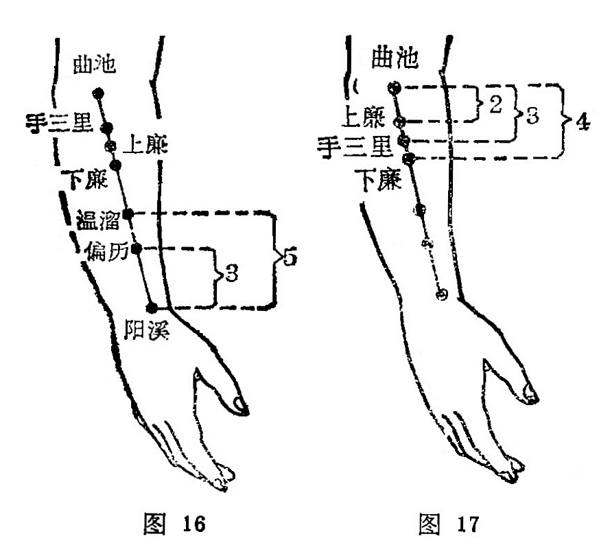

##### 温 溜

〔定位〕在阳溪与曲池连线上，距阳溪上5寸（图16）。

〔解剖〕在桡侧伸腕短肌，与外展拇长肌之间，有桡动脉肌支，头静脉，布有前臂背侧皮神经和桡神经深支。

〔功能〕清热解毒，调理肠胃。

〔主治〕头痛，面肿，口舌咽喉肿痛肩臂痛，肠鸣腹痛，疔疮。

〔刺灸〕直刺0.5〜0. 8寸，可灸。

〔讲述〕见于《甲乙》。别称逆注、蛇头，又称温留、池头。温有和暖的含意；溜，有止的意思。因穴属大肠之郄，是气血深聚之处，因名。本穴除有清宣肺气，用治头痛，面肿，口舌咽喉肿 痛之疾外，还可用于肠鸣而痛，伤寒哕逆，膈中气闭等症。本穴 属深郄，郄在临床上主要用于本经急症，痛症；腹痛，肠僻皆大肠腑病，故刺郄穴，可达调理肠腑，行气止痛之效；如配足三里、 上巨虚，更增疗效。

##### 下 廉

〔定位〕在阳溪与曲池连线上，距曲池下4寸（图17）。

〔解剖〕有桡侧腕短伸肌，桡侧腕长伸肌，深层为旋后肌，有挠动脉分支；布有前臂背侧皮神经及挠神经深支。

〔功能〕通经络，调腑气，利关节。

〔主治〕头风，眩晕，目痛，肘臂痛，食物不化，腹痛。

〔刺灸〕直刺0.5〜0.8寸，可灸。

〔讲述〕见于《甲乙》，在辅骨下。别称手下廉。下指下方，与 上相对；廉，形如菱角之状，又指边侧，因本穴在曲池下四寸， 屈肘握拳，是处肌肉隆起，形如菱状，穴当菱状边侧，因名。本 穴除主肩痛，手臂麻木，半身不遂外，还可用于飧泄，狂走。临 床常配足临泣、少泽治乳痈；配丘墟治胸胁满引腹：配五处、神 庭治头风；配委中治风湿痹痛，可通腑气，而利关节。

##### 上廉 

〔定位〕在阳溪与曲池连线上，距曲池下3寸。（图17）。

〔解剖〕同下廉。

〔讲能〕通经络，调腑气，利关节。

〔主治〕肩臂疼痛，麻木，半身不遂，腹痛肠鸣。

〔刺灸〕直刺0.5〜0.8寸，可灸。

〔讲述〕见于《甲乙》，在三里下一寸。上指上方，与下相对，廉形如菱角之状，又指边侧，因穴在下廉上一寸，屈肘握拳，是处肌肉隆起，形如菱状，穴当菱状边侧，因名。此穴除主上肢不遂，手臂麻木，肩臂疼痛外，还可用于肠鸣走痛，大肠气滞，可调腑气，除瘀滞。

##### 手三里

〔定位〕在阳溪与曲池连线上，距曲池二寸（图17）。

〔解剖〕同下廉。

〔功能〕消肿止痛，调理肠胃。

〔主治〕齿痛，颊肿，上肢不遂，肩臂疼痛，肘挛不伸，瞋痛，吐泻。

〔刺灸〕直刺0.5〜0. 8寸，可灸。

〔讲述〕见于《甲乙》，在曲池下二寸，按之肉起兑肉之端。里，有邑、居之意，穴距肘髎三寸，正居大脉之处，因名。本穴除主上肢不遂，肩膊疼痛外，还可用于食癖气块，腹瞋时寒，以及齿痛，颔肿，瘰疬，失音。临床常配足三里治胃肠病，配中渚治喉痹不能言：配金门、申脉治头风目眩项强；配少海治两臂顽麻；配肩髃治肩背痛。《通玄》说：肩背患，责肘前之三里。这是因为大肠经脉，经过肘外侧，再从上臂外侧前缘，上至肩部，到脊柱骨之上，与诸阳经会于大椎。另外，手三里为大胲经从腕到肘一段经穴——偏历、温溜、下廉、上廉最后一穴，脉气由此贯通到肘外侧而进入曲池，它承前启后，故功效可远达颈项肩背，不论疼痛麻木皆可刺之。 

##### 曲 池

〔定位〕屈肘，拱手，在肘横纹桡侧端凹陷处（图18）。

〔解剖〕在肱桡肌桡侧，桡侧腕伸长肌起始部到肱肌下端；有桡返动脉分支，布有前臂背侧皮神经，内侧深层为桡神经本干。

〔功能〕疏风清热，调和营卫。

〔主治〕热病，咽喉疼痛，皮肤病，风疹，癣疥，瘰疬，上肢瘫痪，癲狂，腹痛，吐泻，肘臂痛，肝亢。

〔刺灸〕直刺1〜1.5寸，可灸。

〔讲述〕出《灵枢·本输》。别称鬼臣，又名阳泽。曲同屈，浅者为池，穴在肘外辅骨肘骨之中，当屈曲之时，穴处有凹，形似浅池，因名。穴为大肠脉气之所入，为合土穴，具有疏风解表，清热退烧，调和营卫，通经活络，利水除湿之功效，所以马丹阳将它列为十二穴之一。它所以能降热，是因为大肠经与肌肤关系密切，当外邪侵入，出现发热，取之可散风热，所谓“病在阳之阳者，刺阳之合”（《灵枢·寿夭刚柔》）。由于大肠为金腑，曲池为合土，土能生金，故穴为本经之母，根据"虚补其母”的法则，故凡举身不遂，补之可达益其不足，收到扶补正气之效。所以上肢偏瘫以曲池为至，下肢以阳陵泉为主，正如《百症赋》说“阳陵远达于曲池”。由于肺主皮毛，阳明主肌肉，故凡皮肤疾患一一瘾疹、痒痛 无不与此有关；加之阳明是多血多气之经，土穴又与胃经有关，胃为气血之海，所以针曲池不但有清肺热，通达肌肤，遍及全身之力，且有凉血润燥之功，故能除"遍身风癣癞”。至于主治肩痹诸疾，是因风寒湿邪，袭于筋脉，造成气血郁滞，致使筋脉关节失去活动能力，针刺局部曲池可疏通经络，调和气血，则络通筋舒。一般病在初起时，可先刺健侧，后针患侧，其效更捷。为加强疗效，临床常配天髎治肩重痛不举；配人中治两肘拘挛；配尺泽治鹤膝风，配少泽治瘈疭癫疾；配鱼际治呕血；配三里、复溜治发热；配合谷、三里治余热不尽。现今常配肩髃，合谷治上肢瘫，疼痛；配合谷、外关治感冒发热；配足三里、人迎治眩晕，配血海治皮肤瘙痒。

##### 肘 髎

〔定位〕屈肘，在曲池穴外上方1寸，肱骨边缘处（图19）。

〔解剖〕在肱桡肌的起始部，肱三头肌外缘，有桡侧副动脉，前臂背侧皮神经，深层为桡神经本干。

〔功能〕疏筋利节。

〔主治〕肩臂肘痛，上肢麻木拘急。

〔刺灸〕直刺0.5〜1寸，可灸。

〔讲述〕见于《甲乙》，在肘大骨外廉陷者中。别称肘尖。肘指肘尖，髎指骨之郄，因穴位于肘部骨失之处，因名。本穴主治肘臂疼痛，拘挛，麻木，针之能疏筋利节。《大成》：治臂痛不举，屈伸挛急，麻木不仁。针刺除直刺外，也可斜刺，从肘外略向上方斜刺，使之产生麻胀感。

##### 手五里

〔定位〕在曲池与肩髃连线上，距曲池上3寸（图19）。

〔解剖〕在肱桡肌起始部，肱三头肌前缘，深层为挠侧副动脉，布有前臂背侧皮神经，深层为桡神经。

〔功能〕通经，散瘀，止痛。

〔主治〕肘臂挛痛，瘰疬。

〔刺灸〕避开动脉直刺0.5〜1寸，可灸。

〔讲述〕出《灵枢·本 输》。别称大禁。里有邑、居 的意思，因穴在天府下5寸，三里上5寸，古时以一寸为
 一里，因名。本穴主治时臂疼痛麻木，刺之有疏筋利节之功效。还可用于痎疟、颈疬。《图翼》载：风劳惊恐，吐血咳嗽， 嗜卧、肘臂疼痛难动，腹满气逆，寒热瘰疬，目视𥆨𥆨，痎疟 《甲乙》：禁不可刺，多主张灸，左取右，右取左。因该处有桡侧 ，副动脉，避开动脉直刺。

##### 臂 臑

〔定位〕在曲池与肩髃连线上，距曲池上7寸，当三角肌下端 （图 18）。

〔解剖〕在三角肌下端，肱二头肌外侧头的前缘，有旋后动脉的分支及肱深动脉，布有前臂背侧皮神经，深层有桡神经本干。

〔功能〕疏筋活络，清热明目。

〔主治〕肩臂痛，瘰疬，目疾。

〔刺灸〕直刺或向上斜刺0. 5〜1.5寸，可灸。

〔讲述〕见于《甲乙》。别称头冲、颈冲、臂脑。臑，指上臂内侧。据《正字通》载：自肩到腕为臂，自肩到肘为臑。因本穴位于臂三角肌下方偏内侧，主治肩关节疾病，故名。《甲乙》：治寒热项疬，适肩臂痛不可举。这是因为本穴为手阳明大肠经、手太阳小肠经、足太阳膀胱经和阳维之会所，刺之能疏筋止痛，行气散瘀。临床常配曲池治瘰疬；配光明治目疾；配合谷、膻中治癫痫。

##### 肩 髃

〔定位〕三角肌上部中央，肩峰与肱骨大结节之间，当上臂外展至水平位时，出现两个凹陷，在前方的凹陷处（图
 20）。

〔解剖〕浅层有锁骨上神经，深层有旋后动静脉及腋神经的分支。

〔功能〕祛风热，通经络，利关节。 

〔主治〕肩背、手臂痛，上肢不遂，瘰疬，风热瘾疹，肝阳上亢。

〔刺灸〕直刺或斜刺0.5〜1寸，可灸。  

〔讲述〕出《灵枢·经脉》。别称髃骨、中肩井、扁骨、扁尖。肩指肩部，髃指肩胛骨。因穴位肩上髃骨处，为手阳明大肠和阳 跷脉之会，主治肩关节诸疾，因名。《玉龙经》：治中风半身不遂， 手臂挛急，筋骨酸痛，风热瘾疹。《玉龙歌》：肩端红肿痛难当，寒湿 相争气血旺，若问肩髃明补泻，答君多灸自安康。临床配曲池、阳陵泉、昆仑治肢节烦痛，牵引腰脚痛；配阳溪治瘾风之热；配条口治肩疼；配阳陵泉、曲池、绝骨治偏瘫，一般弛缓不遂，施 用补法，可补虚壮筋；强直不遂，施用泻法，可活络舒筋。

##### 巨 骨

〔定位〕正坐垂肩，在锁骨肩峰端与肩胂冈之间凹陷中（图21）。

〔解剖〕在斜方肌与冈上肌中，深层有肩胛上动静脉，布有锁骨上神经后支，副神经分支，深层为肩胛上神经。

〔功能〕散瘀，止痛。

〔主治〕肩痛，手臂不得屈伸，瘰疬，瘿气。

〔刺灸）直刺0. 5〜0. 8寸，可灸。

〔讲述〕出《素问·气府论》》巨指大，巨骨即锁骨。本穴正当锁骨外端，人之锁骨虽然不大，但位居肩端，当人荷重之时，此骨支持重力，以维护胸腔脏器不受压迫，故不言锁而名为巨骨 。穴属手阳明大肠和阳蹻脉之会所，除用于肩痛，手臂不得屈伸，有舒筋利节之效外，还可用于瘰疬，瘿气，有消瘿散结之力。临床常配前谷治臂不举；配绝骨治头项强痛。《素注》： 禁针，针则倒悬，一食倾，乃得下针，针4分，泻之勿补，针出始得正卧。

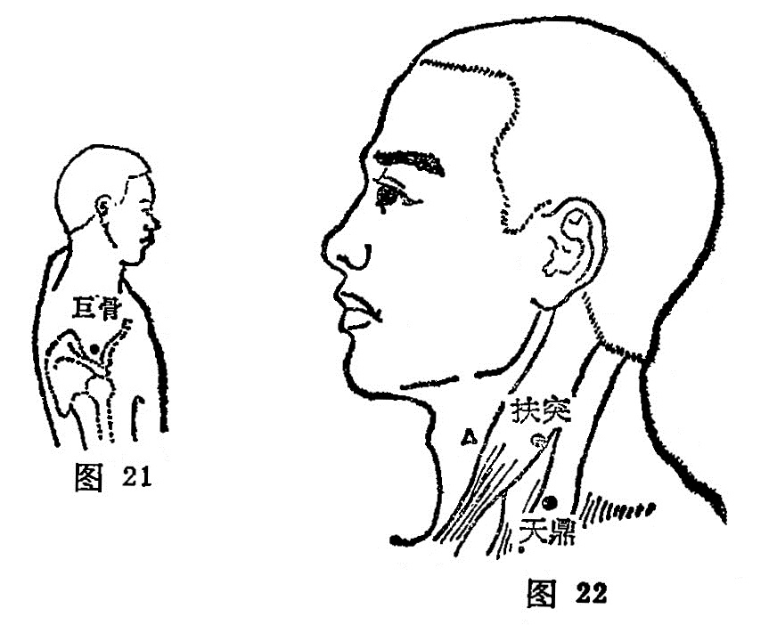

##### 天 鼎

〔定位〕在锁骨上窝上， 扶突下1寸，胸锁乳突肌后 缘（图22）。

〔解剖〕浅层为颈阔肌，深层为中斜角肌起点；有颈外浅动脉；深层内侧有颈升动脉，布有耳大神经，枕小神经，副神经，深层有膈神经。

〔功能〕理气开瘀，清咽 利膈。

〔主治〕暴喑气哽，咽喉肿痛，瘰疬，气瘿。

〔刺灸〕直刺0. 3〜0.5 寸，可灸。

〔讲述〕见于《甲乙》。别称天顶。天，指高处；鼎，其形上有两耳，下有三足，人之颈后正中大椎处有一突起，形似一足，是处两旁各有颈肌突起，形成三足之势，头圆在上象天，因名。取本穴，应正坐，微仰头，于扶突下一寸，当胸锁乳头肌后缘取之。《甲乙》：治暴喑气哽，喉痹咽痛，不得气，食饮不下。临床常配间使治失音，配气舍、膈俞治喉痹哽噎；配天突、太溪治咽喉肿痛，配廉泉治音哑。这些配穴多着眼于局部邻近与远导相结合，体现了循经与局部取穴的规律。因间使为心包经金穴，太溪为肾经原穴；心包代心用事，舌为心之苗，肾脉沿喉咙，挟舌根，因而音不能言，咽中如哽，刺配间使、太溪可恢复发音，消除病患。

##### 扶 突

〔定位〕喉结旁开三寸，当胸锁乳肌的胸骨头与锁骨头之间（图 23）。

〔解剖〕有颈阔肌，胸锁乳突肌，颈外动脉分支，布有耳神经，颈皮神经，枕小神经及副神经。

〔功能〕宣肺气，利咽喉。

〔主治〕咳喘，咽痛，暴喑气哽，瘰疬，气瘿。

〔刺灸〕直刺0.5〜0.8寸，可灸。

〔讲述〕出《灵枢·本输》。别称水穴。高起之处为突，此指喉结，扶约当今4横指，等于同身寸3寸，因本穴位于喉结突起，旁开一扶3寸，因名。《甲乙》：主治咳逆上气，咽喉呜喝喘息。《大成》：治咳嗽多唾，上气咽引喘息，喉如水中鸡声，暴喑气哽。临床常配廉泉治暴喑气梗；配大钟、窍阴治舌本出血；配天突治喘息痰鸣作水鸡声，这是因为肺系急而不舒，肺之关门不利，刺此可缓解肺系之挛急，消除气逆，则关门得利，痰浊降而气喘平，清肃之气得行则语出。

##### 禾髎

〔定位〕水沟旁开0.5寸（图24）。

〔解剖〕在上唇方肌止端，有面动静脉的上唇支，布有三叉神经第二支之下支，与面神经的吻合支。

〔功能〕祛风，开窍。

〔主治〕鼻塞，不闻香臭，鼻衄，口噤不开。 

〔刺灸〕直刺或斜刺0.2〜0.5寸，可灸。

〔讲述〕见于《甲乙》。别称长频、长颊、长巅。禾指粮，其穴在鼻孔之下，口唇之上，人中之旁，取其鼻欲嗅，口食谷，穴当其际；因名。本穴主要用于局部之鼻窒，口僻，不闻香臭，有祛风、开窍之力。《甲乙》：治鼻窒，口僻，清涕出，不可止，鼻衄有痈。《大成》：主尸厥及口不可开，鼻疮息肉，鼻塞不闻香臭，鼻衄不止。临床常配地仓、颊车治口㖞；配合谷、印堂、上星治鼻衄、鼻窒。

##### 迎香

〔定位〕鼻翼旁0.5寸，鼻唇沟中（图24）。

〔解剖〕有上唇方肌，面动静脉及眶下动静脉分支，布有面神经与眶下神经吻合丛。

〔功能〕散风清热，宣通鼻窍。

〔主治〕鼻塞，鼻衄，口角㖞斜，鼻渊不闻香臭，面痒，面痛。

〔刺灸〕斜刺或平刺0.3〜0.5寸，禁灸。

〔讲述〕见于《甲乙》。又称冲阳。迎，指接；香，指气味。穴属大肠，与肺相表里，肺开窍于鼻，穴当鼻旁，主治鼻塞不通，不闻香嗅，针此可宣通闭塞，恢复嗅觉，使能迎接气味，因名。《甲乙》：治鼻鼽不利，窒洞气塞，㖞僻多涕，鼽衄有痈。《金鉴》：治鼻塞不闻香臭，浮肿风动，面痒状如虫行。本穴为手阳明大肠经和足阳明胃经之会所，又位于鼻旁，鼻为肺窍，肺司呼吸，鼻是呼吸之门户，所以当风寒袭肺，肺气失宣则津液凝滞，就会出现鼻腔闭塞，不闻香臭，针此可宣通肺气，恢复嗅觉。临床常配印堂治鼻渊；又配合谷治面痒肿，口㖞，鼻不闻香臭。这是因为迎香为大肠止点，位于鼻旁，有宣肺气，通鼻窍，散风邪，清火热之力，合谷为本经之原穴，善治本经诸疾，二穴相伍，一上一下，通经接气，开窍启闭之力更彰。另外还可用治目赤肿痛之疾，《玉龙赋》：搐迎香于鼻内，消眼热之红。这指的是内迎香，用长三棱针刺入鼻内，搐刺放血，对由心火上炎所引起的眼目红肿，可达“若将毒血搐出后，目内清凉始见功”（《玉龙歌》）。

#### （四）本经小结

1．本经受手太阴之交，经脉走行方向是从手走头，与手太阴肺经相表里，全经计有20个经穴，体表起于商阳，止于逆香，络在偏历，郄会温溜。本经取穴要点是，应掌握第二掌指关节前后、掌骨间、筋骨间、屈肘纹头、胸锁乳突肌与喉结以及三角肌等解剖标志。如于第二掌指关节前后取二间、三间；在第一、二掌骨间，第二掌骨中点取合谷；腕部拇伸长、短肌腱之间取阳溪；屈肘桡侧横纹头取曲池；颈部与喉结平齐，在胸锁乳突肌之间取扶突；于三角肌前下缘与肱骨的交点处取臂臑；于肩峰前缘直下骨下陷当患者手臂平举，肩端大骨下缘即现一凹陷，于陷处取 肩髃。

2．本经生理功能与病理反应，应注意属大肠络肺，通过横膈，经锁骨上窝，达颈项。由于大肠属金，合于秋气，其生理特点是多气多血，卯时气血最旺。外邪侵入，经气有所变动，壅滞不通，可发生循行所到之处——下齿疼痛，颈部肿大，肩背账痛，大指次指痛不用；凡实邪为患侧见齿衄，耳聋，属虚则见牙齿发冷，胸膈闭塞，故本经腧穴主要用于头面、肠胃，以及神志、皮肤等病变。如手三里、上廉、下廉、二间、三间、阳溪、温溜多用于胃腹作胀，恶心呕吐，腹泻肠鸣；商阳、迎香、偏历能宣肺解表，多用于喘息，气满胸中，咳嗽短气；合谷用于一切面部疾患；温溜能止衄血；迎香可治面痒，鼻塞不通；臂臑用治目疾；阳溪可治癫、狂、痫；曲池善止癫狂善惊，又主一切皮肤瘙痒，疥疮及发热疾患。

3．刺合谷透劳宫要使手指呈半握拳状，取2寸长毫针，针尖向小指侧缓慢进针，以防伤动脉，引起血肿；一般刺1.5寸即可产生向上放散性针感，可上达肘臂，下达指端。巨骨不可深刺，防伤肺脏，造成气胸。扶突、天鼎位于颈部，要缓慢进针，避开动脉，以免刺破颈动脉。

#### 复习思考题

1. 手阳明大肠经脉的循行路线及络属是什么？
2. 本经臑穴主治功能有哪些规律？
3. 怎样取天鼎、扶突；针刺要注意什么？
4. 怎样取本经上肢穴位，应掌握哪些定位标志？
5. 怎样取合谷、曲池，这几穴有哪些主要功能？

答：

1. 分類
2. 阿是

### 三、足阳明胃经（45穴）

#### （一）分布络属

分布径路：本经受手阳明大肠经的支脉，起于鼻翼旁，上行在鼻根部左右侧交会，到内眼角与足太阳经相交，向下沿鼻柱外侧，进入上齿中；回出来挟口两旁，环绕口唇，在颏唇沟承浆穴处左右相交，退回来沿颌关节，经过足少阳经的上关穴（客主人），沿着鬓发边际，到额前（神庭）。

它的下行支脉，从大迎穴前方，向下经过人迎，沿喉咙，进入锁骨上窝，深入体腔，穿过膈肌，归属胃腑，联络脾脏。

它的外行经脉，从锁骨（缺盆）上窝向下，经乳头，向下挟脐二寸，到腹股沟的气街处。

它的内行经脉，从胃下口幽门部起，向下沿腹腔内，到腹股沟气街处和外行经脉相合，二支脉由此相会，再下行至髀关，直下伏兔部达胫骨前外缘，到足背上，进入足中趾外侧。

它的胫部支脉，从膝下三寸（足三里）处分出，进入足中趾外侧。

它的足跗部支脉，从跗上（冲阳）分出，进入足大趾内侧端 ，（隐白）与足太阴脾经相接。

络属脏腑：属胃，络脾。

经过器官：鼻、眼、口、上齿、乳房。

本经腧穴：
三足阳明是胃经，起于头面向下行。
**承泣**眼眶边缘下，**四白**目下一寸匀，
**巨髎**鼻旁直瞳子，**地仓**吻旁四分寻。
**大迎**颌前寸三陷，**颊车**耳下曲颊临。
**下关**耳前扪动脉，**头维**四五旁神庭。
**人迎**结喉旁寸五，**水突**迎下大筋凭。
直下**气舍**平天突，**缺盆**锁骨窝里寻。
**气户**锁下一肋上，相去中行四寸正。
**库房屋翳膺窗**接，都隔一肋**乳中**停。
**乳根**乳下一肋处，胸部诸穴君须明。
**不容**巨阙旁二寸，其下**承满**与**梁门**。
**关门太乙滑肉门**，**天枢**脐旁二寸平。
**外陵大巨水道**穴，**归来气冲**曲骨邻。
诸穴相隔皆一寸，但距中行二寸程。
**髀关**膝上尺二寸，**伏兔**膝上六寸呈。
**阴市**膝上方三寸，**梁丘**膝上二寸平。
膑下陷中是**犊鼻**，膝下三寸**三里**迎。
再下六寸**上巨虚**，膝下八寸**条口**行。
再下一寸**下巨虚**，踝上八寸**丰隆**盈。
**解溪**跗上系鞋处，**冲阳**跗上五寸明。
**陷谷**庭后二寸取，次趾外侧是**内庭**。
**历兑**次趾外甲角，四十五穴须记清。

  	图解：胃足阳明之脉，①起于鼻，交頞中，旁纳太阳之脉，②下循鼻外、入上齿中，还出挟口，环唇，下交承浆，③却循颐后下廉，出大迎，循颊车，上耳前，过客主人，④循发际，至额颅。其支者，⑤从大迎前下人迎，循喉咙，入缺盆，下膈，⑥属胃，⑦络脾。其直者，⑧以缺盆下乳内廉，下挟脐，入气街中。其支者，⑨起于胃口，下循腹里，下至气衔中而合，⑩以下髀关、抵伏兔，下膝膑中，⑪下循胫外廉，下足跗，入中趾内间。其支者，⑫下膝三寸而别，下入中趾外间。其支者，⑬别跗上，入大趾间，出其端（《灵枢·经脉》）。

#### （二）本经证候

经证：颜面发黑，鼻流清涕，出鼻血，口角歪斜，口唇发疹，颈部肿胀，喉痛，腹水，胸腹部灼热或怕冷，膝部肿痛，沿胸、乳房、腹股沟、大腿前侧、胫骨外缘、足背部疼痛，足中趾不能运用（均属本经病）。

腑证：消谷而容易饥饿，或纳呆而腹胀（本腑病）：以及癫狂，惊悸（脑、心病)，常常呻昤，呵欠（肾病）。正如经文所述：胃足阳明之脉：“是动则洒洒振寒，善伸数欠颜黑，病至，恶人与火，闻木音则惕然而惊，心欲动，独闭户牖而处，甚则欲上高而歌，弃衣而走，贲响腹胀，是为骭厥。是主血所生病者，狂疟温淫汗出，鼽衄，口㖞唇胗，颈肿喉痹，大腹水肿，膝嫔肿痛，循膺、乳、气街、股、伏兔、膝外廉、足跗上皆痛，中指不用。气盛则身以前皆热，其有余于胃，则消谷善饥，溺色黄。气不足则身以前皆寒慄，胃中寒则胀满（《灵枢·经脉》）。

#### （三）腧穴分述

##### 承 泣

〔定位〕目正视，瞳孔直下，当眶下缘与眼球之间（图26）。

〔解剖〕在眶下缘上方，眼轮匝肌中，深层眶内有眼球下直肌，下斜肌；有眶下动脉分支，静脉属支及眼球、静脉分支；布有上颌神经，眶下神经支，动眼神经支之肌支，及面神经颧支。

〔功能〕散风泻火，疏邪明目。

〔主治〕目赤肿痛，迎风流泪，夜盲，口眼㖞斜，眼睑瞤动。

〔剌灸〕押手固定眼球，沿眶下缘直刺压入0. 3〜0. 7寸，不宜大幅度捻转，禁灸。

〔讲述〕见于《甲乙》。别称鼷穴、面髎，又称溪穴，目下。承，有接受的含意；泣，指哭出的泪水。当人泣时，此处承受泪水，针此泪有收受之所，因名。穴属足阳明；阳跷、任脉之所会， 是治疗目疾的要穴。《甲乙》、《千金》皆治目不明，泪出，目眩瞀，瞳子痒，远视䀮䀮，昏夜无见，目瞤动与项口参相引，㖞僻口不能言。《铜人》：治冷泪眼眦赤痛。《大成》：治目翳绿色，从下侵上者，自阳明来也。临床常配肝俞、瞳子髎治目昏暗；配睛明、风池、太冲治青光眼；配睛明、足三里、肝俞、肾俞治视神经萎缩。穴近眼球，不宜灸治，《外台》禁灸。

##### 四白

〔定位〕目正视，瞳孔直下，当眶下孔凹陷中（图26）。

〔解剖〕穴在眶下孔处，当眼轮匝肌和上唇方肌之间，有面动静脉分支，眶下动静脉；布有眶下神经及面神经颧支。

〔功能〕祛风，明目。 

〔主治〕目赤痛痒，头面疼痛，口眼㖞斜，眼睑瞤动，眩晕。

〔刺灸〕直剌0. 2〜0. 3寸，禁灸。

〔讲述〕见于《甲乙》。别称面鼽骨空。四，有广阔之意；光明为白。穴在目下，针之能使目力光明四射，因名。本穴主要用于 目疾。《大成》：治目赤痛，僻泪不明，目痒，目肤翳，口眼㖞斜， 不能言。《铜人》：治眼生白翳，微风，目瞤动不息。临床常配合谷治口眼㖞斜，眼睑瞤动；配涌泉、大杼治头痛目眩。一般直刺或向上斜刺3〜5分，亦可透向睛明。本穴皮下血管丰富，针刺时要轻刺、出针后轻揉，以免出血。

##### 巨髎

〔定位〕目正视，瞳孔直下，与鼻翼下缘平齐（图26）。

〔解剖〕有上唇方肌，深层为犬齿肌，有面动静脉及眶下动静脉会合支；布有眶下神经及面神经颊支。

〔功能〕袪风，活络。

〔主治〕口眼㖞斜，眼睑瞤动，鼻衄，齿痛，唇颊肿。

〔刺灸〕直刺0.3〜0.5寸，可灸。

〔讲述〕见于《甲乙》。巨，有大的含意；髎，指骨之郄即凹陷处。因穴在颜面颧骨最高突起下馅处，因名。穴为阳跷、手足阳明之会，主治面部疾患。《铜人》：风寒鼻塞，䪼上肿雍痛，瘈疭口㖞。临床常配合谷治面瘫；配天窗治颊肿痛；配下关、合谷治上牙痛，有散风活络，止痛消肿之效。

##### 地仓

〔定位〕口角旁0.4寸（图26）。

〔解剖〕在口轮匝肌中，深层为颊肌，有面动静脉；布有面神经颊支，眶下神经分支，深层为颊神经末支。

〔功能〕祛风邪，利机关，通气滞。

〔主治〕口㖞，唇胗，流涎，眼睑瞤动，面痛。

〔刺灸〕直刺0.2寸，或向颊车方向平刺0.5〜1寸。

〔讲述〕见于《甲乙》别称会维、胃维。藏谷之器为仓，古称地食人以五味，食则用口，贮入胃中，犹如仓库，穴位于口吻之旁，因名。穴属手足阳明和阳跷之会，主要用治口歪斜，唇缓不收，局部取穴，可调和气血，疏通经脉。一般轻症㖞左治右，㖞右治左，针感通上达下向旁放散，针后用隔姜灸3〜5壮；较重症可先用轻微的雀啄术针健侧，病侧可透刺颊车，所谓“口眼㖞斜最可嗟，地仓妙穴连颊车，㖞左泻右依师正，㖞右泻左莫斜”。临床常配人中、合谷、颊车治口眼歪斜；配承浆、合谷治流涎。

##### 大迎

〔定位〕在下颌角前下1.3寸，适当咬肌附着部的前缘，下颌 骨上；当闭口鼓气时，即出现一沟形凹陷的尽端处（图27）。

〔解剖〕在咬肌停止部的前缘，前方有面动静脉；布有面神经的下颌缘支及三叉神经第三支的颊神经。

〔功能〕疏风清热，消肿止痛。

〔主治〕口眼㖞斜，面肌瞤动，口噤不开，颊肿，齿痛，瘰疬。

〔刺灸〕避开动脉，直刺0.2〜0.3寸，或斜刺0.3〜0.5寸，可灸。

〔讲述〕出《素问·气穴论》。别称髓孔。迎，有合的含意。因胃经从承泣、头维发起，至此处相迎，合折一起向下到人迎加乏穴适当大迎骨，因名。《甲乙》：治下牙痛，口不收，舌不能 言，不得嚼。《大成》治口噤开，唇吻瞤动，颊肿牙痛，瘰疬口㖞，齿龋痛。临床配下关治牙关紧闭，配颊车治口眼㖞斜，配臂臑、五里治颈瘰；配颧髎急目眩、牙痛。穴为胃与大肠之会所，胃经起于鼻梁凹陷部，旁纳太阳之脉，复下而循鼻外入上齿龈内，回岀来环绕口唇，交叉于唇下沟的承浆穴，再退回沿腮下后方出大迎穴，由此沿颊车上行至额颅，根据经脉所过，主治所在的原则，故本穴主治局部的口噤不开，口眼㖞斜，唇吻瞤动，以及牙痛，颊肿等。

##### 颊车

〔定位〕下颌角前上方一横指凹陷中，咀嚼时咬肌的隆起处 （图27）。

〔解剖〕在咬肌中，有咬肌动静脉；布有三叉神经第三支的咬肌神经，及由颈丛来的耳大神经。

〔功能〕开关活络，疏风止痛。   

〔主治〕口眼㖞斜，颊肿，齿痛，口噤不语，中风痰壅，痄腮。

〔刺灸〕直刺0. 3〜0.5 寸，或向地仓方向斜刺，平刺0.5〜1.2 寸，可灸。

〔讲述〕出《素问·气府论》。别称牙车、曲牙、鬼府、机关。面两侧称颊，下颌骨古称颊车骨，该骨总载诸齿，能咀食物，如车轮转动，穴当其处，因名。本穴主要用治肩部疼痛，口噤，颊 肿等。临床常配颧髎治口僻痛，恶风寒不可以咀；配人中、百会、承浆、合谷治中风口噤不开；配内庭清泻胃火，治胃火牙痛；配太溪滋阴补肾，治肾虚牙痛；配翳风、合谷清泻郁热，消散壅滞治痄腮。

##### 下关

〔定位〕颧弓与下颌切迹之间的凹陷中，合口有孔，张口即闭（图28）。

〔解剖〕皮下有腮腺，深层有咬肌，有面横动静脉，最深层为下颌动静脉；布有下颌神经耳颞神经支，最深层为下颌神经，面神经颧支。

〔功能〕清热疏风，通关利窍。

〔主治〕齿痛，口噤，聤耳，耳鸣，耳聋，口眼㖞斜，下颌关节痛。    

〔刺灸〕直刺0.5〜0.7寸，可灸。

〔讲述〕出《灵枢·本输》。下指下方，与上相对；关指活动。因穴在下颌与上颌联合交关的下方，因名。穴是足阳明、少阳之会，多用治局部齿痛，口噤，下颌关节痛。临床常配大迎、翳风、完骨治牙齿龋痛；配合谷治牙痛；配外关治耳病；配颊车、翳风治咬肌痉挛。一般宜直刺0，5〜0.7寸，如治面痛可略向下刺入1.5寸，使麻胀达下齿槽。治口噤不开，可向前后刺1寸左右。治上齿痛刺向地仓，治下牙痛刺向颊车，治耳病斜向后刺1.5寸。

##### 头维

〔定位〕额角发际直上0.5寸（图28）。

〔解剖〕在颞肌上缘，帽状腱膜中，有颞浅动静脉的额支；布有耳颞神经支，上颌神经、颧颞神经及面神经颞支。

〔功能〕祛风泄火，清头明目。

〔主治〕眼痛，头痛，目眩，迎风流泪，面瘫。

〔刺灸〕平刺0.5〜1寸，不宜灸。

〔讲述〕见于《甲乙》。別称颡大。头指头部，维指角隅，穴当额角发际，为足阳明脉气所发，因名。本穴除主治头痛、目眩诸疾外，还可用治喘逆，烦满等症。《甲乙》：主寒热头痛如破，目痛如脱，喘逆，烦满，呕吐，流汗难言。《大成》：主目瞷，目风泪出，偏风，视物不明。配百会、太阳、率谷、合谷治偏头痛；配风池、角孙、睛明治目赤肿痛，视物不清；配大陵治头痛如破，目痛如脱；配晴明、临泣、风池治迎风流泪；配攒竹治目睑瞤动。

本穴属足少阳、阳明之会所，胃经支脉还系自系，深人目内；胆经别支系目系，合少阳于外眦，故头维善治头痛，目疾。

##### 人 迎

〔定位〕喉结旁开1.5寸，颈总动脉前缘取穴（图29）。

〔解剖〕在颈阔肌、胸锁乳突肌前缘，有甲状腺上动脉，约当颈内、外动脉分歧处，颈前浅动脉，外为颈内动脉；布有颈皮神经，面神经颈支，深层颈动脉球，最深层为交感神经干，外侧有舌下神经支及迷走神经。

〔功能〕理气，开瘀，通脉。

〔主治〕胸闷喘息，咽喉肿痛，头痛，瘰疬，气癭，肝阳上亢、发音困难。

〔刺灸〕避开动脉，直刺0. 3〜0.4寸，禁灸。

〔讲述〕出《灵枢·本 输》。别称天五会，五会。迎指动，穴当喉结旁，动脉应手处，乃三部九候中的人候，故名。本穴为足阳明、少阳之会所，主治局部咽喉肿痛，以及气喘，气瘿，瘰疬。临 床常配少商、合谷治咽喉肿痛；配天突治喘逆；配内关治心悸；配太冲、曲池治肝亢（高血压）。近代研究证明，针刺有明显的降压作用；配太渊治无脉症。

##### 水 突

〔定位〕人迎与气舍连线中点，当胸锁乳突肌前缘（图29）。

〔解剖〕有颈阔肌，胸锁乳突肌与肩胛舌骨肌上腹的交叉处；外侧为颈总动脉；布有颈皮神经，深层为交感神经发出的心上神经及交感干。

〔功能〕平喘利咽，散瘀消瘿。

〔主治〕咽喉肿痛，咳喘，气瘿。

〔刺灸〕直刺0. 3〜0. 5寸，可灸。

〔讲述〕见于《甲乙》。别称水门。水，指浆液；突，有能、接的含意。本穴主治水饮上呛，咳逆上气，因名。《甲乙》：主咳逆； 上气，:咽喉痛肿，呼吸短气，喘息不通。临床常配气舍治咽肿；配风门、百会、气户治顿咳；配少商、气舍治咽肿；配天突治瘿气。

##### 气 舍

〔定位〕人迎穴直下，锁骨内侧上缘，当胸锁乳突肌的胸骨 头与锁骨头之间（图29）。 

〔解剖〕在颈阔肌、胸锁乳突肌的胸骨头与锁骨头之间；有颈前浅静脉，深部为颈总动脉，布有锁骨上神经前支，舌下神经肌支。

〔功能〕调气，化瘀、散结。

〔主治〕喘息，呃逆，咽喉肿痛，气瘿、瘰疬，颈项强痛。

〔刺灸〕直刺0.3〜0.5寸，可灸。

〔讲述〕见于《甲乙》。气，指空中大气；舍，指居处。穴近气管，呼吸之气流经此处，因名。本穴主治咽痛喉肿，气逆呃逆，瘿瘤瘰疬。临床常配扶突、水突治瘿瘤；配天突治咽下困难；配气户、膈俞治呃逆；配魄户治咳逆上气。

##### 缺盆

〔定位〕锁骨上窝中央，任脉旁开4寸（图30）。

〔解剖〕有颈阔肌，肩胛舌骨肌之中间腱；上方有颈横动脉，内侧有锁骨下动脉；布有锁骨上神经中支，深层正当臂丛的锁骨上部。

〔功能〕宣肺调气，清热散结。

〔主治〕咳嗽，气喘，咽喉肿痛，缺盆中痛，瘰疬。

〔刺灸〕直刺或斜刺0.3〜0.5 寸，穴下为肺尖，禁深刺、捣刺。

〔讲述〕出《灵枢· 经脉》。别称天盖。缺，指破，有不完整的含意；凹陷深处为盆。穴当锁骨上窝，是处形如破盆状，穴当其中，因名。穴下深部有肺尖，《甲乙》谓刺太深令人逆息。故不可深刺，禁用提捣术，免伤肺脏，造成气逆。本穴主要用于咳喘。临床常配膻中、巨阙治咳嗽；配食窦、少海、商阳治胸水；配肺俞治喘咳。《素问·水热论》：大杼、膺窗、缺盆、背俞，此八者，以泻胸中之热。《图翼》：孕妇禁针。

#####  气户

〔定位〕锁骨下缘，任脉旁开4寸（图31）。

〔解剖〕在锁骨下方胸大肌起始部，深层有锁骨下肌；有胸肩峰动静脉分支；布有锁骨上神经，胸前神经分支。

〔功能〕调肺气，止喘咳。

〔主治〕气喘，咳嗽，胸胁胀满，呃逆，胁肋痛。    

〔刺灸〕斜刺0.5〜0.7寸，可灸。

〔讲述〕见于《甲乙》。气，指胸 中肺气；出入之处为户。鼻为肺窍，口为胃窍、是穴主治咳逆上气，喘不得卧，肺气不利等，因名。《甲乙》：治胸胁支满，喘满上气，呼吸肩息，不知食味。临床常配气海治噎膈；配华盖治胁肋痛，配气户、云门、天府、神门治喘逆上气，呼吸肩息，不知食味；配华盖、膻中、肺俞、尽泽、列缺治胸脚疼痛，咳嗽喘息。

#####  库房

〔定位〕第一肋间隙，任脉旁开4寸（图31）。

〔解剖〕在胸大肌起始部，深层上方有锁骨下肌；胸肩峰动静脉之支；布有锁骨上神经，胸前神经分支。

〔功能〕理气宽胸，止咳化痰。  

〔主治〕胸胁胀痛，咳嗽气逆。

〔刺灸〕向内斜刺0.5〜0.8寸，可灸。

〔讲述〕见于《甲乙》。库，指府库；房有住舍之意。因本穴主治胸胁支满，咳逆上气，犹气舍于胸中，针此可使气散结开，因名。《甲乙》：治胸胁支满，咳逆上气，呼吸多喘，浊沫脓血。临床常配中府、周荣、尺泽宣肺平喘治咳逆上气，呼吸多唾浊沫脓血。配肺俞、膻中、天突、尺泽宣肺利气治胸痛，咳嗽，吐脓血；配少泽、心俞治咳嗽；配乳根、肩井、曲泽治乳痈初发。

##### 屋翳

〔定位〕第二肋间隙，任脉旁开4寸（图31）。

〔解剖〕有胸大肌、胸小肌，深层为第二肋间内外肌，有胸肩峰动静脉及胸外侧动静脉之支；布有胸前神经的胸大肌肌支。

〔功能〕止咳平喘，舒筋活络。

〔主治〕胸胁支满，咳嗽气喘，唾脓血痰，身肿，乳痈，瘈疭。

〔刺灸〕斜刺0.5〜0.7寸，可灸。

〔讲述〕见于《甲乙》。屋，指盖；翳，指鸡尾大扇。此穴上有库房之房，下有膺窗之窗，穴下内藏肺脏，情同屋盖于府上，以覆蔽肺脏，因名。本穴主治气喘咳嗽，胸胁胀痛。临床常配大椎、肺俞、膻中、尺泽宣肺平喘，治咳嗽喘息；配郄门宽胸散部，治胸痛。

##### 膺窗

〔定位〕第三肋间，任脉旁开4寸（图31）。

〔解剖〕有胸大肌，深层为第三肋间内、外肌；有胸外侧动静脉；布有胸前神经分支。

〔功能〕止咳平喘，调气开郁。

〔主治〕咳嗽气喘，胸胁胀满，乳痈初起。

〔刺灸〕斜刺0.5〜0.7寸，可灸。

〔讲述〕见于《甲乙》。膺，指胸；窗，指空孔，有通气透光之意。因穴在胸部，主治胸满气塞，胁痛胀满，针此结散郁开，犹如室之有窗，气通光透，因名。临床常配太冲治唇肿；配乳根、神阙、冲门治乳痈。

##### 乳中

〔定位〕乳头中央（图31）。

〔解剖〕有胸大肌，深层为第四肋间内、外肌；有外侧动静脉支；第四肋间神经外侧支前皮支。

〔讲述〕见于《甲乙》。乳，指乳磨，中，指中央，因名。《圣济》：穴当乳中是《甲乙》：禁不可刺灸，灸刺之不幸生蚀疮，疮中有脓血清汁者可治，疮中有息肉蚀疮者死。《铜人》、《资生》均说微刺三分禁灸。现今多不刺灸，仅作为胸腹腧穴的定位、取穴标志。

##### 乳根

〔定位〕仰卧，第五肋间隙，乳头直下取穴（图31）。

〔解剖〕胸大肌下部，深层有第五肋间内、外肌；有肋间动脉，胸壁浅静脉；第五肋间神经外侧支的内侧皮支，深层为肋间神经干。

〔功能〕宣肺，利气，通乳。

〔主治〕胸痛，咳嗽，气喘，乳痈，乳汁少。

〔刺灸〕斜刺0.5〜0.8寸，可灸。

〔讲述〕见于《甲乙》。乳指乳房，根指基底部，穴在乳根部，因名。主治乳痈，乳少等乳部疾患。临床常配肓门散郁痛治乳房痛；配膻中、合谷、少泽开郁散结治产后乳汁不足；配俞府治哮喘痰嗽；配内关宽胸利气治心前区疼痛。本穴下内部右有肝上部，左侧内部为肺下部，故刺不可深，灸不宜多。

##### 不容

〔定位〕脐上6寸，巨阙旁开2寸（图32）。

〔解剖〕在腹直肌及其鞘处，深层为腹横肌；有第七肋间动静脉之支及腹壁上动静脉；布有第七肋间神经分支。

〔功能〕理气调中，和胃进食。

〔主治〕脘腹胀满，呕吐不食，胃痛纳呆。  

〔刺灸〕直刺0.5〜0.8寸，可灸。

〔讲述〕见于《甲乙》。 不，有否定的含意；容，有纳受的含意。穴属胃经，适当胃脘处，不容是形容水谷至此已满，再不能受纳水谷，而针此可使水谷消化，使之容纳，因名。本穴主治腹胀脘痛，呕吐不食等。临床常配中脘、内关、足三里、公孙治胃皖痛胀；配期门治心切痛噫酸；配上脘、大陵治呕血；配天枢、夹脊七、八、九、十椎灸之治小儿夜盲症。

据《甲乙》：“不容去任脉三寸”。今根据《素问·气府论》王冰注以及《千金》、《外台》、《铜人》、《圣济》，改为二寸。肝脾肿大者，禁深刺。

##### 承 满

〔定位〕脐上5寸（上脘），旁开2寸（图32）。

〔解剖〕当腹直肌及其鞘处，深层为腹横肌；有腹壁上动静脉，第七肋间动静脉之支；布有第七肋间神经分支。

〔功能〕理气，和胃，止呕。

〔主治〕胃痛，下痢，肠鸣腹胀，呕吐，纳呆，吐血。

〔刺灸〕直刺0.7〜1寸，可灸。

〔讲述〕见于《甲乙》。承指受，满指盛。因穴在不容之下，言承水谷已满，因名。主治胃疾胀满，不食。《甲乙》：治肠鸣相逐，不可倾倒。《千金》：治腹中雷鸣相逐，痢下，主胁下坚满痛。《大成》：治腹鸣腹胀，上气喘逆，食饮不下。临床常配中脘、胃俞、合谷、太冲治胃痛，腹胀；配乳根治膈气上逆。

##### 梁 门

〔定位〕脐上4寸（中脘），旁开2寸（图32）。

〔解剖〕当腹直肌及其鞘处，深层为腹横肌；有第十肋间动静脉之支，有腹壁上动静脉；布有第八肋间神经分支。

〔功能〕消积滞，健脾胃。

〔主治〕胃痛，呕吐，纳呆，乏力，便溏。

〔刺灸〕直刺0.5〜1寸，可灸。

〔讲述〕见于《甲乙》。心积为伏梁，本穴主治积气结痛，胸胁积气的伏梁症，针之能散结开郁，实有破梁开门之力，因名。临床常配幽门、后溪治咯血；配足三里、公孙、内关治胃痛，消化不良；配气海、上巨虚治肠胃积热；配章门、肝俞、痞根治痞积。

##### 关门

〔定位〕脐上3寸（建里），旁开2寸（图32）。

〔解剖〕当腹直肌及其鞘处；有第八肋间动静脉之支及腹壁上动静脉；布有第八肋间神经分支。

〔功能〕健脾和胃，通利水道。

〔主治〕腹痛，腹胀，肠鸣，泄泻，纳呆，小便不利，遗尿，水肿。

〔刺灸〕直刺0.8〜1.2寸，可灸。

〔讲述〕见于《甲乙》。关指闭门不纳，主治不思饮食，犹于闭门不受，因名。《甲乙》：治腹胀善满，积气，身肿。《外台》：治遗溺，腹胀善满，积气身肿。临床常配中脘、足三里治腹胀纳少；配委中、神门治遗溺；配三阴交、水道、关元治奔豚。

##### 太乙

〔定位〕膝上2寸（下脘），旁开2寸（图32）。

〔解剖〕同关门穴。

〔功能〕健脾和胃，祛痰镇惊。

〔主治〕胃痛，腹痛，泄泻，不思饮食，心不宁，癫狂。

〔刺灸〕直刺0.7〜1寸，可灸。   

〔讲述〕见于《甲乙》。太有重要的含意，乙同一。昔有宇宙万物赖一以生之说，人生后全赖脾胃以养先天，本穴属胃经，主纳少不食，针之可调健脾胃，使之受纳，以养百骸，因名。除用治脾胃疾病外，还可用于狂癫。《甲乙》、《外台》、《铜人》皆治狂癫， 狂走，心烦吐舌。临床常配百会、心俞、神门、大陵治癫痫；配滑肉门治狂癫吐舌。

##### 滑肉门

〔定位〕脐上1寸（水分），旁开2寸（图32）。

〔解剖〕当腹直肌及其鞘处；有第九肋间动静脉之支及腹壁下动静脉；有第九肋闯神经之支。

〔功能〕和胃，止呕，镇惊。

〔主治〕胃痛，呕吐，癫狂，吐舌，重舌。

〔刺灸〕直刺0.8〜1寸，可灸。

〔讲述〕见于《甲乙》。滑有灵活光滑的含意。人体肠、舌皆为、灵活，滑利之肉，本穴主治吐舌，舌强以及腹部疾患，因名。《外台》：主治狂癫疾，吐舌。《大成》：治癲狂，呕逆，吐舌，舌强。临床常配内关、足三里治胃痛、呕吐；配天枢、下巨虚治泄痢，配少海、温溜治舌强、吐舌。

##### 天枢

〔定位〕脐中（神阙）旁开2寸（图32）。

〔解剖〕当腹直肌及其鞘处；有第十肋间动静脉之支及腹壁下动静脉；布有第十肋间神经分支。

〔功能〕调肠腑，理气滞。

〔主治〕绕脐腹痛，腹胀肠鸣，泄泻，便秘，痢疾，月经不调，癥瘕。

〔刺灸〕直刺0.8〜1寸，可灸。

〔讲述〕见于《甲乙》。又称长谷。枢指枢纽，穴当脐旁，昔时依脐分上下，脐下应地，脐上应天，穴当脐旁，有干旋上下，分清理浊，职司升降之力，为中焦气化出入的枢纽，因名。本穴为大肠募穴，大肠者传导之官，变化出焉，故主治肠胃诸疾，兼治月经不调，女子癥瘕，血结成块，漏下赤白。临床常配历兑，内庭治食不化，不嗜食，挟脐急痛；配支沟治呕吐，霍乱；配中脘、气海治腹胀；配中脘、太溪治腹水；配上巨虚治肠痈；配梁门、中脘、足三里治胃下垂。灸天枢，泻上巨虚，能温化寒湿，通肠，止痢；补天枢、上巨虚、足三里，能补虚温中涩肠止痢。配水泉治月经不调；配阴交、三阴交治痛经。蛔虫痛可泻天枢、太冲、四缝、百虫窝，有驱蛔止痛之效。

##### 外陵

〔定位〕脐下1寸（阴交），旁开2寸（图32）。

〔解剖〕在腹直肌及其鞘处；有第十肋间动静脉之支及腹壁下动静脉；布有第十肋间神经。

〔功能〕调理肠胃，通经止痛。

〔主治〕腹痛，疝气，月经不调，痛经。

〔刺灸〕直刺0.8〜1.2寸，可灸。

〔讲述〕见于《甲乙》。旁者为外，突起之处为陵。本穴位于腹部正中线之旁，适当腹部隆起的外侧，因名。主要用治胃肠疾患，还可治月经疾病。临床常配三阴交、太冲治疝痛；配天枢治腹中痛；配天枢、上巨虚治肠痈；配关元、三阴交治痛经。

##### 大巨

〔定位〕脐下2寸（石门），旁开2寸（图32）。

〔解剖〕当腹直肌及其鞘处；有11肋间动静脉之支，外侧为腹壁下动静脉；布有11肋间神经。

〔功能〕益气，安神，固精。

〔主治〕不寐，遗精，早泄，少腹胀，厥疝，尿闭。

〔刺灸〕直刺0.5〜1寸。

〔讲述〕见于《甲乙》。别称腋门。巨有大的含意，因穴处适当 腹部隆起最高最大之处，因名。除用于胃肠疾患外，还可用治疝气，遗精，早泄。《甲乙》：治偏枯，四肢不用，善惊。《大成》：治小腹胀满，烦满，小便难，㿉疝偏枯，四肢不收，惊悸不眠。临床常配天枢、三阴交治腹痛；配地机治疝气，配关元治遗精，早泄。

##### 水道

〔定位〕脐下3寸（关元)，旁开2寸（图32）。

〔解剖〕当腹直肌及其鞘处；有第11肋间动静脉之支，外侧为腹壁下动静脉；布有第12肋间神经。

〔功能〕清湿热，利膀胱，通水道。

〔主治〕腹胀，尿闭，月经痛，不孕。

〔刺灸〕直刺0.8〜1.2寸，可灸。

〔讲述〕见于《甲乙》。水指水液，道指通路。本穴内部适当膀胱，为水液的通路，主治膀胱热结，小便不通，或膀胱虚寒，痛引阴中，针之能通调水道，使水液渗注膀胱，因名。临床常配水分、足三里、三阴交治腹水；配中极、三阴交、阴陵泉治尿闭，淋痛。本穴《甲乙》、《千金》、《铜人》、《发挥》、《大成》、《金鉴》均定“在大巨下三寸”（实为天枢穴）；《聚英》作“大巨下二寸”；《图翼》、《循经考穴》、《逢源》均定在“大巨下一寸”。现今均从“大巨下一寸”。

##### 归来

〔定位〕脐下4寸（中极），旁开2寸（图32）。

〔解剖〕在腹直肌外缘，有腹内斜肌，腹横肌腱膜，外侧有腹壁下动静脉；布有髂腹下神经。

〔功能〕温经祛寒，益气固脱。

〔主治〕腹痛，癥瘕，疝气，茎中痛，阴丸上缩，阴冷痛，阴挺，白带，月经不调。

〔刺灸〕直刺0.8〜1.2寸，可灸。

〔讲述〕见于《甲乙》。别称溪穴。还者为归，返者为来，本穴，主治阴丸上缩，入腹引痛，子宫脱垂诸疾，针此可使气血旺盛，下垂之疾，复归原处，因名。临床常配太冲散瘀行气，治疝气偏坠；配大敦、三阴交温散寒湿，治偏坠水肾；配中极、三阴交行血散瘀，治月经不调；配太溪、蠡沟清热止痒，治阴痒；配维胞、三阴交、气海固摄胞宫，治阴挺。本穴《甲乙》、《千金》、《铜人》等均作“水道下2寸”。

##### 气冲

〔定位〕仰卧，于天枢穴下5寸、曲骨穴旁开2寸处（图32）。

〔解剖〕腹外斜肌腱膜，腹内斜肌和腹横肌下部；有腹壁浅动静脉之支，外侧有腹壁下动静脉；布有髂股沟神经。

〔功能〕润宗筋，理下元，散厥气。

〔主治〕奔豚腹痛，肠鸣，疝气偏坠，阴肿，阳萎，茎痛，不孕，月经不调。

〔刺灸〕直剌0.5〜1寸，可灸。

〔讲述〕见于《甲乙》。别称气街。冲有动的含意，穴在气街处，适当冲脉的起始部，手触可感到经气冲动，且主治疝气奔豚，又主气上冲攻心，因名。本穴属足阳明，为冲脉的起点；冲脉循行，由此与足少阴肾脉相并，走脐孔的两旁，直向上行，至胸中而散，故本穴主奔豚腹痛，疝气，以及妇人经病胎产病。临床常配大敦治疝气；配中极、三阴交治尿道痛；配然谷、四满、章门治石水；配冲门治带下产崩。穴处有腹壁下动静脉，《素问·禁刺》 谓刺气街中脉，血不出为肿。《甲乙》谓灸之不幸，使人不得息。《铜人》谓炷如大麦，禁不可针。刺时须避开动脉为宜。

##### 髀关

〔定位〕髂前上棘与髌骨外缘连线上，平臀沟处（图33）。

〔解剖〕当缝匠肌和阔筋膜之间；深层有旋股外侧动、静脉之支；布有股外侧皮神经。

〔功能〕健腰膝，通经络。

〔主治〕下肢痿痹，股痛，屈伸不利。

〔刺灸〕直刺1〜2寸，可灸。

〔讲述〕出《素问·气府论》。通内达外之处为关，又有转动之意；股骨称髀，穴近股骨上端关节处，因名。取本穴，应请患者仰卧，从气冲穴至伏兔穴作一连线，按取大转子的前下方，在直线上，正当会阴穴平线处取之。本穴主治下肢疼痛、麻木，不得屈伸。临床常配承扶、委中治股关节痛；配环跳、承扶、风市、足三里治下肢麻痹，瘫痪。

##### 伏兔

〔定位〕在髂前上棘与髌骨外缘的连线上，髌骨上缘上6寸处；或以医者一手腕横纹对准髌骨上缘，伏掌，当中指尖到达处是穴（图34、35）。

〔解剖〕在股直肌肌腹中；有旋股外侧动静脉之支；布有股前皮神经，股外侧皮神经。

〔功能〕状腰膝，通经络。

〔主治〕腰跨疼痛，腿膝寒冷，麻痹，脚气。

〔刺灸〕直剌1〜1.5寸，可灸。 

〔讲述〕出《灵枢·寒热》。别称外勾。卧者为伏，穴处有股四头肌隆起，形似兔伏，穴正当其处，因名。本穴主要用治下肢痹痛，麻木不仁，屈伸不利等。临床常配环跳治下肢痹痛，配环跳；肾俞、委中、阳陵泉、三阴交治下肢麻痹，瘫痪。《千金》：凡脚气初得脚弱，使速灸之……初灸风市，次灸伏兔，次灸犊鼻，次灸两膝眼，次灸三里，次灸上廉，次灸下廉，次灸绝骨。 

##### 阴市

〔定位〕髌骨外上缘上3寸，当髂前上棘与髌骨外上缘的连线上取穴（图35）。

〔解剖〕在股直肌和股外侧肌之间；有旋股外侧动脉降支；布有股前皮神经，股外侧皮神经。

〔功能〕温下焦，强腰膝，散寒湿。

〔主治〕膝冷无力，腹胀，疝气，水肿，消渴，下肢不遂。

〔刺灸〕直刺1〜1.2寸，可灸。  

〔讲述〕见于《甲乙》。别称阴鼎。阴指内侧，集结之处为市，穴在大腿内侧，主治寒疝，膝冷如冰，针之能散寒温经，因名。《铜人》：治腰脚如冷水，膝寒，痿痹不仁，不屈伸；膝以下伏兔上寒。临床常配太冲、关元、肝俞治寒疝腹痛；配阳关治两腿如冰；配风市治腿脚无力；配少海治心痛手颤。

##### 梁丘

〔定位〕在髌骨外上缘上2寸凹陷处，当髂前上棘与桡骨外上缘之连线上取穴（图35）。   

〔解剖〕同阴市。

〔功能〕通经利节，和胃止痛。

〔主治〕膝肿痛，下肢不遂，胃痛，乳痈。 

〔刺灸〕直刺0.5〜1寸可灸。

〔讲述〕见于《甲乙》。高处为梁，陵起为丘，穴在膝盖上方，犹郎山梁之上，因名。穴属本经之郄，是气血聚会处，善止胃痛，故多用治胃脘痛，呕吐本腑诸疾，可振奋胃阳，兼主下肢关节疼痛。《甲乙》：主大惊乳痈，胫苕苕痹，膝不能屈伸，不可以行。临床常配中脘、内关治胃胀痛；配内外膝眼、阳陵泉治膝关节痛；配曲泉、阳关治筋挛，膝不得屈伸，不可以行。

##### 犊鼻

〔定位〕屈膝，髌骨下缘，髌韧带外侧凹陷中（图36）。

〔解剖〕内侧为髌韧带；有膝关节动静脉网；布有腓肠外侧皮神经及腓总神经关节支。

〔功能〕通经，散寒，止痛。

〔主治〕膝关节痛，屈伸不利，脚气。

〔刺灸〕针尖略向内侧斜制0. 7〜1寸，可灸。

〔讲述〕出《灵枢·本 输》，犊指小牛，凹陷之处为 鼻，穴当膝髌骨外膝眼处，是处凹陷形同犊鼻，因名。本穴主治膝痛，麻木，屈伸不利。临床常配梁丘、膝眼、委中治膝痛。《素问·刺禁论》：刺膝髌出液，为跛。《铜人》：先以洗熨即微刺之愈。《千金》：凡犊鼻肿可灸不可刺，若其上坚勿攻，攻之即死，刺本穴，局部及针具要严密消毒，以防刺入关节腔，发生感染。

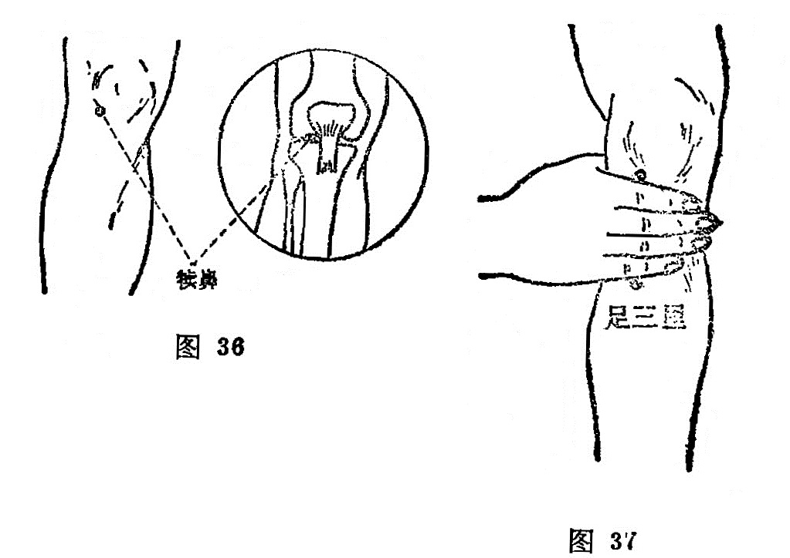

##### 足三里

〔定位〕犊鼻穴下3寸处，当胫骨前嵴外1横指；或犊鼻下四横指处，屈膝或平卧取穴（图37）。

〔解剖〕在胫骨前肌，外侧伸趾长肌之间；有胫前动静脉；有腓肠外侧皮神经及隐神经的皮支，深层为腓深神经。

〔功能〕调理脾胃，扶正培元，通经活络。

〔主治〕胃痛，呕吐，腹胀，噎膈，泄泻，痢疾，肠鸣，衝积，便秘，下肢 疼痛，虚劳羸瘦。

〔刺灸〕直刺1〜1.5寸，可灸。

〔讲述〕出《灵·本输》。别称下陵、鬼邪。里，有邑、居及集会、通达之意，又引伸为寸；三，指膝下三寸。

穴在膝下三寸，是胃气之大会所，因名。穴属本经合穴，阳经之合属土，胃亦属土，故穴为土中之土穴，又系胃之下合穴，有统治一切胃肠消化系统疾病的功效，所以马丹阳归纳在十二穴之内，又为四总穴之一：“肚腹三里留”。凡属脾胃失调，运化失职，刺灸皆有卓效。《灵枢·邪气脏腑病形》：胃病者，……取之足三里。本穴所以能治胃病，由于胃经循行于胸腹深部的脉气是属胃络脾，而肚腹之疾，一般都与脾胃有关，刺灸三里能和中调胃，而降上逆之气，中州调，受纳有权，故言三里统治脾胃疾病。近年在X光下观察，针刺三里，可使胃肠蠕动增强，分泌增多，说明三里能调整胃肠活动功能，具有健脾强胃的作用。据此，凡属胃寒，肠鸣下泄的脾虚症，宜针后加灸，有散寒化湿，补中健脾，温运脾阳之效。《灵枢·五乱》：气在肠胃者，取之足太阴阳明，不下者取足三里。

由于刺灸足三里能健脾强胃，生化气血，补益强壮，故又可用治瘦弱虚损之疾，如华佗用治五劳羸瘦，七伤虚乏。《通玄指要》：三里却五劳之羸瘦。《医说》记有：“若要安，三里莫要干” 的保健灸法。

本穴能补益中气，故又有回阳固脱之效，因此前人把它列为回阳九针穴之一。凡久病元气衰微，急症阳气暴脱，灸之皆效。刺灸本穴还能宣通气机，导气下行，故又可用治气膨之疾。凡七情郁结，气机闭塞，升降失常者，针泻可收宽中开郁之效。临床常配行间治胃痛胁胀满；配太白、章门治腹胀呕泄，食不化；配行间、曲泉治腹胀满；配上巨虚治肠中雷鸣，气上冲胸，喘不能立；配水分、阴交治蛊胀；配中脘治胃停宿食；配气海治五淋；配公孙清胃降逆，治宿食积滞；配百会、长强升阳陷，治脱肛；配归来、百会治阴挺。近代配下巨虚、阳陵泉治胰腺炎；配合谷、天枢治消化不良；配合谷、中脘、天枢、大肠俞、次髎治急性肠梗阻；配风池、太冲、人迎治高血压；配中脘、印堂治低血压；配大椎、肝俞、膈俞治贫血虚弱。

##### 上巨虚

〔定位〕犊鼻穴下6寸，当足三里与下巨虚连线的中点处（图38）。

〔解剖〕在胫骨前肌上；有胫前动静脉；布有腓肠外侧皮神经及隐神经的皮支，深层正当腓深神经。

〔功能〕调和脾胃，通腑化滞。

〔主治〕腹痛，腹胀，肠鸣，痢疾，泄泻，便秘，肠痈，下肢不遂。

〔刺灸〕直刺0.5〜1.2寸 ，可灸。

〔讲述〕串《灵枢·本输》。巨指大，空缺凹陷之处为虚。本穴牵少腿外侧，大空隙（条口）之上，昔以大为上胃，因名。穴属足阳明与大肠下合穴，主治肠胃诸疾。《灵枢·邪气脏腑病形》：治大肠病者，肠中切痛而鸣濯濯，冬日重感于寒则泄，当脐而痛。《甲乙》：治大肠有热，肠侠脐痛，食不化，飧泄，大肠痈。临床常配天枢治腹泻；配曲池、公孙、内关治痢疾。配中脘、四缝能消食导滞，治饮食停滞之泄泻症；配阴陵泉能清利湿热，治湿热蕴结的泄泻；配天枢、阴陵泉、水分、神阙能温散寒湿，治寒泄；配关元、肾俞、脾俞能温补命火，益脾止泻，治肾泄；配太冲能疏肝理气，治气滞泄泻；配阑尾、天枢、三阴交能通肠泄热，祛瘀散结，治肠痈。

##### 条口

〔定位〕犊鼻下8寸，当犊鼻与下巨虚的连线上取穴（图38）。

〔解剖〕同上巨虚。

〔功能〕理气舒筋。

〔主治〕下肢痿痹冷痛，脘腹疼痛，转筋，跗肿，足缓不收、肩背痛。

〔刺灸〕直刺0.5〜1.2寸。

〔讲述〕见于《甲乙》。狭长为条，出入经过之处似口，取本穴须请患者正坐，足跟着地，足尖向上翘起，是穴处肌肉凹陷，出现一条口形状，穴当其处，因名。本穴除主脘腹疼痛外，主要用治下肢痛、痿、麻木、挛急，有活络舒筋之效。《甲乙》：主治胫痛，足缓，失履，湿痹，足下垂，不能久立。临床常配悬钟能舒筋活络，治足步难移；配绝骨、冲阳能强筋壮骨，治足缓难行；配承山能解筋急挛痛，治下肢腨肠痉挛拘急；条口透承山，配肩髃，肩髎能通经活络止痛，治肩凝症。

在采用透承山时，可用3寸毫针，行二度停针法，采取约90°角直刺法朝承山方向刺入，一般针感可放散到脚跗及趾端，再进针寸余，针感由腿肚透过踝关节放散到脚心及趾端。在治疗肩部疼痛时，于行气过程中，令患者活动肩肘，可增强疗效。针感好的不宜用大幅度旋转、提插，留针时间不宜过长，一般以5〜10 分钟为宜，出针后做好后揉法，以减轻局部沉重感。

##### 下巨虚

〔定位〕犊鼻下9寸，条口下1寸，当犊鼻与解谿的连线上取穴（图38）。

〔解剖〕在胫骨前肌与伸趾长肌之间，深层为伸姆长肌；有胫前动静脉；布有腓浅神经分支，深层为腓深神经。

〔功能〕调肠腑，理气滞。

〔主治〕小腹痛，泻痢脓恤，腰脊痛引睾丸，乳痈，下肢痿痹。  

〔刺灸〕直刺0.5〜1寸，可灸。   

〔讲述〕出《灵枢·本输》。巨指大，空缺凹陷之处为虚，此穴在小腿外侧，大空隙（条口）之下，是小肠下合穴，昔以下为小，因名。该穴主治小肠诸疾。《灵枢·邪气脏腑病形》：治小肠病者，小腹痛，腰脊控睾而痛。《甲乙》：治少腹痛，泄出糜。另外还可用于乳痈，胫肿，足跗不收，足跟痛等。《外台》：治女子乳痈，惊痹，胫肿，足跗不收，足跟痛。临床常配幽门、太白调整肠胃，治泄利；配悬钟清胃热，治不嗜食；配丘墟、侠溪散瘀止痛，治胸胁满引腹；配三里、侠溪、梁丘散瘀消肿，治乳痈；配少泽、乳根通乳，治乳少。

##### 丰隆

〔定位〕在条口后方一横指，外踝上8寸处取穴。约当犊鼻与解溪的中点处（图38）。

〔解剖〕在伸趾长肌外侧和腓骨短肌之间；有胫前动脉，布有腓浅神经。

〔功能〕祛痰，平喘，通便，镇静。

〔主治〕痰多，哮喘，咳嗽，咽痛，便秘，狂痫，下肢痿痹。

〔刺灸〕直刺0.5〜1.2寸，可灸。

〔讲述〕出《灵·经脉》。丰有满的含意，隆指盛言。足阳明为多气多血之经，为谷气隆盛之脉，本穴属络穴，从此别走太阴，《太素》注有：足阳明谷气隆盛，至此处丰益出于大络，加之穴处肌肉丰满隆盛，与条口不同，因名。本穴除用治下肢痿痹，疼痛诸疾外，主要用于痰喘，癫狂，便秘之疾。《灵枢·经脉》：治气逆则喉痹瘁瘖，实则癫狂，虚则足不收，胫枯，取之所别。《大成》：治厥逆，大小便难，怠惰，腿膝酸，屈伸难，胸痛如刺。《玉龙歌》：多痰宜向丰隆寻。《肘后》：哮喘发来寝不得，丰隆刺入三分深。本穴能祛痰平喘，是因丰隆胃络，别走太阴，能沟通脾胃二经；脾能散精，又归于肺，胃之大络贯腹络肺，肺脉还循胃口，上膈属肺，可见胃络联系脾、肺、胃，故凡痰生于脾而聚于胃，贮于肺所引起的疾患，刺胃之络，能清胃热、涤痰浊，使达气行津布，中土得运，痰湿自化，所以能化浊降逆通便。临床常配脾俞健脾化痰，治湿聚生痰之疾；配百会、脾俞健脾化痰熄风，治痰浊眩晕；配风池、百会、太冲、内庭能清泄痰火，治痰郁化火之头痛，眩晕；配中脘和胃降逆治胃痛；配内关温中和胃止呕吐；配外关泄三焦之热可通便;配神门、太冲熄风定痫，治痫疾；配神门、中脘、人中、合谷、太冲疏肝，化痰，开窍，行郁，治癫狂；配廉泉清降痰火，宣畅舌络，治失瘖。本穴所治多属实症，故宜泻法直刺，针感易沿经至足背；略向上刺，不断捻转行针，针感可循经至髀关，天枢穴处，少数可循感到缺盆，上项到头维穴处。

##### 解溪

〔定位〕足背踝关节横纹中点，即拇长伸肌腱与趾长伸肌腱之间（图39）。

〔解剖〕在拇长伸肌腱与趾长伸肌腱之间；有胫前动静脉；浅部为腓浅神经，深部为腓深神经。

〔功能〕清胃降逆，健脾化湿。

〔主治〕头痛，眩晕，颜面浮肿，面赤，目赤，腹胀，便秘，癫狂，胃热谵语，下肢痿痹，足踝关节痛。

〔刺灸〕直刺0.5〜0.7寸，可灸。

〔讲述〕出《灵枢·本输》。别称鞋带。溪，原作谿，陷处为谿、解有开放之意。因穴在足背跗骨两筋之间陷中，适当束缚鞋带之处，因名。本穴除治下肢痿痹，足跗疼痛外，主要用于头痛，巨眩，癫狂，便秘之疾。穴属经火，为胃经之母穴，根据虚补其母的法则，用补法，可收益火生土，健强胃之效；施用泻法，对胃热实邪所引起的头痛，癫狂，便秘，可退阳明之实热，达到热退则气不升，火不布，神可安，风可熄的作用。临床常配商丘、丘墟治足踝痛；配条口、丘墟、太白治膝股痛，胻痠转筋；配合谷治头痛，眉棱骨痛；配尺泽、廉泉、少商清利咽喉，治咽痛；配尺泽、复溜滋阴降火，治声音嘶哑；配丘墟、翳风清热散结，治痄腮。配合谷、太冲、攒竹、下关、颊车治头面痛；配禾髎治酒渣鼻；配丰隆、神门、大陵清火涤痰宁神，治狂症。

##### 冲阳

〔定位〕在解溪下方，足背最高点，动脉应手处，当第二、三跖骨与楔状骨间陷处（图39）。

〔解剖〕有足背动、静脉及足背静脉网；分布着腓浅神经的足背内侧皮神经，深层为腓深神经。

〔功能〕健脾，化湿，安神。

〔主治〕胃痛，腹胀，纳呆，面肿，口眼㖞斜，齿痛，足踝肿痛，狂 痫。

〔刺灸〕避开动脉，直刺0.3〜0.5寸，可灸。

〔讲述〕出《灵枢·本输》。别称趺阳、会原、会涌。冲指动，穴属足阳明胃经，正当足背冲阳脉处，胃经至此，冲出本经，因名。本穴昔时认为是察候胃气强弱、存亡的主要脉候之一。《素问·三部九候论》王注：候胃气者，当取足跗之上，冲阳之分，穴中脉动乃应手也。冲阳脉微，则知胃气将绝，多属虚症；若内盛实症，若内盛实症，久狂高歌，则趺阳脉必跳动加强，可用微针刺之出血，有清胃热，镇静，消除恶血内留之效。《素问·刺疟论》：足阳明之疟，令人先寒洒淅，洒淅寒甚，久乃热，热去汗出，喜见日月光火气，乃快然，刺足阳明跗上。据此，本穴多用于胃热所致脘痛胀满，久狂登高而歌之疾。临床常配丰隆、神门、后溪清胃热，祛痰浊，治狂妄；配陷谷、然谷、中封治足跗肿；配条口、绝骨、肩井治足痿难行；配仆参、飞阳治足痿履不收；配中脘、足三里治胃痛。本穴系本经原穴，《金鉴》谓：胃经表之原穴冲阳，脾经里之络穴公孙，二穴应刺之证即：项强、胸膺、胯、股、胫胻、足跗疼痛，发狂妄言高歌，弃衣而走，恶烟火，闻木音即惊，皆胃脾经病也。刺此穴勿过出血，所谓刺跗上，中大脉，血出不止死，慎之。

##### 陷谷

〔定位〕足二趾外方，本节后陷中，即二、三跖骨结合部之前凹陷中（图39）。

〔解剖〕在趾长伸肌腱外侧；有足背动静脉及足背静脉网；有来自腓浅神经的足背内侧皮神经，深层为腓深神经。

〔功能〕健脾利湿，疏通经络。

〔主治〕面目浮肿，胸胁支满，水肿，肠鸣腹痛。

〔刺灸〕直刺0.3〜0.5寸，可灸。 

〔讲述〕出《灵枢·本输》。凹者为陷，陷又有中的含意。本穴正当足大趾次趾之间凹陷处，主治腹满善噫，谷气下陷，因名。穴属输木，故用泻法能平木培土。所谓胃脉弦者泻此，木平而胃气自盛。《甲乙》：治水中留饮，胸胁支满，面肿目壅肿。《千金》：治腹大满善噫。《金鉴》：治面目浮肿及氺病善噫，疝气少腹痛，肠鸣腹痛，疟疾振寒无汗，胃脉得弦。故凡脾胃功能失调所致腹泻肠鸣，水肿留饮，目面浮肿，针灸陷谷，有健脾利湿，消除腹胀之力。临床常配下脘治腹胀肠鸣；配期门治产后喜噫；配悬钟治腹满；配天枢治腹痛。 

##### 内庭

〔定位〕足背二、三趾间缝纹端（图39）。

〔解剖〕有足背静脉网；当足背内侧皮神经及第二支分出趾背神经分歧处。

〔功能〕清降胃火，通涤腑气。

〔主治〕齿痛，口㖞，咽痛，喉痹，鼻衄，泄痢，便秘，热病， 足背肿痛。  

〔刺灸〕直刺0.3〜0.5寸。

〔讲述〕出《灵枢·本输》。本穴位于历兑之后；兑为口、为门 （《易经》），历兑为大门，此穴为庭门，因名。穴属胃经所溜荥水穴，具有清降胃火，宣泄阳明之效。故凡胃火炽盛、以及阳明炽热循经上扰头面、咽喉、口齿之疾，刺泻能降胃火，散邪热；补之能振奋胃阳。《甲乙》：治四肢厥逆，手足闷者，使人久持之，厥热，胫痛，腹胀，皮痛，善伸数欠，恶心与木音，下齿痛。《千金》：主食不化，不嗜食，挟脐急。《天星十二穴》：能治四肢厥，喜静恶闻声，瘾疹咽喉痛，数欠及牙痛，疟疾不思食，耳鸣针便清。因胃经循行自头至足，下循鼻外，入上齿龈内；其支者沿喉咙入缺盆，下膈膜，入属胃腑，故凡胃火上炽，阳明积热，上攻咽喉，齿痛咽肿喉痛者，针泻内庭，上病下取，可清热开郁，导火下行而获止痛消肿之效。临床常配合谷治胃火齿痛；配复溜治阴虚齿痛。配合谷、三阴交清胃凉血，治龈肿口臭；配外关、公孙降火平呃，治热呃；配中脘、三里降逆止呕，治胃热呕吐；配支沟、上巨虚泻火通便，治便秘；配神门清心泻火宁心，治癫乱。配内关、曲池治腹痛泄泻；配太溪、仆参治足痠麻木。

##### 厉兑

〔定位〕第二趾外侧趾甲角旁约0.1寸（图39）。 

〔解剖〕有趾背动脉形成的动脉网；布有腓浅神经的趾背神经。

〔功能〕清胃安神，苏厥醒神。

〔主治〕面肿，口㖞，齿痛，鼻衄，胸满，心烦，热病，癫狂，梦魇不安。   

〔刺法〕直刺0.1寸，或点刺出血，可炎。

〔讲述〕出《灵枢·本输》。厉，有危、病意，兑，为口，为门。胃为水谷之海，食则用口，本穴主治口噤、口㖞以及胃肠疾患，因名。《玉龙》：治尸厥，口噤，腹胀，水肿，面肿，喉痹，牙疼。《大成》：治口噤气绝，状如中恶，心腹胀满。本穴能治尸厥，口噤，是因根据“病在脏者，取之井”的法则，刺乏有苏厥，醒神，恢复知觉之力。另外，由于胃经属土，而厉兑属金，土能生金， 故穴为胃经之子，凡胃中实热所致齿痛，鼻衄，心腹胀痛，热盛发狂，梦魇不安，诸般阳热怫郁，痰火壅盛之疾，刺用泻法，有清胃热，通郁滞；导火下行之效。临床常配内关治胃痛；配百会、人中、中冲治中风；中暑，晕厥不省人事；配隐白治梦魇不安；配大敦治喜寐；配漏谷治心腹胀满。

#### （四）本经小结

1．本经受手阳明大肠之交，经脉走行方向是从头走足，与足太阴脾经为表里，全经计有45个经穴，体表起于承泣，止于厉兑，络在丰隆，郄会梁丘。本经取穴要点，应注意瞳孔的直线，口角，下颌角，鬓角，觀弓，胸锁乳突肌，喉结，肋间隙，髂前上棘，顧骨外缘、外膝眼，胫骨前骼，外踝高点，以及第二跖关节等标志。取面部经穴，要端坐正视，面微上仰，在曈孔正中与口角直下连线上取承泣、四白、巨髎、地仓，于下颌角前一横指取颊车，颧弓下方取下关，鬓角上0.5寸取头维。

颈部4穴，平喉结旁，动脉应手处；胸锁乳突肌的前缘取人迎；水突在人迎与气舍之向；气舍在锁骨上缘，与水突，人迎相对，所以点穴时要先取人迎，后取气舍，然后在二穴之间取水突；在气舍之旁，锁骨上缘，下与乳头相对，取缺盆穴。

胸部6穴，应取仰卧位，均在肋间隙中，任脉旁开4寸处取之。

腹部12穴，应取仰卧位，先取任脉巨阙，旁开2寸点不容， 其他腧穴上下相距各1寸，均在任脉旁开2寸处。

大腿部有4穴，应屈膝正坐，四穴均在髂前上棘与髌骨外上缘的连线上。小腿有6穴，在髌骨外侧凹陷中（即外膝眼）取犊鼻；从犊鼻到外踝上缘是1尺6寸，于犊鼻下3寸，腔骨前嵴外侧一横指处取三里；于犊鼻下6寸取上巨虚，8寸点条口，条口外1横指取丰隆，条口下1寸取下巨虚。

足背有5穴，取穴时应将足伸直放平，于外踝尖平齐，足背两筋间取解溪；于解溪下约1.3寸，动脉应手处取冲阳；于第二与第三跖趾关节前取内庭，后取陷谷，于足二趾外侧爪甲角根部取厉兑。

2．本经生理功能与病理反应，应注意属胃络脾，并与心、大肠、小肠以及鼻，口，齿和体表的乳部、气街相联系。它的功能是受纳水谷，为脏腑之海；脏腑赖胃气的供养，故本经多气多血， 气血旺于辰时。它内以候胃，外以候肌，病邪侵其经脉，其表现有外经病的发烧，面赤，汗出，神昏谵语，疟疾，以及目痛、鼻干衄血、唇口生疮，喉痛等等；内腑症多为腹胀，消谷善肌，癫狂，水肿，卧不安，溺色赤黄。所属经穴功能，除有调理脾胃之外，主要用于胃肠病。如胃合三里能通降腑气，治一切胃肠疾患；大肠合于上巨虚，大肠募穴天枢均主大肠疾患；小肠合于下巨虚能治小肠疾患。用治神志、癫狂，有丰隆涤痰，太乙止癫，滑肉门止吐弄舌，冲阳止狂善惊，解谿治癫悲善泣；梦魇不安取厉兑，口噤取地仓，颊车。用于血病如衄血取厉兑，癥瘕血块取天枢，产妇血晕取三里，下利脓血取上巨虚。用于头面疾病，如目不明、泪出取承泣、四白，目赤取足三里，偏头痛取头维，口㖞取地仓、颊车，咽痛取人迎、内庭，牙痛取颊车、下关、内庭。理肺气治，咳逆上气取人迎、气舍、库房、屋翳、水突；消水肿取大巨、水道；疟病寒热取内庭、厉兑，痢疾取天枢、上巨虚、内庭。

3．面部血管丰富，进退针要慢，防止出血，引起血肿。颈部深层有动脉，不可深刺，要避开动脉。胸部内藏心、肺，应浅刺，或沿皮平刺，严防伤及心、肺。腹部要消毒严密，进针须缓慢，达一定深度时，要少提插，免伤腹腔器官。面部、关节部位各穴，不宜用灸，避免引起瘢痕，有碍美观和关节活动功能。

#### 复习思考题

1. 足阳明胃经的循行及其络属是什么？
2. 本经腧穴主治功能有哪些规律？
3. 取头面部穴要掌握哪些定位标志？
4. 腹部经穴距任脉旁开多少？各穴上下之间距离是多少寸？
5. 刺人迎要注意什么？
6. 怎样取下肢小腿部的经穴？

答：

1. 分類
2. 阿是

### 四、足太阴脾经（21）穴

#### （一）分布络属

分布径路：受足阳明胃经支脉，经脉走行方向是从足走腹，起于足大趾内侧端（隐白），沿着足跖内侧缘，向上到内踝前边，沿胫骨内缘，交叉到足厥阴的前面，上行经过膝关节和大腿的内侧，进入腹部，归属于脾，联络胃府，向上穿过膈肌，沿着食道的两旁，通连到舌根部，散布在舌下。

它的支脉，再从胃中出来，向上通过横膈，脉气流注入心中，与手少阴心经相接。

络属脏腑：属脾，络胃。

经过器官：舌，咽（食道），联系心脏。

本经腧穴：
四脾原属足太阴，下肢内侧向上循。
**隐白**大趾内甲角，**大都**节前陷中藏。
**太白**核骨白肉际，节后一寸**公孙**明。
**商丘**踝前陷中找，踝上三寸**三阴交**。
踝上六寸**漏谷**悬，膝下五寸**地机**朝。
膝内辅下**阴陵泉**，**血海**膝膑上内廉。
**箕门**血海上六寸，**冲门**平曲三寸五。
**府舍**横下四五分，横下寸三取**腹结**。
天枢旁二**大横**藏，适当脐旁四寸详。
**腹哀**建里旁四寸，中庭旁六**食窦**全。
**天溪胸乡周荣**穴，每隔一肋陷中湮。
**大包**腋下方六寸，上直渊液三寸悬。

圖40 足太陰脾經循行示意圖

  	图解：脾足太阴之脉：①起于大趾之端，循趾内侧白肉际，过核骨后，上内踝前廉，②上腨内，循胫骨内，交出厥阴之前，③上膝股内前廉，④入腹，⑤属脾，⑥络胃，⑦上膈，⑧挟咽，⑨连舌本，散舌下，其支者，⑩复从胃别，上膈，注心中（《灵枢·经脉》）。

#### （二）本经证候

经证：舌根痛、僵硬，大腿及膝关节内侧肿胀、发冷，足大趾不能运用（均属本经病）。

脏证：不欲食，嗳气，腹胀，痞块，身体沉重，大便溏泄，水肿，黄疸（均属本脏病）。呕吐、胃痛（胃病）。心烦，心下痛，失眠（心病）。正如经文所述：是动则病舌本强，食则呕，胃脘痛，腹胀善噫，得后与气，则快然如衰，身体皆重。是主脾所生病者，舌本痛，体不能动摇，食不下，烦心，心下急痛，溏瘕泄，水闭，黄疸，不能卧，强立，股膝内肿，厥，足大指不用（《灵枢·经脉》）。

#### （三）腧穴分述

##### 隐白

〔定位〕拇趾内侧爪甲角旁约0.1寸（图41）。

〔解剖〕有趾背动脉；布有腓浅神经的趾背神经，深层为胫神经的足底内侧神经。

〔功能〕健脾，统血，宁神。

〔主治〕腹胀，呕噁，泄泻，便血，崩漏，癫狂，梦魇，尸厥。

〔刺灸〕浅刺0.1寸，或用三棱针点刺出血。可灸。

〔讲述〕出《灵·本输》。别称鬼垒。隐有藏的含意，穴在足大趾内侧端，是处皮肤常隐而皮色白，因名。穴属井木，有健脾统血，宁血止惊之效，多用治崩漏，狂惊。一般多灸隐白，使脾气健运，统血有权则血归经，经漏可止。《甲乙》：治烦心善悲，腹胀逆息，中闷呕吐，不欲饮食，尸厥死不知人，脉动如故。《铜人》：疗妇人月事过时不止。《保命集》：治血不止，鼻衄，大小便皆血，血崩。临床常配行间止血崩；配关元治经漏；配人中治失血昏迷。由于穴属井木，木能胜土，土不足则木气更胜，则惊狂瘈疭必作，刺隐白可上泻有余，收到清火消痰，安神定志之效，故可用于尸厥不 知人，梦魇不安症。临床常配厉兑治梦魇不安，配百会治尸厥。本穴系十三鬼穴之一，统治一切癫狂之疾。

##### 大都

〔定位〕拇趾内侧，第一跖趾关节前缘赤白肉际处（图41）。

〔解剖〕在外展外 𧉯肌止点，有足底内侧动脉分支；布有足底内侧神经的趾底固有神经。

〔功能〕调健脾胃，泻热和中。

〔主治〕腹胀，胃痛，食不化，便秘，热病无汗，体重肢肿，心烦，不得卧。

〔刺灸〕直刺0.3～0.5寸，可灸。

〔讲述〕出《灵枢·本输》。大，有开始之意；都，指盛言。穴当足大趾本节前内侧陷中，是处皮肤丰隆，因名。穴属所溜之荥穴，阴荥属火，是脾经之母穴，故补之能益火生土，调建中州，统治一切脾虚之疾。《灵枢·厥病》：治厥心痛甚，胃心痛也，取之大都太白。《甲乙》：胃心痛也，大都主之。《肘后》：火乱下利不止者，灸足大趾本节内侧赤白肉际，左右各灸七壮，名大都。若因脾虚无力充养肌肉所致腰腿疼痛，麻木不仁，日久肌肉萎缩，刺灸大都能健脾益气，促进营血通畅，从而麻木之疾可除。临床常配太白治胃心痛；配横骨治气滞腰痛；配环跳治腰腿痛；配经渠治热病不汗出。

##### 太白

〔定位〕在第一跖趾关节后缘，赤白肉际处（图41）。

〔解剖〕在外展𧉯肌中，有足背动、静脉分支，足底内侧动脉分支；布有隐神经与腓浅神经吻合支。

〔功能〕健脾，和中，整肠。

〔主治〕胸胁腹胀，肠鸣，泄泻，痢疾，便秘，呕恶不食，体重节痛。

〔刺灸〕直刺0.3～0.5寸，可灸。

〔讲述〕出《灵枢·本输》。太有明显之意，穴属足太阴，位于足内侧跖骨下陷中，是处皮肤较足底特白，望其色而名为太白。穴属俞土，为本经之母穴，故凡脾胃衰弱，刺灸有健脾、和中、整肠之效。《素·刺法论》：土欲发郁，亦须待时当刺足太阴之俞。《甲乙》：治热病，满闷不得卧，胸胁胀，肠鸣切痛，身重骨痿不相知。本穴主治脾胃之疾，是因脾之俞土，为本经之母，又系本经原穴，故凡脾虚所致腹满肠鸣，阴气上冲，心胃作痛，恶心泄泻，在病灶远隔的太白针灸，可导阴气下降，且可健脾胃，调整脾胃。临床常配丰隆治身重倦怠，面黄舌强而痛，腹满时时作痛，或吐或泻，善饥而不欲食；配公孙治食不化，鼓胀腹满痛；配陷谷、大肠俞治肠痈痛；配中渚治大便难。

##### 公孙

〔定位〕第一跖骨底的前缘，赤白肉际处（图41）。

〔解剖〕在外展𧉯肌中，有跗内侧动脉及足背静脉网，在隐神经及腓浅神经处。

〔功能〕理脾胃，调冲脉。

〔主治〕心胸胃痛，呕吐，食不化，腹痛泄泻，痢疾，逆气里急。

〔刺灸〕直刺0.5～0.8寸，可灸。

〔讲述〕出《灵枢·经脉》。公，有本原之意，孙者支系。穴属脾络，以其正脉为公为本，支络为系为孙，因名。穴属本经络穴，又系八脉交会通于冲脉，故有理脾胃，调冲脉之效。《甲乙》：治实则肠中切痛，厥，头面肿起，烦心，狂，多饮；虚则鼓胀，腹中气大满，热病不嗜卧，霍乱。《八法歌》：九种心痛涎闷，结胸翻胃难停，酒食积聚胃肠鸣，水食气疾膈病，脐痛腹疼胁胀，肠风疟疾心疼，胞衣不下血迷心，泄泻公孙立应。临床常配内关治心胸疾；配内庭、历兑治久疟不食；配脐中四边穴治腹泻；配章门治腹胀。配三里、阴陵泉、曲泽、委中放血，祛湿化浊，治霍乱吐泻；配天枢、中脘、艾灸神阙，温阳散寒，治寒霍乱。总之，脾经从公孙别出，走入足阳明经，加之公孙通于冲脉，而冲脉起于气街，并少阴之经挟脐上行，至胸中而散，当冲脉之气失调，逆气而里急，冲逆攻痛，刺灸公孙，可收降逆平冲之效。

##### 商丘

〔定位〕内踝前下方凹陷中（图41）。

〔解剖〕有跗内侧动脉，大隐静脉；布有隐神经及腓浅神经分支。

〔功能〕健脾利湿，活络止痛。

〔主治〕腹胀，肠鸣，泄泻，便秘，黄疸，食不化，踝部痛肿。

〔刺灸〕直刺0.3～0.5寸，可灸。

〔讲述〕出《灵枢·本输》。商，五音之一，金音；陵起为丘。穴在内踝下微前陷中，是处形似丘陵，穴属脾经，经金，因名。本穴除主局部脚背痛、麻之疾外，主要用于脾胃之疾。《千金》：治反胃，食即吐，心下有寒痛，小腹坚痛下行阴中，筋挛，膝不得屈伸，不可以行，偏风痹，脚不得履地。《神农经》：治脾虚，腹胀，胃脘痛。本穴治足背肿胀，疼痛，筋挛脚疼，是因脾经脉气从足大趾尖起，上行至足内踝前下方之商丘，且兼脾为湿土，又主四肢，故凡风寒湿热滞留经脉引起疼肿之疾，刺灸商丘可清热化湿，消肿止痛。本穴治脾胃疾病，是因穴属经金，系本经之子穴，根据实泻其子的原则，凡脾失健运，不能运化，所致腹胀，肿痛，以及黄疸之疾，皆可泻之，所以《大成》说：脾实商丘泻之。

##### 三阴交

〔定位〕内踝上3寸，胫骨内侧面后缘取穴；或当内踝尖上四横指处（图42、43）。

〔解剖〕在胫骨后缘和比目鱼肌之间，深层有胫后动、静脉；布有小腿内侧皮神经，深层后方有胫神经。

〔功能〕调脾胃，益肝肾。

〔主治〕脾胃虚弱，腹胀肠鸣，完谷不化，月经不调，带下不孕，阴挺滞产，产后血晕，恶露不行，遗精阳萎，疝气遗尿，小便不利，失眠心悸。

〔刺灸〕直刺0.5～1寸，可灸。

〔讲述〕见于《甲乙》。别称承命、太阴。会处为交，《针灸问对》谓足之三阴，从足走腹，太阴脾经循内踝上直行，厥阴循内踝交入太阴后，少阴肾经循内踝后交出太阴之前。此处为足三阴脉交会所，因名。本穴除主治腹胀肠鸣，大便溏泄脾胃疾患外，主要用于经、带、不孕、难产之疾。《千金》：治女人漏下赤白，血崩，难产，月水不禁，横生胎动、妇人下血泄痢，赤白漏下。《外台》：主虚则腹满，肠鸣溏泄，食饮不化，脾胃肌肉痛。临床常配归来、太冲治疝气偏坠；配关元治夜尿；配血海、气海治月经不调、痛经；配中脘、气海治月经过多；配关元治经后腹痛；配阴陵泉治飧泄；配气海治白浊、遗精；配神门治失眠；配合谷能催产。《铜人》谓妊娠不可刺。

##### 漏谷

〔定位〕内踝尖上6寸，胫骨后缘，当阴陵泉和三阴交的连线上（图43）。

〔解剖〕在胫骨后缘和比目鱼肌之间，深层有趾长肌；有大隐静脉，深层有胫后动静脉；有小腿内侧皮神经，深层后方有胫神经。

〔功能〕健脾，渗湿，利水。

〔主治〕水肿，小便不利，腹胀，疝气偏坠，腿膝厥冷，麻木不仁，足踝肿痛。

〔刺灸〕直刺0.5～1寸，可灸。

〔讲述〕见于《甲乙》。别称太阴经。渗出为漏，因本穴主治湿痹不能行，以及小便不利，刺此能渗湿利尿，因名。如《甲乙》：治腹中热，若寒，腹鸣，强欠，时内痛，心悲气逆，腹满，少腹胀急，小便不利，厥气上头巅。《大成》：治膝痹足不能行。临床常配太冲治小便不利；配会阴治腹寒冷气；配曲泉治血瘕；配梁丘、血海、足三里、三阴交治膝腿麻痹不仁。

##### 地机

〔定位〕阴陵泉下3寸，当阴陵泉与三阴交的连线上取穴（图43）。

〔解剖〕在胫骨后缘与比目鱼肌之间，前方有大隐静脉，及膝最上动脉，深层有胫后动静脉；布有小腿内侧皮神经，深层后方有胫神经。

〔功能〕和脾理血，调燮胞宫。

〔主治〕月经不调，痛经，遗精，腹胀，纳呆，水肿，小便不利。

〔刺灸〕直刺0.5～1寸，可灸。

〔讲述〕见于《甲乙》。别称脾舍，地箕。地，指土，在此引伸为脾土；机，有变化之意。本穴主治妇人月事改常，精血不足，生殖不能，刺此可使气血充盛，生殖畅旺，犹如大地得正气，化生万物一样，因名。《铜人》：治女子血瘕，丈夫溏泄，腹胁气胀，水肿。《大成》：治精不足，女子癥瘕。《百症赋》：抑又论妇人经事改常，自有地机、血海。本穴能治月经不调，是因地机为脾之郄，脾主统血，刺灸脾郄，可以引血归脾，补脾摄血，而收调气养血之功。

##### 阴陵泉

〔定位〕胫骨内侧髁下缘凹陷中（图44）。

![]（../../gmzyjc-md/ok/105.1zjs/img/图44.jpg)

〔解剖〕在比目鱼肌起点上方，前方有大隐静脉，膝最上动脉，深层有胫后动，静脉；布有小腿内侧皮神经本干，最深层有胫神经。

〔功能〕健脾利水，通利三焦。

〔主治〕腹胀，水肿，小便不利，失禁，黄疸，膝肿。

〔刺灸〕直刺0.5～1.2寸，可灸。

〔讲述〕出《灵枢·热病》。别称阴之陵泉、阴陵。突起为陵，穴属合水，位居膝下内侧，又为脾经腧穴，脾为阴中之阴，膝高突起似陵，水出于泉，因名。本穴除主腹胀，泄泻以及膝痛之疾外，主要用于水肿，小便不利，有通利三焦，开通水道之效。《千金》：主心下满寒中小便不利，洞泄不化。《金鉴》：治胁腹胀满，阴痛，足膝红肿，小便不通。《玉龙歌》：膝盖红肿鹤膝风，阳陵二穴亦堪攻，阴陵针透尤收效，红肿全消见异功。《百症赋》：阴陵水分去水肿之脐盈。本穴所以能通利三焦，是因穴属脾经合穴，阴合属水，与水经的肾和膀胱有密切联系，故能宣泄水液，通利小便。临床常配水道通淋利小便。配水分、中极、足三里、三阴交治癃闭，腹水；配涌泉治小肠连脐痛；配关元治气癃尿黄；配隐白治胸中热，暴泄；配承山治心胸满不思食；透刺阳陵泉治膝肿鹤膝风。

##### 血海

〔定位〕屈膝，在髌骨内上缘上2寸，当股四头肌内侧头的隆起处；或患者屈膝，医者以手掌按在髌骨上，第二至五指向上伸直，拇指约呈45°斜置，拇指尖下是穴（图45、46）。

〔解剖〕在股内侧肌下端，有股动、静脉肌支；布有股前皮神经及股神经支。

〔功能〕理血调经，散风祛湿。

〔主治〕月经不调，痛经，经闭，崩漏，湿疮，瘾疥瘙痒。

〔刺灸〕直刺0.7～1.2寸，可灸。

〔讲述〕见于《甲乙》。别称百虫窠。归聚之处为海，本穴主治血分疾病，有引血归脾之效，犹如江河下百川入归诸海之意，因名。《甲乙》：治妇人漏下，若血闭不通，逆气胀。《聚英》：治气逆腹胀，女子下恶血，月事不调。《金鉴》：治女子崩中漏下，月信不调，带下，及男子肾脏风，两腿疮痒湿痛。临床常配地机治经事改常；配冲门治痃癖；配气海、归来调气活血止痛，治气滯血瘀痛经；配灸归来温经行瘀，治寒凝血瘀痛经；配灸气海、三阴交补气温阳，洽气虚痛经；配灸隐白、神门益心脾摄血，治崩漏；配气海、中极治五淋；配阴陵泉、三阴交清利湿热，治臁疮；配曲池养血祛风，治皮肤瘙痒。

##### 箕门

〔定位）在血海上6寸，缝匠肌内侧取穴（图46）。

〔解剖〕在缝匠肌内缘，深层有内收肌；有大隐静脉，深层外方有股动、静脉；布有股前皮神经，深层有隐神经。

〔功能〕利水通淋。

〔主治〕小便不利，遗溺，腹股肿痛。

〔刺灸〕避开动脉，直刺0.5～1寸，可灸。

〔讲述〕见于《甲乙》。箕指二展其足，穴在大腿内侧，取此穴必须屈膝展足，两腿分开，因名。本穴除用于腹股肿痛外，又主小便不通，淋浊遗溺症。《外台》：治淋遗溺，鼠鼷肿痛，小便难。《大成》：治淋，小便不通，遗溺鼠鼷肿痛。临床常配然谷、行间治淋症；配合阳、三阴交治带下。本穴深处有股动脉，忌深刺。《素问》谓刺阴股中大脉，血出不止死，慎之。

##### 冲门

〔定位〕平耻骨联合上缘中点（曲骨）旁开3.5寸，动脉外侧取穴（图47）。

〔解剖〕在腹股沟韧带中点之外侧，腹内斜肌之下部，内侧为股动、静脉，当股神经经过处。

〔功能〕理下焦，调血脉。

〔主治〕腹痛，奔豚气，疝气，小便不利，带下，胎产诸疾。

〔刺灸〕避开动脉，直刺0.5～1寸，可灸。

〔讲述〕见于《甲乙》。别称慈宫。冲指动，穴居横骨两端的纹中动脉处，是气冲的部位，为胃气冲过脾经之处，因名。穴属足太阴、足厥阴、阳维之会所，除主腹痛，疝气，小便不通之疾外，主要用于带下产崩，有理下焦，调血脉之效。《甲乙》：主寒气腹满，癃，淫泺，身热，腹中积聚疼痛，阴疝。《大成》：治妇人难乳，妊娠子气冲心，不得息。临床常配阴郄治疝气；配大敦治淋症；配气冲治带下产崩；配中极、三阴交治尿闭；配中脘、气海、三阴交治阴挺。本穴《甲乙》、《外台》、《金鉴》皆定在“各去腹中行三寸五分”；《发挥》、《铜人》、《大全》、《大成》、《入门》定在“各去腹中行四寸五分”；惟《针方六集》定在去腹中行四寸。今从《甲乙》。

##### 府舍

〔定位〕在冲门外上方0.7寸，任脉旁开4寸处（图47）。

〔解剖〕在腹股沟韧带上方外侧，腹外斜肌腱膜及腹内斜肌下部，深层为腹横肌下部；有腹壁浅动、静脉，肋间动、静脉；布有髂腹股沟神经。

〔功能〕通腑散结。

〔主治〕腹痛，疝气，积聚。

〔刺灸〕直刺0.5～1寸，可灸。

〔讲述〕见于《甲乙》。舍指住，是穴为足太阴、阴维、厥阴之住会所，此三经从此上下入腹络胸，结心肺，因名。本穴主要用治腹痛，疝气，痞块之疾，有调下焦，散结聚之效。《外台》：治疝瘕，髀中急痛，循胁上下抢心，腹痛积聚，厥逆霍乱。临床常配大敦治疝气；配气海、三阴交治阴挺；配天枢．足三里治腹满积聚。

##### 腹结

〔定位〕在大横穴下1.3寸，任脉旁开4寸（图47）。

〔解剖〕有腹内外斜肌及腹横肌；布有第11肋间动、静脉和肋间神经。

〔功能〕行气血，调肠腑。

〔主治〕绕脐腹痛，疝气，泄痢。

〔刺灸〕直刺0.7～1.2寸，可灸。

〔讲述〕见于《甲乙》。别称腹屈、肠结、肠窟。腹，指腹部；结，有聚的含意，本穴主治绕脐作痛，气结胸腹，因名。本穴主要用治腹痛，泄痢，疝痛之疾。《千金》：治绕脐痛抢心。《铜人》：治绕脐痛，上冲抢心，腹寒泄痢，咳逆。临床常配天枢调肠胃，止泻痢；配行间舒肝气，治胁痛抢心。

##### 大横

〔定位〕在神阙（任脉）旁开4寸处（图47）。

〔解剖〕在腹内外斜肌及腹横肌部；有第10肋间动、静脉及第10肋间神经。

〔功能〕通腑气，调肠腑。

〔主治〕泄泻，痢疾，便秘，腹痛。

〔刺灸〕直刺0.7～1寸，可灸。

〔讲述〕见于《甲乙》。别称肾气。平者为横，穴当脐孔横平旁开4寸，内有横结肠，主治大肠疾患，因名。本穴主要用治泄泻，痢疾，腹痛之疾，还可用于四肢困倦，多寒悲恐。《甲乙》：治大风逆气，多寒善悲。《千金》：治惊恐，心悸少力，又主小腹热，欲走，太息，四肢不可举动，多汗洞痢。临床常配天枢、中脘、关元、足三里通调肠府，治腹痛泄利；配阳陵泉通府治便秘。配四缝治虫痛；配人中、合谷治脏燥。由于足太阴之脉上膈挟咽，故能降气止咳，加之脾主四肢，故灸之能治四肢困倦，而脾阳振则寒去腹泻自除，津液行则大便燥结自解。

按此穴定位有三说：一说脐旁3.5寸，一说脐旁4.5寸，一说平脐旁开4寸。此可能从脐正中量则为4寸或4.5寸，从脐孔旁侧量则为3.5寸的差异，今从《针方六集》平脐旁开4寸。

##### 腹哀

〔定位〕在脐上3寸，建里（任脉）旁开4寸处（图47）。

〔解剖〕在腹内外斜肌及腹横肌部，有第八肋间动、静脉及第八肋间神经。

〔功能〕调理肠胃。

〔主治〕腹痛肠鸣，完谷不化，便秘，痢疾。

〔刺灸〕直刺0.7～1寸，可灸。

〔讲述〕见于《甲乙》。哀有鸣和爱的含意，穴当腹部，主治腹痛肠鸣，犹如腹部发出哀鸣之状，且腹裹肠胃，须加爱护，因名。本穴为足太阴、阴维之会，属纯阴，故凡阴气结，寒湿滞留所致腹痛下痢，完谷不化，肠鸣漉漉等，刺灸能调理肠胃，温散寒湿。《甲乙》：治便脓血，寒中食不化，腹中痛，绕脐痛，抢心，膝寒，注痢。临床常配中脘、足三里治腹痛肠鸣；配太白治食不化。

##### 食窦

〔定位〕在中庭（任脉）旁开6寸，第五肋间隙处（图48）。

〔解剖〕在第五肋间隙前锯肌中，深层有肋间内外肌；有胸外侧动脉，肠腹壁静脉；布有第五肋间神经外侧皮支。

〔功能〕宽胸利膈，行气通乳。

〔主治〕胸胁支满，反胃，噫气，乳少。

〔刺灸〕平刺或斜刺0.5～0.8寸，可灸。

〔讲述〕见于《甲乙》。别称命关。孔道为窦，本穴主治胸胁支满，膈中雷鸣，察察隐隐，常有水声，似有水谷从此通过，针此有利食物运化、输布之功，故名。《千金》：治膈中雷鸣，察察隐隐，常有水声。《铜人》：胸胁满痛，膈间雷鸣。临床常配膈俞、郄门、阳陵泉治胸胁满痛；配膈俞降逆散结治呃逆；配三里调脾胃，通腑气，治腹痛肠鸣。本穴为足太阴脉气所发，《甲乙》说：仰而取之。从《千金》始，《铜人》、《发挥》、《大成》、《图翼》、《金鉴》皆言举臂取之。《扁鹄心书》说：能接脾脏真气，治三十六种脾病；凡诸脾病困难，尚有一毫真气，灸此二、三百壮，能保固不死，一切大病属脾者皆治之。

##### 天溪

〔定位〕膻中（任脉）旁开6寸，第4肋间隙中（图48）。

〔解剖〕在胸大肌外下缘，前锯肌中，深层有肋间内外肌，有胸外侧动、静脉之支，胸腹壁动、静脉，布有第四肋间神经。

〔功能〕宽胸，通乳。

〔主治〕胸痛，咳嗽，乳痈，乳汁少。

〔刺灸〕平刺或斜刺0.5～0.8寸，可灸。

〔讲述〕见于《甲乙》。天指上部，小水流出日溪。穴当乳旁外侧，主治乳少，乳痈诸疾，针此则乳汁涌出，犹如天然之溪流，因名。本穴除主胸中满痛，咳逆上气外，主要用于乳少，乳肿，有散瘀通乳之效。临床常配少泽治乳汁不足；配丰隆平喘止咳。

##### 胸乡

〔定位〕玉堂（任脉）旁开6寸，第三肋间隙中（图48）。

〔解剖〕在胸大肌，胸小肌外缘，有前锯肌，下层有肋间内外肌，有胸外侧动、静脉及第三肋间动静脉；布有第三肋间神经。

〔功能〕宽胸利膈。

〔主治〕胸胁胀满，胸引背痛，不得卧。

〔刺灸〕平刺或斜刺0.3～0.6寸，可灸。

〔讲述〕见于《甲乙》。居处为乡，又有广阔之意。穴当胸侧，主治胸胁胀满，气郁膹实，针泻可使气行郁散，复其清旷之旧，因名。《甲乙》：治胸胁支满，却引背痛，卧不得转侧。《大成》：主胸胁支满，却引胸背痛，不得卧，转侧难。临床常配支沟通调三焦，开郁散结，治胸胁胀痛；配心俞、厥阴俞、内关通络散结，治心痛胸闷，痛引肩背。

##### 周荣

〔定位〕紫宫（任脉）旁开6寸，第二肋间隙中（图48）。

〔解剖〕在胸大肌中，下层为胸小肌，第二肋间内外肌；有胸外侧动、静脉，第二肋间动静脉；布有胸前神经肌支，第二肋间神经。

〔功能〕宽胸利气。

〔主治〕胸胁胀满，咳嗽，气喘。

〔刺灸〕平刺或斜刺0.3～0.5寸，可灸。

〔讲述〕见于《甲乙》。别称周营。周指全身，滋养为荣，又有细小之意。穴属脾经，脾主四肢、肌肉，且有统血散精之力，加之经气至此渐成细流，由此散布各处，以养周身，因名。本穴除主胸胁支满外，主要用于饮食不下，咳唾陈脓血。《甲乙》：治胸胁支满，不得俯仰，饮食不下，咳唾陈脓。临床常配天突、尺泽、膻中宣肺平喘，治咳喘；配大肠俞调腑气，治食不下，喜饮；配支沟理三焦，散瘀结，治胸胁痛。

##### 大包

〔定位〕侧卧举臂，在腋下6寸，腋中线上，第6肋间隙中（图49）。

〔解剖〕有前锯肌，胸背动、静脉及第6肋间动、静脉，布有第6肋间神经，当胸长神经直系的末端。

〔功能〕统诸络，束筋骨，利胸膈。

〔主治〕胸胁痛，气喘，全身疼痛，四肢无力。

〔刺灸〕平刺或斜刺0.5～0.8寸，可灸。

〔讲述〕出《灵枢·经脉》。大有广阔之意；总统、概括为包。因穴为脾经大络，总统阴阳诸经，由此灌溉五脏四肢，因名。本穴除主全身络脉疾病外，主要用于胸胁痛。《灵枢·经脉》：治实则心尽痛，虚则百节皆纵，此脉若罗络之血者，皆取之脾之大络脉也。《大成》：治胸胁中痛，喘气，实则身尽痛泻之，虚则百节皆纵补之。临床配郄门治心尽痛；配期门、肝俞治胸胁痛。取本穴应侧卧举臂，以腋窝和第11肋骨端的直线作为12寸，当此中点，距乳头线旁4寸，于腋中线上取之，适当第6肋间隙中，恰在渊液下3寸。穴内部有肺下部，禁深刺。

#### （四）本经小结

1．本经受足阳明胃经之交，经脉走行方向是从足走腹（胸),与足阳明胃经为表里，全经计有21个经穴，体表起于隐白，止于大包，络在公孙，郄会地机。本经取穴要点是，足部下肢应掌握第一跖趾关节前后，胫骨内侧后缘，以及股内侧肌等解剖标志。如足部有4穴（隐白、大都、太白、公孙)，于足拇趾爪甲根部内侧去爪甲角1分许取隐白，于拇趾本节（第一跖趾关节）前，骨边赤白肉际取大都，本节后取太白，并于本节（太白）后1寸取公孙。正如歌诀说：隐白大趾内甲角，大都节前陷中藏，太白核骨白肉际，节后1寸公孙明。

腿部有6穴（三阴交、漏谷、地机、阴陵泉、血海、箕门)，先于内辅骨（胫骨内侧后缘）下陷中定阴陵泉，由此直下至内踝尖，骨度分寸为13寸，于内踝上3寸，胫骨内侧后缘取三阴交，再直上3寸取漏谷，于阴陵泉直下3寸取地机。正如歌诀说：踝上三寸三阴交，踝上六寸漏谷悬，陵下三寸地机朝。血海在髌骨内上缘上2寸，简易点穴是：请患者正坐垂足，医者以右手掌按在左膝盖上，掌心正对膝盖顶端，将食中等指按在膝上面，拇指按于膝盖内侧上方，当拇指尖到处，适当肌腹隆起的高点处取之。由血海直上6寸，当股内侧肌隆起的尾端处点箕门。

腹部5穴（冲门、府舍、腹结、大横、腹哀），除冲门横平曲骨旁开3.5寸外，余皆距任脉4寸。胸部5穴〈食窦、天溪、胸乡、周荣、大包），除大包于腋下6寸，在腋中线上，当第6肋间隙处定穴外，余4穴皆距任脉中线6寸，于肋间隙中取之。

2．本经生理功能与病理变化，应注意属脾络胃，注心中，上膈，通连舌根，布于舌下。本经多气少血，已时气血最盛；经气正常能输布精微，濡养本经及所属脏腑，组织器官及体表部位，以维持其生理功能。若外邪侵袭，或自身机能障碍，经症可见头重，体重，身热，倦怠，以及颌、颊部疼痛，舌运动不灵活，或四肢肌肉病削，下肢内侧痛、麻，腿足浮肿等。内脏可见脘痛，便泄或完谷不化，肠鸣呕逆，纳少或发痞块，黄疸或腹满肿胀，小便不利等。

本经腧穴主治重点，均可用于脾经病，也可用于与脾经有密切联系的胃、心、肺、肾以及脾不统血等疾病。其中隐白治腹满，暴泄，血崩，以及梦魇，癫狂；大都治热病无汗；太白治腹胀，胃痛，泄泻；公孙治心胸胃痛，呕吐，泄痢以及心烦，头眠，发狂妄言。商丘健脾利湿能退黄疸；三阴交健脾益肾疏肝，主治飧泄肠鸣，经带胎产，以及失眠，遗尿和梦遗失精；地机促进生殖，利小便治水肿；阴陵泉健脾利水，通利下焦；血海理血调经，祛风散湿。腹部经穴主治脾胃疾患如腹胀，腹痛，便秘，泻痢等。大包治全身疼痛（实症），四肢无力（虚症）。

总之，凡脾胃病可隐白、太白、公孙、商丘、三阴交，阴陵泉；心神病有三阴交、公孙、隐白；血分病可选隐白治月经过多，太白治便血，公孙治肠风下血，血海主崩漏，三阴交治赤白带下。以部位分之，下肢经穴以治胃肠疾患为主，其次为前阴及妇科疾患，腹部主胃肠疾患，胸部经穴主治咳喘胸痛之疾。

3．本经从食窦至大包诸穴，深部为心肺，不宜深直刺，腹部腹结、大横诸穴，深部为肠管，行提插等手法时不宜过深、过强，以免造成肠穿孔。

#### 复习思考题

1. 试述足太阴脾经的循行路线。
2. 绘出足太阴脾经体表循行路线。
3. 熟读背诵脾经分寸歌诀。
4. 试述大都、太白、公孙的定位及其关系。
5. 试述阴陵泉与地机的定位及其关系。
6. 试述三阴交的功能与临床应用。
7. 脾经腹部有几穴，各距多少寸？
8. 怎样定血海穴，箕门距血海多少寸？
9. 试述脾经胸部各穴定位及其相互关系。
10. 试述大包的定位及其主治功能。

答：

1. 分類
2. 阿是

### 五、手少阴心经（9穴）

#### （一）分布络属

分布径路：受脾经之支脉，起于心中，出属心系（心与其它．脏器相联系的部位），向下穿过膈肌，联络小肠。

它的支脉，从心系向上，沿着食道上端的两旁，连系于目系（眼球联系于脑的部位）。

它的直行主干，从心系上行于肺脏，再向下浅出腋下，沿上肢内侧后缘，到手掌后豆骨处，进入掌中，沿着小指的桡侧，出小指桡侧端（少冲），与手太阳小肠经相接（图50）。

络属脏腑：属心，络小肠。

经过器官：心系，咽（食道），目系，肺脏。

本经腧穴：
五是心经手少阴，**极泉**腋窝动脉牵。
**青灵**肘上三寸觅，**少海**肘后五分连。
**灵道**掌后一寸半，**通里**腕后一寸间。
**阴郄**去腕五分是，**神门**锐骨端内缘。
**少府**小指本节后，**少冲**小指内侧边。

图50 手少阴心經循行示意圖

  	图解：心手少阴之脉，①起于心中，出属心系，②下膈，络小肠，其支者，③从心系上挟咽。其直者，④复从心系却上肺，下出腋下，⑤循臑内后廉，行手太阴、心主之后，⑥下肘内，循臂内后廉，抵掌后锐骨之端，⑦入掌内后廉，循小指之内出其端（《灵枢·经脉》）。

#### （二）本经证候

经证：目黄，胁痛，上肢内侧后缘疼痛，发冷，手掌热而痛（属本经病）。

脏证：心痛，咽喉干燥，口渴（属本脏病）。正如经文所说：是动则病嗌干心痛，渴而欲饮，是为臂厥，掌中热痛（《灵枢·经脉》）。

#### （三）腧穴分述

##### 极泉

〔定位〕上臂外展，在腋窝正中，当腋动脉内侧取之（图51）。

〔解剖〕在胸大肌的外下缘，深层为喙肱肌，外侧为腋动脉；布有尺神经，正中神经，前臂内侧皮神经及臂内侧皮神经。

〔功能〕疏筋活血。

〔主治〕心痛，胁痛，咽干，烦渴，腋臭，瘰疬，肘臂冷痛，上肢不遂。

〔刺灸〕上肢外展，避开腋动脉向上斜刺0.3～0.5寸，可灸。

〔讲述〕见于《甲乙》。别称臂内。尽处为极，水之高而有源者为泉，泉又有凹陷之意。心主血脉，似水之流，穴当心经最高极点之处，又深藏腋下凹处，为极上之泉，因名。本穴除主肘臂冷痛，上肢不遂外，还可用于心痛，胁痛。《外台》：治心腹痛，干呕，哕，是动则病嗌干，心痛渴而欲饮，为臂厥。是主心所生病者，目黄胁痛，腰臂内后廉痛，掌中热痛。《大成》：主臂肘厥寒，四肢不收，心痛干呕，烦渴，目黄，胁满痛，悲愁不乐。临床常配侠白治心痛，干呕烦满；配阴交、漏谷治胸痹，配灵道治悒悒寡欢；配外关、阳陵泉治胁肋痛。刺此穴应将手平举，上肢外展，腋下多汗，应严密消毒，避开腋下动脉，向上斜刺。

##### 青灵

〔定位〕举臂，在少海与极泉的连线上．距少海上3寸，肱二头肌的尺侧缘（图51）。

〔解剖〕在肱二头肌内侧沟中，有肱三头肌，有肱动脉，贵要静脉，尺侧上副动脉；布有前臂内侧皮神经，臂内侧皮神经，尺神经。

〔功能〕散风止痛。

〔主治〕目黄，头痛，胸痛，肩臂痛，振寒。

〔刺灸〕直刺0.3～0.5寸，可灸。

〔讲述〕见于《圣惠》。别称青灵泉。青主痛症，效验为灵。因本穴主治肩臂不举，疼痛不能带衣，以及头痛、胁痛，灸此有止痛之效，因名。《圣惠》：治肩不举，不能带衣。《大成》：治目黄头痛，振寒胁痛，肩臂不举，不能带衣。临床常配曲池治肩臂疼痛；配光明治目疾。

##### 少海

〔定位〕屈肘，在肘窝横纹尺侧端与肱骨内上髁之间凹陷中（图51）。

〔解剖〕有旋前圆肌，肱肌，有贵要静脉，尺侧上下副动脉，尺侧返动脉；布有前臂内侧皮神经，外前方为正中神经。

〔功能〕宁心安神，舒络止痛。

〔主治〕心痛，臂麻，手颤，手挛，瘰疬，癫狂，失眠，腋胁痛。

〔刺灸〕直刺0.5～0.7寸，可灸。

〔讲述〕见于《甲乙》。别称曲节。少指手少阴，汇合之处为海，心主血脉，似水之流，且兼穴为本经阴合水穴，因名。本穴除主手臂麻木外，还可用治心痛，失眠，以及腋下瘰疬，癫狂之疾。《千金》：治手臂挛，腋下瘰疬，漏臂疼痛，风痹瘙漏，伸屈不得。《铜人》：治发狂，呕吐涎沫。临床常配后溪治手颤；配间使、神门治发狂；配阴市治心痛手颤；配手三里治两臂顽麻；配风池、后溪治头痛；配天井治瘰疬。本穴能治瘰疬，是因穴为合水，心属火，主一身之血脉，瘰疬多因虚损，水亏火炽，肝郁血热而生，故泻少海可收益水泻火，清热凉血之功，治腋下瘰疬有效。

##### 灵道

〔定位〕仰掌，在尺侧腕屈肌腱之桡侧，腕横纹上1寸五分处（图52）。

〔解剖〕在尺侧腕屈肌腱与屈指浅肌之间，深层为屈指深肌，有尺动脉；布有前臂内侧皮神经，尺侧为尺神经。

〔功能〕宁心，安神，止抽。

〔主治〕心悸，怔忡，心痛，悲恐，善笑，瘈疭，暴瘖，腕臂拘急。

〔刺灸〕直刺0.3～0.5寸，可灸。

〔讲述〕见于《甲乙》。道指通路，神明为灵，穴属心经之所行，是心灵出入的道路，主治神志疾患，因名。《甲乙》：治心如悬，舌卷不能言，善笑。《千金》：主心痛，悲恐，相引瘈疭。《外台》：主臂肘挛，暴瘖不能言。临床常配内关治胸痹心痛，配天突治暴瘖不能言。本穴能开音治暴瘖，是因心经火盛血壅，上冲舌本所致，由于心开窍于舌，故刺灵道能开郁泻火，以达开瘖之效。

##### 通里

〔定位〕在尺侧腕屈肌腱的桡缘，腕横纹上1寸处（图52）。

〔解剖〕在尺侧腕屈肌腱与指浅屈肌之间，深层为指深屈肌，有尺动脉通过；布有前臂内侧皮神经，尺侧为尺神经。

〔功能〕活络开音，养血安神。

〔主治〕暴喑，舌强不语，咽喉肿痛，心悸，怔忡，目眩，腕臂痛。

〔刺灸〕直刺0.3～0.5寸，可灸。

〔讲述〕出《灵枢·经脉》。别称通理。经过为通，脉气所聚为里，是处为手少阴之别络，从此别走手太阳小肠，经气由此通达表里二经，且兼小肠为受盛之官，化物出焉，若井里然，因名。本穴除有宁血安神作用，用于心悸、怔忡之疾外，主要治疗咽喉肿痛，暴喑舌强不语。《灵枢·经脉》：治实则支膈，虚则不能言。《大成》：治暴喑不言，目痛心悸，实则支满膈肿，泻之；虚则不能言，补之。本穴能开喑，是因舌为心之苗，心病则舌不能转，而心气通于舌，手少阴之别络系舌本，故凡风邪乘虚而入，引动痰湿，闭阻舌络，舌肌活动不灵，出现中风舌强语蹇，泻通里，配廉泉，点刺金津、玉液出血，再配丰隆祛痰，风府通络，可收祛风除痰，通畅舌络之效。如系风阳内动，上扰清窍，挟痰走窜经络，造成舌强语蹇，泻通里，兼刺哑门、廉泉，配太冲、丰隆、风池能平肝阳，熄肝风，收通畅舌络之效。如系热病上攻于脑，损伤舌络所致舌喑不语，泻通里，兼刺廉泉、哑门，点刺金津、玉液出血，能清宣舌络，以利舌窍。如热病阴虚所致舌肌麻痹失语，补通里，兼刺廉泉，补太溪，能益舌络，滋肾水而生液。如系阴血不足，舌肌失养所致舌喑，可补通里，兼刺三阴交、廉泉，能补心血以养舌络。凡癔病失语，以及弄舌者，泻通里，配廉泉；因气滞加内关理气解郁，因痰火加丰隆、内庭清降痰火。其它舌疮泻通里能清心火，配内庭对心火炽盛，舌体糜烂者有效。小儿木舌，泻通里能清心火，疏舌络，再配廉泉、金津、玉液出血，可收清热解毒之效。

##### 阴郄

〔定位〕在尺侧腕屈肌腱的桡侧缘，腕横纹上0.5寸处（图52）。

〔解剖〕同通里穴。

〔功能〕滋养阴血，固表安神。

〔主治〕骨蒸盗汗，吐衄血，心痛惊恐。

〔刺灸〕直刺0.3～0.5寸，可灸。

〔讲述〕见于《甲乙》。别称少阴郄。郄有孔、空之意，是气血聚会的深隙处，穴属手少阴之郄，因名阴郄。本穴除用治心悸，惊恐，心痛之疾外，主要用于骨蒸盗汗，吐衄血诸疾。《玉龙经》：治失音难言，衄血，盔汗，小儿骨蒸。《标幽赋》：泻阴郄止盗汗，治小儿骨蒸。本穴所以能止盗汗，是因心藏神，汗为心液，骨蒸盗汗多为阴亏火旺，血液外泄所致，故泻心之郄，目的在于收敛浮阳，固摄心液，而达止汗之功效。临床常配曲泽、大陵治心痛；配后溪止盗汗；配二间治寒慄恶寒。配百劳、肺俞治咳血，阴虚发烧，夜间盗汗；配定喘治喘息。

##### 神门

〔定位〕在尺侧腕屈肌腱的桡侧缘，腕横纹上取穴（图52）。

〔解剖〕同通里穴。

〔功能〕宁心安神，宽胸理气。

〔主治〕失眠，健忘，惊悸，怔忡，癫痫，痴呆，心痛，心烦，头晕，目眩。

〔刺灸〕直刺0.3～0.5寸，可灸。

〔讲述〕出自《素问·气交变大论》。别称锐骨之端、手少阴、兑骨、兑冲、中郄、锐中。出入之处为门，穴属少阴，位于少府之下，以示心气出入的门户，针此可开心气而散郁结，因名。穴属俞土，《素问·咳论》：治脏者，治其俞。故神门主心之脏病、经病与心有关的脏器病变，主治范围较广，但多用于恐悸，失眠，健忘，以及狂、痫、癫、癔，刺之可收宁心安神之效。临床常配三阴交益心脾，养心血，安神志，治心脾血亏之失眠；配复溜用补法，能益肾水，上济于心，治阴虚火旺之失眠；配心俞、大陵补心宁神，治心胆气虚之失眠；配三里、四缝穴能消积安神，治胃气不和之失眠；配丰隆、内庭能清降痰火，治宿滞痰火之失眠。另外，配上脘治发狂奔走；配后溪、鸠尾治痫风；配合谷治喉痹心烦，配阳谷治笑若狂，配大陵、鱼际治心痹悲恐；配少商、涌泉、心俞治痴呆；配蠡沟、巨阙治惊悸少气；配人中治癔病抽搐。

##### 少府

〔定位〕手掌第四、五掌骨之间。在仰掌屈指时，当小指尖所指处，横与劳宫穴相平（图53）。

〔解剖〕在第四，五掌骨间，有第四蚓状肌，屈指深浅肌腱，深部为骨间肌，有指掌侧总动静脉，为第四指掌侧总神经分布处。

〔功能〕清心导火，行气活血。

〔主治〕心悸，心痛，掌中热，小指挛痛，悲笑，惊恐，阴痒，阴痛，阴挺，小便不利。

〔刺灸〕直刺0.3～0.5寸，可灸。

〔讲述〕见于《甲乙》。聚处为府，本穴属手少阴心经，为经气所聚之处，因名。本穴除治小指拘挛，掌中热之疾外，还可用治心悸，心痛。《玉龙经》：治虚悲忧，少气，心痛，实癫痫谵语，臂痛，背疽初发。《金鉴》：治咳疟久不愈，臂酸，肘腋挛急，胸中痛，及妇人阴挺、阴痒、阴痛，男子遗尿、偏坠。临床常配内关、心俞治心悸；配三里治小便不利：配关元、足三里治尿闭；配蠡沟治咽中有气如息肉状；配三阴交、关元治遗尿；配关元、会阴治阴部湿疹瘙痒。本穴属荥火，功同神门，刺之能开通心气。且心之经脉，下络小肠，故刺之能导火下行，通利小溲，对湿热引起的尿闭、阴痒皆可刺之。

##### 少冲

〔定位〕小指桡侧去指甲角旁约0.1寸处（图53）。

〔解剖〕有指掌侧固有动、静脉所形成的动、静脉网；布有指掌侧固有神经。

〔功能〕开窍苏厥，泻热醒神。

〔主治〕心悸，心痛，胸胁痛，癫狂，目赤肿痛，热病，中风，昏厥。

〔刺灸〕斜刺0.1寸，或用三棱针点刺出血。

〔讲述〕见于《甲乙》。别称经始。少指小；冲有动意，又有在前意。穴属手少阴，经脉之气从此冲出小指，为心经最前的经穴，因名。穴属井木，除用治心悸，心痛之疾外，长于治疗五痫，悲惊，狂癫以及热病昏厥。《玉龙经》：治五痫，心痛，热病，胸满气急，手挛臂痛，掌热，虚悲惊，实喜笑。《金鉴》：治心虚脑寒，怔忡癫狂。临床常配合谷、太冲、人中治小儿惊风；配风府、十宣、合谷治中风昏迷；配曲池治发烧；配行间治阴臊臭；配大钟治口中热。

#### （四）本经小结

1．本经受足太阴脾经之交，经脉走行方向是从胸走手，与小肠经相表里。全经计有9个经穴，体表起于极泉，止于少冲，络在通里，郄会阴郄。本经取穴要点，应掌握指甲根、掌指关节、尺侧腕屈肌腱，以及肘横纹、肱二头肌的尺侧缘等体表标志。如屈肘在肘窝横纹尺侧端与肱骨内上髁之间取少海。灵道、通里、阴郄、神门皆在尺侧腕屈肌腱的桡侧缘；其中灵道距腕横纹上1.5寸，通里为1寸，阴郄为0.5寸，神门恰在腕横纹头上。小指甲根的桡侧取少冲，于掌指关节后方，适当4、5掌骨之间取少府。屈肘尺侧横纹头上取少海，肱二头肌腱的尺侧缘取青灵。

2．本经生理功能与病理反应，应注意属心络小肠，即起于心中，属心系，络小肠，挟咽（食道)，系目系，上肺。它的功能是为心脏输送气血，即“诸血者，皆属于心”。而更重要的是下络小肠，小肠吸收精微，上输于心，才能使肝受血而能视，足受血而能步，掌受血而能握，指受血而能摄，且系舌本，心气通于舌则能知五味。本经少血多气，午时气血最旺。各穴均主神志，心脏疾患；其中原穴神门偏于宁心安神，这是因为本经起心中，属心系，心为神之居所，血之主，脉之宗，故凡失眠、健忘之疾皆可取之。络穴通里长于开喑，这是因为心开窍于舌，其别络，经筋上系于舌，加之脾脉散舌下，络穴能使血气上通于舌，奉养舌本，故可用于暴喑失语，悲恐难言。郄穴阴郄专功止衄止汗，多用于盗汗骨蒸，吐衄血。其它如少海治臂麻，手颤，瘰疬；灵道用于悲恐善笑；少府能清心泻热治阴痛，阴痒；少冲开窍泻热治中风昏迷。

3．取腋下极泉须平臂向上，上肢外展，要避开腋下动脉，向上斜刺，免伤动脉出血，肿痛。少海、阴郄、神门，少府位于肘、腕、指掌关节活动处，不宜过多用直接灸，避免造成瘢痕，影响关节活动功能。

#### 复习思考题

1. 试述手少阴心经的体表起止经穴及其循行规律。
2. 熟读背诵心经分寸歌诀。
3. 试述通里、阴郄、神门的定位及其特性和主治功能的异同。

答：

1. 分類
2. 阿是

### 六、手太阳小肠经（19穴）

#### （一）分布络属

分布径路：受心经的支脉，从手小指尺侧端（少泽）起始，沿手掌尺侧缘，上行到腕部，出尺骨茎突，向上沿着尺骨下缘，到肘部尺骨鹰嘴和肱骨内上髁的中间，再向上沿着上臂外侧后面，出行到肩关节后面、绕行肩胛部，交会于督脉的大椎，再向前进入缺盆，深入体腔，联络心脏，沿着食道，穿过膈肌，到达胃部，下行归属于小肠。

它的上行支脉，从缺盆出来，沿着颈部浅行，上达面颊，至外眼角后，退回来进入耳中（听宫）。

另从面颊部分出一支，上行目眶下，抵于鼻旁，至目内眦（睛明），与足太阳膀胱经相接，然后斜行络于颧骨部（图54）。

络属脏腑：属小肠，络心。

经过器官：咽（食道），眼，耳，鼻，联络胃。

本经腧穴：
六小肠经手太阳，臂外后缘尺侧详。
**少泽**小指外甲角，**前谷**泽后节前扬。
**后溪**握拳节后取，**腕骨**腕前骨陷当。
**阳谷**锐骨下陷讨，**养老**转手髁空藏。
**支正**腕后上五寸，**小海**肘后两骨乡。
**肩贞**腋缝上一寸，再上寸半**臑俞**量。
**天宗**神道旁六寸，**秉风**胛上骨边求。
**曲垣**平乘内寸五，陶道旁三**外俞**张。
大椎旁二**肩中俞**，**天窗**扶后大筋厢。
**天容**耳下曲颊后，**颧髎**面鸠下廉乡。
**听宫**二穴归何处，耳小瓣前陷中央。

图54 手太陽小腸經循行示意圖

  	图解：小肠手太阳之脉，①起于小指之端，循手外侧，上腕，出踝中，②直上循臂骨下廉，出肘内侧两骨之间，③上循臑外后廉，出肩解，④绕肩胛，交肩上，⑤入缺盆，⑥络心，循咽下膈，⑦抵胃，⑧属小肠。其支者，⑨从缺盆循颈，⑩上颊，至目锐眦。⑪却人耳中，其支者，⑫别颊上颛，抵鼻，至目内眦（《灵枢·经脉》）。

#### （二）本经证候

经证：耳聋，目黄，喉痛，颌肿，颊部肿胀而疼痛，肩、上

腑证：少腹胀痛，臂、肘、前臂经脉分布处疼痛（均属本经病）。

腑证：少腹胀痛，痛连腰部，少腹痛引睾丸，大便泄泻，便闭，或痛有燥屎。正如经文所述：小肠手太阳之脉，是动则病嗌痛，颌肿，不可以顾，肩似拔，臑似折。是主液所生病者，耳聋，目黄，颊肿，颈、颌、肩、臑、肘、臂外后廉痛（《灵枢·经脉》）。

#### （三）腧穴分述

##### 少泽

〔定位〕小指尺侧指甲角旁约0.1寸处（图55）。

〔解剖〕有指掌侧固有动、静脉，指背动脉形成的动、静脉网；布有指背神经和指掌侧固有神经。

〔功能〕开窍泄热，利咽通乳。

〔主治〕热病，头痛，无汗，昏厥，乳痈，乳汁少，咽痛，小指麻木。

〔刺灸〕斜刺0.1寸，或用三棱针点刺出血，可灸。

〔讲述〕出《灵枢·本输》。别称小吉。少指手太阳小肠经，小肠之脉主液，穴在小指，为小肠经井穴，井当润泽，经气始出，因名。该穴为十二井穴之一，除主热病，昏厥，咽喉肿痛外，还有通乳，增加乳汁之效。《甲乙》：主振寒，小指不用，寒热汗不出，头痛，喉痹，舌卷。《玉龙经》：治项急，咳嗽，喉痹，舌疮，目赤，妇人无乳并乳痈。《图翼》：疗妇人无乳，先泻后补。临床常配肩井、委中治乳痈；配肝俞治目翳昏花；配肺俞、膻中止哮喘；配鱼际、列缺治咳嗽；配液门、手三里治上肢痛麻；配劳宫治心痛翻胃；配合谷、三阴交、血海能通调乳腺，促使乳汁的分泌；配间使、膻中能行气通乳；配脾俞能补脾胃，使生化有源，治气血不足，不能生乳汁之疾。凡气机不畅，乳房胀硬而痛，乳汁不行者配期门、间使解郁理气，而乳汁通畅；凡阳明热盛，乳房肿痛，配曲池、内庭退热消肿，则乳汁可行。本穴所以能治乳疾，是因小肠与心有表里关系，心经支脉，上入腋，交太阴，挟乳里，结胸中；加之心主血脉，乳汁源于气血而化生，刺少泽能调心气，通血脉，终收通乳及增加乳汁的功效。治乳病宜用毫针向上横刺1分。用补法患者可觉乳房胀满或欲行乳汁；用泻法可觉乳房有舒畅感。治昏厥、发烧，可点刺出血。

##### 前谷

〔定位〕握拳，第五掌指关节前，尺侧横纹头赤白肉际处（图56）。

〔解剖〕有指背动、静脉，指背神经，指掌侧固有神经。

〔功能〕清热，通经。

〔主治〕热病汗不出，疟疾，癫狂痫，头痛，目痛，耳鸣，咽肿，手指麻木。

〔刺灸〕直刺0.2～0.3寸，可灸。

〔讲述〕出《灵枢·本输》。前与后相对，穴属小肠经荥水，位于小指本节前外侧陷处，恰与后溪相对，因名。本穴除治疗咽肿，乳少等外，因系荥水，以其水能克火，荥主身热，故刺用泻法可收清热泻火之效，多用于热病汗不出，疟疾等症。《甲乙》：治咳而胸满，头项痛，咽肿不可咽，热病汗不出，狂互引癫疾。《大成》：治热病汗不出，痎疟癫疾，耳鸣，颈项肿，喉痹，妇人产后无乳。临床常配合谷、曲池、外关治手痛，前臂麻木；配照海、中封治咽肿不可咽；配委中治尿赤难；配束骨治目中白翳；配后谿治耳鸣；配风池、神道、合谷治痎疟；配阳溪治肘挛。

##### 后溪

〔定位〕握拳，第五掌指关节后，尺侧横纹头赤白肉际处（图56）。

〔解剖〕在小指展肌起点外缘，有指背侧动静脉，手背静脉网；布有尺神经之手背支。

〔功能〕散风舒筋，通督止痫。

〔主治〕头项颈肩疼痛，耳聋，鼻衄，咽痛，疟疾，癫狂痫癔，肘臂手指拘急疼痛，盗汗。

〔刺灸〕直刺0.5～0.8寸，可灸。

〔讲述〕出自《灵枢·本输》中。后与前相对；溪，原作谿，陷处为谿。穴属小肠经俞木穴，位于小指本节后横纹头处，较前谷高起，有小肉之会，因名。根据荥俞治外经的原则，后溪主治耳、目、颈项、肩胛、肘臂、腕及手指经脉所过处痛、麻。由于后溪为八脉交会穴之一，通于督脉，督脉贯脊，入络于脑；督之为病，脊强反折，故后溪又主头项强痛，颈项强直之疼病，狂痫，脏燥等症。临床常配环跳治腿痛；配阴郄治盗汗；配三里、曲池治臂痛，配风池、百会、太阳治头痛眩晕。凡后头痛，下连项部之太阳头痛，可配天柱、大抒通宣太阳经气，驱邪止痛，偏热用泻法，风寒加灸天柱。本穴所以能治头项痛，是因小肠经一条分支，循项与胱胱经相合；膀胱从巅顶经过颈项，故刺后溪以安然。另外后溪与督脉直接相连，督脉行于头项，故风寒湿热致使血行郁滞之头痛项强，不能回顾，取后溪有疏通经络，止痛散风之效。配大椎、间使宣阳疏表，祛邪止疟；凡热多寒少加泻内庭、合谷；但寒不热加补太溪，灸大椎。本穴所以能止疟，是因穴属俞木，小肠经属火，阳经之俞属木，穴为本经之母穴，刺用泻法，可收清热解表，故能截疟。配鸠尾、神门止痫定惊；凡脊强而厥加大椎、腰奇宣通督脉。本穴所以能止痫、狂，是因痫、狂多由痰、火，肝风上扰，或因惊、恐致使神不守舍，后溪为俞木穴，小肠属火，取泻后溪可减弱木盛，通经祛邪，舒筋清脑，熄风止痫，正所谓“发癫狂兮，凭后溪而疗理”。后溪用于落枕，凡左右不能转侧，取刺能宣畅太阳经脉之壅滞。

#####  腕骨

〔定位〕在手掌尺侧腕前方，第五掌骨基底与三角骨之间的凹陷处（图56）。

〔解剖〕在外展小指肌起点外缘，有腕背侧动脉，手背静脉网；布有尺神经之手背支。

〔功能〕舒筋活络，祛湿退黄。

〔主治〕头痛，项强，肩臂疼痛，麻木，腕痛，指挛，黄疸，热病。

〔刺灸〕直刺0.3～0.5寸，可灸。

〔讲述〕出《灵枢·本输》。穴属手太阳小肠经所过之原穴，位于手外侧腕前起骨下陷处，因名。本穴除主头痛，项强，腕痛，麻木外，因系原穴，刺之能清湿热，故可用治黄疸。《甲乙》：主偏枯，臂腕发痛，肢屈不得伸，又风头痛，涕出，肩臂颈痛，项急，烦满，惊，五指掣不可屈伸。《玉龙经》治热病无汗，偏枯，臂痛，失饥伤饱，浑身黄肿。临床常配阳谷治颈项强，脾寒热；配曲池、阳谷治臂腕急，腕外侧痛，脱如拔；配中渚治五指掣不屈伸；配通里主颧颌耳肿，苦寒热，肩臑肘臂内外侧痛不能转动，腰痛似折。这是因为小肠脉循行经过之处原因。配中脘治脾虚发黄，所谓黄疸亦须寻腕骨，金针必定夺中脘。

##### 阳谷

〔定位〕在腕横纹尺侧端，当尺骨茎突与三角骨之间凹陷处（图56）。

〔解剖〕在尺侧腕伸肌腱的尺侧缘，有腕背侧动脉；布有尺神经的手背支。

〔功能〕舒筋脉，清热毒。

〔主治〕颈颌肿，头痛，目眩，手腕痛，热病无汗，癫狂，瘈疭，舌强，痔漏，阳萎。

〔刺灸〕直刺0.3～0.5寸，可灸。

〔讲述〕出《灵枢·本输》。穴属手太阳小肠经火穴，位于腕背凹陷处，以腕背为阳，凹陷似谷，因名。本穴除主头、面、口、齿、颈、颊病外，还有清郁热以熄风，利湿热治痔漏，并治阳萎之功效。《甲乙》：治颌肿，风眩，惊，手腕骨，瘈疭，头眩目痛。《玉龙经》：治癫狂乱语，耳聋，齿痛，目眩，红肿内障。临床常配筑宾、通谷治狂癫疾；配下关，阳溪，液门、关冲治耳聋鸣，配太冲、昆仑治目急痛赤肿；配侠溪治颌肿口噤；配支沟治胁痛。

##### 养老

〔定位〕掌心朝胸，在尺骨茎突的高点处，凹陷骨缝中取穴（图57）。

〔解剖〕在尺侧腕伸肌腱和小指固有伸肌腱之间；有前臂骨间背侧动、静脉的末支；布有前臂背侧皮神经和尺神经手背支吻合支。

〔功能〕舒筋，明目。

〔主治〕视弱，肩背肘臂酸痛，无力。

〔刺灸〕直刺或斜刺0.5～0.8寸，可灸。

〔讲述〕见于《甲乙》。养有益的含意，本穴主治目视不明，耳闭不闻，肩欲折，臂如拔，手不能自上下，针此能舒筋明目，有益老人之健康，因名。《甲乙》：治肩痛欲折，臑如拔，手不能自上下。《大成》：治肩臂酸痛，肩欲折，臂如拔，手不能自上下，目视不明。临床常配天柱治目觉䀮䀮，配外关，阳池治腕下垂和疼痛；配肩贞治肩凝；配合谷、曲差治目视不明；配内关、膈俞治呃逆。因穴属手太阳之郄，为气血深聚之处，刺之能止疼痛，舒筋脉。由于小肠之脉至目锐眦，而心与小肠相表里，故凡心火上炎，剌小肠之郄可导火下行，泻除湿热，故能明目。

##### 支正

〔定位〕在腕上5寸，当阳谷与小海的连线上取穴（图58）。

〔解剖〕在尺侧腕伸肌的尺侧缘，有前臂骨间背侧动、静脉的末支；布有前臂内侧皮神经分支，深层挠侧有前臂间背侧神经。

〔功能〕解表，清热，宁神。

〔主治〕头痛，热病，目眩，癫狂，惊恐，心痛，消渴，以及肘臂手指挛痛，皮肤赘疣。

〔刺灸〕直刺或斜刺0.3～0.5寸，可灸。

〔讲述〕出《灵枢·经脉》。支，指离开；正，指正经。穴属本经之络，别走少阴，且心为五脏六腑之大主，经脉由此离开，络入心经，因名。本穴除主肘臂，手指挛痛，麻木外，还可用于心痛，消渴，多惊，善忘。《灵枢·经脉》：治实则节弛肘废，虚则生疣，小者如指，痂疥。《大成》：治风虚，惊恐悲愁，癫狂，五劳，四肢虚弱，肘臂挛难屈伸，手不握，十指尽痛。临床常配曲池治肘臂手指痛、麻，不能握物；配三焦俞治目眩头痛；配飞阳治目眩；配心原神门治饮水即消，背腹引腰作痛，眩晕仆倒，上咳吐，下泄气，热而心烦，好笑善恐，多惊。

##### 小海

〔定位〕屈肘，当尺骨鹰嘴与肱骨内上髁之间取穴（图58）。

〔解剖〕在尺侧腕屈肌腱的起始部，有尺上下副动、静脉及尺返动、静脉；布有前臂内侧皮神经，尺神经本干。

〔功能〕祛风，通经，活络。

〔主治〕颊肿颈痛，痫证，头痛，肩臂外后侧痛，耳鸣，耳聋。

〔刺灸〕直刺0.3～0.5寸，可灸。

〔讲述〕出《灵枢·本输》。小指小肠经，汇合之处为海。因穴属小肠经之所入，小肠为受盛之官，直趋于下，与胃相连，胃为水谷之海，故将小肠之合，名为小海。本穴主要用于经脉所过部位及器官的病症，如肩、背、肘、颈的疼痛和耳、目、颧、颊等疾患，还可用于瘈疭狂走，痫发羊鸣之疾。《甲乙》：主疟、背膂振寒，项痛引肘腋，腰痛引少腹，四肢不举。《千金》：主癫疾，羊痫吐舌，羊鸣戾颈。《外台》：主寒热齿痛，目眩头痛，项痛引肘、腋，腰痛引小腹中，四肢不举。《聚英》：治颈、颌、肩、臑、肘，臂外后廉痛。临床常配神门、灵道治臂麻疼痛；配支正、阳谷、腕骨治尺神经麻痹；配大陵、神门、心俞治癫狂痫；配听宫治耳聋；配合谷治齿痛，颌肿。本穴所以能治项引肘痛，四肢不举，是因小肠经的分布自手至头，经过肩胛，颈项，面颊以及目、耳、鼻、颧骨处，故效。另外，小海属土，为本经之子穴，泻之有清热消肿，散瘀止痛之效，故可用于耳聋，齿痛，项肿颌肿之疾。

##### 肩贞

〔定位〕在肩关节后下方，上臂内收时，在腋后纹头上1寸处（图59）。

〔解剖〕在三角肌后缘，下层是大圆肌，有旋肩胛动、静脉；布有腋神经分支，最深部上方为桡神经。

〔功能〕祛风止痛，舒利关节。

〔主治〕肩胛痛，手臂痛麻不举，耳鸣耳聋，项疬。

〔刺灸〕直刺0.5～1寸，可灸。

〔讲述〕出《素问·气穴论》。贞指正，与邪相反；肩指肩部。穴在肩部，主治肩部疾患，针此能驱邪气，扶正气，使疾去肩端得以端正，因名。本穴除主肩疼，麻木不举外，还可用于耳鸣，项疬。《甲乙》：治寒热项疬，适耳无闻，引缺盆肩中热痛，麻痹不举。临床常配肩髃、天宗治肩痛，配完骨治耳鸣无闻。

##### 臑俞

〔定位〕上臂内收，从肩贞直上，肩胛冈下缘取穴（图59）。

〔解剖〕在三角肌后部，深层为冈下肌；有旋肱后动、静脉，深层为肩胛上动、静脉；布有臂外侧皮神经，腋神经，深层为肩胛上神经。

〔功能〕散风，舒筋，止痛。

〔主治〕肩臂酸痛无力，肩肿，颈项瘰疬。

〔刺灸〕直刺0.6～1寸，可灸。

〔讲述〕见于《甲乙》。肱骨上端为臑，是穴在肩端后，大骨下肩上廉陷中，因名。穴属阳维、阳跷手少阳三脉之会，是治疗中风，肩背酸麻及半身不遂的要穴，有舒筋，祛风，止痛之力。如《甲乙》：治寒热肩肿引胛肿痛，肩臂酸。《外台》：治寒热，项疬肿。肩痛不可举臂。临床常配后溪、肩井治肩痛；配曲池治上肢不遂。

##### 天宗

〔定位〕在肩胛冈下窝的中央，约在肩胛冈下缘与肩胛下角之间的上1/3折点处取之（图60）。

〔解剖〕在冈下窝中央，冈下肌中，有旋肩胛动、静脉肌交；布有肩胛上神经。

〔功能〕疏风，活络，止痛。

〔主治〕肩胛痛，肘臂外后侧痛，上肢不举。

〔刺灸〕直刺或斜刺0.8～1寸。可灸。

〔讲述〕见于《甲乙》。上部为天，遵守之意为宗；宗又有中心之意。因穴在肩胛冈下窝中央，主治肘臂痛麻，上肢不遂，宗此针之而愈，因名。《甲乙》：治肩胛痛，颊颌肿。临床常配肩髃治肩痛；配曲池治肘臂不举；配膻中治乳房肿痛。

##### 秉风

〔定位〕在肩胛冈上窝中点，当天宗直上，举臂有凹陷处（图60）。

〔解剖〕表层为斜方肌，再下为冈上肌，有肩胛上动、静脉；布有锁骨上神经和副神经，深层为肩胛上神经。

〔功能〕舒筋，散风，止痛。

〔主治〕肩风，痛麻不举。

〔刺灸〕直刺0.5～0.7寸。可灸。

〔讲述〕见于《甲乙》。别称肩解。遵守之意为秉，风指病邪，本穴主治肩风痛不举，以及诸风痹痛，遵此针之风邪可除，因名。本穴系手阳明、太阳、手足少阳之会，《甲乙》、《外台》、《铜人》、《大成》均治肩痛不能举。临床常配天宗、后溪治肩背痛；配天容治肩痛不可举。

##### 曲垣

〔定位〕在肩胛冈上窝内侧凹陷中，约当臑俞与第二胸椎棘突连线的中点取穴（图60）。

〔解剖〕在斜方肌和冈上肌中；有颈横动、静脉降支，深层为肩胛上动、静脉肌支；布有第二胸神经后支外侧皮支，副神经，深层为肩胛上神经肌支。

〔功能〕舒筋，散风。

〔主治〕肩胛部拘急疼痛。

〔刺灸〕斜刺0.3～0.5寸。可灸.

〔讲述〕见于《甲乙》。曲同屈，有弯的含意；垣指垣墙。穴当肩胛冈隆起处，是处弯曲如墙垣样，主治肩胛周痹，因名。《甲乙》：治肩胛周痹。《大成》：主肩痹热痛，气注肩胛，拘急痛闷。临床常配天宗、后溪、昆仑治肩背痛。

##### 肩外俞

〔定位〕在第一胸椎棘突下（陶道)，旁开3寸处（图61）。

〔解剖〕表层为斜方肌，深层为肩胛提肌和小菱形肌；有颈横动、静脉；布有第一胸神经后支内侧皮支，肩胛背神经和副神经。

〔功能〕舒筋，散风。

〔主治〕肩背酸痛，颈项强急，肘臂痛。

〔刺灸〕斜刺0.3～0.5寸。可灸。

〔讲述〕见于《甲乙》。本穴位于肩中俞偏外方，主治肩胛外部疼痛，因名。《甲乙》：治肩背酸痛，颈项强急。《大成》：治肩胛痛，周痹寒至肘。配天宗治肩痛；配曲池治肩肘痛不举。

##### 肩中俞

〔定位〕在第七颈椎棘突下（大椎），旁开2寸，即肩井与大椎连线的中点处（图61）。

〔解剖〕表层为斜方肌，深层为肩胛提肌，有颈横动、静脉；布有第一胸神经后支内侧皮支，肩胛背神经和副神经。

〔功能〕疏风，宣肺，止咳。

〔主治〕咳嗽，气喘，肩背疼痛，目疾。

〔刺灸〕斜刺0.3～0.5寸。可灸。

〔讲述〕见于《甲乙》。本穴在肩井与大椎连线中间，主治肩胛，内脏器官疾患，因名。《甲乙》：治寒热疬，目不明，咳上气，呕血。《大成》：治咳嗽，上气唾血，寒热，目视不明。临床常配大椎、肩井、支沟治肩背疼痛。

##### 天窗

〔定位〕平甲状软骨（喉结），在胸锁乳突肌后缘取穴，当扶．突后上方0.5寸处取之（图62）。

〔解剖〕在斜方肌前缘，肩胛提肌后缘，深部有头夹肌；有耳后动、静及枕动、静脉之支；布有颈皮神经，正当耳大神经丛的发出部及枕小神经处。

〔功能〕清热开窍。

〔主治〕耳鸣，耳聋，咽喉肿痛，颈瘿，颊肿，暴喑。

〔刺灸〕直刺0.3～0.8寸。可灸。

〔讲述〕出《灵枢·本输》。别称窗笼。天指头言，窗指头的孔窍，穴近天容，主治耳病，因名。《甲乙》：治颊肿痛。《外台》：治耳聋不闻，颊痛肿，喉痛。临床常配合谷、少商治咽痛；配外关治耳鸣聋无所闻；配臑俞治瘿气；配间使、通谷治暴瘖不能言。

##### 天容

〔定位〕在下颌角后，当胸锁乳突肌前缘取穴（图62）。

〔解剖〕在下颌角后方，胸锁乳突肌停止部的前缘，二腹肌后腹的下缘；前为颈外浅静脉，颈内动、静脉；布有耳大神经的前支，面神经的颈支及副神经，其深层为交感神经干的颈上神经节。

〔功能〕聪耳利咽。

〔主治〕耳聋耳鸣，咽痛喉痹，梅核气，呕逆，颊肿。

〔刺灸〕直刺0.5～0.8寸。可灸。

〔讲述〕出《灵枢·本输》。天指头，容指面容、容颜，因穴适当佩带耳环之处，主治耳聋、耳鸣，因名。《甲乙》：治头项痛肿不能言，耳聋，嘈嘈无所闻。《大成》：治喉痹寒热，咽中如梗，颈瘿项痛，不可回顾，不能言，耳聋耳鸣。临床常配合谷、少商治咽痛；配翳风、听会治疗耳聋。

 颧髎

〔定位〕正坐平视，在目外眦直下，颧骨下缘凹陷中（图62）。

〔解剖〕在咬肌的起始部，颧肌中，有面横动、静脉分支；布有面神经及眶下神经。

〔功能〕祛风消肿。

〔主治〕口眼㖞斜，眼睑瞤动，齿痛，颊肿，目赤，颧赤，唇肿。

〔刺灸〕直刺0.3～0.5寸。可灸。

〔讲述〕见于《甲乙》。别称鼽骨下、兑骨。颧，指面部颧骨；髎，指骨之郄。穴在面部颧骨下髎郄处，主治口僻，面赤，因名。《甲乙》：治䪼肿痛，目赤黄。《大成》：治口㖞，目黄，面赤，眼瞤动不止，䪼肿齿痛。临床常配太阳、攒竹、下关、地仓、颊车治口眼㖞斜，眼睑瞤动；配二间治牙痛；配大迎治目瞤动；配头维治风泣出，目眶烂。

##### 听宫

〔定位〕在耳屏与下颌关节之间，张口呈凹陷处（图62）。

〔解剖〕有颞浅动、静脉的耳前支，布有面神经及三叉神经第三支耳颞神经。

〔功能〕开窍聪耳。

〔主治〕耳鸣，耳聋，聤耳，失音，癫疾，齿痛，下颌关节肿痛。

〔刺灸〕直刺0.5～1寸。可灸。

〔讲述〕出《灵枢·刺节真邪》。别称多所闻、耳中、窗笼。宫指要处，穴当耳屏前方，主治耳聋，耳鸣，针之可恢复听力，因名。穴属手足少阳、手太阳之会所。《甲乙》：治耳聋填填如无闻，脓脓䏆䏆若蝉咽。《大成》：治聤耳，耳聋如物填塞无闻。临床常配耳门、翳风、中渚治耳鸣、聋；配合谷、翳风治外患脓耳。本穴所以能治耳鸣聋，是因手太阳经入耳中，手足少阳均入耳，出走耳前，穴属三脉之会，加之小肠与心为表里，气血实则耳聪目明，气血虚则耳鸣目眩，刺此能通络，益聪，以利耳之闻声。

#### （四）本经小结

1．小肠经受手少阴之交，起于小指外侧的少泽穴，经脉走行方向是从手走头，与手少阴心经为表里，全经计有19个经穴，体表起于少泽，止于听宫，络在支正，郄会养老。本经取穴要点是，应掌握指甲根，第5掌指关节前后，三角骨前后，尺骨掌侧缘，肩胛冈中点和两端，以及喉结，胸锁乳突肌和下颌角等体表标志。

手部有5穴，取正坐式，将肘尖着桌上，手臂上举，掌心向内，先于小指外侧爪甲根去甲角1分许取少泽；然后握掌，于小指（第5掌骨关节）本节前纹头上赤白肉际陷中取前谷，节后掌横纹头取后溪；再从后溪向上移行至三角骨前取腕骨，后取阳谷。肘臂有3穴，先以手掌心向上，用另一手指尖按压腕后髁骨上部，然后将下手掌转向面部，指尖按处出现骨间之凹陷取养老；支正在腕后5寸，适当尺骨掌侧边缘，再屈肘向头，从肘尖内两骨之凹陷中，以指按压痠麻应于小指取小海。肩胛有7穴，先正坐垂手，于腋缝尖端上1寸陷中取肩贞，肩贞直上，肩髎后，大骨下凹陷中取臑俞；天宗在肩胛骨之中央部，约与肩贞，臑俞成三角形处；于天宗直上，肩胛骨上缘凹陷处取秉风，秉风向内约1.5寸，肩中央曲胛陷中取曲垣；从陶道外开3寸取肩外俞，大椎外开2寸取肩中俞。颈部2穴，平喉结，于胸锁乳突肌的后缘取天窗；平颌角，于胸锁乳突肌的前緣取天容，二穴相距约1寸。面部2穴，从外眦角直下，颧骨下陷中点颧髎；于耳珠前凹陷中部点听宫，所谓“听宫二穴归何处，耳尖瓣前陷中央”。

2．本经生理功能和病理反应，应注意属小肠络心，以及循咽，抵胃，体表出肩解，绕肩胛，交肩上，与足太阳经的附分、大杼交会，与督脉的大椎会合，另外却入耳中，从而决定本经腧穴能治所过之处的疾患。由于小肠与心经为表里，其生理功能特点是多血少气，未时气血最盛，本经腧穴以治头、项、眼、耳、咽喉疾病为主。还治疗经脉循行部位的病变。其中少泽用治热病、昏厥、乳少；前谷治热病疟疾；后溪用洽狂、痫、头项疼痛，还可用于寒热往来，手指挛急；腕骨治头项强痛，目疾，黄疸；阳谷治痄腮颌肿、热病；养老治肩肘臂背疼痛，并有明目之效；小海治狂痫。肩部经穴疗肘臂背疼痛，均有祛风之力。天窗用治耳鸣聋；颧髎用治齿痛、口㖞、眼瞤动；听宫善治耳聋如填塞，蝉鸣有声之疾。

3．手部前谷、后溪、腕骨、阳谷、颧髎、听宫不宜用直接灸，以防发生灸疮，造成瘢痕，影响关节活动和面部美观。肩贞、臑俞不宜向胸侧深刺，曲垣宜向锁骨上窝上方刺，不宜向胸部深刺；肩中俞，肩外俞应慎勿深刺，以免损伤肺脏，引起气胸。

#### 复习思考题

1. 试述手太阳小肠经的循行径路。
2. 在人体上绘出小肠经的循行路线。
3. 针刺少泽为什么能治缺乳？
4. 怎样取前谷与后溪，各有何功能？
5. 怎样取肩贞、臑俞、天宗、秉风、曲垣？
6. 听宫为什么能治耳聋？

答：

1. 分類
2. 阿是

### 七、足太阳膀胱经（67穴）

#### （一）分布络属 

分布径路：受小肠经之交，从鼻根部内眼角起始，向上到达额部，在头顶部左右相交。

它的分支，从头顶到耳上角部。

它的主干，从头顶部向下进人颅腔，联络脑，回出来左右分开下行到项部，沿肩胛内侧，脊柱两旁，到达腰部，进入脊柱两旁的肌肉，深入体腔，联络肾脏，归属膀胱。

外行的一支，从腰中继续沿着脊柱两旁下行，贯串臀部、进入腘窝中。

它的另一条支脉，自项向下，从肩膊内左右分开下行，穿过 肩胛骨内缘，向下经过股骨大转子部，沿着髋关节外侧，大腿后侧下行、同前面的支脉在腘窝中相合，然后下行穿过腓肠肌，出走于外踝的后面，沿足跖外侧缘，到足小趾外侧端，交给足少阴肾经。

本经脉气，从委中合入于膀胱，又从委阳合入于三焦。

本经背部经脉，其脉气按相应脊椎的背腧穴和督脉相通，并深入体腔，通连体腔内的各脏腑器官。

络属脏腑：属膀胱，络肾。

经过器官：眼，鼻，联系脑及体腔内其它脏腑。 

本经腧穴：
七足太阳膀胱经，目内眦角是**睛明**。
眉头陷中**攒竹**取，**眉冲**直上旁神庭。
**曲差**庭旁一寸半，**五处**直后上星平。
**承光通天络却**穴，后行俱是寸半程。
**玉枕**脑户旁寸三，人发三寸枕骨凭。
**天柱**哑门旁寸三，再下脊旁寸半循。
第一**大杼**二**风门**，三椎**肺俞**四**厥阴**。
**心**五**督**六**膈俞**七，九**肝**十**胆**仔细寻。
十一**脾俞**十二**胃**，十三**三焦**十四**肾**。
**气海**十五**大肠**六，七八**关元小肠**分。
十九**膀胱**廿**中膂**，二十一椎**白环**生。
**上次中下**四**髎**穴，荐骨两旁骨陷盈。
尾骨之旁**会阳**穴，第二侧线再细详。
以下挟脊旁三寸，二三**附分魄户**当。
四椎**膏肓神堂**五，六七**譩譆膈关**藏。
第九**魂门阳纲**十，十一**意舍**二**胃仓**。
十三**肓门**十四**志**，十九**胞肓**廿**秩边**。 
**承扶**臀下横纹取，**殷门**扶下六寸当。
**委阳**腘窝沿外侧，**浮郄**委阳一寸上。 
**委中**腘窝纹中处，纹下二寸寻**合阳**。
**承筋**合下腓肠中，**承山**腨下分肉藏。 
**飞扬**外踝上七寸，**跗阳**踝上三寸量。
**昆仑**外踝骨后陷，**仆参**跟下骨陷方。
踝下五分**申脉**是，墟后申前**金门**乡。
大骨外侧寻**京骨**，小趾本节**束骨**良。
**通谷**节前陷中取，**至阴**小趾爪甲边。 
六十七穴分三段，头背下肢次第找。

图63 足太阳膀胱經循行示意圖

  	图解：膀胱足太阳之脉，①起于目内眦，上额，交巅。其支者，②从巅至耳上角，其直者，③从巅入络脑， ④还出别下项，⑤循肩膊内，挟 脊抵腰中，入循膂，⑥络肾，⑦属膀胱。其支者， ⑧从腰中下挟脊，贯臀，入腘中 。其支者，⑨从膊内左右别下，贯胛，挟脊内， ⑩过髀枢，⑪循髀外从后廉下合胭中，⑫以下贯腨内，出外踝之后，⑬循京骨，至小趾外侧（《灵枢·经脉》）。

#### （二）本经证候 

经证：头顶痛，眼痛，目黄，流泪，鼻流清涕，出鼻血，痔疾，沿项、背、腰、大腿后侧、腘窝、腓肠肌及脚疼痛，足趾不 能运用（均属本经病），疟疾（全身性经病）。

腑证：癫狂（属脑，心病）。正如经文所述：是动则病冲头痛,，目似脱，项似拔，脊痛腰似折，髀不可以曲，腘如结、腨如裂， 是为踝厥。是主筋所生病者，痔疟狂癫疾，头囟项痛，目黄泪出鼽衄。项背腰尻腘腨皆痛，小趾不用（《灵枢·经脉》）。

#### （三）腧穴分述

##### 睛明

〔定位〕目内眦旁0.1寸处（图64）。

〔解剖〕在眶内缘，睑内侧韧带中，深部为眼内直肌；有内眦动静脉和滑车上下动、静脉，深层上方有眼动静脉本干；有滑车上下神经，深层为眼神经分支，上方为鼻睫神经。

〔功能〕祛风明目。

〔主治〕目赤肿痛，迎风流泪，眦痒，夜盲，色盲，青盲。 

〔刺灸〕嘱病人闭目，医者左手固定眼球，右手刺手用压入式进针，紧靠眶缘直刺0.3〜0.5寸，不宜作大幅度提插、捻转。禁灸。

〔讲述〕见于《甲乙》。别称目内眦、泪孔、泪空。睛指目，即泪珠；明指照。穴在目内眦，主治两目红肿，怕日羞明，一切目疾，针此有明目之效，因名。《甲乙》：治目不明，恶风，百泪出, 僧寒，目痛目眩，内眦赤痛，目𥆨𥆨无所见，眦痒痛，淫肤白翳。《铜人》：治攀睛翳膜覆曈、恶风泪出；目内眦痒痛，小儿雀目，疳眼，大人气眼冷泪，瞳百视物不明，大眦胬肉侵睛。临床常配合谷，点刺太阳出血，清热祛风，泄热解毒，治天行赤眼；配合谷、神门祛风清心治翼状胬肉。配足三里、阴陵泉清湿热，治湿热引起者；配攒竹、瞳子髎舒筋活络，调节眼肌功能，治外斜视；配合谷、太冲治内斜视。凡目系弛缓、脾虚约束失职之斜视，加补合谷、足三里补中益气。配攒竹、太阳、球后治泪囊炎，心火盛加神门，风火盛风池、外关。配行间治气滞雀目；配内关治暴盲。穴属手太阳、足太阳、足阳明、阴跷、阳跷之会，是经气会聚之所，加之睛明位于目内眦，而内眦属血轮，内应于心，心主血脉，五行配火，心气和则火宁内潜，心气盛则火炎浮动，上炎逆行，脉络壅阻，郁于内眦，迫及气轮、风轮、水轮所生目疾，刺此穴泻之能清热明目，散瘀退翳，用补法能益虚明目，故可治一切目疾。

##### 攒竹

〔定位〕在眉毛内侧端，眶上切迹处取穴（图64）。

〔解剖〕有额肌及皱眉肌；当额动静脉处；为额神经内侧支处。

〔功能〕清热明目。

〔主治〕头痛、目眩、眉棱骨痛，视物不明，目赤肿痛，迎风、 流泪，近视，眼睑腘动，面瘫。

〔刺灸〕向下或向外平剌0.3〜0.5寸。禁灸。

〔讲述〕见于《甲乙》。别称眉头、员柱、始光、夜光、明光、光明。攒指聚，竹指眉毛，本穴位于眉头，人之眉毛常聚结直立似竹叶，因名。本穴除主治目内眦、眼睑以及前额疾患外、还可用治癲狂，瘈疭。《甲乙》：治头风痛；眉头痛，颊中痛，目系急， 目上插，瘈疭，小儿痫发。《大成》：治目䀮䀮，视物不利，眼中赤 痛及睑瞤，不得卧，尸厥癫邪，神狂，风眩，嚏。临床常配阳白、太阳、丝竹空治眼睑下垂，凡风热上攻，眼睑腠理疏豁加泻合谷、 风池；血不上荣，眼筋元力补合谷、三阴交、血海；脾虚不荣、胞睑弛缓加补三阴交、足三里；外伤损睑加补阳白、太阳以益胞 脸。用泻法配阳白、丝竹空祛邪解痉治限险瞤动，痉挛：凡风邪外 束加合谷、风池疏风祛热；气血不足加补合谷、三阴交以益其虚。用泻法斜向鱼腰刺入，配阳白、头维、太阳治眶上痛；阳明热盛 加合谷、内庭；痰火上扰加内庭、丰隆；热盛风动加太冲、风池；肝火上攻加行间、内庭；风热外袭加曲池、外关；肝阴不足加 太溪、复溜；胆火上攻加丘墟、风池。取刺本穴，凡治上眼睑， 眼眶疾患，宜手捏起眉端肌皮，从眉端沿皮向鱼腰、鱼尾方向横 刺；治疗目疾宜从眉头沿皮向睛明、目内眦角方向斜刺；治疗热 邪上攻的目疾，可点刺出血以消散郁热。

##### 眉冲

〔定位〕眉头直上，入发际0.5寸，当神庭（督脉）与曲差之涧取穴（图64）。

〔解剖〕有额肌，当额动、静脉处；有额神经内侧支。

〔功能〕通窍，醒神，祛风。

〔主治〕头痛，眩晕，鼻塞，痫症。

〔刺灸〕平刺0.3〜0.5寸。禁灸。

〔讲述〕见于《脉经》。别称小竹。眉，《说文》谓目上毛；冲，指动言。人的眼眉活动时，额部肌肉可冲到此穴处，因名。该穴 除主治头痛，鼻塞，还可用治痫症。《千金》：寸口脉紧，若头痛， 是伤寒，针眉冲。《大成》：治五痫，头痛，鼻塞。凡外感风邪，上扰清窍，针此能祛风通窍。临床配上星治鼻塞头痛，配后溪治痫症。 

##### 曲差

〔定位〕在神庭旁1.5寸，入发际0.5寸处（图64）。

〔解剖〕有额肌，当额动静脉处，布有额神经外侧支。

〔功能〕祛风，明目。

〔主治〕前头痛，目视不明，鼻塞，鼽衄。

〔刺灸〕向前平刺0.3～0.5寸。可灸。

〔讲述〕见于《甲乙》。别称鼻冲。曲指弯曲，差指错出，经脉 会于神庭，至此形成弯曲，因名。本穴主治前头痛以及鼻塞不通。《甲乙》：主头痛身热，鼻塞，喘息不利，烦满汗不世。《大成》:治鼽衄，鼻塞，鼻疮，头顶痛。临床常配上星治脑漏；配心俞治心中烦满，汗不出；配灸神庭治久风、卒风、缓急诸风。

##### 五处

〔定位〕在曲差直上，入发际1寸，上星旁开1.5.寸处（图65）。

〔解剖〕同曲差。

〔功能〕祛风，通窍，止抽。

〔主治〕头风痛，目眩，癫痫、脊强反折、瘈疭。

〔刺灸〕平刺0.3〜0.5寸。可灸。

〔讲述〕见于《甲乙》。别称巨处。五指五分，处指停止。因本穴相距曲差五分，加之膀胱经从睛明至此计五穴，因 名。本穴除主头痛、目眩外，还可用治癫痫，瘈疭。《甲乙》：治痉，脊强反折，瘈疭，头重。《铜人》：治目不明，头风目眩、癡疭；目戴上，不识人。临床常配百会治头痛；配身柱、昆仑治 强反折，瘈疭癫疾；配下廉、神庭治头风。

##### 承光

〔定位〕在五处后1.5寸，即五处与通天之间取穴（图65）。

〔解剖〕在帽状腱膜中，有额动静脉，布有额神经外侧支和枕大神经会合支。

〔功能〕清头明目。 

〔主治〕头痛，目眩，呕吐，烦心，青盲。

〔刺灸〕平刺0.3〜0.5寸。可灸。

〔讲法〕见于《甲乙》。承指承受，光指明，本穴主治目疾，针 此能除去目疾，重新承受光明，因名。《甲乙》：治热病汗不出， 而苦呕烦心，青盲，远视不明。《大成》：治风眩头痛，呕吐心烦，鼻塞不闻香臭，口㖞，鼻多清涕，目生血翳。临床常配行间、光明治目疾；配大都治呕吐；配解溪治风眩，头痛，呕吐心烦。

##### 通天

〔定位〕承光后1.5寸，即入发4寸，督脉旁开1.5寸处（图65）。

〔解剖〕有帽状腱膜；颞浅动、静脉和枕动、静脉的吻合网；布有枕大神经分支。

〔功能〕利鼻止痛。

〔主治〕头痛，头重，眩晕，鼻塞，鼽衄，鼻渊，鼻痔。

〔剌灸〕平刺0.3〜0.5寸。可灸。

〔讲述〕见于《甲乙》。别称天臼、天白、天伯。通有达的含 鼻气通于天，本穴主治肺气不利，鼻塞鼽衄，不闻香臭，针此能宣通肺气，使鼻利气通，因名。《甲乙》：治鼻塞鼽衄，喘息不 得通。《大成》：治鼻衄，鼻疝，鼻窒，鼻多清涕，头眩，尸厥，喘息， 瘿瘤。临床常配百会、风池、太阳治头痛；配印堂、上星、迎 香、合谷治鼻疾；配络却主暂起僵仆；配上星治鼻渊鼻塞，息肉 鼻痔，左鼻灸右，右鼻灸左。

##### 络却

〔定位〕通光后1.5寸，督脉旁开1.5寸处取穴（图65）。

〔解剖〕在枕肌停止处，有枕动、静脉分支，布有枕大神经分支。

〔功能〕清头，明目，镇静。

〔主治〕眩晕，青盲网障，目赤血络，癲狂，痫症，项肿，瘿瘤。

〔刺灸〕平刺0.3〜0.5寸。可灸。 

〔讲述〕见于《甲乙》。别称强阳、脑盖、络郄。络，指细小的脉络；却，指退言。目白珠外侧有红肉，结于大眼角为络，由于足太阳之脉，起于目内眦，针此可使目赤血络消退，因名。本穴除主目疾外，还可用治癫狂，瘈疭。《甲乙》：治癫疾僵仆，目妄见，恍惚不乐，狂走瘈疭。《大成》：治头眩耳鸣，狂走瘈疭，恍惚不休，腹胀，青盲内障，目无所见。临床常配睛明治目疾；配听会、身柱治狂起瘈疭，恍惚不乐。

##### 玉枕

〔定位〕脑户（枕外粗隆上缘）旁开1.3寸处（图66）。

〔解剖〕局部有枕肌，枕动、静脉，布有枕大神经分支。

〔功能〕清头目，开鼻窍。

〔主治〕头痛，恶风，鼻塞，目眩。

〔刺灸〕平刺0.3〜0.5寸。可灸。

〔讲述〕见于《甲乙》，玉，指肺；金，又有坚、贵之意；枕，指枕骨。穴当枕骨坚节两旁，主治头痛，鼻塞不通，肺窍石利，因名。《甲乙》：治头项痛，恶言，汗不出，凄厥恶寒。《大成》：治目痛如脱，不能远视，内连系急，头风痛，不可忍，鼻塞不闻，临床常配百会、风池、合谷治头痛；配睛明、太阳、太冲治目赤肿痛；配迎香、合谷治鼻塞不通。考本穴定位，《甲乙》定在络却后七分，侠脑户旁一寸三分，起肉枕骨，入发际三寸。《千金》又言在络却后七分半，侠脑户旁一寸三分，起肉枕骨下，入发际三寸。《铜人》定在络却后一寸五分，侠脑户旁一寸三分，起肉枕骨入发际上三寸。众说不一。现取此穴，从督脉脑户旁开1.3寸为准。

##### 天柱

〔定位〕哑门（督脉)旁开1.3寸，当斜方肌外缘取穴（图66）。 

〔解剖〕在斜方肌起始部，深层为头半棘肌，有枕动、静脉干，布有枕大神经干。

〔功能〕疏风，解表，止痛。

〔主治〕头痛项强，眩晕，鼻塞，咽痛，热病，狂痫。

〔剌灸〕直刺0.5〜0.7寸，不宜向内上方深刺。可灸。

〔讲述〕出《灵枢·本输》。天指头言，大椎以上至头为柱骨（颈推），穴在柱骨上端，支持头颅，意示擎天之柱，因名。本穴主要 用治外感发热，项强恶风，以及头晕目眩，狂痫等症。《灵枢·热病》治暴挛痫眩，足不任身。《甲乙》:主眩，头痛重，目如脱，项似拔，狂见鬼，目上反，项直不可以顾，暴挛足不任身，痛欲折，癫疾互引，咽肿难言，目𥆨𥆨赤痛，热病汗不出。临床常配风池治发热无汗；配昆仑治目眩，目欲脱；配大抒治厥逆，头重眩仆；配后溪、绝骨治落枕；配养老治目疾；配束骨治项强多恶风。本穴所以能发汗退热，是因邪犯太阳，伤其肌表，刺此能驱风寒，疏表邪，本穴所以能治头眩目昏，是因目是宗脉之所聚，上液之道，精气不灌则目无所见，剌此能培本扶元，促进精气上灌于目，以增强视觉，达到明目之效。

##### 大杼

〔定位〕在第一胸椎棘突下（陶道)旁开1.5寸处（图67）。

〔解剖〕有斜方肌，菱形肌，上后锯肌，最深层为最长肌，布有第一肋间动、静脉背侧支，分布着第一胸神经后支内侧皮支，深层为第一胸神经后支外侧支。

〔功能〕疏风清热，坚筋益骨。

〔主治〕咳嗽，发热，鼻塞，头痛，项强，脊强骨痛。

〔剌灸〕斜刺0.5〜0.8寸。可灸。

〔讲述〕出《灵枢·海论》。别称大腧、杼骨。杼指轴言，骨在人身，外有皮肉血脉维护，犹如杼轴之状，穴属骨会，因名。《难 经》骨会大杼。本穴主要用治腰背脊强，项强痛，不可俯仰，筋挛瘈疭，以及感冒头痛，身热咳嗽诸疾，有强筋壮骨，清热解表之效。本穴所以能治骨病，正如滑伯仁所说：骨者髓所养，髓自脑下注人大杼，渗入脊心，下贯尾骶，渗诸骨节，故骨之气，皆会于此。本穴所以能退热，是因穴系足太阳膀胱、手太阳小肠、手少阳三焦和足少阳胆经的会所，太阳主开，少阳主枢，督统诸阳，故凡外感伤表，入侵少阳，侵袭督脉，束于肺卫，刺此能祛邪解表。正如《素问·水热论》所述：大杼以泄胸中之热也，临床常配天柱治外感发热咳嗽；配夹脊、委中治项背筋急、腰痛；配曲泉治风痹痿厥；配间使治疟疾；配肺俞治结胸；配大椎、身柱、筋缩 治风湿脊柱痛；配绝骨治骨瘘，软骨病。凡肾精亏损，下肢痿软 刺大杼，配髓之会绝骨，肾之原太溪，肝之母曲泉，肾之母复溜，可达壮骨补髓之功效。凡上肢不遂，痿软可配天柱、曲池、肩髃。合谷健筋补虚。凡软骨病可配三阴交、足三里、肝俞、肾俞以及 夹脊穴，能补髓、壮骨、益脾、养血，补肾填精。刺大杼治上肢 痿弱，可向外斜刺，使针感沿手太阳或少阳经放散；治下肢、腰 脊病时，可向下方刺，使针感沿足太阳膀胱经放散；治脊柱病宜 向脊柱方向刺入。

##### 风门

〔定位〕在第二胸椎棘突下，督脉旁开1.5寸处（图67）。

〔解剖〕有斜方肌，菱形肌，上后锯肌，深层为最长肌，有第二肋间动、静脉背侧支的内侧支，布有第二胸神经后支，内侧皮支，深层为后支外侧支。

〔功能〕祛风，清热，解表。

〔主治〕咳嗽，发热、头痛，恶风寒，项强，胸背痛，胸中热。

〔刺灸〕斜刺0.5〜0.8寸。可灸。

〔讲述〕见于《甲乙》。别称热府。风为阳邪，出入之处为门，穴居项背，属膀胱，膀膀主一身之表，是处为风邪入之门户，主治外感风邪之疾，刺此能发汗解表，因名。《甲乙》：治风眩头痛，鼻不利、时嚏，清涕自出。《铜人》：治伤寒项强，目瞑多嚏，鼻鼽出清涕，风劳呕逆上气，胸背痛，喘卧不安，《金鉴》：治腠理不密，易感风寒，咳嗽吐痰，咯血鼻衄，及一切鼻中诸疾。临床常配大椎、肺俞宣肺解表，治外感发热、咳嗽；配大椎、列缺疏风散寒，治风寒感冒；配大椎、合谷清热解表，治风热感冒；

配曲泽、内庭清暑解表，治暑湿感冒；凡项背强几几加大杼通畅督脉。配天宗治肩背痛；配照海、三阴交、血海治荨麻疹；配五处治时嚏不已；配大椎、合谷，针后加拔火罐治流感；配肺俞、孔最治胸痛，咳血。因穴为足太阳膀胱与督脉之会所，太阳主开， 司一身之表，督统诸阳经，故凡外邪束于太阳，侵袭督脉所致之疾，针本穴皆效。《素问·生气通天论》：阳气固，虽有贼邪，弗能 害也。常灸本穴能益阳固卫，增强卫外功能，可达预防感冒的功效。

##### 肺俞

〔定位〕在第三胸椎棘突下，身柱（督脉）旁开1.5寸处取（图67）。

〔解剖〕有斜方肌，菱形肌，深层为最长肌，第三肋间动、静脉背侧支的内侧支；布有第三胸神经后支内侧皮支，深层为第三胸神经后支外侧支。

〔功能〕宣肺，平喘，利气。

〔主治〕咳嗽，气喘，胸满，骨蒸，潮热，盗汗。

〔刺灸〕斜刺0.5〜0.8寸。可灸。

〔讲述〕出《灵枢·背输》。穴近肺部，位于第三胸椎之旁，昔时认为肺附着于第三椎，为肺气转输之处，主治邪在肺，肺寒热，针此能宣肺，复其清肃之能，因名。《甲乙》：治肺寒热，呼吸不得卧，上气呕沫，喘，气相迫逐，胸满胁膺急，息难。《金鉴》：治内伤外感，咳嗽吐血，肺痨肺痈。临床常配风门、列缺疏风散寒，治外感咳嗽；配大椎、外关治风热咳嗽，凡痰多加丰隆祛痰；配复溜、尺泽养阴清肺，治热灼伤阴咳嗽；配丰隆、阴陵泉祛湿化 痰，治痰湿阻肺咳嗽；配太冲、尺泽平肝泻火，治肝火犯肺咳嗽； 配风门灸之能温肺散寒，宣肺平喘，治宿哮沉痰；配天突、丰隆宣肺利气，治哮喘发作；配太渊、太白培土生金，治肺气虚弱之 喘息；配气海、神门、太溪益肾气，使肺能纳气治肺肾虚喘；配膏盲、足三里能恢复体力，增强抗力，特别用隔蒜灸可治肺痨。《素问·刺禁论》：刺中肺，三日死，其动为咳。因穴在背部，内有肺体，俗称“背薄如饼”，故不可深刺，免伤肺脏，造成气胸。

据近代研究证明，针刺可使通气量、肺活量及耗氧量增加， 表明针刺后增加呼吸功能和代谢机能，对支气管哮喘发作期，能减低吸气或呼气阶段的气道阻力，使之下降。

##### 厥阴俞

〔定位〕在第四胸椎棘突下，旁开1.5寸处（图67）。

〔解剖〕有斜方肌，菱形肌，深层为最长肌；有第四肋间动、静脉背侧支的内侧支，布有第四胸神经后支内侧皮支，深层为第四胸神经后支外侧支。

〔功能〕宽胸，宁心，安神。

〔主治〕心痛，心悸，胸闷，呕吐，咳嗽。

〔刺灸〕斜刺0.5〜0.8寸。可灸。

〔讲述〕见于《千金》。别称阙俞、厥俞。厥阴指心包，是处为 手厥阴心包脉气转输之处，因名。《千金》：用治胸膈中气。《铜人》：主逆气，呕吐，心痛，留结胸中烦闷。临床常配心俞、内关治胸痹；配神门、临泣治心痛；配膈俞、阴郄治心悸；配少府、通里治心悸，心动过速。    

据近代研究证明，刺本穴能调整心率，减少绌脉，对减轻心脏负担，提高心脏收缩能力，改善心脏功能，有一定作用。

##### 心俞

〔定位〕第五胸椎棘突下，神道（督脉)旁开1.5寸处（图67）。

〔解剖〕有斜方肌，菱形肌，深层为最长肌；有第五肋间动、静脉背侧支的内侧支，布有第五胸神经后支内侧皮支，深层为第五胸神经后支外侧支。

〔功能〕通心络，安心神，疏心气，养心血，壮心阳。

〔主治〕癲狂，痫症，惊悸，心痛，心悸，失眠健忘，心烦，盗汗。 

〔刺灸〕斜剌0.5〜0.8寸。可灸

〔讲述〕出《灵枢·背输》。穴近心脏，位于第五胸椎之旁，昔时称心附着于脊之第五椎，是心脏脉气转输之处，主治心疾，因名。穴近心脏，心主血脉，心阳虚衰和心阴不足所引起的疾病，刺灸本穴，可收通心络、安心神、疏心气、养心血、壮心阳之效。如配内关理气通络，治心绞痛；凡瘀血脉濇，舌紫加膈俞利心气，行瘀血；凡心前区痛闷加厥阴俞、神门温心阳，益心气；凡肢冷、唇绀，冷汗出加气海、关元温阳救逆，益气复脉。剌心俞治心悸 能宁心安神；凡血虚加三阴交以养血；日久加神门以镇静；挟痰热 上扰加丰隆祛痰；水气凌心，水饮内停加阴陵泉、关元、太溪通 阳行水；凡阴亏火旺加复溜以滋阴。配肾俞治腰脊虚乏之梦遗；配神道治风痫；配天井、陶道治悲愁恍惚；配大杼治胸中郁郁；配列缺、神门、少海治健忘少记；配百会、气冲、上星治脏燥。

近代研究证明，刺心俞能减慢心率，使振幅增强，提高心脏收缩能力，增强其分钟输出量，从而有益于心脏和整体机能。

#####  督俞

〔定位〕第六胸椎棘突下旁开1.5寸处（图67）。

〔解剖〕有斜方肌，背阔肌腱及最长肌，有第六肋间动、静脉背侧支的内侧支，颈横动脉降支，布有肩胛背神经，第六胸神经后支内侧皮支，深层为后支，外侧支。

〔功能〕宽胸，利气，降逆。

〔主治〕胸满，心痛，呃逆，腹胀，肠鸣。

〔刺灸〕斜刺0.5〜0.8寸。可灸。

〔证述〕见于《圣惠方》。别称高益。督指督脉，本穴与督脉相应，为督脉经气转输之处，因名。穴与督通，督起于少腹与任脉相通，故主治腹痛、气逆、肠鸣之疾。临床常配心俞、内关治心区闷痛；配大肠俞治气逆肠鸣。

##### 膈俞

〔定位〕第七胸椎棘突下，至阳（督脉）旁开1.5寸处（图67）。

〔解剖〕在斜方肌下缘，有背阔肌，最长肌，第七肋间动、静脉背侧支的内侧支，布有第七胸神经后支内侧皮支，深层为后支外侧支。

〔功能〕理血，宽中，和胃。

〔主治〕呕吐，呃逆，饮食不下，血虚，吐衄血以及一切血症。

〔刺灸〕斜刺0.5〜0.8寸。宜灸。

〔讲述〕出《灵枢·背输》。穴近膈膜，主治呃逆、打呃之疾，因名。穴属血会，位近膈肌，故丰血症和呃逆之疾。《甲乙》：治食不下，呕吐多涎。《外台》：治心痛如锥刀刺，气结；呕吐逆不得下食，今日食，明日呕者。《图翼》：此血会也。诸血病者皆宜灸之。如吐血、衄血不已，虚损昏晕，血热妄行，心肺二经呕血，脏毒便血不止。《金鉴》：治胸胁疼痛，兼灸痠疟痃癖，更治一切失血症。临床常配章门、中脘治吐食；配通谷治腹胀；配通谷治结积留饮；配肝俞治癫疾；配命门、太溪治痎疟；配历兑治食道麻痹；配膏肓治反胃及一切血症；配足三里、中脘温胃降逆，治寒呃；配内庭、足三里清胃逆降，治热呃；配中脘、太冲疏肝理气，治实呃。配期门疏肝通络，治肝郁胁痛；配肝俞、肺俞清肝益肺，治肝亢之咳血；配肺俞、复溜滋阴养肺，治阴虚咳血；配内庭、心俞清胃泻心火，治胃热呕血；配脾俞、胃俞补脾益胃，治脾不统血之失血。本穴所以能治血症，是因穴属血会，又是太阳脉气所生，太阳多血，血乃水之象，故曰血会。而血者心所主，肝所藏，膈俞在七椎下，上有心俞，下有肝俞，是处属血之会所，正如陈修园所说：诸经之血皆从膈膜而上下，又心主血，肝存血，心位膈上，肝位膈下，交通于膈膜，故血会于膈俞。针灸本穴，能通畅血脉，増强肝之受血，促进造血机能，故能治疗血症。

近代研究证明，刺本穴能改善膈肌运动幅度，提高部分慢性 气管炎的动脉血氧饱和度。

##### 肝俞

〔定位〕第九胸椎棘突下，筋缩（督脉）旁开1.5寸处（图67）。

〔解剖〕在背阔肌，最长肌和髂肋肌之间，有第九肋间动、静脉背侧支的内侧支；布有第九胸神经后支内侧皮支，深层为后支外侧支。

〔功能〕疏肝，利胆，明目。

〔主治〕黄疸，胁痛，吐血，衄血，目赤目眩，夜盲，癫狂、痫症，脊背痛。

〔刺灸〕斜刺0.5〜0.8寸。宜灸。

〔讲述〕出《灵枢·背输》。穴近肝脏，位于第九胸椎之旁， 昔称肝着于脊之第九椎，为肝脉之气转输之处，因名。主治肝脏 疾患，有疏肝理气之效。《甲乙》：治肝胀者，胁下满而痛，引少腹。《千金》：治患眼喑如雀目，肝气，腹胀，食不化。《大成》：治多怒，黄疸，引两胁痛。《金鉴》：治左胁积聚疼痛，气短不语。 临床常配太冲治肝胀。配阴陵泉、间使疏肝理气，化湿益脾，治 气滞湿阻之肝病；配脾俞疏肝健脾，治肝郁脾虚之肝病；配胃俞 疏肝和胃，治肝胃石和；配胆俞、阳陵泉泻肝利胆，治肝胆湿热；配膈俞、三阴交补养肝血，治肝血不足；配复溜、三阴交滋阴养肝，治肝阴不足之疾。根据肝气通于目，肝和则目能辨五色，肝受血而能视，肝脉上连于目系的生理功能，刺肝俞，配复溜、曲泉、太溪则滋补肝肾治夜盲、青盲；配太冲能疏肝理气，治暴怒伤肝，肝气上逆所致之暴盲。根据肝为罢极之本，在体为筋，司周身筋骨关节的屈伸运动，故刺肝俞可治筋骨关节诸疾。如配 背俞、太溪补肝肾，益精血，以健筋骨；配肾俞、绝骨、阳陵泉补肝肾，壮筋骨，可周治瘘症及腰脊痠软。

肝宜疏泄条达，不可郁滞，故肝病多实，且木郁达之，其性易郁结，易阳亢，易化火，易生风，故一般宜用泻法，不宜艾灸。加之肝阴易虚，故多采用肝肾并治，常配肾俞、太溪以益肾补肝。肝阳易亢，常见眩晕，头痛，耳鸣，多配泻肝之子穴行间以清降肝火。本脏病变，又可配原穴太冲以调肝气，改善肝之功能；配 募穴期门以增加疏肝理气、活血化瘀之力；或配合穴曲泉以增强补养肝血之功效。

刺此穴可沿背向上或向下横刺1.2寸，针感上可达心俞、肺俞，下可达胃俞、肾俞处，不可直深刺，《素问·刺禁论》指出：刺中肝，五日死，其动为语。凡肝癌、肝肿大的病人，刺右肝俞，过深可伤及肝脏。

##### 胆俞

〔定位〕第十胸椎棘突下，脊中（督脉）旁开1.5寸处（图67）。

〔解剖〕在背阔肌，最长肌和髂肋肌之间，有第十肋间动、静脉背侧支的内侧支，布有第十胸神经后侧支内侧皮支，深层为后支外侧支。

〔功能〕清肝利疸，理气清热。

〔主治〕黄疸口苦，胸肋痛，饮食不下。

〔刺灸〕斜刺0.5〜0.8寸。宜灸。

〔讲述〕出《素问·奇病论》。穴近胆府，为胆府经气转输之处，主治口苦，黄疸，胁痛之疾，有疏肝利疸之效，因名。《素问·奇病论》：治黄疸，气上溢，而口为之苦。《甲乙》：治胸满，呕无所出，口苦舌干，饮食不下。《铜人》：治心腹胀满，呕则食无所出，口苦舌干，咽中食，食不下，目黄，胸胁不能转侧。临床常配肝俞、至阳、足三里、太冲治黄疸；配太冲、阳陵泉治虫痛；配阳纲治目黄；配章门治胁痛。

近代研究证明，针刺本穴可使胆道压力下降，同时又可激活网状内皮系统吞噬功能的效应，可提高机体的防卫机能。

##### 脾俞

〔定位〕第十一胸椎棘突下，旁开1.5寸处（图67）。

〔解剖〕在背阔肌，最长肌和髂肋肌之间，第十一肋间动、静脉背侧支的内侧支，布有第十一胸神经后支内侧皮支，深层为后支外侧支。

〔功能〕健脾，和胃，化湿。

〔主治〕腹胀，呕吐，泄泻，完谷不化，黄疸，水肿，痢疾。

〔刺灸〕斜刺0. 5〜0.8寸。宜灸。

〔讲述〕出《灵枢·背输》。穴近脾脏，位于第十一胸椎之旁，昔称脾附着于脊之第十一椎，为脾脉经气转输之处，主治脾病，有健脾和胃之功效，因名。脾主运化，故易致虚，而脾虚多责于湿困，食滞，劳倦，水犯，木乘，火衰，胃虚所致。临床根据脾虚湿聚，痰浊上扰清窍则清不升，浊不降所致头痛，眩晕可配丰隆、阴陵泉健脾祛湿，化痰降浊治头痛，眩晕；配胃俞、足三里健脾益胃，治气血亏虚之头痛，眩晕；配心俞益心脾，治髓海不足之眩晕。根据脾阳虚衰，上不能输精以养肺，下不能助肾以利水的功能，配关元，泻阴陵泉温阳益脾，化气行水治痰饮；配太白、足三里健脾止泻；配关元、太白温运中阳而止泻，配关元、太溪、肾俞补命火以益脾土而止泻；配太冲、肝俞抑脾扶土而止泻。根据水肿病，水唯畏土，其制在脾的法则，补脾命，配阴陵泉、中极温补脾阳，可化气行水以消水肿；配关元、太溪、命门温补脾 阳以利水消肿；配胃俞、足三里、阴陵泉健脾益胃以利湿消肿。根据脾虚湿困，胆汁外溢，配阳陵泉、阴陵泉可温化寒湿，疏肝利胆治黄疸；配阴陵泉、太冲健脾柔肝，渗湿和中治黄疸胁下疼痛。根据脾胃受湿，湿困乏力，怠惰嗜卧，灸脾俞，配泻阴陵泉温阳健脾除湿，治身重嗜卧多寐。

##### 胃俞

〔定位〕第十二胸椎棘突下，旁开1.5寸处（图67）。

〔解剖〕在腰背筋膜，最长肌和髂肋肌之间，有肋下动、静脉背侧支的内侧支，布有第十二胸神经后支内侧皮支，深层为后支外侧支。

〔功能〕健脾，和胃，降逆。

〔主治〕胃脘痛，腹胀，翻胃，胸胁痛，呕吐，完谷不化， 肠鸣。

〔刺灸〕斜刺0. 5〜0. 8寸。宜灸。

〔讲述〕见于《甲乙》。穴近胃腑，为胃脉经气转输之处，主治胃腑诸疾，因名。胃为水谷之海，主受纳，东垣谓内伤脾胃，百病丛生。刺灸胃俞有健脾和胃，降逆之效。如胃失和降，运化无权之胃痛，可补胃俞，配脾俞，泻中皖、足三里培土健中而痛止；泻胃俞、中脘、太冲疏肝理气治肝气失调，横逆犯胃之胃痛。胃气虚则胃下，可灸胃俞，配脾俞健壮脾胃治胃下垂。反胃配中脘、足三里温中和胃。凡命火不足，胃阳虚乏加命门壮真火，培脾土。根据胃主受纳，如食阻肠胃，传化失常引起食滞泄泻，可泻胃俞，配天枢、足三里，点刺四缝能消食导滞而止泻；如系脾胃气虚，水谷不化之脾虚泻，补胃俞，配脾俞、大肠俞能健运脾胃，涩肠止泻。根据胃不和则卧不安的病理变化，凡脘闷嗳气，夜寐不安之失眠，泻胃俞，配丰隆、中脘能消滞和中，兼取神门以清心宁神。

近代研究证明，针刺可使胃蠕动増强，排出增加，幽门开放，从而调整胃的运动机能，胃酸及胃蛋白酶的作用。

##### 三焦俞

〔定位〕第一腰椎棘突下，悬枢（督脉）旁开1.5寸处（图67）。

〔解剖〕在腰背筋膜，最长肌和髂肋肌之间，第一腰动、静脉背侧支的内侧支，布有第十胸神经后支外侧皮支末端，深层为第一腰神经后支外侧支。

〔功能〕调三焦，利水道。

〔主治〕腹胀，肠鸣，水谷不化，呕吐，泄泻，痢疾，水肿，腰背强痛。

〔刺灸〕斜刺0.5〜0.8寸。宜灸。

〔讲述〕见于《甲乙》。穴与三焦相应，是三焦脉气转输之处，因名。《甲乙》：主头痛，食不下，肠鸣，腹胀，欲呕，时泄。《千金》：治转胞小便不得。《铜人》：治肠鸣腹胀，水谷不化，腹中痛欲泄注，目眩头痛，吐逆，饮食不下，肩背拘急，腰脊强不得俯仰。由于三焦能通调水道，水之运行赖阳火助行，本穴统管三焦之火，故配肾俞助命火，配水分、水道增强利水之力，可治水肿；配脾俞、中脘能治消化不良；配小肠俞、意舍、肓门治肠鸣，腹胀泄泻。

##### 肾俞

〔定位〕在第二腰椎棘突下，命门（督脉）旁幵1.5.寸处（图67）。 

〔解剖〕在腰背筋膜，最长肌和髂肋肌之间，有第二腰动、静脉背侧支的内侧支，布有第一腰神经的后支外侧支，深层为腰丛。

〔功能〕调补肾气，通利腰脊。

〔主治〕腰痛，阳萎，遗精，遗尿，月经不调，白带，耳聋、耳鸣，小便不利，水肿，肾泄，虚喘。

〔刺灸〕直刺0.5〜0.8寸。宜灸。

〔讲述〕出《灵枢·背输》。穴处与肾相应，为肾脉经气转输之处，因名。肾为先天之本，为生殖生育之源，男子以藏精，女子以系胞，故肾病多虚，喜补其不足，恶伐其有余，又宜固藏，不宜泄露，与胎、产、经、带诸疾有关；加之肾津上出舌下，开窍于耳，故肾精亏则髓海不足，易引起脊、髓、脑、齿、耳、目以及腰部病变，均属本穴主治范围。临床根据腰为肾府，补肾俞，配太溪、三阴交可益肾壮腰治肾虚腰痛；配关元、太溪能温补肾阳，强腰益髓，治阳虚腰痛。如外受风寒，气血涩滞所致腰痛，泻肾俞，加拔火罐通经活络，驱邪散滞以止痛。如受雨淋湿，腰重如带铜钱之肾着，可灸肾俞，配大肠俞、气海俞温散寒湿则湿去痛止。如外伤闪挫，损伤筋脉加龈交、承山、委中出血能法瘀 散滞而止痛。凡下元虚冷所致阳萎，补肾俞，配关元、太溪能益肾气使肾能作强。如精关不固，补太溪；相火妄动，封藏失职、补复溜；心肾不交泻心俞治遗精。根据肾与膀胱相表里，膀胱虚寒，不能约束水液则遗尿，可配中极、太溪温肾阳，固膀胱。补肾俞、气海，泻中极能通利小便治癃闭。如气虚下陷，升运无力之 遗尿或癃闭，配补合谷、气海、百会升清阳，益肾气，约膀胱。凡肾阳虚衰，男子消渴，小便反多，以饮一斗，小便一斗，可补肾俞、关元、气海滋阴以恋阳。妇人带下，下元亏损、带脉失约，任脉不固补肾俞，配命门、太溪能补肾培元，固约任带以止带下。肾虚无力固胞，可补肾俞，配气海、太溪补肾固胞治阴挺，凡中气不足，可加百会、合谷升提举陷。凡肾衰。冲任不固，胎失所养养可补肾俞，配太溪、复溜能补肾固胎，治胎动不安或滑胎；血虚加血海，气虚加足三里以益气血。另外还配关元、三阴交治白浊；配章门治寒中洞泄不化；配命门治老人尿多。

近代研究证明，可使肾脏泌尿功能明显增强，酚磺酞（p.s.p)的排出量比针前明显增多，尿中红、白细胞和蛋白也减少，血压下降，尿量增加，浮肿减轻，肾小球滤过率明显降低。

##### 气海俞 

〔定位〕第三腰椎棘突下，督脉旁开1.5寸处（图67）。

〔解剖〕在腰背筋膜，最长肌和髂肋肌之间，有第二腰椎动、静脉背侧支的内侧支，布有第二腰神经后支外侧支。

〔功能〕调气血，健腰脊。

〔主治〕腰痛，腿膝不利，痔漏，痛经。

〔刺灸〕直刺0.5〜1寸。宜灸。

〔供述〕见于《圣惠方》。本穴与腹部任脉气海穴相对，为阳气转输之处，有助肾纳气之效，因名。本穴多用治腰痛，痔漏。《大成》：主腰痛痔漏病。临床配下髎治痔痛；配关元、三阴交治崩漏。

##### 大肠俞

〔定位〕第四腰椎棘突下，腰阳关（督脉）旁开1.5寸处（图67）。

〔解剖〕在腰背筋膜，最长肌和髂肋肌之间，有第四腰动、静脉背侧支的内侧支，布有第三腰神经后支，深层为腰丛。

〔功能〕调肠腑，利腰脊。

〔主治〕腰痛，腹胀，肠鸣，泄泻，便秘，腰痛。

〔刺灸〕直刺0.8〜1.2寸。宜灸。

〔讲述〕见于《甲乙》。穴近大肠，为大肠经气转输之处，主治大肠疾患，因名。《千金》：治腹中雷鸣，肠僻泄利，食不能化，小腹绞痛，腰脊强痛。《金鉴》：治腰脊疼痛，大小便不通，及泄泻痢疾。根据大肠系传导之官，变化出焉的生理功能，故凡食滞泄泻，泻大肠俞，配天枢、足三里，或上巨虚、中脘能消食导滞则泻止；配阴陵泉、天枢能清利湿热，治湿热泻；配天枢、灸神阙、水分温化寒湿治寒泻；配关元、脾俞，温补脾胃，治阳虚下泻，或寒湿利；配脾俞、足三里、百会治气虚下陷，久泄脱肛之疾。配命门、脾俞温补脾土，泻天枢、阴陵泉清泻大肠，治休息痢；配内关、公孙和胃降逆，加中脘、上巨虚通肠祛浊，治噤口痢。泻大肠俞通肠行滞，凡便秘加内庭、合谷，支沟清热通便，治燥热內结乏便秘；配泻天枢、太冲、上巨虚治气阻不畅之便秘，配上巨虚、合谷、天枢，益气通便治气虚不运之便秘。总之，补大肠俞不易滞塞，可用治本腑虚症，泻之疏通大肠，助其传导之功能。一穴双重功效，全赖手法之补泻。

##### 关元俞

〔定位〕第五腰椎棘突下，督脉旁开1.5寸处（图67）。

〔解剖〕有骶棘肌，有腰最下动，静脉后支的内侧支，布有第五腰神经后支。

〔功能〕壮腰培元，通利小便。

〔主治〕腰痛，腹胀，泄泻，小便不利，消渴。

〔刺灸〕直刺0.8〜1寸。宣灸。

〔讲述〕见于《圣惠方》。本穴与腹部关元穴相对，是阳气交关之处，主治虚损之疾，有固护元阳之力，因名。《大成》：治胎风劳腰痛，泄利，虚胀，小便难，妇人瘕聚诸疾。临床常配肾俞、委中治腰痛；配肾俞、关元、中极、三阴交治痛经；配膀胱俞治风劳腰痛；配秩边、环跳、承扶、委中、承山治腰膝冷痛。

##### 小肠俞

〔定位〕在第一骶后孔，督脉旁开1.5寸处，当髂后上棘内缘与骶骨间的凹陷中（图67）。

〔解剖〕在骶棘肌起始部和臀大肌起始部之间，有骶外侧动、静脉后支的外侧支，布有第一骶神经后支外侧支及第五腰神经后支。

〔功能〕通调肠腑，清热利湿。

〔主治〕小腹胀痛，痢疾，遗精，遗尿，尿血，白带，腰腿痛，痔疾。

〔刺灸〕直刺 0.8〜1寸。可灸。

〔讲述〕见于《甲乙》。穴与小肠相应，为小肠脉气转输之处，主治小肠疾患，因名。《甲乙》：治小腹痛，控丸引腰脊疼痛，上冲心，腰脊强，溺黄赤，口干。《大成》：治膀胱，三焦津液少，大小肠寒热，小便赤不利，淋沥遗溺，小腹胀满、疗痛，泄利脓血，五色赤痢，下重，肿痛，五痔，头痛，虚乏消渴，口干不可忍，妇人带下。临床常配大肠俞、足三里治便秘，腹泻；配关元、中极、三阴交治尿闭，遗尿，尿浊，尿赤，茎中痛。

##### 膀胱俞

〔定位〕在第二骶后孔，当髂后上棘内缘下与骶骨间的凹陷中（图67）。

〔解剖〕在骶棘肌起始部和臀大肌起始部之间，有骶外侧动、静脉后支的外侧支，布有第一，二骶神经后支外侧支，并有交通支与第一骶神经交通。

〔功能〕利膀胱，强腰脊。

〔主治〕癃闭，遗尿，泄泻，便秘，腰脊强痛。

〔刺灸〕直刺0.5〜1寸。可灸。

〔讲述〕见于《甲乙》。穴近膀胱，为膀胱脉气转输之处，因名。膀胱为州都之官，藏津液，主持水液的代谢，凡寒热诸邪，致使膀胱气化失职，则水液排除障碍必生小便不利、癃闭，失禁之疾，刺膀胱俞可利膀胱，强腰脊，以复气化之功能。临床常配小肠俞、白环俞、阳纲、完骨治小便赤黄；配箕门、通里、大敦、太冲、委中、神门治遗尿；配肾俞、阳陵泉、三阴交治尿道痛；配肾俞、曲泉、三阴交洽前列腺炎。

##### 中膂俞

〔定位〕在第三骶后孔，督脉旁开1.5寸处（图67）。

〔解剖〕有臀大肌，深层为骶结节韧带起始部，当骶外侧动、静脉后支的外侧支，臀下动、静脉上支；布有第一、二、三、四骶神经后支外侧支，第五腰神经后支。

〔功能〕强腰脊，利肠腑。

〔主治〕腰脊强痛，痢疾，疝气，下消。

〔刺灸〕直刺0.8〜1寸。可灸。

〔讲述〕见子《甲乙》。别称中膂、中膂内俞。中指中间，膂; 指脊夹骨两边劲起之肉，穴当其处，因名。它除主治腰脊强痛外， 还可用于痢疾，下消之疾。《甲乙》：治腰痛不可以俯仰。《大成》：治肾虚消渴，肠冷赤白痢，疝痛。临床常配承山、委中治腰脊痛；配合谷、足三里治痢疾；配譩譆、膈俞治腹胀。

##### 白环俞

〔定位〕在第四骶后孔，督脉旁开1.5寸处（图67）。

〔解剖〕在臀大肌，骶结节韧带下内缘；有臀下动、静脉，深部为阴部内动、静脉，布有臀下皮神经，其深层为阴部神经。

〔功能〕利湿热，健腰膝。

〔主治〕白带，月经不调，疝痛，遗尿，痔疾，腰骻冷痛。

〔刺灸〕直刺0.8〜1寸。可灸。

〔讲述〕见于《甲乙》。环指金玉贵重品，又有旋转之意，本 穴与脐相对，为人体命脉之根蒂，因名。该穴除主腰脊痛，还可用治白带，月经不调等症。《千金》：治腰背不健，筋挛痹缩。《图翼》：治梦遗白浊，肾虚腰痛，赤带泻之，白带补之，月经不调 亦补之。临床常配肾俞、关元、三阴交治遗精，崩漏，带下；配心俞治遗精，白浊，梦交。

#####  上髎

〔定位〕在髂后上棘和督脉之间，即第一概后孔中取穴（图68）。 

〔解剖〕在骶棘肌起始部及臀大肌起始部，当骶外侧动、静脉后支处；布有第一骶神经后支。

〔功能〕健腰膝，调下焦。

〔主治〕腰舐痛，膝软，二便不利，月经不调，赤白带下，阴挺。

〔刺灸〕直刺0.8〜1寸。可灸。

〔讲述〕出《素问·骨空论》。髎指骨之孔，穴在第一骶后孔处，因名。穴属足太阳、少阳之络，主要用于腰骶疼痛，还可用于经带诸疾。临床常配环跳、阳陵泉治偏风，下肢瘫；配关元治阳萎；配中极、三阴交治月经不调。

##### 次髎

〔定位〕在骶骨角后上方凹陷处，即第二骶后孔中取穴（图68）。

〔解剖〕在臀大肌起始部，当骶外侧动、静脉后支，布有第二骶神经后支。

〔功能〕健腰膝，调下焦。

〔主治〕腰骶痛，下肢痿痹，二便不利，痛经，月经不调，赤白带下。

〔刺灸〕直刺0.8〜1寸。可灸。

〔讲述〕出《素问·骨空论》。穴在第二骶后孔处，因名。穴属足太阳所结，针刺针感可放散到前阴、肛门、少腹，以及盆腔部，故多用治盆腔疾患。临床常配合谷、足三里益中气，固脱止溺； 配关元、肾俞温肾约胞，治命火不足之遗尿；配气海、肾俞益气固肾，束约膀胱治肾气不固之遗尿；配合谷、足三里益气行水，治癃闭；配中极、膀胱俞、阳陵泉分利湿热，治热结癃闭；配关元、太溪温补肾阳，治肾阳不足之癃闭。用治脱肛，會配百会升提直肠，固摄肛门；用治滞产常配合谷，泻三阴交能补气行血，缩宫催产。

##### 中髎

〔定位〕在第三骶后孔中取穴（图68）。

〔解剖〕在臀大肌起始部，有骶外侧动、静脉后支，布有第三骶神经后支。

〔功能〕健腰膝，调下焦。

〔主治〕腰骶痛，二便不利，月经不调，赤白带下。

〔刺灸〕直刺0. 8〜1寸。可灸。

〔讲述〕出《素问·骨空论》。不上不下为中，穴当第三觝后孔处，因名。穴属太阳、厥阴、少阳三脉左右交结之处，除主腰骶，盆腔诸疾外，还可用治便秘，飧泄，腹胀，下利之疾。《大成》：治大小便不利，腹胀不利，大便难，小便淋漓，飧泄，妇人绝子带下，月事不调。临床常配大肠俞、天枢、足三里治腹胀下利；配支沟治便秘；配足三里、天枢、肾俞治飧泄；配中极治月事不调。

##### 下髎

〔定位〕在第四骶后孔中取穴（图68）。

〔解剖〕）在臀大肌起始部，有骶外侧动、静脉后支，布有第四骶神经后支。

〔功能〕健腰膝，调下焦。

〔主治〕腰骶痛，小腹痛，肠鸣，二便不利。

〔刺灸〕直刺0.8〜1寸。可灸。

〔讲述〕出《素问·骨空论》。穴在第四骶后孔，为骶区最下方，因名。该穴为足太阳、厥阴、少阳三脉左右交结于中，除用于腰骶痛外，主要用治肠鸣澼泄，以及经带、肛门疾患。临床常配天枢、大肠俞洽肠鸣澼泄；配丰隆、支沟治便秘；配长强、承山治便血及肛门病；配三阴交、中极治痛经，白带过多。

上、次、中、下髎，统称八髎、针刺八髎穴，宜垂直进针，一般皆可刺入骶后孔中，如不熊刺中，可将针略退出些，再同四周探寻；刺入后局部痠胀，并向周围感传，深度一般1〜2寸不等，针感可向前阴，适用治疗泌尿、生殖疾患；针感到肛门，适用治肛门疾患。但不宜过深刺、穿过骶后孔、以免伤及膀胱和肠部。

八髎均主治局部及盆腔内脏器疾患，《素问·骨空论》：腰痛不可以转摇，急引晓卵，刺八髎与痛上。《千金》：大小便不解灸八髎，上次主妇女带下，腰腿疼痛，中、下主大小便疾患。

##### 会阳

〔定位〕在尾骨下端，督脉旁开0.5寸处，膝臀位取穴（图67）。

〔解剖〕有臀大肌，臀下动、静脉分支，布有尾神经，深部有阴部神经干。

〔功能〕调下焦，理肛疾。

〔主治〕下元亏虚，阳萎，带下，痔疾，便血，泄泻，痢疾。

〔剌灸〕直刺0.8〜1寸。宜灸。

〔讲述〕见于《甲乙》。别称利机。会有合的含意，穴属膀胱，位居督脉，是督脉经气所生，二脉皆属阳，因名。本穴主要用治：肠澼、便血，以及带下、阳萎之疾。临床常配承山治痔疮便血；配长强治阴部瘙痒；配复溜、束骨治肠澼。

##### 承扶

〔定位〕在臀横纹正中（图69）。

〔解剖〕在臀大肌下缘，有坐骨神经伴行的动、静脉；布有股后皮神经，深部为坐骨神经干。

〔功能〕舒筋节，调肛肠。

〔主治〕腰脊臀股疼痛，痔疾，泄泻，便难，小便不利。

〔刺灸〕直刺0.8〜2 寸。可灸。

〔讲述〕见于《甲乙》。别称肉郄、阴关。承指受，扶指支持，穴当大腿根部，承受支持人体重力，因名。本穴主要用治下肢疼痛、麻木，兼可用治痔痛，便秘。临床常配肾俞、风市、阳陵泉治下肢疼痛、麻木。

##### 殷门

〔定位〕当承扶与委中的连线上，承扶下6寸处（图69）。

〔解剖〕在半腱肌，股二头肌之间，外侧为股深动、静脉第三穿支，布有股后皮神经，深层正当坐骨神经干。

〔功能〕健腰腿，除瘀滞。

〔主治〕腰脊、腿股疼痛。

〔刺灸〕直刺0.8〜1.5寸。可灸。

〔讲述〕见于《甲乙》。殷有深厚、正中的含意，穴当下肢后面正中，是处肌肉丰厚，适当委中、承扶之正中间，因名。本穴。主要用治腰脊、下肢疼痛，麻木之疾。《甲乙》：主腰痛得俯不能仰，仰则痛，得之举重，恶血归之。临床常配肾俞、委阳治腰痛，不可俯仰；配4〜5夹脊穴治腰间盘突出症。本穴直刺1〜3寸，可发生电麻感，上至脊，下至足，效果良好。

##### 浮郄

〔定位〕微屈膝，在腘窝上方，股二头肌腱内侧，委阳上1寸处（图69）。

〔解剖〕在股二头肌腱内侧，有膝上外侧动、静脉；布有股后皮神经，正当腓总神经处。

〔功能〕清热，舒筋。

〔主治〕臀股麻木，腘筋挛急，肠结便秘。

〔刺灸〕直刺0.5〜1寸。可灸。

〔讲述〕见于《甲乙》。浮指浅表，郄指空隙，穴属膀胱，为阳经表浮之郄，因名。《大成》：治霍乱转筋，小肠热，大肠结，胫外筋急，髀枢不仁，小便热，大便坚。临床常配承山治小腿挛急。

##### 委阳

〔定位〕腘窝横纹外侧端，股二头肌腱内缘，屈膝取穴（图69）。

〔解剖〕在股二头肌腱内侧，有膝上外侧动、静脉；布有股后皮神经，正当腓总神经处。

〔功能〕通三焦，疏水道，初膀胱。

〔主治〕小腹胀，小便不利，腰脊强痛，腿足拘挛疼痛，痿厥不仁。

〔刺灸〕直刺0.5〜1寸。可灸。

〔讲述〕出《灵遍·本输》。委指屈，穴属膀胱，位于委中外侧，外为阳，因名。本穴除治腰脊强痛外，主要用治小便不利，以及癃闭、遗溺之疾。《甲乙》：治胸满膨膨然，实则癃闭，腋下肿，虚则遗溺。临床常配志室、中髎治小便淋沥；配中髎、中极治遗尿；配天池治腋下肿；配膀胱愈、中极、三阴交治乳糜尿；配委中治筋急身热；配殷门治腰痛得俯不得仰。

##### 委中

〔定位〕承山上8寸，在腘窝横纹中央，于股二头肌腱与半腱肌腱的中间，俯卧取穴（图70）。

〔解剖〕在腘正中，有腘筋膜，皮下有股腘静脉，深层内侧为腘静脉，最深层为腘动脉，布有股后皮神经及胫神经。

〔功能〕凉血泻热，舒筋活络。

〔主治〕腰背膝痛，腘筋拘急，下肢痿痹，半身不遂，腹痛，吐泻，丹毒，疔疮。

〔刺灸〕直刺0.5〜1寸，或用三棱针点刺出血。禁灸。

〔讲述〕出自《灵枢·本输》。别称腘中、郄中、血郄、腿凹。委指屈，穴在腘窝中央正中，取此穴须腘膝弯曲，委而取之，因名，穴属膀胱所入为合，又为血郄，临床除治腰脊强痛外，又可用于霍乱吐泻、疔疮发背等症。用于吐泻腹痛，可于委中浅表浮脉刺血，可达凉血泻血之效。临床常配中脘、天枢、内关止吐泻；配中脘、内关、公孙畅中宣壅，开窍逐邪。凡腰痛因寒引起配灸肾俞；因湿热配膀胱俞利湿止痛；配龈交点刺委中出血治跌仆闪挫痛；配命门、肾俞、志室治肾亏腰痛，所以临床上有"腰背委中求”的名句。本穴所以能治腰痛，是因膀胱经脉自腰背面来的两条支脉皆下行会于腘中，《灵枢·终始》：“病在腰者，取之腘”。由于穴属血郄，刺出血，多用治瘀症、实症；若体虚，精血不足, 贫血，孕妇，易于出血者慎用，所谓“刺郄中大脉，令人仆脱色”，《素问·刺腰痛》：足太阳脉，令人腰痛引项脊尻背如垂状，刺其郄中，太阳正经出血，舂无见血。指明因经脉阻滞，上下不畅所致腰痛牵引项脊尻背不适，如负重物，凡瘀滞实症，可刺郄中出血，通畅经脉，散滞止痛。

##### 附分

〔定位〕在第二胸椎棘突下，旁开3寸，于肩胛骨脊柱缘取穴 （图71）。

〔解剖〕在肩胛骨内缘，有斜方肌，菱形肌，深层有髂肋肌；有颈横动脉降支，第二肋间动静脉后支，布有第二胸神经后支外侧皮支，深层为肩胛背神经，最深层为第二肋间神经干。

〔功能〕祛风散寒，舒筋活络。

〔主治〕肩背拘急，颈项强痛，肘臂麻木不仁。

〔刺灸〕斜刺0.5〜0.8寸。可灸。

〔讲述〕见于《甲乙》。附指旁；分有离开、别行的含意。本经从大杼分出，从此下行，因名。穴属手足太阳之会所，主要用治肩背、颈项痛麻。《大成》：治肘不仁，肩背拘急，风冷客于腠理，颈痛不得回顾。临床常配大椎、肩髃、天宗治肩背拘急痛。

##### 魄户

〔定位〕在第三胸椎棘突下，身柱（督脉)旁开3寸，于肩胛骨脊往缘取穴（图71）。

〔解剖〕在肩胛岗内侧端，有斜方肌，菱形肌，深层为髂肋肌，布有第三肋间动脉背侧支，颈横动脉降支；布有第二，三胸神经后支外侧皮支，深层为肩胛背神经，最深层为第三肋间神经干。

〔功能〕止咳，平喘，利肺。

〔主治〕肺痨，咳嗽，气喘，项强，肩背痛。

〔刺灸〕斜刺.0.5〜0.8寸6可灸。

〔讲述〕见于《甲乙》。穴在肺俞之旁，肺藏魄，主治肺疾，因名。《千金》：治肺寒热、咳嗽不得卧、咳逆上气。针此能宣肺平喘。临床常配气舍，譩譆治咳逆、配中府治咳逆上气，配膏盲治肺痨。

##### 膏盲俞

〔定位〕在第四胸椎棘突下，督脉旁开3寸，于肩胛骨脊柱缘取穴（图71）。

〔解剖〕在肩胛岗内端，有斜方肌，菱形肌，深层为髂肋肌，有第四肋间动脉背侧支及颈横动脉降支，布有第三、四胸神经后支外侧支，深层为肩胛背神经，最深层为第四肋间神经干。

〔功能〕补虚损，理肺气。

〔主治〕肺痨，咳嗽，气喘，咯血，贫血，盗汗，健忘，遗精，虚损不足。

〔刺灸〕斜刺0.5〜0.8寸。可灸。 

〔讲述〕出《灵枢·九针十二原》。本穴主治久病虚损，且穴与厥阴俞相平，心膈之间名之膏肓，因名。《图翼》：治百病，无所不疗，虚羸瘦损，五劳七伤，诸病梦遗失精，上气咳逆。临床常配百劳治劳伤；配魄户治肺痨；配天突治哮喘；配足三里治骨蒸劳热。本穴所以能治虚劳，是因穴居魄门、神堂之间，由于肺主气，心主血，本穴为心肺气血存在、交换的枢纽，加之足太阳膀胱经主一身之表，故膏肓能宁心安神，益气补虚。如配足三里培土生金，更能增强补虚抗痨之效。

近代研究证明，针刺可使血红蛋白增加，红细胞数上升，提前纠正贫血状态的效应。

古籍载本穴灸多则千壮，但须灸足三里引火下行，以免虚火上泛，上焦作热。

##### 神堂

〔定位〕在第五胸椎棘突下，神道（督脉）旁开3寸，于肩胛骨脊柱缘取穴（图71）。

〔解剖〕在肩胛骨内缘，有斜方肌，菱形肌，深层为髂肋肌，布有第五肋间动、静脉背侧支及颈横动脉降支；为第四、五胸神经后支外侧支，深层为肩胛背神经，最深层有第五肋间神经干。

〔功能〕宽胸，理气，宁心。

〔主治〕心悸，心痛，气喘，胸满。

〔刺灸〕斜刺0.5〜0.8寸。可灸。

〔讲述〕见于《甲乙》。居室为堂，穴在心俞之旁，心藏神， 因名。临床常配心俞、内关治心悸、心痛；配中府治善噎。

##### 譩譆

〔定位〕在第六胸椎棘突下，灵台（督脉)旁开3寸，于肩胛脊柱缘取穴（图71）。

〔解剖〕在斜方肌外缘，有髂肋肌，有第六肋间动、静脉背侧支，布有第五、六胸神经后支外侧支，深层为第六肋间神经干。

〔功能〕止咳，平喘，清热。

〔主治〕咳嗽，气喘，肩背痛，热病，温疟，鼻衄，目眩。

〔刺灸〕斜刺0.5〜0.8寸。可灸。

〔讲述〕出《灵枢·骨空论》。别称五胠俞。叹气声为譆，在取该穴时，令病人呼譩譆之声，因名。《素问·骨空论》:治大风汗出，眇络季胁，引少腹而痛胀。临床常配肺俞、膻中、内关治脚痛引背；配支正、小海治风疟；配神门治喘逆；配三里治腹满。

##### 膈关

〔定位〕在第七胸椎棘突下，至阳（督脉）旁开3寸，于肩胛骨脊柱缘取穴（图71）。

〔解剖〕有背阔肌，髂肋肌，有第七肋间动、静脉背侧支；为第六、七胸神经后支外侧支，深层为第七肋间神经干。

〔功能〕宽胸，利气，降逆。

〔主治〕呕吐哕证，血证，呃逆，胸中噎闷。

〔刺炎〕斜刺0.5〜0.8寸。宜灸。

〔讲述〕见于《甲乙》。要处为关，穴在膈俞之旁，主治呃逆, 膈膜诸疾，针此能降逆，利气，宽胸，为治膈病之关键穴，因名本穴能助膈俞之功效。临床还可配大椎、肩髎、天宗治肩背痛、背强；配足三里降逆气，止呃逆。

##### 魂门

〔定位〕在第九胸椎棘突下，筋缩（督脉）旁开3寸处（图71）。

〔解剖〕有背阔肌，髂肋肌，第九肋间动、静脉背侧支，布有第八、九胸神经后支外侧支，深层为第九肋间神经干。

〔功能）舒肝利胆，开胃进食。

〔主治〕肝病呕恶不食，食则不化，胸胁胀满，呕吐，泄泻。

〔刺灸〕斜刺0. 5〜0.8寸。宜灸。

〔讲述〕见于《甲乙》。门指出人之处，穴在肝俞之旁，肝藏魂，主治肝病，胁痛胀满，针之有理气舒肝之效，因名。本穴能助肝俞之效能。临床常配肝俞、阳陵泉、支沟治胁痛；配心俞、内关治胸背连心痛；配胃俞治胃冷，食而难化；配阳关治呕吐不食，多涎。

##### 阳纲

〔定位〕在第十胸椎棘突下，中枢（督脉）旁开3寸处（图71）。

〔解剖〕有背阔肌，髂肋肌，第十肋间动、静脉背侧支，布有第九、十胸神经后支外侧支，深层为第十肋间神经干。

〔功能〕利肝胆，清湿热。

〔主治〕胆肝病，肠鸣，腹胀，泄泻，黄疸，消渴。

〔刺灸〕斜刺0.5〜0.8寸。宜灸。

〔讲述〕见于《甲乙》。六腑为阳，统领为纲，穴属膀胱经，位居胆俞旁，适当胃俞、三焦俞、大肠俞、小肠俞、膀胱俞之上，为诸阳之总纲，因名。本穴可助胆俞之清热利胆之功效。临床常配至阳，肝俞，大椎治身热目黄；配魂门、巨阙、大赫治虫痛。

##### 意舍

〔定位〕在第十一胸椎棘突下，脊中（督脉）旁开3寸处（图71）。

〔解剖〕有背阔肌，髂肋肌，有第十一肋间动、静脉背侧支，布第十、十一胸神经后支外侧支，深层为第十一肋间神经干。

〔功能〕补脾培土，行湿化浊。

〔主治〕呕吐，纳呆，腹胀，肠鸣，泄泻。

〔刺灸〕斜刺0.5〜0.8寸。可灸。

〔讲述〕见于《甲乙》。住处为舍，穴在脾俞之旁，脾藏意，主治脾病，因名。该穴有助脾俞之功效。临床常配脾俞、足三里；治呕吐，纳呆；配中府治胸闷噎塞；配脾俞、胃俞、肾俞、足三里、太溪治消渴。

##### 胃仓

〔定位〕在第十二胸椎棘突下，督脉旁开3寸处（图71）。

〔解剖〕有背阔肌，髂肋肌，有肋下动、静脉背侧支，布有第十二、十三胸神经后支外侧支，深层为第十二肋间神经干。

〔功能〕理气和胃。

〔主治〕腹胀，胃痛，水肿，疳积。

〔刺灸〕斜刺0.5〜0.8寸。可灸。

〔讲述〕见于《甲乙》。仓有藏纳之意，穴在胃俞之旁，胃为仓廪之官，因名。本穴有助胃俞之功效。临床常配脾俞、胃俞、足三里、内关治脘胀痛满；配意舍、膈关治饮食不下；配石门、水分、四满治水肿。

##### 肓门

〔定位〕在第一腰椎棘突下，悬枢（督脉）旁开3寸处（图71）。

〔解剖〕有背阔肌，髂肋肌，有第一腰动、静脉背侧支，布有第十二胸神经后支外侧支，深层为第一腰神经后支。

〔功能〕活血，散瘀，行滞。

〔主治〕上腹痛，痞块，乳疾，便秘。

〔刺灸〕直刺0. 5〜1寸。可灸。

〔讲述〕见于《甲乙》。出入之处为门，穴在三焦俞之旁，内连三焦，上有膏肓，前有肓俞，此穴犹肓穴之门户，因名。《甲乙》：用治妇人乳疾，《千金》：主心下大坚。临床常配肾俞、关元、次髎、三阴交治癃闭或尿失禁。 

##### 志室

〔定位〕在第二腰椎棘突下，命门（督脉）旁开3寸处（图71）。

〔解剖〕有背阔肌，髂肋肌，第二腰动、静脉背侧支；为第十二胸神经后支外侧支，及第一腰神经后支外侧分支处。

〔功能〕补肾壮腰，增髓益精。

〔主治〕腰脊痛，失精，梦遗，记忆减退，月经不调。

〔刺灸〕直刺0. 5〜1寸。宜灸。

〔讲述〕见于《甲乙》。别称精宫。藏者为室，穴在肾俞之旁，肾藏志，主治肾虚、失精、梦遗、记忆力减退等症，针此能壮肾益精添髓，因名。本穴有助肾俞穴之功效。临床常配肾俞、关元、三阴交治阳萎、遗精；配委中治肾虚腰痛；配关元、三阴交治痛经。

##### 胞盲

〔定位〕在第二骶后孔，督脉旁开3寸处（图71）。

〔解剖〕有臀大肌，臀中肌，臀小肌，正当臀上动、静脉处。布有臀上皮神经，深层为臀上神经。

〔功能〕通二便，利腰脊。

〔主治〕癃闭，大便难，腹胀，肠鸣，腰脊痛。

〔刺灸〕直刺0.8〜1.2寸。可灸。

〔讲逑〕见于《甲乙》。胞指膀胱，肓指维系膀胱之膜，穴当 膀胱俞之旁，胞膜着于腰下19椎旁，因名。本穴能助膀胱俞行水通利小便之效，多用于癃闭下肿，不得小便。临床常配膀胱俞、三阴交治癃闭，或失禁；配秩边治癃闭水肿，不得小便。

#####  秩边

〔定位〕在第四骶椎棘突下（觝管裂孔）旁开3寸处（图71）。

〔解剖〕有臀大肌，在梨状肌下缘，正当臀下动、静脉处；布有臀下神经及股后皮神经，外侧为坐骨神经。

〔功能〕通经止痛，强健腰膝。

〔主治〕腰骶痛，下肢痿痹，二便不利，阴痛，痔疾。

〔刺灸〕直刺1〜2寸。可灸。

〔讲述〕见于《甲乙》。秩指序，边有旁、远之意。膀胱背部诸穴依次排列，秩序并然，而该穴正当背侧最下边，因名。本穴主要用治腰痛骶寒，俯仰困难，并可用治五痔肿痛之疾。临床常配阳陵泉、昆仑治腿痛；配承山、长强治痔痛。

##### 合阳

〔定位〕委中直下2寸，腓肠肌二头之间（图72）。

〔解剖〕在腓肠肌二头之间，有小隐静脉，深层为腘动、静脉，布有腓肠内侧皮神经，深层为胫神经。

〔功能〕调下焦，健腰腿。

〔主治〕腰脊痛，下肢痠痛，下肢痿痹，阴阜肿痛，崩漏。

〔刺灸〕直刺0.7〜1.2寸。可灸。

〔讲述〕见于《甲乙》。会处为合，穴属膀胱，位于合穴之下，加之膀胱经脉从腰中下行夹脊贯臀入腘中，另支循髀外后廉下合入腘中，会于委中、本穴在其下方，因名。本穴除主治腰 脊痛、下肢疼痛、麻木外，还可用治疝气、崩漏、带下等症。临床常配肾俞、次髎、关元、三阴交治阳萎；配交信治漏血；配三阴交、中极治痛经。

##### 承筋

〔定位〕当合阳与承山之间，于腓肠肌两肌腹中央取穴（图72）。

〔解剖〕在腓肠肌两肌腹之间，有小隐静脉，深层为胫后动、静脉，布有腓肠内侧皮神经，深层为胫神经。

〔功能〕健腰膝，理肛疾。 

〔主治〕小腿痛，腰背拘急，痔疾，霍乱转筋。

〔刺灸〕直刺0.5〜1寸。可灸。

〔讲述〕见于《甲乙》。别称直肠、喘肠。承指受，筋指腨肠肌，穴当腨肠中，因名。本穴用治霍乱转筋，小腿麻痹不仁、还可用治痔痛，便秘之疾。临床常配委中、三阴交治下肢麻痹不仁；配大肠俞、支沟治便秘；配束骨、长强治痔痛。

##### 承山

〔定位〕在腓肠肌肌腹下，伸小腿时，当腓肠肌下出现人字纹处（图73）。

〔解剖〕在腓肠肌二肌腹交界下端，有小隐静脉，深层为胫后动、静脉；布有腓肠内侧皮神经，深层为胫神经。

〔功能〕舒筋脉，理肛疾。

〔主治〕腰背痛，腿痛转筋，痔疾，便秘，脚气。

〔刺灸〕直刺0.5〜1.5寸。可灸。

〔讲述〕见于《甲乙》。别称鱼腹、肉柱。穴当腨肠下，是处形若山谷之隆起，因名。本穴除治腰背腿足拘挛，寒湿脚足肿痛外，还可用治痔疾，便秘，便血，以 及霍乱转筋之疾。《天星》： 善治腰疼痛，痔疾大便难，脚气并膝肿，辗转战痛痠，霍乱转筋急。临床常配肾俞、委中治腰脊背痛；配长强治肠风下血；配二白、百会治脱肛、痔痛；配中封治霍乱转筋，配太溪治便秘。本穴所以能治便秘、肛疾，是因足太阳的支脉，从腰下贯脊入腘中，加之经别自下腿后侧上行，入于肛门，所谓“九般痔漏最伤人，必须承山效若神”。

##### 飞阳

〔定位〕在承山穴外下方，昆仑上7寸处（图72）。

〔解剖〕有腓肠肌及比目鱼肌，布有腓肠外侧皮神经。

〔功能〕舒筋脉，清头目，止狂乱。

〔主治〕头痛，目眩，鼽衄，外感发热，癫狂，腰痛，脚软无力。

〔刺灸〕直刺0.5〜1寸。可灸。

〔讲述〕出《灵枢·根结》。别称厥阳、飞阳。迅速为飞，穴属本经之络，经气从此迅速别走少阴，因名。本穴除主腨腿、足趾不能屈伸外，还可用治癫狂恍惚之疾。临床常配太乙、滑肉门治癫狂吐舌；配秩边、承山治腿痛；配支正治目眩。《金鉴》：肾经里之原穴太溪，膀胱表之络穴飞阳，二穴应刺之证，即：下腹少腹脊背疼痛，大便结燥，脐下气逆上冲，口喝吐血，两足寒冷， 皆肾、膀胱经病也。 

##### 跗阳

〔定位〕昆仑穴直上3寸处（图72）。

〔解剖〕在腓骨后方，跟腱外前缘，深层为𧿹长屈肌，有小隐静脉，深层为腓动脉末支，当腓肠神经分布处。

〔功能〕利腰腿，清头目。

〔主治〕头重，头痛，下肢瘫痪，腰腿痛，踝部肿痛。

〔刺灸〕直刺0.5〜4寸。可灸。

〔讲述〕见于《甲乙》。别称附阳、外踝上、付阳。附有从属 之意，足太阳之络别走少阴，阳气将尽，从此阳经已络于阴脉，实有附属之阳气，故在飞阳络穴之下，设一附阳。穴属阳跷之郄， 除主腰痛，风痹不仁外，还可用治头重、额痛。临床常配风市、委中、行间治腰腿痛；配天井治瘈z疭。

##### 昆仑

〔定位〕在跟腱与外踝之间凹陷处（图74）。

〔解剖〕在腓骨长短肌腱后缘，有小隐静脉及外踝后动静脉，分布着腓肠神经。

〔功能〕清头明目，利腰催产。

〔主治〕头痛，项强，目眩，腰痛，足跟痛，滞产。

〔刺灸〕直刺.0.5〜1寸。可灸。

〔讲述〕出《灵枢·本输》。别称外踝后、上昆仑。穴在外踝后方，以昆仑来形容外踝之高，穴在其下，因名。针泻本天能通畅太阳经气，可清降郁热，治疗头痛，项强之疾；补之能舒筋活络，壮筋补虚 治疗下肢疼痛、麻木之疾。临床常配天柱疏风清热，治疗头痛连项下；配后溪宣通手足太阳经气，治项痛左右不能回顾，所谓“项痛不可以俛仰，刺足太阳，不可以顾，刺手太阳。”配颊车治牙痛；配环跳、委中治腰痛；配丘墟、血海、商左治下肢足踝麻木；配百会、申脉、合谷、风池治癫痫头痛；配绝骨、丘墟治足跟痛；配太溪、承山舒畅经筋治足下垂。本穴所以能治腰、腿、腨、足跟疼痛、麻木，是因太阳膀胱经，从腰中分出二支，一支挟脊柱，穿过臀部，直入膝中，另支挟脊柱下行，过髀枢，沿大腿外侧后缘，向下与前支合手膝中，再下行过腓肠、足跟，出外缘后方，至小趾外侧端，故腰尻、腘腨、足脚之疾皆属本经所，主病，刺灸昆仑可收舒筋止痛、缓解挛急之效。

本穴《甲乙》：女子孕难，苦胞不出，昆仑主之。《大成》：妇刺之落胎，主妇人孕难，胞衣不出。因此，孕妇禁针。

##### 仆参

〔定位〕在外踝后下方，昆仑直下，当跟骨凹陷处，赤白肉际（图74）。

〔解剖〕有腓动、静脉的跟骨外侧支及腓肠神经跟骨外侧支。 

〔功能〕舒筋壮骨。

〔主治〕下肢痿弱，足跟痛，腿痛转筋，脚气膝肿，癫痫。

〔刺灸〕直刺0.3〜0.5寸。可灸。

〔讲述〕见于《甲乙》。别称安邪。仆指从，参指拜，穴当足跟骨下陷中，昔行参拜时，常行屈膝礼，其穴适当屈膝礼手到处、加之本穴主治腰痛不举，足跟痛痿，以及腿痛、转筋，身体挛曲，形同行屈膝礼，因名。穴属足太阳、阳跷之会所。《甲乙》：腰痛不可举，足跟中踝后痛，脚痿，癫疾，僵仆，转筋。临床常配承山、太溪、昆仑治足跟痛，配金门治小儿痫，配窍阴、至阴、解溪、丘墟治转筋。

##### 申脉

〔定位〕在外踝下缘凹陷中（图74）。

〔解剖〕有外踝动脉网，当腓神经分布处。

〔功能〕宁神，舒筋。

〔主治〕癫狂，痫症，头痛，眩晕，腰痛不伸，䯒冷不立。 

〔刺灸〕直刺0.2〜0.3寸。可灸。

〔讲述〕见于《甲乙》。别称阳陵、鬼路。申同伸，脉指筋肉，是穴主治腿脚拘挛，膝腰疼痛，针之可使血脉通畅，筋脉得伸，因名。本穴除主腰腿痛，膝难伸屈，足不能举外，由于穴属八脉交会，通于阳跷、督脉，故可用治痫症，所谓"痫疾昼发灸阳跷”。临床常配风府、百会、心俞、后溪治癫痫，配风池、翳风、中渚、太冲治耳性眩晕，配太冲治腰痛不能举，配金门治头风，配太溪、昆仑治足肿。

##### 金门

〔定位〕外踝前缘直下，骰骨下方凹陷处（图74）。

〔解剖〕在腓骨长肌腱与小趾外展肌之间，有足底外侧动、静脉；布有足背外侧皮神经，深层为足底外侧神经。

〔功能〕开窍醒神，舒筋止痛。

〔主治）癫痫，小儿惊风，腰痛，下肢痹痛，外踝痛。

〔刺灸〕直刺0.3〜0.5寸。可灸。

〔讲述〕见于《甲乙》。别称关梁、梁关。贵重为金，金又有要给的含意，穴属本经之郄，为本经要穴，有似金玉之贵重，因名。本穴主治下肢痹痛外，还可用治癫痫、疟疾、昏厥之疾。临床常配申脉治头风痛，配手三里、申脉治头风目眩项强，配临泣、合谷治耳聋，配丘墟治寒疝痛，配仆参治癫痫，配承山、绝骨治小腿痠痛。

##### 京骨

〔定位〕足跗外侧，第五跖骨粗隆下。赤白肉际处（图74）。

〔解剖〕在小趾外展肌下方，有足底外侧动、静脉；布有足背外侧皮神经，深层为足底外侧神经。

〔功能〕清头明目，舒筋利节。

〔主治〕癫痫，头痛，项强，目翳，腰腿痛。

〔刺灸〕宜刺0.3〜0.5寸。可灸。

〔讲述〕出《灵枢·本输》。京有高大的含意，足外侧犬骨昔称京骨，穴在大骨之下，因名。穴为本经所过之原穴，除主腰腿疼痛外，因系原穴，凡本经诸疾皆可选用。临床常配昆仑、然骨治发狂。配中封、绝骨治痿厥，身体不仁，手足偏小。配肾俞、然骨治足寒，配承山治脚挛，配前谷治目生白翳。配大钟为原络配穴，可用治目泪出，头顶痛，少腹疼痛，以及尿闭、血尿之疾。配玉枕治头痛如破。

##### 束骨

〔定位〕在足跗外侧，第五跖骨小头后下方，赤白肉际处（图74）。

〔解剖〕在小趾外展肌下方，有第四趾跖侧总动、静脉，在第四趾跖侧总神经及足背外侧皮神经分布处。

〔功能〕祛风热，利项背。

〔主治〕癫狂，头痛，项强，目眩，腰背及下肢痛。

〔刺灸〕直刺0.3〜0.5寸。可灸。

〔讲述〕出《灵枢·本输》。别称刺骨。缚捆为束，足小趾本节后力束骨，是处骨形缚捆如束，穴当其处，因名。穴属足太阳之输，根据输主体重节痛的规律，本穴主治本经经过的头痛，项急，目昏，脚如结，腨如裂，腰背痛如折，髀不可以曲；还可用治利、泄、痔、疟、狂癫以及痈疽之疾。临床常配天柱治头痛、项强，配飞阳、承筋治腰痛如折，配大肠俞、天枢治利、泄。

##### 足通谷

〔定位〕在第五跖趾关节前下方凹陷中，赤白肉际处（图74）。

〔解剖〕有趾跖侧动、静脉，布有趾跖侧固有神经及足背外侧皮神经。

〔功能〕清头明目，利水通溲。

〔主治〕头顶痛，项强，目眩，留饮。

〔刺灸〕直剌0.2〜0.3寸。可灸。

〔讲述〕出《灵枢·本输》。经过为通，谷指凹处，穴当足小趾外侧本节前陷中，为本经荥水穴，是脉气通过之处，因名。本穴主治头痛、项强。配天柱、大杼治头顶痛，配绝骨、窍阴治口中苦味，配大肠俞、束骨治肠澼，疝气痛。另外，还可用治结积、留饮。《铜人》：结聚，留饮，胸满食不消，刺之能健中宫，行水道，利膀胱则留饮可除。

##### 至阴

〔定位〕在足小趾外侧趾甲角旁约0.1寸处（图74）。

〔解剖〕有趾背动脉及趾跖侧固有动脉形成的动脉网；布有趾跖侧固有神经及足背外侧皮神经。

〔功能〕上清头目，下调胎产。

〔主治〕头痛，鼻塞，鼻衄，目痛，足下热，胎位不正，难产，胞衣不下。

〔刺灸〕浅刺0.1〜0.2寸。宜灸。 

〔讲述〕出《灵枢·本输》。至有尽、到的含义，足太阳膀胱经气由此输入少阴，因名。本穴为阴井，除主头痛、鼻衄、项强、目翳诸疾外，还可用治滞产，兼能矫正胎位。临床常配太阳、列缺治偏头痛，配风池、天柱、太阳治头项痛，配风池、瞳子髎、攒竹治目疾。《肘后歌》：面目之疾针至阴。用于难产，胞衣不下, 多用灸法。近年灸至阴矫正胎位，疗效显著，一般采用温和灸15分钟左右即可。此乃因穴属膀胱井穴，太阳膀胱经上起面部，经身体背侧，脊柱两旁下腰骶，直到足小趾外侧，当至阴得到刺灸之后，能使之产生相应的生理器官兴奋活动，尤其是子宫本身的活动，从而影响胎儿的活动，达到矫正胎位的目的。特别是妊妇腹壁紧张度适中者效果良好。

#### （四）本经小结

1．膀胱经受手太阳小肠之交，经脉走行方向是从头走足，体表起于睛明，止于至阴，络在飞阳，郄会金门。本经取穴要点是， 必须注意目内眦，眉头，发际，脊椎棘突，臀纹沟，大腿后正中 线，膝腘横纹，腓肠肌，外踝，跖趾关节等以及骶孔解剖标志， 如头面的睛明在目内眦处，眉头取攒竹。前后发际一尺二寸折算有眉冲、曲差、承光、通天、络却、玉枕、天柱等穴。腰背经穴，均在上下脊椎觫突之词，旁开1.5寸取第一侧线经穴，如大杼、风门等；旁开3寸取第二侧线经穴，如附分、魄户等。大腿于臀纹沟中点取承扶，承扶下6寸，大腿后正中线上取殷门，腘窝横 纹中点取委中；小腿部的合阳、承筋、承山皆以腓肠肌为准。外 踝尖与跟腱后缘之间取昆仑，下缘下0.5分处取申脉，昆仑直上3寸取附阳，第五跖趾关节前取通谷，后取束骨。于骶骨后孔取上、次、中、下髎。

2．本经生理功能与病理反应，应注意属膀胱络肾，以及起于目内眦，经头顶，耳上角，通脑，傍脊，抵腰，沿腰外侧经腘窝， 腨肠，足小趾外端，与心、脑、舌、目、耳、鼻相关连，其生理 特点是常多血少气；申时气血最旺，加之太阳主表，为一身之外 藩，总六经而统荣卫；外邪袭人，先伤于表，其腑为州都，人体赖津液、气化以维持水液的排泄，故膀胱启闭失常则生病。综上所述，本经睛明治目疾，攒竹治肩棱骨痛，通天治鼻疾头痛，天 柱在治头痛、项强、鼻塞。总之，头项部腧穴，主治头、项、目、鼻疾患，神志病。 

第1〜7胸椎两侧线腧穴，侧重治疗心、肺、胸疾患；其中大 杼又主骨病，膈俞理血疾。9〜13椎两侧线腧穴，侧重治疗肝、胆、脾、胃疾患。14〜21椎两侧线腧穴，侧重治疗局部、肠、肾、膀胱、前阴、妇科疾患。

承扶治腰、骶、臀、股部痛；委中（合）治腰背、膝痛、吐泻；承筋、承山治痔疾、转筋；飞阳（络）治外感发热、头痛、 鼽衄；昆仑（经）治头痛，项强，难产；申脉治癫狂痫，头痛；金门（郄）治惊风，踝痛；京骨（原）治癫痫，目翳，头痛；束 骨（输）治癫痫，头痛，腰背及下肢痛；足通谷（荥）治头顶痛， 项强，留饮；至阴（井）上治头痛，下调胎产。

委阳位于膝腘，主治小便不利，腹痛。这是因:“三焦为决渎 之官”；“下焦如渎”是指下焦主分清浊、排泄废物说的。下焦将糟粕传到大肠，将水液归于膀胱，有赖于肾与膀胱的气化作用，委阳属足太阳膀胱经，是三焦的“下合”穴，有治疗三焦、膀胱腑病的作用，故能利尿而治腹痛。

本经主筋所生病，是足太阳阳气化生精微，内可以养神，通 利水道；外可以柔筋，以健步履。若本经经气失调，阳气衰微， 太阳寒水为病，筋失所养，则下肢乃至脊背出现疼痛、麻木、运 动障碍。《灵枢·经脉》说：“是动则病冲头痛，目似脱，项如拔， 脊痛，腰似折，髀不可以曲，腘如结，腨如裂，是为踝厥"，即是此意。

3．取睛明穴时，嘱患者正坐，用押手固定眼球，用压入进针 法直刺0.3〜0.5寸，不宜使用提插捻转，以免损伤血管引起出血。如出血，可先用冷敷止血，后用热敷消散瘀血。背部经穴不可深刺，一般可斜刺0.5〜0.7寸。可根据各部解剖特点，肌肉厚薄，应向下方斜刺或向脊旁斜刺；腰椎可向外侧偏斜刺，以免伤及肾脏。八髎一般可刺入1〜2寸，过深可穿过骶后孔，伤及膀胱。

#### 复习思考题

1. 试述足太阳膀胱经的经脉循行。
2. 绘出足太阳膀胱经的体表循行路线。
3. 本经头部有哪些经穴，与督脉的关系怎样？
4. 怎样取睛明，如何操作？
5. 怎样取委中穴，有哪些功能？
6. 以昆仑穴为基点，可取哪些经穴？
7. 怎样取八髎穴，都有哪些作用？
8. 腰部膀胱第一侧线有几穴，笫二侧线有几穴？
9. 五脏背俞各有哪些主要功能？

答：

1. 分類
2. 阿是

### 八、足少阴肾经（27穴）

#### （一）分布络属

分布径路：受膀胱经之交，从足小趾下端起始，斜行走向足底心涌泉，出行到足舟骨粗隆的下面，沿着内踝的后边，分出进入脚跟中，向上到腓肠肌内，上行沿腘窝内缘和大腿内侧后缘， 贯穿脊柱里面，归属肾经，联络膀胱。

它的主干，从肾出来，向上穿过肝和膈肌，进入肺，沿着喉咙，到舌根两旁。

它的支脉，从肺出来，联络心，脉气注入于胸中，交给手厥阴心包经。

络属脏腑：属肾，络膀胱。

经过器官：舌，喉咙，联系肝、肺、心、脊髓。

本经腧穴：
八足少阴肾经属，内侧后缘足走腹。
足心凹陷是**涌泉**，大骨之下取**然谷**。
**太溪**内踝后陷中，**照海**踝下四分逐。
**水泉**跟下内侧边，**大钟**溪泉踵筋间。
**复溜**踝上二寸取，**交信**溜前五分详。
踝上五寸寻**筑宾**，**阴谷**膝内两筋安。
上从中行开半寸，**横骨**平取曲骨边。
**大赫气穴**并**四满**，**中注肓俞**亦相连，
**商曲**又凭下脘取，**石关阴都通谷**言。
**幽门**适当巨阙侧，诸穴相距一寸间。
再从中行开二寸，六穴均在肋间藏。
**步廊**却近中庭穴，**神封灵墟神藏**兼。
**彧中俞府**平璇玑，相隔一肋仔细研。

图75 足少阴腎經循行示意圖

  	图解：肾足少阴之脉，①起于小趾之下，斜走向足心，出于然谷下，②循内踝之后，别入跟中，③以上腨内，出腘内廉，④上股内后廉，⑤贯脊，⑥属肾，⑦络膀胱。其直者，⑧从肾上贯肝膈，入肺中，⑨循喉咙，挟舌本，其支者，⑩从肺出络心，注胸中（《灵枢·经脉》)。

#### （二）本经症候 

经证：舌干，咽喉干燥，肿痛，脊柱、大腿内侧后缘疼痛。怕冷，肌肉萎缩，足底灼热而疼痛。

脏证：嗜睡，惊恐，黄疸，目花，面色发黑（均属本脏病)，饥饿不欲食，嘈杂（属脾胃病）,腹泻（属肠病)，心烦，心痛(属 心病），咳嗽，吐血，气急，气逆(属肺病）。正如经文所述：是动则病饥不欲食，面如漆柴，咳唾则有血，喝喝而喘，坐而欲起，目䀮䀮如无所见，心如悬若饥状，气不足则善恐，心惕惕如人将捕之，是为骨厥。是主肾所生病者，口热舌干，咽肿上气，嗌干及痛，烦心，心痛，黄疸，肠澼，脊股内后廉痛，痿厥嗜卧，足下热而痛（《灵枢·经脉》）。

#### （三）腧穴分述

##### 涌泉

〔定位〕踡足时，在足心前1/3的凹陷处（图76）。

〔解剖〕在足第二、三跖骨间，跖腱膜中，内有屈趾短肌腱，屈趾长肌腱，第二蚓状肌，深层为骨间肌，足底动脉弓；布有足底内侧皮神经。

〔功能〕开窍，苏厥，泄热，降逆。

〔主治〕晕厥，目眩，失眠，失音，中风，癫痫，癔病，小儿惊风，头顶痛，足心热痛。

〔刺灸〕直刺0.3〜0.5寸。可灸。

〔讲述〕出《灵枢·本输》。别称地冲。出处为涌，又形容小水从下而上；水自地出为泉。穴属肾经，昔有以足象地，穴居足心，为肾之井，是脉气出所，因名。本穴的功能，根据 “实泻其子”和“病在脏取之井”的法则，多用治厥、闭、痫、狂以及头痛、眩晕、脏燥诸疾。临床常配太冲、风池、百会治头痛、眩晕，肝亢，有引火下行以潜其阳之力；凡阴虚者加复溜育阴潜阳。配人中，百会开窍醒神，治中风卒倒；凡阳闭加丰隆豁痰，太冲平肝；阴闭可灸百会。配人中、曲泽、委中出血能清暑热，开窍闭治暑厥； 凡因气者加内关理气开窍，血厥加三阴交理气活血，痰厥加天突降痰开窍；配神门、合谷、丰隆清心窍，涤痰治癫狂发作；配人中、后溪开窍定痫治五痫；配太冲、公孙平降逆冲治奔豚气。《素问·刺禁论》：刺足少阴脉，重虚出血，为舌难以言。因足底血管丰富，若以粗针，易于出血，使肾气更虚，而肾脉上循喉咙，挟舌本，故肾气虚可发生舌难言，所以说“涌泉刺深杀人”，“令人百神俱散”。现今以毫针治实证，不会发生意外。

##### 然谷

〔定位〕在足舟骨粗隆前下缘凹陷处（图77）。

〔解剖〕有𧿹趾外展肌，有跖内侧动脉及跗内侧动脉分支；布有小腿内侧皮神经及足底内侧神经。

〔功能〕退肾热，疏厥气，理下焦。

〔主治〕月经不调，阴痒，阴挺，遗精，咳血，潮热，消渴，心悸，善恐，惊病。

〔刺灸〕直刺0.5〜0.8寸。可灸。

〔讲述〕出《灵枢·本输》。别称龙渊、龙泉、然骨。舟骨粗隆昔称然谷，穴在粗隆前下方凹陷处，因名。穴属少阴所溜荥火穴，本穴除主肾虚不足所致的潮热、消渴、咳血、心悸外，还可用治经带、阴痒诸疾。《甲乙》：治心如悬，忘而乱，心惕惕恐。阴暴出，经水漏。临床常配太溪治热病烦心，配蠡沟治阴痒，配维胞治阴挺，配神门治心惕不安，配复溜治流涎，配太溪治咽痛不能言。

##### 太溪

〔定位〕内踝与跟腱之间凹陷中，平内踝尖取穴（图77）。

〔解剖〕有胫后动、静脉；布有小腿内侧皮神经，当胫神经通过处。

〔功能〕滋阴补肾，调理任冲。

〔主治〕头痛，咽痛，眩晕，失眠，齿痛，耳聋，咳血，气喘，消渴，月经不调，遗精，阳萎，小便频数，腰脊痛，内踝肿痛。

〔刺灸〕直刺0.5〜0.8寸。可灸。

〔讲述〕出《灵枢·本输》。别称吕细。太指甚，小水为溪，肾井出于涌泉，通过然谷，聚流成溪，并由此会注百川入海，因名。穴属输、原，主治肾病和肾有关的脏腑病变。临床常配太冲、风池、百会滋阴潜阳，镇肝熄风，治肾水亏虚，风阳上扰之头痛、眩晕症；配复溜、关元滋补肾阴，治肾阴不足，髓海空虚之眩晕症；配三阴交、听宫补益精血，肾气通于耳，宣通耳窍，治肾虚耳鸣。肾之津液出于舌下，配廉泉治舌音不能言和流涎；配颊车、下关治牙痛，这是因为肾主骨，齿为骨之余，当肾阴不足，虚阳上亢时，就会发生齿痛，齿脆不坚，刺补肾之原穴可益背固齿；配复溜、气海、太渊补肾纳气治肾不纳气；配肾俞、气海补益肾气，束约膀胱治遗尿；配三阴交、命门、肾俞滋肾培元，固约任带治带下；配少商治咽干；配列缺、太渊治咯血；配昆仑治下肢痹痛；配风池、木冲治耳性眩晕；配志室治肾虚腰痛。

##### 大钟

〔定位〕太溪后下0. 5寸，在跟腱内缘取穴（图77）。

〔解剖〕有胫后动脉的跟内侧支；布有小腿内侧皮神经，胫神经的跟骨内侧神经。

〔功能〕强腰壮骨，清肺安神。

〔主治〕腰脊强痛，气喘，咳血，痴呆，嗜卧，月经不调。

〔刺灸〕直刺0.3〜0.5寸。可灸。

〔讲述〕出《灵枢·经脉》。大指盛；钟指重，同踵，又指足跟。肾主骨，人之能立，全赖跟骨支持，穴当其处，示其责任之重大，因名。穴属少阴之络，除主腰脊、足跟肿痛外，还可用治咳、喘、惊恐之疾。临床常配肾俞治腰痛，配太溪治足跟痛，配郄门治惊恐不安，配然谷、心俞治咳唾血，配石关治便秘，配水道治癃闭，配神门、太溪治心悸、失眠，配通里治懒言嗜卧。

##### 水泉

〔定位〕太溪穴直下1寸，当跟骨结节之内侧前上部凹陷处（图77）。

〔解剖〕在跟腱附着部内侧，有胫后动、静的跟内侧支；布有小腿内侧皮神经，胫神经的跟骨内侧神经。

〔功能〕调经血，利小便。

〔主治〕月经不调，痛经，血滞经闭，阴挺，小便不利，眼目昏花。

〔刺灸〕直刺0.3〜0.5寸。可灸。

〔讲述〕见于《甲乙》。肾属水脏，泉水多从郄出，故本经郄穴，以水泉名之。本穴除主水肿，小便不利外、主要用治月经病及目疾。《甲乙》：治月经不来而多闭，心下痛，目𥆨𥆨不可远视。《大成》：治目𥆨𥆨不能远视，女子月事不来，来即心闷，阴挺出，小便淋漓。临床常配天枢治月潮违限，配关元、中髎治痛经，配归来、维胞治阴挺，配阴陵泉能利尿治水肿，配光明滋水以养目，治目𥆨𥆨不能远视。

##### 照海

〔定位〕内踝下缘凹陷处；或两脚心相对，当内踝下呈凹陷处是穴（图78）。

〔解剖〕在𧿹趾外展肌止点，后方有胫后动，静脉，布有小腿内侧皮神经，深部为胫神经本干。

〔功能〕滋阴补肾，利咽明目。

〔主治〕咽干，嗜卧，惊恐不宁，梅核气，暴喑，痫症，失眠，目赤肿痛，月经不调，赤白带下，阴挺，阴痒，癃闭。

〔刺灸〕直刺0.5〜0.8 寸。可灸。

〔讲述〕见于《甲乙》。别称阴跷。照者光明所及，海指百川之会，本穴主治目疾之广似海，加之足少阴肾气至此会聚，因名。穴属阴跷脉所生，为八脉交会穴之一。临床用于经带之疾。由于肾之阴液，上养咽喉，开窍于舌，故凡肾水不足，虚火上炎，补本穴能益水泄火，使达清咽利膈之效。水亏肝旺，目失滋养则视力减退，刺此能滋水益肝以养目。穴系阴跷所生，故妇科之经带、阴挺，刺此能补肾阴，滋肾水，调经带；又凡痫症夜发者，刺此能止。临床常配列缺治咽痛，配归来、关元治阴挺，配蠡沟治阴痒，配大敦疗疝痛，配支沟通便秘，配内关治胸胁痛，配列缺治肺系病。

##### 复溜

〔定位〕太溪穴直上2寸。跟腱前缘取穴（图79）。

〔解剖〕在比目鱼肌下端移行于跟腱处之内侧，前方有胫后动、静脉；布有腓肠内侧皮神经和小腿内侧皮神经，深层为胫神经。

〔功能〕清热利尿，滋阴补肾。

〔主治〕水肿，泄泻，腹鸣，腹胀，足痿，自汗，盗汗，热病汗不出。

〔刺灸〕直刺0.5〜1寸。可灸。

〔讲述〕出《灵枢·本输》。别称伏白、外命。重返为复，肾脉至太溪回转之后，复直流向上，故名。穴属经金穴，为本经之母穴；由于肾为水火之脏，故凡肾阴不足，出现水不涵木，肝阳上亢，以及水不上承，心肾不交，子盗母气，肺阴耗伤，补其母能滋肾水、益肝木、调心肾。临床常根据肾气通于耳，配太溪、耳门、三阴交补益精血，治肾虚耳鸣聋；根据肾脉挟舌本，上系于舌，络于横骨，终于会厌，配通里、太渊治音哑不能言；根据金水相生的法则，配肺俞、太渊滋补肺肾，治燥热伤津之咳嗽；根据下消宜滋其肾的法则，配太溪、太渊治下消；根据肾水不足，不能上济于心，心火扰动，迫液外泄，配阴郄清泻心火，配复溜滋补肾水治盗汗；根据髓海不足则脑转耳鸣，配肾俞、太溪补肾益脑治眩晕，凡肝亢加太冲平肝阳，头风加风池以熄风；根据脑为髓海，资生于肾，震伤易见痛、眩、耳鸣、失眠、心悸、健忘、善恐等，可配太溪、肾俞补肾健脑，配神门、心俞交通心肾。

##### 交信

〔定位〕在太溪上2寸。复溜前0.5寸，胫骨内侧后缘（图79）。

〔解剖〕在趾长屈肌中，深层为胫后动、静脉，布有小腿内侧皮神经，深层为胫神经本干。

〔功能〕益肾，调经。

〔主治〕月经不调，崩漏，阴挺，阴痒，疝气，睾丸肿痛，膝股内廉痛。

〔刺灸〕直刺0.7〜1寸。可灸。

〔讲述〕见于《甲乙》。别称内踝上。会处为交，守时为信，穴属肾脉，从此交会到脾经三阴交，主治月经诸疾，昔称月经为信，按时而至，因名。穴属阴跷之郄，《难经》：阴跷为病，阳缓而阴急。故主阴气偏胜，前阴及少腹诸疾。如二便不通，月经不调，崩漏带下，以及阴挺、少腹疝痛等。临床常配关元、归来治阴挺、配太冲、阴陵泉治崩漏，配中极、道治癃闭，配复溜、肾俞、 三阴交治经闭、月经不调；配会阳治漏血。

##### 筑宾

〔定位〕在太溪穴上5寸，太溪与阴谷的连线上，约当腓肠肌内侧肌腹下端取穴（图79）。

〔解剖〕在腓肠肌内侧肌腹下方移行于跟腱处，下方为比目鱼肌，深层有胫后动、静脉；布有腓肠内侧皮神经和小腿内侧皮神经，深层有胫神经本干。

〔功能〕解痉，安神。

〔主治〕癫狂，呕吐涎沫，重舌，疝痛，足胫痛。

〔刺灸〕直刺1〜1.5寸。可灸。

〔讲述〕见于《甲乙》。别称筑宾。筑指杵，宾指住，足少阴肾脉之气，从此注入腨肠之间，使人两腿倍增气力，因名。穴为肾与阴维脉之会所，为阴维之郄；由于阴维起于诸阴之交而主一身之里，故本穴主治呕涎沫，以及胃心胸腹诸疾。加之阴维之脉，随少阴入少腹，故又主疝痛及足腨疼痛，以及狂言善恐之肝气横逆诸疾，这是因为阴维会于足厥阴期门，故刺之可平肝之横逆。临床常配少海治呕吐涎沫，配环跳、风市、委中、足三里、昆仑治腿软，配复溜、三阴交、肾俞治水肿，配阳谷、通谷治狂癫。

##### 阴谷

〔定位〕当腘窝内侧，与委中相平，在半腱肌腱与半膜肌腱之间，屈膝取穴（图80）。

〔解剖〕在半腱肌和半膜肌腱之间，有膝上内侧动、静脉；布有股内侧皮神经。

〔功能〕益元壮肾。

〔主治〕阳萎，疝痛，崩漏，月经不调，小便不利，阴中痛，膝股内侧痛。

〔刺灸〕直刺0.8〜1寸。可灸。

〔讲述〕出《灵枢·本输》。深处为谷，穴属肾经，肾为阴脏，位居下肢后侧腘内凹陷处，因名。穴属合水，临床常配肾俞、关元、三阴交治阳萎不举，配水道、阴陵泉治小便不通，配蠡沟治阴痒，配然谷、复溜治流涎，配膝眼、鹤顶治膝肿痛，配中极，复溜治小便赤痛，配水道治水肿。

##### 横骨

〔定位〕脐下5寸（耻骨联合上际)，当曲骨穴（任脉）旁开0.5寸处（图81）。

〔解剖〕有腹内外斜肌腱膜，腹横肌腱膜及腹直肌，有腹壁下静脉及阴部外动脉；布有髂腹下神经的分支。

〔功能〕益肾气，利膀胱。

〔主洽〕小便不利，遗尿，阳萎，遗精，阴部痛，疝气，少腹胀痛。

〔刺灸〕直刺0.8〜1寸。可灸。

〔讲述〕见于《甲乙》。别称下极、屈骨端。平者为横，耻骨昔称横骨，穴当曲骨 穴旁开横平5分，因名。穴属少阴、冲脉之会，刺灸不仅能利膀胱，宣通气化，且可益肾气，鼓舞下焦，疏通小便。《甲乙》：治少腹痛，溺难，阴下纵。《千金》：主脱肛。《大成》：治五淋，小便不通。临床常配肓俞治五淋；配大都治气滞，腰痛不能立；配肾俞、关元、三阴交治月经不调；配中极、三阴交治尿闭、遗尿。

#####  大赫

〔定位〕脐下4寸,旁开0.5寸处（图81）。 

〔解剖〕在腹内外斜肌腱膜，腹横肌腱膜及腹直肌中，有腹壁下动、静脉的肌支，第12肋间神经及髂腹下神经的分支。

〔功能〕益肾气，理下焦。

〔主治〕遗精，阳萎，阴茎痛，阴挺，带下。

〔刺灸〕直刺 0.8〜1.2寸。可灸。

〔讲述〕见于《甲乙》。别称阴维、阴关。赫有显耀之意，穴属肾经，内临子宫，妇人妊娠之后，此处突起显而易见，因名。穴属冲脉、足少阴之会。《甲乙》：用治男子精溢，阴上缩，女子赤淫。临床常配然谷治精溢阴萎，配中封治萎厥；配肾俞、关元、三阴交、行间治阴萎缩痛、少腹胀痛。

##### 气穴

〔定位〕在脐下3寸，关元（任脉）旁开0.5寸处（图81）。

〔解剖〕同大赫。

〔功能〕益元气，调经带。

〔主治〕经闭，月经不调，崩漏，白带，不孕，阳萎，小便不利。

〔刺灸〕直刺0.8〜1.2寸。可灸。

〔讲述〕见于《甲乙》。别称胞门、子户。肾主纳气，气出丹田，本穴适当关元之旁，因名。穴属足少阴和冲脉之会，《甲乙》：用治月水不通，奔豚，上下引腰脊痛。《大成》：治奔脉，气上下引腰脊痛，泄利不止，目赤痛内眦始，妇人月事不调。临床常配肾俞、气海、三阴交、商丘治月经不调、不孕症；配天枢、三阴交治奔豚。

##### 四满

〔定位〕脐下2寸，石门（任脉）旁开0. 5寸处（图81）。

〔解剖〕在腹内外斜肌腱膜，腹横肌腱膜及腹直肌中，有腹壁上动脉的肌支；布有第11肋间神经。

〔功能〕消瘀，通经，利水。

〔主治〕水肿，疝气，癥瘕，腹痛，泄泻，经闭，不孕，遗精。

〔刺灸〕直刺 0.8〜1.2寸。宜灸。

〔讲述〕见于《甲乙》。别称髓府、髓中。四有广阔之意，满指盛，穴下适当大小肠，膀胱，精室间，主治积聚疝瘕，胞中有血，振寒大腹石水，肠澼泄切痛四种肠腹满滞之疾，因名。临床常配膈俞、三焦俞、痞根、三阴交治积聚肿块，配然谷治大腹石水；配石门治脏有恶血、内逆满痛；配天枢、大肠俞治肠澼切痛；配膈俞、肝俞、三阴交、隐白、关元治崩漏下血。

##### 中注

〔定位〕脐下1寸，阴交（任脉）旁开0.5寸处（图81）。

〔解剖〕肌肉，血管同大赫穴。布有第10肋间神经。

〔功能〕调经，通便，理肠。

〔主治〕月经不调，腹痛，便秘。

〔刺灸〕直刺0.8～1.2寸。可灸。

〔讲述〕见于《甲乙》。注有入的含意，穴当阴交之旁，为肾气集中之处，肾与冲脉并行腹中阴交穴处，交注入胞中，因名。本穴除用治腹痛、便秘外，还可用治月经不调之疾。临床常配天枢、支沟、丰隆通便，配关元、次髎、三阴交治月经调。

#####  肓俞

〔定位〕在神阙（任脉）旁开0.5寸处（图81）。

〔解剖〕同中注穴。

〔功能〕利下焦，调冲脉。

〔主治〕胃脘冷痛，腹痛，腹胀，呕吐，便秘，寒疝痛。

〔刺灸〕直刺 0.8〜,1.2寸。可灸。

〔讲述〕见于《甲乙》。肓指盲膜，因肾脉由此深入盲膜，因名。穴属冲脉、足少阴之会。《甲乙》：治大肠寒中，大便干，腹中切痛。《大成》:治腹切痛，寒疝，大便燥，腹满响响然不便，心下有寒。临床常配中脘、期门治心下大坚，配横骨治五淋，配天枢、大肠俞、足三里治腹胀痛。

##### 商曲

〔定位〕脐上2寸，下脘（任脉）旁开0.5寸处（图81）。

〔解剖〕在腹直肌内缘，有腹壁上下动、静脉分支；布有第9肋间神经。

〔功能〕调理胃肠。

〔主治〕胃痛，腹痛，腹鸣，便秘，腹中积聚，食纳不佳。

〔刺灸〕直刺 0.8〜1.2寸。可灸。

〔讲述〕见于《甲乙》。别称高曲。商发金音，曲指弯曲，穴当腹部，内应大肠横曲之处，因名。穴属冲脉、足少阴之会。《甲乙》：治腹中积聚，时切痛。《大成》：主腹痛，腹中积聚，时切痛，肠中痛，不嗜食。临床常配中脘、天枢、足三里治腹痛溏泄，配丰隆治便秘。

##### 石关

〔定位〕脐上3寸，建里（任脉）旁开0.5寸处（图81）。

〔解剖〕在腹直肌内缘，有腹壁上动、静脉分支；布有第9肋间神经。

〔功能〕调肠胃，理下焦。

〔主治〕腹痛，胃痛，呕吐，便秘，不孕。

〔刺灸〕直刺0.5〜0.8寸。可灸。

〔讲述〕见于《甲乙》。别称石阙。不通为石，因本穴主治大便闭塞，气结肠满，妇人不孕，内有积血之疾，因名。《甲乙》：治妇人子脏中有恶血，内逆满痛。《大成》：治哕噫呕逆，腹痛气淋, 小便黄，大便不通，心下坚满。临床常配阴交治不孕；配膈俞、中脘、足三里治食后呕吐，心下坚满；配膀胱俞治腹痛，大便秘。

##### 阴都

〔定位〕脐上4寸，中脘（任脉）旁开0.5寸处（图81）。

〔解剖〕在腹直肌内缘，有腹壁上动、静脉分支；布有第8肋间神经。

〔功能〕调肠胃，理气滞。

〔主治〕胃痛，腹胀，肠鸣，便秘，妇人不孕。

〔刺灸〕直刺0.5〜0.8寸。可灸。

〔讲述〕见于《甲乙》。别称食宫、石宫、通关。居会之处为都，穴属肾经，是足少阴与冲脉之会所，为阴气之所聚，因名。本穴除主腹痛、肠鸣、便秘之疾外，还可用治妇人无子，藏有恶血。临床常配天枢、支沟治便秘，配章门、足三里治腹胀胁痛，配巨阙治心中烦满，配大椎、间使、陶道治疟疾。

##### 腹通谷

〔定位〕脐上5寸，上脘（任脉）旁开0.5寸处（图81）。

〔解剖〕同阴都。

〔功能〕理中焦，和脾胃。

〔主治〕腹痛，腹胀，呕吐，脾胃虚弱，心痛，心悸，胸痛。

〔刺灸〕直刺0.5〜0.8寸。可灸。

〔讲述〕见于《甲乙》。通有通达、经过之意，肾脉、冲脉从本穴通过，上胸而散，因名。《千金》：治心痛，恶气上，胁急痛； 结积留饮，澼囊胸满，饮食不消，心中溃溃数欠，癫心下悸，咽中澹澹恐。临床常配上脘、足三里治消化不食，配章门治善恐； 配不容、中脘、足三里治胃痛，呕吐不食；配膈俞治呃逆。

##### 幽门

〔定位〕在脐上6寸，巨阙（任脉）旁开0.5寸处（图81）。

〔解剖〕肌肉，血管同阴都，布有第7肋间神经。

〔功能〕降逆和胃。

〔主治〕腹痛，腹胀，呕吐哕，厌食，便血，心烦，胸胁痛。

〔刺灸〕直刺0.5〜0.8寸。可灸。

〔讲述〕见于《甲乙》。别称上门。胃之下口为幽门，穴当其处，肾经之气，深入通过幽门，上达于胸，因名。本穴与胃脘相关，故主胃病，厌食之疾。《甲乙》：治胸胁背相引痛，心下溷溷，呕吐多唾，饮食不下。临床常配玉堂治烦心呕哕，配内关、中脘、足三里治胃痛，配腹结治妊娠呕吐。总之，凡气逆上冲，呕吐吞酸，吐涎沫，及心下烦闷者，刺之皆效。所以《百症赋》谓"烦心呕吐，幽门开彻玉堂明"。

肾经上腹诸穴当左为肝左叶，右为肝右叶，故刺不宜过深，免伤肝脏。

##### 步廊

〔定位〕在第五肋间隙，中庭（任脉）旁开2寸处（图82）。

〔解剖〕在第五肋间隙，胸大肌起始部，肋间外韧带及肋间内肌，有第五肋间动、静脉；布有第五肋间神经皮支，深部为第五肋间神经。

〔功能〕宽胸利气。

〔主治〕咳嗽，气喘，胸胁支满，呕吐不食。

〔刺灸〕斜刺或平刺 0.5〜0.8寸。

〔讲述〕见于《甲乙》。别称步郎。步指慢；廊有绕回、两边之意。穴平中庭，犹正堂两侧之房廊，而肾经脉气至此，慢步绕回，由此上胸，因名。《甲乙》：治胸胁支满，膈逆不通，呼吸少气，喘息不得举臂。临床常配膈俞、三阳络、郄门治胸满胁痛，配心俞、内关治心悸不安。穴内右方当肺下部及肝上部，左方当心脏，故禁深刺，免伤心肺。

##### 神封

〔定位〕在第四肋间隙中，膻中（任脉）旁开2寸处（图82）。

〔解剖〕在第四肋间隙，胸大肌中，有肋间外韧带及肋间肌，有第四肋间动、静脉；布有第四肋间神经皮支，深部为第四肋间神经。

〔功能〕宽胸，利气，通乳。

〔主治〕咳嗽，气喘，胸肋支满，呕吐，不嗜食，乳痈。

〔刺灸〕斜刺或平刺0.5〜0.8寸。可灸。

〔讲述〕见于《甲乙》。封指界，又有上的含意，昔有“上为封”之说，穴当胸侧，横平膻中，膻中为心主之宫域，此为宫域之疆界，为神机封藏之处，因名。本穴功同膻中，临床常配支沟治肋痛；配膻中、少泽通乳治乳痈，乳汁不足；配膻中，丰隆平喘逆；配内关、神门；治心悸不安；配膺窗治乳痈寒热。

##### 灵墟

〔定位〕在第三肋间隙，任脉旁开2寸处取穴（图82）。

〔解剖〕在第三肋间隙，胸大肌中，肋间外韧带，肋间肌，第三肋间动、静脉；布有第三肋间神经皮支，深层当第三肋间神经。

〔功能〕宽胸，利气，通乳。

〔主治〕咳嗽，气喘，痰多，胸胁支满，呕吐，乳痈。

〔刺灸〕斜刺或平刺0.5〜0.8寸。可灸。

〔讲述〕见于《甲乙》。别称灵墙。灵指神，墟指上，穴当胸侧，是处犹如丘墟陵起，内应心脏，心主神明，因名。《甲乙》：治胸胁支满，痛引膺，不得息，闷乱烦满，不得饮食。临床常配肺俞、膏肓、外关、足临泣治胸满痛，配内关、中脘治呕吐不食。

##### 神藏

〔定位〕在第二肋间隙，任脉旁开2寸处取穴（图82）。

〔解剖〕在第二肋间隙，胸大肌中，肋间外韧带，肋间肌，第二肋间动、静脉；布有第二肋间神经皮支，深层正当第二肋闻神经。

〔功能〕宽胸，利气。

〔主治〕喘满咳逆，胸痛，心烦，心痛，呕吐，不嗜食。

〔刺灸〕斜刺或平刺 0.5〜0.8寸。可灸。

〔讲述〕见于《甲乙》。穴近心脏，横平紫宫，又在灵墟之上，为神志内守安居之处，因名。《甲乙》：治胸满咳逆，喘不得息，呕吐，烦满不得饮食。临床常配风门、肺俞、尺泽治咳喘；配神藏、璇玑治胸满项强。

##### 彧中

〔定位〕在第一肋间隙，华盖(任脉）旁开2寸处取穴（图82）。

〔解剖〕在第一肋间隙，胸大肌中，有肋间外韧带及肌间肌，有第一肋间动、静脉；布有第一肋间神经皮支，深层为第一肋间神经，皮下有锁骨上神经前支。

〔功能〕止咳，平喘，祛痰。

〔主治〕咳嗽，气喘，痰壅，胸胁胀满，不嗜食。

〔刺灸〕针刺或平刺 0.5〜0.8寸。可灸。

〔讲述〕见于《甲乙》。别称或中。彧指郁，有繁华茂盛之意，穴近心脏，横平华盖，下有神藏，肾经脉气至此，内郁神明之脏，因名。《甲乙》：治咳逆上气，涎出多唾喘悸，坐卧不安之疾。临床常配肺俞、膏肓、膻中治咳嗽喘息，配内关治心悸不安，配云门治胸痛。

##### 俞府

〔定位〕在锁骨下缘，璇玑（任脉）旁开2寸处取穴（图82）。

〔解剖〕在锁骨胸骨端与第一肋中间，胸大肌中，有胸内动、静脉的穿支；布有锁骨上神经的前支。

〔功能〕利气，止咳，平喘。

〔主治〕咳嗽，气喘，胸痛，呕吐，不嗜食。

〔刺灸〕斜刺或平刺 0.5〜0.8寸。可灸。

〔讲述〕见于《甲乙》。别称输府。俞指募，府指库，肾经脉气，从足至胸，会聚此处，因名。本穴主要用治咳逆上气、喘不得息、哮吼、胸痛之疾。临床常配风门、肺俞、膏肓、膻中治咳逆气喘，配膻中、丰隆祛痰平喘。

#### （四）本经小结

1．本经受足太阳膀胱之交，经脉走行方向是从足走胸，与足太阳膀胱为表里，全经计有27个经穴，体表起于涌泉，止于俞府，络在大钟，郄会水泉。本经取穴要点是，应注意足心、内踝、跟腱、半腱肌腱、半膜肌腱，以及脐、肋骨和任脉腧穴。如于足底前1/3凹陷处取涌泉，内踝与跟腱之间取太溪，内踝缘下4分取照海，跟腱前缘，太溪下5分取大钟。膝腘内侧，半膜与半腱肌腱之间取阴谷。腹部各穴，各距任脉中行旁开5分，上下相距1寸；下腹横骨穴与曲骨平，大赫平中极，气穴平关元，四满平石门，中注平阴交，肓俞平神阙；上腹5穴，其中商曲平下脘，石关平建里，阴都平中脘，通谷平上脘，幽门平巨阙。胸部各穴，均在任脉旁开2寸，上下相隔1肋，第五肋间取步廊，依次取神封、灵墟、神藏、彧中、俞府。

2．本经生理功能与病理反应，应注意属肾络膀胱，交会于任脉的中极、关元，其支上行于肝，过膈，进入肺脏，沿喉咙上挟舌根；其分支从肺，联络心脏，注入胸中与手厥阴相接。它的生理特点是常少血多气，酉时气血最旺。由于肾为作强之官，技巧出焉，主骨、荣发、开窍于二阴，加之是先天之本，藏精，生髓，通于脑，为生殖发育之源；又主纳气，行水液，为元阴元阳之脏，故本经腧穴，主治肾不纳气，肾气不固，肾虚水泛，以及阴虚火旺之疾。如涌泉用治阴虡火旺之咽痛、晕厥、头顶痛；然谷治月经不调、遗精、阳萎肾虚不固之疾；太溪治眩晕，不寐，咽干齿痛，肾虚喘息之疾，照海通于阴蹻，主治失音，癫痫夜发；复溜治水肿，肠鸣，肾泄；交信为阴蹻之郄，用治月经不调，睾丸肿痛；筑宾为阴维之郄，用治癫狂，疝痛；阴谷疗阳萎，崩漏；气穴益气调经，治小便不利，带下赤白；腹通谷健脾和胃，治饮食不消，呕吐不食；俞府止咳平喘，治胸痛。

3．胸部各穴宜斜刺或平刺，不可深刺，防伤内脏。

#### 复习思考题

1. 试述足少阴肾经的循行经路。
2. 绘出足少阴肾经的体表起止及循行经路。
3. 确定涌泉、太溪、复溜、阴谷、气穴，腹通谷、俞府的位置，说明其主治功能。
4. 根据太溪还可取哪些经穴？
5. 肾经下腹经穴与任脉经穴有哪些关系？
6. 肾经上腹经穴与任脉经穴有哪些关系？

答：

1. 分類
2. 阿是

### 九、手厥阴心包经（9穴）

#### （一）分布络属

分布径路：受足少阴之交，从胸中起，出来归属于心包络，向下穿过膈肌，经历而联络胸部（上焦）、上腹（中焦）、下腹（下焦）三焦。

它的外行支脉，沿胸浅出胁肋部当腋下3寸处，向下走到腋窝下，沿上肢内侧，行于手太阴、少阴二经之中间，进入手掌中，沿中指桡侧，出中指之端。

它的分支，从手掌中央分出，沿无名指出指端，交给手少阳三焦经。

络属脏腑：属心包，络三焦。

本经腧穴：
九心包络手厥阴，前正中线诸穴匀。
**天池**乳旁四肋取，**天泉**腋下二寸循。
**曲泽**肘内横纹上，**郄门**去腕五寸凭。
**间使**腕后方三寸，**内关**掌后二寸停。
掌后横纹**大棱**在，尺桡骨间陷中扪。
**劳宫**屈指掌心取，中指末端**中冲**生。

图83 手厥阴心包经循行示意图

  	图解：心主手厥阴经之脉，①起于胸中，属出心包络，下膈，②历经三焦。其支者，③循胸出胁，下腋3寸，上抵腋下，④循臑内，行太阴、少阴之间，⑤入肘中，下臂行两筋之间，⑥入掌中，循中指出其端。其支者，⑦别掌中，循小指次指出其端（《灵枢·经脉》）。

#### （二）本经证侯

经证：目黄，胸胁胀满，腋肿，臂和肘部拘孪，手掌灼热。脏证：心烦，心痛，心悸，喜笑不休，面赤。正如经文所述：是动则病手心热，臂肘挛急，腋肿，甚则胸胁支满，心中憺憺大动，面赤目黄，喜笑不休。是主脉所生病者，烦心，心痛，掌中热（《灵枢·经脉》）。

#### （三）腧穴分述

##### 天池

〔定位〕在乳头外侧1寸，第四肋间隙取之（图84）。

〔解剖〕在胸大肌外下部，胸小肌下部起端，深层为第四肋间内外肌，有胸腹壁静脉，胸外侧动、静脉分支，布有胸前神经肌支及第四肋间神经。

〔功能〕消热除烦，散瘀通乳。

〔主治〕胸满，胁痛，咳嗽，气喘，痰多，腋肿，瘰疬，乳病。

〔刺灸〕斜刺0.3～0.5寸，不可深剌。可灸。

〔讲述〕出《灵枢·本输》。别称天会。上部为天，储水之处为池，穴当乳旁，乳峰似山巅，有乳涌出，状若天池因名。穴属手厥阴，足少阳之会，《甲乙》：治寒热胸满，头痛，腋下肿，上气，胸中有声，喉中鸣。《十金翼》：主颈漏。临床常配支沟治胸胁痛；配膻中、乳根、少泽治乳病，配委阳治肿；配心俞、内关、厥阴俞治胸痛，心烦和心痛。穴当胸侧，内容心肺，宜斜平浅刺，不可直深刺，《素问·刺禁论》：刺腋下胁回内陷令人咳。

##### 天泉

〔定位〕腋前纹头下2寸，当肱二头肌的长，短头之间，伸臂仰掌取之（图85）。

〔解剖〕在肱二头肌的长、短头之间，有肱动静脉肌支，为臂内侧皮神经及肌皮神经分布处。

〔功能〕宽胸理气，疏通经络。

〔主治〕胸胁胀满，心痛，咳嗽，臂内侧疼痛。

〔刺灸〕直刺0.5～1寸。可灸。

〔讲述〕见于《甲乙》。别称天温。上部为天，水之出处为泉，此穴上接天池，位于臂部上端，脉气从此流行，因名。本穴除主臂部内侧疼痛外，还可用治胸胁支满、咳逆心痛之疾。《铜人》：主心痛，胸胁支满，咳逆，鹰臂胛间臂内廉痛。《六集》：治咳逆心胸烦满，胁下支痛，臂内廉痛，肘中挛急。临床常配腕骨治肩臂痛，配中府治胸满咳逆。惟《甲乙》主石水，足不收，痛不可以行。

##### 曲泽

〔定位〕仰掌，肘部微屈，在肘横紋上肱二头肌腱的尺侧缘取穴（图86）。

〔解剖〕在肱二头肌腱尺侧，当肱动、静脉处；布有前臂内侧皮神经及正中神经本干。

〔功能〕清热镇痉，降逆止呕。

〔主治〕心痛，心悸，胃痛，呕吐，身热，烦渴，肘中痛，上肢颤动，转筋。

〔刺灸〕直刺0.8～1寸，或用三棱针点刺出血。可灸。

〔讲述〕出《灵枢·本输》。曲有弯曲之意，水之所归为泽，穴属合水，正当肘内，微曲其肘始得其穴，因名。本穴除主肘痛、挛、拘急，可疏筋脉外，主要用治心胸痛、心悸烦、吐泻烦渴之疾，有通心络，除烦热，降逆止呕之效。《甲乙》：治心澹澹然善惊，身热，烦心，口干，手清，逆气，呕血时瘈，善摇头，颜青，汗出不过肩，伤寒温病。《六集》：治九种心痛及风冷臂痛肘痛。临床常配内关、间使、少府治心胸疾患，配少商治血虚口渴，配章门治口干，配鱼际、神门治呕血。配委中点剌出血治吐泻心烦，中暑高热。

##### 郄门

〔定位〕在腕横纹上5寸，当曲泽与大陵连线上，于掌长肌腱和桡侧腕屈肌腱之间（图87） 。

〔解剖〕在桡侧腕屈肌腱和掌长肌腱之间，有屈指浅肌，深部为屈指深肌，有前臂正中动、静脉，深层为前臂掌侧骨间动、静脉，布有前臂内侧皮神经，下为正中神经，深层有前臂掌侧骨神经。

〔功能〕宁心理气，宽胸止血。

〔主治〕心痛，心悸，衄血，呕血，疔疮，癫疾。

〔刺灸〕直刺0.5-1寸。可灸。

〔讲述〕见于《甲乙》。别称掌后。手厥阴之郄，位于前臂两筋间，犹如门户，因名。郄是气血深聚之处，诸郄均有止痛之力；心包为心之外围，代心用事，心主血脉，故心包之郝又有止血之效。《外台》：治心痛，衄哕，呕血，惊恐畏人，神气不足。《大成》：治呕血，衄血，心痛呕哕。临床常配内关、曲泽治胸心痛，配三阳络、曲池治呕血；配大陵治咳血，呕血。

##### 间使

〔定位〕在腕横纹上3 寸，掌长肌腱和挠侧腕屈肌腱之间（图87）。

〔解剖〕在桡侧腕屈肌腱与掌长肌腱之间，有屈指浅肌，深层为屈指深肌；有前臂正中动、静脉，深层为前臂掌侧动、静脉；布有前臂内侧皮神经，前臂外侧皮神经，共下为正中神经掌皮支，最深层为前臂掌侧骨间神经。

〔功能〕宁心安神，和胃祛痰。

〔主治〕癫狂，痫证，脏躁，郁证，心痛，心悸，胃痛，呕吐，烦躁，疟疾，肘挛，臂痛。

〔刺灸〕直刺0.5-1 寸。可灸。

〔讲述〕出《灵·本输》。别称鬼营。间，有当中、间隙之意；使，有传递的含意。穴属心包，为心之臣使，穴居两筋之间，为本经之行所，经气从此传递，因名。本穴除主心痛、胃痛、疟疾外，还可用治癫狂、痫癔等神志病。《甲乙》：治热病烦心，善呕，胸中澹澹，卒心中痛，善悲而惊狂。《千金》：治狂邪发无常，狂言妄语。《金鉴》：治脾寒证，九种心痛，脾痛，疟疾口渴及瘰病久不愈。临床常配内关、心俞治胸心痛，配人中治邪癫，配后溪、合谷治卒狂，配大椎、风池治疟疾，配心俞、膻中治心悸不宁。

##### 内关

〔定位〕在腕横纹上2 寸，掌长肌腱和桡侧腕屈肌腱之间；或腕横纹上三横指处（图88） 。

〔解剖〕同间使穴。

〔功能〕宁心安神，理气止痛。

〔主治〕心痛，心悸，胸胁痛，胃痛，呕吐，呃逆，癫狂，痫证，郁证，不寐，中风，热病，月经不调，产后血晕，肘臂掌痛。

〔刺灸〕直刺0.5-1寸。可灸。

〔讲述〕出《灵枢·经脉》。穴属心包经，位于前臂内侧，适当关脉后方，又因此穴为心主别络，由此通达表里二经，因名。穴属心包络穴，别走手少阳，又为八脉交会穴之一，通于阴维，故主治功能较广，“胸胁内关谋”，为五总穴之一。主治胃、心、心包以及情志失和，气机阻滞所致的脏腑、器官、肢体诸疾。尤对实中满的实证刺之有宽胸利膈之效。临床常配太冲、期门、中脘疏肝和胃，理气降逆，治胁痛腑胀；配行间、上脘清泻肝火，和胃调中，治气郁化火，胃失和降之疾；配心俞、神门理气通络，补益心气，治心脉痹阻，心络挛急之绞痛；配三阴交、合谷化瘀通络，益气行血治心痛；配关元、神门、合谷温阳救逆，益气复脉，治阳虚心脉痹阻，心络挛急之心痛；配心俞、太冲、复溜育阴潜阳，通畅心络，治气阴两虚之心痛。所以《灵枢·经脉》说：手心主之别，名曰内关。心系实则心痛。加之内关通于阴维，阴维系于足太阴、少阴和厥阴经，并会于任脉，阴维为病苦心痛。《素问·脏气法时论》也说：心病者，胸中痛，胁支满，胁下痛，膺背肩胛间痛，两臂内痛。近代研究证明“海特资氏过敏区”，恰当手少阴心经和手厥阴心包经的循行径路，因而本穴有通畅心络，理气行血之效。由于包络系心之外膜，络为膜外气血通行之处，心主血脉，又主神明，外邪袭之，心包代其受损，故内关又可用于神志病。临床常配太冲、神门安心神，疏肝气，治悲伤欲哭之脏躁；配丰隆、神门宁心神，逐痰涎，治癔病狂躁。除此之外，凡食滞呕吐，配公孙、中脘化滞和胃，止呕，配丰隆、公孙、中院化痰降逆止呕，配太冲、公孙疏肝和胃，降逆止呕。凡暑热感受秽浊，干扰胃腑，浊气上逆作呕者，配金津、玉液、曲泽出血可清暑热、止呕吐。

近代研究证明，刺内关可使胰腺炎患者的血清淀粉酶迅速下降，并对心率有调节作用。

##### 大陵

〔定位〕腕横纹正中，掌长肌腱与桡侧腕屈肌腱之间（图89）。

〔解剖〕在掌长肌腱和挠侧腕屈肌腱之间，有屈拇长肌和屈指深肌腱；有腕掌侧动、静脉网；布有前臂内侧皮神经，正中神经掌皮支，深层为正中神经本干。

〔功能〕宁心安神，宽胸和胃。

〔主治〕惊悸，癫狂，心痛，心悸，胸、胃、胁痛，舌疮口臭。

〔刺灸〕直刺 0.3-0.5 寸。可灸。

〔讲述〕出《灵枢·本输》。别称心主、鬼心。崇高为大，高起为陵，穴在掌后大指根部，两骨结合点的陵下，因名。本穴为本经脉气所注俞土穴，六阴经俞原合一，故又系本经之原穴，心包属火，俞土为其子穴，故凡心经实热症，泻此穴可清心热，散邪火，宁心神。《大成》：心包经实症，大陵泻之。凡癫狂、惊悸、舌疮皆可选用。临床常配太冲、丰隆、内庭疏肝气，降痰浊，治气郁痰结之癫狂；配神门止惊安神，丰隆清降痰火，治心悸不安；凡心血郁阻所致，加膻中、心俞通络祛郁，则悸自止；因肾阴不足，水不济火，心火内动，上扰心神者，加复溜滋阴清火，则心悸自安；凡心血不足所致者，加三阴交、心俞益气补血，则悸可除。其它舌疮口臭可配通里、内关、劳宫上泻其有余，这是因为心气通于舌，舌系心之苗，舌疮无不与心火有关。所以《玉龙赋》说：“劳宫、大陵，可疗心闷疮痍。”《玉龙歌》说：“口臭之疾最可憎，劳心只为苦多情，大陵穴内人中泻，心得清凉气自平。”

##### 劳宫

〔定位〕掌心横纹中，当第三掌骨的桡侧，屈指握拳时中指尖所点到处（图89）。

〔解剖〕在第二、三掌骨间，下为掌腱膜，第二蚓状肌及屈指浅、深肌腱，深层为内收拇肌横头的起端，有骨间肌，指掌侧总动脉，为正中神经的第2指掌侧总神经分布处。

〔功能〕清心泻热，醒神止抽。

〔主治〕中风昏迷，心痛，中暑，口疮，口臭，癫狂痫，鹅掌风。

〔刺灸〕直刺0.3-0.5寸。可灸。

〔讲述〕出《灵枢·本输》。别称五里、掌中、鬼窟。劳指动；宫有要所、中央的含意。穴当掌中，手掌为操劳的要所，因名。穴属心包荥火穴，是火经中之火穴，根据荥主身热，故凡心热所致之口疮、掌热、癫狂诸疾，刺泻荥火，有清热泻火之力。所以《素问·刺法论》指出：火欲发郁，亦须待时，君火相火，同刺包络之荥。临床常配少泽、三间、太冲治口热，口干，口中烂；配大陵治喜笑不止；配人中、百会、合谷治癫狂；配人中、神门、合谷治癔病。

本穴定位，古说不一：有云在中、无名指二掌骨之间；有云屈中指取之；有云屈无名指取之；又有云屈中指、无名指两指间取之。实际上人之手指长短不一，握拳后中、无名指屈后所着处则不同，故应以第二、三掌骨之间，靠近第三掌骨桡侧处取之。

##### 中冲

〔定位〕在手中指尖端中央，去爪甲如韭叶陷中（图89）。

〔解剖〕有指掌侧固有动、静脉所形成的动、静脉网，为正中神经之指掌侧固有神经分布处。

〔功能〕开窍醒神，清心泻热。

〔主治〕中风，中暑，昏厥，惊风，热病，心痛，舌强肿痛，失语，谵语妄言。

〔刺灸〕浅刺0.1寸，或用三棱针点刺出血。

〔讲述〕出《灵枢·本输》。中指中指，又指正中；冲有动的含意。人体井穴皆位于指趾侧面，惟心包井穴位于中指尖端正中，心脉从中指直而冲出，因名。病在脏取之井，诸井皆有开窍泻热之力；加之心包代心用事，心主神明，故刺中冲对卒然昏倒，不省人事诸疾，可收益心气，醒神志之效。临床常配人中、内关、百会苏厥醒神，通关开窍，恢复神志。《玉龙歌》：“中风之症症非轻，中冲二穴可安宁，先补后泻如无应，再刺人中立便轻。”其它配廉泉治舌下肿痛；配命门治身热如火，头痛如破；配商阳治耳聋时不闻音。

本穴定位，有说在手中指之端，有说在手中指廉。今据《甲乙》，定在手中指之端。

####  （四）本经小结

1．本经受足少阴之交，经脉走行方向是从胸走手，与手少阳三焦为表里，全经计有9穴，体表起于天池，止于中冲，络在内关，郄会郄门。本经取穴要点是，应掌握乳头、肱二头肌肌腹、肌腱、掌长肌腱与桡侧腕屈肌腱，以及掌指关节、中指端等体表标志。如胸侧乳头外开1寸取天池。肱二头肌腱尺侧缘，肘横纹上取曲泽。前臂郄门、间使、内关、大陵均在掌长肌腱与桡侧肌腱之间取之：腕横纹上5寸取郄门，3寸取间使，2寸取内关，腕横纹中取大陵。手掌于第三掌指关节后桡侧缘取劳官，中指端取中冲。

2．本经生理功能与病理反应，应注意属心包，络三焦，与胸、胁、腋下、上肢等体表部有直接联系。由于心包代心用事，此经多血少气，戍时气血最旺。外邪侵入，经气失常，外经可见沿经所过处的病变，心包络是心脏护卫，有保护心脏，代心受邪的作用，故外邪侵心，首犯心包。其临床表现，主要是心神功能异常，如中风，热病，可有神昏、高热、谵语等症的发生。由于心主血脉，其华在面，其使在目，所以当心包火邪炽盛时，就会发生面赤，目黄。由于心主血脉，心包是心脏之包膜，其上附有络脉，故心包亦主“脉所生病"，其临床表现主要是心痛，心烦，心悸，掌中热等症候。据此病机，本经所属9穴，主治胸、心、胃、神志精神病为主，还可用于热病、脉病，以及经脉所过部位的病证。如天池治胸闷，胁痛，腋肿；曲泽疗热病，胃心痛，呕吐；郄门止心痛，心悸，呕血；间使疗癫，狂，痫，疟疾，心悸，时挛；内关主胸胁诸疾以及心痛，心悸不安，郁证；大陵疗心痛，呕吐，惊悸，癫，狂，痫，癔；劳宫清暑热，疗口疮，心痛；中冲开窍闭，醒神泻热治中风，昏厥，心痛；失语之疾。

3．本经内关、间使、郄门等穴，针刺时如出现触电样麻胀向中指端放散时，不要再加强刺激，避免刺激太强，伤及正中神经。

#### 复习思考题

1. 试述手厥阴心包经的经脉循行。
2. 绘出手厥阴心包经的体表循行路线。
3. 天池穴怎样定位？针刺时要注意什么？
4. 郄门、间使、内关、大陵穴怎样定位？各距多少寸？
5. 怎样取劳宫穴？它有哪些作用？
6. 郄门、间使、内关，大陵的功能有哪些异同？
7. 中冲临床主要用于哪些疾病？

答：

1. 分類
2. 阿是

### 十、手少阳三焦经（23穴）

#### （一）分布络属

分布径路：受手厥阴心包经之交，起于手无名指尺侧端，出第四、五掌骨之间，沿手背到腕部，上行尺、桡骨之间，通过肘尖，沿上臂外侧，向上到肩部，在第7颈椎棘突下左右相交，出足少阳的后面，向前进入锁骨上窝，分布在胸内膻中部，散布联络心包，穿过膈肌，归属上、中、下三焦。

它的上行一支，从膻中部向上浅出锁骨上窝，上行到项部，联系耳后边，再直向上行出耳上角，然后屈曲向下到达面颊部，直到眼下。

它的另一支脉，从耳后边进入耳中，出来行走于耳前，经过上关穴前面，在面颊部和前面那条支脉相交，到达外眼角，交给足少阳胆经（图90）。

络属脏腑：属三焦，络心包。

经过器官：耳，眼。

本经腧穴：
十手少阳属三焦，后正中线头侧绕。
**关冲**无名指甲外，**液门**节前指缝邀。
**中渚**液门上一寸，**阳池**腕表横纹中。
腕后二寸取**外关**，**支沟**腕后三寸安。
**会宗**沟外横一寸，**三阳络**在四寸间。
肘前五寸称**四渎**，肘后一寸**天井**酌。
肘上二寸**清冷渊**，渊臑之间取**消泺**。
**臑会**肩端下三寸，**肩髃**后一**肩髎**藏。
**天髎**肩井后寸陷，**天牖**颈肌后下扪。
耳垂后陷**翳风**讨，**瘈脉**耳后青络找。
**颅息**亦在青络上，**角孙**耳上发际标。
**耳门**耳前缺陷处，**和髎**耳前锐发交。
欲知**丝竹空**何在，眼眶外缘上眉梢。

图90 手少阳三焦经循行示意图

  	图解：三焦手少阳之脉，①起于小指次指之端，上出两指之间，循手表腕，②出臂外两骨之间，上贯肘，③循臑外；④上肩而交出足少阳之后，⑥入缺盆，布膻中，⑥散络心包，下膈，⑦遍属三焦。其支者，⑧从膻中上出缺盆，⑨上项，⑩系耳后，直上出耳上角，⑪以屈下颊至䪼。其支者，⑫从耳后入耳中，出走耳前，过客主人前，交颊至目锐眦（《灵枢·经脉》）。

#### （二）本经证候

经证：耳聋，外眼角痛，喉咙肿痛，颊部、耳后、肩、上臂、肘、前臂经脉分布处疼痛，无名指不能运用（均属本经病），出汗（属全身性经病）。

腑证：腹胀，小便不通，尿频尿急，水肿或遗尿。正如经文所述：是动则病耳聋，浑浑焞焞，嗌肿喉痹。是主气所生病者，汗出，目锐眦痛，颊肿，耳后肩臑肘臂外皆痛，小指次指不用（《灵枢·经脉》）。

#### （三）腧穴分述：

##### 关冲

〔定位〕第4指尺侧指甲角旁约0.1寸（图91）。

〔解剖〕有指掌侧固有动、静脉形成的动、静脉网；布有来自尺神经的指掌侧固有神经。

〔功能〕开窍泄热，消肿利舌。

〔主治〕头痛，目赤，喉痹，舌强，热病，心烦。

〔刺灸〕浅刺0.1寸，或用三棱针点刺出血。可灸。

〔讲述〕出《灵枢·本输》。出入之处为关，冲有动的含意。少阳为三阳之枢纽，经气出于此，且在少冲、中冲之间，因名。穴属阳井金穴，刺之能开窍泄热，清解三焦热邪的功效。《玉龙歌》：“三焦热气壅上焦，口苦舌干岂易调，针刺关冲出毒血，口生津液病俱消。”临床常配天柱、商阳、液门治热病汗不出，配窍阴、少泽治喉痹舌卷口干，配哑门治舌缓不语，配颊车、翳风、合谷治咽干和痄腮，配人中、内关、合谷治晕厥，中暑。《金鉴》：初中风跌倒，卒晕昏沉，痰盛不省人事，牙关紧闭，药水不下，急以三棱针刺中冲、少商、商阳、关冲、少泽，使气血流通，实起死回生急救之妙诀也。另外配尺泽、三里、太白、中脘治霍乱吐泄。

##### 液门

〔定位〕在四、五指指缝间，指掌关节前凹陷中（图91）。

〔解剖〕有来自尺动脉的指背动脉；布有来自尺神经的手背支。

〔功能〕清头明目，消肿止痛。

〔主治〕头痛，目赤，耳鸣，耳聋，齿齦肿痛，喉痹，疟疾，手臂痛。

〔刺灸〕直刺0.3～0.5寸。可灸。

〔讲述〕出《灵枢·本输》。别称腋门、掖门。液指水之精，出入之处为门，本穴为三焦经荥水穴；荥指小水，脉气由此始发，因名。根据荥主身热，故刺用泻法，能清头目，利三焦。《甲乙》：治疟，项痛，因忽暴逆，风寒热。《金鉴》：治咽喉外肿，牙龈痛，手臂红肿，耳暴聋，不得眠，此皆三焦壅热所致。临床常配鱼际治喉痛；配陶道治疟疾；配听宫、耳门治耳鸣聋；配中渚、通里治热病，头痛，面热，无汗；配中渚治手臂红肿。《金针梅花诗钞》：疟疾久不愈，于发作前食顷深针液门三寸，透过中渚与少府，直抵阳池，得气后静以久留，约当发作过乃去针，针之无不愈。可供参考。

##### 中渚

〔定位〕在手背第四、五掌骨间，当液门后1寸，握拳取穴（图91）。

〔解剖〕有第四骨间肌；皮下有手背静脉网及第四掌背动脉；布有来自尺神经的手背支。

〔功能〕聪耳明目，清热止痛。

〔主治〕头痛，目赤，耳聋，喉痹，热病，手背肘臂疫痛，手指不能屈伸。

〔刺灸〕直刺0.3～0.5 寸。可灸。

〔讲述〕出《灵枢·本输》。中指中间，储水的小洲为渚，穴属三焦所注之输，位居手掌两骨之间，脉气至此，其势较缓，若江中有渚，因名。穴属俞木，系本经之母穴，根据荥输治外经的原则，故凡三焦热邪循经上扰所引起的眼、耳、咽、喉、头部以及手、肘、臂、项之疾，刺后能舒筋活络，清三焦之郁热，泻上壅之邪火。临床常配太冲、丘墟清泻肝胆之火，宣通耳窍治肝胆之火上扰，蒙闭耳窍之鸣聋；配丰隆、内庭清降痰火，宣通耳窍，治痰火上扰，壅阻清窍之气闭耳鸣聋；配外关、翳风、曲池、合谷治热蕴三焦所致耳底疮。本穴所以主治耳疾，是因乎少阳之脉，其支者，从耳后入耳中，出走耳前的原故。配患侧太阳、风池能宣通少阳，通络止痛治少阳头痛，此乃因少阳痛在侧头，连及于耳。总之，穴属俞木，为经之母穴，故施用补法有补木益火，通调三焦元气之作用；用泻法可收泻木降火之效。故凡三焦相火上扰所致之疾皆可选用。另外三焦为阳气之父，有导引元气出纳，运化于全身的功能，凡因气机失调，经络气阻所致的沿经疼痛，刺之能疏通气机，止痛消肿。

##### 阳池

〔定位〕在腕背横纹上，指总伸肌腱尺侧凹陷中（图91）。

〔解剖〕在伸指总肌腱和小指固有肌腱之间，皮下有腕背静脉网、第四掌背动脉；布有尺神经手背支及前臂背侧皮神经末支。

〔功能〕清热散风，舒筋活络。

〔主治〕肩臂腕痛，耳聋，疟疾，消渴。

〔刺灸〕直刺0.3～0.5寸。可灸。

〔讲述〕出《灵枢·本输》。 别称别阳。陷者为池，穴当腕背，有凹似池，三焦为阳府，因名。穴属本原，除主腕、肩、臂痛外，还可用于耳聋，疟疾，消渴之疾。《甲乙》：治肩痛不能自举，汗不出，颈痛。《大成》：治消渴口干，烦闷，寒热疟。临床常配阳溪治腕关节痛，腕下垂。配合谷、尺泽、曲池、中渚治手臂拘挛、疼痛，两手筋紧不开，这是因为三焦经脉，自手走头，经脉所过之处痛麻，刺之有止痛消肿之效。配风门、天柱、大椎治寒热头痛；配脾俞、肾俞、三阴交、照海治消渴；配膏育、百劳、足三里、关元治虚劳；配中脘、足三里、气海治脘腹胀满；配耳门、翳风的耳鸣聋，这是因为三焦之原，有理上中下三焦气机的作用，特别对相火有余，干扰清窍所生的头目眩晕，喉痹咽干，耳聋耳鸣，泻之有效。《十二经治症主客原络诀》中说：“三焦之疾耳中聋，喉痹咽干目肿红，耳后肘疼并出汗，脊间心后痛相从，肩背风生连臂肘，大便坚闭及遗癃，前病治之何穴愈，阳池内关法理同。”日本·泽田健氏常灸左阳池治疗子宫曲屈有效，可作临床参考。

##### 外关

〔定位〕腕背横纹上2寸，桡骨与尺骨之间处（图92）。

〔解剖〕在尺、桡骨之间，指总伸肌与拇长伸肌之间，深层有臂骨间背侧动脉和掌侧动、静脉；布有前臂背侧皮神经，深层有前臂骨间背侧神经及掌侧神经。

〔功能〕清热消肿，通经，止痛。

〔主治〕热病，头痛，颊肿，耳鸣，耳聋，目赤肿痛，肩、背、胁痛，肘臂屈伸不利、麻木，以及产后血晕，胞衣不下诸疾。

〔刺灸〕直刺0.5～1寸。可灸。

〔讲述〕出《灵枢·经脉》。外指阳侧，穴属手少阳三焦之别络，别走心主厥阴，又与内关相对，因名。穴属别络，又系八脉交会穴之一，通于阳维脉。《甲乙》：治口僻禁，肘中濯濯，臂内廉痛不可及头，耳炖炖无所闻。《铜人》：治肘臂不得屈伸，五指尽痛，不能握物，耳聋无所闻。临床常配会宗治耳浑浑焞焞无所闻，透内关治胁肋痛，配足临泣治手足少阳经所过部位及其所属絡脏腑病症，所谓“临泣外关分主客”。配大椎、曲池、合谷治感冒发烧，属风寒加列缺，风热加尺泽。配肩髃、曲池、手三里、合谷治上肢瘫瘓。由于穴属阳维，分布肩背腰腿等处，对肌肉痹痛有卓效。临床配照海可治腹部剧痛，胞衣难下之慢产，这是因为外关络穴，补之能充实三焦之原气，增强体力，以盛妊妇之气而催产；由于照海与阴跻相通，主治子宫疾患，刺之能缓解胸腹疼痛，二穴合用，相得益彰。

##### 支沟

〔定位〕阳池穴上3寸，尺、桡骨之间，或腕横纹上四横指处（图92、93）。

〔解剖〕在指总伸肌与拇长伸肌之间，屈肘俯掌时则在指总伸肌之桡侧，深层有前臂骨间背侧动脉及掌侧动、静脉；有前臂背侧皮神经，深层有前臂骨间背侧神经。

〔功能〕疏利三焦，聪耳利胁。

〔主治〕暴暗，耳鸣；耳聋，肩背痠痛，便秘，热病，胁肋痛，瘰病。

〔刺灸〕直刺0.8～1.2寸。可灸。

〔讲述〕出《灵枢·本输》。别称飞虎。支与肢通，狭窄为沟，穴处正当上肢两筋两骨狭窄之间，为脉气经过之处，因名。本穴主要用治三焦相火炽盛诸疾。《金鉴》：治卒心痛，三焦相火炽盛及大便不通，胁肋疼痛，妇人产后血晕，不省人事。临床常配阳陵泉治胁痛；配大横、丰隆、照海治便秘，燥热内结加内庭、上巨虚，津液亏损加复溜、三阴交，气机郁滯加太冲。支沟透间使，配太冲用泻法，治气郁化火所致之胁肋掣痛。本穴所以能治胁肋痛，是因三焦与心包相表里，刺之可间接通调胁络，达到理气止痛之效。

##### 会宗

〔定位〕在阳池穴上3寸，支沟穴的尺侧，当尺骨桡侧缘，支沟旁开0.5寸处（图94）。

〔解剖〕在小指固有伸肌和尺侧腕伸肌之间，有前臂骨间背侧动、静脉；布有前臂背侧皮神经，深层有前臂骨间背侧神经和骨间掌侧神经。

〔功能〕清热解郁，疏通经气。

〔主治〕耳聋，痫证，上肢肌肤痛。

〔刺灸〕直刺0.5～1寸。可灸。

〔讲述〕见于《甲乙》。聚合为会，宗有结意，穴当支沟、三阳络之间斜外方，三焦经气由支沟深聚此处，然后方能转入三阳络，因名。穴属手少阳之郄，主治耳聋，羊痫，肌肉痛。临床常配翳风、耳门治耳聋，配百会、四神聪、巨阙治癫痫，配曲池、合谷治上肢疼痛和瘫痪。

此穴定位，《铜人》、《发挥》、《大成》皆定在“腕后三寸，空中一寸”，《金鉴》亦云“从支沟外开一寸，会宗穴也”，惟《六集》定在“腕后三寸，如外五分"，今从此说。实际取此穴，应以横平支沟，当尺骨桡侧缘取之，不必分5分或1寸。

##### 三阳络

〔定位〕在阳池穴上4寸，尺、桡骨之间取穴（图94）。

〔解剖〕在指总伸肌与拇长展肌起端之间，有前臂骨间背侧动、静脉；布有前臂背侧皮神经，深层为前臂骨间背侧神经。

〔功能〕宣通气血，开窍镇痛。

〔主治〕暴喑，耳聋，手臂痛，齿痛。

〔刺灸〕直刺0.5～1寸。可灸。

〔讲述〕见于《甲乙》。别称通间、通门、过门。穴属手少阳三焦经，其经气在太阳、阳明之间通行，三经皆属阳，因名。本穴《甲乙》、《外台》皆治嗜卧，身体不能动摇。后世《铜人》、《大成》、《图翼》除记《甲乙》、《铜人》主治外，又治耳聋，暴瘖不能言。临床常配耳门、听宫治耳聋，配合谷治齿痛，配廉泉治失语，配中渚、合谷治手臂痛。《甲乙》、《铜人》皆禁刺，可灸。

##### 四渎

〔定位〕肘尖下方5寸，尺、桡骨之间取之（图94）。

〔解剖〕在指总伸肌腱和尺侧腕伸肌之间，深层有前臂骨间背侧动、静脉；布有前臂背侧皮神经，深层有臂骨间背侧神经。

〔功能〕清咽利耳。

〔主治〕暴喑，耳聋，齿痛，咽干如梗，前臂痛。

〔刺灸〕直刺0.5～1寸。可灸。

〔讲述〕见于《甲乙》。沟渠为渎，穴在两骨之间凹陷处，经气从此通过，形似水渎，昔以江、淮、河、汉四水为渎，而三焦为决渎之官，水道出焉，故在三阳络之下，设一穴，名为四读。《甲乙》：治卒气聋，齿痛。《千金》治呼吸气短，咽中如息肉状。临床常配廉泉治失音，配天牖治耳暴聋，配液门治呼吸气短。

##### 天井

〔定位〕在尺骨鹰嘴后上方1寸，屈肘呈凹陷处取之（图95）。

〔解剖〕有肱二头肌腱，肘关节动、静脉网；布有前臂侧皮神经和桡神经肌支。

〔功能〕清化痰热，疏经利节。

〔主治〕偏头痛，胁肋、颈项、肩背痛，耳聋，瘰疬，癫痫，咳喘短气。

〔刺灸〕直刺0.5～1寸。可灸。 

〔讲述〕出《灵枢·本输》。上部为天，凹陷为井，穴当肘尖上1寸，两筋间陷中，状若高山之天池；但三焦为决渎之官，不言池，而名为天井。穴属合土，为本经之子穴，本穴除主手臂麻木不仁外，主要用治三焦经之实症，以及耳聋、瘰疬、癫痫之疾。《甲乙》：治肘痛引肩不可屈伸，振寒热，颈项肩背痛，臂痿痹不仁，癫疾吐舌沫出，羊鸣戾颈。《金鉴》：治瘰疬瘾疹。《图翼》：泻一切瘰疬。临床常配曲池治肘关节痛麻，屈伸不利；配支沟治胸胁痛；配心俞、神道治悲愁恍惚，悲伤不乐。配后溪、巨阙治痛风，配少海治瘰疬。本穴所以能治瘰疬，是因瘰疬多生于耳前后、颈项间，"以及胸前腋下，今取少海、天井乃循经远刺以治本，且少海为心之合水穴，刺之能益水泻火，清热凉血以消除瘰疬；同时心经从心系上行于肺，横出腋下，上循臂内侧，下贯肘中，故最适用于胸侧、腋下之瘰疬。天井亦属合土穴，系本经之子穴，三焦经循耳下缺盆、肩上、胁下等处，故凡三焦气机不宣，肝胆火郁，痰湿流窜经络，气液蕴结不化所生瘰疬，泻天井能疏泄三焦气滯，调和经络，疏通气血，使三焦决渎有权，则升降正常，水道通畅，痰湿得以内化则核消退，所以说可泻一切瘰疬。取天井治瘰疬，昔时多主张灸疗，且左病灸右，右病灸左。《玉龙歌》：“天井二穴多着艾，纵生瘰疬灸皆安。”

##### 清冷渊

〔定位〕天井上1寸，屈肘取穴（图96）。

〔解剖〕在肱三头肌下部，有中侧副动、静脉末支；布有臂背侧皮神经，桡神经肌支。

〔功能〕清热泄火，通经止痛。

〔主治〕头痛，目赤痛，目黄，肩背不举。

〔刺灸〕直刺0.5～1寸。可灸。

〔讲述〕出《甲乙》。别称清冷泉。清冷有寒凉之意，这里的渊指宗，有尊守之意，因本穴能泻三焦之大热，故名。《甲乙》：治头痛振寒，肩不可举，不能带衣。《大成》：治肩痹痛，臂臑不能举，不能带衣。临床常配少海、曲池治肘痛，配肩髃、曲池、巨骨治肩臂痛麻，不可举。配攒竹、睛明治目赤肿痛，这是因为手少阳三焦经的循行是自手至头，绕颊部至眼眶之下，另支相交于颊部至眼外角，故凡三焦大热，上扰清窍所致目赤肿痛，循经远刺本穴，能疏泄三焦之气机，使上下通调，消除火郁于上，而达治愈之目的。

##### 消泺

〔定位〕在尺骨鹰嘴与肩髎的连线上，当臑会与清冷渊中点取穴（图96）。

〔解剖〕在肱三头肌肌腹的中间，有中侧副动、静脉；布有臂背侧皮神经及桡神经。

〔功能〕清热止痛，疏筋活络。

〔主治〕头痛，颈项强痛，臂痛，齿痛。

〔刺灸〕直刺0.8～1.2寸。可灸。

〔讲述〕见于《甲乙》。消有退的含意，泺指水泊。消泺为水退成低凹处，其穴适当上臂内旋时，是处有凹陷，又有清热作用，因名。《甲乙》：治头痛项背急。《大成》：治风痹，颈项急，肿痛寒热，头痛，癫疾。临床常配风池、天柱治颈项强急，配大椎、肩中俞治肩臂痛，配窍阴治项痛。

##### 臑会

〔定位〕在尺骨鹰嘴与肩髎的连线上，肩髎直下3寸，三角肌后缘取穴（图96）。

〔解剖〕在肱三头肌长头与外侧头之间，有中侧副动、静脉；布有臂背侧皮神经，桡神经肌支，深层为桡神经。

〔功能〕清热利节，通经散郁。

〔主治〕瘿气，瘰疬，目疾，肩臂痛。

〔刺灸〕直刺0.5～1 寸。可灸。

〔讲述〕见于《甲乙》。别称臑髎、臑交。臑指上臂，穴当臂臑之侧，臑俞之下，为手少阳三焦与阳维之会所，因名。本穴除主肩臂痛外，主要用于瘿气，瘰疬。《甲乙》：治腠理气，瘿。《外台》：治项瘿气瘤，臂痛气肿，腠理气。《大成》：治臂痠痛无力，痛不能举，寒热，肩肿引胛中痛，项癭气瘤。临床常配肩髃、肩贞、肩髎治肩痛不举，配曲池、后溪治臂痛顽麻。

##### 肩髎

〔定位〕肩峰后下方，上臂外展平举，肩髃后1寸凹陷中（图96）。

〔解剖〕在三角肌中，有旋肱后动脉；布有腋神经的肌支。

〔功能〕祛风湿，通经络。

〔主治〕臂痛，肩重不能举。

〔刺灸〕直刺0.5～1寸。可灸。

〔讲述〕见于《甲乙》。髎指骨之隙，穴当肩端肩关节髎隙间处，为三焦经在肩部最末一穴，因名。《甲乙》：治肩重不举，臂痛。临床常配肩髃、臑俞、曲池、后溪治肩臂痛，顽麻，不能举；配天宗、阳谷治臂痛，有通经活络、祛风湿、止疼痛之效。

##### 天髎

〔定位〕肩井下1寸，当肩胛骨上角处取穴（图97）。

〔解剖〕有斜方肌，岗上肌，有颈横动脉降支，深层为肩胛上动脉肌支；布有第l胸神经后支外侧皮支，副神经，深层为肩胛上神经肌支。

〔功能〕祛风湿，通经络。

〔主治〕肩肘痛，颈项强痛，胸中烦满。

〔刺灸〕直刺0.5～0.8寸。可灸。

〔讲述〕见于《甲乙》。上部为天，骨隙称膠，穴当肩胛岗上凹陷中，因名。本穴除治肩肘痛外，还可用于颈项强痛，胸中烦满。《甲乙》：治身热汗不出，胸中热满。《大成》：治胸中烦闷，肩臂痠痛，缺盆中痛，汗不出，胸中烦满，颈项急，寒热，这是因为穴系手少阳、足少阳以及阳维之会。临床常配天宗、肩髃、曲池治肩臂痛。

##### 天牖

〔定位〕乳突后下方，胸锁乳突肌后缘，平下颌角，约当天容与天柱之间（图98）。

〔解剖〕在胸锁乳突肌后缘，有枕动脉的肌支，耳后动、静脉及颈后浅静脉；布有枕小神经本干，深层为副神经。颈神经。

〔功能〕清头明目，活络利耳。

〔主治〕头晕，头痛，面肿，目昏，暴聋，瘰疬，项强。 

〔刺灸〕直刺0.5～1寸。

〔讲述〕出《灵枢·本输》。天，指上、头言；牖，指户，有头窍之意。”因穴在上部，主治头窍诸疾，因名。《灵枢·寒热病》：治暴聋气蒙，耳目不明。《大成》：治暴聋气，目不明，耳不聪，夜梦颠倒，面青黄无颜色，头风面肿，项强不得回顾，目中痛。临床常配太冲、听会治耳聋，配四渎治暴聋，配风池、昆仑治风眩头痛，配廉泉、合谷治喉痛，配心俞治目泣出。《铜人》：不宜补，不宜灸，灸即令人面肿眼合。

##### 翳风

〔定位〕耳垂后方，下颌角与乳突之间凹陷中取穴（图98）。

〔解剖〕有耳后动、静脉，颈外浅静脉；布有耳大神经，深部为面神经干从颅神经穿出处。

〔功能〕散风活络，聪耳启闭。

〔主治〕耳鸣，耳聋，口眼㖞斜，牙关紧闭，颊肿，瘰疬。

〔刺灸〕直刺0.8～1.2寸。可灸。

〔讲述〕见于《甲乙》。别称耳后陷中。翳指羽扇，风属声，人耳形似羽扇，是穴适当耳后下方陷中，主治耳鸣，因名。本穴除主耳疾外，还可用于口噤、颊肿、瘰疬等。《甲乙》：治痓，不能言，口僻不正，失欠，口噤不开。《大成》：治耳鸣耳聋；口眼㖞斜，脱颌颊肿，口噤不开，不能言，口吃，牙车急，小儿喜欠。穴属手少阳三焦与足少阳胆经之会所，二脉皆走于耳而为听，故临床配行间清泻肝火，宣通耳窍，治肝郁化火，上扰清窍之耳鸣聋；配内庭、丰隆清降痰火，直通耳窍，治痰火上扰清窍所致之耳鸣聋；配外关、合谷流风清热，清宣耳窍，治风热上扰清窍所致之耳鸣聋。配丘墟、外关能宣通少阳之郁结，有解表清热消肿之力， 治痄腮：配内庭、足三里、商阳出血，泄血清热，消肿散结，治胃热壅盛所致之痄腮肿痛；若热邪波及厥阴， 引起睾丸肿痛，加三阴交疏泄厥阴经气。用治齿痛常配合谷、内庭清降胃火，宣泻阳明，属虚火上炎引起者，配复溜、太溪滋阴补肾，导火下行而痛止。配太冲、丰隆平降肝火，祛痰降浊，治肝郁化火，挟痰上窜之眩晕、呕吐、耳鸣；配丰隆、脾俞、中脘祛湿化痰，治痰湿中阻，清阳不升之眩晕耳鸣。其它口噤配合谷，脓耳配合谷、耳门，面瘫配地仓、颊车、下关、四白、合谷。

针刺本穴，斜向下关方向剌入，针感可走向耳部或舌部，对耳、舌、下颌疾患效果好。向大迎方向刺入，针感可走向曲颊、下齿，对曲颊、下齿疾患效果好。向鼻尖方向刺入，针感可走向咽、喉，对治疗腮、喉疾患效果好。

针刺时，宜张口取穴，留针时须请患者不要张闭口，以免发生弯、折针。昔时多请患者“针灸俱令人咬钱，令口开”。由于本穴局部血管丰富，针刺容易引起内出血或外出血，故出针宜慢， 要急闭其孔，揉按，以减少出血或皮下血肿。《圣济总录》：耳后宛处不可伤，伤即令人口颊㖞斜。故不宜用粗针强刺，免伤面神经，造成创伤筋脉，发生面瘫。

##### 瘈脉

〔定位〕在乳突中央，当翳风与角孙沿耳廓连线的下1/3折点处取穴（图98）。

〔解剖〕在耳后肌上，有耳后动、静脉；布有耳大神经耳后支。

〔功能〕清热，解痉，通窍。

〔主治〕头痛，耳鸣，耳聋，癫痫，瘈疭，呕吐，泄痢。

〔刺灸〕平刺0.3～0.5寸，或点刺出血。可灸。

〔讲述〕见于《甲乙》。别称资脉、索脉。瘈指痫，脉指血络，穴当耳后青筋络脉处，主治小儿惊痫瘈疚，因名。《甲乙》：治小儿痫痉，呕吐泄注，惊恐失精，瞻视不明，眵䁾。《铜人》：治头风耳鸣，小儿惊痫瘈疭。临床常配合谷、太冲镇静止抽，治小儿惊痫。配听会、翳风治耳鸣、耳聋，配头维、风池治偏头痛，配完骨治头风耳后痛。古书皆言刺出血，如豆汁，不宜多出。《图翼》云禁灸。 

##### 颅息

〔定位〕耳后，当翳风与角孙沿耳廓连线的上1/3折点处取穴（图98）。

〔解剖〕有耳后动、静脉；布有耳大神经和枕小神经的会合支。

〔功能〕通窍熄风，镇惊止痫。

〔主治〕头痛，耳痛，耳鸣，小儿惊痫，呕吐。

〔刺灸〕平刺0.3～0.5寸。可灸。

〔讲述〕见于《甲乙》。别称颅顖。颅，指头言；息，指喘息，又有休止之意。本穴主治头痛，身热喘息，针之喘平痛止，因名。《大成》：治耳鸣痛，喘息，小儿呕吐涎沫，瘈疭发痫，胸胁相引，身热头痛不得卧，耳肿及脓汁。《图翼》：治耳鸣喘息，小儿呕吐， 瘈疭惊恐发痫，身热头痛不得卧，聤耳肿流脓汁。临床常配太阳治头痛，配内关治瘈疭，配中渚、耳门治耳鸣聋。

##### 角孙

〔定位〕折耳，当耳尖的发际处（图98）。

〔解剖〕有耳上肌，颞浅动、静脉前支；布有耳颞神经分支。

〔功能〕清热散风，消肿止痛。

〔主治〕耳部肿痛，目赤肿痛，目翳，齿痛，唇燥，项强，头痛。

〔刺灸〕平刺0.3～0.5寸。可灸。

〔讲述〕出《灵枢.寒热病》。 边侧为角，孙指小络，古有鼻为祖，耳为孙之说，穴当耳角边直上的小络脉处，因名。穴属手足少阳、手阳明之会所。主要用治头、耳、齿痛。《大成》：治目生翳膜，齿龈肿，唇吻强，牙齿不能嚼物，龋齿，头项强。《图翼》：治目生膜翳，齿龈肿不能嚼，唇吻燥，颈项强；一云堪治耳齿之病。临床常配小海治龈痛，配颊车治牙齿不能嚼，配翳风、耳门、风池治耳痛，配睛明、肝俞治目疾。

##### 耳门

〔定位〕耳屏上切迹前方，下颌骨髁状突后缘凹陷中，张口取穴（图99）。

〔解剖〕有颞浅动、静脉耳前支；布有耳颞神经，面神经分支。

〔功能〕通气机，开耳窍，疏邪热。

〔主治〕耳聋，耳鸣，聤耳，齿痛，颈颔痛，唇吻强。

〔刺灸〕直刺0.5～1寸。

〔讲述〕见于《甲乙》。别称小耳、耳前。穴当耳前、耳珠上方切迹凹陷处，主治耳部疾患，有耳之门户之意，因名。《甲乙》：治耳聋鸣，头颔痛。《铜人》：治耳有脓汁出，生疮膣耳，鸣耳如躁声，重听无所闻，齿齲。临床常配翳风、合谷治耳脓汁，配三里治耳鸣腰痛，配中渚、外关治耳鸣聋，配丝竹空治牙痛。《甲乙》：耳中有脓，禁不可灸。

##### 和髎

〔定位〕在耳门前上方，平耳廓根前，鬓发后缘，当颞浅动脉后缘取穴（图99）。

〔解剖〕在颞肌上，有颞浅动、静脉；布有耳颞神经分支，面神经颞支。

〔功能〕祛风活络，消肿止痛。

〔主治〕头重痛，耳鸣，牙关拘急，口㖞，颔肿，鼻准肿痛。

〔刺灸〕避开动脉斜刺0. 1～0.3寸。可灸。

〔讲述〕见于《甲乙》，别称锐发下。和有正常的含意，古有鼻和能知香臭，口和则能别五味，耳和则能听五音，目和则能视五色。本穴适当耳部，针后可通气机，利耳窍，使听觉正常，因名。穴属手是少阳、手太阳之会所。主治耳疾外，还可用治头、齿、鼻、口以及颈颔疾患。《甲乙》：治头重颔痛，“引耳中，憹憹嘈嘈。《大成》：治头重痛，牙车引急，颈颔肿，耳中䏆䏆，鼻涕，面㖞。临床常配翳风、太溪治耳鸣，配风池、太阳治偏头痛。配地仓、颊车治口㖞。

##### 丝竹空

〔定位〕在眉毛外端凹陷处取穴（图99）。

〔解剖〕有眼轮匝肌，颞浅动、静脉额支；布有面神经颧支及耳颞神经分支。

〔功能〕散风止痛，清头明目。

〔主治〕头痛，目眩，目赤痛，眼睑瞤动，齿痛，癫痫。

〔刺灸〕平刺0.5～1寸。

〔讲述〕见于《甲乙》。别称眉后、巨髎、目髎。细小称丝，空指小窍，穴近眉梢陷处，此处眉头状若丝状，是穴又为手足少阳脉气所发，因名。本穴除主目疾外，还可用治头痛，狂乱之疾。《甲乙》：治痉，反目憎风，眩，头痛，小儿脐风，目上插。《铜人》：治目眩头痛，目赤视物䀮䀮，风痫，目戴上，不识人，眼睫毛倒，发狂吐诞沫，发即无时。临床常配耳门治牙痛，配攒竹、四白、地仓治面瘫，配风池、睛明治目疾，配人中、百会、合谷治癫痫，配通谷治风痫癫疾，涎沫狂烦满，透率谷治偏正头痛。《玉龙歌》：“偏正头风痛难医，丝竹金针亦可施，沿皮向后透率谷，一针两穴世间稀。”这是因为穴在眉外端，是穴系手足少阳三焦经、足少阳胆经脉气相交衔接处，对实邪引起的头目疼痛难忍，刺之均有特殊疗效。属实热邪可用微针放血。

####  （四）本经小结

1．本经受心包经之交，经脉走行方向是从手走头，与心包经相表里，全经计有23个经穴，体表起于关冲，止于丝竹空，络在外关，郄会会宗。本经取穴要点是，应掌握第四、五掌指关节，指总伸肌腱、尺骨、桡骨、尺骨鹰嘴、肩峰、下颌角，以及胸锁乳突肌、耳廓等体表标志。如液门在第四、五掌指关节前，后为中渚，阳池在腕背指总伸肌腱的尺侧，外关、支沟：三阳络、四渎在尺桡两骨之间；天井于尺骨鹰嘴上1寸陷中取之，肩髎在肩峰后下际，天井与肩髎连线之间取清冷渊、消泺、臑会三穴。胸锁乳突肌后缘取天牖，恰平下颌角。耳后经穴先于耳翼下定翳风，再于耳翼上取角孙，然后沿耳翼后的弧形线下1/3处定瘈脉，上1/3处定颅息。

2．本经生理功能和病理变化，应注意属三焦，络心包，与耳、目、无名指、上肢外面中行，以及肩、颈、缺盆、膻中、颈、偏头、颊、䪼（zhuō，出页）直接联系。它的功能是上、中、下三焦各生理功能的总和，因三焦即人体三元之气，运行脏腑空处，上焦心肺，中焦脾胃，下焦肝肾膀胱及大小肠居之，其气总行脏腑，营卫经络，内外上下左右各处，故三焦通则各体调和。本经少血多气，亥时气血最旺。本经手肘腧穴，主头耳目喉以及发热病，如关冲治热病头痛，喉痹；液门（荥）治头痛，目赤，疟疾；中渚（输）治头痛，耳聋；阳池（原）治腕肘肩臂痛，以及疟疾，黄疸；外关（络）疗外感热病；支沟（经）通便泻热。肘肩部穴多用于局部病变，颈、侧头穴多主头、耳及面部疾患，耳、眼部穴主治耳、目、口、齿之疾。 

3．治热病，刺关冲宜出血，天牖、翳风针刺不宜过强，耳门要张口取穴，避开耳前动脉。

#### 复习思考题

1. 试述手少阳三焦经的经脉循行。
2. 绘出手少阳三焦经的体表循行路线。
3. 怎样定液门与中渚的位置？
4. 上肢阳池至四渎计有几穴？各距多少寸？
5. 怎样取翳风瘈脉、颅息、角孙四穴？
6. 中渚、阳池、外关，支沟各有哪些功能？主要用治何病？

答：

1. 分類
2. 阿是

### 十一、足少阳胆经（44穴）

#### （一）分布络属

分布径路：受手少阳三焦经之交，从外眼角起始，向上到达头角部，再向下到耳后，沿着头颈，行走在手少阳经的前面，到肩上在第7颈椎棘突下左右相交，退回来向前进入锁骨上窝。

它的支脉，从耳后进入耳中，出耳前，到外眼角的后面。

它的又一支脉，从外眼角发出，向下到足阳明的大迎穴附近，和手少阳经分布在面颊部支脉相合并，一起达眼下；下边经过下颌角部，下行到颈部，和主干在锁骨上窝部会合后，进入体腔，贯穿膈肌，联络肝，归属于胆，沿着胁肋的里边，浅出腹股沟中央的气街部，绕过阴毛边际，横向进入股骨大转子部。

外行主干，从锁骨上窝部下行到腋窝下，沿着胸侧，经过浮肋，下行和前面的支脉在股骨大转子部合并，再向下沿着大腿外侧、膝关节外缘，行走在腓骨之前面，直下到腓骨下端浅出外踝的前面，沿着足背，进入足第4趾外侧趾縫到末端。

它的分支，从足背上分出，进入足大趾趾缝，沿第1、第2跖骨之间，出足大趾外侧端。回过来贯串爪甲，分布在足大趾背上的丛毛部，交于足厥阴肝经（图100）。

本经脉气从阳陵泉穴处合入于胆腑。

络属脏腑：属胆，络肝。

经过器官：眼，耳。

本经腧穴：
十一胆经足少阳，从头走足行身旁。
外眦五分**瞳子髎**，**听会**耳前珠陷详。 
**上关**上行一寸是，内斜曲角**颌厌**当。
**悬颅悬厘**近头维，相距半寸君勿忘。
**曲鬓**耳前发际标，入发寸半**率谷**交。
**天冲**率后斜五分，**浮白**率下一寸绕。
**窍阴**穴在枕骨上，**完骨**耳后发际好。
**本神**神庭三寸旁，**阳白**眉上一寸量。
入发五分**头临泣**，庭维之间取之良。
**目窗正营**及**承灵**，相距寸半**脑空**招。
**风池**耳后发际陷，颅底筋外有陷凹。
**肩井**缺盆上寸半，**渊液**腋下三寸从。
**辄筋**腋前横一寸，**日月**乳下三肋逢。
**京门**十二肋骨端，**带脉**章下一寸八。
**五枢**带下三寸取，枢下五分**维道**见。
**居髎**维后斜三寸，**环跳**髀枢陷中间。
**风市**垂手中指处，**中渎**膝上五寸陈。
**阳关**陵上膝髌外，腓骨头前**阳陵泉**。
**阳交**外踝上七寸，**外丘**踝上七寸云。
二穴相平堪比较，丘前交后距五分。
**光明**踝五阳辅四，踝上三寸**悬钟**寻。
踝前陷中**丘墟**闻，**临泣**四趾本节扪。
临下五分**地五会**，本节之前**侠溪**匀。
四趾外端**足窍阴**，四十四穴仔细吟。

图100 足少阳胆经循行示意图

  	图解：胆足少阳之脉，①起于目锐眦，上抵头角，下耳后，②循颈，行手少阳之前，至肩上，却交出手少阳之后，入缺盆。其支者，③从耳后入耳中，出走耳前，至目锐眦后，其支者， ④别锐眦，下大迎， 合于手少阳抵于䪼（zhuō，出页），⑤下行颊车，下颈，合缺盆。⑥以下胸中，贯膈，⑦络肝，⑧属胆，⑨循胁里，出气街，绕毛际， 横入髀厌中；其直者， ⑩从缺盆下腋，循胸，过季胁，⑪下合髀厌中⑫以下循髀阳，出膝外廉，⑬下外辅骨之前，直下抵绝骨之端，下出外踝之前， ⑭循足跗，上入小趾次趾之间，其支者，⑮别跗上，入大趾之间，循大趾歧骨内出其端，还贯爪甲，出三毛（《灵枢·经脉》）。胆合入于阳陵泉（《灵枢·邪气脏腑病形》)。

#### （二）本经证候

经证：头痛，外眼角痛，颌部痛，锁骨上窝肿痛，腋下肿，瘰疬，沿胸、肋、股骨大转子部，膝关节外侧，小腿外侧，外踝前，以及经脉所过处的关节疼痛，足4趾不能运用，足外侧灼热（均属本经病），出汗，怕冷，疟疾（全身性经病）。

腑证：口苦，叹气，面色灰暗，皮肤干燥，（本腑病）。正如经文所述：是动则口苦，善太息，心胁痛不能转侧，甚则面微有尘，体无膏泽，足外反热，是为阳厥。是主骨所生病者，头痛颌痛，目锐眦痛，缺盆中肿痛，腋下肿，马刀侠癭，汗出振寒，疟，胸胁髀膝外至胫绝骨外踝前及诸节皆痛，小趾次趾不用（《灵枢·经脉》）。

#### （三）腧穴分述

##### 瞳子膠

〔定位〕目外眦外侧，眶骨外侧缘凹陷中取穴（图101）。

〔解剖〕有眼轮匝肌，深层为颞肌，当颧眶动、静脉分布处，布省颧面神经和颧颞神经，面神经的额颞支。

〔功能〕疏散风热，明目止痛。

〔主治〕头痛，目赤，目痛，目翳，迎风流泪，视力减退，内障。

〔刺灸〕向后平刺0.3～0.5寸。

〔讲述〕见于《甲乙》。别称目外眦、目瞳子、后曲、前溪。髎指骨之郄，穴当瞳子外方陷中，瞳子属肾，肾主骨，因名。穴属手太阳、手足少阳之会。主治目疾。《铜人》：主治青盲无所见，远视䀮䀮，目中肤翳，白膜，头痛，目外眦赤痛。临床常配攒竹、四白治目赤肿痛，配阳白、肝俞治目翳多眵，配睛明、养老、足三里治夜盲，配睛明、合谷治屈光不正，配丘墟治目中翳膜，配少泽治妇人乳肿，配攒竹、风池、阳辅治头痛，配风池、头维、悬颅、中渚治偏头痛。 

##### 听会

〔定位〕耳屏间切迹前，听宫下方，下颌骨髁状突后缘，张口有空处（图101）。

〔解剖〕有颞浅动脉耳前支，深部为颈外动脉及面后静脉，布有耳大神经，皮下为面神经。

〔功能〕益聪利耳，通经活络。

〔主治〕耳鸣，耳聋，齿痛，口㖞，腮肿，下颌脱臼，头痛，面痛。

〔刺灸〕张口直刺0.5～1寸。可灸。

〔讲述〕见干《甲乙》。别称耳门、听呵。会有聚的含意，耳主听觉，穴当耳前，主治耳聋气闭，针此可使听觉得以会聚，因名。本穴除主耳疾外，还可用于齿痛、口㖞之疾。《甲乙》：言治，其目泣出，头不痛者。聋，耳中颠飕风，颠飕者，若风。《千金翼》：治耳中如蝉鸣，牙车急及脱臼。《大成》：治耳鸣耳聋，牙车脱臼，牙车急不得嚼物，齿痛恶寒，狂走瘈疭，恍惚不乐，中风口蜗斜，手足不遂。用泻法，能消散郁热，清宣耳窍，治实热性耳鸣聋。临床配丘墟、太冲能清泻肝胆之火，治肝胆之火循经上扰所致之失聪；配内庭、丰隆清降痰火，治蕴痰化火上扰壅阻清窍之耳鸣聋；配外关、合谷疏风清热，清宣耳窍，治外感风热之耳鸣聋，配神庭、风池、内关、合谷治耳原性眩晕；配翳风、颊车、地仓、上关、下关治中风口眼㖞斜。 

##### 上关

〔定位〕在耳前颧骨弓上缘，当下关（胃经）上方取穴（图101）。

〔解剖〕在颞肌中，有颧眶动，静脉；布有面神经的颧眶支及三叉神经小分支。

〔功能〕开关启闭，清热安神。

〔主治〕偏头痛，耳聋，耳鸣，口噤，齿痛，口眼㖞斜，惊痫， 瘈疭。

〔刺灸〕直刺0.5～0.8寸。可灸。

〔讲述〕出《灵枢·本输》。别称客主人。上与下相对，关指机关，穴当耳前颧弓的上方，与下关相对称，因名。穴属手少阳、足阳明之会。除主齿痛外，还可用治耳、口之疾。《甲乙》：主治瘈疭，口沫出，青盲，䑊目，恶风寒，耳痛聋鸣，上齿龋痛，恶寒。《铜人》：治唇吻强，耳聋瘈疭口沫出，目眩牙车不开，口噤嚼食鸣， 偏风口眼㖞斜，耳中状如蝉声。临床常配下关治偏风口目㖞，配偏历治䑊目䀮䀮，配风池、太阳、合谷治头痛，配下关、颊车、合谷治牙痛。本穴不宜用粗针深刺，因穴下有三叉神经的分支。《甲乙》：刺太深，令人耳无闻。《素问·刺禁》刺客主人，内陷中脉，为内漏为聋。 

##### 颔厌

〔定位〕在鬓发中，当头维与曲鬓连线的上1/4与下3/4交界处（图102）。

〔解剖〕在颞肌中，有颞浅动、静脉额支；布有耳颞神经颞支。

〔功能〕清热止痛，散风止抽。

〔主治〕偏头痛，眩晕，目外眦痛，齿痛，耳鸣，惊痫。

〔刺灸〕向后平刺0.3～0.5寸。可灸。

〔讲述〕见于《甲乙》，耳前角上。頷，为点头；厌，有烦及抑制之意。本穴主治头、项强痛以及不能转动点头，因名。穴属手少阳、足阳明之会。《甲乙》：用治善嚏，头痛身热，目痛无所见，偏头痛引外眦面急。《铜人》：治头风眩，目无所见，偏头痛引目外眦急，耳鸣多嚏，颈项痛。临床常配太阳、风池、列缺治偏头痛。

##### 悬颅

〔定位〕在头维、曲鬓之间，沿鬓发弧形连线的中点取穴（图102）。

〔解剖〕同颔厌。

〔功能〕清热止痛，散风消肿

〔主治〕偏头痛，面肿，目外眦痛，齿痛，瘈疭。

〔刺灸〕向后平刺0.5～.0.8寸。可灸。

〔讲述〕出《灵枢·寒热病》。悬指挂，颅指头，本穴主治头晕、旋转，以及风痉、瘈疭诸疾，而穴位于头颅两侧，上不及前发际，下不及耳根，如悬挂在其处，因名。穴属手足少阳、阳明之会。《铜人》：用治热痛烦满汗不出，头偏痛，引目外眦赤痛，身热齿痛，面肤赤痛。临床常配頷厌治偏头痛，配风池、太阳、外关治肝风上扰之头痛、目眩。

##### 悬厘

〔定位〕在鬓角上际，头维至曲鬓弧形连线的下1/4与上3/4交界处（图102）。

〔解剖〕同颔厌。

〔功能〕清热止痛， 散风消肿。

〔主治〕偏头痛，面肿，目外眦痛，齿痛，耳鸣。

〔刺灸〕向后平刺0.5～0.8寸。可灸。

〔讲述〕见于《甲乙》。别称耳前角下。悬指挂，厘有正的含意，针本穴能正头痛，止眩晕，因名。穴属手足少阳、阳明之会。《甲乙》：治热病，偏头痛，引目外眦。《铜人》：治热病汗不出，头偏痛，心烦不欲食，目锐眦赤痛。临床常配风池、太阳、外关治偏头痛；配攒竹，四白、合谷治面目红肿，内热心烦；配人中、迎香、下关、合谷治面瘫、面痛。刺不可过深，《甲乙》：刺入3分，过深令人耳无闻。

临床取颔厌、悬颅、悬厘时，应先定曲鬓，再定头维，将两者之距离沿发际连成弧形线，于连线上1/4与下3/4的交界处取颔厌，于连线中点取悬颅，于连线下1/4与上3/4交界处取悬厘。正如《经穴篡要》：此三穴诸书未言寸法，欲求此穴则先定头维与曲鬓穴，而后得之，即以绳当头维、曲鬓穴截断之后，以其绳折之，第一折处为颔厌，第二折处是悬颅，第三折处是悬厘。

##### 曲鬓

〔定位〕耳前鬓发后缘直上，平角孙处（图102）。

〔解剖〕同颔厌。

〔功能〕止痛消肿，祛风开噤。

〔主治〕头痛连齿，颊頷肿，口噤，暴喑，目赤肿痛，项强不得顾。

〔刺灸〕向后平刺0.5～0.8寸。可灸。

〔讲述〕见于《甲乙》。 别称曲发。曲指弯曲，鬓指鬓发，穴在耳前鬓发角弯曲处，本经经气从此上行弯曲，方达率谷，因名。穴属足太阳、少阳之会。《甲乙》：治颈颔支满，痛引牙齿，口噤不开，急痛不能言。《铜人》：治颊颔肿，引牙车不得平，急痛口噤不能言。临床常配翳风、听宫治耳鸣聋，配风池、太阳治偏头痛，配肝俞、攒竹治目疾。

##### 率谷

〔定位〕耳尖直上，入发际1.5寸（图103）。

〔解剖〕在颞肌中，有颞动、静脉顶支；布有颞神经和枕大神经会合处。

〔功能〕平肝利胆，清热熄风。

〔主治〕偏头痛，目痛，小儿急慢惊风，烦满呕吐。

〔刺灸〕平刺0.5～1寸。可灸。

〔讲述〕见于《甲乙》。别称蟀谷、耳尖、率骨。率有循的含意，两山之间为谷，取本穴多用指循按耳上入发际1.5寸的顶骨、颞骨，以及蝶骨大翼三骨交接之凹陷处，因名。穴属足太阳、少阳之会。主要用治偏头痛。《甲乙》：治醉酒风热，发两角眩痛，不能饮食，烦满呕吐。《图翼》：治脑病，两头角痛，胃膈寒疾，烦滴呕吐，酒后皮风肤肿。临床常配风池、中渚、太阳、足临泣治偏头痛，配耳门、中渚治耳鸣聋。

##### 天冲

〔定位〕耳廓根后上方，入发际2寸，率谷后约0.5寸（图103）。

〔解剖〕有耳后动、静脉；布有耳大神经分支。

〔功能〕祛风定惊。

〔主治〕头痛，齿龈肿痛，惊恐，癫痫，瘿气。

〔刺灸〕平刺0.5～1寸。可灸。

〔讲述〕见于《甲乙》。天指头，冲指动，因本穴主治头痛风病，反张悲哭，状与天相冲，因名。穴属足太阳、少阳之会。《千金》：治头痛，癫疾玄引数惊悸。《大成》：治癫疾风痉，牙龈肿，善惊恐，头痛。临床常配风池、太阳、角孙、头维治头痛、癫痫。配天冲、大横治反张悲哭，配风池、百会、神庭、听宫、合谷治眩晕。

##### 浮白

〔定位〕耳后乳突后上方，当天冲与完骨弧形连线的上1/3折点处（图103）。 

〔解剖〕有耳后动、静脉分支；布有耳大神经之分支。

〔功能〕祛风解表，行瘀理气。

〔主治〕头项强痛，寒热咳逆，耳鸣耳聋，目痛，瘿气。

〔刺灸〕平刺0.5～0.8寸。可灸。

〔讲述〕出《素问·气穴论》。浅表为浮，白色应肺，本穴主治肺疾寒热，针之有宣肺解表之效，因名。穴属足太阳、少阳之会。《铜人》：治寒热喉痹，咳逆痰沫，胸中满不得喘息，耳鸣嘈嘈无所闻，颈项痈肿及瘿气，肩臂不举。临床常配风池、太阳、外关治偏头痛，配完骨治齿牙齲痛。本穴所以能治癭气，是因穴属胆经，为足太阳膀胱会所，经脉又循颈，至肩，走入锁骨上窝，而膀胱又行于颈项之后，故刺此则能消除项肿瘿气。

##### 头窍阴

〔定位〕乳突根部，当天冲至完骨沿乳突所连弧形下1/3的折点处（图103）。

〔解剖〕有耳后动、静脉之支；布有耳大神经和枕小神经会合支。

〔功能〕清热散风，通关开窍。

〔主治〕头项痛，眩晕，胸胁痛，口苦，耳聋，耳痛。

〔刺灸〕平刺0.5～0.8寸。可灸。

〔讲述〕见于《甲乙》。别称枕骨。窍指孔空，《内经》载：肝开窍于目，肾开窍于耳，心开窍于舌，肺开窍于鼻，脾开窍于口，此五脏诸窍，皆属阴；本穴主治目疾、耳聋、舌强、鼻塞、咳逆、口中恶苦诸阴窍疾患，因名。穴属足少阳、太阳之会。《大成》：治目痛，头项颔痛引耳嘈嘈，耳鸣无所闻。舌本出血，舌强胁痛，咳逆喉痹，口中恶苦。临床常配翳风、听会治耳鸣聋，配强间治头痛如锥刺不可动，配迎香、合谷治鼻塞不通，配廉泉、合谷治舌强，配天突、合谷治咳逆喉痹。

##### 完骨

〔定位〕颞骨乳突后下方凹陷处（图103）。

〔解剖〕在胸锁乳突肌附着部上方，有耳后动、静脉之支；布有枕小神经本干。

〔功能〕祛风清热，止痛明目。

〔主治〕头痛，眩晕，不寐，颈项强痛，颊肿齿痛，口㖞，耳聋，耳痛，疟疾。

〔刺灸〕向下斜刺0.5～0.8寸。可灸。

〔讲述〕出《灵枢.本输》。别称枕骨。穴当耳后完骨处，因名。穴属足太阳、少阳之会。《铜人》：治头痛烦心癫疾，头面虚肿，齿龋偏风，口眼㖞斜，颈项痛，不得回顾，小便赤黄，喉痹颊肿。临床常配风池治癫疾僵仆，狂疟；配天牖、前谷治喉痹颈项肿，不可俛仰，颊肿引耳后；配巨髎治头面浮肿；配天柱、后溪、绝骨治颈项痛，落枕。配太阳、攒竹，肝俞治目疾，配白环俞、小肠俞、膀胱俞治小便赤黄。 

##### 本神

〔定位〕前发际内0.5寸，神庭旁开3寸（图104）。

〔解剖〕在额肌中，有额浅动、静脉额支，额动，静脉外侧支，当额神经外侧支处。

〔功能〕清热止痛，镇静安神。

〔主治〕头痛，目眩，颈项强痛，癫痫，小儿惊风，半身不遂。

〔刺灸〕平刺0.5～0. 8寸。可灸。

〔讲述〕见于《甲乙》。别称直耳。本有宗的含意，穴当神庭旁3寸，主治惊痫癫疾，神不守舍，针之可达镇静安神之效，因名。穴属少阳、阳维之会。《大成》：治惊痫吐涎沫，颈項强急痛，目眩，胸相引不得转侧，痫疾呕吐涎沫，偏风。临床常配心俞、大陵、合谷治癫痫，配百会、人中、十宣治中风不省人事，配神庭、攒竹、合谷治前头痛。

##### 阳白

〔定位〕前额，眉毛中点上1寸处（图104）。

〔解剖〕在额肌中，有额动、静脉外侧支；布有额神经外侧支。

〔功能〕祛风泻火，利胆明目。

〔主治〕前额头痛，目眩， 目痛，雀目，眩晕，眼睑瞤动。

〔刺灸〕平刺0.5～0.8寸。可灸。

〔讲述〕见于《甲乙》。别称扬白。光明之意为白，穴属胆经，为足少阳、阳维之会，主治目不能视，昏夜无所见，以及目瞳痛痒，远视视弱，针之可使眼目重见光明，因名。《千金》：治目瞳子痛痒，远视䀮䀮，昏夜无所见。临床常配肝俞、肾俞、风池、睛明治目疾，配窍阴、玉枕、脑户治眼球疼痛，配攒竹、翳风、地仓、颊车、合谷治面瘫。

##### 头临泣

〔定位〕阳白直上，入发际0.5寸（图104、105）。 

〔解剖〕在额肌中，有额动、静脉；布有额神经内外支会合支。

〔功能〕泻热祛风，清脑明目。

〔主治〕头痛，目眩，目翳，流泪。

〔刺灸〕平刺0.5～0.8寸。可灸。

〔讲述〕见于《甲乙》。 临，指居高视下之意；泣，指泪水。穴当头部目之上方，居高临下，当人泣时，痠楚临其穴处，上液之道开则泣下，因名。本穴为足少阳、足太阳膀胱和阳维脉之会。长于治目、鼻之疾。《甲乙》：治颊清，不能视，口沫泣出，两目眉头痛。《通玄）：治眵䁾冷泪临泣尤佳。《拦江赋》：眼目之症诸疾苦，更须临泣用针担。临床常配攒竹、瞳子髎、合谷治目翳流泪，配肝俞、头维治目泣出，配肝俞治白翳。配头维、丝竹空、攒竹治口眼歪斜，前额肌麻痹；配中渚治目眩。

##### 目窗

〔定位〕头临泣后1寸，当头临泣与风池的连线上取之（图105）。

〔解剖〕在帽状腱膜中，有颞浅动、静脉额支；布有额神经内外侧会合支。

〔功能〕祛风消肿，清头明目。

〔主治〕头痛，目眩，目赤肿痛，青盲，远视，近视，面浮肿，小儿惊痫。

〔刺灸〕平刺0.5～0.8寸。可灸。

〔讲述〕见于《甲乙》。别称至营。窗指头之孔窍，人之二目犹室之有窗以通明，因本穴主治目赤，青盲无所见，以及白膜盖瞳子诸疾因名。《甲乙》：治青盲，目瞑，远视䀮䀮；目中淫肤，白膜覆盖瞳子。穴属足少阳、阳维之会。临床常配风池、攒竹、瞳子髎治目疾，配攒竹、络却、大陵治目赤痛，配陷谷治头目浮肿。 

##### 正营

〔定位〕目窗后1寸，在头临泣与风池的连线上取穴（图105）。

〔解剖〕在帽状腱膜中，有颞浅动、静脉顶支和枕动、静脉吻合网；布有额神经和枕大神经的会合支。

〔功能〕疏风，活络，止痛。

〔住治〕偏头痛，目眩，齿痛，唇吻强急。

〔刺灸〕平刺0.5～0.8寸。可灸。

〔讲述〕见于《甲乙》。正，有遇、恰巧之意；营，有布、集之意。穴属胆经，又为阳维之脉所布处，恰与胆经相遇、结集，因名。《甲乙》用治上齿齲痛，恶风寒。《大成》：治目眩瞑，头项偏痛，牙齿痛，唇吻急强，齿齲痛。临床常配风池、率谷、外关治偏头痛，配印堂、风池、合谷、曲池治眩晕。

##### 承灵

〔定位〕在正营后1.5 寸，当头临泣与风池的连线上取穴（图：105）。

〔解剖〕在帽状腱膜中，有枕动、静脉分支；布有枕大神经之分支。

〔功能〕清热散风。

〔主治〕头痛，鼽衄，鼻塞，鼻渊，鼻窒，目痛。

〔刺灸〕平刺0.5～0.8寸。可灸。

〔讲述〕见于《甲乙）。承指受，灵指神志，穴当头顶，头为元神之府，本穴乃承受神明而主治头部疾病，因名。《甲乙》：治脑风头痛，恶见风寒，鼽衄鼻窒，喘息不通。穴属足少阳、阳维之会。临床常配太冲、百会治头项痛，配风池、迎香、合谷治鼻衄窒息不通。

##### 脑空

〔定位〕风池直上1.5寸，当枕骨粗隆之外侧（图105）。

〔解剖〕在枕肌中，有枕动，静脉分支；布有枕大神经之支。

〔功能〕祛风，开窍。

〔主治〕头痛，眩晕，项强，目痛，耳鸣，痫证。

〔刺灸〕平刺0.5～0.8寸。 可灸。

〔讲述〕见于《甲乙》。别称颞颥。空指孔，有凹陷之意，穴当脑户之旁，挟玉枕骨下外陷中，因名。穴属足少阳、阳维之会。《甲乙》：治头痛身热，引两颔急，脑风目瞑，头痛，风眩目痛。《金鉴》：治偏正头痛，目眩。临床常配窍阴治鼻痛，鼻瘤。配风池、昆仑治后头痛，配束骨治癫疾，头痛。《铜人》：魏公苦患头风，发即心闷乱目眩，华陀当针而愈。

##### 风池

〔定位〕项后，当胸锁乳突肌与斜方肌上端之间的凹陷中，横平风府穴（106）。

〔解剖〕在胸锁乳突肌和斜方肌上端之间，深层为头夹肌，有枕动、静脉分支；布有枕小神经之支。

〔功能〕祛风解表，清头明目。

〔主治〕头项强痛，眩晕，目赤痛，鼻渊，气闭耳聋，中风，热病，感冒。

〔刺灸〕向鼻尖方向刺0.5～0.8寸。可灸。

〔讲述〕出《灵枢·热病》。别称热府。风指病邪，池有浅的含意，穴属足少阳、三焦、阳维之会，为风邪易侵之所，主治风邪为患，为搜风之要穴，因名。考高巅之上，惟风可到，伤于风，上先受之，而肝亢、痰浊，风挟其邪亦易上扰清窍，引起头、脑、目、耳病，加之阳维脉维络诸阳，并会于督脉，与足太阳、足少阳经依附更为密切，因此，手足少阳、阳维之会风池，可治一切风邪为患。临床常配合谷、外关疏散风热，可止风挟热邪之头痛；配百会、列缺疏散风寒，可止风挟寒邪之头痛；配阴陵泉祛风胜湿，可止风挟湿邪之头痛；配太冲、复溜能镇肝熄风，可治肝亢之头痛；配丰隆、阴陵泉健脾祛痰，可治痰浊上扰之头痛；配太阳、丘墟清宣少阳，可治胆火上扰之偏头痛。用治眩晕可配太冲、丘墟泻肝火，潜阳熄风；配太冲、复溜镇肝熄风治水不涵木，肝阳偏亢之眩晕；配神门、三阴交补益心脾，治心虚血少之眩晕；配丰隆、内庭清降痰火，治痰郁化火之眩晕；配阴陵泉、丰隆健脾祛痰，治痰湿上蒙清窍之眩晕；配肾俞、太溪补益肾精，治髓海不足之眩晕症。用治目疾、赤痛可配睛明、太阳（出血），凡风热加刺合谷。青盲可配光明、行间清肝利胆，治肝胆风热所致之青盲；配丘墟、行间平肝潜阳，治肝亢所致之青盲；配曲泉、复溜养肝明目，治肝阴不足所致之青盲。用治失眠，可配神门、三阴交补益心脾，治心脾血亏之失眠；配神门、复溜滋阴降火，交通心肾，治心肾不交之失眠；配丰隆、内庭清降痰火，治痰火上扰之失眠。顽固性失眠，可行皮下埋针法。用治痫症，可配神门、丰隆、太冲熄风定痫，豁痰宣窍。治癔病可配天柱、大椎、印堂，凡失明可配光明清脑明目。

刺本穴可向鼻尖方向刺，不可向内上方刺入过深，深刺伤及延髓，发生内出血，可导致生命中枢瘫痪而死亡。《素问·刺禁论》：刺头中脑户，入脑立死。

##### 肩井

〔定位〕在肩上，当大椎（督脉）与肩峰连线的中点处（图107）。

〔解剖〕有斜方肌，深层为肩胛提肌与冈上肌，有颈横动、静脉分支；布有锁骨上神经后支，副神经和肩胛背神经下支。

〔功能〕通经理气，豁痰开郁。

〔主治〕头项强痛，肩背痛，手臂不举，乳痈，乳汁不下，滞产，中风、疔疮。 

〔刺灸〕直刺0.5～0.8寸，切忌深刺，捣刺。可灸。

〔讲述〕见于，《甲乙》。别称髆井。凹陷深处为井，穴在肩上陷中，适当缺盆上，大骨前，因名。穴属足少阳、阳维之会。《甲乙》治肩背痹痛，臂不举，寒热凄索。《大成》：治中风，气塞涎上不语，气逆，妇人难产，堕胎后手足厥逆。临床常配天宗、肩髃治肩背痛，配曲池、下廉治手臂冷痛。配乳根、足三里治乳汁不下，乳痈；配曲池、大迎治瘰疬。《图翼》：孕妇禁针。《席弘赋》：若针肩井须三里，不刺之时气未调。这是因为本穴连入五脏气，若刺深则令人闷倒不识人（《铜人》），易发生晕针。

##### 渊腋

〔定位〕侧卧，在腋中线上，第四肋间隙，举臂取之（图108）。

〔解剖〕有前锯肌和肋间内外肌，有胸腹壁静脉，胸外侧动静脉及第四肋间动静脉；布有第四肋间神经外侧皮支，胸长神经之支。

〔功能〕理气行瘀。

〔主治〕胸满，腋肿，腋臭，胁痛，臂痛不举。

〔刺灸〕斜刺或平刺0.5～0.8寸。可灸。

〔讲述〕出《灵枢·经别》。别称泉腋、渊液。渊有深的含意，因穴深藏在腋窝之下，为足少阳脉气所发，因名。本穴除主胸满，臂无力不举外，还可用于腋下马刀疡。《图翼》：主治，寒热，马刀疡，胸满无力，臂不举。临床常配辄筋、居髎、至阴治胁痛，配章门、支沟治马刀肿瘿。刺本穴不可直深刺，免伤内脏。《素问·刺禁论》：刺腋下胁间内陷，令人咳。

##### 辄筋

〔定位〕渊腋前1寸，第4肋间隙，侧卧取穴（图108）。

〔解剖〕在胸大肌外缘，有前锯肌，肋间内外肌，有胸外侧动、静脉；布有第4肋间神经外侧皮支。

〔功能〕理气平喘，活血止痛。

〔主治〕胸满，胁痛，气喘，腋肿，肩臂痛。

〔刺灸〕斜刺0.5～0.8寸。可灸。

〔讲述〕见于《甲乙》。辄为不动貌，又指车前，因穴主治四肢不收，胸满喘息，加之穴在肋间，肋骨排列有如辄迹，因名。穴属足太阳、少阳之会。《铜人》：治胸中暴满不得卧，喘息。《大成》：治胸中暴满不得卧，太息善悲，小腹热，欲走，多唾，言语不正，四肢不收，呕吐宿食，吞酸。临床常配内关、中脘、脾俞、胃俞治宿食吞酸，呕吐；配膻中、期门、支沟、肝俞治胁痛。

##### 日月

〔定位〕乳头下方，第7肋间隙取之（图109）。

〔解剖〕有肋间内外肌，肋下缘有腹外斜肌腱膜，腹内斜肌，腹横肌，有肋间动、静脉；布有第八肋间神经。

〔功能〕开郁止痛，降逆利胆。

〔主治〕胁肋疼痛，胀满，呕吐，吞酸，呃逆，黄疸。

〔刺灸〕斜刺0.5～0.8 寸。可灸。

〔讲述〕见于《甲乙》。别称神光、胆募。穴属胆募，胆主决断，决断务求其明，明字从日、月，因名。穴属胆募，又为足太阴、少阳之会。《甲乙》：治太息善悲，少腹有热欲走。《千金》：治呕吐宿食吞酸。临床常配期门、阳陵泉、肝俞、行间治胁痛，黄疸；配内关治呃逆；配大横治少腹热欲走，太息。刺本穴宜斜或平刺，不可深直刺，免伤内脏。

##### 京门

〔定位〕侧卧，于侧腹部，当12肋骨游离端下际取穴（图110）。

〔解剖〕有腹内外斜肌及腹横肌，有第十一肋间动、静脉；布有第十一肋间神经。

〔功能〕益肾，利水。

〔主治〕腹胀，肠鸣，泄泻，腰痛，小便不利。

〔刺灸〕斜刺0.5～0.8寸。可灸。

〔讲述〕见于《甲乙》。 别称气府、气俞、肾募。京指都，又指发源之地，出入之处为门，穴属肾募，肾为人体元气之本源，而本穴主治水道不利，为水液之门户，因名。《甲乙》：治溢饮，水道不通，溺黄，小腹痛，里急肿，洞泄，体痛引背。由于肾为水火之脏，肾气盛则水液排泄正常，反之肾气郁滞，影响肝木疏泄，则病腹胀，肠鸣，泄泻；水液排出障碍则病水肿，小便不利，刺肾募可益肾，利水。临床常配关元，复溜治水肿；配照海治尿黄水道不通；配蠡沟、中封治小腹肿；配天枢、阴陵泉治腹胀，泄泻；配肾俞、委中、三阴交治肾虚腰痛。刺本穴不可过深，免伤内脏。

##### 带脉

〔定位〕侧卧，第11肋骨游离端直下（京门）与脐相平处取穴；或腋窝中点直下与脐相平处（图110、111）。

〔解剖〕有腹内外斜肌及腹横肌，有第12肋间动静脉；布有第12肋间神经。

〔功能〕调理经带。

〔主治〕月经不调，赤白带下，疝气，腰胁痛，经闭腹痛。

〔刺灸〕直刺0.5～0.8寸。 可灸。

〔讲述〕出《灵枢·癫狂》。穴属胆经，位居季胁，为带脉经气所过处，因名。本穴除主经、带之疾外，还可用治癫疾、瘈疭、疝气。《甲乙》：治妇人少腹坚痛，月水不通。《大成》：治腰腹纵，溶溶如囊水之状，妇人小腹痛，里急后重，瘈疭，月事不调，赤白带下。《金鉴》：治疝气，偏坠木肾及妇人赤白带下。临床常配地机、漏谷治赤白带下；配血海治月经不调；配侠谿治小腹坚痛、月水不通； 配三阴交、关元、归来治阴挺。

##### 五枢

〔定位〕仰卧，髂前上棘前0.5寸，平脐下3寸（关元）处（图112）。

〔解剖〕有腹内外斜肌及腹横肌，有旋髂浅深动、静脉；布有髂腹下神经。

〔功能〕调理经带。

〔主治〕小腹痛，月经不调，赤白带下，阴挺，腰胯痛。

〔刺灸〕直刺0.5～0.8寸。可灸。

〔讲述〕见于《甲乙》。通上转下为枢，穴属胆经，适当髋部转枢之处，约距京门斜下5寸，下临维道5分，因名。穴为足少阳、带脉之会。《甲乙》：治男子阴疝，两丸上入小腹痛。妇人下赤白，里急瘈疭。《大成》：治男子寒疝，阴卵上入小腹痛，妇人赤白带下，里急瘈疭。临床常配大敦治疝痛，配关元、百会、归来治阴挺，配三阴交、次髎治带下。

##### 维道

〔定位〕在五枢前下0.5寸处（图112）。

〔解剖〕有腹内外斜肌和腹横肌，有旋髂浅深动、静脉；布有髂腹股沟神经。

〔功能〕调理任、冲、带脉。

〔主治〕少腹痛，腰胯痛，阴挺，疝气，带下，月经不调。

〔刺灸〕向前下方斜刺0.8～1.5寸。可灸。

〔讲述〕见于《甲乙》。别称外枢。联接为维，又有系的含意；道指通路。穴属胆经，为带脉之会所，因名。本穴除主带下、阴挺之疾外，还可用治三焦不调，水肿不食。《甲乙》：治咳逆不止，三焦有水气，不能食。《铜人》：治呕逆不止，三焦不调，水肿，不嗜食。临床常配肾俞、关元、三阴交治月经不调，带下；配归来、三阴交治阴挺；配大敦、三阴交治疝气。

##### 居髎

〔定位〕在髂前上棘与股骨大转子之最高点的连线中点处，侧卧取穴（图112）。

〔解剖〕有臀中肌、臀小肌，有臀上动、静脉下支；布有臀上皮神经及臀上神经。

〔功能〕强腰膝，通经络。

〔主治〕腰腿痹痛，瘫痪，足痿，疝气。

〔刺灸〕直刺或斜刺1.5～2寸。可灸。

〔讲述〕见于《甲乙》。居指蹲坐，髎指骨隙，穴当髋关节部，蹲坐， 是处显现凹陷空隙，以其居而成髎，因名。穴属阳跷、足少阳之会。主治腰胯疼痛，瘫疾足痿。《铜人》：治腰引少腹痛。临床常配环跳、风市、关元俞治腰胯痛；配环跳、委中治下肢痛痹；配环跳、风市、阳陵泉治下肢瘫瘓。

##### 环跳

〔定位〕股骨大转子与骶管裂孔连线的外1/3折点处，侧卧屈股取穴；或微屈掌，小指掌关节按在股骨大转子顶端，下按，当拇指尖到达处是穴（图113、114）。

〔解剖〕在臀大肌，梨状肌下缘，内侧为臀下动、静脉；布有臀下皮神经，臀下神经，深部正当坐骨神经。

〔功能〕祛风湿，利腰腿。

〔主治〕下肢风湿痹痛，瘫痪，腰胯痛，膝胫痛。

〔刺灸〕直刺1.5～2.5寸。可灸。

〔讲述〕见于《甲乙》。别称髀厌、髀枢。穴当髀枢，人患腿部风痹则不能伸屈跳跃，针此疾去，可使其跳跃，如常；加之取该穴时，必须伸下腿，屈上腿，旋转髀枢，形似跳跃，始得其穴，因名。穴属足少阳、太阳二脉之会所。本穴主要用治风湿痹痛，下肢瘫痪，胫痛不可屈伸，痹不仁。《天星》：环跳在髀枢，侧卧屈足取，折腰莫能顾，冷风并湿痹，腿胯连腨痛，转折重欷歔，若人针灸后，顷刻病消除。治下肢痛，痿症。临床可根据疼痛部位，选配风市、阳陵泉、丘墟以循足少阳经痛；配殷门、委中、昆仑以循足太阳经痛。若因肝气郁结，气滞经脉，加行间以行气散滞；血络瘀滞加三阴交、血海以行血散瘀；气血不足加合谷、三阴交补气益血。若风盛加曲池、阴陵泉以祛风散湿；脾虚加足三里、脾俞健脾逐湿；肝肾亏虚，筋脉失养，加肾俞、太溪补益肝肾；湿热交结加阴陵泉、合谷、三阴交清利湿热；寒盛加补关元俞、肾俞温补肾阳，扶正驱寒。

髀枢处肌肉丰满，进针浅深，因人而异。但以“惟视病之浮沉，而为刺之深浅”，达到“谷气至而止”；又此处肌肉丰厚，下肢易移动，故多发生弯针、折针。

##### 风市

〔定位〕大腿外侧中线上，距膝上7寸，直立垂手时，中指尖着处是穴（图115）。

〔解剖〕在阔筋膜下，股外侧肌中，旋股外侧动、静脉肌支；布有股外侧皮神经，股神经肌支。

〔功能〕祛风湿，疏经络。

〔主治〕半身不遂，下肢痿痹，麻木，遍身瘙痒。

〔刺灸〕直刺1～1.5寸。可灸。

〔讲述〕见于《肘后》。别称垂手。市有集结之意，因本穴主治因风气集结而致风痹不仁，偏风半身不遂等，本穴是祛风的要所，因名。临床用治下肢疼痛，痛在髋股可配环跳，膝股痛配腰阳关、阳陵泉，气血瘀滑加三阴交、血海，因气血两亏可补合谷、三阴交益气养血，因湿热阻络可配阴陵泉、足三里清利湿热。用治下肢麻木，凡股部沿足少阳配环跳、膝阳关、阳陵泉，股外侧麻木加刺局部穴，使之出血，以行血散瘀。如因气血不足加合谷补气，血海养血；气滞血瘀加间使、血海行气散瘀。用治下肢痿症，可选配阳陵泉、绝骨、足三里、三阴交、环跳祛邪扶正，壮筋补虚；如因津液不足，筋失所养者，加尺泽、内庭清热，补复溜以养阴；如湿热浸淫，筋脉弛缓加阴陵泉以祛湿，刺曲池以清利湿热；如脾虚湿盛加阴陵泉、足三里、太白、脾俞健脾利湿；气血不足加合谷、三阴交补益气血。用治瘙痒可配外关、曲池清热散风，血海、三阴交养血除风止痒。。

##### 中渎

〔定位〕当风市直下2寸；或大腿外侧；腘横纹上5寸，当股外侧肌与股二头肌之间取穴（图116）。

〔解剖〕同风市。

〔功能〕祛风活络。

〔主治〕腿膝痠痛，半身不遂，筋痹不仁。

〔刺灸〕直刺1～1.5寸。可灸。

〔讲述〕见于《甲乙》。狭窄的水道为渎，本穴上有风市，下有阳关，本穴居中，当脉气通过时，好象水行于沟读之中，因名。本穴主要用治下肢筋痹不仁。《甲乙》：治寒气在分肉间，痛上下，筋痹不仁。《大成》：治寒气客于分肉间，攻痛上下，筋痹不仁。临床常配环跳、阳陵泉、委中、足三里治下肢不遂，痿痹不仁。

##### 膝阳关

〔定位〕阳陵泉上3寸，股骨外上髁的上方凹陷处（图116）。

〔解剖〕在髂胫束后方，股二头肌腱前方，有膝上外侧动、静脉；布有股外侧皮神经末支。

〔功能〕疏筋脉，利关节。

〔主治〕膝髌肿痛，腘筋挛急，小腿麻木。

〔刺灸〕直刺0.8～1寸。可用艾卷灸。

〔讲述〕见于《甲乙》。别称寒府、关阳、关陵。穴属胆经，位于阳陵泉上3寸，适当膝关节外侧陷中，以外为阳，因名。《甲乙》：用治膝外廉痛，不可屈伸，胫痹不仁。《千金》：主筋挛，膝不得屈伸。临床常配环跳、承筋治胫痹不仁；配梁丘、足三里、膝眼、鹤顶治膝关节痛。 

##### 阳陵泉

〔定位〕腓骨小头前下方凹陷处（图116）。

〔解剖〕在腓骨长短肌中，有膝下外侧动、静脉；当腓总神经分为腓浅神经及腓深神经处。

〔功能〕清肝利胆，舒筋活络。

〔主治〕半身不遂，下肢痿痹，膝肿痛，麻木，脚气，胆腑病，胁痛，口苦，呕吐，黄疸。

〔刺灸〕直刺或斜向下刺1～1.5 寸。可灸。

〔讲述〕出《灵枢·邪气藏府病形》。别称阳之陵泉、阳陵。阳指外侧，高起为陵，穴属胆经合穴，位于膝下外侧，昔有膝下为陵之说，因名。穴属筋会，为筋气聚会之处，是治疗下肢筋病要穴，有舒筋壮筋之效。临床用治痿症，凡热伤肺阴，筋失所养可配尺泽、内庭、复溜清肺润燥，养阴荣筋，以壮筋脉；因气血不足加合谷、三阴交补益气血，以养筋脉；因湿热侵淫，可泻内庭、阴陵泉清利湿热，以利筋脉；因肝肾亏虚，可补复溜、曲泉、太溪补益肝肾，以滋筋脉；因肝热筋痿，可配合谷、太冲清肝热，以舒筋脉；因脾热肉痿加内庭、合谷清热益胃，以舒筋祛邪。用治半身不遂可配曲池。用治舞蹈病可配合谷、太冲熄风舒筋。用治截瘫，凡气血两亏加三阴交、合谷补益气血；脾肾阳虚加命门、肾俞、脾俞温补脾肾，健壮筋脉。以上皆是根据“筋会阳陵”而取穴的。

由于胆附于肝，内藏清汁，加之肝胆为表里，故湿热蕴结，脾阳不运，以及肝郁气滞，皆可影响胆府功能，出现胁痛、口苦、黄疽之疾。临床可根据“合治内府”，“邪在腑，取之合”的法则，刺阳陵能改善胆腑功能，通畅胆腑。如用治肝胆引起的胁肋痛，因血瘀停积加三阴交以行血散瘀；因气滞加间使、三阴交理气行血；肝郁加太冲、期门疏肝解郁；发热口苦胁痛可配太冲、内庭清肝利胆。用治黄疸，属湿重于热配中极、阴陵泉利湿化浊；热重于湿配行间、阴陵泉、内庭清热利湿；脾阳不振，湿邪内阻可配阴陵泉、脾俞、足三里温化寒湿。凡虫痛绞痛、窜痛甚者，配上脘、筋缩疏肝理气止痛；痛缓泻足三里、百虫窝，点刺四缝以驱虫。配至阳、太冲、肝俞、胆俞清肝利胆，疏肝理气，治黄疸结石胁痛；凡热甚加行间、足三里、章门泻肝胆之火以利胆。

近代研究证明，针刺本穴能增强胆囊运动和排空能力，此种作用，在出现针感即开始，在起针10分钟后更为明显。

##### 阳交

〔定位〕外踝高点上7寸，腓骨后缘，当外踝与阳陵泉之间（图117）。

〔解剖〕在腓骨长肌附着部，有腓动、静脉分支；布有腓肠外侧皮神经。

〔功能〕疏肝利胆，定惊安神。

〔主治〕胸胁胀满，面肿，下肢痿痹，癫狂惊痫，膝股痛。

〔刺灸〕直刺0.5～0.8寸。可灸。

〔讲述〕见于《甲乙》。别称别阳、足髎。交指会，穴属足少阳、阳维之会，又系阳维之郄，因名。本穴除主足胫痿痹、惊狂胸满外，还可用治喉痹心悸。《甲乙》：治寒热，癫疾，惊狂， 瘖不能言，髀胫不收。《千金》：治喉痹，胸满。临床常配太冲治胸胁胀满；配悬钟、梁丘、犊鼻、足三里治膝胫痛；配解溪治惊悸、怔忡，有清热宁神之效。

##### 外丘

〔定位〕外踝上7寸，腓骨前缘取穴，与阳交相平（图117）。

〔解剖〕在腓骨长肌和趾总伸肌之间，深层为腓骨短肌，有胫前动、静脉肌支；布有腓浅神经。

〔功能〕清肝解毒，通经活络。

〔主治〕胸胁支满，颈项强痛，皮肤痛痒，下肢痿痹，狂犬病，恶寒，发热。

〔刺灸〕直刺0.5～0.8寸。可灸。

〔讲述〕见于《甲乙》。陵起为丘，穴当腿外侧肌肉隆起处，因名。穴属足少阳之郄，除主足胫痿痹，惊狂胸满外还可用治脱肛、犬伤等。《甲乙》：治胸胁支满，头痛，项内寒，肤痛痿痹。《大成》：治胸胀满，肤痛痿痹，颈项痛，恶风寒，猁犬伤毒不出，发寒热，癫疾，小儿龟胸。临床常配风池、风门、肩井治颈项强痛；配肝俞、胆俞、太冲治胸胁胀病；配二白治脱肛。这是因为胆经有一经筋，起于足小趾侧的次趾，上行结于外踝，上沿胫骨外缘，结于膝外緣，由此分出，别起于外辅骨，上达髀部，结于尻部。说明胆之经筋结于尻部，故刺胆之郄可直接影响到肛门，因而有“外丘收乎大肠”之说。

##### 光明

〔定位〕外踝上5寸，腓骨前缘，趾长伸肌和腓骨短肌之间取穴（图117）。

〔解剖〕在趾长伸肌和腓骨短肌之间，有胫前动、静脉分支；布有腓浅神经。

〔功能〕通络明目。

〔主治〕目痛，夜盲，乳胀痛，膝痛，下肢痿痹。

〔刺灸〕直刺0.5～0.8寸。可灸。

〔讲述〕出《灵枢·经脉》。穴属胆络，别走厥阴肝经，肝开窍于目；杨上善说：“光明即眼也，少阳厥阴主眼，故少阳络得其名也。”本穴主治目昏不明，眼痒目痛，针之可使之重见光明，因名。本穴除主目疾外，还可用治下肢痿痹。《灵枢·经脉》：治实则厥，虚则痿蹙，坐不能起。《甲乙》：治身体不仁，手足偏小。《素问·骨空论》：主淫泺，胫痠，不能久立，治少阳之络。后世多用治目疾，配地五会治眼痒眼疼，配风池、睛明、合谷治青肓，这是因为肝开窍于目，肝火上冲则目赤，风胜则作痒，故刺胆络， 佐用地五会对风热上攻目疾，采用泻法，可引火下降，消除痒痛。由于穴属胆络，故配太冲又可治疗头痛、颊肿、胁肋疼痛，以及妇人少腹胞中疼痛、大便秘、小便淋等。

##### 阳辅

〔定位〕外踝上4寸，腓骨前缘凹陷处（图117）。

〔解剖〕同光明。

〔功能〕清肝利胆，行气开郁。

〔主治〕偏头痛，目外眦痛，腋下肿痛，瘰疬，胸、胁、下肢外侧痛，浮肿，疟疾。

〔刺灸〕直刺0.5～0.8寸。可灸。

〔讲述〕出《灵枢·本输》。别称分肉、绝骨之端。外为阳，昔称腓骨为外辅骨，穴当腓骨前缘（即辅骨前），因名。本穴除治风痹不仁外，还可用治腋肿马刀疡，以及头痛、肝亢、喉痹之疾。临床常配绝骨、行间治两足麻木；配阳关治风痹不仁；配丘墟、足临泣治腋下肿。灸阳辅可引火下行，熄风平肝之亢，治头痛。

##### 悬钟

〔定位〕外踝上3寸，当腓骨前缘与腓骨短肌肌腹之间凹陷处；外踝尖上四横指处（图117、 118）。

〔解剖〕在腓骨短肌与趾长伸肌分歧处，有胫前动、静脉分支；布有腓浅神经。

〔功能〕通经活络，坚筋壮骨。

〔主治〕颈项强痛，半身不遂，足胫挛痛，脚气，胸腹胀满，胁痛。

〔刺灸〕直刺0.5～0.8寸。可灸。

〔讲述〕见于《甲乙》。别称绝骨。悬指挂，穴当足外踝上3寸，昔时常有小儿于此处悬带响铃似钟，因名。穴为髓会，配骨之会大杼能充养骨骼治疗髓虚不足所致之骨痿，腰痠胫软，以及下肢痿软、软骨病等，有壮骨补髓之效。由于肾主骨、藏精、生髓，故凡肾精亏损，可配肾俞、太溪益肾精，佐用大杼壮骨补髓治痿症；如病在上肢加曲池以通经脉；若肾阴虚，精液枯可加补复溜滋肾阴，肾俞益骨髓，太溪益肾阴；若肾阴不足，肝失所养，筋骨受损，则筋痿弛纵不收，可补曲泉养肝益筋，肾俞、太溪填精补髓，加三阴交益脾养血；若痿症软骨出现内翻足者，可加刺补申脉、昆仑、丘墟以健筋脉，兼泻内侧照海、太溪、三阴交以解除内侧经筋之拘急；足外翻，系属足外侧经筋拘急或内侧弛缓所致，可用上穴，但补泻相反进行治疗即可。

由于穴属“足三阳大络”，足三阳经脉皆循行于颈项部，故对颈项部不能左右回顾之项强痛，刺之可通络止痛，再配风池宣畅少阳之壅滞，可立止疼痛。由于脑为髓之海，髓之会在绝骨，故对髓海不足所引起的头痛、眩晕、健忘、耳鸣之疾，刺之可收益髓健脑之效。

##### 丘墟

〔定位〕外踝前下方，当趾长伸肌腱的外侧凹陷中取穴（图119）。

〔解剖〕在趾短伸肌起点，有外踝前动、静脉分支；布有足背中间皮神经分支及腓浅神经分支。

〔功能〕理气开郁，消肿止痛。

〔主治〕胸满胁痛，头颈项痛，下肢痿痹，中风偏瘫，胆腑疾病，疟疾，眼病，以及踝关节扭伤。

〔刺灸〕直刺0.5～1寸。可灸。

〔讲述〕出《灵枢·本输》。 高处为丘，大丘为墟，穴当足外踝前下方凹陷处，以踝高似丘似墟，因名。穴属本经之原，故可治本腑病变，以及经脉所过处的疾患。由于胆者肝之腑，其脉络肝，与肝相表里，故凡湿热蕴结，入侵肝胆，胆汁外溢所致胁痛、口苦、黄疸之胆囊炎或胆石症，可配日月、期门、肝俞、胆俞、中脘、阳陵泉清肝利胆。由于肝气郁结，郁而化火，上扰清空所致头痛，可配行间、百会清泻肝火；如痛在侧头，连及耳者配风池、太阳清宣少阳以止痛；若郁怒伤肝，风阳上扰所致头痛眩晕，可配丘墟、太冲、风池泻肝胆之热以熄风潜阳。由于暴怒伤肝，上扰蒙闭清窍所致耳鸣，可配行间、翳风清郁热，宣耳窍；因痰火上扰，壅阻耳窍可配丰隆清降痰火，宣通耳窍。配中诸治胁痛， 配金门治转筋，配解溪、商丘、昆仑治足踝痛。明·高武用丘墟治疟，“此疾总取丘墟穴，叮咛医者识此文”，乃属经验之谈。

##### 足临泣

〔定位〕第四、五跖骨结合部的前方凹陷处，当小趾伸肌腱的外侧（图119）。

〔解剖〕有足背静脉网，第4趾背侧动、静脉；布有足背中间皮神经。

〔功能〕舒肝利胆，聪耳明目。 

〔主治〕头痛，眩晕，目外眦痛，乳痈，瘰疬，胁肋满痛，疟疾，足跗肿痛，月经不调。

〔刺灸〕直刺0.5～0.8寸。可灸。

〔讲述〕出《灵枢·本输》。泣指泪水，穴属本经所注之输，足少阳经起于目外眦，其经气下注入本穴，穴临足部，气通于目，为治疗目外眦红肿、泪出等目疾之要穴，因名。本穴主治除治目疾外，因临泣系八脉交会穴之一，通于带脉，故还可用治妇人月事不利，乳痈，气喘，胸胁疼痛无定处，以及耳、头、项、喉、齿诸疾。临床常配肝俞、期门、外关治两胁疼痛，配中诸、风池、太阳治偏头痛，配乳根、肩井治乳痈，配中极、三阴交治月经不调，配太冲、合谷、迎香治赤眼，配金门、合谷治耳聋，配颊车、合谷治牙风面肿。

##### 地五会

〔定位〕第四、五跖骨间，当小趾伸肌腱的内侧缘取穴（图119）。

〔解剖〕有足背静脉网，第4趾背侧动、静脉；布有足背中间皮神经。

〔功能〕舒筋利节，消肿止痛。

〔主治〕目赤痒痛，耳鸣耳聋，胸满胁痛，乳痈，腋肿，足跗肿痛。

〔刺灸〕直刺或斜刺0.5～0.8寸。《甲乙》：不可灸。

〔讲述〕见于，《甲乙》。地指足言，五为地数，昔有足方平正象地之说，本穴主治足背红肿，五趾不能着地，针之肿消病除，五趾着地，站立平稳，因名。临床常配昆仑、金门治足趾痛；配足临泣、丘墟治腋下肿痛；配膻中、乳根、足临泣治乳肿痛；配光明治眼痒眼痛；配足三里治耳内蝉鸣，腰欲折。

##### 侠溪

〔定位〕在四、五趾缝间，当趾蹼缘的上方纹头处（图119）。

〔解剖〕有趾背侧动、静脉；布有足背中间皮神经之趾背侧神经。

〔功能〕清头明目，消肿止痛。

〔主治〕头痛，眩晕，耳鸣，耳聋，胆病发热，胸胁支满，乳痈初起，足跗肿痛。

〔刺灸〕直刺或斜刺0.3～0.5寸。可灸。

〔讲述〕出《灵枢·本输》。别称夹溪。侠同夹，小水为溪，穴属胆经荥水穴，适当足四、五趾趾縫间，是处狭窄，因名。《甲乙》：治头眩，两颔痛，热病，疟疾，目外眦赤痛，目痒，泣出，耳鸣，聋，胸胁支满，痛无常处，膝外廉痛。临床常配翳风、外关治耳鸣、聋，配章门、支沟治胸胁满痛，配阳辅、太冲治腋下肿马刀瘿；配合谷治颌肿口禁。

##### 足窍阴

〔定位〕第四趾外侧趾甲角旁约0.1寸处（图119）。

〔解剖〕有趾背侧动、静脉和趾跖动脉形成的动脉网；布有趾背侧神经。

〔功能〕开窍泻热，聪利耳目。

〔主治〕头痛目眩，目赤肿痛，心烦口苦，耳聋耳鸣，喉痹舌强，胸胁痛，多梦，热病。

〔刺灸〕直刺0.1～0.2寸。可灸。

〔讲述〕出《灵枢：本输》。窍指孔空，《内经》：肝开窍于目，肾开窍于耳，心开窍于舌，肺开窍于鼻，脾开窍于口，此五脏清窍皆属阴，其功能主治与头窍阴相同，但位于足部，加之足三阳经从头走足， 其末穴皆取阴象，以示阳经终尽，阴经将起，故名。穴属井金，功同头窍阴，惟独有宁心安神之功，对夜梦不宁，心气不足，刺足少阳井穴，虚补其母，再配质兑、隐白同功协力，收效更速。《甲乙》：主动益烦心。《大成》：治魇梦。

#### （四）本经小结

1．胆经受三焦经的支脉，经脉走行方向是从头走足，与肝经为表里，全经计有44个经穴。体表起于瞳子髎，止于足窍阴，募在日月，络在光明，郄会外丘。本经取穴要点，应注意目外眦、耳、乳突、颧弓、发际、肋骨、乳头、脐、股骨大转子、髂前上棘、下肢外侧后中线、腓骨外踝、跖趾关节等体表标志。如目外眦外5分取瞳子髎，耳屏下切迹前取听会，颧弓上缘取上关。于头维至曲鬓沿发际弧形连线上1/4与下3/4交界处取颔厌，弧形连线的中点取悬颅，弧形连线上1/4与上3/4交界处取悬厘。于乳突后上方取头窍阴，后下方凹陷中取完骨。胸胁部，于腋中线上，第四肋间隙取渊腋，前1寸取辄筋，乳头下3肋取日月，12肋端取京门，11肋直下平脐取带脉。于股骨大转子与骶管裂孔连线外1/3处取环跳。外踝上7寸，腓骨后缘取阳交，前缘取外丘。外踝前下方凹陷中取丘墟，足四趾关节前取侠溪，关节后取地五会。

2．本经生理功能与病理反应，应注意属胆络肝，经膈贯心，并与眼、耳、咽、乳、阴器直接关联。它的生理特点是中精之腑。本经多气少血，子时气血最旺。其它主病有头痛，目疾，胸胁痛，耳疾，还可用治经脉所过部位的病变。如瞳子髎治目疾，头痛；听会治耳聋，耳鸣；颌厌、率谷治偏头痛；完骨治头痛，耳痛；阳白治面瘫，目疾，前额痛；头临泣治目疾，鼻塞，头痛；风池治感冒，热病，头痛，鼻渊，颈项强痛；肩井治乳痈，中风，滞产，肩背痛；日月治黄疸，胁痛，呃逆；京门治腰胁痛，肾泻，小便不利；带脉治腰胁痛，经带为病；环跳治腰胯腿痛，下肢不遂；风市治下肢痿痹，瘾疹搔痒；膝阳关治膝关节肿痛；阳陵泉治胆腑病，胁肋痛，筋急，下肢不遂；外丘治惊狂胸满，脱肛，犬伤；光明主目疾，乳病；阳辅治腋肿，瘰疬，疟疾；悬钟治颈项强痛，下肢不遂；丘墟治胸胁痛，踝关节扭伤；足临泣治眩晕，乳疾；侠溪治热病，耳疾；窍阴治心烦，多梦。

3．本经风池要掌握进针方向与深度，不可直深刺，免伤延髓。肩井、渊腋、辄筋、日月、京门针刺不可直深刺，免伤及内脏。

#### 复习思考题

1. 试述胆经起止与循行径路及其络属关系。
2. 怎样取头、足临泣，它的功能有哪些异同？
3. 怎样取头、足窍阴，它的功能有哪些异同？
4. 足少阳胆经前侧头部有哪些穴？怎样定位？
5. 日月、京门、带脉各有哪些特性？怎样定位？
6. 怎样取风池、肩井、环跳，各有哪些主要功能？
7. 阳陵泉、悬钟有那些特性？怎样定位？
8. 足少阳胆经耳后有哪些穴？怎样定位？
9. 足少阳胆经外踝上7寸之间有几穴？怎样定位？

答：

1. 分類
2. 阿是

### 十二、足厥阴肝经（14穴）

#### （一）分布络属

分布径路：受胆经之交，起于足大趾背上丛毛边际，向上沿足背到内踝前1寸处，在向上沿胫骨内缘，于内踝上8寸处交叉到足太阴后面。沿膝关节和大腿内侧，进入阴毛中，环绕阴器，到达小腹，挟胃两旁向上穿过膈肌，分布在胁肋部，沿喉咙的后边，向上进入咽峡，连接眼球后通入颅腔（目系），再出来向上到额部与督脉交会在头顶部。

它的支脉，从眼球后通入颅腔（目系）里出来，向下到面颊的里边，环绕在口唇的里边。

另条支脉，从肝分出，贯串膈肌，脉气向上注入肺（交给手太阴肺经）。

络属脏腑：属肝，络胆，联系胃、肺。

经过器官：生殖器，喉咙，颏颡（咽峡部），目系，颊里，唇内。

本经腧穴：
十二肝经足厥阴，前内侧线穴细分。
**大敦**𧿹指外上取，**行间**大次趾缝间。
**太冲**本节后寸半，踝前一寸**中封**停。
踝上五寸**蠡沟**是，**中都**踝上七寸循。
**膝关**犊鼻下二寸，**曲泉**曲膝尽横纹。
**阴包**膝上方四寸，**五里**股内动脉存。
**阴廉**恰在鼠溪下，**急脉**阴旁二五真。
十一肋端**章门**是，乳下二肋寻**期门**。

图120 足厥阴肝经循行示意图

  	图解：肝足厥阴之脉，①起于大趾丛毛之际，上循足跗上廉，②去内踝一寸，上踝8寸，交出太阴之后③上腘内廉，循股阴。④入毛中，环阴器，抵小腹，⑤挟胃，⑥属肝，⑦絡胆，⑧上贯膈，布胁肋，循喉咙之后，⑨上入颃颡，连目系，⑩上出额，与督脉会于巅。其支者，⑪从目系下颊里，环唇内，其支者，⑫复从肝别，贯膈，上注肺（《灵枢·经脉》）。

#### （二）本经证候

经证：男子疝气，女子小腹肿，喉咙干，胸满，腰痛不能俯仰（均属本经症）。

脏证：面色灰暗（本经病），呃逆（胃病），腹泻（肠病），遗尿，尿潴留（膀胱病）。正如经文所说：是动则病腰痛不可以俯仰，丈夫㿉疝，，妇人少腹肿，甚则嗌干，面尘脱色，是主肝所生病，胸满呃逆飧泄，狐疝遗溺闭癃（《灵枢·经脉》）。

#### （三）腧穴分述 

##### 大敦

〔定位〕𧿹趾外侧趾甲角旁约0.1寸处（图121）。

〔解剖〕有足趾背动、静脉；布有腓深神经的趾背神经。

〔功能〕理气调血，泄热解痉。

〔主治〕疝气，阴缩，阴部肿痛，经闭，崩漏，阴挺，癫痫。

〔刺灸〕浅刺0. 1～0.2寸，或用三棱针点刺出血。

〔讲述〕出《灵枢·本输》。 别称水泉。敦有厚、聚的含意，穴当足大趾，肉起如敦状之三毛处，肝为木脏，主春主生，因名。穴属井木，专主厥阴风木之病，以及经脉所过阴器、小腹之疾。《大成》：治五淋，卒疝，七疝，小便数遗不禁，阴头中痛，汗出，阴上入小腹，阴偏大，腹脐中痛，悒悒不乐，病左取右，病右取左，腹胀肿病，小腹痛，中热喜寐，尸厥状如死人，妇人血崩不止，阴挺出，阴中痛。临床常配期门治坚痃疝气，配关元治疝发气上攻心，配照海治寒疝，配长强治小肠气痛，配隐白、归来治崩漏，配气海、百会治阴挺，配人中、百会、中冲、厉兑治晕厥。本穴所以能治疝气，是因疝为厥阴病变，而肝脉自足上行， 沿大腿内侧向上，相交环绕阴器，然后再至少腹，故本经受邪，血凝气滞，肝不条达，则病疝痛偏坠。大敦为肝经脉气所发，疏肝理气作用最强，灸之能立止疼痛。

##### 行间

〔定位〕第一、二趾间的缝纹端（图121）。

〔解剖〕有足背静脉网，第一跖背动、静脉，为腓深神经的跖背神经分为趾背神经的分岐处。

〔功能〕疏气滞，泻肝火。

〔主治〕胁痛腹滿，呃逆，头痛，目眩，目赤肿痛，急惊风，口眼㖞斜，癃闭，淋症，遗尿，疝气，痛经，白带，痫风，失眠。

〔刺灸〕直刺或斜刺0.5～0.8寸。 可灸。

〔讲述〕出《灵枢·本输》。经过为行，穴属荥火，位于足大趾、次趾之间，因名。肝为木脏，病多属实，其症多见肝火、阳亢、肝风以及郁结为病；行间属本经之子穴，它的作用，根据“实泻其子”的法则，刺泻有清泄肝火、疏肝利胆、熄风潜阳之效。所以《图翼》说：泻行间火面热自清，木气自下。临床常配丘墟、率谷治肝火上升，清窍受扰之头痛；配复溜治水亏木盛，肝亢上扰之头痛；配百会治巅顶痛。总之凡足厥阴、足少阳经之头痛皆可选用。这是因为肝脉连目系上走巅顶，胆脉上抵头角下耳后的原故。配翳风、听会治情志郁结化火，上扰清窍之耳鸣聋；配丘墟，阳陵泉治肝胆火郁，上扰清空之耳鸣聋。配合谷、丰隆治阳亢风动，气血上逆，清窍闭塞之中风闭症；如头晕痛加百会熄风潜阳，水不涵木加复溜，舌强音蹇加廉泉，喉间痰鸣加天突。配神门、丰隆、内关、大椎治癫狂；配尺泽、肺俞治肝火犯肺，气逆呛咳， 咳引胁痛；配尺泽、神门治肝火犯肺，灼伤肺络之咳血；配内庭治肝火犯胃，胃络受灼之吐血；配丘墟、孔最、三阴交治木火上扰，鼻络受灼之鼻衄；配期门治胁痛；配涌泉治肾消；配睛明治夜盲。

##### 太冲

〔定位〕足背第一、二跖骨结合部之前凹陷中取穴（图121）。

〔解剖〕在𧿹长伸肌腱外缘，有足背静脉网，第一跖背侧动脉；布有腓深神经的跖背侧神经。

〔功能〕平肝镇惊，泄热理血。

〔主治〕头痛，眩晕，惊风，癫狂，痫症，疝气，癃闭，崩漏，胁痛，呃逆，目赤痛，咽痛嗌干。

〔刺灸〕直刺0.5～0.8寸。 可灸。

〔讲述〕出《灵枢·本输》。 太，指大；冲，有动，前，上的含意。穴在足上，大趾次趾歧骨间，兼之穴近冲阳，是处血气冲盛，因名。穴属俞土，阴经以俞代原，它的主治，根据“病在阴之阴者，刺阴之荥输”，以及“治脏者，治其俞”的法则，主肝之脏病、经病，以及气化病和肝有关的脏腑器官病。用治本脏病，常配阴陵泉、间使疏肝益脾行湿，治气滞湿阻之胁痛；配三阴交、肝俞、膈俞理气行血，治气滞血瘀之胁痛；配中脘、内关、足三里疏肝和肾，治脾胃不和之胁痛；配丘墟、胆俞、阳陵泉治肝胆郁热之胁痛；配至阳、阳陵泉、阴陵泉、腕骨治湿热蕴结之胁痛、黄疸，这是因为肝居胁下，其经脉布于胁肋的缘故。用治本经症，可配气海、归来疏肝理气治气疝；凡气虚加合谷、足三里益气补中升固；配大敦、中极、急脉温经散寒，疏肝理气治寒疝；配气海、急脉治狐疝，凡气滞加合谷、百会疏肝理气，益气升固，寒盛加灸以温肝散寒；配中极、阴陵泉、三阴交，阴囊点刺有疏泻湿热，利水消肿之功治水疝，这是因阴器、小腹、少腹皆肝脉所循行、经过之处。用治器官病，常配肝俞、三阴交养肝益目，治肝血不足之目疾；配风池、复溜滋阴清肝明目，治阴虚肝旺之目疾；配太冲、睛明清肝明目，治肝火上炎；凡风热上攻加合谷、太阳，肝胆风热加丘墟、风池，怒气伤肝上逆加内关，这是因“目者肝之官也”，“肝气通于目，肝和则目能辨五色”，刺灸上穴，能使肝受血而能视，肝得养以明目。根据“诸风掉眩，皆属于肝”，刺太冲可平肝、熄风、潜阳、清热，治头痛、眩晕肝亢之病。临床常配风池、丘墟清肝泻火，熄风潜阳，治肝亢眩晕（高血压）；肾阴不足配复溜；肝肾大亏，风阳翕张配复溜、三阴交育阴潜阳；阳亢风动，风火相煽配风池、丘墟清肝火，潜肝阳，此皆本肝为风木之脏，主升主动，易炎易亢之故。根据“诸风掉眩，皆属于肝”，以及肝在体为筋，司全身筋骨关节伸屈的生理病理机制，常配合谷清热熄风解痉，治肝阳化风之痉症，惊风，舞蹈病，以及面肌痉挛，手指、下肢、眼球震颤，如系肝风甚加泻风池、丘墟，肾阴虚加复溜、三阴交，肝血虚加三阴交，痰火盛加丰隆，脾虚加灸关元、神阙治慢惊风。用治痫症可配神门安神，丰隆涤痰。总之，用太冲治肝实症，宜用泻法，使木郁达之，治一切有余之疾。临床根据“太冲绝，死不治”，故“睹其应，而知五脏之害”，故诊此可推断脏腑病情的虚实，盛者为实，陷者为虚。

近人报导，刺太冲配足三里有利胆作用；胆道造瘘患者，胆计流量从针刺后15分钟明显增加，且能缓解胆道口括约肌的痉挛。

##### 中封

〔定位〕内踝前1寸，在商丘上方，胫骨前肌腱内缘跷足有陷处（图121）。

〔解剖〕在舟状骨结节上方，胫骨前肌腱内侧，有足背静脉网；布有足背内侧皮神经的分支及小腿内侧皮神经。

〔功能〕清肝胆，利下焦，舒筋脉。

〔主治〕疝气，阴痛，遗精，淋症，黄疸，胸腹胀满，内踝肿痛。

〔刺灸〕直刺0.5～0.8寸。可灸。

〔讲述〕出《灵枢·本输》。别称悬泉。关闭为封，穴在踝前陷中，是处有两大筋封闭，因名。《金鉴》：治梦泄遗精，阴缩，五淋，不得尿，鼓胀，瘿气。临床常配行间治振寒溲白尿难痛，配五里治身黄时有微热，配内庭治小腹胀满痛，配肝俞、胆俞治肝病，配阳辅治眩晕。配太冲、足三里治行步艰难，故有“行步艰难疾转加，太冲二穴效堪夸，更针三里中封穴，去病如同用手抓”之说。这是因为行步艰难，多系血凝气滯，形成屈伸不利之伤筋病，筋为肝主，肝藏血，血养筋脉，太冲、中封均系肝经俞穴，而太冲位于足背，中封位于踝前内侧，刺灸直接作用于局部，可疏通筋脉，加之三里为胃之合，具有清热、祛湿、消肿之力，三穴相配，其效更彰。

##### 蠡沟

〔定位〕内踝上5寸，胫骨内侧面的中央（图122）。

〔解剖〕在胫骨内侧面下1/3处，后方为大隐静脉；布有隐神经的前支。

〔功能〕疏肝理气，调经活络。

〔主治〕小便不利，遗溺，睾丸肿痛，阴挺阴痒，月经不调，赤白带下，疝气，足胫痿痹。 

〔刺灸〕平刺0.5～0.8寸。 可灸。

〔讲述〕出《灵枢·经脉》。别称交仪。蠡为盛水之瓢，又腨指齿木小虫；沟有狭小之意。本穴适当腨肿鱼腹之处，当该部肌肉隆起之时是处狭小如沟，似虫啮木而成之孔郄，因名。穴属肝经之络穴。《灵枢·经脉》：其病气道则睾肿，卒疝，实则挺长（阳亢），虚则暴痒，取之所别也。指出本穴主治阴部病证。临床常配曲泉、太冲治疝气痛；配三阴交、交信治月经不调，赤白带下；配三阴交、中极治阴痒。

##### 中都

〔定位〕内踝上7寸，胫骨内侧面中央（图122）。

〔解剖〕在胫骨内侧面中部，有大隐静脉；布有隐神经的中支。

〔功能〕调肝理血。

〔主治〕胁痛，腹痛，泄泻，疝气，崩漏，恶露不尽。

〔刺灸〕平刺0.5～0.8寸。可灸。 

〔讲述〕见于《甲乙》。别称中都。都有聚结之意，穴当小腿前内侧中间沟中，适当小腿的中部，因名。穴属本经之郄，具有止痛之力，故用治疝痛、痛经。《大成》：治肠澼，㿉疝，小腹痛不能行立，胫寒，妇人崩中，产后恶露不绝。临床常配关元、大敦、太冲治疝气；配三阴交、关元治痛经；配交信、地机治月经不调；配隐白治崩漏。

##### 膝关

〔定位〕屈膝，在胫骨内踝后下方，当阴陵泉穴后1寸处取穴（图122）。

〔解剖〕在胫骨内侧后下方，腓肠肌内侧头的上部，深部有胫后动脉；布有腓肠内侧皮神经，深层为胫神经。

〔功能〕散寒除湿，通经利节。

〔主治〕膝髌肿痛，历节风痛，寒湿走注。

〔刺灸〕直刺0.8～1.2 寸。可灸。

〔讲述〕见于《甲乙》。别称膝开。关指关节，穴当犊鼻下2寸陷中，主治风痹膝痛的膝关节疾患，因名。《甲乙》：治膝内廉痛引膑，不可屈伸，连腹，引咽喉痛。《大成》： 治风痹，膝内廉痛，引膑，不可屈伸，咽喉中痛。临床常配委中、阴市、足三里治两膝红肿疼痛。取本穴宜屈膝，在膝下2寸，阴陵泉后1寸处之沟中。本穴定位有三：一在犊鼻下3寸；二在犊鼻下2寸傍陷中；三与犊鼻平，相去2寸等。现今依《甲乙》如〔定位〕所述。

##### 曲泉

〔定位〕屈膝，当膝内侧纹头上方凹陷中（图123）。

〔解剖〕在胫骨内侧髁后缘，半膜肌，半腱肌止点前上方，缝匠肌后缘，前方有大隐静脉，膝最上动脉；布有隐神经。

〔功能〕清热利湿，调理下焦。

〔主治〕阴挺，阴痒，阴痛，小便不利，小腹痛，目疾，遗精，阳痿，疝气，月经不调，痛经，白带，膝膑肿痛。

〔刺灸〕直刺1～1.5寸。可灸。

〔讲述〕出《灵枢·本输》。曲同屈，穴居膝内辅骨下，取本穴须屈曲其膝，是处凹陷，加之阴合属水，因名。《金鉴》：治㿉疝，阴股痛，男子失精，膝胫冷痛及女子阴挺出，少腹疼痛，阴痒血瘕。临床常配百会升阳，气海调气，三阴交理下焦，治阴挺。配血海、蠡沟治阴痒。配关元、太冲、三阴交治疝痛，阴茎痛。配大杼治风痹痿厥。配照海、阴交治七疝，小腹痛。

##### 阴包

〔定位〕股骨内上髁上4寸，缝匠肌后缘（图123）。

〔解剖〕在股内侧肌与缝匠肌之间，内收长肌中点，深层为内收短肌，有股动、静脉，旋股内侧动脉浅支；布有股前皮神经，闭孔神经浅、深支。

〔功能〕调经血，理下焦。

〔主治〕腰尻腹痛，遗溺，小便不利，月经不调。

〔刺灸〕直刺0.8～1寸。可灸。

〔讲述〕见于《甲乙》。别称阴胞。内侧为阴；包有藏的含意，又与胞、脬同意。因肝脉行脾、肾二经之中间，二经皆属阴，穴居股内廉两筋间，故名。《大成》：治腰尻引少腹痛，小便难，遗溺，妇人月经不调。临床常配中极、水道、阴陵泉治小便不利，配列缺治遗溺，配关元、三阴交治月经不调。

##### 足五里

〔定位〕气冲穴下3寸，当长收肌外缘（图124）。

〔解剖〕在耻骨结节下方，内收长肌的中点，其下为内收短肌，有股内侧动脉浅支；布有闭孔神经的浅支和深支。

〔功能〕利下焦，清湿热。

〔主治〕小腹胀满，小便不利。

〔刺灸〕直刺1～2寸。可灸。

〔讲述〕见于《甲乙》。里有邑、居之意，穴当箕门上5寸，正居大脉中央，因名。《甲乙》：主少腹中满，热闭不得溺。临床常配血海、蠡沟治阴痒，配水道治小便不通。

##### 阴廉

〔定位〕曲骨旁开2寸，气冲穴直下2寸，当内收长肌外缘（图124）。

〔解剖〕有内收长肌和内收短肌，有旋股内侧动、静脉的分支；布有股内侧皮神经分支，深层为闭孔神经的浅支和深支。

〔功能〕调经血，理下焦。

〔主治〕月经不调，带下，小腹痛，下肢挛急。

〔刺灸〕直刺0.8～1寸。可灸。

〔讲述〕见于《甲乙》。内侧为阴，边缘为廉，穴居股内侧外边，因名。《甲乙》：治妇人绝产，若未曾生产之不孕症。现今多治局部病痛。临床常配箕门治股内侧痛，配关元、归来、三阴交治月经不调。

##### 急脉

〔定位〕在气冲穴外下方，耻骨联合下缘中点旁开2.5寸，在阴毛中（图124）。

〔解剖〕在耻骨结节外下方，为提睾肌（男）或子宫圆韧带（女）的通过处，有阴部外动、静脉的分支及腹壁下动、静脉的耻骨支，外方有股静脉；布有髂腹股沟神经，深层为闭孔神经的分支。

〔功能〕疏肝，理气，止痛。

〔主治〕少腹痛，疝气，阴挺，外阴痛痒。

〔刺灸〕避开动脉，直刺0.5～0.8寸。可灸。

〔讲述〕出《素问·气府》。冲动为急，穴居阴旁动脉处，以手按之冲动甚急，因名。《素问·气府》王注：主病疝，少腹痛。《千金》：主妇人胞下垂注，阴下脱。临床常配足三里、血海治股内侧肿痛，配大敦、水分治阴囊水肿。

##### 章门

〔定位〕侧腹部，第11浮肋端下际，举臂取之（图125）。

〔解剖〕有腹内外斜肌及腹横肌，有第10肋间动脉；稍下方有第10肋间神经。

〔功能〕疏肝健脾，调气活血。

〔主治〕胁痛，腹胀，肠鸣，泄泻，呕吐，黄疸，痞块，小儿疳积。

〔刺灸〕斜刺0.5～0.8寸。可灸。

〔讲述〕见于《甲乙》。别称季肋端、长平、胁髎。章有明的含意，穴属肝经，肝主春，主生，主明，且为脏气之会，分列左右两胁，称之为门，因名。由于该穴系脾之募，脏之会，故主治肝、胆、脾、胃以及胁胁和胁下疾患。临床根据穴居胁肋，主治所在，常灸章门治痞块；配左痞根、幽门、阿是穴治疟母，有截疟消痞之效。《景岳全书》：主“疟病痞成难消”。配内关、期门疏肝理气，通络止痛，治胁肋痛；血瘀甚者加膈俞、三阴交活血散瘀；配阳陵泉、行间清热利胆，治肝胆湿热所致之疾。

##### 期门

〔定位〕乳头直下，第6肋间隙（图125）。

〔解剖〕在第6、7肋间内端，有腹内外斜肌及腹横肌，有第6肋间动、静脉；布有第6肋间神经。

〔功能〕疏肝理脾，调气活血。

〔主治〕胸胁胀满疼痛，呕逆吞酸，胁下积聚，奔豚喘咳，疟疾。

〔刺灸〕斜刺0.5～0.8寸。可灸。

〔讲述〕见于《伤寒论》。别称肝募。期指一周，人体十二经气血始于云门，终于期门，周而复始，因名。穴属肝募，又为足太阴、厥阴、阴维之会，主治肝、胆、胁肋、胸膈、脾胃等疾患。临床用治胁痛，常配间使能疏肝理气，通络止痛，治情志失测，气阻胁络所致者；配三阴交能疏肝理气，活血散瘀，治肝郁血滞，阻滞胁络之疾；配丰隆、阴陵泉能化瘀祛浊，治痰饮流注，胁络阻滞之胁痛；配膻中、内关治胸满痛；配中腕、内关、足三里治呕吐；配大敦治坚痃疝气。临床根据《问对》“肝之募也，伤寒过经不解刺之，使其不再传也；妇人经脉不调，热入血室刺之，以其肝藏血也；胸满腹胀，胁下肥气，凡是木郁诸疾莫不刺之，以其肝主病也"，说明了期门的主要作用。查刺期门治伤寒病，《伤寒论》曾经提出五条，这五条包括：肝乘脾、肝乘肺、误汗、热入血室，以及配巨阙治少阴尸厥等症。肝乘脾曰纵，肝乘肺曰横，刺期门用泻法，意在泻肝之实。误汗伤津，热结谵语，泻期门意在清肝之热。热入血室，刺期门意在泻瘀通结，清除血室之瘀热。

期门、章门右侧有肝脏，左下方有脾，均不可向上直深刺，可根据病人肌肉厚薄，以押手缓慢刺入，达到“候气为先，得气为度”即可。

####  （四）本经小结

1．本经受足少阳胆经之交，经脉走行方向是从足走腹，与足少阳胆经相表里，全经计有14个经穴，体表起于大敦，止于期门，络在蠡沟，郄会中都。本经取穴要点是，应注意第一跖趾关节，内踝、胫骨内侧面、屈膝横纹头，以及乳头、肋骨等解剖标志。如大敦在足大趾外侧趾甲角旁0.1寸处；于第一、二跖趾关节前方取行间，后方取太冲。在内踝前，胫骨前肌腱内缘取中封；在内踝上5寸，胫骨内侧面的中点取蠡沟。在膝腘内侧纹头前上方，屈膝取曲泉，11肋端下际取章门，乳头直下，第6肋间隙取期门。

2．本经生理功能与病理反应，应注意属肝络胆，并于肺、胃、肾、脑直接联系。它的功能是藏血，主谋虑，性喜疏泄、条达，恶抑郁、壅滞，可协助脾胃气机之升降，以保持脾胃的正常运化功能。它在体主筋，其华在爪，开窍于目，环绕阴器，本经常少气多血，气血旺于丑时。本经腧穴主病以头目、胸胁、疝气、前阴、胃肠、肝胆，以及妇科疾患为主。其中大敦治前阴，疝气，崩漏病；行间治肝火升腾引起的头痛，目赤及茎中痛；太冲治胁痛，腹胀，呕逆，惊风抽搐；中封治阴睾茎痛，淋证，以及踝肿痛；中都用治崩漏下血，腹痛泄泻；曲泉疗前阴诸疾；脾募章门主肝脾为患，以及腰胁痛，泄泻，腹胀，肠鸣；肝募期门疗胸胁痛，呕逆吞酸，热入血室。

3．右期门、章门不宜深刺，免伤内脏，造成内出血。

#### 复习思考题

1. 试述足阙阴肝经的经脉循行。
2. 绘出足厥阴肝经的体表循行经路。
3. 怎样取太冲，它有哪些功能？
4. 怎样取章门与期门，各有哪些主要功能？
5. 怎样取曲泉，它与阴谷在定位上有何不同？
6. 肝经内踝上5寸、7寸是什么穴？各有哪些功能？
7. 阴包、五里、阴廉、急脉怎样定位？

答：

1. 分類
2. 阿是

## 第二节 奇经八脉 任、督脉腧穴及冲、带、阴维、阳维、阴跷、阳跷

〔自学时数〕    10 学时

〔面授时数〕    4 学时

〔目的要求〕

1. 学习本节内容时，参阅《针灸甲乙经》、《铜人腧穴针灸图经》，以及《针灸解剖学图谱》以了解腧穴的概貌。
2. 掌握任、督二脉的循行、主病规律。
3. 掌握任、督二脉腧穴的定位、主治与操作方法。
4. 在入体上绘出任、督二脉的体表循行路线，点出重点腧穴的位置。
5. 熟读背诵任、督二脉腧穴分寸歌诀。
6. 了解冲、带、阳跷、阴跷、阳维、阳维的循行及功能。

### 一、任脉（24穴）

#### （一）分布联系

分布径路：从会阴部起始，沿腹和胸部的正中上行，至咽喉，和冲脉会合，再向上到颌部，环绕口唇，沿面颊到达眼下部中央。它的分支与冲脉同起于胞中，向后与督脉、足少阴之脉相并，贯串脊柱里面。

联络器官：胞，口唇，眼。

本经腧穴：
十三任脉走胸腹，直线上行居正中。
**会阴**两阴中间取，**曲骨**耻骨联合从。
**中极关元石门**穴，每穴相距一寸均。
**气海**脐下一寸半，脐下一寸**阴交**明。
肚脐中央名**神阙**、**水分下脘建里**匀。
**中脘上脘**皆一寸，**巨阙**脘上一寸连。
**鸠尾**蔽骨下五分，**中庭**膻下寸六凭。
**膻中**正在两乳间，**玉堂紫宫华盖**穴。
相距一肋**璇玑**存，胸骨上缘取**天突**。
颌下结上寻**廉泉**，**承浆**唇下宛宛中。

图126 任脈循行示意圖

  	图解：任脉者，①起于中极之下，以上毛际，循腹里，上关元，至咽喉，②上循脊里，为经络之海，③其浮而外者，循腹（右）上行，会于咽喉，别而络唇口，④连上颐，循面，入目（《灵枢·骨空论》、《灵枢·五音五味》）。

#### （二）本经证候

任为诸阴之海，主胞胎，是男子藏精气，女子维系胞胎的所在，故称生气之原。任脉主病有疝气，白带，月经不调，小便不利，遗尿，遗精，阴中痛。正如经文所述：任脉为病，男子内结七疝，女子带下瘕聚（《素问·骨空论》）。

#### （三）腧穴分述

##### 会阴

〔定位〕截石位，在会阴部正中，男子当肛门与阴囊之间，女子当肛门与大阴唇后联合之间（图127）。

〔解剖〕在球海绵体中央，会阴浅、深横肌中，布有会阴动、静脉分支；布有会阴神经分支。

〔功能〕调经强肾，苏厥回阳，清利湿热。

〔主治〕二便不利，痔疮，月经不调，遗精，癫狂，惊痫，溺水窒息，阴痒、阴部汗湿，脱肛，阴挺。

〔刺灸〕直刺0.5〜1寸。可灸。

〔讲述〕见于《甲乙》。别称屏翳、金门、海底。聚结相合之处曰会，穴在两阴之间，为任、督、冲三脉的起点，三脉皆属阴，会聚阴部，因名。《大成》：治阴汗，阴头痛，阴冲诸病，前后相引痛，不得大小便，男子阴寒冲心，窍中热，皮肤痛，谷道搔痒，久痔相通，女子经水不通，卒死者。临床常配肾俞治遗精，配蠡沟治阴痒，配气海、归来治阴挺，配中极、三阴交治阴门红肿痛，配人中治溺死。刺时注意消毒，以防感染。

##### 曲骨

〔定位〕在前正中线上，脐下5寸，耻骨联合上缘中点处（图128）。

〔解剖〕在腹白线上，有腹壁下动脉及闭孔动脉的分支；布有髂腹下神经分支。

〔功能〕温补肾阳，调经止带。

〔主治〕遗精，阳萎，带下，尿闭，疝气，少腹胀满，月经不调，痛经。

〔刺灸〕直刺1〜1.5寸。可灸。

〔讲述〕见于《甲乙》。别称尿胞、屈骨、回骨。曲有弯屈之意，骨指骨骼，穴当横骨之上，毛际之中，横骨（耻骨）弯曲，穴当其上部，因名。穴下近膀胱，故刺时须先排尿。《素问·刺禁论》，刺少腹，中膀胱，溺出令人少腹满。《甲乙》：治膀胱胀，小便难，水胀满，出少，胞转不得溺。临床常配肾俞、中极、三阴交治小便不利；配关元、归来治阳萎，遗精；配大敦治痛经；配中极、三阴交治遗尿，尿频；配血海、风市治外阴湿痒。

##### 中极

〔定位〕在前正中线上，脐下4寸，耻骨联合上缘上1寸（图128）。

〔解剖〕在腹白线上，布有腹壁浅动、静脉，腹壁下动、静脉分支；布有髂腹下神经前皮支。

〔功能〕补肾气，利膀胱，清湿热。

〔主治〕遗精，阳萎，遗尿，尿闭，疝气，月经不调，崩漏帯下，阴挺，不孕、产后恶露不止，胞衣不下，阴痒。

〔刺灸〕直剌1〜1.5寸，孕妇不宜针，针前排尿。可灸。

〔讲述〕见于《甲乙》。别称气原、膀胱募。中指中央，尽端为极，穴属任脉，行腹正中线，至此极点，因名。穴属膀胱腹募，又系足三阴、任脉之所会。主治膀胱、尿道、生殖和少腹诸疾，可改善膀胱功能的失常。临床根据膀胱不约为遗溺的病理反应，配太溪、肾俞温补肾阳，固约膀胱治肾阳不振，膀胱虚寒之遗溺；配气海、合谷、太溪补肾益气，约胞止溺，治肾气不足，膀胱约束无权之小便失禁和遗尿；配百会、合谷、足三里、列缺补益肺气，升阳举陷治肺脾气虚，约束无力之遗尿不禁。又根据膀胱不利为癃的病理反应，配尺泽清肺热，利水道以通癃闭；配足三里、合谷益气行水治气虚下陷，升运无力之癃闭；配关元、太溪、肾俞温补肾阳，化气行水治命火不足，气化无力之癃闭；配阴陵泉，泻中极清热通利治热壅膀胱，水热互结之癃闭。又膀胱本腑湿热蕴结，或它脏积热移于膀胱而致淋症，针刺中极，针略下斜刺，务使针感达于尿道，可收利尿通淋之效。凡见血淋加通里，石淋加阴陵泉，劳淋加太溪、肾俞，气淋加气海。再据任脉起于中极之下，以上毛际，循腹里，上关元，而前阴为宗筋所聚，故中极可用治男女生殖系统疾患。配三阴交治男子阳萎，妇女带下。凡带下脾虚湿盛加阴陵泉、行间，湿热下注的配阴陵泉，湿注下焦之白带配带脉、肾俞、太溪。用治经闭配肾俞、三阴交，用治恶露不止配阴交、石门。

##### 关元

〔定位〕在前正中线上，脐下3寸（图128）。

〔解剖〕在腹白线上，布有腹壁浅动、静脉分支，腹壁下动、静脉分支；布有第12肋间神经前皮支的内侧支。

〔功能〕补肾培元，温阳固脱。

〔主治〕遗精，遗尿，月经不调，痛经，经闭，带下，崩漏，虚劳羸瘦，中风脱症。

〔刺灸〕直刺1〜2寸，针前排尿，孕妇慎用。可灸。

〔讲述〕出《灵枢·寒热》。别称下纪、三结交、次门、丹田、小肠募。关指闭藏，元指元气，穴属任脉，位居脐下3寸，适当丹田处，是处为人之根源，男子以藏精，女子主月事，最生养子息，合和阴阳门户，因名。根据命门为元气之根，脾胃赖以温养的生理过程，配阴陵泉、肾俞、脾俞益脾阳，治命门火衰，胃关不固之泄泻；配中脘温健脾胃，治虚寒泄泻；凡水泄加水分、天枢温化水湿。又据脾气虚则气上逆，胃气虚则气不摄纳的机理，配太溪、膈俞、足三里治虚呃；凡中阳不振，胃失和降加中脘、公孙和胃降逆；若元气衰微，气不固摄加气海，补合谷、足三里扶持元气，培元固脱。再据真火式微，胃不消谷，配足三里，灸中脘益火健中。无阳则阴无以化，则水液停积，溺不出则发癃闭，水泛滥则发水肿者，皆可配肾俞、复溜温补肾阳，化气行水；若脾肾阳虚加太溪、阴陵泉，脾阳不振加水分、中极。本穴当人身上下四旁之中，乃男子藏精、女子蓄血之处，故用治阳萎可配太溪、肾俞补肾壮阳；配带脉、肾俞温肾培先，固本止带；加太溪、三阴交温宫补虚治带下。若男子真阳虚，精血亏，精子少者，可补关元，加肾俞、太溪能补肾填精，加三阴交益精血。用治经闭，可泻关元，加三阴交、间使行气逐瘀，通经行血。用治产后腹痛，可配三阴交活血化瘀；气痛加气海、太冲，血瘀加归来、血海。关元系人之丹田，乃元阴元阳交关之处，具有壮阳固脱之力，常配肾俞、太溪治虚劳，再灸关元，补合谷、足三里及气海以益气回阳固脱；若心悸加神门；中暑阴损及阳加补合谷、复溜。

##### 石门

〔定位〕在前正中线上，脐下2寸（图128）。

〔解剖〕在腹白线上，深部为小肠，布有腹壁浅动、静脉分支，腹壁下动、静脉分支；布有第11肋间神经前皮支的内侧支。

〔功能〕补肾培元，清热利湿。

〔主治〕腹胀，泻利，绕脐疼痛，疝气，水肿，小便不利，遗精，阳萎，经闭，带下，崩漏，产后恶露不止。

〔刺灸〕直刺1～2寸，可炎，孕妇禁针灸。

〔讲述〕见于《甲乙》。别称利机、精露、丹田、命门、三焦募。不通为石，古说误针此穴可令人终身不孕，犹如石门不开，闭门不受，因名。穴属三焦募。除有行水消肿之力外，还可调经止带。《甲乙》：治脐下疝绕脐痛，奔豚气上。《大成》：治小便不利，泄利不禁，小腹绞痛，奔豚抢心，卒疝绕脐，气淋血淋，以及产后恶露不止，结成块，崩中漏下。临床常配中极、归来治疝气；配三阴交、血海治痛经，月经不调；配关元、三阴交、归来、合谷治经闭。配三焦俞、阴陵泉治尿闭，配天枢、肾俞、下巨虚治肠鸣洞泄。《甲乙》：女子禁不可刺灸，不幸使人绝子。近年研究证明，常针灸此穴，可使子宫位置发生改变，减少受孕机会，非绝子不孕。

##### 气海

〔定位〕在前正中线上，脐下1.5寸（图128）。

〔解剖〕在腹白线上，深部为小肠，有腹壁浅动、静脉分支，腹壁下动、静脉分支；布有第11肋间神经前皮支的内侧支。

〔功能〕利下焦，补元气，行气散滞。

〔主治〕绕脐腹痛，遗尿，遗精，疝气，泻利，虚喘，崩漏，月经不调，阴挺，产后恶露不止，不孕，中风脱症。

〔刺灸〕直刺1〜2寸。可灸。

〔讲述〕见于《甲乙》。别称脖胦、下肓、丹田。穴居脐下，是处为先天充气聚会之处，为男子生气之海，主一身气疾，因名。本穴为元气之海，生气之源，刺灸既能增强元气，又能调摄、疏利下焦气机，兼可改善心、肺、脾、肾脏气虚疲惫，主治元气亏损之疾。如配太渊、璇玑、肺俞补益肺气，治肺气亏虚之喘促；配太白、脾俞、肺俞补益脾肺，治肺脾气虚之喘促；配太溪、肾俞补肾纳气，治肾不纳气之喘促；凡喘促，肺肾俱衰，心阳衰竭，可急补气海，配关元、合谷扶元救脱，加神门、太渊益心气。用治中气不足，气虚下陷，属胃下垂者加百会、足三里、胃上穴补中益气。配维胞、归来治阴挺，配长强、二白治脱肛。用治元气衰之虚呃可配合谷、足三里、膈俞。老年气虚，无力排尿者，可配三阴交。气虚血不得摄所致漏血不止，可配关元、三阴交、大敦、隐白，以益气摄血；配三阴交益气渗湿固精，治白浊、遗精。

##### 阴交

〔定位〕在前正中线上，脐下1寸（图128）。

〔解剖〕在腹白线上，深部为小肠，有腹壁浅动、静脉分支，腹壁下动、静脉分支；布有第10肋间神经前皮支的内侧支。

〔功能〕温下元，调经血。

〔主治〕腹胀，水肿，疝气，经闭，崩漏，带下，阴痒，恶露不止。

〔刺灸〕直刺1～2寸。可灸。

〔讲述〕见于《甲乙》。别称少关、横户。交指会所，穴居脉下，为任脉经穴，任为阴经，腹亦属阴，是穴又系任、冲、少阴的会所，三脉皆属阴，因名。本穴除主疝痛，水肿之疾外，还可用治崩、带、阴痒、不孕之疾。临床常配水分、水道、足三里治腹满虚胀，水肿。配照海、曲泉治疝痛引小腹，配天枢治腹胀，配三阴交、气海治崩漏，配带脉、三阴交治带下，配蠡沟治阴痒。配石关治不孕，古有“无子搜阴交石关之乡”之说，二穴相配可温补下焦，培养真元，调和冲任。

##### 神阙

〔定位〕脐窝正中（图128）。

〔解剖〕在脐窝正中，深层为小肠，有腹壁下动、静脉；布有第10肋间神经前皮支的内侧支。

〔功能〕培元固本，回阳救脱，和胃理肠。

〔主治〕腹痛肠鸣，水肿臌胀，泡利脱肛，中风脱症，小便不禁。

〔刺灸〕禁针，隔盐灸5〜15壮，严禁起泡，以防感染。

〔讲述〕见于《外台》。别称脐中、气舍、气合。变化莫测为神，阙指要处，穴当脐孔，是处胎生之时，连系脐带，以供胎之营养，故又名命蒂；名之神阙，乃因胎儿赖此宫阙输送营养，灌注全身，随使胎体遂渐发育，变化莫测，因名。本穴除治中风脱症、厥逆之疾外，还可用治腹泻、绞痛、脱肛等症。一般不针，可纳炒盐，外敷姜片灸之。根据阴难急复，阳当速回的原则，灸神阙，配人中、百会、关元、合谷、足三里治脱症。配水分、阴陵泉治肠鸣水泄，配长强、气海治脱肛；配关元、脾俞，治脾阳不振，阴寒内积之腹痛；配大敦温肝散寒，治厥阴失疏之少腹拘急冷痛。用治霍乱吐泻，可灸神阙，补关元、合谷温阳益气，以防虚脱；凡脘闷痞塞加天枢、中脘振奋中阳。用治泄泻，常配天枢、水分、足三里、上巨虚。本穴因不易消毒，易发感染，故禁针，灸亦应防止感染。

##### 水分

〔定位〕在前正中线上，脐上1寸（图129）。

〔解剖〕在腹白线上，深层为小肠，有腹下动、静脉；布有第8、9肋间神经前皮支的内侧支。

〔功能〕和中理气，分利水湿。

〔主治〕腹胀肠鸣，水肿臌胀，小便不通，反胃吐食，小儿陷囟，腰脊强急。

〔刺灸〕直刺1～2寸。可灸。

〔讲述〕见于《甲乙》。别称中守、分水。水指水液，别出为分，穴在下脘下1寸，适当小肠下口，至此而泌别清浊，水液入于膀胱，渣滓归入大肠，针此能利水，分别清浊，因名。本穴除主腹胀水肿之疾外，还可用治肠鸣泄泻之疾。临床常配三里、阴交、水道、阴陵泉通利水道，消肿除胀；所谓“阴陵水分，去水肿之脐盈”，“水病之疾最难熬，腹满虚胀不肯消，先灸水分并水道，后针三里及阴交”。按水肿病因很多，但不外脾胃阳衰，脾不运化，肾不分利，水液内郁而不泄等，治当健脾温肾，宣泄水液，通利水道为主法，上述配方，恰中病情，故能收效。

##### 下脘

〔定位〕在前正中线上，脐上2寸（图129）。

〔解剖〕在腹白线上，深部为横结肠，有腹壁上、下动、静脉交界处的分支；布有第8肋间神经前皮支的内侧支。

〔功能〕和中理气，温中化湿。

〔主治〕腹痛肠鸣，饮食不化，呕吐反胃，脾胃虚弱。

〔刺灸〕直刺1～2寸。可灸。

〔讲述〕见于《甲乙》。别称下管、幽门。下与上相对，脘同管，穴在脐上2寸，适当胃的下口处，因名。穴属脾会，故除主胃腑疾病外，偏重治疗小肠、脾不运化之疾。从《甲乙》、《千金》、《外台》、《铜人》等书所载下脘的主治为"食饮不化，入腹还出”及“六腑气寒，谷不转化”等来看，说明本穴有健脾利湿，促进小肠吸收，兼能散祛肠腑瘀滞之效。本穴所以有此功能，是因脾恶湿，脾喜升，六腑气寒，脾不运化，必然影响小肠泌别清浊的功能而致泄利腹内肠鸣；若运化失常，气阻不畅必生食滞闭阻之疾，针灸下脘可达温中化湿，消积化滞之效。临床常配足三里治饮食不化，配足三里、膈俞、中脘、脾俞治翻胃，配中脘、足三里、胃俞、四缝治消化不良，配内关、中脘治呕吐，配天枢、陷谷治肠鸣腹胀，配天枢、上巨虚通腑气治便秘，配公孙消食导滞，配大横、四缝通肠驱蛔。

##### 建里

〔定位〕在前正中线上，脐上3寸（图129）。

〔解剖〕在腹白线上，深部为横结肠，有腹壁上，下动、静脉交界处的分支；布有第8肋间神经前皮支的内侧支。

〔功能〕调健脾胃，消积化滞。

〔主治〕胃痛，呕吐，腹胀肠鸣，水肿，食欲不振。

〔刺灸〕直刺～2寸。可灸。

〔讲述〕见于《甲乙》。建指置，里有居处之意，本穴正置胃腑，有调建脾胃之力，因名。临床常配水分治肚腹肿胀；配内关、胃俞治胃病；配内关治胸中苦闷；配足三里治慢性泄泻，消化不良、能健中宫，和脾胃，调升降，理气机，化积滞。

##### 中脘

〔定位〕在前正中线上，脐上4寸（图129）。

〔解剖〕在腹白线上，深部为胃幽门部，有腹壁上动、静脉；布有第7、8肋间神经前皮支的内侧支。

〔功能〕补中气，理中焦，化滞和中。

〔主治〕胃疾，腹胀肠鸣，呕吐泄泻，痢疾，黄疸，积滞。

〔刺灸〕直刺1～2寸。可灸。

〔讲述〕见于《甲乙》。别称上纪、胃脘、太仓、胃管。中指中部，脘同管，穴属胃募，位居心蔽骨与脐连线的正中，内部适当胃的中部，因名。本穴为胃之募，腑之会，又系手太阴、少阳、足阳明、任脉之会所，故可用治一切腑病（胃、胆、胰腺、大小肠），尤以胃的疾患为先，有疏利中焦气机，补中气，疏理中气之效。这是因为手太阴脉“还循胃口”，足阳明脉“下膈属胃络脾”，手太阳脉“抵胃属小肠”，足太阴脉“属脾络胃"；加之胃与脾、心、肺、肝、胆、大小肠相互影响，互为因果所决定的。临床配足三里用治一切胃疾，能升清降浊，消胀满，促运化，止疼痛。配公孙、天枢治胃肠疾患，配天枢、上巨虚治痢疾，配章门治胃胀，配承满治胁下坚满，配肓俞、期门治心下大坚，配天枢、内关治霍乱吐泻，配腕骨治黄疸，配阳陵泉、四缝穴治胆道蛔虫症，配气海、膻中治翻胃吐食。

近代研究证明，针刺中脘可使健康人的胃蠕动增强，表现为幽门立即开放，胃下缘轻度升高，尤可使空肠粘膜皱襞增深、增密，空肠动力增强，上段尤为明显，从而说明中脘确有健脾胃、助消化的功效。

##### 上脘

〔定位〕在前正中线上，脐上5寸（图129）。

〔解剖〕在腹白线上，深部为肝下缘及胃幽门部，有腹壁上动、静脉分支；布有第7肋间神经前皮支的内侧支。

〔功能〕和中降逆，利膈化痰。

〔主治〕胃痛，呃逆，反胃，呕吐，癫狂，咳嗽痰多，黄疸。

〔刺灸〕直刺1～1.5寸。可灸。

〔讲述〕于《甲乙》。别称上管。上与下相对，脘同管，位居心蔽骨下3寸，适当胃的上部，因名，本穴属胃络脾，并为足阳明、手太阳、任脉之会所。《甲乙》：邪在胃脘，在上脘则抑而下之。说明本穴有和中降逆的功能；加之足阳明经别上通于心，而穴位近心募，胃与心有直接联系，故本穴除用治胃疾外，还可用于心痛、狂痫、郁症，有宁心利膈之效。因而有“九种心痛及脾痛，上脘穴肉用神针”之说。《纲目》：卒心痛不可忍，刺上脘8分，先补后泻。《百症赋》：发狂奔走，上脘同起于神门。指出它能清胃热，除痰涎，开心窍，宁神志，临床常配足三里、内关和胃止痛，凡伤食所致加公孙，点刺四缝以消滞止痛；因寒作痛除灸上脘外，还可加针中脘以温胃止痛。治疗呃逆常配膈俞、内庭降逆止呃，因气加太冲，因食加公孙，久呃阳虚加灸气海、足三里，以固摄元气而止呃。用治反胃常配神阙、足三里，火衰加关元益火生土。用治郁症配内关宽胸理气，行间清肝和胃，丰隆和中祛痰。用治狂症常配神门、丰隆、间使、行间清胃火，泻肝火，宁心神，涤痰涎。用治痫症常配丰隆涤痰，后溪止痫，内关宁心。

上、中、下三脘穴针刺的深度：上脘《甲乙》说：“刺入8分”，《铜人》等皆从之。中脘《甲乙》说：“刺入2分，灸7状”，《铜人》增加深度为“刺入8分”。下脘《甲乙》说：“刺入1寸”，《铜人》说：“针8分”。总之古代针刺三脘深度不过寸，今时有针深达2寸者，这可根据腹肌厚薄而定。虽然俗有“腹深如井”之说，惟上脘深部有胃，其上为肝下缘；中脘深层为胃府，适当幽门部；下院深层有腹壁上动脉，深部有横结肠，所以针刺不宜过深，特别禁刺到脏器，万不可认为“腹深如井”而无限度的深刺。

##### 巨阙

〔定位〕在前正中线上，脐上6寸（图129）。

〔解剖〕在腹白线上，深层为肝脏，有腹壁上动、静脉分支；布有第7肋间神经前皮支的内侧支。

〔功能〕和中降逆，宁心安神。

〔主治〕心胸痛，反胃，吞酸，哮喘，呕吐，癫狂，痫症，心悸。

〔刺灸〕向下斜刺0.5～1寸，可灸。

〔讲述〕见于《甲乙》。别称心募。巨指大，有重要的含意；阙指要处。穴属心募，主治发狂惊悸，恍惚不知人及一切神不守舍之疾，因名。本穴除主胃疾、呃逆外，还可用治心痛、烦心、惊悸、诸痫等症，这是因为穴系心募之故。临床常配心俞、内关治心痛，心悸；配膻中治膈痛，蓄饮；配期门治胸痛，咳逆。穴近胆囊配阳陵泉、太冲、四缝治胆道蛔虫症。配心俞、天井治恍惚，心悸不安；配内关、膻中治心绞痛。刺本穴宜向下斜刺，不可过深，避免刺中肝脏。

##### 鸠尾

〔定位〕在前正中线上，剑突下方，脐上7寸，去蔽骨下5分（图129）。

〔解剖〕在腹白线上，腹直肌起始部，深部为肝脏，有腹壁上动、静脉分支；布有第6肋间神经前皮支的内侧支。

〔功能〕和中降逆，清热化痰。

〔主治〕心胸痛，反胃，癫狂，痫症，心悸心烦，咳嗽气喘。

〔刺灸〕向下斜刺0.5～1寸。可灸。

〔讲述〕出《灵枢·九针十二原》。别称尾翳、𩩲𩨗、心厌、神府。鸠指布谷鸟，人之左右两胁似鸟翼，剑突象鸟尾，本穴正当剑突下方，内有胃府，胃为藏谷之所，因名。穴属任脉之络穴，本穴除主胃、膈疾外，主要用于痫疾。《图翼》：治心惊悸，神气耗散，癫痫狂病。临床常配后溪、涌泉治五痫；配神门、后溪治痫发抽搐；因食发痫加中脘，因气发痫加太冲，因痰发痫加丰隆，夜发如申脉，昼发加照海。剌本穴应以蔽骨下5分为准，因胸骨剑突因人而异，长短不一，故不必泥于脐上7寸。针刺方向应向下斜刺，防止伤及肝脏及心脏。

##### 中庭

〔定位〕在前正中线上，平第5肋间隙（图130）。

〔解剖〕在胸骨体和剑突连接处，胸廓（乳房）内动、静脉的前穿支；布有第5肋间神经前皮支的内侧支。

〔功能〕宽胸理气，降逆止呕。

〔主治〕胸胁胀满，呕吐反胃，饮食不下，噎膈。

〔刺灸〕平刺0.3～0.5寸。可灸。

〔讲述〕见于《甲乙》。别称龙颔。居处为庭，庭又有前的含意；中指中部。穴当膻中之下，内有心脏，心有庭殿之称，因名。《甲乙》：治胸胁支满，膈塞，饮食不下，呕吐，食复出。有宽胸利膈功能。临床常配内关治呕吐，配膈俞治噎膈，配天突治咽喉梗塞。针刺宜向下沿皮刺。《总录》：胸前诸穴不可伤，伤及令人闷倒。

##### 膻中

〔定位〕在前正中线上，两乳头之间，平第4肋间隙（图130）。

〔解剖〕在胸骨体上，有胸部（乳房）内动、静脉的前穿支；布有第4肋间神经前皮支的内侧支。

〔功能〕利上焦，宽胸膈，降气通络。

〔主治〕气喘，噎膈，胸痛，乳汁少，心悸，心烦，咳嗽。

〔刺灸〕平刺0.3～0.5寸。可灸。

〔讲述〕出《灵枢·经脉》。别称元儿、胸堂、气儿、元见、上气海。膻指空腔，中指中部，穴在玉堂之下，适当两乳中间的胸腔中部，加之膻中为心之外围，代心布令，因名。穴属心包募，是宗气的聚会所；又系任脉、足太阴、足少阴、手太阴、手少阴经之交会穴。故凡情志失和，气机失畅，外邪侵袭，肺气壅滞，痰气交阻，闭塞气道，以及心血瘀阻，心络挛急，气滞不行，乳络不畅所引起的心、肺、胸、膈、乳部病证，刺灸能通畅上焦之气机，使达通络，理气散瘀。根据肺主气，司呼吸，哮、喘、咳均系气机升降出入失常所致，可配丰隆涤痰，列缺宣肺，天突利气止咳；因寒可灸膻中、中脘；虚喘不足，加灸气海、太溪、关元扶元救脱，镇摄肾气；刺神门益气复脉。用治胸痛，因气滞加太冲，血瘀加三阴交，胸阳不畅加间使，痰壅加丰隆。用治乳汁不足，可向两侧乳房方向沿皮横刺；气郁加间使、少泽；乳房胀闷加内庭、曲池；气血不足，生化无源加足三里、三阴交。配天宗治乳痈，配心俞、内关治心痛，配中脘、气海治呕吐。总之，一切气病皆可选用，“或针气，膻中一穴分明记”，但以上焦气机不畅为主，所以说“上焦者，……其治在膻中”。

##### 玉堂

〔定位〕在前正中线上，平第3肋间隙（图130）。

〔解剖〕在胸骨体中点，有胸廓（乳房）内动、静脉的前穿支；布有第3肋间神经前皮支的内侧支。

〔功能〕宽胸理气，止咳利咽。

〔主治〕咳嗽，气喘，胸痛，呕吐寒痰，喉痹咽塞。

〔刺灸〕平刺0.3～0.5.寸。可炎。

〔讲述〕见于《甲乙》。别称玉英。居处为堂，玉指肺，穴居胸部，主治肺疾，因名。《甲乙》：治胸中满不得息，胁痛，骨疼，喘逆上气，呕吐烦心。临床常配巨阙、郄门治胸痛；配天突、廉泉治喉痹，咽塞；配膻中、尺泽、列缺治咳喘；配幽门治呕吐心烦。

##### 紫宫

〔定位〕在胸骨正中线上，平第2肋间隙（图130）。

〔解剖〕在胸骨体上，布有胸廓（乳房）内动、静脉的前穿支；布有第2肋间神经前皮支的内侧支。

〔功能〕宽胸止咳，清肺利咽。

〔主治〕咳嗽，气喘，胸痛，喉痹，咽塞，吐血。

〔刺灸〕平刺0.3〜0.5寸。可灸。

〔讲述〕见于《甲乙》。紫为赤色，与绛同义；中央为宫。昔有心脏为“绛宫"，又紫为离九，离为心火，可见紫宫实指心主；因穴近心脏，加之任脉至此，正内合于心，心为血之主宰，因名。本穴除主咳嗽、胸痛外，还可用于心烦、卒痛之疾。《甲乙》：主胸胁支满，痹痛骨痛，饮食不下，呕逆，气上烦心。临床配天突、风门、肺俞治咳喘；配廉泉、天突治喉痹咽塞，配心俞、内关治心烦，卒痛。

##### 华盖

〔定位〕在前正中线上，胸骨角的中点，平第1肋间隙（图130）。

〔解剖〕在胸骨角上，有胸廓（乳房）内动、静脉的前穿支；布有第1肋间神经前皮支的内侧支。

〔功能〕宽胸理气，清肺化痰。

〔主治〕气喘，咳嗽，胸痛，胁肋痛，喉痹。

〔刺灸〕平刺0.3〜0.5寸。可灸。

〔讲述〕见于《甲乙》。华，指美丽，实有荣养之义；盖，指伞，有覆护之意。肺为五脏六腑之华盖，本穴主治肺疾，针此有宣肺理气之效。实有保护肺脏之作用，而肺叶覆盖于心上，形似华丽之伞，因名。临床常配支沟治胸胁满痛，配尺泽、肺俞治咳喘，配少商治喉痛。

##### 璇玑

〔定位〕前正中线上，胸骨柄中央（图130）。

〔解剖〕在胸骨柄上，有胸廓内动、静脉的前穿支；布有锁骨上神经前支。

〔功能〕利肺清咽，宽胸理气。

〔主治〕咳嗽，喉痹，气喘，咽痛。

〔刺灸〕平刺0.3〜0.5寸。可灸。

〔讲述〕见于《甲乙》。璇指转，玑指动，当人吞咽之时，喉骨环圆转动，穴当其处，主治咽喉诸疾，因名。《甲乙》：治胸满痛，喉痹咽肿，水浆不下。《大成》：治喉痹咽痛，水浆不下，胃中有积。临床常配少商、天突治咽痛喉肿，配内关、蠡沟治脏躁咽塞不利，配足三里治胃中宿食，配气海治气喘。

##### 天突

〔定位〕胸骨上窝正中（图131）。

〔解剖〕在左右胸锁乳突肌之间，深层左右为胸骨舌骨甲状肌，皮下有颈静脉弓，甲状腺下动脉分支，深层为气管，再向下，在胸骨柄后方为无名静脉及主动脉弓；布有锁骨上神经前支。

〔功能〕宽胸理气，通利气道，降痰宣肺。

〔主治〕气喘，咳嗽，暴瘖，咽喉肿痛，呕逆，瘿瘤，梅核气。

〔刺灸〕先直刺0.2寸，然后将针尖转向下方，紧靠胸骨后方刺入0.5〜1.0寸。可灸。

〔讲述〕出《灵枢·本输》。别称玉户、天瞿。天，指上突，指结喉突起，又指烟囱。因穴当结喉上，主治咽喉疾病，因名。由于咽喉连于肺胃，喉为呼吸之门，肺气不宣，气道不利，痰气交阻所引起的咳、喘、气逆之疾外，因咽主通利水谷，为胃之系，故可用治食道疾患如痉挛、呃逆，吞咽困难。用治咳喘，能降痰浊，利气道，因寒所致配灸中府、膻中，因热配内庭、尺泽，咳甚配列缺，化火配行间。但虚喘，肾不纳气，不宣刺本穴，泻之伤气。用治脏躁、梅核气可配廉泉散瘀，太冲疏肝，膻中顺气；兼纳呆脘闷加中脘、公孙。配少商治咽肿痛；配通里治暴瘖不能言；配内关、中脘能利膈和中，解除食道之梗阻；配气舍可消瘿散结。

刺本穴应先直刺0.2寸，然后将针尖转向下方，紧靠胸骨后方刺入，针在胸骨柄后缘和气管前缘，不可向后下方深剌，更禁向左右两侧深刺，针刺不宜过深，不宜捻转过多，因深刺易伤及主动脉和无名动脉，左右偏刺易伤及肺尖或锁骨下动脉。《铜人图经》说：针宜直下，不得低手，低手伤五脏气，令人寿短。治疗瘿瘤，特别是血瘿，忌用粗针深刺，以防出血。

##### 廉泉

〔定位〕结喉上方，当舌骨的下缘凹陷处取之；或医者以拇指关节横纹对准下颏，当拇指尖到达处是穴（图132）。

〔解剖〕在甲状软骨和舌骨之间，深部为会厌，下方为喉门，有甲状舌骨肌、舌肌，有颈前浅静脉，甲状腺上动、静脉；布有颈皮神经，深层有舌下神经分支。

〔功能〕通调舌络，清利咽喉。

〔主治〕舌下肿痛，舌缓流涎，中风舌强不语，暴喑，乳蛾，咽食困难，舌肌萎缩。

〔刺灸〕向舌根斜刺0.5～0.8寸。可灸。

〔讲述〕出《灵枢·热病》。别称本池、舌本。舌为廉、廉又指棱角状；液为泉。因穴上部有结喉，形似棱角，內当舌下，主治舌咽疾患，因名。穴属任脉、阴维之会。心气通于舌，舌为心之苗，故凡温邪上攻，损伤舌络，心脾积热，熏壅舌本，心火上炎，上扰舌络所致之舌疮、重舌、木舌、弄舌以及舌强、舌喑可审因配本穴通调舌络，消散壅滞。如心火上炎配通里；心脾蕴热配三阴交，点刺金津、玉液出血；痰盛加丰隆，胃热加内庭，肺热加尺泽，阴虚咽痛加太溪、复溜，暴瘖初发有外感者加尺泽、外关，点剌少商出血。因寒客于会厌配肺俞、天突、列缺、风门；久瘖加尺泽、复溜、少商清热养阴，润肺益音。舌肌麻痹加补通里，心脾不足加神门、三阴交，气血亏少加三阴交、合谷，肾经亏损加肾俞、太溪、复溜，肝气郁结加间使、太冲，喑哑失语配哑门。

##### 承浆

〔定位〕颏唇沟正中凹陷处（图131）。

〔解剖〕在口轮匝肌和颏肌之间，有下唇动、静脉分支；布有面神经及颊神经分支。

〔功能〕祛风通络，通调任督。

〔主治〕口眼㖞斜，面肿，龈肿，齿痛，项强，流涎，癫狂。

〔刺灸〕向上斜刺0.3～0.5寸。可灸。

〔讲述〕见于《甲乙》，别称下唇、天池、鬼市、悬浆、垂浆。承指受，浆指口液，穴当下唇正中，口涎流出，此处承受，因名。穴属手足阳明、任督脉之会所，故对头、面、口、齿诸疾常被取用。如配颊车、地仓、合谷治口㖞，配廉泉治流涎，配颊车、合谷治牙痛；配风府治头痛项强，前后不能俯仰。配印堂治头痛项强，配人中、太冲、中冲治癫狂，配廉泉、人中、哑门、合谷治癔病失语。

#### （四）本经小结

1．本经起于小腹部中极穴的下面，经脉走行方向是由下而上，沿腹和胸部的正中线直上，抵达咽喉，再上至颊部，经过面部进入眼目。与督脉有腹背关系，全经计有24个经穴，体表起于会阴，止于承浆。本经取穴要点，应掌握耻骨联合、脐孔、胸剑联合、胸骨上窝、颏唇沟等体表解剖标志。如腹部经穴皆在腹中线上，按骨度折寸比量，上、下腹计14穴，除气海穴在脐下1.5寸外，其它经穴均相距1寸。胸部经穴，都在胸骨中钱上，多按肋间隙定位。如中庭在胸剑联合的中点，膻中在两乳之间，天突在胸骨上窝正中。其它会阴在两阴之间，廉泉在结喉上方，承浆在颏唇沟中。

2．本经生理功能与病理反应，应注意它是奇经八脉中的一条重要经脉，起于胞中，循行腹胸正中，和足三阴经交会于中极、关元，和阴维交会于天突、廉泉，和冲脉交会于阴交，加之手足三阴各经相互衔接，互通经气，故任脉能总调人身阴气而称之为"阴脉之海”，为妇人生养之本。本经发病，在女子为带下瘕聚，在男子多发内结七疝。任脉所属经穴，主要用治肝肾、脾胃、心肺、咽喉及其有关的脏腑病。脐以下诸穴多主治下焦病，其中会阴主前后阴病，曲骨、中极主膀胱及生殖病，关元、气海偏重治疗肝肾脾及妇科疾病，神阙、关元既疗下焦虚寒，腰痛腹泻，又有回阳救逆的功效，可用于各种虚脱急救，还有保健强身的作用。上腹部诸穴，多主中焦病症，中脘治一切胃疾有和而消的功能；上脘主胃及神志病，有抑而降之的功效；下脘主胃脾小肠疾患，有散而祛之的功效。水分、气海主腹胀水肿，鸠尾善治痫和呃逆。胸部诸穴善治上焦疾病，如心胸满闷、咳嗽气喘等症，其中膻中善疗乳疾，天突平喘利膈，廉泉治吞咽诸疾，承浆疗口㖞流涎。

任脉中属特定穴有中极为膀胱募，关元为小肠寡，石门为三焦募，中脘为胃募、腑会，巨阙为心募，鸠尾为任脉络穴，膻中为心包募穴、气会，各具特殊功效。

3．针刺胸腹部的腧穴，应避免误伤内脏，针刺下腹腧穴时，针前要排尿，孕妇腹部穴禁用，神阙禁针，多用隔盐灸。针刺膻中一般不用电针，防止电流通过心脏，造成心脏停搏。天突应沿胸骨与气管之间刺入，不宜深刺，更不宜向左右刺，以防伤及锁骨下动脉及肺尖。

#### 复习思考题

1. 三脘穴在主治功能有哪些异同？
2. 针刺天突穴应注意什么？
3. 膻中、气海、中脘主治功能有哪些不同？
4. 怎样针刺膻中穴？
5. 廉泉与天突在主治功能上有何不同？
6. 在人体上点出本经腧穴的位置。

答：

1. 分類
2. 阿是

### 二、督脉（28穴）

#### （一）分布联系

分布径路：从会阴起始，沿脊柱里面上行，直到顶后风府穴，进入颅内，联系于脑，再回出来上行到头顶，沿着前额正中到达鼻柱下方。它的第一条分支，与冲脉、任脉同起于胞中，出来到会阴部，在尾骨端与足少阴从大腿内侧来的主干以及和足太阳的脉气会合，一起贯串脊柱里面，出来归属于肾脏；第二支脉，从小腹内部直上贯串肚脐，向上连贯心脏，到咽喉与任脉、冲脉会合，向上到下颌部，环绕口唇，联系两眼下部的中央。它的第三条支脉，与足太阳同起于内眼角，并上行到前额，在头顶左右相交，进入联络于脑，再回出来，沿着肩胛骨内，脊柱两旁，到达腰部，进入脊柱两旁的肌肉，联络肾脏。

联系器官：胞，肾，脊髓，脑，眼，鼻，口唇。

本经腧穴：
十四督脉行脊梁，尾闾骨端是**长强**。
二十一椎为**腰俞**，十六**阳关**细推详。
**命门**十四三**悬枢**，十一椎下**脊中**藏。
**中枢**十椎九**筋缩**，七椎之下乃**至阳**。
六**灵**五**神**三**身柱**，**陶道**一椎之下襄。
**大椎**正在一椎上，诸阳会此仔细详。
**哑门**入发五分是，**风府**一寸宛中当。
府上寸半寻**脑户**，**强间**户上寸半量。
**后顶**再上一寸半，**百会**七寸顶中央。
**前顶**囟会俱寸五，**上星**入发一寸量。
**神庭**五分入发际，**素髎**鼻尖准头乡。
**人中**鼻下上唇陷，**兑端**唇上尖端藏。
**龈交**上齿龈缝里，经行背头居中行。

图133 督脉循行示意圖

  	图解：督脉者，①起于少腹以下骨中央，其络循阴器，合篡（会阴部）后，别绕臀至少阴，与巨阳（足太阳）中结者合。②少阴上股内后廉，贯脊属肾，③与太阳起于目内眦，上额，交巅上，入络脑，还出别下项，循肩膊内，侠脊抵腰中，入循膂，络肾……，④其少腹直上者，贯脐中央，上贯心，入喉，上颈，环唇，上系两目之下中央。⑤起于下极之俞，并于脊里，上至风府，入于脑，⑥上巅，循额，至鼻柱（《素问·骨空论》）、（《难经》）。

#### （二）本经证候

督总诸阳，为阳脉之海，行于脊柱里，上行入脑，与髓相关，故称“元神之府"。它的生病：外邪入侵，多形成实症，可见角弓反张，脊柱强直，头巅剧痛，大人癫病，小儿风痫。由于督脉统领全身阳经脉气，其病多阳虚不足，可见形寒怯冷，腰脊酸痛无力，甚则伛偻，仰俯不能。若阳气失于升举，可见头脑掉摇，下元失温，在男子则阳萎不举，在女子则病经水淋漓。由于督脉联系前后二阴，其病可发癃痔，遗溺，嗌干。

#### （三）腧穴分述

##### 长强

〔定位〕在尾骨尖端下方的凹陷中（图134）。

〔解剖〕在肛尾膈中，有肛门动、静脉分支，棘间静脉丛之延续部；布有尾神经及肛门神经。

〔功能〕通任督，调肠腑，利湿热。

〔主治〕泄泻，便血，痔疮，脱肛，便秘，腰脊痛，尾骶部疼痛，痫症。

〔刺灸〕紧靠尾骨前面斜刺0.5～1寸，不得刺穿直肠，防止感染。可灸。

〔讲述〕出《灵枢·经脉》。别称气之阴郄、龟尾、尾闾、上天梯。循环无端谓长，健运不息为强，人体脊柱从颈到尾端，能自由转动弯曲，为荷重之主力，加之督脉之络，夹脊，上项，散头上，其分布路线长而作用强，穴居尾闾，联接任脉，循环不止，因名。穴属督络，为足少阴、少阳所结之会。除主脊强，头重高摇以及痫狂外，主要用治肛肠疾患。《大成》：主治肠风下血，久痔痿，腰脊痛，狂病，大小便难，头重，洞泄，五淋。临床常配承山治大小便难，配小肠俞治淋癃，配大敦治小肠气痛，配百会、大肠俞治脱肛，配后溪、大椎、腰奇、长强刺血治痫症。

##### 腰俞

〔定位〕当骶管裂孔处（图135）。

〔解剖〕在骶后韧带，腰背筋膜中，有骶中动、静脉后支，棘间静脉丛；布有尾神经分支。

〔功能〕培补下焦，清热利湿。

〔主治〕月经不调，腰脊强痛，痔疾，痫症，下肢痿痹。

〔刺灸〕向上斜刺0.5～1寸。可灸。

〔讲述〕出《素问·缪刺论》。别称背解、腰户、腰柱。腰指腰部，俞指脉气转输之处，穴当腰眼处，《素问·缪刺论》：腰尻之解，是腰俞。腰尻指骶骨，解指骶管裂孔，本穴主治腰骶疾患，因名。《甲乙》：主治腰以下至足，清不仁。不可以坐起，尻不举，乳子下赤白。临床常配委中治腰背强痛，配环跳治冷风冷痹，配百会、大肠俞、承山治脱肛。

##### 腰阳关

〔定位〕第4腰椎棘突下（图135）。

〔解剖〕在腰背筋膜，棘上韧带及棘间韧带中，有腰动脉后支，棘间皮下静脉丛；布有腰神经后支的内侧支。

〔功能〕壮腰补肾，疏利关节。

〔主治〕腰骶痛，下肢痿痹，月经不调，遗精，阳萎。

〔刺灸〕直刺0.5～1寸。可灸。

〔讲述〕出《素问·气府论》。本穴适当关元俞上方，又相当腹部关元穴之上部，两旁有大肠俞，是元阳交会之处，加之穴属督脉，位居腰部，脉气通于大肠俞，为督脉与大肠交会所，因名。主要用于腰骶痛以及阳萎、月经不调诸疾。临床常配肾俞、环跳、委中、足三里治腰腿疼痛，下肢痿痹；配关元、次髎、三阴交治阳痿，遗精，月经不调和带下。

##### 命门

〔定位〕第2腰椎棘突下（图136、137）。

〔解剖〕在腰背筋膜，棘上韧带及棘间韧带中，有腰动脉后支及棘间皮下静脉丛；布有腰神经后支内侧支。

〔功能〕培元固本，强健腰膝。

〔主治〕脊强，腰痛，痛经，带下，阳萎，遗精，遗尿，泄泻，痢疾，神经衰弱，水肿。

〔刺灸〕直刺0.5～1寸。可灸。

〔讲述〕见于《甲乙》。别称属累、精宫、竹杖。穴当两肾俞的中间，横通少阴之气，为肾气之行所，是人体生命重要的门户，因名。由于命门乃“生命之根”、“主命之门”，是生气之源，精神之所舍，元气之所系，男子以藏精，女子以系胞，为脏腑之本，十二经之根，三焦气化之源，其真气通于肾，故凡胞宫、阴器、腰骶之疾均可取之。命门火衰则阳痿不举，可配肾俞、太溪补肾培元：少腹空虚，拘急凉痛，可配气海益气培元。命门火衰致使膀胱气化无权所致癃闭，可配补太溪、肾俞温肾阳，化气行水。命门火衰所致膀胱失约之遗尿，可配中极、气海、太溪，尿频可配肾俞加灸，补气海补益肾气，束约水液。若命门火衰，膀胱气化失常，水液停蓄，泛滥横溢所致水肿，可配肾俞、太溪、中极、水分温肾利水。如因命火式微，火不生土所致泄泻，可配肾俞、太溪温阳益脾，加脾俞、关元壮火逐冷以止泻。女子以系胞，火衰胞宫失养，则发病带下、不孕之疾，常配肾俞、太溪温肾培元，固本止带；配归来、三阴交、维胞治阴挺；配太溪、三阴交温宫补虚，加关元、石门逐寒湿，益胞宫，血旺宫暖，易受精而成胎。在男子以藏精，若真阳不足，精血虚少，乃致精液稀薄，可配三阴交、太溪、肾俞补真阳，益精血，则阳气充沛，精血旺盛。“腰者，肾之府，转摇不能，肾将惫矣”之腰痛，可配肾俞壮腰，三阴交益肾以止腰痛；凡见少腹拘急，小便不利可加复溜；凡扭伤筋脉，气滞血瘀可加龈交刺血；劳损不足可配气海俞益虚损；寒湿盛加灸肾俞、阴陵泉以散湿逐寒。刺本穴，不宜用粗针深刺，凡阴虚火旺和血虚发烧者不宜常灸，常灸可助火上炎。

##### 悬枢

〔定位〕在第1腰椎棘突下（图137）。

〔解剖〕在腰背筋膜，棘上韧带及棘间韧带中，有腰动脉后支及棘间皮下静脉丛；布有腰神经后支内侧支。

〔功能〕温肾健脾，强健腰膝。

〔主治〕脾胃虚弱，胃痛，泄泻，脱肛，腰脊强痛。

〔刺灸〕直刺0.5～1寸。可灸。

〔讲述〕见于《甲乙》。悬有系的含意，通上连下为枢。本穴两旁为三焦俞，是三焦运上运下的枢纽，因名。《甲乙》：治水谷不化，下利，腹中留积。临床常配天枢、中脘治食积腹胀，配足三里、天枢治消化不良，配内关、足三里治胃痛，配肾俞、委中治腰痛，配脊中、中枢、大椎治腰骶痛。

##### 脊中

〔定位〕在第11胸椎棘突下（图137）。

〔解剖〕在腰筋膜，棘上韧带及棘间韧带中，有第11肋间动脉后支，棘间皮下静脉丛；布有第11胸神经后支内侧支。

〔功能〕温肾健脾，强健腰膝。

〔主治〕腰脊强痛，腹泻，黄疸，痔疮，癫痫，脱肛。

〔刺灸〕向上斜刺0.5～1寸。可灸。

〔讲述〕出《素问·骨空论》。别称脊俞、神宗。胸腰骶共21椎，此穴在11椎下，适当脊柱全数的中部，因名。《甲乙》：治黄疸，腹满不能食；腰脊强，不得俯仰。临床常配足三里、中脘、建里治食少腹满，配命门治下肢瘫软，配涌泉治风痫，配气海、长强治脱肛。

##### 中枢

〔定位〕在第10胸椎棘突下（图137）。

〔解剖〕在腰背筋膜，棘上韧带及棘间韧带中，有第10肋间动脉后支，棘间皮下静脉丛；布有第10胸神经后支之内侧支。

〔功能〕强腰补肾，和胃止痛。

〔主治〕腰痛，脊强，胃痛，饮食不振，腹满。

〔刺灸〕向上斜刺0.5～1寸。可灸。

〔讲述〕出《素问·气府论》。中指中间，中部；枢有转动之意，本穴适当脊柱中部，为躯体转动之枢纽，因名。除主腰痛，不得俯仰外，还可用治胃痛不食，身黄腹满之疾。《千金》：四肢寒热，腰痛不得俯仰，身黄腹痛，食呕舌直。《图翼》：此穴能退热，进饮食。临床常配脊中、命门治下肢瘫软，配足三里治胃痛不食。

##### 筋缩

〔定位〕在第9胸椎棘突下（图137）。

〔解剖〕在腰背筋膜，棘上韧带及棘间韧带中，有第9肋间动脉后支，棘间皮下静脉丛；布有第9胸神经后支内侧支。

〔功能〕镇惊熄风，通络止痉。

〔主治〕癫痫，脊强，胃痛，四肢不收，筋挛拘急。

〔刺灸〕向上斜刺0.5～1寸。可灸。

〔讲述〕见于《甲乙》。别称筋束。缩指搐，穴在肝俞中间，肝属木，在体主筋，本穴主治抽搐、痉挛等筋脉、肌肉挛缩诸疾，因名。《甲乙》：治小儿惊痫，加瘈疭，脊急强，目转上插。《大成》：治癫疾狂走，脊急强，目转反戴，上视，目瞪，痫病多言，心痛。临床常配鸠尾、后溪、印堂治癫痫；配水道治脊强；配曲骨、阴谷、行间治惊痫狂走癫疾；配矢突治小儿顿咳，吼闭；配中脘、足三里治胃挛痛。

##### 至阳

〔定位〕在第7胸椎棘突下（图137、138）。

〔解剖〕在腰背筋膜，棘上韧带与棘间韧带中，有第7肋间动脉后支，棘间皮下静脉丛；布有第7胸神经后支内侧支。

腹中积上下行。《大成》：治腰脊强不得屈伸，积气上下行。

〔功能〕健脾调中，化湿祛黄。

〔主治〕胸脊痛，脊强，黄疸，胁肋疼痛，四肢重痛。

〔刺灸〕向上斜刺0.5～1寸。可灸。

〔讲述〕见于《甲乙》。别称肺底。至有极的含意，穴属督脉，位于背部，适当7椎之下，督为阳经，背亦属阳，七为阳数，因名。《素问·刺热篇》：主肾热。《甲乙》用治寒热懈懒。《金鉴》用治身面俱黄，胸胁支满，喘促不宁。临床常配阳陵泉、日月治胁肋痛，配胆俞、筋缩、阳陵泉治胆道蛔虫症；配肝俞、胆俞、阳陵泉、腕骨治黄疸。本穴所以能祛黄，是因此穴有健脾之力，脾健湿化则黄可退，所以有“黄疸至阳便能离”之说。

##### 灵台

〔定位〕第6胸椎棘突下（图137）。

〔解剖〕在腰背筋膜，棘上韧带及棘间韧带中，有第6肋间动脉后支，棘间皮下静脉丛；布有第6胸神经后支内侧支。

〔功能〕宣肺通络，清热解毒。

〔主治〕咳嗽，气喘，脊痛项强，疔疮。

〔刺灸〕向上斜刺0.5～1寸。可灸。

〔讲述〕出《素问·气府论》。灵指心灵，台指居处，因穴近心脏，主治心神疾患，因名。它的主治，诸书少载，因其禁针，惟《素问·刺热》主治脾热。《大成》灸治气喘不能卧。《图翼》谓：今俗以灸气喘不能卧，及风冷久嗽，穴到便愈。临床常配合谷、委中治疔疮，丹毒。

##### 神道

〔定位〕在第5胸椎棘突下（图137）。

〔解剖〕在腰背筋膜，棘上韧带和棘间韧带中，有第5肋间动脉后支，棘间皮下静脉丛；布有第5胸神经后支内侧支。

〔功能〕镇惊宁神，通经止痛。

〔主治〕心痛，惊悸，怔忡，失眠健忘，脊背强痛，咳嗽，肋间神经痛。

〔刺灸〕向上斜刺0.5～1寸，可灸。

〔讲述〕见于《甲乙》。别称藏俞。神指心神，通路为道，本穴位于心俞之正中，作用与心俞相关，因名。《大成》：治恍惚悲愁，健忘惊悸。临床常配心俞治风痫，配印堂、合谷、太冲镇惊止抽；配神门、膏肓治惊悸健忘；配神门、三阴交治失眠。

##### 身柱

〔定位〕在第3胸椎棘突下（图137）。

〔解剖〕在腰背筋膜，棘上韧带及棘间韧带中，有第3肋间动脉后支，棘间皮下静脉丛；布有第3胸神经后支内侧支。

〔功能〕宣肺止咳，宁心安神。

〔主治〕咳嗽，气喘、癫痫，脊背强痛，失眠，心悸，癔病。惊风。

〔刺灸〕向上斜刺0.5～1寸。可灸。

〔讲述〕见于《甲乙》。别称尘气。支持为柱，柱又有直的含意。因穴在肺俞正中，适当两肩胛的中央，为肩胛荷重的撑柱；加之本穴承神道之道，循督直上而行，功同抵柱，因名。除主胸中热，咳嗽痰喘外，主要用治癫疾，狂走，以及反张脊强痛。临床常配肺俞、列缺治咳喘；配神门、本神、行间治癫、狂、痫、疟；配膻中平喘止咳。

##### 陶道

〔定位〕在第1胸椎棘突下（图137）。

〔解剖〕在腰背筋膜，棘上韧带及棘间韧带中，有第1肋间动脉后支，棘间皮下静脉丛；布有第1胸神经后支的内侧支。

〔功能〕解表退热，镇惊安神。

〔主治〕脊强，头痛，疟疾，热病，癫狂，角弓反张。

〔刺灸〕向上斜刺0.5～1寸。可灸。

〔讲述〕见于《甲乙》。陶指陶灶，又有乐的含意，本穴通行阳气，有如陶灶的通路；又主治郁闷不畅，恍惚不乐，因名。《甲乙》：主头重目瞑，凄厥，寒热汗不出。《大成》：治痎疟寒热，洒渐脊强，烦满，汗不出，头重，目瞑，瘈疭，恍惚不乐。《图翼》：退骨蒸之热。临床常配心俞、神门治恍惚不乐，神志不安。配肺俞治发热，配后溪、身柱、风门治头项、脊背疼痛，配大椎、间使、曲池治疟疾，配大椎、阴郄治阴虚发热。

##### 大椎

〔定位〕在第7颈椎棘突下（图137、138）。

〔解剖〕在腰背筋膜，棘突上韧带及棘间韧带中，有颈横动脉分支，棘间皮下静脉丛；布有第8颈神经后支内侧支。

〔功能〕疏风解表，清热通阳。

〔主治〕头痛项强，热病，疟疾，感冒，咳嗽，气喘，癫痫骨蒸潮热。

〔刺灸〕向上斜刺0.5～1寸。可灸。

〔讲述〕出《素问·气府论》。别称百劳、上杼。大有高起、升始之意，穴在第1胸椎之上，因是处脊柱较其它脊骨稍大高起，因名。穴属手足三阳、督脉之会所。由于督统诸阳、统摄全身阳气，而太阳主开，少阳主枢，阳明立里，故大椎可用治外感表症所引起的头痛项强，发热恶寒等症。《伤寒论》：太阳与少阳并病，头项强痛，或眩冒，时如结胸，心下痞硬者，当刺大椎第一间。临床用治外感风寒可配风门、列缺，热甚可配外关，表虚卫气不固可配补合谷以益气固表，肺热咳嗽配列缺、肺俞宣肺止咳，喘加天突，痰多加丰隆，热甚生风加人中、合谷、太冲醒神熄风解痉。用治疟疾可配间使、后溪，热甚加外关、内庭、痰多加丰隆、中脘，烦乱加曲泽点刺出血以清心除烦，寒甚加太溪、复溜，因劳所致加足三里以扶正。

##### 哑门

〔定位〕在后发际正中，入发际5分凹陷中（图139）。

〔解剖〕在项韧带和项肌中，深部为弓间韧带和脊髓，有枕动、静脉分支及棘间静脉丛；布有第三颈神经和枕大神经支。

〔功能〕疏风通络，开窍醒脑。

〔主治〕暴瘖，中风，舌强不语，癫狂，痫症，后头痛，项强，鼻衄。

〔刺灸〕向下颌方向缓慢刺入0.5～1寸，行针时不宜大幅度捻转、提插。禁灸。

〔讲述〕出《素问·气穴论》。别称舌厌、舌横。哑指失语，昔时认为误灸此穴，令人喑哑不能言，而针此穴主治舌缓，口不能言，是治哑之关键“门”，因名。《甲乙》：治项强，舌缓，喑不能言。临床常配涌泉治中风失音，不语；配廉泉、听宫、翳风、合谷治聋哑；配人中、百会、合谷治癔病性失语。本穴适当第1与第2颈椎之间，它的深部有脊椎骨内为靠近延髓的下缘与脑脊髓的上部，《甲乙》说：刺入四分，《铜人》说：针入二分。今时临床剌本穴，要慎重，手法要熟练，必须缓慢进针，针尖向口的方向刺入，一般针下感到有两层阻力：第一阻力是项韧带，当阻力过后出现空松感，此时针已进入椎骨内的硬膜外腔；如再深刺，则可达到柔软的阻力，证明针尖已刺到硬脊膜，约刺1～1.5寸左右，到此切切不宜再深刺，同时针尖不宜朝上刺，以免伤及延髓。如深刺，病人即出现闪电样针感，以及惊跳、慌恐、昏倒，不省人事；醒后如出现头昏、头痛时，注意是否蛛网膜出血所造成，应适当处理。

##### 风府

〔定位〕后发际正中直上1寸，两斜方肌之间的凹陷中（图139）。

〔解剖〕在项韧带，项肌中，深部为环枕后膜和小脑延髓池，有枕动、静脉分支及棘间静脉丛；布有第3颈神经及枕大神经支。

〔功能〕清热散风，通关开窍。

〔主治〕头痛，项强，眩晕，鼻衄，咽喉肿痛，中风不语，半身不遂，癫狂。

〔刺灸〕伏案正坐，使头微向前倾，项肌放松，向下颌方向缓慢刺入0.5～1寸。

〔讲述〕出《灵枢·本输》。别称舌本、惺惺、鬼枕。风指病邪，府有聚合之意。风为阳邪，其性轻扬，头顶之上惟风可到，本穴在项后发际，大筋间宛宛中，为足太阳、阳维、督脉之会，主治一切风邪为患，因名。《甲乙》：主头痛项急，不得倾倒，目眩，鼻不得喘息，舌急难言。狂易，多言不休，及狂走，欲自杀，及目妄见。暴喑不能言，喉嗌痛。说明本穴对头痛，失音，舌急难言，中风失音，以及癫痫有效。临床常配百会、太冲治头痛；配哑门治中风舌缓，暴音不语；配承浆治头项强痛，前后不能俯仰：配人中、太冲治惊风，配本神、身柱治痫症；配神门、上脘治癫狂。穴近哑门，下有生命中枢，《甲乙》说：刺入4分，留3呼。现在一般认为不超过1寸为宜。刺时针须向下方斜刺，不可向上深刺，免伤延髓。

##### 脑户

〔定位〕风府穴直上1.5寸，约当枕骨粗隆上缘（图139）。

〔解剖〕在左右枕骨肌之间，有左右枕动、静脉的分支，深层常有导血管；布有枕大神经分支。

〔功能〕散风清热，开窍镇痉。

〔主治〕癫痫，喑不能言，头痛头晕，颈顶强痛。

〔刺灸〕平刺0.5～0.8寸。可灸。

〔讲述〕出《素问·刺禁论》。别称会颅、合颅。出入通气之处为户，脑之门户指枕骨大孔部，是穴适当枕外粗隆，枕骨大孔上方，因名。穴属足太阳之会所，主要用于头痛，癫疾，喑不能言。临床常配通天、列缺治头重痛，配行间治头晕，配风府治颈项强痛，配人中、廉泉治喑不能言。

##### 强间

〔定位〕在脑户直上1.5寸，当风府穴与百会穴之中点（图139）。

〔解剖〕在浅筋膜，帽状腱膜中，有左右枕动、静脉吻合网；布有枕大神经分支。

〔功能〕清头散风，镇静安神。

〔主治〕头痛，项强，目眩，癫狂痫症，失眠。

〔刺灸〕平刺0.5～0.8寸。可灸。

〔讲述〕见于《甲乙》。别称大羽。强有硬、急的含意，间指处所。本穴主治头项强痛，因名。《外台》：治头痛如针刺，不可以动，项如拔，不可左右顾。临床常配丰隆治头痛，配百会、承光治烦心，透刺脑户治行走蹒跚。穴当头颅顶之缝合部，针刺宜沿皮向上下刺，不可直刺深刺。

##### 后顶

〔定位〕强间穴上1.5寸（图139）。

〔解剖〕在浅筋膜，帽状腱膜中，有左右枕动、静脉吻合网，布有枕大神经分支。

〔功能〕清头散风，镇静安神。

〔主治〕头痛，目眩，癫狂，痫症，失眠。

〔刺灸〕平刺0.5～0.8寸。可灸。

〔讲述〕见于《甲乙》。别称交冲。后与前相对，顶指头之最高中央处，是穴适当头顶之上，百会之后，因名。《甲乙》：治风眩目眩，颅上痛，癫疾瘈疭，狂走，颈项痛。临床常配百会、合谷治头项痛；配液门、阳辅治癫痫；配涌泉治头风眩晕。

##### 百会

〔定位〕后发际正中直上7寸，当两耳尖直上，头顶正中（图139）。

〔解剖〕在帽状腱膜中，有左右颞浅动、静脉及左右枕动、静脉吻合网；布有枕大神经及额神经分支。

〔功能〕开窍醒脑，回阳固脱。

〔主治〕头痛，目眩，鼻塞，耳鸣，中风，失语，脱肛，阴挺，久泄久痢。

〔刺灸〕平刺0.5～0.8寸，可灸。

〔讲述〕见于《甲乙》。别称巅上、泥丸宫、天满、维会。百形容多，会指聚会，头为诸阳之会，穴居巅顶正中，为三阳五会之所，因名。根据高颠之上，惟风可到，伤于风者，上先受之的病理反应，配风府可疏风散寒，治风寒头痛；配合谷可疏散风热，治风热头痛；凡热甚加曲池降火，挟湿加阴陵泉调中散湿。根据气血上奉于脑的机理，若肝亢头痛可配太冲，丘墟清泻肝火，加行间、风池熄风止痛；若清阳不升所致气虚头痛，可配合谷、足三里补中益气；心脾不足，气血不能上奉之头痛，可配神门，三阴交补益心脾；若痰浊上扰，清阳不得舒展之头痛，可配丰隆、阴陵泉化湿祛痰。凡头痛偏于后部，连及后顶加风府、后顶、后溪、昆仑；偏于侧部，连及于耳加风池、丘墟；顶痛连及目系加太冲。根据肝脉上循颠顶，会于督脉，凡肝亢出现风眩者，配太冲、风池平肝潜阳，行间、丘墟清肝泻火；凡水亏加复溜以育阴。由于髓海不足，则脑转耳鸣所致眩晕，配肾俞、太溪补益肾精。根据百会能升清阳，苏厥逆的功效，凡中风闭证可配涌泉、丰隆、风池熄风宣窍，豁痰醒神；脱症配关元、气海、合谷益气回阳固脱。凡风阳挟痰，下窜经络症见半身不遂，舌强言蹇，口眼㖞斜者，配太冲平肝，丰隆涤痰，复溜益水，廉泉开舌窍，天突通络降痰。预防中风可配太冲、三阴交、足三里。由于清阳不升则窍闭所致厥症者，凡气厥加关元、气海、合谷回阳益气，补神门以苏厥；肝亢血厥配三阴交、涌泉、间使理气活血，宣窍醒神；血虚厥逆，配合谷、三阴交益气血，升清阳。本穴能升举，凡下陷之疾，一般可配合谷、足三里；久泻，虚秘加天枢、大肠俞、上巨虚；遗尿、虚证癃闭加中极、膀胱俞；脱肛加二白、长强；阴挺加维胞、归来；胃下加胃上、气海。近年用治小儿舞蹈病，配大椎、风池、合谷、太冲、印堂。用治鼻炎配上星，迎香；凡肺气虚加太渊、肺俞补肺固表；风寒者加列缺，风热者加合谷。总之，刺百会治头痛偏前者，可向颈部沿皮刺，痛偏后可向项部沿皮刺。属实邪用泻法，属虚邪用补法。而肝亢等不宜补、灸，过多补、灸，清阳因火而动，易发生头昏脑胀。

##### 前顶

〔定位〕百会穴前1.5寸（图139）。

〔解剖〕在帽状腱膜中，有左右颞浅动、静脉吻合网；布有额神经分支和枕大神经分支。

〔功能〕清头散风。

〔主治〕癫痫，头晕，目眩，头顶痛，鼻渊。

〔刺灸〕平刺0.5～0.8寸。可灸

〔讲述〕见于《甲乙》。前与后相对，顶指头之最高中央处，穴当头顶之上，百会之前，因名。《甲乙》：治风眩目瞑，恶风寒，面赤肿。临床常配上星治前头痛；配风池、百会、申脉、太冲治头晕目眩；配后顶、颔厌治风眩、偏头痛；配人中治面肿虚浮；配长强、瘈脉治小儿惊痫。

##### 囟会

〔定位〕在前发际正中直上2寸（图139）。

〔解剖〕在帽状腱膜中，有左右颞浅动、静脉吻合网；布有额神经分支。

〔功能〕清头散风。

〔主治〕头痛，目眩，鼻渊，小儿惊痫。

〔刺灸〕平刺0.5～0.8寸，小儿囟门未合不宜针刺。

〔讲述〕出《灵枢·热病》。别称鬼门、囟上、顶门，囟门。囟指巅顶前之头骨，会有合的含意。婴儿脑髓未充之时，头骨不合，即长则闭，穴当其处，因名。《甲乙》：主癫疾呕沫，暂起僵仆，恶见风寒，面赤肿，小儿惊痫，不得息。临床常配百会治头昏，多睡；配百会、人中治中风不语；配玉枕治头风；配本神、天柱治小儿惊痫；配上星治鼻衄。

##### 上星

〔定位〕前发际正中直上1寸（图139）。

〔解剖〕在左右额肌交界处，有颈动、静脉分支，颞浅动、静脉分支；布有额神经的分支。

〔功能〕清头散风。

〔主治〕头痛，目痛，鼻渊，鼻衄，热病，疟疾，癫狂。

〔刺灸〕平刺0.5～0.8寸，小儿前囟未闭者禁针。禁灸。

〔讲述〕见于《甲乙》。别称鬼堂、明堂、神堂。高处为上，星指穴言。昔有鼻通天气，目似日月之说，因本穴主治鼻塞不通，目眩睛痛之疾，因名。《大成》：治鼻中息肉，鼻塞头痛；目眩，目睛痛，不能远视。临床常配迎香、合谷治鼻病；配风池、天柱治头痛，头眩；配禾髎治衄血；配太冲治头目痛；配大椎治鼻中息肉。透百会治动脉硬化，配人中、风池治脑血栓形成。

##### 神庭

〔定位〕前发际正中直上5分（图139）。

〔解剖〕在左右额肌的交界处，有额动、静脉分支；布有额神经分支。

〔功能〕清头散风，镇静安神。

〔主治〕癫痫，惊悸，失眠，头痛，眩晕，鼻渊。

〔刺灸〕平剌0.5～0.8寸，或点刺出血，可灸。

〔讲述〕见于《甲乙》。别称发际。神指思维，居处为庭。脑为元神（思维）之府，穴当天庭之上，为神之居处，因名。穴属足太阳、阳明之会。《甲乙》：治头脑中寒，鼻衄，目泣出。寒热头痛，喘喝，目不能视。《大成》：治登高而歌，弃衣而走，角弓反张，吐舌，癫疾，风痫，目上视不识人。临床常配上星、太阳、睛明治头痛，目疾；配人中治中风不语；配印堂、神门治失眠；配人中、合谷、太冲治小儿惊风；配素髎、涌泉治风痫；配印堂治产后血晕，头风眩晕；配兑端、承浆治癫疾吐沫。

##### 素髎

〔定位〕在鼻尖正中（图140）。

〔解剖〕在鼻尖软骨中，有面动、静脉鼻背支；布有筛前神经鼻外支。

〔功能〕清热开窍。

〔主治〕昏厥，鼻塞，鼻衄，酒皶鼻，新生儿窒息。

〔刺灸〕向上斜刺0.3～0.5寸，或点刺出血，不灸。

〔讲述〕见于《甲乙》。别称面王、面正、鼻准、准头。洁白为素；髎指骨孔，又泛指穴位。肺开窍于鼻，肺应白色，穴当鼻尖，因名，本穴除用治鼻病外，还有苏厥之效。《甲乙》：主治鼽衄，涕出，中有悬痈，宿肉，窒洞不通，不知香臭。临床常配迎香、合谷治鼻衄，鼻疮，嗅觉失灵；配十宣、涌泉治昏厥；配内关、百会治低血压。刺素髎能增强呼吸功能及升血压。

##### 人中

〔定位〕在人中沟中央的上1/3与下2/3交界处（图141）。

〔解剖〕在口轮匝肌中，有上唇动、静脉；布有眶下神经支及面神经颊支。

〔功能〕清热开窍，回阳救逆。

〔主治〕癫狂，痫症，小儿惊风，昏迷，牙关紧闭，口眼㖞斜，面肿，腰脊强痛。

〔刺灸〕向上斜刺0.3～0.5寸。

〔讲述〕见于《甲乙》。别称鬼宫、水沟。鼻主天气（呼吸），口主地气（纳食），穴在鼻口之间，因名。穴属手足阳明之会。除主局部疾患外，主要用治中风，晕厥，惊痫以及脊强等症。“督脉为病，脊强反折”。配太冲、合谷、神门清心熄风，治邪壅经络，症见项背强急，角弓反张，牙关紧闭，口噤齘齿之痉病。配大椎、风池、后溪、攒竹治痫症，痰盛加丰隆，抽搐加太冲、合谷，昏迷加神门，百会；配大陵、丰隆治狂乱，心神不安加间使；配间使、丰隆、神门治癫症；配太冲、神门治邪传心包之急惊风。配合谷、大陵、曲泽有清热凉血解毒之效，治气营两燔之热症。配天柱、攒竹、太冲、合谷、百会治舞蹈症；配太冲、丰隆、合谷．涌泉治中风闭症。《玉龙歌》：“脊背强痛泻人中，挫闪腰痠亦可攻”，还可治腰痛，用治风水面肿，可配前顶。

##### 兑端

〔定位〕上唇尖端，当人中沟下端与口唇连接处（图141）。

〔解剖〕在口轮匝肌中，有上唇动、静脉；布有面神经颊支及眶下神经分支。

〔功能〕清热，定惊，止痛。

〔主治〕癫狂，口㖞唇动，齿龈肿痛，鼻中癔肉，遗尿尿闭。

〔刺灸〕向上斜刺0.2～0.5寸，或点刺出血。禁灸。

〔讲述〕见于《甲乙》。兑指口，与锐意通；端有尖的含意。穴当上唇尖端，因名。除主局部口㖞唇动外，还可用于小便赤涩，舌干消渴，以及癫疾吐沫。临床常配本神治癫疾吐沫；配小海治小便赤涩；配目窗、正营、耳门治唇吻强，上齿龋痛。

##### 龈交

〔定位〕在上唇内，上唇系带与齿龈连接处（图142）。

〔解剖〕有上唇系带，上唇动、静脉；布有上颌内槽神经分支。

〔功能〕清热，开窍，醒神。

〔主治〕癫狂，齿龈肿痛，口㖞口噤，唇吻强急，扭闪腰痛。

〔刺灸〕向上斜刺0.2～0.3寸，或点刺出血。禁灸。

〔讲述〕见于《甲乙》。别称齘交。龈指齿龈，交有会合之意，穴当上齿龈缝中，是处为任、督二脉和上齿龈与上唇相交会处，因名。《甲乙》：治目痛不明，齿间出血，齿床落痛，口不可开引鼻中。临床常用治酒皶鼻点刺出血，治腰扭伤亦效。还可用于鼻痔，配合谷可治牙龈肿痛。

#### （四）本经小结

1．本经体表起于长强，止于龈交，经脉走行方向是从下而上行脊柱内部，经脊正中，上项，达巅，至前额、鼻柱，止于上齿龈缝中，与任脉有腹背关系，全经计有28个经穴。本经取穴要点是，应根据尾骶骨、脊椎棘突间、发际、人中沟，以及齿龈等解剖标志。腰背部腧穴，均在各脊柱棘突之间，腰阳关穴在第4腰椎棘突下，平髂嵴；至阳在第7胸椎棘突下，平肩胛骨下角；身柱在第3胸椎棘突下，平肩胛岗高点连线。其余经穴可按椎数定位取穴。头部经穴可按前后发际折量为12寸，用骨度折量法取穴。面部素髎在鼻尖中央。

2．本经生理功能与病理反应，应注意它是奇经八脉中的一个主要经脉，起于少腹下的会阴部，循脊柱中央上行，抵风府，入脑以会诸阳，达巅，沿头额下额至鼻柱，止于龈交。由于它联系手足三阳经，全身阳经之经气皆交会于大椎，故素有“为阳脉的都纲”和“阳脉之海”之称。故本经腧穴主要用于急救，热病，神志病，脊柱强痛以及肛肠等疾患。如人中、素髎、百会可用治急救，有清神志疏厥逆、开关窍的作用，凡一切猝然昏倒，不省人事者皆可取用。大椎、陶道、至阳可治各种热病及午后潮热诸疾；人中、哑门，风府用治癫狂；百会、长强可止痫发；腰俞、腰阳关、中枢、身柱、人中有壮腰补肾，疏利关节之效，可用治脊柱强痛，扭伤腰痛之疾。其它肛肠疾患可刺长强；脱肛，阴挺可取百会固摄。总之，命门以下的腧穴主二便和生殖器病，筋缩以下主胃病，大椎以下疗肺疾，哑门、风府主喉、舌疾，神庭以下主头部病，龈交主口齿病。

3．刺长强须沿尾骨前缘向上呈45度角斜刺，避免刺到直肠。脊柱棘突之间各穴，因颈椎和腰椎棘突比较平直，可以平刺；胸椎棘突伸向下方，应向上斜刺，一般深度在0.5～1寸之间，不可过深，防伤脊髓，引起瘫痪。哑门、风府不可向上方斜刺，以免误刺入枕骨大孔，损伤延髓，应向下方缓慢刺入。

#### 复习思考题

1. 督脉是怎样在体表循行的？
2. 督脉的症候是什么？
3. 针刺哑门、风府应注意什么？
4. 怎样取百会，它有哪些功能？
5. 怎样取刺大椎，它有哪些功能？
6. 怎样刺人中，它有哪些功能？
7. 胸、腰椎棘突上下分布有哪些经穴？

答：

1. 分類
2. 阿是

### 三、冲脉

#### （一）循行路线

〔原文〕
《素问·骨空论》：“冲脉者，起于气街(1);并少阴之经(2)。挟脐上行，至胸中而散。”《灵枢·五音五味》：“冲脉任脉，皆起于胞中(3)，上循背里(4)，为经络之海，其浮而外者，循腹上行，会于咽喉，别而络唇口。”

〔注释〕
(1)气街：部位名，即气冲穴所在地
(2)并少阴之经：少阴指足少阴。
(3)胞中：是指子宫。
(4)背里：背是指脊字而言。

〔语译〕
1．起于小腹内，下出于会阴部，2．向上行于脊柱之内，3．其外行者经气冲与足少阴交会，沿着腹部两侧，4．上达咽喉，5．环绕口唇（图143）。

圖143 衝脈循行示意圖

#### （二）病候举要

胸腹气逆而拘急。

#### （三）交会腧穴

会阴、阴交（任脉）、气冲（足阳明经）、横骨、大赫、气穴、四海、中注、肓俞、商曲、石关、阴都、通谷、幽门（均属足少阴肾经），共十四穴。

#### （四）功能

冲脉的“冲”字，含有要冲、要道的意思。冲脉贯串全身，为总领诸经气血的要冲，能调节十二经气血，故有“十二经之海”、“五脏六腑之海”和“血海”之称。其脉气在头部灌注诸阳，在下肢渗入三阴，能容纳来自十二经脉五脏六腑的气血，成为十二经脉、五脏六腑之海。冲脉起于胞中，又称“血海”，说明冲脉与妊娠胎育密切相关。

#### （五）主治

气急，胸腹痛，气上冲心，胸脘满闷，结胸，反胃，酒积，食积，肠鸣，水气，泄泻，噎膈，胁胀，脐腹痛，肠风便血，疟疾，月经失调，不孕，漏胎，胎衣不下，血崩昏迷等。

### 四、带脉

#### （一）循行路线

〔原文〕
《灵枢·经别》：“足少阴之正(1)至胸中，别走太阳而合，上至肾，当十四椎(2)，出属带脉。”《难经二十八难》：“带脉者，起于季胁(3)，回身一周。”

〔注释〕
(1)足少阴之正：指足少阴经别。
(2)十四椎：指督脉的命门穴处。
(3)季胁：指腋中线第11肋端的章门穴。

〔语译〕
1．起于季肋部的下面，斜向下行到带脉、五枢、维道，2．横行绕身一周（图144）。

圖144 帶脈循行示意圖

#### （二）病候举要

腹满胀痛，腰部觉冷如坐于水中。

#### （三）交会腧穴

带脉、五枢、维道（均属足少阳胆经)，共三穴。

#### （四）功能

带脉的“带”字，含有腰带的意思。因带脉横行于腰腹之间，统束全身直行的经脉，状如束带，故称带脉，能“约束诸经”。足部的阴阳经脉都受带脉的约束。由于带脉出自督脉，行于腰腹，腰腹部是冲、任、督三脉脉气所发之处，所以带脉与冲、任、督三脉的关系最为密切。

#### （五）主治

痿证，月经不调，赤白带下，腰腹胀满，中风手足不举，绕脐痛，阴股痛，胁肋痛等。

### 五、阴维脉

#### （一）循行路线

〔原文〕
《素问·刺腰痛论》：“刺飞扬之脉，在内踝上五寸(1)，少阴之前，与阴维之会。”《难经·二十八难》：“阴维，起于诸阴之交(2)也”。

〔注释〕
(1)内踝上5寸：此指筑宾穴所在，为阴维之郄。
(2)诸阴之交：指阴维脉所交会的胸腹部各穴。张注：“诸阴皆交于胸”，胸字应作腹。

〔语译〕
1．起于小腿内侧，2．沿大腿内侧上行到腹部，3．与足太阴经相合，4．过胸部，5．与任脉会于颈部（图145）。

圖145 陰維脈循行示意圖

#### （二）病候举要

心痛，忧郁。

#### （三）交会腧穴

筑宾（足少阴经）、府舍、大横、腹哀（足太阴经）、期门（足厥阴经）、天突、廉泉（任脉)，共七穴。

#### （四）功能

维脉的“维”字，含有维系、维络的意思。阴维脉有维系、联络全身阴经的作用。阴维脉维络诸阴经，交会于天突、廉泉。在正常情况下，阴阳经脉互相维系，对气血盛衰起调节溢蓄的作用，而不参于环流。如果功能失常，则出现有关的疾病。

#### （五）主治

心痛，胃痛，胸腹痛等里证，以及中满，心胸痞胀，肠鸣泄泻，脱肛，食难下膈，腹中积块坚横，胁肋攻撑疼痛，妇女胁痛，结胸里急，伤寒，疟疾等。

### 六、阳维脉

#### （一）循行路线

〔原文〕
《素问·刺腰痛论》：“阳维之脉，脉与太阳合腨下间，去地一尺所(1)。”《难经·二十八难》：“阳维起于诸阳会(2)也。”

〔注释〕
(1)一尺所：指离地1尺许，当阳交穴所在，为阳维之郄。
(2)诸阳会：指阳维所交会的头肩部各穴，包括手足太阳经及督脉。

〔语译〕
1．起于足跟外侧，2．向上经过外踝，3．沿足少阳经上行髋关节部，4．经胁肋后侧，5．从腋后上肩，6．至前额，下再到项后，合于督脉（图146）。

圖146 陽維脈循行示意圖

#### （二）病候举要

恶寒发热，腰痛。

#### （三）交会腧穴

金门（足太阳经）、阳交（足少阳经）、臑俞（手太阳经）、天髎（手少阳经）、肩井（足少阳经）、头维（足阳明经）、本神、阳白、头临泣、目窗、正营、承灵、脑空、风池（足少阳经）、风府、哑门（督脉)，共十六穴。

#### （四）功能

维脉的“维”字，含有维系、维络的意思。阳维有维系、联络全身阳经的作用。阳维脉维络诸阳经，交会督脉的风府、哑门。在正常情况下，阴阳经脉互相维系，对气血盛衰起调节溢蓄的作用，而不参于环流。如果功能失调，则出现有关的病证。

#### （五）主治

发冷，发热，外感热病等表症，以及肢节肿痛，膝部有冷感，四肢不遂，头风，背骻内外骨筋疼痛，头项疼痛，眉棱骨痛，手足热，发麻，盗汗，破伤风，脚跟痛，眼目赤痛，伤寒自汗，表热不解等。

### 七、阴跷脉

#### （一）循行路线

〔原文〕
《灵枢·脉度》：“（阴）跷脉者，少阴之别，起于然骨(1)之后，上内踝之上，直上循阴股，入阴，上循胸里，入缺盆上，出人迎之前，入頄(2)，属目内眦，合于太阳，阳跷而上行。”《难经·二十八难》：“阴跷脉者，亦起于跟中，循内踝上行，至咽喉，交贯冲脉。”

〔注释〕
(1)然骨，指足内侧高骨，即舟骨粗隆，下方为然谷穴。
(2)頄：指鼻旁。音求。

〔语译〕
1．起于足舟骨的后方，2．上行内踝的上面，3．直上沿大腿内侧，4．经过阴部，5．向上沿胸部内侧，6．进入锁骨上窝，7．上经人迎的前面，8．过颧部，9．到目内眦，与足太阳经和阳跷脉相会合（图147）。

圖147 陰蹺脈循行示意圖

（二）病候举例
多眠，癃闭。

#### （三）交会腧穴

照海、交信（足少阴经）、睛明（足太阳经)，共三穴。

#### （四）功能

跷脉的“跷”字，有举足行高和健步的含意。阴跷脉从下肢内侧上行头面，具有交通一身阴阳之气，调节肢体运动的功能，故能使下肢灵活跷捷。卫气的运行主要是通过阴阳跷脉而散布全身，卫气行于阴则阴跷盛，主目闭而欲睡。说明跷脉的功能关系到人的活动与睡眠。

#### （五）主治

阴跷脉气失调，出现肢体的外侧肌肉弛缓而内侧拘急，这说明与下肢运动功能有关系。咽喉气塞，小便淋沥，膀胱气痛，肠鸣，肠风下血，黄疸，吐泻，反胃，大便艰难，难产昏迷，腹中积块，胸膈嗳气，梅核气等。

### 八、阳跷脉

#### （一）循行路线

〔原文〕
《灵枢·寒热病》：“足太阳有通项入于脑者，正属目本(1)，名曰眼系(2)。……在项中两筋间，入脑乃别阴跷、阳跷，阴阳相交……交于目锐（应作内）眦。”《难经·二十八难》：“阳跷脉者，起于跟中，循外踝上行，入风池。”

〔注释〕
(1)目本：意指眼的根部。
(2)眼系：即目系，指眼与脑的连系。

〔语译〕
1．起于足跟外侧，2．经外踝上行腓骨后缘，沿股部外侧和胁后上肩，过颈部上挟口角，进入目内眦，与阴跷脉会合，再沿足太阳经上额，3．与足少阳经合于风池（图148）。

圖148 陽蹺脈循行示意圖

#### （二）病候举例

目痛从内眦始，不眠。

#### （三）交会腧穴

申脉、仆参、跗阳（足太阳经）、居髎（足少阳经）、臑俞（手太阳经）、肩髃、巨骨（手阳明经）、地仓、巨髎、承泣（足阳明经）、睛明（足太阳经）、风池（足少阳胆经），共十二穴。

#### （四）功能

跷脉的“跷”字，有举足行高和健步的含义。因跷脉从下肢外侧上头面，具有交通一身阴阳，调节肢体运动的功能，故能使下肢灵活跷捷。卫气的运行主要是通过阴阳跷脉而散布全身。卫气行于阳，阳跷盛，主目张不欲睡。说明跷脉的功能关系到人的活动与睡眠。

#### （五）主治

阳跷脉气失调，会出现肢体内侧肌肉弛缓而外侧拘急，说明与下肢运动有密切关系。腰背强直，腿肿，恶风，自汗，头痛，雷头风，目赤痛，眉棱骨痛，手足麻痹，拘急，厥逆，耳鸣、鼻衄，癫痫，骨节疼痛，遍身肿，满头出汗等。

### 〔临床应用〕

奇经八脉，也是经络学说中的重要组成部分，内容比较复杂。奇经八脉中的任、督二脉分布着本经所属的腧穴，而不依附于他经。但是，任、督二脉的腧穴所主治的范围，是属子任、督二脉所统属的那些经络的合并病症，所以主治范围是很广泛的。而奇经八脉中的其它六条虽然没有本脉所隶属的腧穴，却可选取其他各条经脉的交会穴来治疗。

奇经八脉的生理功能，主要是对十二经脉的气血运行起着溢蓄调节作用。当十二经脉气血充盈时，则流注于奇经八脉，蓄以备用；当十二经脉气血不足时，则奇经八脉再把气血还流到十二经脉中去，溢注以补充。其中任脉调节诸阴经脉；督脉调节诸阳经脉；冲脉为“十二经之海”，具涵蓄十二经脉气血的作用；带脉有约束诸经的功能；阴维脉与六阴经相联系会合任脉，主一身之里；阳维脉与六阳经相联系，会合于督脉，主一身之表。它们分别调节六阴经和六阳经的经气，以维持阴阳经之间的协调和平衡。阴跷脉和阳跷脉分别起于足跟内、外上侧，伴随少阴、太阳上行，并分别交会于目内眦，共同调节肢体的运动和眼睑的开合功能。所以说奇经八脉对十二经脉的组合而起到统率和主导、沟通和联络作用。因此，掌握奇经八脉的理论对指导临床是有重要意义的。

### 复习思考题

1. 什么叫奇经八脉？奇经八脉有什么特点？它有哪些主要的生理功能？
2. 试述阴维脉和阳维脉的起止位置、循行部位、主治病候。
3. 试述阴跷脉和阳跷脉的起止位置、循行部位、主治病候。
4. 试述冲脉和带脉的起止位置、循行部位、主治病候。
5. 冲脉、带脉各有哪些穴位？
6. 阴维脉、阳维脉、阴跷脉、阳跷脉各有哪些腧穴？

答：

1. 分類
2. 阿是

## 第三节 十五络脉

〔自学时数〕    2 学时

〔目的要求〕
  了解十五络脉的循行分布、别走经脉和病候。

### 一、手太阴肺经别络——列缺

〔原文〕
《灵枢·经脉》：“手太阴之别(1)，名曰列缺。起于腕上分间(2)，并太阴之经(3)，直入掌中，散入于鱼际(4)。其病实则手锐(5)掌热；虚则欠㰦(6)，小便遗数(7)。取之去腕半寸(8)。别走阳明也。”（图149）。

〔注解〕
(1)别：即络脉。从本经分出的络脉，由此走向相表里的经脉。
(2)分间：是指近骨的分肉之间，当桡骨茎突后方。
(3)并：指与经脉并列而行。
(4)鱼际：是指手鱼际部的边缘。
(5)手锐：即手的锐骨部，也就是掌后小指侧的高骨。
(6)欠㰦：音呿，张口的样子，欠是阿欠。
(7)遗数：遗，小便不禁；数，次数多。遗数就是小便频数。
(8)半寸：应作寸半。

〔语译〕
手太阴经的别行络脉，穴名列缺，起于腕后桡侧的筋骨缝中，与手太阴本经并行，直入手掌中，散布于大鱼际部。它的病变，实证为手部腕侧锐骨和掌中发热；虚证为呵欠频作，小便失禁或频数，可取此穴治疗。穴在距腕一寸半处，别行于手阳明大肠经。

图149 手太阴肺经别络——列缺

  	注：图149～163，图中的序码，系别络循行顺序。

### 二、手少阴心经别络——通里

〔原文〕
《灵枢·经脉》：“手少阴之别，名曰通里(1)。去腕一寸半，别而上行，循经入于心中，系舌本，属目系。其实则支膈(2)，虚则不能言。取之掌后一寸，别走太阳也”（图150）。

〔注解〕
(1)通里：心经络穴。原文为去腕一寸五分，应为去腕——寸，尺侧腕屈肌腱桡侧的凹陷中。
(2)支膈：是指胸膈间有支撑不舒的感觉。

〔语译〕
手少阴经的别行络脉，穴名通里，距腕一寸，别而上行，沿着手少阴本经入于心中，系于舌根，会属于目系。它的病变，实证为胸中支满阻隔，虚证为不能言语，可取此穴治疗。通里别行于手太阳经。

图150 手少阴心经别络——通里

### 三、手厥阴心包经别络——内关

〔原文〕
《灵枢·经脉》：“手心主之别，名曰内关(1)。去腕二寸，出于两筋之间，循经以上，系于心包络。心系实则心痛，虚则为头强(2)。取之两筋间也”（图151）。

〔注解〕
(1)内关：心包经穴位，腕后2寸，两筋间。
(2)头强：《甲乙经》作“心烦”。

〔语译〕
手厥阴经的别行络脉，穴名内关，在距腕二寸的两筋间，别行手少阳经。它沿着手厥阴本经上系于心包，联络于心系。它的病变，实证为心痛，虚证为心烦，可取此穴治疗。

图151 手厥阴心包经别络——内关
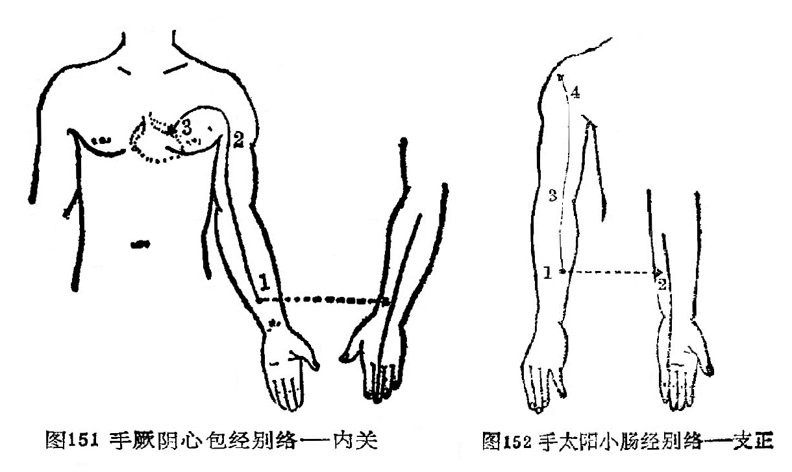

### 四、手太阳小肠经别络——支正

〔原文〕
《灵枢·经脉》：“手太阳之别，名曰支正(1)。上腕五寸，内注少阴；其别者，上走肘，络肩髃(2)。实则节弛肘废(3)；虚则生肬(4),小者如指痂疥。取之所别也”（图152）。

〔注解〕
(1)支正：小肠之络穴。在阳谷穴与小海穴连线上，阳谷穴上五寸。
(2)肩髃：穴名，属手阳明大肠经，三角肌上部，肩端两骨间。这里是指它的部位而言。
(3)节弛肘废：指肩肘部关节松弛痿废不用。
(4)肬：音由，与疣通，就是赘肉。
(5)痂疥：此指疣之多生如指痂疥之状。

〔语译〕
手太阳经的别行络脉，穴名支正，在腕上五寸，向内注于手少阴经。它的别出分支，上行肘部，络于肩髃穴。它的病变，实证为骨节弛缓，肘部不能活动；虚证为皮肤上生赘疣，小的象手指上的痂疥，可取此穴治疗。

图152 手太阳小肠经别络——支正

### 五、手阳明大肠经别络——偏历

〔原文〕
《灵枢·经脉》：“手阳明之别，名曰偏历(1)。去腕三寸，别入太阴，其别者，上循臂，乘肩髃，上曲颊(2)偏齿(3)；其别者，入耳，合于宗脉(4)。实则龋聋(5)；虚则齿寒痹隔(6)。取之所别也。”（图153）。

〔注解〕
(1)偏历：大肠经络穴，在阳溪穴与曲池穴连线上，阳溪穴上3寸处。
(2)曲颊：当下颌角处，曲如环形故名。
(3)偏齿：偏络于牙齿。
(4)宗脉：就是主脉、大脉。
(5)龋：龋齿，即蛀牙。
(6)痹隔：痹是闭塞不通，痹隔是形容膈间闭塞不畅的症状。

〔语译〕
手阳明经的别行络脉，穴名偏历，距腕三寸，别行于手太阴经。它的别出分支，向上沿臂部，经肩髃穴上行至下颌角处，遍布于齿中，再别出分支，上行入耳中，合于该部所聚的主脉。它的病变，实证为龋齿、耳聋；虚证为牙齿寒冷酸楚，内闭阻隔，可取此穴治疗。

图153 手阳明大肠经别络——偏历

### 六、手少阳三焦经别络——外关

〔原文〕
《灵柩·经脉》：“手少阳之别，名曰外关(1)。去腕二寸，外绕臂，注胸中，合心主(2)。病实则肘挛(3)；虚则不收。取之所别也”（图154）。

〔注解〕
(1)外关：手少阳三焦经络穴，位于腕背横纹上2寸，尺桡骨之间。
(2)合心主：此脉与心包经相汇合。
(3)肘挛：肘部引掣拘挛。

〔语译〕
手少阳经的别行络脉，穴名外关，距腕二寸，向外绕行臂部，上行注于胸中，别行合于手厥阴经。它的病变，实证为肘部拘挛，虚证为肘部弛缓不收，可取此穴治疗。

图154 手少阳三焦经别络——外关

### 七、足太阳膀胱经别络——飞扬

〔原文〕
《灵枢·经脉》：“足太阳之别，名曰飞扬(1)。去踝七寸，别走少阴。实则鼽窒(2)，头背痛；虚则鼽衄。取之所别也”（图155）。

〔注解〕
(1)飞扬：膀胱经之络穴，位于外踝上7寸，当腓骨后缘处。
(2)鼽窒：鼻流清涕，窒塞不通气。

〔语译〕
足太阳经的别行络脉，穴名飞扬，距外踝七寸，别行于足少阴经。它的病变，实证为鼻塞流涕，头背部疼痛，虚证为流涕出血，可取此穴治疗。

图155 足太阳膀胱经别络——飞扬

### 八、足少阳胆经别络——光明

〔原文〕
《灵枢·经脉》：“足少阳之别，名曰光明(1)，去踝五寸，别走厥阴，下络足跗。实则厥，虚刚痿躄(2)，坐不能起。取之所别也”（图156）。

〔注解〕
(1)光明：胆经之络穴，位于外踝上5寸，腓骨前缘。
(2)痿躄：痿，是痿软无力，躄，是足不能动。痿躄，就是下肢痿软无力，足不能行走。

〔语译〕
足少阳胆经的别行络脉，穴名光明，距外踝五寸，别行于足厥阴经，向下络于足背。它的病变，实证为足胫厥冷，虚证为足软无力不能行走，坐而不能起立，可取此穴治疗。

图156 足少阳胆经别络——光明

### 九、足阳明胃经别络——丰隆

〔原文〕
《灵枢·经脉》：“足阳明之别，名曰丰隆(1)”。去踝八寸，别走太阴；其别者，循胫骨外廉，上络头项，合诸经之气(2)，下络喉嗌。其病气逆则喉痹瘁瘖(3)。实则狂巅，虚则足不收、胫枯(4)。取之所别也”(图157)。

〔注解〕
(1)丰隆：胃经之络穴，位于外踝上8寸，条口穴外l寸许。

(2)合诸经之气：与该处其它经脉之气相会合。

(3)瘁瘖：是指突然失音不能言语。

(4)足不收、胫枯：足不收是弛缓松软无力；胫枯是胫部肌肉萎缩，气血亏虚所致。

〔语译〕
足阳明经的别行络脉，穴名丰隆，距外踝八寸，别行于足太阴经。它的别出分支，沿胫骨外缘上行络于头项部，会合各经之气，向下络于咽喉。它的病变是气上逆则患喉痹，突然失音不能言语。实证为狂癫之疾，虚证为足缓不收，胫部肌肉萎缩，可取此穴治疗。

图157 足阳明胃经别络——丰隆
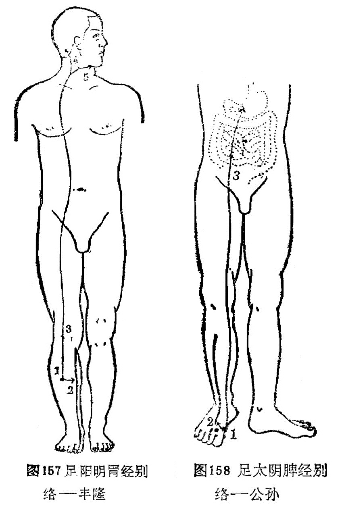 

### 十、足太阴脾经别络——公孙

〔原文〕
《灵枢·经脉》：“足太阴之别名曰公孙(1)。去本节(2)之后一寸，别走阳明，其别者，入络肠胃，厥气上逆则霍乱(3)，实则肠(4)中切痛；虚则鼓胀。取之所别也”（图158）。

〔注解〕
(1)公孙：脾经之络穴，位于第一跖骨基底部前缘赤白肉际处。
(2)本节：指第一趾跖关节。
(3)霍乱：病名。发作时上吐下泻挥霍撩乱，故称霍撩乱。

〔语译〕
足太阴经别行络脉，穴名公孙，在足大趾本节后一寸，别行于足阳明经。它的别行分支，入腹络于肠胃。其气上逆则为霍乱，实证为肠中剧痛，虚证为臌胀之疾，可取此穴治疗。

图158 足太阴脾经别络——公孙

### 十一、足少阴肾经别络——大钟

〔原文〕
《灵枢·经脉》：“足少阴之别，名曰大钟(1)。当踝后绕跟，别走太阳；其别者，并经上走于心包下，外贯腰脊。其病气逆则烦闷，实则闭癃(2)，虚则腰痛。取之所别者也”（图159)。

〔注解〕
(1)大钟：肾经之络穴，太溪穴下5分稍后，跟腱内缘。
(2)闭癃：闭是大便闭结，癃是小便不通。

〔语译〕
足少阴经的别行络脉，穴名大钟，在内踝后面，绕过足跟而别行于足太阳经。它的别出分支，与足少阴本经并行向上而至心包下，向外贯穿腰脊。它的病变，气上逆则为烦闷，实证为大小便不通，虚证为腰痛，可取此穴治疗。

图159 足少阴肾经别络——大钟

### 十二、足厥阴肝经别络——蠡沟

〔原文〕
《灵枢·经脉》：“足厥阴之别，名曰蠡沟(1)。去内踝五寸，别走少阳，其别者，经胫上睾，结于茎。其病气逆则睾肿卒疝。实则挺长(2)，虚则暴痒。取之所别也”(图160)。

〔注解〕(1)蠡沟：肝经之络穴，位于内踝上5寸，胫骨内侧面的中央处。
(2)挺长：是指阴茎勃起。

〔语译〕
足厥阴经的别行络脉，穴名蠡沟，距内踝五寸，别行于足少阳经。它的别出分支，经过胫部上至睾丸，终结于阴茎。它的病变，气上逆则睾丸肿大，突患疝气。实证为阴茎挺长，虚证为阴部暴痒，可取此穴治疗（图160）。

图160 足厥阴肝经别络——蠡沟

### 十三、任脉别络——尾翳

〔原文〕
《灵枢·经脉》：“任脉之别，名曰尾翳(1)。下鸠尾，散于腹。实则腹皮痛，虚则痒搔。取之所别也”(图161)。

〔注解〕
(1)尾翳：即鸠尾穴，任脉之络穴，剑突下5分取之。

〔语译〕
任脉的别行络脉，穴名尾翳，在剑突下面，散布于腹中。它的病变，实证为腹部皮肤疼痛，虚证为腹部皮肤搔痒，可取此穴治疗。

图161 任脉别络——尾翳

### 十四、督脉别络——长强

〔原文〕
《灵枢·经脉》：“督脉之别，名曰长强(1)。挟膂上项，散头上，下当肩胛左右，别走太阳，入贯膂。实则脊强，虚则头重，高摇之，挟脊之有过者(2)。取之所别也”（图162）。

〔注解〕
(1)长强：督脉之络穴，位于尾骨尖下5分处。
(2)挟脊过之者；过，在这里是指发生病有变。也就是指挟脊之脉发生变化而引起的疾病。

〔语译〕
督脉的别行络脉，穴名长强，依着脊骨上行项部，散布于头上，再向下到两肩胛之间分左右别行于足太阳经，入而贯穿于脊骨中。它的病变，实证为脊柱强直而难于俯仰，虚证为头重难支而从身体的高处摇摆不定，此皆挟脊之脉有病，可取此穴治疗（图162）。

图162 督脉别络——长强

### 十五、脾之大络——大包

〔原文〕
《灵枢·经脉》：“脾之大络，名曰大包(1)。出渊液下三寸，布胸胁。实则身尽痛，虚则百节尽皆纵。此脉若罗络之血者，皆取之脾之大络脉也”（图l63）。

〔注解〕
(1)大包：脾经穴位，位于腋中线平第六肋间隙中。

〔语译〕
脾的大络，穴名大包，在渊液穴下三寸，散布于胸胁部。它的病变，实证为全身皆痛，虚证为周身骨节都松弛无力。此一络脉象网络样绕络全身，如见血瘀，可取此穴治疗。

图163 脾之大络——大包

### 〔临床应用〕

十五络脉是经脉中分出的大的络脉，它对周身络脉起统属作用，其它络脉和孙络，都是十五络脉的支蔓。络脉分布躯体，主要在体表。《灵枢·经脉》指出：“经脉十二者，伏行于分肉之间，深而不见，……诸经之浮而常见者，皆络脉也。”又如“经脉为里，支而横者为络，络之别者为孙络”。由此可见，络脉分布人体的体表，属经脉在体表的联属部分；每条络脉均从本经络穴分出，通向与其表里的经脉，阴经别络于阳经，阳经别络于阴经。任脉别络散布于胸腹，以沟通腹部的经气；督脉别络散布于头，别走足太阳膀胱经，以沟通背部的经气；脾之大络散布于胸胁。通过十五络脉把经脉和全身络脉联系在一起，是达到濡润筋骨，疏利关节，调和阴阳作用的重要组织。与此同时，它发挥了天然屏障的作用，是承担抗御病邪，传递病变的通路。因此，当络脉有病时，均可取有关的络穴进行治疗。是指导临床治疗的重要内容。

### 复习思考题

1. 何谓络脉？络脉有哪几种？
2. 试述十五别络的名称、循行分右、别走经脉、病候。
3. 络脉有哪些生理功能？

答：

1. 分類
2. 阿是

## 第四节 经外奇穴

〔自学时数〕    2 学时

〔面授时数〕    1 学时

〔目的要求〕

1. 学习本节内容时，参阅有关经外奇穴书刊，以了解各奇穴定位。
2. 掌握常用奇穴的定位，主治功能。
3. 在人体上点出常用奇穴的位置。

经外奇穴，泛指十四经以外的穴位。由于有些奇穴，居位奇，取法奇，疗效奇，又不在正经线之内，故称之为经外奇穴。它的特点是有固定位置和名称，但多分散于全身，无系统、规律可循。目前针灸专籍收集奇穴少则20余个，多达1500余个。据1984年世界卫生组织亚太区在日本召开的经外奇穴标准化工作组会议规定，整理出31个奇穴，并按头颈，胸腹，背腰，上肢，下肢，由上而下进行分述。据此结合我国针灸临床实践，本书选常用40个奇穴，分头颈，项背腰，胸腹，四肢四个部分进行排列叙述，以供参考。

### 一、头颈部（14穴）

#### 四神聪

〔定位〕在百会穴前后左右各1寸处（图164）。

〔解剖〕在帽状腱膜中，有枕动、静脉，颞浅动、静脉顶支和眶上动、静脉的吻合网；布有枕大神经，耳颞神经及眶上神经分支。

〔功能〕安神，聪脑。

〔主治〕头痛，眩晕，失眠，健忘，癫痫，大脑发育不全。

〔刺灸〕向前或向后平刺0.5～0.8寸，可灸。

〔讲述〕见于《圣惠方》。别称神聪。前后左右为四方，因穴在头顶百会四周，脑为元神之府，因名。《圣惠方》用治头风目眩，狂乱风痫。《银海精微》：治眼疾，偏正头痛。《资生》配涌泉、强间治风痫。临床配百会、哑门治大脑发育不全；配神门治失眠，癫痫。

#### 印堂

〔定位〕在两眉头连线的中点（图165）。

〔解剖〕在掣眉间肌中，两侧有额内动、静脉分支；布有来自三叉神经的滑车上神经。

〔功能〕清热散风，镇静安神。

〔主治〕头痛头重，鼻衄鼻渊，小儿惊风，产后血晕，失眠，三叉神经痛。

〔刺灸〕向下平刺0.3～0.5寸，或用三棱针点刺出血，可灸。

〔讲述〕出《素问·刺疟论》。别称曲眉。定名见于《玉龙歌》：“头风呕吐眼昏花，穴取神庭治不差，孩子惊风皆可治，印堂刺入艾还加”。印指印染，居处为堂，古人常于两眉点染红点，以示貌美，穴当其处，因名。刺本穴，须提捏局部皮肤刺之。配迎香治鼻病；配内关治呕吐；配人中治惊风。

#### 鱼腰

〔定位〕在眉弓中心处（图165）。

〔解剖〕在眼轮匝肌中，有额动、静脉外侧支；布有眶上神经，面神经的分支。

〔功能〕清头明目。

〔主治〕眉棱骨痛，眼睑瞤动，眼睑下垂，目翳，目赤肿痛。

〔刺灸〕平刺0.3～0.5寸，禁灸。

〔讲述〕见于《玉龙经》。鱼指眉弓，中部为腰，人之眉毛状似鱼形，其穴适当中部，因名。取本穴应使目直视，当瞳孔直上方，眉弓中心处取之。本穴主要用治目疾。《奇效良方》：治眼睑垂帘，翳膜。一般沿眉弓向两旁斜刺0.5寸，不宜重泻，出现痠胀即止。临床常配太阳治目赤肿痛；配攒竹、合谷治眼睑瞤动，眉棱骨痛。

#### 太阳

〔定位〕眉外梢与目外眦之间向后约1寸处凹陷中（图166）。

〔解剖〕在颞筋膜及颞肌中，有颞浅动、静脉；布有三叉神经第2、3分支，面神经颞支。

〔功能〕清头明目。

〔主治〕头痛，目疾，口眼㖞斜，牙痛，三叉神经痛。

〔刺灸〕直刺或斜刺0.3～0.5寸，或用三棱针点剌出血。

〔讲述〕见于《圣惠方》。别称前关。功能祛风。治赤眼头痛，目眩，目涩。宜刺出血，加拔火罐效甚。

#### 球后

〔定位〕眶下缘外1/4与内3/4交界处（图167）。

〔解剖〕在眼轮匝肌中，深部为眼肌，浅层有面动、静脉；布有面神经颧支和眶下神经，结状神经结和视神经，深层有眼神经。

〔功能〕活血，明目。

〔主治〕目疾。

〔刺灸〕轻压眼球向上，针沿眼眶下缘缓慢直刺0.5～0.8寸，不提插捻转，禁灸。

〔讲述〕新订穴，见《眼科针灸疗法》。多用治视神经炎，视神经萎缩，青光眼，早期白内障，近视等，配光明、风池、肝俞效果尤佳。

#### 鼻通

〔定位〕鼻唇沟上端尽处（图167）。

〔解剖〕在上唇方肌中，有面动、静脉分支；布有筛前神经，眶下神经分支及滑车下神经。

〔功能〕清热散风，宣通鼻窍。

〔主治〕鼻渊，鼻塞，鼻部疮疖。

〔刺灸〕向内上方斜刺0.3～0.5寸，可灸。

〔讲述〕新订穴，见《针灸学》。别称上迎香。《银海精微》：久流冷泪，灸上迎香二穴。《千金》用治久流冷泪，灸上迎香配天府、肝俞尤效。《银海精微》：配鱼尾、睛明、攒竹、太阳治久流冷泪。近年配合谷治鼻炎，鼻塞，鼻部疮疖。

#### 金津、玉液

〔定位〕舌系带两侧静脉上，左称金津，右称玉液（图168）。

〔解剖〕有舌下静脉；布有舌下神经，舌神经。

〔功能〕清热开窍，止渴止呕。

〔主治〕口疮，舌强，舌肿，消渴，呕吐。

〔刺灸〕点刺出血，禁灸。

〔讲述〕见于《千金》。《大成》定名。主治重舌，舌炎之疾，还可用治呕吐，消渴。《千金》：治舌卒肿，刺舌下两边大脉出血。取刺本穴宜张口卷舌向上，舌系带两旁静脉上，左称金津，右称玉液，一般宜点刺出血。素有出血病者禁用。

#### 夹承浆

〔定位〕承浆穴旁开1寸处，左右共二穴（图169）。

〔解剖〕在口轮匝肌中，有面动脉分支；布有三叉神经第三分支（颏神经）。

〔功能〕祛风通络。

〔主治〕面部疾病。

〔刺灸〕斜刺或平刺0.5～1寸，不灸。

〔讲述〕见于《千金》。夹有旁边的含意，是穴在承浆两边旁开1寸处，因名。主治马黄急疫。近用治面疾，如面瘫，面肌痉挛，三叉神经痛，以及齿龈溃烂等，常配合谷、内庭取效。

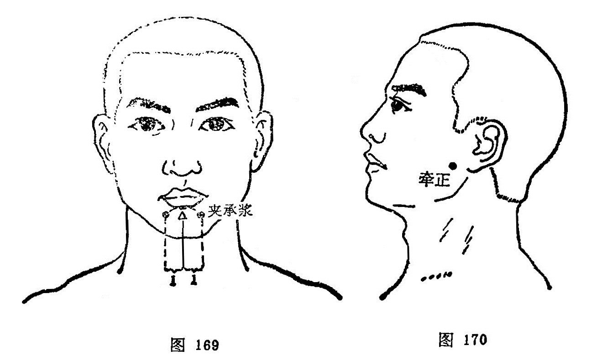

#### 牵正

〔定位〕耳垂前0.5～1寸处（图170）。

〔解剖〕在咬肌中，皮下有腮腺，有咬肌动、静脉分支；布有面神经分支。

〔功能〕祛风通络。

〔主治〕口眼㖞斜，咬肌痉挛，口腔溃疡，下牙痛。

〔刺灸）斜刺或平刺0.5～1寸，可灸。

〔讲述〕新订穴，见《常用新医疗法手册》。本穴能纠正口㖞，使之周正，因名。临床主要用治面瘫，可祛风通络，纠正口㖞。

#### 翳明

〔定位〕约在翳风穴后1寸（图171）。

〔解剖〕在胸锁乳突肌上，有耳后动、静脉；布有耳大神经和枕小神经。

〔功能〕明目聪耳。

〔主治〕目疾。

〔刺灸〕直刺0.5～1寸，可灸。

〔讲述〕新订穴，见《中华医学杂志》。穴在翳风之后，有明目之力，因名。取刺本穴，宜正坐，头略前倾。临床可用于近视，常配光明、肝俞治雀目。还可用于头痛，眩晕，耳鸣，失眠等症。

#### 安眠

〔定位〕约当翳风与风池穴连线的中点（图172）。

〔解剖〕在胸锁乳突肌和头夹肌中，有枕动、静脉；布有耳大神经和枕小神经。

〔功能〕镇静安眠。

〔主治〕失眠。

〔刺灸〕直刺0.5～0.8寸，可灸。

〔讲述〕新订穴。因有安眠作用而得名。配神门治梦魇不安；配后溪治癫狂；配印堂治眩晕。

#### 上廉泉

〔定位〕廉泉穴与下颏之间取穴（图173）。

〔解剖〕在下颌舌骨肌，颏舌骨肌，舌肌中，有舌动、静脉；布有颈皮神经，面神经颈支和舌下神经。

〔功能〕利舌本，开窍闭。

〔主治〕舌疾。

〔刺灸〕向舌根部斜刺0.8～1.2寸，不灸。

〔讲述〕新订穴。与廉泉作用同而位置偏上，因名。主要用治舌疾。起哑门治舌强不语，配内关、合谷治舌肌麻痹、萎缩；配少商治咽喉疼痛；配天突、内关治吞咽困难。

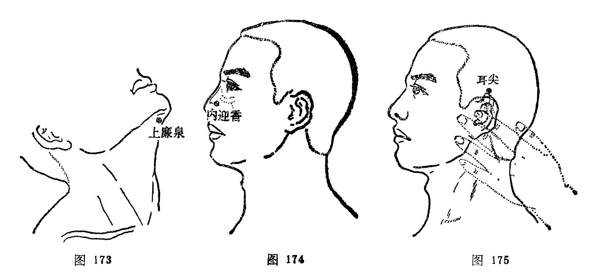

#### 内迎香

〔定位〕鼻孔中，外侧鼻粘膜上（图174）。

〔解剖〕在鼻腔底部粘膜上，有面动、静脉的鼻背支，布有筛前神经的鼻外支。

〔功能〕清热散风，宣通鼻窍。

〔主治〕目热暴赤，鼻痒，不闻香臭。

〔刺灸〕点刺出血。

〔讲述〕见于《肘后》。《玉龙经》定名。内指鼻内，针此能恢复嗅觉，重新迎来香气，因名。《儒门事亲》：治目热暴赤，疼痛不止。《玉龙歌》：“心血炎上两眼红，好将芦叶搐鼻中，若还血出真为美，目内清凉显妙功。”临床常配合谷取效。患出血病者禁针。

#### 耳尖

〔定位〕在耳尖上，卷耳取尖上（图175）。

〔解剖〕有耳后动、静脉；布有耳颞神经。

〔功能〕清热散风，活血明目。

〔主治〕目疾。

〔刺灸〕直刺0.1～0.2寸，或用三棱针点刺出血，可灸。

〔讲述〕见于《针灸大成》。穴在耳尖处，因名。用治目赤沙眼，眼生翳膜，以及喉痹刺出血。

### 二、项背腰部（8穴）

#### 百劳

〔定位〕大椎穴上2寸，旁开1寸（图176）。

〔解剖〕在斜方肌，头夹肌中，有枕动、静脉和椎动、静脉；布有枕大神经，枕小神经分支。

〔功能〕理虚损，补肺气。

〔主治〕虚劳之疾。

〔刺灸〕直刺0.5～0.8寸，可灸。

〔讲述〕见于《资生》。百有多的含意，劳同痨，言其治疗多种痨症，因名。它的定位，《集成》：大椎向发际二寸点记，将其二寸中摺，墨记，横布于先点上，左右两端尽处是。本穴主要用治虚劳之疾，特别对肺痨，有理虚损，补肺虚之效。

#### 定喘

〔定位〕大椎穴旁开0.5寸（图177）。

〔解剖〕在斜方肌，菱形肌，头夹肌，最长肌中，有颈横动脉和颈深动脉分支；布有第7、8颈神经后支。

〔功能〕宣肺定喘。

〔主治〕咳嗽，哮喘，落枕，荨麻疹。

〔刺灸〕直刺0.5～0.8寸，可灸。

〔讲述〕新订穴，见《中国针灸学》。定有平息之意，喘指喘息，针本穴能宣肺平喘，因名。临床配丰隆、天突平喘取效；配血海、曲池治荨麻疹。

#### 崇骨

〔定位〕第6颈椎棘突下（图177）。

〔解剖〕在腰背筋膜，棘上韧带中，有棘间皮下静脉丛；布有第7颈神经后支。

〔功能〕清热散风。

〔主治〕颈项强痛，疟疾，以及感冒，咳嗽，气喘。

〔刺灸〕向上斜刺0.5～1寸，可灸。

〔讲述〕见于《千金》。高大为崇，因在大椎上，正当第6、7颈椎棘突之间，因名。本穴除用治气喘，咳嗽，痨瘵外，还用于癫痫，疟疾。《千金》：治羊痫之为病，喜扬目吐舌，灸大椎上。

#### 夹脊

〔定位〕第1胸椎至第5腰椎，各椎棘突下旁开0.5寸，每侧十七穴，左右共三十四穴（图178）。

〔解剖〕在横突间的韧带和肌肉中。因穴位置不同，涉及的肌肉也不同。一般分三层；浅层为斜方肌，背阔肌和菱形肌，中层有上、下锯肌，深层有骶棘肌和横突棘突间的短肌。每穴都有相应椎骨下方发出的脊神经后支及其伴行的动脉和静脉丛分布。

〔功能〕调理脏腑，通利关节。

〔主治〕脊柱疾患及相应脏腑诸疾。

〔刺灸〕直刺0.5～1寸，或用梅花针叩剌，可灸。

〔讲述〕见于《肘后》。又称华佗夹脊。《后汉书·华佗传》：有人病脚躄不能行，佗切脉，便使解衣，点背数十处，相去一寸或五分，从邪不相当。言灸此各七壮，灸创愈即行也。后灸愈，灸处夹脊一寸上下，行端直均匀如引绳。《肘后》定位去脊各1寸。今时于脊柱棘突间两侧，背正中线外侧0.5寸为准。中、上胸部的夹脊穴适用于心肺及上肢病症；下胸部夹脊穴治疗胃肠疾患；腰部夹脊穴治疗腰、腹及下肢病症。

#### 痞根

〔定位〕第一腰椎下旁开3.5寸（图179）。

〔解剖〕在背阔肌，髂肋肌处，有第1腰动、静脉背侧支；布有第12胸神经后支外侧支，深层为第1腰神经后支。

〔功能〕调气化瘀。

〔主治〕肝脾肿大，腹中痞块。

〔刺灸〕直刺0.5～1寸，可灸。

〔讲述〕见于《医学入门》。积块称痞，是穴主治痞块、痞满之疾，针此可使痞积消散，因名。除主痞块外，还可用于瘰疬，灸之亦效。

#### 腰眼

〔定位〕第4腰椎棘突下旁开3.8寸（图180）。

〔解剖〕在背阔肌，髂肋肌处，有第4腰动、静脉背侧支；布有第3腰神经后支。

〔功能〕壮腰补肾。

〔主治〕腰痛，肾下垂，月经不调，赤白带下。

〔刺灸〕直刺0.5～1寸，可灸。

〔讲述〕见于《肘后》。别称鬼眼。穴当腰部两侧凹陷之处，该处状似眼状，因名。除主腰痛外，还可用治月经不调之疾，有补肾壮腰之效。

#### 十七椎

〔定位〕第5腰椎棘突下（图178）。

〔解剖〕在腰背筋膜，棘上韧带及棘间韧带中，有腰动脉后支，棘间皮下静脉丛；布有腰神经后支内侧支。

〔功能〕通经散寒。

〔主治〕腰痛，痛经，下肢瘫，崩漏。

〔刺灸〕向上斜刺1～1.5寸，可灸。

〔讲述〕见于《千金翼》。因穴在第17椎棘突下方凹陷处，因名。取此穴可先定腰阳关，再向下取其外侧凹陷处是穴。用治腰痛、痛经等。

#### 腰奇

〔定位〕尾骨尖直上2寸（图178）。

〔解剖〕当棘上韧带处，有第2、3骶动、静脉；布有2、3骶神经后支。

〔功能〕宁神通络。

〔主治〕癫痫，痔疮，便秘。

〔刺灸〕向上平刺1～1.5寸，可灸。

〔讲述〕新订穴，见《中医杂志》。穴当腰部，疗痫有奇效，因名。刺本穴宜向上平刺，深达1.5寸，使局部产生胀重感为佳。

### 三、胸腹部（5穴）

#### 脐中四边

〔定位〕脐中央的上下左右各开1寸，共四穴（图181）。

〔功能〕温中，利湿，止泻。

〔主治〕泄泻，下痢，腹痛。

〔刺灸〕直刺0.5～0.8寸，可灸。

〔讲述〕见于《千金》。穴当神阙上下左右4方各1寸，因名。主要用治水泄。

#### 胃上

〔定位〕在脐上2寸，旁开4寸处（图182）。

〔解剖〕在腹外斜肌，腹内斜肌及腹横肌处，有腹壁浅静脉；布有第9、10肋间神经外侧支。

〔功能〕健脾胃，固中气，升下陷。

〔主治〕胃下垂，纳呆，腹胀。

〔刺灸〕向脐中或天枢穴方向斜刺1～3寸，可灸。

〔讲述〕新订穴。穴在上腹，适当胃部，刺之能使下垂之胃上升，因名。除主胃下垂外，还可用于胃痛，纳呆，腹胀之疾。

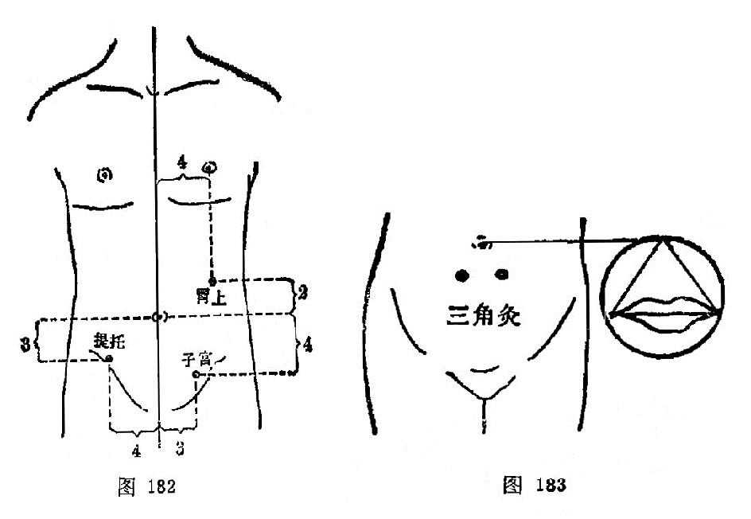

#### 三角灸

〔定位〕以患者两口角之间的长度为一边，作等边三角形，将顶角置于脐中心，底边呈水平线，两底角处是穴（图183）。

〔解剖〕在腹直肌中，有腹壁下动、静脉肌支；布有第10肋间神经。

〔功能〕温通血脉，散寒止痛。

〔主治〕疝气，奔豚，腹痛。

〔刺灸〕艾炷灸5～7壮。

〔讲述〕见于《针灸集成》。临床多用灸法治疗疝气，奔豚，有温通血脉，散寒止痛之效。

#### 提托

〔定位〕关元穴旁开4寸（图182）。

〔解剖〕当腹内外斜肌及腹横肌部，有旋髂浅动、静脉；布有髂腹下神经。

〔功能〕升提下陷。

〔主治〕阴挺，疝气，下腹痛。

〔刺灸〕直刺0.8～1.2寸，可灸。

〔讲述〕新订穴。刺此能升提下垂之脏器，因名。本穴对下垂的子宫有升提上托之力，还可用治肾下垂。

#### 子宫

〔定位〕中极穴旁开3寸处（图182）。

〔解剖〕在腹内、外斜肌处，有腹壁浅动、静脉；布有髂腹下神经。

〔功能〕升提下陷，固经止带。

〔主治〕阴挺，月经不调，痛经，带下，不孕。

〔刺灸〕直刺0.8～1.2寸，可灸。

〔讲述〕见于《医学纲目》。以主治胞宫之疾，因名。除用治阴挺有升提固脱之力外，还可用于痛经，带下。

### 四、四肢部（13穴）

#### 十宣

〔定位〕在手十指尖端，距指甲0.1寸，左右共十穴（图184）。

〔解剖〕有指掌侧固有动、静脉形成的动，静脉网；布有指掌侧固有神经和丰富的痛觉感受器。

〔功能〕泄热醒神。

〔主治〕高热，昏迷，惊痫，癫痫，癔病。

〔刺灸〕浅刺0.1～0.2寸，或点刺出血。

〔讲述〕见于《千金》，《奇效良方》始定名。别称鬼城。十，指手十指端；宣，指宣散。以能宣散风热之邪，因名。临床宜点刺出血。

#### 四缝

〔定位〕第2、3、4、5指掌面，近端指骨关节横纹中点，左右共八穴（图185）。

〔解剖〕入皮后有指纤维鞘，指滑液鞘，屈指伸肌腱，深部为指关节腔，有指掌侧固有动、静脉的分支，布有指掌侧固有神经。

〔功能〕消积，驱蛔。

〔主治〕疳积，消化不良，百日咳。

〔刺灸〕点刺挤出少许黄白色液体。

〔讲述〕见于《奇效良方》。穴当掌面食、中、环、小四指第1、2指关节横纹缝隙中点，因名。《奇效良方》：治小儿猢狲劳症。主要用治小儿消化不良引起的消瘦、纳呆、腹泻、腹胀之疳积，虫痛，刺之挤出黄色液体，有消积驱蛔之力。

#### 八邪

〔定位〕手背各指缝中的赤白肉际处，左右共八穴（图186）。

〔解剖〕当骨间肌处，有手背静脉网，掌背动脉；布有尺桡神经的手背支。

〔功能〕清热，解毒，止痛。

〔主治〕烦热，头痛，目痛，牙痛，手背痛麻，毒蛇咬伤。

〔刺灸〕斜刺0.5～0.8寸，或点刺出血，可灸。

〔讲述〕出《素问·刺疟论》。别称八关，《大成》又称大都、上都、中都、下都。八，指每手4穴，邪，指病邪，因名。用治手背痛麻可向上斜刺，其它热病可刺出血。

#### 二白

〔定位〕在掌后横纹上4寸，两穴对并，一穴在筋中间，一穴在大筋外（图187）。

〔解剖〕有指浅层肌，桡动、静脉和骨间掌侧动、静脉；布有臂内侧皮神经，前臂外侧皮神经，正中神经和桡神经。

〔功能〕止痛，升陷。

〔主治〕久痔，脱肛，前臂痛，胸胁痛。

〔刺灸〕直刺0.5～0.8寸，可灸。

〔讲述〕见于《玉龙经》。配长强治脱肛；配承山治久痔有效。

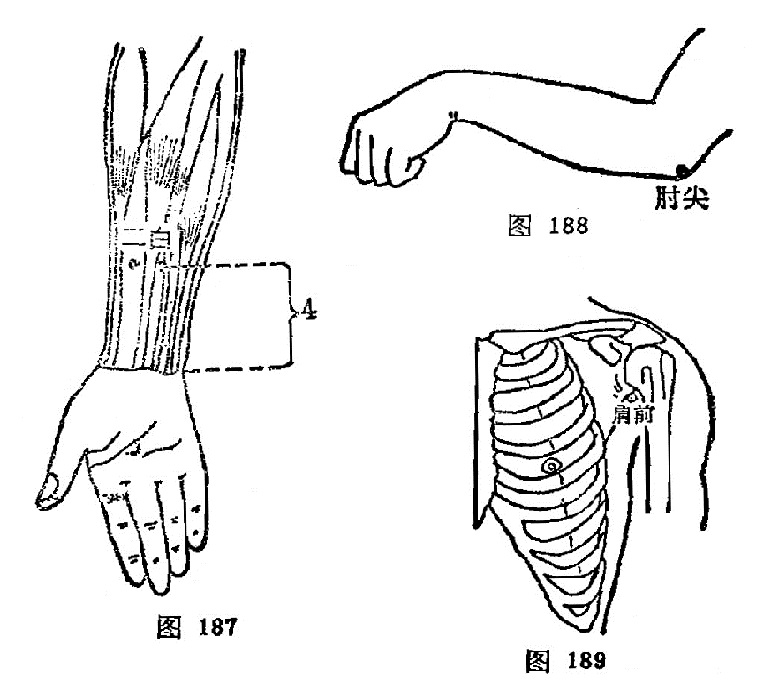

#### 肘尖

〔定位〕屈肘，当尺骨鹰嘴的尖端（图188）。

〔解剖〕有浅筋膜，肘关节动、静脉网；布有前臂背侧皮神经。

〔功能〕清热化痰，消肿解毒。

〔主治〕瘰疬，痈疔恶疮。

〔刺灸〕艾炷灸7～15壮。

〔讲述〕见于《千金》。肘指肘部，尖指尖端，以穴当尺骨鹰嘴突起之尖端，因名。主要灸治瘰疬。

#### 肩前

〔定位〕腋前竖起纹头上1寸（图189）。

〔解剖〕在三角肌中，有胸肩峰动、静脉，旋肱前后动、静脉；布有锁骨上神经后支，深部为腋神经。

〔功能〕通经，活络。

〔主治〕肩臂痛，肩周炎。

〔刺灸〕直刺1～1.5寸，可灸。

〔讲述〕新订穴。别称肩内陵。以穴适当肩部的前面腋皱襞顶端与肩髃穴连线的中点，因名。主要用治肩痛不举，以及肩关节疾患。

#### 百虫窝

〔定位〕血海穴上1寸；或膑骨上缘上3寸处（图190）。

〔解剖〕在股内侧肌中，有股动、静脉；布有股神经前皮支，深层有股神经肌支。

〔功能〕凉血解毒，祛湿散风。

〔主治〕风湿痒疹，下部生疮。

〔刺灸〕直刺1～1.5寸，可灸。

〔讲述〕见于《大成》。别称血郄。以主治皮肤瘙痒，状似百虫爬出，骚扰全身，因名。除主治蛔虫症，皮肤瘙痒外，还可用于下部生疮，阴囊风疮，有祛湿、散风、止痒之效。

#### 鹤顶

〔定位〕髌骨上缘正中凹陷中（图191）。

〔解剖〕在髌骨上缘股四头肌腱中，有膝关节动脉网；布有股神经前皮支及肌支。

〔功能〕通利关节，活络止痛。

〔主治〕膝痛，足胫无力，下肢瘫痪。

〔刺灸〕直剌0.5～0.8寸，可灸。

〔讲述〕见于《医学纲目》。别称：膝顶。穴当膝盖骨尖上，是处形似鹤顶，因名。除主膝关节痛、麻外，还可用治鹤膝风以及两足瘫痪，脚气等症。

#### 胆囊穴

〔定位〕阳陵泉穴下约1寸之压痛点处取穴（图192）。

〔解剖〕在腓骨长肌与趾长伸肌处，有胫前动、静脉分支；布有腓肠外侧皮神经，腓浅神经。

〔功能〕清热利胆，通络排石。

〔主治〕胆囊、胆道疾患。

〔刺灸〕直刺1～1.5寸，可灸。

〔讲述〕新订穴，见《中华外科杂志》。刺此穴对胆囊有一定影响，因名。除主胆囊炎，胆石症，胆道蛔虫症之外，还可用于下肢痿痹之疾。

#### 膝眼

〔定位〕髌骨尖两侧凹陷中（图193）。

〔解剖〕在髌韧带两侧，有膝关节动、静脉网；布有隐神经分支，股外侧皮神经分支，深层有胫腓总神经分支。

〔功能〕通利关节。

〔主治〕膝关节疾患。

〔刺灸〕向膝中斜刺0.5～1寸，可灸。

〔讲述〕见于《千金》。别称膝目、鬼眼。膝指膝关节，眼指膝两侧的凹窝，是处形似眼状，穴当其处，因名。除主治膝红肿痛外，还可用于脚气。针时应严密消毒，向膝中十字韧带处斜刺0.5～1寸，或透刺到对侧膝眼，使局部产生痠麻胀感有效。

#### 阑尾穴

〔定位〕足三里穴下约2寸，压痛点处取穴（图193）。

〔解剖〕在胫骨前肌，趾长伸肌中，有胫前动、静脉；布有腓肠外侧皮神经，腓深神经。

〔功能〕清热化瘀，通调肠腑。

〔主治〕大肠痈（阑尾炎）。

〔刺灸〕直刺1～1.5寸，可灸。

〔讲述〕新订穴。因主治阑尾炎而得名。一般大肠痈患者可在此穴处找到明显的压痛点，针刺以强刺留针，可止痛散瘀。

#### 八风

〔定位〕足背，五趾的各趾缝赤白肉际处，左右共八穴（图194）。

〔解剖〕在趾骨小头间前跖骨间肌中，有趾背动、静脉；布有腓浅、深神经。

〔功能〕清热，解毒，止痛。

〔主治〕脚气，趾痛，牙痛，头痛，毒蛇咬伤。

〔刺灸〕斜刺0.5～0.8寸，或点刺出血。

〔讲述〕出《素问·刺疟论》。《千金》称八冲，《集成》称阴独八穴。穴在双足五趾缝间，风指病邪，因名。主治脚气，趾痛。根据病上取下之理，还可用治牙痛，头痛。

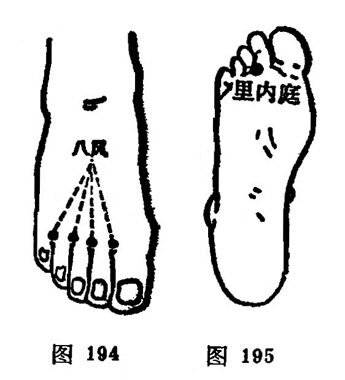

#### 里内庭

〔定位〕足底，第2、3趾间，与内庭穴相对处（图195）。

〔解剖〕深层有来自胫前动脉的足底弓；布有第2足底跟侧总神经。

〔功能〕镇静，止痛。

〔主治〕足趾疼痛，惊风，癫痫，胃痛。

〔刺灸〕直刺0.3～0.5寸，可灸。

〔讲述〕见于《千金翼》。以与内庭相对，位居足底内侧，因名。除主五趾痛、麻外，还可用于惊风，癫痫。

### 复习思考题

1. 何谓经外奇穴？
2. 本节收经外奇穴40个。试述太阳、球后、牵正、翳明、安眠、定喘、夹脊、腰奇、提托、子宫、十宣、鹤顶、阑尾穴等的取穴法，它们有哪些功能？

答：

1. 分類
2. 阿是

# 中篇 针灸术

针法和灸法，是针灸临床治疗中所必须掌握的基本技能，在针灸医学中占有极重要的地位。历代针灸医家，对此曾积累了极为丰富的实践经验和理论基础。针法和灸法的种类很多，本篇介绍常用的针灸法，包括毫针、灸法（附：拔罐法）、三棱针、皮肤针、皮内针、火针、水针、埋线、耳针、头针以及针刺麻醉等。 

# 第一章 毫针

〔自学时数〕    8 学时

〔面授时数〕    2 学时

〔目的要求〕

1. 了解九针的名称、形状及用途。
2. 了解毫针的构造和规格。
3. 掌握针刺前的准备。
4. 掌握毫针的刺法，包括进针、留针、出针等全部操作，并重点掌 握捻转、提插、疾徐等补泻手法。
5. 熟悉进针的角度、深度和得气的意义。
6. 熟悉候气、催气，行针等操作方法。
7. 掌握针刺异常情况的预防和处理。
8. 熟悉针刺注意事项。

## 第一节 毫针的基本知识

近代的毫针，是从古代的九针基础上发展而来。不仅制针的质料有金、银、不锈钢等不同，而且制针的工艺和形状亦有很大 改进。现将九针及近代毫针分述如下：

### 一、九针

从砭石发展到九针，这时才有正式的针法，在《灵枢·官针》篇中说："九针之宜，各有所为，长短大小，各有所施。”说明九种不同形状的针具各有不同的用途，在针灸医学发展上起了很大作用（图196）。

图196 古代九針圖

**（1）镵针**

形状：长一寸六分，形似箭头，头大末锐，当末端一分处收小，形成尖端，后人有称为"箭头针”。近人在此基础上发展为皮肤针。

用途：浅刺皮肤而不能深入，用于浅刺皮肤泻血，治头身热症等。

**（2）圆针**

形状：长一寸六分，针身圆柱形，针头卵圆，后人有称为“圆头针”。

用途：揩摩体表，治分肉间气滞，不伤肌肉。为按摩用具。

**（3）鍉针**

形状：长三寸半，针头如黍粟形，圆而微尖，近人有称为 "推针”。

用途：按压经脉，不能深入（按脉勿陷）为按压穴位的用具。	

**（4）锋针**
形状：长一寸六分，针身圆柱形，针尖锋利，呈三棱锥形，后人称为三棱针。

用途：用于泻血，治疗痈肿、热病。

**（5）铍针**	

形状：长四寸，宽二分半。形如剑，后人有称为剑头针。

用途：痈肿外症割治用。

**（6）圆利针**

形状：长一寸六分，末端尖锐，中部略膨大，针身反细小圆而且利。

用途：痈肿、痹证的深刺。

**（7）毫针**

形状：长一寸六分或三寸六分，针身细如毫（豪）毛。

用途：通调经络，治寒热、痛痹等。

**（8）长针**

形状：长七寸，针身细长而尖部锋利。后人称为环跳针，近人又称为芒针。

用途：深刺，治“深邪远痹”。

**（9）大针**

形状：长四寸，针身粗圆。

用途：泻水，“取大气之不能过于关节者”，治关节积液，后人有作火针用，治瘰疬、乳痈等症。

### 二、毫针的构造、规格和保藏

#### （一）毫针的构造和规格

1．毫针的构造：毫针是针刺治病的主要针具，临床上应用最广。制针的原料以不锈钢为主，但也有金、银或合金制成的。

毫针的构造可分为五个部分（图197）。

图197 毫针的构造

（1）针尖：针的尖端锋锐部分称针尖，亦名针芒。其状似松针，是接触腧穴刺入机体的前锋。

（2）针身：针尖与针根之间称为针身。针身宜光滑挺直，富有弹性。

（3）针根：针身与针柄连接处称为针根。

（4）针柄：手持处称针柄。是以铜丝或铝丝将针的一端呈螺旋形的紧密缠绕而成，是持针着力部分。

（5）针尾：针柄的末端称针尾。一般是用铜丝或铝丝横行缠绕呈圆筒状，是温针装置艾绒的部分。

2．毫针的规格：主要是指针身的粗细和长短。目前所用毫针的长短、粗细规格分别如表9、10。

表9、毫针的长短规格

| **寸** | 0.5  | 1    | 1.5  | 2    | 2.5  | 3    | 3.5  | 4    | 4.5  | 5    |
| ------ | ---- | ---- | ---- | ---- | ---- | ---- | ---- | ---- | ---- | ---- |
| 毫米   | 15   | 25   | 40   | 50   | 65   | 75   | 90   | 100  | 115  | 125  |

表10、毫针的粗细规格

| 号数         | 26   | 27   | 28   | 29   | 30   | 31   | 32   | 33   | 34   | 35   |
| ------------ | ---- | ---- | ---- | ---- | ---- | ---- | ---- | ---- | ---- | ---- |
| 直径（毫米） | 0.45 | 0.42 | 0.38 | 0.34 | 0.32 | 0.30 | 0.28 | 0.26 | 0.23 | 0.22 |

临床上以28〜30号粗细和1〜3寸长者最为常用。短针多用于耳穴及体穴浅刺，长针多用于肌肉丰厚部位腧穴的深刺。

3．毫针的修藏：毫针的修藏是指对针具的维修和保藏。保藏针具，是为防止针尖受损、针身弯曲或生锈、污染等。藏针的器具有针盒、针管和藏针夹等。使用针盒藏针时，在盒内多垫几层消毒纱布，将消毒后的针具，根据毫针的长短分别置于盒内， 再用消毒纱布敷盖，以免污染，然后将针盒盖好备用。使用藏针夹藏针时，针夹两侧要放有硬纸板（防止针身弯曲），夹内放多层消毒纱布，放入消毒后的针具，然后合上针夹备用。使用针管藏针时，针管的一端放入干棉球（以防针尖损坏钩曲），然后将针置入，盖好备用。

针是治病的工具，在使用过程中，应随时注意针尖是否有钩曲或过钝，针身是否有弯曲等。若针身弯曲，针尖过钝或有钩曲，不仅直接影响进针，而且使病人感到刺痛，影响治疗效果。
因此对针具应随时检查，经常维修，现将针具的检修方法介绍如下：

（1）针身的检修：检修时应注意针身有无锈蚀，急弯或一般弯曲。若一般弯曲可用手指或竹板夹住针身，将针身捋直。若属急弯，针身有锈蚀，一般剔之不用，以免折针。同时也应检查针 柄与针身是否衔接牢固，形成一体，如针身与针柄接触不牢，则不宜应用。

（2）针尖检修：检修时应注意针尖有无钩曲，针尖钝和针尖偏斜。若针尖不正、有钩、过钝时，可用细砂纸或细磨石磨好， 使针尖正直光滑，圆而不钝，利而不锐，过锐则易弯成钩，过钝则易痛，应磨成如松针形为宜。

### 〔临床应用〕

近代的毫针就是在九针的基础上发展起来的，不论是从结构上，规格上渐趋精巧，便于临床应用。了解毫针的结构和规格之后，一方面便于毫针的检查，另一方面便于临床选用不同规格的 毫针，选针适当，便于不同穴位的针刺，才能提高疗效，防止意外事故的发生。毫针的修藏，主要是延长针具的使用寿命和防止针刺的疼痛以及意外事故的发生有一定作用。

### 复习思考题

1. 针的名称和用途是什么？
2. 针的构造、规格是什么?哪些规格的针临床治疗时最常用？
3. 针如何维修和保藏？

答：

1. 分類
2. 阿是

## 第二节 针刺练习

针刺练习，主要是对指力和手法的锻炼。为了达到针刺的治疗目的，不使病人增加痛苦，就要熟练掌握进针和进行各种手法的操作。由于毫针针身细软，要把毫针刺入肌肤内，没有一定的指力是不行的。指力只有通过练习才能掌握，所以练习指力是初学针刺者的重要基本技能训练。指力是进针顺利，减轻疼痛，提高疗效的基本保证。对初学者在临床操作之前，首先要有练习指力的过程。

### 1．纸垫练针法：

用松软的纸张，折迭成长约8厘米，宽约5厘米，厚约2〜3厘米的纸块，用线如“井”字形扎紧，做成纸垫，练针时左手执纸垫，右手拇、食、中三指持针柄，如持笔状 地持1. 0〜1. 5寸毫针，使针尖垂直地抵在纸块上，然后右手拇指与食中指前后交替地捻动针柄，并逐渐加一定的压力，待针穿透纸垫后另换一处，反复练习。纸垫练习主要是锻炼指力和捻转的基本手法（图198）。

### 2．棉团练针法：

用布将棉花包裹，用线封口扎紧，做成直径 约6〜7厘米的棉团，练针方法同纸垫练针法，所不同的是棉团松软，可以做提插、捻转等多种基本手法的练习（图198）。

在进行练针时，要做到捻转的角度大小，捻转的速度，可以随意掌握，来去的角度力求一致，快慢均匀。在这一过程中也可配合上下提插的练习，一般总的要求是提插幅度，上下一致，捻转角度来去一致，频率的快慢一致，达到得心应手，运用自如。但纸垫或棉花团与人体有一定的差异，为了体验不同的针刺手法所产生的不同作用，最好在自己身上进行练针，以便临床针刺施术时，心中有数，提高针刺手法水平。

### 〔临床应用〕

针刺练习是掌握针刺技术的基本功之一。练针就是练习指力，所谓指力包括手指的力量和手腕力量的两个方面，握针靠手指的力量，进针靠手腕的力量，手指和手腕这两个力量要配合好，才能把又细又软的毫针刺入穴位内，进针即顺利又能减少疼痛，操作灵活自如。所以初学者在针刺之前，必须加强指力的锻炼，刻苦练习指力，才有针刺的基本功。练针除了练指力外，还要练习进针的角度和深度，才能掌握针刺治疗时的要求，既能提高治疗效果，又能防止意外事故的发生，所以练针是初学者不可缺少的基本功。

### 复习思考题

1. 练针的意义及目的何在？
2. 样进行针剌练习？

答：

1. 分類
2. 阿是

## 第三节 针刺前的准备

### 一、选择针具

对针具的选择，现在多选用不锈钢所制针具，因不锈钢不仅能防腐蚀、能耐热，而且具有一定的硬度、弹性和韧性。金质和银质的针，弹性较差，价格昂贵，故临床较少应用。从质优的毫 针中应选择针柄无松动，针身挺直光滑，坚韧而富有弹性，针尖圆而不钝，利而不锐，呈松针形者为好。如针身有缺损和伤痕者，应剔出不用，以免在针刺施术过程中，给病人造成不必要的 痛苦。

在选择针具时，除应注意上述事项外，在临床上还应根据病人的性别、年龄的长幼、形体的胖瘦、体质的强弱、病情的虚实、病变部的表里深浅和所取穴位的具体部位，选择长短、粗细适宜的针具。《灵枢·官针》说：“九针之宜，各有所为，长短大小，各有所施也”。如男性，体壮、形肥、病变部位较深者，可选稍粗、稍长的毫针。反之若女性、体弱、形瘦，而病变部位较浅者，就应选用较短、较细的毫针。至于根据腧穴所在具体部位迸行选针时，一般是皮薄肉少之处和针刺较浅的腧穴，选择针具宜短而针身宜细；皮肤厚肌肉多而针刺宜深的腧穴，宜选用针身稍长和稍粗的毫针。在临床选针的长短时，除刺入的深度外，针身还应露出皮肤表面3〜5分为宜。 

### 二、解释工作

在临床上医生给初诊病人针刺时，应耐心的向病人解释针刺的一般常识，减少病人对针刺的恐惧心里，从而取得病人的积极配合，以便更好的发挥针刺的治疗作用，并可避免针刺异常情况的发生。

### 三、选择体位

为了使病人适应针灸施术，针刺前应根据所选的腧穴，指导病人选择适当的体位。病人体位选择是否得当，对腧穴的正确定位，针刺的施术操作，持久的留针，以及防止晕针、滞针、弯针，折针等；都有很大影响，如病重体弱或精神紧张的病人，采用坐位，易使病人产生疲劳，往往易发生晕针。又如体位选择不当，在针刺施术时或在留针过程中，病人常因移动体位而造成弯针、滯针甚至发生折针事故。因此说选择体位具有重要意义。

#### （一）选择体位的一般原则

1. 选择体位应该是以医生能正确取穴，操作方便，患者体位舒适，并能持久为原则。	
2. 在可能条件下，一种体位能暴露出针灸处方所列的腧穴。
3. 一般可采取卧位，尤其是精神不好，或精神过度紧张，体质虚弱的患者最好采取卧位，防止晕针或其他事故。
4. 在比较冷的条件下，应采取少暴露皮肤面上的穴位，以防受凉或感冒。

#### （二）临床常用体位

临床常用体位一般以卧位和有倚靠的坐位为主，分述如下：

1. 仰卧位：适用于取头、面、胸、腹部腧穴，和上、下肢的部分腧穴（图199）。
2. 侧卧位：适用于取身体侧面少阳经腧穴和上、下肢的部分腧穴（图200）。
3. 伏卧位：适用于取头、项、脊背、腰尻部腧穴和下肢后面的腧穴(图201）。
4. 仰靠坐位：适用于取前头、颜面和颈前等部位的腧穴(图 202）。 
5. 俯伏坐位：适用于取后头和项、背部腧穴（图203）。
6. 侧伏坐位：适用于取头部一侧、面颊及耳前后部位的腧穴（图204）。

总之，患者的体位一定要舒适，取穴准确，医生针灸操作方便可即。

### 四、消 毒

针刺前的消毒工作，包括针具消毒，医者手指消毒，腧穴部位消毒。消毒的方法，可根据具体条件选用以下方法。

#### （一）针具消毒

可根据具体条件选用下列消毒方法：

1．压消毒法：将针具修好后，用纱布包好，放在针盒内，置于高压消毒锅内，一般需要在15磅气压，温度应达120℃，消毒时间应为15分钟以上，即达到消毒的目的。

2．沸消毒法：将针具修检好后用纱布包好，放置在清水锅内，待水沸腾后，再煮15分钟即可。为了提高沸点，应在水中加入重碳酸钠，使之成为2%的溶液，可以提高水的沸点达120℃， 并且有减低沸水对针具的腐蚀作用。

3．物消毒：将修好的针具置于75%酒精溶液内，浸泡30分钟即可达到消毒要求。亦可用0.1%的新洁尔灭浸泡并加防腐剂 0.5%浓度的亚硝酸钠，浸泡30分钟即可达到消毒作用。取出后用消毒纱布擦干，放在消毒的针盒内备用。还可用2%来苏溶液或1:1000的升汞溶液浸泡1〜2小时后应用。对某些传染性疾患者，应做到一针一穴，一次性使用。

总之，不管哪种消毒方法，只要达到消毒要求即可。

#### （二）医者手指消毒

在施术前，医者先用肥皂水将手洗刷干净，待干后再用75%酒精棉球擦拭即可。施术时医者应尽量避免手指直接接触针体，如必须接触针体时，可用消毒干棉球作间隔物，以保持针身无菌，以免感染。

#### （三）施术部位消毒

在患者需要针刺的腧穴部位消毒时， 可用75%酒精棉球拭擦即可。在拭擦时应由腧穴部位的中心向四周绕圈拭擦。或先用2%碘酒棉球拭擦，然后再用75%酒精棉球涂擦脱碘消毒，当穴位消毒后，切忌接触污物，以免重新污染。

### 五、医者的态度

医者的态度是整个治疗工作中的关键问题，首先要有急病人之所急，痛病人之所痛这种感情，全心全意为患者服务，只有医生关心病人，病人才能相信医生，这种医患合作，有利于病人战胜疾病的信心。这就要求医生要有严肃的态度，精神要集中，专心一意的为患者治疗，尽到医生的职责。《灵枢·九针十二原》："祖守形，上守神”。在患者方面也必须树立针灸治疗的信心，对疾病要有战胜的决心，这要医生帮助树立。只有调动医生、患者两个方面的积极性，才能收到满意的治疗效果。

### 〔临床应用〕

临床上应用的针具，都应选择优质的针，而劣质的针具应剔除不用。在选择毫针的粗细、长短时，要根据患者的性别、年龄、形体、体质、虚实、表里来进行选择。凡是体质壮实，肌肉丰满，实热证选择粗针长针；凡体质虚弱，肌肉瘠薄，虚寒证选择细针短针。否则就会影响针灸的治疗效果。消毒也是针刺治疗中很重要的环节，针具和腧穴部位消毒要彻底就会防止感染，有 利于患者身体健康。体位的选择要根据疾病的诊断、处方中的腧穴来选择，选择的体位应该是以医者能正确取穴，操作方便；患者又感到舒适持久为原则，以免引起疼痛或弯针、断针等异常情况的出现。

### 复习思考题

1. 针刺前要做哪些准备工作？
2. 用高压气锅消毒针具需要多大压力?多高温度？多长时间？
3. 煮沸消毒针具，应煮沸多长时间?为了提高沸点，应采取什么措施？
4. 针刺消毒包括哪些方面?常用的消毒方法是什么？
5. 常用的针灸体位有几种?各适用于针灸哪些穴位？

答：

1. 分類
2. 阿是

## 第四节 毫针刺法

毫针刺法有着很高的技术要求和严格的操作规程，医生必须掌握从进针到出针这一系列的操作技术。

### 一、进 针

把针刺入皮肤内就是进针。进针是针刺操作的基本手法。在进行针刺操作时，一般均须双手协作，互相配合，才能把针迅速刺入皮肤。正如《流注指微论》中指出:“针入贵速，即入徐进"。持针施术的手称"刺手”；按压穴位局部，帮助施术的手称为“押手”。《针经指南·标幽赋》指出：“左手重而多按，欲令气散；右手轻而徐入，不痛之因”。刺手就是拿针的手，一般习惯都称右手为刺手（图205）。持针的方法是根据治疗的需要来决定的，常用持针方法有以下四种：

1．执笔式持针法：一般用右手拇食指挟持针柄，中指抵住针身，进针时帮助着力，防止针身弯曲，使着力点集中到针尖上进行针刺。

2．拇食指持针法：右手拇食二指持住针柄，进行针刺。

3．拇中指持针法：右手拇中二指持住针柄，进行针刺。

4．拇食，中指持针法：右手拇中二指持住针柄，食指放在针尾上，稍再力下压，帮助进行针刺。

剌手的作用：是掌握针具，进针时运用指力，使针尖迅速刺透皮肤，掌握进针的角度、方向、深度、刺激的强度，便于对身体不同部位腧穴的针刺，行针时进行适当的捻转、提插等手法进行施术。

押手就是辅助施术的手，一般习惯都称左手为押手，是根据腧穴的位置和用针的长短而定。临床常用的进针方法有以下四种：

1．指切进针法：又称爪切进针法，用左手拇指或食指端切按在腧穴位置的旁边，右手持针，紧靠左手指甲面将针刺入腧穴。此法多用于短针的进针。如针刺睛明、球后、内关、足三里等腧穴（图206）。

2．夹持进针法：或称骈指进针法，即用左手拇食二指持捏消毒干棉球，夹住针体下端，将针尖固定在所刺腧穴的皮肤表面位置，右手捻动针柄，将针刺入腧穴。此法是双手配合，适用于长针的进针。如针刺环跳、秩边、殷门等腧穴（图207）。

临床上也有采用插刺进针的，即单用右手拇、食二指夹持消毒干棉球，夹住针身下端，使针尖露出2〜3分，对准腧穴位置，将针迅速刺入腧穴，然后将针捻转刺入一定深度，并根据需要选  用适当押手配合行针。

3．提捏进针法：用左手拇、食二指将针刺腧穴部位的皮肤捏起，右手持针，从捏起的上端将针刺入。此法主要用于皮肉浅薄部位的腧穴进针，如印堂、阳白、水沟、地仓等腧穴（图208）。

4．舒张进针法：用左手拇、食二指将针刺腧穴部位的皮肤向两侧撑开，使皮肤绷紧，右手持针，使针从左手拇、食二指的中间刺入。此法主要用于皮肤松弛部位的腧穴，如中脘、关元、 归来、四满等腧穴(图209）。

押手的作用：正如《难经·七十六难》指出：“知为针者信其左，不知为针者信其右”。这说明在针刺时不能单靠右手，左手帮助进针时起着很重要作用。其作用一般可分为以下四种：

1．可以固定穴位，使进针时不移动位置，准确刺入腧穴， 避开脏器器官和血管。

2．可以帮助进针时的指力，使针不致于弯曲。

3．可以减少进针时的疼痛，压则气散，不伤营卫，缓解肌肉紧张。正如《标幽赋》中记载：“左手重而多按，欲令气散；右手轻而徐入，不痛之因”。这是窦汉卿总结前人的经验，直到今天，仍为针灸临床广泛采用。

4．可以加强针刺的作用，提高治疗效果。即“欲气上行，按之在后，欲气下行，按之在前”，可使针感按临床治疗的要求去传导，趋向病所。

除上述的进针方法外，还有采用针管进针的，即备好玻璃或专属制成的针管，针管长度要比毫针短2—3分，以便露出针柄，针管的直径以能顺利通过针尾为宜，进针时左手持针管，将针裝入管内，针尖与针管下端平齐，置于应刺的腧穴上，针管上端露出针柄2〜3分，用右手食指叩打针尾或用中指弹击针尾，即可使针刺入，然后退出针管，再运用行针手法进行操作。

### 二、针刺的角度和深度

在针刺操作过程中，掌握正确的针刺角度、方向和深度，是增强针感，提高疗效，防止意外事故发生的重要环节，腧穴定位的正确，不应仅限于体表的位置，还必须与正确的进针角度、方向、深度等有机的结合起来，才能充分发挥其应有效应。临床上同一腧穴，由于针刺的角度、方向、深度不同，所产生针感的强弱、感传的方向和治疗效果常有明显的差异。正确掌握针刺角度、方向和深度，要根据施术腧穴所在的具体位置，病人体质，病情需要和针刺手法等实际情况，灵活掌握，现分述如下：

#### （一）针刺角度

针刺的角度是指进针时针身与皮肤表面所构成的夹角。它是根据腧穴所在的位置和医者针刺时所要达到的目的结合而定。一般分为直刺、斜刺、平刺三种(图210）。

1．直刺：即针身与皮肤表面呈90°角垂直刺入。此法适用于肌肉丰厚处的腧穴或腹部的腧穴，如臀部、腹部及四肢等部位的腧穴。

2．斜刺：即针身与皮肤表面呈45°角倾斜刺入。此法适用于肌肉较薄处或内有重要脏器的部位，如胸、背、骨间隙等部位的腧穴。

3．平刺：又称“横刺、沿皮刺"即针身与皮肤表面呈15°角沿皮刺入。此法适用于肌肉特别浅薄处，如头、胸部位的腧穴，有时在透穴刺法时也用这类针刺角度。

#### （二）针刺深度

针刺深度是指针身刺入皮肉内的深度而言。一般以既有针感又不伤及重要脏器为原则。《素问·刺要论》指出：“病有沉浮，刺有深浅，各至其理，无过其道”。每个腧穴的针刺深度，在腧穴各论中已有详述，在此仅根据下列情况，作原则的介绍。

1．年龄：年老体弱及小儿娇嫩之体，宜浅刺；中青年身体强壮，气血旺盛者，宜深刺。如《灵枢·逆顺肥瘦》：“婴儿，瘦人，浅而疾之，壮士肥人，深而留之”。

2．体形：体壮的胖人，肌肉丰盛者，针刺应深些；体形瘦小，肌肉不那么丰满者，针刺应浅些。如《素问·三部九候论》 说：“必先度其形之肥瘦，以调其气之虚实”。

3．部位：头面及胸背部和皮薄肉少处的腧穴，宜浅刺；四肢及臀、腹部和肌肉丰满处的腧穴，宜深刺，《针灸聚英·附辨》：“若肌肉厚实处则可深，浅层则宜浅”。

4．病情：病在表、阳证、新病者针刺应浅些；病在里、阴证、久病者针刺应深些。如《素问·刺要论》说：“病有沉浮，刺有浅深”。

综上所述，针刺的角度和深度之间，有着相辅相成的密切关系，一般来讲，深刺多用直刺，浅刺多用斜刺或平刺。尤其对天突、哑门、风府、风池以及眼区、胸背部腧穴和重要脏器如心、肝、肺等部位的腧穴，要掌握好针刺的角度和深度。至于不同季节、对针刺深浅也有影响，也应予以重视。

### 三、行针与得气

行针亦称运针，是指将针刺入腧穴后，为了使之得气，激发针感以及进行补泻而施行的各种针刺手法。得气又称针感，是指针刺入穴位后所产生的经气感应。当这种经气感应产生时，患者感到针下出现相应的痠、麻、胀、重感，或抽搐，有的也出现温热、凉爽、烧灼、触电样感，在针刺的局部或从针下向远端放散。医者则有针下沉紧、沉涩、沉重感觉，如同磁铁吸引针一样。所以《标幽赋》说道：“气之至也，如鱼吞钩饵之沉浮”。又说“沉涩紧而已至”。说明医者有沉紧、沉涩、沉重感觉，即是得气。起到疏通经气、调和气血的作用。如果针刺不得气，患者则没有什么感觉，而医者感到针下虚滑，如同针刺豆腐一样的感觉。《标幽赋》描写道：“轻滑慢而未来”，“气未至也，如闲处幽堂之深邃”。说明针与“经气”没有沟通。

从针刺治病和针刺麻醉以及经络感传研究的实践证明，针感的有无及强弱，直接关系到治疗效果的好坏。因此，古今医家都很重视针刺的得气，《灵枢·九针十二原》指出：“为刺之要，气至而有效。效之信，若风之吹云，明乎若见苍天”，《金针赋》说：“气速至而效速，气迟至而不治”。这都说明得气与否，是治疗成败的关键。一般来说，得气迅速，疗效就好；得气迟缓，疗效就差，如不得气，则可能无效。因此，在针刺过程中，如果得气较慢，甚至不得气，就要分祈不得气的原因。或因取穴定位不准确，手法运用不当；或因针刺角度有误，深浅失度。对此就应重新调整腧穴的针刺部位、角度、深度，运用必要的针刺手法，这样再次行针时，一般即可得气。如果患者病久体虚，正气虚惫，以致经气不足；或因其他病理因素，感觉迟钝、丧失而不易得气时，可采用行针催气，或留针候气，或用温针，或加艾灸，以助经气的来复，而促使得气，或因治疗而随着疾病转愈，而经气逐渐得到恢复，针刺时则迅速得气。若用上法而仍不得气者，多为脏腑经络之气虚衰已极。正如《针灸大成·经络迎随设为问答》中说：“只以得气为度，如此而终不至者，不可治也”。对此，当考虑配合或改用其他治疗方法。	

现将临床常用的行针基本手法和辅助手法介绍如下：

（一）行针基本手法
行针基本手法，是针刺基本动作，常用的有提插法和捻转法两种。	

1．提插法：是将针刺入腧穴的一定深度后，使针在穴内进行上、下进退的操作方法。使针从浅层向下刺入深层为插；由深层向上退到浅层为提（图211）。提插的幅度大、频率快、操作时间长，则刺激量大；提插幅度小、频率慢，操作时间短，则剌激量小。应根据病人的体质、病情和腧穴的部位以及医者所要达到的目的而灵活掌握。但不能提插幅度过大，使深部组织受损害， 以提插幅度3〜5分深为宜。

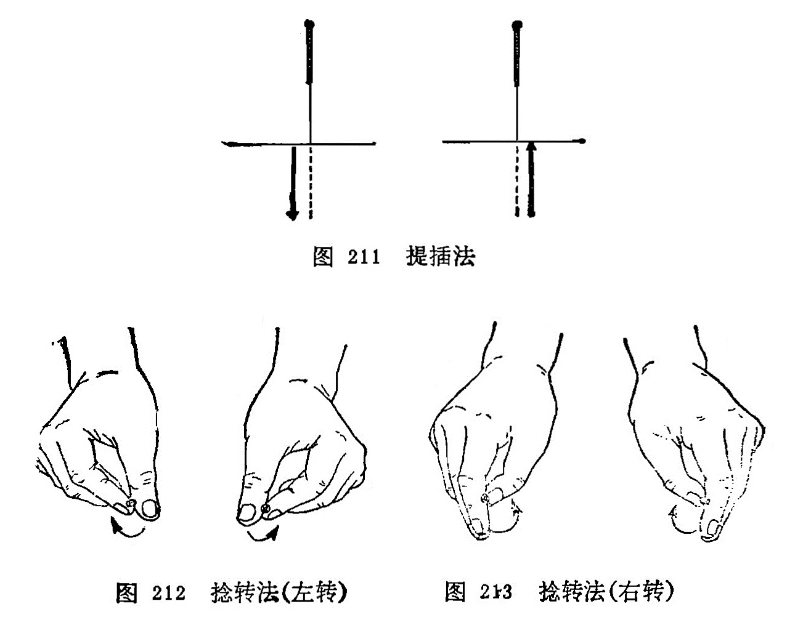

2．捻转法：是将针刺入腧穴的一定深度后，将针左右来回旋转捻动的操作方法（图212、213）。捻转的角度大，频率快， 操作时间长，则刺激量大；捻转的角度小，频率慢，操作时间短， 则刺激量小。应根据病人的体质、病情和腧穴的部位特征以及医者所要达到的目的而灵活运用。但捻转角度不要超过360°，更不能向一个方向捻转，即顺时针或逆时针捻转180°为宜。否则针身缠绕肌纤维而发生疼痛。

以上两种基本手法，既可单独使用，也可互相配合应用，在临床上必须根据病人的具体情況，灵活掌握，才能发挥其应有作用。

(二)行针辅助手法
是进行针刺时，用以辅助行针的操作方法。常用的有以下几种：	

1．循法：是以左手或右手于所针刺腧穴的周围或沿经脉的循行部位轻轻地循按的方法（图214）。此法在未得气时用之，可以通气活血，有行气、催气之功。

2．弹法：是将针刺入腧穴的一定深度后，以手指轻弹针柄，使针体微微震动，以加强针感（图215）。《针灸问对》说：“如气不行，将针轻轻弹之，使气速行，……故曰弹以催气“。

3．刮法：是将针刺入腧穴的一定深度后，用拇指或食指的指腹抵住针尾，以拇指、食指或中指爪甲，由下而上的频频刮动针柄的方法（图216）。此法在不得气时，用之可激发经气，促使得气或者加强针感和促使针感的扩散。

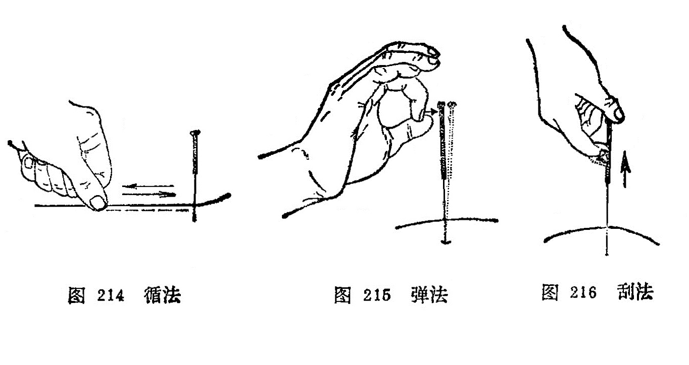

4．摇法：是将针入腧穴的一定深度后，手持针柄进行摇动，可以行气（图217）。若直立针身而摇，可以加强针感；卧倒针身而摇，往往可以促使针感向一定方向传导。

5．飞法：是将针刺入腧穴的一定深度后，以捻转为主，一般将针先作较大幅度的捻转，然后松手，拇、食指张开，一捻一放，反复数次，如飞鸟展翅之状，可以使针感增强（图218）。《医学入门》说：“以大指、次（食）指捻针，连搓三下，如手颤之状，谓之飞。”

6．震颤法：是将针刺入腧穴的一定深度后，右手以拇、食、 冲三指挟持针柄，用小幅度、快频率的提插捻转动作，使针身产生轻微的震颤，以增强针感（图219）。

### 四、针刺补泻

针刺补泻，是根据《灵枢·经脉》：“盛则泻之，虚则补之， 寒则留之，陷下则灸之”的理论确定的两种不同的治疗原则和方法，是针刺治疗当中很重要的一个环节，针刺的补泻就是通过补泻手法来实现的。《千金方》说：“凡用针之法，以补泻为先”。《灵枢·九针十二原》说“虚实之要，九针最妙，补泻之时，以针为之。”补泻是毫针刺法的核心内容。	

补法：凡是能鼓舞人体正气，使低下的功能恢复旺盛的方法。泻法：凡是能疏泄病邪，使亢进的机能恢复正常的方法。针刺补泻都是通过针刺腧穴，激发经气来调节脏腑功能，促进阴阳平衡而恢复健康。

所谓经气，即经络之气。《灵枢·终始》说："凡刺之道，气调而止。”可见针刺治病，关键在于调气。	

大量临床实践和科学实验证明，针刺补泻效果的产生，主要取决于以下三个方面的因素：

#### （一）机体状态

人体在不同的病理状态下，针刺可产生不同的调节作用，即补泻效果。如当机体处于虚脱状态时，针刺可起到回阳固脱的作用；当机体处于实、热、闭证的情况下，针刺又可以起到泄热启闭的作用。如胃肠痉挛疼痛时，针刺可起到止痉而使疼痛缓解；胃肠蠕动缓慢而呈弛缓时，针刺可以增强胃肠蠕动而使其功能恢复正常。内因是事物发展变化的根据，针刺时 机体的状态是产生针刺补泻效应的主要因素。当然，针刺对机体的这种调节作用，又和机体正气的盛衰有着密切的关系。如机体正气旺盛，经气易于激发，针刺调节作用就显著；如果机体正气不足，经气不易激发，则针刺调节作用就较差。所以《灵枢·终始》说：“谷气至者，已补而实，已泻而虚。”

#### （二）腧穴特性

腧穴的功能不仅具有它的普遍性，而且有些腧穴具有相对的特异性。有些腧穴适宜于补虚，如足三里、关元等具有强壮作用，多用于补虚；而有些腧穴适宜于泻实，如少商、十宣等，具有泻邪作用，多用于泻实。

#### （三）针刺手法

针刺手法是促进人体内在因素转化的条件是实现补虚泻实的重要环节。为了达到补泻的目的，进针以后，往往需要配合运用一定的手法。古代医家在长期的医疗实践中，创造和总结了很多针刺补泻手法。现将临床主要的几种针刺补泻手法介绍如下：

##### 1．提插补泻：

将针刺入穴位得气后，以提插时，针尖上下用力轻重和快慢，时间长短来进行补泻的一种方法。

补法：针刺得气后，先浅后深，重插轻提，提插的幅度小， 频率慢，操作时间短者。	

泻法：针刺得气后，先深后浅，轻插重提，提插的幅度大， 频率快，操作时间长者。

##### 2．捻转补泻：

将针刺入穴位得气后，以针身左右旋转进行补泻的一种方法。

补法：针下得气后，捻转角度小，用力轻，频率慢，操作时间短者。

泻法：针下得气后，捻转角度大，用力重，频率快，操作时间长者。

此外，也有以左转时角度大，用力重者为补；右转时角度大，用力重者为泻。

##### 3．疾徐补泻：

将针刺人穴位得气后，以进出针的快慢（疾徐）为基础的一种补泻方法。

补法：进针时徐徐刺入，少捻转，疾速出针者。

泻法：进针时疾速刺入，多捻转，徐徐出针者（图220、221、222）。

##### 4．开阖补泻：

是根据出针后，揉按针孔与否，依针孔的开闭为补泻的方法。

补法：出针后迅速揉按针孔。

泻法：出针时摇大针孔而不立即揉按。

##### 5．迎随补泻：

必须分辨经脉循行的顺逆与针刺的进针方向进行补泻的一种方法。

补法：进针时针尖随着经脉循行方向，顺经而刺。

泻法:进针时针尖逆着经脉循行方向，逆经而刺。

##### 6．呼吸补泻：

以进针、出针的时间，结合病人的呼吸分补泻的一种方法。

补法：当患者在呼气时将针刺入，吸气时出针。

泻法：当患者在吸气时将针刺入，呼气时出针。

##### 7．平补平泻：

进针得气后均匀地提插、捻转后即可出针。

以上各种手法，临床上可以相互配合使用。此外还有如下的复式手法：

##### 1．烧山火：

有补的作用，用于治疗寒证、虚钲、阴证。《针灸大成》：“烧山火能除寒，三进一退热涌涌，鼻吸气一口呵五口。"又说：“烧山之火能除寒，一退三飞病自安，始是五分终一寸，三番出入慢提看。”

操作：将针刺入应刺深度的上1/3 (天部)，得气后行捻转补法，再将针刺入腧穴中1/3 (人部），得气后行捻转补法，然后将针刺入腧穴下1/3 (地部），得气后行捻转补法，即慢慢地将针提到上1/3，如此反复操作3次，即将针紧按至地部留针。在操作过程中，或配合呼吸补泻法中的补法，即为烧山火法（图223）。

##### 2．透天凉：

有泻的作用，用于治疗热证、实证、阳证。《针灸大成》：“透天凉能除热，三退一进冷冰冰，口吸气一口，鼻出五口”。

操作：将针刺入腧穴应刺深度的下1/3 (地部)，得气后行转泻法，再将针紧提至中1/3 (人部），得气后行捻转泻法，然后将针提至上1/3 (天部），得气后行捻转泻法，将针缓慢地按至下1/3，如此反复操作3次，将针紧提至上1/3即可留针。在操作过程中，或配合呼吸补泻法中的泻法，即为透天凉法（图224）。

##### 3．阳中隐阴：

有先补后泻作用，用于治疗先寒后热，虚中夹实。《针灸大成》：“阳中隐阴，能治先寒后热，浅而深”。"阳中有个阴，先寒后热人，五分阳九数，一寸六阴行。”

操作：将针进入天部浅层，向左捻转九次，然后插入地部深层，向右捻针六次，提回天部浅层，以便重复操作如前。

##### 4．阴中隐阳：

有先泻后补作用，用于治疗先热后寒，实中夹虚。《针灸大成》：“阴中隐阳，能治先热后寒，深而浅。”

操作：将针进入地部深层，将针向右捻针六次，然后将针提至天部浅层，又向左捻九次，亦将针插入地部，以便重复操作。

### 五、留针与出针

#### （一）留针

将针刺入腧穴行针施术后，使针留置在穴内， 以加强针感和针的持续作用，或者便于行针施术。留针与否和留针时间长短，应根据病情而定。一般的病症，针刺得气后，补泻操作完毕即可出针，或酌情留针10〜20分钟，留针期间每隔几分钟要行针1次。但对一些特殊病症，如急性腰痛、破伤风、角弓反张、寒性、顽固性疼痛或痉挛性病症，可适当延长留针时间， 有时留针可达数小时，以便在留针过程中作间歇性行针，以增强巩固疗效。若不得气时，留针还能起到候气作用。

#### （二）出针

在行针施术或留针后即可出针。出针时，左手持消毒棉球按住针孔周围皮肤，右手持针柄轻捻轻提，边捻边退到皮下，然后将针起出，并用消毒棉球按压针孔，防止出血。若用疾徐、开阖补泻时，则应按各自的操作要求，将针起出。《流注指微论》说：“出针贵缓，急则多伤。”但要保持针孔清洁，防止感染。出针后病人应休息片刻方可活动，医者应检查针数，防止遗漏。

### 〔临床应用〕	

针刺效果的优劣，决定于针刺手法，因此临床必须掌握：

#### 1．针刺角度与深度：

根据全身不同部位的腧穴，病情需要以及患者的年龄、体形、体质等具体情况来决定针刺的角度和深度，以便达到治疗目的又不损伤脏器为原则。《素问·刺要论》说：“病有浮沉，刺有浅深。”《素问·调经论》又说：“病在脉调之血；病在血调之络；病在气调之卫；病在肉调之分肉；病在筋调之筋；病在骨调之骨。”指出邪气侵入机体后的病位不同，针刺治疗就应该有深有浅。欲使针感传入病区，就必须掌握针刺的角度和方向，只有针刺角度和深度适宜，才能达到预期的治疗效果。

#### 2．得气：

针刺之法，不论是补是泻，其关键是一个“气”字，气至而有效。在针刺当中怎样得气?首先就要明确诊断，确定属经。因经脉本身有“经脉所过，主治所在”的功能，同时又有所属脏腑和症候，所以临床必须运用以症定经，以经治病，只有把属经搞清楚，才能选穴准确，不失其经，才能激发失调的经气，使经气进入病所。其次是分清虚实，适当刺激。得气的快慢、强弱、除手法因素外，也取决于机体的强弱，疾病的虚实。针刺要根据不同体质，不同疾病，使刺激量与病、体相适应，才能激发经气，收到“气至而有效”的目的。

怎样控制针感?临床实践证明，针感的传导，有呈带状、有呈片状、有“专经”传、有伞状传，有的麻，有的木等。如果任其自然传导，就不能达到“气速效速”的目的。这就必须研究怎样控制针感，一般可按下述方法控制：

**（1）深度适当，方向准确**：根据穴位不同，采用适宜深度，以引起针感，《内经》说：“已入分肉之间，则谷气出”。掌握深度后，还要注意针刺方向，欲使针感传入病区，就必须使针刺方向斜向病所，达到“气至而有效”的效果。

**（2）阻滞封闭，接经通气**：针感多呈双向性传导，但欲使针感传入病所，可采用按截封闭法，即“欲气上行，按之在后，欲气下行，按之在前"。用关闭法，指力要强，刺手和押手配合要好，即可达到预期的目的。另外，还可以用接经通气的方法，它分首尾相接、沿经针刺，使经气通达全经。

**（3）循经揉按，趋向病所**：适用针下仅局部有针感，不向远处扩散，可通过沿经揉按、叩击，以帮助经气运行，使之趋向病所。

这都是保证针刺得气的关键，只有得气才能发挥针治作用。得气既可激发又可控制，得气的物质基础，可能是机体多种组织如血管、筋肉、神经、元神等功能参与下实现的。

#### 3．针刺补泻：

针刺的效果是通过补泻手法来实现的，而手法则是把穴位和疾病有机的联系起来。譬如说针刺合谷治疗牙痛，合谷是一个穴位，牙痛是一个病症，那么合谷穴怎么能治疗牙痛呢？只能用手法来实现，用补法还是用泻法。补泻手法在机体上是怎样起到治疗作用的呢？这是因为经脉在机体分布循行是有规律的，穴位在经脉线上是固定不变的，是气血集聚的部位。而针刺手法则是通过医生的操作，根据患者的机能状态，虚补实泻，因此手法是可变的。针刺效果就在于使不变的穴位，通过可变的手法（补或泻），来激发经气，活跃气血运行，从而达到调节机体的阴阳平衡，起到治疗疾病，预防疾病，强壮身体的作用。

**补法要领**：先进针提插到天部，留针不动以候气，然后分天、人、地三部提插捻转，每部行九阳数（提插9次，捻转9次)，然后插针到天部，行随济卧针，留针5〜10分钟，为1次操作法；如不出现热感，可同上反复进行2〜3次；最后由上向下刮针9次，留针10呼，以消散针感，快出针，扪闭穴孔。《难经》说:“当补之时，从卫取气”，就是说针刺时先浅后深，向深部要快速重插，捻转指力要轻，顺着经气循行方向刺入，这样使针具占据了容纳经气的空隙，使经气受到“压力”，则必然使经气运行加快、活跃，温度亦随之上升，主观产生热感，达到热补的目的。

**泻法要领**：先进针提插3次到地部，留针不动以候气，然后分地、人、天三部提插捻转，每部行六阴数（提插6次，捻转6次）。然后提到天部，行迎夺卧针，留针5〜10分钟，为1次操作法；如不出现凉感，可同上反复进行2〜3次；最后由下向上刮针6次，留针10呼，以消散针感，慢提针，不闭穴孔。《难经》说：“当泻之时，从营置气”，就是说针刺时先深后浅，向浅部要快速猛提，捻转指力要重，逆着经脉方向刺入，这样必然使穴处造成一个空间，则可容纳更多的经气，使经气本身“膨胀"，结果经气则不活跃，温度亦随之下降，主观产生凉感，达到凉泻的目的。

除上述手法之外，在操作上要把揣、爪、搓、弹、摇、扪、循、捻等方法灵活的结合起来应用，是可以控制针感性质的。如要使麻感变成痠感，在操作上，押手要重按，提插幅度要小，速度要快，捻转角度要大；要使痠变成麻感，在操作上，押手要轻，提插幅度要大，速度要快，捻转角度要小。因痠和麻感分别是烧山火、透天凉的基础针感，痠感加上烧山火的手法操作即产生热感；麻感加上透天凉手法操作即产生凉感。这些操作方法，必须反复练习，因人而施，才能运用自如，提高针刺疗效。

### 复习思考题

1. 何谓刺手和押手？各有何作用？
2. 常用的进针方法有哪几种？如何应用？
3. 针刺得气的临床意义是什么？
4. 何谓行针、得气、催气、候气？
5. 行针基本手法和辅助手法有哪几种？
6. 不得气的原因有哪些？对于不得气者应如何催气？
7. 何谓补泻手法？常用的补泻手法有哪些？它们的操作方法如何？
8. 何谓烧山火、透天凉针法？它们的操作方法如何？
9. 何谓”阳中隐阴、阴中隐阳”针法？它们的操作方法如何？

答：

1. 分類
2. 阿是

## 第五节 异常情况的处理及预防

针刺异常情况，是指在针刺过程中发生的特殊现象，如晕针、滞针、弯针、断针、创伤性气胸、血肿等。针刺治病虽然比较安全，但如操作不慎，疏忽大意，或犯刺禁，或针刺手法不当，或对人体解剖部位缺乏全面的了解，有时也会发生一些不应有的异常情况。如果一旦发生异常情况，医者一定要沉着、冷静，并要及时处理，一般不会造成严重后果。否则将会给患者带来不必要的痛苦，甚则危及生命。现将常见的针刺异常情况分述如下：

### 一、晕针

晕针是针刺过程中病人发生的晕厥现象。

原因：患者在施针时，精神过度紧张，体质虚弱，过度劳累，饥饿，大汗出，大泻后，大失血之后，体位不适以及医生在针刺时手法过重，而至针刺时或留针过程中而发此症。

症状：患者在针刺过程中，突然出现精神疲倦，头目眩晕， 面色苍白，心慌气短，恶心欲吐，冷汗出，四肢厥冷，血压下降，脉象沉细或沉伏。严重者出现神志昏迷，卒然仆倒，唇甲青紫，二便失禁，脉微细欲绝。	

处理：要立即停止针刺，并将已刺之针全部起出，使患者平卧，头部稍低，解开衣扣，并注意保暖，轻者静卧片刻，给以热茶或糖水饮之，即可恢复正常。重者在上述处理基础上，可刺水沟、素髎、内关、足三里、涌泉等穴，亦可灸百会、关元、气海等穴，即可恢复正常。若仍不省人事，呼吸微弱，脉细弱者，可考虑配合其他治疗或采用急救措施。

预防：根据晕针的原因予以预防。对于初次接受针刺治疗或精神过度紧张，身体虚弱者，应先做好解释工作，消除对针刺的顾虑，尽量采取卧位，取穴不宜多，手法不宜过重。对于饥饿、 疲劳、大渴时，应待进食、休息、饮水后再予针刺；医生在针刺过程中，要精神专一，随时注意观察病人的神色，询问病人的感觉，一旦有不适等晕针先兆，要及早采取处理措施，防患于未然。

### 二、滞针

滞针是指在行针时或留针后医者感觉针下涩滞，捻转、提插、出针均感困难而病人则感觉疼痛时，称为滞针。

原因：患者精神紧张，当针刺入穴位后，病人局部肌肉强烈收缩；或行针手法不当，向单一方向捻转，以致肌肉组织缠绕针体，或者病人施针后移动体位等而造成滞针。

现象：针在体内捻转不动，提插出针均困难，若强捻转或提插时，则病人感到剧痛。

处理：若患者精神紧张，局部肌肉强烈收缩时，嘱患者消除紧张状态，使局部肌肉松弛；因单向捻转而滞针者，则须反向捻转，使针松解而出；因肌肉一时性痉挛，可留针一段时间，然后 再行捻转出针，也可按揉局部，或在附近加刺一针，以宣散气血，缓解痉挛，随之将针取出；因体位移动引起的滞针，要恢复原来的体位，将针取出。

预防：对精神紧张者，应先做好解释工作，消除紧张和顾虑，行针时捻转角度不宜过大，更不能向单向连续捻转，针刺前要选好体位。

### 三、弯针

弯针是指进针时或将针刺入穴位后，针身在体内形成弯曲，称为弯针。	

原因：医者进针手法不熟练，用力过猛，或针下碰到坚硬组织，或在留针时因体位不适，或受到某种意外刺激而改变体位，或针柄受到外物碰压，以及滞针未得到及时正确处理，均可造成弯针。

现象：针体弯曲，针柄改变了进针时刺入的方向和角度，提插、捻转及出针时均感到困难，患者感觉疼痛。

处理：出现弯针后，即不得再行提插、捻转等手法。如针身轻度弯曲，可按一般起针方法将针慢慢退出；若针身弯度过大，应注意弯针的方向，顺着弯曲方向将针退出；若患者体位改变，则应使患者慢慢恢复原来体位，局部肌肉放松后，再将针缓缓起出。切忌强行拔针，以免将针断入体内。

预防：医者行针手法要熟练，指力要均匀；并要避免进针过速、过猛，选择适当体位，在留针过程中，嘱患者不要随意更动体位；针柄不得受外物碰撞和压迫；如有滞针时应及时处理。

### 四、 折针

折针也称断针，是指针体折断在人体内。

原因：针具质量欠佳，针身和针根剥蚀损伤，针前失于检查，行针时强力提插、捻转，致使肌肉强烈收缩；或体位改变，外物碰压针柄处；或滞针、弯针未能及时正确处理，并强力拔针；或 应用电针时突然加大电流强度等原因，均可导致折针。

现象：针身折断，残端留在体内，其残端可能露出皮肤面或者残端完全陷入皮肤之下。

处理：医者态度必须镇静，并嘱患者切勿更动原有体位，以防残端向肌肉深部陷入。若残端针体尚有部分露出皮肤外时，可用镊子钳出；若残端与皮肤相平或稍凹陷于体内者，可用左手拇、 食二指垂直向下挤压针孔两旁，使残端露出体外，右手持镊子将针取出；若残端完全深入皮下或肌肉深层时，应在X线下定位取出。

预防：必须认真仔细检查针具，对不符合要求的针具要剔除不用，避免过猛、过强的行针。在行针或留针时，应嘱患者不要随意更换体位。针刺时更不宜将针身全部刺入腧穴，应留部分针 身在体外，以便针根折断时取出。在进针或行针过程中，如发现弯针时，应立即出针，切不可强行刺入或行针。对于滞针、弯针应及时妥善处理，不可强行拔针。应用电针时，输出旋钮应该先置于“0"位，逐渐加大强度，切忌突然加大电流强度。

### 五、 血肿

血肿是指针刺部位出现的皮下出血而引起的肿痛，称为血肿。

原因：针尖弯曲带钩，使皮肉受损或刺伤血管所致。

现象：出针后，针刺部位肿胀疼痛或继则皮肤呈现青紫色。

处理：若微量皮下出血而局部呈小块出血时,一般不必处理可自行消退。若局部肿胀疼痛较剧，青紫面积大而且影响到活动功能时，可先作冷敷止血后，再作热敷或在局部轻轻揉按，以促使局部瘀血消散吸收。

预防：仔细检查针具，熟悉解剖部位，避开血管针刺，出针时立即用消毒干棉球揉按压迫针孔。

### 六、刺伤脏器

#### 1．创伤性气胸：

胸背部及锁骨上窝、胸骨切迹上缘的腧穴针刺过深，会刺伤肺脏，使空气进入胸膜腔，发生创伤性气胸。此时患者突然感到胸痛、胸闷、心慌、呼吸不畅；严重者则有呼吸困难、心跳加快、紫绀、出汗、虚脱、血压下降等休克现象。检査患者时，叩诊呈过度反响，肺泡呼吸音明显降低或消失；严重者可发现气管向健侧移位，X线胸透检查。可进一步诊断，并观察气体多少和肺组织的受压情况。有的病例，针刺当时并无明显异常现象，隔几小时后，才逐渐出现胸痛、呼吸困难等症状，应注意观察。

为防止气胸的发生，医者针刺时精力必须集中，选好适当体位，根据病人体形的胖瘦，掌握进针的深度，提插幅度不要过大，胸背部的腧穴可采用斜刺、横刺，留针时间不宜过长一般少量的气体能自行吸收，如有咳嗽等症状，应予对症处理。但必须严密观察，如发现呼吸困难、紫绀、休克等现象。应立即抢救，如胸腔穿刺抽气减压、输氧、抗休克等。

#### 2．刺伤心、肝、脾、肾等内脏：

在心、肝、脾、肾等内脏相应的部位针刺过深，也会引起严重的后果。特别是对心脏扩大，或肝脾肿大的患者，尤须注意。

刺伤肝脾引起出血时，病人可有肝区或脾区疼痛，有时可向背部放散；如果出血不止，刺激腹膜时，可伴有腹痛、腹肌紧张，有腹部压痛及反跳痛等症状。刺伤肾脏时，有腰痛，肾区压痛及叩击痛，并有血尿出现；出血严重时并发生血压下降以致休克等全身症状。

损伤内脏，轻者卧床休息，一般能自愈，如果有出血征象时，应加强观察，注意病情及血压变化，用止血药或局部作冷敷止血。严重的损伤并有休克出现时，必须迅速急救处理。

其他脏器，如胆、膀胱、肠胃等在某些病态的情况下，如胆囊肿大、尿潴留、肠粘连时，也有刺伤的可能，都应予注意。

#### 3．刺伤脑、脊髓：

在项部正中的哑门、风府穴以及两旁的风池穴，颈1〜2夹脊等穴进行针刺时，如果角度、方向、深度不适当，可以误伤延脑，引起严重后果。在背部正中线第一腰椎以上棘突间的穴位上针刺过深，可以刺中脊髓，出现触电样感觉向肢端放射，刺激过量也会发生后遗症。针刺这些部位的腧穴时，必须抱着高度负责的态度，随时注意针刺感应，切忌提插乱捣。如果刺伤血管，则可引起出血或血肿压迫症状。轻症注意观察，安静休息，渐能恢复，如针刺后出现头痛、恶心、呕吐等现象，甚则神志昏迷者，应及时抢救。

#### 4．刺伤神经干：

针刺在神经干和神经根部位的腧穴，出现电击样的放射感觉后，如再反复针刺，有可能损伤神经组织。由于神经损伤的程度不同，可引起受损神经的感觉或运动等功能障碍，某些病例还可出现灼性疼痛以及反射性肌肉痉挛或挛缩等现象。

### 〔临床应用〕

用针灸治疗疾病时，必须掌握针刺异常情况的原因、现象、处理、预防，这对防止针刺异常情况的发生是有重要意义的。医生如果能掌握针灸操作要领，在针刺操作过程中精神集中，认真负责，针刺异常情况是不会出现的。一旦发生异常情况，医生一定要沉着冷静，不惊慌就能及时妥善处理，否则将会给患者带来不必要的痛苦，甚则危及生命。

晕针就是在针刺过程中所发生的一种昏厥现象。一旦发生晕针要及时处理，不能拖延时间。晕针虽然无不良后果，但患者清醒后，一定要解释清楚产生晕针的原因。树立针灸治疗的信心。

滞针与弯针的产生，主要是没有掌握针刺要领，手法不熟练或体位选择不当造成的。所以初学者，一定要掌握针灸要领，加强针法练习。并要根据针刺腧穴选择好体位，滞针、弯针是可以避免的。

创伤性气胸的发生，主要是对人体解剖部位不熟悉，没有按划定的方向、角度、深度进行针刺造成的。所以要求针灸医生一定要掌握腧穴的局部解剖，操作要领，选择好体位和针具，根据患者的具体情况，针刺深度要适宜，异常情况是可以避免的。

### 复习思考题

1. 常见的针刺异常情况有哪些？它们的临床表现和处理方法如何？
2. 试述晕针的原因，临床表现，处理方法和预防措施。
3. 怎样预防滞针和弯针？
4. 怎样预防折针？
5. 创伤性气胸发生的原因，临床表现及预防是什么？
6. 在什么情况下容易刺伤神经干？

答：

1. 分類
2. 阿是

## 第六节 针刺的注意事项

在针刺过程中，为了防止针刺异常情况的发生，充分发挥针的治疗作用，还应注意以下几个方面：

1．凡过于饥饿，过于疲劳，或精神过度紧张的患者，暂不预针刺。年老体弱刺激量不宜过强，并应采取卧位。

2．对妇女怀孕三个月以下者，下腹部禁针；三个月以上者， 上下腹部以及一些能引起子宫收缩的腧穴如合谷、三阴交、昆仑、至阴等均不宜针刺 ，月经期最好不针刺，但月经不正常为了调经，经期也可以针刺。

3．小儿囟门未合时，头顶部腧穴不宜针刺，又因小儿不能配合，故不宜留针。	

4．针刺胸背部腧穴，针刺不宜过深，严防发生创伤性气胸等事故，对于脊髓、内脏和大血管附近的腧穴应注意针刺的角度、方向、深度。《素问·刺禁论》指出：“脏有要害，不可不察”。《素问·诊要经终论》也说：“凡刺胸腹者，必避五脏”。

5．对皮肤有感染、溃疡、瘢痕或肿瘤的局部穴位不宜针刺。

6．患者有出血性倾向的疾病，不宜针刺，如血友病、血小板减少症等。

7．对尿潴留患者，在针刺少腹部腧穴时，也应掌握适当的针刺方向、角度、深度等，以免误伤膀胱等器官出现意外的事故。

8．针刺眼区和项部的风池、风府、哑门等穴以及脊椎部的腧穴，要掌握一定的角度，更不宜大幅度提插、捻转和长时间的留针，以免伤及重要组织器官，产生严重的不良后果。

### 〔临床应用〕

针灸治疗疾病，具有安全、疗效可靠、副作用小等优点，但临床上必须掌握针刺注意事项。因为针刺注意事项把针刺时可能发生的针刺事故的主要内容总结出来，是针灸前辈的经验总结， 在针灸临床治疗中必须遵循的。例如孕妇，因胎儿随月分增加而增长，所以腹部腧穴不宜针刺；有些腧穴对子宫作用比较强，如合谷配三阴交，有使胎儿“应针而下”的说法，故孕妇不宜针刺。

### 复习思考题

1. 针刺注意事项包括哪些内容？
2. 妇女怀孕四个月以上，为什么全腹及腰骶部禁针？
3. 针刺眼区腧穴应注意什么？
4. 在什么情况下应慎针和忌针？

答：

1. 分類
2. 阿是

# 第二章 灸法 附:拔火罐疗法

〔自学时数〕    2 学时

〔面授时数〕    1 学时

〔目的要求〕

1. 了解艾叶的功能及艾绒的制法。
2. 掌握艾炷灸、艾条灸、温针灸、温灸器灸，天灸、灯草灸，太乙神针、雷火神针的操作方法，适应范围和注意事项。
3. 掌握灸法的作用。
4. 熟悉施灸的程序及灸法的禁忌证。
5. 掌握拔火罐的操作方法，适应范围和注意事项。

灸法是借灸火的热力，给人体以温热性刺激，通试经络腧穴的作用，以达到治病防病的一种方法。《灵枢·官能》说：“针所不为，灸之所宜。”《医学入门》说：“药之不及，针之不到，必须灸之。”这说明它能治疗针刺效果较差的某些症，或结合针法应用，更能提高疗效，所以是针灸疗法中的一个重要组成部分。

## 第一节 灸用材料

施灸的原料很多，古今均以艾为主。艾为多年生草本，是菊科植物、叶似菊，表面深绿色，背面灰色有茸毛，性温芳香，五月采集，叶入药用。我国遍地皆产，以湖北蕲州产的艾为佳，叶厚而绒多，称为蕲艾。现将艾叶的功能及艾绒的制法分述如下：

艾叶的功能：在《名医别录》中记载：“艾叶苦，微温，无毒，主灸百病。”《本草从新》中说：“艾叶苦辛，生温，熟热，纯阳之性，能回垂绝之阳，通十二经，走三阴，理气血，逐寒湿，暖子宫，止诸血，温中开郁，调经安胎，……以之灸火，能透诸经，而除百病。”说明艾叶作为施灸材料，具有芳香开窍，通经活络，祛除寒湿，消肿散结，回阳救逆等作用。

艾绒的制法：在毎年三月至五月间采集新鲜肥厚的艾叶曝晒干燥后，放入石臼中捣碎，筛去杂梗和泥砂。再晒再捣再筛，如此反复多次，即成淡黄色洁净软如棉的艾绒；或者利用机械反复 压榨，使艾叶细碎，筛去杂质即成。艾叶以陈久易燃者为佳，故制成后应贮藏一定时期，才能用于临床。

### 〔临床应用〕

施灸的热源，自古至今是以艾绒为主的。因为艾绒具有易燃而不焰，又不易熄灭，火力温和，其热力能透组织深部的特性，患者亦少有痛苦的特点。为什么要用陈久的艾绒进行施灸呢？因 陈艾绒燃烧缓慢，火力温和，烟少，燃烧后艾灰不易脱落等。而新艾含挥发油多，燃烧快，火力强，烟雾大，艾灰易脱落灼伤皮肤。故《孟子·离娄》说：“七年之病，求三年之艾”

艾绒必须保存在通风干燥的容器内，防止发霉，一但发霉就失去艾绒的特性。因艾绒除含氮有机物，碳氢化合物，灰之外，还含有挥发油、苦艾醇、苦艾酮，维生素甲、乙、丙、丁，腺素， 胆素等，有兴奋中枢神经的作用。如果艾绒的这些成分被破坏，再用施灸，疗效就会降低，所以艾绒一定要保藏好，才能更好的发挥艾绒的作用。	

### 复习思考题

1. 艾叶有什么功能？
2. 施灸时为什么选陈艾？
3. 艾绒有哪些优点？

答：

1. 分類
2. 阿是

## 第二节 灸法的分类及其操作

灸法治疗疾病，已有悠久的历史。先是单纯的艾灸，后来衍化为多种灸法。大体上可分为艾炷灸、艾条灸、温针灸、温灸器灸和药物灸（药物发泡法）等几类。各类灸法如表11。

表11、灸法分類

### 一、艾炷灸

艾炷灸包括直接灸和间接灸，是灸法的主体。古代的灸法多指直接灸，间接灸是后来发展起来的一种疗法。

艾炷是将纯艾绒用手指搓捏成圆锥体。又称艾团、艾丸、艾圆等。艾炷分为大、中、小三种类型。小艾炷是把艾绒搓紧，捻成麦粒状或上尖下大的圆锥体；中艾炷是搓成象半个黄豆粒或半个杏核大的上尖下大的锥体；大艾炷是搓成蚕豆大者的上尖下大的圆锥体（图225）。

一般规定炷底直径为0.8厘米，高1厘米，重量为0.1克， 燃烧时间为3〜5分钟。这是为了科学研究和临床准确而设的。施灸多少？以“壮”计数，壮，是以青壮年为标准的意思。燃烧一枚艾炷即为一壮。施灸的壮数是因人、因病、因穴而异，少则一壮，多则数百壮，一般灸3〜7壮即可。

#### （一）直接灸

是将艾炷直接放在皮肤上施灸（图226）。可分为瘢痕灸和无瘢痕灸。

##### 1．瘢痕灸：

又称化脓灸、着肤灸、打脓灸。施灸前用大蒜捣汁，涂敷施灸部位以增加粘附和刺激作用，然后放置中艾炷施灸、 每壮艾炷必须燃尽，除去灰烬后，方可继续加炷施灸，一般施灸5〜10壮。因施灸时艾火烧灼皮肤疼痛较剧，可用手在施灸部位周围轻轻拍打，借以缓解疼痛。在正常情况下，灸后一周左右施灸部位化脓形成灸疮，5〜6周左右灸疮自行痊愈，结痂脱落，留下瘢痕。临床上用于慢性、顽固性病症。如哮喘、肺痨、瘰疬、慢性胃肠病等证。

##### 2．无瘢痕灸：

又称非化脓灸。将施灸部位涂敷凡士林油，以增加粘附作用，再放上艾炷点燃，当艾炷燃剩2/5左右，患者感到烫时即用镊子将艾炷夹去，更换艾炷再灸，连续灸3〜7壮。以局部皮肤充血、红晕为度。因灸后不化脓，也不留有瘢痕，易为患者所接受。本法适用于虚寒性疾病，小儿各种虚弱病证。如腹痛、 腹泻、胃脘痛、腰痛、阳萎、痛经等症。

#### （二）间接灸

又称隔物灸、间隔灸。在施灸时于皮肤和艾炷之间垫上不同的药物，称为间接灸。由于间隔的药物不同，可分为隔姜灸、隔蒜灸、隔盐灸、隔饼灸等。

1．隔姜灸：皮肤和艾炷之间隔上姜片，即为隔姜灸。

用鲜姜切成直径大约2—3厘米，厚约0.2〜0.3厘米的薄片，片上用针刺数孔，置于施术部位或腧穴上，再将大艾炷放在姜片上点燃施灸（图227），当艾炷燃尽，再移炷施灸，灸3〜7壮，以局部皮肤红润不起泡、患者有舒适感为度。适用于虚寒证。呕吐、腹痛、腹泻、遗精、风寒痹痛如等。

2．隔蒜灸：皮肤和艾炷之间隔上蒜片，即为隔蒜灸。

用独头大蒜切成约0.2〜0.3厘米厚的薄片，片上用针刺数孔，施灸法同隔姜灸。适用于外科痈疽疮毒，肺痨、瘰疬、腹中积块等。

3．隔盐灸：皮肤和艾炷之间隔上细盐即为隔盐灸。

用于脐窝部施灸。将纯净细盐填敷于脐孔，将脐孔填平，或于盐上再置一薄片姜，上置大艾炷施灸（图228）。待患者感到灼痛时则换艾炷再灸，连续施灸，至证候改善为止。适用于中风脱证, 急性腹痛，吐泻，痢疾，四肢厥冷等证。

4．隔饼灸：皮肤和艾炷之间隔上药饼，即为隔饼灸。根据病情需要，所选用的药饼不同，有不同的名称。

（1）附子饼灸：皮肤和艾炷之间隔上附子饼，即为附子饼灸。

将附子压成粉末，以黄酒调和做成直径约3厘米、厚约0.2～0.3厘米的附子饼，饼上以针刺数孔，放置施术部位或腧穴上，上置大艾炷施灸，灸数壮，以患者有温热舒适感为度。适用于各种阳虚证。如外科中的疮毒窦道盲管，久不收口，或既不消散又不化脓的阴性虚性外证等，有祛腐生肌作用；还可用于命门火衰而致的阳萎、早泄，有温肾壮阳作用。

（2）豆豉饼灸：皮肤和艾炷之间隔上豆豉饼，即为豆豉饼灸。

将豆豉压成粉末，用黄酒调和，制成疮口大的饼，厚约0.2～0.3厘米，饼上用针刺数孔，置于疮面上，上置大艾炷施灸，以患者感到温热舒适为度。适用于外科的痈疽发背，溃后久不收口，疮色黑暗者，每日灸1次，直到疮口愈合为止，有散泄毒邪的作用。

（3）胡椒饼灸：皮肤和艾炷之间隔上胡椒饼，即为胡椒饼灸。

将白胡椒压成粉末，用水调面粉作饼，厚约0.2厘米，中央按成凹陷，内置入丁香散（丁香、肉桂、麝香)上置大艾炷灸之，使患者感到温热为宜。适用于风湿痹痛及局部麻木不仁等病。有温经散寒，通经止痛作用。

（4）黄蜡灸：据《医宗金鉴》记载: "黄蜡灸法，可治痈疽发背，恶疮顽疮。先以湿面随肿根作圈，高寸余，实贴皮上，如井口形，圈内铺蜡屑三、四分厚，次以铜漏杓盛桑木炭火，悬蜡上烘之，令蜡溶化至沸，再添蜡屑，随溶随添，以井满为度。皮不痛者毒浅，灸至觉痛为度；皮痛者毒深，灸至不痛为度。然后去火杓，即喷冷水少许于蜡上，俟冷起蜡，蜡底之色青黑，此毒出之征也。如慢肿无头者，以湿纸试之，于先干处灸之，初起者一、二次即消，已成者二、三次即溃。疮久溃不敛，四围顽硬者，即于疮口上灸之，蜡从口入，愈深愈妙，其顽腐瘀脓尽化，收敛甚速。”

（5）硫磺灸：据《东医宝鉴》记载，此法可治诸疮久不瘥，变成瘘管者。方法是：取硫磺一块，如疮口大小，安置疮上，另取少许硫磺，于火上烧之，用叉尖挑起，点硫磺令著，如此三、五遍，以脓水干瘥为度。因硫磺性温有毒，有温阳杀虫之效，所以用之灸治瘘管，可收良效。

### 二、艾卷灸 

包括艾条灸、太乙针灸和雷火针灸。

#### （一）艾条灸

是取纯艾绒24克，平铺在26厘米长，20厘米宽、质地柔软疏松而又坚韧的桑皮纸上，将其卷成直径约1. 5厘米的圆柱形，越紧越好，用胶水或浆糊封口而成(图229)。也有在每条艾绒中掺入肉桂、干姜、丁香、独活、细辛、白芷、雄黄、 苍术、没药、乳香、川椒各等分的细末6克，则成为药条。施灸的方法分温和灸、雀啄灸、熨热灸三种方法。

1．温和灸：将艾条的一端点燃，对准施灸部位，约距2〜3厘米左右进行熏烤（图230）,使患者局部有温热感而无灼痛，一般每处灸3〜5分钟，至皮肤稍起红晕为度。对于昏厥、局部知觉减退的患者和小儿，医者可将食、中二指，置于施灸部位两侧， 这样可以通过医者手指的感觉来测知患者局部受热程度，以便随时调节施灸距离，掌握施灸时间，防止烫伤。适用于风寒湿痹等证。

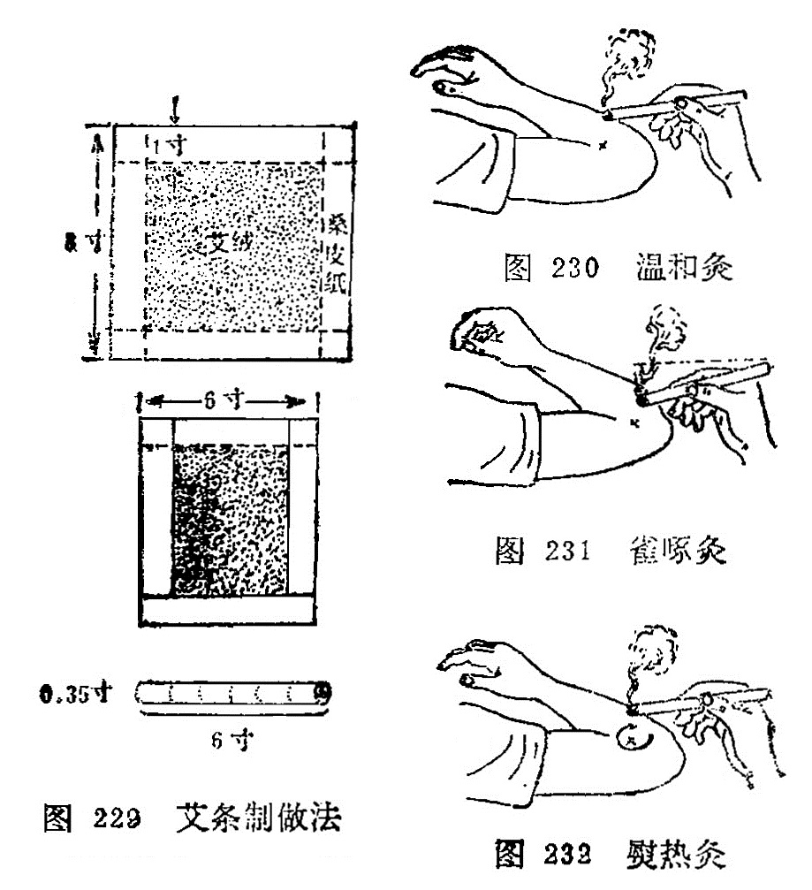

2．雀啄灸：将艾条的一端燃着，与施灸部位的皮肤并不固定在一定距离，而是象雀啄食一样，一上一下活动施灸（图231）。 适用于小儿疾病、胎位不正、无乳等证。

3．熨热灸：将艾条燃着的一端，与施灸部位的皮肤约距离3厘米左右，如熨衣服一样，来回旋转移动进行施灸（图232）。适用于面积较大的风湿痛、软组织损伤等。

#### （二）太乙针灸

是以纯艾绒和太乙针灸处方中的药物制成。

制针法：人参125克、穿山甲250克、山羊血90克、千年健500克、钻地风300克、肉桂500克、小茴香500克、苍术500克、甘草1000克、防风2000克、麝香少许，共为细末，取药末24克掺入艾绒内，平铺在40厘米见方的桑皮纸上，紧卷成爆竹状，外用鸡蛋清封固，阴干后备用。

用法：施灸时，将太乙针的一端烧着，用布七层包裹其烧着的一端，立即紧按于应灸的腧穴或患处，进行灸熨，针冷再燃再灸熨，如此反复灸熨7〜10次为度。适用于风寒湿痹，顽麻、痿弱无力、半身不遂等以及腹痛，泻泄。 

#### （三）雷火针灸

其制作方法与太乙针基本相同，惟药物处方有异。

制针法：用纯净的艾绒150克；沉香、木香、乳香、茵陈、羌活、干姜、穿山甲各9克，共为细末，麝香少许。取棉皮纸二方，一方平置桌上，一方双折重复于上，然后将药料与艾绒和匀，铺于纸上，卷成爆竹状，外涂鸡蛋清，以桑皮纸厚糊六、七层，阴干勿令泄气。

用法：取两支，先燃一支，将烧红的一端紧裹于数层布中，按于应灸的部位或穴上，如雀啄样随按随提。待针热消失后，即另换一支，反复施灸，使热感及药气透入组织，直至灸处红润为止。适用于筋骨疼痛，经络不通，沉寒积冷等证。

### 三、温针灸

温针灸又称针上加灸、传热灸、烧针尾。是针刺与艾灸结合使用的一种方法。适用于既需留针， 又需施灸的疾病。操作方法是，针刺得气后，并给予适当补泻手法而留针时，将纯净艾绒捏裹在针柄上，或用艾条一段长约2厘米左右，插在针柄上，点燃施灸（图233）。待艾绒或艾条烧完后除去灰烬，将针取出。本法适应证比较广，如虚寒性病症，腰脊、关节、肢体冷痛，胃腹冷痛，经闭，痛经等。

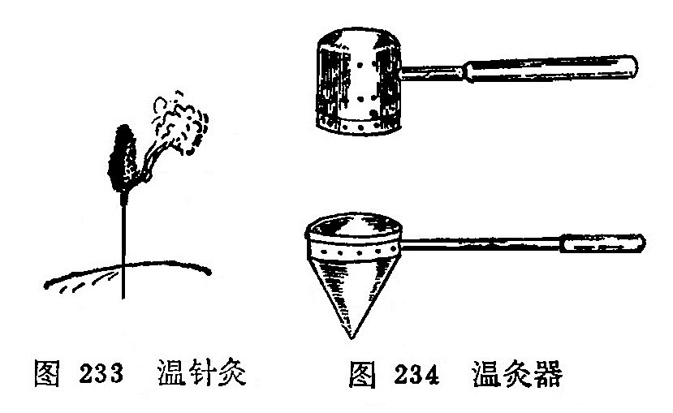

### 四、温灸器灸

温灸器灸，又称灸疗器灸、温筒灸。是一种用特制的金属温灸器而施灸的方法。

器具：温灸器的样式有多种，一般是用金属片特制成的，分内外两层，都有数十小孔，内层装艾绒，外层是保护层。市场有出售（图234）。

操作方法：使用温灸器时，先将艾草或加参药末放入小筒内燃着后，将温灸器扣盖好，然后在拟灸的腧穴部位上来回熨烫，使局部发红为度。有调和气血、温中散寒的作用。适用于妇人小儿及惧怕灸者，可用于治疗寒性腰痛、腹痛、关节痛等。

### 五、药物灸

药物灸，又称天灸、自灸。近代又称为发泡疗法。是用对皮肤有刺激性药物敷贴于穴位或患部，使局部充血、起泡有如灸疮，故称药物灸。如毛莨灸、斑蝥灸、白芥子灸、蒜泥灸、蓖麻子灸等，介绍如下：

#### （一）毛莨灸

毛茛灸是将草乌头的嫩苗，采取其叶子揉烂，敷贴于皮肤。初感局部热辣、充血，轻时即发生水泡。一般3〜4 天后自行愈合。愈合后局部呈现色素沉着，逐渐消退。敷贴在内关、大椎穴时，可治疗疟疾，寒痹可贴于局部。

#### （二）斑蝥灸

斑蝥是一种甲虫，含斑蝥素，对皮肤有较强的刺激作用。用时研成末，用甘油调和敷贴于皮肤，发泡作用很强， 用于治疗面瘫、癣等。

#### （三）白芥子灸

白芥子含挥发油，对皮肤有刺激作用。用时研末水调，发泡效果显著，用于治疗关节疼痛等。或调和其它药物，如白芥子50克，延胡索50克，细辛、甘遂各25克，共为细末，加麝香少许，调匀，调敷肺俞、膏肓、百劳等穴治疗哮喘。

#### （四）蒜泥灸

大蒜含精油，对皮肤有刺激作用。用时把大蒜捣成泥，敷贴皮肤能起泡。如贴鱼际穴处，使之发泡，可治疗喉痹；贴合谷穴处发泡，可治疗扁桃腺炎等。

#### （五）蓖麻子灸

把篦麻子去外壳，捣烂如泥备用。敷贴于百会穴治疗子宫脱垂、脱肛，敷贴于涌泉穴处治疗滞产等。

### 六 灯草灸

灯草灸又称灯火灸。用灯心草一根，以麻油浸之，燃着后，于应灸的腧穴上爆之。功能疏风解表，行气化痰，清神止搐。多用于治疗小儿脐风，痄腮和胃痛，腹痛，痧胀等症。

### 〔临床应用〕

应用灸法治疗疾病，必须掌握各类灸法的操作及运用。如瘢痕灸，在操作时为什么要用蒜汁贴艾炷？主要原因是大蒜内含精油，对皮肤有刺激作用，有发泡和消毒作用，减少感染机会。瘢痕灸已达到三度烧伤，灸后要保护局部清洁，以防感染，灸后要贴上淡水膏（樟丹50克，麻油300克熬膏备用），再用消毒敷料保护。化脓期每天要多换几次淡水膏，防止脓汁排泄不畅。由于本法灸后成三度烧伤，患者极为痛苦，要用此法治疗时，必须征得患者的同意，否则中途不合作，造成失败。瘢痕灸虽然疼痛，却属于良性刺激，能改善体质，增强抗病能力，从而达到防病治病的目的。

非瘢痕灸在操作时为什么要用凡士林油贴艾炷？这是因为非瘢痕灸不须烧伤，只要达到皮肤红润为度，凡士林油没有发泡作用，故用之。在操作时一定不要烧伤皮肤，特别是面部，否则影响美观。

间接灸，必须根据不同的病证选择不同的隔物，在操作中，只更换艾炷不更换隔物，将预定施灸的壮数灸完为止。

温针灸，在操作时一定要把艾炷或艾条的一段在针柄固定牢，并嘱病人不要变动体位，防止燃着的艾炷或艾段脱落，烧伤皮肤或衣物。为了防止烧伤，也可用5厘米的正方形的硬纸片，纸片中间扎一孔套在针体上，覆盖在穴位的皮肤上，起到保护作用。

药物灸，一定要掌握药物的剂量，用量过大后引起中毒，或者给患者造成不应有的痛苦。

### 复习思考题

1. 何谓艾灸疗法？主要分哪些类别？
2. 概述艾炷灸、艾卷灸的操作方法及其适应证。
3. 何谓温针疗法？其操作方法怎样？
4. 常用的间接灸法有哪些？
5. 常用的药物灸法有哪些？
6. 艾炷分几种？标准艾炷是指什么说的？ 

答：

1. 分類
2. 阿是

## 第三节 灸法的作用

灸法是一种温热刺激，对虚寒证效果好。《灵枢·官能》说：“阴阳皆虚，火自当之；……经陷下者，火自当之；结络坚紧，火所治之。”《灵枢·经脉》又说：“陷下则灸之。”《灵枢·禁服》又说：陷下者，脉血结于中>，中有著血，血寒，故宜灸之”。说明灸法能治疗很多疾病，其作用如下：

1．艾灸有温补中气、回阳固脱的作用，故用治疗久泄，久痢，遗尿，崩漏，脱肛，阴挺及寒厥等。

2．艾灸有温经通络、祛湿散寒的作用，故用治疗风、寒、湿邪为患的病证及气血虚弱引起的眩晕，乳少，闭经等。

3．艾灸有行气活血、消瘀散结的作用，用于治疗乳痈初起，瘰疬、 疖肿未化脓者，也有一定疗效。

4．预防疾病，保健强身，常灸大椎、关元、气海、足三里等 腧穴，能鼓舞人体正气，增强抗病能力。《千金方》说：“凡宦游吴蜀，体上常须三两处灸之，勿令疮暂瘥，则瘴疠、温疟、毒气不能着人。”《扁鹊心书》说：“人于无病时，常灸关元、气海、命门、 中脘，虽未得长生，亦可保百余年寿矣。”

5．隔姜灸有解表散寒、温中止呕的作用，可用于外感表证及虚寒性呕吐、泄泻、腹痛、痹证等。

6．隔蒜灸有清热、解毒、杀虫的作用，可用于疖肿疮疡，毒虫咬伤，对哮喘，脐风，肺痨，瘰疬等也有一定的疗效。

7．隔盐灸有温中散寒、扶阳固脱的作用，可用于虚寒性呕吐、 泄泻、腹痛、虚脱，产后血晕等。

8．附子饼灸有温肾壮阳的作用，可用于命门火衰而致的遗精、阳萎、早泄或疮疡久溃不敛等。	

### 〔临床应用〕

在临床上应用灸法治病，要掌握灸法的作用，根据灸法的不同作用，采用不同的灸疗方法，才能有效的治疗各种不同的疾病。 如隔姜灸、隔蒜灸、隔盐灸、附子饼灸各有不同作用及适应证。但灸法治病也不是万能的，只有对证才能取效。

### 复习思考题

1. 灸法有哪些作用？
2. 隔姜灸、隔蒜灸的作用及适应证有什么不同？
3. 隔盐灸、附子饼灸的适应证各有什么区别？	

答：

1. 分類
2. 阿是

## 第四节 灸法的注意事项

### 一、点穴与体位

施灸时，取穴的正确与否将直接影响灸法的治疗效果。所以在施灸前必须选好体位，再进行取穴。《千金方》：“凡点灸法，皆须平直，四体毋使倾侧。灸时孔穴不正，无益于事，徒破皮肉耳。若坐点则坐灸之，卧点则卧灸之，立点则立灸之，反此亦不得其穴矣。”《明堂灸经》：“须得身体平直，勿令蜷缩，坐点勿令俯仰，立点勿令倾侧。”说明施灸时不但要取穴准确，还须嘱咐患者不可移动体位。因为体位的变换，可以使腧穴因骨骼、肌肉的牵拉而改变位置，必然会影响取穴的准确性。此外，还须注意的是体位必须平直，将拟施灸的腧穴暴露出来并使腧穴面朝上，以防艾炷安放不平正，燃烧时火力不能集中，热力不能深透肌肤，而致减低疗效；同时也可防止施灸时艾炷滚下，烫伤皮肤，给病人造成不必要的痛苦。

### 二、施灸的程序

施灸的程序是先灸上部，后灸下部；先灸背部，后灸腹部；先灸头身，后灸四肢。《千金翼方》说：“凡灸法先发于上，后发于下；先发于阳，后发于阴。”《明堂灸经》说：“先灸上，后灸下；先灸少，后灸多。”灸的顺序虽说如此，但还须结合病情来考虑，因病制宜，灵活掌握，不可拘泥。	

### 三、施灸剂量的大小

直接灸，是以小艾炷或中艾炷为主；间接灸，是以中艾炷或大艾炷为主。而且要依患者的体质、病情、部位来考虑灸量的大小。《医宗金鉴》说：“凡灸诸病，必火足气到，始能求愈。然头与四肢皮肉浅薄，若并灸之，恐肌骨气血难堪，必分日灸之，或隔日灸之，艾炷宜小，壮数宜少。有病必当灸巨阙、鸠尾者，必不可过三壮，艾炷如小麦，恐火气伤心也。背腰以下皮肉深厚，艾炷宜大，壮数宜多，使火气到，始能去痼冷之疾也。”《千金方》说： “头面目咽，灸之最欲生少；手臂四肢，灸之须小熟，亦不宜多； 胸背腹灸之尤宜大熟，其腰脊欲须少生。”《外台秘要》说：“凡灸有生熟，侯人盛衰及老小也。衰老者少灸，盛壮强实者多灸。”所谓“生”是指少灸；"熟”是指多灸。上述记载是说明施灸的标准。一般的说，凡是新病、体质强壮的艾炷宜大，壮数宜多；久病、体质虚弱者艾炷宜小，壮数宜少。从部位来说，胸部不宜用大艾炷；四肢末端，皮肉浅薄处不可多灸；腹背部及肌肉丰厚处则可多灸。妇女儿童，艾炷宜小，壮年则可大。古代文献中有灸百壮 者，都是指多次灸治的累积数。其它灸法的施灸量，可参考艾炷灸法。艾条法、温灸器灸一般以时间计算。太乙针、雷火针则以熨灸的次数计算。

### 四、灸疮的处理

在施灸过程中，因施灸过量，时间过长，局部出现水泡，不要擦破，可任其自然吸收；如果出现较大水泡，可用消毒针具刺破水泡，放出液体，再涂以龙胆紫；化脓灸者，灸疮化脓期间， 一个月内勿做重体力劳动，疮面局部勿用手搔。为了保护痂皮， 要防止摩擦，疮面宜保持清洁，以防感染，可敷贴淡水膏，根据脓汁分泌的多少，毎日换药1〜2次，用消毒敷料复盖。

### 五、灸法的禁忌

1.病情的禁忌：由于灸法属于温热刺激，而热能伤阴，故阴虚阳亢和邪热内炽的病症皆不可灸。如阴虚痨瘵，咯血吐血， 心悸怔忡，多梦遗尿，中风闭证，高热神昏等。如热病而误用灸法，致损阴血，助益有余之阳；甚则火毒内攻而成坏病。

2.部位禁忌：凡颜面、眼区、重要脏器、血管浅在部位、筋腱所在部位，以及妇女妊娠期的少腹部、腰尻部、乳头、阴部事、 均不宜施灸。

3.穴位的禁忌：头维、人迎、哑门、睛明、攒竹等穴，均不宜灸。但据《针灸大成》记载有45穴、《针灸集成》试载有53穴禁 灸。古人所记，仅供参考。	

### 六、灸法的补泻

灸法同刺法一样，也有补泻的区分。《灵枢·背俞》：“以火补者，毋吹其火，须自灭也；以火泻者，疾吹其火，传其艾，须其火灭也。”朱丹溪解释说：“灸法有补泻火，若补火，艾灭至肉；若泻火，不要至肉，便扫除之，用口吹之，风主散故也。”《针灸大成》也说：“以火补者，毋吹其火，待自灭，即按其穴；以火泻者，速吹其火，开其穴也。”这说明补法的施灸，须艾火自灭，使火力缓缓透入深层，故能补虚扶羸，温阳起陷；泻法的施灸，须用口吹，使火速燃，不燃至皮肉即便扫除，力促而短，目的在于起消散作用。

### 〔临床应用〕	

在施灸时一定要熟悉施灸的注意事项，才能提高灸治的疗效， 防止灸疮的发生（化脓灸除外）。因此，施灸的体位要舒适、持久，操作时的穴位要平稳，这样就能达到取穴准确、平稳，防止艾炷脱落。施灸程序是使施炎埘不遗漏灸点。施灸剂量的大小，是灸法治疗中很重要的环节，如果灸量不够，达不到治疗效果，如果 旅灸量过大，又会发生灸疮或坏病。所以要根据病情、体质、年 龄、部位给以拾当的施灸量，中病即止。灸法的禁忌.，古代文献记载颇多，有些有一定道理，有些是不必要的。应从临床实际出发，不可拘泥。	

### 复习思考题

1. 施灸的程序是什么?
2. 灸法的禁忌证是什么？
3. 灸疮如何处理？
4. 《灵枢·背俞》篇中是怎样谈灸法的补泻的？
5. 灸法能否用于治疗实证、热证?为什么？试谈谈你的看法？

答：

1. 分類
2. 阿是

## 〔附〕拔罐法

拔罐法是以罐为工具，利用燃烧热力排除罐内空气，造成负压，使罐吸附于腧穴或应施术的部位，产生温热刺激并造成皮肤充血、瘀血现象的一种疗法。最早见于《肘后方》，以牛角制罐， 作外科吸脓血之用，故又称角法和吸筒法。随着医疗实践的不断发展，罐的质料大为改进，使用方法有所发展，治疗范围有所扩大，不仅用于外科，也用于内科的一部分病证。拔罐法常和针灸疗法配合使用，其作用与灸法有相似之处。

### 1．罐的种类：

罐的种类很多，临床常用的有以下几种：

（1）竹罐：用直径3〜5厘米坚固无损的竹子，制成6〜10厘米长的腰鼓形的圆筒，一端留节做底，另一端做罐口，打磨光滑平正。它的优点是取材容易，经济易制，轻巧，不易摔碎。缺点容易燥裂、漏气、吸附力不大。

（2）陶罐：是由陶土烧制而成，有大有小，罐口平正光滑，肚大而圆，口、底较小，其状如腰鼓。它的优点是吸着力大，缺点是质量易摔碎、损坏。

（3）玻璃罐：形如球状，罐口平滑而宽，有大、中、小三种 不同型号。它的优点是质地透明，使用时可以窥测罐内皮肤的充血、瘀血程度，便于随时掌握情况，缺点是容易摔碎、损坏。

（4）抽气罐：用青、链霉素药瓶，将瓶底切去磨平，切口须光洁，瓶口的橡皮塞须保留完整，便于拔气时用。近年已发展成电动抽气吸罐。

### 2．操作方法：

拔罐的操作方法分以下几种：

（1）火罐的操作法：用燃烧时火焰的热力排除罐内空气，使罐内呈负压，将罐吸着在皮肤上。有以下几种方法：

投火法：将小纸条点燃后、投入罐内，然后速将罐罩在施术部位（图235)。此法适用于侧面横拔，否则，会因燃烧物落下而烧伤皮肤。

闪火法：用镊子或止血钳子挟住酒精棉球，点燃后在火罐内壁中段绕1〜3圈后，迅速退出，然后将罐罩在施术部位（图236)。此法比较安全，不受体位限制，是较常用的拔罐方法。	

贴棉法：用一平方厘米的棉花片，不要太厚，略浸95%酒精，贴在罐内壁的上、中段，以火柴点燃，罩在施术部位上(图237)。此法多用横位拔罐。

架火法：用2〜3平方厘米不易燃烧的块状物作支架，上置95%的酒锖棉球，点燃后把罐罩上。此法去罩罐要准确，不要碰掉燃烧的棉球，以防烧伤皮肤，适用用于平卧位（图238)。

（2）水罐操作方法：一般用于竹罐。先将竹罐放在锅内加水煮沸，用镊子倒挟竹罐的底端，甩去罐内的沸水，并用折迭的冷毛巾紧扪罐口。乘热按在施术部位，即能吸住。适用任何部位的拔罐。

### 3．各种拔罐法的运用：

（1）单罐：用于较小范围病变或压痛点。可按病变的或压痛的范围大小，选用适当口径的火罐。如胃病可在中院穴拔罐，岗上肌肌腱炎在肩髃穴处拔罐等。

（2）多罐：用于病变范围比较广泛的疾病。可按病变部位的解剖形态等情况，酌量吸拔数个乃至十数个。如某一肌束劳损时可按肌束的位置成行排列吸拔多个罐，称为排罐法。治疗某些内脏或器官的瘀血时，可按脏器的解剖部位的范围在相应的体表部位纵横并列吸拔几个罐子。

（3）闪罐：罐子拔上后，立即起下，如此反复多次地拔住起下，起下拔住，至皮肤潮红为止，多用于局部皮肤麻木、疼痛或功能减退等疾患，如面瘫等。

（4）留罐：拔罐后，留置一定的时间，一般留置5〜15分钟。罐大吸着力强的应当减少留罐时间，肌肤薄处留罐时间不宜过长，以免损伤皮肤。

（5）推罐：又称走罐、飞罐。一般用于面积较大、肌肉丰厚的部位，如腰背、大腿等。选用口径较大的罐子，罐口要求平滑，最好用玻璃罐，先在罐口涂一些滑润油脂将罐子吸上后，以双手握住罐底，即后边着力，前边略起来,慢慢向前推动，这样在皮肤表面上下或左右来回推拉移动数次，至皮肤潮红为度 （图239）。

（6）药罐：常用的药罐有两种：煮药罐：将配制成的药物装入布袋内，扎紧袋口，放入清水煮沸至适当浓度，再把竹罐投入药液内煮15分钟。使用时，按水罐法吸拔在应拔的部位上，多用于风湿痛等病。

常用药物处方：麻黄、蕲艾、羌活、活独、防风、秦艽、木瓜、川椒、生乌头、蔓陀罗花、刘寄奴、乳香、没药各6克。

贮药罐：在抽气罐内事先盛贮药液（约为罐子的2/3～1/2)。常用的药液为辣椒水、两面针酊、生姜汁、风湿酒等。然后按抽气 罐操作法，抽去空气，使罐吸在皮肤上。也有在玻璃罐内盛贮 1/3〜1/4的药液，然后用火罐法吸拔在皮肤上。常用于风湿痛，哮喘，咳嗽，感冒，溃疡病，慢性胃炎，消化不良，牛皮癣等。

（7）针罐：先在一定部位施行针刺，待达到一定的刺激量后，将针留在原处，并以针刺处为中心，拔上火罐。如果与药罐结合，称为针药罐，多用于风湿病。	

（8）剌血（刺络）拔罐：用三棱针、粗毫针、皮肤针等，先按病变部位的大小和出血要求，按刺血法刺破出血，然后拔上火罐，可以加强刺血法的效果。适用各种急性、慢性软组织损伤， 神经性皮炎，皮肤瘙痒，丹毒，神经衰弱， 胃肠神经官能症等。

### 4．适应范围：

拔罐法有温经通络、祛湿逐寒、行气活血、消肿止痛的作用。临床多用于以下几个方面：	

风湿痹痛：如肩痛、背痛、腰腿痛、落枕等。均可在痛处拔 罐。	

胃肠疾病：胃痛，腹痛，呕吐，腹泻等。可在腹部及背部拔罐。

肺部疾病：如哮喘，咳嗽等。可在背部拔罐。

刺络拔罐：适用于急性扭伤有瘀血者，疮疡和部分皮肤病，如丹毒，神经性皮炎等。可在患处拔罐。

### 5．注意事项

（1）患者要取舒适体位，应根据不同部位，选择不同口径的火罐，注意选择肌肉丰满，富有弹性，没有毛发和骨骼凸凹的部位，防止罐脱落。	

（2）皮肤有溃疡、过敏、水肿及大血管部位，不宜拔罐；孕妇的腹部和腰骶部，也不宜拔罐。

（3）有自发性出血和损伤后出血不止的患者，不宜使用拔罐法。

（4）起罐时手法要轻巧而缓慢，以一手抵住罐边皮肤，按压—下，使气漏入，罐子即能脱下，不可硬拉或旋动。	

（5）拔火罐时应注意勿灼伤或烫伤皮肤。如出现烫伤、水泡，小的可不必处理，任其自然吸收；如水泡较大或皮肤有破损， 先用消毒针具刺破氷泡，或用注射器抽出水液，然后涂龙胆紫 并以纱布包數，防止感染。

### 〔临床应用〕

拔罐法是一种物理疗法，是使罐内空气因热而膨胀逸出，当罐口紧贴皮肤时，罐内温度下降，空气稀薄而产生负压，吸力增强，皮肤因被吸吮而高起，毛细血管扩张，局部充血，通过机体 的调整功能。以疏通气血，宣泄风寒湿邪，从而直接改善局部状态，而达到治病目的。

拔罐应根据不同部位，选用大小合适的罐。应用投火法拔罐时，火焰须旺，动作要快，使罐口向上倾斜，避免火原落下烫伤皮肤。应用闪火法时，棉花棒蘸95%酒精不要过多，以防酒精滴 下烧伤皮肤。用贴棉法时，须防止燃着棉花脱下。用架火法时， 扣罩要准确，不要把燃着火架撞翻。用煮水罐时，应甩去罐中的沸水、以免烫伤病人的皮肤。

拔罐时，体位不要变动，防止罐脱落；经拔罐后，局部有瘀血未消退时，不要在原处拔罐。

### 复习思考題

1. 什么叫拔罐疗法？常用的火罐有哪几种？
2. 闪火法、投火法拔罐如何操作？
3. 拔罐法的适应范围是什么？
4. 试述拔罐法的注意事项。
5. 拔罐疗法为什么能治病？

答：

1. 分類
2. 阿是

# 第三章 其他针法

## 第一节 三棱针

〔自学时数〕    1 学时

〔目的要求〕
  	掌握三棱针的操作方法，适应范围和注意事项。

三棱针是由古代九针中的锋针发展而来的，古称锋针。针长约2寸，是一种针柄粗而圆、针身呈三棱形、针尖锋利的针具（图240）。一般应用于刺络放血。《素问·针解》说:“菀陈则除之者，出恶血也。”《灵枢·官针》也说：“络刺者，刺小络之血脉也。”络脉壅滞、血瘀不通的疾病，在人体特定部位的浅表血管， 放出少量血液，达到治疗目的。

### 一、操作方法

右手拇、食两指持住针柄，中指扶住针尖部，露出针尖1〜2分许，以控制针刺深浅度，针刺时左手捏住指（趾）部，或夹持、舒张皮肤，右手持三棱针针刺（图241）。常用的刺法有下列几种：

1．缓刺：适用于肘窝、胭窝浅静脉放血。如曲泽、委中等穴，先用橡皮带在应刺穴位上端束扎，医者用右手持三棱针对准穴位或静脉胬起处，刺入1〜2分，然后将针退出，待黑色血出尽变为红赤色，可将橡皮带解开，用消毒棉球揉按针孔。

2．点刺：又称速刺。适用于四肢末梢穴位或表浅静脉浅刺放血。用左手拇指、食指和中指捏紧应刺的部位或腧穴、右手持三棱针迅速刺入1〜2分，立即退针，然后用手挤压局部，使之出血。

3．挑刺：又称挑针疗法。适用于腧穴或反应点的挑刺。是以左手按压施术部位的两侧，使皮肤固定，右手持针，将腧穴或反应点的表皮挑破，深入皮内，将针身倾斜并轻轻地提起，挑断部分纤维组织，然后局部消毒，覆盖敷料。

4．散刺：又称围刺。适用于病灶周围，如癣、丹毒等。在病灶周围用三棱针由外向内点刺数针，然后用两手轻轻挤压或者用火罐吸拔，使恶血出尽，以消肿痛（图242）。

### 二、适用范围

三棱针是在放血泻络时使用，故有活血消肿，开窍泄热，通经活络的作用，适用实证和热证。现就临床常见病症及其放血部位介绍如表12。

表12、常见病症放血部位表

| 病症     | 放血部位                    | 刺法       | 备注            |
| :------- | :-------------------------- | ---------- | --------------- |
| 发热     | 大椎、十宣、委中、 曲泽     | 点刺       |                 |
| 中暑     | 水沟、十宣、委中            | 点刺       |                 |
| 吐泻     | 十二井、曲泽、委中          | 点刺       |                 |
| 中风闭症 | 十二井、水沟                | 点刺       |                 |
| 头痛     | 太阳、印堂                  | 点刺       |                 |
| 疟疾     | 大椎、陶道、后溪            | 点刺       |                 |
| 腰痛     | 委中                        | 缓刺       |                 |
| 热痹     | 委中、曲泽                  | 缓刺       |                 |
| 肢端麻木 | 十宣                        | 点刺       |                 |
| 丹毒     | 局部及周围、尺泽、 委中     | 散剌、缓刺 | 尺泽、 委中缓刺 |
| 风癣     | 耳后静脉、局部              | 点刺、散剌 | 局部散刺        |
| 酒皶鼻   | 素髎及两侧变赤处、尺泽      | 散剌、缓刺 | 尺泽缓刺        |
| 湿疹     | 委中                        | 缓刺       |                 |
| 痔疮     | 上唇内侧、及与上齿龈交界处  | 挑刺       | 挑粟粒样小疙瘩  |
| 急惊风   | 攒竹、水沟、十宣、 督脉沿线 | 点刺       |                 |
| 疳积     | 四缝                        | 点刺       |                 |
| 暴发火眼 | 耳尖                        | 点刺       |                 |
| 喉痹     | 少商、商阳                  | 点刺       |                 |
| 口疮     | 患处周围                    | 散剌       |                 |
| 发际疮   | 背部小红疙瘩、委中          | 点刺、缓刺 | 委中缓刺        |

### 三、注意事项

1．注意无菌操作，以防感染。

2．点刺放血时，宜轻、宣浅、宜快，出血不宜过多。勿刺伤深部动静脉。

3．气血两亏的虚证及常有自发性出血或损伤后出血不止的患者，不宜使用。	

### 〔临床应用〕

使用三棱针进行治疗时，首先要对针刺部位进行严密消毒， 并要检査针具是否锋利，刺入1〜2分深，以出血为度。出血时不要按其针孔，任其血流，最初是紫色，待变鲜红色为度，一般不要超过10毫升。最后用干棉球揉按擦净针孔即可。根据不同病症可采用缓刺、点刺、挑刺、散刺等方法进行放血。

### 复习思考题

1. 三棱针有几种操作方法？如何进行操作？
2. 三棱针的适应范围是什么？
3. 应用三棱针时应注意什么？ 

答：

1. 分類
2. 阿是

## 第二节 皮肤针

〔自学时数〕    1 学时

〔目的要求〕
  	掌握皮肤针的操作方法，适应范围和注意事项

皮肤针又名梅花针、七星针、是用5或7枚不锈钢针，集束固定在针柄的一端而成，用它在一定部位皮肤上进行叩打，以疏通经络，调节脏腑之气，而治疗疾病。《灵枢•官针》：“半刺者， 浅内而疾发针，无针伤肉，如拔毛状。”“扬刺者，正内一，傍内四而浮之，以治寒气之博大者也。” “毛刺者，剌浮痹皮肤也。”皮肤针是半剌、扬刺、毛刺等针法的发展。 

### 一、操作方法

针具和施术部位常规消毒，针具可在75%酒精中浸泡30分钟。用右手握针柄，以无名指、小指将针柄末端固定于小鱼际处，一般针柄末端露出手掌后2～3厘米，以拇、中二指夹持针柄，食指置于针柄中段上面（图243）。用腕力进行弹刺，使针尖垂直叩打在皮肤上，并立即弹起，反复进行。

叩刺分轻刺、重刺和中等刺激法三种：

轻刺激：叩刺时用力小，针尖接触皮肤时间越短越好，使局部皮肤潮红、充血即可。

重刺激：叩刺时用力稍大，针尖接触皮肤时间稍长，使叩刺的部位皮肤微出血为度。

中等刺激：叩刺时用力介于轻刺激，重刺激之间，使叩剌部位皮肤呈潮红，有丘疹，但不出血为度。

### 二、刺激部位

皮肤针的刺激部位比较广泛，大体可分为三类：

1．常规刺激部位：一般均以背部脊柱侧为主，并按不同疾病配用其他相应部位。

2．局部刺激部位：在病区及四周有关炎位进行叩刺，或环形叩刺。

3．重点刺激部位：在脊柱两侧异常反应点（敏感点、条索状物、结节等）进行反复重点叩刺。

### 三、适应范围

一般疾病均可应用。在临床多用于不寐，头痛，胸胁痛，班秃，高血压，神经性皮炎，近视，口眼㖞斜等。

1．不寐：重点叩刺脊柱两侧，心俞、肝俞及手少阴心经、手厥阴心包经。失眠，多梦，心悸加风池、三阴交穴或其附近的 敏感部位。	

2．头痛、偏头痛：重点叩刺后项部、头部。头痛可取后头、 项部以及疼痛部位和远端有关经脉循行线上的敏感部位；偏头痛可取后项部，痛侧头部和有关经脉循行的敏感部位。

3．胸痛、胁痛：重点叩刺第1～12胸椎两侧，特别是膈俞、 肝俞处。胸痛可按疼痛部位及其上下沿肋骨走行叩刺；胁痛除上述重点部位外，可配合支沟、太冲穴。

4．斑秃：重点叩刺后项、脱发区、腰、骶部、太渊、内关， 阳性物处。兼头痛、口干，心烦加刺胸椎8〜10两侧及风池。心悸多梦，失眠加刺胸椎5〜7两侧及神门、大椎。

5．高血压：重点叩刺后项部、腰骶部，以及阳性物处、风池、曲池、足三里。

6．神经性皮炎：重点叩刺后项部，骶部和患部、阳性物处。

7．近视：重点叩刺后项部、眼区、颞部。在叩打时可在太阳、攒竹、四白、风池多叩刺几针。	

8．口眼㖞斜：重点叩刺颜面局部，以攒竹、瞳子髎、地仓、颊车部为主，并配合合谷或敏感点。

9．痛经：重点叩刺腰骶两侧和任脉、肾经循行位。重点叩刺气海、关元，配合用肝俞、三阴交。

10．瘰疬：重点叩刺部位为第5〜10胸椎两侧，并配合在瘰疬周围重刺。

### 四、注意事项

1．针尖要平齐、无钩，叩刺时针尖必须垂直而下、以减少疼痛。针柄与针头联结处必须牢固，以防叩刺时滑动。

2．针具及叩刺部位的皮肤应消毒，叩刺后的局部皮肤，如有出血者，应进行清洁及消毒，以防感染。

3．局部皮肤有外伤及溃疡者，不宜使用皮肤针叩刺。

4．应用皮肤针治疗时，出现晕针现象，处理同体针。

### 〔临床应用〕

皮肤针治疗疾病，虽然不限于腧穴，也不是单纯“以痛为腧”。而是祖国医学整体观作为理论依据的。《素问•皮部论》指出：“凡十二经络脉者，皮之部也。是故百病之始生也，必先于皮毛。”说明十二皮部同十二经脉、十二脏腑有密切关系。应用皮肤针叩击皮部，可疏通经络脏腑之气，从而起到调整机体的作用。

皮肤针在操作时，持针不要过紧或过松，如果握针太紧会使腕关节肌肉紧张，影响操作；如果握针太松，会使针身左右摆动， 造成疼痛或出血。叩打皮肤针时速度要均匀，防止快慢不一，用力不匀地乱刺。针尖起落要垂真，即将针垂直刺下，垂直提起，如此反复操作。针刺部位要准确，按预定应刺部位下针，针与针之间的距离要相等，一般针距在1～1.5厘米左右。

叩刺的部位：脊柱两侧，由上而下，左右各打三行，椎体叩剌棘突间；头部呈网状叩刺；胸部沿肋缘叩刺；腹部按“井”字叩刺；四肢按三阴三阳经脉进行叩刺；各关节、口、眼、耳按耳环形叩刺。

叩刺的强度，要根据患者体质、年龄、病情以及叩击部位的不同，而分为轻刺激、中刺激、重刺激三种强度，临床时选择应用。

### 复匀思考题

1. 皮肤针如何操作？能治疗哪些疾病？
2. 使用皮肤针治病时应注意什么？
3. 皮肤针为什么能治病？
4. 皮肤针的刺激部位大体可分几类？

答：

1. 分類
2. 阿是

## 第三节 皮内针

〔自学时数〕    1 学时

〔目的要求〕	
  	掌握皮内针的操作方法，适应范围和注意事项。

皮内针是以特制的小型针具固定腧穴的皮下或皮内，进行时间较长埋藏，达到防治疾病一种方法。

### 一、皮内针具

皮内针是用30～32号不锈钢丝制成图钉型和麦粒型两种不同形状的针具（图244）。由于较长时间留针，所以又称埋针。

1．图钉型皮内针：又称掀针型皮内针。针身长约0.2〜0.3厘米，针柄呈环形，针身与针柄呈垂直状。

2．麦粒型皮内针：又称颗粒型皮内针。一般针身长约1〜1.5厘米，针柄形似麦粒，针身与针柄呈一直线。

### 二、操作方法

1．图钉型皮内针：多用于面部和耳部腧穴埋针。局部常规消毒后，用小镊子夹住针柄，针尖对准选定的腧穴，轻轻垂直刺入，使环状的针柄平整的留在皮肤上，然后以小方形胶布贴敷固定。

2．麦粒型皮内针：可用于人体大部分腧穴。用左手拇、食二指按压腧穴的上下皮肤，固定穴位，右手用小镊子夹住针柄， 对准穴位沿皮刺入0.5〜1.0厘米左右，针柄留于皮肤外，用胶布将留于皮肤外的针身和针柄固定，再用较大的方形胶布把埋入皮肤内的针身和皮肤外部分覆盖上，以防止针具因活动而退出和汗水浸入针孔，发生感染。

埋针时间的长短，要根据病情而定。一般以2〜3天为宜，秋冬季节可埋6〜7天，暑热天埋针不宜超过2天，以防止感染。埋针期间，每隔4小时左右，用手按压埋针处1〜2分钟，以加强剌激，增强疗效。

### 三、适应范围

埋针多用于顽固性疼痛疾病，久治不愈的慢性病症。如头痛胃脘痛，胆结石，胆绞痛，哮喘，不寐，高血压，面肌痉挛，遗尿，月经不调，痛经，痹症等。

### 四、注意事项

1．不要在关节处埋针，以免活动时产生疼痛或折针。

2．皮肤有化脓性炎症或破溃处，不宜埋针。

3．埋针期间，注意清洁，避免针孔处着水。暑热天出汗较多，埋针时间不宜过长，以防感染。

4．埋针后，患者感觉疼痛，或防碍肢体活动时，应将针取，重新埋置。

### 〔临床应用〕

皮内针是从九针中的毫针演变而成，本于《素问•离合真邪论》：“静以久留”的刺法。选穴时，一定要选择易固定而又不妨碍肢体活动的部位，更不应该在关节部位埋针。用胶布固定时，一定要用小块胶布固定针柄，再用适当的大块胶布固定埋针部位，以防针具因活动而退出。若进针时，皮下出血，该处就不宜留针，防止因针继续刺激该处，造成出血不止或血肿。埋针时或埋针后患者出现疼痛，或防碍肢体活动时，应将针改变针刺方向重埋或另选其它腧穴再埋。

### 复习思考题

1. 皮内针有几种？如何操作？	
2. 皮内针的适应范围是什么？
3. 应用皮内针时应注意什么？	

答：

1. 分類
2. 阿是

## 第四节 火针

〔自学时数〕    1 学时

〔目的要求〕
  	掌握火针的操作方法，适应范围和注意事项。

火针是用特制的粗针，烧红后刺入一定部位或腧穴以治疗疾病的一种方法。《灵枢•官针》说：“焠刺者，刺燔针取痹也。”明•吴鹤皋说：“焠针者，用火先赤其针而后刺，此治寒痹之在骨也”。《千金方》说：“外疖痈疽，针惟令极熟。”火针不但能治疗痹证及疮疖，痈疽，也可治疗各科中的一些病症。

### 一、针具

火针的针体较粗，多用不锈钢制成。针柄多用竹或骨质包裹，以避免烫手。也有应用特制的针具，如弹簧式火针、三头火针以及用钨合金所制的火针等。弹簧式火针进针迅速并易于掌握针刺深度，三头火针常用于对体表痣、疣的治疗（图245）。钨合金制成的火针，在炽热时弹性好，便于临床应用。

### 二、操作方法

1．选穴与消毒：火针选穴与毫针选穴的基本规律相同，根据病症不同而辨证取穴。先用碘酒消毒局部，后用酒精棉球脱碘。

2．烧针方法：《针灸大成•火针》说：“灯上烧，令通红，用方有功。若不红，不能去病，反损于人。”目前临床多用酒精灯烧针、必须把针烧红，才能使用。近年电火针也有应用。

3．针刺与深度：针刺时，用烧红的针具，迅速刺入选定穴位内，即迅速拔出。关于针刺的深度要根据病情、体质、年龄和针刺部位而定。四肢、腰腹针刺稍深，可刺2〜5分；胸背部穴位针刺宜浅，可刺1〜2分。外科疾患如痈疽、瘰疬、血丝虫病象皮腿等可深刺些，风湿痛、顽癣、肌肤冷麻等可浅刺些，顽癣亦可用三头火针浅刺。

### 三、适应范围

火针具有温经通络，祛风散寒，化腐软坚的作用。主要用痹证，胃下垂，胃脘痛，泄泻 ，阳萎，瘰疬，风疹，月经不调，痛经，小儿疳积，顽癣，肌鞘囊肿， 血丝虫病象皮腿，痈疽，扁平疣，痣等。

### 四、注意事项

1．使用火针时，必须细心慎重，动作敏捷、准确。

2．使用火针时要避开血管、肌腱、神经干及内脏器官。面部除治疣和痣外，不用火针。

3．火针刺激强烈，体质虚弱者及孕妇慎用或不用。

4．发热的病症，不宜用火针治疗。

5．施行火针后，要保护针孔，不能搔抓和洗浴，以防感染。深刺后，要用消毒纱布敷贴，用胶布固定1〜2天，以保护针孔，防止感染。	

### 〔临床应用〕

应用火针治疗疾病时，手法一定要熟练，动作要敏捷，准确掌握进针的深度、角度、方向，才能达到应刺的深度和部位。一般针具的针身长3〜4寸，也有1〜1.5寸的，直径为0.5〜1毫米，针柄一般用竹子或骨质制成，可免烫手。治疗顽癣时，可用三头火针，针刺要浅，针距要均匀而疏松，可免发生刺脱皮肤等。

### 复习思考题

1. 火针操作有几种方法？如何应用？
2. 火针的适应范围是什么？
3. 应用火针治疗时应注意什么？

答：．

1. 分類
2. 阿是

## 第五节 电针

〔自学时数〕    2 学时

〔目的要求〕
  	掌握电针的操作方法，适应范围和注意事项。

电针是在针上通以微量电流，用以防治疾病的一种方法。广泛应用于临床及针刺麻醉。

### 一、电针器的选择

电针器的种类很多，目前较常见的有蜂鸣式电针器，电子管电针器，半导体电针器等多种。它采用振荡发生器，输出接近人体生物电的低频脉冲电流，即可作为电针，又可用点状电极或板状电极直接放在穴位或患部进行治疗。电针器以具有剌激量大，安全，可用干电池，不受电源限制，耗电量少，体积又少，携带方便，耐震，无噪声者为佳。

### 二、操作方法

毫针刺入腧穴得气并施行补泻手法，把电针器上的输出电位器调至“0”值，将一对输出导钱分别接在两根针的针柄上，然后打开电源开关，选择需要的波型和频率，逐渐调高输出电流至所需的电流量，使患者出现能耐受的痠麻感。电针治疗中，人体经过多次刺激后，会产生适应性，剌激感由强变弱。此时，应加大刺激量或改变频率，以保持恒定作用。每次通电时间，一般为10〜20分钟。治疗完毕，把电位调到“0”值，关闭电源，然后撤去导线，退出毫针。

### 三、脉冲电流的作用和电针的适应证

1．脉冲电流的作用：人体组织是由水分、无机盐和带电生物胶体组成的复杂的电解质电导体。当一种波型、频率不断变换 的脉冲电流作用人体时，组织中的离子会发生定向运动，消除细胞膜极化状态，使离子浓度和分布发生显著变化，从而影响人体组织功能。离子浓度和分布的改变，是脉冲电流治疗作用最基本 的电生理基础。低频脉冲电流通过毫针刺激腧穴，具有调整人体功能，加强止痛、镇静，促进气血循环，调整肌张力等作用。

低频脉冲电流的波形、频率不同，其作用亦不同。频率有每分钟几十次至每秒钟几百次不等。频率快的叫密波（或叫高频)， 一般在50〜100次/秒，频率慢的叫疏波（或叫低频），一般是 2〜5次/秒。有的电针器有连续波（亦叫可调波），可用频率旋扭任意选择疏密波形。有的电针器分别装置密波、疏波、疏密波、 断续波等数种波形，临床使用时应根据病情选择适当波形，可以 提高疗效。

密波：能降低神经应激功能。先对感觉神经起抑制作用，接 着对运动神经也产生抑制作用。常用于止痛、镇静，缓解肌肉和血管痉挛，针刺麻醉等。	

疏波：其刺激作用较强，能引起肌肉收缩，提高肌肉韧带的张力。对感觉和运动神经的抑制发生较迟。常用于治疗瘘症，各 种肌肉、关节、韧带、肌腱的损伤等。

疏密波：是疏波、密波自动交替出现的一种波形。疏密交替持续的时间约备1.5秒，能克服单一波形易产生适应的缺点。动力作用较大，治疗时兴奋效应占优势。能促进代谢，促进气血循环，改善组织营养，消除炎性水肿。常用于止痛，治疗扭挫伤，关节周围炎，气血运行障碍，坐骨神经痛，面瘫，肌无力，局部冻伤等。

断续波：是有节律的时断、时续自动出现的一种疏波。断时，在1.5秒时间内无脉冲电输出，续时，是密波连续工作1. 5秒 。断续波形，机体不易产生适应，其动力作用颇強。能提高肌肉组织的兴奋性，对橫纹肌有良好的刺激收縮作用。常用于治疗痿症，瘫痪，也可用作电肌体操训练。

锯齿波：是脉冲波幅按锯齿形自动改变的起伏波，每分钟16〜20次或20〜25次，其频率接近人体的呼吸规律，故可用于 刺激膈神经（相当于天鼎穴部)作人工电动呼吸，抢救呼吸衰竭 (心脏尚有微弱跳动者） 故又称呼吸波。并有提高神经肌肉兴奋性，调整经络功能，改善气血循环等作用。	

2．电针的适应证：凡毫针治疗有效的病症，均可适用，治疗范围较广。临床常用于各种痛症，痹证，痿证，胃肠道疾病， 癫狂，神经衰弱，脑血管意外后遗症，脊髓灰质炎后遗症，肌肉韧带、关节的损伤性疾病等，也可用于针刺麻醉。

### 四、注意事项

1．在治疗前，检查电针器输出电流是否正常。治疗后应 输出调节电钮等全部退至“0"值，随后关闭电源。

2．电针刺激量较大，需要防止晕针。调节电流时应逐渐从小到大，不能突然增强，防止引起肌肉强烈收缩，造成弯针、断 针。

3．有心脏病者，在应用电针时应严加注意，避免电流回路经过心脏；在邻近延髓、脊髓等部位用电针时，电流的强度要小些，切不可作强电刺激，以免意外。孕妇慎用。	

4．毫针的针柄如经过温针火烧后，表面氧化不导电，不宜使用；若使用，输出线应夹持在针身上。

5．如果电流输出时断时缓，可能是导线接触不良，所以检查修理后再使用。

### 〔临床应用〕	

电针机的种类很多，因电源不同而分直流电针机和交流电针机；又可根据构造和性能不同而有低频震荡电针机、髙频震荡电针机、感应断续脉冲电针机、蜂鸣式电针机、电子管电针机，半导体电针机等等，各有其不同特点。一般都是要求输出电压（峰值）在40〜80伏之间，输出电流小于1毫安。

临床使用电针机时，首先检查电针机的输出电位器是否在“0”值，导线有无折断，一切正常，才能打开电源，选好波型和频率，进行应用。在使用电针机时，如果出现两侧对称穴位的感觉不一样，一侧感觉过强，这时可以将左右输岀电极对换。对换后，如果原感觉强的变弱，而弱的变强，则这种现象是由于电针机输出电流的性能所致。如果无变化，这说明是由于针刺在不同的解剖部位而引起。

使用电针器能代替医者长时间的持续运针，节省人力，又较客观的控制刺激量，便于掌握刺激强度。

### 复习思考题

1. 电针器的操作方法是什么？
2. 电针器的适应证是什么？
3. 使用电针器时应注意什么？
4. 电针器的波型有哪几种？各有什么治疗作用？临床上如何选择？

答：

1. 分類
2. 阿是

## 第六节 水针

〔自学时数〕    2 学时

〔目的要求〕

1. 掌握水针的操作方法，适应范围和注意事项。
2. 熟悉埋线的操作方法，适应范围和注意事项。

水针又称穴位注射。是将药液注入穴位内，通过针刺和药液对穴位的刺激及药理作用，从而调整机体的功能，改善病理状态，是近代发展起来的针法。

### 一、用具及常用药物

1．用具：根据使用药物的剂量大小及针刺部位的深浅选用不同的注射器及针头。常用的注射器为1毫升、2毫升、5毫升、10毫升、20毫升；常用针永头5〜6½号普通注射针头，齿科用5号长针头，深部穴位可用9号长针头。

2．常用药物：凡是可供肌肉的药物，都是供水针用。

常用的中药注射液有当归、,红花、复方当归、板蓝根、徐长卿、灯盏花、补骨脂、柴胡、鱼腥草，复方当归、川芎、威灵仙等；西药有：25%硫酸镁，维生素B1、 B12，维生素C、K，0.25〜2%盐酸普鲁卡因，阿托品，利血平，麻黄素，抗生素，胎盘组织液，生理盐水，5〜10%葡萄糖注射液等。

### 二、操作方法

1．注射部位：是根据辨证施治，选取相应的腧穴，或压痛点或反应物（呈结带，条索状等）作为注射部位。

2．注射方法：先选择适宜的消毒注射器和针头，抽好药液，把注射部位常规消毒，将针头按穴位所规定的方向和深度刺入穴位内，然后缓慢推入或上下提插，使穴位“得气"后，如回抽无血， 即可将药液注入。

一般疾病用中等速度推入药液；慢性病、体弱患者用轻刺激，将药液缓慢推入 ；急性病、体强者用强刺激，快速将药物推入。如注射药液量多时，可将注射针由深逐步提到浅层，边退针边推药，或将针更换几个方向注射药液，把药液推光。

3．注射剂量：水针注射的药液剂量决定于注射部位及药物性质和浓度。一般成人，中药制剂、维生素类每个穴1次可注射1〜2毫升；抗菌素类药物，每次可按原药剂量的1/5〜1/2注射；5〜10%葡萄糖液，每次可注射5〜20毫升。注射部位，一般四肢、臀部肌肉较丰厚，注射量可多些；头、面、耳部皮肉较薄， 注射量每穴不超过0.1〜0.5毫升药液。

4．注射疗程：每日或隔日注射1次，反应强烈者亦可隔2〜3日1次，穴位可左右交替使用。10次为一疗程，每一疗程后，休息一周再继续下一疗程。

### 三、适应范围

凡是针灸的适应证，大部分都可以用水针治疗。多用于咳嗽、 哮喘、痹证，痿证、腰腿痛、胃脘痛、神经痛、扭挫伤等。

### 四、注意事项

1．水针注射时应注意药物的性能、药理作用、剂量、禁忌、 副作用和过敏反应。凡是能引起过敏反应的药物（青霉素等），必须先作皮试。副作用强的药物应慎用。

2．一般药液不宜注射到关节腔，脊髓腔和血管内。这些药液误入关节腔可引起关节红肿、发热、疼痛等反应；误入脊髓腔，有掼害脊髓的可能。

3．在主要神经干通过的穴位作水针注射时，应避开神经干， 或浅刺以不达到神经干所在的深度为宜。若针尖触及神经干，患者有触电感，要稍退针、然后注入药液，以免损伤神经组织。

4．水针注射躯干部位的腧穴，不能过深，防止刺伤内脏。孕妇的下腹部、腰骶部及合谷、三阴交等穴，一般不宜作水针治疗， 以防引起流产。

5．严格遵守无菌操作，防止感染，最好一穴一换针头。

### [附]埋线

埋线是将铬制羊肠线埋植在穴位内，利用羊肠线对穴位的持续性刺激作用，从而治疗疾病的一种方法。

1．器材和穴位：

（1）器材：皮肤消毒用品、洞巾、0〜1号的羊肠线、皮肤缝合针或12号的腰椎穿刺针（将针芯前端磨平)、持针器、剪刀、镊子、注射器、0.5〜1%普鲁卡因、敷料等。

（2）穴位：多选用肌肉比较丰满部位的穴位，以背部及腹部穴位最常用。选穴原则与针刺方法相同，但取穴要精简，如哮喘取肺俞、膻中；胃病取胃俞、脾俞、中脘等。每次埋线1〜8穴，可间隔2〜4周治疗1次。

2．操作方法：

（1）穿刺针埋线法：选准穴位，常规消毒局部皮肤,用0.5〜1%普鲁卡因在穴上作皮肤内局麻，镊取按所需要的长度(1〜2公分）一段的羊肠线，放置在腰椎穿刺针的针管内的前段，后接针芯。左手拇、食指绷紧或捏起进针部位皮肤，右手持针，刺入皮肤内，然后将针送至所需要的深度，出现针感后，边推针芯，边退针管，将羊肠线埋植在穴位的皮下组织或肌肉层，再将针孔涂以碘酒，敷盖上消毒纱布，用胶布固定。

（2）三角缝针埋线法：选定穴位后，用龙胆紫作进针标记，常规消毒局部皮肤，在穴位两侧1〜1.5厘米处作皮内局麻。用持针器夹住带羊肠线的皮肤缝针，从局麻点刺入皮下组织与肌层之间或肌层内穿过穴位，从对侧麻醉点穿出。捏起两针孔之间的皮肤，将两端线头紧贴皮肤剪断，放松皮肤，轻轻揉按局部，使羊肠线完全埋入皮下组织。用碘酒消毒针孔，敷盖上消毒纱布，用胶布固定。

（3）切开埋线法：在选定的穴位上用0.5%盐酸普鲁卡因作浸润麻醉，用刀尖刺开皮肤（0.5〜1.0厘米)，先将血管钳探到穴位深处，经过浅筋膜达肌层探找敏感点按摩数秒钟，休息1〜2分钟。然后用0.5〜1.0厘米长的羊肠线4〜5根埋于肌层内。羊肠线不能埋在脂肪层或过浅，以防止不易吸收或感染。切口处用丝线缝合，盖上消毒纱布，5〜7天后拆去丝线。

3．适应范围：用于多种疾病，如哮喘，咳嗽，鼻渊，胃脘痛，腹泻，遗尿，面瘫，癫痫，腰腿痛，痿证，脊髓灰质炎后遗症、神经官能症，半身不遂。

4．注意事项

（1）严格无菌操作，术后不要污染针孔，线头不得露出皮肤外，否则不能吸收，并容易感染。

（2）操作宜轻巧，用力均匀，针透过皮肤时，不能用力过猛，避免折针。

（3）神经干及大血管分布的表浅部位，避免埋线，以防损伤；胸背部埋线不宜过深，以防损伤内脏。

（4）局部感染或溃疡者、发热期间、肺结核活动期、严重心脏病或孕妇均不宜作埋线疗法。

（5）注意术后反应，有异常现象或发现感染化脓，应及时处理。

### 〔临床应用〕

水针的作用主要有以下几方面：

1．针剌腧穴的作用：经络学说认为，经络是气血运行的通路，内联脏腑，外络肢节，便气血循行畅通无阻，充分发挥其营内卫外作用，从而使脏腑组织间保持平衡，内外协调，保证人体健康。而腧穴是分布经络线上，位于体表呈点状，是脉气注输的部位， 这就构成腧穴对人体有三种主要功能，即刺激点、传导点、反应点。踰穴与经脉和脏腑相通，针刺腧穴可调整经络与脏腑功能，而治疗疾病的。

2．药物的刺激作用：穴位注射后，药物在穴位处滞留或存留时间较长，故可增强与延续穴位的治疗效能，并使之沿经络循行，以疏通经气，直达病所，发挥治疗作用。

3．药物的治疗作用：各种药物都有其本身的治疗作用，注入机体后能发挥其调动人体的抗病能力。 

埋线疗法操作简便易行。应用的羊肠线是一种异体蛋白，对人体有一定刺激作用。由于人体对羊肠线吸收慢，是一种慢性的良性刺激，从而达到治疗疾病的目的。施术后患肢局部温度会升高，可持续3〜7天。少数病人可有全身反应，即埋线后4〜24小时内体温上升，一般约在38℃左右，局部无感染现象，持线2〜4天后体温恢复正常。

因个体差异，对有异常反应的患者，如对羊肠线过敏，治疗后出现局部红肿、瘙痒、发热等反应，甚至切口处脂肪液化，羊肠线溢出，应适当作抗过敏处理。

### 复习思考题

1. 水针怎样操作？
2. 水针的适应范围是什么？
3. 水针治疗时注意事项是什么？
4. 埋线疗法有哪几种方法？怎样操作？
5. 埋线疗法适用哪些病证？
6. 埋线疗法的注意事项是什么？

答：

1. 分類
2. 阿是

## 第七节 耳针

〔自学时数〕    2 学时 

〔面授时数〕    1 学时

〔目的要求〕

1. 掌握耳针的操作方法，适应范围和注意事项。
2. 掌握耳穴的分布规律及常用耳穴。

耳针是在耳廓穴位用针刺等刺激防治疾病的一种方法。它具有操作简便、适应证广、副作用少等特点。并可用于外科手术麻醉，对诊断疾病也有一定的参考意义。

我国用耳穴诊治疾病，已有悠久的历史。《黄帝内经》中有关耳穴记载达三十余处。《灵枢•厥病》说：“厥头痛，头痛甚，耳前后脉涌有热，泻出其血，后取足少阳。”《灵枢•口问》又说：“耳为宗脉之所聚。”《灵枢•邪气脏腑病形》又说：“十二经脉，三百六十五络，其血气皆上于头面而走空窍。……其别气走于耳而为听，” 这都说明耳与全身经脉有密切关系。汉•张仲景说：“救卒中而目闭者，捣韭汁灌之于耳”。指出耳有开窍醒神的作用。唐•孙思邈在《千金方》中说：“耳中孔上横梁（是指耳轮脚），针灸之，治马黄黄疸，寒暑疫毒，”说明耳穴可以治疗传染病。明•杨继洲在《针灸大成》中说：“艾灸耳尖，治目生翳，”说明耳穴能治眼病。到目前为止，应用耳针可以治疗疾病已达150多种。

### 一、耳廓表面解剖

耳廓主要是由弹性纤维软骨、软骨膜、韧带及覆盖在最外层的皮下组织和皮肤所构成。在皮下有丰富的神经、血管和淋巴分布。耳廓分前面和背后，耳廓前面为凹面，耳廓后面为凸面。其耳廓表面解剖如下:

1. 耳轮：耳廓最外圈的卷曲部分。
2. 耳轮脚：耳轮深入到耳腔内的横行突起部分。
3. 耳轮结节：耳轮后上方稍突起处。
4. 耳轮尾：耳轮末端与耳垂的交界处。
5. 对耳轮：在耳轮的内侧，与耳轮相对的隆起部，其上方有两分叉，向上分叉的一支称对耳轮上脚，向下分叉的一支称对耳轮下脚。
6. 三角窝：对耳轮上脚、下脚之间的三角形凹窝。
7. 耳舟：耳轮与对耳轮之间的凹沟，又称舟状窝。
8. 耳屏：耳廓前面的瓣状突起，又称为耳珠。
9. 屏上切迹：耳屏上缘与耳轮脚之间的凹陷。
10. 对耳屏：对耳轮下方与耳屏相对的隆起部。
11. 屏间切迹：耳屏与对耳屏之间的凹陷。
12. 屏轮切迹：对耳屏与对耳轮之间的稍凹陷处。
13. 耳垂：耳廓下部无软骨之皮垂。
14. 耳甲艇：耳轮脚以上的耳腔部分，又称耳甲窝。
15. 耳甲腔：耳轮脚以下的耳腔部分。
16. 外耳道开口：在耳甲腔内，为耳屏所遮盖着的孔窍（图246）。

图246 耳廓體表解剖

### 二、耳与经络脏腑的关系

祖国医学认为，人体虽然分脏腑、九窍、百骸等，但它们都是有机整体的部分，同时每一个局部又是一个小整体。耳并不单纯是一个孤立的听觉器官，它和经络、脏腑有着密切关系。《阴阳十一脉灸经》中，提到了与上肢、眼、颊、咽喉相连系的“耳脉”。《灵枢•经脉》中有六条阳经的经脉循行分别到耳中和耳的周围，到耳中的有手太阳、阳明经和手足少阳经四条经脉；到耳周围的有足阳明和足太阳经。六阴经的经脉循行虽然不直接入耳，但其经別的循行到达颈项附近后，再合入阳经而上行，因此也和耳有一定的联系。所以《灵枢•邪气脏腑病形》说：“十二经脉，三百六十五络，其血气皆上于面而走空窍。其精阳气上走于目而为睛。其别气走于耳而为听”。另外《灵枢•经筋》和《奇经八脉考》中也指出耳与经筋、奇经八脉都有一定的关系。耳不但和经络有关系，并且通过经络与脏腑也有着密切的关系。《素问•金匮真言论》说：“南方赤色，入通于心，开窍于耳，藏精于心”。《灵枢•脉度》说：“肾气通于耳，肾和则耳能闻五音矣”。《难经•四十难》说：“肺主声，令耳闻声。”《证治准绳》有：“肺气虚则少气，……是以耳聋” 的记载，可见耳与脏腑在生理、病理方面也是息息相关的。

### 三、耳穴的分布 

当人体的脏腑或躯体有病时，往往会在耳部的一定部位出现某些病理反应，如压痛、导电性能改变、变形、变色、结节、脱屑等。针刺这些部位时可以防治疾病，这些部位就是耳穴。

耳穴在耳廓的分布有一定的规律，与身体各部相应的穴位在耳廓的分布象一个倒置的胎儿。一般来说，与头面相应的穴位在耳垂；与上肢相应的穴位在耳舟；与躯干和下肢相应的穴位在对耳轮及对耳轮上、下脚；与内脏相应的穴位多集中在耳甲艇和耳甲腔，其分布如图247。

图247 耳穴形象分佈示意圖

### 四、常用耳穴的定位和主治

耳穴来源于实践。据不完全统计，在耳廓已发现200多个耳穴，现将临床常用耳穴在耳廓上的定位（图248）和主治介绍如表13。

图248 常用耳穴分佈示意圖

表13 常用耳穴定位和主治表

### 五、耳针的应用

#### （一）选穴处方原则

1．辨证选穴：根据中医的脏腑、经络学说，辨证选耳穴。如皮肤病，按肺主皮毛的理论，选用肺；眼病，根据肝开窍于目， 或肝主目或肾主水的理论，选用肝穴和肾穴等。

2．对症选穴：根据现代医学的生理、病理知识，对症选穴。 如月经不调选取内分泌（屏间）；胃痛选取交感（下脚端）；输液反应选取肾上腺（下屏尖）等。

3．按病选穴：根据病变部位，在耳廓上取相应部位选穴。知胃病选取胃穴；眼病取目1、目2；腹泻选大肠、小肠；肩痛选肩等。

4．经验选穴：根据临床经验选取有效穴。目赤肿痛取耳尖， 高血压取降压沟等。

以上可以单独使用，亦可两种或两种以上方法配合使用，力求少而精，一般每次应用2〜3穴左右。多用同侧，亦可取对侧或双侧。

5．常见病症选穴处方举例：
（1）感冒：肺、内鼻、下屏尖。
（2）中暑：心、枕、脑。
（3）咳嗽：支气管、肺、神门。
（4）哮喘：平喘、肺、下脚端、下屏尖。
（5）眩晕：肾、神门、内耳。
（6）胃痛：胃、神门、脑、下脚端。
（7）月经不调：子宫、卵巢、屏尖。
（8）痛经：子宫、肾、屏间、下脚端。
（9）急惊风：心、神门、缘中、下脚端。
（10）遗尿：肾、膀胱、缘中、脑。
（11）扭伤：相应部位、神门、脑。
（12）输液反应：平喘、下屏尖。
（13）便秘：大肠、直肠下段、下脚端。
（14）腹泻：大肠、小肠、下脚端、脾。
（15）目赤肿痛：眼、肝、耳尖。
（16）中耳炎：肾、内耳、屏间、枕。
（17）引产、催产：子宫、膀胱、屏间、脑、腰椎。
（18）产后宫缩痛：子宫、神门、脑、屏间。
（19）电光性眼炎：肾、肝、眼、神门。
（20）晕车、晕船：脑、缘中、枕、胃。
（21）蛇丹：相应部位、肺、肝、下屏尖、屏间。

#### （二）操作方法

1．寻找反应点：根据病情需要确定处方后，除按耳穴的位置选穴外，还应结合寻找反应点进行针刺，有助于提高疗效。寻找方法有三种：①肉眼观察法；直接观察耳廓的形态，色泽等方面的病理性改变。如硬结、丘疹、凹陷、水泡、鱗片、色素沉着等。这些反应点可作为探查耳穴的参考。②压痛点探查法：用探棒或火柴棒头以均匀的压力，在与疾病相应的耳区周围逐渐向中间顺序探查。当压及反应点时，患者会有呼痛，或皱眉、躲闪等反应。但在探压时用力要均匀，时间要相等，并应事先告诉患者仔细体会各点的压痛程度，找出压痛最明显的反应点。③电测定法：当有疾病时，多数患者相应耳穴的电阻下降。这些电阻下降的穴位，皮肤导电量必然增高，故又称良导点。这种良导点，就可作为耳针治疗的刺激点。探测时，患者一手握电极，医者手执 探测头，在患者的耳廓上进行探查，当电棒触及敏感点（良导点） 时、如电阻低的耳穴，可以通过指示信号，音响或仪表等反映出来。这种电测定法和压痛法比较，具有操作简便、准确性较高等优点。

2．消毒：使用耳针必须严格消毒。耳穴皮肤先用2%碘酒消毒，再用75%酒精脱碘。如果消毒不严格，感染后容易引起耳软骨膜炎。

3．针刺：根据需要选用0.5寸短柄毫针或用特定之图钉型揿针，亦可用水针和电针。毫针进针时以左手固定耳廓，右手进针。进针深度以穿破软骨但不透过对侧皮肤为度。穴位注射不透过软骨，药液注射在软骨与皮肤之间。揿针、电针、水针的具体操作方法见本章第三、五、六节。其它还有用铁砂、磁石、菜籽等作压迫刺激的。

针刺后、多数患者局部有疼痛或热胀感，少数有痠、重感，甚至有特殊的凉、麻、热等感觉沿着经络路线放射传导。一般有这些感觉的疔效较好。

4．留针：毫针一般留针20〜30分钟，慢性病、疼痛性病可留针1〜2小时或更长。留针期间可间歇捻针，以加强刺激。也可应用耳针埋针法。	

5．出针：出针后用消毒干棉球压迫针孔，防止出血。必要时再涂以75%酒精或2%碘酒以防感染。

6．疗程：一般每天1次或隔日1次，连续10次为一疗程，然后休息5〜7天，再开始下一疗程。	

### 六、注意事项

1．对初诊患者，在针刺前必须说明耳针疗法的特点，针刺耳穴后的反应，使患者有充分的思想准备，才能配合治疗。

2．严密消毒，预防感染。耳廓冻伤和有炎症的部位禁针。若见针孔发红，患者觉耳廓胀痛，可能有轻度感染，应及早用2%碘酒涂擦或者口服消炎药物。

3．有习惯性流产史的孕妇应禁针。对年老体弱的高血压、动脉硬化患者，针刺前后应适当休息，针刺手法要轻，留针时间要短，以防意外。

4．耳针亦可发生晕针，须注意预防，如发生晕针要及时处理。

5．对扭伤及肢体活动障碍的患者，进针后待耳廓充血发热， 宜嘱患者适当活动患部，或在患部按摩、加灸等，可增强疗效。

### 〔临床应用〕

耳针疗法操作简便，适应症广，疗效迅速，选穴是治疗的关键。选穴不能只限于耳穴分布图或模型上所标出的位置生搬硬套，必须结合直观检查法、压痛检查法或电测定法等选定反应点。特别压痛捡查法，是目前临床常用的探寻方法。少数人耳廓上一时测不到压痛点，可用手按压一下该区而后再测，或在对侧耳廓的反应区探找，如仍无痛点反应，可休息片刻再测，如再探查不到可按对症选穴处理。亦可应用耳穴探测仪进行探测。

耳针除了用针刺外，还可用压丸法（铁砂、王不留行籽、磁珠等），在耳廓的反应点上，把铁砂等用胶布固定，可随时压迫， 使之产生刺激而达到治疗作用。

### 复习思考题

1. 什么叫耳针？它的主要适应症有哪些？
2. 耳廓表面的各部名称是什么？
3. 什么叫耳穴？耳穴的分布规律是什么？
4. 耳穴的处方原则是什么？
5. 怎样测定耳穴？
6. 耳针应该怎样操作？
7. 耳针的注意事项是什么？	
8. 试述神门、脑、下脚端、下屏尖、屏间、胃、耳中的位置及主治。

答：

1. 分類
2. 阿是

## 第八节 头针

〔自学时数〕    2 学时

〔目的要求〕
  	掌握头针的操作方法及注意事项。

根据祖国医学“头为诸阳之会”，“诸经皆归于脑”，以及手、足三阳经都会于巅顶的理论，针刺头部腧穴可起通经活络、调节经气的作用。头针是针刺与现代医学大脑皮层的功能定位理论相结合的一种疗法。

### 一、刺激区的定位和主治作用

为了便于刺激区的定位，在头部设有两条标准定位线。

前后正中线：是从两眉间中点至枕外粗隆尖端下缘经过头顶正中的连线（图249）。

眉枕线：是从眉中点上缘和枕外粗隆尖端的头侧面连线（图249）。

#### （一）运动区（图250)

定位：上点在前后正中线中点往后0.5厘米处，下点在眉枕线和鬓角发际前缘相交处。如果鬓角不明显，可以从颧弓中点向上引垂直线，此线与眉枕线交叉处向前移0.5厘米为运动区下点。上下两点连线即为运动区。运动区又可分为上、中、下三部。

1. 上部：是运动区的上1/5，为下肢、躯干运动区。
2. 中部：是运动区的中2/5，为上肢运动区。
3. 下部：是运动区的下2/5，为面运动区（语言一区）。

主治：

1. 上部：对侧下肢、躯干部瘫痪。
2. 中部：对侧上肢瘫痪。
3. 下部：对侧中枢性面神经瘫痪，运动性失语（部分或完全丧失语言能力，但基本保持理解语言的能力），流涎，发音障碍。

#### （二）感觉区（图250）

定位：在运动区向后移1.5厘米的平行线，即是感觉区。感觉区可分为上、中、下三部。

1. 上部：是感觉区的上1/5，为下肢、头、躯干感觉区。
2. 中部：是感觉区的中2/5，为上肢感觉区。
3. 下部：是感觉区的下2/5，为面部感觉区。

主治：

1. 上部：对侧腰腿痛、麻木、感觉异常，后头、颈项部疼痛，头晕，耳鸣。
2. 中部：对侧上肢疼痛、麻木、感觉异常等。
3. 下部：对侧面部麻木、偏头痛、颞合关节炎等。

#### （三）	舞蹈震颤控制区（图251）

定位：在运动区向前移，1.5厘米的平行线。

主治：舞蹈病，震颤麻痹，震颤麻痹综合征。

#### （四）	晕听区（图251）

定位：从耳尖直上1. 5厘米处、向前及向后各引2厘米的水平线。

主治：眩晕，耳鸣，听力下降。

#### （五）言语二区（图251）

定位：从顶骨结节后下方2厘米处引一平行于前后正中线的直线，向下取3厘米长直线。	

主治：命名性失语（又称健忘性失语，病人称呼“名称”能力障碍，如病人不会叫“椅”，只说是“坐的”；其他人叫椅时，他能听懂）。	

#### （六）言语三区（图251）	

定位：晕听区中点向后引4厘米长的水平线。

主治：磁觉性失语（病人理解言语能力障碍，常答非所问）。

#### （七）运用区（图251）

定位：从顶骨结节起分别引一垂线和与该线夹角为40度的前后两线，长度均为3厘米。

主治：失用症（又称运动不能症，患者肌力、肌张力及基本运动正常，但存在技巧能力障碍）。

#### （八）足运感区（图252）

定位：在前后正中线的中点旁开左右各1厘米，向后引3厘米长，平行于正中线。

主治：对侧下肢瘫痪、疼痛、麻木，急性腰扭伤，夜尿，皮层性多尿；子宫下垂等。

#### （九）视区（图253）

定位：在前后正中线的后点旁开1厘米处的枕外粗隆水平线上，向上引平行于前后正中线的4厘米长的直线。

主治：皮层性视力障碍。

#### （十）平衡区（图253)

定位：在前后正中线的后点旁开3.5厘米处的枕外粗隆水平线上，向下引平行于前后正中线的4厘米长直线。

主治：小脑疾病引起的共济失调，平衡障碍，头晕，脑干功能障碍引起的肢休麻木瘫痪等。

#### （十—）胃区（图254）

定位：从瞳孔直上发际处为起点，向上引平行于前后正中线2厘米长直线。

主治：胃炎、胃溃疡等引起的胃痛，上腹部不适等。

#### （十二）胸腔区（图254）

定位：在胃区与前后正中线之间，发际上下各引2厘米长直线。

主治：支气管哮喘，胸部不适，胸痛，胸闷，心悸，冠状动脉供血不足等。

#### （十三）生殖区（图254）

定位：从额角处向上引平行于前后正中线的2厘米长直线。

主治：功能性子宫出血，盆腔炎，子宫脱垂，白带多等。

选穴方法：单侧肢体疾病，选用对侧刺激区；两侧肢体疾病，选用双侧刺激区；内脏全身疾病或不易区别左右的疾病，可双侧取穴。一般根据疾病选用相应的刺激区，并可选用有关刺激区配合治疗。

### 二、操作方法

1．体位：明确诊断，选定刺激区让患者采取坐位或卧位，以医者操作方便，有利于捻针为准。分开头发，常规消毒。

2．针具：选择26〜28号、长1.5〜2. 5寸长的不锈钢毫针。

3．进针：针与头皮呈30度左右夹角，用夹持进针法将针刺 入帽状腱膜下，或者是刺入皮下或肌层，达到该区的长度，然后、运针。

4．运针：头针的运针只捻转不提插。医者肩、肘、瞬关节、 拇指固定，食指半屈曲状，用拇指第一节的掌侧面与食指第一节的桡侧面捏住针柄，然后以食指指掌关节不断曲伸，使针体回来快速旋转200次/分左右，每次左右旋转各两转左右。捻转持续约0.5〜1分钟，然后留针5〜10分钟，捻转两次，即可出针。捻转时或留针时，家属协助患者（或患者自己）活动肢体，加强患肢功能锻炼，有助于提高疗效。一般3〜5分钟刺激后，部分患者在病变部位（患肢或内脏，个别患者在健侧）会出现热、麻、胀、凉、抽动等感应，这样疗效较好。也可用电针代替手捻进行治疗（图255）。

5．出针：出针时要用消毒干棉球压迫针孔，以防出血。如有出血或皮下血肿，应轻度压迫按摩，血肿可自行吸收，无需特殊处理。

6．疗程：每日或隔日1次，一般10〜15次为一疗程。体息 5〜7天，再作下一疗程的治疗。

### 三、适应范围

头针主要适用于脑源性疾患，如瘫痪、麻木、失语、眩晕、 耳鸣、舞蹈病等。此外，也可治疗腰腿痛、夜尿、三叉神经痛， 肩周炎、各种神经痛等。头针在治疗的基础上又创造了头针麻醉。 已经应用于外科的多种手术。

### 四、注意事项

1．对脑溢血患者，要待病情及血压稳定方可进行头针治疗。

2．凡患者并发有高热、心力衰竭等，不宜立即采用头针治疗。

3．头部长有头发，因此必须做到严密消毒，以防感染。

4．由于头针刺激较强，刺激时间较长，医者要注意观察患者表情，以防晕针。

5．头皮血管丰富，容易出血，起针时要用消毒干棉球压迫针孔，以防出血。

### 〔临床应用〕

头针重点要掌握各刺激区的位置、主治和操作方法。采用头针治病时，在治疗前必须有明确的定位诊断，为选刺激区提供依据，否则就不能收到良好的效果。而刺激区要按规定的方法选取， 这就应注意前发际、鬓角是否清楚，如果有脱发，鬓角和前发际不清，取刺激区就有困难。如鬓角不清，运动区的下点就无法确定，这时就要找解剖标志，可从颧骨弓中点向上引垂线，此线与眉枕线的交叉点向前移0.5厘米处就是运动区的下点；如果前发际不清，取胸腔区、胃区、生殖区就有困难，所以前发际不清者就可以在两眉之间的中点向上量5厘米处为一点，引垂直前后正中线的一条直线，即为前发际。在刺激区的主治中提到的运动性失语，是指患者部分或完全丧失言语能力，但基本保留着理解言 语的能力；命名性失语是指病人称呼“名称”能力障碍，如病人不会叫“铅笔”，而只能说是“写字用的”，别人说铅笔时他也懂得；感觉性失语，是指患者理解语真能力障碍，往往答非所问。失用症又称“运用不能症”，患者肌力、肌张力及基本运动正常，但存在技巧能力障碍，如患者不能解扣、不能写字等。

头针操作，捻针是很重要的一环。在捻针时要求固定、快速，持续捻转。

头针刺激这有的比较长，一根针很难贯通。可将刺激分成几份，每份针刺一针。如运动区就分成三份，运动区上1/5针刺一针 ，中2/5针剌一针，下2/5针刺一针。

### 复习思考题？

1. 什么叫头针疗法？它的主要适应证是什么？
2. 试述头针的操作方法。
3. 运动区、感觉区、足运感区、平衡区、晕听区的定位和主治？

答：

1. 分類
2. 阿是

# 第四章 针刺麻醉

## 第一节 针麻概念和简史

〔自学时数〕    1 学时

〔目的要求〕

1. 了解针麻的概念。
2. 了解针麻的发展简史。

针刺麻醉（简称针麻）是选择适当穴位针刺，在患者清醒状态下施行外科手术的一种麻醉方法。它是我国中西医根据针刺有镇痛和调整人体生理功能的作用启发下创造出来的。是中西医紧密团结，运用现代科学的知识和方法，继承发展祖国医学所取得的一项新成就。也是针灸学的一项新发展。针刺与外科手术相结合，提高了外科手术的操作和效果。针麻能充分发挥病人的主观能动性作用，又为不能接受药物麻醉的患者开辟了一条新的道路。针麻还对理论研究提出了新的课题，推动了经络、经穴——脏腑相关，痛觉生理学，镇痛原理的研究工作。

针刺麻醉是在中医针灸疗法的临床实践基础上发展起来的。我国的针灸疗法已有几千年的悠久历史，是中国医药学伟大宝库的重要组成部分。针灸疗法中有一条很重要的经验，就是针刺能够止痛。《灵枢经》的《邪气藏府形》、《经脉》、《经筋》、《周痹》等篇中就有关于针刺治疗头痛、牙痛、腰痛、关节痛以及各种腹痛等记载。1958年以来，针灸疗法在全国范围内得到了空前广泛的普及，并且有了许多新的发展。在广泛应用针刺止痛的基础上，许多地方的医务人员先后进行了用针刺穴位来代替药物麻醉的尝试。1959年春，在西安召开了全国针刺麻醉工作的现场会议，各地医务人员在会上交流了用针刺穴位代替药物麻醉的经验和体会；七月于上海召开的全国中医经络针灸学术座谈会和1960年七月于上海召开的全国中西医结合研究工作经验交流会议上，就有陕西、山西、甘肃、黑龙江、河北、山东、江苏、安徽、福建、江西、湖南、广东、广西、云南、四川、北京、上海等地提出了关于针刺经络穴位麻醉的报告；江西、浙江等地提出了关于耳针麻醉的报告；江苏、上海等地提出了小剂量药液穴位注射麻醉的报告。此外，陕西、河北、湖南、广东，甘肃、北京、上海等地还提出了有关针刺镇痛的理论原理研究的报告。

在1966年春，在上海召开的全国针刺麻醉工作座谈会上，对穴位配方、刺激方法、外科操作和术中护理等进行了交流，并取得了初步经验，为针麻在以后的发展打下了的基础。1970年五月，卫生部委托上海举办了全国针刺麻醉学习班，进一步推动了针麻的普及工作。其次，随着针麻的推广普及，针麻的临床效果不断得到提高，操作方法也不断减化了。例如北京、上海等地的医务人员在实践中将肺切除、胃切除等针麻手术都从最初取几十个穴位减少到很少几个甚至一、二个穴位。江苏省的医务人员也在实践中不断总结经验，使耳针麻醉的临床应用不断扩大，效果得到了显著提高；上海、江苏、黑龙江、山西、贵州、陕西等地的医务人员还创造了许多新的麻醉方法，如面针麻醉、鼻针麻醉、“赤医针"麻醉、手针麻醉、足针麻醉以及耳根麻醉、头针麻醉等各种针麻方法。在1971年七月《人民日报》公布了针麻研究成果以后，进一步推动了针麻原理的研究工作。目前我国医务工作者和科学工作者，根据“百花齐放、百家争鸣”的方针，正在对针麻的临床规律和基本原理进行深入的研究，为麻醉方法又开辟一条新的道路。

### 〔临床应用〕

针刺麻醉是一种新的麻醉途径，因此对针刺麻醉概念要有所了解。从针麻简史中就可以了解到，针麻是逐渐改进和完善的，为外科手术麻醉开辟了一条新路，突破了外科手术必须使用麻醉药物的传统，具有临床实用价值，对医学发展作出了重大贡献。

### 复习思考题

1. 什么是针刺麻醉？
2. 针刺麻醉是在什么基础上研究成功的？
3. 针剌麻醉是在何时向世界人民公布成功的？

答：．

1. 分類
2. 阿是

## 第二节 针麻特点和方法

〔自学时数〕    1 学时

〔目的要求〕

1. 了解针刺麻醉的特点。
2. 掌握针刺麻醉的操作方法。

### 一、针麻特点

1．适应范围广：针麻目前已应用于普通外科、神经外科、眼科、耳鼻喉科、口腔科、胸外科、骨科、妇产科、泌尿外科、小儿科等多种手术病种，具有比较广泛的适应证。我国应用针麻进行手术，已达二百余万例，应用范围已经推广到100多种大小手术，成功率达80%左右，通过大量临床实践，约有20〜30种常用针麻手术效果稳定。一般认为多在头、颈、胸部手术效果好。如甲状腺、上颌窦、青光眼、输卵管结扎等已普及应用；剖腹产、脾切除、胃大部切除、全喉截除等也取得较好成效。有些单位已把颅脑手术、前列腺切除、半月板摘除、肺叶切除等针刺麻醉列为首选方法。

近年来，用针麻进行体外循环、心内直视手术也取得了满意的效果。由于针麻方法具有使用安金、生理扰动少优点，因而对药物过敏、肝肾功能较差，以及休克、病危、衰弱等全身状态差的病例均可应用。

2．生理干扰少：由于针刺经穴具有调整人体各种功能的作用，因此针麻手术时，患者的血压、脉搏、呼吸都比较平稳，手术后不会有后遗症，伤口痛也较轻，术后康复较快。

3．针麻使用安全：针麻无药物麻醉因用药过量或患者因麻醉药过敏而发生麻醉意外。对心、肺、肝、肾等功能不良或年老体弱、休克等不宜采用药物麻醉的患者，应用针刺麻醉都比较安全。

4．术后痛苦少：针麻手术时患者保持清醒状态、患者痛觉变迟钝外，其他各种感觉和运动功能仍很正常。因此，患者可与医生合作，有利手术进行。例如：做三叉神经感觉支切断术时，可以及时测定患者感觉缺失区的范围，避免将神经根切断过多或过少；甲状腺手术时，通过和患者交谈听其发音，可防止误伤喉返神经。另外在针麻下手术，术后很少有药物麻醉所出现的头痛、鼓肠、尿闭等副作用，并有进食早、活动早、身体康复快等优点。

针麻虽然具有安全、有效、生理扰乱少、术后恢复快、简便易行等优点。但针刺麻醉对某些部位手术或某些病例还有镇痛不全、内脏牵拉时有不舒适反应，有时腹肌不够松弛等情况，可辅助适量的安定镇痛药物以及在手术的关键部位施以少量麻醉药，以增强麻醉效果。

### 二、针麻方法

1．术前准备：在手术之前，参加手术的医务人员就患者的病情、病史、思想情况一起进行分析讨论， 达到统一认识，确定针麻手术方案。充分估计术中可能出现的各种情况，准备采取相应的措施。由于针麻手术时患者处于清醒状态，因此，在术前须将针麻的意义、特点、方法、过程和效果向患者介绍；同时把手术过程中可能有不适感觉等讲清楚，使其有思想准备。为了解患者针感情况和对针刺耐受情况，必须术前试针1〜3次和患者在术中配合手术的训练（如开胸时做深呼吸等）。这样就便于在手术时采用适当的刺激方法和给予适当的刺激量。

2．选穴原则：针麻选穴原则与针刺治疗选穴原则相同。要选穴少，针感好，才能达到镇痛的目的。

（1）体针选穴：体针麻醉选穴是以十四经穴为主的一种麻醉方法。具体选法有四种：

循经选穴：是根据“经脉所过，主治所及”的理论，在与手术切口部位或有关内脏相关的经络上，选取针感较强、镇痛及调整效果较好的腧穴。如头、面、颈、项部手术，选用手阳明大肠经的合谷穴，胃大部切除术，先用足阳明胃经的合穴足三里等。

在选穴时，还要注意穴位的特殊性能和主治作用。如因“合治六府”，开腹当选用“下六合穴“；“输主体重节痛”，四肢手术当选用“五输穴”的“输穴”。

邻近选穴：在循经取穴的同时，为加强局部的镇痛效果，还可根据“以痛为腧”的理论，选取手术部位附近的穴位。如拔上牙选颊车、颧髎；剖腹产选取带脉穴等。做内脏手术还可根据五脏六腑各有“募”、“俞”穴以及相应夹脊穴，以加强镇痛的效果。

辨证取穴：根据所表现的症状及与脏腑、经络的关系，选取经验有效的穴位，以加强镇痛效果。如胸闷、心悸选内关，可达镇静之效；胸腔手术，可选用心包经的郄门穴，可达到宁心安神的作用；眼部手术，可选用足少阳胆经的络穴光明穴等。

根据神经分布选穴：可选用支配手术区的神经附近的腧穴，或直接刺激神经干，也可选用同节段神经附近的腧穴。如下肢手术用第三、四腰神经、股神经、坐骨神经等；甲状腺手术选取扶突（颈浅神经丛）。

以上四种选穴法，可单独使用，也可配合使用。

（2）耳针选穴：耳针选穴方法有以下三种：

根据脏象学说选穴：如因“肺主皮毛”，切开皮肤多选用肺穴，因“脾主肌肉”，切肌肉多选用脾穴；因“肾主骨”，切骨多选用肾穴；因“肝开窍于目”眼手术多选用肝穴等。

选用与手术部位相应的耳穴：根据各种疾病在耳廓上的相应反应点来选用。如兰尾切除术选兰尾穴，肺手术取肺穴， 胆囊手术取胆囊穴，甲状腺手术选用颈穴等。

根据耳穴的神经支配和解剖生理学选穴：如腹腔内脏手术选口穴、耳迷根穴，因是受迷走神经支配。又根据镇痛效果和减少内脏反射，常选用皮质下（脑）穴、交感（下脚端）穴，乃是因生理作用所决定的。

以上三种选穴法可单独选用，也可配合运用。

总之，针麻选穴，不论体针与耳针麻醉，一般多选用患侧，亦可选用健侧或双侧同用。其次是选取针刺“得气”好，针感强的穴位。

3．常用针麻处方：常用针麻处方如表14。

表14 

| 部位 | 手术种类                                           | 穴位处方                                                     | 附注           |
| :--- | :------------------------------------------------- | :----------------------------------------------------------- | -------------- |
| 头部 | 颅部和耳后切口（颅内肿瘤切除术、桥脑、小脑脚手术） | 体穴：阳交、足临泣 耳穴：神门、交感、肺、肾             | 电针           |
| 头部 | 额部切口（蝶鞍部病变）                             | 体穴：攒竹→鱼腰、耳门→听会 百会→前顶、率谷→角孙         | 电针           |
| 头部 | 顶部切口（颅骨表面疾患或脑膜瘤等）                 | 体穴：腕骨、昆仑、中渚、足临泣                               | 电针           |
| 颈部 | 甲状腺切除术                                       | 体穴：扶突 合谷、内关 足三里、内庭； 耳穴：交感、神门 脚、颈、膈、喉 | 电针           |
| 颈部 | 全喉切除术                                         | 体穴配耳穴 体穴：合谷、支沟 耳穴：神门→交感 肺、肾上腺→咽 喉、颈→平喘 | 电针           |
| 胸部 | 肺切除术                                           | 体穴：臂臑 三阳络→郄门                                  | 手法运针或电针 |
| 胸部 |                                                    | 头针：下医风 胸腔区                                     | 手法运针或电针 |
| 胸部 | 心脏二尖瓣狭窄分离术                               | 体穴：合谷、内关、支沟                                       | 电针           |
| 胸部 | 乳腺癌根治术                                       | 体穴：内关、外关、支沟                                       | 电针           |
| 腹部 | 脾切除术                                           | 体穴：合谷、内关、足三里、三阴交、太冲 耳穴：交感、神门、肺、脾 | 电针           |
| 腹部 | 胃部手术                                           | 体穴：足三里、上巨虚 耳穴：神门、胃、交感、肺           | 手法运针       |
| 腹部 | 胆囊切除术                                         | 体穴：合谷，内关 耳穴：神门→胆、交感、肺、松肌点        | 电针           |
| 腹部 | 阑尾切除术                                         | 耳穴配体穴 耳穴：神门、外肺 交感、小肠 体穴：三焦俞，胃俞 阑尾、上巨虚，太冲 | 电针           |
| 腹部 | 疝修补术                                           | 体穴：足三里、维道 耳穴：神门→交感、肌松点→肺、切口旁针 | 电针           |
| 腹部 | 卵巢囊肿摘除术                                     | 体穴：三阴交、公孙 内麻点（在小腿内侧，内踝直上七寸） 切口旁针（在切口两侧埋置一对毫针，电刺激） | 电针           |
| 腹部 | 子宫肌瘤摘除术                                     | 耳穴加体穴 耳穴：交感、神门、肺，子宫 体穴：三焦俞、带脉、三阴交 | 电针           |
| 腹部 | 剖腹产                                             | 休穴：三阴交、公孙、带脉 耳穴：内麻点                   | 电针           |
| 腹部 | 输卵管结扎                                         | 体穴：足三里、中都                                           | 电针           |
| 五官 | 扁桃体摘除术                                       | 体穴：合谷、内关 耳穴：咽喉、或扁桃体                   | 电针           |
| 五官 | 拔牙                                               | 体穴：颧髎、下关（上牙） 下关、三间（上牙） 颊车、承浆（下牙） | 手法运针或指压 |
| 五官 | 眼斜视矫正术                                       | 耳穴配体穴 耳穴：目1，目2，肝 体穴：合谷，外关     | 电针           |
| 五官 | 前臂骨折整复                                       | 患侧肢体：下扶突、天鼎                                       | 电针           |
| 五官 | 膝关节半月板摘除术                                 | 患侧肢体：阳陵泉、血海、气海俞                               | 电针           |
| 五官 | 肩关节闭合复位术                                   | 耳穴：肩→肩关节、神门、交感、肾                              | 电针           |

4．刺激方法：在手术开始之前，预先进行一段时间的刺激称为“诱发”。诱发时间一般为10〜30分钟。术中可继续刺激，亦可根据情况予以间断刺激。手术结束时起针，有的可以继续留针一段时间，以减轻手术后的疼痛。

（1）手法运针：体针常用捻转或捻转结合提插的手法；耳针只能捻转，不能提插。运针频率每分钟120〜200次为宜，捻转角度一般是90〜360度之间，提插幅度在5〜10毫米之间。要求始终处于“得气”状态。

手法运针应均匀稳定地进行，这是针麻的基本功，它可以根据术者指下感觉调整刺激强度。

（2）电针：操作方法同电针疗法，针麻一般用密波为主，刺激量以病人能耐受的中等刺激强度为宜。

（3）水针：选穴方法同体针。常用药物有维生来B1、度冷丁、10%葡萄糖注射液，当归注射液、延胡索注射液等。度冷丁可用生理盐水稀释。本法常和手法运针或电针配合使用。

其他还有指压穴位麻醉，器械压迫法麻醉，电极板麻醉等方法代替针刺。

### 〔临床应用〕

针刺麻醉有如上述很多优点，同时广大农村、工厂、战地均可推广使用。从针刺麻醉方法来看，要根据不同患者的适应症，选择好针麻处方，进行术前准备。首先要进行诱导试验，通过诱导可使患者适应穴位的刺激，并使情绪逐渐安定，准备接受手术。在手术时，患者能配合术者完成手术，同时也避免神经损伤，这些都是优于药物麻醉的，是外科手术麻醉方法的一种新途径，新方法。

### 复习思考题

1. 针麻有什么特点？
2. 针刺麻醉的种类有哪些？
3. 针刺麻醉的主要步骤有哪些？
4. 针刺麻醉的选穴原则是什么？

答：

1. 分類
2. 阿是

## 第三节 针麻的要求及辅助用药

〔自学时数〕    1 学时

〔目的要求〕

1. 了解针刺麻醉的要求。 
2. 了解针刺麻醉的辅助用药。

针麻的实践证明，除针刺作用外，辅助药物、环境条件、患者的精神因素，尤其是个体差异等也非常重要。由于针麻是在患者清醒和除痛觉以外的其它感觉都存在的情况下进行手术，同时针麻目前还存在镇痛不全、肌肉紧张和内脏牵拉反应等问题，因而对外科手术操作者提出了更高的要求。手术操作者的技术必须熟练，能稳、准、轻、快、避免重复操作，这是关系到针麻手术能否成功的一个极其重要的因素。同时手术室要保持安静，不能高声说话，以免引起患者烦躁不宁，影响手术进行。当然选用穴位适当，刺激强度要适宜，患者个体的差异以及积极配合等，都可影响针麻手术的成功，但前者尤为重要。在手术过程中，一般应避免用有齿镊子钳皮肤，切皮时应选择锋利的刀片快速切开，对肌肉层应尽量避免钝性分离，对内脏器官组织不要过多牵拉。术中辅助用药须作准备，用药即要掌握好时机，还必须注意控制剂量，严防药物的副作用。此外还应该根据手术当时的具体情况，机动灵话地改变操作步骤、改变操作方法，减少对敏感部位的刺激，对某些病灶复杂，粘连较多，或需广泛探查的病例，尤其是某些难度较高的腹腔手术，针麻效果尚不稳定，应予慎用。

针麻在手术前和手术中，常需应用少量辅助药物，以提高针麻效果。常用的主要有镇静、镇痛和抗胆碱等药物。

术前用药：通常在术前1小时肌肉注射苯巴比妥钠0.1克，术前15〜 30分钟肌肉或静脉注射度冷丁50亳克（有的可以不用）。为了减少呼吸道和消化道分泌物，可在手术前30〜60分钟在皮下或肌肉注射阿托品0.5毫克或东莨菪碱0.3毫克。

术中用药：术中可根据患者反应和手术具体情况，分别加用镇静、镇痛药、局麻药或肌肉松弛剂等。例如在切腹膜、结扎大血管或较强烈牵引内脏等之前，估计患者可能出现较强烈反应，可预先用1%普鲁卡因作局部浸润麻醉。术中用药时机要适当，最好用在患者有可能产生剧烈反应之前，才能取得较满意的效果。药物剂量也必须适当，如用量过大，可能使患者处于朦胧状态，不能清楚地反映情况，失去与医生配合手术的能力。应用肌肉松弛剂更须慎重，必须严密观察，一有意外情况发生， 就立即采取有效措施抢救。

### 〔临床应用〕

针刺麻醉是一种新的麻醉途径，在临床应用中还存在以下三种情况：如镇痛不全：针麻手术时，有的病例镇痛效果不够完全，还须在手术中途加用少量麻药，个别病例也有改用药麻的，也有的在术中某个步骤中仍感到有些疼痛。内脏牵拉反应：腹腔手术时，常因牵拉内脏或处理大血管而引起牵拉痛或其它不适感觉，甚至烦躁。在胸腔手术时，患者在开放气胸状态下，常常感到胸闷不适，呼吸困难，有时甚至发生纵膈扑动：肌肉松弛不全：在腹腔手术时，有时因腹璧肌肉松弛不全，处于比较紧张的状态，而给手术带来一定困难。 因此就要求术者手技要好， 操作要准确，能稳、谁、轻、快地进行操作。

辅助用药，是在术前或术中应用少量的药物，以利提高针麻效果，有利手术进行。但应用时一定要掌握用药时机和用药量的大小。

总之，针麻对头面部、颈部、胸部的手术效果好，适应针麻的病例也多；腹部手术因腹肌紧张、内脏牵拉痛反应等原因，相对地适应针麻病例就少，这有待于今后进一步研究。

### 复习思考题

1. 针刺麻醉有什么要求？
2. 针刺麻醉目前还存在哪三关没有解决？
3. 针麻常用的辅助药在手术的哪个环节应用？

答：

1. 分類
2. 阿是

