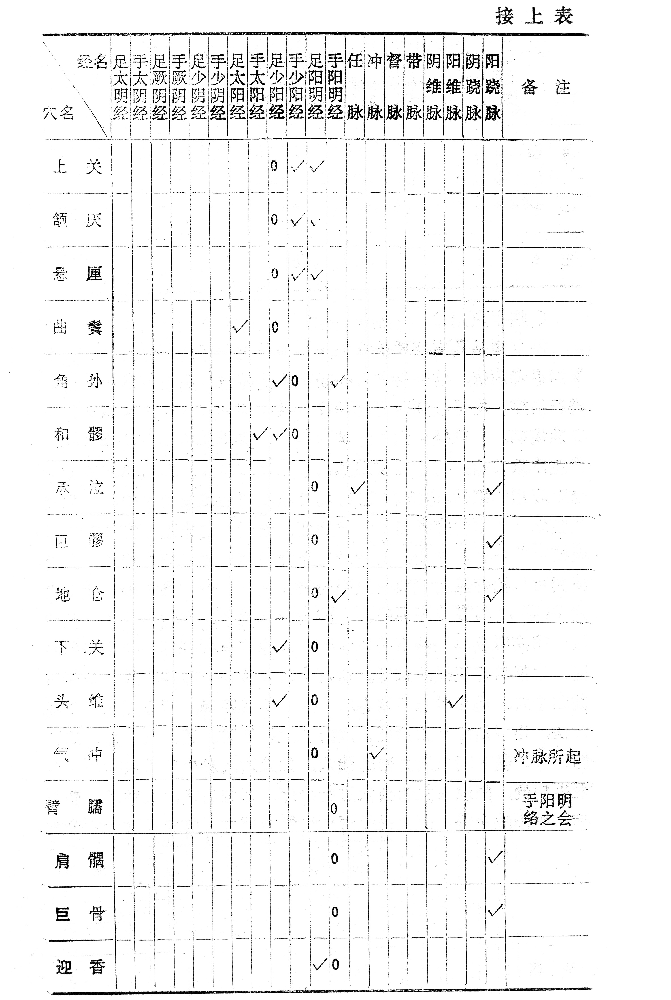

# 下篇 治疗

本篇分总论和各论两个部分。总论主要介绍针灸治病原理、针灸准则、八法在针灸临床上的运用、辨证与针灸、特定穴的应用，针灸配方与选穴等。各论介绍常见病证的辨证施治。

# 第一章 治疗总论

针灸治疗疾病，尽管与内服药物治疗有所不同，除了切实掌握经络、腧穴和刺灸等内容外，同样必须根据中医基础理论，进行辨证施治，才能正确的运用针灸治疗疾病。疾病的发生和发展，临床证候的表现虽然错综复杂，但究其原因则不外乎脏腑、经络功能的失调。针灸治病，就是根据脏腑、经络学说，运用四诊、八纲的辨证方法，将临床各种不同的证候加以分析归纳，明确疾病的部位是在经在脏、在表在里；疾病的属性是寒是热、属虚属实；以及病情的标本缓急。在此基础上根据辨证，进行相应的配穴处方，依方施术，或针或灸，或针灸并用；或补或泻，或补泻兼施。以通其经脉，调其气血，使阴阳归于平衡，脏腑功能趋于和调，达到防治疾病的目的。

## 笫一节 针灸治病原理

〔自学时数〕    1 学时

〔目的要求〕
  	掌握针灸治病的原理是调节阴阳和扶正祛邪。

针灸治病的原理，主要说的是针灸具有调整的作用，其特点是一种整体性、双向性和良性的调整作用。不论机体功能是亢进还是低下，这种作用均可分别使之趋于正常。由于针灸对机体的各个系统、各个器官的功能几乎都能发挥这种多方面、多环节、多种水平及多种途径的调整作用，所以针灸对正常生理功能无干扰，用以治病一般无不良反应。

经络运行气血与营卫，内通脏腑，外络肢节，网络全身，成为完整的统一体。在正常情况下，机体保持着阴阳相对平衡的状态，如果一旦遭受某种因素而致破坏时，阴阳便失去了平衡，于是就发生疾病，便会出现偏虚、偏实、偏寒、偏热等证候。同时，当邪气侵害人体，正气为了保卫机体，就形成了正邪相争的局面，出现了虚证和实证，即《素问·通评虚实论》所说的：“邪气胜则实，精气夺则虚”。正邪斗争的结果出现，正胜则病退，邪胜则病进，针灸所以能治疗疾病，就在于针灸具有调节阴阳和扶正祛邪两大作用的结果。

调节阴阳：阴和阳是说明人体各部分对立统一的关系。它的涵义，有的是代表机体组织，有的是概括功能活动。例如人体的皮肉筋骨和表里脏腑的区别，全身经络的分布，气血营卫的运行，寒热虚实的偏胜，以及外感六淫与内伤七情的性质等，都可以运用阴阳学说来阐明这些内容及其之间的相互关系。人体在正常情况下，各种组织、脏器的功能活动，都保持着有机协调；也就是保持着阴阳的相对平衡状态。这种正常的协调关系，如因某种因素而遭到破坏时，阴阳就会失去相对的平衡，人体也就发生疾病。在临床上所见到的各种疾病，无论是由于寒盛，或由于热盛，或因表虚，或因里实，或经络气滞、或脏腑不和等，都是由于阴阳的偏盛偏衰所致。针灸治疗，就要决定切合病情的处方配穴及采用各种相应的操作手法，以调整阴阳的偏盛使其重归协调。《灵枢·根结》说：“用针之要，在于知调阴与阳，调阴与阳，精气乃光，合形与气，使神内藏”。说明调和阴阳是针灸治疗疾病的基本原理。

扶正法邪：正是代表机体的调节、防御和适应机能；邪是代表一切阻碍机体正常发展和导致疾病的因素。具体来说，正气就是人体中的各种精粹之气，包括精、神、气、血、营、卫、津、液等；邪气就是发生或侵袭人体的有害物质和各种不利影响，如外感六淫、内伤七情以及痰、瘀、滞、水、饮等。人体在正气旺盛时，生理情况正常，调节机能健全，脏腑平和，经络通畅，身体就能保持建康的状态。而当病邪发生或侵袭人体的时候，正气为了保卫机体的正常发展就与病邪形成斗争的局面，这个正邪相争的情况，也就是疾病的发生和发展的过程，正气胜邪则病退，邪气胜正则病进。因此，扶正祛邪既是治疗疾病的方法，也是治疗疾病的基本原理。针灸临床采用扶正和祛邪的方法，增强人体的抗病能力以祛除病邪，达到治愈疾病的目的。

从调节阴阳和扶正祛邪的关系来看，则是互相为用的。《素问·疟疾》说：“因而调之，真气得安，邪气乃亡”。说明通过调节阴阳而达到扶正祛邪的目的。相反，在《灵枢·刺节真邪》中说：“泻其有余，补其不足，阴阳平复，用针若此，疾于解惑”。这又说明是通过扶正除邪而达到调节阴阳的目的。

### 〔临床应用〕

针灸治病的原理是调节阴阳和扶正祛邪。当机体发生病变时，用针或灸刺激机体，而使特定的病理变化总是向着有利于机体的方向发生转化，即双向调节作用。也就是说，既能调阴亦能凋阳；既能扶正又能祛邪。实践证明，针灸疗法就具有这种调整作用，如针灸既能发汗，又能止汗；既能增快心率，又能减慢心率；既能升高血压，又能降低血压；既能通便，又能止泻；既能治疗失眠亦可治疗多眠等。针灸调整作用的特点是整体性、双向性和良性的调整作用。就是说，不论机体功能是亢进的或是低下的，也不论是邪气实，还是正气虚，针灸的调整作用均可分别使之趋于正常。由于针灸对于机体的各个系统、各个器官的功能，均能挥这种多方面、多环节、多种水平，以及多种途径的调整作用，所以针灸既对正常生理功能无干扰，治病一般又无不良反应。

### 复习思考題

1. 针灸为什么能治病？
2. 你对针灸治病原理有哪些体会？

答：．

1. 分類
2. 阿是

## 第二节  针灸治则

〔自学时数〕    1 学时

〔目的要求〕
  	掌握针灸治疗的基本准则。

针灸治疗，总的来说不外补泻两端。补泻是依据辨证，常用的是八纲辨证，八纲中的阴阳是表里、虚实、寒热的概括。阴证多为里、虚、寒；阳证多属表、实、热。表里是指受邪部位的深浅，如病在经络为表，病在脏腑为里。虚实是指正气与邪气强弱而言，是决定针与灸、补与泻的关键。寒热是指疾病的属性，寒证多见肢冷、便溏、喜热；热证则见面赤、喜凉、恶热等现象。

临床上运用针刺和艾灸，是根据病证的性质来决定的。关于针灸对疾病的治疗原则，在《灵枢·九针十二原》说：“凡用针者，虚则实之，满则泄之，宛陈则除之，邪胜则虚之”。《灵枢·经脉》说：“盛则泻之，虚则补之，热则疾之，寒则留之，陷下则灸之，不盛不虚以经取之”。据此归纳起来，有补法、泻法、平补平泻三种。

### 补法：

是根据“虚则补之”的原则确立的治疗方法。虚是指正气（气血）不足而言，多由身体素虚，或久病所致，临床多表现为衰弱的证象，如身倦懒言，面色无华等虚弱症状。阳虚、气虚的可用艾灸以振奋人体的气化功能，起到补益的扶正作用；偏于阴虚的，宜用补法调之。“陷下则灸之”，是针对脏腑经络之气虚弱，失去固摄之权，如阳气暴脱，汗出不止，肢冷脉微，气息奄奄，以及脱肛、子宫下垂等症，其治疗均当艾灸，尤其阳气暴脱者，如肢冷脉微，气息微弱，须用大艾炷过灸，以升举下陷之气，扶阳固脱。针与灸各有其适应症，应因症制宜，分别应用。“寒者温之”，是指疾病的性质属寒，由于肌体的阳气偏虚，不能抗御寒邪，以致形寒肢冷，腹痛便溏，冷痛等。施用灸法，以温通经络，激发阳气，助阳以散寒邪。“寒者留之”，是指阳气偏虚，寒邪较盛，脏腑经络之气凝滞，其证多见恶寒喜热，或痹痛怕冷，胃肠虚寒，消化不良，治疗必须深刺久留针，以激发其经气，使阳气来复，散其寒邪。

### 泻法：

泻法是根据《灵枢》“满则泄之”、“盛则泻之”的原则确立的治疗方法。满、盛是指病邪方盛满实的时候，概括有阴阳的实证，以及躯体某些部位的红肿疼痛等证，针刺治疗时，必须用泻法或放血。“热则疾之”，是指邪热较盛的热性病，如外感风寒，腠理闭塞，卫气不得宣散，以致发热不解，治疗宜疾刺疾出针，或放血，以祛邪热。“宛陈则除之”，多指经络之瘀滞，或邪入血分的一些疾患，如扭闪或因气滞血瘀而出现的肿痛，以及邪入于营分的闭厥等证，宜用三棱针刺十二井穴出血，以祛瘀、定痛、解毒、泻热，达到通调经气的作用。

### 平补平泻法：

平补平泻法是用于临床证象“不盛不虚”，即虚实不明显的疾病，只取其相关的经穴，这是临床常用的一种治疗方法。

### 〔临床应用〕

即正气不足则表现为虚证，治疗宜用补法：邪气亢盛则表现为实证，治疗宜用泻法；虚实难辨或虚实夹杂的，宜用平补平泻，虚寒或下陷则用灸法，依此采用针灸方法进行治疗，才能取得治疗效果。

### 复习思考題

1. 针刺准则是什么？怎样理解？
2. 灸法准则是什么？怎样理解？
3. “寒者温之”与“寒则留之”有什么不同？
4. 平补平泻法在临床上怎样应用？

答：

1. 分類
2. 阿是

## 第三节  八法在针灸临床上的运用

〔自学时数〕    2 学时

〔面授时数〕    1 学时

〔目的要求〕
  	掌握八法在针灸临床上的应用

八法就是指汗、吐、下、和、温、清、消、补。在针灸临床应用时，必须运用八纲辨证，辨清疾病的阴阳、表里、寒热、虚实之所属，并且选穴准确、手法恰当，才能正确运用八法。现将八法分述如下：

### 一、汗法

汗法即解表法，病邪在肌表，应用汗法进行解表；针刺穴位，达到开泄腠理、发汗祛邪，治疗表症的方法。《素问·阴阳应象大论》说：“其郁邪者，溃形以汗；其在皮者，汗而发之”；“体若燔炭，汗出而散”。

1．发散风寒：取风池、大椎、身柱、风门、合谷、外关，用烧山火手法，使其产生热感而发汗，主治感冒，头痛，恶寒，发热无汗，脉浮紧的表寒证。鼻塞流涕者，加迎香列缺，用平补平泻法，以祛风开窍。

2．清泄表热：取大椎、陶道、身柱、肺俞，用梅花针叩打出血，列缺、合谷用透天凉法，使其产生凉感而发汗，主治感冒发热，咳嗽痰喘，脉浮有力的表热症。神昏不安者，加少商、商阳中冲点刺出血，以开窍、泄热、醒神。

禁忌：大吐、大泻、大失血之后以及体虚者，慎用汗法。

### 二、吐法

吐法即涌吐、催吐法。病邪在上焦胸膈间，胸腹胀满，痰阻宿食者，应用催吐急救。《素问·阴阳应象大论》说：“其高者因而越之”。张景岳解释说：“越，发阳也，升散也，涌吐也”。运用针灸进行催吐，排出有害物质，以减少毒物的吸收，缓解病情，减轻症状。

1．涌吐风痰：取天突，用押手的食指按压天突穴，刺手持针刺入穴内，激起内部反射作用，上涌作呕，即可将痰涌出，主治中风闭证和小儿惊风所致痰阻咽喉。如遇有不能吐出的险症，可加内关，以加强催吐作用。

2．通结催吐：取中脘、幽门，用押手的食指按压穴位，持手持针剌人穴位内，使针感向上传导，反复操作几次，激起内部反射作用，上涌作呕，急速将针拔出，可将胃部难以消化的食物呕吐而出，主治食物中毒或宿食停滞，壅塞胃脘，欲吐不出的险证。

禁忌：年老体虚，妊娠期，产后，大失血后，严重的心脏病者，禁用吐法。

### 三、下法

下法即泻下法。病邪在中焦，腹中胀满的，应用泻法攻下。《素问·阴阳应象大论》说：“中满者泻之于内”。针灸穴位，达到泻热导滞，通便泄火，推陈致新。

1．泻热通便：取大肠俞、天枢、足三里、丰隆，用凉泻手法，使其产生凉感泻下，主治胃肠积热，腹痛拒按，大便秘结，脉数有力的实热证。对阴虚便秘者，取支沟透间使，用泻法；照海、三阴交用补法，以达养阴清热，润肠通便。

2．清肠导滞：取中脘、天枢、气海、曲池、足三里，用凉泻手法，使其产生凉感通便，主治湿热阻滞，腹痛便秘，下痢赤白，里急后重，脉滑数的湿热证。对小儿痞块，取中脘、建里用平补平泻手法，四缝穴点刺出黄色液体，以达健睥助运，消积化滞。

禁忌：下法易伤正气，中病即止。对表邪未解，妊娠，产后大失血，禁用下法；年老体弱者，也要慎用或攻补兼施。

### 四、和法

和法即和解法。本法既能和里，又能解表。和里是不让病邪再侵入于内，解表是使病邪外出，有安内攮外的含义。病邪在半表半里或阴阳偏盛偏衰的，应用和法。《素问·至真要大论》说：“察阴阳所在而调之，以平为期”。《灵枢·经脉》说：“和气之分，必通阴阳”。针灸穴位后，可达到调和机体的生理、病理机能上的偏盛偏哀，扶正祛邪。

1．和解少阳：取大椎、陶道、身柱、外关透内关，用阳中引阴的方法，使其先热后凉。主治外病，邪传半表半里，出现寒热往来，胸胁苦满，口苦咽干，目眩，心烦喜呕等半表半里的少阳证及疟疾。如疟疾在发作前2小时内，针大椎、陶道，有扶正截疟的作用。

2．疏肝理气：取神封、膻中、膈俞、肝俞，用平补平泻法；支沟、阳陵泉用泻法，留针20～30分钟，主治肝气郁结的胸胁胀满。如肝阳上亢的头痛、眩晕、失眠，加百会、神门、三阴交平补平泻法，有平肝潜阳，养阴安神作用。肝气郁滞引起的疝气、偏坠、睾丸抽痛，加大敦、照海、中都，用平补平泻法，有疏经活血，行气止痛的作用。

3．调和肝脾：取肝俞、脾俞、太冲、三阴交，用平补平泻法，主治肝脾失调，肝胃不和及肝气郁结而引起的月经不调等。如痛经加归来、中极，用平补平泻法，留针20～30分钟，有疏肝理气，活血止痛作用。

禁忌：凡表邪未解或邪热传里的，均不能用和法。

### 五、温法

温法即温里法。机体感受寒邪或形体虚寒的应用温法，以温经散寒。《素问·阴阳应象大论》说：“寒者热之，清者温之”。针灸穴位后，可达消除沉寒阴冷，补益阳气。

1．温中散寒：取三脘、梁门、足三里或膈俞、肝俞、脾俞、胃俞，用热补手法或针上加灸，使其产生热感，主治胃脘隐痛，消化不良，脉沉缓的虚寒证。

2．温肾壮阳：取肾俞、关元俞、次膠，用热补手法，使腰部产生热感，主治腰痛腿软，脉沉细的虚寒证。如腰背痛；不能转侧，加秩边、委中，用热补手法，以达散寒镇痛作用。

3．温经通络：上肢取肩髃、曲池、外关、合谷；下肢取秩边、环跳、阳陵泉、足三里、绝骨、申脉，用热补手法或针上加灸，使其产生热感，主治瘫痪、痿软，风寒湿痹证，以达祛寒镇痛，舒筋利节的作用。

4．温阳救逆：取脾俞、肾俞、天枢、关元、神阙、足三里、三阴交、曲池、外关，用热补手法或针上加灸，主治虚寒腹痛，泄泻，四肢厥冷。以达回阳救逆，温中散寒而止痛。

禁忌：凡实证、热证、阴虚血少及血热妄行者，禁用温法。

### 六、清法

清法即清热之法。病邪化热，耗伤津液，用清法来清热养阴。《素问·至真要大论》说：“温者清之”。《灵枢·经脉》说：“热则疾之”。针灸穴位后，可达清热降火，养阴除烦，清热止渴。

1．清热开窍：取百会、人中、承浆、十宣（点刺出血），主治中风闭证，中风昏迷，小儿惊厥，热极神昏，癫痫，脏躁等证。如狂证、脏躁，因痰迷心窍，精神失常，哭笑打骂，不识亲疏时，取内关、合谷用泻法、人中、承浆、百会、上脘、中脘、丰隆、太冲用凉泻法，使其产生凉感，用以熄风降痰，清热开窍。

2．清热养阴：取尺泽、委中，用三棱点刺出血，排出血中之毒热，主治霍乱腹痛，上吐下泻之急症。如呕吐不止，取内关、天枢、足三里，用泻法，以清热止呕。如阴虚发热，取三阴交、照海用泻法，以清热养阴。

3．清热解毒：取风池、大椎、翳风、合谷，用凉泻手法，使其产生凉感；少商、商阳，点刺出血，主治腮腺炎，咽喉肿痛；口唇生疮等邪毒积热症。如痤疮，取大椎、心俞、膈俞、脾俞、肝俞，用泻法或刺之出血，有清热凉血，解毒的作用。禁忌：凡体质虚弱，大便溏泻的虚寒证，禁用清法。

### 七、补法

补法即补益法。凡是形体衰弱或气血不足的，应用补法来益气养血。《灵怄·经脉》说：“虚则补之”。针灸穴位，可扶正祛邪，补益人体阴阳气血和脏腑虚损，达到增强机体抵御病邪的能力，消涂虚弱证候的作用。

1．培元固本：取中脘、列缺、太渊、足三里、照海、用补法；大椎、百劳、肺俞、心俞、脾俞、肾俞、针后加灸，使其产生热感，主治喘咳气短，消化不良，自汗盗汗等。如阳萎、遗精、遗尿，取肾俞、关元俞、膀胱俞、关元、三阴交，用热补法或针上加灸，以补肾益精，固本壮阳。

2．补中益气：取中脘、关元、天枢、腰俞、长强，用热补手法或针上加灸，主治久泻不止，脱肛不收，腹痛喜按，脉迟无力，舌质淡，苔薄白的脾胃虚寒证。如五更泄泻，加脾俞、胃俞、关元俞，用热补手法或针上加灸，以温肾暖脾，涩肠固脱。

3．补血固崩：取关元、归来、血海、三阴交、隐白、膈俞、脾俞，用补法。主治经行不止，脉细无力，冲任不固的虚寒证。如血崩不止，神昏不语，面白，脉微欲绝的脱症，取隐白、人中、行间，平补平泻，大敦针后加灸，以回阳固脱，补气摄血。

禁忌：实证，邪气未尽不能用补法；虚中挟实者，不能单用补法。

### 八、消法

消法即消散法。气血积聚或痰湿疑滞的，应用消法，软坚磨积。《素问·至真要大论》说：“坚者削之……结者散之”。《素问·阴阳应象大论》说：“其实者，散而泻之”。针灸穴位，可消积化滞，破瘀散结。

1．破淤活血：取风池、角孙、攒竹、太阳，用热补手法，使热感传到眼底，能化散玻璃体内的瘀血，并使瘀血吸收，主治视网膜出血、暴盲、青盲等眼病。身体虚弱，反复出血，加大椎、肝俞、肾俞，用热补手法，使其产生热感，以调肝补肾，益气养．血，清头明目。

2．消坚散结：取阿是穴，用三棱针点刺，挤出胶化液体，主治腱鞘囊肿。局部周围用提插法，主治瘿气（甲状腺肿）。取肩井、臂臑，用平补平泻法，主治瘰疬。如瘰疬坚硬者，可用围刺法，针尖向核围刺，以活血散瘀，散结消核。

3．消食导滞：取上脘、足三里、四缝、商丘，用泻法，主治小儿疳积、食积等症。如食积，腹部胀痛拒按，嗳气腐臭，不思饮食，取足三里、胃俞、大肠俞、天枢，用平补平泻法，以消食导滞，消痞散积。

禁忌：消法是临床上常用的一种针法，没有特殊禁忌，但对体质特别虚弱者应慎用。

### 〔临床应用〕

八法，即以中药方剂的作用，归纳为汗、吐、下、和、温、清、补、消八种方法。在针灸临床上通过针灸和穴位的配伍，同样也可达到八法的作用。既可单独运用，亦可随病情变化而互相配合使用，灵活掌握。

### 复习思考題

1. 汗法、下法、清法各取哪些穴位？用什么手法？
2. 下法和消法有什么区别？

答：．

1. 分類
2. 阿是

## 第四节 辨证立法

〔自学时数〕    2 学时

〔面授时数〕    1 学时

〔目的要求〕
  	掌握在针灸中运用八纲、脏腑经络等辨证方法。

### 一、八纲辨证与针灸

八纲是祖国医学的主要辨证法则，无论病变发生于任何脏腑经络，都离不开阴阳、表里、虚实、寒热的范围。也就是把复杂的病情，概括为八个具有普遍性的证候类型，来说明病变的部位，病情的轻重，疾病属性的一种辨证方法。针灸疗法的应用，采用针刺、艾灸，宜补，宜泻等，无不是在八纲辨证的指导下进行的。

1．证分阴阳，统领六要：每个证都分阴阳，在八纲辨证中，阴阳是辨证的总纲，是表里、寒热、虚实的综合。一切疾病的病理变化都可归纳为阴阳偏盛偏衰两大类。阴，包括里、虚、寒、是指不及的、抑制的、衰退的、寒性的临床表现，如颜面苍白，暗淡，恶寒，不渴，懒言，声音低微，大便溏、小便清长，脉沉细微弱，舌质淡，舌苔白，取穴应以任脉经穴为主，手法应以多灸少针，久留针，慢出针，以温阳散寒。阳，包括表、实、热，是指太过的、兴奋的、亢进的、热性的临床表现，如颜面潮红、有光，发热，烦热，烦渴，呼吸迫促，声音洪亮，大便秘结，小便短赤，脉洪大滑数，舌质红，舌苔黄，取穴应以督脉经穴为主，手法应以针不灸，或少灸，速进针，急出针，以泄阳经之邪热。这是阴阳的基本分类，在这个基础上，还必须结合表里、虚实、寒热等纲进行具体分析，才能全面的掌握疾病的性质。

2．病有表里，刺分浅深：表里是鉴别疾病病位的内外、深浅和病势趋向的一种辨证方法。表，是指人体的浅表部位，病变在皮肤、肌肉、经络等。疾病反映于体表的证候称作表证，凡外感六淫之邪，首先侵犯皮肤，经络而出现发热，恶寒，头痛，身痛，四肢酸痛，有汗或无汗，鼻塞，脉浮或浮数，舌质淡，苔薄白，取阳经、肺经穴位为主，手法应以浅刺疾出，不留针。里，是指位深在内的一类证候，凡表邪未解，内传脏腑或因七情、劳倦、饮食等所伤，病自内发而伤及脏腑皆属于里，反映于脏的证候称作里证，如高热神昏，烦躁口渴，腹痛恶心，小便赤，大便秘或泄泻，脉沉或沉数，舌苔黄，取阳经及十二井穴（多为阳经井穴），手法应以深刺，以泻阳经之热而开窍。

3．病有寒热，刺分留疾：这是鉴别疾病性质的两个纲领。寒证，是感受寒邪或机体活动功能衰退所表现的征象，如怕冷喜暖，口不渴或渴喜热饮，腹痛使溏，小便清长，面色苍白，手足不温，脉象沉迟或沉细，舌质淡，舌苔白滑，多取任脉、督脉、肾经、脾经穴位为主，手法以温针久留、重灸，以温经散寒，回阳助气。热证，是感受热邪或机体的功能亢进所表现的征象，如高热烦渴，喜冷饮，面目红赤，潮热盗汗，腹胀满痛，大便秘结，小使短赤，脉数或洪数，舌质红，苔黄而干燥，多取督脉、大肠、胃经等经脉的腧穴，手法以重刺疾出，一般禁灸，以清泄阳经的邪热。

4．病有虚实，刺分补泻：这是鉴别人体正气强弱和邪气盛衰的两个纲领。虚证，是指正气不足的证候，多见于慢性病。凡是机体抵抗力下降，生理机能衰退或衰竭而出现的病理状态，如饮食失调，造成后天失养；七情劳倦，内伤脏腑气血；房室过度，损伤肾气；久病以及误治、失治损伤正气所致。主要症状是精神萎靡，少气懒言，形体消瘦，自汗盗汗，心悸气短，大便溏薄，小便频数或不禁，脉象细弱，舌质淡，少苔，取穴应以任脉、督脉、脾经、肾经为主，手法以多灸少针，轻刺为补，阴虚一般不灸，阳虚多灸、重灸。实证，是指邪气亢盛的证候，多见于急性病。凡是机体反应强，组织器官功能亢进的病理状态，是外邪侵入机体或者由内脏功能失调，代谢障碍，以致痰饮、水湿、气滞血瘀等病理产物停留在机体所致。主要症状是精神烦躁，声高气粗，胸腹胀满，疼痛拒按，身痛高热，大便秘结或里急后重，小便不通或淋沥涩痛，脉数有力，舌质红，舌苔黄腻，取穴应以督脉、胃经、三焦经、大肠经穴为主，手法以重刺泻法，实证禁灸，寒证宜灸，以达到泻实的目的。

由于临床的病变并非都按八纲截然划分，常有表里兼病，虚实互见，寒热夹杂，因而针灸补泻也必须根据具体证候灵活运用。才能达到正确的诊断，合理的治疗。

兹将八纲辨证与针灸列表如14：

### 二、脏腑经络辨证与针灸

#### （一）肺

肺居胸中，司呼吸，主一身之气，外合于皮毛，上与喉鼻相通，为清肃之脏。外邪侵入皮毛口鼻，多传人肺脏。肺主治节，朝百脉，与五脏六腑关系最为密切，故肺病日久可以影响其它脏腑，而其它脏腑病变亦可影响于肺，其中以脾肺兼病与肺肾兼病为多见。其经脉下络大肠，与大肠为表里。

##### 脏病证治

1．风寒袭肺：风寒袭肺，肺气失宣。证见恶寒发热，头痛，身痛，无汗，鼻塞流涕，咳嗽而痰稀薄，口不渴，舌质淡，苔薄白，脉浮紧。治疗宜取手太阴、阳明经穴为主，针用泻法，并可灸，以疏风散寒，宣肺化痰而止咳。

2．热邪伤肺：热邪伤肺，肺失清肃。证见身热口渴，咳嗽、痰色黄粘，喘促气粗，胸闷烦躁，鼻衄，咽喉肿痛，舌红而干，苔黄，脉数。治疗宜取手太阴、手阳明经穴为主，针用泻法，或用三棱针点刺出血，以疏风清热，宣肺止咳化痰。

3．痰浊阻肺：痰浊阻肺，肺失清肃。证见咳嗽痰稠，咯出不爽，喉中痰鸣，胸胁支满而痛，张口抬肩，不能平卧，恶心纳呆，舌质淡，苔黄腻或白腻，脉滑。治疗宜取手太阴与足阳明经穴为主，针用泻法，并可施灸，以宣肺化痰，痰浊可除。

4．肺气不足；劳伤过度，肺气不足。证见喘息气短，言语无力，咳声低微，自汗恶风，身倦少言，面色㿠白，舌淡苔薄白，脉象虚弱。治疗宜取肺俞、脾俞与手、足太阴经穴为主，针用补法兼灸，以恢复肺脾功能，补益肺气。

5．肺阴亏损：由肺阴不足而致虚热内生。证见干咳少痰，咳唾不爽，咽干口燥，痰中带血，午后潮热，两颧泛红，骨蒸盗汗，手足心热，舌质红，脉细数。治疗宜取手太阴经穴和背部俞穴为主，针用补法或平补平泻，不灸，以达补益肺阴，虚热乃解。

##### 经脉证治

1．风寒湿邪痹阻经脉：证见肩背痛，臑臂部内侧前廉痠重疼痛。治疗宜取肺经及其邻近部位的经穴，针用泻法或用艾灸，以达疏通经络之气。

2．邪热壅滞经脉，随经上冲：证见咽喉红肿疼痛，鼻衄者，治疗宜取手太阴、阳明经穴为主，针用泻法或点刺出血，以达清泻邪热。

#### （二）大肠

  大肠居腹，为传导之官，职司传导糟粕，并使之变化成形，并排出体外，若大肠传导变化功能失常则导致病变。因大肠经脉络于肺，并与脾、胃关系最为密切。因此大肠病变，在腑有寒热虚实之异，在经多属实证。

##### 腑病证治

1．大肠寒证．多因外受寒邪或内伤生冷，而致传导失常。证见腹痛肠鸣，大便泄泻，或兼有恶寒发热，舌苔白滑，脉象沉迟。治疗宜取手阳明的募穴及下合穴为主，针灸并用，以达散寒止泻。

2．大肠热证：多因邪热侵于大肠，气血壅滞所致。证见肛门热痛，大便臭秽异常，便下鲜血或下痢赤白，小便短赤，身热口渴。如热结而为肠痈，则腹痛拒按，腿屈不能伸，舌苔白，脉多滑数。治疗宜取手阳明的募穴、下合穴及手、足阳明经穴为主，针用泻法，不灸，使邪热外泄。

3．大肠虚证：多因久痢不止，或下痢久延。证见大便不禁，肛门滑脱，精神倦怠，面色萎黄，舌淡苔薄，脉象细弱。治疗宜取足太阴、阳明及任脉经穴为主，针用补法，重灸，以达补虚，恢复大肠功能。

4．大肠实证：多因积滞内停，邪壅大肠所致。证见大便秘结，或下痢不爽，里急后重，腹痛拒按，舌苔垢膩，脉象滑数。治疗宜取手、足阳明经穴为主，针用泻法，不灸，以疏导大肠积滞。

##### 经脉证治

1．风寒湿邪痹阻经脉为患：证见肩前腰痛，大指次指痛而不能运用。治疗宜取手阳明经穴为主，针用泻法，或用灸法，以散邪通络。

2．大肠经之热邪，循经上扰：证见龈肿齿痛，喉痹，鼻衄，颈肿口臭，舌红苔黄，脉象洪滑而数。治疗宜取手、足阳明经穴为主，针用泻法，或点刺出血，以清泻其邪热。

#### （三）胃 

 胃与脾同居腹中，两者以膜相联，其脉与脾相联络而为表里，在体为肉，开窍于口。胃在膈下，上接食道，下通小肠，胃主纳谷，为“水谷之海”。胃是六腑之一，是化物器官，饮食通过胃之液化作用，化生精微，以滋养五脏，因此，五脏六腑得以发挥其功能。胃气主降，以下行为顺。因此，胃腑发生病变有虚实寒热之异，在经脉多属实证。

##### 腑病证治

1．胃虚证：胃病日久，胃气虚惫。证见胃脘隐隐作痛，痛而喜按，有时噯气，气馁少力，面色少华，舌淡红，脉缓软而弱。治疗宜取足阳明的俞、募及足阳明经穴为主，针用补法，多灸，以补益胃气，温胃化谷。

2．胃实证：包括两种情况，一系胃火炽甚，证见消谷善饥，口渴欲饮；二系食滞留阻，证见胃腑胀闷，甚则疼痛拒按，舌红苔黄，脉象滑实。治疗宜取足阳明经穴和足阳明的募穴为主，针用泻法，以泻阳明之热，疏导食滞。

3．胃寒证：多因胃阳不足，寒邪偏盛。证见胃脘胀痛，时时泛吐清水，喜热饮，寒甚则有四肢厥冷，呕吐呃逆，舌苔白滑，脉象沉迟或弦紧。治疗宜取足阳明、太阴、手厥阴经腧穴及其俞、募穴为主，针用平补平泻，多灸，以调节腑气，温经散寒。

4．胃热证：多因胃阴不足，热邪偏盛。证见善饥嘈杂，身热，口干喜冷饮；热邪导致胃气上逆，则食入即吐；胃火下移大肠，消烁津液，则大便燥结，苔黄厚而燥，脉象洪大有力。治疗宜取手、足阳明经穴为主，针用泻法，不灸，以泻阳明之邪热。

##### 经脉证治

1．风寒湿邪痹阻经脉：证见膝髌肿痛，下肢前缘痠重冷痛。治疗宜取足阳明经穴为主，针用泻法加灸，以疏通经络，温经散寒。

2．胃经蕴热，随本经上扰：证见口渴，唇胗颈肿，喉痹，齿痛龈肿，甚则腐烂出血，苔黄，脉象洪数。治疗宜取手、足阳明经穴为主，针用泻法，不灸，以清泻阳明之蕴热。

#### （四）脾

  脾胃对饮食有受纳、腐熟、消化、吸收及输布的功能，为气血生化之源，五脏六腑、四肢百骸皆以受养，故为后天之本。其脉络胃，与胃为表里。脾主中洲，司运化，输布水谷精微，升清降浊，为生化之源。又具有益气、统血、主肌肉、四肢等生理功能。因此脾的病变在脏有寒热虚实之异，在经多属实证。

##### 脏病证治

1．脾虚证：脾失健运．水饮内停。证见面色萎黄，少气懒言，食欲不振，肌肉消瘦，腹满便溏，四肢不温，足跗浮肿，舌淡苔白，脉象濡弱或沉缓。治疗宜取足太阴的募、俞与足太阴、阴明经穴为主，针用补法，熏灸。

2．脾实证：饮食停滞，中焦受阻。证见大腹胀满，或疼痛拒按，若湿热蕴蒸，证见肤黄溺赤；湿阻而脾气不运，证见脘闷而腹满，大、小便不利。治疗宜取足太阴、阳明经穴为主，针用泻法，以升清降浊，理气化湿。

3．脾寒证：脾阳衰微，水湿不化，以致阴寒盛者；或由于过食生冷，造成脾阳不振者。在证候上都有可能为腹痛隐隐，泄泻绵绵，甚至完谷不化，小便清长，四肢清冷，舌淡苔白，脉象沉迟。治疗宜取足太阴的募、俞与足太阴、阳明经穴为主，针用补法，重灸，以健脾利湿，温运脾阳。

4．脾热证：脾为湿土，如受邪热，则多为湿热交蒸。证见脘痞不舒。身重困倦，口腻而粘，不思饮食；亦有口腻泛甜，泛浊唾涎沫，小便短少而黄，苔黄腻、脉濡数。治疗宜取足太阴、阳明经穴为主，针用泻法，不灸，以达清热利湿。

##### 经脉证治

1．脾经蕴热，随经上扰：证见舌本强痛，嗳气呕吐，胃脘痛，腹胀、身重，或有溏泻，黄疸等。治疗宜取足太阴、阳明经穴为主，针用泻法，不灸，以清泄脾经蕴热。

2．风寒湿邪痹阻经脉：证见下肢前缘痠重冷痛，足大趾运动障碍等。治疗宜取本经及其邻近经穴为主，针用泻法，或用艾灸，以疏通经络，温经散寒。

#### （五）心

  心居胸中，心包为其宫城，其脉络小肠，而为表里，在体为脉，开窍于舌。心主血脉，又主神明。前者是指推动血液循环的心脏功能而言，后者是指统管整个思维活动的功能而言。由于它在生理上具有主血脉和主宰神明的功能，故当外感六淫或内伤七情而致心神失常，都可引起心的病变，其病变可分为虚证、实证，在经脉病多属实证。

##### 脏病证治

1．心虚证：包括心阳不足、心阴亏虚两个方面。

（1）心阳不足：多因思虑过度，劳伤心神，造成心气不足，损及心阳所致。证见嗜卧，心悸不宁，有恐惧感，兼有气短、气喘，甚至口唇、指甲青紫，舌质淡或夹有瘀点、瘀斑，脉微弱兼有歇止。治疗宜取本脏俞、募和手少阴、任脉经穴为主，针用补法兼灸，以达补益心阳，温经通脉。

（2）心阴亏虚：多因心血亏耗，心阴受损所致。证见心悸不宁，胸闷气短，虚烦不安，少寐多梦，掌心发热，健忘、盗汗，舌质淡红或舌尖干赤少苔，脉象细数。治疗宜取背俞与手足少阴、厥阴经穴为主，针用补法，不灸，以滋补心肾之阴，使心肾相交，冰火相济，心阴得复。

2．心实证：包括心火上炎和痰火蒙蔽神明两方面。

（1）心火上炎：多因诸经有热，心火上炎。证见心烦口渴，口舌生疮，木舌，重舌，小便短赤，甚则吐血、衄血，舌赤苔黄。治疗宜取手少阴、厥阴、太阳经穴为主，配以手阳明经穴为辅，针用泻法，不灸，以泻诸经之热。

（2）痰火蒙蔽神明：多因外感邪热内蕴或五志化火过极，导致痰火蒙蔽神明。证见神昏谵语，惊狂，不寐，壮热面赤，舌赤或干裂，苔黄，脉滑洪数。治疗宜取手少阴，厥阴经穴为主。甚者并用手足阳明、督脉及十二井穴，针用泻法，或三棱针点刺出血，以泻诸经之热，经气得通，痰火得泻。

##### 经脉证治

1．风寒湿邪外袭痹阻经脉：证见肩背痛，臑臂内后廉痛，经脉循行的部位有痠重感。治疗宜取手少阴、太阳经穴为主，针用泻法或灸，以达疏散外邪，温通经脉之气。

2．心经邪热随经上扰：证见嗌干目黄，口舌糜烂，重舌，木舌，疮疡等。治疗宜取手少阴、厥阴、太阳经穴为主，针用泻法域三棱针点刺出血，不灸，以泻心与小肠经之热邪。

#### （六）小肠 

 小肠居于腹中，上接幽门，与胃相通，下接阑门，与大肠相连，其脉络于心而为表里。小肠为受盛之官，职司分清浊，主化物。因此其病理变化主要是分别清浊功能失常，肠中水液不能泌渗吸收，以致水谷不分，清浊混淆。其病在腑有寒热之别，在经络多属实证。

##### 腑病证治

1．小肠寒证：多由饮食生冷，伤及中阳所致。证见肠鸣腹泻，腹痛喜按，小便短少，苔白，脉沉迟。治疗宜取本腑俞、募及下合穴为主，兼取足阳明穴为辅，针用补法加灸，以温运肠胃。

2．小肠热证：多由心火下移所致。证见小便热赤或涩痛，甚则溺血，心烦口渴，或口舌生疮，舌尖赤，苔黄，脉数。治疗宜取手少阴、太阳经腧穴及其募穴，下合穴为主，针用泻法，不灸，以泻诸经之邪热。

##### 经脉证治

1．风寒湿邪痹阻经咏：证见颈、项、肩、臑、臂、肘外后廉痛。治疗宣取本经及其邻近部位的经穴，针用泻法并灸，以琉通经络，温经散寒。

2．邪热壅滞经脉，循经上扰：证见颊肿，耳鸣，耳聋，目黄。治疗宜取手少阴、太阳经穴为主，针用泻法，或三棱针点刺出血，以清泻邪热。

#### （七）肾

  肾位于腰部，左右各一，肾主水，藏精，主骨生髓，其脉络膀胱，而为表里。肾又为命门火所寄，故称水火之脏，为先天之本。当外感病邪或房室过度时均可引起肾脏发生病变，其病变可分为阴虚和阳虚，经脉病多为实证。

##### 脏病证治

1．肾阴虚证：多由久病之后，真阴耗伤所致。证见形体虚弱，头昏耳鸣，少寐健忘，腰腿痠软，多梦遗精，口干咽燥，有时潮热，或咳嗽，痰中带血，舌红少苔，脉细数。治疗宜取足太阳、足少阴经穴为主，兼取手太阴、少阴经穴为辅，针用补法，不灸，以补肾扶元，滋阴降火。

2．肾阳虚证：可分为肾阳不足、肾不纳气、阳虚水泛。

（1）肾阳不足：多由肾气素亏，或劳损过度，久病失养所致。证见阳萎早泄，溲多遗溺，腰脊痠楚，足膝无力，头昏耳鸣，面色白而畏寒，舌质淡，脉弱。治疗宜取本脏募、俞及任、督、足少阴经腧穴为主，针用补法，重灸为主，使经气振奋，恢复肾阳，固摄精气。

（2）肾不纳气：多由劳伤肾气，或久病气虚，肾失摄纳之权。证见气短喘逆，呼吸不续，动则尤甚，自汗懒言，头晕畏寒，两足逆冷，舌淡，脉弱或浮而无力。治疗宜取本脏募、俞及任、督、足少阴经腧穴为主，针用补法并加灸，以温补肾阳，纳气归肾。

（3）阳虚水泛：多由禀赋素虚，久病失调所致。证见周身浮肿，肤冷，下肢尤甚，按之陷而不起，腹部胀满，大便泄泻，舌苔润滑，脉沉迟无力。治疗宜取背俞及任、督、足少阴、太阴经腧穴为主，针用补法，重灸，以温补肾阳，化气行水，益火之源，以消阴霾。

##### 经脉证治

风寒湿邪痹阻经脉：证见下肢内侧后廉痠重。冷痛或痿弱，足不任地。治疗宜取本经和邻近经脉腧穴为主，针用泻法或施灸，以疏通经络，温经散寒。

#### （八）膀胱

  膀胱居于少腹，其脉络于肾而为表里。膀胱为洲都之官，以藏津液，主气化行水，职司小便。故其病理变化，主要为膀胱的启闭失常。在腑有虚寒和实热之分，在经脉病为实证。

##### 腑病证治

1．膀胱虚寒证：多由下焦虚寒，脬气不固所致。证见小便频数或遗尿，少腹冷痛，喜温喜按，舌淡苔白，脉象沉迟。治疗宜取本腑俞、募及任脉、足少阴经腧穴为主，针用补法，加灸，以温暖下元，益气散寒，振奋膀胱约束机能。

2．膀胱实热证：多由湿热内蕴，气机阻滞所致。证见小便短涩不利，黄赤混浊，甚或闭而不通，或淋漓不畅，兼夹脓血砂石，茎中热痛，少腹急胀，舌赤苔黄，脉多数实。治疗宜取本腑俞、募及任脉、足三阴经腧穴为主，针用泻法，不灸，以疏诸经之气，使气化畅利，湿热下行，则诸证自除。

##### 经脉证治

风寒湿邪侵袭痹阻经脉：证见项、背、腰、尻、腘、腨、脚痠重冷痛。治疗宜取本经及其邻近部位的经穴，针用泻法，并加施灸，以疏通经络，温经散寒。

#### （九）心包 

 心包居胸中，位处心之外围，为心之宫城，有护卫心脏的作用。其脉历络三焦而为表里。故凡病邪内传于心，诸如温邪逆传，痰火内闭等，多是心包代其受邪。由于心包代心行令，为神明出入之窍，在主宰思维活动的生理功能方而与心是一致的，因此，邪入心包，其病理变化亦主要是表现在神志方面，故临床以神昏谵语或癫狂躁扰等神志失常为其主证。心包的脏腑证治与心病相同，不予重述。

##### 经脉证治

若外感风寒湿邪，伤其经脉：证见心胸疼痛并牵引腋下，心烦，腋肿以及其经脉循行部位疼痛、麻木、痿痹不同，手掌发热等症。治宜取本经腧穴为主，针用泻法，或针灸并用。以疏通经络，温经散寒。

#### （十）三焦

  三焦是上、中、下三焦的总称，其脉络心包而为表里。三焦为六腑之一，职司一身之气化。凡人体内脏的功能活动，诸如气血津液的运行布化，水谷的消化吸收，水分的代谢等，都赖其气化作用而维持正常活动。三焦气化功能，实际是概括了人体上、中下三个部分所属脏器的整个气化作用。故当其发生病变，影响的范围也就必然比较广泛。就其病理机制而言，关键在于气化功能失司，水道通调不利，以致水湿潴留体内，泛滥为患，故临床上以肌肤肿胀，气逆，腹满，小便不利等为主证。

由于三焦联系脏腑，所以其病变又每与肺、脾、肾、膀胱等脏器有着密切的关系。例如三焦气化失司，可影响到肺气的宣降；又如三焦不利，可导致脾胃的升降失常；三焦化气行水功能失职，亦能使肾和膀胱温化水液的功能受到影响。三焦病变可分为虚证和实证，经脉病多属实证。

##### 腑病证治

1．三焦虚证：多因肾气不足而导致三焦气化不行，水湿内停。证见肌肤肿胀，腹中胀满，气逆肤冷或遗尿，小便不禁，苔多白滑，脉沉细或沉弱。治疗宜取本腑俞、募及下合穴为主，兼取任脉等经腧穴，针用补法，并灸，以温补肾阳，助命门相火，使气化水行。

2．三焦实证：多由湿热蕴结于里，而致三焦化气行水的职能失常，水液潴留体内所引起。证见身热气逆，肌肤肿胀，小便不通，舌红苔黄，脉滑数。治疗宜取其俞、募、下合穴及足三阴经腧穴为主，针用泻法，不灸，以疏通经气，湿邪外泄，而化气行水的功能得以恢复正常。

##### 经脉证治

1．风寒湿邪痹阻经脉：证见肩、臑、肘、臂外侧痠胀冷痛。治疗宜取三焦经及邻近经腧穴为主，针用泻法，可灸，以疏通经络，温经散寒。

2．因外感风热或内热循经上冲，或七情抑郁而致经气痹阻：证见耳聋，耳鸣，目锐眦痛，颊肿，喉痹，腋肿，瘰疬，胁痛，身热口渴，舌红苔薄。治疗宜取手、足少阳经腧穴为主，针用泻法，剌出血，不灸，以疏导经气，清泻邪热。

#### （十一）肝

  肝居胁下，主筋，藏血，开窍于目，其脉络胆而为表里，上连目系，交于巅，其性刚强，喜条达而恶抑郁，凡精神情志之调节，与肝有密切关系。肝为风木之脏，内寄相火，故其病变机转一般较为复杂，但主要亦不外肝气郁结，肝火亢盛，肝阳上扰以及肝风内动等。肝气郁结，多由七情内伤所致，因肝喜条达而恶抑郁，恼怒太过，则木失条达，疏泄无权，以致气机郁结；肝郁太过，气郁化火则形成肝火亢盛；肝体阴而用阳，如肝阴不足则肝阳势必上扰而为本虚标实之候；肝阳亢盛太过则引动肝风，煽动相火，以致内风扰动。

此外，由于肝开窍于目，又主一身之筋，所以目疾与筋病又每与肝脏有关；又由于肝为藏血之赃，所以妇女经漏等病，亦与肝有着一定的关联。

肝脏病变以其性质可分为肝实证和肝虚证，经脉病多为实证。

##### 脏病证治

1．肝实证包括肝气郁结，肝火亢盛，肝风内动等。

（1）肝气郁结：多因情志抑郁所致。证见胁肋疼痛或走窜不定，胸闷不舒，气逆千呕或呕吐酸水，或腹痛泄泻，舌红苔薄，脉弦。治疗宜取本经腧穴为主，兼取足少阳、太阴、阳明经腧穴，针宜平补平泻，以通经气而疏肝木，兼以调和脾胃。

（2）肝火亢盛：多因气郁化火所致。证见头目胀痛，或巅顶痛，眩晕，目赤肿痛，心烦不寐，舌红苔黄，脉弦有力。治疗宜取本经腧穴为主，针用泻法，不灸，以泻肝经之火。

（3）肝风内动：多由肝肾阴虚，阴虚阳亢引动肝风，煽动相火，导致内风扰动。证见猝然昏倒，不省人事，四肢抽搐，角弓反张或口㖞，半身不遂，语言蹇涩，苔膩，脉弦。治疗宜取足厥阴、督脉及十二井穴为主，针用泻法，或用三棱针点剌出血，以醒脑开窍，平熄肝风。

2．肝虚证：主要是指肝阴亏虚，多由肝阴不足，虚阳上扰所致。证见头目昏眩，两目干涩或雀目，耳呜（声音低弱，按之即减轻)，肢体麻木或震颤瞤动，或出现烘热，咽干，少寐多梦，舌红少津，脉弦细或弦数等证。治疗宜取足厥阴、少阴经腧穴为主，针用平补平泻，只针不灸，以滋补肝肾之阴，而潜纳虚阳。

##### 经脉证治

肝之经脉环阴器抵小腹，如寒凝经络，出现疝痛为患。证见睾丸偏坠胀痛，牵引少腹疼痛，舌苔白滑，脉多沉弦而迟。治疗宜取本经及任脉腧穴为主，针用泻法，并加灸，以达温通经气，疏散寒邪。

#### （十二）胆 

 胆属六腹之一，内藏精汁，以助胃之消化。与传化之腑有异，故又称“奇恒之府”。胆附于肝而为表里，在生理上关系密切，在病理上互相影响。例如肝郁可引起胆汁疏泄不畅，而胆汁瘀结亦可导致肝失条达。又由于胆主决断，其性刚强，故胆气虚弱之体，必见胆怯之象。胆腑病变有虚实之分，经脉病变多属实证。

##### 腑病证治

1．胆实证：多由胆火亢盛所致。证见头痛目赤，口苦，胁痛，耳聋，耳鸣，呕吐苦水，舌红起刺，脉多弦数。治疗宜取足少阳、厥阴经腧穴为主，针用泻法，不灸，以疏通经络，清泻胆火。

2．胆虚证：多由气血不足，胆气虚弱所致。证见胆怯，易惊善恐，或夜寐不安，视物模糊，舌质淡苔白，脉象多细弱。治疗宜取本腑背俞及足少阳经腧穴为主，针用补法。加灸，以温经壮胆。

##### 经脉证治

1．胆腑之邪热随经上扰，阻滞经气：证见胁痛，耳聋，口苦，善太息。治疗宜取本经及足厥阴经腧穴为主，针用泻法，不灸，或三棱针点刺出血，以疏导经气，清泻邪热。

2．因风寒湿邪阻滞经络：证见髀，股外至胫、绝骨、外踝前及诸节皆痛，小趾次趾不用。治疗宜取本经及邻近经腧穴为主，针用泻法，加灸，以温通经络。

### 〔临床应用〕

八纲辨证对针灸的辨证论治有着特殊意义，决定各种病证宜针宜灸，或补或泻，全赖八纲辨证为指导。先说阴阳，阴盛而阳虚，先补其阳，后泻其阴以和之；阴虚而阳盛，先补其阴，后泻其阳以和之。一般来说，阳证多为实热，宜针宜泻，浅刺而不留针，出针宜快，或多针少灸；阴证多为虚寒，宜灸宜补，深刺并适当留针，出针宜缓，或多灸少针。再说表里，是指疾病的内外、病势的深浅和病情的轻重而言的。表证宜浅刺疾出；里证宜深刺久留；皮内宜浅刺，筋骨宜深刺。再说虚实，是指正气和邪气的强弱、消长而言。虚证宜补宜灸或多灸少针；实证宜针宜泻或多针少灸。后说寒热，是指疾病的属性而言。寒证宜留针多灸；热证宜浅刺疾出，不灸或刺络放血。对于寒热错杂证，应辨清其寒热的真假，采用相应的手法治疗。人体一切机能活动，都离不开脏腑经络。尽管疾病变化多端，但究其实质总不外乎脏腑、经络的病机反映。由于各个脏腑、经络的生理功能不同，因此，其病理变化所反映的证候亦各具有一定的规律性。临床上掌握了这些发病规律，进行分析、归纳，判断其病机，明确病位及其性质，就有利于正确施治。所以喻嘉言曾强调指出：“医者不明脏腑经络，开口动手便错”。这正说明了医生临床辨证施治，必须以脏腑、经络的理论为指导，尤其对针灸治疗的运用，更有重要意义。因此介绍了十二脏腑、十二经脉的主要发病机制与治疗原则，以及分经取穴的方法，对于指导针灸临床具有重要意义。

### 复习思考题

1. 针灸辨证的待点是什么？
2. 针灸在临床上如何具体运用八纲辨证？
3. 五脏中各脏病变分哪几种类型？各在哪些经脉上选穴治疗？
4. 六腑中各腑病变分哪几种类型？各在哪些经脉上选穴治疗？
5. 风寒袭肺和风热伤肺两证有何不同？如何施治？
6. 胃虚证和胃寒证在施治上有何不同？
7. 肾阴虚和肾阳虚的临床表现有哪些不同？怎样施治？ 
8. 肝气郁结和肝阴亏虚两证在治疗上有何不同？

答：．

1. 分類
2. 阿是

## 第五节 特定穴的应用

〔自学时数〕    4 学时

〔面授时数〕    1 学时

〔目的要求〕
  	掌握特定穴的临床应用。

特定穴，是指十四经中具有某种特殊治疗作用的腧穴。由于这类腧穴的分布和作用不同，故各有不同含义的名称，这在经络腧穴总论中已作介绍。在此仅对其应用方法分述如下：

### 一、五输穴的应用

五输穴即井、荥、输、经、合等穴，是十二经脉分布于肘膝以下五个特定穴，简称五输穴。这类腧穴，每经5穴，十二经共有60个穴。这是古人将经脉之气流注运行的情况用自然界水流的动向作比喻，说明经气由小到大，由浅入深。经气在运行过程中所经过部位的深浅不同，其作用也有区别。《灵枢·九针十二原》说：“所出为井，所溜为荥，所注为俞，所行为经，所入为合”。十二经脉所属五输、五行见表15、16。

五输穴是十二经脉气出入之所，因此具有主治五脏六腑经脉病变的作用。《灵枢·顺气一日分四时》说：“病在脏者，取之井；病变于色者，取之荥；病时间时甚者，取之输；病变于音者，取之经；经满而血者，病生胃及以饮食不节得病者，取之于合”。这是对五输穴运用的一种方法，指出疾病发生在五脏时，可取井穴；疾病变化显现于面色时，可取荥穴；病情时轻时重时，可取输穴；疾病影响音声发生变化时，可取经穴；若经脉满盛，病在胃腑及饮食所伤而得的，可取合穴。《难经·六十八难》说：“井主心下满，荥主身热，输主体重节痛，经主喘咳寒热，合主逆气而泄”。这是五输穴在临床上运用的又一方法。

由于春夏阳气在上，人体之气行于浅表，刺宜较浅；秋冬阳气在下，人体之气潜伏于里，刺宜较深。而五输穴的分布，是井、荥所在部位的肌肉较浅薄，经合所在部位的肌肉较深厚，故亦可春夏取井、荥，秋冬取经、合等穴。

五输穴是人体十二经脉、十五络脉之气上下出入之所，因此，各脏腑经络有病，都可用五输穴。也可按五脏、五输与五行的关系来应用，提出了“虚者补其母，实者泻其子”的运用方法。如肝在五行属木，肝经的实证，可取肝经五输穴中属火的荥穴行间，因为木生火，火为木之子，取行间即所谓“实则泻其子”；若肝经虚证，可取肝经五输穴中属水的合穴曲泉，因水生木，水为木之母，取曲泉即所谓“虚者补其母”。各五输穴在临床应用时，以此类推，详见表17。

### 二、原穴、络穴的应用

原穴：原穴在六阳经中，排列在五输穴的“输穴”之后，而六阴经则以“输穴”为原穴。原穴是脏腑的原气输注经过留止的部位，原穴与三焦有密切关系，三焦是原气的别使，它导源于脐下肾间动气，而输布全身，和调内外，宣上导下，关系着整个人体的气化功能，特别是对促进五脏六腑的生理话动有一定的意义。针刺原穴能通达三焦原气，调整内脏功能，所以《灵枢》对原穴的主治作用指出：“凡此十二原者，主治五脏六腑之有疾者也”，这充分说明原穴对治疗内脏病有重要作用。十二经各有一原穴，均分布在四肢腕踝关节附近。

络穴：络穴是络脉由经脉别出部位的腧穴，也是表里两经联络之处。除在十二经中各有一个络穴外，还有任、督二脉的络穴和脾之大络。合计为十五络穴。络穴和络脉有密切关系，络脉在表里经之间有相互联络的作用，因此，络穴的主治特点，在于治疗表里两经的有关病证。如足太阴经络穴公孙，不仅主治脾病，也能治疗胃病。至于长强、鸠尾、大包则治疗患部及内脏病为主。

原穴、络穴可以单独应用，亦可配合应用，如配合应用、称为原络配穴法，又称主客配穴法。它是根据脏腑经络先病、后病为依据。运用时一般是先病脏腑为主，取其经的原穴，后病脏腑为客，取其经的络穴。如肺经（里）先病，大肠经（表）后病，则取手太阴原穴太渊为主，手阳明络穴偏历为客；反之，大肠经先病，肺经后病，则取手阳明原穴合谷为主，手太阴络穴列缺为客。本法属表里配穴法的一种。现将原穴、络穴见表18。

### 三、俞、募穴的应用

俞穴是脏腑之气输注于背部的腧穴。募穴是五脏六腑之气汇集在胸腹部的腧穴。俞为阳，均分布在背部的膀胱经内，为阴经行于阳的重要位置。募为阴，均分布在胸腹部，是阳病行阴的处所，每一脏腑均有各自所属的俞穴和募穴（见表19）。俞、募穴与脏腑有密切关系，脏腑发生病变时，每在所属的俞、募穴上出现反应，表现压痛或敏感等。因此，某一脏腑有病，可以用其所属之俞穴和募穴治疗。如《素问·奇病论》说：“口苦者，……此人者，数谋虑不决，故胆虚，气上溢，而口为之苦。治之以胆募、俞。”即对俞、募穴的具体应用。再如胃病取胃俞和中脘，膀胱病取膀胱俞和中极等。俞、募穴也可单独使用，五脏有病，多取背部的俞穴，六腑有病，多取胸腹部的募穴，这就是《难经》所说：“阴病引阳，阳病引阴”的涵义。如肺经病变，出现咳嗽，多痰，胸闷等证状，可针刺背部的肺俞；如胃病疼痛，呕吐，可针刺胃的募穴中脘。

另外，背部的五脏俞穴，还可以治疗与五脏有关器官的病证，如肝开窍于目，刺肝俞可治疗目疾；肾开窍于耳，刺肾俞可以治疗耳聋、耳鸣等。

### 四、八脉交会穴的应用

奇经八脉与十二正经脉气相通的八个腧穴，称为八脉交会穴。均分布在肘膝以下。

奇经八脉与十二正经的八穴相互交会的关系是：公孙通过足太阴脾经入腹会于关元，与冲脉相通；内关通过手厥阴心包经起于胸中，与阴维脉相通；外关通过手少阳三焦经上肩循天髎，与阳维脉相通；临泣通过足少阳胆经过季胁，与带脉相通；申脉通过足太阳膀胱经，与阳跷脉相通；后溪通过手太阳小肠经交肩会于大椎，与督脉相通；照海通过足少阴肾经循阴股入腹达胸，与阴跷脉相通；列缺通过手太阴肺经循喉咙，与任脉相通。

由于奇经与正经的经气以八穴相会通，所以此八穴既能治疗奇经病，又能治正经病。如公孙通冲脉，故公孙既能治足太阴脾经病，又能治冲脉病；内关通阴维脉，故内关既能治手厥阴心包经病，又能治阴维脉病。余以此类推。

同时也可根据两脉相合的腧穴，互相配合应用，如公孙通冲脉，内关通阴维脉，二穴相配合可以治疗胃、心、胸部的病症；后溪通冲脉，申脉通于阳跷脉，二穴相配合，可以治疗目锐眦、颈项、耳、肩部的疾患。这些属于上，下配穴法范畴。具体配合应用治疗部位，详见表20。

八脉交会穴的临床应用甚为广泛，李梴《医学入门》说：“八法者，奇经八穴为要，乃十二经之大会也”，又说：“周身三百六十穴统于手足六十六穴，六十六穴又统于八穴”，充分说明八穴之精义所在，它是特定穴中的重要组成部分。

### 五、八会穴的应用

八会穴是指脏、腑、气、血、筋、脉、骨、髓等精气所会聚的腧穴。八会穴首载于《难经·四十五难》：“腑会太仓（中脘），脏会季胁（章门），筋会阳陵泉，髓会绝骨，血会膈俞，骨会大杼，脉会太渊，气会三焦外一筋直两乳内（膻中）也。”

八会穴与其所属的八种脏器组织的生理功能有着密切关系，因此在临床应用时，每穴均治疗有关的组织、脏腑的病症。如筋病，取筋之会穴阳陵泉，因其位于膝下，膝为筋之府；脉病，取脉之会穴太渊，因其为手太阴经之原，居于寸口，为脉之大会；髓病，取髓之会穴绝骨，因其属于胆经，胆主骨所生病，骨生髓之故；脏病，取脏之会穴章门，因五脏皆禀于脾，为脾之募穴；腑病，取腑之会穴中脘，因六腑皆禀于胃，为胃之募穴；气病，取气之会穴膻中，因其为宗气之所聚，为心包之募穴；血病，取血之会穴膈俞，因其位于心肝俞穴之间，心主血，肝藏血之故；骨病；取骨之会穴大杼，因其近于椎骨（柱骨之根）之故。另外《难经·四十五难》又说：“热病在内者，取其会之气穴也”，说明八会穴还能治某些热性病。八会穴如表21。

表21．八会穴

| 八　会 | 穴　名 | 经　　　属 |
| ------ | ------ | ---------- |
| 脏　会 | 章　门 | 脾经　募穴 |
| 腑　会 | 中　脘 | 胃经　募穴 |
| 气　会 | 膻　中 | 心包经募穴 |
| 血　会 | 膈　腧 | 膀胱经腧穴 |
| 筋　会 | 阳陵泉 | 胆经　合穴 |
| 脉　会 | 太　渊 | 肺经　输穴 |
| 骨　会 | 大　杼 | 膀胱经腧穴 |
| 髓　会 | 绝　骨 | 胆经　腧穴 |

### 六、郄穴的应用

郄穴是各经经气所深聚的部位，大多分布在四肢肘膝以下。十二经脉各有一个郄穴，奇经的阴维脉、阳维脉、阴跷脉、阳跷脉也各有一个郄穴，总称十六郄穴。见表22。

表22．十六郄穴

| 阴经         | 郄穴 | 阳经         | 郄穴 |
| :----------- | ---- | :----------- | ---- |
| 手太阴肺经   | 孔最 | 手阳明大肠经 | 温溜 |
| 手厥阴心包经 | 郄门 | 手少阳三焦经 | 会宗 |
| 手少阴心经   | 阴郄 | 手太阳小肠经 | 养老 |
| 足太阴脾经   | 地机 | 足阳明胃经   | 梁丘 |
| 足厥阴肝经   | 中渚 | 足少阳胆经   | 外丘 |
| 足少阴肾经   | 水泉 | 足太阳膀胱经 | 金门 |
| 阴维脉       | 筑宾 | 阳维脉       | 阳交 |
| 阴跷脉       | 交信 | 阳跷脉       | 跗阳 |

临床上郄穴用于治疗本经循行部位及所属脏腑的急性病证。阴经郄穴多治血证，如孔最治咳血，中渚治崩漏等；阳经郄穴多治急性疼痛，如颈项痛取外丘，胃脘疼痛取梁丘等。此外，当某脏腑有病变时，又可按压郄穴进行检查，可作协助诊断之用。

### 七、下合穴的应用

下合穴是指六腑经脉下合于足三阳经的腧穴。它是根据《灵枢·邪气脏腑病形》：“合治内府”的理论提出来的。即指“胃合入于足三里，大肠合入于巨虚上廉，小肠合入于巨虚下廉，三焦合入于委阳，膀胱合入于委中央，胆合入于阳陵泉”，见表23。

手三阳经的大肠、小肠、三焦在上肢的五输穴中皆有其合穴，而以上六穴皆在下肢，为了区别，故以下合穴命名。其理论根据在《灵枢·本输》：“六腑皆出足之三阳，上合于手者也”。因“大肠、小肠皆属于胃”，所以，大肠、小肠的下合穴在胃经上；《甲乙经》指出：“委阳，三焦下辅俞也，……此足太阳之别络也”。膀胱主藏津液，三焦主水液代谢，故三焦与膀胱关系密切，因此，三焦的下合穴在膀胱经上；胃、胆、膀胱三经的合穴，本在下肢，因此，以上六穴称为六腑下合穴。

下合穴是治疗六腑病候的主要穴位，所以《灵枢·邪气脏腑病形》有“合治府病”，《素问·咳论》有“治府者治其合”之说。例如足三里治疗胃脘痛；下巨虚治疗泄泻：上巨虚治疗肠痈、痢疾；阳陵泉治疗蛔厥；委中、委阳治疗三焦气化失常而引起的癃闭，遗尿等，都为临床所习用的穴位。

### 八、交会穴的应用

交会穴是指两经或两经以上经脉交叉、会合部位的腧穴。其中主要的一经，即腧穴所归属的一经称为本经，相交会的经称为他经。交会穴不但能治本经的疾病，还能兼治所交会经脉的疾病。如关元、中极是任脉的经穴，又与足三阴经相交会，既可治任脉的疾病又可治足三阴经的疾病；大椎是督脉的经穴，又与手足三阳经相交会，它既可治疗督脉的疾病，又可治疗诸阳经的全身性疾病；三阴交是足太阴经的穴位，又与足少阴肾经和足厥阴肝经的经脉相交会，不仅可以治疗脾经的病症，也可治疗足厥阴肝经、足少阴肾经的病症。今据《甲乙经》所载会穴，列表24如下。

列表24 交会穴

### 〔临床应用〕

特定穴是具有特殊治疗作用并有特定称号的腧穴。临床要根据患者病情，结合特定穴的功能主治特点，选用不同的特定穴进行治疗，均可收到良好的治疗效果。例如五输穴，可以治疗全身性疾病。《难经·六十八难》说：“井主心下满，荥主身热，输主体重节痛，经主喘咳寒热，合主逆气而泄。”这是对五输穴临床应用的概括。原穴和络穴，均分布在四肢腕踝关节附近。原穴在临床上可以治疗各自脏、腑病变；络穴在临床上具有主治表里两经有关病证的作用。两者既可单独使用，也可配合使用，配合使用可以治疗脏腑病和表里两经有关病证。俞、募穴的应用，俞穴和募穴与各自所属的脏、腑有密切关系，在临床上用于治疗脏、腑病以及与脏腑有关的疾病。八脉交会穴既能治疗奇经的病证，也能治疗正经的病证。这八个腧穴位于上肢四个穴。位于下肢四个穴，运用时上下肢各取一穴，组成四对，所以又称上下配穴法，用以治疗有关病证。八会穴是指脏、腑、气、血、筋、脉、骨、髓等精气所会聚的腧穴，如果这八种生理组织中的一种发生病变，则取有关的会穴进行治疗，如脏有病，取章门，筋有病，取阳陵泉等。郄穴是经气所深聚的部位，临床用这十六个郄穴分别治疗有关的急性病证，如咳血取孔最，胃脘痛取梁丘等。下合穴是治疗六腑病候的主要穴位，故有“合治府病”之说。交会穴是指几条经脉和这个腧穴交会，亦能治疗这几条经脉的病证。如大椎为督脉与手足三阳经交会穴，能治疗诸阳经病证。三阴交是脾经与肝、肾两经的交会穴，能治疗脾、肝、肾三经的病证。综上所述，特定穴在临床上是比较常用的，应用也是比较广泛的，所以，掌握特定穴的理论，对指导临床治疗有重要意义。

### 复习思考题

1. 何谓五输穴？分别指出十二经脉的五输穴。
2. 十二经脉五输穴的五行属性如何？试述阴经和阳经五输穴的五行属性不同之理。
3. 五输穴在主治病证方面有何特点？
4. 何谓原穴？十二经原穴各是什么？
5. 为什么原穴治疗脏腑病有重要作用？
6. 什么叫络穴？十五络穴在分布上有何特点？
7. 临床上怎样运用原穴和络穴治疗疾病？
8. 试述十二脏腑俞、募穴的分布特点和临床运用？
9. 俞、募穴治病的机理何在？
10. 郄穴有什么意义？郄穴常用来治疗哪些病症？请写出各经郄穴的名称。
11. 试述八会穴的含义、名称及其在临床上应用的特点。
12. 八脉交会穴各通何经？可配合治疗哪些部位的疾病？
13. 怎样理解八脉交会穴？
14. 什么叫交会穴？有何临床意义？

答：．

1. 分類
2. 阿是

## 第六节 配方与选穴

〔自学时数〕    8 学时

〔面授时数〕    3 学时

〔目的要求〕

1. 掌握针灸配方的原则及常用配方方法。
2. 熟悉针灸配方时应注意的问题。
3. 了解针灸配方的种类。

针灸治病，是通过针刺、艾灸某些腧穴来完成的。因此，腧穴的选用，配方的组成与疗效有密切关系。配方是根据中医基础理论，在辨证施治原则指导下，结合腧穴的功能、特性，从全身的腧穴中选出一些对这种病证有效的腧穴，组成配方，进行针刺或艾灸，做到有方有法，灵活多变。腧穴的组织配伍，亦有君、臣、佐、使等穴的主次之异。从临床的需要出发，可选一种或二种选穴方法组成配方，也可多种方法结合起来使用，这些都是根据患者实际情况决定的。如《素问·异法方宜论》说：“杂合以治，各得其所宜”。这里重点介绍配方种类、配方原则、常用配方方法、配方时应注意的问题等。

### 一、配方种类

临床时，通过正确的诊断，决定治疗应该用针刺或艾灸，或针灸并用，采取哪些穴位，何种手法及留针时间等方法，都属配方种类的范畴。简述如下：

1．大方：大方的特点是取穴多，用针粗，手法重，留针时间长，多用于实证，如中风、高热、痉病等。

2．小方：小方的特点是取穴少，用针细，手法轻，留针时间短，多用于轻症或体弱患者，如新病、轻症、虚体等。

3．缓方：缓方的特点是取穴少，手法轻，留针时间短，间隔日期长，多用于慢性而轻微的患者。

4．急方：急方的特点是手法重，取穴扼要，立时见效，多用于急性病，如厥症、惊搐、癫痫。

5．奇方：奇方的特点是只取一穴，手法较重，留针较久。取其简捷了当，解除疾苦。如牙痛针下关穴立刻止痛，癲痫针人中当即止抽。

6．偶方：偶方的特点是每穴必须左右同用，即病侧与健并行刺灸，如瘫痪、风痹等症。

7．复方：复方的特点是取穴法中的近取和远取同时并用，或俞、募配穴和上下配穴等同时并用，适用于比较复杂或比较顽固难治的疾病。如腰腿痛取次髎和委中等。

### 二、配方原则

针灸配方主要是以脏腑经络学说为依据，腧穴的选取，可分为近部取穴、远部取穴和对证取穴，这三种取穴方法既可单独使用，也可结合使用。分别介绍如下：

#### （一）近部取穴法

是指在病痛的局部和邻近部位取穴。有祛除局部邪气，疏通患部经脉，消瘀止痛的作用。多用于局部的症状和比较显著的部位。例如红肿疼痛、麻木等，对急、慢性疾病都可应用。此种取穴法，临床上多用于治疗器官、经脉、经筋、四肢、关节等部位的病痛。如眼病取睛明，面瘫取颊车、地仓，鼻病取迎香，胃痛取中脘、梁门，膝肿取犊鼻、阳陵泉，耳病取听会、翳风等，皆属于近部取穴，应用比较广泛。历代医家积累了丰富的经验。如《灵枢·厥病》说：“头痛，……有所击堕，恶血在于内；若肉伤，痛未巳，可则刺，不可远取也。”“耳鸣，取耳前动脉。”《百症赋》说：“悬颅、颔厌之中，偏头痛止。”这都是近部取穴的范例。

#### （二）远部取穴法

是指在距离病痛较远的部粒取穴。有疏通经脉气血，调和脏腑阴阳的作用。是根据十二经脉的标本，脏腑的属络，五官的联系，取用四肢肘膝以下的经穴为主进行治疗。

1．本经取穴：选用本经远的腧穴。

（1）内脏有病，选用内脏所属经脉的腧穴。例如：咳嗽、喘息，选用肺经的列缺、尺泽、太渊等；胃脘疼痛，选用胃经的足三里，上巨虚等。

（2）五官或其它器官有病，可选用与此器官相通经脉的腧穴。例如耳病选用足临泣、中渚，外关等；眼病选用光明、液门等。

（3）某些部位有病，可取与此部位相通经脉的腧穴。如腰痛取委中；肩痛、项强取后溪，中渚。

2．表里经取穴：有些疾病不但可选用本经腧穴，也可选用相表里经的腧穴，就是某一阳经有病，取其互为表里的阴经腧穴；某一阴经有病，取其互为表里的阳经腧穴。如胃痛取脾经公孙，遗尿取肾经太溪。

3．同名经取穴：选用同名经的腧穴。如牙痛取手阳明经合谷及足阳明经内庭；眼病取手少阳经养老及足少阳经光明；胁痛取手少阳经支沟及足少阳经足临泣等。

4．上下取穴：即上病取下，下病取上。同名经取穴实际上就是上下取穴的一种。如牙痛，取上肢的合谷，下肢的内庭；神志病取上肢的合谷，下肢的太冲等。除此之外，《肘后歌》记载的“头面之疾针至阴，腿脚有病风府寻”，也属此类。

以上都是远部取穴处方的具体应用。在这方面，历代医家给我们积累了丰富的经验，如《四总穴歌》指出：“肚腹三里留，腰背委中求，头项寻列缺，面口合谷收。”《灵枢·终始》篇所说的：“病在上者，下取之；病在下者，高取之；病在头者，取之足；病在腰者取之腘。”都属于本法的范畴，直到今天还指导着针灸临床的实践。

#### （三）随证取穴法

随证取穴，亦名对证取穴，或称辨证取穴。是根据中医理论和腧穴主治功能而提出的，它与近部取穴、远部取穴有所不同。近部取穴和远部取穴都是以患部与取穴位置的距离为依据，而对证取穴则是针对全身性的某些疾病，结合腧穴的特殊作用而设的一种取穴方法。例如，外感发热身痛，可取大椎、合谷、曲池，以清热解表；身体虚损，可取关元、气海、足三里、三阴交，以补虚益损；昏迷急救，取人中、素髎、内关，以醒神开窍；脱肛、阴挺，取百会，以升提下陷之气；阴虚发热、盗汗、取阴郄、复溜，以滋阴清热而止汗等。《难经·四十五难》说：“腑会太仓，脏会季胁，筋会阳陵，髓会绝骨，血会膈俞，骨会大杼，脉会太渊，气会膻中”，都属于随证取穴的范畴，而为临床所常用。

以上三种取穴方法，在临床上既可单独选取，亦可相互配合应用。如《灵枢·四时气》说：“腹中常鸣，气上冲胸，喘不能久立，邪在大肠，刺肓之原、巨虚上廉、三里”。这组处方里，既有近部取穴（肓之原指气海），又有远部取穴和随证取穴（上巨虚、足三里），这是近部、远部和随证取穴较为典型的处方。

### 三、配方方法

配方方法是在经穴主治纲要和配穴原则的基础上，根据各种病证的治疗需要，将主治相同或相近的腧穴同时配合应用，以发挥其协同作用，相得益彰，因此，配方在针灸处方中占重要位置。历来配方方法很多，现将常用的几种配穴方法介绍如下：

#### （一）前后配穴法  

亦名腹背阴阳配穴法。前指胸腹，为阴，后指脊背，为阳。本法是以前后部位所在的腧穴配伍成处方的方法。《灵枢·官针》所指“偶刺”以及“俞募”等配穴法均属于本法的范畴。可用于头部、胸背部、腰部及四肢部。如头部：人中配风府治卒中，风府配迎香治鼻衄，天柱配迎香治鼻塞，哑门配廉泉治喑哑，风池配太阳治头风痛等。胸背部：膻中配膈俞治胸膈气闷，巨阙配心俞治心胸痛等。腹腰部：关元配命门治遗精、阳萎，水道、归来配八髎治妇女月经不调，中脘、建里配脾俞、胃俞治胃脘痛等。四肢部：三间配后溪治五指麻木，内关配外关治胸胁胀痛，曲池配少海治肘关节痛，髀关配承扶治股关节痛，曲泉配膝阳关治膝关节痛，然谷配金门治足掌顽麻，丘墟配照海治踝关节扭伤疼痛等。

#### （二）上下配穴法 

上是指上肢和腰部以上，下是指下肢和腰部以下。上下配穴法应用最广，可以只用上部或下部腧穴，亦可上部腧穴与下部腧穴同时用之。上病取下法：即上部发生病变用下部的腧穴治疗。如正头痛取解溪，偏头痛取侠溪，头项痛取昆仑，头顶痛取涌泉，目病取足临泣、光明，耳病取侠溪、金门，鼻病取京骨、内庭，口病取内庭、太溪、太冲，腹病取足三里、内庭，腰背痛取委中、昆仑等。下病取上法：即下部发生病变用上部的腧穴治疗。如脱肛取百会，鼻塞、鼻衄取上星、通天，手指麻木或不能动作取肩髃，膝关节风痹取环跳、上髎，下肢瘫取腰阳关、次髎等。上下并用取穴法：即上部腧穴与下部腧穴同时取用治疗疾病。如胃病，上肢取内关，下肢取足三里；咽喉痛、牙痛。上肢取合谷，下肢取内庭；脱肛、内痔取百会、长强；闪挫腰痛取人中、长强等。这种配穴方法，古今临床均采用。如《百症赋》说：“强间丰隆之际，头痛难禁，……观其雀目肝气，睛明行间而细推”。近代的针麻配穴亦多采用木法。如胃部分切除术的体针麻醉，上肢取内关，下肢取足三里或公孙相配。又如甲状腺摘除术的唇针麻醉，上唇取人中，下唇取承浆相配，均属于上下配穴的范围。

#### （三）左右配穴法 

 这是以经络循行交叉的特点为配穴依据的，即左病取右，右病取左，在《内经》称为“巨刺”与“缪刺”。此法多用于头面部疾病，例如左侧面瘫取右侧的合谷，右侧面瘫取左侧的合谷；左侧头角疼痛取右侧的阳陵泉、侠溪。又因为经络的分布是对称的，所以临床对于内脏病证的取穴，一般均可左右同用，以加强其协调作用。如胃病取双侧的胃俞、足三里，腰痛取双侧的委中、承山等。此外，还有健侧与患侧腧穴交替选用，如偏瘫、痹证等交替应用腧穴，也有一定的效果。

#### （四）表里配穴法  

本法是以脏腑、经络的阴阳、表里配合关系为配穴依据。即某一脏腑、经脉有病变，可在其相表里经的腧穴组成处方进行治疗。阴经的病变，可同时在其相表里的阳经取穴；阳经的病变，可同时在其相表里的阴经取穴。在临床上既可单取其表经腧穴，也可单取里经腧穴，或表里配合均可。《灵枢·厥病》说：“厥心痛，与背相控，善瘈，如从触其心，伛偻者，肾心痛也，先取京骨、昆仑”。这是里病取表经腧穴。该篇又说：“厥心痛，腹胀、胸满，心尤痛甚，胃心痛也，取之大都、太白”。这是表病取里经腧穴。《灵枢·五邪》说：“邪在肾，则病骨痛、阴痹。阴痹者，按之而不得，腹胀腰痛，大便难，肩背颈项痛，时眩，取之涌泉、昆仑。”这是表里经配合应用。在临床上表里相配应用最多。如肺经与大肠经相表里，取合谷配太渊，可治肺脏疾患；心经与小肠经相表里，取神门配后溪，对癲、狂、痫均有镇静作用；脾经与胃经相表里，取足三里配公孙，可治疗肠胃病。其余诸经相配，皆同此类。另外，特定穴中的原络配穴法，也是本法在临床上的具体应用。

#### （五）本经配穴法 

 是某一脏腑经脉发生病变时，即选该脏腑经脉的腧穴配成处方。五脏六腑有病，选取其所属脏腑经脉的腧穴进行治疗。如肺病：咳嗽、咯血，既可取局部腧穴肺募中府，也可选取本经的尺泽、太渊诸穴；心病：心悸、怔忡、失眠、癫痫，可取神门、通里、灵道诸穴；脾病：泄泻、下痢、腹痛、腹胀，可取公孙、大横、腹哀、三阴交诸穴；肾病：遗精、遗尿、阳萎、水肿，可取复溜、照海、太溪、然谷诸穴；肝病：胁痛，黄疸、疝气，可取太冲、行间、大敦、期门、章门诸穴；心包病：心痛、心烦、吐血、胀闷、消化不良、呃逆、反胃、噎膈，可取足三里、上巨墟、内庭、梁门诸穴：膀胱病：遗尿、小便不通，可取膀胱俞、肾俞、气海俞、关元俞诸穴；胆病；胁肋痛、黄疸、胆结石，可取日月、京门、渊腋、阳陵泉、丘墟诸穴；三焦病：胁肋疼痛、瘿瘤，可取外关、支沟、天井诸穴；大肠病：肠鸣、腹痛、小便不利，可取曲池、温溜、下廉、合谷、上巨虚诸穴；小肠病：少腹痛、小便不利，可取少泽、后溪、小海诸穴；任脉病：七疝、白带、癥瘕，可取曲骨、中极、关元、气海诸穴；督脉病：脊强、反折，可取大椎、腰阳关、筋缩、命门诸穴。五官有病，可选用与该器官相通经脉的腧穴。如耳病选足临泣、中渚、外关等，眼病可取光明、侠溪，鼻病可取合谷、迎香等。某部位有病，可取与此部位相通经脉的腧穴。如腰痛取委中，项强、肩痛取后溪，腹痛取足三里。

#### （六）远近配穴法 

 是指在病所局部、邻近处和病变部位的远隔处选取有关腧穴相配。是配穴原则中的近部与远部选穴配合使用的方法。如胃病取中脘、胃俞等穴是近取法；取内关、足三里、公孙等穴是远取法。亦可将远、近两者配合起来应用，但处方必须以切合病情，分别主次，简繁得当为原则，切忌杂乱无章，无的放矢。如病在前额，可近取印堂、阳白，远取合谷、内庭；病在颞部，可近取太阳、率谷，远取中渚、足临泣；病在后头，可近取风池、天柱，远取后溪、束骨；病在头顶，可近取百会，远取太冲；病在眼部，可近取睛明、承泣、风池，远取合谷：病在鼻部，可近取印堂、迎香，远取合谷；病在口齿部，可近取颊车、下关、地仓，远取合谷；病在耳部，可近取翳风、听宫、听会，远取中渚，外关；病在舌，可近取廉泉，远取劳宫：病在咽喉，可近取天容，远取合谷；病在肺，可近取肺俞、膻中、天突，远取列缺、尺泽；病在心，可近取心俞、厥阴俞、膻中，远取内关、神门、间使、郄门；病在胃，可近取胃俞、中脘，远取内关、足三里；病在肝，可近取肝俞，远取太冲；病在胆，可近取胆俞，远取阳陵泉；病在肠，可近取大肠俞、小肠俞，天枢，远取上巨虚、下巨虚、足三里：病在肾，可近取肾俞、志室，远取太溪；病社膀胱，可近取次髎、中极，远取三阴交；病在前阴，可近取中极、关元，远取三阴交；病在肛门，可近取长强、秩边，远取承山：病在上肢，可近取肩髃、曲池、合谷，远取夹脊（颈5～胸1）；病在下肢，可近取环跳、委中、阳陵泉、悬钟，远取夹脊（腰3～骶1）

#### （七）脏象配穴法 

 本法是根据脏腑经络学说与脏象学说及其生理、病理关系进行配穴的方法。因肝藏血，开窍于目，若肝血不足，视物昏糊者，可取肝俞、行间以针刺补法或重灸；反之，肝火上炎，目赤肿痛者，可取肝俞、光明以针刺泻法或点刺出血。又如心主血，开窍于舌，若心火上炎，舌部生疮者，可取心俞、少府针刺之。脾主肌肉，开窍于口，若脾虚湿困，消化不良，口淡无味者，可取脾俞，公孙针灸之。肺主皮毛，开窍于鼻，若外感风寒，鼻塞，无汗者，可取肺俞、列缺针灸之。肾藏精，开窍于耳，若肾虚所致耳鸣，耳聋者，可取肾俞、大溪针灸之。

#### （八）对症配穴法 

 即根据疾病过程中出现的症状选配穴位。如咳嗽取肺俞、太渊，痰多取丰隆、脾俞，气喘取膻中，喘息、咳血取鱼际、尺泽，崩漏取隐白（灸）、三阴交，白带取带脉、白环俞，痛经取气海、血海、三阴交、次髎，遗精取气海、三阴交、肾俞、志室，滑精取关元、精宫、肾俞、会阴，阳痿取关元、足三里、命门、肾俞、三阴交，心悸取内关、神门，流诞取承浆、颊车、合谷，昏迷取人中、十宣、涌泉，发热取大椎、曲池、合谷，皮肤搔痒取曲池、血海、三阴交，音哑取扶突、间使、合谷，阳脱灸百会、神阙，针足三里，多汗取合谷、复溜，盗汗取后溪，失眠取神门、三阴交、太溪，多梦取心俞、神门、太冲，牙关紧闭取下关、颊车、合谷，舌肌麻痹取哑门、廉泉、合谷，喉梗塞取天突、扶突、合谷，心痛取膻中、内关，噎取天突、内关，胸闷取中脘、内关，恶心呕吐取内关、足三里，呃逆取膈俞、内关、劳宫，腹胀取天枢、气海、内关、足三里，胁肋痛取支沟，飧泄取足三里、公孙，尿闭取三阴交、阴陵泉，尿失禁取曲骨、三阴交，便秘取天枢、支沟，脱肛取长强、承山，腓肠肌痉挛取承山，虚弱灸关元、足三里。

#### （九）辨证配穴法

  本法是根据疾病发生的病因、病机进行辨证配穴的方法。如外邪犯表，肺失宣降，取风池、风门、列缺、曲池、合谷，以宣肺解表；肝郁气滯，取肝俞、章门、行间、支沟、阳陵泉，以疏肝理气；肝胆郁热，取肝俞、行间，大敦、阳陵泉、丘墟、足临泣、至阳、以清泄肝胆；心神不守，取心俞、神门、少府、郄门、三阴交、间使，以养心安神；脾胃虚寒，取脾俞、胃俞、中脘、天枢、足三里，以温中健脾；中气不足，脾虚下陷，取脾俞、中脘、足三里、膻中、气海、百会，以补中益气；肾阳亏虚，取肾俞、志室、命门、关元、气海、然谷，以温补肾阳；湿热积滞大肠之下痢，取天枢、上巨虚、足三里、关元、中膂俞、会阳，以清肠止痢；热结下焦之淋症，取小肠俞、太溪、小海、阴陵泉、京骨，以泄热通淋；心肾不交，取心俞、肾俞、照海、太溪、神门、通里，以交通心肾；肝阳上亢，取风池、阳陵泉、三阴交、太冲、太溪，以平肝潜阳；血虚头痛，取上星、血海、足三里、三阴交，以养血止痛：血枯经闭，取肝俞、脾俞、肾俞、膈俞、关元、足三里、三阴交，以补气养血；胃热乳痈、取膺窗、下巨虚、丰隆、温溜，以清热散结。

#### （十）按时选穴配方法

此法包括流注与灵龟二法。

### 子午流注开穴针法

它是以十二经脉肘膝以下的六十六个经穴为基础，根据出井、溜荥、注输、行经、人合的气血流注、盛衰开阖的道理，配合阴阳、五行、天干、地支等逐日按时开穴的一种针刺取穴配方法。

子午流注选穴配方针法作为“因时制宜”的法则，注重和强调择时与选穴两个方面。人在自然环境中，外界的温热寒凉与朝夕光热的强弱对人体的气血流注有着不同的影响，而人体对其影响则相应地产生了“节奏反应”的生理现象，择时就是依据气血流注的盛衰时间为主体，选穴则优选十二经疗效最佳的五输穴，二者结合，就是子午流注选穴配方针法的中心内容。

#### 子午流注的意义

子午是指时间而言，它是地支中的第一和第七数。子为夜半，午为日中，是阴阳对立的两个名词，是古代人们用来记述年、月、日、时的符号。子为阳之始，午为阴之始。如以一年为例，子是十一月，午为五月，冬至在十一月，夏至在五月（农历）；以气候言之，子时寒，午时热，再以一天言之。子为夜半的23～1点，午为日中的11～13点，可见子午含有阳极生阴，阴极生阳的意义，说明了子午是阴阳转化的起点与界线。

流注二字，流指水流，注指注输，在这里是将人体的气血循环比做水流，以井，荥、输（原）、经、合来作比喻，指出水之发出为井，渐成细流为荥，所注为输，所行为经，然后汇合入于泽海，用来表示脉气的流注过程。

子午流注是将机体的气血循行，周流出入，比拟水流，或从子到午，或从午到子，随着时间先后的不同，阴阳各经气血的盛衰，也有固定的时间，气血迎时而至为盛，气血过时而去为衰，泻则乘其盛，补则随其去，逢时为开，过时为阖，定时开穴，以调和阴阳，纠正机体的偏盛偏衰来治疗疾病。可见子午流注是在人与自然的理论指导下，逐渐演变所创立起来的具有独特意义的一种针刺取穴法。

#### 子午流注的起源与发展

子午流注，历史悠久，源远流长，其理论体系溯源于《内经》。如《素问·六微旨大论》说：“天气始于甲，地气始于子，子甲相合，命曰岁立，谨候其时，气可与期”。《素问·六节脏象论》说“天以六六为节，地以九九制会，天有十日，日六竟而周甲，甲六复而终岁，三百六十五日法也”。《灵枢·卫气行》说:“岁有十二月，日有十二辰，子午为经，卯酉为纬”。《灵枢·经别》说“人之合于天道也，内有五脏，以应……五时……。”《素问·宝命全形论》也说：“人以天地之气生，四时之法成。”这是古代人们仰观天象，俯窥地理所体认出来的。用子午十二地支来代表，划分一年四季寒暑和一天昼夜的不同，从而认识到人体五脏与自然相适应，这就为子午流注按时分配脏腑的规律提供了条件。由于宇宙、环境有规律的变化，而人体气血流注也有一定的规律性，所谓“各有其时，更始更终，无有休止”，因而《素问·八正神明论》指出“凡刺之法，必候日月星辰，四时八正之气，气定乃刺之”，“先知日之寒温，月之虚盛，以候气之浮沉而调之于身”。说明按时针灸是从日、月运行节律与人体气血运行盛衰来立说的。由此可见古时在治疗时，重视日时寒暖和脉气盛衰，这就为子午流注针法提供了理论基础。

继《内经》之后，又有《难经》、《针灸甲乙经》、《子午流注针经》诸书，均对井、荥、输（原）经、合流注有所论述。特别是《难经》六十四、六十五难明确指出五输分属五行，对其意义等都作了分析说明，并对十天干的运用作了概括性的阐述。晋·皇甫士安在他撰著的《针灸甲乙经》中又将心经五俞穴补上，始成66个五俞穴，这为子午流注针法的临床应用，提供了依据。

宋金时代，由于干支学说盛行，对医学有着一定的影响，因而研究子午流注的医家，更是盛极一时，著述颇多。如南唐·何若愚运用子午流注针法，按时开穴，以补生数写成数的河图、生成数，以及“五门十变”之说为基石，撰写了《子午流注针经》三卷；窦汉卿提倡八法流注，按时治疗，著有《标幽赋》、《通玄指要赋》，对气血流注，时穴开阖的重要性也都作了扼要的叙述。如他指出“一日取六十六穴之法，方见幽微；一时取一十二经之原，始知要妙。……推于十干十变，知孔穴之开阖；论其五行五脏，察日时之旺衰。”这些都为子午流注纳干法开穴奠定了基础。

明代针灸著述更多，诸家对流注针法的研究也很重视。其中李梴、徐凤、杨继洲、高武等人，都对子午流注针法的运用和机理作了发挥性的闸述。如高武所论“十二经病井荥输经合补虚泻实”法，又为子午流注纳支法的取穴开创先例。特别是徐凤著《针灸大全》记载了子午流注逐日按时定穴歌十首，这给运用子午流注针法的开穴提供了一个简明的方法，后世应用流注针法，均以此为依据。

由于子午流注针法的取穴，较难于一般取穴法，加之后人缺乏研究，更因清代轻视针灸，认为“针刺，艾条究非奉君之所宜”，针灸学术每况日下，流注针法无人应用，致使这一古法频于失传。

解放后，在中医政策感召下，老一辈中医发奋图强，曾有四川吴棹仙、江苏承淡安等先后发表有关著述，从而使流注针法得以继承下来。

#### 子午流注针法的组成

子午流注针法，是由天干、地支，阴阳、五行、脏腑、经络以及肘膝以下的五输穴联合组成的一种逐日按时开穴针法。所以要运用它，心须掌握这些内容，这是推算本法的必要条件。现分述如下：

1．干支配合六十环周的计算法：

干指天干，支指地支，它是古代用来记述年、月、日、时的符号，所以它等于1、2、3、4、5、6、7、8、9、10个数。如《素问·六微旨大论》指出：“天气始于甲，地气始于子，子甲相合，命曰岁立，谨候其时，气可与期”。这是运用干支来计算年、月、日、时以便了解六气的变化。

天干是甲、乙、丙、丁、戊、己、庚、辛、壬、癸；地支是子、丑、寅、卯、辰、巳、午、未、申、酉、戌、亥。天干起于甲，地支起于子，二者配合起来就成了甲子、乙丑、丙寅、丁卯……。如表25。

表25．干支配合六十环周表

| 1.甲子  | 2.乙丑  | 3.丙寅  | 4.丁卯  | 5.戊辰  | 6.己巳  | 7.庚午  | 8.辛未  |
| ------- | ------- | ------- | ------- | ------- | ------- | ------- | ------- |
| 9.壬申  | 10.癸酉 | 11.甲戌 | 12.乙亥 | 13.丙子 | 14.丁丑 | 15.戊寅 | 16.己卯 |
| 17.庚辰 | 18.辛己 | 19.壬午 | 20.癸未 | 21.甲申 | 22.乙酉 | 23.丙戌 | 24.丁亥 |
| 25.戊子 | 26.己丑 | 27.庚寅 | 28.辛卯 | 29.壬辰 | 30.癸巳 | 31.甲午 | 32.乙未 |
| 33.丙申 | 34.丁酉 | 35.戊戌 | 36.己亥 | 37.庚子 | 38.辛丑 | 39.壬寅 | 40.癸卯 |
| 41.甲辰 | 42.乙巳 | 43.丙午 | 44.丁未 | 45.戊申 | 46.己酉 | 47.庚戌 | 48.辛亥 |
| 49.壬子 | 50.癸丑 | 51.甲寅 | 52.乙卯 | 53.丙辰 | 54.丁巳 | 55.戊午 | 56.己未 |
| 57.庚申 | 58.辛酉 | 69.壬戌 | 60.癸亥 |         |         |         |         |

| 1.甲子  | 2.乙丑  | 3.丙寅  | 4.丁卯  | 5.戊辰  | 6.己巳  |
| ------- | ------- | ------- | ------- | ------- | ------- |
| 7.庚午  | 8.辛未  | 9.壬申  | 10.癸酉 | 11.甲戌 | 12.乙亥 |
| 13.丙子 | 14.丁丑 | 15.戊寅 | 16.己卯 | 17.庚辰 | 18.辛己 |
| 19.壬午 | 20.癸未 | 21.甲申 | 22.乙酉 | 23.丙戌 | 24.丁亥 |
| 25.戊子 | 26.己丑 | 27.庚寅 | 28.辛卯 | 29.壬辰 | 30.癸巳 |
| 31.甲午 | 32.乙未 | 33.丙申 | 34.丁酉 | 35.戊戌 | 36.己亥 |
| 37.庚子 | 38.辛丑 | 39.壬寅 | 40.癸卯 | 41.甲辰 | 42.乙巳 |
| 43.丙午 | 44.丁未 | 45.戊申 | 46.己酉 | 47.庚戌 | 48.辛亥 |
| 49.壬子 | 50.癸丑 | 51.甲寅 | 52.乙卯 | 53.丙辰 | 54.丁巳 |
| 55.戊午 | 56.己未 | 57.庚申 | 58.辛酉 | 69.壬戌 | 60.癸亥 |

| 1.甲子  | 2.乙丑  | 3.丙寅  | 4.丁卯  | 5.戊辰  | 6.己巳  | 7.庚午  | 8.辛未  | 9.壬申  | 10.癸酉 | 11.甲戌 | 12.乙亥 |
| ------- | ------- | ------- | ------- | ------- | ------- | ------- | ------- | ------- | ------- | ------- | ------- |
| 13.丙子 | 14.丁丑 | 15.戊寅 | 16.己卯 | 17.庚辰 | 18.辛己 | 19.壬午 | 20.癸未 | 21.甲申 | 22.乙酉 | 23.丙戌 | 24.丁亥 |
| 25.戊子 | 26.己丑 | 27.庚寅 | 28.辛卯 | 29.壬辰 | 30.癸巳 | 31.甲午 | 32.乙未 | 33.丙申 | 34.丁酉 | 35.戊戌 | 36.己亥 |
| 37.庚子 | 38.辛丑 | 39.壬寅 | 40.癸卯 | 41.甲辰 | 42.乙巳 | 43.丙午 | 44.丁未 | 45.戊申 | 46.己酉 | 47.庚戌 | 48.辛亥 |
| 49.壬子 | 50.癸丑 | 51.甲寅 | 52.乙卯 | 53.丙辰 | 54.丁巳 | 55.戊午 | 56.己未 | 57.庚申 | 58.辛酉 | 69.壬戌 | 60.癸亥 |

由于天干起于甲而终于癸，计有十数；地支起于子而终于亥，计有十二数，到轮回第一个干支——甲子，需要天干轮六次，地支轮五次，即天干10×6=60，地支12×5=60，这就是六十环周法。它是计算年、月、时干支的基础。

2．干支分配阴阳法：

天干、地支原系代表年、月、日、时的符号，日时有单双，干支亦分阴阳；它的分法是根据自然次序之数来决定的，也就是数的1、3、5、7、9、11奇数为阳，2、4、6、8、10、12偶数为阴，同时在配合上又是阴与阳相配，阳与阳和相合。如表26。

从上表可以看出，干、支的1、3、5、7、9、11奇数。代表着甲、丙、戊、庚、壬五阳干，子、寅、辰、午、申、戌六阳支；2、4、6、8、10、12偶数，代表着乙、丁、己、辛、癸五阴干、丑、卯、巳、未、酉、亥六阴支。运用子午流注针法，就是在阳日阳时开阳经之穴，阴日阴时开阴经之穴，所以要牢记天干、地支的阴阳干支，以利推算。

3．干支分配五行法；

了解干支分配阴阳之后，又应了解干支配属五行、四季。五行是指金、木、水、火、土，四季是指春、夏（长夏）、秋、冬。它们的分配是：甲、乙、寅、卯属木为春；丙，丁、巳、午属火为夏；戊、己、辰、戌、丑、未属土为长夏；庚、辛、申、酉属金为秋；壬、癸、子、亥属水为冬。一般宜牢记“东方甲乙寅卯木，南方丙丁巳午火，西方庚辛申酉金，北方壬癸亥子水，辰戌丑未旺四季，戊己中央皆属土”。为便于参考。列表27：

4．时间与时辰的分配：

一天有二十四小时，古人用十二个地支时辰来代表。24:12，得出一个地支时辰代表两个小时，它的分配是：夜间占四个时辰计八小时，黎明占两个时辰计四小时，白昼占五个时辰计十小时，黄昏占一个时辰计二小时，一般宜牢记子为夜半的23～1点，午为日中的11～13点，日出卯时为5～7点，日落酉时为17～19点，即可迅速推出。现附表28。

上述时间，是以当地时间为准，因为各个地区相距有差异。1884年国际会议划分时区的办法，规定每隔经度15°算一个时区。全球分24个时区，把通过英国伦敦格林威治天文台原址那条经线定为0度经线，作为0度中央经线，从西经7.5度至东经5.7度为中时区，向东划分十二个时区，向西划分十二时区。

地理经度和时间关系，因地球每24小时自转一周（360度）则每小时自转360÷24=15度，每经度一度时刻差为60÷15=4分钟。作为地区时差计算基础。

我国北京时间是全国统一的标准时，使全国人民能正常地进行生产、工作、学习和生活，是非常必要的。但作为时空影响人体的自然变化，又应当以北京时间为基础，按照时区加以运算。例如：北京约位于东经116度，哈尔滨是东经126度，则两地时差为（126一116）×4=40分钟。成都位于东经104度，（116一104）×4=48分钟。

5．年月日时干支的计算法：

子午流注针法的开穴，在于择时，因此首先要将患者来诊的年、月、日、时的干支找出，然后再逐日按时开穴，这就需要掌握年干支、月干支、日干支、时干支。特别是日、时干支更为重要。

（1）年干支的计算法：

推算年干支，只要掌握六十环周法，按其次序顺推即得。如1983年为癸亥年，癸亥下一个干支是甲子，则知1984年为甲子年，余皆类推。

如果不知道当年的年干支，也不知道过去任何一年的干支，可采用：

当年年数减三，再从余数中除去干支60周转数，就是所求的年干支的代数。

如求1984（年）-3=1981，以1981÷60（干支周转数）=33，余1，按六十环周顺推，一就是甲子，可见1984年为甲子年，这个计算法适用于公元4年以后的任何一年。

（2）月干支的计算法：

推算一年中的每月月干支，以农历计算，每年的十一月都是“子月”，五月都是“午月”，而一月都是“寅月”，这是永远不变的，至于把天干加上，使它成为干支，则应从寅月开始，一般宜牢记下歌，即可迅速的推出，歌诀是：甲己之年丙作首，乙庚之岁戊为头，丙辛之岁庚寅上，丁壬壬寅顺行流，若言戊癸何方起，甲寅之上去寻求。按：歌诀的第一句是说，逢甲年、己年，它的一月月干支都起于丙寅，丁卯即为二月的月干支，余皆类推。附表29如下。

（3）日干支的计算法：

推算出年、月干支之后，就要推算出日干支，推算日干支是比较繁琐的。因农历的大小月和闰月不固定，所以，在月上起日就不容易了。而阳历则不同。它除了每四年有一次闰二月外，每年的大小月都是固定不变的，所以利用阳历计算农历日干支，就方便得多。

此法是利用元旦干支的代数，用它作为基础，加上所求的日数，然后再按各月或加或减，再除去干支的周转数，所余之数即为所求之日干支代数，这是平年日干支的计算法。

逢闰年，因二月多一天，所以在用上法计算时，从三月份起，应在所求出的代数上再加一，即为闰年所求日干支的代数，至于各月或加或减，宜牢记下面一首歌，并附表，见表30。

一五双减一，二六加零六，

三减二加十，四减一加五，

七零九加二，八加一七走，

十上加二八，冬三腊三九，

闰从三月起，余数均加一。

例如，1987年元旦是庚戌，庚的代数为7，戌的代数为11，欲求1987年各月一日的日干支，即可按上述方法计算，所得之结果如表31。

按：表中第一格之月日，乃指所求之月日，计算公式中的第一数为该年元旦干支的代数，第二数为所求之日数，第三数为逐月加减数。第四数为所求之日干支的代数。

这是平年日干支的计算法，不论求哪月哪日，只要按上法计算，都可以迅速求出所需的日干支。

至于闰年的计算法，因二月为二十九天，故从三月份起，在应用上法时，在所求出的干支代数上再加一，即为所求日干支的代数。如《1988年为闰年》它的元旦干支为“乙卯”日，乙的代数为2，卯的代数为4，欲求该年各月一日的干支，按上法计算，所得之结果，如表32。

表32．一九八八年各月一日干支计算表

| 月日     | 计算公式                            | 所求之日干支 | 月日       | 计算公式                           | 所求之日干支 |
| -------- | ----------------------------------- | ------------ | ---------- | ---------------------------------- | ------------ |
| 二月一日 | 干2+1+0=3 支4+1+6=11           | 丙戌         | 八月一日   | 干2+1+1=4+1=5 支4+1+7=12+1=13 | 戊子         |
| 三月一日 | 干2+1-2=1+1=2 支4+1+10=15+1=16 | 乙卯         | 九月一日   | 干2+1+2=5+1=6 支4+1+2=7+1=8   | 己未         |
| 四月一日 | 干2+1-1=2+1=3 支4+1+5=10+1=11  | 丙戌         | 十月一日   | 干2+1+2=5+1=6 支4+1+8=13+1=14 | 己丑         |
| 五月一日 | 干2+1-1=2+1=3 支4+1-1=4+1=5    | 丙辰         | 十一月一日 | 干2+1+3=6+1=7 支4+1+3=8+1=9   | 庚申         |
| 六月一日 | 干2+1+0=3+1=4 支4+1+6=11+1=12  | 丁亥         | 十二月一日 | 干2+1+3=6+1=7 支4+1+9=14+1=15 | 庚寅         |
| 七月一日 | 干2+1+0=3+1=4 支4+1+0=5+1=6    | 丁巳         |            |                                    |              |

按：表中第一格中的日月，乃指所求之日月，计算公式中的第一数为该年元旦干支的代数，第二数为所求之日数，第三数为逐月加减数，从三月份起第五数为闰年加一数，第六数为所求日干支代数。

上述计算日干支法，只要掌握该年的基数（即元旦干支的代数），和逐月干支加减的口诀，就可以求出所需的日干支，这就需要首先掌握元旦干支，欲求以后各年的元旦干支，只要握平年元旦到下一年的元旦，干支数只差五天。而闰年则差六天，就是从上年元旦下一个干支数五个干支，即为平年下年元旦的干支，顺数六个干支，即为闰年下年元旦的干支。

例如，1987年元旦干支是庚戌，因系平年，应加五个干支，即为乙卯，则知1988年元旦干支“乙卯”日，又如1988年元旦干支是“乙卯“，因系闰年，应加六个干支，即为辛酉，则知1989年元旦干支为“辛酉”日，余皆类推。

这是因为阳历是以地球绕太阳运动为根据的历法。地球绕太阳公转一周，需时三百六十五天五小时四十八分四十六秒，所以每年元旦到次年元旦，相差仅有五天，余下五小时四十分四十六秒，积四年成一天，所以闰年二月份多一天，故闰年元旦到次年元旦，干支相差六天，这就是平年差5天，闰年差6天的缘故。

至于求何年为闰年，最简单的方法，是用四去除公元数，凡除尽者为闰年，除不尽者为平年，即可掌握何年为闰年。但需注意，每百年停闰，每四百年又不停闰。如公元2100、2200、2300等年度停闰，计算时应注意，以免错误。一般宜牢记：

四除年数尽为闰，除不尽者不闰年，

百年整数停一闰，四百除尽仍为闰，

若逢年支申子辰，便是闰年二（月）多一。

为便于参考，现将今后六十年的元旦干支。列表33如下。

（4）时干支的计算法：

计算出什么年、月、日干支之后，就要计算出什么时干支，才能完全掌年、月、日、时的干支，同时子午流注、灵龟八法都从日干支、时干支上开穴，因此这些计算法，必须熟记，才能运用自如。

至于日上起时，因一天起于夜半的子时，故计算时，亦从子时起，然后顺排下去即知一天的时辰干支。它的计算，首先要牢记下面一首歌：

甲己还生甲，乙庚丙作初，

丙辛生戊子，丁壬庚子头，

戊癸起壬子，周而复始求。

所谓“甲己还生甲”，是指甲、己二日，一天夜半的子时都起于“甲子”，以下就是乙丑、丙寅、丁卯……。因为由甲到戊是五天整六十个时辰，恰为一周，戊的下边就己，也就是再周的开始，

所以仍是“甲子”，余皆类推。附表34如下：

6．天干与经络脏腑的配合：

子午流注针法，在逐日按时，循经取穴的应用方面，主要以干支来作为经穴和日时的代名词、所以要掌握天干与脏腑、经络的配合，这就是昔称的“十二经纳天干法，至于它们的配属，可牢记下面一首歌，为便于参考，并附表35如下。

表35．十二经纳天干表

甲胆乙肝丙小肠，丁心戊胃己脾乡，

庚属大肠辛属肺，壬属膀胱癸肾脏，

三焦阳腑须归丙，包络从阴丁火旁，

阳干宜纳阳之俯，脏配阴干理自当。

表35．十二经纳天干表

| 十干   | 甲   | 乙   | 丙             | 丁           | 戊   | 己   | 庚   | 辛   | 壬   | 癸   |
| ------ | ---- | ---- | -------------- | ------------ | ---- | ---- | ---- | ---- | ---- | ---- |
| 十二经 | 胆   | 肝   | 小肠 三焦 | 心 心包 | 胃   | 脾   | 大肠 | 肺   | 膀胱 | 肾   |

7．地支与脏腑经络的配合：

子午流注针法的开穴，分有纳干法、纳支法两种。纳支法又称为广义的流注法，它专以一天中的十二地支时辰为主，不问哪天何干，亦不问哪一个时辰是属于何干，而以十二时辰配十二经来取穴，所以《针灸大成·手足阴阳流注论》中引歧伯曰：“经脉者，行血气，通阴阳，以荣于身者也。其始从中焦，注手太阴、阳明……，其气常以平旦为纪”。这说明十二经的气血，从中焦开始，上注于肺经，经过大肠，……终于肝经，再返回肺经，周而复始地自然通行着。这个流行顺序以一天来说，是从寅时起，经过卯、辰、巳、午……止于丑时，再周而复始。

气血按十二经的循行是永远不变的，而一天干地支的循行也是固定的。由于肺朝百脉，为十二经通行的起点，地支的寅也是一天的开始，因此《针灸大成》载有下记一首歌；为使于参考，并附表36如下：

表36．十二经分配地支表

| 十二支 | 子   | 丑   | 寅   | 卯   | 辰   | 巳   | 午   | 未   | 申   | 酉   | 戌   | 亥   |
| ------ | ---- | ---- | ---- | ---- | ---- | ---- | ---- | ---- | ---- | ---- | ---- | ---- |
| 十二经 | 胆   | 肝   | 肺   | 大肠 | 胃   | 脾   | 心   | 小肠 | 膀胱 | 肾   | 心包 | 三焦 |

肺寅大卯胃辰宫，脾巳心午小未中。

申膀酉肾心包戌，亥焦子胆丑肝通。

8．子午流注针法所用之经穴——五输穴：

五输穴，是指十二经分布在肘膝以下的井、荥、输（原）、经、合穴而言，这些腧穴，出自《灵枢》九针十二原、本输、根结各篇。这些腧穴不但是经气出入、气血周流、阴阳交会之处，也是治疗内外各种疾病的有效针灸部位。子午流注针法开穴，就是运用五输穴，配合天干、地支，根据气血流注的盛衰来按时开穴治疗。现将十二经的五输穴与五行关系等列表37如下以供参考。

#### 子午流注针法的临床运用：

“子午流注选穴配方针法”的运用，可分为三种：一为按天干开穴，次为按地支开穴，再次为养子开穴。前者称为纳干法，次者称为纳支法，再次为养子时刻经穴法。

##### 1．纳支开穴法的运用：

纳支法是一种广义的取穴法，它比纳干法推算简易。此法是以一天的十二时辰为主，不论每一个时辰配合什么天干，也不论时辰所属的阴阳，而仅按着一天中的时辰顺序，去配合十二经的气血流注，用井荥输经合的五行关系，通过补母泻子的方法达到治疗的目的，它的具体运用，可分如下两种：

（1）补母泻子取穴：

它是根据脏腑配合时辰，结合各经症状的虚实，通过十二经的井荥输经合的五行关系，按着“虚则补其母，实则泻其子”的原则，来取穴治疗的。

如以肺经为例，肺实，症见咳嗽、胸痛、肺胀喘满、脉来洪大者，即可在寅时取肺经合穴尺泽泻之，这是因为气血寅时注入肺经，此时肺气方盛，肺属金，金能生水，本经合穴尺泽属水，为本经子穴，所以当肺实在寅时泻其合水尺泽，此属迎而夺之，实则泻其子的法则，其它各经实证，皆依此类推。

若属肺虚之疾，症见咳嗽气喘、惧寒怕冷、面色苍白、气弱脉微者，按补母泻子法治疗，即可在卯时，开取肺经的输土穴太渊补之。因气血卯时始流过肺经，此时肺气方衰，肺属金，土能生金，本经输穴太渊属土，为本经的母穴，所以当肺虚在卯时补其输土穴太渊，此属随而济之，虚补其母的法则。其它各经虚证，皆依此类推。

若遇补泻时间已过，或不虚不实的症状，亦可取与本经同一性质的经穴——本穴、原穴。如肺经疾患，可取经渠；大肠经疾患，可取合谷；胃经疾患，可取足三里等等，为便于参考，附表38。如下：

（2）按时循经取穴：

它是以一天分为十二时辰，一个时辰分配一经，即寅属肺，卯属大肠，辰属胃，巳属脾，午属心……。当某经发生疾患，即于某时采取某经的经穴治疗。如肺经有病则在寅时取肺经的经穴治疗，胃经有病则在辰时取胃经的经穴治疗，余皆类推。

##### 2．纳干开穴法的运用：

此法为临床常用的一种子午流注开穴法，运用此法，首先要将患者来诊的年、月、日、时干支推算出来（可按上述方法推算之），然后结合人体十二经脉的流行和井荥输（原）经合的五行相生规律而顺次开穴，也就是说，此法是按时开穴，时上有穴，穴上有时，所以《医学入门》指出：“ **按日起时，循经寻穴，时上有穴，穴上有时。** ”至于该法的具体运用，必须掌握以下几点规律：

（1）按时开穴：

按时开穴，主要是根据年、月、日、时的干支顺次取穴，它的规律是阳日阳时开阳经之穴，阴日阴时开阴经之血，是本着阳进阴退①的规律，不断地推演循环的，这是开取井穴的方法，如表39：

①“阳进阴退”：是指天干为阳主进，地支为阴主退而言，它是推算次日的干支开取井穴时辰的方法。如甲日甲戌时开取胆井穴窍阴，要推算乙日开井穴的时间，根据阳进阴退原则，则天干从甲进一数为乙，地支从戌退一数为酉，则知次日（乙日）开井穴大敦应在“乙酉”时，余皆类推。

从上表可看出，按时推算“阳进阴退”的原则。

日天干属阳主进，故由甲进乙，由乙进丙，由丙进丁……此为阳进；时支属阴主退，故由戌退酉，由酉退申，由申退未……此为阴退。由此可见，按时开穴皆本“阳进阴退”的规律，此为推算十二井穴按时开穴的方法，临床必须掌握。

至于癸日肾经井穴涌泉，则不按“阴退”的原则，在癸丑时开穴，而应在癸亥时开井穴涌泉，这是因流注从甲日起开穴，前后经过九天，而每日值一经，每经值日十一时，十日共一百二十时，但十日仅值一百十一时，相差十时，就是说，每天不是阳交于阴，就是阴交于阳，当每交一次，即差一时，最后交到癸日，就空下十个时辰，因此癸日肾经井穴的开穴时间不能起于癸丑，应提前十个时辰在癸亥时开井穴涌泉，否则就影响流注一周与再周的循环。

（2）循经开穴：

子午流注的开穴，除本“阳进阴退”的原则开取井穴之外，并根据时干配合脏腑阴阳，依照井荥输（原）经合五行相生的顺序来开取五输各穴，就是说上法是每日开井穴的方法，而要推算一天中的时干开穴，就要本着阳日阳时开阳经之穴，阴日阴时开阴经之穴和五输五行相生①的规律顺序开穴，如甲日胆经主气，到甲戌时开取胆经井穴窍阴之后．再按阳日阳时开阳经之穴及五输五行规律开穴，例如甲戌时下一个阳时，当在乙日丙子时开取小肠经荥穴前谷，因为十天干的甲，在脏为木，属阳，其井穴为窍阴，阳井属金，其脏为木，以金能生水，故下一个阳时是丙子，当开小肠经荥水穴前谷，丙子下一个阳时就是戊寅时，戊为阳土属胃，当开胃经输木陷谷，同开丘墟，为返本还原②，戊寅下一个阳时为庚辰。当开大肠经经穴阳溪，庚辰下一阳时，就是壬午，壬为阳水属膀胱，当开膀胱经合穴委中，壬午下一个阳时又转回到甲申，与第一个时辰甲戌同起于甲，此为“日干重见”③。这是因为天干有十数，地支有十二数，因此十天干配合每日十二时辰中，起于甲必重见于甲，起于乙，必重见于乙，其它丙、丁、戊、己、庚、辛、壬、癸无不如此。凡遇到重见日，五输穴开过，此时可按阳经气纳三焦④，以及他生我的原则，来开三焦经的五输穴，如甲日五输开过之后，在重见甲申时，则应开三焦经荥水穴液门，详见表40：

注①“五输五行相生”：即指“经生经”“穴生穴”，即每一天开取井穴之后，欲知以后时辰应开之穴，即可按照“经生经”“穴生穴”的原则来推演，如甲日甲戌时开井穴后，根据经生经穴生穴的原则，则知甲为阳木，下一个阳时为乙日的丙子，丙为阳火属小肠，这就充分体现了经生经的原则，而上时所开之穴属金，由于金能生水，故在丙子时当开小肠经荥水穴前谷，此又充分体现了穴生穴的规律，余皆类推，所以牢记经生经、穴生穴，就不难推算出一天应开的经穴。

注②“返本还原”：是指阳经开输穴的同时，必须同开原穴而言，其中本是指本日的值日经，原指值日经的原穴，因为“原”穴是十二经出入的门户，故逢输必开原穴。

一般开原穴的时辰，是在开井穴以后的四个时辰,如以胆经为例,在甲戌时开井穴窍阴，到第二天乙日的戊寅时开其原穴丘墟，从戌到寅，正隔四个时辰八小时，所以宜牢记阳经原穴皆在开井之后的四个时辰开穴。阴经无原，以输代之。

注③“日干重见”：是说凡开三焦经、心包经的腧穴,都在日干重见时开穴,也就是在主经开井穴之后的第十个时辰开取三焦、心包经的腧穴,所以掌握这些规律,就不会将三焦，心包经的腧穴开错。

注④“气纳三焦”：是指凡阳经开过五输穴之后，由于三焦为阳气之父，诸阳气皆归于三焦的原则，再按“他生我”的规律(他指三焦经腧穴，我指值日经)，开取三焦经的腧穴。如以胆经为例，当甲戌(开井金窍阴)，丙子(开荣水前谷)、戊寅(开输木陷谷)、庚辰(开经火阳溪)、壬午(开合土委中)，到甲申时，五输已流过之后，则纳入三焦，根据“他生我”的原则，当开三焦经的荣水穴液门，此即为气纳三焦，余皆类推。

又如，乙日肝经主气，在乙酉时开取肝经井穴大敦。乙为阴，再按阴日阴时开阴经之穴，则知乙酉下一个阴时为丁亥。丁为阴属心，当开心经荥穴少府，再下则为己丑，己为阴土属脾，当开脾经俞穴太白。再下即为辛卯，辛为阴金属肺，当开肺经经穴经渠。再下即为癸巳，癸属阴水为肾，当开肾经合穴阴谷。再下则为乙未，与第一个时辰乙酉同起于乙。此为“日干重见“。当五输开过之后，阴经则归入心包络①，再按我生他的原则，此时当开心包络荥水穴劳宫。详见表41：

注①“归入心包络”：是指凡阴经开过五输穴之后,由于包络为阴血之母，诸阴血皆归于包络的原则，再按“我生他”的规律（我指值日经，他指包络五输穴），开取心包络的腧穴。如以肝经为例，当乙西（开井木大敦）、丁亥（开荣水少府）、已丑（腧开土太白）、辛卯（开经金经渠）、癸巳（开合水阴谷），到乙未时，五输已经流过之后，则纳入包络，根据“我主他”的原则，当心包经的荥水劳宫，此即为血归包络，余皆类推。

关于子午流注逐日按时开穴的规律，昔贤论述很多。但临床一般多采用徐凤《针灸大全》所记载的《子午流注逐日按时定穴歌》，歌诀是：甲日戌时胆窍阴，丙子时中前谷荥，戊寅陷谷阳明输，返本丘墟木在寅，庚辰经注阳溪穴，壬午膀胱委中寻，甲申时纳三焦水，荥合天干取液门。见表42。

乙日酉时肝大敦，丁亥时荥少府心，己丑太白太冲穴，辛卯经渠是肺经，癸巳肾宫阴谷合，乙未劳宫火穴荥。见表43。

丙日申时少泽当，戊戌内庭治胀康，庚子时在三间输，本原腕骨可祛黄，壬寅经火昆仑上，甲辰阳陵泉合长，丙午时受三焦木，中渚之中仔细详。见表44。

丁日未时心少冲，己酉大都脾土逢，辛亥太渊神门穴，癸丑复溜肾水通，乙卯肝经曲泉合，丁巳包络大陵中。见表45。

戊日午时厉兑先，庚申荥穴二间迁，壬戌膀胱寻束骨，冲阳土穴必还原，甲子胆经阳辅是，丙寅小海穴安然，戊辰气纳三焦脉，经穴支沟刺必痊。见表46。

己日巳时隐白始，辛未时中鱼际取，癸酉太溪太白原，乙亥中封内踝比，丁丑时合少海心，己卯间使包络止。见表47。

庚日辰时商阳居，壬午膀胱通谷之，甲申临泣为输木，合谷金原返本归，丙戌小肠阳谷火，戊子时居三里宜，庚寅气纳三焦合，天井之中不用疑。见表48。

辛日卯时少商木，癸巳然谷何须忖，乙未太冲原太渊，丁酉心经灵道引，己亥脾合阴陵泉，辛丑曲泽包络准。见表49。

壬日寅时起至阴，甲辰胆脉侠溪荥，丙午小肠后溪输，返求京骨本原寻，三焦丙午阳池穴，返本还原似的亲，戊申时注解溪胃，大肠庚戌曲池真，壬子气纳三焦寄，井穴关冲一片金，关冲属金壬属水，子母相生思义深。见表50。

癸日亥时井涌泉,乙丑行间穴必然，丁卯输穴神门是，本寻肾水太溪原，包络大陵原并过，己巳商丘内踝边，辛未肺经合尺泽，癸酉中冲包络连，子午截时安定穴，留传后学莫忘言。见表51。

（3）转盘计算法：

子午流注计算盘，是由三个大小不同的盘构成的（图256、257）。

注：使用此转盘，应按顺时针方向转，不要逆转，以免错误。

 

第一盘1——0是代表阳历日数。（包括1、11、21、31四天，包括2、12、22三天），余可类推。

第二盘1——12是代表阳历月数。其旁甲、乙、丙、丁……是代表日干。在第二盘的边缘附地支对时表。

第三盘。第一、二两圈是子午流注穴位，第三圈是时辰，第四圈是日干。它的使用方法如下：

A、先将第一盘“1”对准第二盘本年元旦的日干，例如：1983年元旦是“己”那么“1”就应对着“己”这一格。

B、计算时，先找日、后找月，从月旁找日干，从日干找某时应开某穴。例如推算1960年1月7日未时应开何穴，应先在第一盘找到7日这一格在同格第二盘上找一月，一月旁日干是甲，然后将第一盘（主穴）“H”缝转到甲日，按十二地支子、丑、寅、卯、辰、巳、午、未、申、西、戌、亥的顺序，找到甲日辛未时尺泽穴（主），同时在对面己日“H”缝中出现辛未时鱼际穴（客穴）。若“主日”穴不开，可用“客日”开穴，若主客两日皆无所开之穴，可采用闭变开穴。

C、以上的推算指平年，若逢闰年推算时，1、2两月同上，3～12月须将第一表移前一格，如1980年是闰年，元旦日是癸，推算3～12月的日干，应从癸移至下格甲，然后按上法推算。

D、推算下一年元旦干支，只要推算出本年12月31日的日干，就可以知道下一年元旦干支。例如1983年12月31日是“癸”，“癸”下为“甲”即是1984年元旦日干，依此类推。

（4）指掌推算法：

指掌推算法，就是根据上面所讲的规律，并把这些规律标在指掌上进行推算取穴。该法方便，可减少查表的麻烦，但也必须牢记推算日、时干支口诀以及《子午流注逐日按时定穴歌》，才能运用自如，它的具体推算：

A、地支指掌标位：就是将十二地支标记在指掌上，以利推算。一般将子时标定在环指第一节，丑定位于中指第一节，寅定位于食指第一节。见图258。

B、元旦干支指掌标位：根据前面推算元旦干支法，找出所求的元旦干支，将支定位在指上，再将干加在支的前面，则成元旦干支指位。

如求1983年元旦干支是“己丑”，即先将支（丑）定位，再将“己“加在（丑）支的前面，就成为“己丑”。

C、日干支指掌标位：根据前面各月地支加减口诀，加上所求日数，其合数除掉地支周转数，再从元旦地支标起，即可得出应求的日地支数，再将上述口诀所得日干加在日地支上面即得。

如已知1983年元旦日干支是“己丑”，求该年三月十日的干支，即可从指掌上找出“丑”位，配以天干的己，成为“己丑”，根据三月份地支应加十数，即所求日数10+10=20，再除去地支12周转数=8.8数就是指掌应进数，就是从元旦支位向前数8位，则落在“酉”位上，酉就是所求10日的日支，再将6+10-2=14,除掉10进位得4为丁，将丁加在酉位上即成丁酉，丁酉就是所求3月10日的日干支。

又如，已知1983年元旦日干支是“己丑“求该年五月十日的干支，即可从指掌上找出“丑”位，配以天干的己，成为“己丑”，根据五月份地支应减一，即所求日数10-1=9。9数就是指掌应进数，就是从元旦支位向前数9位，则落在“戌”位上，戌就是所求十日的日支。然后再将6+10-1=15，除掉10进位得5为戌，将戊加在戌位上，即成戊戌，戊戌就是所求五月十日的日干支。

D、时干支指掌标位：由于一天起时，古代均从夜半子时算起，推算时首先牢记前面的“甲己还生甲，乙庚丙作初，丙辛生戊子。丁壬庚子头，戊癸起壬子，周而复始求”的口诀。就是逢甲、己日，它的夜半子时都起于“甲子”，顺次为乙丑、丙寅……。逢乙、庚日，它的夜半子时都起于“丙子”，顺次为丁丑、戊寅……。它是根据一昼夜有十二时辰，五日为一花甲环周，第六日出现重时，即甲与己，乙与庚……

指掌推算即先标定“子”位，再根据口诀规律，把它加在子的前面，然后按天干顺推即得。

如逢甲日，求当日12点（午时）即从甲子标起，向前数到午为庚，则成庚午时。

如求丙日夜半亥时，根据口诀丙日子时起戊子，从戊向前就顺推到亥为己，则成己亥时。

E、指掌纳干开穴法：先在指掌上，将十干的甲配在十二地支的戌位上，然后按十干退位的方法就是由戌退酉，由酉退申……将乙配在酉上，丙配在申上……就成了甲日甲戌时开胆经井穴，乙酉时开肝经井穴……仅在壬寅时开膀胱井之后，相隔十时的癸亥时开肾经井穴。详见图259。

当得出开井穴之后，即可按着《子午流注逐日按时定穴歌》开出所需的经穴。

##### 3．临床运用的灵活性：

子午流注针法，在床运用方面，虽然有上述的规律，但决不能离开证状，不分病情，死板固定的某时即取某穴治疗，而要在逐日按时开穴的基础上，根据病情证状，结合腧穴主治功能，灵活地运用，只有这样才能更好地发挥流注针法的效能，兹将有关问题，简述如下，以供参考。

①合日互用，增加开穴：

合日互用又叫“夫妻互用”。《医学入门》中指出：“阳日阳时已过，阴日阴时已过，遇有急病奈何？曰：夫妻、母子互用，必适其病为贵耳。妻闭则针其夫，夫闭则针其妻，子闭针其母，母闭针其子，必穴与病相宜，乃可针也。”因为日随干支周转，五日为一周，十日为再周，一日有十二时，十日计有一百二十时，而流注针法仅用六十个喻穴，120比60，每一天仅有六个时辰有穴可开，余下的时辰则无穴可开，为扩大流注针法的范围，遇有急病，即可按着天干逢五相合的原则，所谓甲与已相合，乙与庚合，丙与辛合，丁与壬合，戊与癸合的化生规律，就可以在甲日的阴时开取己日的经穴，反之，己曰的阳时，亦可开取甲日的经穴。例如，甲日乙亥时，无穴可开，如遇病情适取中封，即可借取己日乙亥时的中封穴，反之己日乙时无穴可开，如遇病情适取行间，即可借取甲日乙丑时的行间穴，余皆类推，此即为合日互用，从而扩大了流注取穴的范围。详见表52、54、55、56、57：

纳干法，通过合日互用，从而增加了开穴时辰。尚余12个时辰无穴可开，这就叫闭穴，这些闭穴，还可根据五行化生的规律，掌握井经荥合输纳零的法则（即1、4、2、5、3、0规律）逢甲寅开侠溪，逢甲午开临泣，逢己巳开太冲，逢丙辰开后溪，逢己未开商丘，逢庚午开阳溪，逢辛已开经渠，逢辛酋开尺泽，逢壬辰开昆仑，逢壬申开委中，逢癸卯开然谷，逢癸未开太溪（《简明针灸学》）。为便于参考，现将1、4、2、5、3、0规律列表53如下：

按：一四二五三〇规律是依据干支六十、五日环周，归纳为六甲、六乙、六丙、六丁、六戊、六己、六庚、六辛、六壬、六癸的六十个时辰，以十二经纳天干的原则，配合值日经流注的五腧开穴，形成井、经、荥、合、输、纳的顺序，演成一四二五三〇规律，补充了徐氏子午流注空白的十二个开穴，如甲寅（侠溪）、甲午（临泣）、乙巳（太冲）、丙辰（后溪）、己未（商丘）、庚午（阳溪）、辛巳（经渠）、辛酉（尺泽）、壬辰（昆仑）、壬申（委中）、癸卯（然谷）、癸未（太溪）。使每日每时均有开穴，扩大了徐氏子午流注的开穴范围。因将五腧穴编成井一、荥二、输三、经四、合五、纳〇为代号，所以称一四二五三〇规律。

②按时开穴，配穴治疗：

按时开穴，配穴治疗，就是在气血流注、按时开穴的基础上，棖据病情，酌情选配其它与病情相适应的腧穴进行治疗之。这样不但不影响流注针法的规律，反而增加治疗效果。它的选配原则，皆可先取流注开穴，后配局部，循经以及经验证明有效的腧穴针治之。例如：牙痛病人，适逢戊日庚日来诊，即可先开二间，再配颊车治疗之。又如耳部疾靄，适逢丁日丙午时来诊，即可先开中渚，再配翳风，其效迅速。

③根据病情，定时治疗：

病有虚实缓急，而俞穴又有其治疗之范围。如遇慢性疾病，按时开穴的腧穴，又与病情不相适应，此时为提高疗效，在不影响病情的原则下，可采用“定时治疗”的方法，选择流注经穴与病情相适的时间进行治疗之。例如：慢性胃病，即可约定在辛日戊子时针治，以提高其疗效。所以李梴在《医学入门》中提出：“燕避戊己，蝠伏庚申，物性且然，况人身一小天地乎？故缓病必俟开阖，犹瘟疫必依运气；急病不拘开阖，犹杂病舍天时而从人之病也。”说明人与自然相应，除了急性病不能等待腧穴开阖的时刻外，一般慢性疾病，即可根据病情，候经穴正开的时刻进行治疗，效果良好。由此可见，根据病情，定时治疗，早为古人所重视。

④“表里互用”、“原络配合”：

脏腑原有表里之分，在生理上表里两经的经脉可以互通，而在疾病过程中，又可以互传病邪和互相影响。根据此理，针灸配穴，亦可表里通用，互相配合，如脾与胃为表里，当脾失健运，则胃气不和，在洽疗上即可脾经的太白，亦可配胃经的三里。又如肺经有病，在开合水尺泽的同时根据表里通用的原则，亦可配大肠经的荥穴二间，余皆类推。

原络配合，是指在应开各经原穴的同时，再配以互为表里经的络穴而言。原穴是经气输注入经络的穴位。故曰：“所过为原”，它的运用不受五行生克的限制，凡五脏六腑有疾皆可取之。如《灵枢·九针十二原》中指出：“凡此十二原者，主治五脏六腑之有疾者也。”络穴是经脉别出之外，所谓“支而横出”，“别走邻经”，也是终脉与经气聚合的部位。在流注针法应用原络穴时，就是在开原穴的同时，配以相为表里经的络穴进行治疗。如乙日戊寅时取胆经原穴丘墟，即可配肝经络穴蠡沟；又如丁日庚子时取小肠经原穴腕骨，即可配心经络穴通里，这样按时开原，配以络穴，就会提高疗效。

⑤根据病情，适当刺激：

流注针法，虽然根据气血盛衰的周期性去逐日按时开穴针治，以调和气血，补虚泻实，纠正阴阳的盛衰，使之平衡，为提高疗效给予适当的手法，适合病倩的需要亦为重要。

由于流注针法，注重气血盛衰开阖，所以在手法上，除采用捻转、提插外，主要采用迎随补泻最为适宣。因这种补泻法，是建筑在十二经脉气血流注的基础之上的，故运用得当，可以调整气血的盛衰，提高针疗效。

##### 4．养子开穴法的运用：

养子开穴法，即养子时刻注穴法。这种开穴方法，也是本《内》、《难》有关天人相应、气血流注、五俞五行等理论，根据日时，经气往来，逢时开穴治疗，所以本法寓“生物节律”于其中，示“时间治疗”之规范。由干本法一时辰开5穴，每日各时辰均有开穴，日日相连，循环不息，故其开穴较纳干、纳支法更为广泛。加之除纳穴外，时干相同则开穴一致，故易于掌握和运用。此法首见南唐·何若愚《子午流注针经》一书中。其中“养子”即指五行母子相生，“时刻”即十二时辰与百刻，“注穴”即本时所开之穴。如《流注指微赋》养子时刻注穴下，闰明广注说“养子时刻注穴者，谓逐时干旺气注藏府井荣之法也，每一时辰相生养子五度，各注井荣俞经合五穴，昼夜十二时，气血行过六干俞穴也。”说明此法的应用，以时干为主，每一时辰2小时相生养子五度，各注井荥俞经合五穴，每穴约占1.666刻（五分之一时辰），合现代时间24分钟开一个五俞穴，每一时辰开一经，每日十二时合开60穴为百刻，正如明．李梴所说“人每日一身周流六十六穴，每时周流五穴（除六原穴，乃过经之所）”。元·窦汉卿在《标幽赋》中也说“一日取六十六穴之法，方见幽微。”这都是养子时刻注穴法的运用。掌握本法必须注意逐日按时开穴，这里的“逐日”是指每天所属日干的本日。“按时”是指每个时辰，以2小时计算，合120分钟。每2小时开五穴，合每24分钟开一穴。开第一个井穴，自1分钟至24分钟，开第二个荥穴，自24分钟至48分钟，开第三个输穴，自48分钟至72分钟；开第四个经穴，自72分至96分钟；开第五个合穴，自96分钟至120分钟。以上一个时辰开穴完毕，接着第二个时辰开始，一日十二个时辰开穴完毕，接着第二天开穴，如此十日为一周期。

至于本法的具体运用，明·高武著有“六十六穴阴阳二经相合相生养子流注歌”。歌诀是：

甲时窍阴前陷谷，丘墟阳溪委中续，己合隐白鱼际连，太溪中封少海属。甲与己合，己合甲。

甲胆窍阴，咳逆弗能息，转筋耳不闻，心烦并舌强，穴在窍阴分。小肠前谷，热病汗不出，痰疟及强癫，白翳生于目，刺其前谷痊。胃陷谷，面目浮虚肿，身心怯振寒，须针陷谷穴，休作等闲看。丘墟痿厥身难转，髀枢痛不甦，䯒痠并脚痹，当下刺丘墟。大肠阳溪，狂言如见鬼，热病厥烦心，齿痛并疮疥，阳溪可下针。膀胱委中，腰肿不能举，髀枢脚痹风，委中神应穴，针下便亨通。

乙时大敦少府始，太白经渠阴谷止，庚合商阳与通谷，临泣合阳合三里。乙与庚合，庚合乙。

乙肝大敦，卒疝小便数，亡阳汗似淋，血崩脐腹痛，须向大敦针。心少府，水气胸中满，多惊恐惧人，肘挛并掌热，少府效如神。脾太白，烦心连脐胀，呕吐及便脓，霍乱脐中痛，神针太白攻。肺经渠，膨膨而喘嗽，胸中痛急挛，暴痹足心热，经渠刺得安。肾阴谷，脐腹连阴痛，崩中漏下深，连针阴谷穴，一诀值千金。

丙时少泽内庭三，腕骨昆仑阳陵泉，辛合少商然谷穴，太冲灵道阴陵泉。丙与辛合、辛合丙。

丙小肠少泽，云翳覆瞳子，口干舌强时，寒疟汗不出，少泽莫迟疑。胃内庭，四肢厥逆冷，胸烦肚腹瞋，齿龋咽中痛，当针足内庭。大肠三间，肠鸣并洞泄，寒疟及唇焦，三间针入后，沉疴立便消。腕骨，迎风流冷泪，瘫痪及黄躯，腕骨神针刺，千金价不如。膀胱昆仑，脚腕痛如裂，腰尻疼莫住，昆仑如刺毕，即便免呻吟。胆阳陵泉，冷痹身麻木，偏身筋骨疼，阳陵神妙穴，随手便安宁。

丁时少冲大都先，太渊复溜并曲泉，壬合至阴夹后溪，京骨解溪曲池边，丁与壬合，壬合丁。

丁心少冲，少阴多恐惊，冷痰潮腹心，乍寒并乍热，宜向少冲针。脾大都，伤寒汗不出，手足厥而虚，肿满并烦呕，大都针便除。肺太渊，缺盆中引痛，喘息病难蠲，心痛掌中热，须当针太渊。肾复溜，五淋下水气，赤白黑黄青，腹胀肿水蛊，宜于复溜针。肝曲泉，血瘕并癃闭，筋挛痛日深，咽喉脐腹胀，应验曲泉针。

戊时厉兑二束骨，冲阳阳辅小海入，癸合涌泉行间滨，神门商丘兼尺泽。戊与癸合，癸合戊。

戊胃厉兑，寒热无心食，恶风多恐惊，胃家诺孔穴，厉兑最精英。大肠二间，喉闭牙齿痛，心惊鼻衄腥，囗㖞连颔肿，二间剌安宁。膀胱束骨，腰背腨如结，风寒目眩眬，要痊如此疾，束骨穴中穷。冲阳，腹脐如结硬，口眼忽㖞斜，狂病弃衣走，冲阳穴内佳。胆阳辅，节痛无常处，诸风痹莫伸，胆经虽六穴，阳辅效如神。小肠小海，头项痛难忍，腹脐疼莫禁，若还逢此疾，小海便宜针。

己合甲，己隐白，足疼并暴泄，月事过其时，隐白脾家井，详经可刺之。肺鱼际，衄血喉中燥，头疼舌上黄，伤寒汗不出，鱼际一针廉。肾太溪，溺黄并尿血，咳嗽齿牙难，痃癖诸湿痹，太溪针便安。肝中封，绕脐腹走疼，身体及顽麻，疝引腰间痛，中封刺可瘥。心少海，目眩连头痛，发强呕吐涎，四肢不能举，少海刺安然。

庚合乙，庚大肠商阳，耳聋并齿痛，寒热往来攻，痰疟及中满，商阳刺便通。膀胱通谷，积结留诸饮，䀮䀮目不明，头风并项痛，通谷可回生。胆临泣，妇人月事闭，气喘不能行，囱骨合巅痛，须针临泣安。合谷，热病连牙痛，伤寒汗过期，目疼风口噤，合谷穴中推。小肠阳谷，耳鸣颊颔肿，胁痛发在阳，阳谷迎经剌，如神助吉祥。胃三里，四体诸虚损，五劳共七伤，䯒痠连膝肿，三里刺安康。

辛合丙，辛肺少商，膨膨腹胀满，咳逆共喉风，五脏诸家热，少商针有功。肾然谷，妇人长不孕，男子久遗精，洞泄并消渴，连针然谷荥。肝太冲，小便淋沥数，心胀步难行，女子崩中漏，太冲须细看。心灵道，卒中不能语，心疼及恐悲，问云何所治，灵道穴偏奇。脾阴陵泉，腹中寒积冷，膈下满吞酸，疝癖多寒热，阴陵刺即安。

壬合丁，壬膀胱至阴，心烦足下热，小便更遗精，谁知至阴穴，能教死复生。胆侠溪，耳聋颊颔肿，走注痛无常，胸胁连肢满，侠溪可料量。小肠后溪，癫痫并项强，目赤翳还生，一刺后溪穴，神功妙不轻。京骨，髀枢足䯒痛，腰背苦难禁，只可刺京骨，休于别处寻。胃解溪，膝旁连䯒骨，霍乱共头风，一刺解溪穴，狂癫亦有功。大肠曲池，半身麻不遂，两臂痛难支，汗后多余热，宜针手曲池。

癸合戊，癸肾涌泉，胸中藏结热，偏体复黄痿，诸厥并无子，涌泉当夺魁。肝行间，厥逆四肢冷，膝头肿莫当，遗尿并目疾，行间要消详。心神门，咽干不嗜食，心痛及狂悲，痴呆兼呕血，神门刺莫违。脾商丘，身寒苦太息，痔病共脾虚，但见如斯证，商丘刺便除。肺尺泽，手臂拘挛急，四肢暴肿时，口干劳咳嗽，尺泽善扶持。

每遇阳干合，刺三焦．遇阴干合，刺心包络。阳干关冲液门静，中诸阳池支沟并。阴干中冲劳宫前，大陵间使曲泽并。阳干，三焦关冲，目中生翳膜，舌上发焦干，霍乱心胸噎，关冲刺即安。液门，手臂痛寒厥，妄言惊悸昏，偏头疼目眩，当以液门论。中渚，热病时无汗，咽喉肿有疮，如逢肩背重，中诸刺安康。阳池，手腕难持物，如因打损伤，阳池针刺后，疼痛应时康。支沟，胁疼牵筋痛，伤风哑痹喉，明医须识此，疾早刺支沟。天井，瘰疬并风疹，上气痛冲心，瘈疭兼惊悸，当于天井寻。

阴干，包络中冲，一身如火热，满腹痛连心，医法当遵治，中冲急下针。劳宫，衄血并黄疸，胃翻心痛攻，大便兼尿血，急急刺劳宫。大陵，善笑还悲泣，狂言病莫禁，心胸如热闷，当下大陵针。间使，呕吐卒心痛，心悬悬若饥，失心语不出，间使实能医。曲泽，逆气身潮热，烦心唇口干，同君何以治，曲泽下针安。

根据上述歌诀，说明养子法的开穴规律，是先开与本时辰时干相应经脉的井穴，然后按着“阳时开阳经之穴，阴时开阴经之穴”以及“经生经”、“穴生穴”的原则，开本时辰的其它四穴，这样就形成了每时辰相生五经，流注五穴。

例如：甲日，当甲子时开取与本时辰时干相应经脉的井穴；甲为阳木，内应胆腑，故甲子时窍阴当开，然后按着“阳时开阳经穴，阴时开阴经穴”以及“经生经”、“穴生穴”的原则，开取与本时辰的荥俞经合四穴，这样每时辰相生五经，流注五穴。如甲日，在甲子（1～24分）时气血流注于胆，胆井窍阴应时而开，由于胆井属金，必生阳荥水，而胆木必生火，故从24～48流入小肠荥水穴前谷；小肠丙火，必生俞土之胃，故从48～72分流注胃经俞土穴陷谷（过丘墟）；胃为戊土，必生经金之大肠，故从72～96分流入大肠经金阳溪穴；大肠属庚金，必生合水之膀胱，故从96～120分流入膀胱合水委中穴当开，此为甲日甲子一时辰相生养子五度所开五俞五穴法。甲子下一个时辰为乙丑，其开穴规律同上，其它丙寅、丁卯……，皆依此类推。

由于天干有十数，地支有十二数，在干支配合上，就产生了起于甲必重见于甲，起于乙必重见于乙，其它丁、戊、己、庚、辛、壬、癸皆同。凡遇到阳干重见时，阳干则纳入三焦，阴干重见则归入包络；纳入三焦经则开本经之五俞关冲、液门、中渚（阳池）、支沟、天井等穴。归入包络则开本经之五俞中冲、劳宫、大陵、间使、曲泽等穴。开穴详见表58—67。

### 灵龟八法

灵龟八法又称奇经纳甲法。它是运用古代哲学的八卦九宫学说，结合人体奇经八脉气血的会台，取其与奇经八脉相通的八个经穴，按照日时干支的推演数字变化，采用相加、相除的方法，作出按时取穴的一种针刺法。此法包含着天人相应之说，阴阳消长之理，五行生克之变，气血流注之机，这种方法是在金·窦汉卿《针经指南》中所运用的八脉八穴基础上发展起来的。到宋、元干支盛行时，才配以八卦九宫；明·徐风《针灸大全》才提出灵龟八法这一名词。后来明·杨继洲《针灸大成》中指出：“八法神针妙，飞腾法最奇，砭针行内外，水火就中推，上下交经走，疾如应手驱，往来依进退，补泻逐迎随。用似船推舵，应如弩发机，气聚逢时散，身疼指下移，这般玄妙诀，料得少人知。”这种方法和子午流注针法相辅相成、并用不悖。兹将灵龟八法的八脉、八穴和八卦干支等，分述如下。

#### 灵龟八法的组成

##### 1．九宫八卦：

八卦是古人取阴阳之象，结合自然界的天、地、火、水、风、雷、山、泽作成的。即：乾为天作☰形，坤为地作☷形，坎为水作☵形，离为火作☲形，巽为风作☴形，震为雷作☳形，艮为山作☶形，兑为泽作☱形。把八卦的名称和图象结合四方，即成九宫。由于八卦各有方位，配合九宫，根据戴九履一、左三右七、二四为肩、八六为足、五十居中的九宫数字。（见《窦文真公八法流注》）每宫再配上一条奇经及其配属的穴位，就成为：坎一联申脉。照海坤二五，震三属外关，巽四临泣数，乾六是公孙，兑七后溪府，艮八系内关，离九列缺主（见《窦文真公八法流注》）此八穴的代表数字，在灵龟八法的推算中占有极为重要的地位。

##### 2．八脉交会：

八脉指任、督、冲、带、阴维、阳维、阴跷、阳跷；交指交通；会指会合。它具有统帅和调整十二经脉气血的作用，而十二经脉本身又有上下循行，交错相会的特性，所以在四肢部位的十二经上有八个经穴相通为八脉。即：小肠经后溪通于督脉，肺经列缺通于任脉，脾经公孙通于冲脉，胆经临泣通于带脉，肾经照海通于阴跷，膀胱经申脉通于阳跷，心包经内关通于阴维，三焦经外关通于阳维。另外这八个经穴彼此之间又有着密切的联系和沟通。如公孙与内关相通，合于心、胃、胸：后溪与申脉相通合于目内眦、颈项、耳、肩膊、小肠、膀胱；临泣与外关相通合于目锐眦、耳后、颈项、肩；列缺与照海相通合于肺系、咽喉、胸膈等。这样就使八脉八穴分为四组，相互结合，有着一致的主治范围，如内关配公孙治胸、心、胃部之疾……，并将其相互结合称之为“父母”、“夫妻”、“男女”、“主客”。为便于参考，列表68（47）,附歌如下：

表68（47）．八穴八脉交会表

| 八穴名称       | 相互关系   | 交通八脉       | 会合部位                           |
| -------------- | ---------- | -------------- | ---------------------------------- |
| 公孙 内关 | 父 母 | 冲脉 阴维 | 心、胸、胃                         |
| 后溪 申脉 | 夫 妻 | 督脉 阳跷 | 目内眦、颈项、耳、肩膊、小肠、膀胱 |
| 临泣 外关 | 男 女 | 带脉 阳维 | 目锐眦、耳后、颊、颈肩             |
| 列缺 照海 | 主 客 | 任脉 阴跷 | 肺系、咽喉、胸膈                   |

八脉交会歌诀

公孙冲脉胃心胸，内关阴维下总同；

临泣胆经连带脉，阳维目锐外关逢；

后溪督脉内眦颈，申脉阳跷络亦通；

列缺任脉行肺系，阴跷照海膈喉咙。

##### 3．八法逐日干支代数；

灵龟八法的组成除八脉、八穴、八卦外，尚有日时的干支数字作为八法取穴的依据。干文代数字的由来，是根据五行生成数和干支顺序的阴阳定出的，它是演算灵龟八法穴位的基本数字。宜牢记下记歌诀，并附表解如表69（48）。

表69（48）

| 代数 | 10             | 9          | 8          | 7              |
| ---- | -------------- | ---------- | ---------- | -------------- |
| 天干 | 甲 巳     | 乙 庚 | 丁 壬 | 戊丙 癸辛 |
| 地支 | 辰戌 丑未 | 申 酉 | 寅 卯 | 巳亥 午子 |
| 五行 | 土             | 金         | 木         | 火             |

甲乙辰戌丑未十，乙庚申酉九为期，

丁壬寅卯八成数，戊癸巳午七相宜，

丙辛亥子亦七数，逐日干支即得知。

##### 4．八法临时干支代数：

每日时辰的干支，亦各有一个代数，这个代数与逐日干支的代数有着同样的意义，是推演八法须掌握的内容。宜牢记下记歌诀，列表70（49），以利推算。

表70（49）．八法临时干支代数表

| 代数           | 9              | 8              | 7              | 6              | 5              | 4          |
| -------------- | -------------- | -------------- | -------------- | -------------- | -------------- | ---------- |
| 天干 地支 | 甲己 子午 | 乙庚 丑未 | 丙辛 寅申 | 丁壬 卯酉 | 戊癸 辰戍 |  巳亥 |

甲己子午九宜用，乙庚丑未八无疑，

丙辛寅申七作数，丁壬卯酉六须知，

戊癸辰戍各有五，巳亥单加四共齐，

阳日除九阴除六，不及另余穴下推。

#### 灵龟八法的运用：

##### 1．开穴法：

运用灵龟八法，是将日、时的干支数字，共同加起来，得出四个数字的和数，然后按照阳日用九除，阴日用六除的公式，去除干支的和数，再将它的余数，求得八卦所分配的某穴的数字，就是当时应开的腧穴。它的公式是：（日干+日支+时干+时支）+6（阴）或9（阳）=商（余数)。

如欲求甲子日的子、丑等时所开穴位，首先要从甲日子时上起出时干；甲日子时按五虎建元（日上起时干）推算，则仍起于“甲子”，再按六十花甲子的排列，第二个时辰就是“乙丑”。

八法逐日干支代数，甲为十，子为七；八法临时干支代数，甲为九，子亦为九。四数相加的总和为三十五，由于天干的甲属阳，故用九除，所剩的余数是八，八为内关穴所应，所以我们知道甲子日的甲子时内关穴当开。

即日乙丑时的代数是十六，加上逐日甲子的代数十七，合为三十三数，由于天干的甲属阳，故仍用九除，所剩的余数是六，六为公孙穴的代数，所以甲子日乙丑时公孙穴当开。

如欲求乙丑日子、丑时应开之穴，乙日的子时是超于“丙子”。日干乙的代数为九，日支丑的代数为十，时干丙的代数为七，时支子的代数为九，四数相加的合数为三十五。由干乙日属阴，所以要被六除，结果余五，五属照海，则知乙丑日丙子时照海穴应开。而乙丑日丁丑时是，日干乙代数是九，日支丑是十，时干丁的代数是六，时支丑是八，四数相加的合数为三十三，由于乙日属阴，所以要被六除，结果余三，三属外关，则知乙丑日丁丑时外关穴应开。另外，凡除尽不余，遇到这种情况，阳日作九计箅，应开的是列缺；阴日则作六计算，应开的穴是公孙。

以上仅是根据公式计算按时所开的经穴方法，临床运用时还有父母、夫妻、男女、主客等的配用关系，就是公孙配内关，临泣配外关，后溪配申脉，列缺配照海，这样共同应用，即可提高疗效。

为便于掌握和运用灵龟八法开穴，兹绘龟灵八法逐日按时开穴环周盘，以便临床应用。（图260、图261）

（1）第一图中数字是代表八穴的穴名，即：1、申脉，2、照海，3、外关，4、临泣，5、照海，6、公孙，7、后溪，8、内关，9、列缺。

（2）第二图是八穴与八卦、九宫的关系，每穴各有代表性的数字，上边是十二时辰配合二十四小时。

（3）在制做时，第一图应较第二图小一圈。将图一斜线处剪掉，使成空缺，复于第二图上，露出第一图的干支名称，如须查对开穴时间，将第二图的当天干支名称对准第一图的空缺。

##### 2．定时取穴、配合治疗：

就是根据病情选取与病情适应的八法开穴的穴位，再配以适当的经穴进行治疗。例如：头面之疾可选后溪、列缺、临泣、照海适应证的开穴时间；胃心胸诸疾可选公孙、内关适应证的开穴时间进行治疗。本法适用于慢性疾病，故称定时取穴，配穴治疗。

##### 3．按时取穴，配合病穴：

就是根据患者来诊时间所开的八法穴，再配合与疾病相适应的穴位进行治疗，即先开内关，以扶正驱邪，消除病痛，例如厥心痛，适逢丙申日己丑时，即先开公孙、内关，再取厥阴俞、巨厥。再如蛔厥，时逢壬午时，即先开内关、公孙，再配中脘、肝俞、胆俞。

##### 4．流注、八法联合应用：

子午流注法，灵龟八法，二者皆以“时穴“为主，所以二者都是建立在人与自然按着气血流注盛衰的规律进行选穴的。同时二者所用的经穴为人体重要腧穴，正如明·李梴所说：“周身三百六十穴，统于手足六十六穴，六十六穴又统于八穴”，说明五输八法穴的重要意义。这二者联合应用，可先开八法穴，再配纳干按时取穴；先开八法穴，再配纳支取穴：先根据病情，预定八法开穴时间再配纳干定时取穴。由此可见，运用时穴法，必须审慎辨证，根据病情适当配穴，才能更好地发挥时穴的疗效。

### 附：飞腾八法

飞腾八法也是以八脉八穴为基础，按时开穴的一种方法。它的运用和灵龟八法略有不同。本法不论日干支和时干支，均以天干为主，不用零余方法。其运用方法·应牢记飞腾八法歌，并列表71（50说明。

表71（50．八穴八卦天干配合表

| 壬甲         | 丙           | 戊   | 庚   | 辛   | 乙癸 | 己   | 丁   |
| ------------ | ------------ | ---- | ---- | ---- | ---- | ---- | ---- |
| 公孙 乾 | 内关 艮 | 临泣 | 外关 | 后溪 | 申脉 | 列缺 | 照海 |

**飞腾八法歌**

壬甲公孙即是乾，丙居艮上内关然，

戊为临泣生坎水，庚属外关震相连，

辛上后溪装巽卦，乙癸申脉到坤传，

己土列缺南离上，丁居照海兑金全。

例如：本日天干是甲或是己，按“五虎建元“法推算，即是“甲己之日起丙寅”。丙寅应取内关穴，因丙配艮卦内关（其它如丙申、丙戊、丙辰、丙午皆同）。他如戊辰时取临泣，己巳时取列等，均同此例。

### 四、配方时应注意的问题

针灸临床虽用一个腧穴配方，但由于针灸的补泻，施术的先后，腧穴的加减，针刺的浅深，针刺的留针等不同，所产生的效果也有所不同，这是配方时应注意的问题。

1．选穴配方与补泻手法：针灸的治疗效果，除腧穴的因素外，与手法有密切关系。因此，在处方时应注重针灸的补泻手法，否则就不会取得预期的效果。补与泻是针灸施治的基本法则，其操作方法和作用彼此相反。对此《灵枢·终始》说：“凡刺之道，气调而止，补阴泻阳，音气益彰，耳目聪明。反此者，血气不行。”又说：“阴盛而阳虚先补其阳，后泻其阴而和之；阴虚而阳盛，先补其阴，后泻其阳而和之。”因此，处方时应注明是补是泻及补泻的先后。如处方是合谷与复溜，由于补泻方法不同，可能收到不同效果，补复溜泻合谷则可止汗，补合谷泻复溜则可发汗；处方是三阴交与合谷，补合谷泻三阴交则有行气活血，通经化瘀之效，用以治疗血滞经闭，可能坠胎而列为孕妇之禁忌；反之，若泻合谷补三阴交，则有理气养血固经之效，能治疗月经过多或崩漏之疾。

2．选穴次序与针刺先后：针刺的先后与疗效也有密切关系。如《灵枢·五色》说：“病先于内者，先治其阴，后治其阳，反者益甚；其病生于阳者，先治其外，后治其内，反者益甚。”《灵枢·周痹》也说：“痛从上下者，先剌其下以过之，后刺其上以脱之，痛从下上者，先刺其上以过之，后刺其下以脱之”。针灸一般施术是先上后下，先阴后阳。如治疗急性胃痛，一般应按内关、中脘、足三里的顺序数果好。但在特殊情况下．就应根据病情而定先后，如治面肌痉挛，就应按阳陵泉、地仓及面部的起跳动的顺序针刺，否则有害无益。

3．选穴主次与处方关系：一个针灸处方中应有主穴，有配穴。主穴是直接治疗疾病的腧穴，是每次须使用的腧穴，配穴是根据症状加减或配合主穴起作用。一般来说，处方中的主穴不变，随着病情变化而加减腧穴。如曲池为主穴，配肩髃合用治疗上肢之痿证与痹证，有通经活络等作用；而配大推穴以阳治阳，有清热作用；配血海可清血分之热而治过瘾疹等皮肤病。又如合谷穴为手阳明大肠经之原穴，能升能降，能开能宣，为治气分的主穴，若配曲池，均属阳明，有清热散风，活血解肌等作用，有治上焦病的妙方；配三阴交可理气调经，为治妇科病之要法；配太冲可搜风理痹，行瘀通经，开窍醒神，具有斩将夺关之力，故称之为四关；配复溜可解表、固表、止汗、发汗，有调和营卫之功。腧穴在不同机体状态下，可发挥不同的作用。如足三里配阳陵泉，可治下肢痹证和痿证，又可治肝胃不和之腹痛。

4．针刺深浅与处方关系：针刺的深浅，与处方的作用有密切关系，如临床上用同一处方，由于刺的深浅不同，其疗效有显著差别。《灵枢·卫气失常》说：“夫病变化，浮沉深浅，不可胜穷，名在其处，病间者浅之，甚者深之”。《灵枢·官针》说：“疾浅针深，内伤良肉，皮肤为痈；疾深针浅，病气不泻，支为大脓”。因此根据处方施治时，一方面要考虑针刺深浅不同所产生的不同效果，而另一方面还必须因病、因时、因人的不同而灵活施术。《灵枢·终始》说：“春气在毫毛，夏气在皮肤，秋气在分肉，冬气在筋骨，刺此病者，各以其时为齐。故刺肥人者，以秋冬之齐；刺瘦人者．以春夏之齐”，这是在临床上必须掌握的。

### 〔临床应用〕

针灸治病，必先辨证，才能论治。而论治的关键之一则是配方取穴，因此，在针灸临床中，一定要掌握针灸配方与选穴的理论和基本方法，来指导临床实践，提高治疗效果。首先要掌握配方原则，即局部取穴、远部取穴、随证取穴等。根据这个原则就便于配穴处方，配方是将主治相同或相似的腧穴同时配合应用，以发挥其协同作用，使其相得益彰，因此配方在针灸处方中占有重要的位置。配穴的方法很多，根据疾病的具体情况来选择不同的配方，才能达到治愈疾病的目的。每种配穴法都可以单独应用，亦可把几种配穴方法配合使用。例如本经配穴法，肺病出现咳嗽、咯血，即可取本经的局部穴肺募中府，远部取本经的尺泽、太渊诸穴来治疗。也可结合其它配穴方法来应用，如前后配穴，配与治肺病有关的腧穴肺俞，就又构成俞募配穴法来治疗肺系疾病。这使初学者有法可循，有方可考。

### 复习思考题

1. 针灸配方的种类大约有多少？并指出其名称。
2. 针灸配方的原则是什么？并举例说明。
3. 针灸常用的配穴方法有几种？举例说明。
4. 针灸配方时应注意的问题是什么？

答：．

1. 分類
2. 阿是

## 第七节 症状治疗取穴

〔自学时数〕    2 学时

〔面授时数〕    1 学时

〔目的要求〕

1. 明确对症状治疗的意义。
2. 熟悉治疗各部位症状的取穴特点。
3. 掌握常见症状的处方。

症状是疾病的反映，又称征候、病候，一般是指患者自身觉察到的各种异常感觉，或由医生根据四诊所得的患者病理变化的外部表现。针对病因进行治疗，固然可使症状缓解，然而针对症状进行治疗，同样也有助于疾病的治愈。有些症状在临床中的严重性往往超过它的原发疾病，如不及时处理，就可能造成不良的后果。疾病的变化多端，在不同的情况下或不同的阶段中，表现的症状各有不同，因而熟练掌握对不同症状的治疗，更便于立法处方，提高疗效。现将古今针灸名家的经验，分类归纳如下，对临证很有裨益。

### 一、内科症状

#### （一）全身症状

**1、寒热**：依据“寒者热之”，治疗寒症多以任脉腧穴为主，配以足少阴、太阴经腧穴，温针久留，以温里散寒，回阳助气。依据“热者清之”，治疗热症多以督脉腧穴为主，配以手、足阳明经腧穴，重刺疾出，以泻阳邪。

发热：针大椎、曲池、合谷、风门、肺俞、大杼。

伤寒大热不止：针曲池、绝骨、陷谷，或针二间、内庭、前谷、通谷、液门、侠溪。

伤寒热退后再热：针风门、合谷、行间、绝骨。

发热恶寒：针列缺、风门、合谷、风池。

伤寒手足厥冷：针灸大都。

骨寒髓冷：灵道针灸之。

体温过低：灸气海、神厥、大椎、膏肓、足三里。

疟热多寒少，针灸间使、足三里。

疟寒多热少：灸复溜、大椎。

久疟不愈：针灸公孙、内庭、厉兑。

**2、津液**：津液的生成、输布和排泄的过程，是各脏腑协同完成的治疗津液症状，多以脾、肾经的腧穴为主，伴虚寒者常配任脉腧穴，并施以灸法，以调节体液的代谢平衡。

多汗：先泻合谷，次补复溜。

大汗不止，体温低：灸神阙。

盗汗：针阴郄、五里、间使、中极、气海。

虚损盗汗：针百劳、肺俞。

少汗：先补合谷，次泻复溜。

痰饮：必取丰隆、中脘。

胸中痰饮，吐逆不食：针巨阙，足三里。

溢饮：灸中脘。

痰饮久患不愈：灸膏肓。

三焦停水，气攻不食：取维道、中封、胃俞、肾俞。

颜面浮肿：针水沟、支沟、液门、解溪、公孙。

四肢、面目浮肿：针照海、人中、合谷、足三里、绝骨、曲池、中脘、脾俞、胃俞、三阴交。

下肢浮肿：针三焦俞、肾俞、足三里、下巨虚、阴陵泉、三阴交、复溜、灸水分、气海。

水肿盈脐：灸水分、阴陵泉。

全身浮肿：灸水分、气海。

浑身卒肿，面浮大：针曲池、合谷、足三里、内庭、行间、三阴交，灸内踝下白肉际。

浮肿膨胀：针灸脾俞、胃俞、大肠俞、小肠俞、膀胱俞、水分、中脘、足三里。

**3、神**：作为生命活动表现的神，是通过意识状态、语言呼吸、形体动作、反应能力等方面表现出来的。神的病症多因七情为患或久病所致，牵及心、肝、脾、肺、肾各脏，其中与心关系最为密切。治疗时除选用相应经脉的腧穴外，还可取督、任脉腧穴，以镇静安神，宁心益智。

神疲乏力：针灸曲池、足三里、阳辅，或灸大椎、身柱、膻中、大包、气海。

懒言嗜卧：针通里、大钟。

喜静恶闻声：针内庭。

精神萎靡：灸关元、膏肓俞。

少气：针灸间使、神门、大陵、少冲、足三里。

羸瘦：针灸足三里、膏肓俞。

健忘：针灸神门、心俞、列缺、中脘、足三里、少海、百会。

嗜眠：实症针水沟、风池、合谷、关冲、足三里、丰隆；虚症针曲池、内关、足三里，灸百会、大椎、膻中。

不寐：针灸印堂、神门、曲池、三阴交、照海、涌泉。

多梦：针灸心俞、神门、内庭、足窍阴、太冲。

梦魇不安：针厉兑、隐白。

痴呆：灸神门、中冲、鸠尾、百会、后溪、大钟。

妄言妄笑：针神门、内关、鸠尾、丰隆。

癫痫：昼发灸申脉，夜发灸照海。均灸百会、风池。

癫狂：针丰隆、期门、温溜、通谷、筑宾、阳谷、后溪、阴谷、涌泉，再灸间使或天枢。狂者多取阳经穴，癫者多取阴经穴。

晕厥：针人中、合谷、足三里、中冲。

虚脱：针灸人中、素髎、神阙、关元、涌泉、足三里。

#### （二）头项症状

**1、头**：头部症状除参考全身症状外，应取相应经的有关腧穴，额部多取足阳明，颞部多取手、足少阳，枕部多取手、足太阳，顶部多取督脉及足厥阴。

正头痛：针百会、上星、神庭、太阳、合谷。

偏头痛：针太阳、头维、曲鬓，配外关、阳辅。

前额痛：针上星、印堂，配合谷、列缺、足三里、内庭。

巅顶痛：针前顶、百会、后顶，配太冲、三阴交。

后头痛：针后顶、风池、天柱，配腕骨、昆仑。

头项俱痛：针百会、后顶、合谷。

**2、面**：十二经脉之气皆上于面，多种疾病均可在面部有所表现。治疗多以局部取穴为主，配肘膝以下的特定穴。

面肿：见本节津液颜面浮肿。

面痛：额部痛针攒竹、阳白、头维、率谷、后溪；上颌痛针四白、颧髎、上关、迎香，合谷；下颌痛针承浆、颊车、下关、翳风、内庭。

面上虫行：针迎香。

口眼㖞斜：针灸听会、颊车、地仓、翳风、下关。

颊肿：针颊车、合谷。

头腮面颊红：针通里。

**3、目**：依症状而言，目疾兼表证者取手、足太阳经穴；兼口苦、咽干、耳痛者取手、足少阳经穴；兼口渴、便秘者取手、足阳明经穴；角膜混浊、弱视者取足少阴经穴。

目痛：针风府、风池、通里、合谷、申脉、照海、大敦、窍阴、至阴，或针睛明、合谷、清冷渊。

目痒痛：针光明、地五会。

目暴赤肿痛：针睛明、合谷、太阳（刺出血）、上星、地五会。

目肿痛睛欲出：八关（即十指间歧缝处）各刺出血。

羞明：针攒竹、睛明、太阳、合谷、光明、太溪、二间。

目赤肿翳羞明：针上星、百会、攒竹、丝竹空、睛明，瞳子髎、太阳、合谷，内迎香刺出血。

白睛溢血：急性者，针睛明、上星、太阳（刺出血）、合谷、足临泣（刺出血）；慢性者，针睛明、合谷、大陵、肝俞、行间。

诸障翳：睛明、四白、太阳、百会、商阳、厉兑刺出血，灸合谷、足三里、命门、光明、肝俞。

赤翳：针攒竹、后溪、液门。

胬肉攀请：针少泽、肝俞，或睛明、风池、期门、太阳刺出血。

暴盲：攒竹、太阳、前顶、上星、内迎香俱刺出血。

青盲：灸巨髎，针肝俞、命门、商阳。

色盲：针睛明、攒竹、瞳子髎、风池、四白、光明、行间。

雀目：针睛明、行间，或神庭、上星、前顶，百会、睛明均刺出血，或灸肝俞、照海。

近视：针承泣、睛明、风池、翳明、合谷、足三里。

目昏暗：灸足三里，针承泣、肝俞、瞳子髎。

迎风冷泪：针头临泣、合谷、灸大、小骨空；或针睛明、攒竹、风池、肝俞、肾俞。

迎风热泪：针睛明、攒竹、合谷、阳白、太冲。

目眦急痛：针三间。

**4、耳**：耳区为少阳部位，故耳的症状常取手、足少阳经穴，以近部取穴为主。至于虚症，还应配足少阴经穴，这是因为肾开窍于耳的缘故。

耳痛：针耳门、听会、翳风、完骨、颊车、合谷、足三里。

耳鸣：针听会、翳风、命门、阳溪、太冲，肾虚者针肾俞、足三里、地五会。

重听：针耳门、听宫、听会、翳风。

耳聋：针中渚、外关、禾髎、听会、听宫、合谷、商阳、中冲。

暴聋：针天扁、四渎。

耳内流脓：针耳门、翳风、合谷。

**5、鼻**：督脉与手、足阳明经均通于鼻，故鼻疾常取此三经腧穴。

鼻塞、不闻香臭：针迎香、上星、合谷，不愈则灸人中、百劳、风府、前谷。

流涕：灸上星，针人中、风府，不愈再针百会、风池、风门、大椎，久病流涕不禁者灸百会。

鼻衄：灸囟会、上星、大椎，或以三棱针于气冲出血，再针合谷、内庭、足三里、照海。

鼻中息肉：针风池、风府、禾髎、迎香。

**6、口**：手、足阳明、足厥阴经都环绕口唇，故口唇症状常取这三条经脉的腧穴配以局部腧穴。

口干：针尺泽、曲泽、大陵、三间、少商、商阳。

口渴：针人中、承浆、金津、玉液、曲池、劳宫、太冲、行间、然谷、隐白。

口臭：针水沟、大陵。

口疮：针承浆、合谷、人中、长强，或针太冲、劳宫，又刺金津、玉液出血。

口噤：针颊车，针灸支沟、外关、列缺、厉兑。

口㖞：针地仑、颊车。

唇肿：针迎香。

流涎：针地仑、颊车、中脘、幽门、大陵、下巨虚、然谷。

唇动如虫行：针灸人中。

**7、舌**：舌尖属心，凡舌尖红肿等症，除取阳明经穴以泻热外常配手厥阴经穴；舌根属肾，凡舌根发干、发热者常取手、足少阴经穴；舌体属睥，凡舌体病症常取足太阴及足阳明经穴。

舌肿：廉泉、金津、玉液均以三棱针刺出血，针天突、少商、然谷、风府。

舌卷：针液门、二间。

舌缓：针风府、太渊、内庭、合谷、冲阳、三阴交。

舌纵：灸阳谷。

舌强：针哑门、廉泉、合谷、通里、中冲、然谷、三阴交。

舌疮：针风府、廉泉、合谷、劳宫、或刺金津、玉液、少商、中冲出血。

舌缓不语：针哑门、关冲。

舌强不语：针通里。

**8、齿**：足阳明经入于上齿，手阳明经入于下齿，治疗齿的症状常按这种关系取穴。又因肾主骨，而齿为骨之余，经久不愈的齿痛，也常配足少阴经穴。

上齿痛：针下关、太阳、合谷、内庭、禾髎。

下齿痛：针承浆、合谷、颊车。

**9、咽喉**：通过咽喉的经脉较多，治疗时除取位于患处的任脉穴外，常根据其症状辨识有关病经。凡急性疾患以咽喉红肿热痛为主者，取手、足阳明经穴；凡口苦咽干、咽痛而牵及耳部者，取手、足少阳经穴；凡颊部、颈部两侧肿痛且累及咽喉者，取手太阳经穴；凡慢性疾患而致咽喉干涩不适，红而不肿或肿而不红者，取手、足少阴经穴。

咽喉肿痛：少商、合谷、金津、玉液刺出血。

咽喉急痛：针风池、大椎、曲池、合谷、三间、液门、少商。

慢性咽痛：针廉泉、天突、合谷、三间、大陵、然谷、太溪。

喉痛：针液门、鱼际、风府。

喉中如梗：针太冲、膻中、丰隆、鱼际、神门。

暴暗：针神门、廉泉、通里。

嘶哑、失音：针哑门、廉泉、合谷、灵道、间使、支沟、涌泉。

**10、颈项**：治疗颈项症状，在局部取穴的同时，多配合手、足三阳经在肘膝以下的腧穴。

项痛：针灸风池、天柱、大椎、后溪、悬钟、昆仑、申脉。

项强：针承浆、风府。

颈肿：针合谷、曲池。

颈项强痛：针阿是、风池、完骨、大杼、后溪、悬钟。

项强反折：针合谷、承浆、风府。

项强恶风：针束骨、天柱。

#### （三）胸胁症状

**1、胸**：心、肺藏于胸中，胸部症状主要是心、肺病变的反应。对于肺疾，凡新病且有表证者，重点取阳经穴；凡病不久，且无表证者，应阴、阳经并取；凡久病体虚者，应重点取阴经穴。对于心疾，急性者首取手厥阴经穴；伴虚寒者，配督、任脉及有强壮作用的腧穴，以升益阳气；伴心肾不足者，配手、足少阴经穴，以补益心肾。

缺盆痛：针灸太渊、商阳、足临泣。

胸满：针经渠、阳溪、三间、后溪、间使、阳陵泉、足三里、足临泣。

胸痞满：针灸涌泉、太溪、中冲、大陵、隐白、太白、少冲、神门。

胸满噎塞：针中府、意舍。

胸满食不下：针阴陵泉、承山。

咳嗽：针灸列缺、经渠、尺泽、足三里、昆仑、肺俞。

咳嗽有痰：针灸天突、肺俞、丰隆。

咳嗽上气，多吐冷痰：灸肺俞。

咳喘不得卧：针云门、太渊。

久患咳嗽，夜不得卧：灸膏肓俞、肺俞。

喘满痰实：针太溪、丰隆。

哮喘：灸肺俞、天突、膻中、璇玑、俞府、乳根、气海。

喘急：灸肺俞、天突、足三里。

心悸：针灸风池、神道、巨阙、大陵、神门、通里、足三里。

心中懊憹：针神门、阳溪、腕骨、少商、解溪、公孙、太白、至阴。

心中痛：针内关。

卒心痛：针灸然谷、上脘、气海、涌泉、间使、支沟、足三里、大敦、独阴。

心痛引背：针京骨、昆仑，不已再针然谷、委阳。

心胸痛：针灸曲泽、内关、大陵。

呃逆：针膈俞、中脘、内关、足三里。

**2、胁**：肝、胆居于胁下，所属经脉或“布胁肋”或“循胁里”、“过季胁”。另外，手厥阴经“出胁”，脾之大络“布胸胁”，故治疗胁肋部症状当以上述四经的腧穴为主。

胁痛：针灸足窍阴、大敦、行间。

胁满：针灸章门、阳谷、腕骨、支沟、膈俞、申脉。

胁肋痛：针支沟、外关、曲池。

胸胁支满：针章门、公孙、足三里、太冲、三阴交。

腋肿：针委阳、天池。

腋窝痛：针极泉、肩贞、少海、内关、阳辅、丘墟。

#### （四）腹部症状

**1、上腹部**：脾、胃、肝、胆位于上腹部，其所属经脉及任脉循行于此处，该部症状多为睥胃疾患所致，治疗多以胃、脾、任脉经穴及俞、募穴为主。

恶心，呕吐：针中脘、内关、胃俞、足三里。

吞酸：针风池、大杼、肝俞、期门、下巨虚、太冲。

胃胀、嗳气：针灸巨阙、中脘，期门、合谷、足三里、内庭。

干呕无度，肢厥脉绝：尺泽、大陵灸3壮，乳下1寸灸30壮，间使灸3壮。

食欲不振：针灸中脘、脾俞、足三里、然谷、或然谷刺出血。

胃冷食不化：针灸魂门、胃俞、足三里、下脘。

胃痛：针灸中脘、内关、足三里、胃俞。

善食易饥：针内庭、三阴交、脾俞、胃俞。

反胃：灸膏肓俞、膻中、足三里、肩井。

朝食暮吐：灸心俞、膈俞、膻中、巨阙、中脘。

吐血：针中脘、气海、气冲、合谷、鱼际、足三里，灸乳根、膻中、大陵。

**2、下腹部**：该部主要表现为肠道症状。《灵枢•本输》篇说：“大肠、小肠皆属于胃”，是说胃的功能直接关系着整个消化系统，因此，凡是消化系统病症，首先应考虑取足阳明经穴，再根据症状配用它经穴。

腹痛：针内关、支沟、照海、巨阙、足三里。

脐腹痛：针灸天枢、公孙、三阴交、足三里。

小腹痛：针灸下廉、复溜、中封、大敦、关元、肾俞。

腹胀：针灸中脘、气海、足三里、内庭、三阴交、公孙。

腹中肠鸣：针灸陷谷、内庭、合谷。

肠鸣泄泻：灸水分、天枢、神阙。

脐中痛溏泄：灸神阙。

#### （五）背腰症状

**1、肩背部**：肩胛处为手三阳经所过，治疗其症状多取手三阳经穴；脊膂处为督脉、足太阳所过，治疗其症状多取此二经穴。

肩胛痛：针灸肩井、肩中俞、肩外俞、秉风、天宗、支沟、后溪、腕骨。

肩背痛：针手三里、中渚。

脊强：针水道、筋缩。

脊膂强痛：针人中、委中。

肩膊烦痛：针肩髃、肩井、曲池。

膂疼：针身柱。

背连腰痛：针白环俞、委中。

脊反折：针哑门、风府。

**2、腰骶部**：该部为督脉及足太阳所过，治疗其症状常以上述经穴为主，其中委中穴应用最广，正如《四总穴歌》所说：腰背委中求。

腰痛：针灸肾俞、太冲、承山、委中。

肾虚腰痛：灸肾俞，针委中。

腰脊痛闪：针人中、委中。

腰强痛：针命门、昆仑、志室、行间、复溜。

腰如坐水中：灸阳辅。

腰屈不能伸：委中刺之出血。

腰痛不得俯仰：针人中、环跳、委中。

腰尻痛：针昆仑。

#### （六）四肢症状

**1、上肢部**：手三阴、手三阳经行于手臂的内、外侧，治疗上肢症状基本采用此六经腧穴，其特点是以近部取穴为主，手三阳经穴应用较多。

肩臂痛：针灸曲池、肩髃、巨骨、清冷渊、关冲。

臂寒：灸尺泽，神门。

臂酸挛：针灸肘髎、尺泽。

手臂冷痛：灸肩井、曲池、下廉。

肘臂腕痛：针前谷、液门、中渚。

腕痛：灸阳溪、曲池、腕骨。

手指拘急：针灸曲池、合谷、阳谷、后溪。

五指痛：针灸阳池、外关、合谷。

上肢麻、痛、瘫：针灸肩髃、曲池、手三里、外关、合谷、大椎。

**2、下肢部**：足三阴、足三阳经行于下肢的内、外侧，治疗该部症状，以近部取穴为主，配以循经取穴，其中足三阳经穴应用较多。

髀枢痛：针环跳、阳陵泉、丘墟。

髀胫急痛：针风市、中渎、阳关、悬钟。

髀痛胫酸：针阳陵泉、悬钟、中封、足临泣、足三里、阳辅。

股膝内痛：针委中、足三里、三阴交。

腿膝酸痛：针环跳、足三里、阳陵泉、丘墟。

两膝红肿痛：针灸膝关、委中、阳辅、三阴交、复溜、冲阳、然谷、申脉、行间、脾俞。

腿转筋：针承山、昆仑、阳陵泉。

足踝痛：针灸丘墟、昆仑。

足心痛：针昆仑。

足寒如冰；灸肾俞。

下肢麻、痛、瘫：针灸环跳、风市、阳陵泉、足三里、悬钟、解溪、昆仑。

#### （七）二阴症状

**1、前阴**：该处主要表现为泌尿、生殖疾病的症状，治疗偏重于取足三阴经穴，若属虚寒，可配任脉腧穴施以灸法。

小便频数：灸肾俞、关元。

小便黄赤：针三阴交、太溪、肾俞、气海。

小便疼痛：针膀胱俞、中极、阴陵泉、行间、太溪。

小便不通：针中极、三焦俞、膀胱俞、次髎、气海、三阴交。

小便失禁：针灸关元。

遗精：针灸肾俞，针命门、志室、气海、中极、关元、三阴交。

精浊自流：灸中极、关元、三阴交、肾俞。

白浊：针灸肾俞、关元、三阴交。

阳萎：针灸肾俞、气海、关元、足三里、阴陵泉、八髎、百会。

阴举不衰：针曲骨、少府、三阴交、照海、蠡沟。

阴茎痛：针灸阴陵泉、曲泉、行间、太冲、阴谷、肾俞、中极、三阴交、大敦、太溪。

阴肿：针灸曲泉、太溪、大敦、肾俞、三阴交。

阴缩：灸大敦、关元，针中封。

睾丸肿痛：针八髎、气海、关元、中极、归来、足三里、三阴交、膀胱俞。

卒疝睾肿暴痛：针蠡沟、大敦、阴市、照海、下巨虚、小肠俞，或灸关元、大敦。

诸疝上冲气欲绝：灸独阴。

**2、后阴**：泻、痢、便秘、便血，症在后阴，病在肠胃，故治疗以足阳明、太阴及任脉腧穴为主，并配以胃、大肠、小肠的俞、募穴。

腹泻：针灸水分、天枢、气海、大肠俞、足三里、三阴交。

暴泄：针灸隐白。

霍乱暴泄：针大都、昆仑、期门、阴陵泉、中脘。

大便不禁：灸大肠俞、关元。

大便秘结：针大肠俞、天枢、支沟、上巨虚。

大便下血：针灸承山、解溪、太白、带脉。

下痢赤白：针灸合谷、天枢、上巨虚。

里急后重：针灸下脘、天枢、照海。

脱肛：针灸大肠俞、百会、长强、肩井、合谷、气冲。

### 二、妇科症状

妇科病症主要与任、冲二脉有关，治疗应从调其二脉入手，任脉自有专穴，冲脉则合于足少阴，所以多取任脉、足少阴经穴。另外，妇科疾病多属血分，故常配足厥阴、足太阴经穴。

经行后期：针气海、气穴、三阴交。

经行先期：针关元、血海。

经行先后无定期：针关元、三阴交。

崩漏：针气海、大敦、阴谷、太冲、然谷、三阴交、中极，灸隐白。

经闭：针脾俞、肾俞、气海、关元、中极、合谷、足三里、血海、三阴交。

经行腹痛：针灸关元、三阴交、次髎。

白带：针带脉、气海、三阴交。

妊娠呕吐：针风池、中脘、建里、内关、足三里。

妊娠肿胀：针脾俞、三焦俞、支沟、足三里、阴陵泉、复溜。

子痫：钎百会、印堂、人中、风府、风池、合谷、内关、足三里、三阴交、行间，久留针。

胎位不正：灸至阴。

滞产：针合谷、三阴交、至阴、独阴。

胞衣不下：针中极、气冲、肩井、合谷、三阴交、昆仑、照海，灸隐白、至阴。

产后腹痛：针腰阳关、中极、水道、归来、三阴交，灸关元。

阴挺：针灸百会、气海、大赫、维道、太冲、照海。

乳汁不行：针乳根、膻中、少泽。

不孕：针灸关元、三阴交、石关、中极、商丘、涌泉、筑宾。

### 三、儿科症状

儿科病症多因外感或内伤饮食所致，其在表者，可按表证论治；病在里者，可取手、足阳明和手、足太阴四经的腧穴为主。

吐乳：灸中庭，针合谷、内关、足三里、中脘。

小儿腹泻：针中脘、天枢、气海、关元、足三里，灸中脘、神阙。

疳积：挑刺四缝。

夜啼：灸百会，刺人中。

急惊：针人中、印堂、十宣、合谷、太冲。

慢惊：针灸脾俞、胃俞、肝俞、肾俞、气海、足三里、太冲、百会、印堂、筋缩。

遗尿：灸气海、大敦。

顿咳：针风池、大椎、风门、肺俞、天突、膏肓俞、曲池、合谷。

痄腮：针颊车、翳风、外关、合谷、少商。

小儿痿证：病在上肢，针灸颈部夹脊穴、臑俞、肩髃、曲池、手三里、合谷；病在下肢，针灸腰阳关、八髎、环跳、殷门、伏兔、足三里、阳陵泉、悬钟、申脉。

### 四、外科症状

治疗外科病症，多取邻近穴及与该部位有经络联系的远道穴。

疔肿在面部：针灸合谷、足三里、神门。

疔肿在手部：灸曲池。

疔肿在背部：针灸肩井、足三里、委中、足临泣、行间、通里、少海、太冲，灸骑竹马穴。

臁疮：针血海。

乳房肿痛：针足临泣。

乳房红肿：针膺窗、乳根、下巨虚、复溜、太冲。

肠痈腹痛：针上巨虚、天枢、地机、阑尾。

瘰疬：针肩井、曲池、天井、三阳络、阳陵泉。

瘿气：针气舍、间使、太冲、太溪、臑会。

脱发：针阿是穴、百会、风池、膈俞、足三里、三阴交。

腰部疱疹：取患部邻近的穴位及身柱、合谷、曲池、血海、三阴交。

皮肤风疹：针血海、三阴交、曲池、合谷，或针大肠俞。

### 〔临床应用〕

在诊治疾病的过程中，精确的辨证是采取“有的放矢”治疗措施的前题，而这样的辨证，又只有通过对症状的全面分析、准确判断才能获得。深藏于体内的各种病机变化，总是通过症状表现出来，要辨证，首先要具有对症状进行分析的能力，不具备这种能力，进行辨证是难以想象的。

比较而言，症状为标，病因为本；病邪为标，正气为本。本是主要方面，故有“治病必求于本”的原则。但是，在临床上要灵活掌握，所以又有“急则治其标，缓则治其本”的原则。标与本在病机上往往是相互夹杂的，因此，必须依据标本证候的缓急，来决定施治的先后步骤。当症状急重时，可先治其症状，后治其病因。例如，某些病因引起的昏迷、抽搐、剧痛、二便不通筹症状，均应尽快消除其症状，然后再治其病因。当病情复杂时，可先抓住主要病症加以治疗。如妇女闭经引起的病症，要先治闭经，经血一调，其它病症就好调治或不治自愈。针灸治病，要善于掌握局部与整体的关系，既重视病因的治疗，又重视症状的治疗，将两者有机地结合起来，则有利于疗效的提高。如对脾虚泄泻的治疗，既取天枢、足三里止泻以治标，又取三阴交、脾俞补脾以治本。不能只注重对症状的治疗，而忽视对病因的治疗，只有从辨证论治的整体观念出发，选配穴位，进行治疗，才能避免头痛医头、脚痛医脚的片面性。

历代医家在长期的针灸实践中已经积累了丰富的经验，如《八脉交会八穴歌》、《八会穴歌》及《四总穴歌》等歌诀，均是对症治疗的经验总结。纵观症状分类的针灸治疗，可以看出，古今针灸名家在对症治疗的过程中，充分体现了八纲、脏腑、经络、三焦辨证及近部、远部、对症选穴的原则，对我们的临床实践有重要的指导意义。

### 复习思考题

1. 对症状进行治疗有何意义？如何理解对症治疗与病因治疗的关系？
2. 治疗胸部病症应如何取穴？
3. 治疗腰骶部病症应以哪经腧穴为主？为什么？

答：．

1. 分類
2. 阿是

# 第二章 治疗各论

## 第一节 内科疾病

〔自学时教〕    8 学时

〔面授时教〕    3 学时

〔目的要求〕

1. 掌握中风、头痛、痹证、不寐、胃痛、腹痛、泄泻、面瘫、痢疾、腰痛、呕吐等疾病的病因病机、辨证、处方和方义。
2. 熟悉眩晕、感冒、面痛、中暑、癫狂、胁痛、惊悸、痿证、郁证、痫证、哮喘、便秘、脱肛、遗精、落枕、漏肩风等病证的辨证和处方。
3. 了解疟疾、咳嗽、肺痨、黄疸、鼓胀、脚气、噎膈、消渴、淋证、癃闭、肿水、疝气等病证的主要症状和处方。

### 中风

中风，又称“卒中”。在发病前常有头晕、肢麻、疲乏、急躁等先兆症状。发病后以猝然昏仆，不省人事，或神志尚清，不昏仆，伴有口眼㖞斜，语言不利，半身不遂为主症。患者多在中年以上。因其发病急骤，变化多端，如风性善行数变，又如石矢之中的，故类比而名中风。

脑溢血、脑血栓形成、脑栓塞、脑血管痉挛等病及其后遗症，可参照本节辨证治疗。

〔病因病机〕

人至中年，由壮渐老。或因房室不节，劳累太过，肾阴不足，肝阳偏亢；或因体质肥胖，恣食甘腻，湿盛生痰，痰郁化热，这是致病的基本因素。如遇忧思、恼怒、嗜酒等诱因，导致经络脏腑功能失常，阴阳偏颇，气血逆乱而发中风。

如属肝风内动，痰浊瘀血阻滞于经络者，病位较浅，病情较轻，症仅见肢体麻木不遂，口㖞语涩等经络症候，称：中经络。

如属风阳暴升，与痰火相夹，迫使气血并走于上，阴阳平衡严重失调，痰热蒙蔽心窍者，病位较深，病情较重，症见肢体瘫痪，神昏，失语等脏腑证候，称：中脏腑。

中经络者，如反复发作，病情由轻转重，亦可出现中脏腑证候。中脏腑者，救治脱险，病情由重转轻，亦多后遗经络证候。

〔辨证论治〕

体针

（一）中经络  病在经络，病情较轻而缓，症见半身不遂，肌肤不仁，口眼㖞斜，舌蹇语涩，神志尚清，舌苔黄腻，脉多弦滑而数。

1﹒半身不遂：

治则  疏通经络，调和气血。取手足阳明经穴为主，辅以太阳、少阳经穴。

处方  上肢：曲池  肩髃  合谷  外关  下肢：足三里  解溪  环跳  阳陵泉  昆仑

方义  阳主动，肢体运动障碍，其病在阳，故本方取手、足三阳经的腧穴。阳明为多气多血之经，阳明经气血通畅，正气旺盛，则运动功能易于恢复，故在三阳经中又以阳明为主。半身不遂迁延日久，患肢往往发生广泛性的筋肉萎缩或强直拘挛，故根据上下肢经脉循行路线，分别选用手足三阳经的要穴，如上肢可加刺大椎、肩髎、阳池、后溪等穴；下肢加刺腰阳关、风市、悬钟等穴。肘部强紧加曲泽，腕部强紧加大陵，膝部强紧加曲泉，踝部强紧加太溪，手指强紧加八邪，足趾强紧加八风；语言蹇涩加廉泉、通里，肌肤不仁可用皮肤针轻叩患部。目的在于加强疏通经脉，调和气血的作用，促进康复。

治法  一般直刺，初病可单刺患侧，久病则刺灸双侧。初病宜泻，久病宜补。留针15～30分钟。10次为一疗程。

2﹒口眼㖞斜：

治则  疏通经络，调和气血。取手足阳明、太阳经穴。

处方  口㖞：地仓  颊车  合谷  内庭  眼斜：阳白  攒竹  承泣 昆仑  养老

方义  手足阳明经脉分野于口面部，足太阳经筋为目上网；足阳明经筋为目下网。口眼㖞斜是经脉瘀滞，气血不通，筋脉失养所致。故取地仓、颊车、攒竹、阳白、承泣等穴，直达病所，疏通经络，调和气血；远取合谷、内庭、养老、昆仑，调和本经的经气。气血通畅，濡养筋脉，则病可向愈。本病尚可轮取迎香、颧髎、瞳子髎、下关等穴，以疏通局部气血，增强疗效。

治法  针刺采用沿皮刺、斜刺方法，如颊车透地仓。初起单取患侧，久病可取双侧。针后可以加灸，亦可拔闪火罐。

（二）中脏腑  病深入脏腑，病情危重，症见猝然昏倒，神志不清，半身瘫痪，舌强失语，口眼㖞斜。根据临床症状表现，又分闭证与脱证。

1﹒闭证：多因肝阳上亢，气火冲逆，血菀于上，肝阳暴张，肝风内动，痰浊壅盛，阻闭清窍所致。症见神志不清，牙关紧闭，口噤不开，两手紧握，肢体强痉，大小便闭。兼见面赤气粗，口臭身热，躁动不安，唇舌红，苔黄腻，脉弦滑而数者，属阳闭；兼见面白唇暗，痰涎壅盛，静而不烦，四肢欠温，舌苔白腻，脉沉滑缓者，属阴闭。

治则  启闭开窍。取督脉和十二井穴为主，辅以手足厥阴、足阳明经穴。

处方  人中  十二井穴  太冲  丰隆  劳宫

方义  本方配穴有平肝熄风，降火豁痰，启闭开窍之功。闭证乃因肝阳暴张，气血上冲，挟杂痰火，闭阻清窍所致。人中是督脉的要穴，有调和督脉气血，启闭开窍之功；十二井穴点刺出血，清心泻热，豁痰开窍；肝脉上达巅顶，泻肝经的原穴太冲，可镇肝降逆，潜阳熄风；取阳明经的别络丰隆穴，以调理脾胃，蠲化痰浊；“荥主身热”，取手厥阴心包之荥穴劳宫，泻之以降心火而安神。如神志渐醒，则减十二井、人中，以免损伤气血，酌加百会、印堂、风市、三阴交等穴，相机图治。牙关紧闭加地仓、颊车以开噤；失语加通里、哑门，以通心利窍治哑。

治法  毫针刺用泻法及三棱针点剌井穴出血。

2﹒脱证：症见神志昏沉，目合口开，手撒，鼻鼾息微，四肢逆冷，汗多不止，肢体软瘫，二便自遗，脉细弱，或沉伏欲绝。如见汗出如油，面赤如妆，脉微欲绝，或浮大无根，属元气衰微，真阳外越之危候。

治则  回阳固脱。取任脉经穴。

处方  关元  神阙

方义  任脉为阴脉之海。脱证为阳气衰微之证，根据阴阳互根的道理，元阳外脱，应从阴救阳。关元是任脉与足三阴经之会穴，为三焦元气所出，联系命门真阳，是阴中有阳的穴位。神阙位于脐中，为真气所系，故用大艾炷重灸二穴，以挽回将绝之阳，而救虚脱。虚汗不尽加阴郄，以敛阴止汗；鼾睡不醒加申脉，以安脑醒神；小便不禁加水道、三阴交、足三里，以调膀胱气机；虚阳浮越，可重灸命门、气海俞、肾俞、涌泉等穴，补益肾阴，摄纳浮阳。

治法  用大艾炷灸之，壮数宜多，一般直至纠正虚脱为止。

耳针

取穴  肾上腺、神门、肾、脾、心、肝、眼、胆、脑点、耳尖、瘫痪相应部位、降压沟等。

刺法  用毫针中等刺激，每次取3～5穴，双侧。闭证可耳尖放血。后遗症隔日1次，10次为一疗程，休息五天，再做第二疗程。疗程多少，视病情而定。

头针

取穴  运动区、足运感区、语言区。

刺法  沿皮下刺入0.5～1寸，频频捻针，同时鼓励病人作患肢运动，有时奏效较快。适用于中风后遗半身不遂的患者。

〔应用例案〕

韩贻丰治司空徐元正风气，满面浮虚。口角流涎不已，语含糊不能出喉，两腿沉重，足趑趄不克逾户限。脉之曰：“此症非针不可。”遂呼燃烛，举手向顶门，欲用针，徐公及其令孙皆大惶骇云：“此处安可用火攻。”强之再三，终究不允而罢。后闻之针颇神，复邀。与针百会、神庭、肾俞、命门、环跳、风门、三里、涌泉诸穴道，俱二十一针。方针之初下也，以为不知当做如何痛楚，气热及药氤氲，不可名状，连声赞叹，以为美效。积久，周身之病一时顿去（《续名医类案》）。

曹x，男，干部。自诉：头晕，目眩，逐渐昏迷过两次，每次约数分钟，心悸、胸闷胀痛感，左侧上下肢酸软无力，麻木感觉，手无握力，不全瘫痪，活动不利，步履艰难、言语不利、强，嘴歪于右侧，口角流涎。经XX医大诊为“动脉硬化”，“高血脂”。查：精神不振，面色微赤，舌苔白厚，舌体胖大。歪于右侧，脉沉弦而细，血压110/70毫米汞柱，脑血流图“脑血管弹性减退，以右侧枝明显”，心电“正常心电图”，胆固醇45单位。诊断为中风（中络、阴虚阳亢）。

治以育阴潜阳，通经活络法，用平补平泻手法。取穴为曲池、外关、合谷、足三里、三阴交、绝骨、廉泉、地仓、百会。首次先取右侧穴位，后取左侧穴位，每日1次，得气后留针20～30分钟，中间再行针2次。10次为一疗程。针刺一个疗程后，症状明显好转，口角流涎，嘴歪已愈，左侧肢体活动有力，行走稳定，再无昏迷出现，语言逐渐清晰。半个月后进行第二疗程，隔日一次，共治疗2个月全愈，再做脑血流图“脑血管弹性正常”，血压130/80毫米汞柱，已恢复正常工作（摘自《现代针灸医案选》）。

〔文献摘录〕

凡初中风跌倒，卒暴昏沉，痰涎雍滞，不省人事，牙关紧闭，刺少商、商阳、中冲、关冲、少泽。中风筋急不能行，内踝筋急，灸内踝上四十壮；外踝筋急，灸外踝上三十壮。步行无力疼痛，针灸昆仑（《针灸大成）》。

中风半身不遂（风痱），先于无病手足针，宜补不宜泻，次针其有病手足，宜泻不宜补。合谷、手三里、曲池、肩井、环跳、血海、阴陵泉、足三里、绝骨、昆仑（《玉龙经》）

针刺治疗本病361例，其中男240例，女121例，年龄：33～78岁居多，50岁以上者299例。发病1～6天者104例，7～15天者95例，16～30天者69例，31～60天者40例，61～90天者16例，91天以上者67例。肢体偏瘫者361例，神志不清者56例，语言障碍者148例，二便失禁者38例。治疗：卒中期选穴：1、闭证：水沟、十宣、内关、神门、合谷、曲池。2、脱证：神阙、气海、关元、大敦。后遗症：1、失语：哑门、廉泉、合谷、风池; 2、上肢瘫：肩髃、肩髎、曲池、外关、中诸、合谷；3、下肢瘫：环跳、风市、阳陵泉、足三里、昆仑、丘墟、太冲、隐白；4、尿失禁：关元、中极、三阴交、太溪；5、面瘫：下关、颊车、地仓。一般每次选用5～8穴，体弱宜少。以弱刺激手法为宜。对于病程较长的后遗症，则需用强或中级刺激手法。每次留针10～20分钟。结果：基本治愈158例，占43.3%，显效62例，占17.2%，好转121例，占33.5%，无效20例，其中死亡4例，总有效率为94.5%（《针灸医学验集》)。

#### 复习思考题

1﹒何谓中风？简述其主要症状．

2﹒简述中风的病因病机和发病特点。

3﹒中经络和中脏腑证在症状上有何区别？

4﹒叙述半身不遂和口眼㖞斜的针灸处方和方义。

5﹒何谓中风闭证和脱证？简述其治疗方法。

6﹒如何应用头针疗法治疗半身不遂？

### 感冒

感冒以鼻塞，流涕，咳嗽，喷嚏，头痛，恶寒发热为主症。一年四季皆可发病，但以冬春季节为多见。病程一般5～10天，轻证不治自愈，重证多需治疗。若同时在某些区域范围内发病众多，病情较重，则称为：时行感冒。

〔病因病机〕

感冒的病因是感受风邪所致。多发于气候突变，寒温失常之时。但风邪多与寒热暑湿之邪夹杂为患，冬季多感风寒，春季多感风热，夏季多挟暑湿，秋季多兼燥气。外邪从皮毛、口鼻而入，故出现肺卫症状。

由于外邪有偏寒、偏热和夹湿的不同，其病理变化亦有所不同。偏寒者，寒邪束表，毛窍闭塞，肺气不宣；偏热者，热邪犯肺，肺失清肃，腠理疏泄；夹湿者，湿留腠理，阻遏清阳，留连难解。小儿脏腑娇嫩，易虚易实，传变尤速，易化热生风，故常可出现高热神昏、抽搐等症。

〔辨证论治〕

体针

（一）风寒证

症状  风寒束表，肺气不宣。证见鼻塞流涕，咽喉微痒，喷嚏，咳嗽，咯痰清稀，恶寒重发热轻，无汗，周身酸楚，头痛，舌苔薄白，脉象浮紧。

治则  祛风散寒，解表宣肺。取手太阴、阳明和足太阳经穴为主。

处方  列缺  迎香  支正  风门  风池  合谷

方义  本方以疏散风寒，解表宣肺为主，故取手太阴络穴列缺配迎香，宣肺利窍，以治鼻塞、喉痒、咳嗽等症。太阳主一身之表，外感风寒先犯太阳，故取手太阳络穴支正配风门祛风散寒，以治恶寒发热、头痛等症。阳维主阳主表，故取手足少阳阳维会穴风池以疏风解表。手太阴与手阳明为表里，故取阳明原穴合谷疏利阳明，既可增强解表宣肺的作用，又可防止外邪向少阳、阳明传变。头痛加刺印堂、太阳以止痛；背痛酸楚加肺俞拔火罐，或用推罐法，以通络止痛。

治法  毫针浅刺，用泻法。体虚者，用平补平泻，亦可加灸。

（二）风热证

症状  风热犯肺，肺失清肃。证见鼻塞面干，少涕，咽喉肿痛，口渴，咳嗽，痰黄稠，发热微恶寒，汗出，头痛，目赤，舌苔薄黄，脉象浮数。

治则  疏散风热，清利肺气。取手太阴、阳明、少阳经穴。

处方  鱼际  大椎  曲池  合谷  外关

方义  本方以疏风散热，清利肺气为主。鱼际为肺经荥穴，用以清泻肺热，化痰止咳，利咽止痛。督脉为阳脉之海，大椎为督脉要穴，与少阳之外关同用，有表散阳邪而解热之功，以治高热、头痛、目赤等症；合谷、曲池为手阳明原穴、合穴，二穴并用，具有清利肺气，解热保津作用，以治发热，鼻塞，咳嗽，咽喉肿痛，口干而咳。咽喉肿痛者还可加刺少商，以解毒消肿；小儿高热惊厥加人中、十宣，以泄热镇静。

治法  毫针浅刺，用泻法。针刺少商用三棱针点刺出血；针刺人中、十宣，用毫针浅刺疾出，不按孔穴，并挤出血珠。

〈三）暑湿证

症状  暑湿伤表，肺卫不和。证见头重如裹。肢体困重，关节酸痛，身热不扬，口腻不渴，或渴喜热饮，胸脘满闷，呕恶，便溏，小便短黄，舌苔黄腻，脉多濡数或浮数。

治则  清暑化湿，疏表和里。取太阴、阳明、三焦经穴。

处方  孔最  合谷  中脘  足三里  支沟

方义  本方以清暑化湿，调和肺卫为主。孔最、合谷有宣肺解表，清暑化湿之功，以治头重、肢困、鼻塞和寒热等症。中脘、足三里有理脾化湿，和胃降浊之功，以治胸脘满闷、呕恶等症。取手少阳经穴支沟以通调三焦气化。诸穴合用，共收祛暑化湿之效。热重可加刺大椎以解热；湿重加阴陵泉以祛湿；腹胀便溏加天枢以健脾止泄；阳虚、气虚加灸足三里、膏肓以温补阳气；阴虚、血虚加补肺俞、血海、复溜以补阴养血。

治法  毫针直刺，泻法，体弱虚证可用补法。

耳针

取穴  肺、内鼻、下屏尖、胃、脾、三焦。

刺法  中、强刺激，捻针2～3分钟，留针30～60分钟。咽喉疼痛者，可加咽喉、扁桃体。

拔火罐

取穴  大椎、身柱、大杼、风门、肺俞和太阳穴部位。

〔应用例案〕

一人患肺伤寒，头痛、发热、恶寒、咳嗽、肢节疼、脉沉紧，服华盖散、黄芪建中汤略解。至五日，昏睡谵语，四肢微厥，乃肾气虚也。灸关元百壮，服姜附汤，始汗出，愈（《扁鹊心书》）。

张××，男，39岁。自诉：头痛、发热，咳嗽、鼻塞、腰痛已历四天。查：体温38.5℃，咽部充血，舌质胖，苔薄黄微腻，脉滑数。证属时行感冒（即流行性感冒）。

治取大椎、风门、肾俞、肺俞、合谷留针20分钟，每日施治一次。经针灸一次后，患者身热减退，鼻塞已通，头痛亦除；经针灸二次后，诸恙消失而愈（摘自《现代针灸医案选》）。

〔文献摘录〕

伤寒在表，发热恶寒，头项痛，腰脊强，无汗，脉浮，刺合谷（《针灸摘英集》）。

感冒：风池、风府、大椎、瞳子髎、曲池、足三里、支沟，内庭、附分、魄户、新建（《新针灸学》)。

针刺治疗感冒124例，其中男70例，女54例；年龄最小的15岁，最大的61岁，以25～40岁居多；病程1天以内者45例，1～3天者54例，3天以上者25例。主穴：合谷、大椎、风池、肺俞。配穴：头痛配太阳、印堂；鼻塞流涕配迎香；咳嗽痰多配天突、列缺、丰隆；发热配曲池；食欲减退、便秘或腹泻配足三里。针刺以快速捻转，中强度刺激，泻法为主。根据病情每日针刺1～2次，每次2～3穴，每次持续捻针1～3分钟，不留针，或留针10～20分钟。结果：痊愈98例，显效11例，好转13例，无效2例。痊愈率占79％，总有效率为98.4％（《针灸医学验集》）。

针刺治疗流感373例。取穴：体温在38.1℃以上者，取大椎、合谷（双）、足三里（双）；体温在38℃以下者，取大椎、合谷（双）。均用强刺激，不留针。针感要求刺大椎麻至腰部；合谷麻至肩部；足三里麻至趾部。每日1次，一般只针1次，少数患者针2～3次。于针后24小时退热者198例，占53.1%；48小时退热者108例，占29%；72小时退热者16例，占4.3%，未测体温者51例，占13.6%。经24小时后随访，均自觉症状消失，恢复正常工作（《针灸医学验集》)。

#### 复习思考题

1.何谓感冒？叙述其病因。

2.在症状上怎样辨别风寒、风热感冒？

3.暑湿感冒的临床特点是什么？

4.叙述风寒感冒的针灸治则、处方、方义和治法。

5.简述风热感冒和暑湿感冒的针灸治疗方法。

6.简述耳针在治疗感冒中的应用。

###   中暑

中暑是发生于夏季的一种急性疾病。盛夏季节，天气酷热，长时间处在高温环境中，或烈日暴晒等，均可发生中暑。发病有轻有重，症状表现各异，但见头晕，头痛，懊𢙐，呕恶者，称为：伤暑；猝然昏倒者，称为：暑厥；兼见抽搐者，称为：暑风。

〔病因病机〕

中暑的发生，多因体质虚弱，暑热或暑湿秽浊之气乘虚伤及人体，轻则暑邪郁于肌表，汗出不畅，邪热不得外泄，出现身热，头痛，少汗，影响脾胃或脾胃暑湿内蕴，则出现恶心呕吐，纳呆懊𢙐；重则暑邪由表及里，邪热炽盛，犯及心包，蒙蔽心窍，出现壮热，昏倒，抽搐等症状。若暑热炽盛而气阴两竭，出现汗出如珠，呼吸短促，面白肢冷，脉微欲绝等虚脱症状，是为危候。

中暑时突然昏倒，状似中风，但无口眼歪斜，半身不遂，宜加鉴别。重证脱险后，亦有后遗四肢瘫痪者，但多为对称性，此由暑热消耗津液，筋脉失养所致，其病机亦与中风有别。

〔辨证论治〕

体针

（一）轻证

症状  暑热夹湿，郁于肌表。症见头晕，头痛，身热，少汗，胸闷，懊𢙐，恶心，烦渴，倦怠思睡，舌苔白腻，脉象濡数。

治则  解表清暑，和中化湿。取督脉和手足阳明、心包经穴。

处方  大椎  合谷  陷谷  内关  足三里

方义  大椎属督脉经穴，为诸阳之会，配合谷、陷谷疏泄阳明，解表清暑。内关通于阴维之脉，行于腹里，分布于胃、心、胸之间，配足三里和中化湿，益气扶正，以防暑邪内犯。如头痛重加头维以止痛，呕吐重加中脘以和中止呕。

治法  毫针直刺，用泻法。

（二）重证

症状  暑热燔灼，蒙蔽心包。症见壮热无汗，神志昏迷，肌肤灼热，口干唇燥，面红目赤，烦渴多饮，烦躁不安，抽搐、瘈疭，舌质红赤而少津，舌苔黄厚而腻，脉象洪数。甚则汗出如珠，面色苍白，气息短促，四肢厥冷，昏迷深沉，舌质红绛，舌苔少，脉微而数。

治则  清泄暑热，开窍醒脑。取督脉经穴和十宣穴为主。

处方  百会  人中  十宣  曲泽  委中  曲池

方义  取百会、人中清热开窍醒脑，曲池、十宣苏厥止痉。曲泽为手厥阴之合穴，委中为足太阳之合穴，用三棱针点刺浮络出血，以泻营血暑热。虚脱者，可急灸神阙、关元以回阳固脱救逆。抽搐瘈疭加刺阳陵泉以缓筋急。

治法  毫针刺用泻法。十宣、曲泽用三棱针点刺放血。汗出肢冷，脉微欲绝者急灸神阙、关元。

耳针

取穴  脑、心、下屏尖、枕、耳尖。

刺法  取双侧，强刺激，捻转5分钟，留针20分钟，耳尖点刺放血。

刮痧

适应证  适用于中暑轻证。

操作  用光滑平整的陶瓷汤匙，蘸食油或清水，刮背脊两侧、颈部、胸肋间隙、肩、臂、肘窝及腘窝等处，刮至皮肤紫红色为度。

〔应用例案〕

阿××，男，26岁。代诉：患者于炎夏旷野作业期间，初感头不适，心悸气促，继而大汗淋漓，旋即昏倒，由同伴背负到诊。查：体质虚胖，神志不清，面色苍白，冷汗如油，四肢厥冷，双目上视，瞳孔缩小，心律整，急促而弱，双肺呼吸音稍粗，血压测不到，苔薄白，脉微欲绝。置患者于诊床，头低位，解开衣扣，擦干冷汗并保温，继用毫针补刺人中、内关、足三里、涌泉穴，同时用大艾炷灸百会、神阙（隔盐）。经反复捻针及直接灸5壮后，患者神志渐复苏，始为低声呻吟，继而睁开眼睛，诉灸处热痛，经再连续捻针及灸至12壮，神志清醒，能正常对答，乃给予糖盐水热饮，待神清，冷汗止，四肢复暖，脉起，血压稳定在120-130/65毫米汞柱而退针停灸，共间歇捻针30分钟，重灸15壮，病情得缓，经观察数小时病情稳定而送回家休息。翌日患者自行到诊，除感微疲乏外，余无明显不适（摘自《现代针灸医案选》）。

〔文献摘录〕

中暑：人中、中脘、气海、曲池、合谷、中冲、三里（足）内庭（《针灸逢源》)。

中暑不省人事，取百会、人中、承浆、气海、中脘、风门、脾俞、合谷、中冲、少冲、足三里、内庭、阴交、阴谷、三阴交（《针灸全书》）。

中暑，取曲泽放血，点刺涌泉、太阳穴出少许血有效（《淅江中医杂志》）。

刺腿弯痧筋法：腿弯上下有细筋，深青色，或紫色，或深红色，即是痧筋、刺之方有紫黑毒血。其腿上大筋不可刺，刺亦无毒血，反令人心烦。两边硬筋上不可刺，刺之令人筋泄。……惟取挑破，略见微血，以泄痧毒之气而已，不可直刺。若一应针法，不过针锋微微入肉，不必深刺（《痧胀玉衡》)。

#### 复习思考题

1﹒简述中暑的原因。

2﹒何谓“暑厥”、“伤暑”、“暑风”？

3﹒中暑轻、重证的临床表现如何？

4﹒简述中暑轻、重证的针灸治疗方法。

5﹒简述刮痧治疗中暑的方法。

6﹒中风与中暑应如何鉴别？

### 疟疾

**疟疾**以寒战壮热、出汗后热退如常人，休作有时为特征。是感受疟邪所引起的传染病，多发于夏秋之间，其它季节亦有散在发生。

发作时，寒热往来的称为正疟；但寒不热的称牡疟；但热不寒的称：瘅疟；热多寒少的称为温疟；发于岭南寒热不清的称为疟疾；久疟不愈胁下有痞块的称为疟母。

**〔病因病机〕**

本病的病因是感受疟邪所致。凡外感风寒暑湿，饮食所伤，劳倦过度，起居失宜等，均能导致正气虚弱，而诱发本病。

疟邪侵入人体，伏于半表半里，出入营卫之间。发病时，正邪交争，而寒热往来，人与阴争则寒，出与阳争则热。若正邪相离，疟邪伏藏，不与营卫相争，则寒热休止。邪在阳分则病浅，发作日早；邪陷阴分则病深，发作日迟，故疟疾有一日一发，二日一发，三日一发的不同。久疟不愈，反复发作，耗伤气血，导致气血瘀滞，结于胁下，形成痞块，则为疟母。

**〔辨证论治〕**

症状，寒热往来，汗出而息，休作有时为特征。病始阿欠乏力，毛孔栗起，旋即寒战鼓颔，肢体酸楚，继而内外皆热，体若燔炭，头痛如裂，面赤颧红，口渴引饮，而后汗出，热退身凉。如夹湿痰者，常伴有呕恶，脘痞，胸闷，咳嗽等症。如疟邪内陷，内热炽盛，可伴高热，神昏，嗜睡，痉厥等症。久疟不愈，发作休止无定时，面色不华或萎黄，神疲乏力，形体消瘦，胁下形成痞块。舌淡苔薄白或黄腻，偏热者舌质绛，偏寒者舌质淡。脉多弦，寒战时弦紧，发热时弦数，间歇时弦迟，久疟则弦细。

体针

治则  和解少阳，祛邪截疟。取督脉、手三阳经穴为主。

处方  大椎  后溪  间使  液门  曲池

方义  大椎属督脉，能振奋阳气，为截疟之要穴；后溪为手太阳经穴，能宣发太阳经气，祛邪外达；间使属于手厥阴经，为治疟的经验穴；液门是手少阳经穴，能和解少阳，治寒热往来；曲池是手阳明经穴，能清泻阳明，以退炽热。疟疾发作时，加十宣放血以泄热；湿痰加肺俞、丰隆以祛湿化痰；痉厥加内关、人中以镇静解痉；久疟加脾俞、胃俞、足三里以补后天之本；痞块加章门、痞根以消瘀除痞。

治法  新病和偏热者针用泻法，并可放血，久病和偏寒者针用补法，针后加灸。在疟疾发作前1～2小时针灸。

耳针

取穴  下屏尖、脑、屏间、肝、脾。

刺法  在发作前1～2小时时针刺，用较强刺激，留针1小时，连续针刺三天

**〔应用例案〕**

会陈下有病疟二年不愈者，只服温热之剂，渐至衰羸。命予药之，余见其羸，亦不敢便投寒凉之剂。乃取《内经·刺疟论》详之日：“诸症不已，刺十指间出血。”正当发时，余刺其十指出血，血止而寒热立止。咸骇其神（《儒门事亲》）。

李xx，女，32岁，自诉：三天来每日下午先寒战，继则高热头痛，胸闷呕吐痰涎，至黄昏汗出热退，口干而粘，喜热饮但饮不多，大便溏薄。查：舌苔白腻，脉象滑数；查血涂片，找到疟原虫。证属疟疾。

治以通阳截疟。乃取大椎、间使、后溪、足三里、脾俞治之。于发作前二小时施术，留针30分钟，每隔5分钟行针一次，每日治疗一次。经针一次已不发作，诸恙悉退；继针二次，以巩固疗效。五天后查血涂片，未找到疟原虫（摘自《现代针灸医案选》）。

**〔文献摘录〕**

疟先寒后热，取公孙、后溪、曲池、劳宫。疟先热后寒，取公孙、曲池、百劳、绝骨（《针灸大全》)。

刺疟者，必先问其病之所先发者，先刺之。先头痛及重者，先刺头上及两额、两眉间出血（头谓上星、百会，额谓悬颅，眉间谓攒竹等穴是也）；先项背痛者，先刺之（风池、风府、大杼、神道）；先腰脊痛者，先刺郄中出血；先手臂痛者，先刺手少阴、阳明、十指间；先足胫痠痛者，先刺足阳明、十指间出血（《针灸大成》）。

针刺治疗疟疾128例，取穴大椎、间使、陶道、合谷、后溪、内关、疟门（位于中指与无名指歧骨间的凹陷处)，方法：在发作前2～3小时针刺，以泻法为主，留针30分钟，每隔5～10分钟行针一次，或持续进行20分钟的提插捻转后，留针30分钟；对体弱及针刺敏感者，取平补平泻手法，得气后留针1～2小时，每隔3～ 5分钟行针一次。结果：针刺一次治愈64例，二次治愈43例，三次治愈15例。在针刺治愈病例中，有个别者复发。留针时捻转得气针感持久者疗效高，疟疾发作前2～3小时针刺治愈率高，绝大多数可当时抑制发作（《针灸医学验集》)。

#### 复习思考题

1.疟疾发病时的特征是什么？

2.简述疟疾的发病原因和机理。

3.简述疟疾的针刺处方、方义和治法。

4.根据疟疾发作时的症状特点，可分哪几种类型？

### 咳嗽

**咳嗽**是肺脏疾病的主要症状之一。咳指肺气上逆作声，嗽指咯吐痰液。有声有痰为咳嗽，有声无痰为咳逆。咳嗽有急、慢性之分，前者为外感，后者为内伤。外感咳嗽失治，可转为慢性内伤咳嗽；内伤咳嗽感受外邪，亦可急性发作。慢性咳嗽迁延日久，或年老体弱者，常可并发咳喘。

急慢性气管炎，支气管扩张，上呼吸道感染，均可参考本节论治。

**〔病因病机〕**

外感咳嗽，多因气候冷热急剧变化，人体卫外功能不强，风寒、风热之邪乘虚侵袭肺卫，以致肺气不宣，清肃失常而成咳嗽。

内伤咳嗽，多因咳嗽反复发作，肺气久伤，肺虚及脾，脾虚生湿，湿盛生痰，湿痰上渍于肺，肺气不降。或因情志刺激，肝失条达，气郁化火，上灼于肺，炼津为痰，阻碍肺气肃降而致咳嗽。

**〔辨证论治〕**

体针

（一）外感咳嗽

1．风寒证：

症状  风寒袭肺，肺气失宣。证见咳嗽有力，喉痒，痰稀色白或痰中有泡沫，伴有头痛，发热无汗，鼻塞流涕，关节痠痛，舌苔薄白，脉象浮数或浮紧。

治则  宣肺解表，镇咳化痰。取手太阴、阳明经穴为主。

处方  列缺  合谷  肺俞  外关

方义  列缺是手太阴络穴，配肺俞宣通肺气；合谷是手阳明原穴，配外关发汗解表，四穴同用，可收疏风散寒，宁肺镇咳之效。头痛加风池、上星以散风止痛；肢体痛楚加昆仑、温溜以舒筋止痛。

治法  针用泻法，并可加灸。

2．风热证：

症状  风热犯肺，肺失清肃。症见咳嗽频剧，气粗，咯痰不爽，痰黄而稠，口渴，鼻燥咽痛，头痛，身热，恶风汗出，舌苔薄黄，脉象浮数。

治则  疏散风热，清肺化痰。取手太阴、阳明、督脉经穴。

处方  尺泽  肺俞  曲池  大椎

方义  尺泽配肺俞清肺化痰而镇咳；大椎是督脉要穴，有解表退热，镇咳化痰之功，配曲池增强其疏风清热的作用，四穴共用，风热外解，痰火得降，肺气平顺，咳嗽则止。咽喉干痛加少商点刺出血以泄热解毒；汗出不畅加合谷以助发汗；多汗而热不退加陷谷、复溜滋阴清热。

治法  毫针刺用泻法，并可放血。

（二）内伤咳嗽

1．痰湿犯肺：

症状  脾失健运，湿痰犯肺。证见晨起咳嗽较著，咳声重浊，痰多粘稠，痰色稀白或灰暗，初发时痰不易出，缓解时咯吐滑利，伴有胸闷，脘痞，食少，疲倦，舌苔白腻，脉濡或滑。

治则  健脾化湿，化痰止咳。取手足太阴、阳明经穴。

处方  太渊  太白  肺俞  脾俞  丰隆

方义  原穴为本脏真气所输注，故取肺原太渊与脾原太白穴，配合肺俞、脾俞，以健脾燥湿，理肺降气。因脾为生痰之源，肺为贮痰之器，脾肺同取，乃标本同治也。丰隆是足阳明经的络穴，能调运中焦脾胃之气，使气行津布，痰湿得化，肺脏自安。咳嗽兼喘者加定喘穴以止咳定喘；胸脘痞闷加足三里、内关以宽胸理气。

治法  毫针刺，用平补平泻法，或补法，或灸法。

2．肝火灼肺：

症状  肝失调达，气郁化火，上逆灼肺。证见咳嗽阵作，痰少质粘，气逆作咳，咳引胁痛，面颊略红，咽喉干痒，口苦，舌尖红，舌苔薄黄，脉象弦数。

治则  平肝降火，清肺化痰。取手太阴、足厥阴经穴为主。

处方  尺泽  肺俞  太冲  阳陵泉

方义  尺泽为肺经合穴，配肺俞清肺化痰；太冲为肝之原穴，配阳陵泉清泻肝胆之火，以免肺受其灼。无火不生痰，无痰不作咳，痰火既清，则咳嗽可平。咽喉干痒加照海以清咽；咳逆咯血加孔最以镇咳止血。

治法  针泻足厥阴经穴，平补平泻手太阴经穴，不灸。

耳针

取穴  气管、肺、神门、枕。

刺法  针双侧，用中等刺激，留针10～20分钟，隔日1次，10次为1疗程。外感咳嗽加下屏尖、下脚端，内伤咳嗽加脾、肾。并可用王不留行压贴耳穴。

穴位埋线

取穴  大椎、定喘、肺俞、心俞、膈俞。年老体弱者加膏肓俞、足三里。

方法  将一段1～2厘米长消毒羊肠线，埋植在穴位的皮下组织或肌层内，针孔处敷盖消毒纱布。一般间隔一个月埋线一次，总次数根据病情而定。

**〔应用例案〕**

有一男子咳嗽，忽气出不绝声，病数日矣。以手按其膻中穴而应，徵以冷针频频刺之而愈（《针灸资生经》）。

宋×，女，33岁。自诉：素往体弱，纳减脘闷，近日不慎，感寒作咳，误服凉药则咳甚；现痰白肢懒，神疲乏力。查：面淡黄，睑微肿，舌质淡，苔薄白，脉来濡滑，惟右关细弱。本景岳所示：“凡脉见细弱，症见虚寒而咳嗽不已者，此等症状，皆不必治嗽，但补其阳而嗽自止”的经验，乃补太渊、泻肺俞、列缺、丰隆，灸脾俞、足三里等穴，一日一次，连续治疗七次，聚散关开、咳止而愈（摘自《现代针灸医案选》）。

**〔文献摘录〕**

久咳不愈：肺俞、足三里、膻中、乳根、风门、缺盆（《针灸大成》）。

上气胸满，短气咳逆，灸云门五十壮（《千金要方》）。

久咳最宜灸膏肓穴，其次则宜灸肺俞等穴，各随证治之，若暴嗽则不必灸也。有男子忽气出不绝声，病数日矣。以手按其膻中穴而应，徵以冷针频频刺之而愈（《针灸资生经》）。

针刺定喘、合谷、太渊为主治疗外感咳嗽50例。采用平补平泻手法，缓慢进针。针定喘穴要求针感酸胀麻上行至颈，下行至背及两肩，捻针2～3分钟以后，患者顿感胸中气闷缓解，气喘、喉燥消失，不留针。继针合谷、太渊，一般针3～5次能取得显效。一个疗程（10次为一疗程）治愈者为40%，好转者为56%，无效
者为4%，有效率为96%（《针灸医学验集》)。

#### 复习思考题

1．咳嗽分哪两大类？其发病原因是什么？

2．风寒、风热咳嗽的症状特点是什么？如何进行鉴别？

3．痰湿和肝火咳嗽的病理机制是什么？

4．简述风寒、风热咳嗽的针灸治法、处方和方义。

5．简述痰湿、肝火咳嗽的针灸治法、选穴和方义。

6．如何预防咳嗽的发生？

### 哮喘

**哮喘**俗称“吼病”。哮是以呼吸气急，喉间有痰鸣音为特征；喘是以呼吸气促，甚至张口抬肩，鼻翼煽动为特征。因二者在临床上每同时举发，有时在症候上不易截然区分，故合并叙述。哮喘是一种常见的反复发作性的病证，一年四季均可发作，尤以寒冷季节或气候急剧变化时发病较多。

**〔病因病机〕**

风寒或风热之邪，侵袭于肺，阻遏肺气，或体质偏异，嗅及花粉、烟尘、漆气、异味等，影响肺气宣肃，津液不布，凝结为痰，气道不利，而致哮喘。亦有因脾胃不和，偏食过咸，或肥甘厚味，或进食虾蟹鱼腥等，以致脾失健运，痰浊内生，上干于肺，壅遏肺气，气道不畅，而发生哮喘。此外，久病体弱，情绪激动，劳累过度，亦能引起哮喘。

哮喘初病多属实证，如反复发作，则转为虚证。肺虚则呼吸少气，自汗形寒；脾虚则中气不足，胸痞便溏；肾虚则摄纳无权，动则喘甚；累及心脏，则心阳不振，出现神昏，烦躁，紫绀，肢冷等危象。虚证在急性发作时，可出现气郁痰壅，阻塞气道，本虚标实证候。

**〔辨证论治〕**

体针

（一）实证

1．寒饮伏肺：

症状  感受风寒，寒饮伏肺，阻遏气道。证见呼吸困难，喉间哮鸣，胸闷如阻，咳嗽，痰稀白而多沫，咳吐不利，形寒无汗，头痛，口不渴，舌苔薄白，脉浮紧。

治则  散寒宣肺平喘。取手太阴、足太阳经穴。

处方  列缺  尺泽  肺俞  风门

方义  列缺、尺泽宣肃手太阴经气，有宣肺解表，化痰平喘之效；肺俞、风门宣发足太阳经气，有祛风散寒，宣肺平喘的作用。头痛、肩背痠痛加温溜以疏筋止痛。

治法  毫针刺用泻法。背部穴位可加灸或拔火罐。

2．痰热遏肺：

症状  感受风热，热饮伏肺，肺失清肃。证见咳喘气粗，面赤，发热有汗，痰粘色黄，咳痰不爽，烦闷口渴，大便秘结，舌质红，舌苔黄腻，脉象滑数。

治则  宣肺清热，化痰平喘。取手太阴、阳明经穴为主。

处方  中府  孔最  合谷  大椎  丰隆  膻中

方义  中府、孔最宣肺解表，化痰平喘；合谷、大椎疏表散热清肺；丰隆调理脾胃，运湿化痰；膻中宽胸降气而平喘。喘甚者加肺俞、云门拔火罐，以宽胸定喘。

治法  毫针刺用泻法。中府斜刺，膻中沿皮刺。

（二）虚证

症状  病久肺气不足，证见面色㿠白，喘促短气，言语无力，咳声低弱，自汗恶风，舌质淡红，脉象软弱。若肺阴亦虚者，除咳喘之外，兼见口干鼻燥，咽喉不利，面红或颧赤，舌质红赤，脉细数。脾虚则兼见面色不华，纳呆，脘闷不适，倦怠，四肢不温，大便溏薄，舌胖嫩，舌苔厚腻，脉象濡弱。若哮喘年久，肾虚不能纳气，则面色黧黑，呼多吸少，动则喘甚，气不得续，神疲乏力，汗出，肢冷，舌质淡，脉沉细无力。若心气虚弱，心阳不振，则兼见心悸，多汗，神昏，口唇指甲青紫，四肢欠温，舌有紫点，脉象微细或有歇止。

治则  扶正培本，化痰平喘。取手太阴经穴及背俞穴为主。

处方  定喘  太渊  膏肓  肺俞

方义  定喘是止喘的经验穴，能缓解症状。膏肓主治虚劳咳嗽气喘，多用于慢性哮喘。太渊是手太阴经的土穴，配肺俞补土生金。本方适用于慢性哮喘反复发作者。如肺脾两虚加脾俞、足三里，健脾和胃，以扶后天之本；肺肾两虚加肾俞、太溪，补肾纳气，以培先天之本；若肺气心阳双虚，出现虚脱症状加内关、神门强心，灸气海、关元、命门以防脱；虚喘兼外感者，参考实喘证治疗。

治法  针宜补法，或补泻兼施，或用灸法。

耳针

耳穴  平喘、下屏尖、肺、神门、脑、屏间、下脚端。

刺法  实证用强刺激，虚证用轻刺激；每次取2～3穴，留针5～10分钟，每日一次，10次为一疗程。

伏灸

取穴  肺俞、膏肓、脾俞、肾俞。

灸法  艾炷如枣核大，隔姜灸，每穴3～5壮，不发泡，皮肤微红为度，每日一次，在三伏天施灸。适用于哮喘缓解期。

〔应用例案〕

舍弟登山，为雨所搏，一夕气闷几不救，见昆季必泣，有欲别之意。予疑其心悲，为刺百会不效，按其肺俞，云其疼如锥刺，以火针微刺之即愈。因此与人治哮喘，只缪肺俞，不缪他穴。惟按肺俞不痠痛者，然后点其他穴（《针灸资生经》）。

李XX，女，20岁。自诉：阵发性呼吸困难，反复发作4年余，近两周因感冒反复性发作，伴有咳嗽。查：急性痛苦病容，呼吸困难，张口抬肩，不能平卧，喉中痰鸣，面色青紫，舌质淡红，苔薄白，脉浮紧，听诊两肺满布哮鸣音。取喘息、肺俞、合谷穴。针用泻法，数分钟后上述主症明显减轻，20分钟后症状消除，两肺听诊哮鸣音基本消失（摘自《现代针灸医案选》)。

〔文献摘录〕

诸喘气急：天突、璇玑、华盖、膻中、乳根、期门、气海，背脊中第七椎节下穴。哮喘：璇玑、华盖、膻中、肩井、肩中俞、太渊、足三里均灸（《类经图翼》）。

哮喘：俞府、天突、膻中、肺俞、足三里、中脘、膏肓、气海、关元、乳根(《针灸大成》)。

采用辨证取穴，发作期常用定喘、大杼、内关；缓解期肺虚者针肺俞、尺泽、地机；脾虚者针脾俞、中脘、足三里；肾虚者针肾俞、中极、三阴交。遇有兼症则适当加减。观察64例曾用多种治疗方法效果不佳的患者，经两个疗程（每疗程为十二次）以上的治疗，有效率为71.8%，3个月后随访，显效16例中，有11例复发。作者认为，单纯针刺可立即控制哮喘发作，也可减少发作次数，如针后加拔火罐，会提高近期疗效（《针灸医学验集》)。

化脓灸治疗哮喘299例，选用的穴位是大椎、肺俞（双）。于每年7～8月间灸治，隔日灸1穴，灸3个穴为一疗程。所用艾炷均经模型压制，底部直径约0.8厘米，呈圆锥形。灸时直接将艾炷放在穴位上，每穴灸7～9壮，灸后用灸膏封贴，每天更换一次，直至灸疮愈合为止。299例中，临床控制30例，显效57例，好转124例，无效88例（《上海中医药杂志》）。

#### 复习思考题

1．何谓哮喘？简述其特征。

2．如何辨别哮喘的虚实？

3．风寒伏肺、风热痰遏证的针灸治法，处方和方义是什么？

4．分述肺、脾、肾虚哮喘的主要症状。

5．简述虚喘的针刺治疗方法。

### 肺痨

**肺痨**是一种慢性传染病。以咳嗽，咳血，胸闷，潮热，盗汗和逐渐消瘦为特征。本病具有传染性，故古代文献又有“传注”“传尸”等名称。此外，亦有根据症状和预后而命名为：骨蒸、痨瘵等。

**〔病因病机〕**

肺痨的致病因素，不外内因和外因两个方面。外因是感染痨虫，侵入肺脏；内因是机体正气不足，抗病能力低下。两者往往互为因果。

痨虫侵入肺脏，肺阴受损，清肃失职，肺气上逆而为咳嗽；虚火炼液而成痰；肺络受损则咯血，胸痛；津液亏乏则咽干、口燥；阴虚火旺则潮热，盗汗；中气不足则气短喘息，消瘦或浮肿。

**〔辨证论治〕**

症状：肺痨初起有轻度咳嗽，疲倦乏力，食纳不佳，体重减轻，胸中隐痛，痰中偶带血丝；继则咳嗽加剧，或干咳少痰，午后潮热，两颧发赤，盗汗，皮肤干燥，心烦失眠，胸痛，咯血量增多，男子遗精，女子经闭，舌质红赤，苔少，脉细而数。如病久不愈，日趋加重者，则极度消瘦，声音嘶哑，气息短促，或大量咳血，或面及下肢浮肿，食少，便溏，舌质光滑，脉象微细。甚至出现心悸，息微，肢冷汗出，脉象细数无伦，阴竭阳微等危候。

体针

治则  养阴补肺，益气健脾。取手太阴经穴及背俞穴为主。

处方  尺泽  肺俞  膏肓俞  大椎  三阴交  太溪

方义  尺泽为肺经合穴，配肺俞以养阴润肺；膏肓俞主治诸虚百损，是治疗肺痨的经验要穴，配大椎以调补肺气，固本培元；三阴交健脾益肺；太溪为肾经原穴，可滋补肾阴。诸穴同用，有补虚抗痨之功。如有潮热加鱼际、劳宫以清心肺之热；盗汗加阴郄、复溜以敛阴止汗；咯血加中府、孔最、膈俞以清肺止血；音哑加照海以清热利咽；遗精加志室以补肾固精；闭经加血海以理血调经；肢冷灸关元以培补元气。

治法  阴虚阳亢多用针法，阴虚宜用灸法，背部俞穴可施瘢痕灸法。

耳针

取穴  肺区敏感点、脾、肾、屏间、神门。

刺法  一般可用毫针法、电针法，隔日1次，10次为一疗程。

**〔应用例案〕**

张××，男，34岁。自诉：于1962年4月体检时发现有浸润型肺结核，并经胸部X线摄片证实。1963年2月间发现晨间痰中夹带血丝，再作胸部X线摄片，发现左上肺有空洞一个。患者自觉仅有胸痛及睡眠不佳。患者于1962年5月开始服用异菸肼、对氨柳酸钠，其间亦曾注射过链霉素30克，但效果不显。1963年6月使用瘢痕灸治疗，并停用一切抗痨药物及其它疗法。取穴：1．大椎、肺俞、膏肓；2．膈俞、胆俞。

先在施灸穴上注射2％普鲁卡因约0.5毫升进行局麻，然后将艾炷直接置于穴上点燃施灸，每穴连续灸3～7壮后，贴以灸疮膏药，俟其局部化脓结痂。以上二组穴位顺序施灸（间隔1～2周）。灸治二次后，胸痛消失，睡眠开始好转，一个月后，睡眠趋于正常。10月中旬二次作胸部X线摄片复查，结果空洞已完全闭合，病灶趋向稳定，痰菌检查二次均阴性（摘自《现代针灸医案选》）。

**〔文献摘录〕**

传尸骨蒸，肺痿：膏肓，肺俞，四花穴（《针灸大成》）。

久咳劳热者，灸肺俞（《灸法秘传》）。

在接受不同种类抗痨药物治疗，存在某些较为痛苦的症状时间较长之患者，如胸背痛，咳嗽，遗精，盗汗，咯血，食欲不振，发烧，手脚发烧，失眠，头痛，头昏，手足麻木，关节痠痛等症状。根据患者症状的轻重，对症取穴，针刺用镇静法或抑制法，留针10～30分钟。每日一次或隔日一次。根据临床效果统计分析，经用针刺后大部分上述症状有效，其中以遗精、盗汗、咯血、消化不良、头昏头痛、关节痠痛，失眠、发烧为显效。对胸背痛、咳嗽、四肢麻木也有一定疗效。全组1034例中， 症状消失者630例，占60.9%；减轻者363例，占35.1%，无变化者1例3.98%（《针灸医学验集》)。

将白芥子糊2克，摊于拔毒膏中心，贴敷风门（双）、肺俞（双）、心俞（双）、膏肓（双）治疗肺痨（空洞）46例。每次选一对穴，交替贴敷，一般贴1～3小时，局部有烧灼感即取下，5天贴敷一次，共治疗三个月。在50个空洞中，41个洞龄在半年以内治疗后有17个空洞消失，空洞闭合率为34％。洞龄在半年以上者5例，治疗后缩小0.5厘米2例。洞龄在一年以上4例，皆无效。只有20例患者痰检为阳性，治疗后有8例转阴，空洞亦消失（《针灸医学验集》）。

#### 复习思考题

1．肺痨的特征及主要发病原因。

2．肺痨初期轻证和病久重证的临床表现如何？

3．简述针刺治疗肺痨的处方、方义和治法。

4. 根据肺痨

### 呕吐 附：呃逆

**呕吐**是由于胃失和降，气逆于上所引起的病证，常伴发于多种疾病。有物有声谓之呕，有物无声谓之吐，无物有声谓之干呕，因呕与吐常同时出现，所以一般并称呕吐。

神经性呕吐、急慢性胃炎、胃扩张、贲门痉挛、幽门痉挛等，均可参照本节治疗。

**〔病因病机〕**

胃之受纳，腐熟水谷，其气下行，以降为顺。若外感或内伤扰乱胃气，失其和降，则发生呕吐。

外邪犯胃：感受风、寒．暑、湿之邪以及秽浊之气，内犯胃腑，以致胃失和降，水谷随气逆而上，发生呕吐。

饮食所伤：暴饮暴食，或恣食生冷甘肥以及误食腐败食物，食积不化，胃气不降而成呕吐。

情志所伤：恼怒怫郁，肝失条达，横逆犯胃，胃失和降，饮食随气上逆而呕吐。

脾胃虚弱：平素或病后脾胃虚弱，中阳不振，运化失常，湿浊内生，停痰留饮，积于胃中，痰饮上逆，亦能产生呕吐。

**〔辨证论治〕**

体针

（一）外邪犯胃

症状  有寒、热之分；偏寒者，突然呕吐，来势较急，胸脘痞满，或兼腹泻，伴有恶寒发烧，头痛等症，舌苔薄白，脉浮；偏热者，呕吐频繁，多进食即吐，吐出酸苦胆液，口渴欲得冷饮，伴有发烧微恶寒，头痛，舌质红，舌苔黄腻，脉浮数。

治则  解表和中。偏寒取太阴、厥阴经穴为主；偏热取少阳、阳明经穴为主。

处方  偏寒：三阴交  太冲  支正  中脘；偏热：大椎  外关 合谷  内庭

方义  外感病初期发生呕吐多属实热，故取大椎配外关，疏散风热，和解少阳；合谷、内庭清泄阳明，和胃止呕，外感病后期发生呕吐多属虚寒，故取支正解表散寒；中脘安胃；三阴交补脾；太冲平肝；共奏扶土抑木、安胃止呕之效。如干呕灸间使七壮以和胃止呕；眩晕针风池以清头目；呕吐黄水加丘墟以清胆热。

治法  偏热多用泻针法，偏寒多用灸法。

（二）饮食所伤

症状  呕吐多为未消化食物，吐后轻快，嗳气食臭，恶进饮食，脘腹胀满或疼痛拒按，进食更甚，便秘转矢气，舌苔厚腻，脉滑实。

治则  行气导滞。取任脉、足阳明经穴为主。

处方  下脘  璇玑  足三里  腹结

方义  下脘、璇玑行气导滞而消宿食，足三里和胃降逆止呕，腹结除脘腹胀满，亦治便秘。如腹胀甚可加刺气海以理气消胀。

治法  针用泻法。

（三）情志所伤

症状  呕吐多在食后精神受刺激时发作，往往吐尽为快。常伴有胸胁满胀，嗳气吞酸，烦闷不舒，恶心干呕等症，舌边红，舌苔薄白，脉弦。

治则  疏肝和胃。取足厥阴、少阳、阳明经穴为主。

处方  上脘  阳陵泉  太冲  梁丘  神门

方义  上脘宽胸和胃，配梁丘平胃止呕；太冲平肝降火，配阳陵泉疏肝理气，解郁和胃；取神门安神定志，以助情志平稳。泛酸干呕加内关、公孙以制酸止呕。

治法  针用泻法。

（四）脾胃虚弱

症状  饮食稍多即胃脘不适，呕吐痰涎多于食物，吐后喜得热饮，或劳累之后眩晕作呕，心悸，倦怠乏力。喜暖恶寒，面色不华，甚则四肢不温，大便溏薄，舌质淡，苔白腻，脉滑或濡。

治则  健脾化痰，和胃止呕。取足太阴、足阳明经穴为主。

处方  章门  公孙  中脘  丰隆

方义  脾募章门，配公孙健脾化痰；胃募中脘，配丰隆健运脾胃，化痰止呕。四穴同用则脾健痰除，胃气和降而呕吐可止。

治法  针灸并用。

**〔应用例案〕**

壬申岁，行人虞绍东翁，患膈气之疾，形体羸瘦，药饵难愈。召视之，六脉沉涩，须取膻中，以调和其膈：再取气海，以保养其源，而元气充实，脉息自盛矣。后择时针上穴，行六阴之数，下穴行九阳之数，各灸七壮，遂痊愈。今任扬州府太守。庚辰过扬，复睹形体丰厚（《针灸大成》）。

周xx，女性，26岁。半年来脘痛，呕吐，吐物不化，吐时不伴恶心。经X线检查，胃部未发现器质性改变。诊为神经性呕吐。经用各种疗法无效，随改用针灸治疗。取内关、中脘、足三里、胃俞等穴加减施治，用透天凉手法。除胃俞其余各穴得气后皆留针15分钟，针三次呕吐减轻，六次吐止，共八次而愈（《针
灸学简编》)。

李xx，男，60岁。自诉：于1972年4月因患胃十二指肠溃疡住院治疗，现经常呃逆，呕吐，非常痛苦，住院前曾服中西药治疗无效，住院期间用过维生素B6等药亦无效。后改用针刺治疗。取内关透外关、足三里，中等刺激，每天一次，每次留针5分钟。针一次后，呃逆次数明显减少，呕吐停止，针二次后呃逆消失
（摘自《现代针灸医案选》)。

**〔文献摘录〕**

呕吐：曲泽、通里、劳宫、阳陵(泉)、太溪、照海、太冲、大都、隐白，通谷、胃俞、肺俞(《针灸大成》)。

腹中雷鸣，食不化，逆气而吐，取章门、下脘、足三里，灸中脘（《神应经》)。

吐逆呕不得食，灸心俞百壮。吐逆饮食却去，灸脾募百壮（《千金要方》）。

针刺大陵穴直下5分处，用1到1.5寸毫针，呈15或30度角向中指端进针，透向手针疗法穴位“胃肠点”，大幅度捻转强刺激，留针10分钟左右，小儿可不留针。轻者刺一侧，重者双侧同取。观察26例，均有效果，一般针1次即可(《针灸处方集》)。

针刺治疗呕吐，收到理想效果。主穴：内关，中脘、足三里、公孙。配穴：天突、上脘、关元、合谷、脾俞、胃俞、太冲。每次选用3～5穴，多采用强刺激泻法或平补平泻手法，对虚寒者用补法、灸法。根据病情每日或隔日治疗一次。留针15～30分钟，可间歇运针1——2次，5次为一疗程，疗程间隔3～5天。用上述方法共治疗65例，近期全愈50例，显效7例，好转5例，不明3例（经针1次而未复诊者），近期痊愈率占76.9%，有效率占95.4%(《针灸医学验集》)。

#### 附：呃逆

呃逆的发生，主要是胃气上逆所致。如因饮食不节，过食生冷，或过食辛辣，或情志郁怒；或久病脾阳衰惫；或热病胃阴被灼等，均足以导致胃气不降，上逆胸膈，气机逆乱而为呃逆。

呃逆初起，呃声响亮有力，形神未衰，多属实证；久病呃逆，气怯声低无力，神疲形枯，多属虚证。

治疗宜宽膈和胃，降逆调气为主。寒证多用灸以温阳，热证多用针以清热，气滞者疏肝理气，阳虚者温中益气，阴虚者益胃生津。一般可取中脘、内关、足三里、膈俞等穴。胃寒加灸梁门；胃热针泻陷谷；阳虚加灸气海；阴虚针补太溪；肝气横逆针泻期门、太冲。

#### 复习思考题

1．何谓呕吐？呕与吐有何区别？

2．哪些疾病可出现呕吐？

3．呕吐的主要原因是什么？

4．如何辨别呕吐的虚实？

5．外邪犯胃、饮食所伤呕吐症状鉴别？分述其针灸治则、处方、方义和治法。

6．情志所伤和脾胃虚弱所致呕吐在针灸治疗上有何不同，简述其处方和方义。

7．简述呃逆病因症状和针灸治疗方法。

### 噎膈 附：反胃

**噎膈**，噎指进食吞咽困难，膈指饮食梗阻胸膈。噎证既可单独发生，又可为膈证的前兆，因此并称噎膈。

本证近似贲门痉挛、食道炎、食道憩室，食道癌、贲门癌以及食道功能性疾患。中年以上的患者，应考虑有癌证的可能性。

**〔病因病机〕**

本证多因忧思伤脾，脾伤气结，津液不能输布，聚而为痰，痰气交阻食道；或恼怒伤肝，肝郁气滞，气滞则血行不畅，遂积成瘀，瘀阻不通；或偏嗜烟酒辛热，积热消阴，以津伤血燥，日久瘀热停留，阻于胃脘食道，而发噎膈。由于水谷难下，气血生化之源亏乏，津涸液枯，日渐消瘦，进而元气大伤，终至上下拒隔，成为危候。

**〔辨证论治〕**

症状：本证轻重程度不一。初起较轻，先有不同程度的吞咽困难和胸闷胸痛，进流质和半流汁的食物尚能通过，进固体食物则梗阻难下，旋食旋吐，带有痰涎，呃逆，嗳气，舌苔薄白或腻，脉象弦缓。随着病情发展，梗阻逐渐加重，虽进流汁，亦难咽下，食入呛咳，吐出蟹沫样或豆汁样痰涎，胸膈疼痛，形体嬴瘦，面容枯槁，舌质干老，尖红，剥苔，脉象细涩。由于饮食极少，津液告乏，以致大便少而秘结，犹如羊矢，小便短黄，舌色光绛或微紫，无苔，脉细数。久之阴竭阳微，出现气短、畏寒，肢面浮肿，腹胀，大便溏薄如酱，肢冷，脉微等。

体针

治则  理气宽胸，祛痰化瘀。取任脉、足阳明经穴为主，背俞及手厥阴经穴为辅。

处方  天突  膻中  足三里  内关  上脘  胃俞  膈俞

方义  气会膻中配天突舒展胸中气机，可宽胸利膈，散结利咽；阴维内关配上脘宽贲门而降痰浊，调气止痛；膈俞为血之会穴，又近膈部，故能利膈活血化瘀；足三里、胃俞、脾俞调理脾胃气血，以扶正祛邪。如出现便秘可加照海以通便；短气灸气海以补气；肢冷脉微灸命门、肾俞以温肾壮阳。

治法  初期用平补平泻法，后期用补法，并可加灸。

耳针

取穴  神门、胃、食道、膈。

刺法  取双侧，用中等刺激，每日一次，10次为一疗程。

**〔应用例案〕**

有老妇人患反胃，饮食至晚即吐出，见其气绕脐而转。予为点水分、气海并夹脐边两穴，即归；只灸水分、气海即愈(《针灸资生经》)。

邬××，女，73岁。代诉：患者突然眩晕，肢体麻木，滴水不进，得食即吐，一昼夜达数十次，胸部痞闷，精神疲乏，闭目懒言，已二天。查：脉弦大，两尺微细，舌淡苔薄腻，按神阙、中脘有动悸应指。取中魁，施米粒灸各七壮。灸后患者自诉胸院无异常。次日随访，眩晕平，呕吐止，并能吃稀粥几匙（摘自《现代针灸医案选》）。

**〔文献摘录〕**

膈噎：因气虚，血虚，热，痰火，血积，癖积。针天突、石门、三里、胃俞、胃脘、膈俞、水分、气海、胃仓（《针灸大成》）。

噫哕膈中气闭塞，灸腋下聚毛下附胁宛宛中五十壮（《千金要方》）。

在X线下观察发现，重刺激针刺天突、膻中、合谷、巨阙等穴，不仅可使正常人食管蠕动增强，内径增宽，且可使食道癌患者癌肿部位的上、下段食管蠕动呈相同改变（《针灸作用机理研究》）。

#### 附：反胃

反胃又名：翻胃。其病因病机基本上与噎膈相同，但病变部位和主要症状有所不同。因反胃多因幽门不全梗阻、痉挛或胃内肿瘤等所致。胃脘部疼痛明显，呕吐的特点多是朝食暮吐，暮食朝吐，食物在胃内停留的时间较长。无吞咽困难、格拒和旋食旋吐、食物不得入胃的现象。

临床症候多属脾胃虚寒，或命门火衰，脘腹䐜胀而痛，吐后觉舒，神疲乏力，面色少华，四肢不温，舌质淡，苔黄白，脉细浮无力。

治宜温运脾胃，和胃降逆。取胃俞、脾俞、中脘、章门、梁门、关元、足三里、肾俞等穴，针灸并用。

#### 复习思考题

1.何谓噎膈？噎与膈症状特点有何不同？

2.哪些疾病能出现噎膈症状？

3.试述噎膈证的针灸处方和方义？

4.噎膈与反胃在病变部位和主要症状上有何不同？

5.针刺治疗反胃常用哪些穴位？

### 胃痛	

**胃痛**，又称“胃脘痛”。是以上腹心窝处及其附近部位疼痛为主证。古代文献所称心痛，多指胃痛而言。至于心脏疾患所引起的心病，称为：真心痛，与胃痛不能相混。

本证常见于急、慢性胃炎，胃及十二指肠溃疡病，胃神经官能症等。

**〔病因病机〕**

感受寒邪，内犯于胃，胃气逆乱；过食生冷，寒积于中，胃气不和；饮食不节，食滞不化，或过食辛辣厚味，湿热内郁，脾胃不和；或忧思恼怒，肝郁气滞，横逆犯胃；或劳倦过度，脾胃虚弱，中阳不振，寒邪内生，胃失温降均能导致胃痛。

胃痛初起，多因气机阻滞，不通则痛，气滞日久，由气滞导致血瘀，如络脉受损，亦可出现吐血便血。

**〔辨证论治〕**

体针

（一）实证

症状  寒邪犯胃者，胃痛暴作，畏寒喜暖，温熨脘部可使痛减，口不渴，或口渴喜热饮，苔白，脉弦紧；伤食气滞者，胃脘胀痛，嗳腐吞酸，或呕吐不消化食物，吐后痛减，大便不调，舌苔厚腻，脉滑；肝气犯胃者，胃痛及胁，每因情志因素而发或加重，嗳气频繁，大便不爽，苔多薄白，脉弦。

治则  散寒止痛，疏肝理气，消食导滞。取胃之募穴、合穴，手足厥阴和足太阴经穴。

处方  中脘  足三里  内关  公孙  太冲

方义  胃的募穴中脘，配胃的合穴足三里，有调和胃气，导滞止痛之功；内关、公孙是八脉交会配穴法，能宽胸解郁，善治胸胃疼痛；太冲疏肝理气。本方适用于寒邪、郁热、肝气上逆的胃痛。痛甚可加梁丘以理气和胃止痛；胁痛加阳陵泉以清肝止痛。

治疗  针用泻法，寒证加灸

（二）虚证

症状  脾胃虚寒者，胃痛隐隐，泛吐清水，喜暖喜按，纳少、神疲，甚者手足不温，大便溏薄，舌质淡，脉细弱。

胃痛日久，郁热伤阴，胃阴不足，则胃痛有灼热感，口苦干渴不多饮，舌红少苔，舌质多皱纹。气滞血瘀，胃络受损，则疼痛固定不移，痛如针刺，甚则吐血如咖啡，便血如柏油，舌有紫点或瘀斑，脉细涩。

治则  补脾健胃，阳虚者温中散寒，阴虚者益胃养阴。取俞募穴及足太阴、阳明经穴为主。

处方  脾俞  胃俞  中脘  章门  足三里  内关  三阴交

方义  本方用脾胃之俞募穴配足三里、内关、三阴交，灸之能温中散寒，补脾和胃；针用补法可补脾健中，养胃和络，故适用于胃痛虚证。胃中有灼热感加太溪以滋阴降火；便血加血海以理血；吐血加膈俞以和血。

治法  针用补法，并可加灸。

耳针

取穴  胃、脾、下脚端、神门、脑、肝。

刺法  每次选用2～3穴，疼痛剧烈时用强刺激，疼痛缓解时用轻刺激，留针30分钟，隔日或每日一次，十次为一疗程。泛酸多去胃加屏间，十二指肠溃疡加十二指肠。

埋线疗法

取穴  ①足三里（左）、胃俞透脾俞；②中脘透上脘，足三里（右）；③下脘、灵台、梁门。

方法：三组穴位轮流使用，用羊肠线埋植，每次间隔20～30天。

**〔应用例案〕**

甲戍岁，观政田春野公乃翁，患脾胃之疾，养病天坛，至敝宅数里，春野公每请必亲至，竭力尽孝，予感其诚，不惮其远，出朝必趋视。告曰：“脾胃乃一身之根蒂，五行之成基，万物之父母，安可不由其至健至顺哉？苟不至健至顺，则沉疴之咎必致矣。然公之疾，非一朝所致，但脾喜甘燥，而恶苦湿，药热则消
于肌肉，药寒则减于饮食，医治久不获当，莫若早灸中脘、胃仓穴。”忻然从之，每穴各灸九壮，更针行九阳之数，疮发渐愈。春野公今任兵科给事中，乃翁、乃弟俱登科而盛壮(《针灸大成》)。

陈×，男，68岁。自诉：胃脘疼痛，纳谷不香，呕吐泛酸，得食即痛，痛甚则吐，一年余。中西医治疗，病情反复，呕吐加剧至精神虚惫，不能进食。患者丧失信心，嘱家属准备后事。余趋前会诊，诊为脾胃阳虚，命门火衰，釜底无薪，不能腐熟水谷。治拟温补脾肾，取中魁、足三里（均灸)，每次11壮米粒大，二穴轮灸。经灸治后，呕吐即止。次日复灸足三里，脘腹温暖舒服，能吃稀粥，脘痛顿减。后以中药调治，食欲渐增，10余日即能起床行走，一个月后恢复工作（摘自《现代针灸医案选》）。

**〔文献摘录〕**

心痛：加风寒，气血虚，食积热。针太溪、然谷、尺泽、行间、建里、大都、太白、中脘、神门、涌泉（《针灸聚英》）。

脾胃虚寒：足三里、三阴交、脾俞、胃俞。

肝胃气郁：太冲，梁丘、内关、肝俞(《临床针灸新编》)。

临床上取中枢穴治疗胃脘痛，收到显著的效果。成人直刺5至8分深，手法以平补平泻为主，留针5至10分钟(《针灸处方集》)。

临床采用针灸治疗胃脘痛（胃痉挛）106例，其中男46例，女60例；年龄最大者56岁，最小者20岁，以20～40岁居多；病程最长10年，最短2天。针刺以内关、中脘、足三里为主穴，肝俞、太冲、内庭为配穴，如脾胃虚寒可用艾卷温和灸脾俞、胃俞，每次15分钟，或取关元施以艾炷隔姜灸。操作时先刺足三里，后刺内关，手法宜采用大幅度捻转，反复提插，如痉挛不缓解或疼痛不减，继针中脘或随症加其它配穴。106例患者，针灸1次症状消失者40例，2次症状消失者43例，3次症状消失者15例。针灸次数最多3次，最少1次。近期治愈率为92.5％。本组病例经针灸后全部有效。（《针灸医学验集》）。

#### 复习思考题

1、何谓胃痛？其主证是什么？

2、如何辨别胃痛的寒、热、虚、实？

3、胃痛的实证就病因而论可分几种？其特点如何？

4、简述胃痛实证的针灸治法、处方和方义。

5、胃痛虚实的症状特点是什么？怎样针灸治疗？

### 腹痛

**腹痛**是指胃脘以下，耻骨毛际以上的部位疼痛而言。是临床极为常见的证候，可伴发于多种脏腑疾病。本节主要讨论有关内科常见的腹痛。至于急腹症、妇科疾病所致的腹痛，属外科、妇科范围，不属本节讨论内容。

**〔病因病机〕**

寒邪内积：过食生冷，寒凝气滞，不通则痛；或脐腹暴受外寒，侵入厥阴之经，寒主收引，拘急作痛。

饮食停滞：暴饮暴食，或过食厚味辛辣，或不洁之物，食积化热，横伤肠胃，腑气通降不利而成腹痛。

脏腑阳虚：脾肾阳虚，脾阳虚则运化无权，气血生化之源不足，肾阳虚则命门火衰，不能温煦脏腑经络，而成虚性腹痛。

肝郁气滞：情志不遂，肝气郁结，机枢失于条达，以致气滞腹痛。

**〔辨证论治〕**

体针

（一）寒邪腹痛

症状  腹痛急暴，得温痛减，遇寒则甚，口不渴，腹中肠鸣，大便溏薄或泄泻，小便清利，舌苔白腻，脉沉紧。表寒甚者，则恶寒发热。

治则  温中散寒，理气止痛。取任脉和足太阴、阳明经穴为主。

处方  中脘  神阙  关元  足三里  公孙

方义  取中脘温中散寒，通调胃肠之腑气，配足三里、公孙健脾导滞，理气止痛，灸神阙、关元温暖下元，祛寒止痛。针灸兼施，可收到散寒止痛之效。表寒甚者加合谷以解表散寒。

治法  毫针刺用泻法，泄泻、肢冷者，神阙隔盐艾炷灸。

（二）食滞腹痛

症状  脘腹胀满，痛处拒按，或痛而欲泻，泻后胀痛减缓，厌食恶心欲吐，嗳腐吞酸，舌苔腻，脉滑实。若化热者，则口渴，大便秘结，小便短赤，苔黄腻，脉滑数。

治则  消食导滞，调理肠胃。配任脉手足阳明经穴。

处方  下脘  梁门  天枢  曲池

方义  下脘，梁门健胃化食，善治脘腹胀痛；天枢、曲池清泄阳明，功能导滞止泻。如口渴可加内庭以清胃热；吞酸加阳陵泉利肝胆以止酸。

治法  针剌用泻法，并可加灸。

（三）阳虚腹痛

症状  腹痛隐隐，时作时止，痛时按之较舒，活动及劳动后加重，神疲畏寒，面色少华，四肢不温，大便溏薄，舌质淡胖，边缘有齿痕，苔薄白，脉沉细。

治则  温肾助阳，健脾益气。配俞募及任脉经穴为主。

处方  脾俞  肾俞  胃俞  中脘  气海  章门  足三里

方义  本方为俞募配穴法。取脾俞、胃俞配腑会中脘，脾募章门健脾温中，益气生血，血主濡之，气主煦之，经脉通利，其痛可止；肾俞益肾壮阳，温里祛寒；气海、足三里调理肠胃，脏腑得以温养，则虚痛可除。便溏可加三阴交以健脾止泻。

治法  针用补法，且多用灸法。

（四）肝郁腹痛

症状  腹痛连肋，攻窜不定，嗳气，常因情志所伤而发病，多躁善怒，口苦，舌苔薄白，脉弦。

治则  疏肝解郁，理气止痛。取手足厥阴、任脉经穴为主。

处方  膻中  太冲  内关  阳陵泉

方义  气会膻中，配太冲能疏肝解郁，理气止痛，阴维内关，配阳陵泉能解郁除烦，使肝气和畅，情志怡悦，则腹痛可止。胁痛加期门以疏肝止痛；上腹痛加中脘以和胃止痛；脐腹痛加气海、下脘以理气化滞止痛。

治法  针刺补泻兼施。

耳针

取穴  大肠、小肠、胃、脾、神门、交感。

刺法  每次取2～3穴，留针10～20分钟，每日或隔日一次，10次为一疗程。

〔应用例案〕

予旧苦脐中痛，则欲溏泻，常以手中指按之少止，或正泻下，亦按之，则不痛，它日灸脐中，遂不痛矣(《针灸资生经》)。

樊××，男，37岁。自诉：患者于日间稍纳生冷，胃脘时时作胀，就寝后，渐觉腹痛上冲，强忍至半夜，腹痛益甚，自觉攻痛自脐下始，犹如手臂上撞心胸，每三五分钟阵发一次，自以为胃痉挛，服阿托品，其痛仍然不止。稍时，攻痛益甚，呕吐频频，大汗淋漓，呻吟呼号，忍不能忍，至此，樊始请针治。查：无胃肠病史。踡卧辗转，不得稍安，面色青黄，口唇淡紫，舌苔薄白而燥，呼吸促迫不匀。治取关元、足三里、照海、太冲、三阴交。进针后行补法，攻痛顿减。因仓促间找不到艾绒，即以纸烟充当艾条，温灸各穴针柄，使热力深达穴下，10余分钟后、攻痛若失，30分钟后出针（摘自《现代针灸医案选》）。

〔文献摘录〕

绕脐痛：水分、神阙、气海（《神应经》）。

下脘，治腹痛六腑之气寒，谷不转，不嗜食，小便赤，腹坚硬癖块，脐上厥气动，日渐羸瘦，针八分兮，留三呼，泻五吸，灸亦良，可灸七七壮，至二百壮止（《针灸铜人经》）。

据实验报道，针刺后粪便中的细菌种类（大肠菌，肠内球菌、肠内杆菌、乳酸菌）无变化，但对其比例有显著改变，即大肠菌减少，肠内球菌杆菌显著减少，而乳酸菌显著增加。因此认为针刺有防止肠内细菌腐败发酵的作用，从而使粪中吲哚、粪臭素、氨等碱性有毒、恶臭成份减少，同时使碳水化合物代谢正常化，因而对人体健康有良好影响（《针刺对人体的调整作用》）。

#### 复习思考題

1、何谓腹痛？本节所述包括哪些病证？

2、腹痛病因有哪些？分述其病机。

3、寒邪腹痛和阳虚腹痛在症状上有何不同？简要试述其针刺方法。

4、简述食滞腹痛和肝郁腹痛的临床症状。其针灸治疗方法有何不同？

5、怎样辨别腹痛的寒、热、虚、实？

### 泄泻

**泄泻**又称腹泻。主要症状为大便次数增多，粪便稀薄，甚至如浆水样。本证病变主要在脾胃和大小肠。

泄泻可概分为急性和慢性两类，前者多属实证，后者多属虚证。急性泄泻迁延失治，亦可能转为慢性，慢性泄泻每因感染而急性发作，成为虚实夹杂的证候。

现代医学中的急、慢性肠炎，肠结核和胃肠神经功能紊乱等引起的腹泻，均可参考本节辨证论治。

**〔病因病机〕**

急性泄泻：多由饮食生冷和不洁之物，或兼受寒湿暑热之邪，损伤于脾，扰于胃肠，运化盛受传导功能失常，清浊不分，水食相杂而下，而发生泄泻。

慢性泄泻：多因脾胃素虚，或久病气虚，脾阳不振，健运失职，水谷停滞，清浊不分，混杂而下；或肝郁气滞，横逆犯脾，运化失常，或肾阳不振，命门火衰，不能温煦脾胃，腐熟运化功能失常，完谷不化，水湿积滞，泛溢于肠间而致泄泻。

**〔辨证论治〕**

体针

（一）急性泄泻

症状  发病较急，排便次数增多。偏于寒湿者，大便清稀，水谷相杂，肠鸣腹痛，口不渴，身寒喜温，舌苔白腻，脉濡缓；偏于湿热者，大便色黄褐而臭，泻下急迫，肛门灼热，心烦口渴，小便短赤，或有身热，舌苔黄腻，脉濡数。

治则  化浊导滞，调理脾胃。取手足阳明和足太阴经穴为主。

处方  合谷  足三里  中脘  天枢  阴陵泉

方义：合谷是大肠之原，中脘为胃募，天枢为大肠募，取三穴以调理胃肠之运化与传导功能。足阳明合穴足三里，可通降胃腑气机，脾与胃相表里，故取阴陵泉调理脾经经气。脾胃健运，水精四布，小便通利，湿浊得化，可达止泻。热甚者加内庭、商阳、少泽点刺出血以泄其热；肢冷脉伏加神阙隔姜灸以温阳救逆。

治法  偏寒者，毫针直刺，并用艾条或隔姜灸；偏热者针刺用泻法。

（二）慢性泄泻

症状  发病势缓，或由急性泄泻迁延而来，病程较长。脾虚者，大便溏薄，食谷不化，反复发作，稍进油腻食物，则大便次数增多，面色萎黄，神疲，不思饮食，喜暖畏寒，舌淡苔白，脉濡缓无力。肝郁乘脾者，平素多有胸胁胀闷，嗳气食少，每因抑郁恼怒或情绪紧张时，发生腹痛泄泻，舌淡红，脉弦。肾虚者，黎明之前，腹部作痛，肠鸣即泻，泻后痛减，腹畏寒，腰酸腿软，消瘦、面色黧黑，舌淡苔白，脉沉细。

治则  健脾、疏肝、温肾。取任脉，足阳明及背部俞穴。

处方  中脘  天枢  足三里  脾虚配脾俞、关元俞，肝郁配肝俞、行间，肾虚配肾俞、命门。

方义  中脘、天枢、足三里，调整胃肠机能，固涩止泻消胀。脾俞、关元俞健脾益气；肝俞、行间抑肝扶脾解郁；肾俞、命门温肾壮阳，均属标本兼顾之法。如脘满加公孙以理脾消胀；胁痛加阳陵泉以清肝止痛；短气如喘加气海以补气定喘。

治法  针用补法，并可加灸。

耳针

取穴  小肠、大肠、胃、脾、肝、肾、交感、神门。

刺法  每次酌取3～5穴，急性泄泻留针5～10分钟，每日1～2次，慢性泄泻留针10～20分钟，隔日1次，10次为一疗程。

**〔应用例案〕**

一人吐泻三日，垂死，为灸天枢、气海二穴立止(《名医类案》)。

李××，男，32岁。自诉：过食生冷油腻，复感寒邪，遂成胃脘胀满，腹泻肠鸣。某医见其脘闷胀满，疑为伤食作泻，投给攻消之品，益虚其脾，致使大便稀薄，无臭，日3～4次，兼有纳减腹鸣，喜按恶凉。查：神疲倦怠，面淡黄，苔白腻，脉濡缓。治取天枢、大肠俞行泻法，温针脾俞，足三里、公孙补，连续治疗十一次，脘舒纳香，便己成形，日行1～2次，但仍时有腹胀肠鸣，乃加灸百会以升举清阳，又治四次，腹泻痊愈（摘自《现代针灸医案选》）。

**〔文献摘录〕**

肠中雷鸣相逐痢下，灸承满五十壮。穴在侠巨阙相去五寸（《千金要方》）。

肠鸣而泻：神阙、水分、三间（《神应经》）。

针刺脐中四边穴治疗腹泻数十例，收到了较好的效果。脐中四边穴位于脐中上下左右各开1寸处，针四穴，选用28号或30号1.5寸长的毫针一支，以四穴上下左右为序进针，成人直刺5分至1寸深，小儿直刺3至5分深，不留针。虚寒性泄泻，每穴缓刺捻转半分钟；实热者，每穴急刺捻转10分钟左右（《针灸处方集》）。

针灸治疗腹泻40例，其中儿童30例，成人10例。病程最短3天，最长3个月，大便次数少则3～5次，多则10余次。针刺主穴取中脘、天枢、大肠俞、气海、关元和足三里，配穴取脾俞、肾俞、然谷、太冲。每1～2天针治1次。实热症用透天凉手法，虚寒症用烧山火手法进行治疗。结果经1～12次治疗，痊愈28例，改善9例(《针灸医学验集》)。

#### 复习思考题

1、何谓泄泻？简述其病因。

2、如何辨别泄泻的寒热虚实？

3、急、慢性泄泻在症状上有何不同？

4、急、慢性泄泻在针灸治则、治法上有何不同？

5、分述急慢性泄泻的针灸处方、方义。

### 痢疾

痢疾为常见的肠道传染病，多发于夏秋季节。临床上以大便次数增多，腹痛，里急后重，下痢赤白脓血为主症。一般分为湿热痢、疫毒痢、寒湿痢、噤口痢和休息痢等。

细菌性痢疾，阿米巴痢疾属于本证范畴。另外，一些结肠病变，如特异性溃疡性结肠炎，过敏性结肠炎等，可参考本节辨证施治。

**〔病因病机〕**

痢疾的发病，多因饮食生冷不洁之物，或感受湿热疫毒所致。外邪与食滞，损伤脾胃，交阻胸腑，大肠传导功能失职，湿热郁蒸或疫毒内蕴，气血阻滞，脉络受损，化为脓血，痢下赤白。由于湿与热各有偏胜，热胜伤血，则赤多白少，为湿热痢；湿胜伤气，则白多赤少，多为寒湿痢；热毒壅盛，邪陷心营，高热神昏，病情重急为疫毒痢；邪热犯胃，胃气不降，呕恶不能食等，为噤口痢；若痢疾迁延日久，正虚邪盛，则为久痢；若时发时止，则为休息痢。

**〔辨证论治〕**

湿热痢：腹痛，里急后重，下痢赤白，腥臭稠粘，肛门灼热，小便短赤，或有身热，心烦口渴，舌苔黄腻，脉滑数。

寒湿痢：痢下赤白粘冻，白多赤少，或下痢粘白冻，腹痛，里急后重，喜暖畏寒，倦怠口淡不渴，舌苔白腻，脉儒缓。

疫毒痢：发病急骤，便次频繁，腹痛剧烈，里急后重，痢下紫红色脓血，腐臭异常，高热、烦躁，严重者出现神昏痉厥，四肢厥冷等危象，舌质红绛，舌苔黄腻，脉细而数。

噤口痢：下痢赤白，腹痛，里急后重，饮食不进，或不思饮食，食则呕恶，胸脘懊憹，神疲，舌红苔黄腻，脉濡数。

休息痢：下痢时发时止，或轻或重，日久不愈，发则便下脓血，里急后重，腹部疼痛，休则大便不调。偏阳虚者，面色不华，四肢不温，舌淡苔白，脉濡缓；偏阴虚者，午后身热，心烦口渴，舌质光绛，脉细数。

**体针**

治则  清热化湿，调气和血。取手足阳明经穴为主。

处方  合谷  天枢  上巨虚

方义  合谷为大肠之原，天枢为大肠之募，上巨虚为大肠之下合穴，三穴同用可通调大肠气血，“行血则脓血自愈，调气则后重自除”。故本方治疗湿热痢，颇具卓效。寒湿痢加阴陵泉、气海，益气化湿；疫毒痢加大椎、十宣放血，泄热解毒；噤口痢加中脘、内关，和胃止呕；休息痢阳虚加脾俞、肾俞，温补脾肾；阴虚加照海、血海，滋阴养血。

治法  初病实证宜用泻法，久病虚证宜用补法，并灸。

**耳针**

取穴  大肠、小肠、胃、直肠下段、神门、脾、肾。

刺法  每次取3～5穴，急性痢疾用强刺激，留针20～30分钟，每日1～2次。慢性痢疾用轻刺激，留针5～10分钟，隔日1次。

**水针**

用5％葡萄糖注射液，分注两侧天枢穴，每穴1毫升，每日1次。

**〔应用例案〕**

立斋治一患痢者，用涩药，环跳穴作痛，又用苍术、黄柏、柴胡、青皮、生姜十余剂少可；更刺委中出黑血而愈（《续名医类案》）。

杜××，男，46岁。自诉：腹痛腹泻一日五、六次。因中午吃隔夜未经煮沸的剩面条，三小时后开始腹泻，至晚间腹痛加剧，里急后重。查：便常规化验：粘血便，白细胞0～1，红细胞（+++），诊为痢疾。治以清热止痢。针取天枢、关元、神阙。以毫针刺天枢、关元，重灸神阙达2小时，皮肤呈潮红，同时配合输液。经针灸并用后腹痛缓解，里急后重逐渐减轻，未再出现下痢脓血，泻止，症状消失而愈（摘自《现代针灸医案选》）。

**〔文献摘录〕**

痢疾：曲泉、太溪、太冲、丹田、脾俞、小肠俞（《神应经》）。

白痢灸大肠俞。赤痢灸小肠俞（《针灸聚英》）。

成都军区总医院传染科报告，取天枢、关元二穴，每天针1次，每次留针20至30分钟，共治疗24例菌痢，均获痊愈。针刺手法以捻转与捣针法刺激为主，使穴下多生麻、胀、重感觉，进针深度与刺激轻重，视病员腹型厚薄及体质强弱而定（《针灸处方集》）。

针灸治疗慢性菌痢常用穴位：阴陵泉、足三里、天枢、气海、肾俞、命门、大椎、关元、大肠俞等。针刺用平补平泻或补法，留针20～30分钟。配合灸法，用艾条温和灸或迴旋灸，每次10～20分钟，多数针后加灸，也有的一天针刺，一天灸治，交替施用。用上述方法治疗慢性菌痢40例，治疗前全部大便培养阳性，直肠镜检有不同程度的病理改变。治疗后有30例治愈，平均治愈日数为12～13日，治愈标准为临床症状消失，大便数每天2次以下，外观正常，镜检用高倍视野不超过3个白细胞，疗程结束后连续3次大便培养阴性，直肠镜检查正常，其余10例患者，临床症状、大便次数均有不同程度好转，但大便培养和直肠镜检查未达到治愈标准(《针灸医学验集》)。

#### 复习思考题

1、何谓痢疾？其主要症状是什么？

2、痢疾一般分为几种，其发病原因是什么？

3、湿热痢和寒湿痢在症状上有什么不同？其在选穴上有何不同？

4、疫毒痢在症状上有何特点？在针灸治疗上应注意些什么？

5、简述休息痢、噤口痢的针灸处方和方义。

### 便秘

便秘是指大便秘结不通而言。患者粪质干燥、坚硬，排便坚涩难下，或大便秘结不通，排便时间延长，常数日一行，甚至非用泻药、栓剂或灌肠不能排出。

本节主要讨论热秘、气秘、虚秘和冷秘。单纯性的习惯性便秘，亦可参照本节施治。

〔病因病机〕

热秘：多由素体阳盛，嗜食辛热厚味，以致肠胃积热；或热病不愈，邪热内燔，津液受灼，腑气不通，肠燥便结。

气秘：情志不畅，肝胆气机郁滞，疏泄失职，以致肠腑传导不利。

虚秘：多由病后、产后气血未复；或年老体弱，气血亏虚，气虚则运转无力，血虚则肠失润下。

冷秘：下焦阳气虚惫，温煦无权，阴寒凝结，不能化气布津，大便艰难。

〔辨证论治〕

体针

（一）热秘

症状  大便干燥，小便短赤，面红身热，或兼有腹胀，口干，心烦，舌苔黄燥，脉滑实。

治则  清热保津。取阳明经穴为主。

处方  合谷  曲池  腹结  上巨虚

方义  合谷、曲池泻阳明之热，清热即保津；上巨虚是大肠的合穴，配腹结行津液以疏通大肠腑气，此乃增水行舟之法。烦热口渴可加少府、廉泉以除烦止渴；头痛加印堂以止头痛；口臭加承浆以清热解毒。

治法  针用泻法。

（二）气秘

症状  大便秘而不甚干结，胸胁胀满，嗳气频作，甚至腹中胀痛，口苦，遇情志不舒则便秘或加重，舌苔薄腻，脉弦。

治则  疏肝理气。取任脉、足厥阴经穴为主。

处方  中脘  阳陵泉  气海  行间

方义  腑会中脘，配气海以疏通腑气；足厥阴与足少阳为表里，行间配阳陵泉疏肝理气，解郁利胆，使疏泄有常，腑气通降，则便秘可通。胁痛甚者加期门、日月以疏肝止痛；腹胀甚者加大横以理肠消胀。

治法  针用泻法。

（三）虚秘

症状  大便秘结，临厕努挣，便后疲乏，甚则汗出气短，面色不华，头昏心悸，舌质淡，脉细无力。

治则  补气养血。取足阳明、太阴经穴为主，任脉及背俞穴为辅。

处方  脾俞  胃俞  大肠俞  三阴交  足三里  关元

方义  脾俞、三阴交配胃俞、足三里，为脏腑经络表里配穴法，目的在于鼓舞中气，增生化之源，中焦健旺，自能生气化血。再取关元补下焦之气，配大肠俞，以助排便传送之力。多汗加阴郄以养阴固表；心悸加内关以宁心安神

治法  针用补法，并可加灸。

（四）冷秘

症状  大便艰涩，难以排出，小便清长，面色㿠白，腹中或有冷痛，四肢不温，喜暖怕寒，或腰膝有冷感，舌淡苔白，脉沉迟。

治则  补肾助阳。取任脉、足少阴经穴为主，背俞穴为辅。

处方  气海  照海  石关  肾俞  关元俞

方义  气海、关元俞助阳逐冷，温煦下焦以散凝结。照海、石关、肾俞补益肾气，使肾气复振，能司二便之权，则尿频可止，便秘可通。脱肛者加长强、百会以升提下陷；腰痛加委中以舒筋止痛。

治法  针用补法。

耳针

取穴  大肠、直肠下段。

刺法  强刺激留针1～2小时，留针期间捻针2次。每日1次。

〔应用例案〕

杜××，女，50岁。自诉：大便艰涩难排，3～5天一行，至今已2～3年，近数月来间隔7～8日始能排便一次，虽用力努争，仍不通畅，伴纳差，腹胀，苔滑，曾服蜂蜜等润肠，无效。治以大肠俞、大横、支沟，用提插泻法，每日针一次，每次针后一小时内能排便少量，但逾时就难排出，故嘱其每日规定时间入厕，以配合针治，针至10次，大便趋正常（摘自《现代针灸医案选》）。

〔文献摘录〕

大便不通：承山、太溪、照海、太冲、小肠俞、太白、章门、膀胱俞（《神应经》）。

大便秘结，不通：章门、太白、照海(《针灸大成》)。

针灸治疗顽固性便秘50例，收到较好效果。治疗方法是，选左侧的丰隆、水道、归来及水道、归来各旁开2寸处，均施捻转泻法，刺入1.5至2寸深，针1分钟，留针30分钟，每日1次。结果有效48例，无效2例（《中医杂志》）。

针灸治疗习惯性便秘40例，其中男16例，女24例；年龄以20～40岁者居多。针刺取穴：第一次取支沟，足三里；第二次取大肠俞；第三次取天枢、丰隆。采用轻刺激兴奋法，以促进肠蠕动。有的留针15分钟，或单独用艾条灸两侧大肠俞5——10分钟。每周治疗3次，6一12次为1疗程。治疗结果：一般病程较久者收效较慢，反之则疗效较快，排便间隔日数，在治疗后均缩短，针后于当天排便者9人。由针前5——6天缩短至针后的1——2天排便1次者，均作为有效。全组病例有效者36例，无效者4例。针治次数最少者4次，最多者20次(《针灸医学验集》)。

#### 复习思考题

1.何谓便秘？其症状特点是什么？

2.便秘分几类？分述其病因病机？

3.热秘和冷秘在症状和针灸治疗上有何不同？

4.简述气秘和虚秘的针灸治法、处方和方义。

###  脱肛

脱肛又名直肠脱垂，是指直肠粘膜、肛管、直肠向下移位，脱出于肛门之外而言。多发于小儿、老年人和多产妇女。

〔病因病机〕

虚证：多由久痢、久泻以及妇女生育过多，体质虚弱，或劳累过度，中气下陷，收摄无权所致。

实证：多因便秘、痔疮等病，致使湿热郁于直肠，局部肿胀，里急后重，排便时过度努争，约束无力而致脱肛者。

〔辨证论治〕

体针

（一）虚证

症状  发病缓慢，初起仅在大便时感觉肛门部坠胀，肠端轻度脱垂，便后尚能自行回纳。若迁延失治，则稍有劳累即发，直肠脱垂后不能自行回缩，须以推托助其回纳。神疲乏力，面色萎黄，头昏，心悸，舌淡苔白，脉多濡细。

治则  益气升提。取督脉、任脉经穴为主。

处方  百会  神阙  长强  足三里  气海

方义  百会为督脉与三阳经的交会穴，气为阳，统于督脉，配气海，能升阳提气；神阙温固下元；长强为督脉之别络，又位近于肛门，可增强肛肌的约束机能，配足三里补脾益气，故适应于脱肛虚证。

治法  针用补法，或灸法。

（二）实证

症状  多见于痢疾急性期和痔疮发炎时，便前自觉肛门坠胀，便意频急，努争不遗余力，迫使直肠脱垂，局部红肿灼热、痛痒、苔黄腻，脉滑数。

治则  清泄湿热。取足阳明、足太阳经穴为主．

处方  承山  上巨虚  大肠俞  阴陵泉

方义  足太阳经脉循尾骶，取承山配大肠俞可促进直肠回收；上巨虚为大肠之会，配阴陵泉利尿，以增强清泄大肠湿热，诸穴同用共奏升提收摄之效。

治法  针用泻法。

耳针

取穴  直肠下端、皮质下、神门。

刺法  用中强刺激，留针30分钟，每日1次。

挑治

在第三腰椎与第二骶柱之间，脊柱中线旁开1～1.5寸外的纵钱上，任选一点进行挑治。

〔应用例案〕

赵××，男，39岁。自诉：脱肛巳十六年，因患痢疾所致。嗣后痢疾经治虽愈，但每次大便时肛门随即脱出，须用草纸包裹以手纸托才能复位。近几年来，症情加剧，稍有劳累肛即滑脱，痛苦异常。曾服补中益气汤三十多剂，亦未见效。查：面色萎黄，形体消瘦，脉细弱，舌质淡，苔薄白。察其肛门脱垂不收，由于暴露及衣服摩擦，局部轻度红肿。治取支沟以疏调三焦之气，气海、关元、足三里以益中气；百会以提气举陷；长强以敛肛门而收脱。隔日施术一次，每次留针20分钟，同时加灸。经针灸四次后，临厕大便甚为通畅，已不脱肛。继针五次后，即使挑担负重亦不滑脱。再针三次以巩固之。共针灸十二次而获痊愈（摘自《现代针灸医案选》）。

〔文献摘录〕

脱肛：百会、尾闾（七壮）、脐中（随年壮）（《神应经》）

脱肛久痔：取二白，百会、精宫、长强（《针灸大成》）。

以针刺治疗气虚脱肛数例，均获得了显著的数果。主要取百会与气海二穴。操作时以上下为序，百会穴斜刺3分，留针5分钟；气海直刺8分至1寸深，将针进入到一定深度后，拇指向前捻转，使穴下产生痠麻胀感放散到阴部时将针退出，隔日针治1次（《针灸处方集》）。

针灸治疗小儿脱肛64例，除1例时脱时不脱外，其余63例每次大便均脱肛。有35例脱出后不能自行还纳，其余29例脱出后能自行缩回。有25例系于发病后不到半年即开始治疗，其余39例系于病后半年至11年才开始治疗。64例中，最长脱出5～6厘米，最短脱出1厘米。针灸治疗常用穴为长强、肛周3点1、肛周9点、承山；备用穴为百会、气海、足三里。腹泻者加足三里、天枢、止泻穴；便秘者加支沟或外关。以针刺为主，有时加灸百会、气海。治疗结果：痊愈25例，显效10例，好转28例，无效1例，总有效率为98.4%。平均针灸治疗次数为12.5次(《针灸医学验集》)。

#### 复习思考题

1．何谓脱肛？其发病原因是什么？

2．试述脱肛实证的针灸治法、处方和方义。

3．试述脱肛虚证的针灸治法、处方和方义。

4．脱肛实证与虚证在症状上有何不同？

5．试述挑治疗法治疗脱肛的方法。

###  胁痛

胁痛是一侧或两侧胁肋疼痛为主要症状的病证，是临床常见的症状之一。《灵枢·五邪》指出：“邪在肝，则胁中痛。”《素问·缪刺论》说：“邪客于足少阳之络，令人胁痛不得息”。说明胁痛与肝胆关系密切。

肝脏、胆囊、胸膜等急、慢性疾患，以及肋间神经痛等病证，可参照本节治疗。

〔病因病机〕

肝居胁下，其脉布于两胁，胆附于肝，其脉循于胁，若情志不遂，肝气郁结，肝失条达，经脉受阻；或伤于酒食，积湿生热，移于肝胆；或外感湿热，郁于少阳，枢机不利；或跌仆闪挫，胁肋脉络损伤，停瘀不化，均可导致肝胆疏泄功能失职，经脉气机阻滞，血运不畅而发生胁痛。若病久不愈，精血亏损，肝络失养；或因湿热久羁，郁火伤阴，络脉失濡，亦可发生胁痛。

〔辨证论治〕

体针

（一）肝郁胁痛

症状  胁痛以胀痛为主，痛无定外，疼痛常因情志波动而发作。伴有胸闷不舒、善怒、纳呆、嗳气泛酸等证，舌苔薄白，脉象弦劲。

治则  疏肝理气，解郁止痛。取足厥阴、少阳经穴为主，任脉及背俞穴为辅。

处方  肝俞  期门  侠溪  中庭

方义  期门为肝之募穴，配肝俞为俞募配穴法，有疏肝理气、解郁止痛之功；侠溪为胆之荥穴，配中庭善解少阳之郁火，止胸胁疼痛。泛酸加胃俞健脾消积止酸；少寐加神门以宁心安神。

治法  毫针刺，用泻法。背俞穴要注意方向和深度，以防刺伤相关脏器。

（二）湿热胁痛

症状  右侧胁下作痛，如刺如灼，急性发作时伴有恶寒发热，口苦，心烦，恶心呕吐，厌食油腻，或有目黄身黄，小便短黄，舌苔黄腻，脉象弦数。

治则  清热化湿，疏肝利胆。取足厥阴、手足少阳经穴为主。

处方  期门  日月  支沟  阳陵泉  太冲

方义  期门、日月是肝胆之气募集之处，有疏泄肝胆经气，使气血畅通，奏理气止痛之功；支沟、阳陵泉、太冲，泻之能和解少阳而清热化湿，是治疗胁痛常用穴。热重加大椎以清热；呕恶腹胀加中脘、足三里以健胃止呕；心烦加郄门以宁心安神。

治法  毫针刺，用泻法，胸部穴位宜斜刺。

（三）瘀血胁痛

症状  胁痛有定处，持续不断，有慢性胁痛或趺仆损伤病史胁下胀痛拒按，或胁下有痞块，舌质紫暗，或偶见瘀点、瘀斑，脉弦或沉涩。

治则  活血通络，行气止痛。取足厥阴、少阳经穴为主，足太阴和背俞穴为辅。

处方  行间  大包  京门  膈俞  三阴交

方义  膈俞为血会，配三阴交以活血消瘀；大包是脾之大络，配京门以通络止痛；行间疏肝行气，气行则血行，血行则络通，而胁痛可止。跌仆损伤，可结合痛部取穴。

治法  毫针刺，用泻法。

（四）阴虚胁痛

症状  胁痛隐隐，痛无定处，每因劳累或体位变动时疼痛加重，面色少华，颧红，低热，自汗，头晕目眩，舌红少苔，脉弦细而数。

治则  滋阴养血，和络定痛。取足太阴脾、阳明及手少阴经穴为主。

处方  血海  三阴交  阴郄  心俞

方义  阴郄配心俞敛汗以养阴；血海配三阴交补阴以养血，阴血充沛，络脉得以濡养，而胁痛可平。

治法  毫针刺用补法，或平补平泻法。

耳针

取穴  胸、神门、肝。

刺法  取患侧2～3穴，留针20～30分钟。实证用强刺激，虚证用轻刺激。

水针

用10％葡萄糖液10毫升，或加维生素B12注射液1毫升，注射于相应节段的夹脊穴，直刺达肋间神经根部附近，待有明显针感后，将针稍向上提再注入药液。取穴宜与胁肋痛点成水平，可分几个点注射。适用于肋间神经痛。

皮肤针

用皮肤针轻轻叩击胁肋部痛点，及与痛点成水平的背俞穴上中下三个俞穴，并加拔火罐，适用于劳伤胁痛。

〔应用例案〕

杨××，男，33岁。患心脏病行二尖瓣狭分离术，术后一般情况良好，惟后遗肋间神经痛，为持续性刺痛，甚则不能安眠，服镇痛药效果不佳。乃于手术后十四天采用针刺治疗。取穴：心俞、支沟、神门，每天一次。针治第二次后，胸部疼痛即显著减轻，计11次胁肋疼痛完全消失而愈（江苏省中医院门诊病历）。

〔文献摘录〕

伤寒胁痛：支沟、章门、阳陵泉、委中（出血）（《针灸大成》)。

胸胁痛：天井、支沟、间使、大陵、三里、曲泉、足临泣(《神应经》)。

针刺胁痛以阳陵泉、支沟穴为主，配以期门，日月，肝俞穴。每日或间日针刺1次。病程短的或病情轻者单用主穴，久病或病情复杂者加配穴。进针的次序先针阳陵泉，后针支沟，得气后继续捻针，最好使针感放散到胸胁部。共治疗40例，均见好转或接近痊愈(《针灸处方集》)。

针刺治疗肋间神经痛44例，主穴：支沟、蠡沟、阳陵泉、内关、相应节段的夹脊穴。以强刺激泻法为主，留针30分钟，每10分钟捻针1次，每日1次，6次为1疗程。针后治愈33例，显效8例，无效3例（《针灸医学验集》）。

#### 复习思考题

1．胁痛与哪些脏腑关系密切？常见于哪些疾病？

2．何谓胁痛？其发病原因是什么？

3．胁痛分几种类型？其症状特点如何？

4．简述肝郁胁痛和湿热胁痛针灸处方和方义。

5．简述瘀血胁痛和阴虚胁痛的针灸治则和处方。

 

### 黄疸

黄疸以目黄、肤黄、尿黄为主要症状，其中尤以目黄为确定本病的主要依据。

本证可见于多种疾病。临床上常见的急慢性肝炎、胰腺炎、胆囊炎、胆石症、肝硬化等，伴有黄疸证候者，可参照本节辨证论治。

〔病因病机〕

黄疸的致病因素主要为湿邪。阳黄，多因外感湿热之邪，内蕴于肝胆，湿郁热蒸，以致疏泄功能阻滞，胆液横溢而成。若感受疫毒，则病势更为暴急。阴黄，多为酒食不节，饥饱失宜，或思虑劳倦过度，均能损伤脾胃，健运失常，湿郁气滞，以致肝胆瘀积，胆汁排出不畅，外溢肌肤而渐成。或由阳黄失治转变为阴黄。

总之，黄疸的病机是胆液不循常道，上泛于目则目似淡金；外溢肌肤则黄如染；渗于膀胱则尿黄短涩，形成黄疸的主症。阳黄多属外感，病程较短，阴黄多属内伤，病程较长．

〔辨证论治〕

体针

（一）阳黄

症状  目肤色黄，鲜明如橘，发热，口干苦，渴喜冷饮，小便短黄，腹胀满，胸闷呕恶，大便秘结，舌苔黄腻，脉滑数。若热毒内陷，则为急黄，可见神昏、发斑、出血等重症。若湿重于热，则黄疸略欠鲜明，发热较轻，脘痞，便溏，口渴不甚，苔腻微黄，脉象濡数。

治则  疏肝利疸，清热化湿。取足少阳、厥阴、太阳、太阴经穴为主。

处方  主穴：胆俞  阳陵泉  阴陵泉  内庭  太冲  配穴：内关  公孙  大肠俞  天枢

方义  湿热客于胆腑，胆郁不利而发黄，故取胆俞、阳陵泉以利胆泻热，配太冲以疏肝胆经气。阴陵泉为足太阴经合穴，内庭为足阳明经荥穴，二穴相配，利小便而清脾胃湿热。胸闷呕恶加内关、公孙，有和胃降逆作用；腹胀便秘加大肠俞、天枢，泻之可下气通腑。神昏加人中、中冲、少冲放血以醒神。

治法  针用提插补泻法，行强刺激，每次留针30分钟，隔1分钟捻转1次，每日针治1次，两周为一疗程。

（二）阴黄

症状  目肤俱黄，其色晦暗，或如烟熏，神疲，畏寒，纳少，脘痞，大便不实，口淡不渴，舌质淡苔腻，脉濡缓或沉迟。若胁下癥积胀痛，腹胀形瘦，饮食锐减，舌质微紫，或有瘀斑，舌苔剥蚀，脉象细涩，多为瘀血证候，或有恶性病变可能。

治则  健脾利胆，温化寒湿。取足阳明、太阴经穴及背俞为主。

处方  主穴：脾俞  足三里  胆俞  阳陵泉  三阴交  气海  配穴：命门  关元  天枢

方义  阴黄的病机偏于寒湿，灸脾俞、足三里温运脾胃而化寒湿。针阳陵泉、胆俞利胆以退黄。阴黄日久，每因气滞血瘀，导致胁肋胀痛，甚至形成癥积，取三阴交、气海行气活血，神疲畏寒加命门、关元温壮肾阳；大便不实加天枢以治虚寒泄泻。

治法  毫针刺用提插补泻法，先泻后补。左右交替使用，留针30分钟，隔10分钟捻转1次，每日针治1次，两周为1疗程。或针后加灸，或单独施灸法。

耳针

取穴  胆、肝、脾、胃、膈、耳迷根。

刺法  每次取2～3穴，中等刺激。每日1次，10次为一疗程。

水针

取穴  肝俞、脾俞、中都。

方法  采用板蓝根、田基黄、丹参或维生素B1B12注射液，每穴0.5～1毫升，每次2～4穴，隔日1次，10次为一疗程。

〔应用例案〕

一人遍身皆黄，小便赤色而涩。灸食窦穴五十壮，服姜附汤、全真丹而愈（《扁鹊心书》）。

赵××，女，46岁。皮肤、眼睛发黄三天。患者先感食欲不振，肢体乏力，继则视物发黄。刻诊患者皮肤、巩膜中度黄染，体温38.5℃，头昏，疲乏，恶食油腻饭菜，小便短黄，大便不爽，舌苔黄腻，脉弦数。治取中脘、阳陵、合谷、内庭、期门、太冲，每天针一次。针二次体温正常，六天黄疸退尽，十次痊愈（江苏省中医院门诊病历）。

〔文献摘录〕

黄疸，百劳三七壮，下三里，中脘针，神效（《针灸集成》）。

针刺治疗黄疸（阳黄）63例，主穴脾俞、胆俞、足三里、太冲；随症配穴。发热加合谷，咳嗽加列缺、肺俞，肋痛加期门，腹痛加天枢，便秘加大肠俞，失眠加三阴交，腹胀加中脘。采用复式泻法，即针尖取逆经方向，一进三退，紧提慢按，留针20～30分钟。医针使用前后必须煮沸30分钟以上，以免交叉感染。临床症状消失，肝功测定恢复正常或基本正常，自发病日起隔离超过30日以上者，即达出院标准。经治疗有56例符合出院标准。56例中，住院日数最短者8天，最长者39天，平均21.6天。黄疸消退日数，最短者3天，最长者25天，平均10.9天。肝功能恢复正常天数，最短者5天，最长者32天，平均17.4天。肝区压痛消失天数，最短3天，最长30天，平均8.1天。远期疗效，二年后随访，无一例再出现黄疸，肝功能均属正常（《针灸医学验集》）

#### 复习思考题

1．何谓黄疸？其主要症状是什么？

2．黄疸的发病原因是什么？阴黄和阳黄的发病原因有何不同？

3．简述阳黄、阴黄的病机。

4．阳黄与阴黄在症状上如何鉴别？

5．试述阳黄与阴黄的针灸处方和方义。

###  水肿

水肿，又称：水气、浮肿。是泛指头面、眼睑、四肢、腹部、甚或全身水肿而言。根据临床表现可概分为阳水、阴水两类。

本证可见于多种疾病，如心性水肿、肾性水肿、营养性水肿等，均可参照本节施治。

〔病因病机〕

人体水液的运行和调节，全凭肺气的通调，脾气的输布，肾气的蒸化，三焦的决渎，膀胱的气化，水气畅行，小便而通利。若因风邪外袭，肺气不宣，不能通调水道，水湿流溢；或久居湿地，或涉水冒雨，致湿困脾土，脾失输布，水湿内停，泛溢肌肤，则病偏于阳。若阳水迁延不愈；或饥饱失宜，脾气虚弱；或劳倦纵欲，伤于肾气。脾肾阳虚不能蒸化水液，则病偏于阴。阳水多属实证，阴水多属虚证。阳水迁延不愈，正气逐伤，则可转为阴水；阴水复感外邪，肿热增剧，亦可出现阳水证候。

〔辨证论治〕

体针

（一）阳水

症状  初起两目先肿，继则四肢及全身皆肿，肿势较急，腰部以上肿甚，皮肤光泽，按之凹陷恢复较快，阴囊肿亮，胸中烦闷，呼吸气急，小便短少，常伴有发热、畏风、怕冷、咳嗽、咽喉肿痛等症，舌苔白滑，脉浮紧或浮数。

治则  疏风利水，清热散寒。取手足太阴、手阳明经穴为主，背俞为辅。

处方  阴陵泉  偏历  肺俞  三焦俞  合谷

方义  证属阳水，腰以上肿甚，治宜宣肺发散。故取肺俞配偏历，宣肺散风寒；外关配合谷发汗清热，使在肌表的风湿之邪从汗而解；佐以三焦俞，通调水道；阴陵泉健脾利湿，使内停之水湿下输膀胱。表里分消、水肿消矣。如咽痛可加少商，点刺出血以清热解毒；面部肿甚加水沟以清热消肿。

治法  针用泻法，一般不灸。每日针刺1次，每次留针15～20分钟，10次为一疗程，疗程间隔3～5天。

（二）阴水

症状  全身浮肿，腰部以下肿甚，按之凹陷恢复较慢，皮肤晦暗，面色灰滞或㿠白，脘腹满胀，腰痛酸重，神疲肢冷，气短，纳呆，便溏，尿量减少，舌质淡胖，苔白滑，脉沉细而弱。

治则  健脾温肾，助阳利水。取背俞、任脉、足阳明、足少阴经穴。

处方  脾俞  肾俞  水分  气海  太溪  足三里

方义  证属阴水，腰以下肿甚，治宜助阳分利。故取脾俞配足三里健脾化湿，肾俞配太溪温补肾阳，重灸气海助阳化气，水分分利水湿，气行则水行，水行则肿消。如脘痞者加中脘以调中消痞，便溏者加天枢以理肠止泻。如出现水毒凌心犯肺证候者可针内关、神门、尺泽、十宣、人中、血海、太冲等穴急救，并须立即采取综合治疗措施。

治法  针用补法，并灸。其它同阳水。

耳针

取穴  肝、脾、肾、脑、膀胱、腹。

刺法  每次取2～3穴，双侧，针用中等刺激，隔日1次。

〔应用例案〕

有人因入水得水肿，四肢皆肿，面亦肿。人为灸水分并气海，翌日朝，视其面如削矣（《针灸资生经》）。

王××，男，13岁。自诉：全身性浮肿四个月，尿少气短，狂躁谵语一周。患者于四个月前开始咳嗽，眼睑浮肿，尿少，经儿童医院诊为慢性肾炎，经治疗后效果不显，后服中药数剂，症状不减，送来我院儿科住院。二周来浮肿加剧，尿量减少，相继发生狂躁谵语，神志不清。查：狂躁不安，意识不清。皮肤高度水肿，干燥明亮，有皮下裂痕及毛细血管充血。心音被水肿掩盖听不到，叩不出心界。舌红苔黄腻。尿常规：蛋白（+++），比重1.05，红细胞1～2，白细胞5～6，上皮3～4。血清非蛋白氮33.3毫克％。血浆蛋白2.77％。治取水分、内关用泻法，三阴交用补法。脾俞、肾俞用补法，以治本。针后病人神志已恢复正常，而尿量大增。经上法治疗一个月，全身水肿消退，出院后，在门诊巩固治疗半个月，尿常规与肾功能检查，均恢复正常。七年后随访身体健康，已正常学习（摘自《现代针灸医案选》）。

〔文献摘录〕

有医为李生治水肿，以药引之，久之不效。以受其延待之勤，一日忽为灸水分与气海穴，翌早观面如削矣，信乎水分之能治水肿也（《针灸资生经》）。

四肢浮肿：曲池、通里、合谷、中渚、液门、三里、三阴交（《神应经》）。

水肿，腹上出水，针水沟、灸水分（《古今医案》）。

用耳针治疗慢性肾炎5例。选穴：用肾穴（双）。方法：0.5寸毫针捻转刺入，每天1次，留针4～6小时，7次为一疗程。针治期间停用利尿药物。治疗后，5例患者浮肿全消，自觉症状消失，除1例尿蛋白（+），沉渣红血球0～1/高外，其余4例尿检皆为阴性，已达治愈效果，住院日数均未超过6周（《针灸医学验集》）

#### 复习思考题

1．何谓水肿？其包括现代医学哪些疾病？

2．何谓阴水？其症状特点是什么？

3．何谓阳水？试述其主要症状。

4．简述水肿的病因和病理机转。

5．阴水和阳水在针灸治疗上有何不同？并就治则、处方和治法上加以区别。

 

### 惊悸

惊悸，又名：心悸。是以心中悸动，胸闷心慌，善惊易恐，甚则不能自主的一类症状。惊悸是因突然受惊而作，怔忡起因每与惊恐无关，两者在病性和病程方面有轻重、短长之分。但两者病因病机和针灸治疗上颇为相似，故合并叙述。

本证常见于风湿性心脏病、冠状动脉硬化性心脏病、肺原性心脏病、心脏神经官能症以及甲状腺功能亢进、贫血等病，故均可参照本节辨证施治。

〔病因病机〕

平素心虚怯弱，突受惊恐，以致心惊神摇，不能自主，发为心悸；或病体弱，或失血过多，或劳伤心脾，心失所养，以致惊悸不宁；或饮食伤脾，痰湿内生，郁而化热，或思虑烦劳，五志化火，煎津生痰，痰火扰心而成心悸；亦有因水湿内停，心阳不振而致；或由久患痹症，风寒湿热之邪搏于血脉，内犯于心，以致心脉痹阻，气滞血瘀而成怔忡，甚至损及心阳，出现心气衰竭之证。

〔辨证论治〕

体针

（一）气虚心悸

症状  心悸怔忡，悸动不安，善惊易恐，不能自主，夜寐不沉易惊醒，短气，手心多汗，神倦喜卧，舌苔薄白，脉细数。

治则  益气安神。取手少阴、厥阴经穴及募俞穴。

处方  神门  心俞  巨阙  间使

方义  心俞、巨阙为俞募配穴法，二穴合用，功能补益心气；间使、神门宁心安神，主治心悸、心痛。如善惊还可加大陵以镇静安神；多汗加膏肓俞以益气养阴。

治法  毫针刺以补法为主，或采用平补平泻手法。每日或隔日针刺1次，留针5～15分钟，可间歇运针1～2次，亦可不留针。10～20次为一疗程，疗程间隔5～7天。

（二）血虚心悸

症状  心悸不宁，头晕目眩，面色少华，倦怠无力，短气，舌质淡红，脉细数。若心阴虚，则见心中烦热，少寐多梦，手足心热，头昏，口干面赤，耳鸣腰酸，舌质红赤，脉细数。

治则  养血定悸。取手少阴、足阳明经穴及背俞穴。

处方  通里  膈俞  脾俞  神堂  足三里

方义  血会膈俞，配神堂补血养心，配通里安神定悸；取脾俞、足三里健运中焦以助心血之源。如烦热可加劳宫以清心宁神；耳鸣加中渚以开窍益聪；虚火面赤加太溪以益肾降火。

治法  毫针刺用补法。针背部俞穴，针尖向前内与皮肤呈45度角，或将刺入点移至脊柱旁开一横指与皮肤呈75度角刺入，针刺深度1.5～1.7寸。或用灸法。

（三）痰火心悸

症状  心悸时发时止，烦躁不宁，少寐多梦，头昏胸闷，咳嗽，痰黄而粘，小便短黄，大便干燥，舌尖红赤，舌苔黄腻，脉滑数。

治则  清火化痰。取手三阴经穴及足阳明经穴。

处方  灵道  郄门  肺俞  尺泽  丰隆

方义  灵道、郄门安神止悸；尺泽、肺俞泻肺清火；丰隆和中化痰。痰火得除，则咳喘心悸可平。如失眠加历兑以清热安神；便秘加大肠俞以理肠通便。

治法  毫针刺用泻法。

（四）瘀血心悸

症状  心悸持续多年，日渐加重，胸闷不舒，动则气喘，心痛时作或唇甲青紫，面色晦暗浮肿，舌质紫暗或有瘀斑，脉涩或结代。久则心阳虚衰，怔忡不已，咳喘不能平卧，肢冷浮肿，或有冷汗出，面白，尿少，脉微欲绝。

治则  活血化瘀，补心益气。取手少阴、厥阴、足太阴及任脉经穴。

处方  曲泽  少海  气海  血海

方义  心包是心的外卫，故取二经合穴曲泽和少海，补心定悸止痛，以治其标。心气虚衰则血运不畅以致心脉瘀阻，心阳不振，故灸气海助阳益气；针血海活血化瘀，以治其本。如出现脉微欲绝可加内关、太渊以宁心生脉；浮肿加水分以利湿消肿。

治法  毫针刺平补平泻法，并可施灸。

耳针

取穴  心、脑、下脚端、神门、小肠。

刺法  轻刺激。每次选择2～3穴，捻转刺激，留针20分钟，留针期间捻针2～3次。每天1次，10次为一疗程。

〔应用例案〕

予旧患心气，偶睹阴阳书，有云：“人身有四穴最急应，四百四病皆能治之。”百会盖其一也，因灸此穴而心气愈。后阅灸经，此穴果主心烦惊悸，健忘无心力（《针灸资生经》）。

患者，女性，43岁。因不完全流产施行刮宫手术，由于术中患者精神紧张，术后抬回病室，即感头晕，心慌，心前区痛。检查心音呈胎音调，心律齐，心率每分钟184次，心界不扩大，无脉搏短绌，血压98／70毫米汞柱，肺无罗音，诊断为阵发性心动过速。即予以颈动脉窦挤压，并压迫眼球均未见效。随针刺大陵、神门、膻中、巨阙，不留针。针后3分钟，前述症状消失，心率恢复（每分钟84次），出院后观察4个多月未复发（《针灸学简编》）

〔文献摘录〕

惊恐心痛，神门、少冲、然谷、阳陵泉、内关（《针灸集成》）。

“心者君主之官，神明出焉。”心力不足，则神志不安，每易出现心悸动、失眠等症状。本病主要与心经和心包经有关，故取穴以内关为主。内关为心包经络穴，主治心胸及血液循环系统的病证，有强心、镇静和安神的作用，如《甲乙经》载：“心澹而善惊恐，内关主之。”三阴交为足三阴经之会穴，肝藏血，脾统血，肾与心两经又有密切关系，若心肾不交，则惊惕不安，心跳加快，故针三阴交能活血养血，滋阴制火。因此，内关与三阴交配伍，为治疗本病之良方(《针灸临证集验》）。

针刺治疗心悸46例，主穴：内关、神门；配穴：厥阴俞、心俞、列缺。每次选用1～2穴，交替使用。失眠加安眠穴，高血压加三阴交、太冲。针刺以补法为主，留针5～15分钟，虚实相兼者，用补泻结合刺法，留针时短促地加强刺激几次。内关穴直刺5～8分，以得气为度。如感传向近端扩散到胸部尤佳；神门穴从尺侧腕屈肌腱之尺侧凹陷处进针，向大陵穴透刺0.8～1寸；厥阴俞、心俞向脊柱斜刺1～1.2寸；列缺穴向近端横刺0.8～1.2寸。以6～8次为一疗程。疗程前后均用心电图检查为判断疗效的指标，每次治疗分针前3分钟、留针过程和出针后5分钟，作3次心电图观察。结果：46例中，属于激动起源失常者40例，其中痊愈10例；显效15例；有效15例。属于激动传导失常者6例，自觉症状虽有好转，但心电图复查均无改变。本组病例，最多针刺14次，最少针刺2次。总有效率为87％（《针灸医学验集》）。

#### 复习思考题

1．何谓心悸？有哪些疾病可出现心悸？

2．简述心悸的病因和病理机转。

3．气虚、血虚心悸的临床症状有何区别？

4．痰火、瘀血心悸的临床特点是什么？

5．试述气虚心悸和血虚心悸的针灸治则、处方、方义。

6．简述痰火心悸和瘀血心悸针灸处方。

 

### 不寐

不寐，即通常称为失眠。是指经常不易入睡，或时睡时醒，醒后不易再睡，严重者可整夜不能入睡。常伴有头昏，神疲，心悸，健忘等症。

不寐之证，多见于现代医学的神经官能症和更年期综合征等。

〔病因病机〕

本病多因思虑忧愁，操劳太过，内伤心脾，气血不足，心神失养所致；或因惊恐、房劳伤肾、肾阴亏耗，阴虚火旺，心肾不交，神志不宁；或因饮食不节，脾胃不和，湿盛生痰，痰郁生热，痰热上扰心神；或因情志抑郁，肝火上扰，心神不宁等，均可导致不寐。

〔辨证论治〕

体针

（一）心脾两虚

症状  夜来不易入寐，寐则多梦易醒，心悸，健忘，头目眩晕，容易汗出，面色少华，精神疲乏，脘痞，便溏，舌质淡，苔薄白，脉细弱。

治则  补气，养血，安神。取手少阴、足太阴经穴和背俞穴为主。

处方  神门  脾俞  心俞  三阴交

方义  脾俞、三阴交健脾益气养血；心俞、神门养心安神，四穴共用，气能化血，血能养心，心能藏神，神志可宁，则夜易入寐。健忘加志室、百会以补肾醒脑。

治法  针用补法，针灸并用。留针宜长，一般留1～2小时。于睡前治疗，效果更好。每日1次，连针5～10次为一疗程。

（二）阴虚火旺

症状  虚烦不寐，或稍寐即醒，手足心热，惊悸、出汗，口干咽燥，头晕耳鸣，健忘，遗精，腰酸，舌质红，脉细数。

治则  滋阴、降火、安神。取手足少阴、厥阴经穴。

处方  大陵  太溪  神门  太冲

方义  大陵降心火，太溪滋肾阴，二穴相配交通心肾，以宁心定志；太冲平肝潜阳，神门镇心安神。眩晕还可加风池以清头目；耳鸣加听宫以益聪开窍；遗精加志室以补肾壮腰。

治法  针宜用补泻兼施法。

（三）胃腑不和

症状  睡眠不实，心中懊𢙐，脘痞，噫气，甚至呕哕痰涎，舌苔黄腻，脉滑或弦。

治则  和胃化痰，安神。取任脉、足阳明、足太阴经穴。

处方  中脘  丰隆  厉兑  隐白

方义  胃不和则不寐，故取募中脘和络穴丰隆，以和胃化痰安神；阳明根于厉兑，太阴根于隐白，二穴同用，主治多梦失眠。如出现懊𢙐、呕恶加内关以安神和胃；头晕加印堂、合谷以镇静安神。

治法  针宜泻法。

（四）肝火上扰

症状  头晕而痛，不能入眠，多烦易怒，目赤耳鸣，或伴有胁痛，口苦，舌苔薄黄，脉弦数。

治则  平肝、降火、安神。取足少阳、足厥阴、手少阴经穴。

处方  行间  足窍阴  风池  神门

方义  行间平肝潜阳以制怒，足窍阴清泻肝旺之火而除烦，风池主治头痛头晕，神门宁心安神。如有耳鸣加刺翳风、中渚以开窍益聪；目赤加刺太阳、阳溪以清热散风。

治法  毫针刺用泻法。

耳针

取穴  神门、心、脾  肾、脑、下脚端

刺法  每次取2～3穴，捻转中强刺激，留针20分钟。

皮肤针

方法  皮肤针轻叩脊柱两旁（0.5—3寸）、骶部及颞区，使局部皮肤潮红即可。每日或隔日1次。

〔应用例案〕

姚××，女，48岁。自诉：失眠已有七、八年之久，每晚仅能睡2～3小时，伴心悸、口苦、四肢无力。查：舌质淡，苔薄，脉细软无力。诊为心脾血虚。针取神门、足三里、三阴交。针二次后已可睡5小时左右，针五次后已能睡6～7小时，余症均除。计针10次痊愈（摘自《现代针灸医案选》）。

〔文献摘录〕

心热不寐，解溪泻，涌泉补，立愈（《针灸集成》）。

不得卧：太渊、公孙、隐白、肺俞、阴陵（泉）、三阴交（《神应经》）。

针刺安眠穴（位于风池与翳风穴中间处，直刺8分深，留针15分钟)，治疗各种原因引起的失眠证，收到较好效果。最好在睡前施术。亦可采用图钉型揿针，埋刺在穴位上，外用胶布固定，1至2日取下。(《针灸处方集》)。

每晚临睡前，在百会穴按照艾卷温和灸法，施灸10—15分钟，治疗21例失眠者，均获较好的效果，亦无不良反应。一般病例施灸后5～15分钟即能入睡，个别病例延迟到2小时后方可入睡。也有的患者于施灸中即可入睡。一般施灸1～4次，睡眠时间可持续8～12小时（《针灸医学验集》）。

#### 复习思考题

1．何谓不寐？其主要症状是什么？

2．不寐分几种类型？其发病原因是什么？

3．心脾两虚和阴虚火旺不寐的针刺方法、处方和方义？

4．简述胃腑不和、肝火上扰不寐针灸处方和随症选穴。

 

### 郁证

郁证是由于情志不舒，气机郁滞所引起的一类病证。主要表现心情抑郁，情志不宁，胁肋胀痛，或喜怒无常，以及咽中如有异物梗阻等症状。郁证包括的病症很多，本节主要讨论梅核气、脏躁。患者以青壮年和女性较多。

〔病因病机〕

由郁怒、思虑、悲哀、忧愁等七情所伤，导致肝气郁结，郁则化火；脾气郁滞，滞则生湿。湿火相兼，炼而成痰，痰气结于咽喉，自觉咽中有异物感，如有梅核梗阻之状，故称为：梅核气。

郁证日久，心情抑郁，久郁伤脾，饮食减少，生化无源，气血不足，心失所养，则神失所藏；郁久化火，易伤阴血，累及于肾，肾阴虚，则不能上济于心，虚火妄动，神无所主，故心神不宁，哭笑无常。

〔辨证论治〕

体针

（一）梅核气

症状  咽中不适如有物阻，吞之不下，咯之不出，但吞咽并无困难，胸中窒闷，或兼胁肋胀痛，情绪抑郁，多疑虑，善太息，舌苔白腻，脉象弦滑。

治则  疏肝解郁，清火化痰。取任脉、足厥阴、阳明、手太阴、少阴经穴。

处方  太冲  膻中  丰隆  鱼际  神门

方义  本证由肝气郁结、湿火相兼而成，故以太冲、膻中疏肝理气为主，鱼际、丰隆清火化痰。又因情志之郁总由心，故取心经原穴神门宁心安神。如出现咽喉干痛加天鼎、商阳泄热清咽，失眠加灸厉兑以化痰安神。

治法  毫针直刺（膻中沿皮刺），补泻兼调。留针30分钟，每日1次，10次为一疗程。

（二）脏躁

症状  主要症状为情志异常，如无故喜笑、悲泣、歌唱、呻吟或痴呆、沉默；其次为突然失语、失明、胸闷气逆、吞咽困难甚至突然晕厥者；或出现肢体麻木疼痛、瘫痪、振动等。如兼脘痞食少、心悸、不寐、神倦、面色少华、舌质淡，脉细缓，为心脾两虚。如兼眩晕，耳鸣，面色泛红，手足心热多汗，腰痠，健忘，虚烦不寐，舌质红少苔，脉细数，为心肾阴虚。

治则  安神宁心开窍。取督脉、手少阴、手厥阴经穴为主。

处方  人中  内关  神门  丰隆  涌泉

方义  人中属督脉，具苏厥开窍之功。心藏神，包络为其外卫，取内关、神门清泄心火而安神。如火热生痰，泻胃经之络穴丰隆以降火化痰，涌泉为肾经井穴，滋肾水而制火，以上五穴，可施予脏躁发作期。如属心脾两虚，可加三阴交、心俞，心脾同治。如属心肾阴虚，可加肾俞，心肾同治。此外，出现失语加哑门、通里以宁心开窍，口噤加合谷、颊车以开关通络，吞咽困难加天突、廉泉以利咽舌，呃逆加中脘、足三里以理中降逆，失明加睛明、光明以通络明目，四肢震颤加太冲、阳陵泉以平肝疏筋，瘫痪参照中风处方。

治法  毫针直刺用泻法，要求针感强。发作时，每次取穴较多，连续捻转3～5分钟，一般不留针；一般状态时，每次取4～6穴，平补平泻法，用中等刺激，留针30分钟，每日1次，5～7次为一疗程。

耳针

取穴  心、脑、枕、缘中、肝、屏间、神门，相应病变部位。

刺法  发作期宜用毫针法、电耳针。根据症状，每次选用3～4穴，两耳同时针刺，用强刺激手法，每次留针20分钟，隔日1次，5～10次为一疗程。若用电脉冲刺激法，输出电量宜由小到大，增加到患者能耐受为限。恢复期可用埋针法。梅核气加咽喉、食道。

〔应用例案〕

王××，女，24岁。因接到母亲病故消息而突然晕倒，抽风约一小时，然后大哭大笑，大喊大叫，抗拒饮食，昼夜不眠。检查不合作，骂人打人。除眼结合膜充血外，别无异常所见。诊断为癔病朦胧状态。入院当晚8时肌注鲁米那钠0.1克入睡，于11时又开始大闹，遂取人中、合谷、涌泉进行强刺激，一次而愈，第五天出院（《针灸学简编》）。

〔文献摘录〕

咽中如梗：间使、三间（《针灸大成》）。

喜哭：百会、水沟（《针灸集成》）。

据报道用针刺治疗癔病400例，其中男241例，女159例，年龄以20～34岁居多，既往有发作史者240例，初发者147例，记载不详者13例，病程以半年以内居多。主穴取郄门，配穴取人中、合谷、内关、曲泽、足三里，中脘、哑门。耳聋、失音者加听会、翳风、金津、玉液。手法初起多针强刺，15次为一疗程；后
改用少针强刺，5～7次为一疗程，留针15～30分钟。结果近期痊愈330例，占82.5%，显效34例，占8.5%，好转6例，占1.5%，无效30例，占7.5%（《针灸医学验集》)。

#### 复习思考题

1．何谓郁证？其发病原因是什么？

2．何谓梅核气、脏躁？其主要症状是什么？

3．梅核气的针刺方法、处方和方义是什么？

4．脏躁的针刺方法、处方和方义是什么？

 淋证

小便频数短涩，滴沥刺痛，欲出未尽，小腹拘急引痛者为淋证。根据发病原因及症状表现不同，临床上一般分为热淋、石淋、血淋、气淋、膏淋等，合称为五淋。

急、慢性尿路感染，结石，结核，急、慢性前列腺炎，以及乳糜尿等病，有类似五淋证候者，均可参考本节治疗。

〔病因病机〕

淋之为病，是以热结膀胱为主。

外感湿热，或脾湿郁热，下注膀胱，气化不利，小便频数热痛者为热淋。

湿热蕴结，尿液受其煎熬，浊质凝结为砂石，堵塞尿路，刺痛难忍者为石淋。

湿热伤及血分，或棱石刺激，或久病阴虚火旺，而致络脉损伤，尿中带血者为血淋。

老年肾气衰惫，气化不及洲都，排尿涩滞，余沥不尽，小腹坠胀者为气淋。

久病脾肾两虚，脾虚则水谷精微不能输布，肾虚则固摄无权，以致清浊不分，尿如米泔脂膏者为膏淋。

〔辨证论治〕

主症：小便频数短涩，滴沥刺痛，欲出未尽，小腹拘急引痛。

热淋：小便频急不爽，量少，色黄浑浊，尿路灼热刺痛，小腹坠胀，或有恶寒发热，口苦，便秘，舌质红，苔黄腻。

石淋：小腹及茎中胀急刺痛，排尿常因有砂石而中断，变换体位，常能畅通。尿色多无变化，如因感染或砂石刺伤络脉，则尿色黄或带血。苔白或黄腻，脉弦数。如结石位于尿路中上段，则腰部可发生剧烈疼痛，甚至于面色苍白，恶心呕吐，出冷汗等。

血淋：小便频急，热涩刺痛，尿中带血，夹有血丝血块，小腹微有胀痛，苔黄腻，或舌红少苔，脉细数。

气淋：少腹及会阴部痛胀不适，排尿乏力，小便断续，甚则点滴而下，尿意仍频，少气，腰痠，神疲，舌质淡，脉细弱。

膏淋：小便混浊如米泔，上有浮油，沉淀有絮状物，或夹凝块，或混有血色、血丝、血块，排尿不畅，口干，苔白微腻，脉象濡数。

体针

治则  疏利膀胱气机，清热利尿定痛。取三阴经穴与俞募为主。

处方  主穴：膀胱俞  中极  阴陵泉  行间  太溪  配穴：热淋配合谷、外关；石淋配委阳、然谷；血淋配血海、三阴交；气淋配气海、水道；膏淋配气海俞、百会。

方义  淋证以膀胱病变为主，故取膀胱俞和中极以疏利膀胱气机，配脾经合穴阴陵泉以利小便，使气化复常，小便通利，取通则不痛之意。因肝脉络阴器，故配肝经荥穴行间，以泻本经气火而定痛。太溪为肾经原穴，取之益肾水而清其源。热淋配合谷、外关以清湿热；石淋配委阳、然谷以助排石利尿；血淋配血海、三阴交以补阴理血；气淋灸气海、水道以补气增强排尿能力；膏淋灸气海俞、百会以温补脾肾，清浊可分。

治法  毫针刺用平补平泻法或泻法。石淋在绞痛发作时，用泻法，留针30～60分钟，留针期间每隔10分钟行针1次，以加强针感；不发作时，先补后泻，留针20分钟。气淋、膏淋酌用灸法。每日1次，10次为一疗程。

耳针

取穴  膀胱、肾、下脚端、枕、下屏尖。

刺法  强刺激。每次取2～4穴，留针20～30分钟，每日1次，10次为一疗程。

〔应用例案〕

李×，女，31岁。自诉：尿频、尿痛、腰痛已六天。六天前外出，劳累受凉后即感腰痛、尿频、尿痛。现每隔半小时左右即解小便1次，排尿时感到尿道痛，腹部有凉感，手足不温。在某医院服药二剂未见好转，故来我科诊治。查：面色㿠白，四肢清冷。脉象沉细，舌质淡，苔薄白。尿常规：蛋白阴性，红细胞5～8，白细胞20。治以益肾温阳之法。取肾俞、中极、三阴交，用温补手法，然后针上加灸，每穴灸三壮，每天1次，第一次治疗后，解小便间隔时间延长，经10次治疗，病已痊愈（《现代针灸医案选》）。

〔文献摘录〕

五淋不得小便，灸悬泉十四壮，穴在内踝前一寸斜行小脉上，是中封之别名（《千金要方》）。

淋沥：照海、曲泉、小肠俞（《针灸集成》）。

针刺取穴以局部配合俞募穴，或远取足太阳、三焦的“下合穴”委阳及足太阳、少阴等经穴位。以通调水道疏利膀胱气机，达到利尿、定痛，促使结石排出的目的。对于病程较长出现脾肾虚弱症状时，针灸取穴也须兼顾以利排石。关于针刺和中药对排石、溶石的作用问题，通过实践，观察到针灸配合中药在排石中的重要作用，同时也观察到单纯针刺，对排石亦有一定的作用。……如何提高排石率，在针刺治疗过程中，加强针感使气至病所，是取得疗效的关键。针刺治疗泌尿系结石，最好的治疗时机是结石的活动期，绞痛发作时针刺，不仅可消除疼痛，而且因势利导以助排石，同时鼓励病人在治疗过程中，多饮水，多活动，做跳跃动作，叩击肾区等，以利结石移动而促进排出体外（《针灸医学验集》）。

#### 复习思考题

1．何谓淋证？五淋各有何特点？

2．分述五淋的致病原因和机制。

3．通治淋证的针灸治则、处方和方义是什么？

4．在治疗石淋中怎样掌握排石的时机？

 

### 癫狂

癫狂以精神错乱、言行失常为主证。患者以青壮年较多。癫证多呆静，属阴；狂证多躁动，属阳。二者在病理上有一定联系，在症状上有时又不能截然分开，病情亦可相互转化，故统称癫狂。

精神分裂症、狂躁性抑郁性精神病、更年期精神病等，均可从癫狂论治。

〔病因病机〕

癫证：发病较缓。多由思虑太过，所求不遂，以致肝失条达，脾气不运，津液凝滞成痰，痰蒙心窍，神明失常，发为癫证。

狂证：发病较急。多由痰火素盛，复因暴怒急躁，肝阳挟痰上扰神明，乃致神志逆乱，遂成狂证。

癫证主要是痰气郁结，狂证主要是痰火亢盛。如癫证痰气郁而化火，可转化为狂；狂证郁火得泄，痰气留滞，亦可演变为癫证。癫狂日久，迁延失治，往往演变为虚实夹杂的痼疾。

〔辨证论治〕

体针

（一）癫证

症状  沉默痴呆，精神抑郁，表情淡漠，或喃喃独语，语无伦次，或时悲时喜，哭笑无常，多疑善惊，失眠多梦，不思饮食，舌苔薄腻，脉弦细或弦滑。

治则  调气化痰，清心安神。取手少阴、厥阴、足阳明、太阴及任脉经穴。

处方  神门  大陵  印堂  膻中  丰隆  三阴交

方义  神门是心经原穴，善治心性痴呆，大陵是心包经原穴，为统治癫狂的“十三鬼穴”之一，印堂、膻中能调气醒脑，丰隆、三阴交可和胃化痰。如出现妄见可加睛明以明目；妄闻加听宫以益聪开窍。

治法  针灸并用，补泻兼施。留针15～30分钟，1日1次，7次为一疗程。

（二）狂证

症状  狂躁不安，两目怒视，叫骂不休，不识亲疏，甚至打人毁物，气力逾常，登高而歌，弃衣而走，夜不入睡，头痛，面目红赤，舌质红赤，苔黄腻，脉弦滑。久则神疲倦怠，不思饮食，形体消瘦，颧赤，口干唇裂，舌红，少苔，脉细。

治则  泻火豁痰，清心醒脑。取督脉穴为主，辅以足阳明及手厥阴经穴。

处方  大椎  风府  水沟  内关  丰隆

方义  大椎、水沟二穴并用能清泄阳邪，醒脑开窍。风府是髓海之下俞，取之有醒脑作用。内关配丰隆，可理脾和胃，清心豁痰，使心神得宁而狂躁自止。如狂怒甚可加太冲、支沟以平肝泻火。

治法  毫针刺用泻法。大椎、风府宜深刺，但操作较难，误刺易出意外。一般不留针，1日1～2次，10次为一疗程。

耳针

取穴  心、脑、肾、枕、额、神门。

刺法  每次选3～4穴，留针30分钟。癫证用轻刺激，狂证用强刺激。

水针

取穴  心俞、膈俞、间使、足三里、三阴交。

刺法  采用20～50毫克氯丙嗪注射液，每天1次，每次选用1～2穴，各穴交替使用。

〔应用例案〕

韩贻丰治永和一少年患疯狂，百治不效，其父兄缚送求治，为针百会二十针，升堂公坐，呼少年前来，命去其缚，予杖者再，杖毕而醒，问以前事，茫然不知也(《续名医类案》。

郁××，女，25岁。自诉：于十四年前，因战乱惊吓，而致精神失常。起初如呆如痴，因高声喧哗，则怆惶失措，全身颤抖，惊恐骇吓，举发无度。近五年来更加不避亲疏，或哭或笑，蓬头垢面，秽洁不知，曾服中药并经西医治疗无效。查：体格中等营养不良，蓬头垢面，行动无常，疑神疑鬼，胡言乱语，脉象弦细，舌苔微腻。治以宁心安神，醒脑益志为主。方用扁鹊与孙真人所运用的十三鬼穴，分为两组处方：1．人中、上星、承浆、大陵、曲池、申脉、后溪；2．风府、颊车、舌下中缝、间使、少商、隐白、会阴〈女针玉门头）。以上两组穴位，每日选用一组，交替使用，施强刺泻法，留针半小时。经针1次后，未见效果，或哭或笑依然，神志昏瞆如故。第二次复诊施术留针时，患者即熟睡20分钟，但回家又发作两次。

第三次复诊时，即按照孙真人十三鬼穴的操作程序进行施术，乃取人中、少商、隐白、大陵、申脉、风府、颊车、承浆、间使、上星、玉门头、曲池、舌下中缝针之，此次施术时患者又熟睡1时许，回家后仅于黄昏时有片刻的轻度笑骂，但已不需用绳捆绑。第四次施术同上，第五次即改用上述第一方，针后头晕已觉轻松，饮食大增，经水亦通，谈笑自如，宛如常人。第六次选用第二方，针后精神恢复正常，全部症状消失（摘自《现代针灸医案选》）。

〔文献摘录〕

狂邪发无常，披头大哭欲杀人，不避水火及狂言妄语，灸间使三十壮（《千金要方》）。

癫疾：前谷、后溪、水沟、解溪、金门、申脉（《神应经》）。

《难经》载：“重阳者狂，重阴者癫。”顾名思义，癫者以言语颠倒，精神呆滞为主症；狂者以爬屋越墙，狂跳奔跑为特点。从临床实践来看，两症表现虽不同，但其病因、病机是一致的。病因为五志过极，病机为痰塞清窍，如《灵枢·癫狂》载：“癫疾始生，先不乐，头重痛，视举目赤，甚作极，已而烦心。临床治疗常以泻火涤痰为主，兼以养心安神。狂证取穴宜多，刺激量宜大，因患者易躁动，故宜短促行针；癫证患者，取穴宜少，刺激量宜小，但须治疗时间长，可用留针法，但不宜太长。有些病人，针后症状有时反而加重，这可能与“痰动”有关，不能因此而停止针刺治疗，一般继续针治5～10天后，症状会逐渐好转(《针灸临证集验》)。

电针治疗精神分裂症已被广泛应用于临床，取得了较好效果。据14篇文章报道，临床治疗2937例患者，其有效率分别为62.8～95.9%。其方法包括体针、耳针及头针等。穴位选择多采用邻近取穴和循经取穴相结合的原则。如电针配合中西药物综合治疗则效果更佳。有资料治疗精神分裂症698例，随机分为单纯电针组与电针联合安适剂组对照。结果表明，电针联合小量安适剂比单纯电针组或氯丙嗪组疗效为高，且较优越。电针除对病程短者有肯定疗效外，对病程较长的病人也可获较为满意的效果(《针灸医学验集》)。

#### 复习思考题

1．何谓癫证？其症状特点是什么？

2．何谓狂证？其症状特点是什么？

3．癫狂发病原因是什么？简述其病理机制。为什么癫狂并称？

4．分述癫狂证的针灸处方和方义。

5．癫与狂在针灸治疗上有何不同？

###  痫证

痫证，即癫痫，是一种发作性神志失常的疾病。本病具有突然性、短暂性、反复发作的特点。发作时突然仆倒，昏不知人，四肢抽搐，或有鸣声，醒后神清如常人。

痫证有原发性和继发性之分，前者与遗传有关，无明显病因可查，多在青少年时期发病；后者多因其他疾病所引起。本篇仅述癫痫发作一证。

〔病因病机〕

本病由先天遗传者，常发于儿童时期。后天者，多由惊恐郁怒，心肝气郁；饮食伤脾，脾虚生湿，以致气郁化火，炼湿为痰，气火挟痰横窜经络，上蒙清窍，迫使阴阳发生一时性的逆乱而发病。

癫痫发作无定时，数日或数月一发，甚至一日数发，大抵发作次数稀疏者病情轻，发作次数频繁者病情重。每次发作持续数十分钟至数小时方能复苏者，称大发作；有的症状轻微，在几分钟内即可度过一次发作者，称小发作。

〔辨证论治〕

体针

（一）实证

症状  痫证初期多属实证。发作前常有头晕、胸闷、神疲等预兆。发作时猝然昏仆，不省人事，牙关紧闭，双目上视，手足抽搐，角弓反张，口吐白沫，或有吼叫声。发作后，醒如常人，但觉乏力。

治则  熄风化痰，降火宁神。取任、督、足厥阴、少阳、阳明经穴。

处方  身柱  本神  鸠尾  丰隆  太冲

方义  身柱属督脉，能解除腰脊强痛，鸠尾属任脉，能降气解郁，是治疗癫痫的要穴。本神属足少阳经穴，配太冲平肝熄风，醒脑宁神，配丰隆和胃降浊，清热化痰。正值发作时加人中、颊车、神门以安神醒脑开噤；夜间发作加照海以安神，白昼发作加申脉以清头目。并可选用腰奇、百会、风池等穴以醒脑利窍。

治法  癫痫发作期，用毫针强刺激泻法，不留针。癫痫间歇期间，一般以平补平泻手法为主，留针30分钟。每日1次或隔日1次，10次为1疗程。

（二）虚证

症状  痫证后期发作次数频繁，抽搐强度减弱，额有冷汗，呼吸困难有鼾声，舌紫，脉细而弦。醒后精神萎靡，眩晕，心悸，食少，腰膝痠软，表情痴呆，智力减退，脉细无力，舌淡少苔。

治则  补益心脾，化痰镇静。取手少阴、足阳明、太阴、少阳经穴和背俞。

处方  通里  丰隆  肾俞  阳陵泉  三阴交  筋缩

方义  通里养心益智，丰隆和中化痰，肾俞、三阴交滋肾平肝熄风，阳陵泉、筋缩解痉挛而纠正抽搐。发作持续昏迷不苏，酌针涌泉以开窍，灸气海以补气。平时可加中脘、足三里、百会等穴。

治法  毫针剌用补法。发作时用温和灸，发作间歇期用瘢痕灸法。

耳针

取穴  胃、脑、神门、心、枕、缘中。

刺法  强刺激。每次选2～3穴，留针30分钟，间歇捻针。隔日一次，10次为一疗程。

水针

取穴  足三里、内关、大椎、风池。

刺法  采用100毫克维生素B1注射液或0.5毫克维生素B12注射液，每穴注入0.5毫升，每次选用2～3穴。

〔应用例案〕

一妇人病痫已十年，灸中脘五十壮愈。凡人有此疾，惟灸法取效最速，药不及也（《扁鹊心书》）。

马×南，男，21岁。自诉：因过劳、生气而得痫症，平素头昏健忘，从1970年5月起，几日发作一次，昼夜不定，突然昏倒，囗吐涎沫，抽搐数分钟，过后头痛，睡眠不佳，健忘。近月频作，经中西药物及针灸治疗，未见显效，来我院门诊治疗。查：脉弦紧，舌苔微黄。治以镇肝豁痰，清火熄风，兼补心肾。针取太冲、丰隆、照海、神门、巨阙，腰奇。经针十余次，治疗中仅发一次，且时间尚短，头痛消失，停治观察。一年后，因打篮球过累，痫疾复发。病状如前，继治，针方如前，加灸中脘，针灸一个月停治，观察至今七年余，从未复发（摘自《现代针灸医案选》）。

〔文献摘录〕

癫痫：涌泉、心俞、三里、鸠尾、中脘、少商、巨阙(《针灸大成》)。

癫痫：鸠尾、后溪、涌泉、心俞、阳交、三里、太冲、间使、上脘（《医学纲目》）。

针刺长强穴治疗癫痫证55例，近期有效率达94.5％。施术时令患者取膝胸卧式，穴位消毒后以左手将穴位局部组织捏起，右手持三棱针重刺长强及其前后左右各一针，深达2～3分，呈梅花状（X），四点距长强各5分，然后挤压使局部出血，再用干棉球将血擦净。如此每周针刺1次，10次为一个疗程。第一个疗程后，休息一个月，如再犯继续作第二疗程，最多为三个疗程（《天津医药杂志》）。

针刺对23例癫痫病人脑电图的作用进行了观察，所用穴位有百会、人中、神门、内关、合谷、足三里等，针刺手法平补平泻。结果对年龄较大、病程较长的患者，针刺后，脑电波毫无反应。对年龄小、病程较短的癫痫患者，针刺后脑电波的改变对癫痫的诊断和预后有帮助，对年龄较小、病程较短的癫痫患者，尤其小发作，早期阶段在治疗上有一定效果（《针灸医学验集》）。

#### 复习思考题

1．何谓痫证？其发作时的典型症状是什么？

2．痫证的大发作和小发作有何不同？

3．简述癫证的发病原因和病理机制。

4．痫证发作期和间歇期在针灸治疗上有何不同？

5．癫痫实证和虚证在症状上有何不同？分述其针灸处方、方义。

###  癃闭

癃闭，又称：小便不通。是以排尿困难，甚则小便闭塞不通为主症的疾患。癃，指小便不畅，点滴而下，尿液潴留膀胱，小腹充盈隆起；闭，指小便闭塞，点滴不出。

本节讨论的以各种原因引起的尿潴留为范围。至于因肾功能衰竭等引起的无尿症，是水液不能下输膀胱、水泉枯涸，与膀胱有尿而不能排出的癃闭截然不同，自当分别论治。

〔病因病机〕

虚证：多因年老体弱，肾阳不足，命门火衰，致使膀恍气化无权，而尿不能排出；或久病体弱，中气不足，膀胱传送无力，尿液难以排出，潴留于膀胱所致。

实证：中焦湿热移注膀胱，阻遏膀胱气化；或因跌打外伤，以及下腹部手术引起的瘀血凝滞；或肿块砂石压迫阻塞尿路，小便难以排出，而形成癃闭。

〔辨证论治〕

体针

（一）虚证

症状  小便淋漓不爽。排出无力，甚至点滴不出，小腹膨癃，神疲乏力，面色㿠白，气短而语声低细，腰膝痠软，大便溏薄，时觉肛坠，舌质淡白，舌苔微腻，脉沉细而弱。

治则  温阳益气，启闭利尿。取足少阴、太阳、背俞和任脉经穴。

处方  阴谷  肾俞  脾俞  三焦俞  委阳  气海

方义  肾阳不足，命门火衰，脾胃虚弱，中气不足，治当温补脾肾，益气助阳为主，故取肾经合穴阴谷，配肾俞、脾俞以补益脾肾之气，启闭利尿。又因脾肾气虚而致三焦决渎无力，故取三焦俞及三焦的下合穴委阳以通调三焦气机。复灸任脉经穴气海温补下焦元气，以助膀胱气化，而达启闭通尿之效。如有肛坠加次髎补下焦以提陷；心烦加内关以宁心安神。

治法  毫针刺用补法，一般先针四肢穴位，后针腹部或腰部穴位，留针20～30分钟，每隔5～10分钟行针1次，每日针刺1～2次。

（二）实证

症状  小便点滴不下，努责无效，小腹胀急而痛，烦躁口渴，口苦而粘，面赤气粗，舌苔黄腻，舌质红赤，脉弦数。若属瘀血者，舌质隐青或见紫斑点，脉涩。因外伤或手术引起者，有病史可查。若湿毒内攻或上犯清窍，可见喘急，心烦，甚至神昏等症。

治则  清热利湿，行气活血。取足太阴、太阳、任脉经穴为主。

处方  三阴交  阴陵泉  膀胱俞  中极

方义  本证  多因湿热下注，或因外伤，气血凝滞，阻闭尿道所致，故取三阴交、阴陵泉疏通足三阴的气血，使瘀得散，清利脾经湿热，膀胱气化得通。又取膀胱俞、中极为俞募相配，以疏通膀胱气化而通利小便。如出现湿毒上犯喘急加尺泽、少商放血以清肺降气；心烦加内关以宁心安神；神昏加人中、中冲放血以泄热醒脑。

治法  毫针刺用泻法，不灸。针刺取得疗效的关键是“气至病所"，即针刺达到一定深度后，需找到痠、麻、胀感等，然后运用手法，使针感到达下腹及会阴部，直到患者出现尿急或下腹收縮感为止。如获得这种针感效应，则往往可在起针后立即自动排尿。

耳针

取穴  膀胱、肾、尿道、三焦

刺法  中等刺激，每次选2～3穴，留针30～50分钟，每10分钟捻转1次。

电针

取穴  双侧维道。

刺法  双侧皆沿皮刺，针尖向曲骨透刺，约二寸。通电15～30分钟。

〔应用例案〕

宋××，3岁，女孩。代诉：不能排尿已18小时。患儿碰伤会阴部后，即不能自行排尿。查：腹部膀胱充盈，会阴前方有擦伤，尿道口右侧有一小伤口，局部肿胀。诊断为：会阴部外伤，尿潴留。治取关元、气海、三阴交后，立即解出大量小便（摘自《现代针灸医案选》）。

〔文献摘录〕

小便不通：阴谷、阴陵泉（《神应经》）。

小便不利：阴陵泉、气海、三阴交（《针灸大成》)。

有人报道106例尿潴留治疗经验，由多种疾病所致，故治疗时须严密观察，针刺治疗是在膀胱充盈数小时不能排出小便，且在未插导尿管的情况下施针，故针后40～50分钟尚不排尿时，应临时插导尿管导尿；等下次膀胱充盈时，再行针灸。不愈者反复施行，直至痊愈。针刺取穴以中极、关元、三阴交为主穴。对脑脊髓疾患所致者加大椎、百会；腹部手术所致者，因腹部刀口不宜施针，故不用中极、关元，另加膀胱俞、阴陵泉。针刺手法，因神经麻痹所致者，用补法， 留针10～15分钟，中间捻针1～2次；并配合艾条灸，隔日1次。其它疾病所致者，用泻法，留针20～25分钟，中间捻针2～3次，每日1次。用上法治疗后，1次痊愈者82例，占77.3%；5次以上痊愈者6例，占5.7%；无效者3例，占2.8%(《针灸医学验集》)。

#### 复习思考题

1．何谓癃与团？其发病原因是什么？

2．如何辨别癃闭的虚实？

3．简述虚证癃闭的针灸治则、治法、处方和方义。

4．简述实证癃闭的针灸治则、治法、处方和方义。

5．癃闭证与淋证在病因和症状上有何不同？

 

### 遗精 附：阳痿

遗精有梦遗和滑精之分。有梦而遗精的，称“梦遗”；无梦而遗精，甚则清醒时精液自流者，称“滑精”。青壮年偶有遗精，过后无其它症状者，多属精满自溢现象，不需治疗。

本病以遗精频繁，排精量较多为主证，并伴有头晕，心悸，乏力，腰痠等症。

神经衰弱、前列腺炎、精囊炎及睾丸炎等引起的遗精，可参照本节施治。

〔病因病机〕

劳神过度，多思妄想，以致肾阴暗耗，心火独亢，引动相火，扰动精室；或因嗜食甘肥辛辣，蕴湿生热，湿热下注，淫邪发梦，精室不宁，均可导致遗精。

如因姿情纵欲，房室无度，或梦遗日久，或频犯手淫，以致肾气虚惫。阴虚则虚火妄动，精室受扰，阳虚则封藏失职，精关不固，均可发生滑精。

〔辨证论治〕

体针

（一）梦遗

症状  梦境纷纭，阳事易举，遗精有一夜数次，或数夜一次，或兼早泄。头晕，心烦，少寐，腰痠耳鸣，小便黄，舌质偏红，脉细数。

治则  清心降火，滋阴涩精。取背俞、任脉、足厥阴经穴。

处方  心俞  肾俞  关元  中封

方义  心为君火，肾为相火。心有所感则君火动于上，夜有所梦则相火应于下，遂致精室动摇，精液自泄。本方取心俞清心宁志，肾俞补肾滋阴；关元为足三阴与任脉之会，用以补摄下焦元气，配足厥阴经穴中封，降肝火而止梦遗。如少寐加神门、厉兑以宁心安神；头晕加百会以清热开窍。

治法  毫针刺用泻法，或平补平泻法。针刺关元穴时，针感直达阴茎。每日或隔日针刺1次，留针15～30分钟，10次为一疗程。

（二）滑精

症状  无梦而遗，甚至见色流精，滑泄频繁，腰部痠冷，面色㿠白，神倦乏力，或兼阳萎，自汗，短气，舌淡苔白，脉细或细数。

治则  补益肾气，固涩精关。取任脉、背俞、足太阴经穴。

处方  气海  三阴交  志室  肾俞

方义  三阴交是贯通肝脾肾三经的要穴，有补益三阴的虚损、清泄虚火的作用，可主治滑精。配用气海、志室、肾俞之穴，尤能益气固精，治下元的虚衰，而有相得益彰的妙用。如有自汗加阴郄、足三里以益阴固表；少气加灸肺俞，以宣肺利气。

治法  针用补法，并灸。针刺气海穴时针感直达阴茎，针刺三阴交穴时针感最好上抵大腿内侧。隔日1次，留针15～30分钟，10次为一疗程，疗程间隔5～7天，亦可加用艾灸．

耳针

取穴  精宫、屏间、神门、心、肾。

刺法  每次取2～3穴，用轻刺激，留针30～50分钟，每10～15分钟捻针1次。

水针

取穴  关元、中极。

方法  用少量维生素B1注射液或当归注射液注入穴位，进针后待针感传向前阴时将药液徐徐推入。隔日1次，10次为一疗程。

#### 附：阳痿

阳痿即阴茎痿弱不举，或举而不坚，性交困难或时间短暂而早泄。发病病因多由纵欲过度，久犯手淫，或因思虑过度所致。亦有因湿热下注宗筋弛纵者，但为数较少。症状有虚实之分。虚证：阴茎勃起困难，时时滑精，精薄清冷，头晕，耳鸣，心悸气短，面色㿠白，精神不振，腰膝痠软，畏寒肢冷，舌淡白，脉细弱。实证：阴茎虽能勃起，但时间短暂，每多早泄，阴囊潮湿、臊臭，下肢痠重，小便黄赤，舌苔黄腻，脉象濡数。

治疗以温补肾阳为主，兼清湿热为辅。取任、督二脉及背俞穴为主，随症补泻，或针灸并用。穴取肾俞、命门、三阴交、关元、阴陵泉、足三里、八醪、百会等，每次选2～3穴，每日1次，10次为一疗程。

〔应用例案〕

王叔权曰，有士人年少，觅灸梦遗。为点肾俞穴，令其灸而愈（《续名医类案》）。

王××，男，26岁。自诉：夜梦遗精每周2～3次，至今已半年余。自觉精神不振，倦怠乏力，头昏耳鸣，记忆力减退，腰背酸楚，饮食无味，每于就寢前思想负担很重。查：苔薄舌红，脉象细数。治取关元、肾俞、三阴交、心俞、神门。各穴均用平补平泻手法，每穴行针1～2分钟，初每日针治一次，三日后隔日针一次，共针十次为一疗程。患者自针后夜寐好转，奇梦未作，遗精也未出现，一疗程结束，诸恙悉平而愈。（摘自《现代针灸医案选》）。

〔文献摘录〕

梦遗失精：曲泉（百壮）、中封、太冲、至阳、膈俞、脾俞、三阴交（《神应经》）。

阳不起：灸命门、肾俞、气海、然谷（《类经图翼》）。

单纯用针刺治疗遗精42例，年龄在20～35岁之间，病程1年以内者4例，1～3年者38例，2例为滑精，40例为梦遗。针刺主穴取八髎，用重泻法，即将针刺入应有深度后，频频上下捣动，急提慢按约半分钟左右。再依病情选配适当穴位。肾虚不藏者，证见遗泄腰痠，头晕，肢冷神疲，脉细弱，配关元、中极、命门、肾俞等，交替刺激，均用补法。肾亏肝郁者，证见多梦失眠，眩晕口苦，情志不爽，脉象关弦尺弱，配期门、三阴交。脾肾两虚者，兼见面色土黄，精神萎靡，食欲不振，腹胀便溏，舌苔厚腻，脾肾脉虚，配足三里、中脘、三阴交。心肾不安者，证见遗精腰痠，心悸健忘，心烦不眠，舌质红赤，脉沉弱，配神门、内关。42例中，除1例中断治疗作为无效，5例遗泄、腰痠主要症状消失，因体质虚弱改服中药作为好转统计外，其余36例，一切症状消失，均获治愈(《针灸医学验集》)。

针刺治疗阳痿9例，6例获得痊愈。取穴以关元、中极、三阴交、曲骨、大赫为主，备用膈俞、命门。主穴每次选2个，配穴每次选1个。针刺得气后留针15～30分钟，每日或隔日针刺1次，12次为一疗程(《针灸处方集》)。

#### 复习思考题

1．何谓遗精？其主要症状是什么？

2．遗精和阳痿的发病原因是什么？

3．如何鉴别梦遗和滑精？

4．梦遗和滑精在针灸治疗和选穴上有何不同？

5．阳痿的常用穴位和治疗方法是什么？

6．简述用耳针、水针治疗遗精、阳痿的力法。

### 疝气

凡睾丸、阴囊、少腹肿大或疼痛者，名为疝气。本证以腹痛控睾，肢冷，痛甚欲厥为寒疝；睾丸肿大，硬痛或积液，阴囊红肿热痛为湿热疝；小肠脱入阴囊，阴囊偏大为狐疝。

现代医学亦有疝气之称，属于本证狐疝范周。其它各种原因引起的睾丸肿大、阴囊肿大或积液等，均可参考本证辨证治疗。

〔病因病机〕

坐卧湿地，或经受雨淋风冷，寒湿之气循任脉与足厥阴经，凝滞于睾丸、阴囊，气血瘀阻而肿大，遂成寒疝。寒湿之气蕴积化热，或肝脾二经湿热下注，以致睾丸肿痛，或阴囊积液，或阴囊红肿热痛，而成热疝。强力负重，劳累过度，损伤筋脉，中气下陷，以致小肠脱入阴囊，时上时下，而成狐疝。

〔辨证论治〕

体针

（一）寒疝

症状  睾丸阴囊肿大冷痛，痛引少腹，甚则上攻胸胁，痛甚欲绝，茎缩囊冷，四肢冷凉，面色苍白，舌苔薄白，脉沉紧或沉细。

治则  温化寒湿，疏通经脉。取任脉、足厥阴经穴。

处方  关元  三阴交  大敦  气海

方义  疝气多属任脉、足厥阴病变。任脉为病，外结七疝。足厥阴经过阴器抵小腹，其病则㿉疝，少腹肿。本方取任脉气海、关元疏通任脉气血，温化寒湿。大敦是肝经井穴，是治疗疝气的常用穴，可收疏肝行气、散结止痛之效。三阴交是足三阴经之交会穴，有温通脾经经气，以化寒湿之功。如厥逆加灸神阙、足三里以温阳救逆。

治法  针用泻法，并灸。

（二）热疝

症状  睾丸胀痛，阴囊红肿灼热，患部拒按，伴有恶寒发热，头痛肢痠，小便短赤，口中粘腻，舌苔腐厚黄腻，脉象濡数，若热退湿留，每因睾丸积液，而形成偏坠。

治则  清热化湿，消肿散结。取足三阴经穴。

处方  大敦  照海  阴陵泉

方义  大敦是治疗疝气的要穴，配阴陵泉可清泄肝脾二经湿热。疝气与肾经的关系至为密切，所以针泻八脉交会穴照海，可以疏通足少阴经的气血，冀其散结止痛。如少腹痛胀加大巨、关元以理气止痛；恶寒身热加合谷、外关解表清热。

治法  针用泻法，不灸。

（三）狐疝

症状  少腹部与阴囊牵连坠胀疼痛，甚则控引睾丸，立则下坠，卧则入腹，重症非以手推托不能使坠物回收入腹。常因反复发作，久延失治，而兼见食少、短气、疲乏等症。

治则  补气升陷，止痛。取足阳明、任脉经穴为主。

处方  归来  关元  三角灸

方义  “小肠气痛归来治”。归来之所以能治小肠气痛，是因为它是足阳明经的要穴，阳明多气多血，合于宗筋，配关元能补气升陷止痛。三角灸是治疗疝气的成方，频频灸之，有防止复发的作用。如有食少、疲乏加足三里、中脘以理脾健胃。

治法  针用补法，并灸．

耳针

取穴  外生殖器、神门、下脚端、小肠、肾、肝。

刺法  每次取2～3穴，用强刺激，留针10～20分钟。隔日1次。

〔应用例案〕

项关一男子，病卒疝，暴痛不住，倒于街衢，人莫能助，呼予救之。予引经证之，邪气客于足厥阴之络，令人卒疝，故病阴丸痛也。予泻大敦二穴，大痛立已。夫大敦穴者，乃足厥阴之穴也（《儒门事亲》）。

蓝xx，男，43岁。自诉：左侧阴囊下坠胀痛三天。触之左侧阴囊内精索较右侧明显变粗变硬，且有触痛。治取关元，左侧归来二穴，针感直抵病痛处，留针15分钟坠痛消失。三月后，其症又作，复依前法一次而愈（摘自《现代针灸医案选》)。

〔文献摘录〕

小肠气，一切冷气，连脐腹结痛，小便遗尿，灸大敦三壮（《针灸大成》）。

诸疝大法，取大敦、行间、太冲、中封、蠡沟、关门、关元、水道、三阴交、足三里（《医学纲目》）。

王叔权曰：舍弟少戏举重，得偏坠之疾，有客人为当关元两旁相去各三寸青脉上，灸七壮即愈。王彦宾患肠气，灸亦愈（《续名医类案》）。

吕凤蓉医师报告，针灸治疗小儿疝气20例，收到了较好的效果。取太冲、行间、三阴交、足三里。轻刺激，留针5至10分钟，年龄较小儿童不留针(《针灸处方集》。

#### 复习思考题

1．何谓疝气？寒疝、湿热疝、狐疝的主证是什么？

2．疝气发病的原因和病理机制是什么？

3．寒疝、湿热疝、狐疝在针灸治疗原则和方法上有何不同？

4．简述寒疝、湿热疝和狐疝的针刺处方和方义。

### 头痛

头痛是临床上常见的一种自觉症状，可见于多种急慢性疾病中，其病因病机极为复杂。本节所讨论的内容，以病史较长，反复发作的慢性头痛为限。若属某些疾病过程中出现的兼症，不在此类。

〔病因病机〕

风湿头痛：感受风寒湿邪，留滞于头部经络，气血痹阻，遂致头痛。若风寒得解，则其病停止，但因湿邪内伏，每遇阴雨风寒天气则复发，故俗称头风。

肝阳头痛：情志郁怒，气郁化火，肝阳偏亢；或肾阴素亏，水不涵木，肝阳上亢，风阳旋扰而头痛。

痰浊头痛：素来体质肥胖，偏嗜甘肥，湿盛生痰，痰浊阻遏经隧，清阳不展而致头痛。

血虚头痛：久病体虚或失血之后，血虚不能上荣脑髓，络脉空虚而头痛。

瘀血头痛：头痛日久，久病入络，络脉瘀滞，或因跌仆损伤，脑髓受损，气血运行不畅，均可形成瘀血头痛。

〔辨证论治〕

体针

（一）风湿头痛

症状  头痛遇风寒而诱发，痛多偏于一侧，或左右交替发作，或全头皆痛，呈胀痛、刺痛或搏动性疼痛，痛处头皮偶见肿块，鼻塞流涕，苔白，脉弦紧。重症伴有恶心、呕吐、眩晕、出汗、面色苍白等。

治则  祛风散寒，化湿通络。取手足少阳、阳明经穴为主。

处方  风池  头维  通天  合谷  三阳络

方义  本方以近部取穴为主，远部取穴为辅。通天疏散太阳，风池和解少阳，头维、合谷清泄阳明，共收疏风散寒化湿之效。本方通调三阳经气，使络脉通畅，气血和顺，则头痛可止。还可按头痛部位配穴，以疏通局部气血，如前头痛加上星、阳白；头顶痛加百会、前顶；后头痛加天柱、后顶；侧头痛加率谷、太阳。

治法  针宜泻法。一般留针30分钟，留针期间每5～10分钟捻针一次，每日或隔日一次，10次为一疗程。

（二）肝阳头痛

症状  头角抽痛，多偏于一侧，眩晕，心烦易怒，目赤口苦，面部烘热，舌质红，脉弦。常因精神紧张或情志所伤而发病或加重。

治则  平肝降逆，熄风潜阳。取足少阳、厥阴、少阴经穴。

处方  悬颅  颔厌  太冲  太溪

方义  肝阳上亢，多夹少阳风热循经上犯，故头痛偏于额角。本方近部取悬颅、颔厌，使针感直达病所，有清热、熄风、镇痛作用；远部取太冲平肝，太溪补肾，是育阴潜阳的治法。如出现目赤加关冲放血以泄热；面觉烘热加内庭以清阳明之热。

治法  针宜泻法。

（三）痰浊头痛

症状  头额昏痛如裹，胸脘痞闷，恶心，呕吐痰涎，便溏，舌苔白腻，脉滑。

治则  化痰降浊，通络止痛。取任脉、督脉、足阳明经穴。

处方  中脘  丰降  百会  印堂

方义  中脘配丰隆，功能健运脾胃，降浊化痰以治其本；百会配印堂，善于宣发清阳，通络止痛而治其标。如有呕吐加内关以和胃止呕；便溏加天枢调肠止泻。

治法  针宜泻法。

（四）血虚头痛

症状  头昏而痛，痛势绵绵，休息则减，神疲，心悸，面色少华，有久病及失血病史，舌质淡，脉细。

治则  益气养血，和络止痛。取督脉、足阳明、太阴经穴。

处方  上星  血海  足三里  三阴交

方义  督脉并于脊里，入脑。本方取上星疏导督脉，和络止痛。足三里、血海补脾健胃，益气养血，使气血充沛，则髓海得以濡养而头痛可蠲。头痛缓解后，可酌灸肝俞、脾俞、肾俞、气海等穴，以巩固疗效。

治法  针宜补法。

（五）瘀血头痛

症状  头痛如刺，经久不愈，痛处固定不移，视物花黑，记忆减退，舌微紫，脉细或涩。

治则  活血化瘀，行气定痛。取阿是穴及手阳明、足太阴经穴。

处方  阿是穴  合谷  三阴交

方义  瘀血头痛多由外伤或久痛络脉蓄血所致，故取阿是穴以疏通经络，活血化瘀止痛，配合谷、三阴交行气活血而奏化瘀止痛之效。如出现眉棱骨痛加攒竹；侧头痛加太阳；后头痛加瘈脉；头顶痛加四神聪，可增强疗效。

治法  针宜补泻兼施。阿是穴，随痛处进针，出针后不按孔穴，任其流出恶血，即“以痛为俞"、“血实者决之”的意思。同时补合谷以行气，泻三阴交以活血，而达化瘀止痛之目的。

耳针

取穴  枕、额、脑、神门。

刺法  每次取一侧或双侧，强刺激，留针20～30分钟，间隔5分钟捻转1次。或埋针3～7天。顽固性头痛，可取耳背静脉放血。

皮肤针

用皮肤针重叩太阳、印堂及头痛处出血，加拔火罐。本法适用于风袭经络、肝阳亢逆引起的头痛。

〔应用例案〕

嘉祐初，仁宗寝疾，药未验，间召草泽医，始用针自脑后刺入，针方出，开眼曰：“好惺惺。”翌日圣体良已。自尔以目穴为惺惺穴。经初无此名。或曰即风府穴也(《续名医类案》)。

李×，男，24岁。自诉：头痛，以两侧为甚，时作时止，严重时恶心欲吐。查：舌苔薄白，脉象缓弦。此系偏头痛，症属少阳。

治以疏利少阳经气。针取完骨，针感至痛处，外关，强制激，留针20分钟，间日一次，五次而愈（摘自《现代针灸医案选》)。

〔文献摘录〕

头风顶痛：百会、后顶、合谷（《针灸大成》）。

偏正头痛：脑空、风池、列缺、太渊、合谷、解溪，上穴均用灸法（《神灸经纶》）。

临床上针刺风池穴1.5寸深，采用重刺激，留针20分钟，治疗数例偏头痛，均获显效（《针灸处方集》）。

针刺治疗血管性头痛100例，其中男26例，女74例，以25～45岁为最多。病程为6个月至20年不等。针刺太阳穴为主，辅穴有头维、风池、太冲、合谷。操作方法：直刺患侧太阳穴，进针1.0～1.5寸深，捻转得气后，退针至皮下，然后再向后上方，沿皮平刺透率谷穴，进针1.5～2.0寸，使酸胀感扩散至同侧颞部。针风池穴要向同侧眼外眦方向刺，进针0.8～1.0寸深，使针感亦扩散至同侧颞额部。横刺头维穴进针1.0～1.5寸深。刺合谷进针l.0～l.5寸深，使针感向肘扩散。刺太冲穴进针1.0～1.2寸，使针感向上感传。以上除合谷、太冲两穴用强刺激外，余穴均用中等刺激。留针30～60分钟，中间每隔5～10分钟行针1次，每日1次，疼痛剧烈者可日刺2次。疗效：针刺最少者3次，最多者20次，一般7～15次即可控制疼痛。治疗结果：疼痛完全消失者72例，占72％；疼痛减轻，停针后仍感微痛者25例，占25％；经治疗20次，疼痛无改变者3例，占3％。总有效率为97％（《针灸医学验集》）。

#### 复习思考题

1．头痛有几种类型？分述其病因病机。

2．简述风湿头痛的症状、治则、处方和方义。

3．肝阳头痛的症状特点是什么？为什么多取足少阳、厥阴和少阴经穴？

4．血虚头痛和血瘀头痛在症状上有何不同？在针灸治则、治法和处方上有什么区别？为什么？

5．简述耳针治疗头痛的方法。

###  面痛

面痛指面颊抽掣疼痛而言。本病多发于一侧，亦有少数两侧俱痛者，疼痛部位以面颊上下颌部为多，额部较少见。疼痛常有一起点，可因吹风、洗脸、说话、吃饭等刺激此点而发作。初起每次疼痛时间较短，发作间隔时间较长，久则发作次数越来越频，疼痛程度越来越重，病情顽固，自愈者极少。发病年龄以40～50岁为多。

三叉神经痛可参照本节施治。

〔病因病机〕

风寒之邪袭于阳明筋脉。寒性收引，凝滞筋脉，血气痹阻，遂致面痛。或因风热病毒，侵淫面部，影响筋脉气血运行而致面痛。

〔辨证论治〕

主证：疼痛突然发作，呈阵发性放射性电击样剧痛，如撕裂、针刺、火灼一般，患者极难忍受，常用手紧按或搓揉患部来减轻疼痛。每次疼痛时间很短，数秒钟至数分钟后自行缓解，但连续在数小时或数天内反复发作。不痛时间，短可几日，长可数年，周期不定。

风寒证：多有面部受寒因素，痛处遇寒则甚，得热则轻，鼻流清涕，苔白脉浮。

风热证：多在感冒发烧后，痛处有灼热感，流涎，目赤，流泪，苔腻淡黄，脉数。

体针

治则  祛寒清热，疏通筋脉。取手阳明、太阳、少阳经穴为主。

处方  额部痛：攒竹  阳白  头维  率谷  后溪  上颌痛：四白  颧髎  上关  迎春  合谷  下颌痛：承浆  颊车  下关  翳风  内庭

方义  本方以近部取穴为主，远部取穴为辅，旨在疏通面部筋脉，祛寒清热，使气血调和，通则不痛。三组处方，可单独使用，亦可综合选择使用。

治法  针用泻法，寒证用灸法。留针30～60分钟，剧痛患者留针时间可延长，每日1次，或隔日1次，10次为一疗程。

耳针

取穴  面颊、上颌、下颌、额、神门。

刺法  强刺激，每次取2～3穴，留针20～30分钟，约隔5分钟捻转1次。或用埋针法。

水针

用维生素B12或B1注射液，或1％普鲁卡因注射液，注射压痛点，每次取1～2点，每点注入0.5毫升。每隔2～3天注射1次。

〔应用例案〕

王××，男，39岁。自诉：68年春节忽发三叉神经痛，说话、吃饭均痛不可忍，每嚼饭时疼得流泪，从1973年疼痛加剧，住院两次，用各种疗法，均不效，苦恼万分，自认为不治之症。查：神疲，痛苦表情，面色黄，舌有黄苔，六脉沉数。尿黄，便燥。口中干渴。疼痛部位为右侧第二、三枝作痛  治取双侧足三里、右颊车、刻点（承浆旁压痛点）。用26号针，得气以后，运用泻法，深刺久留。留针1小时，每隔5分钟运用泻法一次。足三里针感直达面部；颊车、刻点，麻及右侧面部。于次日复诊，自诉疼痛减轻，吃饭虽痛，但能忍受。针刺10次，疼痛全止。（摘自《现代针灸医案选》）。

〔文献摘录〕

颞颥痛：取中渚。眉间痛，眼昏：攒竹、头维（《针灸易学》）。

两眉角痛不已：后溪、攒竹、阳白、印堂、合谷、头维（《针灸大全》）。

针刺治疗三叉神经痛300例，第一支三叉神经痛，用1至1.5寸28号毫针，从患侧眉中穴处30度角向内下方刺入0.3寸左右，有触电样感传至前额时，提插20至50次；第二支三叉神经痛，用1至1.5寸26号毫针，从患侧四白穴45度角斜向后上方刺入0.5寸左右，有触电样针感传至上唇时，提插20至50次；第三支三叉神经痛，用2寸26号毫针，从患侧下关穴向对侧下颌角刺入，当有触电样针感传至下颌时，提插20至50次。隔日针刺1次，10次为1疗程。300例中， 痊愈138例，占46%；显效102例，占34%；好转56例，占18.7%；无效4例，占1.3%；有效率占98.7%(《针灸处方集》)。

以触发点为主，配合患侧面部穴位皮内埋针治疗三叉神经痛17例。病程为1～4年。经埋针治疗17例中，症状消失者4例，好转者8例，无效5例。在症状消失的4例中，半年后有1例复发。17例中最少埋针3次，最多14次。本组病例，均为经过中西药及封闭、针灸治疗，效果不佳的顽固病例(《针灸医学验集》)。

#### 复习思考题

1．何谓面痛？其症状特点是什么？

2．详述面痛的针灸处方、方义和治法。

###  面瘫

面瘫，俗称口眼歪斜。任何年龄均可发病，但以青壮年为多见。本病发病急速，为单纯性的一侧面颊筋肉弛缓，无半身不遂、神志不清等症状。

周围性面神经麻痹和周围性面神经炎，均可参照本节辨证施治。

〔病因病机〕

本病多因卫阳不固，脉络空虚，风寒或风热之邪乘虚侵袭面部筋脉，以致经络气血阻滞，肌肉纵缓不收而成面瘫。

〔辨证论治〕

发病突然，每在睡眠醒来时，出现一侧面部板滞、麻木、瘫痪、不能作蹙额、皱眉、露齿、鼓颊等动作，口角向健侧歪斜，口唇闭合不全，饮水时常由患侧流出。露睛流泪，若强令闭眼，则眼珠上翻，露出白睛。患侧额纹、鼻唇沟变浅或消失。少数患者初起时有耳后、耳下及面部疼痛。严重时还可出现患侧舌2/3部位味觉减退或消失、听觉过敏等症。

体针

治则  疏通经脉，调和气血。取手足阳明经穴为主，手足少阳、太阳经穴为辅。

处方  地仓  颊车  合谷  阳白  四白

方义  本方重点采取局部近取地仓、颊车、阳白、四白和循经远取合谷的方法，目的在于疏通经脉，祛风邪，调气血，使筋肉得以濡养，则面瘫自可痊愈。还可根据局部症状增加穴位，以疏通经气，增强疗效。如抬眉困难加刺攒竹；鼻唇沟平坦加刺迎香；乳突痛加刺翳风；人中沟歪斜加刺水沟；颏唇沟歪斜加刺承浆；舌麻、味觉消失加刺廉泉。

治法  面部诸穴酌予斜刺或透穴。初期宜用泻法，后期宜用补法，加灸。

电针

选取地仓、颊车、阳白、合谷等穴，通电量以患者感到舒适，面部肌肉微见跳动为宜。如见牙齿咬嚼者，为针刺过深，刺中咬肌所致，应将针退出重刺。

皮肤针

用皮肤针叩刺阳白、太阳、四白、牵正等穴，使局部微红或轻微出血为度。每日或隔日1次，10次为一疗程。此法宜用于恢复期及其后遗症。

〔应用例案〕

乔××，女，32岁。自诉：晨起后感右侧头痛，痛如刀割，伴有恶寒，无汗，全身无力，不思饮食，持续两天服土霉素、阿斯匹林等稍缓解，但两天后觉上嘴唇发麻有增厚之感觉，不能鼓腮，漱口时水从右侧口角流出，右眼酸困流泪，右侧额纹消失，鼻唇沟消失，口角歪向左侧。治取人中、迎香、颊车透地仓、睛明、太阳、翳风、阳白、合谷。除合谷取双侧外，其余诸穴均取患侧，用平补平泻手法，隔日针一次。患者针治三次后鼻唇沟出现，右眼可闭合二分之一，右口角已不流涎，十次后面瘫基本解除，十五次后额纹出现，诸症痊愈（摘自《现代针灸医案选》）。

〔文献摘录〕

口眼㖞斜：颊车、水沟、列缺、太渊、合谷、二间、地仓、丝竹空（《神应经》）。

口㖞：温溜、偏历、二间、内庭（《普济方》）。

针灸治疗面瘫的历史悠久，并且有丰富的经验，效果较好。近几十年来有关本病的报道颇多，据不完全统计，在单用针灸治疗的2678例中，治愈率为41.4～87.4%，平均为66.81%，有效率为85.8～99.4%，平均为95.67%，完全无效者占4%左右。常用穴位有地仓、颊车、迎香、下关、四白、攒竹、阳白，丝竹空、翳风、合谷和足三里等。每次取穴4～5个或更多。多数以针刺患侧为主，也有取双侧或取健侧者。一般主张浅刺轻刺，也有用透刺法者。留针15～30分钟。病之初期炎症尚存在者，宜浅刺或单用灸法，若患部疼痛明显，并有静脉怒张者，亦可用三棱针放血。病久者宜针灸并用，或配合其他穴位治疗。

关于针灸治疗面神经麻痹的机制问题，目前研究的不多。有的运用肌电图进行实验观察，结果发现针刺能使原来有改变的肌电图，随临床症状的好转而好转，使失去神经支配的肌纤维重新获得神经支配，使病损的神经功能逐渐得以恢复（《针灸医学验集》）。

#### 复习思考题

1．何谓面瘫？其病因病机是什么？

2．如何防止面瘫的发生？

3．面瘫的主要症状及其特点是什么？

4．详述针刺治疗面瘫的处方、方义和治法。

###  眩晕

眩是眼花，晕是头晕，二者常同时存在，故统称为眩晕。轻者平卧或闭目片刻即止，重者头昏眼花，视物翻复，旋转不定，不能站立，可伴有恶心，呕吐，汗出，甚至昏倒等症状。

本证可见于高血压、动脉硬化、内耳性眩晕、贫血、神经衰弱等病。

〔病因病机〕

虚证：素体虚弱，或久病不愈，或失血之后，虚而不复；或心脾两弱，气血生化之源不足，不能上荣头目；或先天不足，或房室不节，致肾阴暗耗，不能生精补益脑髓，脑海空虚，而致眩晕。

实证：素有阳盛之体，肝阳上亢，气血并走于上，清窍不利，发为眩晕；或因情志不舒，忧郁恼怒，肝郁化火，阳亢风动；或素体肥胖，或恣食肥甘，伤及脾胃，失其建运，聚湿生痰，风阳挟痰浊上扰清窍，遂发眩晕。

〔辨证论治〕

体针

（一）虚证

症状  头晕目眩，劳累易于复发或症状加重，面色少华，四肢无力，神疲，心悸，少寐，腰痠耳鸣，舌质淡，脉细。

治则  培补气血。取背俞、督脉及足少阳、阳明经穴。

处方  百会  风池  膈俞  肾俞  足三里

方义  本方灸百会以升清阳，针风池以熄内风。膈俞、肾俞补血生精，脾俞、足三里补中益气。使之气精血充盛，则髓海得以荣养，而眩晕可平。如心悸加内关以宁心安神；少寐加神门以安神镇静；耳鸣加听宫以通络开窍。

治法  针宜补法，可灸。留针30分钟，每日1次，10次为一疗程。

（二）实证

症状  眩晕呈阵发性。视物旋转翻覆，头胀痛或昏重如裹，多烦易怒，胸胁胀闷，恶心，呕吐痰涎，不思饮食，舌质偏红，舌苔厚膩或兼浮黄，脉象弦劲或滑数。

治则  平肝潜阳，和胃化痰。取任脉、督脉和足三阴经穴。

处方  中脘  阴陵泉  行间  水泉  印堂

方义  “诸风掉眩，皆属于肝”，故取行间平肝降逆，水泉滋阴潜阳，印堂是经外奇穴，善清头目而止眩晕。又取胃募中脘和中止呕，脾合阴陵泉健脾化湿，使湿除则痰自化，无痰则不作眩。如胁胀加阳陵泉以清肝通络；头重如裹加头维以祛风泄火。

治法  针宜泻法，不灸。

耳针

取穴  肾、神门、枕、内耳、脑。

刺法  每次取2～3穴，中、强刺激，留针20～30分钟，间歇捻针，每日1次，5～7次为一疗程。

水针

取穴  双侧晕听区。

刺法  每天1次，5～10次为一疗程。

〔应用例案〕

曹操患头风，发即心乱目眩，华佗针脑空立愈（《针灸聚英》）。

周××，男，23岁。自诉：头目昏眩已7年，但发作不甚，近一月来发作频繁，发作时伴有呕吐、出汗。查：面色青暗无华，脉弦细，舌质淡，边有瘀斑。拟为肝经血瘀。针取印堂、风池、三阴交、太冲。针刺二次后眩晕好转，但劳累后偶作眩。四次后症状消失。随访年余未复发（摘自《现代针灸医案选》）。

〔文献摘录〕

头眩：目窗、络却、百会、申脉、至阴（《神应经》）。

痰厥头晕及头目昏沉：外关、大敦、肝俞、百会（《针灸大全》）。

阎至群医师采用风池穴治疗眩晕证收到了较好效果。头眩晕无其他兼证，病属虚性者，只针风池一穴。兼心悸者加心俞、通里；兼有痰火者加太阳、足三里;肝阳偏亢者加肝俞、足三里、太冲；心肾不交者加心俞、神门、三阴交；上肢麻木者加外关；下肢麻木者加阳陵泉、足三里、昆仑。治疗时可按病情的虚实，适当的运用提插、捻转或迎随补泻手法(《针灸处方集》)。

#### 复习思考题

1．眩晕证的临床特点是什么？

2．简述眩晕病因病机。

3．如何辨别眩晕证的虚实？其针灸治疗方法有何不同？

4．简述眩晕虚证的针灸治则、处方和方义。

5．简述眩晕实证的针灸治则、处方和方义。

###  痹证  附：坐骨神经痛

痹，有闭阻不通之意。凡外邪侵入肢体的经络、肌肉、关节，气血运行不畅，引起疼痛、肿大、重胀或麻木等症，甚至影响肢体运动功能者，总称痹证。

本证可包括风湿热、风湿性关节炎、肌纤维织炎以及坐骨神经痛等。

〔病因病机〕

痹证的发生，是由于卫气不固，腠理空疏或劳累之后，汗出当风，涉水冒寒，久卧湿地等，以致风寒湿邪乘虚侵入，阻闭经络，气血不畅，发为风寒湿痹。《素问·痹论》说：“风寒湿三气杂至，合而为痹。”

由于素体不同，感受风寒湿邪也各有偏胜，若偏于风胜者，为行痹；偏于寒胜者，为痛痹；偏于湿胜者，为着痹；如阳盛之体，内有蕴热，感受风寒湿邪，易于化热，为热痹。痹证迁延不愈，病邪由浅入深，由经络而侵入脏腑，如《内经》所说的“病久不去者，内舍于其合也”，可出现心痹。

〔辨证论治〕

行痹：风邪偏胜。证见肢体关节走窜疼痛，痛无定处。或在一处作痛，向远处放散，牵掣麻木。有时兼有寒热，舌苔薄白或淡黄，脉象浮弦。

痛痹：寒邪偏胜。证见肌肉关节疼痛，痛有定处，痛势较剧得热痛减，遇寒则甚，舌苔白腻，脉弦紧。

着痹：湿邪偏胜。证见肢体关节痠痛沉重，肌肤微肿，不红，痛有定处，阴雨风冷天气每易发作，苔白腻，脉濡。

热痹：风湿化热。证见四肢关节痠痛，热肿，痛不可近，活动受限，伴有咽痛，发热，多汗而热不退，小便短赤，舌苔厚腻而黄，脉象濡数。

体针

治则  疏通经络，行气活血，以除风寒湿邪之闭阻。取近部与循经穴位为主，辅以阿是穴。

处方  主穴：肩部：肩髎  臑俞  肩髃  肘臂：曲池  合谷  天井  外关  尺泽  腕部：阳池  外关  阳溪  腕骨  背脊：水沟  身柱  腰阳关  髀：环跳  居髎  悬钟  股部：秩边  承扶  阳陵泉  膝部：犊鼻  梁丘  阳陵泉  膝阳关  踝部：申脉  照海  昆仑  丘墟

配穴：行痹加膈俞  血海  痛痹加肾俞  关元  着痹加足三里  商丘  热痹加大椎  曲池

方义  上述各部处方，主要根据病所的经络循行部位选穴，以疏通经络气血的闭滞，使营卫调和则风寒湿三气无所依附而痹痛得解。病在皮肤肌肉当浅刺，病在筋骨当深刺留针，应随其证情变化，运用各种不同的治疗和操作方法。膈俞、血海有活血、养血作用，以治行痹，取血行风自灭之意；痛痹久延，阳气衰惫，配肾俞、关元以益火之原，振奋阳气而驱散寒邪；着痹取商丘、足三里，是因水湿停留，必先由中土不运，脾主四肢，健脾为治湿之本，取之以健运脾胃而化湿；大椎、曲池清热解表治热痹。

治法  行痹、热痹，或痛在皮肤、肌肉者，用毫针泻法浅刺，并可用皮肤针叩刺；痛痹多灸，深刺留针，如疼痛剧烈的可兼用揿针或隔姜灸；痛在筋骨亦可采用深刺留针；着痹可针、灸并施，或兼用温针、皮肤针和拔罐法。

耳针

取穴  相应区压痛点、下脚端、神门。

刺法  用较强刺激，留针10～20分钟。视病情轻重可每天或隔日针刺1次，10次为一疗程。一般适用于以疼痛为主的关节炎。

皮肤针

叩刺局部肿胀处，或在患病关节周围叩刺。另在脊椎两侧相应的节段部位，每隔三天叩刺一次，五次为一疗程。常用于以肿胀为主的关节炎。

〔应用例案〕

癸酉秋，大理李义河翁，患两腿痛十余载，诸药不能奏效。相公推予治之，诊其脉滑浮，风湿入于筋骨，岂药力能愈，须针可痊。即取风市、阴市等穴针之。官至工部尚书，病不再发（《针灸大成》)。

许××，女，38岁。自诉：有风湿性关节炎史。近10天来双膝关节肿痛，屈伸不利，走路困难。查：膝关节局部红、肿、热、痛。抗“O”300单位，血沉25毫米/小时，舌质淡，苔薄黄，脉细数。治取双膝眼（双）、足三里（双）、血海（双）。用一进三退的透天凉手法，留针20分钟，5分钟行针一次。经治两次、疼痛减轻，局部红肿消退，治疗五次，双膝关节功能活动正常，并上班工作（摘自《现代针灸医案》)。

〔文献摘录〕

冷风湿痹：取环跳、阳陵、三里，其痹不知痛痒者，烧针尾三五壮即知（《医学入门》）

两膝红肿疼痛：膝关、委中、足三里、阴市（《资生经》）。

针灸治疗本病有较好疗效。据15个单位的10626例临床治疗观察分析，总有效率为84.6～96.7%，治愈率为20.1～50.2%。治疗方法有单独采用针刺的，也有单独艾灸的，以针灸并用者为多。

穴位的选择，一般均根据中医理论和病累关节部位，分局部取穴和循经辨证取穴两种，有时可单独使用，多数为配合应用。若关节痠痛不利，痛无定处，此乃风邪偏盛，治以祛风散邪，通经止痛为主，多取风门、风池、风市等，并配合关节局部经穴；若关节疼痛不移，得热则减，遇寒增重，此乃寒邪偏盛，治以温经散寒为主，多取大椎、阳关、曲池、足三里等，并配合关节局部经穴；若关节肿痛重着，肌肤麻木不仁，易受阴雨气候影响而发病，此乃湿邪偏盛，治以化湿通经为主，多取阳陵泉、三阴交、足三里、合谷等，并配合关节局部经穴；若关节红肿热痛，兼有发热者，多为风寒湿邪留滞经络，蕴积化热，治以泄热通
经，调气和血为主，多取曲池、大椎、合谷等，并配合关节局部经穴。

风、湿、热偏盛者以针为主，刺用泻法，寒邪偏盛者以灸为主，或针灸并用。临床上针刺操作时多采用捻转补泻、提插补泻、开阖补泻、烧山火、透天凉，以及阳中隐阴、阴中隐阳等手法(《针灸医学验集》)。

董天恩医师报告，针刺条口穴治疗漏肩风十余例，取得了较好的效果。取对侧的条口穴，进针要深，刺激要强。在刺激的过程中，让患者活动肩部，每3天针刺1次(《针灸处方集》)。

#### 附：坐骨神经痛

坐骨神经痛属于痹证范围。本病以坐骨神经通路的一段或全长的放射性疼痛为主证。

本病原因多因感受风寒湿热之邪，或趺仆闪挫，以致经络受损，气血阻滞，不通则痛。病久则筋肉失养，可出现相应的臀肌、大腿肌、小腿肌轻度蒌缩、麻木、冷痛或灼热等感觉。

其主要症状是臀部、大腿后侧、小腿后外侧及足部发生阵发性烧灼样或针刺样疼痛，行动时加重。在大肠俞、关元俞、居髎、环跳、会阳、昆仑、涌泉等穴附近，有明显压痛点，抬腿受限。如属风热证，患肢灼热，遇热则甚；风寒证患肢冷痛，得热则舒；夹湿证患者患肢重着，阴雨天气疼痛增剧。

治疗取足太阳、少阳经穴为主，肌肉萎缩者，亦可辅以足阳明、太阴经穴。一般均用泻法，亦可配合灸法或拔火罐。常用穴位如大肠俞、关元俞、秩边、环跳、殷门、委中、承山、阳陵泉、悬钟、昆仑、足三里、三阴交、阿是穴等。以上各穴，有舒筋。镇痛之效。每次按痛处选5～7穴，均取患侧。

#### 复习思考题

1．何谓痹证？其发病原因是什么？

2．临床上如何辨别痛痹、行痹、着痹和热痹？

3．阐述痹证总的针灸治疗原则和一般取穴方法。

4．痹证易发生在哪些部位？

5．针刺治疗痹证常选用哪些穴位？

6．痹证除按局部和循经选穴外，行痹、痛痹、着痹和热痹还配哪些穴位？为什么？

 

### 痿证 附：多发性神经炎

痿证，是指肢体萎弱无力，肌肉萎缩，甚至运动功能丧失而成瘫痪之类病证。因其多见于下肢，故又称“痿躄”。

本证多见于多发性神经炎，小儿麻痹后遗症，急性脊髓炎，进行性肌肉萎缩，重症肌无力，周期性麻痹症、癔病性瘫痪和表现为软瘫的中枢神经系统感染后遗症等。

〔病因病机〕

肺胃热盛：感受温邪热毒，肺受热灼，津液耗伤，不能输精于皮毛、筋肉失于濡润：或因嗜食辛辣甘肥，脾胃积热，津液亏耗，筋肉失于滋养，逐成痿证。

湿热浸淫：久卧湿地，涉水淋雨，感受湿邪，湿留不去，郁而化热，蕴蒸阳明，以致宗筋弛缓而成痿证。

肝肾阴虚：老年肝肾不足，或因久病阴虚不复，或房劳伤肾，阴精虚乏，筋脉失其营养亦可渐成痿证。

〔辨证论治〕

本病以四肢筋肉弛缓无力，失去运动功能为主证。初犯多有发热，继则上肢或下肢，偏左或偏右，痿软无力，重者下肢完全不能运动、肌肉日渐瘦削；但无疼痛的症状。

肺胃热盛：兼有发热、咳嗽，烦心，口渴，小便短赤，舌红苔黄，脉细数。

湿热浸淫：兼有身重、小便混浊，胸闷，或两足发热，得冷则舒，舌苔黄腻，脉濡数。

肝肾阴虚：兼有腰脊痠软，遗精早泄，头晕目眩，舌质红，脉细数。

体针

治则  根据不同病因，以清热化湿，调理肺胃，补养肝肾为主。“治痿独取阳明，”取手、足阳明经为主，兼取手、足太阴，足少阴、厥阴经穴。

处方  主穴：上肢：肩髃  曲池  合谷  阳溪  下肢：髀关  梁丘  足三里  解溪

配穴：肺胃热盛配尺泽  肺俞  内庭  中脘  湿热浸淫配阴陵泉  脾俞  肝肾阴虚配肝俞  肾俞  悬钟  阳陵泉

方义  本方根据《内经》：“治痿独取阳明”的治疗原则，取手足阳明经穴轮换使用，以清其热。阳明与太阴为表里，肺主治节，脾主运化，故配肺俞、尺泽除肺热以清上源；脾俞、阴陵泉化湿热以健中洲，使热清湿化；内庭、中脘，调理脾胃以清胃热。肝肾阴虚，当取肝俞、肾俞二穴，调整二脏精气以补肝肾；肝主筋，故取筋会阳陵泉，肾主骨髓，取髓会绝骨，四穴相配有坚强筋骨之功效。

治法  肺胃热盛和湿热浸淫者，单针不灸，多用泻法，或兼用皮肤针叩刺，热退后，可用灸法或针灸并施。肝肾阴虚者，针用补法。

耳针

取穴  肺、胃、大肠、肝、脾、肾、神门、相应部位。

刺法  强刺激，每次选3～5个穴，留针10分钟，隔日1次，10次为一疗程。

皮肤针

用皮肤针轻叩背部肺俞。胃俞、肝俞等穴和手、足阳明经线，隔日1次，10次为一疗程。

〔应用例案〕

一人身长五尺，因伤酒色，渐觉肌肉消瘦，予令灸关元三百壮，服保元丹一斤。自后，大便滑，小便长，饮食渐加，肌肉渐生，半年如故（《扁鹊心书》）。

王x，男，6岁。自诉：发热三天，经治疗后热退。第四天发现双下肢不会站立和活动，即住某院小儿科。诊断为急性脊髓灰白质炎。邀针灸科会诊。查：双下肢痿软，右甚于左，舌赤绛，苔薄黄，脉濡微缓。治取大椎、腰骶夹脊、脾俞、伏兔、足三里、解溪、委中、阴陵泉、内庭、悬钟、太溪，用七星针叩刺，每日一次，按上方治疗十八次。（摘自《现代针灸医案选》）。

〔文献摘录〕

脚弱无力：公孙、足三里、绝骨、申脉、昆仑、阳辅（《针灸大成》）。

手足麻痹：足临泣、太冲、曲池、大陵、合谷、三里、中渚（《针灸大全》）。

张祖琴医生报告，针灸治疗73例痿证，总有效率达93%。上肢取肩髃、曲池、手三里、合谷、大椎为主，配肩井、肩髎、秉风、天宗、尺泽、列缺、支沟、外关、阳池、天井；下肢取足三里、内庭、陷谷、环跳、阳陵泉、申脉、悬钟、三阴交、肾俞，配梁丘、血海、丰隆、上廉、昆仑、太溪、丘墟、风市、气海
俞、行间。上述穴位轮流刺激，每次可选取1～3个主穴和3～6个配穴。初针可每日1次，连续一周后，隔日1次，20次为一疗程，休息7～10天，再作下一疗程(《针灸处方集》)。

#### 附：多发性神经炎

多发性神经炎，又称末梢神经炎，是一种具有对称性的四肢远端感觉障碍，伴有弛缓性瘫瘓及营养机能障碍症状的疾患。早期近似着痹，晚期近似痿证。本病的成因，多由感受湿热病毒之邪，侵淫于四肢，气血痹阻；或由嗜食油酪辛热之品，消泺精血，不能营养四肢筋脉，以致肢体疼痛麻木，甚至肌肉萎缩，运动功能障碍。劳累、涉水、受寒常为本病的诱因。

本病的临床表现，初起肢体运动无力，每于数天内达到最高峰，同时出现较明显的肌肉萎缩，可伴有发热，头痛及颈部强硬感，瘫痪可同时影响四肢，亦可以从下肢或上肢开始，呈对称性的肌力减退乃致全瘫；一般以肢体远端为重，但亦有近端比远端更重者。瘫痪前多有手足麻木疼痛及蚁行感，自觉如着手套或袜子，并常与后遗肢体力弱持久存在。病情一般2～3周后即趋稳定，1～2个月渐渐恢复，部分病人亦有不同程度的后遗症，肌肉萎弱，麻木乏力，舌淡苔少，脉象细弱等症。治疗应以清化湿热，疏通经络，调和气血为主，取肩髃、曲池、外关、合谷、八邪、阳池、养老、后溪、少海、环跳、阳陵泉、悬钟、三阴交。太白、漏谷、足三里、解溪、八风等穴。每次可轮取3～5穴，初期针宜泻法，清泄湿热，疏导气血；后期宜针灸并用，补气和血，舒筋活络。

#### 复习思考题

1．何谓痿证，其病因是什么？

2．痿证的症状特点是什么？与痹证的区别是什么？

3．痿证的针灸治疗原则是什么？为什么？

4．简述痿证的针刺处方、方义。

###  腰痛

腰痛是指以腰部疼痛为主要症状的病证。其疼痛部位或在脊中，或在一侧，或两侧均痛，是临床上常见证候之一。

本证多见于腰部软组织损伤、肌肉风湿，以及脊柱病变等。本节重点叙述寒湿腰痛、劳损腰痛和肾虚腰痛。其他原因引起的腰痛，可参考有关章节施治。

〔病因病机〕

寒湿腰痛：居处湿冷，或涉水冒雨，或劳力汗出，感受寒湿之邪，致经脉受阻，气血运行不畅，而发生腰痛。

劳损腰痛：多因负重闪挫，或劳伤过度等，损伤腰部，气血瘀滞，经络受阻而发腰痛。

肾虚腰痛：年老肾气虚惫，或久病肾亏，或劳欲过度，精血不足，筋骨失养而致腰痛。

〔辨证论治〕

腰部疼痛，或在脊中，或在一侧，或两侧俱痛。

寒湿腰痛：腰部冷痛重着，痠麻转侧不利，或拘急不可俯仰，或痛连腰脊腿臀部，虽静卧也不减，天气寒冷阴雨则发或加重，舌苔白腻，脉沉濡。

劳损腰痛：多有陈伤宿疾，劳累时加重，腰部强直痠痛，其痛固定不移，转侧俯仰不利，舌质或有瘀斑，脉象沉涩。

肾虚腰痛：起病缓慢，隐隐作痛，以腰痠为主，腿膝无力，遇劳则甚，卧则减轻，症兼神疲，面色㿠白，手足不温、舌淡，脉沉细者为肾阳虚；伴虚烦、面色潮红，手足心热，舌红赤，脉细数者为肾阴虚。

体针

治则  根据病因，以祛寒湿，通经络，补肾为主。取足太阳。督脉经穴。

处方  主穴：肾俞  委中  局部俞穴或阿是穴

配穴：寒湿加风府  腰阳关  劳损加膈俞  次髎  肾虚加命门  志室  太溪

方义  腰为肾之府，督脉行于脊里，肾附其两旁，膀胱经挟脊络肾，故腰痛与肾和膀胱经的关系最为密切，取肾俞补益肾气，以治腰肌强直，委中疏通足太阳经气，为治腰背疼痛之要穴，局部俞穴和阿是穴，属近部取穴，有通经活络止痛作用。风府祛风散寒，与腰阳关同属督脉，共有宣导阳气的作用。膈俞为血之会穴，合次髎以通膀胱经气，活络行瘀，腰肌劳损者宜之。灸命门，补志室以温补肾阳，太溪为足少阴经之原穴，为脏病取原之意。

治法  根据病证虚实不同，取用毫针补泻、或平补平泻，或针灸并用。

耳针

取穴  腰椎、骶椎、肾、神门。

刺法  强刺激，取患侧穴，进针后频频捻针，并嘱患者活动肢体，作弯腰、转侧等动作。

〔应用例案〕

有妇人久病而腰甚痛，腰眼忌灸，医以针置火中令热，缪刺痛处，初不深入，即而痛止。(《针灸资生经》)。

于××，女，73岁。自诉：半月前因受凉腰痛不能转侧，疼痛放射至左腿，行走抬腿时疼痛加重。曾服中西药，效果不明显。由家属搀扶来诊。患者素有腰痛史。查：舌苔薄白，脉沉细。治以益肾散寒，疏通经络。乃取肾俞、大肠俞、命门、腰阳关、委中（灸肾俞、命门）。每周三次，手法宜补法。经半个月针治而愈（摘自《现代针灸医案选》）。

〔文献摘录〕

挫闪腰胁痛：尺泽、曲池、合谷、手三里、阴陵泉、阴交，行间、足三里（《神应经》）。

肾虚腰痛，重不能举：足临泣、肾俞、脊中、委中（《针灸大全》）。

张妙杰医师报告，针刺后溪穴治疗急性腰扭伤，收到了较好的效果。后溪穴直刺1～2寸，用泻法。进针后，加强刺激，随即嘱患者作腰部旋转活动，待患者腰部活动自如时出针，共治疗11例，除3例因就诊时，病程超过3天效果不理想外，其余8例经1～2次治疗均获痊愈（《针灸处方集》）。

针刺人中、睛明穴治疗急性腰脊扭伤1000例，取得较好效果。1000例中，男913例，女87例, 年龄最小者15例，最大者72岁，以21～40岁居多。单侧损伤者842例，双侧者158例，其疼痛部位限于腰椎脊棘突旁2横指处，以第3、4腰椎棘突旁为最多，其次是第二腰椎棘突旁，全组病例均有腰部一侧或两侧疼病强直，不能前后俯仰或左右转侧，局部肌肉紧张，压痛明显，咳嗽，深呼吸疼痛加重。行动常用双手撑腰，稍动则呻吟不已，痛苦难忍(《针灸医学验集》)。

#### 复习思考题

1．简述腰痛主证和发病原因？

2．本节所述腰痛分几种？临床如何辨证？

3．叙述腰痛的针灸处方，方义。

4．举出二例针刺治疗急性腰扭伤的方法。

 

### 落枕

落枕是指急性单纯性颈项强痛，活动受限的一种病证，又称：颈部伤筋。多见于成年人，儿童罹患极少，在老年则往往是颈椎病变的反映，并有反复发作的特点。

颈肌劳损、颈项纤维组织炎、颈肌风湿、枕后神经痛、颈椎肥大等引起的斜颈，均可参考本节施治。

〔病因病机〕

本病多由睡眠姿势不当，枕头高低不适，使颈部骨节筋肉遭受长时间的过分牵拉而发生的痉挛所致。亦有因颈部扭伤，或感受风寒，以致局部经脉气血阻滞而成颈项强痛者。

〔辨证施治〕

一般在早晨起床后，突感一侧颈项强直，不能俯仰转侧，患部痠楚疼痛，并可向同侧肩背及上臂扩散，或兼有头痛怕冷等症状。局部肌肉痉挛，压痛明显，但无红肿发热，喜得热敷。

体针

治则  调气活血，舒筋散寒。以近部取穴为主，手足太阳，少阳经穴为辅。

处方  落枕穴  压痛点  后溪  悬钟

方义  本方均刺患侧，落枕穴为治疗落枕经验穴，压痛点为近部取穴，后溪、悬钟循经取穴，共奏调气活血，舒筋散寒之效。如有恶寒头痛者加合谷、外关以散寒止痛；肩痛加曲垣、肩髃，背痛加大杼、肩外俞以疏通局部气血。

治法  针用泻法，先刺落枕穴或悬钟，一边捻转，一边嘱患者摇动颈部，强痛，每可缓解；次针近部穴位，在肩背部用温针灸或拔火罐，可收到满意效果。

耳针

取穴  颈、颈椎、压痛点。

刺法  强刺激。捻针时嘱患者徐徐转动颈项，约2～3分钟，留针60分钟，每天1次，痛解后仍须针1～2次。

皮肤针

先用皮肤针叩刺颈项强痛部位，使局部皮肤微红，然后叩刺肩背压痛点。

〔应用例案〕

罗××，男，工人。自诉：颈项强痛一月余。一月前突然发生左侧颈项强痛，不能转侧和后仰，且每以夜间加剧，曾服中西药物均无明显效果，特求针治。查：左胸锁乳突肌，下颌角后有明显压痛，舌苔薄白，脉浮紧。治以行气活血通络，针取手三里（左侧指针）。经指针后疼痛立刻大减，颈项亦可自由活动。共三次痊愈（摘自《现代针灸医案选》）。

〔文献摘录〕

颈项强不可俯仰，刺足太阳京骨、大杼，挫枕项强，不能回顾，取少商，承浆、后溪、委中（《玉龙经》）。

天柱治颈项筋急不得顾，天井疗颈项及肩背痛（《针灸资生经》）。

在耳廊肩、颈区找敏感点针治，留针15分钟，5分钟捻针1次，留针期间多运动颈部，共治疗包括落枕和枕后神经痛在内的斜颈33例，其中31例均1次显效，3次内痊愈(《耳针研究》)。

针刺悬钟、列缺二穴治疗落枕证，收到良好效果。项倾于左，取右侧穴位；项倾于右，取左侧穴位。悬钟穴直刺8分深，施以泻法。列缺穴斜刺5分深，留针10～20分钟(《针灸处方集》)。

复习思考题

1．何谓落枕？

2．落枕的发病原因是什么？

3．落枕的针灸治疗原则和方法是什么？

4．简述落枕的针灸处方和方义。

###脚气

脚气，又称脚弱，本病以足胫麻木，酸痛，软弱无力为主症。临床上称足胫浮肿为湿脚气，足胫不肿为干脚气。在病程中突然发生心悸、气喘，呕恶等症，为脚气冲心。

因饮食偏嗜或因病引起的维生素B1缺乏的脚气病，营养不良性浮肿均可参考本节施治。

[病因病机]

本病病因为水寒和湿热之邪侵袭下肢，流溢皮肉筋脉；或饮食失节，损伤脾胃，湿热流注足胫，以致气血瘀滞而成湿脚气。

素来肝肾阴虚，湿邪易从热化，由热化燥，津血不足，遂致筋脉肌肉失养，患肢日渐萎缩而成干脚气。

脚气迁延失治，正气日虚，湿毒上攻，心神受扰则心悸而烦，犯于胃则恶心呕吐，犯于肺则喘急唇紫，成为脚气冲心。

[辨证论治]

体针

(一)湿脚气

症状  足胫浮肿，脚趾疼痛麻木，其势逐渐向上蔓延，腿膝沉重酸软，步行乏力，行动不便。偏于寒湿者，则足胫怯寒喜温，偏于湿热者，则足胫灼热喜冷，或有恶寒发热，小便短少。舌苔白腻或薄黄，脉象濡数。

治则  疏涌经络，清化混热。取足太阴、阳明、少阳经穴为主，经外奇穴为辅。

处方  三阴交  足三里  阳陵泉  八风

方义  湿为阴邪，其性趋下，本病为湿邪逗留下肢，壅阻经隧所致，故取足三里、三阴交振奋脾胃气机，以泻太阴、阳明之湿。风能胜湿，少阳为风木之经，故取阳陵泉、八风疏风化湿以泄热，湿热既清，则筋脉和利而肿痛可消。如出现恶寒发热加合谷、大椎、外关以解毒清热，小便短少者加阴陵泉、昆仑以通利
小便。

治法  针宜用泻法，偏寒湿者加灸，偏湿热者可放血。

(二) 干脚气

症状  两足无力，腿膝麻木疼痛，时感筋肉挛急，活动欠利，足胫肌肉逐渐萎缩，甚至顽麻萎废，便秘溲黄，舌质淡红，苔薄白或少苔，脉象细数。

治则  养血滋阴。取足阳明，太阴经穴为主；足少阴，少阳经穴为辅。

处方  解溪  阴市  复溜  血海 照海  悬钟

方义  本方取解溪、阴市、血海补脾胃以资气血；照海、悬钟、复溜补肾阴以益精髓。气血、精髓充沛，筋骨得以濡养，则可防痿健步。如有转筋加承山以舒筋；腰痛加委中以通络利腰；膝肿加膝眼、风市以祛风利膝。

治法  针宜用补法。

(三)脚气冲心

症状  足胫肿痛或萎细麻木，步行乏力，突然气急，心悸，恶心呕吐，胸中懊憹；重症则神昏烦躁，语言错乱，唇舌发绀，脉象细数无力。

治则  降气泻肺，泄毒宁心。取手太阴、厥阴，手足少阴经穴为主，任脉，足阳明经穴为辅。

处方  尺泽  膻中  劳宫  神门  足三里  涌泉

方义  本方尺泽、膻中泻肺降气，劳宫、神门宁心安神，足三里和胃降浊，涌泉引湿毒下行。如有神昏加人中以醒神；虚脱灸气海、关元以扶正固脱。

治法  针宜用平补平泻法，虚证可灸。

耳针

取穴  趾、踝、膝、脾、肾、肠、神门。

刺法  用中等刺激，每次取3～5穴，双侧，每日1次，10次为一疗程。

[应用例案]

蔡元长知开封，正据案治事，忽如有虫自足心行至腹间，即坠笔晕厥，久之方苏。椽属云：此病非俞山人不能疗。趋使召之。俞曰：此真脚气也，法当灸风市。为灸一壮。蔡晏然复常。明日，病如初，再召俞，曰：病除根非千艾不可。从其言，灸五百壮，自此遂愈(《名医类案》)。

[文献摘录]

寒湿脚气，发热头痛，取照海、太冲、委中、三阴交。干脚气，膝头并内踝及五指疼痛取照海、膝关、昆仑、绝骨、委中、阳陵泉、三阴交(《针灸大全》)。

脚气攻心，在荣卫刺痛，灸痛处三五壮。若已灸脚而胸中气扰不下，满闷，灸间使。气上冲心，灸手心三七壮。脚气冲心，涌泉穴用附子津拌贴，以艾灸泄引其热(《金匮钩玄》)。

一人患脚气，两䯒骨连腰日夜痛不可忍，为灸涌泉穴五十壮，服金液丹，五日痊愈(《扁鹊心书》)。

凡灸脚气，三里、绝骨为要，而以爱护为第一。王，旧有此疾，不履湿则数岁不作，若履湿则频作。自后常忌履湿， 凡有水湿，不敢作鞋践之，或立湿地， 亦不敢久，须频频移足而后无患，此亦爱护之第二义也。(《续名医类案》)。

#### 复习思考题

1、何谓脚气病，其主要症状是什么？

2、脚气病的病因是什么？共分几种类型。

3、分述湿脚气、干脚气、脚气冲心的主要症状。

4、简述干脚气的针灸治法，处方和方义。

5、出现脚气冲心时，针刺取哪些穴位？

### 消渴

消渴以多饮、多食、多尿为主症。因患者尿液甘甜，故又称糖尿病。本病应与尿崩症、神经性多尿症作鉴别。

〔病因病机〕

上消：上消属肺，多因五志过极，精神烦劳，心火偏亢，消烁肺阴，以致囗渴多饮。

中消：中消属胃，多因恣嗜甘肥酒辛，脾胃积热，化燥伤津，遂致消渴善饥。

下消：下消属肾，多因恣情纵欲，房室不节，肾精亏耗，封藏失职，以致尿多而浊。

上、中、下三消虽有不同，但其病机主要是阴虚燥热所致。阴虚为本，燥热为标。两者往往互为因果，燥热甚则阴愈虚，阴愈虚则燥愈甚。

本病常可并发白内障、雀目、疮疖、痈疽、水肿等病证。

〔辨证论治〕

上消：以烦渴多饮，口干舌燥为主，兼见尿多、食多，舌尖红，苔薄黄，脉象洪数。

中消：食量倍增，消谷善饥，嘈杂，烦热多汗，形体消瘦，或大便干结，兼见多饮，多尿。舌苔黄燥，脉象滑数。

下消：小便频数，量多而粘稠，口干舌燥，渴而多饮，头晕，目糊，颧红，虚烦，善饥而食不甚多，腰膝痠软，舌质红，脉象细数。久病阴虚及阳，可兼见面色黧黑，畏寒肢冷，尿量特别多，男子阳萎，女子经闭，舌质淡，苔白，脉沉细无力。如消渴日久，可出现烦渴头痛，恶心，呕吐，腹痛，唇红和呼吸深快，甚至出现昏厥、虚脱等危象。

体针

治则  上消清心肺，取手太阴，少阴经为主。中消调脾胃，取足阳明，太阴经穴为主。下消治肝肾，取足少阴，厥阴经穴为主。辅以背俞及经外奇穴。

处方  上消：少府  太渊  心俞  肺俞

中消：内庭  三阴交  脾俞  胃俞。

下消：太渊  太冲  肝俞  肾俞

方义  上消取少府、心俞泻心火，太渊、肺俞补肺阴。中消取三阴交、脾俞补脾以布津液，内庭、胃俞以清胃热。下消取太溪、肾俞补肾纳气，太冲、肝俞平肝降火。如有口干舌燥加廉泉、承浆以养阴利舌；嘈杂善饥加中脘、内关以调中清胃；目糊加光明以明目；头晕加上星以清头热；阳虚灸命门以壮肾阳。如出现危证，应中西医结合及时抢救。

治法  针宜补泻兼施，每日1次，或隔日1次，留针15～20分钟，10次为一疗程，疗程间隔3～5日。虚证可灸。患者正气虚弱，极易并发感染，针刺时必须注意严格消毒。

 **耳针** 

取穴  胰、内分泌、肾、三焦、耳迷根、神门、心、肝。

刺法  轻刺激。每日取3～5穴，留针20分钟，隔日1次，10次为一疗程。

〔应用例案〕

一人频饮水而渴不止。余日：“君病是消渴也，乃脾肺气虚，非内热也。”其人曰：前服凉药6剂，热虽退而渴不止，觉胸胁气痞而喘。”余曰：“前证止伤脾肺，因凉药复损元气，故不能健运，而水停心下也。”急灸关元、气海各三百壮。服四神丹。六十日，津液复生。方书皆作三焦猛热，下以凉药，杀人甚于刀剑。慎之（《扁鹊心书》）。

朱XX，女，28岁。患糖尿病三年余，虽经治疗，仍有口干，多饮，多尿，腰痠神疲，头昏心慌，体力下降，体重已减轻10斤。现日服降糖灵75mg，配合饮食治疗，尿糖仍（++），空腹血糖150mg%。月经来潮量多，伴血块。舌苔薄黄，舌边有紫斑，脉细而弦数。患者口渴多饮为肺热津伤，故取肺穴。小便频数，量多，头昏，腰痠神疲系肾虚之证。月经量偏多夹有血块，舌有紫斑，系内分泌失调。夹有瘀，可取内分泌、子宫、肝，肾虚则取膀胱穴。为刺激胰岛增加胰岛素自生和改善糖代谢，可取胰、胆穴和三焦穴。其它并发症则可辨证治之。给予毫针刺激后，再予耳穴压丸。每周1次，嘱降糖药逐日减而停。经5次治疗，口干、多饮。多尿诸症显著好转，精神佳良，尿糖转为(+)，月经来潮量已正常，无血块，体重增加5斤(《耳针研究》)。

〔文献摘录〕

消渴：承浆、气舍、关冲、然谷（《普济方》）。

针灸治疗糖尿病，在古今针灸书籍中记载颇多，惟近几十年来有关这方面的研究报道不多，但临床实践中个别病案的治疗则不少见。一般认为，以针灸为主的治疗穴位对轻型和中型病人疗效较好，对改善症状和调整胰岛素分泌功能有一定作用。如有的病人单纯针灸可使尿糖消失，血糖恢复正常；有的通过针灸治疗一定时期可以减少或停服降糖药物，甚至可以停用胰岛素，但对胰岛素完全依赖型病人，也很难奏效（《针灸医学验集》）。

针刺对机体血糖的影响，各家报道颇不一致。有人在家兔身上实验，结果发现：针刺激对正常水平之血糖未发生改变。但当家兔接受大最糖负荷后，电针可使激烈上升的血糖耐量曲线显著下降，对糖负荷耐量曲线上升不剧烈的动物，电针都可使曲线微升(《耳针研究》)。

#### 复习思考题

1．何谓消渴？其主症是什么？

2．消渴的病因是什么？

3．分述上中下三消的临床症状。

4．简述消渴的针灸治法，处方和方义。

5.对消渴危重病人，应注意什么？

## 第二节 外科疾病

〔自学时数〕    4 学时

〔面授时数〕    2 学时

〔目的要求〕

1．掌握疔疮、乳痈、肠痈、扭伤等病证的病因病机、辨证和处方，了解其方义。

2．熟悉痔疮、瘰疬、瘿气、牛皮癣、风疹、斑秃的辨证、处方治法。

3．了解丹毒、蛇丹、扁平疣、破伤风症状、处方和治法。

### 疔疮

疔疮为好发于颜面和手足部位，发病迅速而危险性较大的外科疾病。因其初起形小根深底脚坚硬如疔，故名疔疮。又因发病部位和形状各异，而有不同名称。如生于人中部位的称：人中疔，生在鼻部的称：鼻疔，生于手指端的称：蛇头疔，疔疮旁有一根红丝蔓延的称：红丝疔。

〔病因病机〕

总由火热之毒为病。多由恣食膏粱厚味及酗酒等，以致脏腑蕴热，毒由内发，或因肌肤不洁，邪毒外侵，发于腠理，若毒邪盛，或处理不当，则流窜经络，内攻脏腑而成危候。

〔辨证论治〕

初期：状如粟粒，色或黄，或紫，或起脓水泡，脓泡，或痒或麻，渐渐红肿热微痛，根结坚硬如钉，轻者无全身症状，重者伴畏寒发热，此期约1～4天。

中期：肿势逐渐增大，四周浸润明显，疼痛加剧、脓头破溃，伴有发热口渴，便秘，溲赤等全身症状，此期约5～7天。若出现壮热烦躁，眩晕，呕吐，神识昏愦者，为疔毒内攻之象，称为疔毒走黄。

后期：顶高根软溃脓，疔根随脓外出，即肿消痛止而愈，此期约7～10天。

体针

治则  清热解毒，取督脉，手阳明经穴为主。

处方  身柱  灵台  合谷  委中

方义  本方有疏通诸阳经气的作用。身柱为督脉经气所发，督脉统率诸阳，灵台为治疔的经验穴，故泻身柱、灵台二穴，有疏泄阳经邪火郁热之功效；合谷为手阳明经原穴，阳明多气多血，泻之以泄阳明火毒，对面唇疔疮尤为适宜；委中为血之郄，刺之宣泄血中蕴热。

本病还可以根据患部所属经脉取穴。例如生于面部手阳明经的，配取商阳、曲池；食指端的，取曲池、迎香；生于面部足少阳经的，配取阳陵泉、足窍阴；足小趾、次趾的，取阳陵泉、听会。如系红丝疔的，可沿其止点依次点刺到起点。

治法  毫针刺用泻法，或三棱针点刺出血。

耳针

取穴  神门、下屏尖、脑、枕、相应部位。

刺法  中强刺激，每次选2～3穴，留针30～60分钟，每日1～2次。

挑治

方法  在背部脊柱两旁有丘疹样突起处，用粗针挑治，每日1次。

〔应用例案〕

马氏室忽恶寒作呕，肩臂麻木，手心搔痒，遂瞀闷不自知其故。但手有一泡，此乃疔毒也。令急灸患处。至五十余壮知痛。投以荆防败毒散而愈。古人谓暴死，多是疔毒。急用灯照遍身，若有小疮，即是此毒。宜急灸其疮，但是胸腹温者可灸(《续名医类案》）。

田××，女，22岁。自诉：昨夜右中指端靠指甲处红肿，今晨加重，局部由赤红转呈青紫色，顶端发白，并向前臂内侧及肘窝尺侧方向蔓延。局部痛不可忍，周身发冷，恶心。查：舌苔薄白，脉细数。诊为疔毒。治用首尾循经取穴法，针右天池。由于脉来细数，属于虚热，运用捻转补法，疼痛立止；遂沿红线由中指向上，以圆利针点刺出血，其红线、疼痛立刻减轻，恶心畏寒俱都消失（摘自《现代针灸医案选》）。

〔文献摘录〕

大蒜捣烂成膏涂疮四周，留疮顶，以艾柱灸之，以爆为度（《医学正传》）。

治面疔或手足疔，刺肺俞，针拔出以后须用火罐拔5分钟，轻症出血，重症出黄水，症状立即减轻（《简易针灸学》）。

粗针治疗疔疮2099例。针具：针长72毫米直径1.2毫米。体位：患者端坐于板凳上，双手半握拳，屈肘交叉平放在两臂上，肩下垂，头部尽量下低，以便背部皮肤拉紧，充分暴露椎体棘突。穴位：主穴为神道透至阳，辅穴为大椎，命门；针法：皮肤常规消毒，左手固定棘突上缘皮肤，右手持针以30度角快速刺入皮下，继而将针压低贴紧皮肤，针尖在皮下沿棘突中线缓缓向下进针，主穴刺入55毫米，辅穴刺入40毫米。疗效：痊愈2017例，治愈率96%；无效82例，占4%。 疗程；与抗菌素组对照，抗菌素组13天，而粗针组10天(《东北三省针灸会议资料》)。

用截根疗法治疗疔毒引起的红线50例，均收显效。方法：用划刀、三棱针在疔毒原发病灶线起源处上行，寻至红线尽处，行常规消毒。先将红线尽处用左手拇食二指捏住提起，右手持刀或针，将刀贴于线上，横挑挑破3毫米，再用拇食捏切口周围皮肤，令微出血，以后按红线经过处，每隔1寸挑1针至原病灶。若未起红线者，疔发头部，用针刺指根部内侧横纹中间，深约1毫米，挤出血；若疔生于掌，指部，刺曲泽；疔生下肢刺委中出血。如红线消退后，病灶溃破，红肿发热恶寒，可兼服清热解毒药，以清血中之余毒（《上海中医药》）。

#### 复习思考题

1．何谓疔疮，其症状特点是什么？

2．简述疔疮的发病原因。

3．简述针刺治疗疔疮的方法、处方、方义。

4．何谓“疔毒走黄”，如何防治。

5．何谓“红丝疔"？如何针刺治疗。

6．简述疔疮根据患部按经取穴的规律。

### 乳痈  附：乳癖

乳痈是乳房部位急性化脓性疾病的统称。发于妊娠期的名：内吹乳痈；发于哺乳期的名：外吹乳痈。本病以初产妇为多见，好发于产后3～4周。

急性化脓性乳腺炎可参照本节论治。

〔病因病机〕

本病多由忧思恼怒，肝气郁结；或多食厚味，胃经积热；或因乳头皮肤破裂，外邪火毒侵入乳房，致使脉络阻塞，排乳不畅，火毒与积乳互凝，而结肿成痈。

〔辨证论治〕

乳痈以乳房红肿疼痛为主证。初起乳房结块，肿胀疼痛，排乳不畅，同时全身不适，寒热往来。如果乳部肿胀加剧，焮红疼痛，常为化脓之征象。如硬块中央渐软者则示脓已成熟，如果排脓通畅，一般溃后肿消痛减，则将渐愈。

体针

（一）胃热

症状  兼见口渴欲饮，或恶心呕吐，口臭，便秘，苔黄腻，脉弦数。

治则  清热散结。取手足阳明经穴为主。

处方  膺窗  下巨虚  丰隆  温溜

方义  乳房属足阳明胃之分野，乳痈多由阳明热毒壅滞，气血阻遏所致。取膺窗可通阳明经气，取下巨虚以泻胃火，佐足阳明之络穴丰隆以降痰化浊，温溜为手阳明之郄穴，能清邪热，理肠胃，刺之可以消肿散结。如乳汁壅胀加膻中、少泽以宽中通乳，头痛发热加合谷、风池以清热止痛。

治法  针刺用泻法，留针30～60分钟，在留针期间可捻转提插，强刺激行针3～5分钟，或先针后灸，每日1次，病情重者可1日2次，6～7日为一疗程。

（二）气郁

症状  兼见胸闷胁痛，呕逆，纳呆，脉弦苔薄。

治则  疏肝解郁。取手足厥阴经穴为主。

处方  期门  行间  内关  天池  肩井

方义  肝之募穴期门，为足厥阴、太阴、阴维之会，性善疏肝理气，化瘀，佐以行间、内关，可宣泄厥阴壅滞，宽胸利气；天池穴位近乳房，能疏通厥阴之经气，消患部气血之阻遏，肩井为治疗乳痈的经验穴，系足少阳胆，手少阳三焦经，足阳明胃经和阳维脉的交会穴，凡与其所交会之经脉，均循行于胸、乳部位，故针刺此穴可通调诸经之气，有清热散结，消肿止痛之功。此外，尚可选用乳根、天溪、梁丘，大陵、足临泣等穴。

治法  毫针刺用泻法。

耳针

取穴  乳腺、屏间、下屏尖、胸。

刺法  强刺激，留针20～30分钟。

刺血法

部位  在患者背，第七颈椎以下至第12胸椎以上的部位。

方法  先在患者背部寻找丘疹（红疹的直径约为0.5厘米，不高出皮肤表面，颜色鲜红、指压不退色，稀疏散在，数量不等），对红疹及其周围进行常规消毒，用针刺破红疹，以手挤压使之出血少许。所有红疹均须刺出血，只针1次。

〔应用例案〕

一妇人乳痈脓成，不溃胀痛。余欲针之，使毒不遍侵。彼不从。又数日痛极，始针，涌出败脓三四碗，虚症蜂起几殆。用大补药，两月余而始安。夫乳之为物，各有囊隔，若一有脓，即针之，否则遍溃诸囊矣，少壮者得以收敛，老弱者多致不救(《外科发挥》)。

董××，女，30岁。自诉：因受精神刺激后渐觉右乳房肿痛，乳汁减少已三天。用中药外敷及内服土霉素均无效。查：脉浮微数，舌苔薄黄，右乳房肿块两个，无波动感。针取肩井、膺窗、内关均右侧，用捻转泻法，留针30分钟。针二次后明显好转，疼痛减轻，乳汁增多，又针一次即痊愈，（摘自《现代针灸医案选》）。

〔文献摘录〕

乳痈：肩髃、灵道灸七壮，温溜灸小人七壮，大人二七壮，足三里、条口、下巨虚各二七壮(《类经图翼》）。

乳痈：膺窗、乳根、肩井、曲泽、上巨虚、太冲，强刺激（《中国针灸学》）。

针刺肩井穴治疗乳痈症，收到了较好的效果，肩井穴针5～8分深，左病取左，右病取右。患者体质强者用强刺激，体质弱者用弱刺激。留针3～5分钟，如遇晕针或体质虚弱者可加针足三里（《针灸处方集》）。

针刺治疗乳痈102例，其中妊娠末期发病者2例，初产妇47例。经产妇53例。发病部位以右侧乳房为多，共有68例，病程最短者48小时，最长者6天，以2天以内的居多。全组病例，患侧乳房均红肿增大，硬块，压痛，并伴有畏寒发热，周身不适，头痛，口苦，食欲不振，腋下淋巴结肿大等。体温最高40.2℃，大多数为38～39℃。针刺以肩井、膻中、足三里为主穴，畏寒发热者加曲池。先针肩井穴，行捻转提插手法，待有针感后，继续加强刺激，约3～5分钟。然后针膻中和足三里，仍用上法针刺，留针15～30分钟，每5分钟运针1次，每日治疗1次，也可配合局部热敷，用吸乳器排乳，有化脓倾向者，可用青霉素肌肉注射。结果痊愈97例，占95.1%。已化脓经切开排脓者5例，其中4例痊愈，1例后遗乳瘘。治疗次数最少者1次，最多者10次，平均为3次(《针灸医学验集》)。

#### 附:乳癖

本病是妇女乳房部位常见的慢性肿块，多见于中老年妇女。多由郁怒，忧思，或房劳不节损及肝肾所致。

主要症状为患者一侧或两侧乳房发生多个大小不等的圆形结节，表面光滑，一般不痛，可以移动；少数病例有轻微胀痛，症状在行经前增加，经行后减轻。亦可因情志喜怒而消长。

治疗取足阳明经穴为主，主穴为屋翳、膻中、足三里、天宗、肩井、乳根。配穴为肝郁加肝俞、太冲以疏肝，血虚加血海，三阴交以健脾养血。上述穴位均取双侧；进针后留针20～30分钟，留针期间运针2～3次。肝郁用泻法，血虚用补法。8次为1疗程，停针2～3天后，继续第二疗程。

#### 复习思考题

1．何谓乳痈，其发病原因是什么？

2．分别叙述胃热和气郁乳痈针灸治法，处方和方义。

3．简述刺血法在治疗乳痈的应用。

4.何谓乳癖？其症状特点是什么？

5.简述针刺治疗乳癖的穴位和用法。

### 肠痈

肠痈以右少腹疼痛为主症。因本病有右腿不能伸直的体征，故又有缩脚肠痈之称。

急、慢性阑尾炎可参照本节治疗。

〔病因病机〕

肠痈之发病，多由湿热滞积，肠腑不能传化糟粕，气血瘀凝，血肉腐败而成痈肿。

饮食失调：膏粱厚味，或多食生冷，饥饱劳伤，致肠腑壅滞，郁湿化热而成痈。

气滞血瘀：如因寒温不适，或兼七情郁结，或产后败血留滞，亦导致本病。

活动过剧：急走跳跃，登高蹲下，或负重挫损，尤其以饱食后剧烈活动，致肠络受伤而发病。

〔辨证论治〕

肠痈初起绕脐疼痛，随即转移于右下腹，以手按之，其痛加剧。痛处固定不移，腹皮微急，右腿屈而难伸，发热恶寒，恶心欲吐，便秘溲赤，舌苔薄腻而黄，脉数而有力。若腹痛加剧，腹皮拘急，拒按，局部可触及肿块，壮热自汗，舌苔黄腻，脉象洪数，则为重证。

体针

（一）食滞中阻

症状  兼见脘腹胀满疼痛，拒按，恶食，噫嗳食臭，苔厚腻，脉弦滑。

治则  清热导滞。取足阳明，足太阴经穴为主。

处方  阑尾  足三里  大横  陷谷  大肠俞

方义  本方的主要作用是通调足阳明、太阴的经气，促使肠胃气血通畅，机能复常，以收清热导滞，散瘀止痛之功。阑尾位于足阳明经上，为治疗肠痈的经验穴；足三里是胃经的合穴，“合治内腑”，有疏导足阳明胃经腑气的作用；大横、陷谷为脾、胃经穴位，再配理气化滞的大肠俞，可奏助中焦运化，通调肠腑消痈导滞之效。

如兼有呕吐者加刺内关、中庭以消食止呕，高热者加刺大椎，曲池以清热，腹胀者加刺内庭以消腹除胀，便秘者加刺支沟、丰隆以通便。

治法  毫针刺用泻法，留针30～60分钟，一般每日针1～2次，重者可隔4小时针刺1次。

（二）气血凝滞

症状  兼见腹痛固定不移，拒按或有积块，舌质红，苔薄白，脉弦涩。

治则  行气通腑化瘀取足阳明、任脉经穴为主。

处方  天枢 上巨虚  中脘  手三里

方义  天枢为大肠之募，可疏通大肠，和营通络，上巨虚为大肠之合，功善通肠化滞；再配腑之合甲脘，大肠经穴手三里，共达通腑行气化瘀之目的。

治法  毫针刺用泻法。

耳针

取穴  阑尾、下脚端、神门。

刺法  强刺激，捻转后留针20～30分钟，1日1～2次。

水针

取穴  阑尾、腹部压痛点。

方法  用10％葡萄糖注射液，每穴注射5～10亳升，注射深度0.5～0.8寸，每天1次。亦可用蒸溜水或0.25％普鲁卡因穴位注射，每穴5毫升。

〔应用例案〕

义乌陈氏子腹有块，扪之如罂，汉卿曰：“此肠痈也。”用大针灼而刺之，入三寸许，脓随针迸出有声，愈(《明史·周汉卿传》)。

兰××，女，成年。自诉：右少腹部突然剧痛，阵阵发作，逐渐加重，延续数小时，自服西药止痛，不能缓解，遂送某院急诊，血象检查：白血球12400，中性球80％，淋巴球18％，体温38.7℃，诊断为急性阑尾炎，患者畏忌开刀，故转到中医院针灸科求治。查：右少腹部急痛，手不可近，右足屈而不伸，天枢穴附近压痛拒按，脉滑数，苔薄腻微黄。治取阿是穴（马氏点）、天枢、足三里。手法重泻，留针三小时，每半小时行针一次。出针后不久，排出大量便。即要求进食。直到次日痛不再发，饥饿索食。复查白血球10000，继续观察不再针矣。第三天，自觉症状良好，白血球8000，中性76％，病愈出院（摘自《陈应龙针灸医案》）。

〔文献摘录〕

肠痈痛：太白、陷谷、大肠俞（《针灸大成》）。

急性肠痈：血海、委中、阴陵泉、地机、三阴交、行间、天井、曲池、合谷，强刺激。慢性肠痈：气海俞、大肠俞、居髎、冲门、血海、阴陵泉、三阴交，痛点用艾条灸（《中国针灸学》）。

针刺治疗阑尾炎590例，其中急性单纯性者500例，伴有局限性腹膜炎者78例，阑尾包块12例，治法：主穴：足三里、上巨虚（或阑尾穴），均取双侧。配穴：体温超过38℃者加曲池，腹胀者加大肠俞、次髎。操作：用泻法，留针1小时，根据病情轻重，每日针治1～3次，直至压痛完全消失。近期疗效：痊愈356例，占60.3％，好转162例，占27.5％，无效72例，占12.2％，无1例死亡，有18例好转后行手术治疗。平均住院6.3天。随访观察：对治愈及好转之急性单纯型阑尾炎391例，作一年半的随访，复发率占42.2％，在随访超过四年的153例中，复发率为41.3％（《中华外科杂志》）。

针灸治疗急性阑尾炎已经积累了大量经验。针灸对急性单纯性阑尾炎和轻型化脓性阑尾炎疗效较好，可以作为主要治疗方法。对其它类型阑尾炎，针刺可以做为辅助疗法。针刺穴位，主穴为足三里、阑尾穴和右下腹阿是穴（压痛点）。恶心呕吐加上脘、内关，发烧加曲池、合谷，合并腹膜炎加天枢，阑尾脓肿，可在包块边缘压痛处围刺3～4个点(《针灸医学验集》)。

#### 复习思考题

1．什么叫肠痈？其发病原因是什么？

2．如何预防痈病的发生？

3．肠痈的辨证要点是什么？

4．治疗肠痈的主穴是什么？

5．简述食滞中阻和气血凝滞肠痈的针灸处方和方义。

6．在针灸治疗肠痈中应如何随症选穴？

### 痔疮

凡肛门内外有小肉突出的叫痔。如生于肛门内的为内痔，生于肛门外的为外痔，内外兼有的为混合痔。一般以内痔为多见。因痔核出现肿痛、瘙痒、流水、出血等症，所以通称痔疮。

〔病因病机〕

本病多因久坐久立，负重远行；或饮食失调，嗜食辛辣甘肥；或泻痢日久，长期便秘；或劳倦、胎产等，均可导致肛肠气血不调，络脉瘀滞，蕴生湿热而成痔疮。

〔辨证论治〕

外痔于肛门之外发生皮瓣，逐渐增大，按之质地较硬，呈光滑状，一般无疼痛，又不出血，偶在发炎时方觉疼痛，炎症消失后，皮瓣依然存在。

内痔初起，痔核很小，质柔软疮面鲜红，或青紫色，常因大便时摩擦而出血，或出血如射，或点滴不已。

体针

（一）湿热瘀滞

症状  痔疮反复发作，痔核增大，大便秘结，小便不利，兼见口渴，舌红脉数。

治则  清热化瘀。取足太阳经穴为主。

处方  次髎  长强  会阳  承山  二白

方义  长强属督脉，会阳属足太阳经，亦为督脉之气所发，同次髎合用，可疏导肛门局部瘀滞之气血；因足太阳经经别，自腨至腘，别入于肛，故刺承山可清泻肛肠湿热；二白为治痔疮的经验穴。如肛门肿痛加秩边、攒竹以泄肛门热毒，出血加血海、气海俞以理气止血，便秘加大肠俞、上巨虚以宽肠通便。

治法  毫针刺用泻法，强刺激，或先泻后补，留针15～30分钟，每日或隔日1次，10次为一疗程

（二）气虚下陷

症状  痔疮因出血过多，引起气血亏损，面色萎黄，痔核脱垂于肛门之外而不能回纳，肛门坠胀，短气懒言，食少乏力，舌淡，脉弱。若脱出之痔核不能及时复位，因嵌顿或感染，均可发生剧痛，胀肿，溃烂，坏死，或因化脓而继发肛漏。

治则  益气升陷。取督脉，任脉经穴为主。

处方  百会  神阙  关元俞  膈俞

方义  百会位于巅顶属督脉，诸阳经在此交会，补之、灸之可举阳气之下陷，为下病上取之意；神阙隔姜或隔盐灸，温补阳气；关元俞、膈俞皆属足太阳经，其脉系于肛门，善治虚损血证。

治法  毫针刺用补法，中等刺激，亦可用灸法。

挑治疗法

选点  痔点在第七胸椎两侧至腰椎部范围内寻找，其状为红色丘疹，一个或数个不等。

方法  每次选一痔点，用粗针挑破，并挤出血珠或粘液，七天左右挑1次。

〔应用例案〕

薜××，男，48岁。自诉：痔疮六、七年，经常便血，时愈时发，近来受凉而发作，曾用西药消炎，热敷无效，经我院外科以血栓性外痔合并肛裂转我科治疗。用针挑治疗四次，肛裂愈合，痔核消失，基本治愈。其操作方法：嘱患者反坐在靠椅上，选好穴位，一般首选一侧的下髎穴，次选中髎，按常规消毒、局麻（2％普鲁卡因0.2～0.5毫升），医者用左手食拇两指捏起皮肤，右手持锋针与经络循行呈横行挑破皮肤0.5厘米，沿口向下挑治0.5～1.0厘米左右的深度，将皮下脂肪挑断，挑出乳白色纤维样物，医者以挑口下面基本无阻碍为止，后用2％碘酒棉球压迫消毒，放无菌纱布用胶布固定即可。同时长强穴用1.5寸巨针快刺不留针，七天后进行第二疗程（摘自《现代针灸医案选》）。

〔文献摘录〕

痔疮：二白、百会、精宫、长强（《针灸大成》）。

痔疮：长强、腰阳关、次髎、二白、三阴交，强刺激。脱肛痔出血时，依次灸腰俞、腰阳关、百会各五～七壮(《中国针灸学》)。

针灸长强穴为主，配合会阳、承山、二白、脊中、百会，第十六椎旁开5分处，治疗痔疮100例，治愈率占90%以上。操作时以针刺为主，并配合艾灸疗法，一般留针60～70分钟，留针时每隔20～30分钟捻转1次(《针灸处方集》)。

采用挑治法治疗64例痔疮病人，近期治愈32例，好转24例，无效8例，有效率为87.5％，所选痔点，一般以第七颈椎下至4腰椎，侧至腋后线，常见于中下部，似丘疹样，稍高出表皮略带色素，多见暗红或灰白色，棕色，浅红色不等，压之不退色，宜选明显靠近脊柱，越靠下效果越好（《针挑疗法》）。

#### 复习思考题

1．何谓痔疮？其发病原因是什么？

2．什么是内痔、外痔、混合痔。

3．简述湿热瘀滞、气虚、下陷的针灸处方和方义。

4．简述针挑疗法治疗痔疮的方法。

### 瘰疬

本病好发于颈项及耳之前后，亦可延及颌下、缺盆、胸腋等处。因其结核累累如贯珠之状，故名瘰疬。俗称：“瘰子颈”或“老鼠疮”，即慢性瘰疬。

颈部淋巴结结核可参考本节论治。

〔病因病机〕

瘰疬之为病，多因情志不畅，肝气郁结，气郁化火，炼液为痰，凝阻经络，久则肾水亏耗而肝火愈亢，痰火互结形成结核，渐至血瘀肉腐而溃烂不收。

〔辨证论治〕

初起一粒或数粒不等，小的如枣核，大的如梅李。皮色不变，按之坚硬，推之能动，不热不痛。病久则瘰疬逐渐增大，与表皮粘连，有的数个相互成串，推之不能活动，微觉疼痛。将溃时皮肤渐转暗红，疼痛亦加剧，溃破之后，脓水清稀、夹有败絮样物质。

体针

（一）肝气郁滞

症状  兼见精神抑郁，胸胁胀痛，脘痞纳呆，苔薄，脉弦。

治则  疏肝解郁。取厥阴，少阳经穴为主。

处方  章门  天井  足临泣

方义  脾募章门，乃足厥阴，少阳之会，功能巯泄肝胆，健脾化湿以除痰。天井是治疗瘰疬的经验穴，且为手少阳的合土穴，按实则泻其子的原则，泻之能清三焦之火，配足临泣消颈部之瘰疬。如胸胁胀痛加阳陵泉、内关以疏肝解郁；脘痞纳少加中脘、足三里以建中消痞。

治法  毫针刺用泻法。留针10～25分钟，每日一次，或隔日1次，10次为一疗程，疗程间隔7天。

（二）肾阴亏虚

症状  溃久不愈，兼见骨蒸潮热，盗汗，咳嗽，虚烦不寐，头晕，神疲，舌红少苔，脉细数。

治则  滋阴降火。取手少阴，足少阴经穴为主。

处方  天井  少海  百劳  肾俞  脾俞

方义  少海为手少阴合穴，降心火而化痰浊，配天井是治瘰疬的成方，《胜玉歌》说：“瘰疬少海天井边”。百劳是经外奇穴，主治瘰疬。肾俞滋阴降火，脾俞健运中州，是属扶正固本的治法。如盗汗加阴郄、膏肓以敛阴止汗，咳嗽加列缺、肺俞以补肺止咳。

治法  毫针刺用补法。

（三）兼感风热

症状  兼见发热头痛，骨节痠楚，苔薄黄，脉浮数。

治则  疏风清热。取阳明、少阳经穴为主。

处方  曲池  支沟  肘尖  章门

方义  曲池为手阳明的合穴，能发汗清热；支沟是手少阳的经穴，可疏风解表；章门主治马刀肿瘘，肘尖为治瘰疬的经验穴。

治法  毫针刺用泻法。

火针

方法  瘰疬未溃者，可用火针自核正中刺入核心，每核1针。隔2～3日1次。

挑割疔法

取穴  取正坐位或俯卧位，从第6至第9胸椎旁开1.5寸，根据经络循行路线寻找阳性点（压痛点及针头样之小红点）为挑割部位。

操作  常规消毒，进行局麻，用手术刀片向外划破表皮约2厘米长，将白色纤维逐一挑断，以挑至脂肪处为止。术毕用缝针缝合，敷以消毒纱布。相隔1日挑割1次。轻型者1次，中型者1～3次，重型者2～3次。

〔应用例案〕

缪仲淳治朱文学镳患瘰疬，为灸肩井、肘尖两穴各数壮而愈（《续名医类案》）。

张XX，女，25岁。自诉：二侧颈部淋巴结肿胀，左侧已3年余；右侧4月余。颈部淋巴结以左侧为甚，始为黄豆大小，逐渐增大增多，时有低烧，并伴有神疲盗汗，曾先后用中西药治疗3月未效。查：慢性病容，形瘦，二侧颈部可触及小如黄豆，大如栗状之结核，以左颈为多，并高出皮肤。脉弦滑，舌质淡、尖赤、苔薄白根腻。治取火针治之。令患者侧卧，局部常规消毒后，术者持特制的圆利针在酒精灯上烧红，拭去烟煤，一手固定淋巴结，一手施以轻捷手法，迅速将针刺入淋巴结之基底部，呈“梅花”状刺3～5下，每隔7～10天治疗1次，本例共治疗5次，盗汗、神疲等症均消失。除有散在如绿豆大的淋巴结数个外，其余之肿大的淋巴结亦皆消失。并追踪观察三年余，未见增大和新的发现（摘自《现代针灸医案选》)。

〔文献摘录〕

盘蛇疬延颈生者：肩尖（即肩髃）、肘尖（即曲池）、人迎七壮、肩外俞二七壮、天井二七壮、骑竹马穴三七壮（《类经图翼》）。

瘰疬结核：肩非、曲池、天井、三阳络、阳陵泉(《针灸大成》)。

挑八髎、髎间（两侧对应髎穴的联线中点）以上十二穴分成四组；即1）双上髎及上髎间穴，2）双次髎及次髎间穴，3）双中髎穴及中髎间穴，4）双下髎及下髎间穴。每次挑刺一组，轻者可先由中、次髎组开始，待10～14天后再挑刺次、上髎组，重者先桃下髎组，每次一组由下向上依次挑刺。经用上法治疗245例，治愈80％，有效20％。挑法均用挑筋法，挑出白、黄纤维组织，逐条挑断，无菌包扎即可（《针挑疗法》)。

有人在肿大的淋巴结周围，用周围刺法治疗本病15例，同时针曲池沿皮透刺臂臑，用泻法留针10～20分钟，每日1次，10次为一疗程。经治疗后，15例中痊愈4例，有效9例，不明显2例。 早期颈淋巴结核，能活动则疗效佳，晚期淋巴结核融合成块，推之不移，或已溃烂者疗效差（《针灸医学验集》）。

#### 复习思考题

1．何谓瘰疬？其发病原因是什么？

2．瘰疬分几种证型？其主要症状是什么？

3．简述肝郁气滞，肾阴亏虚瘰疬的针灸处方、方义和治法。

4．怎样采用火针治疗瘰疬。

5．简述针挑治疗瘰疬的方法。

### 瘿气

瘿气以颈部肿大为主证，俗称：“大脖子”。古医书将本病分为气瘿、肉瘿、血瘿、筋瘿和石瘿等五类。本节叙述以气瘿为限。

单纯性甲状腺肿，甲状腺肿瘤与甲状腺炎可参考本节论治。

〔病因病机〕

瘿气多由情志抑郁，气结不化、津液凝聚成痰，气滞血瘀，气、痰、瘀三者互结于颈部而成。或由外感六淫之邪，山岚沙水病气侵犯，或水土不宜，均可导致气血瘀滞，经络阻塞而成本病。

〔辨证论治〕

颈部粗大，漫肿或结块，皮密而不紧，皮色不变，缠绵难消，且不溃破。初起时一般全身症状不显著。其后部分病人可出现咽干口燥，燥躁易怒，心悸多汗，眼球突出，五心烦热等证。

体针

（一）阴虚火旺

症状  兼见形体消瘦，易饥多食，失眠，潮热盗汗，舌红少苔，脉细数。

治则  滋阴降火。取手少阳、足少阴、厥阴经穴为主。

处方  臑会  气舍  间使  太冲  太溪

方义  臑会为手少阳，阳维之会，能宣通三焦经气，疏导壅滞，配足阳明之气舍，治瘿气瘤肿。间使是手厥阴经穴，善治心悸，烦热；太冲降肝火，太溪滋肾阴。本方补泻兼用，标本兼顾，可达滋阴降火，化滞消瘿之目的。如出现突眼加天柱、风池以调眼目，失眠加胆俞、心俞以安神，潮热加大椎、劳宫以清热，盗汗，加阴郄、后溪以补阴止汗，易饮、消瘦加三阴交、足三里以调脾胃。

治法  毫针刺宜补泻兼施。臑会、气舍、间使、太冲泻法；太溪补法。留针15～30分钟，每日1次，10次为一疗程，疗程间隔七天。

（二）气阴两虚

症状  兼见气短乏力，便溏纳少，面色萎黄，自汗，舌淡少津，脉象细弱。

治则  益气养阴。取任脉、阳明经穴为主。

处方  合谷  天鼎  天突  关元  照海

方义  天突、天鼎二穴均分布于颈旁，近取使气血运行通畅，远取合谷以疏阳明经气，三穴协同，具有疏通经络，散结消瘿之作用。关元补益元气，照海滋养肾阴。本方消补兼施，常用于气瘿久病者。如出现心悸加内关、神门以强心安神；便溏加天枢、公孙、脾俞以健脾止泻。

治法  毫针刺消补兼施，以补为主。

耳针

取穴  神门、脑、屏间、相应部位（适用于单纯甲状腺肿），

甲亢者酌加心、脾、缘中。

剌法  每次取2～3穴，每日1次。

〔应用例案〕

丁××，女，45岁。自诉：两年前因丈夫病故，终日抑郁，情志不畅致右侧颈部有肿块3×3厘米大，硬度中等，迄今年许，曾经某医院诊断为甲状腺瘤，建议手术摘除。患者因惧怕开刀，前来针灸治疗。查：脉弦滑，舌质薄净。治取水突、天鼎、天突。上述穴位，仅针患侧，得气后，每穴施平补平泻手法1～2分钟后即出针。针十次后肿块缩小至2／3。针刺治疗二十次，肿块已完全消除（摘自《现代针灸医案选》）。

〔文献摘录〕

诸瘿，灸肩髃左右相对宛宛中，男左十八壮；右十七壮，女右十八壮，左十七壮，或再三取差止（《千金要方》）。

瘤瘿气咽肿：天府、臑会、气舍（《针灸资生经》）。

针灸治疗甲状腺肿90例，无论何型均采用天突、天柱、合谷、翳风四穴，并在甲状腺肿局部四周各刺一针。操作时采用长、短不锈钢针两种，长针5～7寸，用于甲状腺的局部周围，短针1.6寸，用于上述四穴。甲状腺四周的施术，是按肿物的大小选好适当长度的针身，从肿物四周的健康组织斜向肿物中心刺入，四周刺入的针尖要相互交叉而过，但不可从肿物正顶刺入。天突等四穴刺入一定深度后，当出现针感时，留针30～40分钟，然后以轻捻慢提的方法将针退出。病程长者每日行针1次，一般经15日治疗可获痊愈，病程短者隔日1次，治愈多在5次左右(《针灸处方集》)。

针刺洽疗甲亢51例，进行临床疗效观察，以测定血清总T3T4含量主要指标，同时观察基础代谢率，血浆环一磷酸腺苷含量，24大时尿17一羟类固醇排量及植物神经功能在针刺治疗前后的变化。结果看到，针刺不仅能降低患者基础代谢率，改善临床症候体征，且对血清总T3、T4含量有明显降低作用，同时对患者血浆环一磷酸腺苷含量，尿17一羟类固醇排量及植物神经功能有异常者可予以纠正。观察结果提示了针刺疗法具有纠正甲状腺机能亢进的作用。取穴：间使、神门、三阴交、太冲、太溪、复溜。疗效：针刺治疗一个疗程（三个月）后控制者（血清T3、T4含量恢复正常，甲亢症状消失）22例；好转者（血清T3、T4含量较治疗前降低，甲亢症状改善）17例。无效者12例。总有效率达76.5％（《上海针灸经络研究所论文汇编》）。

#### 复习思考题

1．何谓瘿气？其病因病机是什么？

2．试述阴虚火旺，气阴两虚瘿气的针灸处方、方义。

3．瘿气的主证是什么？

4．针刺治疗瘿气时，如何随证选穴？

### 丹毒

丹毒因其发病时皮肤突然发红，状如涂丹，故名丹毒。是一种急性、接触性、传染性皮肤病。由于发病部位不同而有多种名称，如发于头面的称：抱头火丹，发于躯干的称：内发丹毒，发于腿部的称：流火、腿游风，游走全身的称：赤游丹，新生儿发生丹毒的称：赤游风。

〔病因病机〕

本病多由火邪侵犯血分，热邪郁于肌肤而发。或体表失于卫固，邪毒乘隙而入，以致经络阻滞，气血壅遏而成。

〔辨证论洽〕

发病迅速，患处皮肤焮红灼热疼痛。按之更甚，边缘清楚而稍突起，很快向四周蔓延，中间由鲜红转为暗红，经数天后脱屑而愈，或发生水泡，破烂流水，疼痛作痒。发于头面者多偏风热；发于下肢者多偏湿热。如出现胸闷呕吐，壮热詀语，甚至瘙厥神昏等症，则为邪毒内攻。

体针

（一）风热证

症状  症见发热恶寒，头痛，骨节酸楚。胃纳不香，便秘溲赤，舌质红，苔薄白或薄黄，脉洪数。

洽则  疏风散热解毒。取手足阳明，足太阳经穴为主。

处方  曲池  解溪  委中  风门  阿是穴

方义  本方具有宣散风热，清泄血毒的作用。曲池散阳明邪热以调营和血，解溪清热化滞，手足阳明经穴相配清泄之力增强；风门为督脉、足太阳之会，疏风解表；委中有“血郄”之称，与阿是穴散刺出血，清泻血分郁热，乃“菀陈则除之”之意。如热甚加陶道以清热，心烦加内关以宁心安神。

治法  毫针刺用泻法，或三棱针点刺委中，阿是穴出血，或刺络拔火罐10分钟，每日1～2次。

（二）湿热证

症状  症见发热心烦，口渴胸闷，关节肿痛，小便黄赤，苔黄腻，脉濡数。

治则  清热利湿。取手、足阳明和足太阴经穴为主。

处方  合谷  足三里  血海  阴陵泉  阿是穴

方义  本方具有清热利湿作用。合谷、足三里清阳明之热，阴陵泉、血海化太阴之湿，阿是穴散刺出血，旨在排出恶血，使热毒外泄。如出现壮热，痉厥加十宣出血，以泄热镇惊，呕吐加内关、中脘以理气和胃止呕。

治法  毫针刺用泻法，阿是穴用三棱针散刺放血。

耳针

取穴  神门、下屏尖、脑、枕。

刺法  中强刺激，每次选2～3穴，留针30～60分钟。

刺络拔罐

方法  在红肿部用三棱针散刺或用皮肤针叩刺，放出少量血液，刺后加拔火罐，留罐10分钟，每日1～2次。

〔应用例案〕

王××，男，57岁。自诉：发病前两天，全身发紧，自服APC两片无效，次日晚发现右侧脚背红肿灼痛，不能穿鞋，第三天由足背蔓延至小腿外侧，伴有发热（体温38.5℃）、头痛、四肢乏力，影响睡眠，饮食无味，大便干，小便黄。查：面色黄，舌苔黄厚，脉象浮数。足背暗红肿胀，扪之灼热，小腿外侧淡红，白细胞17000。治方1：风市、阳陵泉，三阴交、光明，悬钟、丘墟、足临泣、太冲。方2：血海，髀关、足三里、阴市、三阴父。两方交替使用，每日一次。经针治两次，热退，肿渐消，灼热减。针治三次，小腿红肿显著减轻；复查血象已正常，继针二次，诸证均消。共治五次，临床痊愈（摘自《金针王乐亭》）。

〔文献摘录〕

用温水洗患处，三棱针刺毒上二、三十针，或磁锋砭之亦妙（《疮疡全书》）。

浑身发红丹：百会、曲池、三里、委中（《针灸大成》）。

采用三棱针，沿损害边缘处开始做散在性点刺出血，点刺逐渐移向中心重损区，刺后用消毒纱布包扎，次日再刺，并配针合谷、曲池、血海、足三里、解溪、太冲、委中，均针患侧；用泻法，留针15～20分钟，经治4例，均在3～5次后症状消失（《上海中医杂志》）。

#### 复习思考题

1．何谓丹毒？其发病特点是什么？

2．丹毒的主要症状是什么？

3．简述风热，湿热型丹毒的针灸处方、方义和治法。

4．简述刺络拔罐治疗丹毒的方法。

### 蛇丹

本病为在皮肤上出现簇集成群，累累如串珠的疱疹，疼痛剧烈的皮肤病。因为每多缠腰而发，故名缠腰火丹、带状疱疹。亦可发于胸部及颜面部。

〔病因病机〕

本病多因风火之邪客于少阳、厥阴经脉，郁于皮肤；或因感染湿毒，留滞手太阴、阳明经络，均可导致肌肤之营卫壅滞，发为疱疹。

〔辨证论治〕

蛇丹初起皮肤发热灼痛，继则出现密集成簇的绿豆至黄豆大小的丘状疱疹，迅速即变成小水疱，三五成群，集聚一处或数处，排列成带状，疱疹之间皮肤正常。严重时可出现血点，血疱，患部有条索状刺痛。水疱常发生于身体一侧，以腰肋部，胸部最多见，面部次之。发于面部者，疼痛更为剧烈。

体针

（一）风火证

症状  发于腰肋部，兼见囗苦，头痛，眩晕，心烦易怒，或目赤面红，小溲短赤，苔黄或干腻，脉象弦数。

治则  清泄风火。取少阳、厥阴经穴为主。

处方  中渚  期门  曲泉  足窍阴  局部围针

方义  局那围针可调和患处的气血，解毒止痛；期门、曲泉清泄厥阴之郁火，足窍阴、中渚疏散少阳之风邪。如出现心烦加郄门、神门以清心安神，后遗疼痛加内关、阳辅以镇静止痛，口苦加阳陵泉、支沟以疏肝胆之邪热。

治法  毫针刺用泻法。局部围针即在疱疹连结成块的周围，进行皮肤消毒后，用1寸长的毫针沿皮刺向成块疱疹的中心，针数的多少随患处面积的大小而定，每针相隔1～2寸为宜。留针1～2小时，轻证每日1次，重证每日2次。

（二）风热证

症状  发于胸面部，兼见水疱溃破淋漓，疲乏无力，胃纳不佳，中脘痞闷，苔黄而腻，脉象濡数。

治则  清热利湿。取足阳明、太阴、手少阳经穴。

处方  内庭  外关  侠溪  公孙  局部围针

方义  阳明与太阴为表里，内庭是足阳明的荥穴，公孙是足太阴的络穴，泻之以清利湿热，促进水疱吸收愈合。配以外关、侠溪疏利少阳经气，解在表之邪毒。如出现高热加合谷、大椎以泄热。

治法  毫针刺用泻法。

耳针

取穴  肝区、神门。

刺法  强刺激，捻转5分钟，留针10～15分钟，每天1次。

〔应用例案〕

李××，女，48岁。自诉：右侧胸痛三天。现痛如锥刺样，呈烧灼感，由右背至右胸起小丘疹，衣服磨擦则痛，影响饮食及睡眠，服镇静止痛药物，疼痛不见缓解而来我科。查：痛苦病容，右背沿第四肋间至右侧乳头内侧可见散在的成堆的红色疱疹，疱疹周围皮肤红润，有压痛。诊为蛇丹。治取肺俞、厥阴俞、曲池、支沟，疱疹周围排刺。肺俞、厥阴俞针灸向下斜刺8分，曲池、支沟直刺1.5寸，疱疹区由前胸向后背针尖沿肋骨下缘横刺5分，均用捻转泻法，每日一次，留针20分钟。共针六次基本痊愈（摘自《现代针灸医案选》）。

〔文献摘录〕

带状疱疹：1、肝俞、曲池，2、大椎，3、由疱疹前端迎头刺到椎旁（《针灸配穴》）。

有人报告的41例中，有85.3％的病例经1次针刺后，病情停止发展，局部充血及疱疹部干涸消退，有12.2％的病例经2次针刺后有好转，大部分病例于1周内显效。针刺与封闭疗法，自血疗法及维生素B12等治疗的效果相比较，针刺止痛快，对严重病例收效、治愈均较快（《针灸医学验集》）。

#### 复习思考题

1．何谓蛇丹？其发病原因是什么？

2．简述风火证和湿热证的症状，针灸处方和治法。

3．蛇丹的主要症状有哪些。

### 扁平疣

疣为发生于皮肤浅表部的小赘生物。通常分为寻常疣、扁平疣、传染性软疣、掌跖疣和丝状疣等，病毒性感染是其发病的主要原因，本节仅叙述扁平疣。

〔病因病机〕

扁平疣多由风热之邪搏于肌肤，或肝气郁结，气血凝滞，发于皮肤而成。

〔辨证论治〕

本病为表面光滑的扁平小疣，如米粒或黄豆大小，呈淡褐色，或正常肤色，一般无痛痒。

体针

治则  清热养血，通络化瘀。依扁平庞所发部位，按循经取穴同局部取穴相结合的原则，取阳明经穴为主。

处方  中渚  丘墟  曲池  鱼际  阿是穴

方义  扁平疣好发于颜面、手背，为少阳、阳明经循行之分野，故取中渚、丘墟以疏少阳气机，散三焦之郁火；取曲池、鱼际以泄阳明之风热，调肌肤之气血。佐以局部取穴，通络散结，以祛邪消疣。如属风热加风池、商阳以散风清热；郁火加行间、侠溪以疏肝胆之热。

治法  亳针刺用泻法，留针10～15分钟。

灸法

用艾条于病变部位上熏灸15分钟左右，每日1次， 10次为一疗程，至脱落为止。

〔应用例案〕

赵××, 女，19岁。右面颊生扁平疣一月余。查右颧髎附近有散在性扁平疣20余粒，小者如针尖，大者如绿豆，其色较正常皮肤略暗。无痛痒之苦。因有碍美观，求治之心颇切。

治取四白、禾髎、下关、颊车（均右侧），针芒向病变部沿皮刺；中渚、合谷（均双侧），针用泻法。隔日1次，连针5次疣渐消失。又针5次痊愈（江苏中医门诊病历）。

〔文献摘录〕

赘疣诸痣灸奇穴，更灸紫白二癜风，手之左右中指节，屈节尖上宛宛中（《医宗金鉴》）。

疣目：着艾炷疣上灸之，三壮即除。支正治生疣目（《针灸资生经》）。

耳穴埋针治疗扁平疣123例，痊愈68例，占55.3％，好转27例，占21.9 ％。方法：利用青霉素空瓶盖，做成高3毫米、底亳米之等腰三角形，煮沸消毒后浸于75％酒精中备用。穴位以肺为主穴，脑或神门为配穴，一般采用二个穴位，两耳交换，每周一次，留针1周，连续3次为一疗程。垂直进针，以三角形尖剌入软骨为度，外敷橡皮膏固定，每晚睡前用指转揉1分钟，以加强剌激。但应注意消毒，防止软骨膜炎（《新医学》）。

#### 复习思考题

1.何谓疣？扁平疣的特点是什么？

2.简述针剌治疗扁平疣的处方、方义和方法。

3.简述应用艾灸治疗扁平疣的方法。

### 牛皮癣

本病是一种慢性瘙痒性皮肤病，因其患处皮肤如牛领之皮，厚而且坚，故名为牛皮癣。

神经性皮炎可参考本节治疗。

〔病因病机〕

初起多由于风湿热之邪蕴阻肌肤经脉所致，日久由于营血不足，血虚生风化燥，皮肤经络失于濡养，以致患处皮肤粗糙脱落白屑。

〔辨证论治〕

多发于颈项部，其次是眼睑、骶部、四肢内侧、外阴等处，严重者可播散全身。初期多为皮肤间歇性瘙痒，后则出现扁平的圆形或多角形坚实的丘疹，密集成群，多呈肤色、淡褐色或暗褐色，日久则丘疹融合扩大成片。皮肤肥厚，呈席纹状，称苔癣样变或称革化。搔之微有脱屑，阵发性剧痒难忍，因搔抓可在病变的周围出现抓痕和血痂。

体针

（一）风湿化热

症状  病程较短，患部皮疹伴有潮红，湿润、糜烂和血痂，舌苔薄黄或黄腻，脉濡数。

治则  疏风清热利湿。取手、足太阴经穴为主。

处方  阴陵泉  太白  太渊  风池  阿是穴

方义  肺主皮毛，故取太渊配风池散皮肤之风热；脾主肌肉，故取太白配阴陵泉化肌腠之湿邪。阿是穴疏通局部气血，止痒退癣。此外，还可按病变部位循经取穴以增强疏通本经气血之功能。如项部加列缺、委中，肘弯加郄门、劳宫，腘窝加殷门、昆仑，大腿内侧加三阴交，上眼睑加头维、百会。

治法  毫针刺用泻法，阿是穴的刺法是沿病灶底部皮下从四周向中心横剌数针。

（二）血虚风燥

症状  病程较长，局部干燥、肥厚、脱屑，状如牛项之皮，舌苔薄，脉细。

治则  养血润燥，取足阳明、太阴经穴为主。

处方  曲池  血海  三阴交  隔俞  阿是穴。

方义  本病日久伤及脾胃，营出中焦，太阴虚则运化乏力；阳明虚则不能化生精血。曲池疏导阳明经气以调气和血，配三阴交健中焦以资生血之源。佐血海、隔俞以补血理虚损。脾胃得健，气调血充，则风燥自去。如出现瘙痒难眠者加照海、神门以安神止痒．

治法  亳针刺用补法。

耳针

取穴  肺、神门、下屏尖、肝、脑。

剌法  中强刺激，留针1小时，每日1次。

刺络拔罐

取穴  阿是穴。

方法  用七星针在患处叩击后，再拔火罐，每日1次，每次15分钟。本法适用于血虚风燥型牛皮癣。

灸法

取穴  阿是穴。

方法  用艾条进行熏灸，每次30分钟。

〔应用例案〕

一女子，年十五，两股间湿癣，长三四寸，下至膝发痒，时爬搔，汤火俱不解，痒定，黄赤水流；痛不可忍。灸满熏焫，硫黄䕡茹、白僵蚕、羊蹄根之药，皆不效。其人姿性妍巧，以此病不能出嫁，其父母求疗于戴人。戴人曰：“能从余言则瘥。”父母诺之。戴人以䤵针磨令尖快，当以痒时，于癣上各剌百余针，其血出尽，煎盐汤洗之。如此四次，大病方除（《儒门事亲》）。

宋XX，女，20岁。左肘窝及双侧腘窝皮肤增厚，剧痒。两年前起病，一年后加重，经多方面治疗无效。查：双侧腘窝均有7x8cm之皮肤增厚，干燥破裂。左肘窝有2x2cm皮肤隆起融合丘疹。诊断为神经性皮炎。治用中药制成的灸卷在患处上熏灸，每日1次，每次30分钟。4次后剧痒减轻。共薰30次，剧痒完全消失，患处皮肤同健康皮肤无异，精神愉快出院（《中医杂志》)。

〔文献摘录〕

神经性皮炎：风池、大椎、曲池、合谷、足三里、血海、承扶、委中等，局部用梅花针重刺激(《针灸学手册》）。

神经性皮炎：常用穴曲池、血海，备用穴合谷、三阴交，阿是穴。方法：中强刺激，每日1次。局部阿是穴沿病灶基底部皮下从四周向中心横刺数针（上海中医学院《针灸学》）。

艾炷灸治疗牛皮癣120例，近期治愈率89%。方法于皮损处涂以蒜汁，上置小艾炷点燃施灸每炷间距约15厘米，待等炷燃尽，除去艾灰，覆盖消毒纱布即可。一般灸1一3次有明显效果，以局限型疗效较高，泛发型较差(《针灸医学验集》)。

牛皮癣共68例，其中男59例，女9例。年令最小者16岁，最大者57岁。病程最短者为3周，长者达30年。病损部位，以颈部为最多，本组病例在接受针灸治疗前，全部曾采用外用药物治疗无效。治疗方法：周身者针剌取曲池、风池、天柱、风府、哑门、大椎、内关、合谷、委中、足三里、血海等，各穴轮流针治。局部性者在皮损区周围沿皮下进针，须针至皮下有痠胀感。每周治疗1～3次，每次1～3穴，至皮损治愈后，继续治疗一个月停诊。同时用艾条在局部施灸约20～60分钟，每日1次，至皮损痊愈后1个月。总有效率达94.21％（《针灸临床经验辑要》）。

#### 复习思考题

1.何谓牛皮癣？其症状特征是什么？

2.风湿化热和血虚风燥牛皮癣的针灸处方、方义和治法。

3.风湿化热和血虚风燥牛皮癣在症状上有何区别？

4.简述艾灸治疗牛皮癣的方法。

### 破伤风

本病先由跌仆、金刃及竹木等造成肢体破伤，然后风邪由创口侵入而发病。因其主症是角弓反张，筋肉拘急，故名破伤风。妇女产后风和小儿脐风也属本病范围。

〔病因病机〕

本病由于跌仆、金刃与竹木刺戳等创伤，风毒自创口袭于经络，循经窜扰，引动内风，以致筋脉拘急而成。如延误失治，则正气不支，邪毒内陷，变证丛生而成危候。

〔辨证论治〕

在体表创伤，经过一段时间后，出现牙关紧闭，甚则四肢抽搐，角弓反张，颈项强直，面现苦笑之状，脉见沉数或弦数。如病延不解，正气大虚，邪毒内陷，则见神昏，呼吸急促，语声难出，脉沉等危候。

体针

治则  解毒熄风。取督脉和手足太阳、阳明经穴为主。

处方  百会  大椎  人中  委中  后溪  丰隆  三间

方义  本病之邪毒，多侵犯阳经，尤以督脉、足太阳经为最。故本方取百会、大椎、人中以疏通督脉经气，主治脊强反折；后溪、委中调整太阳经气，解除项背强直；三间清热解痉；丰隆通络化痰，使阳明经气调和，则口禁苦笑诸证可除。牙关紧闭加下关、地仓、颊车、合谷、内庭以调和阳明经气，角弓反张加承山、阳陵泉、支沟、外关以调整太阳、少阳经气，正气虚弱加足三里、气海以调理正气，抽搐加太冲、风市、曲池以疏风止抽。还可选用身柱、承浆、强间、大迎、悬枢、脊中、肝俞、肺俞等穴，以调整督脉和三阳经之气。

治法  毫针刺用泻法，留针数小时，必要时可留针24～48 小时，症状缓解后，可用皮内针留置数小时或数天。

耳针

取穴  脑、枕、心、缘中、神门。

刺法  中强刺激，每次取2～3 穴，留针30 分钟，每日1～2 次。

〔应用例案〕

张××，女，15岁。九天前觉下颌关节痠痛，张口困难，一周来有阵发性抽搐，兼以腰背疼痛强直，翻身不便，吞咽困难。左手食指曾被割伤。查：苦笑面容，精神不安，角弓反张，牙关紧闭，颈项强直，苔白，舌尖发炎，瞳孔不对称，诊断为破伤风。先给予破伤风血清注射，并进行针刺治疗。先针风府、长强（强刺激，留针），后针百会、强间，配以下关、颊车、合谷、足三里等，针后牙关得松，张口较大，翌日加针身柱、承浆、俟后以长强穴为主，轮流配合其它穴位，共针5 次获得痊愈（《江苏中医》）。

〔文献摘录〕

破伤风：大迎治风痉口噤，哑门治寒热风痉，脊强反折，腰俞主反折（《针灸资生经》）。

初生小儿，脐风撮口，灸然谷三壮，针入八分，不宜见血（《卫生宝鉴》）。

以针刺为主治疗破伤风26例，年龄最小者7岁，最大者52岁，轻型病例仅用针剌，较重者则以封闭、镇静剂、青霉素、补充液体和少量破伤风抗毒血清等综合治疗。针以百会、大椎，身柱、至阳、筋缩、命门、腰阳关，委中、足三里、颊车、三阴交、合谷、内关为主穴；以后顶、风府、陶道、悬枢、脊中、肾俞、大肠俞、承浆、昆仑、下关、环跳、阳陵泉、手三里为辅穴。一律采取重刺激留针手法，每次留针时间分别为48小时、24小时、12小时、1～2小时不等，留针最长达72小时以上。经治疗痊愈23例，死亡3例；23例治愈病例的住院天数平均为16.2天（《针灸临床经验辑要》）。

#### 复习思考题

1.何谓破伤风？其临床症状特征是什么？

2.发生破伤风的原因是什么？怎样预防破伤风的发生？

3.简述针刺治疗破伤风的处方、方义和治法。

4.在针灸治疗破伤风过程中，应如何进行随症选穴。

### 扭伤

扭伤是指四肢关节或躯体部的软组织损伤，如皮肤、肌肉、肌腱、韧带、血管等，而无骨折、脱臼、皮肉破损的损伤证候。临床主要表现为受伤部位肿胀疼痛，关节活动障碍等。

〔病因病机〕

本病多由剧烈运动或持重不当，跌扑，牵拉以及过度扭转等原因，引起筋脉及关节损伤，经气运行受阻，气血壅滞局部而成。

〔辨证论治〕

扭伤部因淤阻而肿胀疼痛，伤处肌肤出现红肿青紫。新伤局部有微肿，按压疼痛，表示伤势较轻；如红肿高大，关节屈伸不利，表示伤势较重。陈伤一般肿胀不明显，常因风寒湿邪侵袭而反复发作。损伤部位常发生于颈、肩、肘、腕、腰、髀、膝、踝等处，以腰、踝为多见。

体针

治则  行气血通经络。以扭伤局部取穴为主。

处方  颈部：风池  天柱  大杼  后溪  肩部：肩髃  肩髎  肩贞肘部：曲池  小海  天井  腕部：阳池  阳溪  阳谷腰部：肾俞  腰阳关  委中  髀部：环跳  秩边  承扶  膝部；膝眼  梁丘  阳关  踝部：解溪  昆仑  丘墟

方义  扭伤取穴，一般是根据损伤部近取法的原则，以达到行气血通经络的目的，使受伤组织功能恢复正常。伤势较重的，可应用循经近刺和远刺相结合的方法。

治法  亳针刺用泻法，陈伤留针加灸，或用温针。针刺急性扭伤，进针后频频捻转，并请患者作肢体运动，对止痛和恢复正常体位有明显效果。

耳针

取穴  相应敏感点、脑、神门、下屏尖。

刺法  中强刺激，留针10～30 分钟，每天或隔天1 次．适用于各种急性扭伤。

剌络拔罐

方法  皮肤针重叩压痛部至微出血，加拔火罐，留罐10～15分钟。适用于新伤局部血肿明显，陈伤淤血久留，寒邪袭络等病证。

〔应用例案〕

高××，男，46岁。自诉：一周前因搬动重物扭伤腰部致腰部疼痛，转侧、俯仰困难。查：腰痛以右侧为甚，局部微肿，肾俞穴处按之压痛明显。治取肾俞、委中。其中委中穴得气后留针（如针感消失再加运针，使其持续）。双肾俞得气后均施平补平泻手法，使患者感到局部舒适。两侧交替运用，于15 分钟后全部出针，患者既觉腰部轻松，且可作俯仰活动，自诉病已愈十之七、八。次日再按上法继针一次而获痊愈。按：腰为肾之外府，取肾俞穴不仅可使患者经络疏通，气血调和，且能调整肾气，取委中穴，是通过足太阳膀胱经以作用于患部，可奏止痛之效（摘自《现代针灸医案选》）。

〔文献摘录〕

闪着腰痛：气海（《医学纲目》）。

挫闪腰痛：尺泽、委中、人中、昆仑、束骨、支沟、阳陵泉（《针灸大成》）。

针刺天柱穴治疗急性腰扭伤43 例，疗效满意。方法：患者端坐垂首，医者用左手拇、食二指在双天柱穴上稍作点按，常规消毒后，右手将针迅速次第剌进腧穴各0.5～1.0寸深。不做提插捻转手法，留针10～15分钟。一般进针后多数患者很快感觉腰部舒适轻松。此时即可嘱患者活动腰部，范围由小到大，待功能恢复后起针。疗效：用上述方法针1～2次，证候消失者35例，针3次消失者6例，无效者1例，治疗中断者1例（《中国针灸》）。

用委中放血治疗急性腰扭伤70例，病程为数小时～7天。并分别以按摩61例，理疗62例，相对照。三组疗效比较：委中放血组，痊愈30例，显效23例，好转13例，无效4例，有效率为94.3%。理疗组痊愈15例，显效3例，好转22例，无效22例，有效率为64.5%。按摩组痊愈16例，显效12例，好转18例，无效15例，有效率为75.4%。经统计学处理，委中放血组分别较其他两组均为显效率差异（P<0.01）。而且委中组放血组只治疗1次，其他两组治疗为2～10次(《针灸医学验集》)。

#### 复习思考题

1.什么是扭伤？

2.扭伤发生的原因是什么？

3.怎样预防扭伤的发生？

4.简述洽疗扭伤的针灸处方、方义。

5.例举二种针灸治疗急性扭伤的方法。

### 风疹

风疹，即荨麻疹，是一种常见的皮肤病。其特征是皮肤出现鲜红色或苍白色瘙痒性风团，时隐时现，故又叫：瘾疹、风疹块。急性者短期发作后多可痊愈，慢性者常反复发作，可历数月或经久难愈。

〔病因病机〕

本病多由腠理不固，为风邪侵袭，遏于肌表而成；或因体质因素，不耐鱼虾荤腥等食物，或患肠道寄生虫病，导致胃肠积热，郁于肌表而发风疹。

〔辨证论治〕

皮肤突然出现疹块，此起彼伏，疏密不一。颜色或红或白，瘙痒异常。其发病频为迅速，但消退亦快，也可一天发作数次。风疹发于咽喉部者，可引起呼吸困难，甚至造成窒息。

体针

（一）外感风邪

症状  起病急骤，身热，口渴，或兼咳嗽，肢体酸楚，苔薄白，脉濡数。

治则  疏风和营。取督脉、手阳明经穴为主。

处方  大椎  肩髃  阳溪  鱼际  三阴交

方义  肩髃、阳溪消瘾风之热极，配大椎以增强疏散风热的作用。又取鱼际清宣肺卫，三阴交调脾和营，使风热得解，营卫调和，则风疹可消。咽痛加少商，用三棱针点刺放血，以清热解毒。

治法  亳针刺用泻法，留针30分～1小时，少商点剌不留针，每日1次，剧痒者每日2次。

（二）胃肠积热

症状  发疹时伴脘腹疼痛，神疲纳呆，大便秘结或泄泻，苔黄腻，脉滑数。

治则  清热和营，取阳明、太阴经穴为主。

处方  曲池  足三里  血海  列缺  大肠俞

方义  本证系因胃肠积热不得疏泄透达，而郁于皮毛腠理之间所致。故取曲池、足三里以调理胃肠，而清泄阳明积热；血海理血和营，为治荨麻疹效穴；列缺为手太阴之络穴，别走阳明，配大肠俞可宣肺透表，清阳明积热。如有腹痛加建里，以和中化湿止痛。腹泻加天枢，以理肠止泻。喘息加天泽、膻中，以清肺止喘。

治法  亳针剌用泻法。慢性者可隔1～2日针1次。

耳针

取穴  神门、肺、脾、下屏尖、脑。

剌法  中等刺激，留针15～30分钟，每天1次。

〔应用例案〕

王××， 男，成年。自诉：风疹瘙痒已三个多月，时隐时现，遇风则重，曾治疗未愈。红疹遍布周身，肱股内侧尤甚，成片成块，奇痒难忍，舌尖红，苔薄。治取列缺、曲池、血海。行平补平泻法，留针20分钟，日一次，经针治二次，瘙痒大减。五次后疹退痒止。至今一年未发（摘自《现代针灸医案选》）。

〔文献摘录〕

风热瘾疹：曲池、曲泽、合谷、列缺、肺俞、鱼际、神门、内关（《针灸集成》)。

风疹：血海、三阴交、曲池、合谷（《中国针灸学概要》）。

粗针治疗荨麻疹125例。取穴：第一组取神道透至阳、血海、三阴交，第二组大椎透身柱、曲池。方法：两组交替使用，用直径0.9毫米，长125亳米针具，留针2小时，用泻法。七天为一疗程，隔三天再行第二疗程。疗效：119例痊愈，6例无效，其中第一疗程治愈90例，第二疗程治愈21例，第三疗程治愈8例，治愈率为95.2％（东北大区针灸学术会议资料）。

孙迅医师报告，针刺治疗慢性荨麻疹132例。取血海、曲池、三阴交。以针刺入穴位，轻轻捻转，当患者出现痠、麻、胀感时，留针20分钟， 隔日针1次，以30次为一疗程。132例病人，治愈104例；好转22例，无效6例。在治愈的病例中，针刺次数最少者2次，最多者21次(《针灸处方集》)。

#### 复习思考题

1.何谓风疹？其症状特征是什么？

2.风疹发病原因是什么？应当怎样预防？

3.对风疹应当怎样辨证针刺治疗？

### 斑秃

斑秃是指头皮部突然发生斑状脱发，亦称圆形脱发，又称：油风。往往于精神过度紧张后发生，起病突然，严重者全部头发均脱落，甚至累及眉毛、胡须、腋毛、阴毛等。

〔病因病机〕

由于肝肾不足，营血不能荣养皮肤，以致毛孔开张，风邪乘虚袭入，致风胜血燥；或因肝气郁结，气机不畅，以致气滞血瘀，发失所养而成。

〔辨证论治〕

患部头发迅速地成片脱落，呈圆形或不规则形，小如指甲，大如钱币，一至数个不等，皮肤平滑而有光泽。血虚者，伴有头晕，失眠，舌淡红，苔薄，脉细弱。血瘀者，病程较长，面色晦暗，舌边有瘀血点，脉涩。

体针

治则  养血祛风，活血化瘀。取督脉、足太阳经为主。

处方  阿是穴  百会  风池  三阴交。血虚加足三里、膈俞，血瘀加血海、合谷。

方义  本方以梅花针叩刺阿是穴，以疏导局部气血，促进头发新生。百会、风池、膈俞、足三里、疏风养血，三阴交、血海、合谷益气活血。如出现头晕加上星以清热散风通窍，失眠加内关、神门以宁心安神。

治法  毫针剌补泻兼施。脱发周围，每隔１厘米处向脱发处针剌，先少针以后逐渐增加。每日或隔日1 次。局部用梅花针叩剌，如患处皮肤光滑，宜叩打出血珠；如见稀疏嫩发，则宜轻叩。

灸法

方法  用艾条在患部上薰灸，至皮肤呈微红时为止。

〔应用例案〕

杜××, 女，52岁。自诉：头发突然呈椭圆形数片脱落；曾服中西药及搽生发水、白兰地酒等均未能控制。两个月后，头顶及两鬓头发几乎脱光。治用电梅花针治疗一个月，开始长出新发，继续巩固治疗三个月，长出比原来更加乌亮的黑发，原有白发减少，宿患高血压病亦得到控制。两年后随访，病情没有反复；仍见满头黑发（《现代针灸医案选》）。

〔文献摘录〕

斑秃：取新设、大椎、肺俞、膏肓、肾俞、大肠俞、极泉、少海、曲池、合谷、足三里、悬钟、阴陵泉、三阴交等穴（《新针灸学》）。

斑秃：主穴：大椎、安眠2、风池、内关、三阴交。配穴：百会、四神聪、神庭、上星、头维、曲池、足三里、阿是穴（秃发区周围，相距约1厘米处) (《针灸医学验集》)。

用梅花针配合复方斑蝥酊外涂治疗斑秃105 例。其治法多先用梅花针叩刺脱发局部，然后涂上复方斑蝥酊（此药有毒，避免接触眼及口腔粘膜）使局部为灼热微痛感。每日涂1～ 2次。复方斑蝥酊系用全斑蝥20 只，红尖辣椒20～30 克、鲜姜30 克、水合氯醛50 克、樟脑粉10 克、甘油50 亳升、升汞l亳升、奎宁粉2克、75％酒精1000 亳升。本组患者，男性65例，女性40例。年龄最小6 岁，最大60岁。病程最短1天，最长9年。治疗结果：痊愈（长出正常头发在90％以上）46例，占43.8％，显效（长出新发在50％以上）者21例，占20％，好转（长出新发在20％以上）者13例，占12.4％，进步（长出少许新发绒鹅毛）10例，占9.5％，无效者15例，占14.3％。在用梅花针配合外涂复方斑蝥酊后，多数患者感到灼热刺痛，约在1个月左右生长绒毛，逐渐变成新发，也有的在2～3个月开始生长新发者（《针灸医学验集》）。

针刺治疗班秃130例，病程多在1～3年。主穴：第一组内关、安眠2，第二组风池、三阴交。配穴：百会、四神聪、神庭、上星、头维。操作：两组穴交替使用，并配合局部点刺。每周治疗2次。疗效：近期痊愈者63例，好转者59例，无效者8例(《针灸临床经验辑要》）。

#### 复习思考题

l.何谓斑秃？其发病原因是什么？

2.治疗斑秃应采取哪些综合治疗方法？

3.简述皮肤针治疗斑秃的方法？

4.简述斑秃主证和针灸处方、方义。

## 第三节  妇科疾病

〔自学时数〕    2 学时

〔面授时数〕    1 学时

〔目的要求〕

1.熟练掌握月经不调、痛经、经闭、崩漏、乳少、阴挺等疾病的针灸辨证、处方、方义。

2.掌握绝经期前后诸证、带下、妊娠恶阻、产后腹痛、产后血晕等疾病症状和针灸处方。

3.熟悉滞产、阴痒、不孕的针灸处方和治法。 

### 月经不调

凡月经周期出现异常者，统称为月经不调。临床上称月经先期为经早，月经后期为：经迟，月经先后不定期为：经乱。

〔病因病机〕

经早：多因素体阳盛、嗜食辛辣之品，助阳生热；或情志抑郁，肝郁化火，热蕴胞宫，血热妄行；或久病之后损气伤阳，阴虚内热，冲任不固，均可导致月经先期。

经迟：多由素体阳虚，寒邪内生；或行经之际，淋雨涉水，贪食生冷，寒邪搏于冲任，血为寒凝，经行受阻；或肝气不舒，气滞血瘀，胞脉血运不畅；或病后失调，产孕过多，营血亏损；或饮食劳倦，脾胃两虚，生化之源不足，气衰血少，均可引起月经后期。

经乱：多因肝郁，肾虚所致。肝藏血而主疏泄，若郁怒伤肝，肝气疏泄太过则月经偏于先期，疏泄不及则月经偏于后期。肾主封藏而司生育，若素体肾气不足，或房室不节，或孕育过多，肾失封藏，损伤冲任，血海溢蓄失调，致使月经周期错乱。

〔辨证论治〕

体针

（一）经早

症状  月经周期提前七天以上，甚至一月两潮者。月经量多，色深红或紫红，经质粘稠。兼见心胸烦热，面赤口干，小便黄，大便干，舌红苔黄，脉滑数者，为实热证。月经量少色红，经质粘稠，潮热盗汗，手足心热，腰膝痠软，舌红苔少，脉细数者，为虚热证。经量或多或少，经色紫红，或夹有淤块，经行不畅，或胸胁及乳房作胀，小腹胀痛，心烦易怒，口苦咽干，舌苔薄白，脉弦数者，为郁热证。月经量多色淡，质地清稀，神疲肢倦，心悸气短，纳少便溏，小腹下坠，舌淡苔薄，脉弱无力者，为气虚证。

治则  清热调经。取任脉和足三阴经穴为主。

处方  主穴：关元  血海  配穴：实热配太冲、曲池；虚热配三阴交、然谷；郁热配行间、地机；气虚配足三里、脾俞。

方义  本方的主要作用是清热和血，调理冲任。关元属任脉经穴，又是足三阴经的交会穴，“冲脉起于关元”，故关元是调理冲任的要穴；合血海以调血。冲任调和，经血则按时而行。实热者配曲池、太冲，以清解血分之热；虚热者配三阴交、然谷，以益阴清热；郁热者配行间、地机，以疏肝解郁，清泻血分之热；气虚者配足三里、脾俞，以益气撮血，如出现心烦加间使以宁心安神，盗汗加阴郄、后溪以养阴固表，腰痠痛加肾俞、腰眼以益肾利腰，胸胁胀痛加内关、期门以疏肝理气止痛，小腹胀痛加气海、气穴以利气消胀，血瘀加中极、四满以调经化瘀，月经过多加隐白以调血统血。

治法  亳针剌用实泻虚补法，气虚者针灸并施。留针20～30分钟，1日1次，10次为一疗程。

（二）经迟

症状  月经周期推迟七天以上，甚至四、五十天一潮者。经期延后，月经色黯而量少，小腹冷痛，得热则减，或畏寒肢冷，面色苍白，舌苔簿白，脉沉紧者为寒实证。月经色淡而量少，经质清稀，小腹隐隐作痛，喜热喜按，小便清长，大便溏薄，舌质淡，苔薄白，脉沉迟者为虚寒证。月经量少色淡，经质清稀，色苍白，头晕目眩，心悸少寐，舌淡苔少，脉细弱者为血虚证。月经错后，经量少，经色黯红夹有瘀块，少腹胀痛，胸胁乳房作胀，舌苔薄白，脉弦者为气滞证。

治则  温经和血。取任脉和足三阴经穴为主。

处方  主穴：气海  气穴  三阴交  配穴：寒实配归来、天枢；虚寒配命门、太溪；血虚配足三里、脾俞、膈俞；气滞配蠡沟。

方义  肾气旺盛，月经才能应时来潮。气海是任脉经穴，气穴是肾经和冲脉之会，二穴相配有调和冲任的作用；三阴交为足三阴经之会，功能益肾调血，补养冲任。寒实者灸足阳明经穴归来、天枢以温通胞脉，活血通经；虚寒者加灸命门、太溪、温肾壮阳，以消阴翳；血虚者加足三里、脾俞、膈俞、调补脾胃以益生血之源；气滞者取蠡沟疏肝解郁，理气行血。如有小腹冷痛加关元、以温阳止痛，心悸失眠加神门以宁心安神，小腹胀痛、经血有块加中极、四满调经化瘀消胀。

治法  虚补实泻，针灸并施。

（三）经乱

症状  月经不能按周期来潮，或提前或延后，经量或多或少，经色紫黯，经行不畅，胸胁乳房胀痛，嗳气不舒，喜叹息，苔薄白，脉弦者为肝郁证。经来先后不定，量少色淡，腰膝痠软，头晕耳鸣，舌淡苔白，脉沉弱者为肾虚证。

治则  调补肝肾。取任脉和足三穴阴经为主。

处方  主穴：关元  三阴交  配穴：肝郁配太冲、肝俞、期门；肾虚配肾俞、太溪、水泉。

方义  关元与三阴交相配可和肝补肾，调理冲任，冲任调和经血可调。如经行不畅加蠡沟，以理气行血；胸胁胀痛加支沟、太冲、疏肝解郁以利胸胁；腰脊痠软加肾俞、曲泉，益肾气以利腰脊。肝郁配太冲、期门；肾虚配肾俞、水泉。

治法  肝郁宜泻，肾虚宜补。

耳针

取穴  子宫、屏间、卵巢、脾、肝、肾。

剌法  中等刺激，每次取2～3穴，留针15～30分钟，隔日一次，也可耳穴埋针。

〔应用例案〕

丁××,女，28岁。自诉：婚后月经不调三年多。曾服中西药物治疗，未获显效。现月经周期超前一周，量多，色紫红，伴有两乳作胀，食欲差，少腹与胁部作痛。查：脉弦数。治遵《百症赋》所谓“妇人经事改常，自有地机、血海”之治疗经验，取用地机、血海，配用三阴交、行间、肝俞，施以除疾补泻法，留针20分钟，隔日一次。共针四次，其经期、经量、经色等即趋于正常（摘自《现代针灸医案选》）。

〔文献摘录〕

月事不利：气冲、行间（《甲乙经》）。

根据近年来针刺治疗月经不调的资料报道，在阳关至腰俞间（任选一点，最好取低位的），用三棱针挑刺，效果很好。选冲、任、督、带、肝、脾、肾等经腹侧脐以下和背侧第二腰椎以下的部位，用梅花针进行叩刺，也可奏效（《针灸研究进展》）。

#### 复习思考题

1.可谓月经不调？

2.经早与经迟在病因、症状上有何不同？如何辨证取穴？

3.试述经乱的病因、症状、及针灸治法、处方和方义。

4.月经不调出现兼证时，应如何随症选穴？

5.经早、经迟、经乱在经期、量、色等有何不同？

### 痛经

妇女在行经前后，或行经期间，小腹及腰部疼痛，甚则剧痛难忍，并随着月经周期发作，称为痛经。亦称：经行腹痛。

子宫发育不良，或子宫过于前屈和后倾，子宫颈管狭窄，子宫内膜增厚、盆腔炎、子宫内膜异位等病所引起的病症，均可参照本节治疗。

〔病因病机〕

本病的主要机理，是气血运行不畅。常由于经期受寒饮冷，坐卧湿地，寒湿伤于下焦，客于胞宫，经血为寒湿所凝，运行不畅而作痛；或肝郁气滞，血行受阻，冲任运行不畅，经血滞于胞宫，不通则痛；或禀赋虚弱，肝肾不足。孕育过多，精血亏损，行经之后血海空虚，胞脉失于滋养，故经后作痛。

〔辨证论治〕

体针

（一）寒湿凝滞

症状  经前或行经期间小腹冷痛，按之痛甚，重则连及腰脊，得热痛减，经水量少，色黯，常伴有血块，苔薄白，脉沉紧。

治则  温经化瘀，散寒利湿。取任脉、足太阴经穴为主。

处方  中极  次髎  地机

方义  中极属任脉经穴，通于胞宫，灸之可调理冲任，温通胞脉；地机是脾经郄穴，既可健脾利湿，又可调血通经止痛；次髎为治疗痛经的经验穴。三穴合用，有通经止痛之功。如腹痛连腰加命门、肾俞以益肾利腰。

治法  亳针刺用泻法，每日1次，留针30～60分钟，可间歇运针2～3次。于每次月经来潮前5～7天开始针刺治疗，作用尤佳。

（二）肝郁气滞

症状  经前或经期小腹胀痛，胀甚于痛，经行不畅，月经量少，常伴有血块，兼见胸胁乳房胀痛，舌质黯或有瘀斑，苔薄，脉沉弦。

治则  疏肝解郁，理气调经。取任脉、足厥阴经穴为主。

处方  气海  太冲  三阴交

方义  气海为任脉经穴，通于胞宫，可理气活血，调理冲任；太冲为足厥阴经原穴，有舒肝解郁，调理气血的作用；三阴交配合气海，可增强调气行血，导血下行功能，气调血行，痛经乃止。如腹胀满加天枢、气穴、地机以调肠理气，胁痛加阳陵泉、光明以清肝通络，胸闷加内关以理气宁心。

治法  亳针刺用泻法。

（三）肝肾亏损

症状  经期或经后小腹绵绵作痛，按之痛减，经色淡，质清稀，腰脊酸痛，头晕耳鸣，面色苍白，精神倦怠，舌质淡，脉沉细。

治则  补肝肾，调冲任。取背俞、任脉、足少阴经穴为主。

处方  肝俞  肾俞  关元  足三里  血海

方义  肝俞、肾俞、血海、补养肝肾，调理冲任；关元有益精血、补肝肾、养冲任的作用；足三里补脾胃、益气血，气血充足，胞脉得养，则冲任自调。如头晕耳鸣加悬钟、太溪以益肾降火。

治法  亳针刺用补法。

耳针

取穴  子宫、屏间、下脚端、肾。

刺法  中等刺激，每次取2～3穴，留针15～20分钟。

水针

方法  用1％普鲁卡因1毫升注射于上髎、次髎穴的皮下，每天1次。

〔应用例案〕

姚××，女，23岁。自诉：经期适至，少腹疼痛难忍，伏卧屈膝，双手紧按。查：脉沉而迟，乃胞宫内寒凝气滞，经来不畅，气血不和之故。治取右合谷配左三阴交，平补平泻，留针一刻钟，疼痛解除，取针。越五日随访，经止未再作痛。（摘自《现代针灸医案选》）。

〔文献摘录〕

女人经水正行，头晕，少腹痛：血海、阴交、内庭、合谷（《针灸大成》）。

痛经：关元、中级、大巨、水道、血海、三阴交（《中国针灸学》）。

针灸并施治疗痛经33例，其中重度疼痛者29例，中度疼痛者4例。平均病程3年以上。取穴：三阴交、足三里、气海、关元、中极、曲骨、天枢、腹结、肾俞、次髎、合谷等穴。操作：用捻转进针法，留针30～60分钟，起针后用艾卷灸10～20分钟。针灸时间：在月经来潮时或来潮前1～2日腰腹胀痛时进行治疗，每日或隔日针灸1次。疗效，治愈者27例，显著减轻者5例，减轻者1例。平均针治次数为3.9次，灸治次数为2.5次（《针灸临床经验辑要》)。

用艾条灸治疗痛经42例，其中重度疼痛25例，中度疼痛者17例，病程最短者4个月，最长者7年，平均病程8年以上。取穴：关元、曲骨、三阴交或痛区。方法：在月经来潮前一、 二日或月经来潮时施灸。施灸时以患者感到舒适为度。每日1～2次，每次每穴灸15～30分钟。结果：临床治愈32例，显效8例，好转
2例。平均灸治次数为4.1次。对虚寒性痛经效果颇佳(《针灸医学验集》)。

#### 复习思考题

1.何谓痛经？其发病原因是什么？

2.如何辨别痛经的寒、热、虚、实？

3.具体叙述寒湿凝滞、肝郁气滞、肝肾亏损痛经的处方和方义。

4.痛经出现不同症状时，应如何随症选穴？

### 经闭

凡女子年龄超过18岁，仍不见月经来潮，或已形成月经周期，但又中断三个月以上者，称为经闭。现代医学称前者为原发性闭经，后者为继发性闭经。妊娠期、哺乳期、绝经期以后的停经，均属生理现象，不属经闭范畴。但卵巢、内分泌障碍等原因引起的经闭，可参照本节辨证施治。

〔病因病机〕

经闭原因，归纳起来不外虚、实两类。虚者，多由先天不足，肾气未充，或早婚多产，耗损精血；或饮食劳倦，损及脾胃，化源不足；或大病久病，耗损气血；或失血过多等，均可造成血海空虚，冲任失养，无血以行，导致经闭。实者，多由肝气郁结，气机不畅，血滞不行；或饮冷受寒，邪气客于胞宫，血脉凝滞，或脾失健运，痰湿内盛，阻于冲任等，均能使冲任不通，胞脉闭阻而导致经闭。

〔辨证论治〕

体针

（一）血枯经闭

症状  超龄月经未至，或先见经期错后，经量逐渐减少，终至闭止。如兼见头晕耳鸣，腰膝痠软，口干咽燥，五心烦热，潮热汗出，舌质红，脉弦细者为肝肾不足；如兼见心悸怔忡，气短懒言，神倦肢软，纳少便溏，舌质淡，脉细弱者为脾胃虚弱；如兼见面色㿠白无华，皮肤干燥，形体消瘦，舌淡脉细者为血亏。

治则  补气养血。取任脉和背俞穴为主。

处方  肝俞  脾俞  膈俞  肾俞  关元  足三里  三阴交

方义  本方的主要作用为调理脾胃，补益肾气，充养冲任。女子以血为本，血枯者宜补宜养。脾胃为后天之本，故取脾俞、足三里、三阴交健脾益胃以调生化之源；肾为先天之本，肾气旺则精血自充，故取肾俞、关元以补肾气；肝藏血，脾统血，故取肝俞、脾俞和血会膈俞以调血。共奏益其源，调其流，冲任得调，血海充盈，月事应时而下之效。如出现腰膝痠痛加命门、腰眼、阴谷、以益肾利腰膝；潮热盗汗加膏肓俞、然谷，以益气养阴清热；纳少泄泻加天枢、阴陵泉、中脘，以健脾止泻；心悸怔忡加内关，以宁心安神。

治法  亳针刺用补法，留针15～30分钟，每日1次，10次为一疗程，疗程间隔3～5天。

（二）血滞经闭

症状  经闭不行，精神抑郁，烦躁易怒，胸胁胀满，小腹胀痛拒按，舌质紫黯或有瘀点，脉沉弦者为气滞血瘀；形寒肢冷，小腹冷痛，喜得温暖，苔白脉沉迟者为寒凝血滞；形体肥胖，胸胁满闷，神疲倦怠，白带量多，苔腻脉滑者为痰湿阻滞。

治则  舒肝理气，健脾化痰，温经散寒。取任脉、足太阴经穴为主。

处方  中极  地机  合谷  三阴交  太冲  丰隆

方义  血滞宜通宜行，中极属任脉能调冲任以通经血；地机是足太阴郄穴，为血中之气穴，能行血去瘀；合谷是手阳明原穴，功善行气；三阴交为足三阴经的交会穴，与合谷相配既可行气调血，又可健脾利湿，理气化痰；太冲疏肝理气，丰隆健脾化痰。气调血行，冲任调达，经闭可通。如有小腹胀满加气海、四满以理气消胀，胸胁胀满加期门、支沟，疏肝解郁以利胸胁，小腹痛重灸关元、中极以温经助阳止痛，白带多加次髎以补下焦，固带脉。

治法  亳针刺用泻法，并灸。

耳针

取穴  子宫、屏间、脑、卵巢、肝、肾、三焦、胃、脾。

剌法  中等刺激，每次用3～4穴，隔日1次，10次为一疗程，也可用耳穴埋针法。

皮内针

方法  将麦粒型皮内针埋藏在气海或血海穴处，一般埋藏2～3天为宜。

皮肤针

部位  督脉、膀胱经（腰骶部）。

刺法  轻度或中度叩刺，以皮肤充血为度，隔日1次。

〔应用例案〕

张××，24岁，已婚。闭经8月余。缘于经水来潮时，涉水受凉而经水突然停止。自觉腰痛乏力，精神萎靡，食欲不振，苔薄白，脉沉细。诊断为继发性闭经。在相当于月经来潮的前三开始针治。针天枢、气海、中脘、足三里、三阴交，行针30分钟，一日1次，针至（相当）经期后2天，并用艾炷隔姜片灸气海。第二个月按上法治疗至第4天，月经来潮，但量少色黯。第三个月，经水量增多，经色基本恢复正常。后怀孕，生一男孩（《针灸临证集验》）。

〔文献摘录〕

若血闭不通，逆气胀，血海主之（《甲乙经》）。

经闭：腰俞、照海（《神灸经论》）。

皮肤针叩刺治疗经闭22例。经闭时间短者取胸椎5～12两侧，腰、骶部、下腹部、中脘、期门、带脉区。重点叩打腰、骶部、带脉区、中脘、阳性物处。经闭时间较长者，取脊柱两侧。重点叩打腰、骶部、下腹部、带脉区、三阴交、腹股沟、中脘、关元。月经来潮后，为巩固疗效，继续治疗一个阶段，可取脊柱两侧，带脉区，重点叩打腰骶。用轻度或中度刺激。经治后有16例来月经，治疗次数最少6次，最多42次，其中6例未来月经的自觉症状均减轻或消失（《中国梅花针》）。

针灸治疗经闭，历代医书多有记载。近代针灸临床治疗无论原发性经闭或继发性病理性经闭，针刺、灸法或针灸并用，都有较好的疗效。如有的用针刺治疗原发性经闭19例，患者皆超过18周岁，最大年龄27岁。其中未婚14例，已婚5例。选用关元、三阴交、血海、血府、地机、合谷、归来、子宫、足三里等穴治疗
后，痊愈（月经正常）者9例，显效（月经来潮，周期不正，血色淡而少）者5例，好转（针刺后来潮，停针则无效）者4例；无效（治疗3个月以上未见月经）者1例。另外，还有人用针刺观察了继发性经闭34例，一般经治疗3～8次月经来潮，观察3个月，治愈率为55.9%，有效率为73.5% (《针灸医学验集》)。

#### 复习思考题

l.何谓经闭？其发病原因是什么？

2.如何鉴别经闭的虚实？

3.血枯经闭和血滞经闭的症状有何不同？

4.简述血枯经闭和血滞经闭的针灸处方和方义。

### 崩漏

妇女非周期性子宫出血，称为崩涌。一般以发病急骤，出血量多为“崩”，发病势缓，出血量少，淋漓不绝为“漏”。在发病的过程中，二者常互相转化，如崩血渐少，可能致漏，漏势发展，亦能成崩，故多以崩漏并称。

功能性子宫出血或其它原因引起子宫出血，皆可参照本节诊治。

〔病因病机〕

崩漏发生的主要机理，是由于冲任损伤，不能固摄所致。导致冲任损伤的原因有虚实之分。虚者多为素体脾虚，或饮食劳倦，损伤脾气，中气不足，统摄无权，冲任不固；或肾阳虚惫，失于封藏，冲任不固；或肾阴不足，虚火妄动，精血失守。实者多为素体阳盛，或外感邪热，或食辛辣助阳之品，热伤冲任，迫血妄行；或肝气郁结，气郁化火，木火炽盛，藏血失职；或湿热蕴结下焦，伤及胞络等，均可导致崩漏。

〔辨证论治〕

体针

(一)实证

症状  血崩，其血色深红，气味臭秽，血质浓稠，口干喜饮，心烦易怒，舌红苔黄，脉滑数者为血热；其血色黯红，兼见带下如注，色如米泔，或黄如脓，气味臭秽，阴部痒痛，舌苔黄腻，脉濡数者为湿热；如证见胸胁胀痛，心烦易怒，时欲叹息，脉弦数者为郁热；如血中挟有瘀块，腹痛拒按，瘀块排出后痛减，舌质黯红，脉沉涩者为血瘀。

治则  血热者，清热凉血；湿热者，清热利湿；气郁者，疏肝理气：血瘀者，调血祛瘀。取任脉、足太阴经穴为主。

处方  主穴：气海  三阴交  隐白  配穴；血热者配血海、水泉；湿热者配中极、阴陵泉；气郁者配太冲、支沟、大敦；血瘀者配地机、气冲、冲门。

方义  本方主要作用是调理冲任以止血。取任脉经穴气海和足三阴经交会穴三阴交，调理冲任，以制经血妄行；隐白为脾经井穴，是治疗崩漏的常用穴。血热者加血海、水泉以清泄血中之热而止血；湿热者加中极、阴陵泉以清利下焦湿热；气郁者加太冲、支沟、大敦以疏肝理气，藏血止崩漏；血瘀者加地机、气冲、冲门以调经祛淤，使血有所归。如热重加大椎、曲池以清热，心中烦躁加间使以宁心安神，带下加下髎补下焦以固带脉，阴部痒痛加蠡沟、血海理气血以散风祛湿，胸胁胀痛加膻中、期门、阳陵泉以理气疏肝，腹痛拒按加合谷、中极、四满理肠利气而止痛。

治法  亳针刺用泻法。留针20～30分钟，每日1次，6次为一疗程。

（二）虚证

症状  血崩下血，或淋漓不绝，血色淡红，质清稀，面色㿠白，身体倦怠，气短懒言，不思饮食，舌质淡，苔薄白，脉细弱者为气虚；若血色淡红，小腹冷痛，四肢不温，喜热惧寒，大便溏薄，舌淡苔白，脉沉细者为阳虚；出血量少，血色鲜红，头晕耳鸣，五心烦热，失眠盗汗，腰膝痠软，舌红苔少，脉细数者为阴虚。

治则  气虚者，补益中州；阳虚者，温补肾阳；阴虚者，调补肾阴。取任脉、足少阴、足太阴经穴为主。

处方  主穴：关元  三阴交  肾俞  交信  配穴：气虚者配气海  脾俞  膏肓俞  足三里  阳虚者配气海  命门  复溜  阴虚者配然谷  阴谷

方义  本方主要作用是补益脾肾，固摄经血。关元与三阴交相配，可益肾之收藏、脾之统血、肝之藏血，以补养冲任。肾俞为肾之背俞穴，交信为足少阴经穴，是治疗崩漏的常用穴，二穴可增强肾脏固摄作用。气虚者配气海、脾俞、膏肓俞、足三里调补中气，使统血有权；阴虚者配然谷、阴谷益阴清热，以制经血之妄行；阳虚者艾灸气海、命门、复溜，培本固元，收摄经血。如出现大便溏泄加天枢以调理肠胃，失眠加神门以安神，盗汗加阴郄以养阴固表，腰膝痠软加腰眼以壮腰利膝。

耳针

取穴  子宫、卵巢、屏间、肝、肾、神门。

刺法  中等刺激，每次选用3～4穴，每日或隔日1次，留针30～60分钟，也可用耳穴埋针法。

皮肤针

常用穴  膈俞、肝俞、脾俞、胃俞、肾俞、膏肓俞、八髎、华佗夹脊穴（胸1～骶4)、百会、足三里、关元、血海、三阴交。

剌法  轮流选用上穴，中度叩剌  每日或隔日1次。

〔应用例案〕

李××，女，31岁。自诉：平素身体尚健，17岁月经初潮后，经量常偏多，每次持续7～8天。今月经已持续半月，开始月经量较多，以后乃淋漓不断，并伴有倦怠无力，少气懒言，食欲不振，头晕眼花。查：面色微黄，舌淡苔少，脉细数，治以清热健脾而止血。乃针刺合谷以清热调气，刺阴陵泉以健脾调中，剌三阴交以滋阴养肝健脾而止血，每日1次。合谷针刺得气后令针感颓经传至膝腘部。首次针后症状如故，血量未减，惟觉体力稍增；再次针后血量即见显著减少，而血色变成淡黄色；三针之后经血即止，它症亦除（摘自《现代针灸医案选》）。

〔文献摘录〕

血崩漏下：中极、子宫(《针灸大成》)。

妇人血崩不止，灯心一根，蘸香油点燃，烧大敦穴十下即止。……如止而又崩，即在原处烧，若原处起泡，挑破烧之，无不止矣，此治崩证神效第一方也(《验方新编》)。

针灸治疗崩漏25例，取穴气穴、大敦、阴谷、关元、太冲、然谷、三阴交、中极、大都、缺盆、水突、极泉、曲泽、委中。其中治愈18例，显著进步2例，进步5例（《针灸临床经验辑要》）。

穴位注射448例，其中有25例配合药物治疗，取穴为关元俞、胃俞、三阴交，药液为血见愁、三七当归液。按穴位注射要求，每穴注入0.5～2毫升，每日1次。疗程一般为2～5次，个别病例须10次以上。经治疗，痊愈410例，好转19例，无效19例。全组病例中随访一年以上的69例，其中复发的19例（多为流产、子宫内膜增殖、子宫结核等）(《针灸临床经验辑要》)。

#### 复习思考题

1.何谓崩漏？其发病原因是什么？

2.如何区别崩漏的虚实？

3.简述虚实二证的针灸处方、方义和随症配穴。

### 绝经前后诸证

妇女在四十九岁左右，月经开始终止，称为绝经。妇女在绝经期前后，出现经行紊乱，头晕，心悸、烦躁，出汗，情志异常等症状，多为：绝经前后诸证。

妇女更年期综合征类似本病，可参照本节诊治。

〔病因病机〕

妇女绝经前后，天癸将竭，肾气渐衰，精血不足，冲任亏虚，或肾阴不足，阳失潜藏，肝阳上亢；或因劳心过度，营血亏损；或因肾阳虚衰，失于温养，导致脾胃虚弱；或因脾失健运，痰湿阻滞，造成痰气郁结。总之，肾虚不能濡养和温煦其他脏器，则诸证蜂起。

〔辨证论治〕

体针

（一）肝阳上亢

症状  头晕目眩，心烦易怒，烘热汗出，腰膝痠软，经来量多，或淋漓漏下，舌质红，脉弦细而数。

治则  平肝潜阳，益水涵木。取足厥阴、少阴经穴为主。

处方  太冲  太溪  百会  风池

方义  本方配穴的主要作用是益阴潜阳。太冲是足厥阴肝经原穴，太溪是足少阴肾经原穴，二穴相配，前者平肝，后者益阴，功在增水涵木；百会、风池可治头目之眩晕。如心烦加大陵以宁心安神，烘热加涌泉、照海以益阴清热，腰痠痛加肾俞、腰眼以益肾壮腰。

治法  毫针刺宜补泻兼施。留针15～30分钟，每日1次，6次为1疗程。

（二）心血亏损

症状  心悸怔忡，失眠多梦，五心烦热，甚或情志失常，舌红少苔，脉细数。

治则  补益心血，交通心肾。取背俞穴为主。

处方  心俞  脾俞  肾俞  三阴交

方义  取心俞以宁心安神；配脾俞、三阴交、用补法或灸法，健脾养血。以益生化之源；取肾俞与心俞相配，既能补养精血，又能交通心肾，使水火相济。如失眠加神门、四神聪以镇静安神，心悸加通里以宁心定悸，五心烦热加劳宫以清心凉血而安神除烦，神志失常加人中、大陵以清心宁神开窍。

治法  亳针刺宜补法，酌用灸法。

（三）脾胃虚弱

症状  面色㿠白，神倦肢怠，纳少腹胀，大便溏泄，面浮肢肿，舌淡苔薄，脉沉细无力。

治则  补脾养胃。取足阳明及募穴为主。

处方  中脘  章门  足三里  肾俞

方义  取脾募章门，胃募中脘，补益脾胃；配强壮要穴足三里，补益中州以助运化；合肾俞补益命火，温煦下焦，以益后天。如腹胀加下脘、气海，以调肠胃，理气除胀；便溏加天枢、阴陵泉，以健脾止泻；浮肿加关元、水分、足三里，以补脾益气利水。

治法  毫针剌用补法，并灸。

（四）痰气郁结

症状  形体肥胖，胸闷多痰，脘腹胀满，嗳气吞酸，呕恶食少，浮肿便溏，苔腻，脉滑。

治则  理气化痰。取任脉、足阳明、太阴经穴为主。

处方  膻中  中脘  气海  支沟  丰隆  三阴交

方义  脾为生痰之源，脾胃气滞，失于运化，则痰湿内阻，故取膻中、中院、气海，理气导滞；合手少阳三焦经穴支沟，调理气机，气机通畅，脾胃健运，则痰湿可除；更合丰隆、三阴交健脾化痰，以治其本。

治法  亳针刺补泻兼施。

耳针

取穴  卵巢、屏间、神门、下脚端、脑、心、肝、脾。

剌法  每次选3～4穴，中等刺激。隔日针剌1次，或耳穴埋针。

〔应用例案〕

曹××，女，49岁。近二年来月经量多，或提前，或错后，经期不准，经常头痛头晕，头痛以巅顶为重，剧烈时伴有恶心呕吐，心烦易怒，夜不成寐，脉弦细，舌红苔少，证属肝肾阴亏，肝阳上亢。治拟补益肝肾，平肝潜阳法。取穴：内关、神门、印堂、风池、太阳、太冲、血海、三阴交。每日针1次。经8次治疗，头脑清舒，夜寐已佳，精神也好，诸症消失（北京中医学院东直门医院门诊病历）。

〔文献摘录〕

妇人五旬经断再行，或多或少，或瘀或红并下，腹中气满如胎孕，天枢、中脘、气海各五分，立愈（《医部全录》引《丹溪心法》）。

更年期综合征：主穴：百会、大椎、关元、肾俞、神门、三阴交、足三里，配穴：印堂、风池、中脘、气海、曲骨、合谷、内关、阳陵泉（《针灸医学验集》）。

针刺治疗更年期综合征30例，其中年龄最小40岁，最大60岁，以40～50岁者为最多。30例中尚未停经者3例，月经周期紊乱者7例，停经者20例。停经时间最短者为4个月，最长者达20年。治疗主穴取大椎、关元、气海、中脘、肾俞、合谷、足三里，配穴取曲骨、印堂等。针刺操作以主症配主穴，以顺序施针，只针不灸，只补不泻，留针20～30分钟。每日或隔日施针1次。疗效：痊愈27例，好转3例（《中华妇科杂志》）。

#### 复习思考题

1.何谓绝经前后诸证？

2.简述绝经前后诸证的发病原因。

3.简述肝阳上亢、心血亏损、脾胃虚弱、痰气郁结四证的针刺处方、方义和治法。

4.简述耳针治疗绝经前后诸证的取穴和刺法。

### 带下病

带下，是指妇女阴道内流出的一种粘稠液体，如涕如脓。因与带脉有关，故称带下。临床以带下色白者较为多见，所以又通称白带。

阴道炎、宫颈炎、盆腔炎等病，均可引起带下，可参照本节进行论治。

〔病因病机〕

带下多由脾虚运化失常，水湿内停，郁久而化热，湿热下注；或肾气不足，下元亏损，任带失于固约，或行经产后，胞脉空虚，湿毒秽浊之气乘虚而入，均可损伤冲任而为带下。以脾虚、肾虚和湿毒下注引起的较多。

〔辨证论治〕

体针

（一）脾虚

症状  带下色白或淡黄，质粘稠，无臭味，绵绵不断，面色萎黄，纳少便溏，精神疲倦，四肢倦怠，舌淡苔白腻，脉缓弱。

治则  健脾益气，利湿止带。取任脉、带脉、足太阴经穴为主。

处方  气海  带脉  白环俞  三阴交  足三里。

方义  本方有健脾利湿，调理任带的作用，取带脉以固摄本经之气；气海调理任脉，理气化湿；白环俞能通调膀胱之气而化湿邪；足三里、三阴交，健脾利湿；脾健湿除，带脉固摄，则带下自除。如出现带下连绵不绝加冲门、气冲、中极，理下焦以止带；纳少便溏加中脘、天枢，以调肠胃。

治法  亳针刺用补法，并灸。留针15～20分钟，隔日1次，10次为一疗程。

（二）肾虚

症状  带下色白，量多，质清稀，淋漓不断，腰部痠痛，小腹发凉，小便频数而清长，夜间尤甚，大便溏薄，舌质淡，苔薄白，脉沉迟。

治则  温补肾阳，固摄任带。取任脉、带脉、足少阴经穴为主。

处方  关元  带脉  肾俞  次髎  血海

方义  取关元、肾俞、血海、重用灸法，有补益肾气，温补下焦，固摄带脉的作用；取带脉、次髎，施以艾灸，为治疗带下病的常用效穴。如带下量多加大赫、气穴，理下焦，益肾气，以止带；腰部痠痛加腰眼、小肠俞，以壮腰止痛。

治法  毫针刺用补法，留针15～20分钟，隔日1次，或诸穴皆灸l0～15分钟，以温和为度。

（三）湿毒

症状  带下状如米泔，或黄如脓，或夹有血液，量多而秽臭，阴中搔痒，口苦咽干，小腹作痛，小便短赤，舌红苔黄，脉象滑数。

治则  清热解毒，利湿祛邪。取任脉、带脉和足太阴经穴为主，辅以足厥阴经穴。

处方  带脉  中极  阴陵泉  下髎  行间

方义  取带脉、中极清泻下焦湿热，调理任带，以行约束之权；下髎为治疗湿热的常用效穴；阴陵泉可清热解毒，利湿止带。如阴中痒痛加蠡沟、太冲、独阴，理下焦，散风祛湿止痒；带下色红加间使，以清营凉血。

治法  亳针刺用泻法。

耳针

取穴  子宫、卵巢、膀胱、肝、脾、肾、屏间、神门、三焦。

刺法  中等刺激，每次选3～5穴，每日或隔1次，留针15～20分钟。

〔应用例案〕

有妇人患赤白带，林亲得予针灸，初为灸气海穴未效。次日，为灸带脉穴。……其病如失；此事实也。……自此有来觅灸者，每为之按此穴，莫不应手痠疼，予知是正穴也。令归灸之，无有不愈。……若更灸百会尤佳（《针灸资生经》）。

刘xx，24岁。一周来带下甚多，色白味腥，自觉精神欠佳，易疲劳。妇科检查，除宫颈有轻度糜烂外，无其他异常所见。经针灸关元、带脉、三阴交后，第二天白带即减少，次又针1次，白带大减，自觉症状减轻(《针灸学简编》)。

〔文献摘录〕

赤白带下：带脉、关元、气海、三阴交、白环俞、间使（三十壮） (《针灸大成》)。

赤带：带脉、气海、血海、白环俞、三阴交；白带：带脉、气海、三阴交、足三里（灸）(《针灸处方集》)。

针刺治疗宫颈糜烂1010例。取穴；在三阴交稍后处。操作：针尖与皮肤呈30度角向上斜剌，深1～1.5寸，留针20～30分钟，10次为1疗程。疗效：治愈630例，好转280例，无效100例。总有效率为90.1％（《全国针灸针麻学术讨论会论文摘要（一）》）。

针刺治疗带下病30例，主要取关元、归来、气海。肝郁气滞者配肝俞，脾虚湿困者配脾俞，气滞血瘀者配血海，脾胃虚弱者配足三里。手法以实泻虚补。每日1次，10次为一疗程。结果治愈18例，好转11例，无效1例（《新中医》）。

#### 复习思考题

1.什么是带下病？其发病原因是什么？

2.带下病共分几型？主要症状是什么？

3.简述脾虚、肾虚带下的针灸处方和方义。

4.简述湿毒下注带下的针灸处方和治法。

5.除体针外，请再举一、二种治疗带下病的方法。

### 妊娠恶阻

妊娠早期出现恶心呕吐，头晕，择食，恶闻食臭，或食入即吐，甚则呕吐苦水或血性物者称为妊娠恶阻。这是妊娠早期最常见的症状。若仅有恶心嗜酸，择食，或早间偶有呕吐痰涎，则是妊娠早期常有的反应，经过一段时间，即可自行痊愈。

〔病因病机〕

妊娠恶阻主要是由胃气不降所致。或由于胃气素虚，孕后月经停闭，经血不泻，冲脉之气较盛，其气上逆犯于胃，胃失和降，发为呕恶；或郁怒伤肝，肝失疏泄，郁而生热，肝热上逆则犯于胃，发为呕恶；或因脾虚失运，痰湿内生，阻于中焦，冲气挟痰湿上逆，发为呕恶。

〔辨证论治〕

体针

（一）胃虚恶阻

症状  受孕后二、三个月，脘腹胀满，恶心呕吐，或食入即吐，或呕吐清涎，神倦思睡，舌淡苔白，脉缓滑无力。

治则  健脾和中，调气降逆。取任脉、足阳明经穴为主。

处方  上脘  中脘  足三里  公孙

方义  中脘为胃之募穴，上脘为足阳明胃经和任脉交会穴，足三里为足阳明胃经下合穴，三穴相配，和胃降逆；合冲脉之交会穴公孙，既可健脾和胃，又可降冲气之上逆。如呕吐严重加内关，以和胃止呕；脘腹胀满加下脘，以健脾和胃，消食化滞。

治法  亳针刺用补法。留针15～20分钟，留针期间，行针2～3次，每日或隔日1次，较重者可每日针2次，亦可针灸并用。

（二）肝热恶阻

症状  妊娠初期，呕吐苦水或酸水，口干口苦，胃腕满闷，胁肋胀痛，嗳气叹息，精神抑郁，头胀头晕，苔微黄，脉弦滑。

治则  清肝和胃，降逆止呕。取手足厥阴、足阳明经穴为主。

处方  内关  太冲  中脘  足三里

方义  内关、太冲清泻肝热，和中理气；再配以中脘、足三里和胃、降逆、止呕。如呕吐苦水加阳陵泉以清肝胆，胁肋胀痛加膻中、日月以理气利胆，头胀头晕加百会、印堂以清热开窍。

治法  亳针刺用泻法。

（三）痰滞恶阻

症状  妊娠初期，呕吐痰涎，胸闷纳呆，心悸气短，口淡乏味，苔白腻，脉象滑。

治则  健脾化痰，降逆和胃。取足太阴、阳明经穴为主。

处方  阴陵泉  丰隆  足三里  中脘  幽门。

方义  阴陵泉可健脾化痰；丰隆功在豁痰；幽门是冲脉和足少阴肾经的交会穴，可降逆止呕；合中脘、足三里，共奏健脾化痰，降逆和胃之效。如胸闷加膻中以宣肺宽胸，心悸加内关以宁心安神。

治法  亳针刺用泻法。

耳针

取穴  胃、脾、肝、三焦、神门。

刺法  毫针轻刺，每日1次，10次为一疗程。亦可用耳穴埋针法。

水针

取穴  内关、足三里。

方法  用1％普鲁卡因注射液或维生素B1注射液，每穴注0.5～1亳升，每日1次。

〔应用例案〕

孙××，女，27岁。自诉：妊娠三个月，顽固性呕吐20天。患者妊娠已三个多月，从20天前即开始厌食、恶心、呕吐，逐渐加重，近日尤甚，不能进食，食入即吐，最后吐胆汁。住院后经药物治疗仍不好转，反而加剧，尿内酮体增高，只靠输液维持体内营养。查：体质消瘦，轻度脱水，舌无苔质红，脉滑。诊为恶阻。治取内关、公孙为调脾胃阳维冲脉之气，而降逆止呕；中院、足三里用补法，脾俞、胃俞用补法，健脾胃而和中。针刺2次，呕吐停止，又继续巩固治疗3次而愈。一个月后随访未发（摘自《现代针灸医案选》）。

〔文献摘录〕

恶阻：风池、肝俞、大肠俞、次髎、膻中、不容、中注、天柱、胆俞、小肠俞、中髎、中庭、承满、带脉(《中国针灸学》)。

恶阻：足三里、内关、中脘、太冲(《临床针灸新编》)。

先灸中脘、足三里5至10分钟，再用毫针点刺金津、玉液使之出血，轻者每日1次，重者每日2次。共治疗妊娠呕吐20例，症状消失者10例，症状减轻者9例，1例无效(《针灸处方集》)。

用艾卷温和艾治疗妊娠呕吐11例，均获治愈。选用穴位为中脘、天突、巨阙、内关、神门、足三里。操作：以施灸穴位的皮肤呈潮红，患者感到温热舒适为度。每日1次，每穴每次灸10～15分钟。其中经3次治疗症状消失者6例，经5次治疗症状消失者3例，经7次治疗症状消失者2例。全部病例除用上述方法灸治外。均未采用其它辅助治疗（《针灸医学验集》）。

#### 复习思考题

1.什么叫妊娠恶阻？其发病原因是什么？

2.胃虚、痰湿、肝热恶阻如何鉴别？

3.本病在辨证的基础上，如何针治？简述其处方、方义和治法？

4.在针刺治疗妊娠恶阻时，如出现不同症状时，应如何随症选穴？

### 滞产

滞产，是指产妇临产后总产程超过24小时者。每当子宫收缩异常（即产力异常)、胎头和骨盆不相称或胎位不正常等情况，常发生滞产。本节主要讨论产力异常引起的滞产。古代所谈的难产多属本病范畴。

〔病因病机〕

滞产发生的原因，多因体质虚弱，正气不足；或产时用力过早，耗血伤气：或临产浆水早破，浆血干枯，致气血虚弱，产力不足而滞产；或因临产恐惧，精神紧张，或妊娠期间过度安逸，将致气滞血瘀；或临产感受寒邪，寒凝血滞，气机不利而导致滞产。

〔辨证论治〕

体针

（一）气血虚弱

症状  产时腹部阵痛微弱，坠胀不甚，或下血量多，色淡，久产不下，面色苍白，神疲倦怠，心悸气短，脉大而虚或沉细而弱。

治则  补养气血，益气催产。取足阳明、太阴、少阴经穴为主。

处方  足三里  三阴交  复溜  至阴

方义  至阴为足太阳膀胱经井穴，是催产的经验要穴；取足三里、三阴交强壮脾胃，生化气血；取复溜补肾，以助产力。如精神疲惫加关元、气海，用灸法，以培补元气；心悸气短加内关、太溪，以理气宁心。

治法  亳针剌用补法，留针15分钟。

（二）气滞血瘀

症状  腰腹剧痛，下血量少，色黯红，久产不下，面色青黯，精神紧张，胸脘胀闷，时欲呕恶，舌质黯红，苔腻，脉沉实而至数不均。

治则  理气行血，化瘀催产。取手阳明、足太阴经穴为主。

处方  合谷  三阴交  独阴

方义  合谷为手阳明经原穴，三阴交为足三阴经之交会穴，两穴相配可理气行血，除气血之疲滞；独阴为经外奇穴，有催产的作用，灸之可引产。如腹痛剧烈加太冲，以理气行血；胸胁胀满加内关、肩井，以理气消胀。

治法  亳针剌用泻法

耳针

取穴  子宫、脑、膀胱、肾、屏间。

刺法  强刺激，每次选2～3穴，每隔3～5分钟捻转1次，每日1次或2次。

水针

取穴  合谷、三阴交、关元。

方法  用0.5％普鲁卡因10亳升，加入催产素10单位，每穴注射1亳升。

〔应用例案〕

李××，女，35岁。自诉：分挽无力。此系初产妇，宫缩已三天，宫口已开全，但全身疲倦，宫缩无力，胎儿不能娩出。查：舌苔黄腻，脉滑而弱。诊为滞产。治以补气催产。乃取合谷、三阴交为补阳明及肝脾肾之气而催产。针灸后胎儿顺利娩出（《现代针灸医案选》）。

〔文献摘录〕

难产：合谷（补）、三阴交（泻）、太冲(《针灸大成》)。

难产：……足小趾尖灸三壮即顺生(《针灸集成》)。

针刺合谷、三阴交、秩边治疗滞产数日与宫缩乏力者110例，经针刺后显著提高宫缩者48例，有效者43例，无效者19例(《针灸医学验集》)。

针刺治疗滞产55例，其中包括早期破水、边缘性前置胎盘、第一产程延长、妊娠中毒症、死胎以及妊娠超月等。取穴：一般以合谷、三阴交（双侧）为主穴，以支沟为配穴。操作用兴奋手法，一般留针10～15分钟。大多数病例只针1次，部分病例针2～3次。针剌后成功者占38.1％（针后12～24小时内结束分娩者），好转者占32.7％（针后24～48小时内结束分娩者），有效率为70.8％（《中华妇产科杂志》）。

#### 复习思考题

1.何谓滞产？其发病原因是什么？

2.气血虚弱滞产和气滞血瘀滞产的症状有何不同？

3.简述气血虚弱和气滞血瘀滞产的针灸处方和方义。

### 产后腹痛

产妇分娩之后，小腹疼痛，称为产后腹痛，亦称：儿枕痛。

〔病因病机〕

本病多由于产时伤血过多，冲任空虚，胞脉失养，或血少气衰，运行无力，而致血虚腹痛。或产后胞脉空虚，寒邪乘虚侵入，气血为寒邪凝滞，阻于胞脉而成寒凝腹痛；或产后恶露未尽，肝气郁结，气滞血瘀，郁阻脉络而成血瘀腹痛。

〔辨证论治〕

体针

（一）血虚腹痛

症状  小腹隐痛，腹软喜按，恶露量少色淡，头晕耳鸣，大便燥结，舌苔淡薄，质淡红，脉虚细。

治则  补血益气，调理冲任。取任脉、足阳明、太阴经穴为主。

处方  关元  气海  膈俞  足三里  三阴交

方义  关元、气海属任脉，通于三阴，配血会膈俞，有补养气血，调理冲任的作用；三阴交、足三里可调补脾胃，以益生化之源。如头晕加百会、四神聪，镇静开窍；大便燥结加照海，支沟，清热理肠以通便。

治法  亳针剌用补法，留针20～30分钟，痛甚用灸法，每次灸5～10分钟。

（二）寒凝腹痛

症状  小腹冷痛拒按，得热稍减，面色青白，四肢不温，舌质黯淡，苔白滑，脉沉紧。

治则  助阳散寒，温通胞脉。取任脉、足太阴经穴为主。

处方  关元  气海  肾俞  三阴交

方义  灸关元、肾俞可助阳散寒，针气海、三阴交可调气活血，四穴相配有温通胞脉之功。如出现四肢厥冷重灸神阙、三阴交，以温阳救逆；腹痛剧烈加命门、次髎，以温阳调经。

治法  针灸并用。针用泻法，痛甚可留针1～2小时。关元、神阙可重灸。

（三）血瘀腹痛

症状  小腹胀痛，痛连胸胁，或小腹可摸到硬块，恶露量少，涩滞不畅，其色紫黯夹有瘀块，舌质微紫，脉弦涩。

治则  行气化瘀，通络止痛。取任脉、足阳明、厥阴经穴为主。

处方  中极  归来  膈俞  血海  太冲

方义  中极、归来功能行气化瘀，太冲为肝经原穴有舒肝理气的作用，膈俞、血海活血通滞，四穴相合，可行气化瘀，通络止痛。如胸胁胀痛加期门、膻中，以平肝理气；恶露不下加气海、阴交，以行气调经。

治法  亳针刺用泻法，或灸。疼痛剧烈可留针1～2小时，甚至24小时。

耳针

取穴  子宫、肝、肾、神门、屏间、下脚端、下屏尖。

剌法  强剌激；每日1次，留针15～20分钟，亦可用耳穴埋针。

〔应用例案〕

胡××，25岁。产后二天，腹痛难忍，哭泣不已，不能纳食，诊脉弦细，苔薄白，查宫底在脐下三指，呈痉挛性收缩。取穴：关元、中极、三阴交、足三里，针后病人腹痛即缓解，留针20分钟后起针，腹痛即止（北京中医学院东直门医院门诊病历）。

〔文献摘录〕

产后血块痛：气海、三阴交(《针灸大成》)。

产后腹痛：主穴：中极、三阴交；配穴：关元、足三里(《针灸医学验集》)。

针刺、穴位注射治疗产后腹痛125例，其中有92例用针刺治疗，33例用穴位封闭治疗。穴取三阴交，针刺法先用毫针捻转进针，得气后留针30分钟至24小时;穴位封闭法，先用毫针捻转进针，得气后将针拔出，然后用0.25%的奴佛卡因穴位注射。结果，经针1次于留针时即停止疼痛者有90例，占72%；其中有33例
是在留针的基础上改用穴位封闭，经封闭1次痊愈的有26例，占78.8%(《针灸临床经验辑要》)。

针剌治疗产后宫缩痛32例。取穴为3组：（1）中极、三阴交；（2）关元、足三里；（3）中极、足三里。操作：中极、三阴交，用强剌激抑制手法。疼痛剧烈者，留针时间可延长1～2小时以上。留针中，子宫收缩时，可再行捻针以加强刺激，疼痛即可停止。针中极、关元时，应先排尿。经针灸后获得显著疗效，其中立即止痛者有5例，疼痛缓解者有21例。复发者4例，无效者2例。复发病例，多因起针过早不肯继续留针所致，针后无不良作用（《中华妇产科杂志》）。

#### 复习思考题

1.何谓产后腹痛？原因是什么？

2.如何鉴别产后血虚、血瘀腹痛？

3.血虚、血瘀腹痛的针灸处方、治法有何不同？

4.简述寒凝腹痛的针灸处方、方义和治法。

### 产后血晕

产妇分娩后，突然发生头晕眼花，不能坐起，或心下满闷，恶心呕吐，甚则神志昏迷，不省人事，称为产后血晕。

〔病因病机〕

本病主要是产妇平素气血虚弱，复因产后失血过多，气随血脱，心神失养，发为昏厥；或产时感寒，恶露不下，血瘀气逆，并走于上，心神受扰而致血晕。

〔辨证论治〕

体针

（一）血虚气脱

症状  产后失血过多，突然昏晕，不省人事，面色苍白，甚则四肢厥冷，冷汗淋漓，六脉微细，或浮大而虚。

治则  补益气血，回阳救逆。取任脉、足太阴经穴为主。

处方  关元  气海  三阴交  足三里

方义  本方配穴的主要作用是回阳救逆，益气养血。任脉主阴，气海、关元为元气之根，重灸之可回阳救逆，此乃补阴救阳之义。足三里和三阴交调理后天，以益生化之源，这是治本之法。如有流血加隐白、大敦，以调血统血；心悸怔忡加神门、郄门，以宁心安神。

治法  亳针刺用补法，留针20～30分钟，1日1次。气海、关元可针后灸，或针上加灸，或艾灸温和灸，灸15～30分钟。

（二）寒凝血瘀

症状  产后恶露不下，或下亦很少，少腹阵痛拒按，甚则心下急满，气息喘促，神昏不省人事，两手握拳，牙关紧闭，面色紫黯，口唇舌质发紫，脉涩。

治则  行血祛瘀，温经散寒。取任脉、足太阴经穴为主。

处方  中极  阴交  三阴交  支沟  公孙

方义  中极、阴交皆属任脉，灸之可调理冲任，温经散寒；三阴交为足三阴经的交会穴，公孙为冲脉交会穴，泻之，可导血下行，平冲降逆；更合以支沟，调理三焦气机，使气行瘀化，营卫通畅，筋脉得养则神昏抽搐之症可除。昏厥加人中、百会、十二井，以醒神、开窍、救逆；小腹疼痛拒按加归来，以平冲降逆；心下急满加幽门、石关、巨厥，以和胃降逆，理气散结；抽搐加太冲、合谷、颊车，以镇静止抽。

治法  亳针刺用泻法，针灸并用。

耳针

取穴  神门、下脚端、肝、升压点、子宫、下屏尖、脑、心。

刺法  亳针强刺，每次选取2～3穴。间歇运针，留针1～2小时。

〔应用例案〕

王××，39岁。第三胎，顺产5天，突然头晕眼花，心悸恶心，面色苍白，四肢麻木，脉沉细，血压100/60亳米汞柱，体温36℃。诊断为产后血晕。治法：针百会、足三里、内关，留针1分钟，并用艾条灸气海30分钟。针灸后症状即时减轻，次日复诊显著减轻，又针灸二次而愈（《针灸临床集验》）。

〔文献摘录〕

产后血晕不识人：支沟、三里、三阴交(《针灸大成》)。

产后血晕：神门、内关、关元(《医学纲目》)。

独取鱼腰穴（在眼眉中间处），沿皮向眉稍横刺透丝竹空，施以重刺激，治疗产后血晕证，效果显著(《针灸处方集》)。

针刺治疗产妇休克6例，其中有3例不能测到血压和脉搏。穴取人中、合谷。采用兴奋手法，留针5～20分钟。一般针剌后2～3分钟，即可生效。对严重休克病例，客观条件许可时，可辅以输血（《针灸临床经验辑要》）。

#### 复习思考题

1.何谓产后血晕？简述其发病原因？

2.血虚气脱和寒凝血滞血晕的主要症状是什么？

3.简述血虚气脱血晕的针灸处方、方义和治疗。

4.简述寒凝血滞血晕的针灸处方和方义。

### 乳少

产后乳汁分泌甚少，不能满足婴儿需要者，称为乳少，亦称：缺乳。本证不仅出现在产后，亦可出现在哺乳期。

〔病因病机〕

乳汁为气血所化，如脾胃虚弱，化源不足，或临产失血过多，气血损耗，均能影响乳汁的生成；或产后情志不调，肝失条达，气机不畅，经脉壅滞，气血不能化为乳汁，或化而不能运行等，均能导致乳少。

〔辨证论治〕

体针

（一）气血虚弱

症状  乳汁不行，或行亦甚少，乳房无胀痛感，面色苍白，唇爪无华，或精神倦怠，食少便溏，舌淡无苔，脉虚细。

治则  益气补血，佐以通乳。取任脉、阳明经穴为主。

处方  脾俞  足三里  膻中  乳根

方义  脾俞、足三里，可健运脾胃，益气补血；乳房为阳明经所过，取乳根可疏通阳明经气而催乳；膻中调气，以助催乳之效。食少便溏加中脘、天枢以健脾止泻。失血过多加肝俞、膈俞补血。

治法  亳针刺用补法，得气后可轻捻针1～2分钟后取针，或留针15分钟，每日1次，6次为一疗程。或用灸法。

（二）肝郁气滞

症状  产后乳汁不行，乳房胀满而痛，或见精神抑郁，胸闷胁胀，胃脘胀满，食欲减退，苔薄，脉弦。

治则  疏肝解郁，佐以通络。取手、足厥阴经穴为主。

处方  内关  太冲  膻中  乳根  少泽

方义  内关、太冲均属厥阴经，有疏肝解郁，宽胸理气的作用；膻中、乳根调气通络催乳，少泽为通乳效穴，诸穴合用收理气通乳之功。如胸胁胀满加期门，以疏肝理气；胃脘胀满加中脘、足三里，以健脾消胀。

治法  亳针刺用平补平泻法，或泻法，留针15分钟，1日1次，6次为一疗程。

耳针

取穴  胸区  屏间、脑点、肾、肝。

刺法  亳针中等刺激，每日1次，每次选2～3穴，留针15～20分钟。

〔应用例案〕

张××，女，26岁。自诉：因着急，突然乳汁不足。过去乳量充足，体素健康，近日有胸闷，不思食，嗳气等症。查：脉弦、苔白薄。诊为肝郁乳少。治取膻中、乳根（双）、少泽（双）。膻中分别向两乳方向针刺，乳根自下向上刺入，深度皆为1.5—2.0寸，少泽刺入0.2寸，胸部腧穴轻轻捻转则两乳房发胀，当即有乳汁涌出，起针后则婴儿饱餐一顿（摘自《现代针灸医案选》）。

〔文献摘录〕

无乳：膻中（灸），少泽（补），此二穴神效（《针灸大成》）。

乳少：实证：膻中，乳根，少泽。
     虚证：膻中，乳根，膈俞，足三里灸（《针灸处方集》）。

针刺治疗缺乳200例，均获显效。取穴：合谷、曲池、肝俞、脾俞、乳根、血海、足三里。手法：虚者用补法，实者用泻法，不虚不实用平补平泻法。结合乳房按摩，以促进乳汁分泌。针刺深度以得气为度(《吉林中医药》)。

针灸治疗乳汁不足效果较佳，临床上有单纯用针刺治疗的，也有针刺和艾灸合用的。一般主张多取太阳经、阳明经、任脉和太阴经的俞穴，临床上最常用的有少泽、膻中、乳根等。针灸治疗时多在产后第二天开始，最迟不得超过一周，否则影响疗效。针灸治疗次数多在5次以内，据八个单位的762例分析，总有效率为82～98％。针灸治疗及时者，取效多速（《针灸医学验集》）。

#### 复习思考题

1.何谓乳少？

2.怎样辨别乳少的虚实？

3.简述气血虚弱乳少的针灸处方？方义和治法。

4.肝郁气滞乳少应针剌哪些穴位？出现不同症状应如何随症选穴？

### 阴挺

阴道中有肿物脱出，形如鸡冠、鹅卵，色淡红，称为阴挺。本病以劳动妇女及多产妇为多见。

阴挺，包括子宫脱垂、阴道壁膨出、阴痔等疾病。

〔病因病机〕

本病主要发生在素体虚弱，中气不足，或分娩用力太过，或产后过早体力劳动，或便秘努责等，均可损伤中气，致气虚下陷，胞系无力，以致脱垂；或因孕育过多，房劳伤肾，以致带脉失约，冲任不固，不能系胞，而致脱垂。

〔辨证论治〕

体针

（一）脾虚

症状  阴道中有鹅卵状物脱出，自觉小腹下坠，遇劳则甚，精神疲惫，四肢乏力，白带量多，舌淡苔薄，脉虚弱。

治则  益气升阳，固摄胞宫。取督脉、任脉、足阳明经穴为主。

处方  百会  气海  维道  足三里  三阴交。

方义  百会为督脉经穴，位于巅顶，取“下病上取”、“陷者举之”之义；维道为足少阳、带脉之会，能维系带脉，收摄胞宫；气海属任脉，通于胞宫，可调补冲任，益气固胞；足三里、三阴交健脾益胃，升补中气。诸穴相合，具有益气升阳，固摄胞宫的作用。如小腹下坠加中脘、脾俞，以健脾胃，补中气。

治法  毫针刺用补法，并灸。留针15～30分钟，中间运针2～3次，10次为一疗程，疗程间隔3～5天。

（二）肾虚

症状  阴道中有鹅卵状物突出，小腹下坠，腰腿痠软，小便频数，无白带，阴道干涩，头晕耳鸣，舌淡红，脉沉弱。

治则  调补肾气，固摄胞宫。取任脉、足少阴经穴为主。

处方  关元  子宫  大赫  照海

方义  关元合大赫、照海，可补益肾气，固摄胞宫；子宫穴为经外奇穴，是治疗阴挺的有效穴位。如腰膝痠软加肾俞、曲泉以补肾壮腰，头晕耳鸣加百会、肾俞以补肾清脑。

治法  毫针刺用补法，并灸。

电针

取穴  子宫穴、足三里。

刺法  足三里用补法，子宫穴用2寸亳针向子宫方向斜剌，以病人感到子宫上抽，腰部和阴部痠胀为度，通电15～20分钟。

头针

取穴  双侧足运感区、生殖区。

刺法  每次捻转2～3分钟，停5～10分钟。10次为一疗程，停针3～5天，作第二疗程。

〔应用例案〕

耿××，33岁。因第二胎难产造成子宫脱垂已6年，腹部有下坠感，腰酸痛，白带多，呈Ⅱ度脱垂。针气海、维胞、足三里，徐徐提插和刮针手法，短促行针，针后在关元拔火罐15分钟，间日1次。针2次后子宫下垂即明显回缩，共针拔6次，子宫位置恢复正常。随访2年未复发（《针灸临证集验》）。

〔文献摘录〕

阴挺出：照海，水泉，曲泉，大敦，上髎(《资生经》)。

产后阴下脱：灸脐下横纹二七壮，照海七壮(《妇人良方》)。

针刺治疗子宫脱垂106例，其中I度16例，Ⅱ度32例，Ⅲ度58例。治取维胞、关元、三阴交；曲骨，关元，阴陵泉；维胞、曲骨、三阴交。每天用一组穴位。维胞穴进针后沿腹股沟斜刺2～4寸，大幅度捻转，使患者会阴部有抽动感，留针30分钟，每隔3～5分钟捻转1次。经治疗，I度子宫脱垂16例，痊愈14例，显效2例，Ⅱ度子宫脱垂32例，痊愈26例，显效3例，好转2例；Ⅲ度子宫脱垂56例，痊愈42例，显效11例，好转3例(《针灸临床经验辑要》)。

针灸治疗29例子宫脱垂，收到较好效果。治疗时以三天为一疗程，第一天取曲骨、横骨（双）、气冲为主，配太冲、昆仑，三阴交、足三里、下巨虚；第二天取命门、长强为主，配下极俞（命门直下1寸）；第三天取命门，如果阴道分泌物较多，夜尿较频，可配下极俞。操作方法：第一天让病人仰卧，消毒，亳针直刺，由上而下，捻转刺入，只补不泻，留针10～20分钟，留针时让病人不断作深呼吸，医者用消毒纱布滴上甘油托住下垂子宫颈，徐徐上送。起针后用带束住（如月经带）。第二天，如子宫完全缩上，可让病人俯卧，先针命门、长强，再针下极俞，留针5分钟，只补不泻，如子宫未完全缩上，则需先针曲骨，留针3～4分钟，然后再让病人俯卧如上法。第三天，如果病人一般情况良好，无下垂感觉时，可只针命门，但阴道分泌物较多时，可配下极俞（《针灸处方集》）。

#### 复习思考题

l.何谓阴挺？其发生的原因是什么？

2.脾虚和肾虚阴挺在症状上有何区别？

3.简述脾虚、肾虚阴挺的针灸处方、方义和治法。

### 不孕

女子婚后，夫妇同居三年以上，配偶健康，而不受孕；或曾孕育，但间隔三年以上未再受孕者，称为不孕。又名：绝子、无子。

〔病因病机〕

先天不足，肾气虚弱；或精血亏损，冲任虚衰；胞脉失养；或命门火衰，寒邪客于胞中；或气滞血淤，痰湿内生，痰瘀互阻，闭塞胞宫等，均能导致不孕。

〔辨证论治〕

体针

（一）肾虚不孕

症状  月经失调，量少色淡，精神疲倦，头晕耳鸣，腰痠腿软，舌苔白，脉象沉。

治则  补益肾气，调理冲任。取背俞、足少阴经穴为主。

处方  肾俞  气穴  然谷

方义  肾藏精，主生殖，肾气旺盛，精血充足，冲任凋和，乃可摄精成子。故取肾俞、气穴、然谷三穴相配，以补益肾气，调理冲任。如头晕耳鸣加百会、太溪以清脑补肾，腰膝痠软加腰眼、阴谷以壮腰补肾。

治法  毫针刺用补法。留针15～20分钟，下腹部穴可加艾卷温和灸。1日或隔日1次，10次为一疗程，疗程间隔7天。

（二）血虚不孕

症状  月经量少色淡，周期错后，身体瘦弱，面色萎黄，疲倦乏力，头晕心悸，舌质淡，脉沉细。

治则  补益精血，调理冲任。取任脉、足太阴、阳明经穴为主。

处方  关元  气户  子宫  三阴交  足三里

方义  关元为任脉和足三阴经的交会穴，有补益精血的作用；三阴交、足三里可调补生化之源；气户、子宫是治疗不孕症的经验穴。如血虚身热加血海以补血，头晕心悸加百会、神门以清脑安神。

治法  亳针刺用补法。

（三）胞寒不孕

症状  经行愆后，质稀色黯，小腹冷痛，形寒肢冷，或兼见腰痠腿软，小便清长，舌淡苔薄，脉沉迟。

治则  暖宫散寒。取任、督脉经穴为主。

处方  阴交  曲骨  命门  气海

方义  任脉、督脉通于胞宫，针灸任脉经穴阴交、曲骨、督脉经穴命门，可暧宫散寒；灸气海壮阳，以增强暖宫散寒作用，这是益火之原以消阴翳的治法。如有经迟加天枢、归来以调经，腰痠腿软加肾俞、腰眼以壮腰补肾。

治法  亳针刺用补法。

（四）痰瘀互阻

症状  经期错后  经行涩滞不畅，夹有血块，胸胁胀满，烦躁易恕，或形体肥胖，头晕心悸，白带量多而粘稠，苔白腻，舌质黯或有瘀斑，脉滑或涩。

治则  化痰行瘀。取任脉、足太阴、阳明经穴为主。

处方  中极  气冲  四满  三阴交  丰隆

方义  中极属任脉，气冲属阳明经，四满属肾阳，三穴配用可理气通经，调节冲任；配三阴交和血行瘀，配丰隆健脾化痰，诸穴相配，可理气化痰，通经行瘀。如经行涩滞不畅加地机以行瘀调经，胸胁胀满加太冲、内关以疏肝理气，白带量多加中髎以利湿止带，腹痛恶血上冲加石关以降逆止痛。

治法  毫针刺平补平泻，并灸。

耳针

取穴  屏间  肾  子宫、脑、卵巢。

剌法  中等刺激，每日1次，每次2～3穴，10次为一疗程。也可耳穴埋针。

〔应用例案〕

施××，34岁。婚后10年不孕。配偶健康，性生活正常。经外院施行“通液术”，发现双侧输卵管阻塞。辨证施治，每月经前双乳作胀，乳头触痛，少腹胀滞难忍，经色暗紫，量少，腰膝痠楚，神疲纳呆，诊见面色少华，脉弦细，苔薄。系肝郁气滞，冲任失养，治宜疏肝理气，通调冲任。取穴：关元、气海、水道、归来、足三里、内关、太冲、三阴交、公孙，轮换选用。手法以提插捻转得气为度。加用电针，留针20分钟，隔日1次。诊治2次后，出现右肩沉重痠痛，17次后诸恙明显减轻，惟右肩痠痛尚存。经通气术检查，证实双侧输卵管通气良好。继续针剌至26诊，主诉当月月经来临，神疲纳呆，泛恶。诊脉弦带滑，疑有孕，作小便妊娠试验，为阳性（《上海中医杂志》）。

〔文献摘录〕

女人子宫久冷，不受胎孕；照海二穴，中极一穴，三阴交二穴，子宫二穴（在中极两旁各二寸）（《针灸大全》）。

针刺治疗女性不孕症19例，年龄在25～32岁之间。主穴：关元、中级、三阴交、血海；配穴：气海、百会、肾俞、志室、八髎、足三里、阴陵泉。每天取主穴和配穴1～2个，用平补平泻手法，留针15～20分钟，下腹部穴可加艾卷温和灸，隔日1次，10次为一疗程。治疗四至六个疗程者16例，八个疗程1例，十个疗程以上者2例。结果：在一年内怀孕者5例，二年内怀孕者5例，三年内无效者9例，（《针灸医学验集》）。

灸治不孕症15例。年龄在23～37岁之间，病程均在2年以上。取穴：内关、三阴交。操作：用艾条灸15～30分钟，隔日1次。疗效：一年后随访，其中12例已经生育和受孕，2例情况不明，1例无效（《广东中医》）。

#### 复习思考题

一，何谓不孕？

二，不孕症有几种类型？症状有何不同？

三，肾虚不孕和血虚不孕的针灸治疗原则有何不同？简述其针灸处方和方义。

四，胞寒不孕和痰瘀不孕的针灸治疗原则有何不同？简述其处方和方义。

## 第四节  儿科疾病

〔自学时数〕    2 学时

〔面授时数〕    l 学时

〔目的要求〕

1.熟练掌握顿咳、小儿泄泻、小儿痿症、小儿遗尿等病证的症状、处方、方义。

2.掌握痄腮的针刺处方和治法。

3.熟悉疳疾、急惊风针刺处方和治则治法。

### 顿咳

顿咳，是以阵发性发作，连续性咳嗽，最后伴有吸气性吼声为特征。发作一阵后暂时缓解，然后再次发作，每日数次至数十次不等，故名顿咳。又因其病程较长，缠绵难愈，故又称：百日咳。

本病是小儿感受时邪引起的肺系疾病，四季均可发生，冬春两季多见。本病对小儿健康影响较大，宜及早治疗。

〔 病因病机〕

本病主要由于调护失宜，外感时邪引起痰浊内生，阻于气逆，肺失宣降，以致肺气上逆，发为咳嗽。咳嗽日久不愈，每可伤及肺络，可见咯血等症。

〔辨证论治〕

**体针**

（一）初咳期

症状  病初与感冒类似，证见咳嗽，打喷嚏，流鼻涕，吐泡沫样的稀痰，苔薄白，脉象浮，指纹淡红。

治则  宣肺解表，祛邪止咳。取手太阴、阳明经穴为主。

处方  列缺  合谷  风门

方义  取肺经络穴列缺，大肠经原穴合谷，原络相配宣肺止咳；因本病初期邪气在表在肺，所以取风门祛风解表，以宣肺解表，祛邪止咳。如恶寒无汗加大杼、大椎以解表清热，喉痒咽红加少商以清热解毒。

治法 毫针刺用泻法，不留针， 1 日1 次。6 次为一疗程。

（二）痉咳期

症状  咳嗽逐渐加重，呈阵发性发作，咳则连声不断，咳后有回吼声，至咳出粘痰，或呕出乳食，阵咳始暂时停息。如此反复发作，入夜尤甚。或兼见身热，口干舌燥，便秘溲赤，或痰中带血，鼻中衄血，舌苔黄，脉滑数，指纹紫红。

治则  清热泻肺，止咳化痰。取督脉、手太阴经穴为主。

处方  大椎  身柱  尺泽  丰隆

方义  病之中期，邪热与痰浊阻于气道，肺失肃降，取督脉经穴大椎、身柱，清泻热邪，合手太阴肺经穴尺泽，足阳明经穴丰隆，泻肺降逆，化痰止咳。诸穴共用，以清热化痰，降逆止咳。如身热加曲池以清热，咳血、衄血加天府，上星以清热泻肺止血。

治法  亳针刺用泻法，不留针。

（三）恢复期

症状  咳嗽次数和持续时间逐渐减短，回吼声亦逐渐消失，呕吐减少，或咳而无力，痰稀而少，气短声怯，自汗无力，唇色淡白，舌淡苔少，指纹青淡。

治则  健脾补肺。取背俞、手太阴、足阳明经穴为主。

处方  肺俞  脾俞  太渊  足三里

方义  顿咳后期日趋向愈，邪气已衰，正气亦虚，治在健牌益肺，以治其本。取肺俞、脾俞和强壮穴足三里补脾益肺；太渊为肺经原穴，有补肺止咳的作用。体弱虚损加膏肓以治虚损，纳少便溏加中脘、天枢以健脾理气止泄。手足欠温加关元，鼓舞元气，温通经脉。

治法  亳针剌用补法。亦可施温和灸，约15分钟。

耳针

取穴  支气管、肺、神门、下脚端。

刺法  中等刺激。每次用2～3 穴， 两耳交替使用，每日1次。

皮肤针

取穴  督脉（颈部、背俞）、大椎、中脘、内关、太渊、丰隆。

刺法：中等刺激，每日1 次。

〔应用例案〕

秦××，男， 5 岁。代诉：阵咳月余，近来加剧，呈阵发性痉挛性咳嗽，直至呛咳呕吐，面赤筋出，体温37℃，食欲差。查：患儿营养发育中等，两眼结膜下出血，两肺呼吸音粗糙，脉滑，苔薄腻。证属百日咳。治以清化痰热，镇咳降气。取用大椎、经渠、尺泽，施用单刺术，不留针，每日一次。经针治三次后阵咳次数大减，夜间已能安静睡眠；继针三次后诸症消失而告痊愈（摘自《现代针灸医案选》）

〔文献摘录〕

哮吼嗽喘：俞府、天突、膻中、肺俞、三里、中院。……小儿此症尤多。复剌后穴：膏肓、气海、关元、乳根（《针灸大成》）。

百日咳：风池、大椎、风门、天突、上脘、太渊、足三里；天柱、身柱、肺俞、俞府、中脘、经渠、丰隆。每日轮针1次(《中国针灸学》)。

针刺治疗百日咳31例。久病体弱者取足三里、合谷，足三里穴先补后泻，合谷穴用泻法。发烧者加大椎、曲池，食欲不振者加内关、商丘，衄血者加太渊、经渠。经本法治疗5～10次后，有27例痊愈，4例减轻(《针灸临床经验辑要》)。

#### 复习思考题

1.什么是顿咳？其主要原因是什么？

2.顿咳初期、痉咳期、诙复期主要症状是什么？

3.顿咳三期的针灸治疗原则，治法有何不同？

4.简述初咳期、痉咳期、恢复期针灸处方和方义。

### 小儿泄泻

泄泻，是以大便次数增多，便下稀薄，或水样便为特征的一种病证。本病是小儿常见病，四季皆可发生，夏秋两季多见。

〔病因病机〕

小儿脾胃薄弱，脏腑娇嫩，外感暑湿，饮食不洁，困扰脾胃，以致运化失常，清浊不分，形成泄泻；或饮食不节，乳食停滞，损伤肠胃，消化不良，水谷不分，并走肠间，形成泄泻；或久病脾胃虚弱，肾气不足，命门火衰，不能温运水谷，下注于肠，遂成泄泻。

〔辨证论治〕

体针

（一）湿热泻

症状  泻下稀薄，色黄而秽臭，腹部疼痛，身热口渴，肛门灼热，小便短赤，舌苔黄腻，脉滑数。

治则  清热利湿。取手足阳明经穴为主。

处方  天枢  足三里  曲池  中脘  内庭

方义  天枢、中脘为大肠和胃的募穴，是腑气募集之所；曲池、足三里是手足阳明的合穴，“合治内腑”；内庭是足阳明的荥穴，“荥主身热”。本方集中使用特定俞穴，对于清热利湿、和中止泻，有相得益彰之效。如热重加合谷、大椎以清热，湿热加阴陵泉以利湿。

治法  毫针刺用泻法。捻转进针，施震颤手法，有针感后，再捻10～20 秒钟，即出针。天枢、足三里、中脘穴可留针5～10分钟。1 日1 次。

（二）伤食泻

症状  腹部胀痛，痛则欲泻，泻后痛减，大便腐臭，状如败卵，嗳哕腐食，或呕吐不消化食物，苔腻，脉滑而实。

治则  消食导滞。取足阳明、任脉经穴为主。

处方  天枢  足三里  中脘  建里  气海  足内庭

方义  方用天枢、足三里、中脘调节胃肠以助消化；建里、气海理气导滞；足内庭为经外奇穴，善治伤食。食滞得化，则泻可止。如呕吐加内关、上脘调胃止呕，腹胀痛加下脘、合谷宽肠止痛。

治法  毫针刺用泻法。

（三）阳虚泻

症状  时泻时止，或久泻不止，大便溏或完谷不化，每于食后作泻，纳呆，神疲肢倦，面色萎黄，甚则四肢厥冷，睡后露睛，舌淡苔白，脉细缓。

治则  健脾温肾。取背俞、足阳明经穴为主。

处方  脾俞  肾俞  足三里  章门

方义  脾俞、肾俞健脾温肾，章门与足三里相配，健脾补胃，以助运化。肾能温煦，脾得运化，则泄泻可止。如腹胀加气海、公孙以健脾理气消胀，腹痛灸神阙以温经止痛，手足厥冷灸关元以温阳通脉。

治法  毫针刺用补法，并灸。

耳针

取穴  大肠、小肠、胃、脾、下脚端、神门。

刺法  中强刺激。留针20～30分钟，每日l ～2 次，慢性泄泻可隔日1 次。

水针

取穴  足三里  大肠俞

方法  注射维生素B12，每穴0.1亳升，每日1次，4天为一疗程。

〔应用例案〕

乔××，男，14 个月，代诉：腹泻十余日，经治疗不效。病前骤然腹泻，日行数十次，予服止泻片也不能止。初泻为水样便，夹有奶瓣，继则变为泡沫粘液便。服合霉素，肌注黄连素，腹泻次数未减。吮乳正常，间或干哕，无呕吐，小便短少，身体不烧，哭闹不安，睡眠不稳。查：发育正常，面色微黄，印堂现青，舌苔厚白。治以温运脾胃，止泻固肠为主法。乃取天柱、足三里、下巨虚、会阳。诸穴皆用速刺法，进针后微行补法即出针，然后用细艾条在各穴上灸至皮肤红晕为度。每日一次，三次治愈。（摘自《现代针灸医案选》）。

〔文献摘录〕

泄泻：胃俞、水分、天枢、神阙（腹痛乳痢甚妙）（《类经图翼》）

虚寒久泻：关元、中极、中脘、梁门。如腹痛加天枢，腹满加三阴交，手足厥冷加气海，均用灸法（《神灸经纶》）。

针刺治疗190例小儿泄泻，除严重病例给于补液及支持疗法外，均单用本法治疗。主穴取合谷、足三里、天枢，均双侧，配穴取气海、关元、三阴交、内关。呕吐者加中脘，不留针，腹胀者加气海。除针刺外并可加灸天枢，每次5分钟。结果治愈173例，占91%，进步7例，占4%，未愈10例，占5%。痊愈病例中，有83例针治1次，有55例针治2次(《针灸临床经验辑要》)。

单纯针刺治疗婴幼儿腹泻的报道较多，效果非常显著，一般针刺3～5次，大多数能治愈。且见效迅速，无副作用。常用穴位有：合谷、足三里、天枢、四缝等，并配合组成不同处方，疗效大体一致。如有的取合谷、足三里、天枢，用轻刺激不留针，共治疗298例，其中痊愈者280例，占93.9%，显效8例，占2.7%，未愈者10例，占3.4%。有的则用足三里、四缝，每日针1次，共治疗178例，经3次治疗后，痊愈者159例，占89.3%， 显效者16例，占9%，好转者3例，占1.7%(《针灸医学验集》)。

#### 复习思考题

1.何谓小儿泄泻？发生泄泻的原因是什么？

2.小儿泄泻有几种证型？分述其症状。

3.简述针刺治疗湿热泻的针灸处方、方义和治法。

4.伤食泻常用哪些穴位治疗？概述其治则和治法。

### 疳疾

疳疾，是以面黄肌瘦，毛发焦枯，饮食反常，腹部膨胀，精神萎靡为特征的一种慢性疾病。

“疳”字的含义为二：一是“疳”者“甘”也，指发病原因，小儿恣食肥甘生冷，损伤脾胃，积滞中焦，日久形成疳证；二是“疳”者“干”也，是指病机和病症，如气阴耗伤过重，形成干瘦而成疳证。

本病多见五岁以下的婴幼儿。小儿生机蓬勃，发育迅速，营养物质极为重要，所以本病久延失治，往往影响小儿的生长和发育。

〔病因病机〕

小儿乳贵有时，食贵有节，若乳食无度，或恣食肥甘生冷，壅滞中焦，损伤脾胃，运化失常，形成积滞，积滞日久，纳运无权，乳食精微无从运化，以致脏腑肢体缺乏濡养，渐至身体嬴瘦，气液亏损，终成疳证。或饮食不洁，感染虫疾，耗夺血气，不能濡养脏腑筋肉，日久成疳。

〔辨证论治〕

体针

（一）脾胃虚弱

症状  形体干枯羸瘦，头发稀疏，肌肤甲错，大便溏泄，完谷不化，腹部凹陷如舟，四肢不温，睡卧不宁，露睛，甚至伴有发育障碍，唇舌色淡，脉细无力。

治则  调理脾胃，培中化滞。取俞募、足太阴、阳明经穴为主。

处方  中脘  章门  脾俞  胃俞  足三里  公孙  四缝

方义  疳证的主要病理在于脾胃虚弱和积滞，用中脘、章门、脾俞、胃俞，是俞募配穴法；足三里、公孙以调补脾胃；四缝穴消食导滞，是治疗疳证的有效穴。 如积滞加建里培中化滞，腹胀、便溏加下腕、天枢、气海以健脾理气止泻，四肢不温加气海以补脾阳，睡卧不宁加间使镇静安神。

治法  亳针浅刺、补法，1日1次，四缝用三棱针刺出少量黄水。

（二）感染虫疾

症状  除形体干枯羸瘦，精神疲惫，面色萎黄，头发稀疏，肌肤甲错外，兼见食欲异常，或嗜食无度，不知饥饱，或嗜食异物，脘腹胀大，青筋暴露，经常腹痛，睡中咬牙，舌质淡，脉细弱。

治则  消积驱虫。取任脉、足阳明经穴为主。

处方  巨阙  中脘  天枢  足三里  百虫窝

方义  巨阙行气降逆，配中脘、天枢疏通胃肠积滞，足三里培中健脾，百虫窝是经外奇穴，是驱虫要穴。如脘腹胀大加章门、气海以理气消滞。

治法  亳针刺先泻后补。不留针，每日1次，6次为一疗程。

皮肤针

取穴  脾俞  胃俞  三焦俞  华佗夹脊穴(7～17 椎）、足三里、四缝。

刺法  轻叩刺，每日叩10～30 分钟，隔日1 次。

割治

方法  取鱼际部位，纵切约0.4厘米，取出脂肪0.3克左右，然后包扎。

〔应用例案〕

张××，男，5岁。腹胀，腹泻，食欲不振年余，近两月症状加重，睡觉惊厥，盗汗，曾多方治疗无效。查：面黄肌瘦，毛发焦枯无华，肌肉松弛，腹胀如鼓，精神萎靡，大便呈蛋花祥，奇臭。心肺正常，肝脾未触及。治疗：点刺四缝，针中脘、天枢、足三里、捻转手法，短促行针。针1 次后，腹胀减轻，大便好转。针3次，腹胀消失，大便成形，食欲增加，共计5 次，症状消失。半年后追访，体重增加5 公斤，体壮活泼（《针灸临证集验》）。

〔文献摘录〕

羸瘦骨立：百劳、胃俞、腰俞、长强（《类经图翼》）。

疳疾：上脘、足三里、四缝（放血）（《针灸处方集》）。

针刺四缝穴治疗小儿疳疾220例。取四缝穴（位于食、中、无名指及小指的中节横纹中），上四缝穴（位于四缝穴的远端指节横纹中），下四缝穴（位于四缝穴近端指节横纹中）。操作时用钢针1枚在上述穴位点刺（左右同刺）约1分深，以出黄色液体为度。每日1次，至痊愈为止。一般刺7～8次即可，不用其他药物。结果治愈205例，占83.18％，未愈15例，占6.8％（《上海中医药杂志》）。

针刺四缝穴后，从钡剂胃肠道的观察中，可以看出针刺改善了肠胃运动功能。葡萄糖耐量曲线得到改善。血红蛋白、嗜酸球、血清蛋白及白血球吞噬能力、血清蛋白结合碘测定均有增加。营养不良合并佝偻病患者，针刺四缝后，发现血清钙、磷增高，碱性磷酸酶降低(《针灸临床经验辑要》)。

#### 复习思考题

1.何谓小儿疳疾？发病原因是什么？

2.脾胃虚弱和感染的疳疾与症状有何不同？

3.简述脾胃虚弱疳疾的针灸治则、处方、方义和治法。

4.虫疾疳疾在针灸治疗上有哪些特点？一般选取哪些穴位？

### 急惊风 <small> 附：慢惊风</small>

惊风，是以四肢抽搐，口噤不开，角弓反张和意识不清为特征的一种病证，又称：惊厥。发病迅速，证情急暴者称：急惊风。

很多疾病均可引起本症，常见于5 岁以下的婴幼儿，年龄越小发病率越高，7岁以后逐渐减少。

〔病因病机〕

外感时邪：小儿肌肤薄弱，腠理不密，极易感受时邪，“稚阴未长”，易从火化，“肝常有余”，易引肝风，风火相煽，内陷阴厥而致神昏、抽搐之证。

痰火积滞：乳食不节，积滞胃肠，痰浊内生，气机阻塞，郁而化热，热极生风，亦可酿成本病。

暴受惊恐：小儿神气怯弱，元气未充，如乍见异物，乍闻怪声，或不慎跌扑等，暴受惊恐，恐则气下，惊则气乱，神无所依，亦可引起惊厥。

〔辨证论治〕

本病来势急骤，发作前常有壮热面赤，烦躁不宁，摇头弄舌咬牙齘齿，睡中易惊，或昏沉嗜睡等先兆。但为时短暂，很快即出现急惊风症状：神志昏迷，两目上视，牙关紧急，颈项强直，角弓反张，四肢抽搐，脉象弦数或滑数，指纹青紫。

体针

（一）外感惊风

症状  兼见发热，头痛，咳嗽，咽红，或恶心呕吐，或口渴烦躁。

治则  清热祛邪，开窍熄风。取督脉、十二井穴为主。

处方  大椎  十二井穴  合谷  太冲  阳陵泉。

方义  本方取大椎清泻热邪；剌十二井穴出血，既可泄热，又有开窍醒神之效；取太冲配合谷，古称“四关”，有清热镇惊，平肝熄风之功效；取筋会阳陵泉以舒筋止痉。如热重加曲池以清热，呕吐加中脘、内关以降逆止呕。

治法  毫针刺用泻法，十二井穴点刺出血，余穴捻捣片刻出针。1 日1次。

（二）痰热惊风

症状  兼见发热，腹胀腹痛，纳呆呕吐，喉间痰鸣，便闭或大便腥臭，挟有脓血。

治则  清热豁痰，开窍熄风。取督脉、足阳明经穴为主，辅以足厥阴经穴。

处方  水沟  颅息  中脘  丰隆  神门  太冲

方义  水沟属督脉通于脑，有醒神开窍的功效；颅息泄三焦之火以止痉；中脘、丰隆导滞化痰；神门属心经原穴，太冲属肝经原穴，二穴相配可清心泻肝，镇惊熄风。如牙关紧急加颊车、合谷以松缓口颊，腹胀加天枢、气海以调肠理气。

治法  毫针剌用泻法。水沟点刺出血，不留针，1日1次。

（三）惊恐惊风

症状  不发热，四肢欠温，夜卧不宁，或昏睡不醒，醒后哭啼易惊。

治则  镇惊安神。取督脉、手足少阴经穴为主。

处方  前顶  印堂  神门  涌泉

方义  前顶属督脉，印堂为奇穴，二穴有镇惊作用，善治惊风；神门为心经原穴，有宁心安神作用；涌泉为肾经井穴，可熄风止痉。如惊风不止可加颅息、囟会以增强镇惊作用，昏睡不醒加水沟以醒神开窍。

治法  亳针刺用泻法。

耳针

取穴  下脚端、神门、脑、缘中、心。

剌法  强刺激。每隔10 分钟捻转1 次，留针60 分钟。

〔应用例案〕

王××，女，6岁。代诉：两天来发热头痛，今晨呕吐不止，抽搐数次，高烧，项强，闭目，腿强直，时有屈膝，躁动，神志不清，不食不哭，便干尿黄量少。查：脉洪数，舌红苔黄。经县医院诊为“流脑”，白细胞3,6000/mm³。

治以清热熄风为主。穴取：百会、大椎、涌泉、内庭、后溪、申脉、尺泽（放血数滴），十宣出血，脑静，太冲（重泻）。针后二小时抽搐见止。随后按子午流注纳子法取穴针治，一夜共针六次，寅时见哭，辰时热退，巳时能进食，申时能起立行动，次日痊愈。一年后随访，患儿聪明灵俐，至今健康无恙（摘自《现代针灸医案选》）。

〔文献摘录〕

小儿惊风少商穴，人中涌泉泻莫深（《杂病穴法歌》）。

瘈疭，五指掣；阳谷、腕骨、昆仑（《针灸大成》）。

针刺治疗420例流行性乙型脑炎及其后遗症，其中抽搐者218例。穴取四神聪、百会、风府、人中、大椎、身柱、合谷、太冲、间使、后溪、劳宫、涌泉、十二井穴或十宣穴。均施泻法，留针30分钟，必要时可留针2～4小时。在218例中，治愈196例，治愈率占89.9％（《针灸临床经验辑要》）。

取人中、合谷、太冲刺血治疗小儿热痉挛62例，其中男17例，女45例; 1周岁以内30例，1～2周岁18例，2～3周岁9例，3～5周岁5例。经治疗1次痊愈者41例，治疗2次痊愈者7例、1～3次减轻者12例，无效2例（经3次治疗仍发作者为无效）(《针灸医学验集》)。

#### 附：慢惊风

慢惊风以发病缓慢，无热，抽搐时发时止，缓而无力，为其特点。

〔病因病机〕

慢惊风多见于大吐大泻之后，或脾胃素弱，化源不足；或热病伤阴，肾阴不足，肝血亏损，木失濡养，虚风内动。

〔辨证论治〕

本病主证为面黄肌瘦，形神疲惫，四肢倦怠或厥冷，呼吸微弱，囟门低陷，昏睡露睛，有时抽搐。如脾阳虚弱可兼见大便溏薄，色青带绿，足跗和面部浮肿，脉象沉迟无力，舌质淡白；如肝肾阴亏可兼见神倦虚烦，面色潮红，舌光少苔或无苔，脉沉细而数。

治疗宜补益脾肾，佐以平肝熄风。脾阳虚者取脾俞、胃俞、中脘、章门、气海、足三里、太冲等穴，肝肾阴亏者取百会、颅息、关元、三阴交、曲泉、涌泉等穴。毫针刺用补法，并灸。

#### 复习思考题

1.何谓小儿惊风？其发病原因是什么？

2.如何鉴别小儿急、慢惊风？

3.急惊风有哪三种类型？分别叙述其针灸处方和方义？

4.简述慢惊风针刺治疗的方法和取穴。

### 小儿痿证

小儿痿证，是由感受时邪疫毒引起的一种传染性疾病。临床表现早期类似感冒。如发热，呕吐，腹泻，肢痛，继而出现肢体瘫痪，后期可见肌肉萎缩，关节畸形。

本病多发于1～5 岁幼儿，学龄儿童亦有之。常流行于夏秋季节，其他季节也可发生。小儿麻痹后遗证属于本节治疗范围，可参照施治。

〔病因病机〕

本病多由感受风、湿、热邪引起。风热袭肺，耗伤肺之津液，肺朝百脉而输布津液，肺热叶焦，筋脉失养而成痿；或湿热蕴蒸阳明，阳明受病则宗筋弛缓，不能束筋骨利关节而成痿；或病久不愈，精血亏损，则出现筋软骨萎，肌肉萎缩，弛缓不收等症。

〔辨证论治〕

体针

（一）肺热证

症状  症见发热，咳嗽，咽红，呕吐腹泻，肢体疼痛，继而痿软无力，苔薄白，脉细数。

治则  宣肺解表，散风清热。取手太阴、阳明经穴为主。

处方  列缺  合谷  风池  曲池

方义  列缺为手太阴经络穴，合谷为手阳明经原穴，二穴原络相配，可宣肺解表；风池为足少阳经和阳维脉的交会穴，配手阳明经合穴曲池，能散风清热，通络祛邪。如发热加大椎、少商以清热，肢体疼痛加外关、足三里以通经止痛，呕吐腹泻加中脘、足三里以调胃肠止呕泻。

治法  毫针浅剌，用泻法。不留针，每日1 次

（二）湿热证

症状  症见发热，肢体疼痛而沉重，不敢触动，继而肢体痠软，或腹肌弛缓呈臌出状或兼见烦躁，或兼见嗜睡，汗多，舌质红，苔黄腻，脉濡数。

治则  清热利湿。取阳明、太阴经穴为主。

处方  曲池  足三里  阴陵泉  三阴交

方义  曲池、足三里属手足阳明经，可清热通络；阴陵泉、三阴交属足太阴经，功在健脾利湿，四穴相配，可达清热利湿通络的作用。腹肌瘫痪加中脘、天枢，上肢瘫痪加肩髃、合谷、外关，下肢瘫痪加环跳、阳陵泉以行气血，通经络，加快局部功能恢复。

治法  亳针刺用泻法。剌入适当深度，不久留针。

（三）肝肾两亏证

症状  在病的后期，症见筋损骨痿，肌肉萎缩，关节畸形，舌淡，脉沉细。

治则  补益肝肾，调理阳明。取背俞、阳明经穴为主，辅以病位取穴。

处方  肝俞  肾俞  曲池  足三里  腰阳关  阳陵泉  绝骨  太溪

方义  肝俞、肾俞、太溪三穴相配补益肝肾；腰阳关为督脉经穴，位于腰部，益髓通络是治疗痿证的有效穴位；阳陵泉为筋之会，绝骨为髓之会，可补益筋髓；曲池、足三里属手足阳明经，多气多血，可主宗筋，所以取二穴有“治痿独取阳明”之意。

根据不同部位出现的症状，加刺病部穴位，以疏通经络，增强其功能恢复能力。如举肩困难加肩井、肩髃、肩髎、巨骨、天宗、臂臑，肘屈伸无力加天府、天泉、尺泽、曲泽、内关，手内外旋困难加手三里、阳池、后溪、四渎、少海，腕下垂加外关、阳谷、中泉，抬腿困难加髀关、腰部夹脊穴、环跳、伏兔，膝伸屈无力加阴市、梁丘、上巨虚、犊鼻，膝反屈加承扶、委中、承山，足下垂加下巨虚、解溪，足内翻加悬钟、飞扬、金门、丘墟、申脉，足外翻加三阴交、太溪、照海。

治法  毫针刺用补法，并灸。适当留针，每隔1～2 日针1次，10 次为一疗程。疗程间停针3～5 天。

耳针

取穴  肺、神门、脑、颈椎、胸椎、腰骶椎。

方法  中等刺激。每次选3～4 穴，每日1次，留针30分钟。

皮肤针

治疗部位  上肢瘫痪者，取督脉（颈部至胸椎）、手阳明经、手太阳经以及曲池、合谷、外关（患肢）；下肢瘫痪者，取督脉，足太阳经（腰骶部）以及足阳明经、足太阴经、足厥阴经、足少阳经的循行路线（患肢）；腹肌瘫痪者加腹部的足阳明经、足太阴经、足少阳经循行部位。

方法  用皮肤针轻度或重度叩刺，每日叩打1 次，每次30 分钟，以红晕为度。

〔应用例案〕

王××，女，3岁。代诉：发热二天伴咳嗽、腹泻，经解热剂等治疗，热退，余症好转，继则发现双下肢不能活动，经×医院小儿科诊断为急性脊髓灰质炎。查：患儿发育营养较差，两下肢呈弛缓性麻痹，肌肉张力减弱，两侧膝腱反射消失，皮温差，以右侧为甚，舌红苔薄，脉细数，中医诊断为痿症。治取腰骶部夹脊、髀关、伏兔、阳陵泉、足三里、绝骨。各穴交替运用，每日一次，七次为一疗程。经针刺五次双下肢即可活动，第二个疗程后可扶物走路，但右足向外微翻，加刺阳陵泉、太溪。共针剌三十次而愈，一年后随访一切正常（摘自《现代针灸医案选》）。

〔文献摘录〕

足痿不收，复溜(《针灸大成》)。

痿，有湿热，有痰，有无血而虚，有气弱，有瘀血。针中渎、环跳。灸三里、肺俞(《针灸聚英》)。

针灸治疗小儿麻痹841例，其中病程在一年以内的729例，一年以上者112例。取穴：（1）下肢麻痹，主穴梁丘、阳陵泉、足三里、阳辅、三阴交、血海、大肠俞、殷门、委中、伏兔、阴市、上巨虚、下巨虚、光明、悬钟、丘墟、解溪、商丘、阴陵泉、箕门、太冲、中封、三焦俞、肾俞、气海俞、关元俞、八髎、环跳、承扶、承山、昆仑、太溪、交信。（2）上肢麻痹，主穴肩髃、肩井、肩贞、曲池、支沟、合谷、大椎。备用穴肩臑、尺泽、手三里、间使、内关、灵道、外关、陶道、椎旁（大椎旁1.5寸处)，大杼、风门。（3）面神经麻痹，主穴丝竹空、瞳子髎、听会、地仓、颊车、下关、合谷。备用穴阳白、翳风、迎
香、人中、承浆、列缺。（4）肠麻痹，主穴足三里，备用穴合谷、大肠俞。（5）尿潴留或尿失禁，主穴三阴交，备用穴阴陵泉。

操作：针用补法，捻转进针，待气至后再微捻数下，即捻转退针。灸法为辅，下肢灸椎间穴（在第12胸椎与第1腰椎棘突之间），上肢灸大椎，面瘫灸听会，肠麻痹灸关元，尿潴留或失禁灸关元、中极。每隔1～2日治疗一次，3个月为一疗程。

疗效：病程在一年以内的729例中，治愈者275例，近愈者93例，显著好转者240例，好转者121例，全部有效。而麻痹在一周以内开始针灸者效果最好。病程在一年以上者，针刺也有一定疗效(《针灸临床经验辑要》)。

针灸治疗痿证73例，总有效率达93％。上肢取肩髃、曲池、手三里、合谷、大椎为主，配肩井、肩髎、秉风、天宗、尺泽、列缺、支沟、外关、阳池、天井，下肢配足三里、内庭、陷谷、环跳、阳陵泉、申脉、悬钟、三阴交、肾俞、配梁丘、血海、丰隆、上廉、昆仑、太溪、丘墟、风市、气海俞、行间。上述穴位轮流刺激，每次可选取1～3个主穴和3～6个配穴。初针可每日1次，连续一周后，隔日1次，20次为一疗程，休息7～10天，再作第二疗程（《针灸处方集》）。

#### 复习思考题

1．何谓小儿痿证？其主要发病原因是什么？

2．肺热和湿热两证的症状有何不同？治疗方法有何特点？

3．肝肾两亏证针灸治疗处方应注意什么？

4．简述皮肤针治疗痿证的方法。

### 小儿遗尿

遗尿，是指3周岁以上的小儿，睡眠中小便经常自遗，醒后方觉的一种病证，俗称：尿床。

〔病因病机〕

肾主闭藏，司气化，膀胱有贮藏和排泄小便的功能，若肾气不足，下元不固，每致膀胱约束无权，而发生遗尿。肺主一身之气，有通调水道，下输膀胱的功能；脾主中气，有运化水谷而制水的作用，若脾肺气虚，上虚不能制下，膀胱约束无力，因而发生遗尿。

〔辨证论治〕

体针

（一）肾阳不足

症状  睡中遗尿，醒后方觉，一夜可发生1～2次或更多，兼见面色㿠白，智力迟顿，腰膝痠软，小便清长而频数，甚则肢冷恶寒，脉沉迟无力。

治则  温补肾阳。取任脉、督脉穴为主。

处方  关元  中极  肾俞  膀胱俞  太溪

方义  取关元、中极、太溪补益肾气；肾与膀胱相表里，故可取膀胱俞和中极，俞募相配。肾气充实，则膀胱约束有权。如睡眠深沉加百会、神门以补气调神；小便数遗灸大敦，大敦为肝经井穴；肝经绕阴器，过小腹，灸之温通阴器，可止遗尿。

治法  毫针刺补法、并灸。留针10～20 分钟，每日或隔日1次， 6次为一疗程。

（二）肺脾气虚

症状  多发生于病后或身体虚弱者，睡中遗尿，但尿频而量少，兼见面色㿠白，精神倦怠，四肢乏力，饮食不振，大便稀溏，舌质淡，脉缓或沉细。

治则  补益脾肺。取任脉、手足太阴、足阳明经穴为主。

处方  气海  太渊  足三里  三阴交

方义  气海属任脉，能调补下焦；足三里、三阴交补益中气，太渊补益肺气。诸穴相配，使脾气能升，肺气能降，膀胱得以制约，则遗尿可止。如便溏加脾俞、肾俞以健脾温肾，尿频数加百会、次髎以补气调小便。

治法  毫针剌用补法，并灸。

耳针

取穴  肾、膀胱、缘中、脑、枕、尿道区敏感点。

刺法  中等刺激。每次选用2～3穴，每日1次，留针20 分钟，亦可耳穴埋针。

头针

取穴  足运感区、生殖区。

剌法  沿皮刺，捻转1分钟，或用电针，留针15分钟。

〔应用例案〕

黄××，男，12岁。自诉：自幼即有遗尿，不分冬夏，每夜尿床。白天小便频数。查：无重要异常可见，诊断为遗尿症。治取关元、三阴交、百会、内关、气海。关元、三阴交得气至阴器，其它得气即留针，每次各穴均留40 分钟。针第一次即停止尿床，针四次后，白天已能隔四小时小便一次。一疗程结束，间歇四天，每晚不需父母叫唤，能自行起床小便，但次数较多，平均要三、四次。二疗程结束后，无尿床现象，晚上小便次数亦已减少（摘自《现代针灸医案选》）。

〔文献摘录〕

遗尿：气海、关元、阴陵泉、大敦、行间（《类经图翼》）。

遗溺：神门、鱼际、太冲、大敦、关元（《针灸大成》）。

针灸治疗小儿遗尿43例。均为7～15岁的小学生。病程最短者为1年，最长者达8年以上。取穴：第一组处方，取大敦、三阴交、关元、百会；第二组处方，取太冲、太溪、丹田、中极。操作：每日于睡前治疗1次，不留针。针后施以艾条灸法，灸3～5分钟，百会只灸不针。10次为一疗程。疗效：痊愈者28例，进步者13例，无效者2例。治愈率为65.1％，有效率为95.4％（《针灸临床经验辑要》）。

针刺小儿遗尿85例，其中男54例，女31例，年龄最小者3岁半，最大者62岁，其中3岁半～4岁者2例，5～10岁者29例，11～18岁者45例，11年以上者8例，多数患者自幼年即有此症，少数病人从5～8岁起发病，个别患者系成年以后发病，大部分患者每晚遗尿，少数患者每周遗尿3～5夜，个别病例间隔时间更长一些，多数病人每晚遗尿1～2次，少数遗尿3～5次。部分病人兼有其他肾虚见症。如头晕，腰痠，腿软，记忆力减退，白天多尿等，成年病人则因患此症致精神负担过重，从而加重了病情。以肾俞、关元、三阴交、中极为主穴，足三里、阴陵泉、膀胱俞、太冲、百会等配穴，每次用2个主穴，或选加1～2个配穴，主穴分
为3组，（1）三阴交（针）、肾俞（灸）；（2）三阴交（针）、关元（灸）；（3）三阴交（针）、中极（灸）。具体运用时有以下3种情况：（1）单纯应用1组主穴；（2）两组主穴交替应用；（3）主穴与配穴并用。三阴交穴可左右交替应用.每次只针1侧。每日治疗1次，5次为一疗程。经治疗后，显效者33例，（治疗1个疗程者8例，2个疗程者18例，3个疗程者13例）；减轻者41例，无效者5例，( 治疗1个疗程者3例，2个疗程者2例），有效率为94.1% (《针灸医学验集》)。

#### 复习思考题

1.什么是遗尿？

2.小儿遗尿的发病原因是什么？

3.肾阳虚遗尿和脾肺气虚遗尿的症状有何不同？

4.简述遗尿证的针灸处方、方义和治法。

5.请举例叙述二种其他治疗方法。

### 痄腮

痄腮，又名：“蛤蟆瘟”。以发病急，耳腮部肿胀疼痛为特征的一种急性传染性疾病。现代医学称之为流行性腮腺炎。本病一年四季皆可发生，而以冬春季较多见，发病年龄多见于5～9岁的小儿。

〔病因病机〕

痄腮主要由风温病毒所引起。病邪从口鼻而入，挟痰火壅阻少阳经络，郁而不散，结于腮颊所致。络脉壅滞，气血流通受阻，故表现于两侧或一侧耳下腮颊部漫肿，坚硬作痛。少阳与厥阴相表里，足厥阴之脉绕阴器，若受邪较重内传厥阴，则可伴有睾丸红肿疼痛，若温毒内窜心肝，则发生惊厥昏迷。

〔辨证论治〕

体针

（一）轻证

症状  耳下腮部疼痛肿胀，咀嚼不便，或伴有恶寒发热，全身轻度不适等症，舌苔微黄，脉浮数。

治则  疏风解表，清热解表。取手少阳、阳明经穴为主。

处方  翳风  颊车  外关  合谷

方义  本病主要是由外感风温病毒，壅阻少阳经脉所致。取手足少阳之会翳风，合以阳明经穴颊车，能宣散局部气血之壅滞；外关为手少阳经穴，又为阳维脉的交会穴，配以阳明经穴合谷，既能疏风解表，又能清热解毒。如热可加大椎、商阳，点剌放血以泻热。

治法  亳针刺用泻法。留针20～30分钟，10分钟捻转1次，井穴用三棱针点刺出血。6 天为一疗程。

（二）重症

症状  腮部焮热肿痛，咀嚼困难，高热头痛，烦躁口渴，大便于结，小便短赤，或伴有呕吐，睾丸肿痛，甚则神昏惊厥，舌苔黄，脉滑数。

治则  清热解毒，通络消肿。取手少阳、阳明穴为主。

处方  和髎  外关  关冲  合谷  曲池  少商  丰隆

方义  和髎属少阳经穴，能通经活络，消除局部之肿痛；外关、关冲属手少阳经，能疏解少阳邪热；合谷、曲池属于阳明经，合肺经井穴少商，既可疏风散热，又可清热解毒；丰隆为足阳明经络穴，能清痰火，消肿定痛。如身热加大椎、十二井穴，点剌出血以泻热，睾丸肿痛加太冲、曲泉以解少阳、厥阴之热毒，头痛加侠溪、风池以疏解少阳之邪热，惊厥神昏加人中以开窍醒神。

治法  亳针刺用泻法。1天可针2次。

耳针

取穴  腮腺区、面颊车、神门、耳轮4、5、6。

剌法  强刺激。每次选2～3穴，每日1～2次，3天为一疗程。

灯芯灸法

取穴  角孙

方法  用灯芯草蘸麻油，点燃后灸，至出现爆竹样声音为止。

〔应用例案〕

杨××，男，16岁。自诉：双腮肿大二天。于昨天上午发现双耳下也肿起，发烧，饮食不好，咀嚼困难，二便正常，未经治疗。查：双腮腺肿大，局部发红，发烧，压痛明显，舌苔黄薄，脉细数，体温38.5℃，据此诊为痄腮，证属瘟疫。治以清热化毒，消肿止痛为法。用灯心草灸角孙穴（双），灸后面部疼痛减轻，咀嚼时痛，体温37℃，于3月8日第二次灸角孙穴，灸后疼痛消失，局部红肿消退，无压痛。体温36.2℃，灸后四天复查病愈（摘自《现代针灸医案选》）。

〔文献摘录〕

腮颊肿：合谷、列缺、地仓、颊车、承浆、三里、金津、玉液(《针灸大成》)。

痄腮：风池、大杼、曲池、天井、外关、合谷、液门(《中国针灸学》)。

针刺治疗痄腮140例，主穴少商，辅以合谷、翳风、少商必须放血，否则影响疗效。余用针剌泻法。每天一次，症状严重者，每日治疗两次。一般治疗2～5次后恢复正常（《针灸研究进展》)。

用灯芯灸法治疗痄腮，收到满意效果。一般一次即可收效。据报导临床治疗1236例单纯性流行性腮腺炎，其中男性820例，女性416例。1～5岁者562例，6～10岁者447例，11～15岁者192例，16～20岁者32例，20岁以上者3例。年龄最小者10个月，年龄最大者为67岁。发病部位，双侧者605例，单侧者631例，发病一天者202例，两天者213例，三天者601例，四天者149例，五天以上者71例。病程最短为9小时，最长为10天。在1236例中，未经任何治疗者447例，经各种方法治疗无效者789例。疗效：治愈1178例（占95.31%），其中1次治愈者950例（占76.86%），2次治愈者228例（占18.45%），无效者58例（占4.69%）。见效时间：经治愈的1178例中，3天以内治愈者为1116例（占90.29%），4～5天内见效者为62例(占5.0%），5天以上见效和不见效者均为无效病例（《针灸医学验集》）。

#### 复习思考题

1.何谓痄腮？其临床特征是什么？

2.痄腮的发病原因是什么？

3.临床根据轻重症状不同，在针灸处方、治法上有何不同？

4.简述灯芯灸法。

## 第五节 五官疾病

〔自学时数〕    2 学时

〔面授时数〕    1 学时	

〔目的要求〕	

1.熟练掌握近视、耳鸣耳聋、牙痛等病的病因、辨证、处方、方义和随症选穴。

2.熟悉目赤肿痛、聤耳、聋哑、咽喉肿痛的辨证、处方和方义。

3.了解针眼、眼险下垂、迎风流泪、斜视、青盲、鼻渊，鼻衄针灸处方和治疗方法。

### 针 眼

针眼，俗称：“偷针”。本病主要症状在于眼睑发生硬结，形如麦粒，痒痛并作，又称“麦粒肿”。

〔病因病机〕

本病有因外感风热客于眼睑者；有因过食辛辣炙煿等物，以致脾胃湿热上攻于目者。二者均使营卫失调，气血凝滞，热毒壅阻于眼睑皮肤经络之间，发为本病。

〔辨证论治〕

主证：病起始则睑缘局限性红肿硬结，疼痛和触痛，继则红肿渐形扩大。数小时后硬结顶端出现黄色脓点，破溃后，脓自流出。兼证：兼有口臭，心烦，口渴，苔黄腻，脉濡数者为脾胃湿热；兼有恶寒，发热，头痛咳嗽，苔薄，脉浮数者为外感风热。

**体针**

治则  疏风清热利湿。取手足阳明、足太阳经而为主。

处方  脾胃湿热：合谷  承泣  四白  阴陵泉。外感风热：睛明  攒竹  行间  太阳

方义  本方取手阳明经原穴合谷，足阳明经承泣、四白，足太阴经阴陵泉，以清脾胃湿热；取足太阳经睛明、攒竹、肝经荥穴行间，经外奇穴太阳，以疏风解热。诸穴共奏疏风清热，利湿解毒之功。如恶寒发热加外关以解表清热，头痛加风池以疏风解表止痛。

治法  毫针刺用泻法。

**耳针**

取穴  眼、肝、脾、耳尖。

刺法  强刺激。每天1次，耳尖及耳壳后小静脉放血。

**针挑**

方法  在肩胛区找到粟粒大淡红色皮疹，皮肤常规消毒后，挑破皮疹，挑断皮下组织纤维。患左（眼）挑右（肩），患右（眼）挑左（肩）。

〔应用例案〕

余XX，女，28岁。左眼下睑异物感一天，查左眼下眼缘有“一火柴头大之红肿结节，伴触痛，无分泌物。既往每隔数月睑缘上即出现同样的红肿结节，诊为麦粒肿。经耳针治疗（取眼、肝脾穴）一次后结节消散，每天1次，连针3次。后随访，22个月未再发麦粒肿（《耳针研究》)。

〔文献摘录〕

偷针眼：视其背上有细红点如疮，以针刺破即瘥，实解太阳之郁热也（《针灸聚英》）。	

麦粒肿：取健侧天井，患侧合谷(《针灸研究进展》）。

针刺治疗麦粒肿7例。取穴：在耳廓背面、相当于耳轮、耳垂和耳根的正中处，共针四处每针距离约为2分，其针刺的位置呈“？”形。操作：采用卧位或坐位，
针刺得气后行泻法，留针30分钟，每日针治1次，一般针刺健侧。若上下眼睑均有肿胀，或症状较重者，则针刺两侧。必要时加刺合谷穴。疗效：除1例针后显著好转并用了其他疗法外，其余6例均经2～3次治疗后，症状完全消失(《针灸临床经验辑要》)。

#### 复习思考题

1.何谓针眼？其主要病因是什么？

2.针眼的主证是什么？

3.分别简述脾胃湿热和外感风热针眼的处方和方义。

4.简述针挑治疗针眼的方法。

### 目赤肿痛

目赤肿痛，为多种眼疾患中的一个急性症状，俗称：“红眼”或“火眼”。根据其发病原因，临床症状，有风热眼、赤眼等名称。

急性结膜炎，结核性结膜炎以及流行性角结膜炎等，可参照本节治疗。

〔病因病机〕

本证多由外感风热之邪，致经气阻滞、火郁不宣；或因肝胆火盛，循经上扰，以致经脉闭阻，血壅气滞而成。

〔辨证论治〕	

主证：目睛红赤，畏光，流泪，目涩难开。兼证：伴有头痛， 发热，恶风，脉浮数等为外感风热；伴有口苦，烦热，舌尖边红， 脉弦数等为肝胆火盛。

**体针**	

治则  清泄风热，消肿定痛。取手阳明经、足太阳经穴为主。

处方  主穴：合谷   太冲   睛明   太阳   配穴：外感风热配少商、上星，肝胆火盛配行间、侠溪。

方义：目为肝窍，阳明、太阳、少阳的经脉均循行于目部，故取手阳明经合谷以调阳明经气，疏泄风热；太冲以导厥阴经气而降肝火；睛明为足太阳，足阳明之交会穴，能宣泄患部之郁热， 有通络明目作用；太阳为经外奇穴，点刺出血以泄热消肿定痛。 外感风热配手太阴井穴少商，督脉上星穴，以疏风清肺热；肝胆火盛配足厥阴荥穴行间，足少阳荥穴侠溪，以泻肝胆之火。头痛加印堂以疏风镇痛，烦热加关冲泻三焦之火以除烦热。

治法  毫针刺用泻法。不留针，或留针10〜15分钟，每日1次，5次为一疗程。针刺眼周穴位应选用31〜32号毫针。少商用三棱针点刺出血。

**耳针**

取穴     眼、目1、目2、肝。

刺法     强剌激。留针30分钟。或耳尖、耳背小静脉放血。

**针挑**

方法  在肩胛间按找敏感点挑治，或在大椎穴及旁开0.5寸处选点挑治，或在太阳、印堂及眼睑等处选点挑治。

〔应用例案〕

余尝病目赤，或肿或翳，作止无时，偶至亲息帅府间，病目百余日，羞明隐涩，肿痛不已。忽眼科张仲安云：“宜上星至百会速以毫针刺四五十刺，攒竹穴、丝竹空、上兼眉际一十刺；及鼻两孔内，以草茎弹之。”出血三处，出血如泉，约二升许，来日愈大半；三日平复如故。余自叹曰：“百日之苦，一朝而解，学医半世，尚阙此法，不学可乎”(《儒门事亲》）。

何xx，男，32岁。自诉：6天来两眼红肿刺痛，眼内异物感，流泪怕光，分泌物增多，头脑胀痛。查：两眼球结膜充血明显，拟为风火赤眼。针取太阳（点刺出血）、风池、合谷。太阳出血后即感两眼舒适，在留针时可见眼结膜充血明显消退。二诊时两眼充血明显好转，已较前舒适，再针风池、合谷而愈。按：本病为外感风热之邪结聚于目，故取太阳出血以泻头目之火邪；取风池、合谷以散外感之风热，邪热去则目赤肿痛自愈（摘自《现代针灸医案选》)。

〔文献摘录〕

眼赤暴痛：睛明、合谷、足三里、太阳(《针灸大成》)。

目赤肿痛：上星、睛明、风池、合谷（外感风热）；太阳、迎香（放血）、睛明、太冲（肝胆火盛) (《针灸处方集》)。

针刺治疗急性卡他性结膜炎66例，有效率达99%。取穴为睛明、鱼腰、承泣、攒竹、丝竹空、瞳子髎，用轻刺激，至眼眶周围有痠重感时，留针2分钟，每日1次，每次取2〜3穴，只针不灸。如收效不显，可加针双侧合谷，用中等强度手法(《针灸临床经验辑要》)。

针刺治疗目赤肿痛20例，取穴为晴明、瞳子髎、阳白、攒竹丝竹空、太阳、少商，合谷。可根据病情和患者体质，给以强刺激或弱刺激（由于该皮肤感觉较为灵敏，以慢刺或轻刺为宜)，隔日1次。治疗次数在1～6次之间，每次选用眼区穴位1～2个。用上法治疗后，有效率为85%，治愈率为55%。3例无效，其中1例只针1次。临床症状以眼痛和流泪消失最快，分别为80%和87%。同时对炎症也有消退作用(《针灸医学验集》)。

#### 复习思考题

1.何谓目赤肿痛？其发病原因是什么？

2.目赤肿痛的主证是什么？简述其针灸处方和方义。

3.外感风热和肝胆火盛两证应如何鉴别？处方有何不同？

4.简述针挑治疗目赤肿痛的方法。

### 眼睑下垂

本病以上眼睑下垂，遮挡瞳孔，影响视物为特征。又称：上胞下垂，睑废，雕目。发病有单侧和双侧之分、先天与后天之别。

〔病因病机〕

由于先天禀赋不足，肾气虚弱，以致眼睑松弛。有因风邪外袭，筋脉失和，或因脾虚气弱，肌肉弛纵所致。外伤损及筋脉亦可引起本病。

〔辨证论治〕

主证：上眼睑下垂，遮掩瞳孔，眼肌无力睁开，双侧下垂者影响瞻视，重者眼球转动不灵，视一为二等。兼证：如兼有精神疲乏，食欲不振，眩晕，面色少华，眼睑麻木不仁，脉虚无力者为脾虚气弱。如突然发病，多属风邪客于眼睑，可兼有其他肌肉麻痹症状。

**体针**

治则   益气疏风。取局部穴位为主，手足阳明、足太阴、少阳经穴为辅。

处方   风邪伤络：攒竹   丝竹空    阳白    风池   合谷    中气不足：攒竹    丝竹空    阳白    足三里    三阴交。

方义    本方取眼周攒竹、丝竹空、阳白等穴，以调和局部气血。配足少阳经风池、手阳明经合谷，以通经活络，疏风解表；配足阳明经足三里，足太阴经三阴交，以健脾胃，补气血。如眩晕加气海、百会以补气清头。

治法    实证用泻法，虚证用补法。

**皮肤针**

方法沿患侧头部足太阳经、足少阳经路线，及眼部眼轮匝肌，自上而下，自内向外叩刺。

〔应用例案〕

王XX，女，37岁。自诉：三个月前，因和别人吵架，啼哭时间较多，而后发现眼睑下垂，目不能睁，只好把眼撑开，用胶布固定，服药治疗无效。舌质红，苔白，脉弦数。诊断为眼睑下垂。治则：祛风活络。治疗：取攒竹、丝竹空、阳白、鱼腰、合谷。攒竹、丝竹空、合谷用泻法，阳白透鱼腰，毎日针1次，连针30次病吿痊愈(《针灸治验》)。

〔文献摘录〕

上眼睑下垂：（1）攒竹、鱼腰、丝竹空；（2）阳辅、申脉；（3）陷谷（灸）；（4）绝骨、申脉（《针灸配穴》）。

针刺治疗上眼睑下垂63例，治愈30例，显效9例，进步20例，无效4例。针取阳白透鱼腰，配风池、翳明、外关、养老、合谷等穴，每次用3〜4穴，留针20〜30分钟，10次为一疗程,，也可用电针，或配相应耳穴，或在耳穴相应部位注射维生素B1、B2(《针灸研究进展》）。

#### 复习思考题

1.什么叫眼睑下垂？

2.眼睑下垂发生的原因是什么？

3.眼睑下垂的主要临床症状是什么？

4.风邪伤络和中气不足的症状各有什么不同？

5.简述眼睑下垂的针灸处方和方义。

### 迎风流泪

本证分冷泪、热泪两种。冷泪一般冬季较重，年远日久，则不分冬夏；热泪大多为外障眼病兼有的症状。若因情志刺激而流泪者，不属病态。

〔病因病机〕

冷泪多为肝肾之气不足，精血亏耗，泪窍狭窄，风邪外引，泪液外溢所致。悲泣过频者，每易患之。热泪多为内因肝火炽盛，外因风邪侵袭所致，每与外障眼疾并见。

〔辨证论治〕

**体针**

（一）	冷泪证	

症状  眼睛不红不痛，泪下无时，迎风更甚，泪水清稀，流泪时无热感。如久流失治，令目昏暗。

治则  补益肝肾。取足太阳经穴为主。

处方  睛明  攒竹  风池  肝俞  肾俞

方义  取足太阳经睛明、攒竹，调局部气血以通泪窍；风池为手少阳、足少阳与阳维之会，为祛风之要穴，兼有调和气血作用；肝俞、肾俞壮肾水，养肝木，灸之有补益精血亏损之功。

治法  毫针刺用补法。

（二）	热泪证

症状  眼睛红肿，焮痛，羞明，泪下粘浊，迎风加剧，泪流时有热感。

治则  散风清热，疏风明目。取足太阳、厥阴经穴为主。

处方  睛明  攒竹  合谷  阳白  太冲

方义  取足太阳经之睛明、攒竹，配手阳明经穴合谷，能散风清热；足少阳经阳白配足厥阴经原穴太冲，能清泄肝胆之火， 有消肿止痛之功。

治法  毫针刺用泻法。

**耳针**

取穴  眼、肝、目1、目2。

刺法  强刺激，留针30分钟。

〔应用例案〕

王XX，女，52岁。左眼迎风流泪已数年，经眼科检査，泪管畅通。舌质红苔薄白，脉弦细。是为风邪伤络，肝木失调，目为肝窍，故泪自出。治取睛明、承泣、瞳子髎均左，合谷双，用泻法。二诊，迎风流泪有所好转。三诊，左眼泪溢已止，虽风吹亦不流泪，续予巩固。半年后患者因患他疾来门诊，询之谓左眼迎风流泪从未再发（摘自《现代针灸医案选》)。

〔文献摘录〕

迎风热泪：头维、睛明、临泣、风池（《针灸大成》）。

迎风冷泪：睛明、腕骨、风池、头维、上星、迎香（《针灸集成》）。

针刺治疗溢泪证118例。取穴：睛明、迎香。操作：速进针， 轻捻转，不留针。针睛明穴手法宜轻，否则可引起皮下结膜出血。 疗效：痊愈75例，占63.6%；好转31例，占26.3%；无效12例，占10.1%。本法较单纯用泪点冲洗或扩张方法满意。针刺睛明、迎香治疗本病具有平肝、补肾、清热、祛风、疏通经络、流通气血的作用（《针灸临床经验辑要》）。

#### 复习思考题

1.何谓迎风流泪？

2.迎风流泪有冷热之分，其病因是什么？

3.冷、热泪证的症状各有何区别？

4.简述冷、热泪证的针灸处方、方义和治法。

### 近 视

近视是一种屈光不正的眼病。外观眼部一般无明显异常，只是患者对远距离的物体辨认发生困难，即近看清楚，远视模糊，古称：能近怯远症。发病年龄常见于青少年。

〔病因病机〕

形成近视的原因很多，以阅读、书写、近距离工作时的照明不足，姿势不正，持续时间过久，距离过近为主要因素。肝藏血， 开窍于目，目得血而能视，若久视伤血，目失所养，发为本病。此外，禀赋不足也是本病的原因之一。

〔辨证论治〕

主要症状是视物模糊，视力减退。在进展期主要表现是双眼球痛，看书视物模糊不清，不能远距离看视。近视较重者，视力在0.1〜0.3之间，轻度近视者，一般视力在0.5〜0.7之间。若肝肾阴虚失则目昏花，失眠，健忘，腰痠，舌红脉细。

**体针**

治则  滋补肝肾，益气明目。取近部穴位和肾俞穴为主。

处方  睛明  攒竹  承泣  肝俞  肾俞  光明  风池   

方义  睛明、攒竹、承泣、光明为治眼疾之常用穴，有清肝明目的作用；肝俞、肾俞，可补益肝肾；风池为手足少阳与阳维之会穴，有通经活络，养血明目之功。

治法  毫针刺平补平泻法。眼区穴宜轻捻缓进，退针时到皮下疾出针，随即用棉球按压15分钟。留针20〜30分钟，每日1次，或隔日1次，10次为一疗程。其中风池穴针感须扩散至颞及前额或至眼区。

**耳针**

取穴  眼、肝、肾。

刺法  中等刺激。留针30分钟，隔日1次，10次为一疗程。

**皮肤针**

方法  点刺眼周穴位及风池穴，每日1次，10次为一疗程。 或用电梅花针治疗。

〔应用例案〕

刘XX，男，25岁。因经常躺下看书，渐致视力减退，右眼0.5，左眼0.4，平时自觉头晕，气短，腰痠无力，畏寒肢冷， 食欲不好，舌质淡，苔薄白，脉沉细。诊断：近视。治则：养肝明目。治疗取合谷、三阴交、睛明、球后。针法：合谷、三阴交、刺法宜补；球后穴，推开眼球，针向球后刺入1寸半，不捻针，不提插，留针40分钟至1小时。睛明和球后穴交替使用，隔日1次。共针2个月，视力恢复：右眼1.0，左眼0.9 (《针灸治验》）。

〔文献摘录〕

远视䀮䀮，目窗主之（《甲乙经》）。

近视眼：臂臑，光明、足三里、鬓角透太阳（《针灸研究进展》)。

针刺治疗近视129例，除有8只眼视力正常者外，其余250只眼均有程度不等的近视。取穴以四肢末梢穴位为主，有时配合局部穴位。下肢取大都、太白、公孙；上肢取三间、合谷；头部取风池、攒竹、太阳、丝竹空等。手法：用平补平泻，留针30分钟。结果：在250只眼中，显效者42只眼，占16.8%，中度有效者105只眼，占42%；轻度有效者64只眼，占25.6%，总有效数为211只眼，有效率为84.4%(《针灸临床经验辑要》)。

梅花针治疗青少年近视眼821例。取穴：后颈部和眼区穴位：风池、大椎、内关。操作：一般每次叩打20〜30下，用中等强度，隔曰1次，15次为一疗程。疗效：近期治愈93只眼，显效352只眼，进步304只眼，无效72只眼，近期有效率91.3 % (《针灸研究进展》)。

#### 复习思考题 

1.何谓近视？

2.青少年近视的发病原因？如何预防？

3.近视的主要症状是什么？

4.简述针刺治疗近视的针灸处方、方义和治法。

### 斜 视

斜视是指两眼不能同时正视前方而言。又称：风牵偏视或双目通睛。

〔病因病机〕

本证多因脾胃之气不足，络脉空虚，风邪乘虚侵袭，目系拘急而成；或因肝肾素亏，精血不足，目系失养，目珠维系失调，遂致斜视。

〔辨证论治〕

一眼或双眼黑睛偏向内眦或外眦，转动受限，视一为二。若起病突然，发热，头痛，恶心，呕吐，苔白脉浮者为外感风邪； 若起病缓慢，头晕目眩，视物昏矇，耳鸣，舌淡脉沉细者为肝肾亏损。

**体针**

治则  祛风通络，补益肝肾。取手足阳明经、背俞穴为主。

处方  四白  合谷  风池  肝俞  肾俞  足三里

方义  四白、合谷、风池祛风通络，肝俞、肾俞配足三里益气养血，调补肝肾。如内斜视加太阳、瞳子髎以疏通睛外侧经络，外斜视加睛明、攒竹以疏通睛内侧经络。

治法  如外感风邪所致斜视，宜毫针刺，用泻法；如肝肾亏损引起斜视，宜毫针刺，用补法。留针10〜20分钟，留针期间可捻针1〜2次，每日1次，10次为一疗程。

**电针**

取穴  参考体针，以眼区穴位为主。

方法  进针后通电10〜20分钟，电流强度以病人能耐受为度。隔日1次。

〔应用例案〕

王XX，女，21岁。自诉：斜视六年，曾在地方医院治疗收效不明显。査：双眼外斜25度，视力正常，有时出现复视。诊断为交替性共转性外斜视。针取攒竹为主穴，翳明、鱼腰、瞳子髎为配穴，针尖朝鱼腰或睛明穿透，或瞳子髎进针向眉梢穿透，刺激强度由轻到中等，针感扩散至眼球为宜，嘱患者闭眼休息，留针15〜30分钟，留针期间运针三次，一日一次。针刺二次见效， 六次复查，光点试验基本正常，但遮盖试验仍有移动（约15度），复视消失，外斜基本痊愈。一年后随访，疗效巩固，外观基本恢复正位，无复视。遮盖试验仅略有外斜表现。（摘自《现代针灸医案选》)。

〔文献摘录〕

眼㖞通睛，针客主人（一名上关），入一分，久留之，得气即泻。亦宜久，日三七壮至二百壮，炷如竹筋大(《千金翼方》）。

针刺治疗麻痹性斜视101例，其中内直肌麻痹10例，外直肌麻痹15例，下斜肌麻痹3例，数条肌麻痹31例。病程最短者1天，最长者数年。治疗方法：取穴睛明、球后、阳白、承位、鱼腰、丝竹空、瞳子髎、太阳、内关，每次取穴2〜4个。用32号针，眼球周围穴深刺1〜2寸，得气后即出针，每日1次，10次为一疗程。治疗结果：101例中，痊愈35例（34.7%），显效16例（15.8%），进步24例（23.8%），无效26例（25.7%）(《针灸医学验集》）。

#### 复习思考题

1.何谓斜视?

2.斜视发生的原因是什么？

3.斜视的主要症状是什么？

4.简述针刺治疗斜视的针灸处方、方义和治法。

### 青盲

本病外眼良好，一如常人，仅自觉视力缓慢下降，而至不辨人物，不分明暗，是为青盲。

凡原发性视神经萎缩和视神经乳头炎症、视网膜动脉栓塞，视网膜色素变性、青光眼等眼底病的后期所继发的视神经萎缩，均可参照本节论治。

〔病因病机〕

本病多因肝肾阴亏，精血耗损，精气不能上荣，目失濡养，或心营亏损，神气虚耗，以致神气耗散，视力缓降。

〔辨证论治〕

眼外观如常，唯自觉视力逐渐减退。弱期自觉视物昏渺，矇昧不清，或眼前阴影一片，呈现青绿蓝碧或赤黄之色。日久失治， 而至不辨人物，不分明暗者，即为青盲。如属肝肾阴亏者，多见眼中干涩，头晕，耳鸣，遗精，腰痠，舌质红，脉细；如为心营亏损者，多见眩晕，心烦，怔忡，健忘，梦扰难寐，舌质红，脉虚弱。

**体针**

治则  补益气血，通络明目。取眼部穴位和背俞穴为主。

处方  主穴：承泣  睛明  球后  配穴：肝肾阴亏配肝俞、肾俞、光明；心营亏损配心俞、风池、翳明、臂臑。

方义  承泣、睛明、球后皆为眼部穴位，有疏风通络，明目作用；配肝俞、肾俞滋养肝肾，光明调肝明目；配心俞、风池、翳明、臂臑调和气血，通络明目。如眩晕加百会以清脑，失眠加神门以安神。

治法  毫针刺用补法，背俞穴可加灸。留针20〜30分钟，隔日1次，12次为一疗程。

**耳针**

取穴  目1、目2、肝、肾、脑、枕区。

刺法  埋针，每天按压2〜3次，每次5分钟，一周更换1次。

〔应用例案〕

苏XX，男，35岁。自诉：视物不清两年多。二年前自觉视力下降，眼球发干，症状渐重，不能阅读文件，经某院诊为视神经萎缩，服西药二年未效。查：双眼视力0.1，除瞳孔对光反射极为迟钝外，外眼未见其他异常。眼底所见，视神经乳头境界清楚，颜色淡白，血管变细。化验血清瓦氏反应为强阳性。诊为青盲。治取风池、风府、印堂、太阳、睛明、合谷。风池直刺2寸，风府针尖向下颏部方向刺2寸，睛明直刺1.5寸，使眼底有胀感。用平补平泻法，留针20分钟，日一次。经治疗后视力（双眼）恢复至0.8，眼底检查同初诊（摘自《现代针灸医案选》）。

〔文献摘录〕

青盲无所见，肝俞、商阳（左取右，右取左）（《针灸大成》）。

青盲眼：肝俞、胆俞、肾俞、养老(七壮）、商阳（五壮）、光明（《类经图翼》）。

针刺治疗视神经萎缩40例。主穴：风池（烧山火手法），内睛明(压针缓进法）、瞳子髎、攒竹(平补平泻）。辅穴：丝竹空、 鱼腰、肝俞、大椎、合谷、光明（平补平泻）、肾俞(烧山火手法）。 每周针治3次，12次为一疗程。疗效：有62.5%的病人之视力有程度不等的恢复（《针灸临床经验辑要》)。

#### 复习思考题

1.何谓青盲？

2.青盲的发病原因是什么？

3.青盲的主要临床症状是什么？

4.怎样鉴别肝肾阴亏和心营亏损青盲？ 

5.简述青盲针刺主穴、配穴和方义。

### 耳鸣耳聋

耳鸣、耳聋，都是听觉异常的症状。耳鸣是指自觉耳内鸣响，耳聋是指听力减退或听觉丧失，耳鸣常常是耳聋的先兆，两者在病因及治疗方面大致相同，故合并论述。

〔病因病机〕

本病可分虚实两类。如因暴怒，惊恐，肝胆火旺，以致少阳经气闭阻，或因痰热郁结，壅遏清窍属实证。如因肾精亏耗，精气不能上达于耳者属虚证。

〔辨证论治〕

**体针**

（一）实证

症状  暴病耳聋，或耳中闷胀。鸣声不断，声响如蝉鸣或海潮声，按之不减。肝胆火旺者，多见面赤，口干，烦躁善怒，脉弦。痰热郁结者，多见胸闷痰多，脉滑数等症。

治则  清肝泻火，豁痰通窍。取手足少阳经穴为主。

处方  主穴：翳风  听会  中渚  侠溪  配穴：肝胆火旺配太冲、丘墟；痰热郁结配丰隆、劳宫。

方义  手足少阳经脉均绕行于耳之前后，因此取手少阳之中渚、翳风，足少阳之听会、侠溪，疏导少阳经气。本方由近部与远部取穴组合而成，通上达下。肝胆火盛，配肝经原穴太冲，胆经原穴丘墟，清泄肝胆之火，乃取“病在上，取之下”和“盛则泻之”之义。痰热郁结，取丰隆、劳宫，以泄热豁痰而通清窍。

治法  毫针刺用泻法。留针15〜30分钟，每日1次，10次为一疗程。

（二）虚证

症状  久痛耳聋，或耳鸣时作时止，声细调低，操劳则加剧，按之鸣声减弱。多兼有头昏，腰痠，遗精，带下，脉虚细等症。

治则  补益肾精。取手足少阳、足少阴经穴为主。

处方  翳风  听会  肾俞  关元  太溪

方义  取手少阳之翳风，足少阳之听会，以疏导少阳经气；取足少阴之原穴太溪，以益肾补虚。虚证其治在肾，肾开窍于耳，肾虚则精气不能上注于耳，故取肾俞、关元以培肾固本，调补肾经元气，使精气上输耳窍，奏止鸣复聪之效。

治法  毫针刺用补法，并可用小艾炷灸患部腧穴。

**耳针**

取穴  脑、屏间、肝、肾。

刺法  用强刺激，或用电针，留针30〜60分钟，毎天1次或隔天1次，15〜20次为一疗程。

**水针**

取穴  听宫、翳风、完骨、肾俞等穴。

方法  采用654-2注射液，每次两侧各选一穴，每穴注射5mg；或用维生素B12注射液，每穴0.2〜0.5ml，进针0.5〜1寸，也可用普鲁卡因作穴位封闭。

〔应用例案〕

李XX，男，42岁。自诉：两周前过劳，卧睡湿地，致使胃纳不佳，便溏腹鸣，渐觉耳闷失听（左）。经五官科检查：双耳鼓膜无异常，诊为神经性耳聋，投给维生素类药物，治疗两周，耳聋不减，随来诊治。查：形体瘦弱，精神疲倦，情绪忧郁，面淡黄，舌质淡，苔微白，脉缓，证属“清阳不升，九窍不利”。治取足三里、脾俞、听会、翳风；兼日用苍术灸耳门（左），共灸4次，针二周耳聋消除，食量增加，纳谷香甜，三月后追访，未见复发。（摘自《现代针灸医案选》）。

黄xx，男，41岁。自诉：患有耳鸣一年余，经西医诊断为神经性耳鸣，服中西药无效。其双侧耳鸣如闻蝉声，时而如钟鼓声，时作时止，劳累后加剧，按之则鸣声减小，经常头昏失眠，腰痠痛。查：舌苔薄白，脉弦细。治取肾俞、涌泉、听会、太冲、中渚、阳维。肾俞用灸法，涌泉用补法，阳维平补平泻，余均用泻法。每次选用四穴，捻转进针，留针30分钟。当天针后耳鸣基本消失，共针三次，病痊愈，经观察至今未复发（摘自《现代针灸医案选》)。

〔文献摘录〕

耳鸣针百会、听宫、耳门、络却、阳溪、阳谷、后溪、腕骨，中渚，重听针耳门、翳风、风池、侠溪、听会、听宫（《神应经》）。

耳聋灸上星二七壮，翳风七壮；针听宫、肾俞、外关、偏历、合谷(《类经图翼》)。

针刺翳风、听会、耳门、听宫、瘈脉、百会治疗各种类型耳聋100例，除百会穴外，各穴针刺深度为3.0〜3.9公分，用直入直出的“输刺”手法，不加捻转，每次留针30分钟，每周针治3次。用电测听器测验听力。疗效为：气导或骨导听力，有2个频率以上，平均提高在20ab以上者占16%；骨导或气导有2个以上，平均提高在10〜20ab之间者占33%；气导或骨导提高不足 以上标准者占26%；无效者占23%；退步者占2% (《针灸临床经验辑要》）。

水针治疗耳鸣23例。取穴：风池、翳风、耳门、听宫、外关、三阴交。方法：用0.1～0.2%盐酸普鲁卡因5毫升，每次取耳部穴1～2穴，上肢或下肢1穴。每穴0.5～1.5毫升，每日1次。轮换用穴，10次为一疗程，停针1周，再进行下一疗程。疗效：病程最短3个月，经治疗2～5疗程，耳鸣完全消失者14例，减轻者5例，无效者4例，疗效与病程有关，病程愈长效果愈差（《针灸医学验集》)。

#### 复习思考题

1.何谓耳鸣耳聋？其发病原因是什么？	

2.肝胆火旺和肾虚耳鸣耳聋应如何鉴别?

3.简述实证耳鸣耳聋的针刺处方和方义。

4.简述虚证耳鸣耳聋的针刺处方和治法。

5.简述耳针、水针治疗耳鸣耳聋的方法。

### 聋 哑

聋和哑是两个不同的症状，凡因聋而致哑者，称为聋哑。

〔病因病机〕

本病多由先天禀赋不足，或因后天感受湿邪热毒，误治失治，邪毒壅滞络脉，闭阻清窍，以致幼小时两耳失聪，不能学习语言遂成聋哑，也有因跌仆损伤，巨响震荡而致聋哑者。

〔辨证论治〕	

本病以听力丧失，不会说话为主症。先天性聋哑病因未明，后天性聋哑，多有病史可询。

**体针**

治则  通络开窍。取手足少阳经穴为主。		
	
处方  聋：耳门  听宫  听会  翳风  中渚  外关  哑：哑门  廉泉  通里		

方义  手足少阳经脉绕行耳部，取手少阳三焦经的翳风、耳门、中渚、外关，足少阳胆经的听会，可疏导少阳经气，配听宫疏导手太阳、手足少阳之经气，以通络开窍。故能治聋。哑门为督脉与阳维之会，有通窍清神之功，善治舌强不语；廉泉穴为任脉、阴维之会，可利舌本，治瘖哑；通里穴为手少阴之络，心开窍于舌，心的脉络系于舌本，有调心气，宁神志，利舌本的作用，故用诸穴以治哑。

治法  毫针刺用泻法。一般原则为先治聋，后治哑，聋哑兼治，治疗与训练结合。留针15〜20分钟，每日或隔日1次，30次为一疗程。哑门穴深处为延脑，进针时要特别慎重，不留针，对不能合作的儿童可暂不针此穴，以防意外。

**水针**

取穴  参照体针，分组轮流选用。

方法  用维生素B1或当归注射液，每穴注入0.5〜1ml，隔日1次，7〜10次为一疗程。

〔应用例案〕

苏XX，女，21岁。代诉：于16岁时的一天夜里突然头痛呕吐，高热惊厥，继则昏迷，送当地卫生院诊治，诊断为流行性脑脊髓膜炎。经治月余，神志渐清，惊厥亦止，惟两耳无听力，不会说话，已历五年。查：痛苦面容，神志清晰。右侧上肢肌肉轻度萎缩。窥其两耳鼓膜正常，光锥存在，喉舌、声带等发音器官均属正常，唯两耳听力毫无，不能语言。证属聋哑（脑膜炎后遗症）。治以启闭复聪，开窍发音。先治其聋，后治其哑。处方：（1）耳门透听会、听宫、中渚、阳池；（2）翳风、听会、合谷、聋中（阳陵泉直下三寸处）。每日选用一方，交替使用，施疾徐补泻法，留针20分钟。经针二次后患者两耳均能听到，但仍不能讲话。第三诊，上方加天突、廉泉、通里、哑门，针后即能讲话，听力更为清晰。仅针三次而恢复正常。（摘自《现代针灸医案选》）。

〔文献摘录〕

舌缓，瘖不能言，刺哑门（《甲乙经》）。

治聋：听宫、听会、翳风、外关、阳陵、肾俞、太溪；治哑：廉泉、天突、哑门、颊车、合谷、三阴交(《临床针灸新编》）。

以针灸百会、哑门、听会、翳风，合谷为主，配合中渚、足临泣、行间、金津、玉液、风府、风池、膈俞、肝俞、足三里、肾俞、曲池、照海、复溜、外关、内关、神门，太冲，治疗聋哑证205例，使原有情况有所改善的，占总数62%；显效的占18.5%；无效的占19.5%。（《哈尔滨中医》)。

针刺治疗聋哑301例，其中男181例，女120例。发病年龄5岁以下者占88.7%。发病原因，先天性和原因不明者占20.30%，其余患者起于高热惊厥者103例（42.9%），脑膜炎者52例（21.7%），麻疹者31例（12.9%）。此外，尚有起因于伤寒、中耳炎、外伤和链霉素、奎宁药物中毒者。取穴：主穴有耳门、听宫、听会、翳风、瘈脉、百会，配穴有合谷、中渚、外关、廉泉、哑门。常用穴每次必用，配穴轮番使用。隔日针治1次，30次为1疗程。全组病例经治疗后，显效者有92例，占30.6%，好转者有163例，占54.1%，有效率为84.7%。301例中，有38例作了电听力测验，但电测听力所显示疗效，不如患者感受声响那样显著。此点尚待进一步研究。电测听力的效果，显效者有6例，占15.8%，好转者12例，占31.6%，无效者有20例，占52.6%。从治疗中可以看出，一般年龄小的，病程短的，疗效较高(《针灸医学验集》)。

#### 复习思考题 

1.什么是聋哑？

2.简述聋哑的发病原因。

3.如何区分先天性聋哑和后天性聋哑？

4.为什么治哑必先治聋？

5.简述治疗聋哑的针灸处方、方义和治法。

### 聤耳

聤耳泛指耳窍化脓性疾病。以脓色黄者为：聤耳，脓带青色者名：囊耳，脓出白色者称：缠耳，脓水秽臭者谓：耳疳。

〔病因病机〕

本证有虚实之分。实证由于胆火上炎，火毒侵耳，或外感风邪，热毒内盛，灼伤肌膜，化腐生脓。虚证多因脾虚失健，湿浊不化，停聚耳窍所致。

〔辨证论治〕

**体针**

（一）	实证

症状  耳底痛，流黄色粘脓，听力减退，发热头痛，脘闷便秘，舌质红，苔黄，脉弦数。

治则  疏风清热，解毒开窍。取手足少阳经穴为主。

处方  风池  翳风  听会  合谷  外关  足临泣 

方义  泻肝胆火。取足少阳经风池、足临泣；清热解毒；取合谷、外关，近部配翳风、听宫，共奏疏风开窍之功。如热甚加大椎、关冲以清热，头痛加太阳、上星以疏风镇痛。

治法  毫针刺用泻法。留针15〜30分钟，每日1次，6次为一疗程。

（二）	虚证

症状  中耳流脓，经年不愈，脓水清稀不断，或如拉丝状，眩晕；四肢倦怠，食少，面色萎黄，大便溏，舌质淡，苔白，脉濡弱。

治则  健脾化湿。取手少阳、足阳明、足太阴经穴为主。

处方  翳风  足三里  阴陵泉

方义  取手少阳经翳风以通络开窍，足三里、阴陵泉以健脾化湿。如有眩晕加脾俞、太白以健脾补气血。

治法  毫针刺用补法，并灸。留针15〜30分钟，毎日1次，10次为一疗程。

**耳针**

取穴  肾、内耳、屏间、枕1、外耳。

刺法  中等刺激。每日针刺1次，留针20〜30分钟，亦可耳背小静脉放血。

〔文献摘录〕

聤耳生疮，出脓水：翳风、合谷、耳门。复刺后穴：听会、三里(《针灸大成》)。

化脓性中耳炎：主穴：听宫、翳风、合谷、外关；配穴：风池、中渚、曲池、阳陵泉、太阳（《针灸医学验集》）。

针剌治疗化脓性中耳炎105例，其中急性化脓性中耳炎63例，慢性化脓性中耳炎急性发作者42例。取穴：听会、翳风、丘墟、足三里。实证加耳门，发热加曲池，虚证加太溪。一般取患侧穴位，四肢穴可取双侧。手法：以提插、捻转之补泻手法行针。实证泻法，留针30〜50分钟；虚证补法， 留针20〜30分钟。急性中耳炎每日针1次，病情轻者，隔日1次，以5〜7次为一疗程。慢性中耳炎急性发作者，适当延长治疗次数，痊愈后仍需巩固治疗2次。治疗效果：本组病例经一疗程治疗后，痊愈者74例85只患耳，好转者24例30只患耳，无效者7例8只患耳。疗效按病例计：痊愈率为70.5%，有效率为93.3%，无效率为6.7%（《针灸医学验集》）。	

#### 复习思考题

1.何谓聤耳？

2.聤耳的发病原因是什么？

3.聤耳有虚实之分，症状各有何不同？

4.简述虚实聤耳之针刺处方、方义和治法。

### 鼻渊

鼻渊是以鼻流腥臭脓涕，鼻塞，嗅觉减退为主症，又名：脑渗、脑漏。急慢性鼻窦炎可参照本节诊治。

〔病因病机〕

肺开窍于鼻，鼻渊的发生，与肺经受邪有关。有因外感风寒袭肺，蕴而化热，肺气失宣，客邪上干清窍而致鼻塞。风邪解后，郁热未清，酿为浊液，壅于鼻窍，则发为鼻渊。亦有因肝胆火盛，上犯清窍引起鼻渊者。

〔辨证论治〕

**体针**

（一）风寒化热证

症状  恶寒发热，头痛鼻塞，多涕色黄，咳嗽痰多，舌质红，苔薄白，脉浮数。

治则  祛风散热，宣肺开窍。取手太阴、阳明经穴为主。

处方  列缺  合谷  迎香  印堂

方义  本方取手太阴经穴列缺，手阳明原穴合谷，属远部表里配穴法。迎香挟于鼻旁，印堂位于鼻根，远近相配，可收疏风清热，宣肺开窍之功。

治法  毫针刺用泻法。留针15〜30分钟，每日1次，10次为一疗程。

（二）肝胆火盛证

症状  鼻塞流涕，涕多黄稠，腥臭难闻，头痛目眩，口苦咽干，舌质红苔黄，脉弦数。

治则  清肝热，泻胆火，通鼻窍。取手阳明、足厥阴、少阳经穴为主。

处方  迎香  太冲  风池  上星  印堂

方义  取阳明迎香、督脉上星、奇穴印堂活血通络而利鼻窍；太冲是肝经原穴，风池为胆经与阳维之会，二穴有疏风解热，清泄肝胆的作用。如头痛目眩加百会以醒脑镇痛。 

治法  毫针刺用泻法。留针15〜30分钟，每日1次，10次为一疗程。

**耳针**

取穴  内鼻、下屏尖、肺、额。过敏者加平喘、屏间。

刺法  重刺激。捻转留针20〜30分钟，或埋针5〜7天。

〔应用例案〕

丹溪治一中年人，右鼻管流浊且臭，脉弦小，右寸滑左寸涩。灸上星、三里、合谷；次以酒芩二两，苍术、半夏各一两，辛夷、川芎、白芷、石膏、人参、葛根各五钱。分七帖服之痊愈（《续名医类案》）。

恭xx，男，30岁。自诉：鼻孔经常闭塞已逾四年，尤以左侧鼻孔为甚，不时流出粘性分泌物，每日早晨或气候骤寒时喷嚏发作，鼻粘膜呈肿胀红褐色，嗅觉减退。治取上迎香、通天、风池。捻转泻法，针刺三日后，晨间喷嚏大减，鼻粘膜之肿胀红褐色减退，六次后粘性分泌物减少，左侧鼻腔亦觉通气，近日虽气候骤寒亦无喷嚏，十一次后两侧鼻腔均呈正常，嗅觉恢复，各项症状消失。按：上迎香为治疗鼻腔的要穴（位于鼻骨下凹陷中，鼻唇沟上端之尽处），针刺时可立即引起喷嚏而鼻通，配风池、通天诸穴，共奏疏风利窍之功（摘自《现代针灸医案选》)。

〔文献摘录〕

鼻渊：上星、曲池、印堂、风门、合谷(《类经图翼》）。

鼻渊：风池、肩中俞、上星、迎香、手三里、合谷、膈俞、上星灸5～7壮(《中国针灸》）。

针刺治疗鼻渊11例，其中病程1〜6个月者3例，7〜12个月者7例，1年以上者1例。取穴为3组：（1）迎香、禾髎、上星、风府、合谷；（2）禾髎、百会、合谷、天柱；（3）迎香、命门、足三里、风池、大椎。三组交替使用。针刺得气后，再捻转1〜2分钟，使患者得到舒适。留针一般为20〜30分钟。隔日治疗1次，7次为一疗程。停针一周，再开始第二疗程，结果治愈5例，近愈2例，进步3例，无效1例，平均治疗次数为4.6次 (《针灸临床经验辑要》)。

用皮下埋针治疗急性额窦炎40例，均因感冒继发，经耳鼻喉科检查确诊。40例中左侧13例，右侧17例，双侧10例。病程1～2天。选穴为大椎、攒竹、太阳、丝竹空、阳白。方法：以毫针刺入穴位皮下，大椎穴向下刺1～2厘米；阳白透鱼腰得气后退针，留1厘米左右于穴内；太阳透丝竹空，得气后退出少许；攒竹穴刺入约0.5厘米。分别用胶布固定，留针20小时左右，取针。疗效：全组病例经埋针治疗1次，症状消失者19例，2次症状消失者12例，3次症状消失者4例，减轻者4例，无效1例，本法对于急性额窦炎引起的“眉棱骨”部疼痛有突出的效果(《针灸医学验集》)。

#### 复习思考题

1.何谓鼻渊？其主要症状是什么？

2.鼻渊的发病原因是什么？

3.风寒化热证和肝胆火盛证的症状各有何不同？

4.简述鼻渊的针刺处方和治法。

### 鼻 衄

鼻衄，即鼻出血，是多种疾病的常见症状。血液不循常道，上溢鼻窍，渗于血络外，谓之鼻衄。一般以小量出血称：鼻血，严重出血不止称：鼻洪。

〔病因病机〕

肺气通于鼻，足阳明之脉起于鼻之交頞中，如风热袭肺，或嗜食肥甘而致胃火炽盛，均能导致血热妄行而为鼻衄。亦有因肝肾阴虚，虚火上炎，血随火升，从清窍溢出。亦有因外伤而致者。

〔辨证论治〕

**体针**

（一）肺经蕴热

症状  鼻衄而伴有发热，咳嗽痰少，口干，舌质红，脉数。

治则  疏风清热止血。取手太阴、阳明经穴为主。

处方  少商  合谷  风池  迎香

方义  少商点刺出血，可清泄肺热；手太阴与手阳明相表里，故取合谷、迎香清泄阳明，配风池以疏风，使风热得解，鼻衄可止。

治法  毫针刺用泻法。少商点刺出血，留针10分钟。

（二）胃火炽盛

症状  鼻衄而兼口渴引饮、烦躁口臭，大便燥结，舌质红、苔黄，脉数或脉洪。

治则  清胃泄热止血。取足阳明、督脉经穴为主。

处方  内庭  上星  风府	

方义  取足阳明经的荥穴内庭以清泄胃火；督脉为阳脉之海阳热亢盛则迫血妄行，故取督脉上星、风府以解上亢之热而止衄，衄血不止加二间以泄阳明之热。

治法  毫针刺用泻法。风府穴深部有延髓不可深刺，防止意外。

（三）阴虚火旺

症状  鼻衄时作时止，口干少津，潮热盗汗，头晕，目眩，耳鸣，舌质红，少苔，脉细数。

治则  滋阴降火止血。取足少阴、厥阴经穴为主。

处方  太溪  太冲  通天

方义  取足少阴经原穴太溪、足厥阴经原穴太冲以滋肾阴，降肝火，配通天以治鼻衄。还可用小艾柱灸阳白、涌泉以引火下行。

治法  毫针刺补泻兼施。

**耳针**

取穴  内鼻、肺、下屏尖、额。

刺法  中等刺激。捻转1〜2分钟，留针20〜30分钟。每天1次。

〔应用例案〕

徐德占治一人患衄尤急，灸项后发际两筋间宛宛中，三壮立止。盖血自此入脑注鼻中。常人以线勒颈后，尚可止衄。此灸宜效(《名医类案》)。

丁xx，男，16岁。自诉：鼻衄不止，伴头晕心悸。查：仰卧炕上，鼻孔塞以棉花，则血正从口吐出。面上血迹模糊，地下血水狼籍。精神疲倦，面色苍白，口唇淡白，声微息短，舌色赤而无苔，六脉皆芤。治先用线紧缠其两中指第二、三节缝横纹处，为止衄血之有效验方；然后急刺双侧迎香，其血少止，又刺双孔最，得气后用补法、其血立止（摘自《现代针灸医案选》)。

〔文献摘录〕

血衄：风府、风池、合谷、三间、二间、后溪、前谷、委中、申脉、昆仑、历兑、上星、隐白（《针灸大成》）。

鼻衄：上星、迎香、合谷、少商、内庭、三阴交、复溜（《针灸学简编》)。

耳针治疗鼻出血23例。取穴：内鼻、肺、额、下屏尖。操 作：毫针刺法，每天1次，10次为1疗程。疗效：治愈16例，显效4例，有效2例，无效1例（《耳针研究》)。

有15例患者因体力劳动，在缺乏新鲜蔬菜的生活环境中，引起营养不良所致的鼻粘膜炎症，由局部炎症导致急性大量鼻出血，经针刺上星、迎香、合谷，能立即止血，15例均1次而愈。观察1周未见复发（《针灸医学验集》）。

#### 复习思考题	

1.什么是鼻衄？致使鼻衄的原因是什么？

2.肺、胃之热引起的鼻衄与症状各有何不同?	

3.不同原因引起的鼻衄，其针灸处方和治法有何不同。

### 牙痛

牙痛为口腔疾患中常见的症状。遇冷、热、酸等刺激时加剧。本症可见于多种牙病。

牙髓炎、冠周炎、龋齿等可参照本节治疗。

〔病因病机〕

本症有虚实之分。实痛为大肠、胃腑有热，或风邪外袭经络，郁于阳明而化火，火邪易循经上炎而引起牙痛。亦有多食甘酸，口腔不洁，垢秽蚀齿而作痛。虚痛为肾阴不足，虚火上炎亦可引起牙痛。

〔辨证论治〕

**体针**	

症状  风火牙痛：牙痛甚而龈肿，兼形寒身热，舌苔薄白，脉浮数。实火牙痛：牙痛甚剧，兼有口臭，口渴，便秘，舌苔黄，脉弦。虚火牙痛：牙痛隐隐，时作时止，牙齿浮动，口不臭，舌尖红，脉细。

治则  清热止痛。取手足阳明经穴为主。

处方  主穴：合谷  下关  颊车  配穴：风火牙痛配外关、风池；实火牙痛配内庭、劳宫；虚火牙痛配太溪、行间。

方义  手阳明之脉入下齿中，足阳明之脉入上齿中，故本方取合谷、下关、颊车等手足阳明经穴为主。配风池、外关疏风解表，以治风火牙痛；内庭泻胃火，劳宫清心火，以治实火牙痛； 太溪滋肾阴，行间降肝火，滋水涵木，以治虚火牙痛。如齲齿痛加二间、阳谷以清热止痛，龈肿加角孙、小海以清热消肿，头痛加太阳以通络止痛。

治法  毫针刺，虚补实泻，可左右交叉刺。留针30〜60分钟，留针期间，多次捻转或摇刮行针。每日针1〜2次。

**耳针**

取穴  上颌、下颌、屏尖、神门。

刺法  强刺激。捻转留针20〜30分钟，或埋揿针2〜3天。

〔应用例案〕

有老妇人旧患牙痛，人教将两手掌交叉，以中指头尽处为穴，灸七壮，永不痛。恐是外关穴也，穴在手少阳去腕后二寸陷中(《针灸资生经》)。

张XX，女，42岁。自诉：上牙痛已三天，痛剧难忍，以拳击头，哭泣不安，不能进食，服止痛片及清胃火之中药均无效。齿龈红肿，口苦口臭，舌质红，苔黄腻而燥，脉洪大。诊断胃火牙痛。治取患侧太阳穴，针透向下关，留针1小时，中间行针一次，用泻法，痛止起针。针后痛感大减，针二次牙痛痊愈(《针灸治验》）。

〔文献摘录〕

牙痛：合谷、内庭、浮白、阳白、三间(《针灸聚英》)。

上牙痛：下关、内庭；下牙痛：颊车、合谷。风火牙痛加风池，虚火牙痛加太溪，合并头痛加太阳，牙龈肿痛局部刺出血(《实用针灸学》)。

针刺治疗牙痛97例，其中急性及亚急性牙髓炎28例，根尖周围炎55例，冠周炎14例。常用穴位，每次均取单侧（双侧或同侧）或双侧合谷。此外，上牙痛加下关，上前牙痛再加四白或颧髎、人中等。下牙痛加下关、颊车，有时再加承浆；头痛加太阳，有时再加头维。针刺止痛效果：急性牙髓炎针刺当时完全止痛者占57%，基本止痛者占39%，疼痛减轻者占4%，急性根周炎，完全止痛者占35%；基本止痛者占38%，疼痛减轻者占20%，无效者占7%；急性冠周炎，完全止痛者占14%，基本止痛者占57%，疼痛减轻者占29%。从临床体会中认为针治牙痛，以合谷、下关效果最好。太阳穴对牙痛引起之头痛，几乎针到痛止(《针灸临床经验辑要》)。

釆用维生素B1于下关、合谷穴位注射，每穴1毫升，共治疗66例牙痛，均可立即止痛，其中12例止痛后数小时或次日复发，再行穴位注射，仍可立即止痛（《穴位注射疗法》）。

#### 复习思考题

1.何谓牙痛?

2.牙痛的发病原因是什么？

3.针刺治疗牙痛，为什么常常选用合谷、下关、颊车、内庭等腧穴?

4.风火牙痛和实火牙痛的症状各有何不同？

5.试述风火牙痛，实火牙痛的针刺选穴和方义。

### 咽喉肿痛

咽喉肿痛属于喉痹、乳蛾范畴，是咽喉疾患中常见的病症之一。

急性咽喉炎、急性扁桃体炎和慢性咽喉炎，慢性扁桃体炎， 可参照本节施治。

〔病因病机〕

咽喉为肺胃所属，咽接食道而通于胃，喉连气管而通于肺。如因外感内热犯肺，热邪熏灼肺系；或因过食辛辣之品，引动胃火上蒸，津液受灼，煎炼成痰，痰火蕴结，而致咽喉肿痛，此属实热证；如肾阴亏耗，阴液不能上润咽喉，虚火上炎，灼于咽喉，亦可引起咽喉肿痛，此属虚热证。

〔辨证论治〕

**体针**

（一）风热证	

症状  咽喉红肿疼痛，恶寒发热，咳嗽声嘶，痰多稠粘，喉间如有物梗阻，吞咽不利，苔薄，脉浮数。

治则  疏风清肺利咽。取手太阴、阳明经穴为主。

处方  少商  尺泽  合谷  曲池

方义  少商系手太阴经的井穴，点刺出血可清泄肺热，为治喉证的主穴。配手太阴经合穴尺泽，取“实则泻其子”之义。取手阳明经原穴合谷、合穴曲池，有疏风解表，清利咽喉的功效。如声音嘶哑加列缺、扶突以清肺利咽。

治法  毫针刺用泻法，少商穴点刺出血，余穴毫针捻转强刺激。留针30分钟，每日1次。

（二）	实热证

症状  咽喉肿痛，高热，口渴引饮，头痛口臭，痰稠黄，大便结，小便黄，苔黄厚，脉洪数。	

治则  清胃热，利咽喉。取手足阳明穴为主。

处方  商阳  内庭  天突  丰隆

方义  取手阳明经井穴商阳点刺出血，配足阳明经荥穴内庭，可清泄阳明之郁热。天突系阴维、任脉之交会穴，可清利咽喉。丰隆为足阳明经的络穴，有清热、涤痰、利窍之功。如便秘加上巨虚以清阳明之热而通便。

治法  毫针刺用泻法，商阳穴点刺出血。

（三）	虚热证

症状  咽喉稍见红肿，疼痛较轻，口干舌燥，颊赤唇红，手足心热，舌质红，脉细数。

治则  滋阴降火。取足少阴、手太阴经穴为主。

处方  太溪 照海 鱼际

方义  太溪是足少阴经原穴，照海通于阴蹻，二穴能滋阴降火，导虚火下行，为治虚热咽痛的效穴。鱼际为手太阴经荥穴，可清肺热，利咽喉，如咽干加廉泉以滋阴，手足心热加少府以降火除热。

治法 毫针刺用平补平泻法。

**耳针**

取穴 咽喉、扁桃体、轮1〜6。

刺法 中强刺激。捻转2〜3分钟，留针1小时，每天1次。

〔应用例案〕

太守叶，咽喉肿痛，痰涎不利，手足发热，喜冷饮食，用清咽利膈汤二剂。不应，刺少商穴，喉少宽，痰从鼻出如胶，患处出紫血稍宽，至七日咳出秽脓而愈(《口齿类要》)。

刘XX，女，40岁。自诉：原患化脓性扁桃腺炎5年余，每遇感冒即发病，经抗炎治疗也可痊愈，但以后反复发作，甚为痛苦。咽部充血红肿，扁桃体肿大，表面覆盖脓点，颌下淋巴结肿大，舌质红，苔黄燥，脉浮数。诊断：急性扁桃腺炎（喉蛾）。治取少商、三棱针放血，然后针刺尺泽、合谷。每日针1次，4次咽痛消失，发热停止，诸症痊愈，随访2年，再未复发(《针灸治验》)。

〔文献摘录〕

咽肿：中渚、太溪；单蛾：少商、合谷、廉泉；双蛾：玉液、金津、少商(《针灸大成》)。

急性咽喉炎：天突、鱼际、内庭；慢性咽喉炎：天突、尺泽、太溪（《新针灸学》）。

针刺治疗急性扁桃体炎60例，观察到以下几种情况：（1）针刺配穴以合谷、颊车、少商为佳：（2）疗效与性别、年龄无关；（3）病程、病情与疗效成正比；（4）平均治愈天数为2.06天，治愈日期与药物配合与否关系不大；（5）全部患者针刺后咽痛立即缓解，70.6%病例疼痛完全消失，29.4%的病例于1〜8小时内咽痛复发，但程度较前大为减轻（《针灸医学验集》）。

针刺治疗急性扁桃体炎50例。取穴：合谷、少商、耳轮三穴（注：上穴在耳轮沟与耳屏的水平处，中穴在上穴与下穴之间的耳轮沟处，下穴在耳垂前面的正中)。操作：右侧扁桃体炎取右侧穴位，左侧扁桃体炎取左侧穴位，双侧发炎者取双侧穴位。少商点刺出血。耳轮三穴，针刺深度以不穿透为原则。疗效：治愈者42例，占84%；进步者8例，占16%。其中32例1次治愈(《针灸临床经验辑要》)。

#### 复习思考题

1.何谓咽喉肿痛？

2.咽喉肿痛的发病原因是什么？

3.简述风热、实热和虚热咽喉肿痛的症状。

4.简述风热、实热和虚热咽喉肿痛的针刺处方和方义。

## 第六节 急重症

〔自学时数〕    4 学时

〔面授时数〕    2 学时 

〔目的要求〕 

1.掌握高热、厥证、痉证、脱证、出血、剧痛证等的病因、症状、针灸处方及治法。

2.熟悉高热、厥证、痉证、脱证、出血、剧痛等证的针灸处方方义。

### 高热 

一般以体温超过39℃的称之高热。高热是临床上的一个常见症状，在许多疾病中可出现。引起高热的原因很多，这里主要是指感受外邪所引起的高热。

〔病因病机〕

引起高热的主要原因是外感风热。风热从口鼻或皮毛侵袭人体。肺失清肃，已失宣散，则可见发热恶寒等症；或温邪在表不解，内入气分，或内陷营血，亦可引起高热；或外感暑热，内犯心包，可见壮热神昏；或外受疫毒郁于肌肤，内陷脏腑，也可引起壮热之症。 

〔辨证论治〕

 **体针**

（一）风热犯肺 

症状  发热咳嗽，微恶风寒，汗出头痛，咽喉肿痛，口干而渴，或吐黄色粘痰，舌苔薄黄，脉浮数。 

治则  宣散风热，清肃肺气。取手阳明、太阴经穴为主。

处方  曲池  合谷  鱼际  大椎  外关 

方义  大肠与肺互为表里，针剌手阳明经曲池、合谷，可清肺退热；鱼际为手太阴经荥穴，可泻肺热利咽喉；大椎为督脉经穴，又是诸阳之会，故可散阳邪以解热；外关为手少阳之络通于阳维，可疏散在表之邪以解热。诸穴合用，可收解表清肺退热之功。如咽喉肿痛加少商，用三棱针点刺出血，以泻热解毒；咳嗽加列缺以清肺止咳。 

治法  毫针刺用泻法。每日针1〜2次，不留针。

（二）温邪内陷 

温邪内陷有邪入气分或邪入营血之分。

1.气分证： 

症状  症见高热，不恶寒反恶热，面目红赤，口渴饮冷，咳嗽胸痛，或大便秘结，腹部胀痛拒按，舌苔黄燥，脉洪数。

治则  清热祛邪。取督脉和手足阳明经穴为主。 

处方  大椎  曲池  商阳  内庭  关冲 

方义  取诸阳之会大椎，手阳明经合穴曲池祛邪清热；合手阳明经井穴商阳，足阳明经荥穴内庭，以泄胃腑之热；关冲为三焦经井穴，刺之可清泄气分之热。如高热不解加十宣以泄热，咳嗽胸痛加中府、尺泽、少商以清肺止咳，便秘腹痛加合谷、天枢、上巨虚以清热通便。

治法  毫针刺用泻法。

2.血分证： 

症状  症见高热夜甚，烦躁不安，甚至神昏谵语，口燥而不甚渴，或斑疹隐隐，或见衄血、吐血、便血，舌红绛而干，脉细数。

治则  清泄营血。取手少阴、厥阴经穴为主。

处方  少冲  曲泽  中冲  委中  曲池 

方义  心主血，邪入血分，故治以手少阴、厥阴经穴为主。少冲为手少阴经井穴，中冲为心包经井穴，刺之出血，可泄心火，清心热；曲泽为手厥阴经的合穴，委中为足太阳经之合穴，取浮络刺血，可清泄血分之热；曲池为手阳明经合穴，阳明多气多血，病在气分者，调气退热，病在血分者，清血退热。诸穴相合可达清泄营血以退热之目的。如神昏谵语加十宣、人中以泄热醒神，斑疹加血海以凉血。

治法  毫针刺用泻法。 

（三）暑热蒙心 

症状  症见壮热，心烦不安，口渴引饮，口唇干燥，肌肤灼热，时有谵语，甚则神昏痉厥，舌红绛而干，脉洪数。

治则  清泄暑热，无窍启闭。取督脉、手厥阴经穴为主。

处方  大椎  曲泽  曲池  十二井穴

方义  大椎、曲池可清泄暑热；曲泽为手厥阴之合穴，刺浮络出血，可清血热，开心窍；十二井穴通于三阴三阳，具有调节阴阳，清热启闭的作用。如神志昏迷加人中、百会以醒神，口渴引饮加金津、玉液以生津止渴。 

治法  毫针刺用泻法。

（四）疫毒熏蒸

症状  证见壮热，头面红肿热痛，咽喉肿痛，烦躁不安，或见丹痧密布肌肤，咽喉腐烂作痛，舌红苔黄，脉数。

治则  清热解毒。取阳明经穴为主。

处方  曲池  合谷  外关  委中  陷谷

方义  曲池、合谷、陷谷同属阳明，有疏解肌肤热邪的作用；外关属三焦经，又是阳维脉的交会穴，可宣达三焦气机，有疏风散热，清热消肿的作用；委中为血郄，有清血热的作用。如咽喉肿痛加少商以泄热消肿，烦躁不安加曲泽以清热除烦，丹痧加曲泽、委中、血海以清热活血。

治法  毫针刺用泻法。

**耳针** 

取穴  神门、下屏尖、耳尖。

刺法  强刺激。留针15〜30分钟。

**刮痧** 

方法  用光滑平整的汤匙蘸食油或清水，刮背脊两侧、颈部、胸部、肋间、肩肘、肘窝及腘窝等处，刮至皮肤出现紫红色为度。

〔应用例案〕 

杜XX，男，26岁。发热一天，头痛，骨节痠痛，恶寒无汗，呕逆欲吐，鼻塞，咽痛。查：心肺正常，体温39℃，扁桃体红肿，苔黄，质红，脉浮数。治取大椎、风池、太阳、曲池、天容。除大椎短促行针不留针外，余穴均留针1小时，每15分钟捻针一次。留针至1小时。头痛消失，已不恶寒，体温降至37.8℃。次日复诊：除咽喉微痛外，别无明显自觉症状，体温36.8℃；又针天容、合谷，留针1小时，手法同上，诸症消失（《针灸临证集验》）。

〔文献摘录〕

大热：曲池、三里、复溜(《针灸大成》）。

身热如大汗不出：命门、中脘、胆俞、孔最（三壮）、肺俞、太溪、合谷、支沟(《针灸集成》)。

针刺治疗流行性感冒377例。患者主要表现为急性发热，剧烈头痛。针刺治疗：体温在38.1°C以上者，取大椎、合谷（双）、足三里（双）；体温在38°C以下者，取大椎、合谷（双）。均用强刺激，不留针。针感要求刺大椎麻至腰部，合谷麻至肩部，足三里麻至趾部。每日针治1次，一般只针1次，少数患者针2～3
次。全组病例于针后24小时退热者为198例，占53.1%；48小时退热者为108例，占29%；72小时退热者16例，占4.3%；未侧体温者51例，占13.6%，但24小时后随访，均自觉症状消失，恢复正常工作(《针灸医学验集》)。

流行性脑脊髓膜炎发热高热昏迷期，一般针少商、中冲、少冲刺出血，再取百会、风府、大椎、曲池。这些穴位有清热、醒脑、镇静的作用。行强刺激手法(《针灸研究进展》)。

#### 复习思考题

1.何谓高热？

2.本节所述引起高热的原因是什么？

3.简述高热的证型、症状。

4.简述高热和证型的选穴和针刺方法。

5.如何应用刮痧法治疗高热？

### 厥证 

厥证，是以突然昏倒，不省人事，四肢厥冷为主症的一种病症。一般昏厥时间较短，醒后无后遗症，但也有一厥不复而导致死亡者。 

昏厥、暴厥、低血糖昏迷、癔病性昏迷和休克、虚脱等，均可参照本节论治。 

〔病因病机〕

厥证主要是由于阴阳失调，气机逆乱所致。 

气厥：恼怒惊吓，以致气机逆乱，壅阻清窍，而致昏仆；或由于元气素弱，偶因过劳，或遇悲恐，气虚下陷，清阳不升，突然昏厥。 

血厥：肝阳素旺，又加暴怒，气血并走于上，闭阻清窍，突然昏倒；或因失血过多，气随血脱，亦能发生晕厥。 

寒厥：元阳亏损，不能温行经络，寒邪直中于里，发为寒厥。 

热厥：邪热过盛，阳郁于里不能外达，发为热厥。

痰厥：素体肥胖，嗜食肥甘，运化失常，聚湿生痰，又逢恼怒气逆，痰随气升，上蒙清窍，突然昏倒而厥。 

〔辨证论治〕 

**体针**

（一）实证 

症状    气厥：患者素体健壮，偶因恼怒，突然昏倒，口噤握拳，呼吸气粗，四肢厥冷，舌苔薄白，脉沉弦。

血厥：病起暴怒之后，突然昏仆，不省人事，牙关紧闭，面赤唇紫，舌红，脉沉弦。

热厥：初病身热头痛，胸腹灼热，渴欲饮水，便秘尿赤，烦躁不安；继则神志昏愦，手足厥冷，脉沉伏，按之数。

治则    苏厥开窍以救其急。取督脉、厥阴经为主。

处方 

主穴：水沟  内关  配穴：气厥配太冲，血厥配行间、涌泉，热厥配十二井穴，痰厥配巨阙、丰隆。

方义    水沟为督脉经穴，督脉入络于脑，又总督诸阳，故针刺水沟既有醒脑开窍之功，又有泄热启闭之效；内关为心包经络穴，可醒神宁心，二穴相配有苏厥开窍的作用。

气厥配太冲疏肝理气，调理气机；血厥配行间以降肝火，配涌泉导血下行；热厥配十二井穴，调节阴阳，泄热启闭；痰厥配巨阙、丰隆开窍豁痰。牙关紧急加颊车、合谷以止抽开噤，抽搐加合谷、侠溪以止抽，喉中痰鸣加天突以清痰，身热加大椎、曲池以清热。

治法    毫针刺用泻法，不留针。

（二）虚证 

症状    气厥：素体虚弱，疲劳惊恐，而致眩晕昏仆，面色苍白，呼吸微弱，汗出肢冷，舌质淡，脉象沉微。 

血厥：病起失血过多，突然昏厥，面色苍白，口唇无华，四肢震颤，目陷口张，自汗肤冷，呼吸微弱，舌质淡，脉细数无力。

寒厥    面青身冷，踡躯而卧，口不干不渴，下利清谷，四肢厥逆，意识朦胧，苔薄白，脉沉细。

治则    回阳救逆。取督任经穴为主。

处方 

主穴：百会  气海     配穴：气厥配足三里，血厥配关元，寒厥配神阙。

方义    百会为督脉经穴，气海为任脉经穴，督脉总督一身之阳，任脉总任一身之阴，二穴相配，有调节阴阳的作用。又百会能醒神升阳，气海能回阳固脱，二穴相配，可达回阳救逆之目的。 

气厥配足三里益气升阳，血厥配关元益阴固脱；寒厥灸神阙温阳散寒。下利加天枢以调肠道气机而止泻，多汗加复溜以止汗。 

治法    针灸并用或单用灸法。

**耳针**

取穴    心、神门、下脚端、脑。 

刺法    实证用强刺激，虚证用轻刺激。每次取2〜3穴，留针30分钟，每5分钟捻转1次。

〔应用例案〕

一妇人时时死去，已二日矣，凡医作风治之，不效。灸中脘五十壮即愈（《扁鹊心书》）。

张XX，男，38岁。因在烈日下劳累过度而突然昏倒，面色苍白，口唇青紫，手足厥冷。查：血压70/40毫米汞柱，脉细微。诊断为休克。治取人中、内关。人中用提插捻转手法，内关用捻转手法，持续行针约15分钟，血压升至100/65毫米汞柱，手足转温，神志清醒（《针灸临证集验》）。

〔文献摘录〕

尸厥：列缺、中渚、金门、大都、内廷、历兑、隐白、大敦（《针灸大成》）。

针刺治疗休克160例，男100例，女60例，年龄最小者14岁，最大者76岁，其中绝大多数为20〜50岁。在病因方面，感染中毒性休克130例，出血性休克7例，过敏性休克2例，心源性休克3例，药物中毒性休克8例，慢性衰竭所致休克6例，原因不明休克4例。除针对休克病因及一般抗休克治疗外，均采用针刺升压，升压无效时，则改用升压药物。取穴：主穴素髎、内关，配穴少冲、少泽、中冲、涌泉，耳针升压点及呼吸点。操作：一般先采用主穴，如半小时无效或1小时内收缩压未到80毫米汞柱，则另加1〜2个配穴。手法用中强刺激，留针，持续或间断捻转。收缩压稳定在80毫米汞柱以上连续3小时出针。疗效：160例中，显效者122例，占76.3%；好转者18例，占11.2%；无效者20例，占12.5%；总有效率为87.5%（《针灸临床经验辑要》）。

针刺治疗各种感染所致的中毒性休克50例。取穴：主穴涌泉、足三里，备穴取耳穴、脑、下屏尖、屏间。操作：开始用强刺激，血压上升后逐渐延长捻针的间隔时间，血压稳定数小时后起针。疗效：在50例中，经用上法治疗（其中41例单用针灸治疗），有效者48例。另2例因严重败血症及心脏病死亡(《针灸临床经验辑要》）。

#### 复习思考题 

1.何谓厥证？ 

2.厥证的发病原因是什么？ 

3.简述气、血、寒、热、痰厥的临床表现。

4.厥证有虚实之分，试述其针剌处方和治法。

### 痉证

痉证，是以项背强急，口噤，四肢抽搐，角弓反张为主证的一种病症。

流行性脑脊髓膜炎、流行性乙型脑炎，继发于多种传染病的脑膜炎以及各种原因引起的高热惊厥等，均可参考本节辨证施治。

〔病因病机〕

痉证发病的主要病理在于津血虚少，筋脉失养。或由于高热消烁津液，肝木失于濡养，肝风内动；或邪热内传营血，热动肝风，引起本证。

〔辨证论治〕

**体针** 

（一）高热伤阴 

症状  高热不解，口噤齘齿，项背强直，甚至角弓反张，手足挛急，口渴引饮，舌苔黄，脉弦数。

治则  泄热救阴，平肝熄风。取督脉、足厥阴经穴为主。

处方  百会  风府  大椎  曲池  涌泉  太冲  十二井穴

方义  痉证属风象，故取百会、风府、太冲平肝熄风；热极生风，故取大椎、曲池、十二井穴以泄热；津液被烁，故取涌泉以滋阴。诸穴相配，可达熄风泄热，救阴之目的。如口噤不开，加颊车、支沟以开噤，上肢拘挛加大陵、合谷，下肢拘挛加阳陵泉、承山。

治法  毫针刺用泻法，百会横刺间歇运针，十二井穴点刺出血。

（二）热入营血 

症状  壮热神昏，头晕胀痛，口噤、抽搐，角弓反张，烦躁，舌红绛，苔黄燥，脉弦数。

治则  清泄营血，熄风止痉。取手足厥阴经穴为主。

处方  曲泽  劳宫  委中  行间  十宣穴

方义  曲泽为心包经合穴，委中为血之郄穴，取其浮络刺血，以泄血分之热；劳宫为心包经荥穴，行间为肝经荥穴，二穴相配清心泻肝；十宣穴为经外奇穴，刺其出血，可以泄热。诸穴相合， 可达泄热止痉之目的。如热盛加大椎以泄热，神昏加人中以醒神 。

治法  毫针刺用泻法。十宣穴点刺出血。

**耳针** 

取穴  肝、脑、神门、脑干。 

刺法  泻法，留针30〜60分钟。

〔应用例案〕

张XX，男，8岁。早饭后，突然出现神昏谵妄，颈项强直，角弓反张，咬牙，抽搐等症。查：胸背有瘀点，口唇青紫，舌绛，脉弦细，体温40℃，布氏征阳性。先点刺印堂、委中、尺泽、十二井、十趾端出血，后针人中、百会、大椎、内关、后溪、涌泉。持续行针约1小时，神志好转，又行针1小时后，诸症好转，体温39.1℃，患儿入睡。次日神志转清，强直、抽搐等症消失，体温37.5℃，又针大椎、曲池、合谷、内关一次，病愈（《针灸临证集验》）。

〔文献摘录〕 

脊反折：哑门、风府（《针灸大成》）。

角弓反张：天突（先针）、膻中、太冲、肝俞、委中、昆仑、大椎、百会（《针灸集成》）。

病例：45例全部为中毒性痢疾，兼有抽风。取穴：合谷、内关、涌泉、下巨虚、百会、印堂、人中、素髎。刺法：针刺后捻转2～3分钟，留针20～25分钟，一般于针后2～5分钟抽风停止，针2～3次后不再抽风。但遇一例顽固抽风的患儿（住院较晚），经上述穴位针治数次无效，最后加刺风府，抽风立止，未再复发。疗效：针刺对降热、止痉等方面有显著效果。45例中仅1例死亡，其余均获治愈（《针灸临床经验辑要》）。

#### 复习思考题 

1.何谓痉证？

2:痉证的发病原因是什么？ 

3.分述高热伤阴和热入营血两证的主要症状。

4.简述痉证的针刺处方和方义。

###  脱证 

脱证，是以亡阴亡阳为特征的病症，有暴脱、虚脱之分。临床上因中风、大汗、剧泻、大失血等导致阴阳离决者，称为暴脱；若人病元气虚弱，精气逐渐消亡所引起者，则称虚脱。

 凡心力衰竭，周围循环衰竭等，均可参照本节辨证治疗。 

〔病因病机〕 

脱证的病因病机主要是在高热大汗、剧烈吐泻、失血过多的情况下，阴液、阳气迅速亡失所致。汗为阴液，血亦属阴，大汗、大出血则阴随血汗而消亡。由于阴阳互根，阴竭则阳亡，精乃气血所化，血脱则精亡，阳亡则阴无以化而告竭，所以亡阴与亡阳，互为因果，难以截然分开，只是先后主次不同而已。

〔辨证论治〕

汗出粘而热，兼见肌肤热，手足温，口渴喜冷饮，甚则昏迷，脉细数，按之无力为亡阴证；大汗淋漓，汗清稀而凉，兼见肌肤凉，手足冷，口不渴，喜热饮，踡卧神疲，甚则昏不知人，脉微欲绝为亡阳证。

 **体针**

治则  回阳固脱，调节阴阳，取督脉、任脉经穴为主。

处方  水沟  素髎  神阙  关元  涌泉  足三里

方义  督脉总统一身之阳，任脉维系一身之阴，取二经穴为主，调节阴阳以防离决。水沟、素髎，有醒脑和振奋阳气的作用；神阙、关元，重灸有回阳固脱的作用，二穴又系于元气，阴中有阳，故用于本证较为适宜。涌泉为足少阴经井穴，可引上越之浮阳下归其宅；取足三里以益气助阳，固表止汗。如亡阴加太溪以补阴；亡阳加气海以回阳；心阳不振加内关以振奋心阳。 

治法  毫针刺用补并灸。水沟横刺，关元、神阙重灸。

**耳针** 

取穴  下屏尖、心、脑、枕。 

刺法  轻刺激。间歇运针，留针1〜2小时。 

〔应用例案〕  

翁XX，女，28岁。因子宫破裂急诊入院。在醚麻下施行子宫次全切除术，腹腔内出血1500ml。于手术将终时，病情突变，呈潮氏呼吸，全身发绀，四肢冰冷，脉细如丝，血压不能测得，即施行人工呼吸，加速输液，连续用急救药，并无好转。半小时后瞳孔散大，口吐泡沫，心跳缓慢无力，于是针灸百会、内关。不久颜面口唇转红，脉搏逐渐加强，瞳孔收缩，呼吸深长，呈叹息声。  3小时后脱险（《针灸临床经验辑要》）。

〔文献摘录〕

久冷伤惫脏腑，泄利不止，中风不省人事等疾，宜灸神阙（《针灸资生经》）。

尸厥卒倒气脱：百会、人中、合谷、间使、气海、关元（《类经图翼》）。 

针灸治疗虚脱61例。取穴：人中、百会，还可适当配合大椎、少商、中冲、神门、中脘、神阙、关元、涌泉等穴。方法：毫针强刺激，不留针，或艾卷悬灸2～5分钟。对脑贫血虚脱、外伤性休克、腹痛休克等只灸不针。对中暑虚脱只针不灸。对妊娠虚脱、产后虚脱，或针或灸，酌情应用。疗效：通过上法治疗，有效率达99%（《哈尔滨中医》）。

#### 复习思考题

1.何谓脱证？ 

2.脱证发病原因是什么？ 

3.亡阴亡阳证的症状是什么？ 

4.简述针刺治疗脱证的处方、方义和治法。 

### 出血 

凡血液不循常道，上溢于口鼻诸窍，下出于二阴，或渗于肌肉皮毛，统称出血。

〔病因病机〕 

血与气相互依赖，循环运行于脉中，周流不息，濡润全身，和调于五脏，洒陈于六腑。如果阴阳偏盛，气血失调，阳盛则热，迫血妄行，或气虚不能摄血，均可损伤脉络，血液外溢，导致出血症。

出血症的范围相当广泛，本节概分咳血、衄血、吐血、便血、尿血等。

〔辨证论治〕

**体针**

（一）咳血 

1.肝火犯肺：

症状  症见咳嗽，痰中带血，或大咯血，血色鲜红者紫黯，或胸胁掣痛，烦躁易怒，小便短赤，口苦，脉象弦数。

治则  泄肝清肺，和络止血，取手太阴，手足厥阴经穴为主。

处方  鱼际  劳宫  行间  肺俞

方义  鱼际与肺俞相配，可泻肺热以止血；行间泻肝火降逆气，使血有所藏；劳宫清血热以止血妄行，四穴相合，可达泄肝清肺和络止血的目的。

治法  毫针刺用泻法。留针20～30分钟，1日1次。

2.阴虚火旺：

症状  咳嗽少痰，痰中带血，血色鲜红，潮热盗汗，口干咽燥，颧部红艳，形体消瘦，舌红苔少，脉细数。

治则  益阴养肺，清热止血。取手太阴、足少阴经穴为主。

处方  尺泽  鱼际  孔最  百劳  然谷

方义  补尺泽泻鱼际，益肺阴清肺热以止血；肺经郄穴孔最和经外奇穴百劳，可益肺止血；然谷为肾经荥穴，可益阴清热。

治法  毫针刺以补为主，补泻兼施。

（二）鼻衄

1.肺热：

症状  鼻燥咽干，或身热咳嗽，舌红脉数。

治则  清泄肺热，凉血止血。取督脉、手太阴经穴为主。

处方  神庭  天府  合谷  风府。

方义  神庭、风府为督脉经穴，有泄热止衄的功能；天府为肺经穴，合谷为大肠经穴，二经互为表里，大肠经又上达于鼻，故二穴相配，可达泄热止衄之目的。

治法  毫针刺用泻法。

2.胃热：

症状  血色鲜红，口渴引饮，胸闷烦躁，口臭便秘，舌红苔黄，脉数有力。

治则  清泄胃热，泻火止血。取督脉、手足阳明经穴为主。

处方  上星  二间  中脘  厉兑  隐白

方义  上星属督脉经穴，有清热止衄的功能；二间为手阳明经荥穴，其经上达于鼻，有阳清明止衄血的作用，中脘、厉兑、隐白清泻胃火，导热下行。

治法  毫针刺用泻法。

3.肝火：

症状  头痛眩晕，目赤，口苦，烦躁易怒，舌红苔黄，脉弦数。

治则  清泄肝热，泻火止血。取督脉、足厥阴、少阴经穴为主。

处方  兑端  曲泉  委中  行间  涌泉

方义  兑端属督脉经穴，临近鼻部，可泄热止衄；曲泉、行间均属足厥阴经，可益肝阴，泻肝火；委中乃血之郄穴，可泄血热以止血；涌泉可导热下行。

治法  毫针刺用泻法。

 （三）吐血

其血出自胃腑，从口而出。若血随呕吐而出者，称作呕血。

1.胃中积热： 

症状  吐血鲜红或紫黯，夹有食物残渣，脘腑胀痛，口臭，便秘或大便色黑，舌质红，苔黄腻，脉滑数。

治则  清泄胃热，降逆止血。取任脉、足阳明经穴为主。

处方  上脘  郄门  内庭。

方义  上脘为任脉经穴，位于胃之上口，可降逆止血；郄门为心包经郄穴，有止血的功能；合胃经荥穴内庭，清泄胃热，降逆止血。

治法  毫针刺用泻法。

2.肝火犯胃： 

症状  吐血鲜红或紫黯，口苦胁痛，烦躁易怒，舌质红绛，脉弦数。

治则  清肝和胃，泻火止血。取足阳明、厥阴经穴为主。

处方  不容  梁丘  太冲  地五会  劳宫

方义  不容与梁丘二穴相配，有和胃止血的作用；太冲、地五会有清肝泻火，降逆止血功效；劳宫为心包经荥穴，可清血热以止血。

治法  毫针刺用泻法。

3.脾胃虚弱：

症状  吐血较多，血色紫黯，兼见面色㿠白，气怯神疲，饮食减少，舌淡苔白，脉沉细。

治则  益气摄血。取足阳明、太阴经穴为主。

处方  足三里  隐白  中脘  脾俞。 

方义  足三里、中脘、脾俞补益中气以摄血；隐白是足太阴经并穴，用小艾柱灸之，有健脾统血之功。

治法  针灸并用。

（四）便血

凡血从大便而下，或在大便前后下血，或单纯下血者，统称为便血。

1.脾气虚弱： 

症状  先便后血，血色黯黑，腹痛隐隐，面色不华，神倦懒言，饮食减少，舌淡脉弱。

治则  健脾统血，取足太阴、阳明、任脉经穴为主。

处方  太白  足三里  关元  会阳。

方义  太白、足三里健脾统血，关元益气摄血；会阳临近肛门，善治便血，是局部取穴法。

治法  针刺用补法并灸。

2.大肠湿热： 

症状  先血后便，血色鲜红，肛门灼痛，舌苔黄腻，脉数。

治则  清热利湿，和营止血。取督脉、足太阳经穴为主。

处方  长强  次髎  上巨虚  承山

方义  长强为督脉经穴，善治肠风下血；次髎有清利下焦湿热的作用；承山属足太阳经穴，其经别别入肛中，是治疗肛门疾患的要穴；上巨虚为大肠下合穴，泻之可清泻大肠湿热。

治法  毫针刺用泻法。

（五）尿血 

指小便中混有血液或夹杂血块而言。本证与血淋相似，其区别之处为：茎中无明显疼痛者，为尿血；小便时涩痛难忍者为血淋。

1.阴虚火旺：

症状  尿血，小便短赤，头晕耳鸣；潮热盗汗，腰腿痠软， 舌红苔少，脉细数。

治则  养阴清热，降火止血。取任脉、足厥阴、少阴经穴。

处方  关元  阴谷  太溪  大敦。

方义  关元是任脉和足三阴经的交会穴，有补阴清热的作用； 阴谷、太溪益阴泻火，更助以大敦调肝藏血。诸穴相配，可达养阴清热，泻火止血的功效。

治法  针宜补泻兼施。

2.心火亢盛：

症状  尿血鲜红，小便热赤，心烦口渴，口舌生疮，舌尖红， 脉数。

治则  清营血，泻心火，取任脉、手厥阴、足少阴经穴。 

处方  关元  劳宫  然谷。

方义  关元为小肠募穴，泻之可清小肠腑热；劳宫为心包经荥穴，有泻心火清血热的作用；然谷为肾经荥穴，有益阴清热的作用。

治法  毫针刺用泻法。

**耳针**

取穴  针对出血的脏腑、五官，取相应的部位，加下屏尖、脑等穴。

刺法  每次取2～3穴，留针10～20分钟，每日1次。

〔应用例案〕

朱XX，男，52岁。主诉肛门出血，约一月余。大便脱肛，出血呈喷射状，大便不秘结，肛门不痛。便后压迫肛门，可以还纳。查：精神不振，贫血，无痔疾。曾用维生素C、K及仙鹤草素等止血药物，均未收效。后灸命门7壮，脱肛情况有所改变，但大便时仍然出血如注，加灸百会7壮，四次而愈，迄未再发（《针灸临床经验辑要》）。

〔文献摘录〕

凡唾血，泻鱼际，补尺泽（《甲乙经》）。

衄血不止，承浆、委中主之（《甲乙经》）。

吐血等症，膻中、中脘，气海、三里、乳根、支沟（《针灸大成》）。

便血：承山、复溜、太冲、太白（《针灸大成》）。

尿血：膈俞、脾俞、三焦俞、肾俞、列缺、章门、大敦（《类经图翼》）。

针刺治疗肺结核咯血17例。取穴：采用双侧尺泽穴者8例，一侧者5例，一侧尺泽穴配巨骨穴者4例。操作：先针尺泽，然后针刺巨骨，找到感觉后，留针30 ～40分钟即可起针。疗效：针治后有16例获得显著效果，1例效果不满意（1个月复发）。（《针灸临床经验辑要》)。

#### 复习思考题

1.何谓出血？概述其发病原因。

2.简述咳血、鼻衄、吐血的症状和针刺选穴。

3.何谓便血、尿血？分述其针刺选穴和方法。

### 剧痛证

剧痛证，是指人体不同部位出现的剧烈疼痛。

本证可出现于许多疾病的变化过程中，人体的各个部位和脏器，也都可以发生剧痛。这里仅就发生于内脏的剧痛，作概括介绍。剧痛，多为危急证的临床表现，如针刺不效，应即采取其他方法抢救，以免贻误。

心绞痛、胆绞痛、急性胃炎、急性胰腺炎、急性阑尾炎、急性肠梗阻、急性腹膜炎、溃疡病急性穿孔、泌尿系结石等所引起的剧痛，可参照本节辨证治疗。

〔病因病机〕

引起本证的原因，主要由于感受寒邪，容于经脉，内传脏腑，气血凝滞，不通则痛；或由于忧思悲怒，气机不畅，气滞则血瘀，阻于经脉发为疼痛，或由于结石等原因，引起剧痛。

〔辨证论治〕

 **体针**

（一） 心剧痛

症状  心痛彻背，背痛彻心，或胸部刺痛，固定不移，胸闷气短，心悸自汗，重则喘息，不能平卧，面色苍白，四肢厥冷，舌质紫暗，脉沉细。

治则  行气通阳，活血止痛。取任脉、手厥阴经穴为主。

处方  膻中  内关  心俞  足三里。

方义  本证主要是由气滞血瘀或胸阳痹阻而引起。方用气会膻中，调气行瘀；合手厥阴与阴维脉的交会穴内关，理气活血；合心俞宁心安神，合足三里调气通阳。四穴相合可达通络止痛的作用。如胸部刺痛加膈俞、厥阴俞以行瘀止痛，面色苍白，四肢厥冷加灸关元，气海以温经补气。

治法  毫针刺用泻法。

（二） 胆剧痛

症状  胁肋部（右上腹部）剧痛，阵发性加剧或痛无休止。局部拒按，常伴有恶心、呕吐食欲减退，或寒热往来，口苦咽干，目黄身黄舌苔薄白或黄腻，脉弦细或弦数。

治则  疏肝利胆，行气止痛，取足少阳、厥阴经穴为主，辅以阳明经穴。

处方  日月  中脘  太冲  阳陵泉  足三里

方义  本证主要由于肝郁气滞，湿热蕴结所致。方用日月、阳陵泉、太冲疏肝利胆；用中脘、足三里清利湿热，通导腑气。如恶心、呕吐加内关，以理气止呕；寒热往来加支沟、外关，以清少阳之热；上腹部阵发性疼痛加中脘、梁门，以调中止痛。

治法  毫针剌用泻法。

（三） 胃剧痛

症状  胃脘疼痛暴作，畏寒喜暖，或胃脘胀痛，嗳腐吞酸，或胃脘胀满作痛，痛连两肋，或胃脘疼痛，痛有定处，状如针刺刀割，苔白脉弦。

治则  和胃降逆，理气止痛。取足阳明经穴为主。

处方  足三里  中脘

方义  足三里为足阳明经合穴，中脘为胃之募穴，二穴相配可达和胃降逆，理气止痛的功效。如嗳腐吞酸加下脘、建里、内庭，以消食治酸；痛连两胁加阳陵泉，调肝气以止痛；呕吐加内关、曲泽、委中，以理气止呕。

治法  毫针刺用泻法。

（四） 腹剧痛

症状  腹部骤然剧痛，痛如刀割，或剧痛阵作，腹部膨胀，拒按，或并见汗出肢泠，面色苍白；或腹部持续性疼痛，拒按，兼见发热，恶心呕吐，太便秘结，小便黄，脉沉弦。

治则  通腑导滞，行气止痛。取任脉、手足阳经穴。 

处方  中脘  天枢  气海  合谷  足三里。

方义  本证主要由于邪滞胃肠，或阳明热盛所引起。方用中脘、足三里和胃降逆，配合谷祛邪导滞，天枢通调胃肠，气海理气止痛。如发热加曲池、大椎以清热，恶心呕吐加内关以理气止呕；汗出肢冷，面色苍白灸神阙、气海，以温经补气。

治法  毫针刺用泻法。

（五） 肾剧痛

症状  腰痛剧作，痛连少腹，或小便突然中断，疼痛剧烈，上连腰腹，常伴有尿血，或小便浑赤，溺时涩痛，淋沥不畅，苔薄白或黄腻，脉弦紧或弦数。

治则  益肾祛邪，调气止痛。取足少阴、太阳经任脉穴为主。

处方  照海  肾俞  委阳  中极

方义  本证主要是由于邪气阻肾，气机不利，或湿热蕴结下焦所致。方用照海、肾俞、益肾祛邪，委阳疏理三焦气机，中极调理膀胱气化，清利下焦湿热。如尿血加血海以止血，尿中有结石加然谷以利肾排石。

治法  毫针刺用泻法，或酌情施灸。

**耳针**

（一） 心剧痛

取穴  心、屏间、下脚端、神门、肾、脑、小肠。

刺法  针刺泻法，每次选3〜4穴，留针1小时，每10分钟捻转1次。

（二） 胆剧痛

取穴  下脚端，神门、肝、胆。

刺法  强刺激，留针30分钟。

（三）胃剧痛

取穴  胃、神门、下脚端。

刺法  强刺激，留针30分钟。

（四）腹剧痛

取穴  神门、下脚端、胃、肠。

刺法  强刺激，留针60分钟。

（五）肾剧痛 

取穴  神门、肾、输尿管、压痛点。

刺法  强刺激，留针30～60分钟

〔应用例案〕

患者，男性，46岁。上腹疼痛，恶心、呕吐10余小时，但大小便正常。体温36.9℃，白细胞计数17000，中性97%，小淋巴3%，血清淀粉酶128单位，尿淀粉酶2048单位，诊断为急性胰腺炎。取府舍、章门、期门、中脘、足三里。针灸1次后腹痛大为减轻，针灸5次后，腹痛消失，化验检查均正常。于住院第5日痊愈（《针灸临床经验辑要》）。

〔文献摘录〕

厥心痛，与背相控，善瘛，如从后触其心，伛偻者，肾心痛也。先取京骨、昆仑，发针不已，取然谷。厥心痛，腹胀胸满，心尤痛甚，胃心痛也。取之大都、太白。厥心痛，痛如似锥针刺其心，心痛甚者，脾心痛也。取之然谷，太溪。厥心痛，色苍苍如死状，终日不得太息，肝心痛也。取之行间、太冲。厥心痛，卧苦徒居心痛间，动作痛益甚，色不变，肺心痛也。取之鱼际、太渊(《灵枢●厥病》）。

胁肋疼痛：支沟、章门、外关。复刺后穴：行间、中封、期门、阳陵泉(《针灸大成》）。

胃脘痛：太渊、鱼际、三里、两乳下（各一寸，灸三十壮）、膈俞、胃俞、肾俞（随年壮）(《针灸大成》）。

肠痈痛：太白、陷谷、大肠俞(《针灸大成》)。

绕脐痛：大肠病也。水分、天枢、阴交、足三里(《类经图翼》）。

胸痛如刺，手卒青：间使、内关、下三里、支沟、太溪、少冲、膈俞（七壮）（《针灸集成》）。

淋痛：列缺、中封、膈俞、肝俞、脾俞、肾俞、气海、石门、间使、三阴交、复溜、涌泉(《神灸经论》)。

电针加服硫酸镁治疗胆管结石522例。取穴：右侧期门、日月为主穴。疼痛剧烈，胆囊胀大者，加右胆俞及巨阙与右腹哀连线之间的中点（此处用6寸毫针向胆囊胀大中心斜刺至腹外斜肌下）。操作：进针后接G6805治疗仪于期门、日月两穴，用疏密波，电流量以病人最大耐受量为度，通电60分钟，起针后服50%硫酸镁40毫升，每日1次，10次为1疗程。疗效：电针组522例，分稳定型，急性发作型和休克型三类。排石率。稳定型35%，急性发作型89.7%，休克型50%，总排石率为78.4%。（《全国针灸针麻学术讨论会论文摘要》）。

针刺治疗溃疡病急性穿孔（急性期）41例。治疗方法：以针刺为主，辅以有效的胃肠减压，半坐位和常规输液。针刺穴位：足三里或其附近的压痛点（双）、中脘、梁门（双）、天枢（双），恶心呕吐症状重者配内关。进针得气后，用强手法运针，继而电针1小时。两次针刺间隔4小时。针刺疗效：经1〜2次针刺治疗后，腹痛明显缓解，压痛局限，腹壁松软，板状腹解除，肠鸣恢复或有排气，推便，穿孔已经闭合，可安全服用中药者，疗效较佳；症状未见明显缓解，或出现反复，需行手术治疗者，为疗效差。在本组41例患者中，疗效佳者共26例，占63.4%；疗效差者15例，占36.6%（《全国针灸针麻学术讨论会论文摘要》）。

#### 复习思考题 

1.何谓剧痛证?其发病原因是什么？

2.何谓心剧痛？简述其症状、针灸治法和处方。

3.何谓胆剧痛？简述其症状、针灸治法和处方。

4.试述胃剧痛的症状、针灸处方、方义。

5.试述腹剧痛的症状、针灸处方、方义。

6.简述肾剧痛的针灸、处方和治法。

# 附篇 参考资料

## 一、针灸文献节录

###  （一）《灵枢•九针十二原》①（节选）

余欲勿使被毒药②，无用砭石③，欲以微针④通其经脉，调其血气，营其逆顺出入之会⑤。令可传于后世，必明为之法。令终而不灭，久而不灭，久而不绝，易用难忘，为之经纪⑥。异其章⑦，别其表里，为之终始⑧。令各有形⑨先立针经⑩。 

小针之要，易陈而难入⑪。粗守形⑫，上守神⑬，神乎，神客在门⑭，未覩⑮其疾，恶⑯知其原。刺之微，在速迟⑰，粗守关，上守机⑱，机之动，不离其空⑲，空中之机，清静而微⑳；其来不可逢，其往不可追㉑。知机之道者，不可挂以发㉒，不知机道，叩之不发㉓，知其往来，要与之期㉔，粗之阇㉕乎，妙哉工独有之。往者为逆，来者为顺㉖，明知逆顺，正行无问㉗。逆而夺之，恶得无虚，追而济之，恶得无实㉘，迎之随之，以意和之，针道毕矣。

持针之道，坚者为宝㉙，正指直刺㉚，无针左右，神在秋毫㉛，属意病者㉜，审视血脉者，刺之无殆㉝。方刺之时，必在悬阳，及与两卫㉞，神属勿去，知病存亡。血脉者，在腧横居㉟，视之独澄，切之独坚㊱。

凡将用针，必先诊脉，视气之剧易㊲，乃可以治也。五脏之气已绝于内㊳，而用针者反实其外，是谓重竭㊴，重竭必死，其死也静㊵，治之者，辄反其气，取腋与膺㊶；五脏之气已绝于外，而用针者反实其内，是谓逆厥㊷，逆厥则必死，其死也躁㊸，治之者，反取四末㊹。刺之害中而不去，则精泄㊺；害中而去，则致气㊻。精泄则病益甚而恇㊼，致气则生为痈疡。

五脏有六腑，六腑有十二原，十二原出于四关㊽，四关主治五脏。五脏有疾，当取之十二原，十二原者，五脏之所以禀三百六十五节气味㊾也。五脏有疾也，应出十二原，而原各有所出，明知其原，睹其应㊿，而知五脏之害矣。

今夫五脏之有疾也，譬犹刺也，犹污也，犹结也，犹闭也(51)。刺虽久，犹可拔也；污虽久，犹可雪也(52)；结虽久，犹可解也；闭虽久，犹可决也。或言久疾之不可取者，非其说也。夫善用针者，取其疾也，犹拔刺也，犹雪污也，犹解结也，犹决闭也。疾虽久，犹可毕(53)也。言不可治者，未得其术也。

① 是论述九针不同形态与功用，以及十二原穴的治疗意义，故名。

② 毒药：是古代对一般药物的统称。

③ 砭石：为楔形石块，用于砭刺患部以治疗各种疼痛及排脓放血等。为我国最早的医疗工具之一，它约起于新石器时代。

④ 微针：指毫针。《灵枢识》注“微针小针，盖谓九针中之毫针”。

⑤ 营其逆顺出入之会：营指管理、调节。逆顺，指经脉之不同走向、出入，经气由外入内或由内出外。

⑥ 经纪：秩序，引申为条理。

⑦ 异其章：指分别章节。

⑧ 为之终始：使它有始有终。

⑨ 令各有形：形，指针具形状。

⑩ 针经：指《灵枢经》。

⑪ 易陈而难入：陈指陈述，入，指深入。

⑫ 守形：粗指技术低下的医生。形，指刺法。

⑬ 上守神：上，指技术高明的医生。神，精神气血的内在变化。

⑭ 神乎，神客在门：神乎，指术者聚精会神。神客，指正气为神，邪气为客。门，指邪气侵入之门户。

⑮ 覩：同睹，指看到。

⑯ 恶：何，怎么。 

⑰ 刺之微，在速迟：微，指微妙。速迟，指运针手法的快慢。

⑱ 粗守关，上守机：关，指四肢关节的腧穴。机，指经气至的动静时机。

⑲ 空：同孔，指穴位。 

⑳ 静而微：指经气的活动变化是微妙而又不易觉察的。

㉑ 其来不可逢，其往不可追：其来，指邪气方盛。逢指补法。其往指邪气衰去。追指泻法。

㉒ 不可挂以发：挂，指差。发，指毫厘。

㉓ 叩之不发：指不能及时进行补泻。

㉔ 要与之期：要，相约；与，给予，指严格掌握针刺时机。

㉕ 阇：愚昧不明。

㉖ 往者为逆，来者为顺：指正气盛衰的情况。

㉗ 正行无问：正行，指常规法则，无问，指不必疑问。

㉘ 逆而夺之，恶得无虚，追而济之，恶得无实：逆指迎，即迎着经脉的方向针刺，泻其邪气使之由实转虚。追指顺，即顺着经脉的去向针刺，补其正气，使之由虚转实。

㉙ 坚者为宝：指持针须坚定有力。

㉚ 正指直刺：指执针端正，直刺而入。

㉛ 神在秋毫：神，指医生的神志。秋毫，比喻纤细的事物：此指针刺时，医生要聚精会神，不放过微细的反映。

㉜ 属意病者：全神贯注地去观察病人。

㉝ 殆：危险。

㉞ 必在悬阳，及与两卫：悬阳指目，卫作衡。此乃指必须观察患者的两目，眉间及面部的神色变化。 

㉟ 在腧横居：腧指穴言，乃指血络由于经脉痹阻不通呈现在腧穴上的现象。

㊱ 视之独澄：切之独坚；澄作满，指清澈。乃指痹阻之血脉显露，观之清晰，因系外邪结聚，故按压之结实。

㊲ 剧易：剧，繁多；指虚实盛衰言。  

㊳ 绝于内：指五脏之气灭绝于内。 

㊴ 重竭：指严重衰竭，虚上加虚。

㊵ 其死也静：由于阴竭造成的危症，在生命垂危之时。病人也表现安静。  

㊶ 辄反其气，取腋与膺：辄反其气，指与应补脏阴的方法相反。取腋与膺，指选取腋部和胸前与脏气转输的有关穴位。

㊷ 逆厥：指四逆而厥。

㊸ 其死也躁：由于阳气有余，在生命垂危之时，病人表现烦躁。

㊹ 反取四末：四末，指手足之端的腧穴。

㊺ 刺之害中而不去、则精泄：害指病邪。即刺中病邪当即出针，若留针时间过长，则反伤其气，气由精气化生，故曰精泄。

㊻ 致气：未出尽的邪气留滞结聚。

㊼ 恇：指怯弱、衰败的样子。

㊽ 四关：此指两膝和两肘关节的合称。

㊾ 气味：指水谷之气味而言。

㊿ 睹其应：应，反应。此指观察脏腑病变在穴位上的反应。

(51) 犹刺、犹污、犹结、犹闭：比喻人体患病，如肌肉扎了刺，物体染上污点，绳子打了结，河道淤阻不通一祥。

(52) 雪：洗涤。

(53) 毕：结束，此指治愈。

###  （二）《灵枢•小针解》①（全文）

所谓易陈者，易言也。难入者，难著于人也②。粗守形者，守刺法也。上守神者，守人之血气有余不足，可补泻也。神客者，正邪共会③也。神者，正气也，客者，邪气也。在门者，邪循正气之所出入也，未睹其疾者，先知邪正何经之疾也。恶知其原者，先知何经之病所取之处也。刺之微在数④迟者，徐疾之意也。粗守关者，守四肢⑤而不知血气正邪之往来也。上守机者，知守气也。机之动不离其空中者，知气之虚实，用针之徐疾也，空中之机清静以微者，针已得气，密意⑥守气勿失也。

其来不可逢者，气盛不可补也。其往不可追者，气虚不可泻也。不可补以发者，言气易失也。扣之不发者，言不知补泻之意也，血气已尽而气不下也。知其往来者，知气之逆顺盛虚也。要与之期者，知气之可取之时也。粗之暗者；冥冥⑦不知气之微密也。妙哉！工独有之者，尽知针意也。往者为逆者，言气之虚而小，小者逆也。来者为顺者，言形气之平，平者顺也。明知逆顺，正行无问者，言知所取之处也。迎而夺之者，泻也；追而济之者，补也。所谓虚则实之者，气口⑧虚而当补之也。满者泄之者，气口盛而当泻之也。宛陈⑨则除之者，去血脉⑩也。邪胜则虚之者，言诸经有盛者，皆泻其邪也。徐而疾则实者，言徐内而疾出也。疾而徐则虚者，言疾内而徐出也。言实与虚若有若无者，言实者有气，虚者无气也。察后与先若亡若存者，言气之虚实，补泻之先后也，察其气之已下与常存也。为虚与实若得若失者，言补者佖然⑪若有得也，泻则怳然⑫若有所失也。

夫气之在脉也，邪气在上者，言邪气之中人也高，故邪气在上也。浊气⑬在中者，言水谷皆入于胃，其精气上注于肺，浊溜于肠胃，言寒温不适，饮食不节，而病生于肠胃，故命曰浊气在中也。清气在下者，言清湿地气之中人也。必从足始，故曰清气在下也。针陷脉⑭则邪气出者，取之上。针中脉⑮则浊气出者，取之阳明合⑯也。针太深则邪气反沉者，言浅浮之病，不欲深刺也，深则邪气从之入，故曰反沉也。皮肉筋脉各有所处者，言经络各有所主也。取五脉⑰者死，言病在中，气不足，但用针尽大泻其诸阴之脉也。取三阳之脉者，唯言尽泻三阳之气，令病人恇然不复也。夺阴⑱者死，言取尺之五里五往⑲者也。夺阳⑳者狂，正言也。

覩其色，察其目，知其散复㉑，一其形㉒，听㉓其动静者，言上工知相㉔五色于目，有知调尺寸小大缓急滑涩，以言所病也。知其邪正者，知论虚邪与正邪㉕之风也。右主推之，左持而御之者㉖，言持针而出入也。气至而去之者，言补泻气调而去之也。调气在于终始一㉗者，持心㉘也。节之交三百六十五会㉙者，络脉之渗灌诸节者也。所谓五脏之气已绝于内者，脉口气内绝不至㉚，反取其外之病处与阳经之合，有留针以致阳气，阳气至则内重竭，
重竭则死矣。其死也无气以动，故静。所谓五脏之气已绝于外者，脉口气外绝不至㉛，反取其四末之输，有留针以致其阴气，阴气至则阳气反入，入则逆㉜，逆则死矣，其死也阴气有余，故躁。所以察其目者，五脏使五色循明㉝，循明则声章㉞，声章者，则言声与平生异也。

① 是针对应用小针（微针）时的一些问题，加以解释，故名为“小针解”。

② 难著于人也：著指明白。全句之意是，针刺的精微之处，使人很难明白。

③ 正邪共会：会有聚意。乃指正气邪气共聚留于血脉之中。

④ 数：对迟言，应作“速”。

⑤ 守四肢：指下工反注意四肢关节部位的一些腧穴。

⑥ 密意：指慎重，谨慎。

⑦ 冥冥：指不明白、昏暗、糊涂。

⑧ 气口：即寸口，系脉诊部位。

⑨ 宛陈：宛同郁，陈指旧，乃指瘀结之血。

⑩ 去血脉：指泻血法，以排除血脉中郁结之病邪。

⑪ 佖然：指满的样子。

⑫ 怳然：指恍惚的样子。  

⑬ 浊气：此指水谷之浊气滞留于肠胃之间。

⑭ 陷脉：泛指各经脉言。

⑮中脉：此指胃经，因脾胃均属中土。

⑯ 阳明合：指胃经合穴足三里。

⑰ 五脉：指五脏所主的五条阴经。

⑱ 夺阴：指消竭五脏之脏阴。

⑲ 尺之五里五往：尺指尺泽，五里指手五里；五往指误刺五次。

⑳ 夺阳：指误泻三阳经太过而致耗伤阳气。

㉑ 散复：指精神气血的活动变化情况。

㉒ 一其形：一指全面，形指形体。

㉓ 听：指判断。

㉔ 相：指审视，观察。 

㉕ 虚邪与正邪：虚邪指四时八节的贼风；正邪指人体正气不足时，受到风邪的侵袭。

㉖ 右主推之，左持而御之：推指入、进，御指抓住、把持。

㉗ 终始一：指标本、根结等从始至终两方面，得到平衡。

㉘ 持心：指专心致志。

㉙ 节之交三百六十五会：节之交指关节的间隙。会指全身关节间隙之穴位。

㉚ 内绝不至：指寸口脉浮虚，重按则无，是阴气竭绝的危象。 

㉛ 外绝不至：指寸口沉微，轻取则无，是阳气衰败的征象。 

㉜ 阴气至则阳气反入，入则逆：入，此作消耗解。全意是阳气虚的病人，如留针误补其内在之阴，则使阳气更加耗竭，导致厥逆。

㉝ 五色循明：五色，指黄白青黑赤五种颜色。循明同昌明，即清明朗润。 

㉞ 声章：指声音宏亮有力。

###  （三）《灵枢•本输》①（节选） 

黄帝问于歧伯曰：凡刺之道，必通十二经络之所终始②，络脉之所别处③，五输之所留④，六腑之所与合⑤，四时之所出入⑥。五脏之所溜处⑦，阔数之度⑧，浅深之状，高下所至⑨，愿闻其解。

① 本篇主要叙述各经的重要输穴，并详细地论述了井、荥、俞、原、经、合五输穴的名称与部位，故名“本输”。

② 终始：指十二经脉起始和终止的部位。

③ 别处：指络脉从正经分别所起的部位。 

④ 五输之所留：指五输所灌注流行的情况。

⑤ 六腑之所与合：指脏腑表里的配合关系。

⑥ 四时之所出入：指四时气候对人体的影响所造成的气血盛衰出入的变化。

⑦ 五脏之所溜处：指脏腑经脉之气流注聚结于体表的所在部位。

⑧ 阔数之度：指经脉宽窄的程度。 

⑨ 高下所至：指头面与肢末的联系。

### （四）《灵枢•官能》（节选）

用针之理，必知形气之所在，左右上下，阴阳表里，血气多少①，行之逆顺②，出入之合③，谋伐有过④。知解结⑤，知补虚泻实，上下气门⑥，明通于四海⑦，审其所在，寒热淋露⑧，以输异处⑨，审于调气，明于经隧，左右肢络⑩，尽知其会。寒与热争，能合而调之，虚与实邻，知决而通之，左右不调，把而行之⑪，明于逆顺，乃知可治，阴阳不奇，故知起时⑫，审于本末，察其寒热，得邪所在，万刺不殆，知官九针⑬，针道毕矣。

各处色部⑭，五脏六腑，察其所痛，左右上下⑮，知其寒温，何经所在，审皮肤之寒温滑涩⑯，知其所苦，膈有上下，知其气所在⑰。

① 血气多少：指十二经脉中的血气多少。

② 行之顺逆：指十二经脉顺行和逆行的走向。

③ 出入之合：脉气由里达外为出，由表至里为入，合，指各有会合之所。

④ 谋伐有过：过指病邪，谋伐即讨伐病邪。 

⑤ 解结：指用刺法以疏通郁结。使气调达。

⑥ 上下气门：指周身穴位。

⑦ 四海：指气海、血海、水谷之海和髓海合称四海。

⑧ 寒热淋露：指淋雨、露风所致之病。

⑨ 以输异处：输，指输注，异处，指不同的部位。指病邪侵袭气血输注之处，部位各不相合。

⑩ 左右肢络：肢同支，即左右散在的支别络脉。 

⑪ 把而行之：指掌握病邪的所在，施以缪刺之法。

⑫ 阴阳不奇，故知起时：奇同倚；起，指好转。指阴阳和调而不偏倚，则知病有恢复之时。

⑬ 知官九针：官指担任。此指熟知九针之所宜。 

⑭ 各处色部：色指面部五色；部指脏腑病变反应于面部的各相应处。

⑮ 左右上下：指面部左右上下所显现的颜色。

⑯ 寒温滑涩：指触诊皮肤，得到不同感觉，反映不同病症。

⑰ 膈有上下，知其气所在：指人体之气主要聚集于膈上膈下。

### （五）《素问•缪刺篇》（节选）

黄帝问曰：余闻缪刺①，未得其意，何谓缪刺？歧伯对曰：夫邪之客于形也，必先舍于皮毛，留而不去，入舍于孙脉，留而不去，入舍于络脉，留而不去，入舍于经脉，内连五脏，散于肠胃，阴阳俱感，五脏乃伤，此邪之从皮毛而入，极于五脏之次也②，如此，则治其经焉③，今邪客于皮毛，入舍于孙络，留而不去，闭塞不通，不得入于经，流溢于大络，而生奇病④也。夫邪客于大络者，左注右，右注左，上下左右与经相干⑤，而布于四末，其气无常处，不入于经俞，命曰缪刺。

帝曰：愿闻缪刺，以左取右，以右取左，奈何？其与巨刺⑥ 何以别之？歧伯曰：邪客于经，左盛则右病，右盛则左病，亦有移易⑦者，左痛未已而右脉先病，如此者，必巨刺之，必中其经， 非络脉也。故络病者，其痛与经脉缪处，故命曰缪刺。 

凡刺之数⑧，先视其经脉，切而从之，审其虚实而调之。不调者经刺之⑨，有痛而经不病者缪刺之，因视其皮部有血络者尽取之，此缪刺之数也。

① 缪刺：即指交错刺，用于络脉之病，在左刺右，在右刺左，交错而针。 

② 极于五脏之次也：极指至，有达到之意。次指次序，层次，此乃指邪气从表而入，逐渐深入，最后侵入五脏之次序。

③ 治其经：即治其经之正治法。

④ 奇病：奇当只、独解。奇病在此指病仅在一侧之络脉，或在左或在右。

⑤ 上下左右与经相干：干指干扰、干涉。

⑥ 巨刺：巨也是指交错，与缪刺法相同，都是左取右，右取左，但刺经为巨，刺络为缪。

⑦ 移易：指有改变。

⑧ 数：指法，即针刺的法则。

⑨ 不调者经刺之：经气不调，必然出现虚实，可从经穴来调其气，使之调达；纠正其虚实。

## 二、针灸歌赋辑要

### （一）《标幽赋》①

拯救之法，妙用者针。察岁时于天道，定形气于予心，春夏瘦而刺浅，秋冬肥而刺深，不穷经络阴阳，多逢刺禁，既论脏腑虚实，须向经寻。原夫起自中焦，水初下漏②，太阴为始，至厥阴而方终，穴出云门，抵期门而最后，正经十二，别络走三百余支，正侧仰伏，气血有六百余候。手足三阳，手走头而头走足；手足三阴，足走腹而胸走手。要识迎随，须明逆顺，况乎阴阳气血多少为最，厥阴太阳，少气多血，太阴少阴，少血多气，而又气多血少者，少阳之分，气盛血多者，阳明之位。先详多少之宜，次察应至之气，轻滑慢而未来，沉涩紧而已至，既至也，量寒热而留疾。未至也，据虚实而候气。气之至也，如鱼吞钩饵之浮沉，气未至也，如闲处幽堂之深邃，气速至而速效，气迟至而不治。 观夫九针之法，毫针最微，七星上应，众穴主持③，本形金④也， 有蠲邪扶正之道。短长水也⑤，有决凝开滞之机，定刺象木⑥，或 斜或正，口藏比火，进阳补羸。循机扪塞以象土，实应五行而可知。然是三寸六分，包含妙理，虽细桢于毫发，同贯多歧，可平五脏之寒热，能调六腑之虚实，拘挛闭塞，遣八邪而去矣，寒热痛痹，开四关而已之。凡刺者，使本神朝而后入⑦，既刺也，使本神定⑧而气随；神不朝而勿刺，神已定而可施。定脚处⑨，取气血为主意，下手处，认水木是根基⑩，天地人三才也；涌泉同璇玑百会。上中下三部也；大包与天枢地机。阳跷阳维并督带，主肩背腰腿在表之病，阴跷阴维任冲脉，去心腹胁肋在里之凝。二陵二跷二交⑪，似续而交五大⑫。两间两商两井，相依而别两支。大抵取穴之法，必有分寸，先审自意，次观肉分，或伸屈而得之，或平直而安定。在阳部筋骨之侧，陷下为真，在阴分郄腘之间，动脉相应，取五穴，用一定而必端，取三经，用一经而可正。头部与肩部详分，督脉与任脉易定，明标与本，论刺深刺浅之经，住痛移疼，取相交相贯之经⑬，言不闻脏腑病而求门海俞募之微， 经络滞而求原别交会之道，更穷四根三结，依标本而刺无不痊，但用八法五门⑭，分主客而针无不效，八脉始终连八会，本是纪纲，十二经络十二原，是为枢要。一日取六十六穴之法，方见幽微，一时取一十二经之原，始知要妙。原夫补泻之法，非呼吸而在手指，速效之功，要交正而识本经。交经缪刺，左有病而右畔取，泻络远针，头有疾而脚上针。巨刺与缪刺各异，微针与妙刺相通，观部分，而知经络之虚实，视浮沉，而辨脏腑之寒温。且夫先令针耀而虑针损，次藏口内而欲针温，目无外视，手如握虎，心无内慕，如待贵人。左手重而多按，欲令气散，右手轻而徐入，不痛之因。空心恐怯，直立侧而多晕，背目沉掐，坐卧平而没昏。推于十干十变，知孔穴之开阖，论其五行五脏，察时日之旺衰，伏如横弩，应若发机。阴交阳别而定血晕⑮，阴跷阳维而下胎衣⑯，痹厥偏枯，迎随俾经络接续，漏崩带下，温补使气血依归， 静以久留，停针待之。必准者，取照海治喉中之闭塞，端的处，用大钟治心内之呆痴，大抵疼痛实泻，麻痒虚补，体重节痛而俞居，心下痞满而井主，心胀咽痛，针太冲而必除，脾冷胃疼，泻公孙而立愈。胸满腹痛刺内关，胁疼肋痛针飞虎，筋挛骨痛而补魂门，体热劳嗽而泻魄户，头风头痛，刺申脉与金门，眼痒眼痛， 泻光明与地五。泻阴郄止盗汗，治小儿骨蒸，刺偏历利小便，匡大人水蛊，中风环跳而宜针，虚损天枢而可取。由是午前卯后⑰，太阴生而疾温，离左酉南，月朔死而速冷⑱，循扪弹弩，留吸母而坚长⑲，爪下伸提⑳。疾呼子而嘘短㉑。动迟空歇，迎夺右而泻凉㉒，推内进搓，随济左而补暖㉓。慎之！大患危候，色脉不顺而莫针，寒热风阴，饥饱醉劳而切忌。望不补而晦不泻㉔，弦不夺而朔不济㉕，精其心而穷其法，无灸艾而坏其皮，正其理而求其原，免投针而失其位。避灸处而加四肢，四十有九㉖，禁刺处而涂六腧，二十有二㉗。抑又闻高皇抱疾未瘥，李氏剌巨阙而后苏，太子暴死而厥，越人针维会而复醒，肩井曲池，甄权刺臂痛而复射，悬钟环跳，华陀刺躄足而立行。秋夫针腰俞而鬼免沉疴，纂王针交俞而妖精立出。取肝俞与命门，使瞽士视秋毫之末，刺少阳与交别，俾聋夫听夏蜗之声。嗟夫！去圣逾远，此道渐坠，或不得意而散其学，或愆其能而犯禁忌，愚庸智浅，难契于玄言㉘，至道渊深，得之者有几？偶述斯言，不敢示诸明达者爲，庶几乎童蒙之心启㉙。  

① 《标幽赋》为金元时代针灸医家窦汉卿所著。 

② 水初下漏：古代以壶滴漏来计算时间。此指壶水下漏于寅时的初刻。

③ 七星上应，众穴主持：指毫针上应七星。此乃因毫针用途最广，可以用于任何穴位，故曰众穴主持。

④ 本形金也：指针由金属制成，象五行的金。

⑤ 短长水也：指针体长短不一，象江河水流，长短宽狭不一，在五行则象水。

⑥ 定刺象木：指针刺有直、斜、横刺，在五行则象木。

⑦ 使本神朝而后入：指针刺必须在病人的精神充沛时行针刺。

⑧ 本神定：指病人精神安定，没有恐惧心理。

⑨ 定脚处：指针刺的部位。

⑩ 水木是根基：水为母，木为子。此指针灸前须按虚则补母，实泻其子的法则取穴。

⑪ 二陵、二跷、二交：二陵指阴陵泉与阳陵泉。二跷指申脉与照海， 二交指阴交与三阴交穴。 

⑫ 五大：指头和两手、两足。 

⑬ 取相交相贯之径：指选用各经互相交会的腧穴。

⑭ 八法五门：八法指“八法流注”，五门指五腧穴。 

⑮阴交，阳别而定血晕：指脾经的三阴交，三焦经的阳池，二穴相配，可治血晕。

⑯阴跷、阳维而下胞衣：指肾经与阴跷相通的照海，三焦经与阳维相通的外关，二穴相配可治胞衣不下。

⑰ 午前卯后，太阴生而疾温：午前卯后指辰巳两个时辰。太阴指月亮，此指每天在辰巳时辰内，太阳的光热，由弱转强，气温渐升，就相当于月亮在十九之前，由月缺至月圆一样，此时宜用温补法。

⑱ 离左酉南，月朔死而速冷：离属火位，居南方，所以指午时，酉在西方，由午向左转至酉时，经过未申两个时辰，月朔死指农历每月十五之后，月亮由圆渐转月缺，至初一而全晦。每天午时以后，经未申两个时辰，夕阳圆下，光热由强转弱，气温降低，相当于每月十五之后，月亮由月圆转月缺一样此时宜用冷泻法。

⑲ 留吸母而坚长：留指留针使热，吸是吸气时出针，母是指补母穴，坚长指用补母法后，可使病人精神充沛，气血旺盛。

⑳ 爪下伸提：爪下指针前用指甲掐切穴位，使气血宣散，减少疼痛。伸提指针在穴内向上提高。

㉑ 疾呼子而嘘短：疾指速进针，呼指呼气时出针，子是泻子法，嘘是用口慢慢地呼气，嘘短是用泻法后，病人张口呼气的肺失清肃症状可减轻。

㉒ 动退空歇，迎夺右而泻凉：动指针进穴内深层后，将针提插捻动，退是指将针提出，空是将针提高少许，让针下有一点空隙，歇指留针不动。迎夺是指迎着经脉的方向斜针，右是使针身向右转，即拇指向后退，食指向前搓，以上均系泻法，则病人针下可产生凉感。

㉓ 推内进搓，随济左而补暖：推内指针刺入穴内浅层后，再缓慢将针推入深层，进搓指搓捻，随济是指顺着经脉去的方向斜针，左是使针体向左转，即拇指向前推，食指向后退，以上均系补法，则病人针下可产生热感。

㉔ 望不补而晦不泻：望指农历每月十五日，晦指农历每月三十日。

㉕ 弦不夺而朔不济：弦指农历每月的上下弦不用泻，朔指农历每月初一不用补法。

㉖ 避灸处而加四肢，四十有九：指禁灸有头面、胸腹背和四肢部位计四十九个穴位。

㉗ 禁刺处而除六俞，二十有二：指禁刺穴有二十二个。

㉘ 难契于玄言：玄指深奥的道理，难契指不易说的确切。

㉙ 庶几乎童蒙之心启：指对初学者有所启发吧。

### （二）《百症赋》①

百症俞穴，再三用心。囱会连于玉枕，头风疗以金针。

悬颅颔厌之中，偏头痛止；强间、丰隆之际，头痛难禁。

原夫面肿虚浮，须仗水沟、前顶；耳聋气闭，全凭听会、翳风。

面上虫行有验，迎香可取；耳中蝉噪有声，听会堪攻。

目眩兮支正、飞扬， 目黄兮阳纲、胆俞。

攀睛攻少泽、肝俞之所，泪出刺临泣、头维之处。

目中漠漠，即寻攒竹、三间；目觉䀮䀮，急取养老、天柱。

观其雀目肝气，睛明、行间而细推；审他项强伤寒，温溜、期门而主之。

廉泉、中冲，舌下肿疼堪攻；天府、合谷，鼻由衄血宜追。

耳门、丝竹空，住牙痛于顷刻；颊车、地仓穴，正口㖞于片 时。

喉痛兮液门、鱼际去疗，转筋兮金门、丘墟来医。

阳谷、侠溪，颔肿口噤并治，少商、曲泽，血虚口渴同施。

通天去鼻内无闻之苦，复溜祛舌干口燥之悲。

哑门、关冲，舌缓不语而要紧； 天鼎、间使，失音嚅嗫而休迟。

太冲泻唇㖞以速愈，承浆泻牙疼而即移。

项强多恶风，束骨相连于天往；热病汗不出，大都更接于经渠。

且如两臂顽麻，少海就傍于三里；半身不遂，阳陵远达于曲池。

建里，内关，扫尽胸中之苦闷；听宫，脾俞，祛残心下之悲凄。

久知胁肋疼痛，气户、华盖有灵；腹中肠鸣，下脘、陷谷能平。

胸胁支满何疗，章门不用细寻；膈疼饮蓄难禁，膻中、巨阙便针。

胸闷更加噎塞，中府、意舍所行；胸膈停留瘀血，肾俞、巨髎宜征。

胸满项强，神藏、璇玑宜试；背连腰痛，白环、委中曾经。

脊强兮水道、筋缩，目眩兮颧髎、大迎。

痉病非颅息而不愈，脐风须然谷而易醒。

委阳、天池、腋肿针而速散；后溪、环跳，腿疼刺而即轻。

梦魇不宁，历兑相谐于隐白；发狂奔走，上脘同起于神门。

惊悸怔忡，取阳交，解溪勿误；反张悲哭，仗天冲，大横须精。

癫疾必身柱、本神之令，发热仗少冲、曲池之津。

发热时行，陶道复求肺俞理；风痫常发，神道还须心俞宁。

湿寒湿热下髎定，厥寒厥热涌泉清。

寒栗恶寒，二间疏通阴郄暗； 烦心呕吐，幽门开彻玉堂明。

行间、涌泉，主消渴之肾竭；阴陵、 水分，去水肿之脐盈。

痨瘵传尸，趋魄户、膏肓之路；中邪霍乱， 寻阴谷、三里之程。

治疸消黄，谐后溪、劳宫而看；倦言嗜卧， 往通里、大钟而明。

咳嗽连声，肺俞须迎天突穴；小便赤涩，兑端独泻太阳经。

刺长强与承山，善主肠风新下血；针三阴与气海，专司白浊久遗精。

且如肓俞、横骨，泻五淋之久积；阴郄、后溪， 治盗汗之多山。

脾虚谷以不消，脾俞、膀胱俞觅，胃冷食而难化，魂门、胃俞堪责。

鼻痔必取龈交，瘿气须求浮白。

大敦、照海，患寒疝而善蠲，五里、臂臑，生疬疮而能沿。

至阴、屋翳，疗痒疾之疼多；肩髃、阳溪，消瘾中之热极。

抑又论妇人经事改常，自有地机、血海；女子少气漏血，不无交信、合阳；

带下产崩，冲门、气冲宜审；月潮违限，天枢、水泉细详。

肩井乳痈而极效，商丘痔瘤而最良。

脱肛趋百会、尾骶之所，无子搜阴交、石关之乡。

中脘主乎积痢外丘收乎大肠。

寒疟兮商阳、太溪验，痃癖兮冲门、血海强。

夫医乃人之司命，非志士而莫为：针乃理之渊微，须至人之指教。

先究其病源，后攻其穴道。随手见功，应针取效。 此篇不尽，略举其要。

①《百症赋》出自明•高武《针灸聚英》

### （三）《玉龙歌》①

中风不语最难医，发际顶门②穴要知，更向百会明补泻，即时苏醒免灾危。鼻流清涕名鼻渊，先补后泻疾可痊，若是头风并眼痛，上星穴内刺无偏。头风呕吐眼昏花，穴取神庭始不差，孩子慢惊何可治，印堂刺入艾还加。头项强痛难回颈，牙疼并作一般般看，先向承浆明补泻，后针风府即时安。偏正头风痛难医，丝竹金针亦可施，沿皮向后透率谷，一针两穴世间稀。偏正头风有两般，有无痰饮细推观，若然痰饮风池刺，倘无痰饮合谷安。口眼㖞斜最可嗟，地仓妙穴连颊车，㖞左泻右依师正，㖞右泻左莫令斜。不闻香臭从何治，迎香二穴可堪攻，先补后泻分明效，一针未出气先通。耳聋气闭痛难言，须刺翳风穴始痊，亦治项下生瘰疬，下针泻动即安然。耳聋之症不闻者，痛痒蝉鸣不快情，红肿生疮须用泻，宜从听会用针行。偶尔失音言语难，哑门一穴两筋间，若知浅针莫深刺，言语音和照旧安。眉间疼痛苦难当，攒竹沿皮刺不妨，若是眼昏皆可治，更针头维即安康。两睛红肿痛难熬，怕日羞明心自焦，只刺睛明鱼尾穴，太阳出血自然消。眼痛忽然血贯睛，羞明更涩最难睁，须得太阳针出血，不用金刀疾自平。心火炎上两眼红，迎香穴内刺为通，若将毒血搐出后，目内清凉始见功，脊背强痛泻人中，挫闪腰痠亦可攻，更有委中之 一穴，腰间诸疾任君攻。肾弱腰疼不可当，施为行止甚非常，若知肾俞二穴处， 艾火频加体自康。环跳能治腿股风，居髎二穴认真攻，委中毒血更出尽，愈见医科神圣功。膝腿无力身立难，原因风湿致伤残，倘知二市③穴能灸，步履悠然渐自安。髋骨能医两腿疼，膝头红肿不能行，必针膝眼膝关穴，功效须臾病不生。寒温脚气不可熬，先针三里及阴交，再将绝骨穴兼刺，肿痛顿时立见消。肿红腿足草鞋风，须把昆仑二穴攻，申脉太溪如再刺，神医妙诀起疲癃。脚背疼起丘墟穴，斜针出血即时轻，解溪再与商丘识，补泻行针要辨明。行步艰难疾转加，太冲二穴效堪夸，更针三里中封穴，去病如同用手拿。膝盖红肿鹤膝风，阳陵二穴亦堪攻，阴陵针透尤收效，红肿全消见异功。腕中无力痛艰难，握物难移体不安，腕骨一针虽见效，莫将补泻等闲看。急疼两臂气攻胸，肩井分明穴可攻，此穴原来真气聚，补多泻少应其中。肩背风气连臂疼，背缝④二穴用针明，五枢亦治腰间痛，得穴方知疾顿轻。两肘拘挛筋骨连，艰难动作欠安然，只将曲池针泻动，尺泽兼行见圣传。肩端红肿痛难当，寒湿相争气血狂，若向肩髃明补泻，管君多灸自安康。筋骨不开手难伸，尺泽从来要认真，头面纵有诸般症，一针合谷效通神。腹中气块痛难当，穴法宜向内关防，八法有名阴维穴，腹中之疾永安康。腹中疼痛亦难当，大陵外关可消详，若是胁痛并闭结，支沟奇妙效非常。脾家之证最可怜，有寒有热两相煎，间使二穴针泻动，热泻寒补病俱痊。九种心痛及脾疼，上脘穴内用神针，若还脾败中脘补，两针神效免灾侵。痔漏之疾亦可憎，表里急重最难禁，或痛或痒或下血，二白穴在掌后寻。三焦热气壅上焦，口苦舌干岂易调，针刺关冲出毒血，口生津液病俱消。手臂红肿连腕疼，液门穴内用针明，更将一穴名中渚，多泻中间疾自轻。中风之症症非轻，中冲二穴可安宁，先补后泻如无应，再刺人中立便轻。胆寒心虚病如何，少冲二穴最功多，刺入三分不着艾，金针用后自平和。时行疟疾最难禁，穴法由来未审明，若把后溪穴寻得，多加艾火即时轻。牙疼阵阵苦相煎，穴在二间要得传，若患翻胃并吐食，中魁奇穴莫教偏，乳蛾之症少人医，必用金针疾始除，如若少商出血后，即时安稳免灾危。如今瘾疹疾多般，好手医人治亦难，天井二穴多着艾，纵生瘰疬灸皆安。寒痰咳嗽更兼风， 列缺二穴最可攻，先把太渊一穴泻，复加艾火即收攻。痴呆之症不堪亲，不识尊卑枉骂人，神门独治痴呆病，转手骨开得穴真。连日虚烦面赤妆，心中惊悸亦难当，若将通里穴寻得，一用金针体便康。风眩目烂最堪怜，泪出汪汪不可言，大小骨空皆妙穴，多加艾火疾应痊。妇人吹乳痛难消，吐血风痰稠似胶，少泽穴内明补泻，应时神效气能调。满身发热痛为虚，盗汗淋淋渐损躯，须得百劳椎骨穴，金针一刺疾俱除。忽然咳嗽腰背疼，身柱由来灸便轻，至阳亦治黄疸病，先补后泻效分明。肾败腰虚小便频，夜间起止苦劳神，命门若得金针助，肾俞艾灸起邅逆。九般痔疾最伤人，必刺承山效若神，更有长强一穴是，呻吟大痛穴为真。伤风不解嗽频频，久不医时痨便成，咳嗽须针肺俞穴，疾多宜向丰隆寻。膏肓二穴治病强，此穴原来难度量，斯穴禁针多着艾，二十一壮亦无妨。腠理不密咳嗽频，鼻流清涕气昏沉，须知喷嚏风门穴，咳嗽宜加艾火深。胆寒由是怕惊心，遗精白浊实难禁，夜梦鬼交心俞治，白环俞治一般针。肝家血少目昏花，宜补肝俞力便加，更把三里频泻动，还光益血目无差。脾家之症有多般，致成翻胃吐食难，黄疸亦须寻腕骨，金针必定夺中脘。无汗伤寒泻复溜，汗多宜将合谷收，若然六脉皆微细，金针一补脉还浮。大便闭结不能通，照海分明在足中，更把支沟来泻动，方知妙穴有神功。小腹胀满气攻心，内庭二穴要先针，两足有水临泣泻，无水方能病不侵。七般疝气取大敦，穴法由来指侧间，肾气冲心何所治，关元带脉莫等闲。传尸痨病最难医，涌泉出血免灾危，痰多须向丰隆泻，气喘丹田亦可施。浑身疼痛疾非常，不定穴中细审详，有筋有骨须浅刺，灼艾临时要度量。劳宫穴在掌中寻，满手生疮痛不禁，心胸之病大陵泻，气攻胸腹一般针。哮喘之症最难当，夜闻不睡气遑遑，天突妙穴宜寻得，膻中着艾便安康。鸠尾独治五般痛，此穴须当仔细观，若然着艾宜七壮，多则伤人针亦难，气喘急急不可眠，何当日夜苦忧煎，若得璇玑针泻动，更取气海自安然。肾强疝气发甚频，气上攻心似死人，关元兼刺大敦穴，此法亲传始得真。水病之疾最难熬，腹满虚胀不肯消，先灸水分并水道，后针三里及阴交。赤白妇人带下难，只因虚败不能安，中极补多宜泻少，灼艾还须着意看。吼喘之症嗽痰多，若用金针疾自和，俞府乳根一样刺，气喘风痰渐渐磨。伤寒过经犹未解，须向期门穴上针，忽然气喘攻胸膈，三里泻多须用心。脾泄之症别无他，天枢二穴刺休差，此是五脏脾虚疾，艾火多添病不加。口臭之疾最可憎，劳心只为苦多情，大陵穴内人中泻，心得清凉气自平。……”

①《玉龙歌》为元•王国瑞所撰，辑录作了部分删改。

② 顶门：指督脉囟会穴。

③二市：即风市、阴市。

④ 背缝：在背部肩端骨下，直腋缝尖。

### （四）《通玄指要赋》①

必欲治病，莫如用针。巧运神机之妙，工开圣理之深。外取砭针，能蠲邪而扶正；中含水火，善回阳而倒阴。原夫络别支殊，经交错综，或沟池溪谷以歧异，或山海丘陵而隙共，斯流派以难揆②，在条纲而有统。理繁而昧，纵补泻以何功；法捷而明，自迎随而得用。且如行步难移，太冲最奇。人中除脊膂之强痛，神门去心性之呆痴。风伤项急，始求于风府，头晕目眩，要觅于风池。耳闭须听会而治也，眼痛则合谷以推之。胸结身黄，取涌泉而即可；脑昏目赤，泻攒竹以便宜。但见苦两肋之拘挛，依曲池而平扫；四肢之懈惰，凭照海以消除。牙齿痛吕细堪治，头项强承浆可保。太白宣导于气冲，阴陵开通于水道。腹膨而胀，夺内庭兮林迟；筋转而疼，泻承山而在早。大抵脚腕痛，昆仑解愈； 股膝疼，阴市能医，痫发癫狂兮，凭后溪而疗理；疟生寒热兮，仗间使以扶持。期门罢胸满，血臌而可已，劳宫退胃翻，心痛亦何疑。稽失大敦去七疝之偏坠，王公③谓此；三里却五劳之羸瘦； 华佗言斯。固知腕骨祛黄，然骨泻肾。行间治膝肿目疾，尺泽去肘疼筋紧。目昏不见，二间宜取；鼻窒无闻，迎香可引。肩井除两臂难任，丝竹疗头痛不忍。咳嗽寒痰，列缺堪治，眵䁾冷泪，临泣尤准（头临泣穴）。髋骨将腿痛以祛残，肾俞把腰疼而泻尽。以见越人④治尸厥于维会⑤，随手而苏；文伯⑥泻死胎于阴交⑦，应针而损。圣人于是察麻与痛，分虚与实，实则自外而入也，虚则自内而出欤。以故济母而裨其不足，夺子而平其有余。观二十七之经络⑧，一一明辨，据四百四之疾证⑨，件件皆除。故得夭枉都无，跻斯民于寿域；几微已判，彰往古之玄书。抑又闻心胸病， 求掌后之大陵；肩背患，责肘前之三里。冷痹肾败，取足阳明之土；连脐腹痛，泻足少阴之水。脊间心后者，针中渚而立痊；胁下肋边者，刺阳陵而即止。头项痛，拟后溪以安然；腰脚疼，在委中而已矣。夫用针之士，于此理苟能明焉，收祛邪之功，而在乎捻指。 

①《通玄指要赋》为金•窦汉卿所撰，又名《流注指要赋》。

② 难揆：不易掌握。 

③ 王公：指唐•王焘。

④ 越人：指秦越人，号扁鹊，战国时人。 

⑤ 维会：百会穴的别称。

⑥ 文伯：姓徐，南齐时人。

⑦ 阴交：指三阴交穴。

⑧ 二十七之经络：指十二经脉，十五络穴。

⑨ 四百四之疾症：喻人身周身各种疾患。 

### （五）《行针指要赋》

或针风，先向风府百会中。或针水，水分侠脐上边取。或针结，针著大肠二间穴。或针劳，须向膏肓及百劳。或针虚，气海丹田委中奇。或针气，膻中一穴分明记。或针嗽，肺俞风门须用灸。或针痰，先针中脘三里间。或针吐，中脘气海膻中补。翻胃吐食一般医，针中有妙少人知（本歌见于高武所编《针灸聚英》）。

### （六）《四总穴歌》

肚腹三里留，腰背委中求，头项寻列缺，面口合谷收。（载于明•高武《针灸聚英》）。

### （七）《回阳九针歌》 

哑门劳宫三阴交，涌泉太溪中脘接，环跳三里合谷并，此是回阳九针穴（载于明•高武《针灸聚英》）。

### （八）《马丹阳①天星②十二穴治杂病歌》

三里内庭穴，曲池合谷接，委中配承山，太冲昆仑穴，环跳与阳陵。通里并列缺，合担用法担，合截用法截③，三百六十穴，不出十二诀，治病如神灵，浑如汤泼雪，北斗降真机，金锁教开彻④，至人⑤可传授，匪人⑥莫浪说。

（1）三里    三里膝眼下，三寸两筋间，能通心腹胀，善治胃中寒，肠鸣并泄泻，腿肿膝胻痠，伤寒羸瘦损，气蛊及诸般，年过三旬后，针灸眼变宽，取穴当审的，八分三壮安。

（2）内庭    内庭次趾外，本属足阳明，能治四肢厥，喜静恶闻声，瘾疹咽喉痛，数穴及牙疼，疟疾不能食，针着便惺惺。 

（3）曲池    曲池拱手取，屈肘骨边求，善治肘中痛，偏风手不收，挽弓开不得，筋缓莫梳头，喉闭促欲死，发热更无休，偏身风癣癞，针著即时廖。

（4）合谷    合谷在虎口，两指歧骨间，头痛并面肿，疟病热还寒，齿龋鼻衄血，口噤不开言，针入五分深，令人即便安。 

（5）委中    委中曲瞅里，横纹脉中央，腰痛不能举，沉沉引脊梁，痠痛筋莫展，风痹复无常，膝头难伸屈，针入即安康。 

（6）承山    承山名鱼腹，腨肠分肉间，善治腰疼痛，痔疾大便难，脚气并膝肿。展转战疼痠，霍乱及转筋，穴中刺便安。 

（7）太冲    太冲足大指，节后二寸中，动脉知生死，能治惊痫风，咽喉并心胀，两足不能行，七疝偏坠肿，眼目似云朦，亦能疗腰痛，针下有神功。 

（8）昆仑    昆仑足外踝，跟骨上边寻，转筋腰尻痛，暴喘满冲心，举步行不得，一动即呻吟。若欲求安乐，须于此穴针。 

（9）环跳    环跳在髀枢，侧卧屈足取，折腰莫能顾，冷风并湿痹，腿胯连腨痛，转侧重唏歔，若人针灸后，顷刻病消除。 

（10）阳陵泉    阳陵居膝下，外臁一寸中，膝肿并麻木，冷痹及偏风，举足不能起，坐卧似衰翁，针入六分止，神功妙不同。 

（11）通里    通里腕侧后，去腕一寸中，欲言声不出，懊憹及怔忡，实则四肢重，头顋面颊红，虚则不能食。暴暗面无容， 毫针微微刺，方信有神功。 

（12）列缺    列缺腕侧上，次指手交叉，善疗偏头患，通身风痹麻，痰涎频上壅，口噤不开牙，若能明补泻，应手即如拿。

① 马丹阳：宋代扶风郡人。

② 天星：意为这十二穴的分布，犹如天空星晨之罗列。

③ 担截二字，一说认为担是取两穴上下呼应，截是独取一穴；一说认为，担指补法，截指泻法。另外，还有以某经之两端取穴为担，从中取穴为截的说法。

④ 北斗降真机，金锁教开彻：是形容此法的宝贵，有“天机不可轻泄“ 的用意。 

⑤ 圣人：有德之人，也就是纯正善良的人。

⑥ 匪人：思想和行为不正当的人。
