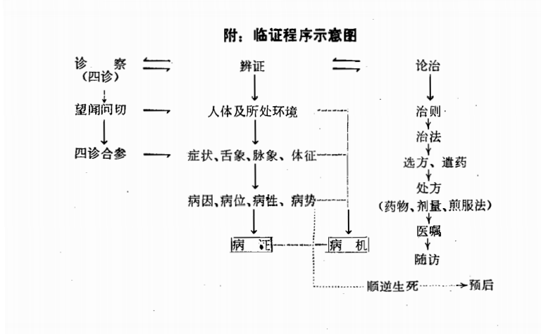

# 中醫辨證論治

[TOC]

## 编者

光明中医函授大学  主编

白永波  李玉山  编

光明日報出版社

## 導言


## 编者的话

《中医临证程序与临床辨证思维方法》一书，作为“高等中医函授教材”系列中的一种，是提供学员自学参考的。

从中医理论方面看，中医辨证论治体系是中医学理论体系的重要组成部分。中医学理论体系的内容相当丰富，它的主要内容包括阴阳五行学说、脏象学说、经络学说、病因病机学说、病证学说、诊法学说、治则学说、养生学说、运气学说，假如借用现代医学分枝学科的名称表达，似乎包括有气象医学、时间医学、生物医学、社会医学、人文医学、精神医学、预防医学、临床治疗学等内容，而这些内容在中医学理论体系中并不是以各自独立学科体系存在，而是溶合于中医辨证论治的指导思想之中。中医学是理论性、实践性很强的一门医学科学，中医辨证论治体系正是有理论指导的防病治病体系，而医学的主要任务就是防病治病、保护人类的健康。所以，从某种意义上讲，中医辨证论治体系是中医学理论体系的核心。

从中医临床方面看，中医临证程序与临床辨证思维方法，又是中医辨证论治体系的重要组成部分。一般来说，==中医辨证论治==分为三个大阶段，即==诊察阶段、辨证阶段、论治阶段==，这三个阶段依次相接的次序，也是中医临证程序。其中，辨证与论治的关系十分密切，辨证是论治的前提，是论治的依据，而正确的辨证，又依赖于准确地运用临床辨证思维方法。所以，不断地深入研究临床辨证思维方法，又是提高辨证论治水平的关键。

中医临证程序与临床辨证思维方法的内容古已有之，它象一颗璀灿的明珠蕴藏在浩如烟海的古医籍中，它又每时每刻出现在历代医家的诊疗中。不少学验丰富的老中医，经过长期的医疗实践，都形成了自己的一套临证程序及其思维方法，只是没有写成文字系统的加以介绍。这项系统整理工作，要力求中医文献与临床经验两个方面的结合，并从当前临床实际出发，这就需要中医界艰苦努力才可望初步完成。

本书的编写，希望在读者中能引起一点共鸣：作为一位临床中医师，掌握中医学理论和临床技能的水平，中医专业思想树立的牢固与否，突出中医特色的本领如何，均与能否建立起临证思维方法有着极其密切的关系。换句话说，有没有掌握中医辨证思维方法，又是检验一个中医临证水平的标尺。

本书的出版，是应教学急需而仓促成篇，为抛砖引玉之作，这就说明本书存在若干不足之处。但笔者愿意继续涉猎这一研究领域，以便修订时，进一步提高书稿质量，敬请各位不吝示教。

编者

一九八九年四月十五日

## 目錄


# 第一章 概述

## 第一节 本学科定义与辨证方法的概念

### 一、本学科定义

中医临证程序与辨证思维方法，是以总结和研究中医诊疗工作中的步骤、方法，使其条理化、规范化的一门新学科。

本学科的任务首先是总结历代临床医家的诊疗经验及其方法。就以当代中医而论，不少学验俱丰的老中医，经过长期的医疗实践，都形成了自己的一套临证程序及其思维方法，只是没有写成文字介绍出来。因此，从总结前辈临床医家和当代老中医各自的临证程序及其思维方法入手，在继承的基础上加以研究，并在研究的基础上加以提高，是本学科的首要课题。

其次，本学科属于中医临床基本功的内容之一。虽然涉及到的医理与哲理较多，但为了突出实用，本学科不过多地涉及理论上的阐述和学术上的探讨，只就临证程序及其思维方法的实用内容，分门别类地加以阐述。

临证，又称为中医临床。临证程序，就是中医师从望、闻、问、切四诊收集的病情资料进行辨证分析，一直到立法、选方、遣药的全过程的次序。辨证思维方法，是中医学概念运用逻辑思维与直觉思维结合起来进行判断推理，用以深化辨证论治原则。

无论是临证的证，还是辨证的证，均涉及证的概念。在中医古籍中，证与症多混同使用，从训诂学角度分析，症是证的俗字，也就是这两个字可以互通，意思是说辨证论治可以写为辨症论治，临证可以写成临症。但今天，中医一般应用，证与症已有明确的区别，症作症状包括自觉、他觉症状和体征，以及现代理化检测指标。证，是人体在疾病发展过程中的某一阶段的病变部位、病因、病性、病势的概括。因此，证是反映疾病发展过程中，某一阶段病变的本质，所以它比症状对疾病揭示得更全面、更深刻、更正确。

### 二、辨证方法的概念

中医辨证的方法，从认识疾病的历史来看，辨证，是先认识症状，从具体的症状再综合归纳出病名，达到对证的全面认识；从中医师诊断疾病的思维过程来看，辨证，也是先从对症状的感性认识入手，再逐步升华到对病证的理性认识。因此，对症状与病名的认识是认证过程的前期阶段，而不是认证的最终结论。

认症，是中医师通过自己的感官，运用望闻问切等诊察手段，以获得对疾病临床表现各种感性资料。中医认症历来主张抓主症，抓主症，就是在众多而复杂的症状和体征中，分清主症与兼症。主症既包括患者自觉最痛苦的症状，又包括中医师察觉到患者的主要临床表现和体征。兼症则次于主症，有的兼症与主症有内在联系，这样的兼症，在辨证时对主症有限定作用；有的兼症与主症没有内在联系。抓主症，一方面是要抓出主症，另一方面是要抓住主症，这二点，对初上临床的中医师来说，也不是一件容易办到的。先说抓出主症，在错综复杂的症状群中，要分清症状主次，不会熟练地运用中医临床基本功是不行的。有人抓出主症以后就认为完事大吉了，其实不然。抓出主症之后，必须要抓住主症。抓住主症，就是要运用望闻问切等诊察手段，围绕主症再一次深入、细致地进行诊察，并注意搜集围绕主症诊察出来的各种具体而细微的材料，其中有些材料，往往会成为辨证思维的依据和重要素材。在认症中，必须运用“别异比类”的思维方法，寻找同类症状的微细差别，以便为判断病证提供确切的依据，如同是发热症，有恶寒发热、寒热往来、骨蒸潮热的不同，这就为判断太阳病、少阳病、肺痨病提供了依据。在认症中，必须运用辩证的观点，以鉴别症状的真伪。如“病人身大热反欲近衣者，热在皮肤，寒在骨髓；身大寒，反不欲近衣者，寒在皮肤，热在骨髓也”（《伤寒论》）。这里，“身大热”与“身大寒”均为假象，它们分别反映了里寒极盛与里热极盛的本质。在认症中，必须运用分析综合的方法，把症状按病因、病位、病性等加以分类和综合，以便为确立病名提出根据。

认病，从中医病名的类别与构成条件上可以看出，有的病名依病因而定，有的病名依病位而定，有的病名依主症而定，它们都能反映疾病本质某一方面，有些病名，可完全反映疾病的本质。这些年，忽视了中医病名的诊断，有的还误以为中医没有病名诊断，甚至有一种含糊地提法：“西医辨病，中医辨证”，这既不符合中医学发展的历史，也不符合中医辨证论治的实际情况，当西方医学传入中国之前，我国明代的医学家徐灵胎就曾说:“欲治病者，必先识病之名”（《医学源流论》）。显而易见，这里提到的“先识病之名”，决不可能是今天所指的西医病名。

认证，在认症、认病之后，必然要进入认证过程的后期阶段。因为我们的中医师，不能仅仅停留在疾病全过程根本矛盾方面的分析，而要进一步分析疾病发展各阶段中主要矛盾及主要矛盾方面的分析，即致病因素引起人体发生疾病后的一系列变化，这个变化，常常受到病因、病位、病势、病性等多种因素的影响和制约，而主宰这个变化的内在的机理，就是病机。由此可见，证，是疾病发展全过程中某一个阶段病因、病位、病势、病性等方面综合的、整体的状态的抽象概念，而主宰这个证的，是内在的病机。因此，证名比病名更加具体、更深刻、更全面地反映疾病各个阶段的本质和内部联系，证名，是认证过程中最后形成的、最基本的诊断概念。这一概念的确立，一方面它有理论依据，另一方面，它又是立法、选方、遣药的依据。所以，认证，是辨证论治过程中的枢纽。一个中医师的认证水平，与他的辨证论治水平是息息相关的，一个中医师的辨证论治水平，又和他的临床疗效密不可分的。

综上所述，辨证是泛指中医临床思维的全过程，是包括从搜集症状、体征入手，进一步形成病名、证名的诊断推理阶段，为了突出辨别证名这一枢纽环节，而把这个诊断推理阶段称为“辨证”。

目前，临证中常用的辨证方法有八纲辨证、脏腑经络辨证、病因辨证、六经辨证、卫气营血辨证、三焦辨证、气血痰瘀辨证等。一般认为，八纲辨证是其他辨证方法的基础，而其他各种辨证方法又是从不同角度使八纲辨证具体化，使辨证方法日趋完善。笔者认为，中医辨证论治体系的奠基之作是《伤寒论》、《金匮要略》，《伤寒论》以其三阴三阳的辨证方法，《金匮要略》以其脏腑经络的辨证方法，指导着中医临床近二千年，这就足以说明，它辨证思想是举世公认的，它根据对病因、病性、病位、正邪的盛衰等各种情况的分析和综合，确定为六经的某病某证。六经辨证的这种内涵，连系于脏腑经络，贯穿着阴阳、表里、寒热、虚实、逆顺、标本、生死等诸多方面，已初步孕育了后世诸多的辨证方法。因此说，仲景的辨证方法是辨证论治的主流，后世诸多的辨证方法是从不同侧面加以具体化。所谓“大匠示人以规矩，而不示人以巧”，仲景及其著作是当之无愧的。古往今来，中医临床大家，均以仲景著作为准绳。我们当代的中医师要想在临床上有所成就，对仲景著作要精读，对仲景的辨证方法要运用，对后世诸多的辨证方法要吸收，只有这样，才能提高中医临床疗效。

兹引明代大医学家陶节菴老先生七十七岁那一年说出一段肺腑之言，他说：

“仲景取方立论甚严，曰可温，曰可汗，曰少与，曰急下；与夫先温其里，乃攻其表，先解其表，乃攻其里。得其纲领者，不难也。如响应声，如影随形，见病者则目识心通，见医人则接谈无虑。不得其传者，实难也。见病者举手无措，见医人则汗颜缄默。此犹绣麒麟耳，正谓名誉虚隆而实德则病矣。嗟夫！常病用常法，谁人不知。设有感冒非时暴寒而误认作正伤寒者，有劳力感寒而误认作真伤寒者，有杂证类伤风而误认作伤寒治者，有直中阴经真寒证而误认作传经之热证者，有温热病而误认作正伤寒治者，有暑证而误认作伤寒治者，有如狂而认作发狂者，有血证发黄而误认湿热发黄者，有蚊迹而认作发狂者，有动阴血而认作鼻衄者，有谵语而认作狂言者，有独语而认作郑声者，有女劳复而认作阴阳易者，有短气而认作发喘者，有痞满而认作结胸者，有心下硬痛、下利纯清而俗呼漏底者，有哕(yuě)而误认作干呕者，有并病而认作合病者，有正阳明腑病而认作阳明经病者，有太阳证无脉而便认死证者，有里恶寒而认作表恶寒者，有表热而误作里热者，有阴发躁而认作阳证者，有少阴病发热而认作太阳证者，有标本全不晓者。此几件，终世不相认者，比比然乎。胸中若不证脉讲明，论方得法，但同庸俗，一概妄治，此杀人不用刃耳。非惟杀人功大，亦且阴骘匪轻。吾老矣，伤寒专科，实得仲景先师厥旨，虽无万全之功，十中可生八九。曾著有书，不能尽心刻骨，因今年迈，后恐继业者不得其传，有玷名行，遂将一生所蓄肺腑语句，并家秘不传之妙，及一提全、杀车槌法，逐一语录于后。论注证而证注脉，脉注法而法注方。再三叮咛吾后子孙，不必集闲方而观别论，别繁乱而莫知其源。必须熟记，久则自然精贯。不与庸医伍，不使时医笑可也。尔宜珍藏受授，谨之慎之，毋怠毋忽，故戒”（《伤寒家秘的本·卷之二》）。陶老先生谆谆告诫后人“不必集闲方而观别论”，“必须熟记”仲景原文，“久则自然精贯”，这一真知灼见，也是历代名医学医心得之结晶。

## 第二节 中医学思维形式及其特征

### 一、中医学逻辑思维

任何科学都必需要有正确的思维方法，使思维合乎逻辑规律，正如列宁所说：“任何科学都是应用逻辑”。中医学是一门自然科学，是一门应用科学，当然也不例外。过去，中医学在没有现代科学设备条件下，即使在今天，脑科学也未能揭示意识生理机制全部奥秘的情况下，中医学之所以能够正确诊断和治疗，除了依据长期的临床经验外，善于运用辨证思维方法是一个重要的原因。

辨证思维方法，是在中国传统思维方式基础上发展起来的具有中医特色的思维方法，凭借这一成功的思维方法，将丰富的临床经验上升为一般规律性的认识而形成理论，并在这一理论指导下进行临床实践。因此，中医学的理论，是符合客观` `实际的理论。正因为如此，今天，当我们运用辨证思维方法的时候，必须以中医学理论为依据，运用中医学的概念进行判断推理，并将这一判断推理的方法，贯穿在辨证论治过程中，使理、法、方、药前后衔接、丝丝入扣。中医学在进行辨证时，常用的逻辑方法是比较法、分类法、归纳法、演绎法、分析法、综合法。比较法，一般先作现象比较，并以此作为入门的向导` `，进而进行本质的比较，从而找出表面上相似而本质上却是差异很大的不同点；然而，比较是以其所比较对象的属性一个方面或几个方面来相比，暂时地、有条件地撇开其他方面，所以，比较所得到的结果，就不一定是很全面，很准确的。分类法，是根据比较法确定的客观事物的共同点和不同点，依照一定的标准进行分类，使大量的、繁杂的材料条理化、系统化，能反映事物内部规律性的联系，为人们寻求或认识某一具体事物提供认识上的依据；但从根本上说，分类仍属于现象分类，并不能反映事物的本质。归纳法，是通过个性认识共性的方法，也就是“从个别到一般”的认识过程；须知，有些个性的现象不一定反映本质，有些现象、属性只存在于部分对象之中，所以归纳的结果，往往是不严密的、必然性的推理，不一定能准确地得到本质。演绎法，是通过共性认识个性的方法，也就是“从一般到个别”的认识过程；但是，演绎的前提——以归纳结论为基础——不一定每次都很正确，有时演绎过程中又不能正确运用逻辑规律，所以演绎的结论也不一定每次都完全正确。正因为如此，无论归纳还是演绎得出的结论，都还要通过实践来检验。分析法，就是把研究的对象分解为各个部分、方面、环节、层次等若干个对象，并对其一一地加以考察，找出它们之间的联系，以便显现研究对象的本质。综合法，是在已经认识了整体各个方面、各种组成因素的基础上，把它联结起来考察，以把握其本质、规律性的方法。分析是综合的基础，没有分析就没有综合；同时，分析有赖于综合，没有综合，也就不会有正确的分析。在实际的思维活动中，分析与综合是互相依存的，分析过程中有综合，综合过程中有分析；既分析又综合，既综合又分析，彼此相互贯通、相互渗透，又互相转化。

上述几种逻辑方法，是中医辨证思维方法广泛采用的方法，这些方法，和中医理论体系密切的结合，就形成了别具特色的中医辨证思维方法。

------

`电子版注：1.纸质版“客规”电子版已改为“客观” 2.纸质版“响导”电子版已改为“向导”`

### 二、中医学直觉思维

中医学整体观深深地根植于中国传统文化的土壤。中医学以人为中心，以宇宙为背景，研究人与自然、人与社会、精神和肉体不可分离的整体关系。每一个人都在宇宙中占有自己的时空位置，每一个人的生长壮老病死，除了受自身的先天、后天的各种因素影响以外，无不受时空因素的制约。因此，每一个人都有自己的性别、年龄、性格、心理、情感、气质等不同于他人的特点。在疾病情况下，有各自不相雷同的特点，由于不同特点而作为一种决定性因素，无不影响着疾病的发生、发展、变化以及预后。因此，在中医学看来，没有任何两个病证是完全相同的，没有任何一个病证不是因人而异的，或因时而变的。这就是中医辨证论治的立论根据。所以，中医临床，对每一个病人的辨证和治疗，都不是简单的重复过程，而是对一个个崭新对象的初次辨识和探索，因此，正确辨证论治，是一个创造性思维过程。

创造性思维过程，要求见微知著，即以一些似不相关的症状、脉象、舌象及体征迹象，以思维跳跃的方式，在瞬间内，依据某些临床表现直接从整体上把握病证的本质。在这个过程中，医生的创造性思维表现为理性的和非理性的，逻辑的和非逻辑的。直觉思维在这个过程中，显示出非常重要的意义。山东中医学院李克绍教授治疗一位42岁女性病人，每晚七时左右出现嗜睡症状，不能自制。沉睡一小时左右即醒，醒后如同常人，每次沉睡皆和衣坐位，患病二月，多次治疗无效。其时体形略胖，健康肤色，舌淡红瘦瘪，脉沉细稍数，大便干燥，李教授颖悟到本证与大便秘结，气机升降失调，卫气运行不畅有关。卫气昼行于阳，夜行于阴，申酉是天阳已里之时，此时的不可自制的嗜睡是卫气有下陷之势，予以通幽汤，一剂证减，七剂而愈（《中医杂志》1988.10）。已故名医岳美中先生曾治一季姓女孩，在百思不得其解的情况下，顿悟出子时是一阳生之际，午时是一阴生之际，子午两时，正是阴阳交替之候，故出现特有症状，予小柴胡汤调和阴阳而取效（《岳美中医话集》）。每当我们阅读前辈临床案卷时，常常惊叹他们高明的辨证思维和立足于中医学整体观这一坚实的功底。中医学直觉思维常常以人与自然统一的启示为契机，顿悟症状背后的幽深病机，在茫然中受整体观念的点拨启发，从而思路大开，豁然通达。

中医学直觉思维根植于已往的理论知识、经验成果的土壤中，它是理论知识和经验的高层次的融汇。岳美中先生把医生达到的临床境界，按医生的临床水平，划分为：最初等的为开方医生、辨证医生、入细医生，最上等医生等不同层次（《岳美中医话》）。能否达到最高境界，这与医生扎实的理论根基，合理的知识结构，丰富的临床阅历以及文化素养、心理特点、思维方式有密切关系，《内经》要求为医者上及天文，下穷地纪，中悉人事，这种广博精专的知识要求，与中医学的以人为中心的有机整体观是一致的。因此，“诵书之外，杂观杂学，触类引伸，而及于此类，贯通会悟，而合道理”（《黄帝素问直解·示从容论》）。一般说，理论根底越是扎实，知识越是广博，临床经验越是丰富，就越能够举一反三，问一知十，解类引伸，心领神会，越能够领悟孤立的症状之间的内在病理联系，直觉思维的成效越高。李东垣治冯氏子病伤寒，目赤而烦渴，脉七八至，医欲承气下之，已煎药，而李适从外来，冯告之，李切脉，大骇曰，几杀此儿！李东垣何以惊呼？原来病人"脉至，按之不鼓”，李氏在一派热象之中，从脉博的隐约迹象，领悟出此病属真寒假热，遂令持姜附来，药未就，而病者爪甲已青，顿服八两，汗出而愈。本例李东垣从脉之鼓与不鼓而直觉脉证之真假。从脉之逆从，洞察脏腑阴阳之精微。它的思维特点是发微致宏，豁然贯通，反映了直觉思维的洞察性、跳跃性。能够达到如此高的思维成效和如此高的临床境界，这是与他对专业理论知识的渊博和临证经验的丰富分不开的。

虽然我们一时达不到或不理解这种境界，但是不能轻视、否认或排斥它的存在。“神乎神，耳不闻，目明心开而志先，慧然独悟，口弗能言，俱视独见，适若昏，昭然独明，若风吹云”（《素问·八正神明论》）。这是前人运用形象的语言，来表达他们自身体验和感受到的“难以言传”的直觉思维过程。现代思维科学的研究表明：当中医临证时，调动亲身的体验和感受，融入到理法知识中去，新旧经验和意识內外的多种信息，处于活跃状态，在心理高能动力作用下，突然融汇贯通，使处于心理结构各部分的体验积淀，重新组合，遂即产生了直觉和顿悟。

### 三、中医学思维特征

#### 1. 从整体联系、活体功能方面认识病证

生命是人体各种功能的综合表现，人体本身是一个有机联系的整体，其脏腑经络气血之间存在着既相互联系、又相互制约的辨证关系。同时，按照“天人合一”的理论，人体又是一个与自然界、社会相互沟通的开放系统，而这种开放系统是由整体功能体现出来的。由此可见，中医学研究人体生命，既重视活体的生物特性，又注重人体的社会特性。从研究活体功能入手，从功能改变所反映岀来的征象探讨疾病的本质，是中医学认识疾病的显著特征。

#### 2. 从动态观念、主从关系方面认识病证

中医学认为病证的状态是变化不居的，一般来说，病证变化是一个有规律的动态过程，其传变规律大多先皮毛，次经络，后脏腑。也有不循此次序的，如外邪直中脏腑。须知，病证的演变既有其动态的一面，又有相对静止的一面。我们临证时所见到的病证，是病证演变过程中某一个相对静止的阶段。因此，动态观念为指导认证、辨证的原则，而区别不同相对静止的阶段又是认证、辨证的具体任务。因此，临证时动中观静，静中观动，方能在动静变化中辨识病证，抓住证候、寻求病机是辨证的主要目的。而在动静变化中辨识病势，又可判断逆顺、预测吉凶作出超前诊断和病情预后。

#### 3. 从具体分析个体特征着眼认识病证

中医治疗疾病有一定规律性，也有一定特异性。规律性是共性的表现，即某一疾病的一般表现。特异性则是具体的个性的表现。中医在治疗同一种疾病时，往往可以因人、因时、因地而有所差异，往往可以因疾病的发展过程具有不同证候而有迥然不同的治疗方法。三国名医华佗，诊得李延和倪寻二人都患的是头痛、发热，症状相同，但以二人的所致头痛的病因不同，给李延处以解热发散的方药，给倪寻处以消导泻下方药，结果二人的病都得痊愈。这一同病异治的故事，流传至今。因此，中医认证时，注重个体特征，注重天时、地理、气候、体质诸多因素对个体的影响，同时还要注重个体在发病时的具体的临床表现。

# 第二章 临证须知

救死扶伤，防病治病，保护人民的身体健康，是中医临证工作的根本目的和基本任务，也是中医工作者的基本职责。由于中医学是为健康服务的，临证轻率，性命攸关。作为一名中医工作者，一是必需具备高尚的医学职业道德，二是必需具备精深的医学专业知识。而在临证工作中，还必需遵守一定的事项，这些事项，对于保证临证工作顺利进行，有着十分密切的关系。历代名医对此十分重视，如唐代孙思邈、宋代张杲、明代陈实功、清代张璐等，在他们各自的著述中都辟专章论述和阐发。

## 第一节 自觉加强医德修养

中国医药学，在数千年的发展中，代代相传有关崇高医德的故事甚多。葛洪所撰《神仙传》中，就载有三国时期民间医生董奉医德高尚的故事：董奉在庐山行医时，从不索取诊金，治好一个重病，让病人在家门口栽五棵杏树；治好一个轻病，只栽一棵杏树。前来诊治的病人很多，其中大多数是贫穷病人，几年之后，杏树成林，每待杏子黄熟时，董奉又将杏子交换成粮食，并用此粮食专门救济贫苦人民和旅行在外而生活困难的人，每年可施救二万余人之多。这就是流传千古的“杏林佳话”的由来。

大凡优秀的医生，都具有高尚的品质、优良的医德。孙思邈，堪称是注重医德的典范。他说：救人一命，胜似千金，有效的验方比什么都贵重！他所撰的医学名著《备急千金要方》、《千金翼方》，以“千金”二字，示意人的生命重似千金。《宋史·庞安时传》记载：庞安时对远道来求治的重病患者，主动腾出房间，让病人住在自己家里。并为他们煮粥、煎药，待病人痊愈后，才肯让他们离去。患者送的金钱、实物，他一概不收，从不以患者的恩人自居。又如陈实功在《医家五戒十要》中说：“凡病家大小贫富人等，请观者便可往之，勿得迟延厌弃”。现代著名中医学家蒲辅周先生在岀师仪式上，将原名改为“辅周”，以立“辅助贫弱，周济病人”之志。他早年从事义诊，对病人不论高下、贫富、长幼、美丑、亲疏，都象自己的兄弟姐妹一样对待。他晚年主要负责中央领导的保健医疗工作，但仍坚持为群众服务。赵锡武教授说：“医生的任务是治病，不是看级别”。在今天的社会里，只有分工不同，没有高低贵贱之分。在目前经济还不发达的情况下，还存在少数经济不发达地区，必然有些生活困难的人们。他们患病后，医生就应本着少花钱治好病的原则，进行仔细诊断，合理选用药物。又如当代名医吴佩衡，对贫穷者，除免费义诊之外，还经常奉送药费；甚至对疑难重证，还亲自前往督促病人服药，对缺乏煎煮附子经验的病家，耐心地给予指导，有时采用自己先尝试，后给病人服用的方法，以保证疗效。这种扶危济贫的高尚品德，应该是每一位医生所必备的。

在我国古代的封建社会和近代半封建半殖民地社会里，医家们能够打破世俗的观念，以不畏权势，不图名利，普救劳苦人民为己任。他们是中医界的楷模，后学的典范。我们应该很好的学习，不断增强自己的医德意识，全心全意地为人民服务，这样才不失一个医生的天职。

医务人员的职业道德，简称为医德。它是医务人员在长期的医疗实践中逐渐形成的比较稳定的职业心理素质、职业习惯和传统，是用来调节医患之间、医务人员之间、医务人员与国家、社会、集体之间关系的行为规范的总和。因此，中医工作者在临证工作中，应自觉遵守《医务人员职业道德规范》。

### 一、救死扶伤，极端负责

救死扶伤，对工作、对病人极端负责，是医务人员全心全意为病人服务的基本内容，对提高医疗质量和医疗效果具有直接的意义。要做到极端负责，首先要对病人关心和同情，时时刻刻想到病人的利益，把解除他们的疾苦作为自己应尽的义务和责任。其次是在工作中要严肃认真、一丝不苟，严格执行各项规章制度。再次，要有高度的医德责任感，意识到治病救人是医务人员的职责，在临证中决不能推诿卸责，轻率从事。

### 二、尊重病人，一视同仁

由于人们是在社会主义公有制的基础上建立了同志式的互助合作关系，因此，在临证工作中必须平等待人，必须尊重病人的人格。应不论病人的社会地位高低、权力大小、收入多少、知识水平、容貌美丑、衣着好坏、关系亲疏，都要一视同仁。尊重病人的人格，首先应为病人保守秘密。主要注意两方面的内容，一是病人为诊疗需要而提供的各种个人秘密，不应随意泄露。二是有关病人的病情和可能产生的不良后果，对病人应注意保密，杜绝医源性疾病的发生。

在进行任何诊治措施前，应向病人讲清楚意义和目的，以征得病人的理解和支持。切不可将自己的决定强加于病人。这也是尊重病人的一项内容。

### 三、刻苦钻研，精益求精

诊治技能是医务人员为病人服务的手段。因此，一个热爱中医事业的医务人员，必须刻苦学习，勇于实践，在临证工作中不断丰富知识，积累经验，逐步提高诊疗效果，更好地为病人解除疾苦。

### 四、廉洁奉公，不徇私利

医疗卫生工作是为人类健康服务的崇高职业，医务人员历来受到人们的尊重和信任。但决不能把人民群众的尊重和信任视为谋取私利的资本。治病救人是医务人员的职业义务，也是对社会应尽的职责。为此，廉洁奉公，不徇私利，是每个医务人员必须遵循的行为准则。

### 五、团结协作，尊重同行

由于医疗活动多属集体性的工作，因此，医务人员必须发扬集体主义精神，团结互助，共同完成医疗工作。同时，在临证工作中医务人员之间的相互尊重、相互信任是搞好医疗工作的前提和保证。切不可诋毁同行，打击别人，抬高自己，无事生非。

### 六、举止端庄，文明礼貌

所谓举止端庄、文明礼貌，就是要求医务人员言谈文雅有度，举止稳重端庄，仪表整洁大方，切忌言谈粗俗，举止轻浮。工作中要做到语言亲切，态度诚恳，动作轻柔，礼貌待人，给病人以宽心和亲切感。尤其是接触异性病人时，更要作风正派，力避邪念。

## 第二节 勤学苦练临证基本功

临证时医生如何能够迅速得当地诊治病证，主要在于：识证靠辨证准，治疗靠方药熟。尽管疾患变化无穷，治法方药繁多，但是只要具备一定的临证基本功，就能执简驭繁，在错综复杂的病情中，迅速有效地抓住病证的要害所在，予以有效的治疗。

所谓临证基本功，是指临证辨证论治所必需的中医理论和技能。对于这些基本功必须勤学苦练，尤其应在临证中反复应用，以便不断得以强化。

认证是医者诊治疾病、立方遣药的根据。那么，认证就是临证基本功中的第一项。认证包括两个主要内容，即诊察与辨证。

### 一、诊察务求详尽

望、闻、问、切，诊察之法。

在问诊方面，问诊围绕寻求病因，如：“工于问者，非徒问其证，殆欲即其证见，以求其病因耳。法当先问其人之平昔有无宿疾，有无恚忧思，饮食喜淡喜浓，喜燥喜润，嗜茶嗜酒，大便为燥为溏。妇人问其有无胎产，月事先期后期，有无胀痛。再问其病，初起何因，前见何证，后变何证。恶寒恶热，孰重孰轻。有汗无汗，汗多汗少，汗起何处。口淡口苦，渴与不渴，思饮不思饮，饮多饮少，喜热喜凉。思食不思食，能食不能食，食多食少，化速化迟，胸心胁腹有无胀痛。二便通涩，大便为燥为溏，小便为清为浊，色黄色淡。种种详诘，就其见证，审其病因，方得轩岐治病求本之旨，岂徒见痰治痰，见血治血而已哉”（《医原·问证求病论》）。

在望诊方面，望病人形体，以辨别阴阳：“凡病人身轻，自能转侧者易治；若身体沉重，不能转侧者，则难治也。盖阴证则身重，必足冷而踡卧，恶人，常好向壁卧，闭目不欲向明，懒见人也。又阴毒身如被杖之疼，身重如山而不能转侧也。又中湿、风湿，皆主身重疼痛，不可转侧，要当辨之。大抵阳证身轻而手足和暖，开目而欲见人，为可治。若头重视身，此天柱骨倒，而元气败也。凡伤寒传变，循衣摸床，两手摄空，此神去而魂乱也”（《证治准绳》）。

望病人形体，以辨别虚实：“稽之于古，则坐而仰者肺实，实则胸盈仰息，坐而伏者肺虚，虚则浮而短气。叉手冒心者，汗后血虚；以手护腹者，里实心痛。其坐而下一脚者，腰痛之貌；坐而掉两手者，烦躁之容。但坐不得眠，眠则气逆者，咳嗽肺胀，但眠不耐坐，坐则昏沉者，血夺气虚。……转侧不能者，痿痹之状；坐卧不宁者，烦躁之形”（《望诊遵经》）。

望唇的形色和动态变化，可以测知脾胃的变化，有利于了解疾病的寒热虚实，有助于判断疾病的逆顺吉凶。“唇赤而吐者，胃热也”；“唇色深红，洒淅寒热喘咳者，肺之虚热也”；“小儿唇红厚者，脾胃健，易养也。妇人唇红厚者，冲脉盛，易产也。唇淡白者，虚也。唇惨白而吐者，胃虚也”；“唇口青白而黑者，寒也”（《望诊遵经》）。“凡口唇焦干为脾热，焦而红者吉，焦而黑者凶。唇口俱赤肿者，热甚也；唇口俱青黑者，冷极也”；“口噤难言者，痉风也”；“若唇青舌卷，唇吻反青，环口黧黑，口张气直，口如鱼口，口唇颤摇不止，气出不返，皆不治也”（《证治准绳》）。

望神时应重点察目，察目的神气，主要是辨有神和无神。两目反应灵敏，顾盼自如，精彩内含，炯炯有光，为有神的表现，表明脏腑精气未衰，预后良好；两目反应迟钝，目光暗淡，瞳子呆滞，昏不识人，为无神的表现，表明脏腑精气衰竭，预后不良。

察色之妙，全在察神。“色者，神之旗也。神旺则色旺，神衰则色衰，神藏则色藏，神露则色露"（《医门法律》）。色中之神，主要表现为五色明润光泽，含蓄不露，是脏腑精气未衰的征象；反之，五色晦暗枯槁，暴露不藏，是脏腑精气衰竭的征象。总之，五色润与不润，露与不露，是望色察神的关键，二者结合，不可分割，凡色见明润而隐含者，为有神之色；色见枯槁而浮露者，为无神之色。

其次，望色也应五色、五官分应五脏，用以定疾病部位。以赤色为例，舌红为心热，鼻红为脾热，左颊红为肝热，右颊红为肺热，腮下红为肾热。其余，依此类推。

在闻诊方面，嗅病人身体、口气、分泌物和排泄物气味的异常变化诊察疾病。如“人病尸臭不可近者，死。口气重者，胃热盛也，阳气尚充，其病虽剧，可治。汗出稠粘，有腥羶气或色黄者，风湿久蕴于皮肤，津液为之蒸变也，风湿、湿温、热病失汗者，多有之。唾腥吐涎沫者，将为肺痈也，唾脓血腥腐者，肺痈已成也。小便臊甚者，心与膀胱热盛也；不禁而不臊者，火败也。大便色坏，无粪气者，大肠气绝胃败也。小儿粪有酸气者，停滞也。病人矢气极臭者，为胃有停食，肠有宿粪，为内实，易治。若不臭者，在平人为气滞；病剧而出多连连不止者，为气虚下陷，恐将脱也”（《形色外诊简摩》）。

在脉诊方面，辨识外感疾病，辨脉有重要参考价值。“治伤寒先须识脉，若不识脉，则表里不分，虚实不辨。脉浮为在表，脉沉为在里；阳动为有汗，阴动则发热”（《活人书·卷二》）。张仲景将《伤寒论》第233条“沉为在里”辨为里证，将第333条“脉迟为寒”辨为寒证，脉象是其重要证据。

辨识内伤杂病，辨脉也十分重要。如明代医家汪机曾治一孺人，病腹痛，初从右手指冷起，则头如冷水浇灌，而腹痛大作，痛则遍身大热，热退则痛亦止。以往约每年一发，后来二、三天一发。一医用四物汤加柴胡、香附，无效。另一医用四君子加木香、槟榔，也无效。汪氏“诊脉皆微弱，似有似无，或一二至一止，或三五至一止，乃阳气大虚也，以人参五钱、陈皮七分，煎服十余帖而愈。”多年痼疾，仅用了二味药，十余日即愈，这就说明临证的关键在于：辨证精确，辨脉真切，用药少而精专，定能取得治疗效果。

脉诊对于了解脏腑经络病位，推求病因病势，均有重要参考价值。“其于病也，外六淫也，内七情也，何脏何腑何经也？其来路从何来，其去路从何去？凡此，皆于脉测知，脉法颇不重乎”（《脉简补义·诸脉补真》）。如外感初起，多见浮脉，或浮缓，或浮紧，或浮数；内伤七情，多见沉弦、弦细等脉。细辨寸关尺三部，有助于区分病以何脏何腑为主，左手可分候心肝肾，右手可分候肺脾命（命门）。病情之演变趋势，有时也可从脉测知。明代医家徐灵胎曾治一徐家女，停经数月，寒热减食，肌肉消烁，小腹之右下达环跳隐痛微肿，医者或作怯弱，或作血痹，俱云不治。而徐灵胎却说：“此瘀血为痈，已成脓矣，必自破，破后必有变证，宜急治”。后来果如其言，脓出升余。徐氏对病性病势推断的依据就是“诊其脉，洪数而滑，寒热无次”。

有其证见是脉，称为脉证相应，属顺证，预后多良好。反之，脉证不符，属逆证，预后较差。“凡出入不足之证，忌见阳脉，如浮、洪、紧、数之类是也；外入有余之病，忌见阴脉，如沉、细、微、弱之类是也。如此之脉，最不易治”，“凡暴病脉来浮洪数实者为顺，久病脉来微缓软弱者为顺。若新病而沉微细弱，久病而浮洪数实者，皆为逆也。凡脉证贵乎相合，假若证有余而脉不足，脉有余而证不足，轻者亦必延绵，重者即危亡之兆”（《景岳全书·脉神章》）。

四诊合参，指的是必须同时运用望、闻、问、切四种诊断方法，收集疾病的临床表现。由于病人的体质不同，病因病机各异，病位有别，有些病较明显地反映在神色上，有些病较明显地反映在脉象的变化上，有些病较明显地反映在呼吸、二便的变化上，有些病除非病人口述，否则难以知其病情。尽管如此，不能只偏重于一种诊法，必须同时运用四诊，全面收集临床资料。在此基础上，应进一步综合四诊所得的全部资料，进行全面分析，辨明假象，或舍症从脉，或舍脉从症，或色脉合参了解疾病的顺逆吉凶新久。“色与脉，犹须分别生克，色脉相克者凶，色脉相生者吉”（《脉鉴》），如脉弦而见面色赤，为处于相生` `关系，表示预后较好，脉弦而见面色白，为处于相克关系，显示预后欠佳。

总之，四诊的意义正如《医门棒喝》中所示：“望者，望面色之明晦、舌苔之有无，以辨病邪之轻重进退也。闻者，闻声音之怯壮、语言之伦次，以辨神气之爽昧强弱也。问者，问得病之由、痛苦之处，以辨内伤外感、脏腑经络，尤为紧要也。切者，切脉之浮、沉、迟、数、有力、无力，以辨虚实阴阳，而与外证参合逆顺吉凶也”。由此可见，凭借各种诊察方法，详细搜集临证资料，进行四诊合参，方能判断清晰病证。尽管前辈于四诊各法中偏擅某一法，但都强调四诊合参。如金子久偏重于切诊，但在临证中依然强调四诊合参。如他在诊治李姓虚损痰饮案中，通过望诊，看到病人“形瘦”，“喘急"，“痰如稀涎”，“舌苔薄浅而白”；闻诊察知“咳嗽失音”，“语言声音重浊”，“喉间痰声漉漉”；问诊询知“痰如稀涎，味带咸味”，时有“轰热”，“肋际掣痛”，“寐难”，“脘宇嘈杂”，胃纳遂使锐减”，“口燥不喜渴饮”，且“汗出甚多”，“茎缩溲沥”；切诊得知“肢厥”，“左右脉象均见弦滑，浮取有力，重按无神”。综合分析四诊资料，辨证为“內饮外饮同时并发，表邪里邪俱形混淆”；“痰饮牢不可破，虚损尤宜防护。”从治病必求于本的原则，认为“调治未可注重一方”，“当从半虚半实着想，庶无畸轻畸重之弊。”于此不难看出，金氏十分注重四诊合参。前辈医家一贯反对那种一摸脉、一望舌便判定病证，开方投药的轻率作法。究其实，这种作法亦是临证失误的根源之一。

### 二、诊察务求过细

在详尽搜集病人证情资料时，还应强调过细。如范文甫诊病识证，处处留心，每从周围环境中寻求病因与病源。如有一阖家患疹者，诸医用硫磺等治之更甚，范氏见其家水缸盖上，多晒制信石，问曰：“阖家吃此水乎？”答曰：“不差。”据此认为系信石中毒，从皮肤外达，惟防风可解，遂以独味防风煎服，果得愈。又如慈城冯某，素患饮病，夏月新病后，长期低热不退。当地名医曾用甘温退热等治疗，皆无效应。往求范氏诊治，即处以附子理中汤方。人告之此方已服多帖。先生于药方后注“忌葱”二字，并谓知犯戒否？药后果热退病愈。先生之所以强调忌葱者，因葱与炙甘草中之蜜相反。就诊前见病家房几上有葱烤鲫鱼一盆，并知冯某平素嗜食之。从以上二例医案可以看出，前辈医家除了具备精深的医理，丰富的临证经验，巧妙的辨识思路外，而这种善于洞察周围环境，从细微之处搜寻病因病源的科学态度，也是他们取得疗效的关键所在。

诊察务求阴阳。特别是在病证错综复杂的情况下，辨别证候的阴阳属性，是诊察疾病的重要纲领。因为人体一切病理变化，都表现为阴阳的偏盛偏衰，通过四诊了解和分析病情的阴阳变化，这是治疗疾病的必要前提。正如张景岳在《景岳全书》中说：“凡诊病施治，必须先审阴阳，乃为医道之纲领，阴阳无谬，治焉有差，医道虽繁，而可以一言蔽之者，曰阴阳而已。故证有阴阳，脉有阴阳，药有阴阳。以证而言，则表为阳，里为阴；热为阳，寒为阴；上为阳，下为阴；气为阳，血为阴；动为阳，静为阴；多言者为阳，无声者为阴；喜明者为阳，欲暗者为阴；阳微者不能呼，阴微者不能吸；阳病者不能俯，阴病者不能仰。以脉而言，脉浮大滑数之类皆阳也，沉微细涩之类皆阴也……此皆医中之大法。至于阴中复有阳，阳中复有阴，疑似之间，辨须的确，此而不识，极易差讹，是又最为紧要”。

### 三、审证重在辨异

由于发病原因众多，因此病证的病情亦十分复杂。故而审证之时，要重点审视病证的差异和疑似之处。如《回春录新诠》中载有“孙位中，患感，症见耳聋，医者泥于少阳小柴胡之例，聋益甚。孟英视之，曰：伏暑也。与伤寒治法何涉？改投清肺之药。聋减病安。”外感而见耳聋，伤寒少阳经病有之，温病湿温亦有之。用小柴胡汤治之而增剧，则不属风寒邪实少阳，而为湿热之气氤氲，熏蒙清窍所致。因此可见，审证时不注重辨异，往往造成诊治失误。辨异的方法主要还在于收集资料齐全，然后从症候之间的联系中探寻，使症候之间的联系不发生矛盾，即符合逻辑的同一律。如存在着相互矛盾，则应弄清孰真孰假，孰为主，孰为次。《沈绍九医话》中记“雷某之妻，乃阴虚素质，微有感冒就诊。舌苔白滑，口不渴。沈医师重用甘凉濡润之剂并言：‘白滑苔亦有胃肾阴虚者，况素来即系阴亏之体，舌瘦而质较粗糙，若不及时濡养，迨阴虚现象悉具，则所伤已大。'服药后，果阴虚之象渐露，由于施治得法，未酿成大病。”本案审证除着眼于病人的体质，又着重从察舌上进行辨异。舌苔白滑或垢腻，以中宫积湿为常见。而肾胃阴虚，亦有白苔带滑者。沈医师在察舌时，以手指扪之，一则审其气之寒温，一则审其是否润泽，以考査津液之荣枯。而且认为“胃阴不足者，舌白而干；肾阴不足者，舌红而干，必须辨明。”真寒假热、真热假寒证在临证审证时最易失误，如何使审证更精当，张景岳提出以冷水少试试之的方法，其结果为假热者，必不喜水，即有喜者，或服后见呕，便当以温热药解之。假寒者，必多喜水，或服后反快，而无所逆者，便当以寒凉药解之。总之，审证辨异的方法和经验在中医古籍和现代医籍中，俯手便可拾到，如能勤求前人训示，便能充实学者的经验，提高辨证的技能。

### 四、审证重在求本

本为病之源。中医学认为病证的发生是人体阴阳失衡的表现，因此，病证之本源在于阴阳。但是由于阴阳属最高层次的抽象范畴，而前辈医家从不同角度提出审证必求其本的不同范畴。如本于致病之因、本于阴阳之邪、本于病因病机、本于表里寒热虚实证、本于脾肾、本于肾阴肾阳等。尽管众说不一，但实质上都是从不同方面探求人体阴阳失衡的原因和状态，只不过是不同角度的阴阳范畴而已。在临证应用时，主要通过症候之间的互为限定，来逐步探求病证的本源。如在临证中遇到胃痛，如何迅速准确地抓住病本呢？本病多因受寒、停湿、湿热、饮食失调、情志郁结和体质虚弱等引起胃失和降，其以胃寒、胃气和胃虚为多见。因此，大致可以从发病的诱因、病程新久、发病缓急、胃脘部是否可按、是否喜饮、是冷是热、痛势有无休止、主要见症、脉象、舌象等情况，综合分析判断。若胃痛的发病与饮食生冷或直接感受寒气有关，发病卒然，胃脘部喜按，喜饮热汤，痛势无休止，伴见呕吐清水，畏寒，手足不温，脉象沉迟，舌苔白腻。则可辨为胃寒痛。胃气痛和胃虚痛的辨证均类此。

### 五、立方当合理法

辨证求因，审因论治，依法立方，据方议药是辨治过程中前后衔接的四个环节。因此，立方必须合于理法。在临证中如何衡量一个处方是否合于理法，主要看药与证是否符合，药与药的配合是否密切，药量的轻重是否恰当，药物次序的排列是否合式，服后是否有效。怎样立方方能合于理法呢？首先应多掌握临证运用的基本治法。基本治法包括某一病因和某一证候的一般治疗法则。比如遇见虚证，一般都知道用补法；知道脾虚补脾，肾虚补虚，而且还知道“补脾不若补肾，补肾不若补脾”；“土旺则生金，勿拘拘于保肺，水旺则火熄，勿汲汲于清心”；“补脾须不碍肺，滋肾须不妨脾”等治法。但具体应用时，由于证情复杂，初学者往往难于掌握。秦伯未先生认为正确地使用补剂，必须辨清虚了什么？虚在哪脏？虚到什么程度？用直接还是用间接方法？以及用补有没有不良反应？以及成方中补剂的性质和药物的配合、禁忌等。由此可见，立方必须基于理法，理法是立方的依据。

### 六、选药当明药性

在处方选药时，除了遵循立方的君、臣、佐、使配伍原则外，还应考虑药物之间的配伍和药物的升降浮沉性质。

二种药物间的配伍，大体有三类。第一类，两种相对的性质和不同气味、不同功能的药物结合，象气与血，寒与热，补与泻，散与收，升与降，辛与苦等，在相反相成中，改变其本来的功效或取得另一种新的效果。如黄连与肉桂，寒热相伍，治疗心肾不交的不寐。第二类，两种药物相辅而行，互相发挥其特长，从而增强其作用，如化湿结合理气，发汗结合通阳，包括上下、表里结合，以及相须、相使等在内。如杏仁与贝母相伍，顺气化痰。第三类，取性质和功效类似的两种药物同用，目的在于加强药效，或使内脏之间得到兼顾。如柏子仁与酸枣仁相伍，增强养心安神之功。

选药时应注意药物的升降。人的气机有升降，药性亦有升降。当人体发病，则气机升降，必然会出现逆乱，故药物的升降必须合于气机升降的逆乱。如升药的应用，升药首推葛根、升麻、柴胡。凡头目耳鼻诸病而无湿者宜升，可选用升药。中气下陷者因中气虚则湿聚，多见胸痞之证，故补中益气汤不用葛根。湿热下注，二便异常兼有气虚者宜升，可选用葛根。升药还有散的作用，升是升其阳气，散是散风、散火，故又称升散药。总之，方中药物升降性质应与病证气机升降相对应。

综上所述，临证基本功主要包括辨证论治中理、法、方、药各个环节的技能。对于这些技能，应在临证实践中反复应用，及时总结，不断提髙。

------

`电子版注：纸质版“如脉弦而见面色赤，为处于相互关系”，此为论色脉相生相克，据此,电子版改“相互”为“相生”，此论另见于本系列教材《黄帝内经讲解》下册第八章——诊法学说——诊断的守则和方法——四诊合参。`

# 第三章 临证程序

临证程序，是指在临证辨证论治过程中实施各项诊治内容的次序。其程序大体可分为三个阶段，即第一阶段是诊察，第二阶段是辨证，第三阶段是论治。一般说来，这三个阶段必须依次逐段进行，有的要反复交叉进行。具体的临证程序内容有：诊察，议病，辨性，定位，求因，度势，明本，立法，选方，遣药，医嘱，随访。

## 第一节 诊察

诊察是指医者应用“四诊”全面而系统地收集病人提供的症状及与病证有关情况的临证程序。

“望、闻、问、切，察病之四法也”。临证诊察中如何使用此四种方法，孰先孰后，总得有个次序。有的医家临证时首先诊脉，根据脉象的浮沉迟数，对病证的阴阳属性，有个粗略的判断，然后再使用望、闻、问三法深入详细诊察，此种诊察步骤即是切、望、闻、问。有的医家临证时首先使用问诊，依据病人诉说的最痛苦感觉，使用望、闻、切三法，对病情展开诊察，此种诊察步骤就是问、望、闻、切。有的医家诊察步骤则采取望、闻、问、切。这种步骤在目前中医书籍中均有记述。总之，“四诊”仅仅是四种诊察方法，在临证应用由于医者的经验不同，所诊病证各异，因此产生了不同的诊察技巧与方式，但是在辨证分析时，仍需遵循“四诊合参”的原则。

其次应具备对症状的认识和鉴别能力。对症状的认识，首先要弄清症状的概念及范围。由于古今语言的不同以及医学的自身发展，症状的名称与内涵已有了变化。其变化大致有：症名未变而内涵变化。如“厥”，《内经·厥论》中既指手足逆冷，又指昏迷。《伤寒论》中仅指手足逆冷。目前已不再单用一个厥字，而分别称为四肢厥冷与晕厥。症名变化而内涵一致，如《内经》中的“喑”，现在称为失音。《内经》中的“手足清”，现在称为“手足冷”。清古通凊，寒也。症名虽有异，古今的涵义相同。如《内经》中肠澼，是指大便次数多而不爽，粪便中有脓血，后世曾把肠澼作为病名，即痢疾的别称，目前肠澼一词已不用了。后世新增的症名，如《伤寒论》中描述发热的症名仅有发热、微热、无大热、潮热、往来寒热几种，而目前又增加了身热不扬、身热起伏、夜热早凉、发热夜甚、骨蒸劳热、手心热、手背热等症名。总之，在临证时应注意症状概念的古今变化。症的范围有大有小，如发热即属大范围的症名，可见于多种疾病中，故对发热的诊察，除诊明发热本身特点外，尚需诊清其定性、定位的症状，这样才能使发热这一症状更具临证意义。小范围的症状往往可以提供较精细的辨证佐证，对于定性、定位、求因均有实用价值。

对于症状的鉴别能力，主要包括类似症状的鉴别以及症状真伪的识别两个方面。如“善惊”、“心悸”、“怔忡”三者均可出现心中悸动不宁的感觉。但“善惊”系指遇事容易惊吓，或经常无故自觉惊慌，心中惕惕然不安的症状；而“心悸”则指病人自觉心中跳动不宁，且多为阵发性；“怔忡”则为持续性发作心中跳动不宁。又如“嗳气”与“呃逆”二症状，初看虽均为声音自口中而出，然二者各不相同，嗳气声音沉长，气从胃中上逆而出，故其气味多呈酸腐而臭；而呃逆声音急而短促，气发自喉间，其气味多无臭味。症状的真伪识别，历来为前贤所重视。如“病人身大热，反欲得近衣者，热在皮肤，寒在骨髓也，身大寒，反不欲近衣者，寒在皮肤，热在骨髓也。”即是从病人的喜恶上来识别寒热的真伪。又如“证似外感，不恶寒反恶热，而无表证者，此热盛于内也”。此证的表里识别遵循了“有一分恶寒便有一分表证”的辨证原则。总之，掺杂在症状中的假象，是病机变化的表现形式之一，也是疾病在特定的条件和范围内所出现的歪曲病机性质的反面现象。这种现象具有不稳定、容易消失的特征，尽管这种现象不能构成症状的主流，但它却能干扰对证候的正确判断，故不可不识别。识别假象的有效方法，在于全面将各种症状同时纳入医生的视野和观察思考之中，仔细考察这些症状在病程中的前后表现，切实掌握其动态性的变化。只有在病证变化过程中反复辨认，不断加深认识，方能做到有效地识别假象。

症状是病证显露于外的征象。任何一种病证都必然出现一系列的症状，而这些症状在揭示病证本质上，却存在着角度的不同和层次上的差异。也就是说，每个症状在病证中的病因、病性、病位、病势的揭示中，占有特定的地位和作用。因此，在诊察中要着意对求因、辨性、定位、度势有特定标志功能的症状进行搜寻，此点对于得出正确的辨证是十分重要的。

寒热虚实是对病证性质的概括，凡能标识寒热虚实的症状，即为具有辨性功能的症状。一般认为，口渴而能饮水，喜冷饮食，烦躁，溺短赤，便结，脉数等症状，多能提示为热。口不渴，或渴而不欲饮，喜饮热汤，手足厥冷，溺清长，便溏，脉迟等症状，多能提示为寒。病中无汗，腹胀不减，痛而拒按，病新得，人禀厚，脉实有力等症状，多能提示为实。病中多汗，腹胀时减复如故，痛而喜按，按之则痛止，病久，禀弱，脉虚无力等症状，多能提示为虚。其他揭示病因、病位等症状，亦是同此。

病证的性质，往往由几个相关的症状共同揭示。临证中任何一个症状，均需其他症状而限定。因此，一个症状只有放在症状之间去考察，方具备其揭示病证本质的功能，方赋予临床意义。如“便结”一症，只有放在口渴欲冷饮，烦躁，溺短赤，脉数诸症状中方提示该便结属热。若单独讲便结，则无法确定其属性。因此，便结一症便失去了临床意义了。

综上所述，诊察的目的，在于详尽收集病人的病情资料，为辨证创造条件。所以，只有全面系统地占有病情资料，方能做出合乎病情的客观判断。在诊察中务必不可掺杂一丝主观臆断，否则就会出现诊治失误。当然，并不排斥医者的经验。但是，既使有丰富经验的医者，也是以病人的客观反映为主，并在诊察中逐步剔除病人或医者中存在的主观性因素，力求保持症状的客观可靠性。

前人云：有是症则有是病。对病人所反映出来的症状要不厌其多，资料越多越有利于辨证。因此，可以说诊察是辨证论治的起点。

中医诊察病人和诊断疾病，是同时进行和交错渗透的过程，中医往往把“四诊八纲”并提，作为中医诊断疾病或辨证论治方法的代表。由于“四诊”是诊察疾病的手段，“八纲”是诊断或辨证方法的代表，所以，“四诊八纲”并提，也反映了诊察与辨证是密切相连的过程。因为中医主要靠医生的感官直接地检査病人，从某种意义上讲，医生一边检査也就一边进行辨证分析，所以，诊察与辨证这二个阶段，很难截然划分，只是各阶段的内容有所侧重而已。特别是中医辨证思维中还有一种非逻辑的形象思维，直觉的顿悟、心悟、心法等形式，这些思维形式的运用，往往在诊察阶段时就开始了。如果把诊察排除在辨证阶段之外，或者把辨证思维排除在诊察阶段之外，也就淹没了这些颇具特色的临床思维形式和方法。

### 一、议病人的一般情况

病人的一般情况，包括病人的性别、年龄、体质、居处环境、生活习惯、心境。

#### （一）议性别年龄：

性别的不同，对于人体的生理和病理都有一定的差异，在病证构成上则显示出特殊的意义，对病证的演变亦有很大影响。如女性有经、胎、产的生理功能和心理特征，因而在病理上也就存在着经、带、胎、产及妇人专有的杂病，而且，内伤杂病也多与经、带、胎、产诸病及心理异常有密切关联。

年龄标志着人体生长发育的不同时期。各年龄的人群在生理、病理上都有其各自特点。如小儿属稚阳之体，脏腑娇嫩，不耐寒热，易生外感病证。老年人正气衰，多有宿疾，病证多为繁杂。

#### （二）议体质：

体质是对人体的综合性认识。它是中医学根据人的体形、生理及病理表现特征，将人的状况进行分类的一种方法。其分类的依据为阴阳的盛衰。体质的临证意义为：阳盛阴虚体质者，其人多病火，其病易热化，多呈燥象。阴阳俱盛体质者，其人平时少病，每病多重，多呈实证。阴盛阳虚体质者，其人多病寒、湿，其病易寒化，或为痰饮。阴阳俱虚体质者，其人平素多病，其病多呈虚证，病程缠绵。

议体质时还应考察有无异于常人的特殊体质。如《伤寒论》中的淋家、疮家、衄家、失血家等称谓，即属临证中的特殊体质。病人的体质可因生活习惯，内外环境，疾病变化、药性过偏等因素，均可引起体质的转化。

#### （三）议居处环境：

居处环境为人体生命活动所依赖的外环境。居处坏境包括居处的地理和气候情况，它对病证的发生有一定的影响。如东方之域，为鱼盐之地，海滨傍水，其多发病常见痈疡。西方之域，其民陵居而多风，水土刚强，其多发病常见内伤。北方之域，其地高陵居，风寒冰冽，其多发病常见为脏腑寒证。南方之域，阳气充盛，水湿雾露，其多发病常见挛痺之病。中央之域，地平多湿，其多发病常见痿证、厥证、寒热。五方各有其地理和气候的特点，所以，各方都有其多发病。

方域水土还与某些疾病的发生有直接的关系，也就是指局限于某些地方发生的疾病。古谓之方域水土病，今称为地方病。并认识到水土环境不仅影响到成人，还能遗传子女。临证常见的有地方性甲状腺肿、地方性克汀病、地方性氟病、大骨节病、克山病等。在辨治地方病时，必须要议明病人的居处环境。又如高原病的病人必须是因登山或进入高原，或从事航空航天、潜海事业而有空气稀薄，清气不足的环境，方能辨识。

#### （四）议生活习惯：

生活习惯是人们在日常生活中而形成的生活习性。生活习惯的形成，受各地风俗和环境影响。优良的生活习惯有益于身心健康，不良的生活习惯有损于身心健康。如有一户人家，平均每月皆有一至二人生病，往其家看望，只见夏天亦紧闭门窗，床下堆满杂物，室内霉湿之味扑鼻，于是应嘱其改变此种生活习惯。若不了解生活习惯，纵然方药切中病机，恐怕轮流生病之状，亦难中止。议生活习惯，有利于正确辨证；有助于避免给予与病人生活习惯相悖的治疗，有助于根据或利用病人的生活习惯，使方药发挥更大的效能。

#### （五）议心境：

心境是指人们经常保持的一种比较持久的情绪状态。它包括人的个性、情志等精神心理状况。心境与疾病的发生、变化有直接关系。临证中的表现形式有两种，一是情志异常导致疾病，一是疾病导致情志异常。

情志异常导致疾病。如怒则气上，甚则呕血，或胸满胁痛，食则气逆而不下。喜则气缓，甚则为狂，喜极突至，虚人气脱。悲则气消，则为目昏，为阴缩等证。恐则气下，可见遗精、遗尿等证。惊则气乱，多为痫证、神昏等证。思则气结，为不眠、纳呆、胸痞等证。

疾病导致情志异常。疾病往往引起脏腑气血功能失调而使病人出现情志、性格等方面改变。此种情况多见于老年人、慢性病证中。如中风的病人易于情绪激动，易于悲伤。心悸日久的病人常出现胆怯易惊的情况，且喜亲人守护身边。又如蓄血证的病人神志如狂。这些病人在未病之前，情志均为正常，只是在发病后才出现。其家人常觉得，病人的情志与前判若二人。临证中对此病人要在思想上多加劝慰。

### 二、议病人的主症情况

议病人的主症情况，主要通过对收集到的临证症状及各种信息进行理性分析，抓出主症，进而围绕主症，详尽而深入的诊察，审议主症的病邪、病性、病位、病势。这是诊察阶段的辨证内容，也是辨证阶段的前奏。

#### （一）议病邪：

议邪气，主要是审议致病因素以及所形成的病证性质。邪气有风、寒、暑、湿、燥、火、痰、饮、瘀、食、虫、毒十二种。中医学所指病邪的实际意义，不仅在于说明病因，更重要的是根据它们在临证中具有各自的特殊表现，来概括症状。在诊察时，主要是根据它们在临床上各自的特殊表现，推断病邪与病因，以辨别疾病的证候，做出正确的判断。因此，议病邪既是诊察内容，也是辨证论治的内容之一。

#### （二）议病性：

议病性是指审议病证的寒热虚实性质。病证的性质可受到很多因素的影响。如病邪的多少，病邪的属性，病人正气的强弱，体质的阴阳偏盛偏衰，地理环境，发病季节的气候情况。但是，临证中决定疾病性质的主要因素，仍以病邪属性和正气盛衰为核心。疾病性质是以寒热虚实的形式显示出来的。

疾病的寒热性质，主要取决于病邪的属性和人体阴阳的偏盛、偏衰。且与地理环境、发病季节、正气强弱，病邪多少有一定关系。

疾病的虚实性质，主要反映了病证发展过程中人体正气的强弱与致病病邪的盛衰以及二者相互抗争的状态。审议实证，当辨病邪为何？是风寒暑湿燥火？还是痰饮虫食毒瘀？审议虚证，当辨清虚在何处，是津液？是气血？还是阴阳？在何脏腑？在审议虚实时，还要对虚实之间的因果关系进行考察，弄清是由实而致虚，还是在虚证基础上感受实邪，或为虚实夹杂证。

#### （三）议病位：

议病位是指审议病证的病变部位。中医学所谓病位，实质上是指病变的不同分类。病位包括身形位置、经络脏腑、气血等。这些部位的临证意义，是根据脏腑经络学说所特指的机能学上内外相连的整体观念而赋予的。如脱离脏象经络学说，这些部位对中医学也就没有临证意义了。病证在临证中，是由疾病过程中具有共同病机变化的相关的症状群体所标识的。病证的基本病机变化，一般都反映出脏腑气血的功能失常。因此，议病位的结果，必然会落实到具体的脏腑和气血诸部位。郭贞卿认为：“将辨部位落实到脏腑气血，实是一种执简驭繁的捷径”。

#### （四）议病势：

议病势是指审议病证在演变过程中的发展趋势。审议病势主要从体内正邪交争两方面力量的对比，体质或脏腑阴阳的偏盛偏衰，气候环境，情志状态，辨证论治的当否，方药配伍是否合理，病人的摄养或病后调护等方面加以考虑。病证传变形式，临证常见有表里出入，上下互传，虚实转换，寒热更替。

表里出入在临证中有由表入里、由里出表两种情况。由表入里是指表证未解，病势向内发展。病证在表则见恶风恶寒，入里则不恶寒而反恶热；在表多不渴，舌苔薄白，入里多烦渴，舌苔黄燥。由里出表是指病邪从里透达于肌表，主要表现为先有内热烦躁、咳逆胸闷等里证，继而发热汗出、皮肤痧疹逐渐透露、烦躁减轻，显示病邪由里出表的趋势。

上下互传是指上部病证传变到下部，或下部病证传变到上部。如上损及下，指先出现肺脏虚损的证候，久而伤肾。对此，前人有一损肺、二损心、三损胃、四损肝、五损肾的说法。下损及上，指先出现肾病脏损的证候，久而伤肺。对此，前人有一损肾、二损肝、三损脾、四损心、五损肺的说法。

虚实转换是指病证由实转虚、或虚中夹实的病势变化。如表邪内陷，是由于邪盛正虚或诊治失误，使在表的邪气陷入于里的病势变化。虚中夹实，是虚证中又夹有实证，多见于虚证病人复感实邪。

寒热更替是病人的病证性质由寒转热或由热转寒的病势变化。如风、寒、燥、湿等外邪入侵人体后，初呈现畏寒、苔薄白等表寒症状，后入里化热，而出现不恶寒反恶热、口渴唇干、舌红、苔黄等里热症状。又如热证后期因热邪耗伤气阴，阳气不足而出现神倦、肢冷、泄泻、小便清长等寒性症状。

## 第二节 辨证

辨证阶段，是诊断推理阶段，也就是对“四诊”所获得的证候，进行推理判断，形成病名和证名的诊断。为了突出中医重视对证的辨识这一特点，所以将诊断推理阶段简称为“辨证”。这个阶段，包含以下内容。

### 一、辨病因

中医很多治则，是针对病因而立的，如“热因寒用，寒因热用；塞因塞用，通因通用；必伏其所主，而先其所因”。所以有“审症求因，据因论治”之说。中医从病因上将疾病分成两大类别：一类是外感病，一类是内伤病。两类疾病的发生发展规律不同，治疗原则迥异，即辨证论治的方法不同。外感病用六经辨证，或用卫气营血、三焦辨证；内伤病则用五脏辨证，即脏腑辨证。所以，辨证应首先从病因上分清外感、内伤，就便于下一步辨病位、病势。

中医学的病因范围十分广泛，不仅有六淫、七情、饮食、劳倦、虫毒以及内生诸邪等，而且发病又与体质、人事等因素有关。为了避免重复，本节只介绍风、寒、暑、湿、燥、火、疫、毒、痰、饮、食、虫。

#### （一）风：

“风”的含义有二：其一是指外部风邪所致的病证，其二是指脏腑功能失调所引起的以震动、游走等症状为主的病证。前者称为外风，后者称为内风。内风发病多与肝有关。临证中对人体危害最大的是自身产生的“内风”。风的致病特点为风邪为百病之始，能兼其他邪气。风为阳邪，其性开泄，易伤人阳位。风性善行数变。风性主动。因此，风病的证候以表证寒热肿痛为特征，内风证候则以抽搐、眩晕、振掉为主要特征。

风证常见证候有：

1.风寒证：本证多因风寒，卫阳不固所致。主要症状有恶寒发热，头身疼痛，洒洒恶寒，淅淅恶风，翕翕发热，苔薄白，脉浮缓。

2.风热证：本证多因风热上受，首先犯肺所致。主要症状有身热，口渴而咳，脉浮数，苔薄黄。

3.风火证：本证多因风邪挟火，两阳相搏所致。主要症状有头痛，咽喉肿痛，牙龈肿痛，或其它部位红肿热痛，舌苔黄，脉洪数。

4.风燥证：本证多因秋风挟燥，侵犯肺金所致。主要症状有咽痛，咳嗽，或少痰，或咳血咯血，甚则发热，苔薄黄，脉弦数。

5.风湿证：本证多因风寒湿邪，侵袭经络所致。主要症状有肢节疼痛，或游走不定，或重著不移，或关节红肿，苔薄白，脉弦数。

6.风温证：本证多因风寒之邪，日久不解，化热转温，上犯肺卫，或转气分所致。主要症状有发热不恶寒，咳嗽，胸痛，或挟痰血，舌苔薄黄，脉浮数。

7.暑风证：本证多因暑热汗多，阴液耗损所致。主要症状有中暑昏倒，汗出肢冷，手足抽搐，苔薄黄，脉沉伏。

8.风水证：本证多因风邪外袭，肺气不宣，风遏水阻，风水相搏所致。主要症状有发热恶风，头面肿，或一身悉肿，小便不利，舌质红或舌苔薄白，脉浮滑数或浮滑紧。

9.中风偏枯：多为精血衰耗，水不涵木，肝阳偏亢所致。主要症状有口眼歪斜，语言不利，半身不遂，或突然昏仆，不省人事，或两手紧固，牙关紧闭，面赤气粗，或目合，口开，鼻鼾，息微，手撒，遗尿等。

10.虚风内动：多因津液枯损，液少血枯，血不养筋，肝肾不足，阴不潜阳，肝阳上亢，肝风内动所致。主要症状有眩晕，昏厥，四肢抽搐或震颤不宁，语颤，行步不稳，头摇，颜面抽动，眼睑跳动，苔黄少津，脉弦。

11.风痰内扰：多因风痰挟火，内扰心神，或痰迷心窍所致。主要症状有狂躁不安，骂詈不避亲疏，语无伦次，或突然昏仆，不省人事，四肢抽搐，口唾涎沫，移时复甦等。

12.血热风丹：多由血虚生热，热而生风，风邪淫于肌表，血热迫血妄行所致。主要症状有风丹遍布全身，痒疹灼痛，成片成块，或赤或紫，此起彼伏，苔薄黄，脉细数。

#### （二）寒：

“寒”的含义有二：其一是指感受寒邪、寒湿侵袭、恣食生冷所致的病证，其二是指脏腑功能低下而外见畏寒等症状的病证。前者称为外寒，后者称内寒。内寒多为人体阳气不足的反映。寒的致病特点为寒为阴邪，易伤阳气。寒性凝滞。寒性收引。因此，寒病的证候以畏寒，疼痛，痛处不移，得温则减，排出物呈清稀，外观厥冷为特征。

寒证常见证候有：

1.寒痺证：本证为风寒湿邪侵入经络所致。偏于寒者为寒痺。主要症状有关节剧烈疼痛，屈伸不利，得热则减，遇冷加重，舌苔薄白，脉弦紧。

2.寒伤脾胃：本证多因恣食生冷，寒邪直中脾胃所致。主要症状有肠鸣泄泻，脘腹疼痛，呕吐食少等。

#### （三）暑：

“暑”含义是指暑邪犯人所致的病证。暑的致病特点为暑为阳邪，其性炎热。暑性升散，易伤津耗气。暑多挟湿。《景岳全书》云：“暑有八证：脉虚，自汗，身热，背寒，面垢，烦渴，手足微冷，体重是也。”暑之为病，分为阴阳二证，曰阴暑，曰阳暑。因暑而受寒者，为阴暑，症状为发热头痛，无汗恶寒，身形拘急，肢体酸疼等。因暑而受热者，为阳暑，症状为头痛烦躁，肌体大热，大渴大汗，脉浮气喘等。总之，暑病的常见证候有暑热证和暑湿证。

1.暑热证：本证系因暑邪伤人，直入阳明，致阳明经热亢盛，津气受损所致。主要症状有壮热，气粗，息高，心烦，面赤，口渴，溺黄，汗多，肢倦，或背微恶寒，脉洪大而芤或虚数，舌红苔黄。

2.暑湿证：本证为暑之与湿两伤脾胃，邪气充斥内外，弥漫三焦所致。主要症状有身热，面赤，烦渴，胸闷，脘痞，身重，下利，小便短赤，或兼咳痰带血，或兼恶寒头痛，舌红苔腻或黄滑，脉洪大或濡数。

#### （四）湿：

“湿”的含义有二：其一是指外部湿邪所致的病证，其二是指脏腑功能失调所引起的以脘痞、纳呆、泄泻等症状为主的病证。前者称为外湿，后者为内湿。但湿之为病，多由内外湿合邪而成。湿的致病特点为湿性重浊。湿性粘滞。湿为阴邪，遏伤阳气，阻碍气机。其为证，在肌表则为发热，恶寒，自汗；在经络则为痺，身重，筋骨疼痛，腹痛不能转侧，四肢痿弱酸痛；在肌肉则为麻木，附肿，黃疸，水肿按肉如泥不起；在脏腑则为呕恶，胀满，小水秘涩、黄赤，泄泻，腹痛，里急后重，脱肛，㿗疝等。湿的辨识，其要有二，一曰湿热，一曰寒湿。其常见证候有湿热证、寒湿证和湿痺证。

1.湿热证：本证系湿与热合，蕴积熏蒸侵害人体所致。主要症状有身热不扬，午后热甚，头胀或重，身痛身重，渴不多饮，脘腹胀闷，汗出热减既而复热，小溲短赤，或呕吐，或便溏不爽，或咽肿，或目黄，苔黄腻，脉滑数或濡数。

2.寒湿证：本证系寒邪与湿邪相搏侵害经络脏腑所致。主要症状有形寒，肢节拘束，胸脘痞满，不饥不食，腹胀，腹痛，便溏或下利清谷，小便不利，或吐泻并作，或身痛浮肿，或喘咳稀痰，或肢体麻痺，或疝瘕作痛，舌淡苔白腻，脉濡缓。

3.湿痺证：本证为风寒湿邪侵入经络所致。而偏于湿者。主要症状有关节肌肉酸痛重着，屈伸不利，或肌肤麻木不仁等。

#### （五）燥：

“燥”的含义有二：其一是指外部燥邪所致的病证。其二是指脏腑功能失调所引起的以口鼻干燥、干咳少痰等症状为主的病证。前者称为外燥，后者称为内燥。燥的致病特点为燥盛则干，易伤津液。燥易伤肺。其为病在外则皮毛枯槁；在上则咽干，口燥；在中则烦渴，便焦。燥气本阴邪，若兼受寒气，多发为凉燥证。若兼受暑、热之气，多发为温燥证。

1.凉燥证：本证系燥邪伤肺，肺气不利，卫气被遏所致。主要症状有发热，恶寒，无汗，头痛，鼻塞，咳嗽，唇燥，口渴，咽干，皮肤干燥，苔薄白而干，脉浮。

2.温燥证：本证系燥邪兼热伤表侵肺，或燥气化热损伤肺卫所致。主要症状有发热，微恶风寒，头痛，少汗，咽痒，咳嗽少痰或干咳，唇燥，鼻干，口渴，甚则胸痛，喘息，咯血，或更见便秘，小溲短少，苔薄而干，舌尖边红，脉浮数。

#### （六）火：

火与热同为阳邪，常混称。但火与热又有所区别，热多由外感；火则多由内生，火的热象较热为甚，且多具上炎的特点。其致病特点为火为阳邪，其性上炎，消灼津液，易动血生风。前人云“火有虚实，热有真假。”故在火证的辨识中，首辨虚实。“实火，内外皆热，口渴，日夜潮热，大小便闭；虚火，潮热有间，口燥不渴。”又由于“火之为物，本无形质，不能孤立，必与一物相为附丽，而始得常存。”因此，火邪多与他邪相兼为患。如因于风者，为风火，因于痰者，为痰火等。

在病理变化中的火邪，统分为阳火与阴火两大类。凡实火、贼火、壮火，统称为阳火；虚火、子火、相火，统称为阴火。阳火多因火运太过，气候久旱，火淫于内；六淫郁久化火；饮食失节，积热化火；环境高热，火邪煎熬，津液耗伤，火毒内炽。阴火多因胃阴不足而生内热；阴虚火盛；阴盛逼阳，其火外越；肝郁日久化火。火证的一般症状有壮热，心烦，口渴，咽痛，面赤，目红，脉数，舌红，苔黄。或见疮疡，痈毒，红肿焮热等。

火证的常见证候有：

1.实火证：口舌糜烂，目赤口苦，心烦易怒，口渴喜冷饮，大便秘结，小便短赤，舌红苔黄，脉数实有力。

2.虚火证：两颧红赤，五心烦热，心烦失眠，潮热盗汗，小便短赤，口燥咽干，舌红少苔或无苔，脉细数等。

#### （七）疫：

疫是指秽浊不正之气，四时皆有，夏秋为多，感受后迅速发病。疫之致病系由口鼻吸受，直入中焦，其发病不分老幼，延门阖户互相传染，势急严重。

临证常见病证有：

1.瘟疫：证见身热背微恶寒，头晕作胀，呕恶烦闷，手指酸麻，足胫逆冷，口臭，咽痛，发狂，发疹，发黄，舌苔白腻或黄垢，脉象右盛于左。

疫分温疫、寒疫、湿疫等，一般以温疫为多，因挟秽浊之气，常见湿热郁伏现象，一起即有表证和里证。

2.疠风：本病乃是一种风毒疠气，浸淫在脏腑、骨髓、经络、肢体、能使恶血凝滞、组织破坏。前人以眉毛先落者毒在肺，面发紫泡者毒在肝，足底痛者毒在肾，遍身如癣者毒在脾，目先损害者毒在心。其主要症状有颜面紫泡，眉毛脱落，肌肤麻木，遍体如癣，重者鼻坏、指脱、声哑、目盲等。

3.瘴毒：本病为山岚瘴雾毒气，触犯后骤然发病。其主要症状有昏热述闷，胸膈饱满，烦燥，痰涎壅塞等。

#### （八）毒：

“毒”的含义有二，其一是指致病作用强烈的因素和环境中有毒物质的侵袭与接触所致的病证，其二是指变质食物的致病作用及药物的不良作用。毒病发病多为暴发，病情多危重。临证多呈高热，肢厥，神昏，谵妄，吐泻纯青水，皮肤斑疹或肤色青紫，舌红绛或青紫，苔焦干，脉沉伏。

另外，中毒病证涉及面较广，因此，其症状亦很繁杂。如误食毒菌、野菜，死畜、死禽、郁肉、漏脯等食物或因砒、铅、卤水、乌头等有毒物质引起的病证。

#### （九）痰饮：

痰和饮均为水液停聚而成，其产生首先责在正气不足，脏腑功能失调，尤以肺、肾、脾、胃四者最关重要，若一脏失调，则可相互影响而致水液潴留。一般认为：积液为饮，煎熬成痰。痰饮生成后，引起的病证很广泛，故有“痰为诸病之源，怪病皆由痰成”之说。临证中，痰饮分为有形与无形两类，“有形之痰”是指视之可见，触之可及，听之有声音；“无形之痰”则指有痰饮的各种症状，却看不到有痰饮排出，触之亦不可及，而用治痰饮的方法治疗，又可收到效果的病证。

痰随气升降，无处不到。并可与他邪相兼为患。痰病的一般表现为：（1）面色晦暗或萎黄，目胞黯黑，眼睑下如卧蚕，似绵软包块，素盛今瘦，或素痩今肥，其形肿胖，小便自利，脉多弦滑，舌体较胖，质暗淡，苔多厚腻。（2）常有头晕重痛，或掣痛，休作无时，肢体麻痺冷痛，走窜不定，咽中如有炙脔，喘咳呕吐，心下痞冷，胁肋胀痛。（3）或心悸失眠，心慌不安，或神识欠清，善恐畏人，癫狂痴呆，语无伦次，甚则骂詈不识人，昏厥瘫痪，或卒然昏仆，口唾涎沫，抽搐怪叫等。（4）病程日久，病名难定，服一般药无效，病久难愈。

痰阻肌腠，遍身可触及大小不等的颗粒或绵软肿块，不红不肿，不痛不痒，不化脓，甚则肌肤顽麻，经久不消。

痰流肢体，初起局部顽麻冷痛，渐则痛不可忍，或腰膝或腿胯不能转侧屈伸，重着不移，甚则成为“贴骨流痰”。

痰逆巅顶可出现头目眩晕，偏正头痛，口眼㖞斜，头发脱落等症状。

痰结胸胁、筋骨可在相应部位出现症状。

饮证常见有悬饮、溢饮、支饮、痰饮四种。悬饮可见胸胁胀痛，咳嗽引痛气促。溢饮可见身重，肢体浮肿。支饮可见咳嗽喘息不能平卧，面部浮肿。痰饮为饮在肠间，症状为肠鸣沥沥有水声，腹满食少，形体消瘦。

#### （十）食：

食是指饮食不节而引起的胃肠病证的致病因素。包括伤食、不食、消食三种证候。

伤食多见见食厌恶，呕恶，嗳噫腐败气味，胸脘饱闷，腹胀或痛，便秘或泄泻，重者引起发热，舌苔黄腻。

不食可见不饥，不思食，口淡无味，或食后痞结嗳气，或稍进油腻即泻，精神困倦，脉象濡缓。如本证单纯是由于脾胃薄弱引起，当分脾阳虚和胃阴虚，胃阴虚者饮食呆钝，脾阳虚者食后饱嗳，多食不化。还当分清脾强胃弱或胃强脾弱，前者知饥而食少，后者能食而难化。

消食多见口渴，能食善饮，形体消瘦，便秘，溺赤。

#### （十一）虫：

虫是指寄生于人体肠道内而能致病的虫类。临证常见有蛔虫病、蛲虫病、绦虫病、钩虫病等。前人认为肺痨为痨虫所致。虫病的常见的共同症状为面黄肌瘦，精神萎弱，时见腹痛，或有异嗜。痨虫证常见症状有咳嗽，咯血，气促，骨蒸盗汗等。

### 二、辨病位

确定病证发生的部位，又称“定位”。中医运用的是系统定位的方法。中医学认为，各个局部的病变，都离不开五脏系统，因为各系统包含着相应的脏、腑、经络、官窍等，甚至气血、津液、精神、乃至正常的情志和喜、怒、忧、思、悲、恐、惊的异常变化，都分属于各个系统之中。任何局部的病变，都会影响到整体，以及相应的系统，产生虚或实的变化。因此，在辨识病证时，既要辨别具体部位病变，更要联系到整体的反应状态，考虑局部与整体的有机联系。

辨病位，就是判断病证在疾病发生或传变过程中的部位。不仅外感六淫，内伤七情、饮食劳倦等引起的病证，均反映出某一特定病位的病理变化。而且在疾病发展传变过程中，病位随着病证的变化而推移，从而形成疾病发生或发展中不同层次。病位层次具有相对性，并且在较大的层次中，包含着若干较小的层次。因此，定位的意义在于直指其病在何脏何腑，何筋何骨，何经何络，或传或不传，其传以何经始，以何经终。

病位的判定方法，临证常用的有表里定位、上中下定位、脏腑定位、经络定位、三焦定位，六经定位、卫气营血定位以及特殊部位定位。

#### （一）表里定位：

表里标示着疾病病位的深浅、病情的轻重和病变的趋势。表证是指发生在皮毛、肌腠、经络部位的病证。里证是指发生在脏腑骨髓等部位的病证。

1.表证：表证主要见于外感病证的初期，病变部位在人体皮毛，肌肤，肺卫等浅表部位。其证特点为起病急、病程短。临床症状以发热、恶寒共见为主要特征。故前人有“有一分恶寒，便有一分表证”的名言。

由于形成表证的病因有风.寒、暑、湿、燥、火。它们的属性不同，所形成的表证在病性和症状上各有差异。但因其证同处肌表，共属表证。所以，又都具有发热，恶寒，苔薄，脉浮等症状。在临证中，表证尚具寒热虚实的不同性质。

2.里证：里证是指病变部位在里的一类证候。它是一个范围广大而又笼统的概念。概括地说，病证如能排除表证，一般就属里证。

里证属于一个大的病位层次，因此它有深浅之别。如有在脏、在腑、在上、在下、在气、在血等不同层次。所以，对具体病证的病位判定，必须结合脏腑、气血的情况进行。这样才能使每个病证的具体病位判定明确。临证中常见的里证有以下几种情况：

里寒证，以面色苍白，畏寒肢冷，腹痛喜热，便溏，舌淡，脉沉迟为主要症状。

里热证：以壮热或五心烦热，渴喜冷饮，小便黄赤，便秘或泻下色黄秽臭，舌红苔黄，脉数为主要症状。

里实证：以疼痛拒按，便秘或下利，小便不利或涩痛，脘腹痞满，气粗，痰涎壅盛，谵语发狂，脉沉实为主要症状。

里虚证：以倦怠无力，气短懒言，头晕耳鸣，心悸，纳少，舌淡脉弱为主要症状。

3.表里同病：表里同病是指病人在同一时期，同时出现表证和里证症状的证候。本证在临证中有三种情况：

（1）外感病中的表里同病：此种情况多在外感病邪由表入里的传变过程中出现，或在发病初期即见表里同病，或感受外邪后，不即发病，留伏体内，复为新邪引发而成。本证的临证特点是，先见表证，后见表里同病。其病性可表现为：表里俱寒，以恶寒无汗，发热，形寒肢冷，腹痛喜温喜按为主要症状。表里俱热，以发热恶风，头痛，口渴，烦躁，便秘为主要症状。

（2）内伤兼外感的表里同病：本证是在由七情、饮食、劳倦等原因引起的脏腑气血功能失调的内伤病证基础上，复感外邪，所形成的表里同病。由于原有内伤病证的情况不同，所以在临证中可见以下四种情况：①表里俱实，多发生在原有胃肠蕴热，宿食，痰湿等病的基础上，临证以发热，恶寒，脘腹疼痛拒按，便秘，脉实为主要症状。②表里俱虚，多发生在体质素虚，表卫不固，略感微邪而成，临证以自汗，恶风，神疲气短，纳呆肢倦，脉弱为主要症状。③表实里虚，多发生在素体虚寒或过食生冷，脾阳受损的病人，复感风热之邪而成。本证亦可呈现表热里寒的状态。临证以发热恶风，头痛，腹痛喜温喜按，大便溏泄为主要症状。④表虚里实，多发生在胃肠蕴热，兼食积，而又误汗或过汗，虚其表阳而成，临证以自汗，恶风，腹痛，便秘，舌苔厚腻为主要症状。

（3）宿疾兼新感的表里同病：宿疾是指旧有的疾病，且多具有反复发作的特点。此类病人正气虚损，卫外不固而招致外邪乘虚而入。临证多具表证和里证的典型症状。

表里同病的临证辨识，应根据证情，分清标本主次，辨明轻重缓急。发生在原有内伤病证和宿疾基础上的表里同病，尤当审明原有病证的寒热虚实和治疗中的方药属性。

#### （二）上中下定位：

上中下是指人体上、中、下三个部位。一般认为：上，指头面、胸胁和乳房部位。中，指胸部以下、脐以上部位。下，指脐以下部位。上中下三部位多与三焦部位有所重叠，在论述时，将相并而论。然而，运用于温病中的三焦辨证，因已在《温病条辨讲解》中详述，在此不再赘述。

邪气中人，随其性质不同，侵犯人体的部位亦不同，从而形成了上、中、下不同部位的证候。如“伤于风者，上先受之；伤于湿者，下先受之。”

1.上部定位：上部定位是依据病证出现较为明显的上部症状而判定证候的病变部位。临证常见的上部证候有；

（1）风热上扰证：本证多因外感风热之邪，或风寒之邪化热，上犯头面诸窍所致。临证症状为，头痛而胀，甚则如裂，咽喉红肿疼痛，鼻塞流黄浊涕，口渴喜饮，面红目赤，发热恶风，舌尖红，苔薄黄，脉浮数。

（2）热毒上炎证：本证多因感受时行温邪热毒，上攻头面所致。临证症状为，头面焮红肿痛，甚则化脓溃烂，咽喉红肿疼痛，甚则成脓，口渴引饮，烦躁不安，恶寒发热，或壮热不恶寒，舌质红，苔黄，脉数实。

（3）内火上炎证：本证多因脏腑功能失调，火热内生，上炎头面所致。临证中有虚实的不同。实证多见肝火上炎和胃火上升。肝火上炎则见头痛眩晕，耳聋耳鸣，目赤，烦躁易怒等症状。胃火上升则主要见口腔糜烂、牙痛等症状。虚证仅为虚火上炎，主要症状为，咽干，咽痛，头昏目眩，耳鸣健忘，目赤，口舌生疮等。

（4）虚阳浮亢证：本证多因真阴不足，津血亏损而阳气浮亢于上。临证症状为头目眩晕，面红，目赤，咽干，咽痛，牙痛，烦躁易怒，五心烦热等。

（5）浊邪害清证：本证多因湿热互结，蕴积上蒸，阻遏轻清阳气，以致孔窍壅塞。临证常见神识昏蒙，耳聋，鼻塞等症状。

2.中部定位：中部定位是依据病证出现较为明显的中部症状而判定证候的病变部位。临证常见的中部证候有：

（1）湿阻中焦证：本证多因外湿影响脾阳的运化。主要症状有饮食减少，胃脘满闷，大便泄泻，恶心欲吐，肢体困倦，口粘不渴等。

（2）中阳不振证：本证为中焦脾胃阳气虚弱，其运化功能不振。主要症状有食少不化，呕吐，泄泻，四肢清冷，或腹部胀满等。

（3）中气不足证：本证因脾胃虚弱而引起功能衰退，运化无力。主要症状有食欲不振，食后易胀，胃痛喜按，大便稀烂等。

（4）中气下陷证：本证是中气不足，失其升举作用。主要症状有食少，便溏，腹部重坠，便意频数，小便淋沥以及久泻，脱肛等。

3.下部定位：下部定位是依据病证出现较为明显的下部症状而判定证候的病变部位。临证常见的下部证候有：

（1）热结下焦证：本证多因邪热结于大、小肠以及膀胱等脏器，而出现下腹胀痛，大便秘结，小便涩痛不通，甚则尿血等症状。

（2）湿热下注证：本证多因感受外来湿热之邪，下注于大肠、膀胱所致。主要症状有小便短赤，尿频，尿急，尿痛，便泻色黄或痢下赤白，里急后重等。

4、三部同病：三部同病是指病人上下中三部同时出现病证的证情。临床常见有邪留三焦证。本证可因湿热之邪留恋三焦气分，上见咳嗽胸闷，中见腹胀纳呆，下见小便不利。又可影响三焦通行水道，而出现胸胁胀闷，下腹窘急，小便不利等症状。

#### （三）脏腑定位：

脏腑定位是根据脏腑功能失调所显示的症状，判定病证的病变部位。脏腑包括五脏、六腑、奇恒之腑。脑、髓、骨、女子胞与肾的关系密切，脉与心的关系密切，临床中多归纳于肾和心中论述。脏与脏、腑与腑、脏与腑以及脏腑与全身各部位的沟通，依赖于经络，脏腑与经络在定位中往往互相联系。由于中医学的脏象学说是以五脏为核心，故根据脏腑的表里关系，脏腑定位合在一起阐述。

脏腑定位应根据中医学中所提出的脏腑归属部位，功能和症状上的特点，并参考脏腑与季节气候、病因的关系和影晌，以及体质、年龄、性别诸关系和影响，进行定位。

1.心（小肠）定位：心（小肠）的归属部位为两眼内外眦，面颧部，胸部正中，肩胛部，腋窝，手掌心，上肢内侧沿中指、小指线上相应部位，虚里。其功能上具有主神明，主血脉，主火，主热，主化等几个方面。还有其华在面，开窍于舌，在声为笑，在味为苦，在液为汗，脉洪或结代。发病季节和气候多与夏和热有关。病因多因喜乐兴奋过度，汗出太多，过食苦寒之物引起。

临证常见症状有神志昏迷，精神错乱，出血，皮肤斑疹，眼角糜烂，面颧部发红如涂朱，肩岬痛，五心潮热，多汗，手中指、小指不用，胸前闷痛，心悸，舌烂，口苦，面部疮痒，精神反常多笑，虚里应衣，脉洪大或结代等。

心的证候有虚实之分，虚证以气血阴阳的变化为主，实证以寒热痰浊瘀血壅遏为主。

小肠的证候多表现为消化、吸收功能紊乱，大小便异常及精神情志的改变。

临证常见证候有：

心气虚证：本证多因禀赋不足，情志不节，久病或暴病耗气，高年脏气虚衰引起。主要症状有心悸，气短，动则尤甚，胸闷不舒，自汗，脉细弱或结代。

心阳虚证：本证多是心气虚的重证。除了心气虚的症状外，还有四肢厥冷，大汗出，心悸加重，甚则昏迷，脉微欲绝。

心血虚证：本证多因思虑过度、阴血暗耗，或失血过多，心血减少，或水谷失养，血源不足等引起。主要症状有头晕，面色苍白，心悸，心烦，失眠，多梦，健忘，脉细弱。

心阴虚证：本证多因情志不遂，气火内郁、久病劳损、热病伤阴而致阴血损伤引起。主要症状有心烦，怔忡，失眠，低热，盗汗，颧红，口干，脉细数。

心火亢盛证：本证多因五志过极、气郁化火、六淫之邪内侵，过食辛辣等引起心火内炽、扰乱神明。主要症状有面赤，心中烦热，睡眠不宁，小便赤，或谵语如狂，或吐血、衄血等。

痰火扰心证：多因外热和内火，炼液为痰，痰热闭阻心窍而成。主要症状有神志失常，言语错乱，甚至狂躁妄动，舌尖红，苔黄腻，脉滑数。

痰迷心窍证：本证可因气郁痰生，脏腑功能失调、病机失畅、痰浊内生，外湿阻遏气机、酝酿成痰，痰蒙心窍。主要症状有意识模糊，喉间痰鸣，胸闷，甚则昏迷，苔白腻，脉滑。

水气凌心证：本证多由心阳不振、脾虚不运、肾阳虚衰，水饮内停，上逆凌心。主要症状有心悸，气短、甚则喘满，肢体浮肿，胸脘痞滞，眩晕，渴不欲饮，咳嗽痰多，小便不利，形寒肢冷，舌淡苔白，脉沉缓。

心肾不交证：本证多由心火扰动或肾阴不足，致使心肾不交。主要症状有心烦，失眠，多梦，怔忡，心悸，遗精等。

心脾两虚证：本证为心脾两脏俱虚的证候。主要症状有心悸，健忘，失眠，多梦，食欲减退，腹胀，便溏，倦怠，面黄，苔白，脉细。

小肠虚寒证：本证多因寒邪伤于小肠或小肠功能低下而引起。圭要症状有小腹时常隐痛，痛时喜按，肠鸣泄泻，小便频数不利，舌淡苔白，脉缓弱等。

小肠实热证：本证多因邪热蕴于小肠或心热移于小肠而成。主要症状有心烦，耳鸣，咽痛，口舌糜烂，小便赤涩、刺痛或尿血，腹胀，苔黄，脉滑数。

2.肝（胆）定位：肝（胆）的归属部位为头部的两颞侧及巅顶部位，耳，两胁肋，少腹，外阴。

其功能上具有主疏泄，藏血，主筋，易动，主决断，藏魂等几个方面。还有其华在爪，开窍于目，在志为怒，在声为呼，在变动为握，在味为酸，色青，脉弦等。好发季节在春，发病多与郁怒有关。

临证常见症状有头痛，耳聋，耳鸣，胁肋胀满疼痛，少腹痛，疝，外阴病证，失眠，易惊，直视，斜视，肤色发青，反酸，爪甲干瘪，脉弦等。

秦伯未在《论肝病》中指出：“从整个肝脏生理来说，以血为体，以气为用，血属阴，气属阳，故称体阴用阳。故肝虚证有属血亏而体不充的，也有属于气衰而用不强的，应该包括气、血、阴、阳在内，即肝血虚、肝气虚、肝阴虚、肝阳虚四种。正常的肝气和肝阳是使肝脏升发和条畅的一种能力，故称作‘用'”。因此，肝的证候主要表现在肝失疏泄和肝不藏血两个方面。胆的证候主要表现在胆汁的排泄和部分情志改变。

临证常见证候为：

肝阳虚证：本证多因各种原因致使肝脏阳气不足而成。主要症状有忧郁胆怯，倦怠不耐劳，四肢不温，阴囊湿冷，筋缩，舌质淡胖而湿润，脉沉细而迟等。

肝阴虚证：本证多因肝脏阴液亏虚，滋养和濡润功能不足。主要症状有眩晕，耳鸣，两目干涩，胁肋隐痛，时有热感，五心烦热，潮热盗汗，口干咽燥，手足挛急，舌红少津，脉弦细数。

肝气虚证：本证多因肝脏精气虚损，且多兼肝血不足。主要症状有面少华色，唇淡乏力，耳鸣失聪，眩晕，易恐善惊，倦怠无力，食欲不振，自汗，舌胖质淡苔少，脉弱无力等。

肝血虚证：本证多因体内生血不足，失血过多，或久病暗耗肝血而致。主要症状有面色萎黄，视力减退，虚烦不眠，月经量少，手足麻木，爪甲干枯，舌红，苔薄，脉弦细等。

肝阳上亢证：本证多因肾阴虚衰或肝阴不足，阴不维阳，肝阳偏旺而上亢。主要症状有头眩头痛，面赤，眼花，耳鸣，口苦，舌红，脉弦滑或弦细等。

肝气郁结证：本证多因情志不舒，恼怒伤肝而影响气机升发和疏泄失常。主要症状有两胁胀痛。或窜痛，胸闷不舒，胃脘胀痛，呕逆，纳呆，腹痛或泄泻，月经不调等。

肝经实热证：本证多由热邪或气郁化热而引起。主要症状有烦闷，口苦，口干，手足发热，小便黄赤等。

肝火上炎证：本证多因肝经蕴热，肝阳化火等引起。主要症状有头痛，眩晕，耳聋耳鸣，目赤肿痛，烦躁易怒，不寐，呕吐，吐血，衄血，苔黄，脉弦数。

肝风内动证：本证多因脏腑功能失调，气血逆乱而引起肝阳化风，阴虚动风，血虚生风。主要症状有头目眩晕，四肢抽搐，强直，卒然昏仆，口眼㖞斜，两目上视，肢体震颤等。

寒滞肝脉证：本证多因寒邪外侵，凝滞肝经而致气滞。主要症状有少腹冷痛，睾丸坠胀冷痛，遇寒则甚，得暖稍缓等。

肝胆湿热证：本证多因湿热之邪蕴蒸肝胆而成。主要症状有寒热口苦，胁痛，腹痛，恶心呕吐，黄疸，腹胀厌食，小便黄赤，舌苔黄腻，脉弦数。

胆气不足证：本证多因情志不遂所致。多与肝病并见。主要症状有虚烦不眠，心悸，易惊恐，常叹息等。

3.脾（胃）定位：脾（胃）的归属部位为鼻根部，头角部，前额部，下颌部，舌部，上齿部，胃脘部，腹股沟部，胫骨外侧。

其功能上具有主运化，司受纳，布津液，统血，藏意等几个方面。还有其华在唇，开窍于口，在声为歌，在变动为呕吐噫呃，在味为甘，色黄，脉濡等。多发季节为长夏。发病多与饮食不节、思虑过多有关。

临证常见症状有前顶或额部疼痛，下颌开合不利，上齿痛，舌部疾患，胃脘部疼痛或胀痛，纳呆，呕吐，腹泻，水肿，腹水，消渴，健忘，口唇苍白无华，口腔糜烂，口中发甜，黄疸，脉濡等。

临证常见证候有：

脾气虚证：本证多因饮食失节，精神情志失调，过于劳倦或其他脏腑病变影响脾胃的受纳，腐熟、运化、传送等功能所致。本证属于范围较广的脏腑虚证。主要症状有纳少，食后脘腹作胀，肠鸣，便溏或腹泻，面色萎黃，疲乏无力，脉濡，舌淡，苔薄腻。

脾阳虚证：本证多为脾气虚证的进一步发展。主要症状有胃脘冷痛，腹胀满，呃逆，呕吐，食少，便溏或久泻久痢，倦怠，尿少，浮肿，消瘦，舌淡苔白，脉虚缓。

脾阴虚证：本证因脾胃阴液不足而影响受纳运化。主要症状有唇燥口干，喜饮，口淡无味，饮食减少，大便干结，舌红干苔少或舌面光滑等。

脾不统血证：本证因脾气虚而失其统血之功。本证症状主要由脾气虚症状和出血症状，如月经过多，崩漏，便血，衄血，紫癜等。

脾胃湿热证：本证因湿热内蕴脾胃而成。主要症状有身目俱黄，腹胀脘痞，饮食减少，恶心，倦怠，尿少而黄，苔黄腻，脉濡数。湿疹，脓疱疹也与脾胃湿热有关。

胃气虚证：本证多因饮食不节，过食生冷，过于劳倦或外寒犯胃反复发作，日久损伤胃气所致。主要症状有胸脘痞闷，不思饮食，或食不消化，甚则食入反吐，大便稀烂，唇舌淡白等。

胃阴不足证：本证多由胃火炽盛，脾胃湿热，或热性病热盛伤津，均可损耗胃的阴液，引起胃阴不足。主要症状有唇燥口干，喜饮，饮减少，大便干结，小便短少，甚则干呕呃逆，舌中心绛干，脉细数。

胃火炽盛证：本证多由外邪化热入里于胃，或过食油腻炙煿，胃失和降，郁而化热。主要症状有烦渴喜冷饮，口臭，口唇糜烂，牙周肿痛，脘腹灼热，小便黄短，大便秘结，舌红苔黄厚。

胃失和降证：本证多因饮食所伤，胃火冲逆或痰湿阻滞，所致胃失和降。主要症状有不思饮食，胃部胀满，嗳气，呃逆，胃脘疼痛，呕吐等。

4.肺（大肠）定位：肺（大肠）的归属部位为鼻咽部，下牙床，肩背部，胸部，肛门，腋部。

其功能上具有主治节，主气，司呼吸，藏魄，主声，知香臭，主传导等几个方面，还有肺合皮毛，开窍于鼻，在声为哭，在志为悲，在变动为咳喘哮，在味为辛，色白，脉浮等。

临床主要症状有鼻病，咽喉病，下齿龈病，肩部疾患，胸痛，咳唾引痛，肛门疾病，汗出异常，二便异常，咳嗽，哮喘，声嘶或失音，喜哭喜悲等。

肺脏病变分虚实，实证在于辨明外邪的性质和痰饮的类别。虚证在于辨明气虚和阴虚。大肠病变在于辨清虚实，虚证又宜辨明是虚寒还是液亏。

临证常见证候有：

肺气虚证：本证多由久咳耗伤肺气，或平素体弱，肺气不足，或因脾虚，水谷精微不能上荣于肺所致。主要症状有咳喘无力，少气不足以息，动则尤甚，痰液清稀，面色淡白或㿠白，神疲体倦，声音低怯，自汗，畏风，易于感冒，舌淡苔白，脉弱无力。

肺阴虚证：本证多因咳嗽日久、热病后期耗伤肺阴所致。主要症状有干咳少痰，潮热盗汗，两颧潮红，手足心热，咽燥音哑，舌质红干，脉细数，或痰中带血等。

风寒犯肺证：本证多因风寒之邪，外束肺卫，肺失宣发之功能所致。主要症状有咳嗽，咳痰稀白，鼻塞声重，流涕清稀，喉痒喷嚏，头痛恶寒，发热，无汗，舌苔薄白，脉浮紧。

风热犯肺证：本证多因风热之邪，侵犯肺系，肺失宣肃功能所致。主要症状有咳嗽痰稠，色黄或白，发热，微恶风，无汗或少汗，头痛，口微渴，咽红疼痛，鼻塞流黄涕，苔薄黄或薄白，舌边尖红，脉浮数。

热邪壅肺证：本证为热邪炽盛，灼津为痰，内壅于肺。主要症状有咳嗽，痰稠色黃，气喘息粗，壮热口渴，烦躁不安，甚则鼻翼扇动，咯血衄血，胸胁作痛，舌边尖红，苔黄干，脉洪数或弦数。

燥热伤肺证：本证为燥热之邪犯肺，耗伤肺津，肺失濡润而清肃之令不行。主要症状有干咳无痰或痰少而粘，不易咳出，气逆，咽干鼻燥，口渴，唇燥，身热而微恶风寒，或胸痛咳血，舌苔薄白而燥或薄黄干燥，舌红，脉数。

痰湿阻肺证：本证多为脾失健运，聚湿为痰，上渍于肺或久咳伤肺，肺失输布所致。主要症状有咳嗽，痰涎壅盛，痰白而稀，易咯出，胸膈满闷，动则咳喘加剧，舌苔白腻或白滑，脉濡缓。

大肠虚寒证：本证为大肠由于虚寒而致传导失职，多与脾肾虚寒有关。主要症状有下利稀薄，食少，四肢冷，腰酸，怕冷，苔薄，脉沉细。

大肠寒结证：本证为寒气结于大肠而出现便秘的病变。主要症状有腹部隐痛，大便秘结，口淡，舌白少苔，脉沉弦。

大肠液亏证：本证为阴血不足或热病伤津而致大肠津液不足。主要症状有便秘或排便困难，兼见消瘦，皮肤干燥，咽干，舌红苔少，脉细。

大肠热结证：本证为邪热结于大肠所致。主要症状有便秘，腹痛拒按，舌苔黄燥，脉沉实有力。

大肠湿热证：本证为湿热蕴结于大肠所致。主要症状有下痢脓血，腹痛，里急后重，尿短赤，苔黄腻，脉滑数。

5.肾（膀胱）定位：肾（膀胱）的归属部位为头部的巅顶、枕后、项、脊背、腰部、少腹、膝部、腘部、足跟、足心、外阴部。

其功能上具有主藏精，主生长发育，主骨，生髓，通脑，主水等几个方面。还有其华在发，在齿，上开窍于耳，下开窍于二阴，在声为呻为欠，在变动为慄，在味为咸，色黑，脉石等。多发季节在冬。发病多与过度恐惧和房劳有关。

临证常见症状有枕后部疼痛或多发性疖肿，项背部痛，腰脊疼痛或不能转侧屈伸，少腹痛，膝或足跟痛，外阴病证，遗精早泄，遗尿，尿血，消渴，脱发，耳鸣，喜伸欠，口中发咸面黑等。

肾脏病变多以虚证为主，但也可出现因虚邪聚的以实为主的病证。由于肾阳肾阴为人体阳气阴液之根本，当其失去平衡时，不仅本脏产生病变，且多累及其他脏腑。

膀胱病变多为气化失常，其气化功能多与肾、肺两脏关系密切。当其气化失常，可出现小溲失控、蓄水和湿热诸证。

临证常见证候有：

肾阴虚证：本证多因久病伤肾，热病耗伤肾阴以及先天不足、房事不节、失血脱液等均可造成肾阴不足。主要症状有腰酸疲乏，头晕耳鸣，遗精早泄，口干咽痛，两颧潮红，五心烦热或午后潮热，舌红无苔，脉细数等。

肾阳虚证：本证多因年高肾气亏虚，久病及肾，先天不足，房劳过度，外邪伤阳或他脏及肾均可导致肾阳虚亏。主要症状有身寒，怕冷，腰酸，滑精，阳痿，夜尿频多，遗尿，五更泄泻，浮肿，脉沉迟微弱等。

肾虚水泛证：本证为肾阳虚而出现水肿的病变。本证不仅说明肾失温煦，而表明肾主水无力，故有其肾阳虚，又有水邪盛的证情。主要症状有全身水肿，尤以腰部以下为甚，按之凹陷，腰痛酸重，畏寒肢冷，舌淡胖，苔白润，脉沉细等。

肾不纳气证：本证多因久病咳喘而劳伤肾气所致。主要症状有喘促气短，动则尤甚，不能平卧，呼多吸少，声音低怯，面青肢冷，劳则自汗，腰酸，遗溺，舌淡，脉虚浮无根。或烦躁不安，面赤咽干，舌红，脉细数。

膀胱虚寒证：本证因内脏虚寒或受寒邪影响，膀胱气化失司，约束无力而成。主要症状有遗尿，尿急，尿频而清，淋漓不禁，形寒肢冷，舌淡苔白，脉沉细。

膀胱蓄水证：本证多由外邪入里，三焦水道失调，膀胱气化不行，水蓄膀胱而成。主要症状有小便不利，小腹胀满急迫，微发热，口渴，或水入则吐，苔薄，脉浮数。

膀胱湿热证：本证多由感受湿热之邪，或脾胃内伤，湿热内蕴，下注膀胱而成。主要症状有尿频，尿急，尿少而痛，尿黄赤或尿血，尿浊如膏，尿有砂石，舌红苔黄腻，脉滑数。

#### （四）经络定位：

经络循行全身，通达表里，贯穿上下，对人体具有输送气血、发挥营内卫外的生理功能。当疾病发生时，必然会在气血所行的经络脏腑方面发生各种症状。因此，掌握经络所具有的特殊症状，有助于辨清病变的部位。

经络包括十二经脉和奇经八脉两部分。

1.十二经脉证候；十二经脉证候归纳起来，可分为二类：一是本经循行部位病变的症状，二是本经归属脏腑功能失常的表现。本节只介绍前者，后者可参见脏腑定位。每一经脉所出现的证候，其原因往往较为复杂，性质也有寒热虚实之异。

（1）手太阴肺经证候：恶寒，发热，或汗出恶风，手臂冷痛，缺盆中痛，肩臂疼痛。

（2）手阳明大肠经证候：鼻衄，流清涕，齿痛，咽喉肿痛，颈肿，口渴，颈、肩前、上肢疼痛，食指疼痛而不能运动。

（3）足阳明胃经证候：发热，咽喉肿痛，鼻衄，齿痛，口眼歪斜，胸腹及下肢外侧疼痛，足背疼痛，足中趾麻木、不能运动。

（4）足太阴脾经证候：身重乏力，舌根强痛，股膝内侧肿胀，厥冷，足大趾麻木，活动欠利。

（5）手少阴心经证候：咽干，口渴欲饮，胁痛，手臂内侧疼痛，手心热痛。

（6）手太阳小肠证候：耳聋、目黄，颊肿，咽喉肿痛，头部转侧不利，肩臂外侧疼痛。

（7）足太阳膀胱经证候：恶寒、发热、鼻塞，鼻衄，头痛，目痛，项、背、腰臀及下肢后侧疼痛。

（8）足少阴肾经证候：腰痛，下肢无力，脊股内侧疼痛，足心热痛，口热，舌干，咽喉肿痛，心烦疼痛。

（9）手厥阴心包经证候：手心发热，腋下肿胀，上肢拘急。

（10）手少阳三焦经证候：耳聋，咽喉肿痛，目外眦痛，面颊肿痛，耳后疼痛，肩、臂、肘外侧疼痛。

（11）足少阳胆经证候：头痛，目外眦痛，额痛，目眩，缺盆部肿痛，腋下肿痛，胸胁、股及下肢外侧痛。

（12）足厥阴肝经证候：胸胁满胀，少腹疼痛，疝气，头顶疼痛，咽干，眩晕。

2.奇经八脉证候：奇经八脉贯穿于十二经脉之间，具有加强经脉之间联系，调节十二经气血的作用。多与肝肾两脏关系十分密切。而且由冲、任、督、带四脉功能失常所引起的病证，在临证中十分常见。其病变多表现为气血失调，生殖功能障碍。在定位时，首先明确病在何经，在气、在血。

（1）督脉病变可出现神志不清，癫，狂，癔病，项背强直，角弓反张，咽喉干燥，癃，痔，遗尿，脱肛；疝气，不孕，体力衰退等症状和病证。

（2）任脉病变可出现疝气，赤白带，腹内肿块等症状和病证。

（3）冲脉病变可出现哮喘，腹痛，肠鸣，月经不调，不孕等症状和病证。

（4）带脉病变可出现腹部胀满，腰冷重如坐水中，下肢萎软，怕冷，月经不调，赤白带下等症状和病证。

3.特殊部位定位：所谓特殊部位是指某些病证的病位比较特殊，难以归纳到脏腑经络等部位。常见的特殊部位有膜原、胸膈。发生在这些部位的病证多因外邪侵袭或因痰饮停留而致。临证常见证候有：

（1）邪伏膜原证：膜原的部位前人有两种说法，王冰曰：“膜，谓膈间之膜，原，谓鬲肓之原”。是指胸膜与膈肌之间部位。吴又可谓：“邪在膜原者，正当经、胃交关之所，故为半表半里。”是指外通肌肉，内近胃腑，为三焦之门户的特殊部位。本证所指病位为后者。它多因湿热秽浊之邪，郁伏在膜原而致。其主要症状有恶寒甚，身热但热象不著，身痛有汗，手足沉重，脘痞呕逆，腹胀，舌苔白厚腻浊或苔腻白如积粉，舌质红绛，脉缓。

（2）热郁胸膈证：本证多因外邪袭表，化热内传，或因表证误汗、吐、下，外邪内陷所致。其主要症状有身热不甚，心中懊憹，睡卧不宁，胸中烦闷或结痛，舌苔微黄，舌质偏红，脉数。

（3）热灼胸膈证：本证多由上证进一步发展而来。其主要症状有身热不已，胸膈灼热如焚，唇焦，咽燥，口渴，烦躁不安，或见便秘，但腹不硬满胀痛，舌红，苔黄脉滑数。

六经定位、卫气营血定位，详见《伤寒论讲解》和《温病条辨讲解》。

### 三、辨病势

辨识和预测疾病发生发展的趋势或趋向，称为度势，又称：定向。由于辨病势与辨病位，采取的是同一种辨证方法，所以，往往不讲病势的辨别，而只讲病位。六经辨证中的循经传、越经传，两感、直中等，以及五脏辨证所运用的五行生克乘侮等的传变规律，皆是属于病势的辨别。如“表寒入肺化热，有阳明里结之势”，这种简单的病机分析，不单有“肺热”的病因、病位的辨识，也包含了病势来龙去脉的辨别和预测。

度势是指对病势变化的揣度。病证在传变过程中所呈现的趋势，或向康复方面，或向恶化方面转化。当病势转化时往往出现相应指征。临证中主要通过对此指征加以详尽的辨识，方能了解和揣度病势变化的一般规律。

病势转化的影响因素，有体内正邪交争两方面力量的对比，体质或脏腑阴阳的偏盛偏衰，气候环境因素，情志因素，辨证论治的当否，方药配伍是否合理，病人的摄养或病后调养等。

#### （一）六经传变规律的揣度：

六经是根据八纲在临床上的复合表现，按其情机概括起来的六个证候群。前人认为：“伤寒六经者，阴阳寒热虚实表里之代名词也。”就一般热性病来说，它们的发展过程，大体上不外乎这六个层次。但是各种热性病的发展经过是极不一致的，就每个具体病例来说，临床上证候转变，更不能象六经次序那样整齐划一，所以《伤寒论》又用“传”、“不传”、“合病”、“并病”等名词来标志它们的变化。概括起来有循经传（如太阳传阳明），越经传（如太阳传少阳），误下传（如太阳传太阴），表里传（如太阳传少阴），首尾传（如太阳传厥阴）等。

#### （二）卫气营血传变规律的揣度：

温病卫、气、营、血的划分，实质上归纳了病变过程中所出现的四种证候群，并提示了温病传变的一般规律和病情轻重浅深的不同阶段。其传变的一般规律，是由卫而气而营而血。又因感邪有轻重，体质强弱之异，夹湿兼痰之别，诊治失误以及发病又有新感、伏气和新感引动伏气三种不同情况。因此，其传变可出现初起即见气分证候；有卫分受邪，不传气分，而迳直传入营分；有长期稽留气分；更有卫、气、营、血各个阶段证候交叉出现而呈卫气同病，气营两燔等。有的研究认为：温病传与不传是相对的，如注意控制关键环节，要传的也可以不传，否则不传的也可以发生传变。在控制温邪传变过程中，把好气分这一关十分重要。实践表明气营之间的传变，是正邪相争的关键时期、转折时期。

#### （三）三焦传变规律的揣度：

上、中、下三焦的划分，归纳了温病发展过程中三个不同的证候群，它提示了温病传变的一般规律和病情轻重浅深的不同阶段。吴塘说：“温病由口鼻而入，鼻气通于肺，口气通于胃，肺病逆传则为心包。上焦病不治，则传中焦，胃与脾也；中焦病不治，即传下焦，肝与肾也。始上焦，终下焦。”但在临证中因各种因素，可使病证不循常规传变，如暑温初起，常可出现抽搐、痉厥的足厥阴肝经症状；湿温初起，每见腹满、泄泻、舌苔厚腻的足太阴脾经症状。

#### （四）脏腑传变规律揣度：

脏腑传变规律，《金匮要略》指出：“**夫治未病者，见肝之病，知肝传脾，当先实脾，四季脾旺不受邪，即勿补之，中工不晓相传，见肝之病，不解实脾，唯治肝也**”。中医学认为：人体是一个以五脏为中心的有机整体，并以五脏配五行的克制规律，说明人体内部脏腑之间的联系，以及五脏病证传变的规律。其传变规律有二，所胜太过，相乘所不胜；所胜不及，为所不胜反侮。如心之主为肾，肾水太过，水胜克火，病可传心；肾水不及，不能上济心火，则火失所制，反侮肾水。又如肺之主为心，心火太过，火行乘金，病可传肺；心阳不足，寒邪犯肺，心之阳气为胸中寒邪所困，则心火更微，常见胸背痛，喘咳，肢冷等症，此乃心气不及，肺金反侮之象。

临证常见的病势传变规律如上所述。然而，把握病证传变的规律，仍在于对病证主症的辨识。所谓主症，是那些与病证本质呈直接联系的、可以揭示病证本质的症状。下引《回春录新诠》病案一例以说明之。

赵子循室，娩后，服生化汤两帖，更因惊吓，三朝发热，连投四物、六合等汤，病日以甚。半月后，始延孟英诊之。脉象：左弦极，右洪滑数。苔黄大渴，谵语嗽痰，恶露仍行，唇齿干燥。是因阴虚之体，血去过多，木火上浮，酷暑外烁，津液大耗，兼有伏痰之候也。亟与营卫两清，冀免他变。而母家极畏石膏，坚不与服。越三日，势益剧，计无所施。子循之叔笛楼，与其表兄许芷卿，径以白虎加减投之，证有转机。翌日，再迎孟英会同笛楼暨其舅氏许吉斋山长协商妥治，咸是王之议，且以西瓜汁助其药力，热始日趋下行，二便如火。又数日，渐安粥食，神气亦清，起坐梳头，夜能静寐。然热蕴太久，下焦患痈，脓虽即溃，阴液漏伤。脉复空数浮大，便泄善嗔，口干多梦，皆木少水涵，烁津侮胃之见证也。孟英与笛楼商，以白头翁汤加龙骨、“三甲”、甘草、木瓜育阴潜阳。余粮石脂丸中，加乌梅、黄连以熄风镇胃，果得疮口脓干，餐加泻止，脉柔热净，苔退神怡。正须善后，甫授滋填，不期酷兼旬，甘霖忽降，窗开彻夜，复感风邪，身热微寒，鼻流清涕，而阴液久夺，外患未痂，培养碍投，又难发汗，肝风内应，瘈噤旋形，九仞之功，遂成画饼。

本案病情变化可分为四段。第一段为诊治失误。产后已成阴血不足之躯，又逢酷暑，复服偏热的生化汤，病人极易生热，更因惊吓，终呈发热。诊治又误，致使病情变化。第二段，根据病人症状变化而辨为气营两燔、内有伏痰，给予白虎清气，西瓜汁补液清暑。第三段，病人症状发生变化，此变化乃因前治疗中忘却清营豁痰，以致气分之邪虽解，而溃留营络之痰热未除，郁聚下焦，发为痈患。且症兼便泻善嗔，口干多梦，是不独阴营匮乏，抑且肝阳不戢，湿热毒邪仍盛而成。第四段，虽投白头翁汤治三阴热痢，“三甲”、梅、连、瓜、草尚可镇胃平肝、潜阳熄风，终不能入营解毒。秦皮、木瓜、乌梅、石脂、余粮等药，味酸性涩，不免留邪贻患。故营分之毒未净，外患不痂，加之滋补难投，阴损不复，虽暂时泻止脓干，不过迁延时日而已。以致稍遇风邪触发，即尔瘈噤旋形，一蹶不振。

总之，病势传变是有规律可循的，而对其规律的辨识必须从把握主证开始。

### 四、辨病性

辨别疾病的性质和属性，称为定性。阴阳与八纲是定性的纲领。张仲景在《金匮要略》一书中，对内伤杂病，也首先分阳病十八、阴病十八。阳病指四肢、躯体、经络等外部病；阴病指五脏、六腑、奇恒之腑等内部病。《伤寒论》首先分三阳病、三阴病，在此基础上，又分表里、寒热、虚实证。所以，阴阳是分类疾病的总纲，八纲是辨别证候的纲领。

疾病的性质，往往会受到一些因素的影响。如病因的阴阳寒热的不同属性，体质因素，气候异常的特征，地理环境温湿干燥的不同，病机的阴阳转化，方药性味的偏激等。病性的揭示依赖于临证表现，因此，在临证中应对症状进行全面考察。

#### （一）辨阴阳寒热虚实：

1.阴证与阳证：阴阳既是辨性的总纲，又是一大类证候的基本性质。阴阳作为证候的基本性质，那么，这些证候就分别称之为阴证和阳证了。

对阴证和阳证的认识，前人有以下几种：有以经络之部位分阴阳者，如头面为阳，背后为阴，股外为阳，股内为阴。有以人体之向背分阴阳者，如病发于面前及胸腹部者多为阳证，发于脑后及腰背部者多为阴证。有以病因的寒热特性分阴阳者，如热病皆阳证，寒病皆阴证。有以病势的迟速分阴阳者，如发病急暴者多为阳证，其发病缓慢者多为阴证。有以病形的浅深分阴阳者，发于肌表之间，不着筋骨而肢体运动自如者，皆阳证，发于肌肉之里，推筋着骨而身躯运动不便者，皆阴证。由此可见，阴证与阳证在概念中包括了病因、病位、病势、病形、病机变化诸方面的内容。因此，它显示的证候阴阳属性是综合性的。

病证的阴阳属性，可以单独显露，亦可以交错显示。而在一定的条件下，出现阴阳属性的转化，以及出现阳证似阴，阴证似阳的真假混淆的复杂证情。

阴阳作为辨证总纲，可以对所有的证候作出一般性的病性判断。一般地说，阴证多为虚证、寒证，阳证多为实证、热证。在临证中，阴液不足和阳气不足而出现阴虚证和阳虚证，阴虚证表现虚热征象，阳虚证表现虚寒征象。

（1）阴证：阴证是许多具有虚与寒性质证候的概括。临证常见症状：精神萎靡，面色㿠白，畏寒肢冷，气短音低，大便稀溏，小便清长，口淡不渴，或渴喜热饮，舌淡胖，脉微细弱，或脉沉迟。

阴证多因阴寒偏盛或阳气不足，失其温煦健运之功能，而出现一派寒象，且易致水液代谢失常。在临证辨识时，应紧紧抓住其虚和寒的本质。

阴虚证是因阴液不足而临证出现五心烦热，或午后潮热，唇红口干，舌质嫩红或绛干无苔，大便燥结，小便黄短，脉细数等症状。

（2）阳证：阳证是许多具有实与热性质证候的概括。临证常见症状：精神狂躁不安，面色潮红，壮热烦热，气粗声高，大便秘结，小便短赤，口苦，口渴欲冷饮，舌红绛，苔黄腻，脉大滑实。

本证主要是热邪充斥机体所引起的一系列症状。辨识本证应抓住其实与热的本质。热邪伤阴，可转化为阴虚证。

阳虚证是因阳气不足而临证出现面色㿠白，手足不温，容易出汗，大便稀烂，小便清长，唇色淡，口淡无味，舌质淡，苔白润，脉虚弱等症状。

（3）阴证与阳证的互为转化：在一定条件下，阴证与阳证可向对方转化。阳证向阴证转化，多因阳邪严重损伤阳气或阴液，而出现虚寒征象或阴虚内热征象。故此种转化多示病情加剧。阳邪损伤阳气的征象常为发热病程中，突然出现身热骤退，冷汗不止，四肢厥冷，舌苔由黄转白，脉由洪数转为沉数。阳邪损伤阴液的征象为身热下降而出现午后潮热等阴虚见证。阴证向阳证转化，多示病情有所好转。

在阴证与阳证转化过程中，亦可出现阴证、阳证夹杂而呈寒热虚实混杂的复杂病情。

（4）阴证似阳，阳证似阴：阴证似阳在临证中表现为真寒假热和真虚假实的征象。阳证似阴在临证中表现为真热假寒和真实假虚的假象。详见后节。

在阴证与阳证的辨识中，由于临床各种专业需要和病证特点，其辨阴证与阳证的角度和方法各不相同。如外科对疮疡的阴证与阳证的辨识，还需从疮疡的肿势、痛势、部位加以区分。若其肿坚凝，按之如石，多为阴证；其肿虽巨，按之扰和，多为阳证。其痛暴戾迅速，掣痛剧烈，多是阳证；顽木不仁，痛反和缓，或但觉酸楚牵强，竟不作痛，多是阴证。

总之，阴证与阳证的辨识是辨性的首务，故张景岳云：凡诊病施治必须先审阴阳，乃为医道之纲领。阴阳无谬，治焉有差。

2.寒证与热证：寒热是一大类证候的基本性质。临证中，病证症状属于寒性的证候称为寒证，属于热性的证候称为热证。“阳盛则外热，阴盛则内寒，阳虚则外寒，阴虚则内热”。因此，寒证与热证实质上是阴阳偏盛偏衰的具体表现。

（1）寒证：寒证是由寒邪引起，或因阳气衰弱、阴气过盛所导致的寒性证候的总称。临床常见症状为：畏寒怯冷或恶寒发热，无汗或汗岀恶风，头痛，支节疼痛，面色苍白或㿠白，四肢不温或逆冷，喜静，踡卧，口润不渴或渴喜热饮，咯痰清稀，呕吐清涎，小便清长，大便稀溏或完谷不化或便秘，腹痛喜温、得温则减，舌苔白而润滑，脉或迟或紧或数。

寒证的特征是临床表现为一派寒象。寒具有凝滞和澄彻清冷的特点。因此，凡属临床表现以凝滞不通，症状部位固定不移，外观和排出物呈澄彻清冷的征象，可定为寒证。

（2）热证：热证是由热邪引起，或阴液不足，或情志不畅、痰湿、脏腑功能失调而导致的热性证候的总称。临床常见症状为：恶热，烦热，发热不恶寒，汗出热不退，或潮热起伏，皮肤灼热，面色潮红，颧红，目赤，扬手掷足，烦躁不安，咽干口燥，渴喜冷饮，痰黄粘稠，小便短赤，大便热臭或干结便秘，舌质红绛，苔或黄，或白而干，脉洪大滑数。

热证的特征是临床表现呈一派热象。临证中多将外邪所致的热性病证称为热证，而把阴液不足，情志不畅等引起的热性病证，称为火证。热与火，其性近似，但有外感与内生之别。

（3）寒热错杂证：寒热错杂证是指在一个病人身上同时出现寒性与热性的症状的证候。其原因大致有：病证初中末变化中的交会处；原有故疾，复患新病；诊治失当等。

表热里寒证：是指病人同时出现表热和里寒的症状的寒热错杂证。本证的产生有两种情况，一是患者平素脾胃虚寒，复感风热；二是外邪未解而过服寒凉而致脾胃阳气不足。临床既可见到发热，头痛，恶风等表热症状，又可见到大便溏泄，小便清长，肢冷，不渴等里寒症状。

表寒里热证：是指病人同时出现表寒和里热的症状的寒热错杂证。本证的产生有两种情况，一是患者本有内热，复感风寒；二是外邪传里化热而表寒未解。临床即可见到恶寒，发热，无汗，头痛，身痛或气喘，脉浮紧等表寒症状，又可见到烦躁，口渴，尿黄，便结等里热症状。

上寒下热证：是指病人在同一时期内，上部出现寒性症状，下部出现热性症状的寒热错杂证。本证由于上、下两部位可因各种病证而形成，所以临证中可见到多种多样的上寒下热证候。例如：热邪发于下，可见腹胀，便秘，小便赤涩等下热症状；寒邪感于上，可见恶寒，恶心呕吐，舌苔白等上寒症状。

上热下寒证：是指病人在同一时期内，上部出现热性症状，下部出现寒性症状的寒热错杂证。由于上、下部位致病因素和病机变化不同，本证在临证中可呈现不同的上热下寒证候。例如：外感病误用攻下，引起大泻不止，津液耗伤，致使热邪上升而为咽喉疼痛，甚则咯黄痰或血痰的上热症状；寒邪盛于下则为大便溏泄，肢冷，脉沉迟等下寒症状。

（4）辨寒热真假：寒热真假是病证发展到热极或寒极的阶段而出现的临床症状所表示的寒热性质，与病证本质的寒热性质相反的一种临证假象。出现此种假象的病人多属危重。临证常见有真热假寒和真寒假热两种情况。假热的辨识要点为：病人身虽热，但喜用衣被覆盖；口虽渴而饮不多，或不欲饮冷；手足虽躁扰，但神志安静；苔虽黑但滑润；脉虽洪大，但按之乏力。假寒的辨识要点为：患者虽恶寒，但不欲盖衣被；手足冰冷，但胸腹灼热；并出现烦渴，咽干，口臭，舌苔黄干，小便黄，大便臭秽或秘结，腹部胀痛，脉细而按之有力等症状。

3.虚证与实证：虚实是一大类证候的基本性质。临证中，病证症状属于虚性的证候称为虚证，属于实性的证候称为实证。“邪气盛则实，精气夺则虚"。因此，虚证与实证实质上是机体正气与邪气交争状态的具体表现。邪气包括外侵的六淫之邪和内生的病理产物。精气包括阳气与阴精。正邪交争中，正气的强弱对病证的发展变化起着主导的作用。故前人云：凡诊病者，必当先察元气为主，而后求疾病。

（1）虚证：虚证是人体精气不足，功能低下，机体抗病能力减弱所引起的虚性证候的总称。临床常见症状为：面色无华，形体消瘦，神疲乏力，短气懒言，畏寒怯冷，自汗，盗汗，大便滑脱，小便失禁，咽干口燥，五心烦热，头晕、眼花、阳萎，腰酸，舌淡，胖嫩或萎瘪，苔光剥，脉虚大细弱无力。

虚证是各种不同虚证的概括，其临证表现为一派虚象，而虚象的共性是人体正常功能的减退。而且，在一种虚证的基础上，出现另一种虚证。如阳虚或阴虚都可以发展为阴阳两虚。同时，尚需掌握气、血、阴、阳及脏腑的基本功能，才能比较深入的掌握各种具体的虚证。

（2）实证：实证是病邪亢盛，正气与邪气交争激烈，或人体功能失调而产生的病理物质所引起的实性证候的总称。临床常见症状为：高热，寒热，面色潮红，烦躁谵语，渴喜冷饮，痰多气粗，腹痛拒按，肿块坚硬，小便短赤，舌苔厚腻，脉大滑实等。

实证的形成在于病邪的存在。其临证表现为一派实象。而实象又会因不同病邪出现不同的见症。因此，在辨识时应明确病邪的种类，是一种病邪还是数种病邪相合为患，病在何处？病势如何？如属数种病邪相合为患，尚需辨明其交叉重迭后的病邪属性。实证在病证发展中，可因病邪伤正，由实转虚。或出现一种病邪的损害而导致另一种病邪的产生等。

（3）虚实夹杂证：虚实夹杂证是指病人在病程中同时出现虚实不同性质症状的证候。本证多出现在病证传变过程中虚实转化的特定阶段，或原有虚证，复感外邪，或在正气不足的基础上产生病理物质而形成，或实邪伤正后，实邪与正虚共存等。

上实下虚证：是指病人在同一时期内，上部出现实性症状，下部出现虚性症状的虚实类杂证。临证常见有两种情况，一是邪气实于上，正气虚于下。如素体脾胃虚弱，中气不足，复感寒邪，则见腹痛，便溏，肢冷的下虚症状，又见恶寒，头项强痛，喘咳等上实症状。二是阴虚于下，阳亢于上。如病人肾阴不足，肝阳上亢，则见腰膝酸软无力，遗精等下虚症状，又见胁痛，头眩，头痛，目赤，烦躁易怒的阳亢的上实症状。

上虚下实证：是指病人在同一时期内，上部出现虚性症状，下部出现实性症状的虚实夹杂证。如病人原有心血虚损，又感染湿热痢疾，则可怔忡，心悸无宁时的上虚症状，又见腹痛，大便泻下赤白，日行数次，苔黄腻的下实症状。

虚中夹实证：是指在病人虚性症状中夹有实性症状的证候。本征特征是以虚为主。如“干血痨”病人，既有消瘦，肌肤甲错，手足心烦热，不思饮食的虚性症状，又有闭经，舌质紫暗而边缘有瘀点，脉沉弦的血瘀实性症状。

实中夹虚证：是指在病人实性症状中夹有虚性症状的证候。本证多属邪盛正虚，且多见于实邪结聚的病证中。如在久患臌胀的病人身上，可见到腹胀大而实，脉络暴露，舌质暗红起剌，苔黄干燥的气血郁结的实性症状，又能见到面色苍黄而晦暗，形瘦肢肿，饮食即胀，脉缓弱或沉细弦数等脾肾虚衰的虚性症状。

（4）辨虚实真假：虚实真假是病证发展到“至虚”和“大实”的状态而出现临床症状所反映的虚实性质，与病证本质的虚实性质相反的一种临证假象。

真虚假实证：指虚证发展到“至虚”的状态时，其临床反而出现类似实性症状的假象。如中气不足的病人，因脾胃运化迟钝，出现脘腹胀满，便秘不爽，且无食积湿阻情况，便属真虚假实证。本证多因阳气不足，推动作用减弱，以致气血流行缓慢。但尚未形成瘀血状况。虽气机运行不畅，尚未造成痰湿阻滞。此点是本证在病机上的特点，且是与虚中夹实证的区别要点。

真实假虚证：指实证发展到“大实”的状态时，其临床反而出现类似虚性症状的假象。如瘀血病人，因内有瘀血，出现月经闭阻，少腹胀痛，脉涩。其病状似血虚，察其脉呈涩而有力，并无其他血虚症状，便属真实假虚证。本证多因实邪阻遏，使阳气一时失于展布，使气血流行一时受阻，但其体内正气不衰。此点是本证在病机上的特点，又是与实中夹虚证的区别要点。

虚实真假的情况大多出现在病证的极期。在辨别时应结合脉象、舌象、体质、病史，广泛而细致地搜寻症状，仔细认真地加以甄别，方能万全。

#### （二）辨气血：

气血是构成机体的基本物质，又具备人体的一部分机能作用。气血灌充机体，周流全身，具有温煦、濡养的作用，其运行时又具“气为血之帅，血为气之母”的特点。在其发生病理改变时，则失其温养之功，运行上出现“气行则血行，气停则血凝”的情况。所以，气血可单独为患，亦可共同致病。然而，在病证形成中二者常常出现互为因果的现象。因此，气血亏虚或运行失常，都会出现一系列的证候。凡由标示气虚或运行失常的症状所组成的证候，称为气分证。由标示血虚或运行失常的症状所组成的证候，称为血分证。临证常见证候有：气虚证，气滞证，气逆证；血虚证，血瘀证。

1.气虚证：气虚证是元气不足或肺气虚弱所引起的一系列症状的证候。本证多因脏腑虚损，重病久病耗伤元气所致。其常见症状有：面色㿠白，头眩耳鸣，心悸短气，动则汗出，语音低微，倦怠乏力等。

本证可累及全身各脏腑，而形成各脏腑的气虚证。且易受外邪入侵，形成气虚外感证；亦可因中气不足，阴火内盛而致气虚发热证；或因气虚波及血、阴，而形成气血两虚证、气阴两虚证。

2.气滞证：气滞证是指体内气的运行不畅，于某一部位产生阻滞所引起的一系列症状的证候。本证多因情志不舒，肝失疏泄，气机失调；饮食不节，积于胃脘；感受外邪，阻于脉络，或痰湿停聚，或因外伤，脉道阻滞，气虚无力推动，均可形成气滞。其主证可见胀闷疼痛，或无定处，或间歇发作。并呈现以下临证特点：疼痛多呈攻痛、窜痛、胀痛；时轻时重；部位不固定；好发于胸胁、乳房、胃脘等部位；可因情绪变化而增减；嗳气或矢气后减轻。

3.气逆证：气逆证是指气上逆而不顺所引起的一系列症状的证候。本证多为气机升动太过而上逆，属实证者多。临证常见证候有：肺气上逆，多由外邪袭肺或痰浊壅肺而致肺失肃降，其症状可见咳嗽、气喘。胃气上逆，则多由外邪侵犯胃腑，或痰湿食积停留于胃而致胃失和降，其症状可见恶心、呕吐、呃逆、嗳气。肝气横逆，多因情志异常，恼怒伤肝而致肝气横逆，侮脾犯胃，上逆犯肺，其症状可见脘腹疼痛、腹泻、呕吐、胁痛、咯血。

4.血虚证：血虚证是指营血不足而引起的一系列症状的证候。其成因有生血不足；耗血过多；肝藏血机能失调。临证常见症状：面色萎黄或淡白无华，口唇、舌质、爪甲淡白，头晕，不寐，肢麻，目涩昏花，月经量少、色淡，月经衍期，甚或经闭，脉细无力。

本证可累及脏腑，而出现肝血虚、心血虚等证。血虚日久，虚损严重，可出现肝肾精血枯竭。血为气母，血虚可导致气血两虚证。

本证与阴虚证有许多共同之处，均有脉细、消瘦、眩晕、失眠等症状。其不同之处在于阴虚证有明显热象，如颧红，舌红，心烦，脉数等症状，而血虚则出现濡养功能减退，多见面白，萎黄，目涩昏花等症状。

本证与气虚证均可见面色淡白，舌淡。但气虚证以神疲乏力，气短音低，自汗，脉软无力为主证。

5.血瘀证：血瘀证是指体内血液瘀滞于一定处所而引起的一系列症状的证候。其中溢于经脉之外，积存肌腠之间的坏死血液，称为“恶血”；因血液运行受阻，瘀积在经脉内或脏腑内的血，称为“蓄血”。本证可因病而致瘀，也可因瘀而致病。因此，临证症状较为复杂。常见症状有肌肤青紫，固定性疼痛，吐紫黑血块，大便色黑，小腹硬满，胸胁撑痛，舌青紫，皮肤甲错，甚则惊、狂或善忘。

血瘀多与气滞、气虚诸证有关。

### 五、辨病机

病机是分析综合疾病发生、发展、变化的机理，从《内经》归纳的病机十九条来看，病机包括病因、病位、病势、病性等各项内容，可见，病机是在上述各项分析的基础上，进行整体的联系与综合，形成对病证产生和变化的本质的、内部联系的全面认识。所以，古今文献多用“病机”或“病因病机”来概括上述各项的分析。因此，为了辨证准确，应尽量地把握与疾病有关的各个方面的联系，进行多方面、多因素、多变量的分析与综合，概括出病变的机理。

疾病的病理变化是极为复杂的，但其主要的机转，不外是人体阴阳失调的反映，邪正斗争的过程。一般来说，寒与热，是阴阳失调的主要表现，热是阳偏盛的表现，寒是阴偏盛的表现。在疾病发展过程中，热盛又可导致阴伤，寒盛又可导致阳损，所谓“阳胜则阴病，阴胜则阳病”。寒与热，在一定的条件下，可以相互转化，或由寒转热，或由热转寒，使病证性质发生根本变化，所谓“寒极生热，热极生寒”。虚与实，是邪正盛衰的病理反映。虚，指正气不足，不能与邪气抗争，产生属虚的病理变化，所谓“精气夺则虚”。实，指邪气有余，与未衰之正气相争，产生属实的病理变化，所谓“邪气盛则实”。虚与实，在一定的条件下，可以相互转化，或可出现“真虚假实”、“真实假虚”的现象，所谓“大虚有盛候，大实有羸状”。

### 六、辨病证

辨别病名和证名，得出病名与证名相结合的诊断，是中医辨证的最终归宿。中医的病证，多数由主症、病因、病位等一个或几个因素而定。这些病证，有的以症状命名，如发热、浮肿、泄泻；有的以病命名，如痹、痿、厥；有的以证命名，如太阳证、哮喘证、湿温证。

中医病证名称不统一，主要是对病、证、症三者各自的概念长期混杂不分，历史上就存在一病多名，一名多病以及参杂一些西医病名等问题，这些给中医诊断规范化设置了极大的障碍。已故名医程门雪老先生曾提出：“中医最难整理者莫如病名，一病数名，一名数称，初学之士，其不蹙额疾首者几希！皆缘著书漫不措意，随意定名。若循名以求病，必多错误。欲求其弊，惟有以病求名，以证定法，最为适当”（《金匮篇解》）。程氏既指出了中医病名混杂的历史根源与统一病名的艰难，也指出了在现状面前“惟有以病求名，以证定法，最为适当”，特别是以证定法至关重要。

------

`电子版注：1、原文在“虚实夹杂证”部分有“实邪份正”字样，语句不通，改为“实邪伤正”，电子版已改。2、原文在辩病位的脾（胃）定位部分，有“胫骨外例”字样，电子版改为“胫骨外侧”。`

## 第三节 论治

论治阶段，是依据辨证的结论，来论证治疗方针、原则、步骤，选择针对性很强的治法，优化出最佳的方药或治疗技术。它包括立法、选方、遣药。

### 一、立法

立法，包含三个层次的概念。①法则：是指导治疗的基本原理，如调和阴阳、治病求本、扶正或袪邪、逆治或从治等。其下再分治则，如“从治”法包含“热因热用，寒因寒用、塞因塞用、通因通用”等治则。②治则：是对某一类病证的治疗原则，如袪风、清暑、袪寒、汗法、下法、和法、补法等，均为治则。治则之下，再分具体的治法。③治法：是针对某一种证的治疗方法，如针对太阳病表寒实证，用辛温发汗法。所谓“方随法立”、“以法选方”等，这里的法就是这种治法。

治法是中医理论与临证实践相结合的产物。它的产生是与临证辨证方法同步而出现的，也就是说每一种辨证方法必然产生与之相应的治法。如根据病因辨证产生的治法，就是针对风、寒、暑、湿、燥、火等不同的病因，以及不同的病变，便产生了袪风、散寒、除湿、润燥、清热、泻火等不同的治法。又如以八纲为依据而确定的治法，总结为汗、吐、下、和、温、清、消、补八法。

#### （一）治疗原则：

治疗原则是在认识疾病发生发展的普遍规律的基础上，逐步总结出来的治疗疾病的总原则。主要内容有治本与治标、扶正与袪邪、正治与反治、同病异治与异病同治和因时因地因人制宜等。这些原则体现了中医学强调治病应透过现象看本质，正确处理现象和本质、主次关系；重视内因、正确处理正与邪的关系；具体问题，具体分析，正确处理常与变的关系等。

1.治本与治标：治本与治标的临证运用，主要取决于病情的轻重与缓急。病证的轻重缓急，有常和变两类。如轻病宜缓治，病重宜急治；虚证宜缓治，实证宜急治。此属常法，符合缓则治其本，急则治其标的原则。然而病虽轻而病机渐增，有由浅入深之患，则治不容缓；病重而蟠结已久，有欲速不达之虞，则治不容急。虚证阴阳大伤，不急扶之则气血难复；实证弥漫不解，不缓图之则邪正并亡。此为权变之计，可视病情而采用治本、治标、标本兼治的原则。

病证单独发病，可以按上述的原则进行分治。若病证相兼为患时，当使用合治之法。如一病而见二经，一经而见两病，或虚实并著，或新旧相杂，表里兼困，上下俱伤，其中寒、热、虚、实错综复杂。合治的关键在于辨明宾主，视病情而采用治本、治标、标本兼治的原则。

2.扶正与袪邪：“万病不出乎虚实两端，万病不越乎补泻二法。”由于中医认为疾病的发生，皆因正气虚，故曰虚邪留邪。因此，扶正与袪邪是治病的两大类方法。

中医在治疗病证实践中，时时以维护、扶持人体的正气为主。然而，攻补方法都可以使正气恢复。从这个意义上说，两者具有共同的基础，所以二者的作用可以相互转化。因此，谨慎地处理好邪正之间的关系，经过正确的攻补治疗，达到邪气去，正气易于恢复，病体向愈的目的。攻补的治疗目的虽然一致，但二者不能相互替代。当邪气盛时，只有有效地攻击邪气，才能更好地保存正气，实现邪去正安的治疗目的。

《景岳全书》云：“凡临证治病，不必论其有虚证无虚证，但无实证可据，而为病者，便当兼补，以调营卫精血之气；亦不必论其有火证无火证，但无热证可据，而为病者，便当兼温，以培命门脾胃之气。”因此，在运用时应分清补与攻，何为主，何为次。同时要做到有虚必补，补要及时；有邪必攻，中病即止。

3.正治与反治：以寒治热，以热治寒，谓之正治，此治之常。以热治热，以寒治寒，谓之反治，此治之变。反治在临证中又有真反、假反之分。如热邪内陷，阳气不达外，故身冷，肢厥，战慄，恶寒，以大承气汤下之而愈。虽其外证似寒用寒，而其内证真热用寒，实为正治，当属假反。又如风火暴盛，痰涎上涌，闭塞咽喉，非辛热之品不能开散，不得已暂用南星、半夏、乌头、附子、巴豆等热药。此属真反。

治有正反，为寒热有假真所设。临证中正治法的应用比较容易，而能运用好反治法则较为困难，皆赖辨证的精当。

反治法尚包含反佐用药和反佐服药。如证属纯寒，而于热剂中少加寒品，纯热而于寒剂中少加热药，此即反佐用药。又如大热在中，以寒攻治则不入，以热攻治则病增，乃以寒药热，入腹之后，热性既消，寒性遂行，此为反佐服药。

4.同病异治与异病同治：同病异治与异病同治，具体体现了中医辨证论治的特点。中医治病主要的不是着眼于“病”的异同，而是着眼于“证”的区别。异病而证相同，则用基本相同的治法；同病而证不同，则用基本不同的治法。此即所谓“证同治亦同，证异治亦异”。

5.因时因地因人制宜：因时因地因人制宜的临证应用，主要是在立法时，应综合考察四季及方土的气候情况，体质的强弱，长幼的不同，生活习惯的差别等方面的情况。从而，确立符合病证的治疗法则。

#### （二）治法的临证选用：

治法选用的依据为辨证的结果，法须与证相符。前人云：“治病之法，不外表、里、寒、热、虚、实之辨。然在表宜散，须审其不宜散；在里宜攻，须审其不宜攻处。寒者当温，须审其不当温；热者当清，须审其不当清处。虚者当补，须审其不可补；实者可泻，须审其不可泻处。”由此可见，在选用治法时，除了辨明治法适应证的指征外，尚须考察其是否有禁忌证。若有可权变其治法。

每一个治法在运用到具体病人时，均可出现其变通使用的情况。如汗法有三，一曰温散，寒胜之时，阴胜之藏，阳气不充，则表不解，虽身有大热，必用辛温。一曰凉解，炎热炽盛，表里枯涸，阴气不营，亦不能汗，宜用辛凉。一曰平解，病在阴阳之间，既不可温，又不可凉，但宜平用，期于解表。由于发病季节、禀赋、病机不同，汗法即出现了三种变通应用方式。

在治疗脏腑病证时，选用治法当顺应脏腑的功能特点。脏宜藏，腑宜通，脏腑之体用各殊。如脾胃之病，虚实寒热，宜燥宜润，固当详辨，其于升降二字，尤其重要。若脾阳不足，胃有寒湿，一脏一腑，皆宜于温燥升运之法；若脾阳不亏，胃有燥火，则当治以养胃阴之法。此类治法皆在于恢复和重建脾升胃降的正常生理功能。

治疗气血亏虚病证时，应顾及气血之间互生的关系。如补气无功，则加补血药；补血无效，则加补气药。

老年之人，血气已衰，精神减耗，视听不聪，手足举动不随其志，身体劳倦，头目昏眩，宿疾时发，或秘或泄，或冷或热，皆老人之常。在治法中，汗之则阳气泄，吐之则胃气逆，下之则元气脱，立致不可救。因此，治老年人病证多应使用扶持、温平顺气之法，进食补虚、中和调理之剂。尤要注意饮食的调养。

临证选用治法时应做到知常达变。常法是指基本治法，为治法权变的依据。因此，首先要多掌握些基本治法，其中包括某一病因和某一证候的一般治疗法则。但由于病证的复杂性，所以临证选用治法时往往使用常法少，使用变法多，尤其疑难病证更是如此。故而应在掌握常法的同时，尽多掌握些变法，以増加临证应变能力，提高临证技能。

### 二、选方

选方的概念有狭义与广义之分。狭义的方，是根据治法选择相应的、相宜的方剂，这主要是指药物治疗而言。中医的治疗方法和手段是丰富多采的，除药物疗法以外，还有很多非药物疗法，如针灸、按摩、食疗、意疗（即心理疗法）等等。根据治法，选择一种或几种非药物疗法，以达到最佳的治疗效果为目的，即是广义的选方。

今以狭义的选方来说，选方是依据治法选用与之相应的、相宜的方剂。方剂是以法为凭，“方从法出”是辨证论治原则的体现。反之，无法选方，或无法无方，临时凑药，就是违背辨证论治原则的。

#### （一）选方的原则：

依据治法选方，方可做到方合于法，药合于病。在临证中应用时，首先应分析所选方剂的组成药物的作用。分析时要按照“君、臣、佐、使”的组方原则进行。重点看方剂的主药作用是否与法和证相符。

遣方时还应考虑前人总结的“七方”、“十剂”的原则。七方主要针对病证的轻重缓急所设，凡药多效宏者为大方，药少效微者为小方，而奇、偶、复方均可分别划归大小方中。缓方则用于久病、慢性病，不能急于求效，须用药性缓和的方剂；急方则为病势危急，需迅速救治，急于取效的方剂。因此，临证中可根据病情的轻重缓急而选用之。“十剂”主要针对治法而将方剂分为十类：宣剂，宣可决壅，能催吐袪邪；通剂，通可袪滞，能通利小便；补剂，补可袪弱，能营养滋补；泄剂，泄可袪闭，能泄下大便；轻剂，轻可袪实，能发散表邪；重剂，重可镇怯，能镇心安神；滑剂，滑可袪着，能滑利肠道；涩剂，涩可固脱，能涩精止泄；燥剂，燥可袪湿，能燥湿化痰；湿剂，湿可润燥，能增液生津。临证可根据治法而酌情选用。

由于病证处于运动变化的状态中，其初、中、末各期病情各异，所以，在选方中还应做到“药随病为转移，方随证为增减。”

临证选方尚应辨证用药。如有人风、寒、痰、食合而成病，必审其风居几分，寒居几分，痰食几分？而药则随其邪多寡，以为增减，或一方不能兼治，则先治其最急者。遣方尽量做到“无一味虚设之药，无一分不斟酌之分两也”。

总之，若知方而不知法，用亦无济。为了临证更好地落实选方原则，必须方依法立，方药合证。不论是运用固有方剂，还是加减变通，其指导思想需从具体病情出发，切不可臆断妄行。

#### （二）选方的方法：

按治法选方，就是以辨证立法结论为依据，根据方剂学的分类，选用方剂。目前临证常用的分类方法是以治法进行分类的，这种分类方法，便于临证选方。大体上分为解表、涌吐、泻下、和解、表里双解、清热泻火、袪暑、开窍通关、温里回阳、消导化积、补益、重镇安神、固涩、理气、理血、治风、袪湿、润燥、袪痰、驱虫、痈疡等类。每一类又选有一系列的古今医家临证有效的代表方剂；每一类中又根据病证性质等不同而将此类方剂，分为不同的类型。如补益剂，根据临证应用时主要针对气、血、阴、阳之虚，而分为补气、补血、气血两补、补阴、补阳等类型。因此，使用这个方法完全可以选用与治法大体一致的方剂。但这只是选方的最一般的方法。

在按治法选方过程尚需注意以下问题：①选方当辨方剂作用异同。如降气方剂，临证常用的有旋复代赭汤、橘皮竹茹汤、丁香柿蒂汤、大半夏汤、四磨饮、定喘汤、苏子降气汤。由于气逆病有肺胃气逆之别，有虚实寒热之分，有兼痰热寒饮之异。因此，以上方剂虽同属一类，但配伍特点各异，其主治功用亦不同。故在选方时，当同中求异，务使切合病情。②选方当明方药禁忌。在临证选方时，不仅应明确方剂的主治，亦应详细了解方剂的禁忌。在明确排除禁忌的情况下使用方剂，于临证诊治更加有利。而且，尽管所选方剂与证相合，亦应详察药味是否皆与证同，如有一、二味不相宜的药物，搀杂其间，服之即难见效。如血热，宜用丹皮，但有气逆则忌之；阴虚，宜用阿胶、地黄，若有痰则忌之；血虚，宜用当归，如便溏则忌之。凡此种种，临证时当须注意。③选方当究方名与药味组成。方剂中同名而药异或药同而名异的情况十分常见。如良附丸在《良方集腋》中由高良姜、香附子组成，此方在《医垒元戎》中名为立应散。该方目前南京、武汉、杭州等地皆用高良姜、香附子二味，唯上海则多干姜、青皮、木香、沉香、当归，如此则行气逐寒之功更强。因此，选方时当究方名与药味，以免只见其名，不晓其实，形成诊治失误。

据病情选方，就是在以法选方的基础上，结合病情的具体情况，对所选方剂进行加减变通的选方过程。它体现了“治贵权变”的治疗原则，其权变的依据在于证情。在临证应用时，根据病情轻重，标本缓急，因人、因地、因时对所选用的方剂进行灵活的加减变化。其加减变化主要是方剂药味的加减和方剂药物剂量的加减。药味加减变化应用于主证不变，方剂主药基本合法，主证与方义相符，但同时兼有其他症状的情况。在加减变化时，一般只变辅药不变主药。前人云：“每方各有主药，用其主而进退其余，可云从古某方加减；如用其余，而去其主，即不得称某方矣。”如范文甫治张姑娘痛经案：经来腹痛，量少色淡，手足不温，舌淡，脉沉。给予小建中汤加当归、川芎。本病属气血素虚，阴寒凝滞，故用小建中汤温中补虚，复加当归、川芎养血调经。又如金子久治头痛案：头痛逢冬则剧，此水不涵木也。脘痛五月，肢末常冷，得甜始缓，纳食如常，此肝厥中虚也，两关脉来紧大，先当健中理胃。西党参、茯苓、桂枝、干姜、饴糖、于术、炙甘草、白芍、仙半夏、红枣。本证为中阳虚衰，肝木乘侮。上方为小建中汤合六君子汤化裁，培土抑木。方剂的临证加减历代方书中均有阐述，学者可于中掌握变通方法。药量加减变化，应根据病情的具体情况，其药量应重则重，应轻则轻，轻重有度。如以越婢汤治风水、黄疸，有的医家麻黄常用至18克，治小儿麻疹闭证麻黄竟用至24克。又如用小青龙汤治风寒失音，麻、桂仅用0.9克，泡服。

“医之运用古方，如将之使用重兵，用药得当其效立见，若不对证，祸不堪矣！临证处方，胆欲其大，而辨证审因，务须细心。”此乃前人临证选方之经验之谈。

在临证辨证之时，若虚实难明，寒热难定，辨病在疑似之间，补泻之意未定，可使用探病法。若疑其为虚，意欲用补而未决，则以轻浅消导之剂，纯用数味先以探之，消而不投即知为真虚矣。疑其为虚，意欲用攻而未决，则以甘温纯补之剂，轻用数味先以探之，补而觉滞，即知有实。假寒，略温之必见烦躁。假热，略寒之必加呕恶。以此法探明病证之寒热虚法。

#### （三）选方的形式：

选方的形式，即处方的书写格式。其格式大体分为一般项目、处方内容、医生签字。一般项目主要有姓名、性别、年龄、日期等项。在开列处方时年令最好写清具体年龄，不要只写“成"。因为成年人自15岁以上各年龄组均包含在内。写清年龄对总结临证疗效是十分有益的。

处方内容包括药味组成、药引、服法。在书写药味组成时，应主次有别，将主要的先写，再写次要的，或按君臣佐使作用依次开列，这样不仅能掌握治疗的方向，井然不乱，对其配伍亦可一目了然。如用药引，可低一字写在最后一行。

处方上药名的写法与本草有所不同，有些要加上产地，有些需标出质量，有些应注明炮制方法等，因而有所谓“处方用名”。如牛膝，有怀牛膝、川牛膝。石膏有生用、熟用的不同。半夏有生用、制用，制用又分为姜半夏、清半夏、竹沥半夏等。因此在处方中应述明。

另外，药物的服法亦应标明，某药先煎、后下，烊化等。需单包者应在该药味处标明。同时书写药名应以常用的或公认的为主。少用或不用大家不熟悉的药名。煎法或药剂制法，剂型等宜写清。

处方是供中药人员配方的凭证，在书写时字迹要清楚，整齐。用量要使用公制，即克。简写字应遵照国务院公布的《汉字简化方案》，切不可随意杜撰。

### 三、遣药

是在优化后确定使用某一方剂时，往往需结合具体的病情加减化裁。中药组方，药分君、臣、佐、使，各起不同的作用，只有严密的调配组合，才能发挥出协同作用，产生最佳的功效，避免产生副作用。如选择针灸疗法，也要根据治法，组织配穴，才能符合辨证论治原则。

遣药，又称用药，是指在临证选方基础上，根据病情对所选方剂进行取舍加减变通的临证程序。在选方中，所选方剂有通治方、主治方两类。通治方是指一方可以用于治疗多种病证的方剂。主治方是指专治某一病证的方剂。通治方在临证中亦有主病主方，但其应用范围较主治方剂广泛。在选方时，一般均从古今名方中遴选。因此，具体运用成方必须分析主治、主药，同时根据病情合理加减。变通治方为切合病情的主治方是临证处方用药的常规。切合病情，就是开列的处方要与病证的病因、病位、病势、主证相符。

遣药应知宜知避：知宜知避是指在遣药时，不仅应知道药味的治疗作用，更宜知道药味的不良作用，还应看到药物配伍后宜和避。同时，还应了解药与病、药与人之间的利害关系。先避其害，后用其利。如治用表散，须远酸寒；治用降下，勿兼升散；治疗阳旺，当知忌热；治疗阳衰，毋犯沉寒；治以上实，忌用升药；治以下实，忌用固秘；上虚忌降，下虚忌泄。又如，口燥咽干有痰者，不用半夏、南星，用瓜蒌、贝母。杏仁泻肺气，气虚久嗽者一、二服即止。治嗽多用粟壳，但要先去病根，此乃收后药也。综上所述，遣药应根据药性的四气五味及升降浮沉特点，使之顺应病势、病性、病位等。其次，遣药应依据病情与病证的初中末不同阶段，而适当选用适宜的药物。

“用药视其性之相得、相制、相反、相恶为要。”在药物配伍中，不仅需要知道“十八反”和“十九畏”。尤当了解相伍后的宜和避。如《回春录新诠》载：“一叟，患滞下，色白不粘，不饥不渴，腹微痛而不胀。孟英切脉，迟微。进大剂真武汤加人参而愈。”此案“色白不粘”，证非实热，腹微痛而不胀，是内无兼挟停食之滞，且高年而脉象微迟，正是阳微而弱。故大剂真武汤补阳益气，复加人参，乃加重此方补气之功。又如《冷庐医话》载：“舟子陈姓病温，壮热、无汗、七日不食、口渴、胸痞、咳嗽、头痛，脉数右甚于左。杭医定方，用连翘、瓜蒌皮、牛蒡子、冬桑叶、苦杏仁、黑山栀、象贝、竹叶、芦根，药皆中病，惜多羚羊角、枳壳二味，服一剂，病不减，胸口闷，热转甚。求余诊治，余为去羚羊角、枳壳，加淡豆豉、薄荷，服一剂，汗出遍体，即身凉能食，复去淡豆豉、牛蒡子，加天花粉，二剂全愈。因思俗治温热病，动手即用羚羊角、犀角，邪本在肺胃，乃转引之入肝心，轻病致重”。由此可见，遣药配伍应有根据，有理论，最忌药味夹杂，杂乱无章。

遣药应汲取前人经验：前人在临证实践中积累了丰富的选药经验，这些经验概括起来主要为选药即本组方之原则，又随人、随时、随病而异，做到药随证用，顺乎病情。

成方加减：虞恒德治一妇，年三十余，身小形瘦。月经后，忽发痉口噤，手足挛缩，角弓反张。虞知其去血过多，风邪乘虚而入。用四物加羌活、防风、荆芥，少加附子行经，二帖病减半，六帖全安。运用成方加减治疗病证是医家常用的方法之一。

随证加减：丹溪治一女子，禀厚。患胸腹胀满，自用下药，利十数行，胀满如故，脉皆大，按则散而无力。朱曰：此表证，反攻里。以四物加参、术、陈皮、炙甘草。煎服。至半月尚未退。自用罗卜种煎浴一度，又虚其表。遂以前方去芍药、地黄，加黄芪、倍白术，大剂浓煎饮之。又以参为丸吞之。十日后，乃得如初病时。然食难化而自利，以参、术为君，肉果、诃子为臣，稍加陈皮、山楂为佐使，粥丸吞之。四五十帖而安。本案用药随证情变化而由气血双补，易为补气为主，又易为补涩消导方药。体现了方药随证加减的遣药原则。

治血之剂，前人多以四物汤为主，然有宜与不宜者。盖补血行血无如当归，但当归之性动而滑，凡因火动血者忌之，因火而嗽、因湿而滑者，皆忌之。行血散血无如川芎，然川芎之性升而散，凡火载血上者忌之，气虚多汗、火不归原者，皆忌之。生血凉血无如生地，敛血清血无如芍药，然二物皆凉，凡阳虚、脾弱、脉弱身凉、多呕便溏者，皆非宜。因此，凡用四物汤治血证时，不可不察其宜否之性。故而在临证中运用四物汤有很多加减变通方法，在此不一一赘述。

前人在遣药时十分重视药物的配伍。在《赤水玄珠》一书中有所记载。如：知母、黄柏得当归则补阴，当归得生地则生血，姜汁磨京墨则止血，红花得当归则活血，归尾得桃仁则破血等。临证将此种配伍形式称为“对药”。这种对药，除了相得之外，尚有相制的配伍对药。掌握对药，对临证选药是很有益处的。

选方遣药，尚应用药引。如发表用鲜姜，温中用炮姜，解胀用姜皮，消痰用姜汁，调营益卫用大枣，泻火疏风用红枣，补气益肺用龙眼，泻火安神用灯芯，表皮用葱叶，表肌用葱白，表里用葱茎，健脾用湖莲，止痢用石莲，治风用桑叶，治湿用桑枝，固肾用莲蕊，涩精用莲须，保胎用陈苎根，安胎用鲜苎根，抑脾用青荷叶，疏土用枯荷梗，补心用新小麦，止汗用浮小麦，清热解烦用青竹叶，利水泻火用淡竹叶，消瘀通经用赤糖，止痛温中用饴糖，安中益脾用陈壁土，止呕和胃用新黄土，消瘀用藕节，止血用侧柏叶，止呃用柿蒂，凉大肠用柿霜，消热痰用竹沥，泻实火用竹茹，导虚火用童便，益真阴用秋石，延年祛病用松黄、松脂，去风舒筋用黄松节，定喘用白葵花，疗痢用赤白扁豆花，壮阳用胡桃、蜀椒，暖子宫用艾叶，虚烦用粳米，热渴用芦根，止消用兰叶，定嗽用梨汁，止血用京墨，疗崩用陈棕，治肠风用石榴皮，治红痢用红曲，治白痢用煨姜，治赤白带浊用韭子、白果，止呕、定嗽用枇杷叶，止鼻衄用白茅花，行瘀用百草霜等。以上为临床常用之药引。

前人在遣药时，还对药物的炮制十分重视。药物炮制不仅可以消除药物的不良作用外，尚有增加治疗功效的作用。

总之，前人在选药中积累的经验十分丰富，这里介绍的仅是举例说明而已。欲求深究者，可博览前人医论、医案，从中拓充知识，增长技能。

### 四、医嘱

医嘱是指医家在辨证论治后，应向病家需要嘱咐的有关事宜的临证程序。大体内容有向病家说明病证情况；说明方药的煎服方法；说明病证调养的注意事项。由于病证诊治能否成功，不仅需要医者辨证准确、方药精当，而且，更需要病家的通力协作。因此，医嘱在沟通医者与病家之间有着相当重要的作用。医嘱不清，或病家违背医嘱造成的诊治失误的例子，在古今脉案中普遍存在。

#### （一）向病家说明病证情况：

病家因病所苦而就医，其目的就在于弄清所患何病。医家在诊治完毕后应向病家说明病证情况。在说明时要本着实事求是的原则，但当病家所患病证不宜向病人本人直陈的，可向其家属讲清。正确地向病人说明病情，有助于增加病家对医者信任感。具体的说明方法，可参考本书的医德部分。

#### （二）向病家说明方药的煎服方法：

病证诊治愈与不愈，不但方必中病，方虽中病，而煎服不得其法，则非但无功，而反有害。因此，必须向病家说明方药的煎服方法。方药有煎法和服法两项。

煎法的内容包括煎药用水、先煎后煎、火候等。煎药用水，前人有用长流水、急流水、逆流水、春雨水、井华水、甘澜水、阴阳水、池潦水、雪水等。目前煎药用水，大多只能使用日常饮用水，但水质应清洁。切不可使用不洁之水或被污染的水。

药物的煎煮次序有先煎、后煎。先煎药物大体有矿石类和介贝类，如磁石、龙骨、牡蛎等。有的先煎为减其毒和减其副作用，如附子、麻黄等。先煎还用于取其味厚而缓行，如滋补类药物。后煎多用于取其气薄而先至，如大黄、钩藤等。其他方面尚有，若阴液大亏，又夹痰涎，则浊药轻煎，取其流行不滞，如地黄饮子。若热在上焦，法宜轻荡，则重药轻泡，取其不犯下焦，如大黄黄连泻心汤。若上热下寒，则寒药淡煎，温药浓煎，取其上下不碍，如附子泻心汤。有的药物需在汤成后将药物放入冲服或烊化。有的药物需单独炖煎后与其他药汤同饮。用火分为武火与文火。欲其上升外达，用武火，欲其下降内行，用文火。

服药之法有宜热服、宜温服、宜凉服、宜冷服、宜缓服、宜急服、宜量多，宜量少、宜早晨服、宜晚间服、宜饭后服、宜饭前服。

#### （三）向病家说明病证调养的注意事项：

前人云：三分医治，七分调养。临证中凡病未愈，忽添内外杂证，或旧疾复发，皆为不善调养所致。因此，医家必须向病家说明病证调养的注意事项。病证调养主要为饮食调养。

病证饮食调养大体有两类：一因病而需饮食禁忌，一因服药而需饮食禁忌。如寒病忌生冷，热病忌温性食物，肝阳忌鸡和温品，气病忌酸敛之品，毒病忌海鲜、鸡、虾等发物，血枯忌生泠，纳呆忌油腻，胃寒忌生冷，瘅疟忌粥饭，水臌忌盐，怀胎忌香、忌活血之物，胎前忌热，产后忌寒，痛经忌寒、酸，停经忌寒冷及酸敛。此皆因病而忌。又如服温补药忌食寒性饮食；服寒凉药忌食热性饮食。同时，凡与药性相反、相恶的饮食，也在禁忌之列。

病证调养尚需身居静处，情绪稳定，劳逸适度。凡情绪波动，居处纷杂都不利于调养。另外，有些病尚需节制房事。病中房复不仅可以出现阴阳易病证，尚可旧疾复作。故病中或初愈均宜精心静养，劳逸适度，饮食清淡，节制房事。

### 五、随访

随访是指医家对病家诊治效果进行追随访问的临证程序。其目的在于，通过随访了解病家的病证变化的全过程，以利总结诊治经验。尤其是那些诊疗效果不佳，而为后医诊治见效的病例，经过随访从中了解和学习后医的诊治经验。因此，随访工作对于总结经验，汲取他人经验，提高诊治技能有着十分重要的意义。

前人对随访工作相当重视。如朱丹溪治一女新嫁后，其夫外出经商二年不归，思夫不得，气结于脾，药难独治。乃诈以夫有书，旦夕且归。后三月，夫果归而愈。如朱丹溪不进行随访，何以知其三月后夫归而愈呢？当然随访工作有有意进行的，亦有无意而行的。此类事例古今医籍多有记载。

随访的方式可赴病人家中登门拜访，或采用通信的方法。随访根据情况分为定期或不定期。如属于系统性随访，随访者可根据随访内容设计表格，由病人定期填写。对于收集到的随访资料应妥善保管，如有条件可分门别类进行管理。

随访的内容需根据具体情况而定。中医随访内容大体是围绕着病证情况、诊治过程、调养情况等。

总之，随访是临证程序中的一项，亦是古今医家十分重视的一项工作。因此，在临证中应注意做好随访工作。

附：临证程序示意图 


#  第四章 辨证思维方法

## 第一节常用的辨证方法

### 一、病因辨证

中医的病因有两种含义：一种是指导致发病的自然条件、社会环境和心理因素。一种是指引起病人所发生的病理变化、病证表现的发病因素。前者主要是通过询问病史，即“问病求因”了解；后者是通过对症状、体征等疾病现象或表现来辨识，即“审症求因”。辨别病因时，这两种方法要互相结合，但作为治疗的依据，大多是根据对后者的辨别，所以有“审症求因、据因论治”的法则。这种方法是根据已经发生的疾病表现来推测、判断致病的因素，古人称“因发而知受”，是倒果求因的方法。病因辨证是中医几千年来长期临床观察总结出来的规律，根据各种病因的发病规律不同，抓住其本质特征，因风、寒、暑、湿、痰、瘀等病邪来进行概括和抽象，形成了中医的病因学或发病学，并有效地指导着中医对各种病因的辨证和治疗。

作为病因辨证的纲领或方法，较为成熟的是秦伯未的“十四纲要辨证”即风、寒、暑、湿、燥、火、疫、痰、食、虫、精、神、气、血十四个纲，从而成为病因辨证的方法。通过对十四种病因的辨析，在治疗上达到有理有法，有方有药的目的。

十四纲的前七纲，主要是指外感病的病因，即“六淫”加疫疬之邪，同时也包含内伤杂病中的“内五淫”或“内生五邪"，所以“纲要”在每纲的病证中，既有常又有变。如在“纲一，风”中，介绍了三种病：①伤风。这里除了常见的伤风感冒外，还包括风寒、风温、风火、风湿、疠风等各种风邪为患的外感病；②中风。其中既有属于外风的“真中”，也有内伤为主的类中，如气中、火中、痰中等，③内风。这里主要是指内伤杂病范畴中的血虚或肝肾阴亏所致的“虚风”病证。十四纲中的后七纲，即痰、食、虫、精、神、气、血，主要是内伤杂病的病因或病邪，但是外感病中也会挟杂这些因素或邪气，故“纲要”在论述这些病因所致的病证中，也有属于外感的病证，如湿纲中的伤湿病，燥纲中的秋燥病等。总之，不论外感、内伤二类疾病，从“辨证求因，审因论治”的角度，都不越这十四纲的病因范畴。掌握了这十四纲的病因辨证，无论是辨病还是辨证，都能从病因学方面把握住纲领，得出相应的治则和代表性的方剂和药物。

### 二、八纲辨证

八纲辨证是用以分辨各种疾病，在病程发展的某个阶段的证候（型）之属表或表里、属虚或属实、属寒或属热的性质，然后再综合起来成为阳证或阴证的方法，所以严格地说八纲是对疾病证型定性的一种纲领。

八纲有辨别病情的定性作用，同时也有辨别病情的定量作用，只不过它采取的是一种模糊定量的方法。张景岳在论述虚实时，就使用了微甚、多少、一二等来区别虚实的程度，从而决定治疗中补泻的先后或多少。如“无虚者急在去邪用泻，多虚者急在扶正用补，微虚微实者用泻，甚虚甚实者用补；二虚一实者补中兼泻，二实一虚泻中兼补，至于补泻先后，兼多兼少，还须结合孰缓孰急，孰轻孰重决定”。

八纲辨证是由阴阳辨证进一步发展和深化的，所以它又称两纲统六或六变，即把阴阳的总体属性，分解为表里、寒热、虚实这六个要素或变量，通过对这六个变量的分析，再综合起来定为阴证或阳证。所以八纲辨证是分析与综合有机结合的一种思维方法，充分体现了辨证的思维特点。

### 三、六经辨证（含卫气营血辨证、三焦辨证）

六经辨证是用于外感病的一种辨病、辨证的方法或模式。具有完整的理法方药体系和辨证论治的模式。六经概念具有科学的内含，其中有表示病变部位的定位含义，有表示外感病演变趋向的定向含义，有表示疾病性质或属性的定性含义，有表示病情虚实盛衰程度的定量含义，六经的外延，即适用的病变范围是广义的伤寒病或中医的外感病，包括瘟疫病。它的辨证原则，亦适用于内伤杂病。

### 四、五脏辨证

五脏系统是以肝、心、脾、肺、肾五脏为核心的，统括了脏腑、形体、官窍、神志、气血津精液等身体各部分的、五个子系统构成的、人体与天地相应的整体系统。是用木水土金水这五行的属性来表示，子系统之间在生理、病理的联系和病证传变的规律，是用五行生克制化关系来体现。这种以五脏五行系统作理论框架建立的五脏辨证体系。

张仲景在《金匮》中，对内妇儿外各科杂病以五脏辨证为主，分类疾病。而且在《脏腑经络先后病脉证第一》这篇“概论”中，着重强调内伤杂病是按五行相克的顺序传变，要按“见肝之病，知肝传脾，当先实脾”等原则治疗。与仲景同时或稍后的华佗的《中藏经》，把五脏辨证更系统化了，奠定了辨脏腑虚实寒热证的雏形。唐代孙思邈的《备急千金方》和金代张元素在《医学启源》和《脏腑标本寒热虚实用药式》等代表著中，已初步建立了理法方药齐备的五脏辨证体系。

## 第二节 常用的辨证思维方法

辨证是通过分析病人外表的征象，探察病变内在的本质。它所要完成的就是将感性认识上升到理性认识的理论思维。所谓理论思维，就是对感性材料进行整理加工，形成概念，并运用概念进行判断推理，形成科学理论的过程。这是一项十分复杂的思维过程，它需要通过比较、分类和类比，归纳、演绎、分析、综合等思维方式方能实现。

临证中常用的辨证思维方法有比较法、演绎法、除外法、假设法。这些方法中的每一方法只适用于认识病证的某一侧面，而不能或难于认识病证的另一些侧面。因此，需要各种方法参照使用，以求全面认识病证的情况。

### 一、比较法

比较是区分事物之间相同点和不同点的一种逻辑思维方法，也是认识事物的基础和前提。在比较事物时，通过寻找事物之间的相似点为依据的比较方法，称为“顺比”；以事物之间的相异点为依据的比较方法，称为“逆比”。人们通过比较，区别了事物的特点后，为了进一步认识和研究的需要，必须对事物进行分类。比较是分类的前提，分类是比较的结果。同时，比较又是类比的基础，类比是比较的加深和扩大。所谓类比，是在同类事物或相近事物之间的比较。

比较法运用临证辨证中，主要研究病证的同中之异和异中之同。临证实践证明，对病证的相同点与差异点把握得越多，越精细，探察病证的本质就越深刻，而诊疗效果亦会更显著。

在使用比较法时，首先应确立比较的标准，使需要比较的事物具有可比性。中医学运用揆度奇恒、知常达变的方法确立，以人体生理功能作为比较标准。同时，还将具有定位、定性等作用的特异性症状作为比较标准，籍此进行比较。

（一）以生理功能为依据，比较确定病理性改变。

中医学认识人体的正常与异常情况，主要依赖于藏象学说。藏象学说研究的核心是人体各脏腑的生理功能、病理变化及其相互关系。其主要内容为：脏腑的生理功能、病理变化及其脏腑与体表器官之间的相互关系；精、气、血、津、液的生理功能、病理变化及其相互关系。因此，对于病证的认识又是通过症状和病人异常表现而实现的。在确定病人出现的表现是否属于病态，则必须以脏腑的生理功能为依据，运用比较方法加以判断。

脏腑、精、气、血、津、液的生理即包括每一脏、每一腑单独的生理功能外，亦包括脏与脏、腑与腑、脏与腑、精与血、气与血等联系。

如心主神明，就是说人的精神意识思维活动，主要由心所主司。若心主神明的功能正常，则精神振奋，神志清晰。反之，则出现失眠、多梦、神志不宁，健忘，谵妄，神昏等神不守舍的证候。

如肺与肝之间的关系主要表现为肝升肺降，共同调节全身的气机，维系升降功能正常。若肝升太过，或肺降不及，均可致气火上逆，出现咳逆上气，或咯血。若肺失肃降，燥热内盛，致肝失条达，疏泄不利，出现咳嗽，胸胁满痛，头晕面赤等症状。

《医经精义》云：“大肠之所以能传导者，以其为肺之腑，肺气下达，故能传导"。因此，肺气的肃降，有助于大肠的传导，大肠传导功能正常，亦有益于肺的肃降。若二者功能异常，则会出现胸满喘咳，或大便秘结等症状。

（二）以症状概念内涵为依据，比较区分症状的差异。

症状是病证外在的表现，亦是中医认识病证的线索，因此，症状概括的准确与否，关系到辨证的精确。症状的命名及其内涵，经过古今医家在临证中反复观察而逐渐形成相对稳定的概念。这些概念即是临证认症的依据，又是区分症状的依据。

谵语、错语、狂语、郑声在临证表现上都出现语言障碍，但每一症状在概念内涵中又不相同。谵语是以神志不清，胡言乱语为特征的一种症状。错语则是在神志清醒的情况，言语错乱，或说后自知讲错的一种症状。狂语则是病人狂言叫骂，喜笑不休，弃衣而走，登高而歌的一种症状。郑声则是病人神志昏沉，言语重复，语声低微，不相接续的一种症状。这些症状分别提示了病证的不同情况。

寒战、抽搐、战汗均可出现肢体不自主的运动。但实不相同，抽搐仅为肢体搐动伸缩，且不伴恶寒和汗出。寒战则多因恶寒而颤抖，皮肤起栗。战汗则指病人在寒战中同时出现汗出的症状。

烦躁是指心中烦热不安，手足躁扰不宁并见的一种症状。临证中烦与躁实属两种症状，如“烦满”、“心烦”、“火烦”、“暴烦”、“虚烦”、“微烦”皆属于烦，烦是病人自觉的症状。“躁扰”、“躁动”、“躁狂”皆属于躁，躁是医者所感觉到的症状。烦与躁在临证中可以单独出现，亦可同时并见。因此，在认症中应予以明确的判断。

总之，对于症状的概念，首先应明确其内涵的内容，其次当明白症状之间在概念上的差异，又次应了解症状概念内涵的内容层次。这样方能恪守症状概念内涵的界限。当然，在症状概念上还存在着某些的不一致。这一种情况尤其在历代文献中表现的更加突出。因此，在习读古籍时当引起注意。目前，对中医病证名词进行规范化的研究工作正在开展。

（三）以病机变化特点为依据，比较区分症状的差异。

症状与病机之间存在着难以分割的联系，而且联系的方式是多种多样的。有的症状相同而病机各异，有的病机相同而症状各异。因此，通过分析病机，对相同症状加以比较区别。

如暑湿吐泻与食滞吐泻，二者都可表现出吐泻，而且又均属实证，病位相同。但因其病因不同，病机各异。因此，二者除主要症状相似外，其他次要症状则可呈现出不尽相同的特征。暑湿吐泻多发于夏秋之变，暑湿交蒸，秽浊之气侵入体内，暑湿秽浊郁遏中焦，脾胃升降失常。邪气犯胃而呕吐，水湿下迫而泄泻，气机阻滞而腹痛。因暑湿交阻中州，故见烦热口渴，胸脘痞闷，舌苔黄腻。食滞吐泻，则四季可见，多由饮食不节，暴饮暴食，损伤胃肠而致病。积滞阻于中焦，脾胃机能受损，升降失职，运化无权，致上吐下泻，腹痛且胀，嗳气厌食。

又如罗谦甫治柏参谋，病头痛不能卧，恶风寒，不喜饮食，气短促，懒言语，六脉弦细而微。病人年高气弱，清气不能上升头面而致头痛。张戴人治一妇，头偏痛五七年。大便燥结，双目赤肿，眩晕，脉急数而有力。薛立斋治刘尚宝，怒则太阳作痛。李士材治少宰蒋恬菴，头痛如破，昏重不宁，脉尺微寸滑。肾虚水泛为痰。孙东宿治蔡乐门令眷，头痛如破，发根稍动，则痛延满头，晕倒不省人事，踰半时乃甦，遍身亦作疼，胸膈饱闷，饮汤水，停膈间不下，先一日吐清水数次，蛔虫三条。原为怒起。今或恶风、或恶热，口或渴或不渴，大便秘，脉则六部皆滑大有力。孙曰，此痰厥头痛证也。僧慎柔治一贵介，年三旬，先因齿痛，用石膏三钱煎服，顷即满头皆肿痛，牙龈上腭，肿势尤甚，天明稍退，脉右关细涩、左关洪、左尺亦涩。以上六案主证均为头痛，但罗案证属气虚，张案证属积热，薛案证属肝火，李案证属肾虚，孙案证属痰厥，僧案证属阳升不降。

总之，表现于外的症状相同，而病证的本质各异。因此，症状与病机之间的联系有纯有杂，有正有反，有顺有逆，有真有伪的差别。症状比较的目的和意义，就在于透过症状，去探察病证的本质。然而，现象仅能为我们的感官直接感知，而本质则需要思维才能把握。故而，欲完成辨证的认识任务，必须掌握症状的比较方法。

（四）以特异性症状为依据，比较区别症状的差异。

所谓特异性症状，是指具有说明症状性质、状态作用的症状。与之对称的一般性症状，其特征为应用范围广，概括抽象。如发热、口渴、水肿、泄泻、小便不通等症状。而特异性症状则更加具体。一般说来，只有一般性症状与特异性症状相结合，才使一般性症状更具临证辨证意义。因此，以特异性症状为依据，可以比较区别一般性症状的差异。

如胸痛常是上焦心肺病变的反映。临证中常见于心气虚、心阳虚、痰浊阻遏心阳、心血瘀阻、痰热壅肺、肺燥伤阴、痰浊阻肺、风寒袭肺、肺痈等证候。由此可见，胸痛属于一般性症状，

只有以特异性症状加以限定，方能辨明胸痛确属何证候。心气虚，除胸痛外，尚伴有心悸息短，自汗，嗜卧懒言。心阳虚则胸痛并连及肩背，形寒肢冷，面色青白，自汗。心血瘀阻，其发作时胸痛剧烈，有如针刺，冷汗淋漓，舌质暗红，或有瘀斑。肺痈则见胸痛而咯吐腥臭脓血。痰热壅肺，证见胸痛而咳吐粘稠黄痰或咳吐暗红血痰。肺阴虚，胸痛多为隐隐作痛，伴有潮热盗汗，痰中带血，或痰少而粘，咽干咽痛，舌质红。痰浊阻肺，见胸痛痞闷，咳痰多而清稀，或痰多而粘稠，气短气喘，不能平卧。痰浊阻遏心阳，胸痛彻背而伴有心悸胸闷，或有喘息气短，呕吐痰涎，舌苔湿腻。风寒袭肺，咳嗽胸痛，咳引胸痛，咳痰清白而频，伴有发热恶寒。

又如咳嗽一症，在诊察时应弄清咳嗽声音的强和弱、有无特殊咳声、咳声的连续程度，及有痰无痰，痰量多少，咳痰难易，痰质稀稠，痰的颜色和有无带血等情况。若咳声有力属实，咳声低微无力为虚。小儿见咳嗽呈阵发而连续，咳嗽时气急满面涨红，咳嗽终止时吸气声如鹭鸶叫，多为顿咳。小儿咳声如犬吠，应注意是否为白喉。干咳无痰，或少痰、粘稠不易咯出，则为肺燥。痰多、清稀、色白，多为寒湿水饮伤肺。痰黄为肺热。痰中带血多为热伤肺络，或咳伤肺络等。

总之，围绕一般性症状而探寻与之有关的特异性症状，是中医学进行辨证的常用思维方法。

（五）以致病因素为依据，比较区别症状的差异。

致病因素的归类，主要的是“三因”学说。认为六淫邪气致病为外因；五脏情志所伤为内因；饮食、劳倦、房室、跌扑、金刃以及虫兽所伤等为不内外因。各类病因在致病过程中各具特点，而引起的症状亦各不相同。因此，依据病因的致病特点，可以对症状加以比较区别。

如燥邪致病，燥盛则干，易伤津液，易伤肺藏。其症状可见，口鼻干燥，皮肤干枯皲裂，毛发不荣，大便干结，小便短小，舌苔干燥，干咳少痰，胶粘难咯，甚则痰中带血，胸痛喘息等。李士材治郡守王镜如，痰火喘嗽正甚时。忽然小便不通，自服车前、木通、茯苓、泽泻等药。小腹胀闷，点滴不通。李曰：右寸数大，是金燥不能生水之故。此案为肺燥，肺失肃降，而致小溲不通。病人仅见到小便不通，而使用利水药物无效，医者则能将痰火喘嗽与小便不通联系中，作出金燥不能生水的判断。排除了小便不通的其它病因。

如寒泻，其证见泄泻清稀，无特殊气味，腹痛肠鸣。临证中引起寒泄的病因有外感风寒、或寒湿之邪，脾肾阳虚。两者的区别在于上述症状外，再有手足凉、素有怕冷之症则可定为此寒泄为脾肾阳虚所致。若上述症状兼见寒热头痛，肢体酸痛等表证者，可定为此寒泄为外感风寒或寒湿所致。

如带下可因脾虚湿注、湿热下注、肝经郁热、肾虚等引起。在临证中可通过带下的量、色质和气味加以鉴别。若带下量多色白，清稀如涕，多属脾虚湿注；带下色黄，粘稠臭秽，或伴有外阴瘙痒疼痛，多属湿热下注；带下色赤，淋漓不断，微有臭味，多属肝经郁热；带下晦暗，质稀薄而多，腰腹酸冷，多属肾虚。吴茭山治一妇人，久患白带，瘦削无力，倦怠欲睡，腰酸腿痛，饮食无味，面黄，日晡烦热，小便淋沥。从本案症状中，可以推测本证属于湿热下注所致带下。前人认为，带下之虚证，十居八九。虚证挟肝火、挟湿热者，亦十居八九。因此，临证中辨认带下时，即要注意带下所提示的病因特征，还应从病证其他症状中寻找能够提示病因的征象，二者综合考虑对于辨证精确是有益。

掌握具有提示病因特征的症状，对于迅速准确地区别主要症状，达到“审证求因”、“辨证求因”的辨证目的，不失为一条便捷途径。

（六）以病变部位为依据，比较区别症状的差异。

在临证中每一个症状都具有一定的显示病证本质的作用，而同一症状，当其所处病变部位不同，其临证意义则各异。因此，以病变部位为依据，可以对症状加以比较区别。

如腹痛是泛指脐部及脐以下腹部作痛。若痛在脐周者，称为脐腹痛；痛处在脐下者，称为小腹痛，痛于脐下两侧者，称为少腹痛。脐腹痛多属于胃肠病证，小腹、少腹痛多属大小肠、膀胱及妇科病证。因此，对腹痛症状的辨识，可从病变部位上加以比较鉴别。

又如瘖，临证中分为舌瘖和喉瘖两种。舌瘖为舌不能言，病位在舌。喉瘖为喉不能言，病在咽喉。吕元膺治一僧病，诊其脉，独右关浮滑，余部无恙。曰：右关属脾络胃，挟舌本，盖风中廉泉。得之醉卧当风而成瘖，问之而信。丹溪治一男子五十余岁，嗜酒，吐血后，不食，舌不能言，但渴饮水，脉略微。风热中之，则其脉弛纵，故舌亦弛纵，不能转运而瘖。风寒客之，则其脉缩急，故舌卷而瘖。上两案均属舌瘖，其舌不能转运而瘖。丹溪治一人遗精，误服参芪及升浮剂，遂气壅于上焦而瘖，声不出。一乡人力田辛苦，复饥甚。饮食骤饱，倦卧半晌，醒后忽然喑哑不言，如是者二十余日矣。高鼓峰诊之曰：劳倦伤脾，饥饱伤胃，阳明之气遏而不升，津液不行，贲门拥涩，故语言不能出耳。上两案均为喉瘖，气壅上焦，咽喉不利而成瘖。在临证中只要仔细审视舌能否正常转动，便知分晓，无何难也，仅需细心而已。

徐大椿云：“病之从内出者，必由于脏腑；病之从外入者，必由于经络。其病之情状，必有凿凿可征者。如怔忡，惊悸为心病，泄泻、臌胀为肠胃之病，此易知者。又有同一寒热，而六经各殊；同一疼痛，而筋骨皮肉各别。”因此，在临证中掌握那些能够提示脏腑、经络、表里、上下等病位的症状，并以此对症状进行定位辨识，可以在繁杂的病证变化中准确地完成定位辨证。

（七）以诊治效果为依据，比较区别症状的差异。

在辨证论治过程中，由于证情的复杂、学识经验不足等因素，对某些病证辨证论治的效果尚不满意，或出现失误情况。这些情况只要分析教训，总结经验，从中是可以得到辨识症状的启迪。

如肖琢如治刘某，一日至寓求诊，云患呕吐清汁，兼以头痛不能举，医者率以风寒发表药，服之益剧，已逾月矣。舌苔白而润滑，口中和，脉之沉，与吴茱萸汤。一剂知，二剂疾如失。此案属肝胃虚寒，浊阴之气上逆之头痛。前医既病因未详、辨证欠妥，执头痛一症，错以风寒发散，延误病情，是故病益增剧，月余不愈。其因则是对呕吐清汁兼以头痛，未将症状、舌、脉合参细究，安能析出肝胃虚寒，浊阴上逆之理？

王孟英治许仲筠，患腹痛不饥，医与参、附、姜、术诸药，痛胀日加，水饮不沾、沉沉如寐。孟英诊脉：弦细，苔色黄。本案病人水饮不沾，沉沉如寐，脉不浮洪却弦细，症无烦渴反神疲，此证极似阴寒内盛。但前医投辛热温阳之剂而痛胀日加，且苔黄而腻浊，则证非虚寒，乃湿热之为病。

以上两案均属诊治失误及后医救误的案例。前案诊察失误的思维方法是犯了主观性思维的错误。他先入为主，未将症状、舌、脉等临证表现进行综合性考察，只看到一个孤立的头痛症状，信手处方而致误。后案诊治失误，主要在于病证情况的复杂，以致医者未能辨明。后医亦是在前医诊治失误的基础排除了阴寒内盛的虚寒证的判断，又根据苔黄而腻浊的症状而判定湿热为病。

在临证工作中，出现诊治失误是难免的。对于这些诊治失误，要善于吸取别人或自己经验教训，探寻失误的原因。而且，还可以以做为借鉴，充实辨证的思路，丰富辨证的经验，提高辨证的能力。

（八）以年龄性别为依据，比较区别症状的差异。

人有老幼男女之别，其生理特点各异，故同一症状出现在老幼男女具体病人身上，亦有所差异。临证中，应掌握老幼男女不同的生理特点及病变特征，对症状加以比较区别。

老年人气血已衰，精神减耗，而出现衰老状态，以致出现视听不聪，手足举动不随其志，身体劳倦，头目昏眩，宿疾时发，大便或秘或泄，或冷或热的症状，这些都是老年人衰老的正常情况。老年人体质十之八九呈阴衰阳盛之体。

小儿稚阳未充，肌肤疏薄，易于感触，稚阴未长，脏腑柔嫩，易于传变，易于伤阴，易虚易实，易寒易热。

“妇人诸病，本与男子无异，而其有异者，则惟经水、胎、产之属”。妇人因有经、胎、产生理功能，故妇人在症状上有别于男性。如妇人出现血虚、气虚、肝郁、肾虚等证，若未渉及冲任，则只发生内科证候，若涉及冲任，便出现妇科疾病。

如劳瘵证无不始于阴虚生热，其成因在男子，起于伤精；女子多由于经闭；小儿则多得于母胎。

又如大便闭结之症，发生在老人、久病人、新产妇人，因均为大肠液燥，故治法相同。

王孟英治孙氏女，年将及笄，久患齿衄，多医莫疗。孟英诊曰：六脉缓滑，天癸将至耳！此案患者为及笄之女，气血旺盛，久患齿衄而六脉缓滑，且经多医治疗无效。王氏细审此证，脉无弦细数涩之形，面无不华之色，内无便溺之变，外无寒热之邪，眠食正常，知其非病，乃天癸当至之年，任脉未通，血随阳明之脉而逆上，故衄。该案医者经过诊察未见病态见证，而根据妇人的生理而断为天癸将至。

总之，根据老幼男女的生理、病理上的差异，对症状加以区别，可以使症状辨识的更清晰。

比较是人们认识事物的最基本的思维方法。其种类有状态比较、性质比较、历史比较、结构比较等。中医对症状的辨证，就是通过症状之间的比较，将症状按照八纲、脏腑、经络等类别进行概括，从中探寻病证的本质。虽然，比较方法对认识事物有重要作用，但也有一定局限性。无论从差别极大的事物间发现其相同点，或是从极为相似的事物中发现不同点，往往并不是只靠比较方法所能解决的。而且，事物的属性和特征是多种多样的，各个属性之间，又具有复杂的关系。但能够进行比较的，只是事物之间的某一属性或特征，所以根据其差异点得出的结论，难免带有或然性。因此必须与其他方法结合起来，才能构成科学的思维方法。

### 二、演绎法

演绎是从普遍性的理论知识出发去认识特殊的、个别的、现象的事物的思维过程和推理方法。这种推理是一种必然性推理，通常是用三段论式进行的。它包括①大前提，是已知的一般原理或一般性假设，②小前提，是关于所研究的特殊场合或个别事实的判断，小前提应与大前提有关；③结论，是从一般的已知的原理推出的对于特殊场合或个别事实作出的新判断。

演绎法用于中医辨证思维中，是指医生运用由个别到一般的归纳法形成关于某一病证的辨证原则或病证的模拟模式。然后，以此为大前提，以病人的临证表现为小前提，进行逻辑推理。如果病人的临证表现与大前提相仿，即可推导出该病人的辨证结论。如表寒证的临证见证有发热，恶寒，无汗，头痛，身痛，鼻塞，咳嗽，脉浮紧，苔薄白。以上这个证候就可以做为演绎推理的大前提，然后，再根据病人的证情与之进行逻辑推理，即可得出辨证的结论。当然，这种演绎思维不只是简单的对号入座。

一般认为，演绎法用的三段论式，只有大前提、小前提是正确的，而且是按照正常的逻辑规律进行推理的，结论才是可靠的。但是大前提、小前提是通过归纳法形成的，由于疾病的多样性和复杂性，加上人们的认识能力又受到来自主、客观方面多种因素的限制，这样就无法保证大、小前提的正确性。因此，演绎方法亦有其难以避免的局限性。在中医辨证中，归纳小前提时，务必力求精确，以保证辨证结论的正确。

正常的逻辑基本规律就是同一律、矛盾律、排中律和充足理由律。它概括地表现了逻辑思维的一般特性，即思维的确定性。思维的确定性表现为概念、判断自身的同一，这就是同一律；思维的确定性表现为判断间的前后一贯、不自相矛盾，这就是矛盾律；思维的确定性表现为在两个互相矛盾的思维之间必有一真，这就是排中律；思维的确定性表现为论证过程中理由与推断之间的逻辑联系，这就是充足理由律。

演绎推理方法应用于中医学的历史十分悠久，《内经》中就有演绎推理的实际运用的例证。在《内经》中，将阴阳作为大前提，大量利用三段论式，构筑理论体系。如关于人体各方面的阴阳属性和阴阳关系的论述，在一定程度上，正是以阴阳概念为大前提，以人体的实际情况为小前提，借助于三段论式演绎出来的。阴阳的基本属性为：凡是动的、升的、浮的、上的、外的、热的等等属阳；凡是静的、降的、沉的、下的、内的、寒的等等属阴。而病证凡是热证、实证、表证属阳；凡是寒证、虚证、里证属阴。《内经》中还将五行概念作为进行演绎推理的大前提。它认为，一切事物都具有五行结构，凡是具有五行结构的事物，都按照五行规律运转。人体五脏分属五行，所以五脏也按照五行的法则运动变化。因此可以依照五行法则，推断五脏病的变化发展趋势。如大前提为：凡木太过必引起土不及；小前提为：肝属木而太过；结论是：肝木太过必引起脾土不及。《内经》中除了阴阳五行演绎推理外，还有在其它问题上的使用例证。

中医学应用演绎推理思维方法，首先从多个方面对病证的所有症状，进行归纳，形成各种形式的大前提。这些大前提的形成，是历代医家汲取前人的医学理论和经验，并与自家的临证经验，在临证实践中，反复锤炼而成。

（一）归纳提炼证候，形成演绎大前提：

证候是将临证中所发现的各种症状，按照阴、阳、表、里、寒、热、虚、实等不同性质，根据客观规律加以分析归纳，概括岀病证的证候，并以此作为大前提，供演绎推理思维方法使用。证候概括的方式，有脉症结合、汤方、分类等。

1.脉症结合的证候：脉症结合概括证候的方法，称为平脉辨证法。这个方法，始于《内经》，成熟于《伤寒论》，是《伤寒论》辨证的一种主要方法。

如“太阳之为病，脉浮，头项强痛而恶寒”。“太阳病，发热汗出，恶风，脉缓者，名为中风”。“太阳病，或已发热，或未发热，必恶寒，体痛，呕逆，脉阴阳俱紧者，名为伤寒”。此三条经文，即可以成为太阳病及太阳中风、太阳伤寒的基本概念，又可作为辨识太阳病的演绎大前提。

俞长荣治程姓寡妇X，五十余岁。患外感两日，发热，恶寒，头痛，遍身骨节酸疼，无汗，微喘，脉浮数。与麻黄汤一剂。此案病人的症脉同于太阳伤寒的大前提，故用麻黄汤一剂而愈。

脉症结合概括证候是从脏腑、六淫、八纲等诸方面进行的。如心血虚脉证为心悸，怔忡，失寐，多梦，胸闷，眩晕，健忘，面色淡白无华或萎黄，口唇淡白，舌淡不荣，脉细。如胃气虚寒脉症为面色淡白，形体瘦削，畏寒怯冷，肢末欠温，胃脘痛，得食、得温、得按则减，嗳气或呕吐，泛酸或泛吐清水，舌质淡胖，苔薄白，脉弦细而缓。如凉燥脉症为发热，恶寒，无汗，头痛，鼻塞，咳嗽，唇燥，口渴，咽干，皮肤干燥，苔薄白而干，脉浮。

脉症结合概括证候的方法，是临证最常用的最基本的方法，其适应范围很广，无论内伤、外感疾病，均可应用。

2.汤方适用的典型证候：以适宜应用某一方剂的典型证候为演绎推理的大前提。临证中将这一典型证候称为某某汤证，其中最有代表性的几个症状，即称某某汤证的主症，其他症状为兼证及变证。以此为标准，分析临床病证，探察其病机及治疗法则的方法，临证上称为汤方辨证法。无论外感、内伤病证都可应用。它体现了理法方药的密切结合。

如小青龙汤证，主要脉症为恶寒，发热，无汗，头项痛，干呕，咳喘，脉浮而弦紧，其他兼证或渴，或利，或噎，或小便不利、少腹满。

又如《温病条辨》中焦篇第1条至第17条就是承气汤的汤方辨证，包括承气汤证的主症、极为丰富的变证与承气汤的加减法。

以上汤方典型证候均可作为演绎推理的大前提。其中每一汤方所辖内容简繁不一，繁杂者多为此病证证情复杂，变化丛生所设。

3.分类概括证候：分类槪括证候是提炼演绎思维大前提的主要方法之一。分类概括证候主要依据病证的病机、病因、病位、病变层次、病证阶段的不同情分为若干类型。此法广泛应用于中医内伤杂病辨证之中。

如《素问·疟论》将疟疾分为寒疟、温疟、瘅疟三个类型。《千金要方》把淋证分为气淋、石淋、膏淋、劳淋、热淋五个类型。《景岳全书》把呃逆分为五个类型。因此，使用分类概括证候方法由来已久。

如水气凌心证，主症有心悸喘满，眩晕，肢体浮肿；其他兼症可见胸脘痞滞、渴不欲饮、或咳嗽痰多，或小便不利，形寒肢冷，舌淡苔白，脉沉缓。

分类概括证候，最早多应用单一的中医理论为依据，这样往往难以体现复杂的证情，故有一定的局限性。后世医家为了使分类概括时证候更加精确，更利于临证运用，他们综合了多种中医理论为依据。水气凌心证就体现了病因、病位两种因素。

4.随病证变化概括证候：依据病证变化过程中所表现的不同阶段和时间上的症状变异，概括证候，并以此作为演绎推理的根据。治病当分初、中、末。在辨证方法称为时相辨证法。

六经辨证就是根据外感病初、中、末的情况，概括出太阳病、阳明病、少阳病、太阴病、厥阴病、少阴病六大类。温病中的卫、气、营、血和三焦辨证亦是如此。

《六因条辨》中将风温病分为五个证候：风温初起，面赤口燥，身热神迷，鼻鼾多寐，不语不食，此风热上蒙。风温一二日后，神反清，语反出，舌黄口渴，烦热脉洪，此温邪内蒸。风温咽痛，神昏烦躁，目赤舌绛，丹疹，脉促模糊，此风热内闭。风温舌黄尖绛，神昏烦躁，目赤齿枯，此气血燔蒸。风温舌绛干焦，神清脉数，而热不肯解，此热劫胃阴。

如肺痈一证，根据其证病变演变情分为初起、成痈、溃脓、恢复四个阶段。初期证见恶寒发热，咳嗽，咯白色粘痰，痰量由少渐多，胸痛，咳时尤甚，呼吸不利，口干臭燥，苔薄黄或薄白，脉浮数而滑。成痈期证见身热转甚，时时振寒，继则壮热，汗出烦躁，咳嗽气急，胸满作痛，转侧不利，咳出浊痰，呈黄绿色，自觉喉间有腥味，口干咽燥，苔黄腻，脉滑数。溃脓期证见咳吐大量脓血痰，或如米粥，腥臭异常，有时咯血，苔黄腻，质红，脉滑数或数实。恢复期证见身热渐退，咳嗽减轻，脓痰渐少，或见胸胁隐痛、气短、自汗、盗汗、午后潮热、心烦、口燥咽干、形体消瘦，舌质白，苔黄，脉细或细数无力。

依据病证变化概括证候，主要突出了病证自身发展变化的纵向证候变异特点。

5.以诊疗反馈情况概括证候：以诊疗反馈情况概括证候，是指以病证经过治疗后所发生的变化为依据概括证候，并以此作为演绎推理的大前提。

如“伤寒发汗已，身目为黄，所以然者，以寒湿在里不解故也”。“大下后，六七日不大便，烦不解，腹满痛者，此有燥屎也”。“伤寒五六日，大下之后，身热不去，心中结痛者，欲解也，栀子豉汤主之。”以上三条《伤寒论》条文即是根据病证治后，症状的变化和重新组合，概括证候，为诊治提供了依据。

诊疗反馈情况由于原因是多方面的，因此，证情较为复杂。汤药治疗失误多属主要因素，而饮食调养也是不可忽略的因素。如“虚弱之人，胃气原不充运，或兼素有积聚，一经风寒外束，疫邪内发，胃中早已痞满，不饥不食，若再饮食强进，则必中宫填塞，变为承气、陷胸、泻心等汤，及白散、槟榔丸诸症。”因此，凡病未愈，忽添内外杂证，或旧疾复发，皆不善调养所致。

中医学应用于辨证思维中的大前提，是以证候为主要形式出现的。而证候的概括是经历代古今医家反复验证而成的。除了掌握这些大前提外，用病人临证表现为小前提，进行演绎推理，仍存在着一些有意义的问题。

（二）演绎推理的临证应用：

演绎推理思维方法应用于临证中，其程序为掌握证候大前提，其次掌握病人具体临证表现，最后依据演绎推理的逻辑规律和规则进行思维。

众所周知，临证中病人症状与做为大前提的证候完全吻合的病证只居十之一二，而不尽吻合的病证则居十之八九。对于这十之八九的不尽吻合的病证如何运用演绎推理思维方法呢？

1.抓住主证进行演绎推理：病证的各种症状与病证本质之间的内在联系，并非为等距离的。那些与病证本质呈直接联系的、可以揭示病证本质的症状，称为“主证”。而把其他症状称“客证”或“次证”。

如柴胡桂枝汤证：证见寒热往来，或发热微恶寒，汗多，肢体烦疼，胸胁苦满，微呕，不能食，口苦，苔薄，脉阳浮而阴弦。此证为少阳病而兼太阳病。袁桂氏案所记王善余次子，年十六岁，陡患腹疼呕吐，恶寒发热，痛甚则出汗，舌苔薄腻，脉缓滑。与柴胡桂枝汤，去人参，加蔻仁，木香，一剂痛呕俱止，寒热亦退，接服一剂痊愈。此案病人症状与柴胡桂枝汤证之症状基本相同，仅脉舌相异，故判断为柴胡桂枝汤证。而脉舌征象则提示病人有湿，故去人参而加蔻仁、木香，行气止痛、止呕。

抓主证还可以从主证的特征上加以把握。如外感咳嗽，有偏于寒的“风寒咳嗽”，偏于热的“风热咳嗽"。二者初起症状相似，在辨别时主要看痰浊的性状，痰白而稀，咯吐痰利属风寒咳嗽；痰浓色黄，不易咯吐属风热咳嗽。以上痰色、性状都具体的提示了病证的本质。因此，从特征上去把握主证，对于辨识主证是有益的。由于主证具有说明病证本质的功能。所以，大前提与小前提中的主证相同，就可推出结论。

由于人体疾病是一个处于不断运动中的病理过程，在这个过程中，一些临证症状产生了，另一些可能消失了。因此，抓主证应审视病证变化，随证判断主证。病证的传变有两类：一类为一定之传变，其传变有一定传变规律；一类为无定之传变，此传变的规律性不明显。但病证若有传变必有征象可鉴。只要细心观察必有症状可依。

2.运用周延进行演绎推理：所谓辨证的周延性，就是要求临证表象与所辨证的病证在医学具体概念上全部外延。

临证中常常遇到病人的症状多种多样，复杂而不典型的证情，一时难于辨明。这时就可以使用周延性，全面对病证加以分辨。中医学在辨证中，已将做为演绎推理的大前提——证候加以详细分解，使其适用性更强，以便于对病证的辨识更加细微。

如《医醇賸义》中论述下痢云：“风入肠胃，故为飨泄，内犯于肝；寒气中人，腹痛下利，内犯于肾；暑湿郁蒸，腹痛下利，兼有赤白，内犯于脾；燥气中人，口渴心烦，下利白滞，内犯于肺；火邪炽盛，渴饮不止，下利脓血，频数不休，内犯于心。此外感六淫，与五脏相应者也。至内伤之症，伤于肝者，胁痛，腹痛，作哕，下利；伤于肾者，腹痛，腰痛，身冷，下利；伤于脾者，胸懑，身重，哕恶，食少，下利；伤于肺者，口燥，咽干，微咳，下利；伤于心者，烦躁，渴饮，下利不休。此内伤之所致也。”此书从外感、内伤两类，并将六淫和五脏联系起来，概括下痢的证候。其内容所及，较目前仅按湿热、疫毒、噤口、寒湿、休息、虚寒分型范围更加广泛。

又如《医宗必读》对大便不通的辨识，则认为有胃实、胃虚、热秘、冷秘、风秘、气秘之分。胃实而秘者，善饮食，小便赤。胃虚而秘者，不能饮食，小便清利。热秘者，面赤身热，六脉数实，肠胃胀闷，时欲得冷，或口舌生疮。冷秘者，面白或黑，六脉沉迟，小便清白，喜热恶冷。气秘者，气不升降，谷气不行，其人多噫。风秘者，风搏肺藏，传于大肠。而《赤水玄珠》书还载有食伤太阴，肠满，食不化，腹响响然不能大便者；治注夏，大便涩滞的血虚有火等证候。因此，通过阅读前人医籍可以学到前人辨证的经验，开拓眼界，扩大辨证思维的思路，全面系统地进行演绎推理，以便得出符合病人病证实际的判断。

### 三、除外法

除外法是临证辨证中又一常用的思维方法。此法不是直接寻找所要肯定的某一病证的资料依据，而是根据现有辨证资料的存在和缺失，通过否定其它病证，而间接地肯定某一病证的存在。这种方法的优点是思路宽广，分析问题比较全面、系统。但由于其方法采用的是选言推理和假言推理相结合的推理形式，应用起来比较繁琐，常难于直接对病证作出判断，故在临证应用中受到限制。

运用除外法必须在逻辑上穷尽一切，否则就要违背逻辑规律。要做到这一点，必须依据病证连续化分的形式，逐级排除，逐歩缩小病证的范围，从而得到比较正确的判断。其次要严格遵循逻辑推理的基本规则，在具体排除某一病证时，作为否定某病证的依据应是其必要条件。

中医学对病证采用除外推理思维方法，是将与所要辨识的病证有关的资料尽可能的收集齐全，并按其范围大小，分为不同层次（级），然后逐级排除。

如辨识咽喉肿痛，因其可在喉风、喉痹、喉痈中出现，故首要在以上病证中除外。喉风一证又因症状不同而有烂喉风、锁喉风、缠喉风不同。喉痺一证又因病因不同，而有风热喉痹、虚火喉痹之异。若咽喉部突然一测或两侧肿胀作痛，吞咽不利，同时伴有全身乏力，恶寒发热，数小时内肿痛更剧，并可波及咽喉全部，蒂丁亦肿胀下垂，且见痰涎壅盛，二便秘涩，脉象洪数或滑数，多为喉风。若肿处发生白点，初呈分散，继而混合成片，腐烂如黄豆或蚕豆大小，甚至延及小舌，称做“烂喉风”。若兼牙关紧闭，口噤难言，名为“锁喉风”。若兼见颈项前后同时漫肿，色红按之凹陷，如蛇缠绕，重者肿连胸前，为“缠喉风”。风热喉痹证见初起咽喉部一侧或两侧干燥灼热，微红、微肿、微痛，或起红色小点如痱子样，隐现于粘膜，妨碍咽饮，或发寒热。以后红肿逐渐变重，或红带紫，疼痛增剧，喉间如有物堵塞，痰多稠粘，颈部或有结块，按之疼痛。虚火喉痹证见咽喉微痛，微有红肿，咽饮觉梗，早晨痛轻，下午较重，夜间更甚，伴有口干舌燥，手足心热，脉象细数，属阴虚火旺。还有阳虚而无根之火上扰所致虚火喉痹，其证见咽喉微痛，不红不肿，手足不温，脉象微弱。喉痈一证，多生于蒂丁之旁，初起即鲜红高肿疼痛，纳食困难，粘痰增多，寒热交作，重者痛连耳窍，蒂丁肿胀倾斜，颈部结块肿硬，牙关拘紧，此时身热更高，喉如闭塞，汤水难下。根据上述，如咽喉肿痛使用排除法思维，第一步假若确定病人的咽喉肿痛属于喉痹，第二步则需在喉痹中的风热喉痹、虚火喉痹中再确定一个，如属虚火喉痹，第三步则需确定其为阴虚，还是阳虚，经过除外阳虚，最后确定病人的咽喉肿痛为阴虚喉痹，此时辨证即告完成。

以上仅借咽喉肿痛一证，概以说明病证除外思维方法具体应用情况。但临证中所遇到的有些病证则要复杂的多，尤其疑难杂病。其复杂性的表现有病因的交杂，病位的重叠，病性的错杂，病程的连接等。因此，在使用除外法时，其排除层次必然增加。只要耐心细致地进行，是完全可以辨明病证的。

又如郁证，前人认为，“郁者，滞而不通之义。百病皆生于郁”。可见，郁证所涉及范围比较广泛。六淫、七情皆足以致郁，故辨郁证时，首分外感与内伤。外伤于风、寒、湿三气，皆足以闭遏阳气，郁而成热。暑、热、燥三气，亦足令气郁。且六淫之间相兼为患者亦属常见。七情除喜则气舒畅外，其忧、思、悲、怒，皆能致气郁结。郁证还可见气、血、食、痰为患。病变部位也比较广泛，三焦、五脏、六腑、经络、气血，筋脉皮肉等。因此，在使用除外法时，首分外感，内伤，第二分病因，第三分病位，第四分病性等，逐级一一详细分辨。

如方药中治高某，男，40岁。4个月前，因故发怒后突感胸闷憋气，头晕目眩，继而晕厥，少顷则复。以后即经常发生胸闷憋气，常牵及背部酸痛等症，且多与情绪波动有关。西医诊为“可疑冠心病”。近日复因恼怒，前症发作较频，并引右胁胀痛。察之面色微暗，唇有瘀色，舌稍胖边有齿痕，脉弦。诊为胸痹类证。定位在肝，证属肝郁气滞挟瘀。治以疏肝解郁，行气活血，佐以助脾以治其未发。拟加味丹栀逍遥散方。

丹参30克  当归12克  赤、白芍各12克  柴胡10克  茯苓30克  苍、白术各10克  甘草6克  生姜6克  薄荷30克  姜黄10克  郁金10克  川芎10克  香附10克  枳壳10克  陈皮10克

二剂后诸症大减，但午后、至夜仍偶感胸闷，于前方加党参15克，黄芪30克，继服4剂而愈。

本案为郁证，病人每次病发均因怒，属七情内伤，故可排除外感。其次根据头晕目眩、右胁胀痛、胸闷憋气、脉弦等而定位在肝。再次根据面色微暗、唇有瘀色、胸闷、右胁胀痛等症状而定为气滞挟瘀。本病经过三个级别的除外推理而做辨证结论，其结论并由治疗效果所证实。

### 四、假设法

假设法是临证辨证中运用最多最普遍的一种思维方法。假设是依据已知的理论和事实，对未知的现象及其规律性作出一种假定性的说明。其法是依据病人的某些症状而形成的推测性辨证结论。从广义上说，凡未经证实的印象辨证判断均为假设性的。

假设推理是人的认识能动性的表现。其推理过程为假设——证伪——再假设——再证伪的循环反复、螺旋深入的思维过程。

使用假设法必须以事实为基础，因为客观事实是推测的基础，若离开一定事实，毫无根据的假设，只能陷入主观臆断的困境。同时，还必须以充分的知识和经验的储备为指导。只有在中医理论指导下，在充分的症状基础上所形成的推测性辨证结论，才是真实的假设性推理思维。

临证中，在构思初步拟诊的辨证意见时，最好先从一种可能性较大的病证着眼，尽可能的用一个证，或一两个互有关联的证来概括患者的各种主要表现。

例如从舌苔黄腻，口渴但又不欲饮的症状出发，经过四诊又连续得到舌质红、脉濡数、脘腹闷胀、胃纳减退、发热、大便溏垢、尿黄等支持湿热中阻的症状，则可以排除其他的假设。但还需要根据实际情况，或进一步了解病人吐痰多否，痰质如何，胸腹有无灼热如焚等症状，并询问发病前的情况，病程之新久，其发病季节等，以便于与痰热、湿温、暑温、或伏暑之邪阻于胃肠等疑似病证做深一层的鉴别，得出切合实际的拟诊。

在使用假设法时，所做出的假设、证伪，再假设、再证伪的推理，要循一定的层次。一般来说，应由最高层次，逐级向下进行。做为假设应把与某主要症状有关的各种病证一一举岀，而逐一证伪，最终构成推测性辨证结论。

如王孟英治徐月岩室，患周身麻木，四肢瘫痪，口苦而渴，痰冷如冰，气逆欲呕，汛愆腹胀。频饮极热姜汤，似乎畅适。深秋延至季冬，服药不愈。孟英诊脉：沉弦而数。因问曰：溺热如火乎？间有发厥乎？病者唯唯。遂以：雪羹、旋覆、赭石、栀子、楝实、竹茹、石斛、知母、花粉、桑枝、羚羊角、橄榄、蛤壳为方，送下当归龙荟丸，服之递减，二十剂，即能起榻。乃去羚羊角、赭石，加西洋参、生地、苁蓉、藕汁，投之渐愈。原按：稽此案脉沉弦而数，口苦而渴，溺出如火。夫脉沉为病在里，弦主风痰，数为有热。以脉证相参，此病在里，病属风火痰邪。良由平素将息失宜，五志过极，以致肝风化热，蒸变津液成痰，痰火胶结，留著经络，阻塞气道，遂成此证。夫痰火阻于上，则气逆欲呕；阻于中，则腹胀而厥；阻于下，则汛愆而溲溺不利；阻于躯干经络，则四肢麻木，或麻木不用。其频饮极热姜汤似乎畅适者，是因浊痰聚阻，郁闭清阳之运行，得姜汤辛开热沃，能助胸阳之暂开耳。本案的按语说明了医者从症状入手，逐步通过证伪而形成辨证结论，首层排除其他假设而肯定为此病在里，病属风火痰邪。其次排除其他假设而肯定为肝风化热，蒸变津液成痰。再次根据症状否定其他假设而将病位肯定。该病案逐层假设，并经过证伪而作出正确推测。

同时，在临证中通过他医的诊治资料而证伪，使假设推理向深的层次进行。又如王孟英治一少年，骤患遗精，数日后，形肉大脱。连服滋阴涩精之药，如水投石。孟英与桂枝汤加高丽参、黄芪、龙骨、牡蛎，服下即效，匝月而瘳。遗精一症，属阴虚而心肾不交者居多。病久则常常兼有头晕目眩，心悸神疲，多梦健忘，失眠盗汗等症状。此案病起骤然，数日即形肉大脱而旁症少见。且连服滋、涩之药而皆不应，盖知此病不在心肾而在肝脾。肝主疏泄，土虚木旺而疏泄太过，脏阴失守，便为遗精。本案通过前医诊治无效及病程短而形肉大脱等主要症状，将阴虚心肾不交之假设证伪，而判为病在肝脾。

总之，中医辨证是一个富有探索性的、灵活机动的诊察和思维过程。因此，应边检查、边思考各种症状间的有机联系，通过抽象思维，将病人体内主要的病机变化尽可能地揭示出来，作出符合实际的拟诊判断。

## 第三节 古今名医辨证思维范例

### 一、观索水不欲咽，辨寒盛格阳

大热，大汗，大渴，脉洪大，为阳明经实热证的典型脉症，临床上，十分典型的脉症并不多见，惟有在辨证上狠下功夫，才能辩证清楚。兹举一例说明：

徐国祯伤寒六七日，身热目赤，索水到前，复置不饮，异常大躁，将门牖洞启，身卧地上，辗转不快，要求入井。一医汹汹，急以承气与服。余证其脉洪大无伦，重按有力。谓曰：此用人参附子干姜之证，奈何认为下证邪？医曰：身热目赤有余之邪，躁急若此，再以人参附子干姜服之，踰垣上屋矣。余曰：阳欲暴脱，外显假热，内有真寒，以姜附投之，尚恐不胜回阳之任，况敢纯阴之药，重劫其阳乎？观其得水不欲咽，情已大露，岂水尚不欲咽，而反可用大黄芒硝乎？天气燠热，必有大雨，此证顷刻一身大汗，不可救矣。且既谓大热为阳证，则下之必成结胸，更可虑也。惟用姜附，可谓补中有发，并可以散邪退热，一举两得，至稳至当之法，何有致疑。吾在此久坐，如有差误，吾任其咎。于是以附子、干姜各五钱，人参三钱，甘草二钱，药成冷服。服后寒战，戛齿有声，以重绵和头敷之，缩手不可与诊，阳微之状始著。再与前药一剂，微汗热退而安（《寓意草》）。

提示：凭着身热目赤，索水，脉洪大无伦且重按有力，前医辨为阳明腑实证，“急以承气与服”；后医在看到热象的同时，凭着索水到前，复置不饮，辨为内有其寒，凭着异常大躁，身卧地上，辗转不快，要求入井，预见到倾刻大汗的险情，预见到用承气汤下之必成结胸，并坚持以姜附散邪退热。后医最可贵之处，还在于为解除患者的疾病，他敢于负责的精神，这说明高尚的医德与高明的医术是密不可分的。

### 二、察色切脉审证、寻求病因病机

诊察，为辨证提供依据，审证，为寻求病因病机，证是一个层次，病机是更深一个层次。兹举一例说明：

府庠徐道夫母，胃脘当心痛剧，右寸关俱无，左虽有微而似绝，手足厥冷，病势已笃。察其色，眼睑上下青黯。此脾虚肝木所胜。用参、术、茯苓、陈皮、甘草补其中气，用木香和胃以补肝气，用吴茱萸散脾胃之寒，止心腹之痛，急与一剂，俟滚先服，煎熟再进，诸病悉愈。向使泥其痛无补法而反用攻伐之药，祸不旋踵（《薛立斋医案全集》）。

提示：此案认证，全得力于望诊、切诊。盖右寸关无，左微而似绝，乃虚寒已甚，阳气无力运脉之象。眼胞属脾胃，青为肝之色，此处色青而暗，乃中气虚寒，土衰木旺，肝邪乘脾，气机不运所致。

### 三、辨脉定位求因

纵观古今医案，治淋癃证，用八正散多有不愈者，皆因其脉证不符。八正散善治下焦湿证，不属于下焦湿热证，用八正散无效。用八正散无效之淋癃病，即不属于血热证，有的是气分虚热证，此证脉沉数无力。兹举一例说明：

吴茭山治一妇患淋沥，数而疼痛，身烦躁，医以热淋治之，用八正散、莲子饮，服之愈剧。吴诊脉沉数无力，知气与火转郁于小肠故也。遂与木通、菱藕芦、车前子、淡竹叶、麦冬、灯心、甘草梢、大腹皮之类，服之而安。盖小肠乃多气少血之经，今病脉象气郁，反用大黄栀芩味厚苦寒之药，故寒极伤气，病转加矣。殊不知血中有热者，乃有形之热为实热也，气中有热乃无形之热，为虚热也。凡气中有热者，当行清凉薄剂，无不获效。更分气血多少之经，须辨温凉厚薄之味，审察病机，斯无失也（《名医类案》）。

提示：江瓘曰：“沉数为热在血，无力为虚在气，总归虚热不得用八正散”、“同一热，分在气在血，血中热为实，气中热为虚”。此为气热郁于小肠所致。

前医据淋漓数而疼痛，身烦躁，按热淋用八正散、莲子饮治疗。在病情加重的情况下，吴氏接手诊治，他首先察脉沉数无力，以脉沉数印证前医关于热淋的诊断，以脉沉数而又无力定为虚热，从此，吴氏的思维线路始终沿着同中求异的主线展开，找出了前医与他微细的差异。在认证方面，前医认作实热证，吴氏认作虚热证；前医认作热在血分，吴氏认作热在气分。在论治方面，前医用苦寒利湿剂，吴氏则用甘凉淡渗剂。前医与他在认证上的差异，虽然是在仔细的诊察与辨证中发现的，但都决定了病性属虚属实，病位在气在血，这反映了认证时差之一毫，论治时谬之千里，其治疗结果竟会天壤之别。所以认证时的思维层次，既要把握整体状态，又要善于同中求异。

### 四、以脉象求病因

诊脉的目的，不仅是为了记录一下脉象，而是为了脉证合参，为了审证求因，兹举一例说明:

丙辰年八月，里中一女人，年三十二。忽而仆倒无知，口流涎沫，胸仰，目睛上窜，厥冷，手足抽掣，症状如痫如痉。救醒后一、二时，又复如是。醒时自云：适才死去，见某人某人，某人则恨我何事，某人则骂我何语。盖皆既死之人也。未几又复如是。如是者五日，每一昼夜发五、六次，饮食不进，亦不能卧倒。初延医视之，议定是痰，用利痰之药不效。次日更一医，云是风，用天麻、僵蚕、钩藤、秦艽、防风等药不效。又更一医云是火，用芩连花粉山栀贝母之类更剧。第四日又更一医，云此乃血虚之故，血虚不能养筋，故筋脉抽掣，非痰非火非风也。成服其高见，谓此理确不可易矣。服养血药两日，究亦不效，举家及邻人俱谓鬼祟作祸，非药可疗。至第六日始邀余往，诊视六脉平和，正如无病之脉，心窃异之，不滑不浮不洪数，又并不涩，则所谓痰也、火也、血虚也，举非是矣。細一探讨，唯右关脉稍沉滞，按之有力，余思此，岂得之伤食乎？因问病起之先，可曾食冷物否？旁人答云：发病之前一日，曾食一冷粽。又问仍食何物，云下午时吃北瓜索面，亦冷了。余曰：是矣，以食厥也。遂用厚朴、枳壳、枳实、陈皮、半夏、木香、砂仁、草果、煨姜，一大剂，服之觉胸前气顺，是日遂不复发。晚间亦能卧，次早觉胸前高起一块，扪之甚痛。余曰：此食积方现耳。仍照前药再服一剂，次早高处亦平，痛亦减十之六七。仍照前药倍炮姜，加大黄钱半、微利一二行，胸腹泰然，诸症顿失。

可见，凡治病，须得病情，欲得病情，必须审脉。如此症极能惊人，审得病情，不过消导药一剂立效，再剂顿愈，易如拾芥，何其轻快也。非然从脉上审辨，不但猜痰、猜风、猜火、猜血虚，再猜百十件，亦猜不到食上。每见医人诊断时，手指一搭便起，果遂已审脉无差，神异若此乎，是未敢信也（《吴氏医案录》）。

提示：忽于病史，昧于脉理，仅凭臆断，焉能不错。吴氏据脉以悉本源，更征之以病史，而确为食伤，覆手而愈。可见，脉理之重要。此案最值得一提的是：“细一探讨，唯右关脉稍沉滞，按之有力，余思此，岂得之伤食乎？因问病起之先，可曾食冷物否？”从这段文字及其医案中可以分析出：吴氏第一轮诊脉时，得出的结果是“六脉平和，正如无病之脉”，心中暗暗思考这一反常的现象。因而第二轮诊脉时，特别仔细，探讨出右关沉滞有力，这一脉象说明什么原因呢？吴氏马上想到会不会是食伤脾胃引起的呢？为了印证这个判断的正确性，吴氏又不得不回过头第二次进行问诊，这次问诊集中问“病起之先，可曾食冷物否？”当问出患者连吃冷物时，吴氏才认定自己的思路是符合实际的，从而断定此病为食厥。有了正确的辨证，施治就有了正确的前提，因而取得了满意的疗效。

### 五、从脉象、呼吸方面辨战汗与脱证

鉴别战汗与脱证，已属不易，准确掌握住战汗的病机及其预后，更加不易，兹举一例说明：

汉口吕超伯之长子，已成年，患温病，吕与汉上名医范筱村为姻亲，乃往范宅诊治。多日热不退。至十四日，忽烦乱如狂状，随即大汗淋漓，肢厥肢冷，昏顿不知人。延胡澄之会诊，方为理中地黄汤加减，温补脾肾，防其暴脱。范与吕商，谓此病已是死生关头，明系热证，何以突变寒证；明系邪实，何以突变正虚，疑窦至大。因亲至余处，邀往诊视一决。诊毕，吕问将脱乎？余称不会脱。范问尚可救乎？余曰可救。又问此病究为何患？予曰乃战汗。温邪久羁，与气血混为一家，清之不去，透之不出，七日来复，现十四日，为两七日，邪衰正复，邪正并争，方有此番遽变。惟此系病机转好而非转坏，若不战，邪终不除，病终不愈。战在正气伸张，机体抵抗力强，驱邪外出。必前此于病程中方药治疗斡旋如法，乃有此最后转关之一着，否则内陷内攻，求其一战而不可得。古人云，正战时不必服药，脉停勿讶。则肢厥亦勿须讶矣。今病者脉重按不绝，出入息匀，决不至脱，如此防脱，备独参汤以待，然非至吸短呼长，汗出如油，勿用。至夜半，得阴气之助，厥当回，汗出当止，那时再观邪去尽否，商议治法。范击等称是，吕则犹半信半疑，但胡医方药不敢服，姑俟以观其变。至夜半汗止，手足温，神识渐清，热退病除。后以竹叶石膏汤、外台十味煎等清养清补收功。此病我断为战汗，由瘟病战汗条得来。断为夜半厥回，由伤寒证象阳旦，夜半手足当温条得来。査脉息呼吸，知其非脱，由临证经验得来。于此可见，伤寒原理可用于温病，温病治疗可通于伤寒，要在辨之明、处之当耳（《现代医案选·冉雪峰医案》）。

提示：虽肢厥、大汗、昏顿，然脉重按不绝，气息出入均匀，故知非脱。惟有吸短呼长、汗出如油、脉微欲绝，乃为脱证。冉氏在排除脱证之后，辨为战汗，并对战汗的发病原因、发病过程及其预后，能做到了如指掌，可见其临床水平之高。那么怎样才能达到这个境界呢？冉先生自己总结了几句话：“此病我断为战汗，由温病战汗条得来。断为夜半厥回，由伤寒证象阳旦、夜半手足当温条得来。査脉息呼吸，知其非脱，由临证经验得来”。显然，熟练地掌握《伤寒论》、《温病条辨》原文，并逐渐积累自己的临证经验，也会达到像冉先生那样的临床水平。

### 六、辨证与相体互参

证象表实，而脉象与体质均不相符，此时依证而治，容易失误。应当脉证与体质合参，兹举一例说明：

辛卯冬月，有同道长子患伤寒病，畏寒头痛，发热无汗，屡服发散，汗不能出，热不能止，变疼而逝。其次子旋得此病，连进发表，皮肤干涩，发热愈炽，同道骇怖请观。告余曰：明是寒邪伤营，见证俱属外感，奈何汗之不应，又岂死症耶？余曰：辨证虽真，未能相体故耳。郎君关弦尺迟，面白露筋，乃中气虚而血不足，故寒邪外感，非滋其血液，何能作汗。汗既不出，热何由解？宜与当归建中汤。同道又欲减除饴糖，余曰：建中之用，妙义正在于此，且糖乃米谷所造，所谓汗生于谷也。如法啜之，果微汗热退而安。壬辰春，复闻乃郎患中虚气痛，缘脾向虚，肝木自强，且喜其木旺之像，正宜补土柔肝、反以极力消导，竟坠前功，殊可惜耳（《谢映庐医案》）。

提示：畏寒头痛，发热无汗，显系伤寒表证，汗之因为常法。然汗之不汗，若非病重药轻，或煎服不当等因素外，就应当从脉象、体质上探讨，从整体上考虑，于病机中求之。若不审其因，强劫其汗，或损阳，或耗阴，变痉而逝，势在必然。这说明离开脉象、体质等多方面情况，单纯从症状上辨证，是不可取的。

### 七、脉证与人事合参

要求医生“上知天文、下知地理、中知人事”。人事，可以看作患者所处的社会与家庭环境如何，及其与发病的关系，这是辨证时所需要的素材，兹举一例说明：

李思塘令堂，年已周甲矣，身体肥盛，正月间忽得中风，卒倒不省人事，口噤不能言语，喉如拽锯，手足不遂。医者投以牛黄丸、二三丸不效；急煎小续命汤灌之，亦不效。予诊六脉，浮洪而滑，右手为甚。盖思塘家甚殷，且孝事其母，日以肥甘进膳，而其母食量颇高，奉养极厚。今卒得此患，形气犹盛，脉亦有余。《内经》云：“**风消、痺、击仆、偏枯、痿、厥，气满发热，肥贵人则膏粱之疾也**”。“土之太过，令人四肢不举，宜其手足不遂也”。即丹溪所谓湿土生痰，痰生热，热生风也。当先用涌吐法涌吐之，乃以稀涎散韭汁调灌之，涌出痰涎碗许。少顷，又以三化汤灌之，至晚泻两三行，喉声顿息，口亦能言，但人事不甚省。知上下之障塞已通，中宫之积滞未去也。用加减消导二陈汤投之，半夏、陈皮、茯苓、甘草、枳实、黄连、莱菔子、木香、白蔻仁，每日二服。数日后，人事渐爽，腹中知饥，乃进稀粥，大便犹秘结。每日以润字丸五分，白汤点姜汁送下。自此旬日，手足能运，而有时挛拘，大便已通而常燥。意涌泄消导之后，血耗无以荣筋，津衰无以润燥，用四物加秦艽、黄芩、甘草数十贴，调三月而愈（《陆氏三世医验》）。

提示：脉浮洪而滑，乃痰热涌盛之脉；右手为甚者，痰热涌塞于脾，当以治痰为先。治痰之法有吐、消、逐等。痰涌于上，喉如拽锯，胸膈痞塞者，当予吐之。大吐之后，胸膈顿开，气机通畅，昏愦得苏。痰盛腹满便结者，当予逐痰，使痰涎假肠腑而去。吐痰、逐痰法，必脉实证实者，或本虚标实者亦可暂用。若正气虚脱而痰泛者，当慎用，恐痰去正气亦亡。

此案在治疗过程中所运用的辨证思维过程，是值得细细品味的。其一，吐泻之后，以喉声息、口能言，知上下障塞已通；以人事不甚省，知中宫积滞未去。其二，以手足能运而有时挛拘，知血耗无以荣筋；以大便已通而常燥，知津衰无以润燥。从而，随证治之，调三月而愈。

### 八、证与脉反宜询问病因

临床上，脉证相符，辨证较容易，脉证不符，甚至脉证相反，辨证较困难，要想辨证正确，唯有进一步深入地进行诊察，兹举一例说明：

李妇，胸腹大痛，忽然昏倒，手足逆冷，口不能言，两手握固，两尺脉细。先一医断其脉绝必死，已煎就附子理中之药，希图援救。适闻余至，请视。诊得两尺果无，而症与脉反，若果真脱，岂有不面青大汗之理。书云上部有脉，下部无脉，其人当吐，不吐者死。似此必伤食所致，以故胸中痞塞，阴阳不通，上下阻绝，理宜先开上窗，啤其中舒。因问曾伤食否？伊姑应曰：曾到戚家贺寿，油腻肉面，颇为大啖。因放胆用法而不用药，令炒食盐一两，热水灌服，兼用通关散吹鼻，大嚏大吐，倾刻而醒。吐出完肉数块，面蛋带痰数碗，其病如失（《谢映庐医案》）。

提示：食厥与亡阳极似，均见昏厥脉伏。然而，亡阳者尚有脉微，唇甲青紫，面色㿠白，气息微弱，大汗淋漓，下利清谷等；伤食者尚有胸腹胀痛，呕呃暧腐，食臭喷人，大便秽恶等。此案在症与脉反的情况下，医生进一步询问伤食的病因，当得知患者因赴宴饱食油腻引起伤食之后，马上联想到医书上曾说：“上部有脉，下部无脉，其人当吐，不吐者死”，因此，大胆地用催吐法，吐后病愈。

### 九、形症俱实而无脉细辨热极反伏

形症俱实，当见实脉，今反无脉，此时是舍脉从证，是舍证从脉，还是脉证相参，当具体分析，兹举一例说明：

辛酉冬月，里中一女人，年三十余，忽患狂疾，每夜出门狂走呼号，口称火德星君，以石击邻家门，近邻门俱被敲破，将天明则归，至夜又复如是。大风雪夜，亦不畏寒，一连七夜，近邻被吵不安，其夫与子俱不在家。至第八日病人之伯邀余视之，两手俱无脉，余谓是热极反伏，遂用大黄五钱，黄连八分，石膏三钱，佐以菖蒲、茯神、远志、枣仁、白芍，一剂服后，连下两次，是夜安睡，至五更又复出走，但略走呼叫即归。次日复诊之，脉稍出，仍用大黄三钱，黄连五分，余俱照前方，再一剂，复大下三五回，是夜安卧，一直到晓。次早起床，人事清白，梳洗更衣，夜不复出，其狂立愈（《吴氏医验录》）。

提示：两手无脉而形、症俱实，断为热极反伏，甚有是他。据此案推测，此阳狂病人年30岁，脉当沉数有力，虽病发于冬季，也理当沉取应手，那么，什么原因会造成两手无脉呢？吴氏认为只有热极所致。从治疗效果看，这个辨证思维是正确的。

### 十、凭脉辨证论治

世医多因忽视脉象而不能提纲挈领，要治疗臌症时，或多用攻下、破气之法，或用升阳益胃之法，通过补火以生土，达到升阳益胃目的的治法，补肾镇纳法，属于变法。兹举一例说明：

石顽治病者顾若雨，臌胀喘满，昼夜不得寝食者二十余日，吾吴某医，用大黄三下不除，技穷辞去。更一医，先与发散，次用消克破气，二十余剂，少腹至心下遂坚满如石，腰胁与肋中背疼痛如折，亦无措指而退。彼戚王墨公邀余往诊，脉得弦大而革，按之渐小，举指复大；询其二便，则大便八、九日不通，小便虽少而清白如常。此因克削太过，中气受伤，浊阴乘虚僭据清阳之位而然。以其浊气上逆，不得行益气之剂，先与生料六味丸加肉桂三钱，沉香三分，下黑锡丹二钱，导其浊阴。是夜即胀减六七，胸中觉饥，侵晨便进糜粥；但腰胯疼软，如失两肾之状。再剂，胸腹全宽，少腹反觉微硬，不时攻动；此大便欲行，津液耗竭，不能即去故也。诊其脉，仅存一丝，改用独参汤加当归、枳壳，大便略去结块，腰痛稍可，少腹遂和。又与六味地黄，仍加肉桂、沉香，调理而安（《张氏医通》）。

按：此病人臌胀喘满，从心下至少腹坚硬如石，知是邪实壅塞，然脉大而革、按之渐小，举指复大，知中气大虚；大便八、九日不通，似是腑实，然小便清白，说明里无郁热，在这种虚实挟杂、真虚假实的情况下，前二位医生被假象所惑，一味祛邪，则正气更虚，后医通过详细辨证，透过现象抓住正虚本质，故始终以扶正为治，正气得温得补，则浊阴得运得降。另外，本病在治法方面，已知中气大虚，不用益气升阳，恐助上逆之浊气，而用补肾镇纳之剂，通过补火以生土，镇纳以导浊，又是其特点。那么，后医是循着一条怎样的思维线路进行辨证的呢？看得出，后医从前二位医生仅知用常法治臌胀失误的教训中，怀疑此病并非实证，因而首先仔细品察脉象，分辨虚实，当初步判断虚证之后，又进一步在问诊上下工夫，询知小便少而清白，支持了中气受伤而致虚的诊断，询知大便八、九日不通，又作出了清浊升降失常的判断。经过判断推理，后医断定此病本虚标实，因虚致实，所以，始终抓住治虚这一环节不放。如何下手补虚？通常的治法是升阳益胃，但根据经验，在中气大虚的情况下，用益气升阳法补脾胃之气，又怕助长浊气上逆，所以采用变法一补肾镇纳法，达到补火生土的目的。

### 十一、舍时从证

因时制宜，系指用药要注意季节和时间，如夏季慎用热药，冬季慎用寒药，但慎用不等于不能用，因为有是证用是药这是一个普遍原则，兹举一例说明：

罗谦甫治参政商公，年六旬，原有胃虚之证，至元己巳夏上都住，时值六月，霖雨大作，连曰不止，因公务劳役过度，致饮食失节，每旦则脐腹作痛，肠鸣自利，须去一二行乃少定。不善饮食，懒于言语，身体倦困。罗诊其脉，沉缓而弦。参政以年高气弱，脾胃素有虚寒之证，加之霖雨及劳役，饮食失节，重虚中气。《难经》云：**饮食劳倦则伤脾，不足而往，有余随之。若岁火不及，寒乃大行，民病骛溏。**今脾胃正气不足，肾水必挟木势反来侮土，乃薄所不胜乘所胜也。此疾，非甘辛火热之剂则不能泻水补土。维夏暑之时，有用热远热之戒，又云有假者反之，是从权而治其急也。《内经》云：**寒淫于内，治以辛热。**干姜、附子，辛甘大热以泻寒水，用以为君。脾不足者以甘补之，人参、白术、甘草、陈皮苦甘温，以补脾土。胃寒则不欲食，以生姜、草豆蔻辛温，治客寒犯胃。厚朴辛温、厚肠胃。白茯苓甘平，助姜附以导寒湿。白芍药酸微寒，补金泻木，以防热伤肺气为左也。不数服，良愈（《名医类案·卷一》）。

提示：罗氏从患者的年龄、职业、病史、症状、脉象等诸多方面加以辨证，确诊为脾胃虚寒，以泻水补土法治之，这是一般医生也能处理的。然而。用药时值盛夏，辛甘大热之品属慎用之例，一般医生往往因天气炎热而不敢用辛热之品，而罗氏却能大胆地使用辛热之品，并获得良愈。在这里，罗氏的胆量不是来自鲁莽，而是来自认证准确，有了这个前提，才能产生正确的治法与合理的用药。

### 十二、舍脉从舌象与证候

一般说，脉沉数为里热，然而，舌象与证象均非热象，从整体上辨证，舍脉从证，兹举一例说明：

苗xx，女，58岁，患者大便后流鲜血，或无大便亦流鲜血，每次流血量约1-2茶碗之多，每日2-3次，已二十余日。两少腹有隐痛，自觉头晕心慌，气短自汗，脸肿，饮食尚可，素有失眠及关节疼痛，月经已停止两年。脉沉数，舌微淡无苔，《内经》谓：“**结阴者，便血一升，再结二升，三结三升**”。以阴气内结，不得外行，血无所禀，渗入肠间，今去血过多，治以温养脾胃，方用《金匮要略》黄土汤加味：熟地30克，白术18克，炙甘草18克，黑附子9克，黄芩6克，阿胶15克，侧柏叶（炒）9克，黄土90克。用开水泡黄土，澄清取水入药。服二剂。复诊时，服上方已有好转，昨日大便三次，只有一次流血，今日又便后流血不止，仍有心跳气短，已无头晕及自汗出，饮食尚好，眠佳，舌无苔，脉仍沉数，原方再服三剂。三诊便血已很少，心跳气短亦减，舌薄苔微黄，脉如前，此证血虽渐止，但日久伤血，中气亦伤，仍宜益气滋阴补血以资善后。

处方：

生黄芪15克 当归6克 干地黄12克 东阿胶9克 甘草6克 生地榆6克 侧柏叶（炒）6克 枯黄芩4.5克 炒槐花6克 地骨皮6克 五剂。

三个月后随访，未再便血，心跳气短亦较前为佳（《蒲辅周医案》）。

提示：便下鲜血，脉沉数，视为血热外溢也不无道理。但患者伴有头晕心慌、气短自汗，脸肿，舌微淡无苔，一派脾虚证象，蒲老据《内经》原文辨为阴气内结、血入肠间，治以温养脾胃而获效，是舍脉从证的又一范例。

### 十三、从脉证、病势上辨阴阳

在寒热错杂、真假难辨的情况下，要想去伪存真，辨证时一定要以阴阳为纲，再进一步找出阴阳之间的关系，兹举一例说明：

蒋阶平内眷刘氏，病患月余，历经名手医治，反至沉困。余族小湖，为之敦请数次，因往诊视，乃知患病已十八日，每日酉刻发寒，四肢冷至肘膝，三更转热，亦仅四肢发热，五更始退，面色微红，口渴不欲饮，食久不进，小便一日一次，色赤而少，大便十七日不行（此等往往容易认为火热后之解释最妙）。诊其脉，六部沉微，舌色嫩红，苔粘滑，心中烦热胀闷，坐卧不安。前医视为阴虚火结。予思沉微之脉，阴脉也。四肢为诸阳之末，四肢独冷，阳微也。寒热在阴分之时，交阳分则退，属阴邪也。渴不欲饮，舌红苔滑，面有红光，心中烦闷，阴盛于内，逼阳于外也。大便不通，小便赤涩，阴结于内，输机失职也。此症定属水饮，而外显假热之象，若用阴药，是以阴益阴，为助邪也。以苓桂术甘汤加细辛厚朴与服，是夜病退甚早，肢凉亦轻。三服后，小便清畅，大便下行多次，舌苔满布，舌色转白，脉亦起矣，再用六君子汤调理，寝食如常而安（《崇实堂医案》）。

提示：前医辨为阴虚火结证，是被假象所蒙蔽，后医以阴阳为纲辨出阴脉，阳微、阴邪，辨出阴盛于内、逼阳于外的假热象，辨出阴结于内、输机失职的二便失常。特别是从患者寒热随着昼夜阴阳消长变化而变化这一点上辨证，是中医学天人相应理论在临床上的具体运用。笔者在1962年曾治一青年农民，每夜23时至1时，腹痛难忍，在坑上打滚，甚至以头击墙，当地医院用中西药治疗均无效。接诊时询问患者无其他所苦，每天不影响劳动，患者惧怕犯病时辰的来临，脉诊弦象。笔者从昼夜阴阳消长与患者发病关系上考虑，辨为阴阳不调表现在营卫不和上，且与足厥阴经之营气不足有关，处以桂枝加芍药汤，原方原剂量，六剂而愈，至今已27年未有复发。

### 十四、顺逆交杂、谨导病机

病情向痊愈方向转化为顺，向危险方向转化为逆，观察顺逆，难在顺逆同时并见，此时医生要谨守病机，临危不乱，兹举一例说明：

患者侯xx，男，66岁。初诊日期：1981年12月8日。

神识昏糊三天，呃忒一日百余次。邀沙老应诊，因天色已晚，着本人前往。望其面色潮红，神识欠清，呼之能应，不推不醒，手足时搐，闻其鼻有鼾声，但其气不甚粗，呃忒频作。问其家属，患者平素嗜酒，喜食甘肥之品。诊得脉象弦滑而数，察其舌，质红，苔黄腻。观其所服诸方，皆为潜熄风阳之品，如珍珠母、石决明之类，其呃忒依然不减，神识昏糊加重，举室惊慌，已备后事。余诊为：风阳挟痰蒙心脑，痰热阻碍于胸膈之间，胃气不降而上逆。治则：熄风和阳，泄降痰热，冀其转机乃幸。处方：

老钩藤 白蒺藜 决明子 旋覆花（包） 代赭石 法半夏 上广皮各10克 淡黄芩6克 茯苓块10克 鱼甘草 川黄连各3克 川贝母10克，杵细 陈胆星 生枳实 竹茹各5克 枇杷叶两片，去毛 姜汁竹沥40毫升，先服

上方服二帖，以见动静。

二诊：12月11日。神识转清，呃忒不作，手足不搐，惟二便失禁，更增自汗。虑其脱变，沙老亲自前往。诊得脉象软缓无力，舌光无苔，脉证参合，元阴告亏，真气不续，固摄无权，有大命于旦夕之危，急当摄纳真明，固护元气。处方：

老山直别参30克，先煎 北沙参 大麦冬各10克 鲜石斛30克，杵、先煎 北五味10克，杵细 山萸肉 怀山药 煅花龙骨 煅牡蛎 壮黄芪各30克

上方服二帖，嘱其家属密切观察病情。

三诊：12月12日。药后病者家属前来代诉疾情：二便次数大为减少，自汗亦降。化险为夷，病入坦途。为防病变，效方不更，再进三帖，以资巩固。

四诊：12月17日。神清头眩，气短，面部时觉升火，二便正常，脉细而数，舌红苔少，治益气养阴。原方加味扩充十帖，以膏缓调。二月后，其邻舍来院中医门诊，询问侯其病情，告知痊愈。（《江苏中医》83，5：13沙乾一医案）。

提示：脉弦滑而数，舌红苔黄腻，神糊呃忒，诊为风阳夹痰，切合病机。然而色潮红，已露阴虚阳越之端倪，当佐以滋阴，以敛浮阳。维滋阴之品多碍气机，不利清化痰热，但当阴亏疾乏之时，不佐以滋阴之品，痰亦不化。盖阴液不复，痰浊不化，况此患年事已高，已露阳气浮越之象，更当防其脱变。痰热除而二便失禁自汗不止，乃阴竭阳越，固摄无权，转而滋阴敛阳，始化险为夷。谨守病机，老诚至当。

此案记录的危重症，患者以前“所服诸方”，是治疗肝风上亢证，这一辨证，显然是不正确的。沙老的助手接诊时，辨为风疾蒙蔽心胞，痰热阻于胸膈，并依此论治初见成效，但沙老的助手高明之点就在于他能从“二便失禁、更增自汗”看出了险情，请沙老亲自前往诊治，而沙老在二诊中能看出“大命倾于旦夕之危”，以保真阴元气为首务，仅服药二帖，就“化险为夷”，这说明在复杂而又变化的病证中，医生要胆大心细，谨守病机。守住病机，才能取得治病的主动权。

### 十五、寻求病因，锲而不舍

认症，一时找不到病因，有的医生忽忙处方，这是缺乏科学态度的表现。正确的态度应当是认真地诊察，兹举一例说明：

《冷庐医话》记一新婚男子出痘，但“遍身皆肿，头面如斗”，百药无效，诸医束手。后邀名医崔默菴出诊，崔氏诊症，“苟不得其情，必相对数日沉思，反复诊视，必得其因而后已”。继而诊其脉，“六脉平和，惟稍虚耳”，一时也弄不清其病何以如此。由于出诊路远，腹中饥饿，便在患者床前进食。崔氏发现，患者虽然目眶尽肿，却用手擘开眼皮注视医生进食，便问他是否想吃，病人回答说，非常想吃，但前医叫他禁食而不敢吃。崔氏说：“此症何碍于食？”急令病人用餐。只见他食量大，吃得香，崔氏愈加疑惑不解。后来，仔细观察病人卧室，发现室中床榻桌椅新近漆过，漆气熏人，他恍然大悟说：“余得之矣！”随即叫患者迁居另一室中，并将捣碎的生螃蟹遍敷全身，一二天后，浮肿消退，痘疹显现，逐渐康复。

提示：面对“百药无效，诸医束手”的病证，崔氏接诊后，采取了非常谨慎的态度，“不得其情”则“反复诊视”，为什么崔氏在诊察下下此工夫呢？推测可能有二个原因，一方面说明崔氏诊察十分认真细致，一方面说明崔氏翻阅诸医的处方后，产生一种念头，即按常理应该有效而今无效，就要另辟蹊径，那么，从何处下手呢？崔氏决心从诊察入手，“必得其因而后已”。崔氏望诊中，把患者“用手擘开眼皮注视医生进食”、“食量大”以及患者“室中床榻桌椅新近漆过”连系在一起，找到了病因是漆中毒，遂用解毒法治疗而获效。崔氏的高明，就在于认认真真地审证求因，从别人忽略的环境之处查出病因，终于发现本症是由漆气引发漆疮，致使痘疹不现，成为逆证。于是针对病因、避其漆气，对症下药，逆证转顺，随手而愈。

### 十六、外感内伤疑似之间宜细辨脉象

外感、内伤两大类疾病，说起来好分，但在某些具体病人身上，区分起来很困难，兹举一例说明：

项彦章治一人，病发热恶风而自汗，气奄奄弗属。诸医作伤寒治，发表退热而益增。脉诊阴阳俱沉细且微数，处以补中益气之剂，医止之曰，表有邪而以参芪补之，邪得补而愈盛，必死此药矣。项曰：脉沉里病也；微数者，五性之火內扇也；气不属者，中气虚也，是名内伤。经曰：**损者温之**。饮以前药而验（《名医类案·卷二》）。

提示：患者发热，恶风，自汗，从证候上当属太阳表虚证，即桂枝汤证，诸医作伤寒治，说明诸医所见略同。然而，项氏辨为内伤，他的根据估计有两点：一是在见到表虚证候的同时，见到里虚脉象；二是按伤寒治法用于太阳表虚证证治相符，本应有效，今反加剧。项氏高出诸医之处，就在于他能脉证合参，找出表虚因于里虚，治里虚表虚就会迎刃而解。

------

电子版注：原书“项诊阴阳俱沉细且微数”，其中的“项”应为脉，电子版已改

### 十七、脉证不符、细辨其因

麻黃证，脉不应，不可拘于舍证求脉，舍脉求证，而应细辨其因，详审病机，兹举一例说明：

许学士同乡人邱生者，病伤寒，发热头痛烦渴，脉虽浮数而无力，尺以下迟而弱。许曰：虽麻黄证而尺迟弱。仲景曰：尺中迟者，营气不足，未可发汗，用建中汤加当归黄芪，翌日脉紧，其家禀发汗药，言儿不逊，许忍之，只用建中调营而已。至五日尺部方应。遂投麻葛汤二服。发狂须臾，稍定略睡，已得汗矣。信乎医者当察其表里虚实，待其时日，若不循次第，取效暂时，亏损五脏，以促寿限，何足贵也（《古今医案》）。

提示：本例一派太阳病证，唯脉浮数而无力，尺以下迟弱，此为阴血不足，即营虚的根据，若忽视其脉，而用麻黄汤必成坏症，先予建中汤加当归、黄芪补阴血，再投麻黄汤而愈，若不顾正气，勉用汗剂，取效暂时，亏损五脏，是不符合治病时始终要注意存津液、保胃气的原则。

### 十八、太阳中风谵语

各种疾病千变万化，医生的辨证思维也应多种多样，所以，认证时要善于运用辨证的观点，兹举一例说明：

儒者吴君明，伤寒六日，谵语狂笑，头痛有汗，大便不通，小便自利。众议承气汤下之。士材诊其脉浮而大，因思仲景曰：“伤寒不大便六七日，头痛有热，小便清者，知不在里，仍在表也”。方今仲冬，宜与桂枝汤。众皆咋舌，以谵语狂笑为阳盛，桂枝入口必毙矣。李曰：汗多神昏，故发谵妄，虽不大便，并无所苦、和其营卫，必自愈耳。遂违众用之，及夜而笑语皆止，明日大便自通。故病多端，不可胶执，向使狐疑而用下药，其可活乎？（《脉诀汇辨·李中梓医案》）。

提示：谵语狂笑，大便不通，多见于阳明腑实证。阳明腑实，大便不下，必有所苦，如腹胀、腹痛、腹满。阳明热盛，小便亦应短少黄赤、脉象亦当沉实。本案虽见谵语狂笑，大便不通，但腹无所苦，小便自利，头痛有汗且脉象浮大，知非阳明腑实所为。《伤寒论》曰：“**伤寒不大便六七日，头痛有热，与承气汤。其人小便清者，知不在里而在表也，当须发汗、宜桂枝汤**”。李氏对照这条原文，用桂枝汤治疗谵语狂笑堪称高手不凡。

### 十九、中风先辨中腑与中脏

中风，是发病率很高的病，中风病的辨证，历代医家均有各自的见解，一般来说，先辨部位，或先辨虚实，或者以部位与虚实结合起来辨证，兹举一例说明：

真定府临济寺赵僧判于至元庚辰八月间患中风，半身不遂，精神昏愦，面红颊赤，耳聋鼻塞，语言不出，诊其两手六脉弦数。洁古有云：中脏者，多滞九窍；中腑者，多著四肢。今语言不出，耳聋鼻塞，精神昏愦，是中脏也；半身不遂，是中腑也。此脏腑俱受病邪，先以三化汤一两，内陈三二行，散具壅滞，使清气上升，充实四肢，次与至宝丹加龙骨、南星、安心定志养神治之，使各脏之气上升，通利九窍。五日，声音出，言语稍利，后随四时脉证加减用药，不旬，即稍能行步。日以绳络其病脚，如履阈或高处，得人扶之，方可踰也。又刺十二经之井穴，以接经络。翌日捨绳络，能步行百步，大势皆去。戒之慎言语节饮食，一年方愈（《名医类案·卷一》）。

提示：在这里，医生引张洁古老先生的名言：中脏者，多滞九窍；中腑者，多著四肢，将患者语言不出、耳聋鼻塞等症，归于中脏之故，将患者半身不遂，归于中腑之故。风邪，善行而数变，乘虚而入，发病后由腑及脏，脏腑俱病，结合六脉弦数，诊为实证，并从通腑散滞论治。此案令笔者想起两件往事，第一件，笔者的老父是一位老中医，32年前患中风时年已古稀，形体壮实，脉证同上，当地名医冯、祖两位先生与笔者惧于气脱，均不敢以通腑论治，以致贻误病机，于1958年8月24日病逝。第二件，笔者大学同窗李维贤的老父1963年患中风，半身不遂，李老先生是吉林省四平市名医，他建议以通腑法治疗，本院医生不敢处方，他只好电摧李维贤同学回家，由李维贤记录他口述的通腑处方，通下奇臭的大便，肠腑壅滞得散，浊气得降，清气得升，四肢得养，疾病得愈。以上实例，说明中风实证用通腑治法，会取得很好的疗效。

### 二十、怪病从痰辨

有症而医生认不出症是常有的现象，造成这种现象的原因，主要是医生医理不熟，或是不会运用医理指导临床，兹举一例说明：

某氏子十一岁，急得奇症，闻响声则颠仆，闻咳声亦然。若先告之，鸣锣不仆也。治之甚多，不知何症，延予治之。曰：此症不在胆，而在心。心之胞络有痰聚，闻声而颠仆，痰动而扰神明，神明扰，则身无主矣。告之则心有所主，邪不往侵。经云：**雷气通于心，即此之谓也**。服以白金丸，直治胞络之疾，每服三分，两月而愈。盖以矾能去上焦空处之痰，郁金能舒心气也（《燮堂医案》）。

提示：患儿闻声则仆，预先告知而不仆，无其他不适，医生从“急得奇症”的临床表现联想到怪病生于痰的立论，得出了痰为病因，那么，痰邪侵犯那一个部位，医生又从“告之鸣锣不仆”这一点上，联想到心安则不仆，必然能反推出心不安则仆，并进一步找出“雷气通于心”的经文为依据，得出了病位在心而不在胆，辨证为痰阻心胞。从治疗的效果证明，当时医生的分析和辨证思维活动是在中医理论正确地指导下进行的。

### 二十一、因情志致病的辨证

因喜、怒、忧、思、悲、恐、惊等情志异常致病，多伤于五脏，兹举四例说明：

例1.妇科郑青山，因治病不顺，沉思彻夜，兼受他医讽言，心甚怀愤，天明病者霍然，愤喜交集，病家设酌酬之，而讽者已遁，愤无从泄，忽然大叫发狂，同道治之罔效。一日目科王道来往候，索已服未服筹方视之，一并毁弃。曰：此神不守舍之虚症，岂豁然理气清火药所克效哉！遂令觅上好人参二两，一味煎汤，服之顿安，三啜而病如失，更与归脾汤调理而愈（《续名医类案》）。

例2.盛用敬治一妇卒厥，昏昏若醉梦，手足筋牵。盛诊之，六脉俱脱。忽有麻衣者在侧，问其人，则病者之婿也。问其服，妻子服也。问其妻子，死仅半月，死以产后症。忽悟曰：此病必忧郁所致，以木香流气饮投之，一服而瘥（《续名医奇案·厥》）。

例3.一女子患不思饮食之症，卧床半年，诸医无法可施，于是邀请丹溪诊治。他诊得寸口脉弦，疑其为于思男子不得，肝气郁结滞脾。便仔细询问其亲属，果然该女子的丈夫已离家五年，因而断定是思虑伤脾。于是先用激怒之法解除患者的抑郁，继而针对病人思夫之病根，假称其夫已有信来，不久即归，使其心喜以散脾胃之积滞。三个月后，其夫真的返回，该女子的病也从此未再复发（采自《丹溪翁传》）。

例4.吴大庆治疗遗精症四案，其中案一：童某，高中学生，患遗精症半年，每周梦遗多达3〜-5次，前医屡用金锁固精丸、桑螵蛸散等固涩之剂，初则小效，继则全然无效。后来询问发病之因，乃因色情小说所致。结合脉症，辨证为思欲过度，心火偏盛，神志不宁。治以清心泻火，安定心神，选清心莲子饮合导赤散化裁。并嘱停阅小说，节制杂念，睡前多做户外活动，服七剂而愈，随访半年未发（《北京中医》1983年第2期）。

提示：例1，前医按气滞痰火辨证；王氏以心脾两虚、神不守舍辨证，用独参汤和归脾汤治愈。例2，盛氏以问诊了解出妇人因女儿新丧而卒厥，必是肝郁气逆，以木香流气饮治愈。例3，丹溪断定是思虑伤脾引起不思饮食，并以调情志之法治愈情志病。例4，吴氏以清心安神的方药配合患者节制杂念、心理调节治愈遗精症。以上4例说明，情志因素致病多伤于五脏，而用脏腑辨证治疗情志病时，要配合思想疏导，使患者心态趋向平衡。丹溪以调情志之法治疗情志病，也是根据脏腑辨证的原则，以七情配属五脏的关系，以五行生克乘侮的规律，以患者在家庭、社会环境所处的地位，综合分析情志致病的原因，并选择相应的调节情志的方法，再配合药物治疗，是诊治情志病的通常做法。

### 二十二、勿忘问内科病女患者的经期

妇人尤必问经期，以区别外感內伤或经带胎产。兹举清代储晦香曾记载一段史料说明：“东关吴氏妇，偶发寒热，邀医视之，曰暑也，为治其暑，不能愈。易医视之，曰湿也，曰风寒也，为治湿、治风寒，又不愈。缠绵四、五月，四肢渐肿，腹渐大，心衣不能约，则曰荣卫不和，虚矣，极力补之，肿不退。凡城中读《灵枢》、《素问》者悉延之，悉袖手无策。乃请专治臌症者来，曰此臌也，久为庸医所误，攻之泻之如故。踰旬腹痛，复问前医，曰痧耳。至晚生子，乃知前此有身也。然以攻补乱投，母与子俱不能生”（《明斋小识·卷六》）。

提示：中医妇科医生诊察时问经期是必不可少的，但在中医内科医生中，对女患者在问诊忽视问经期是时有发生的。此案告诉我们，对女患者，特别是对月经适龄妇女的任何疾痛的诊察，均应了解月经情况。

### 二十三、不宜凭西医病名选取常用方

中医治疗单纯性阑尾炎和化脓性阑尾炎初期，疗效确切，大黄牡丹皮汤即为有效方剂之一。凡热瘀互结者，取大黄、丹皮、桃仁等泄热逐瘀，加银花、公英、败酱草等药清热解毒，效果更佳。然而，非热瘀互结者，用上述方药治疗，就离开辨证论治原则，兹举一例说明：

祁xx，男，30余岁，少腹疼痛，以右边腹痛急剧，长达七日，西医诊断为阑尾炎。诊其脉，弦紧不数，舌苔白微腻不燥。时有肠鸣，但小便清长，而大便不通。结合脉证，认为系：下亢阳虚，寒气凝结，结则不通，不通则痛。遂以温经助阳，祛寒散结之剂，以真武汤加味治之。

处方：

丽参三钱 附片二钱 白术三钱 杭芍三钱 生姜三钱 茯苓五钱

嘱其水煎分两次服，傍晚服第一煎，约莫片时，呻吟渐止，已入酣睡。将至午夜，家人意欲唤醒服药，余告以勿惊，令其安睡。方至鸡鸣，患者睡醒，自服二煎。约煎半时，又连续呻吟，诉其腹痛，俄尔肠鸣后重，急欲登厕，先多失气，后下绿水样便，量虽不多，腹部疼痛从此消失。可见，肠痈不仅多是温热蕴积，血瘀气滞，在临床上亦有阳虚阴盛，寒凝水结，肠道不通所致之证（《席梁丞治验录·肠痈》）。

提示：虽然西医诊断为阑尾炎在先，但席氏仍以脉、舌、证合参，据中医学理论加以辨证。若拘于西医诊断出的病名，不遵循中医辨证论治，则必然治疗失误，这一点尤其要引以为戒。

------

电子版注：

1、原书有“抗芍三钱”字样，“抗”应为“杭”，电子版已经改正。

### 二十四、误治生弊端，先以药纠偏

接诊时，有时在询问治疗经过和翻阅前医处方时，发现误治情况后，辨证应注意这个因素，论治应采取纠偏措施。兹举一例说明：

张xx，女，40岁，1978年3月20日

从3月12日头痛咳嗽，微有寒热，咽微痛，两侧腮腺作痛，由于工作忙，未能及时到医院治疗，3月15日曾服安宫牛黄丸二丸，并注射消炎针剂，自17日始，面目周身浮肿，胸闷气短，小便短少，头晕周身酸痛，已不能转动，即来我处门诊，曾化验小便，无异常发现，风温蕴热在肺卫，发为寒热头痛，本当疏和宣化，今反误服安宫牛黄丸寒凉之品，卫气不宣，湿邪遇阻，三焦不通，故面目一身浮肿。热郁于内，不得外解，故两侧腮腺疼痛加重。胸阳为湿邪所遇，气机为寒凉抑郁，必须用辛宣以开其郁，活络兼祛其湿，防其增重。

苏叶梗各6克 淡豆豉10克 荆穗炭10克 防风6克 杏仁10克 半夏曲10克 草蔻3克 黄芩6克 大腹皮6克 三付。

二诊 1978年3月23日

前药服后，遍体汗出，身热头痛及周身疼痛皆解，面目四肢浮肿渐消，今晨体温已基本正常，舌苔白腻滑润已化，舌质红势亦减，两脉已从沉涩带弦较为滑数，且力渐增。病人自述药后肿、满、闷堵及寒热头晕皆愈，然右腮部肿痛，扪之有核如核桃大。此湿郁蕴热，郁阻少阳络脉，改用宣阳和络、转枢少阳之法，并嘱热敷两侧腮腺，每日早午晚各30分钟。

荆穗炭10克 防风6克 柴胡6克 夏枯草10克 旋复花10克 枇杷叶15克 杏仁10克 前胡6克 浙贝母10克 黄芩10克 焦山楂10克 二付。

三诊 1978年3月26日

病人自述前药一剂后，右腮明显红肿，延及耳前后及面部，其势较重。因医生曾嘱告：“药后肿势大作”，故病人及家属并未着急，仍服第二剂药，每早、午、晚各热敷30分钟。3月24日仍服前药，继续热敷。3月25日两腮肿势全消，诸症皆去。静卧休息两天，恢复正常，上班工作（《温病纵横》）。

提示：痄腮一证，有因风热者，有因火毒者，有因火郁者，有因湿郁者。本例是火郁于内，兼有湿热，本应芳香疏化，宣透郁热，但反用了安宫牛黄丸大寒之药，结果寒凉遇阻于外，郁火不得外发，湿浊无出路，以致卫气不宣，三焦不通。后改用苏叶梗、防风、荆芥、豆豉诸药，开肺气以疏表，宣阳气所化湿。药后阳通表疏，遍体小汗，身热已退，周身不痛，面目全身浮肿大减，唯有右侧痄腮未消，湿热郁阻少阳之故。继续芳香宣化，佐以消疾之品，二剂而病愈。

另外，因火郁于内，而痄腮、大头瘟不发者，治当宣透火郁。药后常见痄腮、大头瘟增重，这是火郁外发的现象，不必惊慌，继续治之，病即可愈。

### 二十五、论治宜先后有序

中医在立法、处方、用药时，最讲究先治什么，后治什么，按治疗程序进行，兹举一例说明：

燥咳肠结

病者：陈周溪，年近四旬，身体强盛，广德屠宰税经理，住本城。

病名：燥咳。

病因：时值秋燥司令，先患房事，后宴会，酒罢当风而卧，醒则发咳。

症候：干咳无痰，胸膺板闷，胃脘拒按，口干喜冷，日脯发热，夜不成寐。

诊断：六脉强直有力，舌苔黄燥，合病因脉象断之，乃肺燥胃实也。先以清燥化痰药投之，不应。继以消导豁痰药治之，转剧。此由时值燥令，胃肠积热化燥，燥火横行，宜其无济也。

疗法：大承气汤合调胃法，君以苦寒荡积之大黄，佐以咸寒润燥之芒硝，臣以苦辛开泄之补实，少加甘草以缓硝黄之峻为使。

处方：川锦纹一两，酒洗 川卷朴三钱 炒枳实三钱 玄明粉三钱 生甘草钱半

上药先煎，后纳玄明粉，俟玄明粉溶化，去滓顿服。

效果：服一剂，下燥屎数十枚，其病霍然。改用清燥救肺汤二剂，以善其后。

提示：燥之一症，有由风来者，则十九条内“诸暴强直，皆属于风”是也；有由湿来者，则十九条内“诸痉项强，皆属于湿”是也。风为阳邪，久必化燥，湿为阴邪，久亦化燥，并且寒亦化燥，热亦化燥，燥必由他病转属，非必有一起即燥之症，《内经》所以不言燥者，正令人由他症中求而得之，由是而症以经文，及伤寒论各病，则凡六经皆有燥症。嘉言所制清燥救肺汤一方，独指肺金而言，断不足以概之。若言六经之燥，则惟阳明一条，最为重候，盖手足阳明之胃大肠，正属燥金，为六气之一，而可独指肺金为燥哉？嘉言惟不识十九条之皆可以求症，故不知十九条之所以无燥症耳。至补出秋燥一属，自有卓见，不可设也。此案却合胃大肠燥金为病，清燥消滞，其何济乎！断症即明，放胆用三一承气汤，苦温平燥，咸苦达下，攻其胃肠燥实，善后用清燥救肺先重后轻，处方用药，步骤井然（《全国名医验案类编·钱存济医案》）。

# 第五章 临证失误的原因

## 第一节 辨证失误的思维原因

临证辨证失误产生的原因，大体上有客观方面和主观方面二大类。客观原因主要在于病证的复杂性、药饵服法不当、病人失于调养等。主观原因主要在于医者诊察不详、经验不足、思维方法欠妥等。本节仅从思维方法的角度，分析辨证失误的原因。

### 一、主观性思维

由于人的认识过程是一个能动的反映过程，若这种能动性掌握得不好，就有可能将主观的东西强加于客观事物身上，颠倒主观和客观的关系，把主观的东西作为研究的出发点，用“想当然”去裁剪客观事实。此种思维方法就是主观性思维。

主观性思维表现在辨证中有两种情况，一是临证资料收集不全，二是先入为主。

如吕沧洲治一幼女，病嗜卧，颊赤而身不热，诸医皆以为慢惊风，屡进攻风之剂，兼旬不愈。吕切其脉，右关独滑而数，他部大小等而和，因告之曰：女无病。关滑为宿食，意乳母致之，乳母必嗜酒，酒后辄乳，故令女醉，非风也。及诘其内子，内子曰：乳母近掌酒库钥，窃饮必尽意。使人视之，卧内有数空罂。乃拘其钥，饮以枳椇子、葛花，日二、三服，而起如常。本案前医诊治失误的原因在于只重幼女症状，忽略了脉诊，仅以儿科常见病证慢惊风诊治，致使屡攻不愈。其诊治失误不仅发生在一位医生身上，而是诸医皆然。这就说明诸医未从他医诊治失误中汲取教训，一味执定惊风而辨之。诸医在辨证思维方法上犯了主观性思维的错误。

### 二、片面性思维

由于世界上的事物是极其复杂的，其之间的联系也是多种多样的。如果把事物的复杂联系割裂开来，对立起来，就不可避免地要犯片面性思维的错误。

片面性思维表现在辨证中有两种情况，一是以偏概全，二是绝对的判断。

如孙东宿治臧六老，上吐血，下泻血，胸膈背心皆胀。原从怒触，又犬肉所伤。故发热而渴。医者用滋阴降火药，胸背愈胀，血来更多。孙诊之两关俱洪滑有力，曰：此肝脾二经有余证也。作阴虚治，左矣，阴虚者脉数无力，今之脉既不同。午后潮热，夜半而退，与今之昼夜常热者，亦不同也。经云：怒伤肝。甚则呕血并下洩，胸背胀痛，瘀血使然。脾为犬肉所伤，故不能统血。误用地黄、知、柏等剂，是以脾益伤，而上焦瘀血愈滞也。即与山植、香附、枳实，调气消导为君。丹参、丹皮、桃仁、滑石、茅根，化瘀血为臣。黄连、芦根，解犬肉之热为佐，四帖胸背宽，吐血止。惟腹中不舒，仍以前药同保和丸与之，大下臭黑粪而全安。本案前医辨治失误的原因在于诊察不详，一是脉诊不明虚实，二是病人恼怒食犬肉的病因询问不及，三是对发热性质辨识不确，而误作阴虚治。该医以偏概全而致失误。

### 三、表面性思维

人的认识不仅是一个从片面到全面的横向扩展过程，而且也是一个从现象到本质、从初级本质向更深刻的本质的纵向深化过程。只有完成这两个过程，方能真正完成认识的任务。如果认识仅停留于事物的表面现象，或为假象所迷惑，就会导致认识上的错误，此即为表面性思维。

造成片面性思维的原因，在临证中主要是症状现象掩盖了病证本质和被临证假象所迷惑。

如汪石山治王佥宪公宜人，产后因沐浴，发热呕恶，渴欲饮冷水瓜果，谵语若狂，饮食不进。体素丰厚不受补，医用清凉，热增剧。石山诊之，六脉浮大洪数。曰：产后暴损气血，孤阳外浮，内真寒而外假热。宜大补气血，与八珍汤加炮姜八分。热减大半，病人自知素不宜参、芪，不肯再服。过一日，复大热如火。复与前剂，潜加参、芪、炮姜，连进二、三服，热退身凉而愈。本案病由沐浴而发热呕恶，渴欲饮冷，狂谵不食，状似伤寒，医以清凉，而致误。然病人为产后之时，气血暴损的体质为前医所忽视。故其认识只拘于病人的现有症状而未深究病人的体质、症状、病机之间的深层关系。

### 四、习惯性思维

习惯性思维，也叫固定思路，是指人们在认识事物的过程中，总是按照既定的程式思考问题，致使主观不能正确地反映客观，而导致认识上的错误。

习惯性思维在辨证中的表现有两种，一是将临证经验绝对，二是拘泥前人定见。

如怀抱奇治一友，积劳后感寒发热，医者好用古方，竟以麻黄汤进。目赤鼻衄，痰中带血，继以小柴胡汤。舌干乏津，怀诊之，脉来虚数无力，乃劳倦而兼阴虚候也。误投热药，能不动血而竭其液耶，连进地黄汤三剂，血止，神尚未清。用生脉散加当归、枣仁、茯神、远志，神虽安，舌仍不生津。乃曰：肾主五液，而肺为生化之源，滋阴益气，两不见效，何也？细思之，因悟麻黄性不内守，服之而竟无汗，徒伤其阴，口鼻虽见血，药性终未发洩，故津液不行，仍以生脉散加葛根、陈皮引之，遂得微汗，舌果津生。后以归脾汤、六味丸而痊。本案前医好用古方，于临证时，对病证不对详察，而只循伤寒之法，妄用麻黄汤，而致误，仍不知误，又以小柴胡汤治之。一误再误，究其原因，此医犯了习惯性思维的错误。

辨证失误的思维原因，尚有局限性思维和静止性思维等。在辨证失误中，医者的主观的思维方法错误是产生失误的最主要原因。

## 第二节 诊治失误原因举例

让我们一起先回顾一下历代有关医生临证中的失误的原因。

《素问·疏五过论》列举了五种情况；一是不知病情，二是不知补泻，三是不善诊脉，四是不注意疏导病人的情志，五是不深入探求起病根源。《素问·徵四失论》列举了失误的四个原因：一是诊病不懂得阴阳逆从的道理，二是医术粗疏，盲目施治，三是不了解环境、体质、饮食、性情，四是不究病因，乱定病名。

《伤寒论・自序》对医生失误有一段生动的描述，序中说，观察当今的医生，多不切实地去研究经典的旨意，以不断充实自己的知识，仅仅是各自继承一家的医术，始终沿用旧法，一直没有改进。看病问诊时，只是口头应付，不去全面考察病情，与病人接触不到一会儿，就议药处方了，甚至察脉的次数还不满五十，就算了事。

《脉经·序》指出了因医生失误造成的弊端，序中说，有些医生，不懂医理，不明白源流，医生与医生之间互相产生偏见，各自故意逞自己的技能，不考虑医药的使用是关系到人的性命，以致轻症酿成重病，顽症失去治愈的希望。

《千金要方·大医精诚》、《千金要方·大医习业》是有关医德与医术的二篇著名专论，书中把医生失误乃至庸医的相貌刻画得淋漓尽致，列出十种弊端：一是“以至精至微之事，求之于至深至浅之思”；二是“世有愚者，读方三年，便谓天下无病可治”；三是“道听途说，而言医道已了”；四是“瞻前顾后，自虑吉凶，护惜身命”；五是“于性命之上，率尔自逞俊快，邀射名誉”；六是“病人苦楚，不离斯须，而医者安然欢娱，傲然自得”；七是“多语调笑，谈谑喧哗，道说是非，议论人物，炫耀声名，訾毁诸医，自矜己德。偶然治瘥一病，则昂头戴面，而有自许之貌，谓天下无双”；八是“恃己所长，专心经略财物”；九是“处以珍贵之药，令彼难求，自炫功能”；十是“不读五经”、“不读三史”、“不读《内经》”、“不读《庄》、《老》”。孙思邈还痛斥这种行为“兹乃人神之所共耻”、“此医人之膏肓也”。

《外科精要·自序》列举了外科医生的失误乃至弊端如下：不通文理，不钻医书，临证之际对病阅方，遍试诸药，心中惶惑，延误时机，以致病轻者变重，病重者致死。有的居心不良，贪人财利，故意不用确实对症的药剂，惟恐迅速获效而少得钱财。有的只知死守方药，完全不懂得灵活变通。有的得到一二个方子，以为秘传，甚至将通用的效方改换名称，而为秘方。

《古今医统·庸医速报》专篇论述医林弊端，指出：医学贵精，不精则害人非浅。无知的庸医，只知窃取祖传世医的招牌，抄写几个成方，记住几条脉诀，本事也就不过如此。他们着意于衣饰打扮，借花言巧语应付病人，靠阿谀逢迎骗取虚名。治起病来，轻率乱来，妄投药剂。偶然侥幸治好一个病人，就重重索取报酬，而误治伤人，则慌称命该如此。徐春甫有感于医风不正，严肃地告诉他的弟子说：“医惟大道之舆，性命存焉。凡业者必要精心研究，以抵于极，毋谓易以欺人，惟图侥幸”。

《万病回春·云林暇笔》在“医家病家通病”一节中说，医生的天职，“原为活人”，而有的医生却“不知此义，每于富者用心，贫者忽略”，这是很不人道的。医生的职业与病人的生死密切相关，责任非轻，岂可因贫富而厚彼薄此？无论贫富，医生都应竭力救治。对于医界同行，本应尊重，但有些医生却“专一夸己之长，形人之短，每至病家，不问疾病，惟毁之过以骇患者”，龚廷贤把这种人斥之为“无形之徒”。

《景岳全书·论治篇》着重谈到医术不精而误人。书中说，有些医者直到白发苍苍、牙齿脱落的老年，仍然是一个庸碌之医。究其原因，就是诊病无定见，治疗不精一。要么药不及病，杯水车薪；要么妄投药剂，误治误人。

《医学源流论·名医不可为论》指出世间有一些获取虚名的时医，到处误人。而有些病者反说此人治了还无生机，乃是命定。这真是“有杀人之实，无杀人之名”。为什么会这样呢？原来这种医生善于耍弄奸伪巧诈的权术。

《三指禅·风痹论》指出有的名声很大的医生，善于装腔作势，诊脉时闭目凝神，开方时沉吟半晌。其实，这是不学无术的表现。

《串雅内编·序》指出：有的江湖医生凭着一点医术勒索钱财、放肆地贪图私利。他们偷偷学得一点医学皮毛和药剂，却妄称秘传奇术。这样的人，怎么能治好病呢？

《医门法律》是一部专门论述正确诊治规范和误诊误治责任的著作，专为庸医误人而作，被誉为一代名著，这说明，慎防医生失误，是医林中历来重视的课题。

诊治失误是临证诊治病证中出现的失治和误治，究其失误的因素是很多的，但从中医师本身找原因，恐怕主要发生在辨证与论治相互联系的两个环节上，或在说诊治失误发生在两个方面：一是诊察与辨证方面，二是方药治疗方面。现就这两个方面发生的具体而又实际的问题分述如下：

### 一、不重视脉诊

中医诊病，无不重视切脉。张仲景在《伤寒论》中强调凭脉辨证，各篇均以辨“脉证”取名，将脉排在证之前，足见对辨脉的重视。历代医家，之所以重视脉诊，乃因脉象是病证的客观反映，是辨识疾病的重要依据。“一脉有一脉之根源，一脉有一脉之主证”（《脉简补义·诸脉补真》）。29种脉象所主病证：浮脉，主病在表；沉脉，主病在里；迟脉，为寒；数脉，为热；滑脉，为痰为饮；涩脉，为血少气凝；虚脉，为劳倦；实脉，为邪实；洪脉，为积热；大脉，为体弱，小脉、微脉、短脉，皆为气少；长脉，为气旺；弦脉，为水饮；紧脉，为寒为痛；弱脉，为气血两亏；濡脉，为真火不足；动脉，为气血不续；伏脉，为寒气凝结，又或因痛极；促脉，为热盛；结脉，为寒盛；代脉，为气血不续，又为跌打闷乱，以及有娠数月之兆；芤脉，为失血；革脉，为精血少；牢脉，为胃气不足；疾脉，为极热；散脉，为卫气散漫。“其所主病，大略如此。如或数脉相参而互见，则合而断之，以知其病”（《医学心悟·脉法金针》）。

准确地辨清脉象，对于正确的救治尤为重要。①明代温疫学家吴又可曾治朱某疫证，患者四肢不举，身体如塑，目闭口张，舌上胎剌，问其所苦不能答，因问其子两三日所服何药？云进承气汤三剂，每剂投大黄两许不效，更无他策，惟待日而已。但不忍坐视，故祈吴一诊。吴氏以实极似虚论治，放胆运用大承气汤，并连用下药达半月之久，共服大黄12两而愈。吴氏何以如此放胆，关键就是“诊得脉尚有神，下证悉具”。这“脉尚有神”，就是实极似虚的有力佐证。②明代名医李中梓的亲家王汉梁，由于郁怒成痞，形坚而痛甚，前医过用攻下，以致泄泻不止，一日夜得下百余次，一月之间，患者消瘦如柴，神气昏乱，口不能言。家人准备后事，待毙而已。李中梓诊脉后说：“在证虽无活理，在脉犹有生机，以真脏脉不见也”。后来采用大温大补的治法，历经140日，终于“步履如常，痞泻悉愈”。李氏就是根据脉有生机而判断病尚可救的。

辨脉失真，辨证失误，施治不当，则会贻误病情，甚至带来严重后果。周学海说：“有必不可细辨者，本濡弱也，而或以为微；本微细也，而或以为伏；弦而无力者，竟以为缓而有胃气；结而气郁也，竟以为涩而少血液。虚实既昧，攻补必差”（《脉简补义·诸脉补真》）。王叔和还强调指出：“**谓沉为伏，则方治永乖；以缓为迟，则危殆立至**”（《脉经·序》）。例如，阴血大虚，也可见发热，烦躁，口渴，面红，脉象洪大，本应使用当归补血汤，但因证象颇似白虎汤证，医者不察而误投白虎，轻则腹痛下利，甚则使人危殆。鉴别两证虚实的关键即在脉象。两证脉象皆大，但白虎汤证之脉，必洪大有力，举按寻三部皆同；而当归补血汤证之脉，虽大而虚，重按全无。正如李东垣所说：“血虚发热，证象白虎，惟脉不长实有辨耳，误服白虎汤必死”。

由于脉象全凭医生手指的触觉去体验其差别，传之于心，得出映象。因此，要分辨得清清楚楚，丝丝入扣，本身就有一定难度。特别是那些不典型的、复杂多变的脉象，更是这样。只有思想集中，全神贯注，认真的诊察，仔细的体验，才能获得准确的脉象。

当然，诊脉失真，与诊脉方法不当也密切相关。所以，要避免诊脉失误，还必须注意诊脉方法。

第一，要注意脉位、脉数、脉形、脉势。周学海说：“须将位、数、形、势四字讲得真切，便于百脉无所不赅，不必立二十八脉之名也。”一般先定位，以分浮、沉；次数息，以别迟、数；再辨形，以定大、小、长、短；最后审势，以辨虚、实、滑、涩等。关于审势，须识上下来去至止，凝神于指下起、伏、去、来、头、末之势，借以判断病证的升、降、敛、散。

第二，要注意脉的胃气、神气、根气。胃气，是指脉有和缓悠扬之意，这是正常人平脉的象征，对于判断病情与预后也有参考价值。神气，是指中候有力，即中取诊脉，脉来有力，说明正气强。根气，是指沉候应指，即沉取诊脉，特别是在尺部诊脉，脉尚明显，说明正气尚存，即使病重，仍有转机。

第三，对于脉的形象，常先要掌握八纲脉，以此为主，其他脉象也就比较容易辨别了。周学海说：“凡三十脉，总以浮、沉、迟、数、虚、实、长、短八者为之提纲，得其纲则中有主宰，乃可应于无穷。”以浮为纲，芤脉是浮而中空；革脉是浮而坚急。以沉为纲，牢脉是沉而坚硬；伏脉是沉至推筋著骨而不见。以迟为纲，结脉是迟中一止。以数为纲，促脉为数中一止；疾脉为数之甚。以虚为纲，虚而浮是濡脉；虚而沉是弱脉；细脉、微脉也属虚而无力。以实为纲，实而大是洪脉，实而流利是滑脉；以长为纲，长而端直是弦脉。以短为纲，短而摇动是动脉；短而滞涩是涩脉。

必须指出，医者不仅要分清脉在形象上的异同，而且要懂得脉象所反映的病机之异同。近代名医任应秋说：“察脉，即所以察病机，惟有将脉察之甚的，始能将病机辨之甚真”。要重视诊脉，但又不能迷信脉诊，务必望闻问切四诊合参。正如李时珍所说：“脉乃四诊之末，……欲会其全，非备四诊不可”。临床上常见脉与证不相吻合的情形，这时更应四诊合参，综合判断。有时是脉象反映了病证的本质，而症状是假象，有时又是症状反映病证的本质，而脉象呈现为假象。所以更要仔细辨别，从而确定舍证从脉，或舍脉从证。特别是在病证的紧要关头，脉象和证候截然相反，如果医者察脉不真，辨证不准，误用方药，危害很大。

### 二、不先明阴阳

倘若医生不明白阴阳的概念和阴阳消长变化的规律，当疾病处在身虽热，但欲近衣；口虽渴，但不欲饮，或喜热饮；面虽赤，但色嫩，只见于两颧；虽烦躁，但形瘦神靡；身虽肿，但无红热；四肢虽热，但身前不灼；小便虽不利，但清而不浊；大便虽结，但少而不热；脉虽大，但按之不实；舌虽红，但滑润；苔虽厚，但色不黄等真寒假热、阴证似阳的时候，就没主张。当疾病处在身寒，反不欲近衣；口不甚渴，但喜冷饮；面色虽晦，但目光有神；虽神昏，但有谵语、躁动；身虽无肿，但见红热；四肢厥冷，但身前灼热，小便虽长，但浊而不清；大便虽利，但量多而臭；脉虽沉，但按之有力；舌虽淡，但少津；苔虽薄，但色多黄等真热假寒，阳证似阴的时候，亦没主张。当疾病处于“重阴必阳、重阳必阴”，“阳极似阴、阴极似阳”，阴阳离决、精气乃绝”的关键时刻，就会束手无策。

许振亚氏曾报道：至虚盛候妄攻下，阴竭阳亡一命休。如：丁某，年八十有二，中秋佳节，过食油腻，中宫败伤，逾旬未再纳食，反觉脘腹痞满，胀甚拒按，神倦少气，大便秘结，七日未行，日渐消瘦，屡进健胃消食之品不能起效。诊见：舌苔白腻，脉沉细无力。此乃年迈体虚，证似阳明腑实，攻之不可，补之不能，进退两难，不得已勉用陶氏黄龙汤。药下不久，大便泄泻无度，滑脱不禁。半日许，便下十数次，手足不温，神识恍惚，循衣撮空，病甚危急，随投真人养脏汤合桃花汤速速灌之，以求涩肠固脱，岂料连服二剂，不见好转，不及二日而死。本案，年迈体弱，脾胃虚极，下元衰惫，虽七日未大便，脘腹痞满，胀甚拒按，但脉沉细而无力，属“至虚有盛候”的“阴极似阳”之证，若能壮肾火、补中气、助运化，或可挽救于万一。但妄投攻伐，阳亡命休，为医者都要引以为戒。又如曾立昆氏报道：阳极似阴，实喘有羸状例：曾某，年四十有五，有哮喘宿疾，近因偶感冬温之邪，病热旬日不愈，渐至神志昏蒙不清，喘咳气短，他医旬余，病势日益严重。口已不言，身不能动，目不欲睁，四肢厥冷，时发惊惶，则头身濈然汗出，周围稍有人声，则心中惊惶失措，须其夫手抱才定。亲邻来舍看望，进门细语嘱其不能喧哗，闭户塞牖，以求寂静，室地上覆以蓑衣烂席，以免行走有声。索观前医处方，皆从阳虚论治。诊见：患者喘息声粗，尚能仰卧，问之不答，然六脉沉数有神，趺阳脉大而有力，人迎脉充盈；撬口观舌，舌红少津，根有黄褐厚苔；切其腹则脐下有盘大一块，硬而灼手，用力切诊按之，则患者以手护之，皱眉作禁。知其小便短赤，大便五日未行。根据《素问·阳明脉解篇》：“**足阳明之脉病，恶人与火，闻木音则惕然而惊**”的论述，此乃胃实燥热结实，内结壅迫，肺胃热甚，上扰神明，伤及心阴，属冬温，温邪已入阳明腑分，此乃“大实若羸状”、“阳极似阴”之证。拟调胃承气合泻白散加姜、朴、蕃泻叶，连服二剂，便通神清。从以上二案可以看出，一般的阳证、阴证，世医皆知，不难辨识。但被“阳极似阴”、“阴极似阳”的假象所迷惑时，就很难辨识了。

先别阴阳是辨证的首要任务，对此，古今文献记载甚多。《素问·阴阳应象大论》说：“**善诊者，察色按脉，先别阴阳**。”张景岳说：“凡诊病施治，必须先审阴阳，乃为医道之纲领”。程钟龄在《医学心悟·寒热虚实表里阴阳辨》说得透彻：“病之阴阳，统上六字而言，所包者广。热者为阳，实者为阳，在表者为阳……；寒者为阴，虚者为阴，在里者为阴……；而真阴、真阳之别，则又不同。假如脉数无力，虚火时炎，口燥唇焦，内热便结，气逆上冲，此真阴不足也；假如脉大无力，四肢倦怠，唇淡口和，肌冷便溏，饮食不化，此真阳不足也”。孔伯年先生说：“认症之法，先辨阴阳，以求其本，病本既明，虚、实、寒、热则迎刃而解”。

古往今来，凡有建树的医生，在辨证的过程中，无不先别阴阳，抓住疾病的本质，从而做到执简驭繁。如水肿病，证名繁多，有风水、石水、里水、皮水、正水、心水、肝水、肺水、脾水、肾水等证名。但依据阴阳两纲，朱丹溪将本病分为阴水、阳水两大类，指出：“若遍身肿，烦渴，小便赤涩，大便闭，此属阳水；若遍身肿，不烦渴，大便溏，小便少，不赤涩，此属阴水”。后世医家根据水肿病，见表、热、实证者，多按阳水论治；里、寒、虚证者，多从阴水论治。

### 三、不细辨真假寒热

单纯的寒证和热证，临床诊断并不困难，难于鉴别的是真假寒热错杂。识别寒热真假之法，如“病有热证而喜热饮者，同气相求也。有寒证而喜冷饮，却不能饮者，假渴之象也。有热证而大便溏者，挟热下利也，有寒证而大便反硬者，名曰阴结也。有热证而手足厥冷者，所谓热深厥亦深，热微厥亦微也。有寒证而反烦躁，欲坐卧泥水之中者，名曰阴躁也……”（《医学心悟·寒热虚实表里阴阳辨》）。根据程氏的论述，结合历代医家的经验，我们对如何辨别寒热真假，就有一个比较完整的认识：要辨寒热真假，首先必须善于识别疾病的假象。而要识别假象，其前提是要熟练准确地掌握假象的特征。临床实践表明，假象是有规律可循的：其一，假象出现的部位多在体表（皮肤、面色）及四肢。其二，假象的临床表现多自相矛盾。比如，真寒假热（阴盛格阳）证，虽可出现身热，却反而欲盖衣被；面赤，却浅红娇嫩，时隐时现；口渴，却喜热饮，且饮亦不多；咽喉疼痛，却不红肿；烦躁不宁，却精神萎靡，形体倦怠；舌苔黄，却苔底白滑；脉大，却重按无力等自相矛盾的临床表现。真热假寒（阳盛格阴）证，虽可出现恶寒，却反不欲近衣被；面白肢冷，却体温甚高，胸腹灼热；大便下利，却味臭秽非常，或挟燥屎；面色晦滞，却见目光炯炯有神；神志昏沉，却时有烦躁，扬手掷足，形强有力；舌苔黑，却干少津；脉沉，却按之有力等自相矛盾的临床表现。

只要我们掌握了假象的特征，再参照表现疾病本质的真象，即能够揭示反映脏腑、气血、津液等变化的内证，又可结合脉象、舌象等表现，最后四诊合参，全面分析病情，那么对寒热真假是不难作出准确判断的。应该提出的，患者的喜恶，是辨寒热真假的重要依据。仲景在《伤寒论》中告诫我们：“**病人身大热，反欲得近衣者，热在皮肤，寒在骨髓也；身大寒，反不欲近衣者，寒在皮肤，热在骨髓也**。”（11条）身大热，反欲得近衣者，乃阴寒之邪凝滞于内，虚阳浮越于外，故为真寒假热证。身大寒，反不欲近衣者，乃邪热炽盛而郁于内，阳气不能透达于外，故为真热假寒证。一般来说，病人所欲，就是他所不足的、缺少的、急需的，多是病人内在情况的真实反映，往往揭示了疾病的本质。

历代名贤遵循仲景这一独特的辨证思维方法，在临床实践中解决了不少疑难问题。例如，喻嘉言治一人，伤寒六七日，身热目赤，异常大躁，身卧地上，辗转不快，更求入井。一医欲以大承气汤峻下邪热。喻氏慧眼独见，根据患者虽然“身卧地上”、“更求入井”，但“索水到前，复置不饮”，参照脉“洪大无伦、重按无力”，断为“阳欲暴脱，外显微热，内有真寒"，认为如此真寒假热的危重证，“以姜附投之，尚恐不能胜回阳之任，况敢以纯阴之药，重竭其阳乎”？并一针见血地指出，“观其得水不欲饮，情已大露，岂水尚不欲咽，而仅可咽大黄芒硝乎”？遂以附子、干姜各15克，人参、甘草各6克，煎成冷服。服药后阳微之状始见：寒战戛齿有声，以重被扣头覆之，再予前药一剂，终得微汗热退而安。若喻氏不“熟读精思”仲景之书，在如此复杂疑难危重症面前，必然会束手无策，茫然不知所从。甚至为假象所惑，误投寒药，造成重大失误。

### 四、不明虚实挟杂

“虚实的病机，既有纯虚纯实之证，更有虚实夹杂之证，纯者易治，杂者难疗。因虚实夹杂，或虚中有实，或实中有虚，或虚多而实少，或虚少而实多，或虚轻实重，或虚重而实轻，或虚急而实缓，或虚缓而实急，错综复杂，变化百出”（《中医各家学说》，224页）。

其一，难明虚中夹实证。虚中夹实证，即虚弱证中夹有实邪，以虚为主，实邪为次的证候。但因病机不同，又分虚中兼实、自虚生实。如《伤寒论》66条：“**发汗后，腹胀满，厚朴生姜半夏甘草人参汤主之**”。此汗后胀满，属自虚生实，故用且疏且补之剂。又据《山东中医杂志》1987年1期，赵法文《辨误案四则·崩漏》的报道：王某，33岁。一周前早妊人工流产后，出血淋漓不止，色淡红、暗红相兼，有时有血块。面色萎黄，头昏目眩，四肢疲乏，纳呆，舌苔正常，脉沉细。病机分析：患者流产后多虚，加之一派气虚血亏表现，遂以补气、摄血止血为治，药入5剂，诸证如初。详询细察，患者血行不畅，色暗有块，块下后下腹痛稍减。痛者，淤血之故也，踌躇再三，若攻逐，恐出血益甚，若补益，止血又枉然无效。忽忆“淤血不去，新血不得归经”之理，断然以桂枝茯苓丸加减：桂枝10克，茯苓12克，炒桃仁15克，赤芍15克，丹皮10克，酒大黄10克，三七粉6克（冲），川芎10克，益母草10克，2剂后排出淤块数枚，腹痛消失，漏下遂止。本例亦属自虚生实，治宜先治标实，后治本虚。

其二、难明实中夹虚证。实中夹虚证，指实邪结聚而兼有正虚，以邪实为主，正虚为次的证候。因病机不同，分为实中兼虚和自实生虚两种。《四川中医》1986年5期刊载姚兵《产后实中寓虚》的报道：陆xx，29岁，初胎产后二十多天，诊见头晕目眩，腰酸膝软，面色萎黄，恶露淋沥，色紫暗，带下微黄，频频不止，心悸怔忡，纳少，乏恶时作，舌苔中腻，脉象细弦。姚氏认为这是产后虚证，兼挟痰湿中阻。治宜补心脾，益肝肾，佐以化痰湿，畅中焦。处以归脾汤加减，请朱良春老师修改。朱师云：“产后多虚，但不能忘记，亦有虚中挟实，要权衡虚实之轻重。目前本例主要是痰湿中阻，肝阳亢盛，致阴阳升降失调，宜先平肝化痰，建中燥湿。”处方：代赭石30克（先煎），竹沥半夏9克，夏枯草18克，车前子18克（包），苍、白术各9克，茯苓12克，沉香曲12克，陈皮9克。3剂后，诸症减轻，再服3剂即愈。

其三、难明虚实相夹证。虚实相夹证往往表现在表实里虚、里实兼虚、上实下虚、下实上虚等。清代名医徐灵胎曾治毛公裕，年届八旬，素有痰喘，因劳大发，腑几不能卧者七日，举家惊惶，延徐视之。余曰：“此上实下虚之证。”用清肺消痰饮送下人参小块一钱，二剂而愈。后岁余病复作，照前方加人参煎入，而喘逆愈甚。后延徐视，述用去年方而病有加。徐曰：“莫非以人参和药中耶？”曰：“然”。徐曰：“宜其增病也。”仍以参作块服之，亦二剂而愈。盖下虚固当补，但痰火在上，补必增盛，惟作块则参性未发，而清肺之药得力，过腹中而人参性始发，病自获痊。（《中医各家学说》）。此案徐氏诊为上实下虚证，采用上下同治之法而获愈。

其四、难明虚实真假证。此分为真实假虚、真虚假实两种。①真实假虚，如李士材医案：“社友茂远伤寒，九日以来，口不能言，目不能视，体不能动，四肢俱冷，众皆曰阴证。比余诊之，六脉皆无，以手按腹，两手护之，眉皱作楚。按其趺阳，大而有力，乃知腹有燥屎也，欲以大承气汤。家属惶惧不敢进。余曰：吾郡能辨是证者，惟施笠泽耳。延至诊之，与余言若合符节，遂下之，得燥屎六七枚，口能言，体能动矣。故按手不及足，何以救此垂绝之证耶？”（《中医各家学说》）。②真虚假实证与真实假虚证相反，如喻嘉言曾治一痞块危证：袁聚东，年二十岁，生痞块，卧床数月，无医不投，殆无生理。喻诊之，少腹至脐旁，坚硬如石，以手拊之，痛不可忍，谓曰：是病由见块医块，不究其源而误治也。初起时，块必不坚，误以破血之药兼破其气，至真气内乱，其气不能转运，而结为石块，以手触则愈痛，若是血块，得手则何痛之有？此病本二剂可瘳，但数月误治，无病之地，亦先受伤。始用补中药一剂，以通中下之气，然后用大剂药内收肾气，外散膀胱之气。药计三剂，块已减十之三。再用桂附药一剂，腹中气响甚喧，顷之，三块一时顿没，再服一剂，果然全愈。（《中医各家学说》）。

综上可知，虚实夹杂最易误诊。为了不重蹈覆辙，辨明虚实很重要，对虚实的孰多孰少，孰重孰轻，孰急孰缓，孰真孰假，以及病之久新，胃之强弱等，都要深思熟虑。

### 五、不识标本

懂得标本，无论病证如何复杂多变，都能处治恰当，所谓“知标与本，用之不殆”。如果不懂得标本，治疗必然混乱，所谓：“不知标本，是为妄行”。古代文献中的大量事实证明，医者失误，一个重要的原因，就是不能明辨标本，时至今日，医生不识标本而误治，仍然屡见不鲜。

中医研究院广安门医院，曾收治姜某，男，68岁，因接触粉尘过多引起咳嗽、咯痰，继而气短、喘促，十年前西医诊为阻塞性肺气肿、高血压病。近因工作劳累而复加外感，病情加重：喘促气短，难以平卧，咳声重浊，咯白泡沫痰；表情淡漠，神志恍惚，语言低怯，不思饮食，心悸；右胁下痞块，双下肢水肿，按之肌肤凹陷不起；两额微红，唇甲紫绀，舌胖大而紫黯，有裂纹，苔黃白相兼而厚腻，脉弦滑数。西医诊断为①慢性支气管炎伴感染；②阻塞性肺气肿；③肺源性心脏病，肺功能不全Ⅲ°、心功能不全Ⅱ°。入院九天，均按痰饮内伏、水气凌心、肺失宣降治疗，用苓桂术甘汤合葶苈大枣泻肺汤，意在温化痰饮、宣降肺气，但病情反加。遂邀赵金铎老中医会诊，患者抬肩喘息，坐卧不安，胸憋闷，气短促，咳嗽咯痰粘白不畅，恶寒发热，汗出涔涔，双目幻视，两手麻木，唇甲紫绀明显，双膝以下均水肿，口干，两额红，舌体胖大紫黯，苔白厚腻，脉疾。赵老辨为心肺阴虚，久劳化热，痰湿伏肺，气血运行受阻。选生脉散与茯苓杏仁甘草汤合方化裁：生晒参9克，麦冬9克，五味子3克，远志9克，茯苓15克，杏仁9克，陈皮9克，丹参12克，甘草6克。服药2剂，并用人参6克，蛤蚧尾一对，共研细末，分4次服，每日2次。服后气短、喘促、心悸有减，两额浮红消失，紫绀明显好转，仍咳嗽，白泡沫痰，难以咯出，汗多，心前区憋闷，夜不得眠，舌胖大，紫黯颜色变浅，舌中有裂纹，苔白少津，脉疾但沉取有力。于是仍以前方进退，并加敛汗、安神、活血之品。处方：生晒参12克，麦冬12克，五味子5克，远志9克，茯苓15克，广橘红9克，麻黄根6克，琥珀粉3克（分冲），甘草6克，北沙参15克，童便40毫升（分冲）。服药7剂后，胸闷，气促，汗出大减，咯痰亦畅，已能平卧，夜寐渐安，腿肿基本消失，唇甲紫绀明显好转。患者欣然出院调养，2月后诸恙均安。此例为太阳、少阴两经同病，心肺脾肾四脏均伤，是本虚标实之证。最初九天，治标而忘本，注重了祛邪，忽略了扶正，非但痰湿未去，喘息未平，反而更加耗伤了心肺之阴。赵老标本兼顾。以生脉散救心肺之阴、人参蛤蚧散补肾纳气，重在扶正治本，再以茯苓杏仁甘草汤加味宣肺、化痰、利水、活血，祛邪以治标，救逆挽治，收效甚捷（《北京中医》）。

对本虚标实之证，都应标本兼顾。如果但知治标，不知固本，危殆立至。清代医家周学海举例说：“有人与此焉，脾气亏损，或久吐、或久利，中气不行，驯至腹满尿闭，此自虚而生实也。至其满极，则姑治其标，主以疏导，然不以扶阳为念，则土崩可待也。又有人焉，肾阴不足，下亏上盈，或潮热心烦，或血溢痰涌，亦是虚生实者也。至其火亢，则姑治其标，专主清凉，然不以润养为念，则真元竭绝矣”（《读医随笔》）。本虚标实，固然宜于标本同治，但一般而论，“治病必求于本”。治病求本，就不能见热即清热、见痰即祛痰、见血即止血、见痛即止痛。而应着重针对引起这些症状的病因病机，从根本上进行治疗，才能获取良好效果。①现代名医魏长春曾治一毕姓男子，苦于嗳气、呃逆，曾先后用半夏泻心、丁香柿蒂、橘皮竹茹等方治疗，均无效果。后来想到《金匮》有言：“**哕而腹满，视其前后，知何部不利，利之即愈**”。于是改用大承气汤加味治之，药后便解、气畅、腹宽，呃逆、嗳气即止，一剂而愈。此案，屡用降逆止呃治标之方无效，换方针对腑实之病本，下之一剂即愈。②北京鼓楼中医院曾收治孔某，男，42岁，因胸痹住院，又突发呃逆，频频发作。投旋复代赭汤降逆止呃无效。予冬眠灵、安定、杜冷丁等，入寐则呃止，醒后呃逆仍如故。后睹呃时牵胸动腹；闻其呃声宏亮，隔室可闻，且其人体壮，面红似醉，舌红，苔黄腻略厚，脉弦滑有力；又询知平素胃强能食，便干难行，近又3日未便。始悟此系腑实不通上逆所致，法当通下治本。遂予滚痰丸半丸，2小时后，呃逆即减，再予半丸，则肠鸣矢气，约1时后泻下燥屎，呃逆即止，未再复发（《北京中医》）。

然而，治病求本并不是千篇一律，一成不变的，所以《内经》既指出“治病必求于本”的一般原则，又提出“先治其标，后治其本”的变通原则。也就是说，治标治本要根据疾病过程中的演变情况，根据病情轻重缓急的实际需要来决定。在“本”急、“本”重的情况下，固然应首先着重治本，而在“标”急、“标”重的情况下，也可以首先着重治标。这就是“急则治标，缓则治本”的原则。胃病并发大量呕血，必须首先尽快止血治标，然后再慢慢治胃治本。肝病出现腹水，二便不利，呼吸喘促，难以平卧，只要正气尚强，就可攻水利尿，先治其标，待水消病缓，再养肝培脾，以治其本。儿童因虫症引起疳病，如果疳病较重，正气不支，则当先治疳病，再议驱蛔。肾虚喘咳，复兼重症感冒，则当先治标病新感，再治本病旧疾。正如《金匮要略》所说:“**夫病痼疾，加以卒病，当先治其卒病，后乃治痼疾也**”。③李守良医师曾治王某，男，54岁。素有心悸气乏，头晕耳鸣，食少腹胀，腰膝酸软，口干思饮，大便稀溏。近日小便不畅，色黄，尿频急灼痛，脉弦数无力，舌体胖而色淡，面色苍白。李氏认为，此脾肾阳虚为病之本，膀胱湿热为病之标。据急则治标的变通原则，宜利尿通淋，化湿清热，方用景岳大分清饮化裁：扁蓄15克、茯苓15克、猪苓15克、泽泻12克、黄柏12克、栀子15克、枳壳12克、通草12克、车前子15克。服药5剂，排出结石两颗，尿痛顿除，排尿畅快。二诊患者仍感口淡无味，腹胀，大便稀溏，腰膝酸楚无力。察舌，见舌色淡，舌体胖而有齿痕；诊脉，脉弦滑。标病已去，证属脾肾阳虚，健运失司，又当缓则治本，故用金匮肾气丸合理中丸治之，遂渐康复（《北京中医》）。

对“急则治标，缓则治本”也不能绝对化。急的时候，未尝不可治本，如亡阳而用四逆汤回阳救逆，就是治本；大出血时，气随血脱，急用独参汤益气固脱，也是治本。缓的时候，也不是不可以治标，如脾虚气滞的病人，也可以先理气消导，暂去其标，再缓缓补脾以治本。临床上标本同治更是极为常用的治法。由此可知，关键在于根据病情轻重缓急的需要，仔细斟酌，务必把治标治本运用得恰到好处。

### 六、不熟悉经络

古往今来，因不熟悉经络而误治者，屡见不鲜。①元代医家罗天益曾治静江府李君长子，十九岁，病伤寒九日，医者作阴证治之，予附子理中丸数服，其证增剧。别易一医，又作阳证议论，李君疑惑，未敢服药，便请罗氏决疑。罗氏诊之，脉来沉数，一息六七至，其母又告之夜来叫呼不绝，渴喜冰水，阳证悉具，且三日不见大便，宜急下之。遂予酒煨大黄六钱、炙甘草二钱、芒硝二钱，水煎服之。到了傍晚，患者泻下数次，当晚汗大出。第二天早上，脉静身凉，霍然而愈。（《卫生宝鉴·医验记述》）。此案本为邪热在阳明胃经，用调胃承气汤，泻其实热，病退而愈。②近人刘炯夫治一5岁张姓女孩，5天前发热半日，抽风2次，腹泻5次。神志不清，腹痛胀满，里急后重，粪检大便有脓细胞。住院治疗，按中毒性痢疾处理，抽风虽停，但于第三天又寒战高热，大便脓血，每天10余次。于是转请刘氏诊治。先予葛根芩连汤加槟榔、枳实、山楂等。药后诸恙不减。次日复诊，脉细涩而迟，苔薄白而腻，唇舌淡，神志似清非清，四肢清冷，面色灰暗，头痛，畏寒，发热，体痛，下利白多红少。反复思考，认为系营虚阻滞，营卫不通，邪毒内陷，由阳明而转入厥阴。于是改用当归四逆汤（当归6克，桂枝5克，白芍5克，细辛2克，木通3克，炙甘草3克，大枣3枚，生姜3片），服药后，当夜漐漐汗出，寒热渐退，四肢转温，头身痛瘥，便次亦减，里急后重消失，精神转佳，欲进饮食。前方再进4剂，诸恙逐渐消失（《浙江中医杂志》）。此案为邪已传入厥阴经，仍按疫毒痢治在阳明的常规治法，故服葛根芩连汤无效，延误病情。刘氏借鉴《时方妙用》以当归四逆汤治痢的经验，针对厥阴而治，果然奏效甚捷。

### 七、不时时留心病势

不察病势，就是不能“见微知著”，预测疾病发生、发展的趋势，提前予以诊断治疗。

在疾病的前驱期，常可以出现一、二个先兆症状。根据观察、审视先兆症状，预测其病变趋势，投以相应的方药，以控制疾病于欲发未发之际。如《伤寒论》中“**发汗后，其人脐下悸者，欲作奔豚，茯苓桂枝甘草大枣汤主之**”。在疾病的进展期，表现疾病本质的症状可陆续出现，但由于疾病处于“动”态阶段，这些症状常常是零碎的、不完整的、不系统的。这时，可根据能够揭示疾病本质的主要症状，决定其病性、病位，及时给予恰当的治疗。如《伤寒论》中“**病人脏无他病，时发热自汗出者，此卫气不和也，先其时发汗则愈，宜桂枝汤**”。桂枝汤证的典型症状是“头痛，发热，汗出，恶风”。仲景仅根据“发热汗出”又“脏无他病”，就当机立断，投以桂枝汤，因为“发热汗出”已足以揭示“卫气不和”的本质。他如，“呕而发热者，小柴胡汤主之”、“渴欲饮水，无表证者，白虎加人参汤主之”等均属此种类型。对临床表现典型，辨证比较明确，选方用药也合理，而疗效却不理想的病例，医者的目光应谨慎地躲开那些注目的显性症状，敏锐搜寻出提示疾病发展趋势的隐性症状，予以从势辨治。例如，欧阳履钦治一人，烦热痰嗽，痰中带血，怔忡不寐，日渐消瘦，脉细，苔薄白。其弟子欧阳锜以其失血有热，于炙甘草汤中去姜、桂，加远志、炒枣仁。服后烦热少退，诸症未减。履钦诊之曰：“苔薄白而有津，舌质淡红，外证虽阴虚，以舌辨之，已露气虚之机，只宜减姜桂，不宜去姜桂”。依此出方，十余剂而痊。该病例倘若不能明察“苔薄白而有津”之秋毫，就不能弥患“气虚”于未萌。

要真正做到“弥患于未萌”，欲“安未受邪之地”，先要预测“未受邪之地”在哪里。一般来说，外感热病依据由浅入深，由表入里，由实变虚的规律，即按六经、卫气营血的次序进行预测。内伤杂病依据脏腑的生克乘侮规律进行预测。

### 八、不懂装懂

不论任何医生，都不可能百病通晓，千证皆悉，见证能辨，见病能识。凡好的医生，多能从实际出发，正确估计自己辨证论治的能力和水平，对于一时不能辨识的病证，能够荐贤让良，或虚心请教，尽快的作出正确诊断，从而拟出恰当的治法和方药。医生临床之时，遇有不能辨识的疾病，是正常现象，并不是耻辱之事，不必隐瞒，更不能不懂装懂。倘若勉强去辨识，其结果是：一误病人，轻则延误病程，重则造成死亡；二是误自己，非但医术不能提高，甚至身败名裂。因此，医生遇有不能辨识的病证时，应以谦虚求实的态度，向病人讲明自己对此病没有经验，并举荐对此病有经验的医生诊治。著名中医学家金子久，曾治一妇女，未见好转，特地会同病员，赴著名妇科医师陈淑衔家求教，并亲自看他问诊、切脉、处方。这既有利于病人，也对自己提高医技有益，“不知为不知，亦良医也”真是至理名言。

### 九、用药太过

古人有云：“治寒以温，治热以凉，但中病即止，矫枉则过正也。盖凉药频施，必至于呕恶沉冷；温药频施，必至于烦躁闷热。所贵酌量权度，一毫无过用焉”。诚为经验之谈。

根据《内经》“寒者热之”的原则，采用温热药物治疗寒性病证，本属正治，但是，温热药用得过度，如过重、过急、过久等，则往往产生变证，所谓“过热则亢”。①寒证虽然消退，但热证却又发生，北京协和医院张有轩等曾治姚某，男，66岁，患胃病十余年，间歇发作，痛时喜热喜按，泛酸，食纳及二便正常，脉弦细，舌淡红，苔薄白。证属虚寒胃痛。予良附丸加味：良姜9克、香附9克、毕拨5克、佛手6克、煅瓦楞子18克、甘草3克。服药6剂，胃痛即止。本应换方，用药性平和的五味异功散之类。但医者“为巩固疗效”，原方再服6剂，于是出现口苦、咽干、渴喜凉饮、头晕、急躁、大便干结等症。此即过用温燥之剂，以致生热伤津。医者识此，迅即改用丹栀逍遥散加减，连服6剂，“药病”始愈（《中医药研究》）。②寒证还未除去，热证却又产生，如沈绍九曾治某妇，小便频数，稍立即遗，两尺脉无力，右脉微数。医见尺脉无力，用肉桂、附片、补骨脂等温补下焦，因过于刚燥，症状无改善，又发生口苦等症（《沈绍九医话》）。

根据《内经》“热者寒之”的原则，采用寒凉药物治疗热性病证，也属正治。但是，寒凉药用得过度，如过重、过急、过久等，也往往产生变证。①热证虽然消退，但变证却又发生，如蒲辅周曾治教某，女，27岁。住某医院两月余，确诊为流行性乙型脑炎后遗症。蒲老会诊时，见病人神呆不语，呼之不答，眼中流泪，吞咽困难，二便不自知，左上下肢麻痹如废，右上下肢日夜乱动，饮食全赖鼻饲，月经过期未至。详阅病历，前段治疗是采用以寒治热的办法，但用量极重，一昼夜间服石膏竟达4斤之多。蒲老据此联想到寒凉过剂之弊，且考虑不仁为痹，躁扰为风，除配合针刺之外，遂用养血活络、祛风宣痹之剂，处方用当归、白芍、天麻、旋复花、石决明、紫石英、地龙、桃仁、陈皮、佛手、桑寄生、龟板等出入，每日加服回天再造丸1粒。服二三十日后，麻痹消失，躁扰不作，语言渐可，遂去鼻饲，调其饮食，停药休养，数月后，完全康复（《蒲辅周医案》）。②过服凉药，不仅邪热不退，反而变证又生。雷少逸曾治吴某，患暑温半月。前医认证无差，惜乎过用寒剂，非但邪不能透，而反深陷于里，竟至身热如火，四肢如冰。前医二诊，乃云热厥，仍照旧方，添入膏、知、犀角等药，服之益剧。始邀雷氏诊治。雷氏诊其左右之脉，皆举按不应指，沉取则滑数。雷氏断为暑温症，并说:“暑温减暑热一等，盖暑温之势缓，缠绵而愈迟；暑热之势暴，凉之而愈速。前医小题大作，不用清透之方，恣用大寒之药，致气机得寒而益闭，暑温之邪陷而不透，非其认证不明，实系寒凉过度。”雷氏明知证属暑温，不宜热药，今被寒凉所压，只得暂当以热药破其寒凉，非治病也，乃治药也，能得手足转温，仍当清凉养阴以收功。遂用大顺散（干姜、肉桂、杏仁、甘草）加附子、老蔻，服1帖，手足渐转为温，继服之，舌苔乃化为燥，通身火热。他认为，此寒气化也，暑气出也，当变其法。乃用清凉透邪法，选鲜芦根、石膏、连翘、竹叶、绿豆衣，并加细生地、麦冬、蝉衣、荷叶，一日连服2剂，周身得汗，而热始退尽矣。后拟之法，皆养肺胃之阴，调治匝月而愈（《时病论》）。③热证不重，过用寒剂，热证虽除，但寒证又生。如《医学心悟·论清法》中说：“夫以大热之证，而清剂太微，则病不除；微热之证，而清剂太过，则寒证即至。但不及犹可再清，太过则将医药矣”。

以上分别论述了寒证过用热剂、热证过用寒剂而误人的各种情况。而用药的温清，还须结合病人的年龄、地域以及药物的配伍关系，全面考虑。老人阴阳渐衰，小儿稚阴稚阳，病情传变迅速，用温清药剂，更不可过重、过久、过急，以防“热又至”或“寒更生”。不同的地区，有不同的地理特点，因而气候及生活习惯乃至体质都有差异，所以，同一病证，同一治法，所用药量不尽相同。除此之外，在药物的配伍上，注意寒温的有机配合，也能减少或避免“药过剂”发生。

### 十、用药不及

临床疗效与用药剂量的大小有密切关系。在这方面，前人积累了丰富的经验。如仲景之四逆汤，由炙甘草二两，干姜一两半，附子一枚组成，有回阳救逆之功，主治阳衰阴盛所致的下利清谷，呕吐，恶寒，四肢厥逆，身体疼痛，脉微细或沉迟细弱之证。若病情进一步发展而见脉微细欲绝，身反不恶寒者，此为阳衰阴盛，格阳于外。由于病情更加危重，故仲景在原方的基础上重用姜、附以回阳逐阴，通脉救逆。又如清瘟败毒饮原方中指出：“生石膏大剂六两至八两，中剂二两至四两，小剂八钱至一两二钱；小生地大剂六钱至一两，中剂三钱至五钱，小剂二钱至四钱；川黄连大剂四钱至六钱，中剂二钱至四钱，小剂一钱至一钱半。”并指出：“六脉沉细而数者即用大剂，沉而数者，即用中剂，浮大而数者用小剂”。从上述可以看出，药物剂量的轻重，是与病情的轻重密切相关的。一般而言，病情重，病势急，药物用量宜大，如果用量轻了，则杯水车薪，无济于事，不仅控制不住病情的发展，反而贻误病机。①曹仁伯医案“肿胀”中写道：“湿热满三焦，每多肿胀之患，如邪势偏于上焦，小便必少。……然此病已久，尚盛于中上二焦。胡以中上二焦法施之，诸恙不减？或者病重药轻之故，故将前方制大其剂”（《清代名医医案精华》）。②著名中医学家蒲辅周，曾治一梁姓患者，住某医院，诊断为流行性乙型脑炎，症见高热，腹满微硬，哕声连续，目赤不闭，无汗，手足妄动，烦躁不宁，有欲狂之势，神昏谵语，四肢微厥，下利纯青黑水，脉沉数有力。前医屡用清热、解毒、养阴之剂治疗，病势有增无减。请蒲老诊治，认为此属温邪羁踞阳明，热结旁流之证，用小承气汤治之。服药后哕止便通，汗出厥回，神清热退，诸证豁然，再以养阴和胃之剂调理病愈（《蒲辅周医案》）。从本案可以看出，此病属热结阳明之里实热证，其证非轻，非攻下不可。而前医用一般清热、解毒、养阴之剂治疗，病重药轻，以致病势有增无减。除选方用药恰当外，还应注意方药剂型的选择使用。历代医家经过长期的临床实践，在这方面积累了丰富的经验。《圣济经》云：“**汤液主治，本乎腠理，凡涤除邪气者，用汤为宜，伤寒之治，多先用汤者以此**。”又云：“**散者，取其渐渍而散解，其治在中**。”李东垣说：“汤者荡也，去大病用之，……丸者缓也，不能速去之，其用药之舒缓而治之意也。”一般而言，汤剂、针剂等剂型，具有吸收快，能迅速发挥药效的特点，主要用于急性病或大病、重病；丸剂、膏剂等剂型，由于吸收缓慢，不能迅速发挥药效，但有药力持久的优点，故主要用于慢性病。

同样，中药汤剂的煎法不妥，药效不能充分发挥，仍难收到疗效，如金石类、介类的石膏、磁石、牡蛎等不易溶出药性，宜先打碎、煮沸后15-30分钟，再下其它药物；含挥发性物质的芳香药如沉香、薄荷、肉桂等遇热易挥发药性，宜其它药物即将煎好时方下，煮3〜5分钟即可。其它有毒的川乌、草乌、附片等先煎，更不容忽视。医圣仲景用大承气汤，枳、朴先煎以增强行气导滞之力，硝、黄后煎以增强软坚荡涤之功，故治痞满燥实之阳明热结便秘腑实证，颇有效验。徐灵胎说：“煎药之法，最宜深讲，药之效不效，全在乎此”。这是颇有道理的。

### 十一、用药中病不止

根据《素问》中“**大毒治病，十去其六；常毒治病，十去其七；小毒治病，十去其八……无使过之，伤其正也**。”及“**粗工凶凶，以为可攻，故病未已，新病复起**”的精神，不要轻率使用峻烈攻伐之剂。峻烈攻伐之剂属于祛邪范畴，具有祛除病邪，消除病因的作用。凡属峻烈攻伐之药，都有毒性，它既能治病亦能伤人，害自己。因此说，药过及病，定会伤害于人。如十枣汤中的芫花、甘遂、大戟三药峻烈攻逐，皆属有毒之品，倘若用之不当，最易耗伤正气。记得在五十年代初，医界中对膨胀病（肝硬化腹水）往往投用此剂，虽能较快消退腹水，但正气随之而伤。正气伤更易再现腹水，若再攻，效不及初。反复数次，病情愈来愈重，死亡率也就愈高，这是血的教训。近代名医岳美中说：“凡药皆有毒性，能治病亦能伤人。”如某些药毒性并不大，但组方中用量过大，也属峻烈攻伐之剂。木通汤中用木通60克，就是例子。近年来因服用本方致癃闭（急性肾功能衰竭）死亡病例的报道屡见。如韦踏青氏报告：何某，因下肢痛，服木通60克，防己9克，防风3克，羌活3克，煎剂，致使急性肾功能衰竭，经多方抢救无效死亡。不是说峻烈攻伐之剂不能运用，而是说不要轻率使用。只要医生具有琴心剑胆，运用恰当，就能善起沉疴。如吴一渊氏用猛烈峻剂三生饮加味（生南星、生乌头、生白附子、天麻、人参、木香、生姜汁）治愈风痱症（视神经脊髓炎），使双目失明、四肢瘫痪、口眼歪斜半年之久的患者，重见光明，步履如常。“胆欲大而心欲小”在使用峻烈攻伐剂的时候尤需如此。总之，当邪气亢盛，正气不虚，方药及剂量恰到好处时，就能收到邪去而正安之良效!

### 十二、方证不符

用药不当，关键在于药不对证。实热证误用温补，虚寒证误用寒凉攻下，必然加重病情，使实者更实，热者更热，虚者更虚，寒者更寒。现代名医万友生先生早年曾治李某，女，中年。素体瘦弱，胃中灼热感已三四年，饥时尤甚，饮食则舒，通身皮肤灼热，手足心热，晨起胃脘有气包突起，约半小时自消，大便秘结，小便黄热，白帯多，头晕，脉细数而虚弱。初按脾胃阴虚内热处理，投以增液汤加石斛、沙参、石膏、甘草，服4剂，胃中灼热稍减，气包未再发生，但大便仍秘结不行。仍用增液汤合泻心汤以清下之，进2剂，胃中灼热未见续减，大便仍艰涩难下。患者迫切要求通便，因予增液承气汤2剂，仅服1剂即感胃中异常难受，虽微泻几次而不畅，食欲大减，神疲肢倦，患者不敢再服，而别求医治。万有生老在总结他早年这一例挫手案的教训时说：“其大便秘结不行，不仅是阴虚肠燥，更主要是中气虚弱而无力传导，故虽润以增液而仍不下，攻以硝黄虽得微泻而不畅（《名老中医之路》）。

消导之法，也属攻邪之类。误用于虚证，也会误人。不可妄行消导的病证：一是气虚引起的腹胀，腹皮虽然膨急，但却中空无物；形状如鼓。此与蛊症腹内实而有物，或为虫，或为血，是大不相同的。蛊证属实，可以消导，而气虚鼓证，则为败症，只能扶正，切忌攻邪消导。二是脾虚引起的水肿，乃因脾土虚而不能制约水液，此证非补益脾土不可，也不能只去消水。三是肾脏的真阴大亏，命门火衰而不能生土，以致水肿、腹泻，此证非温暖命门不可，也不能随便消导。其他还有脾虚而食不消者、气虚不能运化而生痰者、肾虚水泛为痰者、血枯而经水断绝者，皆非消导所可行。①明代薛立斋曾治陈某，素体阴虚，复患咳嗽。患者自恃略知医道，便自服发表化痰之剂，无效；又改用清凉化痰等药，病情更重。薛立斋诊后说：“此脾肺虚也。”患者不信，又服牛黄清心丸，更加胸腹作胀，饮食少思，肝、脾、肾三经的虚证纷纷出现。后经薛氏治疗，晨服六君子汤加桔梗、升麻、麦冬、五味，补脾土以生肺金，夜服金匮肾气丸，补命门火以生脾土，诸症渐愈（《内科摘要》）。②《中医药研究》1987年第1期报道，李兆芳治一年过七旬的老年妇女，被人踢伤小腹部，出现血尿，外科诊为膀胱挫伤。李氏诊得脉弦细，面色枯涩，并有腰痛、尿频、胸胁满、纳呆、恶心暧气等症。以为诸症皆由瘀血内阻引起，授以抵当汤。3剂后，诸症未减，反而大便失禁，脱肛严重，口干欲饮，心烦失眠，一派气阴两伤症象。本应及时培补气血，但李氏仍以为是外伤瘀血内阻，瘀去则正自安，复授以抵当汤加味治之。服6剂后，大便带血，小便失禁，卧床不能站立，头昏目眩，纳呆，脉虚。医者至此方才猛醒：患者乃古稀之人，肾气虚衰，虽有外伤史，但无明显瘀血表现。错投行瘀逐血之峻剂抵当汤，克伐过度，造成虚虚之祸。遂急改补中益气固肾之法，以补中益气汤合缩泉丸加减调理，20剂后痊愈出院。

以上“虚虚”之误，其误非轻。与此相反，犯“实实”之误，也会加重病情。常人之情，大多好补而恶攻。不仅病家如此，一些医家亦复如此。①清代著名文星袁枚患痢，医者因其年老而以参芪补剂，病遂大剧。后有张止原老友赠以所制大黄，服之3剂而愈。②现代名医赵金铎在行医之初，曾治六旬老叟赵某，患痢疾，每日腹泻数十次。赵氏据其年老体衰，气怯肢倦，即以虚治，用四君子汤加秫米。服后半日，痢未减轻，顿增脘腹䐜胀，剧烈呕吐，体温升高，神情时昧。赵氏惶然，回家査书思考，方知犯了“实实”之戒，急改投黄芩汤加半夏、竹茹，数日痊愈（《名老中医之路》）。③高某，男，75岁。因感受风寒引动伏邪发病。自认为是高年体虚所致，于是购服蛤蚧、白木耳，服后随即声音嘶哑，咳痰不畅。前医又投沙参、石斛、玄参等养阴润肺利咽之品，5剂后，声音嘶哑更甚，伴有胸痛、痞满、饮食减少、舌苔厚腻。魏长春老中医诊后，辨为外感误补之金实不鸣证。便以三拗汤宣肺开闭，配蝉衣宣肺开音，另加鲜竹茹、莱菔子、生苡仁，清热化痰，下气除湿。3剂后，声音即恢复如常（《浙江中医杂志》）。④秦某，女，61岁。10余年来经常四肢麻木，误认为高年体虚，服别直参温补，不仅麻木未减，反见全身和乳房刺痛，面发红瘰，舌质深红，脉象沉弦。魏老诊后认为，证属肝风之候，误补增剧。先用调胃承气汤导下，加蒲公英、钩藤平肝凉血泻火，5剂后，又加旱莲草养阴凉血以清头风，再服10剂，体痛及麻木渐减，面部红瘰消失（《浙江中医杂志》）。

古往今来，大量事实证明，医家之误，莫过于攻补反施，寒温误投，轻则加重病情，重则误人性命。

### 十三、用药不达病所

发挥药有专司的恃长，针对性强，没有泛用之弊，而且具有引导诸药加速直达病所的作用。徐灵胎在《用药如用兵论》中说：“辨经络而无泛用之药，此之谓向导之师。”现代名医岳美中曾介绍他的宝贵经验：“麻黄配附子、细辛，太阳、少阴经脉脏腑皆达，治疗少阴阳虚感寒无汗者效佳。昔在荷泽曾治一成年男子，秋感风寒，全身发冷，寒甚热微，脉象沉细，多法治疗未痊。乃投麻黄附子细辛汤，半剂下咽，患者全身发热，自揭被褥；一剂入腹，皮袄亦脱，病竟霍然”（《岳美中医话集》）。此案属少阴阳虚感寒之证，久治未愈，其原因是未重视“引经报使”药物的运用，因而药不能直达病所，似如隔靴搔痒。岳老选用入少阴经的附子、细辛，其意是直捣病所（少阴经），温经、助阳散寒，并助麻黄解表，故能半剂见效，一剂而愈。

在治疗病证时，不注意药物归经，不善于运用“药有专司”的特点，不能发挥药物的专长，即使用药并未攻补误用或寒温错投，仍难取得良效。例如，本属肺热，不用黄芩清肺，反用黄柏清泻肾火；本属肾火，不用知、柏以泻肾坚阴，反用石膏清泻肺胃，均为用药不达患病的部位。

### 十四、用药轻重与病情轻重不相应

用药的攻补寒温，必须与病证的寒热虚实相应；对药物的选择，又须注意药物的归经和专长。否则，必然药不中病、药不对证，都会导致不良后果。除此以外，还须注意用药的轻重峻缓应与病情的轻重缓急相称。病重须用峻药，药量宜重；病轻用药宜缓，药量宜轻。如果病势重而药力弱、药量轻，或者病势轻而药力猛、药量重，都难以获得良好效果。而无论病重药轻以致寒证不除、热病不解，或病轻药重反生阳亢、寒证又至，都会贻误病人。正如喻嘉言在《医门法律》中所说：“凡用药太过不及，皆非适中，而不及尚可加治，太过则病去药存，为害更烈，医之过也。”

用药太过，常常表现在剂量过重，药虽对症，但其副作用也随之产生。现代已故名医蒲辅周先生在谈到运用玉屏风散的经验时曾说：“玉屏风散是治疗老年人或卫虚易感冒的方，我用粗末3〜5钱煎服，疗效较满意。有一同志用玉屏风散使用大剂量，服3剂胸满不适，后改小剂煮散获效，而无胸满之弊。”药量过重，有时还使对症之药不仅无效，反而加重病情。

用药太过，有时还表现在不能根据病机及时更换方药，以致误人。现代名医路志正曾经详尽地总结了他早年行医的一次教训，发人深省。他写道：“1942年，乡中陈某患温病逾月，屡治不效，延请往视。至时家人正焚香拜佛，祈祷神灵。患者年方十七，观其僵卧于炕，两目直视不眩，面色晦滞，昏睡不醒。观其舌质暗而紫，苔黄厚而干。切其脉如转索，左右弹指。扪鼻察息，呼吸虽慢而尚匀，吐气虽微而仍温，四肢逆冷。观前医处方数十张，多宗白虎加减，而方中石膏用量颇重，初用2两，渐增至半斤，且皆煅用。面对此等危症，一时难于决断。沉思良久，悟出此系石膏用之不当。石膏煅用，失却解肌之效，而成寒凝之弊，遂致邪热内伏不得外达，犯了‘汗不出者，不可与也’之戒。欲解其凝，必以温通。虽热伏于内，但元气已衰，遂以参附汤化裁，以人参、淡附片、紫油桂各1.5克，煎水频服，观其动静。翌晨，家人喜来相告，药后至夜半时，病者眼启能言，少思饮食，四肢转温而能屈伸。我因忙于诊务，以为既已见效，可守方不变，嘱其继进2剂。孰知3日后家属张惶来告，言服完2剂后，骤然烦躁不安，赤身裸体，言语不休，行动狂妄，如有神凭。我急往诊视，果如所述。其面色红赤，舌质红绛，苔黄燥而有芒刺。询其大便数日未行，口渴思饮，手足濈然汗出，其脉沉实有力，纯系一派阳明腑实之候。遂用增液承气化裁，以滋阴润燥，荡涤腑实。药后当晚下燥屎20余枚，2日后热退身清。事后，我自责临证草率从事，致生变端。本例初用温通回阳之桂附，原为救急扶正之图，既已奏效，则当更议他法，然未详察，以为得效而觉原方药少量小力薄，可以再进。致使燥烈之性激发伏热，二火交炽，亢盛莫制，遂成腑实之证。误治之失，甚为内疚。深感医者责任重大，且医理精深，必须详究。倘稍有疏忽，则祸不旋踵”（《名老中医之路》）。

凡此种种，足见用药太过的危害。所以历代名医几乎无不慎于用药，避免太过误人。张景岳强调说：“用攻之法，贵乎察得其真，不可过也”。例如，仲景使用下法，就创制了峻下、轻下、缓下三个承气汤，以适应病情轻重缓急的需要。有时在使用大承气汤之前，还先让病人服少量小承气汤进行试探，然后才决定是否可以使用峻下之剂。即使决定使用大承气汤，也要求“得下，余勿服”。足见仲景对于峻下是何等慎重，唯恐用药太过，产生变证。

用药太过，会误治伤人；用药不及，也会贻误病人。病重药轻，错过战机，使病情加重，延长病程，也会给病人带来危害。用药不及，常常表现在外感早期用药过缓。外感早期，邪未深入，正气尚旺，只要着重祛邪，多能早期治愈。吴又可说：“大凡客邪贵乎早治，乘人气血未乱，肌肉未消，津液未耗，病人不至危殆，投剂不至掣肘，愈后亦易平复。……知邪之所在，早拔去病根为要耳。”例如，外感风寒，发冷发热，头身痛甚，脉浮而紧，此为表寒实证，理当辛温发汗，往往一汗即解。如果用药过于轻缓，反使病情迁延。外感热病进入中期，病人高热，烦躁，腹部胀满，大便多日不解，舌红赤，苔黄燥，脉沉数有力。此为里热实证，是攻下实热的最好时机，使用大承气汤峻下，随着大便的通利，往往顿挫病势，高热减退，谵妄即止，舌润复和。如果犹豫不决，用药轻缓，错过时机，邪不去，正更衰，治疗就困难了。程钟龄列举了几个急下证：少阴病，得之二三日，口燥咽干者，急下之；少阴病，六七日，腹满不大便者，急下之；下利，脉滑数，不欲食，按之心下硬者，有宿食也，急下之；阳明病，发热汗多者，急下之；少阴病，下利清水，色纯青，心下必痛，口干燥者，急下之；伤寒六七日，目中了了，睛不和，无表证，大便难者，急下之。以上诸证，本应急下存阴，如果失时不下，或仅轻缓下之，则邪实不去，津液更伤，甚至津液枯竭，危殆立至。正如程钟龄所说：“此皆在当下之例，若失时不下，则津液枯竭，身如槁木，势难挽回矣”（《医学心悟·论下法》）。

由此可知，根据病情的轻重缓急，选择峻缓适宜的药物、方剂，确定药物用量的大小，是十分重要的。一句话，治病贵在用药的轻重峻缓与病情相称。①就攻邪而言，用药之峻缓，应与邪实之轻重相称。例如蓄血证热结膀胱，其人如狂，少腹硬满而痛，小便自利者，此为蓄血下焦，宜抵当汤、丸。若蓄血轻微，但少腹急结，未至硬满者，则用桃核承气汤。或用生地四物汤，加酒洗大黄各半下之，尤为稳当。又如，结胸证，项背强，从胸至腹硬满而痛，手不可近者，仲景用大陷胸汤、丸。若不按不痛者，只用小陷胸汤。若寒食结胸，用三白散热药攻之。又水结胸，头出汗者，用小半夏加茯苓汤。水停胁下，痛不可忍者，则用十枣汤。可见，同一结胸证，病情重急者，可选用攻逐峻烈的大、小陷胸汤、十枣汤、三白散治之；病情轻缓者，可选小陷胸汤、小半夏加茯苓汤治之。倘若一见结胸证，不分病情轻重缓急，概投大、小陷胸汤、十枣汤、三白散，无疑病情轻缓者服后，均会耗伤正气。反之，概投以小陷胸汤、小半夏加茯苓汤，病情重急者服后，势必药与病不相称，犹难骤效，因而延误病程（《医学心悟·论下法》）。②就扶正而言，用药之峻缓，也应与正虚之轻重相称。“有当峻补者，有当缓补者，有当平补者。如极虚之人，重危之病，非大剂汤液不能挽回。予尝用参、附煎膏，日服数两，而救阳微将脱之证。又尝用参、麦煎膏，服至数两，而救津液将枯之证。亦有无力服参，而以芪术代之者。随时处治，往往有功。至于病邪未尽，元气虽虚，不任重补，则从容和缓以补之，相其机宜，循序渐进，脉症相安，渐为减药，谷肉果菜，食养尽之，以底于平康。其有体质素虚，别无大寒、大热之证，欲服丸散以葆真元者，则用平和之药，调理气血，不敢妄使偏僻之方，久而争胜，反有伤也”（《医学心悟·论补法》〉。③对于寒热兼挟的病情，用药也必须与偏寒、偏热的病情相称。程钟龄说：“夫伤寒之邪，在表为寒，在里为热，在半表半里，则为寒热交界之所。然有偏于表者则寒多，偏于里者则热多，而用药须与之相称。庶阴阳和平而邪气顿解。否则寒多而益其寒，热多而助其热，药既不平，病益增剧。此非不和也，和之而不得寒热多寡之宜者也"（《医学心悟·论和法》）。

对于体质虚实不同的患者，用药之轻重缓急，尤其要与之相称。徐灵胎在《医学源流论·用药如用兵论》中说：“虚邪之体，攻不可过，本和平之药，而以峻药补之”。“实邪之伤，攻不可缓，用峻厉之药，而以常药和之”。以汗法为例，针对不同体质而用药。“感重而体实者，汗之宜重，麻黄汤。感轻而体虚者，汗之宜轻，香苏散。又东南之地，不比西北，隆冬开花，少霜雪，人禀常弱，腠理空疏，凡用汗药，只须对症，不必过重。予尝治伤寒初起，专用香苏散加荆、防、川芎、秦艽、蔓荆等药，一剂愈，甚则两服，无有不安。而麻黄峻剂，数十年来，不上两余。可见地土不同，用药迥别”（《医学心悟·论汗法》）。

古今名医，之所以疗效卓著，妙诀之一，就是药与病称。①明代名医张景岳，曾治一壮年，素好火酒，适于夏月，醉则露卧，不畏风寒，此其食性脏气皆有大过人者，因致热结三焦，二便俱闭。他先以大承气汤用大黄五、七钱，如石投水，又用神佑丸及导法，俱不能通，且前后俱闭，危剧益甚，遂仍以大承气汤加生大黄二两、芒硝三钱、牙皂二钱煎服。黄昏进药，四鼓始通，大便通而后小便渐利。张氏在总结此案时说：“此所谓盘根错节，有非斧斤不可者。即此之类，若优柔不断，鲜不害矣”（《景岳全书·秘结》）。②现代名医岳美中治严重恶阻，用苏叶黄连汤奏效甚捷。他说：用苏叶黄连汤治疗妇女胎前恶阻，呕恶不止，昼夜不差欲死。症属温热蕴于肺胃，肺胃不和，胃热移肺，肺不受邪，还归于胃，乃用黄连三四分以清温热，苏叶二三分以通肺胃，投之多愈……此方药仅二味，分不及钱，轻药竟可以治重病，所谓轻可去实也。这就是常法与变法的关系，只有识常，才能达变，为医者，不可不知！"（《岳美中论医集》）。

总而言之，患病有新久，邪气有盛衰，正气有强弱，病情有轻重，因而治疗必须区分不同情况，掌握用药的轻重缓急，勿使太过或不及，务必用药与病情相称。

### 十五、用药不结合时宜

明代医家缪希雍还专门写了一篇《脏气法时并四气所伤药随所感论》，强调要注意审时用药。他说：“春温夏热，元气外泄，阴精不足，药宜养阴，秋凉冬寒，阳气潜藏，勿轻开通，药宜养阳。此药之因时制用，补不足以和其气者也。”他主要是讲用药扶正补养要因时制宜。同样的道理，用药祛邪治病，也应考虑时令对气机的影响，因时制宜。例如，在不同时令使用温法，用药轻重就应考虑季节。程钟龄在《医学心悟·论温法》中说：“若论其时，盛夏之月，温剂宜轻，时值隆冬，温剂宜重。”又如，在不同季节运用辛温治法，就应根据药性之峻缓加以选择。同一外感风寒，冬季可用麻黄、桂枝，春令易为荆芥、防风，秋季常选苏叶、淡豆豉，夏日多需香薷、藿香。

《沈绍九医话》中，载有这样一个医案：“李某，女性，三十余岁，农历7月初旬，夜间感寒，证现寒热头痛身疼，卧床月余，久治未愈，至八月二十一日始邀往诊视……拟苦辛宣透。处方：青蒿一钱五分，苏叶二钱，薄荷一钱五分，南藿香三钱，谷芽五钱，大腹皮二钱，花粉二钱，黄芩一钱五分，橘红一钱五分，栀子一钱五分，厚朴一钱五分，枳壳二钱，竹茹三钱，甘草一钱……便通而愈。”此案虽是感寒所致，其症也见寒热、头身疼痛，但时值农历7月初旬，正酷暑当令，所以，沈老根据“寒、热、温、凉要相时”和《脾胃论》“凡治病服药，必知时禁”之训，选苦辛宣透法，奏效甚捷。

然而，有些医者，不懂得寒热温凉要相时的道理，治病用药，违背时禁，孟浪行事，以致误治误人。如暑天误用麻、桂而大汗虚脱，寒冬误用白虎而危殆。

古往今来，用药不知时宜而误治者，屡见不鲜。例如，近代医家魏长春曾治杨某，患暑热下利，曾先后服过三仁汤、清脾饮、四兽饮不效。患者系药业职工，自恃略知医药，便自拟方药，用姜、附、柴、枳、芍、桂、木香、藿香等治之。服后半日，忽觉胸中灼热如焚，目赤神昏，冷汗如雨，四肢厥逆。魏氏审证求因，知系暑热误用辛温，邪热内迫夹痰上蒙清窍之坏证。乃仿徐灵胎之法，急嘱其家属挖掘新鲜芦根数两捣汁灌服以养阴生津、清解药毒。须臾之际，患者吐出胶痰甚多，继而发出长声太息，神志渐清。遂以栀、豉、芩、连、竹叶、连翘、天水散、杏仁、贝母等清暑达邪，化痰泄热，病即转机（《名老中医之路》）。注重时令，不仅要注意四时气候之常，而且要注意四时气候之变。务必特别仔细地观察四时气候的常与变。所以，断不可死板地拘于时令之常规，而应视受病时的实际情况斟酌用药。正如缪希雍所说：“一气之中，初中末异，一日之内，寒懊或殊，假令大热之候，人多感暑，忽发冰雹，亦复感寒。由先而感则为暑病，由后而感则为寒病。病暑者投以暑药，病寒者投以寒药”。也就是说，盛夏而遇暴寒，仍从寒病论治，荆芥、防风，甚至麻黄、桂枝，皆可酌用；寒冬暴暖，感受热邪，亦与暑病相类，银花、连翘，甚至知母、石膏，均可酌选。

这种不拘于时令，而遵从当时的病证施治，称为舍时从证。沈绍九举例说：“夏天伤寒证状已具，又见浮紧之脉，则应按伤寒治疗，此即舍时令而从脉证。”（《沈绍九医话》）夏季炎热，暑多兼湿，一般不宜温补脾肾，但确有脾肾两虚的见证，也应从证为主，兼顾时令可也。沈绍九曾治戴某，男性，30余岁，平时身体颇健，夏月患湿温，发热，汗出，胸痞，便溏，溺黄，午后热甚，得汗则热减，继又高烧，舌苔白润不渴，两脉濡数。前医用三仁汤、黄芩滑石汤、薏苡竹叶散加减，治疗10余日不解，又改用沙参、石斛、茯苓、扁豆、甘草、银花、黃芩、淡竹叶等清热药与甘淡实脾养胃药，亦不生效。病人虽在壮年，但食少便溏，动则气喘心悸，虚象已露，所以按湿温常法治疗无功。改方偏于清润，对湿邪有碍，仍不相宜。察舌苔已薄而溲黄，湿减而热存，应予补脾固肾，佐以清热。方用：沙参、白术、茯苓、甘草补脾；菟丝子、淫羊藿、枸杞固肾；黄芩、连翘、淡竹叶清热。连服3剂，热退而愈。明代名医张景岳的一则医案，很能给人启迪。患者倪某，年逾四旬，素以灯窗思虑之劳，伤及脾气，时有呕吐之症，过劳即发，每次景岳均以理阴煎、温胃饮之类治愈。有一次于暑末之际，因连日交际，致劳心脾，遂上为吐血，下为泄血，量多可畏。前医认为“此因劳而火起心脾，兼之暑令正旺，而二火相济，所以致此。”乃以犀角、地黄、童便之属治之。服药两剂，脉更紧数，困惫垂危。景岳诊之，却用人参、熟地、干姜、甘草四味大剂予之。初服毫不为动，次服觉呕恶稍止，而脉中微有生意。乃复加附子、炮姜各二钱，人参、熟地各一两、白术四钱、炙甘草一钱、茯苓二钱。黄昏服后，竟得大睡，直至四鼓，又服一次，于是呕血、便血均止。继而大加温补调理，旬日而复健如故。景岳在此案中，不拘于盛暑慎用温热的常规，而是根据“此人此证，以劳倦伤脾，而脾胃阳虚，气有不摄，所以动血”。因而舍时从证，放胆使用大剂温补，终于力挽危症。

不遵时令，孟浪用药，往往误治伤人，而拘于时令，不顾体质，不看病证，死板地从时用药，危害尤烈。缪希雍强调指出：“假令阴虚之人，虽当隆冬，阴精亏竭，水既不足，不能制火，则阳无所依，外泄为热，或仅汗出，药宜益阴，地黄、五味、鳖甲、枸杞之属是已。设从时令，误用辛温，势必立毙。假令阳虚之人，虽当盛夏，阳气不足，不能外卫其表，表虚不任风寒，洒淅战栗，思得热食及御重裘，是虽天令之热，亦不足以敌其真阳之虚，病属虚寒，药宜温补，参芪桂附之属是已。设从时令，误用苦寒，亦必立毙。”（《脏气法时并四气所伤药随所感论》）。

总而言之，治病既要因时制宜，也要因地制宜，更要因人制宜。而天时、地理、人体这些因素，都集中反映于“证”上，所以归根到底还是因证制宜。有是证，用是药，方为善治。

### 十六、不善守法守方

守法守方，是慢性疾病能否缓缓得以康复的一个重要因素。本条论述医生失误的原因之一，就是胸无定见、立法选方朝寒暮热，忽攻又补，以致蹉跎失时，迁延日久，病况如故，或因杂药乱投而使病情日趋严重。

守法守方具有不可抵估的临床意义。例如，张子琳治一人，眩晕达六年之久，张依据脉证辨为肝肾阴虚，水不涵木，肝阳上亢、虚风内动。初以平肝阳为主，补益肝肾为辅，重用白芍、菊花、蒺藜、石决明配枸杞、兔丝、生地；继以补益肾阴肾阳及平肝潜阳并重，以熟地易生地，加入杜仲、淫羊藿、苁蓉等补肾阳之品；后以补肾方剂为主，终至阴平阳秘而收全功。整个治疗过程，都未离开补益肝肾之法。患者坚持治疗两年有余，服药三百余剂。该病得愈，实得力于守法。吴鞠通谓：“治外感如将，治内伤如相”。相者，丞相也。就是说内伤病要坐阵从容，胸有成竹，神机默运，善于守法守方，应万变而不变。岳美中更强调指出：“治急性病要有胆有识，治慢性病要有方有守”。外感病其来也急，其去也速，故宜宗仲景之法，药味少，剂量大，单刀直入以求速战速决，是谓有胆有识；内伤其来也渐，其去也缓，故宜宗东垣之法，药味多、剂量少，假以时日以待量积质变，是谓有方有守。

一般来说，下列两种情况需要守法守方：其一，慢性疾病如肺痨、虚劳、痹证、消渴等，以及现代医学所称的慢性肝炎、肝硬化、慢性肾炎、慢性肾盂肾炎、慢性胃炎、胃及十二指肠溃疡等。其二，急性疾病恢复期，病势已相对稳定，在进展期造成脏器组织的损伤有待修复；阴阳气血津液的消耗有待弥补。前者守法守方的目的是假以时日，积聚药力，有利于病邪及病理产物的彻底清除；后者守法守方的目的是假以时日，积聚药力，有利于病体的完全康复。

古今中医名辈都十分重视守法守方。正如肖德常先生所说：“慢性病治疗效果的好坏，关键是在辨证准确的前提下治法对路，有方善守。治法正确固属重要，若不善于守方也是枉然。”

守法守方可分为连续守法守方与间歇守法守方两类。连续守法守方即初服药后不效，但仍不变原方而继服。如肖德常先生治一人，患肠炎年余，中西药无效。其症腹胀不痛，大便一日四五次，后重感，排气多，尿长，食可。肖老用真人养脏汤合桃花汤加减。头几剂，虽未见效，但亦无不适，遂嘱连服。服至21剂，患者后重除，排气减，大便复常而病愈。本例除辨证确切、立法遣方用药恰当外，坚持守方是治愈的一个关键因素。

间歇守法守方即服服停停，在固定的时间内，不变原方而服用。如肖德常先生曾治一婚后五年不孕的患者，证见面色青黄，肌肤甲错，形体瘦削。经来后期，量少色黑有块，腹痛剧烈，连及腰部，血下痛减，喜热思凉，舌暗红边有紫点，脉沉弦细而涩。诊为寒凝血瘀，用少腹逐瘀汤加减为治。嘱其经前十天始服，连服七剂，每月如此服法，患者共服五个月，上述症状逐减，月经正常，后停药而孕。

守法守方的内涵，主要是药物在体内的积累作用所致，即吸收的药量达到一定程度时才会显效，此其一；某些慢性病不是一朝一夕所形成的，而是经过多次反复的病邪侵入，体内正不胜邪所致，故祛除病邪，恢复正气，需要一个渐进的过程，这个过程不是一二剂药就能达到的，此其二。如果我们初用几剂，见其无效，（实则效果轻微，患者、医者皆觉察不出而已）便改弦易辙，更法换方，就会把治疗在量变到质变的渐进过程中止了，其结果必然罔效。不能坚持守法守方的障碍是病人“求愈心切”促使医生“求功心切”。临床上我们必须冷静的对待患者和疾病，对久虚积损之证，药投三剂而欲效，是不切合实际的。

当然，不是任何时候都适合守法守方的，下列三种情况一般不予应用。一是急性外感热病进展期，病邪盛、病情重、病势急、变化快。治疗应法随证变，药在病先。二是慢性病活动期，多因外邪及七情诸因素而触发，病情较复杂，治疗时应机动灵活，不宜守法守方。三是慢性杂病，虚实相间，寒热交错，治疗时不能久立一法，久服一方，应随疾病主次矛盾的不断转化而随机应变。

临床上，要做到“定见定守，历险阻而不移，起人于垂危之际”，实属不易。例如，现代名医吴佩恒治一患儿，患“伤寒病少阴阴极似阳证”，拟方白通汤加肉桂主之。服药一剂，热度稍降，烦乱止。断药已中病，仍服原方，并加大姜、附之量继进一剂。药后，当晚患儿出现整夜烦躁不宁，不能入睡。其父顿生疑惧，复请吴氏诊视。吴详査病情后，断定为“阴寒太盛，阳气太虚，药后阳虽得助，然病重药轻，药与邪攻，故复见烦情，嘱其“不必惊疑”，仍守原法治之，用大剂四逆汤加味，煎后频服。服后烦躁渐平，病得转机。这个病例启迪我们：“效”不更方易；“未效”不更方难；“貌似加重”不更方则尤难。即使是对证的方药，初进几剂，可能无任何效验显现，甚至可能发生“药邪相争”类似病情加重的反常现象。此时医生如果没有“定见”，缺乏“恍似乘舟破浪涛，把舵良工却不眩”的勇气，加之患者亲属疑窦丛生，惊惶不安，每致改弦更张，前功尽弃。

由此可知，“定见”是“定守”的先决条件。此“定见”又源于医者精湛的医疗技术，丰富的临证经验，以及认真负责的工作态度，一丝不苟的医疗作风。

综上所述，我们可以将诊治失误的主要原因，归纳如下六点：

其一、诊察欠于周详 诊察欠于周详为诊治失误的主要原因之一。如陈源生之阴虚伤寒案中所记：“我有一婶娘，孀居有年，素患痰饮，时感外邪，其证恶寒无汗，头身疼痛，胸闷咳嗽，脉浮，既不缓亦不紧。再三思之，辨证为外感风寒，内停水饮，开了一付小青龙汤原方。那知药未尽剂即大汗出，胸闷咳嗽加重。叔祖父闻讯来诊，急投大剂真武汤救之。我当时还不明白错在什么地方，叔祖父说：“误在诊断不详，虚实未分，汝婶素多带下，阴精暗耗，兼尺中脉微，证属气阴两虚，凡是此证此脉断不可汗，仲景早有明示。小青龙汤虽有芍药、五味之缓，亦难任麻、桂、细辛之峻，加之药量过重，错上加错”。……我回答说：“婶娘是老辈，不便询其经带，尺中脉微，并未细切，既然初治药量已嫌过重，为何真武又须大剂？”叔祖父正言斥曰：“胸中易了，指下难明，切脉不真到未可厚非。但是，‘妇人尤必问经期，迟速闭崩难臆断’，《十问歌》忘记了吗？老辈子就该舍去问诊吗？治病岂能分亲疏？汝婶初治以重剂辛温解表，是犯虚虚之戒；药后大汗出，已有亡阳之兆，必得重剂真武汤救逆而冀安，所谓‘无粮之师，贵在速战’”。以上医案则说明四诊在诊察中缺一不可，仅仅缺于“妇人尤必问经期，迟速闭崩难臆断”而发生诊治失误。

其二、辨证失于精确 辨证失于精确也是诊治失误的主要原因之一。如王孟英之月经不调案记载：“壬寅春，邵小墀室，患汛愆。释医诊以为妊，广服保胎药，渐至腹胀跗肿，气逆碍卧，饮食不进。入夏延孟英视之，曰：血虚气滞，误补成胀也。先以黄连、厚朴、山楂、鸡内金、橘皮、大腹皮、枳实、茯苓、栀子、楝实、杏仁、紫菀、旋覆等药，稍佐参、术服之，气机旋运，胀去食安。渐入滋阴养血之治，数月经行而愈。”本案属血虚之证，“虚者补之”，法原不偾。何以服药而反成肿胀？盖虽为血虚，更兼气滞，该释医未辨出尚兼气滞，只一味补血，故仅致郁阻为害。

其三、方药不合病证 诊察已详，辨证亦确，而出现误治，其在于方药不合病证，或方合而药不精。如林佩琴之乳房溃脓案：“某氏，孀居。右乳溃脓，已穿六孔，左乳核坚抽痛，寒热食少，脉弦数。审为肝脾郁结，气血亏损，为疏济生归脾汤。其亲属云：‘前服归脾反痛奈何？’因检前方，芪、术皆炒用。予谓：‘此致痛之由也，改生用自效。彼疡医不谙药生熟耳。’三服寒热止，食进；前汤加瓜蒌、贝母、白芍、陈皮，五服右疮平，左核俱软，以前药为丸服而消。黄芪生用则补中，有宣通之力；若炙之则一于温补，于疮家不宜也。白术生用，则治死肌、长肌肉，炒用则能生脓作痛，溃疡忌之。”此案说明，为医者，不但要熟知医理，还须熟识药性及炮制方法。不然，诊治之时则功亏一篑。

其四、病家不能配合 病家在诊治中不遵医嘱而妄行，或自恃懂医而自行改动处方中药物，或自服他药，均可产生病家自误，致使病情骤变。如吴佩衡之之伤寒误去麻黄案：王某，男，42岁，干部。患者于昨夜发热，体温38.9℃，今晨来诊仍发热，头痛，颈项强直，肢体酸楚而痛，流清涕，心泛欲呕，食减而不渴，脉浮紧，舌苔薄白。此系风寒伤及太阳肌表所致。《内经》云：“**其在皮毛者，汗而发之**。”照仲景法，当以辛温发散以解表邪，拟麻黄汤加味主之。

麻黄6克 桂枝10克 杏仁10克 法夏6克 防风6克 甘草6克 生姜3片

嘱温服而卧，取汗自愈。殊料病者家属畏忌麻黄一药之温，恐燥热伤津，自行将药中麻黄减除，服一碗，未得汗。见其躁烦，热势反增，体温升至39.7℃。继服第二碗，则头痛如裂，身痛如被杖，恶寒较昨日更甚，疑为药不对症，邀余急往诊视。脉来浮紧急促，苔白腻，呼痛呻吟，虽言失治，幸喜表寒症型未变，释明其意，即嘱仍用原方，万不能再去麻黄。经照原方服药二次后，温覆而卧，稍倾汗出热退，表邪解，遂得脉静身凉而愈。总之，用药不在医家之喜恶，而在于审证之明确，有是证用是药，亦不可随意于病者对药味之喜恶，总以中病为标准。

其五、药物伪劣混杂 药物是医者治疗病证的武器。前人云：“用药如用兵。”药物的真伪、质量高次都直接影响诊治的效果，医生对此不得不十分重视。尤其社会上曾屡次出现贩卖假药案件。目前市售药材中也因种种原因出现差池。尽管在全国一些中药店恢复了中药的传统炮制和配方，但终属少数。著名医家金寿山谈到药材供应还存在着缺货现象，配方药材与处方所用药物有偏差，“处方上的大生地，其实给的是细生地，大枣其实是小枣。”另外药材修治不如法，“例如当归一药，归身味甜，归尾味辣，这是一尝就知道性味有所不同。现在药房里只给全当归，切作饮片，配方的时候，有时候归身抓得多，有时候归尾抓得多，假如是治妇女崩漏病，服用了全当归，而恰恰又是归尾多抓了一些，服药后出血更多了，这个责任到底归谁来负？”总之，临证时出现失误应将此做为一个因素来进行分析。

其六、药物煎服不当 药物的煎法和服法直接关系到诊治效果和避免药物中毒。由于各种原因，煎药与服药当不能合于中医的要求。如治一白疕病人，中药由人代煎，服十余付，仍无效。后病人自煎，仅三付即脱净屑片。因此，医生应将药物的煎服方法告诉病人，并应讲清药物先煎或后下的通俗道理，病人明白了药物的作用，自然会重视，也会避免出现诊治失误。

诊治失误固然是一件坏事，但是从失误中总结经验教训，正是深化辨证论治技能的一个途径。因为任何一个医生的成长都要经历这样一个有所失误到减少失误，以至救误的过程。然而，应正视失误，改正失误，方能成为一名高水平的临床中医师。

#  第六章 中医病案书写与总结

中医病案，古称“诊籍”、“脉案”、“医案”。是医家在临证中客观记载病证发生发展，转归以及进行辨证论治的某一阶段或全过程的案卷。它是诊治病证、复诊和转诊的原始资料；也是讨论病证、总结临证经验的原始资料，必要时亦可作为医疗纠纷的法律依据。因此，临证中应以实事求是的科学态度做好病案的书写工作。

中医书写病案的历史十分久远。目前见到最早的较为完整的病案是《史记·扁鹊仓公列传》中记载的二十五个诊籍。以后历代乃至近代现代医家均留下大量的病案，并对这些病案进行了搜集、整理、总结工作，从理、法、方、药诸方面评说得失，使后学者从中学到了丰富的理论与实践相结合的临证经验。因此，在书写好病案的基础上，学习病案总结的方法，以使临证技能逐步升华。

## 第一节 中医病案书写

中医病案书写包括病案的内容、书写要求和病案格式。

### 一、病案的内容

病案的主要内容是以四诊、辨证、立法、处方等为重点部分。根据病人就医的情况，病案分为门诊病案和住院病案两种。

（一）门诊病案：

在中医医院建立之前，中医病案主要以门诊病案形式为主。历代医家病案内容的侧重点不同，而叙述的方法各异，其主要书写方法有正叙、倒叙、夹叙、总结、分项等。目前临证使用最多的门诊病案方式多为分项正叙的方式。其书写内容为：

1.主诉：应记录病人就诊时所陈述的最痛苦、最突出、有辨证意义的一个或数个主要症状，描述其特点、性质、部位、延续时间及伴随症状，记录应简明扼要。

2.病史：初诊病人应围绕主症，详细询问并记录此次病证发病的起因，初发症状及时间，病情演变过程，诊治过程，治疗效果等。复诊病史侧重记录诊治后证情变化及治疗效应。

3.望诊、闻诊与切诊：应依次将收集到的客观性症状记录。

4.辨证分析：根据病人的证情，运用辨证方法，归纳出病证的主要病机，概括出病因、病位、病性、病势，分清标本缓急。并对病证做出辨证结果。初诊宜详，复诊可简。

5.治法方药：根据辨证结果，制定相应的具体治法，并依法和根据病情开列处方。如使用成方，应标出主方名称。中成药要求写明总剂量及服用方法。

6.医嘱：包括饮食宜忌、病证调养，并应向病人说明病证情况等。

病人如需进行现代医学检査，检査后可将其结果附记病案之后。切不可以此类指标做为辨证依据。

（二）住院病案：

住院病案书写的内容包括：一般项目，四诊，辨证，立法，处方，病程记录等诸项内容。

四诊部分主要运用望、闻、问、切诊察手段，收集病证的病史和入院时所表现的症状，并如实做好记录。病史的收集内容主要有：病证发生的原因或诱因；症状在病情变化中的情况以及诊治过程，在记录时应注意发病过程中的先后时间顺序。入院时病人所表现的症状的收集，既要记录病人主观性的不适陈述与医者望闻切诊所查到的客观性指征，还应对与上述症状和指征具有判定其性质、部位等方面有关症状做出肯定或否定的记录。总之，该部分记载应全面反映出病证的全貌。

辨证部分主要根据诊察所收集的证情资料，对主证、兼证、先病、后病和有关辨证资料，综合分析，从而对病证的病因、病机、脏腑经络、阴阳虚实、病势变化等作出判断。在辨证时要善于掌握主证，以主证为中心，再结合其它症状、脉象、舌象，便可较准确地鉴别病因，明确病机，辨明病证。另外，在辨证中应注意从疾病的变化中识别，以及病证传变过程中主证与其他症状的变化。总之，记载应明确中肯而详尽，力避粗略草率或理论空泛与实际脱节。具体地说，要细査起病之原因，治疗之经过，效果如何？审察目前疾病的病证如何？推断今后病证的发展趋势。

立法部分主要根据辨证结果，确立病证的治疗法则。

处方部分为根据治疗法则确定方剂，并开列处方。处方书写时应标明剂量、煎服法、帖数。

病程记录：住院患者的诊治过程中，应注意记录好病程记录。病程记录的内容有：①住院期间病人证情演变和诊治过程的如实记录。②上级医师査房情况记录。③记录病证讨论情况。④对疑难危重病人的转归和预后应及时记载。⑤住院时间较长的病人，应按月作阶段总结。⑥病情危重或病证突变的记载应记明时间、病情变化情况、病情分析、诊治急救等措施。

### 二、病案书写要求

1.书写病案必须严肃认真，实事求是，准确、及时。住院病案要求在入院后24小时内完成。门诊病案要求当时完成。

2.症状描写要详细，要使用中医名词术语，应体现整体观念和辨证论治的特色。

3.病案内容要求完整、精炼，重点突出，主次分明，条理清晰。注意前后病情演变的连贯性和系统性。

4.文字要通顺、简洁，不能涂改、剪贴、挖补。病案一律用钢笔书写，字迹要工整清楚，简化字应按国家规定的书写，不要用自造字或不规范的简化字。

5.病案书写结束时应签署正楷全名、以示负责。

6.要按照中医的望、闻、问、切进行诊察，如有对病证诊治有意义的现代医学诊查资料可另行附入病案中。但不要割裂中医辨证论治的完整性。

### 三、病案格式

（一）门诊首次病案书写格式

```
											门诊号
姓名  		性别  		年龄  		职业  
工作单位    				就诊时间
问诊：
    主诉：
    病史：
望、闻、切诊
辨证分析：
辨证：
治法：
方药：
医嘱：
				医师：    （签全名）
						  年  月  日
```

（二）住院病案格式

```
											住院号
姓名  		性别  		年龄  		婚否  
民族  		籍贯  		职业  
工作单位    		家庭住址
入院日期    		病史采集时间
发病节气    		病史陈述者
家属姓名    		电话号码
1. 问诊：
（1）主诉：简练、提纲式的记录病人自觉最痛苦的一个或数个主要症状及其部位、性质、特点、时间等。
（2）现病史：较详细地记述发病时间、诱因、主要症状、治疗经过，还应围绕主证，按“十问”了解一般情况。
（3）既往史：了解过去的健康和患病情况。
（4）个人史：个人的嗜好、喜恶、性情及居住条件、劳动卫生、卫生条件等。妇女还应询问月经、婚育和使用计划生育措施情况。
（5）家族史：了解病者家庭成员的健康情况及已故成员的死亡原因。
2. 望诊：
（1）全身：
神：神志是否清醒，精神如何，可用安静、爽朗、恍惚、呆钝、沉郁、烦躁、疲惫等词描述。
色：指气色。面色是否正常，有无病色，如青、赤、黄、白、黑，或鲜明，晦暗，枯涩等。
形态：指形体动态、高矮、胖瘦、强弱、胸廓的宽厚与狭窄、皮肤的润泽与枯燥，注意有无脊柱弯曲，肌肤甲错，龟背，鸡胸，震颤，瘫痪，浮肿以及头面部、四肢，行走坐卧等是否正常。
（2）分部：
舌象：应详细描述，或加绘舌图。
描述头面：头发、目、鼻、耳、唇口，齿龈、咽喉、颈、胸、腹、背、皮肤、手足等部位的情况。小儿应记录指纹。
排泄物：大便的颜色、量、形，小便的颜色、量，呕吐物的内容、色、量，痰涎的形，色，量。
3. 闻诊：
（1）听：听声音，包括语言、呼吸、咳嗽、呕吐、肠鸣音，儿啼声、嗳气、呃逆、哮声、呻吟等。
（2）嗅：注意病人的口、鼻、身体有无异常气味以及大便、小便、经带气味等。
4. 切诊：
（1）切诊：详细记述脉象，如左、右、寸、关、尺，或浮中、沉，脉有差别时必须记录清楚。
（2）按诊：头面部、皮肤、四肢、胸、腹、腰、背的温度、湿度；有无触痛、拒按；腹部有无积聚痞块；颈、腋、腹股沟处是否有瘰疬、瘿瘤、肿物等；耳穴、俞穴之压痛；虚里跳痛、水肿压痕等。
5. 辨证论治：
（1）列出中医辨证的依据，把前面四诊所得资料，进行系统、全面、扼要的归纳，为辨证提供依据。
（2）分析病因病机。
（3）提出治疗原则与基本方药及其治疗方法。
（4）提出调护要点。
6. 诊断：病证名。
辅助检査：可将与病证有关的现代医学检査结果附录于此。
				医师：    （签全名）
					  年  月  日  时
```


住院证治记录

（1）病情的变化，现有之症状、舌象、脉象等作精简的记录。

（2）辨证与治则加以叙述。

（3）方药及其他治疗，详细列明。

（4）记录上级医师査房、会诊讨论意见。

出院小结：主要记载病人住院诊治的经过、症状变化、治疗方法、治疗结果、诊断情况以及出院后的治疗、调养等项内容。

## 第二节 中医病案总结

病案总结是医者对那些在临床辨治中有心得体会的案例进行整理总结的一项工作。病案是中医理论与实践相结合的经验结晶，它包含着理、法、方、药等方面的临证运用的具体经验，尤其是精巧的辨证思路、救误的方法、权变指征的辨识等临证技巧更为可贵。因此，整理总结病案对促进中医学术的发展有着十分重要的意义。而且通过病案的整理总结，也是丰富临证经验，提高辨证论治技能的有效途径。

### 一、病案收集的标准

进行病案整理总结，首先是病案的收集。病案收集的好坏，直接影响病案整理总结工作的质量。现根据古今医家选案的经验，提出以下病案收集的标准，供整理总结病案者参考。

1.不论常见病或疑难杂病，凡是能为临证提供参考的病案均应收集。

2.不限治愈病案，对治而无效的、或失误又经挽回的以及死亡病案，均应列为收集之中。

3.对那些因诊务繁忙病案书写的不太详细，但对临证又有一定意义病案亦可收集，此类病案在整理总结时再做适当修饰。

4.所收集的病案应标明中医病证名称。如中医尚无相应的病名，而诊治又确以中医辨证论治为主的病案亦可收集。其诊断病名可附以现代医学病名，但诊断依据必须符合现代医学疾病的诊断标准。

### 二、病案总结的内容

病案总结是围绕着病案所记录的病证具体事实以及诊治情况进行理论探讨和经验总结。经过总结使病案能够回答以下几个方面的问题，如何运用理论来指导辨证；如何通过临证实践来证实理论；如何在常法中随机应变；如何适当地加减成方；如何把各家学说联系应用等。现举前人几则病案说明之。

薛生白医案：“《金匮》云：男子脉大为劳，极虚亦为劳。要知脉大为劳是烦劳伤气，脉虚为劳是情欲致损”。此案通过作者的临证经验阐释经典，并将经典中的原则性很强的经义补出了具体的内容。这样的病案内容无疑给后学者习读经文、理解经义带来了十分有益的启迪。

王旭高医案：“前日之昏狂，病机偏在阳明，故法从下夺。今腹胀、舌白、脉细，病机偏在太阳，法当辛温通阳，转运中枢为要矣。随机应变、急者为先，莫谓用寒用热之不侔也”。此案提示临证中详察症状，明辨病机，随机而变，法随证变，故而切中病机，药证相符。

秦伯未医案：“治一患者腹痛绕脐，已近两年，检阅以前药方，多因病史较长，痛不剧烈，食少作胀，认为脾肾阳虚，投桂附八味和理中一类。我诊其脉沉弦有力，舌苔白滑。询之无形寒怕冷，除大便窘迫，挟有粘沫，下时不爽外，亦无其他痛苦。因此诊断为小肠受寒，传化失职，当温通火腑。处方：肉桂、川椒、干姜、枳实、山楂、木香、槟榔。两剂后腹痛反剧，肠鸣，泻下粘秽粪便甚多，遂获痊愈。”本案通过排除标志脾肾阳虚的主要症状，而明确辨证，故药到病除。从中可以学到前辈医家辨证的方法。

病案总结的内容有以病案为依据阐发中医经典的经义，或评述前人某一个说法，或从理、从法、从方、从药各方面立论等。因此，总结后的病案应具有指导性和启发性，充分体现独立思考和灵活运用的精神，使之保持中医理法方药的辨证论治特色。

### 三、病案总结的方法

病案总结的方法，主要有两个：一是对收集到的病案进行整理加工；二是病案总结的书写体裁。

对收集到的病案进行整理加工，一是对那些记录过简的病案进行加工，但不宜改动过多。如有补充和说明，可加“备注”一项。经过整理加工后的病案应包括理、法、方、药内容，尤其要将病证过程中的阶段性和转折点采入，并应说明病情变化和方药加减。整理者可从不同的角度，从所要阐发的中心内容出发，对病案中临证具体事实进行归纳和提炼。总结方式有个案总结，即就每个病案进行总结；类案总结，即以一个病证为类而遴选病案而进行总结；专题总结，是以专题来遴选病案而进行总结。

病案总结的书写体裁有按语、评语、医话等。按语是对病案进行说明性的总结。评语则多是对病案诊治得失加以评说性的判断。医话大多以笔记的形式就一个专题，以病案为依据进行总结。以上总结性的文字，同样应以朴实、简明、通俗为主。议论切勿离题太远或引用文献过多。上述体裁多为整理者所采用。若病案作者整理病案时，除采用上述体裁外，尚可通过对病案进行整理加工而达到总结的目的。其方法有倒叙式，即先论病因病机，再叙证候治疗。夹叙式，即在叙述证情的同时夹有辨证分析和议论。总结式，即对以前的无效的治疗进行总结和分析，找到其原因而得出正确的治疗方案。

总之，病案的总结工作是以临证实践的事实为基础，不仅可以对辨证论治的理法方药进行全面研究，亦可对各项内容分别研究。这样不仅可以提高整理者的中医学术水平。而且，还可以发掘整理前人的丰富经验以推动中医学术发展。


**參考書目**


書號：ISBN  7-80014-649-9/R·0055


 


