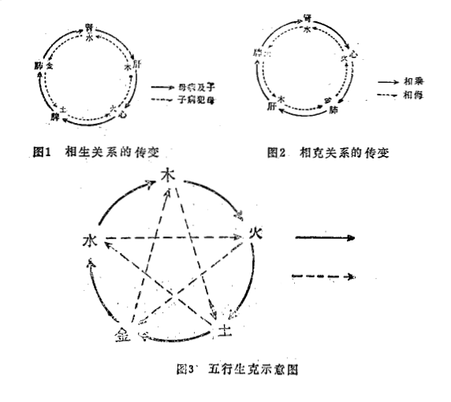

# 第一章  阴阳五行学说

[TOC]

[自学时数]    8 学时

[面授时数]    2 学时

[目的要求]

1. 了解阴阳五行学说的形成、发展及其在中医学中的应用。 
2. 掌握阴阳五行的概念及基本内容。

阴阳学说和五行学说，是我国古代哲学基本理论——朴素的唯物论和自发的辩证法的思想基础，是古人通过长期的生活和生产实践，对自然界观察和认识的总结和概括。古人认为，形形色色和千变万化的自然界，都是“阴阳”和“五行”运动变化的结果，阴阳和五行是自然界的根本和源泉。因此，阴阳和五行就成为古人认识自然界和解释自然界的世界观和方法论。《类经附翼•医易》说：“天地之道，以阴阳二气以造化万物；人生之理，以阴阳二气而长养百骸”。

阴阳学说认为自然界是物质的，是在阴阳二气相互作用的情况下，发生、发展和变化的，没有阴阳就没有自然界。五行学说认为，木、火、土、金、水是构成自然界的五种基本物质。形形色色的自然界，就其构成物质来说，都可以高度抽象、概括、归纳为五个方面，而此五个方面又是相互作用、运动变化的。

作为自然科学的中国医学，是在吸收了当时的先进的唯物主义的哲学理论——阴阳五行学说之后，才形成了具有独特理论体系的中医药学。阴阳五行学说已经成为中医学认识和阐释人体生命过程和疾病过程，并指导诊断治疗（辨证施治）的理论和说理工具。因此，学习和研究中医学，必须首先通晓阴阳五行学说的基本原理。

## 第一节  阴阳学说

古人在长期的生活实践中，逐渐认识到这样一种规律，即自然界的每一种事物都有与其相对应的另一方面事物存在，如男女、水火、昼夜、日月、寒暑、晴阴等，因而形成了最早的阴阳概念。在成书于西周时的《易经》中就出现了明确的阴阳概念，—（阳爻）和--（阴爻），并由此演化为八卦。不过此时并没有使用阴阳两字。至西周末期才使用阴和阳二字来表示相联系而又对立的两方面事物。如《国语•周语》中就记载了伯阳父用阴阳运动失去平衡来解释地震产生的原因：“阳伏而不能出，阴迫而不能蒸，于是有地震”。《左传•昭公元年》还记载了秦国医生医和，以阴阳代表寒热，他说：“阴淫寒疾，阳淫热疾”。在此期间并有一些学者，阐述了阴阳的对立与相互转化关系。如《国语•越语》说：“阳至而阴，阴至而阳。日困而还，月盈而匡”。《荀子》说：“天地之变，阴阳之化”。《易传》在总结自然界运动变化规律时提出：“一阴一阳之谓道”，等等。总之，阴阳学说在春秋战国时期已经形成并盛行，对于当时的哲学和自然科学产生了广泛的影响。

### 一、阴阳的基本属性

阴阳二字的本义是指日光的向背，即向日者为阳，背日者为阴。《谷梁传•僖公二十八年》说：“水北为阳，山南为阳；水之南，山之北为阴”。但作为阴阳学说中的“阴阳”，已经不是“日光向背”的涵义了，而是一类事物属性的抽象和概括。因此，它们指的不是某一个特定的具体的事物，而是抽象的表示事物属性形态特征的概念。《灵枢•阴阳系日月》已经明确指出：“且夫阴阳者，有名而无形”。明•赵献可也说：“阴阳者，虚名也”（《医贯•阴阳论》）。

阴阳学说认为，自然界一切事物（包括人体）均可根据它们各自的特性，按阴阳属性进行归类。根据前人的论述，阴阳的基本属性可归纳如下：凡是动的、升的、浮的、上的、外的、热的、明的、无形的等等属阳；凡是静的、降的、沉的、下的、内的、寒的、暗的、有形的等等属阴。即天在上、无形属阳；地在下、有形属阴。日是明亮的、热的属阳；月是晦暗的、寒冷的属阴。疾病中的热证、实证、表证属阳；寒证、虚证、里证属阴。阴阳的基本属性是绝对的、固定的，但事物本身的阴阳属性却是相对的、变动的。这种事物本身的阴阳属性的相对性和变动性，一方面表现为在一定条件下相互关联的相对事物之间可以互相转化，即阴可以转化为阳、阳可以转化为阴；另一方面表现为一事物内部阴阳属性的无限可分性，即“阴中有阳，阳中有阴，阴阳之中复各有阴阳”（《类经•阴阳类》）。我们在明确了阴阳学说中阴阳的属性（即阴阳质的规定性）和具体事物本身的阴阳属性是不同的两回事之后，就能容易理解为什么某一总体属阳的事物，而又包含阴的属性，总体属阴的事物又包含阳的属性；及某事物由于其相对方面的变化，其阴阳属性也随之而发生相应的转化的原理。

### 二、阴阳的相互关系

阴阳的相互关系，概括起来，可以归纳为对立和统一两个方面。阴阳学说认为自然界的一切都是由阴阳二气所构成。而事物的发展变化是阴阳二气对立统一的表现形式，即《素问•阴阳应象大论》所概括的：“阴阳者，天地之道也，万物之纲纪，变化之父母，生杀之本始，神明之府也”。这一观点，正是阴阳学说宝贵的唯物主义思想所在。

阴阳两方面的相互对立，主要表现在阴阳之间的相互制约、相互斗争。阴阳两方面的统一，主要表现在阴阳之间的相互依存、相互为用、相互转化，以及阴阳的相互包涵和无限可分性。

#### （一）阴阳的相互对立与消长平衡

阴阳学说认为自然界一切事物无不存在着相互对立的阴阳两个方面。如上与下、南与北、动与静、寒与热，以及动物的雌与雄等等，它们之间虽然或者为一事物内部的两个方面，或为相关联的两个事物，但它们有一个共同点即相互对立。上下对立、南北对立、动静对立、寒热对立，雌雄对立。但恰恰是这些对立，才维持着事物的存在——发生、发展、变化。没有上下对立、南北对立，就没有空间方位；没有动静对立，就没有事物的运动状态；没有寒热、就没有四季；没有雌雄，就没有动物的繁衍等等。这些事例都充分证明了，阴阳学说认为自然界一切事物都存在阴阳对立的两个方面的观点是完全正确的。又如：四季的变化就是阴阳（寒凉温热）对立的结果，没有阴阳（寒热，温凉）的对立，也就没有四季的差别。同样，人体的生命过程，也包含着一个阴阳对立制约的过程。就生命过程的总体来说，“阴平阳秘”（《素问•生气通天论》），即阴阳平衡，才是无病的常人的根本保证。但是，这种“平衡”并不是静止的、一成不变的，而是动态中的平衡。由于阴阳二气的对立制约，使对立双方中不致出现一方过亢的现象，使阴阳二气的变化水平维持在一个正常生命过程的允许范围之内。如果这种对立制约关系被破坏（或内因、或外因）即双方互不受对方制约，就必然出现一方偏盛或偏衰（或阳盛、或阴盛，从而导致阴不胜其阳，或阳不胜其阴），使阴阳失去平衡状态（阴阳不和），或阳胜则阴病，或阴胜则阳病，疾病于是产生。就每一个具体脏腑来说，同样是阴阳对立制约，才得以维持脏腑正常的气化功能。如肝阴肝阳，肾阴肾阳等，正常情况下，阴阳双方互相制约从而不亢不衰。如果外感于六淫，或内伤于七情，使阴阳一方偏衰，就会失去制约对方的能力，就会出现另一方的偏胜。肝阴不足必然肝阳偏亢；肾阴不足，必然导致肾阳偏亢。已经偏亢的肾阳、肝阳，又反过来制约已经不足的肾阴、肝阴。于是，出现盛者更盛，衰者更衰。还有临床上常见的热证病人，必然出现舌苔黄燥、口干口渴、喜饮、便燥等津液不足的症状，这更是典型的阳盛伤阴的事例。

治疗疾病的过程，也是一个阴阳对立制约的过程。如用阳热性药物治疗阴寒证，即是以热（药）治寒（证），以阳制阴的例证。

由此可见，阴阳的对立制约无论在自然界及人体，是普遍存在的。在人体，无论是正常生命过程，还是疾病及治疗过程等，都包涵着阴阳的对立制约。

阴阳的相互对立，还包含着阴阳的互为消长。因为阴衰（消）必然失去对阳的制约，致使阳亢盛（长）；阳衰（消），必然导致阴亢盛（长）。即“阳长则阴消，阳退则阴进”、“一阴一阳互为进退”（《类经•阴阳类》）。如春、夏、秋、冬四季，有温、热、凉、寒的变化，春夏之温热，是由于春夏阳气逐渐亢盛（长），抑制（对立制约）了秋冬之阴气，使秋冬阴寒之气衰退（消）；秋冬之所以寒冷，是因为秋冬时节，阴气逐渐亢盛，抑制（制约）了春夏阳热之气，使春夏阳热之气衰退（消）的结果。《素问•脉要精微论》所记载的“冬至四十五日，阳气微上，阴气微下；夏至四十五日，阴气微上，阳气微下”，讲的就是一年四季中阴阳互为消长的渐变过程。一天之中阴阳消长的变化也一样，夜半之后阴气渐退，阳气渐进，至中午，阳气最盛达到极点，阳气便开始衰退，阴气开始复升，至夜半，阴气最盛达到极点之后，又开始衰退，如此周而复始。人体疾病过程更是如此，阴寒过盛（阴长）的病人，必然出现阳热不足（阳消）之证；火热亢盛（阳长）的病人，必然出现阴津不足（阴消）之证。

因此，阴阳的相互对立、相互制约、互为消长，是自然界以及人体生命和疾病过程中的一个普遍规律。尽管阴阳平衡是相对的，对立制约是绝对的，但在人体为了某种目的和需要还要维护这种平衡。医学家的最终任务是千方百计地恢复和稳定这种“平衡”，以达到健康和延长寿命的目的。如果不能恢复和维护人体的这种平衡，就意味着疾病的不可挽回和死亡的到来。

#### （二） 阴阳的互根互用

阴阳是相互对立的，但又是相互依存的，即二者都不能脱离对方而独立存在。没有阳，就没有阴；没有阴，就没有阳。而阴阳之间的相互依存——互根互用，则是阴阳对立的统一。所谓互根互用，即是说阴阳双方互以对方为存在条件。如：上是对下而言，没有下，就无所谓上；外是对于内而言，没有内，就无所谓外；实是对于虚而言，没有虚，就无所谓实。上下、内外、虚实，没有一方，另一方就不存在了。这说明阴阳二者是相对立而存在的。不仅如此，阴阳又是相互包涵的。张景岳引朱子曰：“阴气流行则为阳，阳气凝集则为阴”。如水（阴）蒸发则化为气（阳），气（阳）凝结则化为水（阴）。这就是“阴根于阳，阳根于阴”（《类经图翼•运气上》）和阴可化为阳，阳可化为阴，阳从阴中化，阴从阳中生的阴阳互相包涵，并互根互用的道理。再如人体气血，气为阳，血为阴。气血之间的正常关系是血载气，气行血，气为血之帅，血为气之舍。血的运行靠气的推动作用，而气又要依附于血而存。所以，临床上气病或血病患者，在经过一定阶段后，往往出现气血并病的证候。气虚者，血亦多虚；气滞者，多见血瘀；血瘀者，必气滞等。至于骤然气脱或血脱者，更多见气血并病了。因此，气血（阴阳）是相互依存、互根互用的。再以血病治疗为例，中医有“治血必先理气”和“血脱益气”的治疗原则。如血虚证，补血可以不用[四物汤](https://www.gmzyjc.com/read/fjx/fjx07-0.3.0.0.0.md)，而用[当归](https://www.gmzyjc.com/read/bc/bc17-0.3.3.0.0.md)补血汤，[当归](https://www.gmzyjc.com/read/bc/bc17-0.3.3.0.0.md)补血汤由[黄芪](https://www.gmzyjc.com/read/bc/bc17-0.1.4.0.0.md)一两为君，以补气为主；[当归](https://www.gmzyjc.com/read/bc/bc17-0.3.3.0.0.md)二钱为臣，以补血为辅。以补气达到生血的目的。其理论根据就是“阳生阴长”。所以，张景岳总结说：“阴无阳不生，阳无阴不成，而阴阳之气，本同一体”（《类经图翼•运气上》）。

对于阴阳的相互依存、互根互用的关系，《内经》作了明确地阐述，《素问•阴阳应象大论》说“阴在内，阳之守也；阳在外，阴之使也”，《素问•生气通天论》说：“阴者，藏精而起亟也；阳者，卫外而为固也”。就是说阴精藏于内，有赖于在外之阳气的卫护，方能固藏而不外泄；而在外之阳气，又须阴精不断地转化为气予以补充。由于阴阳是相互依存的，所以，一方的太过或不及，都将直接影响到另一方的正常存在。临床上的阴盛于内，格阳于外（阴盛格阳），是由于阴寒过盛、破坏了阴阳的依存关系，从而逼阳外达所致。例如，阳虚冷汗，是由于阳虚导致卫外之气不能固表，使阴津不能安守于内而外泄；大汗亡阳，是由于阴津大亏，阴不敛阳，阳无所依而外脱。治疗的原则，前者补阳以固阴，后者固阴以敛阳。他如，形（阴）与神（阳），精（阴）与气（阳）等也同样存在着相互依存的密切关系，形存则神在，形亡则神灭；精化生气，气又生精，无精则不化气，无气则不生精。

#### （三） 阴阳的相互转化

阴阳的相互转化是指对立的阴阳双方，在一定条件下可以分别向对方转化。即阴可以转化为阳，阳可以转化为阴。阴阳的相互转化，在自然界（天地间），及自然界中的人，都普遍存在着这一过程。自然界中一年四季，寒凉、温热的变化，以及一天中的“昼夜”的变化，就是一个阴阳转化的过程。春夏为阳，秋冬为阴，由春夏而至秋冬，是由阳转化为阴的过程；由秋冬而至春夏，则是由阴转化为阳的过程。同样道理，白昼为阳，黑夜为阴，昼夜的变化，也是阴阳的转化。

人体的正常生命过程和疾病过程，同样是一个普遍的阴阳转化过程。如生命过程中，需要有精（阴）和气（阳），阴精是生命的物质基础，而阳气是功能活动（这里的阴精和阳气都是相对而言）阴精和阳气既有互根互用的关系，又有一个相互转化的关系。饮食入胃，在阳气（脾气）的作用下，方能转化为阴精，而阳气又是由阴精所化生，并从阴精化生中得到不断地补充。所以《素问•阴阳应象大论》说：“气归精”，“精化为气”。

疾病过程中，阳证可以转化为阴证；热证可以转化为寒证，实证可以转化为虚证；表证可以转化为里证等等。反之亦然。如：外感寒邪，初时表现为发热、恶寒、无汗、脉浮紧等，属表寒证，由于未能及时治疗，则寒邪进一步由表入里化热，出现但热不寒，口渴苔黄，脉数等证候，则为里热证。又如：中医常说“久病必虚”，初病时，由于正气尚较充盛，因而病属实证，病久则正气渐耗，病即由实转虚。上述由寒转热，由实转虚的例子，证明了疾病过程中的阴阳是可以相互转化的。

《内经》已经明确认识并充分肯定了阴阳的相互转化问题。《灵枢•论疾诊尺》说：“四时之变，寒暑之盛。重阴必阳，重阳必阴，故阴主寒，阳主热。故寒甚则热，热甚则寒。故曰：寒生热、热生寒，此阴阳之变也”，《素问•阴阳应象大论》说：“寒极生热、热极生寒”，以及《素问•生气通天论》中所说：“冬伤于寒，春必温病”等，都说明了一个阴阳的相互转化问题。

《内经》对阴阳转化的论述中，强调了一个“物极必反”的观点，上述引文中的“重”、“甚”、“极”，意义是一个，即“极”，是说事物发展到极点时，就会向其相反方面转化。但是，这种相互转化是在一定条件下的转化，没有一定的条件，是不能转化的。而“极”是转化的原因，它不是条件。就疾病过程来说，阴阳转化的条件应当是人体正气盛衰、禀赋的偏阴偏阳、治疗得是否及时和恰当等。如邪气初中人体，表现为实证，在人体正气充盛、并治疗及时而得当的情况下，可以始终停留于实证阶段并逐渐向愈；如果正气不足，又治疗不当，则实证即可转化为虚证。又如，同样为水饮（阴）之邪中人，但由于个体素日禀赋不同，可出现不同的证候，素日禀赋偏阳的人，水饮之邪可从阳化热而为热证，素日禀赋偏阴的人，水饮即从阴化寒而为寒证。所以，根据这一原则，临床上的任何治疗手段，其实质都在于改变或促进阴阳的相互转化方向，使之向有利于人体健康和解除疾病痛苦方面转化。

阴阳学说强调了“物极必反”，即《内经》中所阐述的“重阴必阳，重阳必阴”、“寒极生热、热极生寒”的观点，在一定情况下，是正确的。但是，“变”的产生，不一定都是在“阴极”、“阳极”时发生，如上述的情况，并没有“阴极”、“阳极”，但由于外部条件（正气、禀赋、治疗等）发生变化，阴阳亦同样会出现转化。

#### （四） 阴阳是无限可分的

阴阳是无限可分的。阴中有阴阳，阳中有阴阳，阴阳之中各有阴阳。一句话，就是在事物的不同层次中均各有阴阳。如一天之中，昼为阳，则平旦至日中为阳中之阳；日中至黄昏为阳中之阴；夜为阴，则合夜至鸡鸣为阴中之阴，鸡鸣至平旦为阴中之阳。又如五脏六腑中，五脏属阴，但由于心肺居于膈上故又属阳，因而是阴中之阳；肝脾肾居于膈下，下为阴，故又为阴中之阴。再就心肺之间来说，心属阳，肺属阴等等。

再如，按阴阳的基本属性，外为阳、内为阴。表属阳，寒属阴，故表寒证为阳中之阴；表属阳，热为阳，故表热证为阳中之阳；内属阴，热属阳，而里热证即为阴中之阳；里属阴，寒属阴，里寒证即为阴中之阴。诸如此类不胜枚举。因此说：“内有阴阳，外亦有阴阳”（《灵枢•寿夭刚柔》），“阴中有阴，阳中有阳”（《素问•金匮真言论》），“阴阳之中，又有阴阳”（《类经图翼•运气》），“此阴阳之道，所以无穷”（《类经•阴阳类》）。

### 三、阴阳学说在中医学中的应用

阴阳学说，贯穿于中医学理论和临床体系的各个方面，用以认识和阐述人体的形体、脏腑、经络、生命过程、疾病过程、以及辨证治疗等等。下面仅就主要方面，作一简要说明。

#### （一）概括形体、脏腑的部位特点及脏腑功能特点

人体是一个统一的整体，根据阴阳对立统一的观点，人体内外上下无不充满着阴阳对立的两方面。所以，不仅人体这一整体，而且组成这一整体的各部分，均可按不同的阴阳属性，划分为若干相互对立的阴阳两部分。

以部位概括形体的阴阳属性。就整体来说，以上下而论，人体上半部属阳，下半部属阴。以内外而论，体内属阴，肌表为阳；皮肤为阳，筋骨为阴。以局部来说，背为阳、腹为阴；四肢外侧为阳，内侧为阴。

以功能和部位特点概括脏腑的阴阳属性：肝、心、脾、肺、肾五脏，总的功能特点是贮藏精气，而没有传送饮食的作用，故主静，属阴；胆、胃、大肠、小肠、膀胱、三焦六腑，总的功能特点是传送并消化饮食，故主动，属阳。因此，中医学中有迳以阴、阳代称脏腑的，如：《灵枢•阴阳清浊》说：“清者注阴，浊者注阳”，此处阴、阳即指五脏和六腑而言。

总之，人体的上下、内外均可按不同的阴阳属性加以概括和说明。

#### （二）概括和阐述人体的生命过程

阴阳学说认为，“人生有形，不离阴阳”（《素问•宝命全形论》），“人生之理，以阴阳二气而长养百骸”（《类经附翼•医易》）。就是说，人的有生命的形体产生于阴阳二气，所以说：“生之本，本于阴阳”（《素问•生气通天论》），而生长发育同样是阴阳二气的作用，这就把人体整个生命过程概括为阴阳二气运动变化的过程，是阴阳二气对立统一、协调平衡的结果。“阴平阳秘，精神乃治”（《素问•生气通天论》）。同时认为，生命的结束，是阴阳离决的结果，“阴阳离决，精气乃绝”（《素问•生气通天论》），这是阴阳学说对生命的总观点。

阴阳学说不仅认为阴阳二气是人体整个生命的根本基础，而且认为人体中的每一脏腑器官都有阴阳二气存在，这就是阴精和阳气。如心阴心阳、肝阴肝阳、脾阴脾阳、肺阴肺阳、肾阴肾阳、及六腑等各存在阴阳二气。同时，又将先天得之于父母的阴阳二气，称为元阴元阳；此外，肾阴、肾阳又称为真阴真阳。这里，无论整个人体的阴阳二气，还是脏腑器官等的阴阳二气，阴精是指生命的物质基础，阳气指的是生命过程的气化功能，即“阳化气，阴成形”（《素问•阴阳应象大论》）。

以阴阳阐述人体生理过程：在概括人体阴阳二气的生理作用时，中医学认为：清阳出上窍，浊阴出下窍。清阳发腠理， 浊阴走五脏。清阳实四肢，浊阴归六腑。阴精藏于内，阳气卫护于外。营血行于脉中，卫气行于脉外。以阴阳概括某些生命物质和生命现象：营、血、精、津、液等有形物质属阴；卫、气、神等生命活动为阳。

#### （三）概括和说明病机病证的阴阳属性

中医学认为，疾病是阴阳双方动态平衡关系的失调。人体疾病尽管千变万化，并有内、外、妇、儿之分，寒、热、虚、实之别，脏腑气血之异，归根结底，都可以用阴阳失调来加以分析、归纳。即，或阴盛，或阳盛，或阴衰，或阳衰，或阴阳两衰，或阴阳俱盛。就是说，不管致病邪气是外感六淫，还是内伤七情，都是邪气中人后，导致了阴阳平衡失调，而引起疾病的发生。

##### 1.阴阳偏盛

即阴胜、阳胜、阴阳俱胜。人体是阴阳二气所构成；但是，如果因某种因素使阴阳二气亢盛，即成为危害人体的邪气，即过则为害。《素问•阴阳应象大论》说：“少火生气”、“壮火散气”，李东垣认为：气有余便是火。正常之火与气（阳），是人体气化过程不可缺少的，但超过一定限度（壮、有余），就会反过来损伤人体正气。因此，阴胜、阳胜、阴阳俱胜，是阴阳二气亢盛超过了正常水平的病变。阴阳偏盛，既是致病邪气引起的病变的性质，又是进一步损伤人体的邪气。《素问•阴阳应象大论》对于阴阳偏盛所导致的病变做了如下的概括：“阴胜则阳病，阳胜则阴病。阳胜则热，阴胜则寒“。由于阴阳的对立制约，所以，阴胜、阳胜，必然导致相应的阳衰、阴衰。阴主生寒，阳主生热。阴胜则阳衰，阳衰则不能生热以制寒，故阴胜则为寒；阳胜则阴衰，阴衰则不能生寒以制热，故阳胜则为热。

阴胜、阳胜，有绝对和相对之分。所谓绝对，是指对立的一方不衰，而另一方独盛；所谓相对，是指对立的一方衰退，而使另一方相对亢盛。所以，临床上，阴胜、阳胜所致的寒热，有虚实之异。即阴或阳某一方绝对亢盛及其所致之寒或热，为实；阴或阳某一方相对亢盛及其所致的寒或热，为虚。

##### 2.阴阳偏衰

即阴亏（虚）、阳亏（虚）、阴阳两亏（虚）。从常见病、多发病的所见证候分析，证属阴阳偏胜的可有绝对和相对之分，但证属阴阳偏衰的却多见绝对偏衰，而相对偏衰是很短暂的过程。因为阴的绝对偏盛必定耗伤阳气，阳的绝对偏胜亦必定耗伤阴气，而阴和阳的相对偏胜又是以阴和阳的绝对偏衰为基础的。

所以，一般来说，阴阳偏衰是阴阳低于人体正常水平以下的病变。而所谓正常水平，又是因人而异的。由于阴阳之间存在着对立制约关系，所以，一方偏衰，即失去对另一方的制约，而使另一方偏胜。对于阴阳偏衰所导致的病变，《素问•调经论》指出：“阳虚生外寒，阴虚生内热”。阳虚不能制阴，则阴相对偏亢，故生寒；阴虚不能制阳，则阳便相对偏亢，故生热。这里的寒、热是属虚寒、虚热。与前所述阴、阳绝对偏胜之实寒、实热自然是不同的。

根据阴阳对立制约和阴阳互根的规律，阴阳一方的亏损，在经过一定阶段后，必然导致另一方的亏损，此即所谓“阴损及阳，阳损及阴”，最后导致阴阳两亏。如临床上的阳虚水饮证候，反而出现口干，口渴，但渴不欲多饮，或喜热饮等表现，是因为阳虚不能化水为津，津液不足，故出现口干等现象。最后阳气与阴津均出现不足之象，是属阳损及阴。同样，阴虚发展到一定程度，亦可导致阳虚。如：阴血虚脱的大汗，使阴液外泄，以致阳无所依，而造成阳气泄越于外的亡阳，是属阴损及阳，最后导致阴阳两亡。

阴阳两亏并不完全是阴阳双方处于低水平的动态平衡，而是或侧重于阳亏，或侧重于阴亏，临床上应视具体证候加以辨别。

##### 3.阴阳转化

阴阳转化，是指疾病过程中，属阴的病变，在一定条件下，可以转化为属阳的病变；同样，属阳的病变，在一定条件下，可以转化为阴的病变。即阴证可以转化为阳证；阳证可以转化为阴证（参见“阴阳的相互关系”一节）。

#### （四）概括辨证论治原则

##### 1.用阴阳归纳四诊资料

用阴阳归纳四诊所获取的疾病资料，有利于认识疾病表现的本质，是进行辨证的必要准备。疾病的证候表现千端万绪，如何将纷繁的病情表现，理出一个头绪，从中找出带规律性的本质性的方面来，这对于每个医生，是天天都要碰到的问题。而用阴阳去概括归纳这些通过四诊得到的资料，就会使医生执简驭繁，准确地认识每一证候表现所反映的证候本质。

中医学根据阴阳的基本属性，对四诊资料的归纳举例说明如下：

望诊：病人烦躁不安者属阳，闭目静卧者属阴。色泽：润泽明亮属阳，枯涩晦暗属阴。面色：赤、黄属阳，青、黑、白属阴。水肿：身半以上先肿为阳，身半以下先肿为阴。疮疡：红肿热痛为阳，肤色青暗、疮面下陷、不热为阴。小便：尿赤、黄而短为阳，青白而长为阴等等。

闻诊：语声宏亮、呼吸气粗为阳，语声低微、呼吸无力、气息微弱、不相接续为阴。

问诊：恶寒为阴，恶热为阳。渴喜热饮为阴，渴喜冷饮为阳。身热为阳，身凉为阴。

切诊：脉诊中，以部位分，寸脉为阳，尺脉为阴。以脉象分，浮、数、滑、洪、大、弦、实等为阳；沉、迟、涩、微、小、芤、结等为阴。

以阴阳为纲，分析、归纳四诊资料，是正确认识疾病本质和辨证的基础。所以阴阳学说的理论原则，对临床诊断具有十分重要的意义。正如张景岳所说：“凡诊病施治，必须先审阴阳，乃为医道之纲领，阴阳无谬，治焉有差?医道虽繁，而可以一言敝之者，曰阴阳而已”（《景岳全书•传忠录》）。

##### 2.阴阳为八纲辨证的总纲，亦是诸证的总纲

临床上无论是外感或内伤所引起的疾病，都可以用阴阳、表里、虚实、寒热八证（即八纲）加以概括归类。而表里、虚实、寒热又可以按阴阳的基本属性统于阴阳两证之下，即表、实、热为阳，里、虚、寒为阴。所以，阴阳又是八纲辨证的总纲，即阴阳统帅诸证。因此，临床上的病证尽管多种多样（或外感、或内伤；或脏腑经络，或气血津液等），概括起来，不过阴阳两大类。同时，阴阳还用于病证命名，如伤寒六经病证的太阳病、阳明病、少阳病（三阳证），太阴病、少阴病、厥阴病（三阴病）等。它即是对病证的命名，又是病证属性的概括。

总之，阴阳在分析归纳四诊资料的性质，概括病证属性方面，都有着十分重要的作用，是分析和认识疾病的纲领。

##### 3.确立论治原则

中医学认为阴阳二气的协调平衡，是维持人体正常生命活动的根本因素。尽管临床具体治疗原则种种不一，方药变化多端，其根本目的在于调整、恢复阴阳的平衡。即所谓：“谨察阴阳而调之，以平为期”（《素问•至真要大论》）。

阴阳的失调，不外乎阴阳偏盛或偏衰。偏盛即为有余，偏衰即为不足。有余者去之，不足者补之。根据阴阳相互对立制约的规律，对于阴盛者（阴盛则寒），则以阳制阴，如阴寒证，用阳热类药物，以祛除阴寒之气；对于阳偏盛者（阳盛则热），则以阴制阳，即以阴寒（寒凉）类药物，祛除其阳热之气。这就是“寒者热之，热者寒之”的治疗原则。然而，由于阴阳盛衰有相对的一面，所以阴盛则阳病，阳盛则阴病。如果临床上遇有阴阳偏盛（邪）之证时，要考虑与辨别是否同时存在阴阳相对偏衰（正）的一方。假若阴阳偏胜偏衰同时存在，治疗时应据情兼顾。如阳盛则热，热胜则伤阴，因此，阳热亢盛之证，每有伤阴兼证，治疗时，一方面以泻火为主，另一方面，亦须适当补阴。

阴阳偏衰者，属于不足之证，包括阳虚，阴虚，阴阳两虚。不足者补之，相应的治疗原则即：补阳、补阴、或阴阳两补。在阴或阳偏衰（正气）的证候中，又当考虑病人是否存在阴阳相对偏盛（邪气）的一面，如阴虚不能制阳而致阳亢者，属虚热证，须补（养）阴以制阳，即“壮水之主，以制阳光”（《素问•至真要大论》王冰注）。又如温病中之暑证或杂病中之虚损病等的气阴两伤，阴阳两亏，又当阴阳兼补。

总之，中医对疾病治疗的根本原则是有余者，损之，泻之；不足者，益之，补之。阴阳偏盛则泻其有余，阴阳偏衰则补其不足。

#### （五） 概括归纳病因

中医学对致病邪气的阴阳归类，基本上反映了该致病邪气的某些方面的特点，有的可直接反映出该致病邪气所引起病证的本质属性。因此，对疾病邪气的阴阳归类法，是有其实际意义的。如《内经》曾将邪气从其来源而分为阴阳两大类：“夫邪之生，或生于阴，或生于阳。其生于阳者，得之风雨寒暑。其生于阴者，得之饮食居处，阴阳喜怒”（《素问•调经论》）。《内经》中的“生于阴”、“生于阳”中之阴阳，指天地而言，即是说邪气或来源于天之“风雨寒暑”，或来源于地之“饮食居处，阴阳（此处指男女房事）喜怒（指情志）”。这是从邪气来源于天地之不同而分阴阳两大类。随着医学的进步，人们对致病邪气认识逐渐深化，又将天之六淫邪气（风、寒、暑、湿、燥、火）及人体内生之六邪（即内风、内寒、内湿、内燥、内火、内热）根据它们的致病特点，又进一步用阴阳加以归类。即风、火、燥、热、暑为阳邪；寒、湿为阴邪。从这种阴阳归类法，大体可以反映出这两类邪气的不同致病特点：阳邪致病多为热证，易于伤及阴津；阴邪致病多见寒证，易伤阳气。这里仅就一般而言，不是完全如此。如内伤之寒邪，为寒证，而外感之寒邪可为热证。又暑邪，即可伤阴，又可伤阳。燥邪，又有温燥，凉燥之分（详见本书“病因与病机”一章）。

#### （六） 用于经络命名与归类

经络学根据经络循行部位和所连属脏腑等不同，将经络分为阴经、阳经、阴络、阳络，并以阴阳命名。如循行于四肢内侧，并连属于五脏者，称为阴经（手太阴肺经、手少阴心经、手厥阴心包经、足太阴脾经、足少阴肾经、足厥阴肝经）；循行于四肢外侧，并与六腑相连属者，称为阳经（手太阳小肠经、手少阳三焦经、手阳明大肠经、足太阳膀胱经、足少阳胆经、足阳明胃经）。其他，任脉行于身之前，属阴经；督脉行于身背，属阳经。以阴阳命名的还有阴蹻、阳蹻、阴维、阳维、以及根据分布深浅，将全身络脉分为阴络、阳络。

#### （七） 概括药物性味功能特点

中药学根据药物有四气（性）一一寒、热、温、凉，五味——酸、苦、甘、辛、咸，以及升、降、浮、沉的不同作用特点，按阴阳基本属性，分别将药物归为阴阳两大类。以四气言，寒凉性药物属阴，而多用于阳证、热证；温热性药物属阳，而多用于阴证、寒证。以五味言，具有辛、甘、淡味药物属阳，具有酸、苦、咸味药物属阴。《素问•至真要大论》对五味（实为六味）及其作用，以阴阳属性做了概括：“辛甘发散为阳，酸苦涌泄为阴，咸味涌泄为阴，淡味渗泄为阳”。以升、降、浮、沉言，具有升浮作用的药物属阳，具有沉降作用的药物属阴。升、浮是指药物具有上行、升提和向外发散作用；沉、降是指药物具有下行、向内的作用（如潜镇、降逆、收敛、渗泻等）。因此，了解了药物的阴阳分类，就基本上能掌握药物的总的作用特点。

#### （八） 确立养生保健原则

阴阳学说认为，自然界和人都是由阴阳二气所构成。同时，人体和自然界是一个统一整体（即天人一体观）。《内经》认为宇宙是一个大天地，人体是一个“小天地”，而且人与天地相参应。《灵枢•邪客》说：“天有日月，人有两目；地有九州，人有九窍；天有风雨，人有喜怒”，“天有四时，人有四肢；天有五音，人有五脏；天有六律，人有六腑”等等。尽管这种联系，从表面上看是缺乏科学依据的，但我们应从其反映的精神实质去研究分析。即古人是采用取类比象的方法，把人体置于与自然界息息相关的地位，认为人体与自然界是一个统一的整体。这一认识是完全正确的。所以，自然界的阴阳变化，必将影响到人体阴阳的运动变化，从而对人体的健康与否发生影响。因此，中医学在养生保健方面十分重视如何适应自然界阴阳的变化规律。《内经》认为：“阴阳四时者，万物之终始也，死生之本也。逆之则灾害生，从之则苛疾不起”（《素问•四气调神大论》），并进一步指出人类应当“春夏养阳，秋冬养阴，以从其根”。就是说，人在春夏要养护阳气，秋冬要养护阴气，以符合于阴阳自身所固有的运动变化规律。《内经》还指出，凡是健康长寿的人，都善于“和于阴阳”、“法于阴阳”、“把握阴阳”（《素问•上古天真论》）。即按阴阳运动规律，调整自己的生活起居。不仅如此，其他如情志等过极，如：“暴怒伤阴，暴喜伤阳”（《素问•阴阳应象大论》），都会直接影响人体阴阳平衡。中医学是把人体如何适应自然界阴阳运动规律和维护、调整人体自身阴阳平衡，做为指导养生保健的最高原则。

#### （九） 概括体质禀赋

人体在正常生理状态下，虽然阴阳二气保持着相对的平衡状态，但这种平衡不是阴阳二气之间一对一的对等关系，而是有或偏于阳，或偏于阴的差别。这一点中医学早就有明确的论述，并将其用于指导临床辨证和治疗。

《内经》时代，就已将人群分为阴阳两大类，“黄帝问于少师曰：余尝闻人有阴阳，何谓阴人，何谓阳人”（《灵枢•通天》）?在这篇论述中，不仅把人群按体质禀赋差别分为阴阳二类，而且具体区别为太阴之人，少阴之人，太阳之人，少阳之人，阴阳和平之人五种，并指出这五种人在生理、病理和治疗上的不同之处。“太阴之人，多阴而无阳，其阴血浊，其卫气涩，阴阳不和，缓筋而厚皮，不之疾泻，不能移之。少阴之人，多阴少阳，小胃而大肠，六腑不调，其阳明脉小，而太阳脉大，必审而调之，其血易脱，其气易败也。太阳之人，多阳而少阴，必谨调之，无脱其阴，而泻其阳。阳重脱者，易狂，阴阳皆脱者，暴死不知人也。少阳之人，多阳而少阴，经小而络大，血在中而气外，实阴而虚阳，独泻其络脉则强，气脱而疾，中气不足，病不起也。阴阳和平之人，其阴阳之气和，血脉调，宜谨诊其阴阳，视其邪正，安其容仪，审有余不足，盛则泻之，虚则补之，不盛不虚，以经取之。此所以调阴阳，别五态之人者也”（《灵枢•通天》）。此外，《内经》还提出“重阳之人，其神易动，其气易往也”，并且“阳气滑盛而扬，故神动而气先行”，“多阳者多喜，多阴者多怒”（《灵枢•行针》）等，以及不同阴阳禀赋的人，对针刺反映也不同。

后世医家对人体禀赋阴阳的不同，在病机转化趋向，以及在辨证和治疗上的意义都有一定的认识。张景岳早已提出不同阴阳体质的人，所患病证性质有个基本趋向。他说：“阳脏之人多热，阴脏之人多寒。阳脏者必平生喜冷畏热，即朝夕食冷一无所病，此阳之有余也；阴脏者一犯寒凉，脾肾必伤，此其阳之不足也”。这里所说的阴脏阳脏，说的是平素脏腑偏阴、偏阳，即指体质而言。后世如叶天士、华云岫等都十分重视人的体质阴阳的不同，在致病和治疗上的意义。清•叶天士说：“平素体质不可不论”。同样感受湿邪，阳性体质之人，则化热；阴性体质之人，则化寒。所以，中医学素有“从阳化热，从阴化寒”之说。在治疗上，对于不同阴阳体质的人，用药也须斟酌，寒热之药，应用时要有尺度，不可太过。如阴性体质的病人和阳性体质的病人，若是同样的热证，用寒凉药的药物、剂量、疗程也不同，若阴性体质的病人服寒凉药过量，就会产生热邪刚去又生寒证的后果。

## 第二节  五行学说

五行最早的概念，是指五方，殷商时代的甲骨文记载“东、西、南、北、中”五方的文字即可为佐证。“仰观天象，俯察地理，中知人事”和取类比象的方法，是当时人类认识世界的基本方法。因此，人们对自然界的认识，首先是将天象的变化和地理（即物候）的变化相联系，进而认识它们之间的内在联系。五方和四季就是通过对北斗星斗柄位置变动与物候变化的相应关系的观察而总结产生的。《鹖冠子•环流》说：“斗柄东指，天下皆春；斗柄南指，天下皆夏；斗柄西指，天下皆秋；斗柄北指，天下皆冬”。在这里,为什么四方四季称作东春、南夏、西秋、北冬呢？这是古人在长期的观察中，对斗柄指向一方与物候变化状态之间相互联系的概括。如东与春，“東，动也，从木”(《说文》)，“东方木，主春”(《史记•天官书》)，“春，蠢也，物蠢生乃动运”（《汉书•律历志》），说明东、春在物候变化状态上的联系。如南与夏，“南方为夏，夏，兴也；南，任也。兴谓万物方兴也，任谓顺生物之性”(《尸子•君治》），说明南、夏在物候变化状态上的联系。如西与秋，“西方为秋，秋，肃也”(《尸子•君治》)，“秋，禾谷熟也”(《说文》）,说明西、秋在物候变化状态上的联系。如北与冬，“北方者，物之伏方也”(《尚书•大传》)，“冬，四时尽也”(《说文》)，说明北、冬在物候变化状态上的联系。今据“五方之民”(《礼•王制》)、“五方杂厝”(《汉书•地理志》)的记载，对《易•系辞》“河出图”图例的推演，又据胡厚宣氏《论殷代五方观念及“中国”称谓之起源》一书对甲骨文的考证，殷代已有中、东、南、西、北五方的概念。这就是五行概念早期的五方说。

在殷商之后的西周末年，五行概念又出现了五材说，即木、火、土、金、水五种物质。《尚书•洪范》孔颖达疏云：“书传云：水火者，百姓之求饮食也；金木者，百姓之所兴作也；土者，万物之所资生也，是为人用”。《左传•襄公二十七年》云：“天生五材，民并用之，废一不可”。这正是五材与人类生活密切关系地描述，也说明五材说来源于生活实践。古人将生活物质提炼为五材，同时认为世界是物质的，世界上的“百物”是五材相互作用的产物。《国语•郑语》明确指出：“百物”是“土与金、木、水、火”杂合而成。

五材说之后，《尚书•洪范》对五行的基本属性作了部分概括：“五行：一曰水，二曰火，三曰木，四曰金，五曰土。水曰润下，火曰炎上，木曰曲直，金曰从革，土爰稼穡”。同时，把五行与五味相联系：“润下作咸，炎上作苦，曲直作酸，从革作辛， 稼穡作甘”。从这里可以看出，这时的五行的概念、含义，已超出了五种材料本身的范围了，它们所代表的已是五种抽象的功能属性了，并以此说明事物之间的相互关系。《内经》一书，不仅充实和发展了五行内容，还明确指出了五行和阴阳一样，是天地间的普遍规律：“夫五运阴阳者，天地之道也，万物之纲纪，变化之父母，生杀之本始”（《素问•天元纪大论》）五运即五行。这样，《内经》就把五行和阴阳一样看作是世界发展变化的根源了。同时，《内经》又把五行与阴阳的理论，十分具体地引入到论述人体脏腑之间的生克关系，用以阐述人体生理和疾病变化的规律。

### 一、五行学说的基本内容

#### （一） 五行的基本属性

关于五行的基本属性，《尚书•洪范》已做了一定概括，随着五行学说的发展，后世对五行的基本属性，做了许多充实、引申和发挥，现简要予以介绍。

##### 1.木

木属阳，性温，能屈曲、伸展、升发、敷散、发生、振动，气旺于春，化风、化酸、色青，克土生火等。具有这些作用和性质的事物均归属于木。如日从东方升起，逐渐升高，且阳光温和，万物由夜之安静转为活跃，故东方属木。草木的果实，大多具有酸味，特别是木的果实，所以酸属木性。生长中的草木，以青绿色为主，所以青色属木。草木在风吹中，最易动摇，日常生活中想知道有风无风，首先看看草叶和树梢是否摇动，所以风也属木，同时动摇也属木。对于木性之“曲直”（屈曲、伸展），《尚书•洪范》孔颖达疏：“揉曲直者，为器有须曲直也”。意思是说，“曲直”之性是从草木做成器具过程中，发现其能弯曲、能伸展；同时，草木生长时也是有曲、有直，如树木发条，有的呈伸直状态，有的呈弯曲状态。在人体中，肝主筋，筋主司肢体的屈伸运动，肝有木之性，故肝属木，疾病中的眩晕属木，是因为眩晕时，站立不稳，有天旋地转之感，故属木病。

##### 2.火

火属阳，性热，炎上，运动急速，燔灼，躁动、化热、化暑、化苦、色赤，气旺于夏，克金生土等。具有这些作用和性质的事物属于火的范畴。如夏季炎热，万物生长发育昌盛（躁动），故夏季属火。心主血，血色赤，故心属火。病理上的发热、口干唇焦、尿赤等属火病。阳热亢极而产生的眩晕、抽搐（动）亦属火证。

##### 3.土

土属阴，性蒸热，能生化、承载、受纳（土为万物之母）、化湿、化甘、色黄、安静，气旺于长夏，生金克水等。万物均生化并受纳于土，故土又为其它四行之母。如长夏，自然界万物生长茂盛，但都受载于土，依土而生而长，故季节中长夏属土。又如脾胃，有受纳水谷并消化水谷而转化为营养精微，以充养全身，为人体精微来源，具有土的属性，故脾胃属土。病理上的部分水湿停留病证，属土病，因为土能生湿。

##### 4.金

金属阴，性凉，清肃、坚敛、收杀，化燥、化辛（味）、色白，气旺于秋，生水克木等。四季中秋天万物成实凋零，为收割季节，凉爽气燥，一派收敛之象，故秋季归属于金的范畴。肺气以清肃、下降为正常生理状态，故肺归属于金。又如肠胃阴津干枯，大便燥结，皮肤粗糙而干等，均为燥证而属金气为病。

##### 5.水

水属阴，性寒，滋润下行，主闭藏，化寒、化咸、色黑、流溢，气旺于冬，生木克火等。四季中，冬季寒冷，万物闭藏于内，故冬季属水的范畴。又肾藏精，封固而不妄泄，又肾主水之转输，类于水之性，故肾属水。水流溢于肌肤的肿胀属于水证。

五行的基本属性，是由原始的五种具体物质的属性引伸并高度抽象、概括而成。因此，它又不完全局限于原始五种具体物质的范畴，而是概括了自然界五大类事物的属性。人体的生理和病理变化，同样能用五行加以分析和概括。

#### （二）五行的相互关系

五行不是各自孤立、静止的，而是相互联系的统一的整体。在五行之间的相互关系中，最基本的原则是相生与相克。正是这种相生与相克，才维持了五行这一整体的相对协调平衡状态。无论是缺少相生或相克（即依存，制约），还是这种相生相克不能维持正常水平（太过或不及），五者之间的协调平衡都将遭到破坏，在自然界就要发生灾害，在人体就要发生疾病。而生克的太过与不及，则称之为乘侮胜复，正如张景岳所说：“造化之几（机），不可无生，亦不可无制，无生则发育无由，无制则亢而为害。生克循环，运行不息，而天地之道，斯无穷已”（《类经图翼•运气》）。

##### 1.相生相克

相生，就是相互孳生资助，相互促进。五行之中这种相互资生、相互促进的关系，称为相生关系。五行的相生关系依次是：木生火，火生土，土生金，金生水，水生木（见图1）。

相克，就是制约。五行之中这种相互制约的关系，称为相克关系。五行相克关系依次是：木克土，土克水，水克火，火克金，金克木（见图2）。这种相生相克是五行正常的运动变化，是维持自然界和人体协调平衡的不可缺少的两个条件。有生有克，事物才能正常地、不断地发展变化。因而，对于人体来说，生克是属于生理过程。由于五行之间存在着生克关系，所以五行中任何一行，都有“生我”和“我生”；“克我”和“我克”四方面关系。五行相生关系，又称“母子”关系，即“生我”者为母，“我生”者为子。如木生火，则木为火之母，火为木之子。而火又生土，故火又为土之母。所以，五行中任何一行都同时具有“我生”、“生我”的母与子的双重关系。五行相克关系，又称为“所胜”、“所不胜”。“我克”即是我“所胜”，“克我”即是我所不胜。如土克水，则土所胜者为水；木克土，则土所不胜者为木。因此，每一行又同时具有“所胜”（我克）和“所不胜”（克我）两方面关系。

由于五行中，每一行都有“生我”、“我生”、“克我”、“我克”四个方面，所以，每一行都与其他四行存在相生或相克关系。以木为例，木与火、水为相生关系，木与金、土为相克关系；又如土，土与金、火为相生关系，土与木、水为相克关系。五行缺一不可，无木则不能生火、制土，无水则不能生木、制火等等。五行中缺少任何一行，都会引起五行运动整体的破坏。所以，五行是一个相互作用、相互影响的运动整体，而这一整体正是在相生与相克的作用下，处于相对平衡状态，从而决定着事物正常地发生、发展、变化，即所谓“生克制化”（见图3）。

##### 2.乘侮胜复

前面所讲的五行之间的相生相克，是五行运动的正常变化，而五行的“乘侮、胜复”，则是五行运动的异常变化，在人体即可发生疾病，在自然界即发生灾害。五行运动过程中出现“乘侮、胜复”的异常变化，是由于某些原因导致五行中某一行偏亢（太过）或偏衰（不及）所引起的。

乘侮，即相乘，相侮。相乘是以强制弱，以盛制衰，是五行中某一行太过，从而产生对所克一行克制过度的过程。出现五行相乘的原因有两个方面：①绝对偏亢。某一行由于某种原因导致其绝对偏盛，因而出现对其所克者克制过度，使被克者衰弱。如大怒之后，出现不思饮食，甚至腹胀便溏等。肝属木，脾属土，肝木过亢，则克制脾土过度，从而引起脾土虚衰，不能运化水谷，故出现上述症状。这时的土衰是由于木过亢而克制土的结果，木属于绝对偏亢（太过）。这种木盛克土太过的现象即称为“木乘土”。为区别于“土虚木乘”，一般又称为“木盛乘土”。② 相对偏亢。即某一行本来处于正常水平，但其所克的一行因其他原因偏衰，从而使克者相对偏盛，导致对所克一行的过度克制。如：木本来不亢，其对土的克制是正常水平的，但由于土本身衰弱（不及），则木即相对亢盛，从而产生对土的过度克制，使已处于衰弱状态的土，进一步衰弱。这种情况也属“木乘土”，但为区别于“木盛乘土”，又称为“土虚木乘”。前者“木盛”是相乘的原因，后者“土虚”是相乘的原因。五行相乘，实质是一个相克过程，区别在于是否超过一定水平和限度。在一定限度之内即为相克，属正常变化；超过一定限度即为相乘，属异常变化。

相侮，即是反克，又称反侮，是五行中某一行过亢，从而对原来“克我”者产生的反方向的对抗制约的过程。这种偏亢，或为绝对偏亢，或因另一方的虚衰而相对偏亢。如：水克火，但当火过亢，超过了水对火的制约能力时，水不仅失去对火的制约，反而出现火对水的反方向的对抗和制约，这就是反侮（反克），称为“火侮水”或“火盛侮水”。至于因水之偏衰，使火相对偏亢，致使火来侮水，则称为“水虚火侮”。

相乘与相侮在五行运动的异常变化中，常常是同时出现。在五行出现相乘情况时，盛者即可反侮于“克己”者。如木盛乘土，土气必衰，土衰不能生金，则金衰，金衰不能制木，一方面致使木气更盛，另一方面亢盛之木即可反侮于金（木乘土侮金）。在五行出现相侮时也一样，盛者即可乘己之所胜（我克者）。火盛侮水，水不制火，则火无所制，必乘己之所胜者一金（火侮水乘金）。因此，相乘相侮是密切相关的。《素问•五运行大论》对此做了明确地阐述：“气有余，则制己所胜，而侮所不胜；其不及，则己所不胜，侮而乘之，己所胜，轻而侮之”。

五行胜复。胜、复又称胜气、复气。胜复实质就是亢与制，但其中包含着两个制约的过程。胜是五行运动的异常变化，而复则是五行自身对异常变化的自我调节（制其胜），以达到五行的总体平衡，如朱震亨所说：“气之来也，既以极而成灾，则气之乘也，必也复而得平”（《丹溪心法•亢则害承乃制》）。对胜复，张景岳解释说：“彼来胜我，故子必起而报之，故谓之复”“因胜而报者谓之复，胜复相仍，本无罅隙”（《类经•运气》）。因为“凡有所胜，必有所败，有所败，必有所复，母之败也，子必救之”（《类经图翼•运气上》）。如水太过，则必乘（胜）于所克之火，使火衰弱，而火之子土，即起来对水加以制约。其中土（子）制水的过程就是复。所以张景岳说：“復者，报复之义”（《类经•运气》），即“子报母仇”。从中可以看出，胜复包含着两个制约的过程，一个是“彼来胜我”，一个是“子必起而报之”。

五行胜复在自然界气候变化中尤为明显，如大寒（凉）之后，必出现大热（温）；大热之后，必有大寒。闷热天气经过一定时间后，必随之而出现冷雨凉风。五行胜复程度是彼此相应的。有胜则有复，无胜则无复，胜甚则复甚，胜微则复微。

##### 3.五行的本化与兼化

五行的本化，是指五行中每一行自身基本属性所应出现的征象，为其本身所固有的表象。如，动摇不定即是木的变化。又如，湿盛身体重着不移，臃肿胀满为土的变化，等等。而兼化是指五行中出现二行以上的气化表现称为兼化。如高热（火）病人，同时出现恶寒战慄（水）之象，即为兼化。刘完素说：“所谓五行之理，过极则胜己者反来制之。故火热过极，则反兼于水化”（《素问玄机原病式•五运主病》）。刘氏又说：“夫五行之理，微则当其本化，甚则兼有鬼贼”（《素问玄机原病式•六气为病》）。总之，五行之理，亢而不极则表现为本化，亢极则出现兼化。简言之：微者本化，甚者兼化。

兼化的出现，大致有两种情形：①兼其相生者即同气之化；②兼其相克者即异气之化。如：热（火）极生风（木），即是火极而兼木化。又如“诸热瞀瘈，……疼痠……”（《素问玄机原病式•六气为病》），“诸热瞀瘈”为火病，而疼痠为木病，木即为兼化，此由于火亢极则制金，金衰则不能制木，致使木旺而为兼化（火与木为相生关系）。火极似水，以及木极似金，金极似火等，即属“己亢过极，则反似胜己之化”（《素问玄机原病式•自序》），属相克及异气兼化。火极兼木化，则属于相生及同气兼化。一般说，同气兼化多见，异气兼化少见，二者有着本质区别，即异气兼化中之兼化征象均为假象，如水极似火，则火为假象，实非真火；而同气兼化则本化与兼化，实为两行本化相兼，如木、火多兼化，水、土多兼化。以五行化生之六气言，则风、火、暑、燥（温）多兼化，寒湿多兼化。

总之，五行生克及互生互克是维持五行正常运动变化的决定因素，而乘侮胜复则是五行运动变化的异常状态，及在异常状态下的自我调节过程。而五行的本化与兼化则是五行自身的基本功能和属性在运动过程中表现出的征象。

### 二、五行学说在中医学中的应用

五行学说在中医学中，主要用于阐述人与自然界的整体关系，脏腑功能及其整体关系，五脏病理及其相互影响，用于指导辨证，确定治法等，兹分述如下：

#### （一）论证人与自然界是一个统一整体

五行学说认为，自然界中的万物均由木、火、土、金、水五种基本物质构成，而万物的发生、发展变化，是在五行运动变化支配下出现的。人做为自然界中的一员，当然也不例外地受五行的支配。所以，既可用五行的基本属性去归类自然界万物，也可用五行的基本属性归类人体。尽管自然界的事物和人体脏腑器官彼此之间是毫不相干的，但按不同的五行基本属性，都可以归纳于五行之内（见下表）。这样，就建立了自然界内部和人体内部以五行为枢纽（中心）的整体联系，如五行中“木”，将自然界的东、风、青、春、酸等与人体的肝胆……统一为一个整体等等。这是中医学天人一体观的理论依据之一。从这一思想出发，中医学认为，自然界的正常或异常的发展变化，都直接地对人体的健康与疾病发生影响。如五行化生的五气（风、火、湿、燥、寒）就是直接地影响着人体的健康和疾病的发生。

#### （二）概括五脏的气化功能及其整体关系

五行学说将人体五脏分属于五行，以五行的基本属性和相互关系，概括五脏的部分生理功能和五脏之间的相互联系，并说明五脏是一个统一整体。

##### 1.概括五脏的气化功能

按五行基本属性，五脏中肝属木、心属火、脾属土、肺属金、肾属水。木性伸展、通达、敷散，肝属木，所以肝有喜条达、恶抑郁的特点，具有疏泄气机的功能。火性炎热、红亮、色赤，而主上升，心属火，所以心有上升、润泽面容的特点，具有主血脉的功能。土性受纳、生化，为万物之母，脾属土，所以脾有受纳、运化水谷（仓廪之官）和生化营养精微的特点，具有生化气血的生理功能。金性清肃敛降，肺属金，所以肺有以清宣下降为顺、壅滞失降为逆的特点。水性寒，主下行、闭藏，肾属水，所以肾有藏五脏六腑之精的特点，具有气化的功能。

##### 2.概括五脏气化的相互关系

按照五行生克制化的观点，五脏之间是相互促进和相互制约的，并以此维持五脏气化功能的协调平衡。

按五行木、火、土、金、水、木的相生顺序：木生火，肝 （木）对维持心（火）的正常功能，有资助作用，肝藏血，心藏神，神赖血养，血藏于肝而养心神。火生土，则心对脾有资助作用，心主血，脾统血，二者相辅相成，才能血行正常。土生金，肺金恶燥，必得阴精以滋润，而脾能“散精，上归于肺”，即是补脾益肺治法（即培土生金）的道理之所在。金生水，是指肺（金）有资助肾（水）的作用，肾主水的气化，而肺有“通调[水道](https://www.gmzyjc.com/read/zjs/zjs3.1.1-3-0.1.3.3.28.md)”的作用，“通调[水道](https://www.gmzyjc.com/read/zjs/zjs3.1.1-3-0.1.3.3.28.md)”，以助水的气化，所以，肺即有生肾之义。水生木，肾藏阴精以滋养肝木，肾水不足，则肝阳（或火）即偏亢，或上炎，或化风内动，补肾阴（水）即可平肝木之亢。以上是以五行相生关系阐述五脏在气化（生理）方面的相互资助的整体关系。

按五行相克顺序：金、木、土、水、火、金，则肺制肝，肝制脾，脾制肾，肾制心，心制肺。肺的肃降，可以抑制肝的升发太过（如不使肝阳上亢）。肝的疏泄条达，可以抑制脾气的壅滞，使脾维持正常运化水谷的功能而不致停饮停食。脾主运化水湿，可以制止肾封藏过度而造成水饮停聚与泛溢。肾水上济心火，不使心火亢盛上炎。心火之温煦，可以抑制肺金的清肃太过。五脏就是在相互资助、相互制约的运动变化中，维持着正常的气化功能和整体平衡。

#### （三）概括五脏病变及其相互影响

##### 1.用五行基本属性概括五脏病变

木性升发、化风、动摇，故肝的病变可出现肝火（阳）上冲，内风，眩晕振掉等症，所以《素问•至真要大论》说：“诸风掉眩，皆属于肝”。火性炎热、上行，故心的病变可出现红肿热痛的疮疡，口舌生疮，咽喉肿痛及血热妄行的吐血、衄血等。土性主静，主化生，故脾的病变可出现水湿停留，脾气壅滞的痞满，及水谷不化之泄泻等。金性燥，主收敛、清肃，故肺的病变可出现肺燥咳嗽，气上逆之喘促，肺气壅遏之喘满等。水性寒，滋润而下行，主静主藏，故肾的病变可见水肿（下肢），肾阳不足之寒证，及肾虚封藏失司的遗精早泄小便频数等。

##### 2.用五行概括五脏病变的相互影响（传受）

由于五脏之间是一个统一整体，所以任何一脏的病变，都可能影响其他一脏，即一脏病可以传至他脏。五脏病变相互传变有一定规律，按五行学说予以概括则分为相生关系的传变和相克（乘、侮、复）关系的传变。

（1）相生关系的传变包括“母病及子”和“子病犯母”这两个方面：①母病及子是指五脏病变，从母脏传及子脏。如脾（土）病传肺（金），脾为母脏，肺为子脏（土生金），为脾病而及于肺。如脾虚不能运化水湿，聚而为饮，饮邪犯肺，发为咳嗽，喘促等，即为母病及子。以此类推（见图1）。②子病犯母（又称子盗母气），是指五脏病变由子脏传及母脏。如：心（火）病传肝（木），木生火，肝为心之母；心病及肝，即为子病犯母。如：心血不足，不能养肝，致使肝阳偏亢为病，即为子病犯母。余者类推（见图1）。

（2）相克关系的传变包括乘、侮、胜、复。乘、胜、复实质是一个，即克制太过。按五行相克顺序传变，肝乘脾，脾乘肾，肾乘心等，即肝病传脾，脾病传肾，肾病传心等（见图2）。侮则是反克，按五行相克顺序的反方向传变。如金克木，木气过亢则反克于金，中医学中的肝火（木）犯肺（木火刑金），即为木侮金，是肝先病而后传之于肺（见图2）。

五脏病在生克关系的传变中，五脏相生传变的母病及子，一般为病较轻浅易愈；子病犯母，一般为病深重难愈。五脏相克传变中，相乘传变为病多深重，相侮传变为病多轻浅。

应当指出，以五行学说概括五脏的生理、病理及其相互影响，只能说明五脏的部分、而不是全部生理功能和病理变化。

#### （四） 用于指导辨证

##### 1.以五行归属四诊资料、确定病变所属脏腑

人体是一个统一的整体，体内的五脏病变必然反映到体表，而出现一系列证候表现。因此，可以通过在外的证候表现，推断五脏的病变。即“视其外应，以知其内脏，则知所病矣”（《灵枢•本脏》）。临床上通过四诊可以获得内脏病变的“外应”，即病情资料，通过五行归类，初步推测病变所属脏腑。如病人面见青色，脉见弦象，即可初步确定属肝病，因为青属木色，弦亦属木，肝属木，所以属肝病。如果面赤、口苦、脉洪等，即可知为心火病证，因为赤属火，苦属火，洪脉亦属火，所以属心病。面黄、口甘等，为脾病，因为黄属土，甘亦属土，脾属土，所以为脾病。

##### 2.以五行生克分析四诊资料，判断病证顺逆

临床上应用五行生克来归纳分析四诊资料，从而判断病证预后顺逆，主要是分析望诊与脉诊所得的资料。一般来说，色脉相合者，病情平稳。所谓色脉相合，即指色和脉应属五行之中同一行。如肝病，肝属木，则应见青色（木）和弦脉（木）。肾病，肾属水，应见黑色（水）和沉脉（水）。心病，心属火，应见赤色（火）和洪脉（火）。色脉相合，主病顺。

病证与色脉相生者，主病向愈为顺。如肝（木）病，水生木，若得沉脉（水），为相生之脉，为顺，病证一般预后良好。若心病得肾（水）之沉脉，为相克之脉（水克火），为病逆。脾病而面见青灰色，为木克土，为病逆。即脏与色、脉相克者，一般预后多不良。总之，从脏腑病证与所现之色脉的相合、相生、相克与否，可以初步推断病证预后的善恶顺逆。

##### 3.以五行生克概括五脏病机

以五行学说来分析概括脏腑病变机理，亦是中医学常用的病证分析方法。有关这方面内容在前面已经陆续涉及到了，这里简单介绍一下。用五行归纳脏腑病机，有如肝木乘脾、水（肾）不涵木（肝）、肝气犯胃（木克土）、肝气犯肺（木侮金）、土不生金（脾肺两虚），水亏火旺（肾水不足，不能上济心火）等等，都是中医学常用的分析病机和辨证方法。

#### （五）用于确定治疗法则

##### 1.用五行相生关系确定治疗原则

用五行相生关系确定治疗原则，主要是指母子补泻法，即《难经•六十九难》所说：“虚则补其母，实则泻其子”的原则，所谓“虚则补其母”，即补本脏之母，用于本脏虚证，如肝木阴虚，不直接补肝，而是补其母——肾水，水能生木，从而达到补肝的目的。肺金不足，可补其母——脾土，土能生金，从而达到补肺的目的。所谓“实则泻其子”，即泻本脏之子，用于实证。如肝木气盛（阳亢等），可不直接泻肝，而是泻其子脏——心火，以达到泻肝之目的，因为子能令母虚，子夺母气，从而使其母脏之盛气得以平复。运用中，可根据实际病情，或单纯补母、泄子，或母子兼顾。在针灸学中，“虚则补其母”，则凡是某经虚证，即可单补其母经或本经母穴，如肝经虚证，则或补其母经——肾经合穴（水穴）[阴谷](https://www.gmzyjc.com/read/zjs/zjs3.1.7-8-0.0.2.3.10.md)，或补其本经合穴（水穴）[曲泉](https://www.gmzyjc.com/read/zjs/zjs3.1.9-12-0.0.4.3.8.md)。“实则泄其子”，则凡是某经实证，即可单泻其子经或子穴。如肝经实证，可取其子经——心经荥穴（火穴）[少府](https://www.gmzyjc.com/read/zjs/zjs3.1.4-6-0.0.2.3.8.md)，或本经荥穴（火穴）[行间](https://www.gmzyjc.com/read/zjs/zjs3.1.9-12-0.0.4.3.2.md)。

除“母子补泻法”外，还有滋水涵木法，培土生金法，金水相生法等。滋水涵木是滋养肾水，以养肝木，又称滋肾养肝，用于肾阴亏损而肝阴不足，或肝阳偏亢之证。培土生金是补脾气以益肺气，即补脾益肺，用于脾虚肺虚之证。金水相生是补肺滋肾，用于肺肾阴虚之证。“金能生水，水能润金”（《时病论》卷四），金水相生，肺肾同治。

##### 2.用五行相克关系确定治疗原则

用五行相克关系确定的治疗原则，主要是指抑强和扶弱两方面，即亢则平之，衰则益之。如抑木扶土；培土制水；佐金平木；泻南补北等。抑木扶土是疏理肝木，补益脾土，即调理肝脾，用于木盛乘土，木郁土壅之证。培土制水，是温补脾土，以制肾水，用于脾肾阳虚，不能化气行水之证，治当脾肾兼顾。佐金平木，是清肃肺金以平抑肝木，用于肝火亢盛，肺失清肃之证。泻南补北，即泻南方火，补北方水，心属火，火在五方为南，水为北，肾属水，即滋阴降火法，用于肾水不足，心火亢盛之证。

五行学说在治疗中除上述应用外，还用于情志疾病的治疗，如悲能胜怒（金克木），怒能胜思（木克土），思能胜恐（土克水）等，就是用情志的五行所属和相克关系，以情志治疗情志疾病。

#### （六）五行学说在医学其他领域中的应用

五行学说还用于对十二经脉及其井、荥、俞、经、合穴的五行归类。即手太阴经和手阳明经属金，足少阴经和足太阳经属水，足厥阴经和足少阳经属木，手少阴经和手太阳经属火，足太阴经和足阳明经属土，手厥阴经和手少阳经属火（相火）。井、荥、俞、经、合穴分别属于木、火、土、金、水五行。

五行学说，还将人按其不同属性归为木形人，火形人，土形人，金形人，水形人五种，并指出各自不同的生理、病理方面特点（参见《灵枢•阴阳二十五人》）。这种对人群的五行归类，在中医学中的意义，尚待进一步研究。

## 第三节  阴阳学说和五行学说的关系

阴阳学说和五行学说，都属于中国古代朴素的唯物主义哲学的范畴。二者既各有自己的研究对象，又有不可分割的联系。阴阳学说研究的是事物的一般属性和运动规律，是把世界划分为阴阳两大部分进行分析研究的。五行学说研究的是事物的特殊的具体属性，并把世界划分为五大部分进行研究的。

虽然阴阳学说和五行学说各有自身的特点，但二者又是相互交叉联系的，阴阳中有五行，五行中有阴阳。由阴阳所概括的两大类事物，亦包含着五行归类，如一年四季：以阴阳言，则春夏属阳，秋冬属阴。而阳中之春夏，以五行言，则春属木，夏属火；阴中之秋冬，以五行言，则秋属金，冬属水等等。又如：五行中木有阴木、阳木，火有阴火、阳火，土有阴土、阳土，金有阴金、阳金，水有阴水、阳水等。因此，阴阳与五行是相互包含的、密切联系的，其本源都是“气”，因此《春秋繁露•五行相生》对此做了比较恰当的概括，即“天地之气，合而为一，分为阴阳，判为四时，列为五行”。明•张景岳认为阴阳与五行是“气”与“质”的关系，是相互依存的：“五行即阴阳之质，阴阳即五行之气。气非质不立，质非气不行。行也者，所以行阴阳之气也”《类经图翼•运气上》。这是对阴阳和五行关系的更明确的认识。

阴阳学说和五行学说作为朴素的唯物主义和自发的辩证法的中国古代哲学，被引进中医学这门自然科学领域后，对中医学理论系统的形成和发展无疑起到积极的促进作用，至今仍为中医学所广泛应用。阴阳学说和五行学说都认为世界是物质的，并在对立统一中运动变化。阴阳五行学说，是中医学天人一体、脏腑及其所属器官组织一体的整体观的理论基础；也是人与自然界（天）形成有机整体联系的枢纽。

阴阳五行学说做为中国古代唯物主义哲学，由于受当时自然科学和生产力发展水平的限制，因而不可避免地存在着一定的局限性。所以，我们在应用阴阳五行学说时，不应仅仅停留于阴阳五行的抽象概念，公式化地机械搬用，要从临床实际出发灵活运用，从而进一步丰富中医的临床实践，并逐渐将其上升为理性认识，为中医学理论上的发展做出贡献。

## 复习思考题

1、简述阴阳学说的基本内容。

2、简述阴阳学说在中医学中的应用。

3、简述五行学说的基本内容。

4、简述五行学说在中医学中的应用。

5、试述阴阳学说和五行学说的关系。

