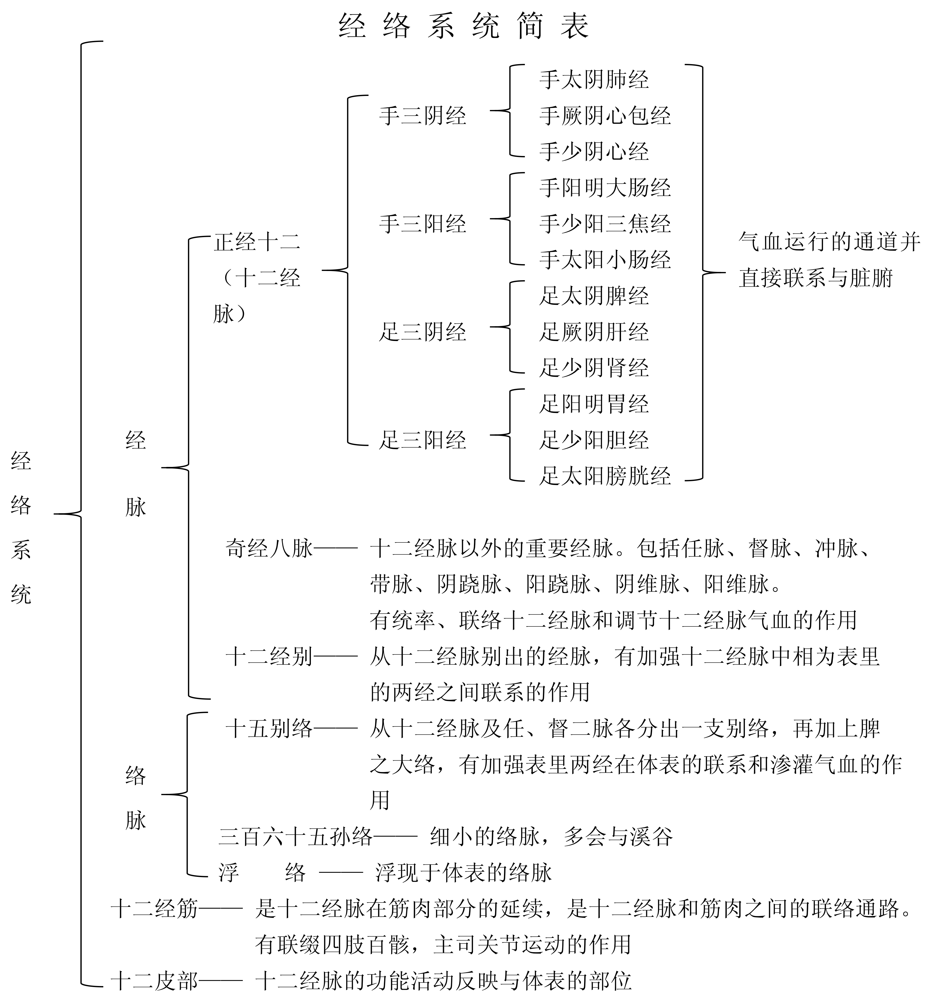
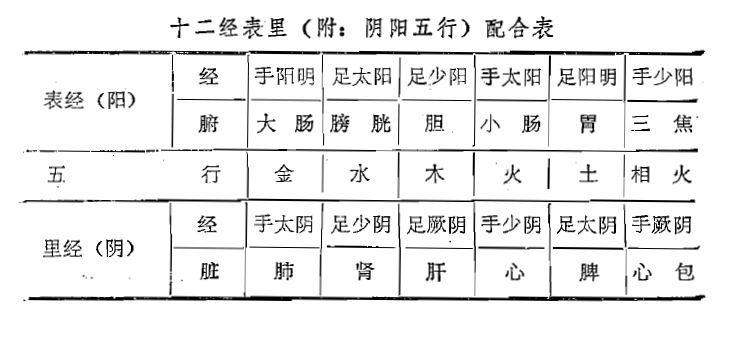
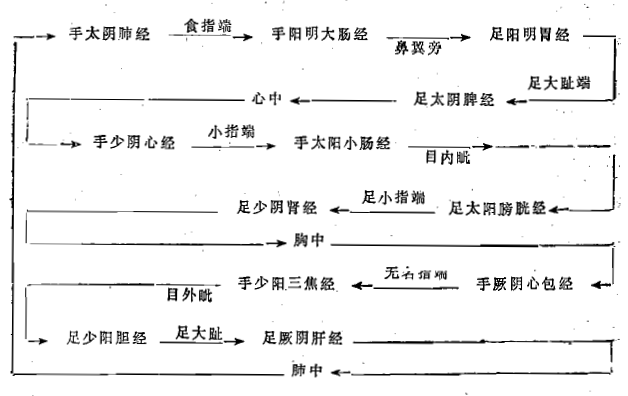

# 第三章  经络

[TOC]

[自学时数]    8 学时

[面授时数]    2 学时

[目的要求]
1. 掌握经络的概念、组成及其生理功能；
2. 掌握十二经脉的名称、走向和交接规律、分布规律、表里关系、流注次序；
3. 掌握奇经八脉的含义和生理功能；
4. 了解十二经脉的循行部位及冲、任、督、带四脉的循行概况。

经络学说是研究人体经络系统的生理、病理变化及其临床应用的学说。经络学说是中医学理论体系的重要组成部分，并广泛地应用于临床各科的辨证与治疗。因此，为历代医家所重视。

## 第一节 经络与经络系统的组成

### 一、经络

经，有路径的含义；络，有网络的意思。经络是运行全身气血，联系人体各部分的通道。狭义的经络是经脉和络脉的合称，是组成经络系统的主体。经脉大多循行于人体的深部，隐而不见，故称为里（《灵枢•经脉》：“经脉为里”）。络脉大多行于人体表浅部位，有的明显可见。“支而横者为络”（《灵枢•络脉》）。广义的经络，即指整个经络系统而言。人体就是依靠经络系统将身体内外各局部联系成为一个有机的统一整体。

### 二、经络系统的组成

经络系统是由经脉（十二经脉和奇经八脉）、十二经别、络脉（十五别络、三百六十五孙络）、十二经筋、十二皮部所组成。

经脉  经脉分为正经和奇经两大类。正经即十二经脉，有手足三阴经和手足三阳经，是全身气血运行的主要通道，并直接与五脏六腑相连属。奇经有八，即督脉、任脉、冲脉、带脉、阴跷、阳跷、阴维、阳维，合称“奇经八脉”，有统率、联络十二经脉和调节十二经脉气血盈亏的作用（“人之气血常行于十二经脉，其诸经满溢则流入奇经焉”《圣济总录•针灸门》）。可见，所谓称为奇经，是因为它有异于十二正经。十二正经均有表里相合之经，而奇经没有相合之表里经脉。十二经别是从十二经脉别出的经脉，分别起自四肢，循行于胸腹深部，再上出于颈项浅部；阳经的经别从本经别出后，由体内仍归于本经；阴经的经别从本经别出，行于体内后，与相表里的阳经相合。十二经别的作用是弥补十二经脉未达到的器官、部位，加强十二经脉表里两经之间的联系。

络脉是经脉的细小分支，分为十五别络、浮络、孙络。十五别络是较大和主要的络脉。它的主要作用是加强互为表里两经之间在体表的联系。浮络是浮现于体表的络脉。孙络是最细小的络脉的分支（《灵枢•经脉》：“络之别者为孙”），它遍布于全身。孙络的作用不仅可使营卫气血通行于体表，且为邪气出入之通路，因而有卫护作用。

经筋是十二经脉与筋肉之间的联络通路，是十二经脉在筋肉部分的延续。经筋有联缀四肢百骸，主司关节屈伸的作用。

皮部是十二经脉的功能活动在体表的反映部位，又称十二皮部。

## 第二节  十二经脉

### 一、十二经脉的命名

十二经脉，对称地分布于人体左右两半部，每侧均有十二条经脉，所以，全身实为二十四条经脉。十二经分为阴阳两大类，即阳经六条，阴经六条。阳经有手三阳经和足三阳经；阴经有手三阴经和足三阴经。手三阳经即手太阳、手阳明、手少阳经。足三阳经即足太阳、足阳明、足少阳经。手三阴经即手太阴、手厥阴、手少阴经。足三阴经即足太阴、足厥阴、足少阴经。由于十二经脉各有其特定的联属脏腑，所以十二经脉的名称有时也以其所属脏腑名称称呼，如手太阴经属于肺脏，故又称为肺经，其余类推。

### 二、十二经脉的循行走向和交接规律

1.循行分布规律

十二经脉在人体的循行部位有一定的规律。①在四肢：阳经行于肢体外侧（阳侧），阴经行于肢体内侧（阴侧）。同时，表里两经基本上相对应地分布于肢体前、中、后同一部位的内、外两侧。如手太阴肺经和手阳明大肠经为表里两经，二者都分布于上肢前缘——一内一外相对应。足太阴脾经和足阳明胃经互为表里，二者都分布于下肢前缘——一内一外相对应，余者类推。六阳经与六阴经又各有自己的分布规律，六阳经则手足阳明经分别居于上肢和下肢外侧前缘，手足少阳经分别居于上、下肢外侧中线，手足太阳经居于上、下肢外侧后缘。六阴经则手足太阴经居上、下肢内侧前缘，手足厥阴经居于上、下肢内侧中线，手足少阴经居于上、下肢内侧后缘。

2.走向和交接规律

手三阴经，从胸走手；手三阳经，从手走头；足三阳经，从头走足；足三阴经，从足走腹。手足三阳经交接于头；手足三阴经交接于胸腹；手三阴三阳经交接于手；足三阴三阳经交接于足。如此，十二经脉形成一个“阴阳相贯，如环无端”（《灵枢•营卫生会》）的循环经路，见图4手足三阴三阳经走向与交接示意图。

### 三、十二经脉的表里关系

手足三阴、三阳，通过经别和别络互相沟通，组合成六对“表里相合”关系。《素问•血气形志篇》说：“足太阳与少阴为表里，少阳与厥阴为表里，阳明与太阴为表里，是为足阴阳也。手太阳与少阴为表里，少阳与心主为表里，阳明与太阴为表里，是为手之阴阳也”。相为表里的两条经脉，都在四肢末端交接，都分别循行于四肢内外两个侧面的相对位置（足厥阴肝经与足太阴脾经在下肢内踝上八寸处交叉后，交换前后位置：足太阴在前缘，足厥阴在中线），分别络属于相为表里的脏腑（如足太阳属膀胱络肾，足少阴属肾络膀胱）。因此相为表里的经脉和相为表里的脏腑是一致的。

十二经脉的表里关系，不仅由于相为表里的两条经脉的衔接而加强了联系，而且由于相互络属于同一脏腑，因而使相为表里的一脏一腑在生理功能上相互配合，在病理上也相互影响。如脾主运化、升清，胃主受纳、降浊；心火可下移小肠等等。在治疗上，相为表里的两条经脉的俞穴可交叉使用，如肺经的穴位可以治疗大肠或大肠经的疾病。

### 四、十二经脉气血流注次序

十二经脉分布在人体内外，经脉中的气血运行是循环贯注的，即从手太阴肺经开始，依次传至足厥阴肝经，再传至手太阴肺经，首尾相贯，如环无端。其流注次序如下表：

### 五、十二经脉的循行部位

#### （一）手太阴肺经

起于中焦，下络大肠，还循胃口（下口[幽门](https://www.gmzyjc.com/read/zjs/zjs3.1.7-8-0.0.2.3.21.md)，上口贲门），通过膈肌，属肺，至喉部，横行至胸部外上方（[中府](https://www.gmzyjc.com/read/zjs/zjs3.1.1-3-0.1.1.3.1.md)穴），出腋下，沿上肢内侧前缘下行，过肘窝入寸口上[鱼际](https://www.gmzyjc.com/read/zjs/zjs3.1.1-3-0.1.1.3.10.md)，直出拇指之端（[少商](https://www.gmzyjc.com/read/zjs/zjs3.1.1-3-0.1.1.3.10.1.md)穴）。

分支：从手腕的后方（[列缺](https://www.gmzyjc.com/read/zjs/zjs3.1.1-3-0.1.1.3.7.md)穴）分出，沿掌背侧走向食指桡侧端（[商阳](https://www.gmzyjc.com/read/zjs/zjs3.1.1-3-0.1.2.3.1.md)穴），交于手阳明大肠经。（图5）

#### （二）手阳明大肠经

起于食指桡侧端（[商阳](https://www.gmzyjc.com/read/zjs/zjs3.1.1-3-0.1.2.3.1.md)穴）经过手背行于上肢伸侧前缘，上肩，至肩关节前缘，向后到第七颈椎棘突下（[大椎](https://www.gmzyjc.com/read/zjs/zjs3.2.2-0.0.1.3.14.md)穴），再向前下行入锁骨上窝（[缺盆](https://www.gmzyjc.com/read/zjs/zjs3.1.1-3-0.1.3.3.12.md)），进入胸腔络肺，向下通过膈肌下行，属大肠。

分支：从锁骨上窝上行，经颈部至面颊，入下齿中，回出挟口两旁，左右交叉于[人中](https://www.gmzyjc.com/read/zjs/zjs3.2.2-0.0.1.3.26.md)，至对侧鼻翼旁（[迎香](https://www.gmzyjc.com/read/zjs/zjs3.1.1-3-0.1.2.3.20.md)穴)，交于足阳明胃经。（图6）

#### （三）足阳明胃经

起于鼻翼旁（[迎香](https://www.gmzyjc.com/read/zjs/zjs3.1.1-3-0.1.2.3.20.md)穴），挟鼻上行，左右侧交会于鼻根部，旁行入目内眦，与足太阳经相交，向下沿鼻柱外侧，入上齿中，还出，挟口两旁，环绕嘴唇，在颏唇沟[承浆](https://www.gmzyjc.com/read/zjs/zjs3.2.1-0.1.1.3.22.md)穴处左右相交，退回沿下颌骨后下缘到[大迎](https://www.gmzyjc.com/read/zjs/zjs3.1.1-3-0.1.3.3.5.md)穴处，沿下颌角上行过耳前，经过[上关](https://www.gmzyjc.com/read/zjs/zjs3.1.9-12-0.0.3.3.3.md)穴（客主人），沿发际，到额前。

分支：从[大迎](https://www.gmzyjc.com/read/zjs/zjs3.1.1-3-0.1.3.3.5.md)穴前方下行到[人迎](https://www.gmzyjc.com/read/zjs/zjs3.1.1-3-0.1.3.3.9.md)穴，沿喉咙向下后行至[大椎](https://www.gmzyjc.com/read/zjs/zjs3.2.2-0.0.1.3.14.md)，折向前行，入[缺盆](https://www.gmzyjc.com/read/zjs/zjs3.1.1-3-0.1.3.3.12.md)，深入体腔，下行穿过膈肌，属胃，络脾。

直行者：从[缺盆](https://www.gmzyjc.com/read/zjs/zjs3.1.1-3-0.1.3.3.12.md)出体表，沿[乳中](https://www.gmzyjc.com/read/zjs/zjs3.1.1-3-0.1.3.3.17.md)线下行，挟脐两旁（旁开二寸），下行至腹股沟处的气街穴。

分支：从胃下口[幽门](https://www.gmzyjc.com/read/zjs/zjs3.1.7-8-0.0.2.3.21.md)处分出，沿腹腔内下行到气街穴，与直行之脉会合，而后下行大腿前侧，至膝膑，沿下肢胫骨前缘下行至足背，入足第二趾外侧端（[厉兑](https://www.gmzyjc.com/read/zjs/zjs3.1.1-3-0.1.3.3.45.md)穴）。

分支：从膝下三寸处（[足三里](https://www.gmzyjc.com/read/zjs/zjs3.1.1-3-0.1.3.3.36.md)穴）分出，下行入中趾外侧端。

分支：从足背上[冲阳](https://www.gmzyjc.com/read/zjs/zjs3.1.1-3-0.1.3.3.42.md)穴分出，前行入足大趾内侧端（[隐白](https://www.gmzyjc.com/read/zjs/zjs3.1.4-6-0.0.1.3.1.md)穴），交于足太阴脾经。（图7）

#### （四）足太阴脾经

起于足大趾内侧端（[隐白](https://www.gmzyjc.com/read/zjs/zjs3.1.4-6-0.0.1.3.1.md)穴），沿内侧赤白肉际，上行过内踝的前缘，沿小腿内侧正中线上行，在内踝上八寸处，交出足厥阴肝经之前，上行沿大腿内侧前缘，进入腹部，属脾，络胃。向上穿过膈肌，沿食道两旁，连舌本，散舌下。

分支：从胃别出，上行通过膈肌，注入心中，交于手少阴心经。（图8）

#### （五）手少阴心经

起于心中，走出后属心系，向下穿过膈肌，络小肠。

分支：从心系分出，挟食道上行，连于目系。

直行者：从心系出来，退回上行经过肺，向下浅出腋下（[极泉](https://www.gmzyjc.com/read/zjs/zjs3.1.4-6-0.0.2.3.1.md)穴）沿上肢内侧后缘，过肘中，经掌后锐骨端，进入掌中，沿小指桡侧，出小指桡侧端（[少冲](https://www.gmzyjc.com/read/zjs/zjs3.1.4-6-0.0.2.3.9.md)穴)，交于手太阳小肠经。（图9）

#### （六）手太阳小肠经

起于小指外侧端（[少泽](https://www.gmzyjc.com/read/zjs/zjs3.1.4-6-0.0.3.3.1.md)穴），沿手背、上肢外侧后缘，过肘部，到肩关节后面，绕肩胛部，交肩上（[大椎](https://www.gmzyjc.com/read/zjs/zjs3.2.2-0.0.1.3.14.md)穴)，前行入[缺盆](https://www.gmzyjc.com/read/zjs/zjs3.1.1-3-0.1.3.3.12.md)，深入体腔，络心，沿食道，穿过膈肌，到达胃部，下行，属小肠。

分支：从[缺盆](https://www.gmzyjc.com/read/zjs/zjs3.1.1-3-0.1.3.3.12.md)出来，沿颈部上行到面颊，至目外眦后，退行进入耳中（[听宫](https://www.gmzyjc.com/read/zjs/zjs3.1.4-6-0.0.3.3.19.md)穴）。

分支：从面颊部分出，向上行于眼下，至目内眦（[睛明](https://www.gmzyjc.com/read/zjs/zjs3.1.7-8-0.0.1.3.1.md)穴），交于足太阳膀胱经。（图10）

#### （七）足太阳膀胱经

起于目内眦（[睛明](https://www.gmzyjc.com/read/zjs/zjs3.1.7-8-0.0.1.3.1.md)穴)，向上到达额部，左右交会于头顶部（[百会](https://www.gmzyjc.com/read/zjs/zjs3.2.2-0.0.1.3.20.md)穴）。

分支：从头顶部分出，到耳上角部。

直行者：从头顶部分别向后行至枕骨处，进入颅腔，络脑，回出分别下行到项部（[天柱](https://www.gmzyjc.com/read/zjs/zjs3.1.7-8-0.0.1.3.10.md)穴），下行交会于[大椎](https://www.gmzyjc.com/read/zjs/zjs3.2.2-0.0.1.3.14.md)穴，再分左右沿肩胛内侧，脊柱两旁（一寸五分)，到达腰部（[肾俞](https://www.gmzyjc.com/read/zjs/zjs3.1.7-8-0.0.1.3.23.md)穴），进入脊柱两旁的肌肉（膂），深入体腔，络肾，属膀胱。

分支：从腰部分出，沿脊柱两旁下行，穿过臀部，从大腿后侧外缘下行至腘窝中（[委中](https://www.gmzyjc.com/read/zjs/zjs3.1.7-8-0.0.1.3.40.md)穴）。

分支：从项分出下行，经肩胛内侧，从[附分](https://www.gmzyjc.com/read/zjs/zjs3.1.7-8-0.0.1.3.41.md)穴挟脊（三寸）下行至髀枢，经大腿后侧至腘窝中与前一支脉会合，然后下行穿过腓肠肌，出走于足外踝后，沿足背外侧缘至小趾外侧端（[至阴](https://www.gmzyjc.com/read/zjs/zjs3.1.7-8-0.0.1.3.67.md)穴)，交于足少阴肾经。（图11）

#### （八）足少阴肾经

起于足小趾下，斜行于足心（[涌泉](https://www.gmzyjc.com/read/zjs/zjs3.1.7-8-0.0.2.3.1.md)穴），出行于舟骨粗隆之下，沿内踝后，分出进入足跟，向上沿小腿内侧后缘，至腘内侧，上股内侧后缘入脊内（[长强](https://www.gmzyjc.com/read/zjs/zjs3.2.2-0.0.1.3.1.md)穴），穿过脊柱，属肾，络膀胱。

直行者：从肾上行，穿过肝和膈肌，进入肺，沿喉咙，到舌根两旁。

分支：从肺中分出，络心，注于胸中，交于手厥阴心包经。（图12）

#### （九）手厥阴心包经

起于胸中，出属心包络，向下穿过膈肌，依次络于上、中、下三焦。

分支：从胸中分出，沿胸浅出胁部当腋下三寸处（[天池](https://www.gmzyjc.com/read/zjs/zjs3.1.9-12-0.0.1.3.1.md)穴），向上至腋窝下，沿上肢内侧中线入肘，过腕部，入掌中（[劳宫](https://www.gmzyjc.com/read/zjs/zjs3.1.9-12-0.0.1.3.8.md)穴），沿中指桡侧，出中指桡侧端（[中冲](https://www.gmzyjc.com/read/zjs/zjs3.1.9-12-0.0.1.3.9.md)穴）。

分支：从掌中分出，沿无名指出其尺侧端（[关冲](https://www.gmzyjc.com/read/zjs/zjs3.1.9-12-0.0.2.3.1.md)穴），交于手少阳三焦经。（图13）

#### （十） 手少阳三焦经

起于无名指尺侧端（[关冲](https://www.gmzyjc.com/read/zjs/zjs3.1.9-12-0.0.2.3.1.md)穴），向上沿无名指尺侧至手腕背面， 上行尺骨、桡骨之间，通过[肘尖](https://www.gmzyjc.com/read/zjs/zjs3.4-0.1.4.5.0.md)，沿上臂外侧向上至肩部，向前行入[缺盆](https://www.gmzyjc.com/read/zjs/zjs3.1.1-3-0.1.3.3.12.md)，布于[膻中](https://www.gmzyjc.com/read/zjs/zjs3.2.1-0.1.1.3.16.md)，散络心包，穿过膈肌，依次属上、中、下三焦。

分支：从[膻中](https://www.gmzyjc.com/read/zjs/zjs3.2.1-0.1.1.3.16.md)分出，上行出[缺盆](https://www.gmzyjc.com/read/zjs/zjs3.1.1-3-0.1.3.3.12.md)，至肩部，左右交会于[大椎](https://www.gmzyjc.com/read/zjs/zjs3.2.2-0.0.1.3.14.md)，上行到项，沿耳后（[翳风](https://www.gmzyjc.com/read/zjs/zjs3.1.9-12-0.0.2.3.17.md)穴），直上出耳上角，然后屈曲向下经面颊部至目眶下。

分支：从耳后分出，进入耳中，出走耳前，经[上关](https://www.gmzyjc.com/read/zjs/zjs3.1.9-12-0.0.3.3.3.md)穴前，在面颊部与前一分支相交，至目外眦（瞳子髎穴），交于足少阳胆经。（图14）

#### （十一）足少阳胆经

起于目外眦（瞳子髎穴），上至头角（[颔厌](https://www.gmzyjc.com/read/zjs/zjs3.1.9-12-0.0.3.3.4.md)穴），再向下到耳后（[完骨](https://www.gmzyjc.com/read/zjs/zjs3.1.9-12-0.0.3.3.12.md)穴），再折向上行，经额部至眉上（[阳白](https://www.gmzyjc.com/read/zjs/zjs3.1.9-12-0.0.3.3.14.md)穴），又向后折至[风池](https://www.gmzyjc.com/read/zjs/zjs3.1.9-12-0.0.3.3.20.md)穴，沿颈下行至肩上，左右交会于[大椎](https://www.gmzyjc.com/read/zjs/zjs3.2.2-0.0.1.3.14.md)穴，前行入[缺盆](https://www.gmzyjc.com/read/zjs/zjs3.1.1-3-0.1.3.3.12.md)。

分支：从耳后进入耳中，出走于耳前，至目外眦后方。

分支：从目外眦分出，下行至[大迎](https://www.gmzyjc.com/read/zjs/zjs3.1.1-3-0.1.3.3.5.md)穴，同手少阳经分布于面颊部的支脉相合，行至目眶下，向下的经过下颌角部下行至颈部，与前脉会合于[缺盆](https://www.gmzyjc.com/read/zjs/zjs3.1.1-3-0.1.3.3.12.md)后，进入体腔，穿过膈肌，络肝，属胆，沿胁里浅出气街，绕毛际，横向至[环跳](https://www.gmzyjc.com/read/zjs/zjs3.1.9-12-0.0.3.3.30.md)穴处。

直行者：从[缺盆](https://www.gmzyjc.com/read/zjs/zjs3.1.1-3-0.1.3.3.12.md)下行至腋，沿胸侧，过季肋，下行至[环跳](https://www.gmzyjc.com/read/zjs/zjs3.1.9-12-0.0.3.3.30.md)穴处与前脉会合，再向下沿大腿外侧、[膝关](https://www.gmzyjc.com/read/zjs/zjs3.1.9-12-0.0.4.3.7.md)节外缘，行于腓骨前面，直下至腓骨下端，浅出外踝之前，沿足背行出于足第四趾外侧端（窍阴穴）。

分支：从足背（临泣穴）分出，前行出足大趾外侧端，折回穿过爪甲，分布于足大趾爪甲后丛毛处，交于足厥阴肝经。（图15）

#### （十二）足厥阴肝经

起于足大趾爪甲后丛毛处，向上沿足背至内踝前一寸处（[中封](https://www.gmzyjc.com/read/zjs/zjs3.1.9-12-0.0.4.3.4.md)穴），向上沿胫骨内缘，在内踝上八寸处交出足太阴脾经之后，上行过膝内侧，沿大腿内侧中线进入阴毛中，绕阴器，至小腹，挟胃两旁，属肝，络胆，向上穿过膈肌，分布于胁肋部，沿喉咙的后边，向上进入鼻咽部，上行连接目系，出于额，上行与督脉会于头顶部。

分支：从目系分出，下行于颊里，环绕在口唇的里边。

分支：从肝分出，穿过膈肌，向上注入肺，交于手太阴肺经。（图16）

#### 【附】《灵枢•经脉》十二经脉原文

肺手太阴之脉，起于中焦，下络大肠，还循胃口，上膈，属肺，从肺系横出腋下，下循臑内，行少阴、心主之前，下肘中，循臂内上骨下廉，入寸口，上鱼，循鱼际、出大指之端。其支者，从腕后直出次指内廉出其端。

大肠手阳明之脉，起于大指次指之端，循指上廉，出合谷两骨之间，上入两筋之中、循臂上廉，入肘外廉，上臑外前廉，上肩，出髃骨之前廉，上出于柱骨之会上，下入缺盆，络肺，下膈，属大肠。其支者，从缺盆上颈，贯颊，入下齿中，还出挟口，交人中，左之右，右之左，上挟鼻孔。

胃足阳明之脉，起于鼻，之（按：疑是“上”字之误）交頞中，旁纳太阳之脉，下循鼻外，入上齿中，还出挟口，环唇，下交承浆，却循颐后下廉，出大迎，循颊车，上耳前，过客主人，循髮际，至额颅。其支者，从大迎前下人迎，循喉咙，入缺盆，下膈，属胃，络脾。其直者，从缺盆下乳内廉，下挟脐，入气街中，其支者，起于胃口，下循腹里，下至气街中而合，以下髀关，抵伏兔，下膝膑中，下循胫外廉，下足跗，入中趾内间（按：应作“次趾外间”）。其支者，下廉三寸而别，下入中趾外间。其支者，别跗上，入大趾间，出其端。

脾足太阴之脉，起于大趾之端，循趾内侧白肉际，过核骨后，上内踝前廉，上踹（按：应作“腨”）内，循胫骨后，交出厥阴之前，上膝股内前廉，入腹，属脾，络胃，上膈，挟咽，连舌本，散舌下。其支者，复从胃别上膈，注心中。

心手少阴之脉，起于心中，出属心系；下膈，络小肠。其支者，从心系上挟咽，系目系。其直者，复从心系却上肺，下出腋下，循臑内后廉，行太阴、心主之后，下肘内，循臂内后廉，抵掌后锐骨之端，入掌内后廉，循小指之内出其端。

小肠手太阳之脉，起于小指之端，循手外侧，上腕，出踝中，直上循臂骨下廉，出肘内侧两筋之间，上循臑外后廉，出肩解，绕肩胛，交肩上，入缺盆，络心，循咽下隔，抵胃，属小肠。其支者，从缺盆循颈，上颊，至目锐眦，却入耳中。其支者，别颊，上䪼，抵鼻，至目内眦，斜络于颧。

膀胱足太阳之脉，起于目内眦，上额，交巅。其支者，从巅至耳上角。其直者，从巅入络脑，还出别下项，循肩膊内，挟脊抵腰中，入循膂，络肾，属膀胱。其支者，从腰中下挟脊，贯臀，入腘中。其支者，从膊内左右别下贯胛，挟脊内，过髀枢，循髀外后廉下合腘中，以下贯腨内，出外踝之后，循京骨，至小趾外侧。

肾足少阴之脉，起于小趾之下，斜走足心，出于然谷之下，循内踝之后，别入跟中，以上腨内，出腘内廉，上股内后廉，贯脊，属肾，络膀胱。其直者，从肾上贯肝膈，入肺中，循喉咙，挟舌本。其支者，从肺出络心，注胸中。

心主手厥阴心包络之脉，起于胸中，出属心包络，下膈，历络三焦。其支者，循胸出胁，下腋三寸，上抵腋下，循臑内，行太阴、少阴之间，入肘中，下臂行两筋之间，入掌中，循中指出其端。其支者，别掌中，循小指次指出其端。

三焦手少阳之脉，起于小指次指之端，上出两指之间，循手表腕，出臂外两骨之间，上贯肘，循臑外，上肩而交出足少阳之后，入缺盆，布膻中，散络心包，下膈，循属三焦。其支者，从膻中上出缺盆，上项，系耳后，直上出耳上角，从屈下颊至䪼。其支者，从耳后入耳中，出走耳前，过客主人前，交颊，至目锐眦。

胆足少阳之脉，起于目锐眦，上抵头角，下耳后，循胫，行手少阳之前，至肩上，却交出手少阳之后，入缺盆。其支者，从耳后入耳中，出走耳前，至目锐眦后。其支者，别锐眦，下大迎，合于手少阳，抵于䪼，下加颊车，下胫，合缺盆，以下胸中，贯膈，络肝，属胆，循胁里，出气街，绕毛际，横入髀厌中。其直者，从缺盆下腋，循胸，过季胁，下合髀厌中，以下循髀阳，出膝外廉，下外辅骨之前，直下抵绝骨之端，下出外踝之前，循足跗上，入小趾次趾之间。其支者，别跗上，入大趾之间，循大趾歧骨内出其端，还贯爪甲，出三毛。

肝足厥阴之脉，起于大趾丛毛之际，上循足胕上廉，去内踝一寸，上踝八寸，交出太阴之后，上腘内廉，循股阴，入毛中，过阴器，抵小腹，挟胃，属肝，络胆，上贯膈，布胁肋，循喉咙之后，上入颃颡，连目系，上出额，与督脉会于巔。其支者，从目系下颊里，环唇内。其支者，复从肝别，贯膈，上注肺。

## 第三节  奇经八脉

奇经之所以称“奇”，一是奇经独立于十二经脉之外，不受十二经支配（“不拘于经”）；二是无直接配合的脏腑；三是无表里配偶之经。奇经包括督脉、任脉、冲脉、带脉、阴跷脉、阳跷脉、阴维脉、阳维脉八脉，所以又称奇经八脉。

奇经八脉中除任、督二脉有专有的俞穴及任、督、带有独立地循行径路外，其余五经（带脉亦无专有俞穴）均无自身的俞穴，也无独立循行径路，而是主要依附于十二正经之中循行，有的奇经本身，就是十二正经的分支，如阴跷脉、阳跷脉，分别是足少阴肾经和足太阳膀胱经的分支。所以，元•滑伯仁等医家将具有专有俞穴的任、督二脉并入十二正经，合称十四经。

任、督、冲三脉均起自胞中，又同出于会阴之后，任脉行于前，督脉行背，冲脉并足少阴肾经挟脐而上，其中任、督二脉上行至头，交接于唇内；冲脉分支在背脊中与督脉相会合。所以任、督、冲三脉，始则一分为三，终则三合为一。八脉中，除带脉起于季胁，环腰一周外，任、督、冲三脉均起于胞中，终于头面；阴跷、阳跷、阴维、阳维均起于两足，终于头项。因此，八脉（除带脉）都汇聚于头部。

奇经八脉纵横交叉于十二经脉之间，具有如下三方面的作用：①进一步密切十二经脉之间的联系。如阳维维系于阳经，联络所有的阳经，阴维维系于阴经，联络所有的阴经；带脉环行于腰部，沟通循行于腰部、腹部的经脉；冲脉通行于上下，渗灌三阴、三阳；督脉则总督诸阳经；任脉则汇合诸阴经。②调节十二经脉的气血。十二经脉气血有余时，则流注于奇经八脉，蓄以备用；十二经脉气血不足时，可由奇经溢出，给予补充。③奇经与肝、肾等脏及女子胞、脑、髓等奇恒之腑的关系较为密切，相互之间在生理病理上均有一定的联系。

### （一）督脉

1.循行部位

循行部位：起于胞中，下出会阴，沿脊柱里面上行，至项后风府穴处进人颅内，络脑，并由项沿头部正中线，经头顶、额部、鼻部、上唇，到上唇系带处。

分支：从脊柱里面分出，属肾。

分支：从小腹内部直上，贯脐中央，上贯心，到喉部，再向上到下颌部，环绕口唇。向上至两眼下部的中央。（图17）

2.基本功能

督，有总管、统率的意思。督脉行于背部正中，其脉多次与手足三阳经及阳维脉交会，能总督一身之阳经，故又称为“阳脉之海”。其次，督脉行于脊里，上行入脑，并从脊里分出属肾，它与脑、脊髓和肾有密切的联系。

### （二）任脉

1.循行部位

起于胞中，下出会阴，经阴阜，沿腹部和胸部正中线上行，至咽喉，上行至下颌部，环绕口唇，沿面颊，分行至目眶下。（图18）

2.基本功能

任，有担任、任受的意思。任脉行于腹面正中线，其脉多次与手足三阴及阴维脉交会，能总任一身之阴经，故又称“阴脉之海”。任，又与“妊”意义相通。其脉起于胞中，与女子妊娠有关，故称“任主胞胎”。

### （三）冲脉

1.循行部位

起于胞中，下出会阴后，从气街部起与足少阴经相并，挟脐上行，散布于胸中，再向上行，经喉，环绕口唇，到目眶下。

分支：与足少阴之大络同起于肾，向下从气街部浅出体表，沿大腿内侧进入腘窝，再沿胫骨内缘，下行到足底；又有支脉从内踝后分出，向前斜入足背，进入大足趾。

分支：从胞中出，向后与督脉相通，上行于脊柱内。（图19）

2.基本功能

冲，有要冲的意思。冲脉上至于头，下至于足，贯串全身，成为气血的要冲，能调节十二经气血，故有“十二经脉之海”之称。冲脉又称“血海”，同妇女的月经有密切关系。

### （四）带脉

1.循行部位

起于季胁，斜向下行到带脉穴，绕身一周。在腹面的带脉下垂到少腹。（图20）

2.基本功能

带脉围腰一周，犹如束带，能约束纵行诸脉。

### （五）阴跷脉、阳跷脉

1.循行部位

跷脉左右成对。阴跷脉、阳跷脉均起于足踝下。

阴跷脉从内踝下照海穴分出，沿内踝后直上下肢内侧，经前阴，沿腹、胸进入缺盆，出行于人迎穴之前，经鼻旁，到目内呲，与手足太阳经、阳跷脉会合。（图21)

阳跷脉从外踝下申脉穴分出，沿外踝后上行，经腹部，沿胸部后外侧，经肩部、颈外侧，上挟口角，到达目内眦，与手足太阳经、阴跷脉会合，再上行进入髮际，向下到达耳后，与足少阳胆经会于项后。（图22）

2.基本功能

跷，有轻健跷捷的意思。有濡养眼目、司眼睑之开合和下肢运动的功能。古人还有阴阳跷脉“分主一身左右之阴阳”之说。

### （六）阴维脉、阳维脉

1.循行部位

阴维脉起于小腿内侧足三阴经交会之处，沿下肢内侧上行，至腹部，与足太阴脾经同行，到胁部，与足厥阴经相合，然后上行至咽喉，与任脉相会。（图23）

阳维脉起于外踝下，与足少阳胆经并行，沿下肢外侧向上，经躯干部后外侧，从腋后上肩，经颈部、耳后，前行到额部，分布于头侧及项后，与督脉会合。（图24）

2.基本功能

维，有维系的意思。阴维脉的功能是“维络诸阴”；阳维脉的功能是“维络诸阳”。

## 第四节  十二经别

### 一、概说

经别是从十二经分（别）出的经脉，是另有自己的循行径路的正经，因而属于十二正经范围之内。经别虽属于正经，但它与正经分支不同：正经分支（支脉）从本经分出后，不再复归于本经；经别则不同，阴经经别在循行一段经路后，与相表里之阳经经别相合，最终归于阳经经别之本经，而不回归阴经经别之本经。如足少阴经经别最终合于足太阳经经别，二者再共同归于足太阳经经别之本经——足太阳经。

十二经别在人体中循行的基本规律，可概括为“离、入、出、合”四个字。十二经别都是从十二经脉循行四肢处（多在肘膝以上）别出（离），再深入胸腹腔内部（入），然后外出肌表（出），上行于头面；在头面处，阴经经别入合于相表里之阳经经别，阳经经别再回归于本经（合）。这就是十二经别的“离、入、出、合”或称“离、合、出、入”的循行规律。由于每一对表里经别有一合，故十二经别共有六合。

### 二、经别的作用和意义

由于有的十二经别循行部位是十二经脉循行所不及之处，所以十二经别在生理、病理、治疗等方面都是对十二经脉的重要补充：

（1）加强了十二经脉中相为表里的两条经脉在体内的联系  十二经别进入体腔后，表里两经经别相并而行，并经过相为表里的脏腑，在浅出体表时，阴经经别合入阳经经别，共同注入阳经经别之本经。因此，有加强表里经脉相互联系的作用。

（2）加强了体表、四肢与体内、脏腑之间的向心性联系  由于十二经别都是从十二经脉循行于四肢部分别出，进入体内后又是向心性走行，因而加强了经络的由外而内的联系。

（3）建立了六阴经与头面的联系  六阴经，除足厥阴经外，均不上行于头面，而十二经别不仅六阳经经别循行于头部，而且六阴经经别亦上达于头部。足三阴经经别在合入阳经经别之后上达于头；手三阴经经别，均经喉咙而直接达于头面部，为“十二经脉，三百六十五络，其血气皆上于面而走空窍”（《灵枢•邪气脏腑病形》）的理论奠定了物质基础。

（4）补充了某些疾病的辨证，扩大了十二经脉主治范围  由于十二经别的循行部位弥补了十二经脉所不到之处，因而对某些疾病的准确辨证定位，提供了启示和理论依据。如头痛，三阴三阳经均有头痛，但三阳经和厥阴经的经脉直接行于头部，而三阴经经脉并不走行于头部，为什么仍会有头痛呢？这是因为三阴经经别分别入合于与已相表里之阳经经别，最后归于阳经，借阳经经脉抵达于头部，因而三阴经病变也会引起头痛。《素问•五脏生成篇》说；“头痛巅疾，下虚上实，过在足少阴巨阳”。后来的宋、金、元时期的医家，如许叔微、李杲、朱震亨等都有关于三阴头痛的论治。李杲说：头痛“亦有三阴三阳之异”，朱震亨说：“诸经气滞，亦作头痛”。因此，头痛一证，不限于三阳经和厥阴经，这是经别等在起作用。

十二经别还扩大了经络穴位的主治范围。如足太阳经脉并不到达肛门，但该经经别却“别入于肛”，所以足太阳经的[承山](https://www.gmzyjc.com/read/zjs/zjs3.1.7-8-0.0.1.3.57.md)、[承筋](https://www.gmzyjc.com/read/zjs/zjs3.1.7-8-0.0.1.3.56.md)等穴可治疗肛门病。

（5）加强了足三阴三阳经脉与心的联系  足三阴三阳经经别上行经过腹胸，除加强了腹腔内脏腑的表里联系之外，又都与胸腔内的心相联系。因此，十二经别对于分析腹腔内脏腑与心的生理、病理联系，有重要意义。所以，十二经别为“心为五脏六腑之大主”的理论提供了依据。

### 三、十二经别的循行

#### （一）足太阳与足少阴经别（一合）

足太阳经别  从足太阳经脉的腘窝部分出，其中一条支脉在骶骨下五寸处别行进入肛门，上行归属膀胱，散布联络肾脏，沿脊柱两旁的肌肉到心脏后散布于心赃内；直行的一条支脉，从脊柱两旁的肌肉处继续上行，浅出项部，脉气仍注入足太阳本经。（图25）

足少阴经别  从足少阴经脉的腘窝部分出，与足太阳的经别相合并行，上至肾，在十四椎（第二腰椎）处分出，归属[带脉](https://www.gmzyjc.com/read/zjs/zjs3.1.9-12-0.0.3.3.26.md)；直行的一条继续上行，系舌根，再浅出项部，脉气注入足太阳经的经别。（图25）

#### （二）足少阳与足厥阴经别（二合）

足少阳经别  从足少阳经脉在大腿外侧循行部位分出，绕过大腿前侧，进人毛际，同足厥阴的经别会合，上行进入季胁之间，沿胸腔里，归属于胆，散布而上达肝脏，通过心脏，挟食道上行，浅出下颌、口旁，散布在面部，系目系，当目外眦部，脉气仍注入足少阳经。（图26）

足厥阴经别  从足厥阴经脉的足背上处分出，上行至毛际，与足少阳的经别会合并行。（图26）

#### （三）足阳明与足太阴经别（三合）

足阳明经别  从足阳明经脉的大腿前面处分出，进入腹腔里面，归属于胃，散布到脾脏，向上通过心脏，沿食道浅出口腔，上达鼻根及目眶下，回过来联系目系，脉气仍注入足阳明本经。（图27）

足太阴经别  从足太阴经脉的股内侧分出后到大腿前面，同足阳明的经别相合并行，向上结于咽，贯通舌中。（图27）

#### （四）手太阳与手少阴经别（四合）

手太阳经别  从手太阳经脉的肩关节部分出，向下入于腋窝，行向心脏，联系小肠。（图28）

手少阴经别  从手少阴经脉的腋窝两筋之间分出后，进入胸腔，归属于心脏，向上走到喉咙，浅出面部，在目内眦与手太阳经相合。（图28）

#### （五）手少阳与手厥阴经别（五合）

手少阳经别  从手少阳经脉的头顶部分出，向下进入锁骨上窝，经过上、中、下三焦，散布于胸中。（图29）

手厥阴经别从手厥阴经脉的腋下三寸处分出，进入胸腔，分别归属于上、中、下三焦，向下沿着喉咙，浅出于耳后，于乳突下同手少阳经会合。（图29）

#### （六）手阳明与手太阴经别（六合）

手阳明经别  从手阳明经脉的[肩髃](https://www.gmzyjc.com/read/zjs/zjs3.1.1-3-0.1.2.3.15.md)穴处分出，进入项后柱骨，向下者走向大肠，归属于肺；向上者，沿喉咙，浅出于锁骨上窝，脉气仍归属于手阳明本经。（图30）

手太阴经别  从手太阴经脉的[渊腋](https://www.gmzyjc.com/read/zjs/zjs3.1.9-12-0.0.3.3.22.md)处分出，行于手少阴经别之前，进入胸腔，走向肺脏，散布于大肠，向上浅出锁骨上窝，沿喉咙，合于手阳明的经别。（图30）

## 第五节  十五别络

### 一、概说

别络也是经脉的分支。经脉潜行于深部，而大多数别络则分布于体表。别络是从经脉直接分出的络脉，由别络再行分出的无数络脉称为孙络。别络对其以下分出的络脉，起着主导作用。所以，络脉从其经脉分出时虽只有一条（别络），但在其循行于表里两经之间时，经过多次逐级分支，其数就不可胜数了。因此，在一经之络脉到达相为表里的另一经脉时，已不是一条了。所以，别络有出处名称而无入处名称。别络的命名是以别络从经脉分出之处的穴位名称定名的。如手太阴肺经之别络是从肺经的[列缺](https://www.gmzyjc.com/read/zjs/zjs3.1.1-3-0.1.1.3.7.md)穴处支出的，则肺经的这条别络即称为“[列缺](https://www.gmzyjc.com/read/zjs/zjs3.1.1-3-0.1.1.3.7.md)”。不过这时的“[列缺](https://www.gmzyjc.com/read/zjs/zjs3.1.1-3-0.1.1.3.7.md)”已成为别络的名称了，而不再代表穴位了。

十二经别络（脾、胃之“大络”除外）均发出于四肢肘膝以下，联络于表里两经之间，为十二经脉气血在四肢部相互转输的通道。因此，十二经别络参与十二经脉气血的整体循环。

别络共有十五，即十二经别络、任、督二别络，再加上脾之大络“[大包](https://www.gmzyjc.com/read/zjs/zjs3.1.4-6-0.0.1.3.21.md)”，合称十五别络。但实际上别络有十六，因胃尚有另一大络“虚里”。至此，则脾、胃各有二条别络。又，《难经》所说十五别络和《内经》之说稍异，《难经》之十五络指：十二经别络、脾之大络、阴络（阴跷之络）、阳络（阳跷之络），无任、督二脉之络。但后世多通行《内经》之说。

总之，别络的作用是加强了十二经脉表里之间的联系；转输经脉中气血，以灌注于全身各部；别络，联络并主导全身络脉，与其他无数孙络等，形成一个全身内外上下，无处不到的网络，也是人体整体联系的重要基础之一。

### 二、别络的名称與分布

十五别络的分布有一定的部位，其中十二经脉的别络都是从四肢肘膝以下分出，表里两经的别络相互联络；任脉之络分布于腹部，督脉之络分布于背部，脾之大络分布在身之侧部。其具体的分布部位如下：

（1）手太阴之别络名[列缺](https://www.gmzyjc.com/read/zjs/zjs3.1.1-3-0.1.1.3.7.md)：从[列缺](https://www.gmzyjc.com/read/zjs/zjs3.1.1-3-0.1.1.3.7.md)穴处分出，起于腕关节上方，在腕后半寸处走向手阳明经；其支脉与手太阴经相并，直入掌中，散布于[鱼际](https://www.gmzyjc.com/read/zjs/zjs3.1.1-3-0.1.1.3.10.md)部。

（2）手少阴之别络名[通里](https://www.gmzyjc.com/read/zjs/zjs3.1.4-6-0.0.2.3.5.md)：从[通里](https://www.gmzyjc.com/read/zjs/zjs3.1.4-6-0.0.2.3.5.md)穴处分出，在腕后一寸处走向手太阳经；其支脉在腕后一寸半处别而上行，沿着本经进入心中，向上系舌本，连属目系。

（3）手厥阴之别络名[内关](https://www.gmzyjc.com/read/zjs/zjs3.1.9-12-0.0.1.3.6.md)：从[内关](https://www.gmzyjc.com/read/zjs/zjs3.1.9-12-0.0.1.3.6.md)穴处分出，在腕后二寸处浅出于两筋之间，沿着本经上行，维系心包，络心系。

（4）手太阳之别络名[支正](https://www.gmzyjc.com/read/zjs/zjs3.1.4-6-0.0.3.3.7.md)：从[支正](https://www.gmzyjc.com/read/zjs/zjs3.1.4-6-0.0.3.3.7.md)穴处分出，在腕后五寸处向内注入手少阴经；其支脉上行经肘部，网络[肩髃](https://www.gmzyjc.com/read/zjs/zjs3.1.1-3-0.1.2.3.15.md)部。

（5）手阳明之别络名[偏历](https://www.gmzyjc.com/read/zjs/zjs3.1.1-3-0.1.2.3.6.md)：从[偏历](https://www.gmzyjc.com/read/zjs/zjs3.1.1-3-0.1.2.3.6.md)穴处分出，在腕后三寸处走向手太阴经，其支脉向上沿着臂膊，经过[肩髃](https://www.gmzyjc.com/read/zjs/zjs3.1.1-3-0.1.2.3.15.md)，上行至下颌角，遍布于牙齿，其支脉进入耳中，与宗脉会合。

（6）手少阳之别络名[外关](https://www.gmzyjc.com/read/zjs/zjs3.1.9-12-0.0.2.3.5.md)：从[外关](https://www.gmzyjc.com/read/zjs/zjs3.1.9-12-0.0.2.3.5.md)穴处分出，在腕后二寸处，绕行于臂膊外侧，进入胸中，与手厥阴经会合。

（7）足太阳之别络名飞扬：从[飞扬](https://www.gmzyjc.com/read/zjs/zjs3.1.7-8-0.0.1.3.58.md)穴处分出，在外踝上七寸处，走向足少阴经。

（8）足少阳之别络名光明：从光明穴处分出，在外踝上五寸处，走向足厥阴经，向下联络足背。

（9）足阳明之别络名[丰隆](https://www.gmzyjc.com/read/zjs/zjs3.1.1-3-0.1.3.3.40.md)：从[丰隆](https://www.gmzyjc.com/read/zjs/zjs3.1.1-3-0.1.3.3.40.md)穴处分出，在外踝上八寸处，走向足太阴经；其支脉沿着胫骨外缘，向上联络头项，与各经的脉气相合，向下联络咽喉部。

（10）足太阴之别络名[公孙](https://www.gmzyjc.com/read/zjs/zjs3.1.4-6-0.0.1.3.4.md)：从[公孙](https://www.gmzyjc.com/read/zjs/zjs3.1.4-6-0.0.1.3.4.md)穴处分出，在第一趾跖关节后一寸处，走向足阳明经；其支脉进入腹腔，联络肠胃。

（11）足少阴之别络名[大钟](https://www.gmzyjc.com/read/zjs/zjs3.1.7-8-0.0.2.3.4.md)：从[大钟](https://www.gmzyjc.com/read/zjs/zjs3.1.7-8-0.0.2.3.4.md)穴处分出，在内踝后绕过足跟，走向足太阳经；其支脉与本经相并上行，走到心包下，外行通贯腰脊。

（12）足厥阴之别络名[蠡沟](https://www.gmzyjc.com/read/zjs/zjs3.1.9-12-0.0.4.3.5.md)：从[蠡沟](https://www.gmzyjc.com/read/zjs/zjs3.1.9-12-0.0.4.3.5.md)穴处分出，在内踝上五寸处，走向足少阳经；其支脉经过胫骨，上行到睾丸部，结聚在阴茎处。

（13）任脉之别络名尾翳：从鳩尾（尾翳）穴处分出，自胸骨剑突下行，散布于腹部。

（14）督脉之别络名[长强](https://www.gmzyjc.com/read/zjs/zjs3.2.2-0.0.1.3.1.md)：从[长强](https://www.gmzyjc.com/read/zjs/zjs3.2.2-0.0.1.3.1.md)穴处分出，挟脊柱两旁上行到项部，散布在头上；下行的络脉从肩胛部开始，向左右别走足太阳经，进人脊柱两旁的肌肉。

（15）脾之大络名[大包](https://www.gmzyjc.com/read/zjs/zjs3.1.4-6-0.0.1.3.21.md)：从[大包](https://www.gmzyjc.com/read/zjs/zjs3.1.4-6-0.0.1.3.21.md)穴处分出，浅出于[渊腋](https://www.gmzyjc.com/read/zjs/zjs3.1.9-12-0.0.3.3.22.md)穴下三寸处，散布于胸胁部。

（16）胃之大络名虚里：在左乳下（即心尖搏动处）。

## 第六节  十二经筋

### 一、概說

前以提及，经筋是十二经脉的延续，是十二经脉分布于筋肉的部分，所以称为经筋。经筋也有相应的十二个系统，即手足三阴三阳经筋。由于经筋是分布于筋肉之中的，主司筋肉的运动，所以经筋的作用，主要表现为筋肉的运动，其病变也反映为筋肉的病变。而筋肉的运动又控制着骨骼、关节、肢体的屈伸，因此，说经筋是“主束骨而利机关”《素问•痿论》。

经筋分布的特点是：其循行部位不完全与十二经脉一致。经筋循行于人体浅层，不入内脏。经筋均起于四肢末端，并分布于四肢关节（包括肩、髀关节）、头面、胸腹、肌表。经筋有汇聚之处：如足三阳经筋，起于足趾，行于下肢外侧，上达于头面部；足三阴经筋，起于足趾，行于下肢内侧，上达于胸腹背；足三阴经筋和足阳明经筋还汇聚于阴器（小腹部）；手三阳经筋，起于手指，行于上肢外侧，上达于头面部；手三阴经筋，起于手指，行于上肢内侧，达于胸腹。前面已经讲过，经筋是一个系统，而不是一条，因此一个系统的经筋可分布于多处肌肉关节之中。脏象学说指出：肝主筋。而肝主筋是通过足厥阴经筋对诸系统经筋的联络实现的（“足厥阴之筋”“络诸筋”——《灵枢•经筋》）。从上述十二经筋分布来看，经筋是遍布于头面、胸腹、四肢，即周身。同时，足三阴三阳经筋交接于足趾；手三阴三阳交接于手指；手足三阳交接于头面；手足三阴交接于胸腹。这样就形成了一个十二经筋的整体系统。所以，有些经筋的病变（如强直、抽搐等）往往是全身性的。

经筋的病变，主要表现筋肉的痉挛拘急、疼痛和痿废弛缓。十二经筋在治疗上的意义是扩大了十二经脉上的俞穴治疗范围。足阳明胃经循于下肢、胸腹、面部，但该经所属的梁丘、阴市、足三里等穴，却能治疗腰痛，是由于足阳明经筋亦循行于腰背。

### 二、十二经筋的循行部位

#### （一）足太阳经筋

足太阳经筋，起于足小趾，向上结于外踝，斜上结于膝部，在下者沿外踝结于足跟，向上沿跟腱结于腘部。其分支结于小腿肚（腨外），上向腘内侧，与腘部另支合并上行结于臀部，向上挟脊到达项部；分支入结于舌根；直行者结于枕骨，上行至头顶，从额部下，结于鼻；分支形成“目上网”（一作“目上纲”，即上睑），向下结于鼻旁；背部的分支从腋后外侧结于肩髃；一支进入腋下，向上出缺盆，上方结于耳后乳突（完骨）；又有分支从缺盆出，斜上结于鼻旁。（图31）

#### （二）足少阳经筋

足少阳经筋，起于第四趾，向上结于外踝，上行沿胫外侧缘，结于膝外侧；其分支另起于腓骨部，上走大腿外侧，前边结于“伏兔”，后边结于骶部。直行者，经季胁，上走腋前缘，系于胸侧和乳部，结于缺盆。直行者，上出腋部，通过缺盆，行于太阳经筋的前方，沿耳后，上额角，交会于头顶，向下走向下颌，上结于鼻旁；分支结于目外眦，成“外维”。（图32）

#### （三）足阳明经筋

足阳明经筋，起于第二、三、四趾，结于足背，斜向外上盖于腓骨，上结于膝外侧，直上结于髀枢（大转子部），向上沿胁肋，连属脊椎。直行者，上沿胫骨，结于膝部；分支结于腓骨部，并合足少阳的经筋；直行者，沿伏兔向上，结于股骨前，聚集于阴部，向上分布于腹部，结于缺盆，上颈部，挟口旁，会合于鼻旁，下方结于鼻部，上方合于足太阳经筋一一太阳为“目上网”（上睑），阳明为“目下网”（下睑）。其分支从面颊结于耳前。（图33）

#### （四）足太阴经筋

足太阴经筋，起于足大趾内侧端，向上结于内踝；直行者，络于膝内辅骨（胫骨内踝部），向上沿大腿内侧，结于股骨前，聚集于阴部，上向腹部，结于脐，沿腹内，结于肋骨，散布于胸中；其在里的，附着于脊椎。（图34)

#### （五）足少阴经筋

足少阴经筋，起于足小趾的下边，同足太阴经筋并斜行内踝下方，结于足跟，与足太阳经筋会合，向上结于胫骨内踝下，同足太阴经筋一起向上，沿大腿内侧，结于阴部，沿脊里，挟膂，向上至项，结于枕骨，与足太阳经筋会合。（图35）

#### （六）足厥阴经筋

足厥阴经筋，起于足大趾上边，向上结于内踝之前，沿胫骨向上结于胫骨内踝之下，向上沿大腿内侧，结于阴部，联络各经筋。（图36）

#### （七）手太阳经筋

手太阳经筋，起于手小指上边，结于腕背，向上沿前臂内侧缘，结于肘内锐骨（肱骨内上踝）的后面，进入并结于腋下，其分支向后走腋后侧缘，向上绕肩胛，沿颈旁出走足太阳经筋的前方，结于耳后乳突；分支进入耳中；直行者，出耳上，向下结于下颌，上方连属目外眦；还有一条支筋从颌部分出，上下颌角部，沿耳前，连属目外眦，上额，结于额角。（图37）

#### （八）手少阳经筋

手少阳经筋，起于手无名指末端，结于腕背，向上沿前臂结于肘部，上绕上臂外侧缘上肩，走向颈部，合于手太阳经筋。其分支当下颌角处进入，联系舌根；另一支从下颌角上行，沿耳前，连属目外眦，上经额部，结于额角。（图38）

#### （九）手阳明经筋

手阳明经筋，起于食指末端，结于腕背，向上沿前臂结于肘外侧，上经上臂外侧，结于肩髃；其分支，绕肩胛，挟脊旁；直行者，从肩髃部上颈；分支上面颊，结于鼻旁；直行的上出手太阳经筋的前方，上额角，络头部，下向对侧下颌。（图39）

#### （十）手太阴经筋

手太阴经筋，起于手大拇指上，沿指上行，结于鱼际后，行于寸口动脉外侧，上沿前臂，结于肘中；再向上沿上臂内侧，进入腋下，出缺盆，结于肩髃前方，上面结于缺盆，下面结于胸里，分散通过膈部，会合于膈下，到达季胁。（图40）

#### （十一）手厥阴经筋

手厥阴经筋，起于手中指，与手太阴经筋并行，结于肘内侧，上经上臂内侧，结于腋下，向下散布于胁肋的前后。其分支进人腋内，散布于胸中，结于膈。（图41)

#### （十二）手少阴经筋

手少阴经筋，起于手小指内侧，结于腕后锐骨（豆骨），向上结于肘内侧，再向上进入腋内，交手太阴经筋，行于乳里，结于胸中，沿膈向下，系于脐部。（图42）

## 第七节  皮部

皮部是十二经脉系统分布于体表的部分，简单地说，皮部就是十二经脉系统的皮表部，也是十二经脉系统最外围的部分。《素问•皮部论》说：“皮者，脉之部也”。就是说十二经脉及其络脉，在皮表各有相应分布区域。由于经脉有十二，全身皮表就有十二个相应的区域，称十二皮部。所以，《素问•皮部论》说：“欲知皮部，以经脉为纪”。关于十二皮部在体表的部位，尚未见到古代文献的明确记载。现转引《中医基础理论详解》一书中示意图做为参考。（图43、44）

### 一、十二皮部在生理病理上的意义

（1）防御外邪  外邪侵犯人体，首先经过皮毛，而后是络脉、经脉，直至腑脏。所以，十二经皮表之部——十二皮部，就成了防御外邪的第一道屏障。如果皮部功能（卫气）衰弱，邪气就易于侵犯皮部，并进而深入经脉、脏腑而发病。所以，《素问•皮部论》说：“皮者有分部，不与而生大病也”。“不与”即“不用”，即皮部功能失常，防卫机能减退，邪气就易于侵入。又如：“汗出当风”是皮部卫外不固，风邪乘虚而入。

（2）脏腑经络气血盛衰反映于皮表的通道  中医学认为，“有诸内，必形诸外”，是说内在脏腑的生理病理变化，必在外表有所反映。而这种反映是通过什么途径实现的呢？这一途径之中，就包括经脉所属的皮部。皮部是经络系统最外围的达于体表的部分。这样，脏腑就通过经脉、络脉，以及皮部，使体表和脏腑之间建立了直接联系。所以，脏腑气化活动及其精气盛衰变化，就可通过十二经脉、皮部反映于体表。因此，可以从人体外表的变化（如望面、望舌及体表寒热等），揣知脏腑的功能状况。如《灵枢•经脉》说：足阳明胃经“气盛则身以前皆热”，“气不足则身以前皆寒慄”。因为足阳明胃经经脉行于身前，其皮部在身即在身前皮表。又如《素问•刺热篇》说：“脾热病者鼻先赤”，“肾热病者颐先赤”等等。这些都是脏腑、经络病变在体表皮部的反映。由此可知，中医学的“藏”与“象”的必然联系，“有诸内，必形诸外”，以及“以外知内”等等观点和原则，是有其经络系统的实在依据的。

（3）充养皮毛  脏腑精气通过经脉而至于皮部，从而达到营养皮毛的作用。所以，皮毛的润泽与枯槁，皮毛的生长状态，亦间接地反映了脏腑精气的盛衰。

### 二、十二皮部在治疗上的意义

十二皮部的存在，及其与经络、脏腑的联系，是某些外治法的依据。外治法是在皮表施以药物或针刺（毛刺等）、按摩等达到治疗局部或体内脏腑病变的目的。如薰、洗、浴、敷贴等外治法，就是将药物直接作用于皮表，通过皮部、经络而使药力达于病所。外治法，已广泛地应用于临床各科，成为中医临床治疗的重要方法之一。

## 第八节  经络系统的作用

同脏腑一样，经络系统是人体重要的组成部份。对于经络系统各组成部分（十二经脉、奇经八脉、十二经别、十五别络、十二经筋、十二皮部）在人体中的作用，已分述于前几节之中。现将经络系统在人体中的总体作用，归纳概括如下：

### 1. 输送气血

人体全身各部，如脏腑、九窍、肌肉、筋骨、关节等的发育和功能活动，全赖气血的濡养，才能维持正常的生理状态。而担负输送气血于全身各部的，正是经络系统。经络系统输送气血的功能，又称为经气。经络系统须保持通畅，气血运行才能畅行无阻，以满足全身各部对气血的需求。如果经络通行不畅，气血运行受阻，经络系统所联系的脏腑、九窍、肌肉、筋骨、关节等就会发生病变，如瘀血、麻木、疼痛、拘挛、弛缓，以及脏腑病证等。临床上常说的“痛则不通，通则不痛”，指的就是经络是否通畅。《灵枢•本脏》所说：“经脉者，所以行血气，而营阴阳，濡筋骨，利关节者也”。就是对经络系统的作用和意义的简要概括。

### 2. 整体联络通路

中医学认为，人体各部分（如五脏六腑、九窍、肌肉、筋骨等）之间是密切相关的。不仅生理上是相互影响的，病理上也是相互关联的。一脏一腑有病，可以影响到他脏他腑，直至九窍、肌肉、筋骨、皮肤等，从而出现一系列证候表现。这就从实践上证实了人体是一个有机的统一整体。而形成这一有机的统一整体的联系纽带，就是经络系统。从前述经络系统循行分布可以清楚：经络系统（十二经脉、十二经别、十五别络、十二经筋、十二皮部）在人体是无处不有，无处不到的。这就把本来独立的脏腑器官，如五脏之间、六腑之间、脏腑之间、脏腑与九窍之间、脏腑与肌肉、筋骨皮肤之间等，通过经络系统而有机地、密切地联系在一起，从而形成一个在生理、病理上相互影响地统一整体。这也是中医学“整体观”的客观依据之一。总之，通过经络系统的联系，使人体各部形成一个彼此密切相关的统一整体，并在功能活动上相互协调一致。

### 3. 疾病传变的途径

由于经络系统内连于脏腑，外络于肢节、肌表、九窍，所以，外感六淫邪气侵犯肌表和官窍之后，即可通过经络系统的皮部而至络脉、经脉，直至脏腑，从而引起脏腑病变。如《素问•皮部论》说：“邪客于皮则腠理开，开则邪入客于络脉，络脉满则注于经脉，经脉满则入舍于腑脏也”。这是外邪侵犯人体后，通过经络系统，由外及内，由浅入深的传变过程。如外感风寒之邪，首先病人出现恶风恶寒、鼻塞、鼻流清涕等浅表症状，属邪在皮部；继而则出现恶寒发热、全身肌肉关节痠痛等症状，为邪在经络；未经治疗，则出现壮热、咳喘、气急、咯吐黄痰、脉数有力等，为邪已入脏并且化热。医家们正是从实践中发现了外邪中人，有一个沿经络系统循序渐进的过程，所以提出有病早治，防其内传的防治原则。如《素问•阴阳应象大论》说；“邪风之至，疾如风雨，故善治者治皮毛，其次治肌肤，其次治六腑，其次治五脏。治五脏者，半死半生也”。

同样，内伤杂病之脏腑病变，亦可沿经络系统，由内传之于外。如《灵枢•邪客》篇指出：“肺心有邪，其气留于两肘；肝有邪，其气留于两腋；脾有邪，其气留于两髀；肾有邪，其气留于两腘”，是说五脏发生病变，其病邪可沿经络系统传之于经络循行分布的部位而引起该部位的病变。又如《素问•脏气法时论》说：“肝病者，两胁下痛，引少腹……；心病者，……两臂内痛；脾病者，……脚下痛；肺病者，……肩背痛；肾病者……大腹小腹痛”。这里的“胁下”、“两臂内”、“脚下”等处，都是发病脏腑所属经脉循行之处。临床上常见之肝火亢盛而见目赤，心火亢盛而见舌尖红赤，肾气虚而见耳鸣，脾气虚而见口中饮食无味，胃火亢盛而见齿龈肿痛，都证实了经络系统是脏腑病变反映于体表的途径。

经络系统不仅能将外邪传之于内，内邪反映于外，而且脏与脏、腑与腑、脏与腑、经络与经络之间的病邪传变，也是通过经络系统实现的。因为它们之间都存在着经络系统上的联系，在此不一一列举。

### 4. 传输治疗效应

人体除某些体表病变如疮疡、疥癣、骨折之外，多数疾病，各种治疗方法都无法直接作用于病所，而要通过经络系统将治疗效应传输于病所。如针刺的“得气”，即是针刺效应“气”，沿经脉循行向远处病所传导（行气），从而达到调整气血，祛除邪气的治疗目的。其他非药物疗法的灸法、按摩、推拿、气功等治疗效应，也都是通过经络系统传输于病所的。这已为千百年的医疗实践所证实，确为行之有效的。至于药物疗法，无论是内服、外用（如敷、贴、熏、洗、浴、熨等）也首先作用于络脉（内服药经胃消化而入胃内络脉，外用药则经皮部络脉），而后到达经脉，脏腑等病所。中药的归经理论（包括引经药）就指出某药主要入于某一经或几经（参见“经络系统的临床应用”一节及“中药学概述”一章）。总之，由于经络系统传输治疗效应的功能，才使各种疗法能作用于病所，从而达到治疗疾病的目的。

### 5. 脏象学说的主要根据

脏象学说是中医学基础理论的主要部分，就其形成来说，固然来源于前人对长期实践经验的总结与归纳，但其客观依据是什么呢？为什么脏藏于内，会象现于外呢？即为什么体内五脏六腑的病变，在体表会有脉象、舌象、皮肤、五官，以及寒热等方面的变化呢？脏与象之间有无内在的联系呢？回答这一系列问题的答案，就是经络系统的存在。前已述及，由于经络系统都分别与相应的脏腑、肌肉、筋骨、皮肤、九窍等相联络，从而使内在的脏腑的气化状态（盛衰），通过经络系统反映于体表，因而出现相应的脉象、舌象、九窍、筋骨、关节、肌肤等方面的改变。这即是四诊方法的确立及四诊之所以能诊察体内病变（以外知内）的根据。 
概括起来说，经络系统的主要功能是传输作用，即传输气血，  传输脏腑的气化反映，同样也传输病邪和传输治疗效应，以及密切了人体自身的整体联系。

## 第九节  经络学说的临床应用 

经络学说是中医学基础理论的重要组成部分，并被历代医家广泛地应用于临床各科的辨证与治疗方面。

### 一、指导临床辨证

以经络学说为主要指导的辨证方法，称为经络辨证。作为临床辨证重要方法之一的经络辨证，早在《内经》时代（战国、秦、汉）就已应用于临床。后世医家又对经络辨证的理论和方法，及应用范围，不断地有所充实和发展。经络辨证同其它辨证方法（脏腑辨证、气血津液辨证、六经辨证、病因辨证、卫气营血辨证、三焦辨证、八纲辨证）一样，是做为综合辨证方法之一而运用于临床各科的，所以，不能孤立地运用经络辨证，而要和其它辨证方法结合运用。经络辨证主要是根据经络系统循行部位、各经连属的脏腑和官窍、经络的表里关系，经络的交接会合关系，以及各经系统的功能特点等，来确定病属哪一经脉系统，是一经独病还是数经合病。

经络辨证是辨识经络病证，而经络病证主要表现在经络系统循行、分布在人体的某一部位及其连属的体表官窍。如果经络病证犯及连属的脏腑，或脏腑病变累及经络，则经络病证与脏腑病证同时出现，未犯及脏腑者，则不出现或轻微出现脏腑症状，而只见经络病证。经络病证的涵义（所包括的病证范围）有广狭之分。狭义的经络病证是除五脏六腑而外的肌肉、筋骨、关节、皮肤、体表、官窍等病证。由于通过长期的临证观察，无论是外感或内伤，单纯的经络病证（特别是内伤杂病范畴之内）比较少见，多数为经络及其联属的脏腑病证并见，所以又多合称为脏腑经络病证。因此，广义的经络病证则包含脏腑病证在内，但单纯的脏腑病证则不能称为经络病证。本章所涉及的经络病证，主要侧重于狭义的经络病证。

现将经络辨证方法简要举例说明如下

#### 1.从病变部位辨病属何经

由于经络的循行分布各有其特定部位，因而决定了经络病证具有各自部位上的特点。不同部位上的病变即属于循行分布于该处的经络，从而使可确定病属何系统。

内科：如头痛，由于足三阳经、足厥阴经及督脉都直接上行于头。其中足阳明经及督脉行于前额，足少阳经及手少阳经行于头之两侧、足太阳经行于巅顶及脑后，督脉亦行巅顶，足厥阴经行于巅，所以，前头痛属足阳明胃经病及督脉病，两侧痛属足少阳胆经及手少阳三焦经病，巅顶痛属足厥阴肝经、足太阳膀胱经及督脉病，后头痛属足太阳膀胱经及督脉病。临床所称少阳头痛、阳明头痛、太阳头痛、厥阴头痛，即是由此而确定的。

如舌本强痛，因足少阴肾经、足太阴脾经及其经别，手少阴心经之经别，均连于舌本，所以舌本强痛主要属于心、脾、肾三经。如齿痛，因足阳明胃经上入齿龈中，手阳明大肠经及其别络入下齿龈中，所以齿痛属足阳明胃经及手阳明大肠经病。如胁痛，由于足厥阴肝经和足少阳胆经循行于胁肋部，所以胁肋疼痛多属肝胆二经病。如寒疝，证见阴囊肿硬而冷、痛引少腹、阴茎不举等，由于足厥阴肝经循行于阴器及少腹，所以寒疝属足厥阴肝经病。又如手少阴心经出于心，入掌中，上挟咽，其别络系于舌本，足少阴肾经斜走足心，行经喉咙，并挟舌本，所以阴虚内热证见舌咽干燥，五心烦热者，多为心肾两经之病。

外科：如疮疡等，可从病发部位的经络循行辨识其病属何经，而后按经用药。正如《外科大成》所说：“惟经络一明，然后知证见何经，用何经之药以治之，了然无谬”。根据经络循行分布，疮疡发于头顶部者，属督脉（正中）及足太阳膀胱经（两旁）；发于面部、乳房（包括乳头）者，属足阳明胃经及足厥阴肝经；发于项背者，属于督脉及足太阳膀胱经；发于上肢者，外侧属于手三阳经，内侧属于手三阴经；发于下肢者，外属足三阳经，内属足三阴经，等等，均可如此类推。

妇科：奇经[中冲](https://www.gmzyjc.com/read/zjs/zjs3.1.9-12-0.0.1.3.9.md)、任、督三脉皆起于胞宫，而经带、胎产等妇科疾患又主要与胞宫相关，所以，妇科中的疾患多责之于任、督、冲三脉。如月经病，多从冲任二脉辨证论治。

伤科：在应用经络辨证方面，首先观察所伤之处何经通过，从而断定其伤属何经，为下一步治疗打下基础，如跌打损伤，瘀血积于胁下，则从肝经辨治等。伤科更有从损伤是否在经络上某些特定穴位，来辨损伤程度、预后及治法的。如清•赵廷海《救伤秘旨》曾记载了易致人死命的三十六个部位（“三十六大穴”），如“头脑后为枕骨，管十二经，又名督脉，一身之主，不可损伤。打重者脑骨髓伤，多则七日，少则五日必死；极重者或一日即死”，“心口下一寸五分为[巨阙](https://www.gmzyjc.com/read/zjs/zjs3.2.1-0.1.1.3.13.md)穴，为心募。打重者，人事不省”，“左乳下一寸六分为[乳根](https://www.gmzyjc.com/read/zjs/zjs3.1.1-3-0.1.3.3.18.md)穴，属肝经。拳打重者，吐血死”，“右乳下一寸六分[乳根](https://www.gmzyjc.com/read/zjs/zjs3.1.1-3-0.1.3.3.18.md)穴，属肺经。拳打重者，九日死；或两鼻出血必死”，等等。虽然这里的经穴名称及其所属经络系统与传统经络学说有相异之处，但其实质却是相同的。

其它如儿科中察苗窍、察虎口三关等进行望诊的方法，都是以经络学说为理论依据而判定病属何经。

#### 2.从脏腑证候辨病属何经

有些病变并非一经所特有，而是数经共有的证状，或由于经脉循行部位相近，难以从病变部位上去辨别病发何经，这时应当观察病人是否存在脏腑特有的证侯，从而确定病变所属的经络，如胁痛胁胀，虽多见肝胆二经，但亦可见于脾经，因脾经之别络“[大包](https://www.gmzyjc.com/read/zjs/zjs3.1.4-6-0.0.1.3.21.md)”，散布于胸胁部；同时，脾经分支交会于胁肋部的日月穴，与肝经交会于胁肋部[期门](https://www.gmzyjc.com/read/zjs/zjs3.1.9-12-0.0.4.3.14.md)穴。所以胁痛胁胀满与此三经病有关。此时，结合脏腑病证，即可以进一步区别病在何经。若脾经病者，多兼有脘腹痞满，或其它运化失司的证状；若为肝胆经病，则多见心烦易怒，或头晕耳鸣等肝胆脏腑证状。

#### 3.从经络表里、交接、会合关系，辨数经合病

由于经络的表里联系，经络循行中的交叉及会合关系，因而一经系统病变可以影响到他经系统，使相联系的他经系统发病并出现症状。临床上经常可以见到病人同时、或先后出现几个经系统病证。这时除了从发病部位、脏腑辨证特点去辨识外，还应从经络系统的表里关系、交叉会合关系去分析辨别，有可能是一经病影响到与其有表里、交叉会合关系的他经而出现的综合病证。

例如：风寒袭肺，出现鼻塞、鼻流清涕、恶寒发热等症，病在肺经。若兼见腹痛腹泻等手阳明大肠经病变，就应从肺经与大肠经的表里关系来考虑，因风寒之邪，由肺经而及于大肠经，所以肺经与大肠经两经病证并见。再如痄腮，病发于耳下两腮部（或一侧或双侧），证见局部肿胀热痛，食欲不振等，此为时疫邪毒侵犯经络。按其发病部位，应属足阳明胃经和足少阳胆经病证。但部分痄腮可出现睾丸肿痛，应如何理解分析呢？这是因为肝经与胆经为表里之经，二者经脉直接相接，而肝经络阴器，其别络还行经睾丸。所以，少阳胆经病变即可沿肝经传之于睾丸中。又如肺肾阴虚之虚劳咳嗽，病属肺肾两经。有的病人同时出现大便溏泻、食欲不振等脾胃气虚，运化失职之证。这就应该从经络系统交接联系去考虑。肺肾同病而喘嗽，是因为肾经直行支脉行于肺中所致；其出现的便溏、食欲不振，是因为肺经于鼻翼旁（[迎香](https://www.gmzyjc.com/read/zjs/zjs3.1.1-3-0.1.2.3.20.md)穴）与胃经交接，胃经与脾经又为表里之经，同时，肾经又与脾经交会于下肢内侧之[三阴交](https://www.gmzyjc.com/read/zjs/zjs3.1.4-6-0.0.1.3.6.md)穴，所以肺肾二经病会出现脾胃气虚，运化失职的证候。

从上述可以看出，通过经络的表里、交接、会合关系进行辨证，可以使复杂的病证，找出其所属经络，并清楚这些病证的相互联系，从而准确地认识疾病和指导疾病的治疗。

#### 4.从经络病证特点，辨病属何经

由于经络系统连属的脏腑、官窍及其循行部位等的不同，决定了各经络系统在发病上的差异。就是说，不同的经络系统有不同的经络病证（当然不是全部）。这不同之点，就是该经络系统病证不同于他经系统病证的发病特点。医生即可根据经络病证的各自特点，辨别病属何经。

由于经络内连脏腑，因此脏腑与经络病变可以相互传递。即脏腑病变可以传之于经络，经络病变也可以传之于脏腑。所以临床上往往是脏腑与经络病证并见。因而在辨证上，无法将二者截然分开，所以有些医家干脆将二者结合起来称脏腑经络病证及脏腑经络辨证。有时是为了叙述上的方便，方将二者分开而各有所侧重。但临床上则应二法综合运用，方臻完善。所以，一般说，经络病证特点，应包括有关脏腑病证特点在内。

现举例说明从经络病证特点，辨病属何经。例如，手太阴肺经，内连于肺脏，肺主气，司呼吸，外合皮毛，开窍于鼻，循行于上肢内侧，至[缺盆](https://www.gmzyjc.com/read/zjs/zjs3.1.1-3-0.1.3.3.12.md)中，所以，肺经病以喘促咳嗽、恶风寒、掌中热、[缺盆](https://www.gmzyjc.com/read/zjs/zjs3.1.1-3-0.1.3.3.12.md)中痛为特点。足阳明胃经，内连于胃，胃主受纳和腐熟水谷，胃经行于齿龈中，所以，胃经病证特点是消谷善饥或食少纳呆，脘腹胀满，齿痛等。足太阴脾经，连于脾脏，脾主运化水谷，主肌肉；经行于下肢内侧。所以，脾经病以消化方面证状为突出，如食欲不振，腹胀，完谷不化，水肿及身重，肌肉萎废而足不能收持等。足太阳膀胱经，连于膀胱，膀胱司小便排泄；其经上额行于巅顶、脑后部，膀胱经病变特点是或尿闭或遗尿，头痛见于头顶及后头部等。足厥阴肝经，连于肝，肝开窍于目，肝在志为怒；其经脉行于目、巅顶、胁肋、阴器等，肝经病特点或目赤、头痛头晕，或胁痛，或睾丸肿痛，或小便闭，或遗尿等。总之，关于经络病特点，在临床上要从脏腑生理病理特点及经络循行部位特点上去综合分析，才能抓住辨证的要点。

### 〔附〕《内经》有关经络病证的原文（仅供临床辨证参考）

#### 1.手太阴肺经系统病证

〔经脉病证〕

《灵枢•经脉》：是动则病肺胀满膨膨而喘咳，缺盆中痛，甚则交两手而瞀，此为臂厥。是主肺所生病者，咳，上气喘喝，烦心胸满，臑臂内前廉痛厥，掌中热。气盛有余，则肩背痛风寒，汗出中风，小便数而欠。气虚则肩背痛寒，少气不足以息，溺色变。《素问•脏气法时论》：肺病者，喘咳逆气，肩背痛，汗出，尻阴股膝髀腨胻足皆痛。虚则少气，不能报息，耳聋嗌干。《素问•刺热篇》：肺热病者，先淅然厥，起毫毛，恶风寒，舌上黄，身热。热争则喘咳，痛走胸膺背，不得太息，头痛不堪，汗出而寒。

〔别络病证〕

《灵枢•经脉》：其病实则手锐、掌热，虚则欠㰦，小便遗数。

〔经筋病证〕

《灵枢•经筋》：其病当所过者，支转筋痛，甚成息贲，胁急，吐血。

#### 2.手阳明大肠经系统病证

〔经脉病证〕

《灵枢•经脉》：是动则病齿痛颈肿。是主津液所生病者，目黄口干，鼽衄，喉痹，肩前臑痛，大指次指痛不用。气有余则当脉所过者热肿，虚则寒栗不复。《灵枢•邪气脏腑病形》：大肠病者，肠中切痛而鸣濯濯，冬日重感于寒即泄，当脐而痛，不能久立，与胃同候。

〔别络病证〕

《灵枢•经脉》：实则龋聋，虚则齿寒痹隔。《素问•缪刺论篇》：邪客于手阳明之络，令人气满胸中，喘息而支胠，胸中热。邪客于手阳明之络，令人耳聋，时不闻音。耳中生风。

〔经筋病证〕

《灵枢•经筋》：其病当所过者支痛及转筋，肩不举颈，不可左右视。

#### 3.足阳明胃经系统病证

〔经脉病证〕

《灵枢•经脉》：是动则病洒洒振寒，善呻数欠颜黑，病至则恶人与火，闻木声则惕然而惊，心欲动，独闭户塞牖而处，甚则欲上高而歌，弃衣而走，贲响腹胀，是为鼾厥。是主血所生病者，狂疟温淫汗出，鼽衄，口㖞唇胗，颈肿喉痹，大腹水肿，膝膑肿痛，循膺、乳、气街、股、伏兔、鼾外廉、足跗上皆痛，中指不用。气盛则身以前皆热，其有余于胃，则消谷善饥，溺色黄。气木足则身以前皆寒栗，胃中寒则胀满。《灵枢•邪气脏腑病形》：胃病者，腹膜胀，胃脘当心而痛，上支两胁，膈咽不通，食饮不下。

〔别络病证〕

《灵枢•经脉》：其病气逆则喉痹瘁瘖，实则狂巅，虚则足不收、胫枯。《素问•缪刺论篇》：邪客于足阳明之经（络），令人鼽衄，上齿寒。

〔经筋病证〕

《灵枢•经筋》：其病足中指支，胫转筋，脚跳坚，伏兔转筋，髀前肿，㿉疝，腹筋急，引缺盆及颊，卒口僻，急则目不合，热则筋纵目不开。颊筋有寒则急，引颊移口；有热则筋弛纵缓，不胜收，故僻。

#### 4.足太阴脾经系统病证

〔经脉病证〕

《灵枢•经脉》：是动则病舌本强，食则呕，胃脘痛，腹胀善噫，得后与气则快然如衰，身体皆重。是主脾所生病者，舌本痛，体不能动摇，食不下，烦心，心下急痛，溏、瘕、泄、水闭、黄疸，不能卧，强立股膝内肿厥，足大指不用。《素问•脏气法时论》：脾病者，身重善饥肉痿，足不收，行善瘈，脚下痛。虚则腹满肠鸣，飧泄食不化。《素问•刺热篇》：脾热病者，先头重颊痛，烦心，颜青，欲呕身热。热争则腰痛不可用俯仰，腹满泄，两颌痛。

〔别络病证〕

《灵枢•经脉》：厥气上逆则霍乱，实则肠中切痛，虚则鼓胀。《素问•缪剌论篇》：邪客于足太阴之络，令人腰痛，引少腹控䏚，不可以仰息。

〔经筋病证〕

《灵枢•经筋》：其病足大指支，内踝痛，转筋痛，膝内辅骨痛，阴股引髀而痛，阴器纽痛，下（上？）引脐、两胁痛，引膺中、脊内痛。

#### 5.手少阴心经系统病证

〔经脉病证〕

《灵枢•经脉》：是动则病嗌干心痛，渴而欲饮，是为臂厥。是主心所生病者，目黄胁痛，臑臂内后廉痛厥，掌中热痛。《素问•脏气法时论》：心病者，胸中痛，胁支满，胁下痛，膺背肩甲间痛，两臂内痛。虚则胸腹大，胁下与腰相引而痛。《素问•刺热篇》：心热病者，先不乐，数日乃热，热争则卒心痛，烦闷善呕，头痛面赤无汗。

〔别络病证〕

《灵枢•经脉》：病实则肘挛，虚则不收。

〔经筋病证〕

《灵枢•经筋》：其病当所过者，支转筋，筋痛。其成伏梁唾血脓者，死不治。

#### 6.手太阳小肠经系统病证

〔经脉病证〕

《灵枢•经脉》：是动则病嗌痛颔肿，不可以顾，肩似拔，臑似折。是主液所生病者，耳聋目黄颊肿，颈颔肩臑肘臂外后廉痛。《灵枢•邪气脏腑病形》：小肠病者，小腹痛，腰脊控睾而痛，时窘之后，当耳前热，若寒甚，若独肩上热甚，及手小指次指之间热，若脉陷者，此其候也。

〔别络病证〕

《灵枢•经脉》：实则节弛肘废，虚则生肬，小者如指痂疥。

〔经筋病证〕

《灵枢•经筋》：其病小指支，肘内锐骨后廉痛，循臂阴入腋下，腋下痛，腋后廉痛，绕肩胛引颈而痛，应耳中鸣痛，引颌，目瞑良久乃得视，颈筋急则为筋瘘颈肿寒热。本支者上曲牙，循耳前，属目外眦，上颌结于角。其痛当所过者支转筋。

#### 7.足太阳膀胱经系统病证

〔经脉病证〕

《灵枢•经脉》：是动则病冲头痛，目似脱，项如拔，脊痛腰似折，髀不可以曲，腘如结，踹如裂，是为踝厥。是主筋所生病者，痔疟狂癲疾，头囟项痛，目黄泪出鼽衄，项背腰尻腘踹脚皆痛，小指不用。《灵枢•邪气脏腑病形》：膀胱病者，小腹偏肿而痛，以手按之，即欲小便而不得，肩上热，若脉陷，及足小指外廉及胫踝后皆热。

〔别络病证〕

《灵枢•经脉》：实则鼽窒，头背痛，虚则鼽衄。《素问•缪刺论篇》：邪客于足太阳之络，令人头项肩痛。邪客于足太阳之络，令人拘挛背急，引胁而痛。

〔经筋病证〕

《灵枢•经筋》：其病小指支，跟肿痛，腘挛，脊反折，项筋急，肩不举，腋支，缺盆中纽痛，不可左右摇。

#### 8.足少阴肾经系统病证

〔经脉病证〕

《灵枢•经脉》：是动则病饥不欲食，面如漆柴，咳唾则有血，喝喝而喘，坐而欲起，目𥆨𥆨如无所见，心如悬若饥状，气不足则善恐，心惕惕如人将捕之，是为骨厥。是主肾所生病者，口热舌干，咽肿上气，嗌干及痛，烦心心痛，黄疸肠澼，脊股内后廉痛，痿厥嗜卧，足下热而痛。《素问•脏气法时论》：肾病者，腹大胫肿，喘咳身重，寝汗出憎风，虚则胸中痛，大腹小腹痛，清厥意不良。《素问•剌热篇》：肾热病者，先腰痛䯒痠，苦渴数饮，身热。热争则项痛而强，䯒寒目痠，足下热，不欲言，其逆则项痛员员，淡淡然。

〔别络病证〕

《灵枢•经脉》：其病气逆则烦闷，实则闭癃，虚则腰痛。《素问•缪刺论篇》：邪客于足少阴之络，令人卒心痛暴胀，胸胁支满。邪客于足少阴之络，令人嗌痛不可内食，无故善怒，气上走贲上。

〔经筋病证〕

《灵枢•经筋》：其病足下转筋，及所过而结者皆痛及转筋。病在此者主痫瘛及痉，在外者不能俯，在内者不能仰。故阳病者腰反折不能俯，阴病者不能仰。治在燔针劫刺，以知为数，以痛为输，在内者熨引饮药。此筋折纽，纽发数甚者，死不治。

#### 9.手厥阴心包经系统病证

〔经脉病证〕

《灵枢•经脉》：是动则病手心热，臂肘挛急，腋肿，甚则胸胁支满，心中憺憺火动，面赤目黄，喜笑不休。是主脉所生病者，烦心心痛，掌中热。

〔别络病证〕

《灵枢•经脉》：实则心痛，虚则为头强。

〔经筋病证〕

其病当所过者，支转筋，前及胸痛息贲。

#### 10．手少阳三焦经

〔经脉病证〕

《灵枢•经脉》：是动则病耳聋浑浑焞焞，嗌肿喉痹。是主气所生病者，汗出。目锐眦痛，颊痛，耳后肩臑肘臂外皆痛，小指次指不用。《灵枢•邪气脏腑病形》：三焦病者，腹气满，小腹尤坚，不得小便，窘急，溢则水，留即为胀，候在足太阳之外大络，大络在太阳少阳之间，亦见于脉。

〔别络病证〕

《灵枢•经脉》：病实则肘挛，虚则不收。《素问•缪刺论篇》：邪客于手少阳之络，令人喉痹舌卷，口于心烦，臂外廉痛，手不及头。

〔经筋病证〕

《灵枢•经筋》：其病当所过者即支转筋，舌卷。

#### 11．足少阳胆经系统病证

〔经脉病证〕

《灵枢•经脉》：是动则病口苦，善太息，心胁痛不能转侧，甚则面微有尘，体无膏泽，足外反热，是为阳厥。是主骨所生病者，头痛颔痛，目锐眦痛，缺盆中肿痛，腋下肿，马刀侠瘿，汗出振寒，疟，胸胁肋髀膝外至胫绝骨外髁前及诸节皆痛，小指次指不用。《灵枢•邪气脏腑病形》：胆病者，善太息，口苦，呕宿汁，心下淡淡，恐人将捕之，嗌中吤吤然数唾。

〔别络病证〕

《灵枢•经脉》：实则厥，虚则痿躄，坐不能起。《灵枢•缪刺论篇》：邪客于足少阳之络，令人胁痛不得息，咳而汗出。邪客于足少阳之络，令人留于枢中痛，髀不可举。

〔经筋病证〕

《灵枢•经筋》：其病小指次指支转筋，引膝外转筋，膝不可屈伸，腘筋急，前引髀，后引尻，即上乘䏚季胁痛，上引缺盆膺乳颈，维筋急，从左之右，右目不开，上过右角，并蹻脉而行，左络于右，故伤左角，右足不用，命曰维筋相交。

#### 12．足厥阴肝经系统病证

〔经脉病证〕

《灵枢•经脉》：是动则病腰痛不可以俯仰，丈夫㿉疝，妇人少腹肿，甚则嗌干，面尘脱色。是肝所生病者，胸满呕逆飧泄，狐疝遗溺闭癃。

《素问•脏气法时论》：肝病者，两胁下痛引少腹，令人善怒，虚则目𥆨𥆨无所见，耳无所闻，善恐如人将捕之。气逆则头痛耳聋不聪，颊肿。《素问•刺热篇》：肝热病者，小便先黄，腹痛多卧，身热，热争则狂言及惊，胁满痛，手足躁，不得安卧，庚辛甚，甲乙大汗，气逆则庚辛死。其逆则头痛员员，脉引冲头也。

〔别络病证〕

《灵枢•经脉》：其病气逆则睾肿卒疝，实则挺长，虚则暴痒。《素问•缪刺论篇》：邪客于足厥阴之络，令人卒疝暴痛。

〔经筋病证〕

《灵枢•经筋》：其病足大指支，内踝之前痛，内辅痛，阴股痛转筋，阴器不用，伤于内则不起，伤于寒则阴缩入，伤于热则纵挺不收。

#### 13．督脉系统病证

〔督脉病证〕

《素问•骨空论》：督脉为病，脊强反折。《难经•二十九难》：督之为病，脊强而厥。

〔别络病证〕

《灵枢•经脉》：实则脊强，虚则头重，高摇之，挟脊之有过者。

#### 14．任脉系统病证

〔任脉病证〕

《素问•骨空论》：任脉为病，男子内结七疝，女子带下瘕聚。《素问•上古天真论》：任脉虚。太冲脉衰少，天癸竭，地道不通，故形坏而无子也。

〔别络病证〕

《灵枢•经脉》：实则腹皮痛，虚则痒搔。

#### 15．冲脉系统病证

《素问•骨空论》：冲脉为病，逆气里急。

#### 16．带脉系统病证

《难经•二十九难》：带之为病，腹满，腰溶溶若坐水中。《奇经八脉考》：王叔和曰：带脉为病，左右绕脐，腰脊痛。诸经上下往来，遗热于带脉之间，寒热郁抑，白带满溢，随溲而下，绵绵不绝。

#### 17．阴跷、阳跷系统病证

《甲乙经》：阴跷病目闭不得视，阳跷病目不得瞑。《难经•二十九难》：阴跷为病，阳缓而阴急；阳跷为病阴缓而阳急。

#### 18．阴维、阳维系统病证

《奇经八脉考》：阳维为病，亦苦寒热。阴维之脉，虽交三阴而行，实与任脉同归，故心痛多属少阴、厥阴、任脉之气上冲而然。

经络辨证主要是解决病变部位，即病变所属经络及其脏腑。至于进一步确定疾病的阴阳、表里、寒热、虚实及病因等，尚须结合脏腑辨证、八纲辨证、病因辨证等，才能对疾病做出全面判断。

### 二、指导临床治疗

本章前面已经提到，经络系统有传输治疗效应的作用。无论是内科、外科、妇科、儿科、伤科等，它们的治疗方法无论是内治、外治，无论是药物的或非药物的治疗，其作用（效应）都要通过经络输送到病变部位，才能发挥治疗的作用，这是众所周知的。针灸学中的循经取穴法，以及上病下取，下病上取，左病右取，右病左取等取穴方法，其理论根据就是经络循行的上下、内外、左右之间的相互联系。如依据经络的表里联系，则阴经病可取与之表里之阳经穴治疗，反之如此。依据经脉之间的交会联系，则一经病可取与之有交会关系的另一经上的穴位治疗。依据经脉循行左右交叉关系，即左经行于右，右经行于左，则有左病右治，右病左治的原则和方法。

在经络学说的基础上，前人总结出药物归经的理论。即药物对脏腑经络的作用有一定的选择性，即某药主要作用于某一、二经，及其所属脏腑，这样就增强了药物治疗的针对性。如[羌活](https://www.gmzyjc.com/read/bc/bc01-1.1.6.0.0.md)、[白芷](https://www.gmzyjc.com/read/bc/bc01-1.1.7.0.0.md)、[柴胡](https://www.gmzyjc.com/read/bc/bc01-1.2.9.0.0.md)、[吴茱萸](https://www.gmzyjc.com/read/bc/bc07-0.5.0.0.0.md)均能治头痛，但由于[羌活](https://www.gmzyjc.com/read/bc/bc01-1.1.6.0.0.md)入太阳经，故用于治疗太阳头痛；[白芷](https://www.gmzyjc.com/read/bc/bc01-1.1.7.0.0.md)入阳明经，故用于阳明头痛；[柴胡](https://www.gmzyjc.com/read/bc/bc01-1.2.9.0.0.md)入少阳经，故用于少阳头痛；[吴茱萸](https://www.gmzyjc.com/read/bc/bc07-0.5.0.0.0.md)入厥阴经，故用于厥阴头痛。正由于这些药各有所归，所以可用于治疗不同的头痛。又如，寒凉药都有清热作用，但由于各药归经不同，于是就有长于清肺热，清胃热，清肝热，清肾热之不同。[石膏](https://www.gmzyjc.com/read/bc/bc03-0.1.1.0.0.md)入肺、胃二经，所以长于清肺热与清胃热；[莲子](https://www.gmzyjc.com/read/bc/bc18-0.0.13.0.0.md)心入心经，则长于清心火；胆草入肝经，则长于清肝热等。

此外，引经药也是来源于药物归经理论。某药主上行，而作用于人体上部，则用药时即在治疗上部病变的药物中加入该药，以引诸药上行而达病所。如[羌活](https://www.gmzyjc.com/read/bc/bc01-1.1.6.0.0.md)、[藁本](https://www.gmzyjc.com/read/bc/bc01-1.1.8.0.0.md)入太阳经，[升麻](https://www.gmzyjc.com/read/bc/bc01-1.2.10.0.0.md)，[白芷](https://www.gmzyjc.com/read/bc/bc01-1.1.7.0.0.md)入阳明经，[柴胡](https://www.gmzyjc.com/read/bc/bc01-1.2.9.0.0.md)入少阳经，[苍术](https://www.gmzyjc.com/read/bc/bc04-0.0.2.0.0.md)入太阴经，[细辛](https://www.gmzyjc.com/read/bc/bc01-1.1.9.0.0.md)入少阴经，[吴茱萸](https://www.gmzyjc.com/read/bc/bc07-0.5.0.0.0.md)入厥阴经等，即可做为引经药使用。当然引经药远不止这些，凡有专入某一、二经者，均可为引经药。

其它如按摩及外用药物的贴敷法，都有一定的治疗部位。而这一部位的选择亦是以经络学说为根据的。

## 复习思考题

1.什么是经络？经络系统由哪几部分组成？

2.十二经脉循行、走向、交接规律是什么？

3.熟记十二经脉的循行。

4.什么是奇经八脉？临床上有什么意义？

5.经络系统在人体中有什么作用和意义？

6.临床上如何应用经络辨证？

7.经络学说在指导临床治疗上有什么意义？

